# RSI Survey：现代智能体系统的自我改进

> 这是郭丹丹老师（吉林大学人工智能学院）在 ISE 平台第 203 期分享的一篇综述解读，主题是**现代智能体系统（agent）的自我改进**。这篇综述由吉林大学、KAUST、阿尔伯塔大学、瑞士 IDSIA 等机构合作完成，作者中包括以"哥德尔机"闻名的 Jürgen Schmidhuber。前 46 分钟是正式讲解，后 22 分钟是与主持人的问答。
> 一句话结论：**这篇综述把 agent 拆成"基础模型参数 θ + 脚手架 Σ"两部分，把"自进化"定义为由系统自我诱导的信号 s_t 所驱动、对内部配置做实质修改的更新过程；并按"改进什么（θ 还是 Σ）"和"学习信号从哪来"建立了一套统一的分类体系，覆盖生成、评估、探索、提示、记忆、工具、整体脚手架等路径。**

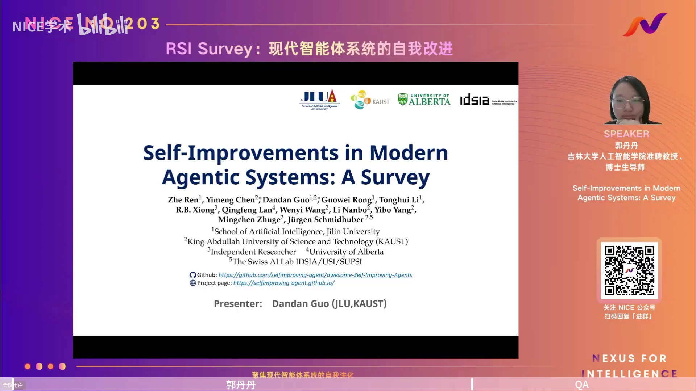

## 本讲要解决的核心问题（SCQA）

**背景**：我们现在处于大模型时代。大模型经过海量预训练，具有强大的通用知识先验、很强的推理能力，并且以**自然语言**作为人与模型之间的接口，这让"自我改进"第一次变得现实（[【跳转到 08:45】](https://www.bilibili.com/video/BV12yh86kEUS/?t=525)）。

**冲突**：随着应用场景日益复杂，如何**在减少人工干预的情况下**让智能体提升能力、自我纠偏、吸收经验，成为智能体落地的关键挑战。"自进化"这个概念其实从 1931 年就提出了，近一百年却难以真正落地——因为以前既缺乏强的世界模型，能修改的载体也受限（[【跳转到 05:50】](https://www.bilibili.com/video/BV12yh86kEUS/?t=350)）。

**疑问**：到底什么是自进化？它为什么现在变得重要？agent 具体是怎么实现自进化的？目前有哪些应用、怎么评测、未来走向如何？

**回答（中心思想）**：这篇综述用"**基础模型参数 θ + 脚手架 Σ**"的形式化来描述现代 agent，把**自进化 = 由自我诱导信号 s_t 驱动的更新**；再沿两条正交的轴——**改进对象**（θ 还是 Σ）与**学习信号来源**——把已有工作系统归类，并给出了评测、应用与未来方向（[【跳转到 09:35】](https://www.bilibili.com/video/BV12yh86kEUS/?t=575)）。

## 一、什么是自进化：从最小二乘法到哥德尔机

### 1.1 起点：为什么"被动学习"不算自进化

要理解自进化，可以先看传统的机器学习，比如**最小二乘法**（[【跳转到 02:05】](https://www.bilibili.com/video/BV12yh86kEUS/?t=125)）：

- 它给定一组数据，目标是拟合数据，我们选好模型后，通过调整参数去最小化误差函数；
- 即使把模型或参数复杂化，能拟合更复杂的数据，但**函数底层结构和优化算法都是人类事先定义好的**；
- 它的缺陷是**只能被动接受外部数据和人类设计的损失函数**：当损失函数或网络结构不适合学习时，它无法审查、也无法修改自己的学习机制。

正因为如此，人们才想：能不能让机器在学习时**自己改自己**？这个概念经过了多次迭代。

### 1.2 思想的火种：四位先驱

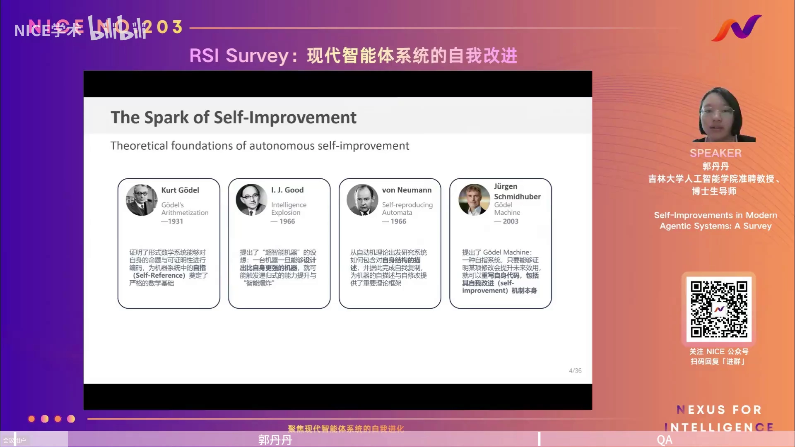

（[【跳转到 03:45】](https://www.bilibili.com/video/BV12yh86kEUS/?t=225)）

- **1931，哥德尔（Kurt Gödel）**：证明形式数学系统能对自身的命题与可证明性进行编码，为机器系统中的"自指（self-reference）"奠定了严格数学基础。
- **1966，I. J. Good**：提出"超智能机器"设想——一旦一台机器能设计出比自身更强的机器，就会触发"智能爆炸"。他说过一句名言：这可能是人类做的最后一个创新，因为之后就不需要人类去做了。
- **1966，冯·诺依曼（von Neumann）**：从自动机理论出发，研究系统如何包含对自身结构的描述，并据此完成自我复制，为机器的"自描述、自修改"提供了理论框架。
- **2003，Schmidhuber**：提出**哥德尔机（Gödel machine）**——一种自指系统，只要能够证明某项修改会提升未来效用，就可以重写自身代码，**连自我改进机制本身也可以被重写**。

### 1.3 本综述给的定义

基于上述脉络，综述给出了今天所说的**自我改进**的定义（[【跳转到 05:50】](https://www.bilibili.com/video/BV12yh86kEUS/?t=350)）：

> **自我改进是一种由系统自身诱发的更新过程**：系统在执行当前策略、与任务交互时产生学习信号，这些信号被用来对系统的内在配置做实质性修改，从而获得能力增益，并改变支配其未来行为的策略。

定义里有两个要点：**信号是"自我诱发"的**，以及**系统的"内在配置"发生了实质变化**。

## 二、为什么现在重要：大模型让自进化焕发生机

既然概念提出快一百年了，为什么以前不行、现在行？关键区别在于**前大模型时代 vs 大模型时代**（[【跳转到 06:40】](https://www.bilibili.com/video/BV12yh86kEUS/?t=400)）。

**前大模型时代的两个硬伤**：

1. **缺乏强认知先验**：没有对世界知识有广泛理解的模型，推理能力也弱，难以自己给出有效的改进策略。
2. **可修改的载体受限**：传统自改进往往要在庞大的低层空间里搜索，比如原始神经网络权重或汇编级程序表示。这个空间太大、代价极高，很难找到既逻辑一致、功能又更好的方案（[【跳转到 07:05】](https://www.bilibili.com/video/BV12yh86kEUS/?t=425)）。

**大模型时代的三个转机**：

1. **强认知先验**：海量预训练数据 + 精心设计的参数架构，带来对通用知识的强理解和强推理。
2. **自然语言作为接口**：模型以自然语言连接人与系统，而自然语言天然适合"显式解释"改进——你改了什么，用语言一目了然。当自然语言成为共享语义接口，自进化就更容易实现（[【跳转到 08:45】](https://www.bilibili.com/video/BV12yh86kEUS/?t=525)）。

这也解释了这篇综述的动机：**在自然语言这个"可读可写"的媒介上，agent 第一次有可能真正实现自进化。**

## 三、如何形式化：现代 agent = 模型参数 θ + 脚手架 Σ

综述的第一个核心贡献是统一的形式化。它把现代 agent 系统拆成两部分（[【跳转到 10:25】](https://www.bilibili.com/video/BV12yh86kEUS/?t=625)）：

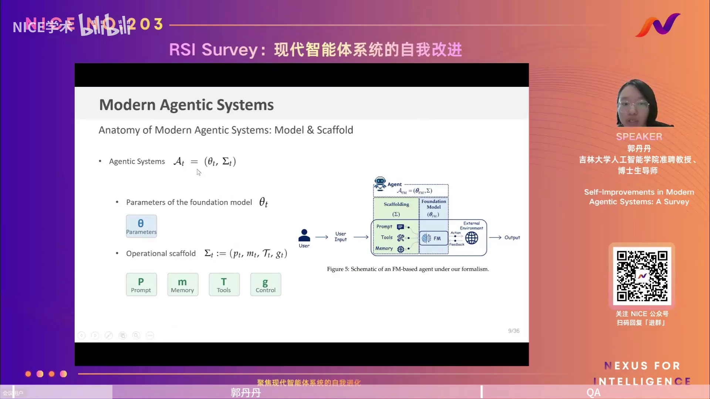

$$\mathcal{A}_t = (\theta_t,\ \Sigma_t)$$

- **θ（foundation model 参数）**：基础模型的参数，充当 agent 的"大脑"，提供推理能力。
- **Σ（operational scaffold，脚手架）**：除模型参数外的一切，现在大家常说的 harness、scaffold 都是同类概念。它进一步拆成四件套：
  - **p：Prompt（提示词）**
  - **m：Memory（记忆）**
  - **T：Tools（工具）**
  - **g：Control（控制逻辑）**

对应到右图的流程：**用户输入 → scaffolding 感知/理解 → foundation model 推理 → 与环境交互、获得反馈 → 输出结果**（[【跳转到 12:05】](https://www.bilibili.com/video/BV12yh86kEUS/?t=725)）。

有了这个"两分法"，自进化就能被写成一个通用公式：

$$\mathcal{A}_{t+1} = \mathrm{IMPROVE}(\mathcal{A}_t;\ s_t),\qquad \text{其中 } s_t \text{ 是自我诱导信号}$$

- **改进对象**决定走哪条路径：改 θ 还是改 Σ；
- **学习信号 s_t 从哪来**决定组内怎么分类。

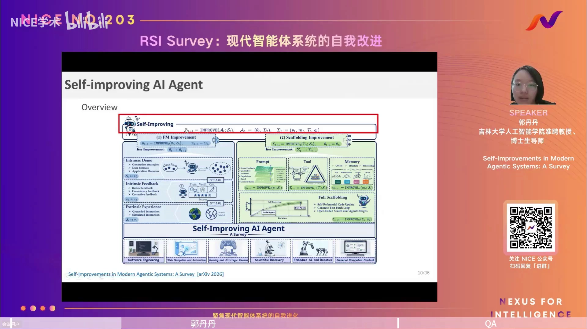

整个综述沿两条正交的轴组织（[【跳转到 14:10】](https://www.bilibili.com/video/BV12yh86kEUS/?t=850)）：

- **路径一（第 5 章）：基础模型参数 θ 的自进化**——按学习信号分成 5.1 生成、5.2 评估、5.3 探索；
- **路径二（第 6 章）：脚手架 Σ 的自进化**——按改进组件分成 prompt、memory、tools、full scaffold 四节；
- 另外系统梳理了**评测指标与基准**，以及**应用与展望**。

## 四、路径一：基础模型参数 θ 的自进化

Agent 要实现自进化，一条可实现途径是**更新 foundation model 的参数**。综述按"学习信号 s_t 从哪来"把它分成三类（[【跳转到 15:50】](https://www.bilibili.com/video/BV12yh86kEUS/?t=950)）：

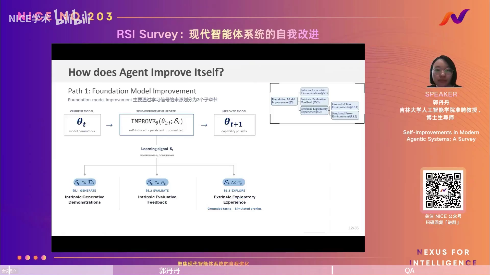

$$\theta_{t+1} = \mathrm{IMPROVE}_\theta(\theta_{1..t};\ s_t)$$

### 4.1 生成（s_t ≈ d_t）：模型自己造示范数据

第一类是让模型**自己生成 demonstration（示范）**，即 s_t ≈ d_t，于是自进化变成用自举数据去更新参数（[【跳转到 17:30】](https://www.bilibili.com/video/BV12yh86kEUS/?t=1050)）。

- 细分维度一：数据**怎么产生**——自举（bootstrapping）还是课程学习（curriculum learning）；
- 细分维度二：数据**是什么类型**——指令与回复、推理路径（如 CoT），还是完整的工具调用轨迹（trajectory）。

**主要风险是误差累积**：当示范全由模型自身产生时，一旦不准确，又拿不准确的 d_t 去更新得到 θ_{t+1}，就可能误差累积，甚至让模型坍塌、直接不工作，或形成"知识泡沫"（[【跳转到 18:45】](https://www.bilibili.com/video/BV12yh86kEUS/?t=1125)）。代表性工作是去年 NeurIPS 的一篇：每次循环里让模型生成候选的"自我编辑"内容，再用它更新权重，把临时经验沉淀、内化进参数。

### 4.2 评估（s_t ≈ e_t）：让模型当自己的批评家

第二类是让 agent 充当**反馈者 / 批评家（critic）**，生成能更新自身参数的评估信号，即 s_t ≈ e_t（evaluative feedback）（[【跳转到 20:25】](https://www.bilibili.com/video/BV12yh86kEUS/?t=1225)）。

- 反馈**依据什么标准**：可以是明确的准则（回答里是否包含某些内容，刻板但简单好用），也可以是一致性（多采样、多数投票得到可靠信号），还可以直接批判之前的输出并给出修改意见；
- 代表性工作是去年的自训练强化学习类方法：用 LM 产生多次答案、多数投票，把投票结果当作"ground truth"，再据此与之前的输出计算 reward，反向优化模型参数。**它能在缺乏真实标签时实现模型更新。**

### 4.3 探索（s_t ≈ 经验）：让 agent 在环境中"行动学习"

第三类利用 agent 与其他系统最大的不同——**能与外界交互**。它通过行动学习，把环境反馈当作经验来更新参数，即 s_t ≈ 经验（[【跳转到 23:20】](https://www.bilibili.com/video/BV12yh86kEUS/?t=1400)）。这里再分两种环境：

- **真实环境**：如代码、网络、GUI 等。问题是**交互代价大**；
- **代理/模拟环境**：用**世界模型（world model）**代替真实环境。代表工作是 2026 年一篇机器人研究——机器人交互环境复杂又昂贵，于是用世界模型生成经验，在模拟经验上做自我改进，从而降低对真实世界交互的依赖。

### 4.4 参数进化的特性：持久，但贵

参数自进化的特点是：**把经验和行为内化成模型权重，一旦参数改变，能力提升更广泛、更持久**。但代价是**成本高**，并且对自我诱导信号 s_t 的质量要求也高（[【跳转到 25:50】](https://www.bilibili.com/video/BV12yh86kEUS/?t=1550)）。

## 五、路径二：脚手架 Σ 的自进化

既然改参数成本高，第二条路径就是**只改脚手架**（scaffolding / harness），按改动的组件分成四类（[【跳转到 27:05】](https://www.bilibili.com/video/BV12yh86kEUS/?t=1625)）：

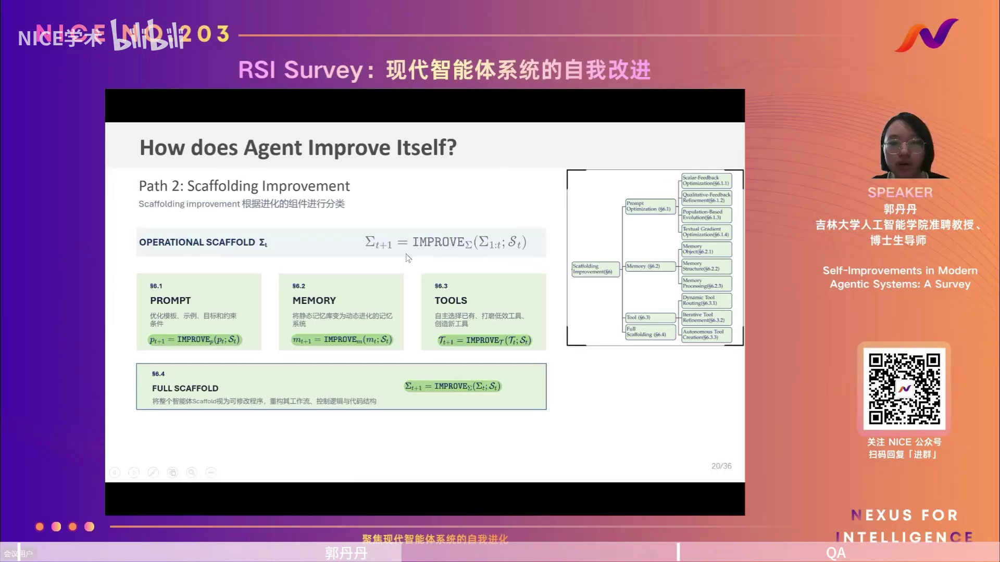

$$\Sigma_{t+1} = \mathrm{IMPROVE}_\Sigma(\Sigma_{1..t};\ s_t)$$

### 5.1 Prompt 进化：按反馈信号的四种玩法

这是最早、最直观的自进化入口，按反馈信号分四类（[【跳转到 28:45】](https://www.bilibili.com/video/BV12yh86kEUS/?t=1725)）：

1. **标量反馈（scalar feedback）**：交互后得到精度、accuracy reward 或 preference score，据此反过来优化 prompt。直观、简单、好用。
2. **质量反馈（qualitative feedback）**：用自然语言写更多内容，比如不只说"错了"，还做误差分析、从不同角度解释为什么错、给建议，再用来优化 prompt。
3. **种群式（population-based）**：提出很多 prompt，通过选择、交叉、变异来进化，在探索中既保证多样性又提升质量。
4. **文本梯度（textual gradient）**：把自然语言反馈当作"梯度"来传播。代表工作是 2025 年 Nature 上的 **TextGrad**（James 周团队）：不需要计算真实 loss，而是把自然语言当作训练中的 loss 回传，**沿语言系统传播来直接指导 prompt 和中间组件的迭代**（[【跳转到 31:15】](https://www.bilibili.com/video/BV12yh86kEUS/?t=1875)）。

### 5.2 Memory 进化：记住什么、怎么组织、怎么处理

记忆被从三个角度组织（[【跳转到 32:55】](https://www.bilibili.com/video/BV12yh86kEUS/?t=1975)）：

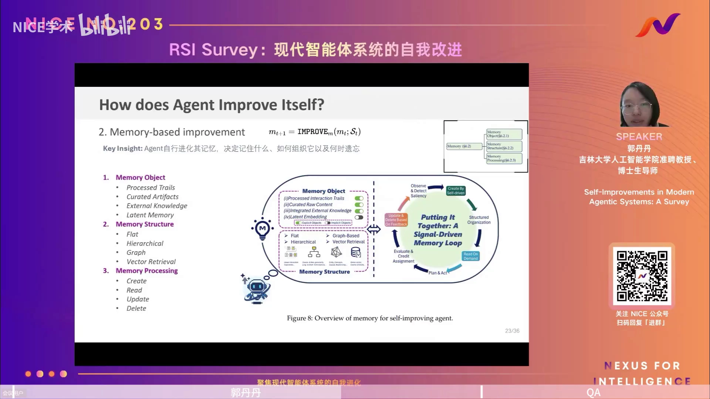

1. **记忆对象（记什么）**：外在的交互轨迹 trajectory，还是抽象出更抽象的记忆？
2. **记忆结构（怎么组织）**：经典做法是**平铺**（把交互内容全存下来）；也有**层次化 hierarchical**（区分长期常识与短期记忆）、**图结构 graph**（节点之间有关系）、向量检索等。
3. **记忆处理（怎么处理）**：创建、读取、更新、删除。适当的遗忘和改写是必要的——就像人类不会记住从小到大所有事。

代表工作是 2025 年的 **A-Mem**：让记忆不再是静态存储，而是以类似"笔记（note）"的形式，随经验不断持续组织、更新连接的**动态记忆系统**（[【跳转到 34:35】](https://www.bilibili.com/video/BV12yh86kEUS/?t=2075)）。

### 5.3 Tools 进化：路由、打磨、创建

因为 agent 要模仿人类，而人类最经典的标志之一就是**使用工具**。工具进化分三步（[【跳转到 35:25】](https://www.bilibili.com/video/BV12yh86kEUS/?t=2125)）：

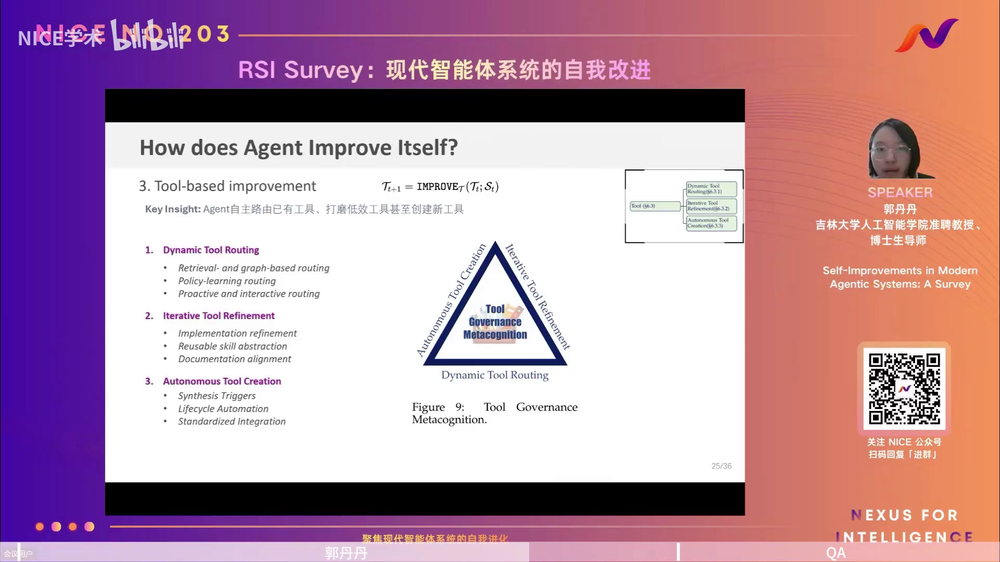

1. **动态工具路由（Dynamic Tool Routing）**：面对很多工具时，agent 根据当前任务自主决定用哪个。
2. **迭代式工具打磨（Iterative Tool Refinement）**：初始工具不顺手时，修改、打磨它。
3. **自主创建工具（Autonomous Tool Creation）**：现有工具都不好用时，造一个新工具来完成用户任务。

代表工作是 2025 年的 **LITA**：把发现的代码和能力**标准化成可复用的工具**。原本 agent 解决任务会产生很多"一次性方案"，换个任务就失效；标准化成工具后就能沉淀进工具库，供下次复用（[【跳转到 36:15】](https://www.bilibili.com/video/BV12yh86kEUS/?t=2175)）。

### 5.4 Full Scaffold 进化：把整个脚手架当作可改的程序

最后一类更深刻——把整个智能体除模型参数外的部分都视为**可修改的程序**，从而重构工作流、控制逻辑和代码结构（[【跳转到 37:05】](https://www.bilibili.com/video/BV12yh86kEUS/?t=2225)）：

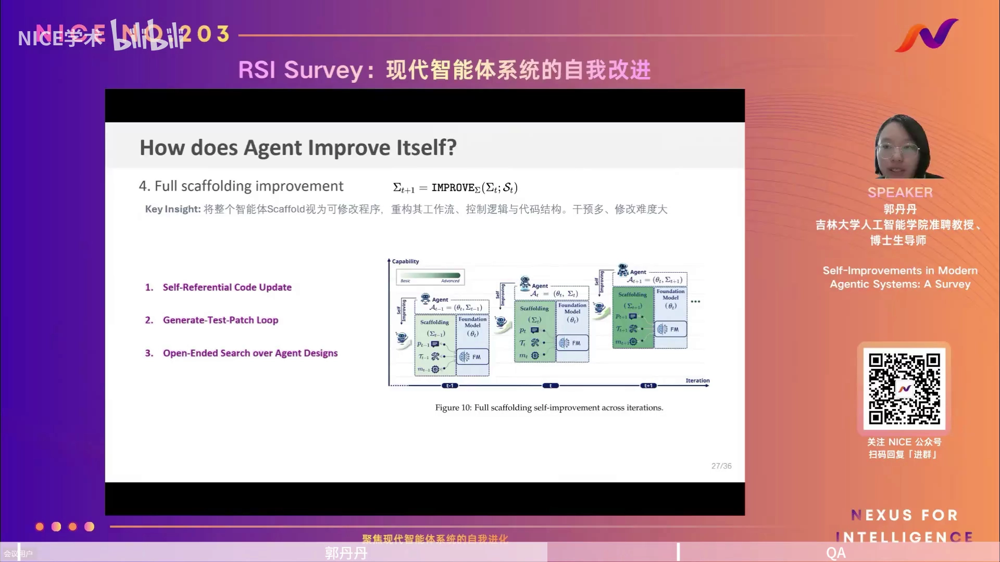

- 三种做法：**自指式代码更新（self-referential code update）**、**生成-测试-打补丁循环（generate-test-patch loop）**、**对 agent 设计的开放式搜索**；
- 最经典、做得最多的任务是 **coding agent**；
- 代表工作是郭丹丹组较早期的 **HGM**（也是在哥德尔机基础上）：把 coding agent 的整个 scaffolding 当作可进化的程序，评估修改后的节点**长期潜力**如何，据此设计进化策略（[【跳转到 38:20】](https://www.bilibili.com/video/BV12yh86kEUS/?t=2300)）。

**脚手架进化的特点**：不改变模型参数，通过改这四类实现**快速、灵活的适应**；修改是**显式的**，人类容易看到、对比出改了什么，也容易模块化、容易检查、必要时可以介入，还能**回滚**。代价则是 full-scaffold 修改**难度很大、可干预的地方很多**（[【跳转到 39:10】](https://www.bilibili.com/video/BV12yh86kEUS/?t=2350)）。

## 六、应用与评测

### 6.1 六类应用场景：反馈越可量化，自进化越适用

综述把应用归纳为六大场景（[【跳转到 40:25】](https://www.bilibili.com/video/BV12yh86kEUS/?t=2425)）：

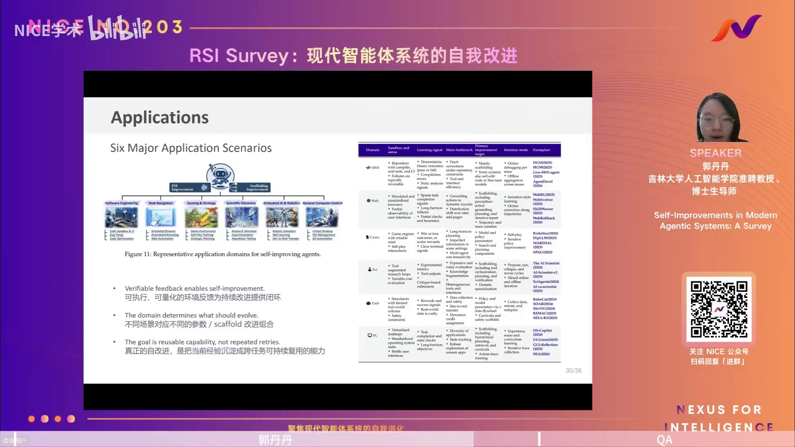

1. **软件工程（SWE）**：代码理解、单元测试、CI、Bug 修复等。
2. **网页导航与自动化（Web）**：模拟浏览器、自动浏览、Web 自动化。
3. **游戏与策略推理（Game）**：游戏环境、自我对弈、策略进化。
4. **科学发现（Sci）**：研究模拟器、假设发现、实验自动化。
5. **具身智能与机器人（Emb）**：机器人模拟器、技能学习、实时决策。
6. **通用计算机控制（PC）**：虚拟桌面、文件管理、操作软件。

三条总结：

- **可执行、可量化的环境反馈为持续改进提供闭环**——所以 coding 这类场景做得最好、最多；
- **不同场景对应不同的参数 / scaffold 改进组合**；
- **真正的自改进，是把当前的经验沉淀成可跨任务复用的能力**，而不是每次从头重试。

### 6.2 评测：两个层面 + 一个缺口

评测体系分成两个层面（[【跳转到 41:40】](https://www.bilibili.com/video/BV12yh86kEUS/?t=2500)）：

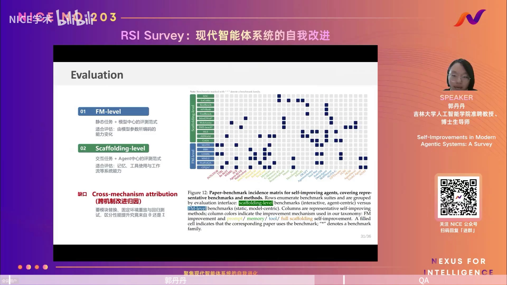

- **FM-level**：静态任务 + 模型中心（model-centric）的评测范式，评估的是**由模型参数编码的能力变化**；
- **Scaffolding-level**：交互任务 + agent 中心（agent-centric）的评测范式，评估**记忆、工具使用、工作流等系统能力**。

**最大的缺口是"跨机制归因"（cross-mechanism attribution）**：做了一次改进之后，到底是模型能力提升带来的，还是脚手架提升带来的？目前**能区分 θ 与 Σ 贡献的评测还很少**。要做好它，需要能模块替换、固定环境重放与回归测试的评测设计（[【跳转到 42:05】](https://www.bilibili.com/video/BV12yh86kEUS/?t=2525)）。

## 七、讨论与未来方向

### 7.1 三条系统设计原则

综述提出三条设计原则（[【跳转到 42:30】](https://www.bilibili.com/video/BV12yh86kEUS/?t=2550)）：

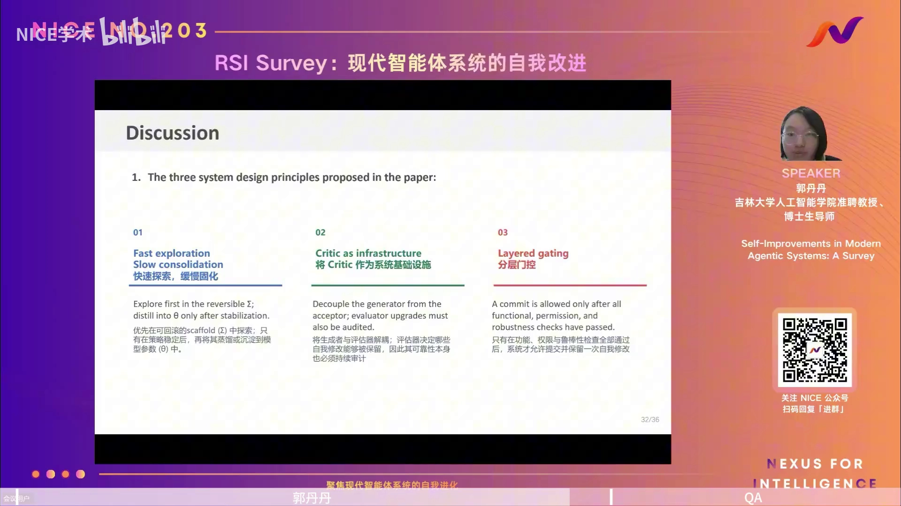

1. **快速探索、缓慢固化（Fast exploration, Slow consolidation）**：优先在**可回滚的脚手架 Σ** 中探索；只有策略稳定后，再蒸馏、沉淀到**模型参数 θ**。资源少时先做脚手架进化，稳定后再内化到参数里。
2. **把 Critic 作为系统基础设施**：把生成者与评估器**解耦**。评估器决定哪些自我修改能被保留，所以它自身的可靠性必须被持续审计、也必须可审计。很多自动化"自觉得很厉害"，却在现有评价体系下难以被发现优点——critic 因此至关重要。
3. **分层门控（Layered gating）**：只有在功能、权限、鲁棒性检查**全部通过**之后，系统才允许提交并保留一次自我修改。这直接关系到自进化的**安全**问题。

### 7.2 六个未来方向（两大主题）

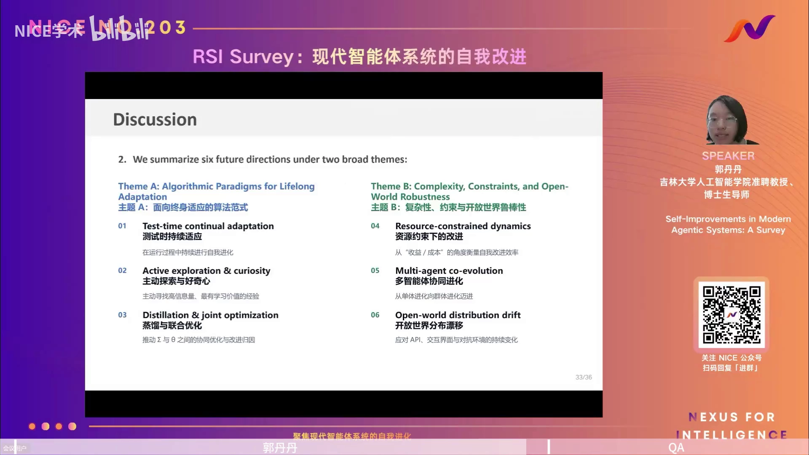

（[【跳转到 43:20】](https://www.bilibili.com/video/BV12yh86kEUS/?t=2600)）

**主题 A：面向终身适应的算法范式**

1. **测试时持续适应（Test-time continual adaptation）**：在运行过程中持续进行自我进化；
2. **主动探索与好奇心（Active exploration & curiosity）**：主动寻找信息量最高、最有学习价值的经验——就像人类婴儿在好奇心驱动下探索世界；
3. **蒸馏与联合优化（Distillation & joint optimization）**：推动 Σ 与 θ 之间的协同进化与改进归因。

**主题 B：复杂性、约束与开放世界鲁棒性**

4. **资源约束下的改进（Resource-constrained dynamics）**：从"收益/成本"的角度衡量自我改进效率——成本与收益之间存在 trade-off；
5. **多智能体协同进化（Multi-agent co-evolution）**：从单体进化走向群体进化；
6. **开放世界分布漂移（Open-world distribution drift）**：应对 API、交互界面、对抗环境等持续变化，处理分布漂移问题。

## 八、Q&A 精选：瓶颈、回滚与现状

后 22 分钟是问答，几个回答很有价值。

### 8.1 最大的瓶颈是什么？——验证（verification）

主持人问：self-improving agent 最大的瓶颈是"自我改进的探索"，还是"验证 update 是否有效"？郭老师的回答是**验证**（[【跳转到 47:30】](https://www.bilibili.com/video/BV12yh86kEUS/?t=2850)）：

- 在 **coding 这种封闭式任务**下，验证相对容易：改了之后跑题，做得比原来多、比原来好，就能判断改进有效；
- 但在**更开放式的任务**下，你当下很难判断这次改进是不是比上次好。哪怕在封闭的 coding 任务里，**验证的代价也很大**——提出改进消耗的 API 可能不多，但"评测它到底好不好、要不要留下它"的代价很大；
- 当任务更开放、连好的 benchmark 都没有时，评价就更困难。所以现在进展最快、工作最多的，是 **coding 这类封闭、可验证**的场景；涉及真实环境（如机器人）的交互和验证则非常昂贵。

### 8.2 改进会不会"过期"？——需要回滚机制

有人问：以前验证过有效的改进，未来迭代中可能会失效、被推翻，怎么处理？郭老师强调**回滚（rollback）**很重要（[【跳转到 51:40】](https://www.bilibili.com/video/BV12yh86kEUS/?t=3100)）：

- 很可能出现"这次好，但迭代到 t+2、t+3 就产生负增益"的情况——就像大型 coding 项目里的一时"补偿措施"，后面会被消除；
- 因此自进化 agent 应该具备判断"某些改动对未来不好"并及时**返回上一版本**的能力。不过回滚本身又要做很多新的实验和验证，也非常昂贵。

### 8.3 什么程度才算"真正的自我改进"？

郭老师的标准是：**只要信号是自我诱导产生的（强调"自我"），且 agent 内部——无论模型参数还是脚手架——发生了实质变化，就可以算自进化**。综述里从数据生成、feedback 生成等给了很多例子，这些都可以算（[【跳转到 56:40】](https://www.bilibili.com/video/BV12yh86kEUS/?t=3400)）。

### 8.4 会不会出现"脚手架先学、参数后学"的双层机制？

会，而且正在成为趋势。划分 θ 与 Σ 是为了便于理解，但两者可以**联合、交替迭代**：因为脚手架更新**资源少、速度快**，可以先做脚手架进化；当脚手架内容太多、积累的经验快"爆炸"时，再把它蒸馏、内化到模型参数里（[【跳转到 57:55】](https://www.bilibili.com/video/BV12yh86kEUS/?t=3475)）。这也和大模型的发展一致：**去年需要很详细的 prompt，今年模型能力变强，提示和 context 就不需要那么多了**。

### 8.5 RSI 与强化学习结合、以及当前进展

- **RSI 结合 RL/agentic RL**：应该有不少工作。郭老师觉得最有启发的一个方向是**用 RL 做虚拟/仿真环境**（类似世界模型），因为当真实交互代价很大、用 RL 直接做代价很大时，仿真环境是突破口——但这也涉及虚拟环境怎么设计、reward 怎么给（[【跳转到 61:40】](https://www.bilibili.com/video/BV12yh86kEUS/?t=3700)）。
- **现在到什么程度了**：在**封闭、可评价**的任务上，自进化已经做得很好（coding 就是明证）；**更开放的世界、开放的问题**还有很大空间，也更值得研究者深入探索。ICLR 今年投稿量指数增长，很大原因也是评测/benchmark 属于封闭、可验证的类型（[【跳转到 63:45】](https://www.bilibili.com/video/BV12yh86kEUS/?t=3825)）。

## 小结

- **自进化有近百年思想史**：从哥德尔（1931）、Good 的智能爆炸（1966）、冯·诺依曼的自复制自动机（1966）到 Schmidhuber 的哥德尔机（2003）。
- **大模型让自进化焕发生机**：强认知先验 + 自然语言接口，使"显式、可解释的自我改进"第一次成为可能。
- **统一形式化**：现代 agent = 基础模型参数 **θ** + 脚手架 **Σ（Prompt/Memory/Tools/Control）**；自进化 = 自我诱导信号 s_t 驱动的更新。
- **路径一：改 θ（基础模型参数）**，按信号分为**生成（d_t）→ 评估（e_t）→ 探索（经验）**；优点是能力提升持久，缺点是成本高、易误差累积。
- **路径二：改 Σ（脚手架）**，分为 **Prompt / Memory / Tools / Full Scaffold** 四类；优点是快速、显式、可检查、可回滚，缺点是 full-scaffold 修改难度大。
- **应用与评测**：六大场景中，反馈可执行、可量化的（如 coding）最适合自进化；评测分 FM-level 与 Scaffolding-level，**跨机制归因**是最大缺口。
- **设计原则**：快速探索缓慢固化、Critic 作为基础设施、分层门控。
- **未来方向**：测试时适应、好奇心驱动、蒸馏与联合优化、资源约束、多智能体协同、开放世界漂移。
- **核心瓶颈是"验证"**：怎么证明一次改进真的有效、值不值得保留，在开放任务上尤其困难；同时系统需要**回滚**能力来应对"改进过期"。

## 关键术语速查

| 术语 | 一句话解释 |
| --- | --- |
| 自进化 / 自我改进 | 由系统自身诱发的更新过程：用自我诱导的学习信号，对内部配置做实质修改以提升能力。 |
| RSI（递归自我改进） | 系统不断改进自身（包括改进能力本身），可能引发"智能爆炸"。 |
| foundation model（基础模型） | 大规模预训练模型，作为 agent 的"大脑"，其参数记为 θ。 |
| scaffold / harness（脚手架） | 除模型参数外让 agent 能感知环境、执行任务的一切，记为 Σ，含 Prompt/Memory/Tools/Control。 |
| 学习信号 s_t | 驱动自进化的信号；按来源分为 demonstration、evaluative feedback、experience 等。 |
| demonstration（示范） | 用于更新模型参数的示例数据；可来自内外部的生成。 |
| evaluative feedback | 评估性反馈，由模型或外部生成，用来评判输出好坏并指导更新。 |
| 世界模型（world model） | 学习出来的环境模拟器，用来代替昂贵的真实环境让 agent 练习。 |
| Critic（评估器/批评家） | 判断输出或修改好坏的组件；综述建议把它作为可审计的系统基础设施。 |
| Progressive/Textual gradient | 把自然语言反馈当作"梯度"来传播，指导 prompt 与中间组件的迭代（如 TextGrad）。 |
| 跨机制归因 | 区分一次能力提升到底来自模型参数 θ 还是脚手架 Σ。 |
| 分层门控 | 自我修改只有在功能/权限/鲁棒性检查全部通过后才允许提交保留。 |
| 回滚（rollback） | 当发现某次改进对后续有害时，退回上一个版本的能力。 |
| 分布漂移 | 开放世界中环境/接口/API 持续变化，导致模型或策略失效。 |
| coding agent | 以软件工程任务为场景的智能体，因反馈可量化而成为自进化研究最集中的阵地。 |
