# MOF 材料生成：机器学习如何设计金属有机框架

> 本文整理的视频：[《MOF 材料生成：机器学习如何设计金属有机框架》](https://www.bilibili.com/video/BV1htawz9EqX/)（Bilibili，约 9:07，中文解说，画面为 NotebookLM 风格的幻灯片动画）。
> 视频从「什么是 MOF」「为什么 MOF 难找」讲到「机器学习如何帮忙」，再落到真实突破、当前瓶颈与未来展望。下文按视频顺序完整覆盖其内容。

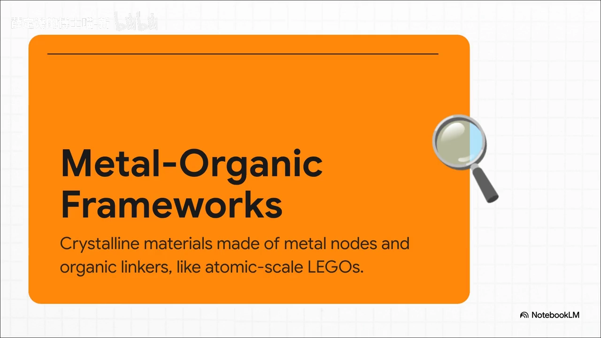

## 本篇要解决的核心问题（SCQA）

**背景**：材料设计正经历一场「静默革命」——我们不再只是发现材料，而是从原子级别去构建材料，用它们来解决气候、能源、医疗等最大难题。

**冲突**：其中有一类明星材料叫**金属有机框架（MOF）**，它的结构可以像乐高一样自由拼装，理论上能造出的结构多到「相当于整个宇宙的规模」。但现实是：人类已知的 MOF 只有十万多种，计算机模拟出的假设结构已超过一百万种，而传统「一个个做、一个个测」的试错法要花数千年、耗资数千亿美元——根本走不通。[【跳转到 03:01】](https://www.bilibili.com/video/BV1htawz9EqX/?t=181)

**疑问**：在这样一片「无限的干草堆」里，怎么才能快速找到、甚至凭空设计出我们想要的那块材料？

**回答（中心思想）**：**机器学习（ML）就是材料科学家需要的那块「超强磁铁」**——它能替我们快速筛选、精准预测、乃至逆向设计全新的 MOF，而这一切都建立在「描述符 + 数据集 + 算法」这三个环节之上。不过，ML 并非万能，它仍受数据稀缺、可解释性和可合成性三大瓶颈制约，真正的终局是与机器人实验室组成「全自动闭环」的科研团队。

**本讲的路线图**（也就是下文的结构）：① 一场材料革命 → ② 无限的干草堆 → ③ ML 来救场 → ④ 拆开 ML 工具箱 → ⑤ 真实世界的突破 → ⑥ 设计的未来。[【跳转到 01:40】](https://www.bilibili.com/video/BV1htawz9EqX/?t=100)

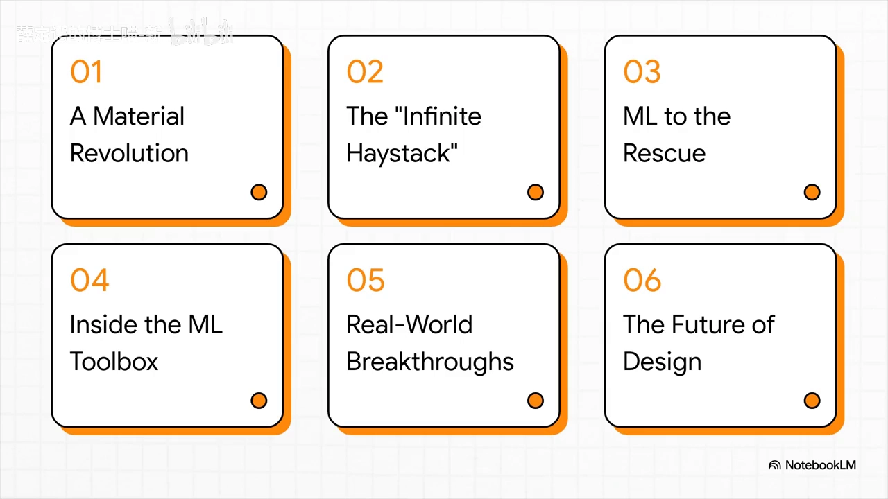

---

## 一、MOF 是什么：原子尺度的乐高积木

**MOF（金属有机框架，Metal-Organic Frameworks）是一类由金属节点和有机连接体搭成的晶体材料——视频把它比作「原子尺度的乐高」。** 在这个比喻里：**金属簇**是核心连接块，是主要的连接单元；**有机分子**则是连接支架。[【跳转到 00:37】](https://www.bilibili.com/video/BV1htawz9EqX/?t=37)

正因为像乐高，只要更换不同的「积木」，就能搭建出几乎无限种结构。视频把这种可自由拼装的设计称为 MOF 最令人惊叹的核心。[【跳转到 01:02】](https://www.bilibili.com/video/BV1htawz9EqX/?t=62)

MOF 之所以特别，有三点关键性质：[【跳转到 01:07】](https://www.bilibili.com/video/BV1htawz9EqX/?t=67)

- **极高的孔隙率**：内部几乎全是空腔。一克 MOF（大约一枚回形针的重量）的内部表面积竟相当于一个足球场大小，简直难以置信。
- **结构完全可调**：这里换金属部件、那里换连接分子，就能彻底改变材料特性——孔径大小、与光的相互作用等等。
- **可编程物质（Programmable Matter）**：可以从底层按特定任务定制材料，用于储气、催化等。

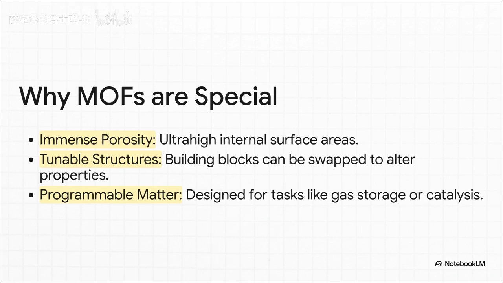

## 二、无限的干草堆：MOF 的规模远超想象

**MOF 的第一个大麻烦不是「能不能造」，而是「怎么选」——可能的数量大到像在整个宇宙里找一根针。** [【跳转到 02:05】](https://www.bilibili.com/video/BV1htawz9EqX/?t=125)

视频给出两个数字来建立直观尺度：

- **十万种以上**：科学家已在实验室中真实发现、并通过剑桥结构数据库等资料记录下来的独特 MOF 结构。[【跳转到 02:24】](https://www.bilibili.com/video/BV1htawz9EqX/?t=144)
- **一百万种以上**：仅靠强大的计算机模拟，研究人员就已绘制出超过一百万种**假设性** MOF——它们符合所有化学规则、理论上能够存在，但尚未被真正合成。[【跳转到 02:24】](https://www.bilibili.com/video/BV1htawz9EqX/?t=144)

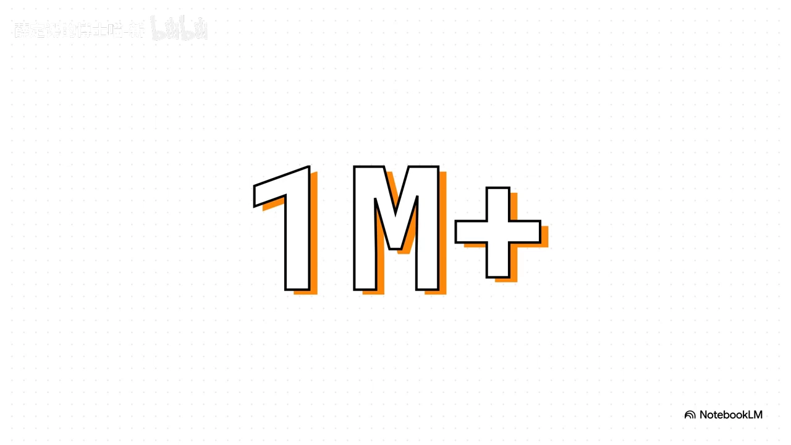

这还只是冰山一角，可能的化学空间规模简直是天文数字。[【跳转到 02:49】](https://www.bilibili.com/video/BV1htawz9EqX/?t=169) 于是瓶颈出现了：**根本不可能手动创建并测试所有可能性**。传统科学方法「制作—测试—观察结果」需要数千年、耗资数千亿美元，面对如此庞大的数字，试错法行不通。[【跳转到 03:01】](https://www.bilibili.com/video/BV1htawz9EqX/?t=181)

## 三、ML 来救场：它能替材料科学家做四件事

**如果说寻找完美材料像在一块超大磁铁上找针，那么这磁铁就是人工智能——具体来说是机器学习。** 它让我们无需混合任何化学物质，就能快速筛选、预测，甚至设计全新的 MOF。[【跳转到 03:22】](https://www.bilibili.com/video/BV1htawz9EqX/?t=202)

视频要求 AI 完成几项关键任务，其中前一项最常见、后三项越来越「高阶」：

1. **性能预测（Property Prediction）**：给 AI 一个 MOF 结构，问它「这种结构能有效捕获二氧化碳吗？」[【跳转到 03:44】](https://www.bilibili.com/video/BV1htawz9EqX/?t=224)
2. **高通量筛选（High-Throughput Screening）**：相当于材料界的「速配约会」，让 AI 快速筛过百万候选物，挑出最优者。
3. **逆向设计（Inverse Design）**：反过来的玩法——你告诉 AI「我需要一种材料，请为我设计它」，AI 从零开始设计出全新结构。
4. **合成预测（Synthesis Prediction）**：用 AI 找出最佳合成配方，指导实验室把新材料真正做出来。[【跳转到 04:09】](https://www.bilibili.com/video/BV1htawz9EqX/?t=249)

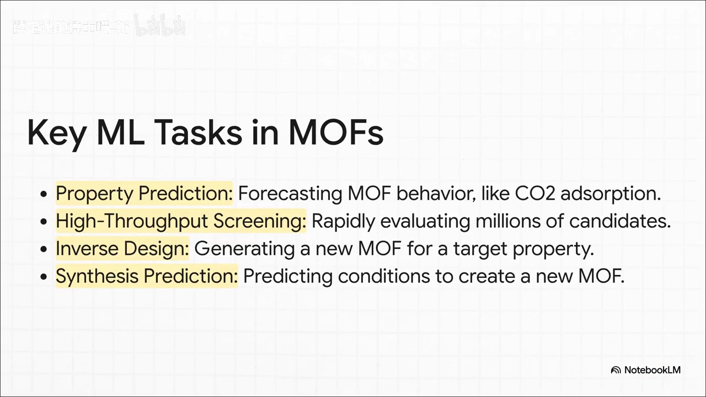

## 四、ML 工具箱：AI 究竟怎么学会「材料知识」

**AI 学习材料知识不是魔法，而是「数据 + 语言 + 算法」的巧妙组合，可拆成三个基本步骤。** [【跳转到 04:23】](https://www.bilibili.com/video/BV1htawz9EqX/?t=263)

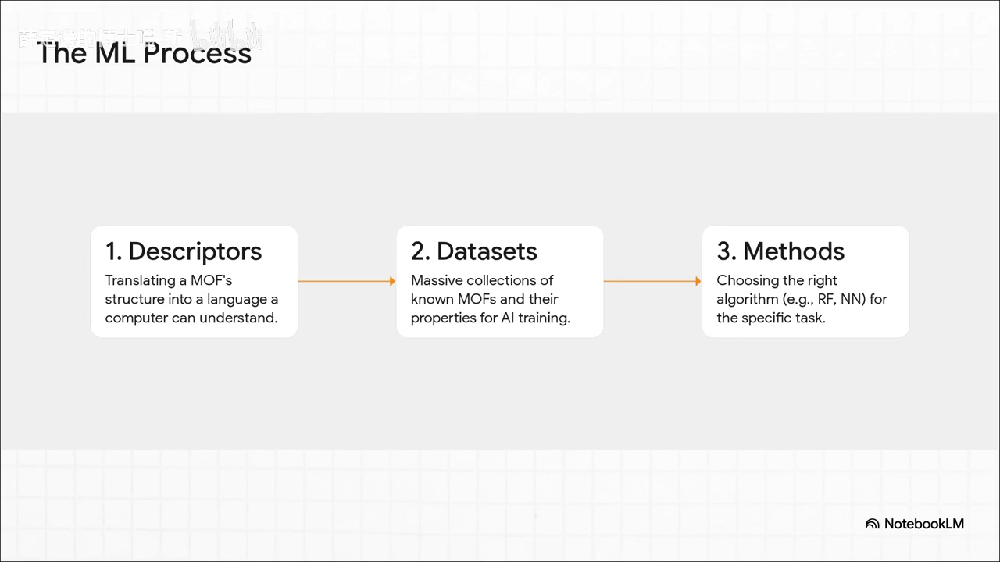

**1）描述符（Descriptors）**：把 MOF 的结构翻译成计算机能理解的语言——数字表示，比如孔径大小、表面积、涉及哪些原子。[【跳转到 04:36】](https://www.bilibili.com/video/BV1htawz9EqX/?t=276)

**2）数据集（Datasets）**：可以想象成一堆巨型「食谱书」，里面装着成千上万个已知 MOF 的「配方」和「结果」，供 AI 从中发现规律。视频特别强调：这不是一本食谱书，而是一整座图书馆——这些庞大的公开数据集是整个领域的燃料。[【跳转到 05:01】](https://www.bilibili.com/video/BV1htawz9EqX/?t=301) 三个代表性数据库各有分工：

| 数据集 | 关注点 |
| --- | --- |
| **CoRE MOF** | 经实验验证、可直接用于计算的真实结构 |
| **hMOF database** | 数百万种假设性 MOF 结构 |
| **QMOF** | 专注量子化学性质（如电子性质），对设计新型传感器或芯片至关重要 |

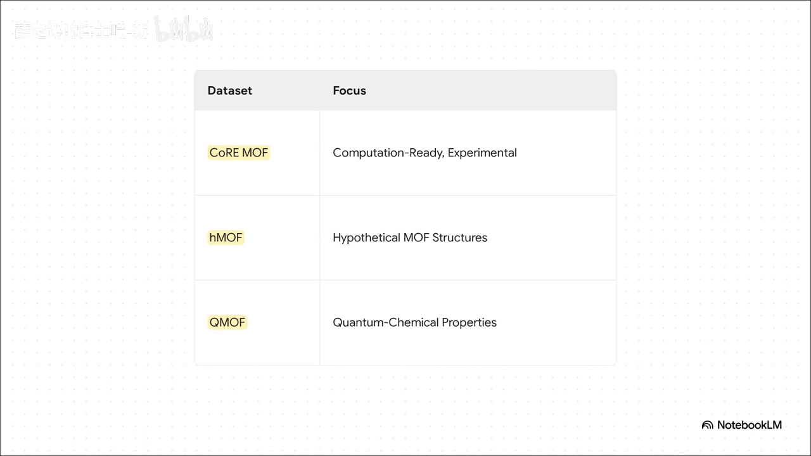

**3）方法（Methods）**：为你的任务挑选合适的特定 AI 算法（例如随机森林 RF、神经网络 NN）。

## 五、两条技术路线：一个是「破案」，一个是「发明」

**ML 在材料领域的方法可以归为两大类，它们的思维方式截然相反。** [【跳转到 05:31】](https://www.bilibili.com/video/BV1htawz9EqX/?t=331)

- **性质预测——像在破案**：你给 AI 一个「嫌疑人」（一个已知的 MOF 结构），问它做了什么、能吸收多少气体。
- **逆向设计——像在发明**：你给 AI 一个目标，说「我需要一种具有特定性质的新 MOF，请设计出来」。这才是真正高阶的部分，比如能生成从未存在过的原子结构的模型。

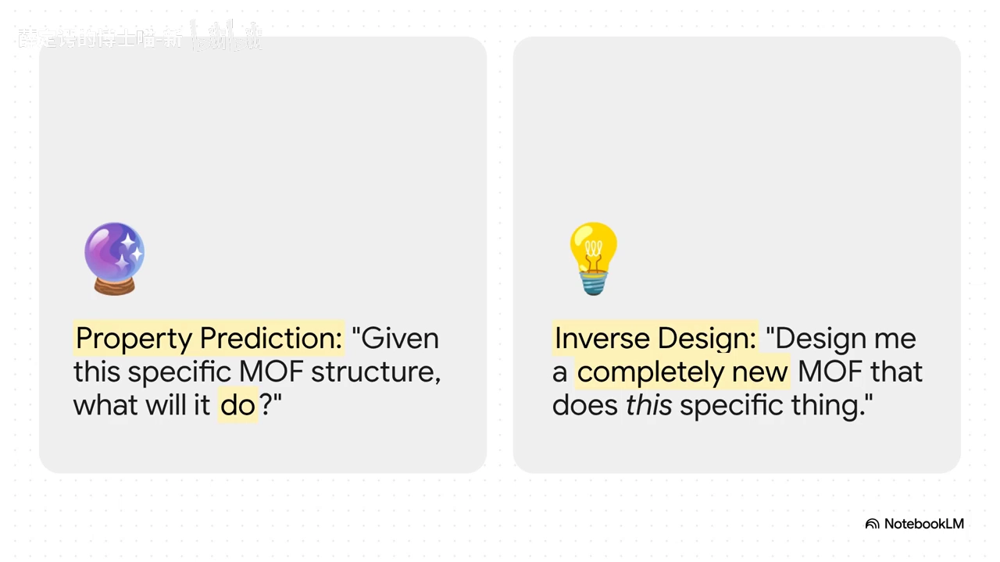

## 六、现实中的突破：从吸碳、储氢到靶向给药

**理论听着很美，但 MOF + ML 已经产生了「改变一切」的真实突破，尤其在能源与环境领域。** [【跳转到 06:02】](https://www.bilibili.com/video/BV1htawz9EqX/?t=362)

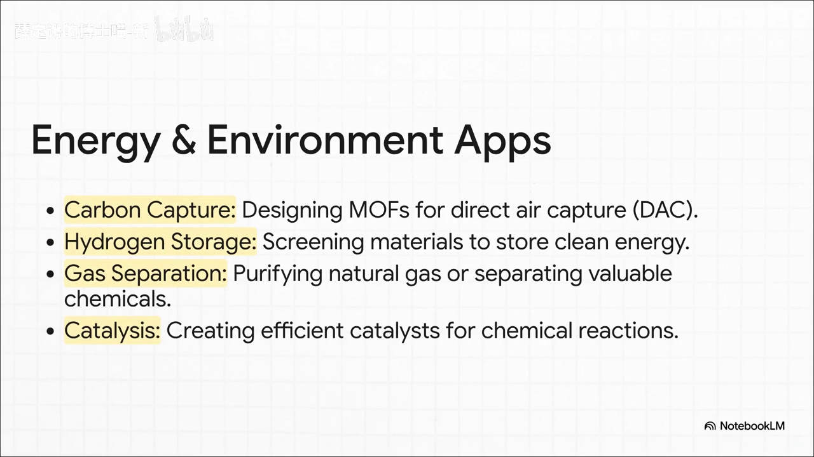

- **碳捕集**：用 AI 精准定位最适合的 MOF，用于**直接空气捕获（DAC）**——字面意义上「从天空中吸收二氧化碳」来对抗气候变化。
- **氢气储存**：寻找能安全、高效储存氢燃料的新材料。
- **气体分离/催化**：开发净化天然气的分子筛，让工业化学更高效、更少浪费，用于更优的燃料电池材料。[【跳转到 06:18】](https://www.bilibili.com/video/BV1htawz9EqX/?t=378)

最大的惊喜在医学领域：研究人员用 AI 识别出能像「微型可编程无人机」一样的 MOF，把化疗药物直接送到癌细胞，同时不伤害健康细胞——这可能彻底改变疾病的治疗方式。[【跳转到 06:43】](https://www.bilibili.com/video/BV1htawz9EqX/?t=403)

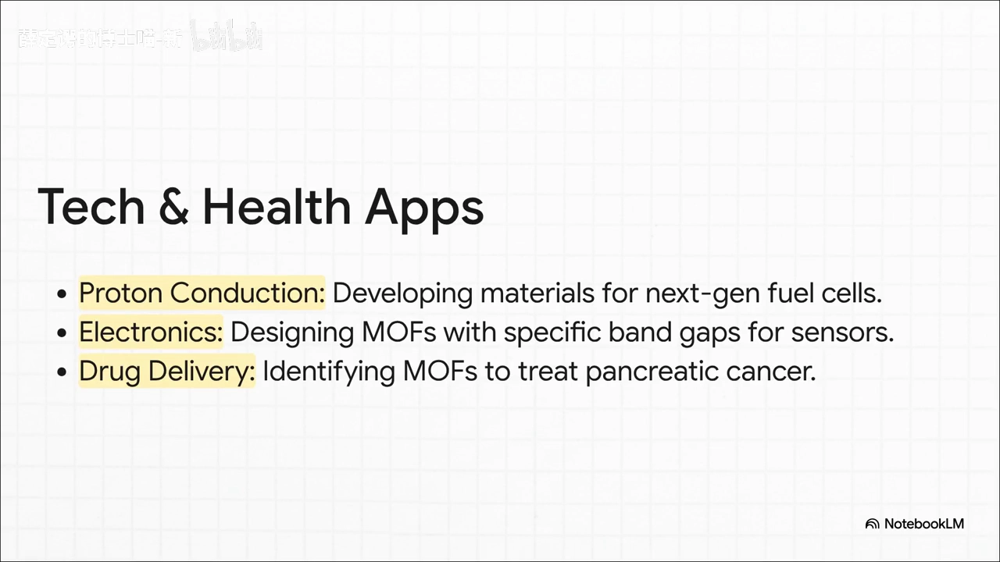

## 七、当前三大瓶颈：数据、黑箱、可合成性

**但通往全自动材料设计的道路仍有重大挑战，视频总结为三大瓶颈。** [【跳转到 07:22】](https://www.bilibili.com/video/BV1htawz9EqX/?t=442)

1. **数据稀缺（Data Scarcity）**：即使拥有所有数据库，仍缺乏高质量实验数据，AI 需要更多真实案例来学习。
2. **可解释性（Interpretability）**：也就是「黑箱」问题——AI 能给出答案，但我们需要更好地理解它**为什么**这样推理。
3. **可合成性（Synthesizability）**：这可能是最大的挑战——电脑能设计出上百万个完美 MOF 固然很酷，但如果不能在实验室真正合成，就只是硬盘上的美好设想。

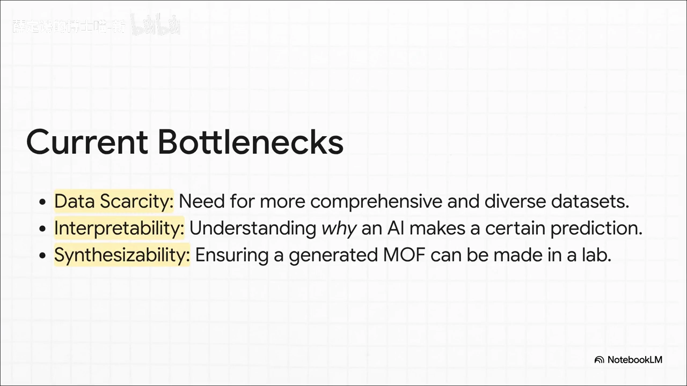

## 八、下一波浪潮：从读论文的 LLM 到全自动闭环实验室

**放眼未来，下一波浪潮正在来临。** [【跳转到 07:47】](https://www.bilibili.com/video/BV1htawz9EqX/?t=467) 视频描绘了一条清晰的时间线：

- **今天**：与 ChatGPT 同源的大型语言模型正在阅读科学论文，学习 MOF 的制备知识，并从中预测材料性质。
- **近期**：把化学直觉和规则直接融入 AI，让它学会「化学的语法」，设计更稳健，成为真正的科研伙伴。
- **地平线**：把 AI「大脑」连接至机器人实验室，创建**全自动闭环系统**——AI 设计材料，机器人制备并测试，AI 从结果中学习、再设计更优方案，完全自主进行。

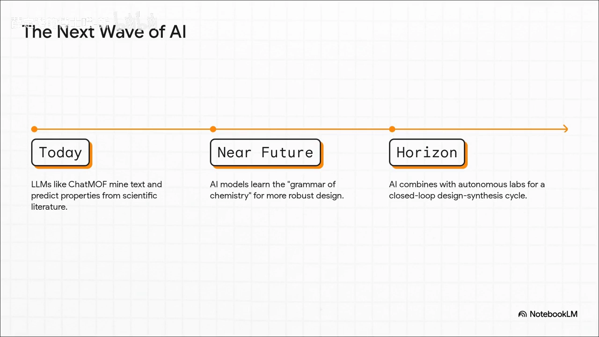

## 九、终局不是取代，而是深度融合

**未来不是 AI 取代科学家，而是人与 AI 的深度融合。** [【跳转到 08:24】](https://www.bilibili.com/video/BV1htawz9EqX/?t=504) 这关乎打造一支「梦想团队」：把人工智能惊人的速度和模式识别能力，与传统物理模拟的精准度结合起来，创造出远超各自单独能力的全新力量。

视频的结语很有画面感：**我们正站在一个时代的开端，AI 不再是单纯的计算器，而是科学发现的「创意合作者」。** 我们正在交付这张通往「无限化学宇宙」的地图，并请它指引方向。因此，问题不再是我们**能否**找到完美材料，而是我们**想先解决哪个看似不可能的问题**。[【跳转到 08:44】](https://www.bilibili.com/video/BV1htawz9EqX/?t=524)

## 小结

- **MOF 是原子尺度的乐高**：金属节点 + 有机连接体，结构可自由拼装，兼具超高孔隙率、可调结构与「可编程物质」特性。
- **核心难题是「选择」而非「创造」**：已知结构十万余种、假设结构超百万种，化学空间近乎无穷，传统试错法要数千年、耗资千亿美元。
- **ML 是那块「超强磁铁」**：能性能预测、高通量筛选、逆向设计、合成预测，全部依靠「描述符 + 数据集 + 算法」三环节。
- **数据集是燃料**：CoRE MOF（实验验证）、hMOF（假设结构）、QMOF（量子化学性质）等公开数据集支撑整个领域。
- **两条路线**：性质预测像「破案」（给定结构问行为），逆向设计像「发明」（给定目标造结构）。
- **应用已落地**：碳捕集、储氢、气体分离、催化，以及把化疗药物精准送入癌细胞的「微型无人机」。
- **三大瓶颈**：数据稀缺、可解释性（黑箱）、可合成性；其中「造得出却做不出」是最现实的痛。
- **终局是融合**：LLM 读论文 → 化学直觉内嵌 → AI + 机器人实验室的闭环自动化，最终人与 AI 协同，而非替代。

## 关键术语速查

| 术语 | 一句话解释 |
| --- | --- |
| MOF（金属有机框架） | Metal-Organic Framework：由金属节点与有机连接体搭成的多孔晶体材料，形似原子尺度乐高 |
| 孔隙率 / 比表面积 | 材料内部空腔占比 / 单位质量材料内部的表面积；MOF 一克即可抵一个足球场 |
| 可编程物质 | 能像编程一样按任务定制结构的材料，用于储气、催化等 |
| 描述符（Descriptors） | 把材料结构翻译成计算机能读的数字特征，如孔径、表面积、原子种类 |
| 性质预测 | 给定一个已知 MOF，预测它的行为（如 CO₂ 吸附量），像「破案」 |
| 高通量筛选 | 让 AI 快速评估成千上万候选物，挑出最优者，材料界的「速配」 |
| 逆向设计 | 给定目标性质，让 AI 从零生成全新 MOF 结构，像「发明」 |
| 合成预测 | 预测制备新材料所需的实验条件/配方 |
| CoRE MOF | 经实验验证、可计算的真实 MOF 数据库 |
| hMOF database | 包含数百万假设性 MOF 结构的数据库 |
| QMOF | 专注量子化学/电子性质的专业 MOF 数据集 |
| 可合成性 | 一个设计出的 MOF 能否在实验室被真正合成出来 |
| 闭环自动化 | AI 设计 → 机器人合成测试 → AI 学习 → 再设计的全自主循环 |

## 参考

- 配套视频：[《MOF 材料生成：机器学习如何设计金属有机框架》](https://www.bilibili.com/video/BV1htawz9EqX/)（Bilibili，BV1htawz9EqX）
- 视频画面基于 NotebookLM 风格幻灯片生成；文中数据库信息（CoRE MOF、hMOF、QMOF）均来自视频画面与解说。
