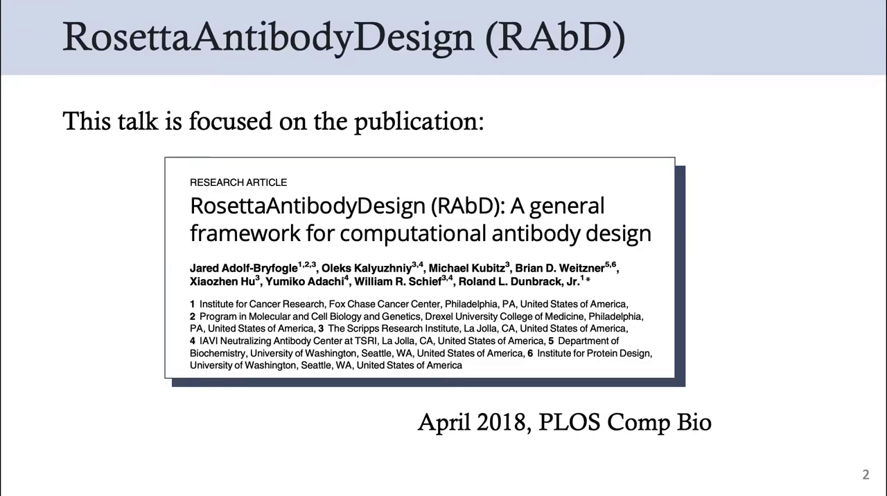
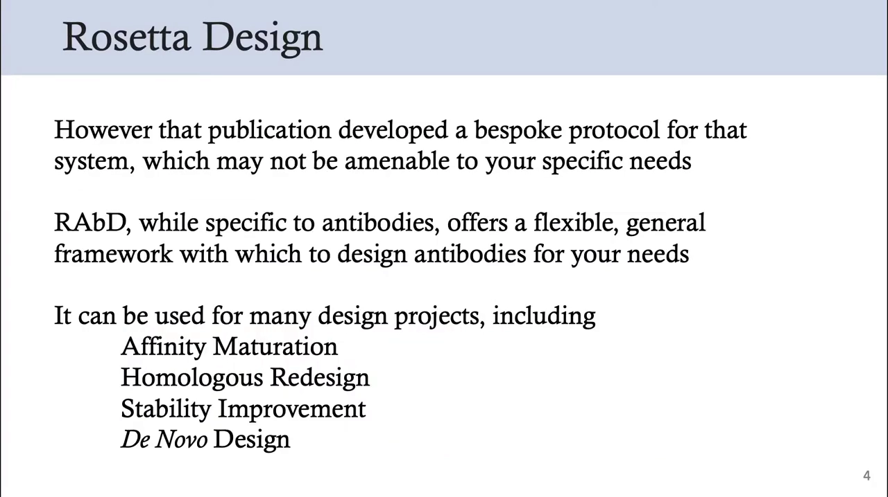
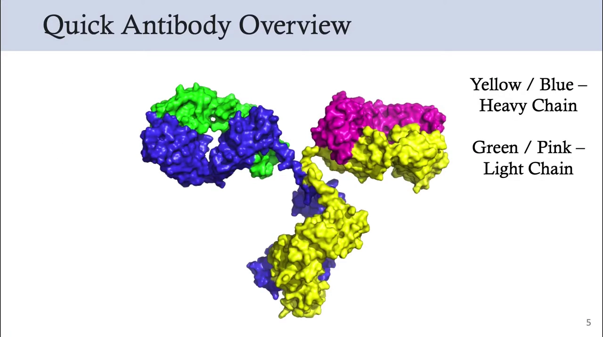
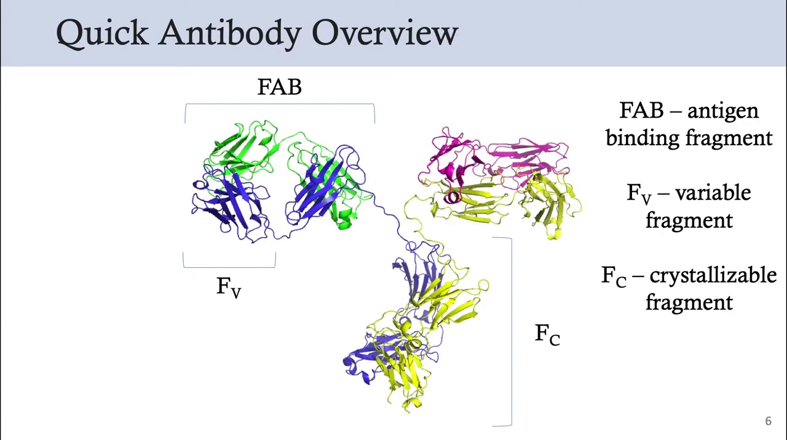
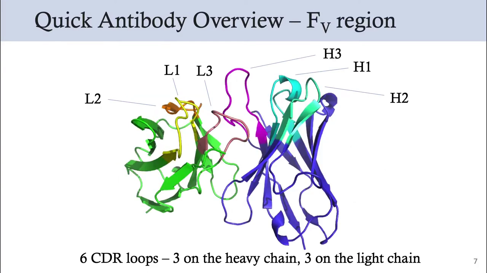
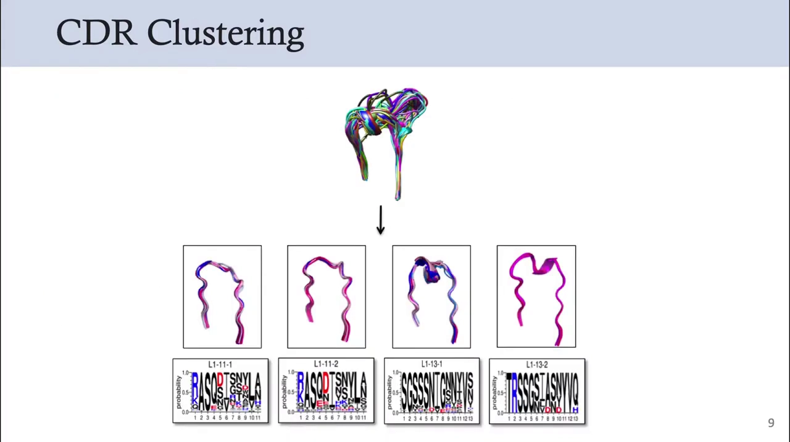
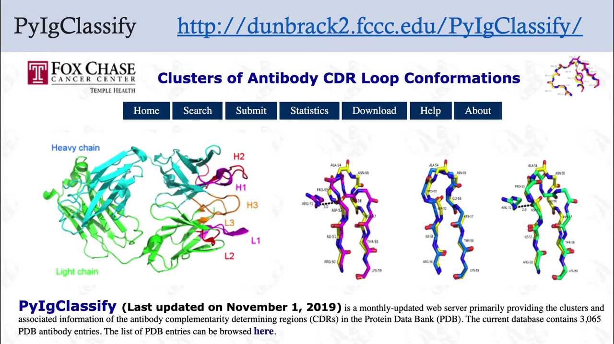
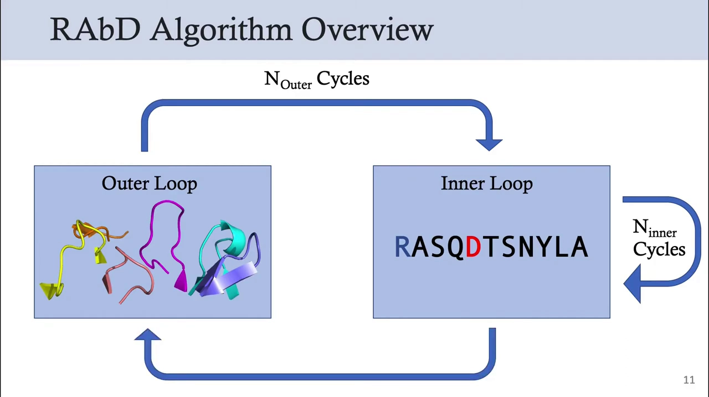
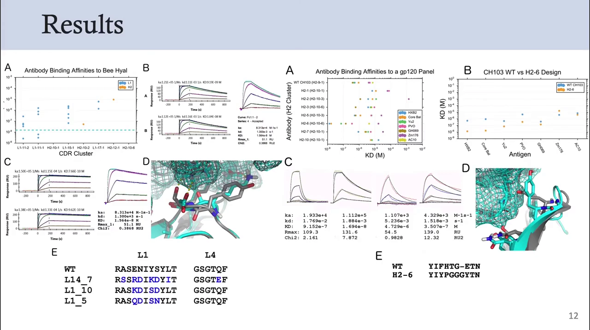
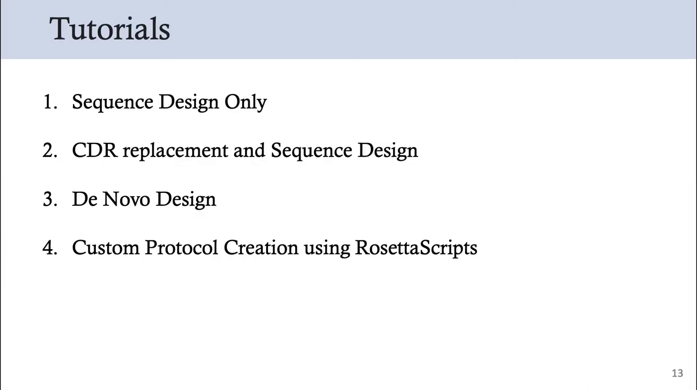

# 抗体 CDR 设计：AI 如何设计抗体结合区

> 本文整理的视频：[《RosettaAntibodyDesign (RAbD): Introduction – Rosetta Workshop 2021》](https://www.youtube.com/watch?v=kG23dCuv3Qk)（主讲 Benjamin Miller，约 7:02）。
> 视频围绕论文 **《RosettaAntibodyDesign (RAbD): A general framework for computational antibody design》**（Jared Adolf-Bryfogle 等，Institute for Cancer Research / Fox Chase / Scripps 等，2018 年发表于 *PLOS Computational Biology*，出自 **Roland Dunbrack 实验室**）展开。本文将视频中的每一段都讲解清楚，并补上理解所需的背景知识。

## 本篇要解决的核心问题（SCQA）

**背景**：抗体是免疫系统用来「认出并锁住」外来入侵者（病毒、细菌毒素、过敏原等）的蛋白质。它能做到这一点，靠的是顶端一小块形状多变的区域——只要改变这一小块，就能让同一个抗体去结合不同的目标。

**冲突**：用计算机来「设计抗体」一直很难。传统做法是「一个体系、一套定制流程」：别人为某个靶点专门写的方法，换到你的靶点上往往用不了。而蛋白质设计软件 Rosetta 虽然强大，却缺少一套**通用、灵活、专门面向抗体**的设计框架。

**疑问**：能不能有一套通用的计算框架，让研究者按自己的需求去设计或改造抗体？它靠什么保证设计出来的抗体结构是合理的、真正能结合上去？又有没有实验证据证明它管用？

**回答（中心思想）**：**RAbD（RosettaAntibodyDesign）正是这样一套通用抗体设计框架**。它的核心可以拆成三句话：用**实验解析过的 CDR 环结构数据库**保证设计出来的环「形状合理」；用**「外层循环换环 + 内层循环改序列」的双层蒙特卡洛搜索**在序列与结构空间里做优化；再通过 **PyIgClassify** 这样一个配套服务器，把使用前的编号、分类等准备工作标准化。最初的 RAbD 论文还用实验证明：它确实能提升真实抗体对抗原的结合力。

---

## 一、RAbD 是什么：一套面向抗体的通用设计框架

**RAbD 是一套「专门针对抗体、但足够通用的计算设计框架」，而不是又一套只适用于单一靶点的定制流程。** 视频一开头就交代了它的来历：相关工作在 2018 年发表于 *PLOS Computational Biology*，来自 Roland Dunbrack 实验室。[【跳转到 00:10】](https://www.youtube.com/watch?v=kG23dCuv3Qk&t=10)

先说清楚它要解决的痛点。Rosetta 这套软件早已被广泛用于**蛋白质设计**以及**「设计 + 对接」**，Rosetta 实验室也发表过大量相关论文。视频举了一个例子：2021 年初 Baker 实验室发表了一篇论文，设计能与**转铁蛋白受体（transferrin receptor）**结合的蛋白质。[【跳转到 00:23】](https://www.youtube.com/watch?v=kG23dCuv3Qk&t=23)

**但这类论文的问题在于「定制化」**：它针对那个特定体系开发了一套专门流程（bespoke protocol），换到你的研究问题上未必适用。

而 **RAbD 的定位恰恰相反**——它虽然专门面向抗体，却提供了一个**灵活的通用框架**，让你能按自己的需求去设计抗体。它可以服务于多种设计项目，包括：[【跳转到 00:44】](https://www.youtube.com/watch?v=kG23dCuv3Qk&t=44)

- **亲和力成熟（affinity maturation）**：把一个已经能结合的抗体改得结合得更牢；
- **同源重设计（homologous redesign）**：参照同源抗体来重设计；
- **稳定性改进（stability improvement）**：让抗体更稳定、更不容易变性；
- **从头设计（de novo design）**：从零开始设计全新的抗体。

**一句话概括**：Rosetta 擅长设计蛋白质，但要设计抗体，RAbD 提供了一条更对口的通用路径。

## 二、先补一课：抗体长什么样，我们要设计的是哪一块

要理解 RAbD 在改什么，得先知道抗体的结构。**抗体（这里以 IgG 为例）呈 Y 形，由两条重链和两条较短的轻链组成。**[【跳转到 01:14】](https://www.youtube.com/watch?v=kG23dCuv3Qk&t=74)

抗体还可以**按区域划分**，这些名词在后续会反复出现：[【跳转到 01:34】](https://www.youtube.com/watch?v=kG23dCuv3Qk&t=94)

- **Fc 区**（crystallizable fragment，可结晶片段）：Y 的「手柄」部分，主要决定抗体的效应功能；
- **Fab 区**（antigen binding fragment，抗原结合片段）：Y 的两个「臂」，负责识别抗原；
- **Fv 区**（variable fragment，可变片段）：Fab 顶端真正与被抗原接触的那一小块。

视频特别强调：**Fab / Fv 区才是抗体「特异性」与「多样性」的来源**——也就是说，正是这一小块决定了这个抗体到底结合什么。因此，本次讲座余下部分都聚焦在这里。

**Fv 区里最关键的是六个 CDR 环。** CDR 是「互补决定区（complementary determining regions）」的缩写，它们在结构上表现为六个环（loop）：**重链上三个（H1、H2、H3）、轻链上三个（L1、L2、L3）**。这些环在**长度、序列和结构上都高度可变**——正因为可变，抗体才能识别千差万别的抗原；而这六个环，正是 RAbD 主要要设计的对象。[【跳转到 01:54】](https://www.youtube.com/watch?v=kG23dCuv3Qk&t=114)

## 三、第一块基石：给 CDR 环建一个「形状目录」——环的聚类数据库

**RAbD 最重要的设计特征之一，是在采样一个「CDR 环数据库」。** 思路很朴素：与其凭空想象一个环该长什么样，不如**从实验解析过的真实抗体结构里，把形状相似的环归成一类、建一个目录**，设计时直接从目录里挑现成的环。这个数据库来自 Dunbrack 实验室此前的 CDR 环聚类工作。[【跳转到 01:54】](https://www.youtube.com/watch?v=kG23dCuv3Qk&t=114)

这套方法的发表脉络是：**最早于 2011 年发表在 *Journal of Molecular Biology*（关于抗体 CDR 环构象的重新聚类），随后 2015 年该数据库及配套网络服务器发表在 *Nucleic Acids Research*（PylgClassify）。**[【跳转到 02:16】](https://www.youtube.com/watch?v=kG23dCuv3Qk&t=136)

**它是怎么建起来的？** 步骤很清晰：[【跳转到 02:34】](https://www.youtube.com/watch?v=kG23dCuv3Qk&t=154)

1. **检索**：从蛋白质数据库（PDB）中取出所有抗体结构；
2. **清洗**：过滤掉分辨率低、质量差的结构；
3. **分类**：先按 CDR 的类型区分（L1、L2、H1……），再按长度区分（10 个残基、11 个残基……）；
4. **聚类**：用一个**二面角（dihedral angle）指标**衡量环的形状，把形状相似的环聚到一起。

图中是一个具体例子：一根根 L1 环（来自 PDB）经过长度和形状指标筛选后，被分成若干组，**每一组有一个编号标签**，例如 **L1-11-1**，读作「CDR 环 L1、长度 11 个残基、第 1 组」。编号规则是：**最大的分组标为「1」，第二大的标为「2」，依此类推**；每组下方还给出该组的**序列 logo**（用字母堆叠高度表示每个位置上各氨基酸出现的概率，越高越常见）。[【跳转到 02:34】](https://www.youtube.com/watch?v=kG23dCuv3Qk&t=154) [【跳转到 02:59】](https://www.youtube.com/watch?v=kG23dCuv3Qk&t=179)

**为什么这一步很重要？** 因为它把「设计一个环」这个自由度极大的难题，变成了「从一批已知合理形状里挑选与迭代」——这既保证结果在结构上站得住脚，又大幅缩小了搜索空间。

## 四、第二块基石：用 PyIgClassify 做好使用前的准备工作

光有数据库还不够，用 RAbD 之前还需要一套标准化的「预处理」。**PyIgClassify 就是官方配套的在线服务器，也是运行 RAbD 所需的 CDR 环数据库的所在地。**[【跳转到 03:34】](https://www.youtube.com/watch?v=kG23dCuv3Qk&t=214)（口播中的 "pi ig classify" 即 PyIgClassify）

它能做的事有两类：

- **提供数据库与分类**：给出 CDR 环数据库，以及对 PDB 中所有抗体的分类；
- **处理你自己提交的抗体**：你可以提交一个抗体结构，它会自动识别出**抗体链、抗体基因、种系（germline）、CDR 位置与框架（framework）位置**；并且会把结构**重新编号为 Aho 编号方案（Aho numbering scheme）**，再对 CDR 做分类。[【跳转到 03:34】](https://www.youtube.com/watch?v=kG23dCuv3Qk&t=214)

视频特别提醒：**这种重新编号对于在 RAbD 中正确使用你的结构是必不可少的**。[【跳转到 03:59】](https://www.youtube.com/watch?v=kG23dCuv3Qk&t=239)

**为什么需要重编号？** 因为不同来源的抗体结构、不同的编号传统，会让「哪个残基属于哪个 CDR」对不齐；只有统一到同一套编号，算法才能准确知道该替换哪一段、该优化哪一段。可以说，PyIgClassify 把「使用门槛」这一步替用户做好了。

## 五、RAbD 的核心算法：外层换环、内层改序列的双层蒙特卡洛

**RAbD 的算法是一套「外层循环 + 内层循环」的双层搜索流程**，可以把它想象成一位设计师在反复尝试：先整体换一个「零件」，再在零件内部精雕细琢。[【跳转到 04:09】](https://www.youtube.com/watch?v=kG23dCuv3Qk&t=249)

具体流程如下：[【跳转到 04:09】](https://www.youtube.com/watch?v=kG23dCuv3Qk&t=249) [【跳转到 04:27】](https://www.youtube.com/watch?v=kG23dCuv3Qk&t=267)

1. **外层循环（outer loop）**：随机选择六个 CDR 环中的一个，**用数据库里的一个环把它替换掉**（相当于换一个形状候选）；
2. **进入内层循环（inner loop）**：算法在这个新环上执行**序列设计**（决定每个位置放什么氨基酸）和**局部结构优化**（微调环的姿态与周围结构）；
3. **蒙特卡洛判定**：每完成一次设计和优化，新模型会根据**蒙特卡洛（Monte Carlo）准则**决定「接受」还是「拒绝」。蒙特卡洛准则的含义是：更好的方案一定接受，稍差的方案也有一定概率接受——这能避免搜索陷入局部最优；
4. **内层循环重复 n 次**，直到收敛；
5. **再回到外层**：内层循环结束时得到的最优模型，会与**此前外层循环留下的最佳模型**比较，同样按蒙特卡洛准则决定接受还是拒绝；
6. **外层循环通常设为 25 次（Nouter = 25）**。

**重要的使用提示**：视频强调，上述流程只是一个**总体概述**，**并不需要原样完整地运行**——RAbD 非常灵活，请参考官方教程了解全部可选参数。[【跳转到 04:48】](https://www.youtube.com/watch?v=kG23dCuv3Qk&t=288)

**为什么用「双层」结构？** 因为它把两类本质不同的决策分开了：外层决定「用哪个形状的环」（结构层面的跳跃式探索），内层决定「这个环里放什么氨基酸」（序列层面的精细优化）。分开处理，搜索更高效，也更符合抗体设计的实际逻辑。

## 六、实验验证：这个算法真的管用吗

**在最初的 RAbD 论文中，作者用实验证明了算法确实能改善结合力。**[【跳转到 05:18】](https://www.youtube.com/watch?v=kG23dCuv3Qk&t=318)

他们挑选了两个已知的、且有**已发表晶体结构**的「抗体-抗原」复合物作为测试对象：

- 一个抗体结合**蜂毒（bee venom）中的主要过敏原**；
- 另一个抗体结合 **HIV 的 gp120 蛋白**。

设计方式是**替换部分（而非全部）CDR 环**。每个抗体大约挑选了 **30 个设计方案**去做实验。[【跳转到 05:43】](https://www.youtube.com/watch?v=kG23dCuv3Qk&t=343)

结果如下：

- 有 **3 个抗蜂毒抗体**提高了结合力（见左图）；
- 有 **1 个抗 gp120 抗体**提高了结合力（见右图）。[【跳转到 05:43】](https://www.youtube.com/watch?v=kG23dCuv3Qk&t=343)

**怎么看这个结果？** 视频坦言：虽然只有少数设计改善了结合力，但考虑到**实验产出的构建体数量本来就很少**，而且**表达、纯化等湿实验环节始终是潜在的障碍**，能做到「有设计真正提高了结合力」，已经是一个成功的结果。[【跳转到 06:08】](https://www.youtube.com/watch?v=kG23dCuv3Qk&t=368)

## 七、上手路径：四节官方教程

视频最后给出学习路径：**RAbD 的官方教程在另一个视频里，分为四大节，每节又包含多个部分。**[【跳转到 06:13】](https://www.youtube.com/watch?v=kG23dCuv3Qk&t=373)

1. **仅序列设计（Sequence Design Only）**：只突变序列，**不替换 CDR 环**；
2. **CDR 替换 + 序列设计（CDR replacement and Sequence Design）**：把新的 CDR 环**移植（graft）**到抗体上，并配合序列设计；
3. **从头设计（De Novo Design）**：**从随机的 CDR 出发**，而不是用天然的 CDR，让算法从零设计；
4. **用 RosettaScripts 自定义流程（Custom Protocol Creation）**：学会用 RosettaScripts 创建属于自己的设计流程。

教程到此结束，主讲人鼓励大家继续观看下一个视频，一起动手走一遍这些教程。[【跳转到 06:38】](https://www.youtube.com/watch?v=kG23dCuv3Qk&t=398)

## 小结

- **RAbD 是一套通用抗体设计框架**：专门面向抗体，却比「单靶点定制流程」灵活得多，可用于亲和力成熟、同源重设计、稳定性改进与从头设计。
- **抗体设计中真正要改的是 CDR 环**：Fv 区上的六个环（H1–H3、L1–L3）长度、序列、结构高度可变，是抗体特异性与多样性的来源。
- **它的第一块基石是 CDR 环聚类数据库**：从 PDB 中清洗出抗体结构，按类型、长度分类，再按二面角形状聚类，为设计提供「合理的环形状目录」。
- **它的第二块基石是 PyIgClassify**：这个服务器提供数据库，并能自动识别链、基因、种系、CDR/框架位置，把结构重编号为 Aho 方案——这是正确使用 RAbD 的前提。
- **核心算法是双层蒙特卡洛搜索**：外层随机换一个 CDR 环，内层做序列设计 + 局部结构优化，逐轮按蒙特卡洛准则接受或拒绝，外层通常跑 25 轮。
- **实验证明它有效**：在抗蜂毒与抗 gp120 两个真实复合物上，分别有 3 个和 1 个设计提高了结合力；考虑到构建体数量少、表达纯化是难点，这已是成功结果。

## 关键术语速查

| 术语 | 一句话解释 |
| --- | --- |
| RAbD | RosettaAntibodyDesign：一套面向抗体的通用计算设计框架，2018 年发表于 *PLOS Comp Biol* |
| 抗体 / IgG | 免疫系统中识别并结合外来入侵者的 Y 形蛋白质，由两条重链和两条轻链构成 |
| 重链 / 轻链 | 抗体的两种蛋白链；重链较长，轻链较短，各贡献三个 CDR 环 |
| Fc 区 | crystallizable fragment，可结晶片段，Y 形抗体的「手柄」部分 |
| Fab 区 | antigen binding fragment，抗原结合片段，Y 的两个「臂」 |
| Fv 区 | variable fragment，可变片段，Fab 顶端直接接触抗原的部分 |
| CDR | complementary determining region，互补决定区；六个可变环（H1–H3、L1–L3）是设计对象 |
| framework | 框架区，CDR 之间相对保守、起支撑作用的区域 |
| 二面角（dihedral angle） | 描述主链扭转、用于衡量环形状并做聚类的几何量 |
| 序列 logo | 用字母堆叠高度表示各氨基酸出现概率的图示 |
| PyIgClassify | 配套在线服务器：提供 CDR 环数据库与分类，识别抗体链/基因/种系，并做 Aho 重编号 |
| Aho 编号方案 | 一种标准抗体残基编号，统一编号是正确使用 RAbD 的前提 |
| 外层循环 / 内层循环 | 外层随机替换一个 CDR 环；内层做序列设计与局部结构优化 |
| 蒙特卡洛准则 | 更好必接受、稍差也有概率接受的判定规则，用于避免陷入局部最优 |
| 亲和力成熟 | affinity maturation，把已能结合的抗体改造得更强 |
| 从头设计 | de novo design，不依赖天然 CDR，从随机序列/结构出发设计 |
| RosettaScripts | Rosetta 的脚本化接口，用于自定义设计流程 |

## 参考

- 配套视频：[《RosettaAntibodyDesign (RAbD): Introduction – Rosetta Workshop 2021》](https://www.youtube.com/watch?v=kG23dCuv3Qk)（主讲 Benjamin Miller）
- 论文：Jared Adolf-Bryfogle et al. *RosettaAntibodyDesign (RAbD): A general framework for computational antibody design*, *PLOS Computational Biology*, 2018
- 相关工作：North, Lehmann, Dunbrack. *A new clustering of antibody CDR loop conformations*, *J Mol Biol*, 2011；Adolf-Bryfogle et al. *PylgClassify: a database of antibody CDR structural classifications*, *Nucleic Acids Research*, 2015
