# 生成式分子设计：机器学习如何创造新药分子

> 本文整理的视频：[《【AI+分子】基于机器学习的分子生成技术概述》](https://www.bilibili.com/video/BV18hsFzbEEv/)（B 站，小赵老师，约 17:47，中文）。
> 视频是对 **2024 年一篇 Nature 子刊综述**的导读：先讲研究背景，再依次梳理「分子表征方法 → 生成式分子设计框架 → 深度生成模型 → 生成与优化策略」。本文按这条主线，把视频里提到的每个概念、方法和模型都讲清楚，做到初学者也能看懂。

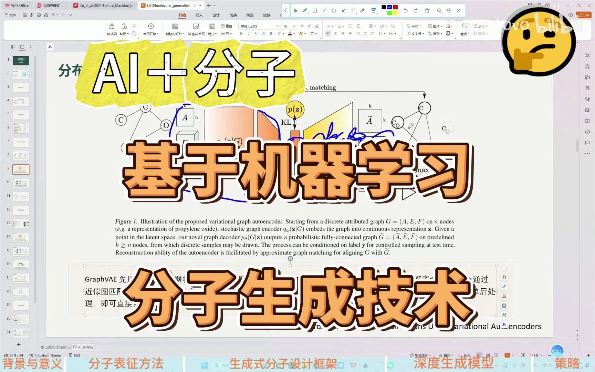

## 本讲要解决的核心问题（SCQA）

**背景（S）**：新药研发长期依赖「先建一个大化学库，再从里面筛」的流程。药物化学家要在数量有限、由人先验知识圈定的化合物里，寻找能作用于疾病靶点、又安全可成药的分子。[【跳转到 00:00】](https://www.bilibili.com/video/BV18hsFzbEEv/?t=0)

**冲突（C）**：这条老路有两个瓶颈。一是**化学空间极其巨大**——可能存在的小分子数量远超任何数据库的容量，人工建库根本覆盖不到；二是**人的认知偏差**——化学家容易反复在熟悉的骨架、官能团附近打转，很难跳出去发现全新结构。[【跳转到 00:48】](https://www.bilibili.com/video/BV18hsFzbEEv/?t=48)

**疑问（Q）**：能不能不再「从库里筛」，而是让模型**直接生成**全新的、满足特定要求（如高活性、易合成、可成药）的分子？

**回答（中心思想）**：**生成式分子设计就是用深度学习「造分子」，它由三块拼成——把分子编码成模型能读的表示、选择合适的生成框架与生成模型、再用优化策略与评价指标把分子调到理想状态。** 这篇综述把这套体系完整地梳理了一遍：分子可以表示成字符串或图；生成框架分「分布学习 / 条件生成 / 分子优化」三类；底层生成模型有 VAE、GAN、归一化流、自回归、扩散五大类；生成与优化又各有若干策略，最后用一组指标衡量生成质量。[【跳转到 00:23】](https://www.bilibili.com/video/BV18hsFzbEEv/?t=23)

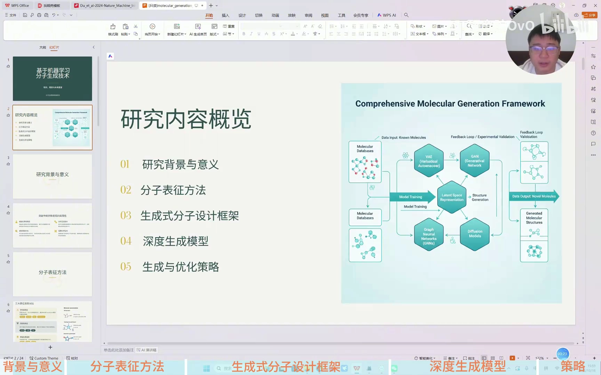

---

## 一、为什么要用生成式模型：突破传统药物发现的四重局限

**一句话结论：生成式分子设计的意义，在于它能从「筛选已知」走向「创造未知」，一举突破传统药物发现的四个局限。** 视频把研究背景与意义概括为一张四点图，这也是论文 Introduction（引言）要交代的内容。[【跳转到 00:48】](https://www.bilibili.com/video/BV18hsFzbEEv/?t=48)

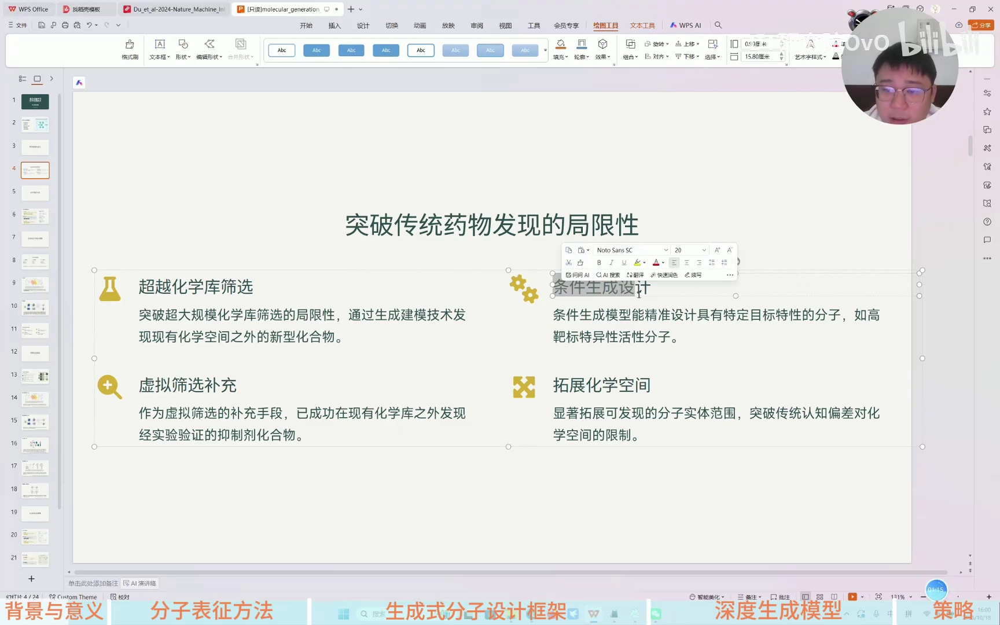

四个局限分别对应四个突破口：

1. **超越化学库筛选**：传统虚拟筛选只能在大规模化学库里找；生成建模技术能发现**现有化学空间之外的新型化合物**。
2. **条件生成设计**：条件生成模型能**精准设计具有特定目标特性**的分子，例如高靶标特异性的活性分子。
3. **虚拟筛选补充**：生成可以作为虚拟筛选的补充手段，已被成功用于在现有化学库之外**发现经实验验证的抑制剂化合物**。
4. **拓展化学空间**：显著拓展可发现的分子实体范围，**突破传统认知偏差**对化学空间的限制。

一句话，生成式方法的定位不是取代筛选，而是把「可探索的分子世界」从有限库扩大到接近无限的化学空间。

---

## 二、第一步：把分子变成模型能读的表示（分子表征）

**一句话结论：要让 AI 处理分子，先得把分子「翻译」成机器能读的形式；主流有三种表示——字符串、拓扑图、几何图，还可以选不同的表征粒度。** 视频把这一节称为「分子表征方法」，是后续所有生成模型的基础。[【跳转到 01:38】](https://www.bilibili.com/video/BV18hsFzbEEv/?t=98)

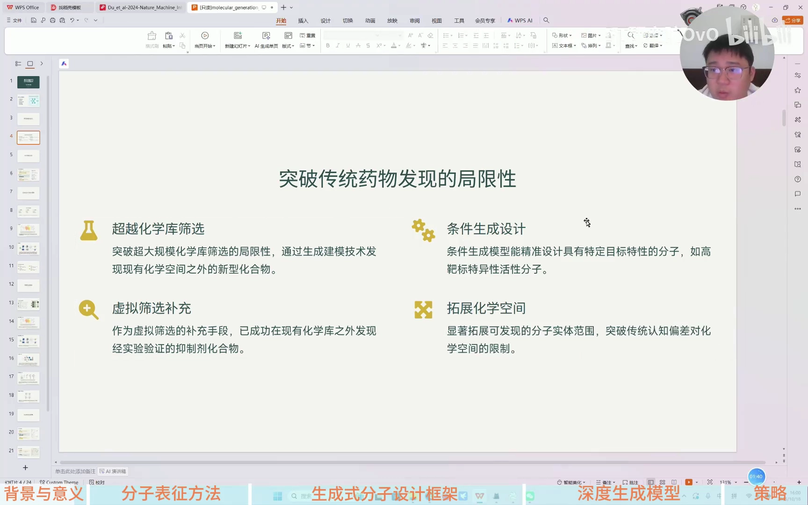

### 2.1 字符串表征：把分子写成一串字符

**字符串表征就是把分子编码成一段文本序列，让语言模型来处理。** 主要有两种编码方式：

- **SMILES**（Simplified Molecular Input Line Entry System，简化分子线性输入规范）：用一串原子与键的符号描述分子，是最经典、普适性最强的写法，例如一个分子可以写成类似 `c1c(...)c(=O)[nH]1` 的字符串。它出现得最早，几乎所有化学工具都支持。[【跳转到 02:03】](https://www.bilibili.com/video/BV18hsFzbEEv/?t=123)
- **SELFIES**（SELF-referencing Embedded Strings）：另一种字符串编码，**兼容性更好、对结构表示更精准**——因为它的语法被设计成「随便怎么拼都能得到合法分子」，在分子读取与生成时更稳健。

**为什么这类表示好用？** 因为字符串本质上就是**序列数据**，而处理序列最成熟的工具是 **RNN（循环神经网络）** 与 **Transformer**。视频特别点出一个代表性模型 **MolT5**——它借用 T5 这类大模型的框架，来给小分子做嵌入（把分子变成向量）。[【跳转到 02:28】](https://www.bilibili.com/video/BV18hsFzbEEv/?t=148)

### 2.2 图结构表征：把分子看成「原子点 + 键线」

**图结构表征把分子看成一个拓扑图：原子是节点，化学键是边。** 具体做法是先定义节点和边——**节点代表原子、边代表键**——再通过消息传递捕捉分子的拓扑结构特征。数学上可以写成

$$G = (V, E)$$

其中 $V$ 是节点（原子）集合，$E$ 是边（键）集合。在这之上还会用到 **GNN（图神经网络）** 来学习图结构。[【跳转到 02:53】](https://www.bilibili.com/video/BV18hsFzbEEv/?t=173)

### 2.3 几何图：给拓扑图补上三维空间信息

**几何图本质上是拓扑图的衍生，它在节点和边之外还包含原子的三维坐标，以及键角、二面角等信息。** 这些空间信息会在消息传递过程中被纳入计算。视频强调，几何图包含的「不变标量」信息（如键角 angle、二面角）对理解分子的真实三维形状很关键。[【跳转到 03:18】](https://www.bilibili.com/video/BV18hsFzbEEv/?t=198)

### 2.4 表征粒度：原子级、片段级、官能团级

**同一张图，还能选择不同的「粗细」来描述分子。** 视频把表征粒度分成几档：

- **原子级**：以单个原子为单位，信息最细。
- **片段级**：把分子切碎成一个个片段（fragment），这种粒度**特别适合异构图**（heterogeneous graph，节点可以有多种类型的图），与拓扑图结合很好。
- **官能团级**：以官能团为单位，能放大分子里有化学意义的语义信息，同样适合异构图。

值得注意的是，**字符串表示也可以做片段化**——在字符串层面切分出片段、识别官能团结构，来做类似的划分。[【跳转到 03:43】](https://www.bilibili.com/video/BV18hsFzbEEv/?t=223)

**小结**：无论转成序列做特征提取，还是转成拓扑图/几何图做特征提取，本质都是「分子怎么实际转化成模型可识别的形式」。目前一个分子用多种模态（多模态）来表征的做法也越来越多，在材料领域用得尤其多。[【跳转到 04:58】](https://www.bilibili.com/video/BV18hsFzbEEv/?t=298)

---

## 三、生成式分子设计的三大框架：分布学习、条件生成、分子优化

**一句话结论：生成式分子设计在框架层面分三大类——先学分子分布、再按条件生成、最后做优化微调，三者层层递进。** 视频指出，其中**条件生成的篇幅和种类占比最多**，分子优化和分布学习在综述里阐述得相对少。[【跳转到 05:23】](https://www.bilibili.com/video/BV18hsFzbEEv/?t=323)

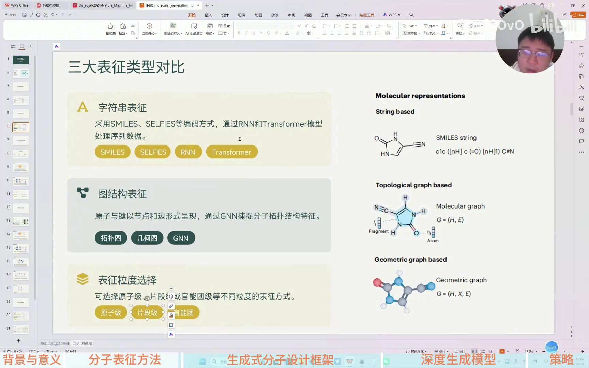

### 3.1 分布学习：先学会「分子长什么样」

**分布学习（distribution learning）是最基础的一类：它让模型学习真实分子的概率分布，从而能采样出新的分子。** 视频用 **GraphVAE** 作为代表讲解。[【跳转到 05:48】](https://www.bilibili.com/video/BV18hsFzbEEv/?t=348)

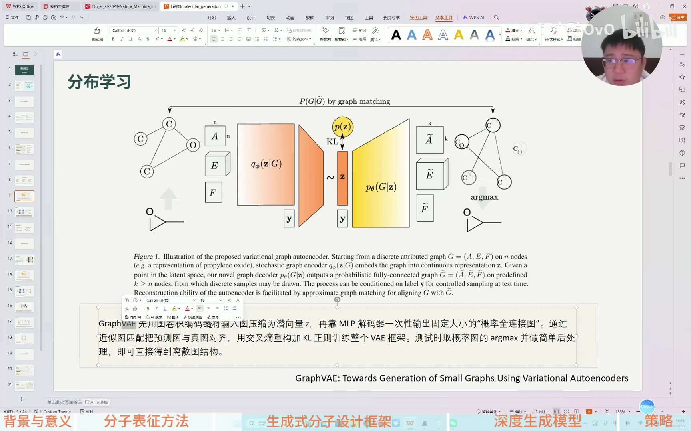

GraphVAE 的流程可以拆成五步：

1. **输入**：一个离散的带属性分子图，包含邻接矩阵 $A$（记录原子间是否成键）、边矩阵 $E$、以及特征矩阵 $F$（原子属性）。[【跳转到 06:13】](https://www.bilibili.com/video/BV18hsFzbEEv/?t=373)
2. **编码**：用编码器（encoder，图卷积网络）把它压缩成一个连续的**潜向量 $z$**（latent vector，把整个分子浓缩成一小段向量）。[【跳转到 06:38】](https://www.bilibili.com/video/BV18hsFzbEEv/?t=398)
3. **解码**：用 MLP 解码器（decoder）一次输出一张「**概率全连接图**」——每个节点对之间都有一个概率值，表示它们之间是否有键。
4. **图匹配**：用近似图匹配机制，把预测图和真图对齐（因为图节点的排列顺序不唯一，必须先对齐才能比较）。[【跳转到 07:03】](https://www.bilibili.com/video/BV18hsFzbEEv/?t=423)
5. **训练**：用**交叉熵重构损失 + KL 散度正则**两部分组成的混合损失来训练整个 VAE；测试时取概率图的 argmax 并做简单后处理，就得到离散的分子结构。[【跳转到 07:28】](https://www.bilibili.com/video/BV18hsFzbEEv/?t=448)

一句话，分布学习拿到的就是「一个定义好的潜变量及其分布表征」，这是所有生成方法里最基础的一档。

### 3.2 条件生成：在约束下「定制」分子

**条件生成（conditional generation）在分布学习的基础上加了一层「条件限制」，让模型不是随便造分子，而是造满足特定要求的分子。** 视频用 **MolGAN** 作代表。[【跳转到 07:53】](https://www.bilibili.com/video/BV18hsFzbEEv/?t=473)

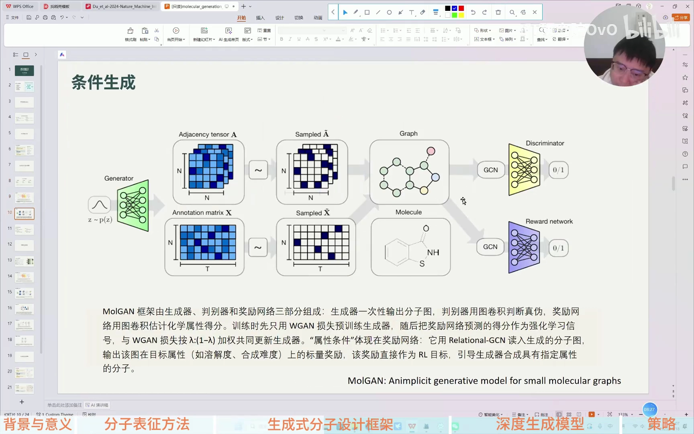

MolGAN 由三部分构成：

- **生成器（generator）**：一次性输出一张分子图（不像自回归那样一个原子一个原子地生成）。[【跳转到 08:43】](https://www.bilibili.com/video/BV18hsFzbEEv/?t=523)
- **判别器（discriminator）**：用图卷积判断这张图是真是假。整体用的是 **WGAN**（Wasserstein GAN）框架，是经典 GAN 的一个变种。
- **奖励网络（reward network）**：这是「条件」的落脚点。它用 **Relational-GCN** 读入生成的分子图，输出该图在目标属性（如溶解度、合成难度）上的**标量奖励**，作为**强化学习（RL）** 的目标，反过来引导生成器造出具有指定属性的分子。[【跳转到 09:08】](https://www.bilibili.com/video/BV18hsFzbEEv/?t=548)

这里的损失是一个**混合损失**：前面生成器负责骗过判别器，奖励网络负责让属性符合物理/化学条件，两者加权共同更新生成器。视频也指出，**分子优化与条件生成本质上相关性很大**——因为优化分子时同样会引入客观的合成约束。[【跳转到 09:58】](https://www.bilibili.com/video/BV18hsFzbEEv/?t=598)

### 3.3 条件生成的四大类型

**一句话结论：条件生成按「条件」的种类，可分为属性、目标导向、分子结构、表型四大类。** [【跳转到 10:23】](https://www.bilibili.com/video/BV18hsFzbEEv/?t=623)

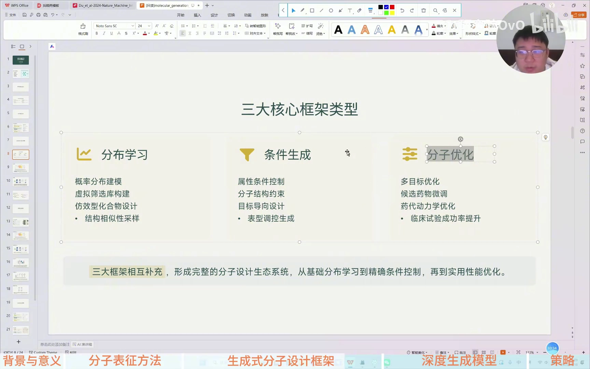

1. **属性条件**：直接制备具有特定性质的分子，例如结合亲和力、ADME/T 特征（吸收/分布/代谢/排泄/毒性）、生物活性。
2. **目标导向**：直接获取**靶标结构信息**（多半是蛋白质受体），据此设计能与之结合的配体，即常说的 **DTI（药物-靶标相互作用）导向设计**，提升设计效率。[【跳转到 10:48】](https://www.bilibili.com/video/BV18hsFzbEEv/?t=648)
3. **分子结构条件**：生成满足特定结构约束的分子，例如**骨架跳跃（scaffold hopping，在保留活性的前提下换掉核心骨架）**、**连接子设计（linker design，把一个分子拆成两半、再设计中间的连接片段）**、以及**结构警示惩罚**（对不合理的结构给予惩罚）。
4. **表型条件**：通过生物检测手段（细胞显微成像、转录组数据）获取**表型特征**，再据此调控生成。[【跳转到 11:13】](https://www.bilibili.com/video/BV18hsFzbEEv/?t=673)

---

## 四、底层五大深度生成模型：VAE、GAN、归一化流、自回归、扩散

**一句话结论：无论上层框架怎么选，真正「产生分子」的引擎是五大类深度生成模型。** 视频用一张总览图把它们并列在一页上。[【跳转到 12:00】](https://www.bilibili.com/video/BV18hsFzbEEv/?t=720)

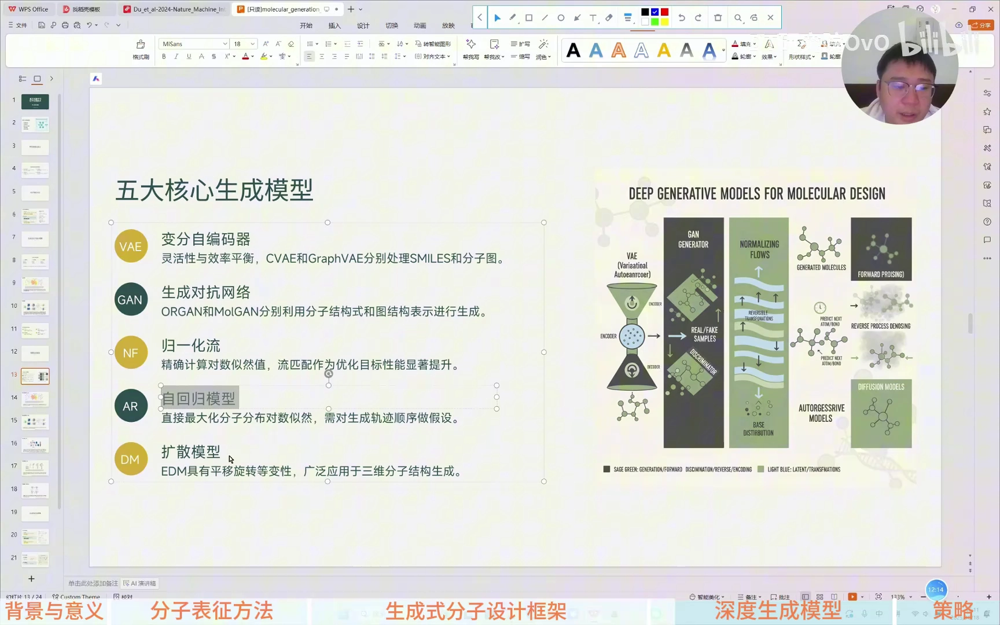

### 4.1 变分自编码器（VAE）

**VAE（Variational Autoencoder，变分自编码器）靠「编码—潜空间—解码」来生成分子，在灵活性与效率之间取得平衡。** 它就是前面分布学习里讲的那套机制：编码器把分子压成潜向量 $z$，解码器重建分子。代表性工作有 **CVAE**（基于 SMILES）和 **GraphVAE**（基于分子图），它们分别用字符串和分子图表示实现 VAE。[【跳转到 12:07】](https://www.bilibili.com/video/BV18hsFzbEEv/?t=727)

### 4.2 生成对抗网络（GAN）

**GAN（Generative Adversarial Network，生成对抗网络）由「生成器」和「判别器」对抗训练，一个负责造假、一个负责识破。** 在分子设计里，**ORGAN** 用分子结构式、**MolGAN** 用图结构表示来做生成。前面讲的 MolGAN 就属于这一类。[【跳转到 12:32】](https://www.bilibili.com/video/BV18hsFzbEEv/?t=752)

### 4.3 归一化流（NF）

**归一化流（Normalizing Flow）的优势是能精确计算分子分布的对数似然值，代价是对模型提出了「可逆性」的额外限制。** [【跳转到 12:57】](https://www.bilibili.com/video/BV18hsFzbEEv/?t=777)

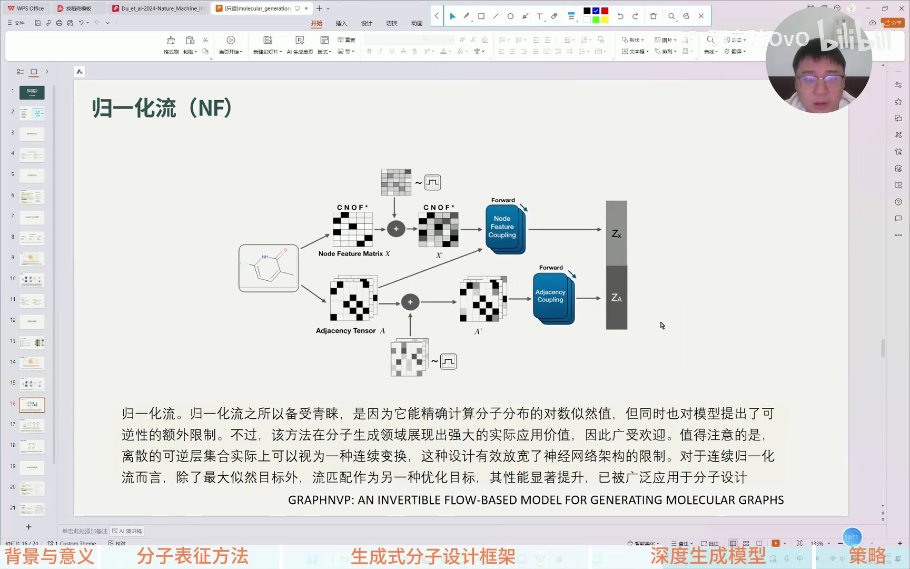

视频解释，这类方法之所以受欢迎，是因为它在分子生成领域有很强的实际价值。一个重要细节是：**离散的可逆层集合实际上可以被视为一种连续变换**，这有效放宽了神经网络架构的限制。代表模型 **GraphNVP** 就是一个基于可逆流的分子图生成模型。此外，对连续归一化流而言，**流匹配（flow matching）** 是另一种优化目标，性能提升显著，已被广泛用于分子设计。[【跳转到 13:22】](https://www.bilibili.com/video/BV18hsFzbEEv/?t=802)

### 4.4 自回归模型（AR）

**自回归模型（Autoregressive, AR）像「一个词一个词写句子」一样，一步一步地生成分子的原子和键。** 早期在序列上用 RNN 系列（GRU、LSTM 等），迁移到分子上就是一个自回归模型，可以直接最大化分子分布的对数似然。代表模型 **MolecularRNN（MolRNN）** 用 **NodeRNN** 逐个生成原子、用 **EdgeRNN** 逐个生成键。[【跳转到 13:47】](https://www.bilibili.com/video/BV18hsFzbEEv/?t=827)

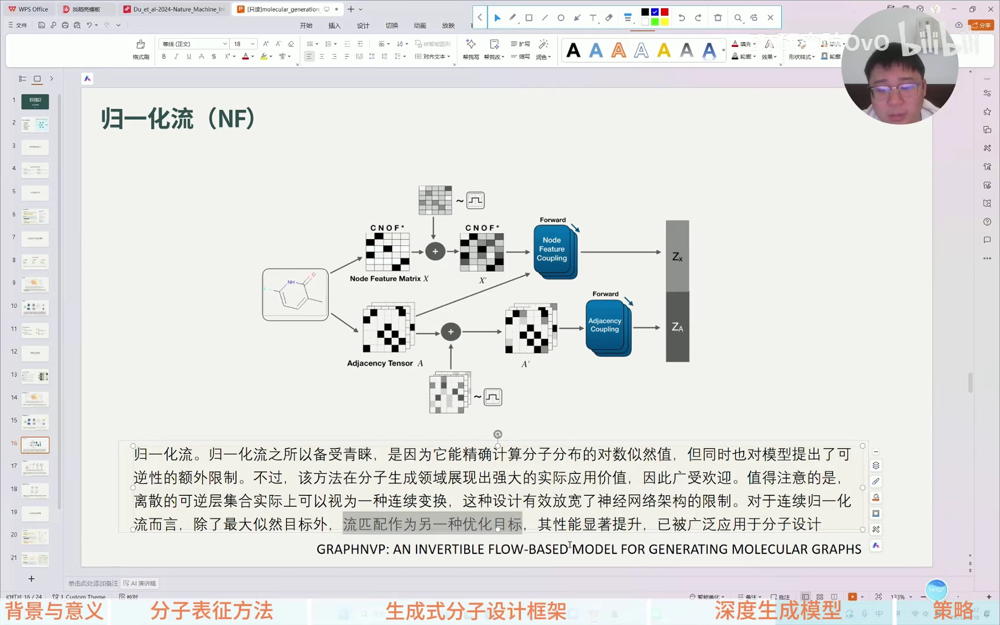

视频提醒了两个注意点：其一，自回归要**对分子生成轨迹的阶数做出额外假设**（一阶、二阶、三阶、四阶）；其二，训练时**通常需要「教师强制（teacher forcing）」这种强监督**来实现。[【跳转到 14:37】](https://www.bilibili.com/video/BV18hsFzbEEv/?t=877)

### 4.5 扩散模型（Diffusion）

**扩散模型（Diffusion）通过「加噪 → 去噪」的过程生成分子：先把结构逐步加噪破坏，再训练模型一步步把噪声还原成分子。** 视频重点介绍了 **EDM（Equivariant Diffusion Model）**，它开发了具有**平移和旋转等变性**的扩散模型，用于在三维空间中生成分子结构。[【跳转到 15:02】](https://www.bilibili.com/video/BV18hsFzbEEv/?t=902)

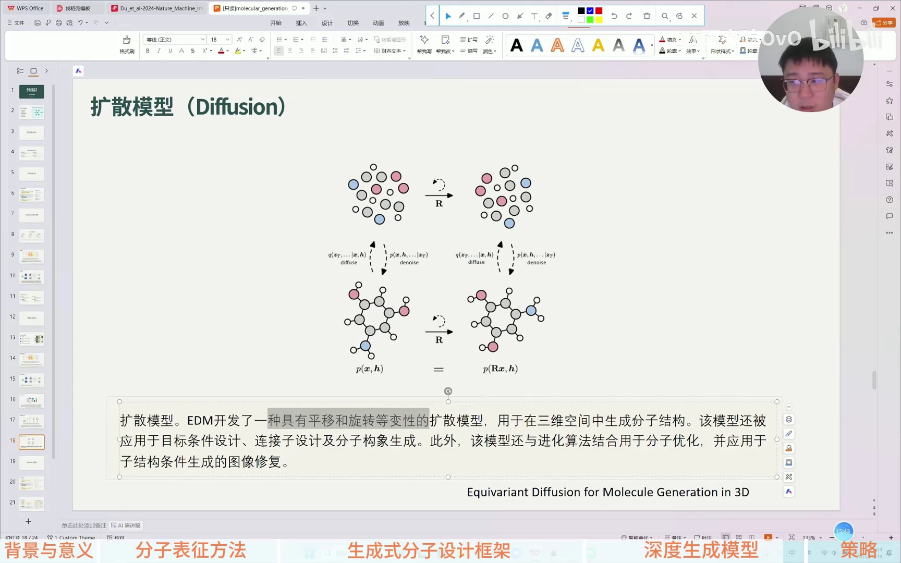

这里的**「等变性（equivariance）」**值得解释一下：分子旋转或平移后，其性质不应改变；等变模型保证「输入怎么转，输出也跟着怎么转」，因此特别适合三维分子。EDM 被用于目标条件设计、连接子设计、分子构象生成，还能与进化算法结合用于分子优化、以及分子结构条件生成的图像修复。[【跳转到 15:27】](https://www.bilibili.com/video/BV18hsFzbEEv/?t=927)

> 视频在这里把上面五类模型总结为「五大核心模块」，至此深度生成模型这一节结束。[【跳转到 15:52】](https://www.bilibili.com/video/BV18hsFzbEEv/?t=952)

---

## 五、生成与优化策略，以及怎么评价生成结果

### 5.1 三大生成策略：单步、顺序、迭代优化

**一句话结论：按生成的「步数」，分为单步生成、顺序生成、迭代优化三种；在不计计算量的前提下，顺序生成和迭代优化通常效果更好。** [【跳转到 15:57】](https://www.bilibili.com/video/BV18hsFzbEEv/?t=957)

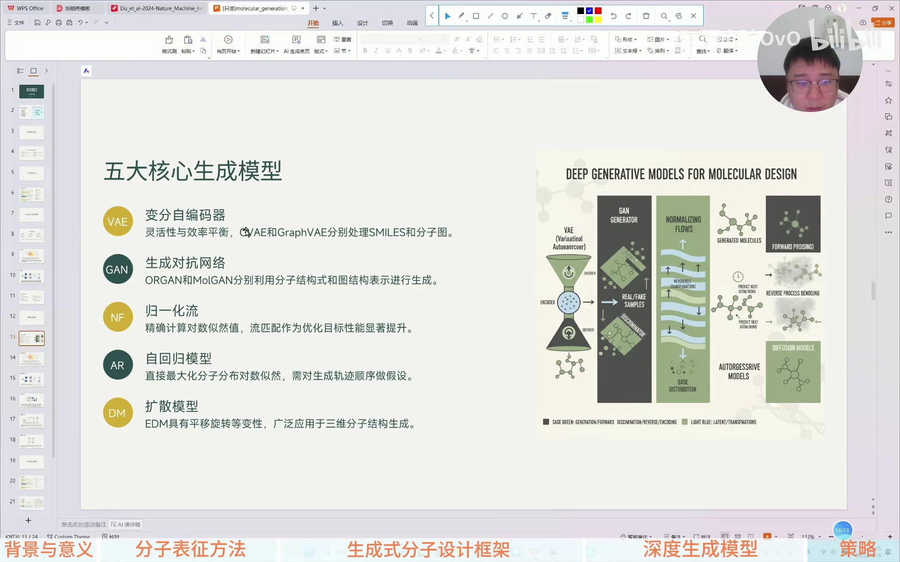

1. **单步生成**：单次前向传播就生成完整分子结构，**速度快但精度受限**。
2. **顺序生成**：通过原子或分子片段的连续步骤构建分子，涉及价态约束，代表方法如 **GFlowNets**。
3. **迭代优化**：通过多轮更新调整预测结果，规避单次预测的局限，典型手段如扩散去噪。

视频强调：**没有哪一种策略绝对最好**，但序列生成和迭代优化相较单步生成，往往有更好的效果——这跟训练策略息息相关。[【跳转到 16:04】](https://www.bilibili.com/video/BV18hsFzbEEv/?t=964)

### 5.2 两大优化策略：组合优化与连续优化

**优化策略分两大类：在离散空间里搜索的「组合优化」，和在连续空间里做梯度调整的「连续优化」。** [【跳转到 16:29】](https://www.bilibili.com/video/BV18hsFzbEEv/?t=989)

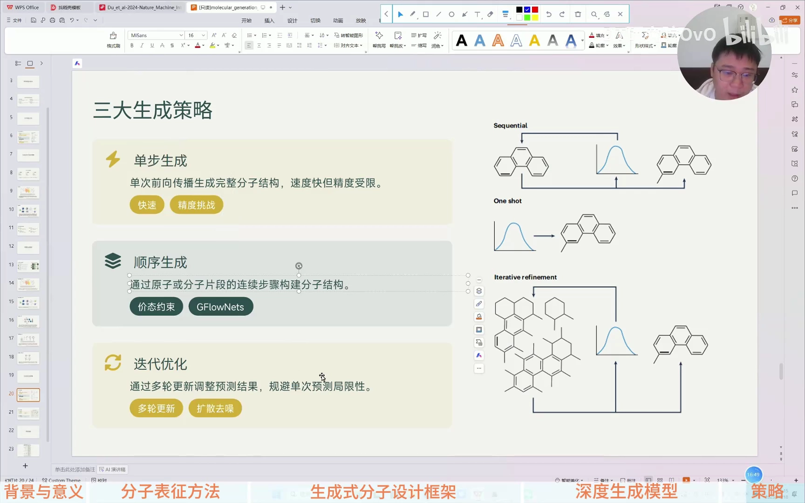

- **组合优化**：遗传算法、蒙特卡洛树搜索、强化学习、MCMC 等方法，在离散的分子结构空间里搜索。前面提到的 MolGAN 本质上就是用强化学习来做优化。
- **连续优化**：梯度导向优化、潜在空间优化，在潜向量的连续空间里朝着目标属性调整。

### 5.3 评价指标：怎么判断一个生成模型好不好

**一句话结论：生成模型的好坏要靠一组指标来检验——既要看分子「合不合法、新不新」，也要看它「像不像药、好不好合成」。** 视频展示了论文中的评价指标表。[【跳转到 16:54】](https://www.bilibili.com/video/BV18hsFzbEEv/?t=1014)

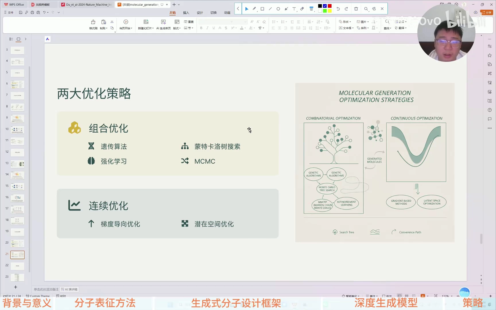

表里的指标大致分几类：

- **基础指标（Standard）**：**有效性（Validity）**——生成分子是合法化学分子的比例；**唯一性（Uniqueness）**——不重复分子的比例；**新颖性（Novelty）**——不在训练集中的分子比例。
- **理化性质（Physicochemical）**：**logP**（脂溶性）、**logS**（溶解度对数）、**TPSA**（拓扑极性表面积）、**QED**（类药性定量估计）、**Lipinski 五规则**等。
- **结构（Structural）**：**分子对接（molecular docking）**、**药效团匹配（pharmacophore matching）**。
- **多样性（Diversity）**：内部多样性。
- **可合成性（Synthesis）**：**SA score**（合成复杂度启发式评分）、**SC score**（用神经网络预测的合成复杂度）。

视频最后给了很实在的建议：**这些指标是检验生成分子模型好坏的重要标准，而目前不少高水平工作还会搭配真实实验（湿实验）来做验证；如果你也想发一个比较高级的工作，建议补上实验验证这一环。** [【跳转到 17:19】](https://www.bilibili.com/video/BV18hsFzbEEv/?t=1039)

---

## 小结

- **生成式分子设计的价值**在于从「筛选已知」走向「创造未知」，突破传统药物发现在化学空间与认知偏差上的四重局限。
- **第一步是分子表征**：字符串（SMILES / SELFIES）、拓扑图（$G=(V,E)$）、几何图（含三维坐标、键角、二面角）三种表示，并可选原子级 / 片段级 / 官能团级等不同粒度。
- **框架分三类**：分布学习（如 GraphVAE）、条件生成（如 MolGAN）、分子优化；其中条件生成又可细分为属性、目标导向、分子结构、表型四大类型。
- **引擎有五大类深度生成模型**：VAE、GAN、归一化流、自回归、扩散；它们各有取舍——VAE 平衡灵活与效率，GAN 对抗生成，归一化流可算精确似然但要求可逆，自回归逐步生成但需假设轨迹阶数，扩散靠加噪去噪且能做到三维等变。
- **生成策略有三**：单步、顺序、迭代优化；**优化策略有二**：组合优化与连续优化。
- **评价靠指标**：有效性、唯一性、新颖性、理化性质、结构、多样性、可合成性等；高水平工作还会补上真实实验验证。

## 关键术语速查

| 术语 | 一句话解释 |
| --- | --- |
| SMILES / SELFIES | 把分子写成一串字符的两种表示；SELFIES 兼容性更好、更不易生成非法分子 |
| 拓扑图 | 把分子看成「原子为节点、化学键为边」的图，记作 $G=(V,E)$ |
| 几何图 | 在拓扑图基础上加入三维坐标、键角、二面角等空间信息的分子图 |
| 异构图 | 节点/边可以有多种类型的图，适合表达原子级、片段级、官能团级的不同粒度 |
| 分布学习 | 让模型学习真实分子的概率分布，从而采样新分子；GraphVAE 是代表 |
| 条件生成 | 在生成时加入条件约束，让模型造出满足特定要求的分子；MolGAN 是代表 |
| VAE | 变分自编码器：编码器压成潜向量、解码器重建分子，平衡灵活性与效率 |
| GAN | 生成对抗网络：生成器造假、判别器识破，相互对抗训练 |
| WGAN | Wasserstein GAN，GAN 的一个变种，用 Wasserstein 距离稳定训练 |
| 归一化流（NF） | 用可逆变换在分子与潜空间之间双向映射，能精确计算对数似然 |
| 流匹配 | 归一化流的一种优化目标，性能提升显著，广泛用于分子设计 |
| 自回归模型（AR） | 像逐词写句子一样，一个原子一个键地逐步生成分子；MolRNN 是代表 |
| 教师强制 | 自回归训练时用真实的前一步作为输入（强监督）的技巧 |
| 扩散模型 | 通过「加噪破坏 → 去噪还原」生成分子；EDM 具备三维平移旋转等变性 |
| 等变性 | 输入旋转/平移时输出随之相应变换的性质，是三维分子生成的重要先验 |
| 骨架跳跃 | 保留活性、替换分子核心骨架的结构改造方式 |
| 连接子设计 | 给定分子两端片段，设计中间连接片段的结构设计任务 |
| 组合优化 / 连续优化 | 在离散分子空间搜索 / 在连续潜空间做梯度调整的两种优化思路 |
| QED / SA score | 类药性定量估计 / 合成复杂度启发式评分，用于衡量生成分子质量 |
| 分子对接 | 预测分子与靶蛋白的结合姿态与亲和力的计算方法 |

> 说明：本视频是一堂中文导读课，字幕由 AI 自动生成，已对 SMILES、VAE、GAN、WGAN、归一化流、Relation-GCN 等术语做人工校对。视频内容基于 2024 年一篇 Nature 子刊综述，属知识性梳理，不构成新的研究结论。
