# 蛋白质定向进化：预训练模型如何辅助蛋白工程

> 本文整理自洪亮（上海交通大学自然科学研究院/物理天文学院/药学院特聘教授、人工智能生物医药中心主任）在 **2024 北京智源大会「AI for Science」** 上的报告《基于预训练的蛋白质工程通用人工智能》，报告时间约 21:55。
> 配套视频：[【B站】基于预训练的蛋白质工程通用人工智能（数据科学454656）](https://www.bilibili.com/video/BV1nJ4m1M7ea/)
> 说明：下文所有事实、数字均来自视频字幕与其幻灯片；幻灯片中的英文/数字已据画面核对。

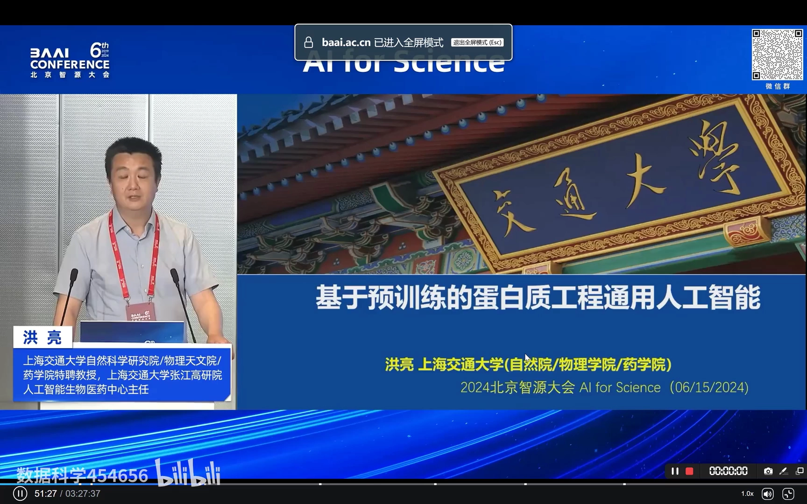

## 本讲要解决的核心问题（SCQA）

**背景**：蛋白质（以及酶）是生物制造的核心基座工具。它既是我们身体里的重要元件，也是我们每天都在用的产品：医药里的抗体、组合疫苗、ADC，核酸检测里关键的酶，基因编辑用的 CRISPR 酶；食品里的发酵、功能饮料、添加剂；化工里的合成生物学；美容里的胶原蛋白；农业里的饲料、农药……可以说 **蛋白和酶支撑着一整条现代产业**。

**冲突**：但从生物体里拿到的「天然蛋白」，理化性质往往**不满足工业应用的需求**。人正常体温 37℃，可酒厂里的酶要耐酒精、体外诊断试剂要耐高温、饲料酶要耐高温、生物医药里的蛋白要特异性好且免疫原性低。传统改造有两条老路——**理性设计**（要解结构、只能改活性口袋那约 1/10 的空间，耗时长）和**定向进化**（靠随机突变 + 高通量筛选，要钱、要多轮、很多性质还建不了高通量方法）。更麻烦的是：改一个位点 80% 是阴性，改八个位点 99.9% 是阴性；而且存在「上位效应」——单独看很好的两个突变，合到一起反而变差。结构并不等于功能。

**疑问**：能不能**不看结构、面向功能直接设计序列**，做一个通用的人工智能，只做很少的实验，就完成蛋白质的定向进化？

**回答（中心思想）**：**可以。用「学习自然界全部蛋白序列的预训练大模型 + 千万级功能标注 + 少量湿实验微调/rewarding」这套范式，就能在无实验数据或极少实验数据下，对很多种完全不同的蛋白完成定向进化，并已做出多款工业化产品。** 这条路之所以成立，靠三点：预训练让模型「懂自然规律」，小样本学习让它能泛化到新蛋白，干湿闭环让它越用越准。

---

## 一、蛋白质工程是什么：把天然蛋白「改」成能用的产品

**蛋白质工程，就是对一个蛋白序列中 5~20 个位点做氨基酸替换，优化它的特定性质，使其满足工业、医药里的应用需求，从而成为产品。**[【跳转到 01:20】](https://www.bilibili.com/video/BV1nJ4m1M7ea/?t=80)

要优化的性质有很多种：**稳定性、结合力（亲和力）、催化活性、底物选择性**等等。为什么必须改？因为天然蛋白的「使用环境」和工业现场差别巨大——在酒厂里要耐酒精，在体外诊断试剂盒里要耐高温，在饲料里也要耐高温，在生物医药里则要求特异性好、免疫原性低。一个蛋白来自生物体，但作为产品，一定要改造性能，让它满足应用需求。[【跳转到 00:55】](https://www.bilibili.com/video/BV1nJ4m1M7ea/?t=55)

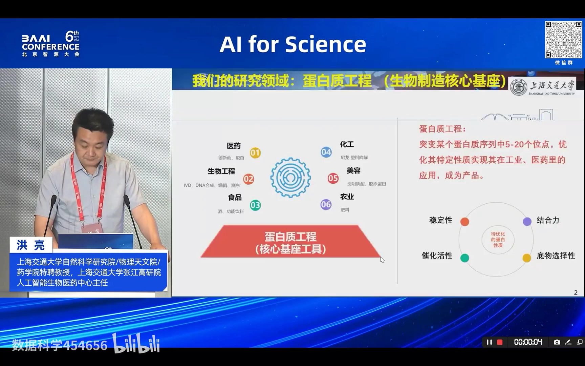

## 二、行业里一直在用的两条老路，为什么都不够用

**传统蛋白质工程有两条路：理性设计，以及定向进化（高通量随机突变）。两条路各有硬伤，所以才急需降本提效的新方法。**[【跳转到 01:45】](https://www.bilibili.com/video/BV1nJ4m1M7ea/?t=105)

**第一条路：理性设计。** 先把蛋白结构解出来，搞清楚它和小分子在哪个「活性口袋」里相互作用，再去改口袋附近的氨基酸；或者改抗体—抗原的亲和界面。它的**局限**是：一个蛋白除了作用界面以外，还有约 90% 的地方人是不知道怎么改的——可你改这些地方同样能改变性质，只是人不知道。[【跳转到 02:04】](https://www.bilibili.com/video/BV1nJ4m1M7ea/?t=124) 报告人特别强调：理性设计耗时很长，而且能改的位点主要集中在活性口袋周围，区域受限、只占约 1/10 的空间。

**第二条路：定向进化。** 不搞理性设计了，拿一个野生型蛋白做随机突变，高通量筛一波，筛出最好的单位点；在这个基础上再随机突变、再筛一波，一轮一轮往下筛，直到筛到满足需求的突变体。这条路（定向进化）还拿过 **2018 年诺贝尔化学奖**。但它有三个缺陷：**①要构建高通量表型筛选方法、成本高；②多轮筛选时间长；③并非所有性质都能建高通量方法，建立困难。** 视频里举了个真实例子：国外某公司把一个胰岛素相关的酶改造出来，就花了 **5 年、大概 1 亿美元**。[【跳转到 02:29】](https://www.bilibili.com/video/BV1nJ4m1M7ea/?t=149) 报告人总结：**蛋白质工程通常需要 2~5 年才能改造出一个优秀的工程酶或药用蛋白。**[【跳转到 01:45】](https://www.bilibili.com/video/BV1nJ4m1M7ea/?t=105)

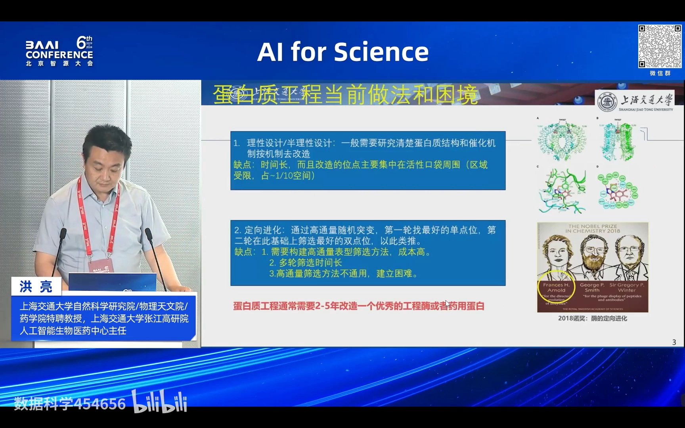

## 三、核心挑战：这是个数学问题，而且「结构 ≠ 功能」

**蛋白质工程的核心难点有两层：一层是组合空间太大（数学问题），另一层是结构好不代表功能好（鸿沟）。**

**先说 AlphaFold 的进展与不足。** 报告人认为，生物领域人工智能这 50 年最大的突破是 **AlphaFold 结构预测**：从 AlphaFold2 到 AlphaFold3，早期 AlphaFold2 还需要同源序列达到一定程度才能解出结构；AlphaFold3 用了「生成再蒸馏」的方法，同源序列需求大大降低，而且能解**复合物**（现场张老师指出复合物还有些缺陷，但要看到进步）。[【跳转到 03:19】](https://www.bilibili.com/video/BV1nJ4m1M7ea/?t=199) **但在蛋白质工程领域，AlphaFold 基本没用**——因为「有结构就一定有功能吗？这是两回事」。你怎么能让一个抗体同时免疫原性低、活性好、亲和力高？你改几个位点试试，无论是计算还是实验，**甚至都看不出结构的差别，但功能就是不一样**。[【跳转到 03:25】](https://www.bilibili.com/video/BV1nJ4m1M7ea/?t=205)

**再说组合爆炸。** 一个蛋白按 400 个氨基酸算，每个位点有 20 种天然氨基酸可能：单位点就 **8000** 种可能，双位点 **3200 万**，四位点高达 **180 万亿**。而一个蛋白的表达、纯化、检测至少要 **1000 元**一个——数量级一上来，成本完全不可承受。[【跳转到 04:15】](https://www.bilibili.com/video/BV1nJ4m1M7ea/?t=255)

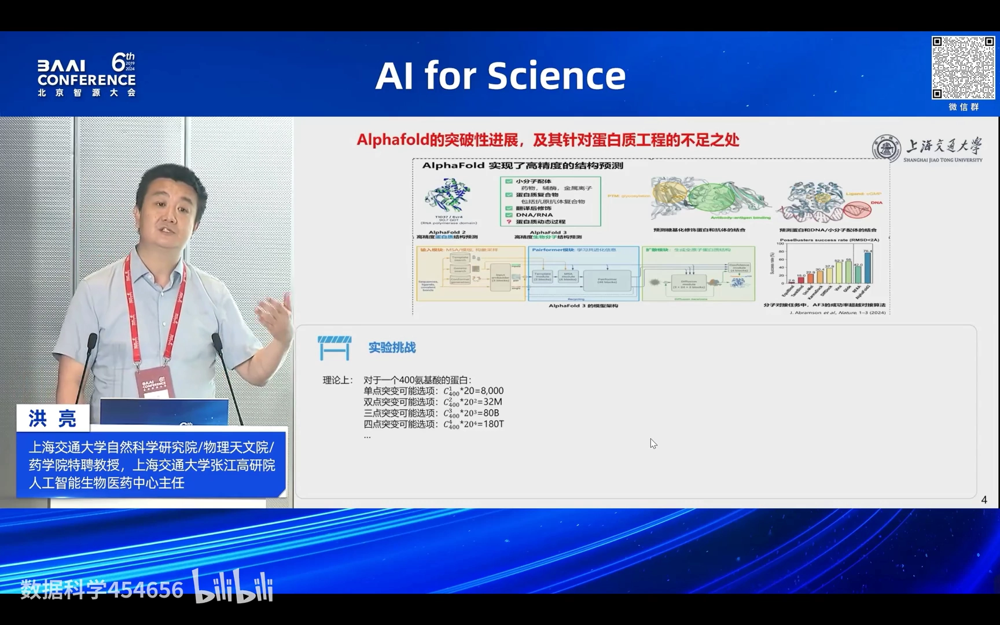

**「碰运气」也不行。** 2016 年 Nature 一篇论文在绿色荧光蛋白（GFP）上做了高通量随机突变实验，结果显示：**随机突变一个位点，约 80% 是阴性的（蛋白不发光了）**；突变八个位点，99.9% 是阴性的。报告人用自己团队的经历佐证：这个蛋白能表达、结构没问题，AlphaFold 折出来是那样、冷冻电镜也是那样，**但它就是不发光**——所以结构跟功能之间有一条鸿沟。[【跳转到 04:40】](https://www.bilibili.com/video/BV1nJ4m1M7ea/?t=280)

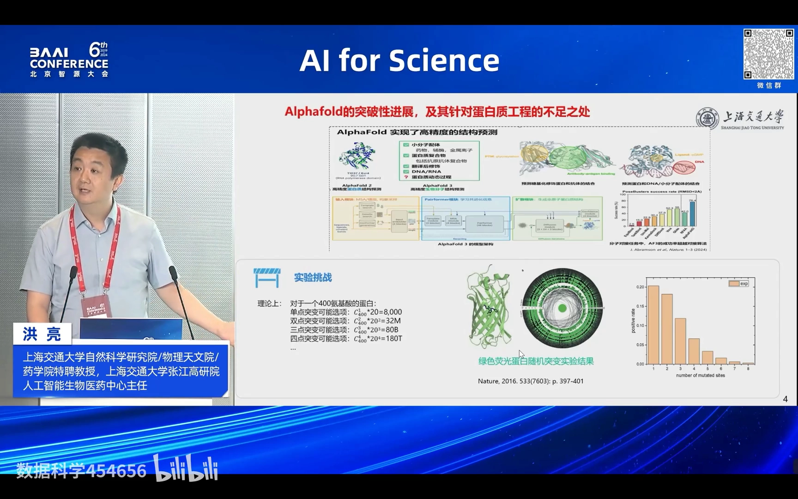

**更糟的是「上位效应」（epistatic effect）。** 你好不容易筛出几个优秀的单位点，单独去突变它是好的，**但两个加在一起反而变坏**；统计上「1+1<2」比「1+1>2」的可能性要**高 100 倍**。所以本质问题是：**在这么浩瀚的序列空间里，怎么找到那些优秀位点，并让它们「1+1>2」地组合起来，变成一个工程上有用的产品。**[【跳转到 05:30】](https://www.bilibili.com/video/BV1nJ4m1M7ea/?t=330)

## 四、解法：用预训练大模型，「面向功能直接设计序列」

**既然结构不等于功能、试错空间又太大，报告人提出的思路就是：不依赖结构，直接面向功能设计序列——做一个「蛋白质工程的通用人工智能」。**[【跳转到 06:20】](https://www.bilibili.com/video/BV1nJ4m1M7ea/?t=380) 整套办法分三步：

1. **预训练：学习自然界已经存在的所有蛋白质序列信息。** 团队做得很早，**2022 年就发表了论文**，当时普通大众还不知道 ChatGPT。做法是把自然界所有蛋白序列拿来，用自然语言模型去学习氨基酸的排列方式。[【跳转到 06:27】](https://www.bilibili.com/video/BV1nJ4m1M7ea/?t=387) 为什么这很重要？因为一个 400 氨基酸蛋白的理论排列空间是 **20 的 400 次方**，而自然界实际存在的蛋白也就 **10 的 9 次方**左右——**自然界的氨基酸排列方式是非常非常严格的**。报告人打了个比方：汉字有 3000 个，说一句话十个汉字，理论上有 3000 的 10 次方种组合，可你并没有那么多话可说；「我是一个人」这五个字就只有一种排列。用自然语言模型学完之后，模型**就知道自然界怎么做一个 good protein**。[【跳转到 07:02】](https://www.bilibili.com/video/BV1nJ4m1M7ea/?t=422)

2. **监督学习：用千万级标注数据训练。** 团队给大量蛋白质标注了**工作温度、压强、pH** 等功能属性，用这些标注数据做监督学习。[【跳转到 07:07】](https://www.bilibili.com/video/BV1nJ4m1M7ea/?t=427)

3. **微调：用少量湿实验数据做 fine-tuning / rewarding，让蛋白往目标方向进化。** 这一步把大模型「往这个方向定向进化」。[【跳转到 07:32】](https://www.bilibili.com/video/BV1nJ4m1M7ea/?t=452)

报告人指出，这一步带来的是**范式变化**：把以前需要专家经验、靠理性设计或大量实验试错的做法，变成**用很少的实验、用预训练模型的方法**去做。其团队在 **JCIM** 上的工作，是**全球第一篇证明通用人工智能能在没有实验数据或极少实验数据的情况下，定向进化六款非常不同的蛋白**——从抗体，到基因编辑酶，到荧光蛋白都能做到。[【跳转到 07:57】](https://www.bilibili.com/video/BV1nJ4m1M7ea/?t=477)

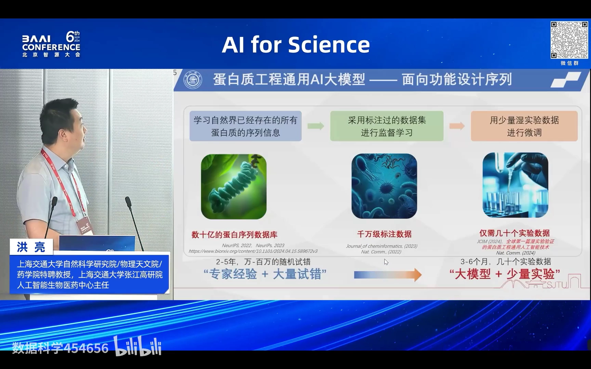

## 五、七个真实案例：这套方法到底改了哪些蛋白

报告人用七个案例来证明「通用人工智能」不是空话。下面逐个说明。

### 5.1 案例一：让超大 Cas12a 酶耐高温（零实验数据起步）

这是一个**比较难改**的蛋白：**CRISPR-Cas12a，一个 1300 个氨基酸的大蛋白**，用作体外诊断试剂盒里的酶。做体外诊断要求它耐高温——野生型的解折叠温度（Tm）只有 **42℃**，在常温使用就会解折叠、坏掉。[【跳转到 08:22】](https://www.bilibili.com/video/BV1nJ4m1M7ea/?t=502)

改造分三轮：

- **第一轮，零实验数据，直接用预训练模型 zero-shot 预测**哪些突变序列符合自然规律。做了 30 个突变体，结果**热稳定性阳性率 1/3，最高提升不到 2℃，活性不低于野生型的有 55%**。报告人强调，如果不用预训练模型、随机去筛，阳性率**连 1% 都不到**。[【跳转到 08:27】](https://www.bilibili.com/video/BV1nJ4m1M7ea/?t=507)
- **第二轮，30 个突变体，阳性率 2/3**，最好的是**四点位**、提高了 **4℃**，活性不低于野生型的达到 **85%**。[【跳转到 09:17】](https://www.bilibili.com/video/BV1nJ4m1M7ea/?t=557)
- **第三轮，30 个突变体，热稳定性阳性率 100%**，最好的是 **8 点位**、提高了 **>6℃**，活性不低于野生型的达到 **100%**。[【跳转到 09:42】](https://www.bilibili.com/video/BV1nJ4m1M7ea/?t=582)

为什么预训练模型一上来就这么准？报告人解释：**因为它知道自然界的氨基酸排列顺序，会把不符合自然规律的序列排除掉**——有些蛋白性能不好，不是功能不行，而是它可能根本表达不出来、不折叠，不符合自然规律。[【跳转到 08:52】](https://www.bilibili.com/video/BV1nJ4m1M7ea/?t=532)

最难得的是：这个最好的 8 点位突变体里，**有两个位点单独去做是阴性的**，模型却把「阴性的」和「阳性的」**组装**到了一起——这是人绝对不知道怎么做、超出设计范围的事。[【跳转到 10:07】](https://www.bilibili.com/video/BV1nJ4m1M7ea/?t=607)

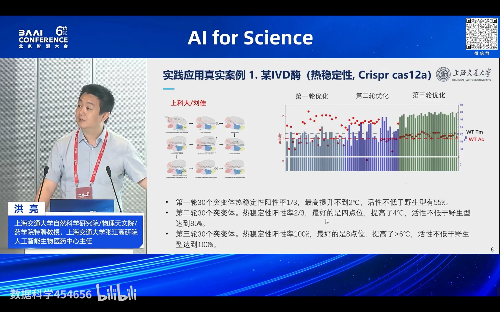

### 5.2 案例二：把「不抗碱」的纳米抗体改成耐强碱的纯化填料（全球首个大模型工业化蛋白产品）

抗体药物（生物药）纯化时，需要一个**亲和填料**（的蛋白配基），它要耐强碱——强到什么程度？**0.5 摩尔氢氧化钠**，非常强的碱（报告人打趣：你不会把手放进浓硫酸，也劝你别把手放进 0.5 摩尔氢氧化钠，一样会被腐蚀）。工业纯化就要求填料耐这种强碱，但**自然界根本不存在这种东西**。当时世界上唯一稳定的产品是 **GE 做的 Protein A**，它来自**金黄色葡萄球菌**、是天然耐强碱的，报告人称其为「上帝的恩赐」；即便如此，**GE 也做了 5 年以上才做成稳定产品**。[【跳转到 10:32】](https://www.bilibili.com/video/BV1nJ4m1M7ea/?t=632)

一家药企找到团队：他们从**羊驼纳米抗体库里筛了一个 3000 万的库**，找到了一个亲和的纳米抗体，但**抗碱性能不行**——在柱子上刷约 **60 个批次就断掉**，只能重新填料，**一年要花 2000 多万**。他们希望把抗碱性能提高到能在 0.5 摩尔氢氧化钠中长期使用。[【跳转到 11:11】](https://www.bilibili.com/video/BV1nJ4m1M7ea/?t=671)

团队**去年 5 月接到项目，一点实验数据都没有**，做了两轮，**四个月后（9 月底）交付**。11 月客户做中试、上柱，**抗碱性能提高了 4 倍**；今年 1 月开始放大生产。SDS-PAGE 检测显示：**0.5M NaOH 碱处理后断裂比例减少 3/4、亲和力提高一倍**；客户在沟通群里反馈「**碱处理后吸附能力提高了 3~4 倍**」。报告人强调：**这是工业蛋白质产品历史上第一个用大模型做出来的蛋白质产品**，而且同类只有一款「上帝的恩赐」、GE 还做了很多年。从一个完全不抗碱的蛋白，到工业化稳定应用，**只花了一年**。[【跳转到 12:01】](https://www.bilibili.com/video/BV1nJ4m1M7ea/?t=721)

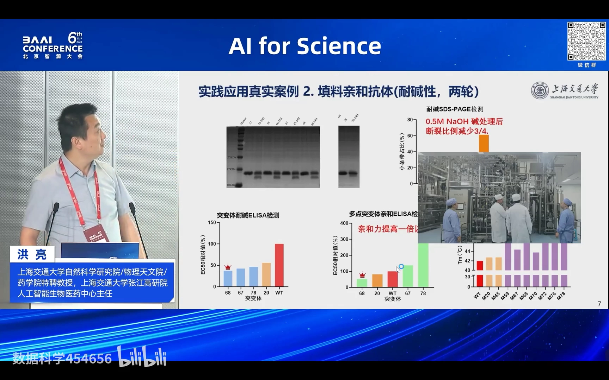

### 5.3 案例三：改造糖基转移酶，做到纯度 95% 并实现量产（第二款大模型工业化蛋白产品）

这是**急性胰腺炎体外诊断试剂盒的一个核心物料**，叫**麦芽七糖苷**（由七个糖单元组成）。它要按特定属性和排布合成，化学合成非常复杂。**全球这门化学工艺掌握在罗氏（Roche）手上，处于垄断地位**。[【跳转到 12:26】](https://www.bilibili.com/video/BV1nJ4m1M7ea/?t=746)

团队与**上海交大杨广宇老师**合作，用大模型的方法做了**两轮、约 80 个突变体**，筛出了一个非常好的 **M1 突变体**。这一步本来就很难做（此前已改了很久没做出来），最终：**目标酶活性提高 8 倍**，**目标产物纯度从 80% 提高到 95%**（报告人强调：合成生物学里达不到 95%，纯化成本会很高），**副反应从 15% 降到 10%**，**产量从 3 提高到 6**。[【跳转到 13:11】](https://www.bilibili.com/video/BV1nJ4m1M7ea/?t=791) 项目已完成中试，正在**宜昌放大生产，今年将产出 10 亿人份，把成本降到 2.5 万元/公斤**。报告人还提到，做这件事的一个背景是**罗氏经常对中国断供**。这是**全球用大模型做出来的第二款蛋白质产品**，也是团队做的。

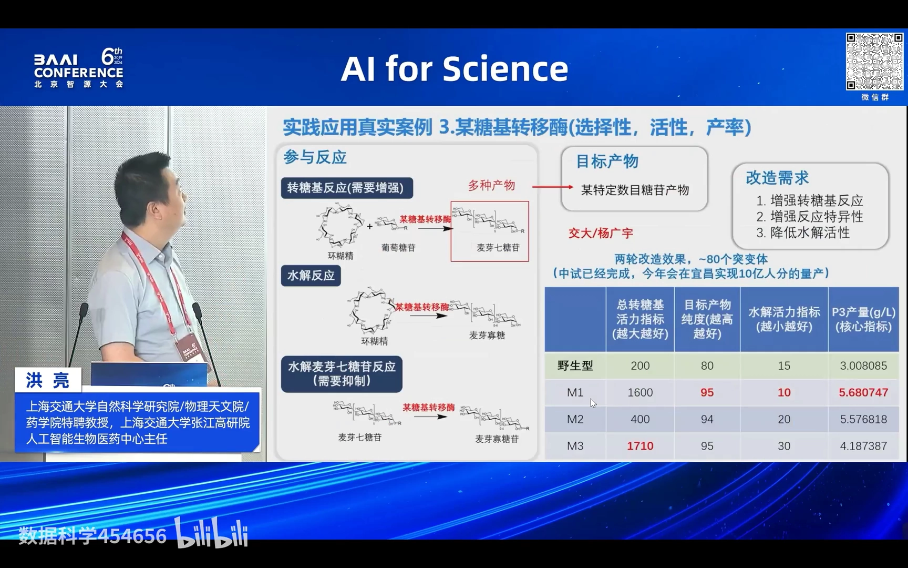

### 5.4 案例四：为 DNA 存储改造「非天然核酸聚合酶」（做自然界不存在的东西）

第四个案例回答「**AI 能不能做出自然界不存在的东西**」。背景是 **DNA 存储**：DNA 存储的一个核心问题，是它可能被自然界的菌降解掉，因此必须长期存放在无菌环境里，成本很高。**如果合成 DNA 的原料本身含有非天然核酸，产生的 DNA 就不会有这个问题**——但自然界没有酶能合成带非天然核酸的 DNA。[【跳转到 14:06】](https://www.bilibili.com/video/BV1nJ4m1M7ea/?t=846)

团队与**中科院基础医学与肿瘤所宋杰老师**合作，借鉴一篇 **Science** 论文做了约 **10 亿量级的高通量筛选**，筛出一个**九点位突变体**，能对非天然核酸底物进行合成，速率约 **20 nt/min**。随后团队又做了**两到三轮优化**，把合成速率从**起点的 22 nt/min 提升到 M1 的 76、M2 的 95 nt/min，三轮把活性提高约 5 倍**，接近产业化水平。**这是自然界根本不存在的东西**——没有能合成非天然核酸的天然聚合酶，而大模型照样能做。[【跳转到 14:31】](https://www.bilibili.com/video/BV1nJ4m1M7ea/?t=871)

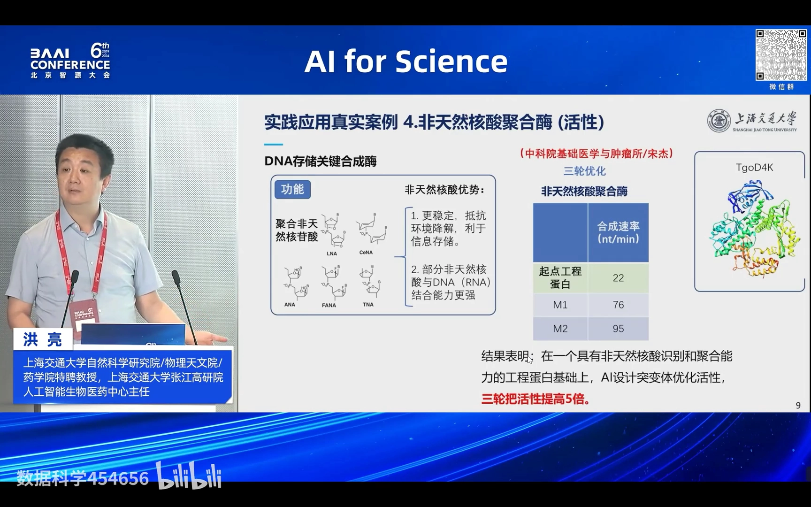

### 5.5 案例五：抗体亲和力优化——「人机对抗」，AI 胜过专家理性设计

第五个案例是与一家**抗体 CRO 公司**做的「人机对抗」。对方有结构生物学和计算生物学的团队，筛到了一些亲和力不错的抗体，再做组装。报告人说，**蛋白质工程的核心正是「组装」它 enormous 的可能性**。[【跳转到 14:56】](https://www.bilibili.com/video/BV1nJ4m1M7ea/?t=896)

- **案例 1**：原始序列亲和力是 **50 nM**，双方各设计 **21 个**。结果团队的设计中**有 12 个**比对方最好的还强；对方最好是 **11 倍**，团队最好是 **18 倍**。
- **案例 2**：起始序列亲和力很高（**1 nM**），对方设计 25 个没有明显提高；团队设计 25 个，**有 10 个有明显提高**，最好的提高了约 **3 倍**。

最终亲和力**做到了 pM（皮摩尔）级别**。报告人补充：现在对方复杂的都交给团队做，他们的团队也在裁人。[【跳转到 15:21】](https://www.bilibili.com/video/BV1nJ4m1M7ea/?t=921)

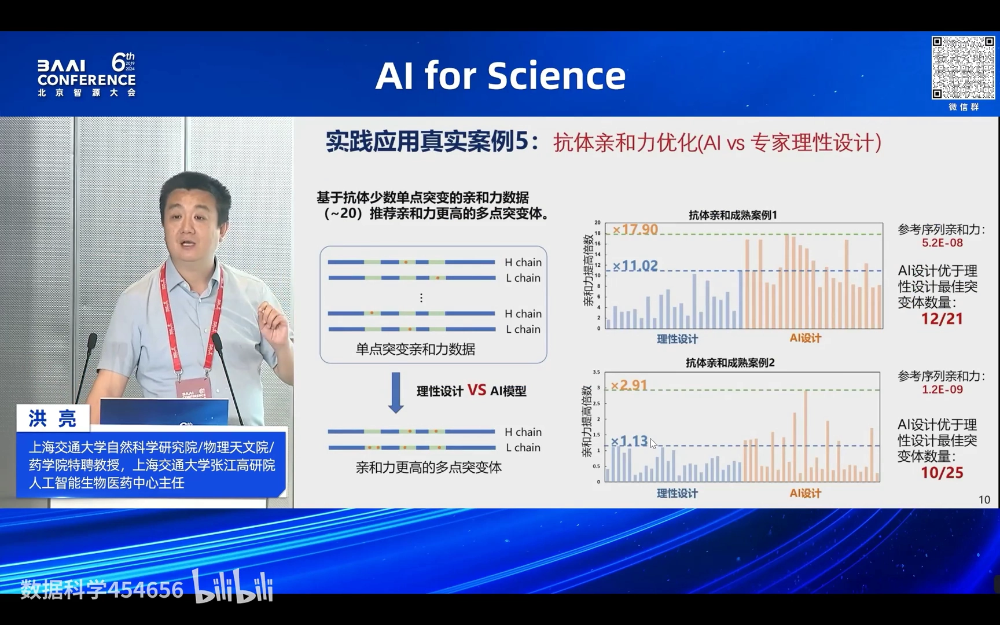

### 5.6 案例六：抗体亲和力成熟的「单盲测试」——解决小样本学习问题

报告人认为，**生物学（科学）问题里最重要的一环是解决小样本学习问题**。他举例：AlphaFold3 这次最大的进步，就是用「生成再蒸馏」的方法把对 MSA 的需求大大降低。[【跳转到 15:46】](https://www.bilibili.com/video/BV1nJ4m1M7ea/?t=946)

这个案例来自一家**国内很有名的抗体上市公司**。他们的一个 **ScFv 抗体，全长 245 个氨基酸，涉及 21 个突变位点、61 种突变**，且不止一种突变，而是 **2~9 个位点的组合突变**，理论上共有 **119,701,116 种可能**。对方做过实验，但**只给团队看 33 条**（含序列与亲和力），再**随机抽出 14 条只给序列**，让团队把亲和力猜出来——**这是典型的小样本学习问题**。[【跳转到 16:11】](https://www.bilibili.com/video/BV1nJ4m1M7ea/?t=971)

团队用自己特有的大模型小样本学习方法（该文章已在 **Nature Communications（NC）** 快发表），**只用了这 33 条数据**就完成了预测：预测的亲和力排序与实验的**相关系数（Spearman r）达到 0.65，Top5 的命中率为 60%（3/5），Top10 的命中率为 80%（8/10）**。报告人强调：**生物领域如果解决不了小样本学习问题，就纯属为了发文章，不可能有泛化能力、也不可能解决真实工程问题。**[【跳转到 17:01】](https://www.bilibili.com/video/BV1nJ4m1M7ea/?t=1021)

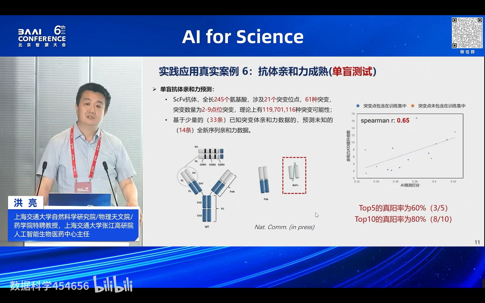

### 5.7 案例七：大模型「挖煤」——挖出一个没人想到的塑料降解酶

第七个案例叫「大模型挖煤」（不是真去山西挖煤）。传统做法是：酒厂想要一个耐乙醇的酶，就去隔壁土壤里找个菌，用已知酶的序列去比对（BLAST），找个序列相似度非常高的（比如 95%）去测——**这要看运气，它不一定有这个功能**。报告人说：**你能做序列比对、别人也能做，问题是能不能找到我们这些工程师找不到的东西**。[【跳转到 17:26】](https://www.bilibili.com/video/BV1nJ4m1M7ea/?t=1046)

团队用大模型做了一个**降解塑料的环保酶**。这种酶要在 **65℃ 或 50℃** 工作才能让塑料软化，但一般酶没有这个能力。**自然界已知的 PET 酶只有 47 个**，团队把这 47 个蛋白序列投到大模型上，**用大模型的特征做聚类（clustering），再用大模型判断「什么是一个 PET 酶」**；随后用这个特征把候选的**11 条序列**筛一遍——「大模型认为它是 PET 酶，我就认为它是 PET 酶」——再结合稳定性等各方评分，**选出 32 个做实验**。结果真的找到一个：**热稳定性一下子提高了 30℃（解折叠温度从 50℃ 提到 80℃），活性提高了 80 倍。**[【跳转到 17:51】](https://www.bilibili.com/video/BV1nJ4m1M7ea/?t=1071)

最难得的不是这个提升幅度，而是：**它跟已知 PET 酶的序列相似度才 20% 几；它来源的菌种不是高温菌种；它的功能分类也不是 PET 酶，而是角质酶（cutinase）**。报告人说：**人想破头都不会有这种东西——这正说明 AI 能做到工程师做不到的事。**[【跳转到 18:41】](https://www.bilibili.com/video/BV1nJ4m1M7ea/?t=1121)

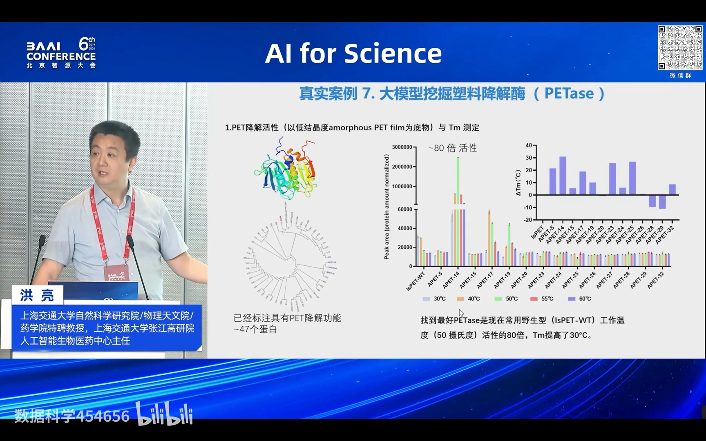

## 六、为什么这条路有效：AI 大模型助力蛋白质工程的四点优势

**用大模型做蛋白质工程，优势可以归纳为四点。**[【跳转到 19:06】](https://www.bilibili.com/video/BV1nJ4m1M7ea/?t=1146)

1. **阳性率极高**：AI 直接选取符合自然规律及进化规则的突变体，**不需要酶工程经验**。在活性、稳定性、结合活性等指标上能达到 **30%~50% 的阳性率**，而且**往往能找到理性设计找不到的优秀单位点突变体**。
2. **理解上位效应，实现多点位精准设计**：模型通过学习自然界上亿蛋白的序列和结构，理解蛋白内部多个氨基酸之间的**上位效应（epistatic effect）**，从而把**6~10 个点位**的多轮实验**缩减到 2~3 轮**，**节约 50%~80% 的实验时间**。
3. **表达量（yield）不错**：AI 设计的突变体表达量一般都还可以。报告人用数据佐证：从给定培养基产生蛋白的量来看，其通用模型推荐的突变体**产率不会太差，有不少和野生型相当，甚至出现比野生型表达更高的突变体**。[【跳转到 18:41】](https://www.bilibili.com/video/BV1nJ4m1M7ea/?t=1121)
4. **大模型「挖酶」**：可以像 5.7 那样从海量序列里挖出工程师想不到的酶。

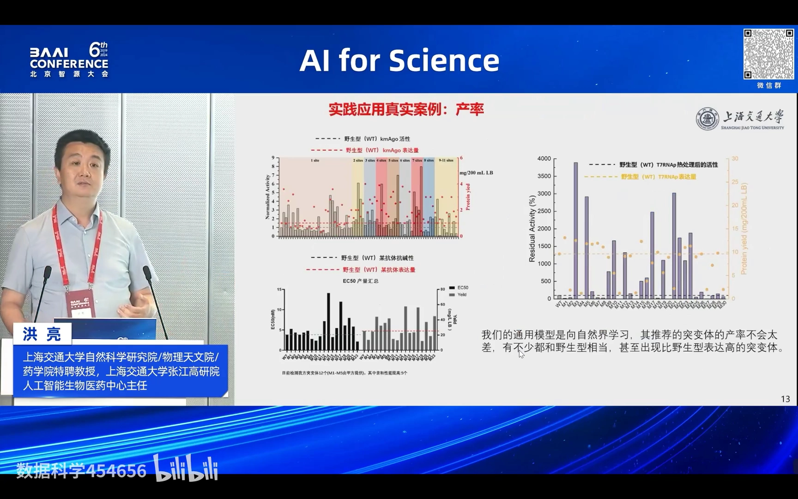

## 七、这套方法怎么用：流程化平台与成果

**在工程上，团队把整套能力做成了一条「AI 蛋白质设计流程化平台」。**[【跳转到 19:31】](https://www.bilibili.com/video/BV1nJ4m1M7ea/?t=1171) 用户只需**上传序列数据，AI 第一轮预测约 12 小时**出结果；然后做**实验验证（约 1~2 个月）**；把实验数据回传后，**AI 微调 + 预测再花约 12 小时**，得到优势突变体。一般**两到三轮就结束**。能做的事情很多：热稳定性、活性、亲和力、耐受性等等。报告人强调：**一旦一个工程问题被通用人工智能突破之后，它的释放能力是非常强的**。

**成果方面**：过去一年团队**成功改造了 20 款蛋白**，所有合作都是从去年 4 月开始的；目前**约 40 个蛋白质工程项目**在进行，**企业合作已落地五个产品、其中两个已经放大**，另有**两款具有全球领先水平的产品落地产业化**。合作方包括高校/科研院所（如上海科技大学、中科院相关研究所、清华大学、湖北大学、天津工业生物所等）和产业企业（生物医药、酶工程、药物中间体/食品、农业、IVD、合成生物学等多个领域）。[【跳转到 20:37】](https://www.bilibili.com/video/BV1nJ4m1M7ea/?t=1237)

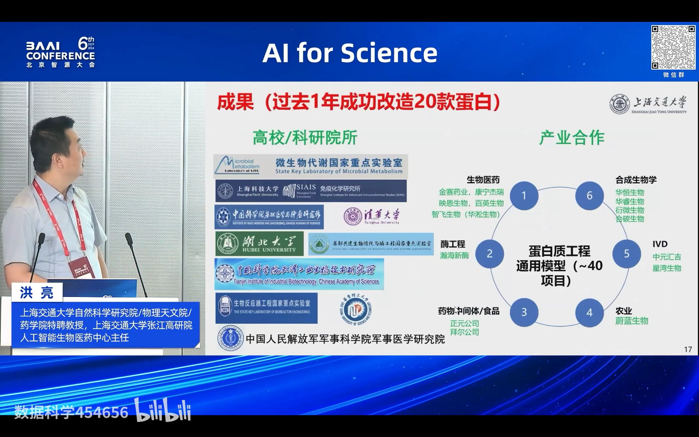

**最后，报告人把这件事总结为一次「范式变革」。** 核心优势是：**自建蛋白质词表、小样本学习方法、序列/结构预训练方法**（自主模型）；**干湿闭环迭代，端到端给出功能蛋白（产品）**，全球范围内率先实现多款蛋白产品放大落地（率先落地）。范式上则是 **Biology Science（生物科学）↔（AI、大模型）↔ Engineering（工程）** 的打通：**从依靠人脑、零星试错的科学发现模式，走向 AI 大模型自动化、精准设计模式——无人干预、极少实验、极短周期，做到传统方法做不到的蛋白。**[【跳转到 21:02】](https://www.bilibili.com/video/BV1nJ4m1M7ea/?t=1262) 报告人透露，团队只有**两个人**在做设计，工作量还不饱和——这也从侧面说明了自动化带来的效率。

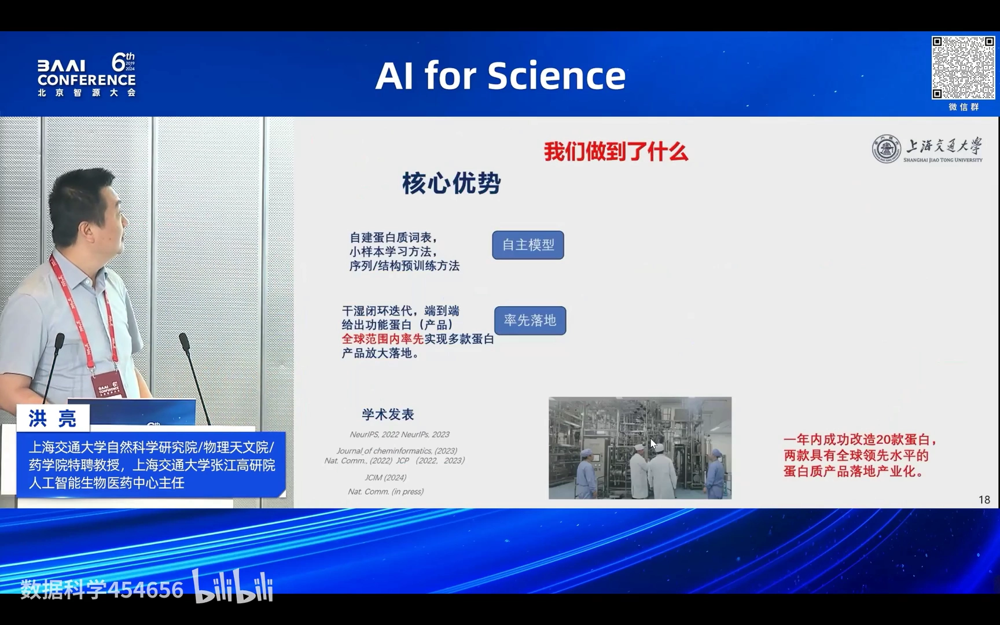

## 小结

- **蛋白质工程 = 给蛋白换 5~20 个氨基酸位点，让它的稳定性/亲和力/活性/选择性满足工业与医药需求**，从而成为产品。
- **两条老路都不够用**：理性设计只能改活性口袋附近约 1/10 的空间；定向进化要钱、要多轮、很多性质还建不了高通量方法；传统改造通常要 2~5 年。
- **难点的本质是数学 + 鸿沟**：400 氨基酸蛋白的四点位组合高达 180 万亿种；结构好不代表功能好（GFP 实验为证）；还有「1+1<2」概率高 100 倍的上位效应。
- **解法是「预训练 + 少量实验」**：用自然语言模型学习自然界全部蛋白序列（预训练）→ 千万级功能标注监督 → 少量湿实验微调/rewarding，直接面向功能设计序列。
- **七个案例证明它通用**：Cas12a 热稳定性、抗体填料耐碱性、糖基转移酶、非天然核酸聚合酶、抗体亲和力优化、单盲小样本预测、塑料降解酶挖掘——横跨多种蛋白、多种性质。
- **已有工业化落地**：首个与第二个「用大模型做出来的蛋白质产品」均已放大生产，过去一年改造 20 款蛋白、落地五个产品。
- **方法论要点保持不变**：阳性率 30%~50%、理解上位效应把 6~10 点位实验缩到 2~3 轮、干湿闭环自动化——这正是从「专家经验 + 大量试错」到「大模型 + 少量实验」的范式变革。

## 关键术语速查

| 术语 | 一句话解释 |
| --- | --- |
| 蛋白质工程 | 对蛋白序列中 5~20 个位点做氨基酸替换，优化特定性质，使其满足工业/医药应用、成为产品 |
| 理性设计 | 先解出蛋白结构、按机制在活性口袋等关键位置改造；依赖结构、区域受限、耗时长 |
| 定向进化 | 随机突变 + 高通量筛选，一轮轮筛选优秀突变体；2018 年诺贝尔化学奖；成本高、周期长、可筛性受限 |
| 上位效应（epistasis） | 多个突变之间互相影响：单独好的突变合在一起可能变差（「1+1<2」概率比「>2」高约 100 倍） |
| AlphaFold | 高精度蛋白结构预测模型；2→3 代引入生成再蒸馏、降低同源序列需求并能预测复合物；但结构不等于功能 |
| 预训练 | 用海量自然蛋白序列，以自然语言模型学习氨基酸的「自然排列规律」 |
| 小样本学习 | 只用很少的实验数据（如 33 条）就能预测新序列性质，是模型能泛化到新蛋白的关键 |
| rewarding / fine-tuning | 用湿实验数据微调模型，使其朝目标性质（更稳定、更活跃等）的方向定向进化 |
| 干湿闭环 | AI 预测（干）与实验验证（湿）交替迭代，把实验数据回馈给模型做下一轮设计 |
| 零样本（zero-shot） | 完全没有实验数据时，直接让预训练模型给出候选突变序列 |
| 大模型「挖煤/挖酶」 | 用大模型的特征做聚类与功能判别，从海量序列里挖出工程师靠序列比对找不到的新酶 |
| Tm（解折叠温度） | 蛋白开始失去折叠结构的温度，常用来衡量热稳定性，越高越耐热 |
| ScFv | 单链抗体片段；案例中为 245 个氨基酸、涉及 21 个突变位点 |

## 参考

- 配套视频：[《基于预训练的蛋白质工程通用人工智能》](https://www.bilibili.com/video/BV1nJ4m1M7ea/)（洪亮，2024 北京智源大会「AI for Science」）
- 相关论文（视频幻灯片提及）：NeurIPS 2022 / 2023、《Nature Communications》(2022/2024)、*Journal of Cheminformatics* (2023)、*JCIM* (2024) 等
