# 蛋白质结合位点识别：AI 如何找到可成药口袋

> 本文整理的视频：[《From Sequence to Target: AI-Powered Protein Modeling & Binding Site Prediction》](https://www.youtube.com/watch?v=OloPSKhdrJA)（YouTube，约 46:41，英文讲座）。
> 视频是一段完整的实操演示：作者以**结核分枝杆菌的异柠檬酸裂解酶（ICL）**为例，从一条氨基酸序列出发，用 AlphaFold 预测结构、用 PyMOL 校对补全、用 Ramachandran 图验证、用 Swiss-PdbViewer 做能量最小化，最后用 DeepSite AI 预测可成药的结合口袋。
> 下文严格依据视频字幕整理，并对照幻灯片把每一步的「为什么做、怎么做、看到什么结果」讲清楚。

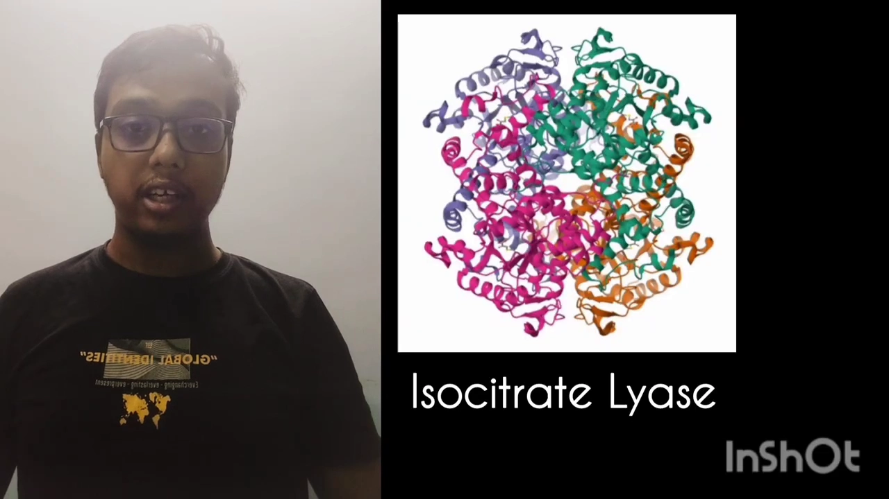

## 本讲要解决的核心问题（SCQA）

**背景**：基于结构的药物设计（structure-based drug design）要回答两件事——靶点蛋白长什么样，以及它身上哪个「口袋」适合让药物分子钻进去结合。这一步通常从蛋白质数据库（PDB）里找一条实验解析出的结构开始。

**冲突**：但实验结构不是想要就有。很多靶点（包括本讲的异柠檬酸裂解酶）要么没有可靠的现成结构，要么数据里缺了关键的辅因子（例如镁离子），还有的结构分辨率和完整性不尽如人意。靠实验去解析一个新结构，既昂贵又慢。

**疑问**：如果手里只有一条氨基酸序列，一个普通研究者能不能用**免费、公开的 AI 工具**，一步步做出一个「验证过、能量稳定、可以直接拿去做对接」的蛋白结构，并找出它身上可成药的口袋？

**回答（中心思想）**：可以。整条流水线由五步构成——**AlphaFold 预测 → PyMOL 验证与补全 → Ramachandran 图验证 → Swiss-PDB 能量最小化 → DeepSite AI 预测结合口袋**。本讲的演示证明：只要按顺序用好这几个免费工具，就能从序列一路走到「找到口袋、拿到口袋打分与中心坐标」，为后续对接（docking）铺好路。

---

## 一、为什么拿异柠檬酸裂解酶开刀：一个潜伏性结核的靶点

**异柠檬酸裂解酶（isocitrate lyase，简称 ICL）是结核分枝杆菌在人体细胞里「潜伏」时赖以生存的关键酶，因此是一个有吸引力的抗菌靶点。** [【跳转到 00:31】](https://www.youtube.com/watch?v=OloPSKhdrJA&t=31)

它属于裂解酶（lyase）这一大类。结核分枝杆菌（Mycobacterium tuberculosis）在**潜伏性结核（latent TB）**期间躲进人体细胞，这时 ICL 帮上大忙：它把**异柠檬酸（isocitrate）转化为乙醛酸（glyoxylate）和琥珀酸（succinate）**，参与所谓的**乙醛酸循环（glyoxylate shunt）**，让细菌在潜伏期也能存活下去。[【跳转到 00:46】](https://www.youtube.com/watch?v=OloPSKhdrJA&t=46)

正因为它在潜伏期不可或缺，**如果能设计一个分子选择性地堵住 ICL 的活性口袋，就有可能对付潜伏性结核**。而要设计这样的分子，第一步就是先把 ICL 的结构和口袋搞清楚——这正是本讲全部工作的目标。

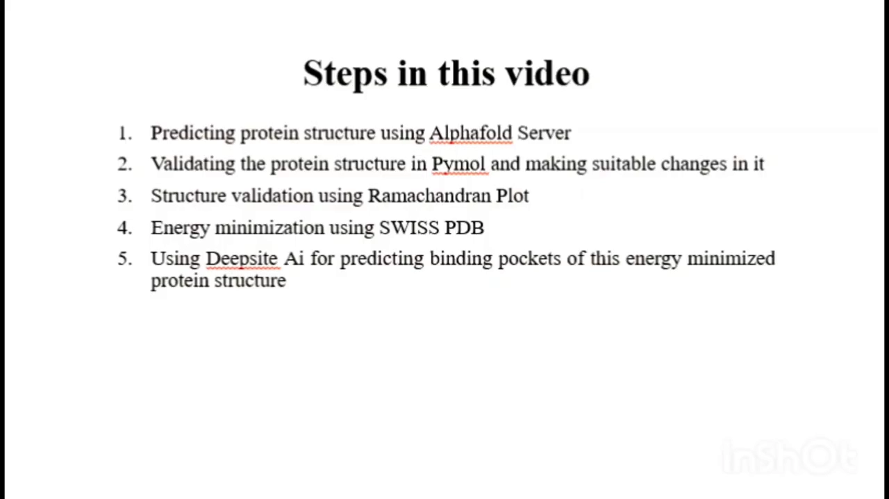

作者在开头就把完整路线图摆了出来，共五步 [【跳转到 01:07】](https://www.youtube.com/watch?v=OloPSKhdrJA&t=67)：

1. **用 AlphaFold 服务器预测蛋白质结构**；
2. **用 PyMOL 验证结构**，与已有的 PDB 结构比对，并按对接方案做适当修改；
3. **用 Ramachandran 图做结构验证**；
4. 如果验证发现有必要，**用 Swiss-PDB 软件做能量最小化**；
5. **用 DeepSite AI 预测结合口袋（binding pockets）**。

下面按这五步逐段展开。

---

## 二、第一步：从 UniProt 拿序列，用 AlphaFold 预测结构

**一切从序列开始：先从 UniProt 找到 ICL 的氨基酸序列，再把它丢给 AlphaFold 服务器去预测三维结构。** [【跳转到 01:52】](https://www.youtube.com/watch?v=OloPSKhdrJA&t=112)

### 2.1 在 UniProt 里找到序列

作者先访问 **UniProt**，输入 ICL 的 UniProt ID **E9WK7**。页面上能看到这个蛋白的功能、名称、亚细胞定位、结构域、变体、修饰、表达、相互作用、结构、家族、序列等信息。[【跳转到 02:10】](https://www.youtube.com/watch?v=OloPSKhdrJA&t=130)

进入左侧的 **Sequence** 栏目，复制那条 FASTA 序列即可。页面上的 **Function** 也印证了前面的背景知识：该酶参与结核分枝杆菌的持续存活与毒力，催化琥珀酸和乙醛酸的相互转化，是乙醛酸循环的关键步骤。[【跳转到 02:39】](https://www.youtube.com/watch?v=OloPSKhdrJA&t=159)

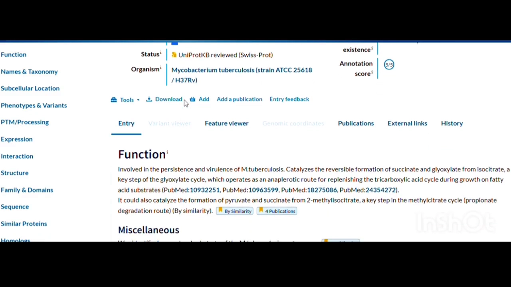

### 2.2 用 AlphaFold Server 建模，并在「拷贝数」和「耗时」间权衡

复制好序列后，进入 **AlphaFold 服务器**（AlphaFold Server）。操作很直接：清空输入框，把序列粘贴进去。[【跳转到 03:10】](https://www.youtube.com/watch?v=OloPSKhdrJA&t=190)

这里有一个**很实用的权衡**值得初学者记住：服务器允许你把同一段序列的**拷贝数（copies）设为 1、2 或更多**，用来模拟多聚体。[【跳转到 03:35】](https://www.youtube.com/watch?v=OloPSKhdrJA&t=215)

- 设成 **1 份**：最快，适合先做一次「试运行」（trial session）；
- 设成 **2 份**：也可行；
- **超过 2 份**：计算量急剧上升，可能要等**长达两小时**。

作者建议先用 **1 个 cycle、1 份拷贝**快速跑一遍。给任务起个名字（例如 `ICL YouTube video`）后提交即可。[【跳转到 04:00】](https://www.youtube.com/watch?v=OloPSKhdrJA&t=240)

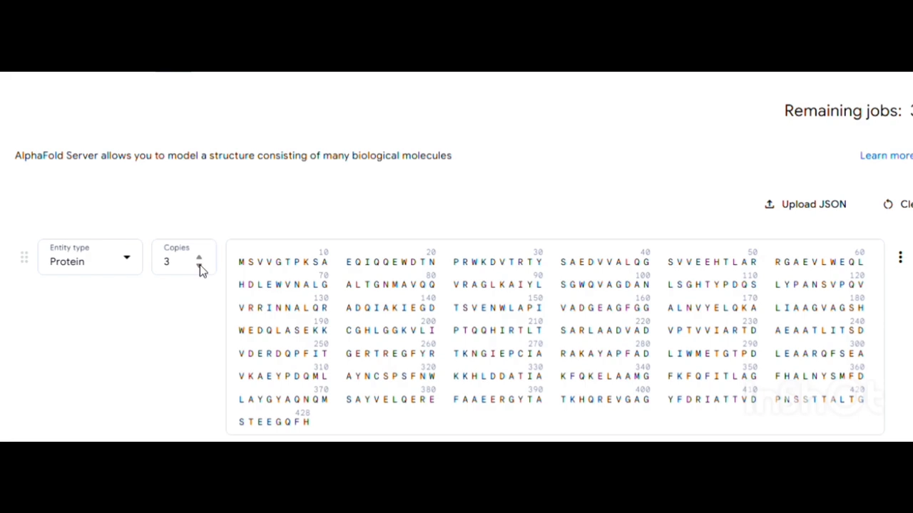

### 2.3 读懂 AlphaFold 的结果：先看置信度等指标

任务跑完后下载 ZIP 并解压，会得到一大堆文件。作者特别提醒：**`template` 文件不要点开**——那是 AlphaFold 预测时用到的模板，不是我们后续要用的产物。我们真正需要的是 `fold-<任务名>-model_0`（模型文件）和 summary 文件。[【跳转到 06:49】](https://www.youtube.com/watch?v=OloPSKhdrJA&t=409)

在 `summaries` 目录里，有五个形如 `confidence_0` ~ `confidence_4` 的文件。打开其中某一档的 summary，能看到一串关键指标 [【跳转到 06:12】](https://www.youtube.com/watch?v=OloPSKhdrJA&t=372)：

- **fraction disordered = 0**：几乎没有无序/混乱的区域；
- **num cycles = 10**；
- **PTM（预测的 TM 分数）= 0.98**；
- **ranking score = 0.98**。

**这个 ranking score 说明：仅凭一条序列，AlphaFold 就以很高置信度预测出了这个蛋白结构，而且与真实世界的结构相当接近。** 对初学者而言，看到 0.9 以上的分数，基本可以放心继续往下做。

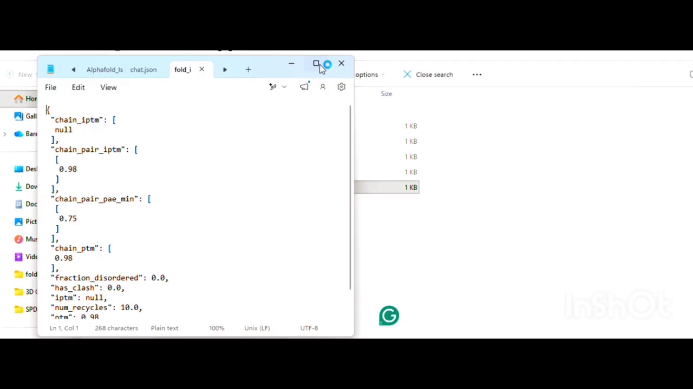

---

## 三、第二步：用 PyMOL 验证结构，并「补全」缺失的辅因子

**AlphaFold 预测的是纯蛋白骨架，而真实结构里往往还带着辅因子。第二步的关键，就是用 PyMOL 把预测结构与权威 PDB 结构比对，并把该有的镁离子「放回去」。** [【跳转到 07:14】](https://www.youtube.com/watch?v=OloPSKhdrJA&t=434)

### 3.1 打开模型、转换格式（CIF → PDB）

在 PyMOL 里打开的是 `model_0.cif` 文件。为了后续操作方便，作者把它从 **CIF 格式转成更通用的 PDB 格式**：在 PyMOL 顶栏选 **File → Export Structure → Export Molecule**，保存时把格式改成 `.pdb`，命名例如 `ICL_YouTube`。[【跳转到 08:29】](https://www.youtube.com/watch?v=OloPSKhdrJA&t=509)

### 3.2 找一个权威的实验结构做参照

作者随后打开另一款软件 **Discovery Studio**（它在后面的对接后分析也会用到），先在里面确认预测模型只有一条链（chain A），因为前面建模时只预测了 1 份拷贝。[【跳转到 10:57】](https://www.youtube.com/watch?v=OloPSKhdrJA&t=657)

接着到 **RCSB PDB** 数据库，检索文献里被引用最多的 ICL 结构——**PDB ID 1F8M**。这个结构的标题是「结核分枝杆菌的 3-溴丙酮酸修饰的异柠檬酸裂解酶的晶体结构」，也就是说它带着一个**抑制剂（丙酮酸）**和一个**镁离子**。[【跳转到 11:57】](https://www.youtube.com/watch?v=OloPSKhdrJA&t=717)

作者还给出一个挑选 PDB 结构的经验法则：**优先选分辨率在 1.5 ~ 2.0 埃之间的结构**。1F8M 的分辨率是 **1.80 埃**，属于「中等分辨率」，可用。[【跳转到 12:58】](https://www.youtube.com/watch?v=OloPSKhdrJA&t=778)

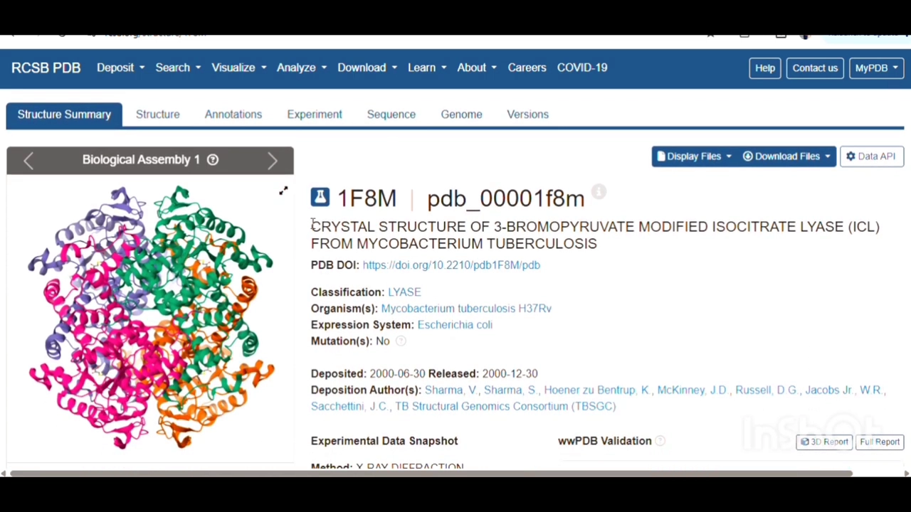

### 3.3 看清 1F8M 与预测结构的差异：链与辅因子

对比之后发现两处差异：

- **链数不同**：1F8M 里 ICL 是**同源四聚体**，有 A、B、C、D 四条链（序列长度 429）；而我们的预测结构只有 A 链。[【跳转到 13:43】](https://www.youtube.com/watch?v=OloPSKhdrJA&t=823)
- **辅因子不同**：1F8M 里除了抑制剂丙酮酸，还有**镁离子（magnesium ion, Mg²⁺）**；但 AlphaFold 预测的结构里没有任何金属离子。[【跳转到 14:10】](https://www.youtube.com/watch?v=OloPSKhdrJA&t=850)

**为什么镁离子重要？** 因为根据文献，镁离子是异柠檬酸裂解酶的**辅因子（cofactor）**，就位于蛋白的活性位点。所以做对接时必须把它保留在结构里。相反，**丙酮酸是抑制剂，是我们「不想」预先放进去的东西**，应当移除。[【跳转到 14:50】](https://www.youtube.com/watch?v=OloPSKhdrJA&t=890)

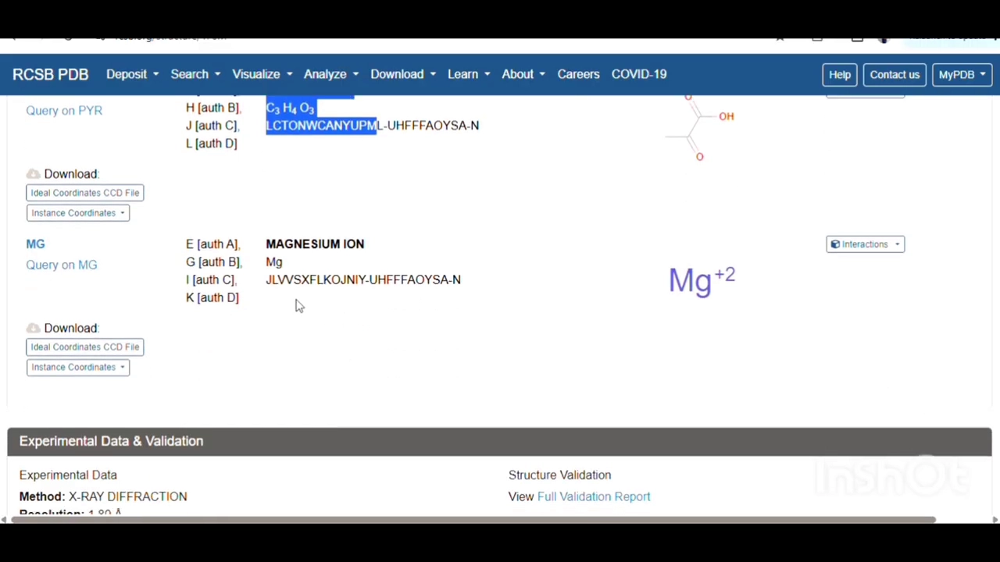

### 3.4 在 PyMOL 里动手：对齐、删链、取出镁离子

接下来是一串 PyMOL 命令，作者逐条演示（这些命令值得记笔记）[【跳转到 15:28】](https://www.youtube.com/watch?v=OloPSKhdrJA&t=928)：

1. 从 PDB 下载 1F8M 的 **Legacy PDB 格式**文件，在 PyMOL 里与预测结构一起打开；
2. **删掉多余链**，只保留 A 链：`remove 1F8M-2 and not chain A`（`1F8M-2` 是 PyMOL 里读入后自动加的后缀；输入时若链名写错会报 `invalid selection`，改对即可）；
3. **把两个结构对齐**：`align ICL_YouTube, 1F8M-2`，让预测结构叠合到实验结构上；
4. **选中并显示镁离子**：`select mag_ion, resn mg`（PyMOL 里镁离子记作 `mg`）；
5. **把镁离子显示成球体**：`show spheres, mag_ion`；
6. **给它上色以便确认**：`color yellow, mag_ion`——看到颜色变化，就确认这确实是镁离子；
7. **隐藏非键合的杂原子（红叉标记）**：`hide non-bonded`，把那些不属于蛋白、又没有成键的杂散原子清掉；
8. **把蛋白模型 + 镁离子合并成一个对象**：`create final, ICL_YouTube or mag_ion`。[【跳转到 26:56】](https://www.youtube.com/watch?v=OloPSKhdrJA&t=1616)

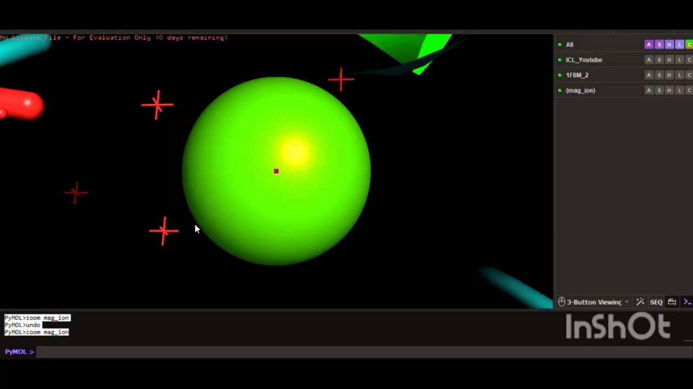

最后把它导出为最终 PDB（例如 `ICL_final.pdb`），并回到 Discovery Studio 里核对：按 **Ctrl+H** 打开层级面板，若在 header atoms / HETATM 里能看到 **MG451**，就说明镁离子已经成功加进我们的结构了。[【跳转到 31:08】](https://www.youtube.com/watch?v=OloPSKhdrJA&t=1868)

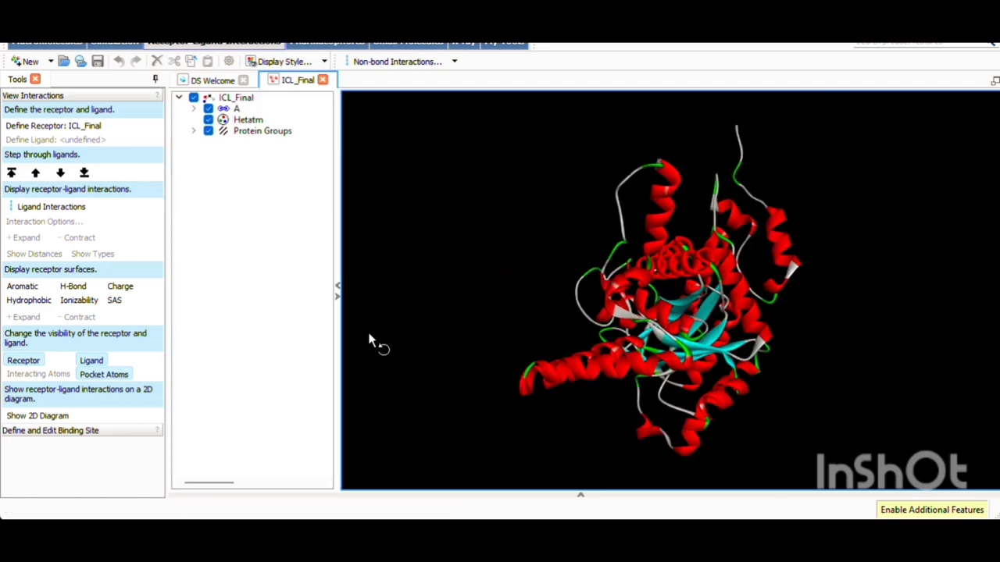

---

## 四、第三步：用 Ramachandran 图验证结构是否「合理」

**能量最小化之前，先要用 Ramachandran 图检查结构骨架的几何是否合理——这张图看的是每个氨基酸残基的两种二面角（phi/psi）有没有落在物理上允许的区域。** [【跳转到 32:03】](https://www.youtube.com/watch?v=OloPSKhdrJA&t=1923)

作者使用 **SAVES v6.1 结构验证服务器**（由 UCLA 运营，全称 structure validation server）。这类服务器专门用来验证通过同源建模、从头计算等方法预测出来的结构。上传 `ICL_final.pdb`，在众多选项里（ERRAT、Verify3D、ProCheck、WHATIF 等）选择 **ProCheck**——因为它会给出 Ramachandran 图分析。[【跳转到 32:53】](https://www.youtube.com/watch?v=OloPSKhdrJA&t=1973)

提交后要等一会儿（作者这次约花了 20 分钟）。结果的解读要点：

- **residues in most favored region（最偏好区域）= 356**；
- **additional allowed region（额外允许区域）= 22**；
- **generously allowed region（宽容允许区域）= 2**；
- **disallowed region（不允许区域）= 0**。

换算成百分比：**核心区 93.7%、额外允许区 5.8%、disallowed 0.0%**。由于不允许区域里一个残基都没有，作者判断**这个结构「相当可以」，可以继续往下走**。[【跳转到 34:38】](https://www.youtube.com/watch?v=OloPSKhdrJA&t=2078)

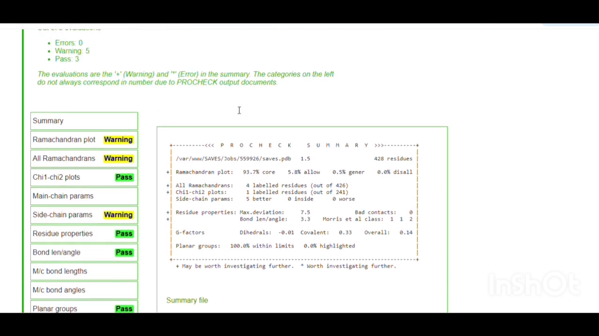

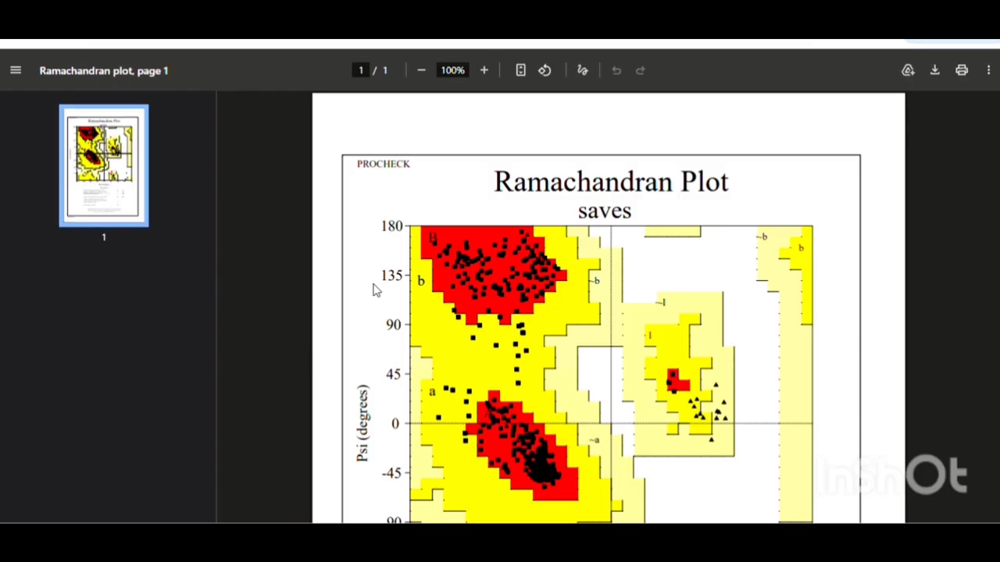

---

## 五、第四步：Swiss-PdbViewer 能量最小化，让结构更稳定

**结构几何合理 ≠ 能量稳定。能量最小化（energy minimization）就是让原子微调位置、把整体势能降到更低，从而消除局部「别扭」的构象张力。** [【跳转到 35:24】](https://www.youtube.com/watch?v=OloPSKhdrJA&t=2124)

作者用 **Swiss-PdbViewer（SPDBV 4.0）** 来完成：

1. 打开 `ICL_final`；
2. **先全选残基**：`Select → All`（否则会提示 no residue selected）；
3. 进入 **Tools → Energy Minimization**（快捷键 Ctrl+M），等待进度完成。[【跳转到 37:27】](https://www.youtube.com/watch?v=OloPSKhdrJA&t=2247)

计算过程中会弹出 GROMOS96 力场的能量明细表，逐残基地列出键长、键角、二面角、非键合、静电等能量分量，红色表示**能量已被最小化**的残基。随后把结果另存为新文件，例如 `ICL_EnergyMinimized_video.pdb`。[【跳转到 38:47】](https://www.youtube.com/watch?v=OloPSKhdrJA&t=2327)

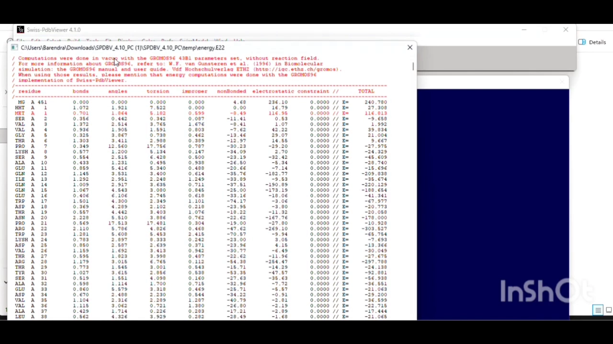

**做完后再跑一遍 SAVES 验证，就能对比前后差异。** 一个可量化的证据是 **ERRAT** 分数（衡量非键合原子接触质量）：能量最小化前是 98 点几，**最小化后升到 99.04**，作者评价「相当好」。这样结构在几何和能量两方面都达标，**可以进入对接环节了**。[【跳转到 40:13】](https://www.youtube.com/watch?v=OloPSKhdrJA&t=2413)

---

## 六、第五步：用 DeepSite AI 预测可成药的结合口袋

**最后一步，是把能量最小化后的结构交给 DeepSite AI，让它自动找出蛋白表面哪些「口袋」适合小分子结合——这就是整个流程的产出：可成药位点。** [【跳转到 41:42】](https://www.youtube.com/watch?v=OloPSKhdrJA&t=2502)

作者使用 **DeepSite AI（托管在 PlayMolecule 平台，open.playmolecule.org）**。这是一个基于神经网络的结合口袋预测器，界面就是右侧一个对话式工作流。[【跳转到 42:17】](https://www.youtube.com/watch?v=OloPSKhdrJA&t=2537)

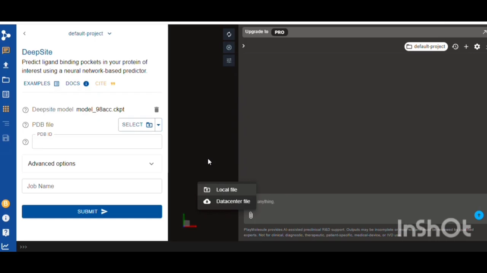

操作与提示词值得记录：直接上传 `ICL_final_energy_minimized_video.pdb`，然后给 AI 一段明确指令——[【跳转到 42:42】](https://www.youtube.com/watch?v=OloPSKhdrJA&t=2562)

> 「请预测这个蛋白分子的结合口袋，并说明每个活性位点里包含哪些氨基酸，同时给出每个结合口袋的分数。」

提交后 AI 开始工作，返回的核心信息包括：**结合口袋（即活性位点）、每个口袋的氨基酸残基、以及每个口袋的打分。** DeepSite 在这个 ICL 结构里**共预测出三个活性位点**，每个都带有**中心坐标（center，x/y/z）**和**残基清单**，结果还能导出为 CSV 文件。[【跳转到 45:11】](https://www.youtube.com/watch?v=OloPSKhdrJA&t=2711)

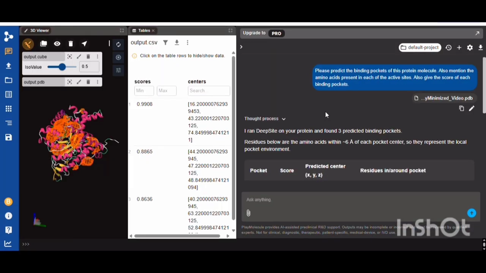

**这些分数和中心坐标怎么用？** 作者给出了后续衔接的方式：**分数越高的口袋越值得优先考虑**；而口袋的**中心坐标正好可以直接当作对接时 grid box（对接盒子）的中心**。选哪个口袋去对接，就取决于这些分数，再结合文献调研来判断。[【跳转到 45:36】](https://www.youtube.com/watch?v=OloPSKhdrJA&t=2736)

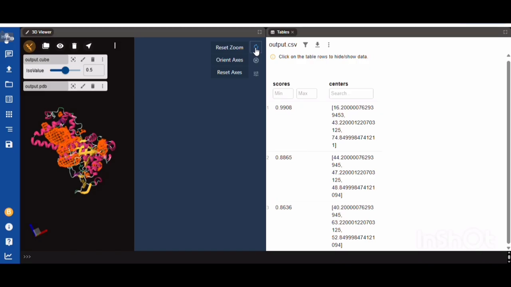

至此，从一条序列出发，我们得到了一个经过验证、能量稳定、并标注了候选结合口袋的蛋白结构——它已经准备好进入下一步的分子对接。

---

## 小结

- **这是一条「序列 → 可对接结构」的完整免费流水线**：AlphaFold 预测 → PyMOL 验证补全 → Ramachandran 图验证 → Swiss-PDB 能量最小化 → DeepSite AI 预测口袋，五步环环相扣。
- **预测结构要靠实验结构来「校准」**：作者用被引用最多的 PDB 1F8M（1.80 Å）做参照，对齐后把 AlphaFold 漏掉的**镁离子辅因子**补回活性位点，同时删掉了不需要的丙酮酸抑制剂。
- **结构验证有两道关**：几何上用 Ramachandran 图（core 93.7%、disallowed 0%），能量上用 GROMOS96 能量最小化；ERRAT 从 98 点几升到 99.04，说明质量确实改善。
- **DeepSite AI 把「找口袋」自动化**：对 ICL 预测出三个活性位点，给出分数（0.9908 / 0.8865 / 0.8636）、中心坐标和残基，可直接用作对接 grid box 的中心。
- **选靶点的生物学逻辑**：ICL 支撑结核杆菌在潜伏期的乙醛酸循环，堵住它的口袋有望对付潜伏性结核——这使得「找口袋」这件事有明确的用药意义。
- **给初学者的操作提示**：AlphaFold 拷贝数越多越慢（超过 2 份可能等两小时）；PDB 结构优先选 1.5~2.0 Å；PyMOL 里镁离子写作 `mg`，命令要严格照抄（链名写错会报 invalid selection）。

## 关键术语速查

| 术语 | 一句话解释 |
| --- | --- |
| 基于结构的药物设计 | 先搞清靶蛋白的三维结构和结合口袋，再据此设计能与之结合的药物分子 |
| 异柠檬酸裂解酶（ICL） | 结核分枝杆菌在潜伏期依赖的关键酶，催化异柠檬酸 → 乙醛酸 + 琥珀酸 |
| 乙醛酸循环（glyoxylate shunt） | 细菌在潜伏期把脂肪等转化为能量/碳源的一条代谢通路，ICL 是其中关键一步 |
| 潜伏性结核（latent TB） | 结核菌潜伏在人体细胞内、尚未发病但仍存活的阶段 |
| UniProt | 全球权威的蛋白质序列与功能信息数据库；本讲用 ID E9WK7 取序列 |
| AlphaFold Server | 输入氨基酸序列即可预测三维结构的在线服务；用 ranking score/PTM 表示置信度 |
| PDB / RCSB PDB | 蛋白质数据库，存放实验解析出的蛋白结构；本讲参照 1F8M |
| 分辨率（Å，埃） | 晶体结构的清晰度指标，数值越小越清晰；优先选 1.5~2.0 Å |
| 辅因子 / 活性位点 | 帮助酶发挥作用的非蛋白成分（如 Mg²⁺）/ 酶上发生催化的区域（常即结合口袋） |
| 同源四聚体 | 由四条相同（或相似）多肽链组成的蛋白复合物；1F8M 有 A/B/C/D 四条链 |
| PyMOL | 分子可视化软件，用于比对结构、增删链/配体、导出 PDB |
| Ramachandran 图 | 用主链二面角 phi/psi 判断结构几何是否合理的图；不允许区域残基越少越好 |
| 能量最小化 | 微调原子位置以降低整体势能、消除构象张力；本讲用 Swiss-PdbViewer 的 GROMOS96 力场 |
| ERRAT | SAVES 服务器上的质量指标，衡量非键合原子接触的合理性，分数越高越好 |
| SAVES v6.1 | UCLA 提供的结构验证服务器，含 ProCheck、ERRAT、Verify3D 等工具 |
| DeepSite AI | PlayMolecule 平台上的神经网络结合口袋预测器，输出口袋分数、中心与残基 |
| grid box（对接盒子） | 分子对接时限定搜索范围的空间盒子，常用口袋中心坐标来设定 |

## 参考

- 配套视频：[《From Sequence to Target: AI-Powered Protein Modeling & Binding Site Prediction》](https://www.youtube.com/watch?v=OloPSKhdrJA)（YouTube）
- 演示靶点：结核分枝杆菌异柠檬酸裂解酶（ICL），UniProt ID E9WK7；参照 PDB 结构 [1F8M](https://www.rcsb.org/structure/1F8M)（分辨率 1.80 Å）
- 用到的工具：AlphaFold Server、PyMOL、BioVIA Discovery Studio、SAVES v6.1（UCLA）、Swiss-PdbViewer（SPDBV 4.0）、DeepSite AI（[PlayMolecule](https://open.playmolecule.org)）
