# 逆合成预测：AI 如何反推分子合成路线

> 本文整理的视频：[《Retrosynthesis in the AI era: opportunities and pitfalls》](https://www.youtube.com/watch?v=I2cdBHaWDxE)（Chemspace 网络研讨会，主讲人 **Quentin Perron 博士**，Iktos 联合创始人兼首席科学官，YouTube，约 42:21）。
> 主题：在 AI 时代做「逆合成」——即给一个目标分子，让计算机反推出用哪些可购买的原料、经过哪些反应把它造出来。讲者既讲了方法（数据驱动的断键预测、反应可行性、有记忆的蒙特卡洛树搜索、Spaya 产品与 API），也讲清了陷阱（化学选择性、区域选择性、数据清洗、模板提取的损耗等）。
> 说明：下文以视频字幕为骨架，术语首次出现即解释；时间戳可跳转到视频对应位置。

## 本篇要解决的核心问题（SCQA）

**背景**：药物化学家手里有了一个想合成（或想验证能否合成）的分子，就必须回答一个「倒着问」的问题——**这个分子该怎么造？** 把一个目标分子断成片段、再断成片段，直到每一步的原料都能直接买到，这一整套「由产物反推反应物」的思考过程，就叫**逆合成分析（retrosynthetic analysis）**。

**冲突**：人脑做这件事很慢，而计算机做这件事又极其困难。视频把难点讲成一句话：**「你必须在合理的时间和计算成本内，探索海量的可能性」**，同时还要保证——每断开一刀，得到的两个「子代」分子**真的能在合适的位置反应起来**。搜索树每往下一层都会成倍膨胀，而且反应世界里还潜伏着各种选择性陷阱。[【跳转到 06:09】](https://www.youtube.com/watch?v=I2cdBHaWDxE&t=369)

**疑问**：既然下棋（AlphaGo）这种问题 AI 已经能超过人类，那 AI 能不能也学会逆合成？在真正可用、能被化学家拿去实验室的水平上，它做到了吗？又有哪些「坑」？

**回答（中心思想）**：**当代数据驱动的逆合成，本质上是把「断键预测 + 反应可行性判断 + 带记忆的搜索 + 好用的界面」组装成一条流水线**。Iktos 的 Spaya 把这条流水线做成了**可生产、速度快、可定制**的工具，但它并非万能：**化学选择性、区域选择性、数据质量等「陷阱」必须靠专门的过滤器和化学策略去补**，否则算法会一本正经地给出实验室里根本走不通的路线。下文就按「任务是什么 → 为什么难 → AI 怎么做 → 陷阱在哪」来讲清楚这套系统。

---

## 一、逆合成：把目标分子倒着拆回「能买到的原料」

**逆合成其实是一个很朴素的想法：你有一个想合成的分子，就把它不断断开、断成片段，直到最后每一步的原料都是可以买到的东西。** 视频用「化学家打开软件、把分子一层层往下拆」的画面说明了这一点。[【跳转到 06:09】](https://www.youtube.com/watch?v=I2cdBHaWDxE&t=369)

在软件里，这个过程会长成一棵「倒过来的树」：最上面是目标分子，往下每一层是拆分出的中间体，直到叶子节点变成市售的起始原料（starting materials）。这也正是逆合成的两个核心难题：[【跳转到 06:09】](https://www.youtube.com/watch?v=I2cdBHaWDxE&t=369)

1. **搜索空间会指数爆炸**：每个分子可以拆成好几个片段，每个片段又能继续拆，树每往下一层就成倍变大，怎么在合理时间和算力内找到好路线？
2. **每一刀都必须是「真反应」**：你断出的两个子代分子，必须能在恰当的位置、以合理的条件真正反应，否则这条路就是纸上谈兵。

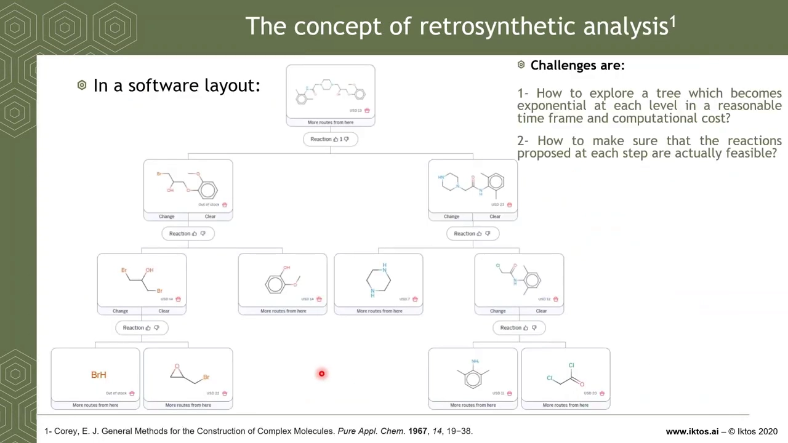

讲者在开头也顺带介绍了主办方 **Chemspace**（一个连接化合物买家与供应商的市场平台，拥有含砌块、筛选化合物、片段的庞大目录，可延伸到数十亿个「按需定制」类似物，并支持网页搜索与 API 集成），以及自己所在的 **Iktos**——一家 2016 年成立于巴黎、专注把 AI 用于化学的公司，产品包括药物设计工具 **Makya** 和逆合成分析工具 **Spaya**。[【跳转到 01:40】](https://www.youtube.com/watch?v=I2cdBHaWDxE&t=100) [【跳转到 03:55】](https://www.youtube.com/watch?v=I2cdBHaWDxE&t=235) [【跳转到 06:00】](https://www.youtube.com/watch?v=I2cdBHaWDxE&t=360)

## 二、两条技术路线：专家规则 vs 数据驱动，Iktos 选了后者

**做逆合成有两大主流方法：一是「专家规则」，二是「数据驱动」。** 视频明确说，Iktos 走的是数据驱动这条路。[【跳转到 07:41】](https://www.youtube.com/watch?v=I2cdBHaWDxE&t=461)

- **专家规则（expert based）**：由化学信息学家**手工编码规则**，人自己写清楚反应活性中心在哪、反应在什么环境下发生。
- **数据驱动（data driven）**：让算法**自己从反应数据库里自动提取化学知识**。

打个比方：专家规则像请一位老化学家把毕生经验一条条写进手册；数据驱动则像让机器阅读海量文献与专利，自己总结出「什么样的分子能这样拆」。

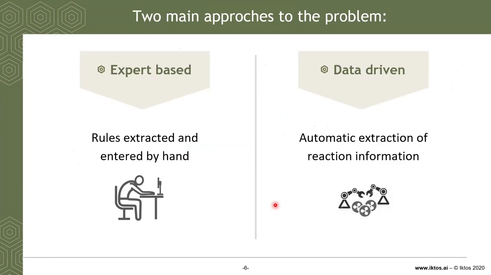

两种路线并非水火不容。事实上，数据驱动方法也常常要借助化学信息学的工具（如原子映射、SMILES 标准化），只是知识的主要来源从「人力」换成了「数据」。

## 三、一台「逆合成机器」由什么组成：数据库 + 算法 + 界面

**要跑起逆合成搜索，你需要两个数据库、一组算法，外加一个给化学家用的界面。** 这是理解整套系统的骨架。[【跳转到 08:06】](https://www.youtube.com/watch?v=I2cdBHaWDxE&t=486)

- **反应数据库**：用来训练算法「学会化学」。
- **起始原料数据库**：让算法知道什么时候可以「停下来」——某个分子能买到，就不用再往下拆了。
- **算法（三个主要部分）**：
  1. **断键预测（disconnection prediction）**：决定怎么把分子切开；
  2. **反应可行性（reaction feasibility）**：判断切出来的两个片段能不能正确反应；
  3. **搜索策略**：因为搜索树会爆炸，必须**聪明地在树里探索**，而不是盲目穷举。
- **界面（interface / UX/UI）**：最终给化学家或计算化学家看结果、挑路线、导出方案。

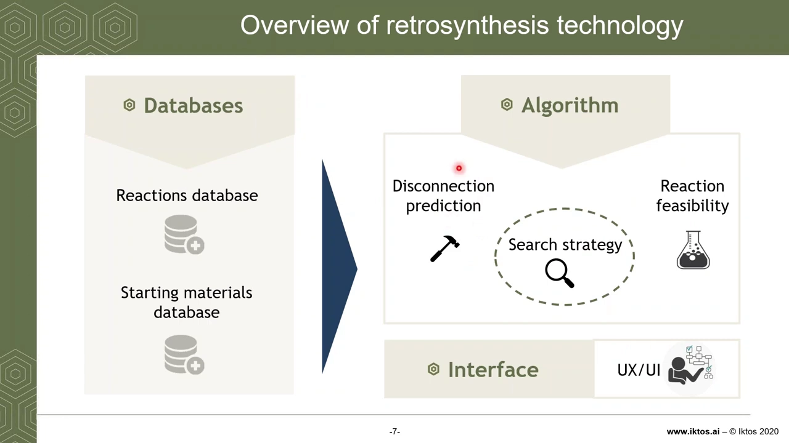

接下来的章节，就沿着这条流水线一段段拆开讲。

## 四、断键预测（一）：模板法把「反应规则」写成了正则表达式

**断键预测的任务是：输入一个分子，输出若干可能的反应物。** 它有两种做法——**基于模板（template-based）**和**无模板（template-free）**。[【跳转到 08:56】](https://www.youtube.com/watch?v=I2cdBHaWDxE&t=536)

- **基于模板**：先预测适用于该分子的「反应模板」，套用到分子上，把它断开，从而得到反应物。
- **无模板**：更像一个翻译算法——输入分子，**直接**输出反应物，不需要先预测模板这类中间物。视频用谷歌翻译打比方：输入一种语言，直接输出另一种语言。[【跳转到 09:21】](https://www.youtube.com/watch?v=I2cdBHaWDxE&t=561)

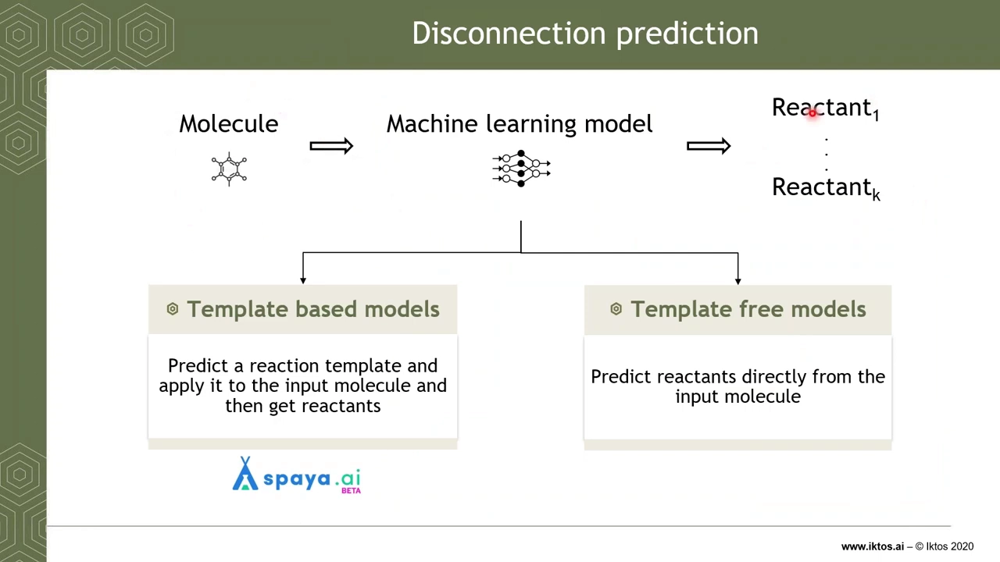

**那「模板」到底长什么样？答案是：它其实就是一条正则表达式（regex）。** 视频举了一个非常具体的例子：规则可以写成「碳-氮 变成 碳-溴 加 氮」这样的模式。把它套用到某个与该模式兼容的分子（用 SMILES 表示）上，分子的原子连接会被「打乱重排」，于是得到两个子代分子。这就是模板的全部——**一条简单的正则表达式**。[【跳转到 09:46】](https://www.youtube.com/watch?v=I2cdBHaWDxE&t=586)

> **术语小注**：**SMILES** 是「用一串字符描述分子结构」的通用记法；**正则表达式**是描述「字符匹配模式」的式子。把分子连接模式写成一条可匹配的式子，就能批量地找出「哪些分子能这样拆」。

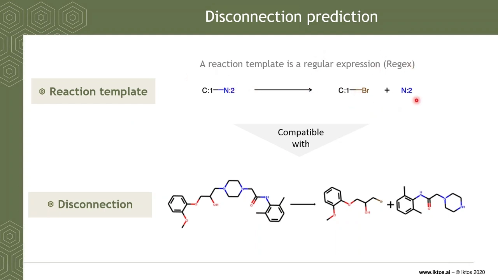

## 五、断键预测（二）：模板从哪来？数据准备是「脏活累活」

**模板不是凭空来的，它来自反应；而反应来自供应商、公共数据库或电子实验记录本（ELN）。** 这一节的结论是：**数据准备（data preparation）是整条流水线里最需要较真的一步**，因为原始反应数据非常「脏」。[【跳转到 10:31】](https://www.youtube.com/watch?v=I2cdBHaWDxE&t=631)

以一个反应为例，它可以被编码成「智能反应式」：`反应物 SMILES · 反应物 SMILES → 产物 SMILES`。这样反应方向就被编码进一条 SMILES 指令里，由它就能提取模板。但麻烦在于：

- **原始反应很脏**：里面混着催化剂、试剂、溶剂，有时写在反应物一侧、有时写在产物一侧；
- 这些多余分子会**干扰原子映射（atom mapping）**——也就是把反应物上的原子一一对应到产物上的原子，从而定位「哪些键动了、哪些原子变了」。

所以必须先做**清洗（cleaning）**，而且要花大力气建成一个**全自动流程**，才能稳定地处理成千上万条反应。视频列出的清洗动作包括：反应去重、SMILES 标准化、反应拆分（把一个大反应式拆成单个反应）、去掉不参与反应的分子（如溶剂）等。

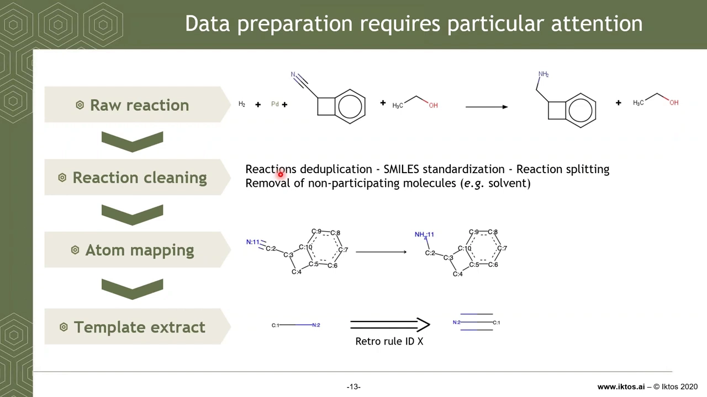

清洗干净后，就能做**原子映射**。视频演示了一个例子：反应物里碳 2 与氮 11 之间的三键变成了单键；把这个模板**反转过来**，就得到一条逆合成规则——「碳-氮单键可以来自碳氮三键」。[【跳转到 11:21】](https://www.youtube.com/watch?v=I2cdBHaWDxE&t=681)

**那么 Iktos 用了多大的数据？** 他们在 **Pistachio 数据库**（由英国公司 NextMove Software 提供，自动从欧洲专利和美国专利中提取）上做数据准备。因为同一批人会把同样的反应在美国和欧洲都申请专利，所以重复很多；清洗并去重后得到约 **350 万条**干净反应，再做原子映射，最终提取出约 **280 万条**「反应-模板对」。[【跳转到 11:46】](https://www.youtube.com/watch?v=I2cdBHaWDxE&t=706)

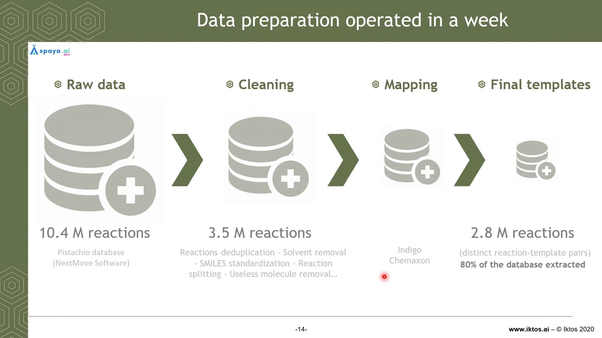

**这里藏着一个「陷阱」的数字**：清洗 + 映射的流水线**只成功提取了约 80% 的反应**，剩下的因为提取没做好、或原子映射效果不佳而被丢弃。[【跳转到 12:36】](https://www.youtube.com/watch?v=I2cdBHaWDxE&t=756) 数据质量直接决定了模型能学到什么。

## 六、断键预测（三）：用神经网络把「产物 → 该用哪些模板」当成分类问题

**有了模板，就能训练神经网络来回答：「给定一个产物，它应该用哪些逆合成规则？」** 这被建模成一个**多分类问题**。[【跳转到 13:01】](https://www.youtube.com/watch?v=I2cdBHaWDxE&t=781)

具体做法是：

1. **输入**产物的**分子指纹**（molecular fingerprint，一种把分子结构编码成定长向量的表示）；
2. 经过若干**隐藏层**；
3. **输出**该产物对应的一组模板；因为候选模板非常多，模型输出的是一个**概率分布**。

> **术语小注**：**多分类问题**指「从很多个类别里挑出正确的那个」。这里类别数就是模板数量。视频提到的模板数量应为 **6.2 万个（62k）**；转录字幕里出现的「62」是自动字幕的误听，这里以幻灯片上的 `62k templates (classes)` 为准。

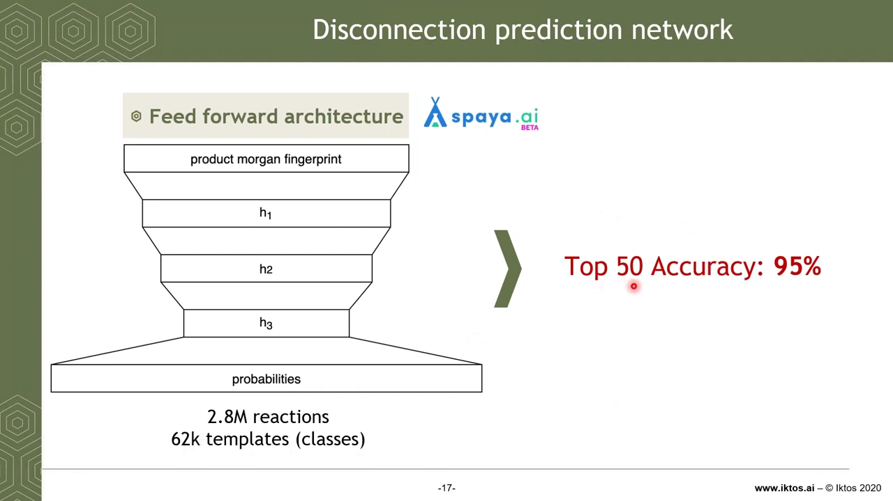

**「Top-50 准确率 95%」是什么意思？** 给一个产物，算法预测出排名前 50 的模板；在这 50 个候选里，有 **95% 的概率**能找到那条真正描述文献反应的模板。也就是说，算法不要求「一击命中」，只要求「把正确答案放进候选清单」。[【跳转到 13:51】](https://www.youtube.com/watch?v=I2cdBHaWDxE&t=831)

## 七、反应可行性：断出的两个片段，真的能反应吗？

**断键预测只是「提出候选路线」，下一步必须验证这条路在化学上是否成立。** 视频用一个例子说明：某分子排名第一的逆合成规则说「氧 + 分子里的某个碳-氮，可以变成碳-氧 + 某处的氮」。套用这条规则，能得到两个看起来很合理的子代分子；但如果把模板套到分子上**所有**可能的位置，就会得到一些**「离谱的断键」**——对化学家来说根本不真实、不可行，必须剔除。[【跳转到 14:16】](https://www.youtube.com/watch?v=I2cdBHaWDxE&t=856)

如果不剔除会怎样？算法可能在很靠后的位置（比如第 94 条规则）提出一条不靠谱的反应。这条路线「也许好也许不好」，但如果化学家真拿那个中间体去实验室做，可能会遇到很多麻烦，所以**提出这种路线并不一定是好主意**，需要去掉。[【跳转到 14:46】](https://www.youtube.com/watch?v=I2cdBHaWDxE&t=886)

**解决思路有两种主流的「过滤器」。** [【跳转到 15:36】](https://www.youtube.com/watch?v=I2cdBHaWDxE&t=936)

- **可行性分类器（feasibility classifier）**：训练一个模型判断「产物—起始原料」这组反应是否成立。视频引用 Marwin Segler 的论文：先用「真实反应」数据，再用「起始原料 + 模板」组合生成「假反应」，然后训练模型**区分真实反应与伪造反应**。
- **正向预测器（forward predictor）**：给定起始原料，用模型**预测产物**；如果预测出的产物正好是想要的产物，就说明这个断键合理。这是 IBM Research 在 **Molecular Transformer** 工作中提出的思路。

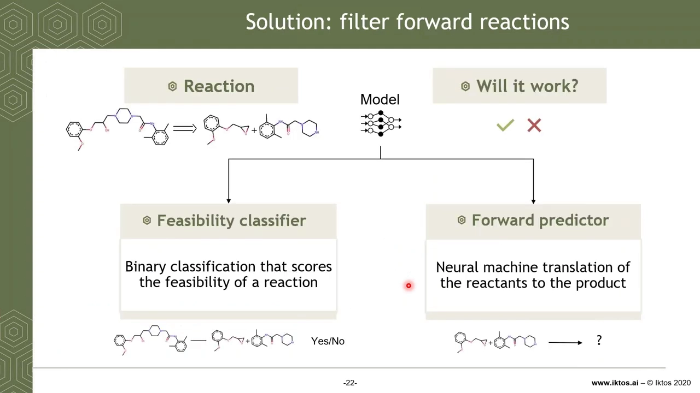

**Iktos 把这道难题拆成了两个专门的算法**：[【跳转到 16:26】](https://www.youtube.com/watch?v=I2cdBHaWDxE&t=986)

1. **适用域估计（applicability domain estimation）**：判断某个断键（包括那种离谱的断键）是否处于模型「可信区间」内；不在可信区间内的，就不该采信。
2. **区域选择性过滤器（regioselectivity filter）**：一个 AI 算法，一旦检测到可能存在**区域选择性**问题，就会介入。

> **术语小注**：**区域选择性（regioselectivity）**指一个分子上有多个相似的反应位点时，反应**优先发生在哪一个**位置。**适用域**指模型对哪类输入有把握、哪类输入属于「没见过」的领域。讲者强调，这两块算法是**专有技术**，对能否产出好结果相当重要，所以不展开细节。[【跳转到 16:51】](https://www.youtube.com/watch?v=I2cdBHaWDxE&t=1011)

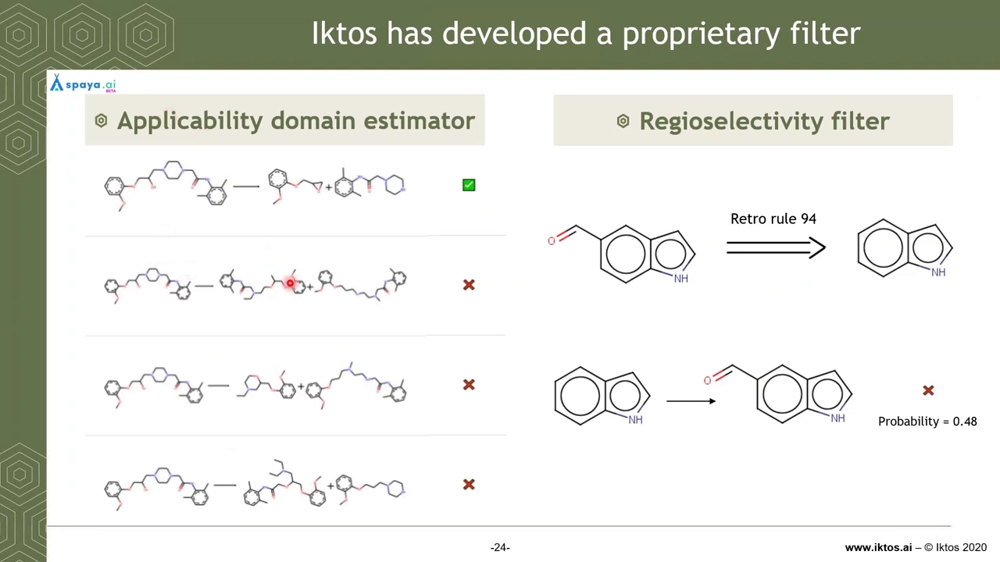

## 八、化学选择性：逆合成里「最大的坑之一」

**如果说区域选择性（在哪反应）已经难，那么化学选择性（谁先反应）是整个领域最大的难题之一。** [【跳转到 18:06】](https://www.youtube.com/watch?v=I2cdBHaWDxE&t=1086)

> **术语小注**：**化学选择性（chemoselectivity）**指一个分子里有多个官能团时，反应**优先作用于哪一个官能团**。它决定了「某一步反应到底能不能按计划发生」。

视频举了格氏反应的例子：想制备某个化合物，如果只加**一当量**格氏试剂，反应会失败，因为格氏试剂会被分子里那个带**活泼氢**的基团（如羧酸的 O-H）先「淬灭」掉；只有加**两当量**才能成功。可在数据库里往往**没有记录这类信息**，所以化学选择性极难处理。[【跳转到 18:06】](https://www.youtube.com/watch?v=I2cdBHaWDxE&t=1086)

它还取决于**溶剂、温度**等条件——有些反应在 0℃ 能发生，到 -20℃ 可能就不行。[【跳转到 18:31】](https://www.youtube.com/watch?v=I2cdBHaWDxE&t=1111)

**一种应对方式是「正向预测反应产物」**：把两个起始原料喂给模型，看它预测出什么产物。视频说，**Molecular Transformer** 的工作表明这是目前最好的方式，并声称 **Top-1 预测准确率可达 90%**——但有个重要前提：[【跳转到 18:56】](https://www.youtube.com/watch?v=I2cdBHaWDxE&t=1136)

- 这只在**双组分反应**（两个反应物）时成立；
- 一旦只有一个反应物，准确率会**大幅下降**；而 Pistachio 数据库里有不少多组分和单反应物反应，这种情况下 **Top-1 只有 66% 的准确率**，**不足以直接用于生产**。[【跳转到 19:21】](https://www.youtube.com/watch?v=I2cdBHaWDxE&t=1161)

而且，把两个原料交给模型，它可能既给出「格氏试剂被淬灭」的产物、又给出期望产物，但**概率不一定对、分布可能很平**，因此不太有用。此外，这类技术**跑在 GPU 上**，会让架构更复杂、速度更慢——而实际应用中，我们想要的是**非常快**。[【跳转到 19:46】](https://www.youtube.com/watch?v=I2cdBHaWDxE&t=1186) [【跳转到 20:11】](https://www.youtube.com/watch?v=I2cdBHaWDxE&t=1211)

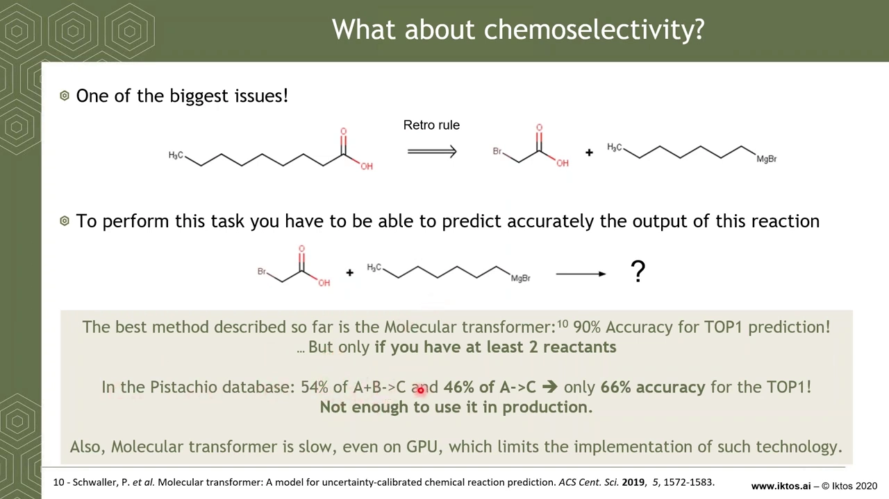

**但讲者给出一个乐观的观察**：**如果有一个好的断键预测模型，化学选择性是可以被「部分」处理的。** [【跳转到 20:24】](https://www.youtube.com/watch?v=I2cdBHaWDxE&t=1224)

- 例一：算法走到某一步、看到分子里有醛、酮、酯等官能团，仍然提出断键建议。这其实「不坏」——因为初始数据集里最相似的反应就是这一条，而且查阅实验方案会发现：**一当量格氏试剂配一当量该底物**，确实可以成功。**断键预测模型能够理解这一点。**
- 例二：**引入保护基**同样能被断键预测处理。要制备某化合物，概率最高的路线不是直接还原酮，而是**先引入缩醛（一种保护基）**——保护基路线的概率高达 0.9，而直接还原酮的概率非常低。[【跳转到 21:14】](https://www.youtube.com/watch?v=I2cdBHaWDxE&t=1274)

## 九、保护基策略：让算法学会「先保护、再反应、后脱保护」

**保护基（protecting group）是化学家对付化学选择性的经典武器：先用一个基团把「不想让它反应」的官能团挡住，等反应做完再把它去掉（脱保护）。** 视频指出，断键预测在**保护-脱保护序列**里扮演重要角色。[【跳转到 21:14】](https://www.youtube.com/watch?v=I2cdBHaWDxE&t=1274)

其幻灯片展示了一个具体例子：对某个含酮的底物，**排名第一的规则（概率 0.9238）主张先引入缩醛保护基**，而直接操作低概率排到后面。也就是说，模型已经「学到」了化学家的保护基直觉。

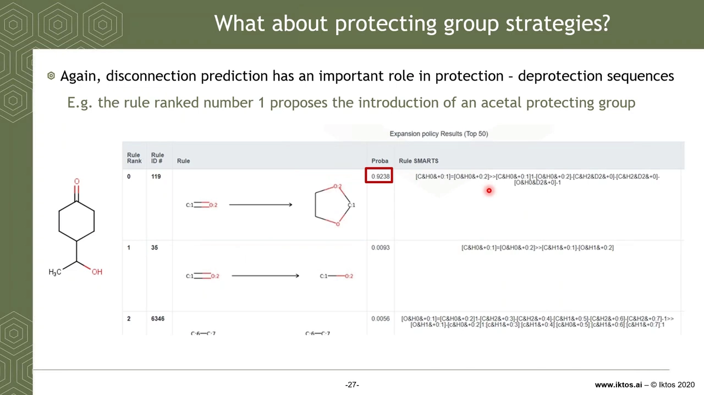

**讲者也坦承 Spaya 并不完美。** 所以他们开放了「点赞/点踩」功能：如果用户觉得某个断键在实验室里行不通，可以反馈；而当你保存了一条满意的逆合成路线，也就间接告诉系统「这个断键是合理的」。这些反馈对他们很重要。[【跳转到 22:04】](https://www.youtube.com/watch?v=I2cdBHaWDxE&t=1324)

## 十、搜索：用强化学习 + 带记忆的蒙特卡洛树搜索找路线

**有了断键预测和可行性判断，还差最后一块拼图：在无穷多种可能的断键里，搜出一条路线。** 为此 Iktos 使用**强化学习（reinforcement learning）**。[【跳转到 22:59】](https://www.youtube.com/watch?v=I2cdBHaWDxE&t=1379)

> **术语小注**：**强化学习**是指让一个「智能体（agent）」在环境里不断采取**动作（action）**、根据拿到的**奖励（reward）**和当前**状态（state）**来调整策略，最终学会「怎么走才能拿到最多奖励」。视频用**吃豆人（Pac-Man）**打比方：你在迷宫里前进，要躲开怪物、吃到奖励，根据位置和奖励做决策。[【跳转到 23:08】](https://www.youtube.com/watch?v=I2cdBHaWDxE&t=1388)

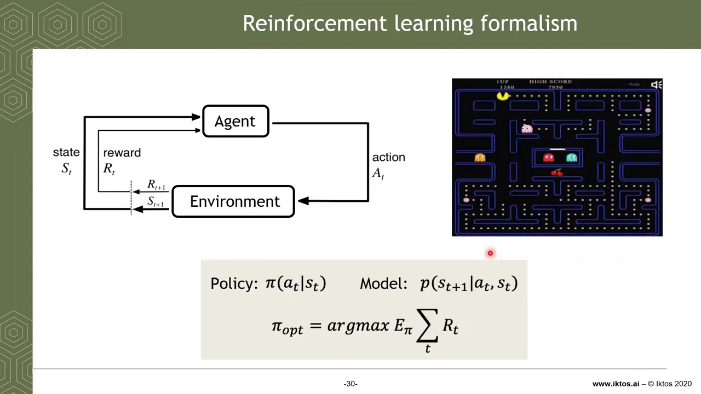

**Iktos 用蒙特卡洛树搜索（Monte Carlo Tree Search，MCTS）来编排这个强化学习。** [【跳转到 23:39】](https://www.youtube.com/watch?v=I2cdBHaWDxE&t=1419)

> **术语小注**：**蒙特卡洛树搜索**是一种「在巨大的决策树里，靠随机采样逐步把注意力集中到有希望的分支」的搜索算法，AlphaGo 也用它。

**它最特别的一点是：这个 MCTS 是「有记忆的」，而且与数据库紧密耦合。** 具体来说：[【跳转到 24:04】](https://www.youtube.com/watch?v=I2cdBHaWDxE&t=1444)

- 树搜索会把结果**存进数据库**，于是 Spaya 在一次次运行中**积累化学知识**；
- 在一次搜索**运行中**也会用到数据库记忆，数据库帮助 MCTS 做扩展与模拟；
- 过去的逆合成运行会**反哺**当前搜索，让 MCTS **随时间不断变好**。

讲者给出一句很形象的话：**「今天走不通的逆合成路线，明天可能就走得通了」**——也许有人补充了某个中间体。于是他们**不必等用户来填充数据库，已经把所有已知分子都跑过一遍逆合成**。当你输入新分子时，算法对「该在无穷可能性里往哪走」已经心里有数，因为你的分子可能和某个已做过逆合成的分子相似。**这让算法真的很快，并能提出高度多样化的方案。** [【跳转到 24:29】](https://www.youtube.com/watch?v=I2cdBHaWDxE&t=1469)

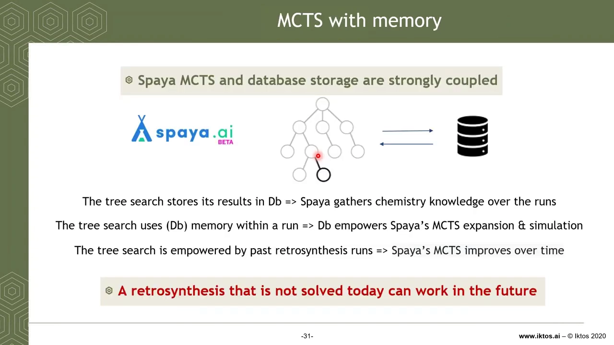

## 十一、界面与排序：像「谷歌搜索」一样，给每条路线打一个分

**最后一块拼图是界面**：逆合成树不容易展示，Iktos 决定把它做得**有点像谷歌搜索**——实时、动态地给出结果，并用一个**分数排序，分数越高越好**。[【跳转到 25:04】](https://www.youtube.com/watch?v=I2cdBHaWDxE&t=1504)

**分数（score）怎么定？** 它是一个**综合指标**，会考虑：[【跳转到 25:29】](https://www.youtube.com/watch?v=I2cdBHaWDxE&t=1529)

- 模型的**概率**；
- **适用域估计器**的判断；
- **步数**（路线越短，分数越高）；
- 输入分子被**拆成片段的方式**、路线的**收敛性（convergent，即多步能否汇总到少数几个分支）**；
- 以及每条路线的排名。

**分数为 1 是一个特别好的信号**：它表示这是一个**精确的文献匹配**——Spaya 至少检索到了一条已知的逆合成路线；分数不等于 1 时，越高越好。[【跳转到 25:04】](https://www.youtube.com/watch?v=I2cdBHaWDxE&t=1504)

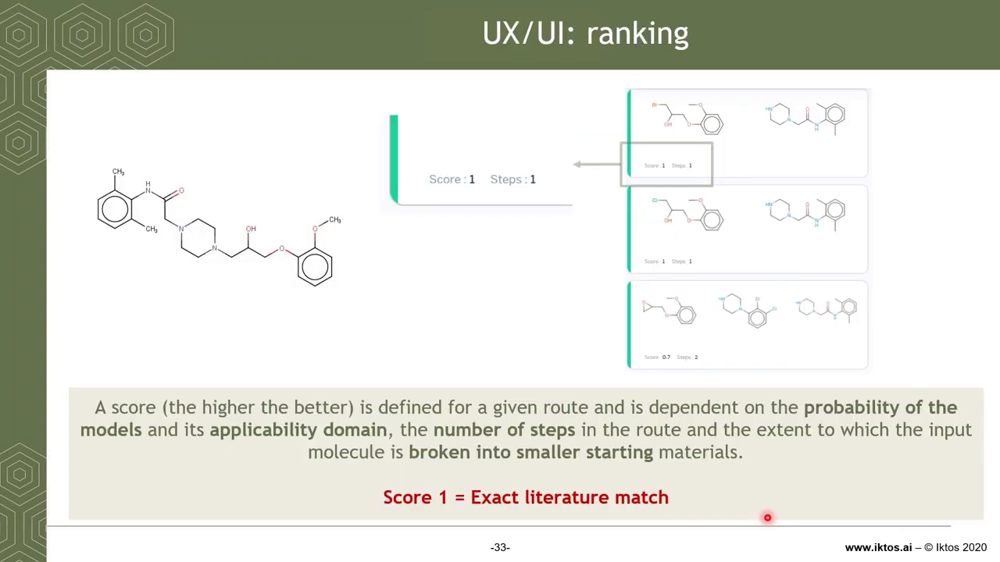

当候选路线很多时，Iktos 会**按「第一步逆合成断键」（也就是正向合成的最后一步反应）把它们聚类**。因为第一步断键有很多种可能，聚类能让化学家从「合成策略」的层面去挑选路线、引入多样性。[【跳转到 25:54】](https://www.youtube.com/watch?v=I2cdBHaWDxE&t=1554)

## 十二、从网页到 API：Spaya 的用法、规模与性能

**Spaya 是一个可免费在 spaya.ai 上使用的在线工具**：你可以输入 SMILES 或手绘分子，得到大量方案，浏览、保存路线、导出 PDF，然后带去实验室。[【跳转到 27:00】](https://www.youtube.com/watch?v=I2cdBHaWDxE&t=1620) 它还包含一系列增强功能：

- **高级搜索（advanced search）**（即将发布）：可以指定一个**中间体**，强制算法只在经过这个中间体的路线上做逆合成。对化学家很有价值——比如手上囤了 10 克某个中间体，只希望用掉它。[【跳转到 27:31】](https://www.youtube.com/watch?v=I2cdBHaWDxE&t=1651)
- **搜索中限制步数**（不是事后筛选，而是在搜索过程中就限制）、**限制起始原料的价格**等。[【跳转到 27:56】](https://www.youtube.com/watch?v=I2cdBHaWDxE&t=1676)

**面向计算化学家的 Spaya API（beta 版已可用）**：他们其实不想看详细路线，只想要给定分子的一个分数。你把一批 SMILES 发过去，系统用「AI 分数」和「最短路线步数」打分后返回。[【跳转到 28:21】](https://www.youtube.com/watch?v=I2cdBHaWDxE&t=1701)

**它的输入参数**包括：一批 SMILES、最大合成步数（1–20）、最大 MCTS 步数（1–4000）、以及「按 AI 分数提前停止」或「按时间提前停止」等；输出则是每个分子的 **AI 分数**与**最短路线步数**。

**速度与规模是这项「机会」的核心。** [【跳转到 28:46】](https://www.youtube.com/watch?v=I2cdBHaWDxE&t=1726)

- 每个分子每个「**walker**」（Iktos 的一整套 MCTS 技术单元）约需 **3 秒**，占用 **6 个 CPU**；
- 部署在 AWS 上，用 **250 个 CPU，每小时可跑约 55 万个分子**；用 1000 个 CPU 时每小时能无故障跑 20 万个（内部试验中 250 CPU 时约 5 万/小时，1000 CPU 时约 20 万/小时）；
- 这类 CPU 可以**在几分钟内实例化**。

> 视频给出的两组数字略有出入，这里如实并列，读者理解「每小时几十万分子的量级」即可。

**Spaya API 还能连接到生成模型**：一次生成 25 万个 SMILES，给它们做逆合成，用评分去**奖励/更新生成模型**。虽然要等最慢的分子算完，会稍微拖慢流程，但很容易在强化学习流程里生成 10 万个分子；接到 Iktos 的生成模型上，**10 小时内就能完成逆合成**。[【跳转到 29:36】](https://www.youtube.com/watch?v=I2cdBHaWDxE&t=1776) [【跳转到 30:01】](https://www.youtube.com/watch?v=I2cdBHaWDxE&t=1801)

**还有一个很实用的功能——批量逆合成（batch retrosynthesis）**：如果你有一系列（比如 100 个）相似化合物，想用**最少的合成工作量**把它们都做出来，Spaya 会帮你**找关键中间体**。视频给了个例子：总共 105 步，理想情况是 **5 步得到高级中间体，再 100 步制备那 100 个化合物**。这项技术已在 Iktos 内部验证，用户界面在开发中。[【跳转到 30:26】](https://www.youtube.com/watch?v=I2cdBHaWDxE&t=1826)

**Spaya 完全可定制**：需要高可扩展性可以部署到私有云；也可以连接到**你自己的起始原料、偏好的供应商，以及你自己的 ELN 数据**（这些化学知识往往非常专有、非常特定）。视频说，他们能**在一周之内**，基于你的起始原料和 ELN，为你打造一个专属、量身定制的 Spaya。[【跳转到 31:16】](https://www.youtube.com/watch?v=I2cdBHaWDxE&t=1876)

## 十三、实战演示：用 Spaya 给伊马替尼找路线

视频最后做了一段**现场演示**。在 spaya.ai 上登录后，输入 SMILES 或画出分子，点击「完成」，算法就为这个化合物找路线。[【跳转到 32:07】](https://www.youtube.com/watch?v=I2cdBHaWDxE&t=1927) 演示用的分子是很有名的药物 **伊马替尼（imatinib）**。

结果界面里：算法给出**很多聚类**，聚类依据是**最后一步断键**；每个聚类显示该聚类里的**最高分**，分数从高到低排列；分数越低代表概率更低、步数更多。演示建议**先看最高分的聚类**。点开一个聚类，会看到若干方案——起始原料各不相同，但走的是相同的第一步逆合成步骤。[【跳转到 32:50】](https://www.youtube.com/watch?v=I2cdBHaWDxE&t=1970) [【跳转到 33:15】](https://www.youtube.com/watch?v=I2cdBHaWDxE&t=1995)

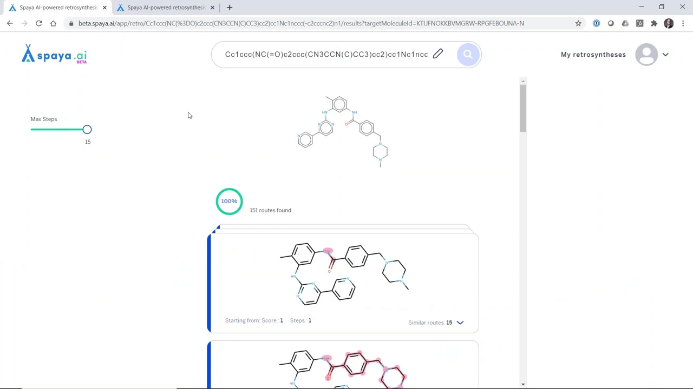

演示中的几个亮点：

- **精确文献匹配**：点进去能看到一条**精确匹配已发表文献**的反应，还能看到**最相似的反应**——随着分子被修改，相似度下降。[【跳转到 34:05】](https://www.youtube.com/watch?v=I2cdBHaWDxE&t=2045)
- **实验方案与专利链接**：有的路线带**实验方案（protocol）**、参考文献、年份，并可点击专利链接跳转谷歌；有的路线没有，于是化学家可能更偏好有方案的那条。[【跳转到 34:30】](https://www.youtube.com/watch?v=I2cdBHaWDxE&t=2070)
- **钉住（pin）与导出**：可以把喜欢的反应/方案**钉住**，打印时只打印钉住的内容；对整棵树满意后可以修改、保存、生成 PDF，带去实验室。[【跳转到 35:20】](https://www.youtube.com/watch?v=I2cdBHaWDxE&t=2120) [【跳转到 36:10】](https://www.youtube.com/watch?v=I2cdBHaWDxE&t=2170)
- **动态替代路线**：如果结果太多，可以限制步数（比如只看一步逆合成）；在搜索树某一层遇到不想看的方案，点「更多路线（more routes）」，算法会从那一点开始给出替代方案。[【跳转到 37:13】](https://www.youtube.com/watch?v=I2cdBHaWDxE&t=2233)

演示最后提到，**高级搜索**很快上线，Spaya 里还会加入**协同环境**，让团队共享逆合成路线、协作推进项目。[【跳转到 37:38】](https://www.youtube.com/watch?v=I2cdBHaWDxE&t=2258)

## 十四、问答环节：搜索算法、多样性与「探索-利用」

演讲后的问答里，讲者补充了两点：[【跳转到 39:02】](https://www.youtube.com/watch?v=I2cdBHaWDxE&t=2342)

- **搜索算法本质**：就是「通过强化学习来做的蒙特卡洛树搜索」，思路**类似 Marwin Segler 等人发表的工作**，但 Iktos 用了不同的**编排方式**；一个特点是**与数据库紧密耦合**，这在一定程度上改变了算法探索可能性的方式。[【跳转到 40:06】](https://www.youtube.com/watch?v=I2cdBHaWDxE&t=2406)
- **速度 vs 多样性**：算法跑得快很重要，但对化学家来说，**断键策略和多样性**同样重要。他们相信，要达到这种多样性，**利用数据库**是很好的做法——能在合理的算力与时间下，同时兼顾**探索与利用（exploration and exploitation）**。[【跳转到 40:36】](https://www.youtube.com/watch?v=I2cdBHaWDxE&t=2436)

> **术语小注**：**探索与利用的权衡**是强化学习的核心矛盾——是去尝试没走过的路（探索），还是继续走已知能拿高分的老路（利用）。在逆合成里，前者带来多样化的合成策略，后者保证路线靠谱。

## 十五、把「机会」和「陷阱」一次看清

这就是视频标题里的 **opportunities and pitfalls**。总结成一张对照表：

**机会（AI 逆合成已经能做到的）**：

- **断键预测够准**：前馈网络在 280 万条反应、6.2 万个模板上训练，**Top-50 准确率约 95%**——把正确答案放进候选清单基本没问题。[【跳转到 13:26】](https://www.youtube.com/watch?v=I2cdBHaWDxE&t=806)
- **搜索又快又能给多样方案**：带记忆、与数据库耦合的 MCTS + 强化学习，**每个分子约 3 秒**、每小时几十万分子，还能依据第一步断键聚类。[【跳转到 28:46】](https://www.youtube.com/watch?v=I2cdBHaWDxE&t=1726)
- **能对接生成模型**：用逆合成评分去奖励生成模型，10 小时可跑完 10 万分子，形成「生成—评估」闭环。[【跳转到 30:01】](https://www.youtube.com/watch?v=I2cdBHaWDxE&t=1801)
- **产品化、可定制**：网页、API、批量逆合成、私有云部署、接入自有原料与 ELN，一周可定制专属版本。[【跳转到 31:16】](https://www.youtube.com/watch?v=I2cdBHaWDxE&t=1876)

**陷阱（仍会绊倒算法的地方）**：

- **数据质量**：原始反应很脏，清洗+映射**只成功提取约 80%**，丢弃的数据影响模型所学。[【跳转到 12:36】](https://www.youtube.com/watch?v=I2cdBHaWDxE&t=756)
- **离谱断键**：模板套到分子所有位置会产生不真实的断键，必须靠**适用域估计**剔除。[【跳转到 14:16】](https://www.youtube.com/watch?v=I2cdBHaWDxE&t=856)
- **区域选择性**：多个相似位点时「反应在哪」难判断，需要**区域选择性过滤器**。[【跳转到 16:51】](https://www.youtube.com/watch?v=I2cdBHaWDxE&t=1011)
- **化学选择性**：多个官能团时「谁先反应」是最大难题，取决于当量、溶剂、温度，数据库里往往没有这些信息；正向预测器在单反应物场景只有 66% 准确率，且慢。[【跳转到 18:06】](https://www.youtube.com/watch?v=I2cdBHaWDxE&t=1086)
- **工具并非完美**：Spaya 自己也不完美，所以才有点赞/点踩与「保存路线」作为反馈信号。[【跳转到 22:04】](https://www.youtube.com/watch?v=I2cdBHaWDxE&t=1324)

**一句话**：AI 已经把逆合成从「不可行」推进到「生产可用」，但**它是在化学家的专业判断辅助下工作的**——好的模型能部分处理保护基与化学选择性，剩下的仍要人来把关。

## 小结

- **逆合成 = 倒着把目标分子拆成可购买的原料**，两大难点是搜索树指数膨胀、以及每一刀必须真能反应。[【跳转到 06:09】](https://www.youtube.com/watch?v=I2cdBHaWDxE&t=369)
- **两条路线**：专家手工规则 vs 数据驱动自动提取；Iktos 走数据驱动。[【跳转到 07:41】](https://www.youtube.com/watch?v=I2cdBHaWDxE&t=461)
- **一套流水线**：反应/起始原料数据库 + 断键预测 + 反应可行性 + 搜索 + 界面。[【跳转到 08:06】](https://www.youtube.com/watch?v=I2cdBHaWDxE&t=486)
- **断键预测用模板**（本质是正则表达式）把「产物→该用哪些规则」当作多分类问题，Top-50 达 95%。[【跳转到 13:26】](https://www.youtube.com/watch?v=I2cdBHaWDxE&t=806)
- **可行性靠过滤器**：适用域估计 + 区域选择性过滤器；化学选择性是最大难题，但好模型能部分处理（如自动引入保护基）。[【跳转到 20:24】](https://www.youtube.com/watch?v=I2cdBHaWDxE&t=1224)
- **搜索用带记忆的 MCTS**，与数据库紧耦合，越用越强。[【跳转到 24:04】](https://www.youtube.com/watch?v=I2cdBHaWDxE&t=1444)
- **产品化**：Spaya 网页/API/批量/私有部署，每分子约 3 秒、每小时几十万分子。[【跳转到 28:46】](https://www.youtube.com/watch?v=I2cdBHaWDxE&t=1726)

## 关键术语速查

| 术语 | 一句话解释 |
| --- | --- |
| 逆合成分析 | 由目标产物反推反应物，直到每步原料都可购买的分析方法 |
| 断键预测 | 决定把分子「在哪一刀切开」的模型，输入产物、输出可能反应物 |
| 反应模板 | 一条描述「某些键如何变」的规则，本质上是一条正则表达式 |
| 模板法 / 无模板法 | 先预测模板再套用 / 直接由分子预测反应物（后者像机器翻译） |
| SMILES | 用一串字符描述分子结构的通用记法 |
| 原子映射（atom mapping） | 把反应物原子一一对应到产物原子，用于定位键的变化、提取模板 |
| 适用域估计 | 判断某个断键是否落在模型「可信区间」内的过滤器 |
| 区域选择性 | 分子有多个相似位点时，反应优先发生在哪个位置 |
| 化学选择性 | 分子有多个官能团时，反应优先作用于哪个官能团（逆合成最大难题之一） |
| 保护基 / 脱保护 | 临时挡住不想反应的官能团、事后再去掉的策略 |
| 可行性分类器 | 二分类模型，判断一组「产物—起始原料」是否成立 |
| 正向预测器 / Molecular Transformer | 由起始原料预测产物的神经机器翻译模型，可用于反查断键是否合理 |
| 强化学习 | 智能体在环境中通过状态、动作、奖励不断学习最优决策 |
| 蒙特卡洛树搜索（MCTS） | 在巨大决策树中靠采样聚焦有希望分支的搜索算法 |
| 带记忆的 MCTS | 搜索结果与数据库耦合，能跨运行积累化学知识、越用越好 |
| 收敛性（convergent） | 多步合成能否汇总到少数分支；收敛性好的路线通常得分更高 |
| 探索与利用 | 强化学习中「尝试新路」与「走已知好路」之间的权衡 |

## 参考

- 配套视频：[《Retrosynthesis in the AI era: opportunities and pitfalls》](https://www.youtube.com/watch?v=I2cdBHaWDxE)（Chemspace 网络研讨会，Quentin Perron，Iktos）
- 相关工具：[Spaya](https://spaya.ai)、[Iktos](https://iktos.ai)、[Chemspace](https://chemspace.com)
- 视频中提及的工作：Marwin Segler 等的可行性分类器研究；IBM Research 的 **Molecular Transformer**（Schwaller, P. et al., *ACS Cent. Sci.* **2019**, 5, 1572–1583）
- 数据来源：Pistachio 数据库（NextMove Software）
