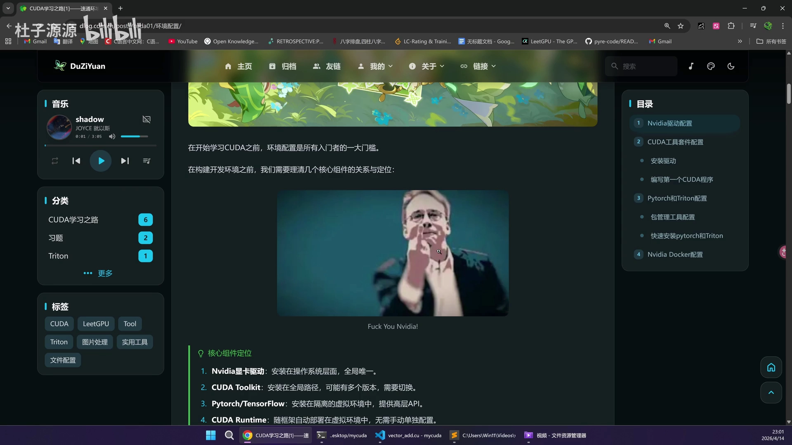
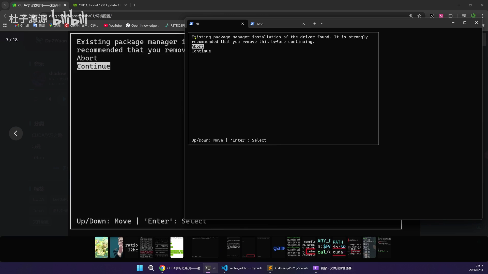
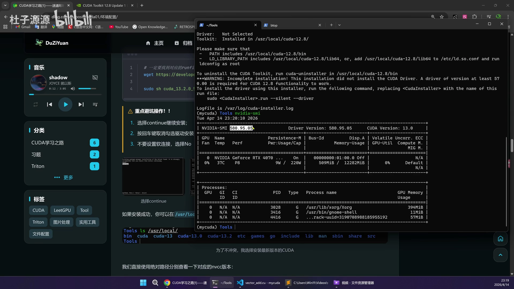

# 第03讲：极速环境配置——20 分钟搭好 CUDA + PyTorch + Triton，一次跑通零报错

## 本讲要解决的核心问题（SCQA）

**背景**：前两讲已经把「要做什么」讲清楚了——像刷力扣一样手撕 AI 算子，同一个算子用 CUDA、Triton、PyTorch 三种方式分别实现、互相对照。要真正开始写 Kernel，下一步就是动手把开发环境搭起来。

**冲突**：可对绝大多数入门者来说，写代码之前先要跨过一道门槛——**环境配置**。NVIDIA 驱动、CUDA Toolkit、PyTorch、Triton，版本之间互相咬合；网上的安装教程五花八门，照着装却常常满屏报错，甚至把系统搞崩。它是「每一个开发者的噩梦」。

**疑问**：这些组件到底是什么关系？应该先装谁、后装谁？怎样才能一次装对、不报错，而且以后还能在不同 CUDA 版本之间自由切换？

**回答（中心思想）**：这一讲只要抓住一条主线——**分层安装、各司其职**。四个组件分属不同层级：**NVIDIA 驱动装在操作系统层、全局唯一；CUDA Toolkit 也装在全局路径，但可以多版本共存、随时切换；PyTorch / Triton 则装在项目级的虚拟环境里，与系统隔离；CUDA Runtime 随框架自动部署、无需单独配**。安装顺序就是「驱动 → CUDA Toolkit → 虚拟环境 → 框架」四步，最后用 `uv` 把 PyTorch 和 Triton 一键装进隔离环境。照这个顺序走，20 分钟就能配好，而且完全零报错。本讲实验环境：**Ubuntu 24.04 + 一块 GeForce RTX 4070**。



[【跳转到 00:00】](https://www.bilibili.com/video/BV1VvQ3BSELZ/?t=0)

---

## 一、先理清组件关系：四层各司其职，是装对的第一步

环境之所以容易乱，是因为大家把它们当成「一堆软件」一起装；其实它们有明确的层级和职责。先把这张「核心组件定位」图记住，后面就不会装错。

### 1.1 四个组件分别是什么、装在哪

| 组件 | 装在哪 | 关键特征 |
| --- | --- | --- |
| NVIDIA 显卡驱动 | 操作系统层 | **全局唯一**，一个系统只装一个版本 |
| CUDA Toolkit（含 `nvcc`） | 全局路径 `/usr/local/cuda-*` | 可以有**多个版本**，需要时切换 |
| PyTorch / TensorFlow | 隔离的虚拟环境 | 提供高层 API，跟具体项目走 |
| CUDA Runtime | 随框架自动部署到虚拟环境 | **不需要手动单独配置** |

[【跳转到 00:19】](https://www.bilibili.com/video/BV1VvQ3BSELZ/?t=19)

UP 主用自己机器上的实际情况做演示：`nvidia-smi` 显示驱动版本是 **580.95.95**，它属于操作系统层，全局就一个；而 `which nvcc` 指向 `/usr/local/cuda/bin/nvcc`，`nvcc` 是 CUDA 的编译器，装在 `/usr/local` 下，可以有多个版本。进入 `/usr/local` 一看，里面同时躺着 `cuda-13.0`、`cuda-13.2` 等多个目录——这正是「Toolkit 多版本共存」的含义：需要 12 点几、11 点几时，提前装好放在这里，用哪个切哪个。


[【跳转到 00:52】](https://www.bilibili.com/video/BV1VvQ3BSELZ/?t=52)

### 1.2 为什么框架要放进「虚拟环境」，又为什么不用 Conda

PyTorch 一般放在**隔离的虚拟环境**里。什么是虚拟环境？简单说就是一个跟着项目目录走的独立 Python 环境：UP 主在 `my_cuda` 目录下建了环境，`which python` 显示 Python 解释器就在 `my_cuda/.venv/bin/python` 下面——它属于这个项目，不会污染系统。这样不同项目可以用不同版本的 PyTorch，互不干扰。

关于工具选择，UP 主特意解释了自己的取舍：**他不用 Conda，而用 `uv`**。原因是 Conda 有两个毛病——体积非常大；环境里的包兼容性不太好（它自己有一套 `conda install` 的下载体系，和 `pip install` 混用容易出问题）。而 `uv` 主要配合 `pip install` 使用，下载和解析都很快。

[【跳转到 01:42】](https://www.bilibili.com/video/BV1VvQ3BSELZ/?t=102)

明白了这层关系，后面的安装就有了顺序和边界：**系统层装驱动 → 全局装 CUDA Toolkit → 项目里建虚拟环境 → 环境里装 PyTorch/Triton**。接下来一步步做。

---

## 二、装驱动：先认卡，再让系统推荐安装

驱动是全局唯一的地基，必须最先装，而且要和 CUDA 版本匹配。

### 2.1 用 `lspci` 确认显卡已经被系统识别

`lspci` 的作用是列出当前 PCIe 总线上挂着的所有设备（PCIe 是一条总线，硬盘、显卡等都挂在上面）。执行：

```bash
lspci | grep -i nvidia
```

其中 `grep` 是文本查找，`-i` 表示忽略大小写，`nvidia` 就是我们要找的关键词。如果看到 `NVIDIA Corporation` 之类的输出，说明这块卡（UP 主这里是一张 **GeForce RTX 4070**）已经被识别。

[【跳转到 02:32】](https://www.bilibili.com/video/BV1VvQ3BSELZ/?t=152)

### 2.2 让 Ubuntu 推荐并安装合适的驱动

确认显卡在之后，先更新软件源，再让系统推荐驱动：

```bash
sudo apt update
sudo ubuntu-drivers devices
```

`ubuntu-drivers devices` 会列出所有可用驱动，并标注哪个是 `recommended`（推荐）。UP 主这里系统推荐的是 **580-open**。接着按顺序装依赖和驱动：

```bash
sudo apt install -y alsa-utils
sudo apt install -y pciutils ubuntu-drivers-common
sudo apt install nvidia-driver-580-open
sudo reboot
```

装完重启，再用 `nvidia-smi` 验证是否成功。


[【跳转到 03:47】](https://www.bilibili.com/video/BV1VvQ3BSELZ/?t=227)

`nvidia-smi` 的输出信息量很大：能看到驱动版本 **580.95.95**、支持的 CUDA 版本 **13.0**，以及这张卡的功率（**220 W**）、显存（**12 GB**）、当前占用（约 500 MB）等。只要能看到这张表，就说明驱动装好了。


[【跳转到 05:13】](https://www.bilibili.com/video/BV1VvQ3BSELZ/?t=313)

---

## 三、装 CUDA Toolkit：下 runfile，避开几个关键坑

驱动装好，接下来装 `nvcc`，也就是 CUDA 的编译套件。

### 3.1 选版本、下 runfile

在 NVIDIA 官网可以选到非常多版本。UP 主的建议是**装 11.8、12.8、13.0 这三个用得最多的版本**即可；他自己博客里写的是下载最新的 13.2。选好版本后按提示选操作系统（他这里是 Linux → x86_64 → Ubuntu → 24.04），安装类型选 **runfile (local)**，然后就会得到一条 `wget` 命令：

```bash
# 务必去官网核对与系统匹配的 runfile 名称
wget https://developer.download.nvidia.com/compute/cuda/12.8.1/local_installers/cuda_12.8.1_570.124.06_linux.run
sudo sh cuda_12.8.1_570.124.06_linux.run
```

下载时可能会受到网络（梯子）限制，若下不动，可以配置下载环境变量或用代理。下载完成后，用 `sudo sh cuda_..._linux.run` 启动安装脚本，这一步会在本地编译，耗时稍久，用 `btop`（`sudo apt install btop` 安装的终端监控工具）能看到 CPU 跑满。

值得一提的是，这个 runfile 是「驱动 + Toolkit」的一体化安装包，所以安装过程中它才会再三询问要不要装驱动（见 3.2）。正因如此，前面才强调**必须先装好驱动**，然后在装 Toolkit 时把驱动部分跳过。


[【跳转到 07:48】](https://www.bilibili.com/video/BV1VvQ3BSELZ/?t=468)

### 3.2 安装过程中的避坑操作（重点）

安装脚本是交互式的，会连续问你几个问题。这几个选择错了，是「报错」的高发区：

1. **是否 Abort？选 Continue。** 脚本检测到「已有包管理器安装的驱动」时，会提示 *It is strongly recommended that you remove this before continuing*；因为我们**已经装好驱动了**，所以不要删，直接选 **Continue**。
2. **组件勾选时，把 Driver 取消掉。** 在组件列表里用回车来切换勾选状态——我们不重装驱动，把 `Driver` 这一项取消勾选，其余 `CUDA Toolkit`、`CUDA Demo Suite`、`CUDA Documentation` 保留即可，然后选 **Install**。
3. **出现软链接提示时选 No。** 当提示 *A symlink already exists at /usr/local/cuda. Update to this installation?*（已存在软链接，是否更新）时，选 **No**，不要动这个软链接——后面用改配置文件的方式来切换版本会更干净。




[【跳转到 09:28】](https://www.bilibili.com/video/BV1VvQ3BSELZ/?t=568) ｜ [【跳转到 10:57】](https://www.bilibili.com/video/BV1VvQ3BSELZ/?t=657)

安装结束时，日志会显示 `Driver: Not Selected`、`Toolkit: Installed in /usr/local/cuda-12.8/` 以及 `***WARNING***: Incomplete installation! This installation did not install the CUDA Driver.`——**这是正常的**：我们本来就选择不装驱动，所以这条「不完整」警告可以忽略。`nvidia-smi` 里驱动版本仍然没变（580），也正说明驱动没有被覆盖。

[【跳转到 11:22】](https://www.bilibili.com/video/BV1VvQ3BSELZ/?t=682)

---

## 四、多版本 CUDA 共存与自由切换

CUDA Toolkit 装好后会落在 `/usr/local/cuda-12.8` 这样的目录里，但系统的 `nvcc` 默认可能还指向旧版本。要切换版本，靠的是修改用户级的 shell 配置文件。



[【跳转到 11:47】](https://www.bilibili.com/video/BV1VvQ3BSELZ/?t=707)

配置的方法是编辑 `~/.zshrc`（用 Zsh）或 `~/.bashrc`（用 Bash），在里面加入 CUDA 的 `PATH` 和库路径：

```bash
# 需要切换版本时，把下面两行里的版本号改成目标版本即可
export PATH=/usr/local/cuda-12.8/bin:$PATH
export LD_LIBRARY_PATH=/usr/local/cuda-12.8/lib64:$LD_LIBRARY_PATH
```

保存退出后，**必须 `source ~/.zshrc` 重新加载配置**，改动才会生效。然后再 `which nvcc`、`nvcc --version` 检查：改成 12.8 就显示 12.8，改成 13.0 再 `source` 一下就切到 13.0。你可以随意切换，需要哪个用哪个。


[【跳转到 12:12】](https://www.bilibili.com/video/BV1VvQ3BSELZ/?t=732) ｜ [【跳转到 13:02】](https://www.bilibili.com/video/BV1VvQ3BSELZ/?t=782)

这里还有一个**版本兼容的重要结论**：UP 主的驱动 580 最高只支持到 CUDA **13.0**，所以他试着把配置改成 13.2 时直接报错。规律是——**CUDA 向下兼容，但不向上兼容**：高版本驱动能跑低版本 CUDA，低版本驱动跑不了高于它支持上限的 CUDA。选版本前先看 `nvidia-smi` 标出的「CUDA Version」。

[【跳转到 14:17】](https://www.bilibili.com/video/BV1VvQ3BSELZ/?t=857)

---

## 五、写第一个 CUDA 程序，验证 Toolkit 真的能用

配置对不对，写个最小程序跑一遍最可靠。CUDA 源码以 `.cu` 结尾：

```bash
touch test.cu
vim test.cu        # 写入一个最简单的程序，例如打印 Hello CUDA
nvcc test.cu       # 用 nvcc 编译
./a.out            # 运行，看到 Hello CUDA
```


[【跳转到 15:07】](https://www.bilibili.com/video/BV1VvQ3BSELZ/?t=907) ｜ [【跳转到 15:32】](https://www.bilibili.com/video/BV1VvQ3BSELZ/?t=932)

看到 `Hello CUDA` 输出，就说明驱动 + Toolkit 这条链路已经完全打通，可以写纯 CUDA 程序了。

讲义的「编写第一个 CUDA 程序」一节，把一个标准 CUDA 程序的骨架总结成五步：**分配显存 → 传输数据到 GPU → 启动核函数（kernel）→ 同步 → 拷回结果、验证并释放资源**。本讲先用最简单的 `printf` 版程序跑通流程，后面讲具体算子时会把这五步逐一展开。

---

## 六、用 uv 告别 Conda：虚拟环境里一键装 PyTorch / Triton

最后一步是装框架。UP 主强烈推荐用 `uv`，因为它的下载和解析都非常直观、很快。

### 6.1 安装 uv（国内记得配镜像源）

`uv` 的安装很直接：

```bash
curl -LsSf https://astral.sh/uv/install.sh | sh
```

装完用 `uv --version` 验证（UP 主这里是 **0.11.6**）。如果下载有问题，可以配置清华镜像源，或者配代理：

```bash
export UV_INDEX_URL="https://pypi.tuna.tsinghua.edu.cn/simple"
```


[【跳转到 15:50】](https://www.bilibili.com/video/BV1VvQ3BSELZ/?t=950)

### 6.2 创建并激活虚拟环境

进入项目目录后，用一行命令创建环境并指定 Python 版本，然后激活：

```bash
uv venv --python=3.14
source .venv/bin/activate
```

激活成功后，终端提示符前面会出现环境名（如 `(my_cuda)`），说明你已经进入这个隔离环境。

[【跳转到 17:05】](https://www.bilibili.com/video/BV1VvQ3BSELZ/?t=1025)

### 6.3 一键装 PyTorch 与 Triton，并验证

`uv` 最优的一点是会自动处理 CUDA 版本匹配。装 PyTorch 只需要：

```bash
uv pip install torch torchvision torchaudio
uv pip install triton
```

由于 uv 并发下载，这一步非常快。装完后进入 Python 交互模式验证：

```python
import torch
print(torch.__version__)          # 2.11.0+cu130
print(torch.cuda.is_available())  # True
import triton
import triton.language as tl
print(triton.__version__)         # Triton 也装好了
```


[【跳转到 17:30】](https://www.bilibili.com/video/BV1VvQ3BSELZ/?t=1050) ｜ [【跳转到 19:35】](https://www.bilibili.com/video/BV1VvQ3BSELZ/?t=1175)

`torch.cuda.is_available()` 返回 `True`，说明 CUDA 能被 PyTorch 用上；`import triton` 也成功，意味着三件套——驱动、CUDA、框架——全部就位，可以开始写代码了。

UP 主还现场新建了一个 `test1` 环境演示 `uv pip install torch` 的下载速度：它先解析依赖、找到对应包后并发下载，速度非常可观，而且耗时稳定可控。这正是 `uv` 相对 Conda 的优势——同样装 PyTorch，它更快、更省心。

最后他也交代了进阶边界：如果要把别人的项目拉下来跑，可能还会碰到环境管理、环境隔离、以及让两个不同 CUDA 版本的环境共存等需求；这些属于「细枝末节」，可以在日常使用中慢慢积累。对从零开始的人来说，掌握本讲的四步流程就足够了。

---

## 小结

- **一条主线**：驱动（系统层、全局唯一）→ CUDA Toolkit（全局、多版本）→ 虚拟环境（项目级、隔离）→ PyTorch/Triton（装进环境）；CUDA Runtime 随框架自动部署，不用管。
- **驱动**：`lspci | grep -i nvidia` 认卡 → `sudo ubuntu-drivers devices` 看推荐 → 装依赖与 `nvidia-driver-580-open` → `reboot` → `nvidia-smi` 验证。
- **CUDA Toolkit**：官网选版本、下 runfile，`sudo sh ...run` 安装；安装中做到三点避坑——**选 Continue、取消勾选 Driver、软链接选 No**；看到「未安装驱动」的警告属正常。
- **多版本切换**：改 `~/.zshrc`（或 `~/.bashrc`）里的 `PATH` 与 `LD_LIBRARY_PATH`，改完必须 `source` 生效。
- **兼容性铁律**：CUDA **向下兼容、不向上兼容**；先看 `nvidia-smi` 给出的 CUDA 版本上限。
- **uv 替代 Conda**：`uv venv --python=3.14` 建环境、`source .venv/bin/activate` 激活、`uv pip install torch torchvision torchaudio` 与 `uv pip install triton` 一键装框架；国内可配清华镜像源 `UV_INDEX_URL`。
- 入门阶段掌握这套流程就够了；环境管理、多版本隔离等属于进阶技能，可以在日积月累中再补。

## 关键术语速查

| 术语 | 一句话解释 |
| --- | --- |
| NVIDIA 驱动 | 操作系统层让 GPU 能被系统调用的软件，全局唯一 |
| CUDA Toolkit | 含 `nvcc` 编译器与库的 CUDA 开发套件，装在 `/usr/local/cuda-*`，可多版本共存 |
| `nvcc` | NVIDIA 的 CUDA 编译器，负责把 `.cu` 源码编译成可执行程序 |
| CUDA Runtime | 随 PyTorch 等框架自动部署的运行时库，无需手动安装 |
| 虚拟环境 | 跟随项目目录的隔离 Python 环境，避免不同项目的依赖互相污染 |
| `lspci` | 列出 PCIe 总线上所有设备的命令，用来确认显卡是否被识别 |
| `ubuntu-drivers devices` | 让 Ubuntu 列出可用驱动并标注推荐版本 |
| `nvidia-smi` | 查看驱动版本、支持的 CUDA 版本、显存与功耗等 GPU 状态 |
| runfile | NVIDIA 提供的一体化安装脚本（`.run`），可交互选择安装组件 |
| `uv` | 一个极快的 Python 包/环境管理工具，用来替代 Conda、加速 pip |
| `UV_INDEX_URL` | 指定 uv 使用的 PyPI 镜像地址，国内加速下载用 |
| 向下兼容 | 高版本驱动/CUDA 能运行低版本相关软件，反之（向上）通常不行 |
