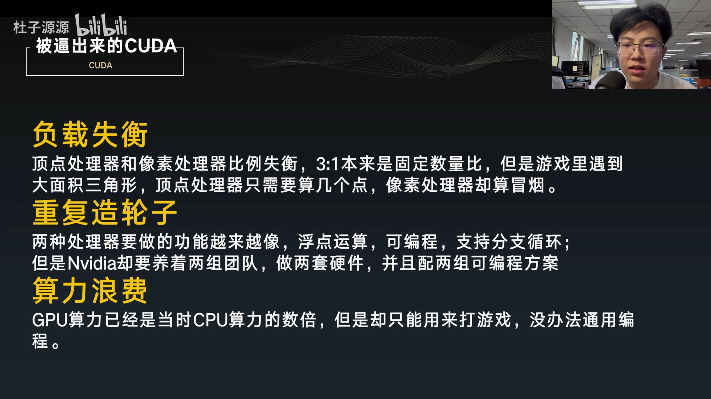
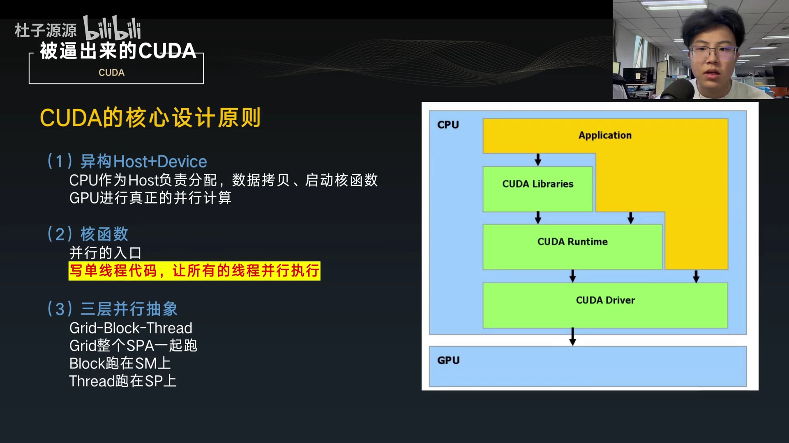
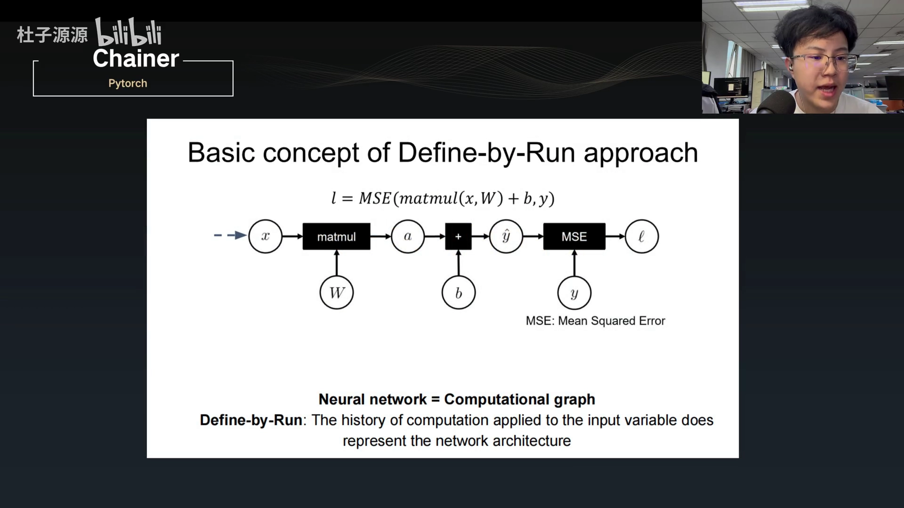
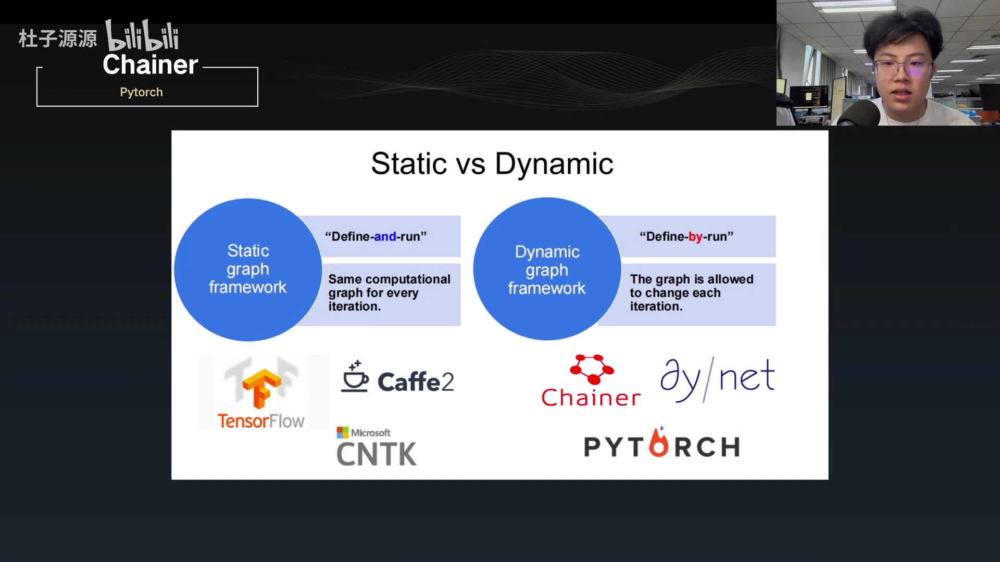
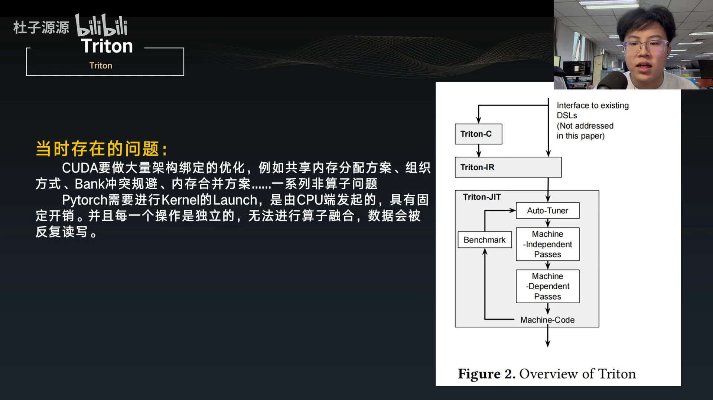
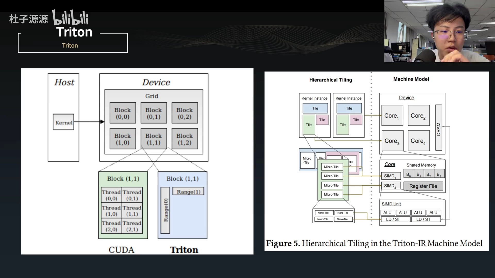

# 第04讲：CUDA、PyTorch、Triton 的前世今生——三种编程范式的设计哲学与选型

## 本讲要解决的核心问题（SCQA）

**背景**：上一讲把开发环境搭好了，接下来就要正式动手写算子。这个系列的特点是——同一个算子，我们会用 CUDA、Triton、PyTorch 三种方式分别实现，再对比它们的写法与性能。

**冲突**：很多同学习惯「看视频、刷教程」来学习，但真正走到写算子这一步才发现，它特别考验**分析与工程能力**。同一个算子，当数据规模变了、场景变了，性能可能天差地别；面对纷繁复杂的算子，如果只会照着抄，很快就会迷失。

**疑问**：CUDA、PyTorch、Triton 这三者到底是什么关系、各自擅长什么？面对一个具体算子，我该用哪一种来写？

**回答（中心思想）**：要选对工具，先要理解它们各自的设计哲学。可以这样一句话概括：**CUDA 是「被逼出来的」底层通用并行编程，是手动挡；PyTorch 是「站在巨人肩膀上」的易用高层框架，是舒适区；Triton 是「自动挡」的、以 tile 为中心的编程模型**。它们恰好构成从底层到高层、从手动到自动的一条光谱——理解了这条光谱，选型就水到渠成。

本讲目录因此分为三块：**被逼出来的 CUDA、站在巨人肩膀上的 PyTorch、自动挡的 Triton**，在此之前先回答一个更根本的问题：什么是算子。

[【跳转到 00:00】](https://www.bilibili.com/video/BV147dYBLEi4/?t=0)

---

## 一、什么是算子：对数据做函数运算的最小可复用单元

在聊三大工具之前，先把「算子」这个词定义清楚。UP 主的理解是：**算子（operator）是对数据进行函数运算的最小可复用单元**。拆开看有三个关键词：

- **对数据进行函数运算**：这是它的本职，比如卷积、全连接、激活等——这些在深度学习中都会反复用到。
- **「最小」**：意思是**在单个算子内部，性能通常已经是最优的**；如果继续拆分或合并它，反而会导致性能下降。
- **「可复用」**：同一段实现可以面对不同的数据规模重复使用，从而减少代码量。

[【跳转到 01:02】](https://www.bilibili.com/video/BV147dYBLEi4/?t=62)

把「算子」和接下来要讲的三种实现方式连起来看：**PyTorch 提供了现成的高层算子**，**CUDA / Triton 则是我们亲手去写这些算子的两种手段**。理解了算子的定位，才能理解后面为什么要在「易用」和「可控」之间做权衡。

---

## 二、CUDA：被逼出来的通用并行计算

CUDA 不是凭空设计出来的，而是为了解决 GPU 早期架构的三个硬伤，才被「逼」出来的。

### 2.1 前身：顶点处理器 + 像素处理器，以及它的三大缺陷

英伟达在创建 CUDA 之前，本质上是一家标准的游戏厂商，主要做图形处理。它最初把图形处理拆成两类单元：

- **顶点处理器**：处理三角形顶点、坐标变换、光照——**低延迟、高精度的「细活」**。
- **像素处理器**：处理三角形内部的颜色、纹理——**高吞吐、高延迟的「粗活」**。


[【跳转到 01:46】](https://www.bilibili.com/video/BV147dYBLEi4/?t=106)

这种「两类处理器按固定比例分工」的方式有三个严重缺点：

1. **负载失衡**：两者的数量比（如 3:1）是固定的，但游戏场景在变——遇到大面积三角形时，顶点处理器只需算几个点，像素处理器却「算冒烟」。
2. **重复造轮子**：两种处理器功能越来越像（浮点运算、可编程、支持分支循环），英伟达却要养两组团队、做两套硬件、维护两套可编程方案。
3. **算力浪费**：GPU 算力早已是当时 CPU 的数倍，却只能用来打游戏，无法做通用编程。



[【跳转到 02:46】](https://www.bilibili.com/video/BV147dYBLEi4/?t=166)

### 2.2 Tesla 架构：统一 TPC，把 GPU 算力解放出来

英伟达在 **8800 系列**上提出了 **Tesla 架构**，并配套端出了 CUDA 编程范式（右边是一篇配套论文）。它的核心动作是：把像素处理器和顶点处理器**统一**成一种单元，称为 **TPC（Texture/Processor Cluster，处理器集群）**，从而让 GPU 的算力可以被通用并行计算使用。


[【跳转到 03:35】](https://www.bilibili.com/video/BV147dYBLEi4/?t=215)

从硬件层级看，GPU 大致分三块：

- **前端**：Host 接口、输入组装器，以及三类工作的分发单元；负责传输数据、分发工作等「启动类、准备类」的工作。
- **算力池**：真正干活的层级。以 Tesla 为例，一台机器有 **8 个 TPC**，**一个 TPC 有 2 个 SM**，**一个 SM 有 8 个 SP**——越往下，计算层级越精细。此外 SM 里还有 **SFU**（做非线性等特殊函数）和 **shared memory**（共享内存）。**SP** 负责单指令的浮点运算（如加减乘除）。
- **后端**：负责与存储端交互，例如互联网络、ROP（光栅操作处理器）与显存控制器。

[【跳转到 04:13】](https://www.bilibili.com/video/BV147dYBLEi4/?t=253)

英伟达把并行计算发挥到了极致：CPU 也有超线程，但线程数通常只有核数的两倍（十几个），且严格说是「软线程」；而在 GPU，单个 SM 就能有七百多个线程。CPU 和 GPU 都习惯把 **32 个线程打包成一个 warp** 来执行——一个 warp 的 32 个线程执行同一条指令，被拆分到硬件后只需很少的周期就能完成，并行度极大提升。

[【跳转到 05:17】](https://www.bilibili.com/video/BV147dYBLEi4/?t=317)

### 2.3 软件的爆发：CUDA 指南从 130 页长到 600 页

CUDA 把 C 语言的编程范式扩展到了 GPU，于是各种大规模并行计算都能搬到 GPU 上。代价是 API 越堆越多：**最早的 CUDA 1.0 编程指南只有 130 多页，而最新的 CUDA 13.0 已经更新到 600 多页。**


[【跳转到 05:55】](https://www.bilibili.com/video/BV147dYBLEi4/?t=355)

但换个角度想：**每一个工具最初被创造出来，都是为了降低学习成本，而不是增加学习成本**。所以不必被 600 页吓到——把握核心、只学核心，其余了解即可。

这也解释了为什么 GPU 值得学：2006 年时，GPU 的浮点吞吐就已经是 CPU 的十几倍，差距此后越拉越大。


[【跳转到 06:28】](https://www.bilibili.com/video/BV147dYBLEi4/?t=388)

CPU 控制单元非常多，更适合控制类任务；GPU 则更适合并行计算任务。

### 2.4 CPU 的核心设计原则：异构、核函数、三层抽象

在 UP 主看来，CUDA 的核心设计有三点：

1. **异构（Host + Device）**：CPU 作为 Host，负责分配数据、拷贝数据、启动核函数等准备工作；GPU 负责真正的并行计算。
2. **核函数（kernel）作为并行入口**：核心思想是**写单线程视角的代码，让所有线程并发执行**。例如算一个 `1+1`，单线程看只做了一次，但可能有几百万个线程同时在做这个 `1+1`，速度就上来了。
3. **三层并行抽象**：`grid`（跑在整个 GPU 上）、`block`（跑在 SM 上）、`thread`（跑在 SP 上）——软件抽象与硬件层级一一对应。



[【跳转到 07:01】](https://www.bilibili.com/video/BV147dYBLEi4/?t=421)

与之配套的是 **CUDA 内存层级**：不同层级单元（寄存器、共享内存、本地内存、全局内存、常量内存、纹理内存）的读写速度差异非常大，这正是写算子要优化的核心。


[【跳转到 07:56】](https://www.bilibili.com/video/BV147dYBLEi4/?t=476)

### 2.5 怎样写出性能更好的算子

UP 主把「写高性能算子」的要点归纳为三条：

1. **优化访存**：访问内存次数越多，读写开销越大，计算时间被严重压缩。要做到**合并访问与对齐**、**利用层级内存减少全局访问**、避免访存串行化。
2. **提高 SM 占用率**：减少每个线程的寄存器用量、减少共享内存分配量、选择合适的线程块大小。
3. **避免分支**：一个 warp 里 32 个线程尽量执行统一的指令；频繁的 `if-else` 会造成停顿，所以尽量把分支条件设计成 **以 warp 为粒度统一**。


[【跳转到 08:32】](https://www.bilibili.com/video/BV147dYBLEi4/?t=512)

---

## 三、PyTorch：站在巨人肩膀上

如果说 CUDA 是手写底层，那 PyTorch 就是让大多数人「开箱即用」的高层框架。

### 3.1 两个「爹」：Torch 与 Chainer

UP 主打了个有趣的比方：**PyTorch 有两个爹**——亲爹是 **Torch**（Facebook/Meta 主持开发，出现较早），继父是 **Chainer**（一家日本公司开发）。有意思的是，**PyTorch 很多著名特性反而是 Chainer 先提出来的**。

- **Torch** 的前端语言是 **Lua**——这是它当年「较为失败」的最大阻碍，大家上手就先问「Lua 是啥」。而 Facebook 内部的另一个项目 **Caffe** 反而更流行，因为它性能好、能做生产级的工业代码。
- **Chainer** 才是最早实现 PyTorch 那些核心特性的框架。它提出了**动态图**的编程逻辑，可以做到很好的 debug——这对开发者非常重要。

[【跳转到 09:25】](https://www.bilibili.com/video/BV147dYBLEi4/?t=565)

### 3.2 动态图 vs 静态图：define-by-run 到底解决了什么

要理解 Chainer 的贡献，看一个经典例子。假设前向计算是：

```
l = MSE(matmul(x, W) + b, y)
```

即：`x` 与 `W` 做矩阵乘法得到 `a`，加上偏置 `b` 得到 `ŷ`，再与 `y` 求均方误差（MSE）。这种「神经网络 = 计算图」的视角下，**前向就是按图计算，反向就是把各算子的导数信息沿图传回去**。



[【跳转到 10:29】](https://www.bilibili.com/video/BV147dYBLEi4/?t=629)

问题来了：**如果计算里出现分支（`if`）怎么办？静态图需要把两条路都记录下来，反向时还要处理被忽略的分支**。而动态图的优势就在这里——**如果 `if a > 0` 成立，就走下面那条线，原本的加号节点直接被忽略、假装不存在**；反向传播时也只沿实际走过的路径迭代。


[【跳转到 11:03】](https://www.bilibili.com/video/BV147dYBLEi4/?t=663)

这正是 **define-and-run（先定义后计算，静态图）** 与 **define-by-run（边计算边定义，动态图）** 的区别。相比 TensorFlow、Caffe、Torch，Chainer 的编程逻辑更合理、也更好 debug。Chainer 里 `init`、`call`、卷积、全连接这样的写法，看起来是不是特别熟悉？——它就是 PyTorch 的「继父」。



[【跳转到 11:21】](https://www.bilibili.com/video/BV147dYBLEi4/?t=681)

### 3.3 底层功臣：CuPy，把 NumPy 搬到 GPU

除了 Chainer，PyTorch 在底层还借鉴了与 NumPy 类似的 **CuPy**。它的核心优势是：**在几乎与 NumPy 接口一致的前提下，把整个计算从 CPU 搬到 GPU 上**。


[【跳转到 12:11】](https://www.bilibili.com/video/BV147dYBLEi4/?t=731)

### 3.4 PyTorch 的设计哲学：一手抓住「张量」

在 UP 主看来，**Torch / PyTorch 的核心还是 Torch，也就是与张量相关的部分**：张量的定义、存储、读取、自动微分、优化算子等等。**张量是 Torch 最重要的特性**——毕竟 PyTorch 本来就是要对张量做各种操作。例如一个经典的 VGG 网络，本质上就是创建一系列矩阵并不断迭代运算，最终得到一个输出向量。PyTorch 很好地覆盖了 Caffe2 与 Torch 的绝大部分功能。

[【跳转到 12:28】](https://www.bilibili.com/video/BV147dYBLEi4/?t=748)

因此，学习 PyTorch 时要把握住核心——**对张量进行运算**；抓住这个点，其他操作自然就好理解了。它最核心的特性可以归纳为四条：**动态图、自动微分（Autograd）、扩展性、易用性**。


[【跳转到 13:16】](https://www.bilibili.com/video/BV147dYBLEi4/?t=796)

---

## 四、Triton：自动挡的 tile 编程

最后来看 Triton。它的核心论文发表于 2019 年，要理解它，先要看当时的痛点。

### 4.1 背景：手写 CUDA 太硬，PyTorch 又太软

在 Triton 出现的年代，想写出高性能算子只有两条路，但都有明显代价：

- **写 CUDA**：需要针对具体硬件做大量**架构绑定的优化**——共享内存怎么分配、bank 访存怎么组织、如何避免 bank conflict、内存如何合并访问……**这些都是「非算子本身」的硬件问题**。
- **优化 PyTorch**：性能开销主要来自**一个个 kernel 的 launch**（由 CPU 端发起，与 GPU 距离远、开销大）；而且每个操作相互独立、**无法做算子融合**，数据被反复读写，开销很大。



[【跳转到 15:02】](https://www.bilibili.com/video/BV147dYBLEi4/?t=902)

### 4.2 用 Roofline 证明「自动挡」也能很快

Triton 论文用一张**屋顶线模型（Roofline Model）**来证明效率。图中：横轴是**计算强度**（Arithmetic Intensity，单位 TFLOP/GB），纵轴是**性能**（Performance，单位 TFLOP/s）；**黑色的折线代表硬件在访存带宽与算力约束下的性能上限**。


[【跳转到 13:53】](https://www.bilibili.com/video/BV147dYBLEi4/?t=833)

结论很直观：在计算强度较低时，**Triton 的性能已接近 Roofline 上限**；随着计算强度增大，**Triton 与 NVIDIA 手写库 cuBLAS 的性能几乎相同**，而扩展性更好的 AutoTVM 反而稍差一些。这个实验做的是矩阵转置加一个运算、在 GTX 1070 上运行——这说明**用更抽象的写法，也能逼近手写性能**。

### 4.3 屏蔽线程，专注 tile：把映射交给编译器

Triton 的设计哲学，是把 CUDA 的抽象层级**再抬高一层**：**它屏蔽掉了 thread 这一层，取而代之的是全局的数据范围（range）**。开发者不需要碰同步、共享内存管理这些底层细节，**只需要专注于对 tile（数据块）的编程**。



[【跳转到 15:55】](https://www.bilibili.com/video/BV147dYBLEi4/?t=955)

那么 tile 是怎么映射到硬件上的？**这些映射工作全部交给编译器完成**，程序员无需关心。它对应着清晰的层级：不同 tile 之间对应 device 上 SM 间的并行；tile 内部对应 SM 内的并行；更细的 nano-tile 则对应 SM 的 SIMD 指令并行。

UP 主对 Triton 的理解是：**它之所以能做到这一点，是因为它更抽象、抽象层级更高，从而把底层的复杂性抽象掉了**。这也解释了一个趋势——如今 cuTile、CuTe、CUTLASS、Triton、TileLang 等各种 tile 编程方案层出不穷，CUDA 官方甚至也推出了自己的方案（部分要在 50 系显卡上才支持）。

[【跳转到 16:38】](https://www.bilibili.com/video/BV147dYBLEi4/?t=998)

---

## 五、三者怎么选：一张表看清定位

| 维度 | CUDA | PyTorch | Triton |
| --- | --- | --- | --- |
| 抽象层级 | 低（手动挡） | 高（现成高层 API） | 中（自动挡，tile 级） |
| 编程视角 | 单线程视角 + thread/block/grid | 对张量做运算 | 对 tile/range 编程，不碰线程 |
| 主要优势 | 性能上限最高、控制最精细 | 易用、生态大、开发最快 | 接近手写性能、开发成本低 |
| 主要代价 | 架构绑定的优化负担重 | kernel launch 开销、难融合 | 极度定制场景下不如手写 CUDA |
| 适合场景 | 极致性能、硬件特化算子 | 快速搭建模型与原型 | 需要高性能又不想写底层 |

[【跳转到 16:20】](https://www.bilibili.com/video/BV147dYBLEi4/?t=980)

一句话总结选型：**要最快出结果用 PyTorch，要高性能但不想碰硬件细节用 Triton，要压榨到极致再上 CUDA**。这也正是本系列坚持「一个算子三种写法」对照学习的原因。

---

## 小结

- **算子**是对数据做函数运算的**最小可复用单元**；「最小」意味着单算子内性能已近最优，不宜再拆。
- **CUDA 是被逼出来的**：早期顶点/像素处理器存在负载失衡、重复造轮子、算力浪费三大缺陷；Tesla 架构用统一的 TPC（→SM→SP）解放了 GPU 通用算力。
- **CUDA 三大设计**：异构 Host+Device、核函数作为并行入口、grid/block/thread 三层抽象；配套的内存层级差异是优化重点。
- **写高性能算子三招**：优化访存（合并、对齐、减少全局访问）、提高 SM 占用率、避免 warp 级分支。
- **CUDA 指南从 130 页长到 600 页**，但工具是为了降低学习成本——抓住核心即可。
- **PyTorch 站在巨人肩膀上**：亲爹 Torch（Lua 前端拖累）、继父 Chainer（最早实现动态图 define-by-run）、底层借鉴 CuPy（GPU 版 NumPy）；核心是**张量**，特性是**动态图、自动微分、扩展性、易用性**。
- **Triton 是自动挡**：针对「手写 CUDA 太硬、PyTorch 太软」的痛点，**屏蔽 thread、专注 tile**，把到硬件的映射交给编译器；Roofline 实验证明它性能接近 cuBLAS。
- 三者是从低到高、从手动到自动的一条光谱，按「易用 ↔ 性能」的需求选择即可。

## 关键术语速查

| 术语 | 一句话解释 |
| --- | --- |
| 算子（Operator） | 对数据做函数运算的最小可复用单元，如卷积、激活 |
| 顶点处理器 / 像素处理器 | GPU 早期分别处理几何顶点与像素颜色的两类单元 |
| TPC | Texture/Processor Cluster，Tesla 架构统一顶点与像素后的处理器集群 |
| SM / SP | Streaming Multiprocessor / Streaming Processor，SM 内的多组流处理器为 SP |
| warp | GPU 上把 32 个线程打包执行的基本调度单位 |
| 核函数（kernel） | CUDA 中在 GPU 上并行执行的函数，是并行的入口 |
| grid / block / thread | CUDA 的三层并行抽象，分别对应 GPU / SM / SP |
| Host / Device | 异构编程里的 CPU 端 / GPU 端 |
| 动态图（define-by-run） | 边计算边构建计算图，支持分支、便于 debug |
| 静态图（define-and-run） | 先定义整张计算图再执行，每次迭代图相同 |
| Autograd | PyTorch 的自动微分机制，自动为张量运算求导 |
| CuPy | 与 NumPy 接口几乎一致、但运行在 GPU 上的库 |
| Roofline 模型 | 屋顶线模型，用计算强度刻画硬件性能上限的分析工具 |
| tile / range | Triton 中屏蔽线程后使用的数据块/范围抽象 |
| CuBLAS | NVIDIA 官方的高性能线性代数库，常作为性能基准 |
