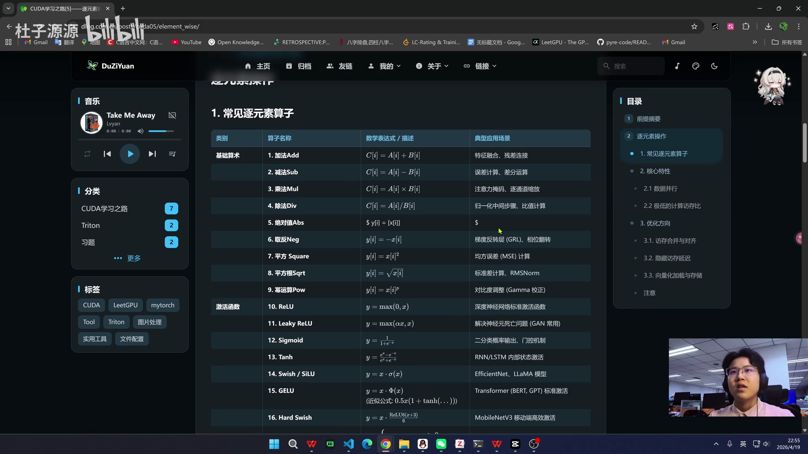
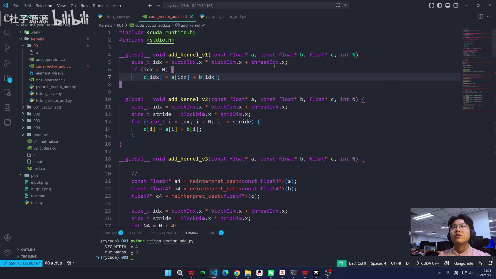
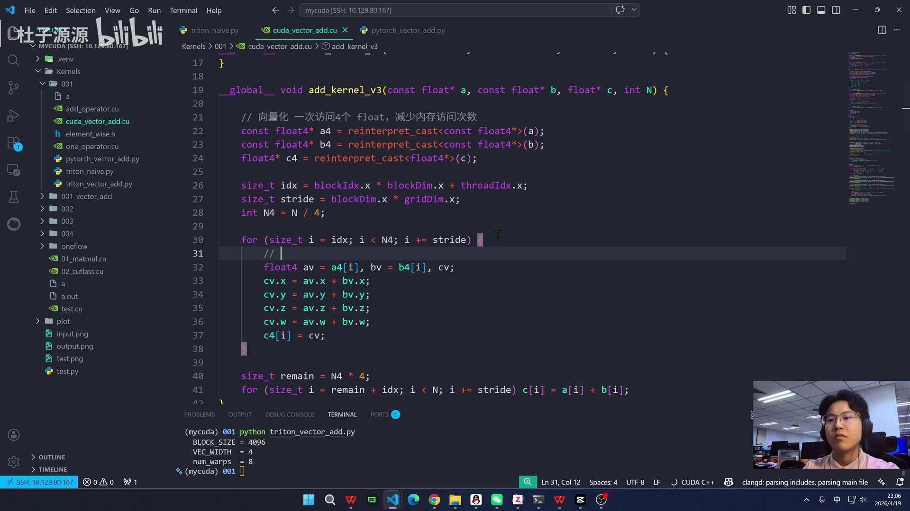
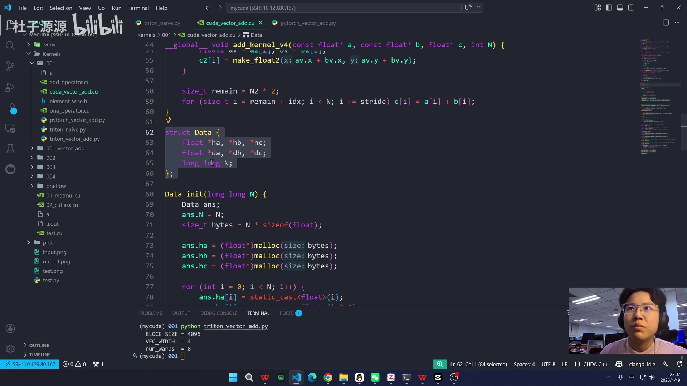
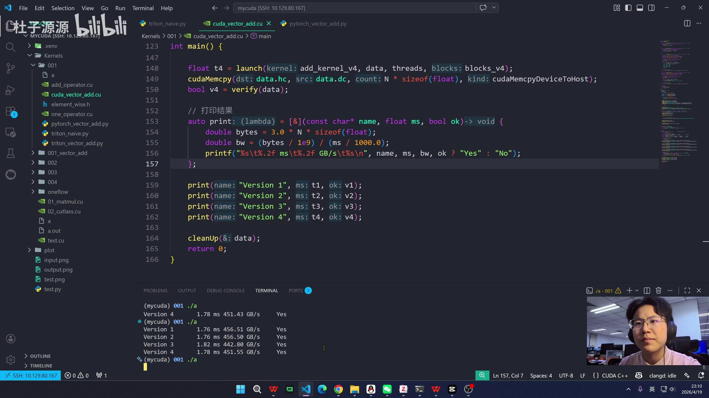
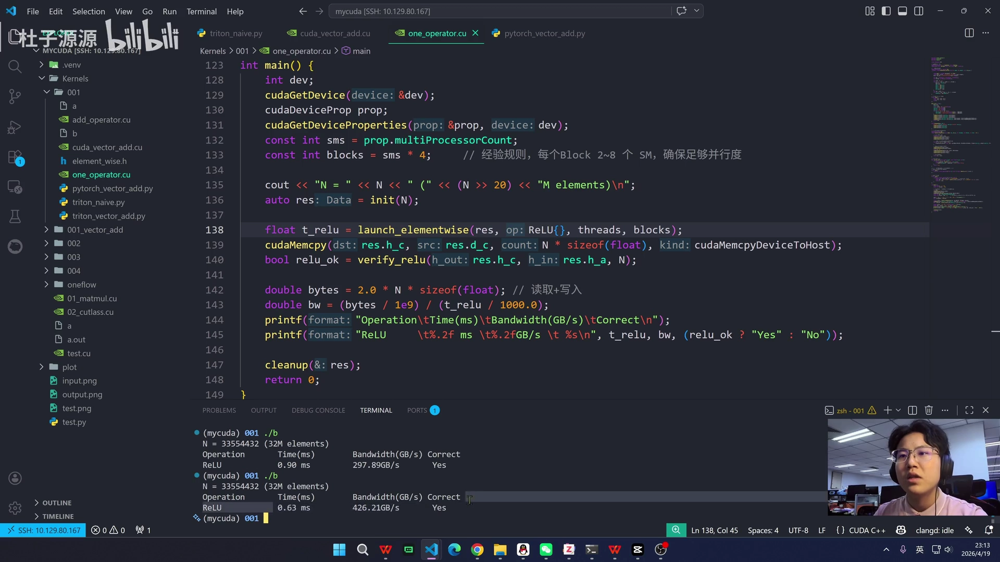
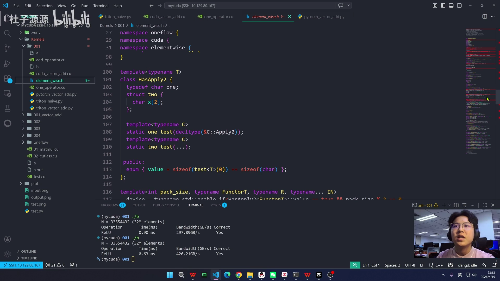

# 第05讲：element-wise 算子详解——从 PyTorch、Triton 到 CUDA 的手写与优化

## 本讲要解决的核心问题（SCQA）

**背景**：我们在学习 GPU 算子开发。所有深度学习框架里，最基础、出现频率最高的一类算子就是 element-wise（逐元素）算子，例如加法、ReLU、Sigmoid。

**冲突**：这类算子看起来"太简单"，简单到很多人觉得没必要亲手写，直接调 PyTorch 就够了；但恰恰因为简单，它最能暴露 GPU 优化的本质——一旦写不好，性能就会腰斩。而"怎么写才算好"这件事，PyTorch、Triton、CUDA 三种层次的写法差异极大。

**疑问**：element-wise 算子到底特殊在哪里？为什么它容易优化？在 PyTorch / Triton / CUDA 三种实现里，我们到底该改什么、怎么改，才能把带宽跑满？

**回答（中心思想）**：element-wise 算子的性能瓶颈是**显存带宽而不是计算**，因此优化目标是"打满带宽"。围绕这个目标只有两把武器——**grid loop（网格循环，提升单线程利用率）**和**vectorize（向量化，提升单次访存宽度）**；把这套方案写进模板，就能复用给所有 element-wise 算子。本讲会用 PyTorch 立基线、用 Triton 快速验证、再用 CUDA 手写四个版本逐层验证这套思想。[【跳转到 00:00】](https://www.bilibili.com/video/BV1L6oNBSEGc/?t=0)

---

## 一、什么是 element-wise 算子：输出只取决于同一位置的输入

### 1.1 一句话定义

element-wise 算子指的是：**输出的第 i 个元素，只由输入中第 i 个位置的元素决定**，与相邻位置的元素毫无关系。单目运算只读一个位置，双目运算读两个对应位置。[【跳转到 00:17】](https://www.bilibili.com/video/BV1L6oNBSEGc/?t=17)

举个最直观的例子：两个矢量相加 `C[i] = A[i] + B[i]`，第 0 号元素的结果只由 `A[0]` 和 `B[0]` 决定，跟第 1 个、第 100 万个元素都无关。这个过程**不涉及滑动窗口，也不涉及矩阵乘法**——所以它不是卷积、也不是矩阵乘。

作为对比：卷积里输出某个点要读周围一片输入，矩阵乘里输出一个元素要读整行整列，这些都会产生"跨位置的依赖"。element-wise 完全没有这种依赖。



### 1.2 常见算子清单

课堂上把常见 element-wise 算子分成几类（图 `00017`）：

- **基础算术**：加法 Add、减法 Sub、乘法 Mul、除法 Div、绝对值 Abs、取反 Neg、平方 Square、平方根 Sqrt、幂运算 Pow。
- **激活函数**：ReLU、Leaky ReLU、Sigmoid、Tanh、Swish/SiLU、GELU、Hard Swish。
- **其他**：数值比较（Eq/Ne/Gt/Lt）、RGB 转灰度 `Y = 0.299R + 0.587G + 0.114B`、颜色反转 `y = 255 - x`、Dropout、缩放与偏置 `y = γx + β`（BatchNorm 的仿射部分）。

它们形态各异，但**共同点是一致的：输出位置 i 只取决于同一位置的输入**。

---

## 二、两大核心特性，直接决定了优化方向

### 2.1 数据并行性极好：没有线程间依赖

因为第 0 个元素和第 100 万个元素毫无关系，线程之间不需要交换数据、不需要同步指令。对 GPU 而言这意味着两件好事（图 `00042`）：

1. **不需要共享内存（shared memory）**：线程之间不用交换数据，也就不需要同步指令。
2. **不需要复杂寻址**：除了计算当前线程对应的偏移之外，没有额外的寻址开销。

这种"无跨线程数据依赖"的特性，让它成为 GPU 优化中**最容易达到理论峰值带宽**的一类算子。


### 2.2 计算访存比极低：瓶颈在带宽，不在算力

但 element-wise 也有"坏消息"：它**访存次数很多，计算密度却很小**。[【跳转到 00:67】](https://www.bilibili.com/video/BV1L6oNBSEGc/?t=67)

以逐元素加法 `C[i] = A[i] + B[i]` 为例：

- **计算量**：1 次加法。
- **访存量**：读 A、读 B、写 C，总共 3 次显存操作；单精度每个数 4 字节，共 12 字节。
- **计算访存比** = 1 FLOP / 12 Bytes ≈ **0.08 FLOP/Byte**。

而主流 GPU 的理论峰值计算访存比通常在 **10–20 FLOP/Byte 以上**。两者相差两个数量级，说明**算术单元大部分时间在等数据**。

**结论（很重要）**：element-wise 算子的瓶颈不在计算能力，而在显存带宽。因此，衡量一个 element-wise kernel 好坏的核心指标不是 TFLOPS，而是**它有没有跑满显存带宽**。[【跳转到 02:08】](https://www.bilibili.com/video/BV1L6oNBSEGc/?t=128)


正因如此，后面的所有优化手段都只围绕两件事：**减少访存次数、提升单次访存效率**。最基础的模板代码如下：

```cuda
// naive：一个线程只负责一个元素
__global__ void add_kernel(const float* A, const float* B, float* C, int N) {
    // 1. 计算全局线程索引
    int idx = blockIdx.x * blockDim.x + threadIdx.x;
    // 2. 边界保护
    if (idx < N) {
        // 3. 逐元素计算
        C[idx] = A[idx] + B[idx];
    }
}
```

这段模板里，**索引计算、边界检查、算子实现**构成一个固定框架。要换成 ReLU、Sigmoid、Scale 等，只需要替换第 3 处的那一行，其余代码完全不用动。

---

## 三、先立基线：用 PyTorch 测原生性能

在动手写自定义算子之前，先用 PyTorch 的原生算子量一下"天花板"。[【跳转到 01:41】](https://www.bilibili.com/video/BV1L6oNBSEGc/?t=101)

测性能的通用写法是 benchmark 函数（图 `00151`）：

```python
def benchmark_add(func, *args, name="Add", n_warmup=5, n_repeat=20):
    start = torch.cuda.Event(enable_timing=True)
    end   = torch.cuda.Event(enable_timing=True)

    start.record()
    for _ in range(n_repeat):
        func(*args)
    end.record()
    torch.cuda.synchronize()

    elapsed_ms = start.elapsed_time(end) / n_repeat  # 平均每次耗时（毫秒）
    return elapsed_ms
```

要点：

- **先 warm up 预热**：让 CUDA 完成首次编译与初始化，否则会把"冷启动"时间算进去。
- **用 CUDA Event 计时**：`record()` 开始、记录结束后 `synchronize()` 同步，再算平均耗时。
- `torch.add(x, y)` 与 `x + y` 是等价的，测哪个都行。这里用了一个 lambda 把算子传进去。


**实测结果**：作者用的是 3070S，带宽上限约 **500 GB/s** 左右，PyTorch 原生加法能跑到约 **440 GB/s**，已经非常接近带宽上限。[【跳转到 02:56】](https://www.bilibili.com/video/BV1L6oNBSEGc/?t=176)

这说明两件事：第一，PyTorch 的原生实现已经很好；第二，既然"目标就是打满带宽"，我们的自定义实现只要逼近这个数字即可，不必幻想超越物理上限。

---

## 四、Triton 实现：用更少的代码表达并行

Triton 是一套在 Python 里写 GPU kernel 的领域语言，它把"线程怎么分、怎么同步"这些底层细节交给编译器，开发者只描述**一个 program（程序实例）处理哪一段数据**。[【跳转到 03:21】](https://www.bilibili.com/video/BV1L6oNBSEGc/?t=201)

Triton 一个完整的工程架构通常包含 kernel、host 端封装、autotune 调优、benchmark、正确性验证，以及注册到 PyTorch，但本讲只需要写最核心的部分。

### 4.1 心智模型：pid + offsets + mask

最小可用的 Triton 加法 kernel 是这样的（图 `00228` / `00328`）：

```python
import torch
import triton
import triton.language as tl

@triton.autotune(
    configs=[
        triton.Config({'BLOCK_SIZE': 256},  num_warps=8),
        triton.Config({'BLOCK_SIZE': 512},  num_warps=8),
        triton.Config({'BLOCK_SIZE': 1024}, num_warps=8),
        triton.Config({'BLOCK_SIZE': 2048}, num_warps=8),
        triton.Config({'BLOCK_SIZE': 256},  num_warps=16),
        # ...
    ],
    key=['N'],  # 根据问题规模 N 选择最优配置
)
@triton.jit
def add_kernel(a_ptr, b_ptr, c_ptr, N, BLOCK_SIZE: tl.constexpr):
    pid = tl.program_id(0)                       # 当前 program 的编号
    block_start = pid * BLOCK_SIZE               # 本 program 处理的起始位置
    offsets = block_start + tl.arange(0, BLOCK_SIZE)
    mask = offsets < N                           # 边界保护，防止越界
    a = tl.load(a_ptr + offsets, mask=mask)
    b = tl.load(b_ptr + offsets, mask=mask)
    c = a + b
    tl.store(c_ptr + offsets, c, mask=mask)
```

几个关键概念：

- `@triton.jit`：声明这是一段跑在 GPU 上的 kernel 代码。
- `tl.program_id(0)`：当前 program 的唯一编号，相当于 CUDA 里的块号。
- `BLOCK_SIZE`：每个 program 处理多少元素，是**超参数**，可选 256 / 512 / 1024 / 2048 等。
- `mask`：保证处理有效数据、不越界。
- 核心动作就三个：**load → 计算 → store**。

host 端把它打包成一个普通的 PyTorch 函数（图 `00328`）：

```python
def add(x: torch.Tensor, y: torch.Tensor) -> torch.Tensor:
    assert x.is_cuda and y.is_cuda and x.is_contiguous and y.is_contiguous
    N = x.numel()
    out = torch.empty_like(x)
    grid = lambda meta: (triton.cdiv(N, meta['BLOCK_SIZE']),)
    add_kernel[grid](x, y, out, N)
    return out
```

`grid` 决定了要启动多少个 program（元组形式：一维就是 `(n,)`，二维三维同理）。因为用了 `triton.autotune`，`BLOCK_SIZE` 由 `lambda meta` 自动从配置里选取，**不用手动传参**。


### 4.2 向量化版本：BLOCK_SIZE × VEC_WIDTH

naive 版本一次只处理一个元素。向量化版本引入一个 **`VEC_WIDTH`（向量宽度）**，一次加载 4 个 float，处理量提升 4 倍。[【跳转到 07:07】](https://www.bilibili.com/video/BV1L6oNBSEGc/?t=427)

核心改动：

- 配置里增加 `{'VEC_WIDTH': 4}`，每个 program 处理的元素数变成 `BLOCK_SIZE * VEC_WIDTH`。
- 起始位置变成 `block_start = pid * BLOCK_SIZE * VEC_WIDTH`。
- 用 `tl.arange(0, BLOCK_SIZE)` 生成每个 program 的偏移，再生成 `vec_offsets`（每个线程负责的向量位置），最后用 `tl.ravel` 展平成一维来做 load/store。
- `grid` 也要同步改成 `triton.cdiv(N, meta['BLOCK_SIZE'] * meta['VEC_WIDTH'])`。


**实测结果**：Triton 1.853 ms、PyTorch 1.840 ms，带宽都在 434–438 GB/s；autotune 自动选出的最优配置是 **BLOCK_SIZE=4096、VEC_WIDTH=4、num_warps=8**。[【跳转到 08:47】](https://www.bilibili.com/video/BV1L6oNBSEGc/?t=527)


---

## 五、CUDA 手写：四个版本的层层优化

Triton 让我们快速验证了"向量化有效"。现在我们用 CUDA 手写，把每一步优化都摊开来看。作者写了四个版本（第三、四版思路相近）。[【跳转到 09:12】](https://www.bilibili.com/video/BV1L6oNBSEGc/?t=552)

### 5.1 v1 naive：一个线程算一个元素

最直接的做法：传入三个指针和一个参数 N，计算每个 thread 的全局索引，在保证不越界的前提下完成计算。[【跳转到 09:37】](https://www.bilibili.com/video/BV1L6oNBSEGc/?t=577)

```cuda
__global__ void add_kernel_v1(const float* a, const float* b, float* c, int N) {
    size_t idx = blockIdx.x * blockDim.x + threadIdx.x;
    if (idx < N) {
        c[idx] = a[idx] + b[idx];
    }
}
```

**问题**：一个线程只算一次就被"丢弃"了，利用率很低。但实际上一个线程可以算好几次。

### 5.2 v2 grid loop：让单线程多干活

引入 **stride（步长）**：线程算完自己那份后，跳过 `blockDim * gridDim` 的距离，继续处理下一批。[【跳转到 10:27】](https://www.bilibili.com/video/BV1L6oNBSEGc/?t=627)

```cuda
__global__ void add_kernel_v2(const float* a, const float* b, float* c, int N) {
    size_t idx = blockIdx.x * blockDim.x + threadIdx.x;
    size_t stride = blockDim.x * gridDim.x;
    for (size_t i = idx; i < N; i += stride) {
        c[i] = a[i] + b[i];
    }
}
```

这就是 **grid loop（网格循环优化）**。它让单个线程的利用率提升起来，也让 grid 可以设得比数据量小很多。



### 5.3 v3 float4 向量化 + 寄存器局部变量

在 grid loop 的基础上，把"零散的小指令"合并成"一个大指令"——把 `float` 换成 `float4`，一次访问 4 个 float。[【跳转到 11:17】](https://www.bilibili.com/video/BV1L6oNBSEGc/?t=677)

```cuda
__global__ void add_kernel_v3(const float* a, const float* b, float* c, int N) {
    // 向量化：一次访问 4 个 float，减少内存访问次数
    const float4* a4 = reinterpret_cast<const float4*>(a);
    const float4* b4 = reinterpret_cast<const float4*>(b);
    float4* c4 = reinterpret_cast<float4*>(c);

    size_t idx = blockIdx.x * blockDim.x + threadIdx.x;
    size_t stride = blockDim.x * gridDim.x;
    int N4 = N / 4;

    for (size_t i = idx; i < N4; i += stride) {
        // 局部变量，在寄存器中计算，减少内存访问
        float4 av = a4[i], bv = b4[i], cv;
        cv.x = av.x + bv.x;
        cv.y = av.y + bv.y;
        cv.z = av.z + bv.z;
        cv.w = av.w + bv.w;
        c4[i] = cv;
    }

    // 处理剩下的不足 4 个的元素
    size_t remain = N4 * 4;
    for (size_t i = remain + idx; i < N; i += stride) c[i] = a[i] + b[i];
}
```

这里有两个要点：

1. **访存频次下降到 1/4**：原来 N 次访问变成 N/4，四条指令合并为一个大指令。
2. **用局部变量（寄存器）做计算**：`av`、`bv`、`cv` 是局部变量，能在离 thread 最近的寄存器里算完再写回，进一步减少内存访问。



### 5.4 v4：float2 与 make_float2 / make_float4

如果 float4 太多、收益不明显，**float2 也是可以的**，实际中挑最优的那个。除了像上面那样用 `.x/.y/.z/.w` 逐分量算，还可以用 CUDA 封装好的 `make_float2` / `make_float4` 一步构造。[【跳转到 12:32】](https://www.bilibili.com/video/BV1L6oNBSEGc/?t=752)

图 `00777` 也展示了一个重要的工程结构：自定义 `Data` 结构体保存 host 端指针（`ha/hb/hc`）、device 端指针（`da/db/dc`）和长度 `N`，再配一个 `init` 负责分配内存、初始化数据，并做 `cudaMalloc` + `cudaMemcpy` 把数据从 CPU 搬到 GPU。



### 5.5 工程脚手架：launch、验证与计时

为了公平对比四个版本，作者搭了一套工具代码（图 `00852`）：

- **函数指针**：`launch(void (*kernel)(...), ...)` 可以把不同版本的 kernel 传进去，用同一套逻辑计时。
- **计时**：`cudaEventCreate` / `cudaEventRecord` / `cudaEventSynchronize`，跑 `iter` 次后取平均。
- **block 数**：普通版本 `blocks = (N + threads - 1) / threads` 向上取整；向量化版本先把 N 除以向量宽度再向上取整，保证每个元素都被覆盖。


**验证与结果**（图 `00927`）：用 `-O0` 关闭编译优化来观察差异，四个版本的正确性都是 Yes，带宽都在 **442–456 GB/s**。可以看出 **grid loop（v2）有一点轻微优势，而向量化（v3）因为额外的局部化和类型转换开销，性能反而略微下降**。[【跳转到 15:27】](https://www.bilibili.com/video/BV1L6oNBSEGc/?t=927)



这是一个反直觉但很重要的提醒：**优化手段不是"越花哨越好"，要实测**。向量化会带来额外指令开销，在带宽已经接近上限时，收益可能被抵消。

---

## 六、模板化：一套框架注册所有 element-wise 算子

既然加法、ReLU、颜色反转等所有 element-wise 算子用的是同一套流程（grid loop + 向量化），那就没必要每个都手写一遍——**把它写成 C++ template 模板，一元、二元操作都能复用**。[【跳转到 16:17】](https://www.bilibili.com/video/BV1L6oNBSEGc/?t=977)

核心思路（图 `01127`）：

- `VecType<T, VecWidth>`：向量化类型映射，例如 `VecType<float, 4>::Type` 就是 `float4`。
- `elementwise_kernel<T, Op>`：模板化的核函数，`T` 是数据类型，`Op` 是**仿函数（functor）**——一个可调用对象，封装"具体怎么算"。核函数里只负责取数、循环、调用 `op`。
- 这样 ReLU、GELU 等只需替换 `Op`，其余完全复用。



代码里写了一个仿函数，包含 ReLU 函数和 GELU 函数。启动时，block 数一般可以参考 SM（流式多处理器）的个数来设置，保证每个 SM 都能跑满。以 ReLU 为例实测，大约 0.9 ms，多次运行最快到 0.63 ms，带宽约 **420 GB/s**。[【跳转到 18:22】](https://www.bilibili.com/video/BV1L6oNBSEGc/?t=1102)

---

## 七、OneFlow：工业级实现长什么样

最后登场的是一份 **OneFlow 官方库的 header 文件**，写得非常高级，基本全是模板函数——前面讲到的向量化、循环优化它全都考虑到了，而且更详细。[【跳转到 18:47】](https://www.bilibili.com/video/BV1L6oNBSEGc/?t=1127)

课堂里参考它的写法做了一个简版：定义一个仿函数（functor），然后用它去注册一个 operator——**只要符合 element-wise 的算子都能放进去**，再统一做向量化。[【跳转到 19:12】](https://www.bilibili.com/video/BV1L6oNBSEGc/?t=1152)

下图是仿函数与 operator 的注册方式（`AddFunctor` 里同时提供了一元/二元两种 `Apply`），OneFlow 的优化版本会在下一讲继续细讲。



**实测对比**：OneFlow 的版本 0.920 ms，内部实现 0.936 ms，比单纯的 grid loop 性能更好、更优一些。[【跳转到 20:02】](https://www.bilibili.com/video/BV1L6oNBSEGc/?t=1202)

---

## 小结

- **element-wise 的本质**：输出第 i 个元素只取决于输入第 i 个位置的元素，无邻近、无滑动窗口、无矩阵乘，线程间无依赖。
- **两大特性决定一切**：数据并行性极好（不需要共享内存、不需要同步）+ 计算访存比极低（约 0.08 FLOP/Byte），所以**瓶颈是显存带宽，不是算力**。
- **唯一的优化目标**：跑满显存带宽，衡量指标是 GB/s 而不是 TFLOPS。
- **两把武器**：**grid loop**（单线程循环处理多元素，提升利用率）与 **vectorize**（float4/float2，一次访存多个元素，降低访存频次）。
- **三种实现层次**：PyTorch 立基线（约 440 GB/s，接近 3070S 上限 500 GB/s）；Triton 用 `pid + offsets + mask` 快速表达并行，并用 autotune 自动选 `BLOCK_SIZE / VEC_WIDTH / num_warps`；CUDA 手写四个版本，逐层验证。
- **实测的教训**：向量化不是永远更快。v3 因额外局部化与类型转换开销，性能可能略降；要**始终用 CUDA Event 实测**而不是凭直觉。
- **从一次性代码到框架**：用 C++ template + 仿函数（Op）把"索引/边界检查/循环"固定下来，只替换算子实现，一套框架注册所有 element-wise 算子。
- **工业级**：OneFlow 的 header 是同一套思想的成熟工程化，性能优于手写 grid loop。

## 关键术语速查

| 术语 | 一句话解释 |
| --- | --- |
| element-wise（逐元素） | 输出第 i 个元素只由输入第 i 个位置决定的算子，如加法、ReLU |
| 数据并行 | 元素之间无依赖，可同时计算，天然适合 GPU |
| 计算访存比 | 每次访存能换来多少计算量；加法约 0.08 FLOP/Byte，远低于 GPU 峰值 |
| 显存带宽 / GB/s | element-wise 性能的真正瓶颈，优化目标就是跑满它 |
| grid loop | 线程算完一批后按 stride 跳过继续算，提升单线程利用率 |
| stride（步长） | 线程每次前进的距离，通常为 `blockDim * gridDim` |
| vectorize / float4 | 一次访存 4 个 float，把多条小指令合并成一条大指令，降低访存频次 |
| BLOCK_SIZE | Triton 超参数，每个 program 处理的元素数 |
| VEC_WIDTH | Triton 向量化宽度（如 4 表示 float32x4） |
| num_warps | Triton 超参数，一个 program 使用的 warp 数 |
| autotune | Triton 按 key（如 N）自动搜索最优配置的机制 |
| mask | 边界保护，保证只处理有效数据、不越界 |
| pid / program_id | Triton 中当前 program 的编号，对应 CUDA 的块号 |
| 寄存器局部变量 | 在离线程最近的寄存器中计算，减少内存访问 |
| make_float2/4 | CUDA 提供的向量构造封装函数 |
| 仿函数（functor / Op） | 可调用对象，把"具体算子怎么算"注入到模板核函数里 |
| SM | Streaming Multiprocessor，GPU 的流式多处理器；block 数常参考其个数设置 |
| OneFlow | 国产深度学习框架，其 element-wise 实现是工业级模板范本 |
