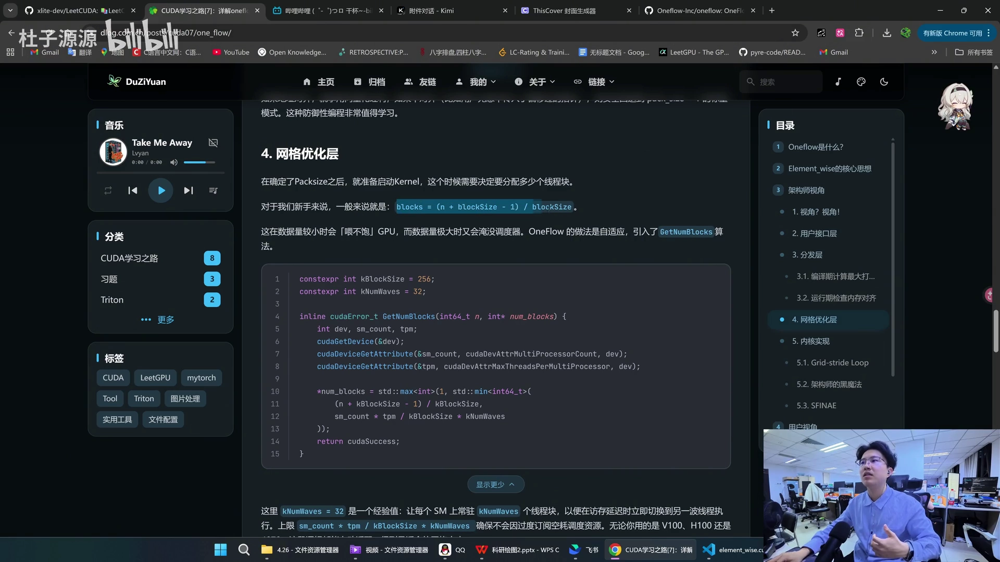
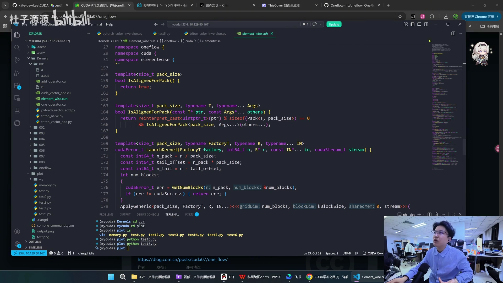
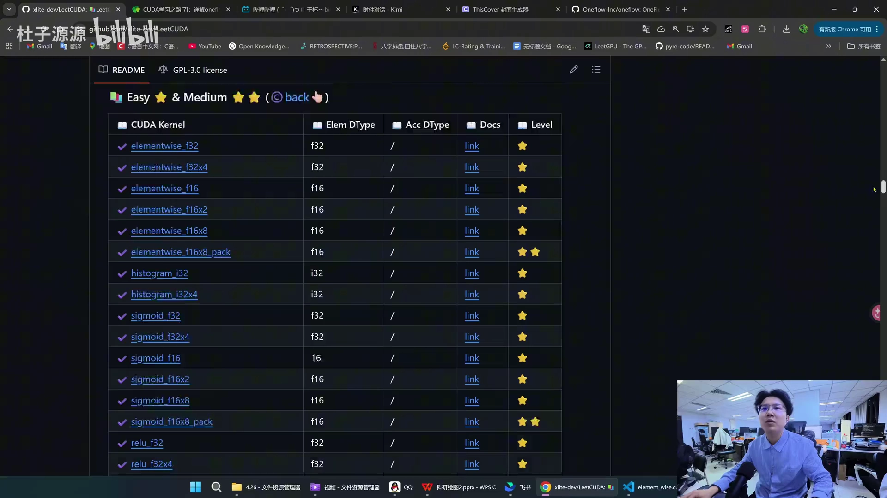
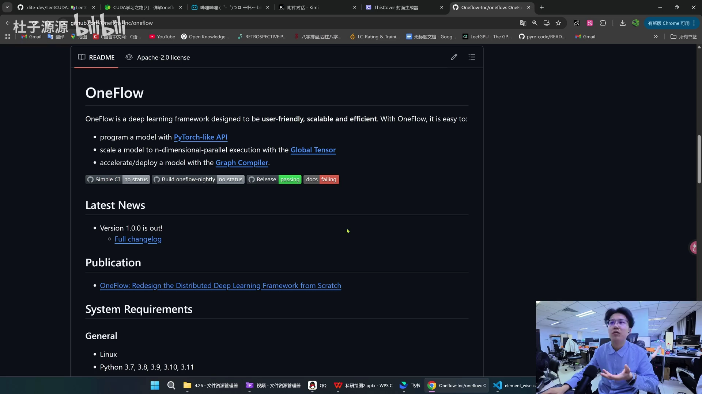

# 第06讲：工业级 Element-Wise 的实现——拆解 OneFlow 的 200 行 CUDA 代码

## 本讲要解决的核心问题（SCQA）

**背景**：Element-wise（逐元素）算子是最基础、最常用的算子——加法、ReLU、dropout 都属于这一类。它逐个元素地对张量做运算：输入张量第 `i` 个元素，只决定输出张量第 `i` 个元素。前几讲我们已经学过写 CUDA 的两件基本功：Grid Loop（网格步长循环）和向量化访存。

**冲突**：element-wise 的计算密度极低——读一次内存只伴随少量浮点运算。也就是说，GPU 的算力远远不是瓶颈，真正的瓶颈是**带宽**：能不能用最快的方式把数据从全局内存搬进寄存器。更麻烦的是，要把它写成工业级代码，还要同时照顾对齐、数据类型、运行时参数、线程网格配置等一大堆底层细节，新手很容易写成"能跑但很慢、且无法扩展"的版本；把代码丢给 AI，它往往也只能补全某一个点，给不出体系化的扩展思路。

**疑问**：那么，像 OneFlow 这样的工业级框架，究竟是怎样用大约 **200 行**代码，把 element-wise 做得既通用又高效、还方便用户自定义的？它背后到底有哪些设计思想？

**回答（中心思想）**：OneFlow 的 element-wise 用一套**分层的架构**（接口层 → 分发层 → 内核层 → 打包层），配合**编译期多态**（模板 + SFINAE）和**运行时自适应**（对齐检测 + 网格计算），把"用户只写数学逻辑、框架负责性能"这件事做到极致。值得我们学的不是某一行技巧，而是这套**可迁移的设计思想**——这也正是 AI 暂时难以替代的部分。

[【跳转到 02:28】](https://www.bilibili.com/video/BV1npovBCE1r/?t=148)

---

## 一、为什么 element-wise 考验的是架构而不是算力

要读懂这 200 行，先要接受一个反直觉的结论：**逐元素算子的敌人是内存带宽，不是计算能力。**

- **是什么**：element-wise 指"输出元素只依赖同一位置的输入元素"的算子，例如 `y = a + b`、`ReLU(x)`、`dropout(x)`。它天然是"数据并行"的：N 个元素可以同时算。
- **为什么难**：这类算子**计算密度（arithmetic intensity）低**——搬一块数据进来，只做很少几次运算就写出去了。算力用不满，时间几乎全花在搬数据上。
- **怎么做**：作者的博客把它总结为围绕"带宽"的**三大设计支柱**：


1. **Memory Packing（内存打包）**：强制 128-bit 对齐读写，触发编译器和硬件使用向量化访存指令（如 `LDG.128` / `STG.128`）。
2. **SFINAE 编译期优化**：当用户自定义的算符支持 `Apply2` 接口时，自动切换到更高效的 `half2` 等 SIMD（单指令多数据）指令路径。
3. **Adaptive Grid Sizing（自适应网格）**：动态查询当前 GPU 的 SM（流多处理器，可以理解为 GPU 的"计算核心"）数量与单块最大线程数，算出"恰好能掩盖延迟、又不浪费资源"的线程网格。

这三条，就是后文所有代码的总纲。[【跳转到 02:33】](https://www.bilibili.com/video/BV1npovBCE1r/?t=153)

---

## 二、总览：OneFlow 把 200 行拆成了四层

先看清楚作者对这份代码的整体分层。这份代码是**超级优秀的架构师**写出来的，我们站在两个视角去读它：**架构师视角**（从空白开始，第一行代码写什么、整个架构怎么搭）和**用户视角**（我作为调用者，怎么用它、怎么扩展它）。

作者博客的开篇先交代了 OneFlow 的定位：它是一款国产开源的深度学习框架，以极致的性能和分布式易用性著称，核心理念之一是"静态编译与运行时调度分离"。而我们分析的 Element Wise，正是这种设计哲学的集中体现——在 200 行代码里实现了向量化访存、自适应 Grid 分配、编译器多态、模板特化等多项技术。


作者把整合逻辑画成了一张设计图，从上到下共四层：


1. **用户接口层**（Unary / Binary / Ternary）：提供最简单的函数入口，自动包装 `SimpleFactory`。
2. **分发层（GenericLauncher）**：检测地址对齐并计算 `PackSize`；对齐则走打包路径，不对齐则退化为 `PackSize = 1`。
3. **LaunchKernel & ApplyGeneric（CUDA Kernel）**：计算网格大小（`GetNumBlocks`）并启动线程块；核心循环处理 `n_pack` 个打包块 + 尾部 `n_tail` 个标量。
4. **ApplyPack & Vectorized Access**：合并访存，一次 `LDG.128` 加载多个元素。

一句话记住这四层的关系：**接口层负责"好用"，分发层负责"决策"，内核层负责"执行"，打包层负责"快"。** 下面顺着调用栈自上而下逐个拆解。

[【跳转到 03:18】](https://www.bilibili.com/video/BV1npovBCE1r/?t=198)

---

## 三、接口层：把复杂性挡在门外

**框架的第一要务，是服务好算法工程师。** 用户写 element-wise 算子时，不应该感知"线程块大小是多少""指针是否对齐"这类底层细节，他们只想**描述数学逻辑**，然后扔给一个函数执行。

OneFlow 给出的最简接口是 `Unary`（一元）、`Binary`（二元）、`Ternary`（三元）。看这个二元加法的例子：

```cpp
// 用户自定义一个二元运算
struct AddFunctor {
    __device__ float operator()(float a, float b) {
        return a + b;
    }
};

// 调用 OneFlow 的 Binary 接口
float *d_r, *d_a, *d_b;
int64_t n = 1 << 20;
cudaStream_t stream = 0;
oneflow::cuda::elementwise::Binary(AddFunctor{}, n, d_r, d_a, d_b, stream);
```

**三行核心代码**——一个 `operator()`，用户就把 CUDA 核函数的烦恼全部外包给了 OneFlow。你想扩展新算子？只需换一个 functor。一元算子用 `Unary`，三元算子甚至可以自己定义 `Ternary`，设计非常优雅。


### 编译期 vs 运行期：工厂模式出场

但有些算子的参数在**运行时**才能确定——典型例子是 dropout 的随机种子。这就要区分两个概念：

- **编译期（compile time）**：代码被编译的那一刻就已知的信息；
- **运行期（runtime）**：程序跑起来后才拿到的信息。

OneFlow 用**工厂模式**把一个参数从编译期"抛"到运行时，从而延迟了决定的时机，让代码更具扩展性。对应接口是 `UnaryWithFactory` / `BinaryWithFactory` / `TernaryWithFactory`：用户把一组参数打包成一个"工厂对象"，等到 GPU 端真正执行时，再由工厂"生产"出最终的算符（functor）。

[【跳转到 04:02】](https://www.bilibili.com/video/BV1npovBCE1r/?t=242)

---

## 四、分发层（上）：在编译期算出最大打包宽度

接口函数内部会直接调用 `GenericLauncher::Launch(...)`，这是**性能决策的枢纽**。它的核心任务，是选择一个 `pack_size`（一次打包多少个元素），而手段就是前面说的向量化访存。

GPU 提供了 `LDG.128` 和 `STG.128` 指令，一次可以搬运 **16 字节**。但向量化访存有硬性前提：**地址必须严格对齐**。`PackSize` 会根据所有输入、输出类型，在编译期算出安全的打包元素个数，它受两个常量限制：

- `kMaxPackBytes = 16` 字节（128 位）：因为 GPU 向量化加载指令一次最多搬 128 位；
- `kMaxPackSize = 8`：即最高一次打包 8 个元素。

于是可以推导：以 `float` 为例，每个 4 字节，`16 / 4 = 4`，所以 float 的最大 pack 是 4；`half`（半精度浮点，2 字节）则是 `min(16/2, 8) = 8`。这样，**一条 128-bit 指令就能加载/存储 4 个 float 或 8 个 half**，极大降低了指令发射数。

视频里用了一个很直观的类比：发 100 条 `int32` 指令，和发两条 `int128` 指令，区别非常大——后者的带宽占用明显更少。


[【跳转到 04:27】](https://www.bilibili.com/video/BV1npovBCE1r/?t=267)

---

## 五、分发层（下）：运行期对齐检测与自适应网格

### 运行期检查内存对齐

既然向量化要求地址与访问宽度对齐，那就在运行时查一遍：`IsAlignedForPack` 会检查所有输入指针是否满足 `alignof(Packed<T, pack_size>)`（即 `sizeof(T) * pack_size`），并且会**递归检查每一个输入参数**。

- 如果地址对齐：享受向量化红利，走宽指令；
- 如果不对齐（比如用户无意中传入了偏移过的指针）：安全回退到 `pack_size = 1` 的标量模式。

这种"先尝试快路径、不满足就优雅降级"的**防御性编程**，非常值得学习。

```cpp
template<typename FactoryT, typename R, typename... IN>
struct GenericLauncher {
    static cudaError_t Launch(...) {
        // 1. 计算最大可能的打包大小（最大 16 字节）
        constexpr int max_pack_size = PackSize<R, IN...>();
        // 2. 动态检查指针地址是否满足对齐要求……
    }
};
```

### 网格优化层：不用手写 block，让运行时自己算

确定 `PackSize` 后要启动 Kernel，就得决定分配多少线程块。新手最常写的是：

```cpp
blocks = (n + blockSize - 1) / blockSize;
```

这在数据量小时"喂不饱" GPU，数据量极大时又可能淹没调度器。OneFlow 的做法是**自适应**，引入了 `GetNumBlocks` 算法：

```cpp
constexpr int kBlockSize = 256;
constexpr int kNumWaves = 32;   // 经验值

inline cudaError_t GetNumBlocks(int64_t n, int* num_blocks) {
    int dev, sm_count, tpm;
    cudaGetDevice(&dev);
    cudaDeviceGetAttribute(&sm_count, cudaDevAttrMultiProcessorCount, dev);
    cudaDeviceGetAttribute(&tpm, cudaDevAttrMaxThreadsPerMultiProcessor, dev);

    *num_blocks = std::max<int>(1, std::min<int64_t>(
        (n + kBlockSize - 1) / kBlockSize,
        sm_count * tpm / kBlockSize * kNumWaves
    ));
    return cudaSuccess;
}
```

这里 `kNumWaves = 32` 是一个经验值：**让每个 SM 上常驻 `kNumWaves` 个线程块**，以便在访存延迟时立即切换到另一波线程执行。上限 `sm_count * tpm / kBlockSize * kNumWaves` 则确保不会因过度订阅而空耗调度资源。无论你用的是 V100、H100 还是 4070，这段逻辑都能自动适配，得到最合适的网格大小。



[【跳转到 05:17】](https://www.bilibili.com/video/BV1npovBCE1r/?t=317)

---

## 六、内核实现：Grid-stride Loop 与尾部处理

终于到了 Kernel 本身。核心就是我们之前学过的 **Grid-stride Loop**（网格步长循环）——每个线程以整个网格的总线程数为步长，跳跃式地处理多个元素。

```cpp
template<int pack_size, ...>
__global__ void ApplyGeneric(..., int64_t n_pack, Packed<R, pack_size>* pack_r, ...,
                             int64_t n_tail, ...) {
    auto functor = factory();
    const int global_tid = blockIdx.x * kBlockSize + threadIdx.x;

    // 1. 主循环：处理 n_pack 数据（向量化读取 → 计算 → 向量化写入）
    for (int64_t i = global_tid; i < n_pack; i += blockDim.x * gridDim.x) {
        pack_r[i] = ApplyPack<pack_size, ...>(functor, (pack_in[i])...);
    }

    // 2. 尾部处理：处理无法被 pack_size 整除的剩余标量
    if (global_tid < n_tail) {
        tail_r[global_tid] = functor((tail_in[global_tid])...);
    }
}
```

可以看到，它把数据明确分成了**打包区（批处理）**和**尾部区**：主体用打包后的向量指令高速处理，剩余的零头再单个处理掉。这样既保证了正确性，又把性能压榨到最高。


[【跳转到 06:07】](https://www.bilibili.com/video/BV1npovBCE1r/?t=367)

---

## 七、架构师的黑魔法：Packed 联合体与 SFINAE

### "打包"到底指什么？

前面反复说"打包"，它究竟指什么？答案就是：**让数据内存对齐，从而能调用更宽的总线访存指令。** 实现方式是一个只有几行的结构体：

```cpp
template<typename T, int pack_size>
struct alignas(sizeof(T) * pack_size) Packed {
    union {
        T elem[pack_size];
    };
};
```

`alignas` 告诉编译器：这个结构体必须按 `sizeof(T) * pack_size` 对齐。当我们把输入指针 `reinterpret_cast` 成 `Packed<R, pack_size>*` 时，编译器就会自动生成 128-bit 的加载/存储指令，而不是四次 32-bit 的标量指令，因此自然会调用最高效的宽总线访存指令。

### SFINAE：编译期选择最优路径

`ApplyPack` 有两个重载，通过 `std::enable_if` 在**编译期**做选择：

- **默认路径**：一个简单的 `for` 循环，逐个调用 `functor.elem()`；
- **Apply2 路径**：若 functor 定义了两个元素一起处理的 `Apply2`，且 `pack_size` 为偶数，则用 `#pragma unroll` 展开、**一次处理两个元素**。

```cpp
template<int pack_size, typename FunctorT, ...>
__device__ typename std::enable_if<HasApply2<FunctorT>::value && pack_size % 2 == 0,
                                   Packed<R, pack_size>>::type
ApplyPack(const FunctorT& functor, const Packed<IN, pack_size>... in) {
    Packed<R, pack_size> ret;
    #pragma unroll
    for (int j = 0; j < pack_size; j += 2) {
        functor.Apply2(ret.elem + j, (in.elem + j)...);
    }
    return ret;
}
```

这就是 **SFINAE**（替换失败并非错误）的实际应用：同样的调用，能自动匹配到最合适、最快的那个重载，用户完全无感。


[【跳转到 06:32】](https://www.bilibili.com/video/BV1npovBCE1r/?t=392)

---

## 八、用户视角：三种典型用法

讲完架构，再回到用户视角。作者给了几个经典场景，对应不同的复杂度：

### 6.1 基本运算：一两行搞定

```cpp
#include <cuda_runtime.h>
#include "elementwise.h"

struct MulFunctor {
    __device__ float operator()(float a, float b) { return a * b; }
};
```

实现矩阵乘法元素、ReLU 这类基础运算，都只需要定义 functor 并调用接口，一两行即可。

### 6.2 带运行时参数：工厂模式

```cpp
struct ScaleAddFunctor {
    float alpha;
    __device__ float operator()(float a, float b) const {
        return alpha * a + b;
    }
};

struct ScaleAddFactory {
    float alpha;
    __device__ ScaleAddFunctor operator()() const {
        return ScaleAddFunctor{alpha};
    }
};

void launch_scale_add(float *d_out, const float *d_a, const float *d_b,
                      int64_t n, float alpha, cudaStream_t stream) {
    oneflow::cuda::elementwise::BinaryWithFactory(
        ScaleAddFactory{alpha}, n, d_out, d_a, d_b, stream);
}
```

这里把运行时参数 `alpha` 存进工厂，核函数内再"生产"出一个**带状态的 functor**。这也是许多复杂算子（例如带随机种子的 dropout）的标准做法。


### 6.3 Apply2 加速：让框架走 SIMD 路径

只要在 functor 里额外定义一个 `Apply2`，一次写两个结果，框架就会自动走上一节说的 SIMD 快速路径：

```cpp
struct AddFunctor {
    template<typename T>
    __device__ T operator()(T a, T b) { return a + b; }

    template<typename T>
    __device__ void Apply2(T* out, const T* a, const T* b) {
        out[0] = a[0] + b[0];
        out[1] = a[1] + b[1];
    }
};
```

[【跳转到 07:22】](https://www.bilibili.com/video/BV1npovBCE1r/?t=442)

---

## 九、200 行背后，真正值得学的是设计思想

就算把代码逐行看完，很多同学仍会觉得"好像什么都没讲明白"。这很正常——**光靠反复看这一份代码，是很难融会贯通的**，我们更应该学的是它的设计思想：

- **模板编程的小巧思**：用模板把类型和 `pack_size` 变成编译期参数，零运行时开销；
- **设计模式**：工厂模式解决运行时参数问题；
- **并行计算**：Grid Loop 如何组织线程、Vector 如何做向量化；
- **边界条件**：打包区与尾部区的拆分，保证任何长度都正确。

它的了不起之处在于：**只用了 200 行，就把上述所有功能都实现了，而且代码非常清晰高效**。视频里作者也表达了一个态度：这种综合性的架构能力，恐怕正是 AI 一时难以替代的。



所以，当你在写自己的 CUDA 算子时，不妨有意识地把这些设计思想融进去——加一点模板、加一点并行计算、想清楚边界条件。这些**综合性的知识**，才是大家最需要的。[【跳转到 08:12】](https://www.bilibili.com/video/BV1npovBCE1r/?t=492)

---

## 十、附：视频开篇提到的三个学习资源

在正式拆代码之前，作者还推荐了几个学习资源，正好可以配合本讲一起用：

- **LeetCUDA**：一个把大量 CUDA 算子整理成册的开源仓库，从最基本的 element-wise，到 softmax，再到进阶的 GEMV、GEMM，甚至 flash attention 都有实现，平均每个算子 200 多行，非常适合边看边练。



- **OneFlow**：一款国产开源的深度学习框架，采用 PyTorch 风格 API，并配有 Global Tensor 与 Graph Compiler。对新手小白来说，除了看算子，更值得学习它作为"一个完整项目"是怎么打包组织的，以及内部接口、外部接口是怎么定义的。



- **SOL-ExecBench**：英伟达的、类似"力扣周赛"的 GPU 算子练习平台。每个题目有 description 描述算子怎么实现，也提供参考实现；你可以提交代码，右侧会给出性能标准（例如某题 latency 只有 0.08）。


提交时可以选 **private** 或 **public**。作者自己也试着提交了一次：直接拿 torch 写的参考实现扔上去，大概只有 0.21，性能当然比较差——这也正说明，想拿高分就要用 Triton 或 CUDA 做真正的算子优化。


这几个资源对应的，正是作者博客《CUDA学习之路[7]：详解 oneflow 的 element_wise 代码》的内容：


[【跳转到 00:23】](https://www.bilibili.com/video/BV1npovBCE1r/?t=23)

---

## 小结

1. **瓶颈在带宽不在算力**：element-wise 计算密度低，优化的核心是"用最快的方式搬数据"。
2. **四层架构各司其职**：接口层求"好用"、分发层做"决策"、内核层管"执行"、打包层保"高效"。
3. **接口层把复杂性挡在门外**：用户只写一个 functor 的 `operator()`；运行时参数交给工厂模式（`*WithFactory`）。
4. **打包宽度是编译期算出来的**：受限于 16 字节（`kMaxPackBytes`）与 8 个元素（`kMaxPackSize`），float 打包 4 个、half 打包 8 个。
5. **对齐与网格都是运行时自适应的**：`IsAlignedForPack` 不对齐就回退标量；`GetNumBlocks` 按 SM 数自动算网格，免去手写 `block size`。
6. **内核用 Grid-stride Loop + 尾部处理**：主循环处理打包数据，尾部单独处理零头。
7. **Packed + SFINAE 是"黑魔法"**：`alignas` 联合体触发 128-bit 指令；`std::enable_if` 编译期选出 `Apply2` 快速路径。
8. **真正要学的是设计思想**：模板编程、设计模式、并行计算、边界处理——这才是 200 行里最值钱的部分。

---

## 关键术语速查

| 术语 | 一句话解释 |
| --- | --- |
| Element-wise（逐元素算子） | 输出元素只依赖同一位置输入的算子，如加法、ReLU、dropout。 |
| 计算密度（Arithmetic Intensity） | 每搬运一字节数据所做的运算次数；element-wise 很低，因而受限于带宽。 |
| Functor（算符/仿函数） | 重载了 `operator()` 的结构体，用来描述"对每个元素做什么"。 |
| Unary / Binary / Ternary | 一元 / 二元 / 三元接口，分别对应 1、2、3 个输入。 |
| Pack / PackSize | 把相邻多个元素合成一组一起处理；`PackSize` 即一组里的元素个数。 |
| LDG.128 / STG.128 | GPU 的 128 位（16 字节）宽加载/存储指令，一次最多搬 16 字节。 |
| 内存对齐（Alignment） | 数据地址是访问宽度的整数倍；向量化访存的前提。 |
| Packed | 带 `alignas` 的联合体，把一块内存表示成对齐的 `T[pack_size]`，便于宽指令访问。 |
| SFINAE | "替换失败并非错误"，编译期依据类型特征选择合适重载的技术。 |
| `std::enable_if` | 配合 SFINAE 在编译期启用/禁用某个模板重载。 |
| Apply2 | functor 可选实现的一次处理两个元素的接口，用于走 SIMD 加速路径。 |
| SIMD | 单指令多数据，一条指令同时处理多个数据。 |
| 工厂模式（Factory） | 用一个对象封装运行时参数，执行时再"生产"出最终 functor。 |
| Grid-stride Loop | 线程以整个网格的总线程数为步长循环，处理超过网格规模的数据。 |
| SM（流多处理器） | GPU 上独立执行线程块的计算单元，数量因显卡而异。 |
| `kNumWaves` | 每个 SM 期望常驻的线程块数量（经验值 32），用于掩盖访存延迟。 |
| `GetNumBlocks` | OneFlow 按 SM 数与最大线程数自适应计算网格大小的函数。 |
| `n_pack` / `n_tail` | 可被 `pack_size` 整除的主体数据量 / 剩余的标量数据量。 |
| 编译期 / 运行期 | 信息在编译代码时已知 / 程序运行时才确定，决定了优化能到什么程度。 |
| LeetCUDA | 一个整理了从 element-wise 到 flash attention 等大量 CUDA 算子的开源学习库。 |
| SOL-ExecBench | 一个类似"力扣周赛"的 GPU 算子练习/评测平台，可提交代码并查看延迟。 |
