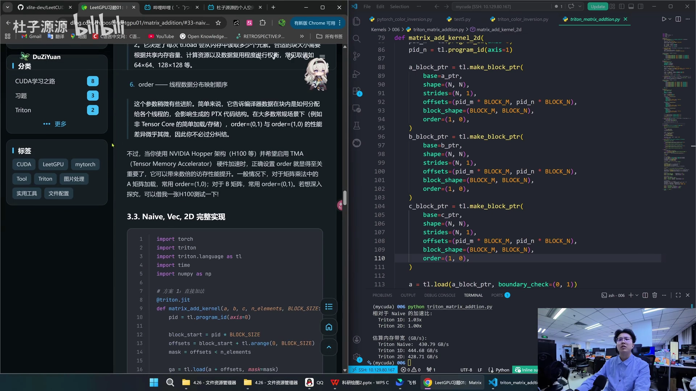
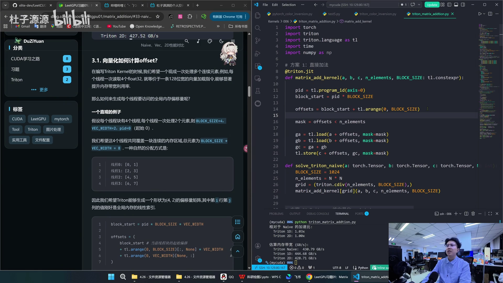
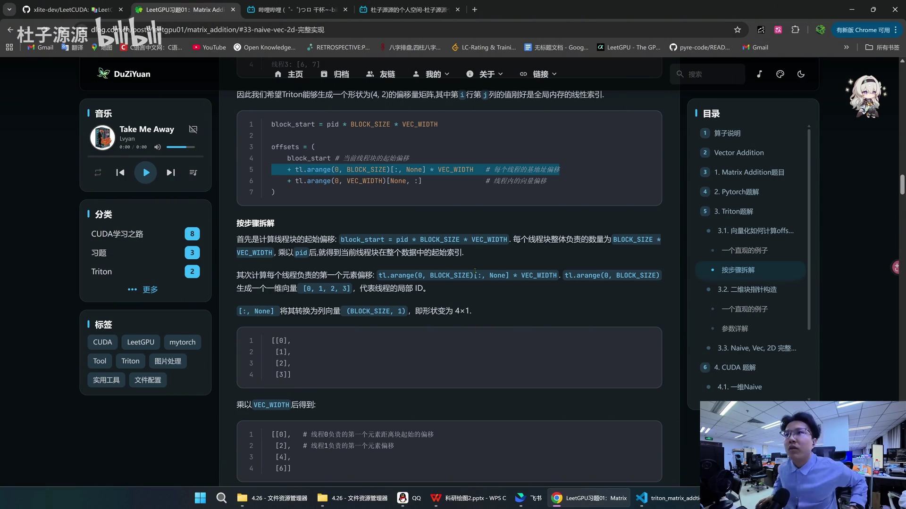
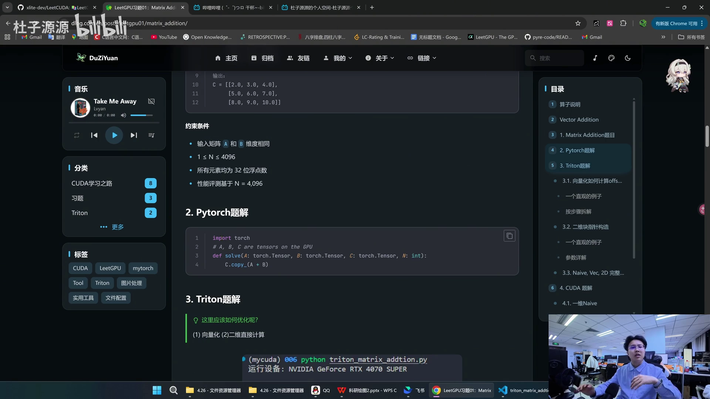
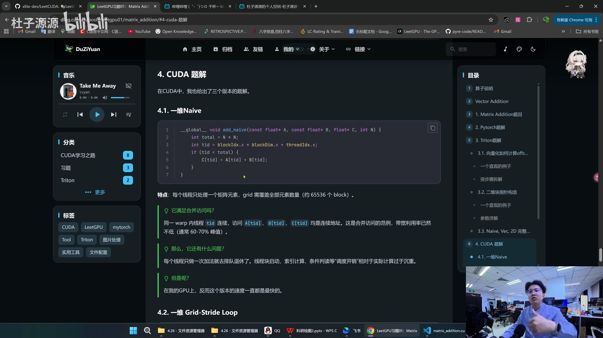
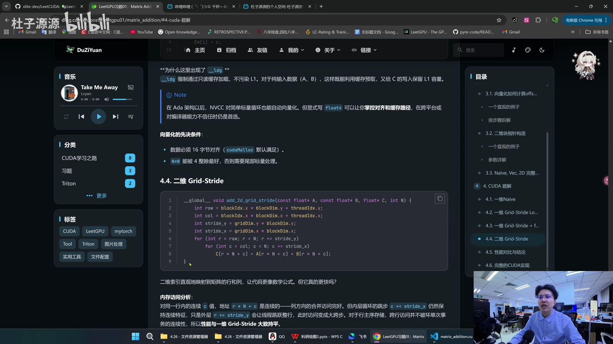

# 第07讲：Matrix Addition 详解——Triton 的 offset、make_block_ptr 与 CUDA 四个版本

## 本讲要解决的核心问题（SCQA）

**背景**：上一讲我们啃完了 OneFlow 的工业级 element-wise。这一讲回到 LeetGPU 习题，做**第一道矩阵题——Matrix Addition（矩阵加法）**。它是「向量加法」的二维版本：对两个形状相同的矩阵，逐元素相加。

**冲突**：矩阵加法在数学上平凡得不能再平凡，但一到写 kernel，问题就来了——矩阵有**天然的行列结构**，而 GPU 的内存是一维展开的。到底该把它「拍平成一维」处理，还是「保留二维」处理？两种思路下，Triton 的 `offset` 该怎么算、`make_block_ptr` 的参数又是什么意思？CUDA 侧用哪种索引方式更快？

**疑问**：同一个矩阵加法，Triton 的 naive / 一维向量化 / 二维 `make_block_ptr` 三种写法区别在哪？CUDA 的 naive / grid-stride / float4 / 二维四个版本谁更快？哪些结论能迁移到别的算子？

**回答（中心思想）**：矩阵加法和向量加法本质相同，都是访存密集的 element-wise，**性能取决于访存效率**。执法的关键差异在「**如何把二维逻辑映射到一维内存**」：Triton 可以用一维 `offset`（把 `M*N` 拍平）或二维 `tl.make_block_ptr`（保留行列），CUDA 也对应一维和二维两种索引。本讲会hands-on对比三套 Triton 实现与四套 CUDA 实现，并给出两个必会知识点——**Triton 的 offset 计算**与 **`tl.make_block_ptr` 二维块指针**。题目约束：`1 ≤ N ≤ 4096`、float32、性能按 `N = 4096` 评估。

---

## 一、题目与 PyTorch 题解

LeetGPU 把练习题分成了若干道 Easy 题：Vector Addition、Matrix Multiplication、Matrix Transpose、Color Inversion、**Matrix Addition**、1D Convolution、Reverse Array、ReLU、Leaky ReLU 等。本讲处理的正是其中的 Matrix Addition。


[【跳转到 00:14】](https://www.bilibili.com/video/BV1PvoeB2E2h/?t=14)

**题目**：实现一个在 GPU 上对两个包含 32 位浮点数的矩阵逐元素相加的程序。输入两个相同维度的矩阵，输出一个矩阵，每个元素为对应位置元素之和。例如：
```
A = [[1.0, 2.0],      B = [[5.0, 6.0],      C = [[6.0,  8.0],
     [3.0, 4.0]]           [7.0, 8.0]]           [10.0, 12.0]]
```

约束条件：输入矩阵 A、B 维度相同；`1 ≤ N ≤ 4096`；所有元素为 32 位浮点数；性能评估基于 `N = 4096`。


**PyTorch 题解**只有一行——因为它对张量操作，直接相加即可：

```python
import torch
def solve(A: torch.Tensor, B: torch.Tensor, C: torch.Tensor, N: int):
    C.copy_(A + B)
```

其中 `A + B` 返回新张量，而 `copy_`（带下划线）表示**原地写入**，把结果写回 C。

[【跳转到 00:46】](https://www.bilibili.com/video/BV1PvoeB2E2h/?t=46)

---

## 二、Triton 三种写法

UP 主在代码里给了一套完整的参数解释，我们先运行一遍 Python 版看带宽表现，然后逐一拆解三种 Triton 实现。

### 2.1 方案一：Naive（拍平成一维）

最直接的思路：把 `M×N` 的矩阵拍平成长度 `N*N` 的一维数组，用我们熟悉的 element-wise 套路处理：

```python
@triton.jit
def matrix_add_kernel(a, b, c, n_elements, BLOCK_SIZE: tl.constexpr):
    pid = tl.program_id(axis=0)
    block_start = pid * BLOCK_SIZE
    offsets = block_start + tl.arange(0, BLOCK_SIZE)
    mask = offsets < n_elements
    ga = tl.load(a + offsets, mask=mask)
    gb = tl.load(b + offsets, mask=mask)
    gc = ga + gb
    tl.store(c + offsets, gc, mask=mask)
```

流程就是标准五步：算 `pid` → 算 `block_start`（乘 block_size）→ 算 `offset`（加 `tl.arange`）→ 生成 `mask` → load / 相加 / store。grid 仍是一个元组，用 `n_elements` 除以 `BLOCK_SIZE` 向上取整。



实测这条 naive 版跑到 **430.79 GB/s**。

[【跳转到 02:26】](https://www.bilibili.com/video/BV1PvoeB2E2h/?t=146)

### 2.2 方案二：一维向量化（重点：offset 怎么算）

第二种是「向量化 + 一维 offset」。除了 `BLOCK_SIZE`，又多了一个 `VEC_WIDTH`（向量宽度），启动时两个都传；计算 `block_start` 时，用 `block_size * vector_width`。

难点在于 **offset 的计算相当长、相当复杂**：

```python
block_start = pid * BLOCK_SIZE * VEC_WIDTH
offsets = (
    block_start                                  # 当前线程块的起始偏移
    + tl.arange(0, BLOCK_SIZE)[:, None] * VEC_WIDTH   # 每个线程的基地址偏移（列向量）
    + tl.arange(0, VEC_WIDTH)[None, :]                # 线程内的向量偏移（行向量）
)
```

UP 主用一个直观例子拆解：假设每个线程块有 4 个线程、每个线程一次处理 2 个元素，则 `BLOCK_SIZE=4`、`VEC_WIDTH=2`、`pid=0`，希望覆盖 `BLOCK_SIZE*VEC_WIDTH = 8` 个元素。自然的分配是：线程 0 管 `[0,1]`、线程 1 管 `[2,3]`……

- `tl.arange(0, BLOCK_SIZE)[:, None]` 把一维的 `[0,1,2,3]` 变成 **列向量**（形状 `4×1`），再乘 `VEC_WIDTH` 得到每行的起始偏移 `[0,2,4,6]`；
- `tl.arange(0, VEC_WIDTH)[None, :]` 变成 **行向量**（形状 `1×2`）；
- 两者**广播相加**，就得到形状 `4×2` 的二维偏移，其值恰好是全局线性索引 `[[0,1],[2,3],[4,5],[6,7]]`。

最后用 `tl.reshape` 把二维偏移**展平**成一维，再交给 `tl.load` / `tl.store` 即可。这是所有向量化 kernel 的核心技巧。



实测这条向量化版跑到 **444.68 GB/s**，比 naive 更快。

[【跳转到 03:41】](https://www.bilibili.com/video/BV1PvoeB2E2h/?t=221)

### 2.3 方案三：二维 `tl.make_block_ptr`

第三种是「二维化」。既然矩阵天然有横、竖两个方向，那不如直接用两个维度来处理：传入两个偏移量（0 和 1，分别代表一维/二维）。Triton 提供了 **`tl.make_block_ptr`**，可以把普通指针变成**块指针（block pointer）**，以二维方式描述访问：

```python
a_block_ptr = tl.make_block_ptr(
    base=a_ptr,                 # 内存基地址
    shape=(N, N),               # 完整数据的逻辑形状
    strides=(N, 1),             # 各维度的内存跨步（行优先）
    offsets=(pid_m * BLOCK_M, pid_n * BLOCK_N),  # 子块左上角坐标
    block_shape=(BLOCK_M, BLOCK_N),              # 子块大小
    order=(1, 0),               # 线程映射顺序
)
a = tl.load(a_block_ptr, boundary_check=(0, 1))
```

因为矩阵在 GPU 里是**行优先（row-major）**存储，所以 `strides=(N, 1)`——从当前行跳到下一行要跨过一整行的 `N` 个元素；同一行内到下一列只需 +1。


其中各参数含义：

- **base**：内存基地址，即矩阵在 GPU 显存中的起始地址（通常由 PyTorch 张量的 `.data_ptr()` 获得）；
- **shape**：完整数据的逻辑形状（如 `(4,4)`）；
- **strides**：各维度的内存跨步，是连接「逻辑坐标」与「物理地址」的关键。`(4,1)` 表示行优先；若列优先则是 `(1,4)`；
- **offsets**：子块左上角的起始坐标，形如 `(row, col)`；
- **block_shape**：子块大小，可自定义为 `(BLOCK_M, BLOCK_N)`；
- **order**：线程数据分布映射顺序。UP 主实测 `(0,1)` 与 `(1,0)` 速度差异不明显；文档说在 Hopper 架构（H100）启用 TMA（Tensor Memory Accelerator）时 `order` 才关键——A 矩阵常用 `(1,0)`，B 矩阵常用 `(0,1)`。



```python
def solve_triton_2d(A, B, C, N):
    grid = lambda meta: (
        triton.cdiv(N, meta['BLOCK_M']),
        triton.cdiv(N, meta['BLOCK_N']),
    )
    matrix_add_kernel_2d[grid](A, B, C, N)
```


三个块指针都变换好后，load、store 时带上 `boundary_check=(0, 1)` 做边界检查，最后计算即可。


实测二维版本带宽约 **427.52–428.71 GB/s**，相比 naive 的加速比约 1.00x。

[【跳转到 06:16】](https://www.bilibili.com/video/BV1PvoeB2E2h/?t=376)

**一维 vs 二维**：相对而言，**向量化（一维）版的带宽更高一些**。



[【跳转到 08:41】](https://www.bilibili.com/video/BV1PvoeB2E2h/?t=521)

---

## 三、CUDA 四个版本

看完 Triton，再看 CUDA。UP 主认为 CUDA 版相对简单、和 Triton 思路相近，给了四个版本。

### 3.1 一维 Naive

每个线程处理一个矩阵元素，`tid` 全局遍历：

```cpp
__global__ void add_naive(const float* A, const float* B, float* C, int N) {
    int total = N * N;
    int tid = blockIdx.x * blockDim.x + threadIdx.x;
    if (tid < total) {
        C[tid] = A[tid] + B[tid];
    }
}
```

特点：**每个线程只处理一个元素，grid 需覆盖全部元素数量**（约 65536 个 block）。

- **满足合并访问吗？** 同一 warp 内的线程 `tid` 连续，访问 A、B、C 都是**连续地址**——这是合并访问的范例，带宽利用率通常能到 60–70% 峰值。
- **问题呢？** 每个线程做一次加法就「排队退休」了，线程块启动、索引计算、条件判断等调度开销相对实际计算过于沉重。
- **但是呢？** 在 UP 主的 GPU 上，**这个版本的速度反而是最快的**（详见后面结论）。



[【跳转到 09:06】](https://www.bilibili.com/video/BV1PvoeB2E2h/?t=546)

### 3.2 一维 Grid-Stride Loop

为了提升线程利用率，把 `tid` 和 `stride` 分开，让一个线程多算几次：

```cpp
for (int i = tid; i < total; i += stride)
    C[i] = A[i] + B[i];
```

**为什么这样设计更快？** UP 主给了三条理由：

1. **减少线程块调度开销**：只有少量 block 需要启动、轮转，硬件调度器压力骤降；
2. **更高的 SM 占用率**：所有 SM 从一开始就被填满，不存在尾部 block 带来的闲置；
3. **编译器更容易优化循环**：循环体里简单的 LD/FADD/ST 序列可以被流水线化，指令级并行度更高。

**那么「每个线程跳着访问多个不连续地址」会破坏合并访问吗？** 不会——同一 warp 的线程在**同一迭代内**访问的地址依然是连续的（`tid` 连续），只是线程下一次访问跳到了 `tid + stride`。单个 warp 事务的连续性没变，所以**合并访问特性完全保留**。

[【跳转到 10:02】](https://www.bilibili.com/video/BV1PvoeB2E2h/?t=602)

### 3.3 一维 Grid-Stride + float4

再加上向量化：用 `reinterpret_cast` 把指针转成 `float4*`，一次算 4 个，并用 `__ldg` 走只读缓存加载：

```cpp
const float4* A4 = reinterpret_cast<const float4*>(A);
for (int i = tid; i < num_vec; i += stride) {
    float4 a = __ldg(A4 + i);
    float4 b = __ldg(B4 + i);
    float4 c;
    c.x = a.x + b.x; c.y = a.y + b.y;
    c.z = a.z + b.z; c.w = a.w + b.w;
    C4[i] = c;
}
```

**为什么这里出现 `__ldg`？** 它强制通过**只读缓存**加载，不污染 L1。对于纯输入数据（A、B）这样既能利用缓存预取，又给 C 的写入保留 L1 容量。

> Note：Ada 架构之后，NVCC 对简单标量循环也能自动向量化；但**显式写 `float4` 能让你掌控对齐和缓存路径**，在跨平台或对编译器能力不信任时仍是首选。

向量化的**先决条件**：数据必须 16 字节对齐（`cudaMalloc` 默认满足）；`N*N` 能被 4 整除，否则需要尾部标量处理。UP 主也提到，这个优化在 40 系、50 系显卡上不明显，在老架构上才比较明显。


[【跳转到 11:17】](https://www.bilibili.com/video/BV1PvoeB2E2h/?t=677)

### 3.4 二维 Grid-Stride

最后一个版本保留矩阵的行列结构，**两次 for 循环**分别沿行、列方向跨步：

```cpp
__global__ void add_2d_grid_stride(const float* A, const float* B, float* C, int N) {
    int row = blockIdx.y * blockDim.y + threadIdx.y;
    int col = blockIdx.x * blockDim.x + threadIdx.x;
    int stride_y = gridDim.y * blockDim.y;
    int stride_x = gridDim.x * blockDim.x;
    for (int r = row; r < N; r += stride_y)
        for (int c = col; c < N; c += stride_x)
            C[r * N + c] = A[r * N + c] + B[r * N + c];
}
```

二维索引**直观地映射了矩阵的行和列，让代码更像数学公式**。但它的内存访问如何？

- 对同一行内连续的 `c`，地址 `r*N + c` 是连续的——**列方向的合并访问完好**；
- 内层循环的 `c += stride_x` 仍保持连续特征；
- 只是外层 `r += stride_y` 会让线程跳跃整行，**跨行访问变成大跨步**。

对于行优先存储，**跨行访问并不破坏单次事务的连续性，所以性能与一维 Grid-Stride 大体持平**。



[【跳转到 09:56】](https://www.bilibili.com/video/BV1PvoeB2E2h/?t=596)

---

## 四、性能结论

UP 主实测的规律很有意思：

- **原本的 naive 版本就已经很高了**——因为经过编译器的优化，它的合并访问效率已经很好；
- **向量化版本也还不错，二维版本也还不错**；
- **效果相对较差的是「一维 grid loop」**——这与「grid loop 一定更快」的直觉相反。

这也再次印证了 element-wise 算子的道理：**因为访存本身已经是合并的，优化的收益有限，很多时候瓶颈就在带宽**；具体哪个版本最快，还要看 GPU 架构与编译器。所以关键不是死记「哪个版本最好」，而是理解每种写法的**内存访问行为**。

[【跳转到 10:21】](https://www.bilibili.com/video/BV1PvoeB2E2h/?t=621)

---

## 五、本讲必会的两个知识点

UP 主在结尾强调，Matrix Addition 真正要掌握的是两件事：

1. **Triton 里如何计算 offset**：尤其是向量化时，用「列向量 × VEC_WIDTH + 行向量」的广播得到二维偏移、再 `reshape` 展平；
2. **如何把指针变成块指针** `tl.make_block_ptr`：理解 `base / shape / strides / offsets / block_shape / order` 六个参数，以及行优先下 `strides=(N,1)` 的来历。

这两点不只用于矩阵加法，后面处理图像、卷积等天然二维/多维的数据时都会反复用到。UP 主提醒大家：**完整代码他都写在了博客里，可以自己 copy 下来跑一跑、多测几次**。

[【跳转到 10:46】](https://www.bilibili.com/video/BV1PvoeB2E2h/?t=646)

---

## 小结

- **Matrix Addition** 是向量加法的二维版，本质仍是访存密集的 element-wise；题目约束 `1 ≤ N ≤ 4096`、float32。
- **PyTorch 题解**一行：`C.copy_(A + B)`，`copy_` 表示原地写回。
- **Triton 三版**：naive（拍平成一维，430.79 GB/s）→ 一维向量化（444.68 GB/s，靠广播算 offset）→ 二维 `make_block_ptr`（428.71 GB/s，保留行列结构）。
- **offset 计算**：`block_start + arange(0,BLOCK)[:,None]*VEC_WIDTH + arange(0,VEC)[None,:]`，广播成二维后 `reshape` 展平。
- **`tl.make_block_ptr` 六参数**：base / shape / strides / offsets / block_shape / order；行优先时 `strides=(N,1)`；Hopper+TMA 下 `order` 才关键。
- **CUDA 四版**：一维 naive（合并访问、直接最快）→ 一维 grid-stride（调度开销小、占用高、合并访问仍保留）→ grid-stride + float4（`__ldg` 只读缓存，需 16 字节对齐）→ 二维 grid-stride（直观但性能与一维持平）。
- **经验**：naive 在编译优化后已很高；grid loop 不一定更快；一维 grid loop 反而相对较差——**理解访存行为比死记版本更重要**。

## 关键术语速查

| 术语 | 一句话解释 |
| --- | --- |
| Matrix Addition | 两个同形矩阵逐元素相加，向量加法的二维版 |
| `copy_` | PyTorch 的原地写入，把结果写回原张量 |
| `tl.arange` | Triton 生成一段连续索引（向量） |
| `[:, None]` / `[None, :]` | 把一维索引变成列向量 / 行向量，便于广播 |
| 广播（broadcast） | 形状不同的张量自动扩展后参与运算 |
| `tl.reshape` | 把二维偏移展平成一维，交给 load/store |
| `tl.make_block_ptr` | 把普通指针包装成二维块指针，用于描述子块访问 |
| base / shape / strides | 块指针的基地址 / 逻辑形状 / 各维跨步 |
| offsets / block_shape / order | 子块左上角坐标 / 子块大小 / 线程映射顺序 |
| 行优先（row-major） | 矩阵按行连续存储，下一行需跨过一行长度，故 `strides=(N,1)` |
| boundary_check | load/store 时的边界检查，自动处理越界 |
| Grid-Stride Loop | 线程按 grid 跨度循环，减少调度开销、提高 SM 占用率 |
| `__ldg` | CUDA 只读缓存加载指令，不污染 L1 |
| `reinterpret_cast<float4*>` | 把 float 指针转成 float4 指针，实现向量化访问 |
| 合并访问（coalesced） | 同一 warp 的线程访问连续地址，最大化带宽利用 |
| TMA | Hopper 的 Tensor Memory Accelerator，`order` 参数在这种硬件下才关键 |
