# 第03讲_极速环境配置 原始文稿（图-字幕分栏）

| 字幕文本 | 画面 |
| :--- | ---: |
| 前两节我们已经了解了要做什么，那么接下来就正式进入开发。在开发之前，首先是每一个开发者的噩梦——环境配置。 [【跳转到 00:00】](https://www.bilibili.com/video/BV1VvQ3BSELZ/?t=0) |  |
| 市面上有非常多关于环境配置的资料，这也是入门者需要跨过的一大门槛。 [【跳转到 00:14】](https://www.bilibili.com/video/BV1VvQ3BSELZ/?t=14) | 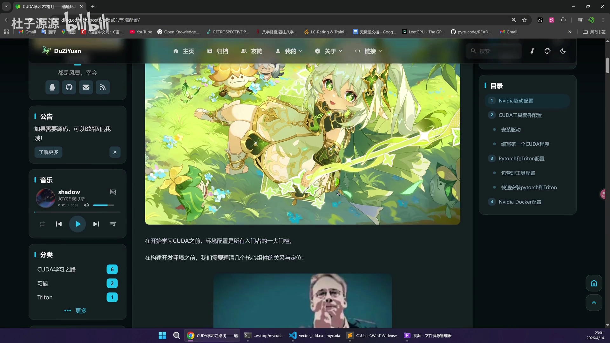 |
| 我们先来理清它们之间的关系。首先是英伟达（NVIDIA）的驱动，我们点开看一下。 [【跳转到 00:19】](https://www.bilibili.com/video/BV1VvQ3BSELZ/?t=19) |  |
| 英伟达驱动在操作系统层面是全局唯一的版本，可以看到这个版本是 580.95.95。再看 CUDA 版本：`which nvcc` 可以看到，nvcc 就是 CUDA 的编译器，它可以有多个版本。 [【跳转到 00:27】](https://www.bilibili.com/video/BV1VvQ3BSELZ/?t=27) | 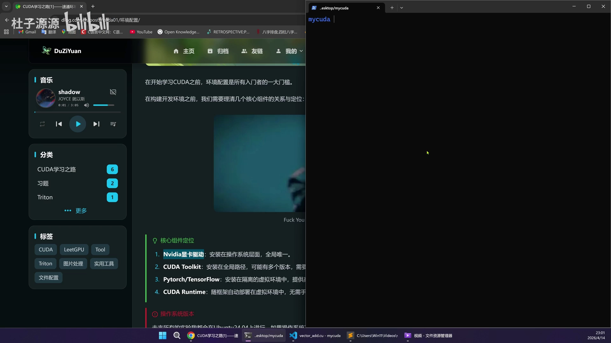 |
| 一般来说 CUDA 装在全局路径，也就是 /usr/local/cuda 下。我们来看一下，这里边我有几个版本，CUDA 13.0、CUDA 13.2，可以装非常多个版本。不同版本之间可能需要切换，比如切换到 12 点几、11 点几，可以提前装几个放在这里。 [【跳转到 00:52】](https://www.bilibili.com/video/BV1VvQ3BSELZ/?t=52) |  |
| 而 PyTorch 一般是放在隔离的虚拟环境中。虚拟环境是什么意思呢？例如我回到这个路径下，在 my_cuda 这个路径下我装了一个虚拟环境，它跟着 my_cuda 走。我现在来看一下。 [【跳转到 01:17】](https://www.bilibili.com/video/BV1VvQ3BSELZ/?t=77) | 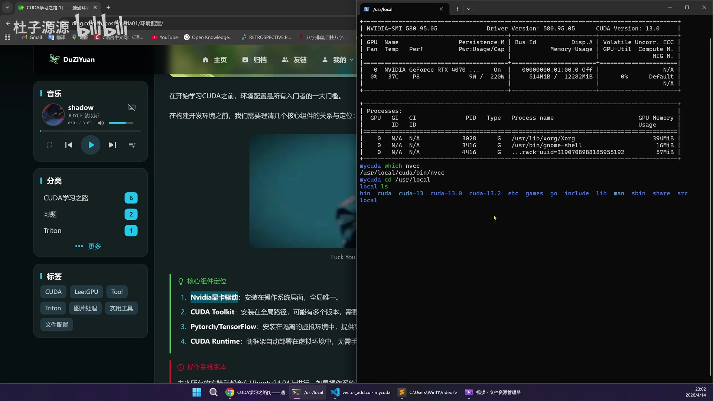 |
| `which python` 可以看到现在 Python 的路径就在 my_cuda 下面。有人会问，你为什么不用 Conda？Conda 也是虚拟环境，但它有几个问题：第一，它非常大；第二，它环境里的包不太兼容。因为 Conda 有它自己的一套下载方式，例如 `conda install`，也有 `pip install`。而我现在主要用 `pip install`，怎么实现呢？ [【跳转到 01:42】](https://www.bilibili.com/video/BV1VvQ3BSELZ/?t=102) | 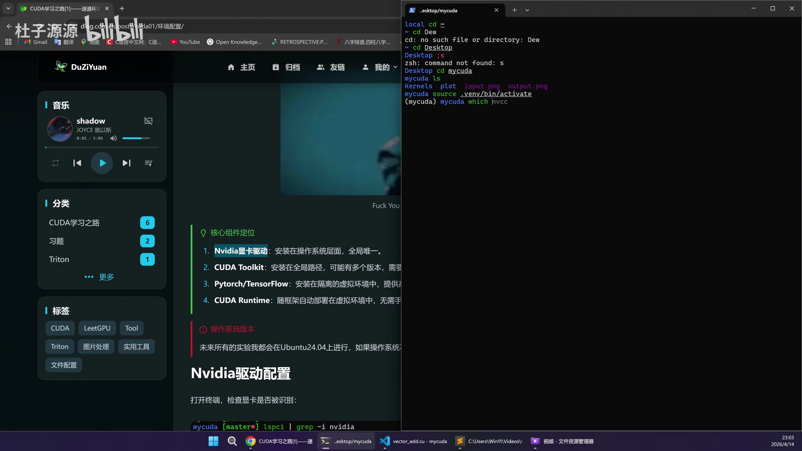 |
| 那我就用到了另一个工具，叫 uv，我待会儿会讲解。以及 CUDA Runtime，它随着你下载 PyTorch 时会自动部署在这个虚拟环境里，现在没有必要去单独配置。我这个系统是在 Ubuntu 24.04 上进行的。 [【跳转到 02:07】](https://www.bilibili.com/video/BV1VvQ3BSELZ/?t=127) | 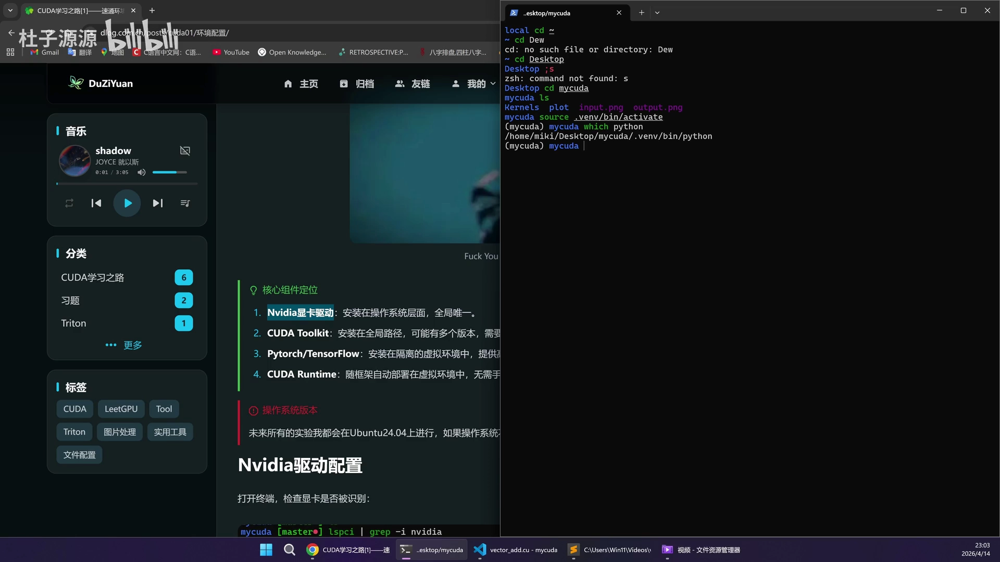 |
| 如果有系统不一样的同学，大家可以用 AI 辅助一下，看看有什么新的下载方式。首先我们来看第一步，下载驱动。`lspci` 就是查看当前 PCIe 总线上所有的设备，PCIe 是一条总线，里面挂了很多设备。 [【跳转到 02:32】](https://www.bilibili.com/video/BV1VvQ3BSELZ/?t=152) | 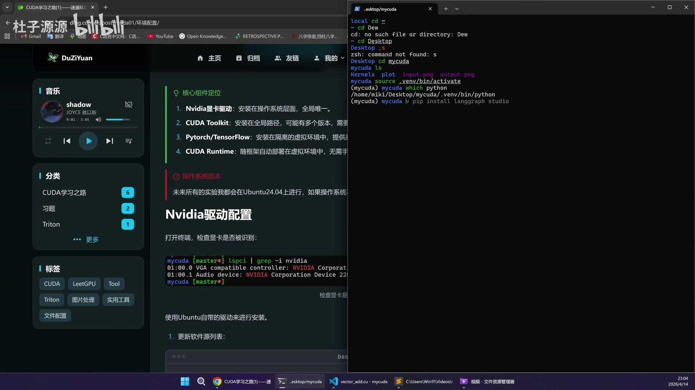 |
| 例如硬盘、显卡。我们执行 `lspci \| grep -i nvidia`，其中 `grep` 是文字查找，`-i` 代表忽略大小写，nvidia 就能看到有 NVIDIA 的是这几个。我这是一张 GeForce RTX 4070，可以看到显卡已经被识别出来。在显卡装完之后…… [【跳转到 02:57】](https://www.bilibili.com/video/BV1VvQ3BSELZ/?t=177) | 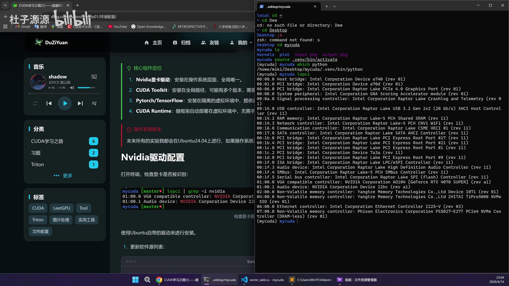 |
| 一般装软件的时候都要进行系统更新。可以看到我输入 `sudo` 命令之后，它去进行软件更新。OK，等它更新完成。 [【跳转到 03:22】](https://www.bilibili.com/video/BV1VvQ3BSELZ/?t=202) | 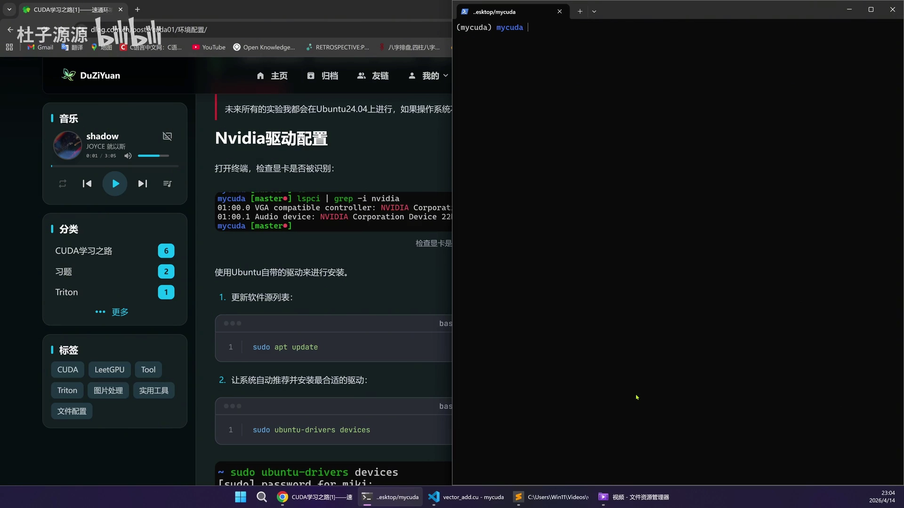 |
| 那我们就让系统推荐给我们比较合适的驱动。执行 `sudo ubuntu-drivers devices`，稍微等一下，可以看到它推荐的有很多。 [【跳转到 03:47】](https://www.bilibili.com/video/BV1VvQ3BSELZ/?t=227) | 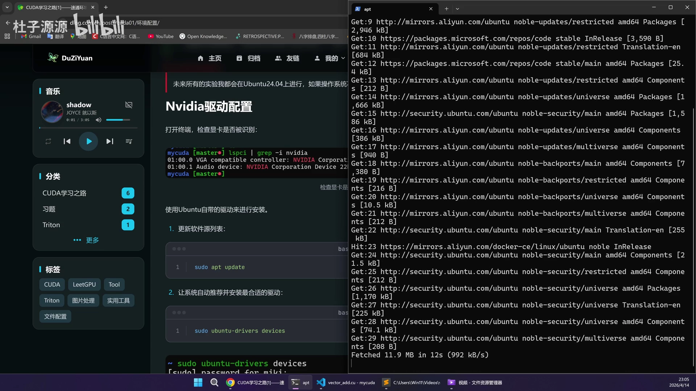 |
| 比如英伟达的 570、580、565、590，可以看到它推荐的是 recommended 580。 [【跳转到 04:06】](https://www.bilibili.com/video/BV1VvQ3BSELZ/?t=246) | 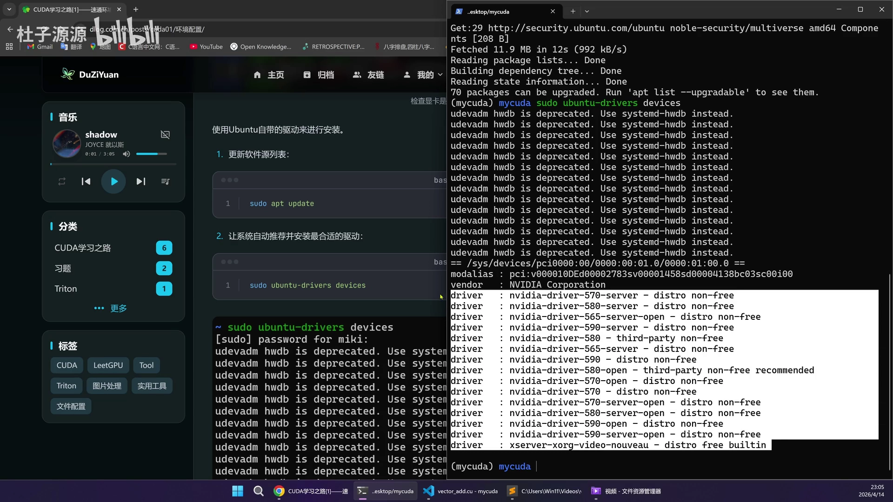 |
| 这是一个开源的 580。实际上我已经装了，如果大家没有装的话，可以选择一个它推荐的去装。 [【跳转到 04:11】](https://www.bilibili.com/video/BV1VvQ3BSELZ/?t=251) | 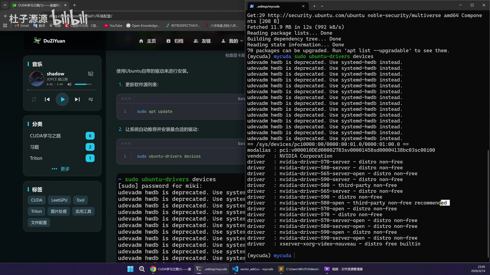 |
| 选择里面推荐的就可以。可以看到在装之前，先要安装一下必要的依赖包。 [【跳转到 04:19】](https://www.bilibili.com/video/BV1VvQ3BSELZ/?t=259) | 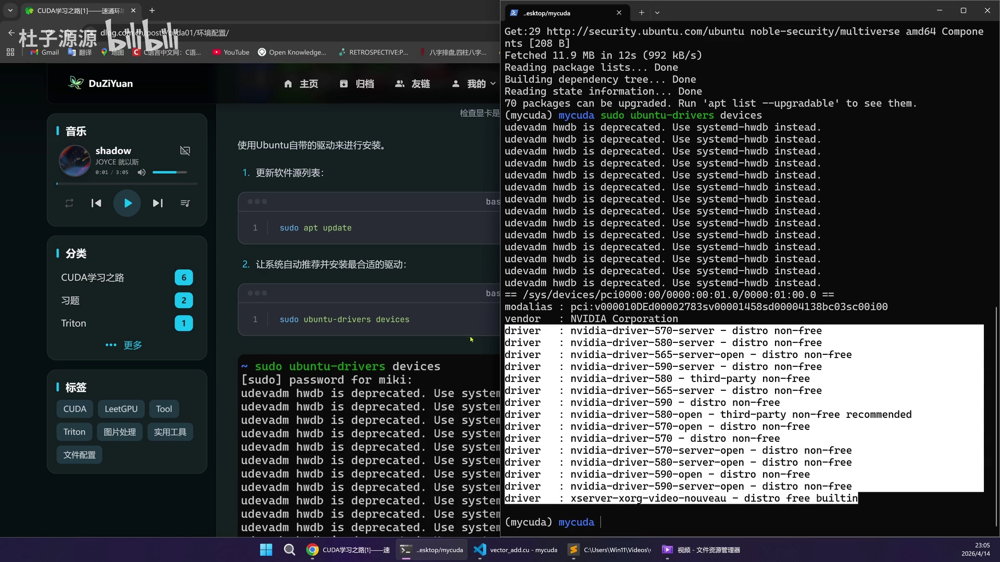 |
| 这些代码博客里都有，大家参考一下就可以。我直接复制过来，把它需要的一些库装上，如果已经装过了它会更新一下。可以看到已经把依赖安装好了。那你要安装哪一个驱动？例如这个地方，我们只需要把这个名称复制过来。 [【跳转到 04:24】](https://www.bilibili.com/video/BV1VvQ3BSELZ/?t=264) | 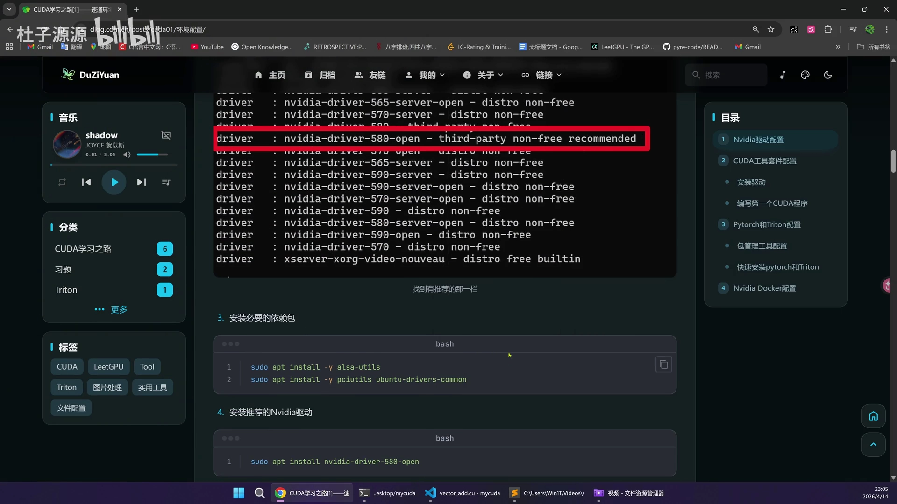 |
| 就可以，用 `sudo apt install nvidia-driver-580-open`。这个地方我就不安装了，交给大家自己去安装即可。安装完成之后，我们 `sudo reboot` 重启一下。重启之后用 `nvidia-smi` 就能查看你现在安装是否成功。可以看到我现在装的版本是 580，CUDA 版本是 13，它还有一些其他的信息。 [【跳转到 04:49】](https://www.bilibili.com/video/BV1VvQ3BSELZ/?t=289) | 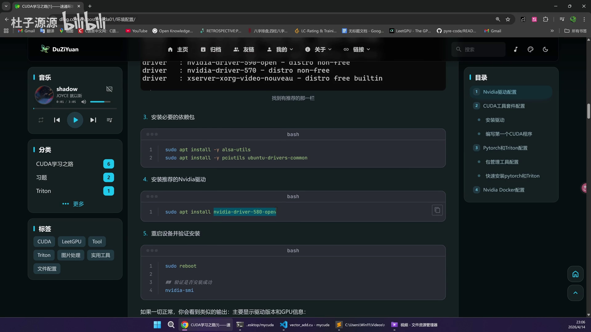 |
| 例如我的功率是 220 瓦，包括我的显存是 12G。 [【跳转到 05:13】](https://www.bilibili.com/video/BV1VvQ3BSELZ/?t=313) | 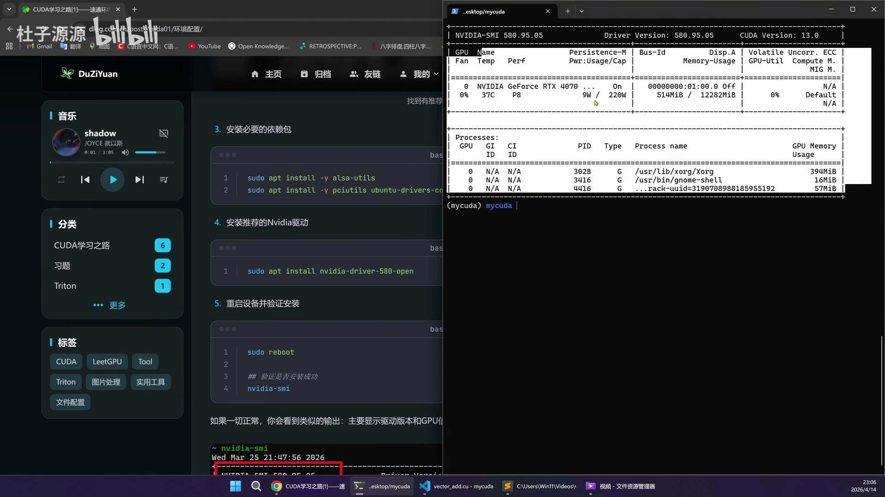 |
| 现在用了 500MB 左右，就能看到一个成功的输出。到此为止就把驱动安装好了。那么安装好驱动之后，接下来就要安装 NVCC，也就是 CUDA 的一个编译套件。怎么安装呢？在这个地方可以选到非常多的版本。 [【跳转到 05:18】](https://www.bilibili.com/video/BV1VvQ3BSELZ/?t=318) | 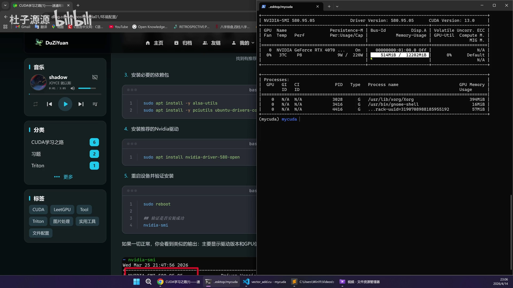 |
| 那我们需要去看一下它支持的是哪个版本。 [【跳转到 05:35】](https://www.bilibili.com/video/BV1VvQ3BSELZ/?t=335) | 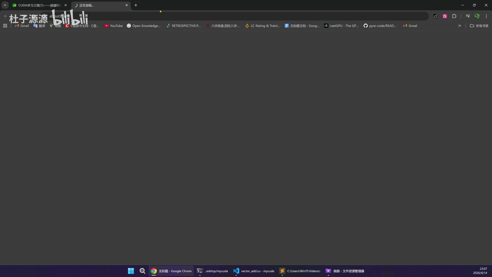 |
| 一般来说我推荐装三个版本：11.8、 [【跳转到 05:40】](https://www.bilibili.com/video/BV1VvQ3BSELZ/?t=340) | 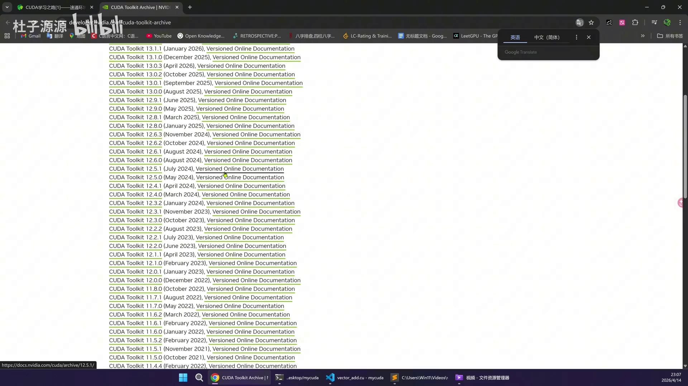 |
| 12.8 和 13.0，这三个版本就可以了，用得比较多。11.8 可以看一下它在这个地方下载，12.8 是在这个地方，13.0 是在这个地方。我之前下的是我博客里面写的 13.2。 [【跳转到 05:45】](https://www.bilibili.com/video/BV1VvQ3BSELZ/?t=345) | 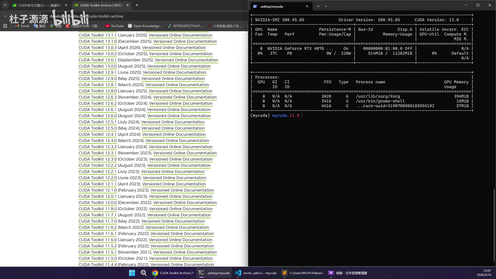 |
| 选择了最新的那个。大家可以去选择你们需要的，那么 12.6、11.8 这些都可以自己下载。 [【跳转到 06:02】](https://www.bilibili.com/video/BV1VvQ3BSELZ/?t=362) | 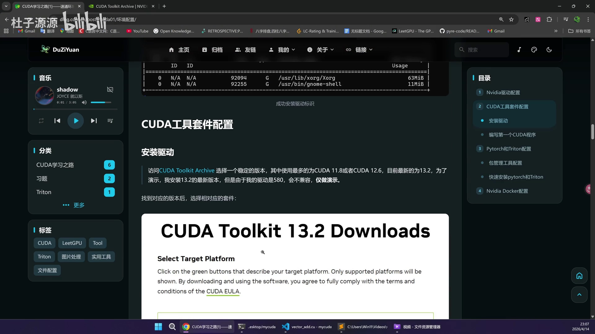 |
| 我们来点击看一下，选择 12.8 吧。 [【跳转到 06:11】](https://www.bilibili.com/video/BV1VvQ3BSELZ/?t=371) | 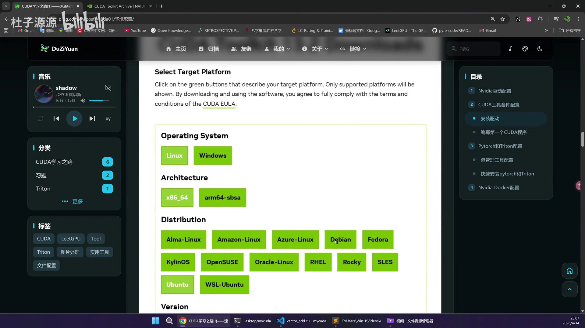 |
| 可以看到它就可以选择你要的操作系统。 [【跳转到 06:16】](https://www.bilibili.com/video/BV1VvQ3BSELZ/?t=376) | 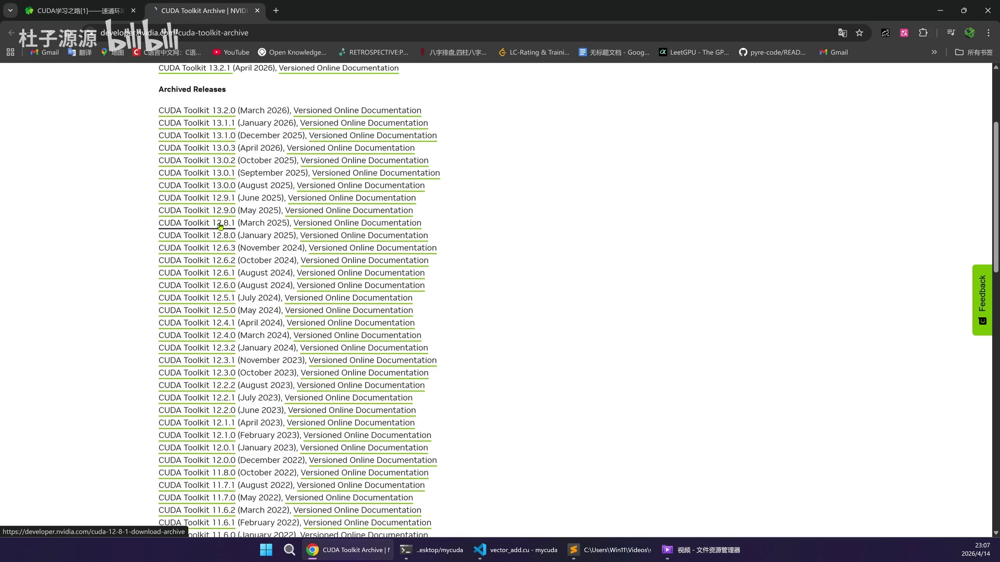 |
| 我这是 x86，然后 Ubuntu 是 24.04。 [【跳转到 06:21】](https://www.bilibili.com/video/BV1VvQ3BSELZ/?t=381) | 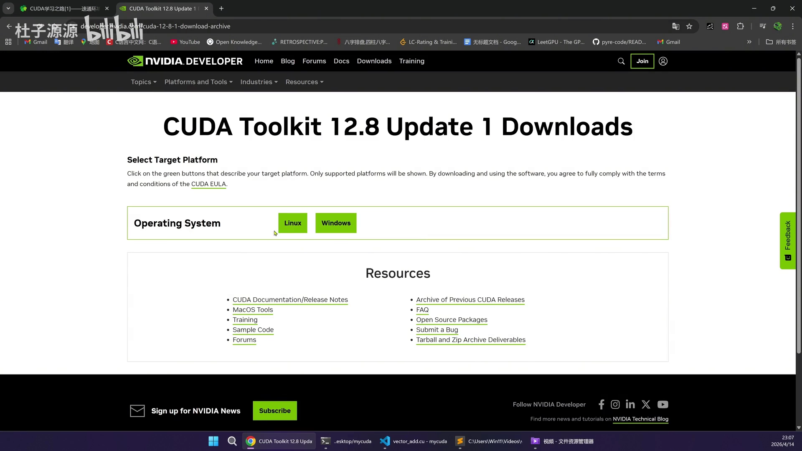 |
| 一般来说选择 local，在本地下载。 [【跳转到 06:26】](https://www.bilibili.com/video/BV1VvQ3BSELZ/?t=386) | 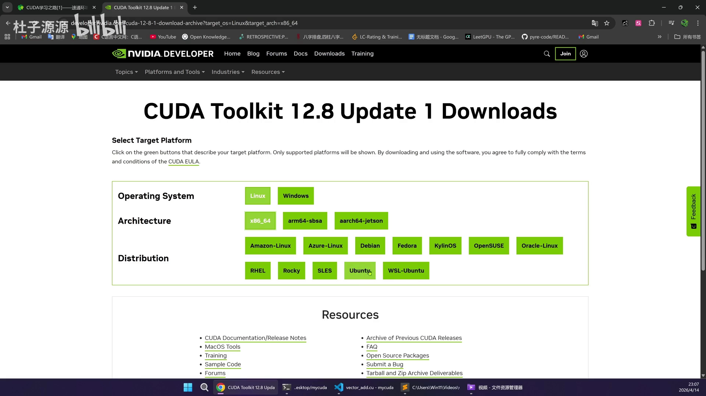 |
| 我们可以看一下 wget，就是它要用网络去访问这个地方。 [【跳转到 06:31】](https://www.bilibili.com/video/BV1VvQ3BSELZ/?t=391) | 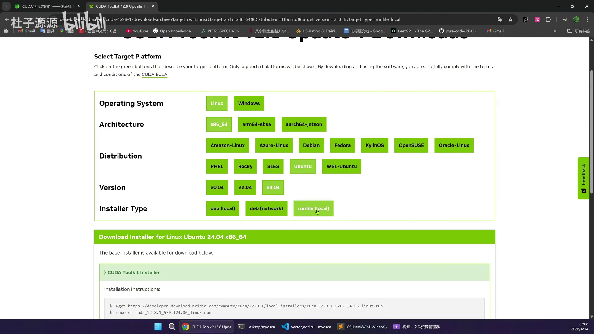 |
| 访问 developer.download.nvidia 这些，让我给它一个下载的路径。 [【跳转到 06:36】](https://www.bilibili.com/video/BV1VvQ3BSELZ/?t=396) | 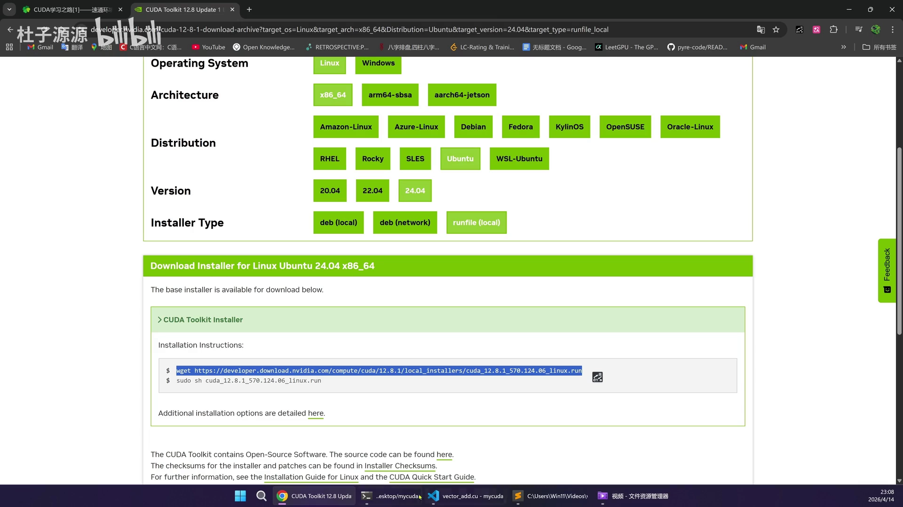 |
| 假设我把它下载在这个地方。wget 你可以选择自己喜欢的路径下载，用 `mkdir` 去创建路径，例如创建一个 test，就可以看到这里有一个目录叫 test，你 cd 进去就可以在这个地方安装。那我还是把它删掉。 [【跳转到 06:41】](https://www.bilibili.com/video/BV1VvQ3BSELZ/?t=401) | 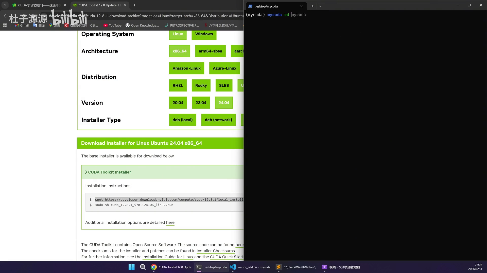 |
| OK，把 test 删除掉，我进行一个安装。那我们去稍微等待一下它的安装。我不清楚这个地方有没有网络（梯子）的限制，有可能安装不上，可能需要两个办法。 [【跳转到 07:06】](https://www.bilibili.com/video/BV1VvQ3BSELZ/?t=426) | 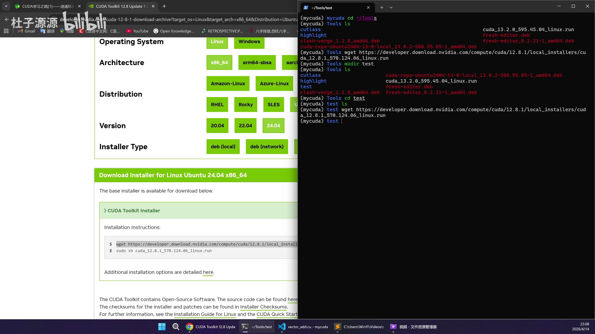 |
| 第一个就是配置一下本地的环境变量或者下载的环境变量，能够让它访问外网；第二个就是配一个代理。具体大家还是在网上搜索就可以，这个地方不过多赘述。我们稍微等待一下，安装完成之后…… [【跳转到 07:31】](https://www.bilibili.com/video/BV1VvQ3BSELZ/?t=451) | 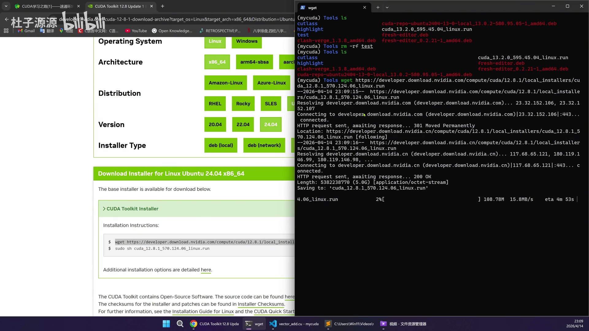 |
| 我们就可以去运行它。还是用 `sudo` 命令，`sh` 是 `.run` 文件的一个启动脚本。CUDA 我之前运行了 13.2，这次运行 12.8。这个是怎么实现呢？`sudo sh cuda_12` 然后按一下 Tab 就可以启动它。我在博客里这个写了四个避坑操作。 [【跳转到 07:48】](https://www.bilibili.com/video/BV1VvQ3BSELZ/?t=468) |  |
| 大家一定要注意，分别对应的是第一个…… [【跳转到 08:11】](https://www.bilibili.com/video/BV1VvQ3BSELZ/?t=491) | 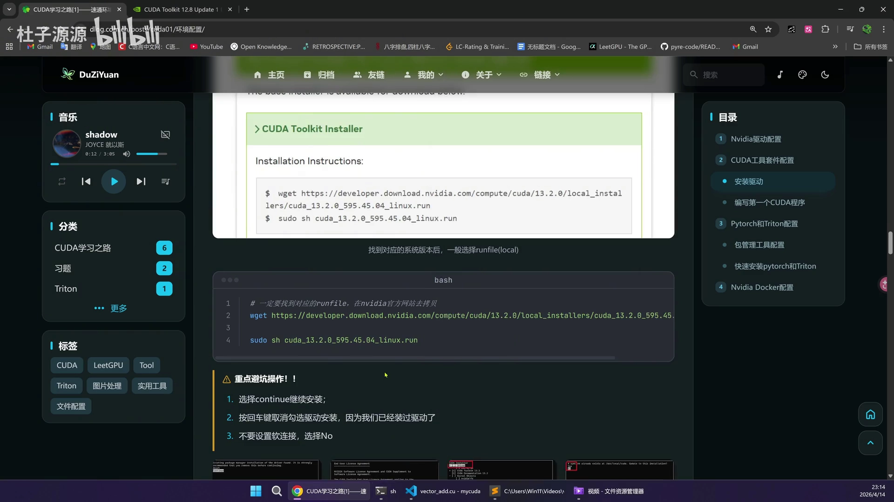 |
| 我们可以一步一步来看一下。它在启动过程中是需要一定时间的，因为它要在本地编译。稍微看一下，我并没有在本地编译…… [【跳转到 08:16】](https://www.bilibili.com/video/BV1VvQ3BSELZ/?t=496) | 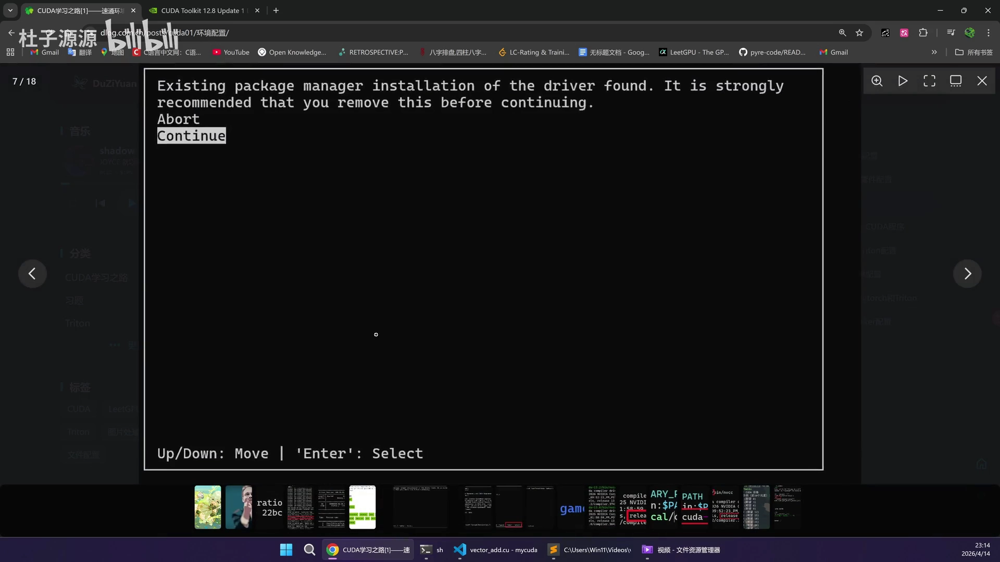 |
| 可以看到这个地方有一个 CPU 在跑，它是跑满的。我们稍微等一下，等它运行出来，这个时间可能稍微久一点。 [【跳转到 08:41】](https://www.bilibili.com/video/BV1VvQ3BSELZ/?t=521) | 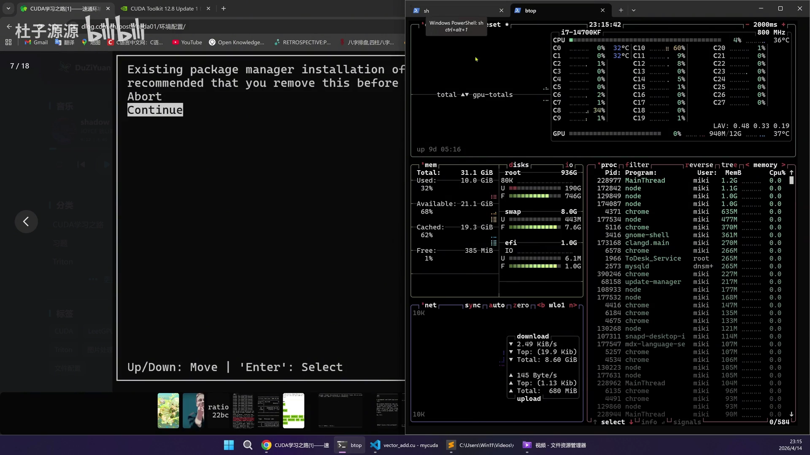 |
| 这个软件是 btop，它可以在终端监控你整个电脑的状态，安装方式是 `sudo apt install btop`，这样安装就可以了。已经安装成功了，我 btop 查看一下，让我看看，哦可以。 [【跳转到 09:05】](https://www.bilibili.com/video/BV1VvQ3BSELZ/?t=545) | 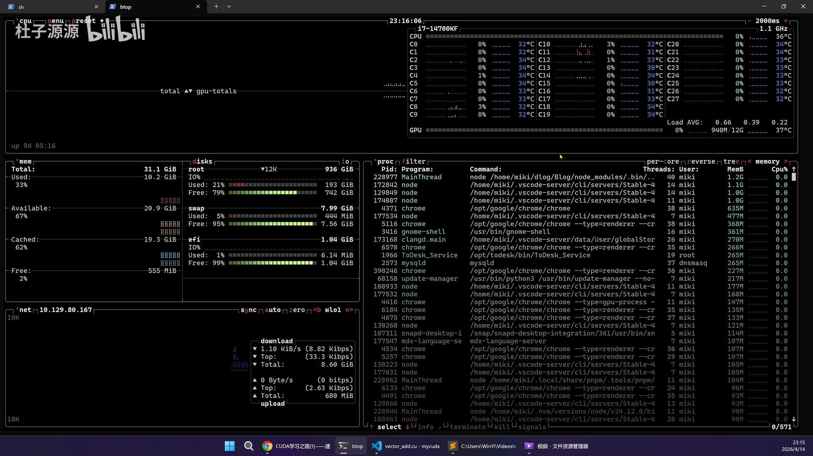 |
| OK，这个地方一定要注意，我们要选择的是 Continue。 [【跳转到 09:28】](https://www.bilibili.com/video/BV1VvQ3BSELZ/?t=568) | 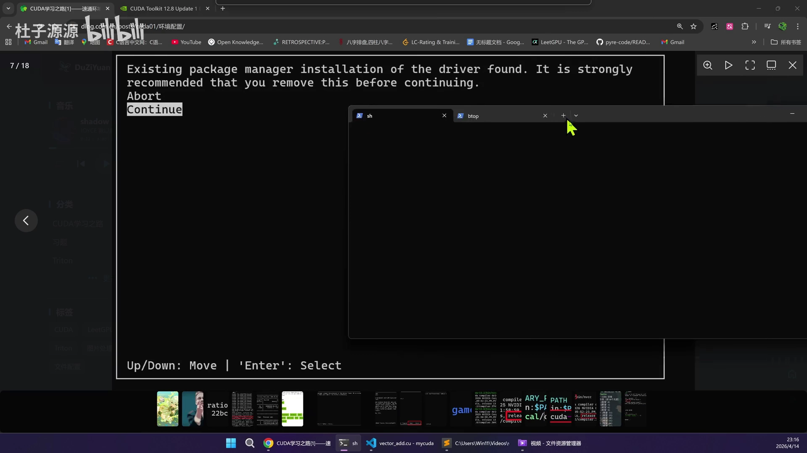 |
| 要不要用 Abort 退出？我们选择 Continue。我们来看一下 existing package manager…… [【跳转到 09:41】](https://www.bilibili.com/video/BV1VvQ3BSELZ/?t=581) | 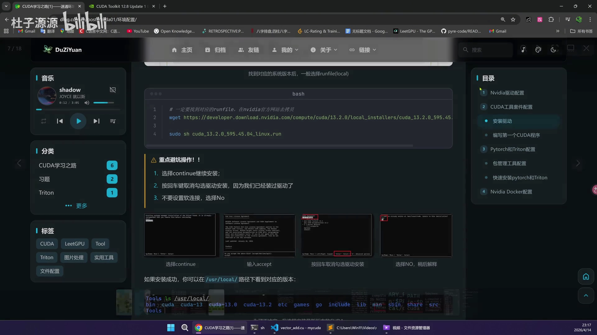 |
| "Installation of the driver found"，就是它已经发现了有安装驱动的工具，那么 "it's strongly recommend that you remove this before continue"，它建议你装之前把这个去掉。但是我们之前已经装了驱动了嘛，所以我们不要去删它，直接选择 Continue。OK，我们来看下一个。 [【跳转到 09:46】](https://www.bilibili.com/video/BV1VvQ3BSELZ/?t=586) |  |
| 下一个它问你这个用户协议，那我们选择接受 accept 就可以。 [【跳转到 10:10】](https://www.bilibili.com/video/BV1VvQ3BSELZ/?t=610) | 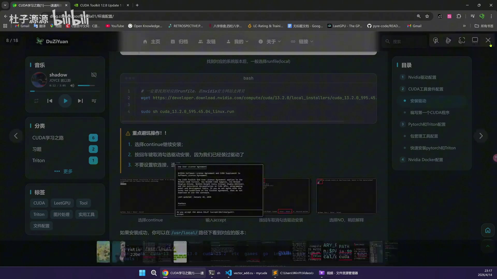 |
| OK，这个地方也要注意，我们来看一下，这里要把这个 driver 取消。那怎么去选择取消呢？我们按回车就可以选择取消，我们并不需要装这个驱动。那么其他这几项我们可以把它装上，这是手册（Documentation），这是 Demo Suite。 [【跳转到 10:15】](https://www.bilibili.com/video/BV1VvQ3BSELZ/?t=615) | 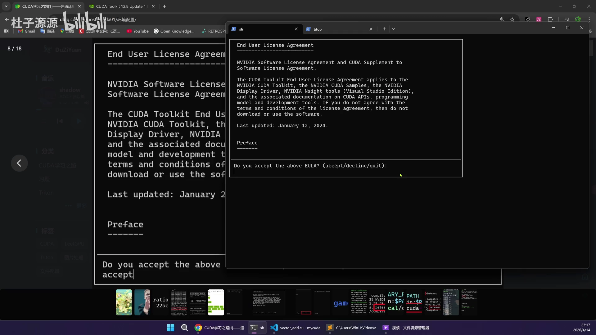 |
| 这是 CUDA Toolkit，这三个装上。OK，选择没问题，我们按上下键进行移动，我们选择 Install，看一下。 [【跳转到 10:40】](https://www.bilibili.com/video/BV1VvQ3BSELZ/?t=640) | 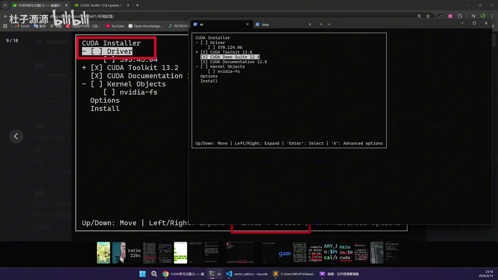 |
| 选择 Install。 [【跳转到 10:52】](https://www.bilibili.com/video/BV1VvQ3BSELZ/?t=652) | 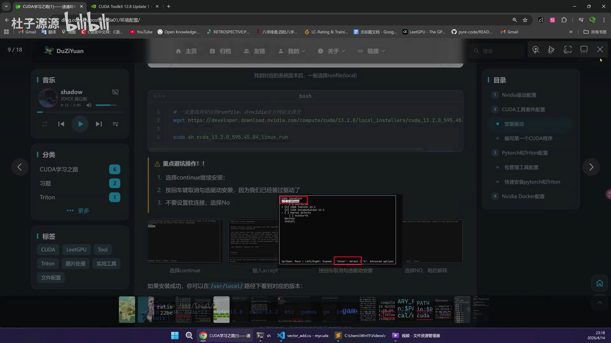 |
| 这个地方 "A symlink already exists at /usr/local/cuda. Update to this installation?" 就是说你现在已经有一个软链接了，是否需要去更新这个软链接？那这个地方我们不需要对它做更新，之后我会给大家解释。我们选择 No。 [【跳转到 10:57】](https://www.bilibili.com/video/BV1VvQ3BSELZ/?t=657) | 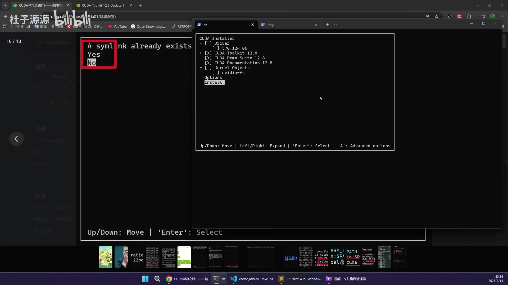 |
| 等待它安装即可，再来监控一下。 [【跳转到 11:17】](https://www.bilibili.com/video/BV1VvQ3BSELZ/?t=677) | 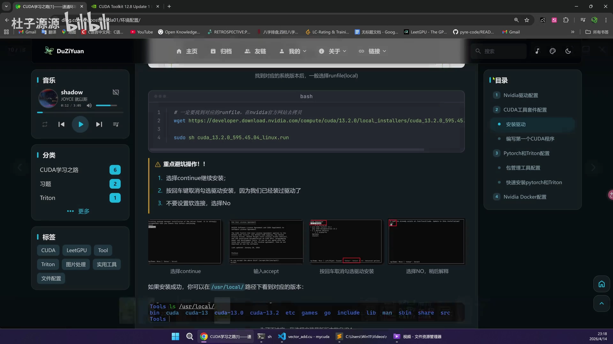 |
| 那它现在还是在跑一个 CPU，可以看到在这个地方。我们来看一下它是否安装成功，这里写了 "Toolkit installation"，这个 driver 显示的是 not selected。我们先来看一下，OK，看下版本 580，我们的版本没有发生变化。 [【跳转到 11:22】](https://www.bilibili.com/video/BV1VvQ3BSELZ/?t=682) | 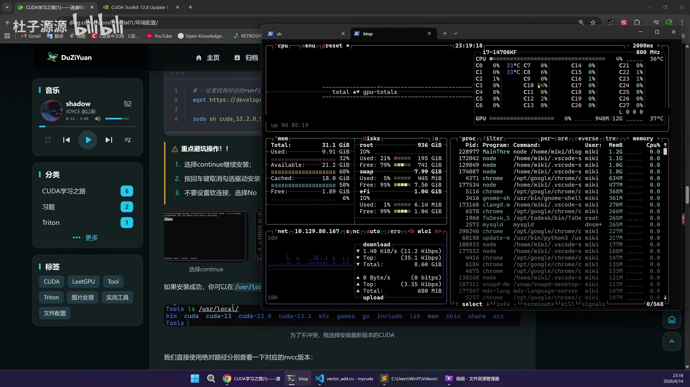 |
| 然后 CUDA 版本还是 13，我们刚刚装的是 12.8，我们现在先看一下它装在哪了。可以看到这个地方有一个 12.8，那么 `cd /usr/local/cuda-12.8`，输入一个 `nvcc --version` 可以看到这个。 [【跳转到 11:47】](https://www.bilibili.com/video/BV1VvQ3BSELZ/?t=707) |  |
| 哦，我需要对它进行一个切换。我们怎么对它进行切换呢？我们要 `vim ~/.zshrc` 或者 `vim ~/.bashrc`。这两个代表什么意思？就是我们这个用户下的一个本地的…… [【跳转到 12:12】](https://www.bilibili.com/video/BV1VvQ3BSELZ/?t=732) | 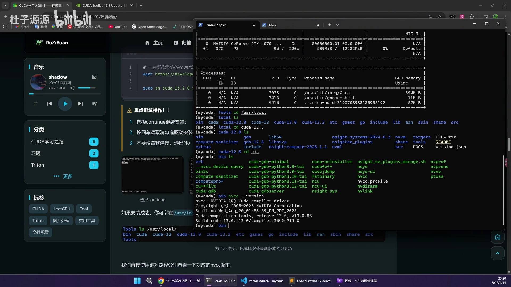 |
| 全局的配置文件，如果你装的是 Zsh 的话就用 .zshrc，那么 Bash 的话就用 .bashrc。那我这个地方就选择 `vim ~/.zshrc`。可以看到我们找一下，在这个地方，我多打几个空格…… [【跳转到 12:37】](https://www.bilibili.com/video/BV1VvQ3BSELZ/?t=757) | 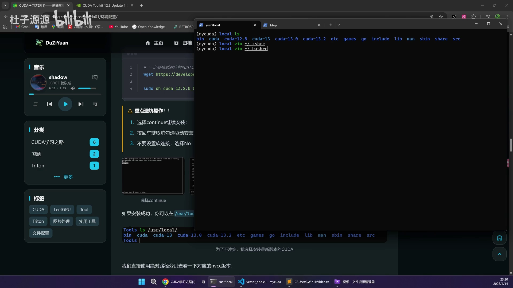 |
| 看到了吗，它要引入一个 PATH 有 /usr/local/cuda/bin，还有 LD_LIBRARY_PATH 有 /usr/local/cuda/lib64，它这个地方就是可以把 CUDA 的这个版本引导进去。那我们现在来改一个 12.8，这个地方我们也改成 12.8。 [【跳转到 13:02】](https://www.bilibili.com/video/BV1VvQ3BSELZ/?t=782) | 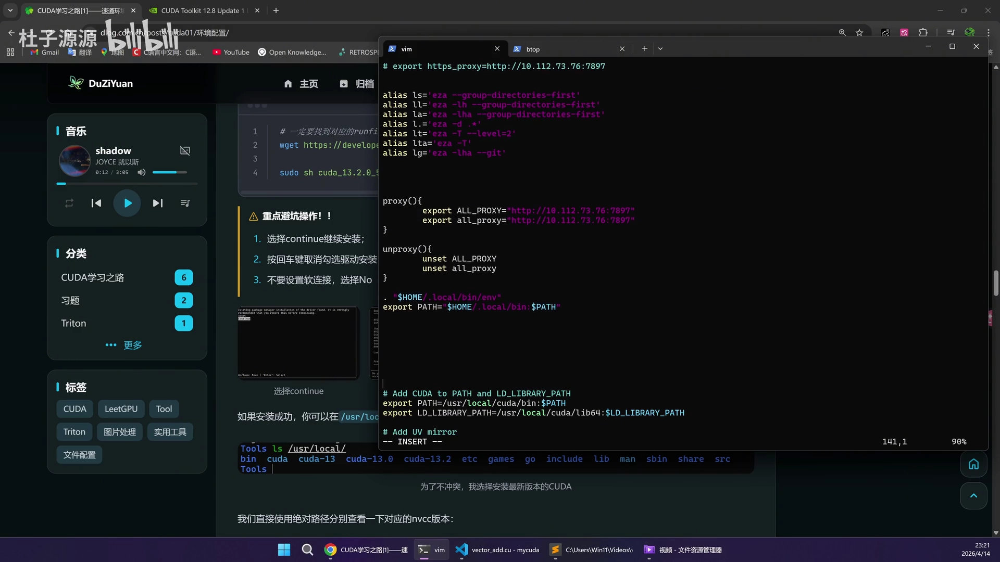 |
| 然后按 ESC 退出，按冒号再按 wq 保存并退出。看一下 nvcc 12.8……好我知道了，我们不是已经修改了吗，修改之后需要 `source` 就重新激活一下这个配置。 [【跳转到 13:27】](https://www.bilibili.com/video/BV1VvQ3BSELZ/?t=807) | 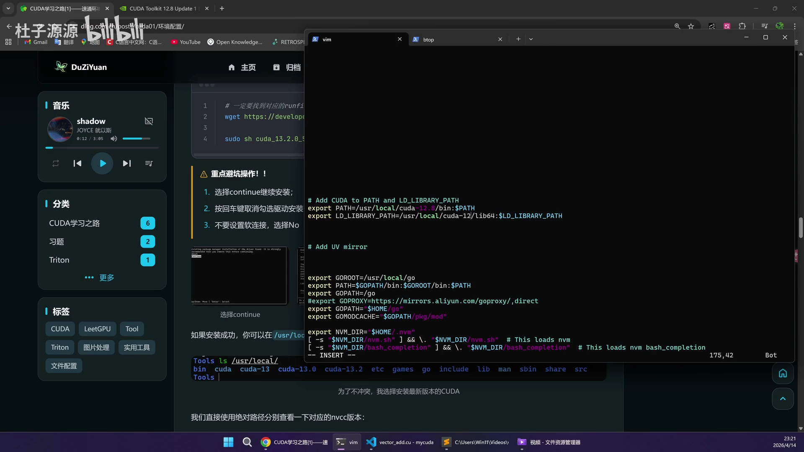 |
| 重新给它启动一下。那我再来看一下 `which nvcc`，那现在 nvcc 就是 12.8，看一下 `nvcc --version` 是 12.8。那我们再来看，现在改成 13.0，同样重新启动一下。 [【跳转到 13:52】](https://www.bilibili.com/video/BV1VvQ3BSELZ/?t=832) | 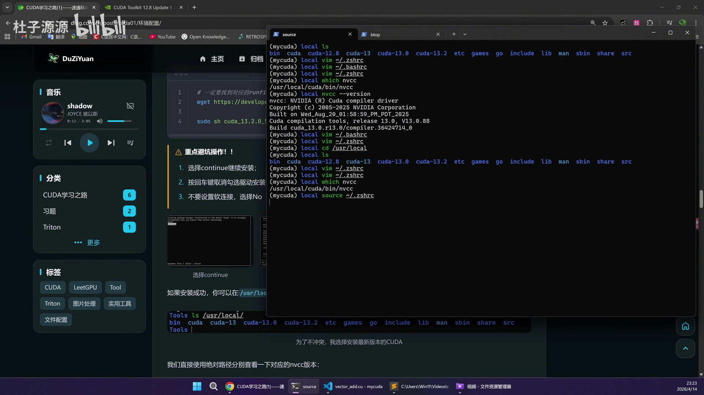 |
| 这是我刚刚的失误，需要重新对它进行启动。那我们再来看一下 `nvcc -V`，那现在就是 13.0。你现在可以随意去切换，需要哪个把它切换过去就可以了。OK，到现在我们就成功了。那么 vim 之后去修改，再对它做更新。哦，我这个地方去写了，你看我没有去看，所以我也报错。可以看到 580…… [【跳转到 14:17】](https://www.bilibili.com/video/BV1VvQ3BSELZ/?t=857) | 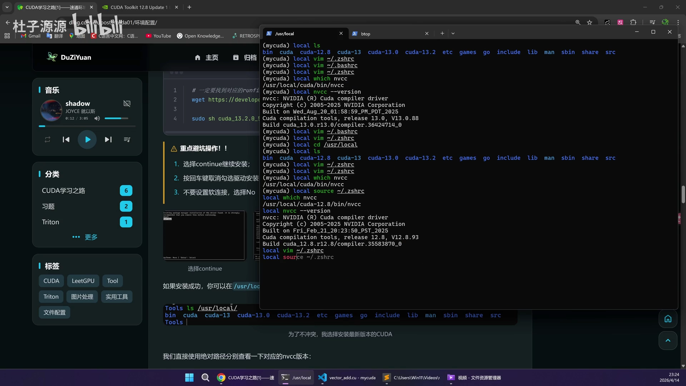 |
| 最高是支持到 13.0，所以我输入 13.2 的话会报错。那么向下兼容是可以的，但向上的话一般来说是不太行。那我们去尝试着写一下第一个 NVCC 的代码。我先是进入到 kernel 里面，然后 `touch test.cu`。 [【跳转到 14:42】](https://www.bilibili.com/video/BV1VvQ3BSELZ/?t=882) | 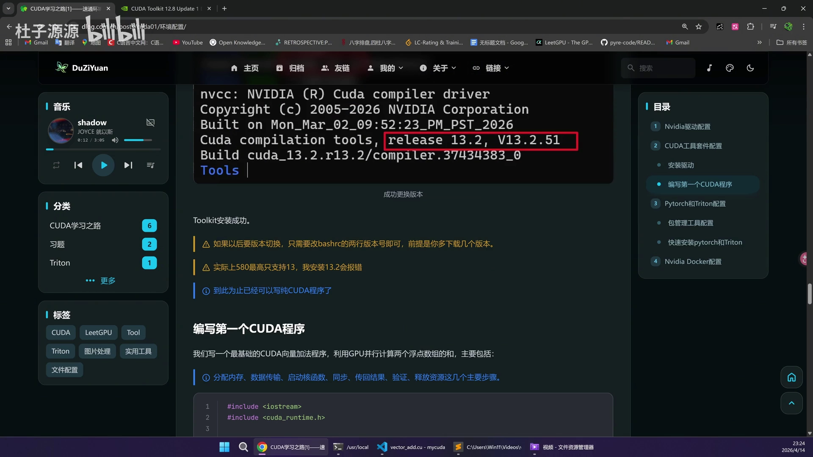 |
| CUDA 是以 .cu 结尾，那我们 `vim test.cu`。我们进来之后，先写个最简单的。 [【跳转到 15:07】](https://www.bilibili.com/video/BV1VvQ3BSELZ/?t=907) | 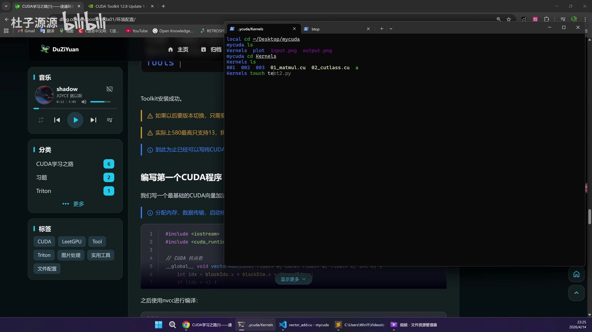 |
| OK，保存然后退出，我们 `nvcc test.cu` 看一下没问题。那我们看一下现在的 a.out，我们去执行一下，Hello CUDA，那我们最简单的一个 CUDA 程序现在启动了。 [【跳转到 15:32】](https://www.bilibili.com/video/BV1VvQ3BSELZ/?t=932) |  |
| OK，我们现在装好 CUDA 之后了。我这个地方也写到了，Conda 的安装也很慢，包括 pip 这个环境隔离也很垃圾，所以我这个地方用的是 uv。那么 uv 的下载和解析都非常直观，安装是用这个命令。我因为已经下载过了嘛，所以其实看一下…… [【跳转到 15:50】](https://www.bilibili.com/video/BV1VvQ3BSELZ/?t=950) | 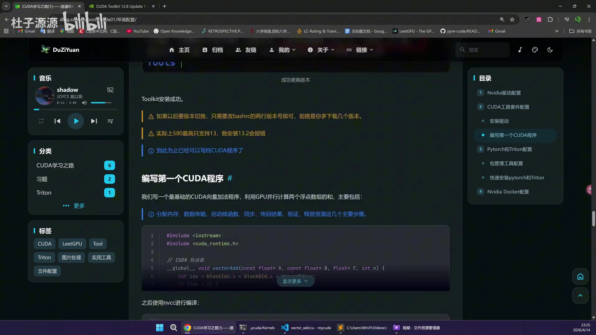 |
| OK，它说已经装上了。那么同样是为了能够让它被系统识别到，我们还是需要在 .zshrc 这个地方加入一个 uv 的路径。可以看到我找一下 uv，好像似乎装上之后…… [【跳转到 16:15】](https://www.bilibili.com/video/BV1VvQ3BSELZ/?t=975) | 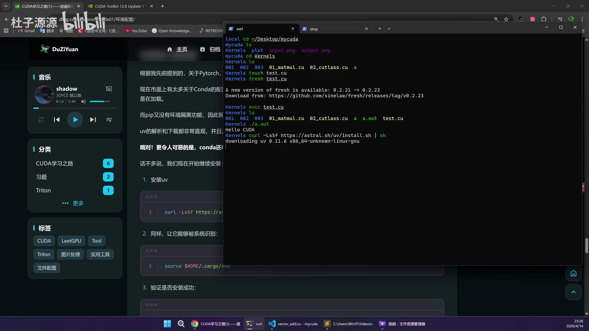 |
| 它会默认有那么我们来查看一下 `uv version`，uv 的版本是 0.11.6。那如果大家 uv 下载有问题的话，可能需要配一个镜像源，我给大家找了一个清华的镜像源，大家可以导入到清华镜像源再重新下载一次，或者配一个代理。那配代理的话大家自己去…… [【跳转到 16:40】](https://www.bilibili.com/video/BV1VvQ3BSELZ/?t=1000) | 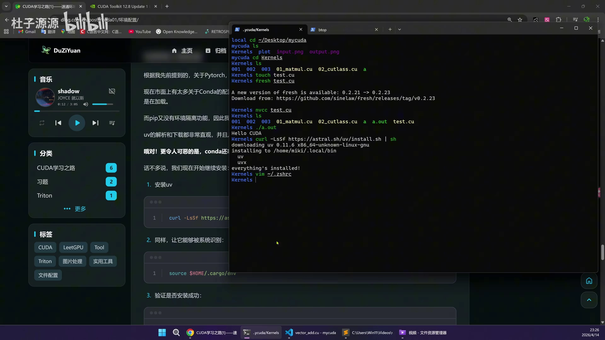 |
| 在网上搜索即可。OK，用了 uv 之后我们就很爽了。我们先回到我们刚刚的路径下，怎么去创建一个 uv 的环境呢？`uv venv --python`，你可以去指定版本，那我这个地方指定是 3.14，我可以看一下 `python --version`，肯定看到 3.14，那激活它。 [【跳转到 17:05】](https://www.bilibili.com/video/BV1VvQ3BSELZ/?t=1025) | 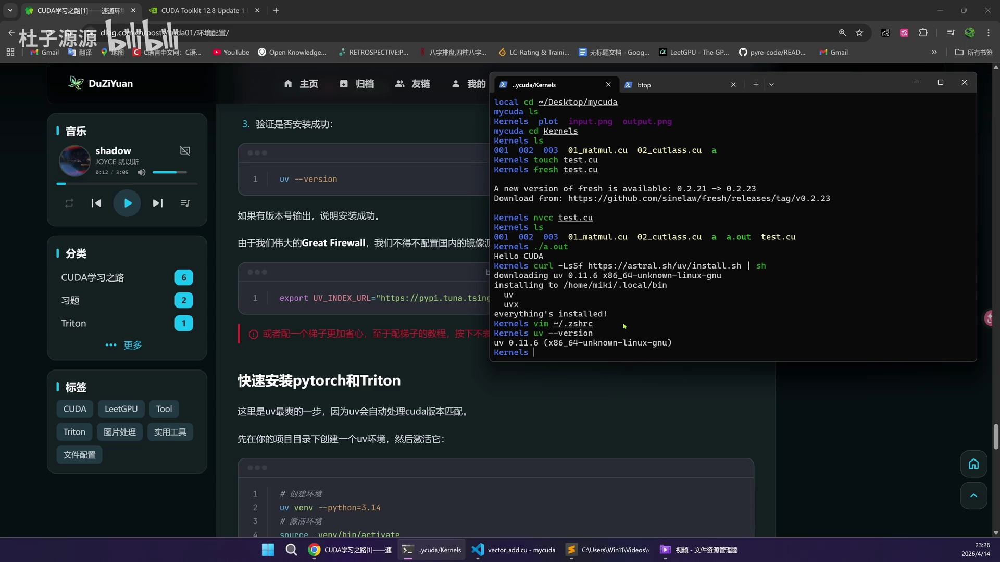 |
| `.venv` 当前可以看一下有一个 venv，这就是它本地的虚拟环境，`source .venv/bin/activate` 把它激活，激活之后前面就有一个跟它同名的，说明就激活成功了。那如果大家需要安装 PyTorch、torchvision、torchaudio，uv 有一个非常牛逼的一键安装的方法。 [【跳转到 17:30】](https://www.bilibili.com/video/BV1VvQ3BSELZ/?t=1050) | 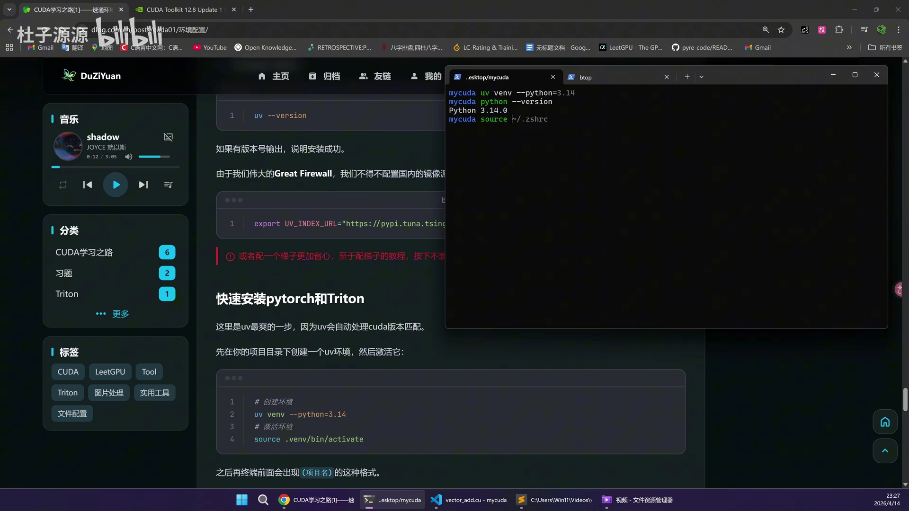 |
| 那就是 `uv pip install torch torchvision`。那我安装一下，实际上我已经安装过了，可以看到它检测已经安装成功，所以就一下子就安装完了，那非常快，它是并发下载的。我给大家测试一下吧，我再创建一个，进入到这个 test1 里边，我来随便测试一下，`uv venv --python=3.14`。 [【跳转到 17:55】](https://www.bilibili.com/video/BV1VvQ3BSELZ/?t=1075) | 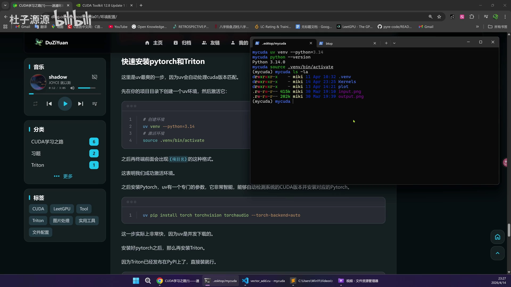 |
| OK，source 激活，那现在就变成了 test1，然后复制过来。那我们来看一下它的下载速度，它想要解决依赖，然后找到对应的包之后就开始进行下载。 [【跳转到 18:20】](https://www.bilibili.com/video/BV1VvQ3BSELZ/?t=1100) | 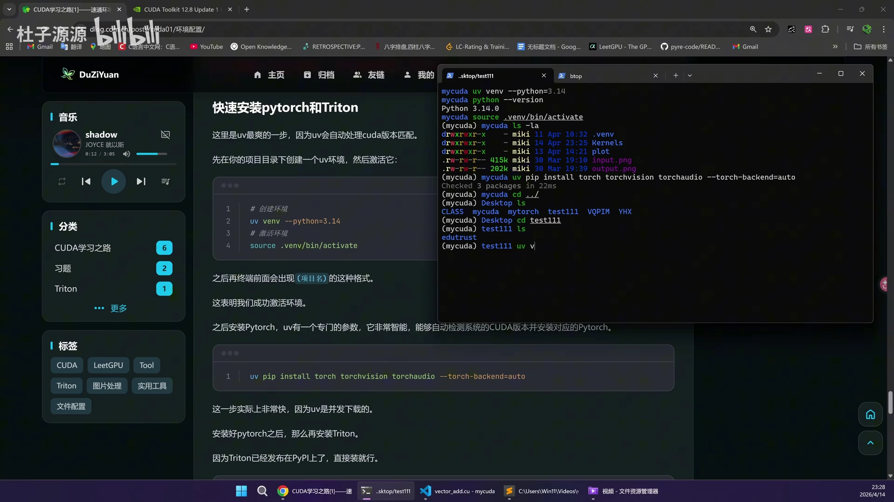 |
| 大家可以看到这是它的下载速度，还是非常可观的，并且时间上也很好很可控。那我就先给它暂停掉吧。OK，下载好 uv 之后，我们再回到刚刚的路径下，我把 my_cuda 再激活起来。那么 my_cuda 激活之后…… [【跳转到 18:45】](https://www.bilibili.com/video/BV1VvQ3BSELZ/?t=1125) | 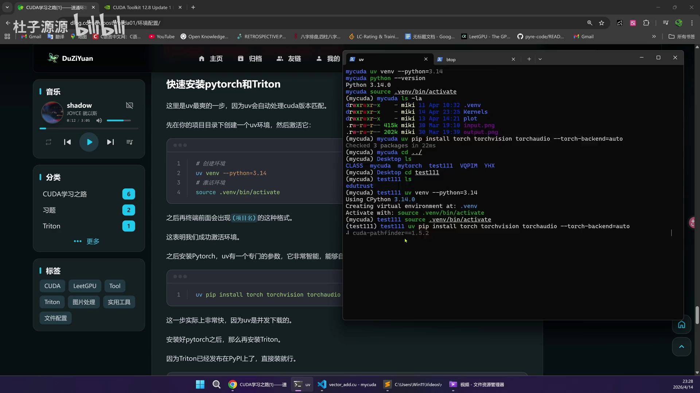 |
| 我们安装只需要在 `pip install` 前边加一个 uv，就是 `uv pip install`，然后把 triton 安装一下就就可以了。OK，那我们进入到 Python 的交互命令行，`import torch` 看一下能不能成功，然后 `print(torch.__version__)`。 [【跳转到 19:10】](https://www.bilibili.com/video/BV1VvQ3BSELZ/?t=1150) | 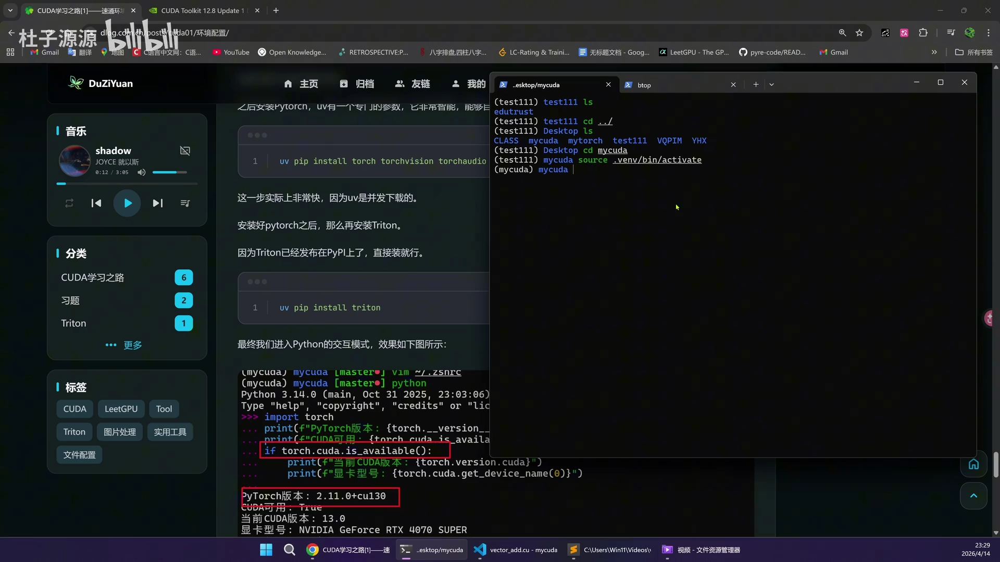 |
| 我这有命令看一下，可以看到 torch 已经安装好了。`print(torch.cuda.is_available())` 是 true，说明 CUDA 也可以用了。而且我们再来看一下，`import triton`…… [【跳转到 19:35】](https://www.bilibili.com/video/BV1VvQ3BSELZ/?t=1175) | 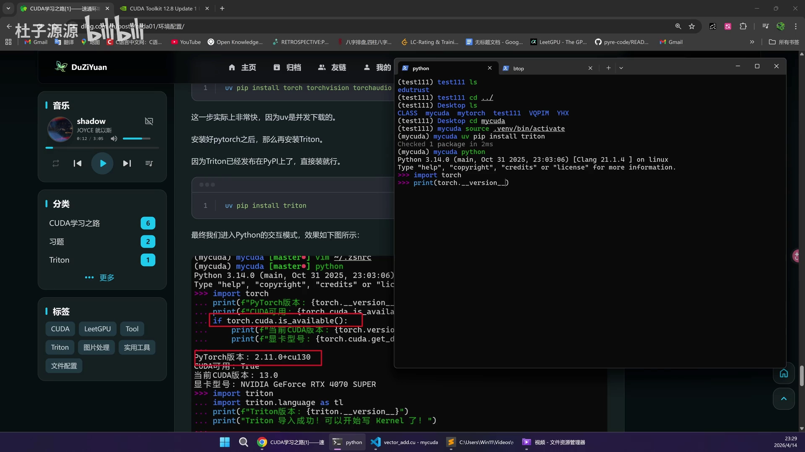 |
| 那 `import triton.language as tl`，然后 `print(triton.__version__)`，那 triton 也安装成功。那我们就可以顺利地去写代码了。至此环境配置到此结束。如果大家需要去下载不同环境下的配置…… [【跳转到 20:00】](https://www.bilibili.com/video/BV1VvQ3BSELZ/?t=1200) | 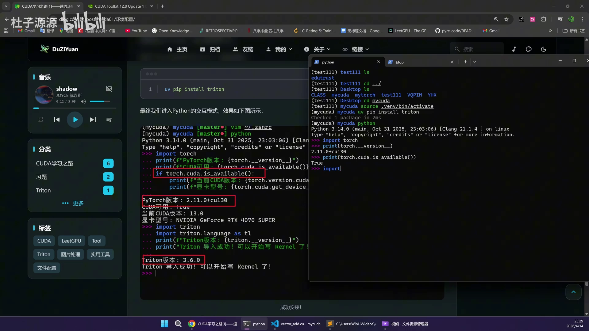 |
| 例如把别人的项目下下来，这个时候可能还需要学一些进阶的：怎么做环境管理、怎么做环境隔离，以及如何让两个不同版本的环境在一起跑。不过这些都是细枝末节，大家可以在平时的时候去积累一些这些技能，它还不是特别重要。那我们从零开始的话，掌握这些就可以了。那本节到此结束，希望大家点赞。 [【跳转到 20:25】](https://www.bilibili.com/video/BV1VvQ3BSELZ/?t=1225) | 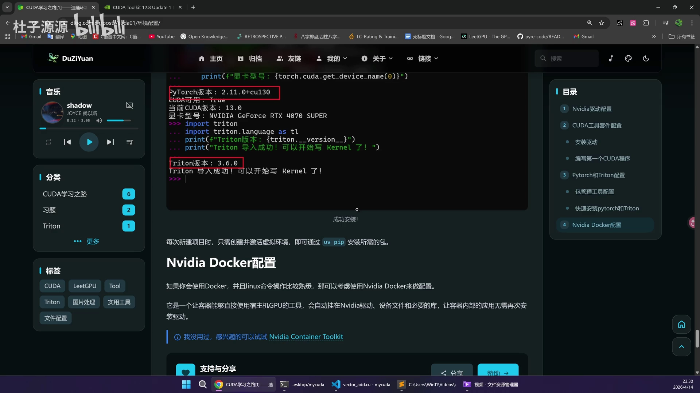 |
| 投币加关注，谢谢大家。 [【跳转到 20:50】](https://www.bilibili.com/video/BV1VvQ3BSELZ/?t=1250) | 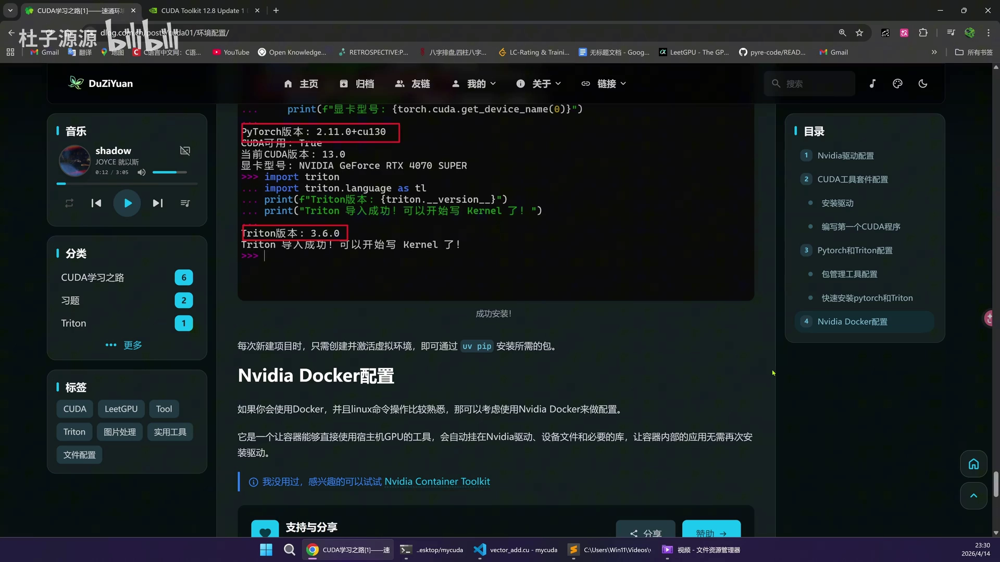 |