# 第04讲_CUDA、Triton、Pytorch的前世今生 原始文稿（图-字幕分栏）

| 字幕文本 | 画面 |
| :--- | ---: |
| （此区间无字幕） [【跳转到 00:00】](https://www.bilibili.com/video/BV147dYBLEi4/?t=0) | 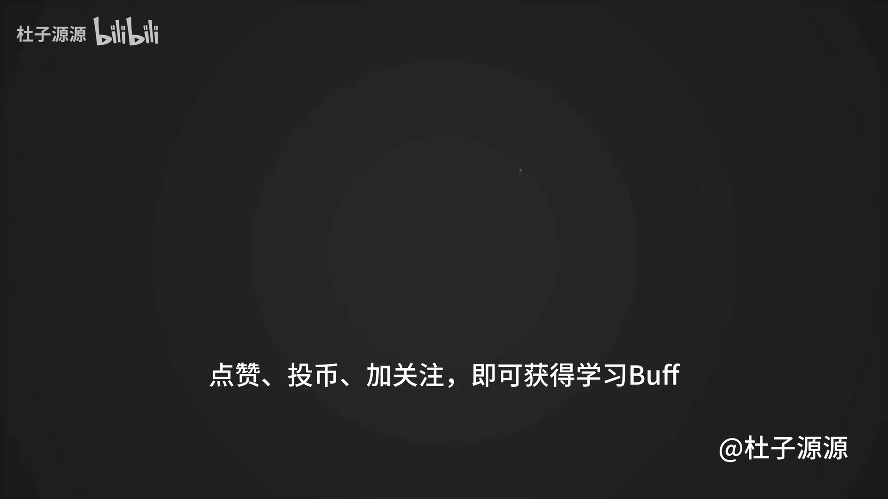 |
| B站的小伙伴大家好，我是肚子圆圆。特别感谢 AQU、今日天晴和 WESEAHN 等同学打赏，您的赞助是我更新视频的最大动力。这一节我们继续来更新手撕算子系列。 [【跳转到 00:05】](https://www.bilibili.com/video/BV147dYBLEi4/?t=5) | 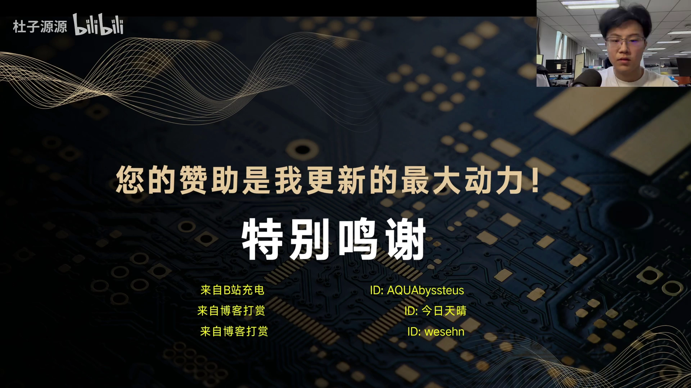 |
| 在正式动手之前，我们先来讲一讲 CUDA、PyTorch 和 Triton 的前世今生。很多同学习惯了看视频、刷教程来学习，但到了写算子这一步才发现，它特别考验分析和工程能力。即使是同一种算子，当数据规模发生变化、场景发生变化，它的性能也可能天差地别。面对复杂繁多的算子， [【跳转到 00:20】](https://www.bilibili.com/video/BV147dYBLEi4/?t=20) | 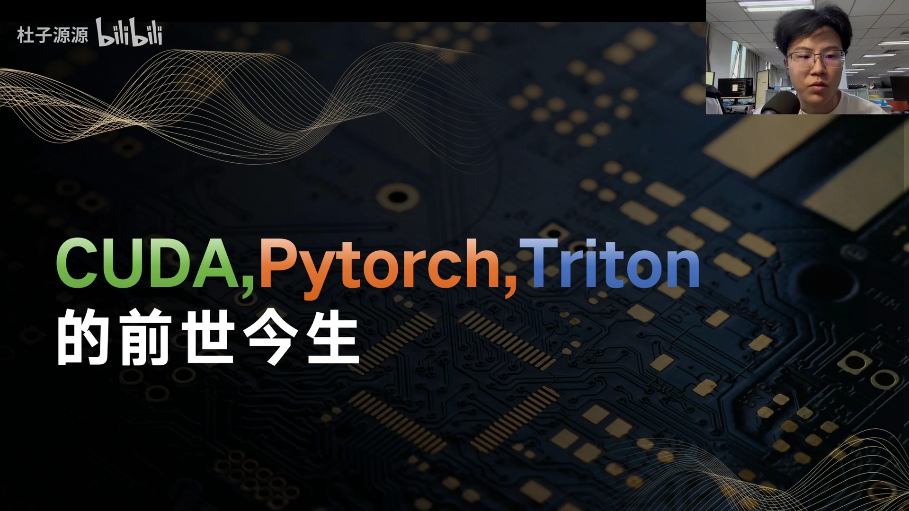 |
| 我们需要看一下这三种编程语言的设计哲学，来帮助我们更好地选择最合适的方案。这是我们这一讲的目录。 [【跳转到 00:45】](https://www.bilibili.com/video/BV147dYBLEi4/?t=45) | 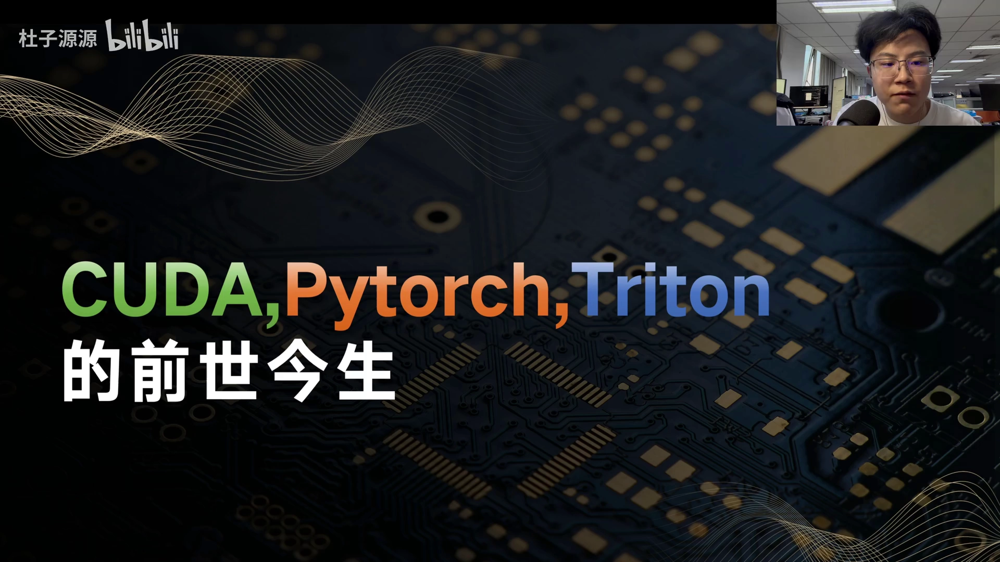 |
| 被逼出来的 CUDA、站在巨人肩膀上的 PyTorch，以及自动挡的 Triton。 [【跳转到 00:54】](https://www.bilibili.com/video/BV147dYBLEi4/?t=54) | 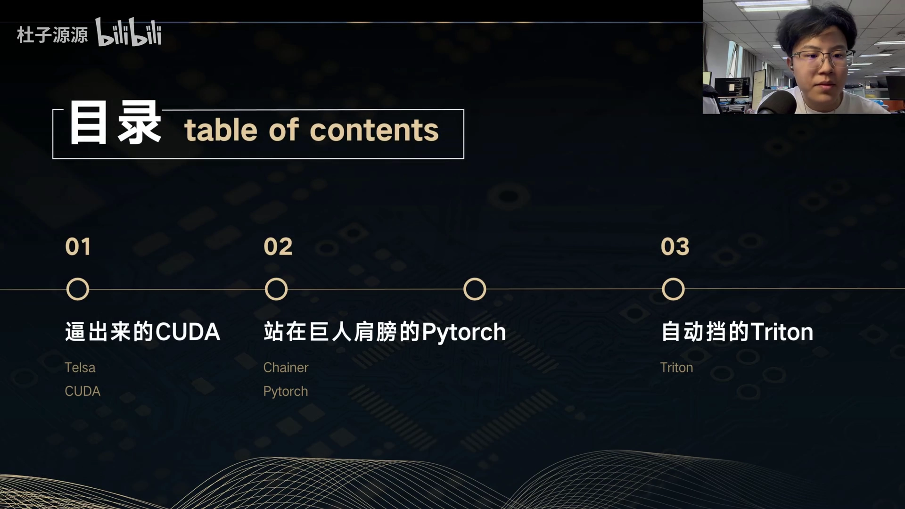 |
| 我们来看第一个问题：什么是算子。在聊 CUDA 之前，我想先讲讲什么是算子——是函数、运算法则，还是其他什么东西？ [【跳转到 01:02】](https://www.bilibili.com/video/BV147dYBLEi4/?t=62) | 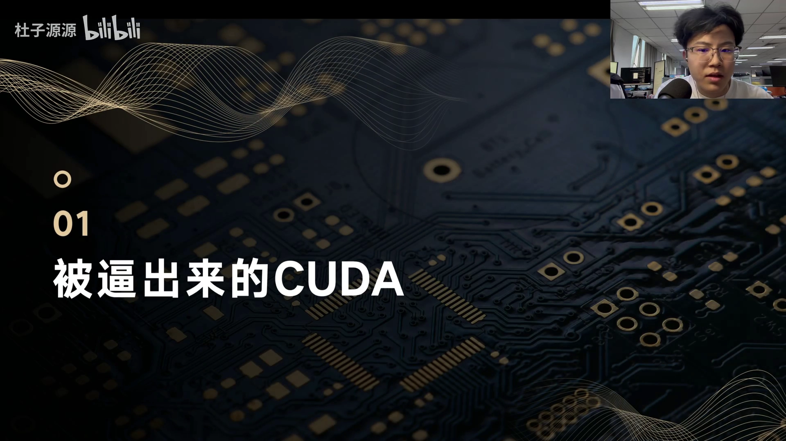 |
| 我的理解是：算子是对数据进行函数运算的最小可复用单元。首先它要对数据进行函数运算；“最小”是什么意思呢？也就是说，在这一个算子之内，它的性能一般来说是最优的；如果进一步拆分或者合并，都会导致它的性能下降。 [【跳转到 01:07】](https://www.bilibili.com/video/BV147dYBLEi4/?t=67) | 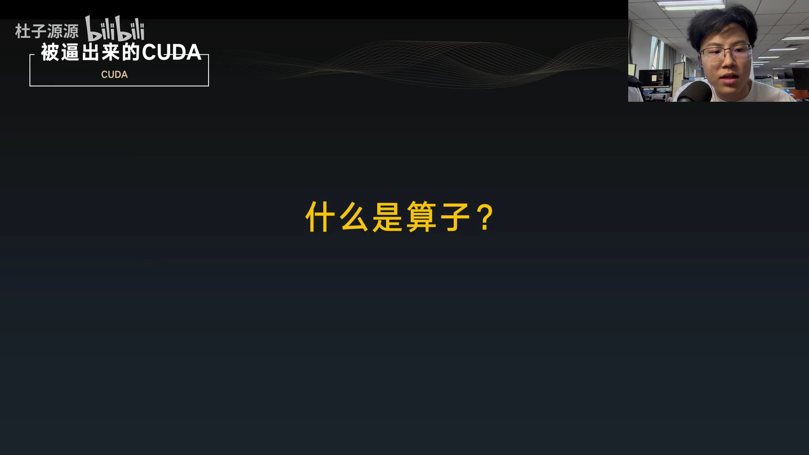 |
| “可复用”很好理解，就是面对不同的数据规模可以重复使用，减少代码量。例如我们常见的卷积算子、 [【跳转到 01:32】](https://www.bilibili.com/video/BV147dYBLEi4/?t=92) | 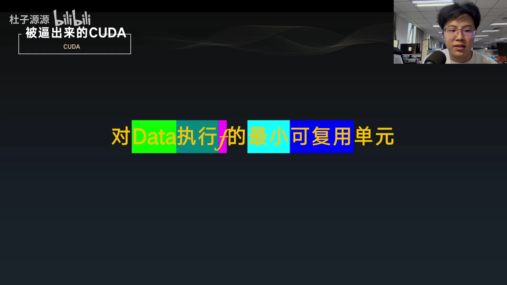 |
| 全连接、激活等各种算子，在深度学习中都会用到。 [【跳转到 01:39】](https://www.bilibili.com/video/BV147dYBLEi4/?t=99) | 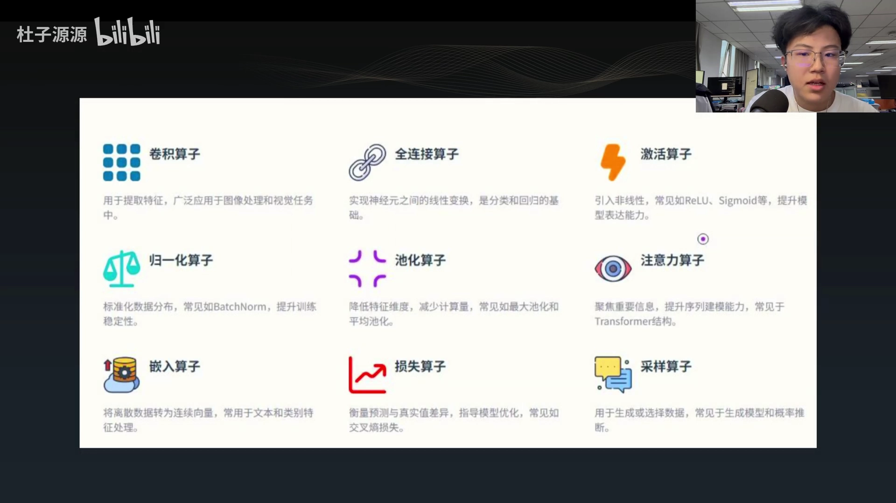 |
| 了解完算子之后，我们来看一看 CUDA 和算子有什么关系，为什么说它是“被逼出来的”。英伟达在创建 CUDA 之前，实际上是一家标准的游戏厂商，主要对图形进行处理。在最初的方案中，分别使用顶点处理器和像素处理器对常见的图形进行处理，一般来说是三角形。右边这个图大家可以看到，左边就是顶点处理的范式， [【跳转到 01:46】](https://www.bilibili.com/video/BV147dYBLEi4/?t=106) | 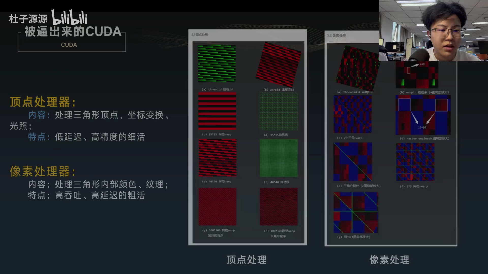 |
| 而右边是像素处理的范式。顶点处理往往处理顶点坐标变换、光照等条件，它是低延迟、高精度的细活；而像素处理器呢，它更多处理颜色、纹理，更偏向高吞吐、高延迟。我们可以想一下，这个架构有什么问题吗？ [【跳转到 02:11】](https://www.bilibili.com/video/BV147dYBLEi4/?t=131) | 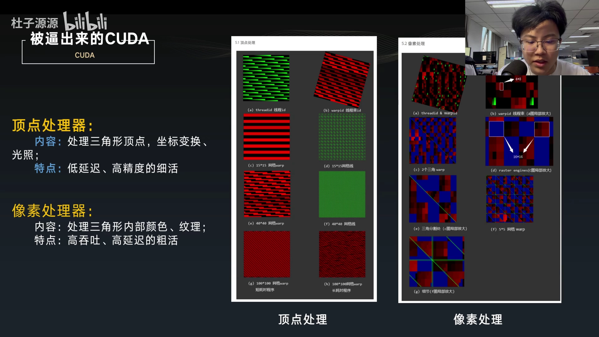 |
| 对于顶点处理器和像素处理器，哪一种被使用的频率更高呢？我感觉是像素处理器吧。我们来看一下它的一些问题。 [【跳转到 02:33】](https://www.bilibili.com/video/BV147dYBLEi4/?t=153) | 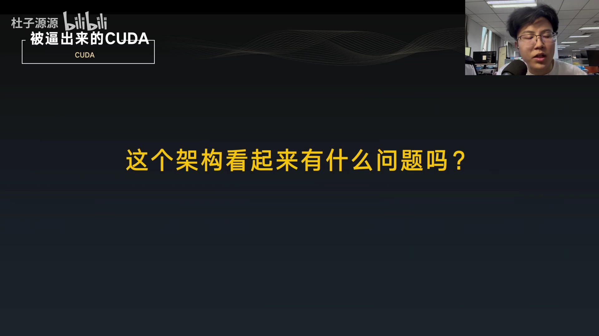 |
| 很明显，这种处理方式有三个严重的缺点。第一个是负载失衡：在顶点处理器和像素处理器中，它的比例是固定的，但在游戏里遇到不同的场景，三角形面积会不同，可能顶点处理器只需要处理几个点，而像素处理器却要算非常非常多。第二个是重复造轮子：两种处理器做的功能越来越像，例如浮点运算、可编程、支持分支循环。 [【跳转到 02:46】](https://www.bilibili.com/video/BV147dYBLEi4/?t=166) |  |
| 但英伟达却要养着两组团队做两套硬件，并且维护两组可编程的方案。第三个是算力浪费：GPU 的算力实际上已经是当时 CPU 算力的数倍，但它却只能用来打游戏，没办法做通用编程。我们可以看到英伟达的 8800 系列， [【跳转到 03:11】](https://www.bilibili.com/video/BV147dYBLEi4/?t=191) | 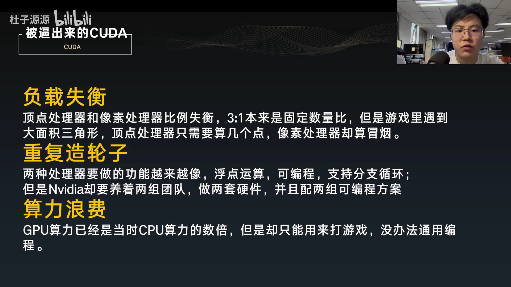 |
| 它提出了这个架构，叫 Tesla 架构。 [【跳转到 03:30】](https://www.bilibili.com/video/BV147dYBLEi4/?t=210) | 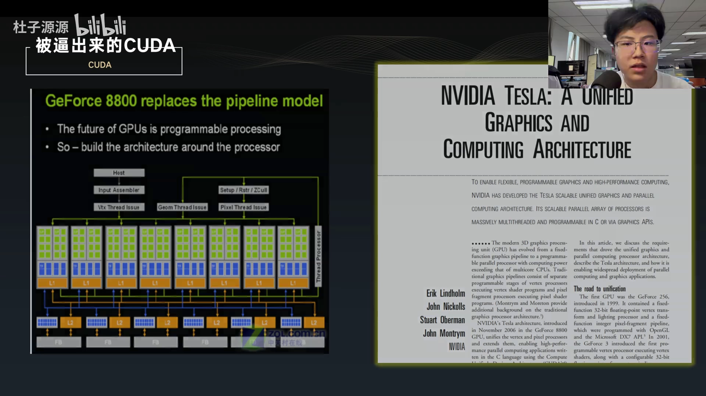 |
| 右边是它的一篇论文。我们可以看到，英伟达端出了它的 Tesla 架构和 CUDA 的编程范式，左边其实是它的第一套硬件架构。 [【跳转到 03:35】](https://www.bilibili.com/video/BV147dYBLEi4/?t=215) | 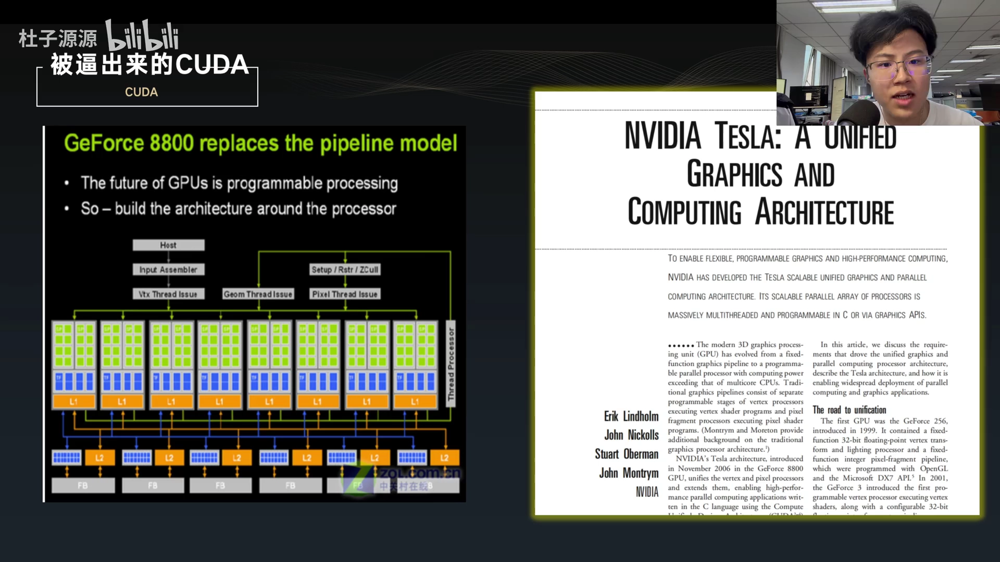 |
| 在 Tesla 统一了像素处理器和顶点处理器之后，它们统一被称为一个 TPC，也叫处理器集群。我们来看一下，它主要分为三个模块，分别是前端、算力池和后端。GPU 把算力分为了 CPU 端和 GPU 端，前端负责传输数据、分发工作，也就是做启动类、准备类的工作。 [【跳转到 03:48】](https://www.bilibili.com/video/BV147dYBLEi4/?t=228) | 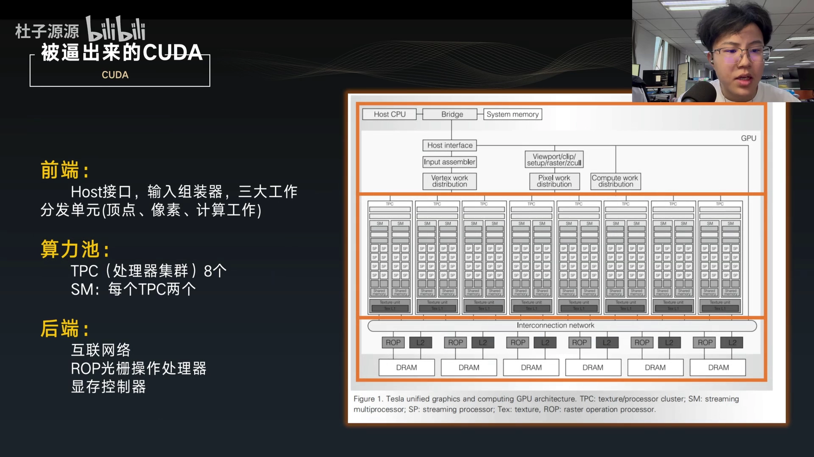 |
| 那么算力池负责处理数据。例如一台机器当时有八个 TPC，那么一个 TPC 有两个 SM，一个 SM 有八个 SP，这些都是它的计算层级，越往下计算层级就越精细。SP 主要用来做单指令的浮点处理，例如加减乘除这些。在后端，它主要负责与存储端进行交互， [【跳转到 04:13】](https://www.bilibili.com/video/BV147dYBLEi4/?t=253) | 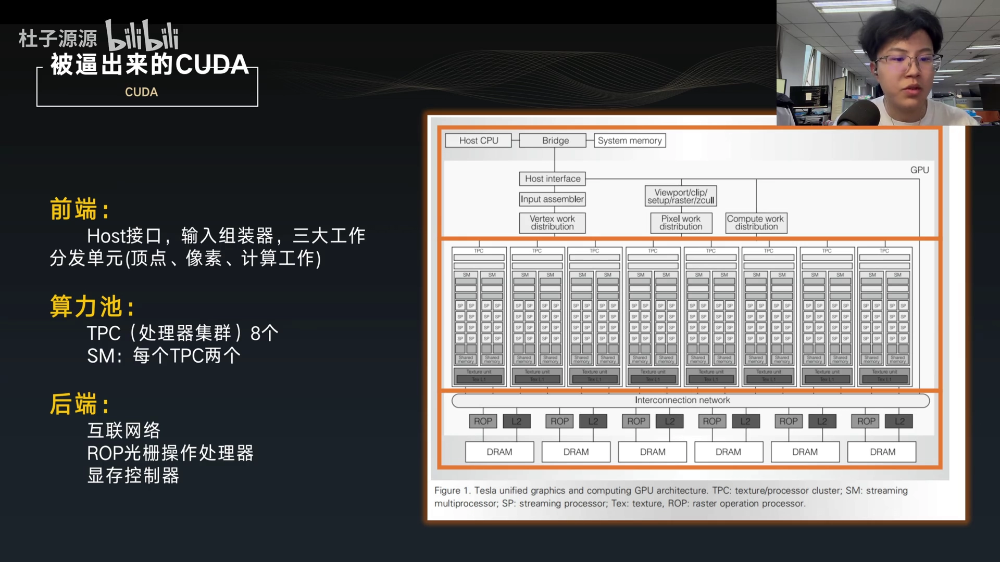 |
| 例如互联网络，包括显存控制。我们继续往下看。 [【跳转到 04:38】](https://www.bilibili.com/video/BV147dYBLEi4/?t=278) | 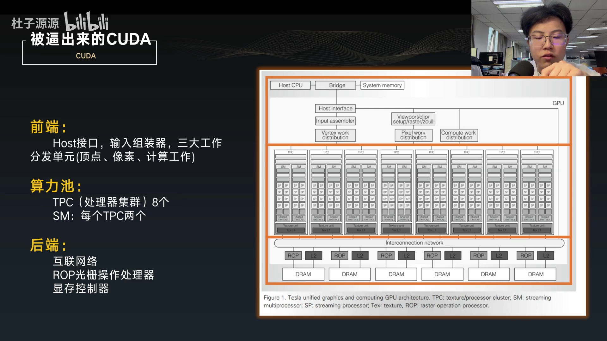 |
| 它把 C 语言的编程范式扩展到了 GPU，因此各种大规模的并行计算都可以放到 GPU 上去进行。每一个 TPC 都有明确的层级关系，可以看到它有控制器以及 SMC，SMC 里边有 SM、SP，包括 SFU。SP 是我们刚刚讲过做单精度向量的，那么 SFU 就是用来做一些特殊函数的， [【跳转到 04:45】](https://www.bilibili.com/video/BV147dYBLEi4/?t=285) |  |
| 例如非线性的一些函数，另外它还有一个 shared memory 去做一些共享处理。了解了这个最基本的架构之后， [【跳转到 05:10】](https://www.bilibili.com/video/BV147dYBLEi4/?t=310) | 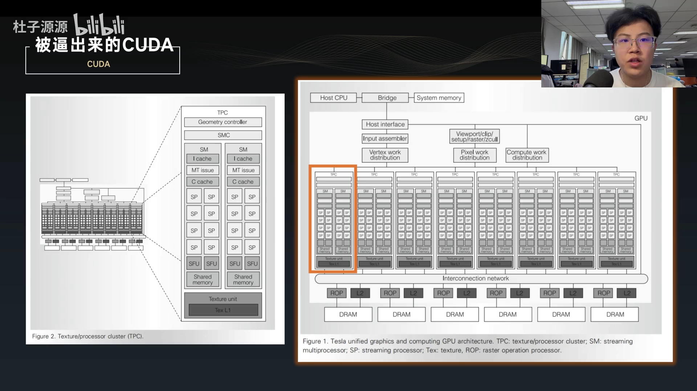 |
| 我们发现英伟达把并行计算这个概念发挥到了极致。CPU 也是有超线程的，但通常它的线程数只有 CPU 核的两倍，也就是十几个线程，并且这个线程严格来说是软线程；但在 GPU，单个 SM 的线程数就有七百多个。CPU 和 GPU 都把 32 个线程打包成一组 warp 来进行计算，可以看到一个 warp 的 32 个线程， [【跳转到 05:17】](https://www.bilibili.com/video/BV147dYBLEi4/?t=317) | 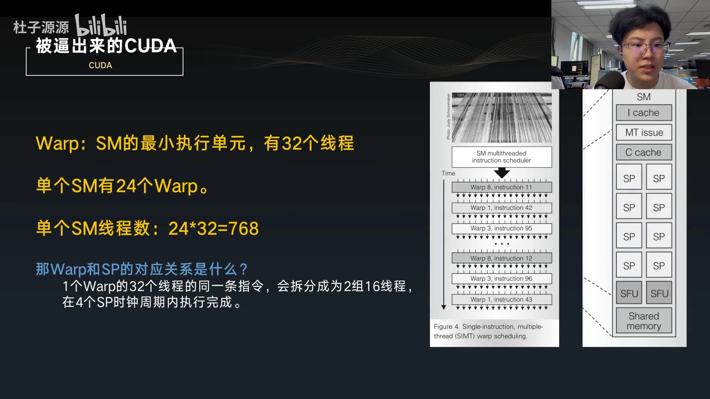 |
| 它都是同一条指令，会被拆分到硬件去执行，在很少的周期之内就可以被执行完成，它的并行数量得到了极大的提升。 [【跳转到 05:42】](https://www.bilibili.com/video/BV147dYBLEi4/?t=342) | 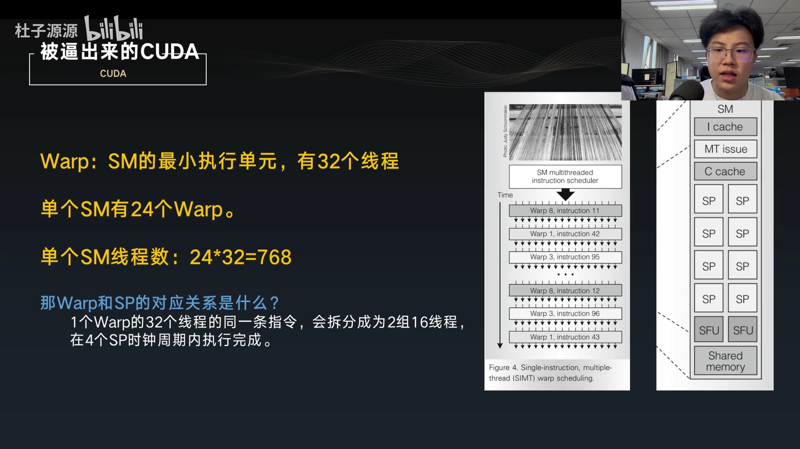 |
| 最早的 CUDA 编程指南其实也就 130 多页，可以看到 CUDA 在每一个对应的硬件架构之后都会加一些特性。我们看右边最新的 13.0 版本的架构已经更新到 600 多页了。乍一看，哇塞，要学的这么多；但其实换个角度想，每一个工具最初被创造出来，都是为了降低我们的学习成本，而不是增加学习成本。 [【跳转到 05:55】](https://www.bilibili.com/video/BV147dYBLEi4/?t=355) | 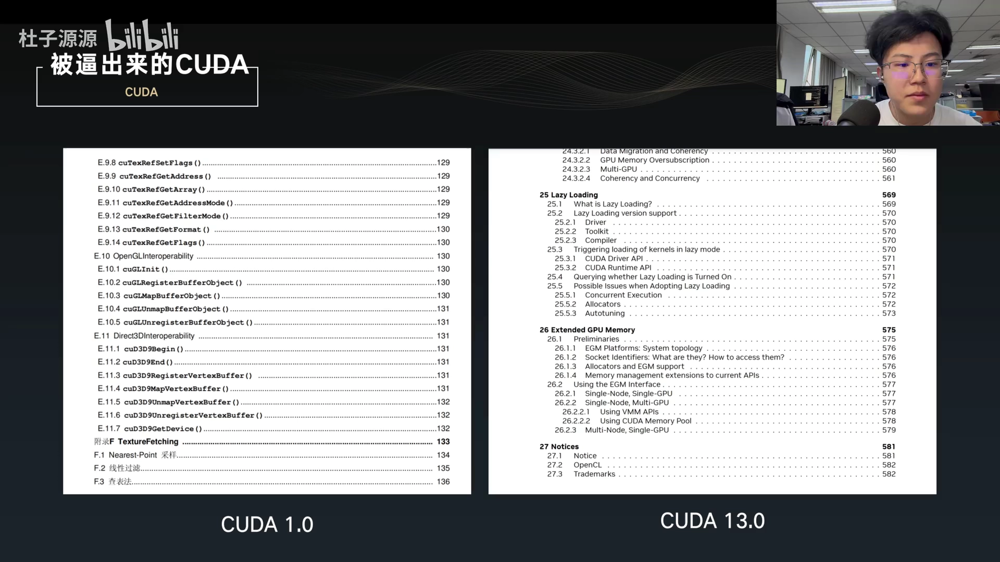 |
| 所以我们一定要把握住它的核心，只学核心即可，其他的参考一下、了解一下即可。 [【跳转到 06:20】](https://www.bilibili.com/video/BV147dYBLEi4/?t=380) | 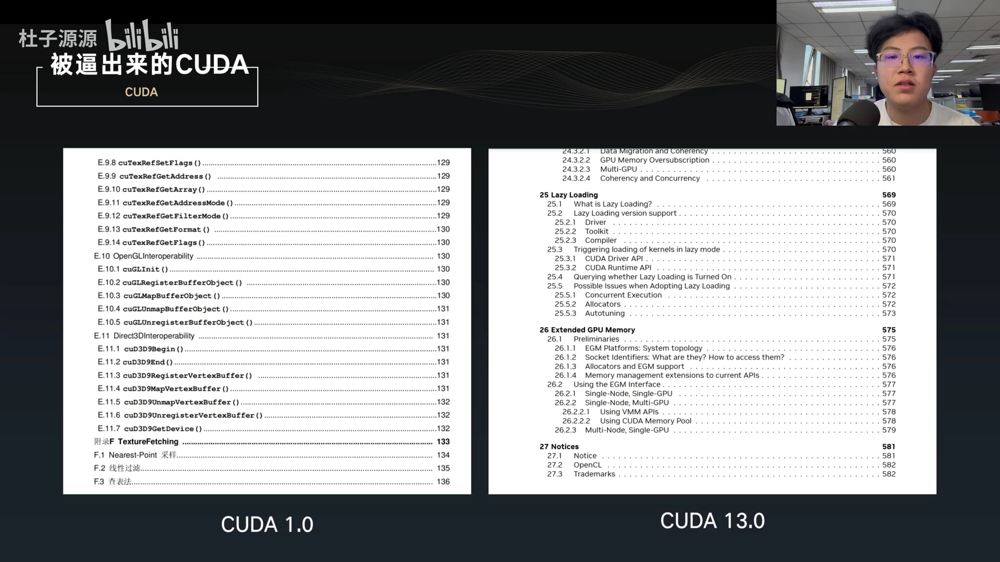 |
| 再来看一下当时 GPU 的算力吞吐，可以看到差距非常大，在 2006 年的时候它是 CPU 的十几倍。 [【跳转到 06:28】](https://www.bilibili.com/video/BV147dYBLEi4/?t=388) | 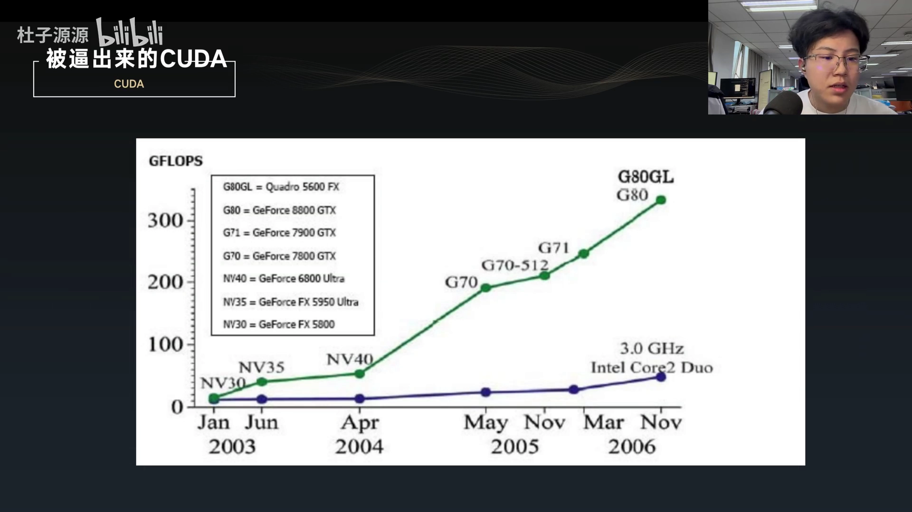 |
| 很明显，CPU 更适合做一些控制类的任务，可以看到它的控制单元非常多，算控制。 [【跳转到 06:37】](https://www.bilibili.com/video/BV147dYBLEi4/?t=397) | 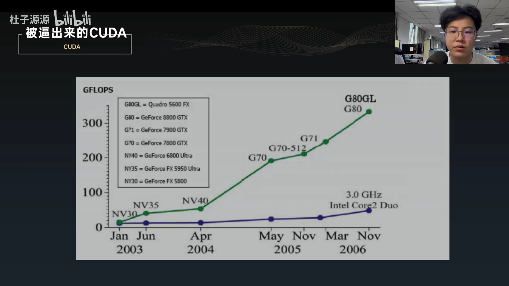 |
| 而 GPU 更适合做一些并行计算的任务。关于并行计算的层级，常见的并行计算例如 SIMD，包括什么叫数据并行、什么叫模型并行，包括这些并行的范式，在我的博客里有写，大家可以自行去阅读一下。 [【跳转到 06:42】](https://www.bilibili.com/video/BV147dYBLEi4/?t=402) | 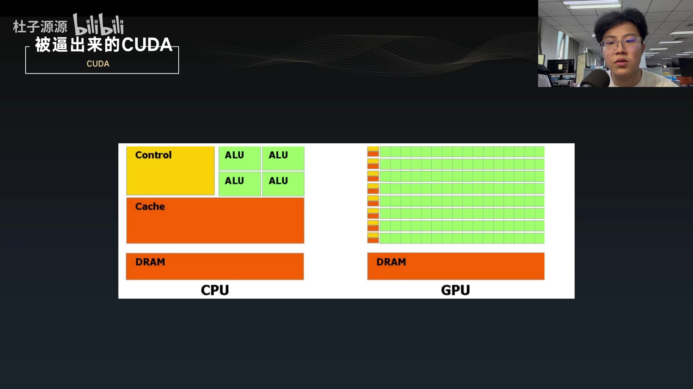 |
| CUDA 核心设计在我看来有以下三个点。首先就是异构：它把 CPU 作为 host 端，负责分配数据、拷贝以及启动核函数等准备工作，而 GPU 做主要的并行计算。第二个，它提出了核函数作为并行的入口，核心就是写单线程视角的代码，来并发地让所有线程去执行。例如我要算一个 1+1， [【跳转到 07:01】](https://www.bilibili.com/video/BV147dYBLEi4/?t=421) |  |
| 在单线程看来，它只做了这一个操作，但可能有几百万个线程在同时做这个 1+1 操作，这就把速度提升了起来。最后一个是它提供了并行抽象：grid、block 和 thread。那么 grid 是跑在整个 GPU 上，block 是跑在 SM 上，thread 是跑在 SP 上，它的架构和硬件是相对应的。 [【跳转到 07:26】](https://www.bilibili.com/video/BV147dYBLEi4/?t=446) | 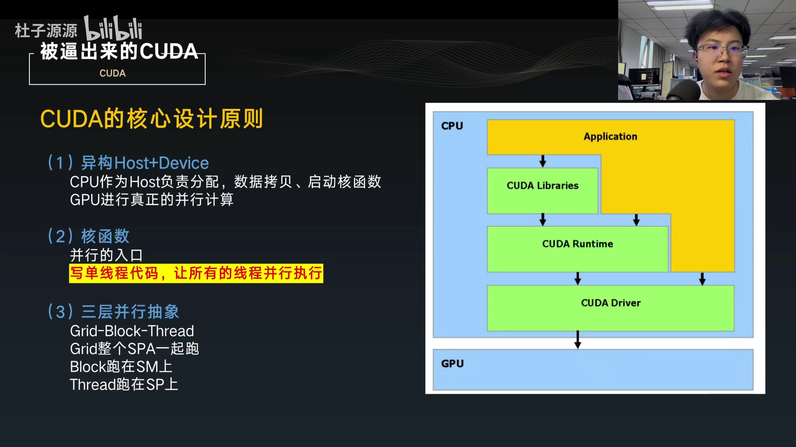 |
| 再往下看，就是它的 CUDA 编程范式以及 CUDA 内存层级。 [【跳转到 07:51】](https://www.bilibili.com/video/BV147dYBLEi4/?t=471) |  |
| 左侧是它的 CUDA 编程范式，关于进一步如何使用这些 thread、block、grid，它们都是什么，以及如何计算线程 ID，我的博客也有具体写到，大家也可以自行阅读，有任何疑问欢迎在评论区或者给我私信留言。右侧是关于 CUDA 的存储层级管理，不同层级单元的读写差异非常大， [【跳转到 07:56】](https://www.bilibili.com/video/BV147dYBLEi4/?t=476) | 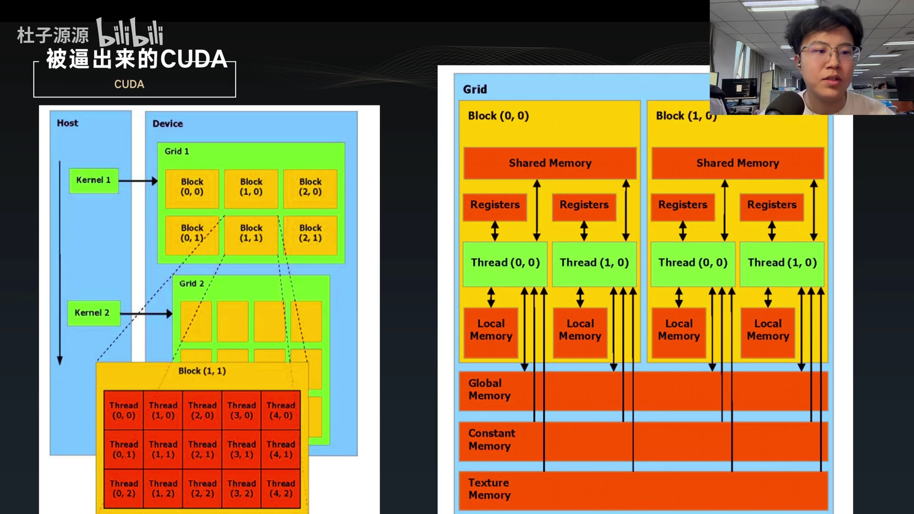 |
| 这也是我们写算子要优化的核心。关于 GPU 存储管理的部分我也会放在博客。我们今天其实还是大概、粗略地去了解一下它的设计哲学即可。 [【跳转到 08:21】](https://www.bilibili.com/video/BV147dYBLEi4/?t=501) | 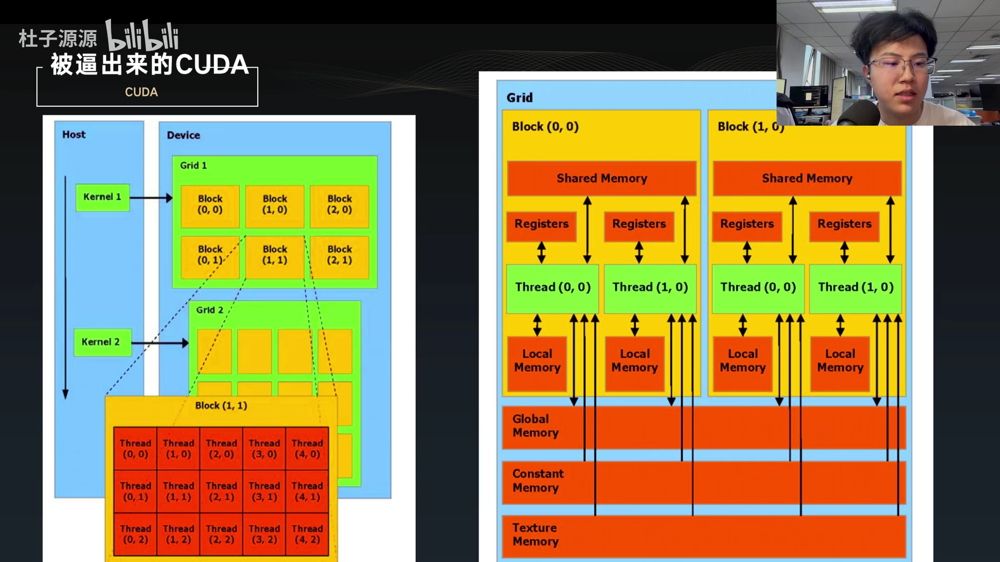 |
| 那有一个问题：我们应该如何写出性能更好的算子呢？首先第一个就是对它进行访存优化。 [【跳转到 08:32】](https://www.bilibili.com/video/BV147dYBLEi4/?t=512) | 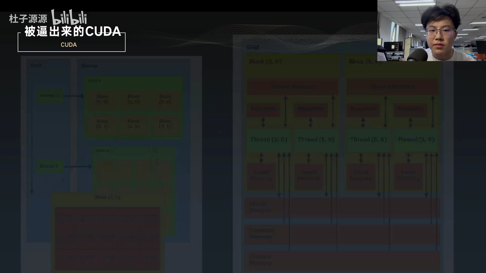 |
| 你访问内存的次数越多，它的读写开销就越大，而计算本身的时间就被严重压缩掉，大量时间都花在读写上。所以要合并访问与对齐，利用层级内存来减少全局访问，包括防止它的冲突和访问串行化。第二个就是我们要尽量把计算资源吃满、占满， [【跳转到 08:38】](https://www.bilibili.com/video/BV147dYBLEi4/?t=518) | 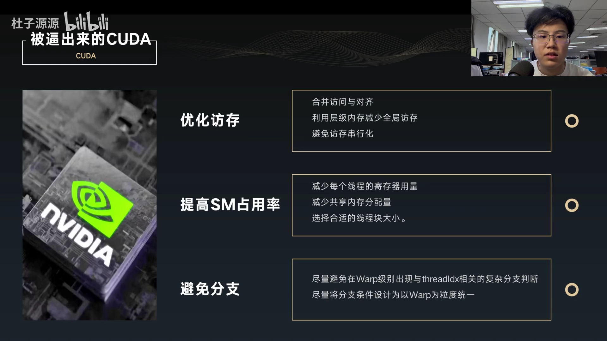 |
| 那么要合理设计我们的这些参数，例如线程块的大小等等。最后一个就是避免分支：每一个 thread 可以计算相同的东西，如果我们需要 if-else，次数特别多也会造成停顿，所以在这个 warp 级别尽量让它设计成一个统一的计算，这才是比较优秀的算子。 [【跳转到 09:03】](https://www.bilibili.com/video/BV147dYBLEi4/?t=543) | 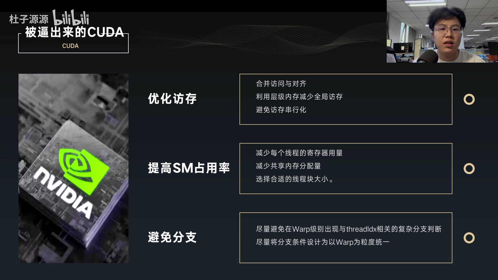 |
| 我们来看第二个：站在巨人肩膀上的 PyTorch。PyTorch 实际上是有两个“爹”的。 [【跳转到 09:25】](https://www.bilibili.com/video/BV147dYBLEi4/?t=565) | 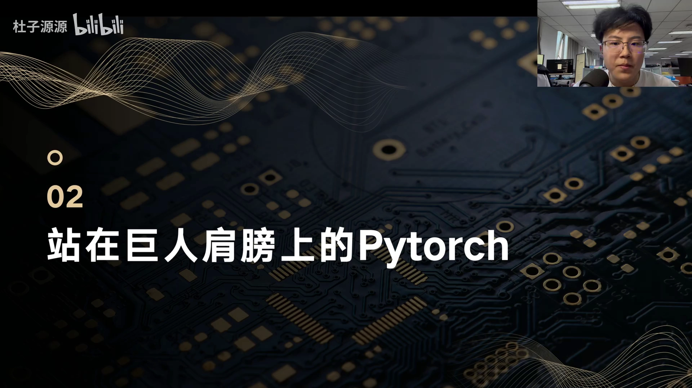 |
| 亲爹是 Torch，那么继父是 Chainer。Torch 是 Facebook，也就是现在 Meta 主持开发的，它已经比较早了；而 Chainer 其实是一家日本公司开发的，知名度相对没这么大，而 PyTorch 很多著名的特性反而是 Chainer 提出来的。首先我们来看一下最开始的 Torch。 [【跳转到 09:30】](https://www.bilibili.com/video/BV147dYBLEi4/?t=570) |  |
| 其实并不是那么好用，Torch 的前端语言是 Lua 语言。 [【跳转到 09:51】](https://www.bilibili.com/video/BV147dYBLEi4/?t=591) | 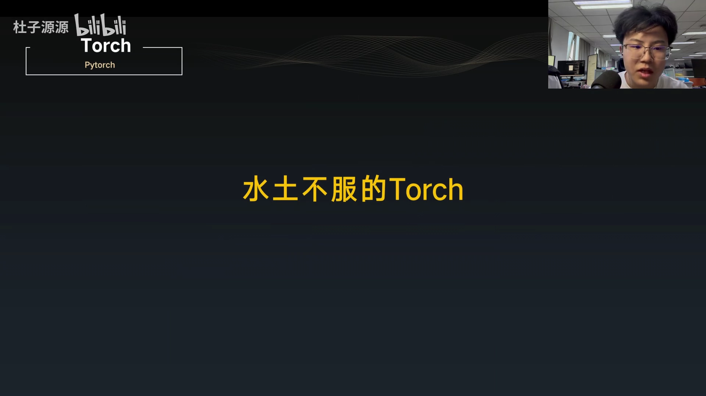 |
| 那么这个时候大家都在问，或者弹幕都在问：Lua 是什么、能干什么？对呀，这其实就是 Torch 较为失败的原因，Torch 最大的阻碍就是它的编程本身。而 Facebook 内部的另一个项目 Caffe，在当时被更多人广泛使用，因为它性能非常好，并且能够实现生产、工业级别的代码。 [【跳转到 09:56】](https://www.bilibili.com/video/BV147dYBLEi4/?t=596) | 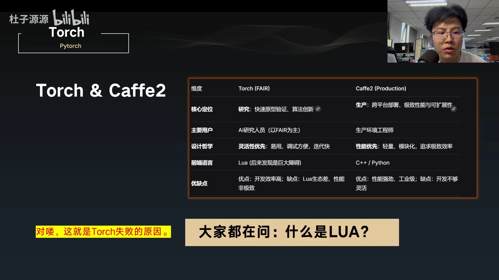 |
| 而另一个 Chainer，实际上才是最早实现了 PyTorch 特性的一家厂商或者说一个公司。我们来看一下这个算子。 [【跳转到 10:20】](https://www.bilibili.com/video/BV147dYBLEi4/?t=620) | 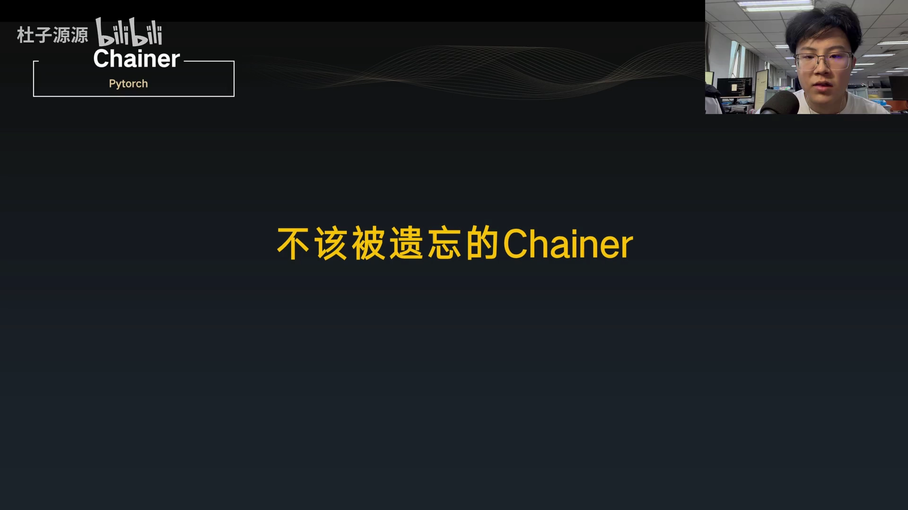 |
| 首先 X 和 W 进行矩阵运算之后，再加上偏置向量 B，然后再对它来做一个 MSE，也就是均方误差。这种计算方式在现在的深度学习中非常常见。那如果我们要前向传播， [【跳转到 10:29】](https://www.bilibili.com/video/BV147dYBLEi4/?t=629) |  |
| 我们直接前向进行计算就可以；而如果反向传播的时候，我们也会把这个算子的导数信息传回去。 [【跳转到 10:46】](https://www.bilibili.com/video/BV147dYBLEi4/?t=646) | 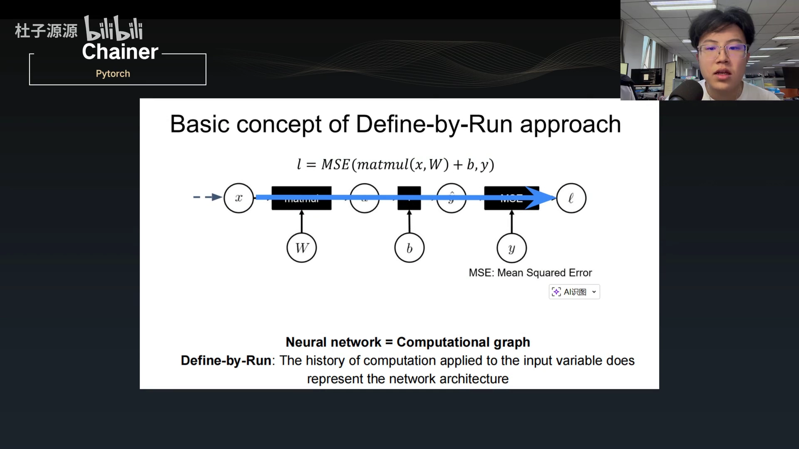 |
| 但是，如果现在面临分支那该怎么办呢？我们要同时把两个算子都记录下来吗？ [【跳转到 10:58】](https://www.bilibili.com/video/BV147dYBLEi4/?t=658) | 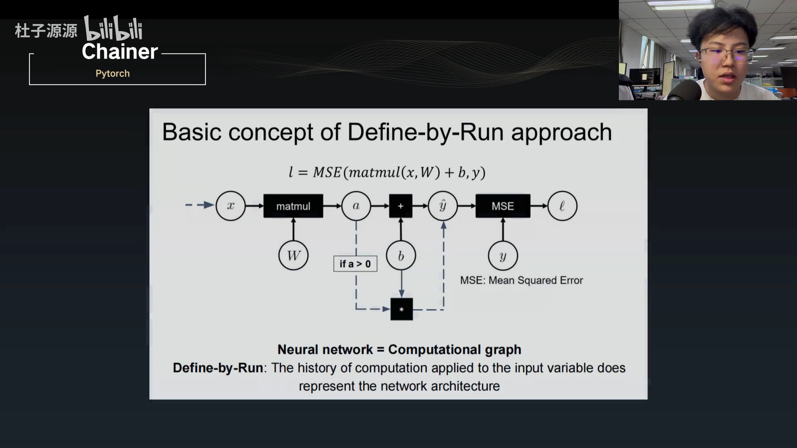 |
| 那这个时候就能体现它动态图的优势：如果现在 if 大于零，它要走下面那条线，那么原本的那个加号就被忽略掉，假装什么都没有。 [【跳转到 11:03】](https://www.bilibili.com/video/BV147dYBLEi4/?t=663) | 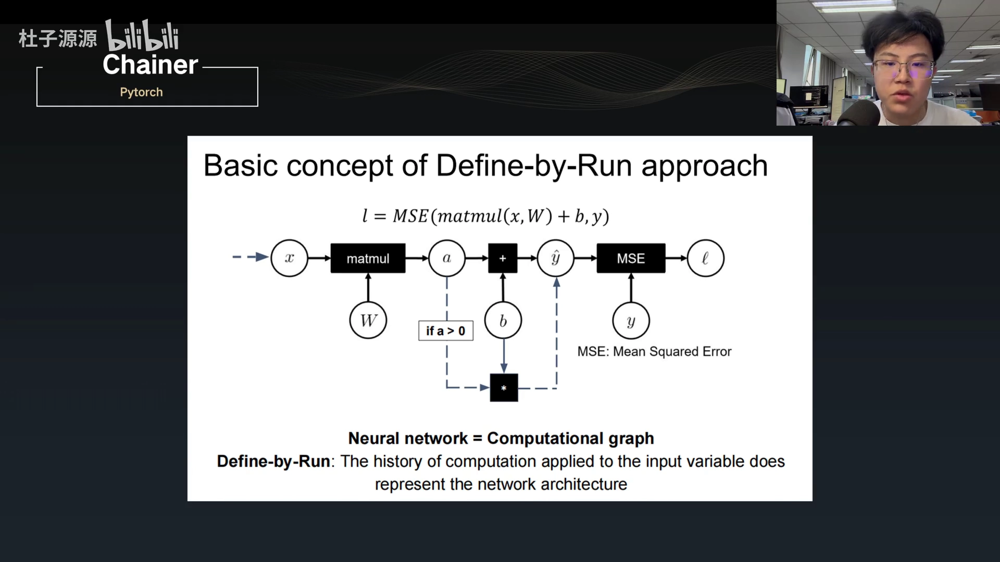 |
| 而在反向传播的时候，依旧沿着原来的路径去进行迭代，这就体现出来了。 [【跳转到 11:16】](https://www.bilibili.com/video/BV147dYBLEi4/?t=676) | 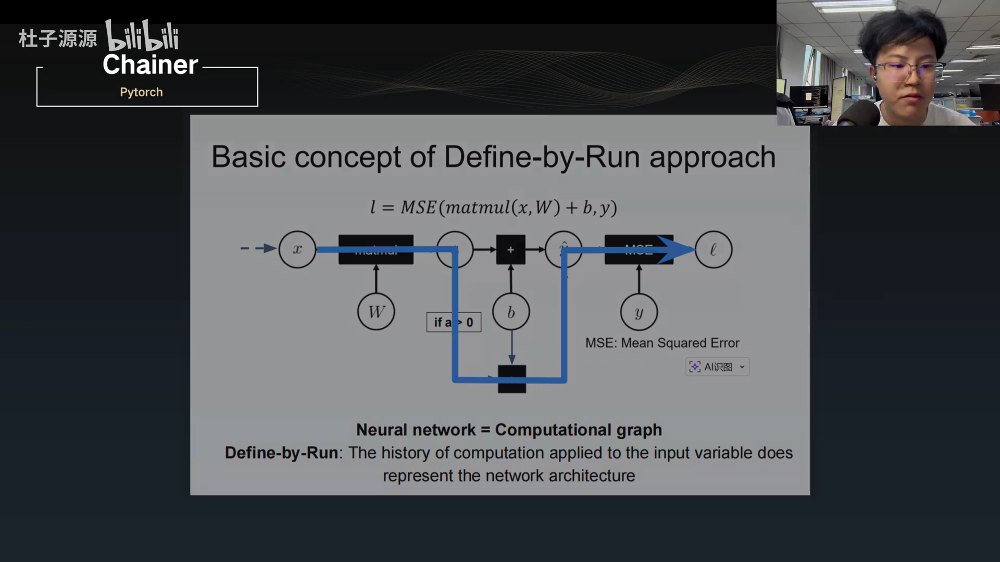 |
| define-and-run 以及 define-by-run 的区别：一个是先定义后计算，也就是静态图；一个是在计算的过程中定义，即动态图。相比较 TensorFlow、Caffe、Torch 来说，Chainer 的编程逻辑是更加合理的，并且它也可以做到很好的 debug，这个对于我们编程开发者来说是非常重要的。 [【跳转到 11:21】](https://www.bilibili.com/video/BV147dYBLEi4/?t=681) |  |
| 我们来看一下 Chainer 的使用方式，是不是感觉特别熟悉？ [【跳转到 11:43】](https://www.bilibili.com/video/BV147dYBLEi4/?t=703) | 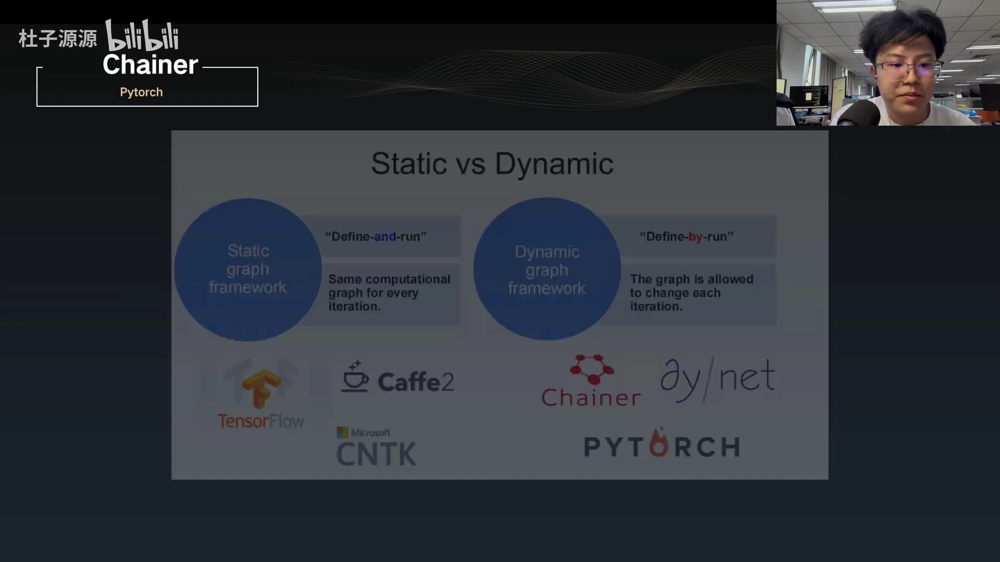 |
| init，然后 call，以及卷积、全连接，这不就是 PyTorch 的继父吗？ [【跳转到 11:48】](https://www.bilibili.com/video/BV147dYBLEi4/?t=708) | 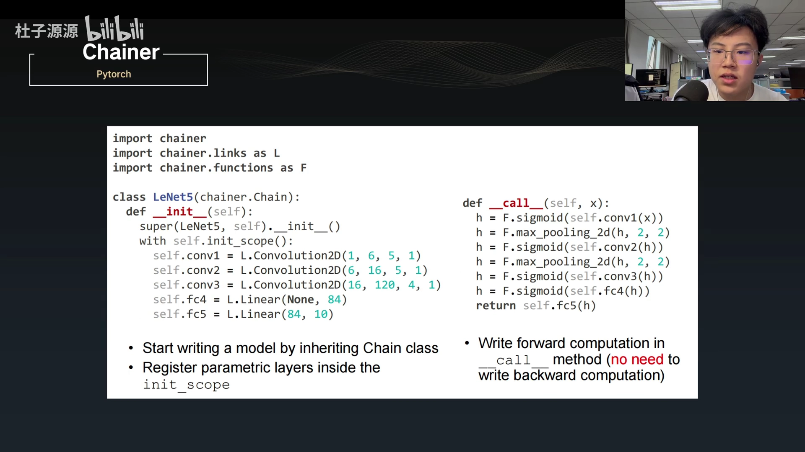 |
| 除了 Chainer 之外，它实际上在底层还实现了和 NumPy 类似的 CuPy。CuPy 的核心优势就是：几乎在和 NumPy 接口一致的前提下，把整个计算从 CPU 搬移到了 GPU 上。 [【跳转到 11:57】](https://www.bilibili.com/video/BV147dYBLEi4/?t=717) | 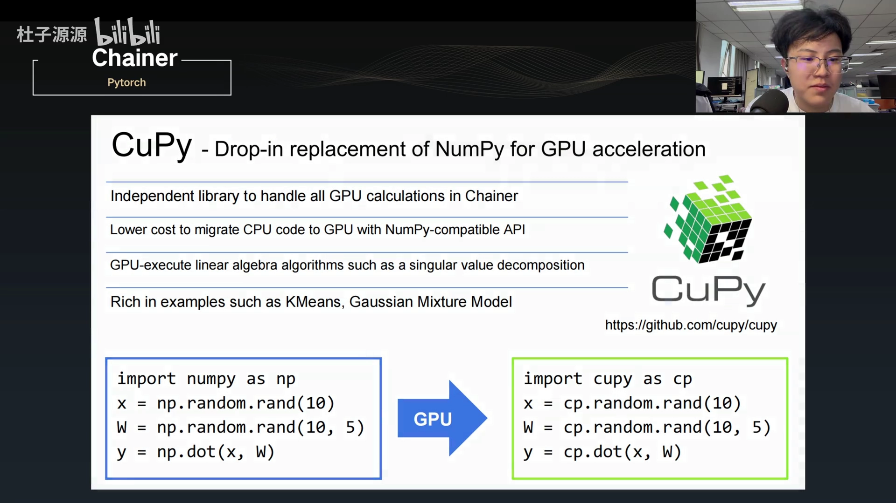 |
| 这就是 CuPy 的整个架构，我们可以看一下。 [【跳转到 12:11】](https://www.bilibili.com/video/BV147dYBLEi4/?t=731) | 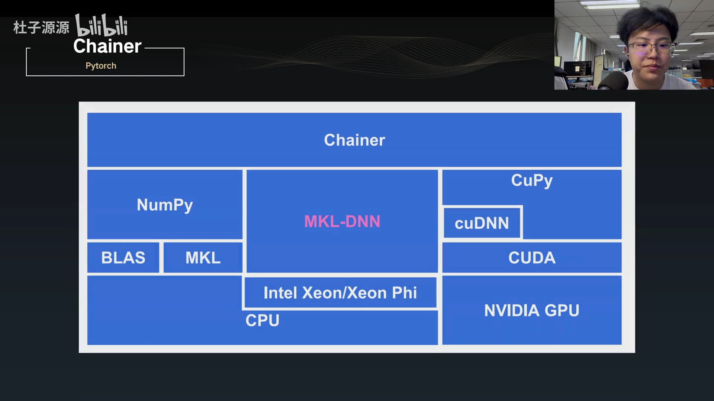 |
| 不过 PyTorch 说“要有光”，于是市面上层出不穷地出现了 PyTorch 教程， [【跳转到 12:16】](https://www.bilibili.com/video/BV147dYBLEi4/?t=736) | 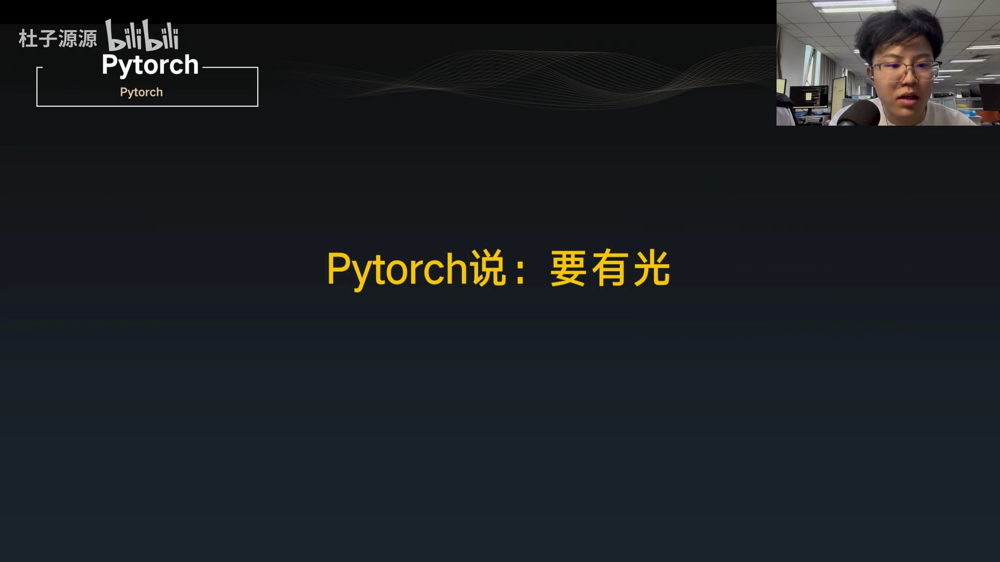 |
| 就出现了各种从 0 到 1 入门的教程之类的。在我看来， [【跳转到 12:21】](https://www.bilibili.com/video/BV147dYBLEi4/?t=741) |  |
| Torch、PyTorch 的核心其实还是 Torch，也就是与它负责张量相关的部分，包括定义、存储、读取、自动微分、优化算子等等。张量本身是 Torch 最重要的特性。那我们来看一下 PyTorch， [【跳转到 12:28】](https://www.bilibili.com/video/BV147dYBLEi4/?t=748) | 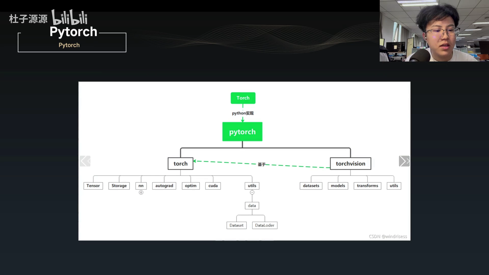 |
| 本来就是要对张量进行各种操作。例如左边就是一个经典的 VGG 网络，我们创建一个神经网络模型，那就是对一系列的矩阵不断地操作迭代，最终得到一个输出向量。 [【跳转到 12:43】](https://www.bilibili.com/video/BV147dYBLEi4/?t=763) | 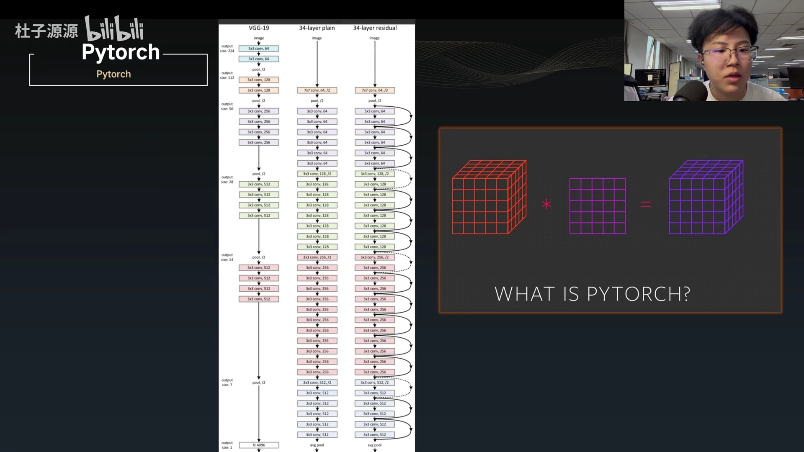 |
| 这个图可以看到，PyTorch 其实很好地覆盖了 Caffe2 以及 Torch 的绝大部分功能。 [【跳转到 12:58】](https://www.bilibili.com/video/BV147dYBLEi4/?t=778) | 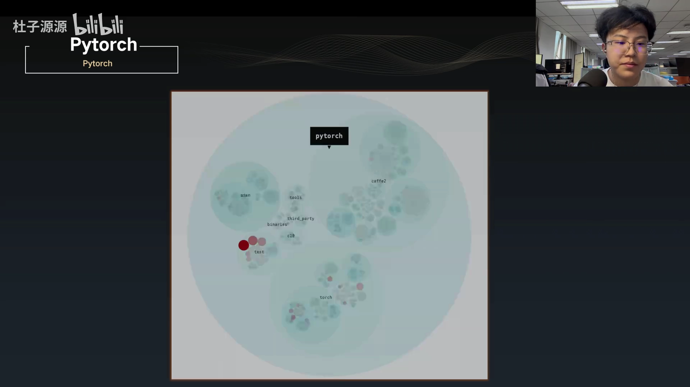 |
| 那么这一张图展现了 PyTorch 的生态，实际上它五六年前甚至更早的时候， [【跳转到 13:03】](https://www.bilibili.com/video/BV147dYBLEi4/?t=783) | 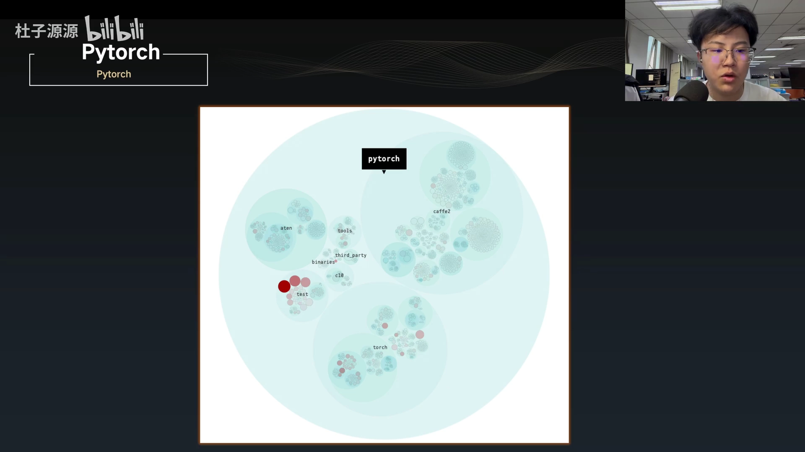 |
| 就已经比较火了。如果现在还没有了解的同学，赶快抓紧时间去了解一下 PyTorch。 [【跳转到 13:08】](https://www.bilibili.com/video/BV147dYBLEi4/?t=788) | 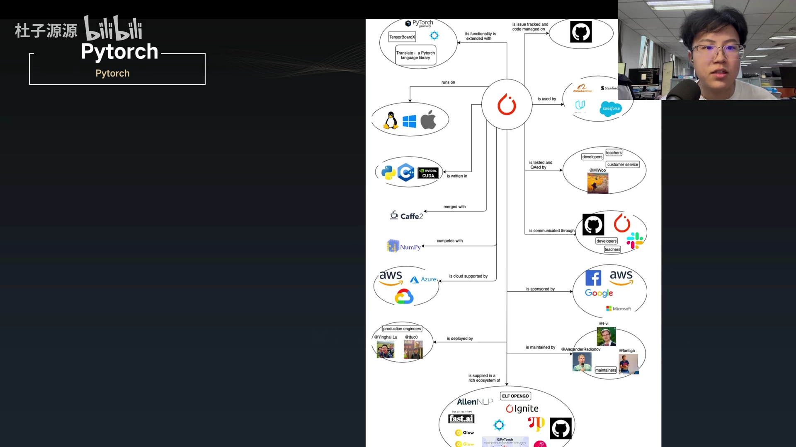 |
| 还是这句话，PyTorch 的设计哲学是什么？在我看来， [【跳转到 13:16】](https://www.bilibili.com/video/BV147dYBLEi4/?t=796) |  |
| 动态图、自动微分、扩展性以及易用性是它最核心的特性。我们在学习 PyTorch 的时候要把握住核心：对张量进行运算。有了这个点之后，其他一些操作我们自然而然就很好理解。 [【跳转到 13:21】](https://www.bilibili.com/video/BV147dYBLEi4/?t=801) | 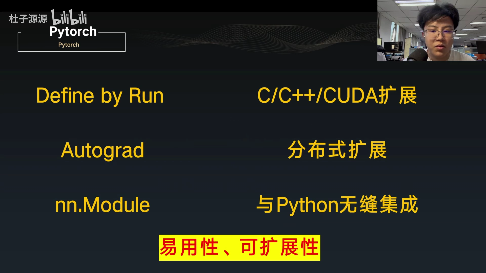 |
| 最后我们来看一下自动挡的 Triton。这篇是 19 年的文章。 [【跳转到 13:37】](https://www.bilibili.com/video/BV147dYBLEi4/?t=817) | 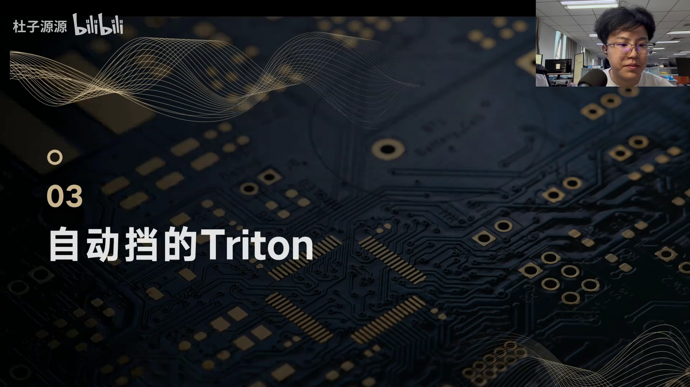 |
| 它提出了 Triton 的核心机制。Triton 要处理的元素在我看来其实也是张量，只不过它把这个概念下放到了 GPU 这一层级。 [【跳转到 13:42】](https://www.bilibili.com/video/BV147dYBLEi4/?t=822) | 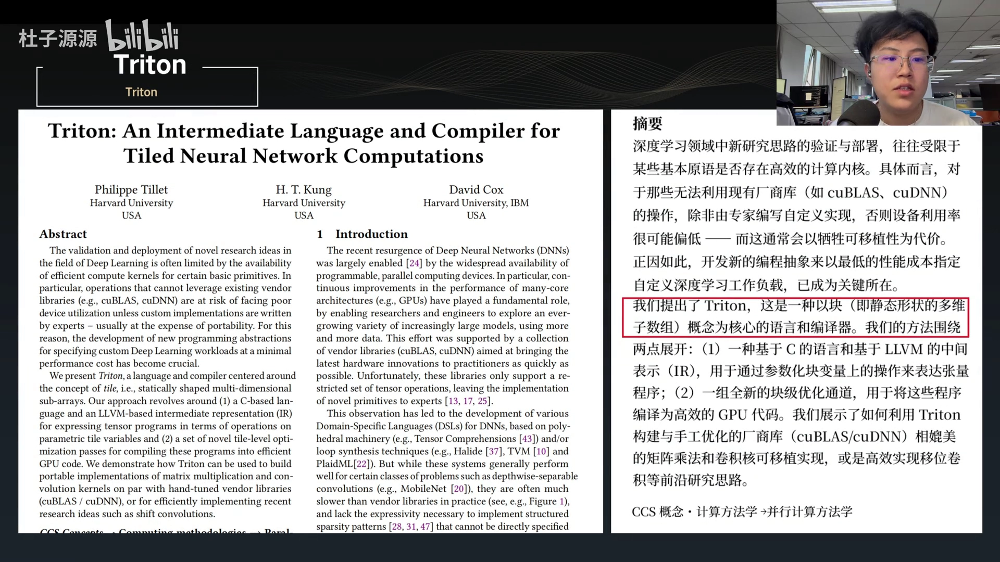 |
| 这张图是我们未来在学习算子开发的时候要经常见到的 Roofline（屋顶线模型）。黑色的线代表了一个硬件的计算上限，可以看到横坐标是计算强度，单位是 TFLOP/s 比上 GB，那么纵坐标是它的 performance，也就是 TFLOP/s，代表它每秒能计算的速度。可以看到有 cuBLAS、TensorRT、AutoTVM， [【跳转到 13:53】](https://www.bilibili.com/video/BV147dYBLEi4/?t=833) |  |
| 包括 TensorComprehensions、XLA、MLIR 等。那在计算强度比较弱的时候，可以看到 Triton 的性能是接近这个 Roofline 上限的；那么随着它计算强度增大，可以看到它和 cuBLAS 的性能几乎是相同的，可以看到它的优化性是非常好的。而之前提到的这些 TVM 可能扩展性更好用， [【跳转到 14:18】](https://www.bilibili.com/video/BV147dYBLEi4/?t=858) |  |
| 但是它的性能却稍微差一些。它是在做一个矩阵的转置，然后加上一个运算，在 GTX 1070 上去进行计算的。 [【跳转到 14:43】](https://www.bilibili.com/video/BV147dYBLEi4/?t=883) | 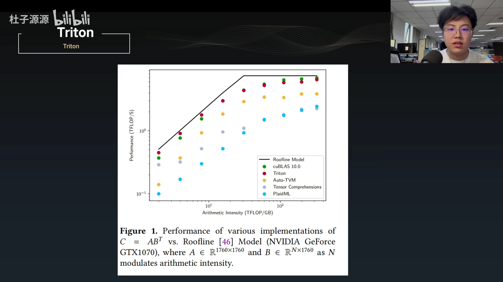 |
| 那么 Triton 是要解决什么问题呢？实际上在当时那个年代， [【跳转到 14:57】](https://www.bilibili.com/video/BV147dYBLEi4/?t=897) | 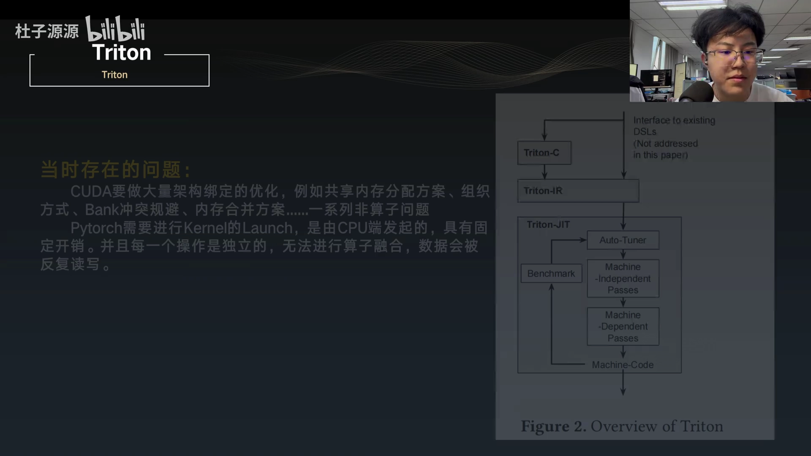 |
| 如果你要写出一个高性能的算子，要么你就写 CUDA，要么你就优化 PyTorch。那 CUDA 要针对你的硬件架构去做更多的特定性优化，例如共享内存怎么分配、bank 访存怎么组织、如何避免冲突以及内存如何合并，这一系列问题其实都是非算子问题，它强调的优化本身是针对访存这些硬件去进行优化。 [【跳转到 15:02】](https://www.bilibili.com/video/BV147dYBLEi4/?t=902) |  |
| 而 PyTorch 呢，它的性能开销是在一个一个 kernel 的 launch，这个是由 CPU 端发起的，CPU 可想而知和 GPU 距离更远，那么开销更大；并且这些操作都非常独立，没有办法进行算子融合，所以数据会被不断地反复读写，造成非常大的性能开销。 [【跳转到 15:27】](https://www.bilibili.com/video/BV147dYBLEi4/?t=927) | 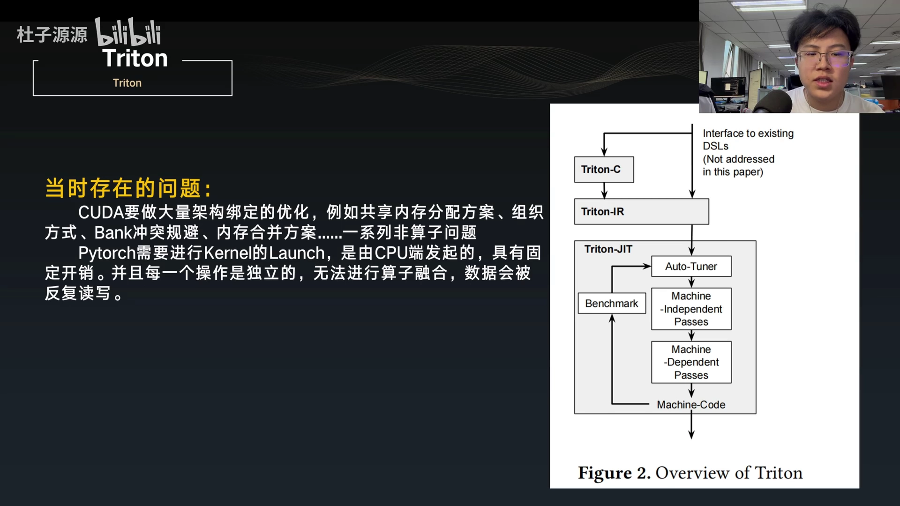 |
| 我们来看一下这个就是 Triton 的一个设计哲学。左侧的话， [【跳转到 15:50】](https://www.bilibili.com/video/BV147dYBLEi4/?t=950) | 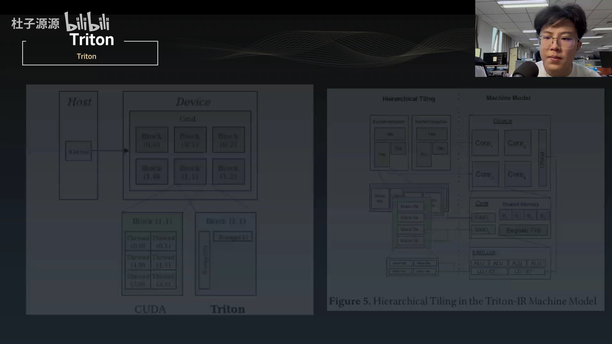 |
| 它把原来的 thread 这一层退化掉了一个。Triton 屏蔽掉了线程的概念，取而代之的是全局的数据范围 range。开发者并不需要接触到同步、共享内存管理这些底层，只需要专注于对 tile 的编程。那么右侧就回答了他这个 tile 是如何映射到硬件上的。 [【跳转到 15:55】](https://www.bilibili.com/video/BV147dYBLEi4/?t=955) |  |
| 那么这些映射工作就交给编译器来完成，我们程序员是不需要关注的。它有对应的层级：例如不同 tile 对应 device 上 SM 间的并行，内部对应 SM 内的并行，那么 nano tile 对应 SM 的 SIMD 指令并行。 [【跳转到 16:20】](https://www.bilibili.com/video/BV147dYBLEi4/?t=980) | 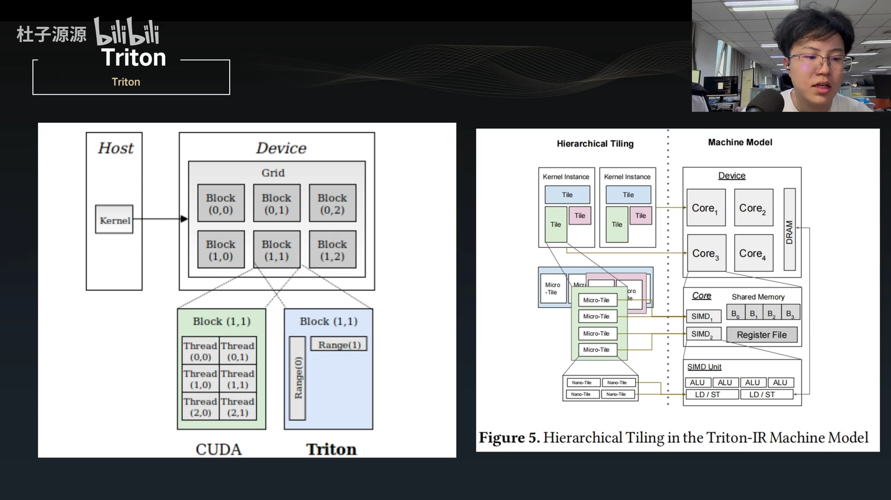 |
| 我们来思考一下它的设计哲学是什么。实际上例如 cuTile、CuTe、CUTLASS、Triton 等各种层出不穷的 tile 编程方案都非常流行，CUDA 官方甚至都提供了一套它有的编程方案，只不过这个似乎是要在 50 系的显卡， [【跳转到 16:38】](https://www.bilibili.com/video/BV147dYBLEi4/?t=998) | 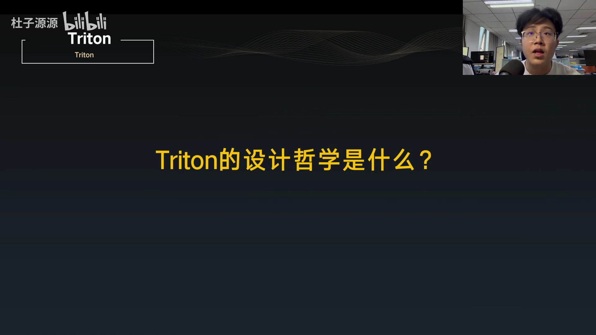 |
| 也就是 5060、5070 这些上支持。而我是只有一张旧显卡，如果有钱了我也会买一张更好的，然后给大家更新 CUDA tile 的教程。我对 Triton 的理解是：它之所以能这样，是因为它更抽象、抽象层级更高，因此就能把一些底层的复杂性抽象掉。 [【跳转到 17:03】](https://www.bilibili.com/video/BV147dYBLEi4/?t=1023) | 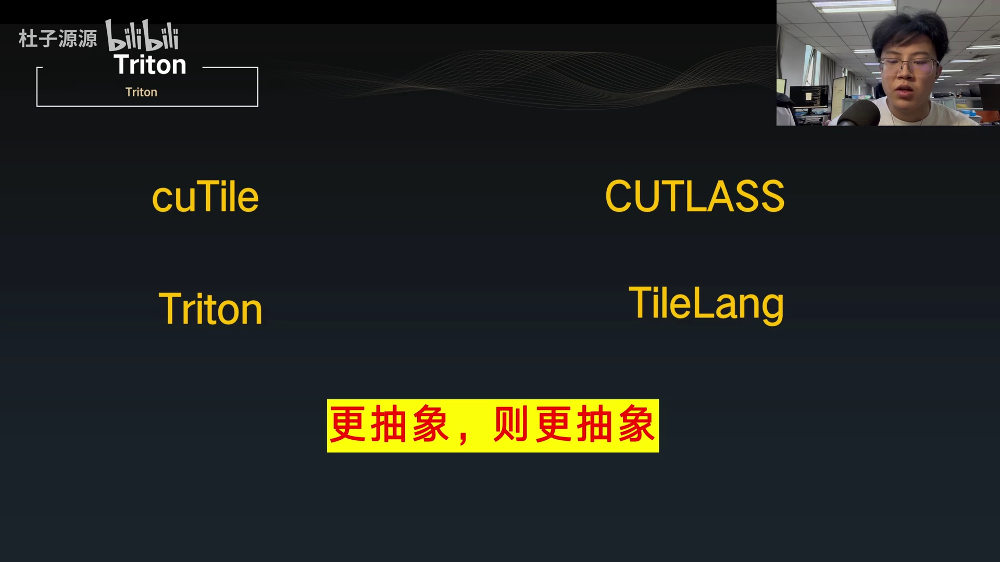 |
| 这个就是我对于 CUDA、Triton 和 PyTorch 的个人理解。那我们今天的内容就分享到这里，希望大家点赞、投币加关注。最后再次感谢一下这三位同学的打赏。 [【跳转到 17:28】](https://www.bilibili.com/video/BV147dYBLEi4/?t=1048) | 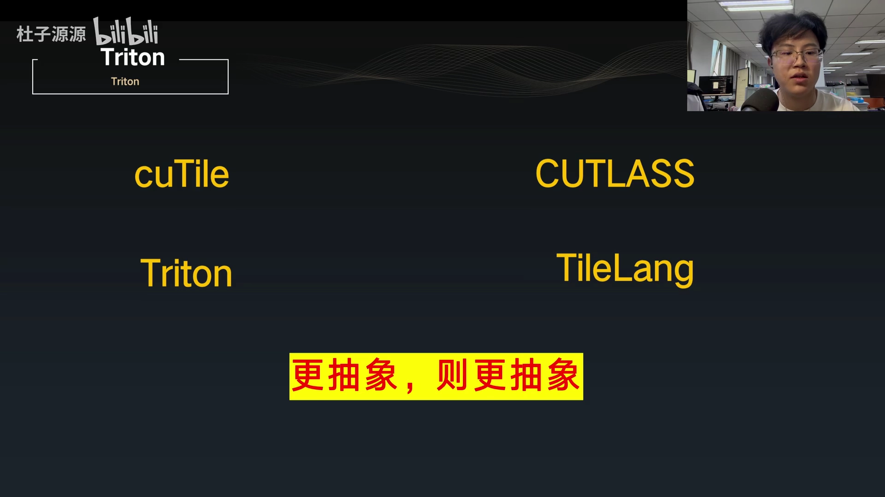 |
| 谢谢大家。 [【跳转到 17:39】](https://www.bilibili.com/video/BV147dYBLEi4/?t=1059) | 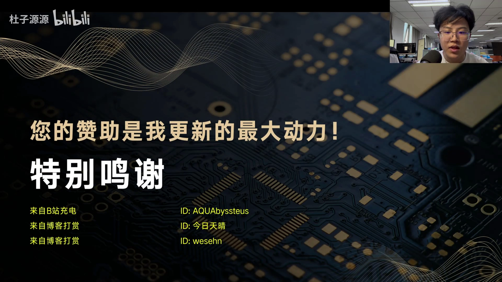 |