# 第05讲_element_wise算子详解 原始文稿（图-字幕分栏）

| 字幕文本 | 画面 |
| :--- | ---: |
| OK，这一节我们来看一下算子开发的第一个核心算子。 [【跳转到 00:00】](https://www.bilibili.com/video/BV1L6oNBSEGc/?t=0) |  |
| element-wise 逐元素算子。那么我们可以先看一下逐元素算子的概念。 [【跳转到 00:10】](https://www.bilibili.com/video/BV1L6oNBSEGc/?t=10) | 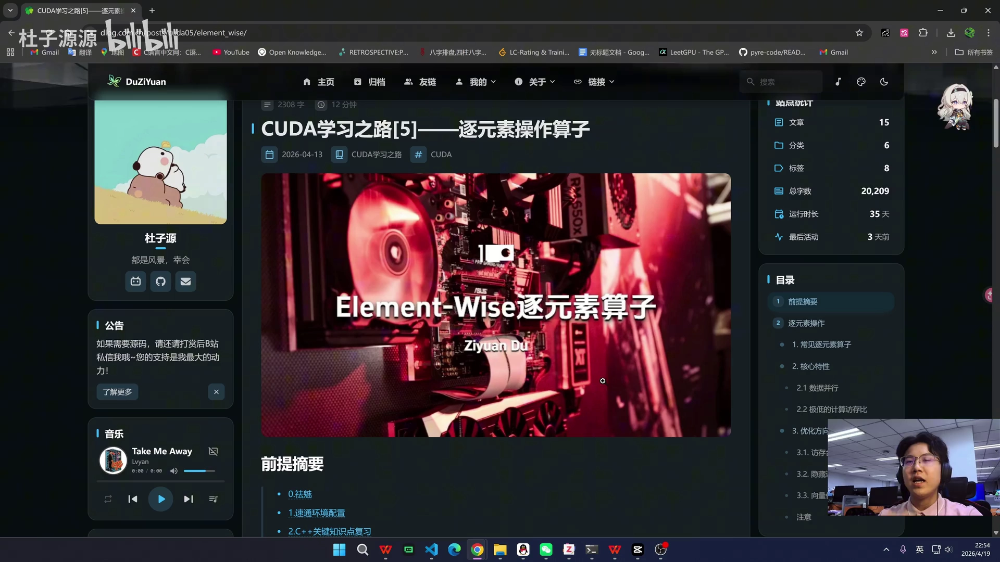 |
| 例如基础算术的加减乘除，还有激活函数 ReLU、Sigmoid，包括一些裁剪、规约，还有这个特殊函数、指数运算，以及 RGB 转灰度图，包括一些 Dropout。那它的核心特性是什么呢？这些算子的核心特性就是：它的输出位置只和输入位置相关，也就是一一对应。 [【跳转到 00:17】](https://www.bilibili.com/video/BV1L6oNBSEGc/?t=17) |  |
| 它可以在原地进行操作，包括两个数值相加，都是各自位置去进行相加。这个计算过程不涉及相邻位置，也没有滑动窗口或者矩阵乘法。也就是说我们在 100 万个元素的张量上去做计算，第 0 个和第 100 万个是没有任何关系的。那么这种没有数据依赖的特性，就意味着它的并行性非常好，也是非常容易优化的一类算子。 [【跳转到 00:42】](https://www.bilibili.com/video/BV1L6oNBSEGc/?t=42) | 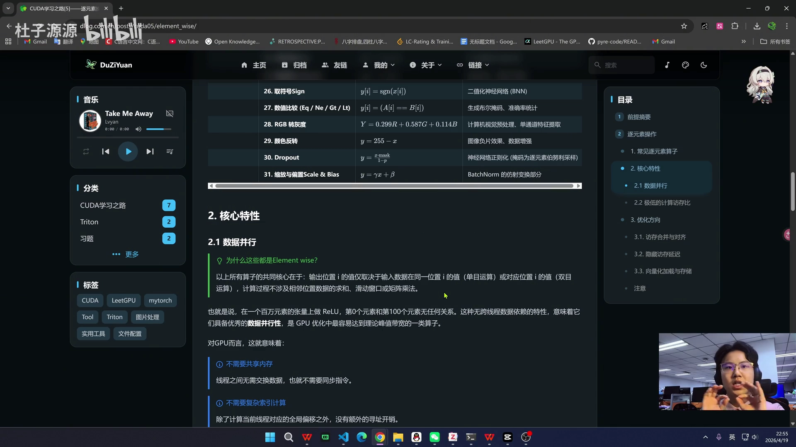 |
| 它很容易就能跑到打满带宽。可以看到，我写到它不需要交换数据，也不需要同步指令，除了计算线程的偏移之外没有额外的寻址开销。但是它的特性就是：访存次数很多，而计算密度却比较小。例如以加法操作为例，它要执行一次加法，却要读一次…… [【跳转到 01:07】](https://www.bilibili.com/video/BV1L6oNBSEGc/?t=67) | 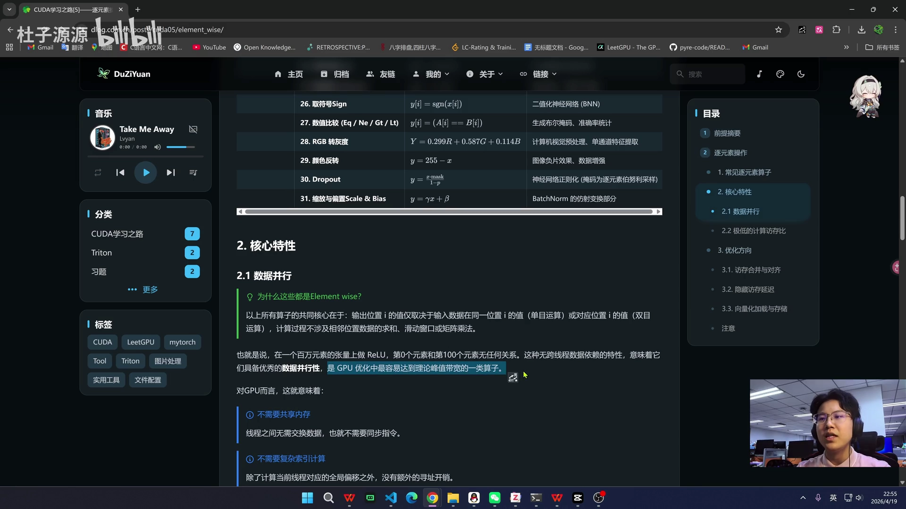 |
| 读 A、读 B，再去写 C，总共三次操作。所以我们来看一下怎么去计算，我提前把代码写好了。 [【跳转到 01:32】](https://www.bilibili.com/video/BV1L6oNBSEGc/?t=92) | 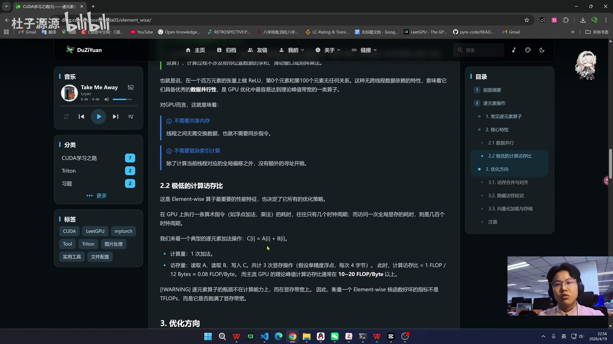 |
| 大概有几个版本。我们先来看 PyTorch 的这个版本，我稍微放大一些。可以看到上面这一部分先定义了一个 A 和 B 的 torch tensor，把它放在 CUDA 里面，类型是 float32。我现在给它做一次预热，就是让它先提前算一次，再加入了一个 benchmark 测试函数。什么意思呢？ [【跳转到 01:41】](https://www.bilibili.com/video/BV1L6oNBSEGc/?t=101) | 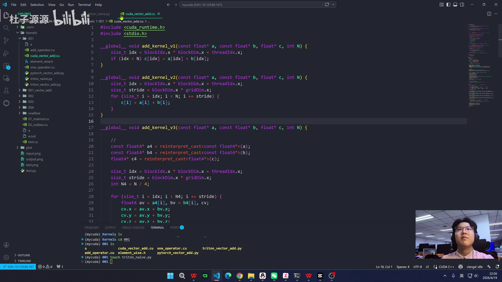 |
| 可以看到它要 warm up，先提前预热几次，然后给两个 CUDA event，也就是记录事件。先让它开始记录，然后运行我们需要跑的轮数，例如运行 20 轮，再结束，给它做一个 CUDA 同步，最后计算它的时间，我们就能把这个时间测出来。这个 benchmark 的…… [【跳转到 02:06】](https://www.bilibili.com/video/BV1L6oNBSEGc/?t=126) | 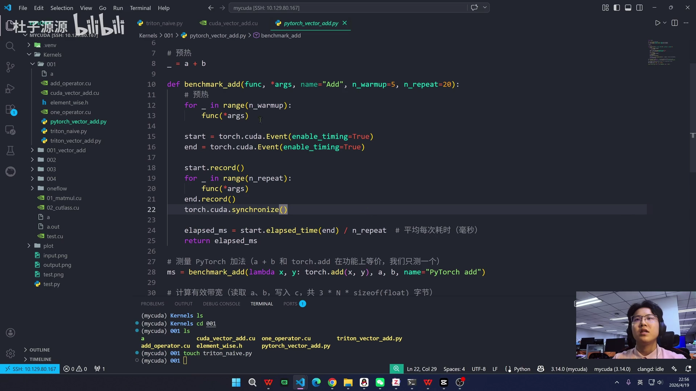 |
| 那么这个地方我写到了 torch.add(x, y) 和 x 加 y 是等价的，我们写哪个都可以，我这里用了一个 lambda。那么我们来看一下它大概的性能。这是 PyTorch 原生版本。 [【跳转到 02:31】](https://www.bilibili.com/video/BV1L6oNBSEGc/?t=151) | 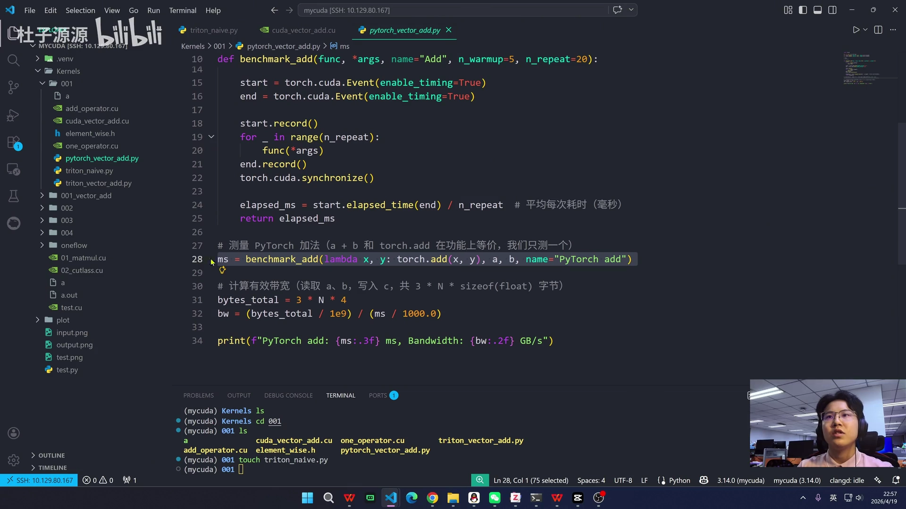 |
| OK，我们来看一下它的性能。可以看到它基本上能跑到我的带宽上限，我的是 3070S，带宽基本在 500 左右，它基本上能跑到 440，已经非常接近了。这是它原生的。可以看到我们要做的其实原生就已经有了，不需要我们再额外去做。 [【跳转到 02:56】](https://www.bilibili.com/video/BV1L6oNBSEGc/?t=176) | 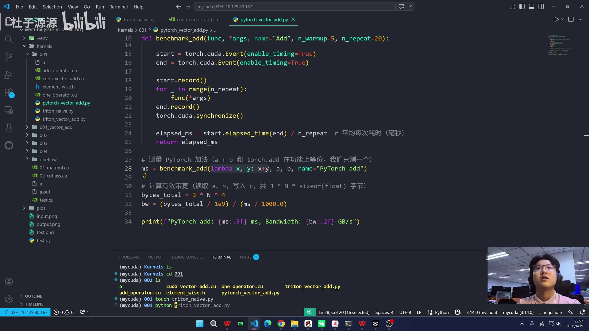 |
| 我们再来看一下 Triton 内部的实现版本。我在博客里面也写到了在 Triton 如何去写一个很好的模板代码。 [【跳转到 03:21】](https://www.bilibili.com/video/BV1L6oNBSEGc/?t=201) | 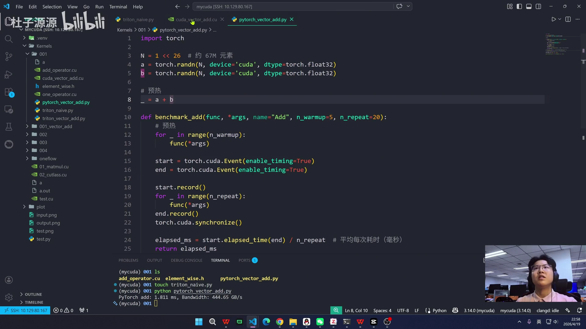 |
| 这个地方讲到了一些模板代码的编程范式，以及 Triton 都有哪些模块。可以看到一个完整的架构有哪些，kernel、host 端…… [【跳转到 03:28】](https://www.bilibili.com/video/BV1L6oNBSEGc/?t=208) | 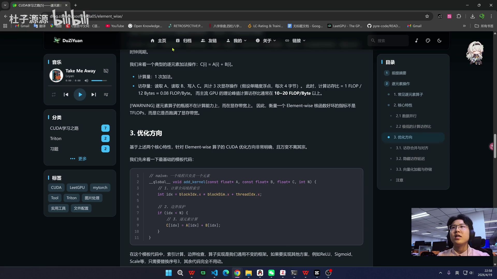 |
| 然后调优、benchmark 以及正确性。 [【跳转到 03:38】](https://www.bilibili.com/video/BV1L6oNBSEGc/?t=218) |  |
| 以及把它注册到 PyTorch 里边。但当然我们这一个不需要写这么多。 [【跳转到 03:43】](https://www.bilibili.com/video/BV1L6oNBSEGc/?t=223) | 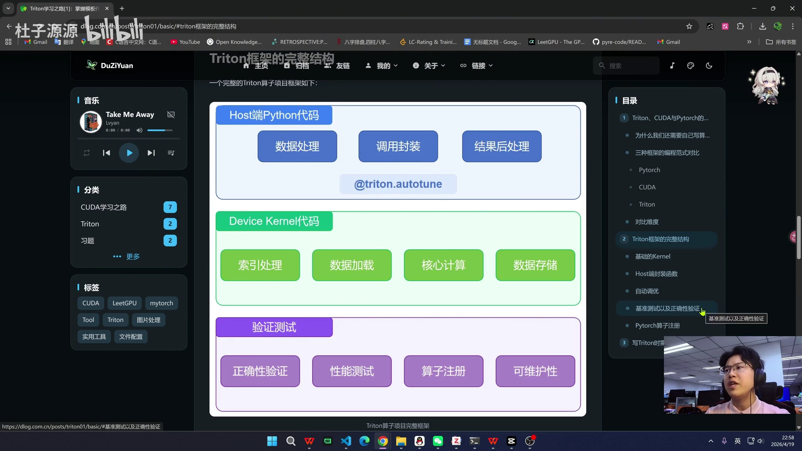 |
| 我们先来看最核心的。在我们写代码的时候，先去 import torch、import triton、import triton.language as tl，然后我引入了一个 time，或者不引入也可以。这个地方核心的是：先给它 @triton.jit，表示它要跑在 GPU 上，定义一个 kernel，然后定义一些参数。 [【跳转到 03:48】](https://www.bilibili.com/video/BV1L6oNBSEGc/?t=228) | 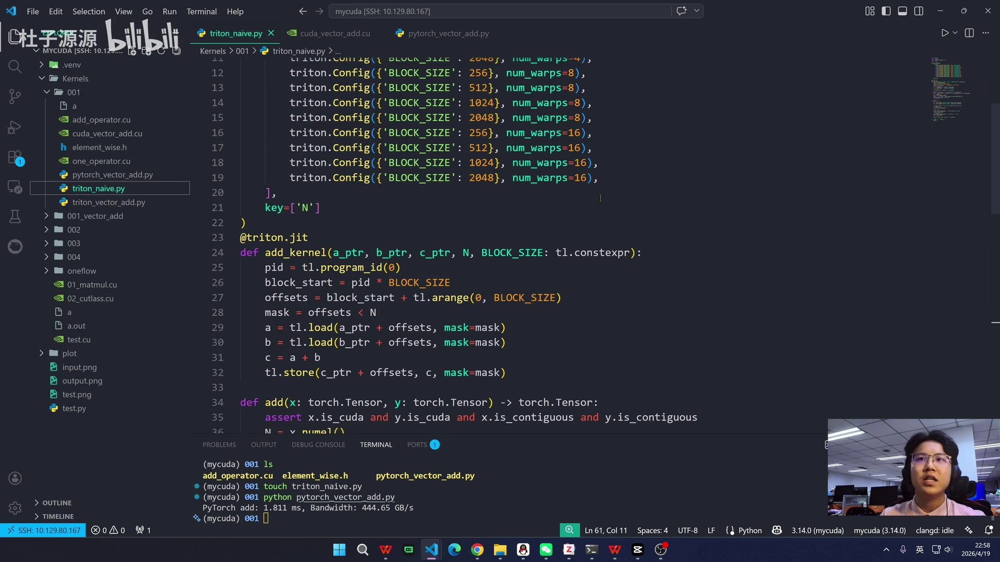 |
| A、B 是输入，C 是输出，N 是我们要处理元素的个数，BLOCK_SIZE 是我们自己定义的要处理的分块大小，这是一个超参数。可以看到我写了很多，256、512、1024、2048，你可以自己去选择定义。而上边这个（autotune）就可以帮你自动调优这个 BLOCK_SIZE，然后选一个…… [【跳转到 04:13】](https://www.bilibili.com/video/BV1L6oNBSEGc/?t=253) | 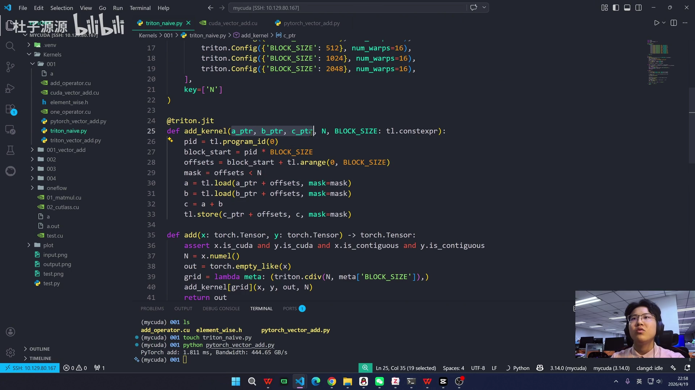 |
| 性能最好的。可以看到第一个版本，就是我们先把当前 block 的 PID 算出来，然后把当前的偏移算出来，这是起始地址，这是偏移地址。那么上面这两个就能共同决定整个 kernel 的覆盖范围，然后 mask 保证我们处理的是有效数据，不要数组越界。 [【跳转到 04:38】](https://www.bilibili.com/video/BV1L6oNBSEGc/?t=278) | 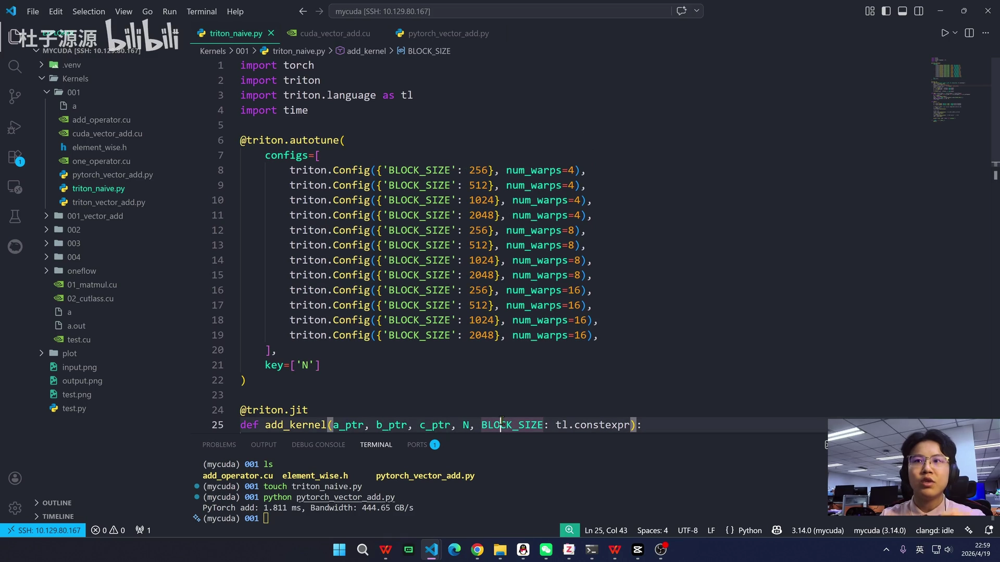 |
| 然后这三个就是它的一个核心：去 load、再去 store，中间进行一个计算。OK，有了整个 kernel 之后，我们要把它打包到一个 host 端的函数里边。例如这个 add 函数，我们先要断言它们都放在了 GPU 上，并且这两个地址是连续的一整块，然后给它一个 N 的个数。 [【跳转到 05:03】](https://www.bilibili.com/video/BV1L6oNBSEGc/?t=303) | 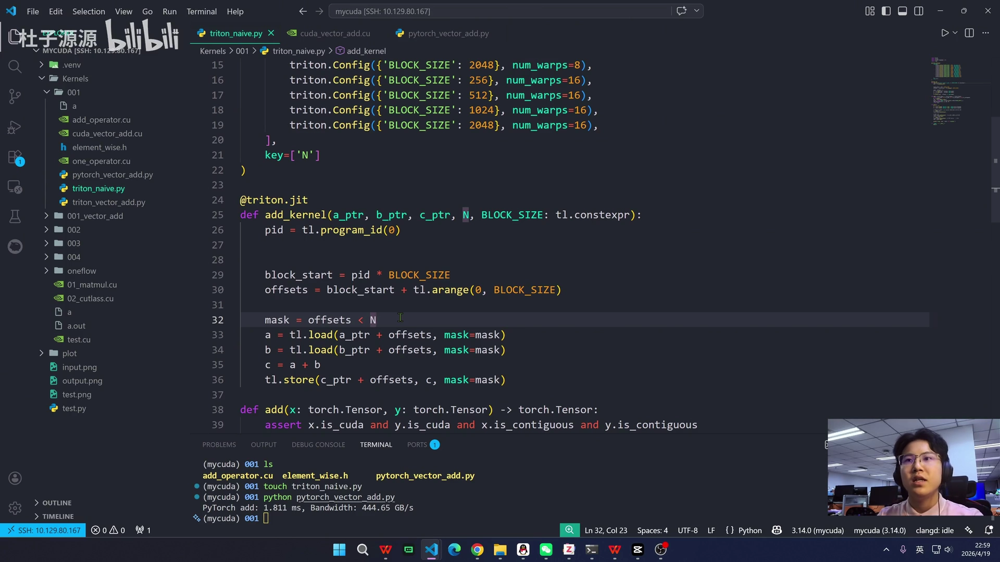 |
| 以及我们要把它放在哪里，放在 out。那么 grid 就是说我们需要多少个 block，你可以单纯地理解为需要多少个 block，这个就叫 grid，grid 里边有多少个 block 的意思。可以看到如果我们现在的话，它本来这个地方长这个样子。 [【跳转到 05:28】](https://www.bilibili.com/video/BV1L6oNBSEGc/?t=328) | 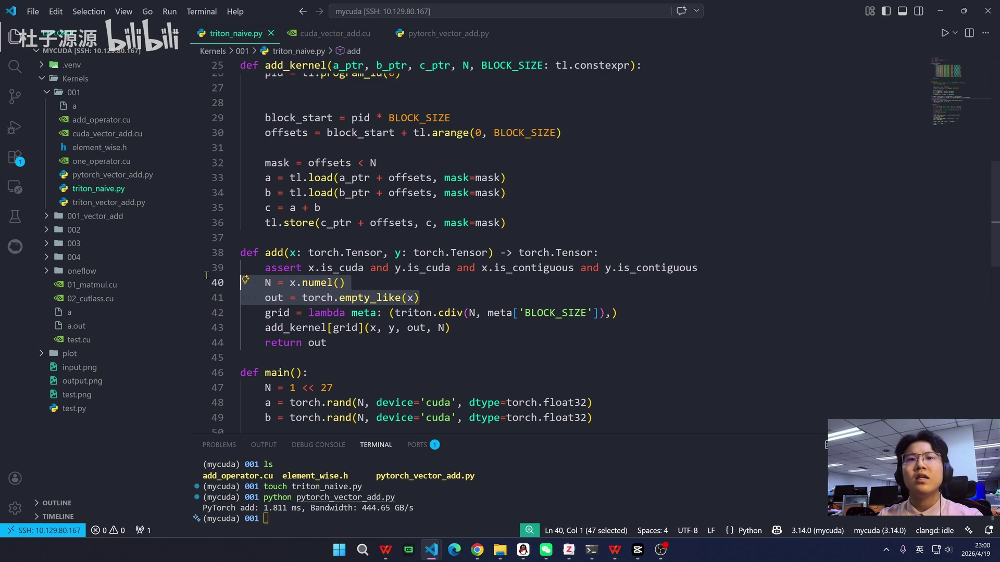 |
| grid 等于……它本来是一个三元的元组，那么 grid 一维的就表示它是一维向量，二维的就是二维向量，三维就是三维向量。但现在由于我们有那个 triton.autotune，它可以自动帮我们调优，所以我们定义一个 lambda 表达式，能够帮我们自动去调节这个超参数，最后就不需要把这个 BLOCK_SIZE 传进去了。 [【跳转到 05:53】](https://www.bilibili.com/video/BV1L6oNBSEGc/?t=353) | 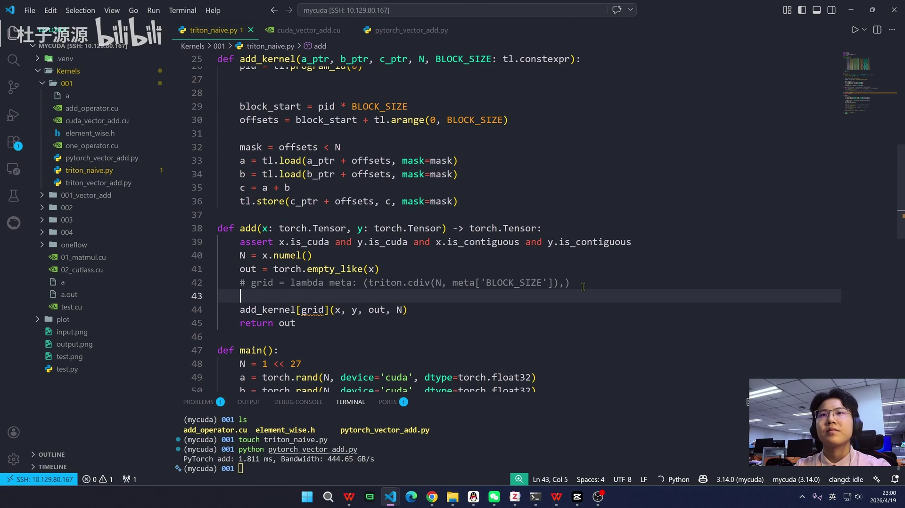 |
| 我们去执行这个加法，然后再返回我们的 out。可以看到下边其实和 torch 原本的操作是一样的：先去预热，让它先执行一次，保证这个编译已经启动了，然后再去正式计时，最后测一下它的性能。我们来看一下 PyTorch 和 Triton 的对比。 [【跳转到 06:18】](https://www.bilibili.com/video/BV1L6oNBSEGc/?t=378) | 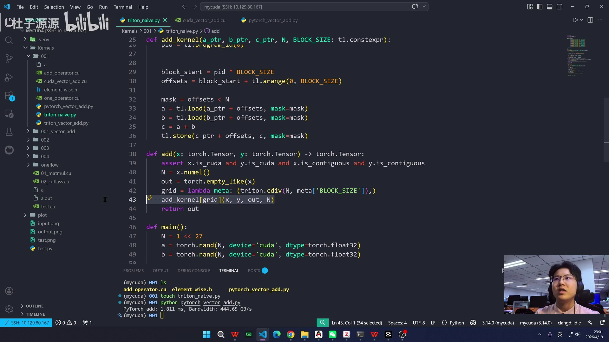 |
| 大概是 3.9ms 左右，还是一个不错的性能。那这是最初的版本，之后我们可以去对它进行调优。实际上刚刚这一个可以看一下，把它放在一起。 [【跳转到 06:43】](https://www.bilibili.com/video/BV1L6oNBSEGc/?t=403) | 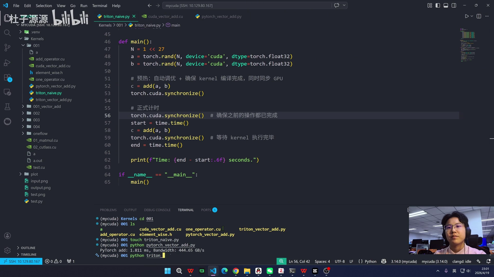 |
| 把这两个放在一起可以对比一下。 [【跳转到 07:02】](https://www.bilibili.com/video/BV1L6oNBSEGc/?t=422) | 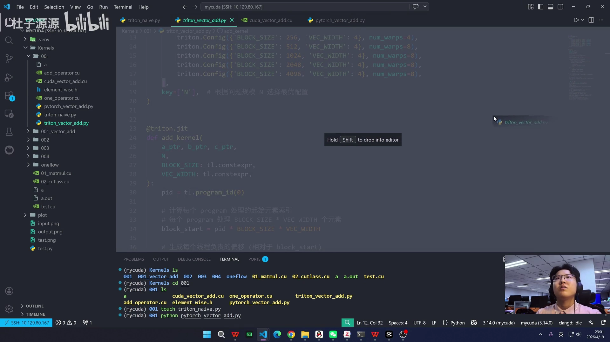 |
| 右边可以发现加了一个 vectorize，就是说它的向量宽度。之前处理加法其实一次只处理一个，但现在我可以考虑把四个放在一起，那这个宽度就变成了四。这个其实我这样讲不是很好理解，如果在 CUDA 里边讲的话…… [【跳转到 07:07】](https://www.bilibili.com/video/BV1L6oNBSEGc/?t=427) | 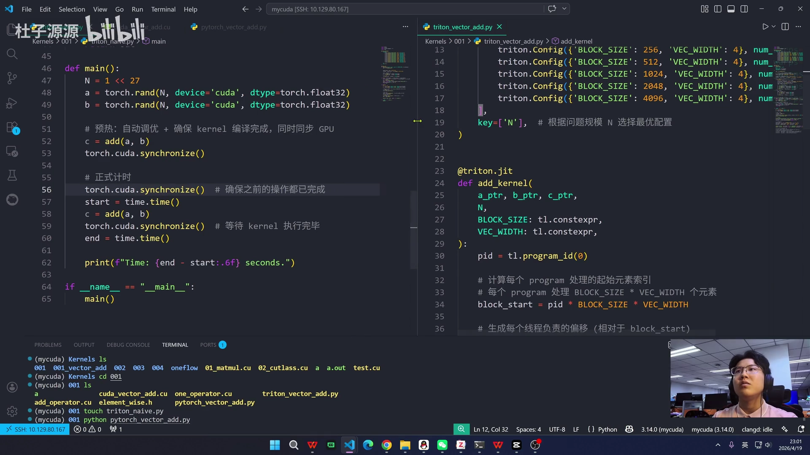 |
| 会更清晰一些。简单来讲，就是把原来处理的计算密度翻倍、提升到四倍，让它处理得更快，同时访存的数量减少。可以看到它在这个地方基本不变，就是加了一个 vectorize，加了一个向量化的元素，把原本的这个 arange 再给它乘以一个宽度。 [【跳转到 07:32】](https://www.bilibili.com/video/BV1L6oNBSEGc/?t=452) | 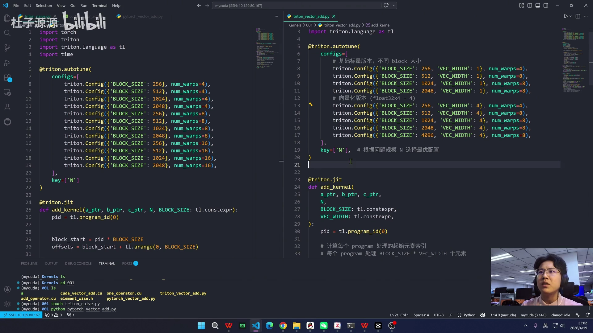 |
| 那如果它是四的话，我们要去重新计算一下它的 offset，计算好 offset 之后要把它 flatten，也就是把它展平，然后同样再去做 load、store 这些计算。这些函数基本就一样，只不过唯一的区别就是…… [【跳转到 07:57】](https://www.bilibili.com/video/BV1L6oNBSEGc/?t=477) | 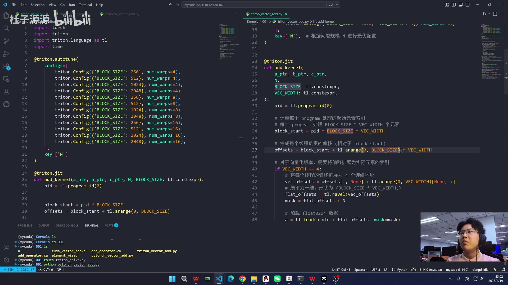 |
| 本来是去处理一个 BLOCK_SIZE，那现在要给它再乘以一个 vectorize（向量宽度）。最后验证的话，验证代码基本上差不多，我们可以来看一下跑一下 PyTorch 和 Triton。 [【跳转到 08:22】](https://www.bilibili.com/video/BV1L6oNBSEGc/?t=502) | 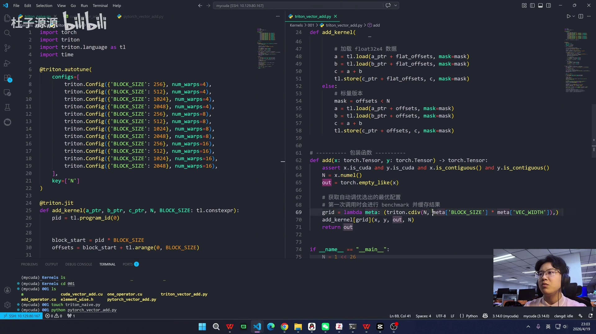 |
| OK，我们可以看到他俩分别的时间差异。那么 Triton 的话是 1.85，PyTorch 自己的话是 1.84，它们带宽都跑到了 440 左右，和刚刚 torch 原生的 440 接近。它最优的是 BLOCK_SIZE 为 4096，宽度为 4，以及 num_warps 为 8，就能把最优的选项给你选出来。 [【跳转到 08:47】](https://www.bilibili.com/video/BV1L6oNBSEGc/?t=527) | 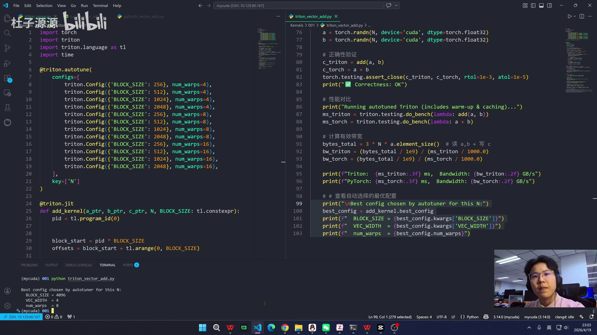 |
| 这是我们的一个性能调优版本。右边简单来讲就是去做一个向量化，把原来的标量计算变成向量计算，也就是一次处理更多的元素。好的，那看完了 torch 之后，我们再来看一下 CUDA。CUDA 我这里是写了四个版本，其实第三、第四个版本都差不多。 [【跳转到 09:12】](https://www.bilibili.com/video/BV1L6oNBSEGc/?t=552) | 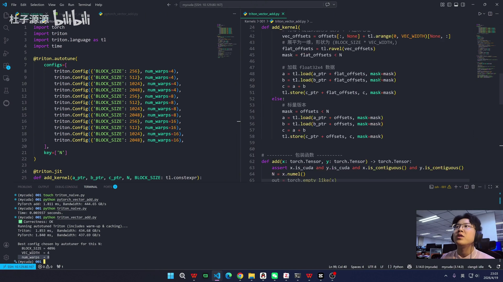 |
| 那它有——这个 CUDA 很明显就比较复杂一些。我们先来看第一个版本。第一个版本就是我们传进来还是三个指针以及一个参数大小，然后我们去计算每一个 thread，也就是当前线程，在保证它不越界的前提下，让它能够做一个很好的计算。 [【跳转到 09:37】](https://www.bilibili.com/video/BV1L6oNBSEGc/?t=577) | 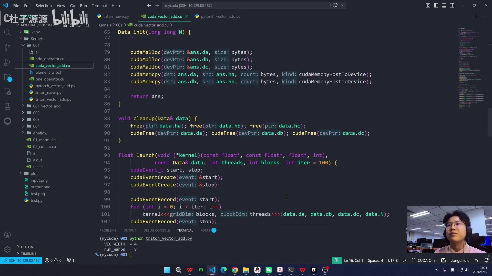 |
| 可以看到这个地方每一个向量或者每一个线程做的都是同一件事情：A 和 B 相加赋给 C，OK，就是这个。那大家想一下这个有没有什么问题？一个线程是不是只算了一次就被丢弃掉了？但实际上一个线程可以算好几次。那它就有一个 stride，如果它跳过了 blockDim 乘以 gridDim 这个距离…… [【跳转到 10:02】](https://www.bilibili.com/video/BV1L6oNBSEGc/?t=602) |  |
| 那么再去做下一次的话，其实可以相当于循环起来，一个向量或一个线程就被计算了很多次。这是对它的第一个优化，叫做 grid loop（网格循环优化）。可以看到我们先计算一个 idx，然后把它的 stride 算出来，然后跳一个再去计算。 [【跳转到 10:27】](https://www.bilibili.com/video/BV1L6oNBSEGc/?t=627) | 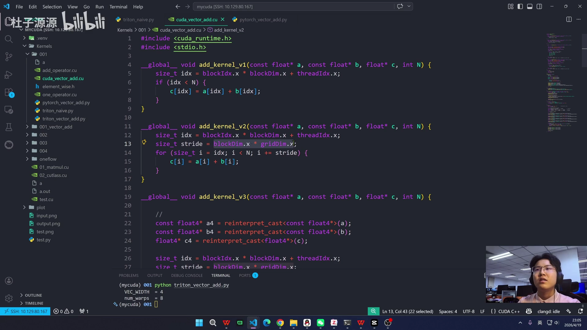 |
| 跳一个再去计算，如果不超过它最终的边界的话，那么它这个单个线程的利用率就提升起来了。在这个基础上，大家可以想一下还有没有什么优化空间？我们刚刚在 Triton 学过了向量化，所以其实 CUDA 肯定也是有向量化版本的。也就是说把它的访存频次降低，把零散的小指令变成一个大指令…… [【跳转到 10:52】](https://www.bilibili.com/video/BV1L6oNBSEGc/?t=652) | 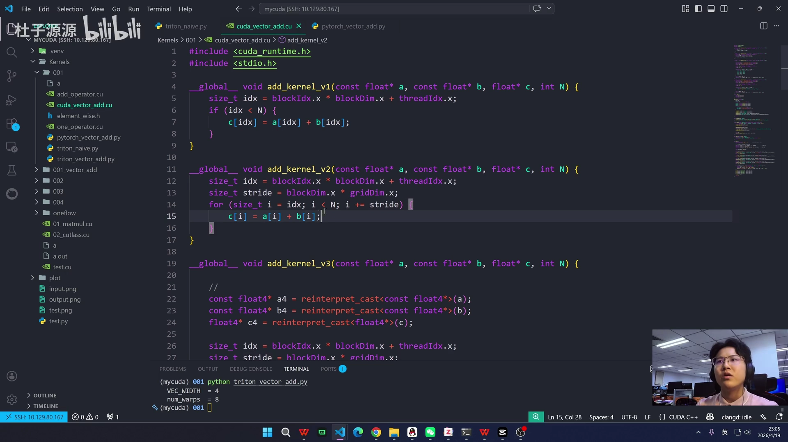 |
| 然后一次性计算更多。可以看到这就是一个向量化的版本，向量化然后依次访问四个 float，这是为什么呢？可以看到它把原来的 float 变成了 float4。 [【跳转到 11:17】](https://www.bilibili.com/video/BV1L6oNBSEGc/?t=677) | 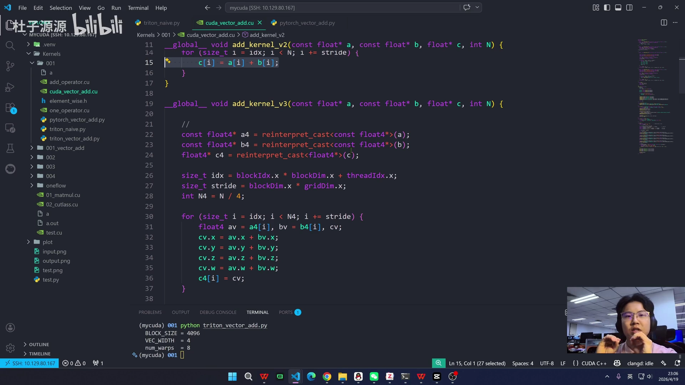 |
| 它就把四条指令合并在一起，减少了四倍的访存，包括之前的这个 stride 同样保持不变，那它处理的频次其实就下降到了 1/4，可以看到变成 N 除以 4 了。那么我们再给它赋一个局部变量，这个叫局部变量。 [【跳转到 11:42】](https://www.bilibili.com/video/BV1L6oNBSEGc/?t=702) | 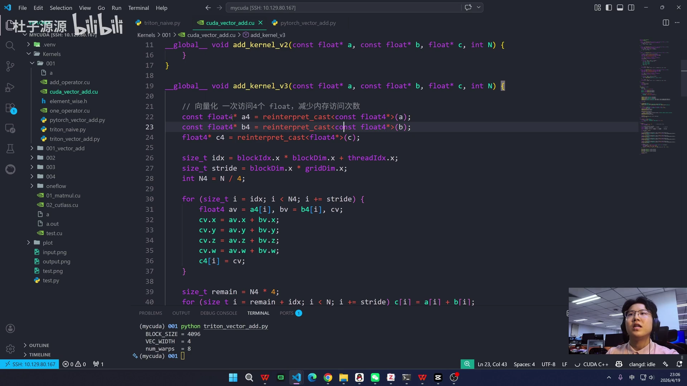 |
| 对，这样的话它就能够在最快的寄存器中去进行计算，也就是离 thread 最近的寄存器去做计算，计算完之后再复制给我们刚刚定义的这个 C4，把它复制回去，这样就能减少它的内存访问。那如果有剩下的，就额外给它做一个计算就可以。所以这是一个向量化的版本。那么刚刚说的是 float4。 [【跳转到 12:07】](https://www.bilibili.com/video/BV1L6oNBSEGc/?t=727) |  |
| 其实如果 float4 比较多的话，float2 也是可以的，在实际过程中我们可以选择最优的那一个去做计算。那么除了刚刚的这个局部变量之外，还可以有另一种方案，就是 make_float2 或者 make_float4，它提供了一个封装好的函数。OK，那我去定义一个自定义的数据结构。 [【跳转到 12:32】](https://www.bilibili.com/video/BV1L6oNBSEGc/?t=752) | 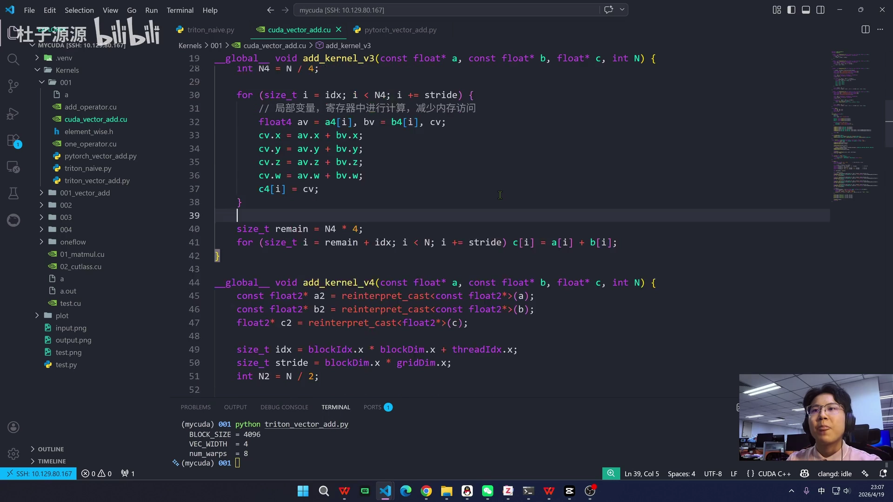 |
| 包括 host 端的指针、device 端的指针，然后给它做 init，就是先分配内存，再初始化一些数据，然后再在 CUDA 层面去 malloc 以及 memory copy，把原来 CPU 的东西放到 GPU 上。那么有了 malloc 肯定要 free，我们提前先写好。然后为了同时去测这四个的性能，我给到了一个 launch…… [【跳转到 12:57】](https://www.bilibili.com/video/BV1L6oNBSEGc/?t=777) |  |
| 这儿有一个函数指针，可以传不同的函数，然后给到了这个 data，给到了线程数、block 数以及迭代次数，去看一下它哪个性能最好。然后这些 CUDA event，event create、record 还有同步，这些就是去做时间上的记录。上边这个其实是工具代码。 [【跳转到 13:22】](https://www.bilibili.com/video/BV1L6oNBSEGc/?t=802) | 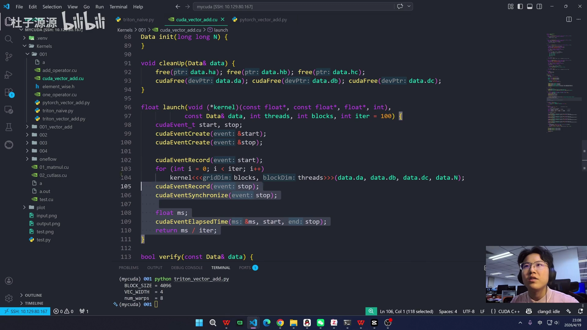 |
| 核心代码就是这一条，去迭代 iterator 次数的这个，然后去计算平均时间，可以看到再除下去。我多停留一会儿，最后去做一个计算结果的验证。然后我们再来看一下，定义 thread、定义这个 N，以及分别计算四个版本的 block。 [【跳转到 13:47】](https://www.bilibili.com/video/BV1L6oNBSEGc/?t=827) | 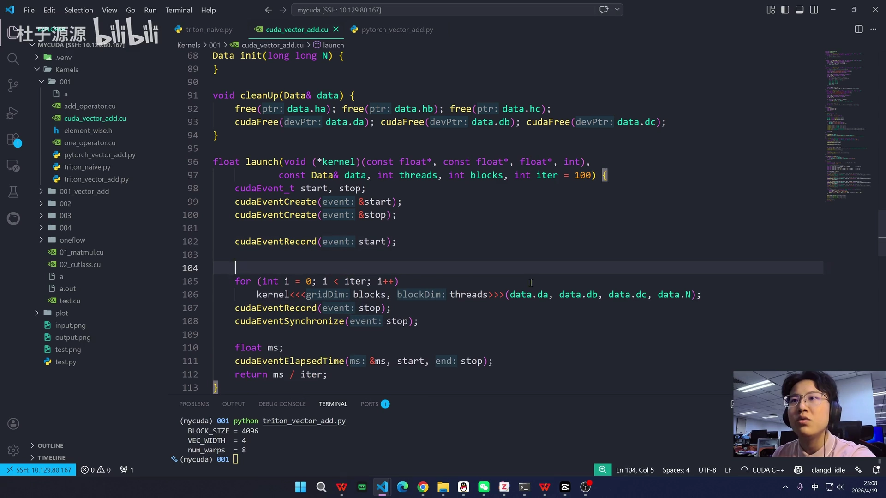 |
| 可以看到版本 V2，也就是 grid 优化之后的，它和第一个版本其实是一模一样的，我们都把它向上取整。这样能保证——例如我现在有数据，现在的数据可能是 1025 个，那它除以 256 可能多了一个，那这一个也要保证能够被处理，所以它要向上取整，这是这个计算公式。 [【跳转到 14:12】](https://www.bilibili.com/video/BV1L6oNBSEGc/?t=852) | 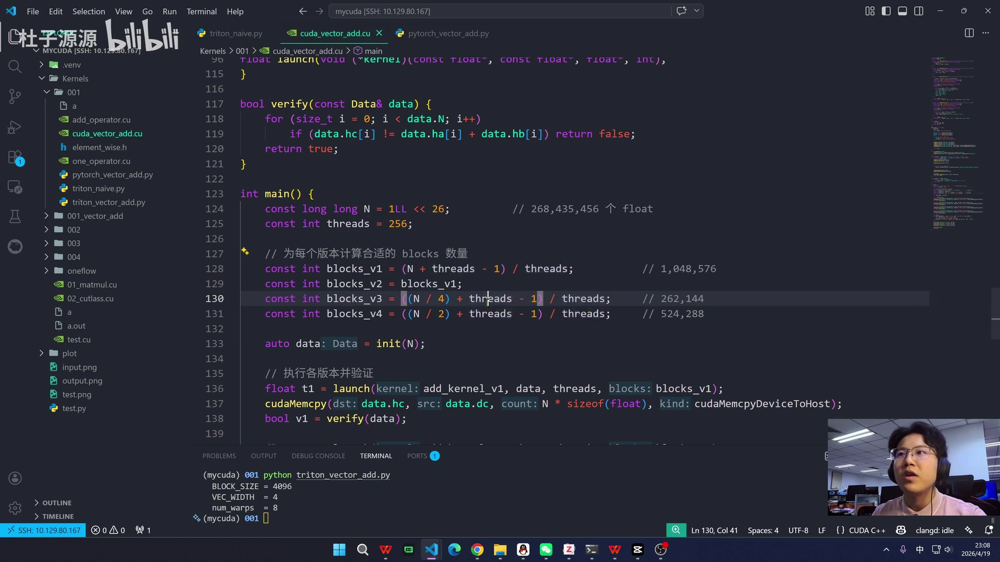 |
| N 加 thread 减一除以 thread。那么如果它是用向量化的，那我们要把这个 N 本来除以四，再去给它向上取整。OK，我们去执行各个版本，四个版本，然后最后打印它的结果，我用了一个 lambda 函数把这个结果打印出来，我们看一下这四个版本。那么 NVCC…… [【跳转到 14:37】](https://www.bilibili.com/video/BV1L6oNBSEGc/?t=877) | 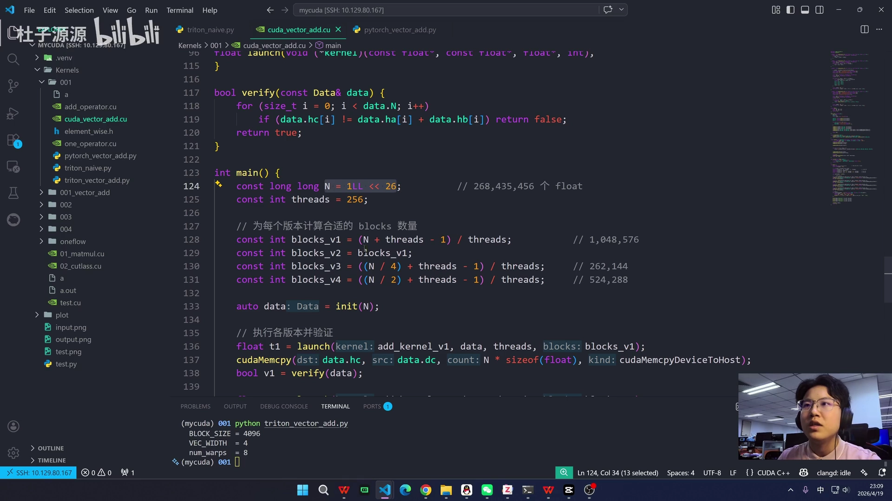 |
| 给它直接编译一下。OK，然后我们执行，可以看到这四个版本的性能。第二个版本比较好。OK，可以多跑几次看一下它的平均性能。 [【跳转到 15:02】](https://www.bilibili.com/video/BV1L6oNBSEGc/?t=902) | 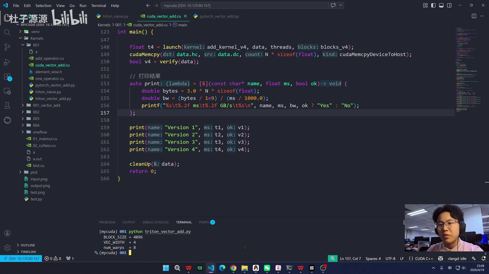 |
| 把这个 -O0 打开，-O0 就保证它没有任何的编译优化，如果默认的话它可能有编译优化。可以看到 grid loop 之后它是有一个轻微的优势的，那么向量化可能由于它有一些额外开销，所以性能反而略微下降。 [【跳转到 15:27】](https://www.bilibili.com/video/BV1L6oNBSEGc/?t=927) |  |
| 因为它这可以看到有一些额外的局部化开销，比如这个 float4 这些，包括这些类型转换会让它有一些额外的开销，不过整体来讲这是它的一个优化方案，向量化在其他的地方也可以使用这个方法。OK，那大家可以想一下，像所有的 element-wise，它其实这一套计算方案都是一样的。 [【跳转到 15:52】](https://www.bilibili.com/video/BV1L6oNBSEGc/?t=952) | 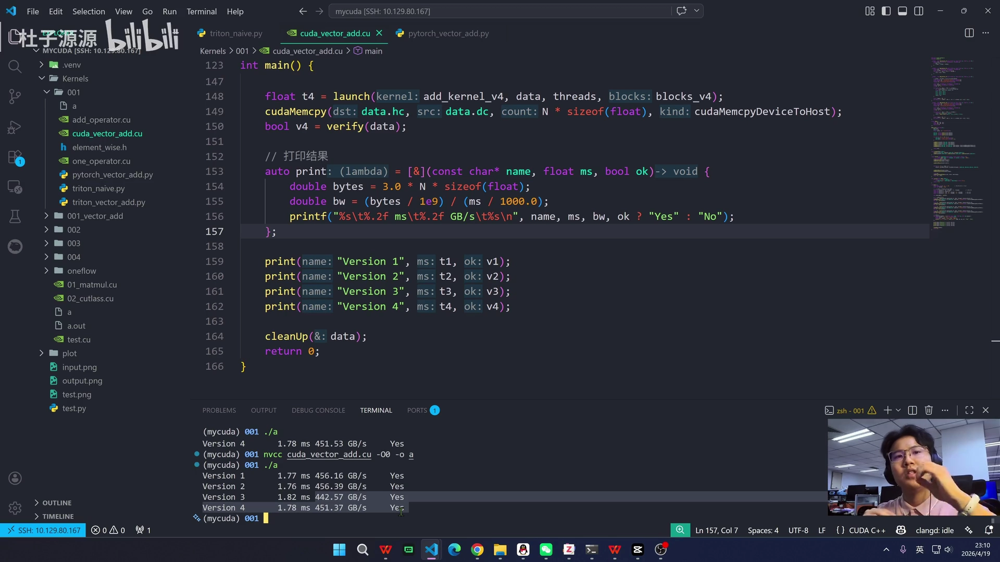 |
| 向量化加 grid loop。那有没有什么比较好的办法，我可以把算子注册进去？例如它不止做加法、ReLU，包括颜色反转，包括其他各种算子，实际上都可以用统一的方案来做。那我们就可以把它写成 template 模板，这个就是进一步去做一个优化，一元操作、二元操作都可以去用之前的那套优化方案。 [【跳转到 16:17】](https://www.bilibili.com/video/BV1L6oNBSEGc/?t=977) | 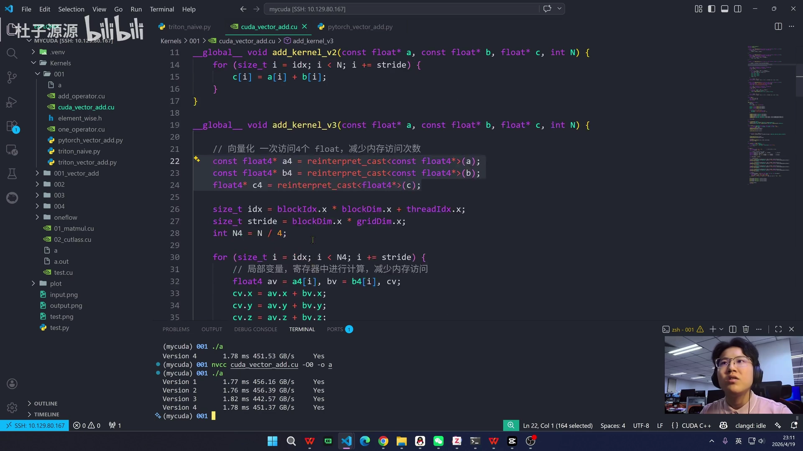 |
| 向量化加 grid loop 优化。我们可以看一下，这是我写的一个综合的、优化版本，那它就可以注册很多的 element-wise kernel，用到了一些核函数。这个 OP 就是它的一个操作方案，T 就是它要操作的数据类型。 [【跳转到 16:42】](https://www.bilibili.com/video/BV1L6oNBSEGc/?t=1002) | 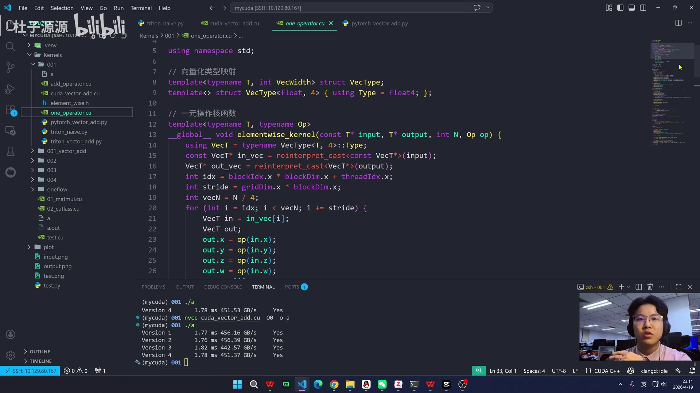 |
| const T，其实核心内容大差不差，也是做一个类型转换，然后计算 index 和这个 stride，然后再去做一个 for 循环，然后再去处理剩余的这些元素，其实看到和之前基本类似。然后初始化数据，做一个 data init，再做 cleanup，以及启动这个 launch kernel。 [【跳转到 17:07】](https://www.bilibili.com/video/BV1L6oNBSEGc/?t=1027) | 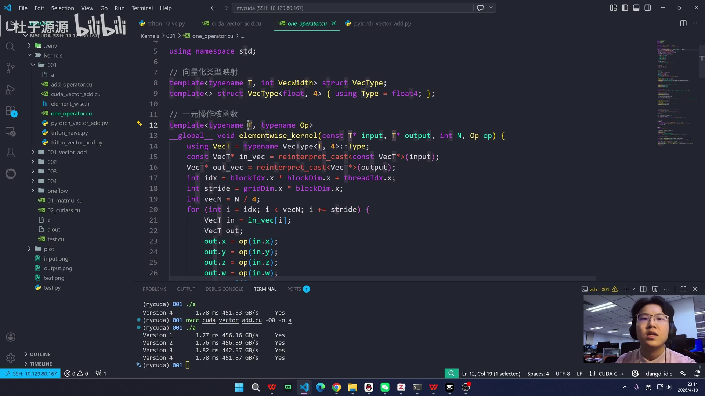 |
| 代码是大差不差，只是我这里写了一个仿函数，是 ReLU 函数和 GELU 函数这两个，是比较常见、经常使用的，在一些 GPU 例子里边也有。然后下边的话，它的 block 一般来说我们可以参考去使用这个 SM 的…… [【跳转到 17:32】](https://www.bilibili.com/video/BV1L6oNBSEGc/?t=1052) | 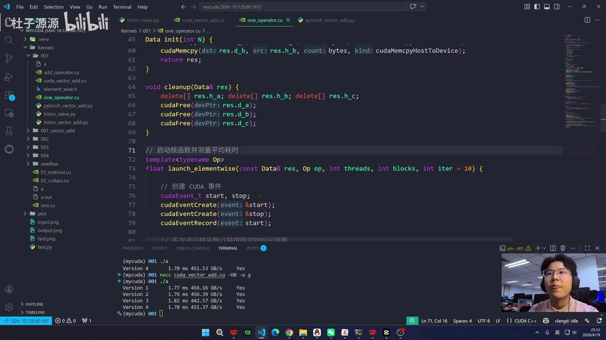 |
| 一个个数，保证每一个 SM 都能跑满。然后我们去看一下，我这个地方跑了一些，这是一个 ReLU，然后我也会跑一个 GELU，换成 GELU 也可以，都一样。然后这个验证就可以不用验证。 [【跳转到 17:57】](https://www.bilibili.com/video/BV1L6oNBSEGc/?t=1077) | 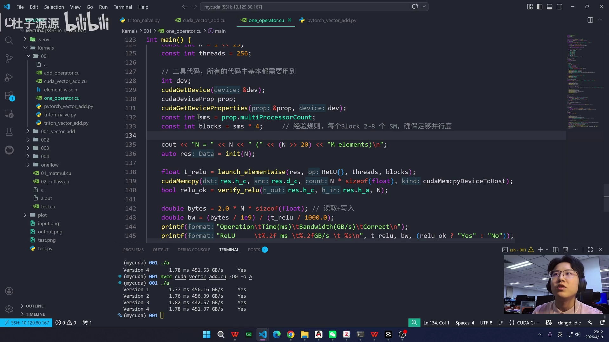 |
| 不用管它对还是错。我先 ReLU，然后 nvcc 编译一下，去给它跑一个结果，然后运行一下，可以看到这是这个 ReLU 的运行结果，它大概是 0.9ms，也是比较快的，可以多跑几次看一下，可以看到这次跑到 0.6，那带宽就能跑到 420。 [【跳转到 18:22】](https://www.bilibili.com/video/BV1L6oNBSEGc/?t=1102) | 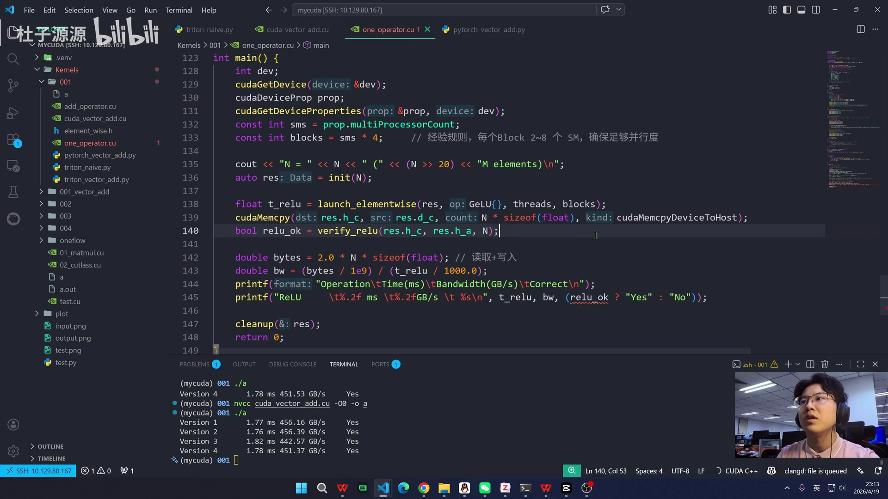 |
| OK，这是我写的一个模板方案。那最后的话是 OneFlow 这个官方库去写了一个非常高效的 header 文件，可以看到它这个就写得非常高级，基本全是模板函数，包括我们之前讲到的向量化、循环优化，它在这个地方全都考虑到了，并且有更加详细的一些内容。 [【跳转到 18:47】](https://www.bilibili.com/video/BV1L6oNBSEGc/?t=1127) |  |
| 我们下一节来仔细地去讲一下它这个 OneFlow 的优化版本。那么我在这儿也是参考它去使用了一下，调用了一个 add functor，自己去定义这个 struct，然后直接注册一个 operator，也就是你要操作的算子写进去，只要符合 element-wise 的都可以放进去，然后再进行一个向量化。 [【跳转到 19:12】](https://www.bilibili.com/video/BV1L6oNBSEGc/?t=1152) |  |
| apply to 怎么去使用，我们来看一下。这个 nvcc 多打了一个 @。OK，我们来看一下 A.out，那上面是 OneFlow 的一个时间是 0.92。 [【跳转到 19:37】](https://www.bilibili.com/video/BV1L6oNBSEGc/?t=1177) | 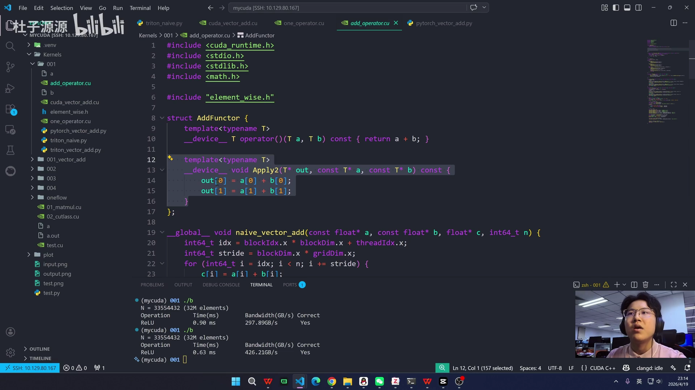 |
| 下边是内部的一个时间是 0.93，可以看到它要比单纯的 grid 还要性能更好、更优一些，就是针对 element-wise 的一个整个代码讲解。好的，本期就讲到这里，希望大家点赞、投币加关注，谢谢大家。 [【跳转到 20:02】](https://www.bilibili.com/video/BV1L6oNBSEGc/?t=1202) | 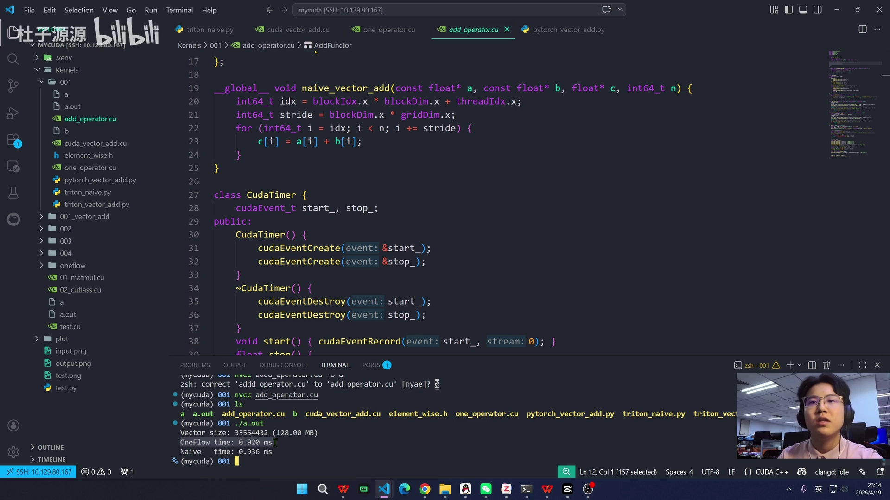 |