# 第06讲_工业级Element_Wise的实现_Oneflow详解 原始文稿（图-字幕分栏）

| 字幕文本 | 画面 |
| :--- | ---: |
| （此区间无字幕） [【跳转到 00:00】](https://www.bilibili.com/video/BV1npovBCE1r/?t=0) |  |
| 好，那这一节我们来看看 OneFlow 的 element-wise 是如何高效实现的。在开始之前，先再次感谢一下赞助列表，对新增的一些赞助者在此一并感谢，也希望大家狠狠地打赏我。 [【跳转到 00:05】](https://www.bilibili.com/video/BV1npovBCE1r/?t=5) | 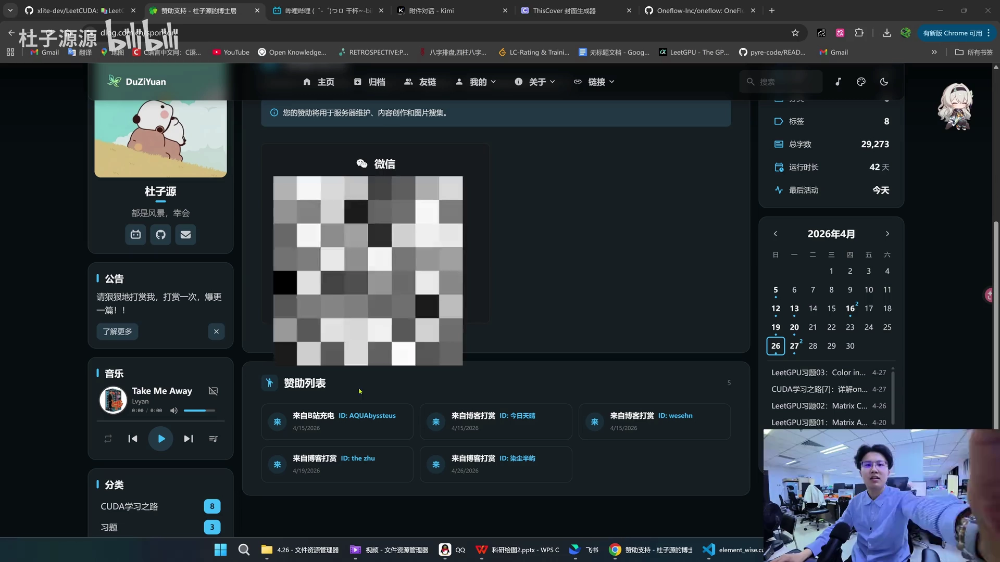 |
| 我们来看一下 OneFlow 代码的详解。另外，好多同学问我， [【跳转到 00:23】](https://www.bilibili.com/video/BV1npovBCE1r/?t=23) | 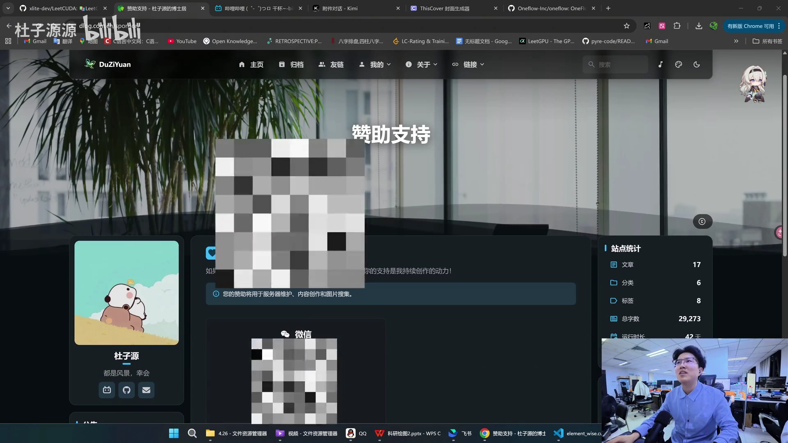 |
| 有没有什么学习资料可以给大家介绍一些？例如这个 LeetCUDA 库， [【跳转到 00:28】](https://www.bilibili.com/video/BV1npovBCE1r/?t=28) | 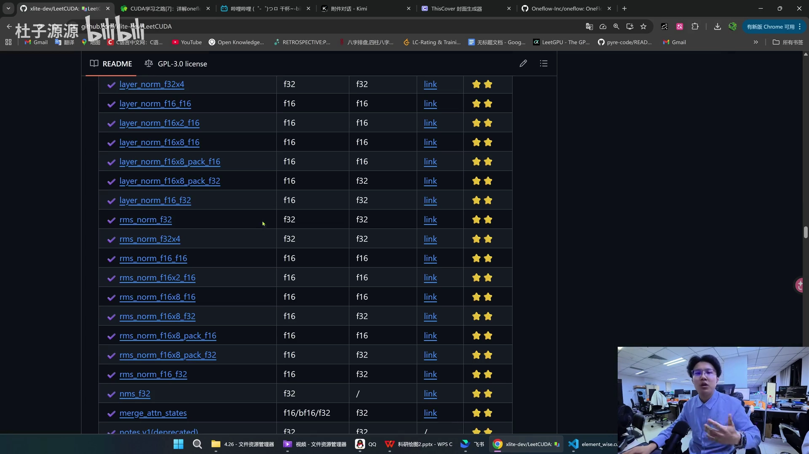 |
| 它实现了非常多的算子，从最基本的 element-wise 到一些复杂的算子， [【跳转到 00:35】](https://www.bilibili.com/video/BV1npovBCE1r/?t=35) | 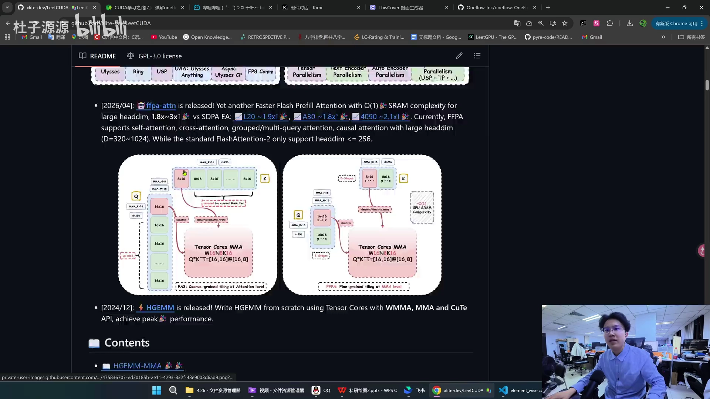 |
| 包括 softmax，也包括一些进阶的，例如 GEMV、GEMM，甚至 flash attention 都有。那么大家可以自行去学习，它这个地方写得也还算可以，大概平均 200 多行代码，看起来应该也很快。那么还有一个就是我推荐的 OneFlow。 [【跳转到 00:40】](https://www.bilibili.com/video/BV1npovBCE1r/?t=40) |  |
| 这个代码它是一个深度学习框架，也非常适合我们新手小白去学习。在学习的时候，可以核心去看它是怎么打包成为一个项目的，以及一些核心的内部接口、外部接口怎么去定义，这个也很重要。还有一个是这个叫做 SOL-ExecBench， [【跳转到 01:05】](https://www.bilibili.com/video/BV1npovBCE1r/?t=65) |  |
| 这是英伟达的、一个类似 [【跳转到 01:24】](https://www.bilibili.com/video/BV1npovBCE1r/?t=84) |  |
| 呃、力扣周赛的这么一个东西。那么可以看到它这个地方，例如有一个 description 去描述它这个算子是怎么实现的，那么它有一些参考实现，包括你可以提交代码；右边也有它的一些代码性能标准，比如 latency 是 0.08。 [【跳转到 01:29】](https://www.bilibili.com/video/BV1npovBCE1r/?t=89) | 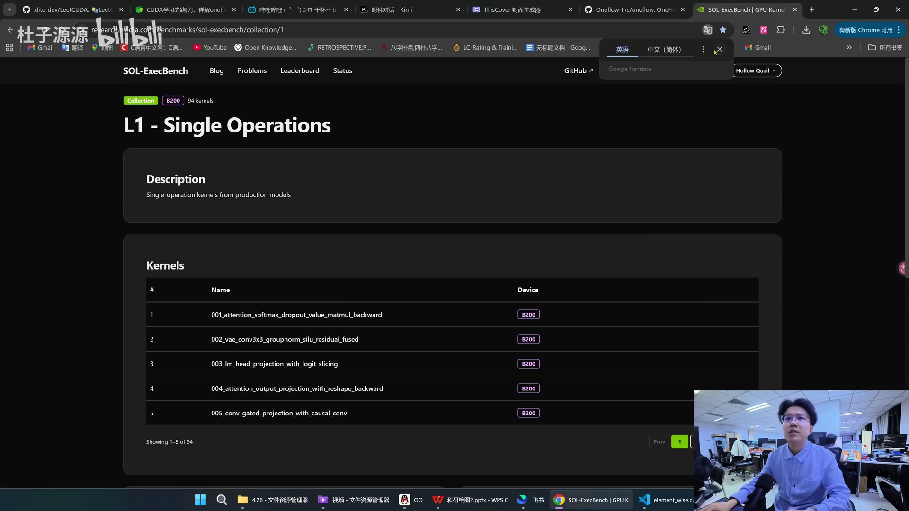 |
| 那么你提交上去之后，就可以看到大概是多少，在这个地方就可以去提交，分为 private 和 public 都可以，我觉得这个还比较不错。那我也尝试着去提交了一次，我就非常简单，就是把这个参考代码去提交上去了，大概是 0.21。这个参考代码是直接用 torch 去实现的，性能当然是比较差的。 [【跳转到 01:54】](https://www.bilibili.com/video/BV1npovBCE1r/?t=114) | 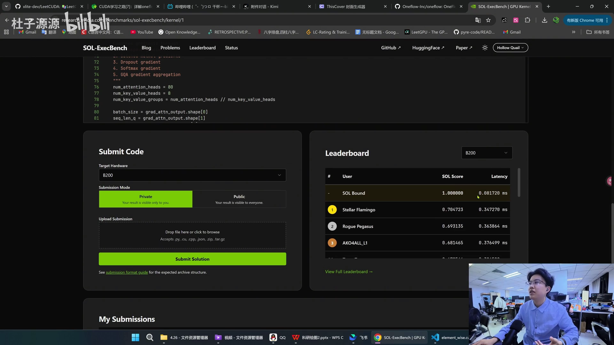 |
| 那么大家可以去选择用 Triton 或者 CUDA 去进行算子优化。好，那我们回到正题，我们来看一下 OneFlow 的 element-wise 代码详解。 [【跳转到 02:19】](https://www.bilibili.com/video/BV1npovBCE1r/?t=139) | 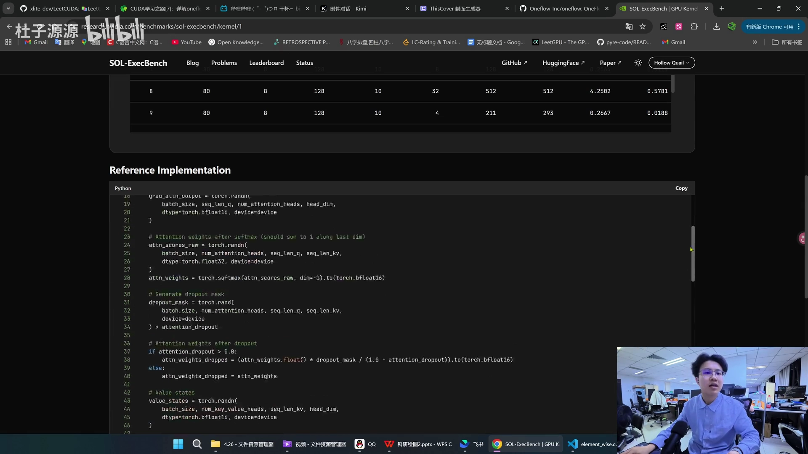 |
| 这个代码其实只有 200 行， [【跳转到 02:28】](https://www.bilibili.com/video/BV1npovBCE1r/?t=148) | 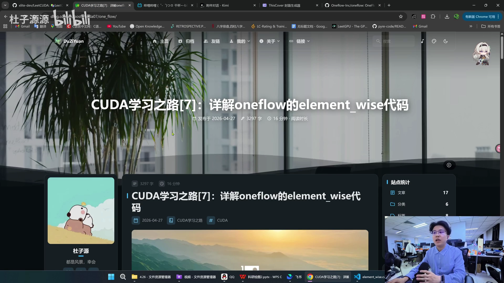 |
| 但是我们想把它学懂，却要花非常久的时间，并且其实是非常难的，因为这是超级优秀的架构师写出来的。我们来拆分一下它有哪些思想，我们主要去学他的思想。站在两个角度来去思考，分别是架构师的视角以及用户的视角。什么叫架构师视角？就是说你怎么能从一个空白写出第一行代码， [【跳转到 02:33】](https://www.bilibili.com/video/BV1npovBCE1r/?t=153) | 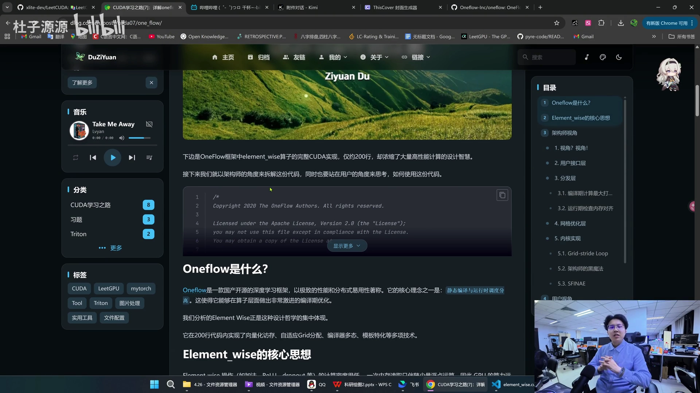 |
| 以及把整个代码都扩展出来，这是我们大家一定要思考的。那很多同学会说，我把代码扔给 AI， [【跳转到 02:58】](https://www.bilibili.com/video/BV1npovBCE1r/?t=178) | 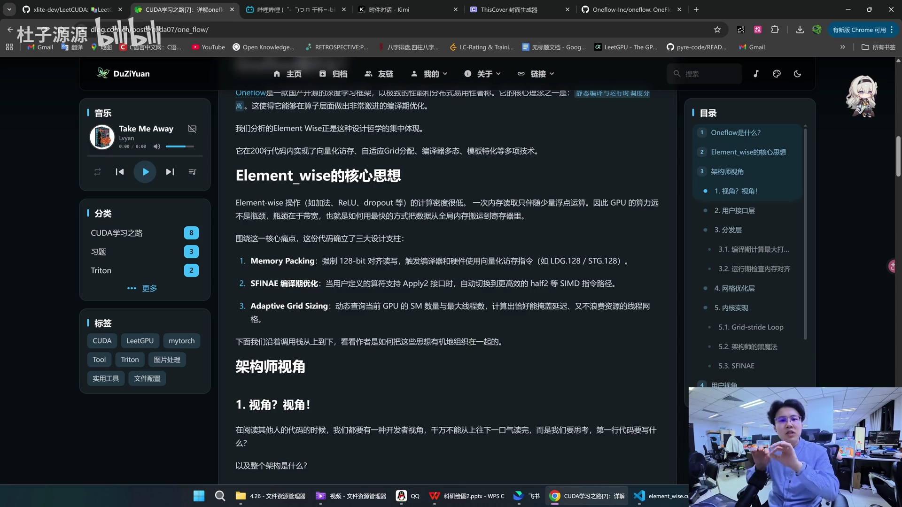 |
| 让 AI 帮我去写一下就可以。是这样，可以， [【跳转到 03:04】](https://www.bilibili.com/video/BV1npovBCE1r/?t=184) | 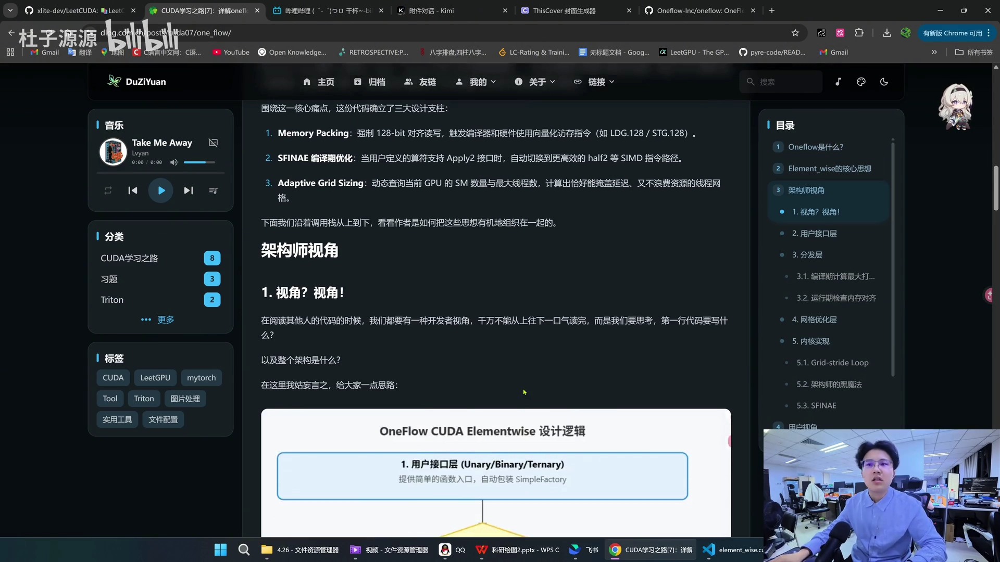 |
| 但是它一般来讲都局限于一个点，它很难有这种扩展性的思维，我们要着重去学习一下。 [【跳转到 03:09】](https://www.bilibili.com/video/BV1npovBCE1r/?t=189) | 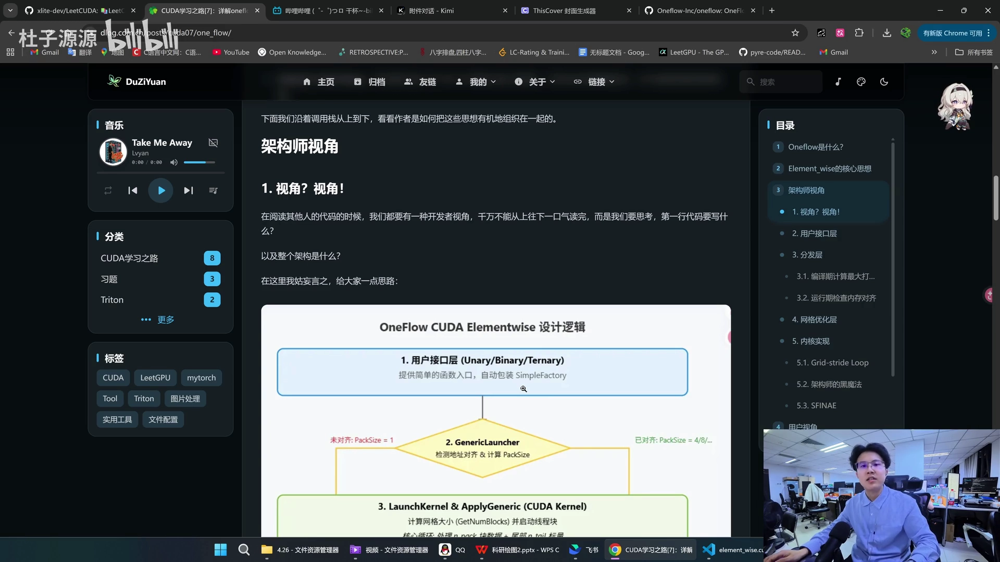 |
| 首先，它这个代码我给它分为了这几个层次，分别是接口层、以及调度层、以及核心的 kernel 计算层、以及最后的这个数据结构层，或者叫打包层。我们来一个一个看。 [【跳转到 03:18】](https://www.bilibili.com/video/BV1npovBCE1r/?t=198) | 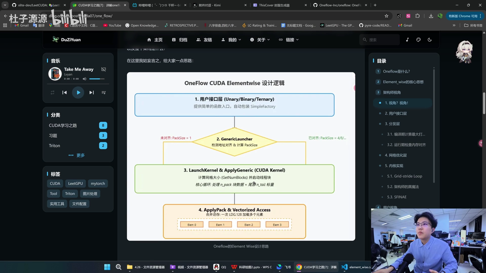 |
| 那么对于接口层来说，它要服务的是它的上层， [【跳转到 03:32】](https://www.bilibili.com/video/BV1npovBCE1r/?t=212) | 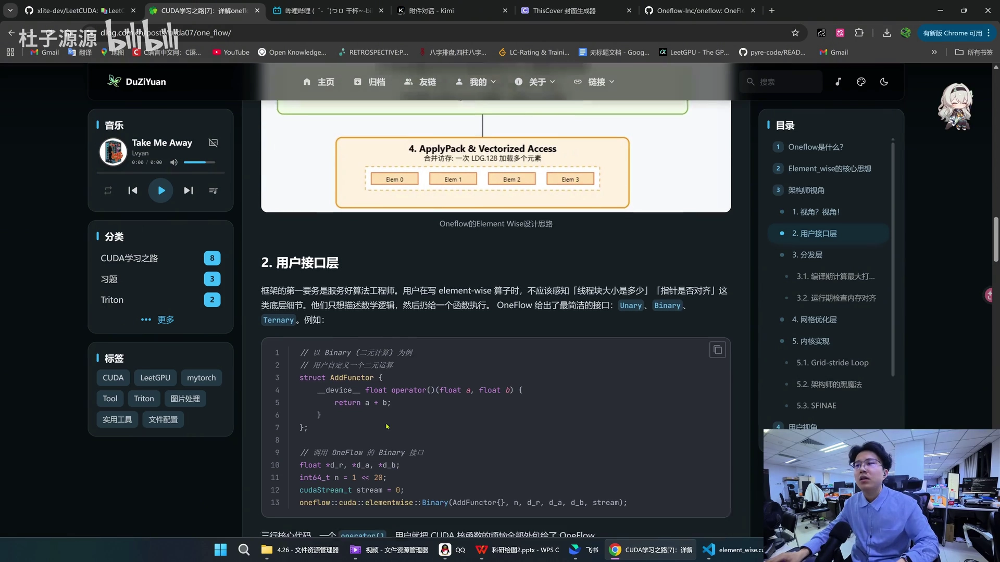 |
| 想要服务好算法工程师，那他在写的时候就要屏蔽掉很多底层细节，其实是越简单越好。例如可以看这个加法运算，我定义一个加法算子，device 表示它跑在 GPU 上，那么给它一个 operator，传两个输入变量，返回两个数之和，那么这个算子就写好了，再通过这个 binary 接口去对它进行调用。 [【跳转到 03:37】](https://www.bilibili.com/video/BV1npovBCE1r/?t=217) | 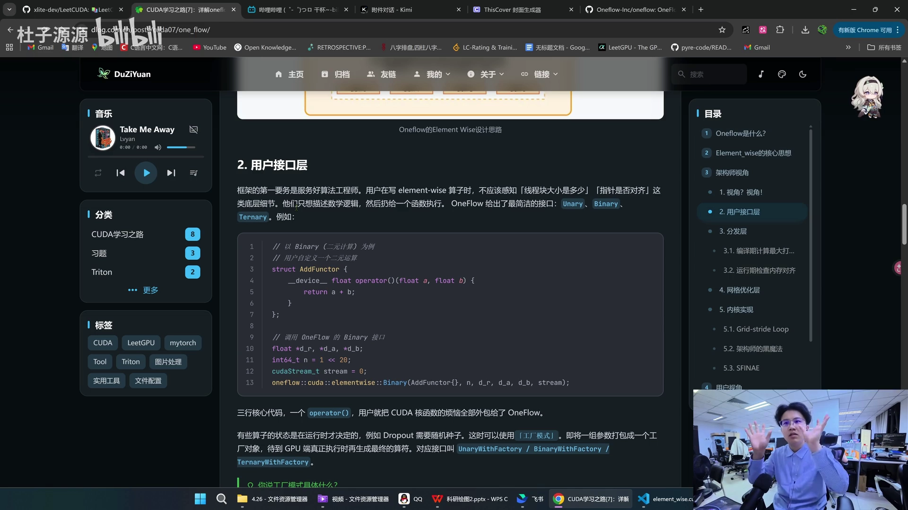 |
| 那如果是一元算子，就用 unary；如果是三元算子，就用 ternary。可以看到这是一个非常优秀的设计，我们可以自己去定义。那么实际上有些算子的参数，例如 dropout 的这个 alpha，这些参数它是在运行时才能确定的。那什么叫编译时、什么叫运行时？这个大家也可以去思考一下。那他通过一些技术， [【跳转到 04:02】](https://www.bilibili.com/video/BV1npovBCE1r/?t=242) |  |
| 例如我这儿写到了工厂模式，把一个参数从编译期抛到了运行时，这样把这个时机去延迟，能让整个代码更加丰富化。我也放了一个什么叫工厂模式，大家可以去看一下。那在分发层呢，它核心的还是针对编译器和运行器去做优化。那么编译器呢， [【跳转到 04:27】](https://www.bilibili.com/video/BV1npovBCE1r/?t=267) | 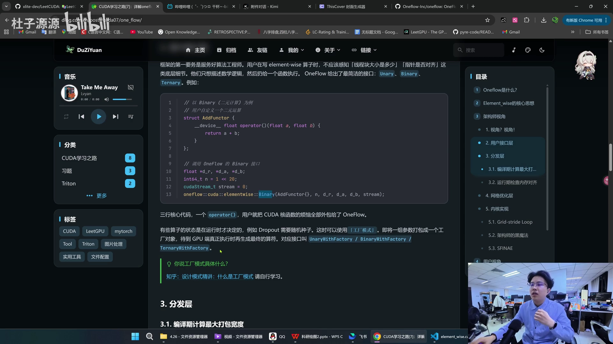 |
| 它要计算它的最大打包宽度。什么叫打包宽度呢？就是说我一次性要发多少条指令，以及我这个指令最宽是多少。举个例子，假设我发 100 条 int32 的指令，和发两条 int128 的指令，那这个区别是非常大的，可以看到它的带宽、占用都会明显地更少。那么在运行时呢， [【跳转到 04:52】](https://www.bilibili.com/video/BV1npovBCE1r/?t=292) | 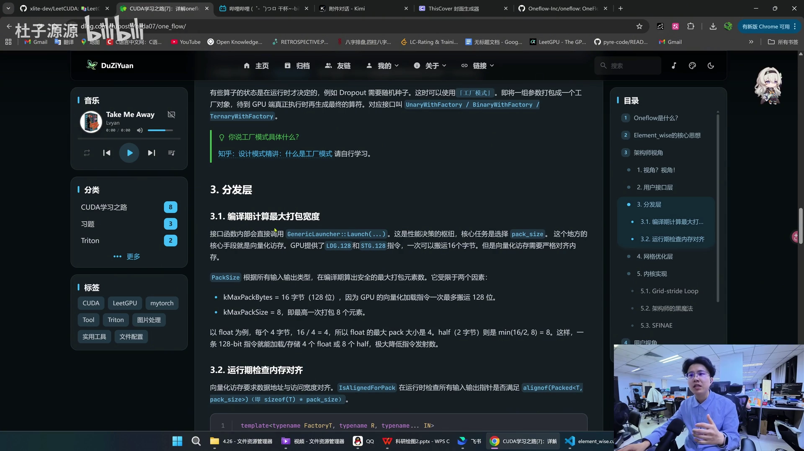 |
| 它就要检查内存对齐这些，保证它这个代码性能很高。例如他在这个地方写到了是否满足对齐要求，如果满足就去 launch kernel，如果不满足的话就对他进行一个回退。那么他再往下是一个网格的优化。我们之前确定这个 grid block 的大小的时候，我们一般都是手动的，比如这是我们经常写的 block size，是我们自己定义的， [【跳转到 05:17】](https://www.bilibili.com/video/BV1npovBCE1r/?t=317) | 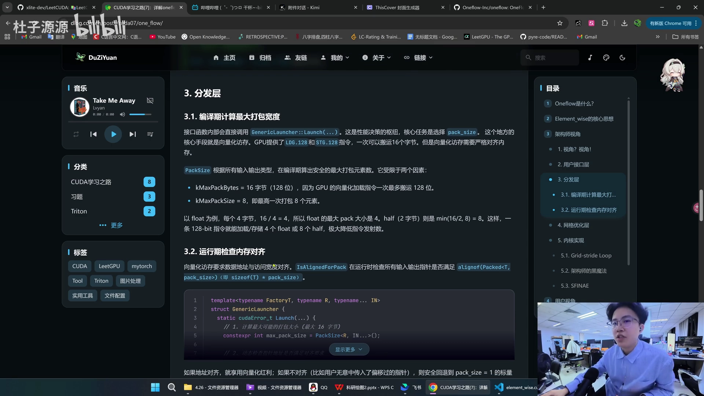 |
| 包括这个 grid size 也是我们自己定义的。但是实际上它有一个自动化的方法，根据你现在设备的 SM 的数量，然后去动态地算出来它这个 block 的数量。啧，这是一个非常优秀的设计。我们来看一下最后就是一个内核的实现。那么内核实现， [【跳转到 05:42】](https://www.bilibili.com/video/BV1npovBCE1r/?t=342) |  |
| 就是我上节课去讲到的一个 vector 优化，包括 grid loop 优化。可以看到这是它的一个核心：首先算 TID，然后一个 for 循环，每次步长是 grid loop，然后去做一个 apply batch，其实就是对它进行一个执行；然后上面这些是向量化的，那下边这些有一些没处理完，对它再做一个尾处理， [【跳转到 06:07】](https://www.bilibili.com/video/BV1npovBCE1r/?t=367) | 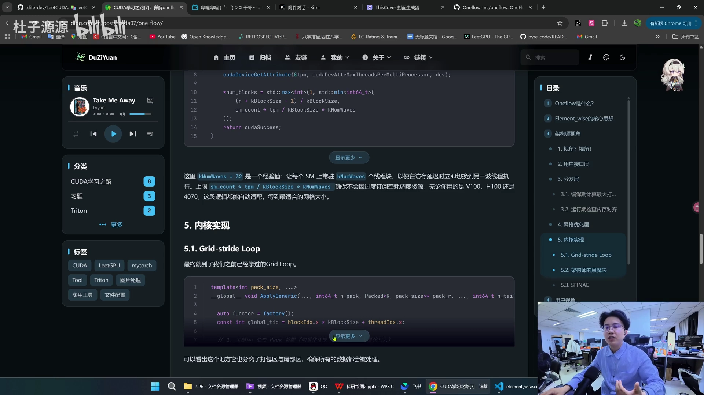 |
| 单个去处理掉。可以看到它分为了批处理的打包区，以及剩余的尾部区，确保整个代码性能非常高。那我说了这么久的打包，打包究竟指的是什么？其实就是要把一些数据让它内存对齐，尽量一次性发给 GPU，或者发给内存。可以看到我在这个地方也写到， [【跳转到 06:32】](https://www.bilibili.com/video/BV1npovBCE1r/?t=392) | 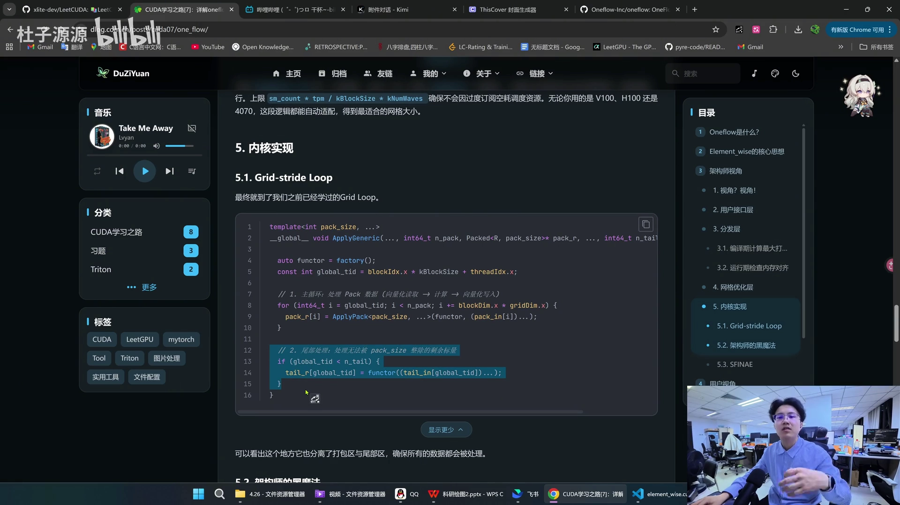 |
| 能够去调用更宽的总线访存指令。还有一个就是它有一个小的优化点叫做 apply two，就是一个 SIMD，一次性算一个算子还是算两个算子，可以你自己去定义。所以它在这个地方也去写到了，也是用到了模板编程的很多小细节，例如模板特化这些特点。 [【跳转到 06:57】](https://www.bilibili.com/video/BV1npovBCE1r/?t=417) | 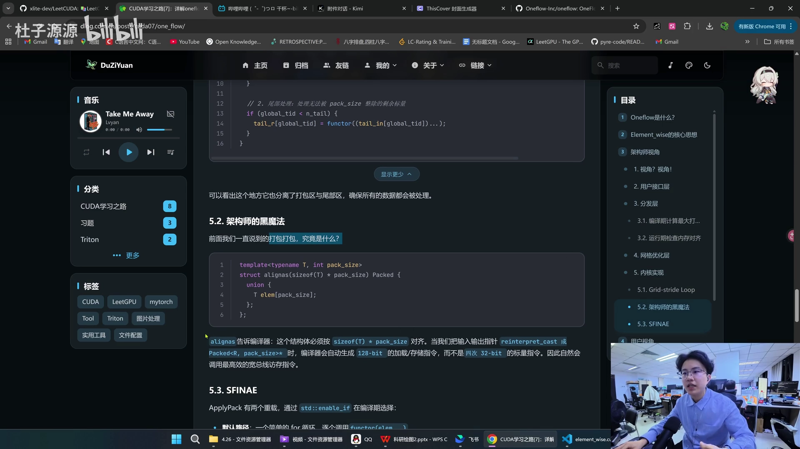 |
| 讲完了架构师视角，我们再来讲一下用户视角。我给大家也给了一些经典的场景，包括基本运算，例如实现 matmul、实现 ReLU，它都是非常简单，只需要用一两行就可以去实现。那么包括带运行时的，他就用到了我们说的这个设计——工厂模式，怎么去把这个参数放在工厂里边，然后让它能够再生产出一个 functor。 [【跳转到 07:22】](https://www.bilibili.com/video/BV1npovBCE1r/?t=442) | 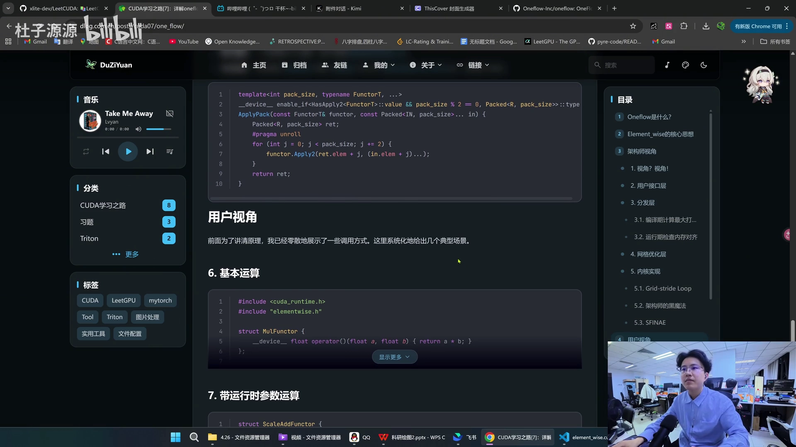 |
| 这是它的一些小优化，以及怎么去使用 apply two 的一个加速。好，我这就给大家讲完了。可能很多同学觉得，你这感觉什么都没讲啊，我都没听明白。是，如果你想要把这些代码去非常熟练地融会贯通，光靠不停地看这一个代码其实是很难的，我们更多去学的是学他的设计思想。 [【跳转到 07:47】](https://www.bilibili.com/video/BV1npovBCE1r/?t=467) | 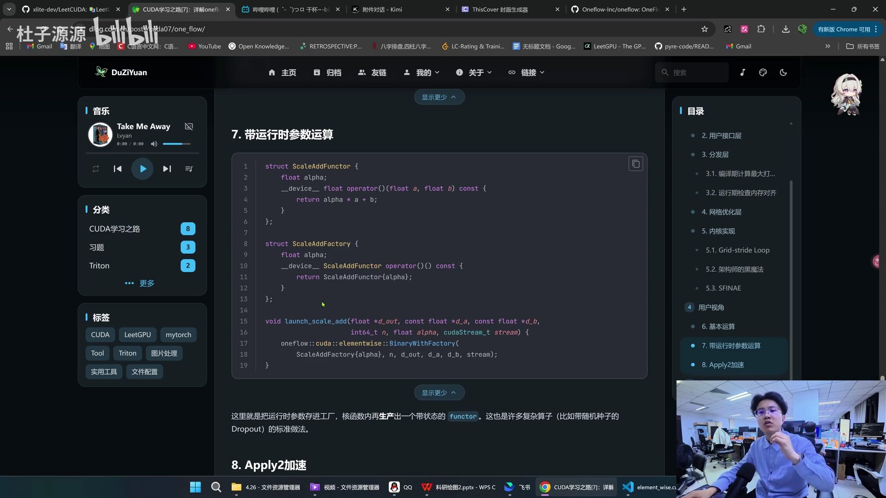 |
| 例如模板编程的一些小巧思，例如怎么去使用设计模式，比如他这个并行计算怎么用的 grid loop、怎么用的 vector，这些怎么去处理边界条件，这些是我们要综合去学的。而它的优秀之处就在于只用了 200 行，就把上述这些所有功能都实现了，而且代码非常清晰高效。那其实我想这应该是 AI 暂时没办法去替代的。 [【跳转到 08:12】](https://www.bilibili.com/video/BV1npovBCE1r/?t=492) |  |
| 那大家在写自己算子的时候，其实也可以不妨把这些设计思想融入进去，在写的时候加入一些模板、加入一些并行计算这些。那这些综合性的知识是大家更需要的。那本节就讲到这，希望大家点赞投币加关注。 [【跳转到 08:37】](https://www.bilibili.com/video/BV1npovBCE1r/?t=517) | 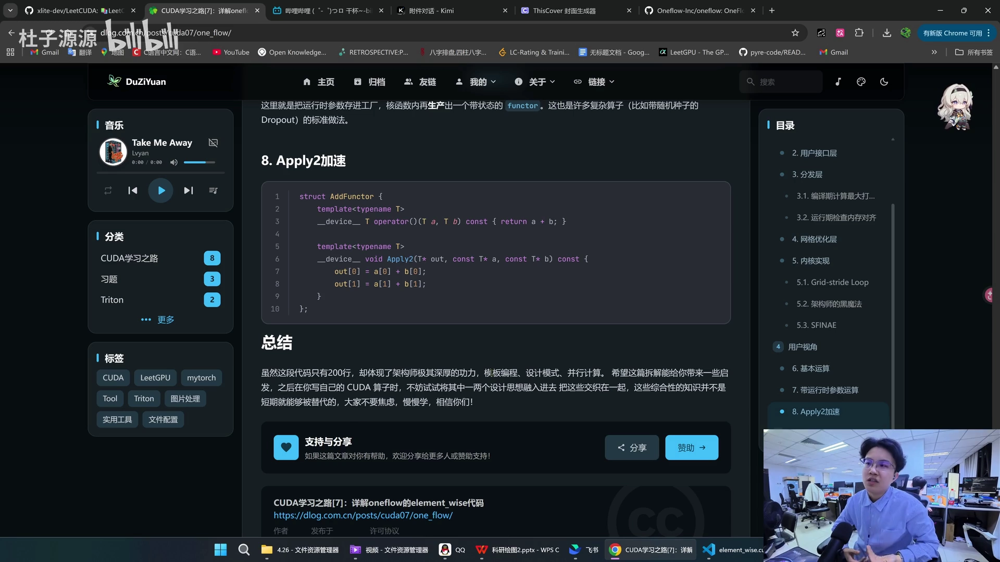 |
| （此区间无字幕） [【跳转到 09:02】](https://www.bilibili.com/video/BV1npovBCE1r/?t=542) | 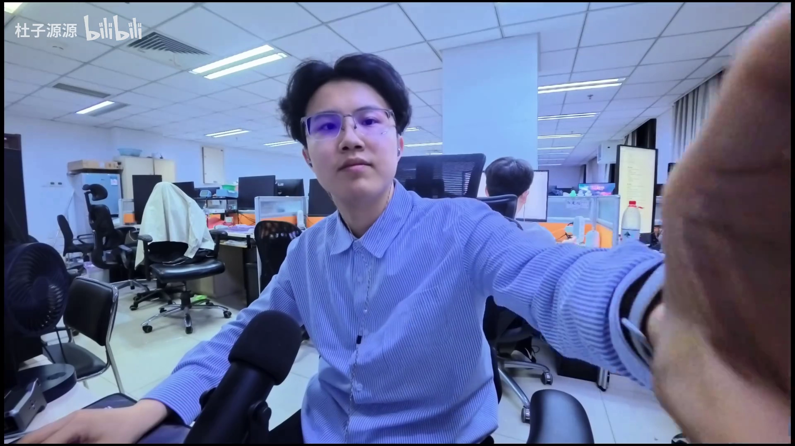 |