# 第07讲_Matrix_Addition详解 原始文稿（图-字幕分栏）

| 字幕文本 | 画面 |
| :--- | ---: |
| （此区间无字幕） [【跳转到 00:00】](https://www.bilibili.com/video/BV1PvoeB2E2h/?t=0) |  |
| 这一节我们来看一下矩阵加法（Matrix Addition）。 [【跳转到 00:05】](https://www.bilibili.com/video/BV1PvoeB2E2h/?t=5) | 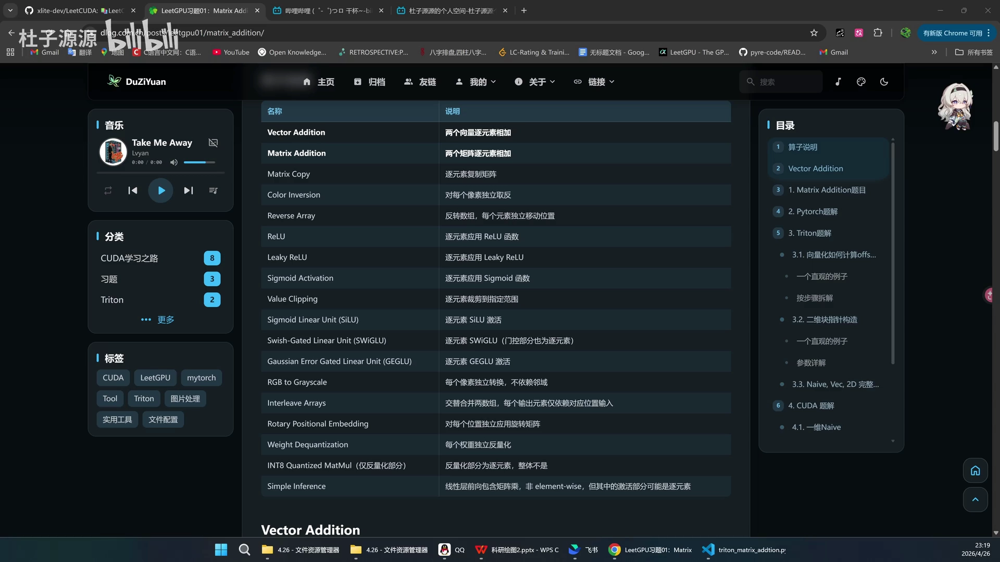 |
| 我把 LeetGPU 里面所有的算子都放在这个地方，之后也会逐一给大家讲解。 [【跳转到 00:14】](https://www.bilibili.com/video/BV1PvoeB2E2h/?t=14) | 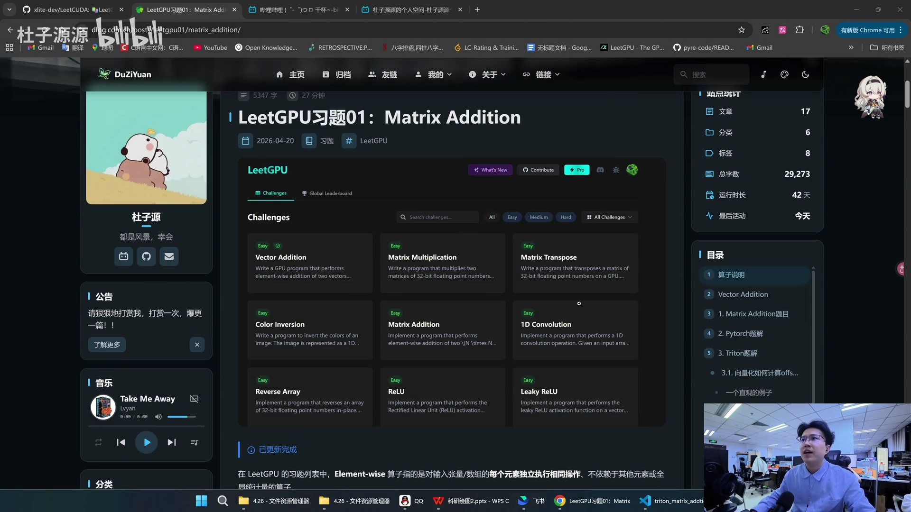 |
| 我们之前已经讲过了 Vector Addition（向量加法），这次再来看 Matrix Addition（矩阵加法）。后面如果有比较经典、或者技巧性比较强的算子，我会再讲一下；如果没有的话我就跳过，然后去看下一个系列。好，我们来看一下 Vector Addition 和 Matrix Addition。 [【跳转到 00:21】](https://www.bilibili.com/video/BV1PvoeB2E2h/?t=21) | 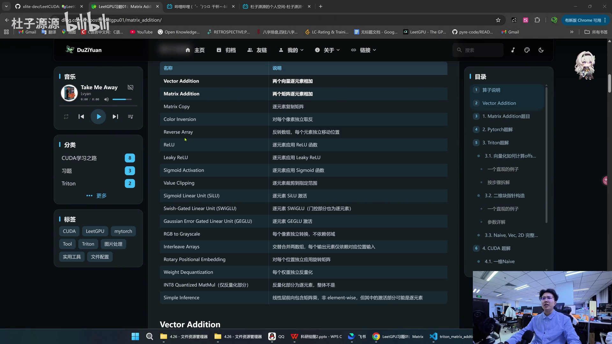 |
| 首先它有两个矩阵，我们要对这两个矩阵的每一个元素去做相加，其实和向量相加是非常像的。这是它的一些题目要求，我是从 LeetGPU 上搬过来的。我们先来看一下 PyTorch 是怎么实现的：PyTorch 非常简单，直接 import torch，因为它是对张量（tensor）进行操作。 [【跳转到 00:46】](https://www.bilibili.com/video/BV1PvoeB2E2h/?t=46) |  |
| 所以直接进行 A 加 B；而 copy 加一个横杠（`copy_`）就代表它是原地操作。那我们直接对它进行这样一个计算就可以。好，我们再来想一下 Triton 该怎么做，我在下边这个地方给到了一个完整的参数解释。 [【跳转到 01:11】](https://www.bilibili.com/video/BV1PvoeB2E2h/?t=71) |  |
| 我放大点到 Matrix Addition 这里。好，我们来看一下，我先给大家运行一下 Python 版的 Matrix Addition。 [【跳转到 01:36】](https://www.bilibili.com/video/BV1PvoeB2E2h/?t=96) | 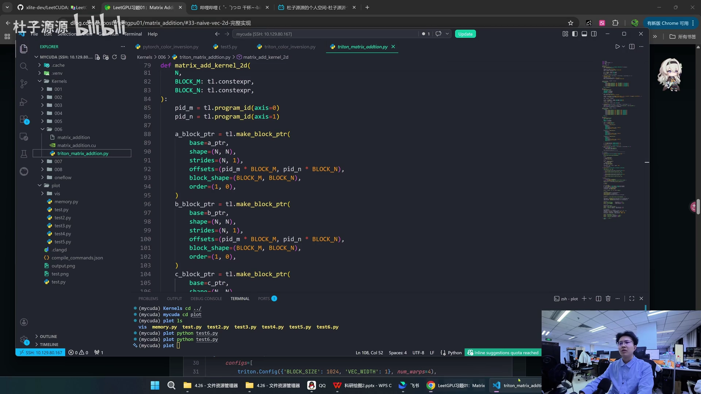 |
| 好，这是大概的带宽表现：这是 naive 版的，然后这是 1D、也就是 2D 的一个实现。可以多运行几次看下效果。OK，那我们来看一下。 [【跳转到 02:01】](https://www.bilibili.com/video/BV1PvoeB2E2h/?t=121) | 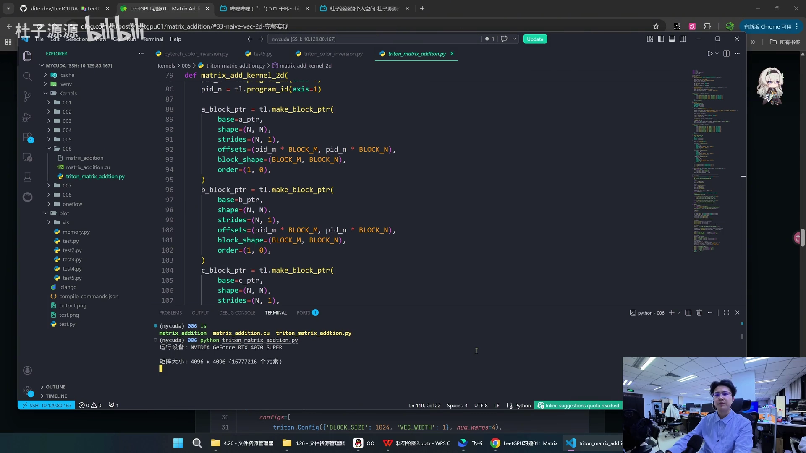 |
| 放在这里，然后这个放在这里。 [【跳转到 02:21】](https://www.bilibili.com/video/BV1PvoeB2E2h/?t=141) | 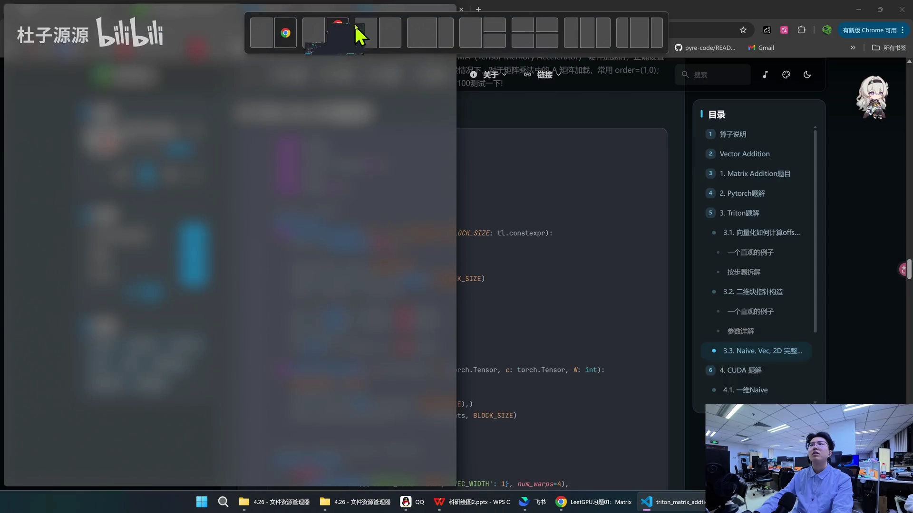 |
| OK，首先来看第一个版本。第一个版本就是直接去做加法，和大家一起回顾一下：第一步计算 pid，其次第二步计算起始的偏移量，也就是乘以它的 block_size，再往下计算它的 offset。 [【跳转到 02:26】](https://www.bilibili.com/video/BV1PvoeB2E2h/?t=146) |  |
| offset 就是 start 加上一个 tl.arange，从 0 到 block_size，然后生成一个 mask，这些是所有版本基本都要这么操作的。然后进行数据的 load，分别把 A 和 B load 到 a 和 b，再去做一个相加，然后再写回。注意写回是从 c 写到 C 加 offset 里边，然后再用一个 mask。 [【跳转到 02:51】](https://www.bilibili.com/video/BV1PvoeB2E2h/?t=171) |  |
| 那么计算的话，就是把两个 M、N 乘起来，注意这个 grid 我上次讲过，它是一个元组，代表元组的第一位用 N 除以 block_size 再向上取整，最后传入传参就可以了。这是 naive 版，非常简单。我们再来看一下第二个版本，是向量化加一个 offset。 [【跳转到 03:16】](https://www.bilibili.com/video/BV1PvoeB2E2h/?t=196) | 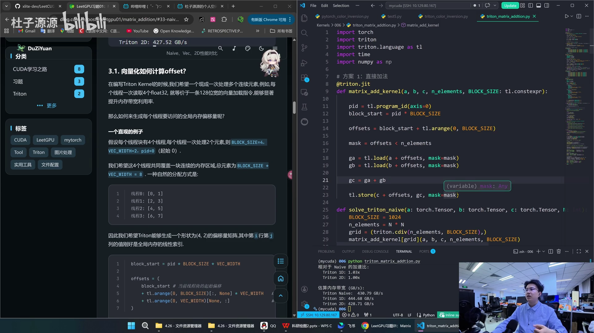 |
| 也就是对它做了一个优化。可以看到除了 block_size 之外，它还有一个 vector_width，也就是有一个向量的概念。可以看到我传参的时候就传了两个，然后在计算 block_start 的时候，把原本的 block_size 乘上它的宽度。注意这个 offset 的计算，offset 可以看一下，它是相当长、相当复杂的。 [【跳转到 03:41】](https://www.bilibili.com/video/BV1PvoeB2E2h/?t=221) | 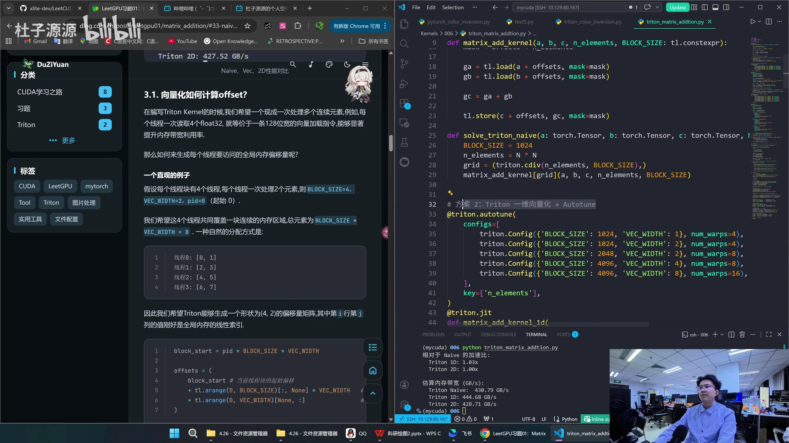 |
| 我在这里给到了一个 offset 的计算，可以看到，我们来具体看一下。因为假设每个线程块有四个线程，一次处理两个元素，所以 block_size 等于 4、vector_width 等于 2，然后 pid 是 0，那我们希望能把所有的区域都覆盖掉。 [【跳转到 04:06】](https://www.bilibili.com/video/BV1PvoeB2E2h/?t=246) | 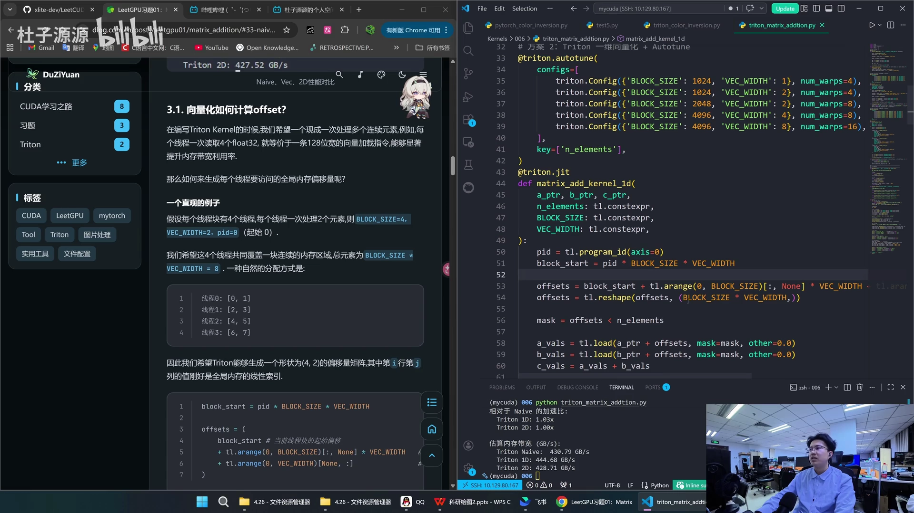 |
| 那就是 block_size 乘以 vector_width，也就是 8。那么一种非常自然的分配方式就是：线程 0 分配 0 和 1，线程 1 分配 2 和 3，这样分配下去。那么我们的 offset 希望同时能够看到这个偏移地址，怎么办呢？首先第一个是加的一个 block_start，那么第二个是每一个线程的基地址的偏移。什么叫基地址的偏移呢？ [【跳转到 04:31】](https://www.bilibili.com/video/BV1PvoeB2E2h/?t=271) | 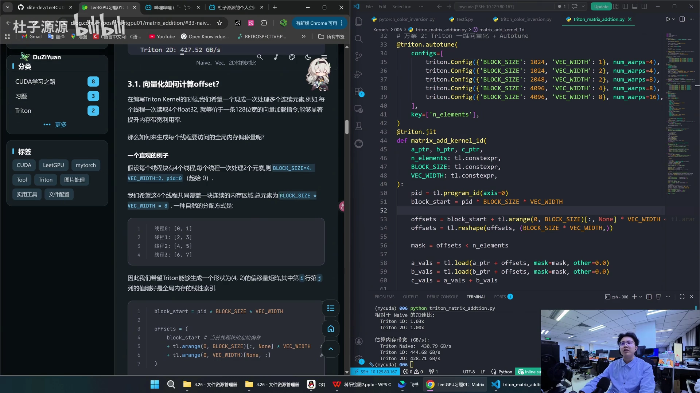 |
| 我来放大一些。 [【跳转到 04:56】](https://www.bilibili.com/video/BV1PvoeB2E2h/?t=296) | 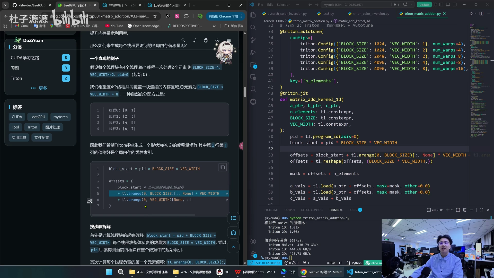 |
| 我们来看一下，在这个地方，这个 None 代表的是对它进行一个拓展：原本它是一个 block_size 的标量，那加一个 None 就变成了一个向量，形状是 block_size×1，然后这个代表的就是它竖着看。 [【跳转到 05:01】](https://www.bilibili.com/video/BV1PvoeB2E2h/?t=301) |  |
| 那么乘以一个位宽，它就是一个 4×2 的。我们再来横着看，后边这个放在前边，那我们就生成一个行向量，例如 0 到 vector_width-1。然后我们根据广播把这两个相加，就变成了它这个 offset 的全局偏移量。 [【跳转到 05:26】](https://www.bilibili.com/video/BV1PvoeB2E2h/?t=326) |  |
| 0、1、2、3、4、5、6、7。通过这个方法我们就能把 offset 算出来。那么算出来之后，这是一个二维向量，我们需要把它变回去，所以要对它进行 reshape，变成一个 offset，然后再进行一个 block_size 乘以 vector_width，然后我们再去访问处理就可以了，其他的都一样。 [【跳转到 05:51】](https://www.bilibili.com/video/BV1PvoeB2E2h/?t=351) | 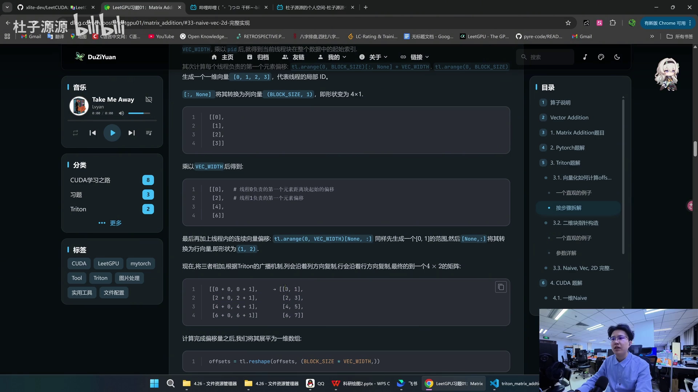 |
| 然后进行处理。那么这是第二种方法，去做一个一维化。第三个就是进行一个二维化。可以看到我们刚刚是把 M 乘以 N 放在一起去做计算，那实际上矩阵天然就有横着的和竖着的，我们可以直接用横着的和竖着的，所以给它传入两个参数分别计算。 [【跳转到 06:16】](https://www.bilibili.com/video/BV1PvoeB2E2h/?t=376) | 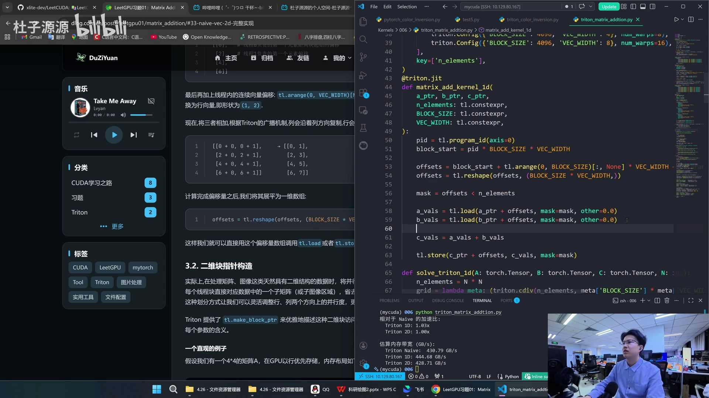 |
| 一个是偏移量为 0，一个是偏移量为 1，这就是我们之前提到的那个参数：这个代表的是一维，这个代表的是二维。那么这个地方有一个函数叫做 tl.make_block_ptr，就是把原本的这个指针变成一个 block 指针，我这个地方也仔细地写。 [【跳转到 06:41】](https://www.bilibili.com/video/BV1PvoeB2E2h/?t=401) | 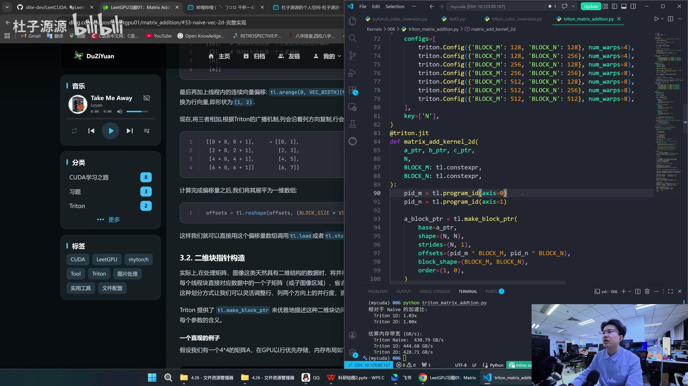 |
| 写到了。我们可以看到它矩阵在 GPU 里边是行优先（row-major）的，可以看到它的这个计算方式，我这个地方给大家做了一个演示。那我们一个一个看：首先 base 代表的是它原本的基地址，那么 shape 是它这个矩阵的一个完整的形状，那么 stride 就是说它行要一次走多少。 [【跳转到 07:01】](https://www.bilibili.com/video/BV1PvoeB2E2h/?t=421) | 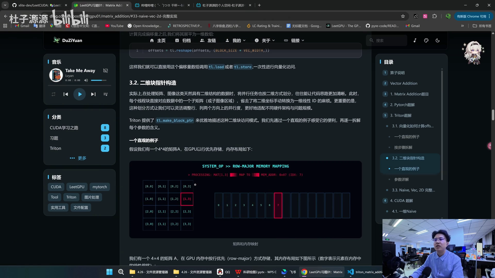 |
| 然后列一次多走多少。那为什么是 (4, 1) 呢？大家可以想一下：(4) 就代表你从这一行到下面这一行要经过四个，就是横着的四个都要过去才能到下一行；而列呢，它是相邻的直接过去就可以，所以它是 (4, 1)。那 offset 是什么意思？offset 实际上就是你这个地方的坐标。 [【跳转到 07:26】](https://www.bilibili.com/video/BV1PvoeB2E2h/?t=446) | 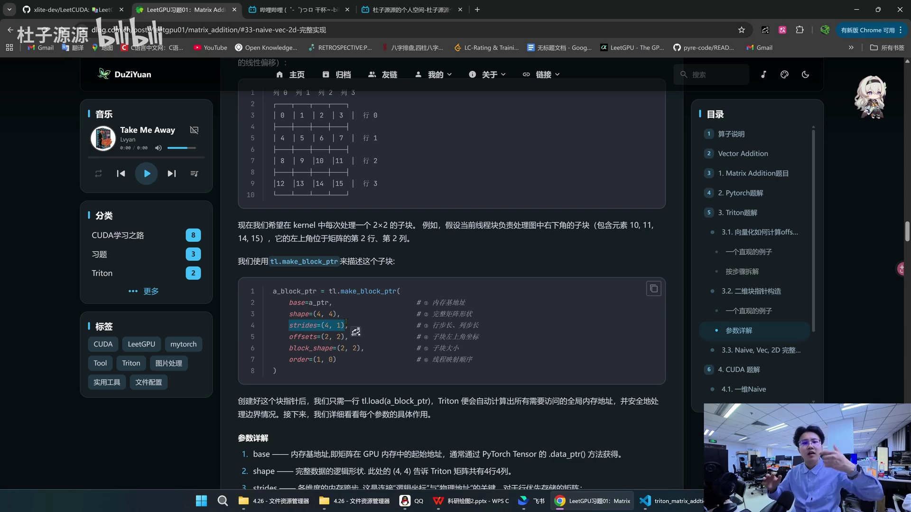 |
| 这个地方、这个地方、这个地方和这个地方。那么 block_shape 是我们可以自己定义的一个大小，可以看到我们可以自己定义为 M 和 N。那么 order，order 的话其实我没有测出来它的含义，包括 (0,1) 和 (1,0)，它的速度我在我这测是没有很明显的差异的。我看有的地方说是…… [【跳转到 07:51】](https://www.bilibili.com/video/BV1PvoeB2E2h/?t=471) | 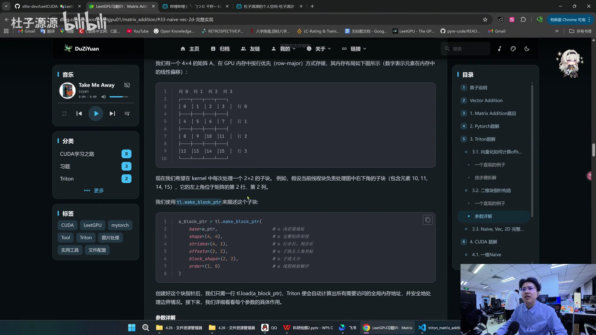 |
| 要在一些 50 系显卡才能测出来之类的，可能后续再试一下吧，然后有一个具体的详解。那我们分别把原本的指针变成 block 指针之后，三个都变换一下，然后我们再去对它进行 load 和 store，包括再进行一个边界检查，最后对它做一个计算就可以。那这是它测出来的整个带宽，可以看到…… [【跳转到 08:16】](https://www.bilibili.com/video/BV1PvoeB2E2h/?t=496) |  |
| 相对来说向量化的这个带宽是更高一些的。好，这是这个 Triton。那我们看完 Triton 之后，再来看矩阵运算的 CUDA。在我看来 CUDA 比较简单，和 Triton 其实差不多。第一个是 naive，直接一个一个算过去；第二个就是做一个 grid loop。 [【跳转到 08:41】](https://www.bilibili.com/video/BV1PvoeB2E2h/?t=521) | 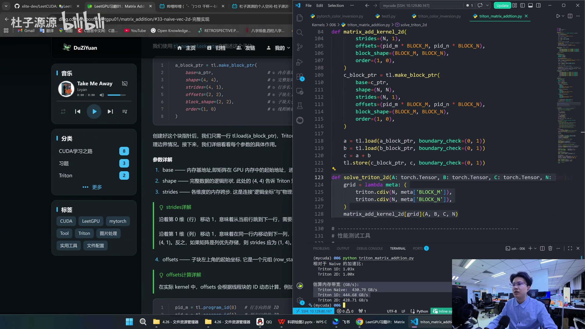 |
| 做一个循环优化，把原本的 tid 和 stride 分开，一个线程多算几次；那么第三个就是把它加入一个向量化。那实际上这个函数在 40 系显卡包括 50 系显卡上也不是很明显，但是在之前的一些老架构里面它是比较明显的。我们不去用它也可以，可以对它做一个 float4。 [【跳转到 09:06】](https://www.bilibili.com/video/BV1PvoeB2E2h/?t=546) |  |
| 让它聚类或者向量化，然后做这个矩阵运算。那么算好之后我们再给它返回去，注意这个地方要用到局部变量，保证它不会发生外边的这个缓存问题。OK，那么我这个地方也给到了一个二维的实现。 [【跳转到 09:31】](https://www.bilibili.com/video/BV1PvoeB2E2h/?t=571) | 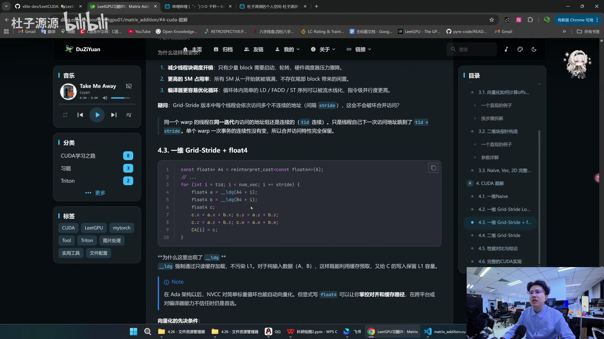 |
| 就是算出它的行和列，和 Triton 一样，只不过这个是需要我们自己算行和列，以及行要走多少个 thread、列要做多少个 stride，然后我们再对它进行一个计算：两次 for 循环，两次 for 循环，然后算它相对应的位置，直接算就可以。OK，这是我测出来的一个性能。 [【跳转到 09:56】](https://www.bilibili.com/video/BV1PvoeB2E2h/?t=596) |  |
| 可以看到相对来说，这个原本的 naive 版本就已经很高了，经过编译器的优化；那之后这个向量化也还不错，2D 的也还不错。那么效果相对来说比较差的就是这个 1D grid loop，当然你可以多测几次。这就是 Matrix Addition。那我们再总结一下一些点。 [【跳转到 10:21】](https://www.bilibili.com/video/BV1PvoeB2E2h/?t=621) | 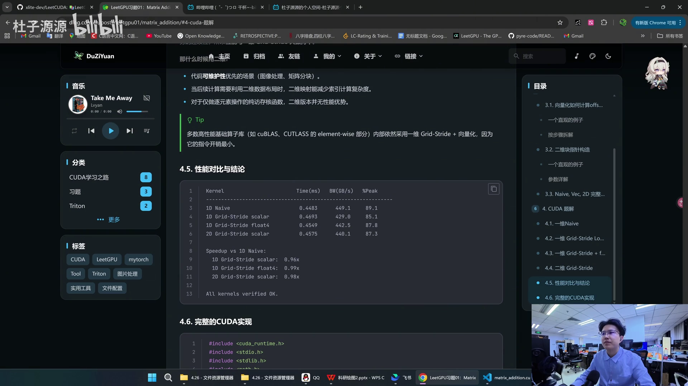 |
| 就是计算 offset，在 Triton 里面计算 offset。可以看到这个地方我给大家写了一下怎么去计算 offset，以及怎么去给它做一个块、把指针变成这个 block 指针（tl.make_block_ptr）。这两个知识点大家多去运用。 [【跳转到 10:46】](https://www.bilibili.com/video/BV1PvoeB2E2h/?t=646) | 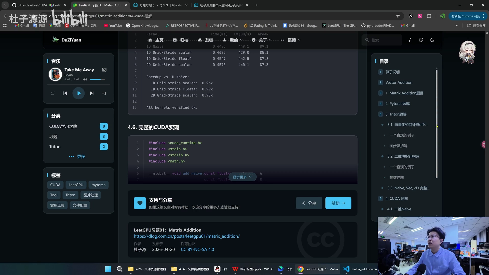 |
| 包括给它做一些调优（tuning），我这地方完整的代码都有写，然后大家自己去 copy，然后跑一下也可以。好，那这一节我们就讲到这。 [【跳转到 11:11】](https://www.bilibili.com/video/BV1PvoeB2E2h/?t=671) | 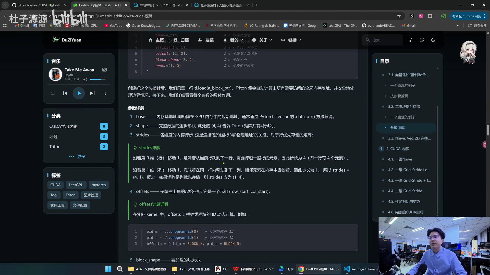 |