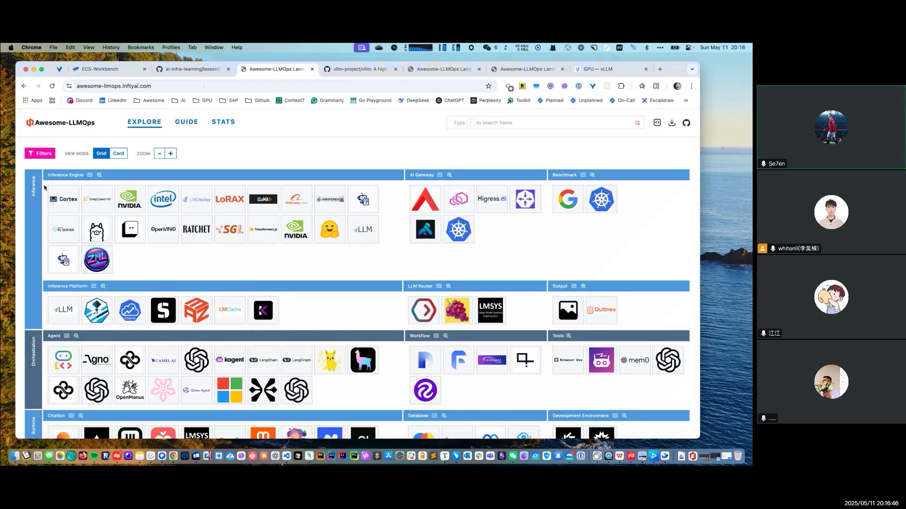
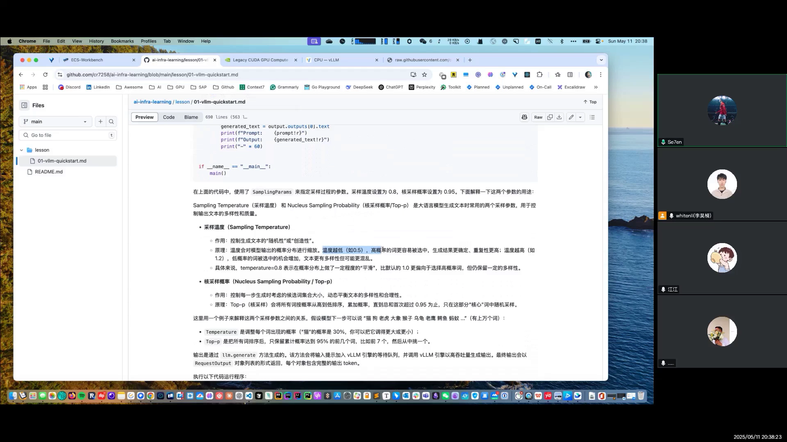
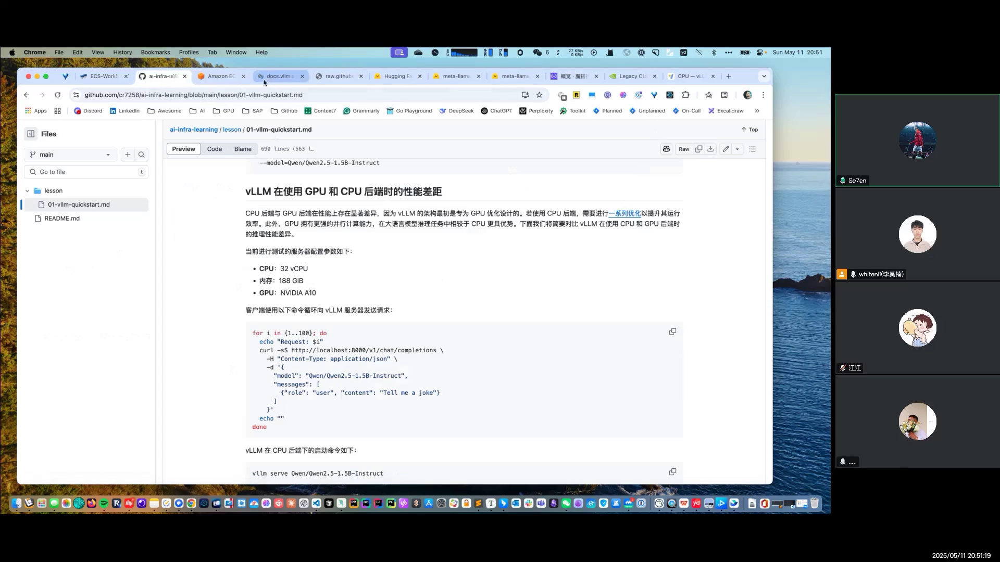
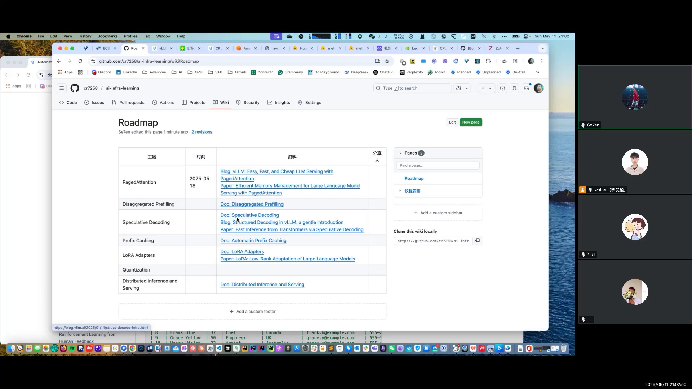

# 第01讲：LLM 全景图介绍与 vLLM 快速入门

## 本讲内容速览（SCQA）

**背景**：围绕大模型的开源项目非常多，从推理引擎、网关到 Agent 框架、运行时、训练平台，各自解决不同问题。

**冲突**：项目一多就容易分不清它们各自属于哪一类、彼此怎么配合。

**疑问**：LLM 工程生态可以怎样分类？每一类里有哪些代表性项目？vLLM 又该怎么上手？

**回答**：本讲先用一张全景图把项目按 **Inference（推理）、Orchestration（编排）、Runtime（运行时）、Training（训练）** 四块分类介绍；再介绍 vLLM，并带大家分别在 GPU、CPU 后端上把它装起来，跑通离线推理、在线推理与 Docker 运行。

---

## 一、LLM 全景图

全景图把目前的相关项目按照四个方面来拆分（[【跳转到 00:00】](https://www.bilibili.com/video/BV1T2EGzLEHi/?t=0)）：

1. **Inference（推理）**；
2. **Orchestration（编排）**，比如 Agent 方面；
3. **Runtime（运行时）**，也就是怎么把模型（可能是 Agent）运行起来、给它一个环境，数据库也归到这里；
4. **Training（训练）**。

下面按这四个方面分别展开。

### 1.1 Inference（推理）

#### Inference Engine（推理引擎）

所谓推理引擎，主要功能就是把大模型跑起来、serve 起来，包括**离线推理**和**在线推理**（[【跳转到 00:38】](https://www.bilibili.com/video/BV1T2EGzLEHi/?t=38)）：

- **离线推理**：可以一次性提交多个问题，让它批量推理、生成答案，比如夜间去跑一些任务；
- **在线推理**：像 OpenAI 这种，用户提了问题就要马上回答。

这一类的代表有 **vLLM**、**SGLang**，以及 NVIDIA 的一些 demo。vLLM 就包含在这里面。

#### Inference Platform（推理平台）

vLLM 只关注在单机上跑、在单机上 serve 一个模型；而在生产环境中要考虑的东西就多了，比如分布式推理。所以上面可能还要有一个 **Inference Platform（推理平台）** 来达到生产级别的服务，比如作者自己开源的 **AIBrix**（[【跳转到 01:08】](https://www.bilibili.com/video/BV1T2EGzLEHi/?t=68)）。

#### AI Gateway（AI 网关）

这部分作者比较熟悉，因为作者在 **Higress** 做，Higress 也会有一些 AI Gateway 的功能（[【跳转到 01:58】](https://www.bilibili.com/video/BV1T2EGzLEHi/?t=118)）。

最早出来的功能是 **AI Proxy**：大语言模型可能来自不同厂商，它们的请求或响应结构不一样，但后来大家都是以 OpenAI 的格式作为标准，于是就在网关层面把不同厂商大模型的请求、响应格式统一转换成 OpenAI 格式（[【跳转到 02:23】](https://www.bilibili.com/video/BV1T2EGzLEHi/?t=143)）。这样对用 Python SDK 或请求去调用大模型的一侧来说就很简单，大家都用 OpenAI 格式去请求。

另一个比较火的是 **MCP（Model Context Protocol，模型上下文协议）**，它允许大模型和一些外部数据源、数据库或各种各样的东西进行交互，相当于让大模型长出了手：大模型可以认为是脑，MCP 认为是手。Gateway 在这里可以做一件事，叫 **REST 到 MCP 的转换**（[【跳转到 03:13】](https://www.bilibili.com/video/BV1T2EGzLEHi/?t=193)）：平时都用 REST API 提供服务，如果要转成 MCP，可能要写 MCP 的 SDK、做一些代码开发工作；直接在网关层面做一个转换，就能把存量的 REST API 转成 MCP 的 server。

比如 Higress 有一个 **MCP 市场（MCP Marketplace，MCP Market）**，很多现成的 API 可以直接用，它会生成一个 MCP 的、比如 SSE 或者 Streamable HTTP 的端口，你把它配到 AI chat / chatbot 软件里，就可以调用这个 MCP server 进行操作（[【跳转到 04:03】](https://www.bilibili.com/video/BV1T2EGzLEHi/?t=243)）。

#### Benchmark、LLM Router、Output

同一区里还有几类（[【跳转到 04:28】](https://www.bilibili.com/video/BV1T2EGzLEHi/?t=268)）：

- **Benchmark（基准测试）**：对接入的模型做 benchmark、评测性能；
- **LLM Router**：跟 AI Gateway 有点相似，但属于后来出现的。AI Gateway 之前是 API Gateway，传统 API 网关很早就出现了，它们在此基础上增加了对 AI 能力的适配；而 LLM Router 是后来 AI 模型火了之后从 AI Proxy 方面开始支持的，功能上可能没有传统 AI Gateway 完整，但专门针对 AI 场景会有更多支持（[【跳转到 04:51】](https://www.bilibili.com/video/BV1T2EGzLEHi/?t=291)）；
- **Output**：对大语言模型的输出做一些结构化的设置。大模型的输出可能不太确定，可以通过一些开源项目让它的输出更结构化、更可控（[【跳转到 05:16】](https://www.bilibili.com/video/BV1T2EGzLEHi/?t=316)）。

### 1.2 Orchestration（编排）

Agent 的部分主要分为两部分（[【跳转到 05:50】](https://www.bilibili.com/video/BV1T2EGzLEHi/?t=350)）：

- **Agent 框架**：比如 **LangChain**、**LlamaIndex**，或者谷歌现在的 **ADK**。透过这些框架可以编写出 Agent 的代码，让它去跟大语言模型交互，甚至定义比较复杂的流程。以 **LangGraph** 为例，它可以定义非常复杂的工作流程，比如调用 tool 去得到 answer、rewrite question，然后再返回给 Agent 进行下一步调用（[【跳转到 06:29】](https://www.bilibili.com/video/BV1T2EGzLEHi/?t=389)）；
- **Workflow（工作流）**：相当于为 Agent 提供了一个可视化的界面，比如 **Dify**，你可以拖过来一个节点、在上面进行可视化配置，上手门槛会比 LangChain 简单一些；而 LangChain 这种可以提供更复杂一些的能力（[【跳转到 07:17】](https://www.bilibili.com/video/BV1T2EGzLEHi/?t=437)）；
- **Tools**：比如像 **Browser Use**，可以通过它去操作你的浏览器等等。

### 1.3 Runtime（运行时）

Runtime 的范围就比较广了（[【跳转到 07:47】](https://www.bilibili.com/video/BV1T2EGzLEHi/?t=467)）：

- **Chatbot**：比如 **Cherry Studio**（国内用得比较多的一个 Chatbot），可以去对接 OpenAI、Claude、DeepSeek 等等模型，现在也支持 MCP 这种工具调用；
- **Database（数据库）**：比如向量数据库 **Milvus、Weaviate**，包括 **Elasticsearch、OpenSearch** 这些传统数据库其实也支持向量；
- **Environment（环境）**：相当于有一个 runtime、一个 sandbox（沙箱）环境去让这些 Agent 运行。比如 **Manus** 当时就跑了一个 Ubuntu 虚拟机；
- **Code Assistant（代码助手）**：比如开源的、有 **Cline** 这种 VSCode IDE 的编辑软件，或者是付费的、像 **Cursor、Windsurf** 这种；
- **Observability（可观测性）**：因为大语言模型的调用其实也挺复杂的，它可以提供一个类似 trace（链路追踪）的方式。现在有的也支持 **OpenTelemetry** 的协议，可以用统一的方式。比如一张 trace 图里能看到第一步 Retriever 在这里查了 Vector Store、接下来在干什么，方便排查；点到每个 trace 的 span，可以看到里面具体详细的信息（[【跳转到 09:36】](https://www.bilibili.com/video/BV1T2EGzLEHi/?t=576)）。

### 1.4 Training（训练）

最后一部分是 Training（训练）（[【跳转到 10:06】](https://www.bilibili.com/video/BV1T2EGzLEHi/?t=606)）：

- **Fine-tuning（微调）**；
- 训练的一些框架，比如**强化学习（RL）**什么的框架；
- **Workflow**：比如像 **Kubeflow**，就是把训练任务怎么在 K8s 上跑起来；
- **Evaluation（评估）**：评估模型质量，它可能会有相应的问题，根据这些问题的结果、大模型回答的质量去做一个评估。

---

## 二、vLLM 快速入门

### 2.1 vLLM 是什么、为什么有 PagedAttention

vLLM 其实就是一个很高效、易用的大语言模型服务框架，专注于优化推理速度的吞吐量（[【跳转到 11:04】](https://www.bilibili.com/video/BV1T2EGzLEHi/?t=664)）。

它来自 **PagedAttention** 那篇 paper。作者对其简单理解为：它借鉴了操作系统里普通物理内存跟虚拟内存的映射。GPU 上有 GPU 显存，在没有 vLLM 之前，显存的利用率可能比较低、碎片化比较严重；它利用逻辑 block 跟 physical block（物理块），通过 **block table**，让这种分配可以比较连续，从而减少了 GPU 显存碎片化的问题（[【跳转到 11:34】](https://www.bilibili.com/video/BV1T2EGzLEHi/?t=694)）。

> 作者表示这部分当时还没有具体去看，后续会把 PagedAttention 作为下一周的学习目标。

vLLM 支持同时在 GPU 跟 CPU 上运行，下面会分别介绍 GPU 和 CPU 作为后端的安装方法。

### 2.2 GPU 后端：环境与安装

如果本地没有 GPU 环境，可以在云厂商上购买 GPU 服务器（[【跳转到 12:24】](https://www.bilibili.com/video/BV1T2EGzLEHi/?t=744)）。作者的演示是在阿里云上开了一台，建议一般选择**海外节点**，因为有些依赖下载等在国内会比较慢；选的 GPU 是 **A10**，虚拟机操作系统选 **Ubuntu**，因为后面有个提前准备的、针对 Ubuntu 版本安装 GPU 相关依赖的脚本。

对应官方文档就是 Installation，分 GPU 跟 CPU 两部分。作者整理的文档就是针对官方文档做的一个整理，方便翻（[【跳转到 13:14】](https://www.bilibili.com/video/BV1T2EGzLEHi/?t=794)）。

GPU 这段有一个要求：计算能力（**Compute Capability**）要到 **7.0 以上**。Compute Capability 定义了每个 NVIDIA GPU 的硬件特性和支持的指令，也就是计算能力决定你能否使用某些 feature，比如 **Tensor Core、动态并行（Dynamic Parallelism）** 等。因为这些 feature 是在 NVIDIA 不同架构版本引进的，比如有个版本叫 **Ampere（安培）**，版本是根据不同科学家的名字命名的，还有 **Volta** 之类，版本是不一样的（[【跳转到 14:04】](https://www.bilibili.com/video/BV1T2EGzLEHi/?t=844)）。

看计算能力的矩阵图：本次用的 **A10 是 8.6**，肯定超过 7；更早的比如 3.2、3.5，再到更早的 M、P 系列，这些可能就不行了。作者之前用 **T4、L4** 这种跑精度高一点的、像 DeepSeek 之类的模型时有点问题，会报浮点数的问题；尽量用 **V100 或者 A10、A100** 之类的应该就没什么问题（[【跳转到 14:56】](https://www.bilibili.com/video/BV1T2EGzLEHi/?t=896)）。

> **关于省钱**：在云厂商上可以选择**抢占式实例**，差不多能减少 90% 的钱；如果选按量付费，可能需要 11 块一个小时。作者和同事在测的时候，本地没有 GPU 就跑到**腾讯云**的抢占实例上，可用区选**香港**——选国内 SSH 连上去会比较快，但有些依赖或安装下载会比较慢，香港下载依赖包的速度没那么慢；因为主要都是练习、学习用，可用区选择海外会更好一点（[【跳转到 15:21】](https://www.bilibili.com/video/BV1T2EGzLEHi/?t=921)）。

**安装虚拟环境**：官方推荐使用 **uv** 去管理 Python 虚拟环境。之前大家可能会用**Conda**，一方面 Conda 现在好像要收费、公司没买的话会要求强制卸载；uv 有个好处，它是用 **Rust** 来写的、速度贼快，比其他的包管理软件（还有一个叫 **Poetry**）性能好很多（[【跳转到 17:51】](https://www.bilibili.com/video/BV1T2EGzLEHi/?t=1071)）。

**安装 GPU 依赖**：作者准备了一个脚本，一键安装，比如要装 GPU 的 driver，还有 **container toolkit（nvidia-container-toolkit）**——要让 Docker 跑起来、要用这个 GPU，就要安装它，还要配置 container runtime；脚本里也有一个检查，看有没有问题，弄好以后就可以用（[【跳转到 18:41】](https://www.bilibili.com/video/BV1T2EGzLEHi/?t=1121)）。

准备好后，用 uv 创建一个虚拟环境；GPU 就很简单，直接 `uv pip install vllm` 就结束了（[【跳转到 19:06】](https://www.bilibili.com/video/BV1T2EGzLEHi/?t=1146)）。

### 2.3 CPU 后端：从源码编译

如果是 CPU，因为官方没有提供 CPU 的安装包，需要（也是先用 uv 起一个虚拟环境），然后安装它相关的编译器、克隆源代码，因为要用源码编译到本地，再安装用于构建的依赖包，最后通过指定 CPU 目标的安装命令（`-e .`）去 install（[【跳转到 19:31】](https://www.bilibili.com/video/BV1T2EGzLEHi/?t=1171)）。

安装完的结果就是：能用 uv、vLLM 的命令去 serve 在线推理，或者使用 Python 离线推理的代码。

### 2.4 离线推理与在线推理

前面也讲了离线跟在线的区别（[【跳转到 20:21】](https://www.bilibili.com/video/BV1T2EGzLEHi/?t=1221)）：

- **离线**：一次对一批数据进行处理，通常实时性没有要求那么高，比如每天晚上跑用户画像或者生成广告文案，对延迟要求没那么高，并且一般可以去利用闲时的资源；
- **在线**：实时的，要求响应可能在几百毫秒以内，实时性比较高，比如聊天机器人、智能客服。

### 2.5 采样参数：temperature 与 top_p

官网提供的一个示例里，有个参数叫 **Sampling Params（采样参数）**，指定了两个参数 **temperature** 和 **top_p**；示例里是四个问题，离线推理一次性分别回答这四个问题（[【跳转到 20:46】](https://www.bilibili.com/video/BV1T2EGzLEHi/?t=1246)）。

temperature 叫**采样温度**，另一个是**核采样概率**。作者一开始觉得两者有点像，问了 ChatGPT 后有了更好理解的例子（[【跳转到 21:11】](https://www.bilibili.com/video/BV1T2EGzLEHi/?t=1271)）：

- **采样温度（temperature）**：控制文本的随机性和创造性。温度越低，高概率的词更容易被选中，生成的结果更确定、重复性更高；温度越高，低概率的词容易被选中。
- **核采样概率（top_p）**：控制每一步生成时候选集（候选词）的大小。

例子：假设下一步可选的是一批词，temperature 调整每个词的概率，比如把"猫"的概率调到 30%，让这个词更容易出现；top_p 就是只选前几个词、让它的累计概率达到比如 90% 就行了（[【跳转到 22:01】](https://www.bilibili.com/video/BV1T2EGzLEHi/?t=1321)）。

作者的总结理解是：temperature 指定、控制某个词的出现概率；top_p 就是选择哪些词、前几个词，可以理解为在一个范围内被选择。

生成结果用的是 `LLM.generate()` 方法。演示里用的是 GPU 后端，有一个 basic 的 py 文件，直接 Python 跑它就行（[【跳转到 22:51】](https://www.bilibili.com/video/BV1T2EGzLEHi/?t=1371)）。

### 2.6 动手：离线推理 demo

- 用的模型是**千问（Qwen）1.5B**，提前下好，大概有 **3.9 个 GB**（[【跳转到 23:13】](https://www.bilibili.com/video/BV1T2EGzLEHi/?t=1393)）；
- 运行时如果提示 `Automatically detected platform: cuda`，说明是 GPU 的；如果显示 CPU，那就是 CPU 的；
- 结果出来就是四个问题分别给了答案，这就是一个离线推理的场景（[【跳转到 24:03】](https://www.bilibili.com/video/BV1T2EGzLEHi/?t=1443)）。

> 现场有人提问"跑脚本为什么算离线推理"。作者解释：离线是提前准备好一批数据、跑完即止；在线则是起了一个 HTTP 的端口，可以实时响应（[【跳转到 24:28】](https://www.bilibili.com/video/BV1T2EGzLEHi/?t=1468)）。

另外补充：离线脚本运行时其实也会起 vLLM engine（可以看到 `initialize vLLM engine`），但离线跑完它就退出了；在线则是常驻一个 API server（[【跳转到 29:19】](https://www.bilibili.com/video/BV1T2EGzLEHi/?t=1759)）。

### 2.7 动手：在线推理（兼容 OpenAI）

在线推理相当于起了一个 HTTP 的端口（默认 **8000**），可以实时响应（[【跳转到 28:11】](https://www.bilibili.com/video/BV1T2EGzLEHi/?t=1691)）。启动时会看到 `Start serve` 之类的 process，没有的话说明第一次要下载权重，需要等一等。

在线时可以支持一些 OpenAI 的接口，比如 list model 这些（[【跳转到 28:31】](https://www.bilibili.com/video/BV1T2EGzLEHi/?t=1711)）。因为它与 OpenAI 兼容，可以用 OpenAI 的 Python SDK，API key 留空（empty）就好。聊天一般用 **ChatCompletion API**，可以加一些 system role（系统角色），相当于一开始的提示词"你是一个什么什么样的"，也可以不加（[【跳转到 30:18】](https://www.bilibili.com/video/BV1T2EGzLEHi/?t=1818)）。

### 2.8 模型下载：Hugging Face 与 ModelScope

默认情况下是从 **Hugging Face** 下载模型的（[【跳转到 25:15】](https://www.bilibili.com/video/BV1T2EGzLEHi/?t=1515)）：

- 国内可以用 **ModelScope（魔搭社区）**，要用的话得设置 `VLLM_USE_MODELSCOPE` 这个环境变量；
- Hugging Face 上有些模型是**需要申请才能下载**的，比如 **Llama 3.1**，要提交一个申请、填你的信息、人家审批。作者说之前以为只是走个过场，但如果国家填中国会被秒拒、并且没有机会再去申请；作者换了个账号重新申请，填美国就行了。作者提醒不知道它会不会检测网络，但国籍那里别选国内；
- 国内的比如 **DeepSeek、千问（Qwen）** 这些可以直接下载，不需要联动 Hugging Face token；演示用的千问就是直接下载、不用 token。

### 2.9 用 Docker 运行 vLLM

vLLM 也可以用 Docker 运行（[【跳转到 30:50】](https://www.bilibili.com/video/BV1T2EGzLEHi/?t=1850)）。前面提过的脚本主要就是配置 Docker 的一些 runtime，比如 `/etc/docker/daemon.json` 里配置家用 NVIDIA 的 runtime，然后就能用命令一样地跑 GPU。

跑起来后作者说明了几个参数（[【跳转到 32:03】](https://www.bilibili.com/video/BV1T2EGzLEHi/?t=1923)）：

- **`--runtime=nvidia`**：一定要指定的；
- **`--gpus all`**：现在只有一个 GPU 卡的话会全部使用；如果有多个，会全部使用，也可以指定某个 GPU id，比如 `--gpus device=...`。注意外面还要有个额外的引号，不然识别会有问题；因为它也可以把 `--gpus` 写成 number，不加引号可能会以为你是在指定 number——加了引号是指定具体的 id，另一种则是直接指定使用几个 GPU；
- **`-v`**：挂载目录。Hugging Face 模型下载下来本地是存在某个目录的，如果挂载了这个路径，下次就不用下载，Docker 启动就快了；
- **`-p`**：端口，默认是 8000，映射到本地就可以用 `localhost:8000` 访问；
- **`--shm-size`**：因为 vLLM 底层用 **PyTorch**，PyTorch 在底层共享内存的时候需要在进程之间传递数据（比如进行张量并行什么的），所以需要设置一下这个参数。

最后指定镜像、再指定模型就可以了，跑起来后跟前面一样去问问题就好。CPU 也一样可以（放在 AWS 的一个仓库里，换成对应镜像即可）（[【跳转到 33:56】](https://www.bilibili.com/video/BV1T2EGzLEHi/?t=2036)）。

### 2.10 GPU 与 CPU 后端的性能差距

因为 vLLM 前面的 PagedAttention 其实就是针对 GPU 显存做了一个优化的设计，用 CPU 的话一方面需要进行一些额外的优化、不是那么开箱即用（官网列出了一些 performance 参数可以调）；另一方面，就算调完以后，其实还是 GPU 更快一点，因为 GPU 适合并行计算还有矩阵乘法的运算（[【跳转到 34:29】](https://www.bilibili.com/video/BV1T2EGzLEHi/?t=2069)）。

作者的测试对比：服务器参数（32 vCPU / 188GB 内存 / NVIDIA A10）下，GPU 基本是很快、实时出来，会周期性刷 tokens 统计，看到大概 **130 几 tokens/s** 的吞吐率；换成 CPU、用同样的测试命令，明显慢得多，token 数量大概是**十倍的差距**、本次 CPU 测的是 **13 token/s**，跟前面测的差不多（[【跳转到 40:01】](https://www.bilibili.com/video/BV1T2EGzLEHi/?t=2401)）。

> **一个待研究的问题**：vLLM 现在默认使用 **V1**（有 V1 跟 V0 两个版本，代码仓库里 V0 在外层、V1 在里面）；V1 默认启用 **prefix caching（前缀缓存）**，V0 默认禁用，CPU 上这个功能默认关闭。为了保证公平，作者测 GPU 时加了 `--no-enable-prefix-caching` 关闭它。作者一开始尝试在 CPU 上启动 prefix caching（`--enable-prefix-caching`），发现貌似没用：输出里 prefix caching hit rate 是零、没命中就没用上；而 GPU 上能看到正常的 hit rate。作者为此提了 issue，当时还没人回复（[【跳转到 37:56】](https://www.bilibili.com/video/BV1T2EGzLEHi/?t=2276)）。

---

## 三、后续计划与学习方式

本讲最后讨论了后面要分享的内容和推进方式。

**后续要讲的主题**（对照 vLLM 目前的一些 feature 来安排）（[【跳转到 40:50】](https://www.bilibili.com/video/BV1T2EGzLEHi/?t=2450)）：

- 先了解 **PagedAttention**（官方 blog + paper，作者觉得 paper 可以先尝试读一下，"最后某个技术真的想要吃得比较透，可能还是要去啃一下"）；
- **Disaggregated Prefill（PD 分离）**：一个请求在推理时分为两部分——**prefill** 去接收用户的 prompt（可能是一长串问题或指令，一次性接收、可以一次性处理），属于**计算密集型**；**decode** 根据前面的结果、KV cache 的结果一个个往外吐 token，属于**内存密集型**。PD 分离就是把计算密集型的 prefill 跟内存密集型的 decode 进行分离，从而提高整体吞吐（[【跳转到 44:04】](https://www.bilibili.com/video/BV1T2EGzLEHi/?t=2644)）；
- **Speculative Decoding（投机解码）**：正常情况下用大模型一个一个 token 推理；投机解码借助一个小模型（比如 2B）先猜这个 token，比如猜三个，然后一次性发给大模型做验证——猜得准就用、猜不准就不用，用大模型的结果，从而提升推理性能（[【跳转到 45:29】](https://www.bilibili.com/video/BV1T2EGzLEHi/?t=2729)）；
- **Prefix Caching**：相当于做缓冲，根据前缀去计算一个 KV cache，把前缀缓存下来；后面根据 block1 的 prefix 加上 block2 的 token 继续用这个 prefix，如果命中就直接拿、不用再计算（[【跳转到 46:44】](https://www.bilibili.com/video/BV1T2EGzLEHi/?t=2804)）。它存在哪里由配置决定，GPU、CPU 都支持；相关项目 **LMCache** 可以存到不同的 destination，比如 Redis，甚至不存在内存里——LMCache 的标题比较简易懂，叫 **"Redis for LLM"**（[【跳转到 47:57】](https://www.bilibili.com/video/BV1T2EGzLEHi/?t=2877)）；
- **LoRA Adapter**：属于一种轻量级的微调方式。全量参数微调相当于重练一遍、成本很高；LoRA 相当于在预训练权重旁边加一部分、只管自己能对应的那些层的参数，做很少的修改，最后把两者参数合并得到微调后的模型（[【跳转到 49:37】](https://www.bilibili.com/video/BV1T2EGzLEHi/?t=2977)）；
- **Quantization（量化）**：总的来说就是把精度比如 8 比特的改成 4 比特，比特少了，占用的资源自然就少了、速度也就快了（[【跳转到 50:38】](https://www.bilibili.com/video/BV1T2EGzLEHi/?t=3038)）；
- **分布式推理跟 serving**：更面向工业化，比如在 K8s 上做分布式推理——单机挂了就挂了，K8s 上可以做分布式高可用、性能更强，还可以根据上层调度器、根据 vLLM 后端的实际请求量做路由分发。相关的是 **Gateway API Inference Extension** 这个项目，它在网关层面，等于在 Gateway API 标准上做了一个 Inference Extension：Gateway API 在决定路由之前先发给这个 extension 组件，去问它应该转发给哪个模型（因为模型还是用 PD 的方式跑的），这个 extension 掌握各模型的 prefix cache、KV cache 状态或负载状态，再返回给 gateway 告诉它转发给哪个对应的模型 pod（[【跳转到 51:39】](https://www.bilibili.com/video/BV1T2EGzLEHi/?t=3099)）。

---

## 小结

- 全景图按 **Inference、Orchestration、Runtime、Training** 四个方面拆分项目（[【跳转到 00:05】](https://www.bilibili.com/video/BV1T2EGzLEHi/?t=5)）。
- Inference 里有推理引擎（vLLM、SGLang、NVIDIA demo）、推理平台（AIBrix）、AI Gateway（Higress、AI Proxy、MCP）、Benchmark、LLM Router、Output。
- Orchestration 分 Agent 框架（LangChain、LlamaIndex、ADK、LangGraph）、Workflow（Dify）、Tools（Browser Use）。
- Runtime 有 Chatbot（Cherry Studio）、Database（Milvus、Weaviate、ES、OpenSearch）、Environment（Manus 的 Ubuntu 沙箱）、Code Assistant（Cline、Cursor、Windsurf）、Observability（trace、OpenTelemetry）。
- Training 有微调、RL 框架、Workflow（Kubeflow）、Evaluation。
- vLLM 因 **PagedAttention** 而生，把 KV cache 按逻辑/物理 block 通过 block table 映射，减少显存碎片。
- 安装：官方推荐 **uv**；GPU 后端 `uv pip install vllm`，CPU 后端要源码编译；GPU 要求 Compute Capability ≥ 7.0。
- 离线批量 `LLM.generate()`、跑完即释放；在线起 HTTP（默认 8000）服务、兼容 OpenAI 接口。
- 采样参数：**temperature** 控制每个词的出现概率，**top_p** 选择候选词集合大小。
- Docker 运行关键参数：`--runtime=nvidia`、`--gpus`（注意加引号）、`-v`、`-p`、`--shm-size`。
- 实测 GPU 吞吐约 **130+ tokens/s**，CPU 约 **13 tokens/s**，差约十倍；GPU 上 prefix caching 正常，CPU 上命中率为 0 的问题尚待研究。

## 关键术语速查

| 术语 | 一句话解释 |
| --- | --- |
| Inference Engine | 把大模型跑起来、serve 起来的推理引擎，如 vLLM、SGLang |
| Inference Platform | 在引擎之上做生产级分布式服务，如 AIBrix |
| AI Proxy | 在网关层把各家模型格式统一成 OpenAI 格式 |
| MCP | Model Context Protocol，让大模型与外部数据源/工具交互的协议 |
| MCP Marketplace | 提供现成 API、可生成 MCP 端口的市场（如 Higress） |
| LLM Router | 更聚焦 AI 场景的模型路由 |
| PagedAttention | 借鉴 OS 虚拟内存，用逻辑/物理 block + block table 管理显存 |
| Compute Capability | NVIDIA GPU 的硬件特性版本号，vLLM 要求 ≥ 7.0 |
| uv | Rust 写的 Python 包/虚拟环境管理器，官方推荐 |
| 离线推理 | 一次批量处理、跑完即释放，实时性要求低 |
| 在线推理 | 常驻 HTTP 服务实时响应，兼容 OpenAI 接口 |
| Sampling Temperature | 控制文本的随机性和创造性 |
| Top-p（核采样） | 控制每一步候选词集合的大小 |
| Prefix Caching | 按前缀缓存 KV，命中则不重复计算 |
| PD 分离 | 把计算密集的 prefill 与内存密集的 decode 分离 |
| Speculative Decoding | 小模型先猜 token、大模型验证以提速 |
| LoRA Adapter | 只训练少量附加参数的轻量级微调方式 |
| Quantization | 降低精度（如 8bit→4bit）以减少资源占用、提速 |
| Gateway API Inference Extension | 在网关层根据各后端缓存/负载状态决定路由 |
