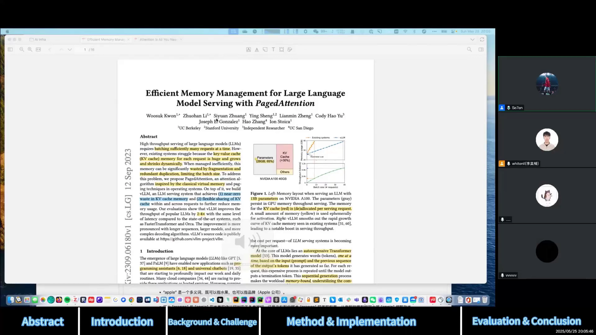
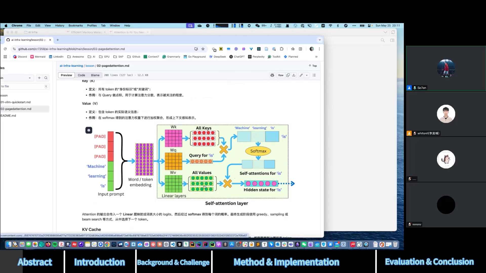
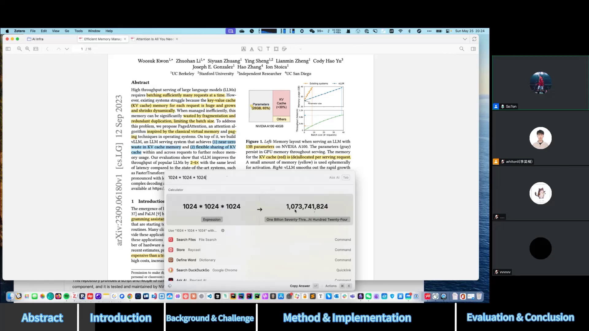
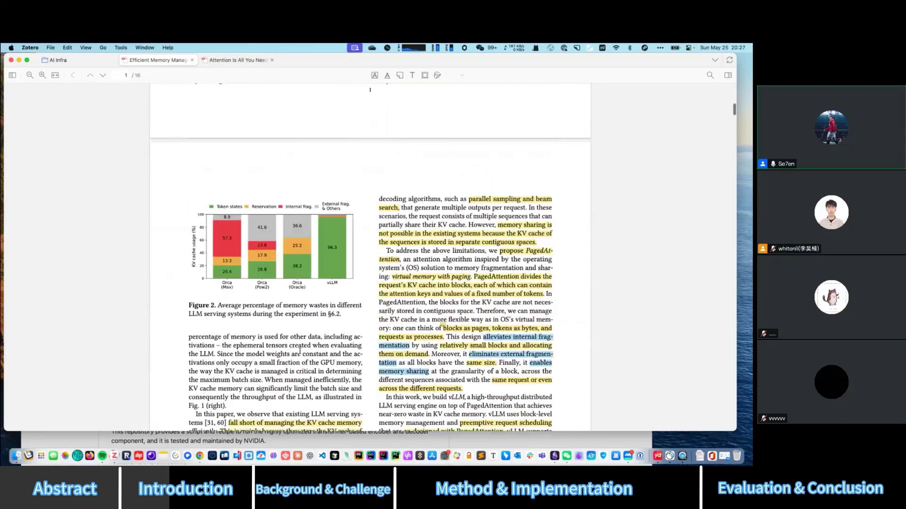
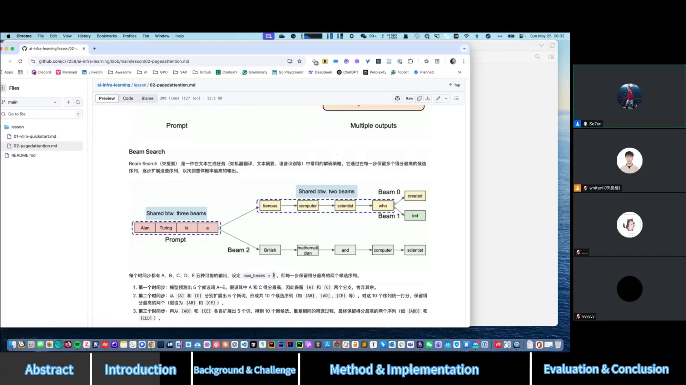
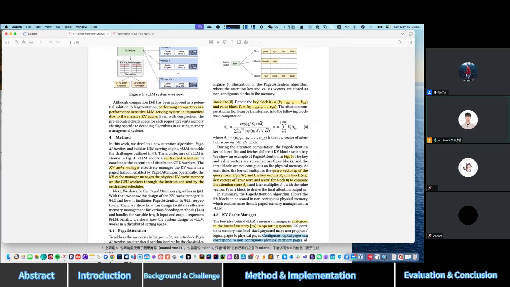
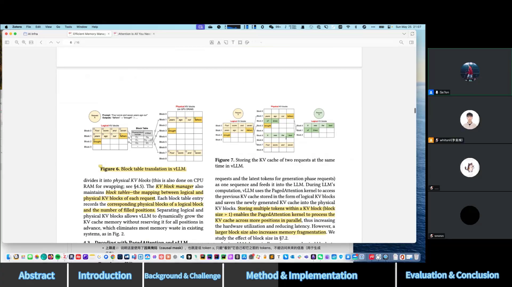
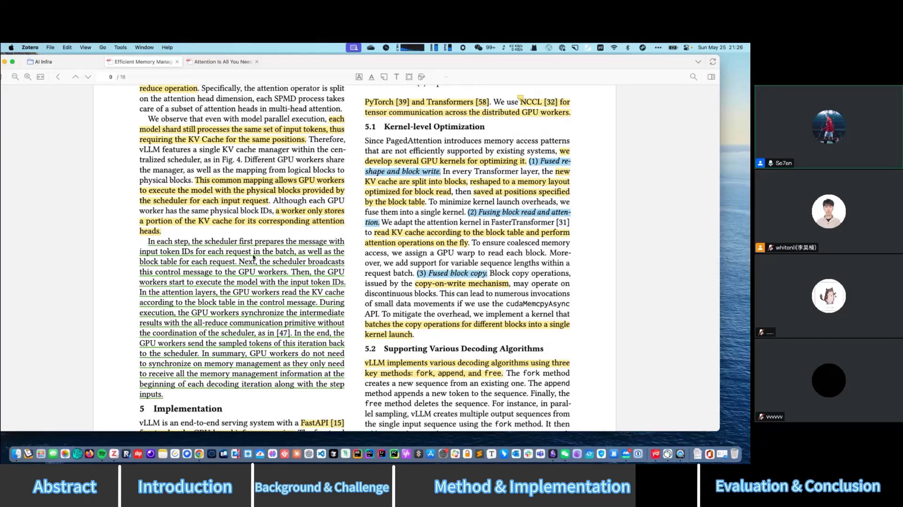
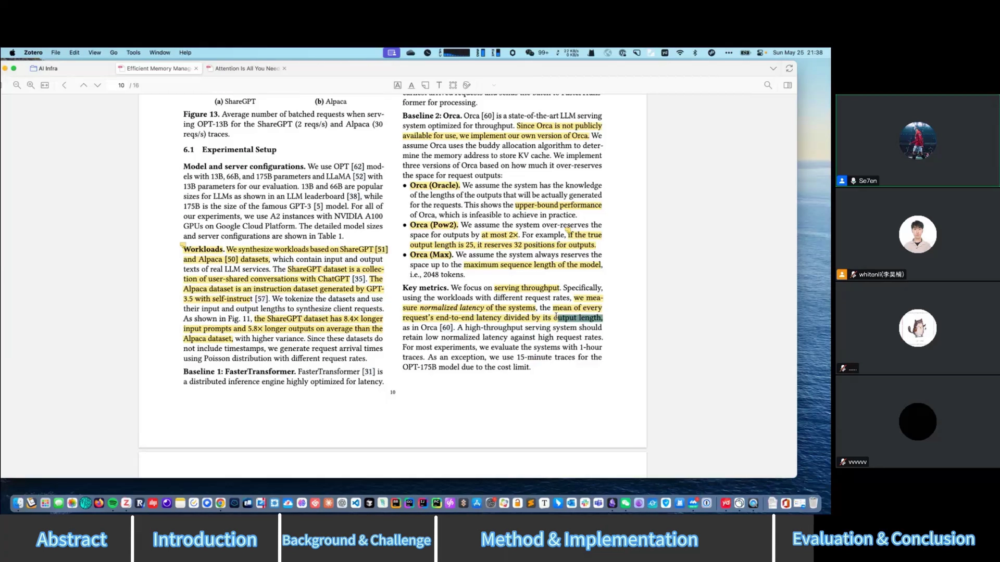
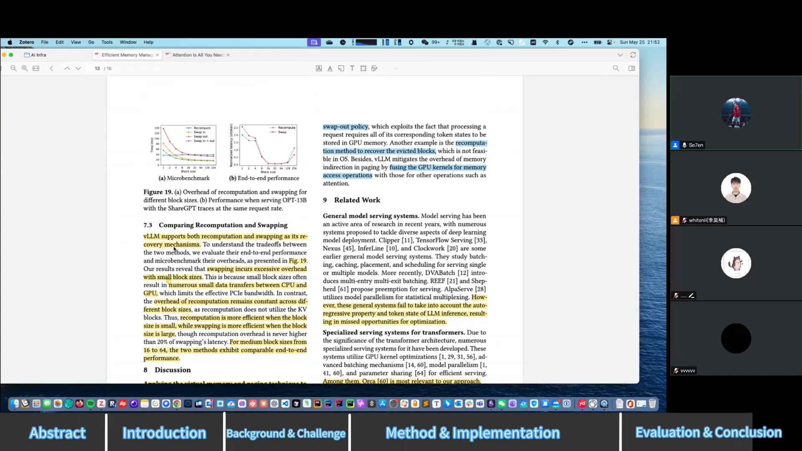

# 第02讲：vLLM PagedAttention 论文精读

## 本讲要解决的核心问题（SCQA）

**背景**：大语言模型（LLM）服务想提高吞吐量，一个关键办法是同时批处理（batch）尽可能多的请求；而每处理一个请求，都要把它已经生成过的 Key、Value 向量缓存下来，也就是 **KV cache（键值缓存）**。

**冲突**：KV cache 体积大、会随生成过程动态增长，而且它的最终长度一开始无法预知。现有推理系统沿用深度学习框架"张量必须连续存储"的做法，为每个请求**预分配**一大块连续显存，结果造成大量内存碎片和浪费，显存反而成了吞吐量的瓶颈——最差时只有约 20% 的显存真正被用上。

**疑问**：能不能像操作系统管理内存那样管理 KV cache 的显存？PagedAttention 到底做了什么？vLLM 又是怎样落地这一机制并取得 2~4 倍吞吐提升的？

**回答（中心思想）**：本讲按论文顺序（摘要→引言→背景→方法→实现→评估→结论）逐节精读。核心结论是：**PagedAttention 把操作系统的虚拟内存与分页思想搬到 GPU 显存上，把 KV cache 切成固定大小的 block，用 block table 建立"逻辑块→物理块"的映射，从而实现近乎零浪费的显存利用和跨请求的内存共享**；vLLM 在此之上配合调度、抢占与 kernel 融合优化，把吞吐量提升到现有系统的 2~4 倍，且不损失模型精度。

---

## 一、为什么需要 PagedAttention：KV cache 是显存瓶颈

### 1.1 从注意力机制到 QKV

要理解 KV cache，先要理解 Transformer 的**自注意力机制（self-attention）**。论文引用了谷歌 2017 年的《Attention Is All You Need》（[【跳转到 01:40】](https://www.bilibili.com/video/BV1GWjjzfE1b/?t=100)）。

**注意力机制解决什么问题？** 用一个通俗的例子：模型要理解句子 "an apple and an orange" 中的 "apple"。apple 是多义词，既可能指水果，也可能指苹果公司；当句子后面出现了 "orange"，注意力机制会给 orange 更高的权重，从而帮模型把 apple 判定为水果而非品牌。也就是说，**注意力机制让模型在处理一个 token 时，去"看"上下文里其他 token，并给不同的 token 分配不同的关注程度**。

**Q、K、V 是什么？** 输入的词向量（embedding）X 分别乘以三个可训练权重矩阵 $W^Q$、$W^K$、$W^V$，得到 Q、K、V 三个向量（[【跳转到 03:20】](https://www.bilibili.com/video/BV1GWjjzfE1b/?t=200)）：

- **Q（Query，查询）**：当前 token 提出的"问题"或"关注点"；
- **K（Key，键）**：每个 token 的"身份标识"或"关键词"，用来和 Q 做点积算相似度；
- **V（Value，值）**：token 实际承载的语义信息。

可以类比在搜索框里搜东西：**Q 是你输入的关键词，K 是候选内容用来和关键词匹配，V 是你最终查出来的具体内容**（[【跳转到 04:35】](https://www.bilibili.com/video/BV1GWjjzfE1b/?t=275)）。计算时，用当前 token 的 Q 与所有 token 的 K 做点积得到注意力分数，经 softmax 得到概率，再对 V 做加权求和，最后通过一个 linear 层映射成词表大小的 logits，再 softmax 得到每个词的概率；生成时可以用贪婪（greedy，取概率最高）或采样（sampling）方式选下一个 token。

### 1.2 为什么只需要缓存 K 和 V

关键在于：**解码时，Q 只用当前 token 的，而 K 和 V 要用到"当前及之前所有 token"的**（[【跳转到 07:27】](https://www.bilibili.com/video/BV1GWjjzfE1b/?t=447)）。

因为自回归生成是一个 token 一个 token 往外吐：新生成一个 token 时，只有它的 Q 是新的，而它之前所有 token 的 K、V 都已经算过、完全一样，可以直接拿来复用。于是就把这些历史 token 的 K、V 缓存起来，后续每步只需计算新 token 的 K、V 再与缓存拼接。**这就是为什么叫 KV cache，而不是 QKV cache**——Q 不需要缓存。这样做大幅减少了重复计算，显著加快推理。

但代价也很明显：总得有地方存这些缓存，而存储位置就是 **GPU 显存**（[【跳转到 09:07】](https://www.bilibili.com/video/BV1GWjjzfE1b/?t=547)）。

### 1.3 补课：Transformer 三种形态与"整句概率"

论文的 Background 部分还铺垫了两块基础。

**Transformer 的三种形态**（[【跳转到 33:02】](https://www.bilibili.com/video/BV1GWjjzfE1b/?t=1982)）：

- **encoder-only（仅编码器）**：使用双向注意力，处理每个词时能同时关注它前后的所有词，擅长捕捉整个序列的上下文，常用于文本分类、情感分析；
- **decoder-only（仅解码器）**：即推理时常用的**自回归**模式，使用**因果掩码（causal masking）**保证每个位置只能关注它之前的位置——因为生成 token 时只能依据已有的 token 预测下一个；
- **encoder-decoder**：编码器处理输入序列，解码器生成输出序列；解码器生成每个词时既关注已生成的词，也关注编码器的输出。

**一段文本的概率怎么算？** 论文第一个公式表达的是：整句概率等于第一个词的概率，乘以第二个词在第一个词条件下的概率，再乘以第三个词在前两个词条件下的概率……以此类推（[【跳转到 34:42】](https://www.bilibili.com/video/BV1GWjjzfE1b/?t=2082)）。写成公式就是：

$$
P(x_1,x_2,\dots,x_N)=\prod_{t=1}^{N}P(x_t\mid x_1,\dots,x_{t-1})
$$

这个"每个词都依赖前面所有词"的链条，正是后面 KV cache 必须存在的根源。

### 1.4 推理的两个阶段：prefill 与 decode

LLM 的推理可以拆成两个阶段（[【跳转到 38:38】](https://www.bilibili.com/video/BV1GWjjzfE1b/?t=2318)）：

- **prefill（预填充）阶段**：一次性接收 prompt 里所有已知 token，并行计算它们的注意力。这个阶段是 **compute-bound（计算受限）**，能充分利用 GPU 的并行算力；
- **decode（解码）阶段**：自回归地一个 token 一个 token 生成。每一步只新算一个 token 的 Q、K、V，再与缓存的历史 K、V 一起算注意力。这个阶段无法并行，是 **memory-bound（显存受限）**，难以充分利用 GPU 算力，且严重依赖 KV cache 的显存存储。

decode 何时结束？满足两个条件之一即可（[【跳转到 40:18】](https://www.bilibili.com/video/BV1GWjjzfE1b/?t=2418)）：达到最大长度（如请求时设置的 `max_length`/`max_token`），或模型生成了 **EOS（end of sequence）** 特殊 token。论文也给出优化的最大目标：prefill 阶段要把计算吃满，decode 阶段要把显存吃满。

### 1.5 显存被谁占满了：Figure 1

论文用 Figure 1 给出一个直观例子：一个 **13B 模型**在 NVIDIA A100（40GB）上的显存分配（[【跳转到 17:24】](https://www.bilibili.com/video/BV1GWjjzfE1b/?t=1044)）。

- **模型参数**：13B 模型用 FP16 半精度，每个参数占 2 字节，大约占 **26GB**（13 × 2，因为参数数量的"十亿"量级和 GB 的 1024³ 量级相当，可以直接这样估算）；
- **KV cache**：大约占 **30%** 以上的显存，用于存储动态的、随请求变化的状态。

模型参数本身有量化等优化手段，但相对而言优化空间小一些；**这篇论文主攻 KV cache 这一块，因为它优化空间更大**。

### 1.4 现有系统的浪费在哪：三种内存浪费

论文指出，现有 LLM 系统之所以管理不好 KV cache，根本原因在于**请求的 KV cache 被要求存放在连续的内存里**（PyTorch、TensorFlow 等框架要求张量内存连续），但 KV cache 又会在生成过程中动态增长或缩减、生命周期和最终长度事先未知（[【跳转到 19:29】](https://www.bilibili.com/video/BV1GWjjzfE1b/?t=1169)）。这种矛盾带来三类浪费：

- **内部碎片（internal fragmentation）**：按请求最大长度（比如 2048）预分配，但请求实际可能只用了 10 个 token（prompt 7 个 + 生成 2 个 + EOS），剩下 2038 个槽位从未使用；
- **预留（reservation）**：虽然未来会用，但当前这一步还没用到的槽位，占着位置也让别的短请求用不了；
- **外部碎片（external fragmentation）**：不同请求按大块（如 2048）分配，块与块之间留下的空隙无法被利用；分的块越大，外部碎片越大。

论文用图 Figure 2 量化了浪费程度：在实验中，ORCA 等现有系统最差时**只有约 20% 的 KV cache 显存真正存储了有用的 token**，其余都是内部碎片、预留和外部碎片；而 vLLM 有约 **96%** 都是有用 token，几乎把内部碎片和预留完全消除。

### 1.5 第二个问题：现有系统无法共享内存

现有系统的第二个缺陷是**不能做内存共享（memory sharing）**。有两类常见场景（[【跳转到 25:02】](https://www.bilibili.com/video/BV1GWjjzfE1b/?t=1502)）：

- **并行采样（parallel sampling）**：一个 prompt 生成多个候选输出（比如 ChatGPT 给你两个答案二选一）。这些输出共享同一段 prompt，其 KV cache 本可以共享；
- **束搜索（beam search）**：常用于翻译、文本摘要等。它在每一步保留得分最高的 top-k 个候选序列（由 `num_beams` 控制），不仅 prompt 可以共享，不同候选序列在生成阶段的相同前缀部分也可以共享。

论文统计，在复杂的 beam search 场景下，最多可约 **55%** 的内存通过共享节省。但现有系统因为 KV cache 必须连续存储，做不到这种块级共享，只能简单粗暴地**复制多份**，带来频繁的内存拷贝且毫不省内存。

---

## 二、PagedAttention 的核心思想：把操作系统的分页搬到显存

### 2.1 灵感来自虚拟内存与分页

PagedAttention 的设计灵感直接来自操作系统的**虚拟内存（virtual memory）**和**分页（paging）**机制（[【跳转到 11:09】](https://www.bilibili.com/video/BV1GWjjzfE1b/?t=669)）。

先回顾一下背景：在传统计算机系统里，如果没有虚拟内存，多个程序直接操作物理内存就可能互相干扰——A 程序写了某块内存，B 程序改了它，程序就会崩溃。操作系统为此引入虚拟内存：每个进程拥有独立的虚拟地址空间，互不干涉；而**分页**是实现虚拟内存的技术——虚拟内存被切成"页（page）"，物理内存对应的叫"页框"，中间用一个 **页表（page table）** 记录虚拟页到物理页框的映射。程序访问某个虚拟地址时，先通过页表转换成物理地址；如果所需的页不在物理内存里，就发生**缺页中断（page fault）**，操作系统再从磁盘把页加载进来。

PagedAttention 把同样的思路用来管理 **GPU 显存里的 KV cache**（[【跳转到 12:49】](https://www.bilibili.com/video/BV1GWjjzfE1b/?t=769)）。

### 2.2 一个精确的类比

论文给出三组对应关系（[【跳转到 28:02】](https://www.bilibili.com/video/BV1GWjjzfE1b/?t=1682)）：

| 操作系统 | PagedAttention |
| --- | --- |
| 页（page） | KV block（固定大小的块） |
| 字节（byte） | token |
| 进程（process） | request（推理请求） |

也就是说：KV cache 按块组织，每个块里装固定数量 token 的 K、V 对（就像页里装若干字节）；每个推理请求像进程一样拥有自己独立的"地址空间"（逻辑块视图）；token 则是最小的输入/输出单位（像字节）。这种设计因为**块小、且按需分配**，能同时缓解内部碎片和外部碎片，并支持块级别的内存共享。

### 2.3 按"块"计算注意力

PagedAttention 允许**连续的 Key、Value 向量存放在非连续的内存空间**（[【跳转到 51:08】](https://www.bilibili.com/video/BV1GWjjzfE1b/?t=3068)）。每个块存固定数量 token 的 K、V，这个数量叫 **block size B**，vLLM 默认取 **16**（这是他们实验测出来的较优值，也是权衡后的结果）。

与普通注意力最大的区别是：**普通注意力逐个 token 对 Key 做计算，而 PagedAttention 按块计算**（[【跳转到 52:48】](https://www.bilibili.com/video/BV1GWjjzfE1b/?t=3168)）。论文 Figure 5 的例子中，query 是 "forth"，它的 key/value 分散在三个物理上不连续的块里。GPU kernel 逐个处理 query，把 query 向量与某个块内的所有 Key 相乘，得到这个块的注意力分数 $A_{ij}$，再与对应的 Value 相乘，最终得到该 token 的输出。把公式写成块的形式就是论文式 (4)：

$$
A_{ij} = \frac{\exp(q_i^\top K_j/\sqrt{d})}{\sum_{t=1}^{\lceil i/B \rceil}\exp(q_i^\top K_t/\sqrt{d})},\qquad
o_i = \sum_{j=1}^{\lceil i/B\rceil} V_j A_{ij}^\top
$$

其中 $A_{ij}$ 是第 $i$ 个 query 在第 $j$ 个 KV 块上的注意力分数行向量。**按块计算**让 kernel 能更并行地处理，从而支持非连续内存布局并大幅提升内存效率。

### 2.4 block table：逻辑块到物理块的映射

vLLM 中有一个关键组件 **KV cache manager**，它维护 **block table**（块表）——也就是逻辑块到物理块的映射关系（[【跳转到 56:08】](https://www.bilibili.com/video/BV1GWjjzfE1b/?t=3368)）。每条记录包含：某个逻辑块对应哪些物理块，以及该块已填充了多少个 token。

- 一个请求的 KV cache 表示为**一系列逻辑 KV block**，随 token 生成从左到右依次填充；
- GPU 上的 block engine 一次性申请一大块显存，再切成多个**物理 KV block**，并映射给逻辑块；
- **物理内存不需要提前预留，按需分配**；最后一个没填满的块留给未来使用，必要时还能 swap 到 CPU 内存；
- 逻辑块在请求自己看来是连续的，物理块则允许不连续。

### 2.5 一个具体例子：请求 "four score and seven years ago"

论文 Figure 6 用一个例子展示 block table 的演进（[【跳转到 56:33】](https://www.bilibili.com/video/BV1GWjjzfE1b/?t=3393)）：

1. prompt 有 7 个 token（four / score / and / seven / years / ago 加上起始符），被分成 2 个逻辑块，映射到物理块 7 和 1。prefill 阶段把前 4 个 token 放进 block 0 对应的物理块，后 3 个放进 block 1；
2. 第一次自回归解码生成 "father"，block 1 里还有空位，就直接写入 block 1，block table 相应更新已用 token 数；
3. 再往后，现有块不够用了，就分配新的逻辑块 2（对应物理块 3）来存新 token。

**block table 就是 PagedAttention 维护元数据的结构**，它让 vLLM 可以在不预留位置的前提下动态增长 KV cache。

当多个请求同时运行时，每个请求的逻辑块映射到各自独立的物理块，互不要求连续。图 Figure 7 展示了同一时刻两个请求的 KV cache 如何映射到一张物理块表上（[【跳转到 61:43】](https://www.bilibili.com/video/BV1GWjjzfE1b/?t=3703)）——这正是"连续的逻辑块映射到非连续的物理块"这一核心思想的体现。

---

## 三、vLLM 系统设计：调度、共享与抢占

### 3.1 中央调度器 + KV cache manager

论文 Method 部分（第 4 章）说明，vLLM 用一个**集中式调度器（centralized scheduler）**协调多个 GPU worker 的执行（[【跳转到 50:18】](https://www.bilibili.com/video/BV1GWjjzfE1b/?t=3018)）。调度器内部的 **KV cache manager** 通过分页方式高效管理 KV cache，并按调度器下发的指令管理内存的分配与释放。

具体到解码过程（[【跳转到 79:58】](https://www.bilibili.com/video/BV1GWjjzfE1b/?t=4798)）：每个解码步骤中，调度器先为 batch 里每个请求准备一条 **control message（控制信息）**，包含输入 token id 和该请求的 **block table**；然后把它广播给所有 GPU worker。worker 根据 token id 执行模型推理，在注意力层按 block table 读取对应的 KV cache。执行中用 **NCCL** 通信库做 all-reduce 同步中间结果（不需要调度器参与），最后把本轮生成的 token 结果发回调度器。

### 3.2 为什么需要按"迭代"调度

LLM 服务会把多个请求打包成 batch 一起处理，以便共享同一份模型权重、提高计算利用率。但直接 batch 有两个难题（[【跳转到 41:33】](https://www.bilibili.com/video/BV1GWjjzfE1b/?t=2493)）：

- 请求**不是同时到达**的：要么让先到的等后来的凑满一批（增加排队延迟），要么等老的做完再做新的；
- 不同请求的**生成长度差异很大**：为了并行，需要用 padding token 把短的补到最长，既浪费又低效。

解法是不再按 request-level 批处理，而采用 **selective batching、iteration-level scheduling** 这类更细粒度的机制（[【跳转到 42:48】](https://www.bilibili.com/video/BV1GWjjzfE1b/?t=2568)）。这里的 **iteration（迭代）** 指"生成一个 token"这一步：每个 iteration 结束就把已完成的请求移出当前批，并加入新请求，从而灵活地调用 GPU，不必等整个请求结束。

不过，即便有了细粒度调度，吞吐仍然受限于 **GPU 显存容量**，尤其是存储 KV cache 的部分——这正是 PagedAttention 要解决的（[【跳转到 44:28】](https://www.bilibili.com/video/BV1GWjjzfE1b/?t=2668)）。

### 3.3 KV cache 到底有多大

论文给了一组量化数据（[【跳转到 44:53】](https://www.bilibili.com/video/BV1GWjjzfE1b/?t=2693)）：以 13B 模型为例，**一个 token 的 KV cache 约 800KB**，算法是：

$$
2\ (\text{K 和 V}) \times 5120\ (\text{hidden size}) \times 40\ (\text{层数}) \times 2\ (\text{FP16 字节数}) \approx 800\text{KB}
$$

一个按 2048 token 计算的请求就要占约 **1.6GB**。而 A100 才 40GB，如果不优化 KV cache，根本存不下几个请求。更麻烦的是，**GPU 算力的增长速度远快于显存容量**：从 A100 到 H100，FLOPS 翻了一倍，但显存只从 40GB 提到 80GB，没提升多少。所以显存管理成了关键瓶颈。

### 3.4 不同解码算法下的内存共享

PagedAttention 的一个巨大优势是能统一支持多种解码算法下的内存共享（[【跳转到 62:58】](https://www.bilibili.com/video/BV1GWjjzfE1b/?t=3778)）。

**并行采样（parallel sampling）**：一个请求包含多个共享同一 prompt 的样本，因此 prompt 的 KV cache 可以共享。Figure 8 中，两个输出一开始共享物理块，当生成产生分歧（一个生成 "fathers"、一个生成 "mothers"）时，就触发 **copy-on-write（写时复制）**：把不能共享的块拷贝一份，`reference count`（引用计数）从 2 减到 1，而前面 prompt 部分仍继续共享。对很长的 prompt（比如几千 token 的复杂提示词），这种共享能省下大量内存。

**束搜索（beam search）**：能共享的地方更多，不仅共享 prompt 块，还能在不同候选序列的生成阶段共享相同前缀。论文指出 beam search 最多可有约 **50%** 的内存被共享。Figure 9 给出了 beam width k=4 的例子：所有候选共享第一个块（prompt），候选 0–2 共享前 3 个块，到第 4 个块才分叉。

**共享前缀（shared prefix）**：很多应用（如机器翻译的 few-shot 提示）会共享一段很长的 system prompt。Figure 10 展示了英译法任务中，多个请求共享同一段"Translate English to French + 若干示例"的前缀。这与操作系统中多个进程共享同一个 library 的思想类似。服务提供方甚至可以预先把常见共享前缀的 KV cache 存好，用户请求映射过去即可。

**综合来看**：beam search 能共享 prompt + 候选序列；parallel sampling 主要共享 prompt、后续分开。vLLM 通过"逻辑块→物理块"的统一抽象，屏蔽了不同解码算法之间内存共享逻辑的差异，让它们能在同一套系统里高效并行执行，从而提升吞吐和 batch 能力。

### 3.5 调度与抢占：all-or-nothing、swapping 与 recomputation

当请求总量超过显存容量时，vLLM 必须对请求做优先级排序并驱逐（eviction）部分请求，释放显存给更高优先级的请求（[【跳转到 70:23】](https://www.bilibili.com/video/BV1GWjjzfE1b/?t=4223)）。这里有两个问题：**哪些块该被驱逐？被驱逐后将来还需要时怎么恢复？**

- **驱逐策略：all-or-nothing（全有或全无）**。一个请求会用到多个块，要么全部驱逐，要么一个都不驱逐——因为只驱逐一部分、剩下的也无法使用。对 beam search 这类一个请求含多个候选序列的情况，则把这些候选视为一个 **sequence group**，整组一起调度。
- **恢复策略一：Swapping（换出）**。把被驱逐的块从 GPU 显存拷贝到 CPU 内存。vLLM 为此设置两个 allocator：GPU block allocator 和 CPU block allocator，后者管理从 GPU offload 下来的块。只要有 sequence 被抢占，vLLM 就**暂停接收新请求**，直到所有被驱逐的 sequence 都恢复处理完，再接收新请求——否则先驱逐的将永远处理不完。因为换出到 CPU，GPU 内存占用不会超过物理块的总量。
- **恢复策略二：Recomputation（重算）**。不暂存，而是重新计算。但它比原来的逐 token 解码更快：因为可以把 prompt 加之前算过的中间部分一次性做一次 KV 计算，再基于这个基础继续逐个生成 token。

### 3.6 分布式执行

大模型参数量往往超过单卡容量（13B 占 26GB，70B 就要约 140GB），因此要把模型分到多张 GPU 上（[【跳转到 75:23】](https://www.bilibili.com/video/BV1GWjjzfE1b/?t=4523)）。vLLM 支持类似 **Megatron 风格的模型并行**：把不同的层或张量参数分配到多个 GPU，每个 GPU 只负责模型的一部分。

但要注意：**即使做了模型并行，每个模型分片仍然要处理相同的 token 序列，因此都需要在相同位置保留对应的 KV cache**（[【跳转到 78:18】](https://www.bilibili.com/video/BV1GWjjzfE1b/?t=4698)）。所以 vLLM 用**一个统一的 KV cache manager** 来协调各 GPU：所有 worker 共享同一套逻辑块到物理块的映射；每个 worker 用相同的物理块 id 列表，但各自只存自己负责的注意力头（head）那部分 KV。这样 GPU worker 之间只需在每轮解码开始时接收一次内存管理信息，不必同步内存管理。

---

## 四、实现细节：kernel 融合与三种抽象

### 4.1 整体组成

vLLM 用 **FastAPI** 作为前端接收请求，并兼容 OpenAI 接口（可以用 OpenAI SDK 请求它）；后端是 GPU-based 的 inference engine（[【跳转到 81:38】](https://www.bilibili.com/video/BV1GWjjzfE1b/?t=4898)）。发论文的 2023 年，代码大约有 **8500 行 Python + 2000 行 C++/CUDA**：

- **scheduler、block manager** 等 controller 组件用 Python 写；
- **PagedAttention** 相关操作（注意力算子）用 CUDA kernel 实现；
- **model executor** 负责加载模型权重、执行前向推理并返回结果，基于 **PyTorch** 和 **HuggingFace Transformers** 支持 GPT、LLaMA 等主流模型；
- 跨 GPU 通信用 **NCCL**（NVIDIA 提供的 GPU 间高效通信库，支持 all-reduce、broadcast 等）。

### 4.2 三项 kernel 级优化

PagedAttention 引入了现有系统不高效支持的内存访问模式，vLLM 为此做了三个 GPU kernel 融合优化，把多个操作合并成一个 kernel 以减少 kernel launch（启动）开销（[【跳转到 84:33】](https://www.bilibili.com/video/BV1GWjjzfE1b/?t=5073)）：

1. **融合 reshape 和 block write**：每层新增的 KV cache 被拆成多个块、reshape 成针对块读取优化的内存布局，再写入 block table 指定位置——把 reshape 和 write 合并成一个 single kernel；
2. **融合 block read 和 attention**：在读取 KV cache 的同时执行 attention 计算，分配一个 GPU warp 读取每个块，实现合并访存；
3. **融合 block copy**：copy-on-write 会跨不连续的多个块做拷贝，若每块单独调 `cudaMemcpy` 开销巨大；改成一次批量拷贝多个块。

> 补充一下 **GPU kernel**：它是运行在 GPU 上、能被大量线程并行执行的函数，可以理解成"GPU 上做并行计算的函数"。

### 4.3 用三种抽象统一各种解码算法

为了用统一方式支持 parallel sampling、beam search 等各种解码算法，vLLM 把解码逻辑抽象成 **三种基本操作**（[【跳转到 87:03】](https://www.bilibili.com/video/BV1GWjjzfE1b/?t=5223)）：

- **fork**：根据已有 sequence 创建一个新 sequence；
- **append**：在 sequence 后面追加一个新 token；
- **free**：删除一个 sequence。

比如 parallel sampling 就是从单个输入 sequence 用 fork 生成多个输出序列。这种抽象具有很强的扩展性和效率，将来要支持新算法也可以用同样的方式实现。

---

## 五、评估结果：2~4 倍吞吐提升

### 5.1 实验设置与基线

论文评估聚焦**服务吞吐量**（[【跳转到 88:18】](https://www.bilibili.com/video/BV1GWjjzfE1b/?t=5298)）：

- **模型与硬件**：OPT-13B/66B/175B 以及 LLaMA-13B，跑在 Google GCP 的 A2 实例、共 100 块 A100 GPU 上；
- **数据集（workload）**：合成两个数据集——**ShareGPT**（真实用户与 ChatGPT 对话，prompt 长）和 **Alpaca**（GPT-3.5 Self-Instruct 生成，短）。ShareGPT 的输入 prompt 比 Alpaca 长 **8.4 倍**、输出长约 **5.8 倍**；
- **基线一：FasterTransformer**。它没有自带 scheduler，vLLM 便实现了一个动态 batch 的 scheduler 做对照，并尽量放大 batch size；
- **基线二：ORCA**。ORCA 未开源，vLLM 团队根据论文自己实现了三个版本：
  - **ORCA (Oracle)**：假设系统预先知道输出长度，可精确预测 KV cache 大小，性能最好（但现实中不可行）；
  - **ORCA (Pow2)**：按 2 的指数级预留输出空间，比如真实输出 25 个 token 就预留 32 个；
  - **ORCA (Max)**：直接按最大序列长度（2048）预留。

**吞吐量怎么算？** 对端到端延迟做**归一化**：把每个请求的端到端延迟除以它生成的 token 数。因为请求长短不一，直接用延迟比较不公平，除以 token 数后才可比（[【跳转到 92:03】](https://www.bilibili.com/video/BV1GWjjzfE1b/?t=5523)）。

### 5.2 单序列生成吞吐

Figure 12 展示不同 request rate 下的归一化延迟（[【跳转到 92:53】](https://www.bilibili.com/video/BV1GWjjzfE1b/?t=5573)）：随着请求速率增加，延迟先平缓上升，一旦超过系统处理能力就**突然飙升**——因为等待队列不断增长。对比可见：

- 在 ShareGPT 上，vLLM 比 FasterTransformer 高约 **1.7~2.7 倍**吞吐，比 ORCA (Oracle) 高约 **2.7~8 倍**，且延迟相当；
- Figure 13 显示 vLLM 的 batch request 吞吐可达 **30.4**，比 ORCA (Oracle) 好 **2.2 倍**、比 ORCA (Max) 好 **4.3 倍**、约是 FasterTransformer 的 **22 倍**；
- 在 Alpaca 等较短数据集上趋势相同；
- 唯一例外是 **Figure 12F（OPT-175B + Alpaca）**：vLLM 与 ORCA (Oracle) 差距不明显。原因是该模型用较大的 GPU 显存存 KV cache，Alpaca 数据又短小，内存不再是瓶颈（变成 compute-bound），所以优势被掩盖。

### 5.3 复杂解码与长对话

- **并行采样 / 束搜索**：beam search 允许更多内存共享，vLLM 优势更明显——相比 basic sampling 提升约 **1.3 倍**，相比 beam search 提升约 **2.3 倍**（[【跳转到 97:53】](https://www.bilibili.com/video/BV1GWjjzfE1b/?t=5873)）。Figure 15 给出的内存节省比例：parallel sampling 约 **6.1%~6.8%**，beam search 高达 **37.6%~56.2%**；
- **共享前缀（shared prefix）**：one-shot 场景下比 ORCA (Oracle) 高约 **1.67 倍**吞吐，few-shot（共享更多示例）时可达 **3.58 倍**（[【跳转到 100:23】](https://www.bilibili.com/video/BV1GWjjzfE1b/?t=6023)）；
- **Chatbot**：多轮对话通常把历史记录连同新问题一起作为 prompt 发过去，历史部分也能共享。Figure 17 显示 vLLM 可支撑约 **2 倍**更高请求速率。论文特别说明：**PagedAttention 主要优化单轮对话，多轮跨轮次的 KV cache 保存要靠 prefix caching**。因为 ShareGPT 的 input 大多超过 1024 token，而 ORCA 会固定预留 1024 个输出 token，所以三个 ORCA 基线在这种情况下表现接近。

### 5.4 消融实验：kernel、block size、recompute vs swap

**消融实验（ablation study）** 指逐一评估系统中各组件/特性对整体性能的贡献，确保每项改进确实有效，而不是被整体提升掩盖（[【跳转到 102:53】](https://www.bilibili.com/video/BV1GWjjzfE1b/?t=6173)）。

- **kernel 开销**：由于 PagedAttention 的动态映射机制，KV cache 读块、注意力计算的 kernel 延迟比 FlashAttention、FasterTransformer 高出约 **20%~20.6%**；但团队认为开销小，因为它只影响 attention 算子，不影响 linear 等其它算子，端到端仍显著优于 FasterTransformer（约 **20 多倍**）；
- **block size（Figure 18）**：太小无法充分利用 GPU 并行性，太大则增加内部碎片、降低共享概率。实验发现 **16** 在延迟上表现最好，因此 vLLM 默认 block size 设为 16；
- **recompute vs swap（Figure 19）**：block size 小时 swap 开销高（因为小数据块要反复在 CPU/GPU 间传输，带宽利用率低），此时适合 recompute；block size 大时 swap 更划算；在 16~64 的中间区间，两者端到端性能接近。recompute 的开销基本与 block size 无关，且永远不超过 swap 延迟的 **20%**。

---

## 六、讨论、相关工作与结论

### 6.1 讨论与发散

论文讨论了把这套虚拟内存/分页思想推广到其它 GPU workload 的可能性（[【跳转到 108:18】](https://www.bilibili.com/video/BV1GWjjzfE1b/?t=6498)）：例如 DNN 中 tensor shape 固定，或图像分类、目标检测等 compute-bound 任务——这些场景即使提升内存利用率也未必提升端到端延迟，因为瓶颈在计算而非内存。论文同时强调他们针对 LLM 做了特定优化，比如 all-or-nothing 的 swap-out 策略、用 recompute 恢复被驱逐的块、以及把 GPU kernel 融合以减少计算操作。

### 6.2 相关工作

通用模型服务系统（Clipper、TensorFlow Serving、Nexus、InferLine、Clockwork 等）没有把**自回归**特性考虑进去，因而没有很好地优化 KV cache 内存；专门的 Transformer 服务系统则多用 kernel 优化、高级 batching、模型并行、参数共享等手段（[【跳转到 110:23】](https://www.bilibili.com/video/BV1GWjjzfE1b/?t=6623)）。

论文与 **ORCA** 的对比最能说明问题：两者都为了提升 GPU 利用率、提高 LLM 服务吞吐，但走的路线不同——

- **ORCA**：靠 **iteration-level 调度**，让 GPU 轮流并行处理，本质是用计算调度提高 GPU 活跃度。类比"合理排队，让 GPU 永远不空闲"；
- **vLLM**：靠提升**内存使用率**，把更多请求的 KV cache 同时塞进显存，从而处理更多请求。类比"整理背包，把更多物品塞进去"。

论文认为 vLLM 的做法更优，相比 ORCA 有约 **2~4 倍**的速率提升（[【跳转到 112:03】](https://www.bilibili.com/video/BV1GWjjzfE1b/?t=6723)）。此外内存优化也是重要方向，本文提出的是 **block-level management** 的内存管理方式。

### 6.3 结论

论文提出了 **PagedAttention**：一种允许注意力的 Key、Value 在**非连续内存**中处理的算法，并基于它实现了 **vLLM** 这一 LLM 服务引擎（[【跳转到 113:18】](https://www.bilibili.com/video/BV1GWjjzfE1b/?t=6798)）。其灵感来自操作系统，采用了虚拟内存和 copy-on-write 等机制。最终，vLLM 相比现有 LLM 系统实现了约 **2~4 倍**的吞吐量提升，同时不损失模型精度。

> **一句话串联全篇**：LLM 推理的瓶颈在显存（KV cache）→ 现有系统因"连续存储 + 预分配"产生三类浪费且无法共享 → PagedAttention 用"分块 + block table 映射"把虚拟内存分页搬到显存 → vLLM 用调度、抢占、kernel 融合把它工程化 → 换来 2~4 倍吞吐。

---

## 小结

- 提升 LLM 服务吞吐的关键是**尽量多 batch**，而每个请求都要存 KV cache；KV cache 大、动态、长度未知，传统"连续存储 + 预分配"导致**内部碎片、预留、外部碎片**三类浪费，最差只有约 20% 显存有效。
- 现有系统还**无法共享内存**：parallel sampling 的 prompt、beam search 的候选序列本可共享，却只能复制多份；beam search 最多可省约 55% 内存。
- **PagedAttention** 借鉴操作系统**虚拟内存/分页**：block 对应 page、token 对应 byte、request 对应 process，把 KV cache 切成固定大小块，按块计算注意力，用 **block table** 维护逻辑块到物理块的映射，按需分配、允许物理不连续。
- vLLM 用**集中式调度器 + KV cache manager** 协调 GPU worker；采用 **iteration-level 调度**、**all-or-nothing 驱逐**，并用 **swapping / recomputation** 恢复被驱逐的块。
- 内存共享覆盖 **parallel sampling、beam search、shared prefix**；distributed 场景下各 worker 共享同一套 block 映射，各自只存自己负责的 attention head。
- 实现层做了三项 **kernel 融合**（reshape+write、read+attention、block copy），并把解码抽象为 **fork / append / free** 三种操作。
- **block size = 16** 是实验得到的默认最优值；block 小时 recompute 更优，block 大时 swap 更优。
- 评估结论：相比 FasterTransformer / ORCA 有约 **2~4 倍吞吐提升**（部分场景达 22 倍），且不损失精度；多轮对话的跨轮 KV cache 保存需靠 **prefix caching**。

## 关键术语速查

| 术语 | 一句话解释 |
| --- | --- |
| KV cache | 缓存历史 token 的 Key/Value 向量，避免每步重复计算；Q 不需要缓存 |
| prefill | 一次性处理整个 prompt 的阶段，计算密集型（compute-bound），可并行 |
| decode | 逐个生成 token 的自回归阶段，显存受限（memory-bound），无法充分利用算力 |
| 内部碎片 | 按最大长度预分配但用不到的空槽位浪费 |
| 外部碎片 | 大块分配之间留下的、无法利用的间隙浪费 |
| 预留（reservation） | 未来会用到但当前未使用的槽位占用 |
| 虚拟内存 / 分页 | 操作系统用页表把虚拟页映射到物理页框、按需加载的机制 |
| PagedAttention | 把 KV cache 分块、允许非连续存储的注意力算法 |
| block size B | 每个 KV block 存放的 token 数，vLLM 默认 16 |
| block table | 记录逻辑 KV block 到物理 KV block 映射及已用 token 数的结构 |
| KV cache manager | 按调度器指令管理 KV cache 内存分配与调度的组件 |
| parallel sampling | 一个 prompt 生成多个候选输出的解码方式，prompt 的 KV 可共享 |
| beam search | 每步保留 top-k 候选序列的解码方式，共享范围更大 |
| reference count / copy-on-write | 共享块的引用计数；产生分歧时复制块，计数递减 |
| all-or-nothing | 驱逐策略：一个请求的所有块要么全驱逐、要么都不驱逐 |
| swapping | 恢复方式：把被驱逐的块换到 CPU 内存，用时拷回 |
| recomputation | 恢复方式：不暂存，重新计算（可一次性重算中间部分，比逐 token 快） |
| 模型并行 | 把模型不同层/张量分到多张 GPU，如 Megatron 风格 |
| NCCL | NVIDIA 的 GPU 间通信库，用于 all-reduce、broadcast 等 |
| kernel 融合 | 把多个 GPU 操作合并成一个 kernel，减少 launch 开销 |
| fork / append / free | vLLM 抽象出的三种解码基本操作 |
| 归一化延迟 | 端到端延迟除以生成 token 数，用于公平比较吞吐 |
| 消融实验 | 逐一评估各组件对整体性能贡献的方法 |

