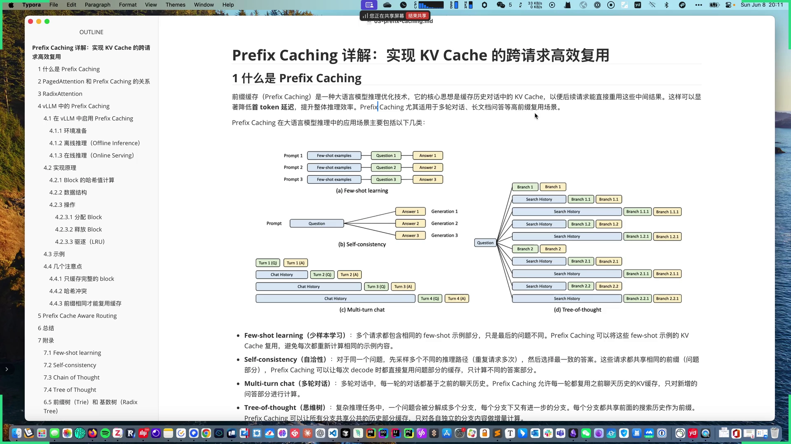
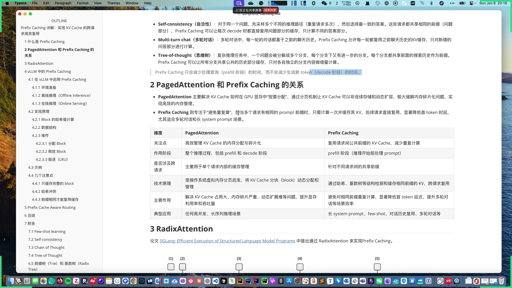
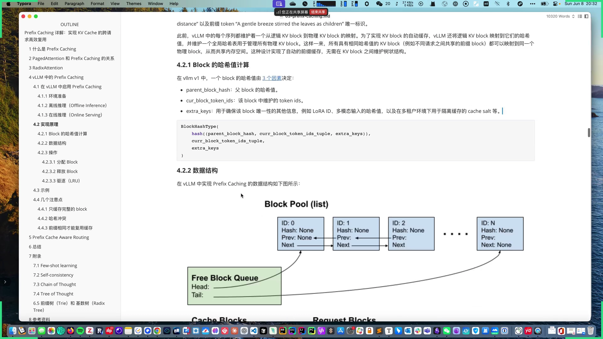
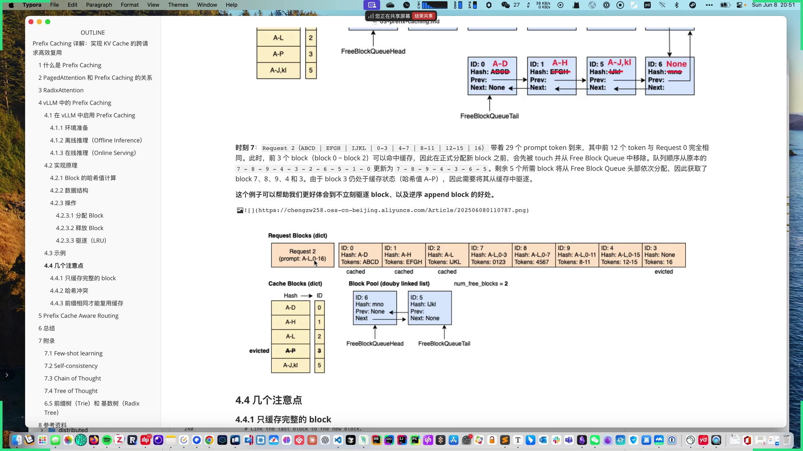
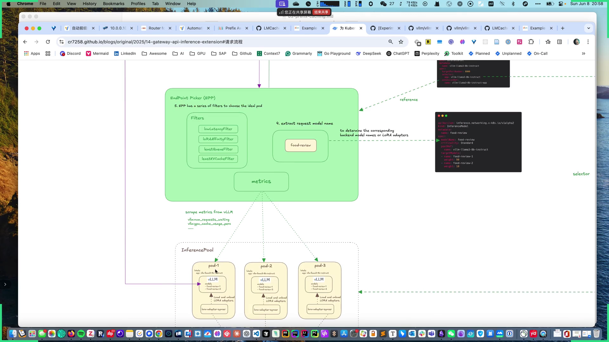
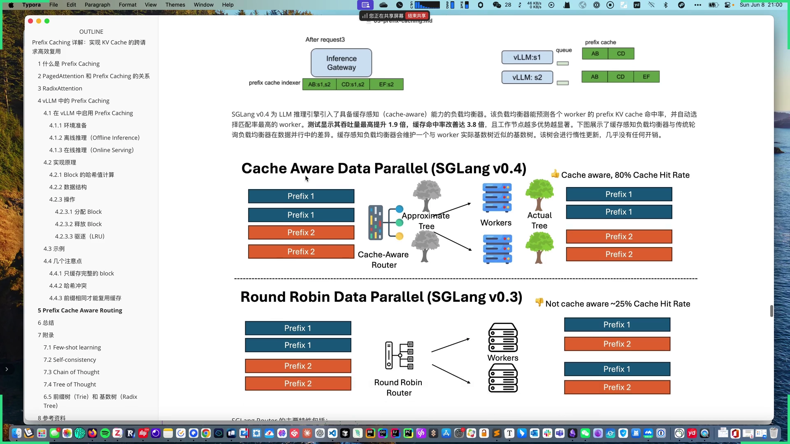

# 第03讲：Prefix Caching 前缀缓存原理详解

## 本讲要解决的核心问题（SCQA）

**背景**：上一讲我们知道，vLLM 用 PagedAttention 把 KV Cache 分块、按需塞进显存，解决了"放得下"的问题。但每个请求**算过的 KV 计算**，请求一结束往往就被丢掉了。

**冲突**：真实业务里大量请求带着**相同的长前缀**——同一个 system prompt、同一批 few-shot 示例、同一段多轮对话历史。每次都从头算一遍这些前缀，既慢又费算力。

**疑问**：能不能把已经算好的前缀 KV 缓存下来，让后续请求直接复用？

**回答（中心思想）**：**Prefix Caching（前缀缓存）** 正是做这件事：它缓存公共前缀的 KV，后续请求命中后**跳过重复的 prefill 计算**，显著降低首 token 延迟。vLLM 用**基于 block 的哈希**实现它，SGLang 用 **RadixAttention（基数树）** 实现它；在多副本部署下，还需要 **Prefix Cache Aware Routing** 把请求路由到"已经有这份缓存"的实例上。

---

## 一、Prefix Caching 是什么，和 PagedAttention 什么关系

Prefix Caching 是一种推理优化技术，核心思想是**缓存历史对话中的 KV Cache**，让后续请求重用这部分计算结果（[【跳转到 00:00】](https://www.bilibili.com/video/BV1jgTRzSEjS/?t=0)）。它最大的好处是降低**首 token 延迟**。适合**多轮对话、长文档问答**这类高前缀复用场景。

> **关键限制**：Prefix Caching 只能减少 **prefill 阶段**（处理 prompt、生成第一个 token）的时间，**不能减少 decode 阶段**一个个新生成 token 的时间（[【跳转到 05:50】](https://www.bilibili.com/video/BV1jgTRzSEjS/?t=350)）。

它和 PagedAttention 的关系很容易混淆，二者其实是"管内存"和"省计算"的分工（[【跳转到 06:15】](https://www.bilibili.com/video/BV1jgTRzSEjS/?t=375)）：

| 维度 | PagedAttention | Prefix Caching |
| --- | --- | --- |
| 关注点 | 高效管理 KV Cache 的内存分配与碎片化 | 复用请求间公共前缀的 KV，减少重复计算 |
| 作用阶段 | 整个推理过程（prefill + decode） | 主要在 prefill 阶段 |
| 是否跨请求 | 主要用于单个请求内部的内存管理 | 针对不同请求间的共享前缀 |
| 技术原理 | 受 OS 虚拟内存分页启发，KV Cache 分块动态分配 | 通过哈希/基数树检测并缓存相同前缀的 KV，跨请求复用 |
| 主要作用 | 解决显存占用大、碎片严重、动态扩展难，提升显存利用率和吞吐 | 避免相同前缀重复计算，降低首 token 延迟 |

### 四类典型应用场景

论文列举了四类共用一个前缀的场景（[【跳转到 02:05】](https://www.bilibili.com/video/BV1jgTRzSEjS/?t=125)）：

- **Few-shot learning（少样本学习）**：多个请求包含相同的 few-shot 示例，只有最后的问题不同，示例部分的 KV 可复用；
- **Self-consistency（自洽性）**：同一个问题采样多条推理路径，再选最一致的答案；这些请求共享"问题"前缀，只计算各自不同的推理部分；
- **Multi-turn chat（多轮对话）**：每一轮都基于之前的聊天历史，历史部分可复用，只算新增问答；
- **Tree-of-thought（思维树）**：复杂推理拆成多个分支，每个分支共享前面的搜索历史，只算各自独立的分支内容。

---

## 二、SGLang 的实现：RadixAttention

SGLang 在论文 *SGLang: Efficient Execution of Structured Language Model Programs* 中提出 **RadixAttention**，用 **radix tree（基数树）** 管理前缀缓存，并结合 **LRU** 淘汰策略（[【跳转到 08:20】](https://www.bilibili.com/video/BV1jgTRzSEjS/?t=500)）。

论文用九个时间点演示了动态过程，节点颜色含义是：**绿色 = 新生成节点，蓝色 = 可复用的缓存节点，红色 = 被淘汰节点**（[【跳转到 09:35】](https://www.bilibili.com/video/BV1jgTRzSEjS/?t=575)）：

1. 树为空；
2. 收到 system prompt + 问题，回答 "Hi"，这部分被缓存；
3. 基于历史继续提问，复用上一节点缓存，只算新增部分；
4. 新会话用了相同 prompt，树会**智能拆分**，只复用完全相同的 "You are a helpful system" 部分；
5. 内存受限时按 **LRU** 淘汰最久远的节点（最近的更可能被复用）；
6–9. few-shot、继续追问、self-consistency 等场景下，不断复用已有前缀、追加新节点、按 LRU 淘汰。

RadixAttention 的巧妙在于：树结构天然把"公共前缀"合并成共享路径，所有分支共享祖先节点的 KV。

---

## 三、vLLM 的实现：基于哈希的自动前缀缓存

### 3.1 从手动到自动

vLLM 最初的 Prefix Caching 是**手动的**：用户要用 `prefix_pos` 参数显式指定前缀边界，位置固定为 system prompt 的长度（[【跳转到 13:20】](https://www.bilibili.com/video/BV1jgTRzSEjS/?t=800)）。问题是：一旦在 system prompt 之上继续多轮生成，新增部分就无法进入缓存，很不灵活。

从 **v0.4.0** 起，vLLM 引入 **automatic Prefix Caching（自动前缀缓存）**，能自动计算、自动拆分可缓存部分（[【跳转到 14:42】](https://www.bilibili.com/video/BV1jgTRzSEjS/?t=882)）。

### 3.2 怎么用

- **离线推理**：构造 `LLM` 时设 `enable_prefix_caching=True`。演示用 deepseek-llm-7b，问长 prompt 里两个人的年龄：第一次 0.4 秒，第二次复用缓存只要 0.1 秒，约 **4 倍**提升（[【跳转到 17:22】](https://www.bilibili.com/video/BV1jgTRzSEjS/?t=1042)）；
- **在线推理**：V1 版本默认启用 Prefix Caching，V0 默认禁用；要禁用加 `--no-enable-prefix-caching`（[【跳转到 17:47】](https://www.bilibili.com/video/BV1jgTRzSEjS/?t=1067)）。

### 3.3 哈希怎么算

vLLM 基于哈希实现：**每个 KV block 的哈希值由三部分决定**（[【跳转到 21:18】](https://www.bilibili.com/video/BV1jgTRzSEjS/?t=1278)）：

- **parent_block_hash**：父 block 的哈希值；
- **cur_block_token_ids**：当前 block 内的 token ids；
- **extra_keys**：保证唯一性的额外信息，例如 LoRA ID、多模态输入的哈希、以及多租户隔离用的 salt。

因为哈希里带上了父块哈希，一个 block 的哈希就**唯一标识了从开头到它的整条前缀路径**。vLLM 文档的例子中，block 3 复用时可以通过前缀 "A gentle breeze stirred the leaves as children" + 自己的 token 唯一确定（[【跳转到 20:03】](https://www.bilibili.com/video/BV1jgTRzSEjS/?t=1203)）。

**extra_keys 的两个典型用途**（[【跳转到 22:18】](https://www.bilibili.com/video/BV1jgTRzSEjS/?t=1338)）：

- **多模态**：prompt 里图片用占位符表示，占位符在 prefill 阶段被图像 embedding 替换；把**图像的哈希**放进 extra_keys，才能正确区分不同图片；
- **多租户隔离**：把用户相关信息做哈希作为 **salt**，让不同用户的请求不走同一份缓存，保证安全与隔离。

### 3.4 数据结构

vLLM 中实现 Prefix Caching 的核心结构（[【跳转到 23:41】](https://www.bilibili.com/video/BV1jgTRzSEjS/?t=1421)）：

- **BlockPool**：管理所有 KV Cache block，提供分配、释放、缓存等方法；
- **cached_block_hash_to_block**：哈希值到 block 的映射，**双层嵌套字典**（一个哈希可对应多个 block）；
- **free_block_queue**：由空闲 block 组成的**双向链表**，有 head 和 tail，支持 O(1) 的添加、删除、移动，用于实现 LRU 淘汰；
- **request blocks（在 kv_cache_manager 中）**：键是 request id，值是该请求的 block 列表。

### 3.5 三个关键操作

**分配 Block**（[【跳转到 28:10】](https://www.bilibili.com/video/BV1jgTRzSEjS/?t=1690)）分两类：

- **新请求**：先用 `get_computed_block` 按 prompt token 哈希去缓存里查可复用的 block 序列；命中部分通过 **touch** 增加引用计数，并把它从 `free_block_queue` 中移出（避免被淘汰）；剩下的部分再新分配；
- **运行中的请求**：跳过 touch 环节（可复用的早已复用），直接从队列尾部拿新块继续生成。

**释放 Block**（[【跳转到 32:45】](https://www.bilibili.com/video/BV1jgTRzSEjS/?t=1965)）：请求结束、且 block 引用计数为 0 时释放，并以**逆序**添加回队列。因为越靠前的 block（如 system prompt）越可能被后续请求命中。

**驱逐（LRU）**（[【跳转到 33:57】](https://www.bilibili.com/video/BV1jgTRzSEjS/?t=2037)）：从 `free_block_queue` **头部**弹出 block（最久未使用），从 cache blocks 中移除其 ID、从 KV Cache block 中移除哈希值。

### 3.6 完整示例：10 个 block 的推演

假设每个 block 存 4 个 token，整个 manager 有 10 个 block（[【跳转到 34:47】](https://www.bilibili.com/video/BV1jgTRzSEjS/?t=2087)）：

- **时刻 1**：request0 带来 token A–O，分配 4 个 block，前 3 个填满被缓存，第 4 个只有 3 个 token 不缓存；
- **时刻 3**：经过 prefill 与两次 decode，block3 填满（其哈希 A–P 入缓存），并新分配 block4 存放后续 token；
- **时刻 4**：request1（前缀相同）复用前两个 block，新分配 block5/6；
- **时刻 5**：request0 结束，逆序释放 block 2/3/4 回队列，但**缓存并不立即清除**；
- **时刻 7**：request2 前 12 个 token 与 request0 相同，命中 block0–2；这三个块先被 **touch** 并从队列移出，避免被清掉，然后从队头取新块。

这个例子恰好说明两个设计的好处（[【跳转到 41:02】](https://www.bilibili.com/video/BV1jgTRzSEjS/?t=2462)）：**不立即驱逐**保留了被后续请求命中的可能；**逆序 append** 让较早、更可能匹配的 block 更晚被淘汰。

### 3.7 三个注意点

- **只缓存完整 block**：一个 block 没被 token 填满就不缓存（[【跳转到 42:17】](https://www.bilibili.com/video/BV1jgTRzSEjS/?t=2537)）；
- **哈希冲突**：哈希并非 100% 无冲突，从 **v0.8.3** 起支持 `--prefix-caching-hash-algo` 启用 **SHA256**，代价约 100–200ns/token（5 万 token 约 6ms），可以接受（[【跳转到 42:42】](https://www.bilibili.com/video/BV1jgTRzSEjS/?t=2562)）；
- **必须前缀完全相同**：只有中间某一段相同不能复用，因为 Transformer 每层都有前向依赖，每个 token 都依赖它前面的所有 token（[【跳转到 43:32】](https://www.bilibili.com/video/BV1jgTRzSEjS/?t=2612)）。

---

## 四、跨实例：Prefix Cache Aware Routing

Prefix Caching 只解决**单个实例内部**的重复计算。生产环境通常是**多副本部署**，前面挂一个负载均衡器。但普通负载均衡（轮询、随机）**感知不到**哪个实例已经有缓存，于是同一个前缀可能在 A 实例算过、又被分到 B 实例重算（[【跳转到 44:22】](https://www.bilibili.com/video/BV1jgTRzSEjS/?t=2662)）。

**Prefix Cache Aware Routing（前缀缓存感知路由）** 让负载均衡器根据各 worker 的前缀缓存情况，把请求转发给**已经命中缓存**的实例（[【跳转到 45:12】](https://www.bilibili.com/video/BV1jgTRzSEjS/?t=2712)）。目前已有多个实现：

- **vLLM production stack**：基于 **LMCache** 实现。LMCache 号称 "Redis for LLM"，不仅支持内存缓存，还能把 KV offload 到 CPU 内存、本地文件、Redis、Mooncake 等远端存储（[【跳转到 46:07】](https://www.bilibili.com/video/BV1jgTRzSEjS/?t=2767)）；
- **SGLang Router**：基于历史请求构建**近似的 radix tree** 做缓存感知路由；
- **AIBrix**（字节开源）：定制 vLLM，支持从分布式前缀缓存池加载，提供哈希匹配和 radix 匹配两种策略；
- **KubeAI**：带负载边界的一致性哈希算法；
- **Gateway API Inference Extension**：其中的 **EndpointPicker** 组件根据历史请求计算近似前缀索引，指导网关路由（[【跳转到 48:20】](https://www.bilibili.com/video/BV1jgTRzSEjS/?t=2900)）。

> **为什么叫"近似"**：路由器和 worker 之间并不同步缓存状态（实时查询开销大），而是路由器根据历史请求自己推断各 worker 的缓存情况，这也带来一定的偏差。

### SGLang 的效果

SGLang 在 v0.4 引入带缓存感知能力的路由器，维护一棵与 worker 实际基数树近似的树（惰性更新，几乎没有开销）。测试显示：**吞吐量最高提升 1.9 倍，缓存命中率改善 3.8 倍**，工作节点越多优势越明显（[【跳转到 51:40】](https://www.bilibili.com/video/BV1jgTRzSEjS/?t=3100)）。它优先把请求发给命中率更高的 worker，但也会结合负载均衡——当负载不平衡超过阈值时切换为负载均衡策略，避免打垮单个 worker（[【跳转到 53:03】](https://www.bilibili.com/video/BV1jgTRzSEjS/?t=3183)）。

---

## 小结

- **Prefix Caching** 缓存公共前缀的 KV，避免跨请求重复 prefill 计算，降低首 token 延迟；只优化 prefill，不优化 decode。
- 适合 **few-shot、self-consistency、多轮对话、思维树** 等共享前缀的场景。
- 与 **PagedAttention** 分工：前者省计算、聚焦跨请求；后者管内存、聚焦单请求内部。
- **SGLang** 用 **RadixAttention**（基数树 + LRU）实现；**vLLM** 用 **block 哈希**实现（v0.4.0 起自动，V1 默认开启）。
- vLLM 的 block 哈希 = **父块哈希 + 当前 block token + extra keys**；extra keys 用于多模态、LoRA、多租户 salt。
- 数据结构核心是 **BlockPool + free_block_queue（双向链表）+ 哈希映射**；分配要 touch，释放要**逆序**，驱逐用 **LRU**。
- 三个注意点：**只缓存完整 block**、哈希冲突可用 **SHA256** 缓解、**必须前缀完全相同**才能复用。
- 多副本下用 **Prefix Cache Aware Routing** 把请求路由到有缓存的实例；代表实现有 vLLM production stack + LMCache、SGLang Router、AIBrix、Gateway API Inference Extension。

## 关键术语速查

| 术语 | 一句话解释 |
| --- | --- |
| Prefix Caching | 缓存公共前缀的 KV，跨请求复用、避免重复计算 |
| PagedAttention | 分页管理 KV Cache 显存，解决碎片与按需分配 |
| RadixAttention | SGLang 用基数树管理前缀缓存的方式 |
| Block Hash | 由父块哈希 + 当前 block token + extra keys 计算，唯一标识一条前缀路径 |
| extra_keys | 额外哈希信息，如 LoRA ID、多模态哈希、多租户 salt |
| BlockPool | 管理所有 KV Cache block 的结构 |
| free_block_queue | 空闲 block 的双向链表，用于 O(1) 分配与 LRU 淘汰 |
| touch | 命中缓存时增加引用计数，并从空闲队列移出 |
| LRU | 淘汰最久未使用的 block |
| Prefix Cache Aware Routing | 感知各实例前缀缓存、把请求路由到命中实例 |
| LMCache | "Redis for LLM"，支持 KV 卸载到多种存储 |
| EndpointPicker | Gateway API Inference Extension 中做缓存感知路由的组件 |
