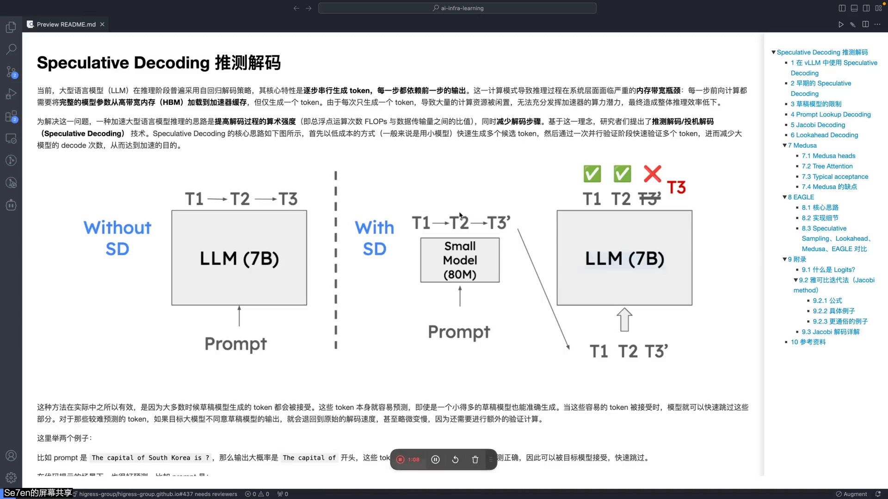
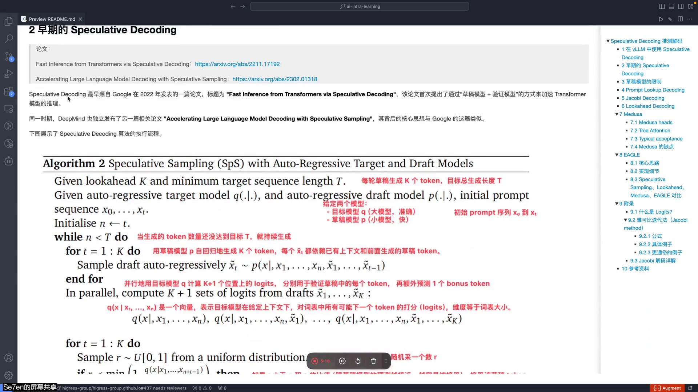
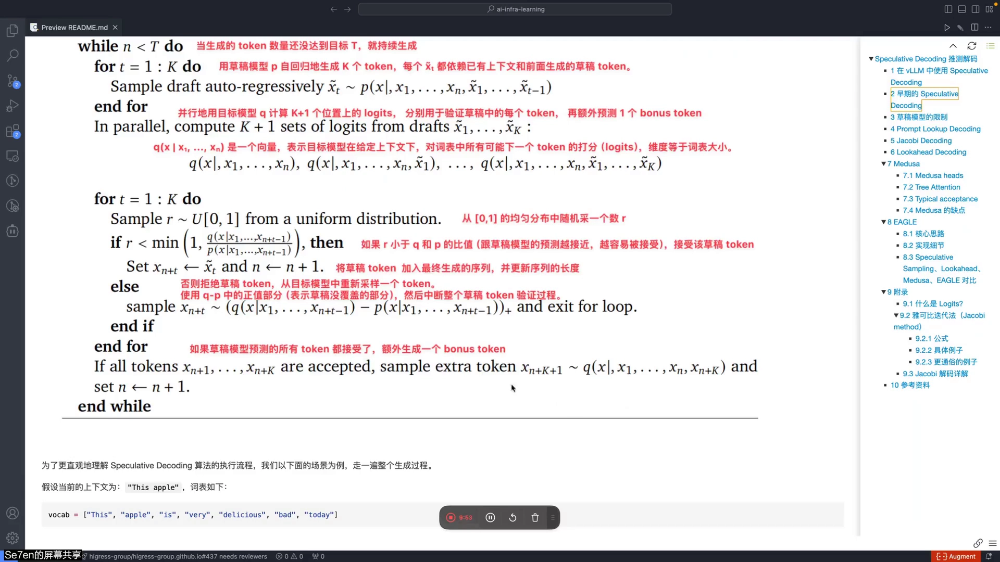
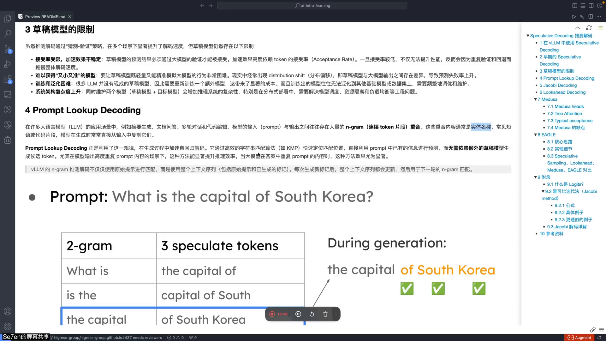
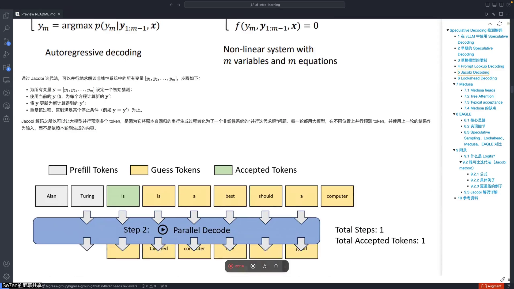
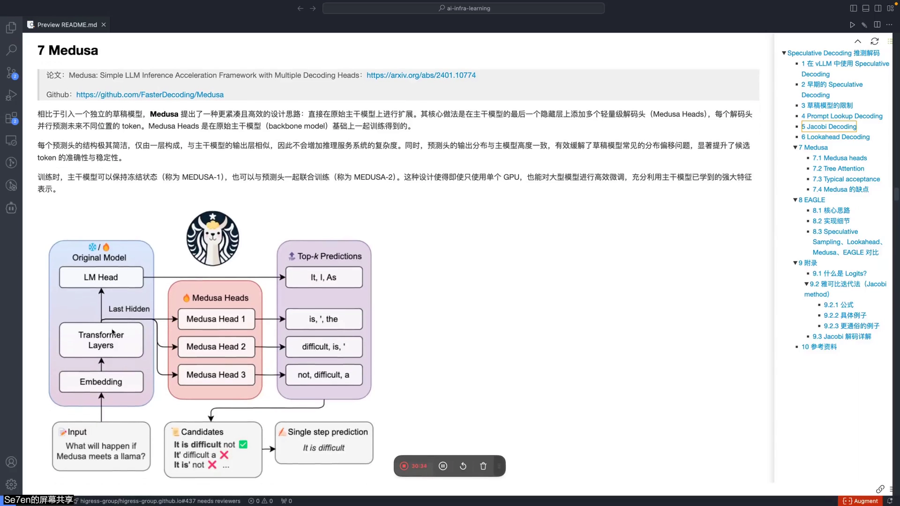
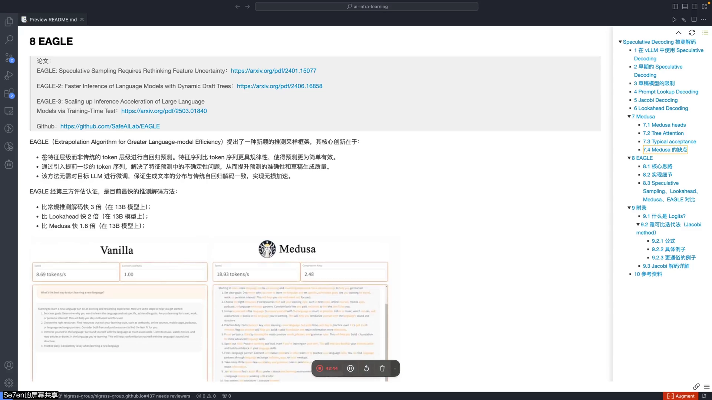

# 第04讲：Speculative Decoding 推测解码实现方案

## 本讲要解决的核心问题（SCQA）

**背景**：大模型推理采用自回归解码——一步只生成一个 token，每个 token 都依赖前面的输出。这时 GPU 的计算单元大部分时间在等显存读取 KV Cache，属于典型的 **memory-bound**。

**冲突**：在 decode 阶段，GPU 强大的并行算力大量闲置。想利用这些空闲算力，又不能改变最终输出（要和大模型自己生成的结果一致）。

**疑问**：能不能用一种"先猜后验"的办法，一次生成/验证多个 token，把闲置算力用起来，从而加速？

**回答（中心思想）**：**Speculative Decoding（推测解码 / 投机解码）** 用低成本方式**快速猜出多个候选 token**，再用目标大模型**一次并行验证**：猜对就用、猜错就回退。最差情况下也能保证生成 1 个 token，猜得多对了就等于白赚。本讲梳理了从早期草稿模型方案，到不需要草稿模型的 Prompt Lookup / Jacobi / Lookahead，再到目前性能最好的 **Medusa** 与 **EAGLE**。

---

## 一、为什么有效：猜得准的场景很多

推测解码有效的根本原因，是**很多 token 其实容易猜**（[【跳转到 02:35】](https://www.bilibili.com/video/BV1Q5KWzQEhn/?t=155)）：

- Prompt 是 "The capital of South Korea is"，输出开头大概率是 "The capital of…"，很容易命中；
- 代码场景里，给了数组 `numbers`，下一句大概率就是 `for` 循环。

而在较难预测的场景，草稿模型猜错被拒绝，就**回退到原始解码**，还会多出验证开销，反而变慢。但大多数情况下，推测解码能提升解码效率。

vLLM 也支持多种推测解码方式：在 `speculative_config` 里指定**草稿模型**（如 125M 小模型）和**一次猜多少个 token**（[【跳转到 04:15】](https://www.bilibili.com/video/BV1Q5KWzQEhn/?t=255)）。

---

## 二、早期方案：草稿模型 + 验证模型

### 2.1 算法流程

早期 Speculative Decoding 源自 Google 2022 年的论文 *Fast Inference from Transformers via Speculative Decoding*，同期 DeepMind 也发表了 *Accelerating Large Language Model Decoding with Speculative Sampling*，核心思想类似（[【跳转到 05:05】](https://www.bilibili.com/video/BV1Q5KWzQEhn/?t=305)）。

算法（设每轮草稿生成 K 个 token，目标总长 T；Q 为目标模型，P 为草稿模型）（[【跳转到 05:30】](https://www.bilibili.com/video/BV1Q5KWzQEhn/?t=330)）：

1. **草稿阶段**：草稿模型 P 也是自回归的，逐个生成 K 个候选 token；
2. **并行验证**：目标模型 Q 并行计算这 K+1 个位置（K 个草稿 + 1 个 bonus）的 logits；
3. **逐 token 判断**：对每个位置，从 0~1 均匀分布采一个随机数 r，若 `r < min(1, Q(token)/P(token))` 则**接受**，否则**拒绝**；
4. 全部接受则额外采样一个 **bonus token**；只要保证 decode 至少吐出一个 token。

### 2.2 关键概念：logits

**logits** 是模型输出层**未归一化**的原始得分，维度等于词表大小。比如某 token 的 logit 是 1.8、另一个是 2.01；经过 **softmax** 后就变成加和为 1 的概率分布。logit 越高，通常对应概率越大（[【跳转到 07:10】](https://www.bilibili.com/video/BV1Q5KWzQEhn/?t=430)）。

判断是否接受，本质是比较**草稿模型和目标模型认为该 token 的概率是否接近**：越接近越容易接受；如果草稿模型给 0.5、目标模型只给 0.01，比值很大，就会被拒绝（[【跳转到 12:35】](https://www.bilibili.com/video/BV1Q5KWzQEhn/?t=755)）。

### 2.3 草稿模型的四个限制

草稿模型方案虽然有效，但限制很多（[【跳转到 13:00】](https://www.bilibili.com/video/BV1Q5KWzQEhn/?t=780)）：

- **接受率受限**：加速效果高度依赖 token 接受率，接受率低反而会因为验证和回退拖慢速度；
- **难以既小又准**：草稿模型与目标模型之间存在 **distribution shift（分布偏移）**，导致预测失败率上升；
- **训练与泛化困难**：很多模型没有现成草稿模型，需额外训练，且难以泛化到其他模型；
- **系统复杂度上升**：同时维护两个模型，尤其分布式部署下调度、资源隔离、负载均衡都更复杂。

---

## 三、不需要草稿模型的方法

### 3.1 Prompt Lookup Decoding

它基于一个观察：在**摘要生成、文档问答、多轮对话、代码编辑**等场景，模型的输入 prompt 和输出之间往往存在大量 **n-gram（连续 token 片段）重叠**，比如实体名、短语、代码片段。它用 **KMP** 等字符串匹配算法，直接在 prompt 里**定位已有内容**作为候选，无需草稿模型（[【跳转到 14:40】](https://www.bilibili.com/video/BV1Q5KWzQEhn/?t=880)）。

例：prompt 是 "What is the capital of South Korea?"，以 2-gram 建表："the capital" 对应 "of South Korea"，生成时匹配到就直接搬运。

> 在 vLLM 中，n-gram 推测解码不只用原始 prompt 匹配，而是使用**包含已生成 token 的完整上下文序列**，每生成新 token 就更新序列，用于下一轮匹配（[【跳转到 16:20】](https://www.bilibili.com/video/BV1Q5KWzQEhn/?t=980)）。

### 3.2 Jacobi Decoding

它把自回归解码看作**求解非线性方程组**，用**雅可比迭代法**并行求解（[【跳转到 17:10】](https://www.bilibili.com/video/BV1Q5KWzQEhn/?t=1030)）。核心是：**每一步计算第 k+1 轮时，只用第 k 轮的旧值**，因此同一轮内所有位置可以**并行**计算，而传统 decode 必须 X1 算完才能算 X2。

通俗理解：所有位置先各自"猜"一个初始 token，然后带进方程一起更新，反复迭代直到收敛。就像让多个人同时博弈，经过多轮后达到市场均衡。

例如目标输入 "Alan Turing"，希望生成 "who was a"：初始猜 "the computer engineer"，迭代中第一个词会被大模型保证正确，后续词逐步靠近正确结果（[【跳转到 22:53】](https://www.bilibili.com/video/BV1Q5KWzQEhn/?t=1373)）。

但 Jacobi 的性能并不好：拆出来的 token 不容易猜对，且即使某部分猜对、位置也可能不对，真正能用的情况不多。

### 3.3 Lookahead Decoding

灵感来自 Jacobi，在其基础上增加了 **n-gram 缓存池**（[【跳转到 26:02】](https://www.bilibili.com/video/BV1Q5KWzQEhn/?t=1562)）：并行解码产生的结果存入 n-gram 池，后续解码时若命中就直接取用，省去再次并行生成。本质是"Jacobi 并行猜测 + n-gram 缓存复用"。

---

## 四、Medusa：主干模型上挂多个解码头

Medusa 的思路是**不引入独立草稿模型**，而是在主干模型（backbone）的**最后一个隐藏层**上挂**多个轻量级解码头（Medusa Heads）**，每个头预测不同未来位置的 token（[【跳转到 30:21】](https://www.bilibili.com/video/BV1Q5KWzQEhn/?t=1821)）：

- 每个头预测 **top-k** 候选（如 top-3），head1 预测 T+1、head2 预测 T+2……互不依赖、可并行；
- 解码头只有一层，结构简洁，不增加多少推理复杂度；
- 由于输出与主干模型高度一致，能缓解草稿模型的分布偏移问题。

**示例**：输入 "What will happen if Medusa meets a llama?"，三个头分别给出候选，组合出单步预测 "It is difficult"（[【跳转到 30:46】](https://www.bilibili.com/video/BV1Q5KWzQEhn/?t=1846)）。

Medusa 的三个组成部分：

**（1）Medusa Heads**：如上。

**（2）Tree Attention**（[【跳转到 35:21】](https://www.bilibili.com/video/BV1Q5KWzQEhn/?t=2121)）：多个头的 top-k 候选组合成树状结构。例如 head1 输出 {It, I}、head2 输出 {is, ', the}，就构成 2×3=6 条路径。Tree Attention 把这些路径**扁平化**成一个连续序列，并构造 **tree mask** 限制哪些 token 之间可以互相注意，从而**一次前向传播验证所有路径**，不增加大模型调用次数。

**（3）Typical Acceptance（典型接受）**（[【跳转到 37:51】](https://www.bilibili.com/video/BV1Q5KWzQEhn/?t=2271)）：传统 Speculative Decoding 用**拒绝采样**，要求草稿 token 与目标模型分布一致，温度高时容易反复被拒、效率低。Medusa 提出更宽容的策略：**根据目标模型预测概率设一个累计概率阈值**（如 90%），只要候选 token 落在这个"典型集合"内就接受它及之前所有 token。

**例子**：上下文 "The weather is"，草稿模型（高温）生成 "fun"；目标模型概率分布里 "nice" 0.35、"bad" 0.30、"cold" 0.15、"fun" 0.08……累计到 "fun" 是 0.88 < 90%，因此接受；"wet" 累加到 0.94 超出阈值，不再接受（[【跳转到 39:56】](https://www.bilibili.com/video/BV1Q5KWzQEhn/?t=2396)）。

**训练方式与效果**：Medusa-1（冻结主干、只训解码头，单 GPU 即可）在 7B 模型上约 **2.18x** 加速；Medusa-2（主干与解码头联合训练，采用差异化学习率和两阶段训练）可达约 **2.83x**（[【跳转到 34:06】](https://www.bilibili.com/video/BV1Q5KWzQEhn/?t=2046)）。

**缺点**：各解码头**独立并行**预测，head2/head3 不参考 head1 的结果，token 之间的上下文依赖被忽略，因此准确性受限（[【跳转到 42:16】](https://www.bilibili.com/video/BV1Q5KWzQEhn/?t=2536)）。

---

## 五、EAGLE：目前最快的推测解码

论文 *EAGLE: Speculative Sampling Requires Rethinking Feature Uncertainty* 提出了两个核心观点（[【跳转到 43:31】](https://www.bilibili.com/video/BV1Q5KWzQEhn/?t=2611)）：

1. **在特征层做自回归，比在 token 层更简单**：特征序列比 token 序列更有规律，预测更容易；
2. **引入提前一步的 token 序列**：解决特征预测中的不确定性问题，提升预测准确性和草稿质量。

EAGLE 经第三方评估是当时最快的推测解码方法：**比常规解码快 3 倍、比 Lookahead 快 2 倍、比 Medusa 快 1.6 倍**（13B 模型上）；论文已迭代 EAGLE-1/2/3（[【跳转到 43:06】](https://www.bilibili.com/video/BV1Q5KWzQEhn/?t=2586)）。

### 实现细节

EAGLE 的草稿模型由三部分组成：**Embedding 层、Autoregression Head（自回归头）、LM Head**。其中 **Embedding 和 LM Head 直接复用目标模型、无需训练**，只有自回归头（一个全连接层 + 一个 decoder 层）需要训练（[【跳转到 50:11】](https://www.bilibili.com/video/BV1Q5KWzQEhn/?t=3011)）。

流程（以已生成 "How can I" 为例）：

1. 取原模型倒数第二层输出的**特征向量** f_how、f_can，以及 token "can""I" 的 **embedding** e_can、e_I；
2. 把特征与 embedding **拼接**，输入自回归头预测下一个特征 f_I；
3. 把 f_I 交给**复用的目标 LM Head** 得到 token 分布，采样出 "make"/"help"；
4. 把新采样 token 的 embedding 与上一轮预测特征拼接，继续预测下一步，最终展开成一棵**token 草稿树**；第一次前向传播无法加速，因为要先拿到特征。

验证阶段同样使用 **Tree Attention**：把草稿树扁平化成一维序列，用 attention mask 限制路径间不能互相注意（如 "is" 与 "has" 互不可见，"is" 与 "a" 可以），从而**一次前向传播验证多个序列**（[【跳转到 51:51】](https://www.bilibili.com/video/BV1Q5KWzQEhn/?t=3111)）。

**EAGLE 的优势**：因为草稿模型与目标模型**共享 embedding 层和 LM head**，两者输出分布更接近，接受率更高；且该方法**无需对目标 LLM 微调**，是**无损加速**。

---

## 六、方法对比

论文从"在哪个层级预测、有无上下文依赖、是否用草稿模型"几个维度做了对比（[【跳转到 52:16】](https://www.bilibili.com/video/BV1Q5KWzQEhn/?t=3136)）：

| 方法 | 预测层级 | 是否用草稿模型 | 上下文依赖 | 特点 |
| --- | --- | --- | --- | --- |
| 早期 Speculative Decoding | token 层 | 是 | 草稿自回归 | 接受率依赖草稿模型质量 |
| Prompt Lookup | token 层（n-gram） | 否 | 复用已有文本 | 轻量，适合高重复内容 |
| Jacobi | token 层 | 否 | 只依赖上一轮 | 并行但准确性低 |
| Lookahead | token 层 | 否 | 只依赖上一轮 | Jacobi + n-gram 池 |
| Medusa | 特征层（并行头） | 否 | 头之间无依赖 | 多解码头 + tree attention |
| **EAGLE** | **特征层（自回归）** | 是（复用 embedding/LM head） | **有，拼接提前 token** | 准确率与加速最好、无损 |

---

## 小结

- decode 阶段是 **memory-bound**，算力闲置，这是推测解码的动机。
- 核心是**"猜多、验一次"**：目标模型一次并行验证多个候选，猜对就用、猜错回退，最差也保证 1 个 token。
- 早期方案用**草稿模型 + 拒绝采样**：`r < min(1, Q/P)` 才接受；但草稿模型有接受率、分布偏移、训练泛化、系统复杂四大限制。
- 免草稿模型的方案：**Prompt Lookup**（n-gram 匹配）、**Jacobi**（迭代并行）、**Lookahead**（Jacobi + n-gram 池）。
- **Medusa** 在主干模型上挂多个解码头，用 **Tree Attention** 一次验证多路径，用 **Typical Acceptance** 放宽接受标准；Medusa-2 约 2.83x，但头之间无依赖、准确性受限。
- **EAGLE** 在**特征层**自回归、拼接**提前一步 token**、复用目标模型 embedding 与 LM Head，是当时最快且**无损**的方案（比常规快 3x）。
- 提升性能的关键不是"猜得多"，而是**接受率（acceptance rate）**——猜得多且准才有意义。

## 关键术语速查

| 术语 | 一句话解释 |
| --- | --- |
| Speculative Decoding | 小模型先猜多个 token、大模型并行验证的加速方案 |
| Draft Model | 草稿模型，负责快速猜测候选 token |
| Target Model | 目标大模型，负责并行验证并保证输出正确 |
| logits | 未归一化的输出得分，经 softmax 变概率 |
| Rejection Sampling | 拒绝采样：按 Q/P 比值和随机数决定是否接受 |
| Bonus Token | 所有草稿 token 都被接受后额外生成的 token |
| Prompt Lookup Decoding | 用 n-gram/KMP 从已有文本匹配候选，无需草稿模型 |
| Jacobi Decoding | 把解码视为解方程组，用雅可比迭代并行预测 |
| Lookahead Decoding | Jacobi 基础上增加 n-gram 缓存池 |
| Medusa Heads | 挂在主干模型上的多个轻量解码头，并行预测不同位置 |
| Tree Attention | 把多条候选路径扁平化，用 mask 一次验证所有路径 |
| Typical Acceptance | 按累计概率阈值接受候选，比拒绝采样更宽容 |
| EAGLE | 在特征层自回归、复用目标模型 embedding/LM Head 的加速方案 |
| Acceptance Rate | 接受率，决定推测解码实际加速效果的关键指标 |
