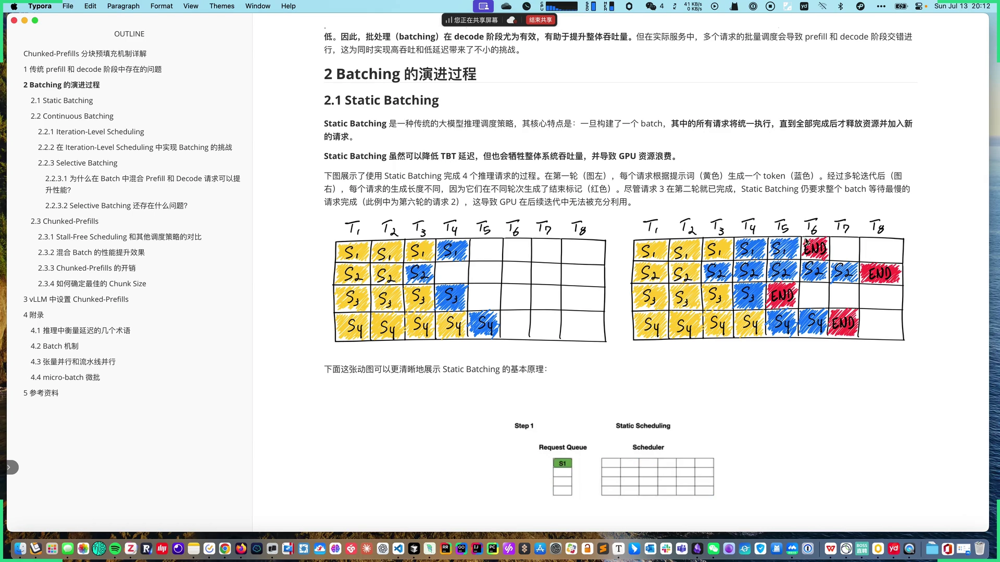
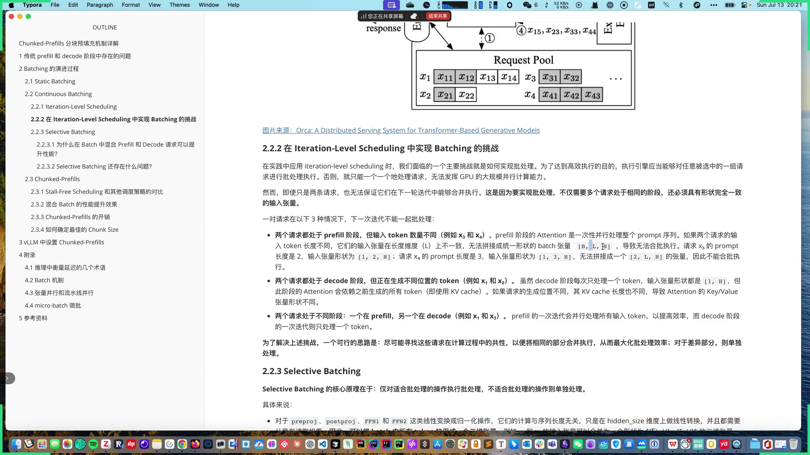
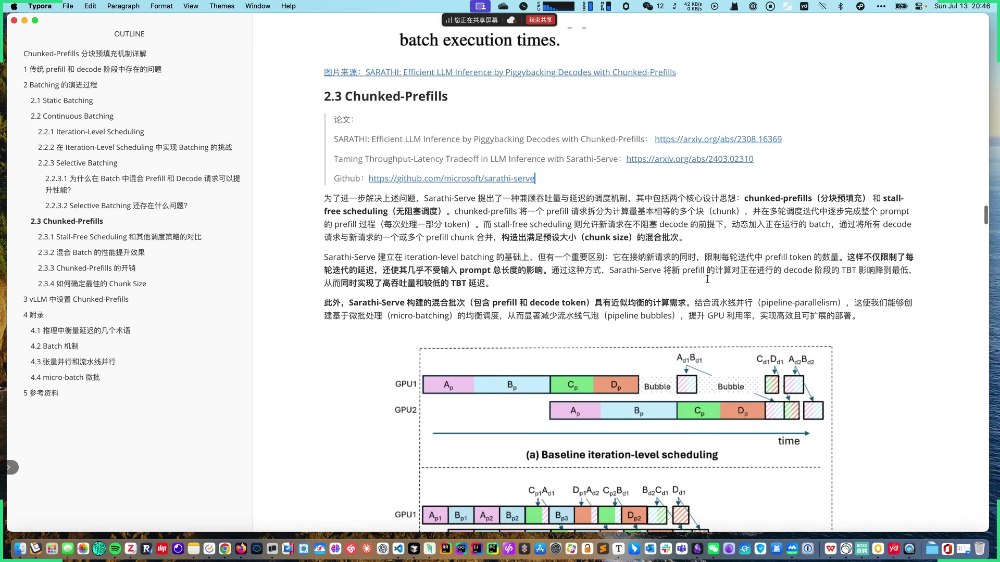
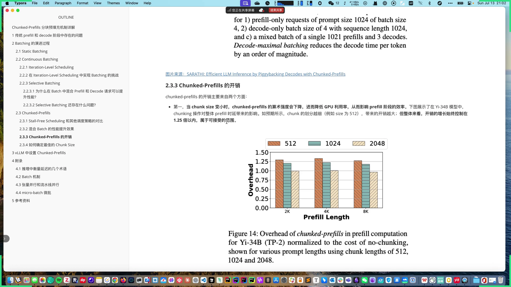
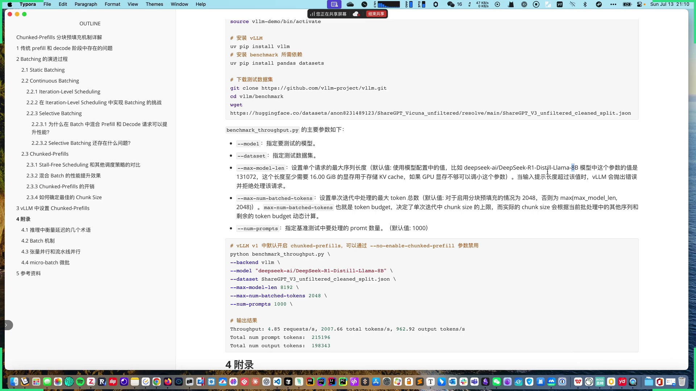

# 第05讲：Chunked-Prefills 分块预填充机制详解

## 本讲要解决的核心问题（SCQA）

**背景**：LLM 推理分 **prefill**（并行处理整个 prompt）和 **decode**（逐个生成 token）两个阶段。prefill 计算密集、能打满 GPU 算力；decode 显存受限、算力大量闲置。

**冲突**：真实服务中两个阶段的请求是**交错**的，长度与数量都不平衡。长 prompt 的 prefill 一旦进入批，就会长时间占满计算资源、阻塞 decode，导致 **TBT（token 间延迟）飙升**；而只跑 decode 时算力又浪费。前面讲过的 **Selective Batching** 虽然能混合两者，但调度随机、还会在流水线里产生**气泡**。

**疑问**：能不能精细控制每轮计算的 token 数，既让 prefill 搭上 decode 的空闲算力，又不拖慢 decode？

**回答（中心思想）**：**Chunked-Prefills（分块预填充）** 把一个长 prefill 请求拆成多个计算量相当的 **chunk**，在多轮迭代中逐步完成；配合 **Stall-free Scheduling（无阻塞调度）** 每轮优先填满 decode、再用 prefill 补齐固定的 **chunk size**。这样既保住低 TBT、又提升吞吐，是用一个实例内"混合批"实现的方案（与之相对的另一种思路是下一讲要说的 **PD 分离**）。

---

## 一、先补齐延迟指标：TTFT、TBT、TPOT

评估推理延迟常用三个术语（[【跳转到 07:27】](https://www.bilibili.com/video/BV1f2uczGEqt/?t=447)）：

- **TTFT（Time To First Token）**：从用户发出请求到生成第一个 token 的时间，衡量 **prefill** 阶段性能；
- **TBT（Time Between Tokens）**：连续两个 token 之间的耗时，反映每个 token 的生成速度；
- **TPOT（Time Per Output Token）**：所有输出 token 的平均生成时间，也称 **ITL（Inter-Token Latency）**，反映整体 decode 效率。

整体响应延迟：`Latency = TTFT + TPOT × 生成 token 数`。

---

## 二、Batching 的演进：从 Static 到 Continuous

### 2.1 Static Batching（request-level）

传统策略：**一旦构建一个 batch，就等其中所有请求全部执行完，才释放资源、加入新请求**（[【跳转到 05:39】](https://www.bilibili.com/video/BV1f2uczGEqt/?t=339)）。它叫 **request-level scheduling**。

问题是：一个请求提前结束也要干等最慢的请求。下图右侧请求 3 在第二轮就拿到 END，却要等到请求 2 完成，期间 GPU 资源被浪费。它**降低了 TBT 延迟**，却牺牲了整体吞吐（[【跳转到 06:29】](https://www.bilibili.com/video/BV1f2uczGEqt/?t=389)）。

### 2.2 Continuous Batching（iteration-level）

ORCA 论文提出 **iteration-level scheduling（迭代级调度）**：以"一轮迭代"为粒度——prefill 处理完 prompt 并生成首 token 算一轮，decode 生成一个 token 也算一轮。**每轮迭代结束就把完成的请求移除、立即加入新请求**，显著提升 GPU 利用率（[【跳转到 11:40】](https://www.bilibili.com/video/BV1f2uczGEqt/?t=700)）。

### 2.3 挑战：为什么 prefill 和 decode 不能随便混批

实现批处理要求多个请求**处于相同阶段**且**输入张量形状完全一致**。以下三种情况无法合批（[【跳转到 15:05】](https://www.bilibili.com/video/BV1f2uczGEqt/?t=905)）：

- 两个请求都在 prefill，但 **token 数量不同**（长度维度 L 不一致）；
- 两个请求都在 decode，但**生成位置不同**（KV cache 长度不同）；
- 两个请求处于**不同阶段**（一个 prefill、一个 decode）。

### 2.4 Selective Batching：能合的合、不能合的分开

解决思路是**寻找共性**：在 ORCA 中实现了 **Selective Batching**（[【跳转到 19:40】](https://www.bilibili.com/video/BV1f2uczGEqt/?t=1180)）：

- **可以合批**：`preproj`、`postproj`、`FFN1`、`FFN2` 等**线性变换/归一化**操作，计算长度与序列长度无关，只在 hidden_size 维度做转换。把 batch 内所有 token **拉平成二维张量**一次计算；
- **必须拆开**：**Attention** 操作因每个请求的 mask、KV cache、token 位置不同，张量形状不一致。进入 Attention 前把 batch **拆分（Split）**，逐个请求单独算 Attention，算完再 **合并（Merge）** 回统一张量。

因为 Attention 的计算只依赖已算出的 Q、K、V 向量、不依赖显存中的模型权重，所以拆分不会带来额外的权重读取 IO 开销（[【跳转到 23:00】](https://www.bilibili.com/video/BV1f2uczGEqt/?t=1380)）。

### 2.5 混合 prefill 与 decode 为什么能提升性能

根本原因是两类请求特性互补（[【跳转到 23:50】](https://www.bilibili.com/video/BV1f2uczGEqt/?t=1430)）：

- **prefill 是 compute-bound**：大量矩阵-矩阵乘法，算力利用率高、内存带宽利用率低；batch size 很小时吞吐就已接近饱和；
- **decode 是 memory-bound**：大部分时间在读 KV cache 和模型权重，算力利用率低；batch size 增大时吞吐几乎线性增长。

因此混合批处理可以：

- 让 **prefill 搭便车（piggyback）** 到 decode 未充分利用的算力上；
- 让 **decode 与 prefill 共享一次权重读取**，降低内存带宽压力。

论文 Figure 3 直观显示：prefill 阶段 batch size 从 1 到 8 吞吐基本饱和；decode 阶段随 batch size 增大吞吐近乎线性上升（[【跳转到 25:30】](https://www.bilibili.com/video/BV1f2uczGEqt/?t=1530)）。

其本质差异来自矩阵乘法形式：prefill 做**矩阵×矩阵**、decode 做**向量×矩阵**。用**算术强度（arithmetic intensity = FLOPs / 内存带宽）**衡量：prefill 即便 batch=1 算术强度也很高；decode 只有 batch size 到 **256** 这种极大值才算计算密集——但受限于 KV cache 占用，实际很难达到（如 LLaMA-13B 在 A6000、序列长度 1K 时最多只能容纳 18 条请求）（[【跳转到 30:30】](https://www.bilibili.com/video/BV1f2uczGEqt/?t=1830)）。

---

## 三、Selective Batching 仍存在的问题

即便 Selective Batching 能混批，它还是有三个问题（[【跳转到 31:45】](https://www.bilibili.com/video/BV1f2uczGEqt/?t=1905)）：

- **调度随机**：一个 batch 里有多少 prefill / decode 没有明确控制，仅按先来先服务动态拼装。若 batch 里全是长 prefill，整个 batch 变 compute-bound；若全是 decode，变 memory-bound 导致算力闲置；
- **影响 TTFT 与 TBT 的平衡**：长 prompt 会长时间占据计算资源，阻塞 decode；
- **流水线气泡（pipeline bubbles）**：在流水线并行（Pipeline Parallelism）下产生 GPU 空闲。

> **什么是流水线并行**：大模型单卡放不下，需要跨 GPU 部署。**张量并行（TP）**按每层权重拆分，通信开销高（每层需 all-reduce）；**流水线并行（PP）**按层拆分，层间只传一次 activation，通信开销小，更适合带宽有限的集群。

论文列出了三类气泡（Figure 5）（[【跳转到 35:27】](https://www.bilibili.com/video/BV1f2uczGEqt/?t=2127)）：

- **PB1**：不同 micro-batch 的 prefill token 数量差异大。GPU1 完成 A、B 的 prefill 后，必须等 GPU2 完成 A、B 才能继续 decode，期间 GPU1 空转；
- **PB2**：prefill 与 decode 计算负载差异大。decode 只处理一个 token、时间极短，却要等 GPU2 上正在进行的 prefill 完成；
- **PB3**：decode 阶段不同请求的上下文长度差异导致计算时间不均。

---

## 四、Chunked-Prefills 与 Stall-free Scheduling

Sarathi-Serve 提出的方案包含两个核心思想（[【跳转到 38:47】](https://www.bilibili.com/video/BV1f2uczGEqt/?t=2327)）：

- **Chunked-Prefills（分块预填充）**：把一个 prefill 请求拆分成**计算量基本相当的多个 chunk**，在多轮调度中逐步完成整个 prompt；
- **Stall-free Scheduling（无阻塞调度）**：允许新请求在不阻塞 decode 的前提下，动态加入正在执行的 batch。

它建立在 iteration-level batching 之上，但有一个关键区别：**限制每轮迭代中 prefill token 的数量**，并将 decode 与 prefill 的 chunk 合并，构建出**预设大小（chunk size）的混合批次**。这样既限制了每轮延迟，又让新 prefill 对 decode 的 TBT 影响降到最低，同时利用流水线并行实现基于**微批处理（micro-batching）**的均衡调度，显著减少气泡（[【跳转到 40:02】](https://www.bilibili.com/video/BV1f2uczGEqt/?t=2402)）。

### 调度逻辑（Stall-free Batching）

Sarathi-Serve 每轮迭代的调度分三步，优先级从高到低（[【跳转到 42:32】](https://www.bilibili.com/video/BV1f2uczGEqt/?t=2552)）：

1. **优先调度正在进行的 decode 请求**：每个 decode 只消耗 1 个 token，且对延迟最敏感，先加入；
2. **处理未完成的 prefill 请求**：在剩余 token 预算内，优先填满一个 prefill 请求的 chunk，再处理下一个；
3. **接纳新的 prefill 请求**：若还有剩余预算，就从等待队列取新请求加入。

系统保证当前调度轮次中 **decode 与 prefill 的 token 总数不超过预设的 chunk size**（即 **token budget**），该上限由用户设定的 **TBT SLO** 计算得出（[【跳转到 44:12】](https://www.bilibili.com/video/BV1f2uczGEqt/?t=2652)）。

> **概念澄清**：论文里 **token budget** 与 **chunk size** 有时混用。本文统一理解为**每轮迭代允许处理的 token 上限**（实际源码中 `chunk_size` 即表示这个上限）。

### 与其他调度策略的对比

Sarathi-Serve 的理念是"**prefill 和 decode 都不产生停滞**"（[【跳转到 49:37】](https://www.bilibili.com/video/BV1f2uczGEqt/?t=2977)）。其他策略则各有取舍：

- **prefill 优先（vLLM 早期、ORCA）**：尽量先调度 prefill，完成后再恢复 decode，造成 decode 阻塞、TBT 上升（vLLM 现在也支持 chunked prefill 与混合批，情形已改善）；
- **decode 优先（FasterTransformer）**：等当前 batch 的 decode 全部完成才调度新请求，decode 的 TBT 很低，但新 prefill 请求被阻塞，牺牲整体吞吐。

Sarathi 则是"既要低延迟又要高吞吐"：精细控制每轮 prefill token 数、优先填 decode、再用 prefill 补齐。

### 性能提升

论文对比了三种情况：仅 prefill（prompt 1024、batch 4）、仅 decode（batch 4、序列长 1024）、混合批（1 个 1021 的 prefill + 3 个 decode）（[【跳转到 54:37】](https://www.bilibili.com/video/BV1f2uczGEqt/?t=3277)）：

- 混合批对 **prefill 的影响微乎其微**；
- 却能把 **decode 的每 token 解码时间显著降低一个数量级**，大幅提升推理效率。

---

## 五、开销与 chunk size 的选择

### 5.1 两个开销来源

Chunked-Prefills 主要带来两方面开销（[【跳转到 55:52】](https://www.bilibili.com/video/BV1f2uczGEqt/?t=3352)）：

- **chunk 拆分导致算术强度下降**：chunk 越小，GPU 利用率越低，影响 prefill 效率，进而**抬高 TTFT**。但论文测得开销增长始终控制在 **1.25 倍以内**，可以接受。因为真正耗时的是占比超 80% 的 **linear 操作**（可合批），而需要拆分的 **attention 开销占比较低**；
- **attention 重复读取 KV cache**：每次 chunk 的 Attention 都要重读之前累计的 KV，增加了内存访问负担。

### 5.2 如何确定最佳 chunk size：避免 tile quantization

**没有一个放之四海皆准的 chunk size**，需要在 **TBT 目标** 与 **prefill 开销**之间找平衡（[【跳转到 59:12】](https://www.bilibili.com/video/BV1f2uczGEqt/?t=3552)）：

- chunk size **较小**：每轮迭代的 prefill token 更少、执行更快，有利于降低 TBT；
- chunk size **过小**：attention 重复读 KV 的次数增多、算术强度下降，prefill 效率变差。

论文推荐用 **Vidur** 工具做 profiling，找出不违反 TBT SLO 时单个 batch 能容纳的最大 token 数作为 chunk size。

**关键注意点——避免 tile quantization 效应**：GPU 矩阵乘法采用 tile 分块（如 tile size = 128），只有矩阵维度是 tile 的整数倍时资源利用率才最高。若 chunk size 刚好超过 tile 倍数（例如从 256 变成 257），会导致 thread block 内部分线程空转，延迟**突发性飙升**——实测序列长度从 256 增加到 257，仅多 1 个 token，延迟就从 **69.8ms 飙到 93.33ms，涨幅超 32%**（[【跳转到 60:52】](https://www.bilibili.com/video/BV1f2uczGEqt/?t=3652)）。

因此应尽量让 chunk size 是 tile size 的整数倍。

（另外，Sarathi 默认固定 chunk size 为 **512**；源码里还有**动态 chunk size** 机制——早期用较大 chunk（如 2048）快速推进长 prompt 降低 TTFT，随进度逐步减小到 256，平衡首 token 延迟与整体吞吐。）

---

## 六、vLLM 中如何设置 Chunked-Prefills

在 vLLM **V1** 版本中，chunked-prefills **默认启用**，无需额外设置，并提供了参数优化性能（[【跳转到 61:17】](https://www.bilibili.com/video/BV1f2uczGEqt/?t=3677)）：

- **`--max-num-batched-tokens`**：单次迭代处理的最大 token 总数，即 **token budget**，决定 chunk size 的上限。由它控制每轮的实际 chunk size（会先减去 decode 与已处理 prefill 占用的 token）。默认 **2048**，追求吞吐时可调大到 **8192**，尤其适合小模型 + 大显存 GPU；
- **`--max-model-len`**：单个请求的最大序列长度。当输入 prompt 超过该值时 vLLM 会拒绝请求；它决定了启动时需保证的 KV cache 显存（如 DeepSeek-R1-Distill-Llama-8B 的默认值是 131072，需要约 16GB 显存）；
- 可通过 **`--no-enable-chunked-prefill`** 关闭该功能。

实践中可以用 vLLM 自带的 `benchmark_throughput.py`，配合 ShareGPT 数据集，在你的 GPU 上测试不同参数组合，找到吞吐最优配置（[【跳转到 63:22】](https://www.bilibili.com/video/BV1f2uczGEqt/?t=3802)）。

---

## 小结

- prefill 是 **compute-bound**、decode 是 **memory-bound**，两者交错且不平衡，是调度难题的根源。
- 延迟指标：**TTFT**（首 token，衡量 prefill）、**TBT**（token 间）、**TPOT/ITL**（平均 token 时间，衡量 decode）。
- Batching 演进：**Static（request-level）** → **Continuous（iteration-level，ORCA）** → **Chunked-Prefill**。
- **Selective Batching** 让线性操作合批、Attention 拆分再合并；混合 prefill/decode 可以让 prefill"搭便车"、共享权重读取。
- 但 selective batching 调度随机，还会在流水线并行中产生 **PB1/PB2/PB3 气泡**。
- **Chunked-Prefills + Stall-free Scheduling**：把长 prefill 拆块，每轮优先填 decode、再用 prefill 补齐固定 chunk size，兼顾低 TBT 与高吞吐。
- 开销主要是算术强度下降（<1.25x）和 attention 重复读 KV；**chunk size 要避免 tile quantization**（尽量是 tile size 128 的整数倍）。
- vLLM V1 默认启用，用 **`--max-num-batched-tokens`** 控制 token budget（默认 2048），配合 `benchmark_throughput.py` 调优。

## 关键术语速查

| 术语 | 一句话解释 |
| --- | --- |
| Prefill | 并行处理整个 prompt，compute-bound |
| Decode | 逐个生成 token，memory-bound |
| TTFT | 首 token 延迟，衡量 prefill |
| TBT / TPOT / ITL | token 间延迟 / 平均 token 时间，衡量 decode |
| Static Batching | request-level，等整个 batch 完成才释放 |
| Continuous Batching | iteration-level，每轮迭代动态替换请求 |
| Selective Batching | 线性操作合批、Attention 拆分再合并 |
| Arithmetic Intensity | 算术强度 = FLOPs / 内存带宽，判断 compute/memory-bound |
| Pipeline Bubble | 流水线并行中因计算不均导致的 GPU 空闲 |
| Chunked-Prefills | 把长 prefill 拆成多个 chunk 分多轮完成 |
| Stall-free Scheduling | 每轮优先 decode、再用 prefill 补齐 chunk size |
| Chunk Size / Token Budget | 每轮迭代允许处理的最大 token 数 |
| Tile Quantization | chunk size 非 tile 整数倍导致的延迟突增 |
| vLLM `--max-num-batched-tokens` | 控制 token budget 的 vLLM 参数（默认 2048） |
