# 第01讲_LLM全景图介绍&vLLM快速入门 原始文稿（图-字幕分栏）

| 字幕文本 | 画面 |
| :--- | ---: |
| 本地录制好了，我们开始。先来讲第一部分。 [【跳转到 00:00】](https://www.bilibili.com/video/BV1T2EGzLEHi/?t=0) |  |
| LLM 全景图的介绍。从这张图上我们可以看到， [【跳转到 00:05】](https://www.bilibili.com/video/BV1T2EGzLEHi/?t=5) | 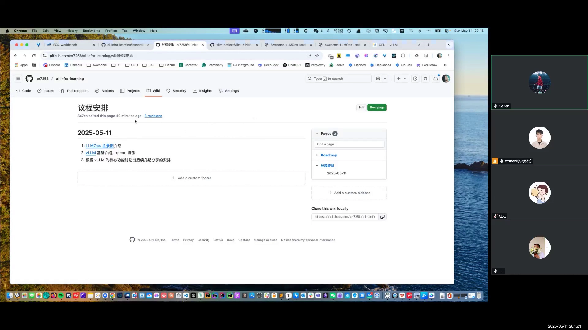 |
| 我们目前按照四个方面来拆分：第一部分是 Inference（推理）；第二部分是 Orchestration（编排），比如 Agent 方面；第三部分是 Runtime（运行时）， [【跳转到 00:10】](https://www.bilibili.com/video/BV1T2EGzLEHi/?t=10) |  |
| 也就是怎么把这个模型——可能是 Agent—— [【跳转到 00:25】](https://www.bilibili.com/video/BV1T2EGzLEHi/?t=25) |  |
| 运行起来，相当于给它一个环境，当然数据库我们也归到这里；还有一个部分就是 Training（训练）。 [【跳转到 00:30】](https://www.bilibili.com/video/BV1T2EGzLEHi/?t=30) | 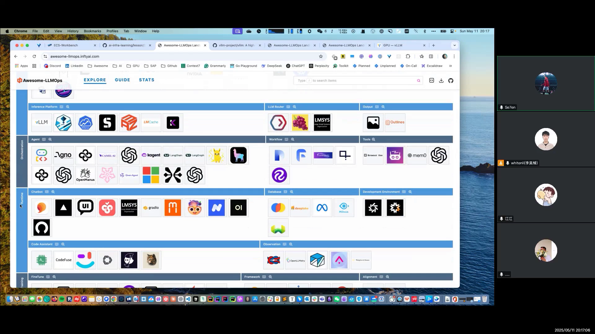 |
| 我们再仔细看看里面有哪些部分。比如 Inference Engine（推理引擎）， [【跳转到 00:38】](https://www.bilibili.com/video/BV1T2EGzLEHi/?t=38) | 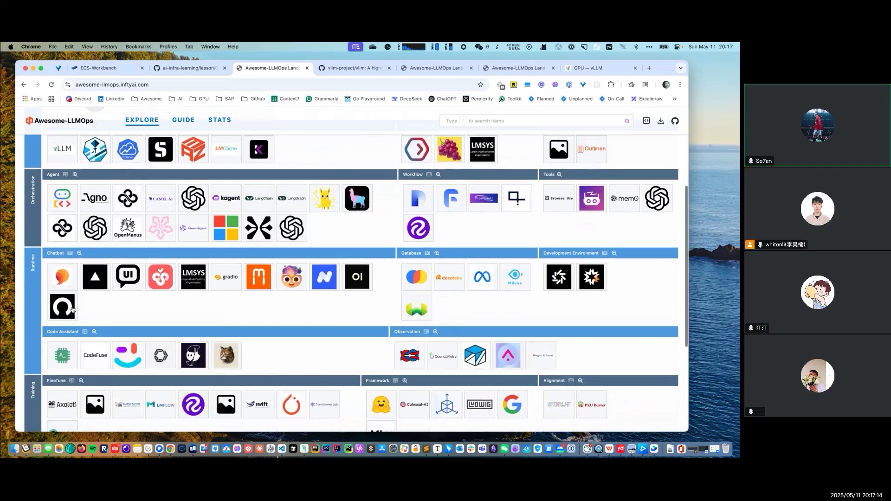 |
| 你可以看到像 vLLM 就包含在这里面。它的主要功能就是把大模型跑起来、serve 起来，包括离线推理和在线推理。离线推理是我可以一次性提交多个问题，让它批量推理、生成答案，比如夜间去跑一些任务； [【跳转到 00:43】](https://www.bilibili.com/video/BV1T2EGzLEHi/?t=43) | 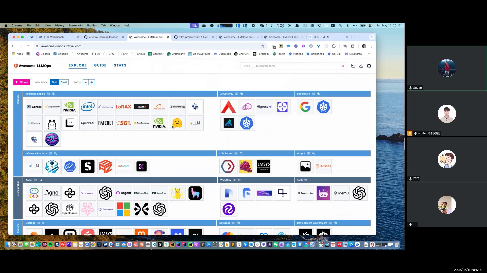 |
| 在线推理就像 OpenAI 这种，用户提了问题就要马上回答。所以这个 Inference Engine（推理引擎）也是我们近期比较关注的部分，像 vLLM、SGLang，以及 NVIDIA 的一些 demo，我们都归纳到这一类。而 Inference Platform（推理平台）的话，其实比如我们的 vLLM， [【跳转到 01:08】](https://www.bilibili.com/video/BV1T2EGzLEHi/?t=68) | 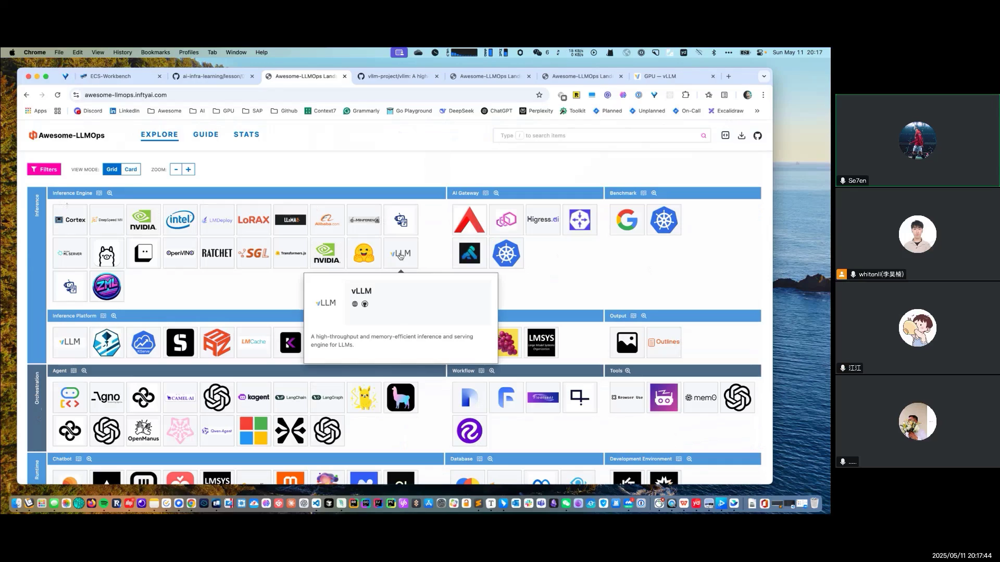 |
| 它只是关注在单机上跑、在单机上 serve 一个模型；而在生产环境中要考虑的东西就多了，比如分布式推理等等，所以我可能要在上层有一个 Inference Platform（推理平台）来达到生产级别的服务，比如 AIBrix，就是自己开源的一个项目。 [【跳转到 01:33】](https://www.bilibili.com/video/BV1T2EGzLEHi/?t=93) | 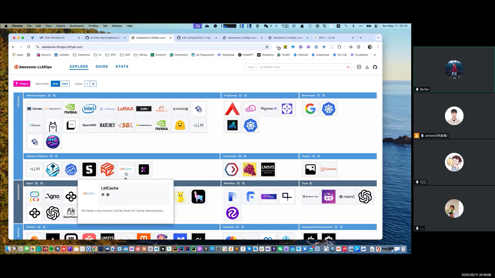 |
| 前面江南也提到过。下一个部分是 AI Gateway（AI 网关）。这部分我还相对熟悉一点，因为我现在在 Higress 做，所以 Higress 也会有一些 AI Gateway 的功能。比如最早出来的功能就是：我的大语言模型可能来自不同厂商， [【跳转到 01:58】](https://www.bilibili.com/video/BV1T2EGzLEHi/?t=118) | 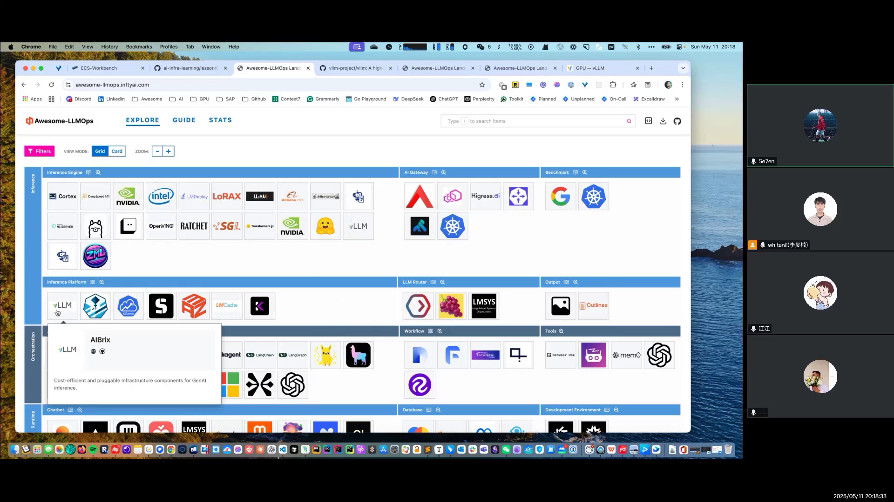 |
| 它们的请求或响应结构不一样，但后来大家都是以 OpenAI 的格式作为标准，于是我们就有一种叫做 AI Proxy 的概念——在网关层面把不同厂商大语言模型的请求、响应格式统一转化成 OpenAI 格式。 [【跳转到 02:23】](https://www.bilibili.com/video/BV1T2EGzLEHi/?t=143) |  |
| 那对我这一侧用 Python SDK 或请求去调用大语言模型来说就很简单，大家都用 OpenAI 格式去请求。现在还有一个 MCP 比较火，叫做 Model Context Protocol（模型上下文协议），它允许大模型和一些外部数据源、数据库 [【跳转到 02:48】](https://www.bilibili.com/video/BV1T2EGzLEHi/?t=168) | 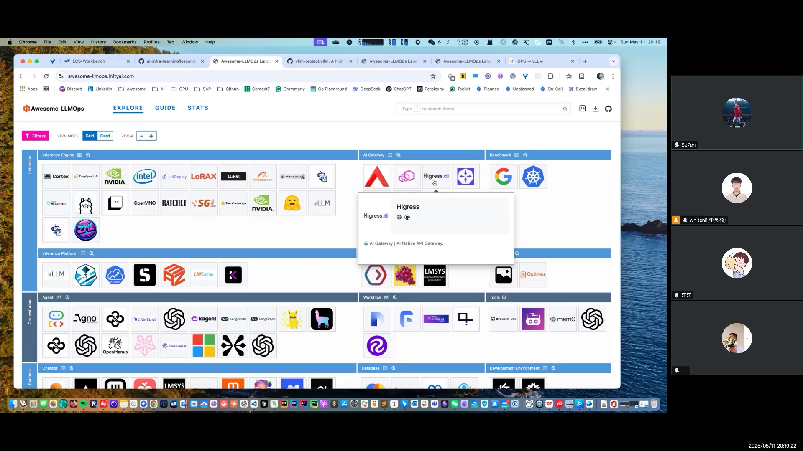 |
| 或各种各样的东西进行交互，相当于让大模型长出了手：大模型可以认为是脑，MCP 认为是手，你可以用大模型真正去交互其他的一些数据。Gateway 在这里也可以做一件事，叫做 REST 到 MCP 的转换。比如我的 [【跳转到 03:13】](https://www.bilibili.com/video/BV1T2EGzLEHi/?t=193) |  |
| 我们平时都用 REST API 提供服务，但如果要转换成 MCP，可能要写 MCP 的 SDK，有一些代码开发工作；那我直接在网关层面做一个转换，把存量的 REST API 直接转换成 MCP 的 server。比如 Higress 这边有一个叫做 MCP 市场（MCP Marketplace）， [【跳转到 03:38】](https://www.bilibili.com/video/BV1T2EGzLEHi/?t=218) |  |
| 也就是 MCP Market。这个地方你们也可以试用一下，很多现成的 API 可以直接用，它会生成一个 MCP 的、比如 SSE 或者 Streamable HTTP 的端口，你把它配到这些 [【跳转到 04:03】](https://www.bilibili.com/video/BV1T2EGzLEHi/?t=243) | 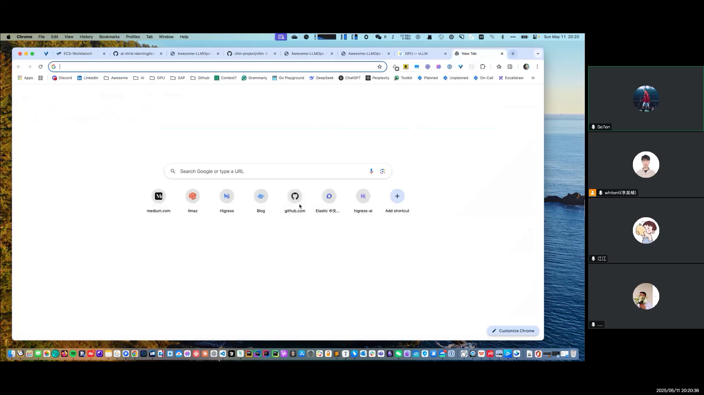 |
| AI chat / chatbot 软件里，就可以调用这个 MCP server 进行操作。这边是 Benchmark（基准测试），就是对接入的模型做 benchmark， [【跳转到 04:28】](https://www.bilibili.com/video/BV1T2EGzLEHi/?t=268) | 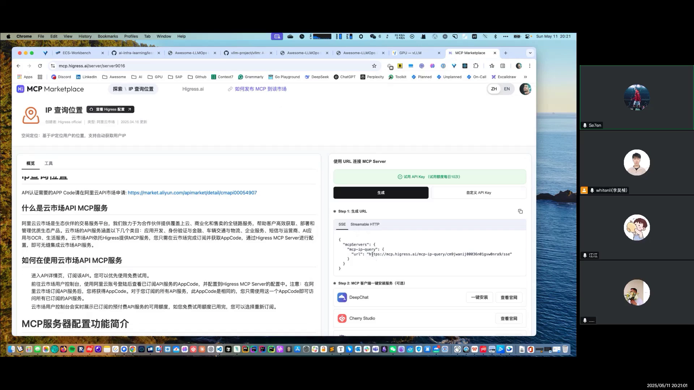 |
| 评测性能。然后 LLM Router 其实跟 AI Gateway 可能有点相似，但它属于后来出现的。 [【跳转到 04:41】](https://www.bilibili.com/video/BV1T2EGzLEHi/?t=281) |  |
| 因为 AI Gateway 之前是 API Gateway，像一些传统的 API 网关很早就出现了，它们在此基础上增加了对 AI 能力的适配。而 LLM Router 我们认为就是后来的——可能从 AI 模型火了以后、从 AI Proxy 方面开始支持，但功能上肯定没有这种传统的 [【跳转到 04:51】](https://www.bilibili.com/video/BV1T2EGzLEHi/?t=291) |  |
| AI Gateway 完整，不过它可能专门针对 AI 场景，会有更多的一些支持。然后 Output 这个，就是对比如我大语言模型的一些输出 [【跳转到 05:16】](https://www.bilibili.com/video/BV1T2EGzLEHi/?t=316) | 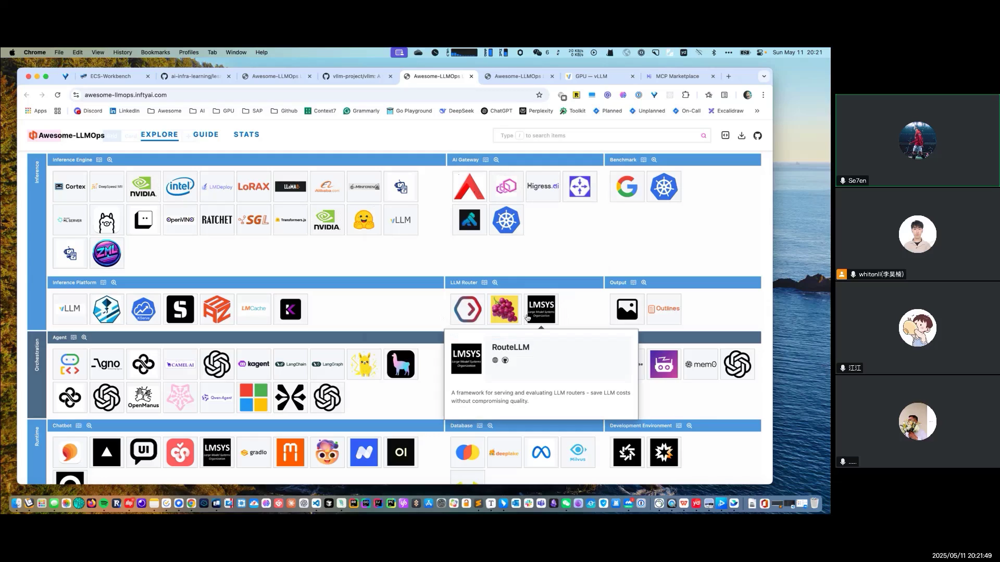 |
| 做一些结构化的设置。比如大语言模型的输出可能不太确定，那我可以通过一些类似的开源项目让它的输出更结构化、更可控。这边是 Inference 相关的，有没有什么问题？ [【跳转到 05:29】](https://www.bilibili.com/video/BV1T2EGzLEHi/?t=329) | 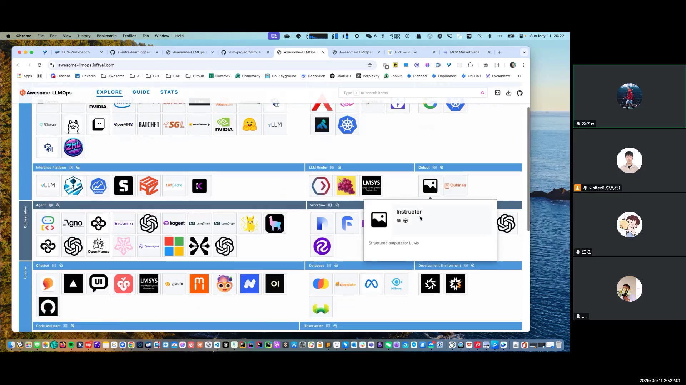 |
| 嗯，没有，OK。 [【跳转到 05:50】](https://www.bilibili.com/video/BV1T2EGzLEHi/?t=350) | 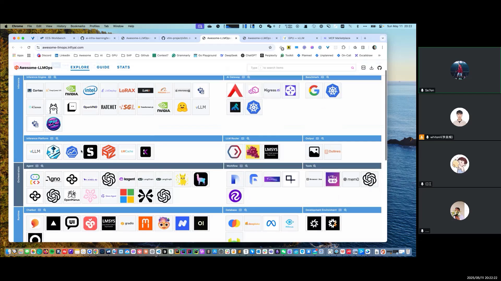 |
| 接下来是 Agent 的部分。Agent 主要分为两部分：一部分是 Agent 的一些框架，比如 LangChain、 [【跳转到 05:55】](https://www.bilibili.com/video/BV1T2EGzLEHi/?t=355) |  |
| LlamaIndex 什么的，或者谷歌现在的 ADK。我可以透过这些框架编写出 Agent 的代码，让它去跟大语言模型交互，甚至可能有一些比较复杂的流程。比如这是一份 LangGraph 的文档， [【跳转到 06:05】](https://www.bilibili.com/video/BV1T2EGzLEHi/?t=365) | 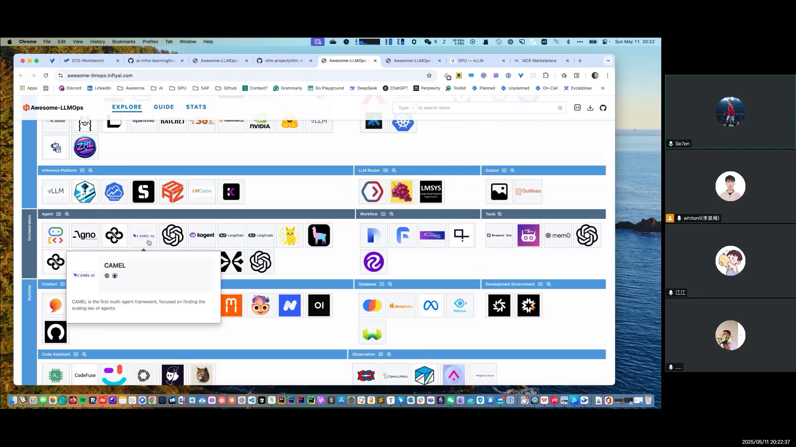 |
| 它这里应该有个 quickstart，有一些图可以看看。 [【跳转到 06:24】](https://www.bilibili.com/video/BV1T2EGzLEHi/?t=384) | 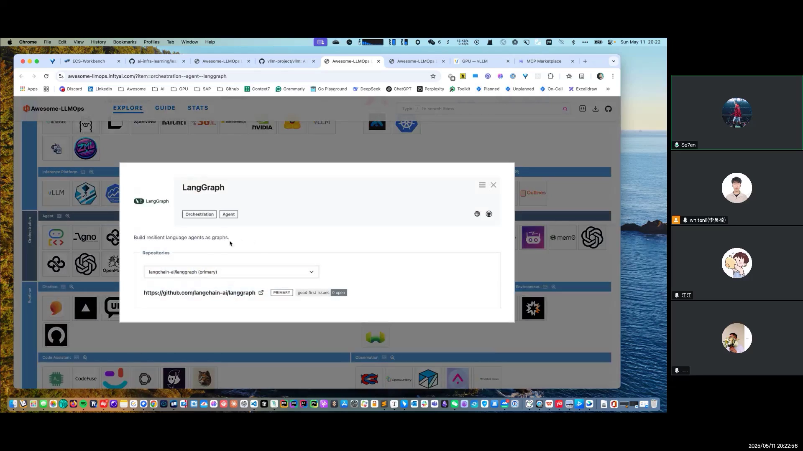 |
| 比如 Deep Agents 这类工具，就是用 LangGraph 编写出来的，它可能有一些工作流，比如调用 tool 去得到 answer、rewrite question，然后再返回给 Agent。 [【跳转到 06:29】](https://www.bilibili.com/video/BV1T2EGzLEHi/?t=389) | 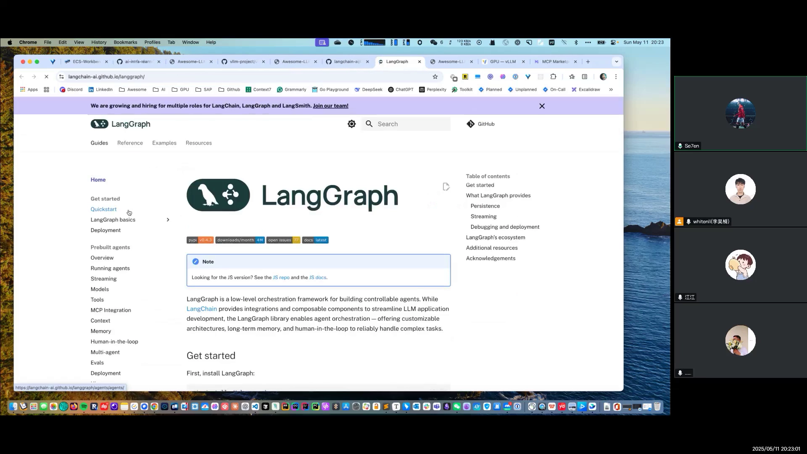 |
| 再进行下一步调用，它可以定义非常复杂的工作流程，这就是 Agent 框架的作用。那 Workflow（工作流）的话，相当于为 Agent 提供了一个可视化的界面。 [【跳转到 06:54】](https://www.bilibili.com/video/BV1T2EGzLEHi/?t=414) | 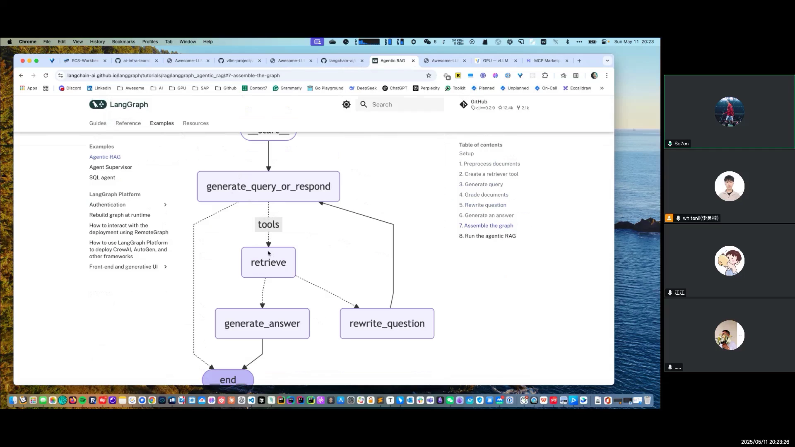 |
| 比如你可以进行拖拉拽，你看这是一个 Dify，对吧。 [【跳转到 07:09】](https://www.bilibili.com/video/BV1T2EGzLEHi/?t=429) |  |
| 你可以看这图：类似我可以拖过来一个节点，在上面进行可视化配置，相当于它的上手门槛会比 LangChain 简单一些；但 LangChain 这种可以提供更复杂一些的能力。然后 Tools 的话，我们这边归类 [【跳转到 07:17】](https://www.bilibili.com/video/BV1T2EGzLEHi/?t=437) |  |
| 比如像一些 Browser Use，你可以通过这个 Tools 去 [【跳转到 07:42】](https://www.bilibili.com/video/BV1T2EGzLEHi/?t=462) | 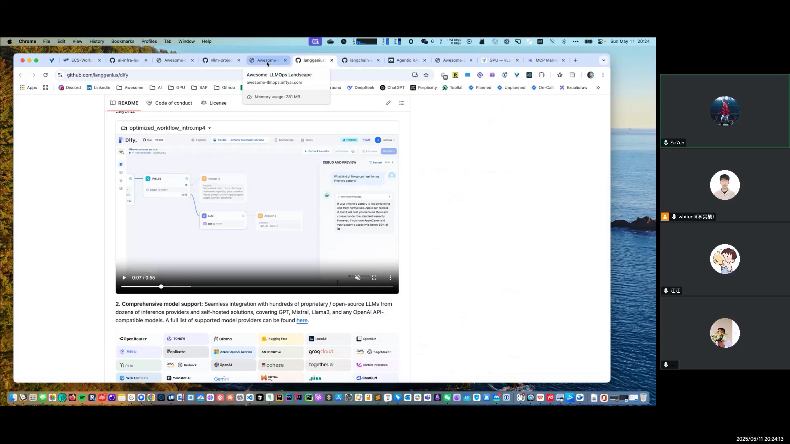 |
| 操作你的浏览器等等，我们把其他这些归类在 Tools 里。然后 Runtime（运行时）的范围就比较广了，比如我这边这些 Chatbox， [【跳转到 07:47】](https://www.bilibili.com/video/BV1T2EGzLEHi/?t=467) | 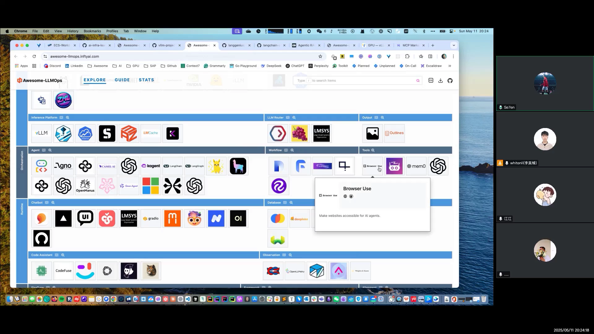 |
| 我可以归类为一种 Runtime。比如你的 Chatbox 可以去对接 OpenAI、Claude、DeepSeek 等等模型，我通过一个 Chatbox 去连接就行，它现在当然也支持 MCP 这种工具调用。Cherry Studio 应该是现在国内用得比较多的一个 Chatbot。 [【跳转到 08:00】](https://www.bilibili.com/video/BV1T2EGzLEHi/?t=480) | 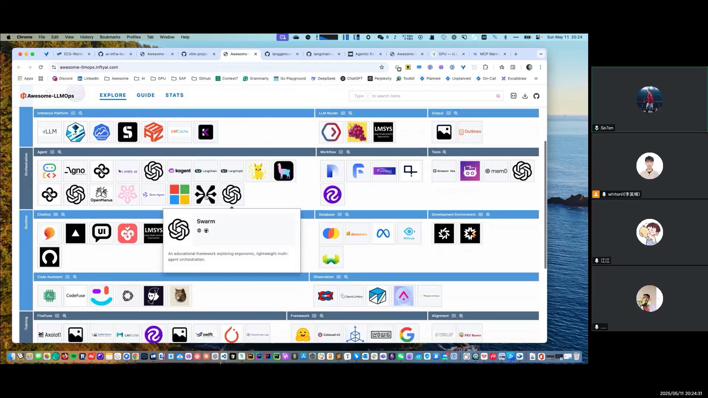 |
| 这边是 Database（数据库），像向量数据库，比如 Milvus、Weaviate，包括 Elasticsearch、OpenSearch 这些传统数据库其实也支持向量。另外一个部分就是 Environment（环境），相当于有一个 runtime、一个 sandbox（沙箱）环境去让这些 Agent 运行。可以想象 [【跳转到 08:25】](https://www.bilibili.com/video/BV1T2EGzLEHi/?t=505) | 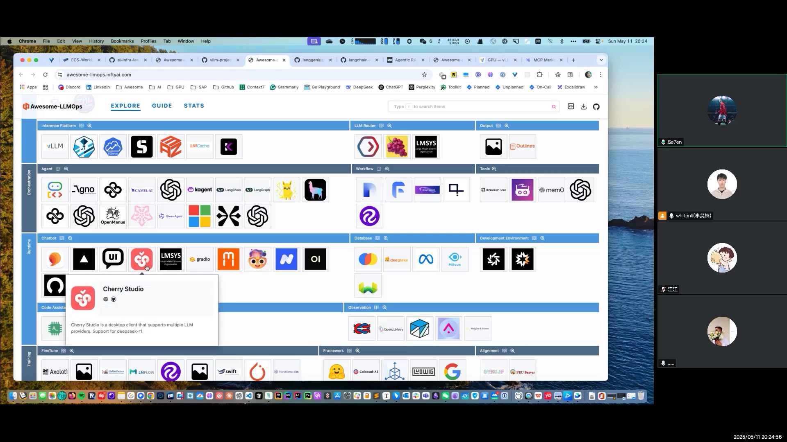 |
| 比如 Manus，它当时就跑了一个 Ubuntu 虚拟机。其实这个 Runtime 就相当于提供了一个虚拟环境、沙箱环境，让这些 Agent 去执行工作。Code System 的话，其实就是像那种开源的、有 Cline 这种 VSCode IDE 的编辑软件， [【跳转到 08:50】](https://www.bilibili.com/video/BV1T2EGzLEHi/?t=530) | 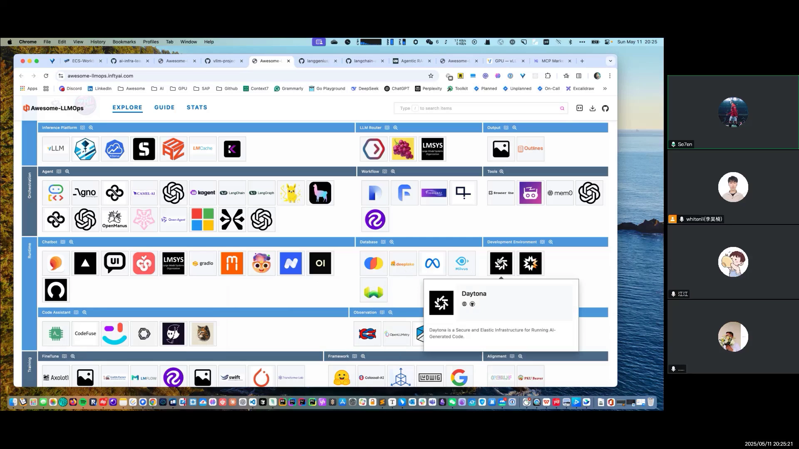 |
| 或者是付费的，像 Cursor、Windsurf 这种的，我们就归类为一个 Code Assistant（代码助手）。然后 Observability（可观测性）的话，因为大语言模型的调用其实也挺复杂的，它可以提供一个类似 trace（链路追踪）的 [【跳转到 09:09】](https://www.bilibili.com/video/BV1T2EGzLEHi/?t=549) | 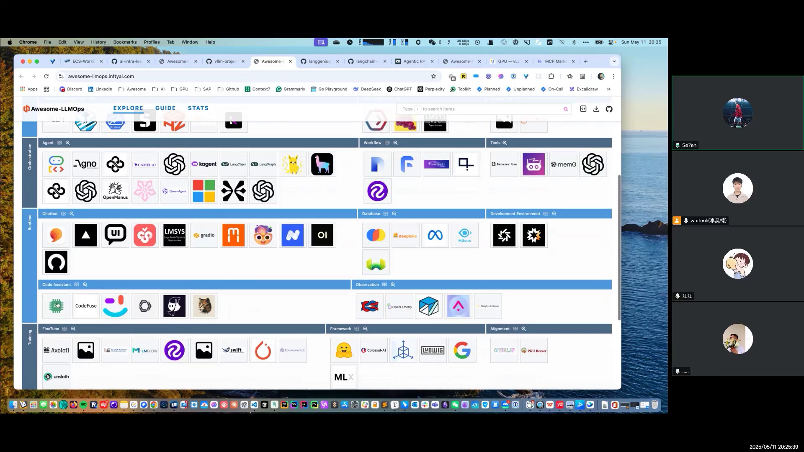 |
| 方式。看看他这里有没有个图，就像那个……他现在有的也支持 OpenTelemetry [【跳转到 09:31】](https://www.bilibili.com/video/BV1T2EGzLEHi/?t=571) | 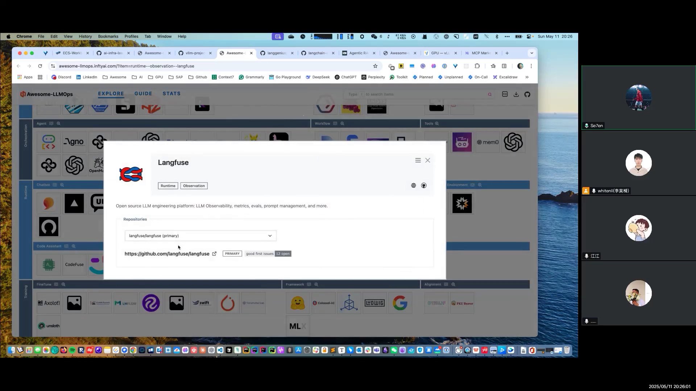 |
| 的协议，可以用统一的方式。 [【跳转到 09:36】](https://www.bilibili.com/video/BV1T2EGzLEHi/?t=576) | 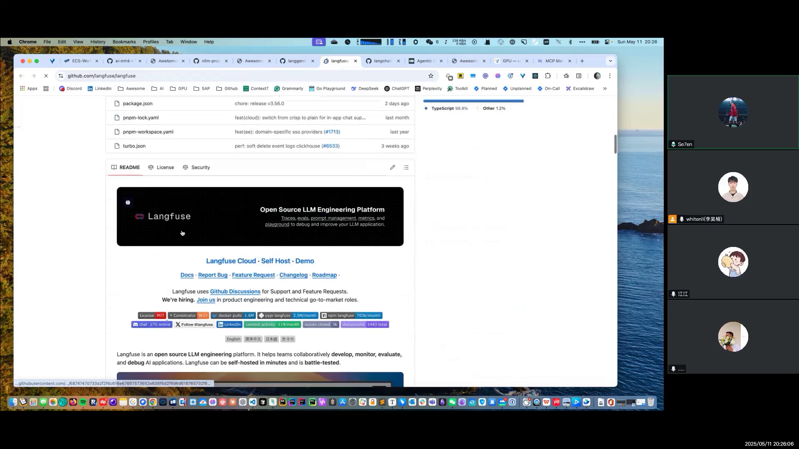 |
| 你看这是一张图，比如第一步 Retriever 在这里查了 Vector Store，然后接下来在干什么，方便你去做排查。你点到每个 trace 的 span，可以看到里面具体详细的信息。最后一部分就是 Training（训练）。 [【跳转到 09:41】](https://www.bilibili.com/video/BV1T2EGzLEHi/?t=581) | 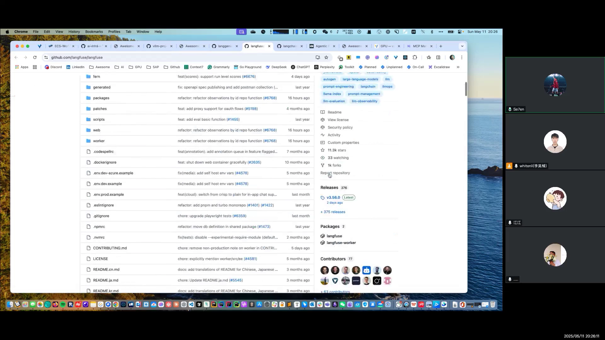 |
| 比如训练，我可以是这种 Fine-tuning（微调）的。 [【跳转到 10:06】](https://www.bilibili.com/video/BV1T2EGzLEHi/?t=606) | 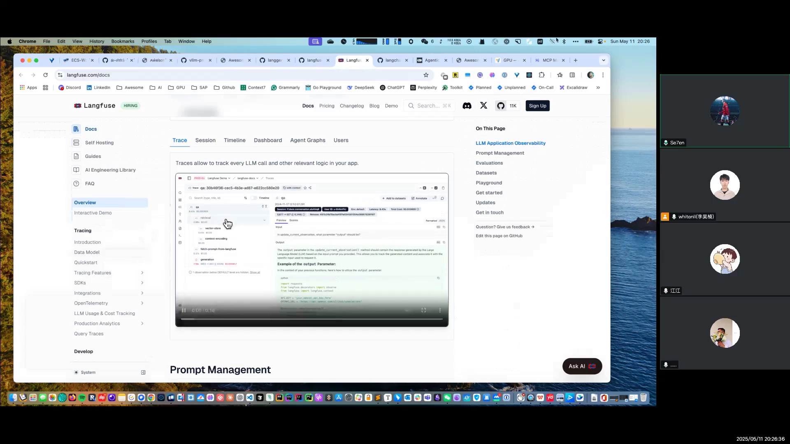 |
| 还有训练的一些框架，比如强化学习（RL）什么的框架。 [【跳转到 10:11】](https://www.bilibili.com/video/BV1T2EGzLEHi/?t=611) | 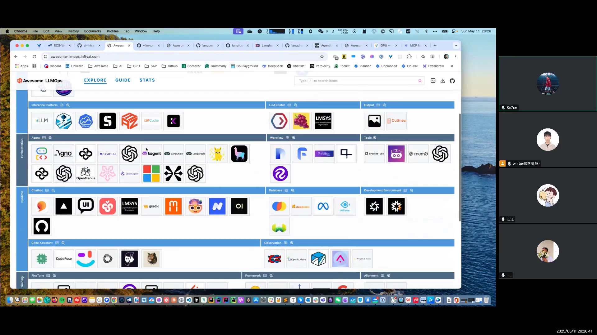 |
| 然后 Workflow 的话，可能就是比如像 Kubeflow，就是我去把这个训练任务怎么在 K8s 上跑起来。Evaluation（评估）就是评估我的模型质量，它可能会有相应的问题，根据这些问题的结果、大模型回答的质量去做一个评估。好。 [【跳转到 10:16】](https://www.bilibili.com/video/BV1T2EGzLEHi/?t=616) | 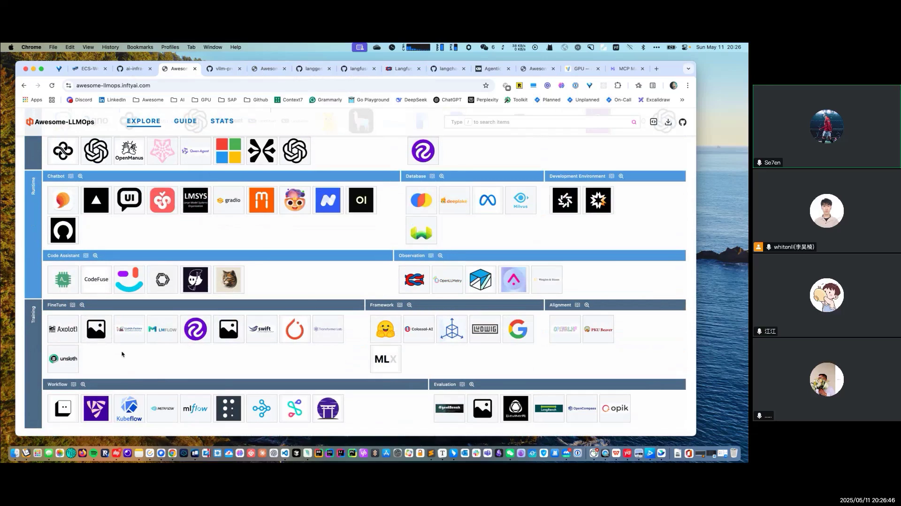 |
| 这边讲完了，有没有其他问题？我这边没有，OK，我大概了解。好，那我这边关掉。接下来简单介绍一下 vLLM，然后我们抛几个上手的事例。今天这边我准备了一个文档。 [【跳转到 10:41】](https://www.bilibili.com/video/BV1T2EGzLEHi/?t=641) |  |
| 就是 vLLM，其实就是一个很高效、易用的大语言模型的 [【跳转到 11:04】](https://www.bilibili.com/video/BV1T2EGzLEHi/?t=664) | 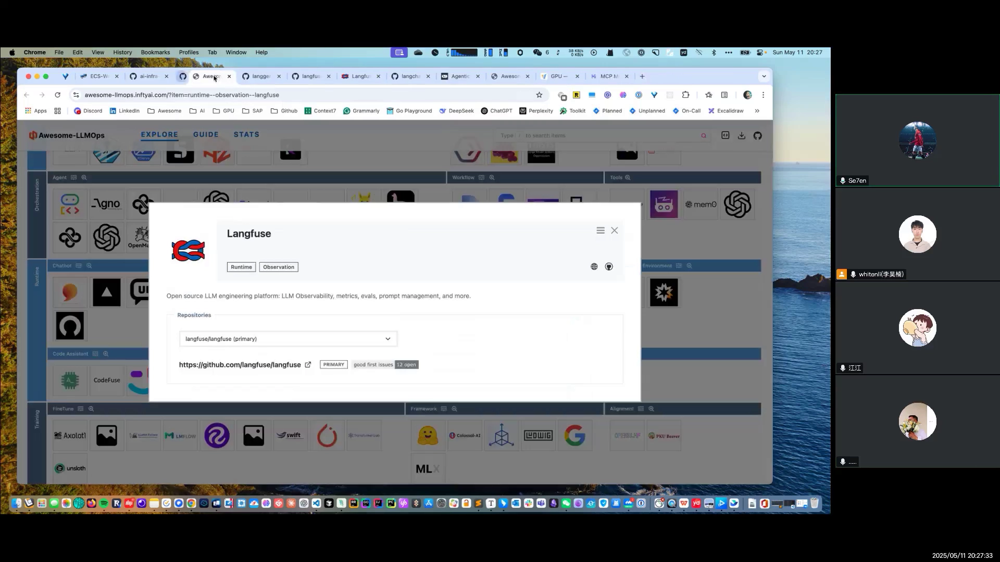 |
| 服务框架，专注于优化推理速度的吞吐量。这里其实是有 PagedAttention 那篇 paper 的，这边有个 blog。我简单了解的话，它其实就是借鉴了我们普通操作系统的物理内存跟虚拟内存， [【跳转到 11:09】](https://www.bilibili.com/video/BV1T2EGzLEHi/?t=669) | 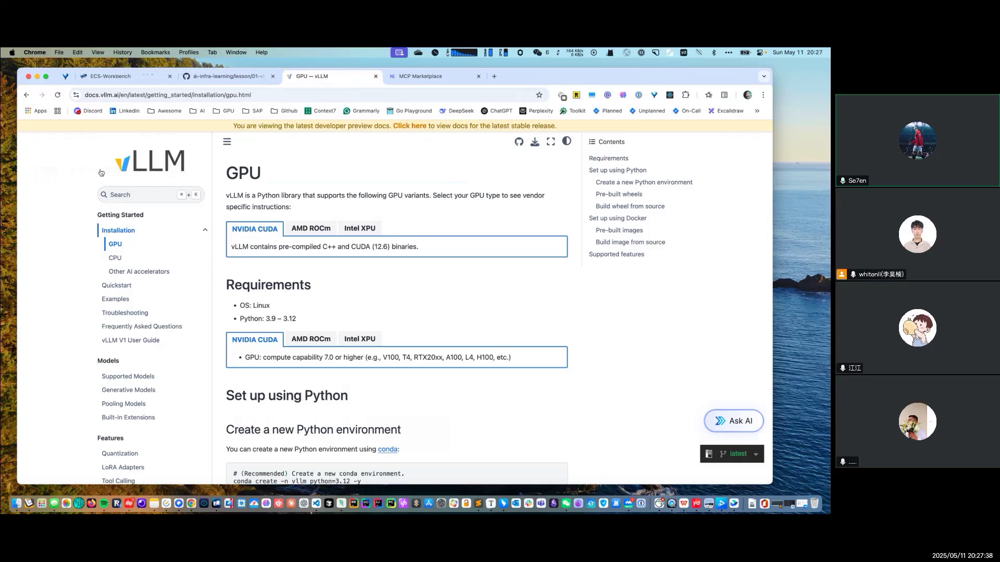 |
| 中间是有个映射的。但在 GPU 上也有 GPU 显存，在没有 vLLM 之前，显存的利用率可能比较低、碎片化比较严重。它就是利用比如逻辑 block 跟 physical block（物理块），通过 block table，让这种分配可以比较连续， [【跳转到 11:34】](https://www.bilibili.com/video/BV1T2EGzLEHi/?t=694) | 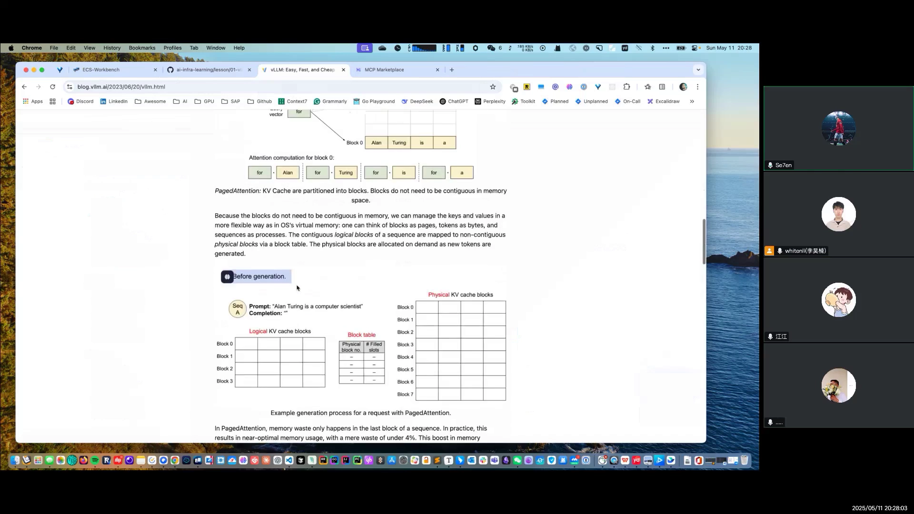 |
| 从而减少了 GPU 显存碎片化的问题。但我这方面还没有具体去看。不过 vLLM 就是因为 PagedAttention 这篇论文而诞生的，所以我这边也列了，作为可能下一周的一个学习目标。 [【跳转到 11:59】](https://www.bilibili.com/video/BV1T2EGzLEHi/?t=719) | 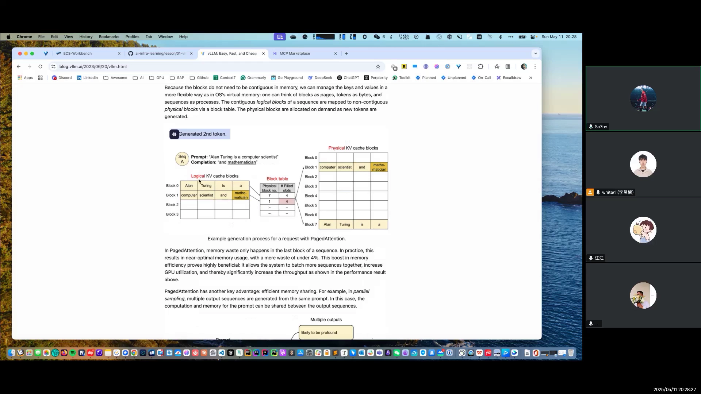 |
| 然后 vLLM 是支持同时在 GPU 跟 CPU 上运行的，我也会分别介绍 GPU 和 CPU 作为后端的安装方法。如果你本地没有 GPU 环境，我们可以在云厂商上购买。我好像前面更新了点东西， [【跳转到 12:24】](https://www.bilibili.com/video/BV1T2EGzLEHi/?t=744) | 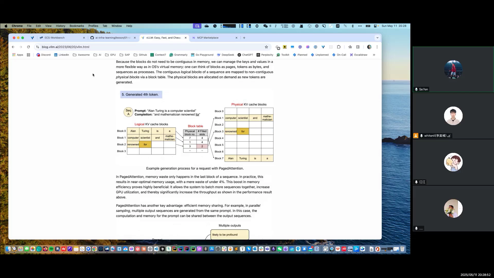 |
| 在云厂商上购买 GPU 服务器。比如我现在是在阿里云上开了一台，一般我建议选择海外节点，因为它有些下载依赖等等，如果在国内会比较慢。这边我选择了一个 A10 的 GPU，虚拟机操作系统我选择 Ubuntu， [【跳转到 12:49】](https://www.bilibili.com/video/BV1T2EGzLEHi/?t=769) | 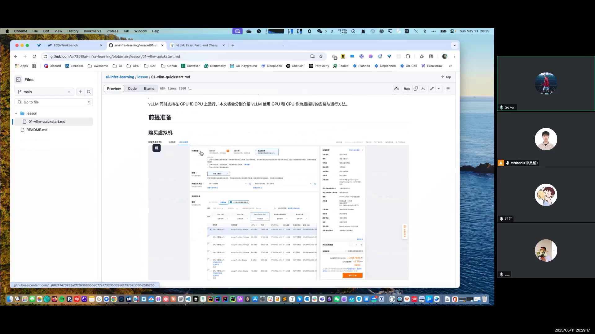 |
| 因为我后面有个脚本去安装 GPU 相关依赖，是提前准备的，针对 Ubuntu 这个版本——如果我用 GPU 作为 vLLM 后端，就有这个要求。如果对应官方文档的话，就是这里有个 Installation，分 GPU 跟 CPU 两部分。 [【跳转到 13:14】](https://www.bilibili.com/video/BV1T2EGzLEHi/?t=794) | 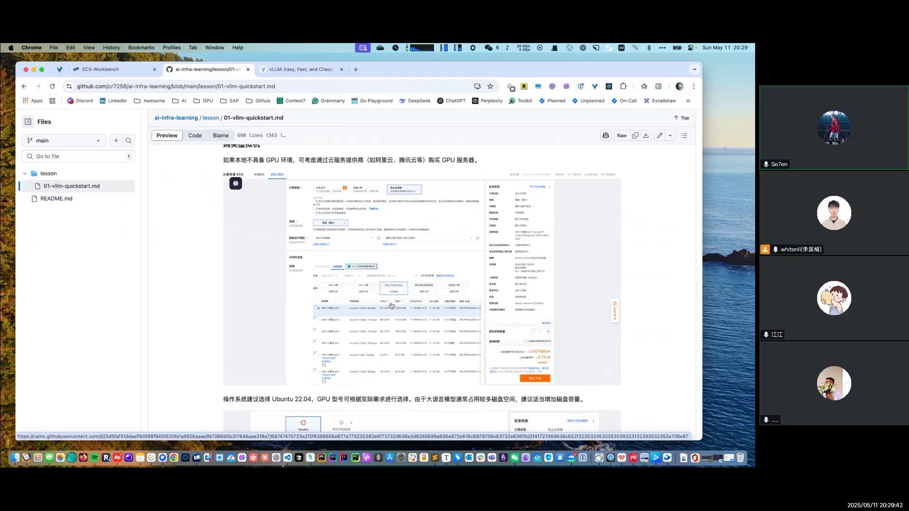 |
| 我这个文档其实就是针对官方文档自己做了一个整理，方便去翻。GPU 这一段有一个要求：它要求计算能力也就是 Compute Capability 要到 7.0 以上。那什么是 Compute Capability？它定义了每个 NVIDIA GPU 的硬件特性和支持的指令，也就是这个计算能力 [【跳转到 13:39】](https://www.bilibili.com/video/BV1T2EGzLEHi/?t=819) |  |
| 决定你能否使用某些 feature，比如像 Tensor Core、动态并行（Dynamic Parallelism）等。因为这些 feature 是在 NVIDIA 不同的架构版本引进的，比如有个版本叫什么 Ampere（安培），这些版本是根据不同科学家的名字去命名的，还有 Volta 之类的，版本是不一样的。 [【跳转到 14:04】](https://www.bilibili.com/video/BV1T2EGzLEHi/?t=844) | 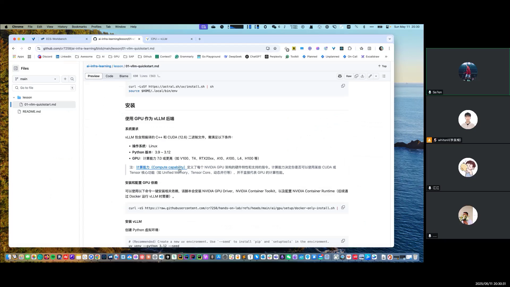 |
| 然后如果你看计算能力，这边有个矩阵图。比如我们这次用的是 A10，那它是 8.6，那肯定超过 7。如果你要看更早以前， [【跳转到 14:29】](https://www.bilibili.com/video/BV1T2EGzLEHi/?t=869) |  |
| 你可以点这里，点更早一些，你看这边就是什么 3.2、3.5 之类的。 [【跳转到 14:41】](https://www.bilibili.com/video/BV1T2EGzLEHi/?t=881) |  |
| 再之前是什么 M 之类的，或者是 P。 [【跳转到 14:46】](https://www.bilibili.com/video/BV1T2EGzLEHi/?t=886) |  |
| 这些可能就不行了，然后这边是一些可以用的。 [【跳转到 14:51】](https://www.bilibili.com/video/BV1T2EGzLEHi/?t=891) | 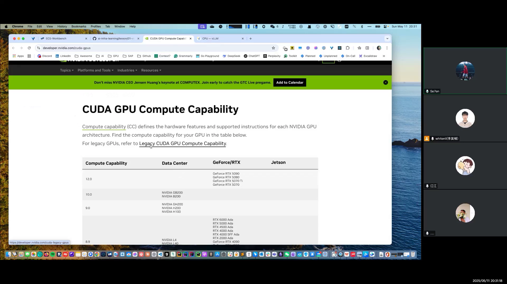 |
| 我之前好像用 T4、L4 这种也有点问题，比如跑一个精度高一点的、像 DeepSeek 啥的，它好像就不能跑，说是什么浮点数的问题。反正你尽量用 V100 或者 A10、A100 之类的应该就没什么问题。 [【跳转到 14:56】](https://www.bilibili.com/video/BV1T2EGzLEHi/?t=896) |  |
| 还有个注意的，就是你在云厂商上面可以选择这种抢占式实例，能比较大地省钱，差不多能减少 90% 的钱。如果我这里没有选择抢占式、而是选择按量付费的话，可能需要 11 块一个小时。这边我补充一下，因为像伟哥、像阿里，我一般都用腾讯云。 [【跳转到 15:21】](https://www.bilibili.com/video/BV1T2EGzLEHi/?t=921) |  |
| 我跟伟哥用的是一样的，我们在测的时候有时候本地没有 GPU，我有时候会跑到腾讯云上面去用那个抢占实例，然后我选的可用区是香港可用区。因为如果我们选国内的话，SSH 连上去会比较快，但是它有一些依赖或者安装，你得去 [【跳转到 15:46】](https://www.bilibili.com/video/BV1T2EGzLEHi/?t=946) |  |
| 所以如果选香港的话，下载依赖包的速度可能没那么慢。因为我们主要都是练习用、学习用，所以可用区选择海外可能会再好一点。 [【跳转到 16:11】](https://www.bilibili.com/video/BV1T2EGzLEHi/?t=971) | 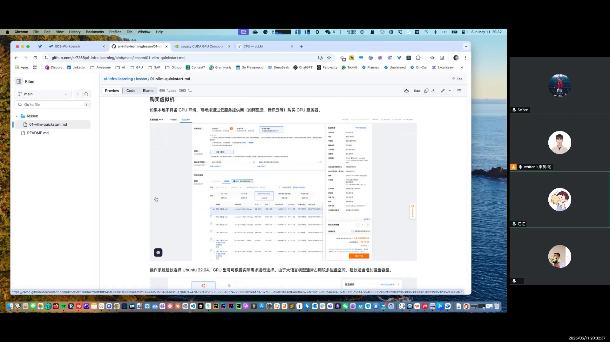 |
| 我想补充一下这个，好，谢谢。然后还有一个，好像浩南你那个——你现在是能申请腾讯的那个代金券了吗？是吗？对。一个月是有 200 还是 300 的额度？300。反正我那个到时候可以。那你这个可以啊，我们可以试试能不能用。我在腾讯——对哦，你是做计量计费的对吧？哈哈。 [【跳转到 16:36】](https://www.bilibili.com/video/BV1T2EGzLEHi/?t=996) |  |
| 因为我在腾讯已经花了六七千块钱了，太烧钱了。这个东西，如果你买那种 GPU 实例的话——我不知道为什么腾讯云还挺贵的，它是按小时计费的吧。GPU 还是比较贵的东西。 [【跳转到 17:01】](https://www.bilibili.com/video/BV1T2EGzLEHi/?t=1021) | 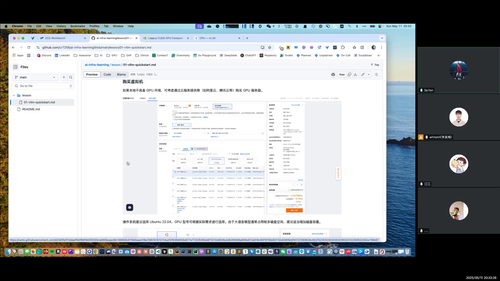 |
| 好行行，我们回头看一下能不能再蹭一下腾讯。反正我们每次都做实验，就是开这种抢占式的，用几块钱应该还好。然后继续。 [【跳转到 17:26】](https://www.bilibili.com/video/BV1T2EGzLEHi/?t=1046) | 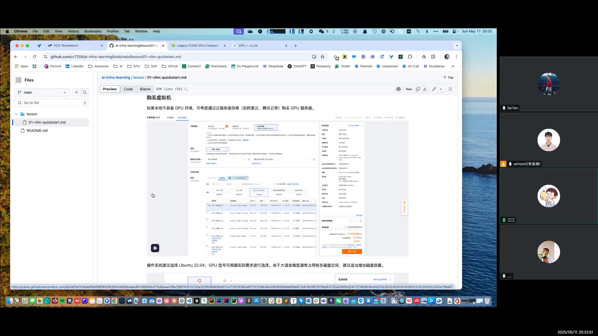 |
| 然后这边，官方推荐使用 uv 去管理 Python 虚拟环境。因为我们之前大家可能会用 Conda 啥的，一方面 Conda 现在好像是要收费的，并且像我们公司好像没有买，如果要另外买的话，就会要求我们强制卸载掉。然后 uv 有个好处，它是用 Rust 来写的，速度贼快。 [【跳转到 17:51】](https://www.bilibili.com/video/BV1T2EGzLEHi/?t=1071) |  |
| 因为是用 Rust 写的，所以性能很好，会比那些其他的包管理软件、还有一个叫什么 Poetry 啥的，性能好很多。所以 uv 现在应该是最好的一个 Python 包管理器，应该没有比它更好的了。而且很好用。 [【跳转到 18:16】](https://www.bilibili.com/video/BV1T2EGzLEHi/?t=1096) | 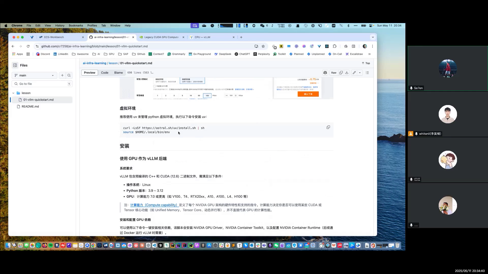 |
| 所以这边官方也是推荐这个，通过这个方式安装、管理虚拟环境。然后这边我有个脚本，比如你要安装 GPU 依赖的话，其实有一些东西要装。我就最喜欢这种脚本，就是一键安装，比如你要安装 GPU 的 driver 啥的， [【跳转到 18:41】](https://www.bilibili.com/video/BV1T2EGzLEHi/?t=1121) | 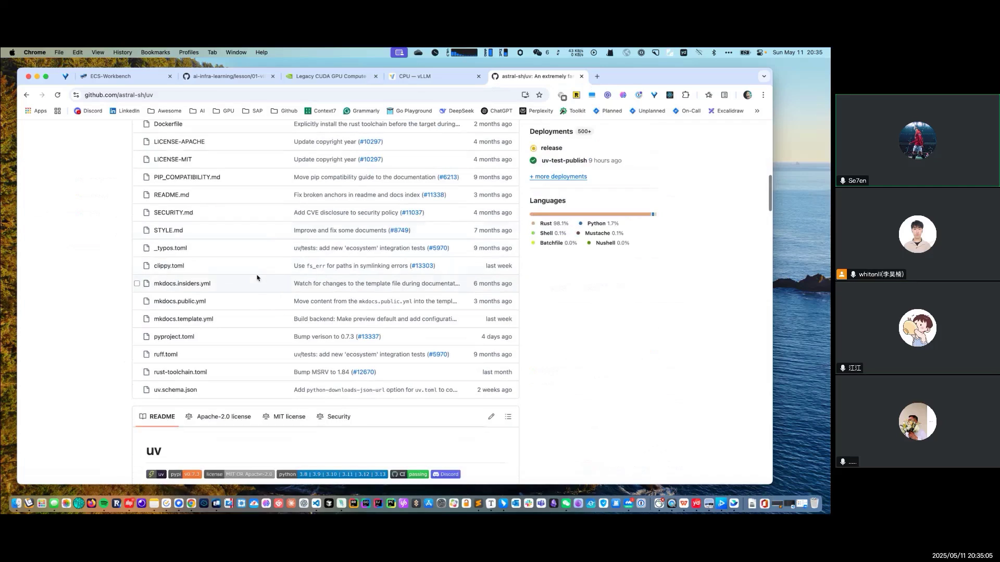 |
| 还有 container toolkit（nvidia-container-toolkit），就是你要让你的 Docker 跑起来、要用这个 GPU 的话，就要安装这个，还要配置你的 container runtime 啥的。然后这边是一个检查，看你有没有问题，然后就可以用这个脚本去弄好。准备好以后，就创建一个——前面用 uv 嘛——创建一个虚拟环境。 [【跳转到 19:06】](https://www.bilibili.com/video/BV1T2EGzLEHi/?t=1146) |  |
| GPU 就很简单了，你直接 `uv pip install` 就结束了，非常简单。如果是 CPU 的话，因为官方没有提供 CPU 的安装包，所以你需要——也是先用 uv 起一个虚拟环境，然后安装它相关的这些编译器，还有你要克隆它的源代码， [【跳转到 19:31】](https://www.bilibili.com/video/BV1T2EGzLEHi/?t=1171) | 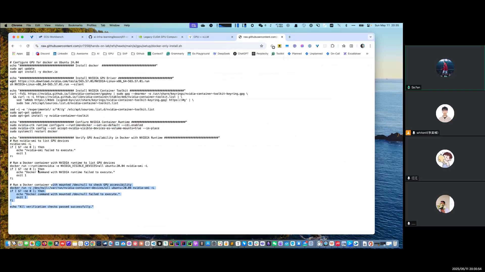 |
| 因为你要用源码编译到本地，然后安装这些用于构建的依赖包，最后通过指定 CPU 目标的安装命令（`-e .`）去 install，就弄完了。反正安装完的结果就是，你能使用 uv、vLLM 的命令去 serve 在线推理，或者使用那个 Python 离线推理的代码。 [【跳转到 19:56】](https://www.bilibili.com/video/BV1T2EGzLEHi/?t=1196) | 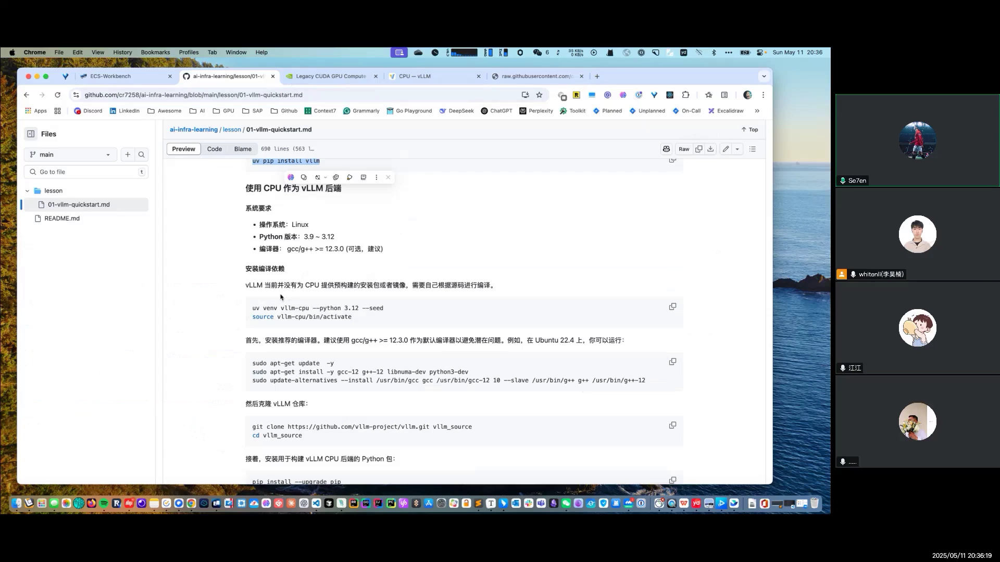 |
| 安装就是这些。前面也讲了在线跟离线的区别：离线就是我一次对一批数据进行处理，通常实时性没有要求那么高，比如每天晚上跑这种用户画像或者生成广告文案啥的，对延迟要求没那么高，并且一般可以这样 [【跳转到 20:21】](https://www.bilibili.com/video/BV1T2EGzLEHi/?t=1221) |  |
| 去利用闲时的资源。那在线推理就是实时的，要求响应可能在几百毫秒以内，实时性比较高，比如聊天机器人、智能客服这些。下面一个就是示范，比如这是官网提供的一个事例。这边有一个参数可以说一下，比如这里有个 Sampling Params（采样参数）。 [【跳转到 20:46】](https://www.bilibili.com/video/BV1T2EGzLEHi/?t=1246) | 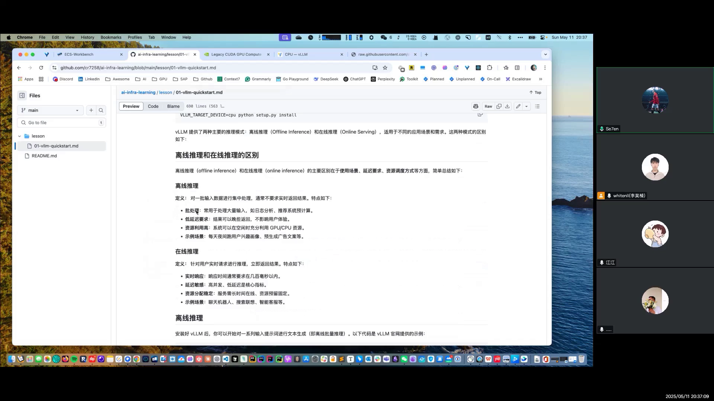 |
| 这边指定两个叫做 temperature 跟 top_p 的参数。然后这边是四个问题，等下离线推理就是一次性分别回答这四个问题。temperature 叫采样温度，另外一个是核采样概率。其实我一开始理解还感觉两者有点像是很像的，后来我问了一下 ChatGPT， [【跳转到 21:11】](https://www.bilibili.com/video/BV1T2EGzLEHi/?t=1271) | 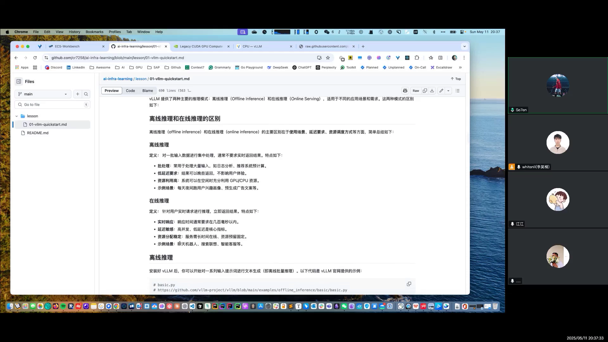 |
| 它给了我个例子，会好理解一点。采样温度其实是控制文本的随机性和创造性。比如温度越低，高概率的词更容易被选中，生成的结果更确定、重复性更高；温度越高，低概率的词容易被选中。核采样概率的话，就是控制每一步生成时候选集（候选词）的一个大小。 [【跳转到 21:36】](https://www.bilibili.com/video/BV1T2EGzLEHi/?t=1296) | 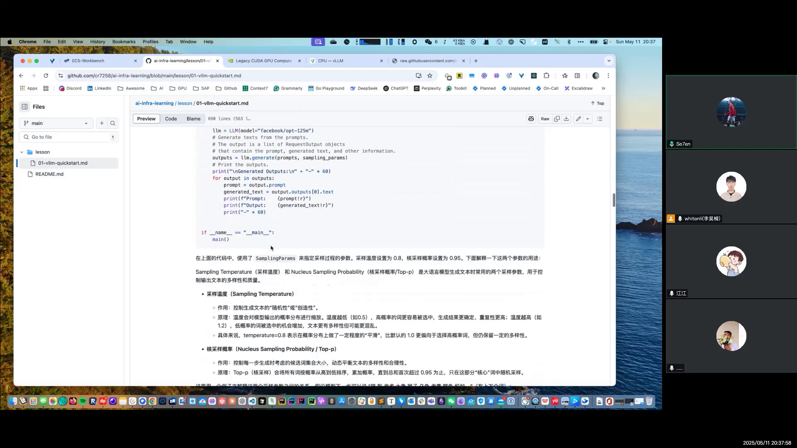 |
| 这边一个例子你就好理解。比如我这边两个采样，下一步可选的是这么多个词，然后 temperature 就调整每个词的概率，比如猫的概率可能是 30%，让这个词更容易出现；top_p 就是说，我只要选前几个，让它的累计概率达到比如 90% 就行了。 [【跳转到 22:01】](https://www.bilibili.com/video/BV1T2EGzLEHi/?t=1321) |  |
| 对，就是说 temperature 指定某个词的出现概率、控制这个词的出现概率；top_p 就是选择哪些词、前几的哪些词，可以理解为在一个范围内被选择，我是这么理解的。然后下一步就是用这个 `LLM.generate()` 方法去生成 [【跳转到 22:26】](https://www.bilibili.com/video/BV1T2EGzLEHi/?t=1346) | 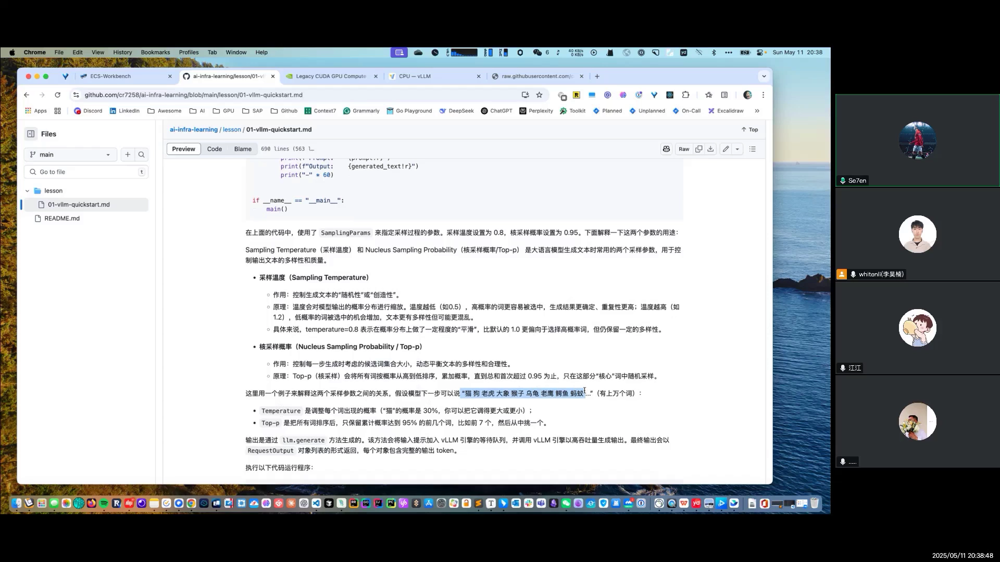 |
| 结果。比如我现在是用那个 GPU 的后端，然后这边是有一个 basic 的 py 文件， [【跳转到 22:51】](https://www.bilibili.com/video/BV1T2EGzLEHi/?t=1371) |  |
| 就这个，前面展示的例子，那我就直接 Python 跑这个东西就好了。哎，你这个是用什么模型啊？我是用那个千问的，我现在这里是用千问的 1.5B，我之前已经提前下好，它大概有 3.9 个 GB。 [【跳转到 23:13】](https://www.bilibili.com/video/BV1T2EGzLEHi/?t=1393) | 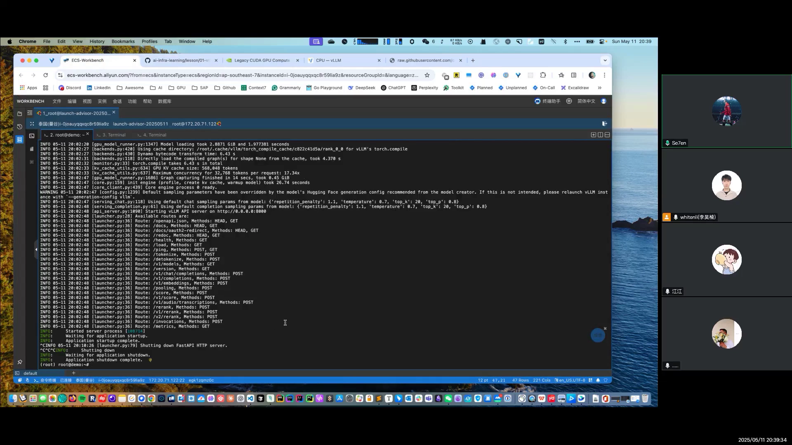 |
| 然后你看这里它有个提示：`Automatically detected platform: cuda`，那说明是 GPU 的；如果它显示 CPU，那就是 CPU 的。他这边就不用下载了。然后等一下。 [【跳转到 23:38】](https://www.bilibili.com/video/BV1T2EGzLEHi/?t=1418) | 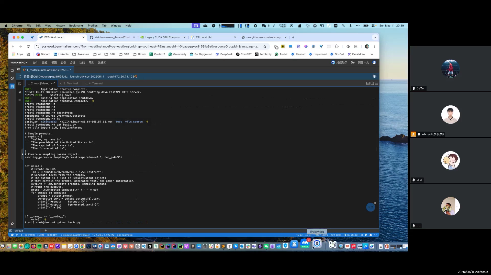 |
| 嗯，好，这个结果出来了。然后你看，就是四个问题， [【跳转到 24:03】](https://www.bilibili.com/video/BV1T2EGzLEHi/?t=1443) | 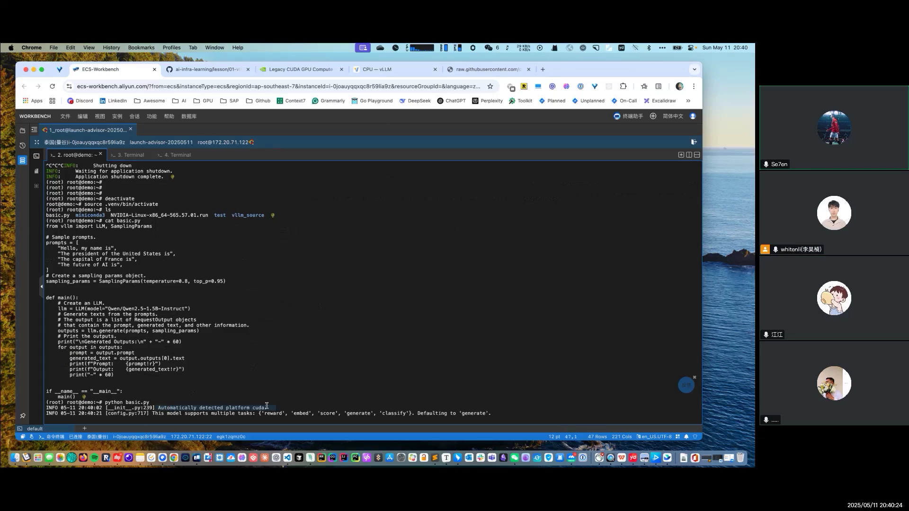 |
| 他分别就给了答案。这就是一个离线推理的场景。然后在线推理，我——嗯，那个伟哥，我不好意思打断一下，有个问题：我们刚在跑脚本，为什么它是一个离线推理啊？我的概念有点不太懂。 [【跳转到 24:28】](https://www.bilibili.com/video/BV1T2EGzLEHi/?t=1468) | 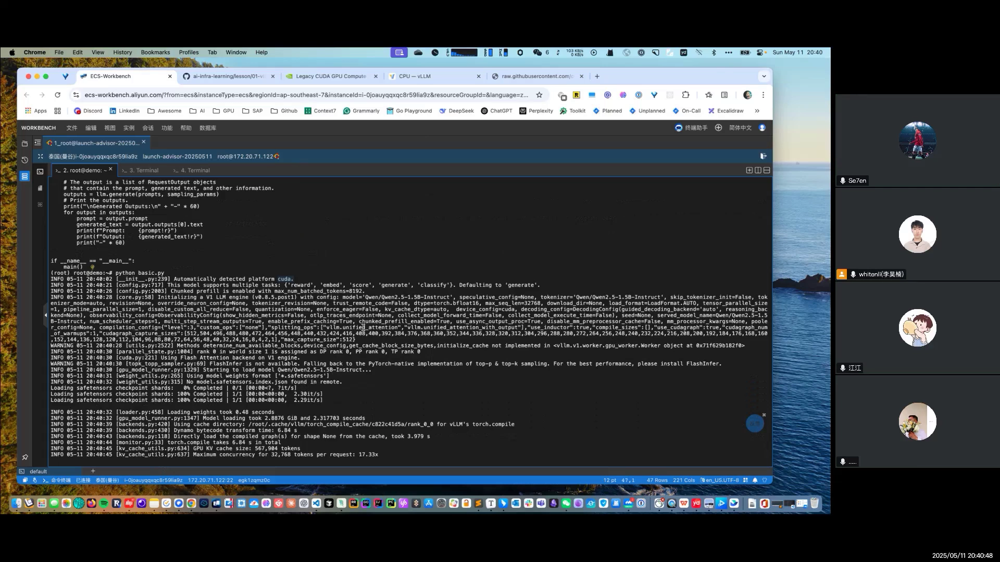 |
| 就是，我们如果在跑脚本的时候，它也要实时地返回来。但是你这个问题，我这不是先提前准备好了嘛，对不对？然后你看在线，你再看一下你就知道了，在线它相当于是起了一个 HTTP 的端口，我就可以实时——我理解意思了。哦，我理解意思了。好。 [【跳转到 24:50】](https://www.bilibili.com/video/BV1T2EGzLEHi/?t=1490) | 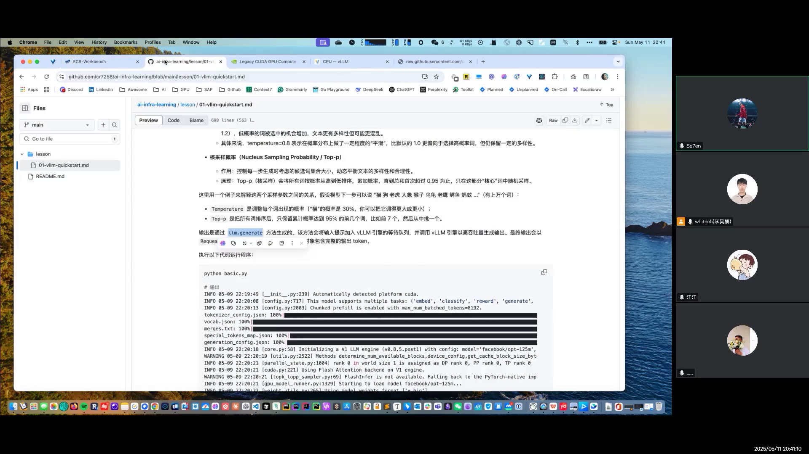 |
| 我再提一句，默认情况下是从 Hugging Face 去下载模型的。如果你想要国内，我们是有 ModelScope 这个魔搭社区。如果你要用 ModelScope 的话，你就要用 `VLLM_USE_MODELSCOPE` 这个环境变量。Hugging Face 的话有一个——有些模型你是要求申请才能下载的。 [【跳转到 25:15】](https://www.bilibili.com/video/BV1T2EGzLEHi/?t=1515) | 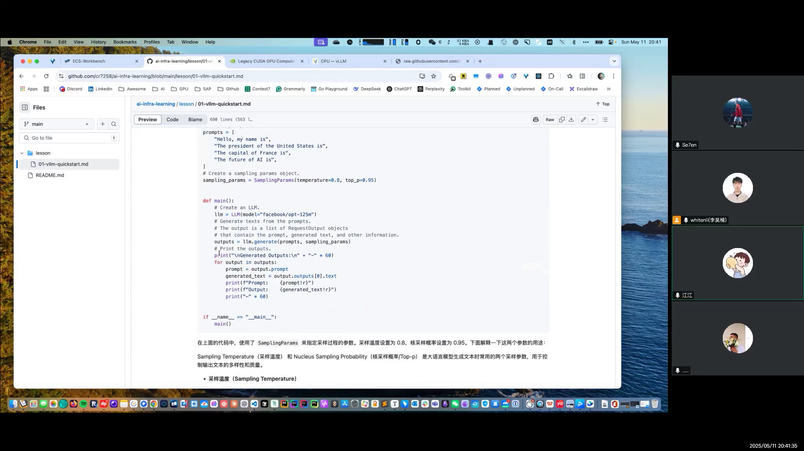 |
| 比如，我在哪个地方——我记得我当时有申请，比如像 Llama 的模型，比如 Llama 3.1 的，你是不能直接下载，你要提交一个申请。我这边因为提交过，所以就没有了；没有提交过的话，他这边会让你填你的信息， [【跳转到 25:40】](https://www.bilibili.com/video/BV1T2EGzLEHi/?t=1540) | 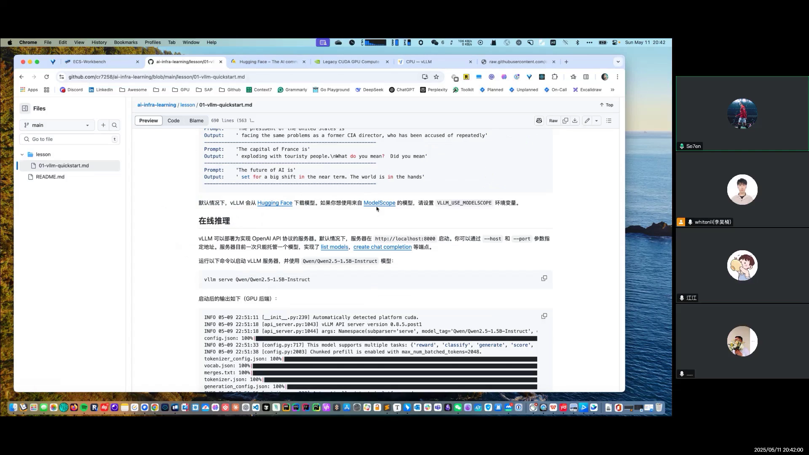 |
| 让你去申请，然后人家会审批。我之前以为这个只是走个过场，但是如果你是填中国的话，你就是被秒拒的，并且没有机会再去申请。因为我之前另外一个号就是填中国的，那我就用不了，所以我换了一个账号重新申请，然后你就填美国啥的就行了。反正有些有需要的模型 [【跳转到 26:05】](https://www.bilibili.com/video/BV1T2EGzLEHi/?t=1565) | 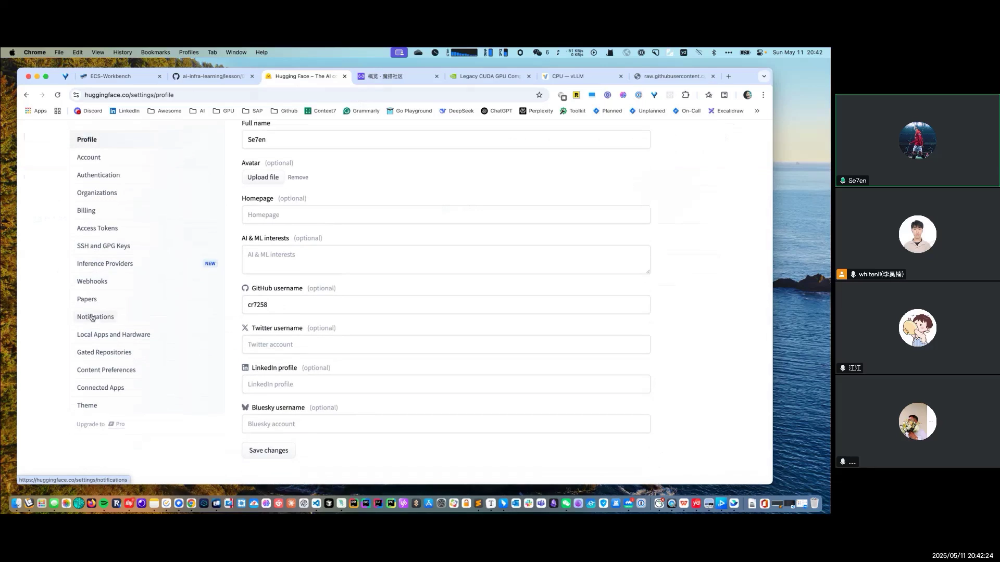 |
| 你是需要去申请的。那对于这种模型都要申请才能下载吗？对，申请才能下载。然后这些模型都是预训练好了的，它虽然开源，但你是要申请才能下载的。但是国内的比如 DeepSeek、千问这些，你就直接下载、能直接下载，这种你就不需要联动这个 Hugging Face token。 [【跳转到 26:30】](https://www.bilibili.com/video/BV1T2EGzLEHi/?t=1590) |  |
| 如果是需要那种权限的话，你还需要额外提供 Hugging Face 的 token。好，刚刚演示的例子是不需要的，直接用就行了，就是千问这种在 Hugging Face 下载，它也不用 token，对吧？对。 [【跳转到 26:55】](https://www.bilibili.com/video/BV1T2EGzLEHi/?t=1615) | 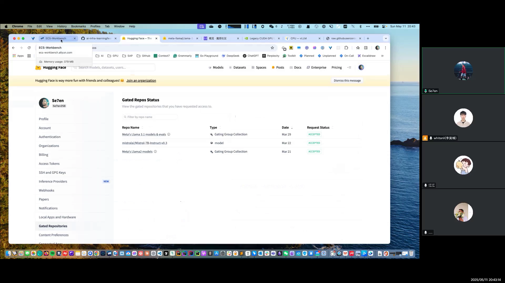 |
| 哦，不用。对。那天我给你找一个要的。 [【跳转到 27:12】](https://www.bilibili.com/video/BV1T2EGzLEHi/?t=1632) | 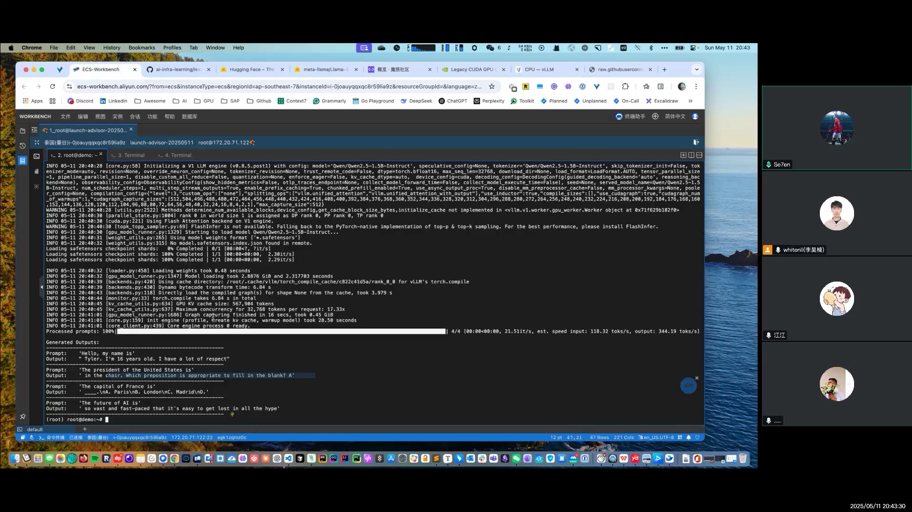 |
| 比如 Llama，可能其他的我没弄，就要 Llama，有些比如 3.2，我看应该是我没申请过的吧。可能你看到没有 `Review and accept`，你这里需要——这些都要申请。对，country，你反正你去填美国就行了，然后他通过你就能用了。哦，但是如果他检测你的网络不是在外国呢？ [【跳转到 27:21】](https://www.bilibili.com/video/BV1T2EGzLEHi/?t=1641) | 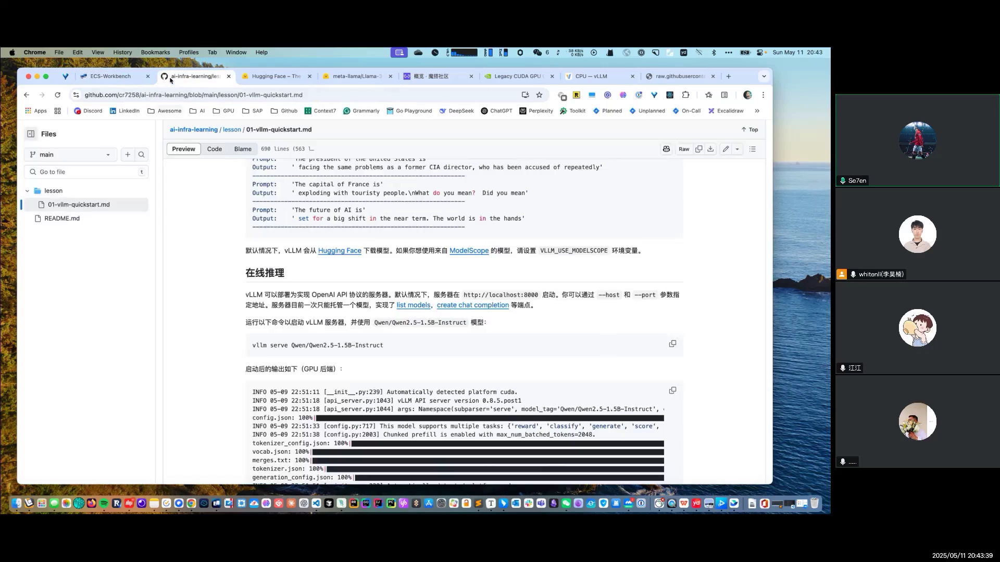 |
| 但是我不知道他会不会检测网络，但是你国籍这里一定要选、别选国内就行。行啊，然后这边下一步就是我此时跑一下。 [【跳转到 27:46】](https://www.bilibili.com/video/BV1T2EGzLEHi/?t=1666) | 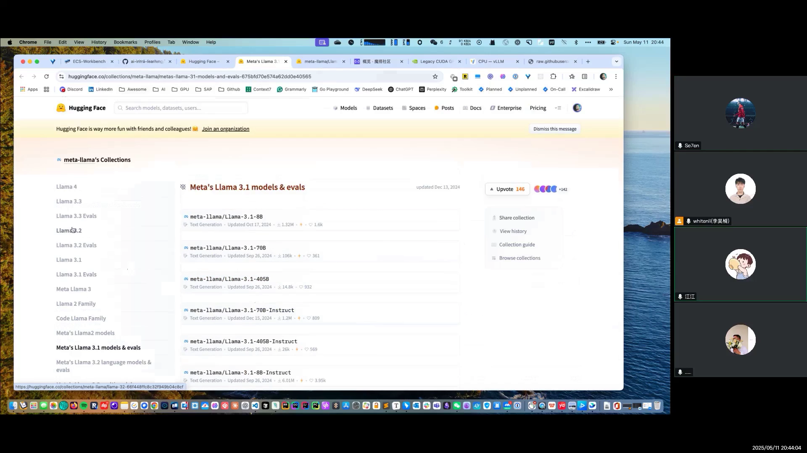 |
| 然后刚刚这边就是例子，这是 GPU 输出后端，你可以看到是 CUDA 嘛。然后如果你看到这边它提示这个 service， [【跳转到 28:11】](https://www.bilibili.com/video/BV1T2EGzLEHi/?t=1691) | 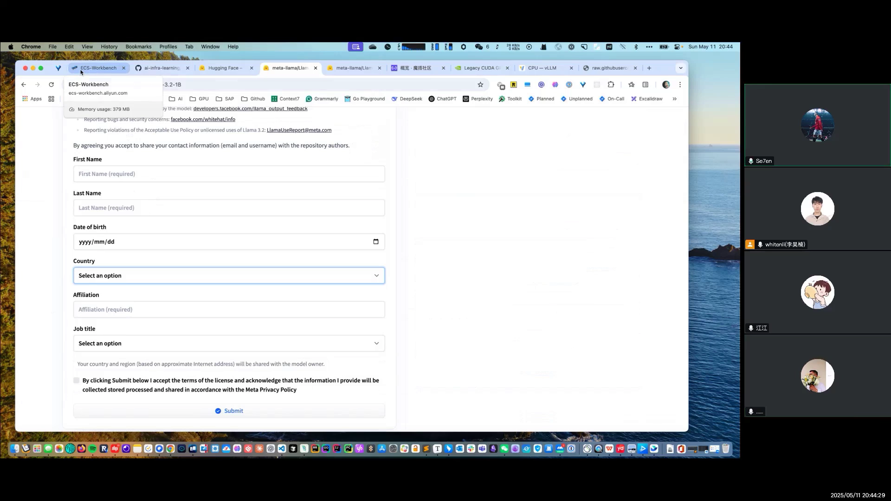 |
| `Start serve` 这些 process 有这些东西，说明就是 8000 端口——默认是 8000——说明就启动了。如果没有的话，因为你第一次要下载那些权重啥的， [【跳转到 28:21】](https://www.bilibili.com/video/BV1T2EGzLEHi/?t=1701) | 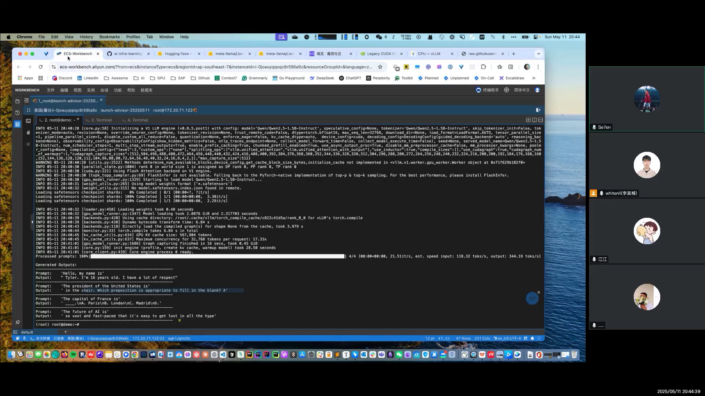 |
| 需要等一等。好，这就是 CPU。等下我就 CPU 这边先不演示了，然后你能看到是这样的。然后比如他也可以像 OpenAI 一样，在线的话就可以支持一些 OpenAI 的那些接口，比如 list model 这些的。我等一下再开一个窗口。 [【跳转到 28:31】](https://www.bilibili.com/video/BV1T2EGzLEHi/?t=1711) | 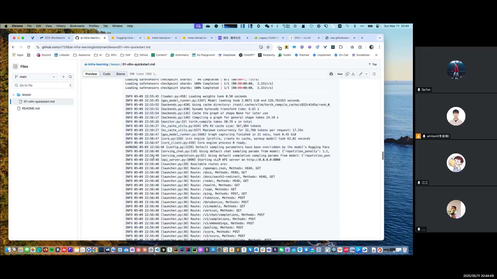 |
| 看弄好了没有。哎，那个伟哥，我不好意思，我还想打断一下，就是刚刚我们不是起了一个离线脚本吗？那这个离线脚本运行的时候， [【跳转到 28:56】](https://www.bilibili.com/video/BV1T2EGzLEHi/?t=1736) | 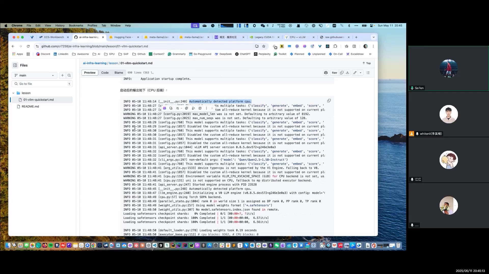 |
| 它才去起 vLLM 这个 server 吗？还是它是这个流程的吗？ [【跳转到 29:14】](https://www.bilibili.com/video/BV1T2EGzLEHi/?t=1754) | 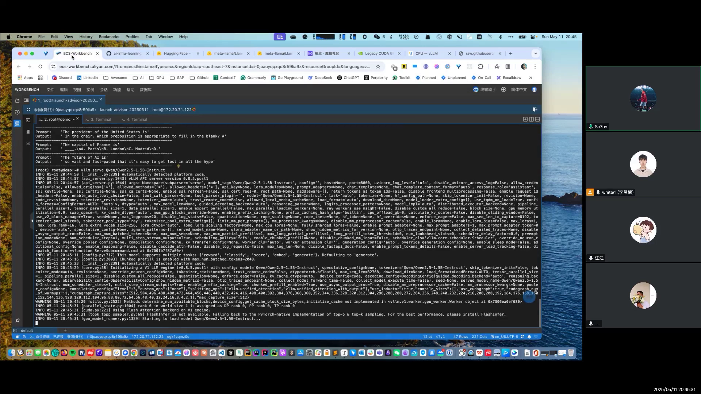 |
| 对，它还是会起，你看他这里有个 initialize vLLM engine。 [【跳转到 29:19】](https://www.bilibili.com/video/BV1T2EGzLEHi/?t=1759) | 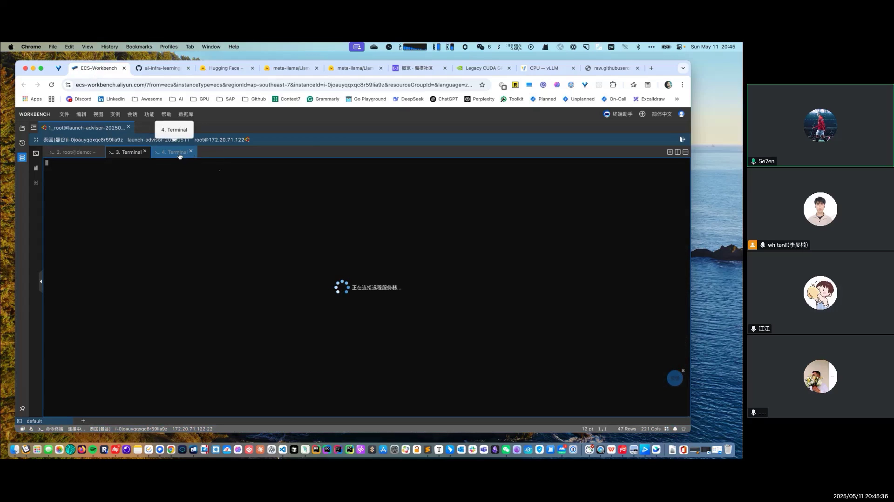 |
| 它这也是会起。我理解就是说，离线就是跑完嘛，它就把引擎退了。 [【跳转到 29:24】](https://www.bilibili.com/video/BV1T2EGzLEHi/?t=1764) |  |
| 但是它还有个 API server 提供了这个。好，它现在起来的话，比如我可以先看模型嘛，那肯定这是先问这个；然后比如我可以去问他的问题，举个例子让他补全。 [【跳转到 29:32】](https://www.bilibili.com/video/BV1T2EGzLEHi/?t=1772) | 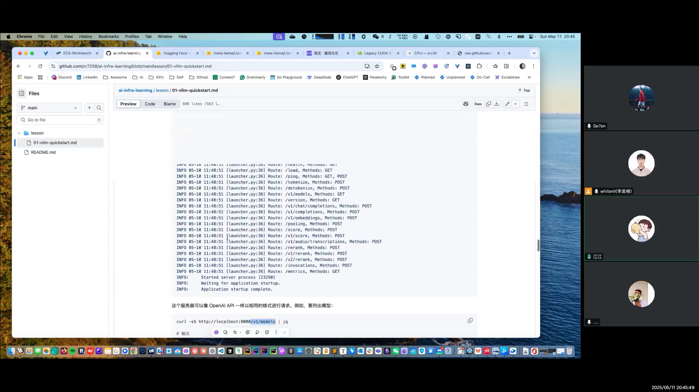 |
| 对，然后比如一段文字，然后如果说它并且它还是支持 [【跳转到 29:57】](https://www.bilibili.com/video/BV1T2EGzLEHi/?t=1797) | 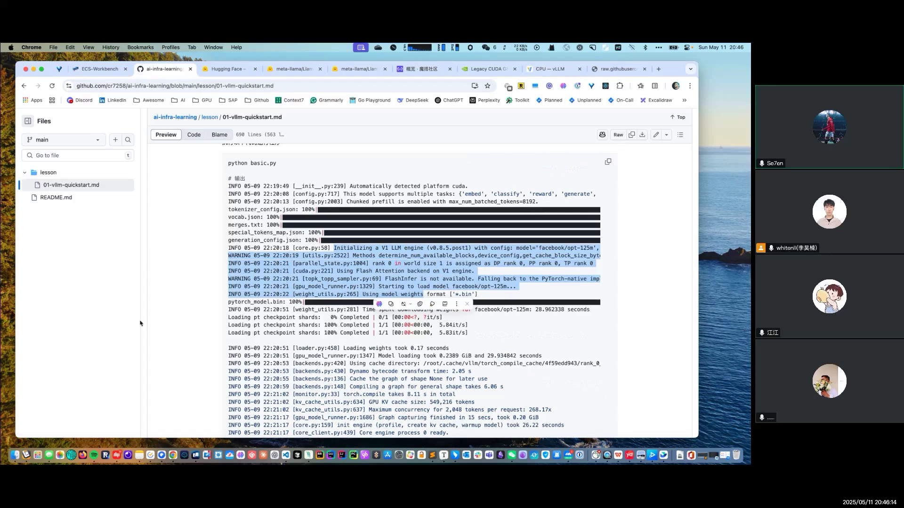 |
| 因为它与 OpenAI 也兼容嘛，你可以用这个 OpenAI 的 Python SDK，也是可以的。 [【跳转到 30:06】](https://www.bilibili.com/video/BV1T2EGzLEHi/?t=1806) | 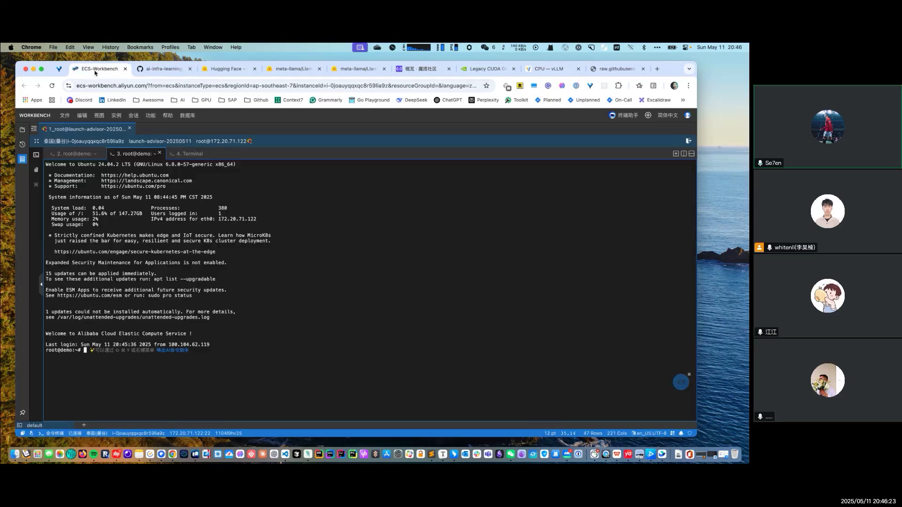 |
| 你这 OpenAI API key 就是留空（empty）就好了。并且呢，因为你如果是聊天的话， [【跳转到 30:11】](https://www.bilibili.com/video/BV1T2EGzLEHi/?t=1811) | 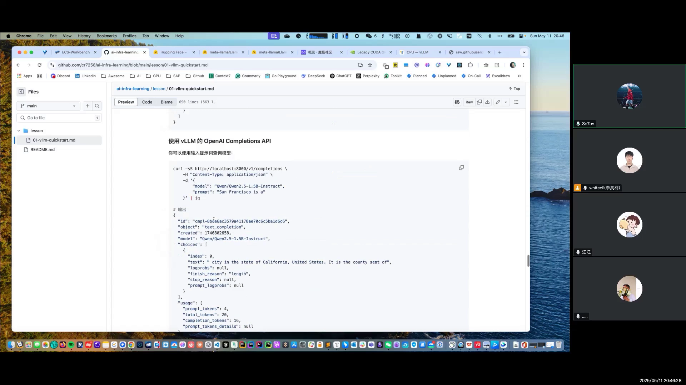 |
| 一般我们是用这种 ChatCompletion API 嘛，对吧。 [【跳转到 30:18】](https://www.bilibili.com/video/BV1T2EGzLEHi/?t=1818) | 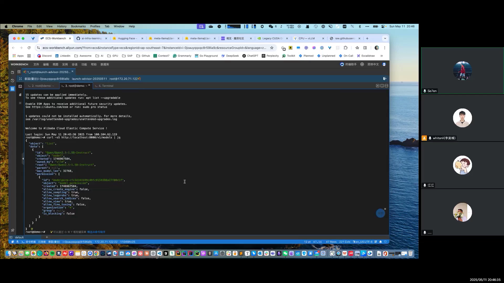 |
| 你可以加一些比如 system role（系统角色），相当于一开始的一个提示词，"你是一个什么什么什么的"，然后你可以再问；或者你不要这个也行，无所谓。然后你就一样地去问一个问题就行了，他一样也会给到答案。你同样也可以用这个 SDK 去请求。 [【跳转到 30:25】](https://www.bilibili.com/video/BV1T2EGzLEHi/?t=1825) | 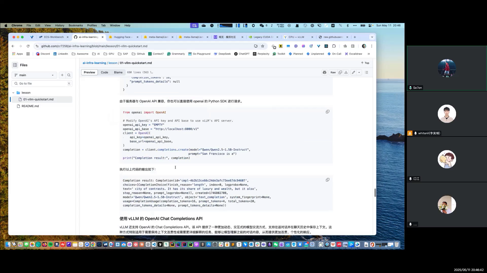 |
| 也是一样的。然后还有一个，你可以用 Docker 运行。Docker 运行的话，比如我把这个退掉， [【跳转到 30:50】](https://www.bilibili.com/video/BV1T2EGzLEHi/?t=1850) | 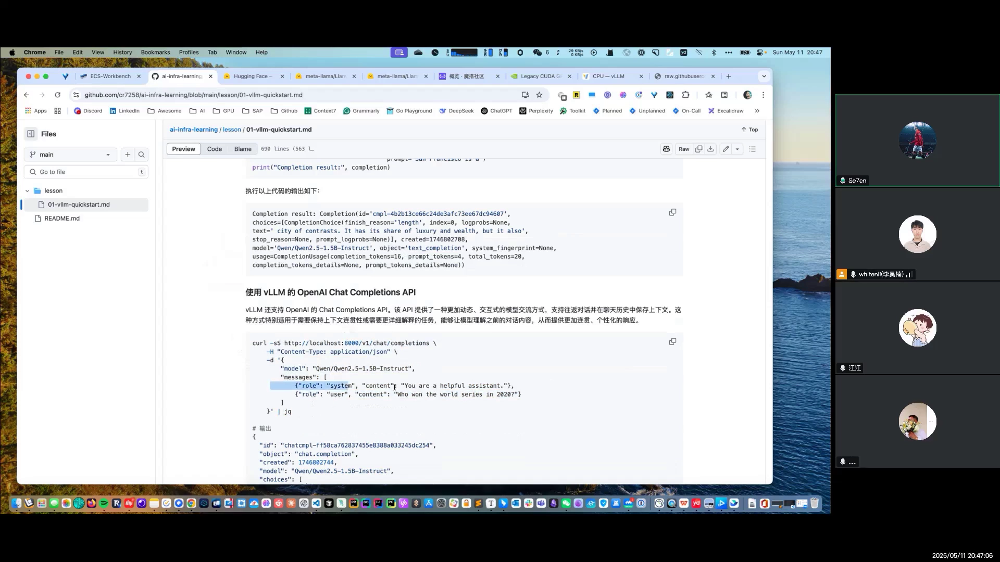 |
| 因为我前面提过那个脚本，这个脚本主要就是配置这些 [【跳转到 30:59】](https://www.bilibili.com/video/BV1T2EGzLEHi/?t=1859) |  |
| Docker 的一些 runtime 啥的。然后你可以看到这个有个应该 `/etc/docker/daemon.json`，那我是不是把它粘了？它是放在哪个目录了？ [【跳转到 31:05】](https://www.bilibili.com/video/BV1T2EGzLEHi/?t=1865) | 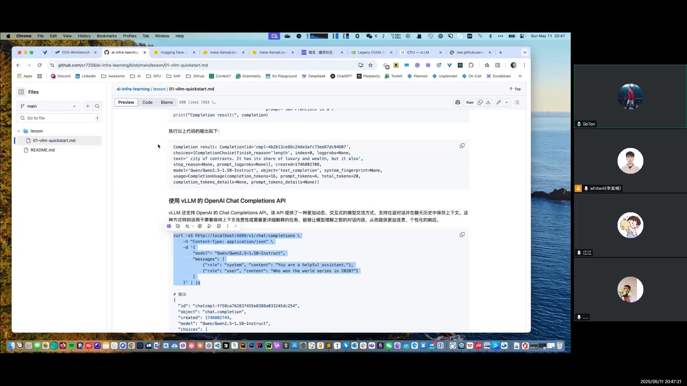 |
| 有可能是哪个目录啊？ [【跳转到 31:19】](https://www.bilibili.com/video/BV1T2EGzLEHi/?t=1879) | 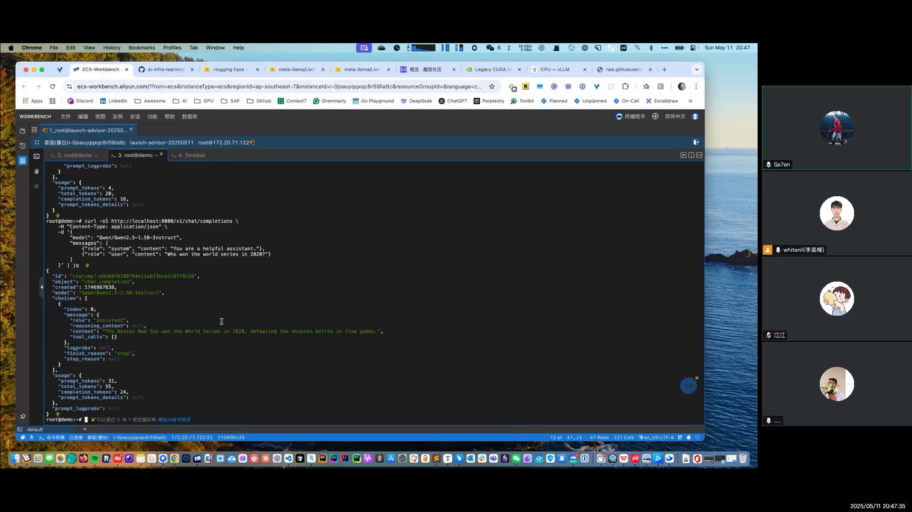 |
| 是不是在 /etc 下面……哦。 [【跳转到 31:24】](https://www.bilibili.com/video/BV1T2EGzLEHi/?t=1884) |  |
| 是这个。嗯，这边就是配置家用 NVIDIA 的一个 runtime。然后比如我就用这个命令一样地跑 GPU。 [【跳转到 31:30】](https://www.bilibili.com/video/BV1T2EGzLEHi/?t=1890) | 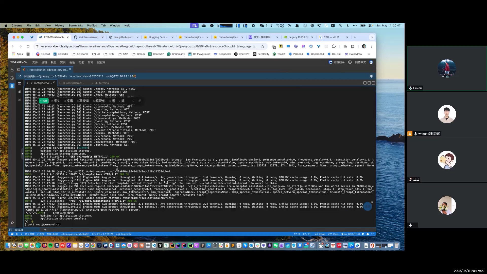 |
| 等一下我再说一下参数的意思。我先让它跑，看看能不能跑起来。 [【跳转到 31:40】](https://www.bilibili.com/video/BV1T2EGzLEHi/?t=1900) | 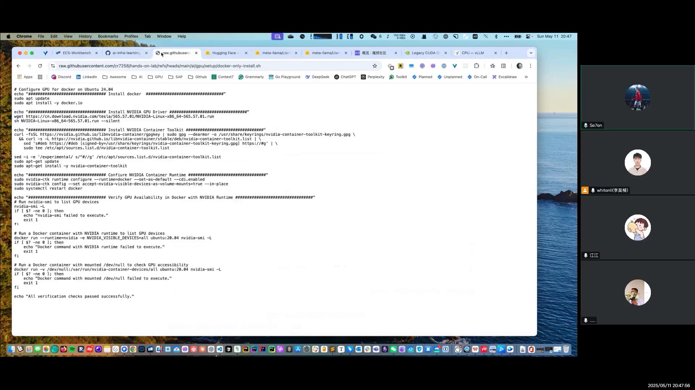 |
| （此区间无字幕） [【跳转到 31:48】](https://www.bilibili.com/video/BV1T2EGzLEHi/?t=1908) | 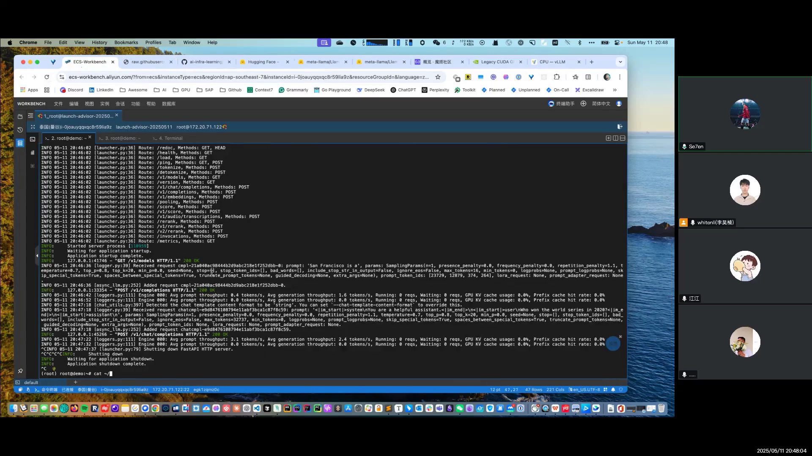 |
| 跑起来了，可以跑。对，它能检测是 CUDA 吗？ [【跳转到 31:58】](https://www.bilibili.com/video/BV1T2EGzLEHi/?t=1918) |  |
| 然后几个参数：一个是一定要指定的，就是 runtime 是这个 NVIDIA 的；然后还有一个是 `--gpus all`，就是我现在只有一个 GPU 卡，如果有多个的话，它会全部使用，你也可以指定某个 GPU id，比如像 `--gpus device=...`。 [【跳转到 32:03】](https://www.bilibili.com/video/BV1T2EGzLEHi/?t=1923) | 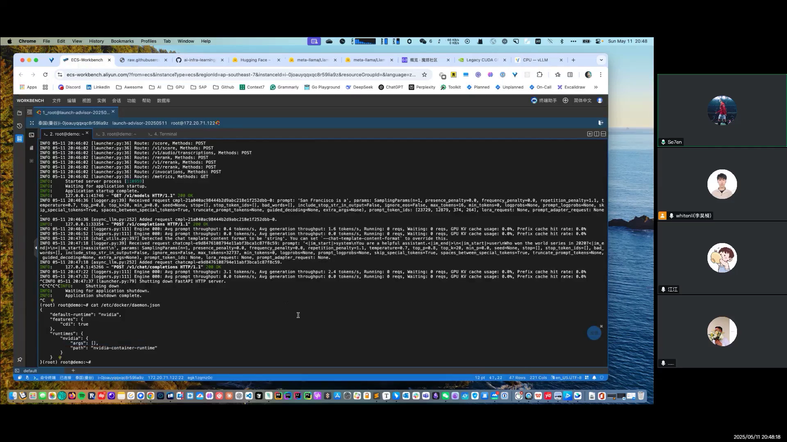 |
| 你这里注意，这边外面还要有个额外的引号，不然它识别会有问题——我看到会有这个报错。因为它这个命令也可以把 `--gpus` 写成 number；如果你不加这个引号的话，它可能会以为你是在指定 number。也就是说，这个是指定具体的 id，而那个就是直接指定使用几个 GPU 这种方式。 [【跳转到 32:21】](https://www.bilibili.com/video/BV1T2EGzLEHi/?t=1941) | 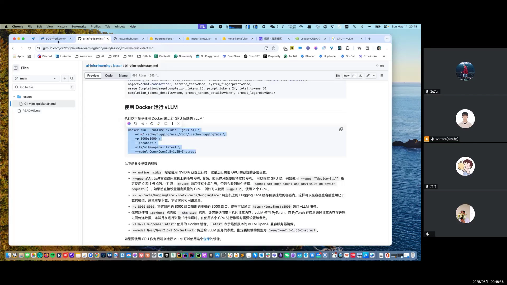 |
| 然后还有一个，就是你可以 `-v` 挂载。比如因为 Hugging Face 这个模型下载下来的话，本地你是存在这个目录的，你这里其实是能看到的，比如里面有哪些模型嘛。如果你挂载了这个路径，你下次就不用下载了，这样对于 Docker 来说，它的启动就快了。然后 `-p` 就是端口，它默认是 8000 端口吧。 [【跳转到 32:46】](https://www.bilibili.com/video/BV1T2EGzLEHi/?t=1966) | 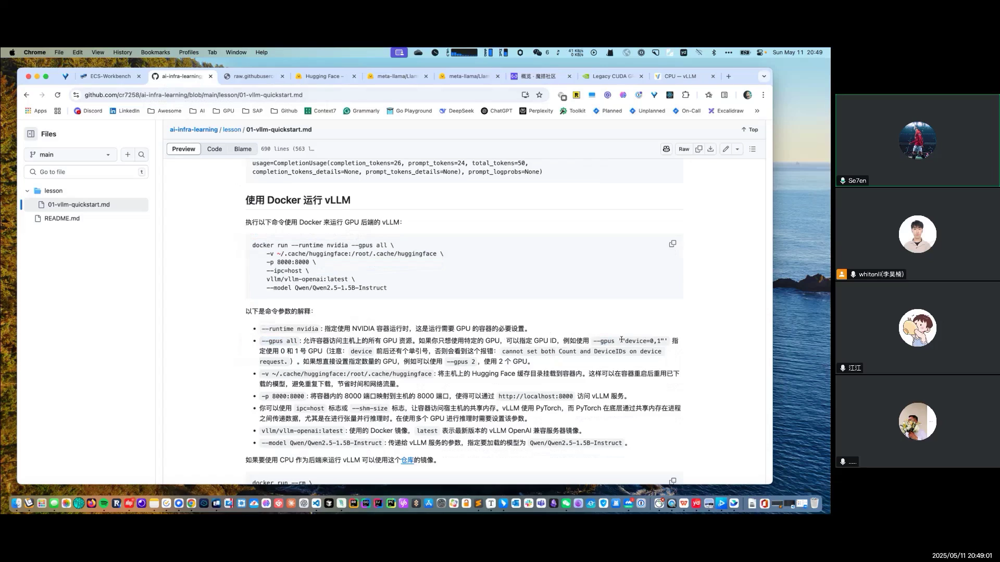 |
| 你把 8000 端口映射到本地，你就可以在本地用这个 localhost:8000 进行访问。 [【跳转到 33:11】](https://www.bilibili.com/video/BV1T2EGzLEHi/?t=1991) | 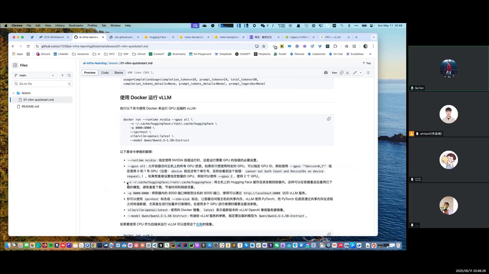 |
| 然后还有一个参数，现在因为我只是一个 GPU 的话，这个是可选的。因为如果说像 vLLM 底层是用 PyTorch 嘛，PyTorch 在底层共享内存的时候 [【跳转到 33:18】](https://www.bilibili.com/video/BV1T2EGzLEHi/?t=1998) | 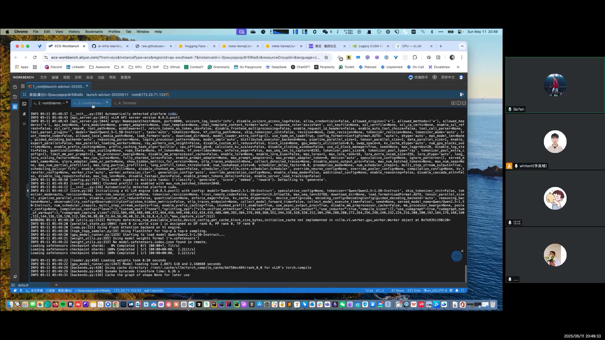 |
| 需要用共享内存在进程之间传递数据，比如进行张量并行什么的，那这个时候我需要设置一下这个参数（`--shm-size`）。然后下面就是指定一下镜像，再指定一下模型，就 OK 了。看下跑起来没有，可以看现在也是跑起来了，就可以跟刚才我一样去问一个问题就好了。 [【跳转到 33:31】](https://www.bilibili.com/video/BV1T2EGzLEHi/?t=2011) | 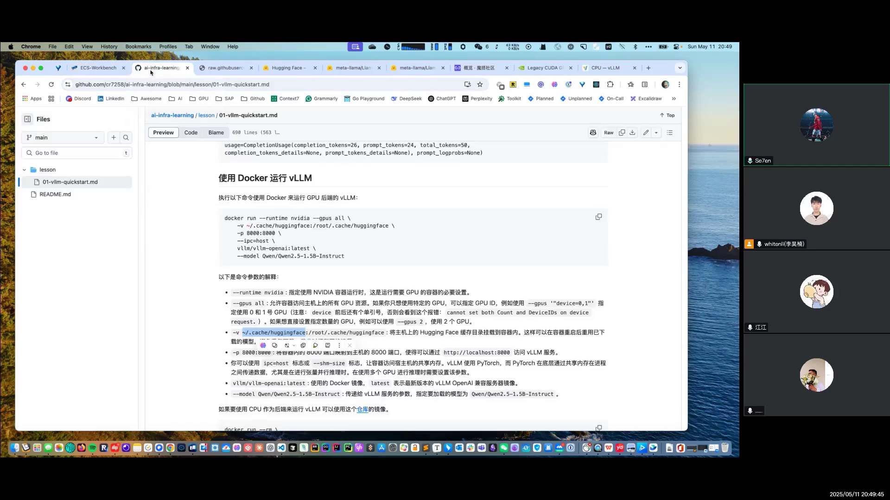 |
| 对，一样也是 OK 的，就跟我们之前直接用 vLLM 命令一样，只是这里用 Docker 可能会更简单一点。然后 CPU 也是一样可以的。CPU 的话，它是放在这个仓库， [【跳转到 33:56】](https://www.bilibili.com/video/BV1T2EGzLEHi/?t=2036) | 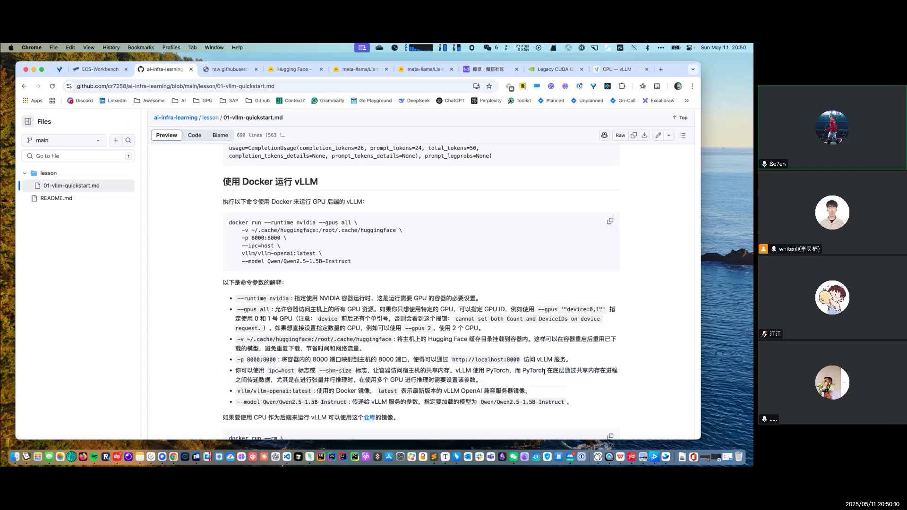 |
| 有个 AWS 的一个仓库里。然后你也是一样的命令，只是你把镜像换一个就行了。然后最后再比对一下，我稍微对比一下他这 GPU 跟 CPU 后端时候的一个性能差距。 [【跳转到 34:11】](https://www.bilibili.com/video/BV1T2EGzLEHi/?t=2051) | 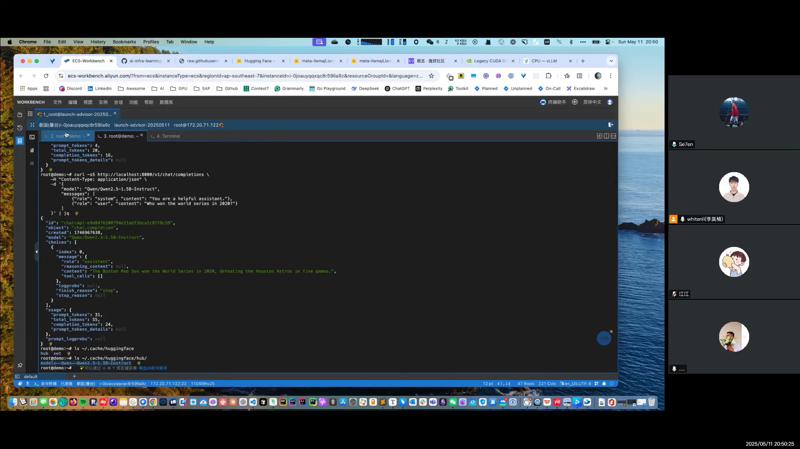 |
| 因为 vLLM 前面那个 PagedAttention 嘛，它其实就是针对 GPU 的显存 [【跳转到 34:29】](https://www.bilibili.com/video/BV1T2EGzLEHi/?t=2069) | 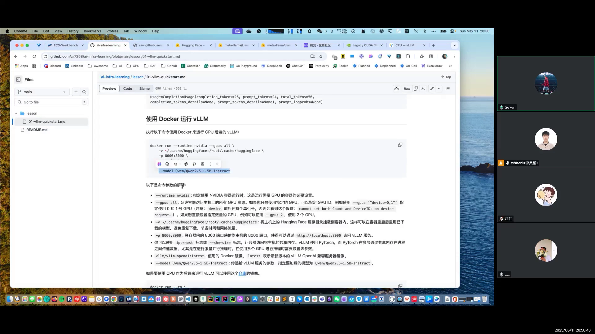 |
| 做了一个优化的设计的。那你如果使用 CPU 的话，一个方面是你需要进行一些额外的优化， [【跳转到 34:36】](https://www.bilibili.com/video/BV1T2EGzLEHi/?t=2076) | 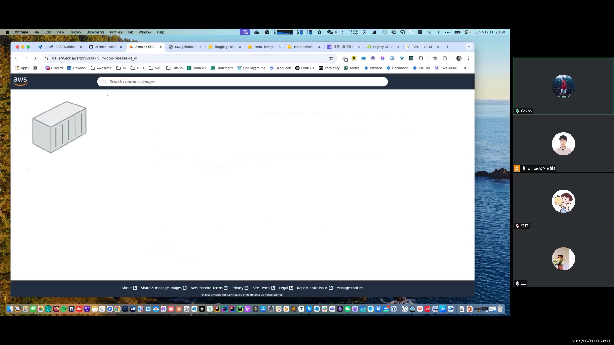 |
| 就不是那么开箱即用的；他这边官网列出了一些 performance 的参数，你可以怎么调。然后第二点是，你就算调完以后，其实还是 GPU 更快一点，因为 GPU 适合这种并行计算还有矩阵乘法的运算。所以在语言模型中，不管怎么说 [【跳转到 34:41】](https://www.bilibili.com/video/BV1T2EGzLEHi/?t=2081) | 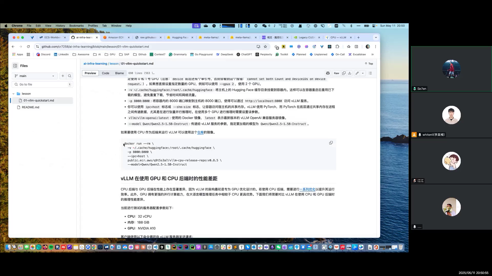 |
| 还是比 CPU 更快。然后我这边是这样测的，这是我现在这个服务器的一个参数。那你看，我可以先对比一下：我先跑一个——现在是 GPU 在跑嘛，我就直接用这个测，你可以感受下速度，记一下这个速度有多快。 [【跳转到 35:06】](https://www.bilibili.com/video/BV1T2EGzLEHi/?t=2106) |  |
| 你等下再看一下 CPU 是多快。你看到没有，它基本就是很快，是不是就实时出来了，对不对。 [【跳转到 35:31】](https://www.bilibili.com/video/BV1T2EGzLEHi/?t=2131) | 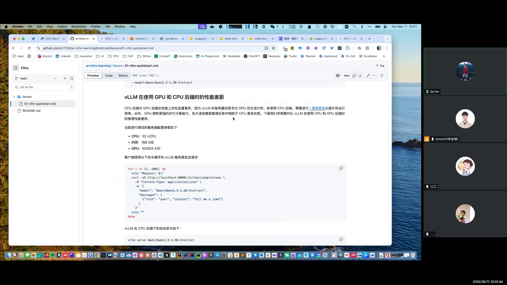 |
| 然后你可以看到这边它会刷一个 tokens 的统计，隔一段时间会刷一次。你看这边有个 77.6 tokens， [【跳转到 35:40】](https://www.bilibili.com/video/BV1T2EGzLEHi/?t=2140) | 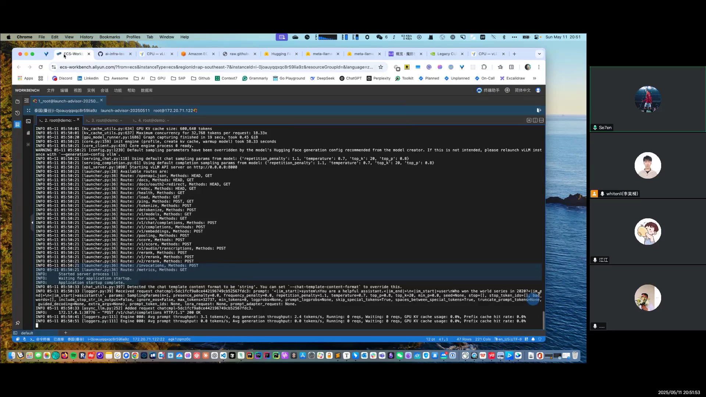 |
| 每秒，就是一个吞吐率嘛，对吧。 [【跳转到 35:50】](https://www.bilibili.com/video/BV1T2EGzLEHi/?t=2150) |  |
| 对，你这边，我之前测的时候是 130 几，看看他新的有没有会快一点、有没有。等一下，应该他隔几秒会打一下他的一个统计信息。 [【跳转到 35:55】](https://www.bilibili.com/video/BV1T2EGzLEHi/?t=2155) |  |
| 没有，看到了，这边应该是请求完了。 [【跳转到 36:19】](https://www.bilibili.com/video/BV1T2EGzLEHi/?t=2179) | 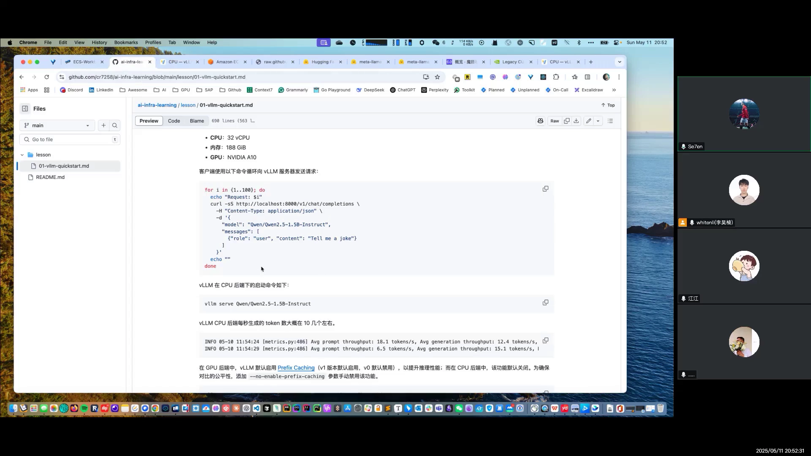 |
| 啊，反正差不多吧，我前面之前测的话大概是 130 几，这种速度。然后我们可以 CPU 再跑一下。CPU 我可以也是用这个、我用 Docker 的也可以，再跑一下看一下，跑起来。 [【跳转到 36:25】](https://www.bilibili.com/video/BV1T2EGzLEHi/?t=2185) | 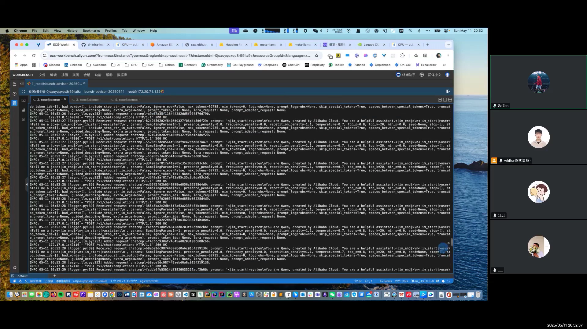 |
| 嗯，跑起来。 [【跳转到 36:50】](https://www.bilibili.com/video/BV1T2EGzLEHi/?t=2210) | 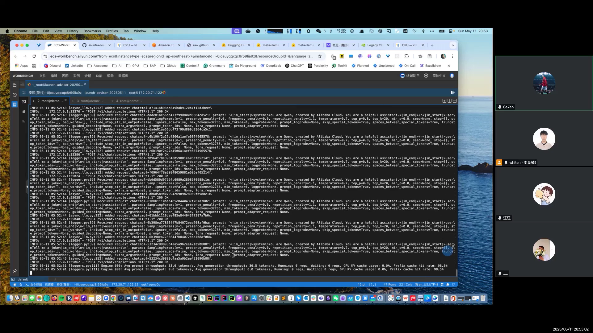 |
| 嗯，你看这次就是 CPU 嘛，测试命令是一样的，但是我这边提一嘴。 [【跳转到 36:55】](https://www.bilibili.com/video/BV1T2EGzLEHi/?t=2215) | 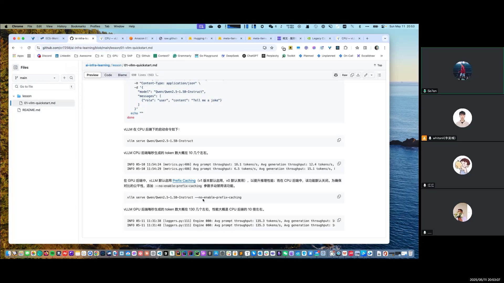 |
| 因为默认情况下，现在 vLLM 它默认是使用 V1 嘛，它有 V1 跟 V0 两个版本。你如果是在这个代码仓库里面，可以看到它外面这个应该属于 V0，然后 V1 它是放在这里面。 [【跳转到 37:10】](https://www.bilibili.com/video/BV1T2EGzLEHi/?t=2230) |  |
| 有个 V1，V1 的代码可能会解决一些比如架构上 high level 的问题，并且可能性能也会更好吧，它可能现在正在从 V0 往 V1 切的过程。所以在 V1 版本中默认启用了一个叫做 prefix caching（前缀缓存）的功能，这个功能可以提升推理性能。 [【跳转到 37:31】](https://www.bilibili.com/video/BV1T2EGzLEHi/?t=2251) |  |
| V0 是默认禁用的。然后 CPU 的话，这个功能默认是关闭的。为了保证公平性，我之前测的时候在 GPU 上是加了一个 `--no-enable-prefix-caching` 来关闭这个功能。对不对，我顺便说一下我今天测这个的时候， [【跳转到 37:56】](https://www.bilibili.com/video/BV1T2EGzLEHi/?t=2276) | 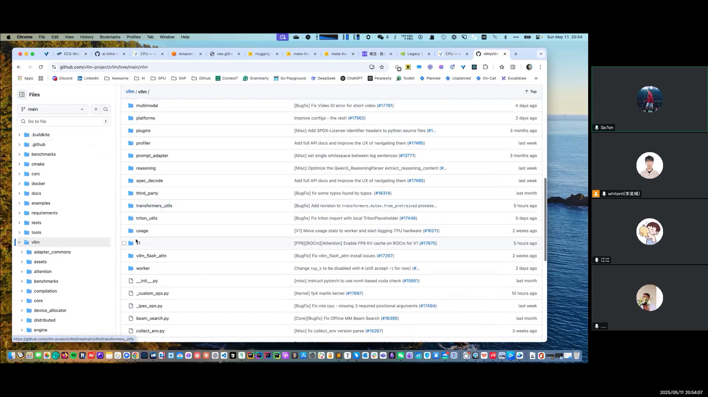 |
| 因为其实我之前一开始是尝试在这个 CPU 上启动这个 prefix caching 的，但是我发现貌似好像没有用，所以我给这个上面提了个 issue，现在应该还没人回我。就是用这个命令嘛，起 `--enable-prefix-caching`，那我就去测。然后你可以看看这个，有这 flag 哦。 [【跳转到 38:21】](https://www.bilibili.com/video/BV1T2EGzLEHi/?t=2301) | 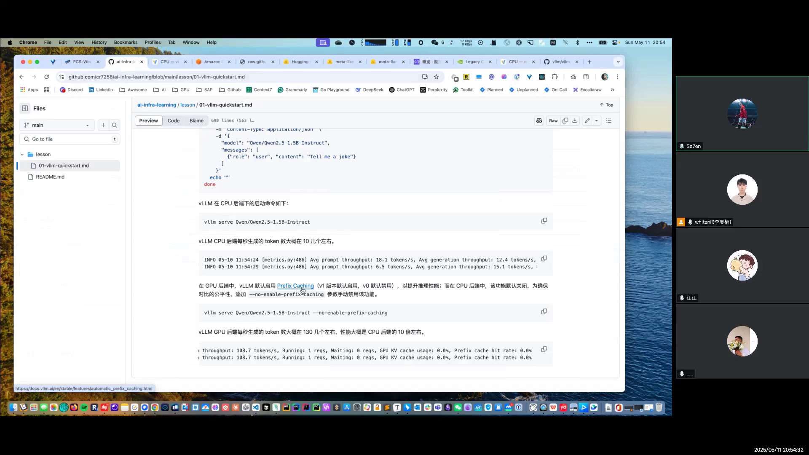 |
| 然后你可以看这边输出嘛，它还说 prefix caching hit rate 是零吧，没命中就没用上。但是你如果前面看我这个 GPU 的时候测的——GPU 因为我关了——看我刚刚这里正好没关，往上拉一点。 [【跳转到 38:46】](https://www.bilibili.com/video/BV1T2EGzLEHi/?t=2326) | 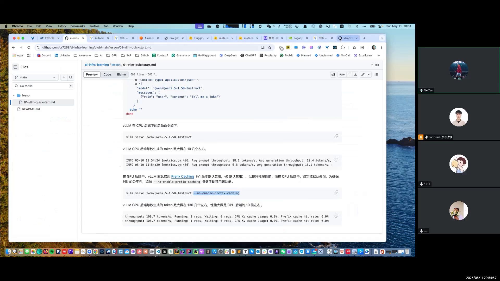 |
| 那个 token 在哪？我找一条有记录的……怎么找不到呢。 [【跳转到 39:11】](https://www.bilibili.com/video/BV1T2EGzLEHi/?t=2351) | 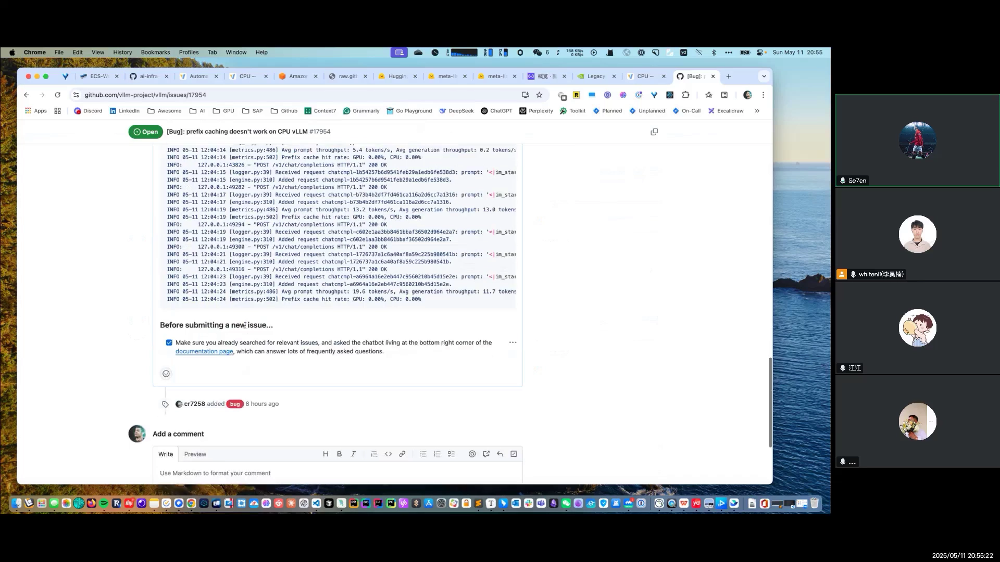 |
| 能不能搜索？它这里没有搜索功能。好。 [【跳转到 39:26】](https://www.bilibili.com/video/BV1T2EGzLEHi/?t=2366) | 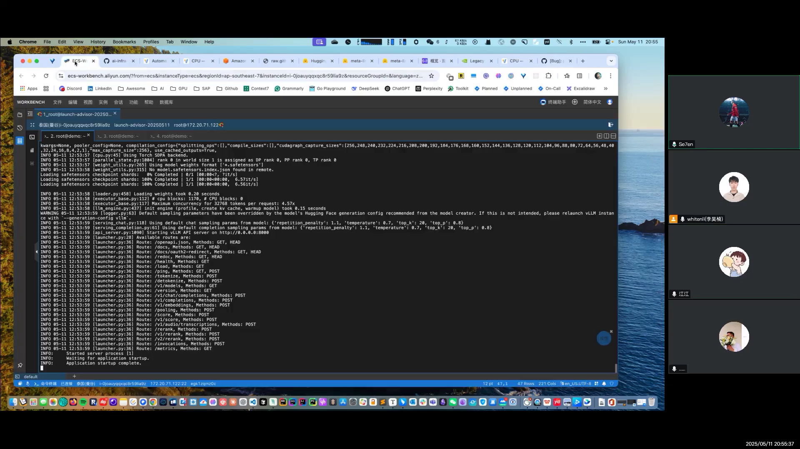 |
| 我刚才还想说，你看，这里就有。 [【跳转到 39:31】](https://www.bilibili.com/video/BV1T2EGzLEHi/?t=2371) | 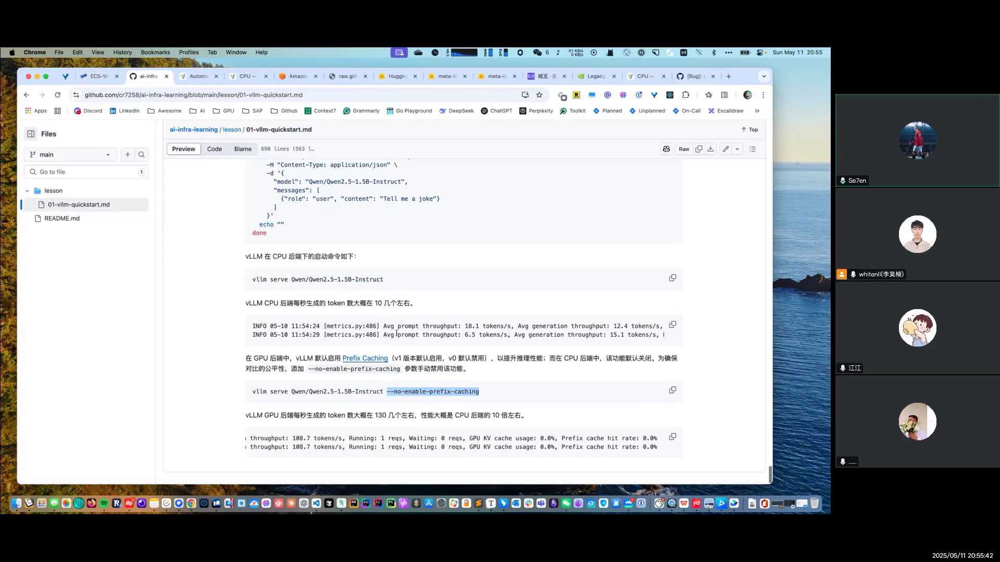 |
| 你看这个，我前面这次跑的时候没有进嘛，你可以看到 prefix caching 的 hit rate 是有嘛，说明 GPU 模式它是有用到的。然后 CPU 这我不知道为啥没生效，我先提在这里，好像回头我们研究这个 issue 的时候可以再看一下。然后这边也起好了嘛，对吧，你应该记得前面这个是刷刷的嘛，那你再看看这个。 [【跳转到 39:36】](https://www.bilibili.com/video/BV1T2EGzLEHi/?t=2376) |  |
| 你看这是不是就慢得多了，不要等一下，然后是很明显的一个数字差距嘛。我前面看，你看这个 token 的数量大概是十倍的差距，对吧。那你看这次他的这个 token 是 13，对吧，跟我前面测的差不多，13 token。就是如果按照我这个数据，大概是有个十倍的差距。 [【跳转到 40:01】](https://www.bilibili.com/video/BV1T2EGzLEHi/?t=2401) | 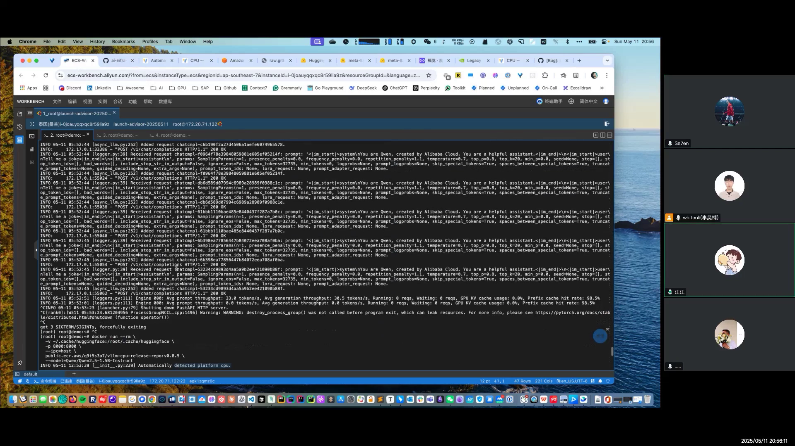 |
| 然后我今天这个关于这块的 vLLM 的介绍跟 demo 就好了。关于这边有没有问题？ [【跳转到 40:26】](https://www.bilibili.com/video/BV1T2EGzLEHi/?t=2426) | 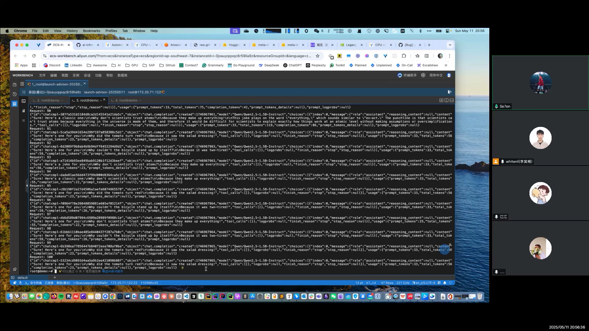 |
| 嗯，如果没有的话。 [【跳转到 40:40】](https://www.bilibili.com/video/BV1T2EGzLEHi/?t=2440) |  |
| 如果没有问题的话，我们就可以讨论一下 [【跳转到 40:45】](https://www.bilibili.com/video/BV1T2EGzLEHi/?t=2445) | 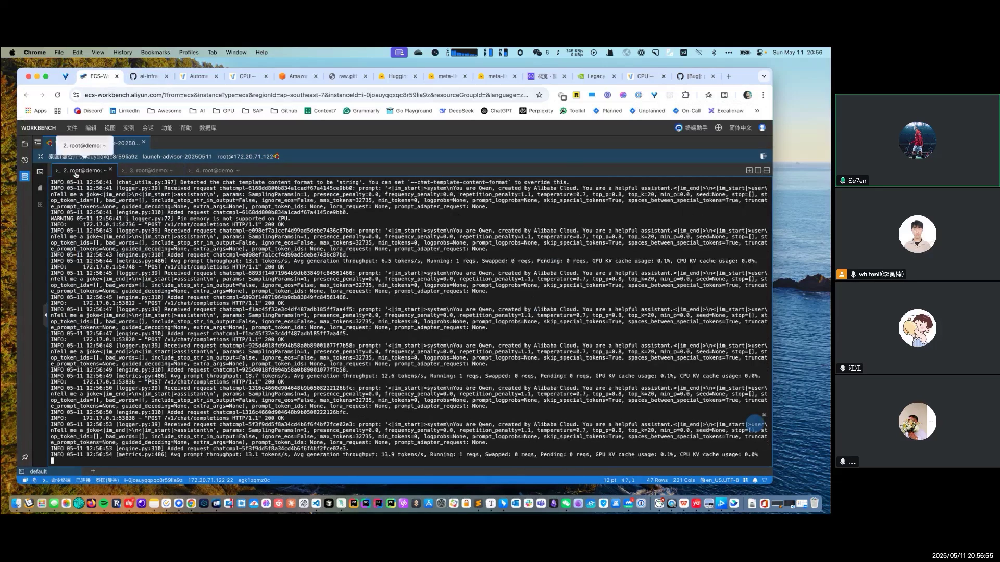 |
| 后面要分享的一个东西。这是我目前列的一些，我们可以下节课先了解一下这个 PagedAttention，这边列了几个：一个是它的 blog，官方的一个 blog，还有一个是它的 paper。我觉得 paper 可以先尝试读一下。 [【跳转到 40:50】](https://www.bilibili.com/video/BV1T2EGzLEHi/?t=2450) | 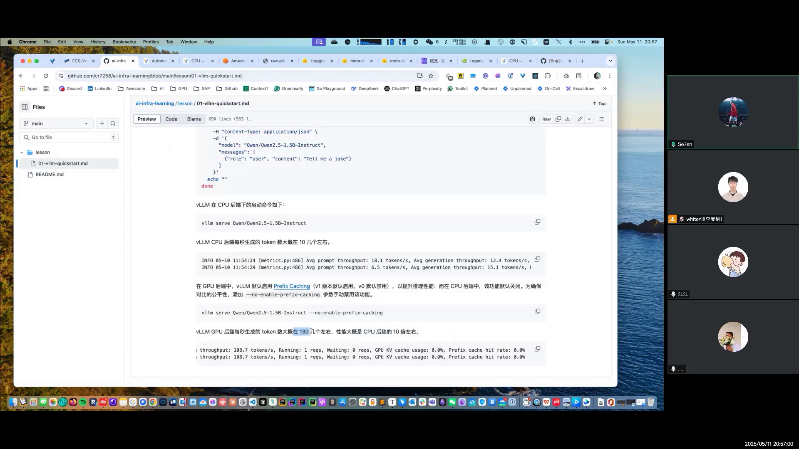 |
| 因为，反正最后某个技术你真的想要吃得比较透，可能还是要去啃一下。因为之前其实我也没有这个习惯去读 paper，可能这次可以正好逼一下自己去读一读。王晶反正他学术的话，他是要读的嘛。 [【跳转到 41:15】](https://www.bilibili.com/video/BV1T2EGzLEHi/?t=2475) | 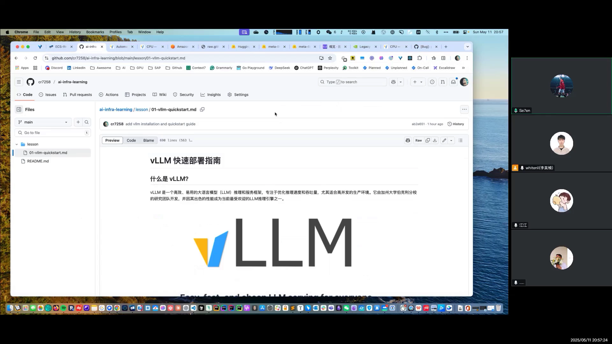 |
| 可能会比较习惯。或者你读这个 paper 有没有什么好用的工具？ [【跳转到 41:40】](https://www.bilibili.com/video/BV1T2EGzLEHi/?t=2500) | 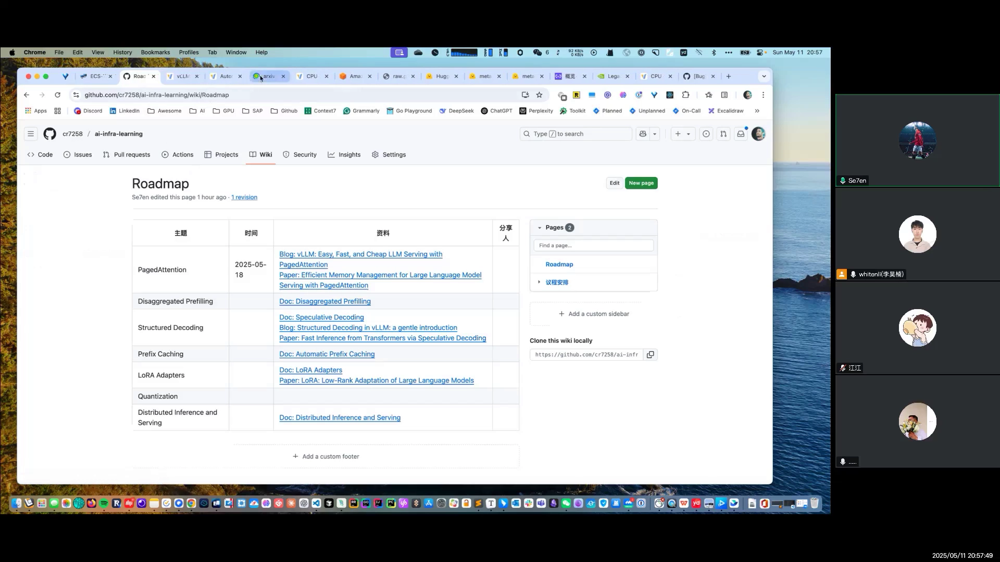 |
| 什么东西？有，等一下用那个，我发到群里面。对，你发到群里面。等一下，我先发到群里面，真是问对人了。我看下哪个，我在微信群发进去。可以啊，你发微信群。哦，Zotero，这个是什么？ [【跳转到 41:45】](https://www.bilibili.com/video/BV1T2EGzLEHi/?t=2505) | 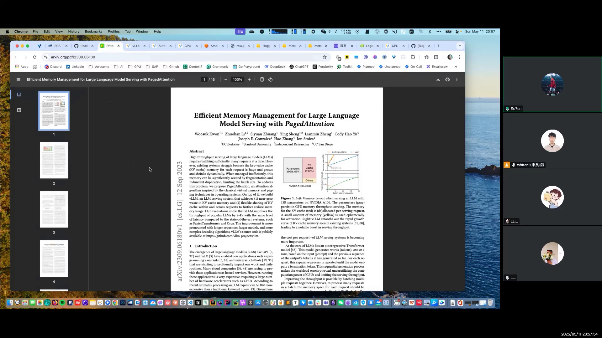 |
| 我看看啊，专门读 paper 的一个工具，很好用，这个是吧？对，然后有分类，就是有很多。但目前我主要用这个读 paper，以前我是直接下下来，后来觉得这个更好用。哦，他有什么亮点，你能说一下吗？还是——反正他现在用得最多的主要是这个。 [【跳转到 42:10】](https://www.bilibili.com/video/BV1T2EGzLEHi/?t=2530) | 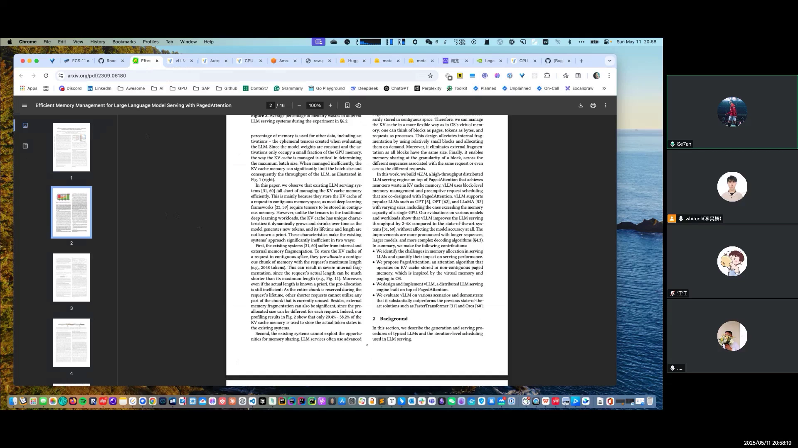 |
| 就是有没有什么比较牛的功能还是什么？ [【跳转到 42:35】](https://www.bilibili.com/video/BV1T2EGzLEHi/?t=2555) | 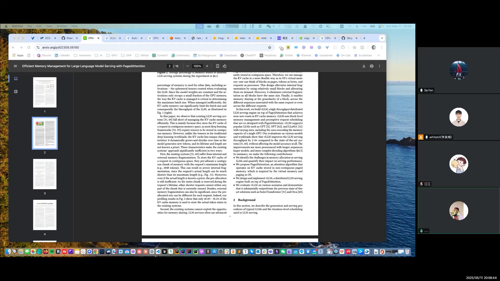 |
| 就是比如，我现在主要就是分类。 [【跳转到 42:44】](https://www.bilibili.com/video/BV1T2EGzLEHi/?t=2564) |  |
| 然后包括还有很多记忆。对，然后你可以直接从那个拖网站， [【跳转到 42:49】](https://www.bilibili.com/video/BV1T2EGzLEHi/?t=2569) | 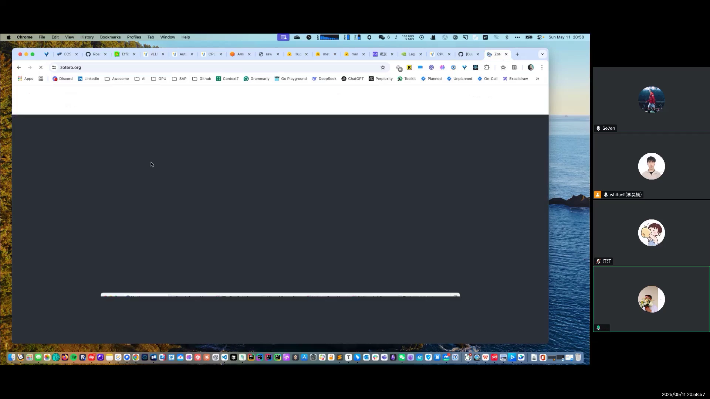 |
| 拖网站下来，然后直接他就输进去了。 [【跳转到 42:54】](https://www.bilibili.com/video/BV1T2EGzLEHi/?t=2574) | 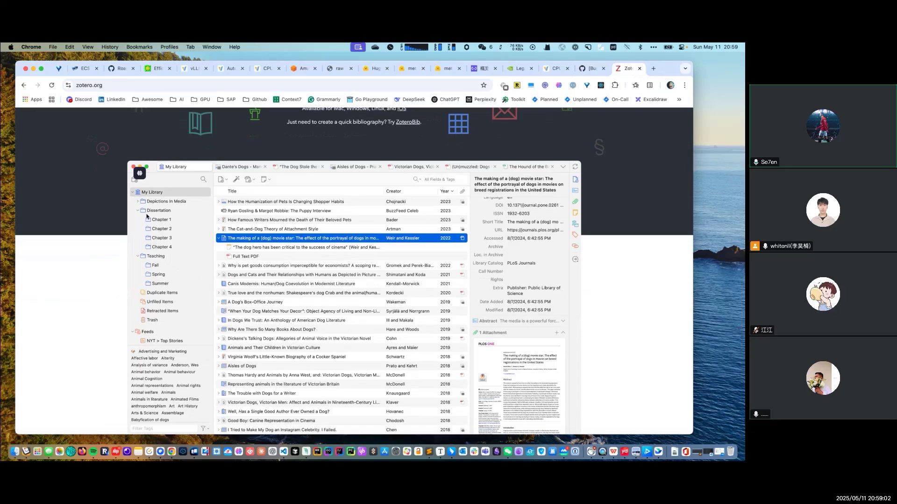 |
| 然后就有，它有记忆功能吗？嗯，就这个意思。然后你勾画那些东西，它都不会消失，这东西对。目前我主要用这个东西作为基础的阅读。哦，对。 [【跳转到 42:59】](https://www.bilibili.com/video/BV1T2EGzLEHi/?t=2579) | 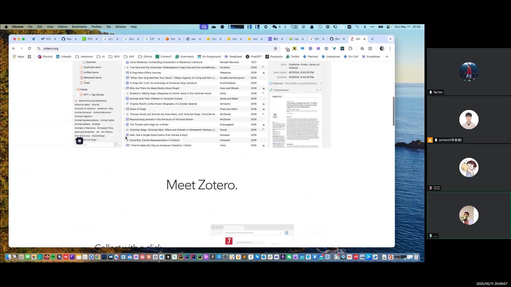 |
| 要更多的功能的话，到时候我再就是看一下那个 [【跳转到 43:14】](https://www.bilibili.com/video/BV1T2EGzLEHi/?t=2594) | 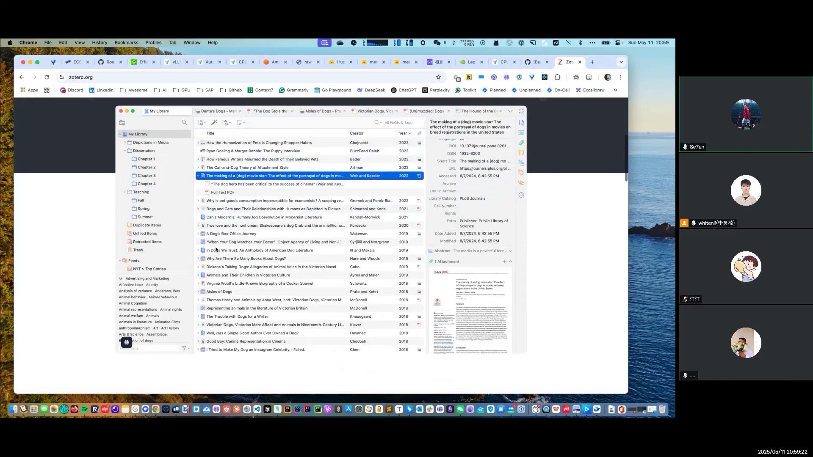 |
| 它具体的那个官方网站，然后讲一下嘛。诶，你是免费的，是不是就够用了？对对对。行行，那我们试一下这个，回头大家可以用一下。好，然后这是一个——那下一次我可以再准备一次，下次还是可以继续由我讲。 [【跳转到 43:19】](https://www.bilibili.com/video/BV1T2EGzLEHi/?t=2599) |  |
| 然后我们之后的，我们可以再安排人。然后后面我是列了 [【跳转到 43:44】](https://www.bilibili.com/video/BV1T2EGzLEHi/?t=2624) | 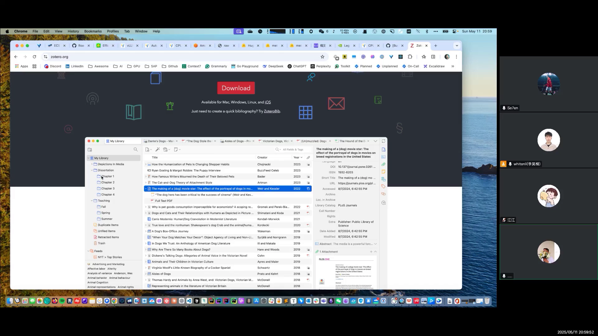 |
| 也是后面的几个，我是根据 vLLM 目前的一个 feature， [【跳转到 43:49】](https://www.bilibili.com/video/BV1T2EGzLEHi/?t=2629) | 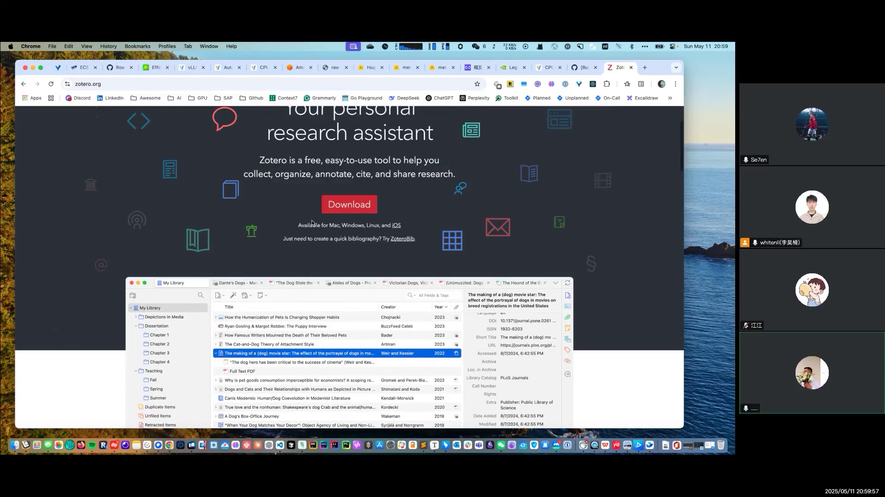 |
| 可以对照一下。比如一个是 Disaggregated Prefill（PD 分离），其实叫做什么—— [【跳转到 43:55】](https://www.bilibili.com/video/BV1T2EGzLEHi/?t=2635) | 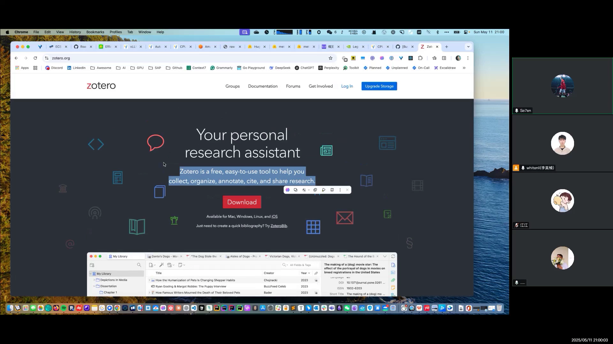 |
| PD 分离嘛。它的功能就是，比如我的请求在推理时其实分为两部分，一个叫 prefill，一个叫 decode。prefill 就是去接收用户的一个 prompt，可能用户问了一长串问题或者指令，它是一次性接收、可以一次性处理的，这个过程其实是属于计算密集型的。 [【跳转到 44:04】](https://www.bilibili.com/video/BV1T2EGzLEHi/?t=2644) | 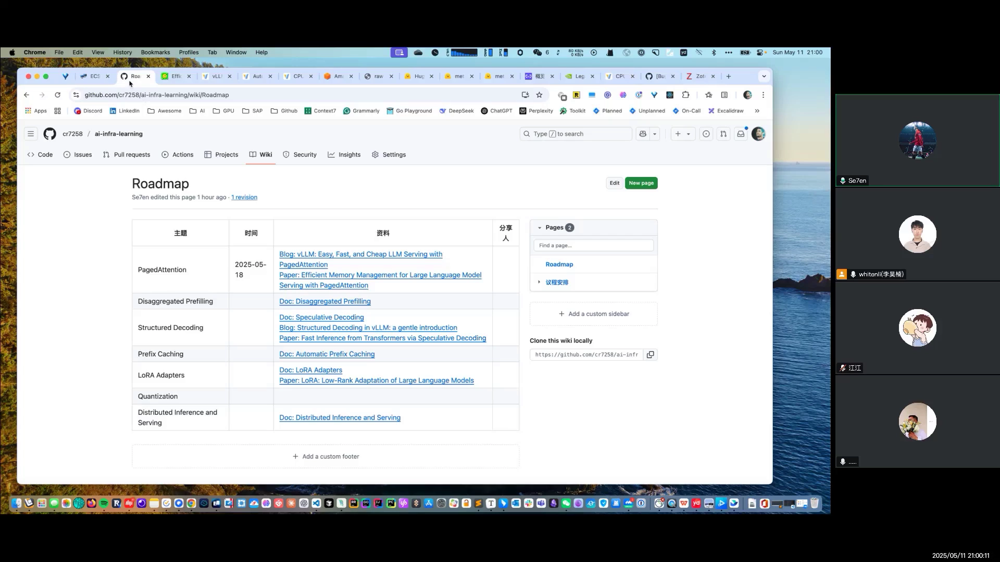 |
| 然后 decode 的话就是不太一样， [【跳转到 44:27】](https://www.bilibili.com/video/BV1T2EGzLEHi/?t=2667) | 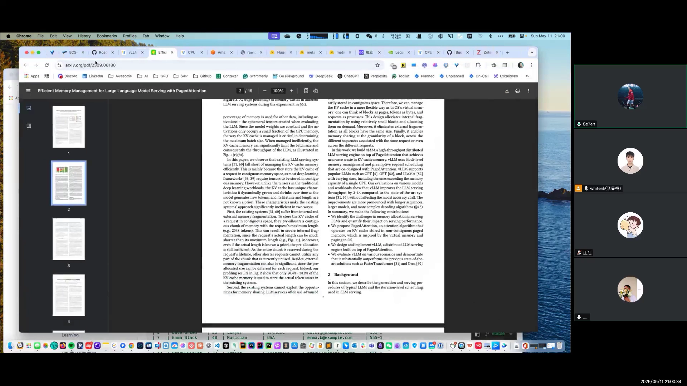 |
| decode 是根据我前面的结果、什么 KV cache 的结果去一个个往外吐 token，这个又是属于内存密集型的。所以就有这个方案，把计算密集型的 prefill 跟内存密集型的 decode 这两个任务进行一个分离，从而提高整体的吞吐。大概我是这么说，然后——哦，这个地方我写错了。 [【跳转到 44:32】](https://www.bilibili.com/video/BV1T2EGzLEHi/?t=2672) | 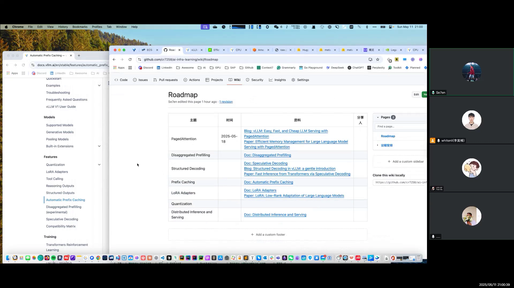 |
| 这个地方应该是 Speculative Decoding（投机解码）的功能。对，这里 save 一下。对，然后这个刷新没生效啊。这个功能也可以简单说，就是我在推理的时候，正常情况下我是个大模型吧， [【跳转到 44:57】](https://www.bilibili.com/video/BV1T2EGzLEHi/?t=2697) |  |
| 比如说 70B 的一个模型推理，对吧，一次性——我刚也说一次是推理。 [【跳转到 45:22】](https://www.bilibili.com/video/BV1T2EGzLEHi/?t=2722) | 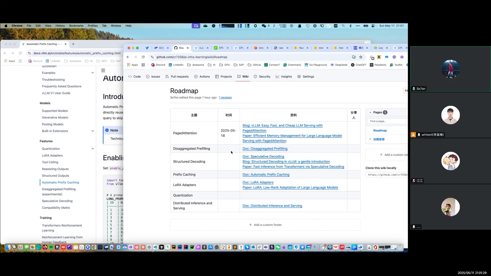 |
| 一个 token 一个 token 一个 token。那 Speculative Decoding 就是，我借助一个小模型，比如小模型可能只有 2B，小模型先去猜这个 token，比如他猜三个，然后一次性发给这个大模型，后面的大模型等于做个验证。通过这种方式我去提升推理的性能。 [【跳转到 45:29】](https://www.bilibili.com/video/BV1T2EGzLEHi/?t=2729) | 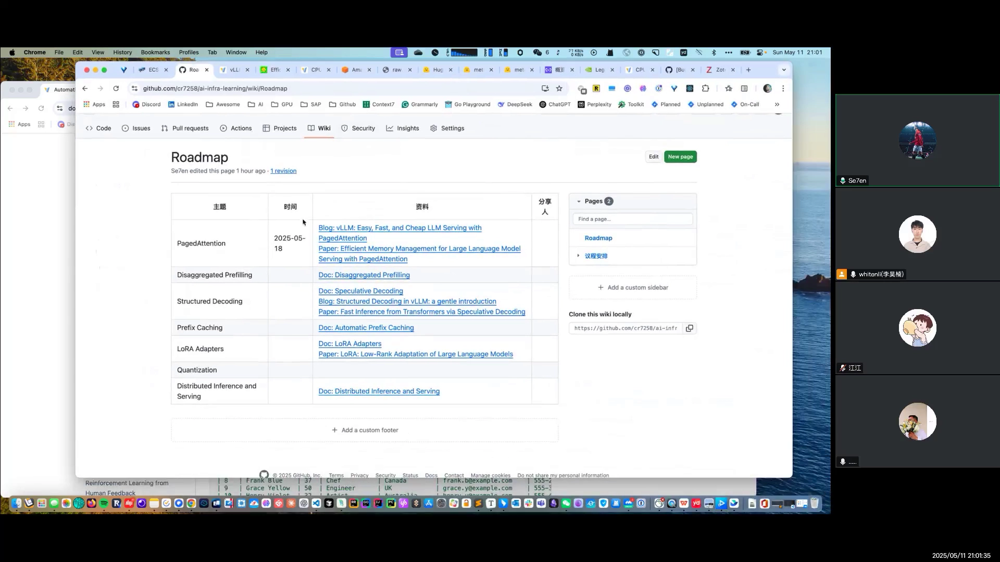 |
| 就不是一次性吐——小模型先猜三个，大模型去验证。如果是 OK 就——因为猜其实大部分猜得准，因为你给了上下文嘛——然后猜得准的话就用，猜不准的话就不用，就直接还是用大模型那个推理的东西。这边也是有一些相关的 paper 和 blog。然后 prefix caching，就相当于我做缓冲， [【跳转到 45:54】](https://www.bilibili.com/video/BV1T2EGzLEHi/?t=2754) |  |
| 比如我计算这个 KV cache 啥的，它这边应该有个图吧，看一下。反正就是能根据前缀我去计算一个，我记得这个图是放在哪去了。 [【跳转到 46:19】](https://www.bilibili.com/video/BV1T2EGzLEHi/?t=2779) |  |
| 应该有一个 prefix caching 是不是这个啊。这个就是你能根据你的前缀计算它的一个 token，这里计算一个，把它的前缀缓存下来。而这部分就是根据这里的 block1 的 prefix 加上 block2 的 token，再继续用这个 prefix。如果说你哪个命中的话， [【跳转到 46:44】](https://www.bilibili.com/video/BV1T2EGzLEHi/?t=2804) |  |
| 你就直接拿了，就不用再去计算了，也是一种提升推理性能的方式吧。对，它存在哪里？存在 GPU 显存里面是吧？都可以，因为前面我说的那个，他文档说的 GPU、CPU 也支持 prefix caching，所以你可以根据你的配置去决定存哪。 [【跳转到 47:09】](https://www.bilibili.com/video/BV1T2EGzLEHi/?t=2829) | 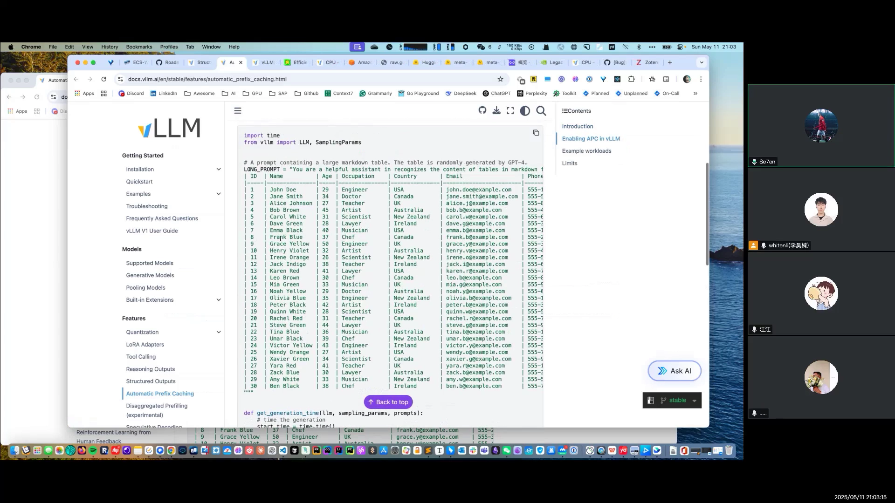 |
| 然后那个，不是那个什么月球大叔里面不是有个大佬吗，不是有个 LMCache 吗，他那个你可以直接存到不同的 destination，比如 Redis，你甚至可以不存在内存里。 [【跳转到 47:34】](https://www.bilibili.com/video/BV1T2EGzLEHi/?t=2854) | 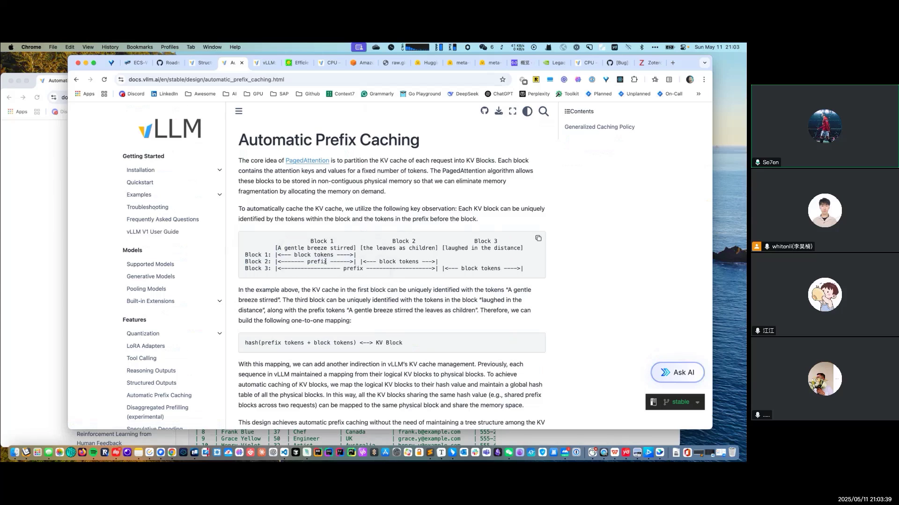 |
| LMCache。 [【跳转到 47:52】](https://www.bilibili.com/video/BV1T2EGzLEHi/?t=2872) | 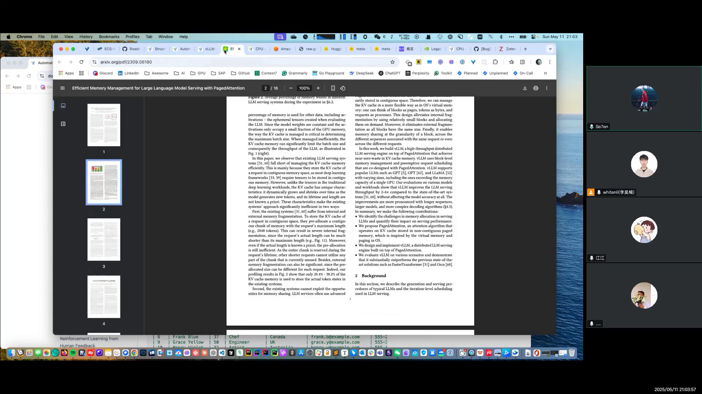 |
| 对，你看他的标题就比较简易懂嘛，Redis for LLM。然后我看他有个应该有个 destination 的，不在这。嗯，他是比如 Redis 吧，对吧，或者是 Mooncake。 [【跳转到 47:57】](https://www.bilibili.com/video/BV1T2EGzLEHi/?t=2877) | 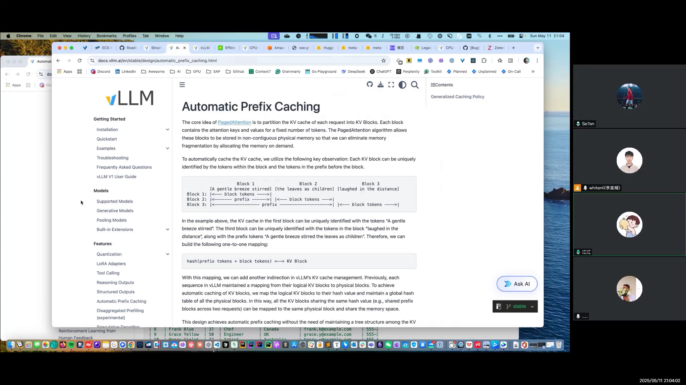 |
| 这个是月之暗面的那个 store，对，这个应该就是 Redis 的一个 fork，因为 Redis 改了他的开源协议，从 Apache 改的嘛。然后这个 Valkey 就是从 Redis fork 出来的一个，但是现在 release 又改回去了好像是。对，我记得。所以还是因为你这个，他怎么说—— [【跳转到 48:22】](https://www.bilibili.com/video/BV1T2EGzLEHi/?t=2902) | 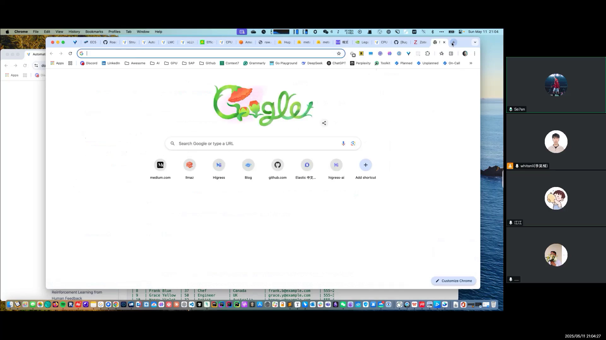 |
| 这种开源产品跟那种云厂商之间弄完，最后反而还是觉得原来的 Apache License 是最优的。因为你改了 license，你就是云厂商，等于说以你这个为由头，他就自立门户了，就是重新设计出来一个开源项目嘛。然后像那个 Redis 又出来了这个 Valkey，这个对吧。 [【跳转到 48:47】](https://www.bilibili.com/video/BV1T2EGzLEHi/?t=2927) | 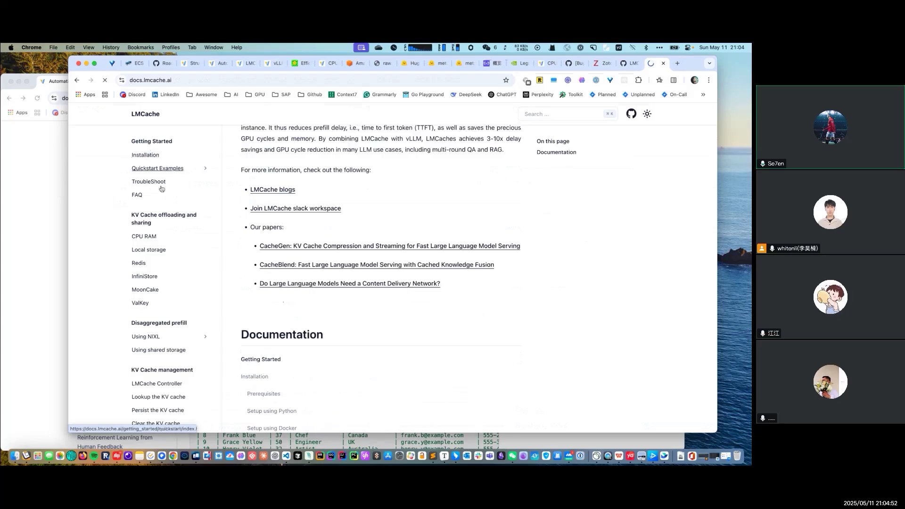 |
| 那最后损失的还是他这个 Redis 这种，或者一类开源社区的一个用户很多就跑到 Valkey 里面去了，对吧。所以这个 LMCache 它的一个项目，主要解决的问题就是，他想要把模型推理的这个 KV 存储的东西存到不同的引擎上面去，对吧。 [【跳转到 49:12】](https://www.bilibili.com/video/BV1T2EGzLEHi/?t=2952) | 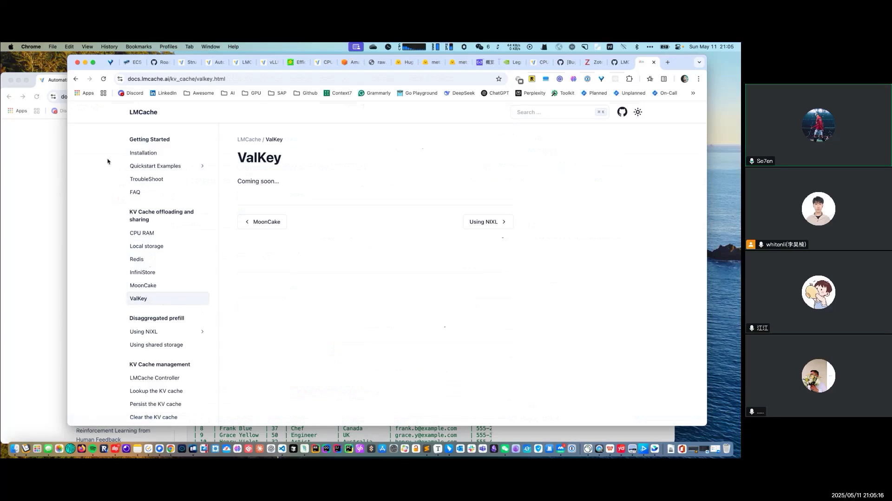 |
| 对，应该是这个，一些 destination，他说 different destination，存到不同的一些上面去，就是省去重复计算了吧。对，然后就 LoRA Adapter，它就是属于一种轻量级的微调的方式。他这里有个图，比如一般你可能微调之前 [【跳转到 49:37】](https://www.bilibili.com/video/BV1T2EGzLEHi/?t=2977) | 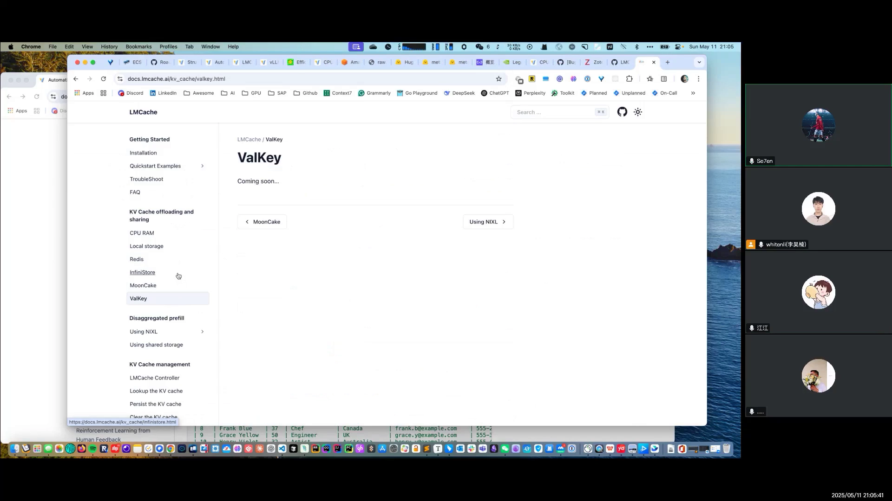 |
| 可能是有一种叫做全量参数微调，那就相当于你重练了一遍，差不多了，对吧。还有那种部分的。不管怎么样，它的这种微调成本很高。它这种相当于就是——你可以看到是预训练的权重嘛，LoRA 就相当于是在这边加了一个，它只管自己能对应的那些层的一些参数， [【跳转到 50:02】](https://www.bilibili.com/video/BV1T2EGzLEHi/?t=3002) | 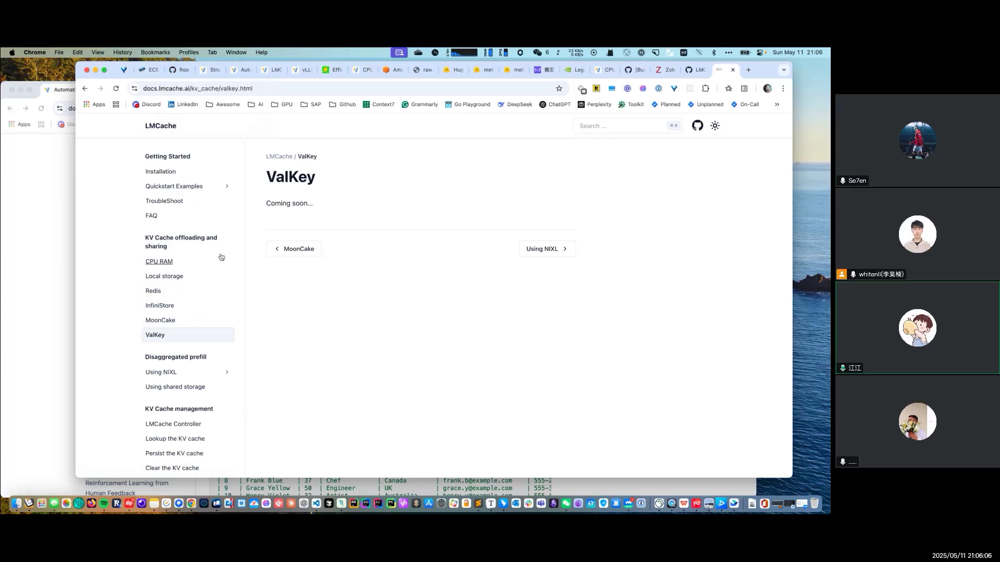 |
| 就修改很少，最后把这俩的参数做一个比如合并，然后得到微调后的模型。 [【跳转到 50:27】](https://www.bilibili.com/video/BV1T2EGzLEHi/?t=3027) | 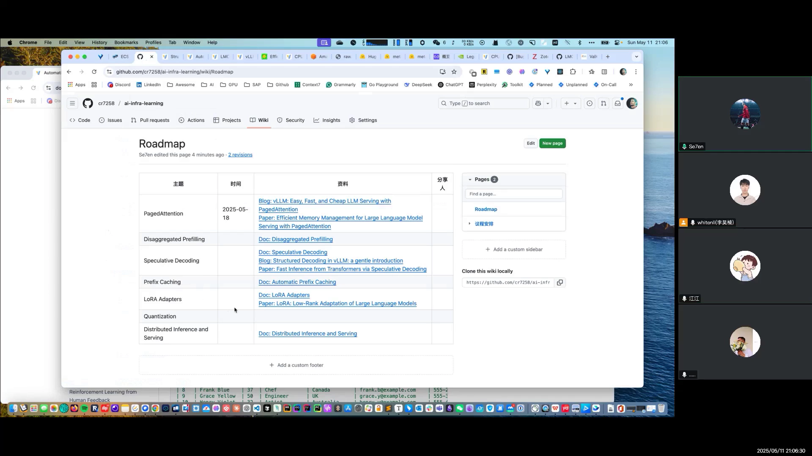 |
| 所以 vLLM 它其实也是支持这种 LoRA Adapter 的方式嘛。 [【跳转到 50:33】](https://www.bilibili.com/video/BV1T2EGzLEHi/?t=3033) | 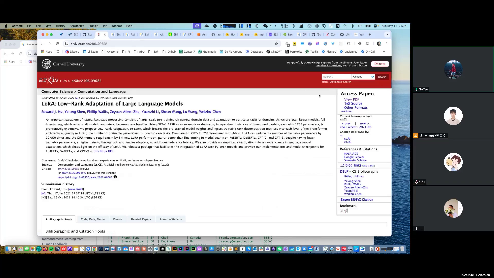 |
| 对，还有一个是量化（Quantization）。它这里，我看这个地方，当然有不同的量化。总的来说就是，比如你精度是 8 比特的你改成 4 比特嘛，对吧，那你这比特少了，你占用的这些资源自然就少了，速度肯定也就快了嘛。量化大概就是这个思路。 [【跳转到 50:38】](https://www.bilibili.com/video/BV1T2EGzLEHi/?t=3038) |  |
| 然后还有一个我想到的，就是有一个分布式的推理跟 serving，这种就是更加面向工业化了。 [【跳转到 51:03】](https://www.bilibili.com/video/BV1T2EGzLEHi/?t=3063) | 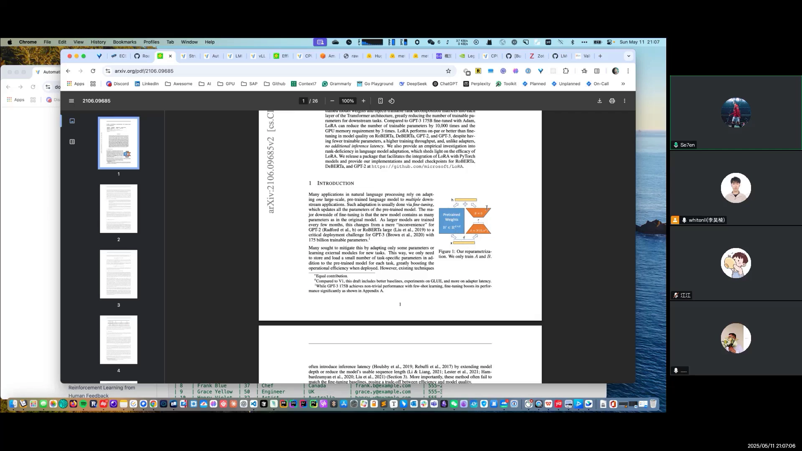 |
| 比如我可能会在这种 K8s 上做分布式推理，因为你正常——我刚才跑的这些不都是单机吗，你这一台挂了那就是挂了。如果 K8s 的话，一个是分布式高可用，并且它的性能也会强，并且它还可以让我根据上层的这些调度器，根据我 vLLM 后端的一个实际的 [【跳转到 51:14】](https://www.bilibili.com/video/BV1T2EGzLEHi/?t=3074) | 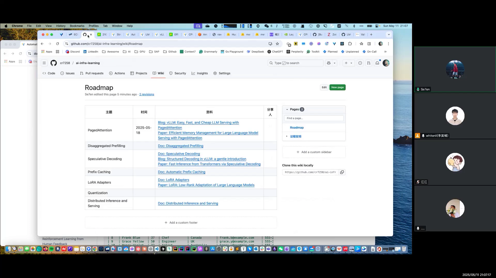 |
| 请求量我去做一个路由的分发。比如我这个 vLLM 后端它的 prefix cache 命中是最高的，那我就转给这个。他其实有个叫做 Gateway API Inference Extension 这项目，你可以看他的一个 GitHub，它其实就是在网关层面，等于是给网关层面 [【跳转到 51:39】](https://www.bilibili.com/video/BV1T2EGzLEHi/?t=3099) | 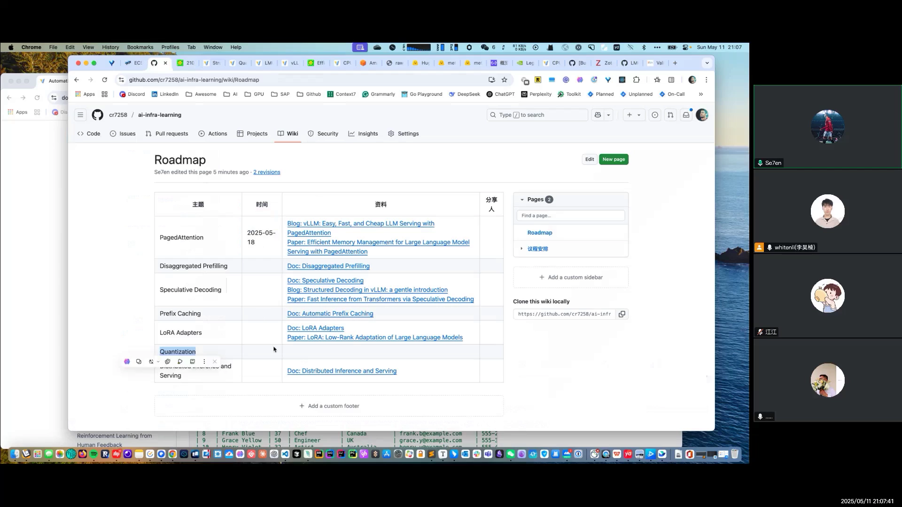 |
| ——最近这怎么念啊，这改的挺多。然后因为现在 K8s 有个 Gateway API 的一个标准嘛，他是在 Gateway API 上做了一个这个 Inference Extension 的东西。等于说 Gateway API 在决定路由之前先发送给这个 extension 这个组件， [【跳转到 52:04】](https://www.bilibili.com/video/BV1T2EGzLEHi/?t=3124) | 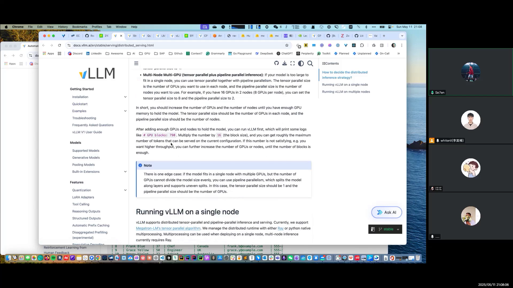 |
| 去问他应该要转发给哪个模型，因为模型还是用 PD 的方式跑的嘛。但这个 extension 它是有这些模型的，比如他的 prefix cache、KV cache 的一些状态，或者说是模型负载的一个状态，就是根据这些高级别的 LLM 的一些指标，然后返回给这个 gateway，告诉他应该去转发给哪个对应的模型的 pod。 [【跳转到 52:29】](https://www.bilibili.com/video/BV1T2EGzLEHi/?t=3149) | 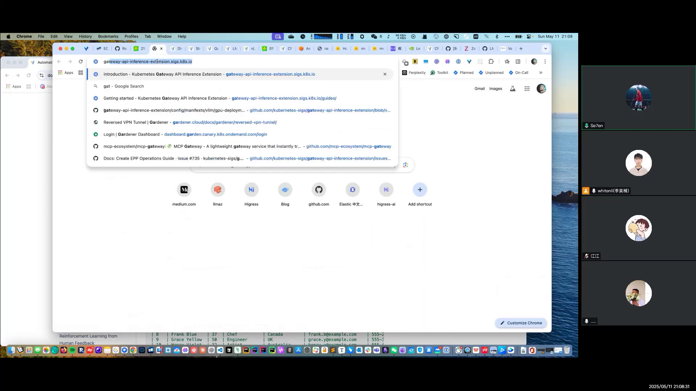 |
| 对，还是这样。然后这边是我刚才列的几个，后面可能可以讨论的。有没有什么要补充的吗？我这边是没有。嗯，没有。 [【跳转到 52:54】](https://www.bilibili.com/video/BV1T2EGzLEHi/?t=3174) | 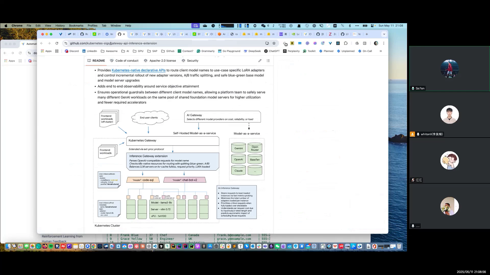 |
| 因为要看一下他的这个整体的结构，要看一组之后才知道他有什么要那个的。然后那个——嗯，不好意思打断一下，我还想问一下，就是比如我们如果要 PK（讲解分享）的话， [【跳转到 53:19】](https://www.bilibili.com/video/BV1T2EGzLEHi/?t=3199) | 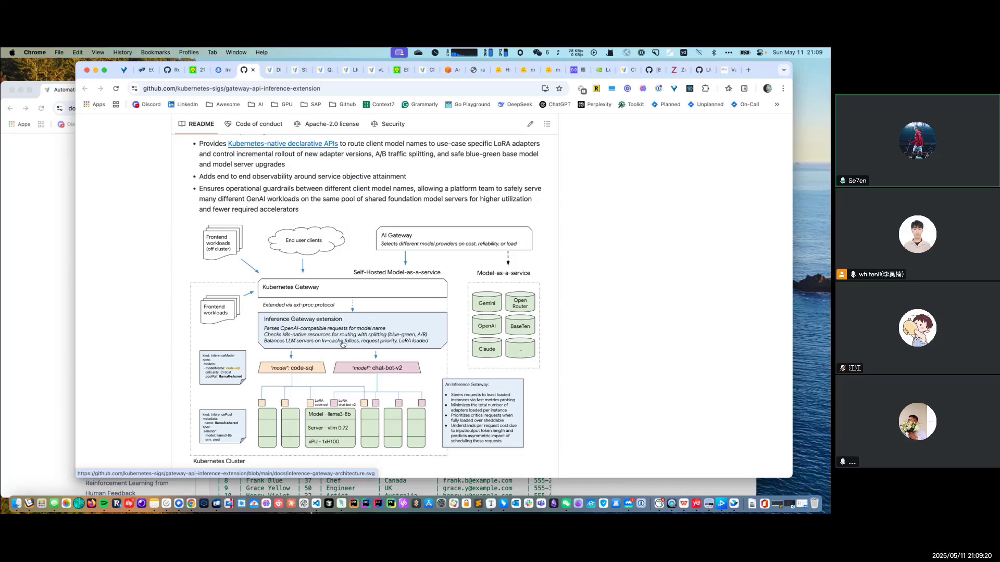 |
| 那我们大概就是大家会希望 [【跳转到 53:36】](https://www.bilibili.com/video/BV1T2EGzLEHi/?t=3216) | 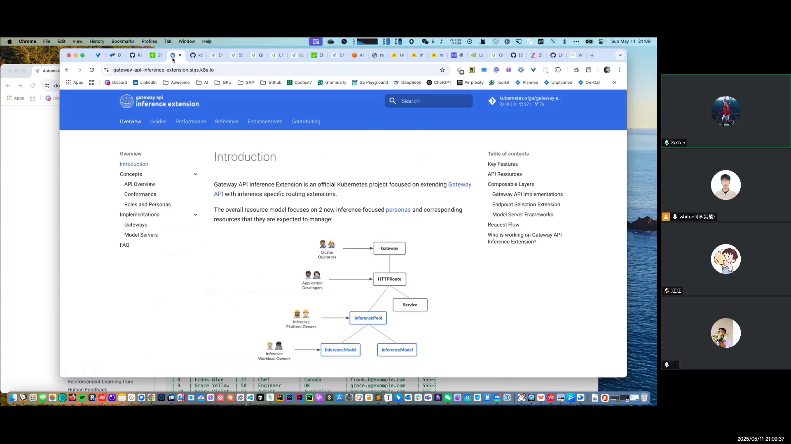 |
| 就是呈现的一个效果是什么？比如我们把你这边列的一些 info、资料的东西，我们想要把这些东西内化之后整理成一个文档，然后再加上源码这些东西，或是顺便跑一个 demo，就是一种方式是吗？对，我大概觉得是想要这样。 [【跳转到 53:44】](https://www.bilibili.com/video/BV1T2EGzLEHi/?t=3224) | 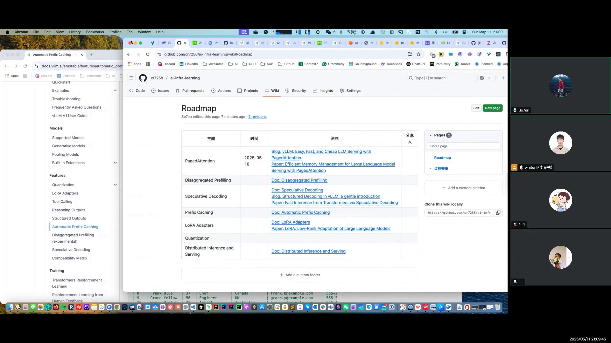 |
| 对，我觉得是这样。首先第一个，我觉得就是每一个他的那个东西，我们要最后沉淀出一个文档嘛，对吧，因为如果只是口头的分享或者什么，就很容易遗忘，并且不容易去总结或者回顾嘛。首先要实现一个文档。然后第二个的话，我觉得源码可能也是必要的， [【跳转到 54:09】](https://www.bilibili.com/video/BV1T2EGzLEHi/?t=3249) |  |
| 并且我推荐，就是比如源码的话，我自己在看源码，我可能会使用像这种 Cursor 或者 Windsurf，我会先问他这个可能他的一个项目结构或者什么，他其实找的话还挺 OK 的，对吧。并且现在有一个叫做 Augment Code 的，你们有没有听过这个的？ [【跳转到 54:34】](https://www.bilibili.com/video/BV1T2EGzLEHi/?t=3274) |  |
| 是微软底下的一个子公司吧，可能出来搞了一个。一个好处就是上下文特别长，是 200K 还是多少的。干嘛用的？这是可以免费用的吗？免费，你没用的话现在是免费 14 天，之前一直是免费的，他现在要开始收钱了，但是就很贵啊。还有一个好处就是上下文很长，但价格很贵。 [【跳转到 54:59】](https://www.bilibili.com/video/BV1T2EGzLEHi/?t=3299) | 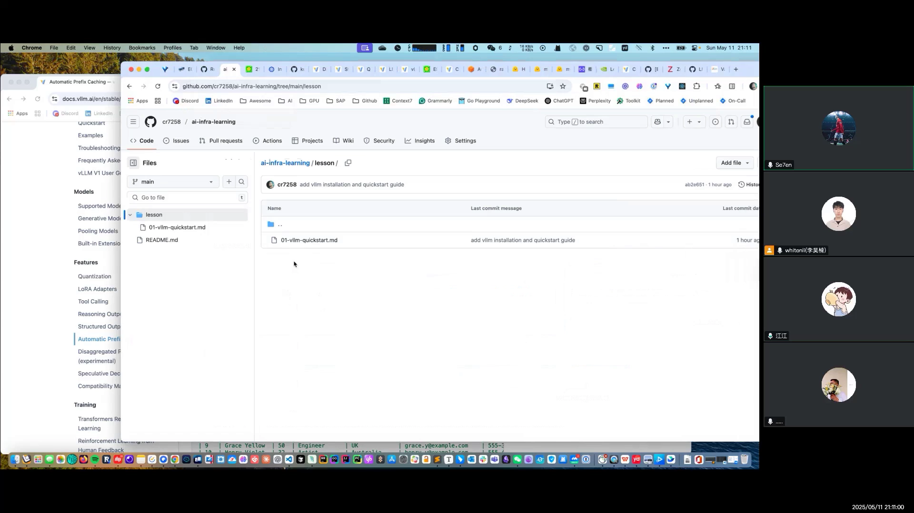 |
| 如果你现在的话是 50 美金一个月，之前本来他想订 30 美金的。之前我看他说，你如果马上续费还能接着用，如果晚的话你就还是补充点金额，就这意思。然后是老客户 30 美金。 [【跳转到 55:24】](https://www.bilibili.com/video/BV1T2EGzLEHi/?t=3324) | 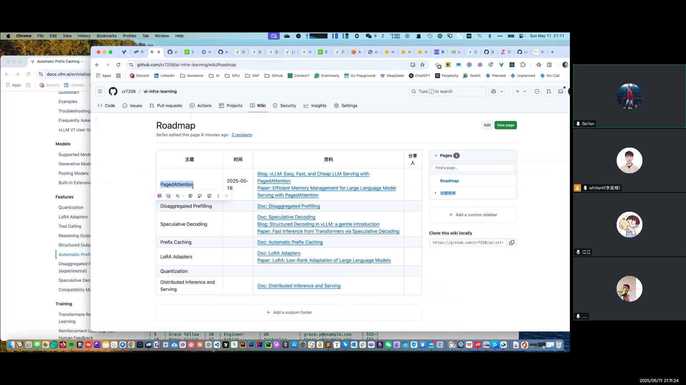 |
| 新客户。像我用 Windsurf，我现在是属于早鸟用户。 [【跳转到 55:42】](https://www.bilibili.com/video/BV1T2EGzLEHi/?t=3342) | 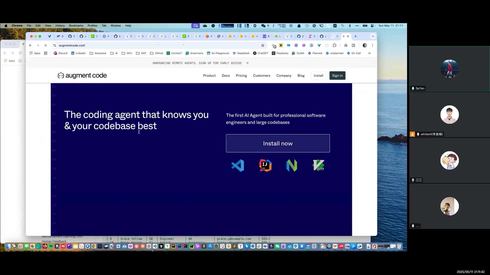 |
| 我 Windsurf 现在是月租是 15 美金吧，然后我用还是 10 美金，因为来得早。你看这里是 14 天的。 [【跳转到 55:47】](https://www.bilibili.com/video/BV1T2EGzLEHi/?t=3347) | 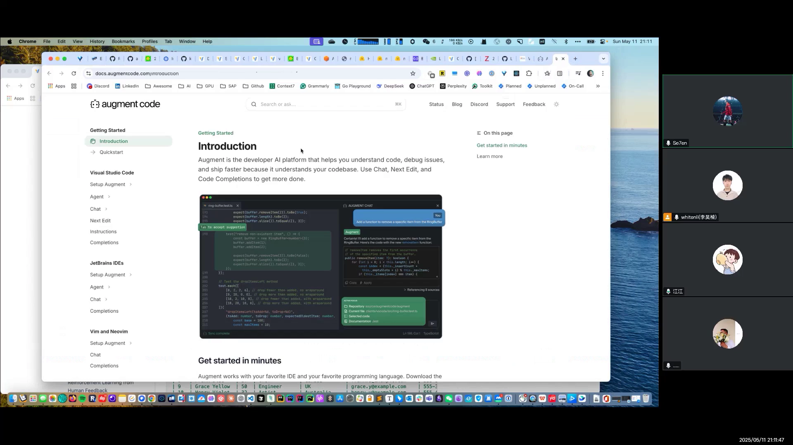 |
| 然后你看这里是 50 美金，如果普通你用的是 50 条信息。 [【跳转到 55:55】](https://www.bilibili.com/video/BV1T2EGzLEHi/?t=3355) | 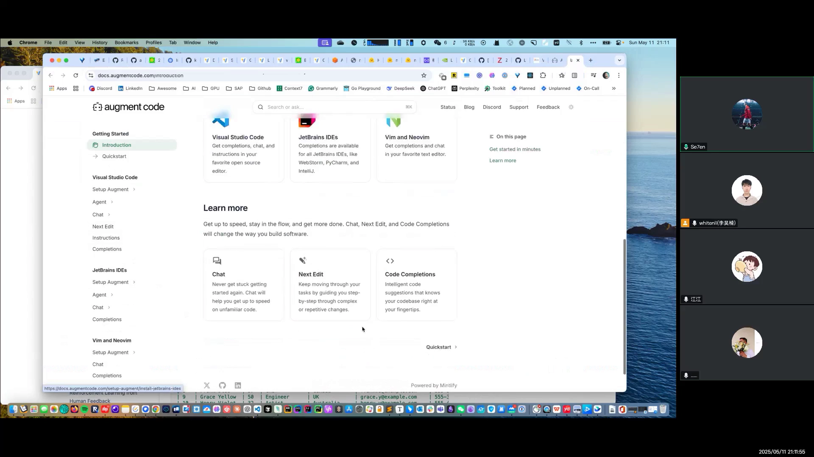 |
| 对，应该也能用一下。但是我今天来对比一下，我用这个 Windsurf 跟这个 Augment Code 去问这个源码，其实 Augment Code 虽然他说他有 index 到什么他的一个 Google Storage 里面，但是好像也没说很准确。 [【跳转到 56:01】](https://www.bilibili.com/video/BV1T2EGzLEHi/?t=3361) | 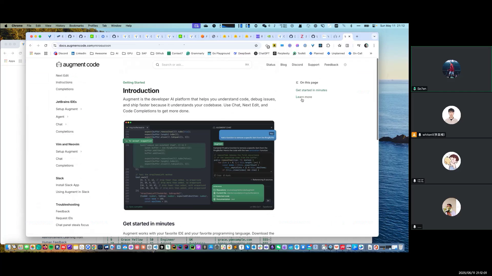 |
| 它也有错的地方。那 Windsurf 有时候回答问题其实也比它更对。 [【跳转到 56:18】](https://www.bilibili.com/video/BV1T2EGzLEHi/?t=3378) | 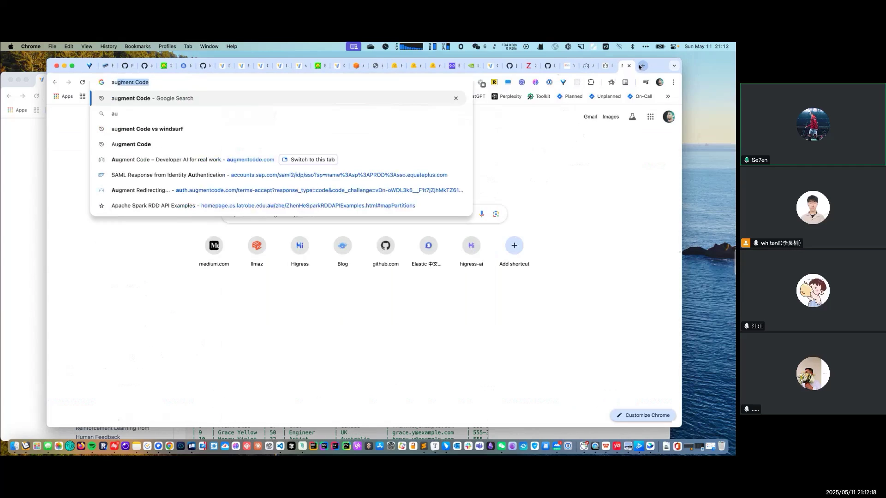 |
| 所以我觉得可能 Windsurf 其实也够用，15 美金这个可能也够用。 [【跳转到 56:24】](https://www.bilibili.com/video/BV1T2EGzLEHi/?t=3384) | 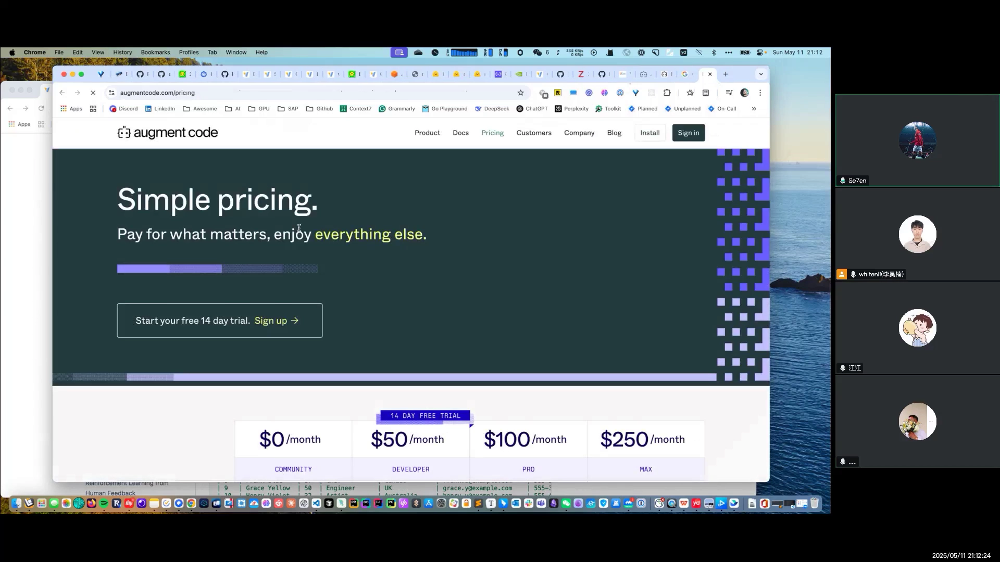 |
| 这个主要就是把你的代码给你延伸一下。比如我现在——比如这个嘛，你们都有用是吧？哇，可以啊，我都没有用这个东西。对比这个，比如我直接试一下，我看看他解读怎么样。比如我想要学习这个 PagedAttention 这个嘛，对吧。 [【跳转到 56:33】](https://www.bilibili.com/video/BV1T2EGzLEHi/?t=3393) | 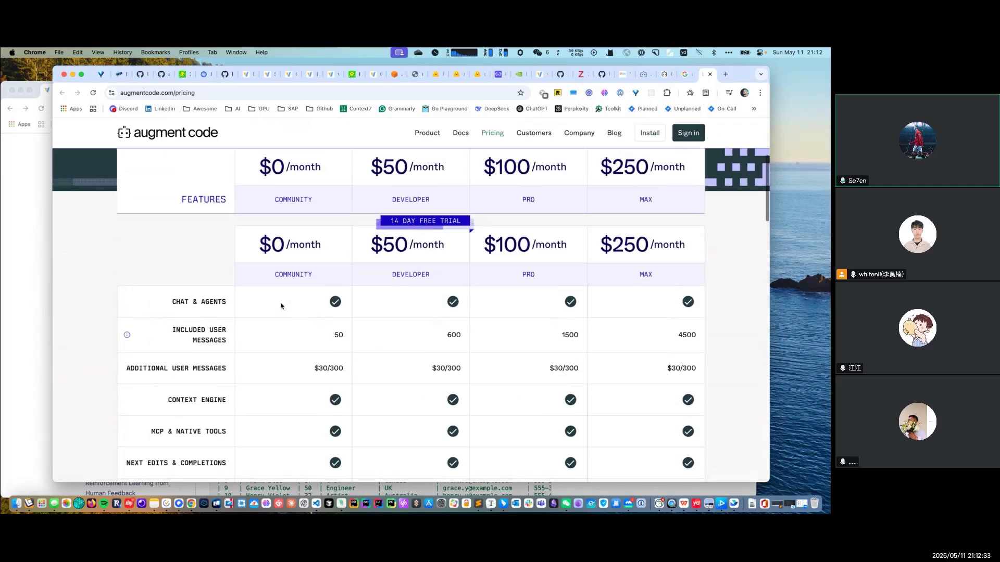 |
| 先让他告诉我一下一个结构，我根据这个结构我再去看，比我一开始从零开始摸应该是容易很多。 [【跳转到 56:58】](https://www.bilibili.com/video/BV1T2EGzLEHi/?t=3418) | 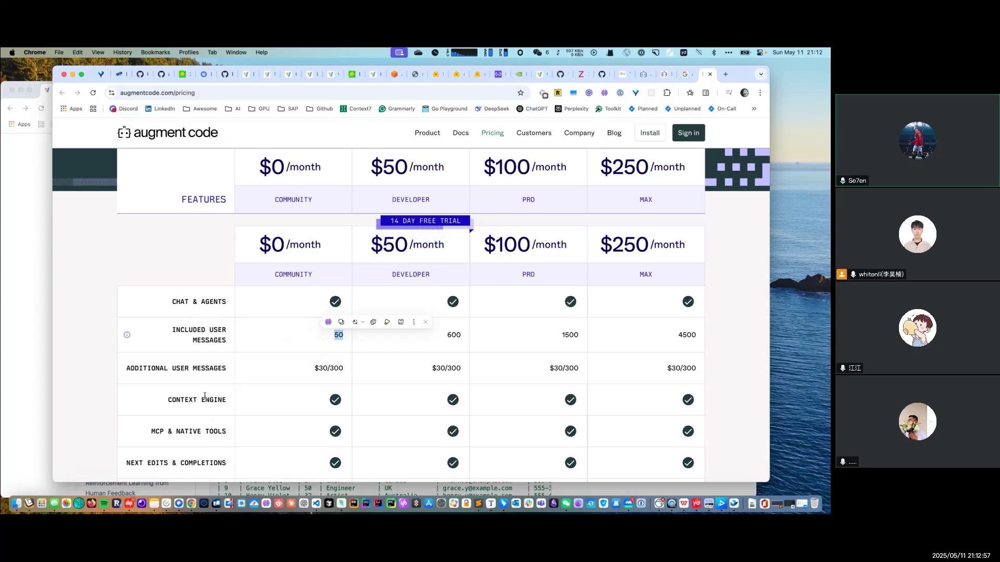 |
| 我们可以对比一下。如果说我是用那个 Windsurf，是有 Windsurf 的一个软件，当然他也是 VSCode fork 出来的。 [【跳转到 57:18】](https://www.bilibili.com/video/BV1T2EGzLEHi/?t=3438) | 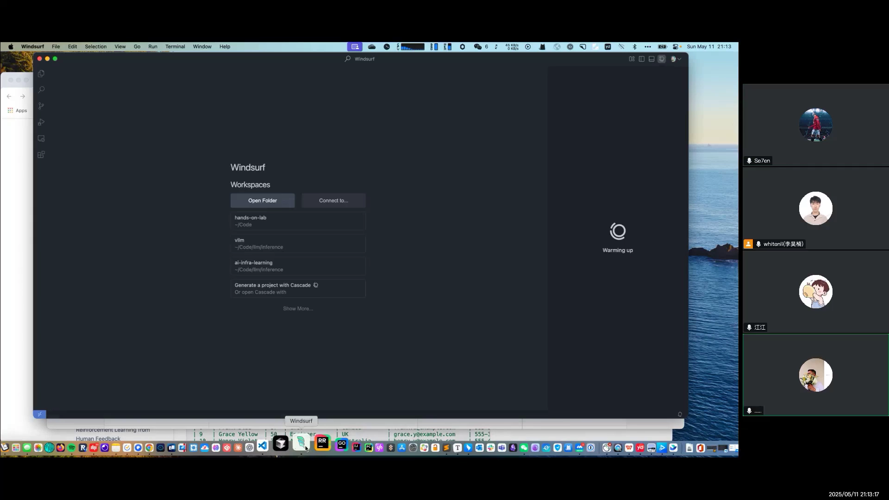 |
| 然后再像那样加一个。 [【跳转到 57:29】](https://www.bilibili.com/video/BV1T2EGzLEHi/?t=3449) | 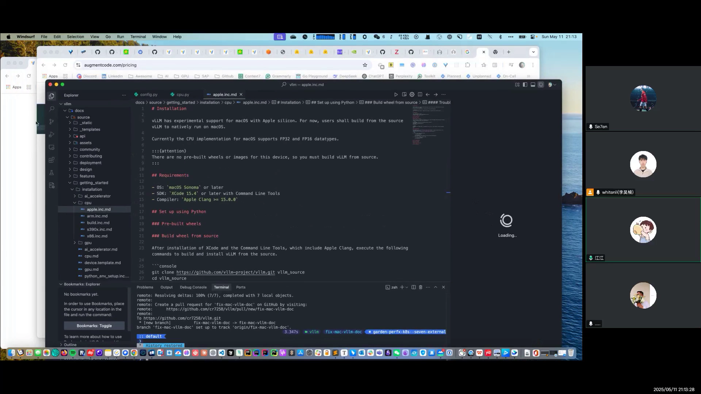 |
| 如果是 Augment Code，他就是在 VSCode 里面一个 plugin。 [【跳转到 57:34】](https://www.bilibili.com/video/BV1T2EGzLEHi/?t=3454) | 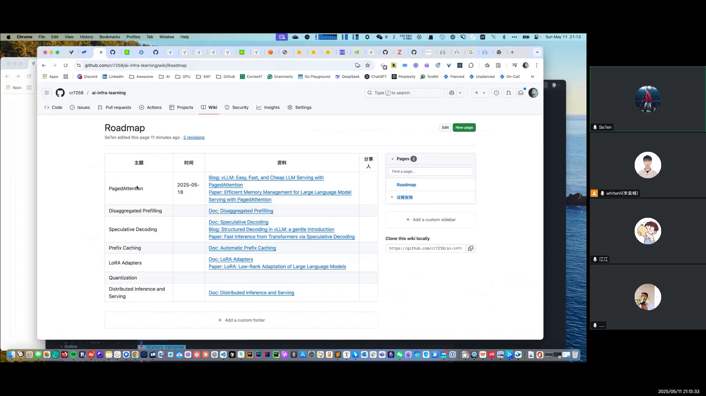 |
| 那比如我就是问他，看下我们可以实际看一下，哪个你觉得哪个好。因为他一开始会让 index 一下，他说他是索引了整个代码库。他还有一篇博客呢，叫说 indexing 的 realtime 是吧，反正就说他怎么牛、为什么比人家牛。 [【跳转到 57:39】](https://www.bilibili.com/video/BV1T2EGzLEHi/?t=3459) | 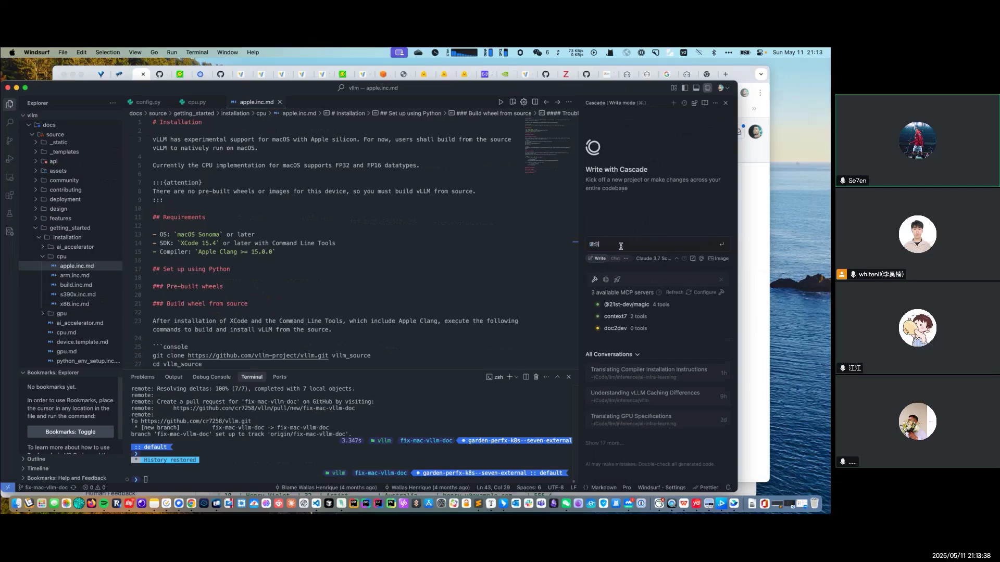 |
| 一个说他自用了自己的模型什么的，然后并且说它模型更新的就是它。 [【跳转到 58:04】](https://www.bilibili.com/video/BV1T2EGzLEHi/?t=3484) | 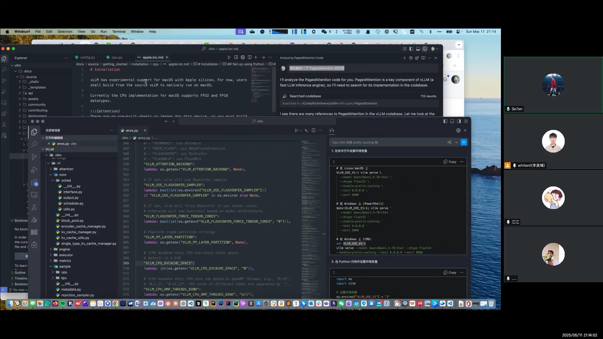 |
| 因为你会改代码或者什么嘛，那模型改代码的话它是实时更新的。嗯，竞争者是 10 分钟以内。他的这个是在什么，他的 Google Cloud 里面去处理的，Custom AI model instead of generic embedding 啥的，反正就是很牛。然后就是他的一个什么架构。 [【跳转到 58:10】](https://www.bilibili.com/video/BV1T2EGzLEHi/?t=3490) | 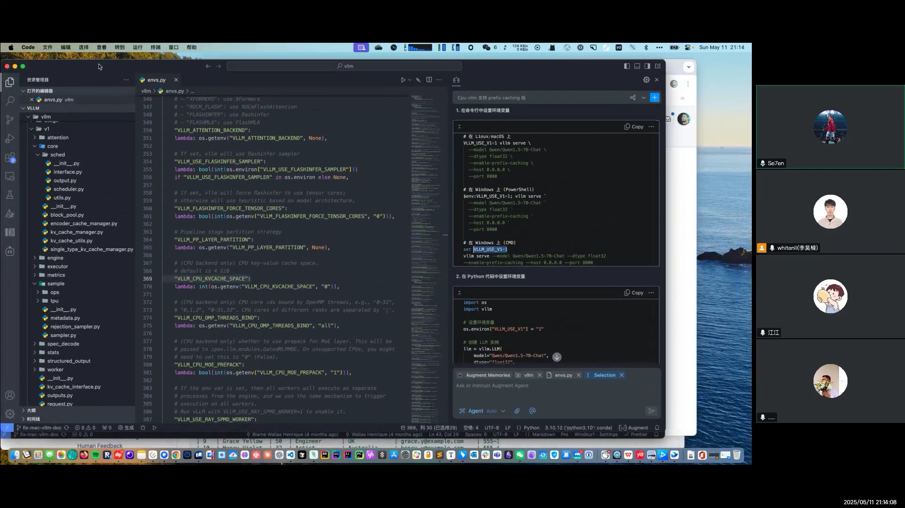 |
| 反正就是他索引、全文理解可能会更快更准。对，然后这是他的一个 [【跳转到 58:31】](https://www.bilibili.com/video/BV1T2EGzLEHi/?t=3511) | 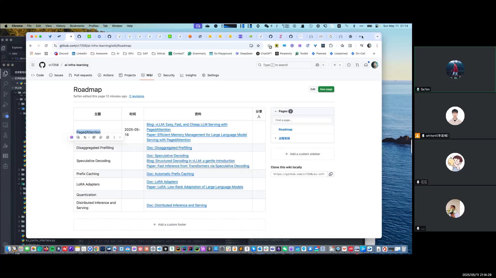 |
| 我可以先看 Windsurf 啊。然后你看他其实有时候你放这边你能点的，对吧。 [【跳转到 58:41】](https://www.bilibili.com/video/BV1T2EGzLEHi/?t=3521) | 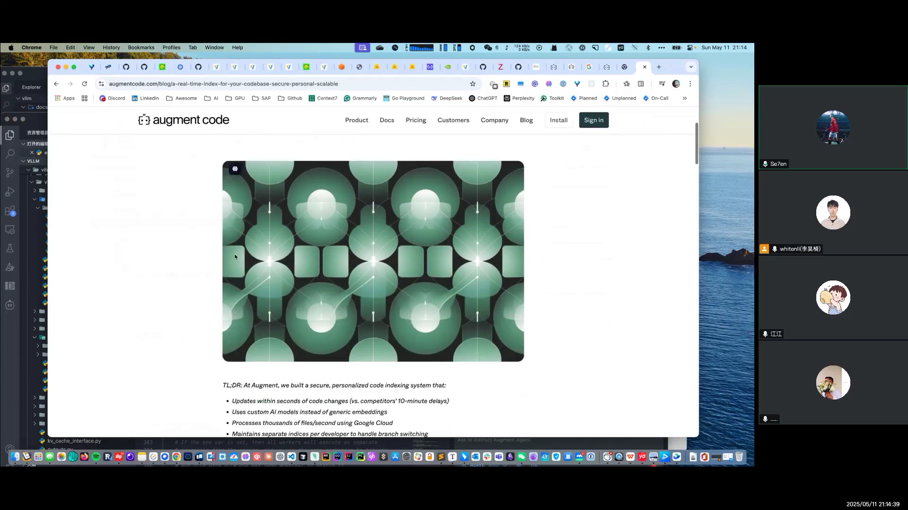 |
| 看到没有，PagedAttention 你能点，是不是很方便。有时候他没有说，你可以告诉他你要——这个类主要分为以下方法，`get_supported_head_sizes`，你点压过来了，`split KV cache` 把 KV 缓存分别成 key 缓存、value 缓存，对吧，这就很靠谱吧。然后关键的方法对吧什么的好。 [【跳转到 58:46】](https://www.bilibili.com/video/BV1T2EGzLEHi/?t=3526) | 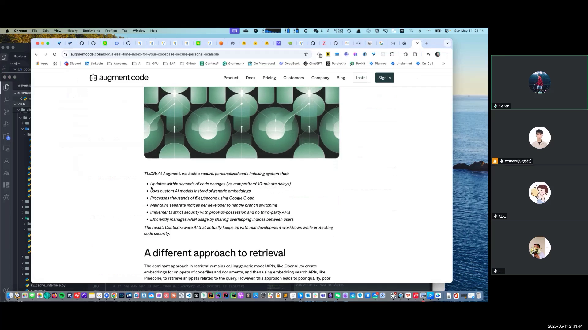 |
| 然后你再看一下这个，对比一下啊。 [【跳转到 59:11】](https://www.bilibili.com/video/BV1T2EGzLEHi/?t=3551) | 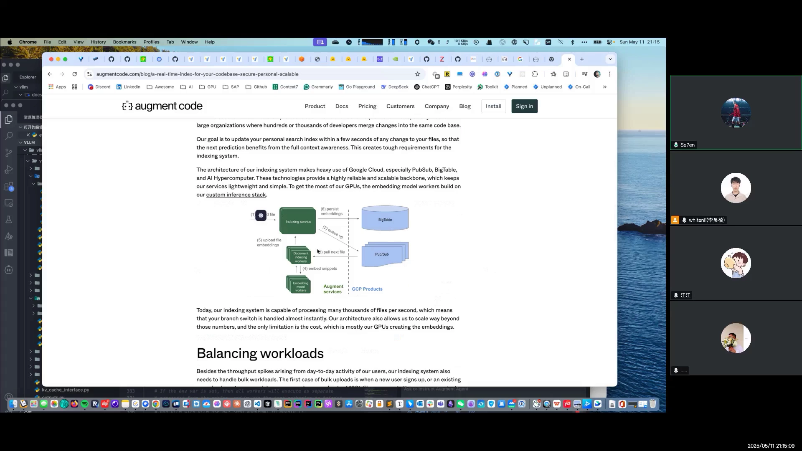 |
| 它也是有的，不是，我看他是 open the code，他会习惯把一部分先给你选出来，然后你应该可以点 go to，他这里不行是吧，有时候可以的，你也是可以跳的。组织在这里，PagedAttention 有两个版本，还有 V2，刚才看它没有提到吗？ [【跳转到 59:18】](https://www.bilibili.com/video/BV1T2EGzLEHi/?t=3558) | 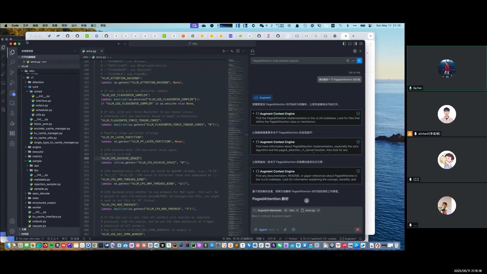 |
| 所以你可以，我觉得可以两个一起交叉看下，因为有的他可能没有提到，对吧。其实你看，他们回答的侧重点可能都不太一样。然后就是这个演示你们可以考虑看一下。 [【跳转到 59:43】](https://www.bilibili.com/video/BV1T2EGzLEHi/?t=3583) | 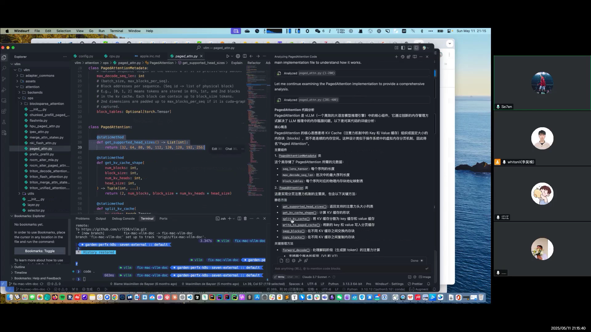 |
| 如果是看源码的话，反正我是这么搞的。嗯，然后这边还有没有什么其他问题？反正我们只要现在先决定，下一节课我们是这么搞的吗？对，然后再在后面的话，因为这些内容，我们可以——如果说你这几天谁看到了，你就可以把资料补充上去嘛，直接更新这个 wiki 就行了。 [【跳转到 60:08】](https://www.bilibili.com/video/BV1T2EGzLEHi/?t=3608) | 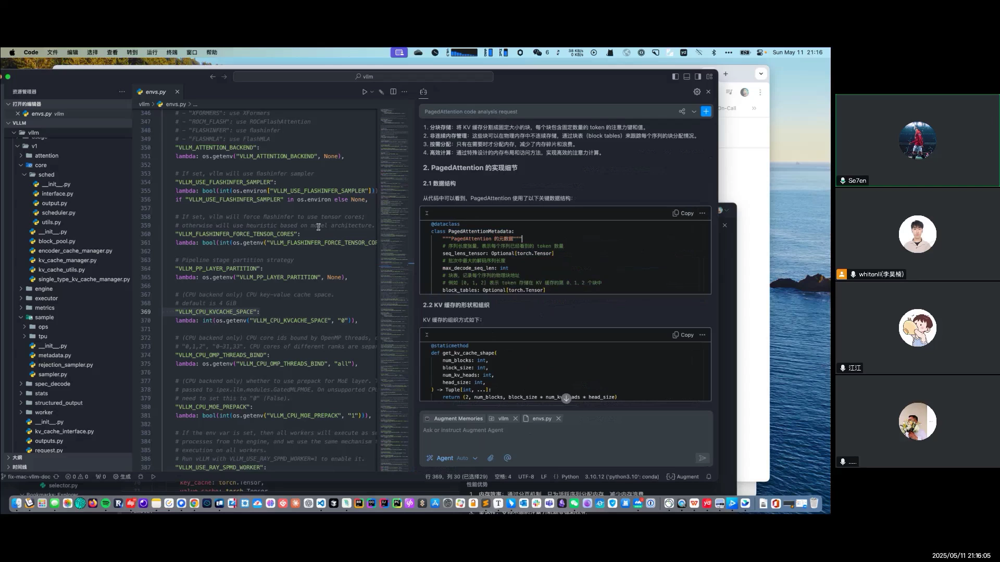 |
| 我回头把这个权限给你们加上去，然后到时候让你们权限去操作。对，好，下节课我们就按这个来先搞一次，看一看情况，可以。因为我们现在反而是按一周的来弄嘛。 [【跳转到 60:33】](https://www.bilibili.com/video/BV1T2EGzLEHi/?t=3633) | 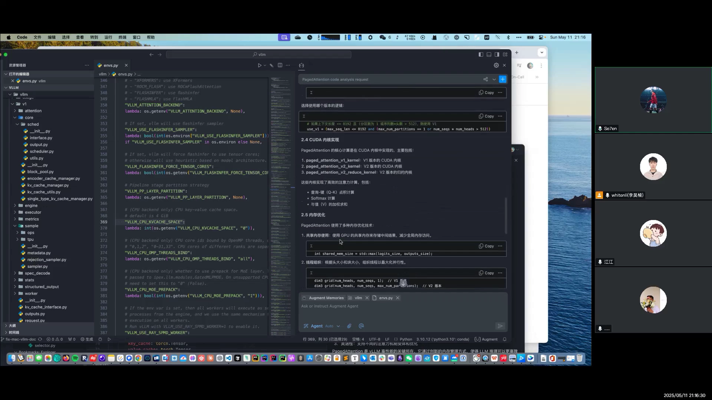 |
| 如果说研究起来发现这个如果太困难， [【跳转到 60:51】](https://www.bilibili.com/video/BV1T2EGzLEHi/?t=3651) | 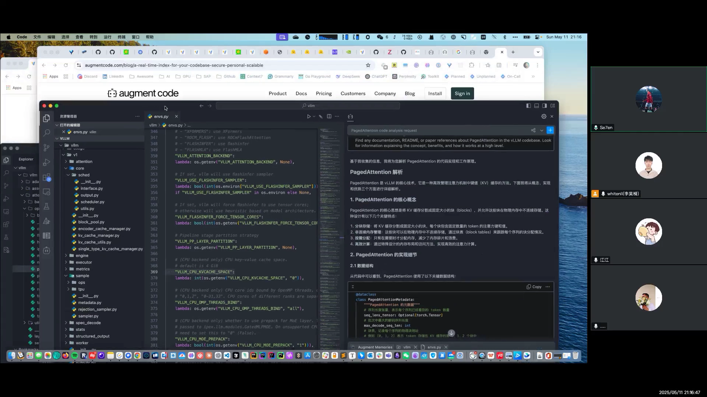 |
| 比如看个论文可能理解都要理解个一周两周，我们可以适当放缓，先看看情况。反正周的话我们先，嗯，比如源代码可能还没有时间了解，可能论文先看了，可以先根据论文——就是我先把我根据论文的理解，以通俗易懂的方式告诉你们，让你们也能理解，对吧。 [【跳转到 60:56】](https://www.bilibili.com/video/BV1T2EGzLEHi/?t=3656) | 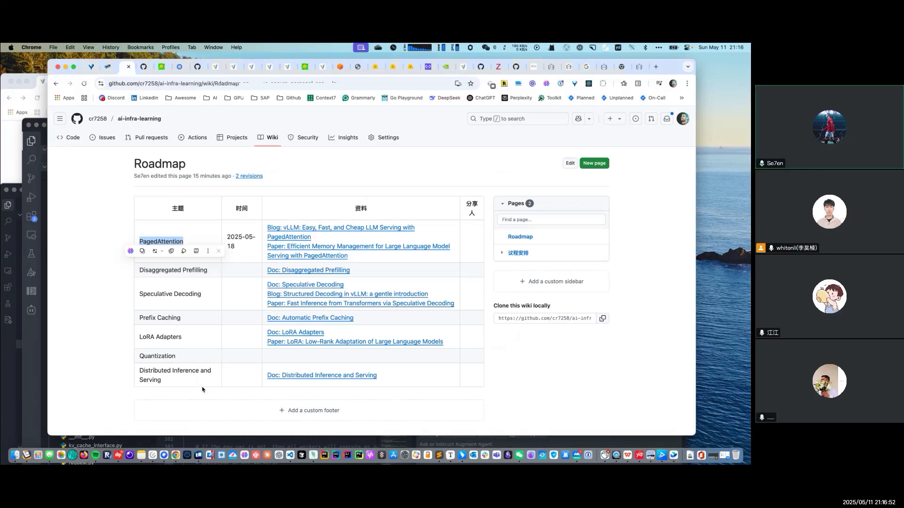 |
| 这种方式。当然可能不只是我准备，如果说不是分享人的，就是建议也是把这个自己看一遍，对，不然的话，你到时候讲的话就可能就会跟不上吧。所以说最好是带着问题来，并且可能我到时候讲的哪些地方漏了，其他人看了这论文有其他的观点， [【跳转到 61:21】](https://www.bilibili.com/video/BV1T2EGzLEHi/?t=3681) | 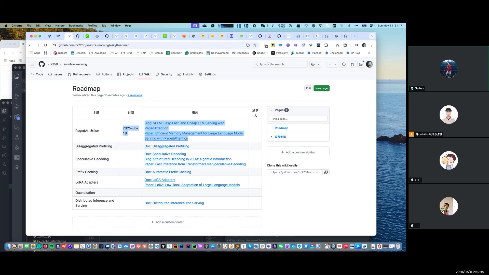 |
| 到时候也是能补充嘛，就是以这种氛围、这种方式去做。对，谢谢，了解。主要是我们平时也有其他工作，所以我们业余时间可能相对来说还是比较有限，但是我们就搞吧，大家都是业余时间搞的。 [【跳转到 61:46】](https://www.bilibili.com/video/BV1T2EGzLEHi/?t=3706) | 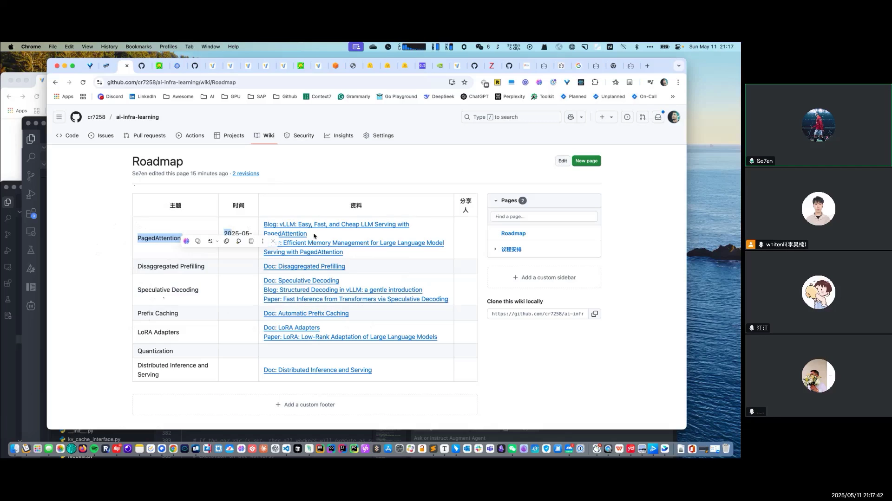 |
| 然后反正一周，你比如每天半个小时、40 分钟、45 分钟搞一点，那一周也是个七八个小时了，你应该足够啃掉一小块知识点，对吧。不管多少嘛，就是有总比没有好，对吧。对，行，可以。我刚刚那个读文献的那个我看了一下， [【跳转到 62:11】](https://www.bilibili.com/video/BV1T2EGzLEHi/?t=3731) |  |
| 他好像可以接 GPT，嗯，可以问问题是吧？对，可以啊，那我们研究一下，我发的话。他还有很多插件，对，到时候我给他弄出来，然后总结一下。反正不一定下次分享，比如组的内容分享完了，就是其他的，比如那个王你发现这个怎么用， [【跳转到 62:36】](https://www.bilibili.com/video/BV1T2EGzLEHi/?t=3756) |  |
| 也可以分享一下，这种其实也都可以，对吧。OK，没问题。嗯，好，行。浩南也是，浩南你们什么问题？我这边目前没啥问题，微信。那我们今天先加，嗯，先这样。好嘞，感谢，辛苦了辛苦了，拜拜拜拜。 [【跳转到 63:01】](https://www.bilibili.com/video/BV1T2EGzLEHi/?t=3781) | 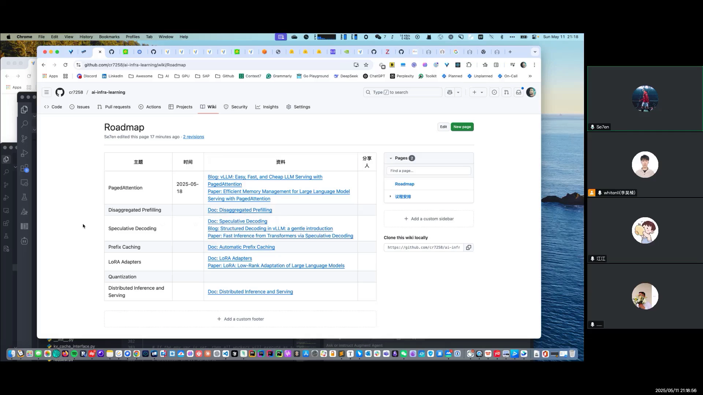 |
| （此区间无字幕） [【跳转到 63:26】](https://www.bilibili.com/video/BV1T2EGzLEHi/?t=3806) | 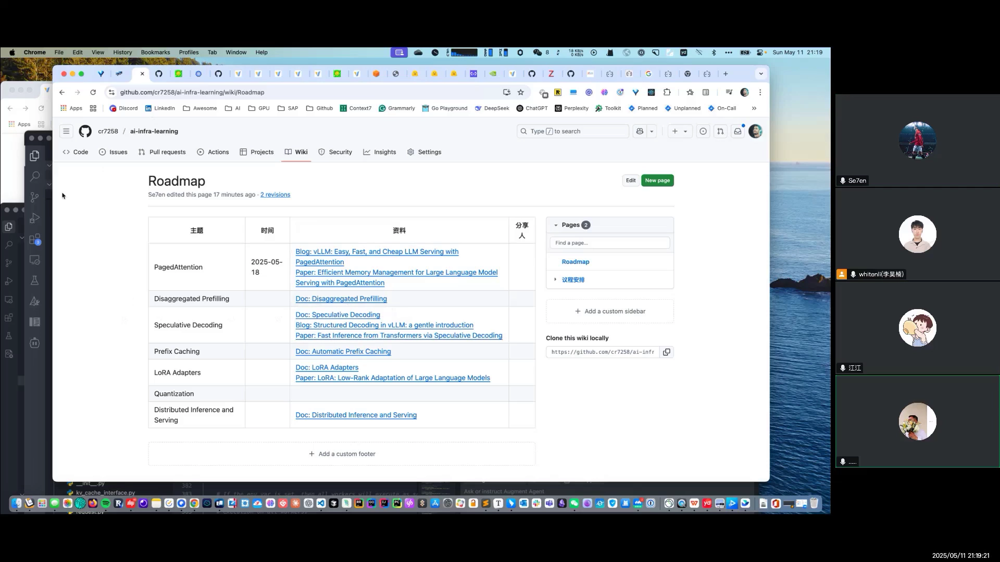 |
| （此区间无字幕） [【跳转到 63:51】](https://www.bilibili.com/video/BV1T2EGzLEHi/?t=3831) |  |