# 第02讲_vLLM_PagedAttention论文精读 原始文稿（图-字幕分栏）

| 字幕文本 | 画面 |
| :--- | ---: |
| 今天我主要是带大家阅读一下 vLLM 的一篇核心论文——PagedAttention（分页注意力）。我这边还有一个文档，因为在阅读过程中可能会遇到一些概念需要解释，我也做了注释，等会儿有需要解释的时候再拉出来讲解。 [【跳转到 00:00】](https://www.bilibili.com/video/BV1GWjjzfE1b/?t=0) |  |
| 我们先从摘要部分开始看。对于大语言模型来说，如果要提供高吞吐量，一个很关键的能力就是能够高效地批量处理许多请求。但当前系统在存储 KV cache 时有个问题： [【跳转到 00:25】](https://www.bilibili.com/video/BV1GWjjzfE1b/?t=25) | 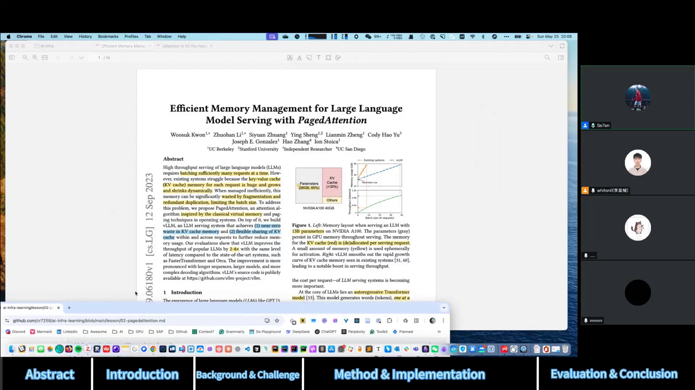 |
| 对于单个请求来说，KV cache 通常比较大，并且会随着请求输出的过程动态变化，这给显存管理带来了挑战。读到这里应该就有几个问题了，比如这里说的 PagedAttention [【跳转到 00:50】](https://www.bilibili.com/video/BV1GWjjzfE1b/?t=50) |  |
| 这个机制主要是为了高效管理 KV cache 的显存。这里有几个问题：什么是 KV cache？K 和 V 又是什么？我先给大家简单介绍一下。这里有一个词是 QKV，QKV 的概念主要来自 Transformer 模型。 [【跳转到 01:15】](https://www.bilibili.com/video/BV1GWjjzfE1b/?t=75) | 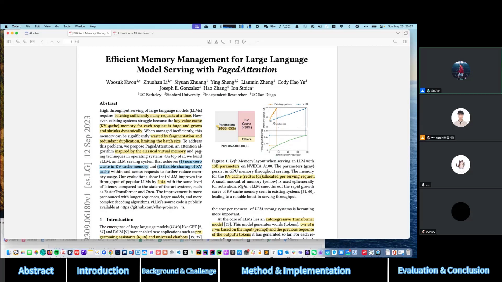 |
| 有一篇相关论文是谷歌在 2017 年发表的《Attention Is All You Need》，论文里有一张 Transformer 架构图，可以看到在下面这里有一个 QKV 的输入。我来解释一下什么是 QKV。在 Transformer 模型中， [【跳转到 01:40】](https://www.bilibili.com/video/BV1GWjjzfE1b/?t=100) | 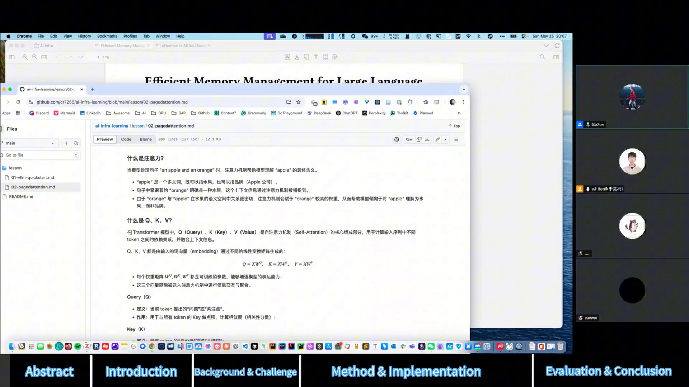 |
| QKV 是自注意力机制（self-attention）的核心组成部分，用于计算输入序列中不同 token 之间的依赖关系，并融合上下文信息。这里又需要解释什么是注意力机制，我用一个通俗易懂的例子来说明：当大模型处理句子 "an apple and an orange" 的时候， [【跳转到 02:05】](https://www.bilibili.com/video/BV1GWjjzfE1b/?t=125) | 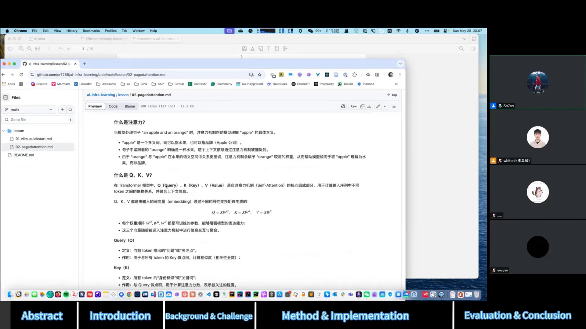 |
| 比如要理解 apple 的含义。apple 是一个多义词，既可以指水果，也可以指品牌苹果公司。想要理解这里的 apple 具体是哪个意思，就要联系上下文。注意力机制就是帮助模型理解句子中的上下文。比如句子里同时出现了 apple 和 orange， [【跳转到 02:30】](https://www.bilibili.com/video/BV1GWjjzfE1b/?t=150) |  |
| 通过自注意力机制的分析就可以知道，apple 在这个句子里应该是苹果的意思，因为注意力机制会给 orange 赋予更高的权重，从而帮助模型把 apple 理解为水果而不是品牌。这就是对注意力的一个解释。 [【跳转到 02:55】](https://www.bilibili.com/video/BV1GWjjzfE1b/?t=175) | 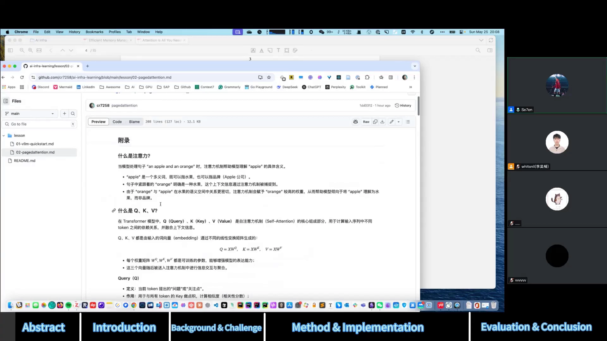 |
| 接下来，QKV 其实由输入的词向量产生。这里输入是相同的 X，把这个相同的输入词向量 X 通过不同的线性变换矩阵，产生三个结果，分别是 WQ、WK、WV 这三个可训练的权重矩阵，它们是在训练时训练出来的。 [【跳转到 03:20】](https://www.bilibili.com/video/BV1GWjjzfE1b/?t=200) |  |
| 推理的时候这三个权重矩阵就不再变化，用来做推理。当输入词向量与这三个权重矩阵做矩阵乘法以后，就会分别得到 Q、K、V 三个向量。如果用比较通俗易懂的方式来理解，Q 的含义 [【跳转到 03:45】](https://www.bilibili.com/video/BV1GWjjzfE1b/?t=225) | 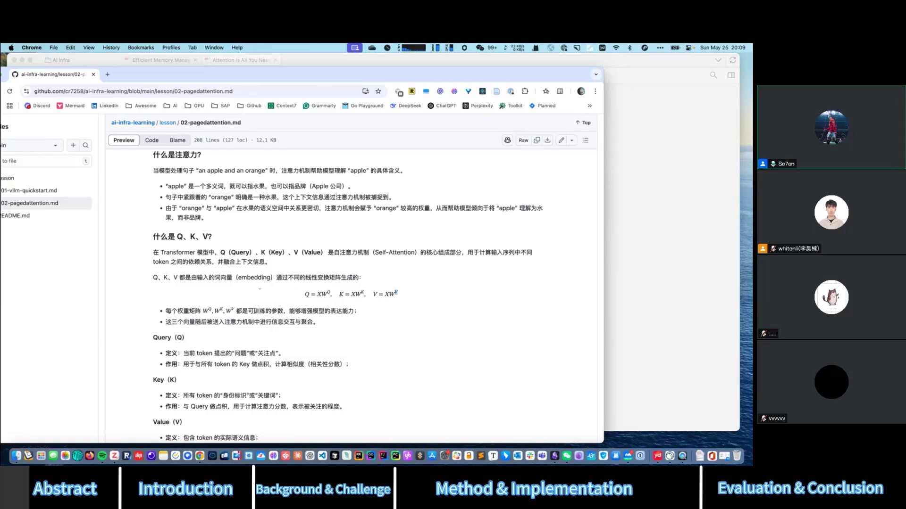 |
| 就是当前这个 token 关注的地方，或者说它提出的一个问题。我们会用当前 token 的 Q 和所有 token 的 K 做点积来计算相似度。K 就是被查询的东西，和 Q 做点积来计算，表示被关注的程度。token 可以认为是有身份标识或关键词，value 则包含 token 实际的语义信息。 [【跳转到 04:10】](https://www.bilibili.com/video/BV1GWjjzfE1b/?t=250) | 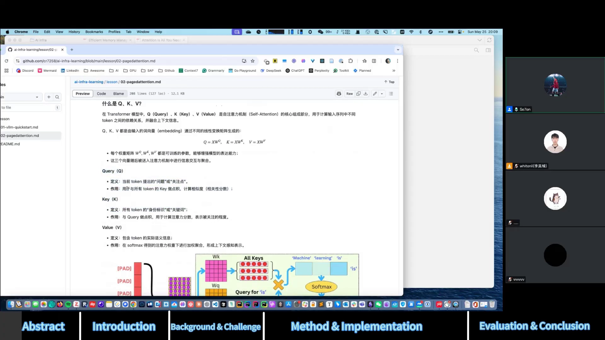 |
| 我再用个例子说明：QKV 就好比在搜索框里搜东西。Q 是我查询的关键字，K 可以理解为与关键字匹配的内容，不管是关键词匹配还是相似度匹配，我都可以用 Q 去匹配 K；V 就是我查出来的东西 [【跳转到 04:35】](https://www.bilibili.com/video/BV1GWjjzfE1b/?t=275) | 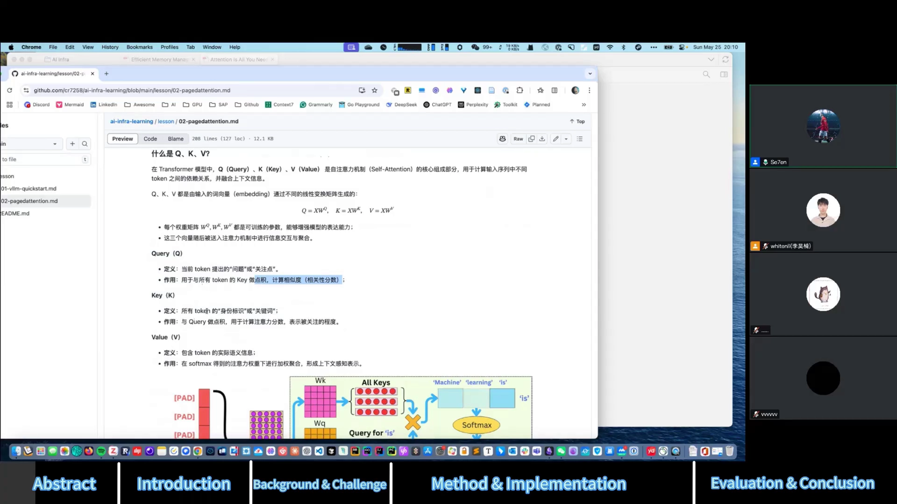 |
| 的具体内容。你可以先用 QKV 来理解。这里有一张相对深入一些的图。刚才说的是：输入同一个 word embedding，分别乘以三个权重矩阵 WQ、WK、WV，就得到了 Q、K、V。 [【跳转到 05:00】](https://www.bilibili.com/video/BV1GWjjzfE1b/?t=300) | 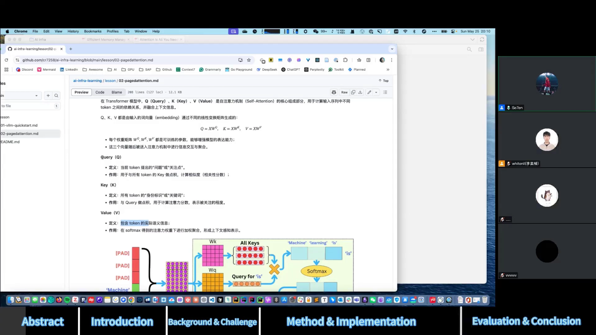 |
| 然后会经过一个 softmax（图里写作 SUPERMAX），先计算每个位置的 attention score，再经过 softmax 计算出每个词对应的概率，最后输出结果再乘以一个 V，得到一个结果。 [【跳转到 05:25】](https://www.bilibili.com/video/BV1GWjjzfE1b/?t=325) |  |
| 这个结果，也就是 attention 的输出，会传给一个 linear 层，映射成词表大小的 logits（图里写作 LOGI），再经过一个 softmax。注意这里 attention 内部有一个 softmax，图上 attention 的计算里有一个 softmax，而这里说的又是另一个 softmax。 [【跳转到 05:50】](https://www.bilibili.com/video/BV1GWjjzfE1b/?t=350) | 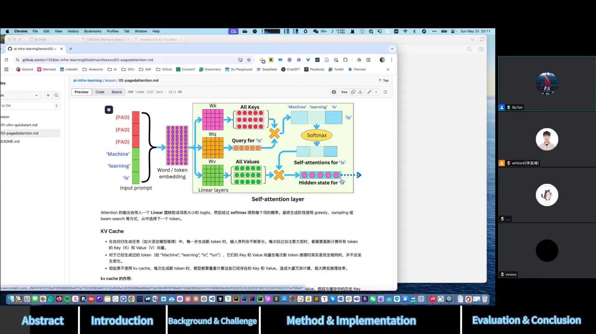 |
| 它会计算得到每个词具体的概率。最终生成阶段比如可以用贪婪（greedy）模式去预测下一个词。因为输出这边，比如 machine learning，最后会根据这些词的概率，在它的词表里——词表可能很大、有几万个词——每个词都会有一个概率。 [【跳转到 06:12】](https://www.bilibili.com/video/BV1GWjjzfE1b/?t=372) | 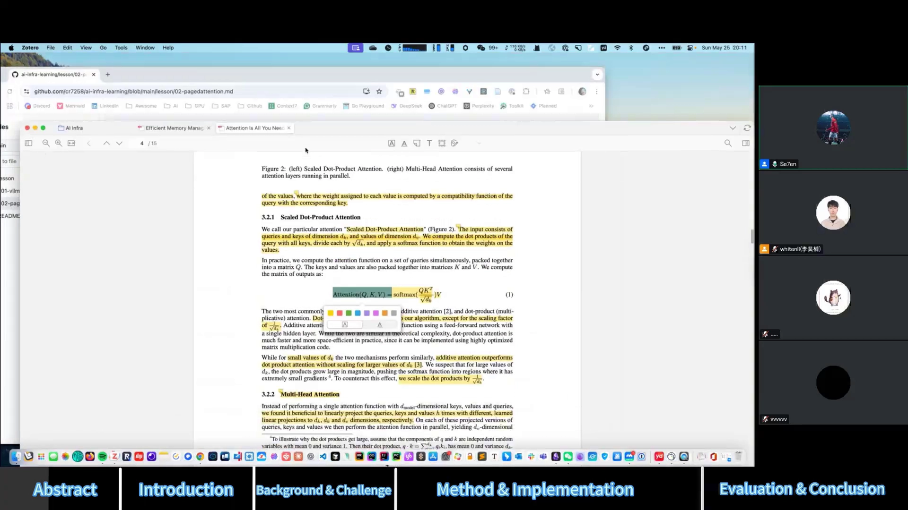 |
| 如果是 greedy，就直接拿概率最高的这个词；如果是 sampling，它可能会去选择多个概率较高的词。这里我能补充一下吗？可以。比如我最近用的 attention 用到图神经网络里，在图神经网络里面的话…… [【跳转到 06:37】](https://www.bilibili.com/video/BV1GWjjzfE1b/?t=397) | 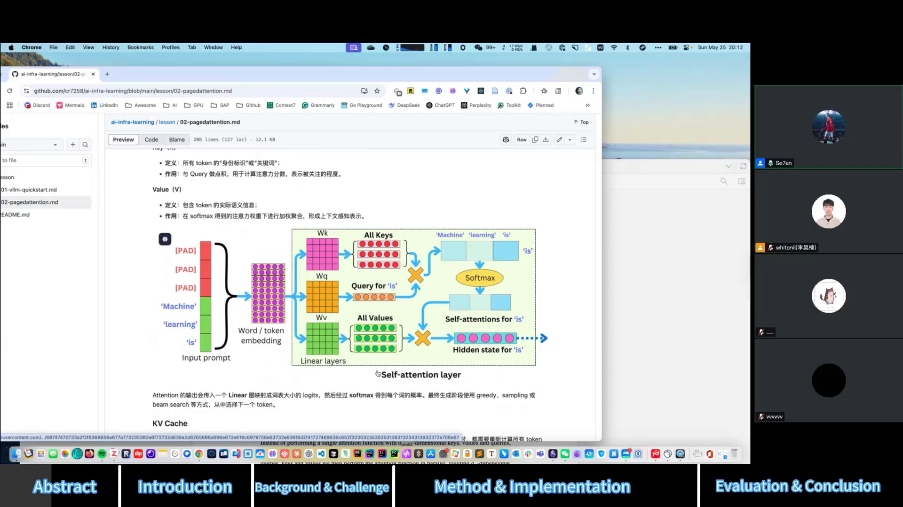 |
| 就相当于我、你还有浩南三个人之间的关系，可以用注意力机制来标注。比如我和浩南关系更好，权重就更高一些；我和你的关系弱一些，给你的权重就小一些，这可能是注意力机制的一个简单描述。对，是这样。然后接下来该介绍什么是 KV cache 了。 [【跳转到 07:02】](https://www.bilibili.com/video/BV1GWjjzfE1b/?t=422) | 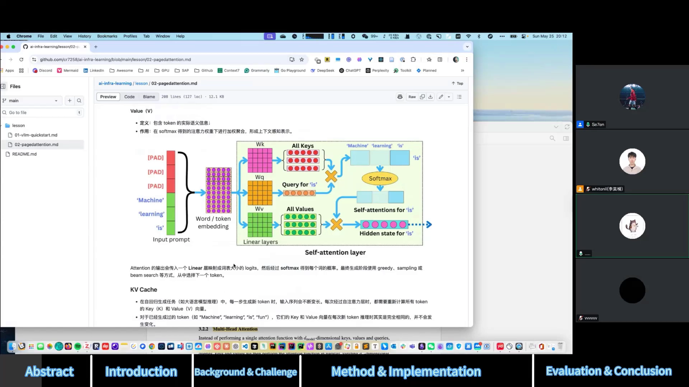 |
| 接下来介绍一下什么是 KV cache。回到我最开始的问题：在每一步计算的时候可以看到，Q 我是用当前这个词的 Q，比如这里到了 machine learning is，那我就只用 is 的 Q。 [【跳转到 07:27】](https://www.bilibili.com/video/BV1GWjjzfE1b/?t=447) | 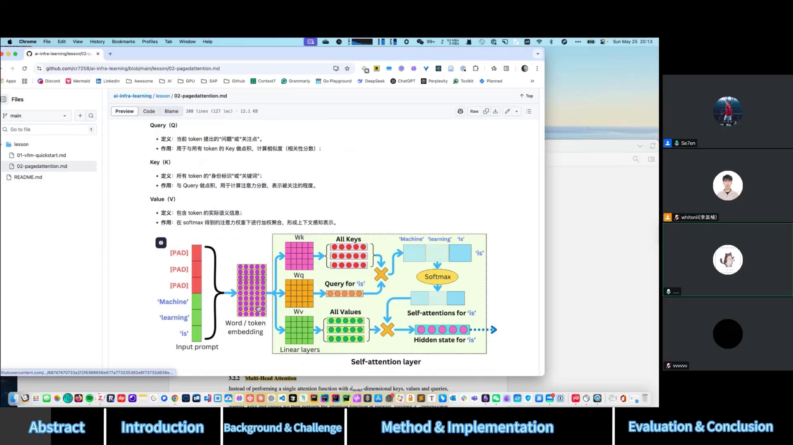 |
| 但我去计算的时候，要算所有的 K，包括它自己和它之前那些输出的 machine learning is 的 K，去做一个相似度计算。可以看到它跟自己肯定相似度更高，跟 mach 会高一点，跟 learning 可能会弱一点，最终得到一个 softmax 概率，这些概率加起来等于 1。 [【跳转到 07:52】](https://www.bilibili.com/video/BV1GWjjzfE1b/?t=472) |  |
| 刚才说 softmax 的结果需要再乘以一个 V 向量。V 同样也是前面包括自己和之前所有 word/token 的 embedding 结果一起去计算的。也就是说，只有 Q 是当前的，而 K 和 V 都包括当前和之前的。 [【跳转到 08:17】](https://www.bilibili.com/video/BV1GWjjzfE1b/?t=497) |  |
| 但是你会发现，图里这部分之前算过的其实都是一样的，直接拿过来就能用，当前的也是一样。这就是为什么要有 K 和 V 的缓存（cache），而 Q 不需要缓存——所以一开始说只有 KV cache，没有 QKV cache 的原因。 [【跳转到 08:42】](https://www.bilibili.com/video/BV1GWjjzfE1b/?t=522) | 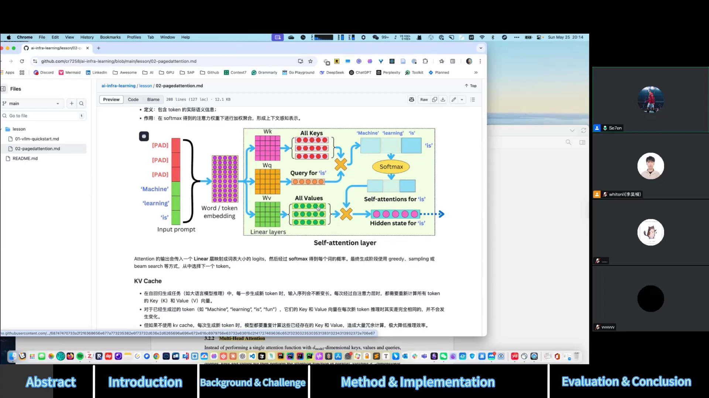 |
| 这里有一个具体解释：KV cache 会把已经生成过的 token 的 K 和 V 向量缓存起来，后续推理时就只需要计算新 token 的 K 和 V，然后和缓存里的历史拼接起来。所以每一步只需要计算新的 K 和 V，这样大幅减少了重复计算， [【跳转到 09:07】](https://www.bilibili.com/video/BV1GWjjzfE1b/?t=547) | 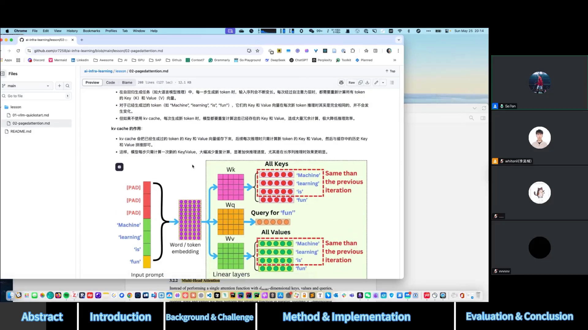 |
| 显著加快推理速度。但这也带来一个问题：总要有地方存 KV cache，最终存储的地方就是 GPU 显存。好，我们回到论文。这里说到…… [【跳转到 09:32】](https://www.bilibili.com/video/BV1GWjjzfE1b/?t=572) |  |
| 存储 KV cache 时，因为现有这些——在论文发表之前的推理引擎或系统——对 KV cache 的管理做得并不是特别好。主要挑战就是刚才说的，它的输出长度比较动态；浪费的地方就是一些内存碎片， [【跳转到 09:54】](https://www.bilibili.com/video/BV1GWjjzfE1b/?t=594) |  |
| 或者可能存储了一些重复的元素。后面会提到，像 parallel sampling 或 beam search 这几种稍微复杂的推理/decoding 场景，有些地方其实是可以复用的。这个场景比如给你一个 prompt， [【跳转到 10:19】](https://www.bilibili.com/video/BV1GWjjzfE1b/?t=619) |  |
| 生成的结果可能会有多个。比如你平时用 ChatGPT 的时候，问一个问题，它有时会给你两个答案让你选左边或右边，这种情况下它的 prompt 的 KV cache 其实是可以 sharing（共享）的，通过这种方式能节省内存。 [【跳转到 10:44】](https://www.bilibili.com/video/BV1GWjjzfE1b/?t=644) | 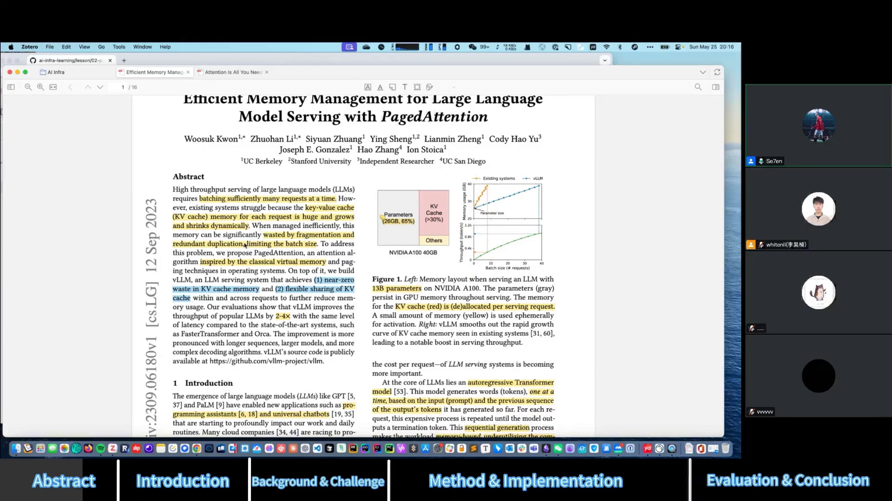 |
| 但原有这些 vLLM 之前的系统其实是做不到的，后面会继续讲实现的概念。这里继续提到，PagedAttention 这个算法其实是从传统的 virtual memory（虚拟内存）和分页（paging）这两个机制得到灵感的。 [【跳转到 11:09】](https://www.bilibili.com/video/BV1GWjjzfE1b/?t=669) |  |
| 这里再回过头稍微讲一下虚拟内存分页。在传统的计算机系统里，CPU 其实是直接操作物理内存的。在程序看来，它以为自己在操作物理内存。但如果我们没有虚拟内存这种机制的话， [【跳转到 11:34】](https://www.bilibili.com/video/BV1GWjjzfE1b/?t=694) | 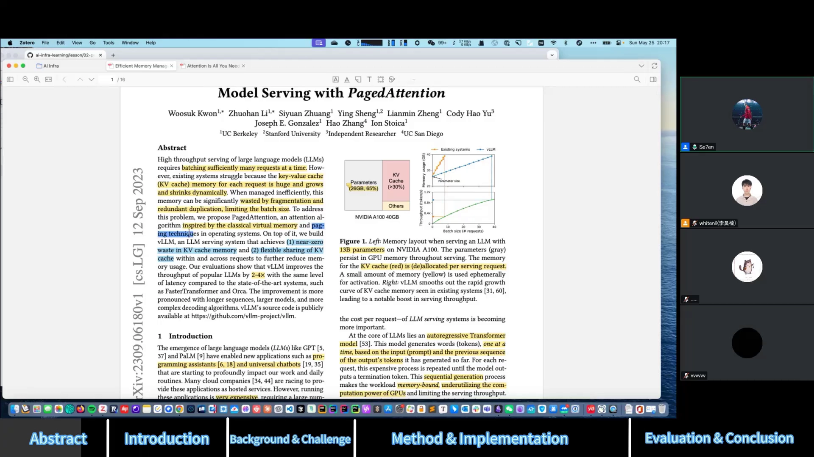 |
| 两个程序占用的内存可能会有重叠、互相干扰。比如 A 程序写了某块内存，B 程序把它改了，程序就会崩溃。为了避免这种情况，操作系统引入了虚拟内存机制，每个进程独立分配到虚拟空间，互不干涉。而分页机制就是实现虚拟内存的一项技术。 [【跳转到 11:59】](https://www.bilibili.com/video/BV1GWjjzfE1b/?t=719) |  |
| 对于虚拟内存，可以认为它被分配成虚拟的页，物理内存则称为页框。中间通过一个叫页表的数据结构，去做虚拟内存和物理内存之间的映射关系。比如我要访问某一块，最终会通过页表找到对应的 [【跳转到 12:24】](https://www.bilibili.com/video/BV1GWjjzfE1b/?t=744) | 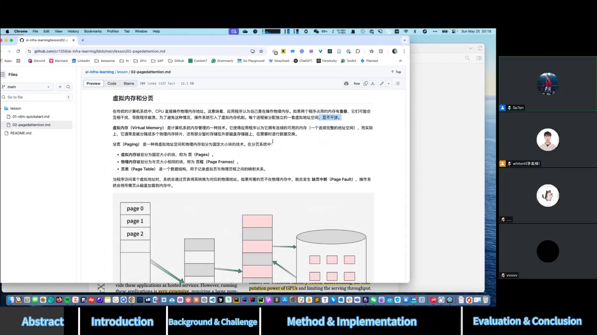 |
| 物理内存地址。这边也说了，当程序访问某个内存地址时，先通过页表转换成对应的物理地址；如果所需的页不在物理内存中，就会发生 page fault（缺页中断），然后操作系统把所需的页从磁盘加载到内存中。所以说这次分享的 PagedAttention [【跳转到 12:49】](https://www.bilibili.com/video/BV1GWjjzfE1b/?t=769) | 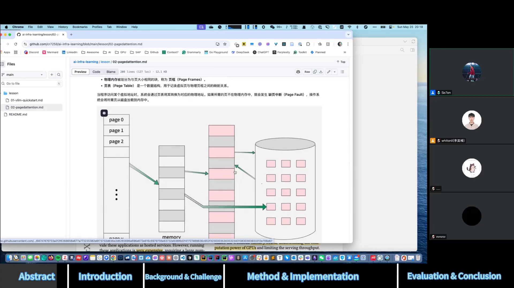 |
| 它的设计理念跟这个很接近，只不过它是用来维护 GPU 显存里 KV cache 的使用。后面会再详细说。这边是摘要，还提到它能实现两个目标：一个是几乎零损耗的 KV cache 内存 [【跳转到 13:14】](https://www.bilibili.com/video/BV1GWjjzfE1b/?t=794) | 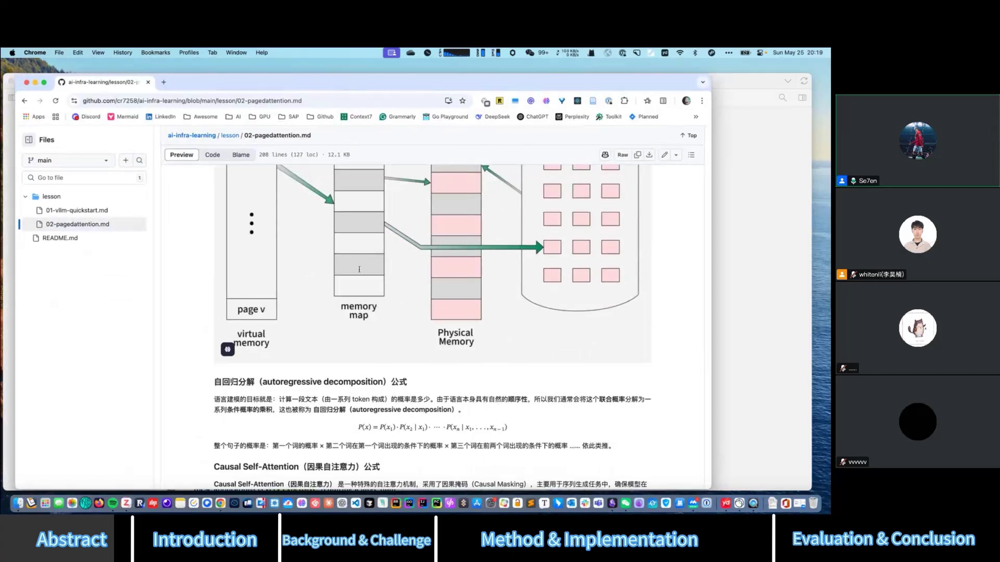 |
| 浪费；另一个是可以灵活使用 sharing 机制来进一步减少 KV cache 的使用。这里说到大概有 2~4 倍的性能提升，相比当前那些其他 LLM 推理系统。这里说到一个例子，比如 FasterTransformer， [【跳转到 13:39】](https://www.bilibili.com/video/BV1GWjjzfE1b/?t=819) |  |
| 这是英伟达之前开源的一个 LLM 推理引擎，但后面应该是不再维护了，转向了叫 TensorRT-LLM 的项目组。同时 vLLM 也有一个项目， [【跳转到 14:04】](https://www.bilibili.com/video/BV1GWjjzfE1b/?t=844) | 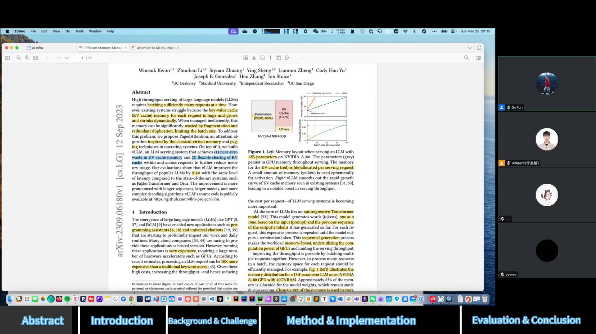 |
| 地址就是这个 GitHub 地址。这就是摘要部分，接着我们再看具体的介绍。我能补充一下吗？可以，就是在 abstract 上面那部分，你可以把摘要分为三块：一个是背景，一个是提出的方法，然后第三个是结果，这样你会看得更清楚一些。 [【跳转到 14:29】](https://www.bilibili.com/video/BV1GWjjzfE1b/?t=869) | 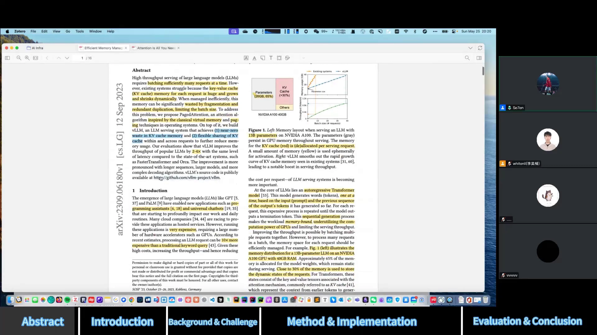 |
| 对，它是 introduction（引言）的一个简写版。所以看一篇文章时，重不重要要看 abstract。好，我们继续。这边是 introduction。这里介绍，自从大语言模型发展起来，比如 GPT 火起来以后， [【跳转到 14:54】](https://www.bilibili.com/video/BV1GWjjzfE1b/?t=894) | 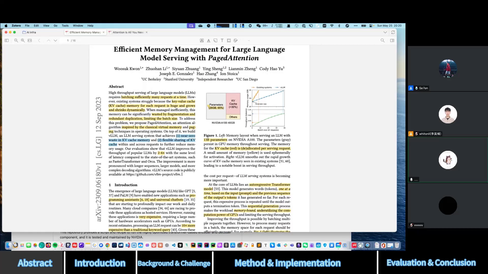 |
| 有很多新类型的应用，比如编程助手，或者像 chatbot 这类。但这些应用比较昂贵，因为它们需要通过 GPU 实现硬件加速。这里说到大概是十倍的费用，比如跟传统的关键词 [【跳转到 15:19】](https://www.bilibili.com/video/BV1GWjjzfE1b/?t=919) |  |
| 搜索相比。这种应用我去问一个问题它要推理，可能大概是一次十倍的成本。然后这里又说到，LLM 的本质其实是自回归的 Transformer 模型。什么是自回归的 Transformer 模型呢？就是我每次预测 token，都是基于之前已经生成的 token 来预测下一个 token。 [【跳转到 15:44】](https://www.bilibili.com/video/BV1GWjjzfE1b/?t=944) |  |
| 因为这种机制属于顺序的、逐个生成的，所以它属于 memory-bound（显存受限）。刚才说到它要把之前的 K、V 存在 cache 中，会需要大量使用 KV cache。同时，与 memory-bound 相对的还有一个叫 compute-bound。 [【跳转到 16:09】](https://www.bilibili.com/video/BV1GWjjzfE1b/?t=969) | 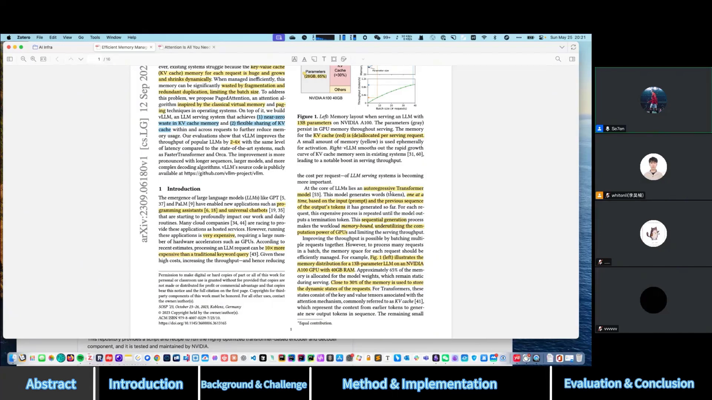 |
| 也就是说它其实分为 prefill 和 decode 阶段，后面也会说。prefill 阶段我接收所有的 prompt，一次性计算——用户问一个问题，我一次计算——那个时候是 compute-bound。但在生成/decode 阶段，它是一个字一个字往外吐的，要根据之前算好的结果去推理、预测下一个。 [【跳转到 16:34】](https://www.bilibili.com/video/BV1GWjjzfE1b/?t=994) |  |
| 这个时候才需要大量占用显存，所以叫 memory-bound。而且 memory-bound 这个阶段其实不能很充分地利用 GPU 的计算能力。好，这里说到图一，图一表示了一个……诶后面有人进来了，那个把你静音一下。 [【跳转到 16:59】](https://www.bilibili.com/video/BV1GWjjzfE1b/?t=1019) | 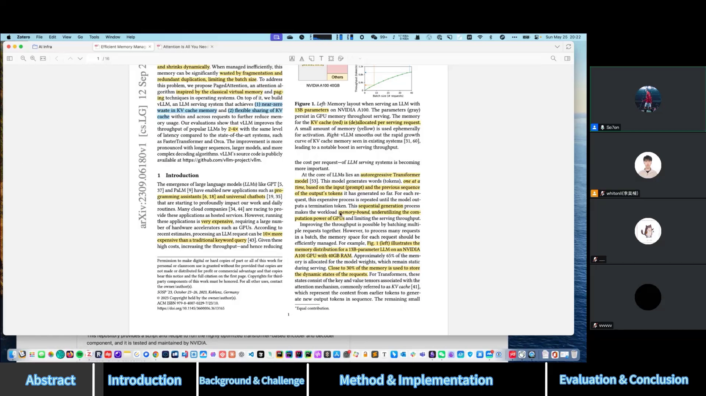 |
| OK，那我们继续。图一介绍的是，比如它使用了一个 13B 的模型，在英伟达 A100 上的显存分配情况。可以看到它的参数、也就是权重部分大概占用了 26GB。这里有一个比较简单的换算方式： [【跳转到 17:24】](https://www.bilibili.com/video/BV1GWjjzfE1b/?t=1044) | 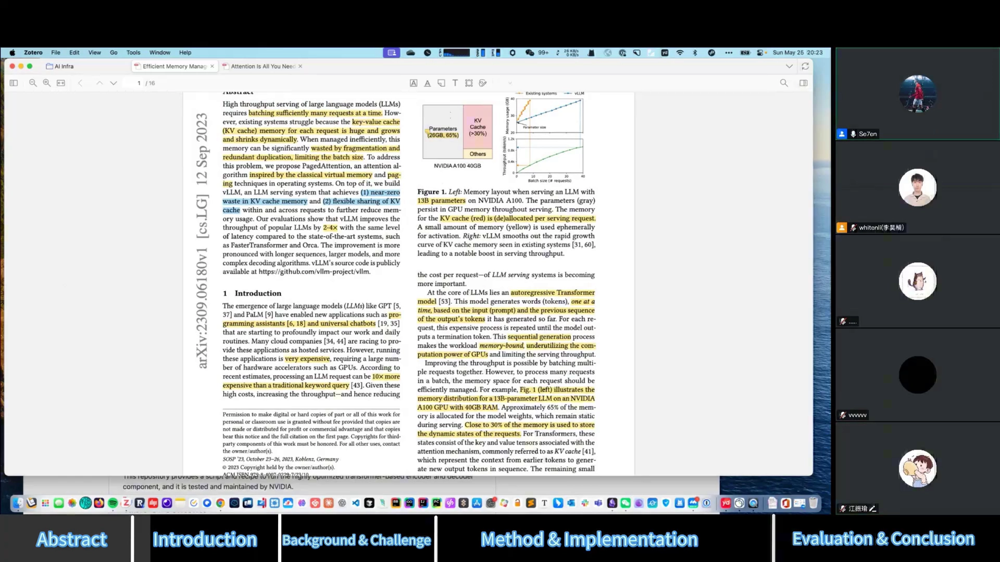 |
| 比如你是 13B，我直接乘个 2。假设使用 FP16 半精度，然后我乘以 2，就可以大概推测出这个 13B 的模型占用了 26GB 的内存，在参数这部分。为什么可以这么算？因为 13B 的位数 [【跳转到 17:49】](https://www.bilibili.com/video/BV1GWjjzfE1b/?t=1069) | 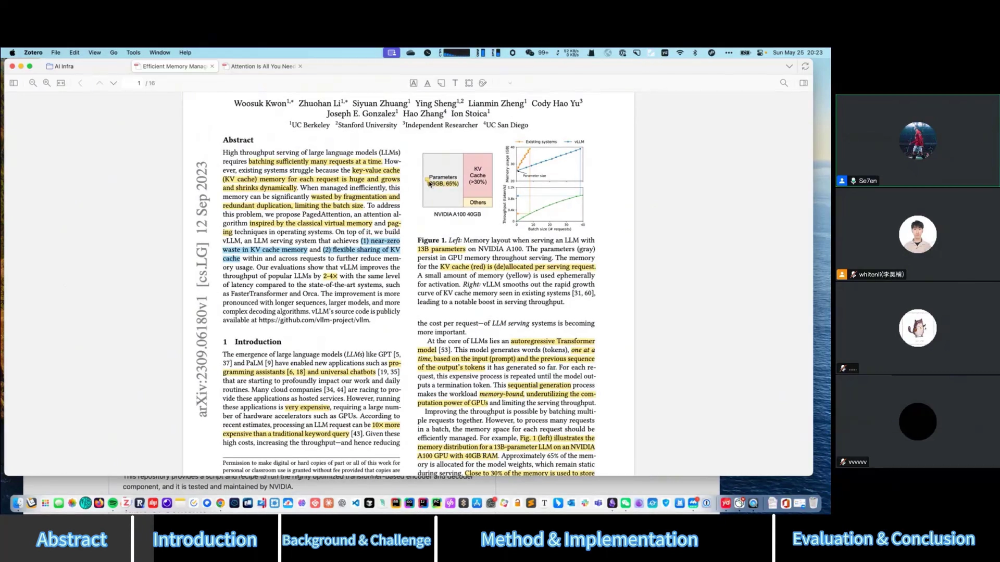 |
| ——也就是数据量的位数——数量级跟 GB 单位的数量级是一样的，所以可以这么算。比如 1024，这边是比特，乘以 1024 就是 1KB，再乘 1024 就是 1MB，再乘 1024 就是 1GB。你看这边这是 1 吗？这边是 10 亿， [【跳转到 18:14】](https://www.bilibili.com/video/BV1GWjjzfE1b/?t=1094) |  |
| 正好也是 10 亿的数量级。如果每个参数占用 2 字节（FP16），乘 2 就是 26GB。这张图的另一部分是 KV cache，它大概占了 30%。通常来说权重参数这边也有优化，比如量化之类的，这里先不提，但相对来说优化空间可能稍微小一点。 [【跳转到 18:39】](https://www.bilibili.com/video/BV1GWjjzfE1b/?t=1119) |  |
| 而我们这篇文章主要专注于 KV cache 这个部分，它的优化空间还是比较大的。这里也说 30% 的 memory 用于存储这些动态状态、或请求所需要用到的内存。 [【跳转到 19:04】](https://www.bilibili.com/video/BV1GWjjzfE1b/?t=1144) | 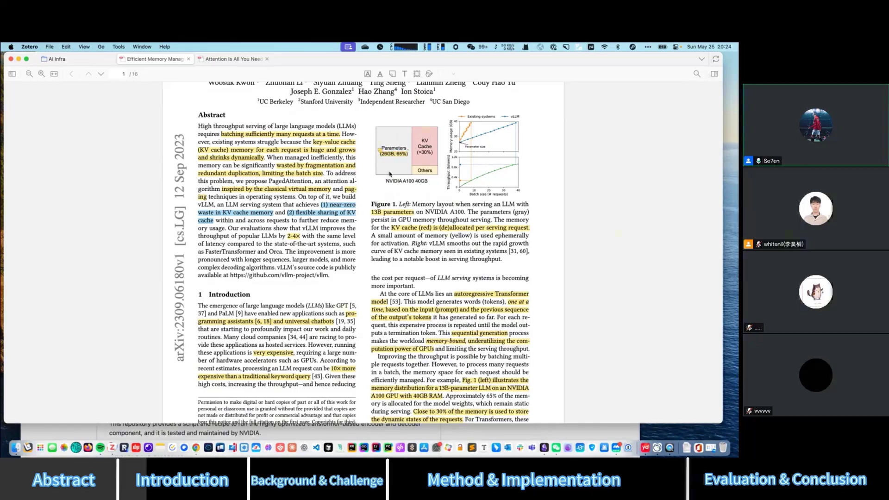 |
| 接下来继续说。在这篇论文中他们观察到，现有这些 LLM 系统之所以不能很有效地管理 KV cache 的 memory，主要有两个原因。第一个原因，请求需要存放在 [【跳转到 19:29】](https://www.bilibili.com/video/BV1GWjjzfE1b/?t=1169) | 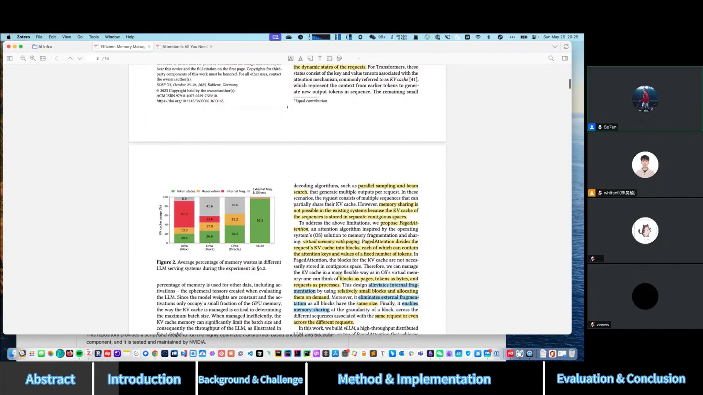 |
| 连续的内存中。因为大多数深度学习框架，比如 PyTorch 或 TensorFlow，要求张量必须是内存连续的。但这里又说了，KV cache 和传统深度学习中的张量有些区别：它会在模型生成新 token 的过程中动态增长或缩减， [【跳转到 19:54】](https://www.bilibili.com/video/BV1GWjjzfE1b/?t=1194) | 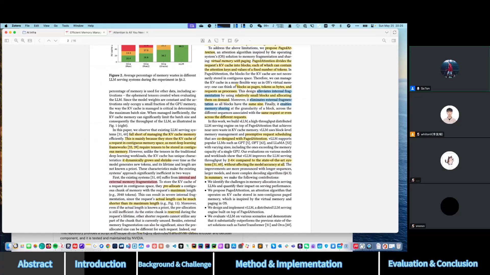 |
| 而且它的生命周期和最终长度在一开始是无法预知的。这就导致现有的这些系统并不能很好地管理 KV cache。这里也说了，现有内存有两个问题：一个是浪费，另一个是 internal 和 external 的 memory fragmentation（内部和外部内存碎片）。 [【跳转到 20:19】](https://www.bilibili.com/video/BV1GWjjzfE1b/?t=1219) | 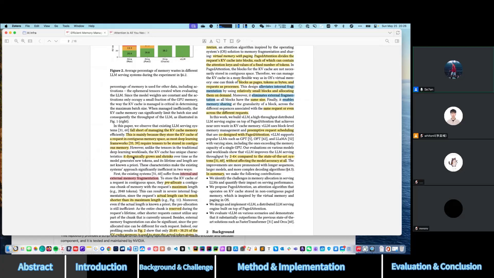 |
| 那为什么会导致这种问题呢？比如在使用 KV cache 时，现有这些系统通常预分配 memory chunk，基于请求最大的长度，比如 2048 个 token 去预分配。但请求的 [【跳转到 20:44】](https://www.bilibili.com/video/BV1GWjjzfE1b/?t=1244) | 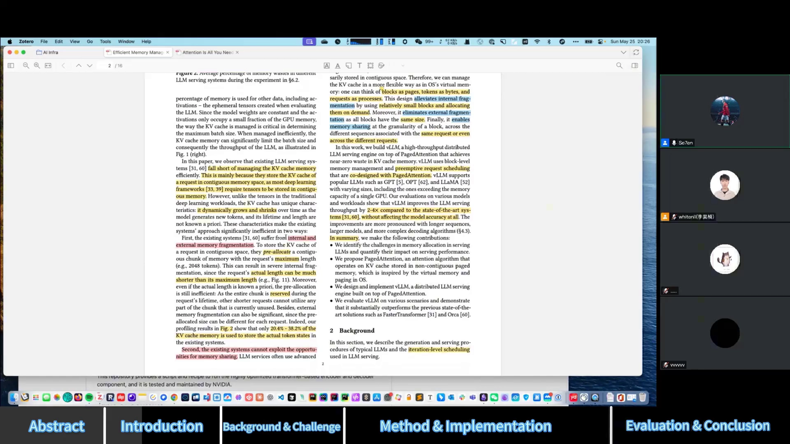 |
| 通常实际的长度会比最大长度小得多，这种情况下我预分配的内存就被浪费了。第二种情况是 reserve（预留）。比如这个 token……这里应该有个图可以比较好地说明。 [【跳转到 21:09】](https://www.bilibili.com/video/BV1GWjjzfE1b/?t=1269) | 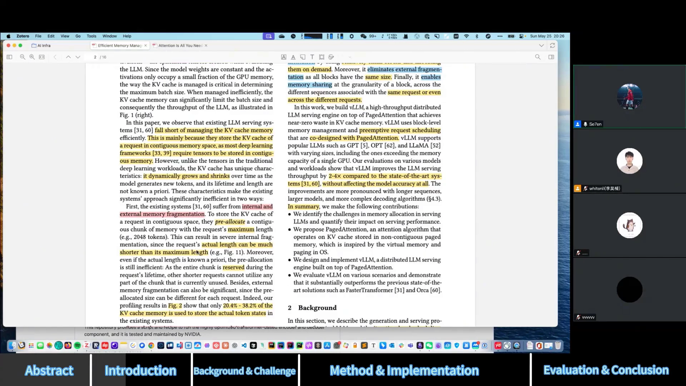 |
| 下面其实有一张图，我先说一下。比如这个请求，刚刚说的 internal fragmentation（内部碎片），就是我一次性预留了 2048，但这个请求实际上 prompt 是 7 个 token，最终生成 2 个。那这 2038 个是…… [【跳转到 21:34】](https://www.bilibili.com/video/BV1GWjjzfE1b/?t=1294) |  |
| 这两个，一共 10 个，加上 EOS 是 10 个。2048 里最终只用了 10 个，那 2038 个是预留、从来没用的，就浪费了，这部分称为 internal fragmentation。然后中间这些是已经用到的部分。 [【跳转到 21:59】](https://www.bilibili.com/video/BV1GWjjzfE1b/?t=1319) | 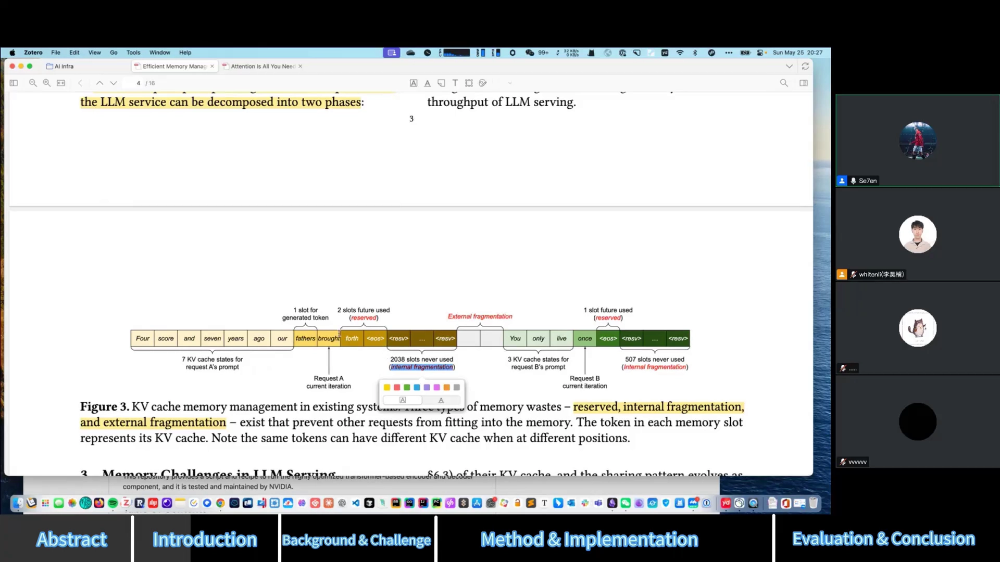 |
| 你看请求到这个位置的时候，比如生成到这个 token 时，后面的 false 和 use 还没生成，这个时候虽然留着、未来会被用到，但此时此刻还没被用到，这种情况其实也算浪费。因为假如我最终可能更长， [【跳转到 22:24】](https://www.bilibili.com/video/BV1GWjjzfE1b/?t=1344) |  |
| 比如那种 reserve 得更长，但中间这部分其实我可以用来处理一些比较短的、快的请求，对不对？你把它占了，虽然你最终会用到，但中间如果有那些短平快的请求就用不到了，也算一种浪费。还有一种就是 external fragmentation。因为我去做内存预留的时候， [【跳转到 22:49】](https://www.bilibili.com/video/BV1GWjjzfE1b/?t=1369) | 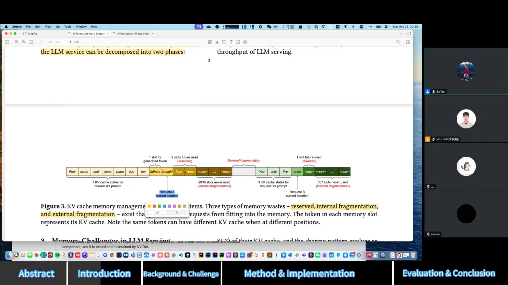 |
| 比如我总是用 2048 这么大的块，你分的页的宽度/长度越大，中间这个 external fragmentation 就会越大。而像 vLLM，它一般只分 16 个 token，我拆得越细，这个 fragmentation 不就越小吗？ [【跳转到 23:14】](https://www.bilibili.com/video/BV1GWjjzfE1b/?t=1394) |  |
| 对，这就是 external fragmentation。 [【跳转到 23:39】](https://www.bilibili.com/video/BV1GWjjzfE1b/?t=1419) |  |
| 然后我再倒回来。刚才是 external fragmentation 和 internal fragmentation。第二步，这里还说了图二，这个图展示的是它跟现有系统相比。你看现有系统，像这个 ORCA，它可能实际上只有 20.4% [【跳转到 23:47】](https://www.bilibili.com/video/BV1GWjjzfE1b/?t=1427) | 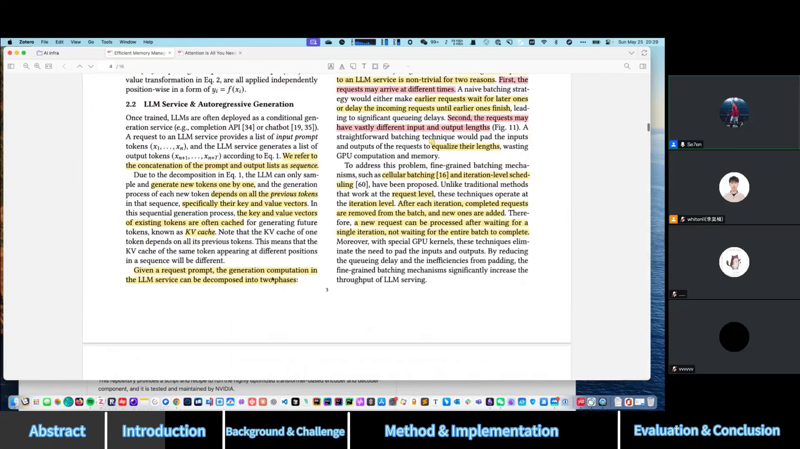 |
| 是真正有用的 token。这里 57% 是 internal fragmentation，13% 是 reservation，80.9% 是 external fragmentation，实际上真正用到的只有 20%。这个好一点，可能 38%，其他都浪费了。相比 vLLM 的话，它 96% 其实都是用到的，它可以把 internal 和 reservation 这部分 [【跳转到 24:12】](https://www.bilibili.com/video/BV1GWjjzfE1b/?t=1452) |  |
| 完全优化掉，还有少量的 external fragmentation。虽然它切得很细，16 个 token——后面会说为什么切 16 个 token，因为他们做了实验对照得到这个结果——但虽然切得很细，最终可能还是会留一些 external fragmentation。这是第一个现有系统存在的问题。 [【跳转到 24:37】](https://www.bilibili.com/video/BV1GWjjzfE1b/?t=1477) | 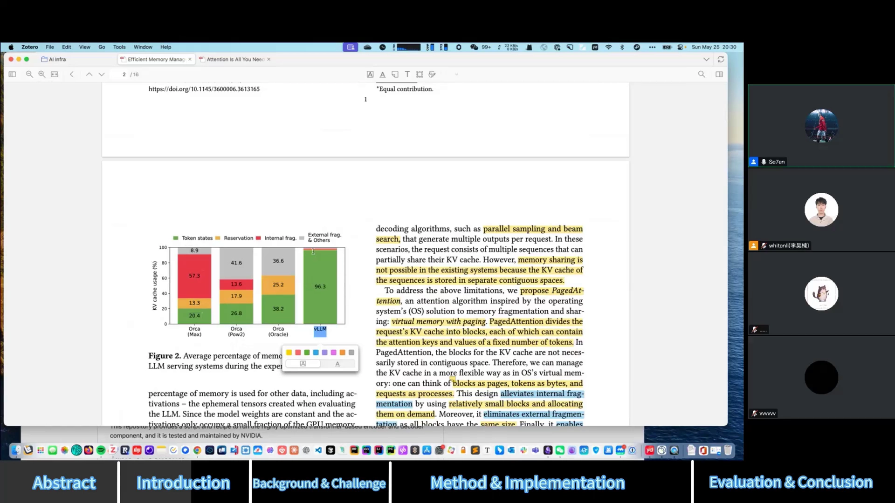 |
| 第二个问题是，现有系统不能做到 memory sharing。后面会提到有两种情况。因为 decoding 算法不只是很简单的——我给你输入、你给一个输出——有时候会有一些比较复杂的 decoding 算法，比如 parallel sampling 和 beam search 这类， [【跳转到 25:02】](https://www.bilibili.com/video/BV1GWjjzfE1b/?t=1502) | 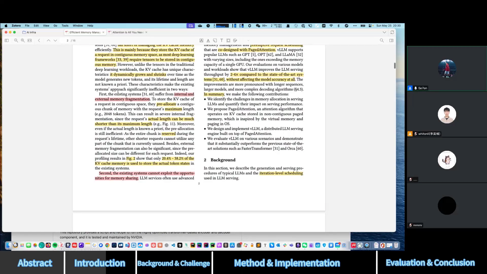 |
| 可能会生成多个 output，在一个 prompt 中。这种情况下，其实 prompt、也就是输入是一样的，那这种情况下是能共享的。而且像 beam search，甚至它的输出在某一部分也是可以共享的。我这里给个图看一下。 [【跳转到 25:27】](https://www.bilibili.com/video/BV1GWjjzfE1b/?t=1527) | 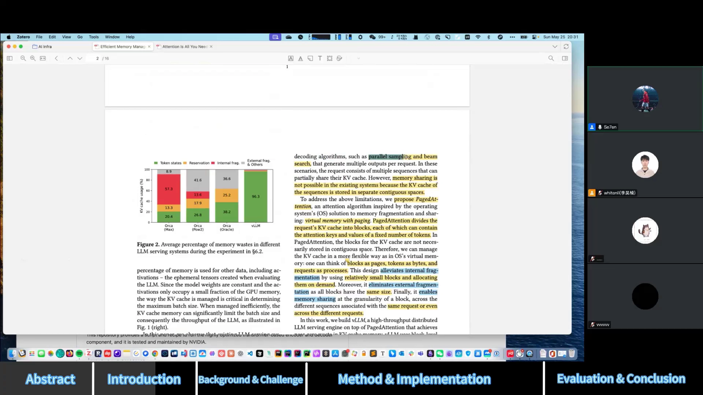 |
| 两个 parallel sampling。比如我这里问了一个问题。 [【跳转到 25:52】](https://www.bilibili.com/video/BV1GWjjzfE1b/?t=1552) | 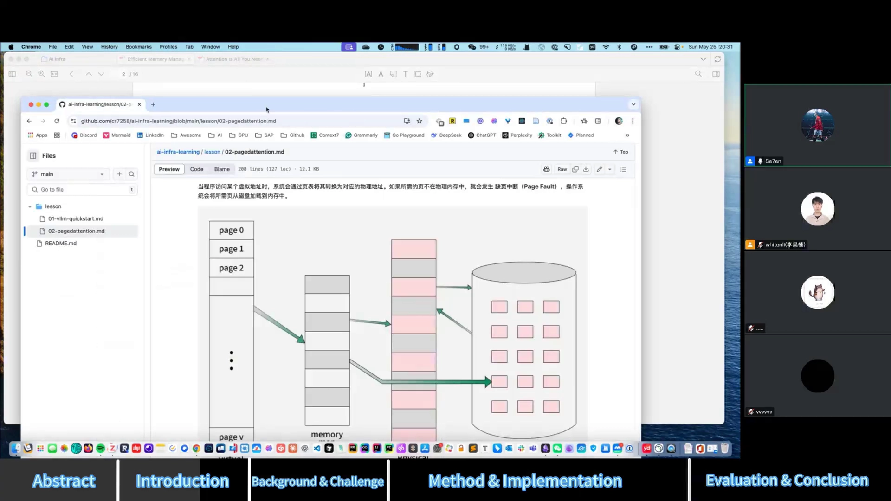 |
| "The future of cloud computing is"，它这边给了三个答案。那我对这个 prompt 的结果其实是可以做一个共享内存的。像 beam search，比如我可以用在翻译或者文本生成上，你可以看到像这部分 "famous computer science for" [【跳转到 25:57】](https://www.bilibili.com/video/BV1GWjjzfE1b/?t=1557) | 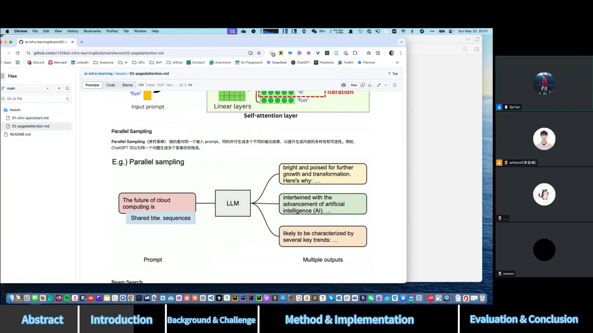 |
| 这里的 created 和 "hole" 这部分其实是共用了输出。所以不只是 prompt 能共用，这部分输出其实也可以共享。因为 beam search 的机制是：我在每一步会保留多个得分最高的候选项 top-n，比如可以通过 num_beams 来设置，比如设置为 2， [【跳转到 26:22】](https://www.bilibili.com/video/BV1GWjjzfE1b/?t=1582) | 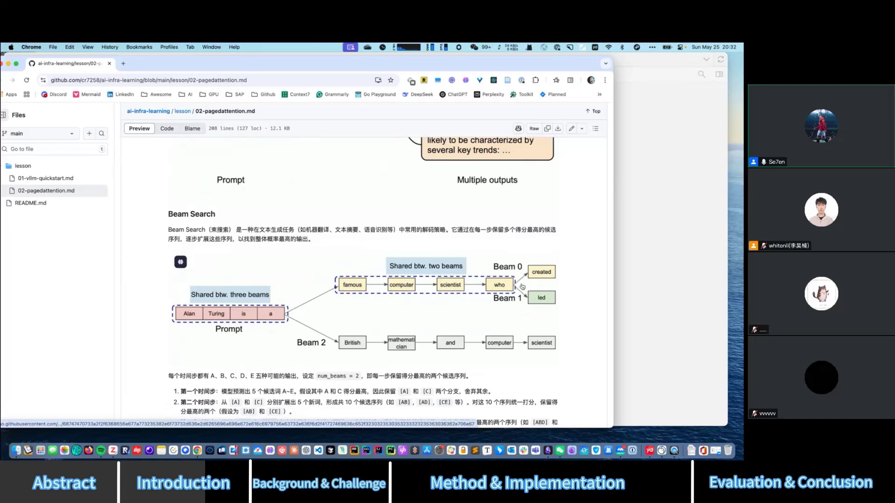 |
| 就是在每个输出保留概率最高的前两个；top-4、beam=4 的话就保留前四个。这张图也展示了这个过程：假设有五种可能，num_beams=2，每次保留最高两个序列。第一次从五个里选 A 和 C 最高两个，然后基于 A 又生成了这几个 A、B、C、D， [【跳转到 26:47】](https://www.bilibili.com/video/BV1GWjjzfE1b/?t=1607) |  |
| 下一步基于 C 也生了五个，这时有十个，还是选最高的两个，再基于这两个去生成。这就是 beam search 的原理。回到这里，像这种 parallel sampling、beam search，它在 prompt 甚至 beam 集合输出的一部分 [【跳转到 27:12】](https://www.bilibili.com/video/BV1GWjjzfE1b/?t=1632) | 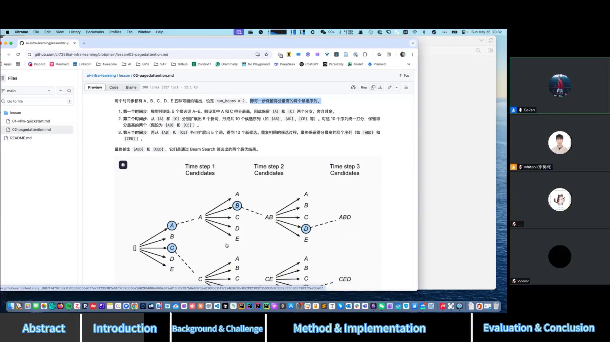 |
| token 中是可以共用的，但当前系统无法做到这种共用，所以这部分也属于内存浪费。继续，为了解决上述问题，于是推出了 PagedAttention 机制，刚才也提到它的灵感来自 virtual memory 和分页。 [【跳转到 27:37】](https://www.bilibili.com/video/BV1GWjjzfE1b/?t=1657) | 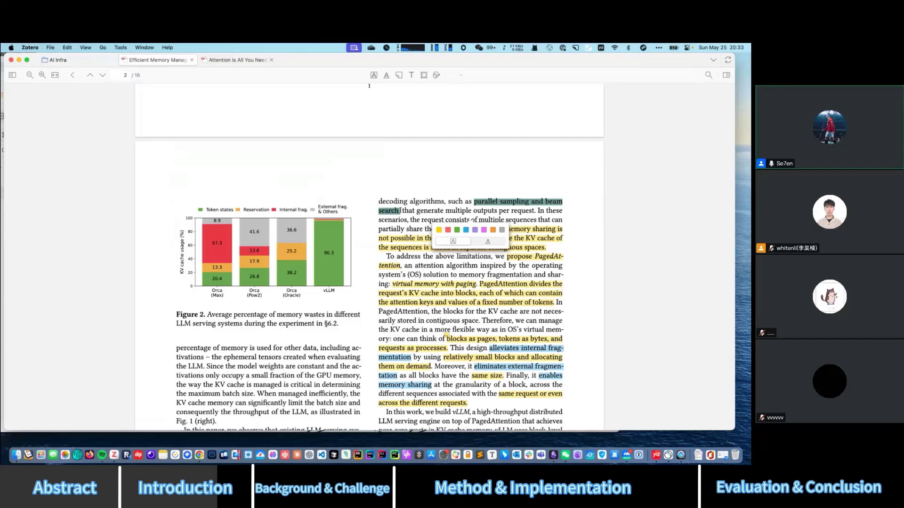 |
| PagedAttention 会把请求的 KV cache 分配到固定大小的 blocks 中，每个 block 中保留 attention 的 key 和 value。这里也做了一个类比：它把 blocks 类比为 page（页）， [【跳转到 28:02】](https://www.bilibili.com/video/BV1GWjjzfE1b/?t=1682) | 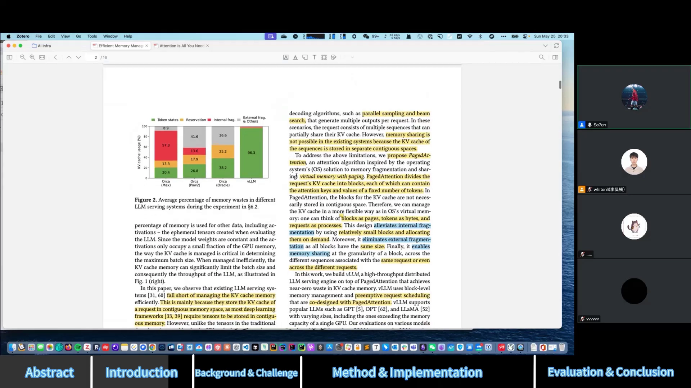 |
| 把 token 类比为 byte（字节），把 request 类比为 process（进程）。我这里解释一下：KV cache 可以看作按块组织，每个块里包含多个 token 的 KV 对，就像内存分页里一样。每个 token 其实对应模型最小的一个输入单位或输出单位， [【跳转到 28:27】](https://www.bilibili.com/video/BV1GWjjzfE1b/?t=1707) | 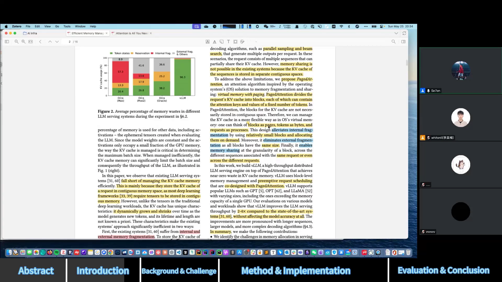 |
| 就相当于内存中最小的一个数据单元 byte。每个推理请求就像一个进程，它需要自己的地址空间来存储 token 的 KV cache。因为每个请求的 KV cache 也是分开的，就像每个 process 自己看到的内存地址空间是隔离的。 [【跳转到 28:52】](https://www.bilibili.com/video/BV1GWjjzfE1b/?t=1732) |  |
| 这种设计可以有效减少 internal fragmentation 和 external fragmentation 的问题，因为它们是在相对较小的 block 中分配，并且是按需分配的。刚才也提到它能达到 memory sharing 的效果，也可以是在同一个 request 中， [【跳转到 29:17】](https://www.bilibili.com/video/BV1GWjjzfE1b/?t=1757) | 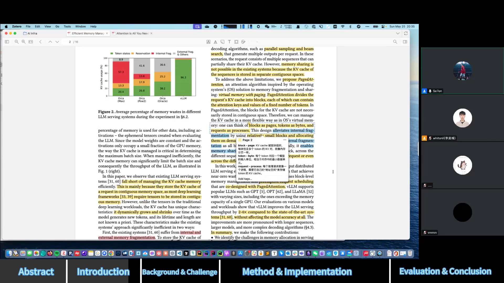 |
| 甚至跨越不同的 request——后面会说可能是它有 prefix 扩展的机制可以做到。但 PagedAttention 其实还是专注于单个 request 中的问题。这里还说，因为 vLLM 最终是以 PagedAttention 为核心， [【跳转到 29:42】](https://www.bilibili.com/video/BV1GWjjzfE1b/?t=1782) | 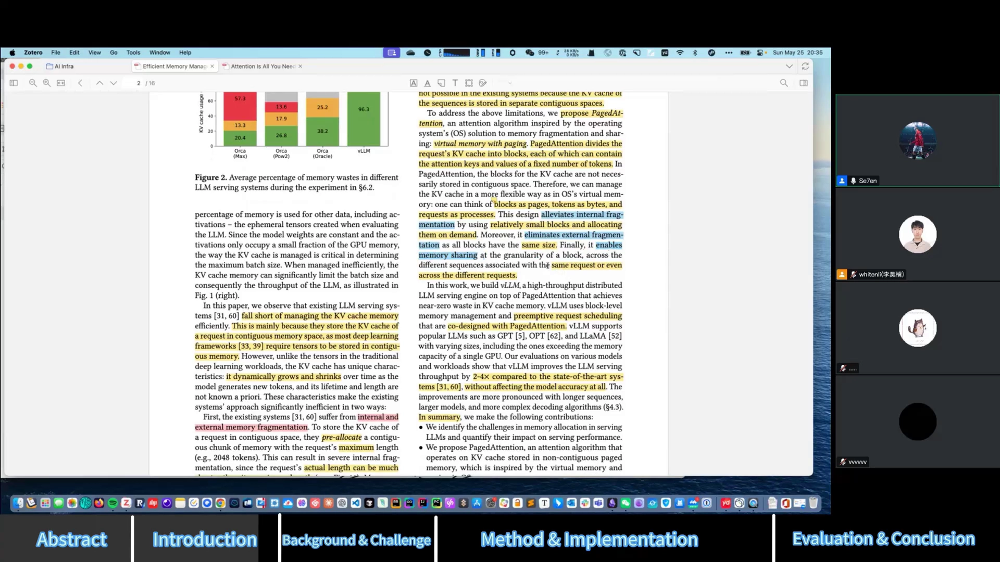 |
| 实现了一个 LLM 引擎。它除了 PagedAttention 其实还有其他设计，因为 PagedAttention 只是帮助我们有效地管理显存中 KV cache 的分配。与此同时还需要一些比如抢占式的请求调度。 [【跳转到 30:07】](https://www.bilibili.com/video/BV1GWjjzfE1b/?t=1807) |  |
| 比如我的请求其实有不同优先级，但我内存的可用量是有限的。当请求超过内存能达到的阈值，那一些低优先级的请求可能需要先被驱逐，来优先服务高优先级。所以 vLLM 中也有一些关于调度的设计。 [【跳转到 30:32】](https://www.bilibili.com/video/BV1GWjjzfE1b/?t=1832) | 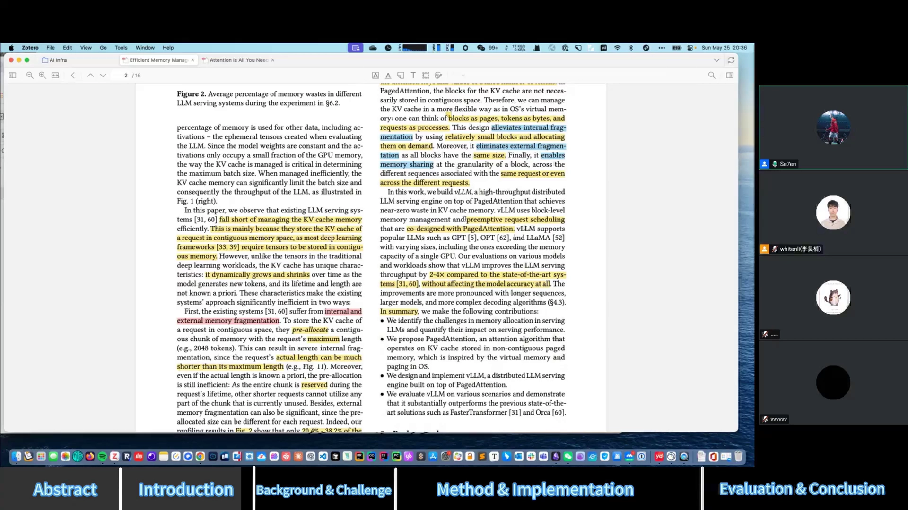 |
| 后面也会提到。这里也说有 2~4 倍的性能提升，并且不影响模型推理的精度。总结来说，在介绍部分，vLLM 团队就发现了内存的限制或者说挑战。 [【跳转到 30:57】](https://www.bilibili.com/video/BV1GWjjzfE1b/?t=1857) |  |
| 因此提出了 PagedAttention 机制，帮助我们在非连续的内存中去管理 KV cache，灵感来自现有操作系统中的虚拟内存和分页理念，并基于这个理念实现了 vLLM 这个引擎。 [【跳转到 31:22】](https://www.bilibili.com/video/BV1GWjjzfE1b/?t=1882) | 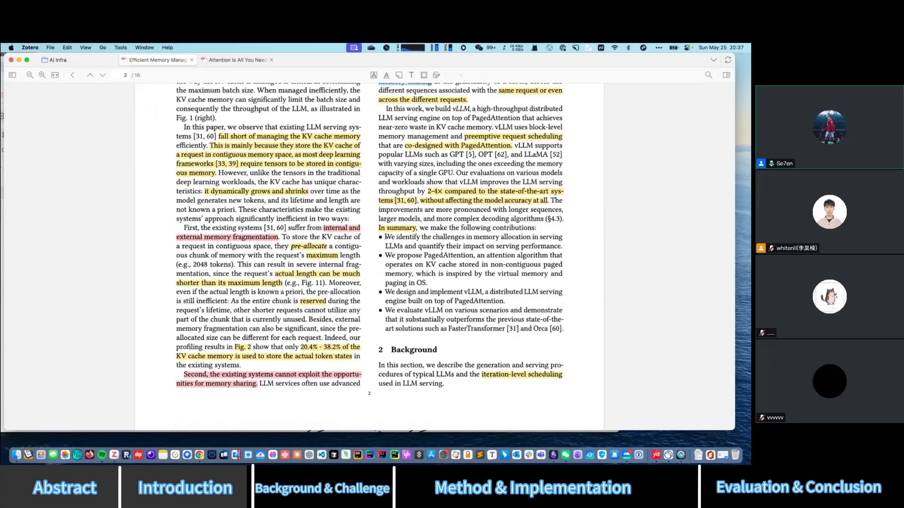 |
| 最后，后面他会提到会把 vLLM 跟很多种不同的引擎，比如 FasterTransformer、ORCA 等其他的 LLM 引擎，在多种场景下进行比较，能得到非常优秀的性能提升。 [【跳转到 31:47】](https://www.bilibili.com/video/BV1GWjjzfE1b/?t=1907) | 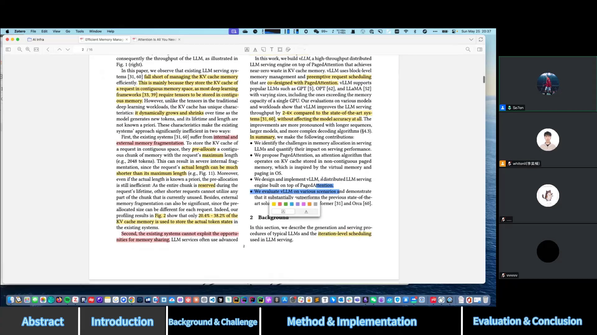 |
| 第二部分是 background（背景）。我问一下 introduction 这部分有没有什么问题？目前没有。好，接着说。这边主要是一些介绍，比如关于 Transformer 的一些基础。 [【跳转到 32:12】](https://www.bilibili.com/video/BV1GWjjzfE1b/?t=1932) | 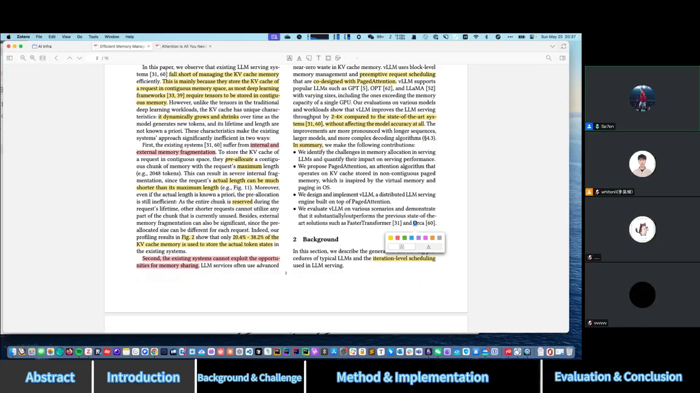 |
| 我也稍微提一下。因为 Transformer 这个模型其实已经是大语言模型建模中事实上的标准架构。Transformer 的核心其实就是它的 self-attention 机制。并且它在 decode 这边属于 autoregressive（自回归）的 [【跳转到 32:37】](https://www.bilibili.com/video/BV1GWjjzfE1b/?t=1957) |  |
| 模式。因为像这张图，你看 Transformer 这个架构其实有三个部分：attention 这边，比如叫 encoder，还有 decoder，以及 encoder 和 decoder，中间是有一些区别的。这里有一张图可以从这边摘下来， [【跳转到 33:02】](https://www.bilibili.com/video/BV1GWjjzfE1b/?t=1982) | 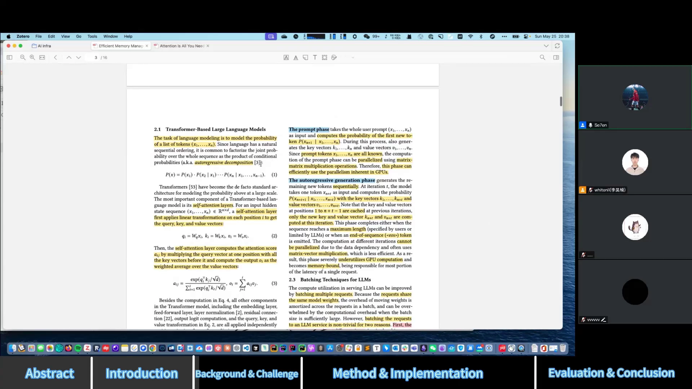 |
| 简单看一下。比如 encoder-only（仅编码器），它仅包含编码器部分，使用双向注意力机制。这个机制允许模型在处理每个词时同时关注这个词前后的所有词，去捕捉整个序列的上下文关系，比如可以应用在文本分类、情感分析等。 [【跳转到 33:27】](https://www.bilibili.com/video/BV1GWjjzfE1b/?t=2007) | 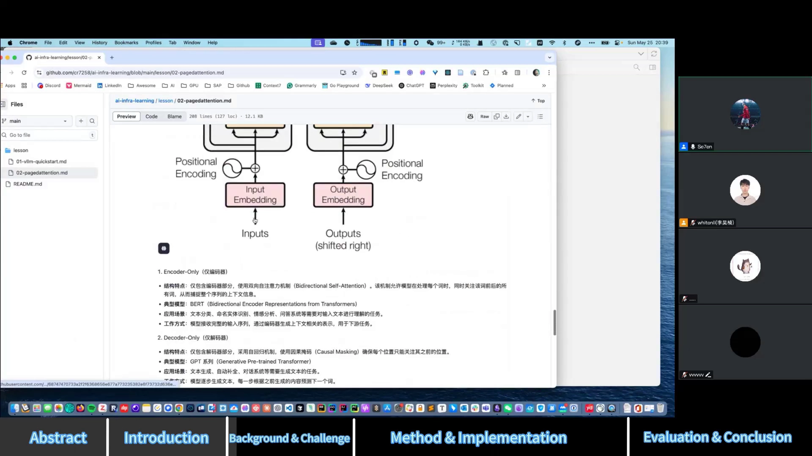 |
| 那 decoder-only 就是我们推理时多采用的自回归机制，使用了因果掩码（causal masking），保证每个位置只能关注之前的位置。因为我生成、往外吐 token 的时候，是根据当前已有的 token 去预测下一个 token，所以要用 mask 机制。decoder-only [【跳转到 33:52】](https://www.bilibili.com/video/BV1GWjjzfE1b/?t=2032) | 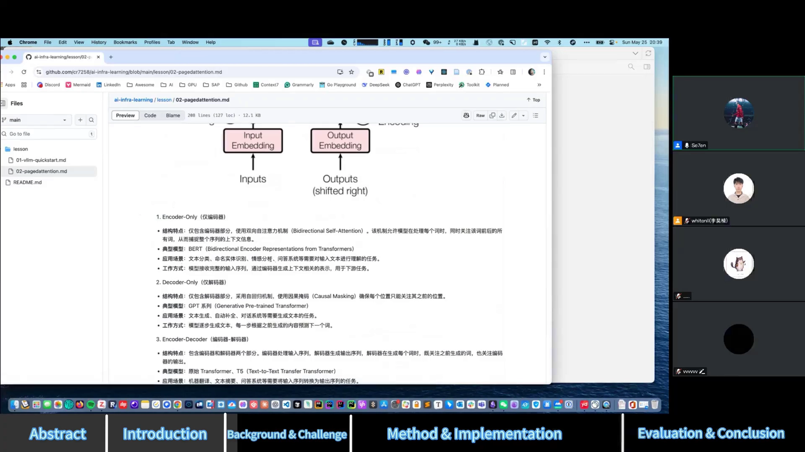 |
| 还有一部分就是 encoder-decoder，包含编码器和解码器两个部分。编码器用于处理输入序列，解码器生成输出序列；解码器在生成每个词的时候，既关注之前生成的词，也会关注编码器的输出。这就是 Transformer 中 encoder 和 decoder 的介绍，简单提一下。 [【跳转到 34:17】](https://www.bilibili.com/video/BV1GWjjzfE1b/?t=2057) | 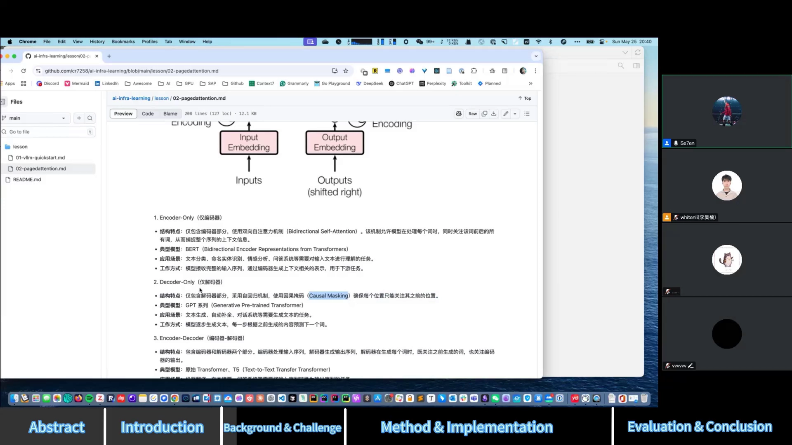 |
| 然后这边有一个公式，我也稍微解释一下。因为看论文的时候可能比较害怕看到公式，所以我列了一下每个公式的具体解释。第一个公式比较简单，其实就是计算一段文本、 [【跳转到 34:42】](https://www.bilibili.com/video/BV1GWjjzfE1b/?t=2082) | 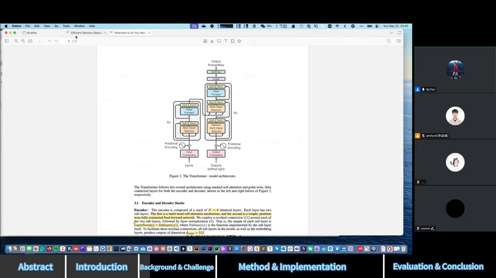 |
| 由一系列 token 组成的文字输出的概率是多少。比如第一个词的概率——整个句子的概率是由第一个词的概率，乘以第二个词在第一个词出现条件下的概率，再乘以第三个词在前两个词出现条件下的概率， [【跳转到 35:07】](https://www.bilibili.com/video/BV1GWjjzfE1b/?t=2107) | 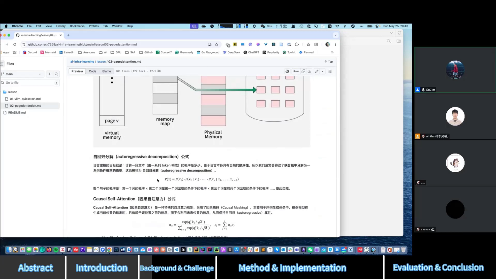 |
| 以此类推。这就是这个公式表达的意思，即如何计算整个句子的概率。 [【跳转到 35:32】](https://www.bilibili.com/video/BV1GWjjzfE1b/?t=2132) | 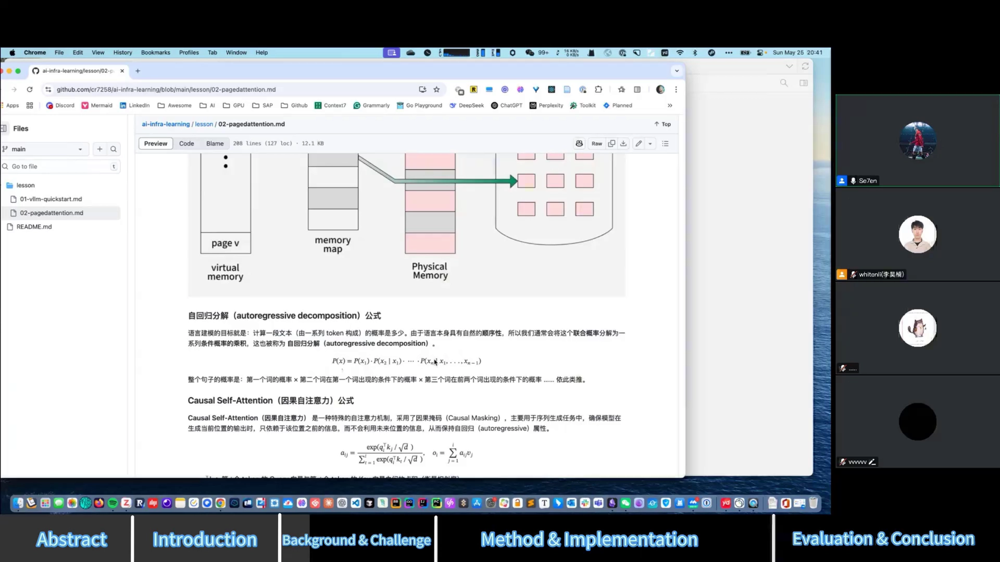 |
| 然后我们继续。这里说到，刚刚也说到它的核心是 self-attention layer。self-attention layer，假设我当前模型的输入是一个长度为 N 的序列，每个 token 我可以用一个低维向量表示。那自注意力机制就是对每个 token 的向量 [【跳转到 35:43】](https://www.bilibili.com/video/BV1GWjjzfE1b/?t=2143) | 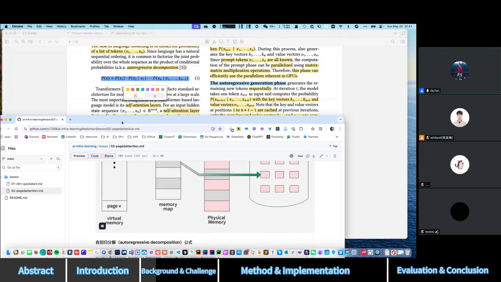 |
| 进行线性变换——我前面其实也有过这个图——Q 等于 WQ 乘以 X，K 等于 WK 乘以 X，V 等于 WV 乘以 X。Q 表示我需要关注什么，K 表示我有什么特征、有什么关键词，用来和 Q 做相似度匹配， [【跳转到 36:08】](https://www.bilibili.com/video/BV1GWjjzfE1b/?t=2168) | 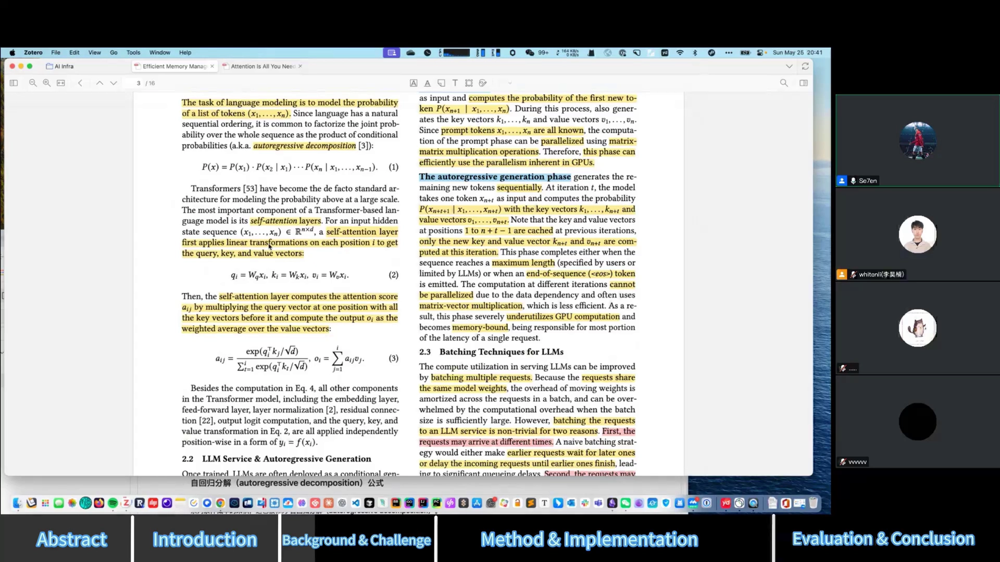 |
| V 表示我能提供什么信息。通过这个机制，计算每个 token 与其他 token 的相似度，也就是 query 和 key 的点积，获得注意力分数，然后对这些分数做加权平均， [【跳转到 36:33】](https://www.bilibili.com/video/BV1GWjjzfE1b/?t=2193) | 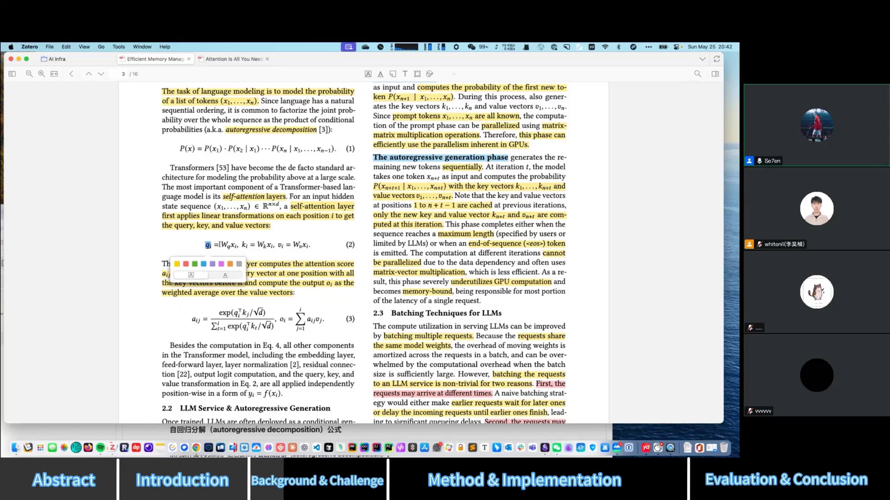 |
| 最终得到一个新的 O 表示，也就是这里这个词的表示。但如果你之前看过 attention 的计算，会发现这里的公式长得稍微有点不一样。这是因为这个公式其实属于……OK，这里有解释。 [【跳转到 36:58】](https://www.bilibili.com/video/BV1GWjjzfE1b/?t=2218) | 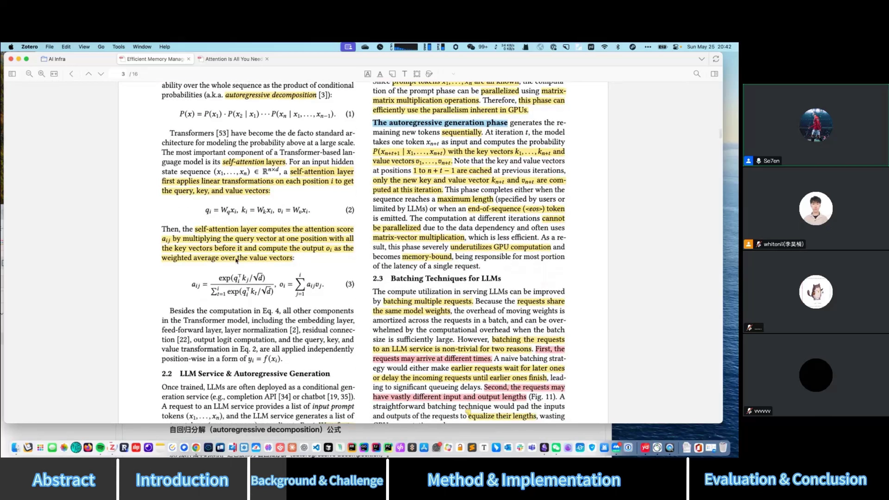 |
| 属于因果自注意力的公式（causal self-attention）。因为我前面也说过，这边有三种模型。 [【跳转到 37:23】](https://www.bilibili.com/video/BV1GWjjzfE1b/?t=2243) | 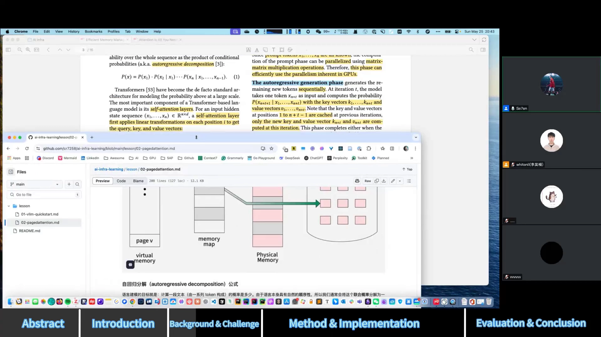 |
| 它属于 decoder-only，我要使用因果掩码确保每个位置只能关注之前的位置，所以它这里使用了一个掩码的机制。这就是这一点有的地方不太一样的原因。 [【跳转到 37:31】](https://www.bilibili.com/video/BV1GWjjzfE1b/?t=2251) | 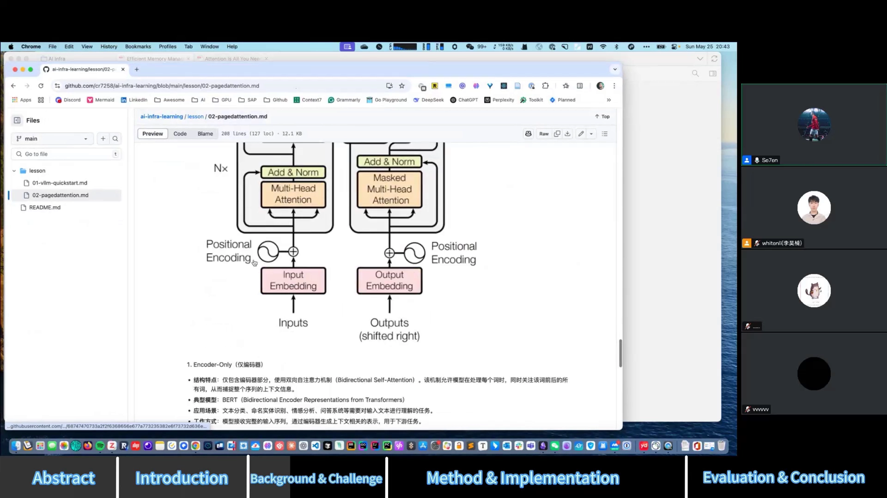 |
| 刚刚简单带过了 Transformer 的介绍。下一个部分是说，当我们把 LLM 部署为这种生成式服务时，比如用户提供提示词，模型通过自回归的方式 [【跳转到 37:48】](https://www.bilibili.com/video/BV1GWjjzfE1b/?t=2268) | 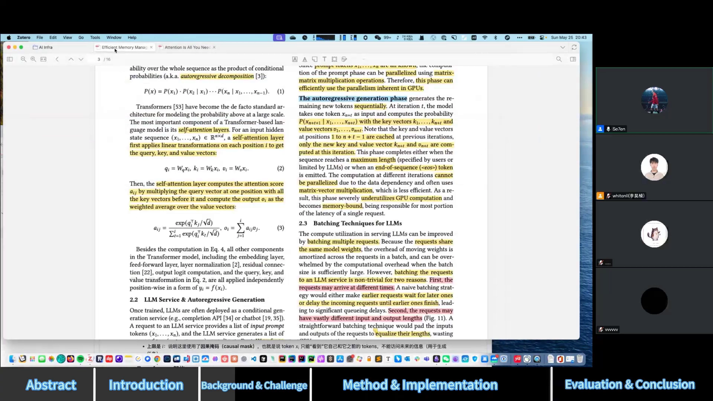 |
| 生成 token，最终形成完整的序列，那完整的序列在这里表示为输入提示与输出序列的连接。并且这个自回归过程生成的 token 是一个接一个的，并且取决于之前所有的 token。 [【跳转到 38:13】](https://www.bilibili.com/video/BV1GWjjzfE1b/?t=2293) |  |
| 具体来说，取决于之前的 key 和 value 向量，而 key 和 value 的向量其实是可以被缓存掉的，也就是我们之前说的 KV cache。这里再强调一下背景。给定一个 request，在生成过程中 [【跳转到 38:38】](https://www.bilibili.com/video/BV1GWjjzfE1b/?t=2318) |  |
| 其实可以把它分成两个阶段：我前面提到的一个叫 prefill 阶段，一个是 decode 阶段。这里说的 prompt 阶段就是我一次拿到 prompt 中所有的 token，这些 token 都是已知的，那我去计算它的 attention，这部分计算过程是 compute-bound 的， [【跳转到 39:03】](https://www.bilibili.com/video/BV1GWjjzfE1b/?t=2343) | 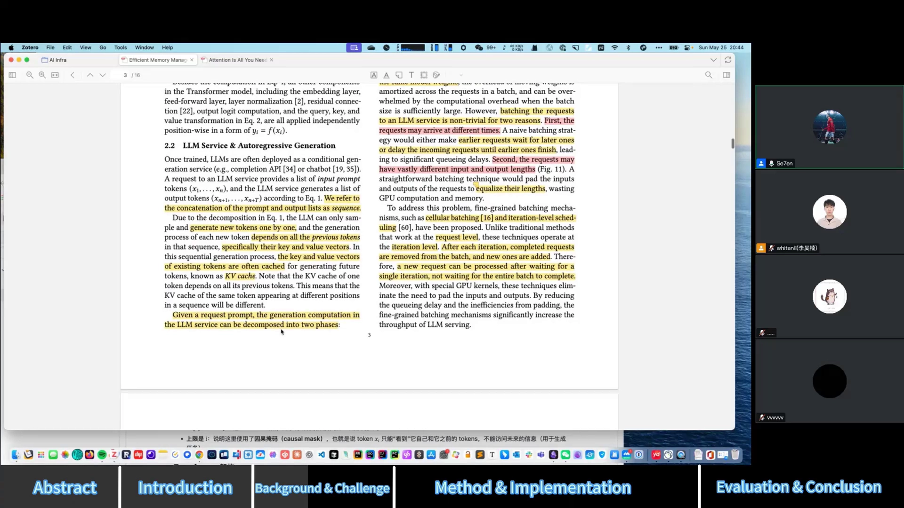 |
| 是计算密集型的，并且可以并行计算，这部分可以充分利用 GPU 的计算能力。第二部分就是 decode 阶段，也就是自回归阶段，这个阶段是线性的。我需要根据，比如这个公式，根据当前的自己 [【跳转到 39:28】](https://www.bilibili.com/video/BV1GWjjzfE1b/?t=2368) | 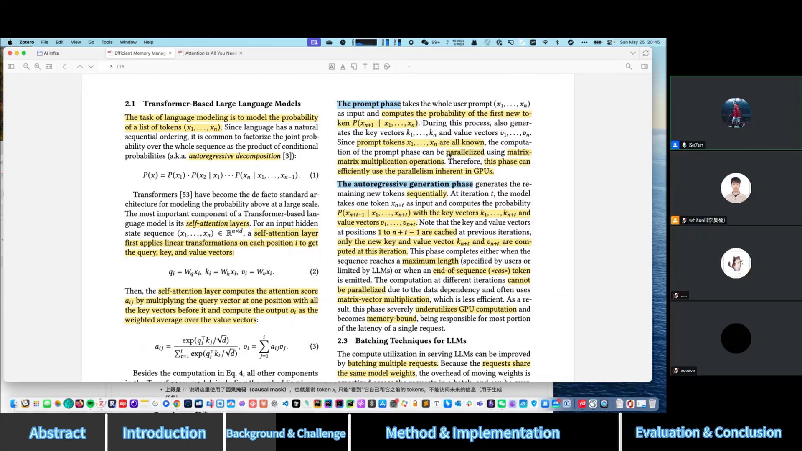 |
| 跟当前和之前的 K、V 向量去进行计算。其中比如这里我需要计算预测 P(N+T+1)，那我这里需要 1 到 N+T 的，少了一位。你可以看到这里 1 到 N+T-1 是缓存的， [【跳转到 39:53】](https://www.bilibili.com/video/BV1GWjjzfE1b/?t=2393) | 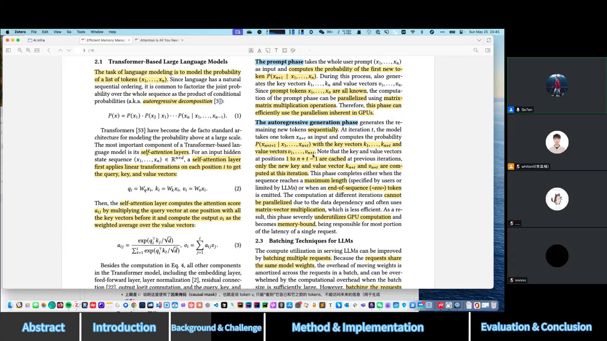 |
| 因为是上一轮的结果。那本轮的话我需要额外再算一下 N+T，和对应的 V，然后通过 N+T 去预测 N+T+1 的结果。OK，这个阶段结束的时候会有两个条件可以触发结束： [【跳转到 40:18】](https://www.bilibili.com/video/BV1GWjjzfE1b/?t=2418) | 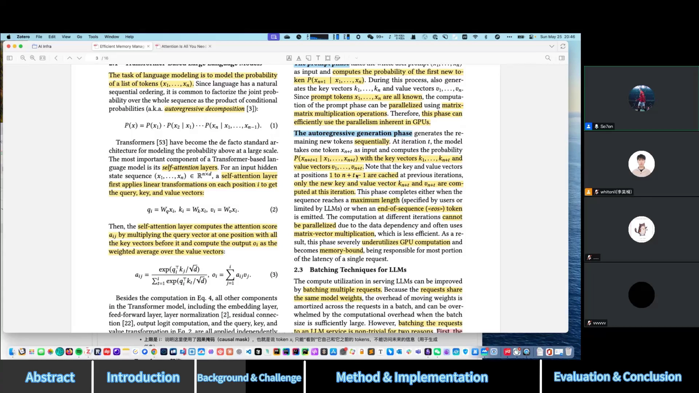 |
| 比如达到了最长的 length。比如你在请求 LLM 时可以设置 max_length、max_token 之类的参数，决定一个最长的输入；或者当模型生成时达到了 EOS（end of sequence）这种特殊 token，也会停止。并且刚才说的 decode 阶段不可以用并行计算， [【跳转到 40:43】](https://www.bilibili.com/video/BV1GWjjzfE1b/?t=2443) | 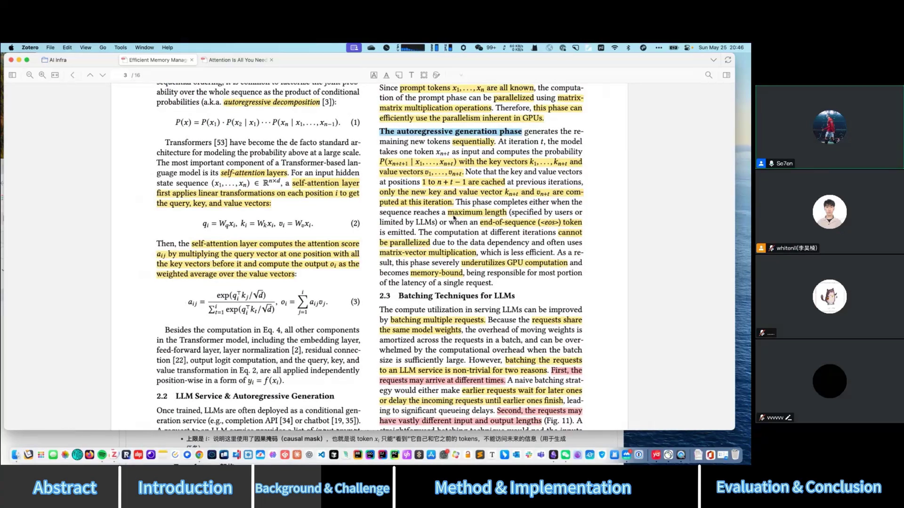 |
| 所以 decode 阶段无法充分利用 GPU 的计算资源，并且 KV cache 依赖显存的存储，所以 decode 阶段是 memory-bound，prefill 阶段是 compute-bound。这是第二部分 2.2 节。 [【跳转到 41:08】](https://www.bilibili.com/video/BV1GWjjzfE1b/?t=2468) | 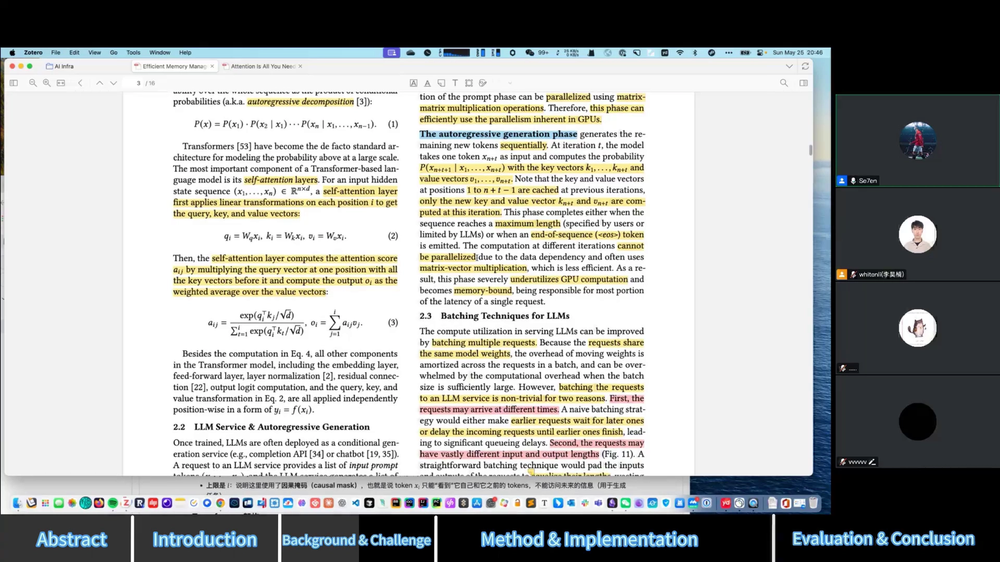 |
| 然后在 2.3 部分说到，LLM 服务中会将多个请求打包成 batch 一批处理，通过这种方式提高计算利用率，因为这些请求可以使用相同的模型权重，只需要加载一次，不需要每个请求都去重复搬运。但是把这些请求组合成一个 batch [【跳转到 41:33】](https://www.bilibili.com/video/BV1GWjjzfE1b/?t=2493) | 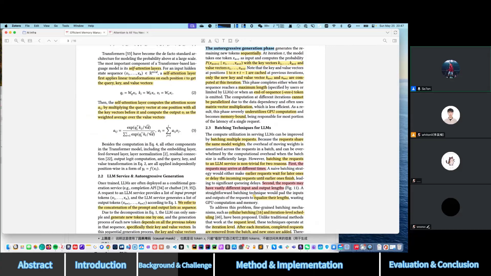 |
| 并不容易，有两个问题。第一个问题：用户的请求并不是同时到达的。要么让先到的请求等后面的请求凑满一个 batch，要么等老的请求处理完再处理新的请求，这会造成比较严重的排队延迟，影响响应时间。第二个问题是，不同的 prompt [【跳转到 41:58】](https://www.bilibili.com/video/BV1GWjjzfE1b/?t=2518) | 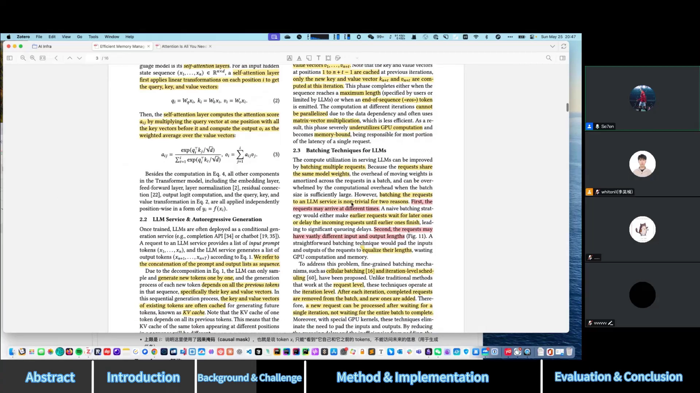 |
| 生成的长度差距很大。为了直接 batch 它们，需要用 padding token 去做对齐。为什么要用 padding token 对齐？因为 GPU 最高效的工作方式是对大小一致的数据并行处理，所以通常会在 batch 中 [【跳转到 42:23】](https://www.bilibili.com/video/BV1GWjjzfE1b/?t=2543) | 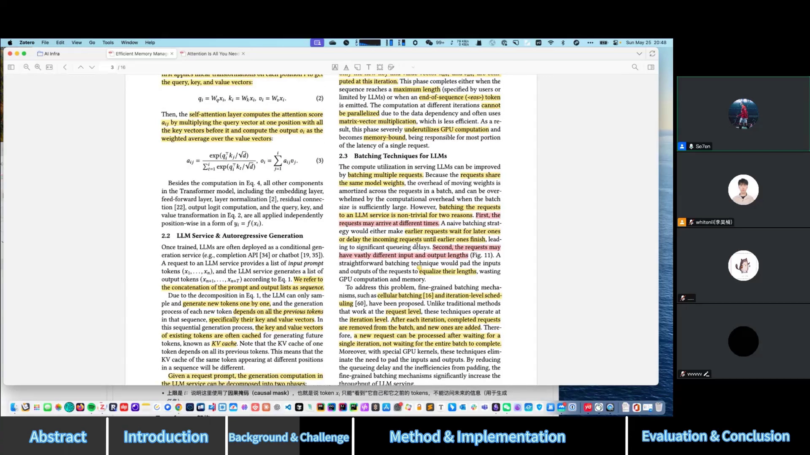 |
| 使用最大请求的长度，然后将短于这个长度的请求用 padding token 填充到当前长度。所以这两个问题导致我们没办法很高效地 batch request。为了解决这个问题，除了 vLLM 之外，也有一些比较细粒度的 [【跳转到 42:48】](https://www.bilibili.com/video/BV1GWjjzfE1b/?t=2568) | 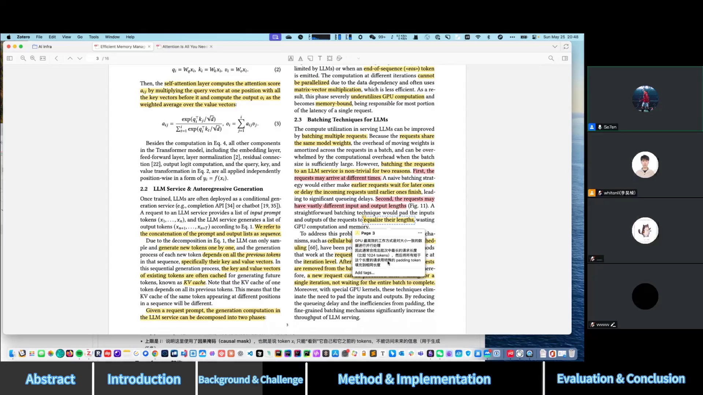 |
| batch 机制，比如 selective batching 和 iteration-level scheduling 被提出来了。这两个机制不像更早之前基于 request-level 的方法，而是基于 iteration-level。什么是 iteration-level？就是我在生成一个 token、一个 token 的 [【跳转到 43:13】](https://www.bilibili.com/video/BV1GWjjzfE1b/?t=2593) | 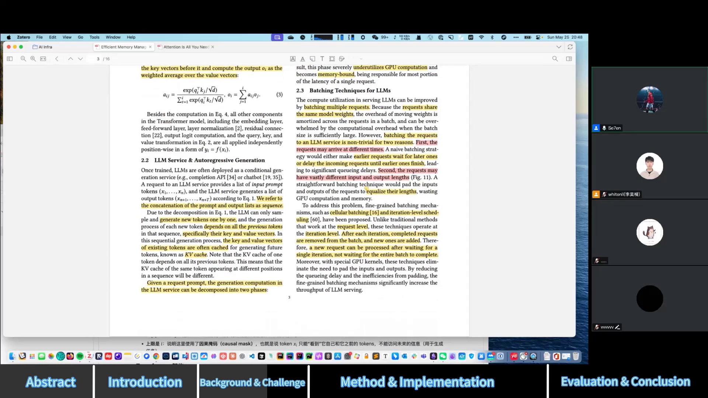 |
| 过程中，生成一个 token 这个过程就叫一个 iteration。在每个 iteration 的过程中，因为不是基于 request-level，而是基于 iteration-level 来处理，所以每次迭代结束，就会把已完成的请求 [【跳转到 43:38】](https://www.bilibili.com/video/BV1GWjjzfE1b/?t=2618) | 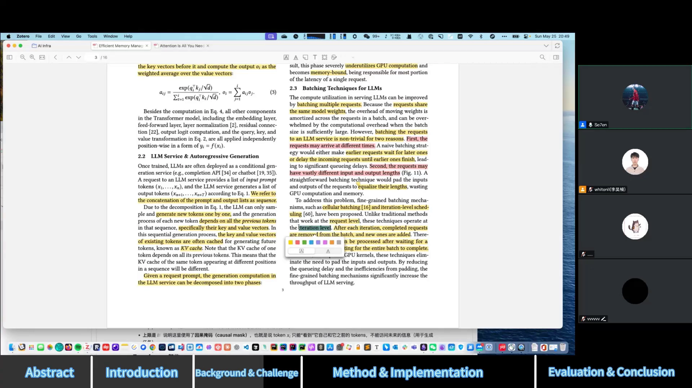 |
| 从当前批次中移除，然后加入新的请求。通过这种方式灵活地调用 GPU，不像之前要等整个请求结束。可能这个 token 处理完，这个请求已经结束，就悄悄把它移掉，把新请求加进来，不需要像之前的 batching 机制一样要等所有请求都完成。 [【跳转到 44:03】](https://www.bilibili.com/video/BV1GWjjzfE1b/?t=2643) |  |
| 会更加灵活。这里说到，虽然提出了这些细粒度化的 batch 机制能在一定程度上解决这些问题，但其实还是很受限于 GPU memory 的 [【跳转到 44:28】](https://www.bilibili.com/video/BV1GWjjzfE1b/?t=2668) | 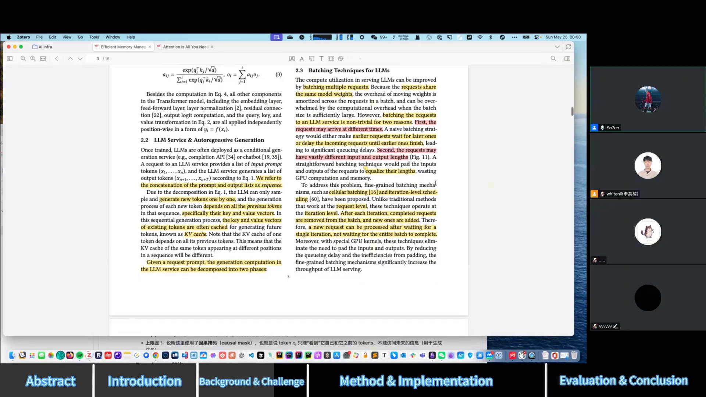 |
| capacity（容量），尤其是存储 KV cache 的部分。这里说了为什么管理 memory 是有挑战的。第一，GPU 上这个 KV cache 是比较大的。这里给了个例子，比如 13B 的模型，它一个 token 的 KV cache [【跳转到 44:53】](https://www.bilibili.com/video/BV1GWjjzfE1b/?t=2693) | 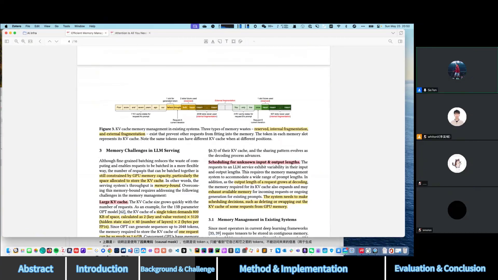 |
| 可能要 800KB。具体怎么算呢？是这里乘以 2（K 和 V 两个 vector），再乘以 5120（hidden size，也就是它的 embedding 维度），再乘以 40（它的 layer 层数），再乘 2（比如 FP16 这个精度）。 [【跳转到 45:18】](https://www.bilibili.com/video/BV1GWjjzfE1b/?t=2718) | 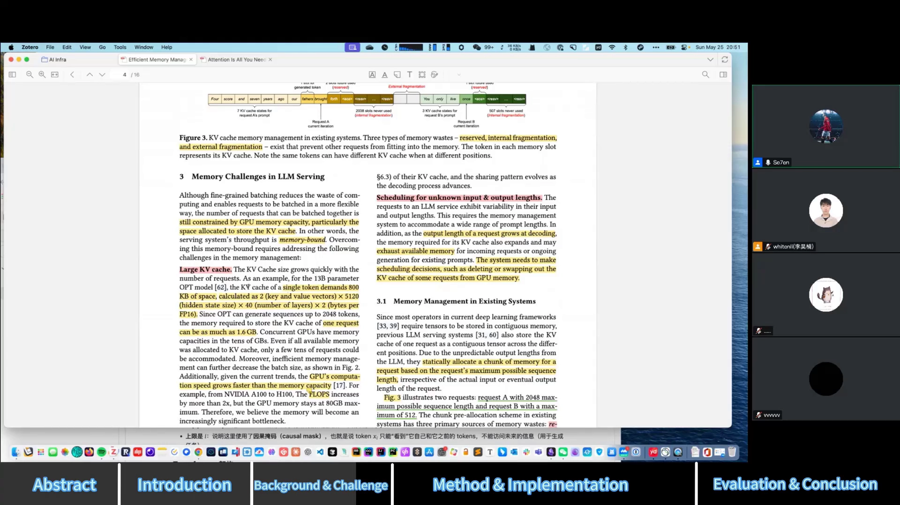 |
| 算下来一个 token 可能需要 800KB 来存 KV cache。那一个请求如果按 2048 个 token 来算，可能就要占 1.6GB。你想想，前面说一个 A100 才 40GB，你就算全拿去存 KV cache 也存不了几个请求——如果你没有优化 KV cache 的情况下。 [【跳转到 45:43】](https://www.bilibili.com/video/BV1GWjjzfE1b/?t=2743) |  |
| 而且 GPU 的计算能力增长速度比内存容量增长快得多。这里举个例子：从英伟达 A100 到 H100，FLOPS 增长了两倍，FLOPS 体现了计算能力。它的解释是表示一个处理器 [【跳转到 46:08】](https://www.bilibili.com/video/BV1GWjjzfE1b/?t=2768) | 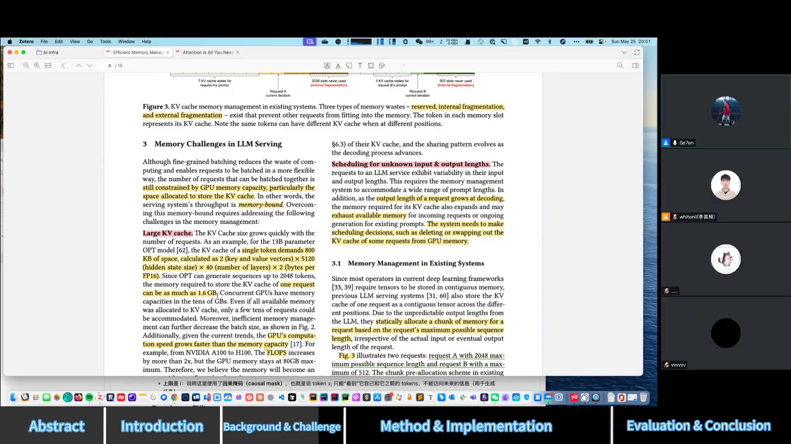 |
| 比如 GPU 每秒能执行多少次浮点数的加减乘除，越高代表计算能力越强。这里从 A100 到 H100 提升了两倍，但 GPU 的内存提升到 80GB，没提升太多。然后第二部分挑战是说， [【跳转到 46:33】](https://www.bilibili.com/video/BV1GWjjzfE1b/?t=2793) | 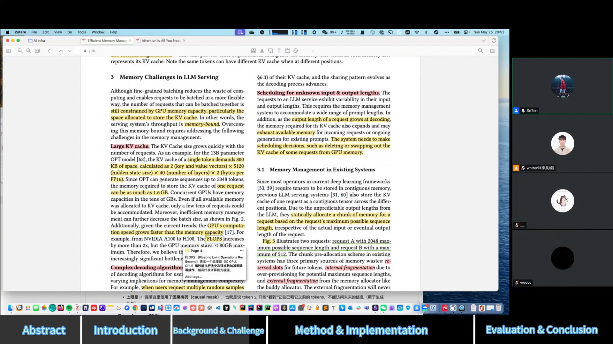 |
| decoding 算法会比较复杂，不像一个 input prompt 生成一个 output，它有可能一个 input 会有多个 output 的情况，比如 parallel sampling 和 beam search 这种情况。如果能够共享这部分内存，我就可以进一步降低 [【跳转到 46:58】](https://www.bilibili.com/video/BV1GWjjzfE1b/?t=2818) | 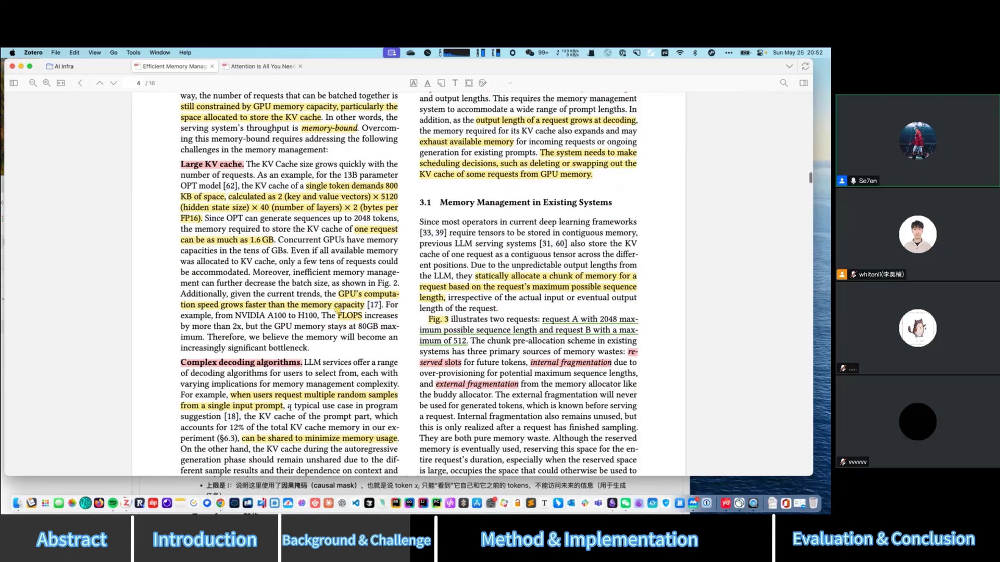 |
| KV cache 的使用量。这里还说到，在比较复杂的系统中，像 beam search，不同 request 的 beam 最多的情况下可能有 55% 的内存是可以通过 sharing 节约的。最后一部分是内存管理/调度的挑战， [【跳转到 47:23】](https://www.bilibili.com/video/BV1GWjjzfE1b/?t=2843) | 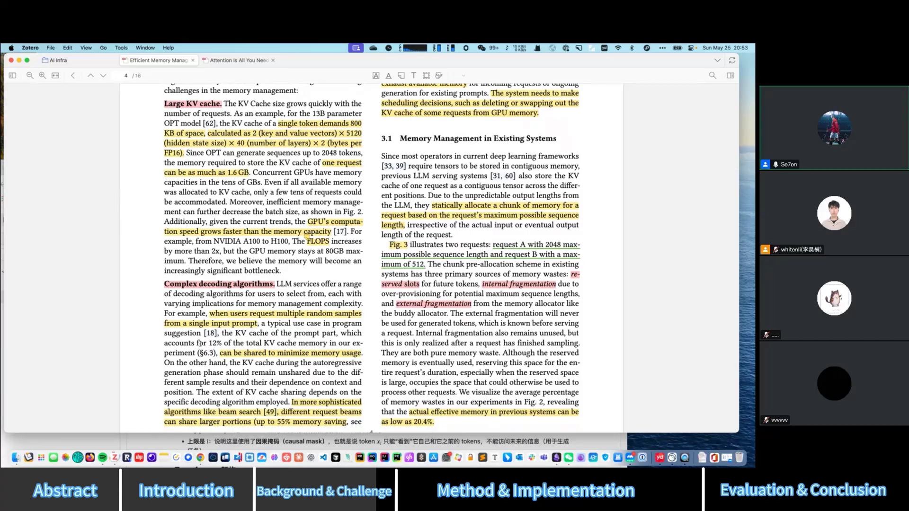 |
| 就是我的 schedule 要根据未知的 input 和 output token 长度进行调度。比如随着我生成，因为 GPU 内存容量有限，随着我生成 output，可能我的内存会被耗尽，那这个时候我就需要考虑 [【跳转到 47:48】](https://www.bilibili.com/video/BV1GWjjzfE1b/?t=2868) |  |
| 内存的调度，比如 eviction（驱逐）或者抢占（preemption）。我需要把优先级不够的请求的内容先释放掉，比如从 GPU offload 到 CPU 上，通过这种方式做一些处理，避免把 GPU 内存耗尽。 [【跳转到 48:13】](https://www.bilibili.com/video/BV1GWjjzfE1b/?t=2893) | 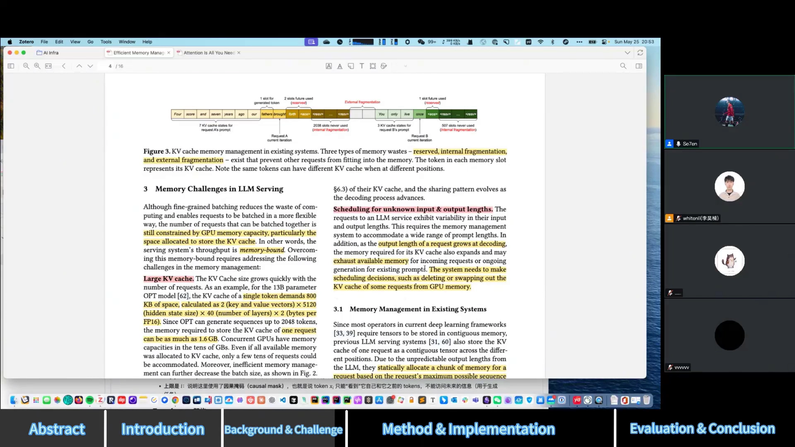 |
| 然后 3.1 介绍了当前系统中的内存管理。当前系统通常通过静态方式分配内存，就是根据一个请求最大的长度进行分配。刚才图三我其实讲过了，这种分配方式 [【跳转到 48:38】](https://www.bilibili.com/video/BV1GWjjzfE1b/?t=2918) | 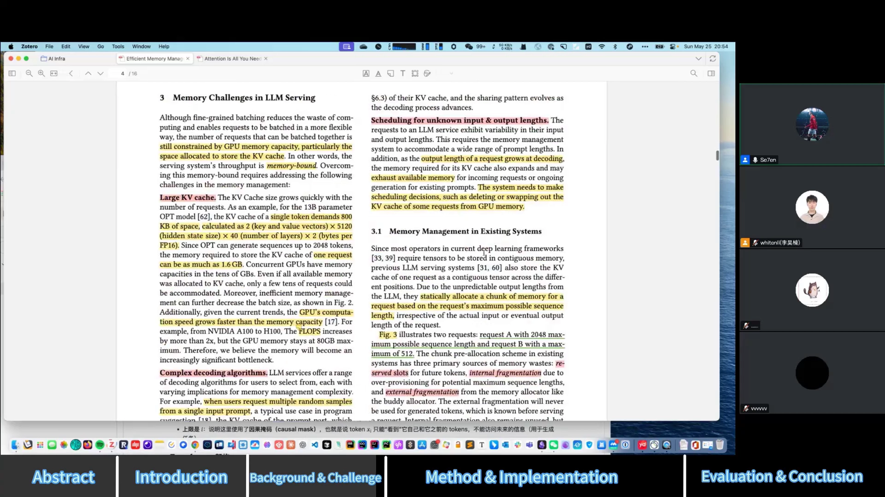 |
| 就会带来几个问题：一个是 internal fragmentation，一个是 external fragmentation，还有一个是 reserve，三个地方的浪费。这里也提到了。如果根据图二，最差情况下可能只有 20% 是真正用到的，剩下 80% 都被浪费了。 [【跳转到 49:03】](https://www.bilibili.com/video/BV1GWjjzfE1b/?t=2943) | 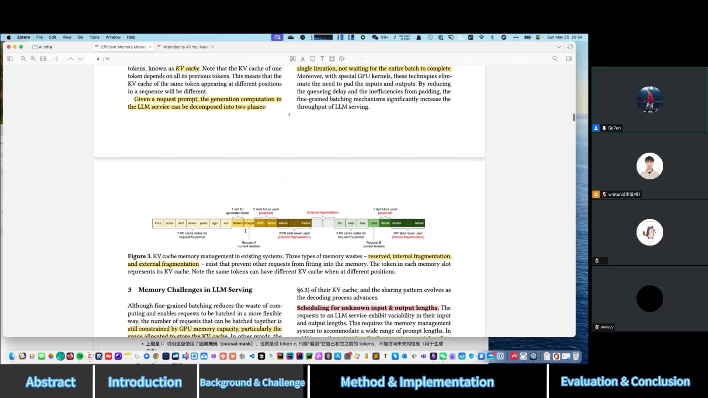 |
| 虽然有一些 compression（压缩）机制，但由于 KV cache 比较大，这种压缩方式会带来很严重的精度影响。前面三章其实都算是铺垫，说了当前的背景介绍，简要解释 [【跳转到 49:28】](https://www.bilibili.com/video/BV1GWjjzfE1b/?t=2968) | 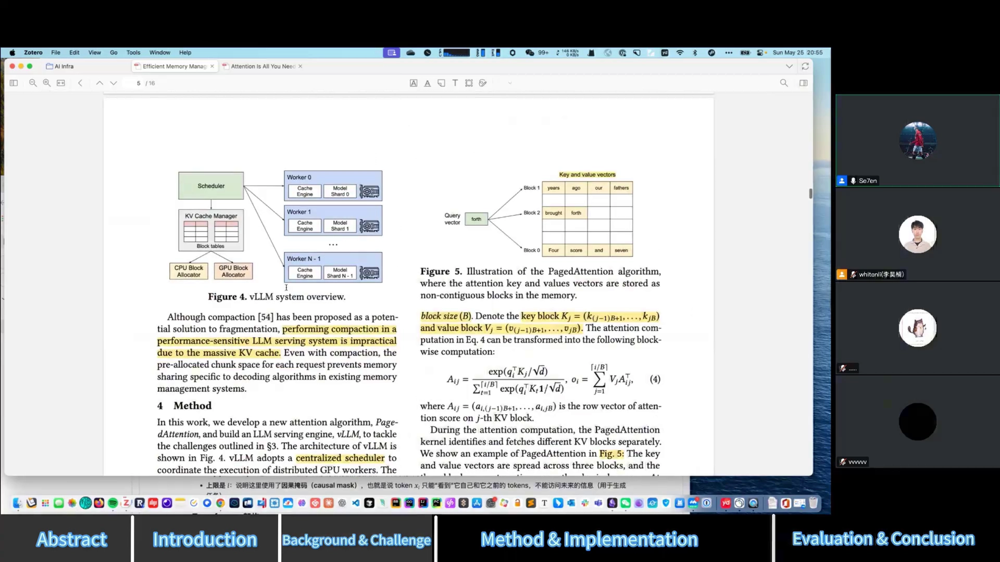 |
| 一下 vLLM 的实现——PagedAttention 的灵感来自 virtual memory 和分页机制。这里讲了一些背景和当前内存挑战，其实还算是铺垫，从第四章开始才算进入正题。这里现在有没有什么问题？没有，大体能理解一点。 [【跳转到 49:53】](https://www.bilibili.com/video/BV1GWjjzfE1b/?t=2993) | 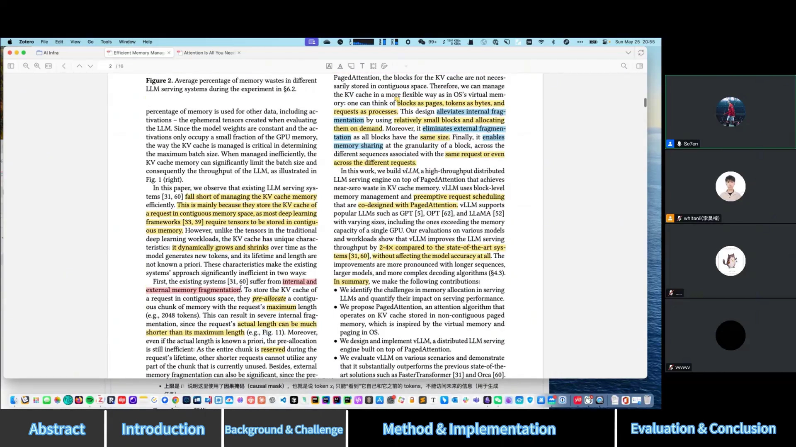 |
| 好，接着说。那继续，需要说 Method（方法）那部分，看一下。好，这边比较关键，是关于 PagedAttention 的一些设计或实现。这里说 vLLM 其实使用了一个集中式调度器（centralized scheduler）来协调多个 worker 的执行。 [【跳转到 50:18】](https://www.bilibili.com/video/BV1GWjjzfE1b/?t=3018) |  |
| 它在 KV cache manager 中，可以通过分页的方式高效地管理 KV cache。这种机制得益于它提出的 PagedAttention 算法。然后 KV cache manager 会根据 scheduler 下发的指令来管理内存的分配和调度， [【跳转到 50:43】](https://www.bilibili.com/video/BV1GWjjzfE1b/?t=3043) | 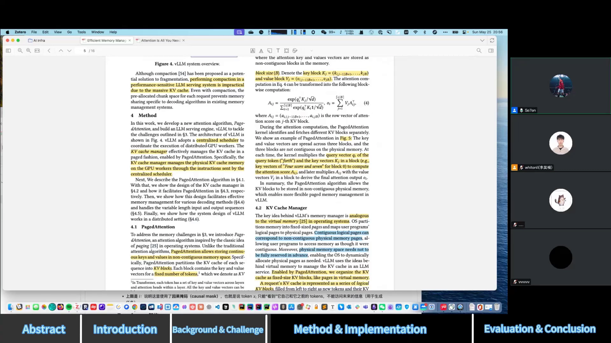 |
| 也就是这个图上表示的东西。接下来会先介绍 PagedAttention。这部分这句话就是核心：它允许连续的 key 和 value vector 存储在一个非连续的内存空间，这就是 PagedAttention 做的事情。具体来说，就是每个内存块 [【跳转到 51:08】](https://www.bilibili.com/video/BV1GWjjzfE1b/?t=3068) |  |
| 都存储了固定数量的 token 的 K 和 V vector，我们把这个大小称为 block size B。后面会说到它的 size 其实是 16 个 token，是经过他们实验算出来比较优的结果，所以 vLLM 默认使用 16 个 token。 [【跳转到 51:33】](https://www.bilibili.com/video/BV1GWjjzfE1b/?t=3093) |  |
| 这个 16 个 token 的 block size 比那些传统 LLM 引擎使用最长 2048 的要优化得多，并且它是按需分配的。这里他讲了一个图五。在图五这个部分，你可以看到在 PagedAttention 中，它的 GPU kernel 会逐个处理 query， [【跳转到 51:58】](https://www.bilibili.com/video/BV1GWjjzfE1b/?t=3118) | 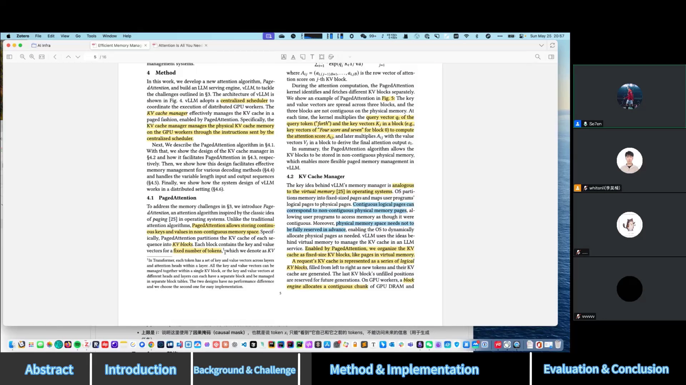 |
| 比如 query 是 "for"，通过点乘它与每个 KV block 的 key 去获得 attention 的分数，然后再加上 value 的向量，最终得到这个 token 的表示。这就是它的计算公式，跟前面那个是不是有点像？ [【跳转到 52:23】](https://www.bilibili.com/video/BV1GWjjzfE1b/?t=3143) | 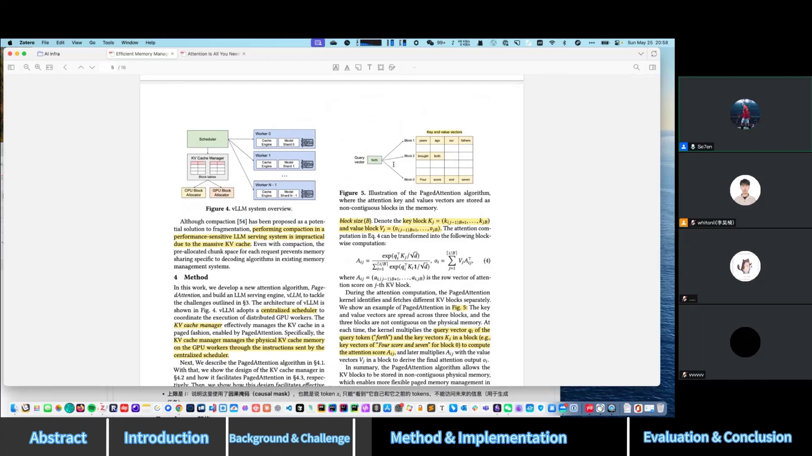 |
| 但有点区别，区别在哪呢？区别在于，在 vLLM 中计算的时候不是按每个 token 去计算的，而是根据 block 去计算。比如我的 block，示例里是 4 个，它就一次性根据这 4 个去计算 attention， [【跳转到 52:48】](https://www.bilibili.com/video/BV1GWjjzfE1b/?t=3168) | 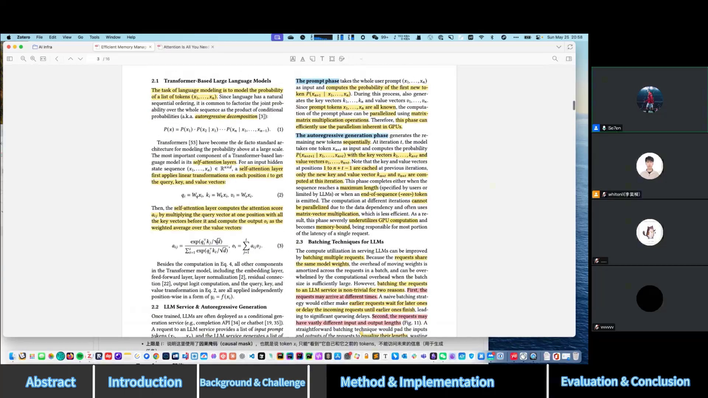 |
| 而不是一个一个去算，所以它的效率也会更高。再说一遍：原始的 attention 是基于每个 token 对 key 逐个进行注意力计算，而 PagedAttention 这边是把 K、V 分成块，按块进行注意力处理，通过这种方式 [【跳转到 53:13】](https://www.bilibili.com/video/BV1GWjjzfE1b/?t=3193) | 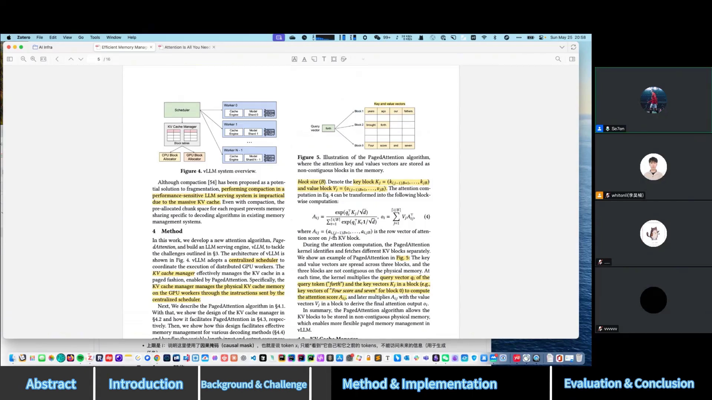 |
| 能够支持非连续的内存结构，并且大幅提升推理时的内存效率。这里就是具体的例子，"for" 和 "false"，可能跟 "for score and seven"，它一次性计算然后得到对应的 A_ij，也就是基于块的 attention score 结果。 [【跳转到 53:38】](https://www.bilibili.com/video/BV1GWjjzfE1b/?t=3218) | 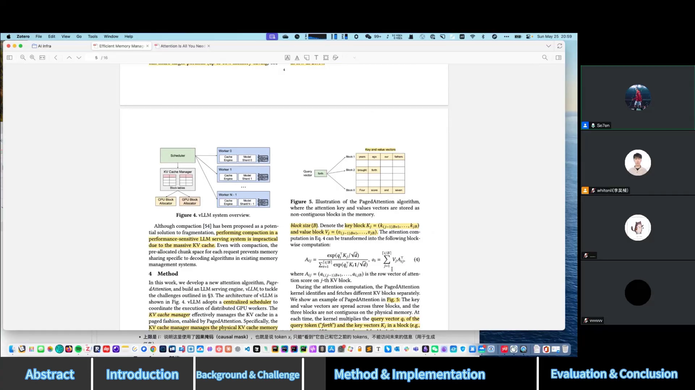 |
| 第二部分介绍了 KV cache manager。这部分跟操作系统中的 virtual memory 方式类似，同样是在连续的逻辑分页中对应到非连续的物理内存页。 [【跳转到 54:03】](https://www.bilibili.com/video/BV1GWjjzfE1b/?t=3243) | 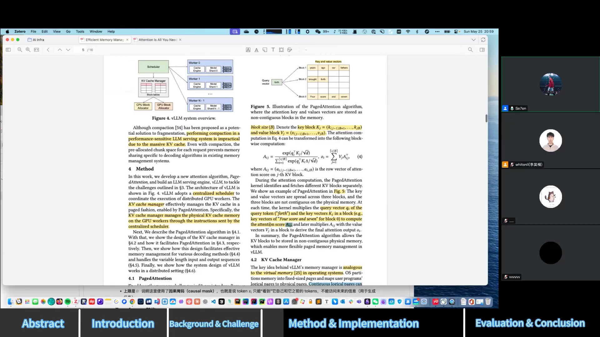 |
| 并且物理内存空间并不需要提前预留，而是按需分配。我看一下，继续。通过 PagedAttention，我们就可以把 KV cache 存储在固定长度的 KV block 中，就像 page 和 virtual memory 中一样。 [【跳转到 54:28】](https://www.bilibili.com/video/BV1GWjjzfE1b/?t=3268) | 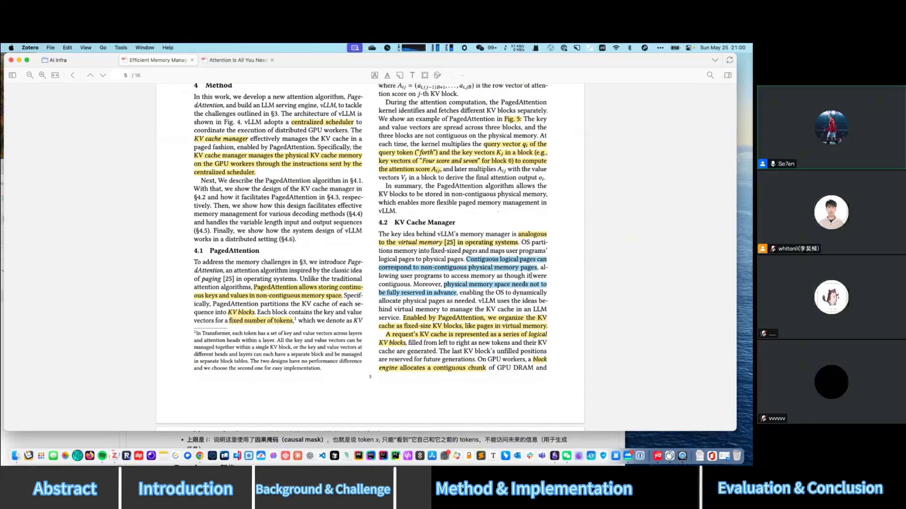 |
| 这里多次强调这些相同的概念，比如固定长度的 KV block，它的启发来自操作系统的 virtual memory。多次重复的话，大家对这些实现机理应该会记忆比较深刻。然后一个 request 的 KV cache [【跳转到 54:53】](https://www.bilibili.com/video/BV1GWjjzfE1b/?t=3293) | 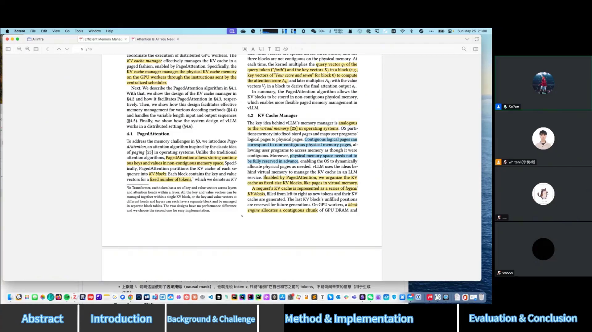 |
| 其实可以被表示成一系列逻辑的 KV block，随着 token 的生成依次填充。这里提到，GPU 上的 block engine 其实会一次性申请一大块显存，然后把这些显存划分为多块 [【跳转到 55:18】](https://www.bilibili.com/video/BV1GWjjzfE1b/?t=3318) | 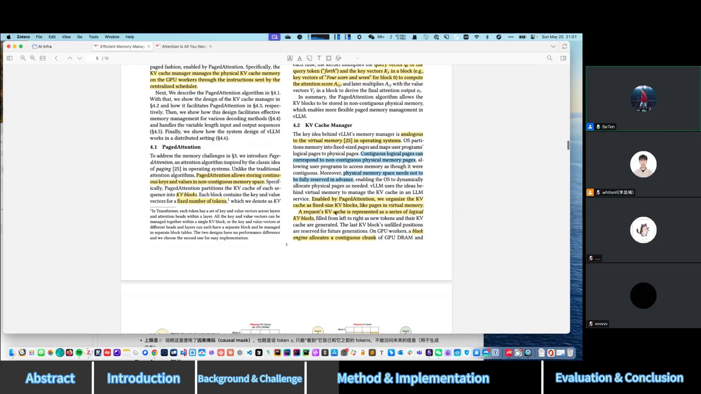 |
| 物理的 KV block，并且会映射成逻辑 block 的映射地址。未填满的最后一块会留给未来使用。必要的时候还会 swap 到 CPU 内存，后面会说到它的 swap 机制。这里说的这种分页机制就是提高 [【跳转到 55:43】](https://www.bilibili.com/video/BV1GWjjzfE1b/?t=3343) | 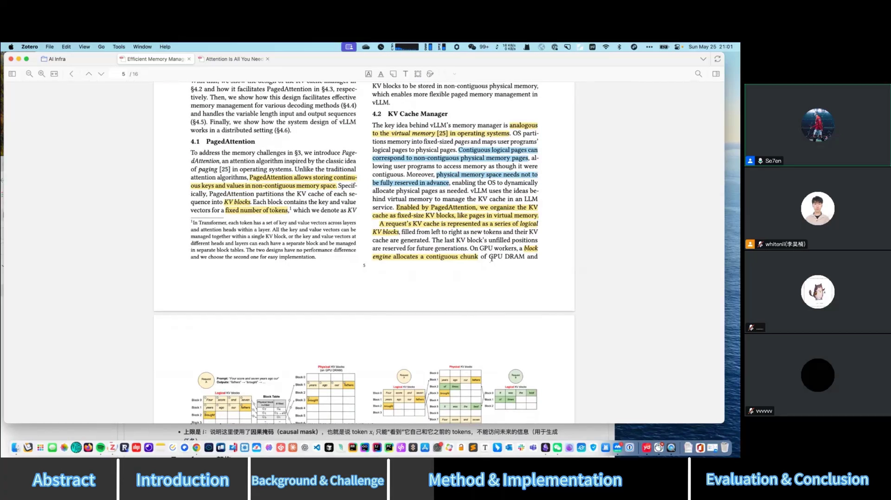 |
| 高效内存管理、提升吞吐量的一个关键。这里还有一个组件叫 KV block manager，它维护了一个很重要的东西叫 block table，也就是逻辑页面跟物理 block 之间的映射关系。 [【跳转到 56:08】](https://www.bilibili.com/video/BV1GWjjzfE1b/?t=3368) | 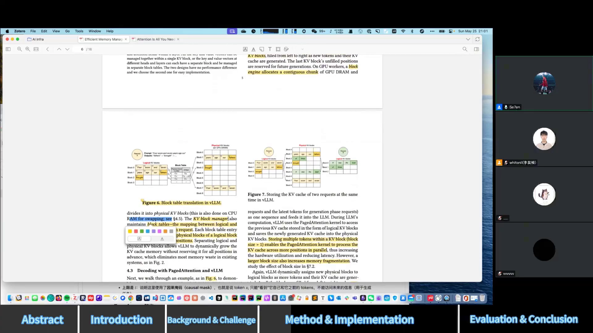 |
| OK，继续。这里我们再简单看一下图六。图六给了一个例子，我简单说一下。比如这个例子中，我的请求是 "four score and seven years ago"。 [【跳转到 56:33】](https://www.bilibili.com/video/BV1GWjjzfE1b/?t=3393) | 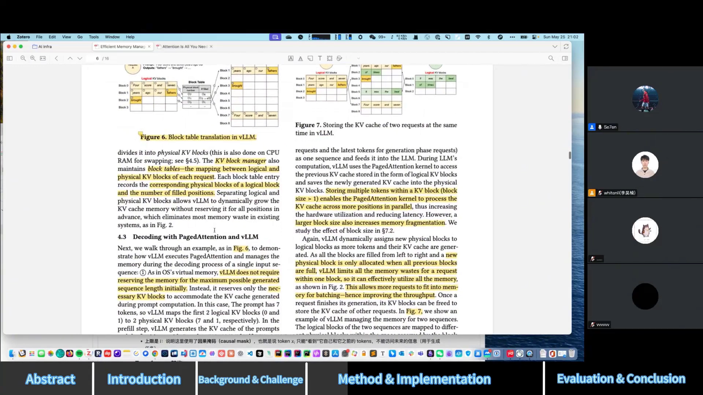 |
| 到这里其实是有 7 个 token。所以 vLLM 前面两个逻辑块（左边这是逻辑块）分别映射到两个物理块，物理块 0 和 1。然后在预填充部分，也就是 prefill 阶段，它一次性接收到这几个 prompt 的 token，然后它会将前四个 token 缓存在 block 0 中， [【跳转到 56:58】](https://www.bilibili.com/video/BV1GWjjzfE1b/?t=3418) | 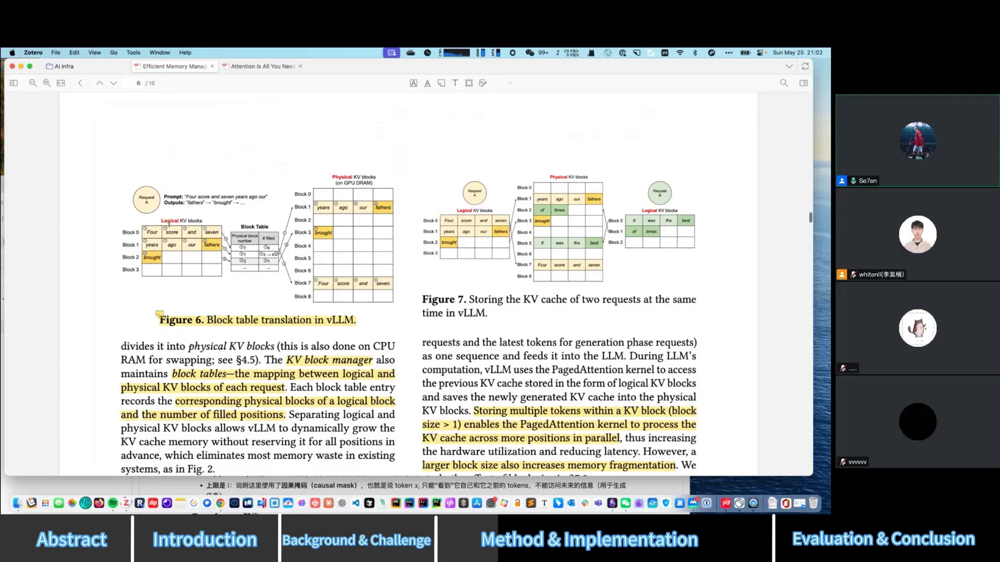 |
| 后面三个就放到 block 1 中。然后还剩一个槽位，就保留给后面的自回归生成阶段，也就是一个一个生成 token 的阶段。然后在第一次自回归的解码中， [【跳转到 57:23】](https://www.bilibili.com/video/BV1GWjjzfE1b/?t=3443) | 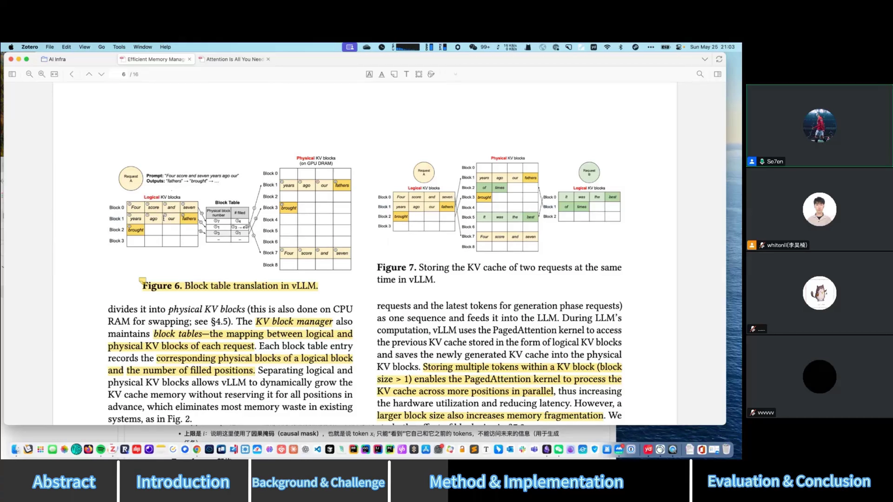 |
| 物理块 0 和 1 经过 attention 算法生成新的 token，也就是 "father"。由于这一部分还有空位，就直接存到了 block 1 中。并且你可以看这个 block table，这里有个 field 就是之前这个 block 0 是四个（token）， [【跳转到 57:48】](https://www.bilibili.com/video/BV1GWjjzfE1b/?t=3468) | 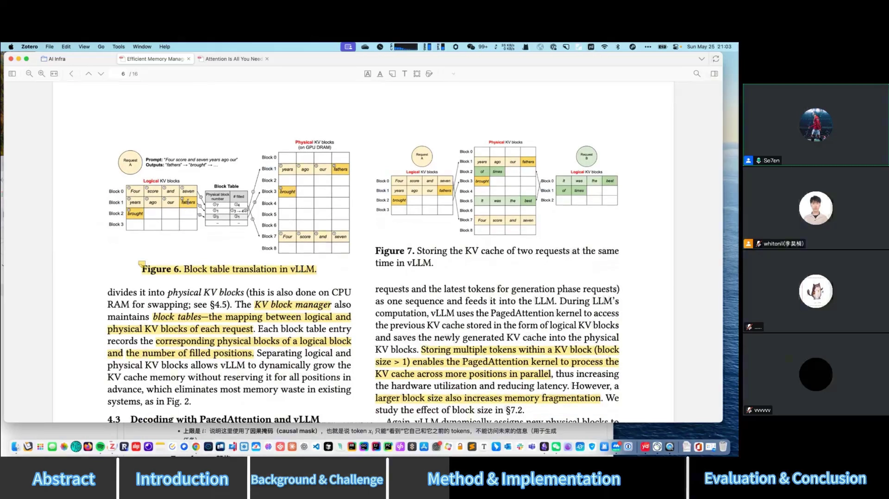 |
| 第二阶段，也就是自回归生成第一个 token 的时候，它生成下一个 token 是从 3~4 多占了一个。再下一个阶段，由于现有的 block 不够用了，它又要分配一个新的 block，就是逻辑 block 2，它对应到物理 block 3，用来放这个 token，并且在 block table 中更新 [【跳转到 58:13】](https://www.bilibili.com/video/BV1GWjjzfE1b/?t=3493) | 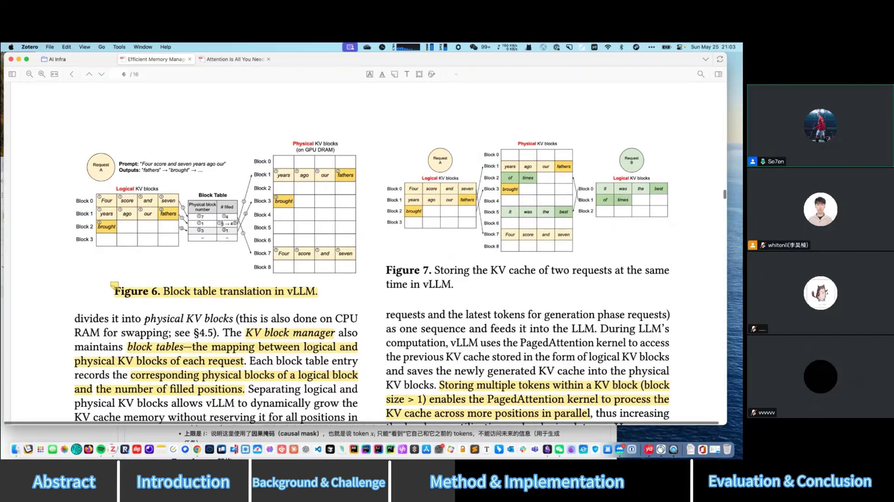 |
| 物理块 3 以及这个 block 中对应的 token 数量。也就是说，这个 block table 其实是 PagedAttention 中维护元数据的结构，每条记录记录了一个逻辑 block 与物理 block 的映射关系， [【跳转到 58:38】](https://www.bilibili.com/video/BV1GWjjzfE1b/?t=3518) |  |
| 以及这个 block 已使用的 token 数量。好，这是 4.3 部分。 [【跳转到 59:03】](https://www.bilibili.com/video/BV1GWjjzfE1b/?t=3543) | 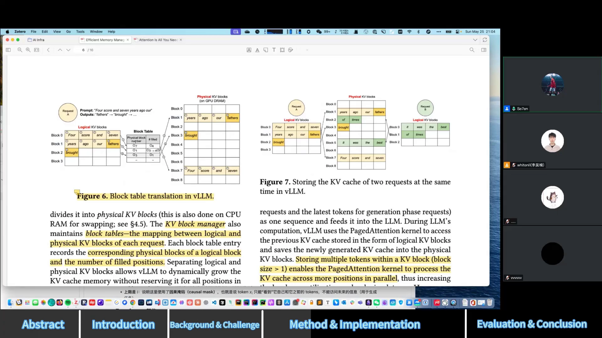 |
| 然后继续说到，在每个 decoding 阶段，vLLM 会首先从候选中选择一系列请求去做 batching。这里解释一下，因为并不是针对每个请求单独处理，而是从活跃的请求中选择一批一起进行推理、做 batch， [【跳转到 59:13】](https://www.bilibili.com/video/BV1GWjjzfE1b/?t=3553) | 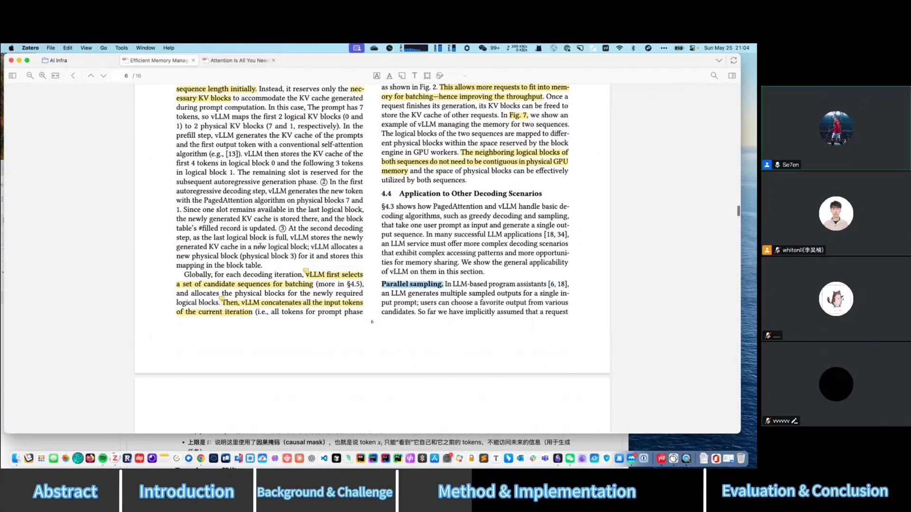 |
| 通过这种方式提升 GPU 利用率。并且 vLLM 会将所有 input 的 token 进行连接，也就是说它会把本轮迭代所有的 token——prefill 阶段的所有 token 以及 generation 最新生成的 token——拼接为一个序列然后处理。 [【跳转到 59:38】](https://www.bilibili.com/video/BV1GWjjzfE1b/?t=3578) | 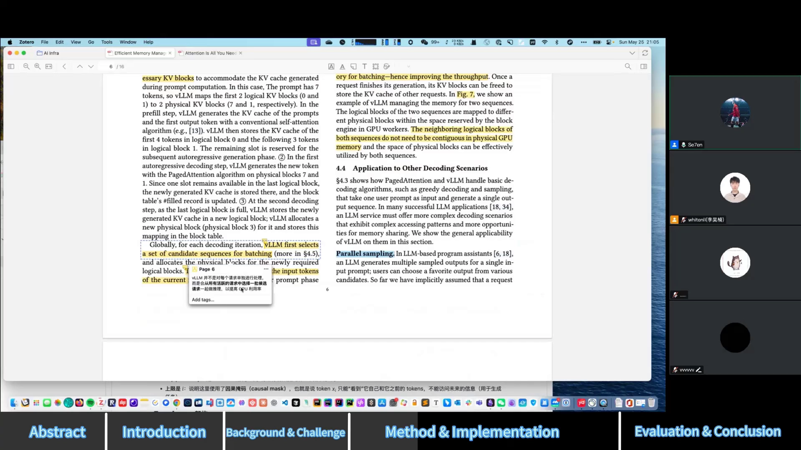 |
| 然后这里说，存储多个 token 在这个……它一般是大于 1 的；如果是大小为 1 的话，因为我前面说了这个自注意力机制，它是根据块去进行计算，而不是像原先那样按每个 token key 和 token 去计算。 [【跳转到 60:03】](https://www.bilibili.com/video/BV1GWjjzfE1b/?t=3603) | 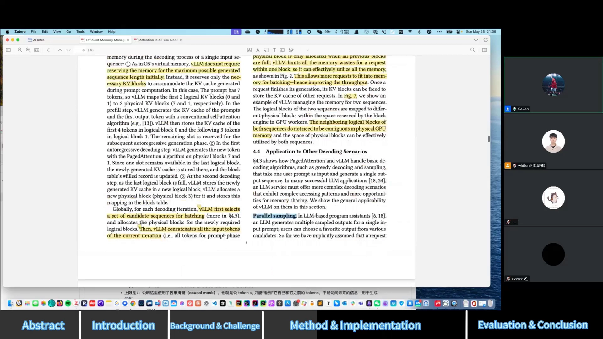 |
| 回来，使得 KV cache 的 kernel 可以通过更并行的方式去一致处理。但是比较大的 block size 会带来更大的 memory 碎片问题，所以后面会介绍他们通过实验去确定一个比较合适的 block size， [【跳转到 60:28】](https://www.bilibili.com/video/BV1GWjjzfE1b/?t=3628) | 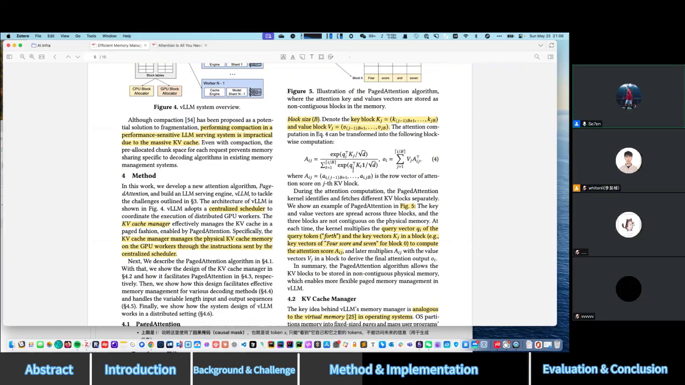 |
| 也就是 16 个 token 一个 block。这里说到，新的物理块也只是在原先所有 block 都满了以后才会去重新分配，通过这种方式减少内存浪费。 [【跳转到 60:53】](https://www.bilibili.com/video/BV1GWjjzfE1b/?t=3653) | 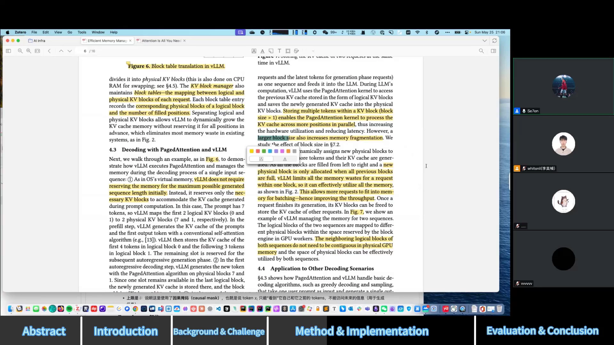 |
| 如果要说浪费，可能也只是一个 block，即最后一个或前几个没用到才会浪费，它不会去提前分配。这种方式就可以解决内存问题，同时节约内存，最终相同内存我就可以 serve 更多 request，通过这种方式进一步提升 [【跳转到 61:18】](https://www.bilibili.com/video/BV1GWjjzfE1b/?t=3678) | 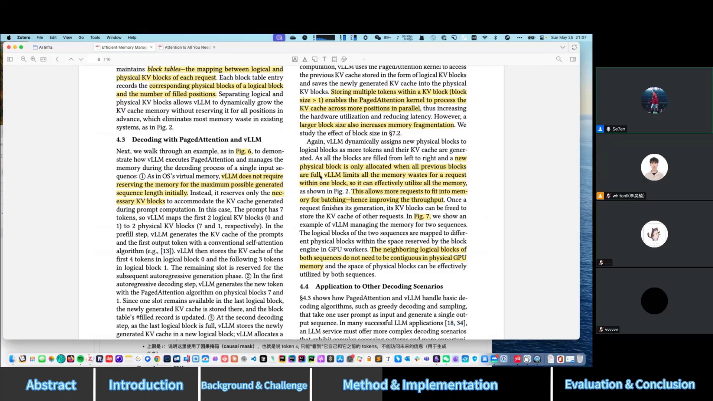 |
| 吞吐量。可以看下图七。图七是这个图，说明我有两个 request，左边这个黄色 request 占用了 block 1、block 3、block 7，右边的 request 占用了 block 2 等，这是物理内存。 [【跳转到 61:43】](https://www.bilibili.com/video/BV1GWjjzfE1b/?t=3703) | 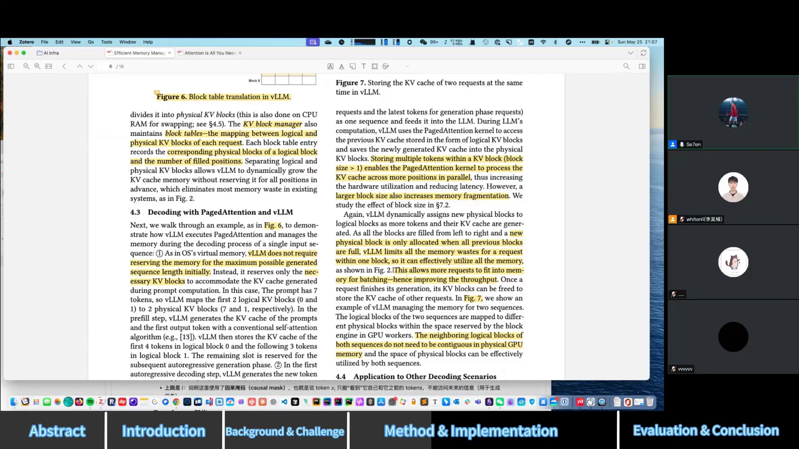 |
| 但它们实际上，虚拟内存、虚拟的逻辑 KV block，它们自己看到的都是 0、1、2、3，自己是一个独立的视角。并且虚拟 block 在自身请求看来是连续的，但实际上物理内存并不要求连续。 [【跳转到 62:08】](https://www.bilibili.com/video/BV1GWjjzfE1b/?t=3728) |  |
| 这就是 KV cache、也是 PagedAttention 的核心：我可以把一个连续的逻辑 KV block 映射到一个非连续的物理 KV block 上。好，我们继续。 [【跳转到 62:33】](https://www.bilibili.com/video/BV1GWjjzfE1b/?t=3753) | 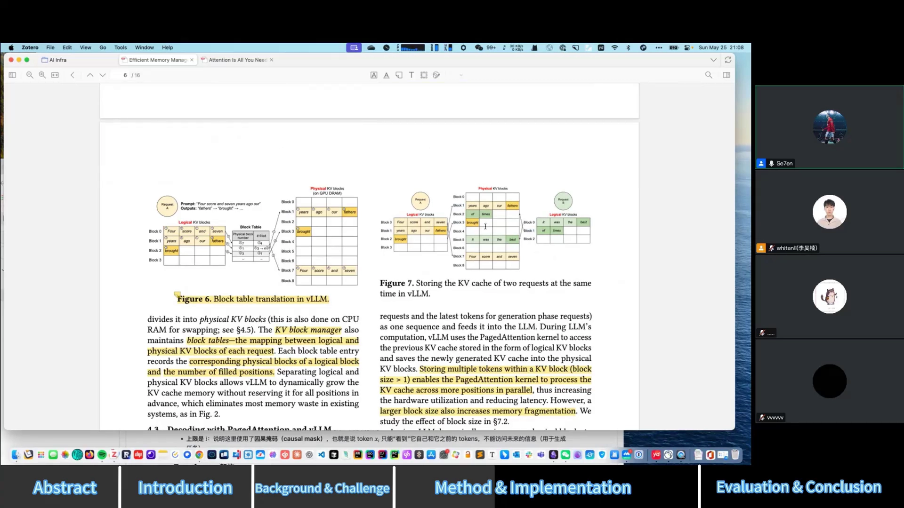 |
| 这里讲的是在不同 decoding 情况下的实际应用，讲了几种。我看一下，对，我是用蓝色标注的，比如 parallel sampling，前面介绍过一个 prompt 我可以生成多个 output 的情况。然后图八就是说，看下图八。 [【跳转到 62:58】](https://www.bilibili.com/video/BV1GWjjzfE1b/?t=3778) | 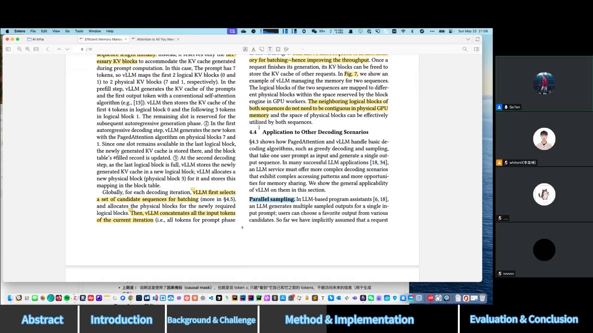 |
| 图八说的是，vLLM 在并行生成多个候选输出的时候，我其实就可以共享 prompt 阶段的 KV cache，也就是 parallel sampling。比如你看到 "four score and seven years ago" [【跳转到 63:23】](https://www.bilibili.com/video/BV1GWjjzfE1b/?t=3803) | 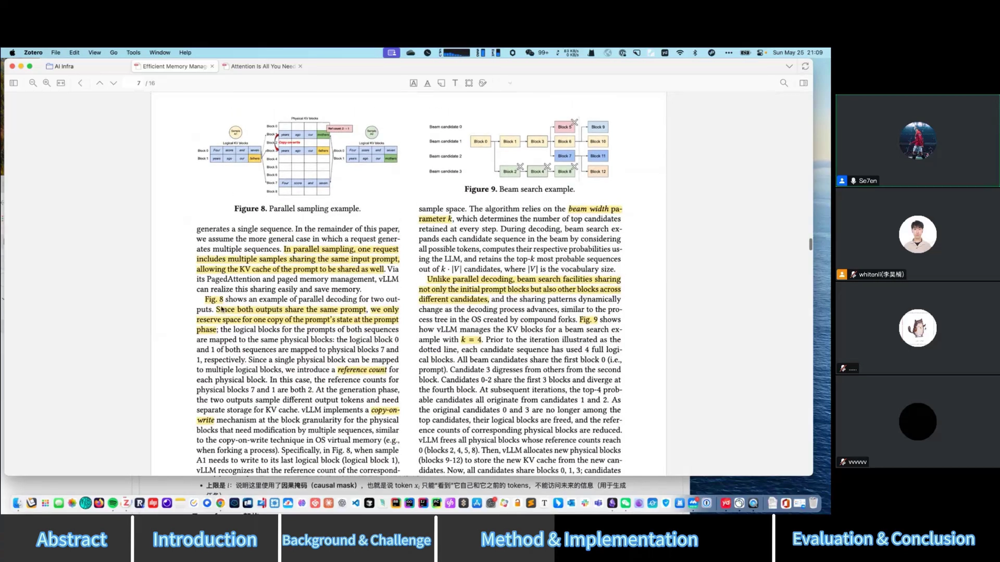 |
| 这里就是 prompt，一开始它们其实是共享的，这个 block 0 是能共享的，还有这个 block 1 也是共享的。但是随着输出生成，sample A1 生成的是 "fathers"，sample A2 生成的是 "mothers"，那这个时候 block 1 就不能共享了，这时候它就要把 block 1 做一个…… [【跳转到 63:48】](https://www.bilibili.com/video/BV1GWjjzfE1b/?t=3828) |  |
| 在之前能共享的时候，顺便提一下，它这有个 reference count，就是计算这个共享的 block 1 被几个 sample 共享，一开始是 2。但是随着生成下一个 token 出现分歧——这里是 fathers，这是 mothers——所以不能共享了。比如这里做了一个 copy-on-write 的机制，这时候需要把 block 1 拷贝一份到 block 2， [【跳转到 64:13】](https://www.bilibili.com/video/BV1GWjjzfE1b/?t=3853) |  |
| 就是拷贝之前一样的，然后把不同的新 token 填进去，同时 ref count 从 2 减到 1。但是你看，其实 block 0 这部分 prompt 还是能共享的。这就是图八的一个解释。 [【跳转到 64:38】](https://www.bilibili.com/video/BV1GWjjzfE1b/?t=3878) |  |
| 这种机制有什么用呢？尤其是对于比较长的 input prompt。有时候大家做一些比较复杂的任务，可能会给大模型很明确、很详细的提示词，这个 prompt 有时候可能有几千个 token。这种情况下我去生成的话， [【跳转到 65:03】](https://www.bilibili.com/video/BV1GWjjzfE1b/?t=3903) | 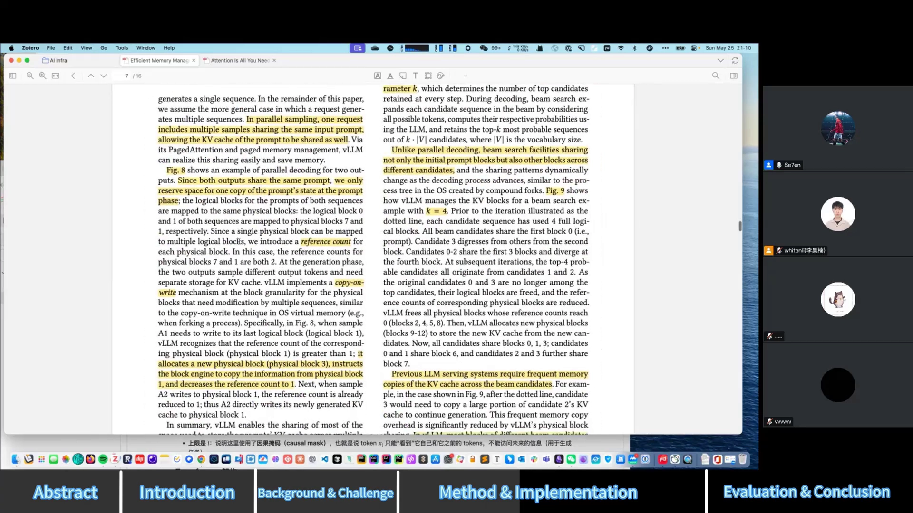 |
| 其实会有很好的内存节约效果。第二种就是 beam search，beam search 可以用在翻译的情况下。这里 beam search 给了一个例子。其实 beam search 比 parallel sampling 能共享内存的地方更多， [【跳转到 65:28】](https://www.bilibili.com/video/BV1GWjjzfE1b/?t=3928) |  |
| 所以不仅可以共享原始的 prompt 块，还可以在不同的候选序列之间、在生成阶段中共享。 [【跳转到 65:53】](https://www.bilibili.com/video/BV1GWjjzfE1b/?t=3953) | 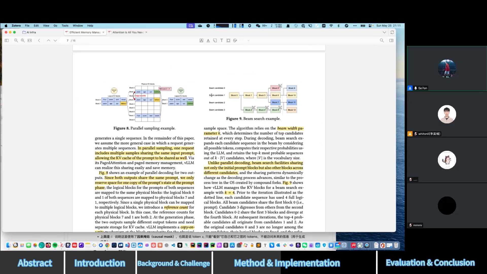 |
| 就像我前面给的这个图，这部分翻译。 [【跳转到 66:04】](https://www.bilibili.com/video/BV1GWjjzfE1b/?t=3964) | 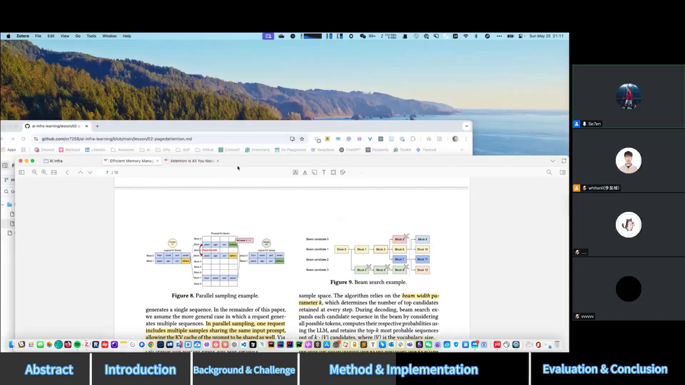 |
| 这部分其实也还是能够共享的。它不仅是 prompt 阶段，生成阶段也是有共享的。所以 beam search 他们说最多可以有 50% 的 memory 是可以 sharing 的。 [【跳转到 66:09】](https://www.bilibili.com/video/BV1GWjjzfE1b/?t=3969) | 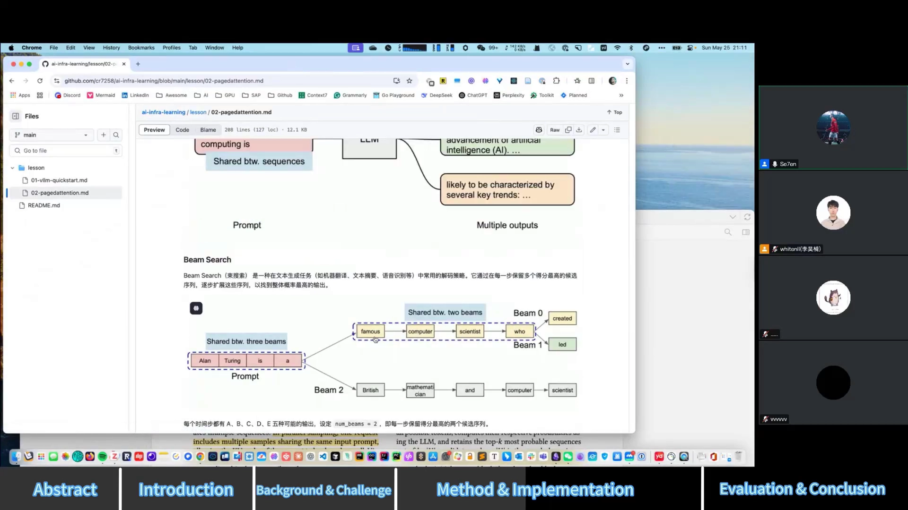 |
| 好，然后这个图介绍的是，比如 beam 这里设置了 num_beams，也就是 K 等于 4，我要选 top-4。比如在这个阶段，我是 block 0……我是 beam 0，还有 candidate 1，还有 candidate 2。 [【跳转到 66:24】](https://www.bilibili.com/video/BV1GWjjzfE1b/?t=3984) |  |
| 其实我这一部分前面还是能共享的。然后候选序列 3，我是从第二个开始就不一样了，那它就不能共享，但是前面的这些还是能共享的。 [【跳转到 66:49】](https://www.bilibili.com/video/BV1GWjjzfE1b/?t=4009) | 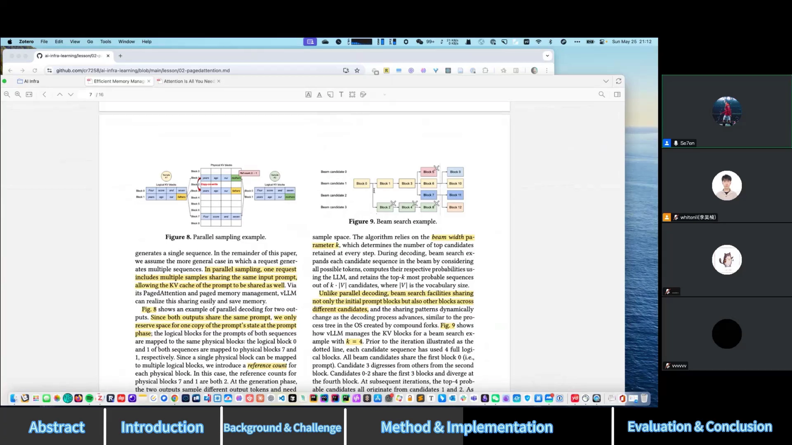 |
| 然后继续。这里提到，原先这些 LLM service system，如果我要共享，它就需要做直接的拷贝，会带来很频繁的内存拷贝，在多个 beam 和 candidate 之间进行拷贝。 [【跳转到 67:14】](https://www.bilibili.com/video/BV1GWjjzfE1b/?t=4034) | 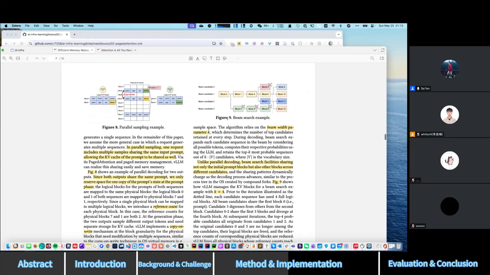 |
| 这种方式比较笨重，并且没有共享，等于是简单粗暴地复制多份，也没有做到内存节约。而在 vLLM 中，像刚才提到的情况下，大部分其实就能够共享了。下一个部分就是 shared prefix。 [【跳转到 67:39】](https://www.bilibili.com/video/BV1GWjjzfE1b/?t=4059) | 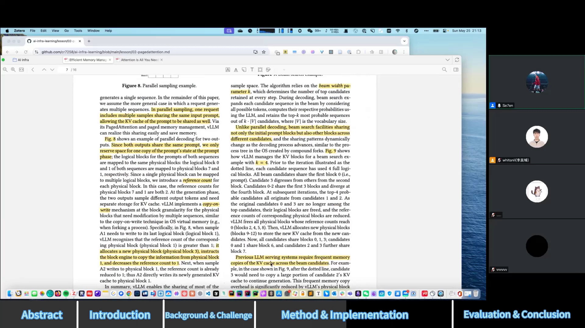 |
| 比如用户可以像刚才说的提供一个很长的 prompt，可以认为是 system prompt。比如这个图说，这里说…… [【跳转到 68:04】](https://www.bilibili.com/video/BV1GWjjzfE1b/?t=4084) | 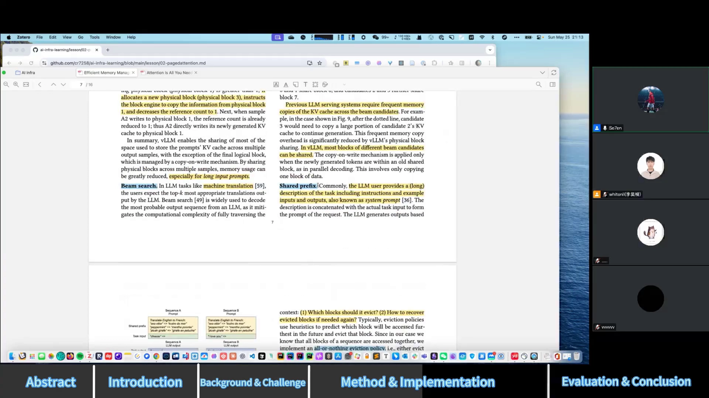 |
| 比如 "translate English to French"，这里给了一个提示词，先给英语再给法语，然后给你几个例子，再让大模型进行翻译，它可能就给出问题，这就是问题。这里给的就是这些可能是 system prompt，这些基本是完全一样的。这种情况就是 shared prefix，也是一个可以共享内存的场景。 [【跳转到 68:18】](https://www.bilibili.com/video/BV1GWjjzfE1b/?t=4098) | 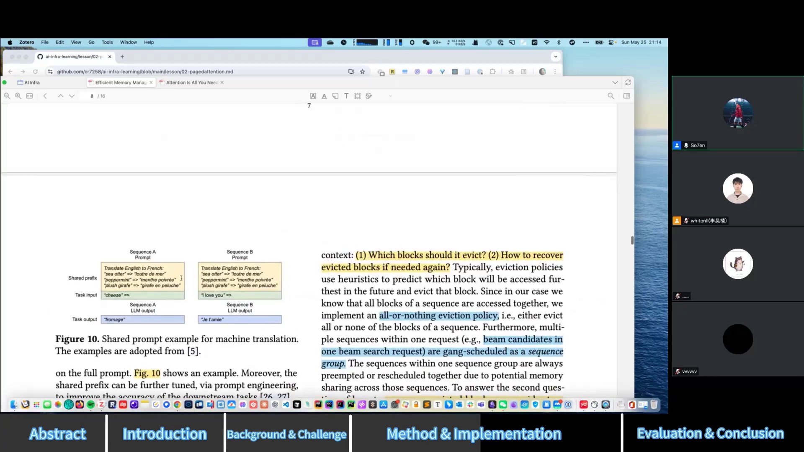 |
| 而且尤其是这种需要的 prefix 非常长的时候，共享效果就越好。这里也做了个类比，就像在操作系统中去共享这些 library、在多个进程中共享这些 library 的思想是类似的。 [【跳转到 68:43】](https://www.bilibili.com/video/BV1GWjjzfE1b/?t=4123) | 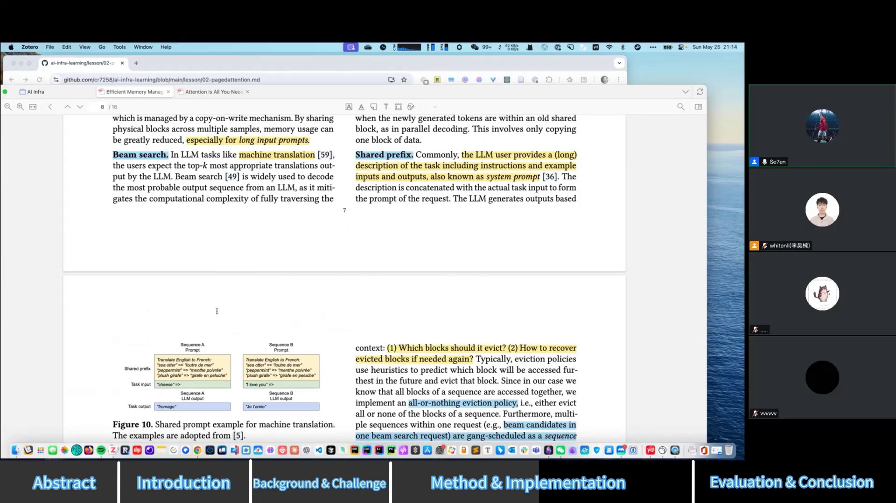 |
| 这边看一下。这里说到，前面讨论的各种解码方法，其实在内存共享和访问的方式上有很大的差异。 [【跳转到 69:08】](https://www.bilibili.com/video/BV1GWjjzfE1b/?t=4148) |  |
| 比如 beam search，它不仅是 prompt，还有生成的候选之间都可以共享 KV 块；而 parallel sampling 是可以共享 prompt，但后续是完全分开的。原先的一些 vLLM 之前的引擎没有办法很好地处理这种情况。而 vLLM 可以通过将逻辑块到物理块的 [【跳转到 69:33】](https://www.bilibili.com/video/BV1GWjjzfE1b/?t=4173) | 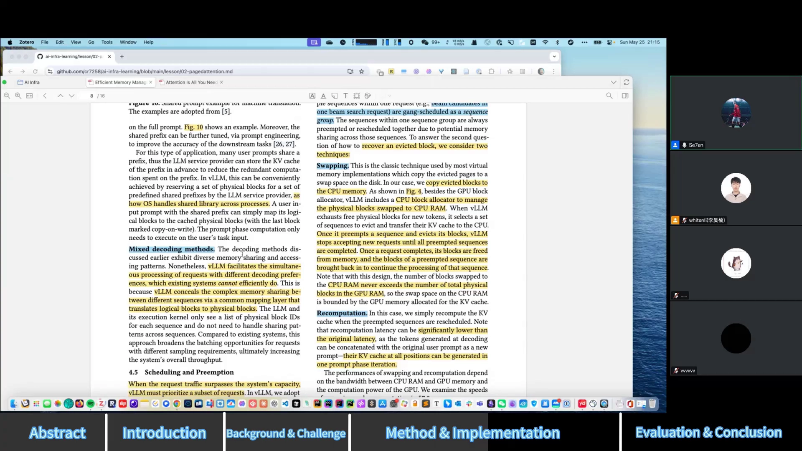 |
| 统一抽象映射，屏蔽了解码方法之间不同的内存共享逻辑，就是不同的解码方法可以在同一个请求系统中高效地并行执行，通过这种方式提升吞吐性能和 batch 能力。这也是当前这些系统难以做到的。 [【跳转到 69:58】](https://www.bilibili.com/video/BV1GWjjzfE1b/?t=4198) |  |
| 下一部分说到了调度和抢占。比如当请求超过了当前系统的存储能力，vLLM 就必须对请求的优先级进行排序。 [【跳转到 70:23】](https://www.bilibili.com/video/BV1GWjjzfE1b/?t=4223) | 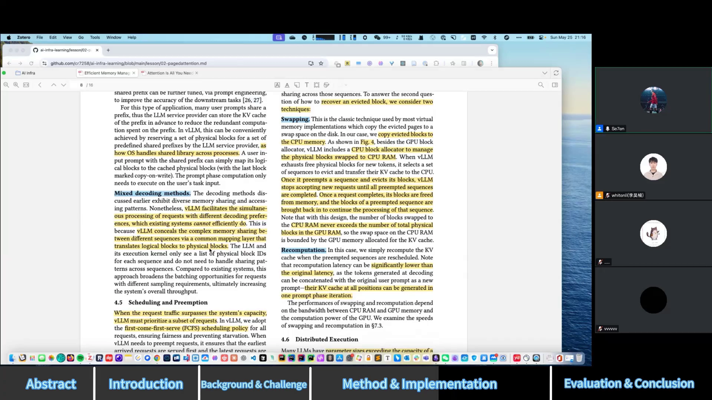 |
| 先来先处理。但这里又有一个问题：正常情况下我是先来先处理的调度策略，但有一些异常情况下，比如我的请求超过系统的承受能力，那这时候我就要对 KV block 进行驱逐，把显存释放出来 [【跳转到 70:48】](https://www.bilibili.com/video/BV1GWjjzfE1b/?t=4248) | 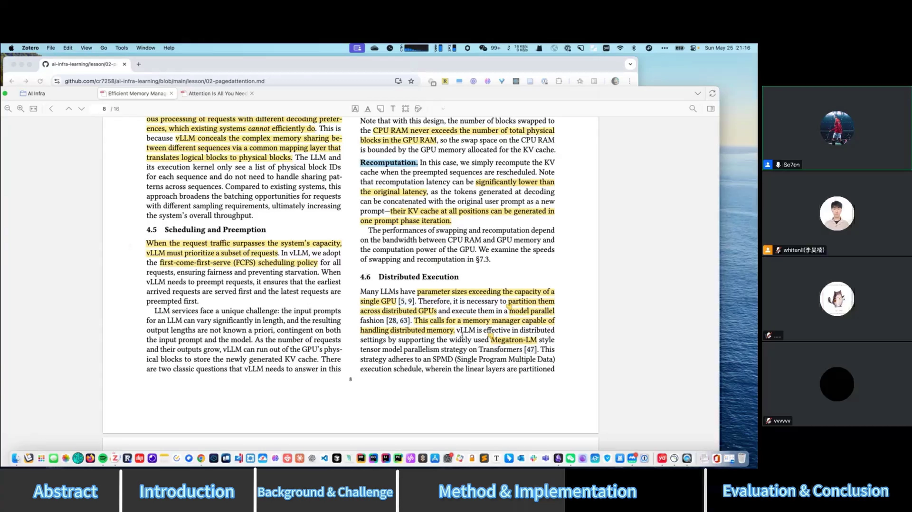 |
| 去处理优先级更高的请求。这里有几个问题：哪个 block 应该被驱逐？当这个 block 被驱逐的时候，如果我后面还需要用，怎么把它恢复？这里遵循一个机制，叫 "all-or-nothing" 的 eviction policy。 [【跳转到 71:13】](https://www.bilibili.com/video/BV1GWjjzfE1b/?t=4273) | 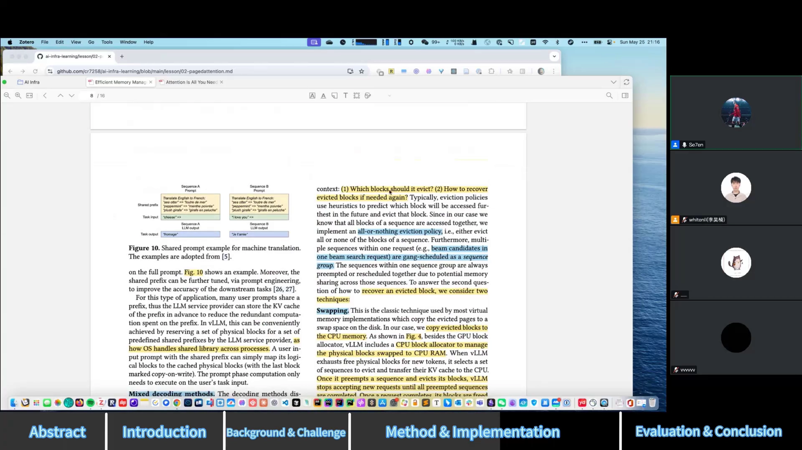 |
| 简单来说就是，因为一个请求可能会用到多个 block，那要么这个请求所有的 block 我都驱逐，要么都不驱逐。因为如果你驱逐了一部分，剩下的又不驱逐，那这些肯定用不了了。所以要么是 all，要么是 nothing。而且像 beam search 的 candidate 这种情况， [【跳转到 71:38】](https://www.bilibili.com/video/BV1GWjjzfE1b/?t=4298) | 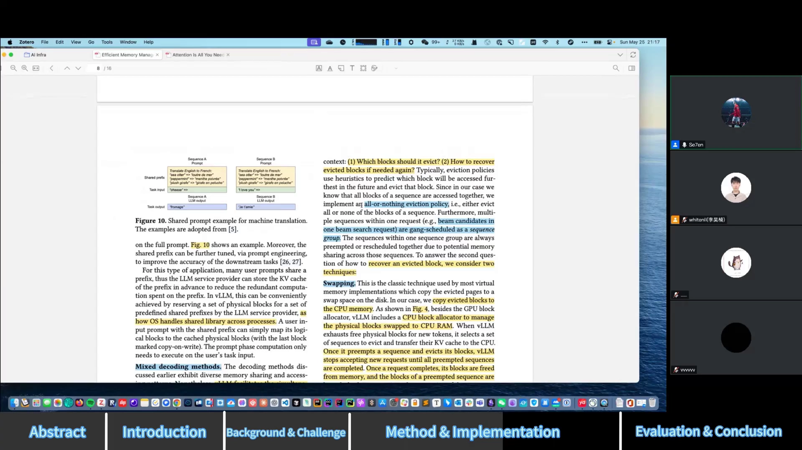 |
| 因为它有多个输出，这种情况更复杂一点，它就遵循 "beam search schedule" 的模式，把多个 output 的 beam search candidate 都视为一个 sequence。要么都驱逐，要么都不驱逐。驱逐以后要考虑怎么恢复，这里有两种方式：一种叫 swapping， [【跳转到 72:03】](https://www.bilibili.com/video/BV1GWjjzfE1b/?t=4323) |  |
| 一种叫 recomputation。换出（swap）就是把已经驱逐的 block 从 GPU memory 拷贝到 CPU memory，就像图四中说的。所以这里说有两个 [【跳转到 72:28】](https://www.bilibili.com/video/BV1GWjjzfE1b/?t=4348) | 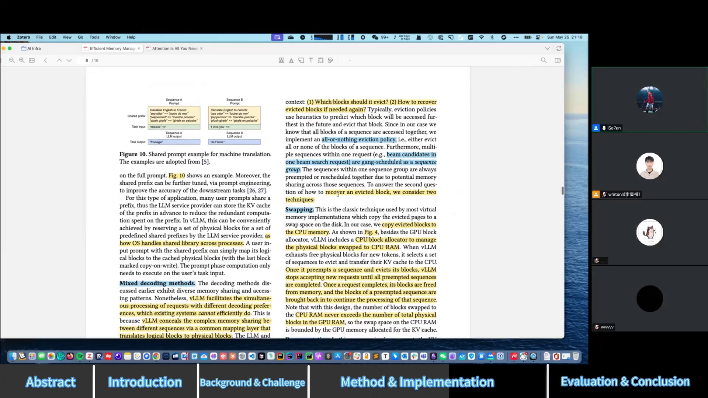 |
| allocator：一个是 GPU block allocator，一个是 CPU block allocator。CPU block allocator 就是去管理这些从 GPU block offload 上来的被驱逐的 block。然后继续说，一旦有 sequence 被抢占（preempt）， [【跳转到 72:53】](https://www.bilibili.com/video/BV1GWjjzfE1b/?t=4373) | 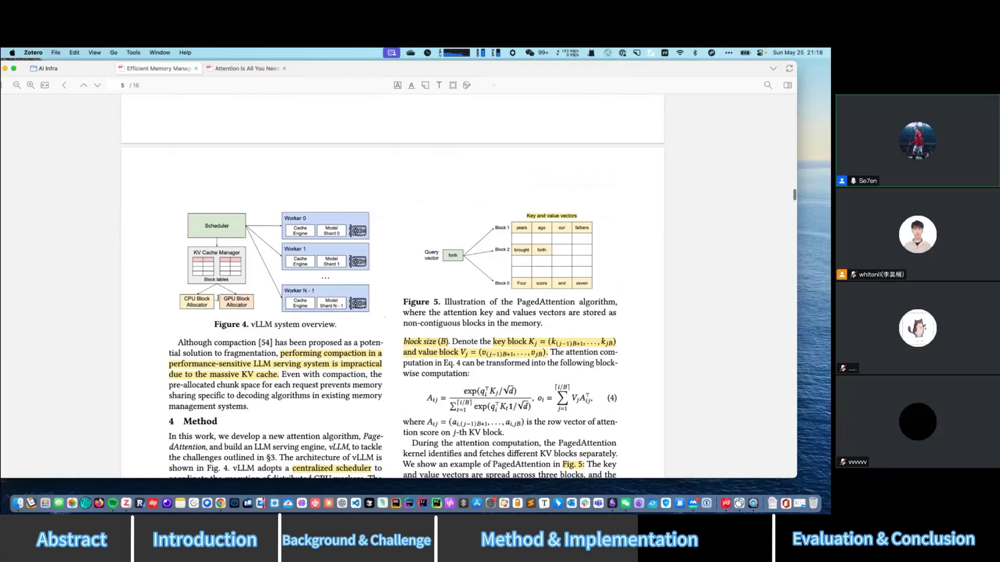 |
| 就是有些 sequence 被 evict 掉，vLLM 就会停止接收新的请求，直到所有被驱逐的 sequence 都完成了。一旦这个请求完成了、block 被释放掉，它就可以从之前被抢占、被 evict 的那些 block [【跳转到 73:18】](https://www.bilibili.com/video/BV1GWjjzfE1b/?t=4398) | 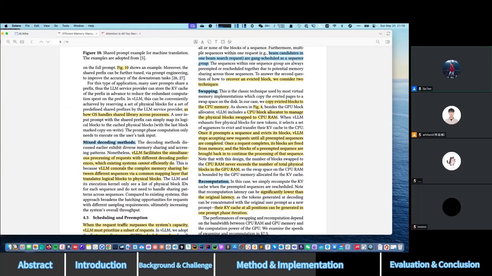 |
| 从 GPU 中拿回来进行处理。这边为什么不再接受新请求？因为你如果在 evict 之后还接受请求，那你原先驱逐掉的这些就永远处理不了了。所以要先保证把这些驱逐掉的全部处理完，然后再去接受新的请求。而且因为被 evict 掉的这些 [【跳转到 73:43】](https://www.bilibili.com/video/BV1GWjjzfE1b/?t=4423) |  |
| 是从 GPU 拷贝到 CPU 的，所以 GPU 的内存占用不会超过物理 block 在 GPU 中的总内存数量。第二种就是 recomputation。swap 过去只是把这些 KV block 暂存在 CPU 的内存中， [【跳转到 74:08】](https://www.bilibili.com/video/BV1GWjjzfE1b/?t=4448) | 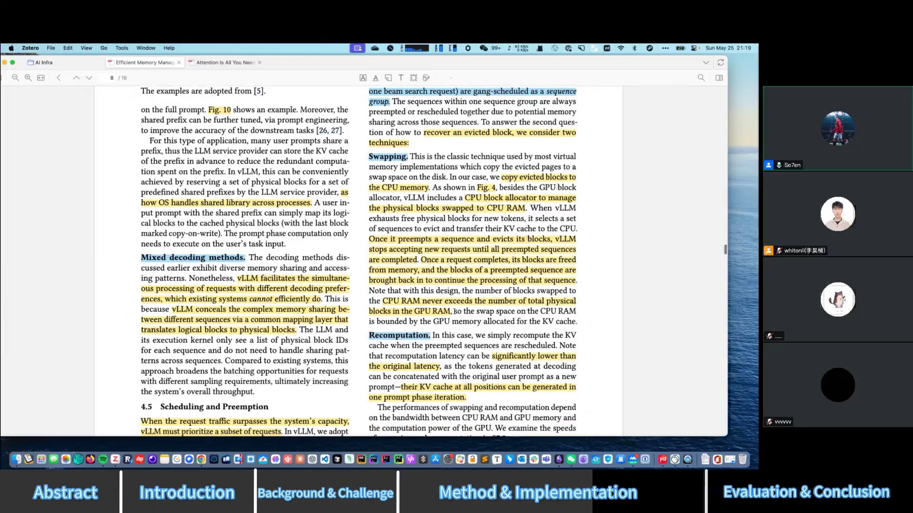 |
| 那我拷回来其实也很方便，不需要重新计算。而 recomputation，顾名思义就是重新再算一遍，但是它比原先那个算会稍微快一点。为什么？因为原先比如我解码的时候已经算到中间了，那我从 prompt 跟解码 output 中间的这个部分 [【跳转到 74:33】](https://www.bilibili.com/video/BV1GWjjzfE1b/?t=4473) | 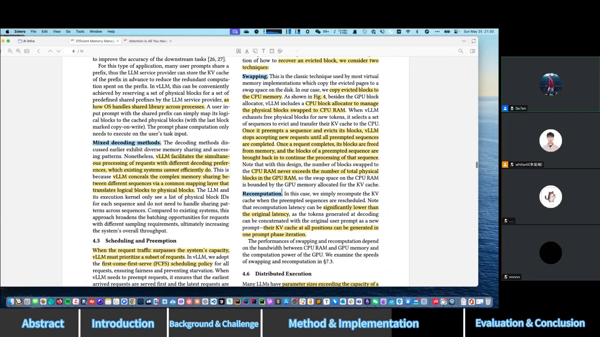 |
| 我不需要再自回归地一遍遍算过去，我可以把 prompt 加之前算过的中间那部分一次性进行一个 KV 的计算就完事了，然后再基于这个基础一个个生成 token。所以 recomputation 会比之前自回归解码的计算过程快一些。 [【跳转到 74:58】](https://www.bilibili.com/video/BV1GWjjzfE1b/?t=4498) |  |
| 好，继续。4.6 部分讲的是分布式执行。因为通常大语言模型的参数量比较大，会超过单个 GPU 的承受能力。比如我们前面这个图说的是 13B 的， [【跳转到 75:23】](https://www.bilibili.com/video/BV1GWjjzfE1b/?t=4523) | 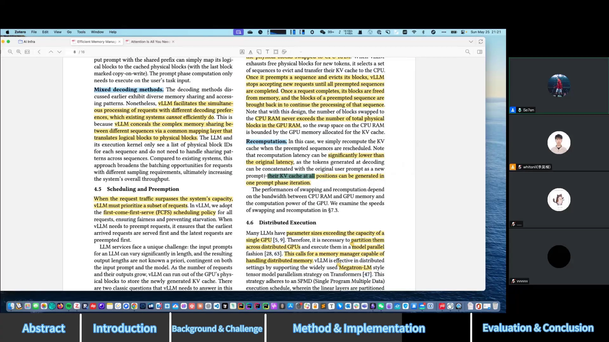 |
| 13B 也会占到 26GB。那如果我是一个 70B 的，不就是 140GB 吗？那单个 GPU 肯定放不下，这时候我就要把它放到多个 GPU 上，所以就需要一些分布式推理能力。既然分布式推理， [【跳转到 75:48】](https://www.bilibili.com/video/BV1GWjjzfE1b/?t=4548) | 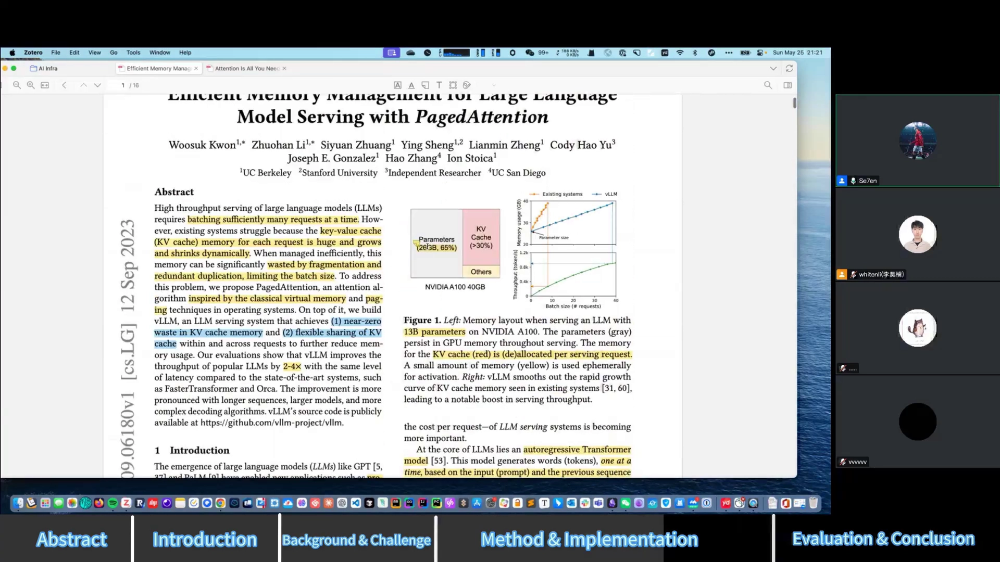 |
| 它就会要求我们能够在不同的 GPU 上去管理内存分配。vLLM 支持类似 Megatron 风格的模型并行策略。这里说一下模型并行策略， [【跳转到 76:13】](https://www.bilibili.com/video/BV1GWjjzfE1b/?t=4573) |  |
| 简单解释就是，把模型的不同部分，比如不同的层或张量参数，分配到多个 GPU 上。比如 70B 的模型可能 20B 在一个 GPU 上，另外的 20B 在另外一个 GPU 上，每个 GPU 只负责计算模型的一部分。 [【跳转到 76:38】](https://www.bilibili.com/video/BV1GWjjzfE1b/?t=4598) |  |
| 这其实属于英伟达提出的一种训练框架。vLLM 就是通过模型并行的方式，把训练分配到多个 GPU 上，实现有效训练这种参数量非常大、像万亿或千亿参数的大模型。 [【跳转到 77:03】](https://www.bilibili.com/video/BV1GWjjzfE1b/?t=4623) | 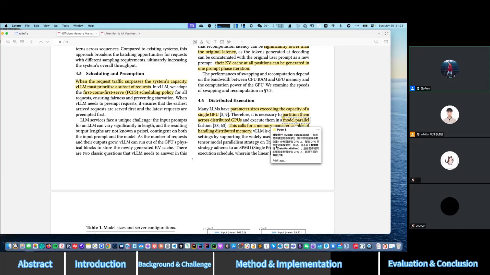 |
| 它能支持这种模型并行策略。那我把模型分配到不同 GPU 上做推理，最终需要汇总结果，汇总结果可以使用 all-reduce 这个操作 [【跳转到 77:28】](https://www.bilibili.com/video/BV1GWjjzfE1b/?t=4648) | 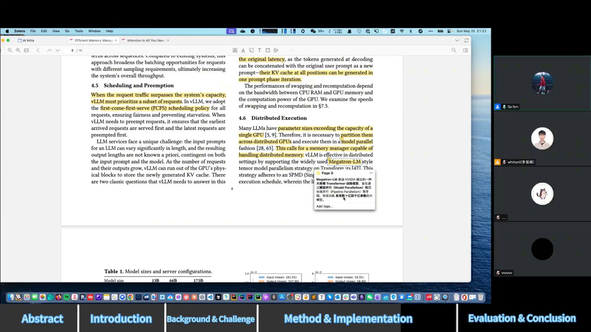 |
| 把中间结果汇总，然后最终输出。再看一下。行，喝口水，OK，我看一下。 [【跳转到 77:53】](https://www.bilibili.com/video/BV1GWjjzfE1b/?t=4673) | 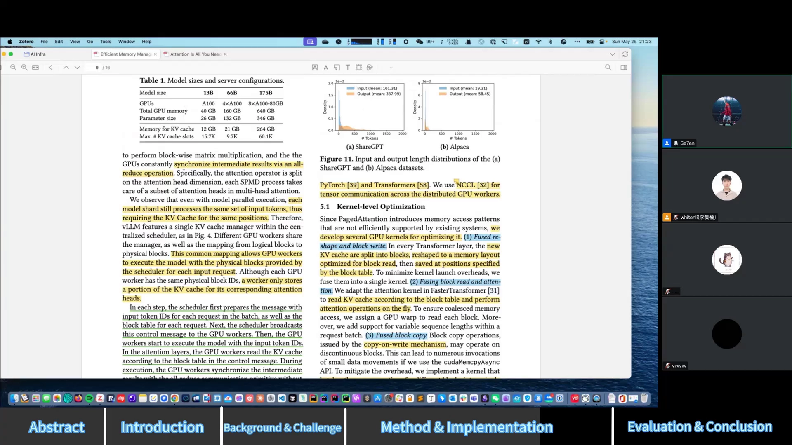 |
| 应该再过半个小时差不多讲完，差不多今天到十点。可以。然后这里说到，尽管我们可以使用模型并行的执行方式， [【跳转到 78:18】](https://www.bilibili.com/video/BV1GWjjzfE1b/?t=4698) | 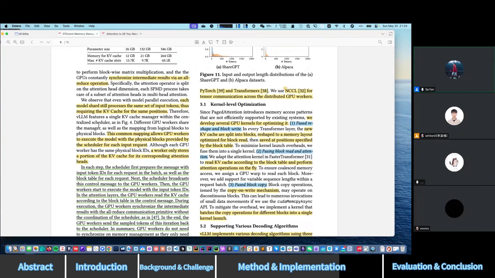 |
| 那每个模型分片仍然需要处理相同的 token 序列，因此它们都需要在相同的位置上保留对应的 KV cache。所以我的 vLLM 需要使用一个统一的 KV cache manager 来协调各个 GPU 的操作。 [【跳转到 78:43】](https://www.bilibili.com/video/BV1GWjjzfE1b/?t=4723) | 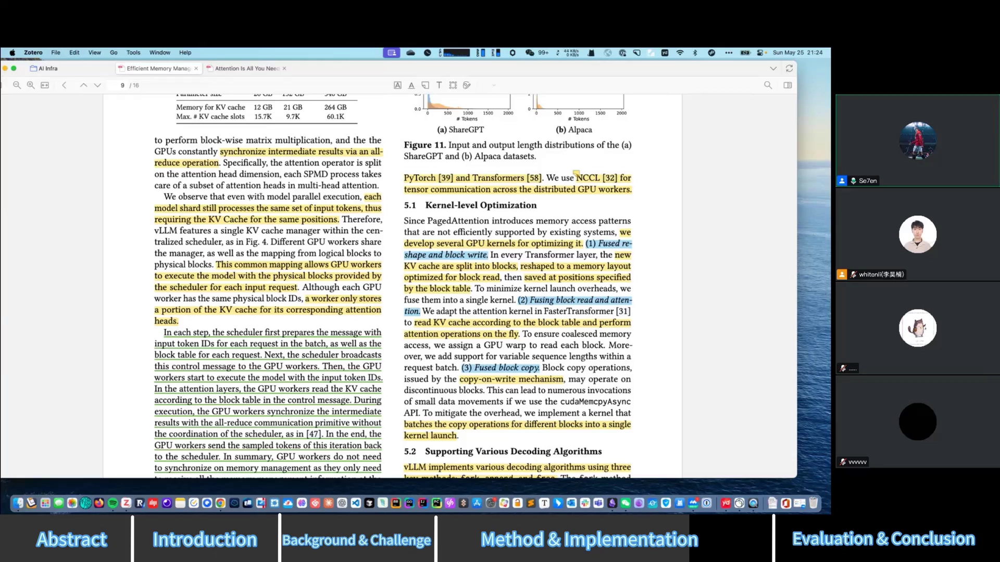 |
| 所有 GPU worker 其实共享这个 KV cache manager 的逻辑块到物理块的映射表。这种通用机制可以让 GPU worker 根据调度器提供的物理 block 进行推理。那每个 GPU worker 其实可以看…… [【跳转到 79:08】](https://www.bilibili.com/video/BV1GWjjzfE1b/?t=4748) | 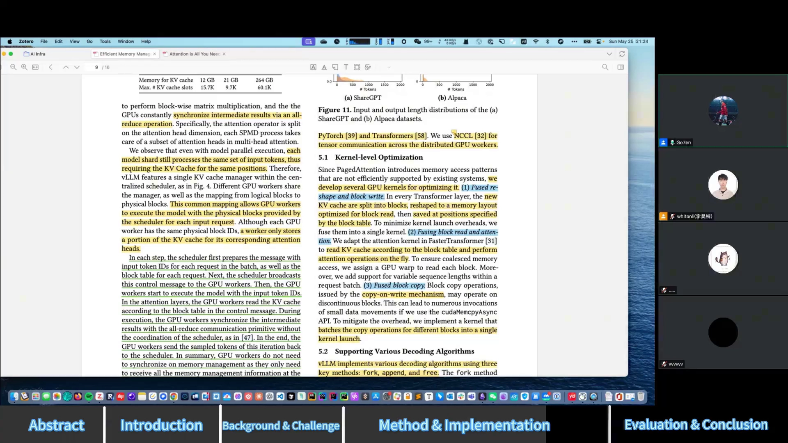 |
| 是有相同的物理 block id 列表。但是每个 worker 实际上只存储自己负责的 head。这里 head 指的就是比如 Transformer 的 multi-head attention 那个 head，自己处理内部分 head 的 KV cache。 [【跳转到 79:33】](https://www.bilibili.com/video/BV1GWjjzfE1b/?t=4773) |  |
| 这里说到，介绍了在每个解码过程中，调度器和 GPU worker 之间的交互方式。每个解码步骤中，首先调度器为每个 batch 中的请求准备一个叫 control message（控制信息）， [【跳转到 79:58】](https://www.bilibili.com/video/BV1GWjjzfE1b/?t=4798) | 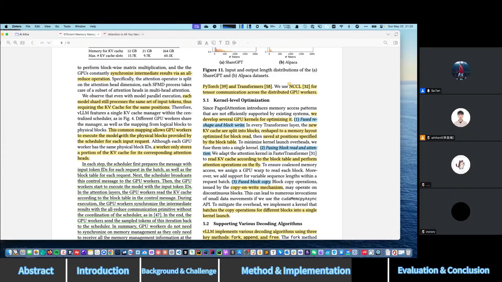 |
| 其中包括 token 的 id，以及这个请求的 block table，也就是逻辑块到物理块的映射关系。接下来，调度器会将这些控制信息广播给所有的 GPU worker，GPU worker 会根据这些输入的 token id 去执行模型推理。 [【跳转到 80:23】](https://www.bilibili.com/video/BV1GWjjzfE1b/?t=4823) |  |
| 在注意力层中，GPU worker 会根据控制信息提供的 block table 去对应读取 KV cache。在执行过程中，刚提到可以使用 all-reduce 这种通信原语，vLLM 使用的是 NCCL 这个通信库 [【跳转到 80:48】](https://www.bilibili.com/video/BV1GWjjzfE1b/?t=4848) | 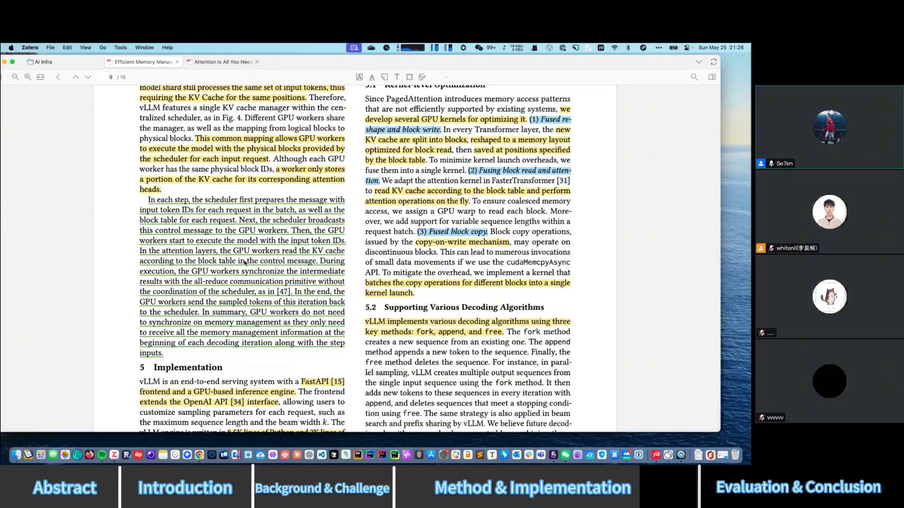 |
| 来做 all-reduce 操作，同步计算中间结果，这个过程不需要调度器参与。最终 GPU worker 会把本轮生成 token 的结果发回给调度器。这就是一个解码过程中调度器和 worker 的交互关系。这部分 implementation 也比较重要。 [【跳转到 81:13】](https://www.bilibili.com/video/BV1GWjjzfE1b/?t=4873) |  |
| Implementation（实现）呢，就是说 vLLM 使用了 FastAPI 作为前端来接收请求，并且兼容 OpenAI 的 interface，你可以使用 OpenAI 的 SDK 等去请求 vLLM [【跳转到 81:38】](https://www.bilibili.com/video/BV1GWjjzfE1b/?t=4898) |  |
| 来做推理。并且 vLLM 还包含 GPU-based 的 inference engine 作为后端。它发论文的时候是 2023 年，大概有 8500 行 Python 代码和 2000 行左右的 C++/CUDA 代码。像 controller 相关的组件， [【跳转到 82:03】](https://www.bilibili.com/video/BV1GWjjzfE1b/?t=4923) |  |
| 主要像 scheduler 和 block manager 是用 Python 写的，而像 PagedAttention 这些操作他们就是用 CUDA kernel 来实现的。对于 model executor，这里再简单说一下什么是 model executor，它是执行大语言模型 [【跳转到 82:28】](https://www.bilibili.com/video/BV1GWjjzfE1b/?t=4948) |  |
| 推理任务时实际负责计算的组件或模块，比如负责加载模型权重、执行前向推理计算并返回结果。实现这个 model executor，他们使用了比如 PyTorch 和 HuggingFace 的 [【跳转到 82:53】](https://www.bilibili.com/video/BV1GWjjzfE1b/?t=4973) | 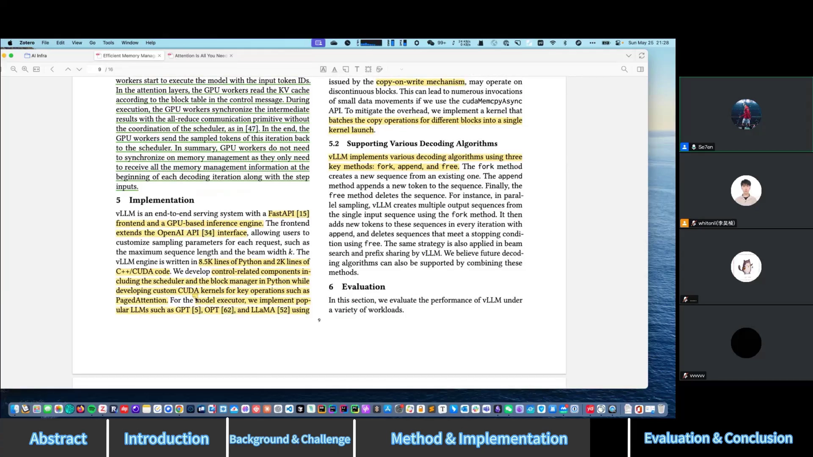 |
| Transformer library 来实现对 GPT、LLaMA 这些主流大语言模型的支持。这里也提到它使用了 NCCL 这个通信库来负责跨多个 GPU worker 的通信，比如做一些 all-reduce、broadcast 操作。 [【跳转到 83:18】](https://www.bilibili.com/video/BV1GWjjzfE1b/?t=4998) | 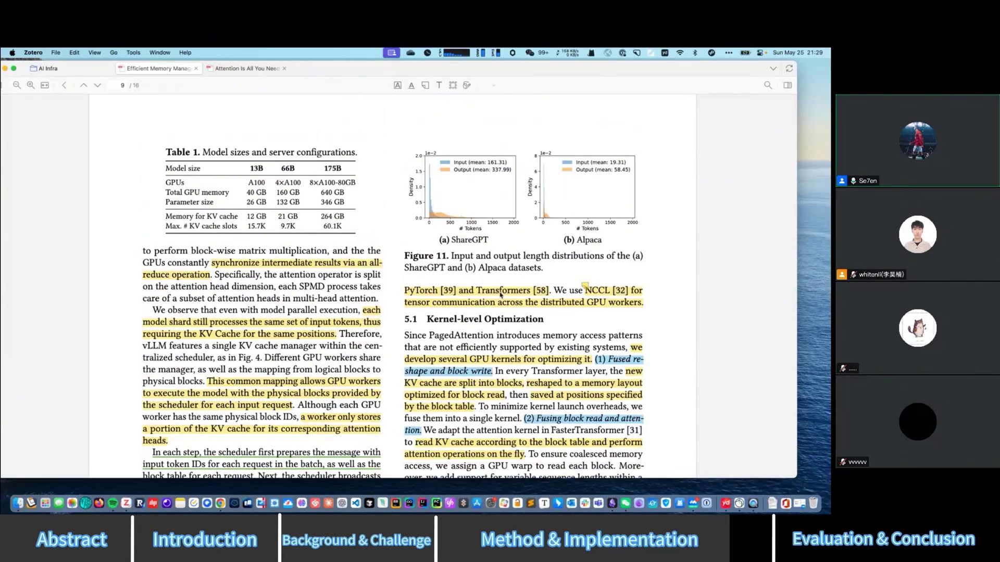 |
| 关于 NCCL，这里简单介绍：它是英伟达提供的、用于 GPU 之间高效数据同步的通信库，可以在多卡之间做分布式训练。然后这部分也比较重要，是 vLLM 在 kernel 层的优化。这里提到有三个优化点。 [【跳转到 83:43】](https://www.bilibili.com/video/BV1GWjjzfE1b/?t=5023) |  |
| 具体优化就是对一些 GPU kernel 算子做优化，比如可以把多个操作融合成一个操作，通过减少、合并操作来提升运行效率。那它做了哪些算子融合呢？ [【跳转到 84:08】](https://www.bilibili.com/video/BV1GWjjzfE1b/?t=5048) | 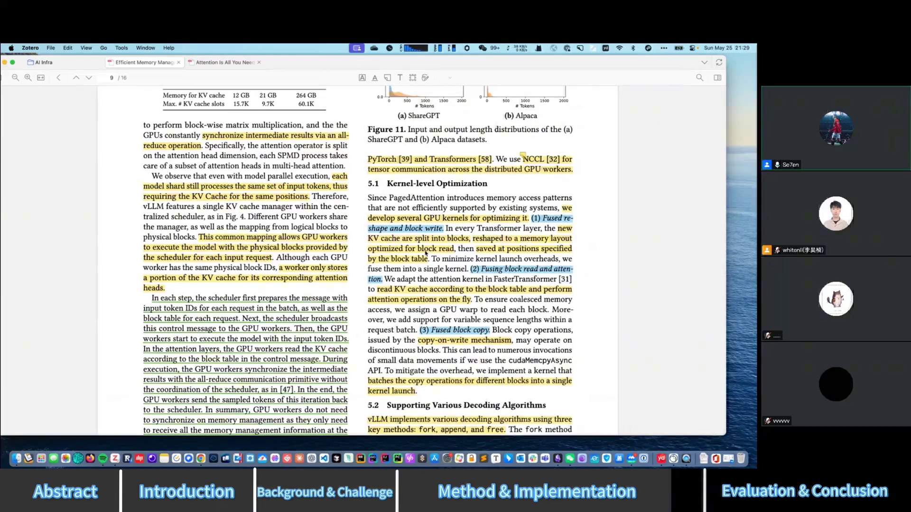 |
| 第一个是 reshape 和 block write。这边说了，在每一层的 Transformer 层中，新增的 KV cache 会被拆分成多个块，并 reshape 成一种针对块读取优化了的内存布局，然后再被写入到 block table 中的指定位置。 [【跳转到 84:33】](https://www.bilibili.com/video/BV1GWjjzfE1b/?t=5073) | 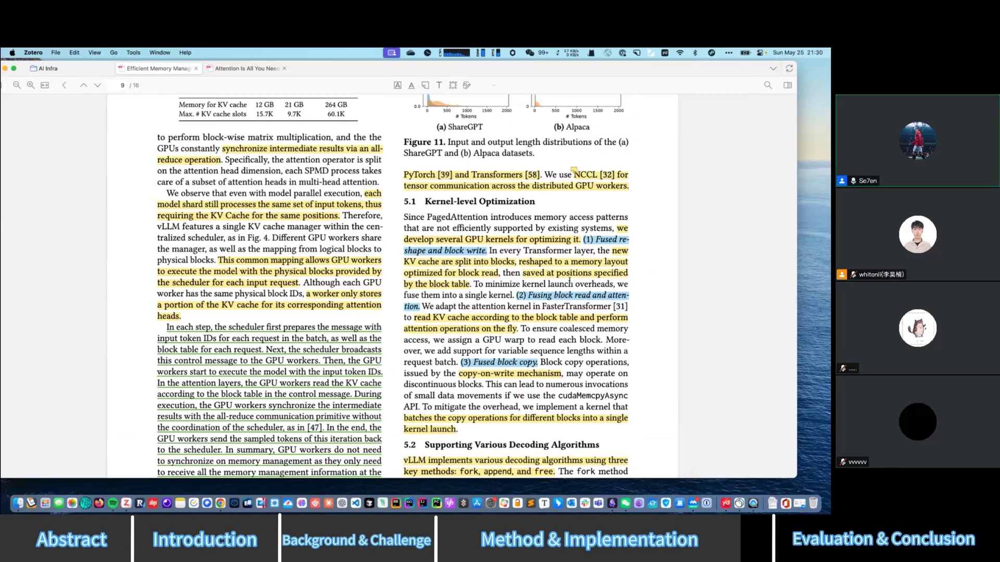 |
| 为了减少 kernel launch（启动）的开销，就把 reshape 和 write 这两个操作合并成一个 single kernel。这里顺便简单说一下什么是 kernel，普及一下：GPU kernel 就是运行在 GPU 上的一种函数，可以通过大量线程并行执行相关代码， [【跳转到 84:58】](https://www.bilibili.com/video/BV1GWjjzfE1b/?t=5098) |  |
| 从而执行更高效的计算。你可以认为 GPU kernel 就是 GPU 上一种并行计算的函数。它把两个 kernel 函数合并成一个来提高运算效率。第二部分是合并了 block read 和 attention 这两个操作，就是把 KV cache 的读取 [【跳转到 85:23】](https://www.bilibili.com/video/BV1GWjjzfE1b/?t=5123) | 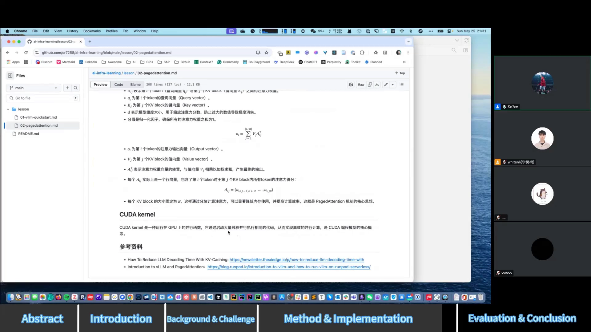 |
| 跟 attention 运算融合运行，通过这种方式在读取 KV cache 的时候同时执行 attention 计算。第三部分是 block copy。在 PagedAttention 写时复制（copy-on-write）的机制中，比如对于多个不连续的 KV block [【跳转到 85:48】](https://www.bilibili.com/video/BV1GWjjzfE1b/?t=5148) | 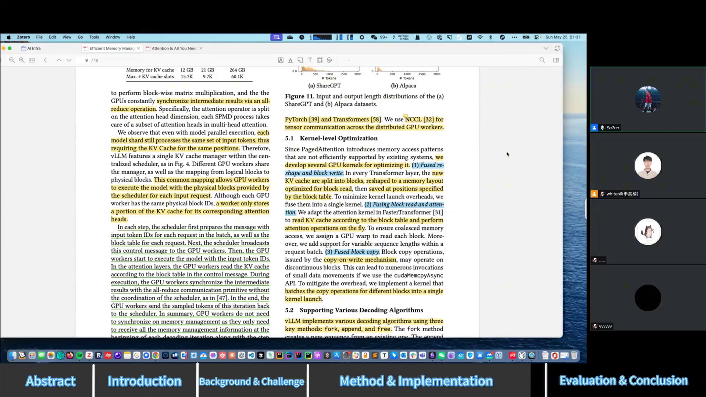 |
| 需要复制。比如说每个 block 我去调用 cudaMemcpy 这个 API，如果每个 block 都单独拷贝，就可能造成大量开销；如果融合成一次，一次拷贝多个 block，就可以显著减少这种成本。 [【跳转到 86:13】](https://www.bilibili.com/video/BV1GWjjzfE1b/?t=5173) |  |
| 那 copy-on-write 什么时候用呢？比如我前面图里介绍的 parallel sampling，这时候这两个 block 不能共用了，这时候可能需要 copy-on-write。然后这里说到…… [【跳转到 86:38】](https://www.bilibili.com/video/BV1GWjjzfE1b/?t=5198) | 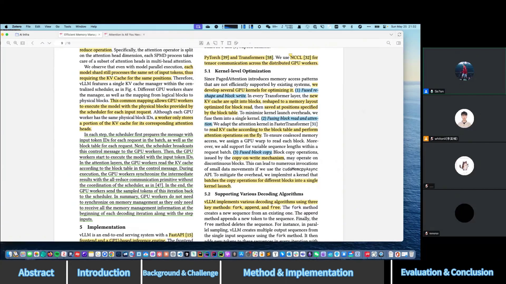 |
| 为了支持多种 decoding 算法——前面说到它支持 parallel sampling、beam search 等等不同方式——那它是如何通过统一的方式执行呢？vLLM 实现了三种抽象，把它抽象成三种基本操作， [【跳转到 87:03】](https://www.bilibili.com/video/BV1GWjjzfE1b/?t=5223) | 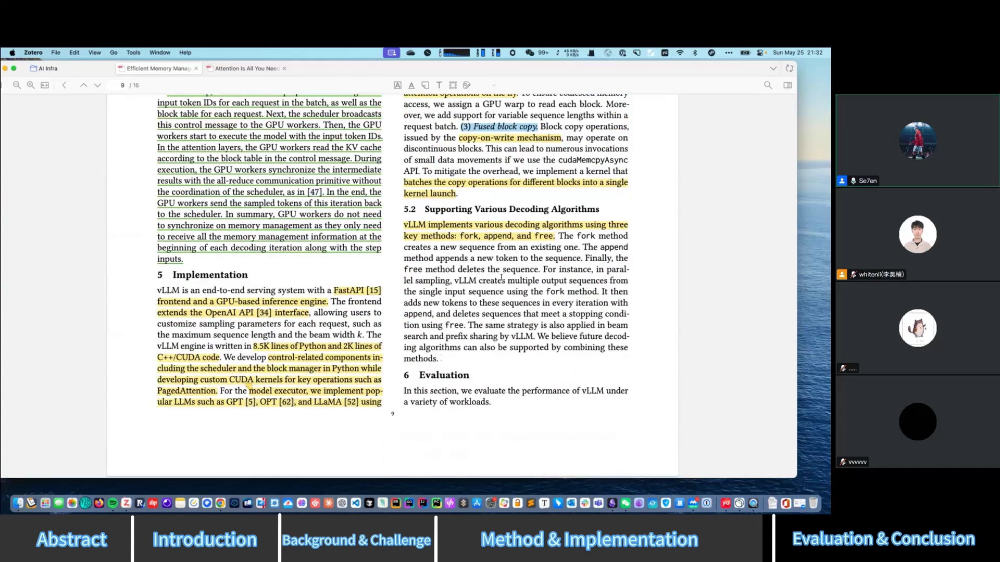 |
| 把这些解码逻辑抽象成三种基本操作：fork、append 和 free。fork 就是根据已有的一个 sequence 创建一个新的 sequence；append 就是把一个新的 token 添加到后面的序列中；free 就是把已有的 sequence 删掉。 [【跳转到 87:28】](https://www.bilibili.com/video/BV1GWjjzfE1b/?t=5248) |  |
| 它通过统一抽象成三种操作的方式，来支持多种不同的 decoding 算法，并且这种方式具有比较强的扩展性和效率，比如以后要支持其他的也可以通过这种方式去做。第六部分就是它做了一些评估， [【跳转到 87:53】](https://www.bilibili.com/video/BV1GWjjzfE1b/?t=5273) |  |
| 评估 vLLM 在不同情况下的 performance。6.1 介绍环境是怎么设置的，比如 model 跟 server 配置，他们使用的 OPT 的 13B、66B、175B 模型，还有 LLaMA 的 13B 模型。 [【跳转到 88:18】](https://www.bilibili.com/video/BV1GWjjzfE1b/?t=5298) | 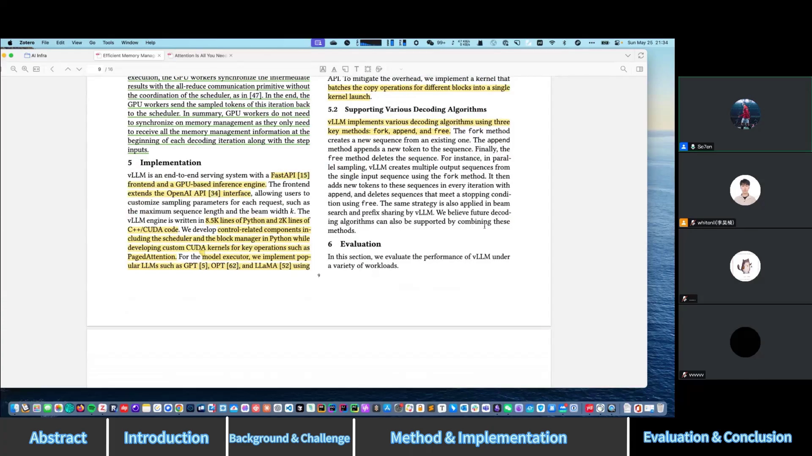 |
| 使用的实例是在 Google GCP 上的 A2 instance，使用了 100 个 GPU。这里的 workload 你可以理解为一个测试数据集，评估或测试推理系统中模拟实际用户请求的输入任务集合，可以理解为一个推理集或数据集。 [【跳转到 88:43】](https://www.bilibili.com/video/BV1GWjjzfE1b/?t=5323) |  |
| 这里合成了两个数据集，一个叫 ShareGPT，一个叫 Alpaca。ShareGPT 来自用户跟 ChatGPT 对话的数据语料，Alpaca 是基于 GPT-3.5 的 Self-Instruct 生成的一些数据集。总体来说， [【跳转到 89:08】](https://www.bilibili.com/video/BV1GWjjzfE1b/?t=5348) | 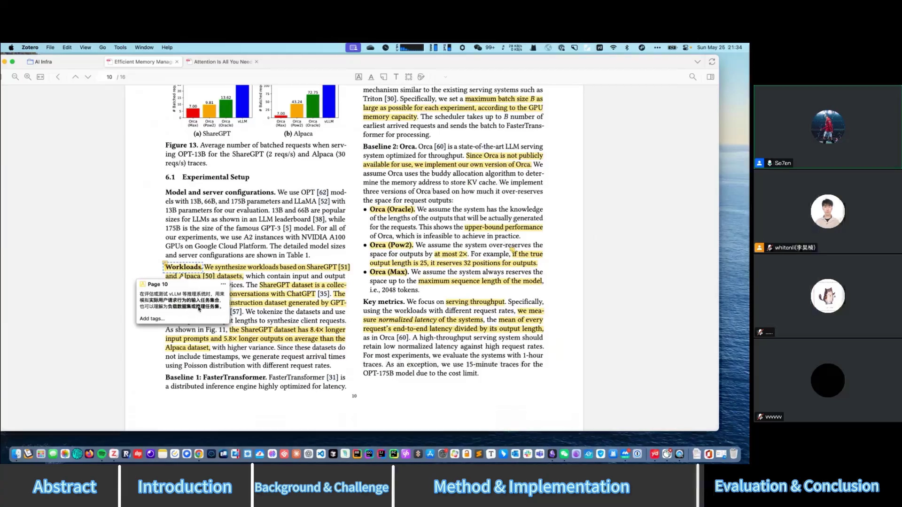 |
| ShareGPT 这个数据集在 input prompt 上比 Alpaca 长了 8.4 倍，在 output 上大概是 5.8 倍。也就是说 ShareGPT 的文本比较长，Alpaca 比较短。vLLM 分别对这种长、短文本 [【跳转到 89:33】](https://www.bilibili.com/video/BV1GWjjzfE1b/?t=5373) | 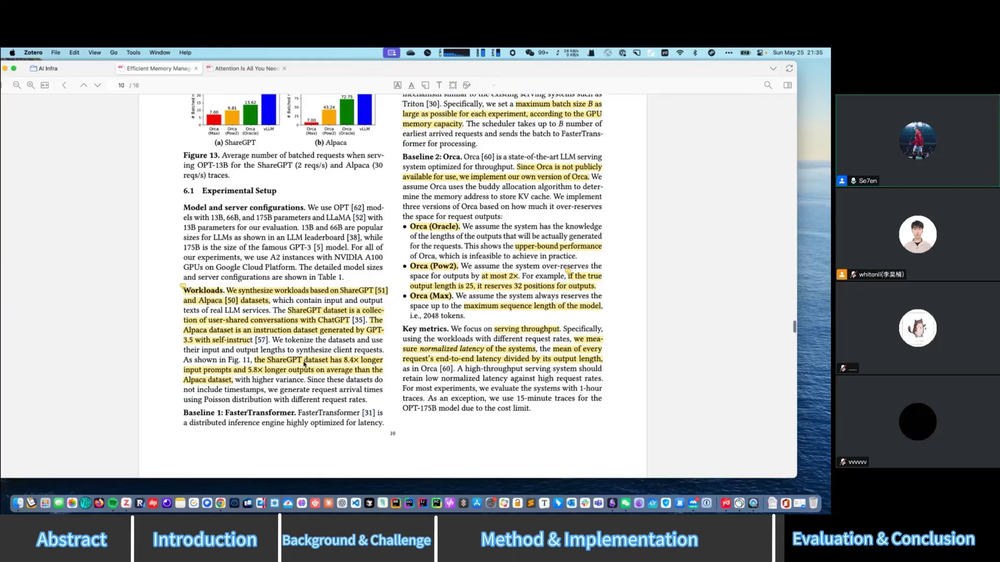 |
| 进行测试，综合评估 vLLM 的性能提升。这里有几个 baseline：一个 baseline 是跟 FasterTransformer，也就是之前 NVIDIA 开源的推理引擎对比。由于 FasterTransformer 没有自己的 scheduler，vLLM 在对比的时候 [【跳转到 89:58】](https://www.bilibili.com/video/BV1GWjjzfE1b/?t=5398) | 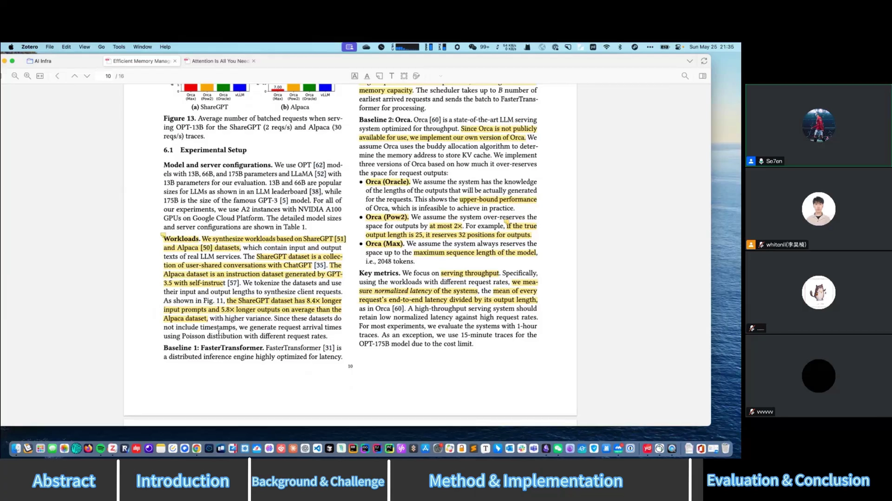 |
| 就实现了一个 scheduler 来进行对照，并且它尽量设置最大的 batch size，根据 GPU 内存容量尽可能设置 batch size。第二个 baseline 是 ORCA。ORCA 因为没有开源的实现，只有论文，所以 vLLM 团队根据这个论文 [【跳转到 90:23】](https://www.bilibili.com/video/BV1GWjjzfE1b/?t=5423) | 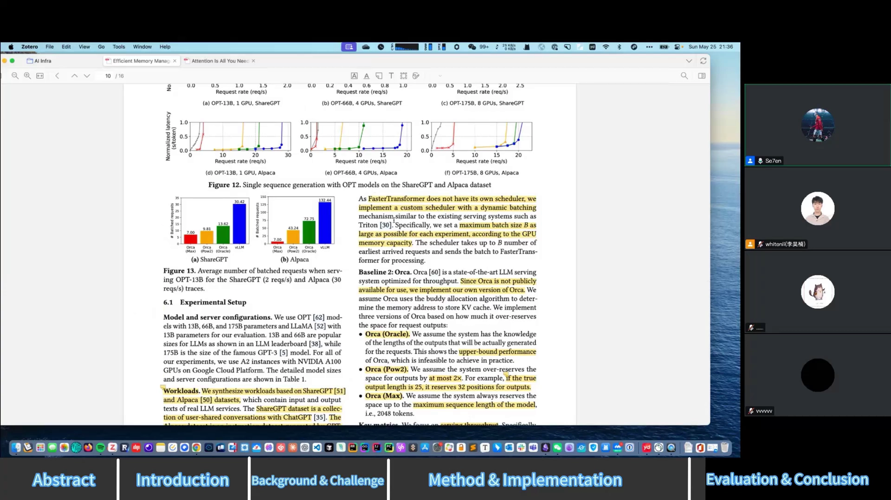 |
| 实现了 ORCA 的一个 engine，并且有三个版本。一个是 ORCA 的 oracle，它假设系统知道输出的长度；知道输出长度的话，我就可以精确地预测最终要使用的 KV cache 大小， [【跳转到 90:48】](https://www.bilibili.com/video/BV1GWjjzfE1b/?t=5448) | 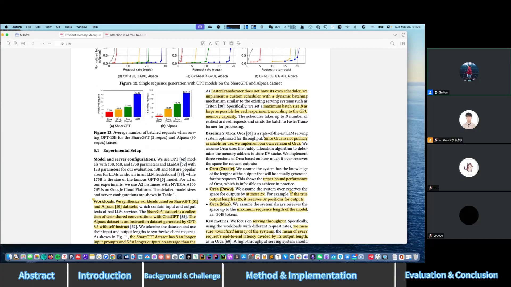 |
| 所以它也是这几个 ORCA 版本中性能最好的一个。还有一个是 ORCA 的 pow2（power 版），就是会预留稍微多一点，按照 2 的指数级预留，会乘 2 的指数。这里举个例子：比如 output token 是 25，那最终会预留 32。 [【跳转到 91:13】](https://www.bilibili.com/video/BV1GWjjzfE1b/?t=5473) | 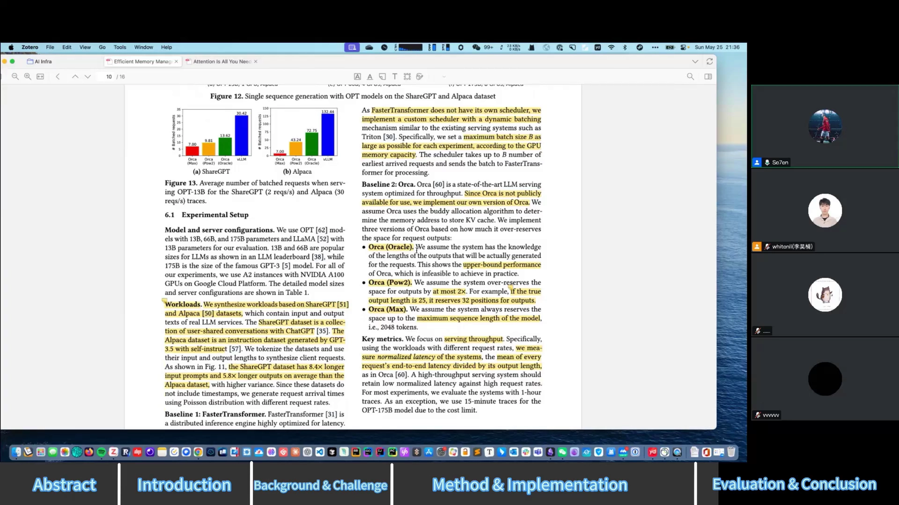 |
| 为什么是 32 呢？比如 25，2 的 4 次方是 16，16 小于 25，所以我需要预留到下一个 2 的指数，也就是 2 的 5 次方 = 32。然后 ORCA 的 max 版本就是直接预留最长的 sequence length，比如 2048。 [【跳转到 91:38】](https://www.bilibili.com/video/BV1GWjjzfE1b/?t=5498) | 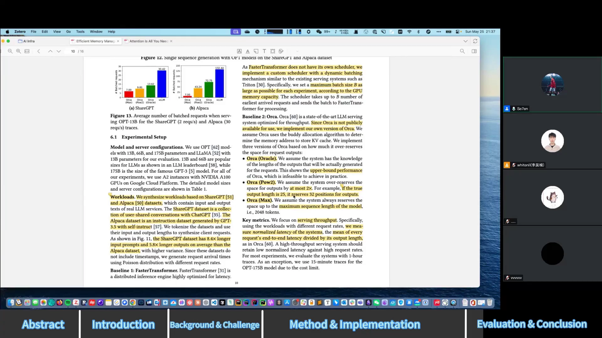 |
| 在他们进行评估的时候，最关注的是系统的吞吐量。那他们怎么计算吞吐量呢？他们会对 latency 进行归一化。怎么算呢？比如我的端到端延迟， [【跳转到 92:03】](https://www.bilibili.com/video/BV1GWjjzfE1b/?t=5523) | 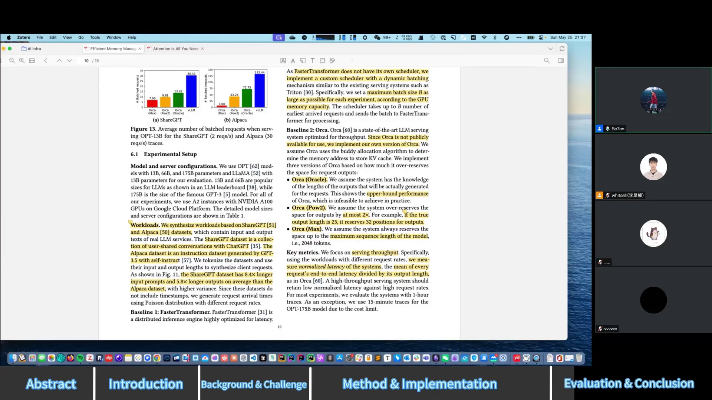 |
| 一个请求花了十秒钟，如果是五个 token，那就是 10÷5 等于 2。为什么这么算？因为请求的长短不一样，短的请求完成得快，长的请求完成得慢，你直接用最终的延时来对比肯定不公平，所以还需要除以 token 的数量 [【跳转到 92:28】](https://www.bilibili.com/video/BV1GWjjzfE1b/?t=5548) | 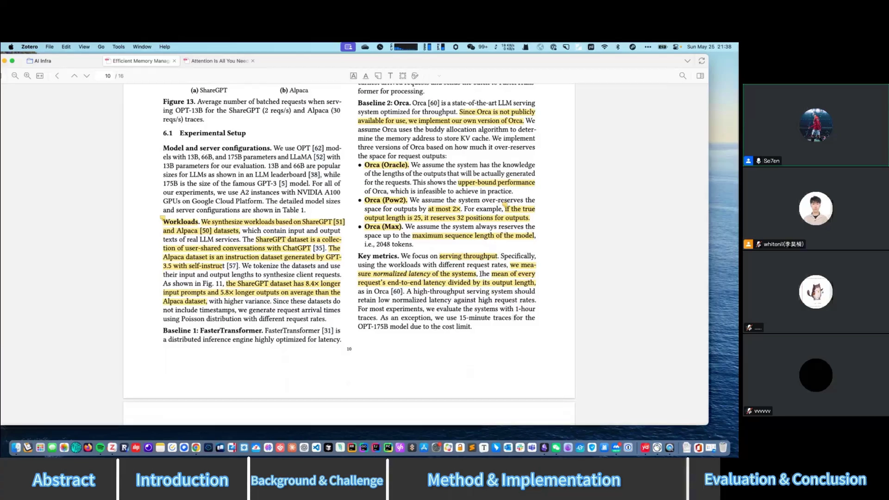 |
| 来归一化。好，就是这个意思。这里有个图，图 12。我看一下图 12 在哪。这里图 12 对比的是 FasterTransformer、ORCA 的三个版本，还有 vLLM。 [【跳转到 92:53】](https://www.bilibili.com/video/BV1GWjjzfE1b/?t=5573) |  |
| 它展示在 request rate 增长的情况下 latency 的情况。你可以看到随着请求数量增加，延迟一开始是比较渐进式地增加，但一旦突破一个临界点就会突然飙升。这是因为 [【跳转到 93:18】](https://www.bilibili.com/video/BV1GWjjzfE1b/?t=5598) |  |
| 当请求速率超过了系统的处理能力时，请求的等待队列会不断增长，从而导致请求延迟不断增加。这就是为什么这里刚开始平缓、后来逐渐飙升。然后这里对比了在 ShareGPT 这个数据集下， [【跳转到 93:43】](https://www.bilibili.com/video/BV1GWjjzfE1b/?t=5623) | 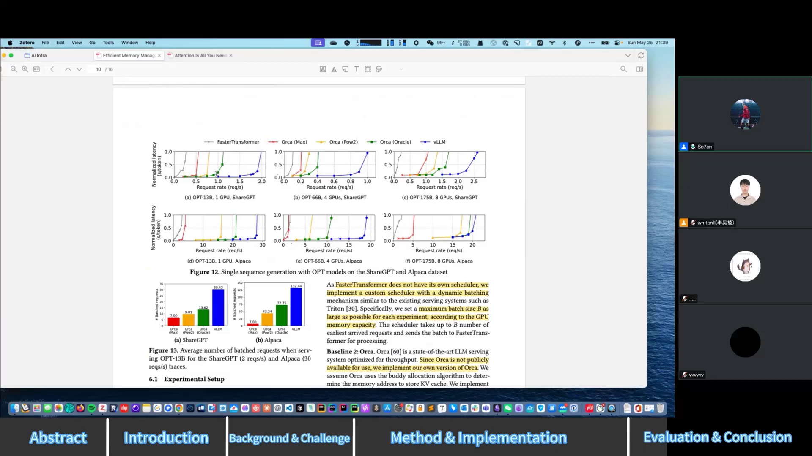 |
| vLLM 可以达到大概 1.7 到 2.7 倍的更高吞吐量；请求速率跟 ORCA 的 oracle 对比，大概优于 2.7 到 8 倍，优于 ORCA 的 max；并且这种情况下延迟是基本差不多的。 [【跳转到 94:08】](https://www.bilibili.com/video/BV1GWjjzfE1b/?t=5648) | 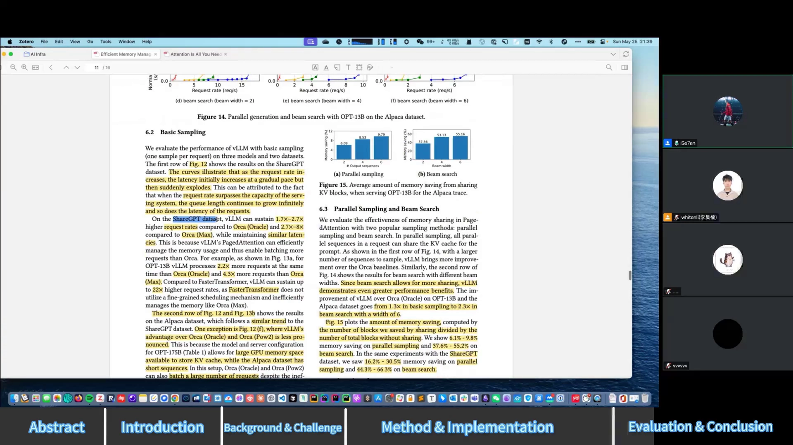 |
| 然后再具体看这个图 13A。图 13A 就是这个图，上面这个，对，13A 在这。是 12A？诶 13A 跑哪去了？这，这是 12 图吧。然后我刚看了下，这个图点应该能过去，对，13A 这个图。 [【跳转到 94:33】](https://www.bilibili.com/video/BV1GWjjzfE1b/?t=5673) | 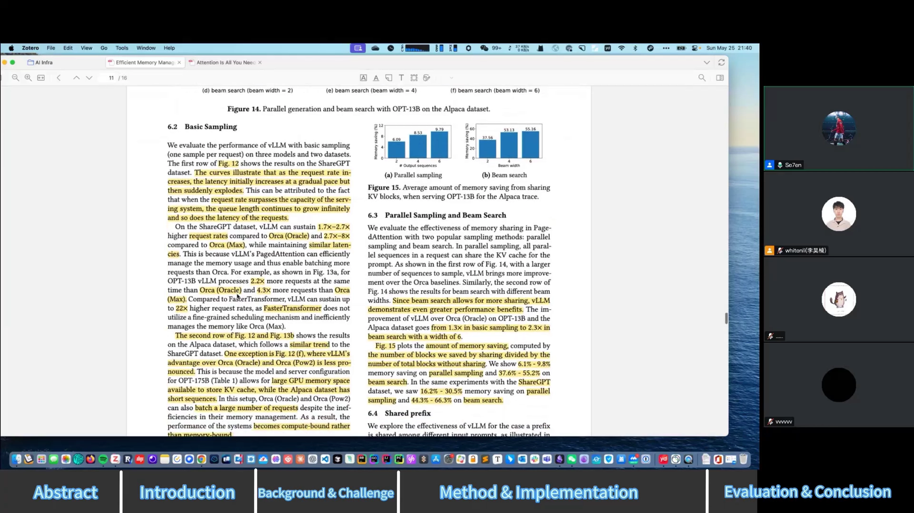 |
| 好，记一下这个图，它大概展示了 vLLM 的 batch request 吞吐量可以达到 30.4，其实比这些其他的几种版本都更优，不管是在 ShareGPT 还是 Alpaca [【跳转到 94:58】](https://www.bilibili.com/video/BV1GWjjzfE1b/?t=5698) | 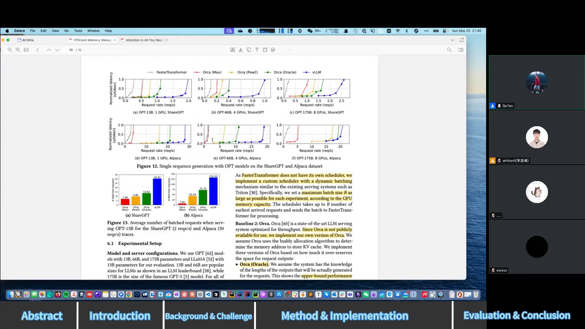 |
| 这种数据集下。这边是一个具体的倍数：比 ORCA 的 oracle 好 2.2 倍，比 ORCA 的 max 好 4.3 倍，大概是 FastTransformer 的 22 倍。然后还有图 12 的 12 和 13B。 [【跳转到 95:23】](https://www.bilibili.com/video/BV1GWjjzfE1b/?t=5723) | 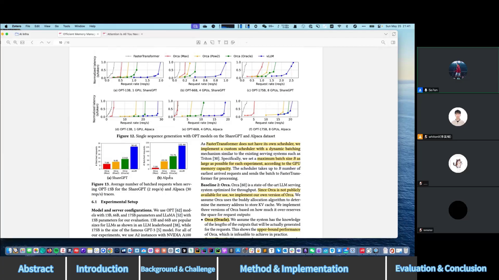 |
| 看一下 12 跟 13B。12 说明的是跟刚说的 ShareGPT 比较长的情况，然后 12C 这张第二行是跟 Alpaca 这个较短数据集的情况下进行对比，可以看到整体的趋势也是差不多的， [【跳转到 95:48】](https://www.bilibili.com/video/BV1GWjjzfE1b/?t=5748) | 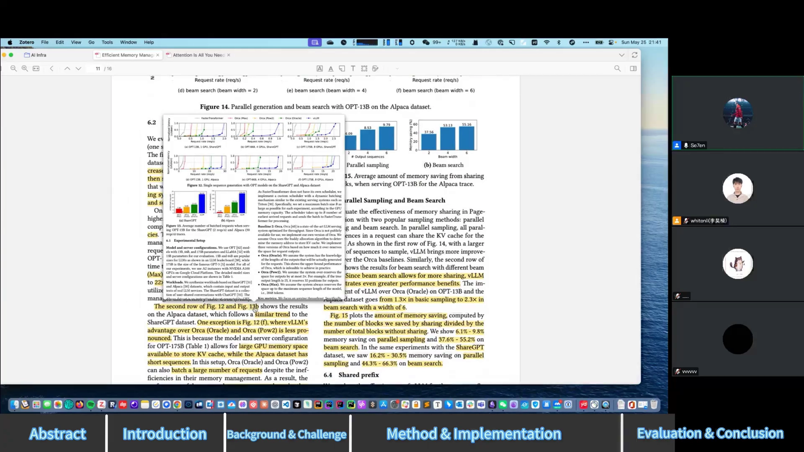 |
| 都是 vLLM 最好，然后 ORCA 的 oracle 排第二。同样在 batch request 上你也可以看到它们的比例差不多。但唯一有一个地方不一样，你可以看到图 12F 这部分， [【跳转到 96:13】](https://www.bilibili.com/video/BV1GWjjzfE1b/?t=5773) | 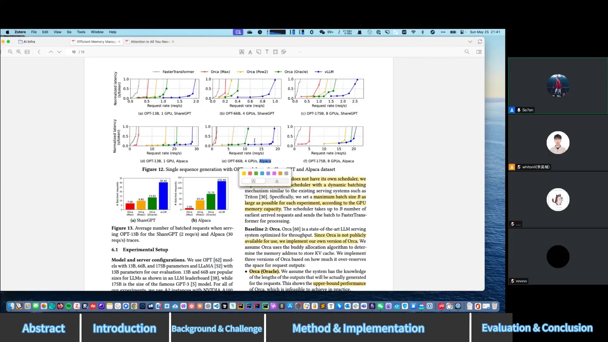 |
| 它跟 vLLM 和 ORCA 的 oracle 差距没有很明显。这是在 OPT-175B 这个模型的情况下。这里解释为什么差距没这么明显，因为这个模型使用了比较大的 GPU memory 空间来存储 KV cache， [【跳转到 96:38】](https://www.bilibili.com/video/BV1GWjjzfE1b/?t=5798) | 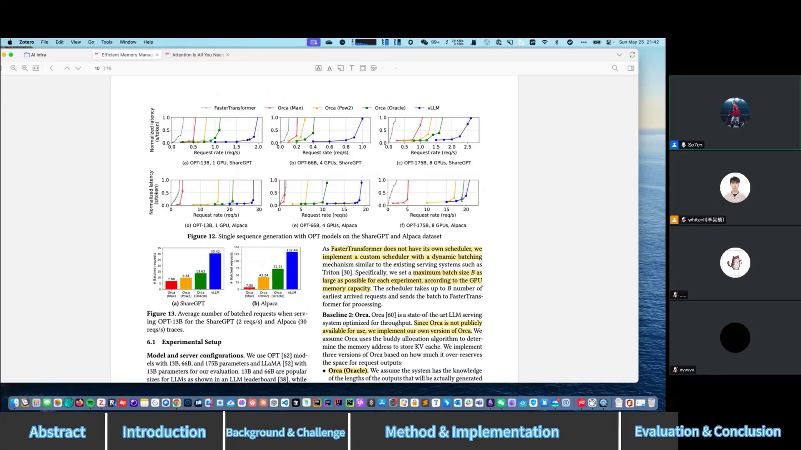 |
| 并且 Alpaca 这个数据集又比较小。所以在内存足够大、处理的数据也比较小的情况下，内存就不是瓶颈了，它就能 batch 一个比较大的数量级的请求。这时候其实不是 memory-bound， [【跳转到 97:03】](https://www.bilibili.com/video/BV1GWjjzfE1b/?t=5823) |  |
| 可能是 compute-bound。所以在这种情况下，这就是为什么在图 12F 里 oracle 和 vLLM 的性能差不多。然后 6.3 就是对比了 parallel sampling 跟 beam search 的情况，用 vLLM 跟其他系统来对比。 [【跳转到 97:28】](https://www.bilibili.com/video/BV1GWjjzfE1b/?t=5848) | 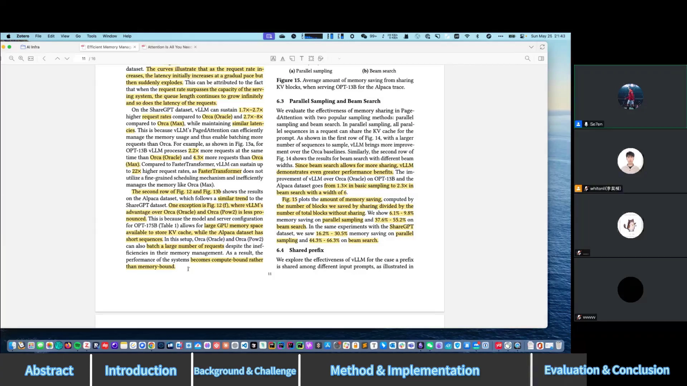 |
| 因为像 beam search，它其实可以允许更多的 memory sharing，那 vLLM 可以比 parallel sampling 体现出更优越的内存节约效果。在 Alpaca 数据集下， [【跳转到 97:53】](https://www.bilibili.com/video/BV1GWjjzfE1b/?t=5873) | 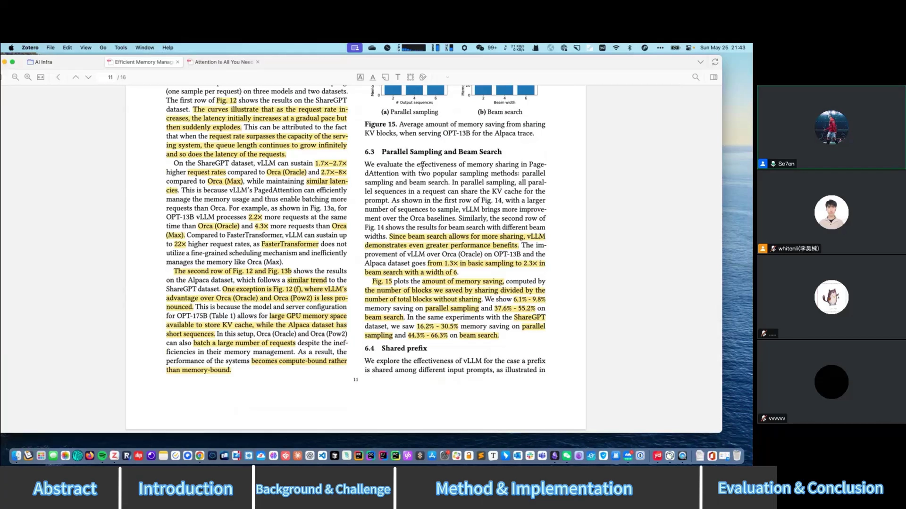 |
| 它是有 1.3 倍的提升——由于 basic sampling；2.3 倍是跟 beam search 对比，跟 basic sampling 比是 2.3 倍提升。所以说在 beam search 场景下，vLLM 可以有更多的内存节约。 [【跳转到 98:18】](https://www.bilibili.com/video/BV1GWjjzfE1b/?t=5898) | 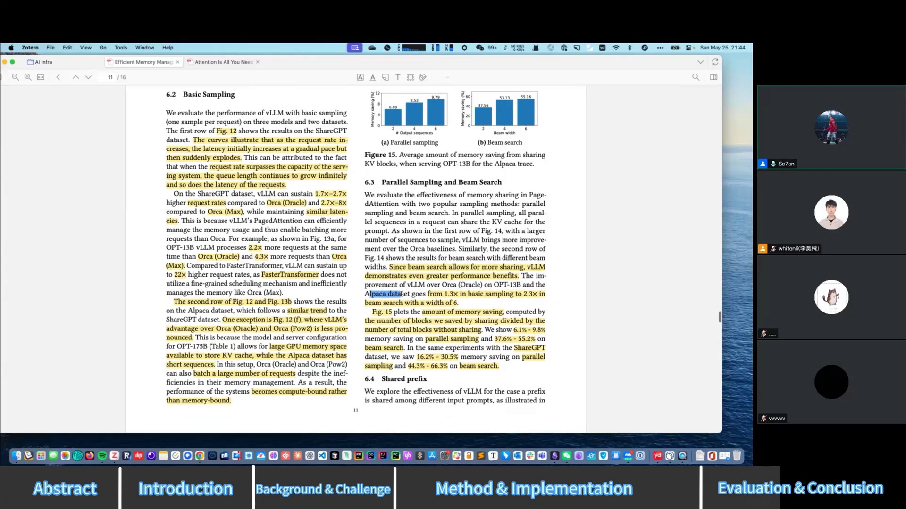 |
| 然后图 15 介绍了 vLLM 在内存 saving 上的比重。它是怎么计算呢？就是用它节约的内存 block 除以总的 block（没有共享的 block）的比重。 [【跳转到 98:43】](https://www.bilibili.com/video/BV1GWjjzfE1b/?t=5923) | 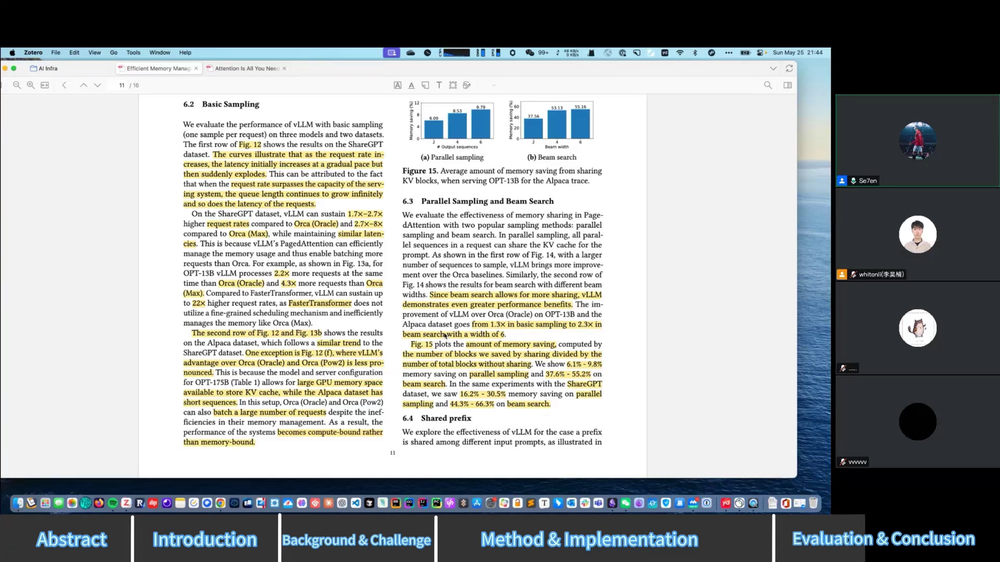 |
| 大概是 6.1% 到 6.8% 在 parallel sampling；37.6% 到 56.2% 在 beam search。然后继续，我看一次。这 6.4 说的是 shared prefix。 [【跳转到 99:08】](https://www.bilibili.com/video/BV1GWjjzfE1b/?t=5948) | 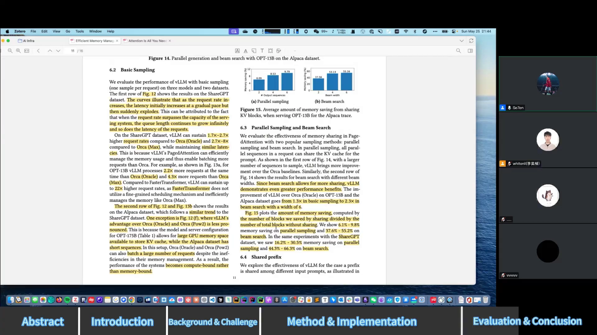 |
| 比如可能我之前的 system prompt 或者 prompt 比较长，这部分也是可以共享的。这里给的例子，比如我前面这里说的。这种情况下，你看这里不是有输入是 system prompt，它可能会有一些例子，对不对？ [【跳转到 99:33】](https://www.bilibili.com/video/BV1GWjjzfE1b/?t=5973) | 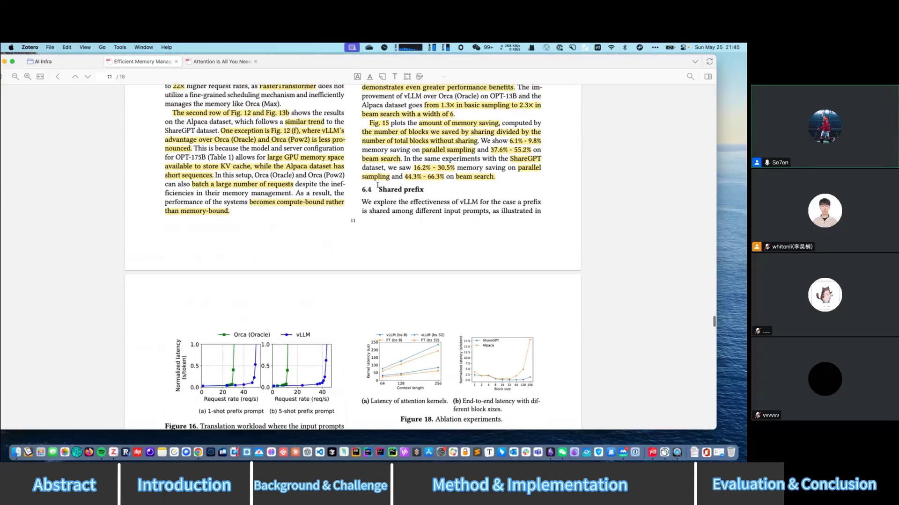 |
| 这种叫 few-shot。它其实有 zero-shot，就是你直接给问题、不给例子，直接让你生成；或者 one-shot，就是我给你一个例子让你生成；这种情况下属于 few-shot：我给你多个例子再给问题然后生成。像 few-shot 的情况，再加上你的 token 可能比较长，这种 shared prefix 能够缓存的情况就更多。 [【跳转到 99:58】](https://www.bilibili.com/video/BV1GWjjzfE1b/?t=5998) |  |
| 然后这里也说了，vLLM 可以达到大概 1.7 倍的高吞吐，跟 ORCA 的 oracle 比；在 one-shot 的情况下，是 3.5 倍的更高吞吐，跟 ORCA 的 oracle 比。 [【跳转到 100:23】](https://www.bilibili.com/video/BV1GWjjzfE1b/?t=6023) | 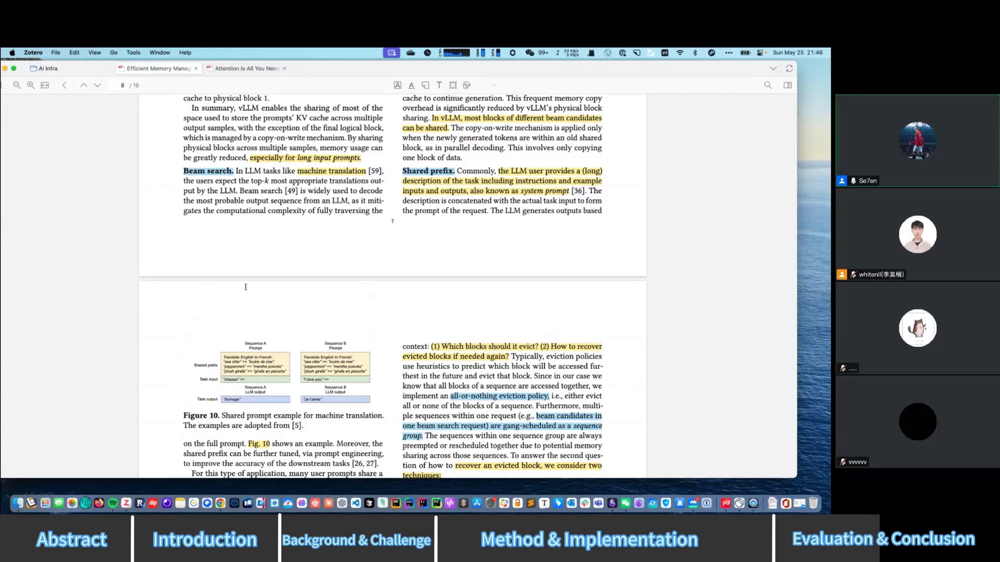 |
| 如果说有更多这种能够共享的情况。下面一个是 chatbot 的评估。像 chatbot，比如你在 ChatGPT 中聊天，你的会话基本上是基于历史的，对吧？ [【跳转到 100:48】](https://www.bilibili.com/video/BV1GWjjzfE1b/?t=6048) |  |
| 一般你要跟大模型发送过去就会带上你的历史记录。这种情况下历史记录往往也能作为一个 prompt 共享，KV cache 也是能共享的。这里补了一嘴，就是说 KV cache 是不会在多个会话轮次中去保存的。 [【跳转到 101:13】](https://www.bilibili.com/video/BV1GWjjzfE1b/?t=6073) | 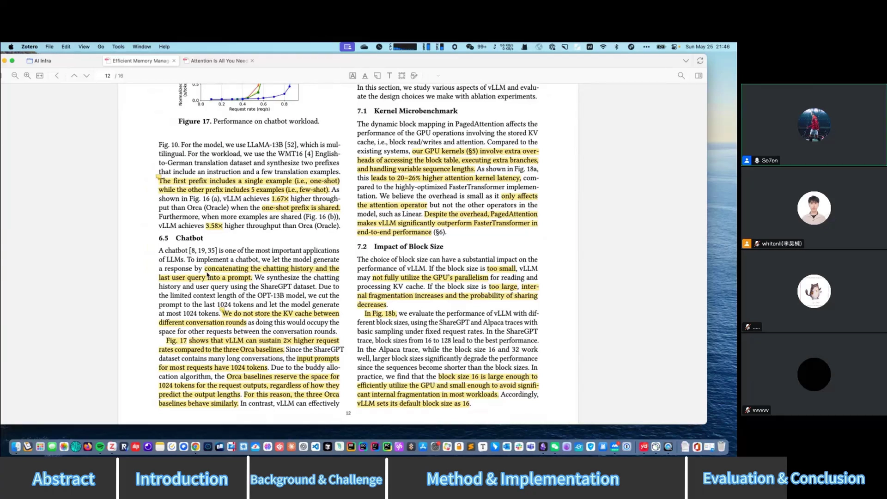 |
| 因为 PagedAttention 主要是针对单轮对话的内存优化，多轮对话其实是 prefix caching 能支持的，后面也会去研究 vLLM 的 prefix caching 机制。然后图 17 这里也提到大概可能得到两倍的性能提升， [【跳转到 101:38】](https://www.bilibili.com/video/BV1GWjjzfE1b/?t=6098) |  |
| 跟其他几个 ORCA 的 baseline 比。并且你可以看到这三个 baseline 在这种长 history 对话的情况下性能比较接近。这里也解释为什么，是因为长对话情况下 input 的 prompt 大多数多于 1024 [【跳转到 102:03】](https://www.bilibili.com/video/BV1GWjjzfE1b/?t=6123) | 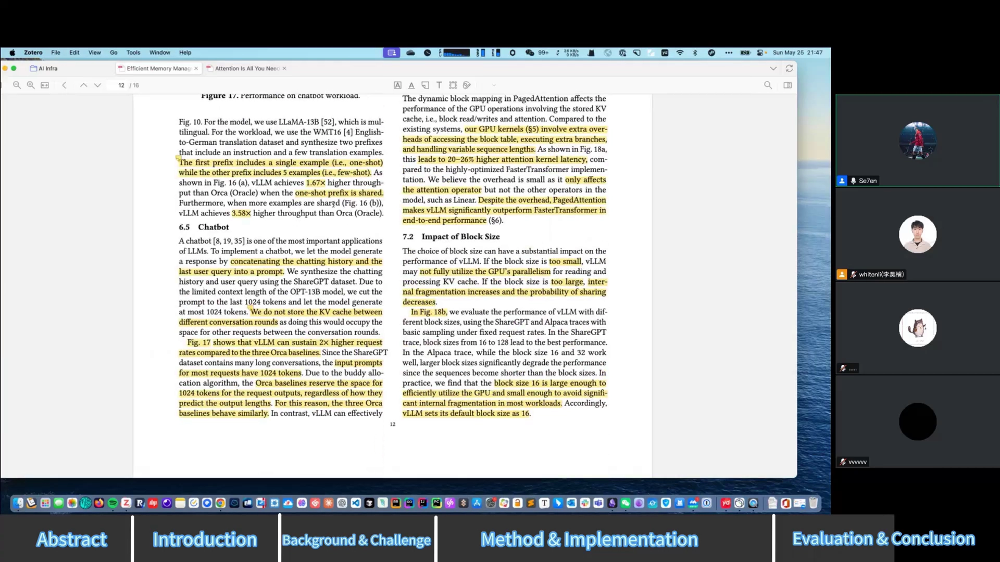 |
| token，比较长。那 ORCA 的 baseline 在这种情况下，它会预留 1024 个 token 给输出（不管你的预测 token 是多少），所以这种情况下三种 ORCA baseline 就会很接近。这里解释一下原因。 [【跳转到 102:28】](https://www.bilibili.com/video/BV1GWjjzfE1b/?t=6148) | 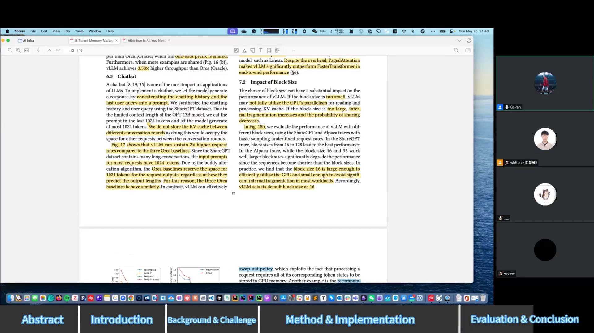 |
| 好，然后第七部分就是消融实验。这里稍微解释一下消融实验：它是机器学习和深度学习领域中广泛使用的一种分析方法，用于评估系统/模型中各个组件、特性或整体改进措施对整体性能的贡献。 [【跳转到 102:53】](https://www.bilibili.com/video/BV1GWjjzfE1b/?t=6173) |  |
| 比如 vLLM 中提出了像 kernel 的一些优化，还有 block size 的一些设定、优化等等。那要怎么证明它每个比如 block size 的数值是合理的，单独对 block size 的设置对整体 vLLM 性能的影响是怎么样的？ [【跳转到 103:18】](https://www.bilibili.com/video/BV1GWjjzfE1b/?t=6198) |  |
| 或者说 kernel 处理对整体性能有什么影响。他要去针对这些提出的组成部分分别进行测试，确保你每个提出来的组件确确实实能提升性能，而不是隐藏在整体性能提升之下。然后这里也提到， [【跳转到 103:43】](https://www.bilibili.com/video/BV1GWjjzfE1b/?t=6223) |  |
| 这边做了一些 kernel 的 micro benchmark。比较意外的是，vLLM 这里由于 PagedAttention 的动态映射机制，其实会影响到 GPU 在处理 KV cache 时相关操作的性能， [【跳转到 104:08】](https://www.bilibili.com/video/BV1GWjjzfE1b/?t=6248) | 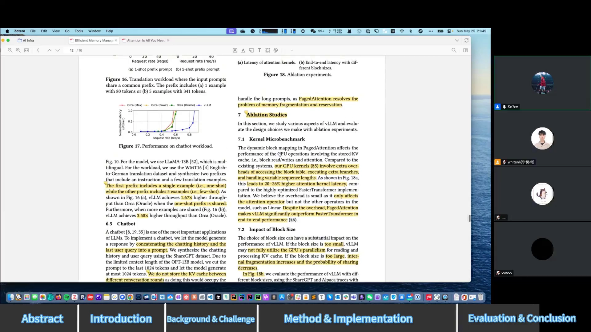 |
| 比如说 block 的读取或者注意力的计算。跟一些高度优化的实现，比如 FlashAttention、FasterTransformer 比，它的 kernel 延迟其实高出了 20% 到 20.6%。不过 vLLM 团队认为这个开销比较小， [【跳转到 104:33】](https://www.bilibili.com/video/BV1GWjjzfE1b/?t=6273) |  |
| 因为它只影响了 attention 这个算子，并不影响模型中的其他算法，比如 linear。所以尽管存在这个 kernel 开销，他们在端到端性能测试上还是看到 vLLM 显著优于 FasterTransformer， [【跳转到 104:58】](https://www.bilibili.com/video/BV1GWjjzfE1b/?t=6298) | 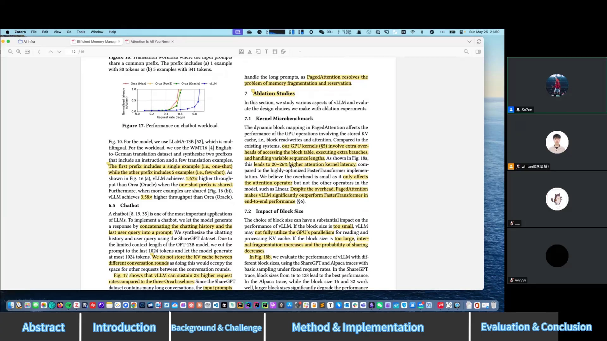 |
| 大概是 20 多倍的优化。这是 kernel 层面的影响。然后这里提到 block size。block size 的设置其实是有讲究的：如果设置得太小，就不能很好地利用 GPU 的并行性；如果设置得太大，像 internal fragmentation 就会可能提升。 [【跳转到 105:23】](https://www.bilibili.com/video/BV1GWjjzfE1b/?t=6323) |  |
| 好，图 18、图 20。图 18 是这些消融实验的对比，一个是 latency，就是刚才提到的 attention kernel 的 latency。你可以看到 vLLM 比 FasterTransformer [【跳转到 105:48】](https://www.bilibili.com/video/BV1GWjjzfE1b/?t=6348) | 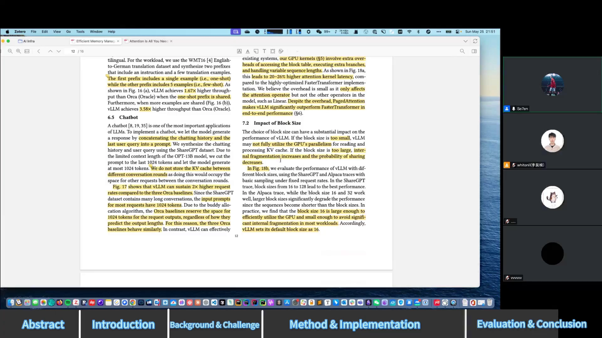 |
| 会稍微有点延迟，稍微有点高。然后第二个是测试不同 block size 在端到端延迟上的差距。你可以看到其实 16 在 latency 这里的表现是最低的，所以最终 vLLM 把默认的 block size 设置为 16。 [【跳转到 106:13】](https://www.bilibili.com/video/BV1GWjjzfE1b/?t=6373) | 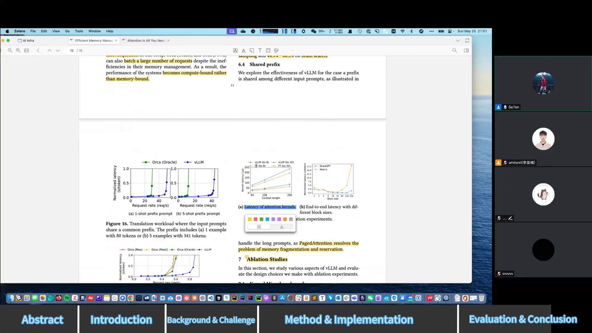 |
| 然后 7.3 部分介绍了 recomputation 和 swapping 这两个机制，就是把 block evict 出去以后怎么 recover 到 GPU memory 中进行计算。它同样也做了相关的一些对比测试。 [【跳转到 106:38】](https://www.bilibili.com/video/BV1GWjjzfE1b/?t=6398) |  |
| 比如图 19 可以看到，得到两个结论。一个是，如果你的 block size 比较小，你的 swap 开销其实会比 recompute 高。因为这里有个类比：你一次传 1MB 比传 1000 次 [【跳转到 107:03】](https://www.bilibili.com/video/BV1GWjjzfE1b/?t=6423) |  |
| 1KB 肯定快很多。这就解释了为什么 block size 越小，你的 swap 开销就越高。而 recompute 的话，其实不管你 block size 的大小，它基本上是稳定的。所以一般来说，block size 小你可以考虑用 recomputation， [【跳转到 107:28】](https://www.bilibili.com/video/BV1GWjjzfE1b/?t=6448) | 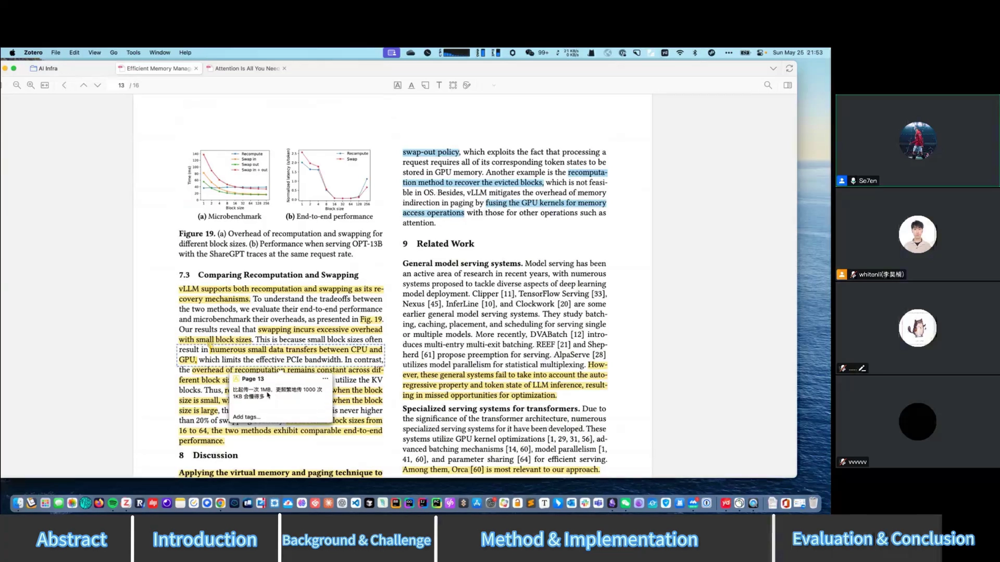 |
| 如果 block size 比较大，你可以考虑用 swap。然后这个图可以看到，如果 block size 大概是中间的，比如 16~64，在端到端性能测试上，recompute 或者 swap 这两个操作的性能是差不多的。 [【跳转到 107:53】](https://www.bilibili.com/video/BV1GWjjzfE1b/?t=6473) | 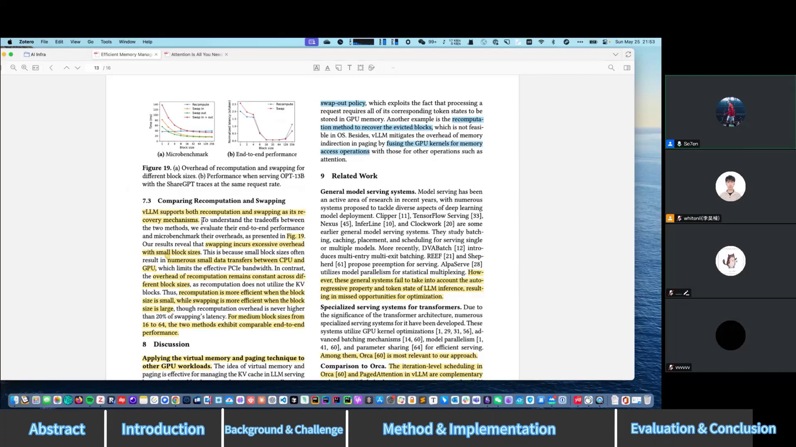 |
| 最下面说到一些其他的发散讨论。比如可以考虑把 virtual memory 跟分页的这种实现方式应用到其他 GPU 的 workload 上。比如 DNN（深度神经网络），它的 tensor shape 是固定的 [【跳转到 108:18】](https://www.bilibili.com/video/BV1GWjjzfE1b/?t=6498) |  |
| 长度。那可以考虑是不是也能把这种机制应用到这种情况下。还有一种情况是 DNN，并且如果不是大模型的情况下，比如图像分类或者目标检测，这种情况下即使提升了内存利用率也不会提升端到端延迟， [【跳转到 108:43】](https://www.bilibili.com/video/BV1GWjjzfE1b/?t=6523) |  |
| 因为这些任务的计算瓶颈是在计算（compute-bound），不是内存。就是说可以考虑在这些其他场景下是不是也有可能去应用这种 virtual memory 或分页的方式，或者用其他方式优化。另一部分就是说他们在这个 virtual memory 和分页的优化 [【跳转到 109:08】](https://www.bilibili.com/video/BV1GWjjzfE1b/?t=6548) | 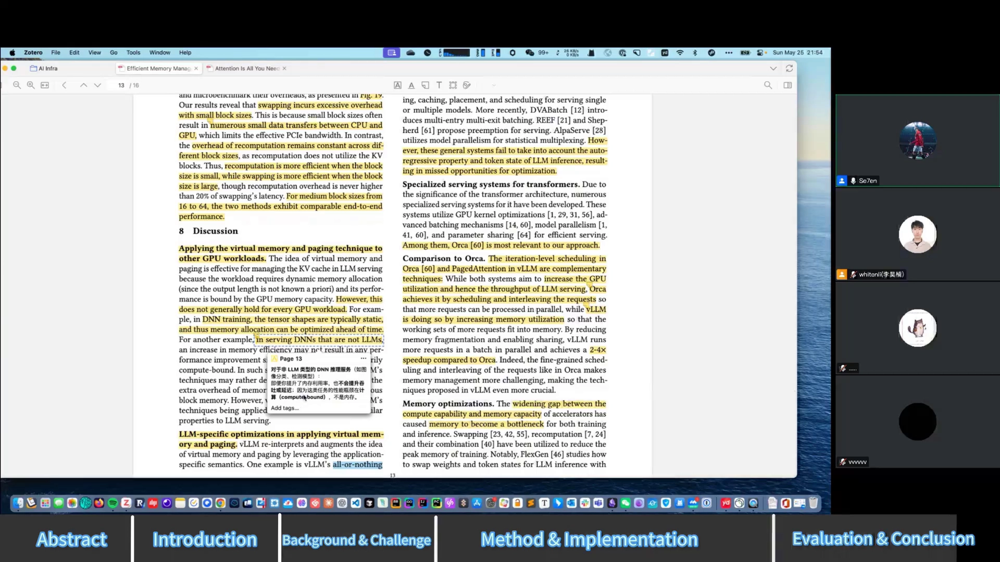 |
| 基础上，也针对大语言模型的特定情况进行优化。比如一个例子是 vLLM 的 all-or-nothing 调度策略/swap out policy，要么一个请求所有的 block 都 swap，要么都不要。另一个例子就是用 recompute 的方式去 recover [【跳转到 109:33】](https://www.bilibili.com/video/BV1GWjjzfE1b/?t=6573) | 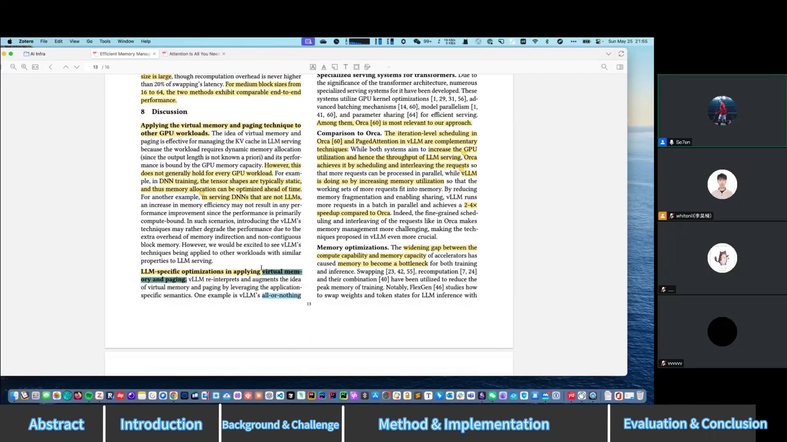 |
| 这些 evict 的 block。还有一个例子就是他们把 GPU kernel 融合到一个 GPU kernel 中去减少计算操作，从而提升计算效率。然后第九部分，快到结尾了， [【跳转到 109:58】](https://www.bilibili.com/video/BV1GWjjzfE1b/?t=6598) |  |
| 就是说了一下 vLLM 这边所做的工作。这里先提了目前一些通用的 model system，比如这里的一些例子。这些通用的模型系统并没有把 autoregressive 这种自回归的情况考虑进去，导致它们没有很好地优化这部分 [【跳转到 110:23】](https://www.bilibili.com/video/BV1GWjjzfE1b/?t=6623) | 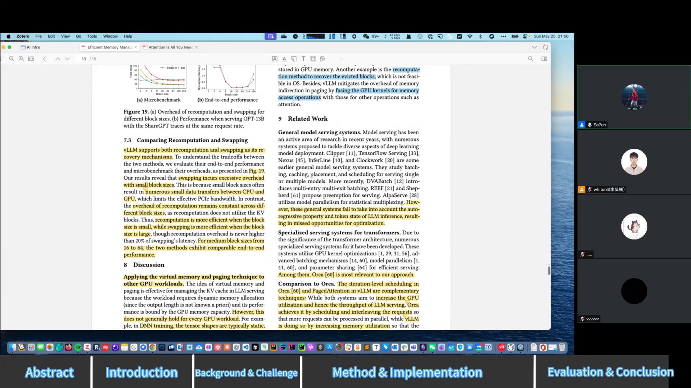 |
| KV cache 的内存。然后看一下相关的 work。这里做了一个对比，跟 ORCA 对比。ORCA 其实是 iteration-level 的 schedule， [【跳转到 110:48】](https://www.bilibili.com/video/BV1GWjjzfE1b/?t=6648) |  |
| 而 vLLM 采用的是 PagedAttention 的机制。这两个系统都是为了提升 GPU 利用率，从而提升 LLM service 的吞吐量。但是 ORCA 的做法是将 schedule [【跳转到 111:13】](https://www.bilibili.com/video/BV1GWjjzfE1b/?t=6673) |  |
| 而 vLLM 的方式是去提升内存使用率。这两者走的其实是两种方式。这里做一个类比：让 GPU 可以轮流并行处理，本质上是利用计算的调度策略去提高 GPU 的活跃度， [【跳转到 111:38】](https://www.bilibili.com/video/BV1GWjjzfE1b/?t=6698) |  |
| 类比就是合理排队，让 GPU 永远不空闲。而 vLLM 这边的类比是，通过优化内存使用率，能够将更多请求的 KV cache 同时放进显存，从而可以处理更多请求，类比就是整理背包： [【跳转到 112:03】](https://www.bilibili.com/video/BV1GWjjzfE1b/?t=6723) | 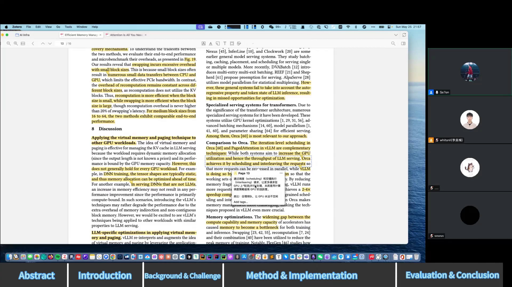 |
| 我的内存就是背包，把更多物品放进去。这是两种优化策略。最终 vLLM 的做法可能更优，大概是 2~4 倍的速率，跟 ORCA 相比。然后第三个工作就是做了内存优化。 [【跳转到 112:28】](https://www.bilibili.com/video/BV1GWjjzfE1b/?t=6748) | 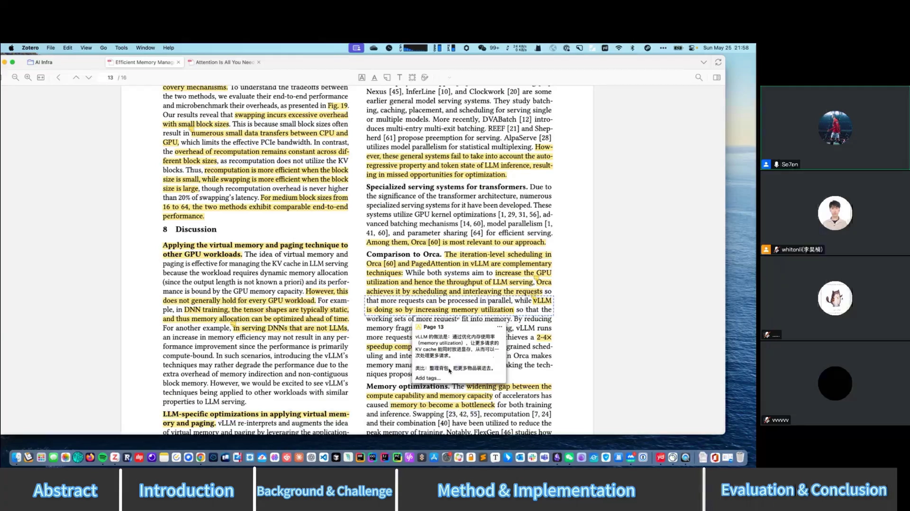 |
| 因为内存、其实内存是主要的 bottleneck，所以内存优化这边还是比较重要的。这篇 paper 最终提出了一种叫 block-level management 的方式来管理这个内存。 [【跳转到 112:53】](https://www.bilibili.com/video/BV1GWjjzfE1b/?t=6773) | 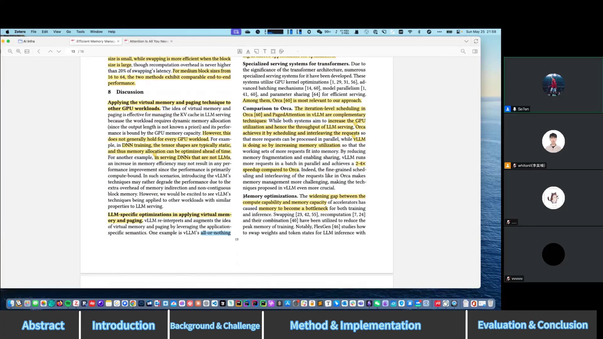 |
| 最后部分是一个总结，这句话很重要：这篇 paper 提出了 PagedAttention 机制，这种算法允许 attention 的 key 和 value 在非连续的内存中进行处理，同时介绍了 vLLM 的实现。 [【跳转到 113:18】](https://www.bilibili.com/video/BV1GWjjzfE1b/?t=6798) | 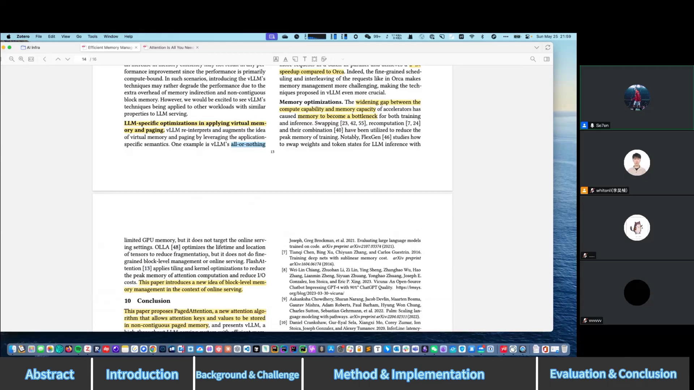 |
| 这个实现的灵感来自操作系统，并且采用了像 virtual memory 和 copy-on-write 的机制。最终 vLLM 能够达到大概 2~4 倍的吞吐量提升，跟现有的这些 LLM system 相比。 [【跳转到 113:43】](https://www.bilibili.com/video/BV1GWjjzfE1b/?t=6823) | 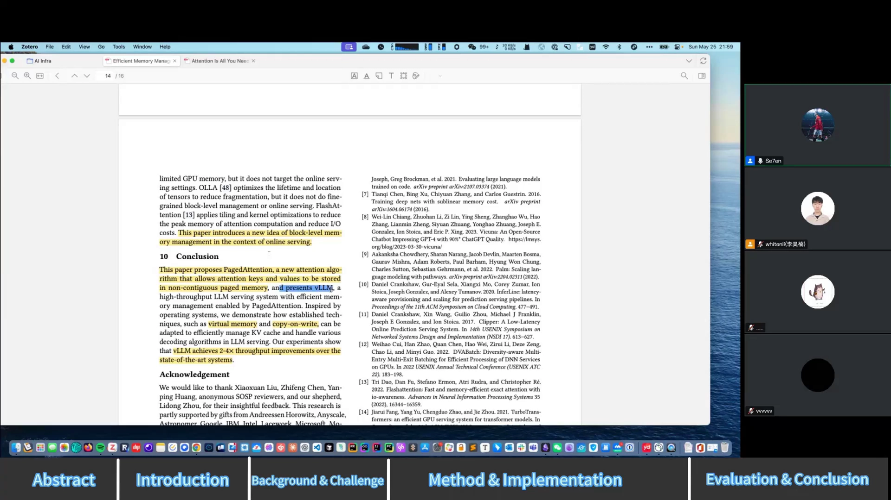 |