# 第03讲_Prefix_Caching原理详解 原始文稿（图-字幕分栏）

| 字幕文本 | 画面 |
| :--- | ---: |
| 好，OK。今天我们来讲解一下 Prefix Caching（前缀缓存）。因为我们上节课介绍过 PagedAttention 以及 KV Cache 的一些原理和概念，而 Prefix Caching 可以更进一步。简单来说，它也是大语言模型中的一种推理优化技术，核心思想是缓存历史对话中的 KV Cache。 [【跳转到 00:00】](https://www.bilibili.com/video/BV1jgTRzSEjS/?t=0) |  |
| 以便后续的请求能够重用这些 KV Cache 的计算结果。它最主要的好处是可以显著降低首 token 的延迟，从而提升整体推理效率。如果还有同学对 KV Cache 不太熟悉，这里我简单做一个说明。 [【跳转到 00:25】](https://www.bilibili.com/video/BV1jgTRzSEjS/?t=25) |  |
| 比如说，KV Cache 可以理解为在 Transformer 模型中用于存储上下文的接口。因为模型在推理时，会根据前面已经生成的 token 去预测下一个 token；其中会用到 attention 机制来计算上下文相关性，所以就会用到之前 token 的 K 和 V。 [【跳转到 00:50】](https://www.bilibili.com/video/BV1jgTRzSEjS/?t=50) | 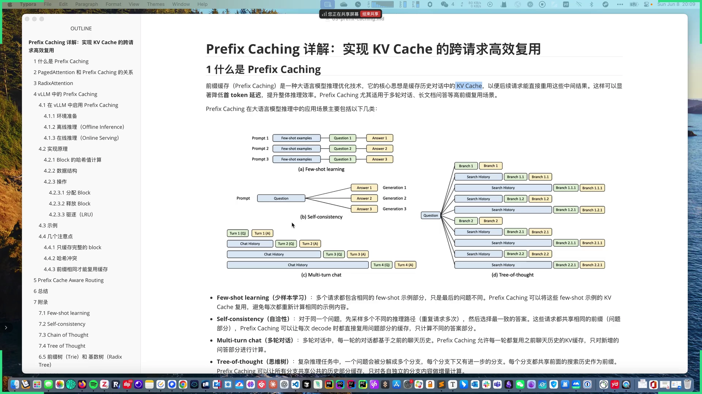 |
| 这两个向量，再根据当前 token 的 query 来计算 attention 的值。KV Cache 就是把这些历史 token 的 K 和 V 存起来，避免重复计算，从而加速推理。在没有 Prefix Caching 之前，一个请求计算完，它的 KV Cache 可能就被清掉了。 [【跳转到 01:15】](https://www.bilibili.com/video/BV1jgTRzSEjS/?t=75) |  |
| 那下一次请求过来，比如它带了一个比较长的 system prompt，这部分其实是可以复用的；没有 Prefix Caching 的话，它又得从头再计算一遍，比较浪费时间。所以 Prefix Caching 的提出就是为了解决这个问题。它比较适合多轮对话或者长文档这类高前缀复用的场景。 [【跳转到 01:40】](https://www.bilibili.com/video/BV1jgTRzSEjS/?t=100) |  |
| 这边这张图列举了四个场景。第一个场景是 few-shot learning（少样本学习），可以看到多个请求可以包含相同的 few-shot 示例。什么是 few-shot 呢？比如你问大模型时，可以先给它一个例子：告诉它输入是 A，希望得到的结果是 B。 [【跳转到 02:05】](https://www.bilibili.com/video/BV1jgTRzSEjS/?t=125) |  |
| 然后给它几个例子，比如 123 个例子，让模型参考，这样模型在没有微调的情况下也能得到一个比较好的结果。嗯，这边附录里我有一张图可能更清楚：比如我要让它做翻译，从英语翻译成法语，这边是英语，这边是法语，给了三个例子，然后我再给一个（新的句子）。 [【跳转到 02:30】](https://www.bilibili.com/video/BV1jgTRzSEjS/?t=150) | 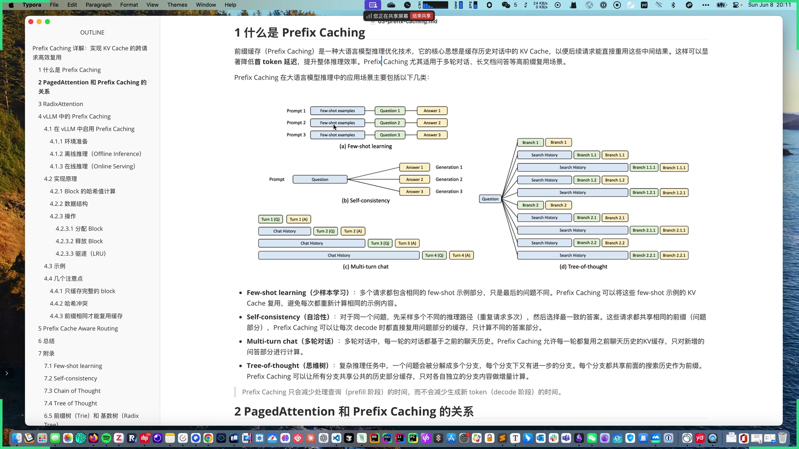 |
| 再让它翻译成法语，是一样的道理。你可以看到它 system 这部分 few-shot 的示例其实是一样的，这一部分就可以复用，对吧？第二个例子叫 self-consistency：对同一个问题可以有不同的推理路径，即生成多个不同的推理路径，然后选择一个比较靠谱、最一致的答案。 [【跳转到 02:55】](https://www.bilibili.com/video/BV1jgTRzSEjS/?t=175) | 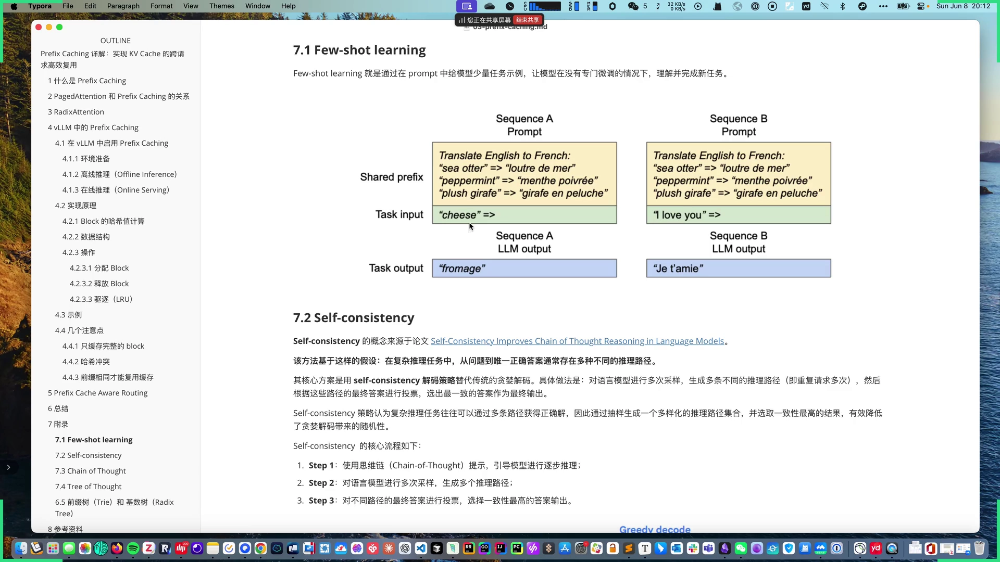 |
| 这里我也有一个说明，它主要基于一个假设：对一个推理任务，得到正确答案的途径通常有很多条，不同的推理路径都可以达到。比如计算一个结果，可以走 A→B→A 这条路线，也可以走 B 这条路线，最终都能得到结果。 [【跳转到 03:20】](https://www.bilibili.com/video/BV1jgTRzSEjS/?t=200) | 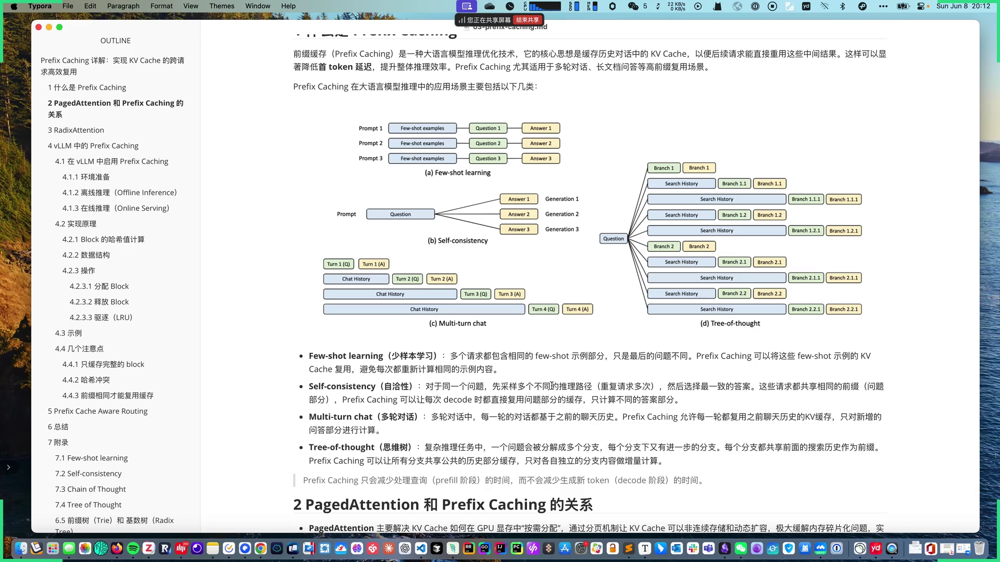 |
| 这里也给了一个例子。比如要计算某个东西，如果没有使用这种方式，可能直接通过贪婪匹配就生成出一个答案；但如果用 self-consistency，你先让模型生成三个答案，并且这三个答案是用三种不同的方式得到的。 [【跳转到 03:45】](https://www.bilibili.com/video/BV1jgTRzSEjS/?t=225) | 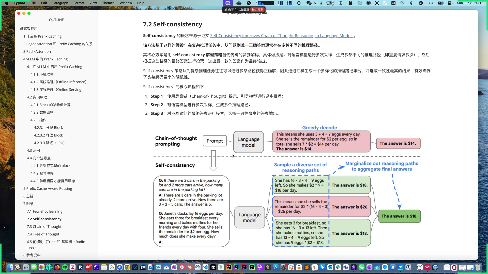 |
| 然后对比一下这三个答案……（这里敏哥你好像静音了）好，OK，我们继续。你可以看到，一和三通过不同的路径得到的答案是一样的，跟二不一样，于是它选择一个更加一致的答案作为最终答案。通过这种方式提高模型推理的准确性。 [【跳转到 04:10】](https://www.bilibili.com/video/BV1jgTRzSEjS/?t=250) | 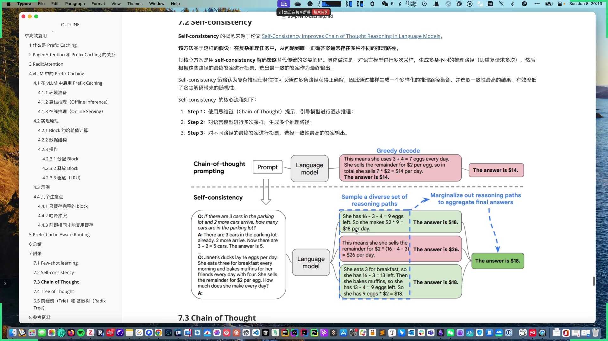 |
| 好，这是第二个例子。第三个例子比较简单，就是多人对话。我在 ChatGPT 中问问题，每次都会带着上面问题的上下文再交给 ChatGPT，进行反复对话，这是一个多轮对话产品。下面还有一个是思维树的例子，其实也是一个问题。 [【跳转到 04:35】](https://www.bilibili.com/video/BV1jgTRzSEjS/?t=275) |  |
| 它会拆解成多个分支，每个分支可能会有类似思维链的方式，但它的思维树会有多个分支，因为思维链其实是单分支的。这里的思维树就是一个多分支的版本；思维树在思维链的基础上增加了多条推理路径的选择，其实是类似的。OK，如果想具体看思维树跟思维链 [【跳转到 05:00】](https://www.bilibili.com/video/BV1jgTRzSEjS/?t=300) | 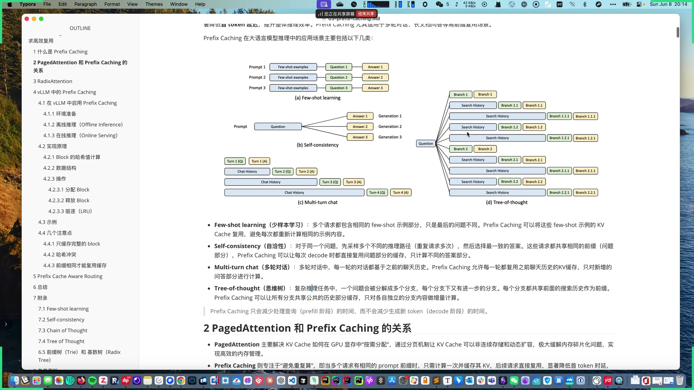 |
| 以及思维链的简单概念，也可以在这边的附录里找到。总而言之，这四种场景经常会包含一部分共用的前缀，所以我们的 Prefix Caching 就可以在这些场景中有效提升推理效率。这里再补充一点： [【跳转到 05:25】](https://www.bilibili.com/video/BV1jgTRzSEjS/?t=325) | 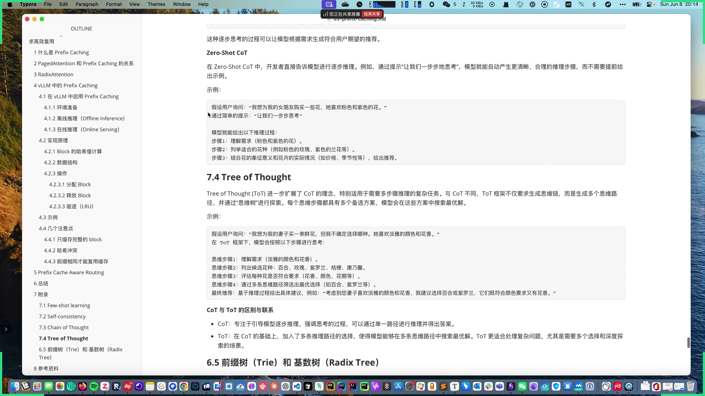 |
| Prefix Caching 其实只能减少 prefill 阶段的时间。因为模型分为 prefill 跟 decode 两个阶段：prefill 接收到请求的全部 prompt，然后生成第一个 token；decode 阶段则根据上下文一个一个地蹦出 token。它只能缓存已有的部分，而新生成的部分还是要按照推理 [【跳转到 05:50】](https://www.bilibili.com/video/BV1jgTRzSEjS/?t=350) | 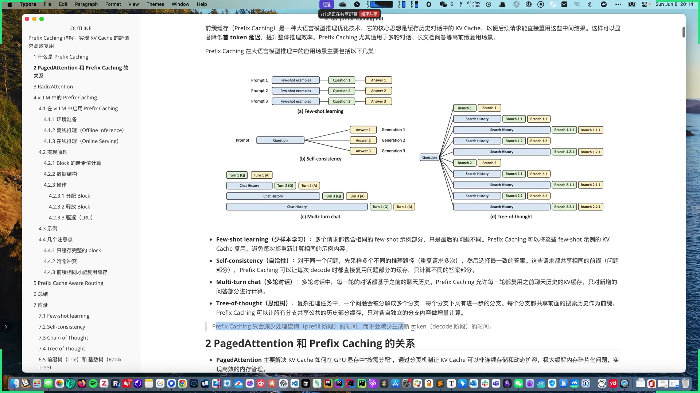 |
| 原来的推理一个个去蹦。OK，所以要强调：它只能减少 prefill 的时间，而不能减少新生成 token 的时间。好，我们继续。上次分享我们介绍过 PagedAttention，今天我们说的 Prefix Caching 可以和它做个对比，避免大家对这两个概念有所混淆。 [【跳转到 06:15】](https://www.bilibili.com/video/BV1jgTRzSEjS/?t=375) | 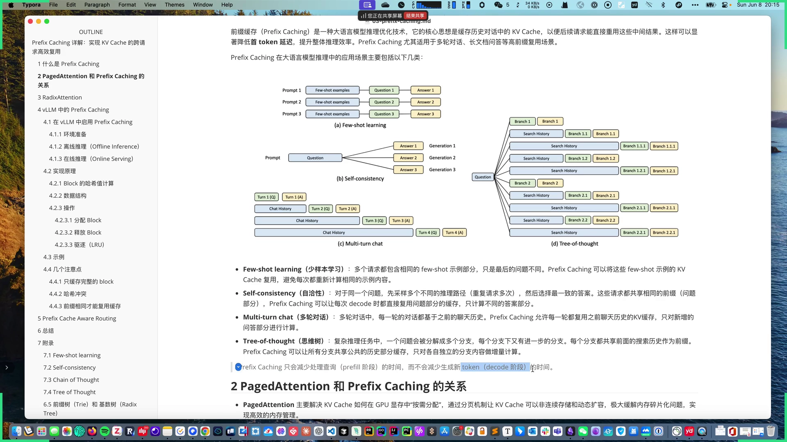 |
| PagedAttention 主要解决 KV Cache 如何在 GPU 显存中按需分配的问题，它通过分页机制让 KV Cache 在非连续的物理内存中进行按需、动态的分配，减少内存碎片化。而 Prefix Caching 则专注于避免重复计算：当多个请求有相同的前缀时， [【跳转到 06:40】](https://www.bilibili.com/video/BV1jgTRzSEjS/?t=400) | 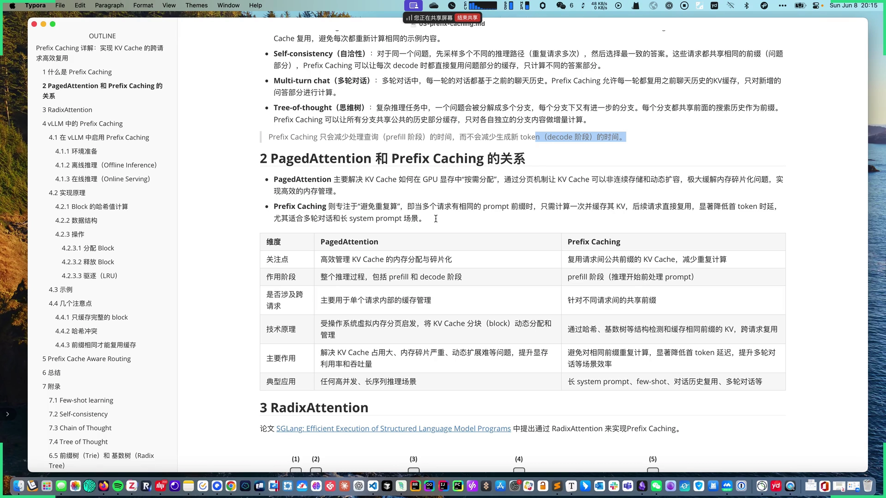 |
| 就使用缓存避免重复计算。这张表从多个维度做了对比。PagedAttention 主要是高效地利用内存、管理内存来存储 KV Cache；Prefix Caching 则是允许我缓存这些 KV Cache 进行复用，允许下一个或者不同请求之间 [【跳转到 07:05】](https://www.bilibili.com/video/BV1jgTRzSEjS/?t=425) |  |
| 去共享这个前缀，也就是共享前缀的 KV Cache。PagedAttention 关注的是单个请求内部，我的 KV Cache 如何分配内存、如何管理这些 block，它运用在整个过程中：prefill 跟 decode 只要有 token 的过程，我都会用 PagedAttention 去分配 block。 [【跳转到 07:30】](https://www.bilibili.com/video/BV1jgTRzSEjS/?t=450) |  |
| 去管理这个 KV Cache。而 Prefix Caching 主要在 prefill 阶段，我拿到输入的 prompt 然后进行计算。好，接着讲技术原理。PagedAttention 是基于操作系统的虚拟内存跟分页技术得到启发，把 KV Cache 按块的方式去管理。 [【跳转到 07:55】](https://www.bilibili.com/video/BV1jgTRzSEjS/?t=475) | 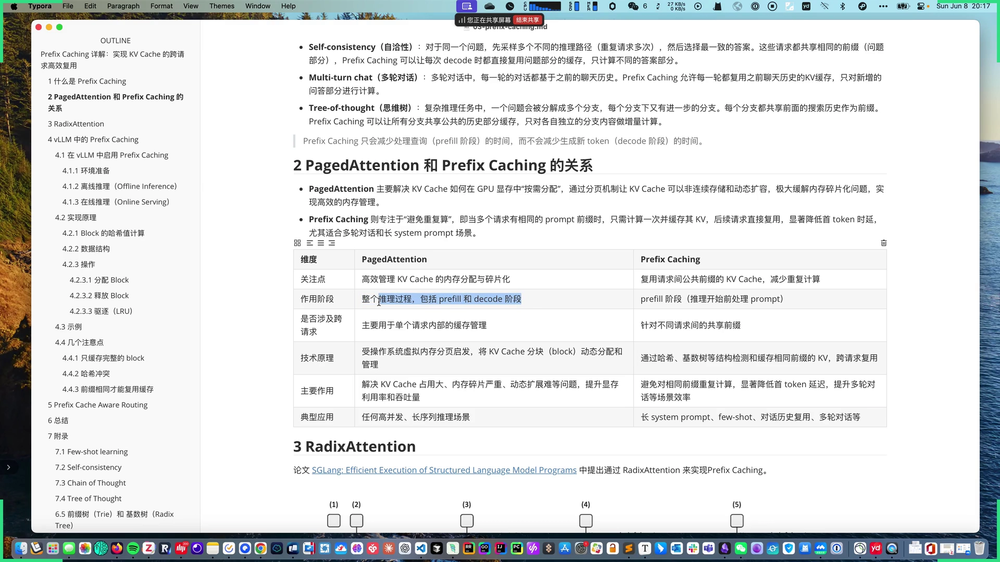 |
| 那 Prefix Caching 后面会介绍到：SGLang 主要是用 radix tree（字典树）这个结构去管理，而 vLLM 则是通过哈希的方式去管理，允许跨请求复用。好，接下来我们具体讲一下 Prefix Caching 的实现方式。 [【跳转到 08:20】](https://www.bilibili.com/video/BV1jgTRzSEjS/?t=500) | 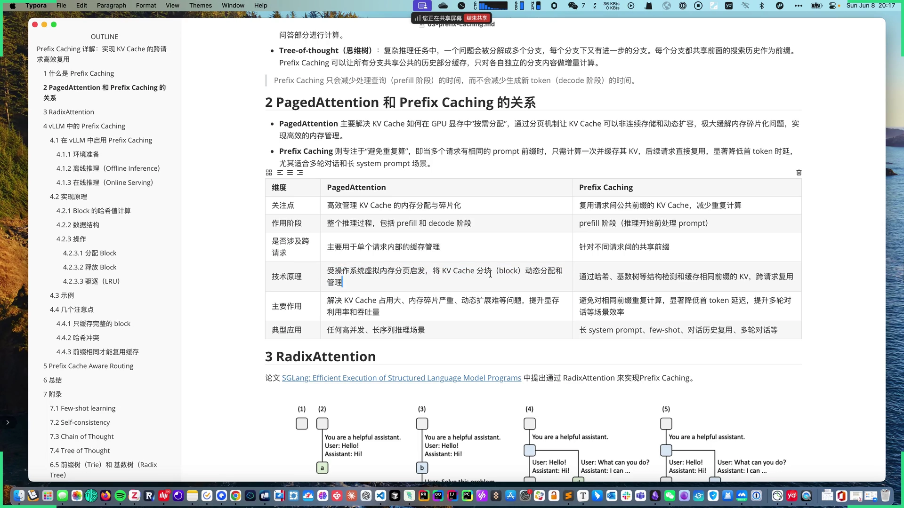 |
| 分别针对 SGLang 跟 vLLM。SGLang 是在这篇论文中提出了一个叫 RadixAttention 的方式来实现 Prefix Caching。当然论文中也提到了 SGLang 一些其他的东西，比如它支持 DSL，或者支持可压缩的、有向的这类结构化输出， [【跳转到 08:45】](https://www.bilibili.com/video/BV1jgTRzSEjS/?t=525) | 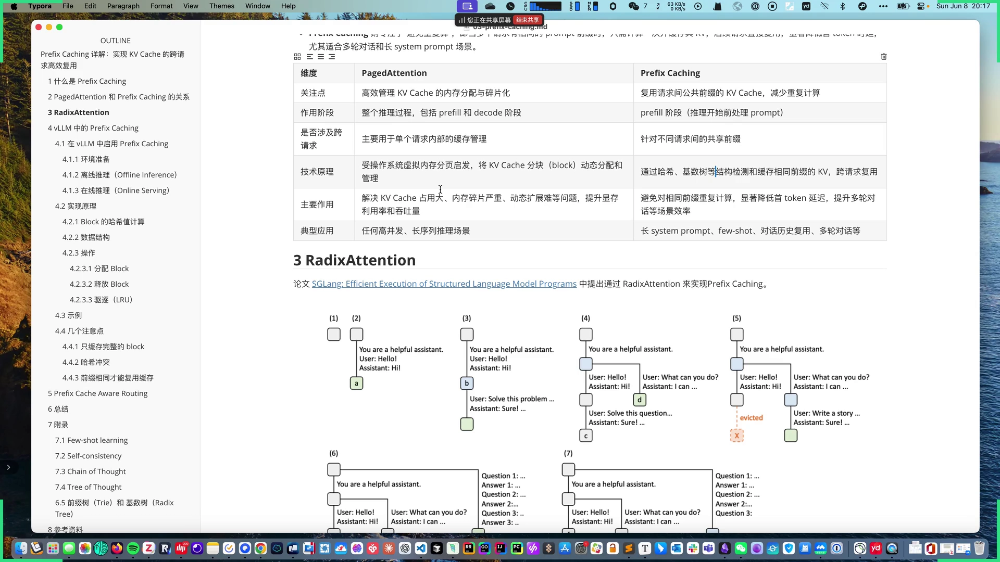 |
| 以提升像 JSON 这类输出格式的效率。不过我们这次的重点主要是 Prefix Caching，所以主要看 RadixAttention 这部分。这张图是从论文里摘出来的，它介绍了九个时间点，说明 SGLang 中 [【跳转到 09:10】](https://www.bilibili.com/video/BV1jgTRzSEjS/?t=550) | 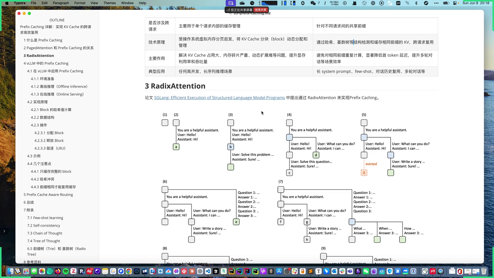 |
| 通过 RadixAttention 并结合 LRU 这种缓存策略来管理请求中的 Prefix Caching 的过程。我这里简单过一下。首先图中有几个地方：绿色的点表示新生成的节点，蓝色表示可以复用缓存的节点， [【跳转到 09:35】](https://www.bilibili.com/video/BV1jgTRzSEjS/?t=575) | 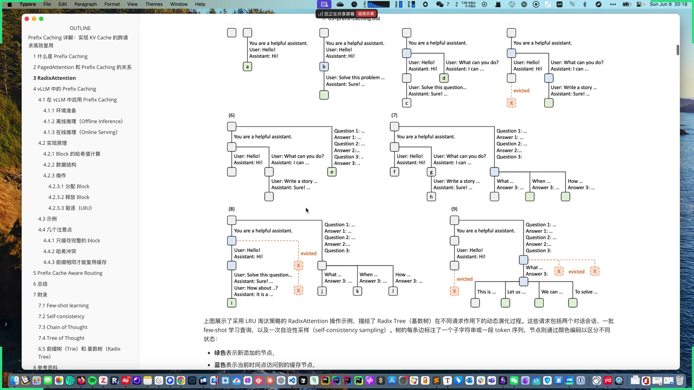 |
| 红色表示被淘汰、驱逐的节点。我们过一下。比如步骤一，可以看到 radix tree 是空的。然后步骤二，收到用户的消息，这是 system prompt，这是用户的问题，得到了一个回答 "Hi"，这时候就把这部分做一个缓存， [【跳转到 10:00】](https://www.bilibili.com/video/BV1jgTRzSEjS/?t=600) |  |
| 然后加到这个新的 radix tree 节点中。第二部分，基于原先的历史对话，用户又继续提问下一个问题，那这里就可以复用刚刚这个节点的缓存，这部分就不用计算了，然后基于它继续做推理， [【跳转到 10:25】](https://www.bilibili.com/video/BV1jgTRzSEjS/?t=625) |  |
| 然后得到下一个输出，并且把新对话的节点也追加到这个 radix tree 中。第四个时间点，收到了一个新的会话请求，用户使用了相同的 prompt、相同的问题，所以这部分是可以复用的。你可以看到 radix tree 在这里会智能地拆分， [【跳转到 10:50】](https://www.bilibili.com/video/BV1jgTRzSEjS/?t=650) |  |
| 做了一个拆分，只把 "you are helpful system" 这部分进行复用，不能复用的部分就拆成一个新的节点，然后这部分请求生成了一个 "D"。第五个时间段，由于内存受到限制，它根据 LRU 策略 [【跳转到 11:15】](https://www.bilibili.com/video/BV1jgTRzSEjS/?t=675) | 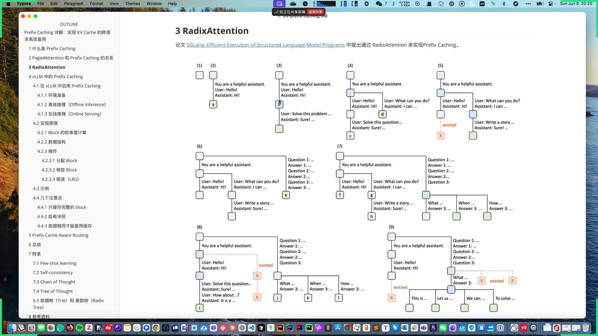 |
| 去淘汰了最早的历史节点。这部分节点被淘汰，因为它会淘汰最远的节点，而最近的是有可能被复用上的，所以它会淘汰相对远的这部分节点。第六个时间段，收到了一个 few-shot 查询，给了一部分示例和答案，这里就新起了一个没有能够复用的节点， [【跳转到 11:40】](https://www.bilibili.com/video/BV1jgTRzSEjS/?t=700) |  |
| 这里新起了一个新的节点。第七个步骤，也是 few-shot，但这次问题的例子可以复用了，可以看到这部分是蓝色的，然后基于它衍生出了不同的结果。OK，第八个时间段， [【跳转到 12:05】](https://www.bilibili.com/video/BV1jgTRzSEjS/?t=725) |  |
| 它又基于原先的第一条请求继续问了一个新问题，前面的部分也是复用的，对吧？但由于内存不够，它根据 LRU 策略把第二轮会话的这些节点全部删除了。第九个时间段，它问了一个基于 self-consistency 的 [【跳转到 12:30】](https://www.bilibili.com/video/BV1jgTRzSEjS/?t=750) | 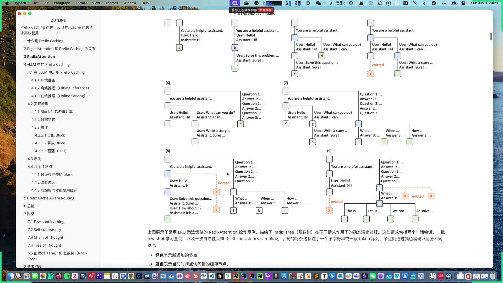 |
| 问题，针对同一个问题衍生出了多个提问、多个答案，然后也根据相关的 LRU 策略把原先较早的给驱逐了，并且能够复用刚刚这部分 few-shot 示例跟这部分缓存。 [【跳转到 12:55】](https://www.bilibili.com/video/BV1jgTRzSEjS/?t=775) | 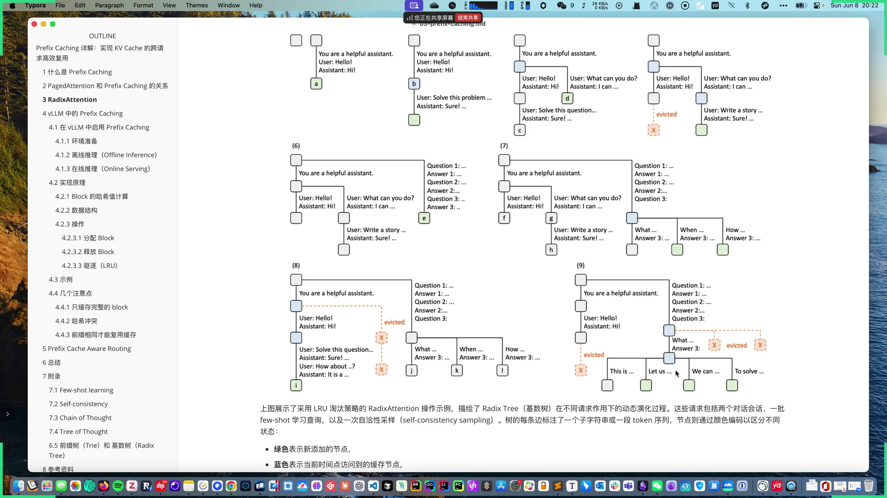 |
| OK，这就是通过 radix tree 的方式实现 Prefix Caching 的一个基本原理。然后我们今天会重点介绍 vLLM 中 Prefix Caching 的实现。vLLM 中的 Prefix Caching 一开始支持的 [【跳转到 13:20】](https://www.bilibili.com/video/BV1jgTRzSEjS/?t=800) |  |
| 只是手动前缀，用户需要通过 prefix_pos 这个参数去显式指定前缀边界的位置。比如说这是他一开始实现这个版本的一个 PR。 [【跳转到 13:45】](https://www.bilibili.com/video/BV1jgTRzSEjS/?t=825) | 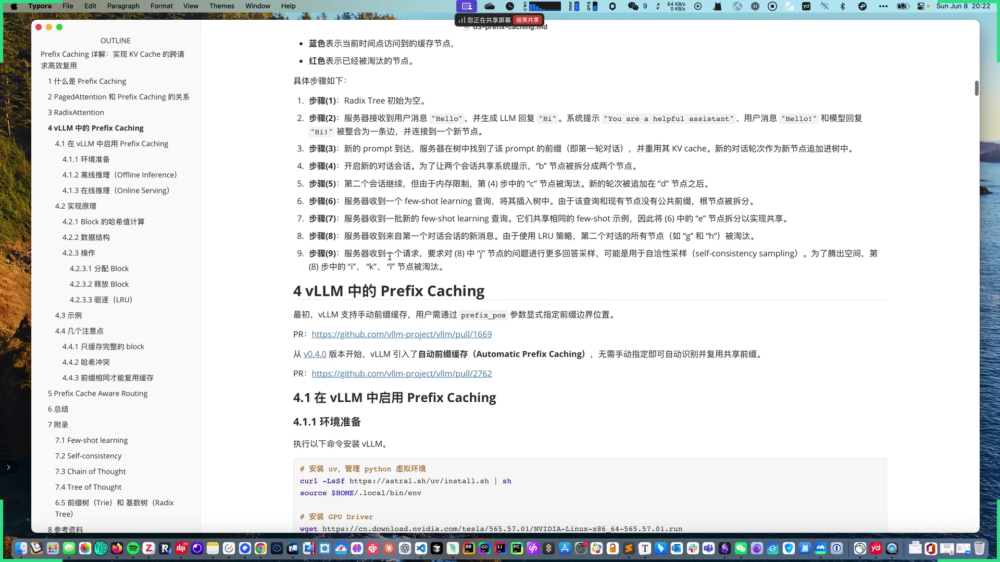 |
| 这个 PR 中有一个示例，就这个地方，它是个示例。 [【跳转到 14:00】](https://www.bilibili.com/video/BV1jgTRzSEjS/?t=840) | 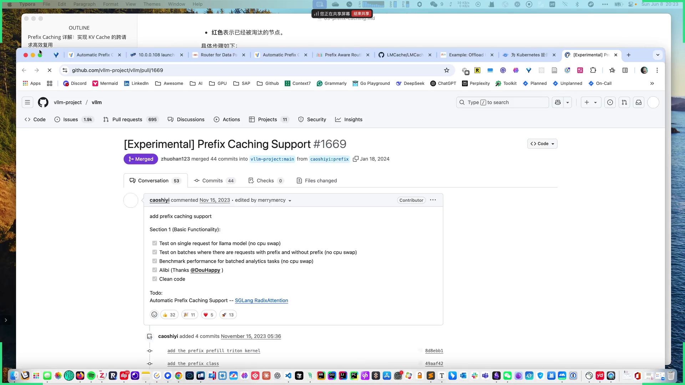 |
| 比如说你可以看到这里有个 prefix，对吧，然后它这里指定 prefix_pos。 [【跳转到 14:07】](https://www.bilibili.com/video/BV1jgTRzSEjS/?t=847) | 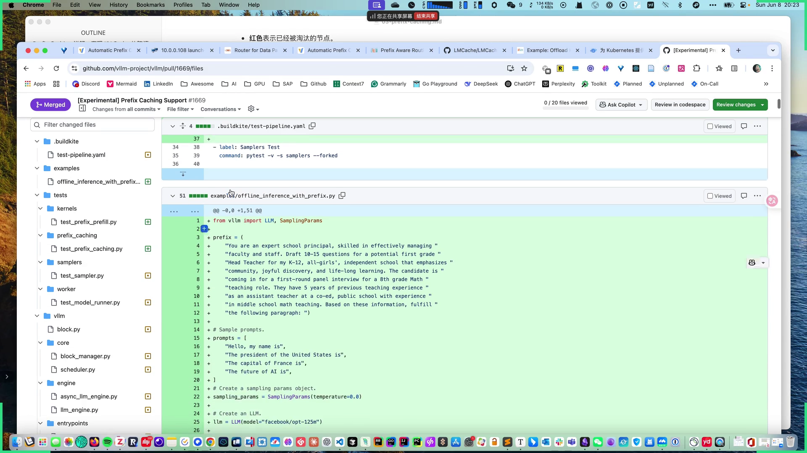 |
| 它是通过 prefix 的长度进行计算，也就是说它计算前缀的位置很固定，就是根据 system prompt 去计算。但如果你基于 system prompt 再去生成多轮新的会话，这部分就不能进入前缀缓存的计算了。 [【跳转到 14:12】](https://www.bilibili.com/video/BV1jgTRzSEjS/?t=852) | 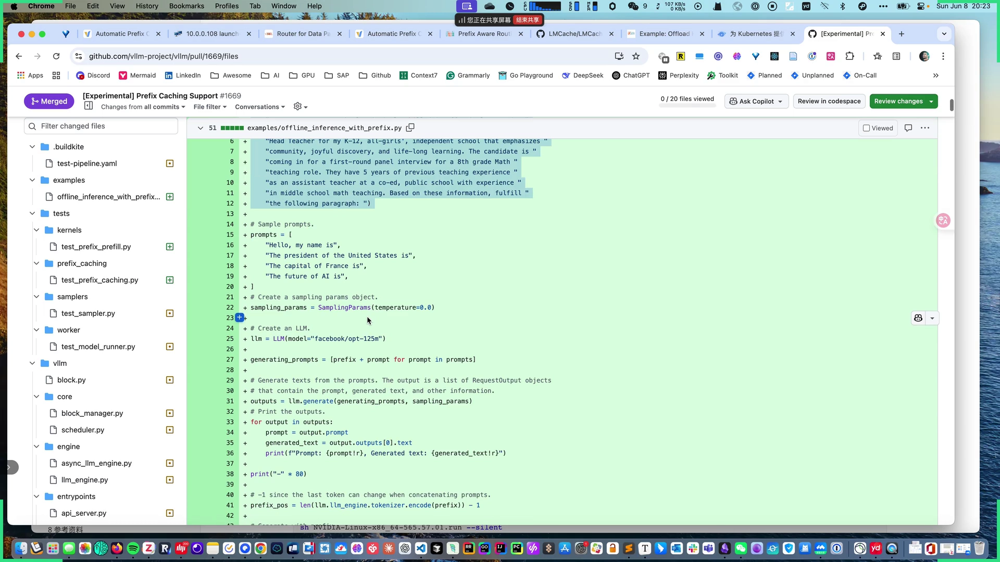 |
| 就像刚刚前面说的这种情况，比如我带着 system prompt 去问问题， [【跳转到 14:37】](https://www.bilibili.com/video/BV1jgTRzSEjS/?t=877) | 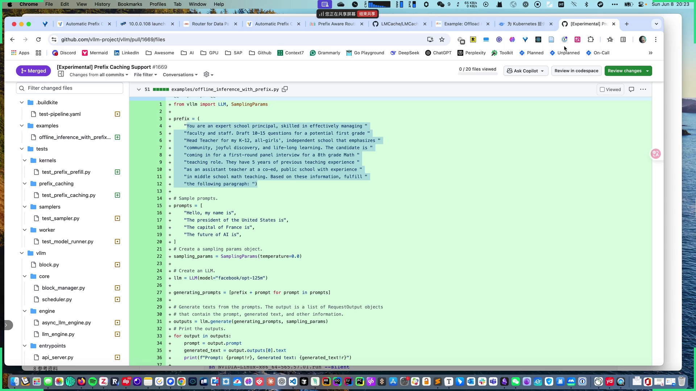 |
| 再接下去问，这种情况下我就不能缓存它，只能固定地缓存前面 system prompt 这个前缀，所以说就不是很灵活，对吧。基于这个原因，从 v0.4.0 版本开始，vLLM 就引入了叫 automatic Prefix Caching（自动前缀缓存），它可以自动计算，就可以实现我们前面说的这种 [【跳转到 14:42】](https://www.bilibili.com/video/BV1jgTRzSEjS/?t=882) | 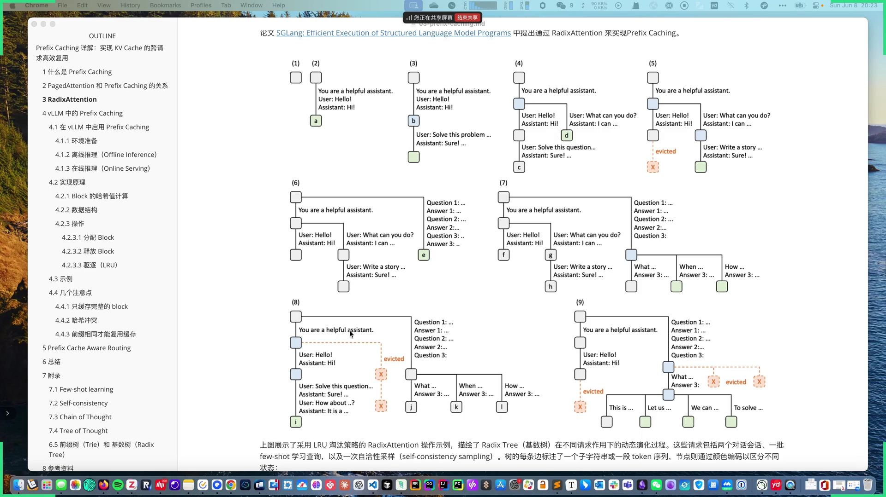 |
| 效果：这里不行的话就去拆分，对吧，这里其实只有第一句能够缓存，那就把它拆出来，让第一句缓存，其他的不用缓存，这就是 automatic Prefix Caching 的作用。然后这个就是它实现的一个 PR 的 URL。OK，好，那我们接下来简单演示一下 [【跳转到 15:07】](https://www.bilibili.com/video/BV1jgTRzSEjS/?t=907) | 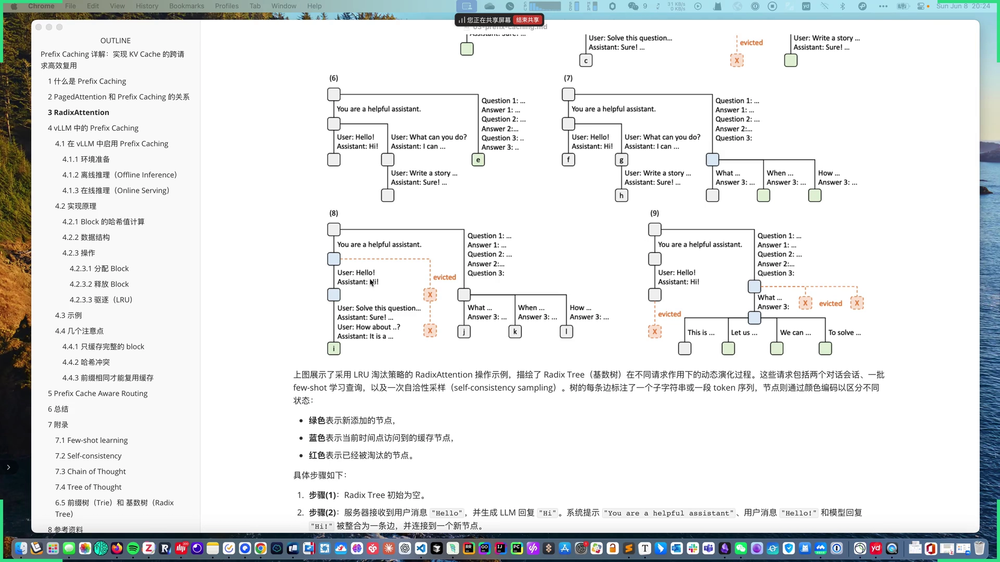 |
| 怎么在 vLLM 中去用 Prefix Caching。首先这里是一些安装命令，我们可以通过 uv 这个方式去管理 Python 的虚拟环境，安装一下 GPU driver、GPU 的 toolkit。我这个命令是在 Ubuntu 系统上运行的，因为用的是 apt 命令。然后我需要使用 V [【跳转到 15:32】](https://www.bilibili.com/video/BV1jgTRzSEjS/?t=932) | 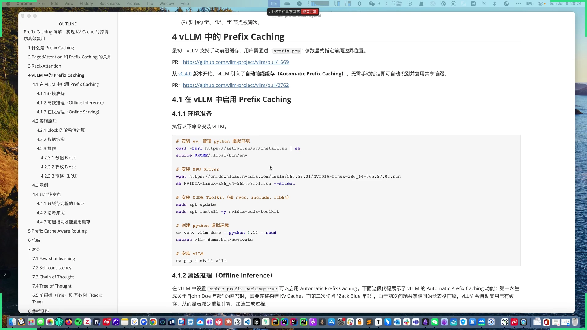 |
| 我用 uv 的命令去创建虚拟环境，然后用 pip 安装 vLLM 就可以了。我这里有两种方式：一种是离线、一种在线推理。离线推理的话，我在代码中设置 enable_prefix_caching=True，不就可以启用 automatic Prefix Caching 了。这个代码演示中，你看这里是个 long prompt， [【跳转到 15:57】](https://www.bilibili.com/video/BV1jgTRzSEjS/?t=957) | 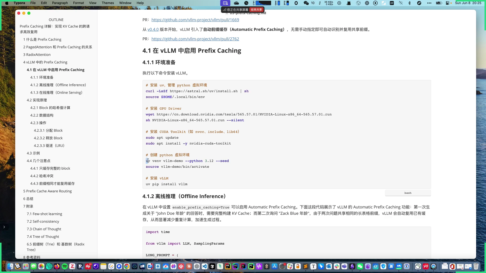 |
| 我要根据这个很长的表格去回答问题，里面会问两个问题。 [【跳转到 16:22】](https://www.bilibili.com/video/BV1jgTRzSEjS/?t=982) | 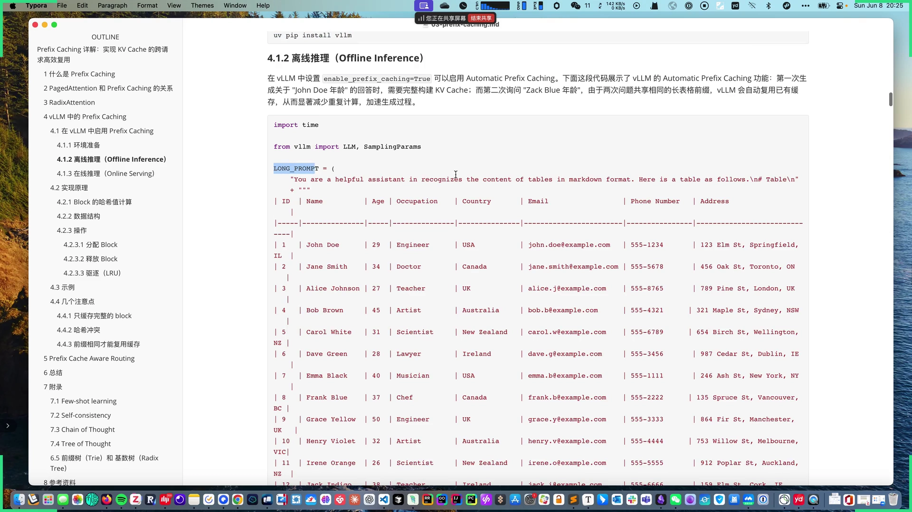 |
| 一个是问这个人的 John Doe 的年龄 29，还有一个是问一个叫 Jack Blue 的年龄。 [【跳转到 16:27】](https://www.bilibili.com/video/BV1jgTRzSEjS/?t=987) | 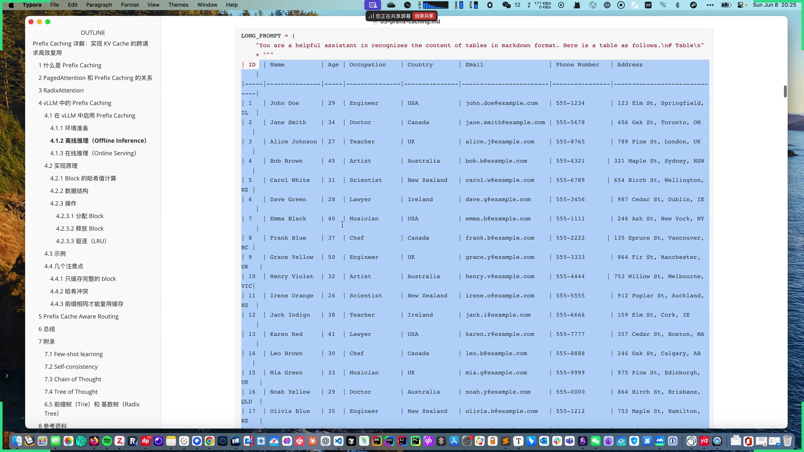 |
| 可以看到下面的 prompt，这就是两个问题：第一个是刚刚这个人（第一个人应该是 29），第二个这个人是 30，然后把 long prompt 拼上我的一个前缀，对吧。然后这里就是 enable_prefix_caching=True，就是启用 Prefix Caching，然后这里执行我的一个模型版本。 [【跳转到 16:32】](https://www.bilibili.com/video/BV1jgTRzSEjS/?t=992) | 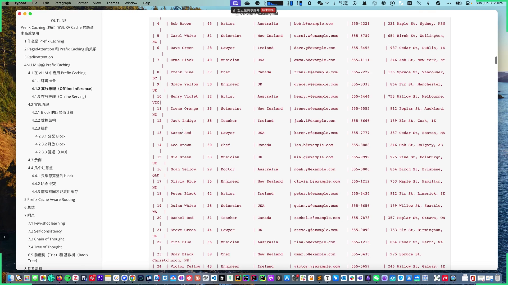 |
| 那我这里使用的是 7B 的模型。如果你用 FP16，那你可能需要乘二，可能需要 15 或 16GB 的模型显存；但 GPU 显存可能还要加上一点点的 KV Cache。你可以通过 `--dtype` 去指定它的一个精度。 [【跳转到 16:57】](https://www.bilibili.com/video/BV1jgTRzSEjS/?t=1017) | 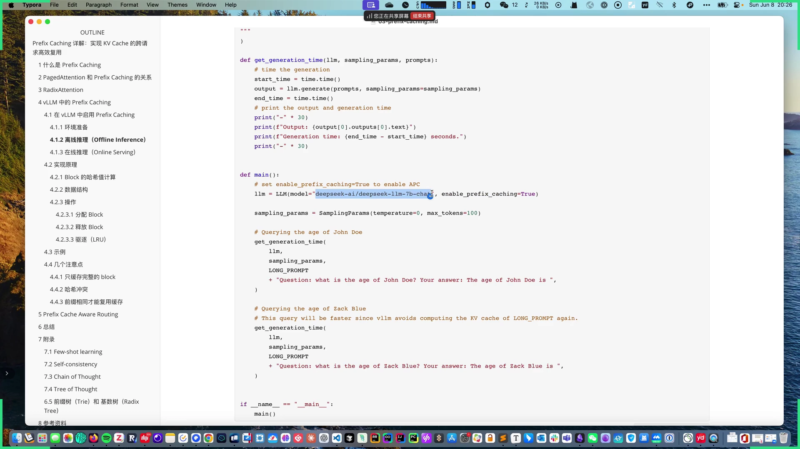 |
| 默认是 FP32，然后你可以改成 FP16 来节约内存；那如果是 FP32，你可能就要乘个四，那可能是要二三十 G 的内存。OK，好，然后这里就是一个运行的结果。你可以看到第一个问题输出是正确的，第二个问题输入是正确的。 [【跳转到 17:22】](https://www.bilibili.com/video/BV1jgTRzSEjS/?t=1042) | 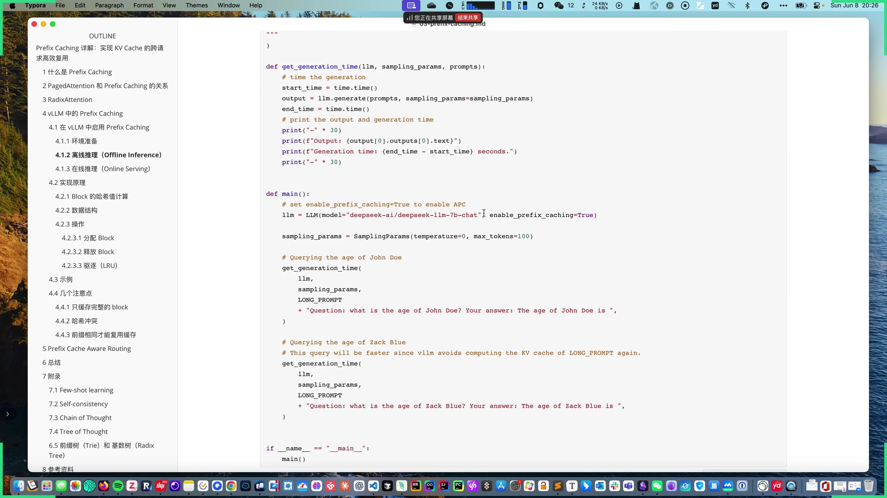 |
| 它的时间是 0.4 秒，第二个问题就是 0.1 秒，大概是四倍的性能提升。然后第二个就是在线的推理，我就直接通过 vLLM 的 serve 命令去启动这个推理。在 V1 版本中——现在是 V1 版本嘛——它默认是启用 Prefix Caching 的，而 V0 是默认禁用。 [【跳转到 17:47】](https://www.bilibili.com/video/BV1jgTRzSEjS/?t=1067) | 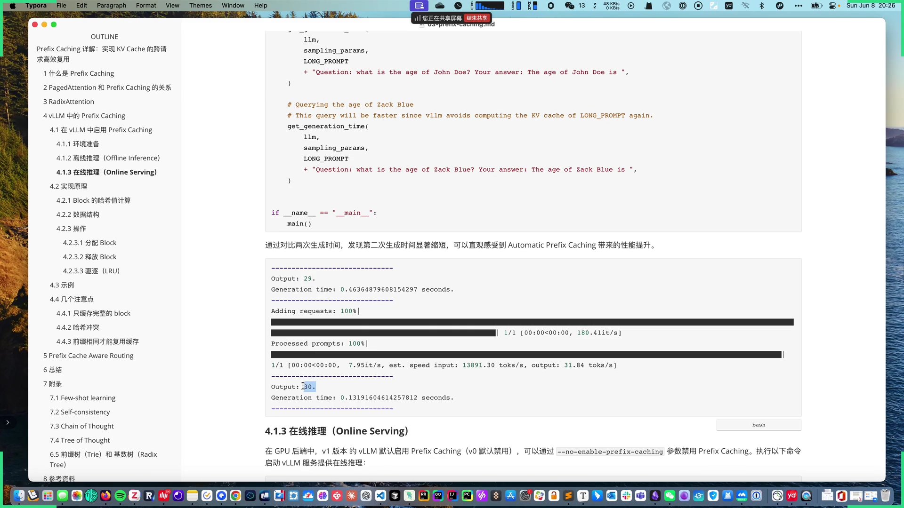 |
| 如果你要禁用的话，你可以使用 `--no-enable-prefix-caching` 这个参数去禁用。那我现在如果不去禁用，就默认启用，可以看一下这个。 [【跳转到 18:12】](https://www.bilibili.com/video/BV1jgTRzSEjS/?t=1092) | 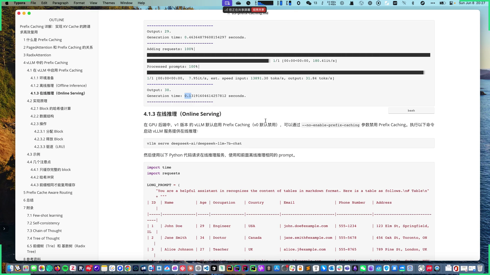 |
| 我已经提起来了，就是刚刚这个命令。 [【跳转到 18:22】](https://www.bilibili.com/video/BV1jgTRzSEjS/?t=1102) | 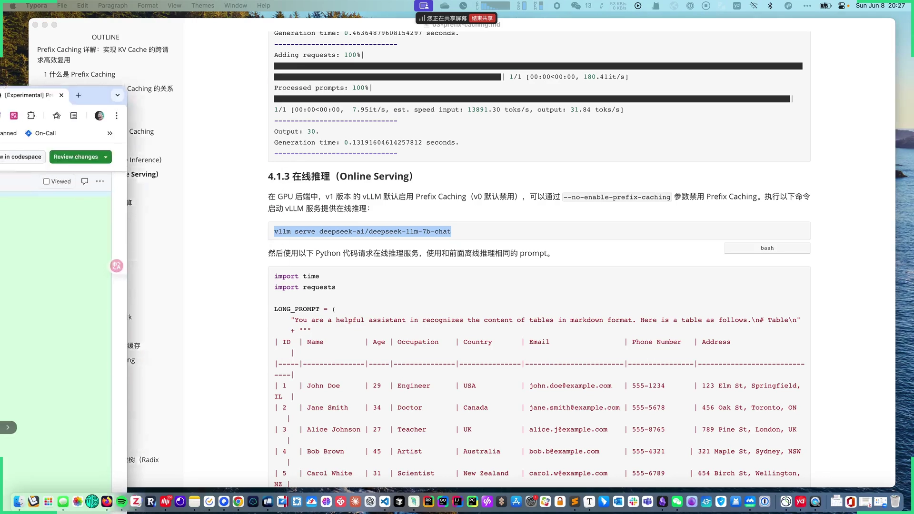 |
| 那我现在再开一个窗口。 [【跳转到 18:27】](https://www.bilibili.com/video/BV1jgTRzSEjS/?t=1107) | 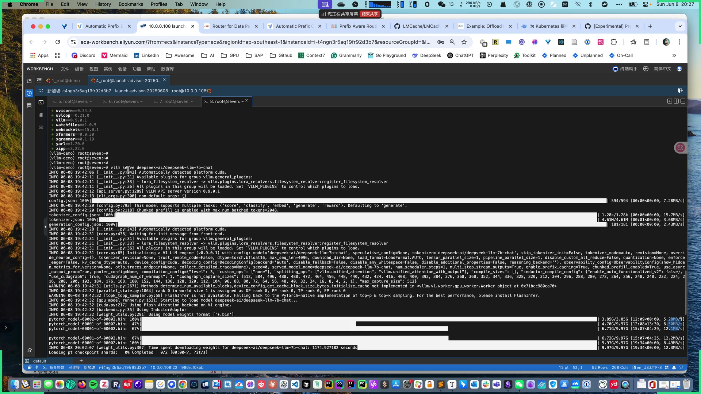 |
| 这一部分就是我的一个 Python 代码。 [【跳转到 18:32】](https://www.bilibili.com/video/BV1jgTRzSEjS/?t=1112) | 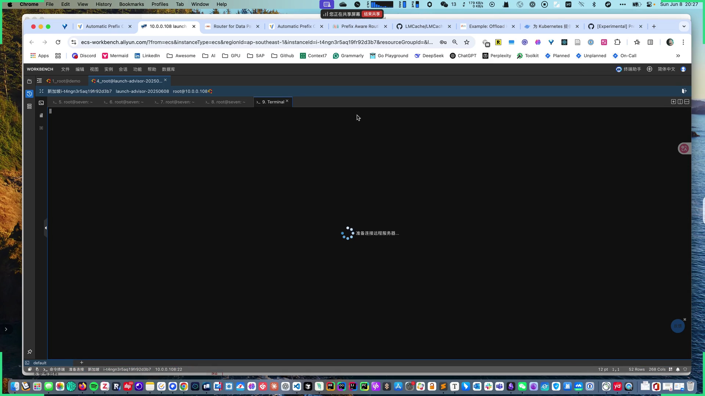 |
| 我跟刚刚的 prompt 是一样的，这里有点区别，就是我是…… [【跳转到 18:37】](https://www.bilibili.com/video/BV1jgTRzSEjS/?t=1117) | 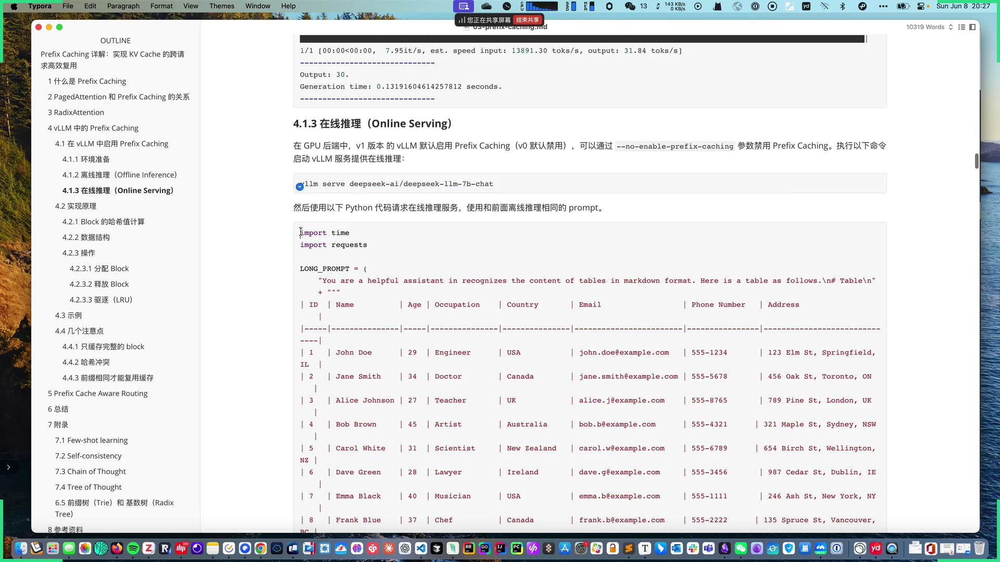 |
| 因为它是在线推理，我就直接用 HTTP 请求去请求 vLLM 的 8000 端口，问的问题也是相同的。那我们看看效果是怎么样的。 [【跳转到 18:42】](https://www.bilibili.com/video/BV1jgTRzSEjS/?t=1122) | 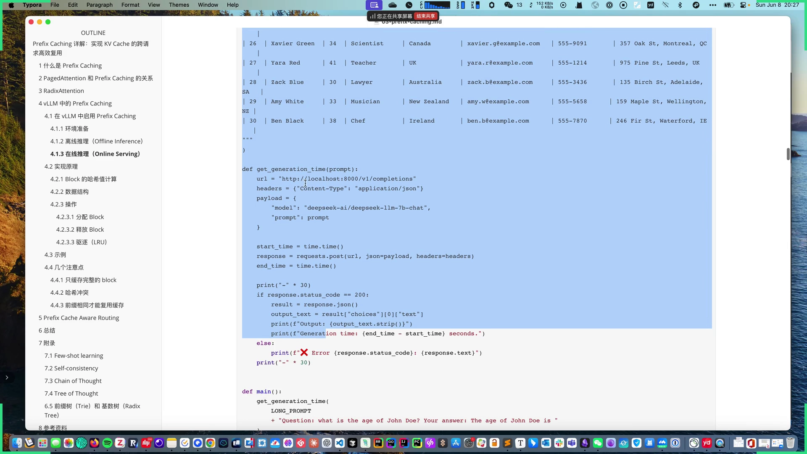 |
| （此区间无字幕） [【跳转到 18:53】](https://www.bilibili.com/video/BV1jgTRzSEjS/?t=1133) | 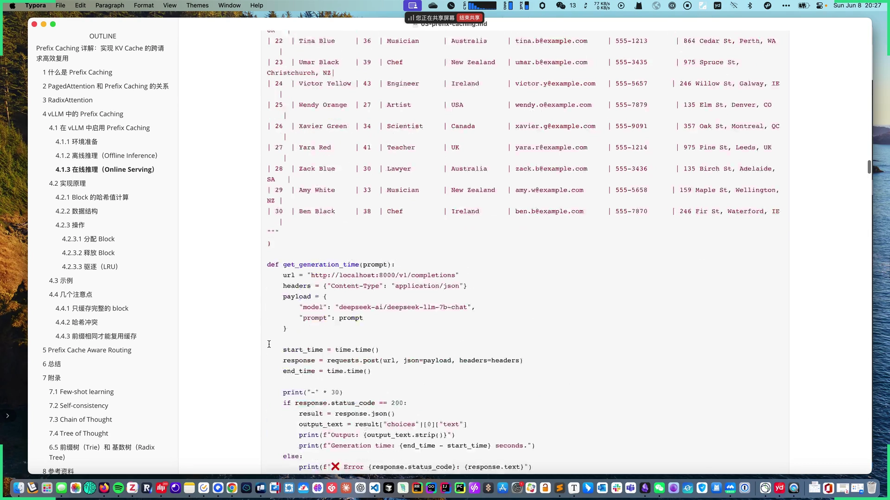 |
| （此区间无字幕） [【跳转到 18:58】](https://www.bilibili.com/video/BV1jgTRzSEjS/?t=1138) | 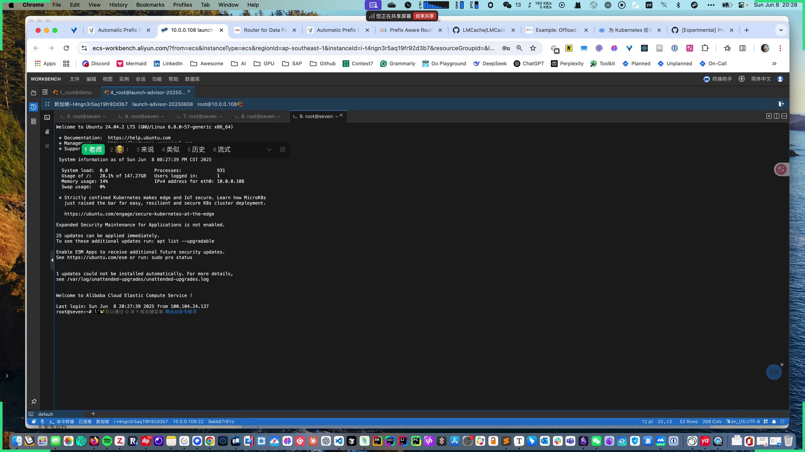 |
| 我先进一下虚拟环境。 [【跳转到 19:05】](https://www.bilibili.com/video/BV1jgTRzSEjS/?t=1145) | 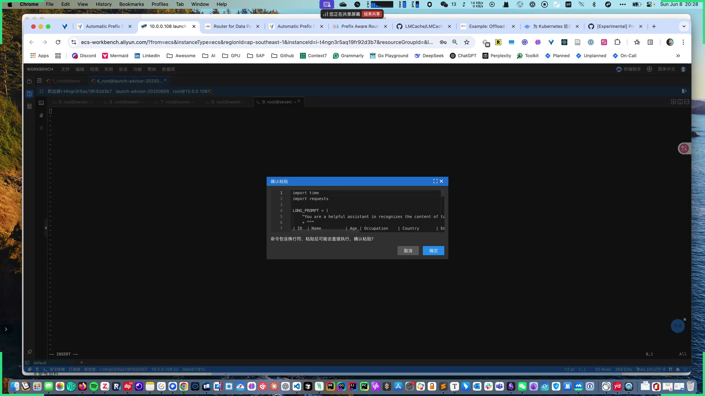 |
| 好，然后现在它是起来的，我去请求一下。好，你可以看到，是不是第一个也是 0.47 秒，然后第二个是 0.31 秒，对吧。如果我再运行一下，因为现在都是缓存了嘛，那肯定两个都差不多。那如果我去掉 enable 的话 [【跳转到 19:10】](https://www.bilibili.com/video/BV1jgTRzSEjS/?t=1150) | 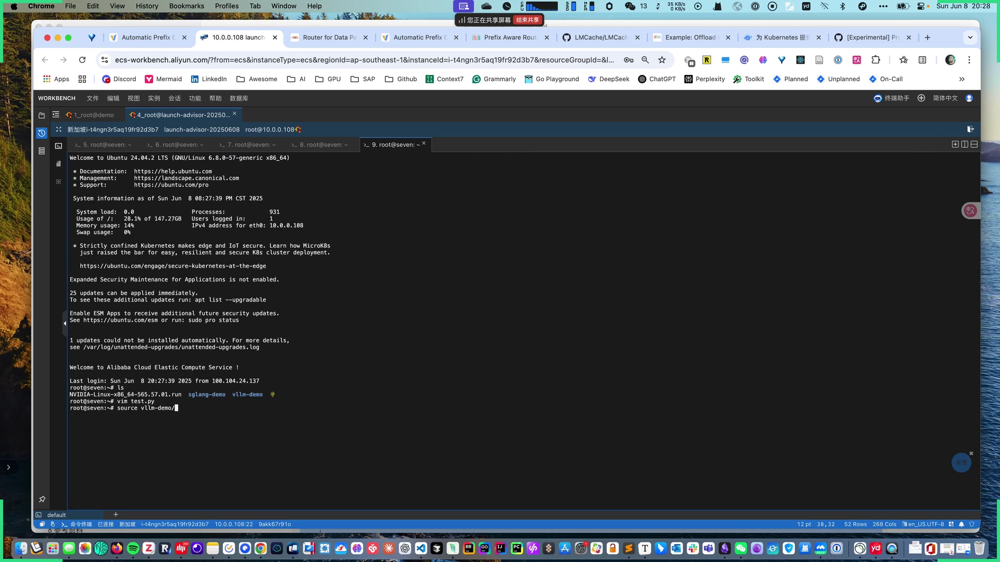 |
| 比如说开始的话，你其实可以试一下，每次请求大概它的时间都是一样的 [【跳转到 19:33】](https://www.bilibili.com/video/BV1jgTRzSEjS/?t=1173) | 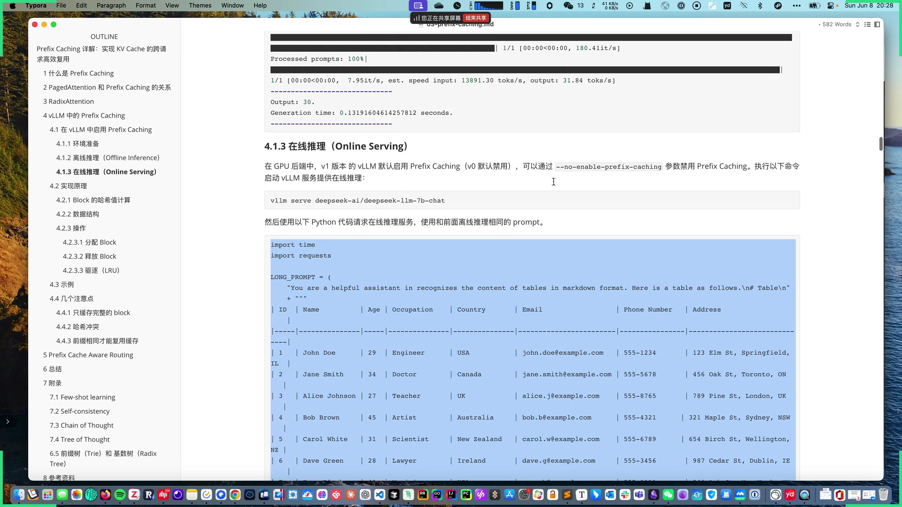 |
| 因为相同的 system prompt 都是要去反复计算的。OK，然后我们刚刚介绍了在 vLLM 中如何使用 Prefix Caching，接下来我们介绍一下它的实现原理。vLLM 是使用了基于哈希的方式去实现 Prefix Caching。具体来说，vLLM 会根据每个 KV block 内的 token [【跳转到 19:38】](https://www.bilibili.com/video/BV1jgTRzSEjS/?t=1178) | 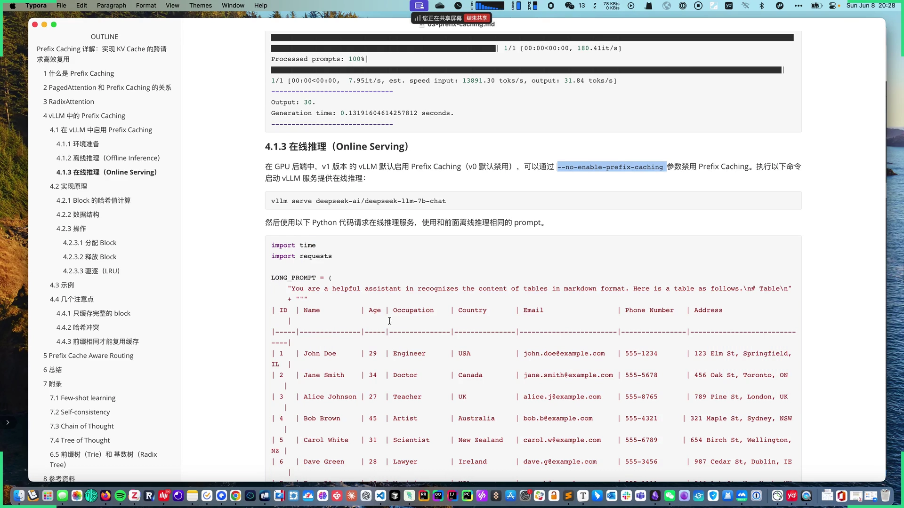 |
| 以及这个 block 之前前缀的 token 来计算该 block 的哈希值。举个例子，比如第一个 block，它计算肯定就是它自己的嘛，会得到一个哈希值；那第二个 block 呢，会用第一个计算的哈希值跟自己 block 的 token 值然后拼接一下做哈希， [【跳转到 20:03】](https://www.bilibili.com/video/BV1jgTRzSEjS/?t=1203) |  |
| 然后得到一个结果。那第三个 block 呢，就跟它前面这两个的哈希值的结果加上它自己的结果……好，那第三个 block 就是把 block1 跟 block2 的前缀的结果跟它自己 block 的值结合起来进行一个计算。 [【跳转到 20:28】](https://www.bilibili.com/video/BV1jgTRzSEjS/?t=1228) | 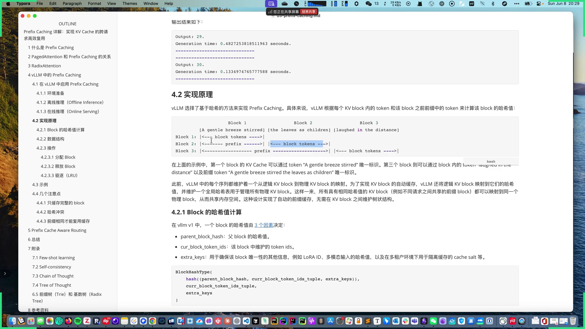 |
| OK，那比如说这个示例中，第三个 block 就是可以基于前面这四个 token 来一起计算，加上它自己的这部分，然后得到对应的一个哈希值，用来标识它的一个唯一值。OK。 [【跳转到 20:53】](https://www.bilibili.com/video/BV1jgTRzSEjS/?t=1253) | 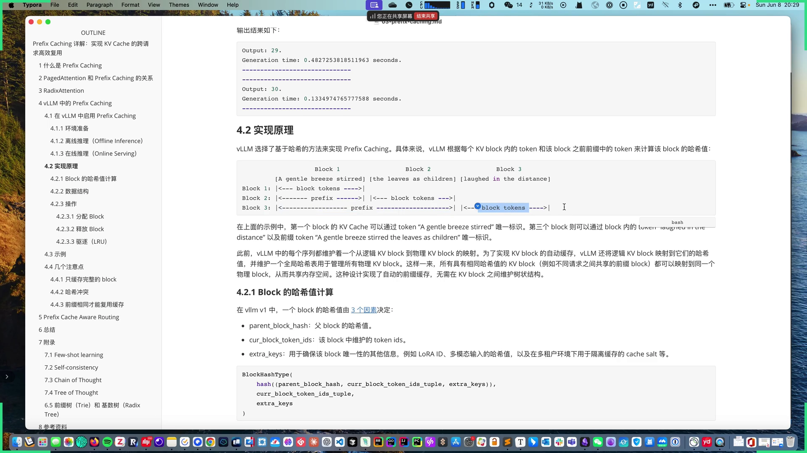 |
| 然后我们可以看一下这个哈希值是由哪些因素决定的。一个 block 哈希主要由三部分决定：一个是 parent block 哈希，也就是我们刚才说的前面 token 的哈希值，对吧；第二个部分就是当前 block 自身的这一部分，也就是我刚才说的；第三部分叫 extra keys。 [【跳转到 21:18】](https://www.bilibili.com/video/BV1jgTRzSEjS/?t=1278) | 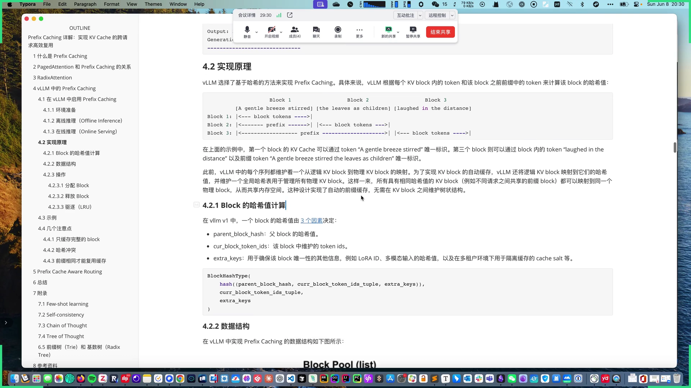 |
| 如果说像这种多模态的情况下，或者是 LoRA 的情况下，那有可能需要额外的地方去存，因为多模态像图片等等你需要做 embedding，对吧，那你需要把这部分的结果存在这个 extra keys 中；或者在多租户环境中，用于隔离缓存的 key， [【跳转到 21:43】](https://www.bilibili.com/video/BV1jgTRzSEjS/?t=1303) |  |
| 也就是盐（salt）等等。那官网这边有一个例子，可以看一下。 [【跳转到 22:08】](https://www.bilibili.com/video/BV1jgTRzSEjS/?t=1328) | 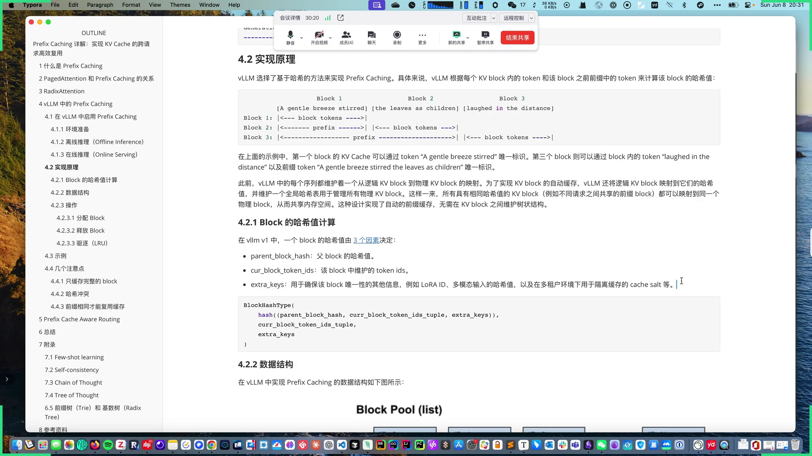 |
| 比如说往上一点，对，这边我把它先翻译一下。 [【跳转到 22:13】](https://www.bilibili.com/video/BV1jgTRzSEjS/?t=1333) | 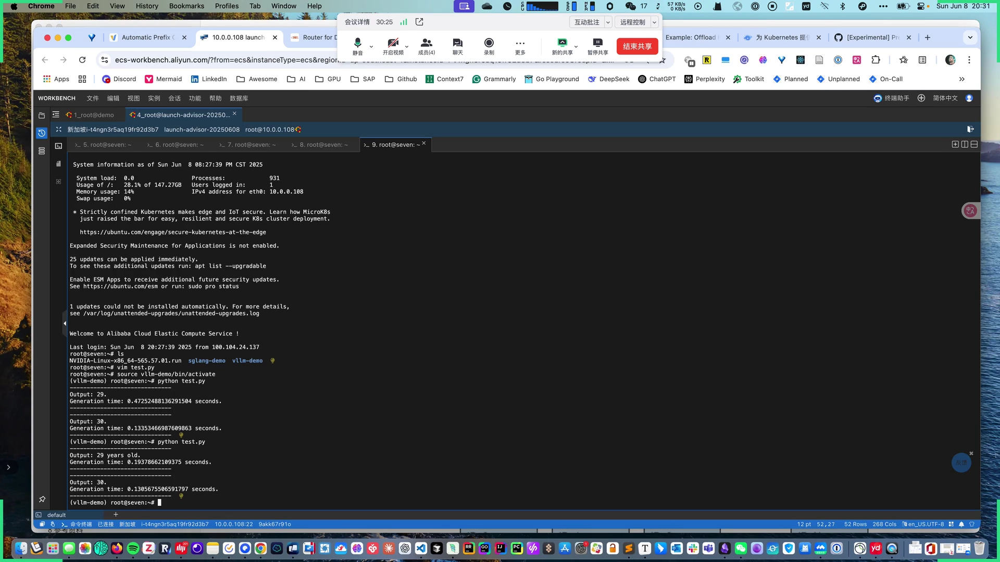 |
| 比如说这是一个多模态的输入情况，这里 prompt 加上一个 image，对吧，那得到的提示是这样的：what's in the image 加上 image 的一个占位符，对吧。而这些占位符呢，是在预填充阶段被图像 embedding 进行替换，所以它们是用来区分图像和这块内容的，对吧。 [【跳转到 22:18】](https://www.bilibili.com/video/BV1jgTRzSEjS/?t=1338) | 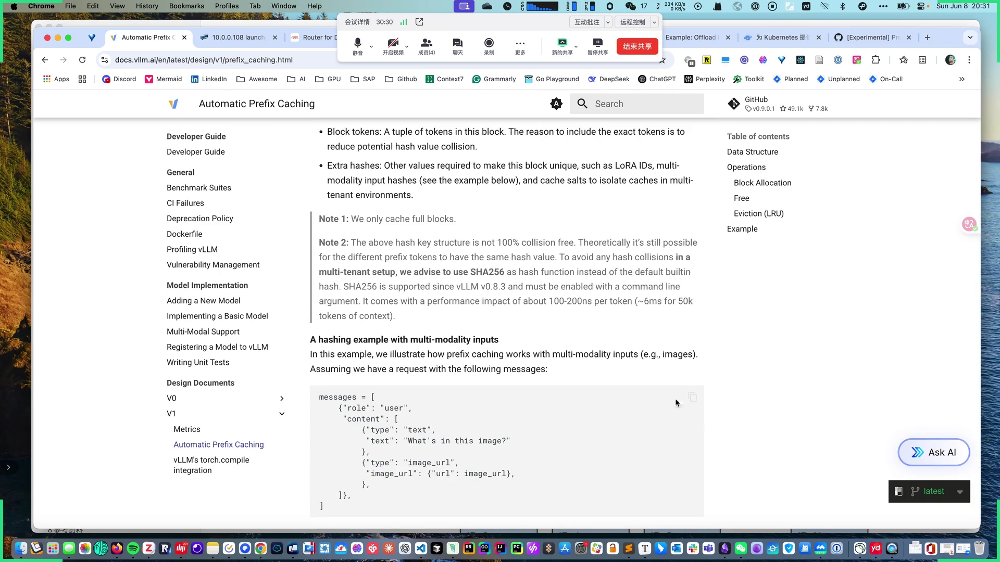 |
| 因为它是直接通过占位符传的话，可能没有办法区分嘛，所以它们收到的内容就是这个。block 哈希第一个是 token id，跟 extra 哈希（也就是 image 的哈希），就这个。OK，所以这种情况下是需要用到 extra 哈希这部分内容的。 [【跳转到 22:43】](https://www.bilibili.com/video/BV1jgTRzSEjS/?t=1363) | 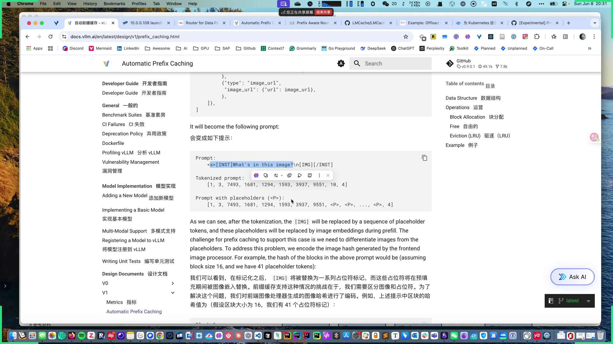 |
| 那第二部分就是刚才说的，在多租户情况下我可能需要去隔离嘛，那等于这里就加了一个盐（salt），对吧。因为如果不同用户问问题，A 用户和 B 用户问的问题那最好还是不要走缓存，如果是有安全性要求的话。所以就把用户的一些情况信息做一个哈 [【跳转到 23:08】](https://www.bilibili.com/video/BV1jgTRzSEjS/?t=1388) | 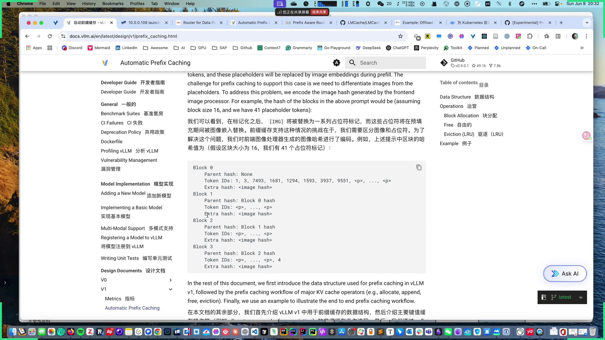 |
| 希，存在这里面进行区分，增强这种安全性和隔离性的要求。好，然后接下来讲一下 vLLM 中实现 Prefix [【跳转到 23:33】](https://www.bilibili.com/video/BV1jgTRzSEjS/?t=1413) | 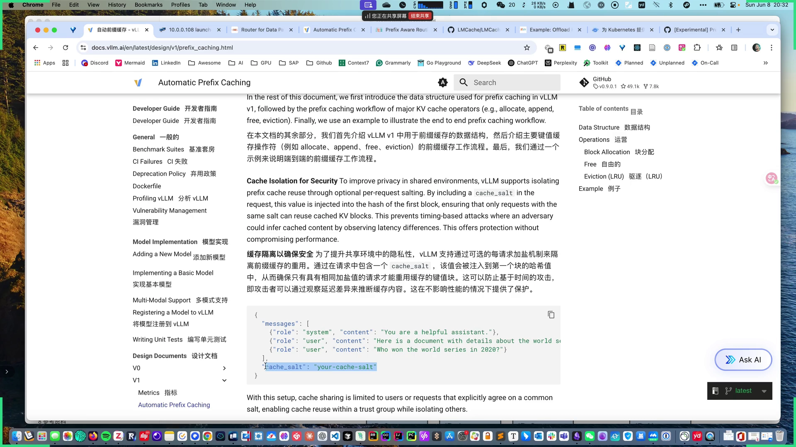 |
| Caching 的一个数据结构。可以看到这张图主要有几个部分：一个是 BlockPool，它管理了所有的 KV Cache 的 block，并且 BlockPool 会提供一些获取 block 的方法，比如分配、释放或者缓存等等。 [【跳转到 23:41】](https://www.bilibili.com/video/BV1jgTRzSEjS/?t=1421) |  |
| 我们可以简单打开这个代码看两眼。比如这里是个 block 的类，对吧，然后比如 get_cached_block（获取有缓存的 block），对吧，还有一些比如获取新的 block 或者是释放 block 等等。它会提供所有这些 KV Cache block 的管理，以及针对它们的操作方法。然后另外，你可以看到 [【跳转到 24:06】](https://www.bilibili.com/video/BV1jgTRzSEjS/?t=1446) |  |
| 还有个 cache，在 BlockPool 里面它有一个叫做 block_hash_to_block 的字段，就是用于存储哈希值跟 block 之间的映射关系，也就是黄色的这个部分。好，可以看到哈希值它是一个双层嵌套字典的结构，对吧，你一个哈希值呢 [【跳转到 24:31】](https://www.bilibili.com/video/BV1jgTRzSEjS/?t=1471) | 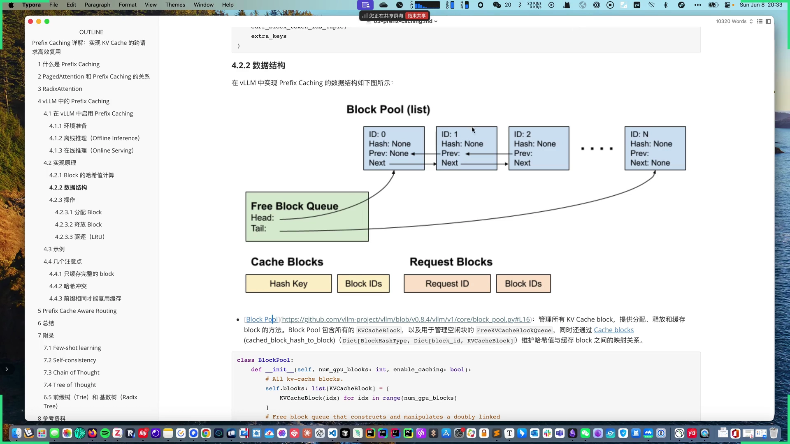 |
| 是会拿到一个 block 的字典列表，你可以根据 block id 再获取多个 block，也就是一个哈希值可以对应出多个 block。为什么？因为就像前面说的，比如在这里，我 block3 的哈希值其实是依赖前面这些的，我这一部分的哈希值拿到，有可能是前面一起的这个缓存值。所以这种情况下 [【跳转到 24:56】](https://www.bilibili.com/video/BV1jgTRzSEjS/?t=1496) | 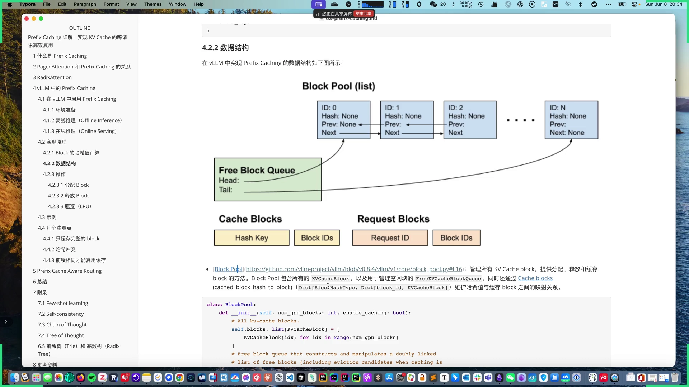 |
| 我就可以拿到 123 这三个 block，对吧。还有一个就是 BlockPool 中还维护了一个叫 free_block_queue 的结构，它其实维护了一个双向链表，有一个头节点和尾节点，也就是说如果你的 block 是属于空闲状态的，就会加入到这个 free_block_queue 里面 [【跳转到 25:21】](https://www.bilibili.com/video/BV1jgTRzSEjS/?t=1521) | 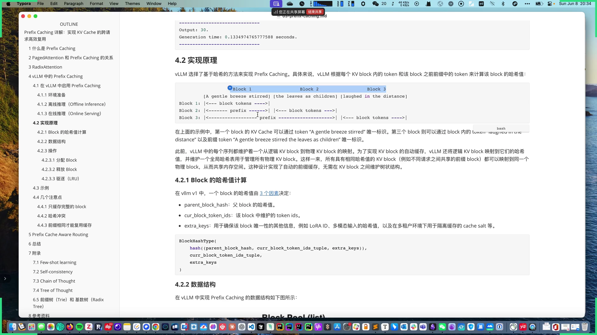 |
| 输进去。OK，刚刚看的就是它的一个结构，对吧。 [【跳转到 25:46】](https://www.bilibili.com/video/BV1jgTRzSEjS/?t=1546) | 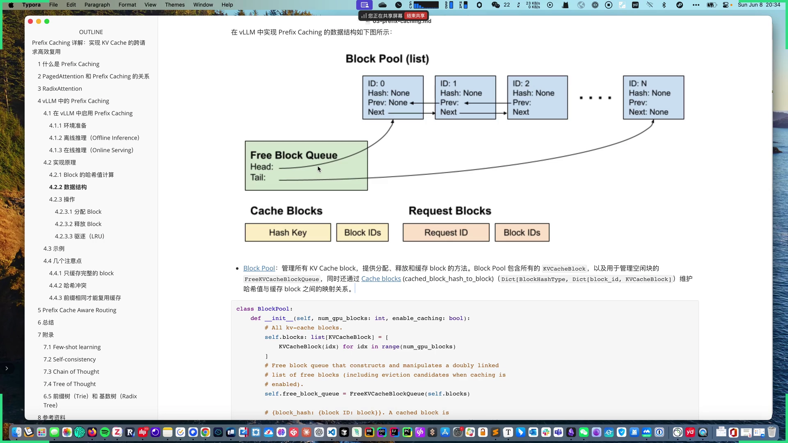 |
| 刚刚说到这个 free_block_queue 就是绿色这部分，然后 cache 的 block_hash_to_block [【跳转到 25:55】](https://www.bilibili.com/video/BV1jgTRzSEjS/?t=1555) | 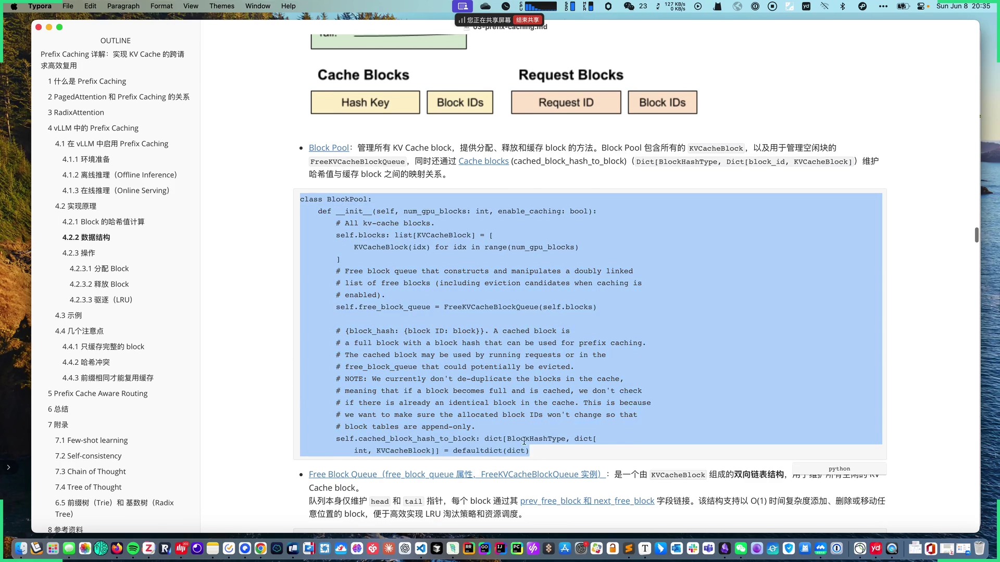 |
| 这部分就是刚才说的黄色部分。那这边再介绍一下这个 free_block_queue，我刚说到是一个双向链表结构嘛，就是维护所有空闲的 KV Cache 的 block，对吧，它有一个头指针和尾指针，并且中间还会用其他的方法去操作，因为连起来的这些都是 KV block 嘛。 [【跳转到 26:00】](https://www.bilibili.com/video/BV1jgTRzSEjS/?t=1560) | 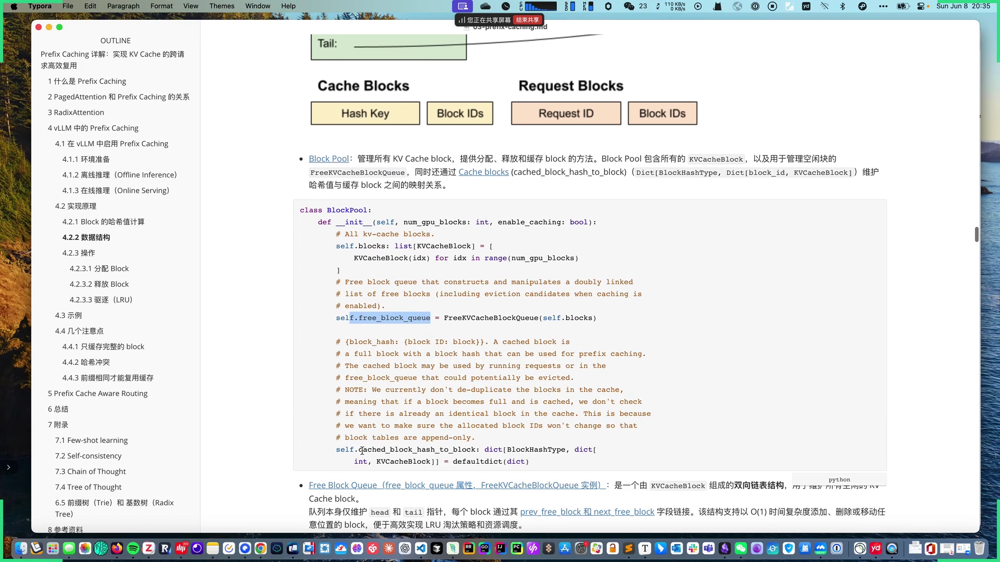 |
| 它还提供了方法去操作这些 KV block，比如我要把它从链表的尾部删除，或者从列表头部移到尾部等等一些操作，比如说 pop、remove、append 这些操作。它可以通过这个 free_block_queue 去操作 KV Cache block 这个数据结构中的指针， [【跳转到 26:25】](https://www.bilibili.com/video/BV1jgTRzSEjS/?t=1585) | 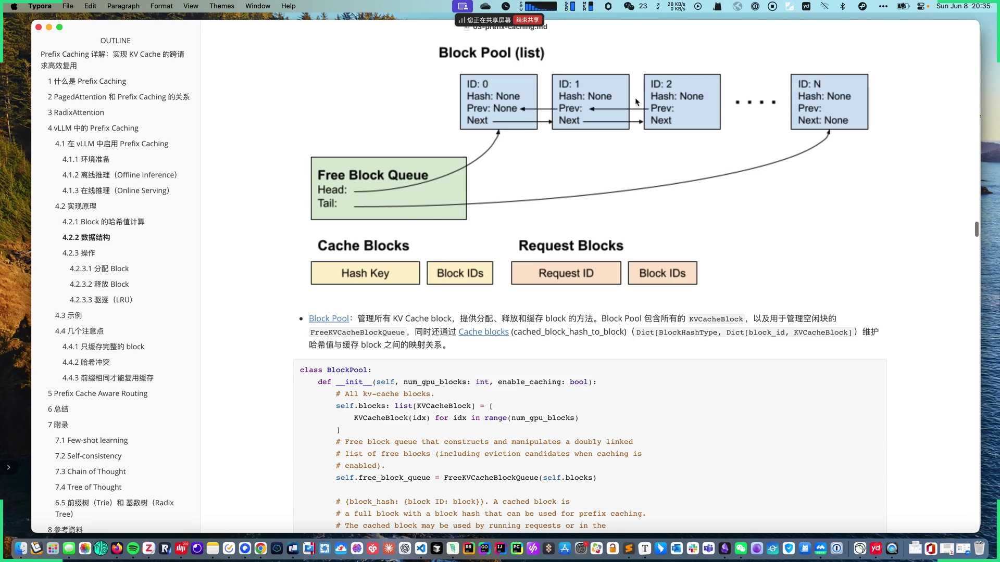 |
| 也就是前后指针的一个指向。OK，但它本身只维护一个 head 跟 tail。 [【跳转到 26:50】](https://www.bilibili.com/video/BV1jgTRzSEjS/?t=1610) | 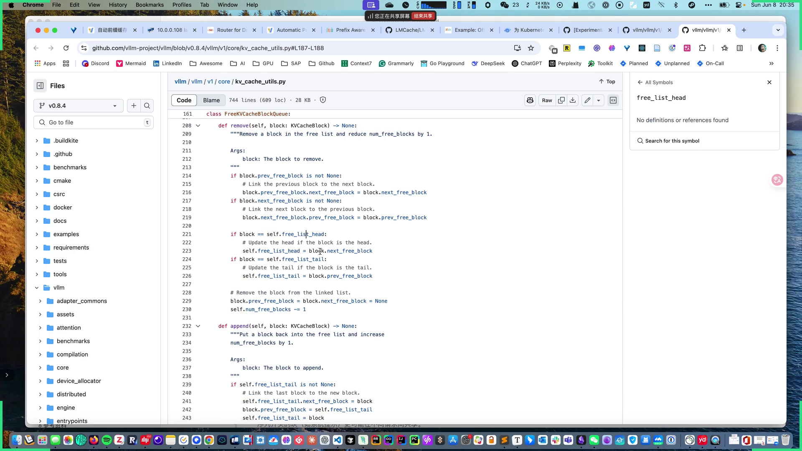 |
| 所以它可以通过 O(1) 的复杂度去添加、删除、移动这个 KV Cache block，高效地实现缓存的淘汰策略。好，然后我们继续，下面一个部分 [【跳转到 26:55】](https://www.bilibili.com/video/BV1jgTRzSEjS/?t=1615) | 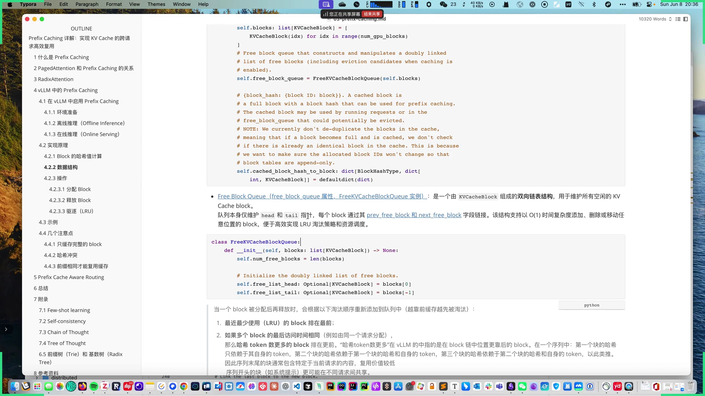 |
| 我们刚刚介绍了绿色这个 free_block_queue 跟 cache block，还有这个 BlockPool 以及这个 KV Cache block，还剩下一个部分就是 request block。request block 是存在一个叫 kv_cache_manager 中，它的结构是这样的，也是一个字典，键就是一个 request id，值就是它的一个 block 列表。 [【跳转到 27:20】](https://www.bilibili.com/video/BV1jgTRzSEjS/?t=1640) | 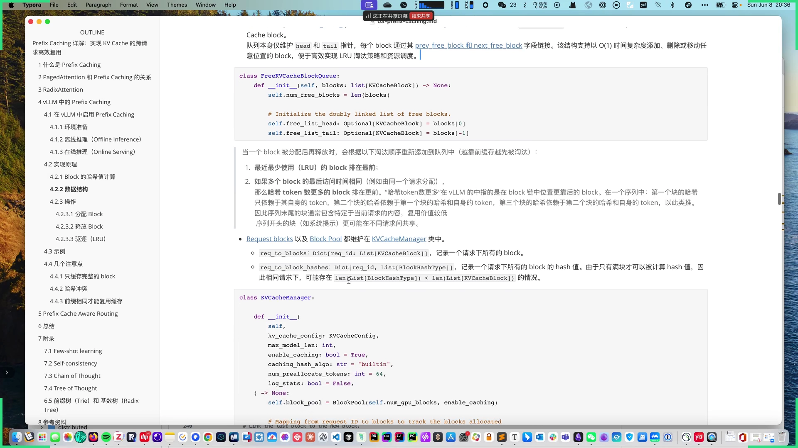 |
| 那很简单，它的意思就是根据我的请求，我去获取这个请求相关联的 KV Cache 的 block，对吧。因为我要去管理分配，或者去判断这个请求能不能复用，或者它的 KV Cache block 是怎么样的，我就要传入这个请求 id（这唯一的标识）去获取请求的相关信息。 [【跳转到 27:45】](https://www.bilibili.com/video/BV1jgTRzSEjS/?t=1665) | 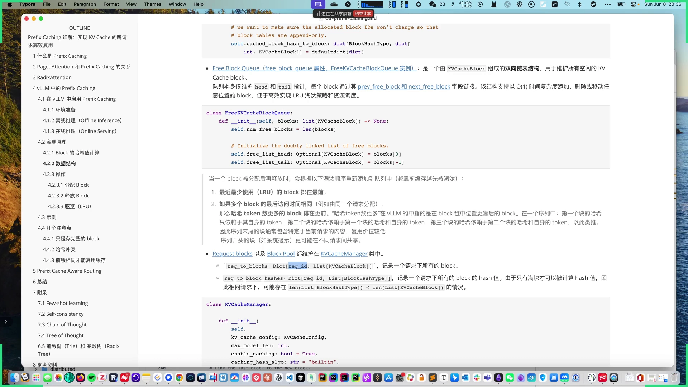 |
| 另外一个就是 request_to_block，也是根据请求 id 去得到它相关的一些哈希内容，对吧。然后接下来有几个关于 vLLM 中 Prefix Caching 的一些操作。比如说第一个部分就是分配 block，分配分为两种情况： [【跳转到 28:10】](https://www.bilibili.com/video/BV1jgTRzSEjS/?t=1690) |  |
| 一种是为新的请求去分配，还有一种是为运行中的请求去分配。那新的请求怎么理解？就是你一个新的请求进来，我要接收你的 prompt，然后开始做 decode。运行中的就是我正在 decode 的，我可能先分配了一部分资源，然后让它去 decode、生成 token，下一轮调度的时候要继续， [【跳转到 28:35】](https://www.bilibili.com/video/BV1jgTRzSEjS/?t=1715) | 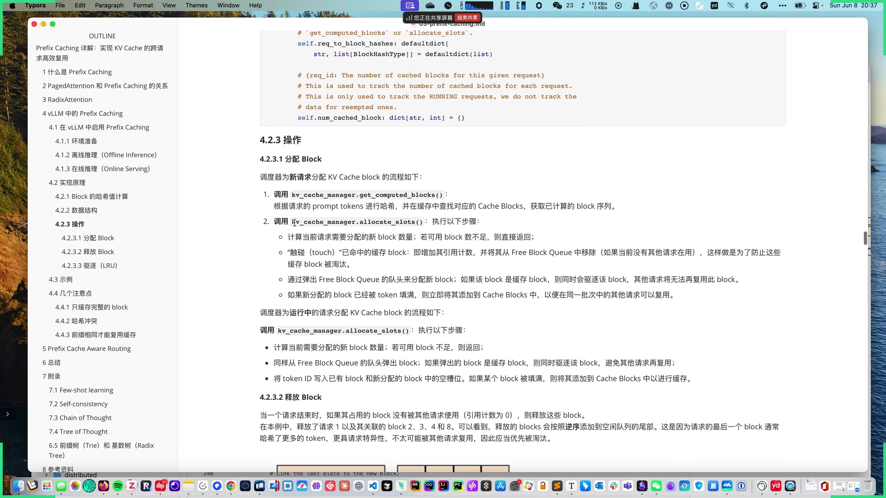 |
| 再给这个原先运行中的请求继续分配 block、生成 token，所以这部分就属于运行中的请求。OK，那先说新请求。新请求的话，首先会调用这个方法 get_computed_block，就根据请求的 prompt 的 token 进行哈希，然后去缓存中查找前面说的 KV [【跳转到 29:00】](https://www.bilibili.com/video/BV1jgTRzSEjS/?t=1740) |  |
| cache blocks，看能不能发现可以复用的一个 block 序列。然后接下来，一般来说是有部分能复用的就去用，对吧，然后另外一部分你可能还需要新的 block，继续为你当前这个新请求生成东西，这时候就需要调用 allocate_slot 这个方法。 [【跳转到 29:25】](https://www.bilibili.com/video/BV1jgTRzSEjS/?t=1765) | 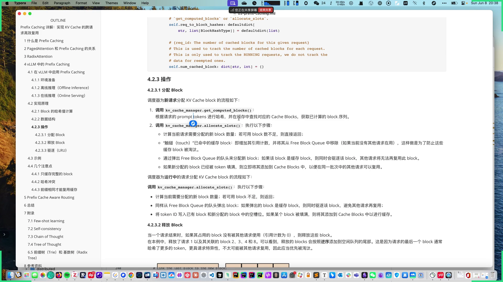 |
| 首先会计算我这个请求需要分配的新的 block 数量，如果不足的话就会直接返回，那就可能等待下次调度。然后这里同时还会有一个操作叫 touch，touch 的话就会把这些已经命中缓存的 block 增加引用计数，并且如果这个 block [【跳转到 29:50】](https://www.bilibili.com/video/BV1jgTRzSEjS/?t=1790) | 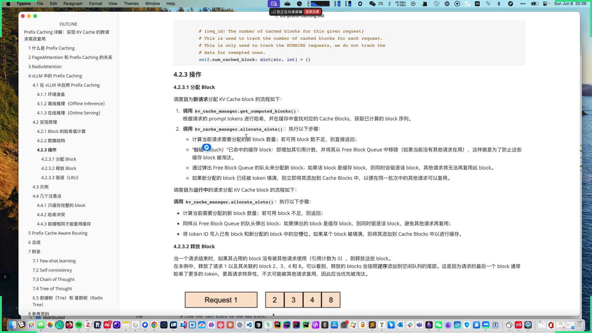 |
| 如果在 free_block_queue 里面，它就会把它移除，避免这些请求的缓存被这个 block 淘汰。OK，然后下一个部分就是……如果说是需要新的块嘛，新的块的话，该 touch 的话，这些 block 其实还是 [【跳转到 30:15】](https://www.bilibili.com/video/BV1jgTRzSEjS/?t=1815) | 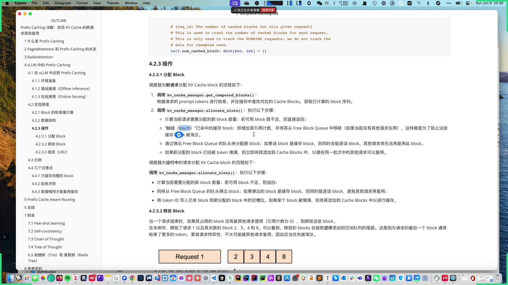 |
| 它是在 free_block_queue 里面的，对吧，但是它的缓存还没有被驱逐掉，因为虽然在 free_block_queue 里面，但有可能它经过计算是能复用的，就会把它从 free_block_queue 中移除，并且再去用它的这个缓存。那这部分的时候，就说明已经没有能够复用缓存的 block 了， [【跳转到 30:40】](https://www.bilibili.com/video/BV1jgTRzSEjS/?t=1840) | 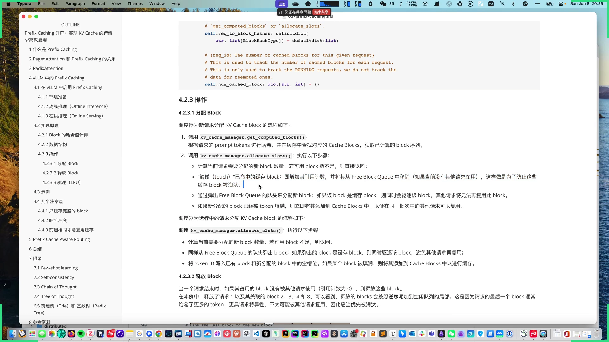 |
| 那这时候就要从 free_block_queue 的头部开始弹出来，来分配新的 block。如果这个 block 中是有缓存的，就把这个缓存驱逐掉了，对吧。刚刚前面说的，之前这部分缓存如果是在 free_block_queue 里面的，如果是有缓存，那就直接拿来用了，对吧。那这部分有缓存的话 [【跳转到 31:05】](https://www.bilibili.com/video/BV1jgTRzSEjS/?t=1865) | 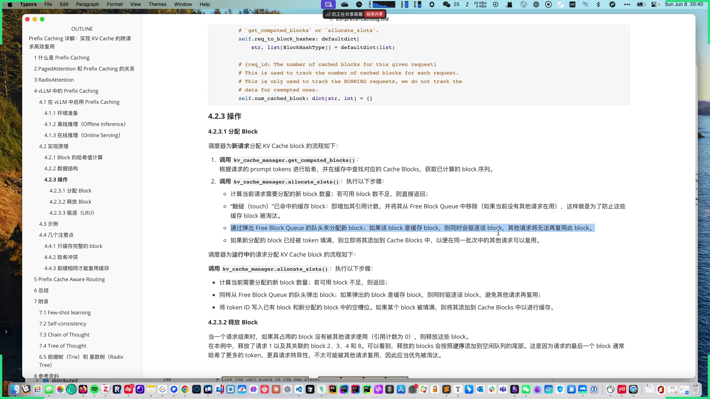 |
| 那当时这些缓存并不能匹配上，所以要把这些缓存去除掉、清空，然后给这部分新的请求去计算、存放 token。OK，然后如果新分配的 block 已经被填满了，那就会加入到这个 cache block 中，以便其他请求可以复用。然后如果是运行中的话， [【跳转到 31:30】](https://www.bilibili.com/video/BV1jgTRzSEjS/?t=1890) |  |
| 流程跟这个类似：先计算新分配的 block 数量，如果不够就返回，然后这里会从 free_block_queue 中弹出 block，你可以看到跟这里其实是一样的。如果是有缓存就要驱逐，避免再复用，因为在运行中的话，我之前 Prefix Caching 已经计算过了，就不会有这个 touch 的情况了。 [【跳转到 31:55】](https://www.bilibili.com/video/BV1jgTRzSEjS/?t=1915) | 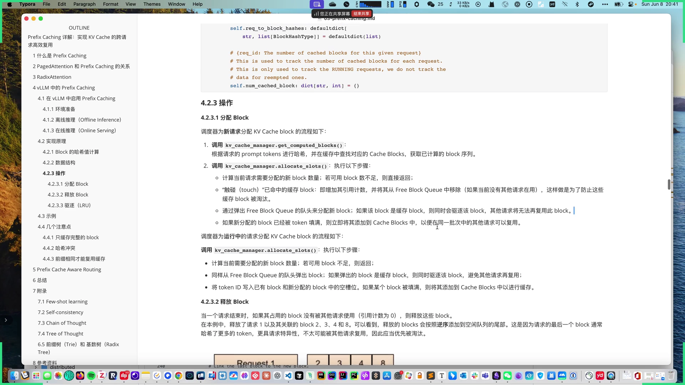 |
| 因为之前能够复用的缓存已经复用了，接下来运行中的情况下肯定是去自己生成自己新的 token，所以这部分肯定就没有了，对不对。然后第三部分就是，如果有的（缓存），那就可以继续去存起来；如果已经写满了，就存起来，以便其他请求能够复用。OK，那这部分 [【跳转到 32:20】](https://www.bilibili.com/video/BV1jgTRzSEjS/?t=1940) | 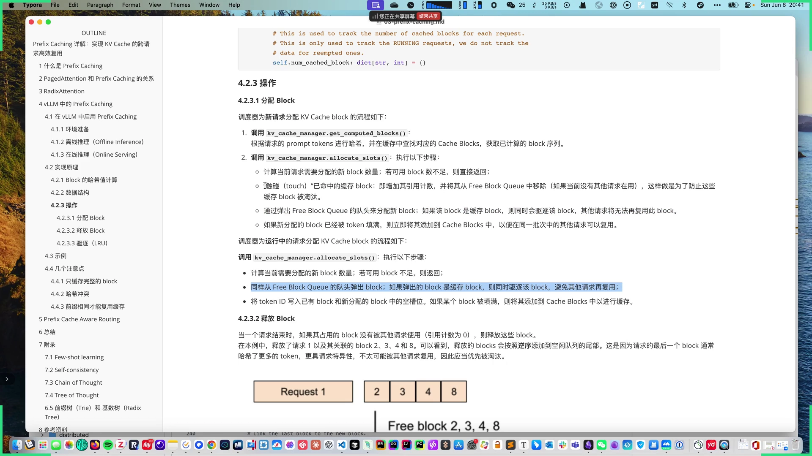 |
| 刚说的，你们清楚吗？有没有什么其他问题？OK，如果没有其他问题我就继续。好，然后下一个操作就是释放 block，也就是 free block。 [【跳转到 32:45】](https://www.bilibili.com/video/BV1jgTRzSEjS/?t=1965) | 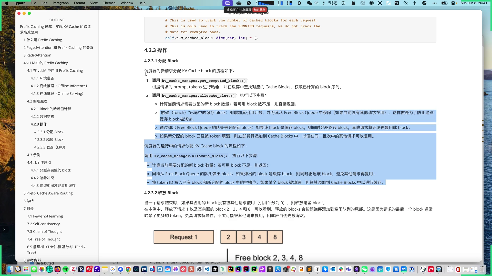 |
| 就是如果一个请求结束的话，如果它占用的 block 没有被其他请求使用，也就是引用计数是零，就会把这些 block 释放掉。并且释放过程会以逆序的方式去添加。比如说这个请求是 2348 这四个 block，那添加回去的时候会是 8432。 [【跳转到 33:07】](https://www.bilibili.com/video/BV1jgTRzSEjS/?t=1987) | 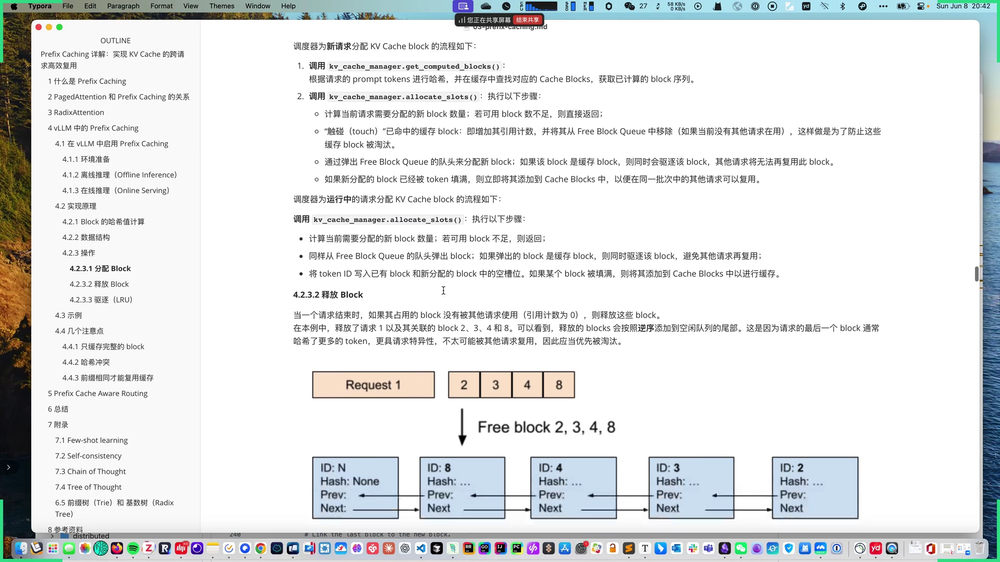 |
| 为什么这么做呢？因为二这里肯定是一开始的内容嘛，比如说 system prompt，然后生成生成啥，这部分最早，其实越有可能匹配到，对不对，因为后面的话它可能就越不同了。所以它就是逆序的方式去加回来。那你要去分发新块，就是从 free_block_queue 里面从头部开始拿， [【跳转到 33:32】](https://www.bilibili.com/video/BV1jgTRzSEjS/?t=2012) | 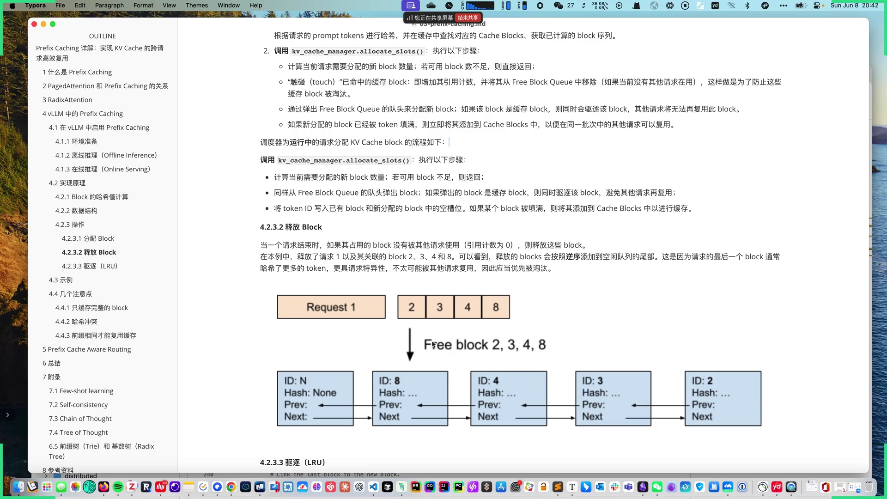 |
| 然后把这些新块拿去用，对吧。所以越靠近头部是越早越容易被移除掉。OK，然后接下来就是驱逐，那就是从刚才说的从 free_block_queue 的头部弹出这个 block，就是通过 LRU 的方式去驱逐，并且会从这个 cache block 中移除这个 block id， [【跳转到 33:57】](https://www.bilibili.com/video/BV1jgTRzSEjS/?t=2037) | 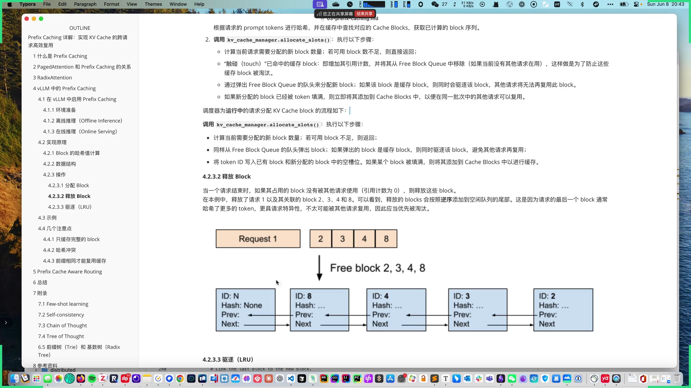 |
| 从这个哈希中就去就找不到这个了，并且从 KV Cache block 中——它里面也会有个哈希值，即表示这个 block 的一个哈希值——也会把这部分内容移除掉。然后接下来我们走一个示例，应该可能会让大家更清楚一点，就是把刚刚这几个数据结构的作用给串联起来。 [【跳转到 34:22】](https://www.bilibili.com/video/BV1jgTRzSEjS/?t=2062) | 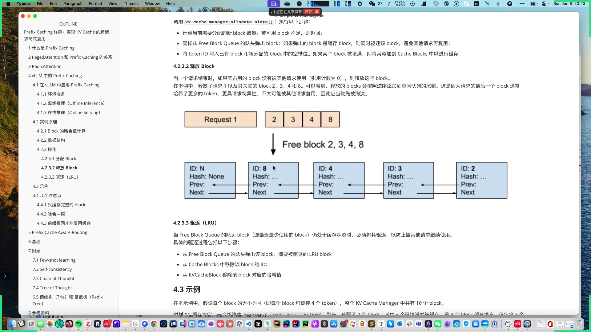 |
| 那这个示例中我们做一个假设：首先每个 block 的大小是 4，可以存四个 token，然后整个 kv_cache_manager 总共是有十个 block，从 0 到 9。那时间点一的时候缓存是空的，有个新的请求进来了，比如是从 ABCD 一直到 O。 [【跳转到 34:47】](https://www.bilibili.com/video/BV1jgTRzSEjS/?t=2087) | 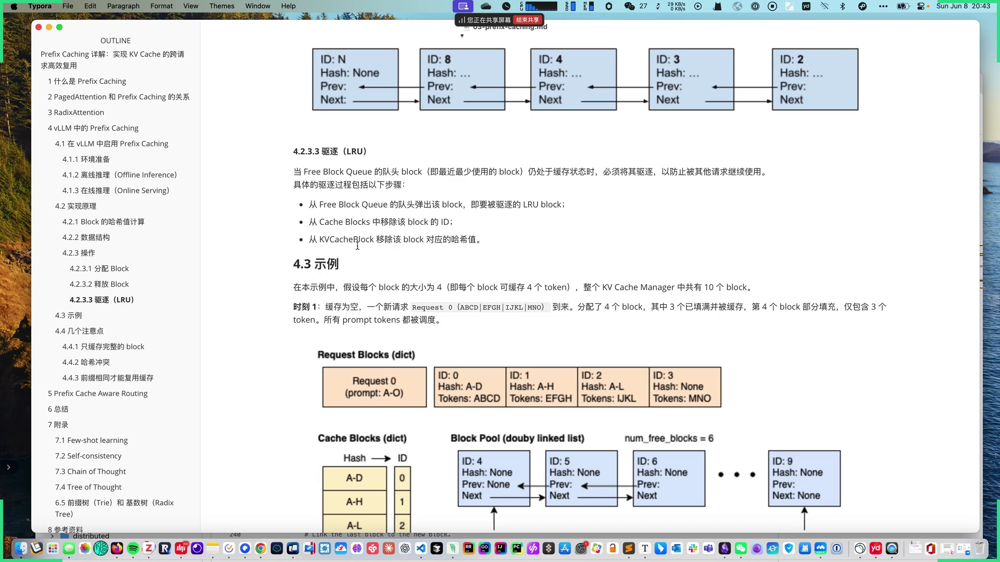 |
| 好，那这里面总共分配了四个 token，其中三个 token 是占满的，所以三个占满的 token 会被缓存。那这里就是对应的一个哈希跟 block id 的映射。因为最后一个、第四个（也就是 block3）没有满，所以它就没有缓存。那这里可以看它的这个哈希值， [【跳转到 35:12】](https://www.bilibili.com/video/BV1jgTRzSEjS/?t=2112) | 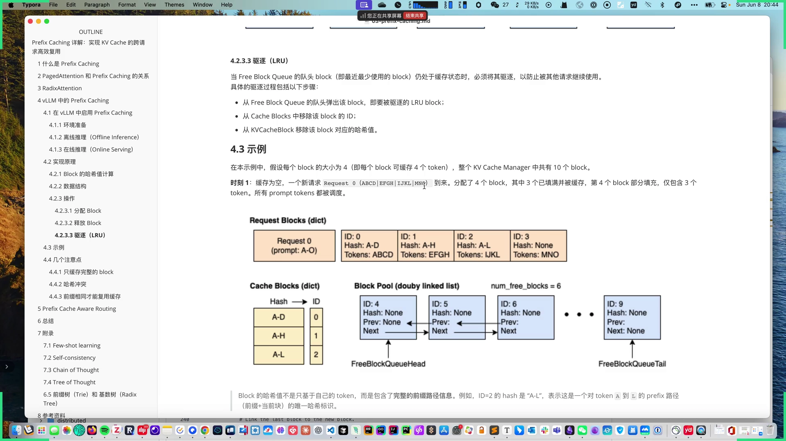 |
| 它是以这个 A 到什么区表示的嘛。这里表示的意思是，block 哈希其实是我们前面说到的基于 parent 哈希跟自身的一个值，它可以反映一个完整的前缀的路径信息，你可以这么理解。所以这里的比如二这里是 A2L，表示从 token A 到 token L 的这个前缀路径的一个标识。所以这是为什么它的哈希值 [【跳转到 35:37】](https://www.bilibili.com/video/BV1jgTRzSEjS/?t=2137) | 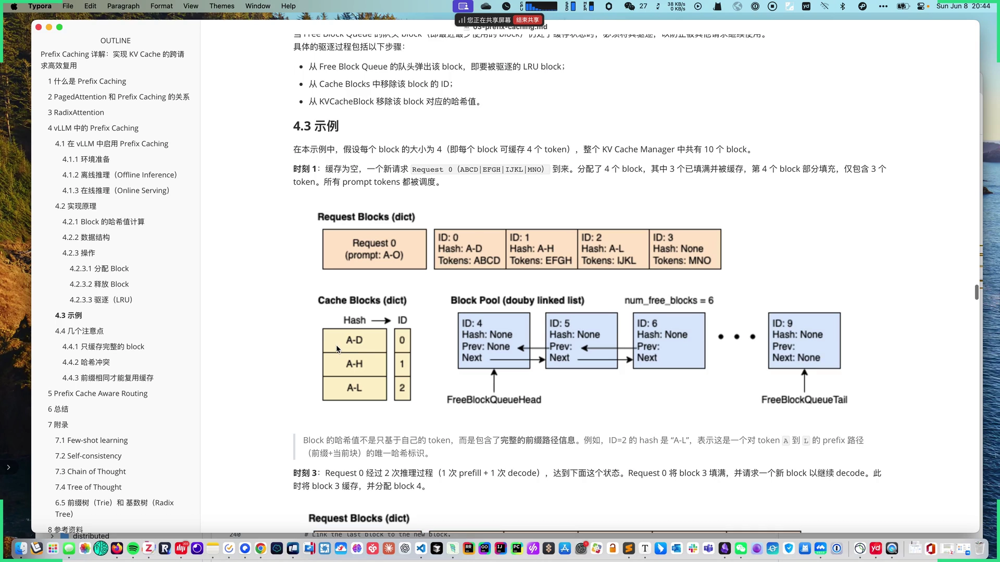 |
| 以这个方式去命名的原因。OK，然后时间点三这里是因为经过两次推理过程：一次是我算了这个 prompt 所有的 prompt，然后蹦出第一个 token，然后加一次 decode，再生成下一个 token，总共是两个 token，所以这时候就会有 P，下一个再下一个是 Q。 [【跳转到 36:02】](https://www.bilibili.com/video/BV1jgTRzSEjS/?t=2162) | 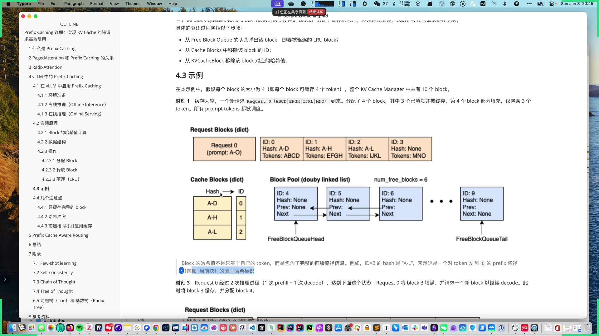 |
| 那这时候 block3 就被填满了，所以 block3 这个 A 到 P 的哈希也被加入到 cache 的 block 这个字典中了。并且这里会新分配一个 block4 去存储新的这个 Q 的 token。OK，你可以看到新分配的就是从这个 free_block_queue 这个链表的头部 [【跳转到 36:27】](https://www.bilibili.com/video/BV1jgTRzSEjS/?t=2187) | 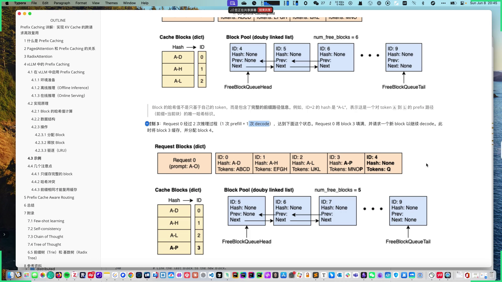 |
| 一直去拿出来的嘛，对吧。好，然后时间点四，这时候有个新的请求 request1 进来，ABCD 到 MN，但是后面这部分从这里 KL 开始是不一样的，也就是说只有前面的这些 token 跟 request1 是一样的。那即使有十个， [【跳转到 36:52】](https://www.bilibili.com/video/BV1jgTRzSEjS/?t=2212) | 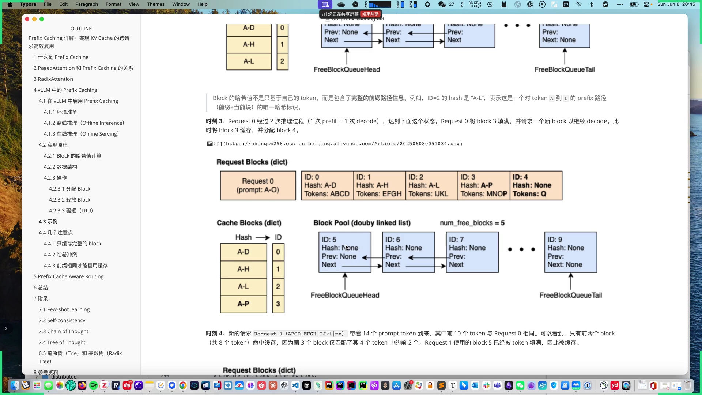 |
| 但是它并不是十个都能复用，因为我们前面说了 block 它的缓存是基于整个 block 的，并不是说你一半就能用。所以即使有十个，当然也只能是前面两个完整的 block、也就是八个 token 能够复用，所以这里就是 0~1 这里去复用，对不对。那 5 跟 6 呢，它还是需要有新的，从这个 free_block_queue 里拿出新的两个 block， [【跳转到 37:17】](https://www.bilibili.com/video/BV1jgTRzSEjS/?t=2237) | 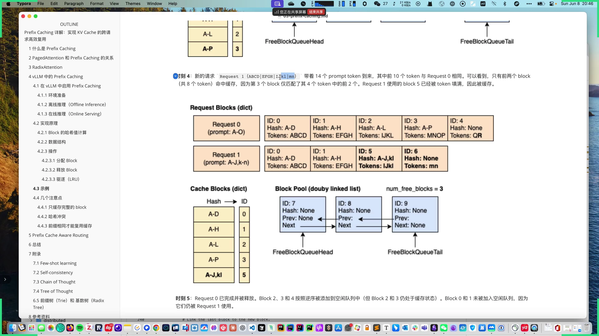 |
| 拿出来继续用。O 好，然后 request1 的话，因为它这个 id5 这个 block 也用满了，所以它会针对 id5 这个也会有个哈希。OK，然后 id6 也没有满，就没有哈希。然后时间点五的话，request0 完成并且被释放，那 request0 的 234 按照逆序的方式添加到 free_block_queue 里面中。 [【跳转到 37:42】](https://www.bilibili.com/video/BV1jgTRzSEjS/?t=2262) |  |
| 但是你看到，因为 0 跟 1 是前面那个 request1 是一样的嘛，所以 request1 这时候还在用它的这个引用计数还有一嘛，所以这两个不会被加进去，只有引用计数为零的 block 才会添加到 free_block_queue 里面中。OK。 [【跳转到 38:07】](https://www.bilibili.com/video/BV1jgTRzSEjS/?t=2287) | 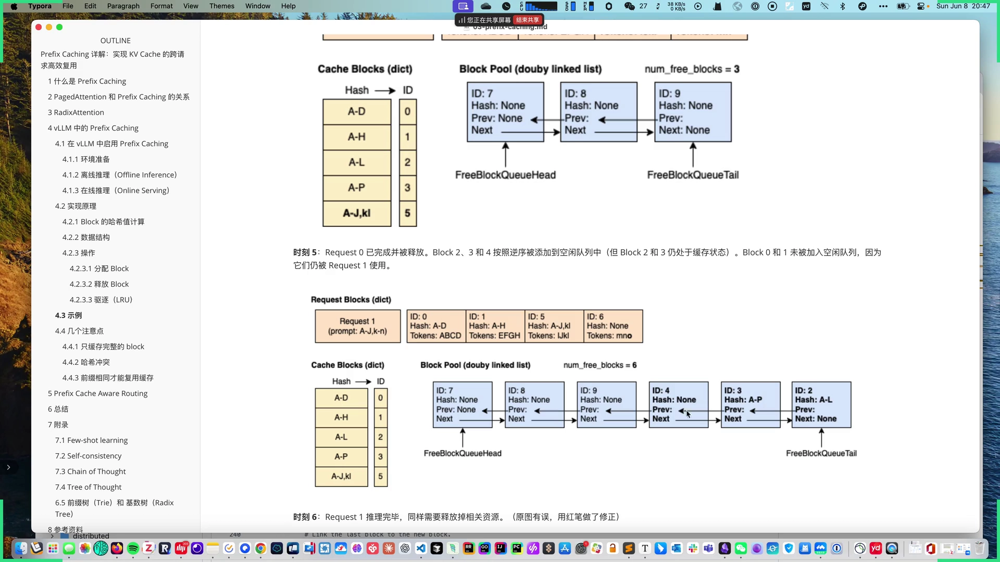 |
| 但是你可以看到，这里虽然说这个 2、3 已经加到这个 free_block_queue 里面了，这个时候它们的缓存其实还没有清掉，以防以后有可能有机会还是会用得上。OK，后面我还会有一个例子可以比较好地说明这一点。 [【跳转到 38:32】](https://www.bilibili.com/video/BV1jgTRzSEjS/?t=2312) | 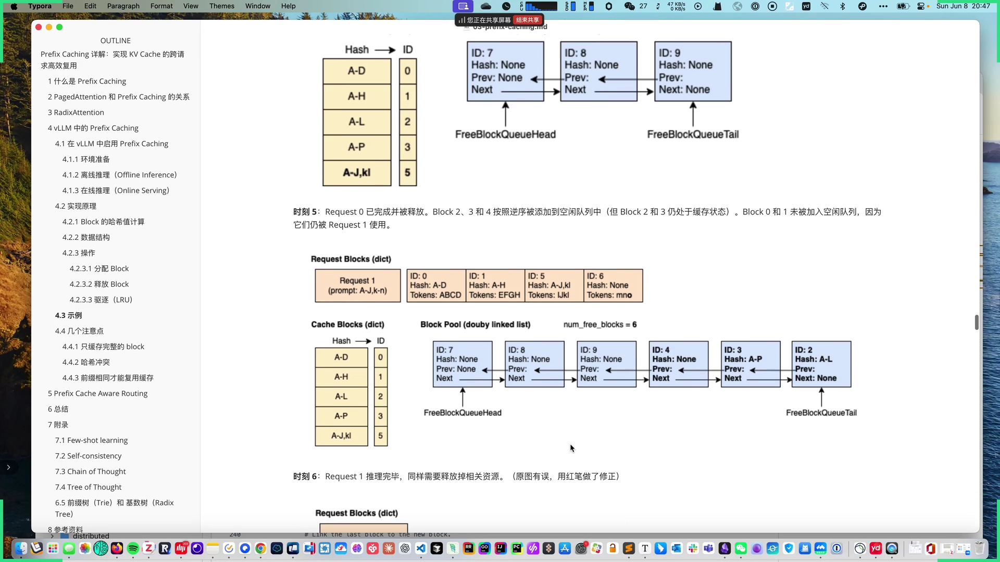 |
| 时间点六可以看到 request1 推理完毕，需要释放相关资源。vLLM 官网的这个原图有些地方是错的，就哈希的这个值的地方是错的，我这里用红笔给它修正了。那 request1 完毕的话释放相关资源，他就把对应的 block 也是以逆序的方式加回去，这时候 cache 呢还是没有释放， [【跳转到 38:57】](https://www.bilibili.com/video/BV1jgTRzSEjS/?t=2337) | 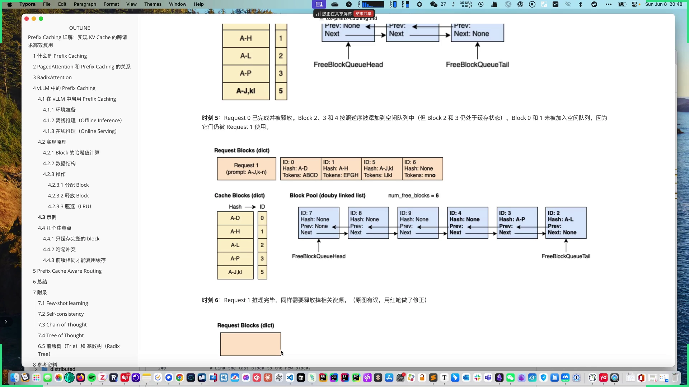 |
| 还是保持这样。好，这时间点七就比较重要了，这时候有个第三个请求就是 request2 来了。这个 request 总共有 29 个 prompt，其中前 12 个也就前三个 block，它是跟 request0 中间的这个 token 是完全一样的，所以 0 到 block2 可以命中缓存。 [【跳转到 39:22】](https://www.bilibili.com/video/BV1jgTRzSEjS/?t=2362) | 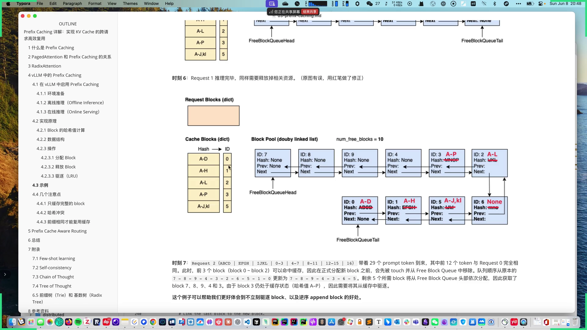 |
| 所以在开始分配新的 block 之前……分配新的 block 就是从 free_block_queue 中头部去拿嘛。在分配新 block 之前，这三个命中的 0、1、2 这三个 block 会先去 free block 中 touch，因为 touch 就增加一个引用计数，并且他发现这三个 0、1、2，对吧， [【跳转到 39:47】](https://www.bilibili.com/video/BV1jgTRzSEjS/?t=2387) | 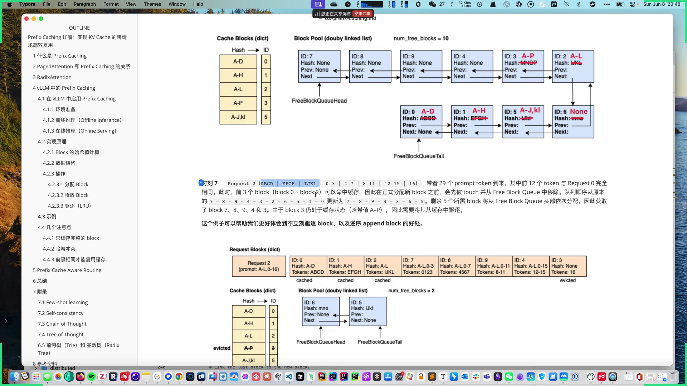 |
| 0、1、2 这三个引用加一，并且它们在 free_block_queue 里面，他就把这三个从 free block 中移出去。所以原先队列是 1789432165210，对吧，就变成 7894、3、6、5，对吧，就是把 2、1、0 这三个移掉了。 [【跳转到 40:12】](https://www.bilibili.com/video/BV1jgTRzSEjS/?t=2412) |  |
| OK，然后剩下的五个 token，这时候他还需要五个嘛，剩下五个 token 呢就会从这个队列去拿嘛。好，那他就从头开始拿，那不就是 78943 嘛，78943，对吧，那拿出来就用了。那他会发现，其实这个 3 这个 block，这时候它是不是还是在缓存列表中嘛，对吧， [【跳转到 40:37】](https://www.bilibili.com/video/BV1jgTRzSEjS/?t=2437) | 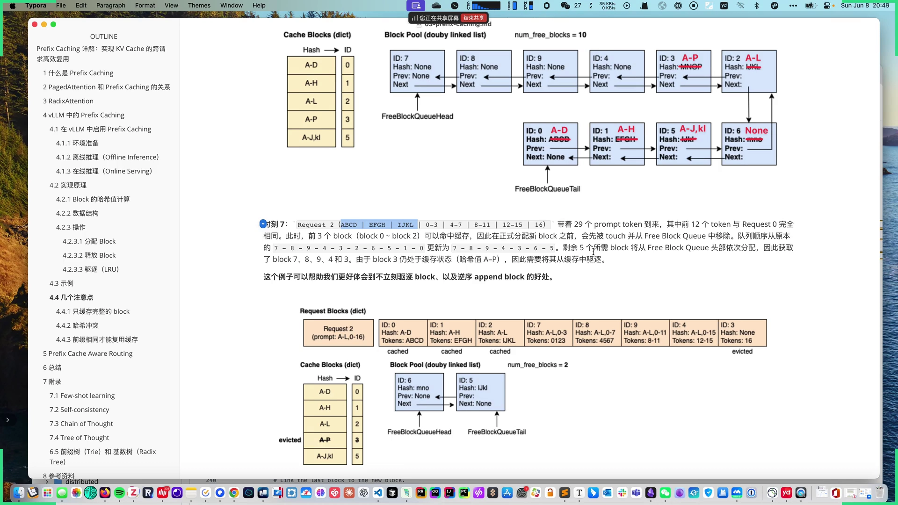 |
| 那他就会把它的这个哈希，也就是把这个缓存也驱除掉，因为他已经用不上了嘛，因为这个 block 已经拿去清空、去放新的 token 了，那原先维护这个缓存就没有意义了嘛，所以要把它的缓存给去除掉。所以从这个例子中我们就可以体会到不去立即驱逐 block 以及逆序 append 的一个好处嘛。 [【跳转到 41:02】](https://www.bilibili.com/video/BV1jgTRzSEjS/?t=2462) | 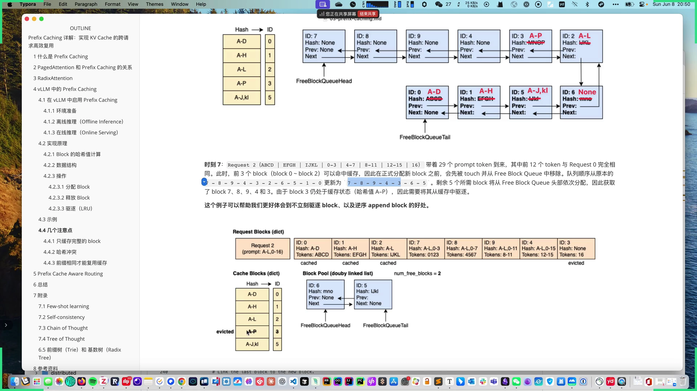 |
| 不去立即驱逐的话，就是你看我这里没有驱逐，在时间点六阶段这时候没有去驱逐，那你在时间点七阶段的时候，我这个 0~2 这三个能够命中吗？那就直接从这个 free_block_queue 中 touch 拿出来，然后直接去复用缓存了，这个是不是就比较好，对吧。 [【跳转到 41:27】](https://www.bilibili.com/video/BV1jgTRzSEjS/?t=2487) | 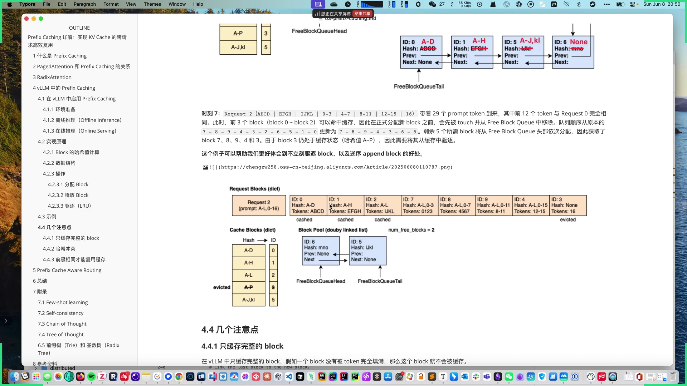 |
| 那逆序 append 的话，append block 就是……越早的这些内容可能是越有可能匹配到的，越晚的话它的分化就比较多了嘛，越不能匹配到。所以把这些越晚的放在前面优先驱逐，对吧，越早的就放在后面，越晚去除；越早的可能是一些 system prompt 这些，比较容易能够有机会去复用的。好。 [【跳转到 41:52】](https://www.bilibili.com/video/BV1jgTRzSEjS/?t=2512) | 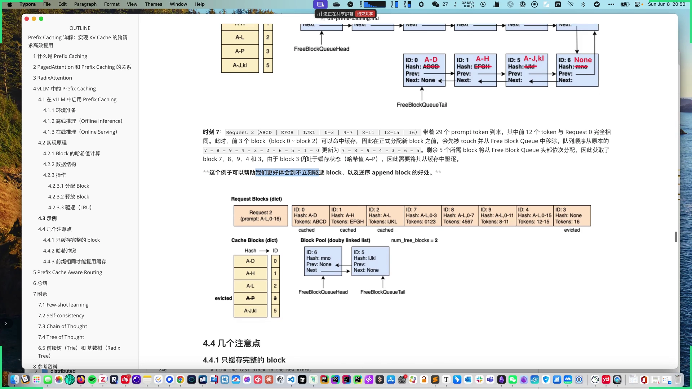 |
| 然后这就是 Prefix Caching 中的一个过程吧。那这边有三个注意点，再强调一下：在 vLLM 中，缓存只是缓存完整的 block，如果这个 block 没有被 token 完全填满，就不会缓存。比如说这里有七个 token，对吧， [【跳转到 42:17】](https://www.bilibili.com/video/BV1jgTRzSEjS/?t=2537) |  |
| 假设 block 是 3、4，那 3 的话是完全填满了所以会缓存，4 的话完全填满所以会缓存，另一个只有三个所以就不会缓存了。那还有一个问题就是哈希冲突，因为这个哈希虽然大概率是不同的结果嘛，但有可能有一定的概率也会产生相同的哈希值嘛。 [【跳转到 42:42】](https://www.bilibili.com/video/BV1jgTRzSEjS/?t=2562) | 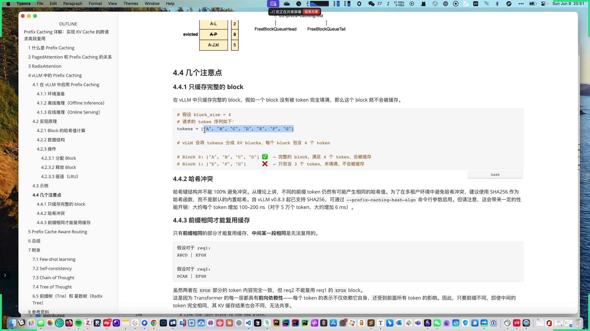 |
| 为了避免这种哈希冲突的问题，从 vLLM 0.8.3 起支持 SHA256 这种方式，你可以通过 `--prefix-caching-hash-algo` 这个命令行参数去启用，而不是使用它的一个默认哈希。用 SHA256 会带来一定开销，但是并不是很大，对 5 万的 token 大概增加 6ms，其实也是可以接受的。 [【跳转到 43:07】](https://www.bilibili.com/video/BV1jgTRzSEjS/?t=2587) | 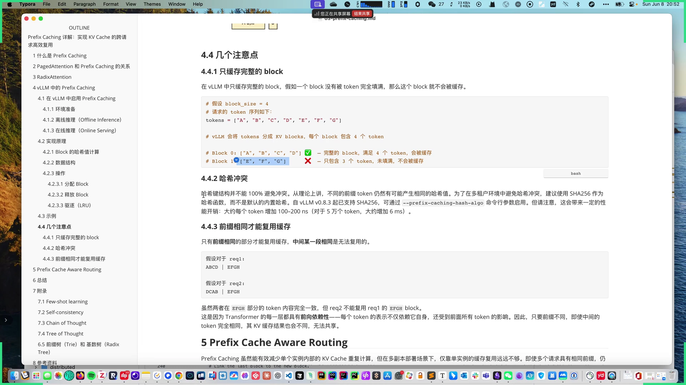 |
| 嗯，还有一个问题就是只有前缀相同才能复用，只有中间某一段相同是不行的。比如说这个 ABCDEFGH，后面这部分你看虽然是一样的，但前面不一样，这种情况下就不能去复用了。这是因为 Transformer 的每一层都有一个前向依赖性，每个 token 都要根据原先前面的这个 token 的 [【跳转到 43:32】](https://www.bilibili.com/video/BV1jgTRzSEjS/?t=2612) | 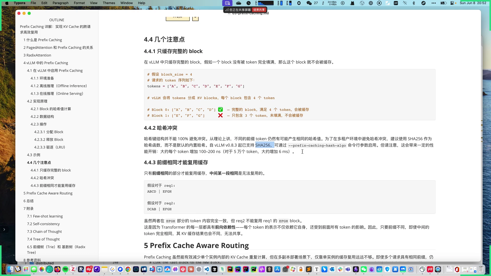 |
| 所有 token 来计算它的注意力。所以你看，虽然后面一部分一样，但前面这部分不一样，前面这部分不一样导致它实际计算这部分可能也会有问题。所以你就不能只拿中间的某一部分，而是要全面前缀所有都匹配了才给复用。OK。 [【跳转到 43:57】](https://www.bilibili.com/video/BV1jgTRzSEjS/?t=2637) |  |
| 好，我们刚才已经讲完了这个 Prefix Caching 了。那 Prefix Caching 其实也只是能够有效减少单个实例内部的 KV Cache 重复计算问题。在我们的生产环境中，通常会有多副本部署的情况，比如我部署了多个 vLLM 的实例， [【跳转到 44:22】](https://www.bilibili.com/video/BV1jgTRzSEjS/?t=2662) | 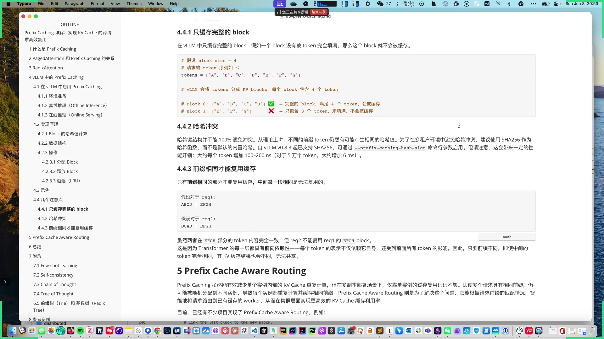 |
| 前面会有一个路由器或者负载均衡器去转发这个请求。但是常规的 load balance 它其实并不能感知到 Prefix Caching 的一个情况，所以通常可能会使用一些比较简单的、像轮询、随机的方式去分发流量。但这种情况下，比如我 A 实例已经有了 Prefix Caching， [【跳转到 44:47】](https://www.bilibili.com/video/BV1jgTRzSEjS/?t=2687) |  |
| 但是请求不转发到它上面，那 B 实例里也是要重复计算的，这就带来了一点浪费。所以就有 Prefix Cache Aware Routing（前缀缓存感知路由）这种方式提出来解决这个问题。主要是让 load balance 负载均衡器能够感知，或者根据路由前缀的 Prefix Caching 情况去智能地把请求转发给已经有缓存的 worker， [【跳转到 45:12】](https://www.bilibili.com/video/BV1jgTRzSEjS/?t=2712) | 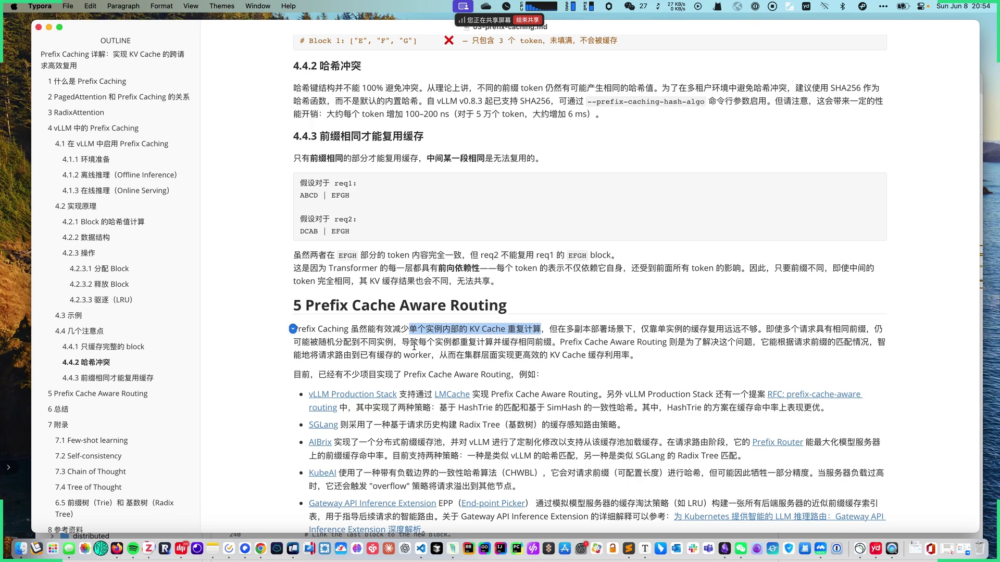 |
| 从而在集群层面更高效地提升 KV Cache 的缓存利用率。好，那目前已经有不少项目实现了这个 Prefix Cache Aware Routing，比如说像 vLLM 的 production stack，它目前是通过基于 LMCache 去实现了 Prefix Cache Aware Routing。 [【跳转到 45:37】](https://www.bilibili.com/video/BV1jgTRzSEjS/?t=2737) | 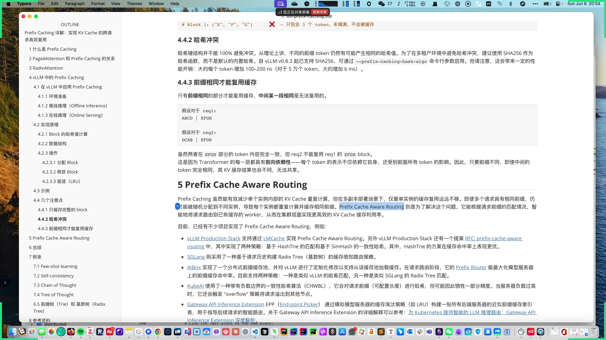 |
| 那 LMCache 的话，你如果看它的 [【跳转到 46:02】](https://www.bilibili.com/video/BV1jgTRzSEjS/?t=2762) | 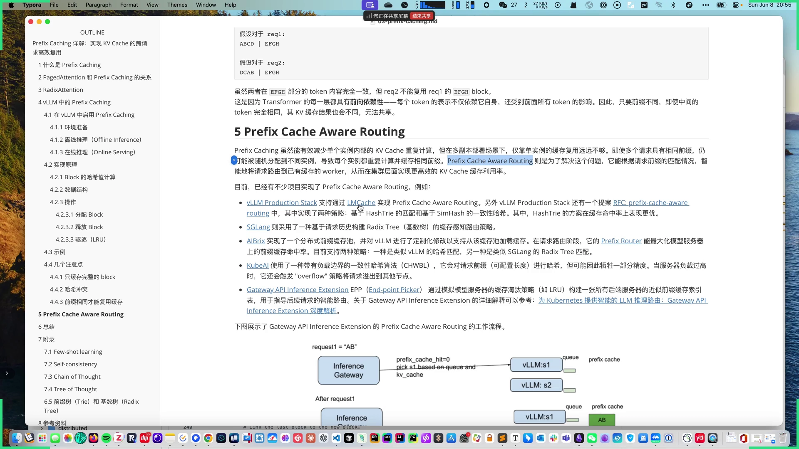 |
| 文档呢，其实它的名字就很直白了，Redis for LLM（大语言模型的一个 Redis）。它不仅支持在内存中 [【跳转到 46:07】](https://www.bilibili.com/video/BV1jgTRzSEjS/?t=2767) | 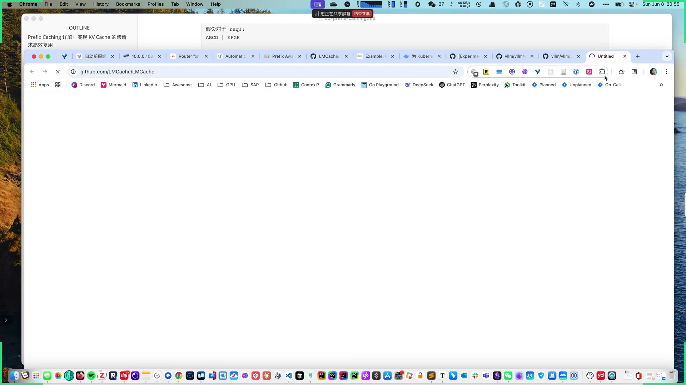 |
| 做缓存，还支持把这些缓存 offload 到一些远端的存储，比如它这里好像会写一些支持不同的 destination，比如 CPU memory、本地文件系统，或者像 Redis 这种远程的，对吧。 [【跳转到 46:15】](https://www.bilibili.com/video/BV1jgTRzSEjS/?t=2775) | 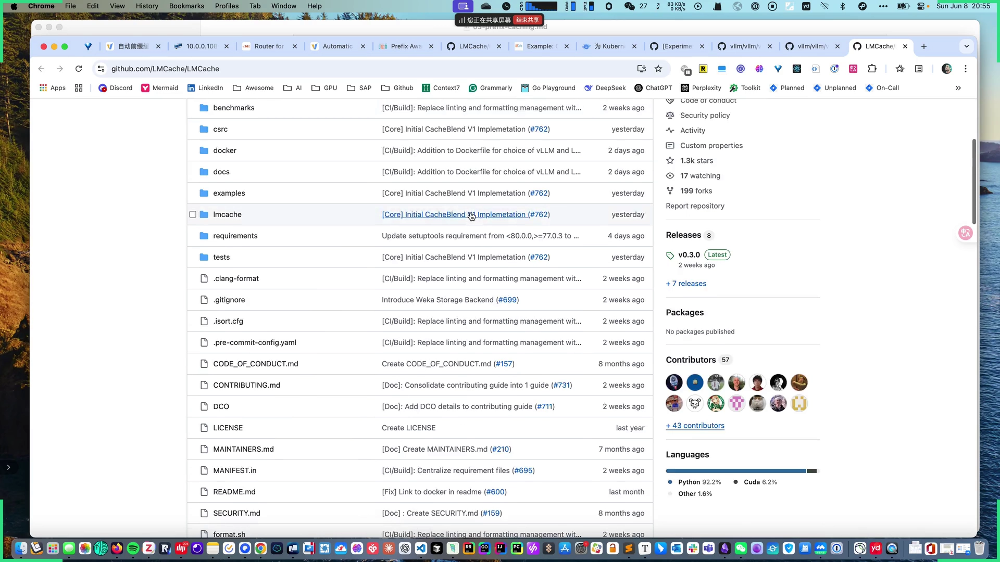 |
| OK，然后另外，vLLM 的 production stack 还有个提案，里面介绍了两种策略，是基于 hash tree 跟 simhash 的一致性哈希。其中这一种方式在缓存命中率上更优，但我不确定这个还会不会继续推进，因为这个提案是在两月份的，目前好像没有太大的进展。 [【跳转到 46:40】](https://www.bilibili.com/video/BV1jgTRzSEjS/?t=2800) | 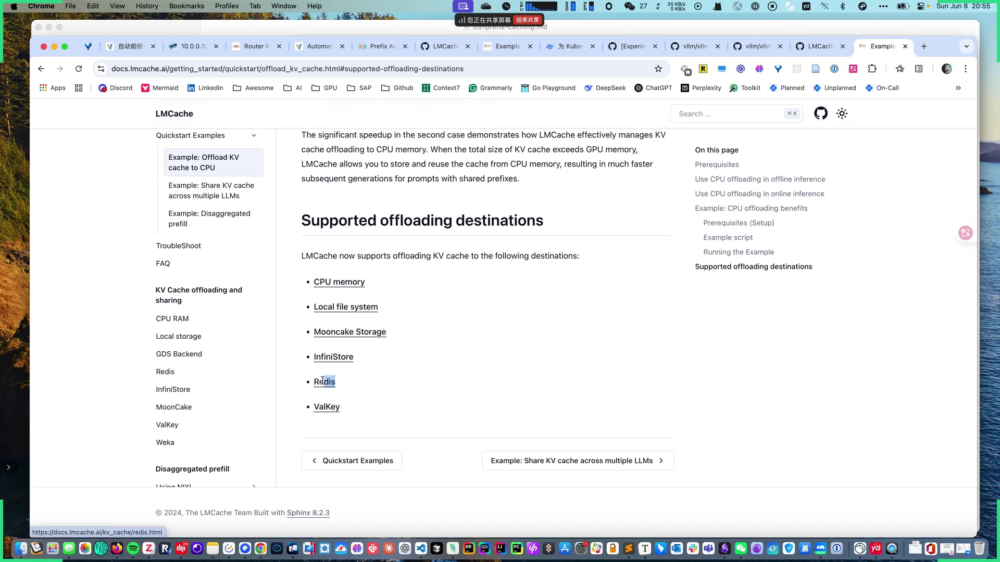 |
| 我不知道是不是他们决定使用 LMCache 这种方式去支持了。OK，可能这种我不知道还会不会继续推进。然后另外 SGLang 的话，它则是通过 SGLang 的 router，它会根据历史请求来构建一个 radix tree 的缓存感知路由策略，SGLang 的话下面会详细再介绍一下。 [【跳转到 47:05】](https://www.bilibili.com/video/BV1jgTRzSEjS/?t=2825) | 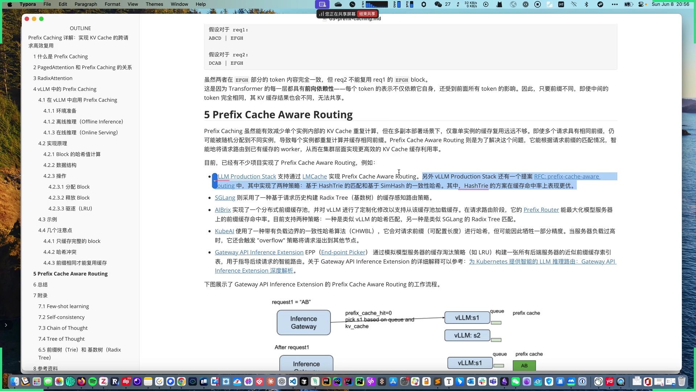 |
| 还有一个是 AIBrix，是 vLLM 中的一个子项目，这个是字节开源的一个项目。它其实是对 vLLM 进行了一些定制化修改，以支持从它的分布式前缀缓存池去加载缓存。它目前支持两种策略：一种是类似 vLLM 的哈希匹配，还有一种是类似 radix 匹配。还有一个是叫 KubeAI， [【跳转到 47:30】](https://www.bilibili.com/video/BV1jgTRzSEjS/?t=2850) | 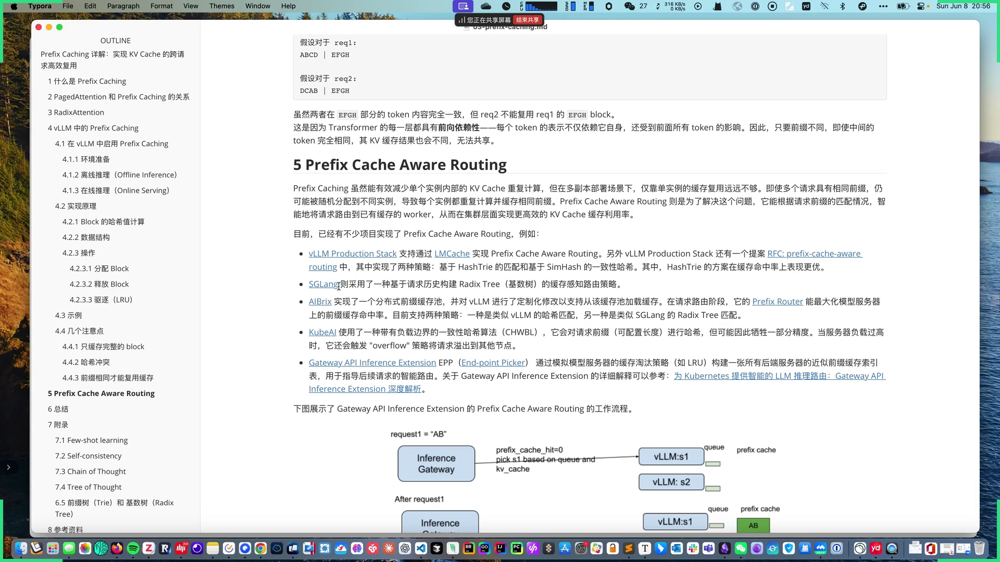 |
| 也是一个推理的（框架），它支持一种带负载边界的一致性哈希算法。好，然后下一个部分是 Gateway API Inference Extension，它这里面有个组件叫 EndpointPicker，也可以感知——或者说根据历史请求的情况去计算 [【跳转到 47:55】](https://www.bilibili.com/video/BV1jgTRzSEjS/?t=2875) | 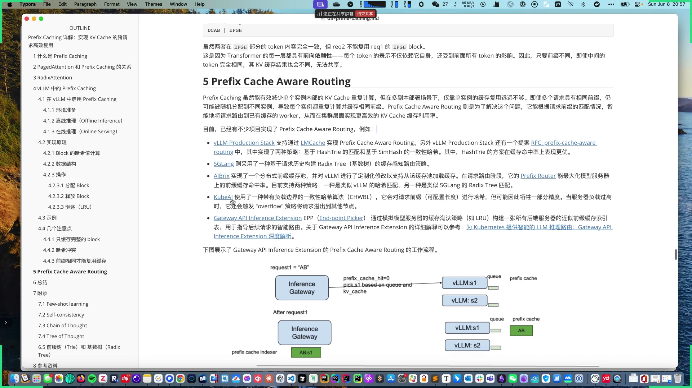 |
| 这个近似前缀的缓存索引，然后用于指导后续的智能路由。我之前写过一篇博客介绍 Gateway API Inference Extension，具体可以参考这里。那可以简单看一下这张图。 [【跳转到 48:20】](https://www.bilibili.com/video/BV1jgTRzSEjS/?t=2900) | 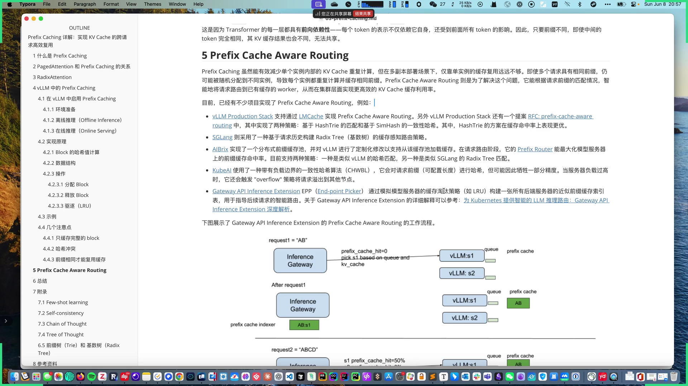 |
| 就是一般在 K8s 中，我们会使用这种 gateway。 [【跳转到 48:38】](https://www.bilibili.com/video/BV1jgTRzSEjS/?t=2918) | 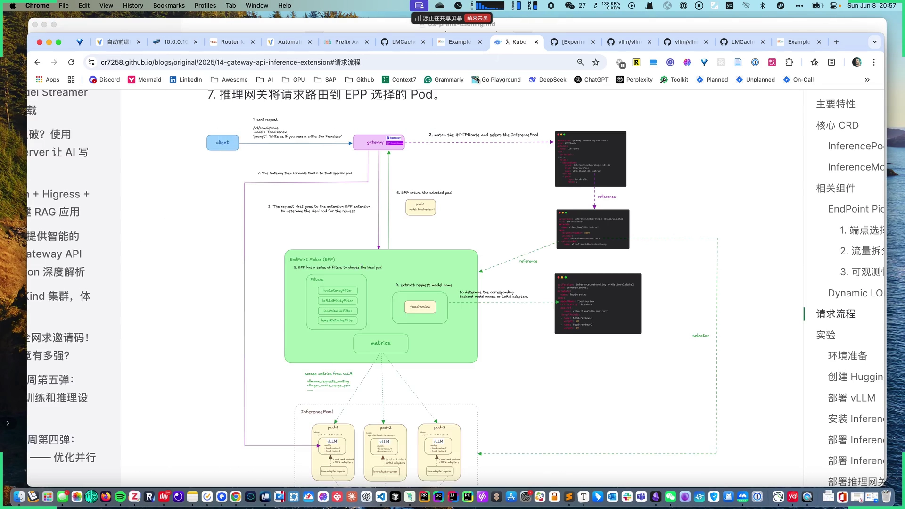 |
| 以前会有像 Ingress 这种资源嘛，现在有个叫 Gateway API，是 Ingress 的下一个升级版本，可以更好地扩展。那 gateway 比如说有像 Envoy、kgateway 等等一些 gateway，但这个 gateway 正常情况下它也是不能感知到 Prefix Caching 的情况，所以就（需要）Gateway API 的这个 Inference [【跳转到 48:43】](https://www.bilibili.com/video/BV1jgTRzSEjS/?t=2923) | 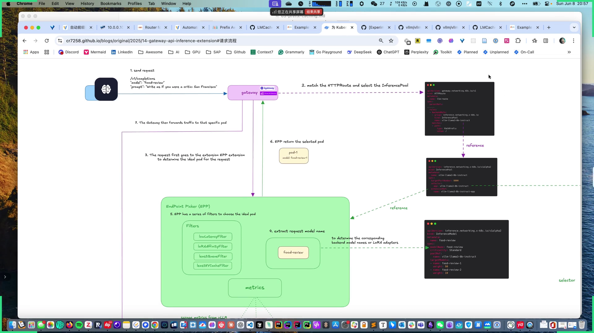 |
| Extension 这种机制去进行一个拓展。它等于说这里有个组件叫 EndpointPicker，它可以根据历史的请求 [【跳转到 49:08】](https://www.bilibili.com/video/BV1jgTRzSEjS/?t=2948) |  |
| 去构建它的一个近似的前缀索引，然后这个 gateway 在每次用户发送请求， [【跳转到 49:17】](https://www.bilibili.com/video/BV1jgTRzSEjS/?t=2957) | 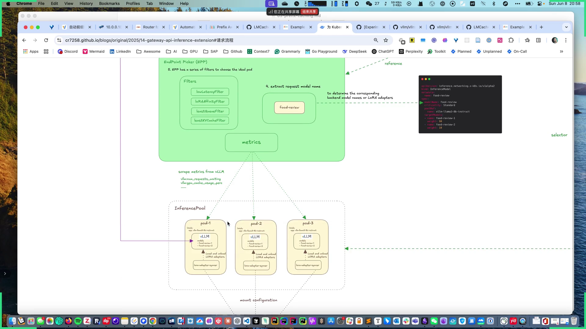 |
| 要决定将请求发送给哪个实例之前，先会去询问这个组件。 [【跳转到 49:25】](https://www.bilibili.com/video/BV1jgTRzSEjS/?t=2965) | 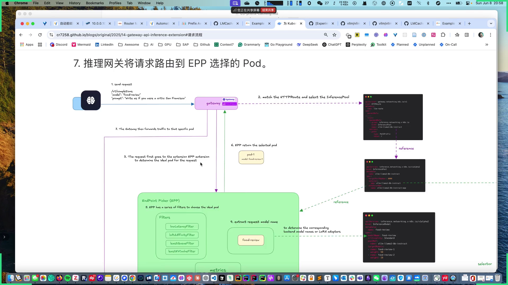 |
| 我要把请求发送给哪个实例，那 EndpointPicker 会根据它的一个 [【跳转到 49:33】](https://www.bilibili.com/video/BV1jgTRzSEjS/?t=2973) | 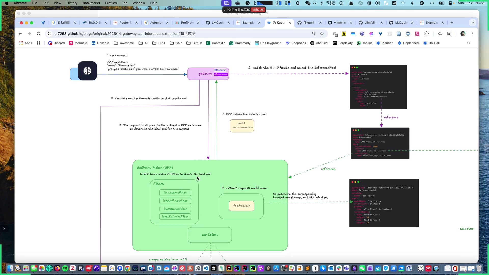 |
| Prefix Caching 的一个索引的情况，告诉 gateway 要发送给哪个。 [【跳转到 49:38】](https://www.bilibili.com/video/BV1jgTRzSEjS/?t=2978) | 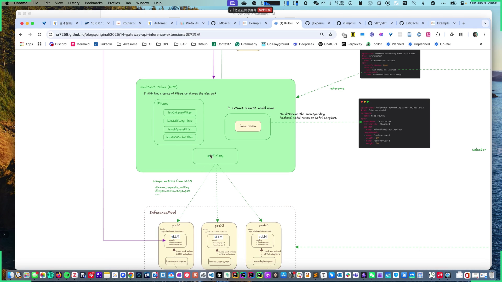 |
| 然后 gateway 再把这个请求进行一个转发，大概是这个过程。 [【跳转到 49:43】](https://www.bilibili.com/video/BV1jgTRzSEjS/?t=2983) | 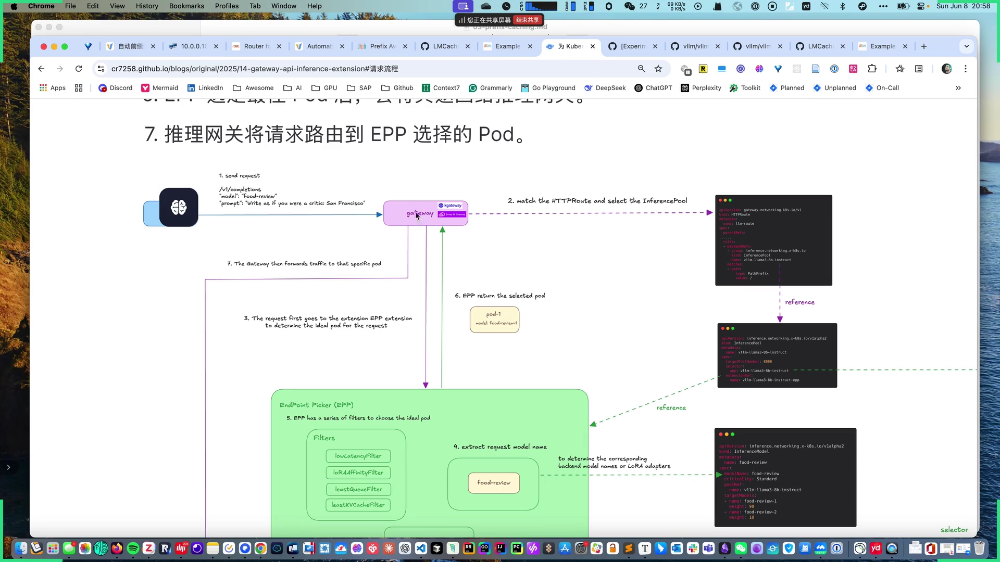 |
| 然后这边这张图就是描述了这个 Gateway API [【跳转到 49:48】](https://www.bilibili.com/video/BV1jgTRzSEjS/?t=2988) |  |
| Inference Extension 的一个在 Prefix Cache Aware Routing 的一个工作过程。比如这里就是 Inference Gateway 嘛，请求有两个 vLLM 的实例，那请求打过来的话，这时候是没有 Prefix Caching 的嘛，比如打到其中一个 S1，那这时候就把 Prefix Caching（记到）S1 本地，它会有一个 Prefix Caching 的计算嘛，对吧。 [【跳转到 49:53】](https://www.bilibili.com/video/BV1jgTRzSEjS/?t=2993) | 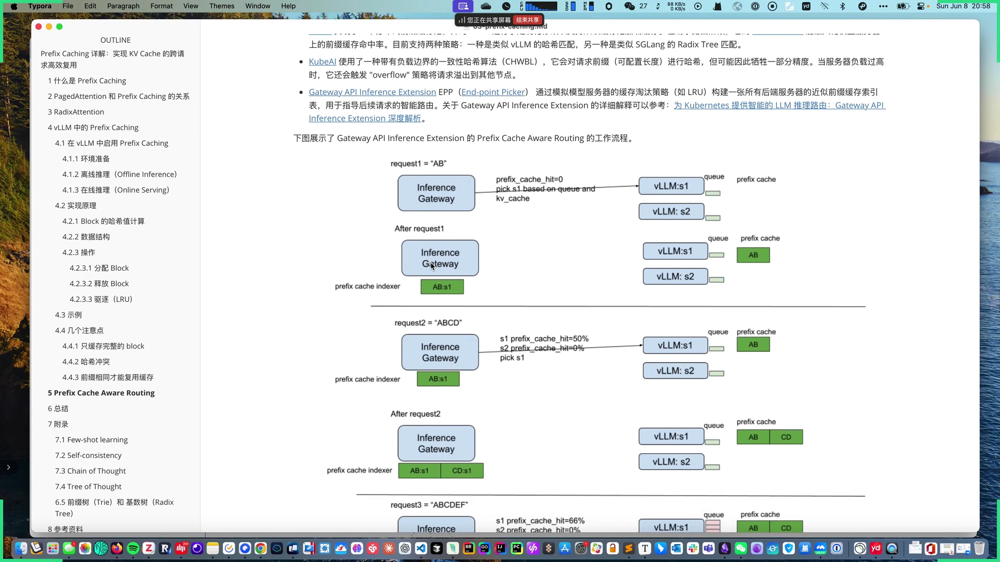 |
| 那同时呢，它在 gateway 这边它自己会维护一个近似的前缀缓存。所以为啥叫近似？因为它的计算不是从这里去查的，这个 Inference Gateway 是经过根据历史请求自己去计算的，所以跟实际上 vLLM 后端存储的一个 Prefix [【跳转到 50:18】](https://www.bilibili.com/video/BV1jgTRzSEjS/?t=3018) | 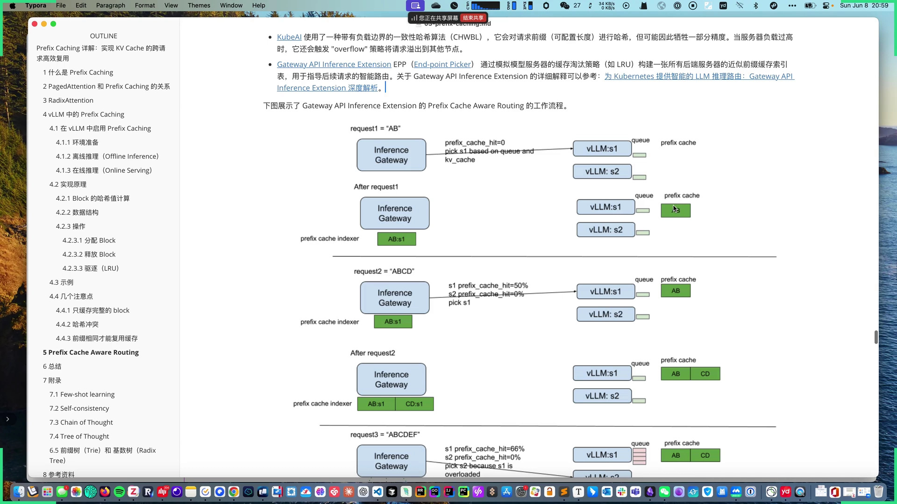 |
| Caching 可能会有一定的差异。OK，好，然后 request2 过来的话，它就是进行了一个匹配嘛，ABCD 那 AB 这个命中的就转发到 S1，对吧。然后再下一个呢，同时也去更新了 Prefix Caching 以及它本地的。那再下一个就是如果说需要驱逐的话， [【跳转到 50:43】](https://www.bilibili.com/video/BV1jgTRzSEjS/?t=3043) | 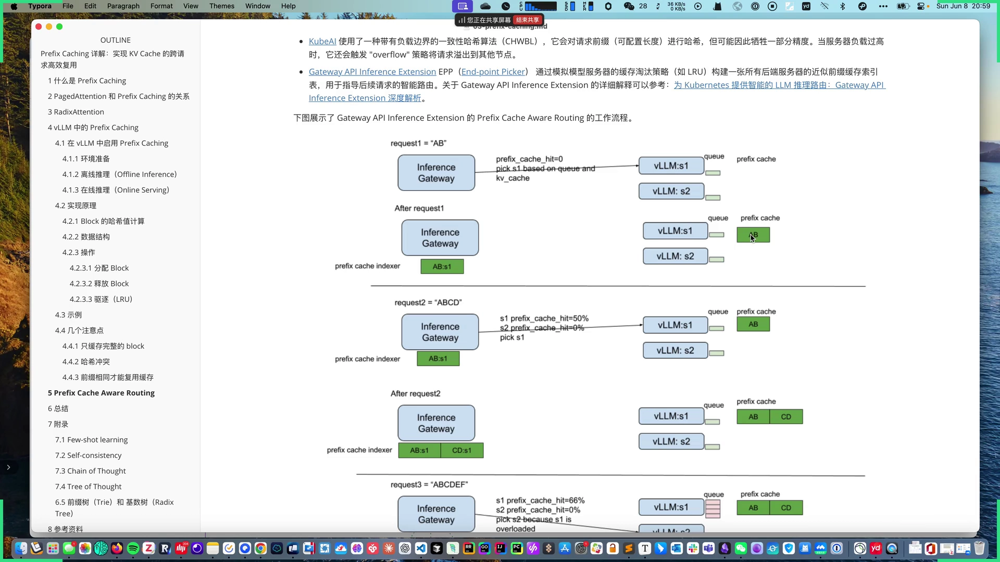 |
| S1 过载了、驱逐的话，那就会把这个发送给 S2，那这时候实际上就会有 ABCD，跟 S2 也会有一个 request3，一个完整的 ABCDEF。OK，然后我们接下来 [【跳转到 51:08】](https://www.bilibili.com/video/BV1jgTRzSEjS/?t=3068) | 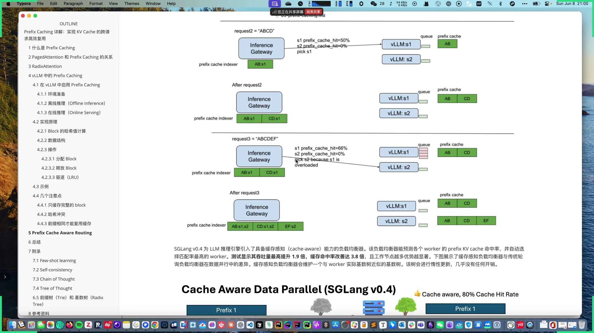 |
| 具体说一下 SGLang 的这个效果。SGLang 它是在 v0.4 中引入了这个 Prefix [【跳转到 51:27】](https://www.bilibili.com/video/BV1jgTRzSEjS/?t=3087) | 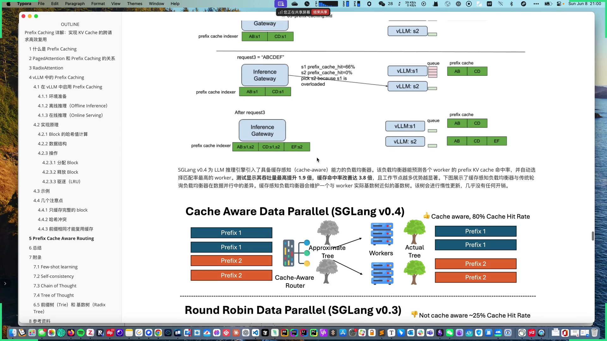 |
| Caching 或相关的 router，它有一个叫 SGLang Router 的东西。 [【跳转到 51:32】](https://www.bilibili.com/video/BV1jgTRzSEjS/?t=3092) | 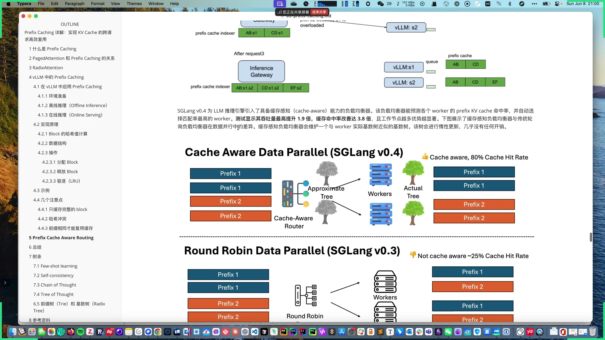 |
| 从这个图上对比你可以看到，它这里有一个近似的前缀树，对吧。经过测试，结果可以看到吞吐量最高提升 1.9 倍，缓存改善达到 3.8 倍，所以可以看到这个优化优势还是比较明显的。而且它也是维护了一个近似的 radix tree 区域。OK。 [【跳转到 51:40】](https://www.bilibili.com/video/BV1jgTRzSEjS/?t=3100) |  |
| OK，那我刚才说到为什么是近似的，因为它的 SGLang Router 跟 worker 之间是没有去同步缓存状态的，也就是 SGLang 的 router 没有去查 worker 你到底缓存的是怎么样的，而是也通过历史的请求去近似推断各个 worker 的缓存状态。因为如果去查的话，一个可能是实时性，或者开销也会比较大。 [【跳转到 52:05】](https://www.bilibili.com/video/BV1jgTRzSEjS/?t=3125) | 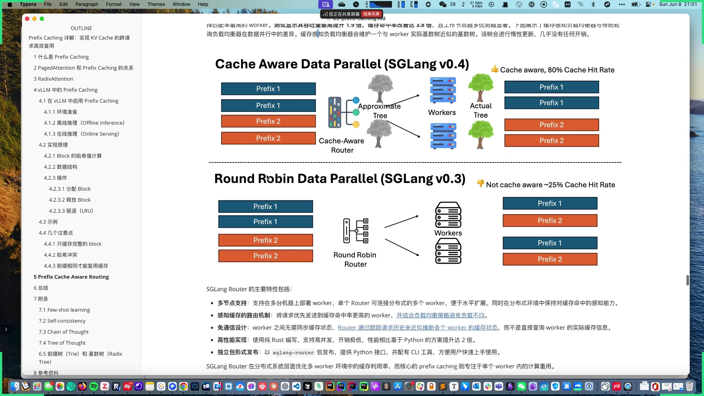 |
| 所以这种方式就是基于历史请求来进行推断、构建这个近似的前缀树，也是大部分这些开源项目的一个通用的解决方式。OK，另外 SGLang 的话，通常会将请求优先发送给缓存命中率更高的 worker， [【跳转到 52:30】](https://www.bilibili.com/video/BV1jgTRzSEjS/?t=3150) | 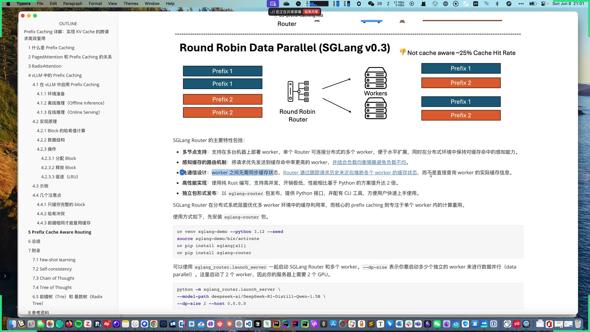 |
| 但是它也会去结合负载均衡策略，避免这种负载不均，就避免把一个 worker 给打垮了。 [【跳转到 52:55】](https://www.bilibili.com/video/BV1jgTRzSEjS/?t=3175) |  |
| 如果你看它的这个代码，这里它有注释，它有写到它会基于这两个方式，对吧。使用 load balance 的时候，就是如果是系统负载过大的话，或者不平衡的话，就会使用这种方式。它这里也会有计算什么时候是不平衡方式的一个情况，会有一个阈值，如果超过这个阈值就认为负载不均了。 [【跳转到 53:03】](https://www.bilibili.com/video/BV1jgTRzSEjS/?t=3183) | 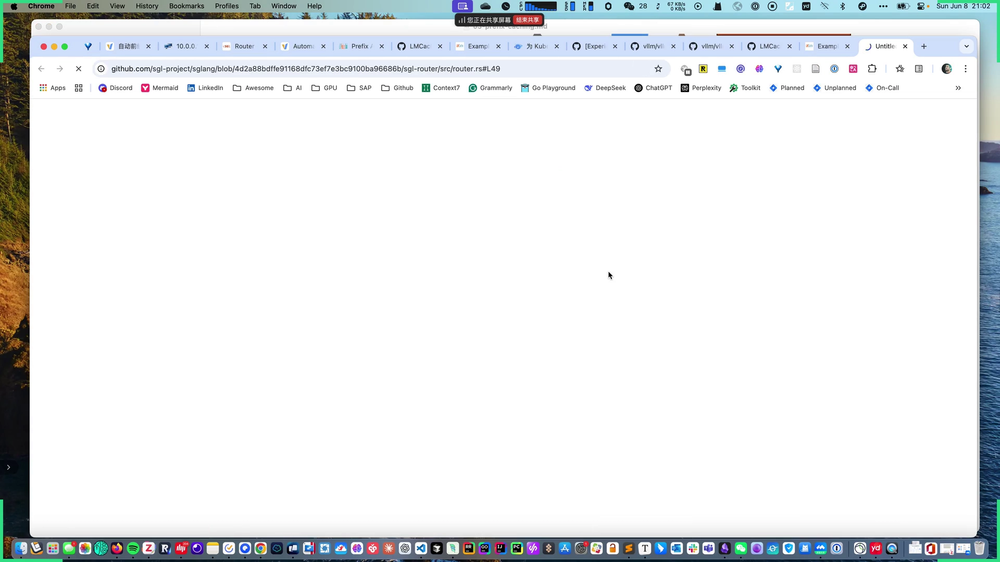 |
| 那这时候就用 load balance；如果是没有超过阈值，就用 KV Cache Aware Routing 的 route 方式，优先把请求转发给前缀匹配更高的一个 worker。 [【跳转到 53:28】](https://www.bilibili.com/video/BV1jgTRzSEjS/?t=3208) | 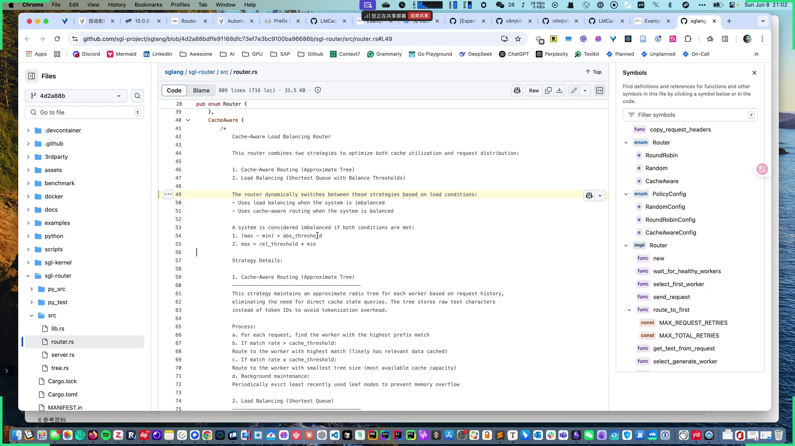 |
| 然后要使用的话，可以看一下。首先你可以通过这个命令去安装，这是安装 SGLang，这是安装 SGLang 的 router。好，然后如果说你要启用的话，比如这条命令，你可以用 sglang router launch_server……你假如说你是在一台机器上，你起了多个 worker， [【跳转到 53:43】](https://www.bilibili.com/video/BV1jgTRzSEjS/?t=3223) | 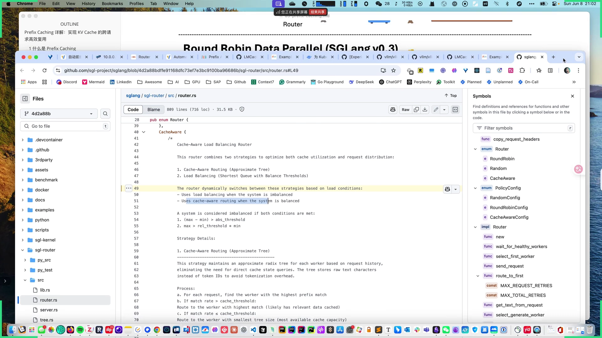 |
| 并且在 worker 前面再加个 router。你可以直接使用这个 `--dp-size` 启动多个 worker 来进行数据并行，每个 worker 会加载相同的模型副本。就是你在一台机器上，你可能做实验或者怎么的，然后你可以通过这种方式起两个 worker，前面有个 router，然后去看看效果。如果是要再多起几台，通常你可能是在多台（机器）嘛， [【跳转到 54:08】](https://www.bilibili.com/video/BV1jgTRzSEjS/?t=3248) | 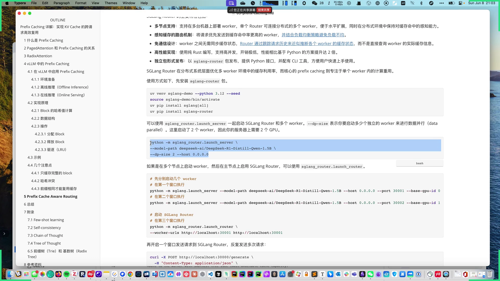 |
| 如果生产环境中你肯定是多台服务器，多台 worker，前面有个 router 这种方式嘛。那就是分别先单独起，然后再在前面——在 SGLang Router 这里，我这里是通过 launch_router 而不是 launch_server，前面是 launch_server，这里是 launch_router——然后去起，然后指定这个 worker 的 URL。 [【跳转到 54:33】](https://www.bilibili.com/video/BV1jgTRzSEjS/?t=3273) | 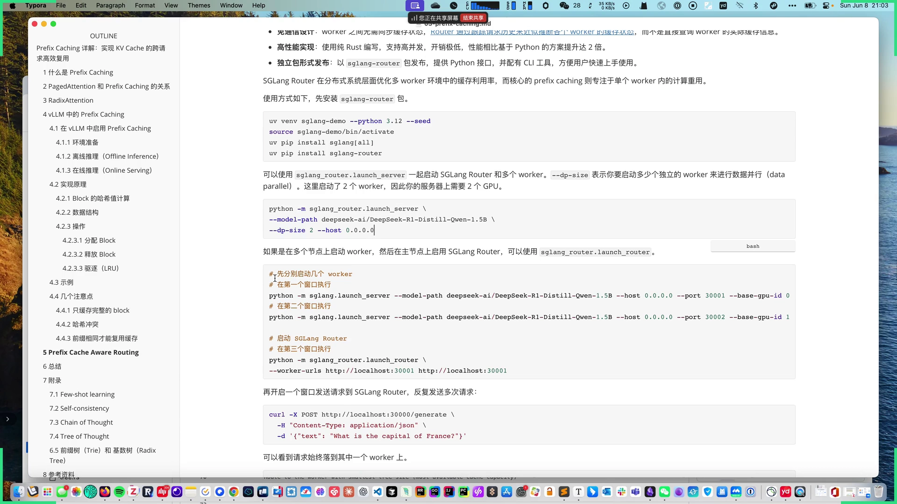 |
| 你起 worker 的话就是单独用 launch_server 分别起两个 worker。我们这里可以看一下效果。 [【跳转到 54:58】](https://www.bilibili.com/video/BV1jgTRzSEjS/?t=3298) | 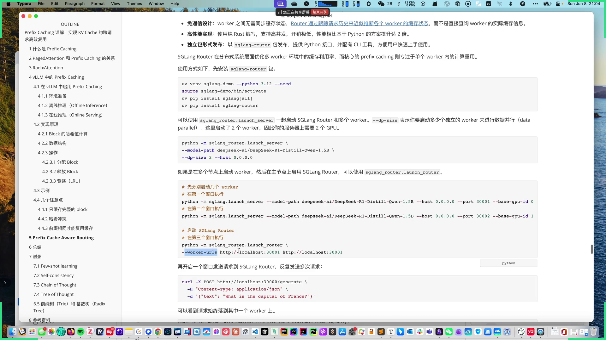 |
| 比如说我这里有几个窗口，第一个窗口连接一下。 [【跳转到 55:08】](https://www.bilibili.com/video/BV1jgTRzSEjS/?t=3308) | 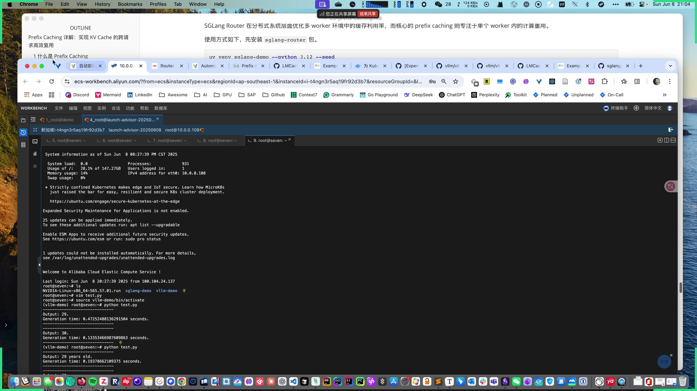 |
| 然后我先进入一下它的虚拟环境，我已经提前安装好 SGLang 了。然后比如说我们在第一个（窗口）， [【跳转到 55:13】](https://www.bilibili.com/video/BV1jgTRzSEjS/?t=3313) | 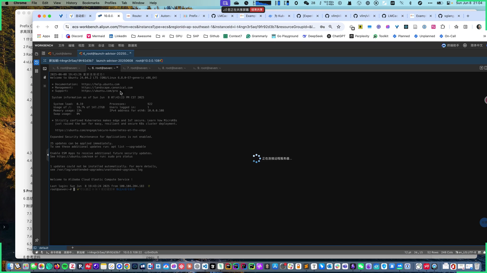 |
| 我们可以用这个命令去启动。我现在这个环境上是有两个 [【跳转到 55:30】](https://www.bilibili.com/video/BV1jgTRzSEjS/?t=3330) | 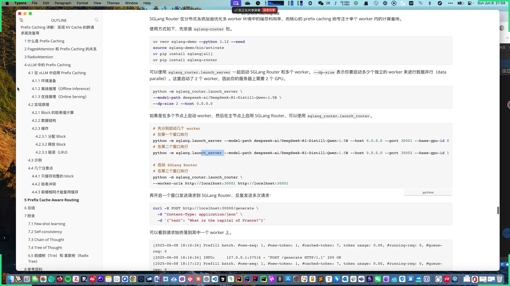 |
| GPU 的两张 A10，每张大概是 24GB 的内存。那我这里启动，我指定使用第一个 GPU。 [【跳转到 55:35】](https://www.bilibili.com/video/BV1jgTRzSEjS/?t=3335) | 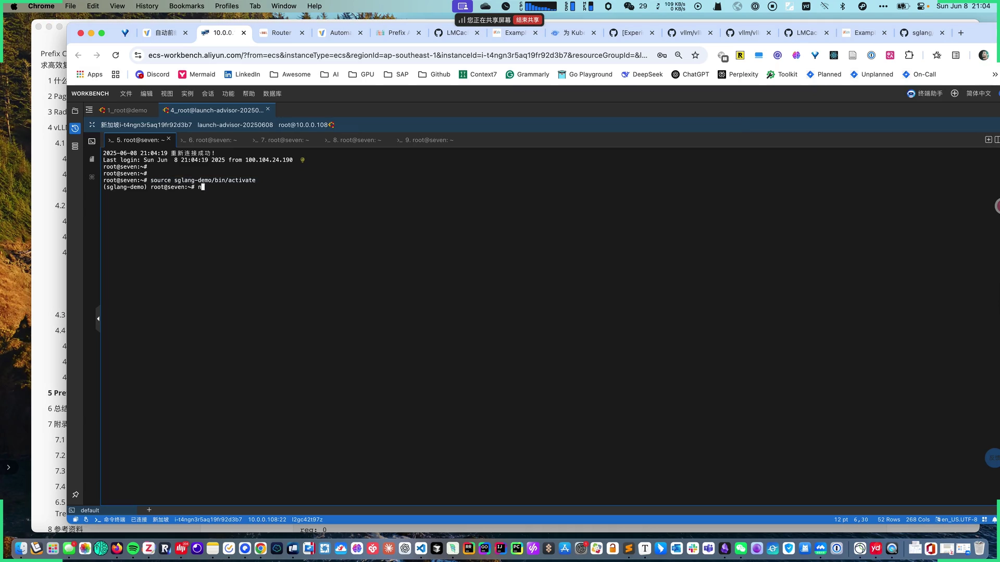 |
| 然后这里是使用第二个 GPU。 [【跳转到 55:50】](https://www.bilibili.com/video/BV1jgTRzSEjS/?t=3350) | 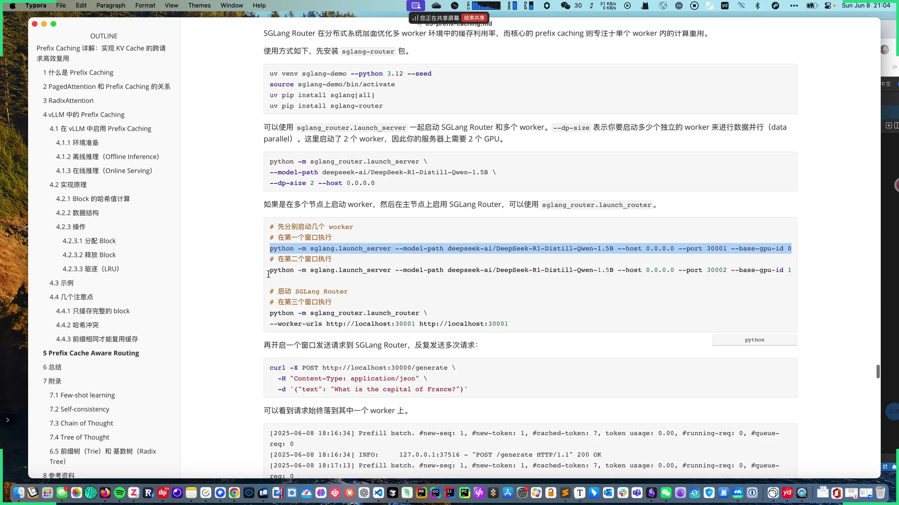 |
| 然后端口，第二个 worker 是 3002，第一个 worker 是 3001。看这里是，哦，我估计可能是前面哪个请求是我没有死（掉），哦我想起来，我应该是因为我这个请求前面还开着。 [【跳转到 55:55】](https://www.bilibili.com/video/BV1jgTRzSEjS/?t=3355) | 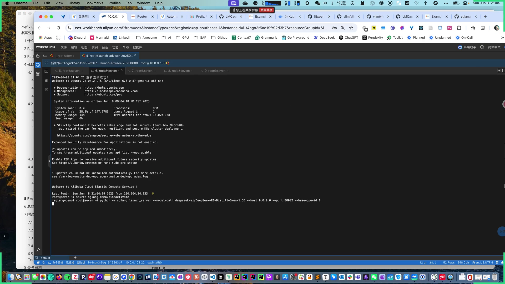 |
| 对，我要把它关了，不然它的内存不够用。 [【跳转到 56:18】](https://www.bilibili.com/video/BV1jgTRzSEjS/?t=3378) | 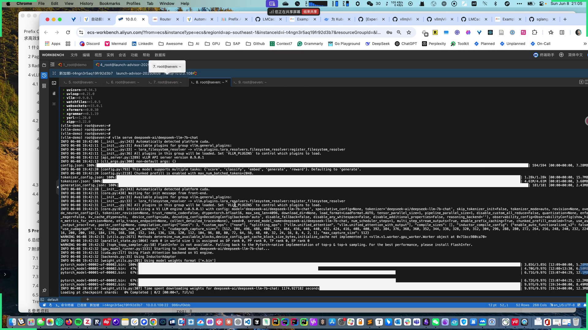 |
| 那我现在再看一下，你看现在只有一个，前面是有一个 vLLM 的请求。那我现在再起一次，看这个起来了没有。这个起来了，你可以看到它的健康检查状态也是正常的，然后并且有个提示。我看一下这个也已经起来了。 [【跳转到 56:23】](https://www.bilibili.com/video/BV1jgTRzSEjS/?t=3383) | 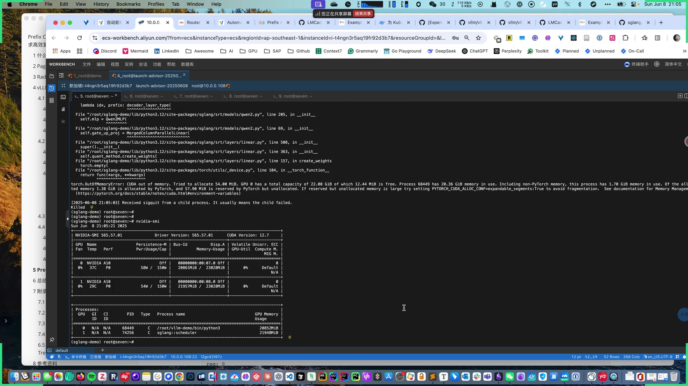 |
| 好，两个 worker 已经起来了，我们现在在第三个窗口，我去启动 router，那就这个窗口。哎呦等一下，我的 router 这里应该是指 0302 对吧，一个是 3000 一个是 3002，然后也起来了，然后我们再试一下。 [【跳转到 56:48】](https://www.bilibili.com/video/BV1jgTRzSEjS/?t=3408) | 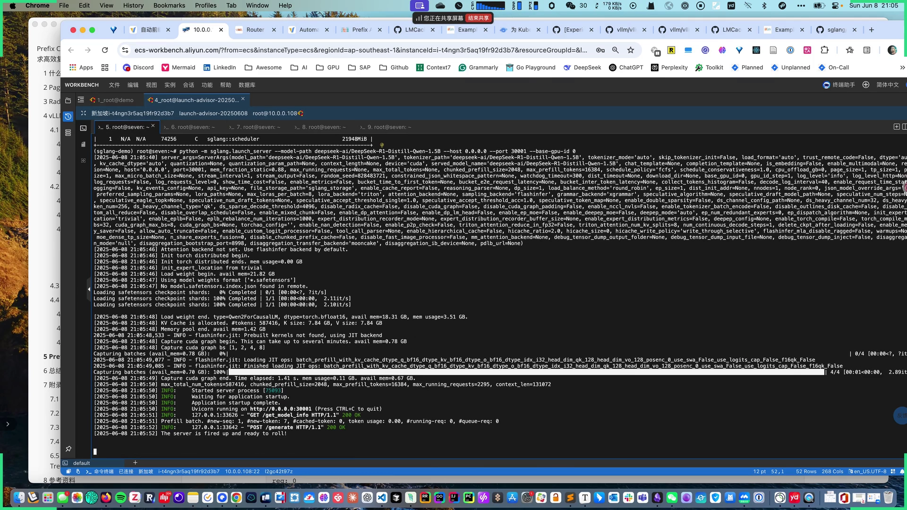 |
| 比如说我去开个窗口，我去请求到 SGLang Router，就 3000 这个窗口，router 是在 3000 监听的。好， [【跳转到 57:13】](https://www.bilibili.com/video/BV1jgTRzSEjS/?t=3433) | 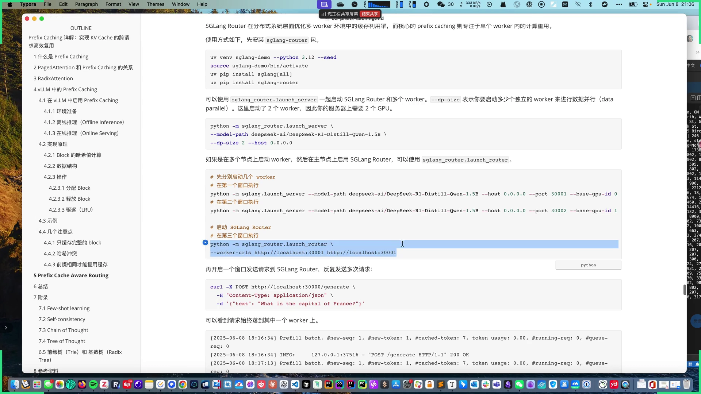 |
| 然后我在这个窗口我去 curl 它。 [【跳转到 57:21】](https://www.bilibili.com/video/BV1jgTRzSEjS/?t=3441) | 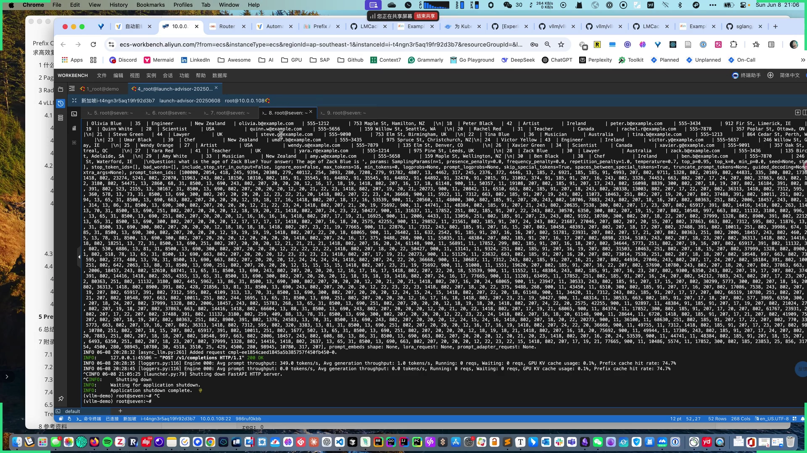 |
| 那我再多发几个。 [【跳转到 57:28】](https://www.bilibili.com/video/BV1jgTRzSEjS/?t=3448) | 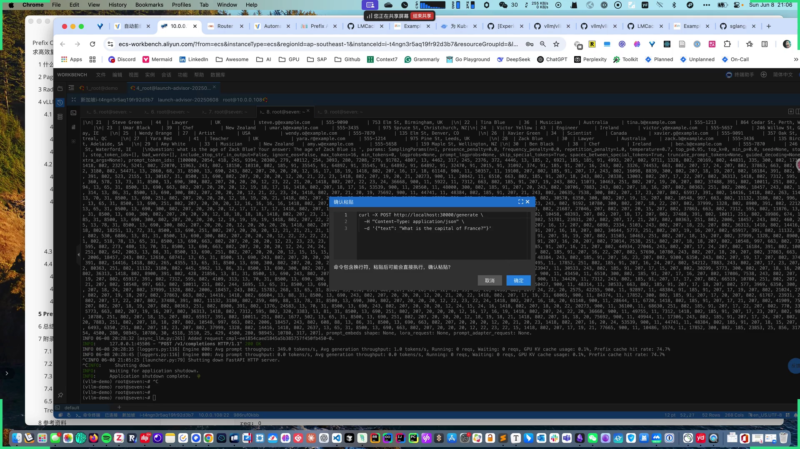 |
| 我发了三个，然后我们看一下 router 的一个（日志），他这里可能日志还没出来，我看一下。 [【跳转到 57:33】](https://www.bilibili.com/video/BV1jgTRzSEjS/?t=3453) | 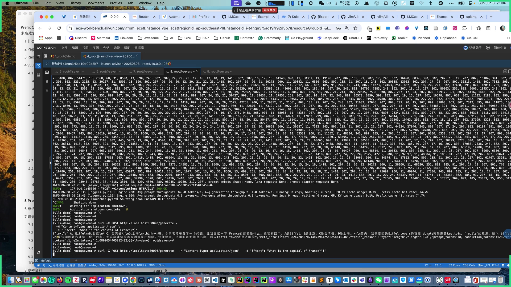 |
| 你可以看到这里，是不是第一个 worker（3001）这里它有输出了三次这个 decode 这个情况，对不对。所以说三个请求是不是都打到了第一个 worker 上，对吧。第二个你可以看到是空的嘛， [【跳转到 57:46】](https://www.bilibili.com/video/BV1jgTRzSEjS/?t=3466) | 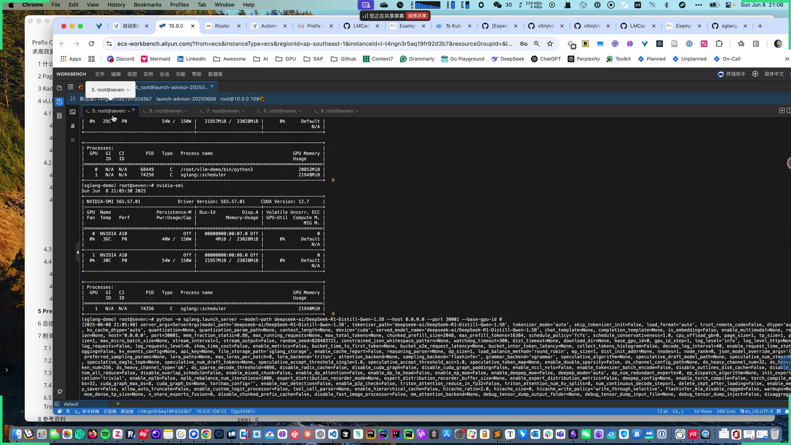 |
| 所以说明没有请求过来。OK，然后你可以看到这里是看不到的，他这里是 process q，哦这里能看到三个，对吧，那说明这个请求是发送给这个 worker 一嘛，对吧。 [【跳转到 58:07】](https://www.bilibili.com/video/BV1jgTRzSEjS/?t=3487) | 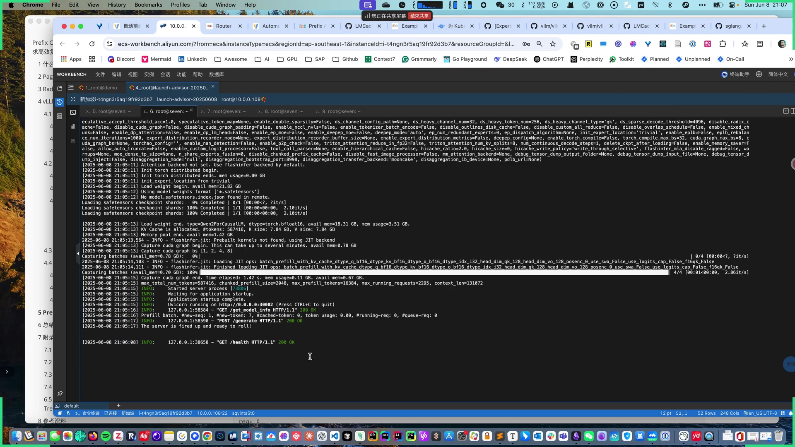 |
| 就第一个 worker。 [【跳转到 58:32】](https://www.bilibili.com/video/BV1jgTRzSEjS/?t=3512) | 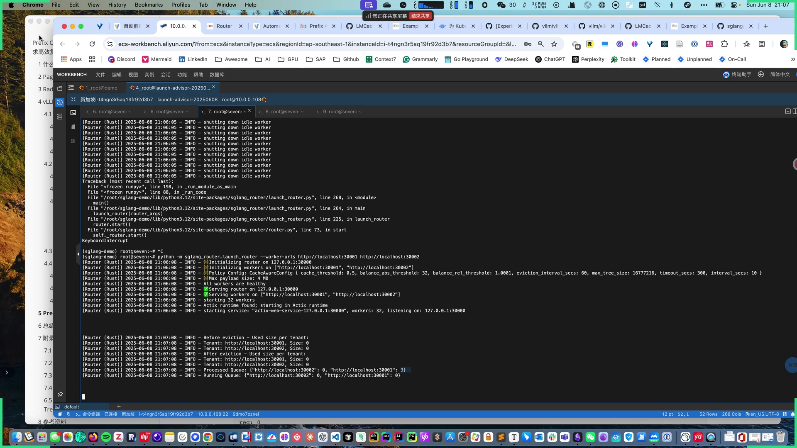 |
| 好，那我今天的分享应该就到这里了。好，有没有什么问题？哎，刚刚你前面讲到那个什么 Ingress 要换成什么 gateway 之类的，是什么 Gateway API 哦。 [【跳转到 58:37】](https://www.bilibili.com/video/BV1jgTRzSEjS/?t=3517) | 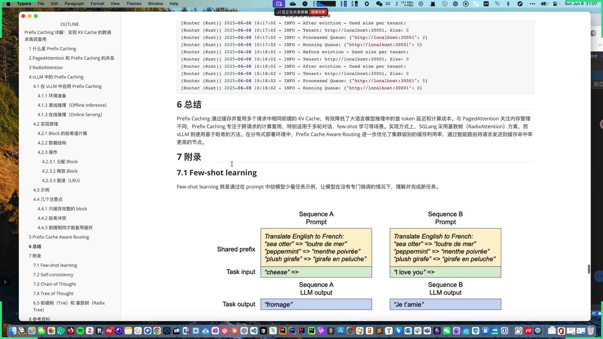 |
| 这个是现在的什么主流趋势吗？有什么区别吗？对，就是因为 Ingress 的话 [【跳转到 58:54】](https://www.bilibili.com/video/BV1jgTRzSEjS/?t=3534) |  |
| 它其实有很多的问题嘛，就是你可以配置的东西（不多），默认情况下 Ingress 不是配置可以支持的，配置不是那么多嘛。你像 nginx ingress 不是要加很多的 annotation 什么东西乱七八糟的，然后才能把那些（Ingress）的功能都用上。那 Gateway API 它的抽象可能更彻底。 [【跳转到 58:59】](https://www.bilibili.com/video/BV1jgTRzSEjS/?t=3539) | 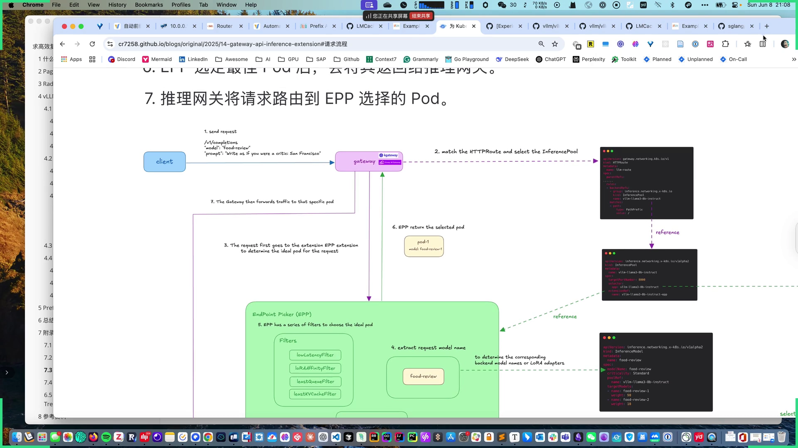 |
| 它有一些什么 HTTP route、TCP route 啊还有各种的，尤其比较重要的是它支持一些 extension 的能力。就原来的 Gateway API 可能并没有考虑到 Inference 这些，那它现在与 Inference 情况，它也能很容易地在原来 gateway 的这个基础上——你看这里它是 HTTPRoute，是 Gateway API 的一个核心的 CRD 嘛—— [【跳转到 59:24】](https://www.bilibili.com/video/BV1jgTRzSEjS/?t=3564) | 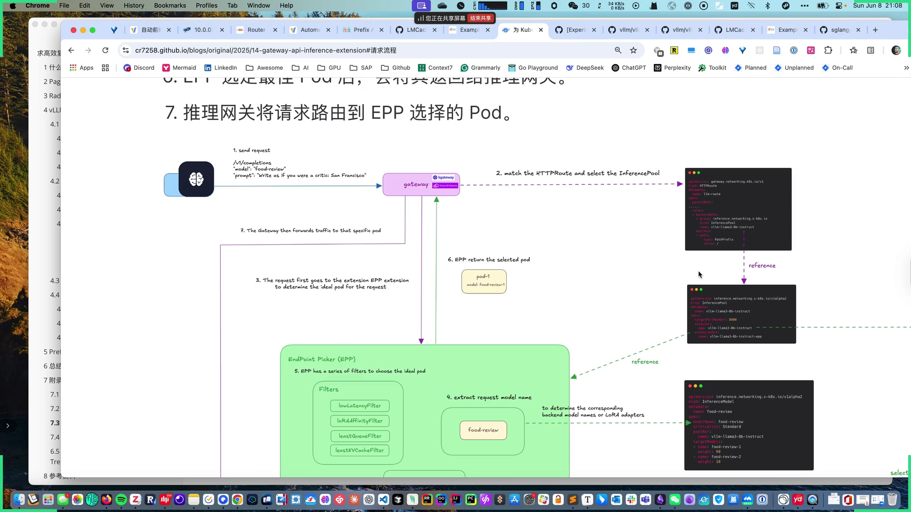 |
| 那它这里的话，现在要支持新的，比如说新的一个资源 Inference Pool，这是一个新的，它也可以去做一个关联，当作它的一个 backend，就通过这种方式很方便去扩展嘛，对吧。嗯好，OKOK，还有啥问题吗？我没有了。哎对等一下， [【跳转到 59:49】](https://www.bilibili.com/video/BV1jgTRzSEjS/?t=3589) | 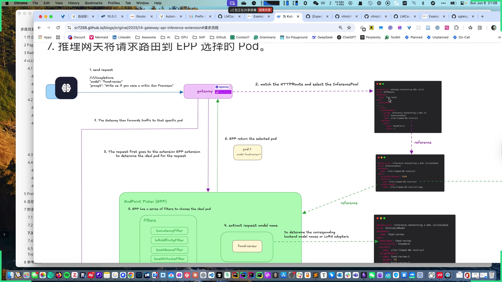 |
| 刚刚说的这些都是需要租一些有那个 GPU 的服务器， [【跳转到 60:14】](https://www.bilibili.com/video/BV1jgTRzSEjS/?t=3614) | 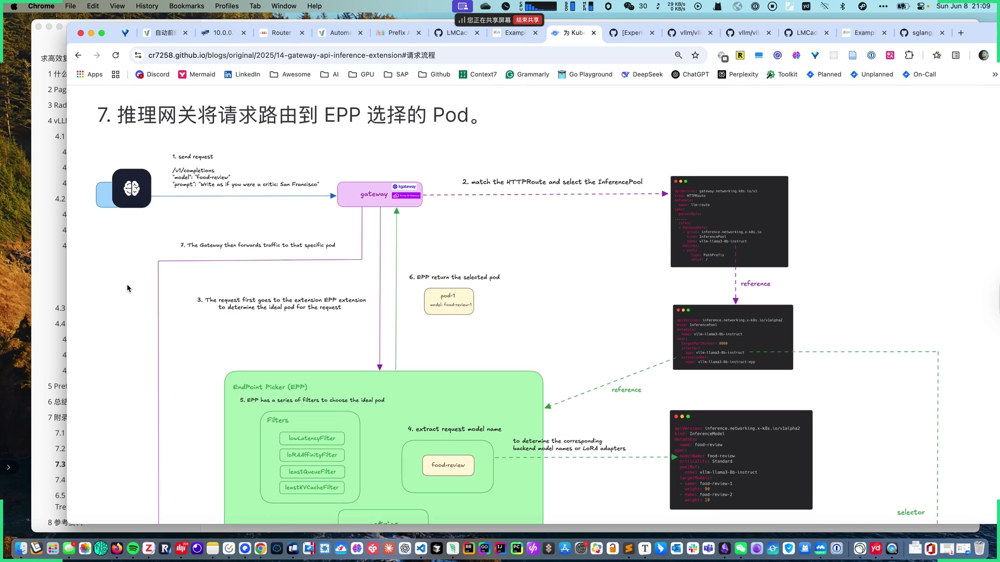 |
| 才能调试的。是，对，今天这个都是要一些 GPU 的。对，嗯嗯嗯，然后我一般是在比如说在阿里云啊，或者什么腾讯云，你可以租那种抢占式的，它会便宜（一些）。按量付费的、按量付费更贵，抢占式就是有个问题，就是它用的如果前面、它资源不够的话， [【跳转到 60:19】](https://www.bilibili.com/video/BV1jgTRzSEjS/?t=3619) | 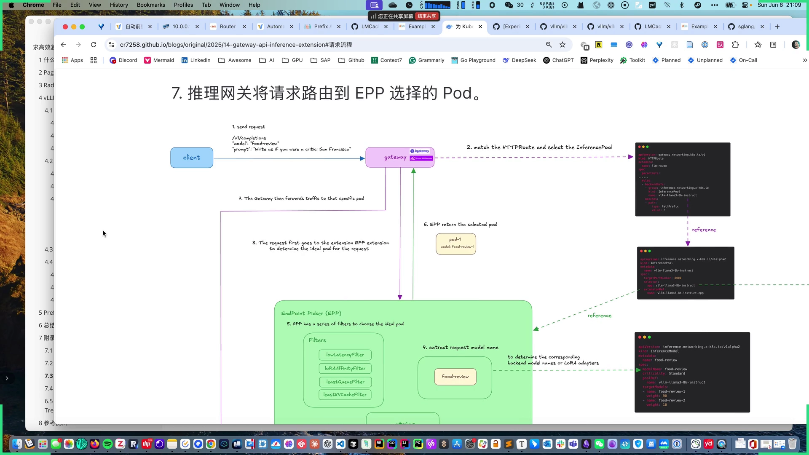 |
| 它就会帮你给关机了，或者怎么样的，就它不保证。按量付费的话就是按量付费，就是你能保证你有，但是是按量（计费）嘛。哦我知道了。嗯嗯嗯好，行好，那如果没有其他问题的话，我们今天就先这样。好，拜拜拜拜拜拜。 [【跳转到 60:44】](https://www.bilibili.com/video/BV1jgTRzSEjS/?t=3644) | 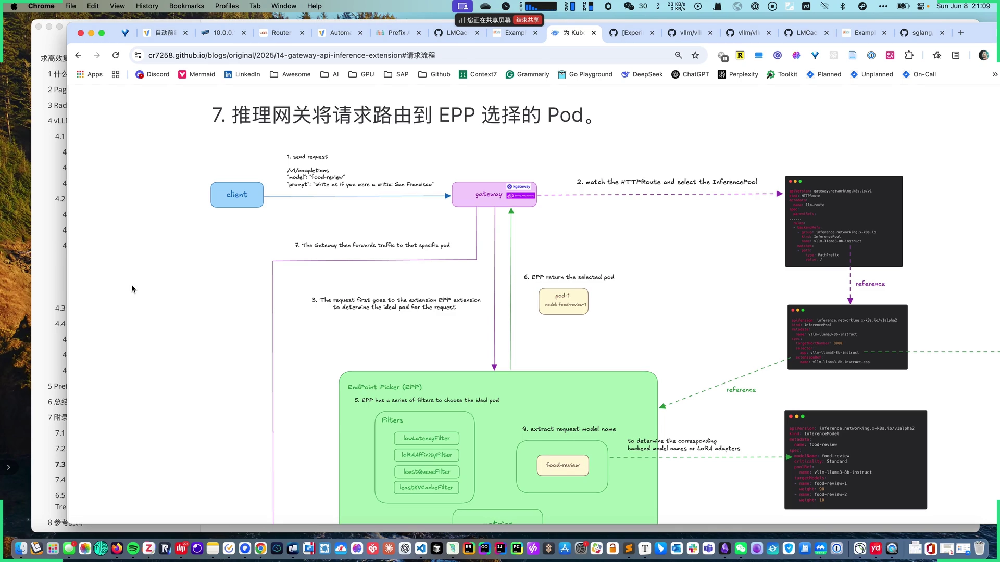 |
| （此区间无字幕） [【跳转到 61:09】](https://www.bilibili.com/video/BV1jgTRzSEjS/?t=3669) | 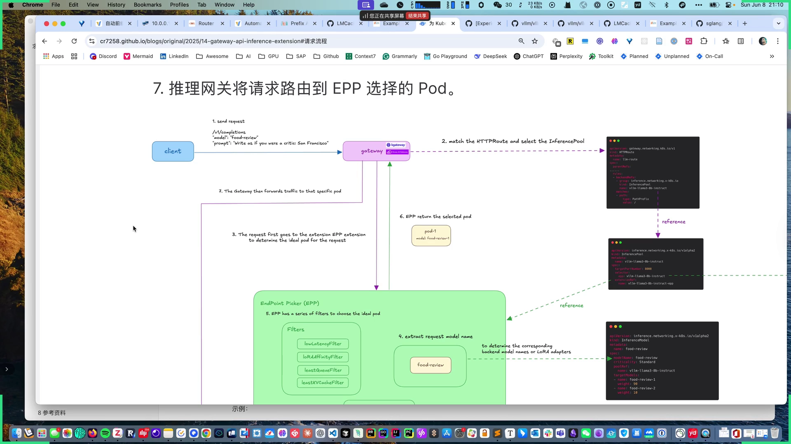 |