# 第04讲_Speculative_Decoding实现方案 原始文稿（图-字幕分栏）

| 字幕文本 | 画面 |
| :--- | ---: |
| OK，那好我们开始，我这边等你也开一个录制。 [【跳转到 00:00】](https://www.bilibili.com/video/BV1Q5KWzQEhn/?t=0) |  |
| OK，大家好，今天我们来分享一下 Speculative Decoding，也就是推测解码这个 feature。首先介绍一下前提，因为我们大语言模型在推理阶段普遍采用自回归的解码策略， [【跳转到 00:05】](https://www.bilibili.com/video/BV1Q5KWzQEhn/?t=5) | 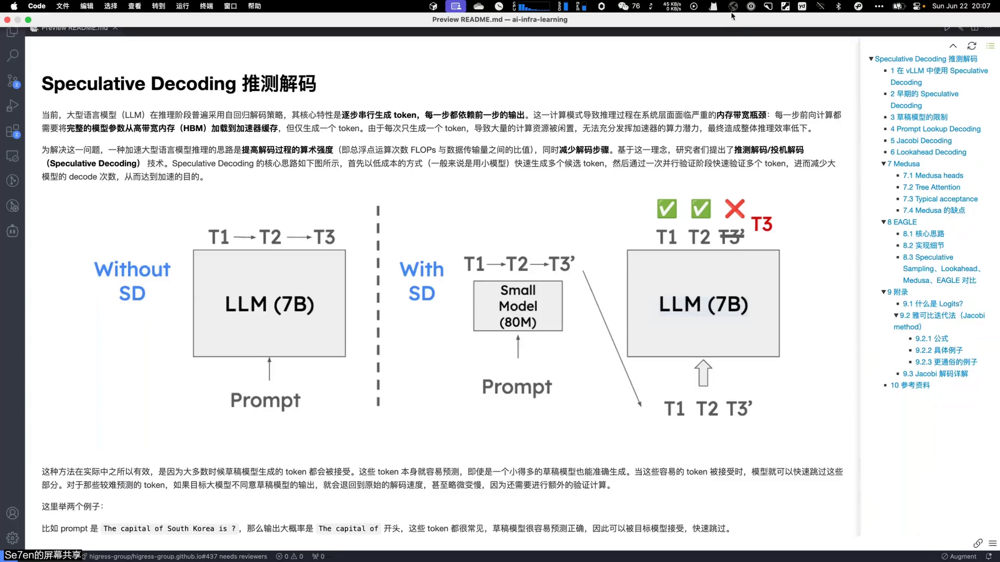 |
| 它的特性是逐步生成 token，每一步生成 token 都依赖于前面的输出。所以在这个过程中其实是 memory bound，因为它会使用前面的 KV Cache，但往往这个时候计算资源其实是空闲的，导致计算资源被闲置，没有办法完全发挥出计算的潜力，最终导致整体推理效率低下。 [【跳转到 00:30】](https://www.bilibili.com/video/BV1Q5KWzQEhn/?t=30) |  |
| 为了解决这个问题，有一些研究学者提出了 Speculative Decoding，也就是推测解码这个概念，也有人叫做投机解码，也有这种翻译。它的核心思路是，首先用一个低成本的小模型，我们一般称为草稿模型（draft model）， [【跳转到 00:55】](https://www.bilibili.com/video/BV1Q5KWzQEhn/?t=55) | 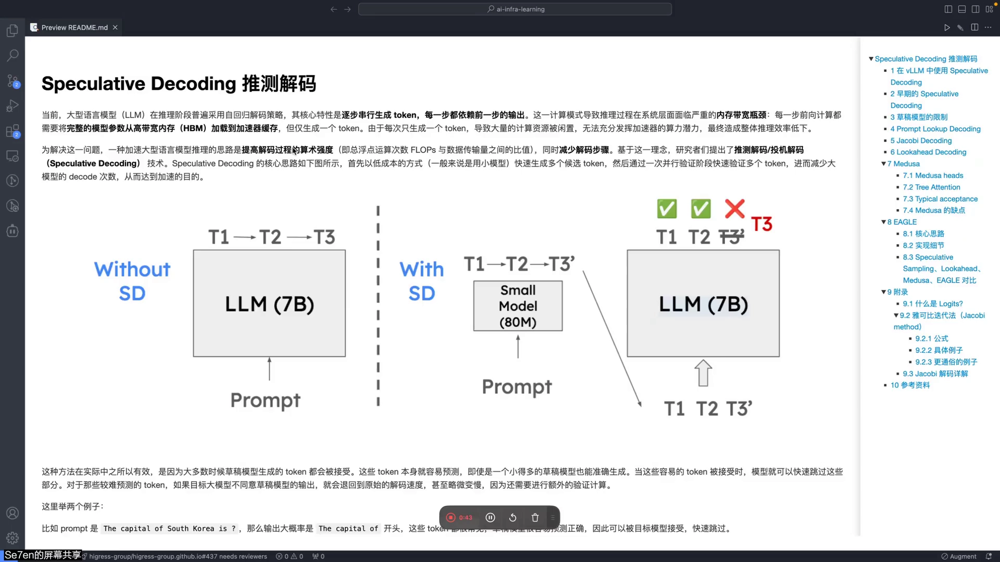 |
| draft model 来进行预测。预测的时候可以预测多个 token，然后让后面真正的目标模型，也就是我实际上使用的大语言模型去进行验证。比如这里看 T1、T2 其实是验证 OK 的，那我就可以一次性拿到两个；如果是 T3 不对，就把它扔掉。也就是说，最差情况下， [【跳转到 01:20】](https://www.bilibili.com/video/BV1Q5KWzQEhn/?t=80) |  |
| 就算它全部预测错了，我的大语言模型在检查并且修复的过程中，也能保持至少有一个；如果多预测多对的话，那就等于赚了。这也是 Speculative Decoding 核心的一个思路。你可以看到左边，没有这个的话就是一个一个顺序去生成， [【跳转到 01:45】](https://www.bilibili.com/video/BV1Q5KWzQEhn/?t=105) |  |
| 好了，当然我刚才说了，最早 Speculative Decoding 其实是使用了小模型也就是草稿模型进行生成，但是随着后面有一些新的方案，也可以不使用草稿模型的方式，我后面会说。而这个文档我等一下会发出来，然后我今天的话不会把所有的内容都过一遍， [【跳转到 02:10】](https://www.bilibili.com/video/BV1Q5KWzQEhn/?t=130) | 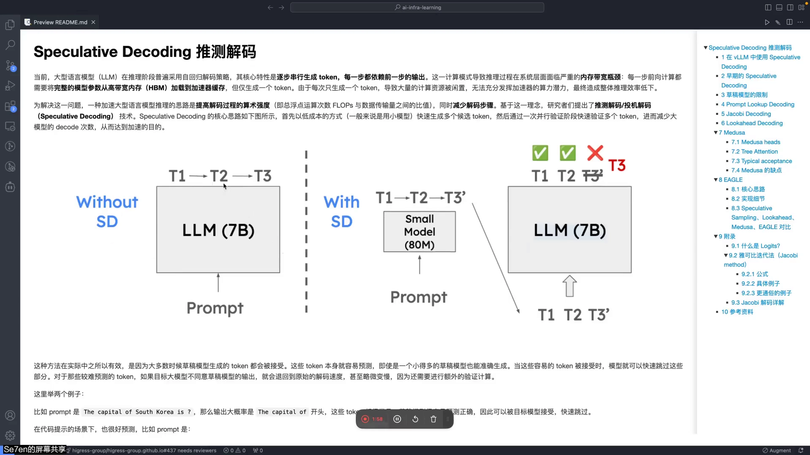 |
| 我主要是把一些重点的内容给点出来，方便大家后续如果需要详细去看的话，再去对照文档去看。好，那我们再说一下为什么 Speculative Decoding 这种方式是有效的，因为大多数情况下， [【跳转到 02:35】](https://www.bilibili.com/video/BV1Q5KWzQEhn/?t=155) | 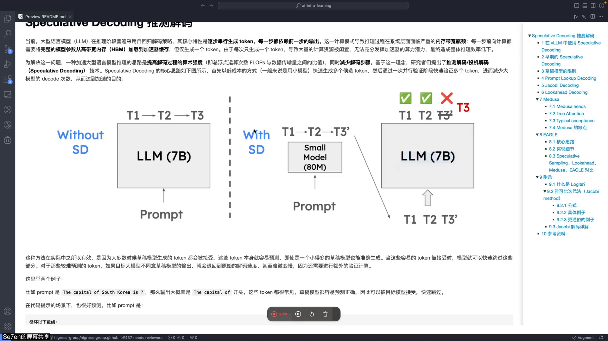 |
| 这个草稿模型猜的 token 在一些场景下是比较容易被接受的，因为比较容易猜。我这里给了几个例子，比如我的 prompt 是 "The capital of South Korea is"，那我去回答时，大概率开头可能就是 "The capital of"，这种就很容易能猜到，对吧？另外，如果是在代码场景下也是很好预测的， [【跳转到 03:00】](https://www.bilibili.com/video/BV1Q5KWzQEhn/?t=180) |  |
| 比如我要循环一下数组，我给了个 numbers 4，比如用 Python 写，那肯定就是 for 一下，那就很好猜。所以这就是为什么在这种场景下草稿模型猜测的准确率会比较高的原因。但是如果是那种比较难预测的，像这种情况，因为目标模型验证失败的话， [【跳转到 03:25】](https://www.bilibili.com/video/BV1Q5KWzQEhn/?t=205) | 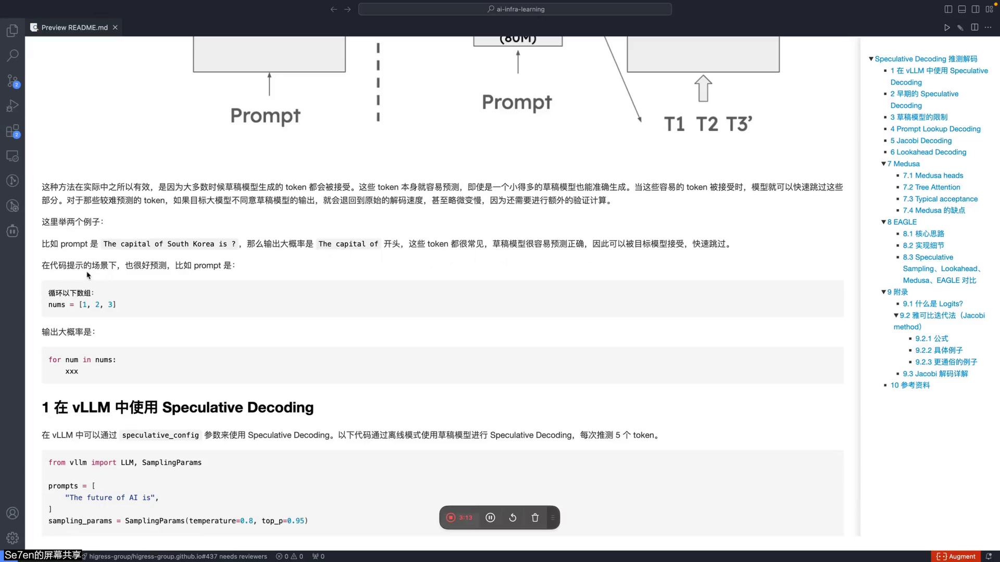 |
| 就不会同意草稿模型的输出，这种情况下就相当于回退到原始的解码，反而会变慢，因为你去验证的话其实还有额外的计算，对吧。但大部分情况下，Speculative Decoding 是能够提升我们的解码效率的。好，然后我们看一下 vLLM， [【跳转到 03:50】](https://www.bilibili.com/video/BV1Q5KWzQEhn/?t=230) |  |
| 现在也是支持多种 Speculative Decoding 的方式。比如这个配置，我这里 model 是我的目标模型，一个 6.7B 的模型，那我可以在 speculative_config 这里去指定我的草稿模型，你看这里我就直接使用小一点的 125M 的模型，然后可以通过这个参数去指定我 [【跳转到 04:15】](https://www.bilibili.com/video/BV1Q5KWzQEhn/?t=255) | 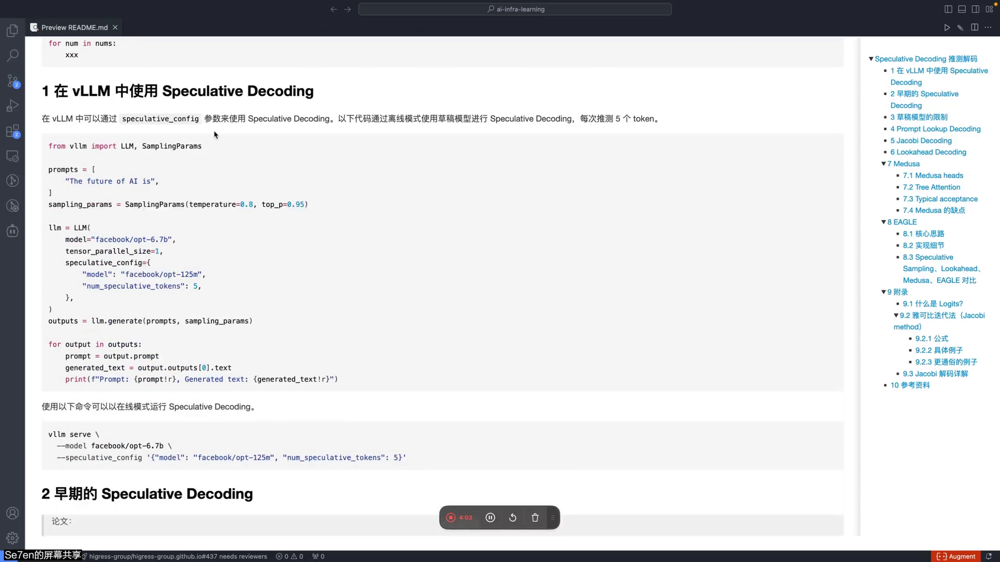 |
| 一次性草稿模型去猜测多少个 token。这个是一个离线推理的时候使用的代码，那在线命令我就可以通过 vllm serve 命令去跑，同样也是通过这个参数去指定草稿模型和预测的 token 数量。好，然后我们刚刚说的这些就是早期 Speculative Decoding 的方式， [【跳转到 04:40】](https://www.bilibili.com/video/BV1Q5KWzQEhn/?t=280) | 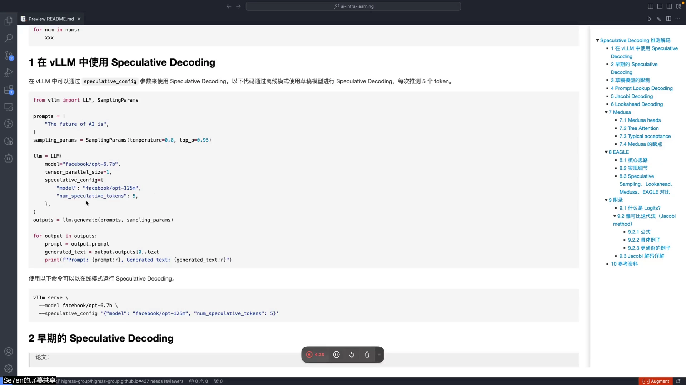 |
| 它最早源自谷歌在 2022 年发表的一篇论文，论文地址在这里。然后同一时期 DeepMind 也发表了另一篇论文，这两篇论文其实核心思想是类似的。这张图是来自于第二篇 DeepMind 的论文里面的， [【跳转到 05:05】](https://www.bilibili.com/video/BV1Q5KWzQEhn/?t=305) | 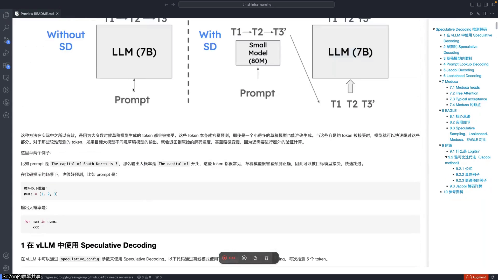 |
| 就是说它这个 Speculative Decoding 的算法流程可以给大家简单看一下。比如假设每轮草稿生成 K 个 token，目标长度是 T，两个模型，一个是 Q 代表目标模型，P 代表草稿模型，目标模型就是大模型，也就是它是准确的，以它为准；草稿模型就是小模型，速度快， [【跳转到 05:30】](https://www.bilibili.com/video/BV1Q5KWzQEhn/?t=330) |  |
| 然后一个循环，直到生成目标数量的 token。对于草稿模型来说，它也是以自回归的方式，也就是一个一个地去生成 token，每个生成的 token 都依赖已有的上下文和前面生成的草稿 token，所以说草稿模型它也是自回归的方式，是串行的，OK，一个一个的。然后重点是这里， [【跳转到 05:55】](https://www.bilibili.com/video/BV1Q5KWzQEhn/?t=355) | 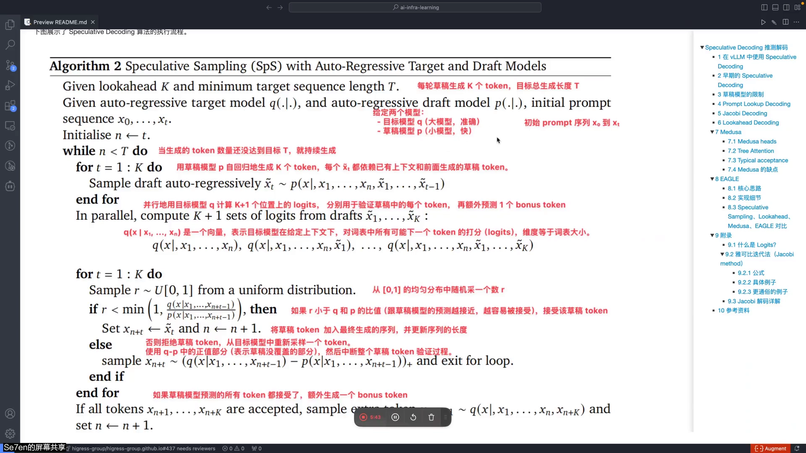 |
| 它生成完以后，我用目标模型 Q，因为 token 已经预测出来了，比如它预测了五个 token，那目标模型就可以分别去计算这五个 token 的 logits，然后稍后在这里用于验证草稿中的每个 token。另外它还会额外再预测一个 bonus token， [【跳转到 06:20】](https://www.bilibili.com/video/BV1Q5KWzQEhn/?t=380) |  |
| 如果所有的都 OK 的话，它会额外再有一个。然后这边解释一下什么是 logits，我底下有一个附录可以看一下。这边 logits 指的就是模型输出层的一个原始的得分，是未经过归一化的一个数。如果归一化的话， [【跳转到 06:45】](https://www.bilibili.com/video/BV1Q5KWzQEhn/?t=405) | 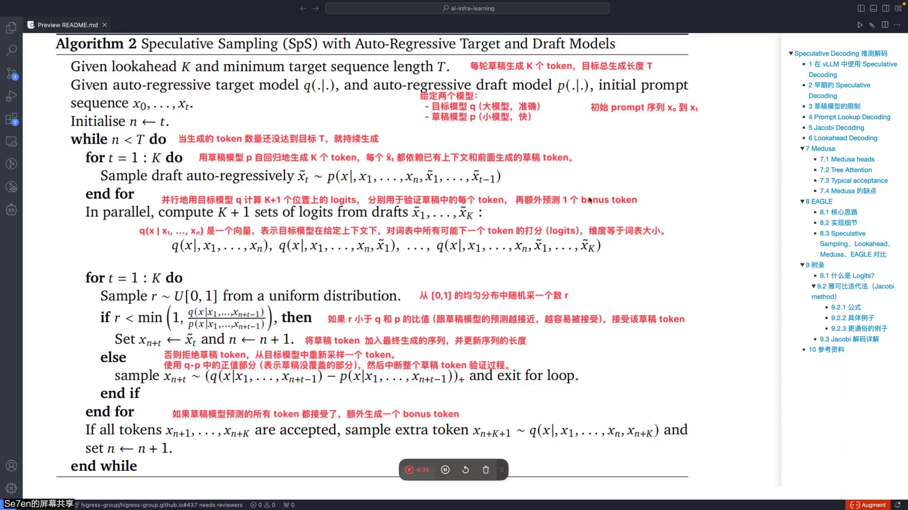 |
| 比如通过 softmax 会转化成一个加和为一的概率分布。比如这个是我的词表，那它输出的 logits 其实长度是跟词表一样的，每个是一个对应的分数，比如这个是 1.8，这是 2.01，这是一个目前未归一化的分数。然后在这里经过 softmax 归一化以后， [【跳转到 07:10】](https://www.bilibili.com/video/BV1Q5KWzQEhn/?t=430) | 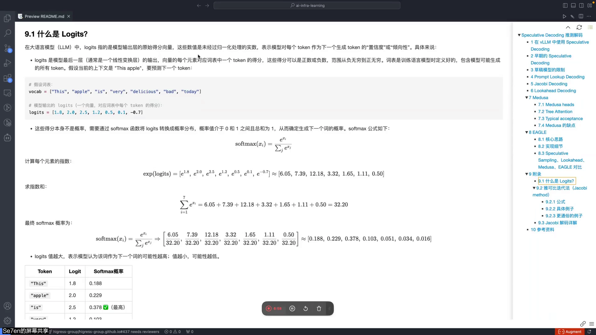 |
| 会得到这些小数值，这些小数加起来的值是等于 1 的，就是整体概率之和为一，对吧。但其实你也可以认为 logit 越高，对应的概率其实是更大的，只是它还没有做归一化而已。所以总结来说，logit 就是一个未归一化的概率得分，也能体现出这个 token 的概率。 [【跳转到 07:35】](https://www.bilibili.com/video/BV1Q5KWzQEhn/?t=455) | 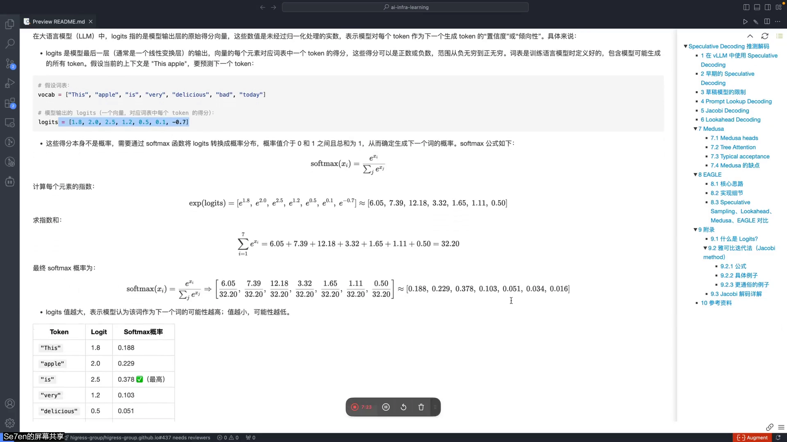 |
| 对，只是它还没有归一化好。然后说完 logits 以后，这边目标模型会根据草稿模型预测的这些 token 分别计算它们的 logits，然后到这里，因为这部分刚刚说的是一个并行操作。好，然后到这里以后， [【跳转到 08:00】](https://www.bilibili.com/video/BV1Q5KWzQEhn/?t=480) | 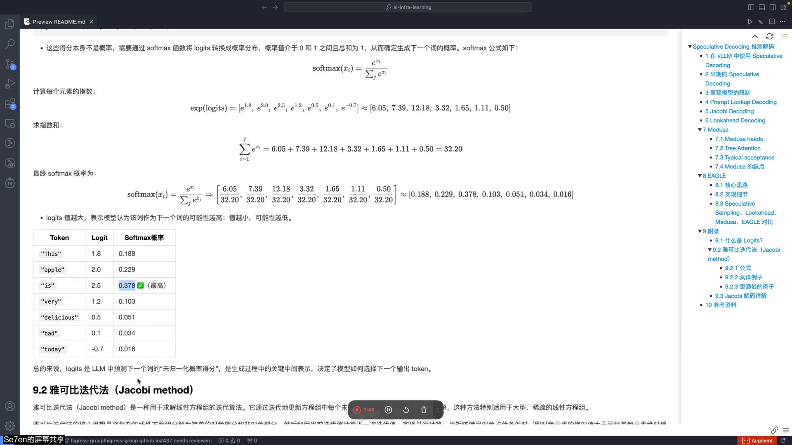 |
| 它会通过拒绝采样的方式去决定是不是要接受草稿模型生成的这些 token。首先，每一次判断的时候会先从 0 和 1 中间随机生成一个数，比如一个 r，对于 0 到 1 之间，然后它这里会用 r 的值去比前面说的 Q 除以 P 的一个 [【跳转到 08:25】](https://www.bilibili.com/video/BV1Q5KWzQEhn/?t=505) |  |
| （比值）。前面都是 logits 嘛。比如我要预测某个位置的 token，然后这里会有一个归一化，把前面说的值转换成一个概率。比如它预测的这是某个 token，它用目标模型对这个 token 的概率，除以草稿模型认为这个 token 的概率。 [【跳转到 08:50】](https://www.bilibili.com/video/BV1Q5KWzQEhn/?t=530) |  |
| 如果这两个 token 的概率越接近，就说明越容易接受。当然你要小于这个 r，就是 r 要小于这两个的比值，就表示会接受这个 token。OK，如果是 OK 的话，就会将草稿的 token 加入到最终的序列，并且更新序列长度；否则就会拒绝草稿 token，然后从目标模型中重新产生一个 token。 [【跳转到 09:15】](https://www.bilibili.com/video/BV1Q5KWzQEhn/?t=555) | 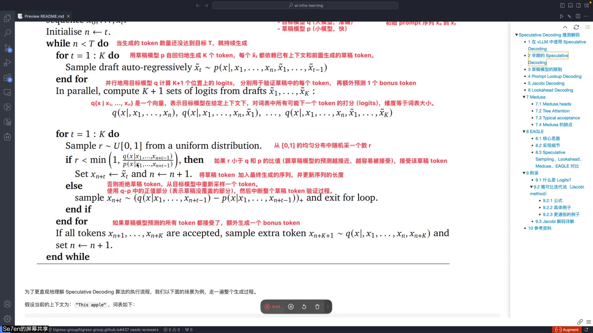 |
| OK，然后如果所有的 token 都接受，就会额外生成一个 bonus token。当然这个也不一定，如果可能只接受了一部分，因为有的实现中，它接受了部分的话，其实也是可以去生成一个，就是保证我这个目标模型在 decode 时肯定至少会有一个 token 去做一个输出。 [【跳转到 09:40】](https://www.bilibili.com/video/BV1Q5KWzQEhn/?t=580) |  |
| 那这里会有一个比较详细的例子去解释上面的这个算法。比如我的上下文是 "list apple"，然后这是我的词表，词表这么长，然后草稿的长度是 K 等于二，也就是草稿模型会尝试生成两个 token。好，然后刚才说的草稿模型是一个自回归模型，先计算 logits， [【跳转到 10:05】](https://www.bilibili.com/video/BV1Q5KWzQEhn/?t=605) |  |
| 比如这个长度就跟词表是对应的。好，然后草稿模型先计算 logits，然后通过 softmax 得到概率分布，得到的概率分布会拿去采样生成 token。也就是说这一部分会 softmax 以后，然后输出做一个采样，得到概率，然后进行采样。然后草稿模型这里生成的是一个 "is"，然后目标模型接着以 "list apple is" 进行一个预测， [【跳转到 10:30】](https://www.bilibili.com/video/BV1Q5KWzQEhn/?t=630) | 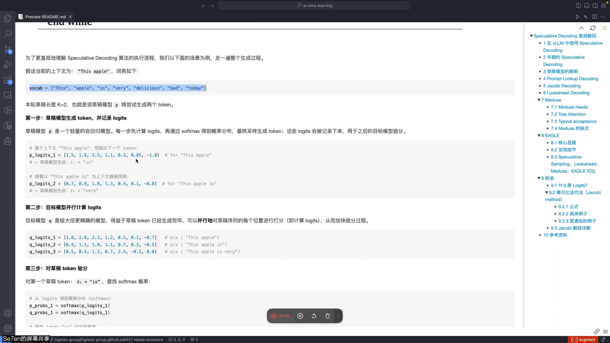 |
| 然后也是得到 logits，然后 softmax 得到概率，然后去预测到 "very"，也就是草稿模型预测两个 "is" 跟 "very"。然后在这一步，刚说的 logits 会记下来，因为前面不是要 Q 除以 P 嘛，P 是草稿模型的 logits，这里后面会用得上。OK，好， [【跳转到 10:55】](https://www.bilibili.com/video/BV1Q5KWzQEhn/?t=655) | 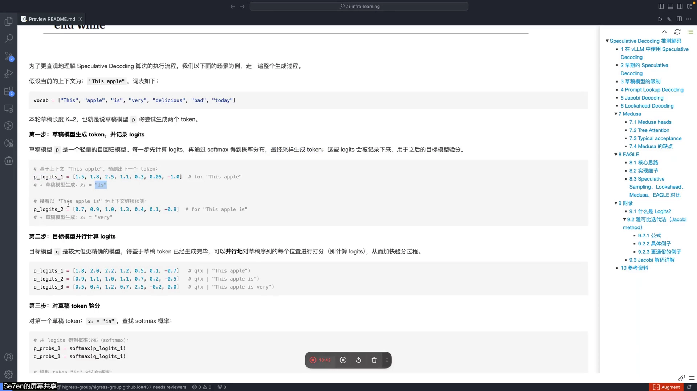 |
| 然后这边第二步就是目标模型，刚才说这边是能够并行地去算这个 logits，因为目标模型它算的跟草稿模型是有不同的分布概率，算法会不太一样，当然是可以并行的。然后接下来会对草稿模型进行验证，这边的话就是分别去 [【跳转到 11:20】](https://www.bilibili.com/video/BV1Q5KWzQEhn/?t=680) | 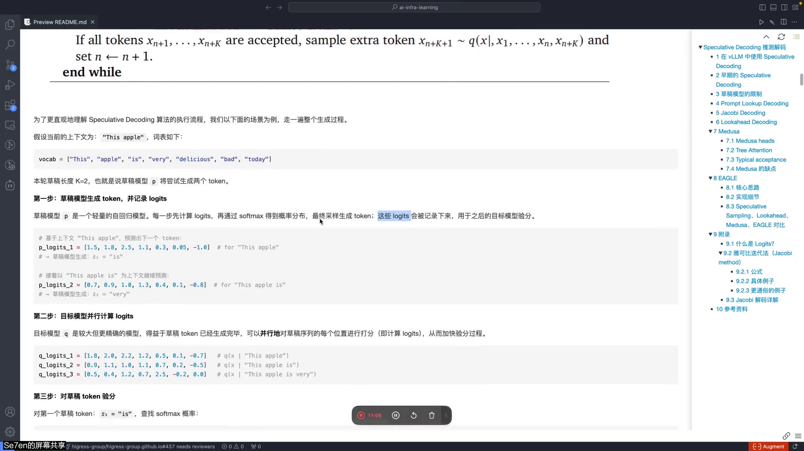 |
| 比如我预测的是，草稿模型这边预测 "is"，我要去判断这个 "is" 是不是 OK 的，那就是分别去拿 P 的 logits 跟 Q 的 logits 进行 softmax，但 softmax 的话是用目标模型的这个去算 softmax。然后比如 T1 的是 0.3，Q 的是 0.2， [【跳转到 11:45】](https://www.bilibili.com/video/BV1Q5KWzQEhn/?t=705) | 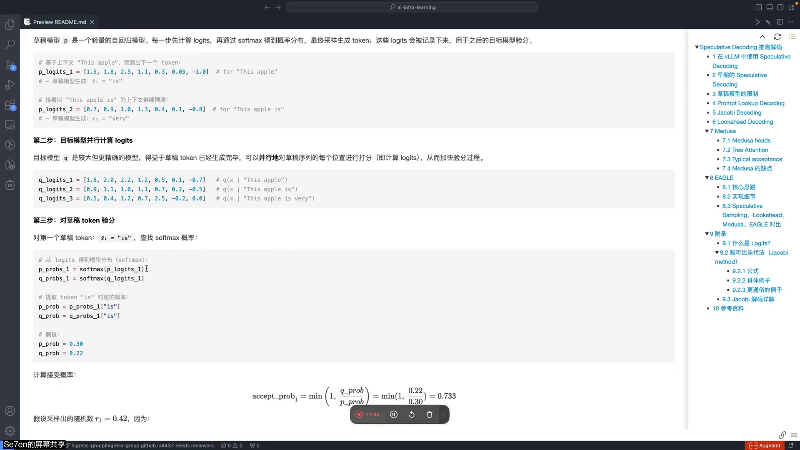 |
| 然后除一下，然后比如随机数是 0.42，小于这个值那就接收。然后第二个也是类似的，进行一个比率的计算，小于的话就接收。前面说的如果都 OK，通过目标模型验证的话，那就会再有一个 bonus token， [【跳转到 12:10】](https://www.bilibili.com/video/BV1Q5KWzQEhn/?t=730) | 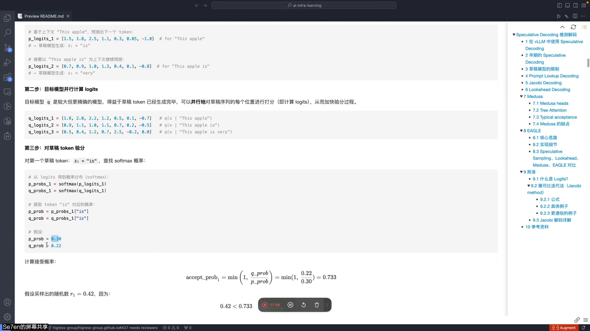 |
| 然后生成一个 bonus token，比如说是 "delicious"。OK，反正总的来说，怎么判断它是不是要接受，就是去比在草稿模型跟目标模型认为的这个 token 的概率是不是接近。比如草稿模型认为这个 "is" token 是 0.5，目标模型也认为它是 0.5， [【跳转到 12:35】](https://www.bilibili.com/video/BV1Q5KWzQEhn/?t=755) | 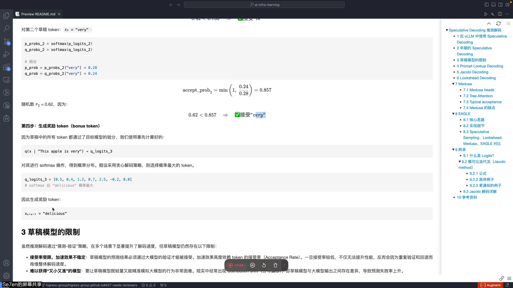 |
| 那它就非常接近，越接近越容易接受。相反如果草稿模型认为是 0.5，目标模型认为是 0.01，这个除一下不就 50 了嘛，那肯定是比那个大很多嘛，那就不会接受了。反正这就是它的一个核心的思路。然后刚刚说了草稿模型，它其实限制还是蛮多的。第一个，如果它的接收率不高的话， [【跳转到 13:00】](https://www.bilibili.com/video/BV1Q5KWzQEhn/?t=780) | 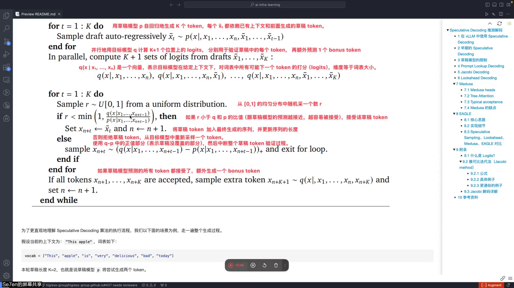 |
| 那加速效果就会比较低，对吧。第二个，这个草稿模型我们是希望又小又准，对吧，但现实生活中经常会出现一些分布偏移，比如草稿模型跟真正目标模型输出之间的差异比较大，导致它的预测失败率比较高，另外泛化跟训练比较困难。 [【跳转到 13:25】](https://www.bilibili.com/video/BV1Q5KWzQEhn/?t=805) | 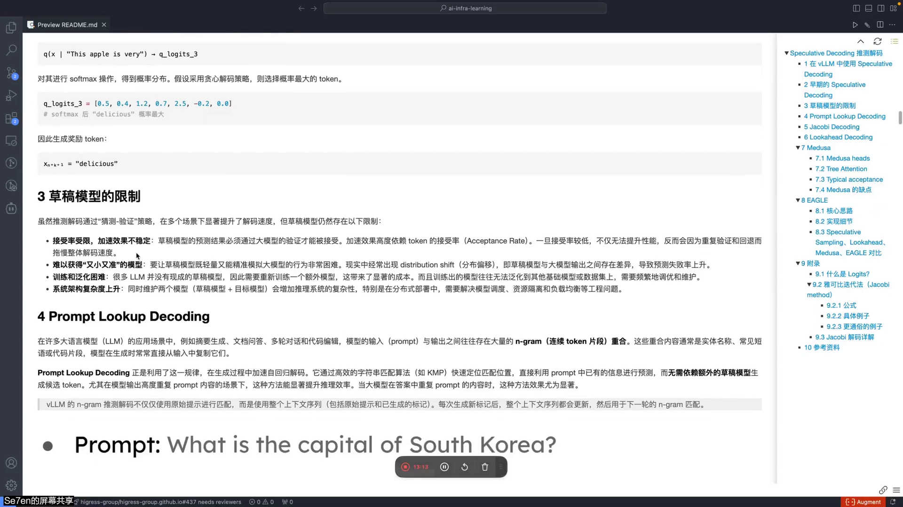 |
| 很多模型是没有草稿模型的，因此需要额外进行训练，会带来一些显著的成本，并且训练出来的这个草稿模型可能无法泛化到其他模型上，对吧，也会导致维护比较困难。然后第四个就是它的维护架构比较复杂，肯定是比维护一个模型更复杂的。 [【跳转到 13:50】](https://www.bilibili.com/video/BV1Q5KWzQEhn/?t=830) | 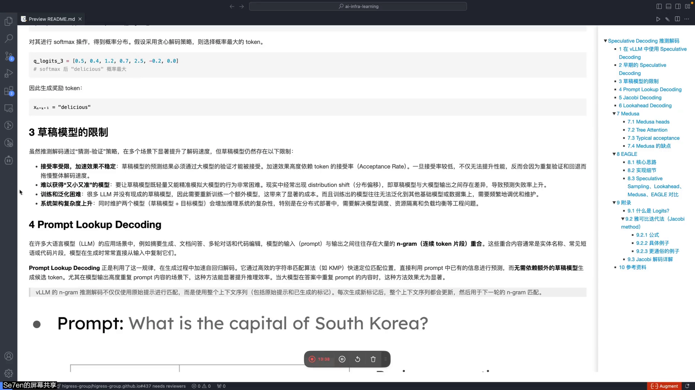 |
| 尤其是在这种分布式部署中，我需要考虑，等于说都要部署两份嘛，那部署复杂度肯定是更高的。OK，好，然后我们继续。由于草稿模型存在很多限制，所以就有一些新的方法， [【跳转到 14:15】](https://www.bilibili.com/video/BV1Q5KWzQEhn/?t=855) | 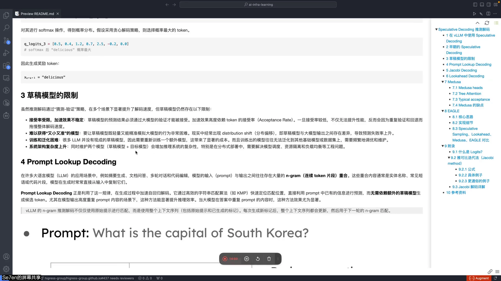 |
| 它不需要草稿模型，被提出来了。比如有一个叫 Prompt Lookup Decoding 的方法，这个方法其实是基于一个观察：比如像摘要生成、文档问答、多轮对话等一些场景，你模型的输入 prompt 跟输出之间往往会存在大量的 n-gram 或者连续 token 片段， [【跳转到 14:40】](https://www.bilibili.com/video/BV1Q5KWzQEhn/?t=880) | 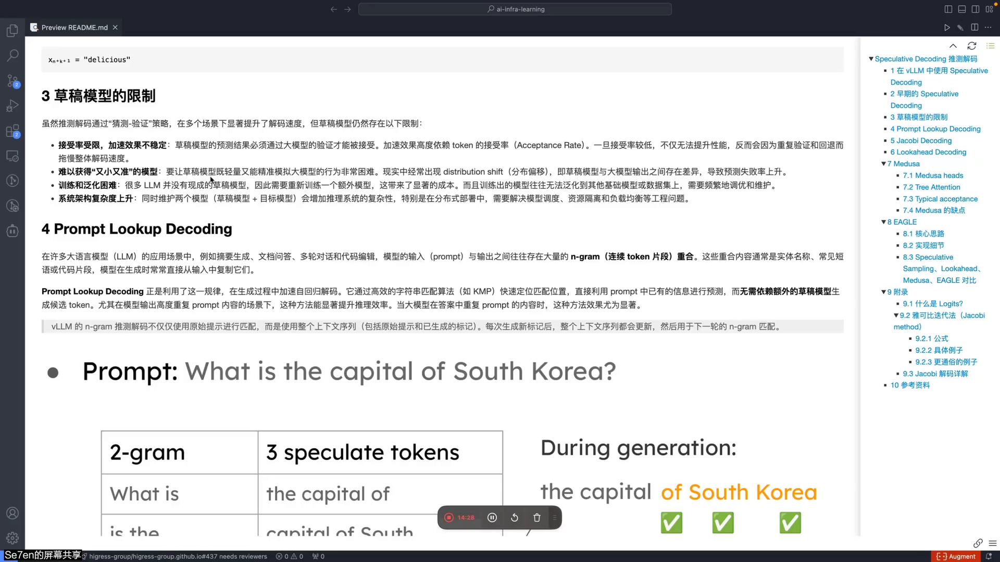 |
| 这些片段通常比如像一些实体名称，或者是短语，或者代码片段，这些在 prompt 中出现的内容比较固定，往往能够直接去复用，对吧。所以这个算法利用了规律，通过 KMP 算法来进行一个匹配， [【跳转到 15:05】](https://www.bilibili.com/video/BV1Q5KWzQEhn/?t=905) | 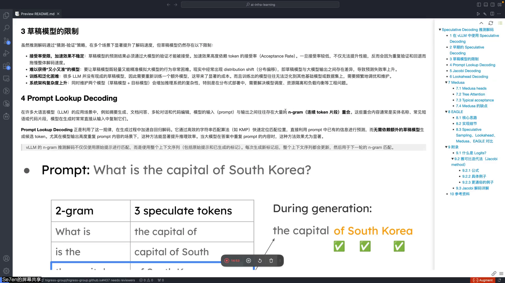 |
| 就是利用已知的 prompt 已有的信息进行匹配，然后无需额外的草稿模型。这种方式就是在有重复 prompt 内容的情况下可以显著提升推理效率。这里也给个例子，比如 prompt 是 "What's the capital of South Korea"，对吧，然后假设这里用 n-gram，就是每两个词作为一个切分， [【跳转到 15:30】](https://www.bilibili.com/video/BV1Q5KWzQEhn/?t=930) |  |
| 然后作为一个键去查。比如 "What's" 后面是 "the capital of"，"is the" 就是 "capital of South"，"the capital" 就是 "of South Korea"，对吧。然后在生成阶段，比如我已经生成了前面这两个 "capital"，就去查表，我原先这些有的去查， [【跳转到 15:55】](https://www.bilibili.com/video/BV1Q5KWzQEhn/?t=955) | 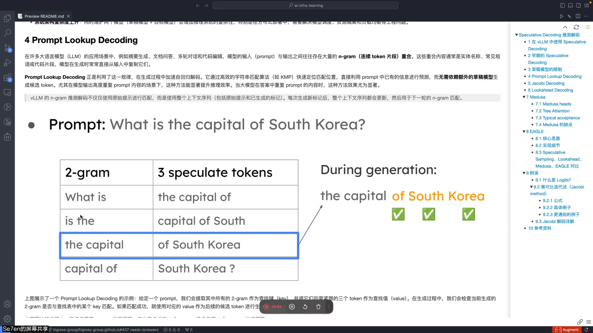 |
| 正好有这个，那就把这个拿来直接用了。这里这段的 key 跟 value 就是从前面的 prompt 中拿到的。OK，好，然后我刚才说的虽然是 prompt，但在 vLLM 中使用这种方式并不仅仅是使用原始的提示词来匹配，就是在生成 decode 的阶段， [【跳转到 16:20】](https://www.bilibili.com/video/BV1Q5KWzQEhn/?t=980) |  |
| 不是一直会有新的词生成吗，每次生成的这些词也会加到上下文序列中，做 n-gram 的切分然后去做匹配，用于下一轮的推断。然后这里就是使用 n-gram 这种方式，你可以看到这里 method 就用了 n-gram，你可以看到这次就没有使用草稿模型了，对吧， [【跳转到 16:45】](https://www.bilibili.com/video/BV1Q5KWzQEhn/?t=1005) |  |
| 也就是说它会更加轻量。好，然后接下来是另外一个，Jacobi Decoding，这种方式也是不需要草稿模型的。它的原理就是，比如它把传统的这种自回归解码的 [【跳转到 17:10】](https://www.bilibili.com/video/BV1Q5KWzQEhn/?t=1030) | 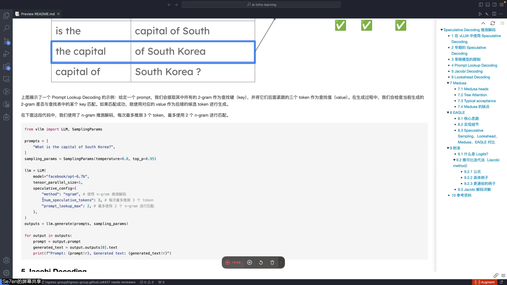 |
| 逐步生成的 decode 方式，通过一些公式进行简单重排，然后把这个过程看作是在求解一个非线性的方程组，这么说其实有点难理解。然后我这边给了一个，首先这边说的是 Jacobi Decoding，它是使用雅可比迭代法这种方式， [【跳转到 17:35】](https://www.bilibili.com/video/BV1Q5KWzQEhn/?t=1055) | 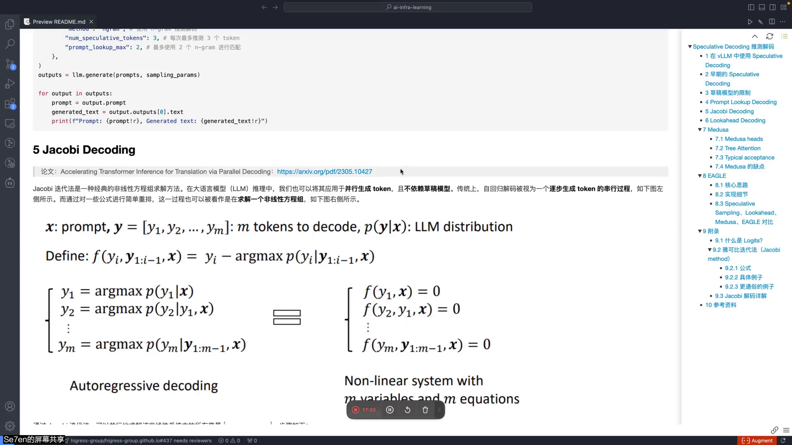 |
| 利用了这种方式。那先看看什么是雅可比迭代法。这个公式这边你可以先不用完全理解，但我底下可以大概理解它的一个意思。比如我要给定一个 N 乘 N 的线性方程组，对吧，它会根据，比如我要求 X，A 我是知道的， [【跳转到 18:00】](https://www.bilibili.com/video/BV1Q5KWzQEhn/?t=1080) | 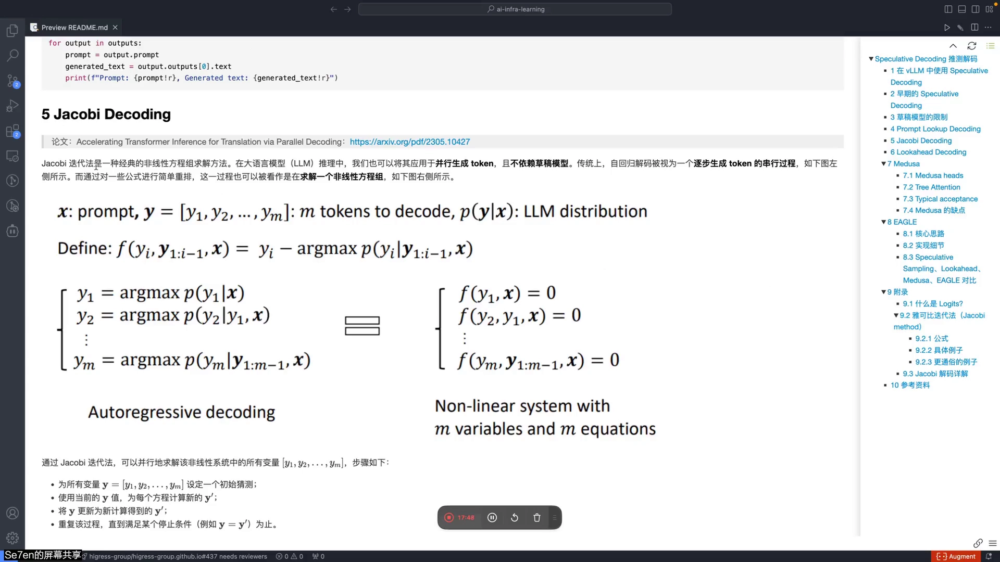 |
| B 我是知道的，它会根据这个矩阵的对角线拆成两边，D 的话就是对角线，R 就是两边，然后这边你可以先不管，反正它这里会有一些方程进行一些转换，对吧。然后底下有一个例子，比如这也是我有 X1、X2、X3 嘛，3×3 的线性方程组，要求满足这个条件， [【跳转到 18:25】](https://www.bilibili.com/video/BV1Q5KWzQEhn/?t=1105) | 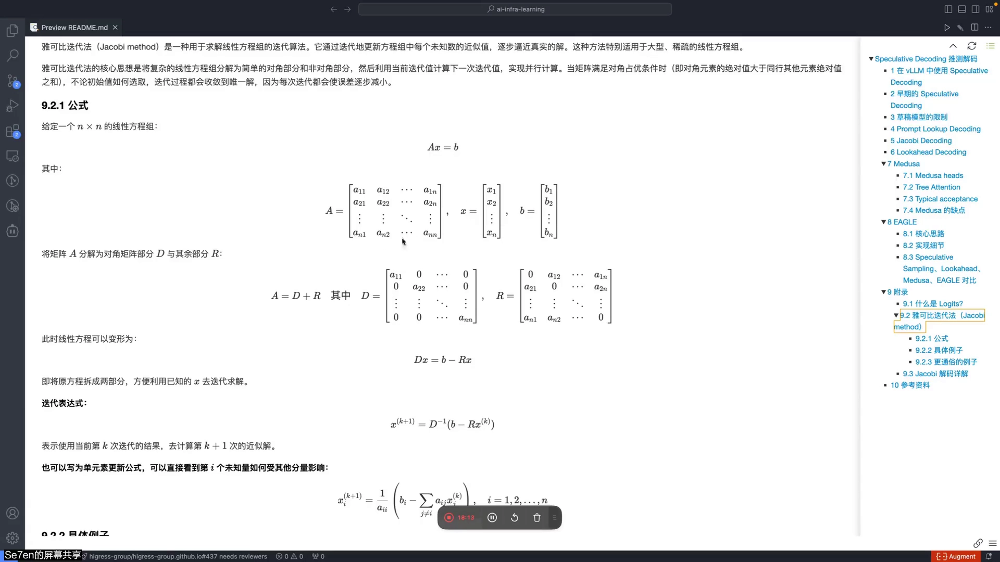 |
| 你转化一下，相当于是不是就是这个矩阵跟 B 嘛，A 就是矩阵，B 就是向量，X 就是这个嘛，相当于是这个。OK，然后这一部分就是从上面的方程的计算得到的。然后重点是，比如我要求 X1 的这个 k 加一这个地方，我是依赖上一步的 token 的， [【跳转到 18:50】](https://www.bilibili.com/video/BV1Q5KWzQEhn/?t=1130) | 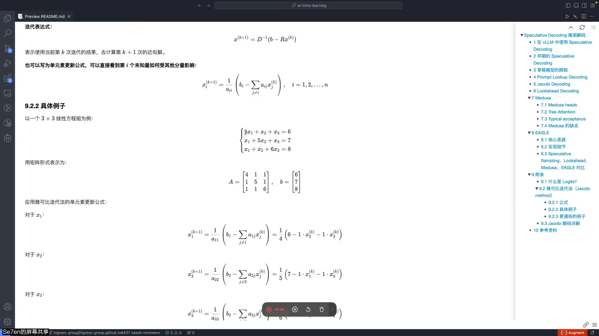 |
| 比如我用 X1 求自己 X1 的时候，是通过 X2 跟 X3 的上一步的值去拿到的。OK，那求 X2 也是一样，求 X2 的 k 加一也是从 X1 跟 X3 的上一步去拿到的，也就是说他每次计算下一轮的时候，都只需要上一轮的结果去算。 [【跳转到 19:15】](https://www.bilibili.com/video/BV1Q5KWzQEhn/?t=1155) |  |
| 也就是说我在算 X1、X2、X3 新的这一轮的时候，就可以做一个并行计算，因为它们之间这是上一轮都知道的嘛，它们之间是没有关联性的。不像传统 decode 阶段 X1 算完 X2 再算 X3，我必须有 X1、X2 才能算 X2。这个的话相当于是我直接去拿上一步的 [【跳转到 19:40】](https://www.bilibili.com/video/BV1Q5KWzQEhn/?t=1180) |  |
| 它们的预测结果去进行一个推敲。但这个公式看起来还是有些难以理解，那我这边会有个生活中的例子。比如这几个，我刚说 X1、X2、X3，虽然我一开始结果是不知道的， [【跳转到 20:05】](https://www.bilibili.com/video/BV1Q5KWzQEhn/?t=1205) | 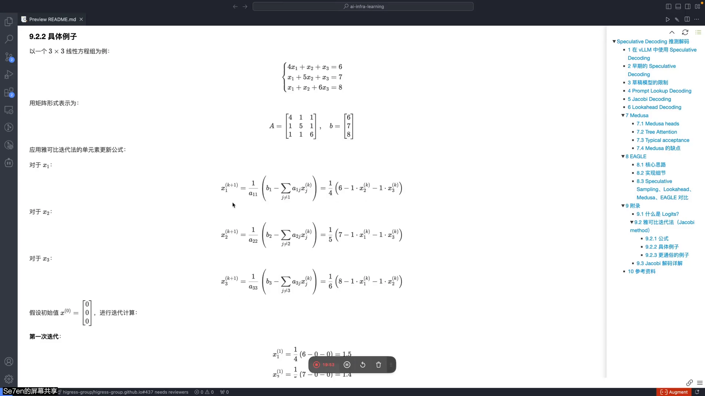 |
| 但它可以经过这种持续迭代进行收敛。可能每个参与者都会受到其他人行为的影响，经过多次博弈后会达到一个市场均衡。然后你可以看到，这边我实际的计算就是，比如我一开始会有一个初始值， [【跳转到 20:30】](https://www.bilibili.com/video/BV1Q5KWzQEhn/?t=1230) | 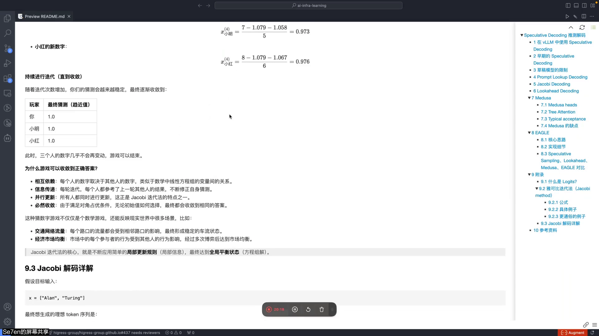 |
| 这个值可以随意，没有关系。我第一步先全部带进去算到一个值，第一步的 X1、X2、X3，然后再用第一步的这三个值带进去，因为我刚才说了，求第二步的值是不是只需要上一步的值嘛，第一步的值已知，所以说这三个能并行地算出来，然后得到这一步。然后持续算很多轮， [【跳转到 20:55】](https://www.bilibili.com/video/BV1Q5KWzQEhn/?t=1255) | 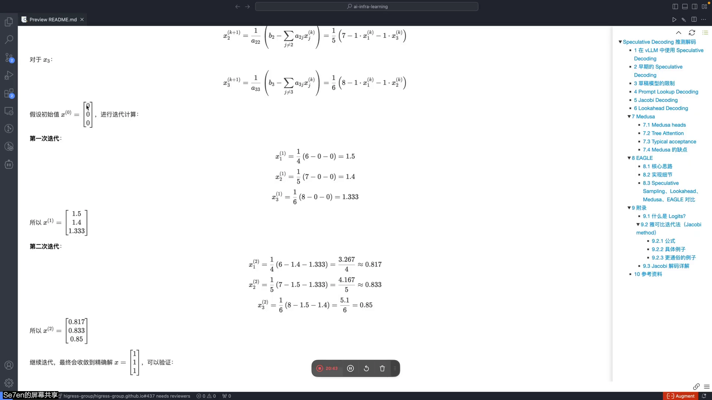 |
| 一直算一直算，最终会收敛到 X 这个解，最终会无限地去进行一个趋近。OK，好，也就是说总结一下，雅可比算法核心就是不断地应用简单的局部更新规则去达到最终的平衡状态。OK，如果因为我感觉这个讲完 [【跳转到 21:20】](https://www.bilibili.com/video/BV1Q5KWzQEhn/?t=1280) | 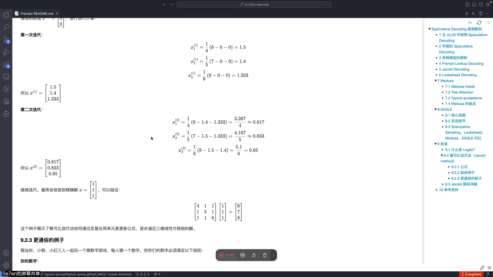 |
| 确实有点难理解，如果不理解的话可以先暂时不需要太深究，我觉得因为本身这个算法它其实提升的效率也没有特别明显。OK，因为你看到它等于是一开始是这种瞎猜的，相当于是不断用瞎猜，可能有一定数学原理，不断用瞎猜的词 [【跳转到 21:45】](https://www.bilibili.com/video/BV1Q5KWzQEhn/?t=1305) | 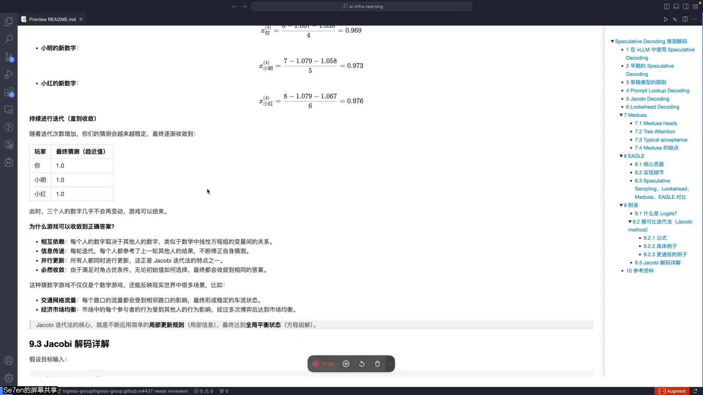 |
| 一直去更新，然后直到做一个收敛。好，那我这边说的就是雅可比迭代算法的一个过程，那应用到我的 Jacobi Decoding 解码的话，它其实也是 [【跳转到 22:10】](https://www.bilibili.com/video/BV1Q5KWzQEhn/?t=1330) | 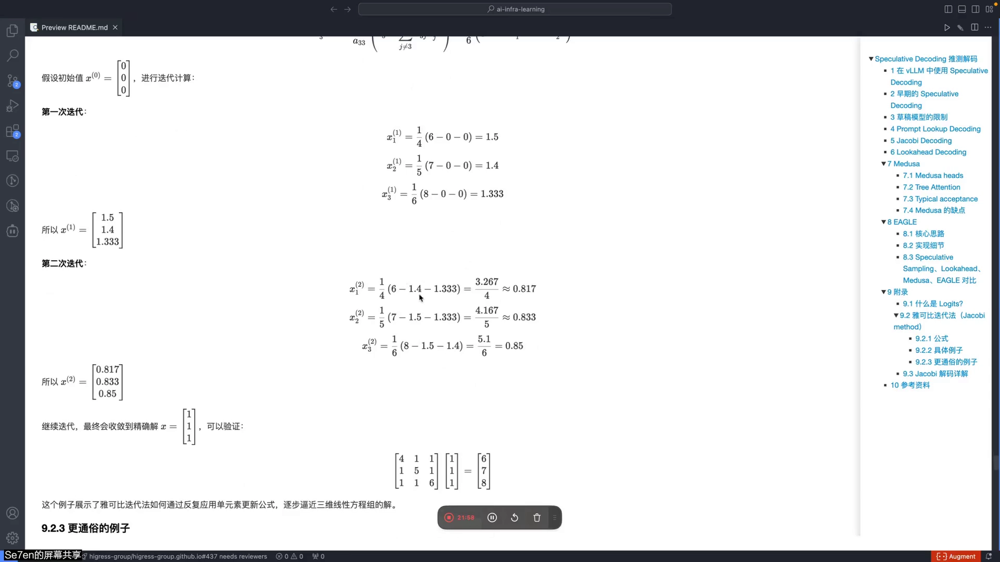 |
| 类似的，就是所有的变量先设定一个初始猜测的 token，你先猜一个 token，然后更新当前的 Y 值，并且为每个方程计算 Y，然后将 Y 值更新为新计算的 Y'，然后重复这个过程，直到停止。OK，这边可以看一下这个例子，比如假设目标的输入是这个 "Alan Turing"， [【跳转到 22:28】](https://www.bilibili.com/video/BV1Q5KWzQEhn/?t=1348) |  |
| 我最终理想生成的序列是 "who was a"，一开始假设他猜的是 "the computer engineer"，然后第一次它会根据 Y0 的值去进行一个推测，比如 Y1 的话他猜的是 "who is" 然后 "pioneer"，对吧，那 "who" 的话其实是修正了第一个， [【跳转到 22:53】](https://www.bilibili.com/video/BV1Q5KWzQEhn/?t=1373) | 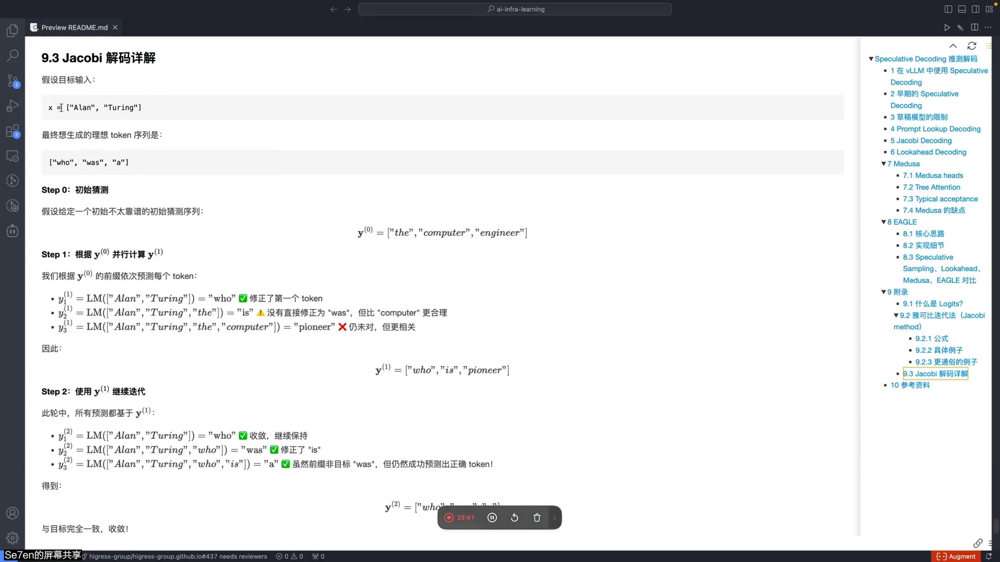 |
| 因为这里其实它会保证第一个词始终是 OK 的，因为它在解码过程中会去保证第一个过程是对的，但后面的话是不一定，因为后面的话等于是也要把带到前面这个方程组嘛去得到。OK，然后比如这边算完，这个是第一次，但虽然还是不对， [【跳转到 23:18】](https://www.bilibili.com/video/BV1Q5KWzQEhn/?t=1398) |  |
| 但是可能比这个合理一点，然后这个预测还是不对。然后第二轮就基于 Y1 的这些值去进行，前面说的这个 "who" 已经纠正过来了嘛，由大模型已经纠正过来，所以说 OK 的不用动。而这一步呢，也是因为这步，第二个就是这个嘛，那就把我修正成 "is"。OK，关键是 "a" 这个，这个的话虽然是…… [【跳转到 23:43】](https://www.bilibili.com/video/BV1Q5KWzQEhn/?t=1423) | 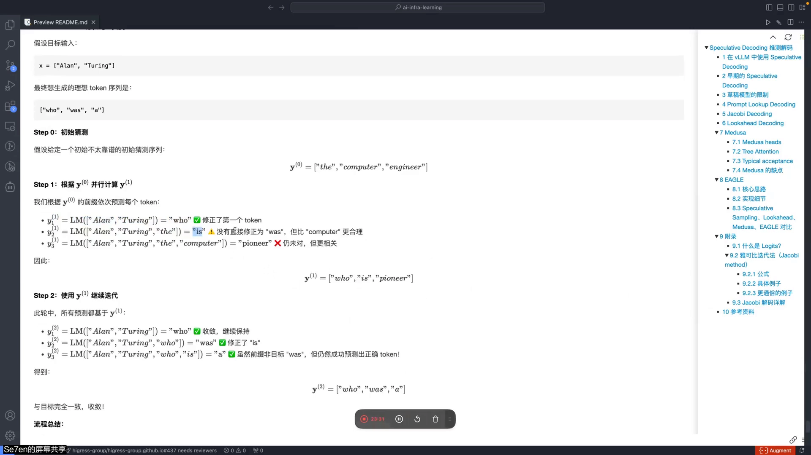 |
| 前面它因为 "is" 是参考这里的这个，就是上一步的这个 "is" 去推测，因为我刚才说的每一步都是 Y2 就是基于 Y1 的值去推测的嘛。虽然上一步这个不是完全对，但是它改对了一点点嘛，还是能够推测出正确的这个 "a"。那这一步就直接拿，就等于说少走了一步。OK，我是这么去理解的。好， [【跳转到 24:08】](https://www.bilibili.com/video/BV1Q5KWzQEhn/?t=1448) | 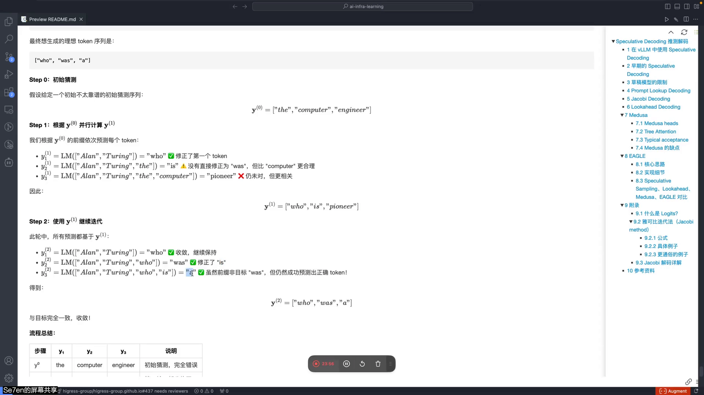 |
| 然后这边会有一个动图，可以简单地看一下，就是再强调一遍，每一轮其实就是用上一轮的结果去做迭代，不断地往里去迭代迭代迭代，然后最终能够逼近一个合理的结果。 [【跳转到 24:33】](https://www.bilibili.com/video/BV1Q5KWzQEhn/?t=1473) | 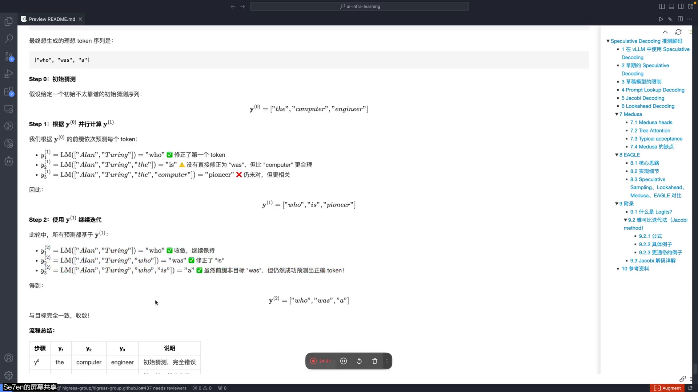 |
| 然后每一轮迭代，靠近的第一个 token 它都会保证是对的，然后再带进去进行计算。比如这里 computer 的就猜对了嘛，对吧，然后就可以直接拿来。因为前面这个步骤都是错的，它等于又要重新地 [【跳转到 24:58】](https://www.bilibili.com/video/BV1Q5KWzQEhn/?t=1498) | 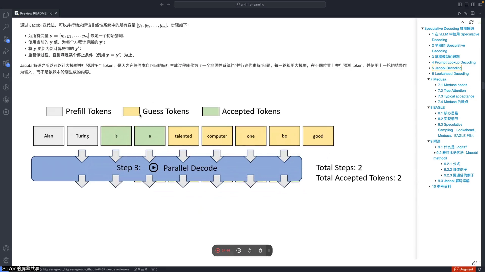 |
| 用大模型去做一个修正，对，然后这部分它也是错的嘛，然后它就是做一个纠正，然后再回去。OK，然后这边给一个稍微通俗的解释嘛。 [【跳转到 25:23】](https://www.bilibili.com/video/BV1Q5KWzQEhn/?t=1523) | 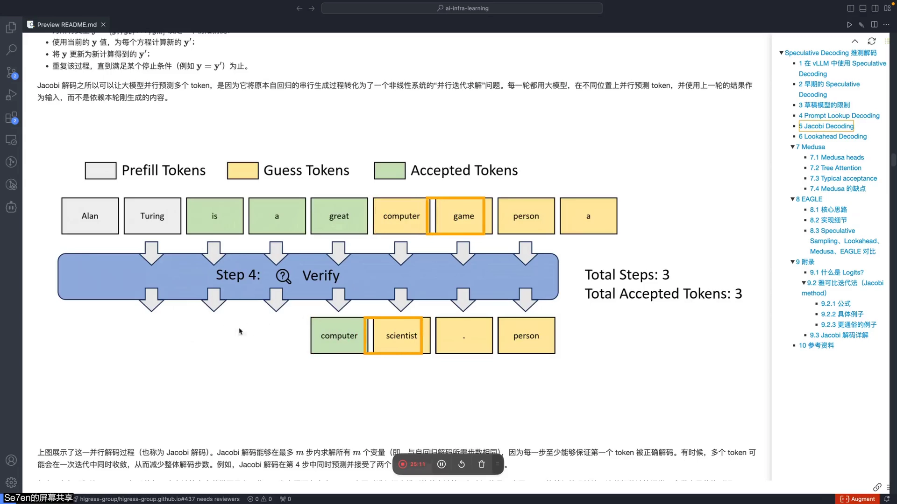 |
| （此区间无字幕） [【跳转到 25:34】](https://www.bilibili.com/video/BV1Q5KWzQEhn/?t=1534) | 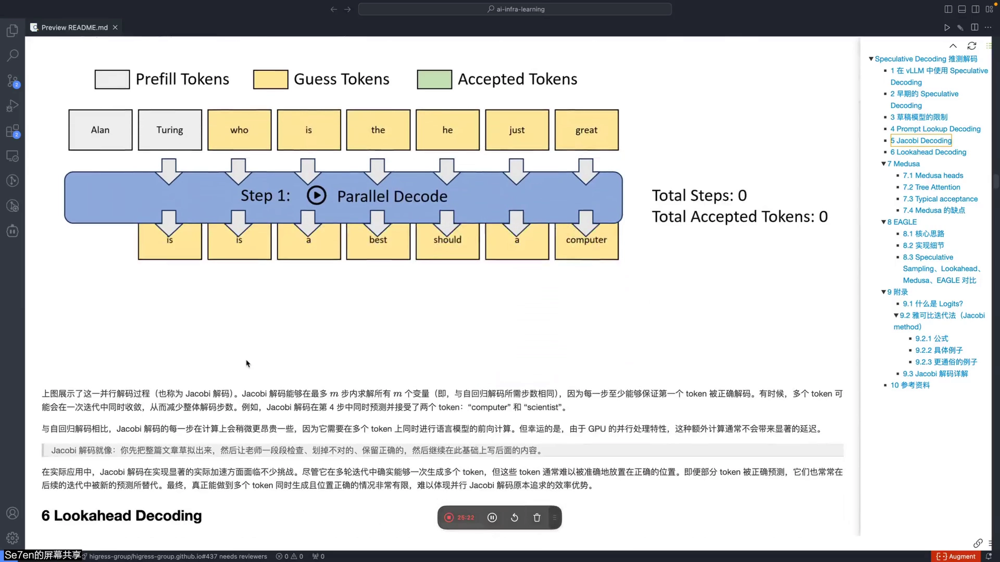 |
| 这个解码就相当于是你把整篇文章先草拟出来，然后模型呢它就像老师一样一段段检查，就是这边先检查，从头检查不对然后你再改，再不对再改再改，就继续往下改，直到全部后面都改对。OK。 [【跳转到 25:39】](https://www.bilibili.com/video/BV1Q5KWzQEhn/?t=1539) | 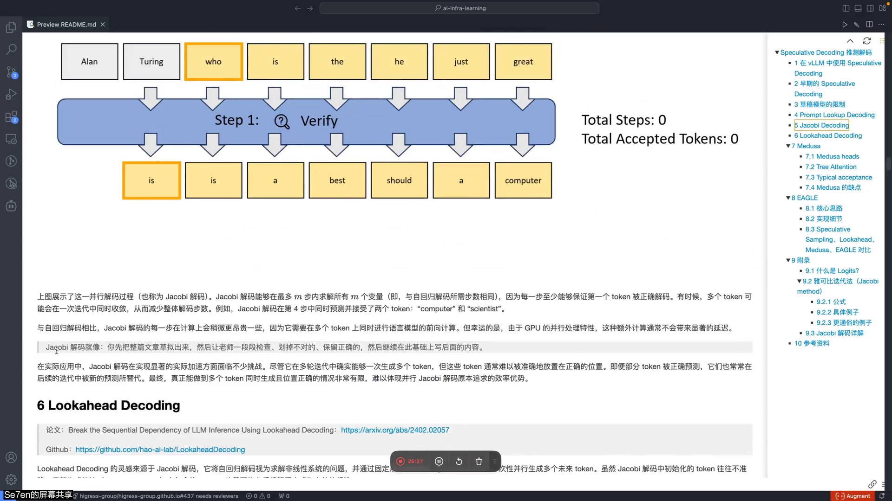 |
| 所以你可以看到它这个猜测，虽然可能有点复杂，但其实性能并没有很好，因为拆出来的这些 token 不是很容易猜对，而且即便是某部分猜对，它的位置可能也不对，所以导致最终真正能用的情况并不是很多。然后于是呢， [【跳转到 26:02】](https://www.bilibili.com/video/BV1Q5KWzQEhn/?t=1562) | 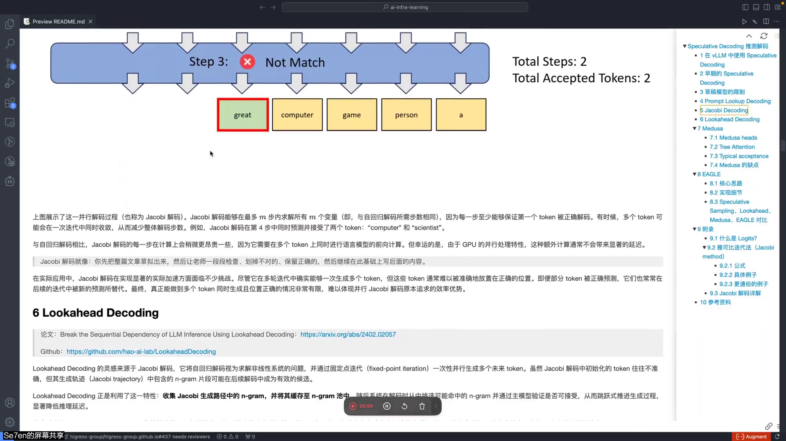 |
| 接下来就有一种新的叫做 Lookahead Decoding，灵感也是来自这个 Jacobi 解码，就基于这个基础上做了一些优化。主要优化就是它在生成过程中呢， [【跳转到 26:26】](https://www.bilibili.com/video/BV1Q5KWzQEhn/?t=1586) | 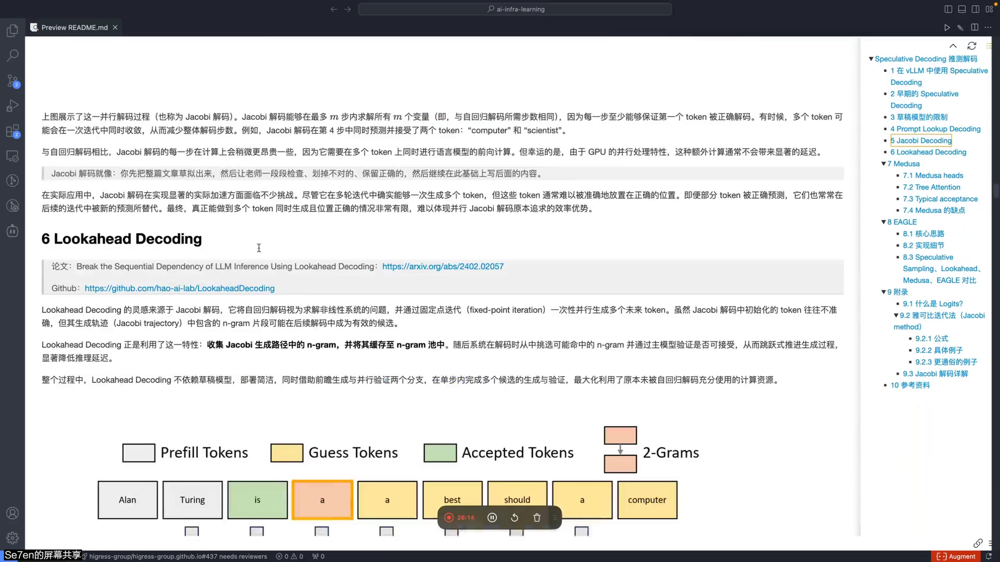 |
| 它会有一些 n-gram，做一个缓存存到缓存池里面，如果随后在解码的过程中能命中这个 n-gram 缓存池，就可以直接拿来用，省得让这个模型再去并行地生成这个 token。可以看一下，比如看一下后面有没有这个例子， [【跳转到 26:41】](https://www.bilibili.com/video/BV1Q5KWzQEhn/?t=1601) | 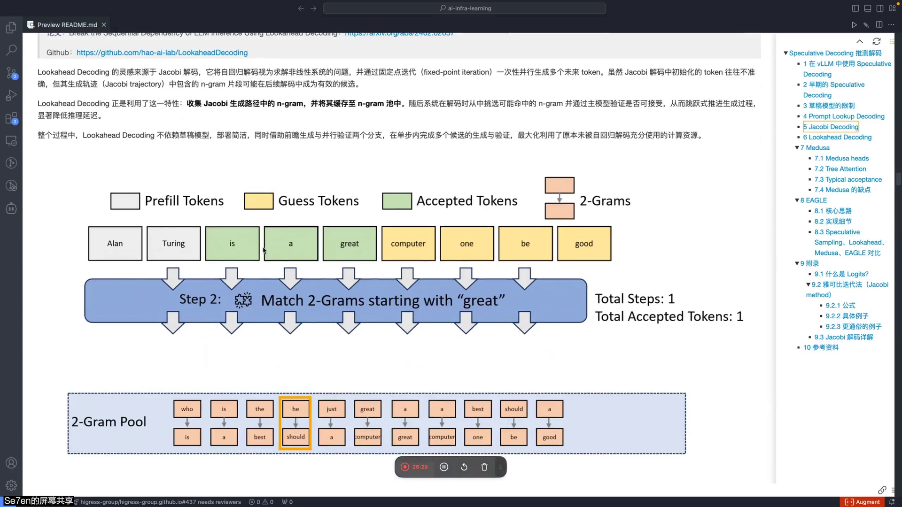 |
| 可能要等到这个图重新走一下，等它走完了，等它走完再看一下，应该快走完了，好，等一下。 [【跳转到 27:06】](https://www.bilibili.com/video/BV1Q5KWzQEhn/?t=1626) | 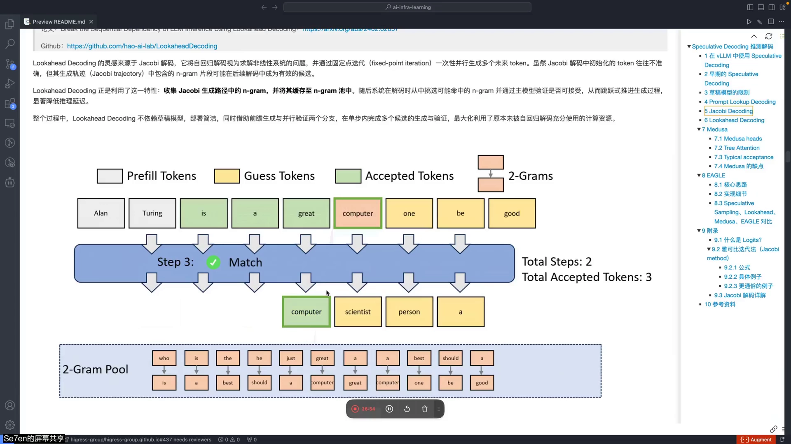 |
| 它这里去查的话这边肯定没有嘛，那就还是需要重新地去 decode 生成的。 [【跳转到 27:31】](https://www.bilibili.com/video/BV1Q5KWzQEhn/?t=1651) | 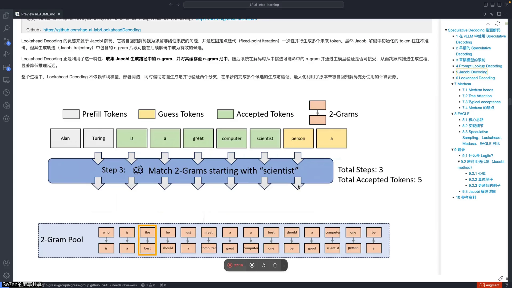 |
| OK，好，重新开始啊。然后它这步先是有一个生成，对吧，去判断是不是匹配，不是匹配的是吧，那还是用模型真正预测的 decode，然后把这些加到 n-gram 的缓存里，就上一步那些并行预测的结果先加进来，然后它开始扫。 [【跳转到 27:56】](https://www.bilibili.com/video/BV1Q5KWzQEhn/?t=1676) |  |
| 比如 "is" 这个，它找到 "a" 这个嘛，就把 "a" 直接拿来了，这步它就不用并行去生成了嘛。再去找后面，这回就是找 "a" 了嘛，没有找到的话那就过了。然后它会去检查这是不是能够匹配的，对上了，然后就直接拿来用了。然后继续找， [【跳转到 28:21】](https://www.bilibili.com/video/BV1Q5KWzQEhn/?t=1701) | 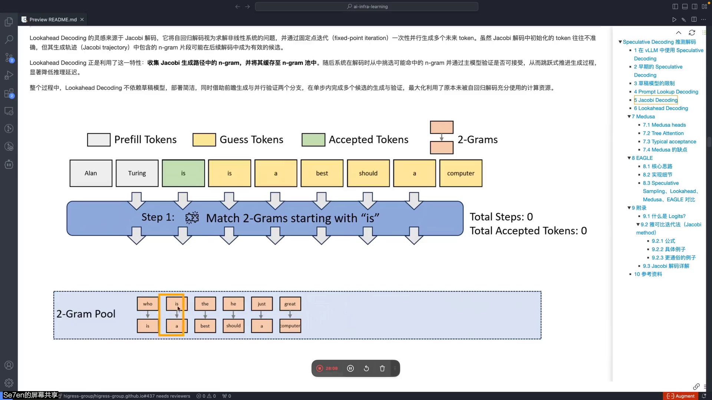 |
| 看下一个能不能再对上。然后这里是不 match 的嘛，那就把 n-gram 拿过来，但是会把之前的这些也加到 n-gram 这个缓存池里。然后第三轮就扫这个 "great" 嘛，那 "great" 的话这里就是有 "computer" 嘛，对吧，所以拿到这个 computer 这个 [【跳转到 28:46】](https://www.bilibili.com/video/BV1Q5KWzQEhn/?t=1726) | 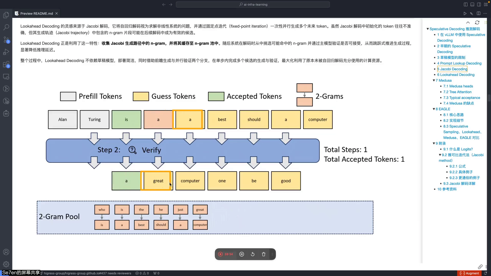 |
| 然后把 computer 这个就直接拿来了，然后再去扫下一个，computer 下面有没有，然后没有。然后它这边并行解码，就基于上面的并行解码然后得到下面，然后去预测，去检查 verify。 [【跳转到 29:11】](https://www.bilibili.com/video/BV1Q5KWzQEhn/?t=1751) | 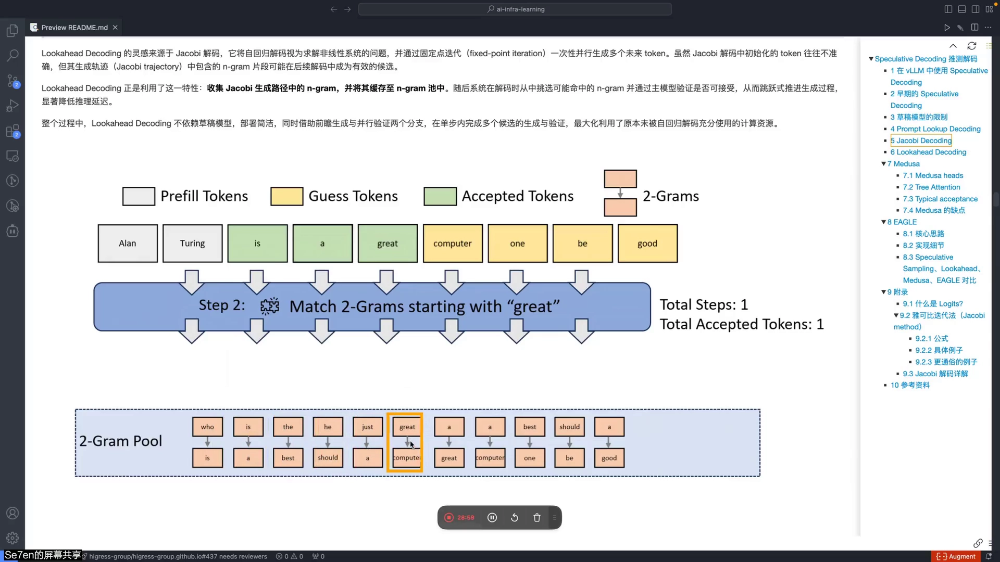 |
| 依次往后 verify。好，然后这一样的，没有命中的那些就放到 n-gram 池。OK，那就简单这样。反正就是说 Lookahead Decoding 呢， [【跳转到 29:36】](https://www.bilibili.com/video/BV1Q5KWzQEhn/?t=1776) | 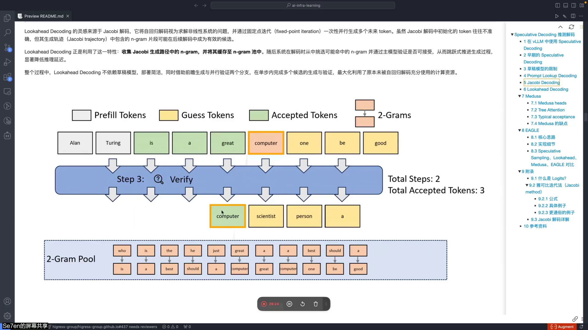 |
| 就是基于这个 Jacobi 解码，它就是新增了这个 n-gram 的池。 [【跳转到 29:52】](https://www.bilibili.com/video/BV1Q5KWzQEhn/?t=1792) | 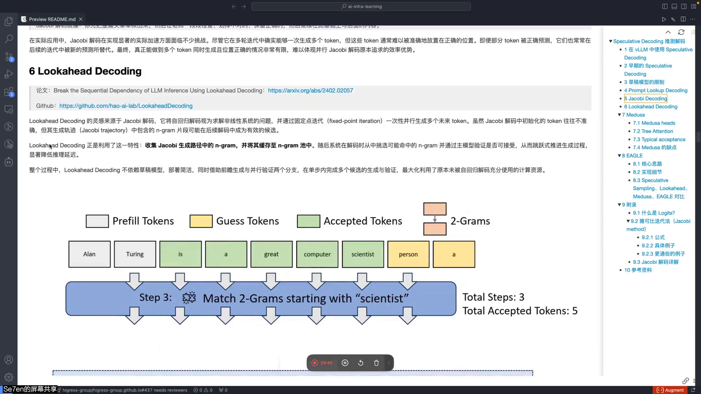 |
| 在这个预测的时候，就是去挑选可能命中的 n-gram，然后给主模型看是不是要接受。OK，好。 [【跳转到 29:59】](https://www.bilibili.com/video/BV1Q5KWzQEhn/?t=1799) | 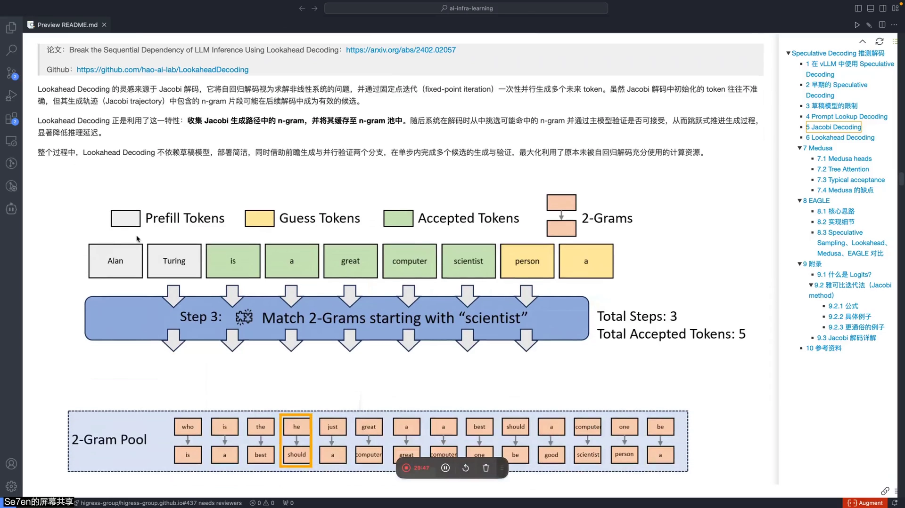 |
| 然后刚刚这两个的话其实是有些艰涩难懂的。 [【跳转到 30:10】](https://www.bilibili.com/video/BV1Q5KWzQEhn/?t=1810) | 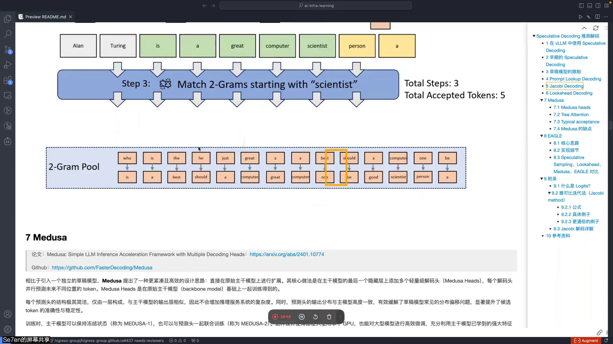 |
| 然后我们接下来看一下，并且其实性能提升也不是很强，那我们接下来看两个比较 [【跳转到 30:15】](https://www.bilibili.com/video/BV1Q5KWzQEhn/?t=1815) | 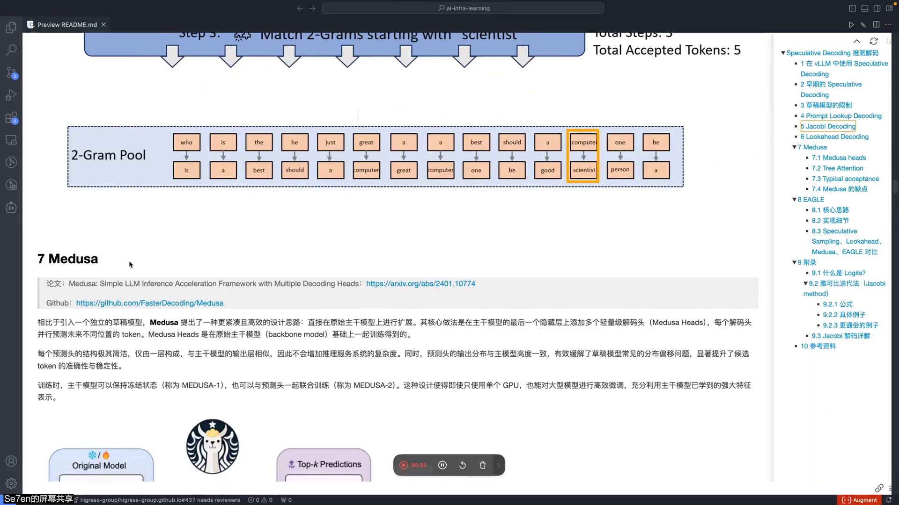 |
| 后面的这些是比较重要的啊。一个是 Medusa，它的论文地址在这里，并且 GitHub 上也有。那相比于引入一个独立的草稿模型，它的思路其实是直接在原始的主干模型上进行扩展，它论文里提到叫 Backbone 的 model。好，具体做法是在最后一个隐藏层 [【跳转到 30:21】](https://www.bilibili.com/video/BV1Q5KWzQEhn/?t=1821) | 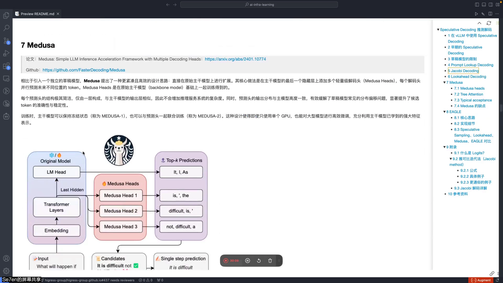 |
| 就这，放（添加）多个轻量级解码头，也就是说它的 head，比如这个例子就是添加了三个，对吧，然后每个解码头去预测不同位置的 token。OK，好，那每个其实它会有 top-k，这里比如是 top-3，那 head1 就预测三个，head2 也是三个，head3 也是三个。然后这个其实原始的这个 model [【跳转到 30:46】](https://www.bilibili.com/video/BV1Q5KWzQEhn/?t=1846) |  |
| 它的 LM head 去得到一个结果。OK，然后因为这个预测头比较简洁，并且只是由一层构成，与主干模型的输入相似，所以不会增加推理系统的复杂度。OK，并且预测头的输出其实跟主干模型是高度一致的，有效缓解了草稿模型常见的 [【跳转到 31:11】](https://www.bilibili.com/video/BV1Q5KWzQEhn/?t=1871) | 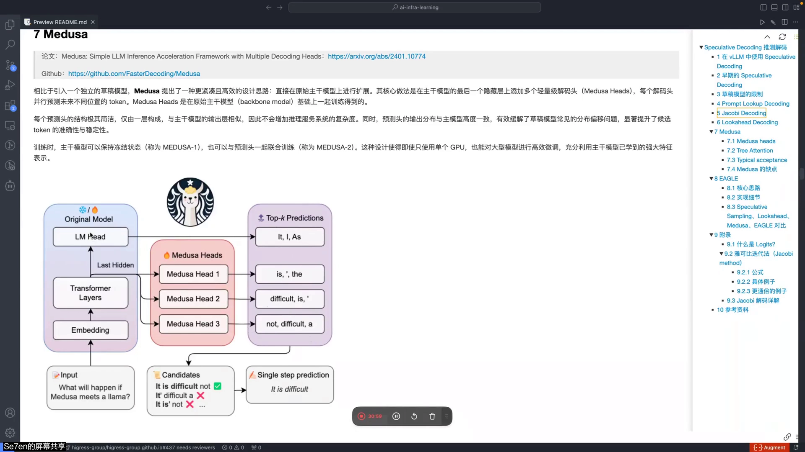 |
| 这些分布偏移的问题，提升了候选 token 的准确性和稳定性。那它有两种训练方式：一种是 Medusa-1，训练的时候，因为这个头也是要训练得到的嘛，Medusa-1 可以训练时让主干模型保持冻结状态，或者说是与主预测，就是与主干模型这个头一起拿来训练；训练的时候呢 [【跳转到 31:36】](https://www.bilibili.com/video/BV1Q5KWzQEhn/?t=1896) |  |
| 只要使用单个 GPU 就是足够的。OK，那刚说的有 Medusa-1 跟 Medusa-2 两种。其实应该是 Medusa-1 的话，它的准确性可能没有那么高，那么 Medusa-2 进行联合训练的话，它的准确性会更高。OK，好，那我们先来看一下它的三个组成部分。 [【跳转到 32:01】](https://www.bilibili.com/video/BV1Q5KWzQEhn/?t=1921) | 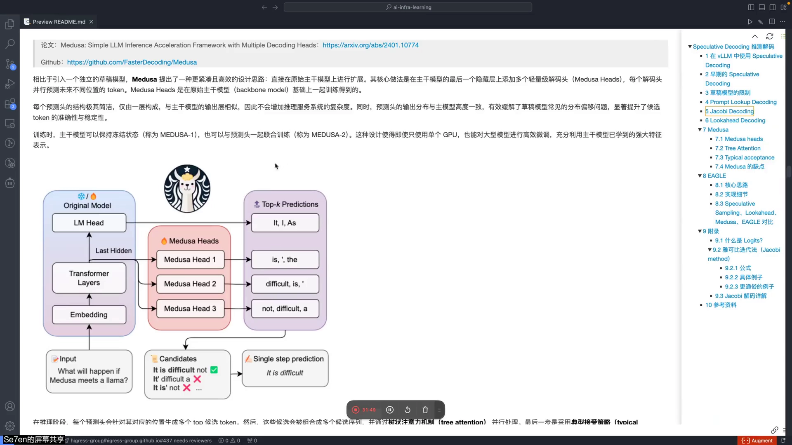 |
| 刚说的一个 Medusa 的 headers，还有一个它的 tree attention，就是来验证这些 token 是不是 OK 的，然后还有一个是它的接受策略。OK，它使用了一个典型的接受策略 typical acceptance。前面说的这个早期 Speculative Decoding 其实是用了拒绝采样的策略了，对吧。 [【跳转到 32:26】](https://www.bilibili.com/video/BV1Q5KWzQEhn/?t=1946) | 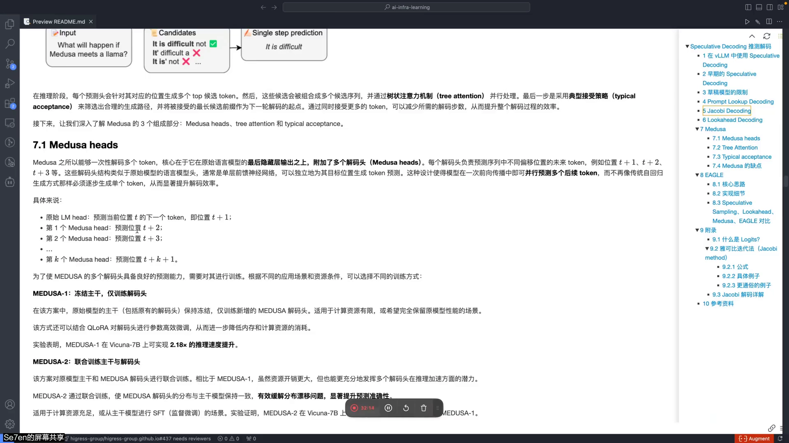 |
| 那看一下，Medusa 之所以能够一次解码多层 token，核心就在于它是在原始模型最后的隐藏层的输出上去加了多个解码头，每个解码头负责预测序列中不同位置的未来 token，比如 T+1、T+2、T+3 的时刻。OK，有的，但是它有个问题，它预测的时候呢 [【跳转到 32:51】](https://www.bilibili.com/video/BV1Q5KWzQEhn/?t=1971) | 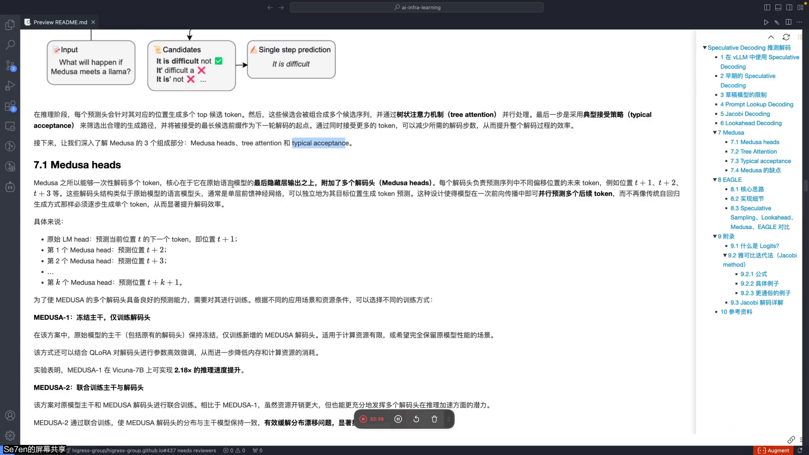 |
| 其实，就是它的 head2 预测的它不会参考 head1，它参考之前的；OK，head3 也是参考这里的，从 hidden state 过来的。OK，所以说它们之间是没有一个依赖性的，所以它在预测的时候也是并行。但是呢并行又带来一个问题，它预测的也有可能不准。 [【跳转到 33:16】](https://www.bilibili.com/video/BV1Q5KWzQEhn/?t=1996) | 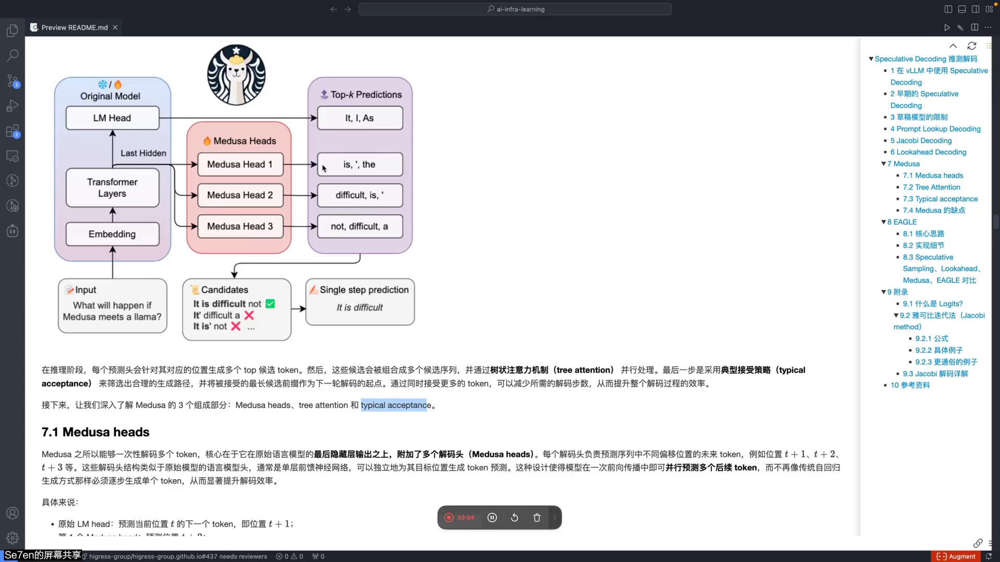 |
| 因为我说的它是不是依赖的，head3 跟 head2、head1 之间是没有依赖关系的，它都是基于上一次的 hidden state 去进行一个预测的。OK，这里再强调一下。好，然后刚刚就说了两种的模型，一种是 Medusa-1，冻结主干进行训练解码头，OK，这种适用于计算资源有限的一个情况。 [【跳转到 33:41】](https://www.bilibili.com/video/BV1Q5KWzQEhn/?t=2021) |  |
| 那么 Medusa-2 就是联合地训练主干与解码头，虽然开销会更大一点，但是也能充分利用多个解码头在推理方面加速的一个潜力。可以看到 Medusa-1 大概可以在这个 7B 模型上实现 2.18 的一个速度提升，那么 Medusa-2 大概是 2.83 的一个性能提升。 [【跳转到 34:06】](https://www.bilibili.com/video/BV1Q5KWzQEhn/?t=2046) |  |
| OK，然后 Medusa-2 它有几个关键的训练策略。一个是差异化的学习率，因为主干模型已经是充分训练好、比较稳定的，而这个解码头我是基于主干模型去预测的，仍处于早期的学习阶段，所以说我主干模型使用较小学习率嘛。 [【跳转到 34:31】](https://www.bilibili.com/video/BV1Q5KWzQEhn/?t=2071) | 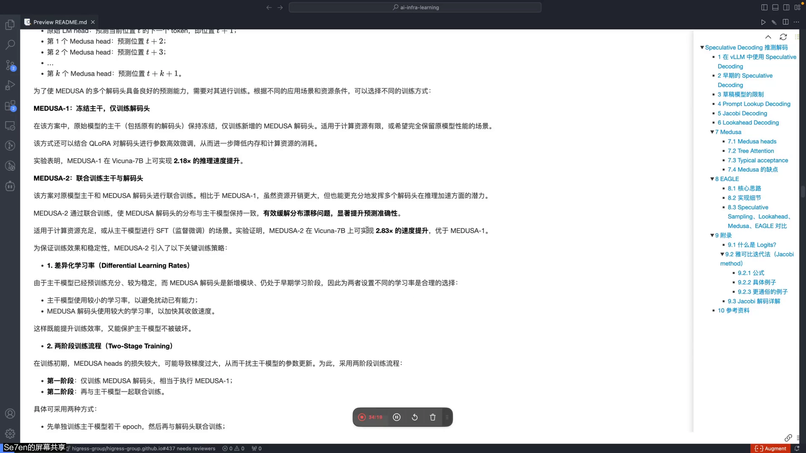 |
| 学习率就是它去调整的一个可改变的幅度，学习率越小，改变的幅度就越小嘛，所以我主干模型就用较小的学习率，避免去做更多的改动。那么解码头呢，我就使用较大学习率去加快它的收敛速度。OK，然后还有一个就是两阶段的训练，那第一阶段的话 [【跳转到 34:56】](https://www.bilibili.com/video/BV1Q5KWzQEhn/?t=2096) | 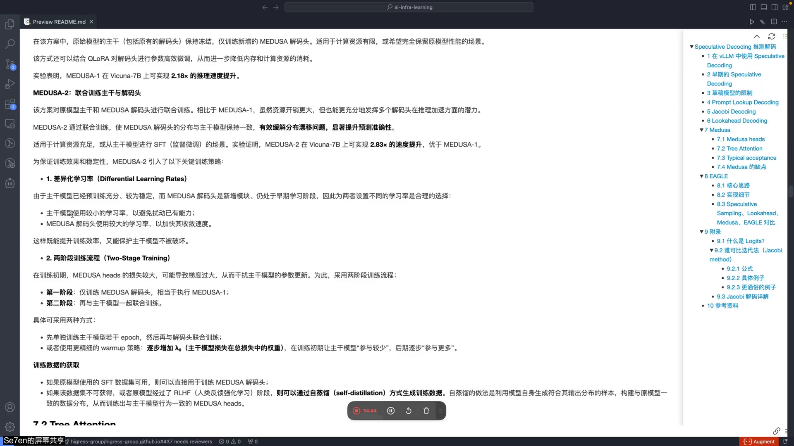 |
| 就是仅训练 Medusa 的解码头，就相当于是训练 Medusa-1；然后第二阶段的话就是跟主干模型一起联合训练。OK，那这就是 Medusa header 的一个简单介绍。然后刚才说的它在判断 verify 的时候呢，它就会使用这个 tree attention 这个机制。因为 Medusa 在推理的时候呢 [【跳转到 35:21】](https://www.bilibili.com/video/BV1Q5KWzQEhn/?t=2121) | 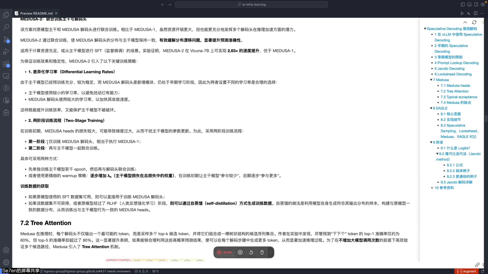 |
| 它会输出多个 top-k 的 token 候选嘛，这样其实可以组成一个相当于树状的结构。好，可以看到比如 head1 是 "it" 跟 "I"，那 head2 是 "is" 这个点然后 "the"，那比如 "it" 其实我是能对三个这个 head2 的嘛，对吧，那 "I" 的话也是三个一样的，对，三个一样的，对吧。好， [【跳转到 35:46】](https://www.bilibili.com/video/BV1Q5KWzQEhn/?t=2146) | 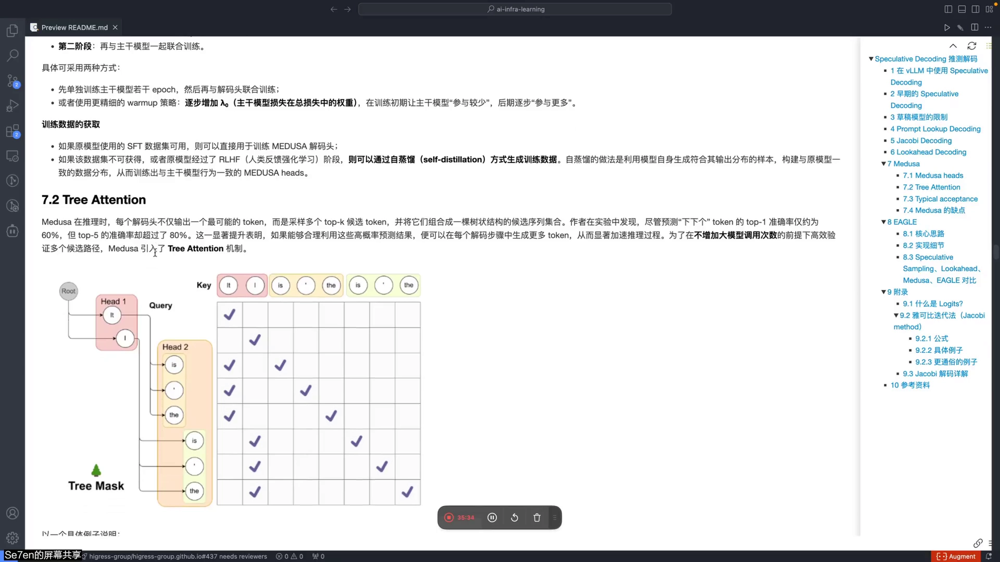 |
| 那我这就相当于是形成了一颗 tree 的一个路径嘛，所以说相当于是 2×3 嘛，对吧，2×3 的话是不是就是有六条路径，对吧。那如果我没有做这种优化的话，我在 verify 的过程中，可能由于路径过多的话可能会去影响性能，所以引入 tree attention 的话，就是想在不增加这种大模型 [【跳转到 36:11】](https://www.bilibili.com/video/BV1Q5KWzQEhn/?t=2171) | 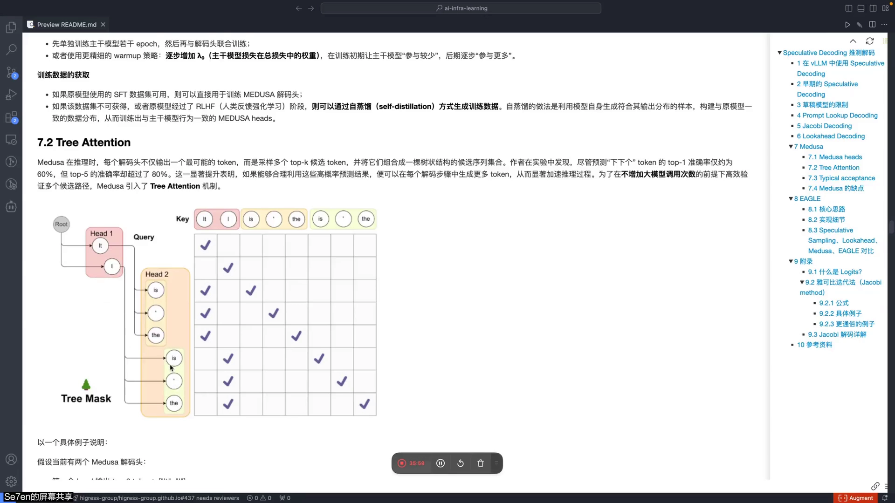 |
| decode 的次数的前提下，我去高效验证多个候选路径。啊，具体来说，它为了避免每条路径对大模型逐位验证嘛，它首先将这个候选路径的 token 扁平展开为一个连续序列。比如前两个是 "it i"，后两个，比如这个是 header1 的， [【跳转到 36:36】](https://www.bilibili.com/video/BV1Q5KWzQEhn/?t=2196) | 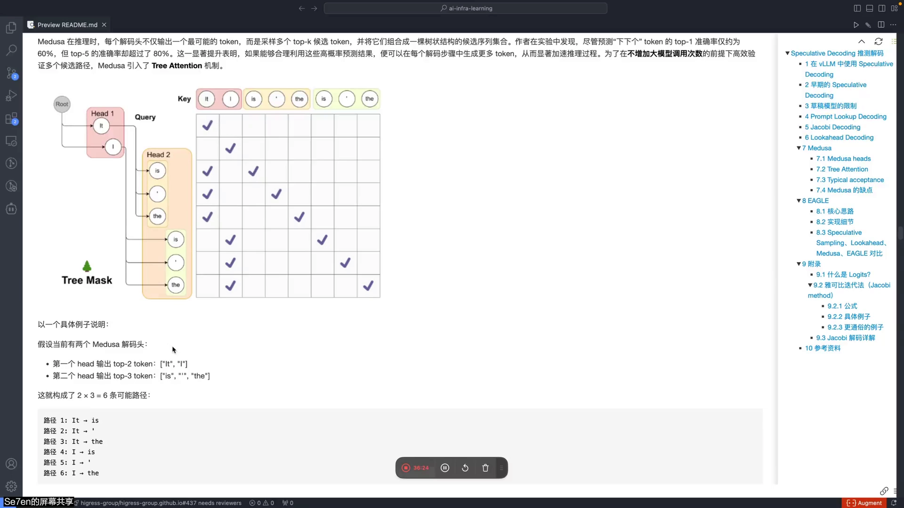 |
| 就 header2、header2 的这些候选，因为它对于他的，然后这也是 head 的候选，但是会是对于 "I" 的嘛，对吧。通过这种方式进行展开，然后接着去构建这个 attention mask。那这就是有一些限制条件，比如你的 "it" 跟 "it i" 之间，你这之间是不应该有联系的，对吧，然后这里的 "it" 呢是跟这里的 "is"。 [【跳转到 37:01】](https://www.bilibili.com/video/BV1Q5KWzQEhn/?t=2221) | 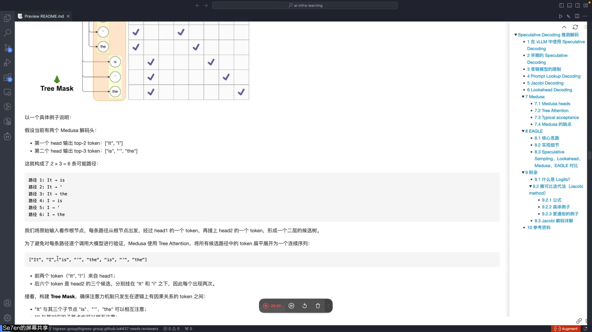 |
| 跟点跟了关系，"I" 的话是跟这三个是有关系的，所以它构建这个 tree mask 的话是会有些限制。然后将这个构建好的 mask，然后进行一个 verify，就去验证一下，通过一次调用就把所有的路径去验证，这个效果。OK。 [【跳转到 37:26】](https://www.bilibili.com/video/BV1Q5KWzQEhn/?t=2246) | 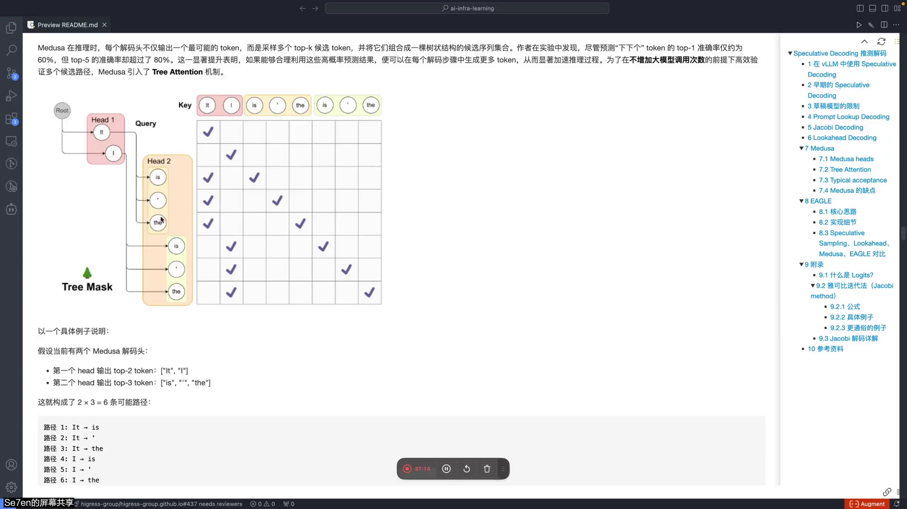 |
| 然后关于 Medusa 第三个部分，就是它的一个典型性的接收。就是前面提到了，在传统的 Speculative Decoding 中，最常用的一个验证方法就是拒绝采样 rejection sampling。它就是首先草稿模型生成多个候选 token，然后原始的大模型逐个验证这些 token 是否符合概率分布。 [【跳转到 37:51】](https://www.bilibili.com/video/BV1Q5KWzQEhn/?t=2271) | 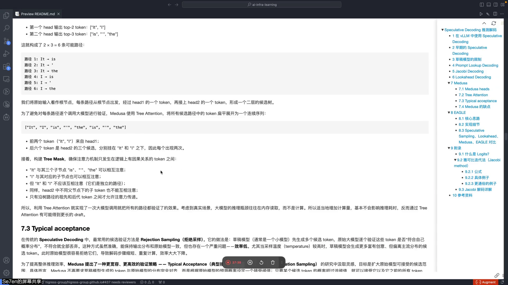 |
| 如果不符合就会全部丢弃。那这种方法一个好处就是比较准确，能够保持与原始模型一致的分布，但是问题就是它的效率比较低。OK，尤其是采用温度比较高的情况下，像草稿模型可能会生成比较富有创意的一些结果嘛，那这种时候就会比较容易偏离 [【跳转到 38:16】](https://www.bilibili.com/video/BV1Q5KWzQEhn/?t=2296) |  |
| 偏离这种主模型的一个 token 分布嘛，这时候原始的模型就很容易去拒绝他们，好，就会导致解码步骤会多次失败被拒，然后进行一个重复。好，然后为了提高整体效率，Medusa 就提出了一种更宽容更有效的验证策略，比如 typical acceptance。 [【跳转到 38:41】](https://www.bilibili.com/video/BV1Q5KWzQEhn/?t=2321) | 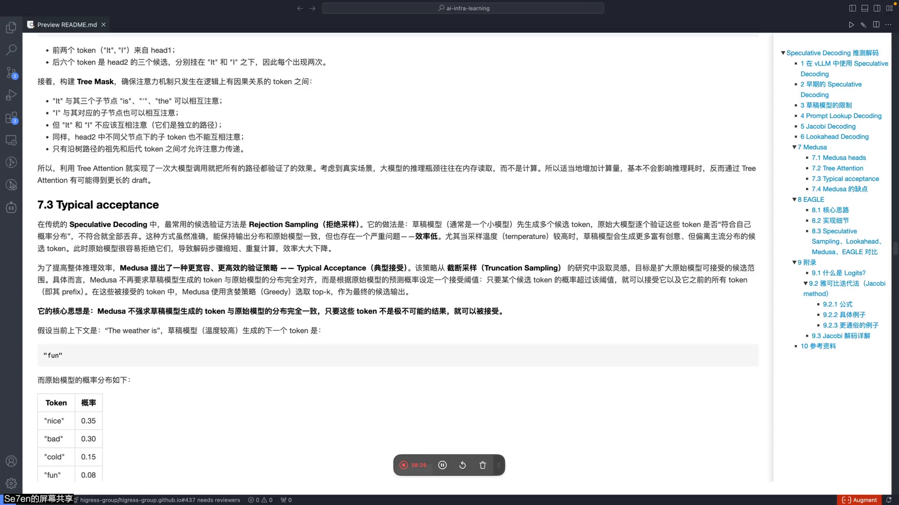 |
| 那这种策略就是扩大了原始模型可以接受的候选范围，就是 Medusa 不再要求草稿模型生成的 token 和原始模型完全分布对齐，而是根据原始模型预测的概率设定一个阈值，只要某个候选 token 的概率超过阈值，就可以接受它和之前所有 token。OK，那比如这里有个例子啊， [【跳转到 39:06】](https://www.bilibili.com/video/BV1Q5KWzQEhn/?t=2346) |  |
| 比如假如当前的上下文是 "the value is"，对吧，那比如说这个时候我草稿模型温度比较高，就是那个 "fun"，那这个其实也不是特别常见的，对不对，然后它可能会觉得比较有趣就生成一个 "fun"。然后比如原始模型的概率分布是这样的，对吧，这个 "nice" 是 0.35，这边 "fun" 只有 0.08。 [【跳转到 39:31】](https://www.bilibili.com/video/BV1Q5KWzQEhn/?t=2371) | 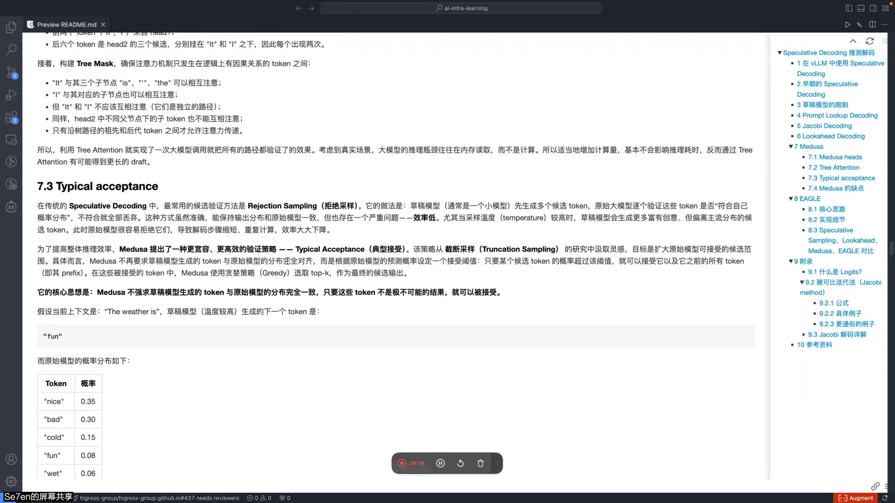 |
| 假定我们为这个 typical acceptance 设置一个阈值是 90，那我进行累加嘛，从概率高到概率低进行累加，累加到这里的话是 0.88，好，所以说也就是还低于 90%，这个之前的我还是能接受的。那 "weight" 的话这里超过 0.94，后面就不接收了。好，那我们对比一下它是怎么做的。 [【跳转到 39:56】](https://www.bilibili.com/video/BV1Q5KWzQEhn/?t=2396) | 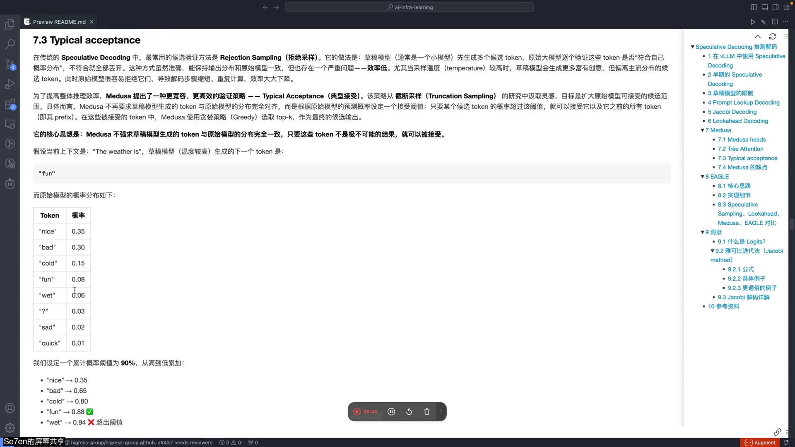 |
| rejection sampling 的话，就是去判断，如果草稿模型生成的这个 token 的概率比较低的话，它就会去拒绝，就是判断的方式就是前面刚才说的 [【跳转到 40:21】](https://www.bilibili.com/video/BV1Q5KWzQEhn/?t=2421) | 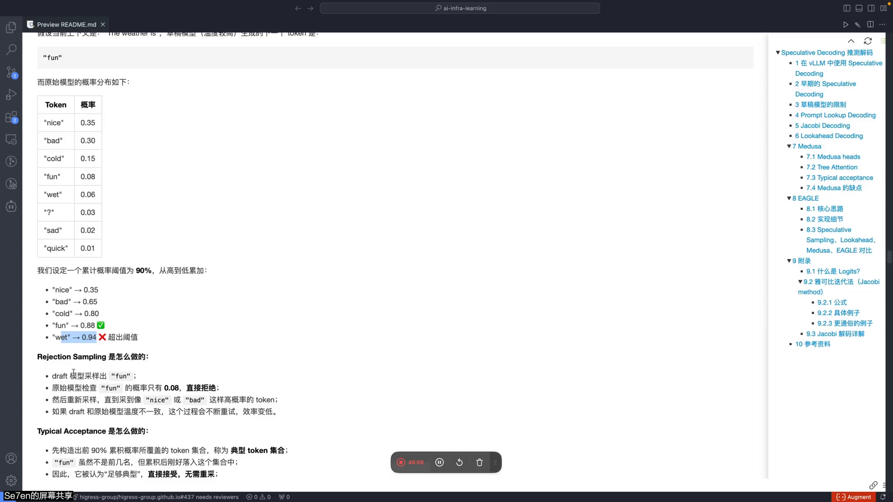 |
| 这里会进行一个比，比如我目标模型这个 "fun" 的概率，去除以草稿模型的这个 "fun" 的概率，对吧，如果说是比较接近的话才会去接收嘛，对吧，目标模型的除以草稿模型的。OK，然后对，那假如说是 rejection sampling 的话， [【跳转到 40:36】](https://www.bilibili.com/video/BV1Q5KWzQEhn/?t=2436) | 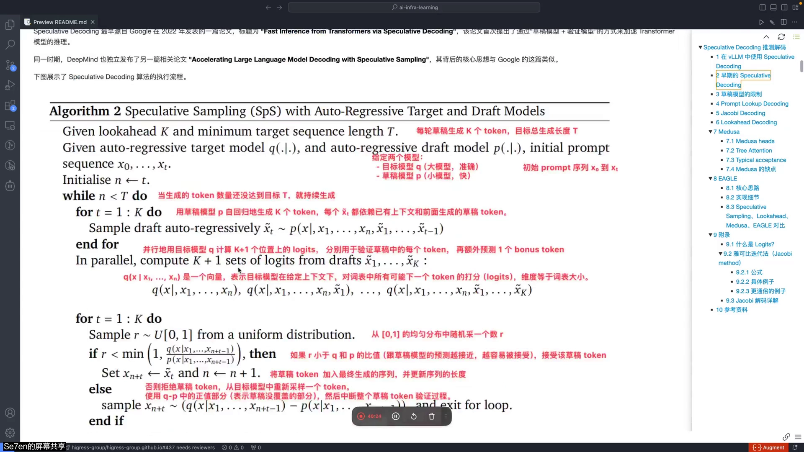 |
| 他可能就直接拒掉了，对吧。那 typical acceptance 的话，就是因为前面说的它还是落在这个 90% 的累计概率里面，还算前几名吧，就是认为它是一个典型的 token 集合。OK，那就会把这个加进去，只要不是那种，主要是目标模型 [【跳转到 41:01】](https://www.bilibili.com/video/BV1Q5KWzQEhn/?t=2461) | 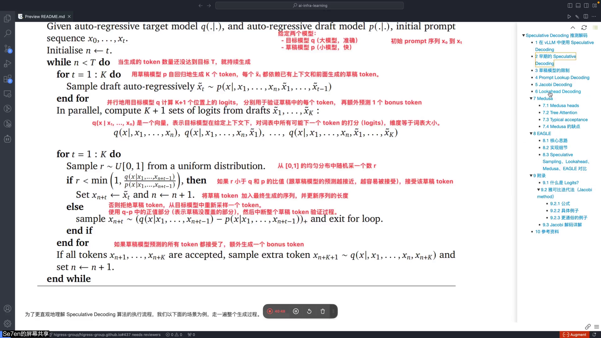 |
| 认为不太容易出现、极不可能出现的，它其实都要，这就是典型接收策略的一个核心嘛。OK，也就是说再重复一遍，这边核心思想就是 Medusa 不强求草稿模型生成的 token 与原始模型分布完全一致，意思就是比较接近、非常接近，那只要要求这些 token [【跳转到 41:26】](https://www.bilibili.com/video/BV1Q5KWzQEhn/?t=2486) | 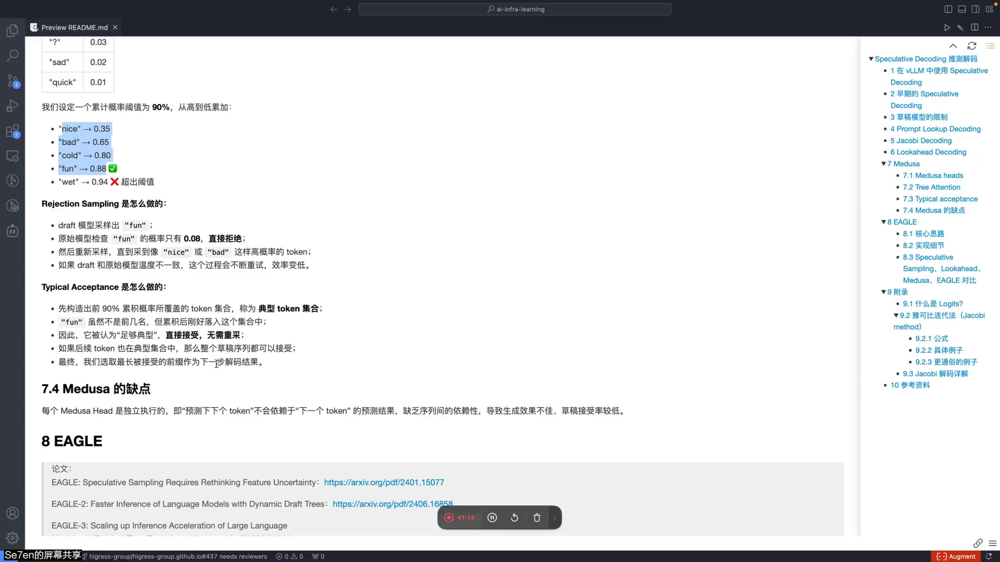 |
| 不是这种极不可能的结果，就可以去接受了。OK，也就是说它更宽容。啊，这就是 Medusa 的一个介绍。那我们其实 Medusa 也是有缺点的，因为我前面说的 Medusa 的每个 header 是独立进行计算的，就是说我在预测下下个 token 的时候不会依赖下一个 token 的结果， [【跳转到 41:51】](https://www.bilibili.com/video/BV1Q5KWzQEhn/?t=2511) | 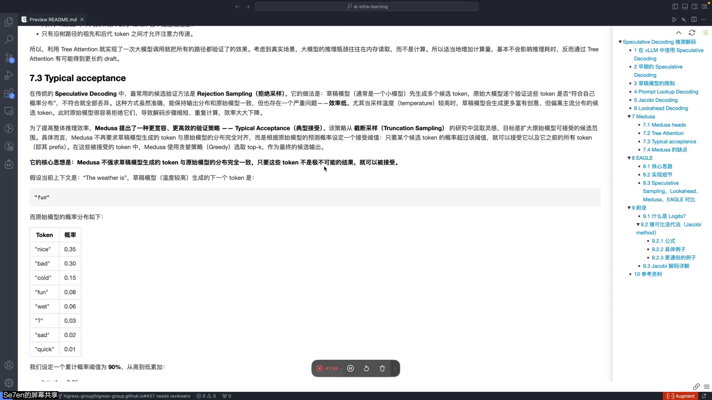 |
| 就是每个 token 之间，跟我刚才说的每个 header 之间，它预测的几个结果，这个的结果是不依赖于这个结果的，并且这个结果也是不依赖于这个结果，它们是互相的、自己独立的运算，就是根据之前这个 last hidden state 这边的结果进行一个并行的一个预测。 [【跳转到 42:16】](https://www.bilibili.com/video/BV1Q5KWzQEhn/?t=2536) | 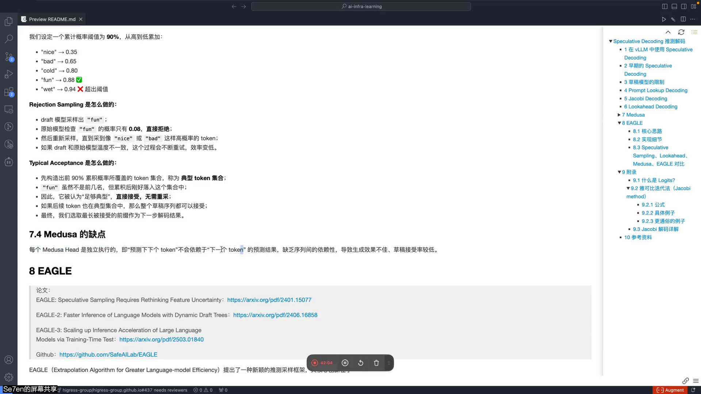 |
| 所以说它这么去预测的话，其实准确性可能也是有问题的，对不对。好，那最后讲一个这个，就是比较重要的，因为它的话首先能够，其实在第三方的评估中可以看到这个图，它是跟了这个 vanilla（常规解码），就是我们前面说的这种早期的常规的 Speculative [【跳转到 42:41】](https://www.bilibili.com/video/BV1Q5KWzQEhn/?t=2561) | 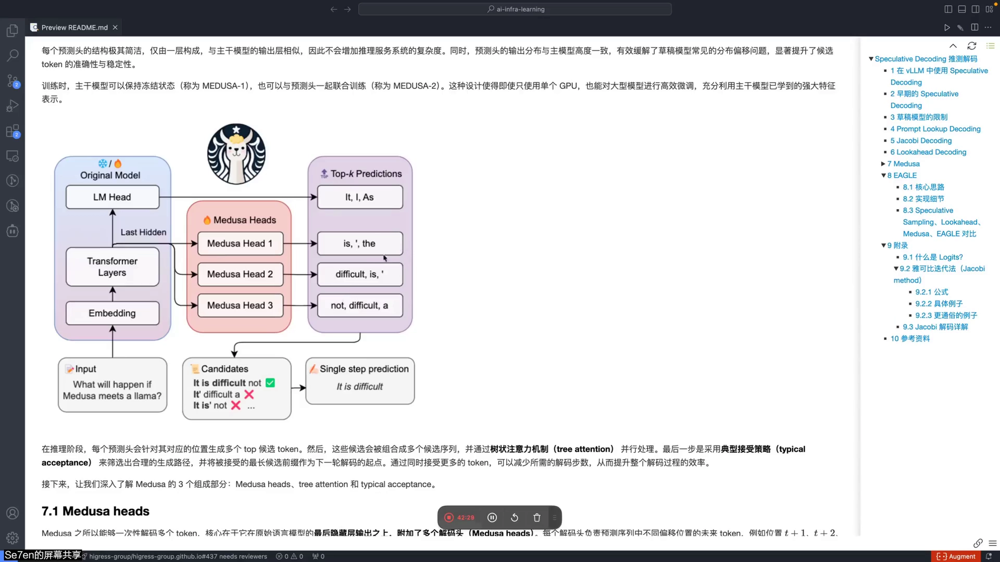 |
| Decoding 的方式进行一个对比，还有跟 Medusa 还有我们前面说的 Lookahead 这种方式进行一个对比。就是说它会比常规的解码快三倍，在 13B 的模型上，比 Lookahead 是快两倍，比 Medusa 的话是快了 1.6 倍。所以说它是目前来说应该是性能最好的一个方式。 [【跳转到 43:06】](https://www.bilibili.com/video/BV1Q5KWzQEhn/?t=2586) | 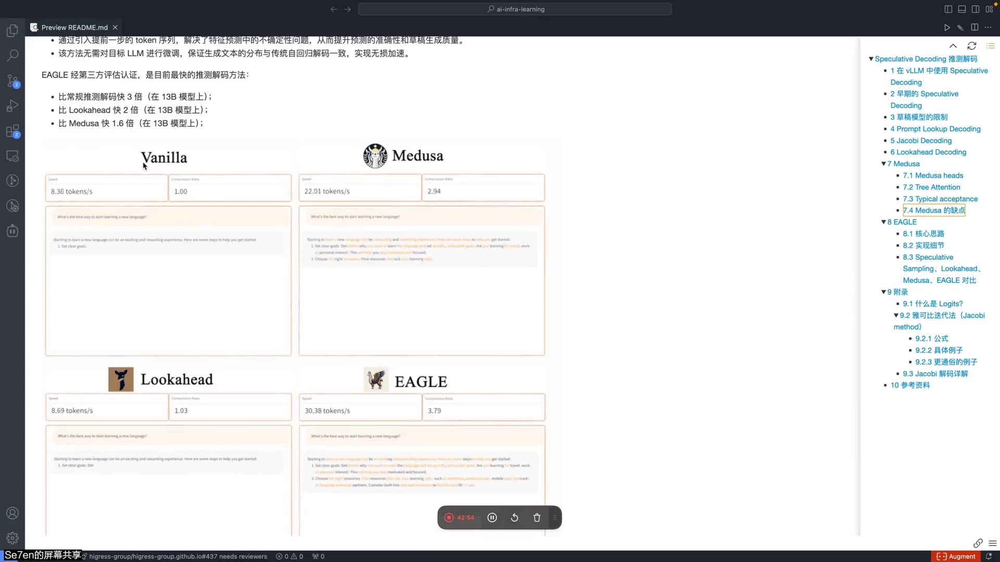 |
| 并且这篇论文其实已经有迭代三份了，一个是 EAGLE-1、EAGLE-2、EAGLE-3，那现在肯定是 EAGLE-3 的话应该性能最好。不过我们今天的话就是简单先看看它第一篇论文 EAGLE 中的那些介绍、这些原理。OK，它的一个核心在于，它是在这个特征层级 [【跳转到 43:31】](https://www.bilibili.com/video/BV1Q5KWzQEhn/?t=2611) | 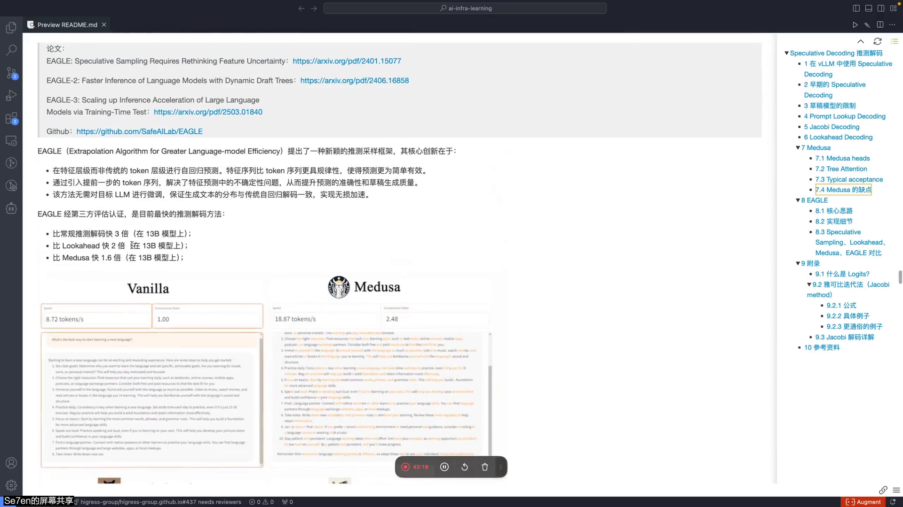 |
| 而非传统的这个 token 层级进行一个自回归预测。因为它们认为在特征序列其实是会比在 token 序列更具有规律性，就使得预测更简单高效。OK，然后第二个就是通过提前引入提前一步的 token 序列去解决特征预测中的不确定性问题，综合提升预测的准确性和草稿生成质量。 [【跳转到 43:56】](https://www.bilibili.com/video/BV1Q5KWzQEhn/?t=2636) |  |
| 另外它其实是属于无损的一种方式进行加速。好，那后面的话我会这边详细说一下它这主要这两点究竟是什么意思。好，嗯，这边也提一下，其实在 vLLM 中也是支持使用 EAGLE 的，你可以通过这个方式去配置 EAGLE 的一个草稿的模型。比如说 EAGLE 的话 [【跳转到 44:21】](https://www.bilibili.com/video/BV1Q5KWzQEhn/?t=2661) | 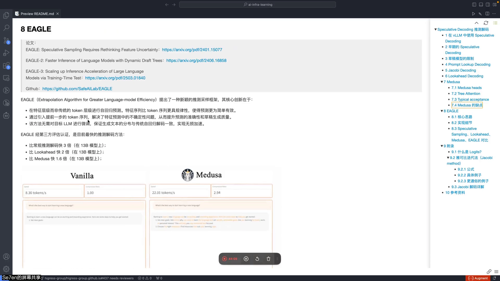 |
| 它也是需要用到草稿模型的。我们前面说的像这种 Jacobi 解码、Lookahead Decoding 跟 Medusa 以及这个 Prompt Lookup Decoding，这四种方式其实是不使用草稿模型的，对不对。那不使用草稿模型的话，一个就是它可能预测的时候 token 之间是相互的关系，它没有去进行一个把握嘛， [【跳转到 44:46】](https://www.bilibili.com/video/BV1Q5KWzQEhn/?t=2686) | 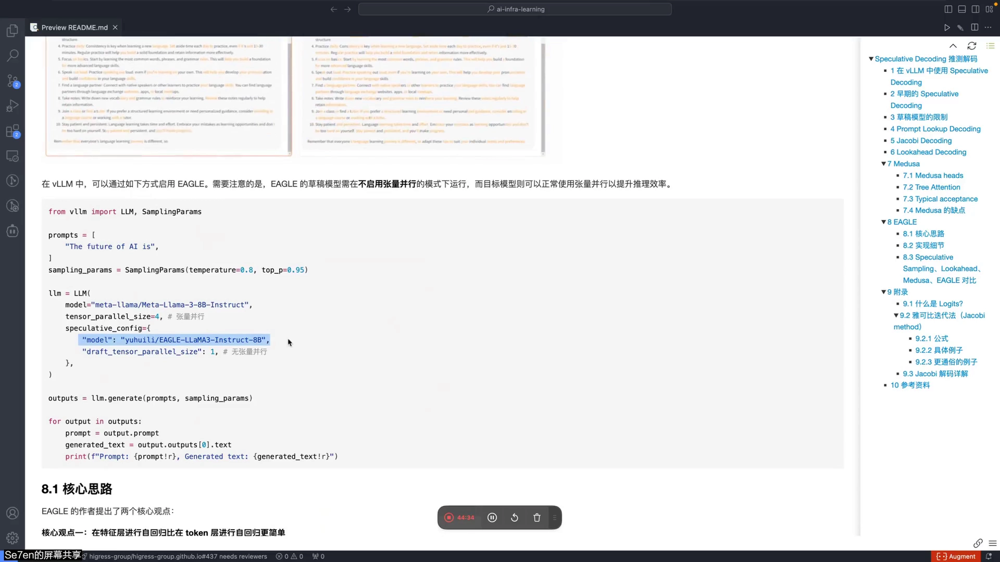 |
| 所以导致有时候预测的时候 token 经常准确性是比较低的。那能提升 Speculative Decoding 性能的一个很重要的点，就是要提升它的一个接受率，就 acceptance rate。你猜的多其实并不是重要，关键是你要猜得多、猜得快，猜得多又能猜得准，对吧，猜得准才是最重要的。如果你拒绝概率太高的话， [【跳转到 45:11】](https://www.bilibili.com/video/BV1Q5KWzQEhn/?t=2711) | 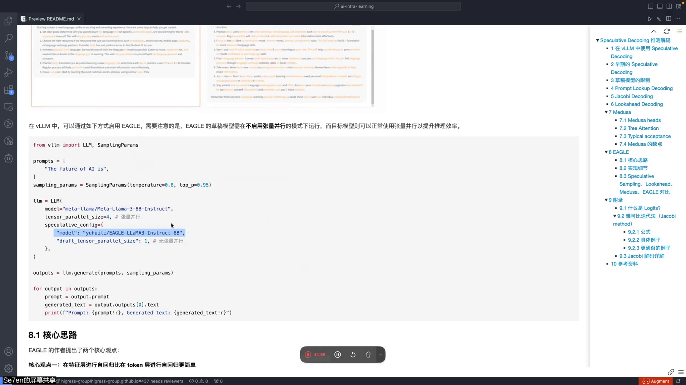 |
| 你猜得再多其实反而也会影响性能，因为你在验证的时候其实也是需要一些计算的消耗，对吧。那也就看到这里的话，其实就是指定了一个 EAGLE 的一个 draft model，对吧，然后进行一个设置。然后我们看一下它的一个核心思路，也就是说它这里论文中是提供了 [【跳转到 45:36】](https://www.bilibili.com/video/BV1Q5KWzQEhn/?t=2736) | 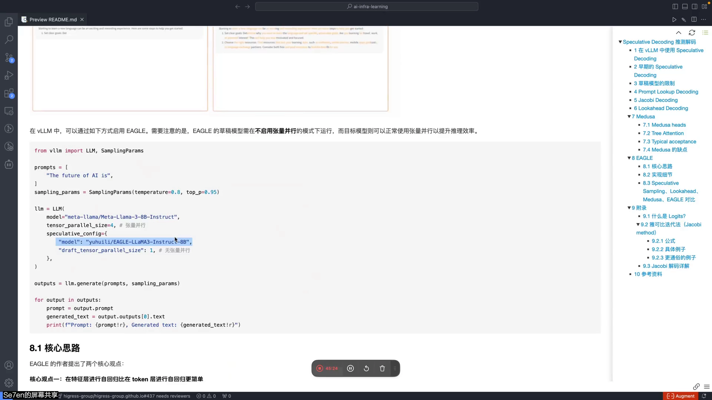 |
| 提出了两个核心的观点：一是在特征层进行自回归是会比在 token 层进行自回归更简单。OK，那这边说的特征层是指的 LM 倒数第二层的输出，也就是说进入 LM head 之前这个 hidden state 的一个输出。OK，你可以看到 Medusa 的话其实也是依赖这里嗯 [【跳转到 46:01】](https://www.bilibili.com/video/BV1Q5KWzQEhn/?t=2761) |  |
| 我这边卡了，看一下。对，你看 Medusa 这里其实也是从 last hidden state 直接去拿的，对吧，然后去进行一个预测。但是 Medusa 呢，它就是没有去考虑每个预测之间的一个关系嘛，所以为什么 Medusa 的一个性能差。然后我刚才说了 EAGLE 的话，它其实是前面说了 [【跳转到 46:26】](https://www.bilibili.com/video/BV1Q5KWzQEhn/?t=2786) | 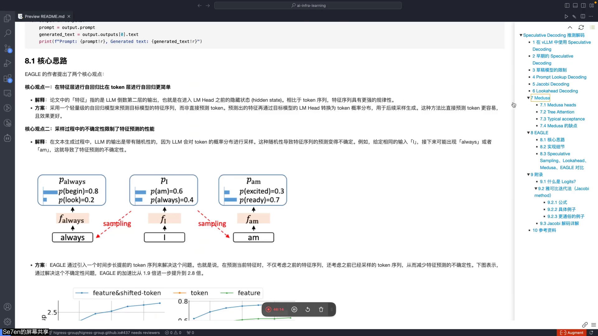 |
| 会去解决这种特征预测中的不确定性问题。OK，好，那我给大家说一下这边，怎么去解决 Medusa 这边我刚才提到的预测的一些不准确、不确定的问题呢，就是它会在采样的过程中引入上一个时间步的这个 token 序列进行一个关联计算来解决这个问题。 [【跳转到 46:51】](https://www.bilibili.com/video/BV1Q5KWzQEhn/?t=2811) | 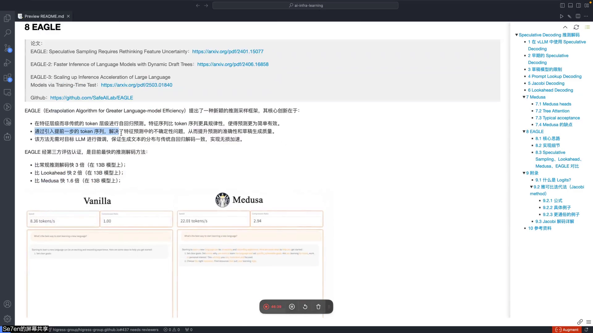 |
| OK，后面会有个图，这边可以看得会比较详细一点，就可以明白我这边指的是什么。比如这是一个例子，比如我当前我知道是 "how can I"，就是 "how can"，然后这边是原始他给的目标模型，目标模型输入 "how can" [【跳转到 47:16】](https://www.bilibili.com/video/BV1Q5KWzQEhn/?t=2836) | 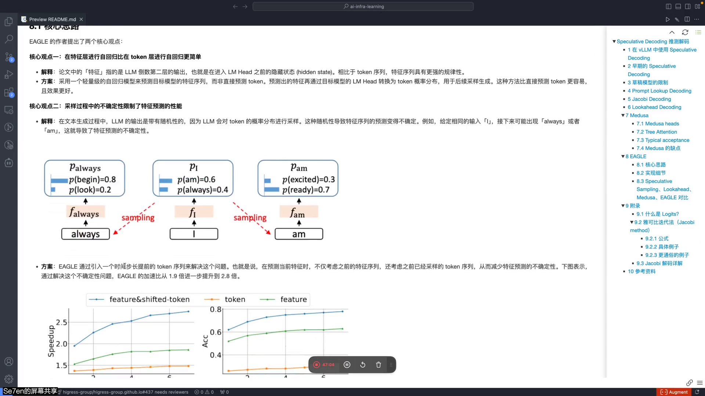 |
| 这里是得到 "I"，对吧，然后这时候在下一步的时候我的这个 draft model 就可以开始去进行一个预测嘛。它这里的话是拿到这个 "can"，对吧，它会，这里我先说一下，这里 LM head 跟 embedding 呢是复用了 target 的 model 的这个 LM head 跟 embedding，只是说它这边有一个 single 的 [【跳转到 47:41】](https://www.bilibili.com/video/BV1Q5KWzQEhn/?t=2861) |  |
| autoregression header 是需要训练的，但是它比较轻量。好，那我这边说了，拿到上一步的这个 "can"，对吧，进行 embedding 得到 e_can，然后以及这边上部 decoder 出来的一个结果 embedding 得到一个 e_I，然后我刚才说的一个 feature，这个 feature 的特征向量，对吧，就是从上一步它给的 model [【跳转到 48:06】](https://www.bilibili.com/video/BV1Q5KWzQEhn/?t=2886) | 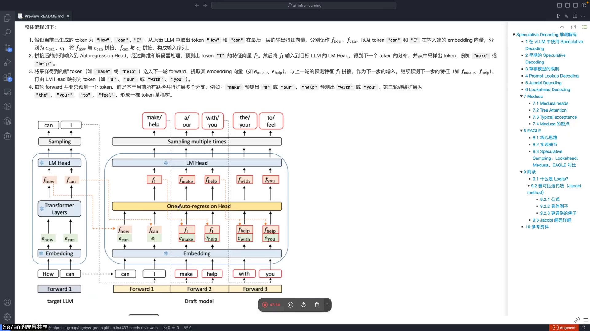 |
| 它给的 LM 这里拿到的。好，它会把这个 f 号跟 e_can 做一个拼接，以及 f_K 跟 e_I 做个拼接。OK，然后用它的这个 single 的 autoregressive header 去得到下一个，预测下一个 f_I。好，然后把 f_I 输入到这个 LM head 中 [【跳转到 48:31】](https://www.bilibili.com/video/BV1Q5KWzQEhn/?t=2911) | 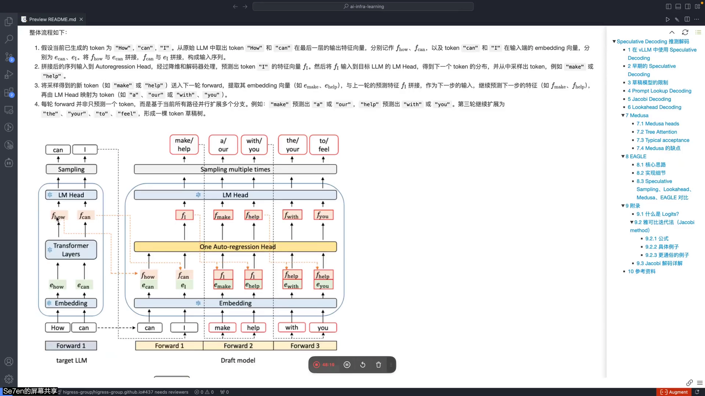 |
| 因为就是复用了 target 的 LM head 嘛，就会得到一个比较准确的采样输出的一个 token，比如说是 "make" 或者 "help"。然后这边下一步在第二次预测的时候，就会把这里的 "make" 跟 "help" 拿过来到这里，同样也是做一个 embedding，然后把上一步的这个 feature 向量拿过来， [【跳转到 48:56】](https://www.bilibili.com/video/BV1Q5KWzQEhn/?t=2936) | 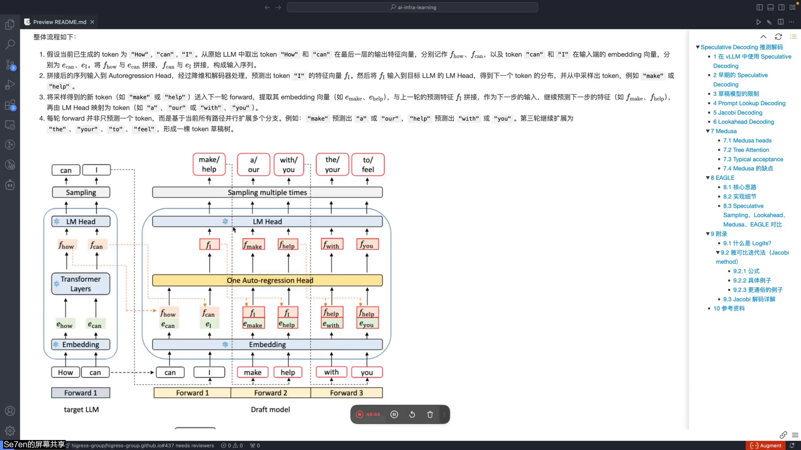 |
| 把这两个向量做一个拼接，然后同样的去得到一个 f_make 跟 f_help，然后再输入到 LM head 中，然后去继续地预测下一个 token，比如分别它们是 "a" 跟 "our"、"with" 跟 "you"，因为它预测的都是预测两个嘛，对吧。 [【跳转到 49:21】](https://www.bilibili.com/video/BV1Q5KWzQEhn/?t=2961) |  |
| 同样去往复，然后最终其实是可以得到一个 tree 嘛，比如第一步是，这不是原始 LM 的，对吧，然后得到 make、help，然后分别都是以两个两个进行一个扩展，对吧。那为什么第一个它 at 的话还是要去走这个 LM head，因为它这一步，这边也提到第一次前向传播是无法加速的。 [【跳转到 49:46】](https://www.bilibili.com/video/BV1Q5KWzQEhn/?t=2986) | 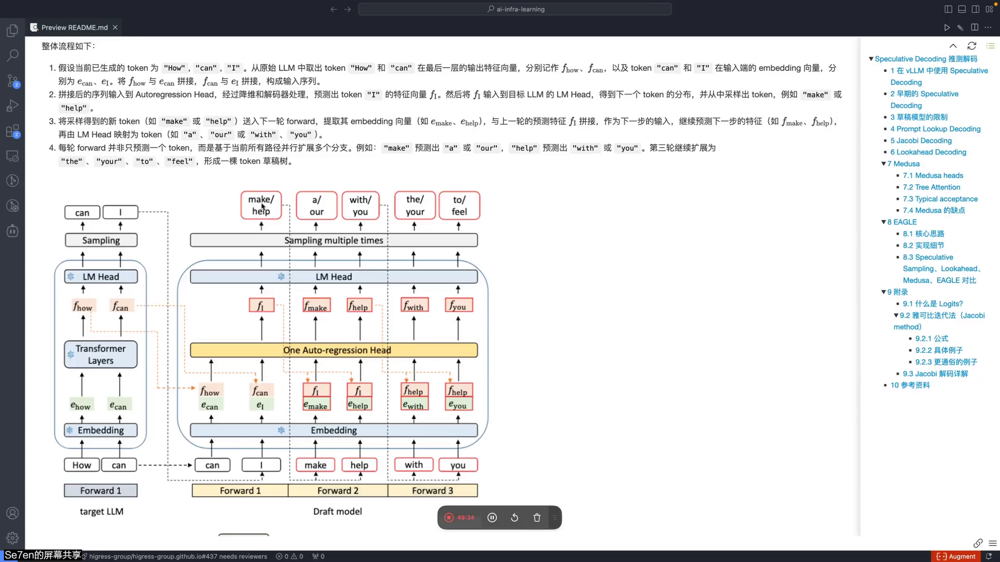 |
| 因为要经过这一次前向传播我才能得到这个 feature，得到这个 feature 呢进行一个拼接，然后才能去进行一个预测。你看，因为拿到了上一步的这些 token 嘛，对吧，以及前一步的这个 feature，它其实也是有一个上下文的关系嘛，所以说它的预测呢不是那么的盲目。好，然后整体的框架就是呢 [【跳转到 50:11】](https://www.bilibili.com/video/BV1Q5KWzQEhn/?t=3011) | 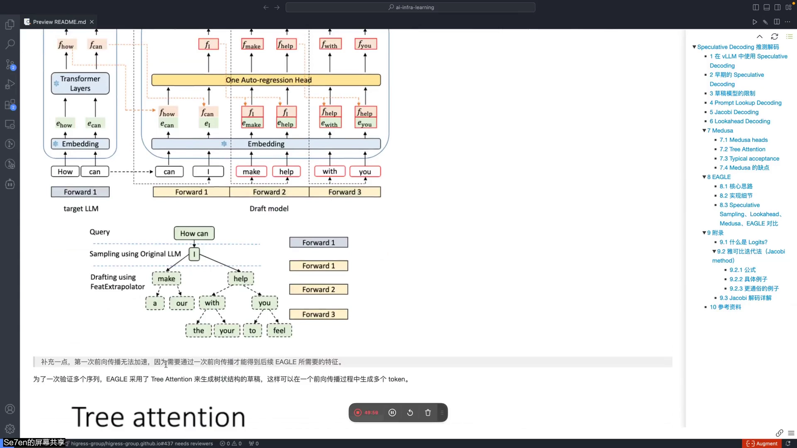 |
| 可以看到这里，首先输入是前一个时间步的一个特征序列以及提前一步的一个 token 序列嘛，对吧，就是这里，以及这个 token 序列，然后将 token 序列转化成对应的 embedding 向量序列，然后将 embedding 序列和特征序列进行一个拼接，然后使用它的一个训练的 [【跳转到 50:36】](https://www.bilibili.com/video/BV1Q5KWzQEhn/?t=3036) | 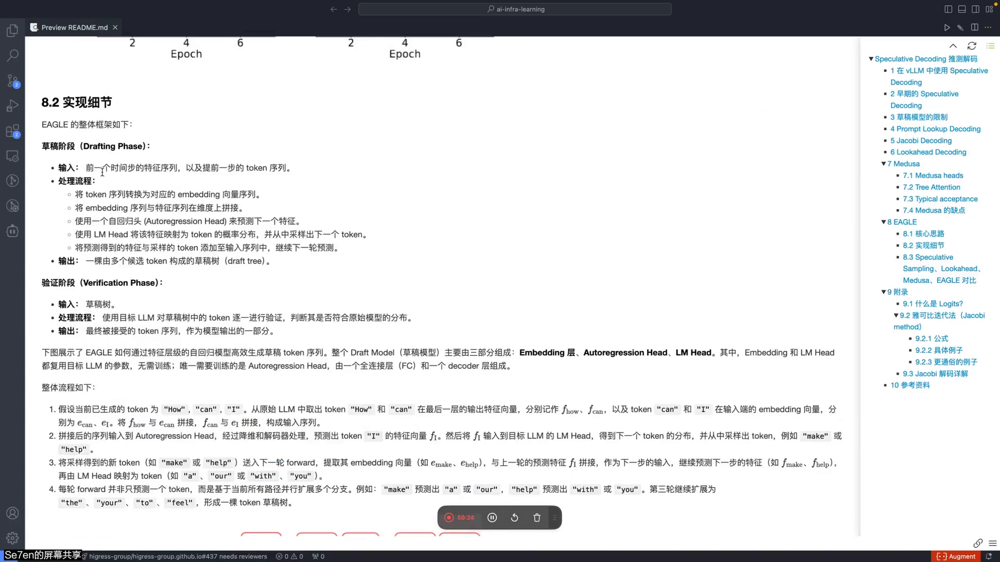 |
| EAGLE 自己训练的一个自回归的头来预测下一个特征，然后再使用和 target model 相同的这个 LM head 将这个映射，特征映射为 token 的概率分布，然后最终去采样得到下一个 token，然后将预测得到的这个特征跟采样 token 添加到序列中，然后进行下一个序列，依次往复。 [【跳转到 51:01】](https://www.bilibili.com/video/BV1Q5KWzQEhn/?t=3061) | 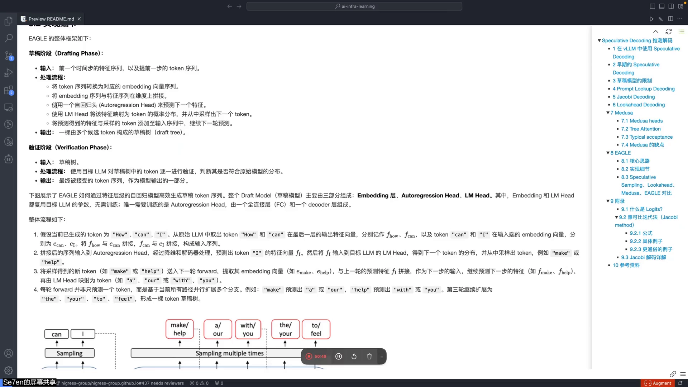 |
| 然后输出的话就是一个 token 的草稿数嘛，对吧。因为这里你看，其实是我这次预测，对吧，我其实生成了这么多，对吧，我要一次性去预测这些多个路径的这些 token 是不是 OK。那它这里其实也是用了 tree attention，因为 tree attention 我们其实是在 Medusa [【跳转到 51:26】](https://www.bilibili.com/video/BV1Q5KWzQEhn/?t=3086) |  |
| 这里也是提到过的嘛，就也是把它打平成一个平的这种向量，对吧，然后它会有一些 tree attention mask 去控制，比如 "is" 它是跟 "has" 是不可以相互的，对吧，那只有 "is" 跟 "a" 之间它可以是有个 attention 的这种计算，对吧。 [【跳转到 51:51】](https://www.bilibili.com/video/BV1Q5KWzQEhn/?t=3111) | 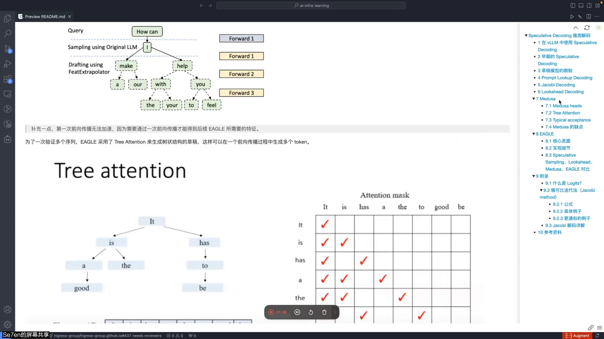 |
| 好，然后它的这篇论文还去对比了一下，像这个 Speculative Decoding 早期的这种 spec decoding 以及这个 Lookahead 跟 Medusa 以及 EAGLE 这种方式几个对比。那你可以看到 T 的话就是它的这个 token 嘛，对吧，F 的话就是这个 feature 的这个向量，对吧。 [【跳转到 52:16】](https://www.bilibili.com/video/BV1Q5KWzQEhn/?t=3136) | 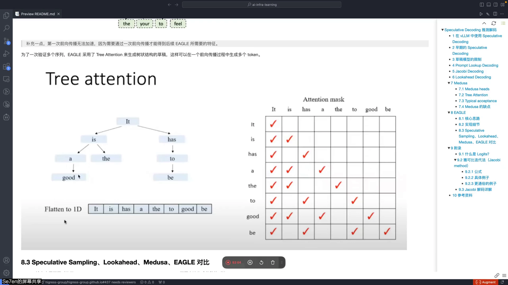 |
| 那也就看，比如像 Speculative Decoding，你用 T1、T2、T3 然后我生成 T4，对吧，比如我这次预测两个嘛，然后 T4 的话也是把预测到的自己的 T4 加进来，T1、T2、T3、T4 再去预测 T5。所以说它都是基于 token level 去计算，对吧，就 token level。 [【跳转到 52:41】](https://www.bilibili.com/video/BV1Q5KWzQEhn/?t=3161) |  |
| 然后 Lookahead 的话它其实也是 token level 的，对吧，去进行计算。但是它每次计算也是并行的，并且不依赖这一轮的、自己预测这个草稿 token 之间的关系，它只是依赖上一轮的 token 的这些关系。OK，所以说它是并行的，但是同时由于没有做这个相互依赖， [【跳转到 53:06】](https://www.bilibili.com/video/BV1Q5KWzQEhn/?t=3186) | 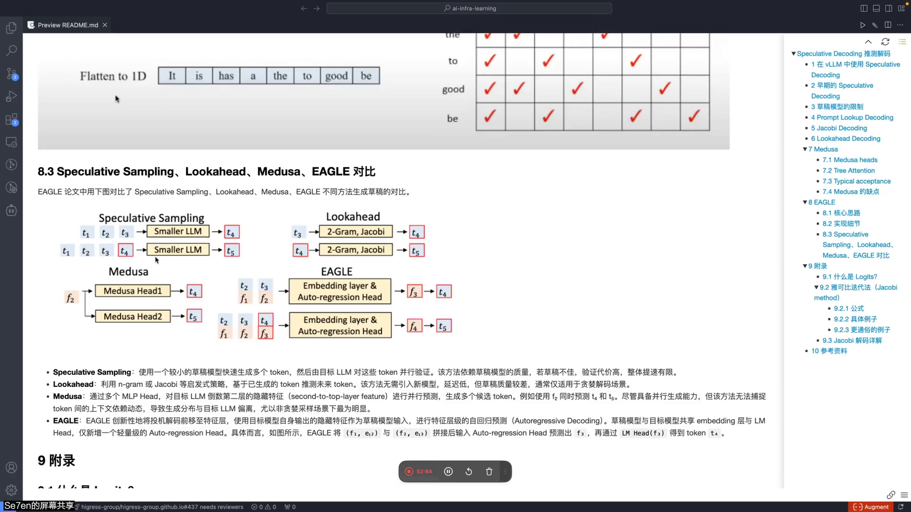 |
| 它的准确性也不高。那 Medusa 前面提到它其实也是从这个倒数第二层的这个 hidden state 过来进行一个并行预测的，比如使用 F2 的这个 hidden state 的同时预测下一个后面的两个，比如 T4 跟 T5，对吧。虽然它这种方式具备并行生产能力，但是是无法捕捉到我刚才说的 [【跳转到 53:31】](https://www.bilibili.com/video/BV1Q5KWzQEhn/?t=3211) |  |
| token 之间的上下文依赖关系，就跟 Lookahead 其实是一样类似的，所以会导致最终生成的结果跟目标会有些偏离。好，那 EAGLE 的话，就是你可以看到是 key 的这个 token 呢，它其实是会跟这个 feature 是做一个相互拼接，对不对，就通过这种方式其实是为了让草稿模型与目标模型是共享 [【跳转到 53:56】](https://www.bilibili.com/video/BV1Q5KWzQEhn/?t=3236) | 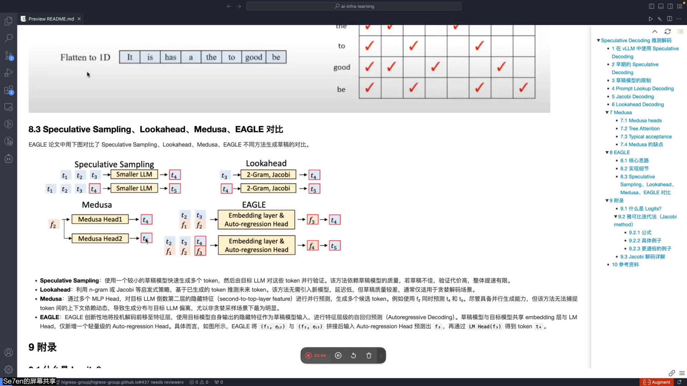 |
| 这种 embedding 层与 LM head，对吧，然后并且它只是一个轻量级的这种 autoregressive header。OK，好，你可以看到它这里就是刚才提到的这个拼接，对吧，从上一步的 feature vector 拿过来，跟这边前一个的 token 拿过来，在当前我做 embedding [【跳转到 54:21】](https://www.bilibili.com/video/BV1Q5KWzQEhn/?t=3261) | 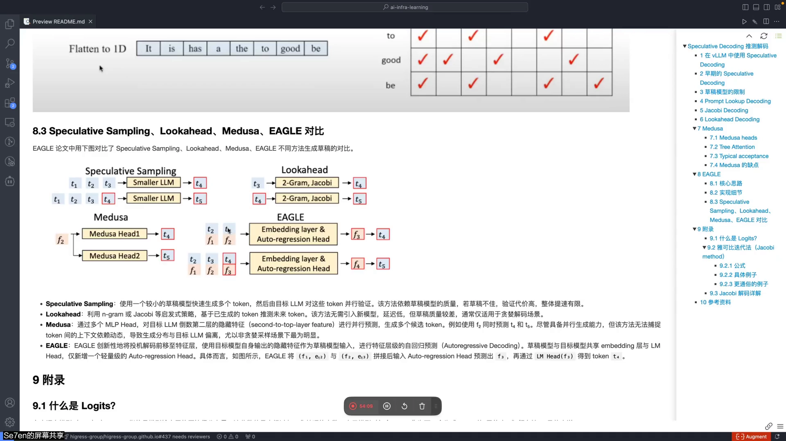 |
| 然后结果进行一个拼接，然后用它的这个 autoregressive header 去得到你本轮的这个 feature 的一个预测，然后把这轮 feature 的预测交给 LM head 去得到这个 token 的概率嘛，然后再去进行一个采样，生成一个最终的预测的结果。OK。 [【跳转到 54:46】](https://www.bilibili.com/video/BV1Q5KWzQEhn/?t=3286) | 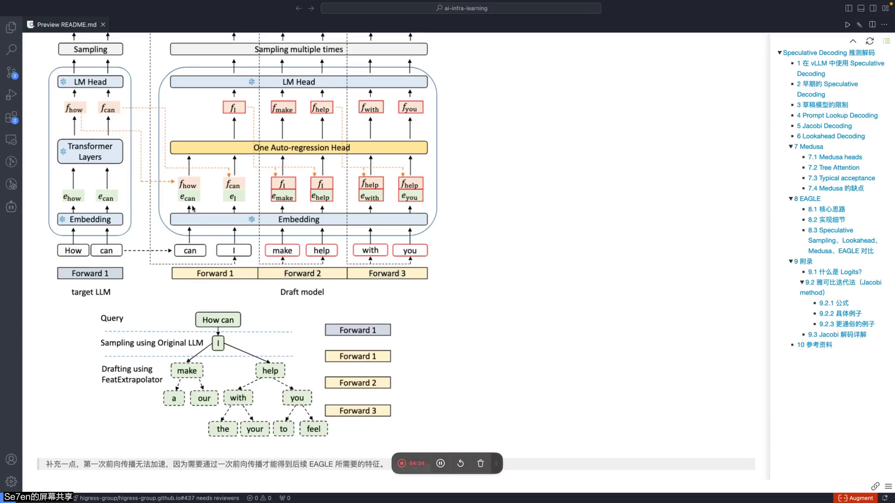 |
| OK，所以说再强调一下，EAGLE 的话这边其实就是它只采用一个轻量级的自回归模型来预测目标模型的特征序列，就不是直接预测 token，就是预测出的这个特征序列，再会通过目标模型的 LM head 去转化为 token 的一个概率分布，然后用于后续才能生成。 [【跳转到 55:11】](https://www.bilibili.com/video/BV1Q5KWzQEhn/?t=3311) | 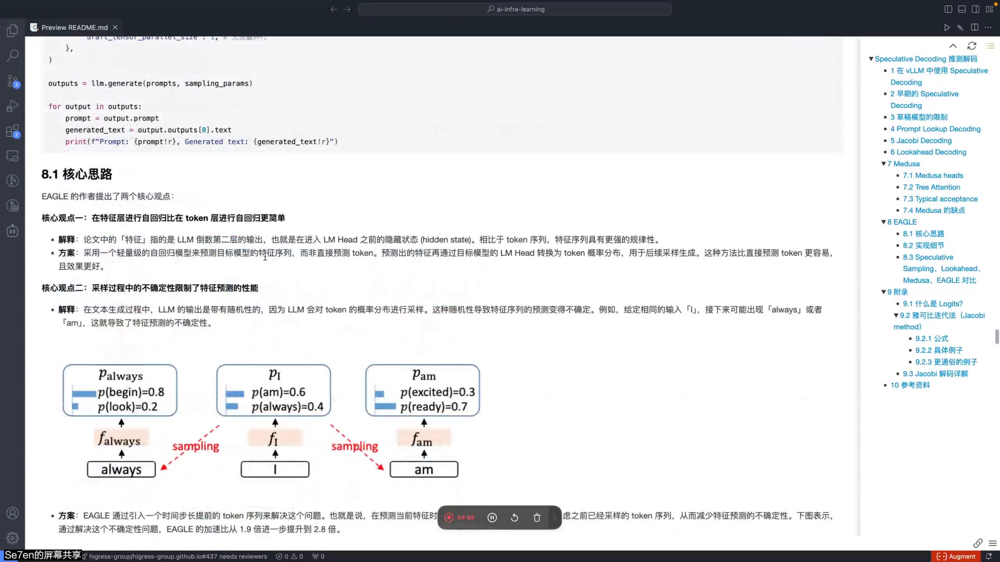 |
| 就这种方式是比直接预测 token 更容易，并且规律性更好，且效果更好。OK，然后应该都说完了，行，好，我今天应该就分享这么多，大家看一下有没有什么问题。 [【跳转到 55:36】](https://www.bilibili.com/video/BV1Q5KWzQEhn/?t=3336) | 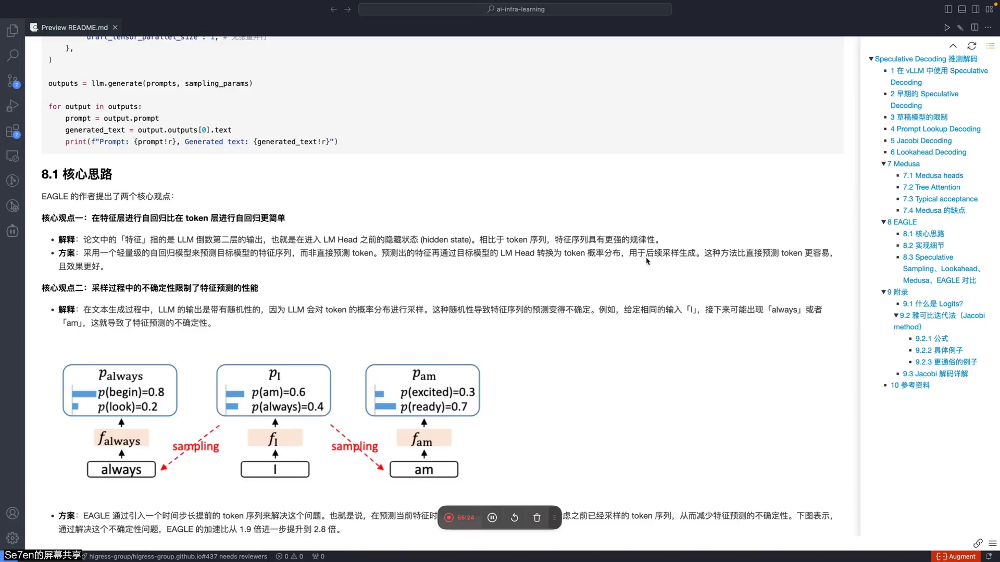 |
| 我看一下。 [【跳转到 56:01】](https://www.bilibili.com/video/BV1Q5KWzQEhn/?t=3361) | 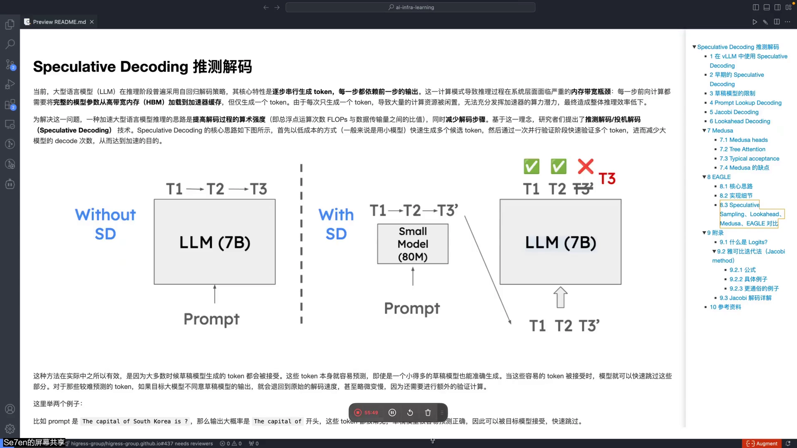 |
| 看下人还在吧，在。OK，额。 [【跳转到 56:06】](https://www.bilibili.com/video/BV1Q5KWzQEhn/?t=3366) |  |
| 现在有没有什么问题？给你开个麦说。行，额，如果没有问题的话，那我们就今天可以先这样。 [【跳转到 56:12】](https://www.bilibili.com/video/BV1Q5KWzQEhn/?t=3372) | 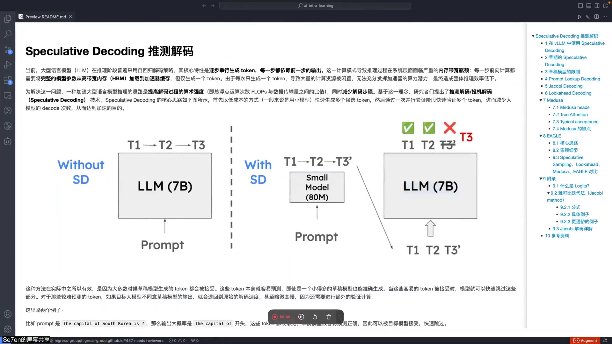 |
| 然后我晚点把那个视频的回放上传一下。OK，那我们今天就先这样。OK，OK，嗯，拜拜，拜拜，拜拜，拜拜。 [【跳转到 56:37】](https://www.bilibili.com/video/BV1Q5KWzQEhn/?t=3397) | 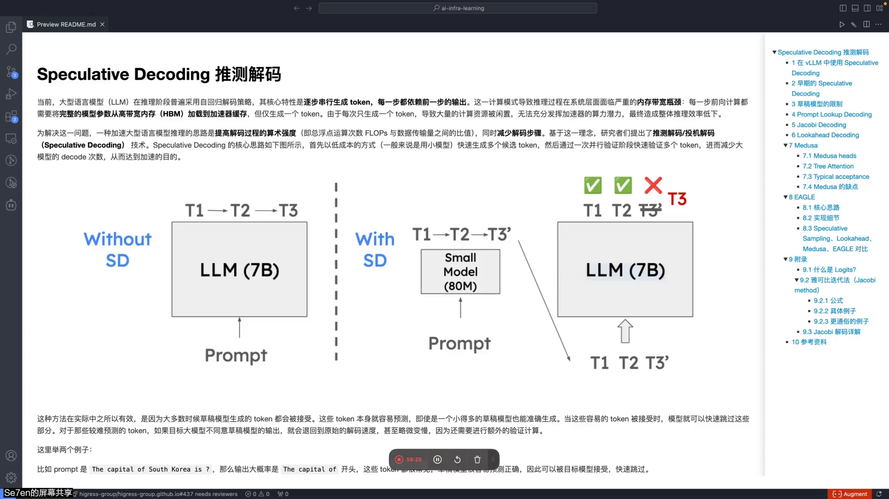 |
| （此区间无字幕） [【跳转到 56:59】](https://www.bilibili.com/video/BV1Q5KWzQEhn/?t=3419) |  |