# 第05讲_Chunked_Prefills分块预填充 原始文稿（图-字幕分栏）

| 字幕文本 | 画面 |
| :--- | ---: |
| OK好那我们今天的分享开始今天主要介绍的是呃trunkprefer分块与填充的这个机制呃在开始之前的话我这边在这个我们的个GITHUB仓库里 [【跳转到 00:00】](https://www.bilibili.com/video/BV1f2uczGEqt/?t=0) | 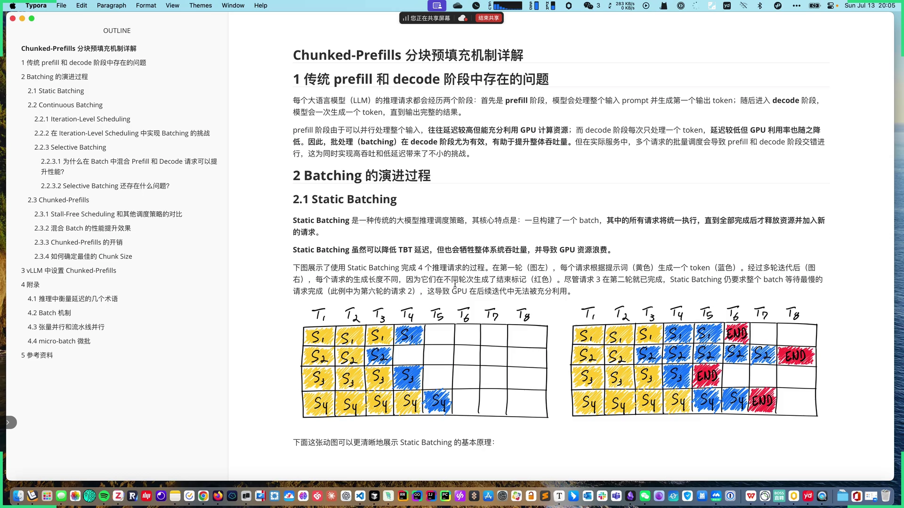 |
| 我建了一个issue因为上次在群里有位同学提到一个比较好的那个东西就是说我们可以把每次分享的话我这边可以建个ISSU如果说大家在分在听的时候呢有一些问题的话还可以在这issue里面进行留言啊我看到也会进行一个回答或者说是我在分享的过程中 [【跳转到 00:11】](https://www.bilibili.com/video/BV1f2uczGEqt/?t=11) |  |
| 如果说我自己发现后来发现有一些问题的话我也会在这个issue里啊做一个纠正然后另外的话我这边加了一个东西就是呃这边今天放了三个课后的一个思考题就是大家可以在听的时候也带着相关的问题去听然后可能这样的话吸收可能或者理解可能也会更深刻呃简单说下三个问题第一个问题是 [【跳转到 00:36】](https://www.bilibili.com/video/BV1f2uczGEqt/?t=36) |  |
| 这个创PREFS对这个TTFT跟这个TT这两个的影响是怎么样的还有第二个是呢为什么我们要限制每轮调度的一个trunksize这有什么好处呃这个调度逻辑是什么呀这这个名字是来自于今天我接到trumpprefer的一篇论文中提到的 [【跳转到 01:01】](https://www.bilibili.com/video/BV1f2uczGEqt/?t=61) | 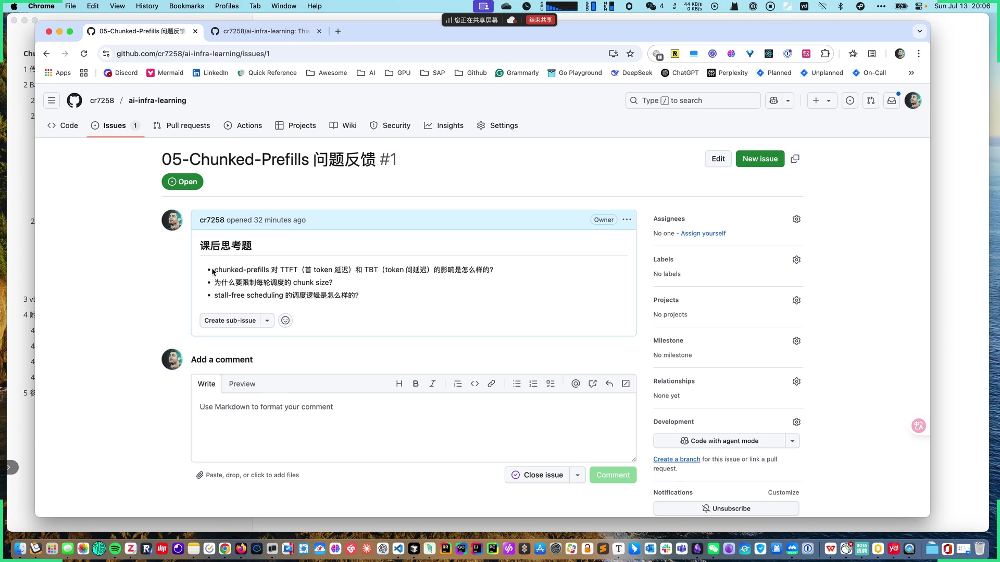 |
| 这个逻辑对可以大家也可以啊带着这三个问题进行一个思考然后呢我会在下周的周末之前我会把啊这三个问题的答案放在这个issue里面如果说大家也可以说也欢迎你们对这几个问题进行思考然后在这个issue里进行一个回答OK好嗯 [【跳转到 01:26】](https://www.bilibili.com/video/BV1f2uczGEqt/?t=86) | 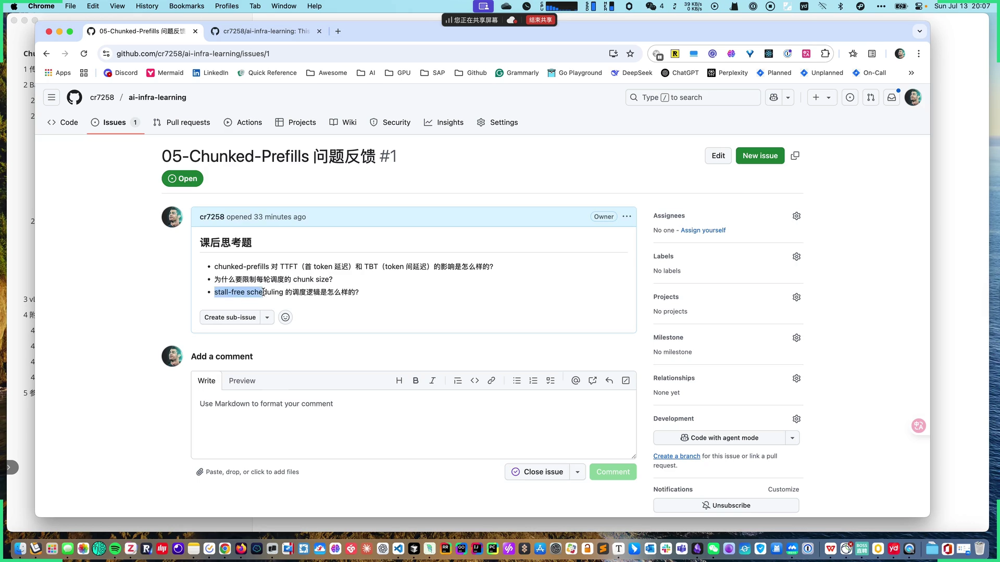 |
| 那我们现在正式开始呃首先呢我们先看一下传统的这个prefer和decode [【跳转到 01:50】](https://www.bilibili.com/video/BV1f2uczGEqt/?t=110) | 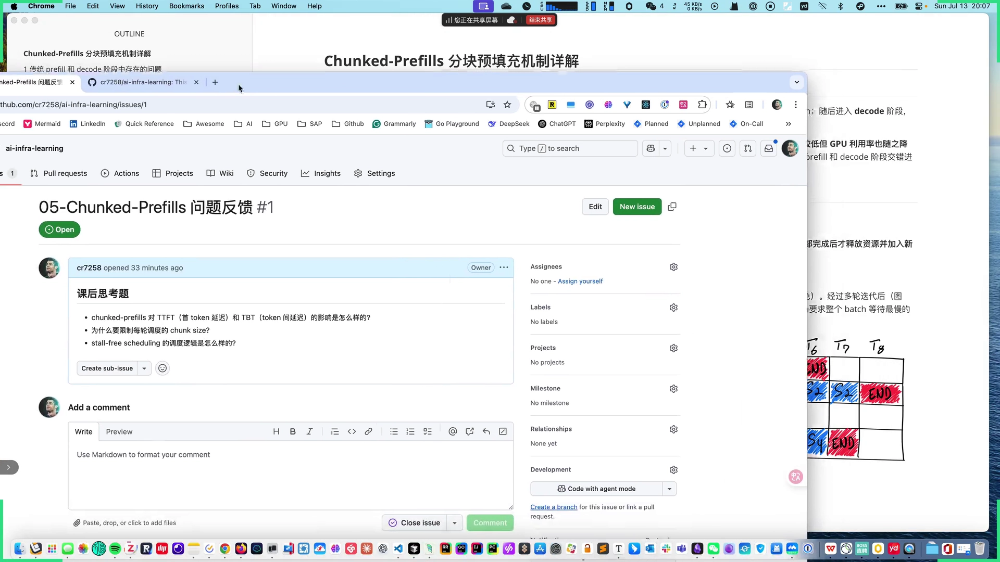 |
| 阶段存在哪些问题因为我们代言模型主要可以分为两个阶段嘛第一个是prefer阶段就是模型处理整个输入prompt然后输出第一个token然后进入decode阶段那decode阶段就是自回归的方式一个一个的去生成token然后直到输出完整结果那prefer阶段跟decode阶段它们的特点是不相同的 [【跳转到 01:55】](https://www.bilibili.com/video/BV1f2uczGEqt/?t=115) |  |
| 那prefer阶段由于呢我是一次性接受所有的prompttoken我是可以并行的进行计算处理的那通常来说prefer的话我计算整个延迟就TTFT可能会会高一点然后但是呢这个阶段我是可以充分的利用这个GPU的一个计算资源而DECO的阶段呢因为每次只处理一个token所以说他的一个计算强度并不是那么高 [【跳转到 02:20】](https://www.bilibili.com/video/BV1f2uczGEqt/?t=140) | 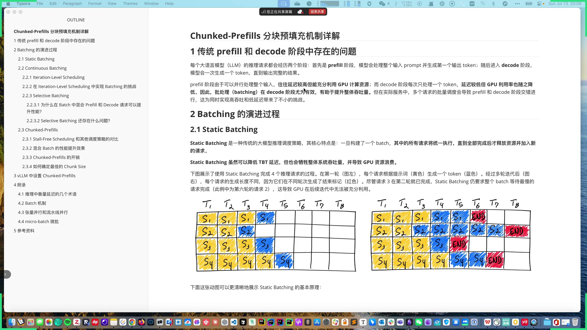 |
| 所以说CPU利用率啊同时也不高所以说如果说我在抵扣的阶段呢我去有很多的batch我有多个请求的话那通常来说这样的话可以比较明显的去提升整体的一个吞吐量但是实际上我们的请求中呢经常是多个请求我会进行一个批量调度那prefer跟decode阶段往往是交错的 [【跳转到 02:45】](https://www.bilibili.com/video/BV1f2uczGEqt/?t=165) |  |
| 并且呢通常prefer的请求数量可能会比较多对吧呃比较少那decode的一个呃迭代的次数会相对比较多所以说它们之间的一个关系是不是很平衡的对吧所以这就带来一些问题然后呢解决这个问题的话prefer跟decode阶段这种计算资源分配不平均的一个问题呢主要有两种方式 [【跳转到 03:10】](https://www.bilibili.com/video/BV1f2uczGEqt/?t=190) |  |
| 一种就是我们今天介绍这个TRUNPREFER的这种机制 [【跳转到 03:35】](https://www.bilibili.com/video/BV1f2uczGEqt/?t=215) |  |
| 还有一种的话就是这边会我们下次准备说的是有一个pd分离就是DISAGREETED呃prefer这个方式主要是两种方式那这两种方式的一个思路是不太一样的那TRPREFER的话你可以理解为是在一个混合的batch里面我去混合prefer跟decode的一个请求通过这种方式我去把那个DECO的阶段 [【跳转到 03:40】](https://www.bilibili.com/video/BV1f2uczGEqt/?t=220) | 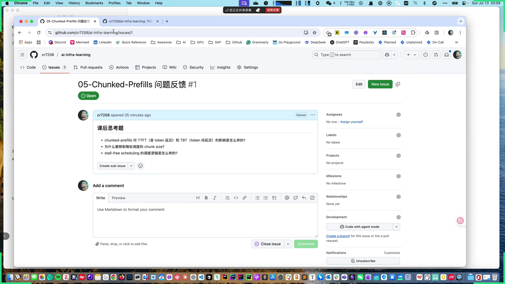 |
| 我去难以利用这种利用的GPU的计算资源通过prefer的这个请求我去能够得到一个充分的理由对吧然后那么pd分离的思想就是啊往呃完全相反就可以认为呢我是把明确的去把prefer跟decode进行一个区分会有一个prefer的worker呃一个集群嘛 [【跳转到 04:05】](https://www.bilibili.com/video/BV1f2uczGEqt/?t=245) | 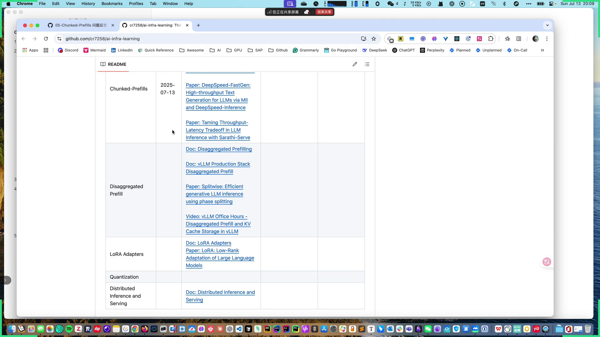 |
| 可能我是专门处理比prefer请求处理完以后呢我通过这种中间的kvtransform的一些方式比如说可能可以用叫mcatch等等一些组件我去把计prefer计算好的一些kvcatch传到decode进行下一步计算那肯定显然显而易见的是这个pd分离的这种架构的话它的呃架构复杂度可能会相应的更高对吧 [【跳转到 04:30】](https://www.bilibili.com/video/BV1f2uczGEqt/?t=270) |  |
| 那trunkprefer的话因为我们是去混合处理啊在一个代理中去混合处理profile跟decode它的价格复杂度没有那么高 [【跳转到 04:55】](https://www.bilibili.com/video/BV1f2uczGEqt/?t=295) |  |
| 对好我们今天先介绍一下topprefile的一个原理 [【跳转到 05:03】](https://www.bilibili.com/video/BV1f2uczGEqt/?t=303) | 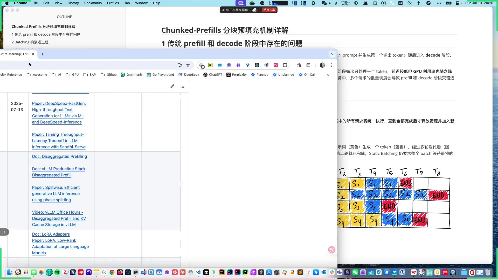 |
| 我们先继续啊那介绍trumpprefile之前呢我会先带大家介绍一下batch的这个眼镜的一个过程主要来说是有三种内容一部分是最开始的话叫staticbatch静态batch然后之后之后的话演变成这个continuousspatch就是一个itellationlevel的迭代级别的一个batch [【跳转到 05:08】](https://www.bilibili.com/video/BV1f2uczGEqt/?t=308) | 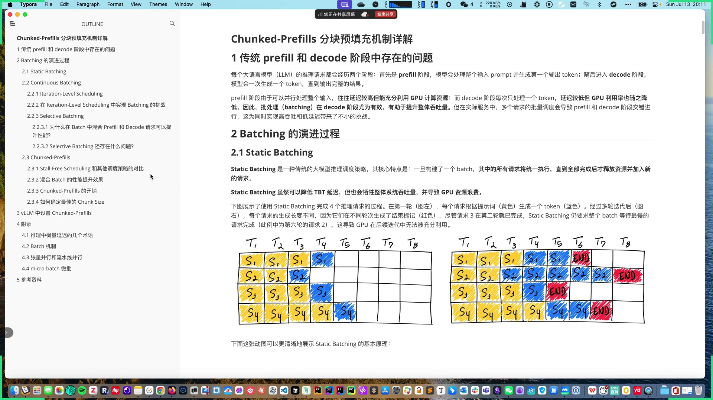 |
| 然后再到最后就是我们现在最新的一个chunkprefer的一个batch的一个机制好 [【跳转到 05:33】](https://www.bilibili.com/video/BV1f2uczGEqt/?t=333) | 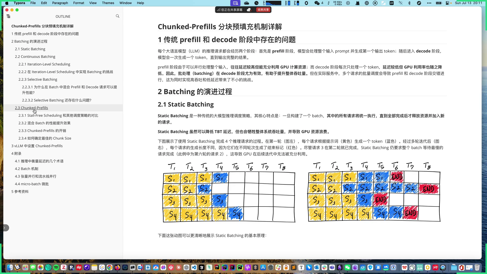 |
| 然后我们现在先看一下啊staticbatch的一个逻辑首先呢staticbatch呢它是一个传统的一个调度的策略就这个核心特点就是我一旦构建了一个batch那我所有的请求我是统一执行的并且要等到所有的请求全部执行完成后才能把这些请求资源释放然后再到新的BG中则再去加入新的请求 [【跳转到 05:39】](https://www.bilibili.com/video/BV1f2uczGEqt/?t=339) | 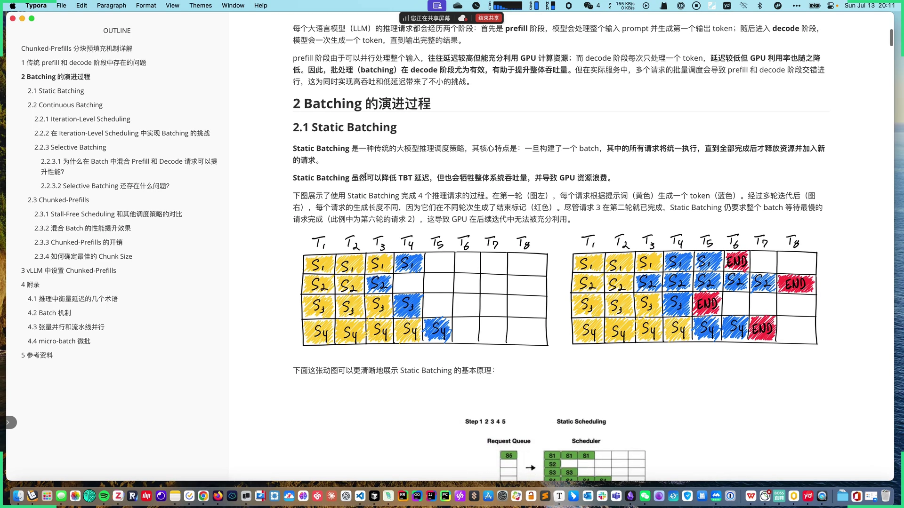 |
| 也就是说呢是如果说我的这个代理中有某个请求执行的比较快他先完成了但是他也得等到其他的这些请求都结束完成我才能把这些这个badge中所有的资源都释放再去执行下个排序那你看到下个图这里就可以比较明显的可以说明你看左边的话相当于是我先prefer然后生成第一个token [【跳转到 06:04】](https://www.bilibili.com/video/BV1f2uczGEqt/?t=364) | 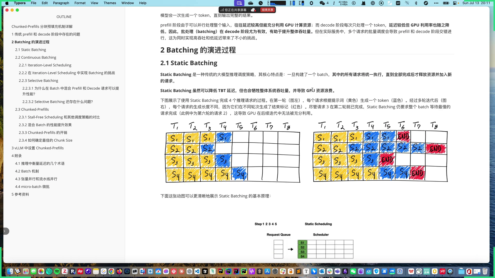 |
| 是第一个啊第次的迭代然后你看右边那个图你看请求三其实它在第二次迭代的时候就已经结束了and收到一个end的标记符但是呢他还是要等到请求二到这里解答以后呢才会啊才能把这个整个batch的资源释放所以说它的效率呢并不是特别高但是呢staticbatch呢是可以去降低呃 [【跳转到 06:29】](https://www.bilibili.com/video/BV1f2uczGEqt/?t=389) | 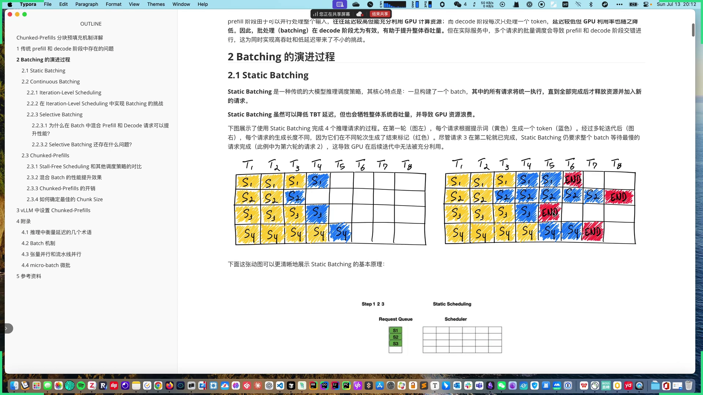 |
| tb呃TBT的一个延迟就是token跟token之间的一个延迟但是这样的话会牺牲一个整体的吞吐量并且呢导致某些呃GPU资源浪费因为这一部分时间我就是没有进行计算相当于就是浪费了然后你可以看到这个动图就会就是可以比较清晰的展示staticbatch原理这边有四个请求对吧然后同时去做decode [【跳转到 06:54】](https://www.bilibili.com/video/BV1f2uczGEqt/?t=414) |  |
| 然后这个请求其实已S3已经嗯好了嘛对吧然后还是要等到前面其他的都结束 [【跳转到 07:19】](https://www.bilibili.com/video/BV1f2uczGEqt/?t=439) | 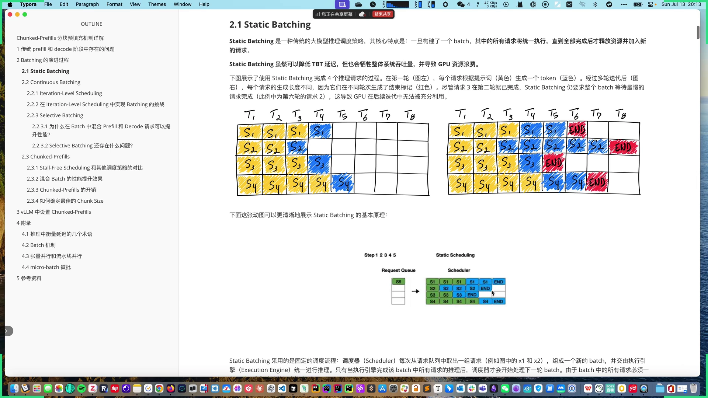 |
| 然后再去统一的示范OK然后我刚刚这边有说到一个TBT啊对吧那我这边附录中放了下这些术语的介绍可以简单看一下首先呢在推理中去衡量延迟的话有几个呃参数嘛一个是TTFT就是timetofirsttoken就指的是从用户发出请求到模型生成第一个token所发挥的时间 [【跳转到 07:27】](https://www.bilibili.com/video/BV1f2uczGEqt/?t=447) | 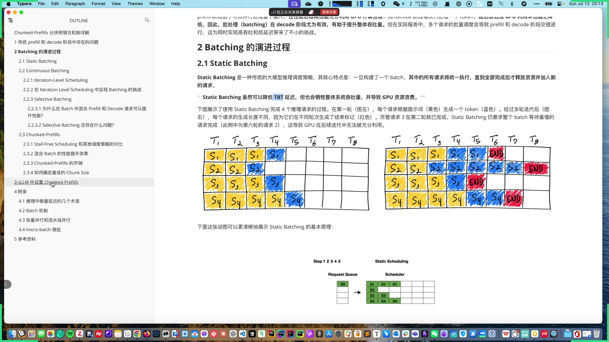 |
| 主要是用于衡量PREFW的一个性能还有一个是TBT就是我们刚刚说的timebetweentoken就指的是在连续生成两个token时之间的一个花费并且呢TPT通常我是返回实时去返回每个token的一个速度那跟TPT相类似的就是一个TPOT啊Timeperoutputtoken就指的是所有输出token的一个平均时间 [【跳转到 07:52】](https://www.bilibili.com/video/BV1f2uczGEqt/?t=472) | 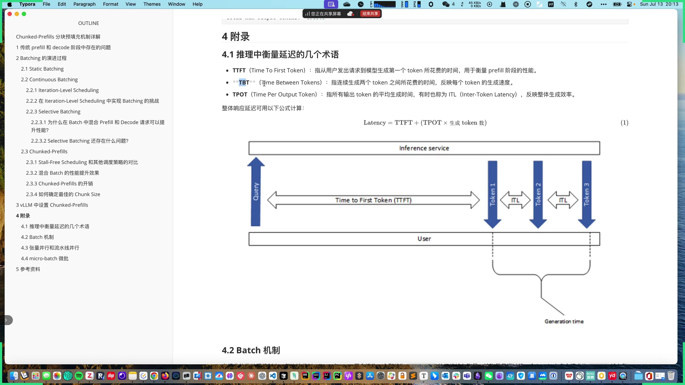 |
| 那就是说直接用我生成的一个token数量嘛对吧除以一个时间嘛对吧总的时间除以数量嘛就得到这个平均的一个值有时候也会称为叫ITL就是internalinintertokenlatency反映一个整体的一个decode的一个效率那整体的响应延迟我就可以这么算嘛用TTFT加上这个TBOT乘以这个token数 [【跳转到 08:17】](https://www.bilibili.com/video/BV1f2uczGEqt/?t=497) |  |
| 那下面这个图就是展示这个两者关系这个用户的一个请求到第一个token的时间这中间就是TTFT然后后面的每次decode的之间的一个事件就是ITL或者我们说的TPOTOK好然后我们继续回到上面这个图那我们刚刚讲了一个staticbatch然后这张图是来自于论文ochoocher [【跳转到 08:42】](https://www.bilibili.com/video/BV1f2uczGEqt/?t=522) | 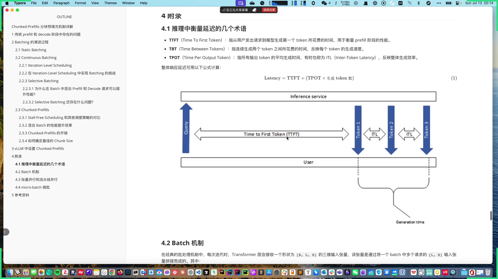 |
| 这个论文就是提出了后面我们会说的就continuespecial不过他这边也介绍一下我这个当时这个staticbatch是怎么调度嘛首先调度器会从队列中取出一个请求啊比如一组请求比如说两个请求X1X2然后交给这个executionengine然后由于这个呃引擎执行统一推理当所有的完成推理以后呢然后进行一个返回 [【跳转到 09:07】](https://www.bilibili.com/video/BV1f2uczGEqt/?t=547) | 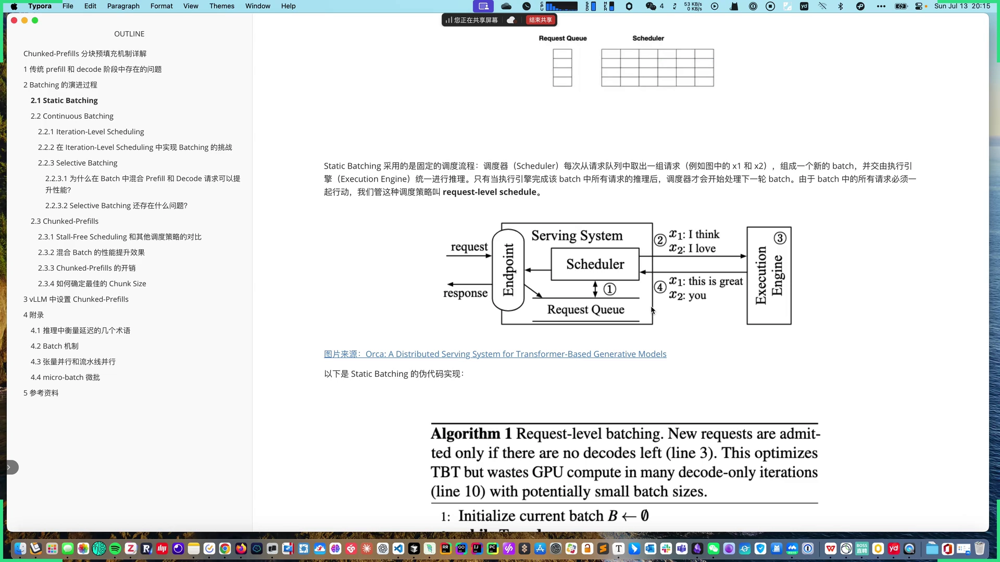 |
| 然后调度器再去调度下一轮的一个request那由于我我们这个代取呢是更是要等待所有的request的都去完成我才能进行的所以我们就要管这种调度策略叫做requestlevel的schedule了OK好然后这边的话是一个staticbatch的一个伪代码实现啊这个算法的图是来自于这篇论文 [【跳转到 09:32】](https://www.bilibili.com/video/BV1f2uczGEqt/?t=572) | 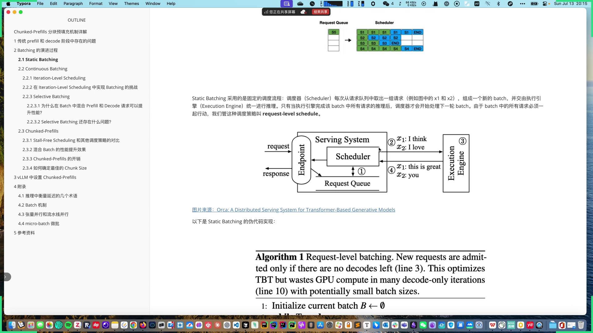 |
| seretizeserver这个图这呃这篇论文这篇论文就是会介绍我们后面说的CHUNGPREFILE的这个原理好如果你看这个的话你可以我这边的注释也详解的写的比较详细可以简单看一下比如说一开始是初始化一个batch这个batch现在是空的这表示是空然后这里是一个循环嘛如果说这个by是空那我就会从请求队列中去拿请求 [【跳转到 09:57】](https://www.bilibili.com/video/BV1f2uczGEqt/?t=597) |  |
| 然后呢这里有个while循环就会一直去拿请求嘛会把新的请求加进来直到加入直到我没有足够的空间资源去处理这些请求然后加把这些请求呢全部都加到这个batch里面OK然后呢接下来呢他会把对这些所有的请求做一个prefer的操作好做完prefer操作以后呢就回到while的这个上面判断嘛 [【跳转到 10:22】](https://www.bilibili.com/video/BV1f2uczGEqt/?t=622) |  |
| 因为这次判断如果还没有完成那他肯定是啊这个是非空的嘛就会走到else请求那因为prefer已经做完了嘛那接下来就会做decode然后直到把所有的这个代取中所有的请求的提高的全部都做完为止OK如果没有如果呃已经完成的话就不会去啊 [【跳转到 10:47】](https://www.bilibili.com/video/BV1f2uczGEqt/?t=647) | 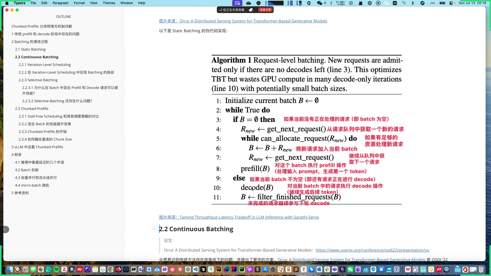 |
| 参与下一轮了就会把它filter啊过滤掉OK好然后我们继续呃 [【跳转到 11:10】](https://www.bilibili.com/video/BV1f2uczGEqt/?t=670) | 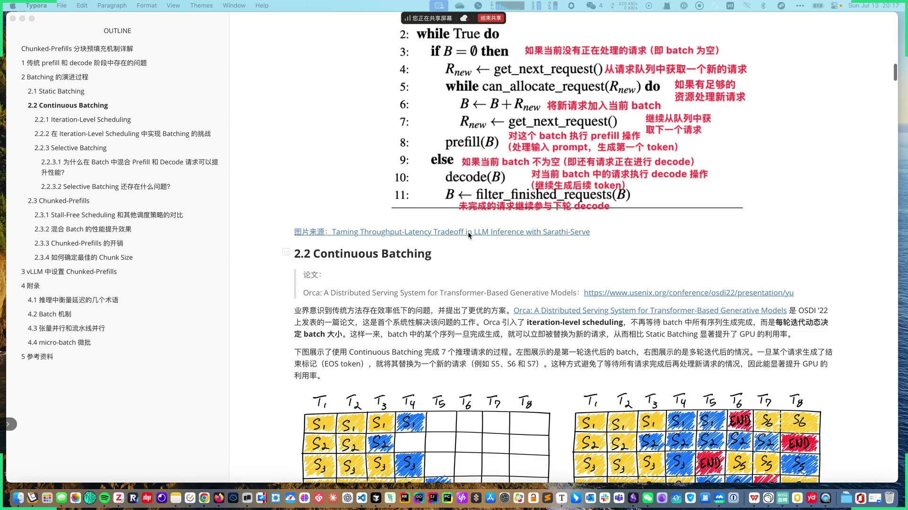 |
| 刚刚介绍staticbatch然后我们现在介绍一下CONTINUSPATCHING的一个呃机制那所以说业界也认识到这个snakebatch效率存在效率低下问题呢所以呢ORKER这篇论文呢就提出了呃一个解决方案这offer是来自于那个韩国啊所有的一个团队提出一个方案 [【跳转到 11:15】](https://www.bilibili.com/video/BV1f2uczGEqt/?t=675) | 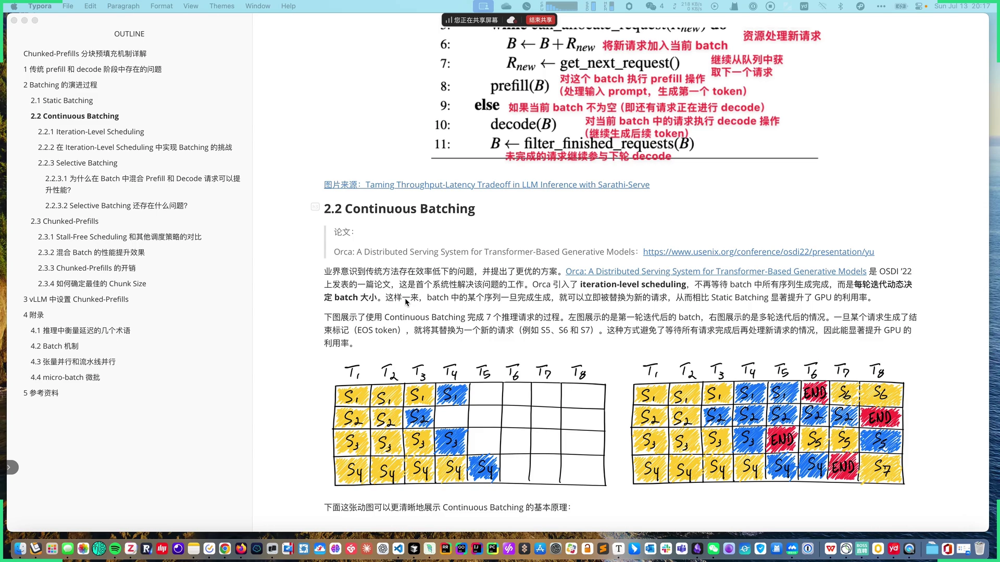 |
| 那也是首个系统性解决这个问题的一个工作那从vocal中呢引入了一个叫iterationlevel的一个schedule就是迭代级调度的一个策略就是他的思想就是呢我不会去等待败理中所有的一个请求去完成而是我在每轮的迭代中去动态的去修改这个绝对决定败局的大小如果说这轮迭代中某个请求已经完成了 [【跳转到 11:40】](https://www.bilibili.com/video/BV1f2uczGEqt/?t=700) | 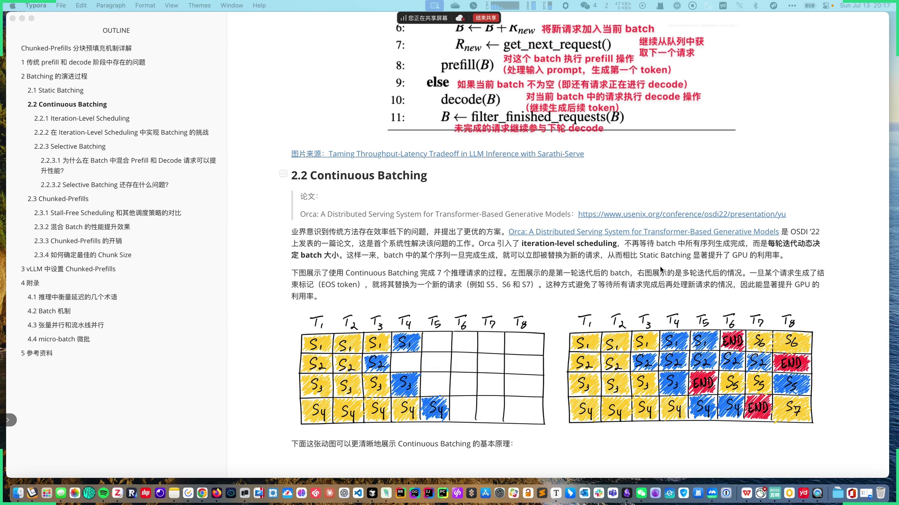 |
| 就会把这个请求移除然后去加入新的请求就会进行一个立即一个替换通过这种方式可以显著提升啊GPU使用率那我刚才说的每轮迭代迭代是什么意思呢比如说我对PREPREFER请求的话我这轮迭代的话就是呃我把这个输入的prompttoken处理完然后生成第一个token的这个过程我叫一轮迭代 [【跳转到 12:05】](https://www.bilibili.com/video/BV1f2uczGEqt/?t=725) |  |
| 那对decode的话我就是生成一个token每次生成一个token那这个就是一轮迭代OK所以说它是一个迭代机啊iterationlevel的一个schedule那看下面这个图也可以看得出来就是左边的话就是收到四个请求并且分别的得到了第一个token然后对于请求三之前也是请求三最先完成的那这里end以后呢他就可以立即的因为end以后请求三资源就可以释放掉了 [【跳转到 12:30】](https://www.bilibili.com/video/BV1f2uczGEqt/?t=750) | 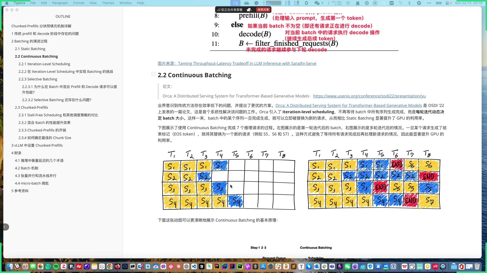 |
| 就立即加入S5然后去请求 [【跳转到 12:55】](https://www.bilibili.com/video/BV1f2uczGEqt/?t=775) |  |
| 然后其他的也是一样S1完成以后就加入了S6那这样的话我可以保证我的这个使用的GPU使用率基本是可以满满当当的OK好然后这个图也是可以比较精准的说明啊更详细的说明吗你看啊这边完成了S3这边就拿掉了S也拿掉然后就这边就放S5然后对好 [【跳转到 13:00】](https://www.bilibili.com/video/BV1f2uczGEqt/?t=780) | 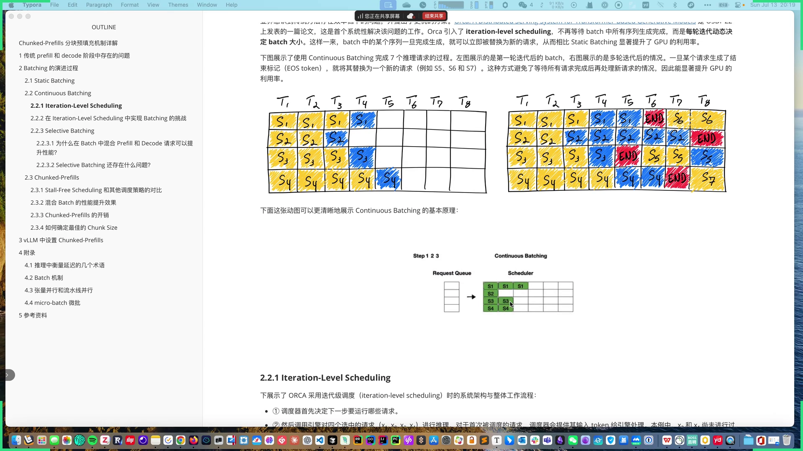 |
| 然后呢这边这个图是OCA的一个介绍这iterationlevel的一个schedule的一个架构图也是呢调度器我首先决定那处理哪些请求比如这批请求呢我要处理四个请求X1x2x3x4那对于X1和X2来说它们属于decode阶段因为这这里灰色是属于是prompt的嘛它处于呃decode阶段 [【跳转到 13:25】](https://www.bilibili.com/video/BV1f2uczGEqt/?t=805) | 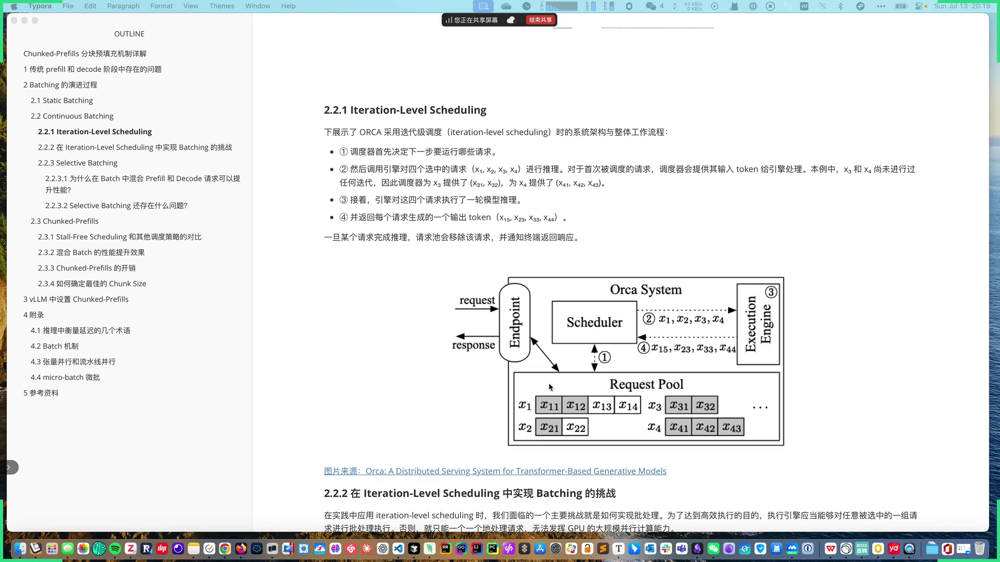 |
| 那X3X4呢是属于prefer阶段那把这四个请求呢其实是混合了prefer跟decode的一个啊请求码进行统一的处理然后呢每次呢返回生成了这一轮请求生成一个token啊就是一轮迭代然后下次呢再继续的放入啊决定是不是继续或者说用新的请求进行一个替换 [【跳转到 13:50】](https://www.bilibili.com/video/BV1f2uczGEqt/?t=830) |  |
| 如果说这轮的batch中多有有限request的在这轮的迭代中已经完成掉对吧然后看上去呢呃这个iterationlevelschedule好像直直接他就直接说我把这个PREFU跟decode我混在一起就完事了就可以提升这个混合batch通过混合带血的方式提升这种GPU使用率但是我们现在忽略了一个问题 [【跳转到 14:15】](https://www.bilibili.com/video/BV1f2uczGEqt/?t=855) | 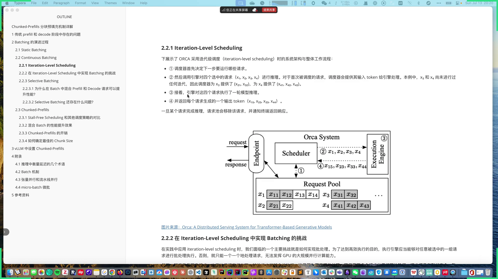 |
| 就是说为什么preview跟decode请求它能混合啊能放在一起其实说这中间是有一些问题我需要考虑的并不是能够自然而然的我就能把能把prefer和decode的请求混合混在一起其实是有些问题我们需要考虑的那我们接下来看一下有哪些问题我们需要考虑来解决这个问题OK好啊可以看到呢 [【跳转到 14:40】](https://www.bilibili.com/video/BV1f2uczGEqt/?t=880) |  |
| 我们如果是我要在一一轮的迭代中我去混合请求呃如果说没有呃没有说这种呃后面我说的selectivebatch的这种方式呢其实是不能做到的这是因为呢要实现批处理我们是要求多个请求是属于相同的阶段并且这些请求是具有完全一致的一个输入张量 [【跳转到 15:05】](https://www.bilibili.com/video/BV1f2uczGEqt/?t=905) | 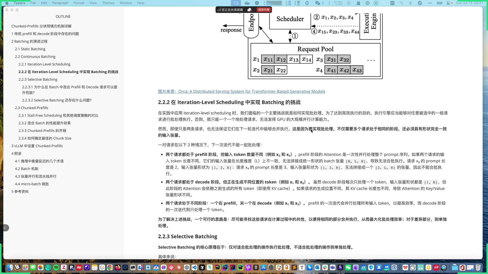 |
| 我才可以做到的然后这边列了以下三个请求三种情况那么这三种情况下呢我的这个这些请求是不能放在一起进行一个合批的比如说两个请求都处于prefer阶段但是呢他的输入token数量是不一样的比如说X3是两个A4是三个那这个时候呢prefer阶段attention它一次性会并行处理整个prom序列 [【跳转到 15:30】](https://www.bilibili.com/video/BV1f2uczGEqt/?t=930) | 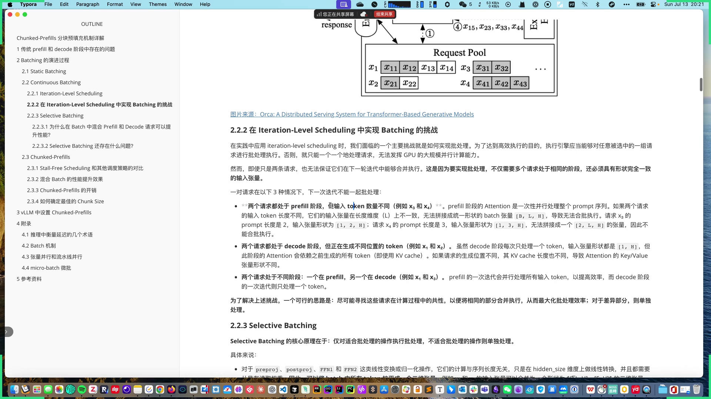 |
| OK但是呢由于我刚才说了两个请求输入token长度不一样所以它的输入张量在长度维度就不一致所以无法拼成一个统一的一个batch张量这里B是指指的batch那L的话是属于长度维度H就是拼灯ThehiddensizeOK下面五个这边有一个图呃这里可以看的会稍微清楚一点因为我刚也说了 [【跳转到 15:55】](https://www.bilibili.com/video/BV1f2uczGEqt/?t=955) |  |
| 这是transformer会接受一个形状为B2H的一个单位张亮嘛B就是我刚才说的一个代数大小也就是请求数量L的话就是在这个请求中我会处理一个token数量H就是一个hintsize那比如说我这个bay中是有两个请求每个请求都是除以三个token那hintersize假如说是那这时候呃请求一是30嘛对吧三个请三个token [【跳转到 16:20】](https://www.bilibili.com/video/BV1f2uczGEqt/?t=980) | 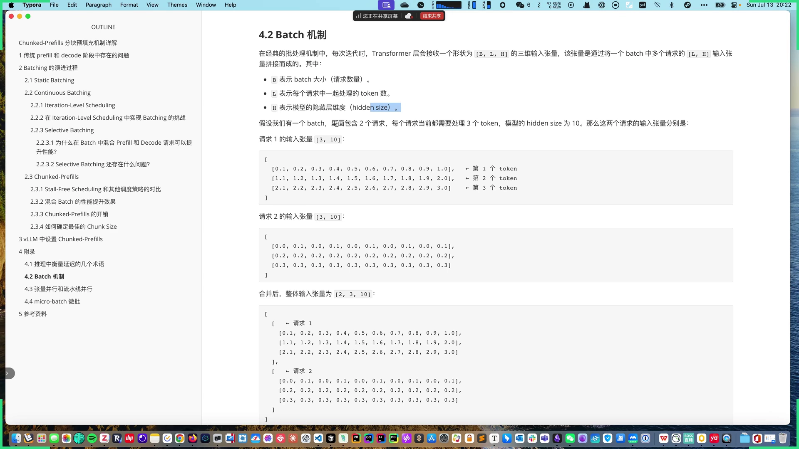 |
| 每个是十个呃维度对吧请求二也是30那这一期的话我可以去做一个合并嘛得到这个B是2L是三也就是十这种情况这种情况我就可以放在一起进行一个批处理的一个计算但是我刚刚说的这里的话呃这种情况就不行了嘛因为它们的长度不一样一个是12H嘛一个是13H嘛我就不能拼成一个2LH嘛 [【跳转到 16:45】](https://www.bilibili.com/video/BV1f2uczGEqt/?t=1005) | 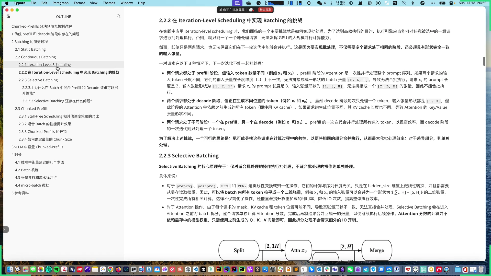 |
| 他们必须是这一位都是一样才行所以这种情况我就不能做一个合并第二种情况就是两个虽然都是decode的阶段但是生成位置的token是不一样的因为呢比如说我因为他之前的这个prefer或promprompt的长度不一样所以说它在生成的时候位置kvcash的一个长度也不一样因为他做天选要依赖之前生成的一个kvcatch嘛 [【跳转到 17:10】](https://www.bilibili.com/video/BV1f2uczGEqt/?t=1030) | 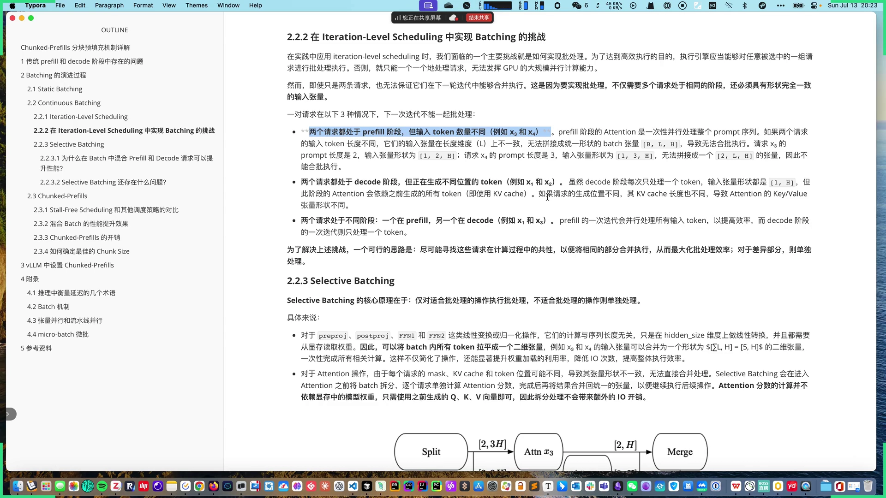 |
| 所以说它的位置不一样的话虽然说decode是一个token但是这种情况下也是不可以做的因为他的KVK的程度不一样呃下一种就是说它在不同的阶段嘛一个prefer一个decode那它的差的就更多了嘛那肯定也是不行的那为了解决上述挑战啊一个思路就是说呢我在这些请求中在prefer跟decode请求中呢 [【跳转到 17:35】](https://www.bilibili.com/video/BV1f2uczGEqt/?t=1055) | 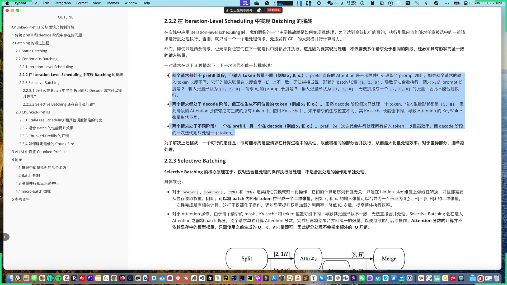 |
| 我去找到一些相同的特性共性如果是有共性的部分呢我就去和皮脂性以最大化呃批处理效率对于差异的部分呢就会单独进行处理后面我会说下哪部分是能够有共性能够和P的哪部分是有差异的需要单独处理的OK好那到这里的话我再提一句呃 [【跳转到 18:00】](https://www.bilibili.com/video/BV1f2uczGEqt/?t=1080) | 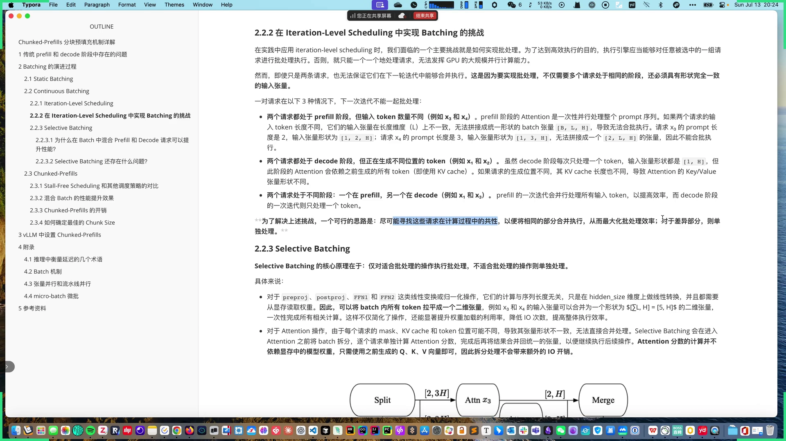 |
| 我们前面一开始的这个不是先介绍这个啊staticbatch吗里面不是有个requestlevel的这个batch吗那我们刚才说了我我在itellationlevel这个情况呢我我去合并这个prefer跟decode不是有考虑一些问题吗那为什么前面requestlevel这个schedule0就没有没有问题了吧那这个原因是因为呢呃在request的levelbatch中呢 [【跳转到 18:25】](https://www.bilibili.com/video/BV1f2uczGEqt/?t=1105) |  |
| 每个请求呢从prefer到decode这个阶段嘛都是在固定在一个pay中的那对于说比如说有的prefer它的长度是不一样的对吧那他会用这个pending的机子就去填充就是把这些短的prefer的的请求进行一个painting填充就是让它的一个长度变得一致OK那就解决我前面说的一致的问题了对吧 [【跳转到 18:50】](https://www.bilibili.com/video/BV1f2uczGEqt/?t=1130) | 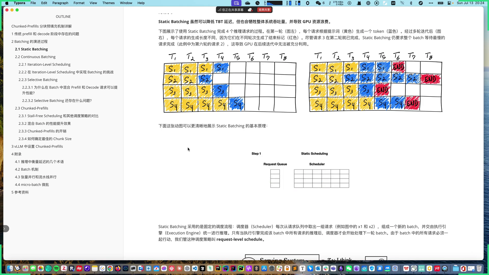 |
| 那prefer都完成以后那大家都到decode到decode以后呢如果说有的已经先decode结束了他也会用PY的方式进行一个填充就保证呢是让它看上去呢还是没结束呃也是保证它的长度也一样那通过这种painting的方式让requestlevel的这种schedule呢啊它就可以解决这个问题就没有这个问题了 [【跳转到 19:15】](https://www.bilibili.com/video/BV1f2uczGEqt/?t=1155) | 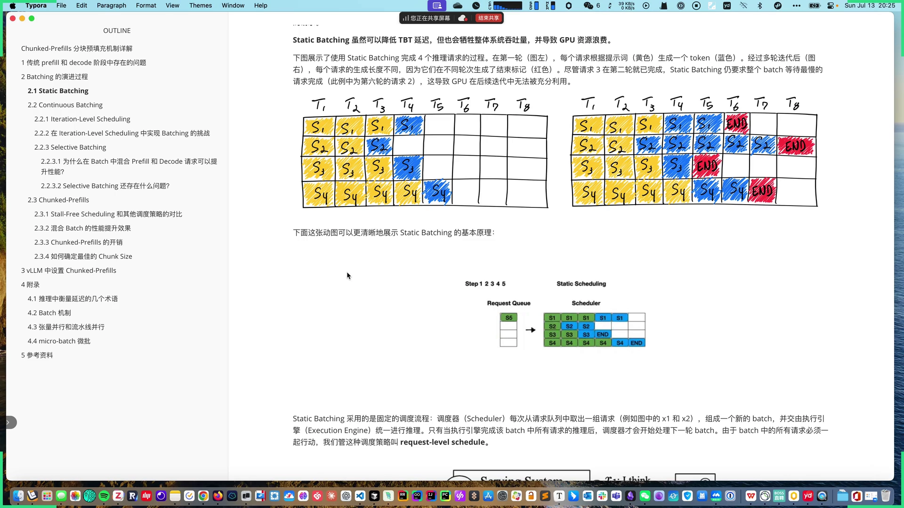 |
| 就不需要考虑这个不同类型的prefer跟decode请求进行和P的一个问题好那我们接下来继续哦哦对好我们说到这里了那我们刚刚说了这是一个可行思路嘛可行思路就是我要寻找这些计算过程中的一个共性然后进行一个合并执行对于差异部分进行一个单独处理 [【跳转到 19:40】](https://www.bilibili.com/video/BV1f2uczGEqt/?t=1180) | 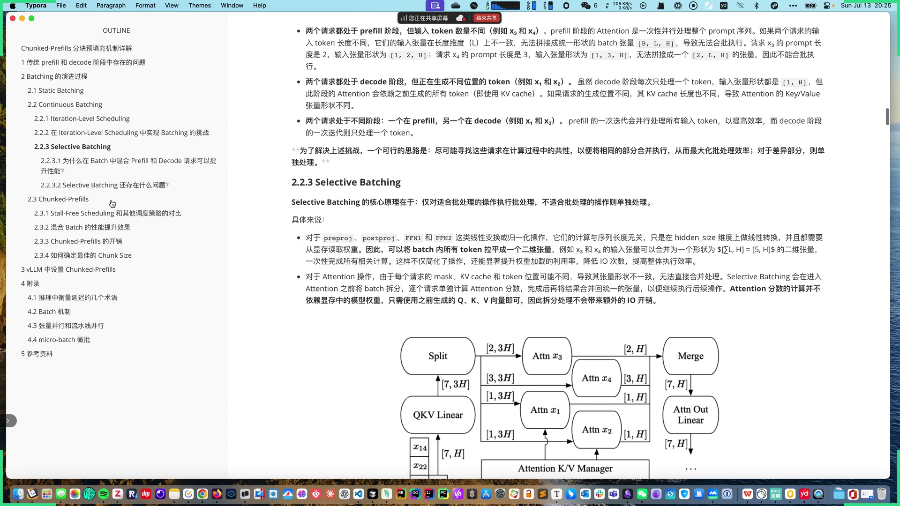 |
| 这也就是selective啊batch的一个核心的一个原理那具体来说呢有两个部分以这个部分呢是可以进行合批的那这个部分呢是需要单独计算的那这三个这几个是比如说像PREPROACH呃PREPROACH啊Postproach还有FFN1Ffn2这类是属于一些线性变化或者规划操作 [【跳转到 20:05】](https://www.bilibili.com/video/BV1f2uczGEqt/?t=1205) | 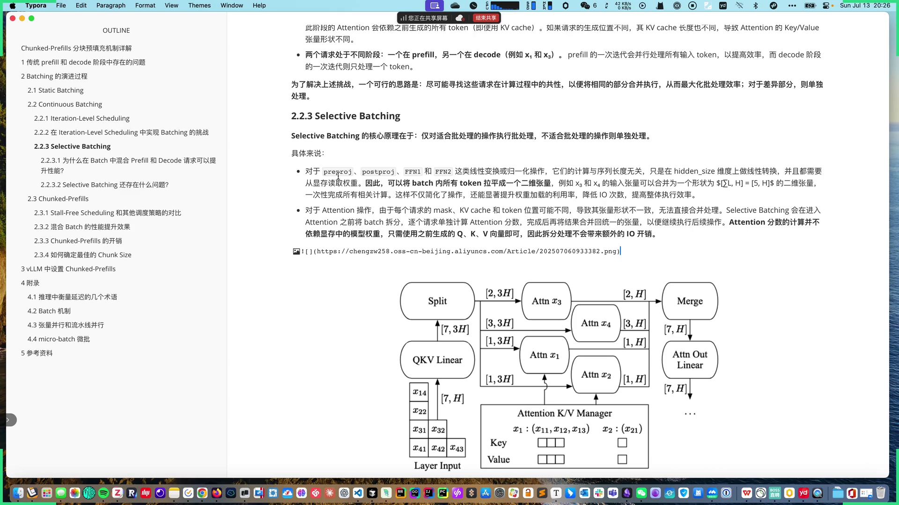 |
| 因为它们的计算长度与序列无关呢所以说呢我可以进行一个合并那我这边说一下比如说什么是这个PREPROACH比如说像就是比如说我的每个原始的token我需要计算啊乘以这个WK和WQWV的一个矩阵嘛我就得到这个最后QKV那就是这个这个过程那还有一个呃postproapproach [【跳转到 20:30】](https://www.bilibili.com/video/BV1f2uczGEqt/?t=1230) |  |
| 那这个过程呢就是说比如说我可能是有时候会有那种多头注意力机制那我需要把这个注意力多头注意力输出的一个结果我就转换为一个呃模型标准的一个hiddensize那就会有这个那FN1FN2你就可以认为是这种比如说我要嗯FN1你可以认为说我去提供一些更强的一个 [【跳转到 20:55】](https://www.bilibili.com/video/BV1f2uczGEqt/?t=1255) | 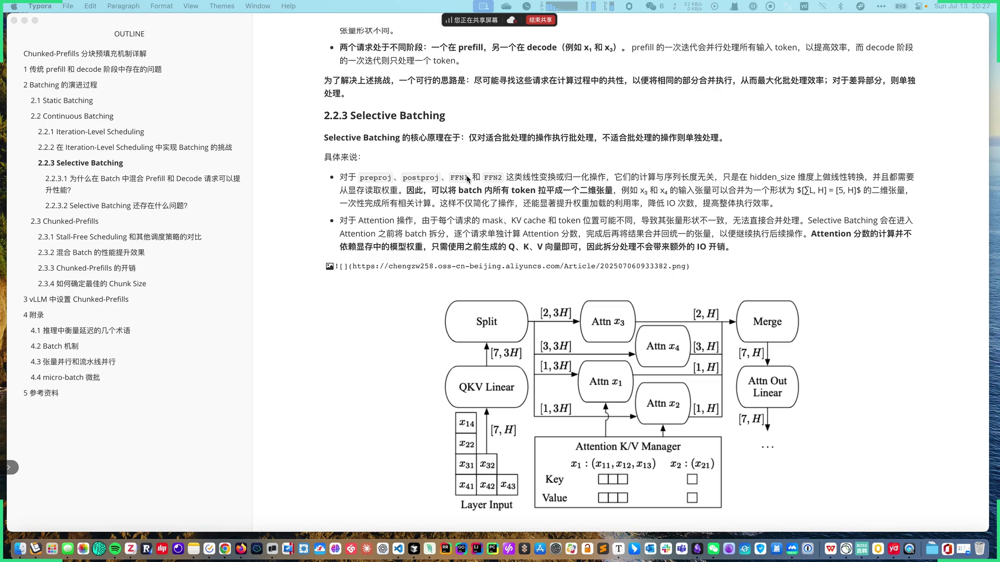 |
| 非线性的表达能力对然后呢让模型有可以去理解呃更复杂的一些特征那FN2的话就相当于你理解完以后呢你需要把你的想法整理成下一层能够继续呃理解的东西传给下一个人OK所以说这几类呢你可以认为说这类线性变化呢它们的计算长度呢是与序列无关的并且只在Kinosize维度做线性变化 [【跳转到 21:20】](https://www.bilibili.com/video/BV1f2uczGEqt/?t=1280) | 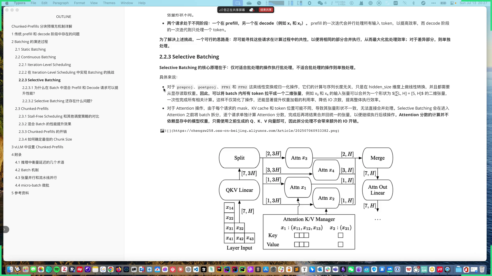 |
| 所以说我可以进行一个统一处理那除一点的方式就是将这个BH内我所有的token我去拉平成一张向量OK一一个二维的张量好然后我去这种方式我去进行计算那比如说这个地方对吧那我我这里虽然说是有四个不同的请求对吧四个不同的请求 [【跳转到 21:45】](https://www.bilibili.com/video/BV1f2uczGEqt/?t=1305) |  |
| 然后一共是七个token嘛对吧那我把它可以拉平成这种七跟H7就七个tokenH就是他的一个hiddensize对吧然后在这个地方呢我去送入QQ啊QKV的这个线性层对吧变化层然后对应的生成不同的query跟key还有value3个向量所以这里是3H嘛那到这里的话就是attention层的话 [【跳转到 22:10】](https://www.bilibili.com/video/BV1f2uczGEqt/?t=1330) | 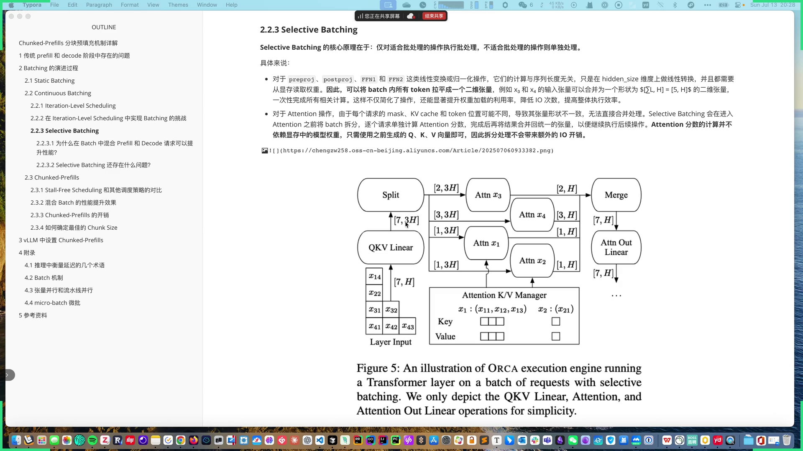 |
| 我就不能做一个统一的计算了因为这里说attention的操作的话因为每个请求都像kitcash或者token的位置不一样最终会导致张量形状不一样无法直接进行合并处理所以说呢selectivebatch会在进入tension之城呢之前呢会将batch进行一个split拆分把这73H对应的每个请求拆成这个 [【跳转到 22:35】](https://www.bilibili.com/video/BV1f2uczGEqt/?t=1355) |  |
| 比如23H33H13H13H对吧然后分别的计算这个attention的分数那计算完成以后呢我再在这里我再进行一个merge来然后继续OK然后并且呢由于attention的计算过程中呢并不会依赖啊显存中的某一权重因为只需要根据之前这里计算的这个QQV啊向量即可所以说拆分的过程呢 [【跳转到 23:00】](https://www.bilibili.com/video/BV1f2uczGEqt/?t=1380) |  |
| 不会有其他的IO的一些开销比如说读取啊模型权重那些IO的开销对好所以总而言之呢就是说我把呃这类可以是线性变化的操作呢我去进行一个啊统一的和P的计算那对有tension操作的时候我进行一个split然后分别计算了tension的一个权重然后在最后再进行一个合并 [【跳转到 23:25】](https://www.bilibili.com/video/BV1f2uczGEqt/?t=1405) | 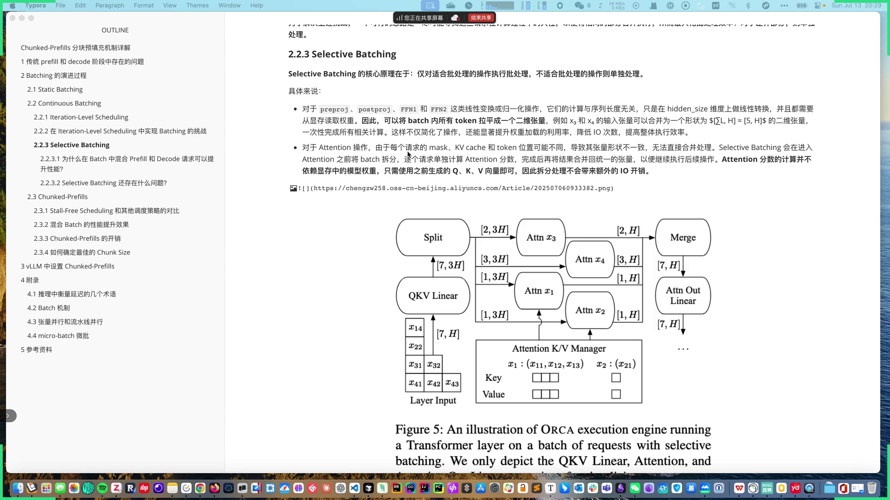 |
| 然后进传给下一层继续进行一个操作OK这就是它的一个基本原理好然后我们再看下面那我们刚刚介绍了我们能现在通过这种方式呢我可以在一个badge中呢我去混合啊prefer和decode请求对吧那么我们先来想一想为什么我去混合这两个种请求我去呃可以提提高性能的 [【跳转到 23:50】](https://www.bilibili.com/video/BV1f2uczGEqt/?t=1430) | 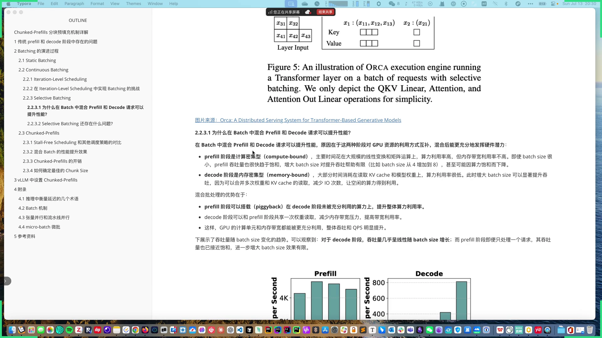 |
| 这是因为呢prefer跟decode请求呢它其实是两种不一样的类型嘛PREFU呢是属于计算密集型啊Computerbd那decode阶段呢是属于memorybond的那这两种请求呢在对GPU的利用方利用的率利用率是不一样的那像preview请求呢它其实是会对GPU的使用率是用的比较高的但是它在它对这种内存其实还好 [【跳转到 24:15】](https://www.bilibili.com/video/BV1f2uczGEqt/?t=1455) | 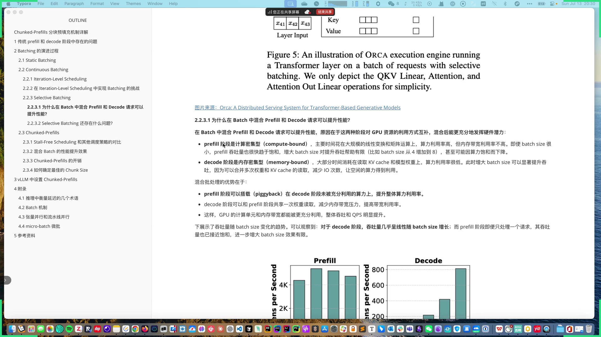 |
| 那decode的话它就是会把大量时间消耗在这种kvcatch上或者读取模型权重上反而呢因为它一次性是升值一个token的嘛所以对啊GPU的算力的利用率很低所以说呢我们可以把这两组进行混合把让这个这个backhome和代理中呢我可以把这个decode阶段呢我利用不上的这种GPU的计算能力给利用上嘛 [【跳转到 24:40】](https://www.bilibili.com/video/BV1f2uczGEqt/?t=1480) | 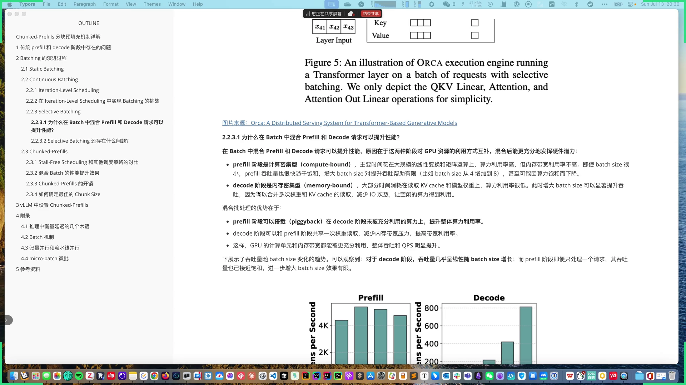 |
| 因为闲着也是闲着嘛对吧好所以说这里就是说的混合批出的一个优势就是我可以在这个prefer中呢我可以去搭载因为论文中是用的这个词peggybag把搭在这个在抵扣的阶段未被充分利用的算力上通过这种方式获取整体提升啊算力的一个利用率OK同时呢decode阶段我也可以和prefer阶段 [【跳转到 25:05】](https://www.bilibili.com/video/BV1f2uczGEqt/?t=1505) | 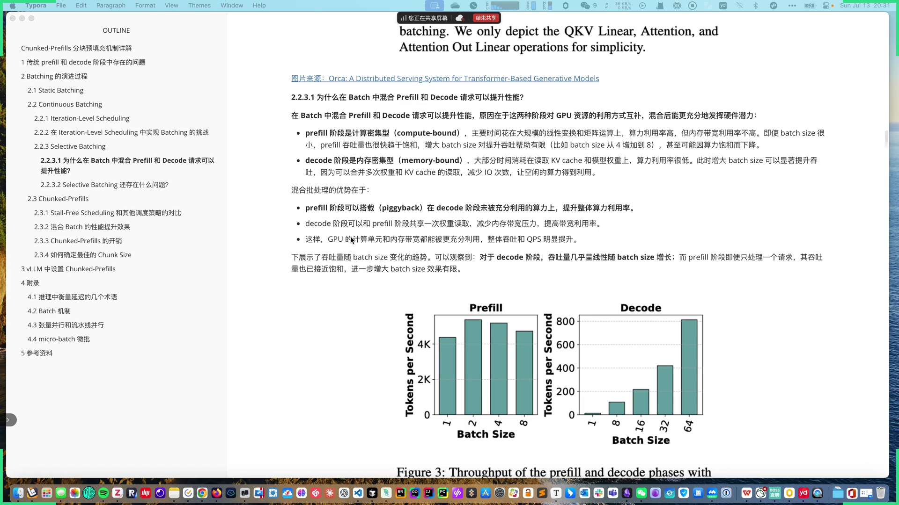 |
| 我共享一次权重读取减少内存贷款压力提高呃贷款利用率好这这张图是来自论文的一个图就是体现了吞吐量随着bysize的一个变化趋势你可以看到我在抵扣的阶段呢我去提升这种besides他对这个呃吞吐量的提升是很明显的 [【跳转到 25:30】](https://www.bilibili.com/video/BV1f2uczGEqt/?t=1530) | 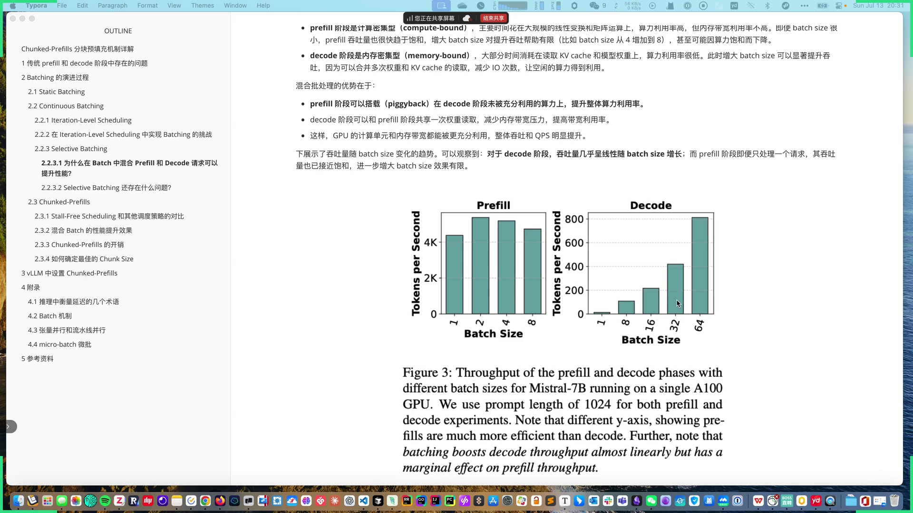 |
| 可以是线性的增长的对吧呃然而在如果是在prefer阶段呢你看一开始即便只有一个请求的话他的呃吞吐量其实也接近饱和了对吧所以说进一步增长by赛的参数呃效果也是比较有限咳不好意思喝口水咳OK所以说呢你看呃我我的decode阶段呢 [【跳转到 25:55】](https://www.bilibili.com/video/BV1f2uczGEqt/?t=1555) | 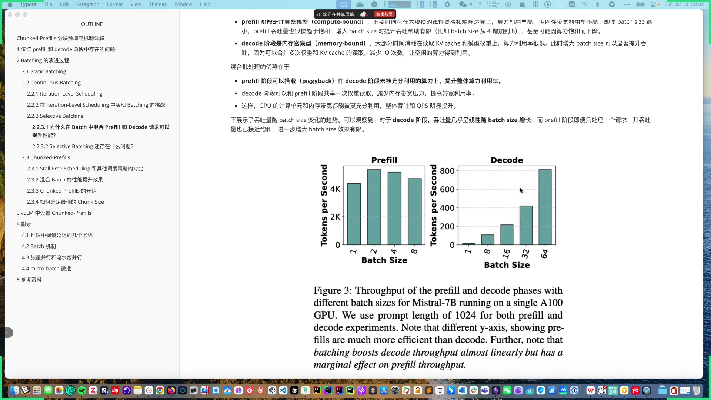 |
| 呃呃正常来说呢我其实呢论文上是说了我可能要增加到256个啊以上的token我才能充分的利用到呃呃256个batch就等于说有256个不同的decoder请求我可能才可以充分的去打满这个吞吐量但是呢往往呢这个是不容易达到的 [【跳转到 26:20】](https://www.bilibili.com/video/BV1f2uczGEqt/?t=1580) | 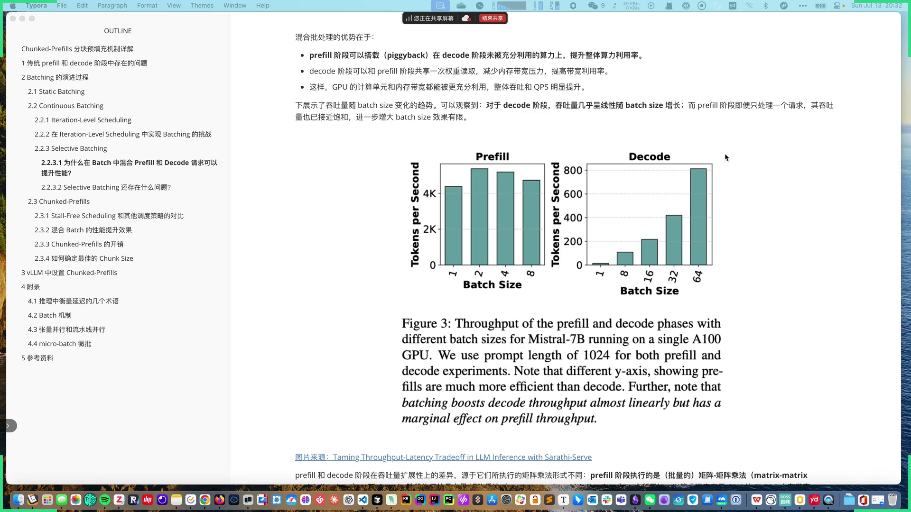 |
| 所以说这部分的这种计算的呃量我可以用这个比如说放一两个的这种prefer的请求把这部分计算量给他打满就是充分利用这种GPU的一个计算的资源嘛对总体的思想就是这样的好那我们刚刚前面提到了prefer跟decode阶段呢我是在计算的话是会有些差异的 [【跳转到 26:45】](https://www.bilibili.com/video/BV1f2uczGEqt/?t=1605) | 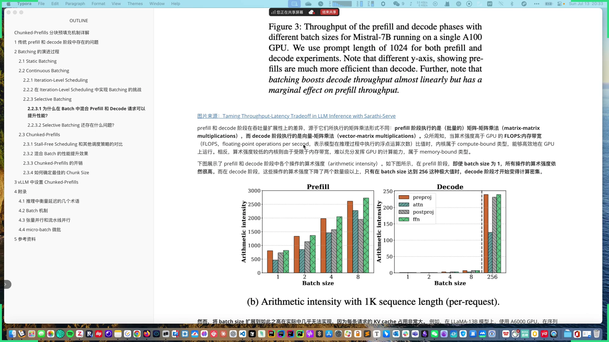 |
| 呃究其原因是因为他们所执行的矩阵乘法形式是不一样的在prefer阶段呢其实是执行的像矩阵乘乘法矩阵乘矩阵的一个乘法因为有多个token嘛对吧那decode阶段呢其实是向量和矩阵什么用我就其中的一个token我去跟权重进行一个计算权重举举证进行一个计算嘛所以说呢他的呃因为由于肯定是矩阵和矩阵乘法 [【跳转到 27:10】](https://www.bilibili.com/video/BV1f2uczGEqt/?t=1630) | 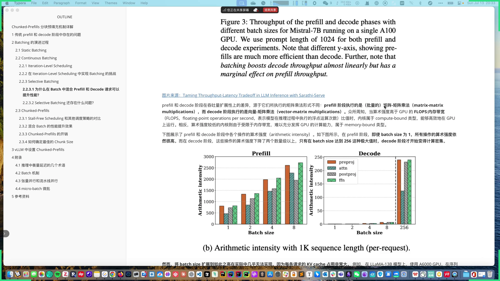 |
| 因为它可以并行执行嘛对吧所以他的这种GPU的一个啊计算数的强度对吧会更高那这边说到呃一个算术强度呢其实是呢是通过这个这个呃FLOS跟内存带宽的一个比值我进行一个计算的那FLOS就是表示呢是在模型在推理过程中执行的一个浮点计算的一个次数对吧 [【跳转到 27:35】](https://www.bilibili.com/video/BV1f2uczGEqt/?t=1655) |  |
| 好如果说呃内核属于computerbd类型呢就可以在高校在gbu上计算如果说它它属于memoryband的话它就会受限于内存带宽就是难以发挥出GPU的计算能力OK啊这是两种不同的类型那这里你也可以看到呃如果说呃比如说这里我刚才说的算术强度对吧 [【跳转到 28:00】](https://www.bilibili.com/video/BV1f2uczGEqt/?t=1680) |  |
| 算术强度话我们可以怎么理解呢比如说呃FLOS的话就是说我刚才说是在模型推理时呢我需要做一些浮点预算的一些次数比如说像做一些矩阵乘法或者是一些注意力计算那这些会呃做一些这种矩阵的运算的话我就会消耗一些FLOS对吧那内存带宽的一些访问比如说像访问一些加载模型权重或者是计算啊 [【跳转到 28:25】](https://www.bilibili.com/video/BV1f2uczGEqt/?t=1705) |  |
| 使用这个kvcatch这些呢其实我都会使用到内存带宽那比如说呢我像呃比如说不同的GPU的模型比如说A版它的一个他肯定官方会有个标志嘛比如说FP16或FP32它能达到一个一个FLOS是多少对吧还有它的一个内存带宽可能是多少GB每秒对吧 [【跳转到 28:50】](https://www.bilibili.com/video/BV1f2uczGEqt/?t=1730) |  |
| 它会有个标注那这个通过这个官方的它提供了一个标准值我举一个计算会得到一个这个这个GPU这个比如说A100类型GPU的一个算术的一个强度那如果说我真正我在做计算比如说PREFL做计算或decode计算我去我一直prefer我肯定是那个呃算用强度肯定更高嘛 [【跳转到 29:15】](https://www.bilibili.com/video/BV1f2uczGEqt/?t=1755) | 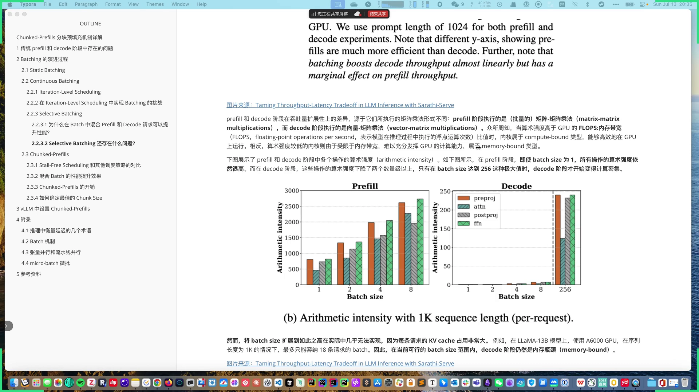 |
| 因为他会多个token之间我去做这种矩阵计算但他对这种kvcatch那时候的读取没那么大那我肯定的算用强度是较高的那抵扣的阶段就相反对吧因为我我的内存我读的kvcash是会随着我不断的啊迭代我读的更多嘛所以说他的这个算用强度是偏低的但内存的使用是会更高的对吧 [【跳转到 29:40】](https://www.bilibili.com/video/BV1f2uczGEqt/?t=1780) |  |
| OK好所以说呢如果说我不同阶段这个请求那我去用这个算算用强度进行一个比值的一个计算的如果说我的这个任务呢是低于这个比值的那就说明说我的瓶颈其实是在内存带宽啊也就是说是像decode这种请求如果说我计算完以后我的这个摄像的强度是高于这个值的 [【跳转到 30:05】](https://www.bilibili.com/video/BV1f2uczGEqt/?t=1805) | 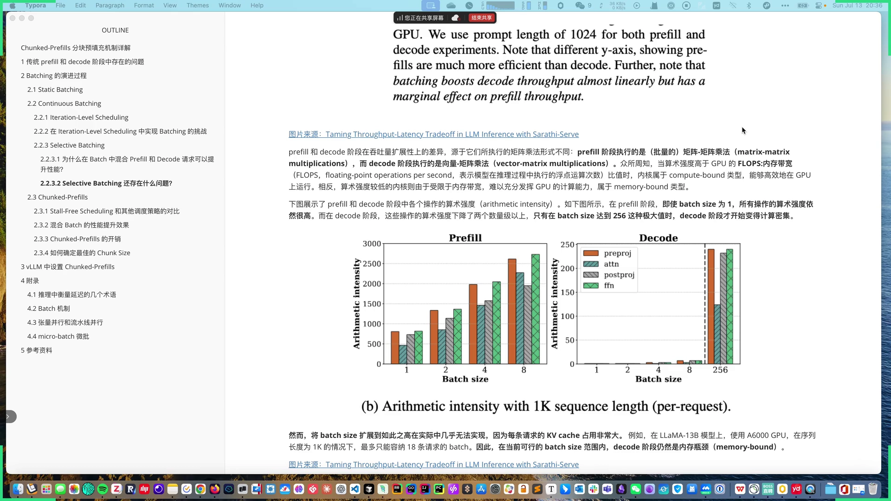 |
| 那就认为呢它是瓶颈是在计算对吧是属于computerbound的然后你可以看到这个图它其实是就是体现了啊prefer和decode阶段中各个强的操作一个上路强度比如说你可以看到啊在PREFIL阶段即使是BG是为一的话对吧所有的算术强度其实还是蛮高的对吧然后抵扣的阶段的话 [【跳转到 30:30】](https://www.bilibili.com/video/BV1f2uczGEqt/?t=1830) | 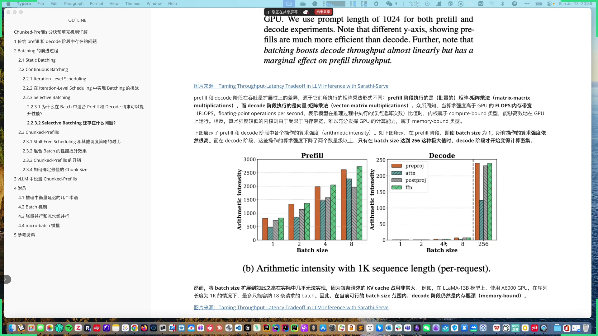 |
| 你可以看到前面的1248这个B序的话size的话其实没有什么算的强度你要到256就我刚才说了256以上可能说才会变得计算密集但是呢这种情况呢这么高的倍率size其实是很难实现的因为每条请求中的这个kvcash是累加的所以通胀非常大的这里也给了个例子 [【跳转到 30:55】](https://www.bilibili.com/video/BV1f2uczGEqt/?t=1855) | 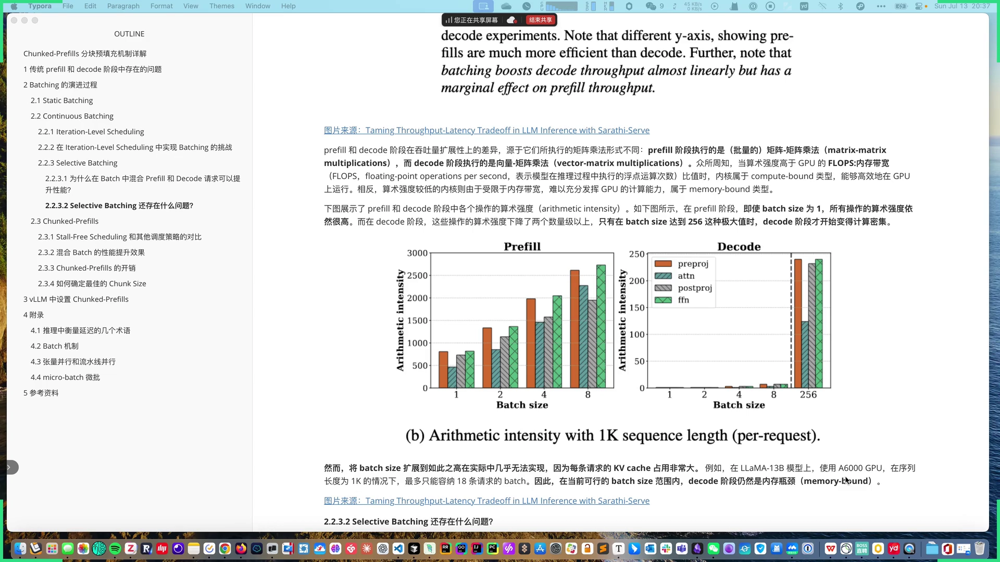 |
| 比如说一个拉玛的13B模型上它其实说呢在序列长度为啊1K的情况下是使用这A6000的GPU最多也只能容纳18条请求就拜赛是18对吧也就是说在256的这个范围内那其实是对当前的GPU其实是很难达到这么大的概率赛的所以说虽然说这个是256的时候是能够算强度比较高但是通常情况下 [【跳转到 31:20】](https://www.bilibili.com/video/BV1f2uczGEqt/?t=1880) | 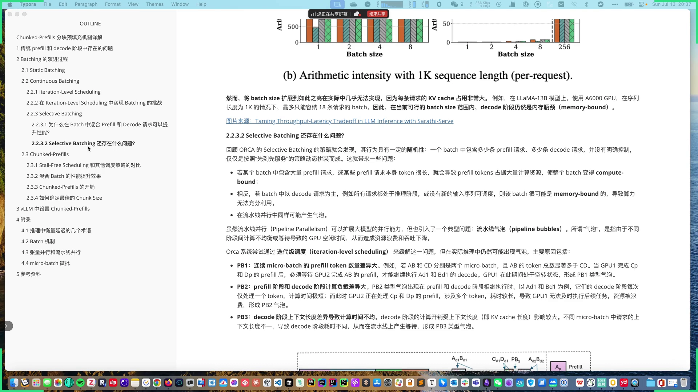 |
| 如果我们不做这种混合的带雪花是很难达到的对吧好然后我们刚刚介绍了这个selectivebatch中啊为什么我们在里面混合prefer和decode请求可以提升性能那看上去呢selectivebatch呢已经做的挺好的但它其实呢还存在一些问题啊那可以看到呢这有几个问题 [【跳转到 31:45】](https://www.bilibili.com/video/BV1f2uczGEqt/?t=1905) | 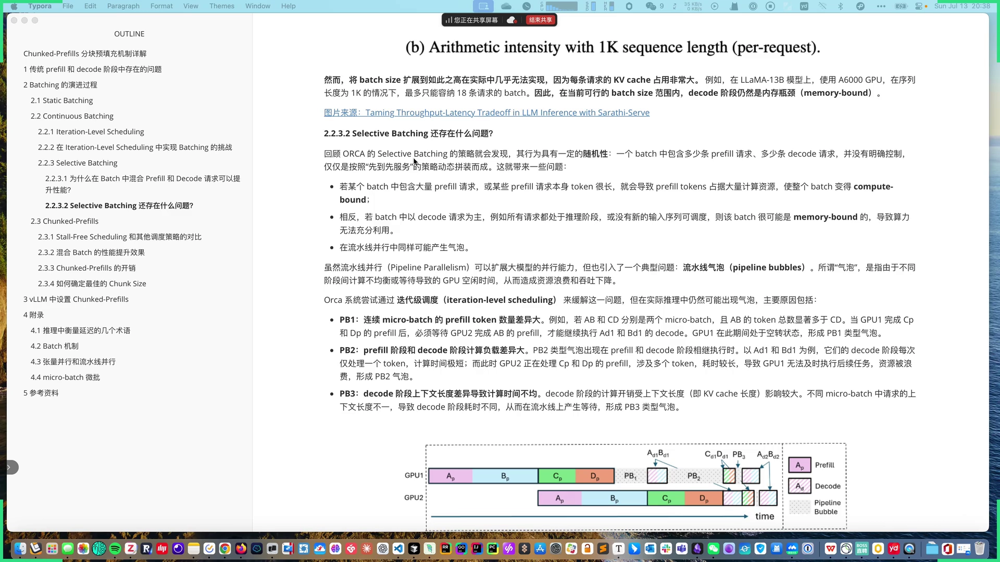 |
| 我前面列了首先呢第一个问题就是呢他在做selectbatch时候呢他的策略其实是具有一定随机性的就比如说一个bay中呢包含多少条prefer或者包含多少条decode请求呢并没有明确的控制仅仅是按照先来先服务的一个策略进行动态拼装的所以这从而就会带来一些以下的引申问题比如说有个bay中呢可能是包含大量PREFILE请求 [【跳转到 32:10】](https://www.bilibili.com/video/BV1f2uczGEqt/?t=1930) | 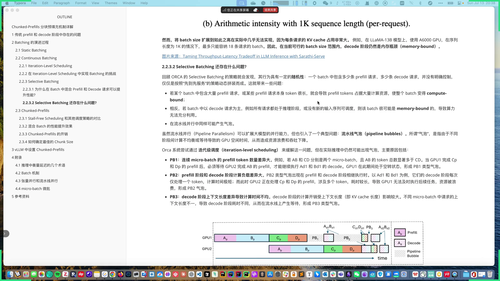 |
| 或者某些prefer请求本身token很长就会导致这个长的这个problemm持续占据的大量计算资源最终会使得这个代GE变得是计算密集的那相反呢如果说这个page数中都是decode请求那所有的接请求可能几乎都处于decode阶段并且没有新的一个输入序列可以调度所以说这个badge就是maryband [【跳转到 32:35】](https://www.bilibili.com/video/BV1f2uczGEqt/?t=1955) | 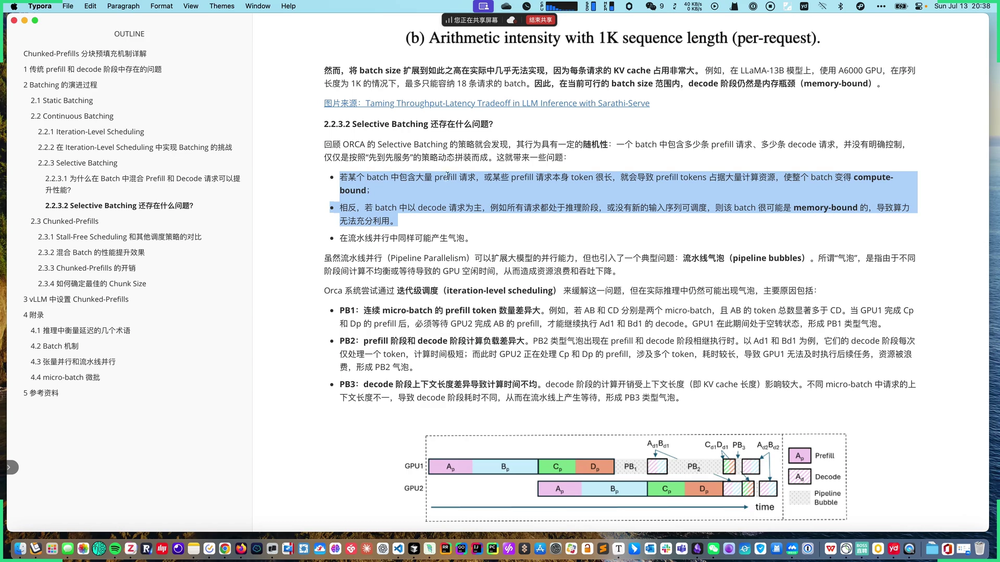 |
| 就会导致额上亿的资源无法被利用所以说所以说因为说他的这个调度策略是具有一定的随机性的就导致说大家还是在调度过程中可能会存在这种computerbd或者memorybd的一个情况就取决于你的这代这个代理猪呢究竟是prefer和decode的一个请求的一个组成的一个形状是怎么样的那第三个的话就是会在流水形眼的变形中 [【跳转到 33:00】](https://www.bilibili.com/video/BV1f2uczGEqt/?t=1980) | 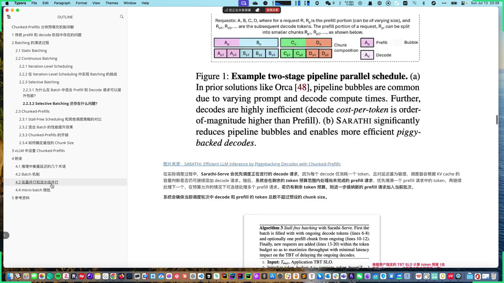 |
| 可能会存在一些气泡那这边简单说一下啊流水线并行因为我这边附录上也提到了为什么要有流水间冰景瑜啊可以说呢我们和流水线病情经常提到就是一个张亮的病情Tensorparison流水线病情就是PAELINEPARISON那这个两个并行方式呢解决问题就是因为我的大元模型可能是比较大的 [【跳转到 33:25】](https://www.bilibili.com/video/BV1f2uczGEqt/?t=2005) | 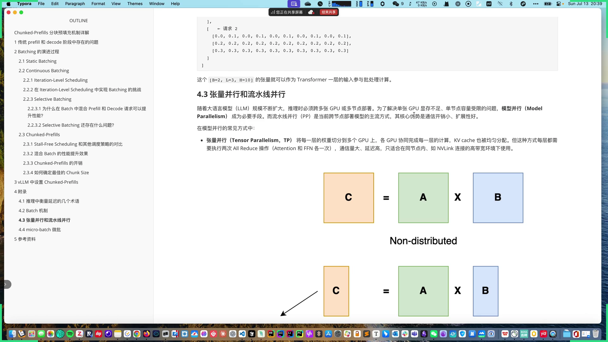 |
| 比如说70B或者是甚至更大的那我的单张GPU的其实是放不下这么大的一个模型的所以说呢我就需要有让这个模型能够跨多个GPU或者跨多个节点进行一个部署那从而来说就有两种方式一种方式是张量并行就是我按照每一层的权重将这个模型拆分在多个GPU上 [【跳转到 33:50】](https://www.bilibili.com/video/BV1f2uczGEqt/?t=2030) | 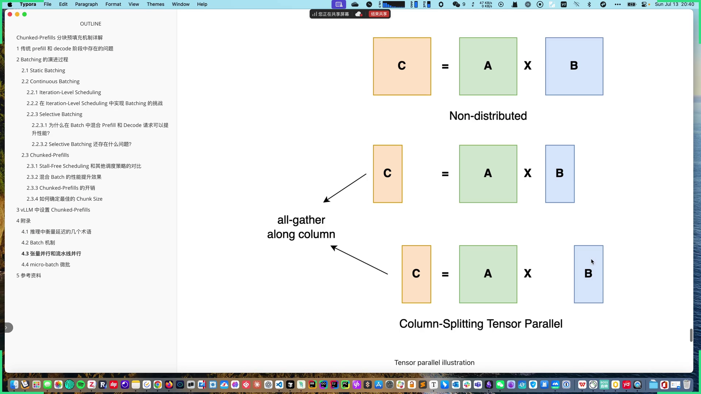 |
| 那比如说就是呃这两个相乘没有拆分之前那我把这一层一部分拆到一个GPU另外一个部分站在另外一个GPU那这种方式呢有一个方式就是它的通信开销是比较高的就每称那我需要计算呢我需要做两次oreduce的一个操作所以说它通信量大 [【跳转到 34:15】](https://www.bilibili.com/video/BV1f2uczGEqt/?t=2055) | 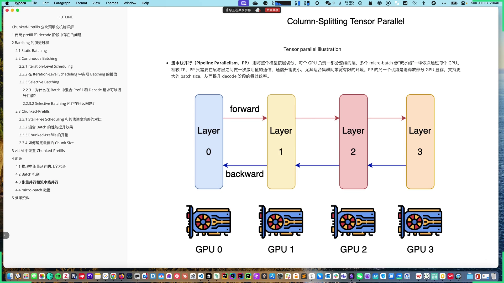 |
| 颜值高OK好然后第二种方式就是流水线并行它是按照层去分的就是我在这一层推理完以后我去FORWORD传给下一层然后再backword回来那就像是流水线一样依次的通过没这个GPU那相比于TP的话pp只需要在层与层之间做一次activation的一个通信那通信开销要更小 [【跳转到 34:37】](https://www.bilibili.com/video/BV1f2uczGEqt/?t=2077) | 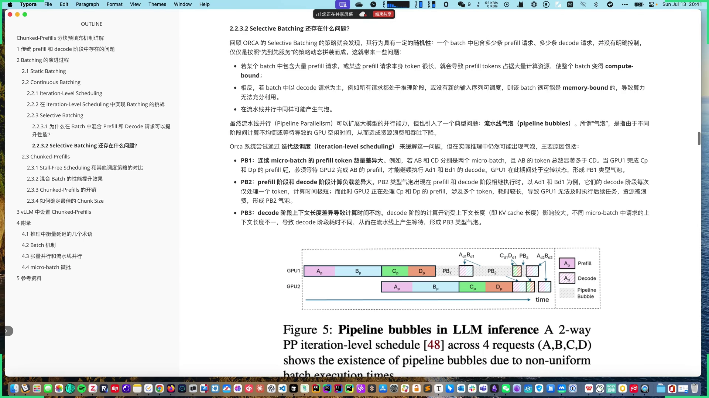 |
| 并且啊比较适合集群带宽有限的一个环境所以说可能啊pp的话是使用比较多的一个方式也是比较经济的一个方式那我们再回到这里那我刚才说了使用这个pp的话会就算使用selectivebatch的话在pp的过程中呢也会产生这种气泡那什么是气泡呢就是说指的是不同阶段计算不均衡 [【跳转到 35:02】](https://www.bilibili.com/video/BV1f2uczGEqt/?t=2102) | 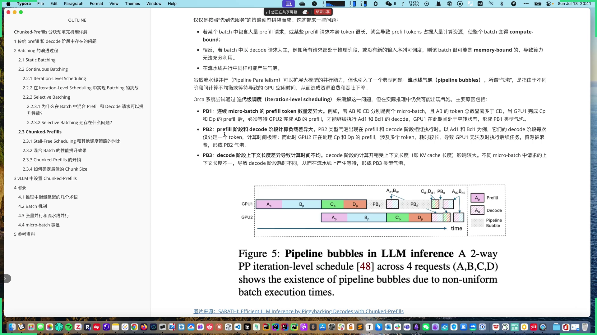 |
| 或者从而会导致的啊GPU的一个闲置的时间OK那这里呢论文中列出了三个能够产生啊流水线气泡的一个场景啊比如说呃这里说的PB1就是这个地方比如说我在执行这个michaelbar中的时候比如说我的A跟B这里的话就是A跟B是一个batch那C跟D是一个batch [【跳转到 35:27】](https://www.bilibili.com/video/BV1f2uczGEqt/?t=2127) | 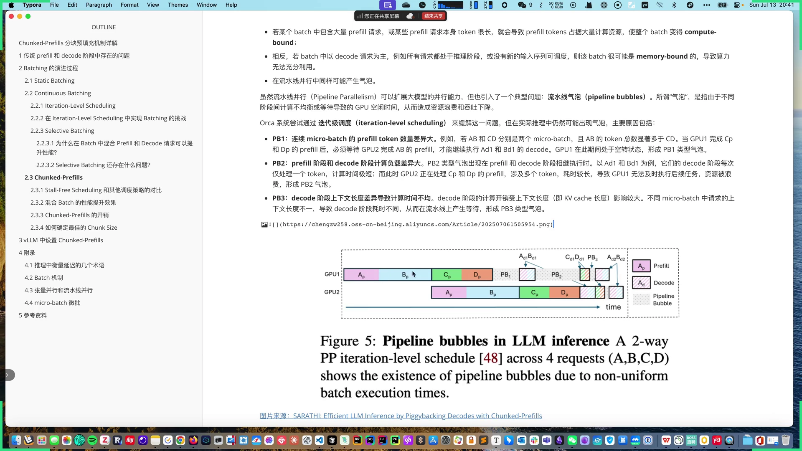 |
| 那呃比如说我的A跟B的一个总的token我是会比CD会明显多的那流水线的话就是我看比如GPU1我先做了AP呃A跟B的一个prefer对吧做了一部分然后会传给啊GPU2就像流水线一样然后他在CD它也是CD这是我刚说的流水线的一个方式嘛把不同的层在拆分到不同GPU上好那我们刚才看 [【跳转到 35:52】](https://www.bilibili.com/video/BV1f2uczGEqt/?t=2152) |  |
| 比如说在GPU一上我去做啊APE跟BP以后呢我去传给AP跟BP那在GPO2做AP跟BP的过程中呢GV1就可以做CP跟DP对吧因为我们刚刚说的AP跟BP的长度是比这个CP跟BP是长的所以说呢CP跟DP做完以后呢这里其实还没有做完对吧这里是要等一段时间但是呢CP和DP做完以后 [【跳转到 36:17】](https://www.bilibili.com/video/BV1f2uczGEqt/?t=2177) |  |
| 因为我这总共就四个东西吧对吧CP跟dB组完它理论上要开始做这个decode嘛就ADE跟BDE对吧但他这里做不了ADE跟BDE为什么因为这里我需要等gwillu2的这个AP跟BP完成对吧他才能去做抵扣的所以在等的这个过程中就产生了BPE的这个气泡这是第一个就是导原因 [【跳转到 36:42】](https://www.bilibili.com/video/BV1f2uczGEqt/?t=2202) |  |
| 就是因为这两个microbatch的一个PREFW一个token数量差异是比较大的好然后第二个就是PP2那BB2的话就是是出现在像prefer跟decode相继执行过程中那比如说我这里的话我是不是呃GP2上我这里做了CP跟DP对吧好那由于呢我在AGPU一上呢我做ADE跟BD [【跳转到 37:07】](https://www.bilibili.com/video/BV1f2uczGEqt/?t=2227) |  |
| 因为这里只要抵扣的一个token嘛时间肯定是比较短的这里做完以后呢GPU2是不是要继续接着做他的这个ADE跟BDE对吧但他做之前呢他还要先把这个CP跟DP的呃CP跟DP的完成对吧那在做这个过程中他在等的时候这部分在等的时候就是呃导致的BP2的这个气泡出现了一个过呃原因对吧 [【跳转到 37:32】](https://www.bilibili.com/video/BV1f2uczGEqt/?t=2252) |  |
| 这第二个就是说在PREFIL跟DECO的一个阶段计算的差异大这里做的时间很短对吧但是要做这个时候需要等GP2上目前在做的prefer完成才能继续所以这就是BP2的一个出现的情况那还有个BB3BB3就是说不同的虽然都是抵扣的阶段但是他的一个上下文是B样刚才说的AP跟BP的上下文是比较长的嘛 [【跳转到 37:57】](https://www.bilibili.com/video/BV1f2uczGEqt/?t=2277) |  |
| CP跟DP的上下文是比较短的那我在做这个上下纹长的这个时间肯定是会稍长对吧上下文短的话就是会稍短那这两个时间是就有差异的所以呢这就是为什么会有一个啊BB3的一个情况出现好所以说这就是在流水线中有这个三种会产生就算使用itlationlel的一个SKULLING [【跳转到 38:22】](https://www.bilibili.com/video/BV1f2uczGEqt/?t=2302) | 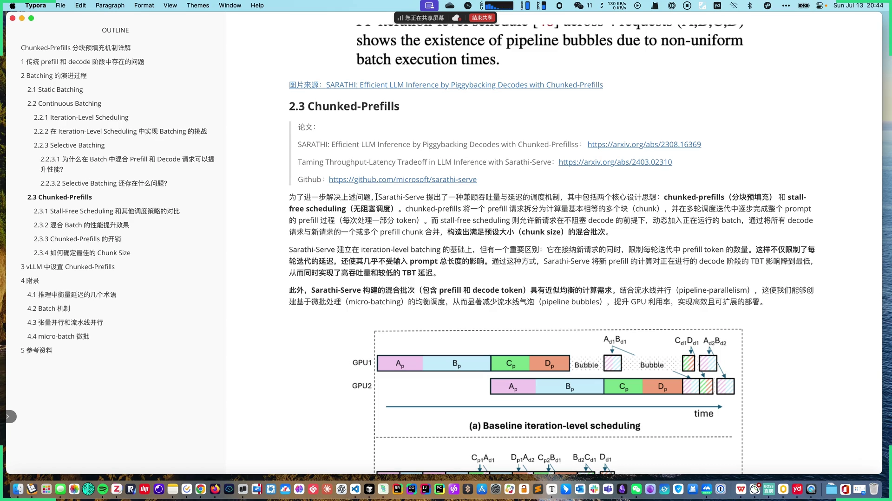 |
| 我仍然会产生气泡的一个原因对好然后呢接下来就到我们今天的一个重点就是topprefer我为什么能够去啊解决上述的这些问题好那川普呃这个川prefer的话就是来自于呃两篇论文呃这篇都是都是是SEROTA的这个论文这篇是第一篇然后这篇是第二篇 [【跳转到 38:47】](https://www.bilibili.com/video/BV1f2uczGEqt/?t=2327) |  |
| 它其实是有一个衔接关系但是论文中间的内容的话还是嗯基本上都是围绕了一个trunkprefer还有一个它的调度机制来展开的区别没有那么大OK好然后它主要呢是包括两个核心的一个思想第一个是啊trunkpreview就是分分块与填充还有一个是stillfreeing的呃那TRPREFER就是将一个prefer请求呢 [【跳转到 39:12】](https://www.bilibili.com/video/BV1f2uczGEqt/?t=2352) |  |
| 我会拆分成计算量基本相当多个块并且在多次调度中迭代去逐步完成整个prompt的prefer过程就每次呢我只是处理比如这prefer是比较长的他会每次处理一部分那stillfree的schedule呢就会允许在新的请求在不阻塞decode的请求呃前提下动态的去加入正在执行的一个batch啊 [【跳转到 39:37】](https://www.bilibili.com/video/BV1f2uczGEqt/?t=2377) | 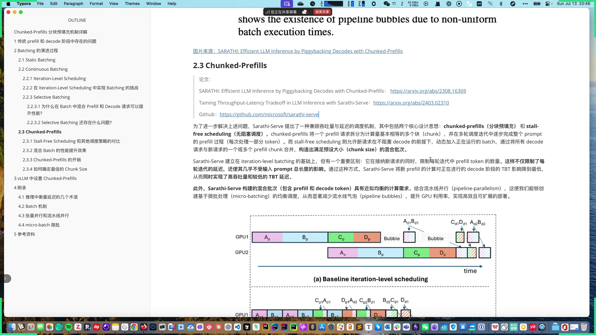 |
| 也就是说SCHEDU呃其实也是建立在这个itellationlevel的batch的一个基础上对吧但是它有个重要的一个区别就是说他在每一次迭代中的话会去限制prefertoken的一个数量然后呢并且呢最终会满足满足呢我每次去调度这个BT中呢我的trunksize是是尽量是一样的对吧 [【跳转到 40:02】](https://www.bilibili.com/video/BV1f2uczGEqt/?t=2402) |  |
| 然后呢并且呢如果说我的这个prompt的长度太长我就会进行一个trunk的一个截取然后保证我的tracksize是在一个控制的一个能够控制的一个亮下OK好那通过这种方式呢啊server台server就可以将新的prefer的计算和正在进行的一个decode阶段里这个tbt就是token不intoken的一个延迟 [【跳转到 40:27】](https://www.bilibili.com/video/BV1f2uczGEqt/?t=2427) | 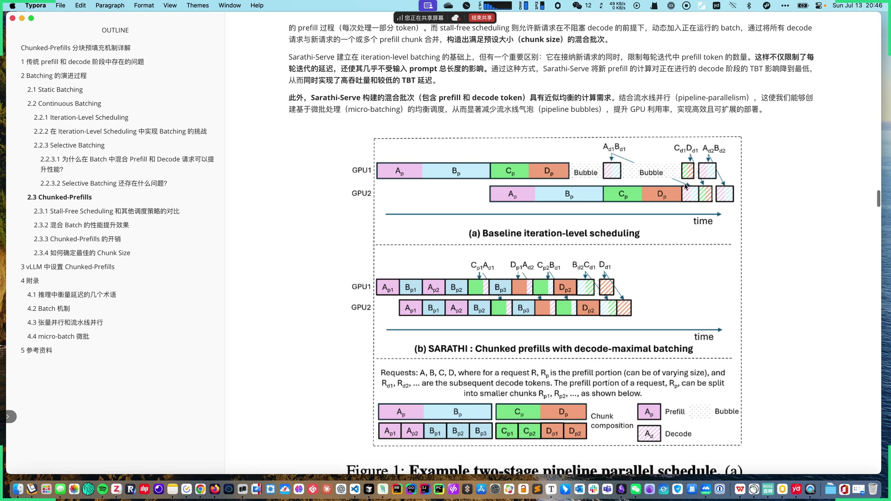 |
| 降到最低就是实现了兼顾这个高吞高吞吐量和低啊tbd延迟的一个呃效果OK好那这边这个图可以看到啊嗯这边就是前面我们说的这个流水线气道的问题那这边就SERETA的一个TRAPREFIRE你可以看到这个APBP我可以虽然它的长度比较长我也可以分解成近似相同的啊一个创口 [【跳转到 40:52】](https://www.bilibili.com/video/BV1f2uczGEqt/?t=2452) |  |
| 但为什么是禁止向的我后面会说因为后面会先去是会优先处理decode的再会把啊剩余的prefer往里冲OK比如说你看这里这上面的话你可以认为这是一个一个串个size这些创个size呢是一样的这些创塞是一样的啊这里你看CP先会填充比如说这里我要弄呃decode [【跳转到 41:17】](https://www.bilibili.com/video/BV1f2uczGEqt/?t=2477) | 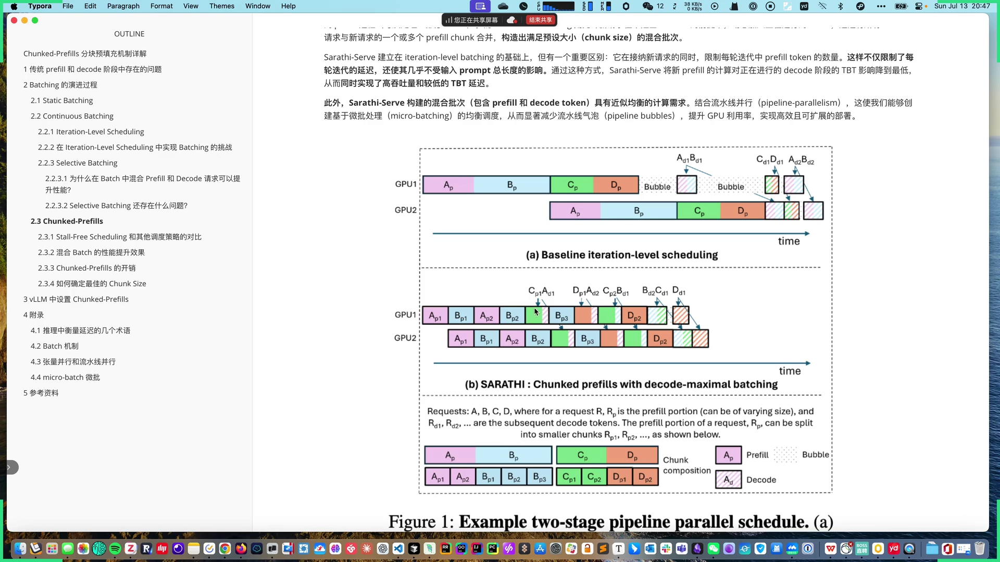 |
| 我先位置把decode的token先填这下来然后剩下的话我去填这个prefer一个token那保证这个是一样的但这里是不一定不一定的因为我这里我不是是根据decodeDecode这里比如说比如说是一个啊512的填了两个decode那剩下不就只有512呃510了吗对吧那所以说这里也会去跟着去切的对吧好 [【跳转到 41:42】](https://www.bilibili.com/video/BV1f2uczGEqt/?t=2502) | 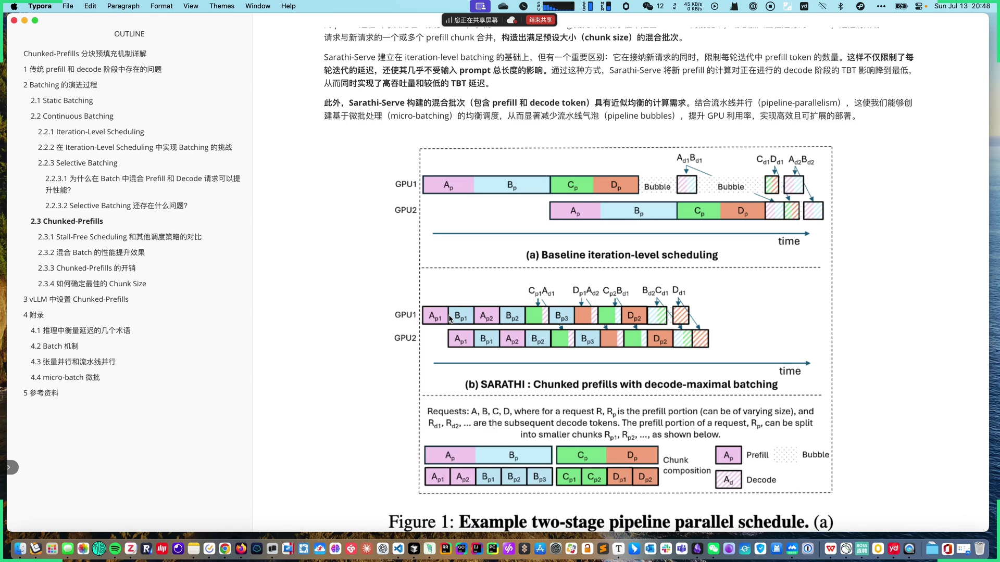 |
| 反正总之呢就是我每次调度的时候呢每个BG中呢我会尽量的保证我的这个prefer加上decode他的这个size是一样的那如果说到后面可能说没有那么多请求如果正常来说我请求是接一个接着一个的嘛那基本上都是能够填的刚刚好的那如果说是比如说没请求那可能是后最后的请求 [【跳转到 42:07】](https://www.bilibili.com/video/BV1f2uczGEqt/?t=2527) |  |
| 那可能就剩一点嘛剩一点那就剩一点那就也没没太大关系好然后这边就说到这个就比较重要就是一个调度的一个过程好那首先呢SERVERTESTserver呢会去优先调度正在进行那个decode请求然后因为每次decode的请求呢只消耗一个token呢对吧所以说他就每次先把decode请求先加上去并且呢因为只有一个嘛 [【跳转到 42:32】](https://www.bilibili.com/video/BV1f2uczGEqt/?t=2552) | 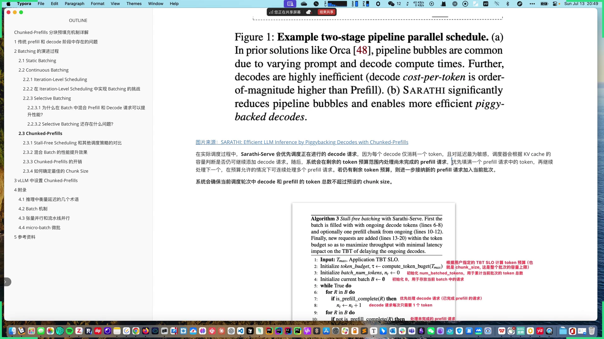 |
| 消耗的这个GPU的一个计算的资源也不会特别多加就加了对吧然后加完decode请求以后呢他就把看一下哪些prefer请求还没完成把这些prefer的请求的token加上去那加了策略呢就是优先先把一个prefer先填满啊如果这个填满的话额还有额就是还有剩的话那再去处理下一个OK如果说这个prefer还是挺长的 [【跳转到 42:57】](https://www.bilibili.com/video/BV1f2uczGEqt/?t=2577) |  |
| 那就是串的到这个为止OK好如果填满了一个就是把所有未处理的preview都填满了还有是那就是去找这个等待队列中的新的请求才处理也就是说它的调度过程中其实是三部分嘛这是优先级最高的因为他要减少TBT的延迟嘛对吧 [【跳转到 43:22】](https://www.bilibili.com/video/BV1f2uczGEqt/?t=2602) | 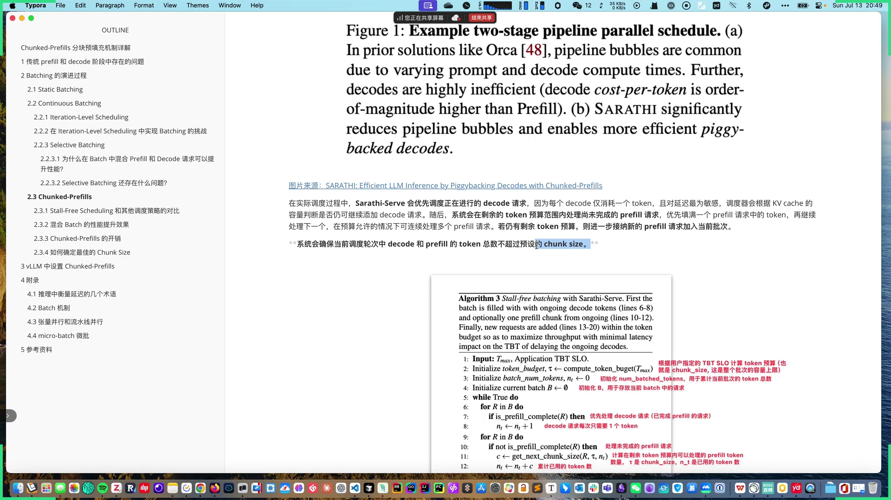 |
| 第二个就是处理还没有完成的prefer请求如果还有剩的就是去处理啊新的一个prefer请求OK好然后总之呢这部分处理会保证decode跟prefer总数不会超过超过这个预设的一个trunksize如果说你的请求都是一直有的吗那基本上这个创set的值就是一样的是一个固定值好然后这个图就是论文中你的一个计算的一个啊 [【跳转到 43:47】](https://www.bilibili.com/video/BV1f2uczGEqt/?t=2627) |  |
| 草图对吧首先第一部分它我们可以根据TBT的一个SOO去做计算一个token的budget因为我们去做这个trumpprefer这个的话我是想要提升啊decode阶段TBT的一个一个效果了对吧所以根据我能够接受的这个SLO呢我去计算一个这一轮这次decode [【跳转到 44:12】](https://www.bilibili.com/video/BV1f2uczGEqt/?t=2652) |  |
| 这一轮这个代理中呢最多能处理的一个token的一个数量那我也就是一个TRANSSIZE就这个B次的容量上限OK然后这里的话就是还有一个numberbatchtokens就是用于累计我当前批次已经计算一个token数好然后这个B就是放代序中的一个请求嘛那这边也可以看到主要是三个部分这里可以看优先处理decode请求是ifprefercomplete [【跳转到 44:37】](https://www.bilibili.com/video/BV1f2uczGEqt/?t=2677) | 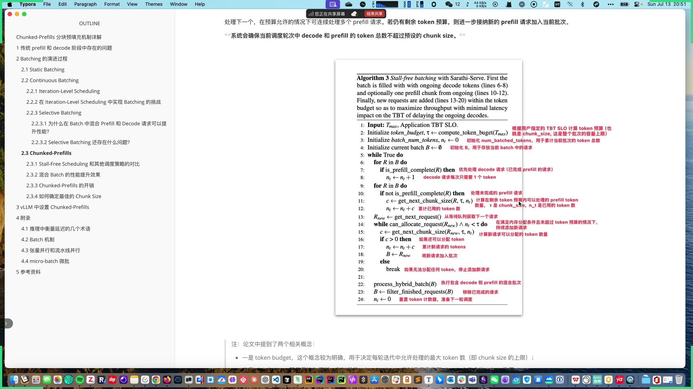 |
| 那这肯定是decode请求嘛加一就是他只要一个token然后下面的话就是isprefernot嘛因为前面有个not那就是未处理完成的prefer请求对吧然后呢他也就是这里有个getamask呃Trunksize那就是基于一个是tokenbudget对吧就或者我们可以说是tracksize呃 [【跳转到 45:02】](https://www.bilibili.com/video/BV1f2uczGEqt/?t=2702) |  |
| 就设定了这个trunksize也就是上限嘛然后根据已有已用的一个token数计算一下他这个可以包括说还有一个包括是你这个prefer已经处理的这个啊token数量嘛这三个值我去计算拿到这个还可以处理prefer的多少个token那把它进行一个累积好然后呢这部分都拿完如果然后他再去去等待队列中取消请求吗 [【跳转到 45:27】](https://www.bilibili.com/video/BV1f2uczGEqt/?t=2727) | 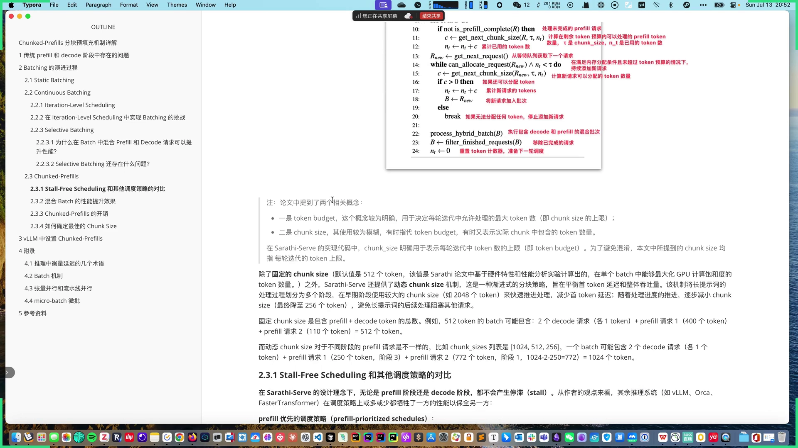 |
| 并且用这个can和locate这个函数回去判断啊当前的资源下还能不能分配新的请求如果还可以的话就继续加不行的话就结束然后把这些请求呢进行一个混合的一个批次的一个调度那就是大概就是这个逻辑好然后这边的话我有个地方我说一下因为论文中他有两个概念一个是叫token的budget [【跳转到 45:52】](https://www.bilibili.com/video/BV1f2uczGEqt/?t=2752) | 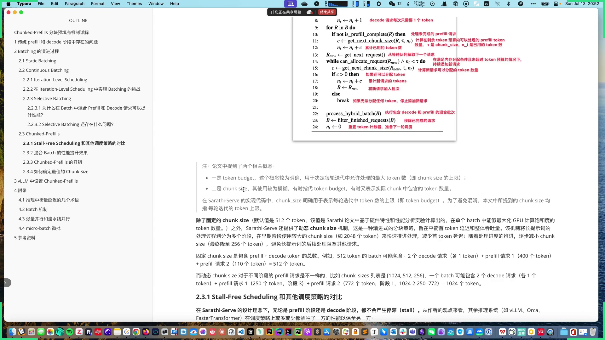 |
| 还有一个叫trunksize那token8角的话这个概念就比较清晰就是决定每轮呃迭代中呢允许处理最大的一个token数也就是穿个size的一个上限第二个呢是trunksize就是他论文中呢他介绍或者包括说我也看了他的一个源代码就是源代码中其实没有写tokenbug [【跳转到 46:17】](https://www.bilibili.com/video/BV1f2uczGEqt/?t=2777) |  |
| 他就是穿个size它源代码中那些trunk赛就是表示每轮迭代中的一个token的上限那他论文中呢有时候又说他是实际创作中包含了一个token数量就是说他可能我这时候呃先处理第一个呃抵扣的时候那trans赛是一第二个的时候是trans赛S2那再处理下PREFIL可能加了100个token [【跳转到 46:42】](https://www.bilibili.com/video/BV1f2uczGEqt/?t=2802) | 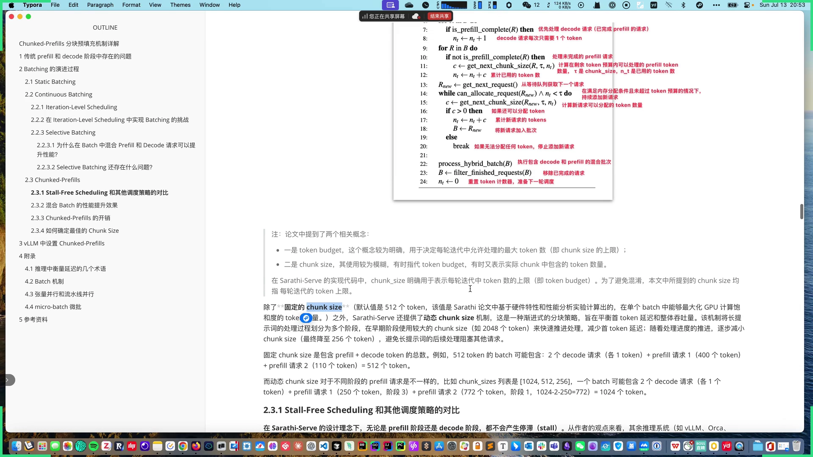 |
| 那TRANSSIZE是102它是表示TRANSSIZE可能是又表示是实时的一个实际的一个啊创口里面的token数量然后对吧但是呢这就会概念会稍微有一点点混淆嘛所以我这边就澄清一下就是我这篇这篇文章里面写的提到这个川size呢就是可以等同为是token的budget对吧好就我就不说到是提到那种实际的创size [【跳转到 47:07】](https://www.bilibili.com/video/BV1f2uczGEqt/?t=2827) |  |
| 好我这边其实先简单说明一下因为他论文中提到这个概念稍微有点模糊因为他用的时候他有时候是去交替的去使用并且跟他的图或者论文中它是会有这部分1.0混淆OK好然后这边我呃呃在这个SERVERTESOL中呢这个论文中呢它有呃 [【跳转到 47:32】](https://www.bilibili.com/video/BV1f2uczGEqt/?t=2852) | 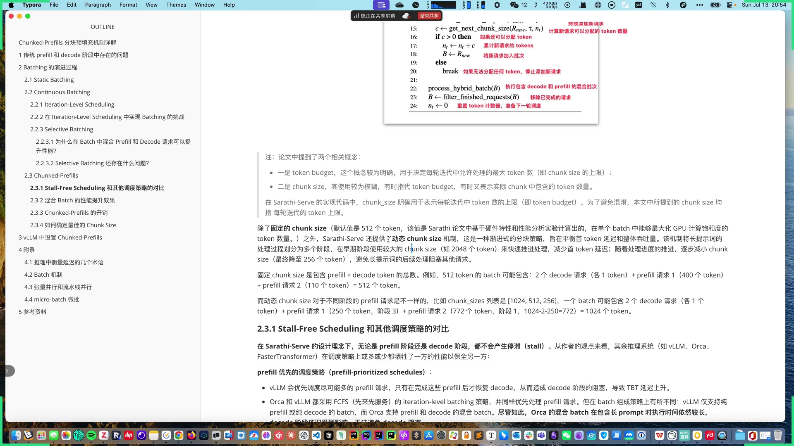 |
| 我看了其实论文中没有提到动态创赛是我看了源代码源代码里它其实是有两种机制有动态超赛那固定参赛呢就是默认值是512个token就是他这个论文中是基于这个硬件特性和性能分析做profile得到了一个比较合理的一个值啊那你当然也可以通过参数去设置第二种的话就是一个动态传size [【跳转到 47:57】](https://www.bilibili.com/video/BV1f2uczGEqt/?t=2877) | 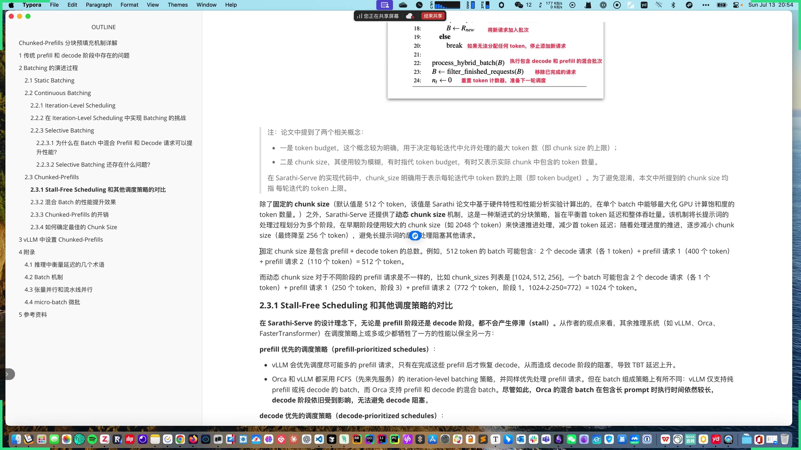 |
| 是一种渐进式的分开策略他是想要平衡首个token的延迟和整体吞吐量就比如说我可能是有比较长的prom的那一开始我可能使用比较大的创size像2048那随着这个长度推进我可能是逐渐降到了比如说啊1024啊到256这样子的那你可以看到固定固定的TRANSSIZE [【跳转到 48:22】](https://www.bilibili.com/video/BV1f2uczGEqt/?t=2902) |  |
| 你可以认为比如说这是一个512个token的batch可能是有两个decodertoken加上一个prefer的一个请求再加上一个呃prefer请求二加起来512个那动态trunksize呢对于不同的阶段prefer请求是不一样的比如说它是会根据有个trlsize的列表就根据你的请求是在哪个stage然后给不同的trunksize [【跳转到 48:47】](https://www.bilibili.com/video/BV1f2uczGEqt/?t=2927) | 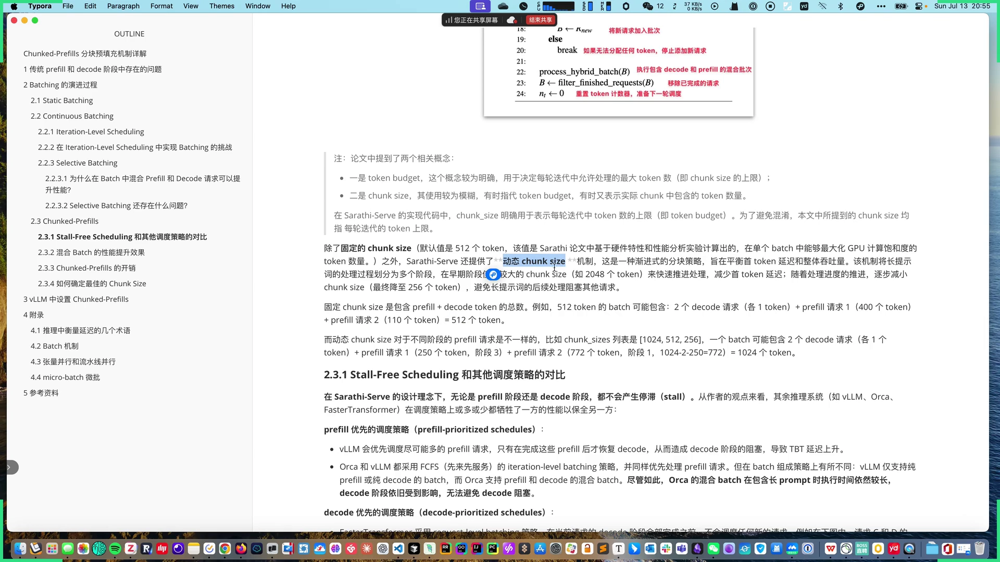 |
| 比如这个stage1是10244stage二是5124stage34256就是通过这种方式去递减那这边也是有一个例子反正呢可以保也是能够保证加起来呢是会是会一个但是它不能保证我每次呢都是一个比如说512它有可能这些加起来可能是一个不同的一个TRSIZE所以是为什么叫动态动态TRANSSIZE [【跳转到 49:12】](https://www.bilibili.com/video/BV1f2uczGEqt/?t=2952) | 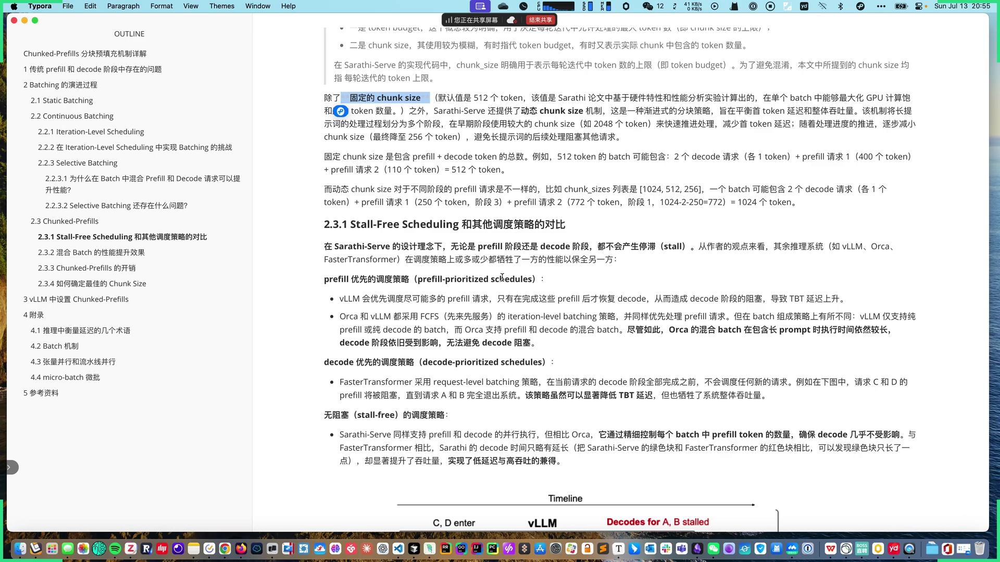 |
| 但我这边理解呢因为五它通过计算完以后呃做了性能分析以后512是一个合理的值那应该理论上我觉得固定的双方size可能性能上会更好因为动态创赛可能有时候会有一些波动吧对这是我个人理解好然后接下来呢论文中呢和其他调度策略一个对比 [【跳转到 49:37】](https://www.bilibili.com/video/BV1f2uczGEqt/?t=2977) | 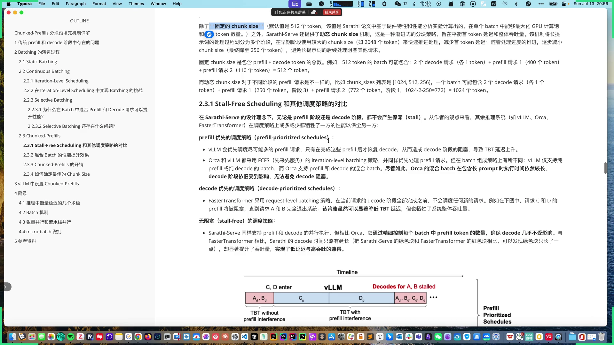 |
| 那他的理念就是说无论是在prefer阶段还是decode阶段呢都不会产生停滞那因为它对比了其他的一些推理系统比如说早期的VM系统或者ORCA或者fasttransformer在调度策略上呢它其实是或多或少的牺牲了一方的性能去保全另一方一方就是prefer或者decode那对于有可以分为两种嘛 [【跳转到 50:02】](https://www.bilibili.com/video/BV1f2uczGEqt/?t=3002) | 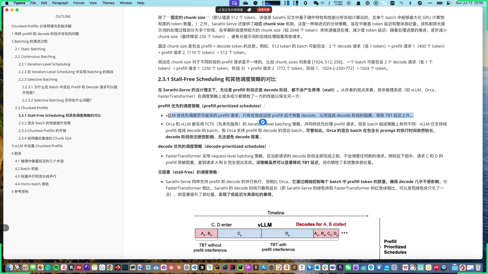 |
| 其他的除它以外的prefer优先的策略比如说像早期的VRM他会尽量的先去调度prefer请求那只有在prefer请求比如说有呃资源冲突的话先会把这些decode请求先驱逐先暂存那把这个prefer请求结束以后再恢复decode请求好所以说这种方式呢会造成decode阶段的一个阻塞 [【跳转到 50:27】](https://www.bilibili.com/video/BV1f2uczGEqt/?t=3027) | 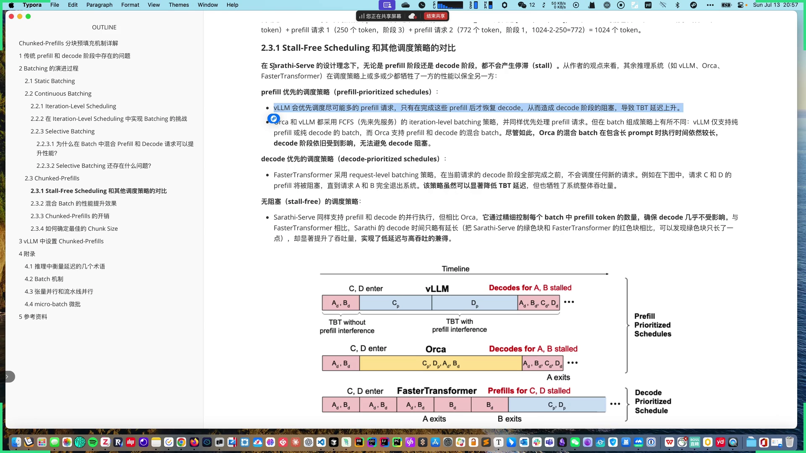 |
| 导致TBD的延迟上升这是早期的pref呃VVMM的一个策略当我今天注释了因为我说VM的话现在也是支持创prefer和混合BH所以说这个情况呢只是基于当时这个描述是基于论文写的时候那个时候的一个情况当然现在VM就没有这个问题而且并且呢VM的创口prefer的实现跟这个啊这篇论文seretideserver是基本是一致的好 [【跳转到 50:52】](https://www.bilibili.com/video/BV1f2uczGEqt/?t=3052) | 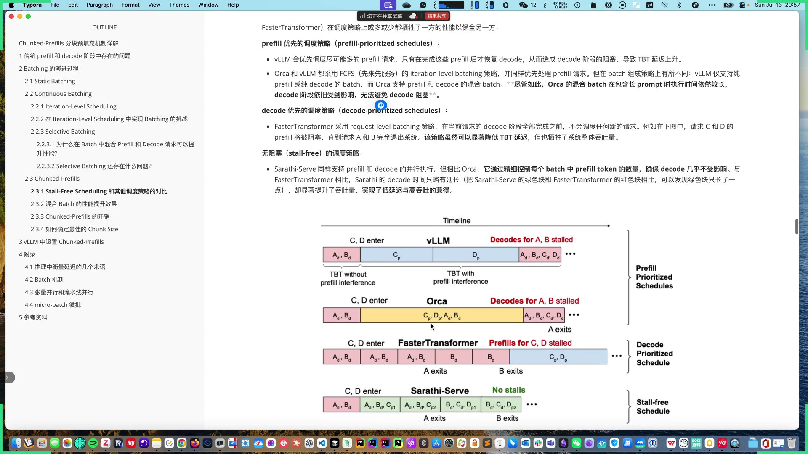 |
| 然后第二种的话就是ORCAORCA的话跟VM都是使用啊先来先服务的一个策略并且他们都是itellationlevel的一个策略好呃并且呢他们都是优先处于prefer进球但是在败局的组成上会有点不一样啊之前的早期的VRM就是仅支持纯的prefer [【跳转到 51:17】](https://www.bilibili.com/video/BV1f2uczGEqt/?t=3077) | 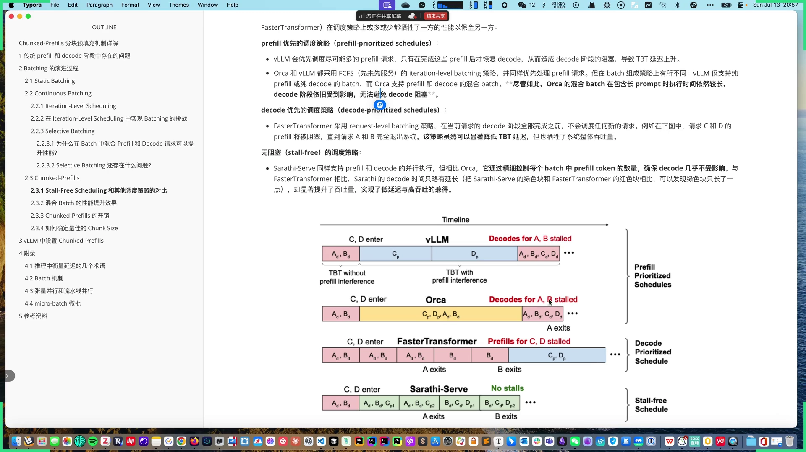 |
| 或者纯的decoderbatch而这个图你可以看到VROCA会支持PREFW跟decode的一个混合batch但是这种情况呢因为我们前面不是也提到了啊欧卡在调度过程中呢其实会有一定的随机性并不能保证一个by理中的一个prefer或者decode的一个分布情况所以呢如果说这个bay中的话包含长PROT它的一个执行时间比较长 [【跳转到 51:42】](https://www.bilibili.com/video/BV1f2uczGEqt/?t=3102) | 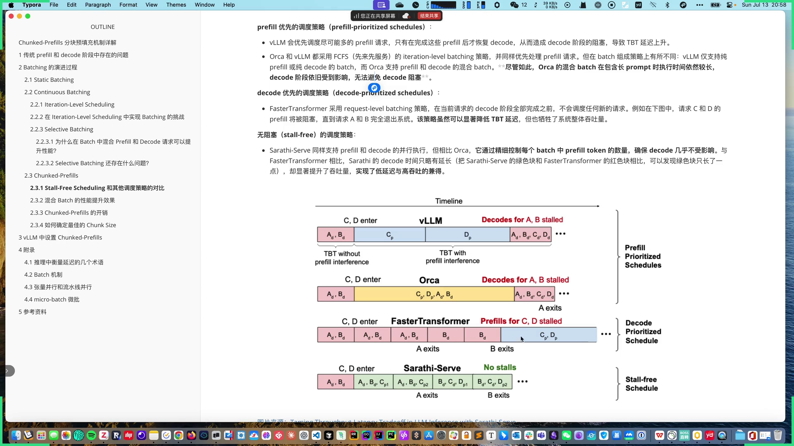 |
| decode阶段也有依然也是会受到影响OK所以你可以看到这个prefer的优先的这种策略那影响肯定就是decode一个性能嘛那相反的就是decode的一个优先的策略那就是fasttransformerfasttransformer就是使用我们一开始介绍这种啊呃requestlevel的batch策略就是要保证我这个BG中所有的请求都完成以后 [【跳转到 52:07】](https://www.bilibili.com/video/BV1f2uczGEqt/?t=3127) | 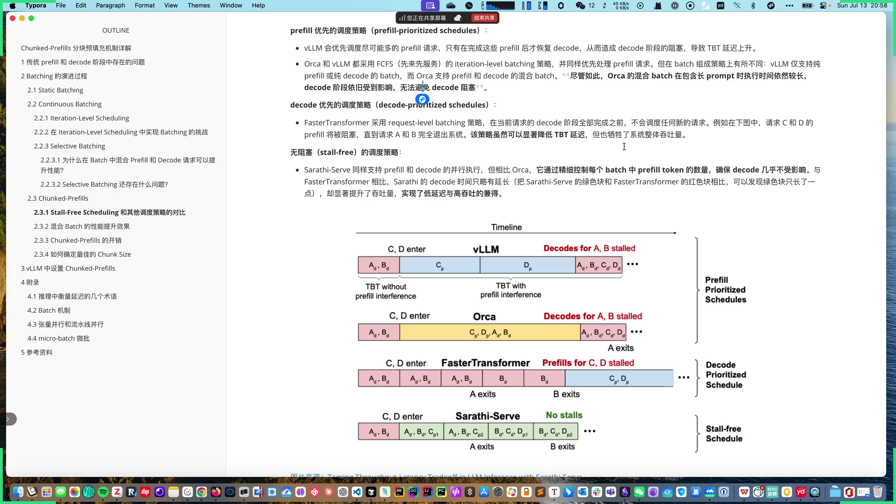 |
| 然后我再去调度新的一个batch那也就是说他会把所有的请求我都decode完成吗再去做所以说这种好处就是说我的decode阶段这个TBD肯定是很低的因为他不会再加入新的preview对吧那同时导致的话就会让这个下一轮新的这个啊prefer的一个下一阶段新的prefer的请求就会阻塞在这里对吧所以说他就是这种做法 [【跳转到 52:32】](https://www.bilibili.com/video/BV1f2uczGEqt/?t=3152) | 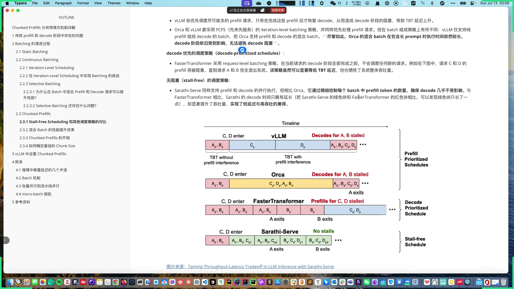 |
| 就是去牺牲了prefer的一个性能也就是整体的通用量而保证我已处理的这些请求的PPT延迟会较低对所以说他的取舍好那这个STEFREE的策略就是呢它就是想既要都要嘛他既想实现这个低延迟也想实现这个高吞吐对吧所以说它具体的做法就是我们刚才说精细的控制每个badge中的一个prefer [【跳转到 52:57】](https://www.bilibili.com/video/BV1f2uczGEqt/?t=3177) | 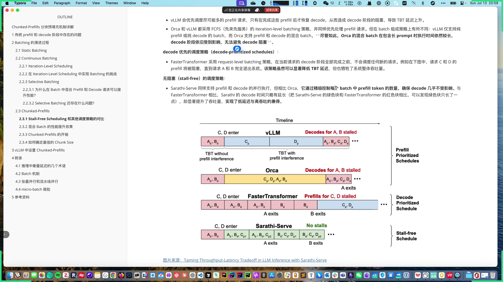 |
| token的一个数量就是保证啊让抵扣的阶段是没有影响的比如说我先它并且呢他是先去把优先版decode的这些token先填上然后基于已经填充完的一个情况再去把prefer的一个token可以填完并且呢他控制这个patchsize呢前面说了可以通过一个profile去得到 [【跳转到 53:22】](https://www.bilibili.com/video/BV1f2uczGEqt/?t=3202) | 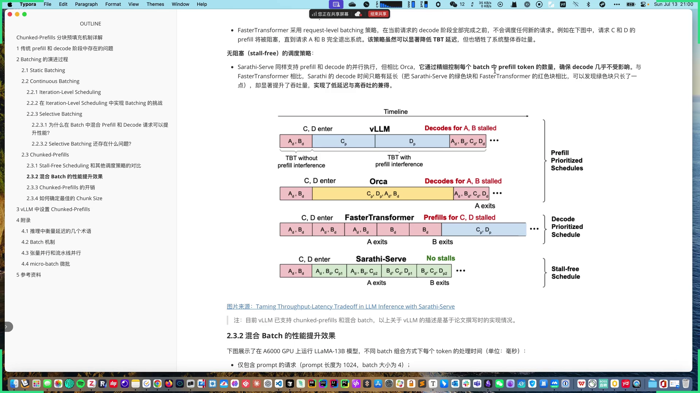 |
| 根据你的硬件嘛因为要根据你的硬件或者模型等等一个情况得到一个具体一个合适的bgsize那这个batchsize是能够最大化优化你的一个GPU的一个计算量的OK好然后你看到这个图呃当然他也不是说完全没有任何损失因为说你你把PREFU给拆拆成多快嘛正常来说我一次迭代 [【跳转到 53:47】](https://www.bilibili.com/video/BV1f2uczGEqt/?t=3227) | 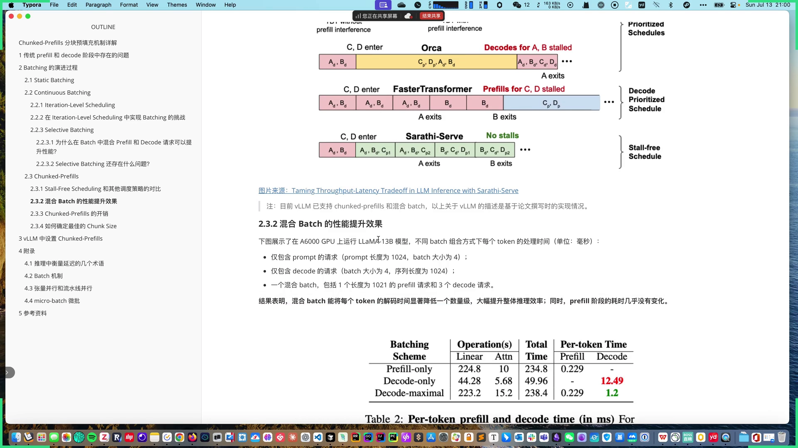 |
| 我把这个prefer比如说一个长的preview我一次都要处理完了对吧你拆成多次迭代你的prefer的一个性能肯定会受影响也就是我们说的这个TTFT我首个token的一个啊出来肯定会稍微慢一点嘛所以说你可以看到这里的这个呃他的这个绿色的这个块对吧会比这边的红色的块稍微长一点点对吧 [【跳转到 54:12】](https://www.bilibili.com/video/BV1f2uczGEqt/?t=3252) | 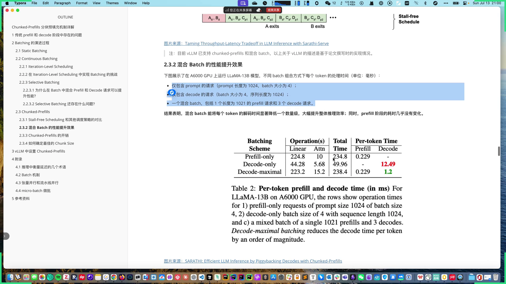 |
| 好然后我们继续看一下然后这边的话他的论文中呢也去做了一些对比就是呃对仅包含一个prompt请求和仅包含decode一个请求这是他的promsize跟bsesize这是他的这个decode一个情况以及一个混合batch的一个情况其中包含一个1021的一个prefer [【跳转到 54:37】](https://www.bilibili.com/video/BV1f2uczGEqt/?t=3277) | 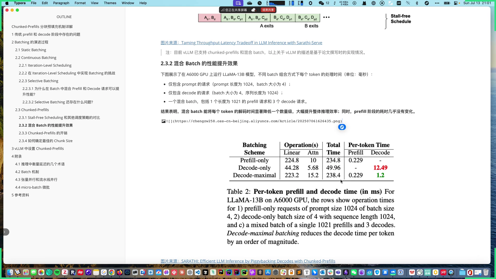 |
| 跟三个decode一个请求好然后进行一个对比那你可以看到这边的话因为这个preferonly呢它只有prefer嘛对吧他这里这是总的时间对吧然后就是portoken的一个时间就是每个prefertoken它的时间是0.29ms然后decode的话就是decodeonly你看看decodeonly的话它的时间是在呃呃12.49ms [【跳转到 55:02】](https://www.bilibili.com/video/BV1f2uczGEqt/?t=3302) |  |
| 然后你可以看到如果是对混合batch来说他的prefer的一个影响因为它能影响的话也就是影响prefer的一个时间嘛因为他进行了个创可赛的拆分可以看到其实说对prefer的影响并不是特别大微乎其微但是它能显著的降低一个decode的一个时间 [【跳转到 55:27】](https://www.bilibili.com/video/BV1f2uczGEqt/?t=3327) |  |
| 对吧好这就是混合batch能够带带来一个性能的一个提升你可以看到混合batch可以将这个decode一个解码时间呢呃token的解码时间能够显著地降低一个数量级并且大幅度大幅度的提升推理效率好然后我刚刚也提到了tronprefile因为我去做了拆分嘛肯定是会对prefer会有一些的影响 [【跳转到 55:52】](https://www.bilibili.com/video/BV1f2uczGEqt/?t=3352) | 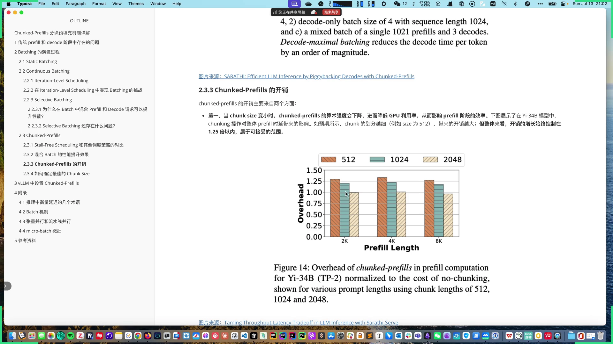 |
| 那我当穿了size小的话那prefer的一个计算强度算术强度就会下降从而影响GPU利用率最终就会影响到PREFL阶段一个计算效率那可以看到这里比如说你刚才看到512的话他肯定是他的这个即使上述强度的影响肯定是或者是prefer的一个影响会比较大对吧但是他的他的这个整体开销其实是跟这个高的 [【跳转到 56:17】](https://www.bilibili.com/video/BV1f2uczGEqt/?t=3377) | 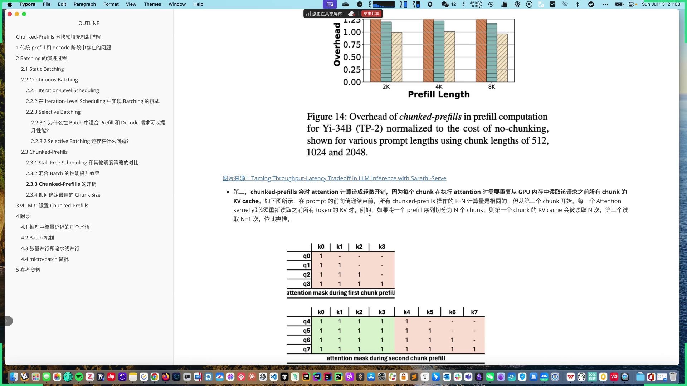 |
| 1024或者2048其实差的没有特别多你如果以这边来看的话一的话这边是1.25它其实是1.2525%吗还是属于比较能够接受一个范围对吧那呃第二部分呢就是我刚才说的啊因为trunkprefer我每次它不是一次性把这个promptprompt的token进行一个attention计算嘛对吧 [【跳转到 56:42】](https://www.bilibili.com/video/BV1f2uczGEqt/?t=3402) | 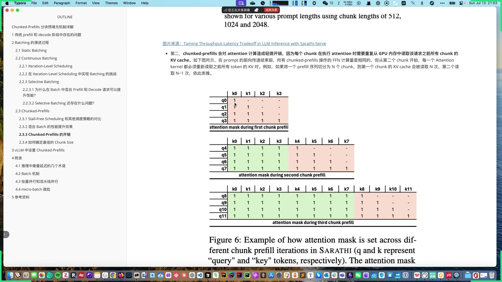 |
| 他是会先计算一部分prefer的一个attention然后进行先传到kvcatch然后下一次呢我再去拿再进行一个计算也就是说呢呃我第一次我是就是我从第二次开始我是不是就要把每一次之前的我就要去拿第三次的话我就要拿前面两次像两两个对吧 [【跳转到 57:07】](https://www.bilibili.com/video/BV1f2uczGEqt/?t=3427) | 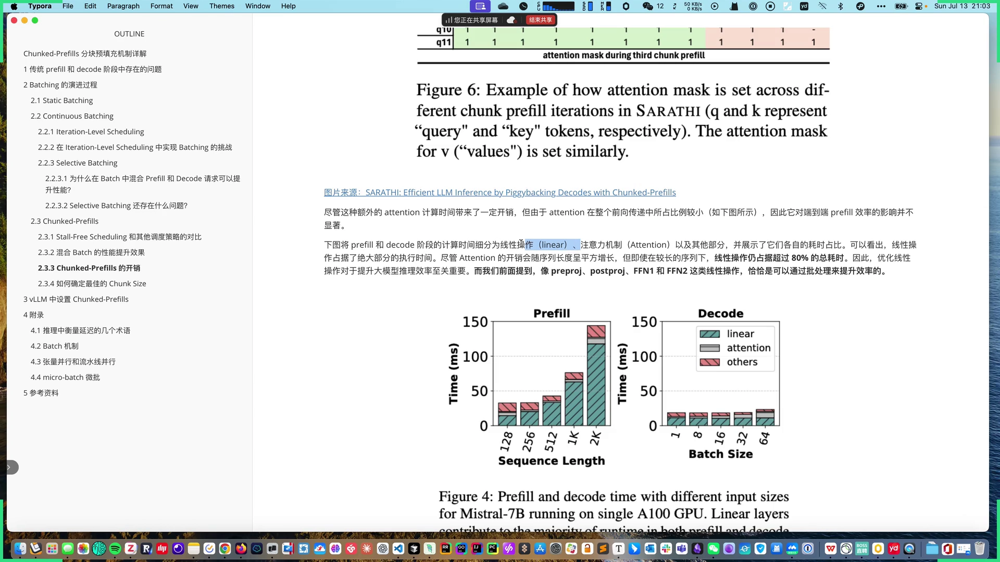 |
| 就像这个图啊看到的所以说你的这个kvcatch读取的次数数会比较多对吧所以说会对这个attention的一个计算会造成一些开销但这个开销的话其实是比较轻微的对你可以看到这个图它是呃算了一下你的这个开销这个灰色的话是一个attention的一个开销你可以看到这个灰色的 [【跳转到 57:32】](https://www.bilibili.com/video/BV1f2uczGEqt/?t=3452) | 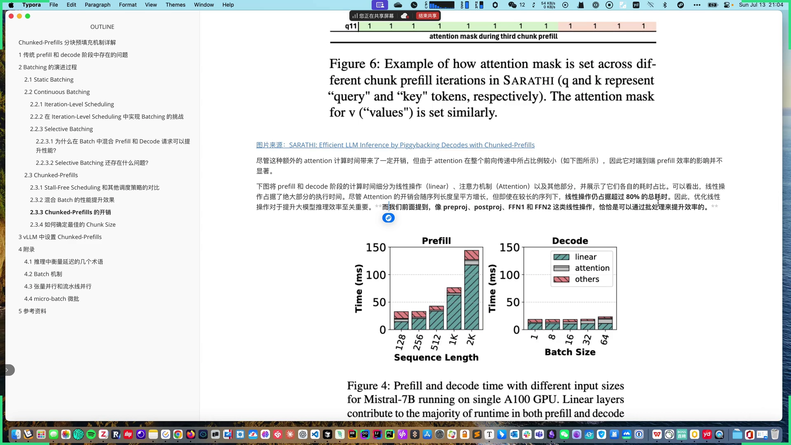 |
| 即使占的比例是不高的对吧真正高的是绿色绿色也就是我说的这个linear线性的一个操作对吧前面我们不是说了啊linear的操作我是可以进行一个合并处理比如说把它展平成一个它token进行一个有一个token序列进行一个处理而attention的部分呢我需要啊进行分开单独处理对吧所以说嗯这部分要分开处理的话 [【跳转到 57:57】](https://www.bilibili.com/video/BV1f2uczGEqt/?t=3477) | 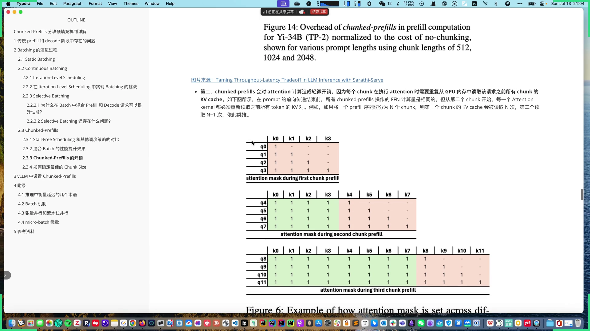 |
| 它的开销其实没那么高是不是就OK那剩余的超过80%总耗时这些信息操作呢就是反而是我们可以前面说到的通过合批处理来提升效率的对吧所以说也就是说它这里是有两个开销一个就是我去嗯把穿个size变小我会减小这个啊GPU的一个利用率对吧从而影响prefer的一个效率 [【跳转到 58:22】](https://www.bilibili.com/video/BV1f2uczGEqt/?t=3502) |  |
| 会因会呃稍微提升一下TTFT的一个延迟好那另外一个就是attention一个计算的开销但是这开销的话其实是比较轻微的额然后接下来呢呃我们看一下如何确定一个最佳的一个tracksize那其实没有说有一个完全啊合适的 [【跳转到 58:47】](https://www.bilibili.com/video/BV1f2uczGEqt/?t=3527) | 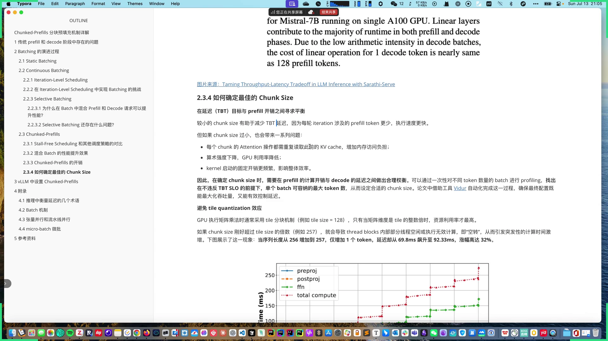 |
| 就是说百分百在所有的情况下都能使用那个trunkset的值这个值呢其实是我们需要在这个我们的一个TBT的一个目标跟preview的开销之间我们去寻找一个平衡那这边说了较小的双size是其实是能够减小TBT的一个延迟因为呢美轮啊迭代中涉及的prefertoken更少嘛 [【跳转到 59:12】](https://www.bilibili.com/video/BV1f2uczGEqt/?t=3552) | 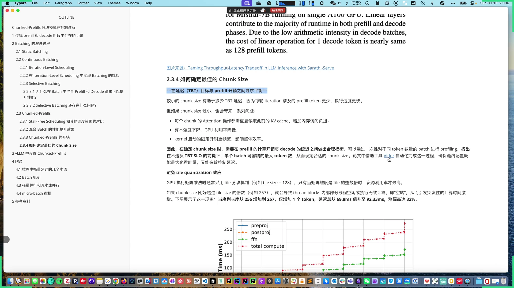 |
| 所以执行速度更快但是穿个size过小也有一定问题嘛比如说我刚才说的attention操作需要重复的读取之前的kvcatch对吧第二第二个就是算术强度的降低导致GPU利用率低对吧那所以说这个两个呢我们是需要在PPT的目标跟prefer开销之间我就寻求一个平衡并没有一个啊完全是呃固定的一个值 [【跳转到 59:37】](https://www.bilibili.com/video/BV1f2uczGEqt/?t=3577) |  |
| 所以说呢呃在论文中呢他提到呢其实它是使用了这个工具啊微软的一个工具video去完成这个过程就实际上你们要确定这个最佳窗size呢也可以做一些这种benchmark的一些测试啊从而得知啊从而找出在这个不违不违反这个TBTSO的情况下 [【跳转到 60:02】](https://www.bilibili.com/video/BV1f2uczGEqt/?t=3602) | 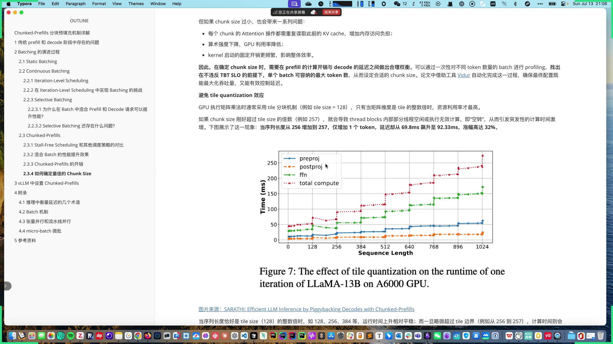 |
| 那个单个BT中最大能够容容纳的一个token数也就是存个size好那还有一个注意点就是说要避免这个tagcontization的一个效应就是说呢GPU在执行矩阵乘法的时候呢通常采用太分块机制那比如说我在计算过程中呢是需要是这个钛的一个整数倍的时候计算的一个自用率才更高那如果说不是整数倍 [【跳转到 60:27】](https://www.bilibili.com/video/BV1f2uczGEqt/?t=3627) | 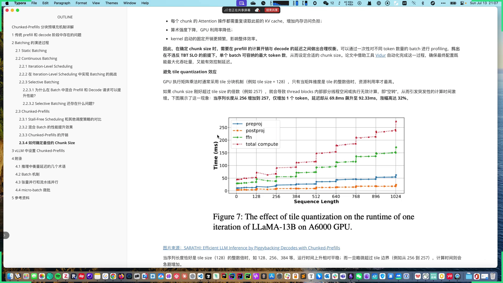 |
| 就会导致可能threatbroke内部的一个部分线程可能会导致呃做一些无效的计算或者是空闲嘛也就是说所谓的空转那比如说这个图可以看到比如说序列长度呢我从256增加到257可能就是一个你可以看到这里提升就是一下子就上去了吗等于说仅仅增加一个token延迟就会从这个69.8秒 [【跳转到 60:52】](https://www.bilibili.com/video/BV1f2uczGEqt/?t=3652) | 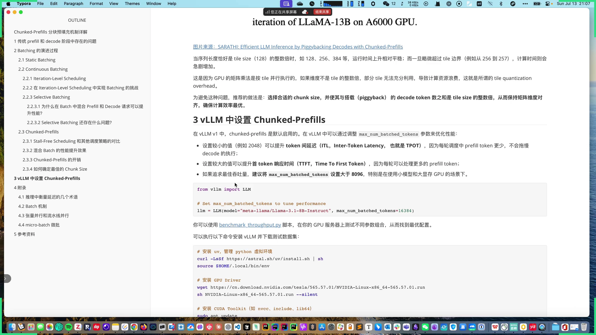 |
| 飙升到93.33秒就是涨幅高于32%也就是说我在计算的时候呢我可我是尽量可以尽量能够需要保证我们的tracksize是能够是这个ted的一个整数倍这样可以充分利用资源好这主要是两点如何确定一个最佳的一个TRANSSIZE那最后的话我们看一下VRM中 [【跳转到 61:17】](https://www.bilibili.com/video/BV1f2uczGEqt/?t=3677) | 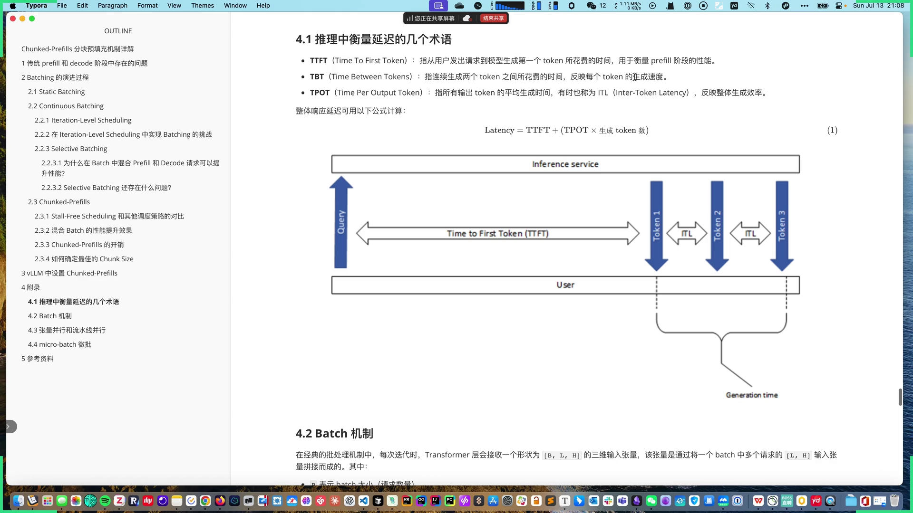 |
| 是怎么去设置TRPREFER那在VM中呢在V1版本中呢trumpprefs是默认启用的然后你不需要做任何设置然后呃并且呢它提供了一个参数你是可以来优化性能比如说叫做呃maxnbattokens那我刚才提到的设置较小值也就是穿个size较小就可以提升啊 [【跳转到 61:42】](https://www.bilibili.com/video/BV1f2uczGEqt/?t=3702) |  |
| 这边是说的ITL嘛也就是说这个你可以认为是TBTBT对吧或者是TBOT其实是他们是差不多因为我这边也说了啊TBT的话是你可以访问每个tokenTBOT的话是平均token的一个数量他们等于说都是反映的是抵扣的阶段每个token的一个升的那个速度对吧好然后你可以通过这个值我去调整好 [【跳转到 62:07】](https://www.bilibili.com/video/BV1f2uczGEqt/?t=3727) | 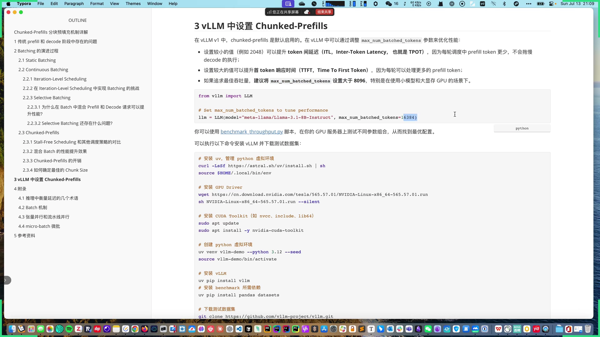 |
| 如果是较小的话就可以降是降低这个TBT的一个延迟对吧那较大的值呢就可以提升我刚才说TTFT的一个值就是我能够处理更多的token那我肯更多的prompttoken我就可以更快的让他啊到这个decode一个阶段对吧那如果说追求最佳值呃呃吞吐量如果说它是呃这里说的 [【跳转到 62:32】](https://www.bilibili.com/video/BV1f2uczGEqt/?t=3752) | 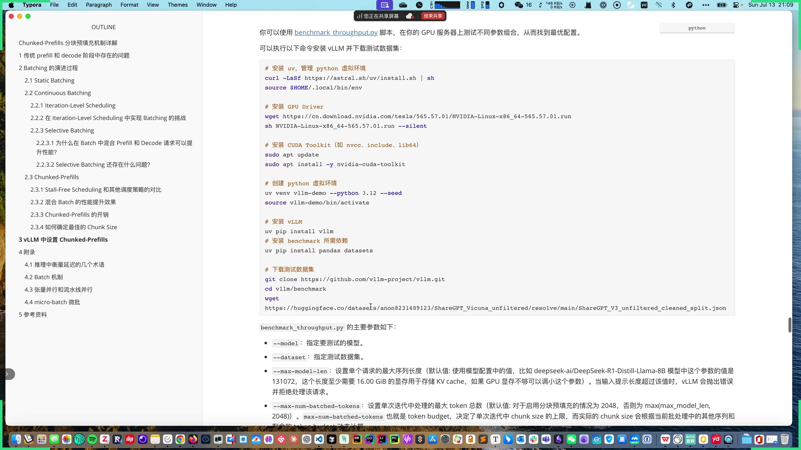 |
| 可以建议将这个值改到8096这值的默认值是2048啊尤其是在使用小模型和大显存GPU的场景下可以把这个值啊可以改高比如改成这么大好那你要怎么确认呃确认你的这个吞吐量是比较好的话你可以使用比如说像他的一个punchMac的一个throughput的一个脚本 [【跳转到 62:57】](https://www.bilibili.com/video/BV1f2uczGEqt/?t=3777) | 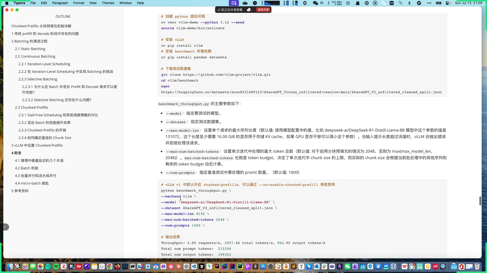 |
| 然后你可以在你的GPU服务器上去测试不同的一个参数的组合那找到一个最优配置比如说这里你可以先安装一下这些VR然后去下载测试通过doubleget这个命令去下载这个shellGBT的一个啊测试集就是是从这个类似chat啊ChatGPT的一些对话中得到一些测试集 [【跳转到 63:22】](https://www.bilibili.com/video/BV1f2uczGEqt/?t=3802) |  |
| OK这些测试集呢它的呃prefer呢prompt的是是偏长的因为它可能会包含多轮的一些些对话好那这边有一些参数你可以指定要运行这个脚本比如说你指定ban就是VR那你model你可以指定你对应的一个模型DATASET就是指定你刚刚下载下来这个DATASET然后呃接下来在这里 [【跳转到 63:47】](https://www.bilibili.com/video/BV1f2uczGEqt/?t=3827) | 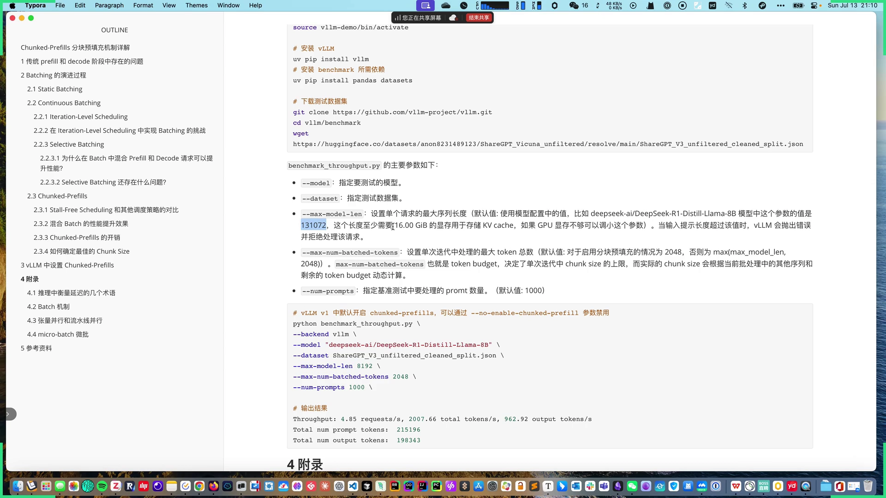 |
| 然后还可以指定maxmodeldown因为这个值比如说我在测试的时候因为我是使用了阿里云上那个A10的一个GPU显存是24GB那24GB的话他可能有十十六GB是加载了模型权重那剩余的话剩余给KVK血的话就不是那么多的嘛但是对于这个模型的话它默认的一个因为这个参呃maxmode量 [【跳转到 64:12】](https://www.bilibili.com/video/BV1f2uczGEqt/?t=3852) | 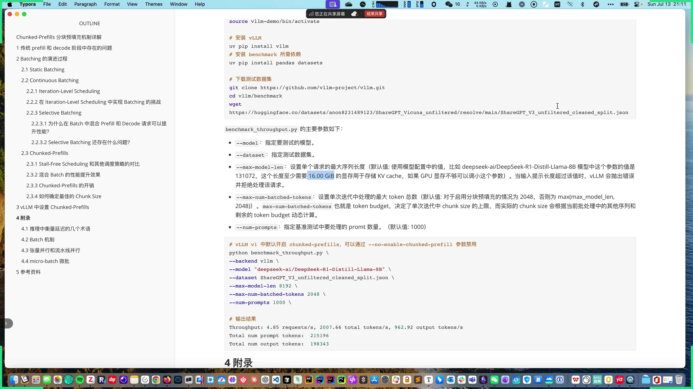 |
| 因为你如果没有设置的话是根据模型中的这个配置来决定的比如说对于deepsigr1啊这个拉玛8B的模型这个参数就是这么多那实际算下来可能要16GB的一个kvcatch那对于我的这个GPU是不够用的那我可以把这个给接低那你这个参有什么用 [【跳转到 64:37】](https://www.bilibili.com/video/BV1f2uczGEqt/?t=3877) | 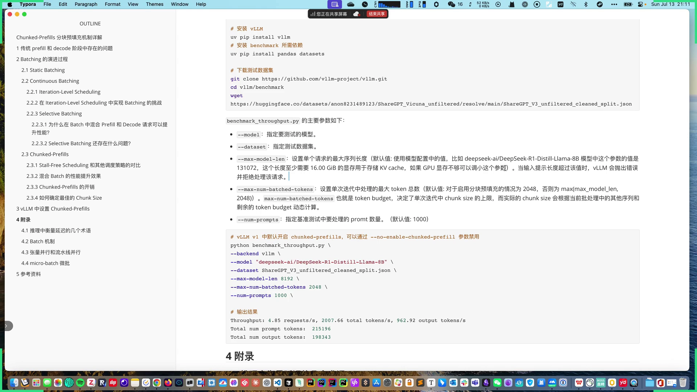 |
| 就比如说我的输入的prom如果超过这个值的话VM就会拒绝这个值OK好因为它在启动的时候会去判断根据读这个值要保证你的这个显存至少有这么多才能让你启动成功就算你实际的这个呃测试集中可能没有那么长的话他也会把你锯掉所以说我是根据我实际啊GPU的一个情况进行一个设置 [【跳转到 65:02】](https://www.bilibili.com/video/BV1f2uczGEqt/?t=3902) | 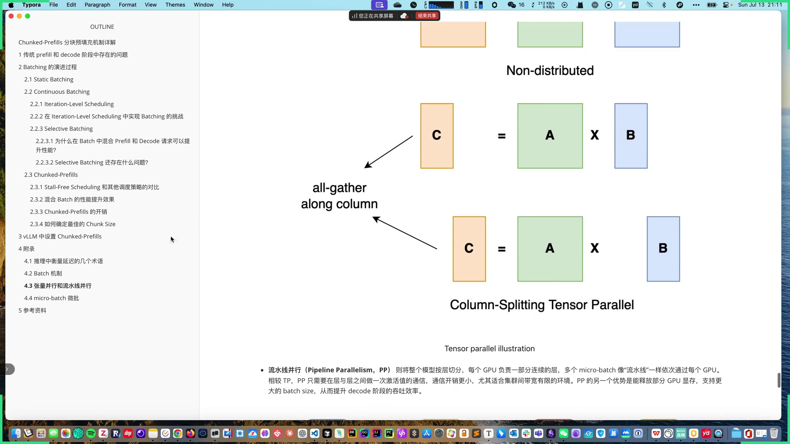 |
| 还有另外一个参数就是maxnbatchtoken就是单次迭代中最大投影数也就我们前面说的一个tokenbudget那它会保证我的这个trunksize的个上限不会高于tokenbudget好那实际的创赛就是我前面说会也是会先去拿先会把decode阶段的请求加到创口呃by之中然后再加prefer一个请求跟前面说的这个servertiso的论文是啊 [【跳转到 65:27】](https://www.bilibili.com/video/BV1f2uczGEqt/?t=3927) | 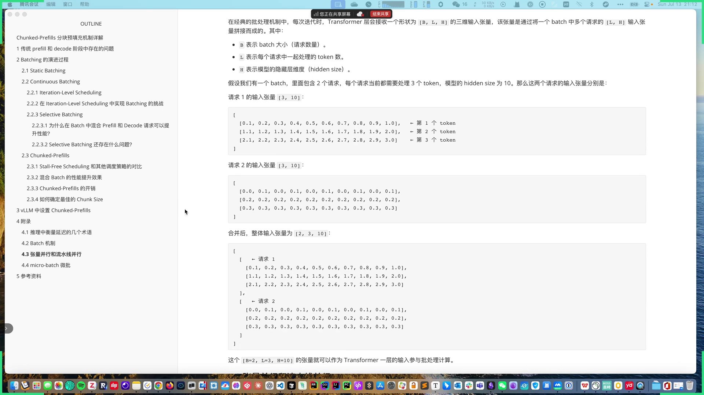 |
| 原理是一样的OK好那这边就是我们说的这个VM中如何使用trumpprefer好的一个方式那我们今天的一个分享大概我就是这些内容啊有问题的话可以呃开麦或者是聊天窗打都可以OK啊如果没有的话我们今年就这样或者说你们呃后面的话呃分享完以后有问题的话也可以在这个艺术里面嗯来补充一个问题然后也欢迎大家嗯思考一下啊回回忆一下啊这边复或者是复习一下这边这次分享中的这几个问题然后有个更清晰的一个了解好那我们今天的分享就到这样好谢谢大家 [【跳转到 65:52】](https://www.bilibili.com/video/BV1f2uczGEqt/?t=3952) | 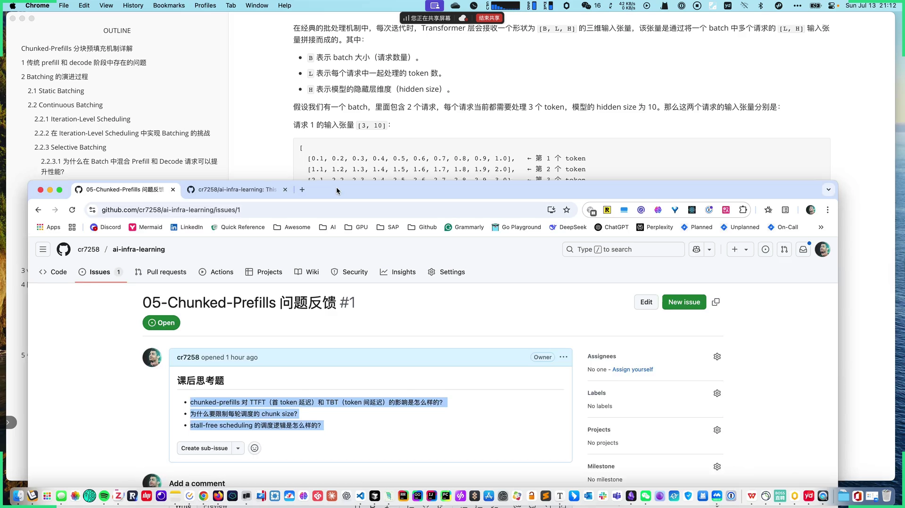 |