# STRING 数据库入门：从蛋白互作网络到功能富集分析

> 本文配套视频：[《【string数据库】【生物信息学】STRING数据库的介绍和使用，希望对有需要的人有所帮助❤️》](https://www.bilibili.com/video/BV1hA411V7UX/)（B 站，约 15 分钟）。

## 本讲要解决的核心问题（SCQA）

**背景**：研究一个蛋白质时，我们常常想知道它和哪些蛋白质有相互作用——这些信息对理解蛋白功能、疾病机制和药物靶点都很关键。

**冲突**：这类信息分散在文献、实验数据、各种专门的数据库里；手工去查既慢又容易遗漏，而且不同来源的证据可信度差别很大。

**疑问**：有没有一个网站，能一站式检索「已知 + 预测」的蛋白质相互作用，把这些证据整合起来打分，还能直接做功能富集分析并把结果导出？

**回答（中心思想）**：有，这就是 **STRING**。它是一个覆盖物种最多、相互作用信息最全的蛋白互作数据库：输入蛋白名称或序列就能得到 PPI 网络，网络里的节点、连线、颜色分别对应蛋白、相互作用和证据类型；配合图例（Legend）、设置（Settings）、分析（Analysis）和导出（Exports），可以进一步筛选证据、做功能富集、聚类并导出成图片或表格。

---

## 一、STRING 是什么：一站式蛋白互作与功能富集数据库

STRING 数据库的核心定位是：**检索已知蛋白、以及预测蛋白之间相互作用的数据库**。

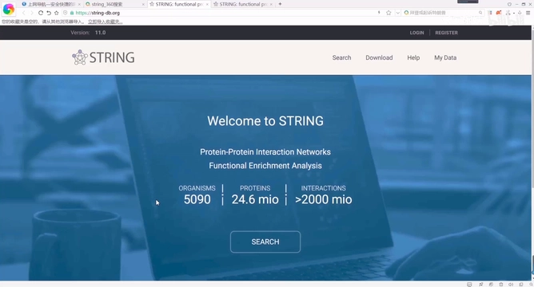

[【跳转到 00:00】](https://www.bilibili.com/video/BV1hA411V7UX/?t=0)

### 1.1 数据从哪来

STRING 里的相互作用关系来自四类渠道，覆盖了「实验证据 + 计算预测」的完整谱系：

- **实验数据**（从其他蛋白互作数据库收集）；
- **文本挖掘**：从 PubMed 等文献摘要中自动挖掘；
- **综合其他数据库**；以及
- **生物信息学方法预测**的结果。

此外，STRING 还能和 **Cytoscape**（网络可视化软件）联用进行作图。

### 1.2 它能干什么

STRING 的主要功能是**构建蛋白质-蛋白质相互作用（PPI）网络**，这个网络可以：

- 过滤和评估**功能性基因组学**数据；
- 为研究蛋白质的**结构、功能和进化**提供一个直观平台；
- 探索**预测**的相互作用网络，为后续研究提供新方向；
- 提供**跨物种预测**。

### 1.3 加权整合与「可靠指数」

数据库里所有的相互作用关系数据都经过了**加权整合**，每一条都会有一个计算得到的**可靠指数（score）**。这是 STRING 区别于很多零散数据库的关键：它不只是「有没有互作」，还给出「有多确信」。

### 1.4 覆盖度与版本

目前已经有很多蛋白互作数据库，而 **STRING 是其中覆盖物种最多、相互作用信息最大、最全面的一个**。相较于其他数据库，它包含更大的关联数据，并且能查询那些还没有被很好表征的蛋白质的功能和相互作用伙伴。

视频录制时首页显示为 **11.0 版本**；在 `versions`（版本历史）页面可以看到当时已更新到 **11.5** 版本，最近一次更新时间为 **2020 年 10 月 17 日**。

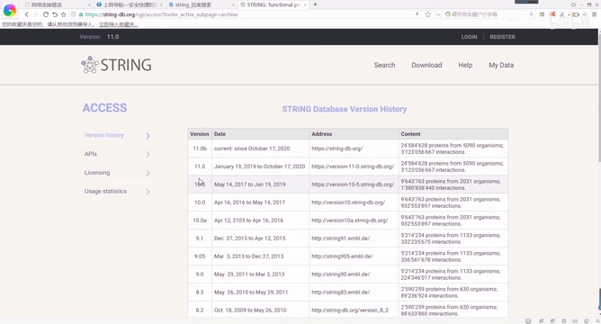

[【跳转到 01:33】](https://www.bilibili.com/video/BV1hA411V7UX/?t=93)

该版本共收录了约 **5,090 个物种**、**2,458 万个蛋白质**、**31 亿条相互作用**信息。

## 二、数据怎么拿：Download 与 My Data

### 2.1 Download：下载整库、物种子集或原始文件

在 **Download** 部分可以下载完整的 STRING 数据库内容，包括蛋白质、物种、基因、相互作用及其节点分数、交互证据、同源性数据等。

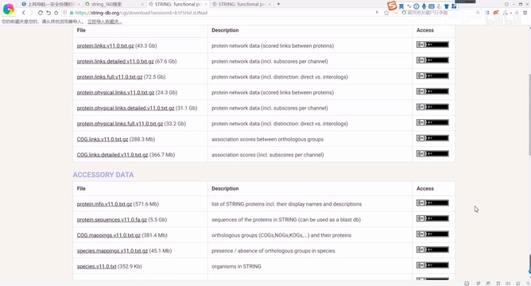

[【跳转到 02:12】](https://www.bilibili.com/video/BV1hA411V7UX/?t=132)

要点：

- 也可以**只下载特定物种**的信息；
- 可下载**原始文件**，例如蛋白质与蛋白质之间的关联（`protein.links`），以及更细粒度的文件——视频里能看到文件容量非常大（几十 GB 级）；
- 若想把数据**导入自己的网站、建立新数据库**，可以下载 **SQL 格式**文件，但因为文件太大，导入和建库需要很长时间；
- 在 **Help** 界面可以查看帮助文档，里面详细介绍了数据库的使用方法。

### 2.2 My Data：上传自己的数据

在 **My Data** 里可以注册并上传自己的实验数据，把 STRING 用在自己的数据集上。

## 三、检索蛋白互作：单蛋白与多蛋白的区别

STRING 可以输入**单个或多个蛋白质名称，或蛋白质序列**来查询。这里有一条非常重要的规律：

- 输入**单个**蛋白质名称 → 输出与该蛋白质互作的所有蛋白质的互作图；
- 一次性输入**多个**蛋白质名称或序列 → **只输出这些输入蛋白质之间**的相互作用网络图。

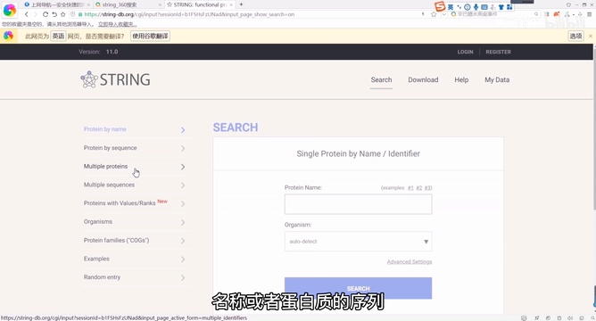

[【跳转到 03:24】](https://www.bilibili.com/video/BV1hA411V7UX/?t=204)

下面以人的 **HOXA10** 蛋白为例演示单个蛋白的检索：输入名称、物种选人（Homo sapiens），点击 **Search**，就得到了 HOXA10 的 PPI 网络。

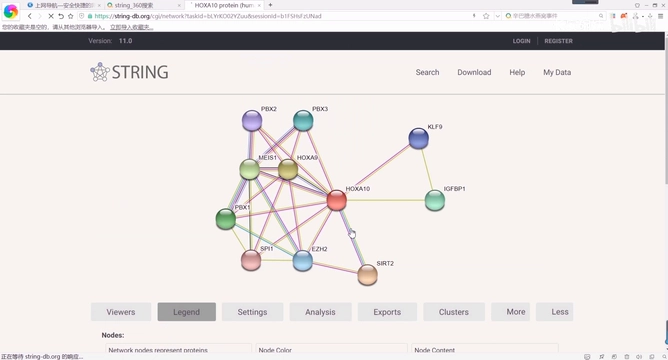

[【跳转到 04:03】](https://www.bilibili.com/video/BV1hA411V7UX/?t=243)

> **术语**：**PPI 网络**（Protein-Protein Interaction Network，蛋白质-蛋白质相互作用网络）。蛋白质的相互作用是指蛋白质分子之间存在相互作用，可以从生物化学、信息转导和遗传网络等角度研究这种相关性；网络中每一个**节点**代表一种蛋白质，节点之间的**连线**代表它们之间存在相互作用关系。

## 四、读懂网络里的节点与证据

### 4.1 点击节点：信息与结构

当你点击某个蛋白质节点时，会弹出一个蛋白质窗口，它分为**两部分**：

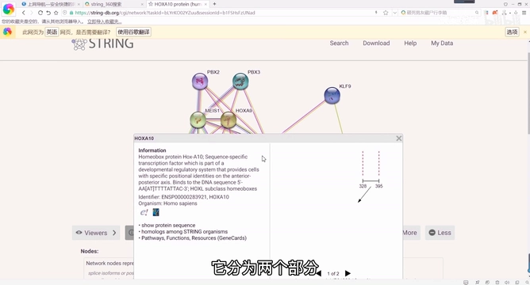

[【跳转到 04:44】](https://www.bilibili.com/video/BV1hA411V7UX/?t=284)

- **左边**：该蛋白的信息，也可以链接到其他数据库；
- **右边**：蛋白质结构。只有当 STRING 数据库中存储了蛋白质结构或结构模型时才会显示。STRING 的每个更新版本都相应收录了来自 **PDB** 的蛋白质图像，以及来自 **SWISS-MODEL** 的蛋白质模型图像。

由于 PDB 和 SWISS-MODEL 这两个数据库更新更频繁，视频建议**直接去 PDB 和 SWISS-MODEL 上查找结构模型**。

### 4.2 点击连线：相互作用证据

点击节点之间的连线，就会出现这两种蛋白质之间相互作用的有关证据。具体信息会从下面几个视图分别查看。

## 五、证据视图：不同来源的数据分开看

一般情况下我们都在 `network` 视图上操作，但 STRING 支持**单独选择各种证据类型**，每种证据都有专门的查看器，便于做定制化检索。

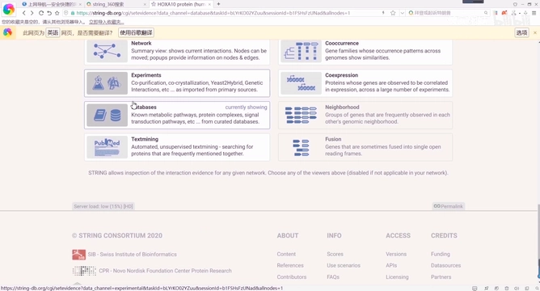

[【跳转到 07:05】](https://www.bilibili.com/video/BV1hA411V7UX/?t=425)

- **experiments（实验）**：点开会显示从其他蛋白质相互作用数据库中收集到的重要相互作用列表；
- **databases（数据库）**：数据来自其他数据库，例如能看到 **KEGG**，点击即可跳转到 KEGG；
- **textmining（文本挖掘）**：显示从科学文献摘要中提取的重要蛋白互作列表，出版物的标题、摘要与链接一起显示，可点击链接到 **PubMed** 详细查看；
- 此外还有 **cooccurrence（共现）**、**coexpression（共表达）**、**neighborhood（邻域）**、**fusion（融合）** 等视图，视频未逐一展开。

## 六、读懂图例（Legend）：颜色与连线的含义

Legend 选项里的信息是对 PPI 网络的解释，是看懂整张图的钥匙。

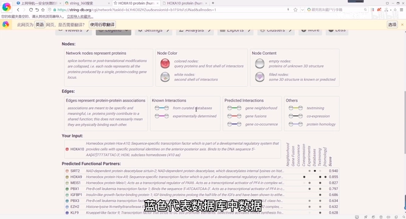

[【跳转到 08:20】](https://www.bilibili.com/video/BV1hA411V7UX/?t=500)

**节点**：

- 默认颜色分**红、白**两类：**红色**是查询蛋白（及第一层互作蛋白），**白色**是与查询蛋白有相互作用关系的其他蛋白（第二层互作）；
- 因为白色不好看，STRING 会根据相互作用的 **score 值**对节点颜色做映射；
- **节点内容**：节点上的螺旋代表该蛋白**结构已知**；结构未知时圆圈内是空的。

**连线颜色（证据类型）**：

| 颜色 | 含义 |
| :--- | :--- |
| 蓝色 | 来自策展数据库（curated databases） |
| 粉红色 | 实验数据（experimentally determined） |
| 绿色 | 基因邻域（gene neighborhood） |
| 红色 | 基因融合（gene fusion） |
| 深蓝色 | 基因共现（gene co-occurrence） |
| 黄色 | 文本挖掘（textmining） |
| 黑色 | 基因共表达（co-expression） |
| 浅蓝色 | 蛋白质同源性（protein homology） |

> 两个蛋白质之间的连线**不止一条**，说明它们之间的相互作用类型不止一种，既有实验验证的、也有数据预测的结果，所以看上去连线很多、非常复杂。

## 七、自定义网络：Settings 设置

连线太密时，可以通过结果页面的 **Settings** 做筛选。

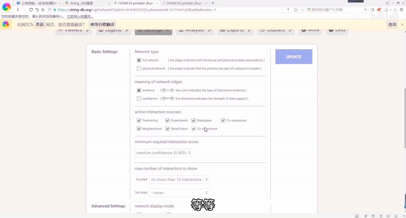

[【跳转到 10:13】](https://www.bilibili.com/video/BV1hA411V7UX/?t=613)

设置分几部分：

1. **选择证据**：第一种是全部证据，第二种是物理相互作用相关的证据，一般用第一种；
2. **设置连线类型**：
   - `evidence` 类型：不同颜色代表不同作用类型；
   - `confidence` 类型：连线的**粗细**代表蛋白质之间相互作用的**强度**；
3. **勾选证据来源**：文本挖掘、实验、数据库、基因共表达、基因邻域、基因融合、基因共现等，只展示你感兴趣的类型；
4. 还可以调整**可信度（confidence）**、限制显示的相互作用蛋白数量、调整图像格式，以及隐藏或显示蛋白质结构模型、蛋白质名称等。

## 八、功能富集分析：GO / KEGG / Reactome / UniProt / Pfam

在 **Analysis** 界面，STRING 为互作基因提供了 **GO 和 KEGG 富集分析**结果，可以链接到 GO 等其他数据库详细查看。

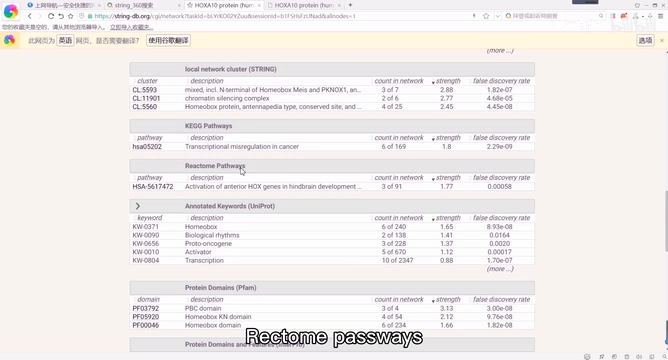

[【跳转到 11:03】](https://www.bilibili.com/video/BV1hA411V7UX/?t=663)

富集分析覆盖多个数据库分区，例如：

- **local network cluster (STRING)**：局部网络簇；
- **KEGG Pathways**；
- **Reactome Pathways**；
- **Annotated Keywords (UniProt)**；
- **Protein Domains (Pfam)**。

它还会显示部分相互作用蛋白**来源的文献**，并可链接到 **STRING、KEGG、Reactome、WikiPathways、UniProt、Pfam、SMART** 等数据库查看数据背景与数据输出。

## 九、导出与聚类：把结果带走

### 9.1 Exports：导出为图片或表格

在 **Exports** 界面，可以把当前网络导出为以下格式：

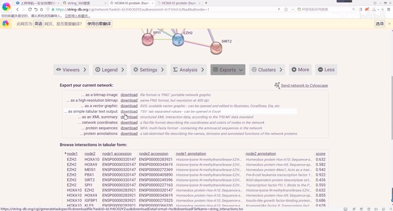

[【跳转到 11:53】](https://www.bilibili.com/video/BV1hA411V7UX/?t=713)

- **位图图像**（PNG）；
- **高分辨率位图图像**（同样是 PNG，约 400 dpi）；
- **SVG 矢量图**：可以用 AI（Illustrator）等软件打开编辑；
- **蛋白互作关系表（TSV）**：下载的文件能在 Excel 中打开，同时也显示在导出页面下方。

TSV 表格包含：两个节点的名称、各自的蛋白 **accession**、**注释**，以及两节点之间连线的**综合得分**等。

用得较少的还有：可扩展标记语言（XML）摘要、网络坐标、蛋白质序列、蛋白质注释。

### 9.2 Clusters：按得分聚类

我们还可以根据整体的相互作用得分进行聚类。

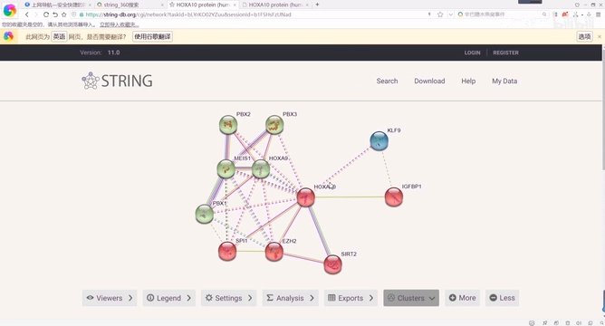

[【跳转到 12:54】](https://www.bilibili.com/video/BV1hA411V7UX/?t=774)

聚类之后，**同一簇内的节点颜色相同，不同簇之间的连线为虚线**；聚类结束后可在下方模块中保存。此外，点击 **More / Less** 可以增加或减少图中显示的节点，从而显示更多或更少的相互作用。

## 十、多蛋白查询与新功能：差异基因

单个蛋白的查询介绍完后，接下来是多蛋白查询。

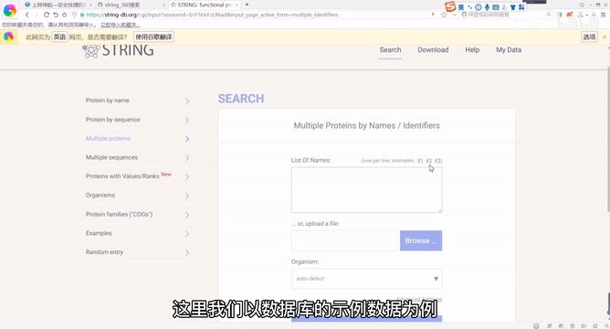

[【跳转到 13:30】](https://www.bilibili.com/video/BV1hA411V7UX/?t=810)

- 输入多个蛋白质名称；如果名称过多，可以**上传文件**来查询，然后点击 **Search**、**continue**；
- 后续选项与单蛋白类似，不再重复；
- 结果里如果某个蛋白被**单独列出**，说明它没有和其他输入的蛋白发生关系。

**新功能——差异基因**：在 search 页面还可以在这里输入**差异基因**，并自主选择**筛选值**，点击 continue 后得到结果页面。

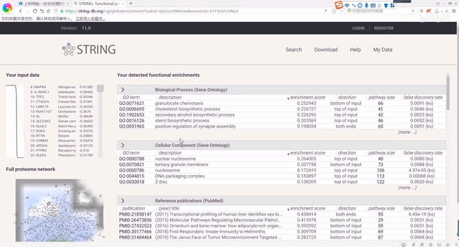

[【跳转到 14:37】](https://www.bilibili.com/video/BV1hA411V7UX/?t=877)

当鼠标悬停在 **GO 的 id 号**上时，左下角图上相应的**通路会以红色高亮**显示出来。

## 小结

- **STRING 是什么**：一个检索已知与预测蛋白-蛋白质相互作用的数据库，覆盖物种最多、信息最全；数据来源包括实验、文本挖掘、其他数据库和生物信息学预测，并可与 Cytoscape 联用。
- **数据形态**：所有相互作用都经过加权整合，附有可靠指数（score）；录制时 11.0/11.5 版本收录约 **5,090 物种、2,458 万蛋白、31 亿条相互作用**。
- **获取数据**：Download 可下整库、物种子集、原始文件甚至 SQL（体积很大）；My Data 可上传自己的实验数据。
- **检索规则**：**单蛋白 → 该蛋白的全部互作**；**多蛋白/序列 → 只输出输入蛋白之间**的互作。
- **读懂网络**：节点=蛋白（红=查询蛋白及第一层、白=第二层），连线=互作；点击节点看信息与结构（PDB / SWISS-MODEL），点击连线看证据。
- **证据视图**：experiments、databases（如 KEGG）、textmining（PubMed）、cooccurrence、coexpression、neighborhood、fusion。
- **图例颜色**：蓝=策展数据库、粉红=实验、绿=基因邻域、红=基因融合、深蓝=基因共现、黄=文本挖掘、黑=共表达、浅蓝=同源性；连线粗细=相互作用强度。
- **Settings**：可选证据集合、连线类型（evidence / confidence）、证据来源、最低得分与显示数量。
- **Analysis**：提供 GO / KEGG 等富集，并链接 Reactome、UniProt、Pfam、SMART 等数据库。
- **Exports / Clusters**：可导出 PNG / SVG / TSV（含 accession、注释、综合得分）等；聚类后同簇同色、簇间虚线。
- **多蛋白查询**：支持列表或上传文件；新增「差异基因」功能，悬停 GO id 可在网络上高亮对应通路。

## 关键术语速查

| 术语 | 一句话解释 |
| :--- | :--- |
| STRING | 检索已知与预测蛋白质相互作用的数据库，并提供功能富集分析 |
| PPI 网络 | 蛋白质-蛋白质相互作用网络；节点=蛋白，连线=相互作用 |
| 可靠指数 / score | STRING 对每条相互作用加权整合后计算出的置信度分数 |
| first / second shell | 第一层（直接与查询蛋白互作）/ 第二层（与第一层互作）的蛋白 |
| experiments | 来自其他蛋白互作数据库的实验证据视图 |
| databases | 来自其他策展数据库（如 KEGG）的证据视图 |
| textmining | 从 PubMed 等文献摘要中挖掘得到的证据视图 |
| KEGG / Reactome | 通路数据库；STRING 的富集分析会链接到它们 |
| GO | Gene Ontology，基因本体；按 Biological Process / Cellular Component 等分类 |
| Pfam / SMART | 蛋白质结构域数据库，出现在富集分析的 Protein Domains 分区 |
| SWISS-MODEL | 蛋白质同源建模数据库，为 STRING 提供结构模型图像 |
| Cytoscape | 网络可视化与分析的软件，可与 STRING 联用 |
| TSV 导出 | 制表符分隔的互作关系表，含节点名称、accession、注释与综合得分 |
| Clusters | STRING 的聚类功能；同簇同色，簇间连线为虚线 |
| My Data | STRING 中注册并上传自己实验数据的入口 |
