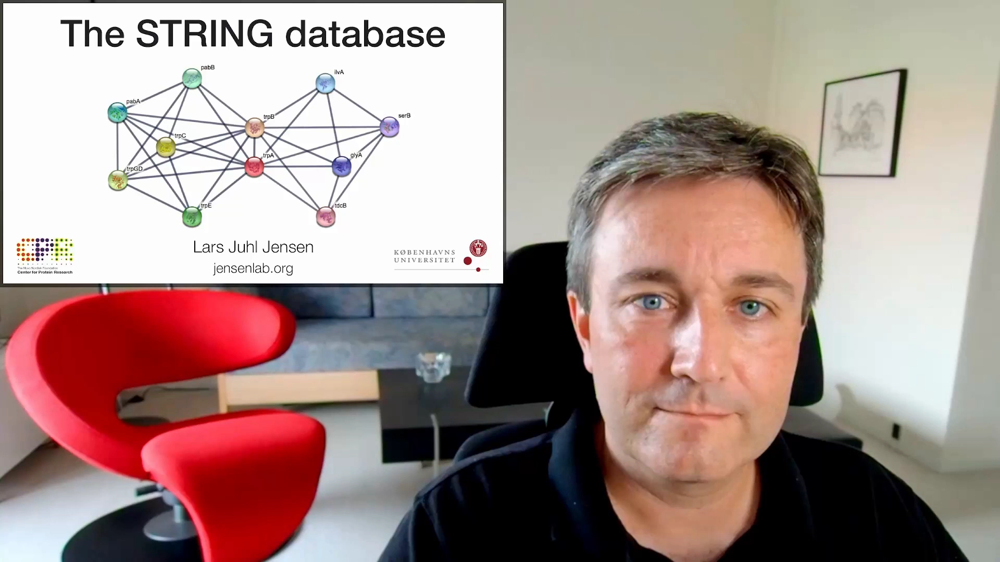
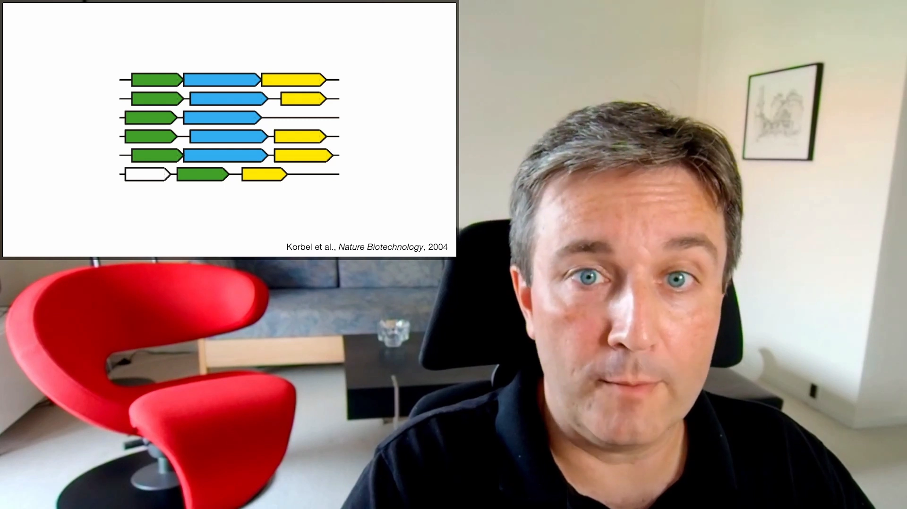
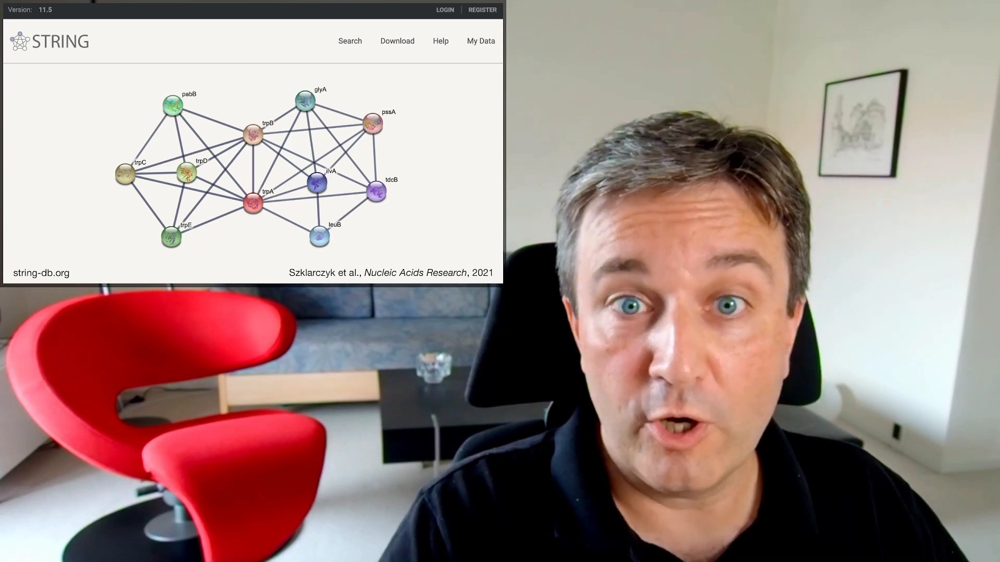

# STRING 简介：蛋白网络的证据来源、质量打分与整合

> 本文配套视频：[《The STRING database: Brief introduction to protein networks and how they are made》](https://www.youtube.com/watch?v=o208DwyFbNk)（STRING 作者 Lars Juhl Jensen 官方讲解）。

## 本讲要解决的核心问题（SCQA）

**背景**：研究一个蛋白时，我们常想知道「它和哪些蛋白一起工作」。STRING 是检索已知与预测蛋白关联最常用的数据库，输入一个或多个蛋白就能得到一张互作网络。

**冲突**：点开 STRING 里的一条连线，会看到「实验、数据库、文本挖掘、共表达、邻域、融合、共现」等多种证据，还有 `This organism` / `Other (transfer)` / `Combined score` 几列分数。这些证据到底从哪来？为什么可信度不一样？又是怎么被拼成一个分数的？

**疑问**：STRING 里的关联由哪些证据来源构成？它如何把这些质量参差不齐的来源，变成**可比较、可合并**的分数？

**回答（中心思想）**：STRING 把证据归为**七类通道**（基因组上下文 3 类 + 共表达 + 实验 + 策展数据库 + 文本挖掘）；先给每类证据单独打**质量分**，再把它们统一**校准到 KEGG 通路这个金标准**、转换成后验概率，最后合并成 **combined score**；并通过**同源转移（interolog）**把证据从别的物种搬过来。本篇按「是什么 → 证据从哪来 → 怎么打分与合并 → 怎么用」讲清。

---

## 一、STRING 是什么：把「物理互作」和「功能关联」拼成一张全局网络

STRING 的目标，是把海量蛋白**用两种关系连起来**：

- **物理相互作用（physical interactions）**：两个蛋白真的结合；
- **功能关联（functional associations）**：即使不直接结合，也**很可能一起干活**（例如同一条通路里的上下游）。

[【跳转到 00:00】](https://www.youtube.com/watch?v=o208DwyFbNk&t=0)

截至 11.5 版，STRING 覆盖 **14,000+ 个基因组、6700 万+ 个蛋白**。

## 二、证据从哪来：七大通道，分三组

STRING 的证据来源可以分成三组、共七类通道。

### 2.1 基因组上下文：只看基因组就能推断（3 类）

这类证据完全来自**基因组序列**，不需要任何实验测量：

- **基因融合（gene fusion）**：两个基因在某物种里被合成一个蛋白编码基因，提示两者功能相关；
- **基因邻域（gene neighborhood）**：识别**进化上保守的操纵子**——功能相关的基因在染色体上长期挨在一起；
- **系统发育谱（phylogenetic profiles）**：找出在整个生命树中**「一起出现、一起丢失」**模式的基因对（STRING 里对应「共现 co-occurrence across genomes」通道）。

[【跳转到 00:25】](https://www.youtube.com/watch?v=o208DwyFbNk&t=25)

### 2.2 功能基因组实验：表达与互作实验

- **基因共表达（gene co-expression）**：在许多不同条件下表达模式相似的基因，可能功能相关；
- **互作实验（interaction experiments）**：用实验直接测物理互作，例如 **pull-down**（顺带一提，酵母双杂交也属于这一类实验证据）。

### 2.3 既有知识（策展数据库）

- **策展数据库（curated databases）**：人工注释的**蛋白复合物**与**分子通路**，包括那些你在课上见过的大张**生化代谢图**。

[【跳转到 01:15】](https://www.youtube.com/watch?v=o208DwyFbNk&t=75)

### 2.4 文本挖掘：从海量文献里自动抽取

不是所有证据都被收进了数据库，所以 STRING 用**自动文本挖掘**处理庞大的生物医学文献：

1. 先**识别基因/蛋白名称**；
2. 再找**共同提及（co-mention）**来推断功能关联；
3. 最后用**深度学习**从句子中抽出**物理互作**。

[【跳转到 01:51】](https://www.youtube.com/watch?v=o208DwyFbNk&t=111)

> **对照你之前看的分数表**：上面七类正是 STRING 的七个证据通道——`Neighborhood in the Genome`、`Gene Fusions`、`Cooccurrence Across Genomes`（系统发育谱）、`Co-Expression`、`Experimental/Biochemical Data`、`Association in Curated Databases`、`Co-Mentioned in Pubmed Abstracts`（文本挖掘）。

## 三、为什么必须打分：这些证据不能直接拿来用

把这么多来源拼成一个资源，会遇到一堆问题：

- **来源太多**：要访问很多数据库才能凑齐证据；
- **格式不统一**：不同库文件格式不同，解析要写代码；
- **命名混乱**：同一个基因/蛋白在不同库里叫不同名字，需要做名称映射；
- **质量参差**：有的证据质量很可靠，**有的则相当差**；
- **本质不可比**：物理互作，和「进化上保守的操纵子」，根本不是一个尺度，怎么比？
- **跨物种**：你研究的是人的两个蛋白，但证据可能来自**小鼠**。

[【跳转到 02:10】](https://www.youtube.com/watch?v=o208DwyFbNk&t=130)

## 四、怎么把参差证据变成可比较、可合并的分数

STRING 的解法分三步：

**1）给每类证据打「质量分」**：让同一类证据内部的互作能按可靠性排序。视频举例：对 pull-down 数据，可以根据「两蛋白在 pull-down 里同时出现的次数」对比「只出现其中一个的次数」来排。

**2）校准到统一金标准**：把不同来源的原始质量分，都拿去和**同一个金标准比较——KEGG 通路图**，从而把原始分转换成「给定这条证据、两个蛋白处于同一通路」的**后验概率**。

[【跳转到 03:46】](https://www.youtube.com/watch?v=o208DwyFbNk&t=226)

> 这一步很关键：校准之后，**不同通道的分数落在同一把尺子上**——所以 0.5 的文本挖掘分和 0.5 的实验分，理论上代表差不多的「为真概率」。这也解释了为什么综合分能给出一致的置信度。

**3）合并 + 跨物种转移**：把所有通道的证据概率加起来，得到 **combined score**；再通过**同源（orthology）/ interolog**把证据跨物种搬运——例如把小鼠里的证据转移到人。这样才得到完整的数据库。

这也对应你之前看的分数表的几列：
- **This organism**：该物种**本体**观测到的证据分；
- **Other (transfer)**：**同源转移**过来的证据分；
- **Combined score**：上述证据合并后的综合置信度。

## 五、怎么用：网页、证据查看器、Cytoscape 与批量下载

- **网页界面（web interface）**：查询一个或多个感兴趣的蛋白，看它们彼此的关系、以及还可能和谁一起工作；
- **证据查看器（evidence viewers）**：可以**下钻查看任意一条连线背后的底层证据**，而不只是看一个分数；
- **大网络**：推荐用 **Cytoscape**，尤其是 **stringApp** 插件，把 Cytoscape 与 STRING 打通；
- **批量获取**：STRING 也提供 bulk download 文件。

[【跳转到 04:36】](https://www.youtube.com/watch?v=o208DwyFbNk&t=276)

## 小结

- **STRING 的目标**：把**物理互作**与**功能关联**整合成一张覆盖数千物种的全局蛋白网络。
- **七大证据通道**：基因组上下文（**邻域、融合、系统发育谱/共现**）+ **共表达** + **实验** + **策展数据库** + **文本挖掘**。
- **为什么要打分**：来源多、格式乱、命名乱、**质量参差、且本质不可比**，还有跨物种问题。
- **打分三步**：每类证据先打**质量分** → 校准到 **KEGG 金标准**、转成**后验概率** → **合并**成 combined score（并做**同源转移**）。
- **分数的含义**：score 是**置信度**，不是互作强度；不同通道校准到同一尺度后可比较。
- **怎么用**：网页查询 + **证据查看器**下钻；大网络用 **Cytoscape stringApp**；支持批量下载。

## 关键术语速查

| 术语 | 一句话解释 |
| :--- | :--- |
| STRING | 检索已知与预测蛋白互作/功能关联的数据库 |
| 物理互作 / 功能关联 | 真正结合 / 不直接结合但很可能一起干活 |
| 基因组上下文 | 仅凭基因组序列推断关联的方法（邻域、融合、系统发育谱） |
| 基因邻域 | 功能相关基因在染色体上保守地挨在一起（保守操纵子） |
| 基因融合 | 两基因在某物种融合成一个蛋白，提示功能相关 |
| 系统发育谱（共现） | 基因在生命树中「一起出现、一起丢失」的模式 |
| 共表达 | 表达模式相似的基因可能功能相关 |
| 文本挖掘 | 从文献中识别基因名、找共同提及、用深度学习抽物理互作 |
| 质量分数（quality score） | 对每类证据的可靠性排序得分 |
| 金标准 / 校准 | 用 KEGG 通路图作参照，把原始分转成后验概率，使各通道可比 |
| 后验概率 / score | 给定证据时，关联为真的置信度（非互作强度） |
| combined score | 各通道证据合并后的综合置信度 |
| 同源转移 / interolog | 借助同源关系把证据从别的物种搬到目标物种 |
| This organism / Other (transfer) | 本体证据分 / 同源转移来的证据分 |
| Cytoscape stringApp | 把 STRING 与 Cytoscape 打通的插件，用于大网络分析 |
