# UniParc 与 UniRef 使用指南：UniProt 的归档与聚类数据库到底怎么用

> 本文配套视频：[《Explore the known protein space through UniProt Archive and Clusters》](https://www.youtube.com/watch?v=wTdtuXXgjmM)（YouTube，EMBL-EBI 官方网络研讨会，主讲 Boris 与 Herman，约 28 分钟，录制于 2019 年 10 月）。
>
> 说明：该视频本身没有字幕，本文的文稿由本地 Whisper 对音频转写后整理；文中所有数据均为研讨会当时的版本（UniProt release 2019_08），最新数字请以官网为准。

## 本讲要解决的核心问题（SCQA）

**背景**：我们知道 UniProtKB 是存放蛋白质「注释条目」的知识库，查一个蛋白的功能、结构、变异都去那里。

**冲突**：但同一条蛋白质序列会在很多数据库里重复出现，源头库里还可能删改；而检索时如果每个重复都算一条，你会被一屏几乎一模一样的序列淹没，既浪费算力又看不出差异。UniProt 里的 UniParc 和 UniRef 正是为这两个问题而生的，可很多人只会用默认的 UniProtKB，不知道它们怎么用。

**疑问**：UniParc 和 UniRef 各自解决什么问题？在网站上怎么查、怎么下载、怎么批量检索、怎么做 BLAST？

**回答（中心思想）**：**UniParc 是「全量、非冗余的序列档案馆」**——每条唯一序列只存一份、永不变更，用交叉引用把来源数据库串起来，专门负责「这条序列有没有出现过、历史版本是什么」；**UniRef 是「按序列同一性聚类的参考簇」**——把相似的序列打包成一条代表记录，专门负责「去冗余、高效检索」。两者都能在 UniProt 网站上查、下载，也能通过 BLAST 使用；UniParc 还提供 Proteins API 供编程访问。

---

## 一、UniParc：全面的非冗余序列档案馆

### 1.1 UPI 与交叉引用

UniParc（UniProt Archive）收录了世界上大部分公开可得的蛋白质序列。它的核心设计是：**每条唯一序列只存一次，并赋予一个稳定且唯一的标识符 UPI（UniParc Protein ID）**。UPI 一旦分配就**永不移除、永不更改**。

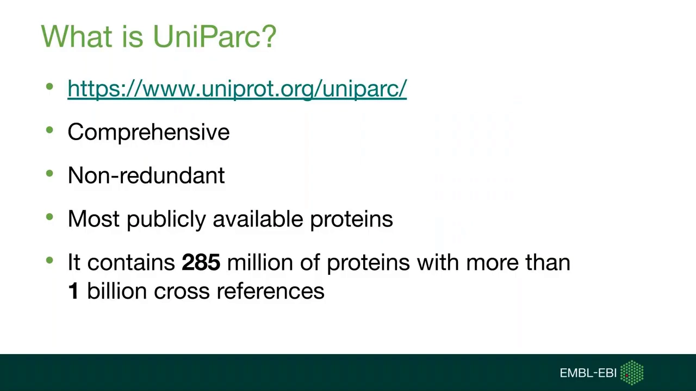

[【跳转到 00:25】](https://www.youtube.com/watch?v=wTdtuXXgjmM&t=25)

同一序列可能来自不同数据库、或在同一数据库里有多份拷贝。UniParc 把它们**在序列层面合并成一个条目**，于是：

- **检索 UniParc 就等于同时检索许多个源数据库**；
- 每个来源在条目里表现为一条**交叉引用（cross-reference）**，把序列链接回它原来的数据库。

例如一条来自小鼠的蛋白，可能同时来自 UniProtKB、Ensembl、RefSeq、PDB、VEGA 等，它们在 UniParc 里合成一个条目，因为序列完全相同。

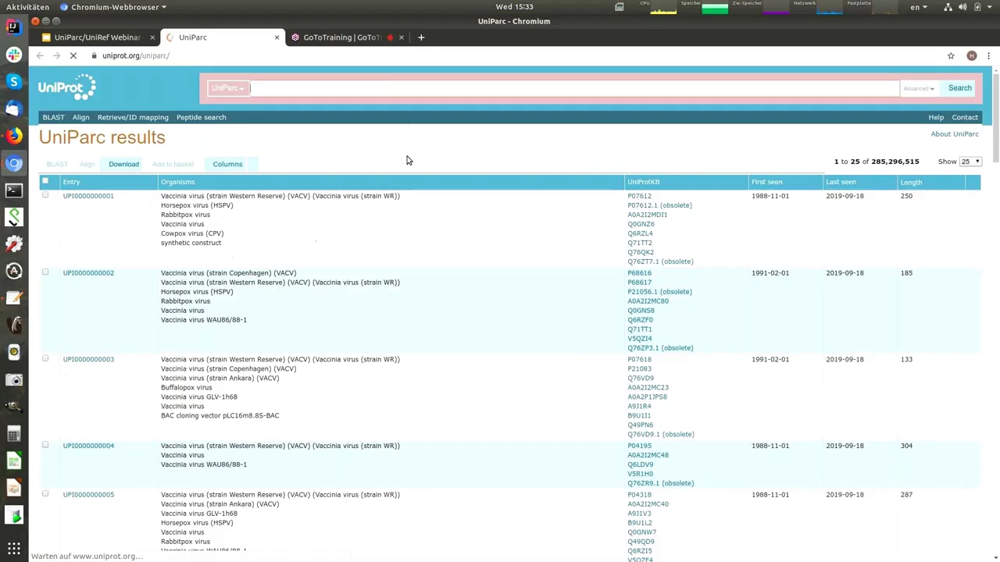

[【跳转到 01:13】](https://www.youtube.com/watch?v=wTdtuXXgjmM&t=73)

### 1.2 版本追踪与 active / inactive

每当从其他数据库导入数据，就会创建新的交叉引用；当源数据库里的序列被**修改或删除**，对应的交叉引用会被标记为**已删除**，记录会显示它在源数据库里**不再活跃（inactive）**——但记录本身仍保留在 UniParc 里（档案馆的意义就在于此）。

比如某条序列在 RefSeq 里从 2004 年 9 月活跃到 2005 年 3 月，之后被删除，但关于它的记录依然存在。

序列的变化还可以通过**版本**追踪。UniParc 有自己的一套内部版本号：**序列每改变一次，所分配 accession 的内部版本号就加一**。以 accession `Q9V6L0`（果蝇的一个蛋白）为例，它 20 年间序列改过几次，当前版本是 3，你可以在条目里看到它之前的版本一、二、三。

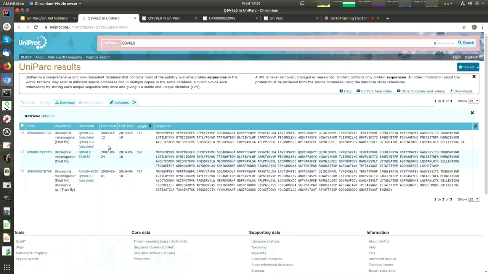

[【跳转到 04:22】](https://www.youtube.com/watch?v=wTdtuXXgjmM&t=262)

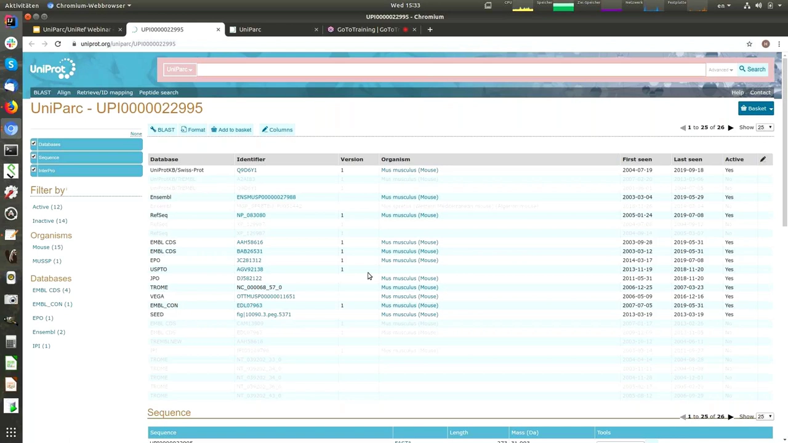

[【跳转到 01:38】](https://www.youtube.com/watch?v=wTdtuXXgjmM&t=98)

### 1.3 冗余蛋白：UniParc 的兜底用途

UniProt **只保留非冗余的蛋白质**；反过来说，**如果你需要冗余蛋白的序列，就只能到 UniParc 里找**。

例如在 UniProt 的「蛋白质组（Proteomes）」里看大肠杆菌：其中两个是**非冗余**蛋白质组，其余是**冗余**的。点开一个冗余的，会看到它包含约 4000 个蛋白；而因为它是冗余的，你只能在 UniParc 里拿到它——当你加载它时，数据其实是从 UniParc 而不是 UniProt 下载的。

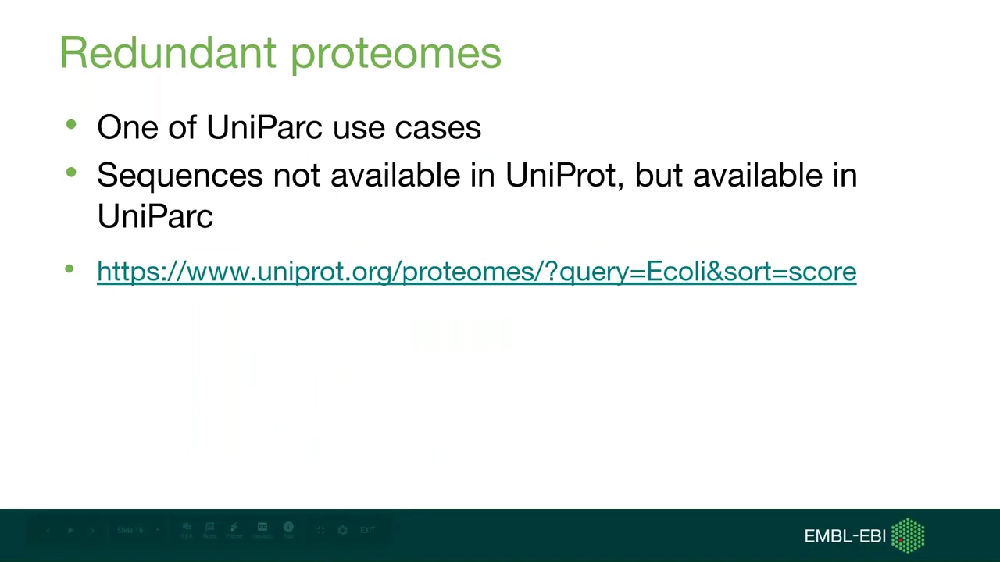

[【跳转到 07:52】](https://www.youtube.com/watch?v=wTdtuXXgjmM&t=472)

## 二、UniParc 在网站上怎么用

### 2.1 网页操作：检索、下载、条目页、BLAST、InterPro

- **检索与结果页**：检索后可在结果页选择条目，然后把选中的结果**下载成多种格式**——FASTA、制表符分隔（tab-delimited）、Excel、XML、列表，且可选是否压缩。不同格式能带走的信息不同：FASTA 只有序列（以及状态、accession），XML 则几乎包含全部内容（交叉引用 + 特征 + 序列）。
- **单条目页**：同样能以多种格式查看摘要（FASTA / XML / 制表符分隔的 accession 列表），可以**自定义要显示哪些列**。
- **BLAST**：条目上有 BLAST 按钮，可直接对该序列运行 BLAST。
- **InterPro 特征**：条目下方会展示 InterPro 特征。InterPro 是另一个 EMBL-EBI 数据库，做蛋白质功能分析——它把蛋白归入家族、预测结构域和重要位点，依据来自多个成员数据库（CDD、HMMER/Pfam、ProSite、SMART 等）的预测模型或「签名（signature）」。例如某个签名位于序列第 173–289 位、对应某个结构域，顺着它可以跳到 InterPro 进一步确认该蛋白的功能。

### 2.2 编程访问：Proteins API

如果你在写流程（pipeline）、想改造数据提取方式，可以**以编程方式访问 UniParc**，入口是 EMBL-EBI 的 **Proteins API**（`www.ebi.ac.uk/proteins/api/doc`）。

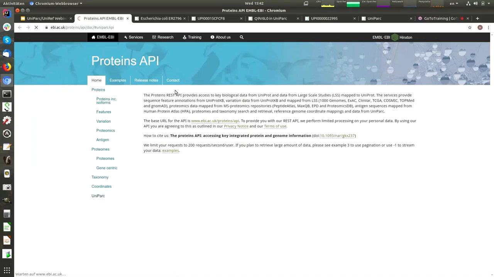

[【跳转到 09:02】](https://www.youtube.com/watch?v=wTdtuXXgjmM&t=542)

UniParc 一节提供多个入口点，可按 **UPI、UPID（即序列）、交叉引用、accession、序列**来检索。以按 accession 检索为例，输入 `Q9V6L0` 就能得到 JSON 结果，里面依次包含：交叉引用段、特征/签名匹配段、序列段，以及响应码与 HTTP 响应头。文档里最有用的部分是**各语言的请求示例代码**，可以拿来直接开始写程序。

## 三、UniRef：把相似序列聚成参考簇

UniRef 首先会**把全长上序列同一性为 100% 的蛋白质序列合并成一个条目**，从而缩小数据库体积、同时仍代表所有已知序列。但功能相同的不只是完全相同的序列——**相似的序列也往往具有相同或相似的功能**，所以 UniRef 进一步把相似序列聚到同一个记录里。

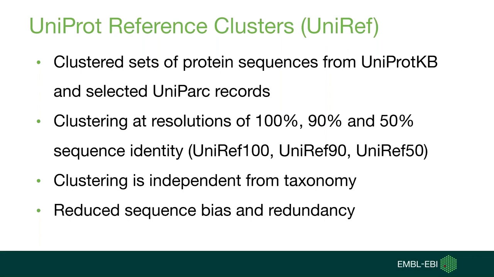

[【跳转到 11:50】](https://www.youtube.com/watch?v=wTdtuXXgjmM&t=710)

### 3.1 两个关键区别：非全长、不看分类学

- **UniParc 的同一性是全长衡量的，而 UniRef 不是**。UniRef 聚类时允许序列在部分区域（例如 N 端多出一段）有差异。
- **聚类不考虑分类学（taxonomy）**：只要序列相似，来自不同物种也会被聚到一起。

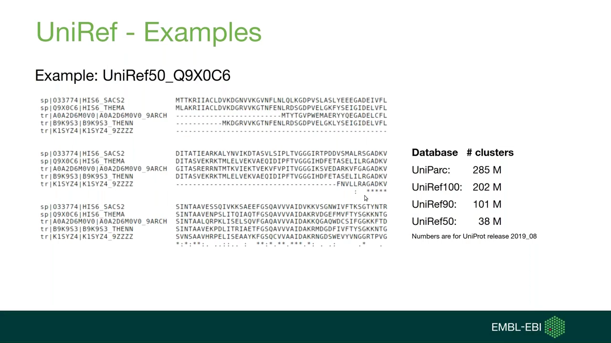

[【跳转到 15:02】](https://www.youtube.com/watch?v=wTdtuXXgjmM&t=902)

### 3.2 分辨率越高，簇内越多样、数据库越小

从 UniRef100 到 UniRef90 再到 UniRef50，**簇内的序列多样性依次增大**（同一性门槛从 100% 放宽到 90%、50%），而**数据库总记录数越来越小**：由 UniParc 的 2.85 亿条缩到 UniRef50 的 3800 万条（UniRef100 约 2.02 亿、UniRef90 约 1.01 亿）。合并相似序列去掉了序列偏倚和冗余，同时仍覆盖整个已知的蛋白质序列空间——这对 BLAST 检索尤其有用。

## 四、UniRef 在网站上怎么用

### 4.1 检索一个蛋白，得到三个簇

在 UniProt 网站下方有指向 UniRef 的链接，界面与 UniProtKB、UniParc 类似。用通用搜索框搜一个蛋白，会得到它对应的**三个聚类：UniRef50、UniRef100、UniRef90** 各一条。

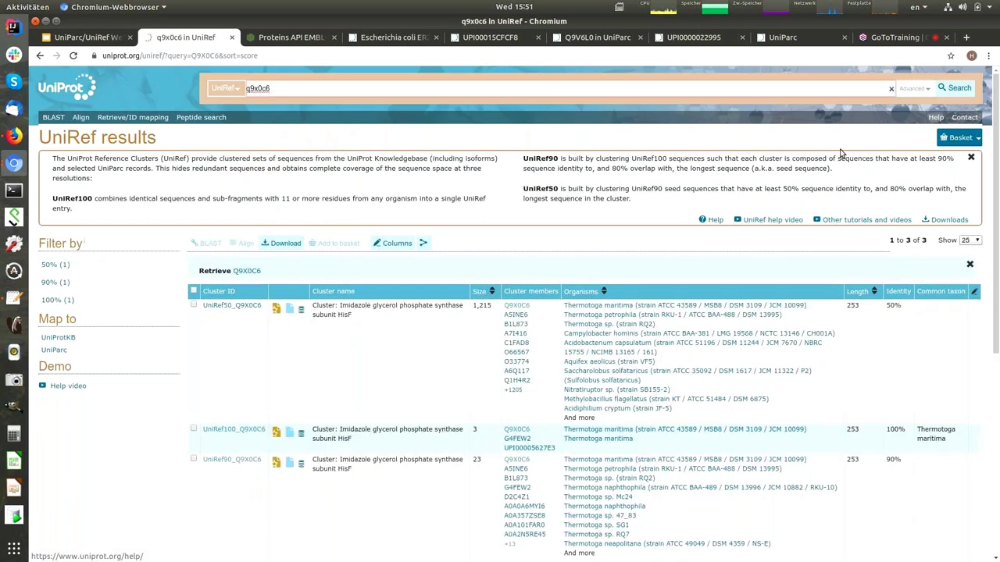

[【跳转到 15:59】](https://www.youtube.com/watch?v=wTdtuXXgjmM&t=959)

一个簇包含：**Cluster ID、Cluster name（该簇所有成员共有的蛋白质名称）、Size（簇内蛋白质数量）、所有成员的 protein accession 及对应物种、代表序列长度**；条件允许时还会给出簇内共有的**共同分类学（common taxon）**。

### 4.2 读懂簇条目：seed 与 representative

点开簇的标识符（如某 UniRef100 簇），进入成员页面，能看到更详细的信息，最关键的两个「序列」在这里：

- **seed sequence（种子序列）**：簇中**最长**的序列；
- **representative sequence（代表序列）**：并非种子，而是**注释最好**的那条——注释最多、评论最多、交叉引用最多、关于蛋白功能的信息最多。

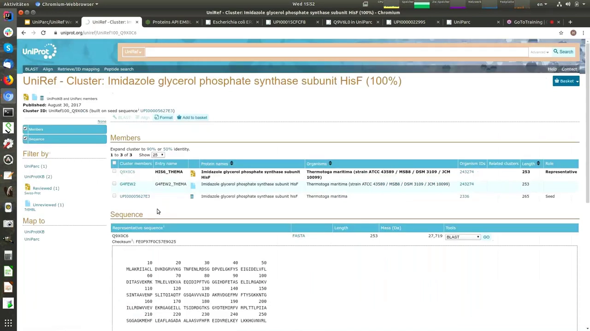

[【跳转到 17:12】](https://www.youtube.com/watch?v=wTdtuXXgjmM&t=1032)

### 4.3 高级检索（Advanced Search）

和 UniProt 网站类似，UniRef 的 Advanced Search 可以按簇的属性检索：**簇名、成员序列的分类学、序列同一性（对应 UniRef50/90/100）、簇大小（成员数）、序列长度、簇内标识符**等。例如搜索 hisF 蛋白、限定只含细菌序列、且只要 UniRef50（同一性 > 50%），可得到 331 个 UniRef 聚类。

![UniRef 高级检索结果：检索式 `name:hisF taxonomy:"Bacteria [2]" AND identity:0.5`，命中 331 个 UniRef50 簇；每个簇给出 Size、成员 accession、length、identity、common taxon](assets/UniParc与UniRef使用指南/01132.webp)

[【跳转到 18:52】](https://www.youtube.com/watch?v=wTdtuXXgjmM&t=1132)

### 4.4 BLAST：为什么要在 UniRef 上做

UniProt 的 BLAST 工具里，粘贴序列后有一个**选择目标数据库**的字段：标准库是 UniProtKB 参考蛋白质组 + Swiss-Prot，也可以选 UniProtKB，或某个 UniRef 聚类（如 UniRef90）。同一个查询序列在不同目标库上的结果差别很大：

| 目标库 | 第 2 条命中同一性 | 第 10 条命中同一性 | 结论 |
| --- | ---: | ---: | --- |
| UniProtKB | 100% | 99% | 命中高度冗余，多看几条几乎无新信息 |
| UniRef100 | 99.6% | 97% | 略有多样性 |
| **UniRef90** | **93%** | **60%** | 前 10 条就覆盖多得多的多样序列 |
| **UniRef50** | **68.5%** | **56%** | 多样性最大，最省算力 |

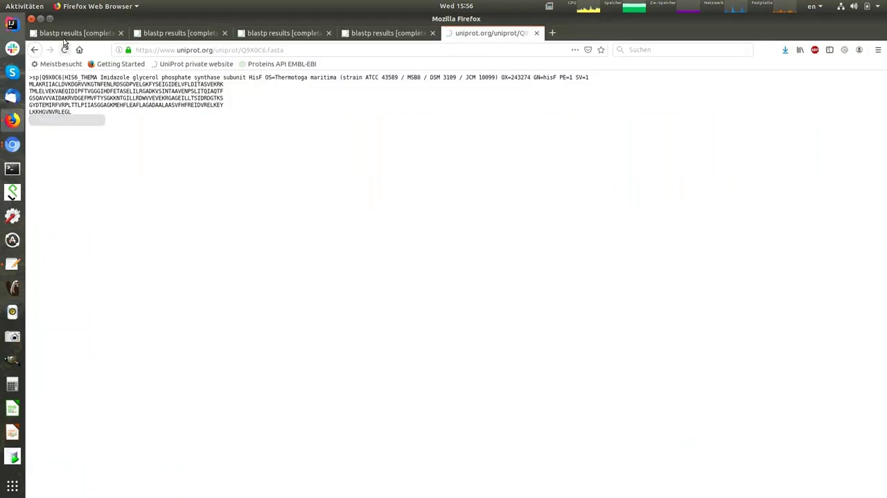

[【跳转到 21:22】](https://www.youtube.com/watch?v=wTdtuXXgjmM&t=1282)

因为**每条命中都代表一整个相似序列的聚类**，检索 UniRef90 时仅看前 10 条 BLAST 命中，覆盖的多样序列就远多于普通序列库；第 11 条命中带来的新信息，在 UniRef90 里也比在普通数据库里更有价值。

## 五、两个容易搞混的问题（来自 Q&A）

**Q1：UniRef100 会包含带「突出端（overhang）」的序列吗？**
会。示例里那条来自 UniParc（经 PDB 进入）的序列带有一个 N 端 his 标签之类的亲和纯化标签；它其实是同一条蛋白，但因为多了这个 N 端标签，**没有被合并进同一个 UPI**——序列 100% 相同，但**不是全长相同**。这也解释了为什么 UniParc 合并要求「全长一致」。

**Q2：UniRef50 单个簇的成员数比 UniRef100 多，为什么总记录数反而变少？**
不矛盾。UniRef100 要求簇内所有序列 **100% 同一性**，这是最严格的条件，所以每个簇成员少、但簇多；UniRef50 只要求 **>50% 同一性**，宽松得多，更多蛋白被聚进同一个簇，于是单个簇成员更多、但簇的总数更少，总记录数也随之下减少。

**Q3：UniRef/UniParc 和蛋白质互作数据库有关系吗？**
要拿到蛋白质互作信息，需要通过 **UniProtKB**：UniParc 有指向 UniProtKB 的交叉引用，而在 UniProtKB 里你又能找到指向许多其他数据库（包括互作数据库）以及大量细分主题数据库的交叉引用。

## 小结

- **UniParc = 全量非冗余序列档案馆**：每条唯一序列只存一份，用 **UPI** 作永久标识，用**交叉引用**串起来源数据库；记录源库的**删除/失活**与**版本变化**；需要冗余蛋白序列时只能来这里找。
- **UniParc 的用法**：网页检索 → 结果页按 FASTA / tab / Excel / XML 下载 → 条目页看序列与 InterPro 特征、直接 BLAST → 编程则走 **Proteins API**（可按 UPI/UPID/交叉引用/accession/序列检索）。
- **UniRef = 按序列同一性聚类的参考簇**：把相似序列打包成一条代表记录，分辨率 100% / 90% / 50%；**同一性非全长衡量、不看分类学**。
- **UniRef 的用法**：搜一个蛋白得到 UniRef50/90/100 三个簇 → 读懂簇里的 **seed（最长）与 representative（注释最好）** → 用 Advanced Search 按同一性/分类学/大小等构造检索 → **在 BLAST 里选 UniRef 目标库**，用更少命中覆盖更多样的序列。
- **规模记忆点**（release 2019_08）：UniParc 2.85 亿 → UniRef100 2.02 亿 → UniRef90 1.01 亿 → UniRef50 3800 万。

## 关键术语速查

| 术语 | 一句话解释 |
| --- | --- |
| UniParc | UniProt Archive，全量、非冗余的蛋白质序列档案馆。 |
| UPI | UniParc Protein ID，每条唯一序列的永久稳定标识符，永不移除或更改。 |
| 交叉引用（cross-reference） | 把 UniParc 条目链接回其来源数据库的记录；源库删改后会被标记为已删除。 |
| active / inactive | 标记该序列在源数据库中是否仍活跃；失活的记录仍保留在 UniParc。 |
| 序列版本（version） | 序列每变化一次，accession 的内部版本号加一；可查看历史版本。 |
| Proteins API | EMBL-EBI 的编程接口，可按 UPI/UPID/交叉引用/accession/序列检索 UniParc。 |
| UniRef | UniProt Reference Clusters，按序列同一性把序列聚成参考簇。 |
| UniRef100 / 90 / 50 | 分别按 100% / 90% / 50% 序列同一性聚类；数字越小，簇内越多样、总记录越少。 |
| 序列同一性 | 两条序列比对后相同氨基酸的比例；UniRef 中非全长衡量。 |
| seed sequence | 簇中最长的序列。 |
| representative sequence | 簇中注释最好的序列，作为该簇的代表（通常不是 seed）。 |
| Advanced Search | UniRef 网站的高级检索，可按簇名、分类学、同一性、大小、长度等构造查询。 |
| redundant proteome | 冗余蛋白质组，其序列在 UniProt 中不单独保留，只能从 UniParc 获取。 |
