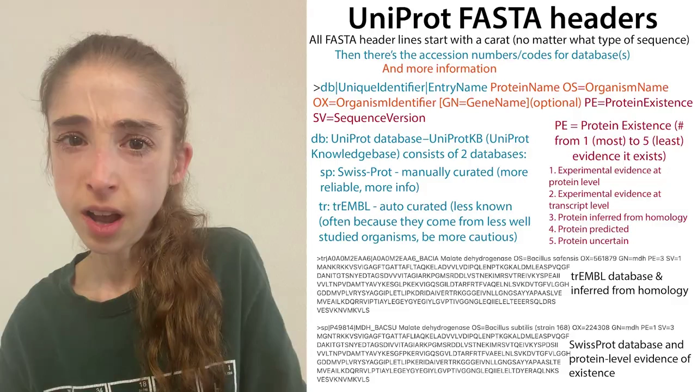
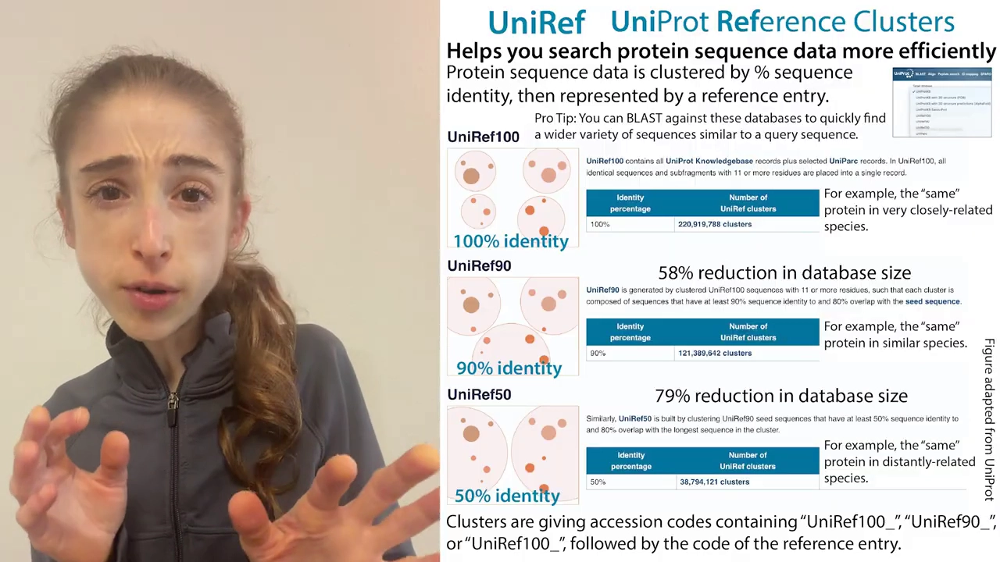
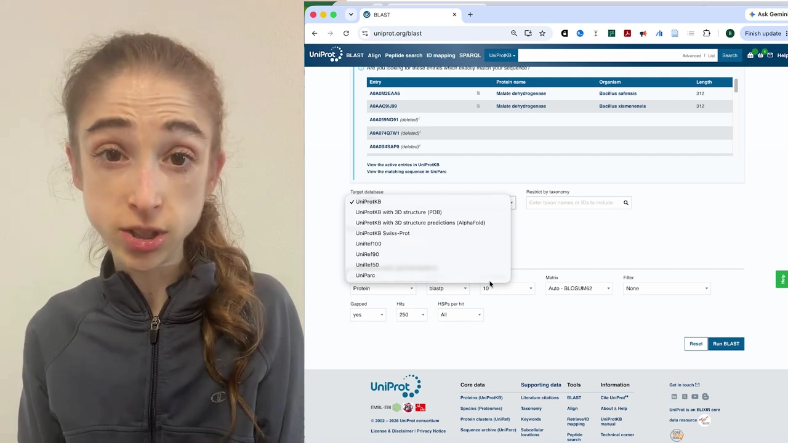
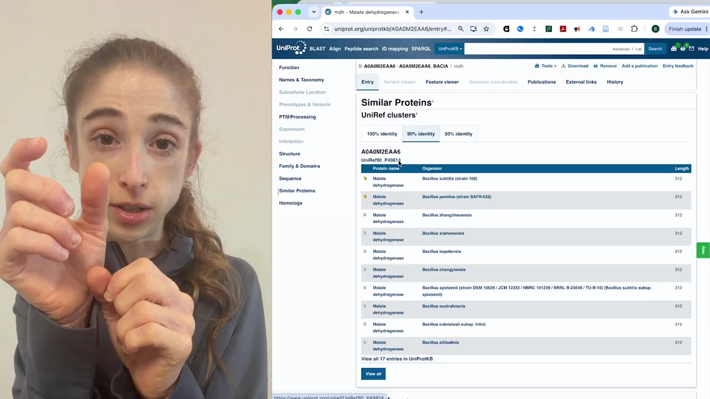
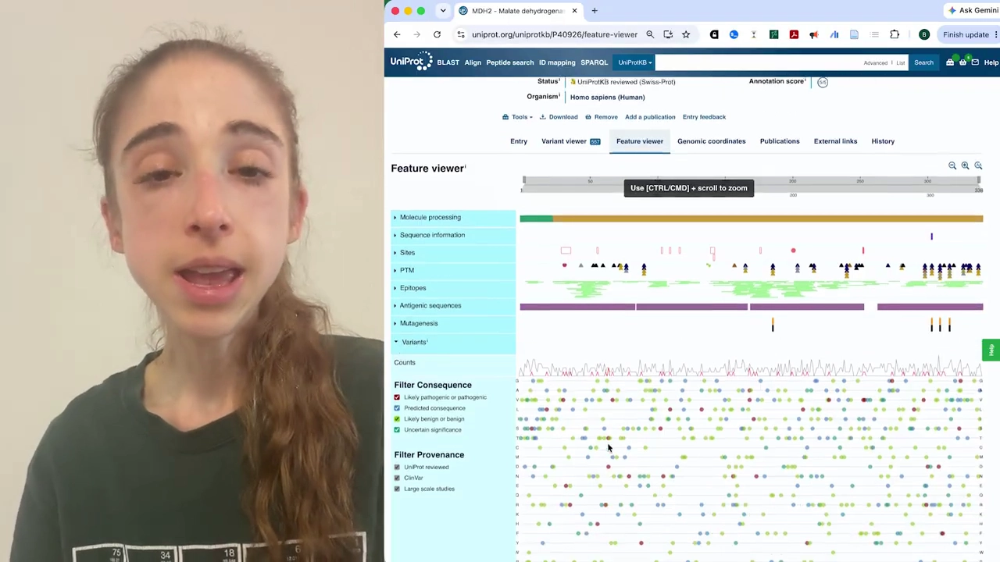

# UniRef 数据库详解：UniProtKB、UniRef、UniParc 到底有什么区别

> 本文配套视频：[《UniProt makeup - UniProtKB vs UniRef vs UniParc》](https://www.youtube.com/watch?v=uXbwNHnhVoA)（YouTube，the bumbling biochemist，约 16 分钟）。

## 本讲要解决的核心问题（SCQA）

**背景**：UniProt 是生物信息学里最常用的蛋白质序列数据库——想查一个蛋白的序列、功能、结构注释，第一反应往往就是打开 `uniprot.org`。

**冲突**：但 UniProt 并不是「一个」数据库。它的数据实际被拆成了三个库：**UniProtKB**、**UniRef**、**UniParc**；每个库里又还有子库，条目前的 `sp`/`tr`、`UniRef100_` 之类前缀更是让人一头雾水。很多人只会用默认的 UniProtKB，遇到「该用哪个库检索、BLAST 该选哪个目标库」就卡住了。

**疑问**：这三个库分别是什么？为什么要拆开？做检索或 BLAST 时到底该选哪个？

**回答（中心思想）**：三者的分工可以用一句话记住——**要功能信息去 UniProtKB，要缩小检索空间去 UniRef，要看全部序列去 UniParc**。UniProtKB 存放带注释的「知识库」条目；UniRef 把序列按同一性（100% / 90% / 50%）聚类成「参考簇」，去掉冗余、加快检索；UniParc 则是全量、非冗余的序列「档案馆」，连被停用的序列也永久保存。它们都能从 UniProt 一个入口访问，且完全免费。

---

## 一、先分清三个库的分工

UniProt 是一个存储蛋白质序列信息的数据库群。因为序列信息量极大、而且质量参差不齐，UniProt 把数据拆成了几个用途不同的库：


[【跳转到 00:16】](https://www.youtube.com/watch?v=uXbwNHnhVoA&t=16)

- **UniProtKB**（UniProt KnowledgeBase，知识库）：存放**带注释**的数据，把功能信息、位置信息等映射到序列上。
- **UniRef**（UniProt Reference Clusters，参考聚类）：把**完全相同**的、以及**相似度 90% / 50%** 的序列分别聚到一起，减少冗余。
- **UniParc**（UniProt Archive，序列档案馆）：存放**所有**序列，哪怕是被停用的序列也保留。

### 1.1 「相似」= 序列同一性

视频里反复强调：UniRef 说的「相似」，指的是 **序列同一性（sequence identity / percent identity）**——把两条序列比对起来，在相同位置上拥有**完全相同的氨基酸**的比例。这一点在后面理解 100 / 90 / 50 三个数字时很关键。

## 二、UniProtKB：想查「这个蛋白是干嘛的」就来这里

**如果你想了解某个具体蛋白质的功能信息，就应该用 UniProtKB。** 它的核心是「带注释的条目」。

### 2.1 注释是什么：把功能「贴」到序列上

注释（annotation）的作用是**给序列数据提供上下文**，让你能读懂它：告诉你基因在哪里、蛋白质的哪一段负责什么功能。


[【跳转到 03:18】](https://www.youtube.com/watch?v=uXbwNHnhVoA&t=198)

映射到一条序列上的注释信息包括：

- **遗传变异**：已知会导致蛋白质差异的变异，以及这些变异已知的影响；
- **结合位点**：被预测或经实验验证的位点；
- **翻译后修饰位点**，例如磷酸化；
- **异构体（isoform）**：同一个基因通过可变剪接产生同一种蛋白的不同版本。

### 2.2 条目 = 一个基因产生的蛋白质

UniProtKB 的**一个条目对应「由单个基因产生的蛋白质（及其各个版本）」**。这里有两点容易混淆：

- 同一个基因产生的多个剪接异构体，会被合并进**同一个** UniProtKB 条目；
- 但如果是**多亚基蛋白**，各亚基来自不同基因，那么每个亚基、每条链都会有**自己独立的**条目。

因此，即使两条序列完全相同，只要来自不同生物、或同一生物体内不同基因，它们仍各自拥有独立条目——这正是后面检索困难的根源。

### 2.3 注释评分（Annotation Score）1–5

条目之间的注释详细程度差异很大，UniProt 用 **1 到 5 的注释评分**来标示：5 分表示已知信息最多、注释量最大。

## 三、Swiss-Prot 与 TrEMBL：已审阅 vs 未审阅

UniProtKB 本身又分成两个子库：**已审阅的 Swiss-Prot** 和**未审阅的 TrEMBL**。

### 3.1 TrEMBL：自动注释、灰色标记、命名奇怪

UniProt/TrEMBL 存放**未审阅**条目。它的注释基本上都是通过**自动注释**拉取来的：系统判断「这一段看起来像我们知道在某酶里执行某种功能的另一段」，于是按规则自动把结合位点、预测修饰位点、功能等映射到序列和条目上。虽然偶尔有文献依据，但主要是自动生成，**之后不会再被检查或审阅**。

在网站上，TrEMBL 条目旁边是一个**灰色的、像纸片一样的标记**；它们的名字常常是奇怪的「序列编号」式命名，因为它还没经过人工的科学审阅。

### 3.2 Swiss-Prot：人工审阅、金色带星

Swiss-Prot 存放**已审阅**条目：来自较知名物种、注释更好、并且**经过人工审阅验证**。它们的标记是**带星星的金色纸片**。

### 3.3 从 FASTA header 一眼分辨 sp / tr

当你看到一条 FASTA 序列时，可以直接从头行判断它来自哪个库：



[【跳转到 05:47】](https://www.youtube.com/watch?v=uXbwNHnhVoA&t=347)

- `sp`：Swiss-Prot，**人工策展、更可靠、信息更多**；
- `tr`：TrEMBL，**自动策展、信息较少**（常来自研究较少的物种，要更谨慎）；
- `PE`（Protein Existence）：蛋白存在证据等级，**1 最强（有蛋白水平实验证据）到 5 最弱（仅预测、不确定）**。

> 提示：sp / tr 都属于 UniProtKB，区别只在于是否经过审阅。

## 四、为什么需要 UniRef：同一序列在 UniProtKB 里太重复

### 4.1 重复问题

由于「一个基因一个条目」，同一条序列会在不同物种、不同基因里反复出现。当你想检索时，会搜出大量序列完全相同的条目，导致很难找到真正不同的序列——或者反过来，你专门想找完全相同的序列也很费劲。这些重复的序列信息，就可以被**聚成参考簇**，于是我们来到 UniRef。


[【跳转到 07:22】](https://www.youtube.com/watch?v=uXbwNHnhVoA&t=442)

### 4.2 三档聚类：UniRef100 / UniRef90 / UniRef50

UniRef 取来所有条目（主要来自 UniProtKB，也有一些来自 UniParc），按序列同一性聚成三档，名称里的数字就是「相同氨基酸所占的百分比阈值」：



[【跳转到 08:43】](https://www.youtube.com/watch?v=uXbwNHnhVoA&t=523)

- **UniRef100**：把**完全相同**的序列合并到一起（例如同一个基因出现在关系极近、刚刚分化的物种里）。序列长度不必完全相同，但每条至少要 **11 个氨基酸**长，以免把一堆零碎小片段也聚进来。
- **UniRef90**：把 UniRef100 里相似度 **≥90%** 的序列聚到一起，并要求覆盖种子序列（seed sequence，即最长的序列）**至少 80%**。数据库规模因此**缩小约 58%**。
- **UniRef50**：在 UniRef90 的种子序列基础上，把 **≥50%** 相似、且覆盖最长序列 ≥80% 的再聚到一起。数据库规模**缩小约 79%**。

每往下一档，序列数目和条目数量都大幅减少，检索时要搜索的序列空间也就急剧缩小。

### 4.3 为什么这对 BLAST 很有用

UniRef 的好处在于：**减少序列数量 = 减少需要检索的计算量**，并且相比直接在 UniProtKB 里搜，能更容易找到**种类更多、亲缘更远**的序列，而不是搜出一堆「只是稍微不同的同种细菌」的序列。所以做 BLAST 时，你完全可以自己选择去哪个 UniProt 数据库里检索。

### 4.4 种子序列（seed）≠ 代表序列（representative）

这是全文最容易混淆、也最重要的一点：

- **种子序列（seed sequence）**：簇里**最长**的那条，其他序列都拿它来比较，以判断是否达到进入该簇的阈值。
- **代表序列（reference / representative）**：从簇里挑出的**条目质量最好**的那条，作为整个簇的代表。

**代表序列通常不是种子序列**——因为「最长」并不等于「最好」。代表序列的选择会综合考虑：

1. 注释有多少、注释质量如何（**人工添加的优先于自动生成的**）；
2. 物种：优先考虑人们研究得较多的**参考物种 / 模式生物**（如人、小鼠）；
3. 序列长度等因素。

### 4.5 从 accession 读懂 UniRef

代表序列的条目 accession 会成为 UniRef accession 的一部分，规则是：

```
UniRef100_<该簇代表条目的 accession>
UniRef90_<该簇代表条目的 accession>
UniRef50_<该簇代表条目的 accession>
```

- **下划线后面的编号**会把你带到该簇**代表序列的条目**；
- **下划线前面的 UniRef100 / 90 / 50** 则告诉你这是「哪一个参考聚类的代表」，而不只是那一个具体条目。

## 五、UniRef 怎么用：BLAST 与「相似蛋白」面板

### 5.1 在 BLAST 里选择目标数据库

UniProt 的 BLAST 工具允许你指定检索的目标库：



[【跳转到 11:15】](https://www.youtube.com/watch?v=uXbwNHnhVoA&t=675)

想快速找到与查询序列相似、但更有多样性的一批序列时，选择 **UniRef50** 往往比直接搜 UniProtKB 更高效。

### 5.2 条目页的「Similar Proteins / UniRef clusters」

在任意 UniProtKB 条目的 **Similar Proteins** 区域，可以按 **100% / 90% / 50% 同一性**三个标签切换查看对应的 UniRef 簇：



[【跳转到 14:00】](https://www.youtube.com/watch?v=uXbwNHnhVoA&t=840)

页面上的缩略预览还能结合 **Feature viewer** 查看注释：



[【跳转到 03:52】](https://www.youtube.com/watch?v=uXbwNHnhVoA&t=232)

它把注释按分子加工、位点、PTM、表位、变异等类别分层展示，并可点击跳转到对应位置。

## 六、UniParc：最后兜底的序列存档

UniParc 存放**所有**序列。即使某条序列后来被「停用」——比如科学家发现它其实有瑕疵——它在 UniParc 里**仍然会保留一个条目**。它就像一个存储容器、一座档案馆。

UniParc 是三者中**可靠性最低**的（信息最少），但它保证了**所有东西都被永久保存在某处**。它是一个**非冗余**库：如果两条完全相同的序列来自完全相同的数据集（例如同一次测序运行），会被合并；但如果来自不同实验、各自独立鉴定，则仍各自保留条目。所以它「非冗余」却又「条目很多」——这些条目后续又会被合并进同一个 UniProtKB 条目里。

## 小结

- **UniProt 不是单一数据库**，而是由 UniProtKB、UniRef、UniParc 组成的数据库群，统一在 `uniprot.org` 访问，全部免费。
- **要功能信息 → UniProtKB**：带注释的知识库，一个条目对应一个基因产生的蛋白（含异构体）；多亚基蛋白各链各有条目。
- **UniProtKB 分两个子库**：已审阅的 **Swiss-Prot**（人工、金色带星）与未审阅的 **TrEMBL**（自动、灰色）；FASTA 头行的 `sp`/`tr` 与 `PE 1–5` 是快速判断依据。
- **要缩小检索空间 → UniRef**：按序列同一性聚成 **UniRef100 / 90 / 50** 三档，规模分别缩小到约 100% / 42% / 21%（UniRef90 缩小约 58%、UniRef50 缩小约 79%）。
- **UniRef 的两个「序列」别搞混**：**seed** 是最长序列（用于比较），**representative** 是条目质量最好的那条（作为簇代表）；accession 形如 `UniRef90_P49814`。
- **要看全部 → UniParc**：全量、非冗余的序列档案馆，连停用序列也永久保存。
- **检索/相似性搜索**时可以在 BLAST 中自由选择目标库；UniRef50 适合找更多样、更远缘的序列。

## 关键术语速查

| 术语 | 一句话解释 |
| --- | --- |
| UniProt | 整合多个来源的蛋白质序列与功能信息数据库群，含 UniProtKB、UniRef、UniParc。 |
| UniProtKB | UniProt 知识库，存放带注释的条目，一个条目对应一个基因产生的蛋白。 |
| Swiss-Prot | UniProtKB 中**已审阅**（人工策展）的子库，标记为金色带星。 |
| TrEMBL | UniProtKB 中**未审阅**（自动注释）的子库，标记为灰色纸片。 |
| 注释（annotation） | 映射到序列上的功能/位置信息，如变异、结合位点、PTM、异构体等。 |
| Annotation Score | 1–5 分，表示条目注释的丰富程度，5 分信息最多。 |
| PE（Protein Existence） | FASTA 头行中的蛋白存在证据等级，1 最强到 5 最不确定。 |
| UniRef | UniProt Reference Clusters，按序列同一性把序列聚成参考簇，减少冗余、加速检索。 |
| UniRef100 / 90 / 50 | 分别按 100% / ≥90% / ≥50% 序列同一性聚类（90、50 还要求覆盖 ≥80%）。 |
| 序列同一性（identity） | 两条序列比对后，相同位置上氨基酸完全相同的百分比。 |
| seed sequence | 簇中最长的序列，用于判断其他序列能否入簇。 |
| representative | 簇中条目质量最好的序列，作为整个簇的代表（通常不是 seed）。 |
| UniParc | 全量、非冗余的序列档案馆，包含被停用的序列，永久保存。 |
| accession | 条目/簇的唯一编号，如 `P49814`、`UniRef90_P49814`。 |
