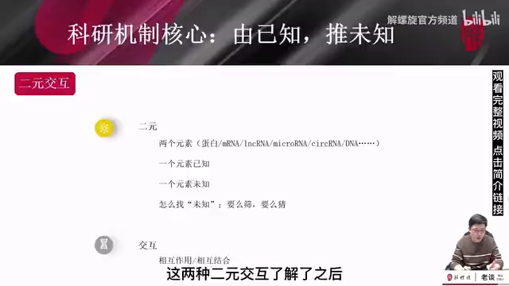
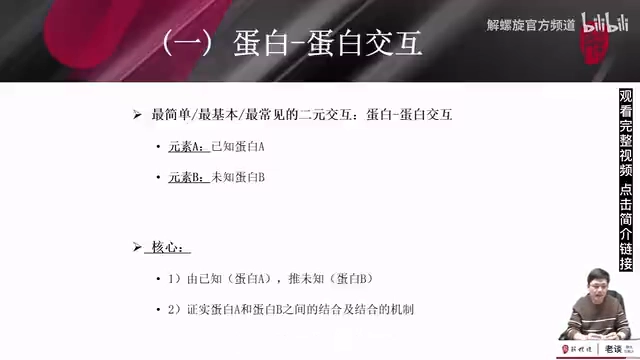
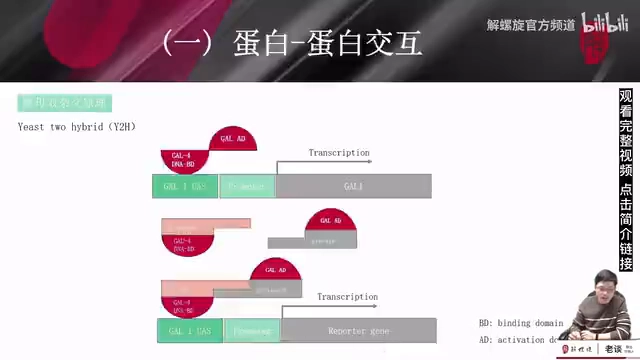

# 什么是蛋白质-蛋白质相互作用（PPI）

> 本文配套视频：[《什么是蛋白—蛋白相互作用？lncRNA/miRNA/cicRNA，医学热点知识》](https://www.bilibili.com/video/BV1dM41187Gy/)（解螺旋官方频道，B 站）。

## 本讲要解决的核心问题（SCQA）

**背景**：蛋白质很少「单打独斗」，它们往往两两结合、甚至几十上百个组成复合体来执行功能。研究一个蛋白，绕不开「它和谁结合、怎么结合」这个问题。

**冲突**：刚入门时概念容易含糊——什么是「二元交互」？「相互作用」到底指什么？蛋白-蛋白互作研究的重点又是什么？如果连基本框架都没理清，看文章或写基金时会抓不住重点。

**疑问**：蛋白质-蛋白质相互作用（PPI）的基本概念是什么？它的核心研究逻辑是什么？

**回答（中心思想）**：**PPI 是「两个分子之间的直接相互作用」**，属于二元交互里最常见的一类；它的研究逻辑可以浓缩成一句话——**由已知的蛋白 A，去筛选/找到未知的蛋白 B，并证明两者结合**。理解了这句逻辑，再看各种实验技术和文献套路都会清晰很多。本篇以酵母双杂交为例说明这句逻辑如何落地。

---

## 一、二元交互：两个分子之间的直接结合

所谓**二元交互（binary interaction）**，本质就是**两个分子**之间的关系。这两个「元素」可以有很多种——**蛋白、mRNA、lncRNA、microRNA、circRNA、DNA……**，在这么多元素中，**任意两个元素之间发生的结合/交互**就叫二元交互。

[【跳转到 01:45】](https://www.bilibili.com/video/BV1dM41187Gy/?t=105)

常见的形式有：

- **蛋白-蛋白交互**（非常常见）；
- **蛋白-RNA 交互**（非常常见）；
- **RNA-RNA 交互**：例如 **miRNA 结合到 mRNA 的 3′UTR**，通过转录后机制调控基因表达；
- **蛋白-DNA 交互**：最常见的是**转录因子与基因启动子区结合**。

在这些形式中，**最常见的是「蛋白-蛋白」与「蛋白-RNA」两大类**；其他形式的核心逻辑相通，只是表现形式和所用方法略有不同。

> **关键区分**：这里的「**交互**」指两个分子之间的**直接相互作用、相互结合**。它区别于「二元变量/三元研究」那种**间接**的研究模式（例如「一个药物 + 一个分子/通路」，但彼此是否存在直接作用并不明确）。**直接相互作用是机制研究中最基本的内容**，也是现在写科研基金标书最常见的作用模式——一份标书里连一个二元相互作用都不写，几乎很难中标。

## 二、PPI 的核心研究逻辑：由已知，推未知

**蛋白-蛋白交互是最简单、最基本、最常见的二元交互。** 研究它时要先明确一件事：你手上的两个蛋白里，**一个是已知的、一个是未知的**——你要做的，是**用一个已知蛋白去筛选/找到那个未知的、能与它结合的蛋白**。

[【跳转到 03:38】](https://www.bilibili.com/video/BV1dM41187Gy/?t=218)

这就是所有蛋白-蛋白互作研究的**核心逻辑**，浓缩成一句话：

> **通过已知的蛋白 A，找到未知的蛋白 B，并证明 A 与 B 之间存在相互作用。**

后面所有的研究模式和套路，都是围绕这句话展开的。

## 三、研究技术示例：酵母双杂交（Y2H）

为了把上面的逻辑落地，视频用一个最常用的方法——**酵母双杂交（Yeast two-hybrid, Y2H）**——来说明。它**既可以用来筛选未知蛋白，也可以用来验证两个蛋白是否真的结合**。

它利用的是转录因子 **GAL4** 的结构特点：GAL4 有两个结构域——**DNA 结合域（BD）**和**转录激活域（AD）**。BD 负责结合 DNA，AD 负责激活下游基因转录；两者合在一起，才能启动下游报告基因的表达。

[【跳转到 05:41】](https://www.bilibili.com/video/BV1dM41187Gy/?t=341)

实验设计是把完整的 GAL4「**拆成两半**」：

- **蛋白 X 融合 BD**（写成一个融合蛋白 X-BD）；
- **蛋白 Y 融合 AD**。

当 **X 与 Y 结合**时，BD 与 AD 在空间上被拉近、**重新组成一个功能完整的转录因子**，从而启动下游**报告基因**表达；如果 X 与 Y 不结合，单独的 BD 或 AD 都**无法**启动转录。于是，「**报告基因有没有表达**」就成了判断 X 与 Y 是否互作的信号。

**为什么它能用来筛选？** 把其中一个蛋白设为**已知**，另一个用 **cDNA 文库**（包含几千甚至几万个分子）表示：用已知分子与文库「杂交」，凡是能让报告基因表达的克隆，就说明**已知分子与该位置的分子可能结合**；把阳性克隆挑出来**测序**，就知道潜在的互作分子是什么。

**为什么它又能用来验证？** 筛选（尤其文库筛选）难免有**假阳性**，所以找到候选后，还需进一步验证——把已知分子与候选分子分别接到 BD、AD 上再测一次即可。

> **一句话记忆**：酵母双杂交**既可用于筛选未知蛋白，也可用于验证两个蛋白是否真正结合**。

## 小结

- **二元交互**：任意两个分子（蛋白、mRNA、lncRNA、miRNA、circRNA、DNA…）之间的结合；属于机制研究最基础的内容。
- **最常见的形式**：蛋白-蛋白、蛋白-RNA 两大类。
- **「交互」= 直接结合**：区别于间接的「二元/三元变量研究」；写基金标书常要求至少有一个二元相互作用。
- **PPI 核心逻辑**：**由已知的蛋白 A，找到未知的蛋白 B，并证明二者结合**——所有研究套路都由此展开。
- **落地示例（酵母双杂交）**：GAL4 拆成 BD/AD，X-BD 与 Y-AD 结合后组成完整转录因子、激活报告基因；既可用于**筛选**（已知蛋白 + cDNA 文库），也可用于**验证**。

## 关键术语速查

| 术语 | 一句话解释 |
| :--- | :--- |
| 二元交互 | 两个分子之间发生的直接结合/相互作用 |
| PPI | 蛋白质-蛋白质相互作用，最常见的二元交互之一 |
| 已知蛋白 A / 未知蛋白 B | PPI 研究的核心：用已知的 A 去找并证明未知的 B |
| 直接相互作用 vs 间接研究 | 前者是两分子直接结合，后者（二元/三元变量）作用关系不明确 |
| Y2H（酵母双杂交） | 用 GAL4 的 BD/AD 拆分系统在酵母内筛选或验证蛋白互作 |
| GAL4 / BD / AD | 常用转录因子及其 DNA 结合域 / 转录激活域 |
| 报告基因 | 互作发生时才被激活、可被检测的下游基因 |
| cDNA 文库 | 大量 cDNA 分子的集合，用于 Y2H 高通量筛选未知互作蛋白 |
