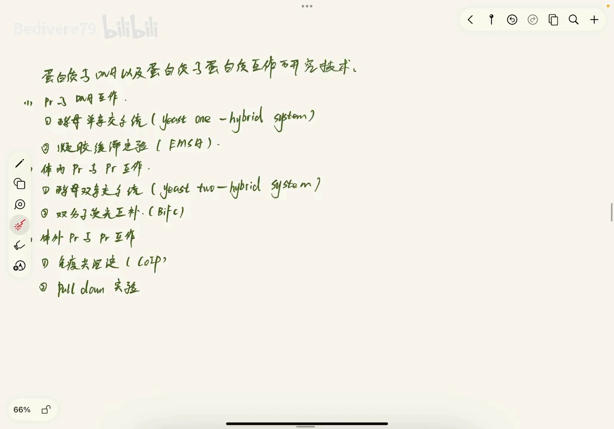
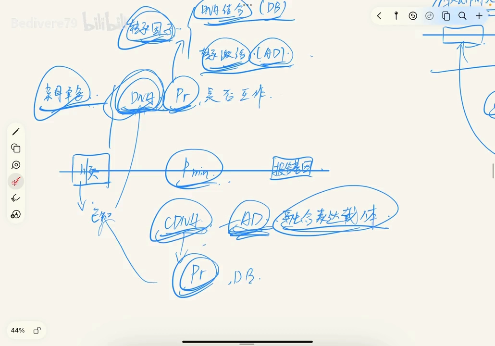
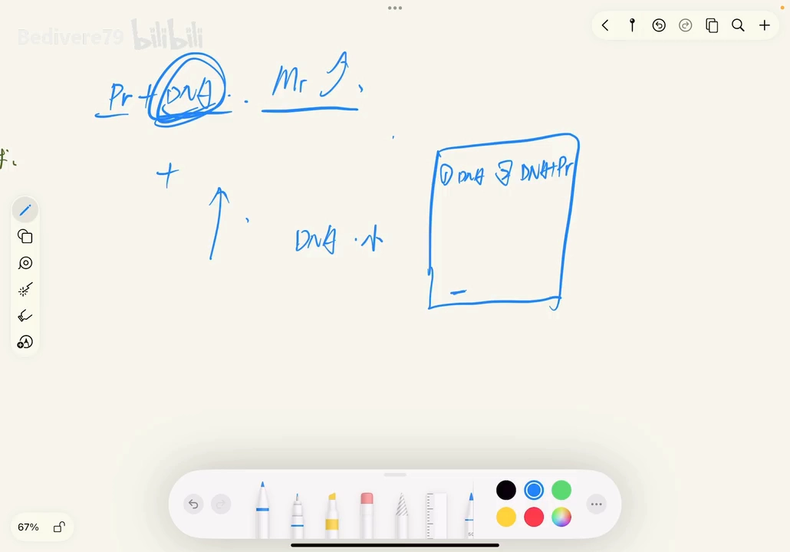
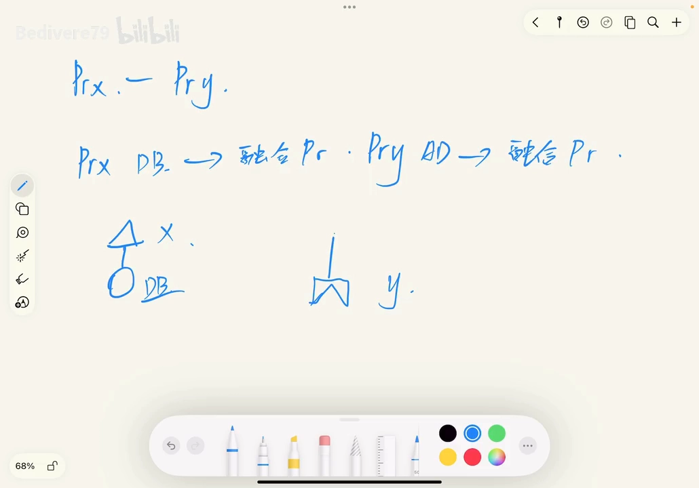
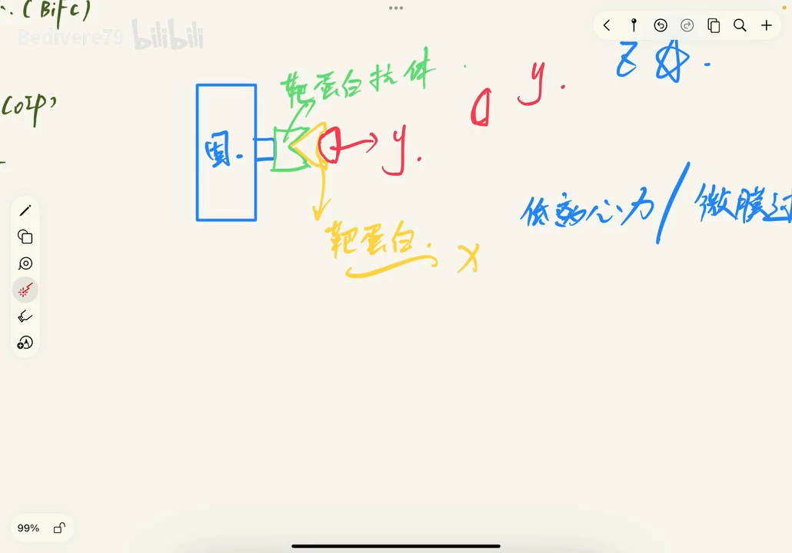
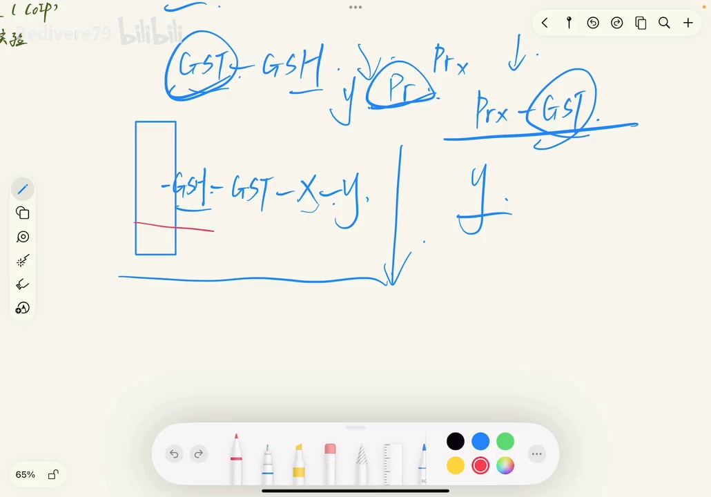

# 蛋白质-DNA 与蛋白质-蛋白质互作研究技术

> 本文配套视频：[《生化分子复盘（十）：DNA与蛋白质以及蛋白质与蛋白质互作研究技术》](https://www.bilibili.com/video/BV1ZjmPYeEVz/)（lyrical79，B 站）。

## 本讲要解决的核心问题（SCQA）

**背景**：研究蛋白质相互作用时，我们不仅要问「它们是否互作」，还要区分「研究的是蛋白-DNA 还是蛋白-蛋白」，以及「实验是在体内做还是体外做」。

**冲突**：相关技术名目繁多、容易混淆——酵母单杂和酵母双杂到底哪个研究 DNA？哪些是体内、哪些是体外？每个实验的原理和用途各不相同，记混了就答不上、也选不对方法。

**疑问**：DNA 与蛋白质、蛋白质与蛋白质互作各有哪些常用技术？它们分别基于什么原理、解决什么问题？

**回答（中心思想）**：这些技术可以按「**研究对象**（蛋白-DNA / 蛋白-蛋白）」与「**体内/体外**」分成一组。本篇系统梳理：蛋白-DNA 用**酵母单杂（Y1H）**与**凝胶阻滞（EMSA）**；蛋白-蛋白的**体内**技术有**酵母双杂（Y2H）**与**双分子荧光互补（BiFC）**；蛋白-蛋白的**体外**技术有**免疫共沉淀（Co-IP）**与 **pull-down**。

---

## 一、总览：六大技术怎么分组

视频把要复盘的技术分成三组、共六个：

[【跳转到 15:00】](https://www.bilibili.com/video/BV1ZjmPYeEVz/?t=900)

| 研究对象 | 体内 / 体外 | 常用技术 |
| :--- | :--- | :--- |
| 蛋白 - DNA | — | 酵母单杂交（Y1H）、凝胶阻滞（EMSA） |
| **蛋白 - 蛋白** | **体内** | **酵母双杂交（Y2H）、双分子荧光互补（BiFC）** |
| **蛋白 - 蛋白** | **体外** | **免疫共沉淀（Co-IP）、pull-down** |

所有技术都建立在一个共同前提上：**转录因子有两个功能结构域**——**DNA 结合域（BD）** 负责结合 DNA，**转录激活域（AD）** 负责激活下游转录；两者合在一起，才能启动基因表达。

## 二、酵母单杂交（Y1H）：研究蛋白-DNA

**酵母单杂交（Yeast one-hybrid）** 用来研究 **DNA 与蛋白质是否互作**。做法是：

- 在**基本（核心）启动子**的**上游**插入一段**已知的顺势作用元件**（即要研究的 DNA 序列）；
- 在**下游**接一个**报告基因**（常用的有 GFP 绿色荧光蛋白等，表达即可观察）；
- 构建**待测转录因子 cDNA 与 AD 的融合表达载体**，导入酵母细胞。

若待测蛋白能与该 DNA 结合，它就相当于起了「BD」的作用；再加上融合上去的 AD，两者就构成了一个**完整的转录因子**，驱动下游报告基因表达。反过来，若不能结合，报告基因就不表达。

[【跳转到 08:20】](https://www.bilibili.com/video/BV1ZjmPYeEVz/?t=500)

它的两个主要用途：**① 分离能结合特定顺势作用元件（或其他 DNA 位点）的功能蛋白编码基因；② 检验/鉴定转录因子的 DNA 结合结构域，并准确定位与特定蛋白结合的 DNA 序列。**

> **易错点**：酵母**单**杂研究的是**蛋白质与 DNA**；酵母**双**杂研究的是**蛋白质与蛋白质**（且为体内）。

## 三、凝胶阻滞实验（EMSA）：也是研究蛋白-DNA

**凝胶阻滞实验（EMSA）** 的原理很直观：DNA 与蛋白质结合后形成复合物，**相对分子质量变大**，因此在凝胶电泳中**向正极迁移的速度变慢**（迁移距离变短、被「阻滞」）。

[【跳转到 11:40】](https://www.bilibili.com/video/BV1ZjmPYeEVz/?t=700)

操作要点：把待测 DNA 片段做成**探针**（可用放射性同位素标记），与**细胞提取物共温育**；若 DNA 与目标蛋白结合，就形成 DNA-蛋白复合物。随后上**非变性凝胶**电泳，结束后用**放射自显影**显示条带：

- 与蛋白结合的 DNA 分子量大、跑得慢，出现在凝胶**上部/其他位置**；
- 未结合蛋白的 DNA 跑得快，聚集在凝胶**底部**。

用途：检测**某一特定 DNA 片段结合的蛋白质**，也可反过来通过 DNA 研究蛋白质，且能反映结合的**特异性**。

## 四、酵母双杂交（Y2H）：体内研究蛋白-蛋白

**酵母双杂交**和酵母单杂原理相通（都利用转录因子的 BD/AD），但研究的是**蛋白质与蛋白质**、且发生在**体内**。关键点在于：**BD 单独结合 DNA 无法启动转录，只有当 BD 与 AD 在一起（组成转录因子）时才能转录**；甚至来自**不同转录因子**的 BD 与 AD 拼成的杂合蛋白也能起作用。

[【跳转到 17:55】](https://www.bilibili.com/video/BV1ZjmPYeEVz/?t=1075)

设计：**X 蛋白融合 BD**、**Y 蛋白融合 AD**。若 X 与 Y **互作**，BD 与 AD 在空间上被拉到一起、形成完整转录因子，结合到顺势作用元件上并启动下游**报告基因**表达；若 X 与 Y **不互作**，BD、AD 分开，无法启动转录。因此可用于**分离或鉴定与已知靶蛋白相互作用的蛋白**。

## 五、双分子荧光互补（BiFC）：体内研究蛋白-蛋白

**双分子荧光互补（BiFC）** 的思路与酵母双杂类似，但报告信号换成了「**发光**」。

把荧光蛋白（如 GFP）在合适位点**切成两半**（记为 A、B）。这两半在细胞内共表达时**不会自发重新组合成荧光蛋白**，因此单独存在**不发光**。但把 **X 连上 A、Y 连上 B** 后，当 **X 与 Y 相互作用**时，A、B 在空间上被拉到一起、**重新生成荧光蛋白**，在激发光下发出荧光，可用荧光显微镜观察。

[【跳转到 23:20】](https://www.bilibili.com/video/BV1ZjmPYeEVz/?t=1400)

因此，**看到荧光 = X 与 Y 相互作用**；不发光则说明两者不互作。它是**体内或体外**检测蛋白互作的一种直观技术。

## 六、免疫共沉淀（Co-IP）：体外研究蛋白-蛋白

**免疫共沉淀（Co-Immunoprecipitation, Co-IP）** 是在体外（细胞裂解物水平）捕获蛋白复合物的方法。

原理：用**固体基质**（通过亲核试剂连接）连上**靶蛋白的抗体**，抗体再结合**靶蛋白 X**；随后向体系中加入待筛选的**蛋白混合液**（含蛋白 Y），再用**低离心力**或**微膜过滤**，把「固体基质—抗体—X（—Y）」的复合物**沉淀**到管底或滤膜上。

[【跳转到 28:45】](https://www.bilibili.com/video/BV1ZjmPYeEVz/?t=1725)

若 **X 与 Y 相互作用**，Y 就跟着复合物一起被沉淀下来；若加入的蛋白不与 X 互作，就沉淀不下来。Co-IP 可用来检测**已知两个蛋白**之间、或**两个未知蛋白**之间是否存在相互作用。

## 七、pull-down（GST pull-down）：体外研究蛋白-蛋白

**pull-down** 是另一个体外方法，常用于**证明蛋白互作**或对**未知互作做初始筛选**。视频用了一个形象的「钓鱼」类比：**GST 是鱼钩，X 是鱼饵，Y 是鱼**。

具体来说：**GST（谷胱甘肽 S-转移酶）能与 GSH（谷胱甘肽）结合**。把 **GST 与诱饵蛋白 X 做成融合蛋白（GST-X）**，当它流经**固定了 GSH 的色谱柱**时，GST 就挂在柱子上——相当于把「鱼饵 X」用鱼钩挂在了杆上。接着加入含目标蛋白 Y 的混合液：

- 若 **Y 与 X 互作**，Y 就被 X「钓住」，留在柱上；
- 若 **Y 不与 X 互作**，Y 就随液体流走。

[【跳转到 33:20】](https://www.bilibili.com/video/BV1ZjmPYeEVz/?t=2000)

## 小结

- **分组**：蛋白-DNA（酵母单杂、EMSA）；蛋白-蛋白体内（酵母双杂、BiFC）；蛋白-蛋白体外（Co-IP、pull-down）。
- **共同前提**：转录因子分为 DNA 结合域（BD）与转录激活域（AD），二者合一才能启动转录。
- **酵母单杂（Y1H）**：研究 **DNA-蛋白**；启动子上游插已知顺势作用元件、下游接报告基因，cDNA-AD 融合；用于分离结合特定 DNA 的蛋白、鉴定转录因子的 DNA 结合域。
- **EMSA**：也是 **DNA-蛋白**；结合后分子量增大、电泳迁移变慢，用标记探针 + 非变性凝胶 + 放射自显影检测。
- **酵母双杂（Y2H）**：**体内**研究**蛋白-蛋白**；X-BD 与 Y-AD 互作后组成完整转录因子、激活报告基因；用于分离/鉴定互作蛋白。
- **BiFC**：**体内**研究**蛋白-蛋白**；荧光蛋白切两半，互作时重组发光，显微镜观察。
- **Co-IP**：**体外**研究**蛋白-蛋白**；固体基质 + 抗体捕获靶蛋白 X，与之互作的 Y 被一起沉淀（低离心力/微膜过滤）。
- **pull-down（GST）**：**体外**研究**蛋白-蛋白**；GST-X 作诱饵挂在 GSH 柱上，Y 若与 X 互作则被「钓」住。
- **最易混淆点**：酵母单杂、EMSA 是**蛋白-DNA**；酵母双杂、BiFC、Co-IP、pull-down 是**蛋白-蛋白**。

## 关键术语速查

| 术语 | 一句话解释 |
| :--- | :--- |
| BD / AD | 转录因子的 DNA 结合域 / 转录激活域；二者合一才能启动转录 |
| 报告基因 | 互作/结合发生时才被激活、可被检测的下游基因（如 GFP） |
| Y1H（酵母单杂交） | 研究 DNA-蛋白质互作；用于分离结合特定 DNA 的蛋白 |
| 顺势作用元件 | DNA 上被转录因子结合的特定序列，Y1H 中作为「诱饵 DNA」 |
| EMSA（凝胶阻滞） | DNA 与蛋白结合后电泳迁移变慢，检测蛋白-DNA 结合 |
| Y2H（酵母双杂交） | 体内研究蛋白-蛋白；X-BD 与 Y-AD 互作后激活报告基因 |
| cDNA 文库 | 大量 cDNA 分子的集合，用于 Y2H 筛选未知互作蛋白 |
| BiFC（双分子荧光互补） | 荧光蛋白切两半，蛋白互作时重组发光 |
| Co-IP（免疫共沉淀） | 用抗体把靶蛋白及其互作蛋白一起沉淀下来 |
| pull-down | 用 GST-X 作诱饵挂在 GSH 柱上「钓」出互作蛋白 |
| GST / GSH | 谷胱甘肽 S-转移酶 / 谷胱甘肽，pull-down 常用的一对结合物 |
