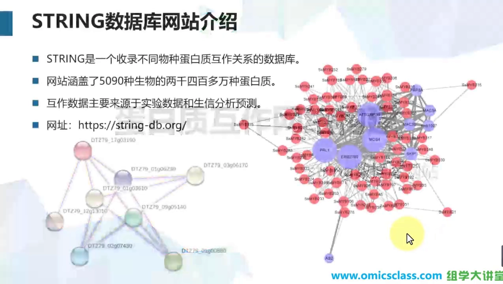
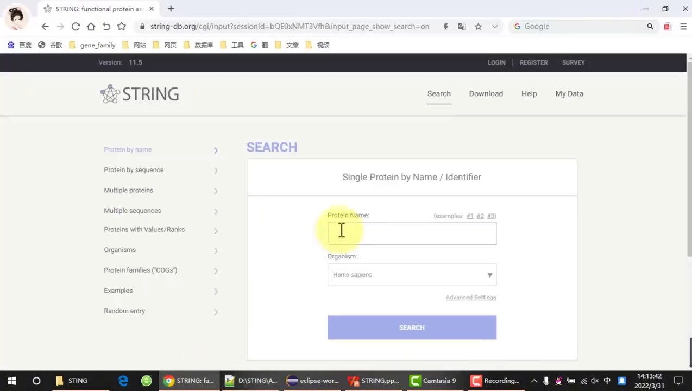
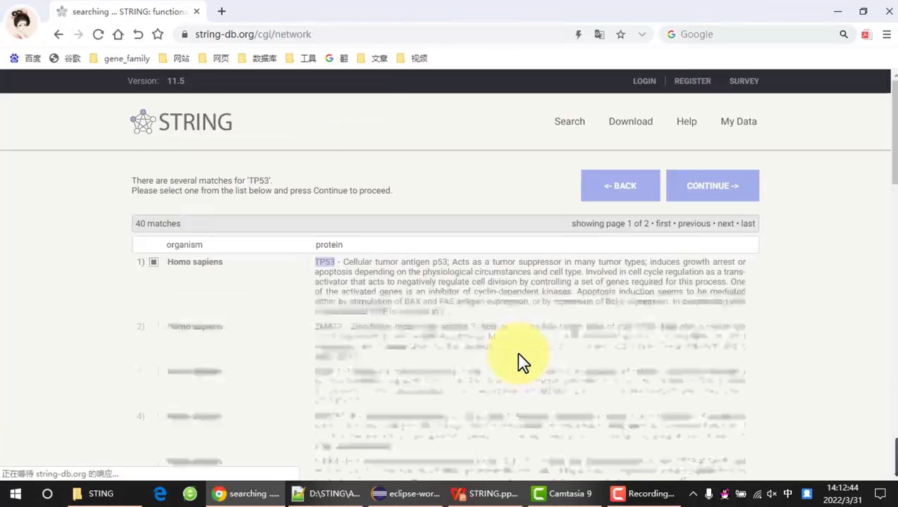
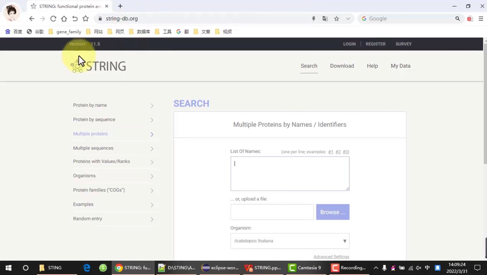
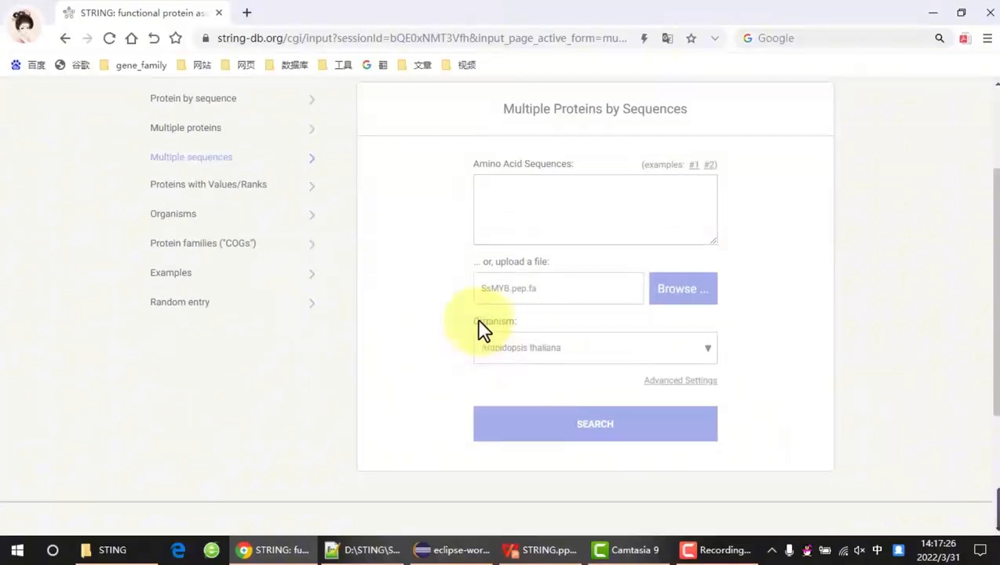
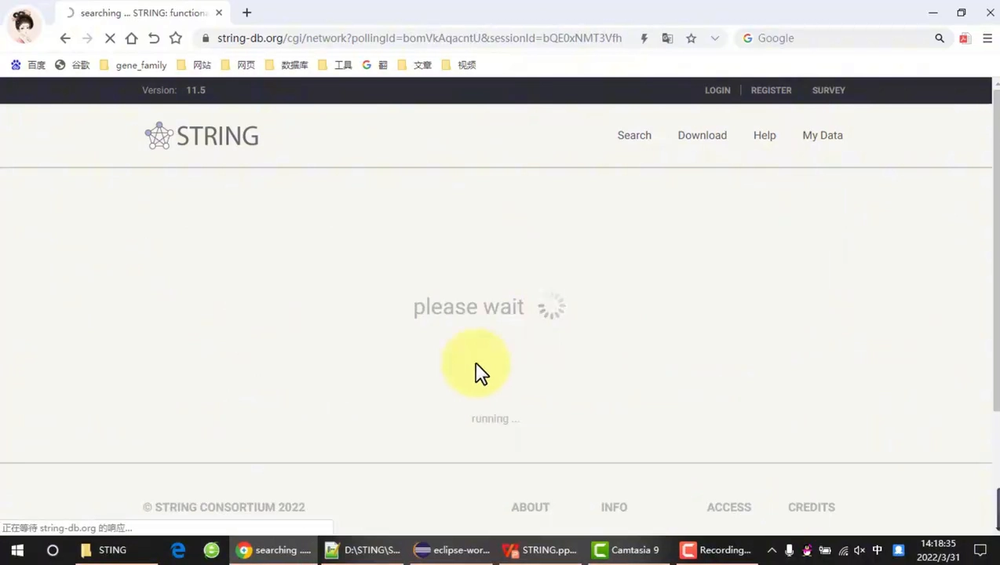
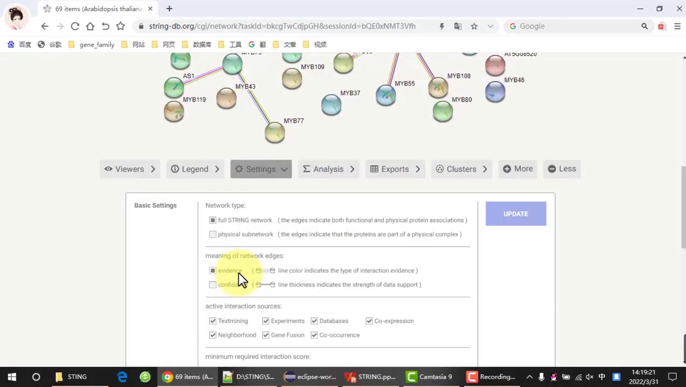
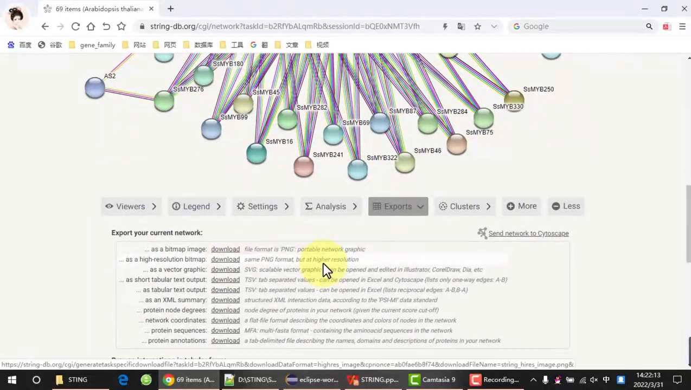

# 如何用 STRING 构建蛋白质互作（PPI）网络

> 本文配套视频：[《蛋白质互作网络构建》](https://www.bilibili.com/video/BV1fLZ1YkEwU/)（组学大讲堂，B 站，约 11 分钟）。

## 本讲要解决的核心问题（SCQA）

**背景**：研究一个基因或蛋白的功能时，「它和哪些蛋白相互作用」往往是最先要回答的问题——蛋白质互作（PPI）网络就是承载这类信息的常用形式。

**冲突**：真正上手时障碍不少：面对一个或多个候选基因不知道从哪输；非模式物种在数据库里查不到；用蛋白 id 检索有时识别不了；默认画出来的网络又乱又挤，没法直接放进论文。

**疑问**：怎样才能用 STRING 一步步构建出 PPI 网络，并把它调整成清晰、可用于论文的图？

**回答（中心思想）**：用 STRING，按「**单个基因 / 多个基因**」×「**按名称（id）/ 按序列**」四种组合输入，先处理好**匹配（Continue）**与**物种映射（mapping）**，再用 **Legend + Settings** 调参、最后**导出**，就能得到一张干净可用的 PPI 网络图。本篇按视频的演示顺序讲清每一步。

---

## 一、STRING 是构建 PPI 网络最常用的数据来源

STRING 是一个收录**不同物种蛋白质互作关系**的数据库，其互作数据主要来源于**实验数据**和**生信分析预测**。网站涵盖了 **5,090 种生物的两千四百多万种蛋白质**，因此是目前蛋白互作数据库中**覆盖物种最多、互作关系最多**的数据库。

[【跳转到 00:09】](https://www.bilibili.com/video/BV1fLZ1YkEwU/?t=9)

> **术语**：**PPI 网络**（Protein-Protein Interaction Network）用「节点（蛋白质）+ 连线（相互作用）」表示蛋白之间的关系。构建 PPI 网络，本质上就是告诉数据库「我要分析哪些蛋白质」，再把它给出的互作关系画成图。

## 二、先理清四种构建方式

进入 STRING 首页后，输入区提供多种入口（左侧菜单），按「**单个 / 多个基因**」与「**按名称 id / 按序列**」可以组合出四种常用的构建方式：

| 输入对象 | 按名称 / id | 按序列 |
| :--- | :--- | :--- |
| **单个基因** | Protein by name（第一行） | Protein by sequence（第二行） |
| **多个基因** | Multiple proteins（第三行） | Multiple sequences（第四行） |

记住两个通用规则：

- **选择物种**：输入蛋白质后要选择其所属物种；如果该物种是 STRING 里**没有收录的**，就选一个**相近的物种**，或者直接选**模式生物**；
- **id 认不出就换序列**：如果蛋白质的 **id 在 STRING 里无法识别**，就改成**输入蛋白质序列**（例如单个蛋白用 Protein by sequence）。

## 三、单个基因的 PPI 网络

单个基因的分析只需三步：**选第一行 → 输入蛋白质 id → 选择物种**，然后点击 **Search**。

[【跳转到 04:22】](https://www.bilibili.com/video/BV1fLZ1YkEwU/?t=262)

视频以人类基因 **TP53** 为例：输入 id、物种选 **human（Homo sapiens）**（下拉搜索可能较慢），点击搜索。STRING 会先给出**匹配结果**，确认无误后点击 **Continue**，就得到单个基因的互作网络。

[【跳转到 03:33】](https://www.bilibili.com/video/BV1fLZ1YkEwU/?t=213)

> **术语**：**Continue（继续）** 是 STRING 在「检索到的蛋白有多个候选」时让你确认到底用哪一个的步骤，一般选默认项即可。

## 四、多个基因（按名称 / id）的 PPI 网络

多个基因按名称构建，与单个基因的做法类似：选择 **Multiple proteins**，把**多个蛋白质 id** 粘贴进去（名称过多时也可以**上传文件**），再选物种、Search。

[【跳转到 02:56】](https://www.bilibili.com/video/BV1fLZ1YkEwU/?t=176)

视频演示了一组**拟南芥 PP2C 基因家族**的蛋白质 id（约 78 个）：把它们复制进输入框、物种选 **Arabidopsis thaliana（拟南芥）**，搜索后可以看到匹配到的**注释基本都是 PP2C 基因家族的蛋白质**——这说明匹配率不错。确认后点击 Continue，即可得到这些基因之间的互作关系网络。

## 五、多个基因（按序列）与非模式物种映射

如果一个物种**不在 STRING 中**，就只能按序列来查询：选择 **Multiple sequences**，输入（或上传）**氨基酸序列**。

[【跳转到 06:21】](https://www.bilibili.com/video/BV1fLZ1YkEwU/?t=381)

视频以某物种的 **MYB 基因家族**（文件 `SsMYB.pep.fa`，约 300 多个基因）为例：因为该物种 STRING 未收录，所以选择相近物种或模式生物**拟南芥**作为参考。搜索后会出现一个**映射（mapping）页面**：

- **左列**：刚才输入的 MYB 家族 id 及其序列；
- **下方/匹配列**：在拟南芥数据库中匹配到的蛋白质（id 也以 MYB 开头，说明同属 MYB 基因家族）；
- **右侧**：**比对率**——比对率越高说明匹配度越好，默认选最高的即可。

确认映射后，就进入互作关系的构建。

## 六、读懂网络：节点与连线

生成的互作关系图里，**每一个圆（节点）代表一个蛋白质，蛋白质与蛋白质之间的连线就是它们的互作关系**。

[【跳转到 07:24】](https://www.bilibili.com/video/BV1fLZ1YkEwU/?t=444)

具体的注释信息（节点和连线的**各种颜色代表什么含义**）可以点击 **Legend（图例）** 查看——例如不同颜色对应不同的证据类型。

## 七、调参：Settings 设置

默认画出的网络往往需要调整，点开 **Settings** 可以修改参数：

[【跳转到 08:05】](https://www.bilibili.com/video/BV1fLZ1YkEwU/?t=485)

- **前两项一般保持默认**；
- **数据来源**：这一部分勾选互作数据的来源（文本挖掘、实验、数据库、共表达、邻域、基因融合、共现等）；
- **置信度（confidence）**：置信度越高，图中显示的节点会越少；一般选一个**适中的 0.4** 即可；
- **外壳（shell）**：当前图中的节点都是输入蛋白映射到的拟南芥蛋白；如果想把这些蛋白再**连接一层其他互作蛋白**，可以给它**添加一层外壳**（例如添加 10 个）。这样图中会多出一些与输入蛋白有互作关系的其他蛋白质，互作关系数也随之增加。

## 八、让图更干净并导出

调整完后，还要让图更适合展示与发表。

### 8.1 显示选项

导出前有几个显示开关：

1. **是否显示节点中的 3D 结构**：点击后可让节点上的 3D 结构消失；
2. **是否隐藏没有合作关系的孤立节点**：可把图中零散的、没有互作的蛋白质节点去掉；
3. **显示 / 隐藏蛋白质名称**：控制节点标签是否显示。

设置好后重新构建一次，就能得到一张**更干净的新图**：3D 结构不再显示，零散孤立的节点也消失了。之后还可以手动拖动、把重叠看不清的节点移到合适位置。

### 8.2 导出格式

最后导出图片与结果文件：

[【跳转到 10:34】](https://www.bilibili.com/video/BV1fLZ1YkEwU/?t=634)

- **SVG 矢量图**：可以自由移动图中节点、摆放到合适位置，方便排版；
- **PNG 图片**：直接导出，建议选**高像素**版本；
- **TSV 结果文件**：可导入 **Cytoscape** 做进一步的美化分析；
- **蛋白质注释文件**：直接 Download 即可。

> **术语**：**Cytoscape** 是一款常用的网络可视化与美化软件，可以把 STRING 导出的 TSV/网络文件导入后进行更精细的排版与模块分析。

## 小结

- **STRING 是什么**：收录不同物种蛋白互作关系、覆盖物种最全的 PPI 数据库（5,090 种生物、两千四百多万种蛋白），数据来自实验与生信预测。
- **四种入口**：单个基因（按名称 / 按序列）+ 多个基因（按名称 id / 按序列）。
- **通用规则**：先选物种；物种未被收录就选相近物种或模式生物；id 认不出就改用序列输入。
- **单个基因**：选第一行 → 输入 id → 选物种 → Search → 在匹配结果里 Continue（示例 TP53）。
- **多个基因（按名称）**：Multiple proteins；粘贴多个 id 或上传文件；示例为拟南芥 PP2C 家族（约 78 个），用注释判断匹配率。
- **多个基因（按序列）**：Multiple sequences；非模式物种需做**物种映射**，按**比对率**选最高。
- **读懂网络**：节点 = 蛋白质，连线 = 互作关系，颜色含义看 Legend。
- **Settings 调参**：数据来源、置信度（常用 0.4）、是否加一层 shell（如添加 10 个）。
- **清理与导出**：可隐藏 3D 结构与孤立节点、显示/隐藏名称；导出 SVG / 高像素 PNG / TSV（可导入 Cytoscape）/ 蛋白注释文件。

## 关键术语速查

| 术语 | 一句话解释 |
| :--- | :--- |
| PPI 网络 | 蛋白质-蛋白质相互作用网络，节点代表蛋白、连线代表互作 |
| Protein by name / sequence | 按蛋白名称/id、或按蛋白序列检索单个蛋白 |
| Multiple proteins / sequences | 一次提交多个蛋白名称/id、或多个蛋白序列 |
| Continue | 匹配到多个候选蛋白时的确认步骤 |
| Organism | 在 STRING 中为输入蛋白指定所属物种 |
| 模式生物 | 当目标物种未被收录时，用拟南芥等模式生物作参考 |
| mapping（映射） | 把输入序列映射到参考物种蛋白质的过程，按比对率选取 |
| Legend | 图例，说明节点与连线颜色的含义（证据类型） |
| Settings | 参数设置：数据来源、置信度、shell 等 |
| confidence（置信度） | 过滤互作的阈值，越高节点越少，常用 0.4 |
| shell（外壳） | 给输入蛋白再连接一层其他互作蛋白（如添加 10 个） |
| 孤立节点 | 与其他蛋白没有互作关系的蛋白节点，可隐藏 |
| Cytoscape | 网络可视化/美化软件，可导入 STRING 导出的结果 |
| TSV | 制表符分隔的互作关系表，可用于 Cytoscape 等 |
