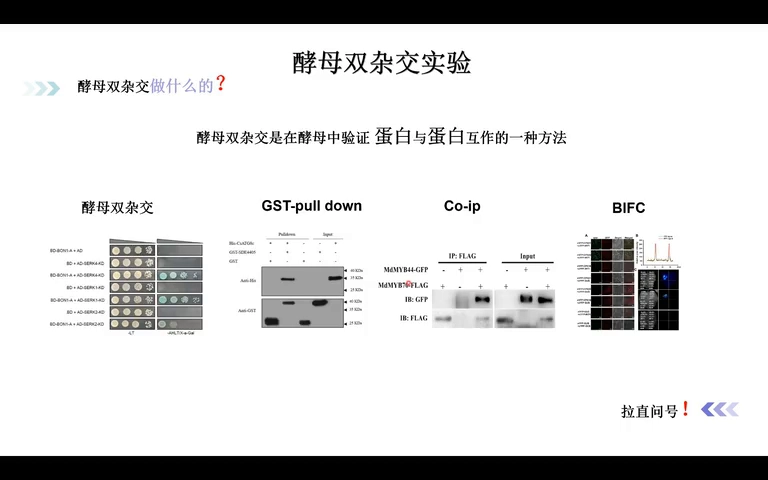
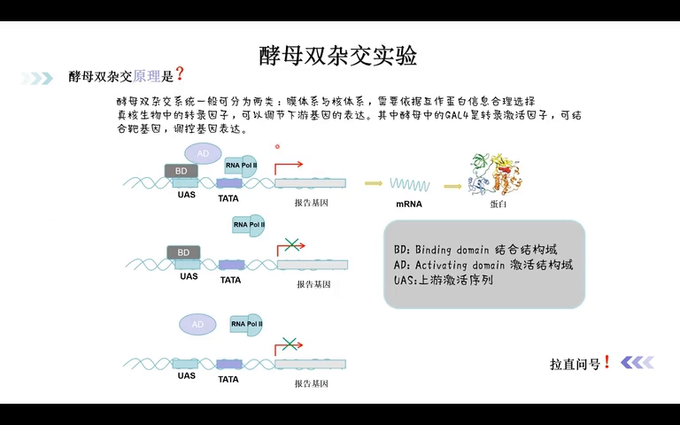
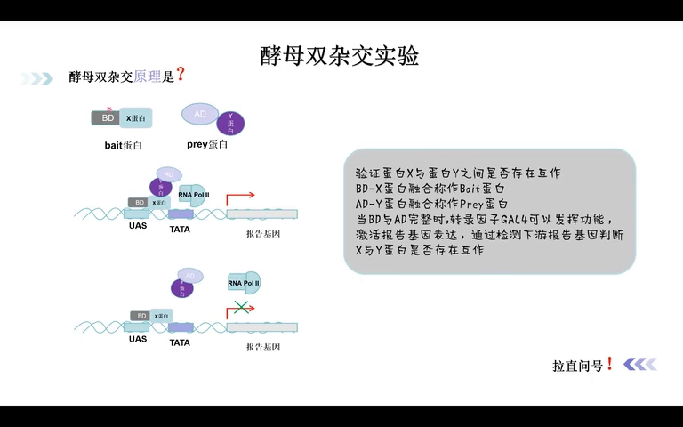
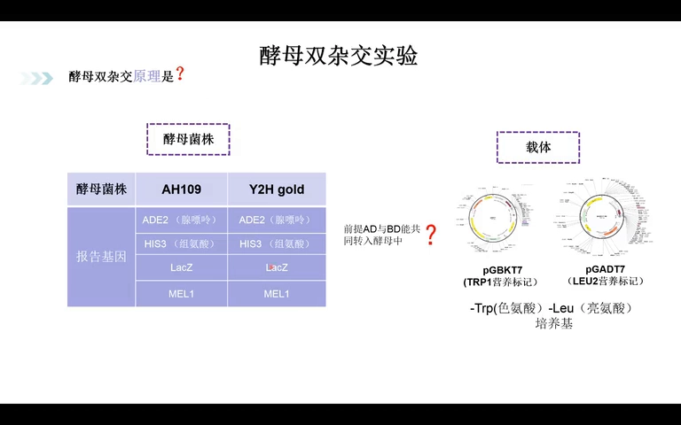
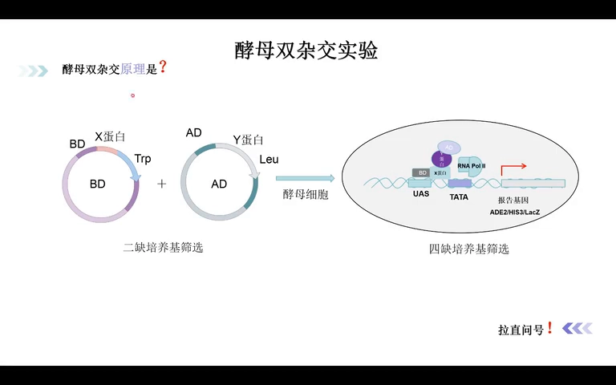
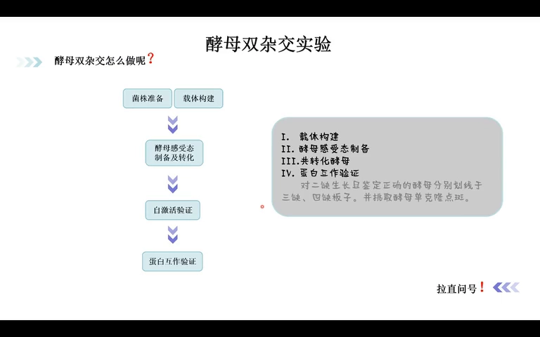
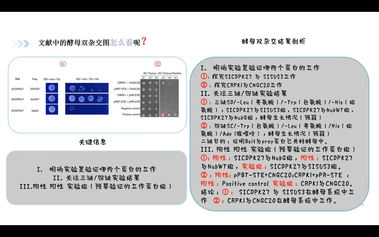

# 酵母双杂交实验入门：原理、分类、流程与文献读图

> 本文配套视频：[《新人快速掌握——酵母双杂交实验》](https://www.bilibili.com/video/BV1ngfhYCE3X/)（B 站，up 主「先吃一口巧克力」）。

## 本讲要解决的核心问题（SCQA）

**背景**：研究蛋白时，绕不开「它和谁结合」。酵母双杂交（Yeast two-hybrid, Y2H）是在**酵母细胞内验证蛋白-蛋白相互作用**的一种经典方法。

**冲突**：新手常有三个困惑——不知道 Y2H 是干什么的、不知道它的原理、做完了看不懂结果图；再往上一层，还有一个容易忽略的问题：**Y2H 只是一种方法，单靠它下结论并不严谨。**

**疑问**：Y2H 的基本原理是什么？核体系和膜体系怎么选？完整流程是怎样的？文献里的 Y2H 图到底怎么看？

**回答（中心思想）**：**Y2H 把「两个蛋白是否结合」翻译成「报告基因是否表达」**——把转录因子 GAL4 拆成 BD 和 AD 两半，分别接到要研究的两个蛋白上；两蛋白结合，BD 与 AD 拼成完整 GAL4，启动报告基因，于是酵母能在特定缺陷培养基上生长（或显色）。本篇按「它是什么 → 分类 → 原理 → 流程 → 读图」的顺序讲清楚，并强调：**结论最好由体内、体外多种方法互相印证。**

---

## 一、先定位：Y2H 只是验证蛋白互作的方法之一，结论要多方法互证

酵母双杂交是在**酵母体系**中验证两个蛋白之间相互作用的方法。验证蛋白-蛋白互作还有其他常见方式：

- **GST pull-down**：体外，用 GST 标签把诱饵蛋白挂在柱子上「钓」互作蛋白；
- **Co-IP（免疫共沉淀）**：用抗体把靶蛋白连同它的互作蛋白一起沉淀下来；
- **BiFC（双分子荧光互补）**：荧光蛋白切成两半，互作时重新组合发出荧光；
- **MS（质谱）**：常与上述方法结合，鉴定互作蛋白的身份。

[【跳转到 01:29】](https://www.bilibili.com/video/BV1ngfhYCE3X/?t=89)

> **关键提醒**：如果要证明两个蛋白确实相互作用，建议做**体内和体外、至少三种不同形式**的实验（如 Y2H + Co-IP + GST pull-down 或 BiFC）互相验证，单靠酵母双杂交的结果是不够的。

## 二、做之前先分类：核体系 vs 膜体系，按诱饵蛋白的定位来选

市面上的酵母双杂交经常分为两大类：

- **核体系**：依赖酵母中的转录因子 **GAL4**（本视频重点讲的就是它）；
- **膜体系**：依赖**泛素（ubiquitin）**，把泛素拆成两个结构，通过它们能否重新组装来影响转录因子、调控报告基因。

两类体系最根本的原理相近，差异在于适用的蛋白类型。

[【跳转到 02:49】](https://www.bilibili.com/video/BV1ngfhYCE3X/?t=169)

**怎么选？看你的互作蛋白定位：**

- 诱饵蛋白定位在**细胞膜**上（例如 transporter 转运蛋白）→ 建议用**膜体系**；
- 定位在**细胞核/细胞质**的常规蛋白 → 用**核体系**。

## 三、核体系原理：GAL4 的 BD/AD，与被「看见」的报告基因

### 3.1 GAL4 是什么：一个「可拆分」的转录因子

GAL4 是酵母中的一个转录因子，能激活、调节下游基因的表达，它的结构很有特点，包含两个结构域：

- **BD（binding domain，结合结构域）**：结合 DNA 上的 **UAS（上游激活序列）**；
- **AD（activation domain，激活结构域）**：招募 **RNA 聚合酶 II**，RNA 聚合酶 II 识别 **TATA 盒**，从而启动基因转录。

[【跳转到 04:54】](https://www.bilibili.com/video/BV1ngfhYCE3X/?t=294)

**单独的 BD 或单独的 AD 都不能激活转录**——这就是整个实验的立足点。

### 3.2 把要研究的蛋白接上 BD / AD：诱饵与猎物

把 GAL4「一分为二」：

- 待研究的 **X 蛋白与 BD 融合** → 称作 **bait（诱饵）蛋白**；
- **Y 蛋白与 AD 融合** → 称作 **prey（猎物）蛋白**。

[【跳转到 06:34】](https://www.bilibili.com/video/BV1ngfhYCE3X/?t=394)

于是：

- **X 与 Y 结合** → BD 与 AD 空间靠近，拼成完整 GAL4 → 激活报告基因表达；
- **X 与 Y 不结合** → BD 与 AD 无法靠近 → 报告基因不表达。

**结论**：通过检测下游报告基因的表达，就能间接推断 X 与 Y 是否互作。

### 3.3 怎么「看见」报告基因：营养缺陷型酵母菌株

这里用的是一个设计精巧的酵母菌株。常见的有两类菌株：**AH109** 和 **Y2H Gold**。它们带有**四个报告基因**：

| 报告基因 | 与什么营养有关 |
| :--- | :--- |
| **ADE2** | 腺嘌呤 |
| **HIS3** | 组氨酸 |
| **LacZ** | 显色反应 |
| **MEL1** | 显色反应 |

原理是：酵母生长需要特定营养元素。**在缺乏某种营养的培养基上，酵母本不能生长；但当报告基因表达时，它能补齐这种营养，酵母于是又能生长。** 因此可以**用酵母的生或死来判断报告基因是否表达**，进而反推两个蛋白是否互作。

[【跳转到 08:29】](https://www.bilibili.com/video/BV1ngfhYCE3X/?t=509)

### 3.4 前提：BD 与 AD 要能共同转入酵母——靠营养筛选标记

前面的一切有个前提：**AD 与 BD 必须共同转入同一株酵母**，X 和 Y 才有接触的可能。实现这件事靠的是**载体**及其携带的**营养筛选标记**：

- **pGBKT7**：表达 BD，带 **TRP1** 标记 → 用缺**色氨酸（-Trp）**的培养基筛选；
- **pGADT7**：表达 AD，带 **LEU2** 标记 → 用缺**亮氨酸（-Leu）**的培养基筛选。

理解了这一点，就能理解整套筛选逻辑：

[【跳转到 12:14】](https://www.bilibili.com/video/BV1ngfhYCE3X/?t=734)

- **二缺培养基（-Trp/-Leu）**：只让同时带两个载体的酵母生长，确认 X、prey 都已转入；
- **三缺 / 四缺培养基**：再加上 -His、-Ade，看报告基因是否表达、酵母能否生长，从而判断互作。

## 四、完整实验流程：五步走

视频把流程总结为五步：

1. **菌株准备**：提前准备好所用酵母菌株；
2. **载体构建**：把要研究的两个蛋白分别构建到 BD 载体（pGBKT7）和 AD 载体（pGADT7）上；
3. **酵母感受态制备及转化**：制备感受态，把质粒转入酵母；
4. **自激活验证**：确认诱饵蛋白本身不会「自说自话」地激活报告基因（视频此处未展开，后续再讲）；
5. **蛋白互作验证**：把二缺上生长、鉴定正确的酵母，分别划线到**三缺、四缺板子**上；再把单克隆**点斑（点种）**，最后得到文章里那张结果图。

[【跳转到 13:29】](https://www.bilibili.com/video/BV1ngfhYCE3X/?t=809)

## 五、文献里的酵母双杂交图怎么看：抓三类关键信息

看懂 Y2H 结果图，要提取三类信息：

1. **明确实验验证的是哪两个蛋白的互作**；
2. **关注三缺 / 四缺的实验结果**：
   - **三缺**：SD/-Leu（亮氨酸）/-Trp（色氨酸）/-His（组氨酸），看酵母生长情况；
   - **四缺**：SD/-Trp/-Leu/-His/-Ade（腺嘌呤），看酵母生长情况（筛选更严格）；
3. **分清楚阴性、阳性、实验组**：
   - **阴性对照**：预期不互作的组合（如加 NubG）→ 应不生长；
   - **阳性对照**：已知互作的组合（如加 NubWT）→ 应生长；
   - **实验组**：你真正要验证的两个蛋白。

[【跳转到 14:42】](https://www.bilibili.com/video/BV1ngfhYCE3X/?t=882)

以这张图为例：

- 它同时探究了两对蛋白的互作：**SIPCK27 与 SISUS3**，以及 **CRPK1 与 CNGC20**；
- 右侧是**四缺培养基**上的**梯度稀释点斑**（按约 10 倍梯度稀释），用来观察不同浓度下酵母的生长；
- 判读思路：**阳性对照生长良好、阴性对照不生长，实验组若有生长，则支持两个蛋白互作**；图中结论是这两对蛋白在酵母系统中互作。
- 注意：酵母双杂交只是「支持互作」的证据之一，仍需其他实验佐证。

## 小结

- **Y2H 定位**：在酵母细胞内验证蛋白-蛋白互作；只是方法之一，最好与 Co-IP、GST pull-down、BiFC 等体内/体外方法互相印证。
- **两类体系**：核体系（依赖 GAL4）与膜体系（依赖泛素）；膜蛋白/膜定位诱饵选膜体系，核/质蛋白选核体系。
- **核体系原理**：GAL4 拆成 **BD（结合 UAS）** 与 **AD（招募 RNA 聚合酶 II）**；X-BD 与 Y-AD 结合 → 拼成完整 GAL4 → 启动**报告基因**。
- **判断读数**：报告基因表达 → 酵母在缺陷培养基上生长 / 显色；用**营养缺陷型菌株**（AH109、Y2H Gold；ADE2/HIS3/LacZ/MEL1）来实现。
- **转入前提**：pGBKT7（TRP1，-Trp）与 pGADT7（LEU2，-Leu），用二缺培养基确认共同转入。
- **流程**：菌株准备 → 载体构建 → 转化 → 自激活验证 → 三缺/四缺点斑验证。
- **读图三看**：看验证哪两个蛋白、看三缺/四缺结果、分清阴性/阳性/实验组。

## 关键术语速查

| 术语 | 一句话解释 |
| :--- | :--- |
| Y2H（酵母双杂交） | 在酵母细胞内验证蛋白-蛋白互作的方法 |
| GAL4 | 酵母转录因子，含 BD 与 AD 两个可拆分结构域 |
| BD / AD | DNA 结合结构域 / 转录激活结构域 |
| UAS | 上游激活序列，BD 结合的启动子上游 DNA 区段 |
| bait / prey | 诱饵蛋白（连 BD）/ 猎物蛋白（连 AD） |
| 报告基因 | 互作发生时才被激活的基因，如 ADE2、HIS3、LacZ、MEL1 |
| 营养缺陷型培养基 | 缺少某种营养，只有报告基因表达时酵母才能生长 |
| pGBKT7 / pGADT7 | 分别表达 BD / AD 的载体，带 TRP1 / LEU2 标记 |
| 二缺 / 三缺 / 四缺 | 依次缺更多营养的筛选培养基，筛选越严格 |
| 核体系 / 膜体系 | 依赖 GAL4 / 依赖泛素的两种 Y2H 体系 |
| GST pull-down / Co-IP / BiFC | 其他验证蛋白互作的方法（体外 / 体内 / 体内） |
| 自激活 | 诱饵蛋白自身就能激活报告基因，会造成假阳性，需先验证排除 |
