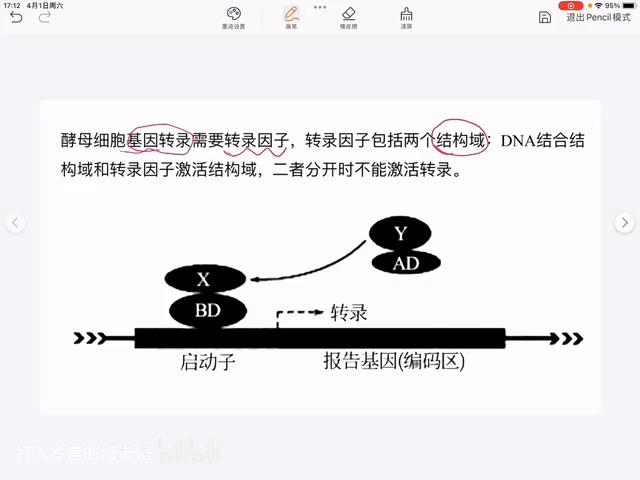
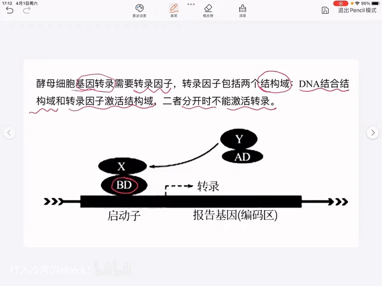
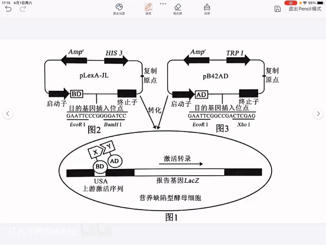
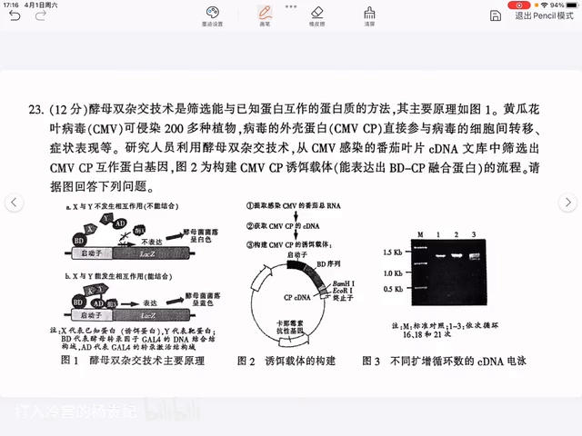
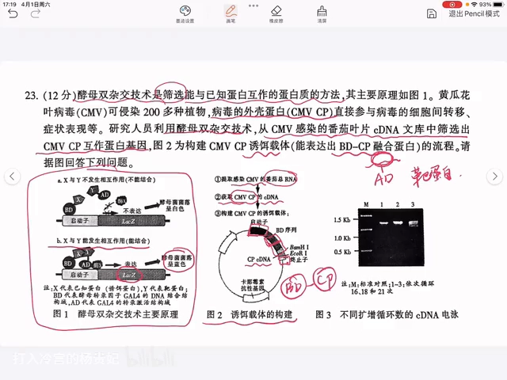
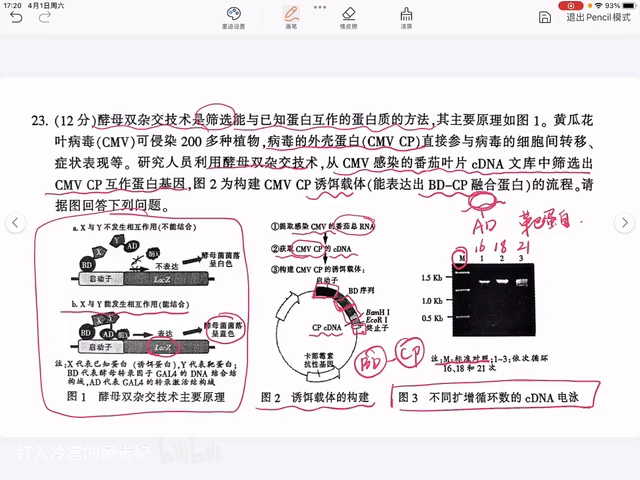
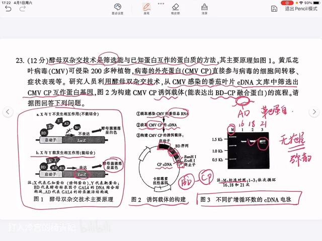
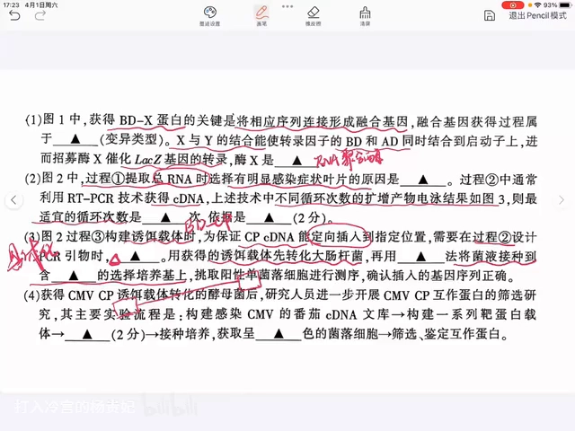
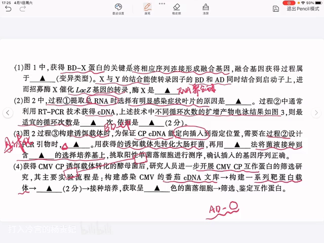

# 酵母双杂交技术：把「两个蛋白结合」变成「菌落变蓝」（高中生物二轮复习）

> 本文配套视频：[《【高中生物二轮复习】酵母双杂交技术》](https://www.bilibili.com/video/BV1Gg4y1G7m3/)（B 站）。

## 本讲要解决的核心问题（SCQA）

**背景**：蛋白质之间是否结合，是分子生物学最基础的问题之一。高中生物二轮复习常把「酵母双杂交」当成「基因工程 + 转录调控」的综合考点来考，图多、名词多。

**冲突**：BD、AD、报告基因、融合基因、诱饵蛋白、靶蛋白……名词一多，看到题就乱；尤其是「为什么菌落变蓝就说明两个蛋白结合了」，很多同学只背结论、不知道逻辑。

**疑问**：酵母双杂交到底是怎么把「两个蛋白结合」变成「看得见的结果」的？它在题里会怎么考？

**回答（中心思想）**：核心只有一句话——**把转录因子拆成 BD 与 AD 两半，分别接到要研究的两个蛋白上；两个蛋白结合，BD 与 AD 被拉近、重新拼成一个完整的转录因子，从而启动下游报告基因（如 LacZ），使酵母菌落变蓝。** 本篇先用一张图讲清原理与载体构建，再完整拆解视频中的一道综合题。

---

## 一、先记住结论：蛋白结合 → 转录因子拼完整 → 报告基因表达

酵母细胞（以及所有真核细胞）进行基因转录时需要**转录因子**，它的化学本质是蛋白质，并且包含两个结构域：

- **DNA 结合结构域（BD, binding domain）**：负责结合到启动子这段 DNA 上；
- **转录因子激活结构域（AD, activation domain）**：负责激活、招募转录所需的酶。

**两部分合在一起时才能激活转录，分开就不能激活。** 酵母双杂交正是利用了这个「可拆分、可重组」的特点。

[【跳转到 00:25】](https://www.bilibili.com/video/BV1Gg4y1G7m3/?t=25)

于是实验的目的很直接：**寻找能与某个已知蛋白（X）发生特异性结合的另一个蛋白（Y）**。做法是把 X 与 BD 连在一起、把 Y 与 AD 连在一起。

[【跳转到 00:50】](https://www.bilibili.com/video/BV1Gg4y1G7m3/?t=50)

- 若 **X 与 Y 特异性结合**：两个蛋白靠拢，BD 与 AD 也被拉近，拼成完整转录因子，激活下游基因转录；
- 若 **X 与 Y 不结合**：BD 与 AD 无法凑到一起，转录不启动。

这里的下游基因叫**报告基因**（reporter gene）。视频里用的是 **LacZ 基因**：它被翻译后会使酵母菌的菌落呈现**蓝色**。因此只要看菌落颜色，就能反推两个蛋白有没有结合。

- **菌落变蓝** → X 与 Y 结合；
- **菌落不变蓝** → X 与 Y 没有结合。

## 二、怎么把蛋白「接到」BD 或 AD 上：构建融合基因

要让 BD 和 X 在同一株酵母里连在一起，需要构建**融合基因**：把 BD 的基因序列和目的基因（这里指 X 蛋白的基因序列）放在同一个**启动子和终止子**之间。这样当 BD 基因表达时，后面也会同时表达出 X 蛋白，两者连成一条**融合蛋白**。

[【跳转到 02:09】](https://www.bilibili.com/video/BV1Gg4y1G7m3/?t=129)

同理，构建 AD 与 Y 的融合蛋白，就是在同一个启动子和终止子中间先放 AD 序列、再放 Y 蛋白的基因序列。下面用一道综合题把上面的原理串一遍。

## 三、例题实战：用酵母双杂交筛选 CMV-CP 的互作蛋白

**题目背景**：黄瓜花叶病毒（CMV）可侵染 200 多种植物，其外壳蛋白（**CMV CP**）直接参与病毒在细胞间的转移和症状表现。研究人员利用酵母双杂交，从 **CMV 感染的番茄叶片 cDNA 文库**中筛选 **CMV CP 互作蛋白**，图 2 为构建 **CMV CP 诱饵载体**（能表达出 BD-CP 融合蛋白）的流程。

[【跳转到 02:51】](https://www.bilibili.com/video/BV1Gg4y1G7m3/?t=171)

- **诱饵蛋白（bait）**：BD 与 CP 融合形成 BD-CP；
- **靶蛋白（prey）**：AD 与文库中一系列未知蛋白融合，因为一次无法确定到底是谁和 CP 结合，所以要构建一整套。

### 3.1 第 (1) 问：融合基因属于哪种变异？酶 X 是什么？

- 获得 BD-X 蛋白的关键，是把相应的序列连接形成融合基因。**融合基因的获得过程属于——基因重组。**
  - 视频特别说明：这道题给出的参考答案是「基因突变」，但大学教材《分子生物学》上写的是利用**基因重组**技术构建融合基因，目前教学上还是按**基因重组**讲。
- X 与 Y 的结合能使转录因子的 BD 和 AD 同时结合到启动子上，进而招募**酶 X** 催化 LacZ 基因的转录，所以**酶 X 是 RNA 聚合酶**。

### 3.2 第 (2) 问：为什么选有症状的叶片？RT-PCR 最适循环数是多少？

**过程①提取总 RNA 时，选择有明显感染症状叶片的原因**：要从病叶里获取这个病毒（CMV）的 CP 基因 cDNA。选有症状的叶片，是为了保证该叶片中一定含有该病毒、而且病毒数量较多，这样提取到的 **CP 基因 cDNA 才足够多**。

**过程②用 RT-PCR 获得 cDNA，不同循环次数产物电泳见图 3（1、2、3 分别代表 16、18、20 次循环，M 为 marker）：**

[【跳转到 05:40】](https://www.bilibili.com/video/BV1Gg4y1G7m3/?t=340)

- 第一组条带**偏窄**（扩增量不足）；
- 第二组条带**相对宽**；
- 第三组**太宽，而且后面有一些虚化、不连续**的部分。

[【跳转到 06:05】](https://www.bilibili.com/video/BV1Gg4y1G7m3/?t=365)

因此**最适循环数取 18 次**，依据是：**第②组的条带整齐、明亮，且无拖尾（无弥散）**。第三组条带后面虚化的部分叫**拖尾/弥散**，是因为扩增出了一些非特异性的片段。所以有同学把最适循环解释为 18 次也是合理的。

### 3.3 第 (3) 问：引物怎么加酶切位点？转化后怎么筛选？

**为了保证 CP 的 cDNA 能定向插入到指定位置，在过程②设计引物时，要在引物两端加上限制酶的识别序列。** 视频强调：题目里两端的识别序列其实已经给出，所以答题要把限制酶**具体化**——应写清是加上 **BamHⅠ 和 EcoRⅠ** 这两种限制酶的识别序列。这个空考的就是「具体化」，也是填空题常错的地方。

[【跳转到 07:23】](https://www.bilibili.com/video/BV1Gg4y1G7m3/?t=443)

接着：用获得的诱饵载体**先转化大肠杆菌**，再用**稀释涂布平板法**将菌液接种到含特定抗生素的**选择培养基**上。

- **为什么不用平板划线法？** 平板划线法多用于**纯化**；而这里已经纯化好了，只需要接种到培养基上，用稀释涂布平板法即可（不必死抠这个知识点）。
- **选择培养基含什么？** 因为该载体上含有**卡那霉素抗性基因**，所以培养基应添加**卡那霉素**。

### 3.4 第 (4) 问：把 CMV-CP 互作蛋白的筛选流程补全

实验流程为：**构建 CMV 的番茄 cDNA 文库 → 构建一系列靶蛋白载体 → 导入「已经用 CMV-CP 诱饵载体转化的酵母菌」→ 培养，获得呈蓝色的菌落 → 筛选、鉴定互作蛋白。**

[【跳转到 08:35】](https://www.bilibili.com/video/BV1Gg4y1G7m3/?t=515)

答题要点：

- **靶蛋白载体**指的就是「AD 与一系列其他蛋白」构建的融合蛋白载体（prey）；
- 导入对象的定语要写具体：**已经用 CMV-CP 诱饵载体转化的酵母菌**。这样同一个酵母细胞里既有诱饵、又有靶蛋白，CP 蛋白才有可能与靶蛋白结合，使 BD 与 AD 结合到一起，激活后面 LacZ 基因的转录；
- 最后要获取的是**蓝色**的菌落细胞。

[【跳转到 09:00】](https://www.bilibili.com/video/BV1Gg4y1G7m3/?t=540)

## 小结

- **一句话原理**：转录因子拆成 **BD** 和 **AD**；两个研究蛋白结合 → BD 与 AD 靠拢拼成完整转录因子 → 启动**报告基因**（LacZ）→ 菌落变蓝。
- **判断规则**：菌落变蓝说明 X 与 Y 结合；不变蓝说明不结合。
- **怎么把蛋白接上去**：把 BD（或 AD）序列与目的基因放在同一**启动子—终止子**之间，构建**融合基因**，表达出**融合蛋白**。
- **诱饵 / 靶蛋白**：BD-X 叫诱饵（bait，常为已知蛋白），AD-Y 叫靶蛋白（prey，可以是 cDNA 文库）。
- **融合基因的获得**：按中学/教学口径属于**基因重组**。
- **必需元件**：转录因子（BD/AD）、报告基因（如 LacZ）、启动子（含 UAS）、融合表达载体。
- **实验下游**：转化 → 筛选 → 通过报告基因表型（颜色 / 生长）判断是否互作；绿色/蓝色、营养缺陷培养基上的生长都是常见的「读数」。

## 关键术语速查

| 术语 | 一句话解释 |
| :--- | :--- |
| 转录因子 | 调控基因转录的蛋白质，含 BD 与 AD 两个可拆分结构域 |
| BD（DNA 结合结构域） | 负责结合到启动子（UAS）上的 DNA |
| AD（转录激活结构域） | 负责激活转录、招募 RNA 聚合酶 |
| 报告基因 | 互作发生时才被激活、可被检测的下游基因，如 LacZ |
| LacZ | 常用报告基因，表达后使酵母菌落呈蓝色 |
| 融合基因 / 融合蛋白 | 把两个基因（如 BD 与 X）串在同一启动子—终止子下，表达出连在一起的蛋白 |
| 诱饵蛋白（bait） | 与 BD 融合的蛋白，通常为已知蛋白 |
| 靶蛋白（prey） | 与 AD 融合的蛋白，可为 cDNA 文库中的一系列蛋白 |
| 限制酶识别序列 | 加在引物两端，用于把目的基因定向插入载体 |
| UAS | 上游激活序列，DB 结合的启动子上游 DNA 区段 |
| RT-PCR | 反转录 PCR，先由 RNA 反转录成 cDNA 再扩增 |
