# 富二硫键微型蛋白的从头设计：靶向 B 类 GPCR 的激动剂与拮抗剂

> 本文整理自 Institute for Protein Design（IPD）组内报告《Rational de novo design of disulfide-rich miniprotein agonists and antagonists for family B GPCRs》，讲者为 Ben（IPD 研究生）。[【观看原视频】](https://www.youtube.com/watch?v=T4b9YuMhchg)

## 本讲要解决的核心问题（SCQA）

**背景**：GPCR（G 蛋白偶联受体）是最大的一类药物靶点，人类基因组约有 800 个，市面上约 30% 的 FDA 批准药物都作用于 GPCR。其中 **B 类 GPCR** 由激素多肽调控，与糖尿病、骨质疏松、焦虑和部分癌症密切相关。

**冲突**：B 类 GPCR 却**极难成药**——目前只有 3 个激动剂获批，**没有任何拮抗剂获批**，有些受体甚至根本没有可用的拮抗剂工具分子，严重妨碍了科研。难题的根源在于天然配体多肽在溶液中**无序**，只有结合受体时才折叠成 α 螺旋；而且它们靠"大而软的 C 端"结合受体胞外域，熵代价高、结合很弱。

**疑问**：能不能**从头设计**一类全新的小型蛋白：既能稳定地结合 B 类 GPCR，又能作为（不激活受体的）**拮抗剂**？

**回答（中心思想）**：能。策略是——把天然配体拆成"负责激活的 N 端"和"负责结合的 C 端"，在 C 端上有理有据地**嫁接稳定螺旋**并**引入二硫键**，做成一个刚性、可溶、热稳定的**富二硫键微型蛋白**；先做成**激动剂**验证结合位点正确，再去掉 N 端即可转为**拮抗剂**。讲者用这套"需求驱动"的流程设计并测试了 48 个（命名 Walter 1–48），其中一个（Walter 24）在细胞实验中确实作为 PTH1R 激动剂起效。

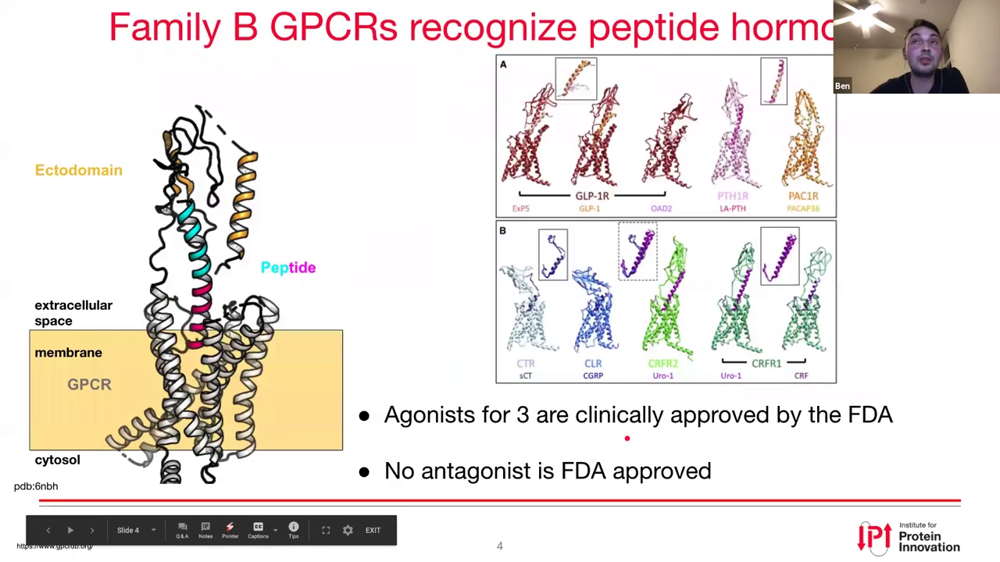

---

## 一、B 类 GPCR：为什么它是"难打"的靶点

### 1.1 背景：GPCR 与 B 类家族

[【跳转到 00:46】](https://www.youtube.com/watch?v=T4b9YuMhchg&t=46)

GPCR 是**整合膜蛋白**，能被激动剂等刺激激活——眼睛里的光、体内的肾上腺素或血清素都能激活它们。受体激活后招募 **G 蛋白**，G 蛋白再结合受体并启动第二信使（如 **cAMP** 或钙离子），从而触发一系列生理反应。

**B 类 GPCR** 的特征是带一个很大的**胞外域（ectodomain）**。它是个小家族，只有 **14 个成员**，全部由激素多肽调控。然而：

- 只有 **3 个激动剂**获 FDA 批准；
- **没有任何拮抗剂**获批；
- 对某些受体，连实验开发的拮抗剂都没有，科研上无从下手。

所以"为所有 B 类受体造出激动剂和拮抗剂"对整个领域都很有价值。

### 1.2 术语与现实需求：激动剂 vs 拮抗剂

[【跳转到 03:40】](https://www.youtube.com/watch?v=T4b9YuMhchg&t=220)

- **激动剂（agonist）**：此处指**完全激动剂**——结合受体后引发 100% 的生物学响应；
- **拮抗剂（antagonist）**：结合受体后**不引发任何响应**的分子。

现实是：有些受体**缺拮抗剂**，这让研究难以深入，因此讲者的目标正是**为所有 B 类 GPCR 制造拮抗剂**。

### 1.3 为什么难：天然配体"无序 → 折叠"，且结合弱

[【跳转到 04:10】](https://www.youtube.com/watch?v=T4b9YuMhchg&t=250)

讲者把重点放在 **PTH1R（甲状旁腺激素受体 1）** 上，因为它有很高分辨率的**冷冻电镜（cryo-EM）结构**可作为良好的输入结构，且它参与钙稳态与骨代谢，是骨质疏松的药物靶点。

难点来自天然配体的**固有无序（intrinsically disordered）**特性。以 **PTH 1-34** 激素为例：在溶液里（NMR 结构）它没有规则结构，只有结合受体后才变成规则的 **α 螺旋**。它的结合是**两步**的：

1. C 端先与受体胞外域结合，形成一个稳定复合物；
2. N 端再伸入跨膜螺旋区，引起受体构象变化，进而结合 G 蛋白、启动下游信号。

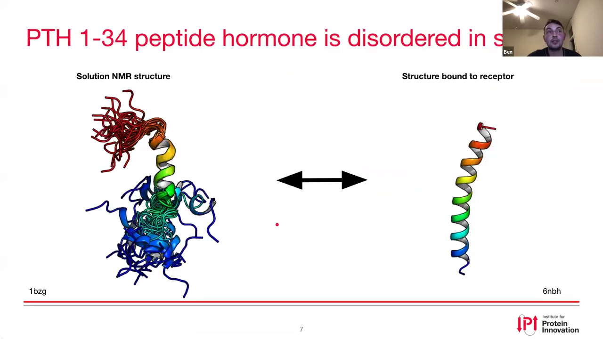

问题在于：如果把 C 端单独拿出来，它虽然沿用同一个结合位点，但因为失去了整体稳定结构，结合在**熵上非常不利**，只能产生**弱结合**。而我们要的恰恰是：**占据天然肽的结合位点、却不激活受体**——这就要求把一个"小而软"的 C 端片段**稳定在一个结合起始构象**上。

### 1.4 设计蓝图：稳定 C 端做成激动剂，再去 N 端变拮抗剂

[【跳转到 05:56】](https://www.youtube.com/watch?v=T4b9YuMhchg&t=356)

讲者的设计思路很巧妙，可以概括为：

- 把天然肽分成 **N 端（激动部分）** 和 **C 端（结合部分）**；
- 在 C 端上**嫁接两条螺旋**，把 C 端稳定成具有结合能力的构象，同时**不干扰 N 端的激动功能**——这样就得到一个**激动剂**；
- 随后**去掉 N 端激动部分**，让 C 端稳定构象继续占住结合位点，就得到了一个**竞争性拮抗剂**。

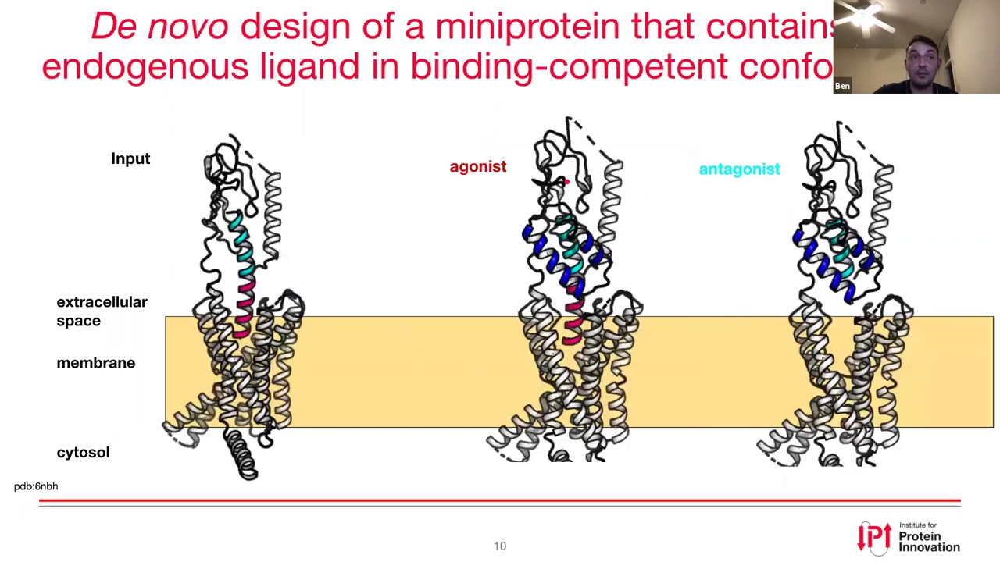

### 1.5 为什么选择"富二硫键微型蛋白"作为载体

[【跳转到 06:59】](https://www.youtube.com/watch?v=T4b9YuMhchg&t=419)

讲者选择了**微型蛋白（miniprotein）**，因为它集多种优点于一身：

- **抗体级的亲和力与特异性**，又具备小分子式**更好的组织穿透性**；
- **可完全控制分子性质与活性**——设计稳定的**疏水核心**来引导正确折叠；
- 引入**二硫键**当"骨骼"，提供**高热稳定性**，有望**室温保存**，让药物更可及、更公平；
- **易于制造**——可以基因编码，也可化学合成。

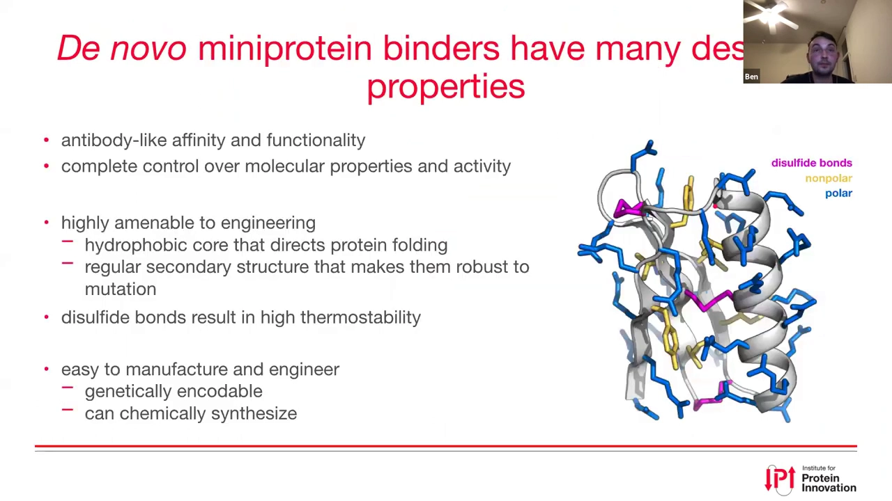

---

## 二、设计流程总览：三步走

[【跳转到 08:19】](https://www.youtube.com/watch?v=T4b9YuMhchg&t=499)

讲者采用**需求驱动（requirement-driven）**的设计：先定需求，再分三步实现。

**需求**：要有合适的**螺旋延展器**；**二硫键束**要包含并稳定住 C 端螺旋，使其处于结合构象且不干扰 N 端；最后**整合 C 端二硫键**让整个微型蛋白稳定。

**三步流程**：

1. **骨架设计**：用 **SEWAnything**（Frank 在实验室开发的、对 SEWING 的模块化改进）把螺旋"嫁接"到起始结构上，生成新骨架；
2. **引入 C 端二硫键**：筛出满足需求的骨架后，用 **Hemlock** 协议（同样来自 Frank）引入 C 端二硫键；
3. **序列设计**：用 Rosetta 的 **data design + fast design** 找出合适的序列。

---

## 三、第一步：用 SEWAnything 做骨架设计

[【跳转到 09:42】](https://www.youtube.com/watch?v=T4b9YuMhchg&t=582)

**SEWING（Structural Extension With Native fragment GrAfting）** 的思想是"用天然片段做结构延伸"：

1. 从 PDB 里准备一个由**数百万条 helix-loop-helix 结构**组成的片段库；
2. 把输入结构（此处是一段蓝色输入螺旋）喂进去；
3. 在片段库里采样**与输入结构对齐良好的片段**，把两者**嵌合（chimerize）**——于是得到两条螺旋；
4. 对第二条螺旋**重复同样步骤**——最终得到三条螺旋，构成一个三螺旋束。

当三条螺旋满足所有筛选标准后，就进入下一阶段。

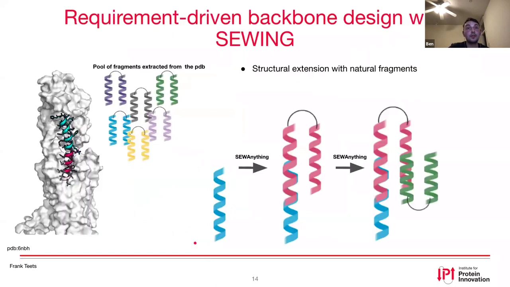

（相比经典 SEWING 一次性完成全部骨架设计、中途无法干预，**SEWAnything 是模块化的**，全程在 Pose 上操作，可以在设计流程中插入筛选、或在不同阶段之间筛选——详见后文问答。）

---

## 四、第二步：用 Hemlock 引入 C 端二硫键

[【跳转到 10:32】](https://www.youtube.com/watch?v=T4b9YuMhchg&t=632)

要提升支架稳定性，就要在**C 端**工程化一个二硫键。注意此处**要保留自由的 N 端**（因为 N 端负责信号），所以**不能**在 N 端引入二硫键。

**Hemlock 也是三步**：

1. 再次用 **SEWAnything**：这次从 PDB 抽取的库是 **helix + loop**，寻找与支架对齐良好、且有**长 loop** 的片段；
2. 用 Rosetta 的 **disulfide mover**，在这段新接上的 loop 里寻找能与我们骨架上某处形成**有利二硫键**的位置，把二硫键工程进去；
3. 删除 loop 中**多余的残基**，让最后一个残基成为设计分子的末端。

讲者展示了三个生成出的骨架，说明该协议能产出**多样化的连接方式**：一种用短 loop 连接"最后一条螺旋与第一条螺旋"；一种用较长 loop 连接"第一条与第三条"；还有一种用较长 loop 连接"第二条与第三条"。

---

## 五、第三步：Rosetta 序列设计——讲者口中的"秘方"

[【跳转到 12:34】](https://www.youtube.com/watch?v=T4b9YuMhchg&t=754)

### 5.1 先定义"分层"与"二级结构"

[【跳转到 12:59】](https://www.youtube.com/watch?v=T4b9YuMhchg&t=779)

讲者把这一步称为他们的"秘方（secret sauce）"。首先用 **residue selector** 定义层次与二级结构：

- 按二级结构：螺旋起始（橙色）、**螺旋帽（helix cap，粉色）**、loop（绿色）、β 折叠（此处只有几个残基）；
- 按位置：**表面层（surface）**、**核心层（core，埋在内部）**、**边界层（boundary，介于两者之间）**。

### 5.2 再用"设计限制"规定每层能用什么氨基酸

[【跳转到 13:24】](https://www.youtube.com/watch?v=T4b9YuMhchg&t=804)

这些选择器被送进**设计限制（design restrictions）**，规定哪些氨基酸可被设计、要执行什么操作。设计限制有两类创新：

- **残基操作（residue operators）**：指挥 Packer 做特定动作；
- **氨基酸设计限制**：规定各层可用的氨基酸集合。

具体规则：

| 层 / 区域 | 允许设计的氨基酸 |
| --- | --- |
| 核心层 core | **仅疏水**氨基酸 |
| 边界层 boundary | 带电 + 亲水 + **部分疏水**（最"宽容"的一层） |
| 表面层 surface | 主要**带电 + 亲水** |
| 螺旋帽 helix cap | 仅允许**特定氨基酸**（沿用 Rocklin 论文的规则来稳定螺旋末端） |

此外还有两类增强：

- **单体核心**：允许采样更多**芳香族 rotamer**，让核心堆积更紧密；
- **界面**：除芳香族外，还允许一些**更稀有的 rotamer**，让界面更多样；同时允许**受体一侧的界面残基重新堆积**，以获得更丰富的侧链结合构象，但**不改动受体其余部分**。

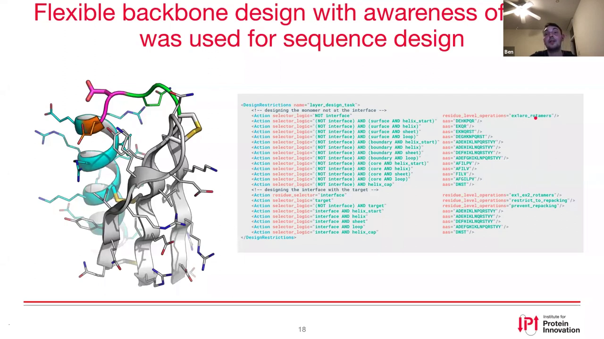

---

## 六、用计算指标筛选设计

[【跳转到 15:46】](https://www.youtube.com/watch?v=T4b9YuMhchg&t=946)

讲者做了约 **2,500 个**设计。一个人不可能逐个"看"2,500 个设计，因此必须**自动化 + 好指标**。

### 6.1 结合指标：结合能与结合界面面积

[【跳转到 16:25】](https://www.youtube.com/watch?v=T4b9YuMhchg&t=985)

- 横轴 **dG_separated**：把微型蛋白从受体上"拆开"所需的能量，能量越高（越负）结合越紧；
- 纵轴 **结合界面面积（dSASA）**：界面越大，可接触的残基越多。

期望落在这张图的**左上角**（大界面 + 强结合）。另一个排序指标是 **shape complementarity（形状互补性）**，可用"钥匙配锁"来理解：形状不合的钥匙值低，严丝合缝的钥匙值高——同样希望落在左上角。

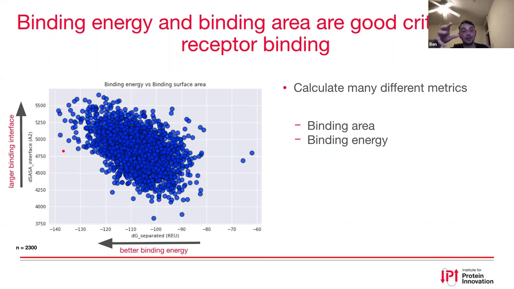

### 6.2 稳定性指标：核心残基的吸引能

[【跳转到 20:32】](https://www.youtube.com/watch?v=T4b9YuMhchg&t=1232)

只"结合得漂亮"还不够，还要**稳定**。讲者用**逐残基相互作用能**来度量：选出蛋白**核心**的残基，计算它们**全原子吸引能（fa_atr）**的均值——越负表示核心堆积越好、排除的水越多、越稳定。目标是**同时**拿到强结合与高核心稳定性。

在结合指标基础上，叠加实验室正在开发的**局部/全局结构协同性**指标、**核心稳定性**和**结合**三类筛选条件后，剩下约 **100 个**设计。讲者从中挑出 **48 个**下单（按结合能排序、并做哺乳动物表达所需的**密码子优化**）。

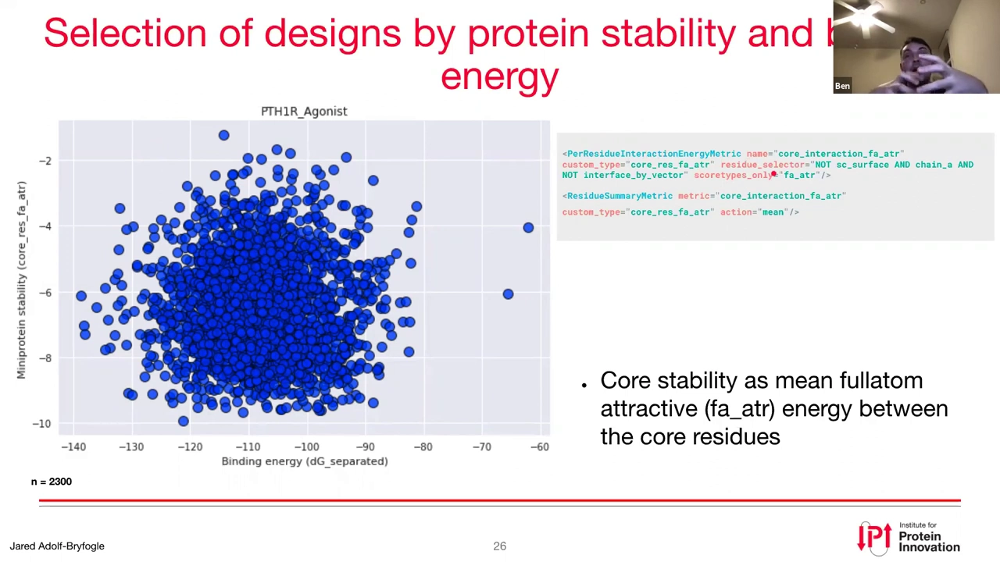

### 6.3 它们被命名为 Walter 1–48

[【跳转到 23:06】](https://www.youtube.com/watch?v=T4b9YuMhchg&t=1386)

讲者喜欢美剧《绝命毒师》，于是把设计都命名为 **Walter**（主角 Walter White）。这 48 个都是纯按计算指标挑的、没有靠肉眼，它们虽都带螺旋延展器和 C 端二硫键，却呈现出**不同的交叉角和构象**，而评分却相近——这让团队很期待用实验来检验"计算指标能否预测好设计"。

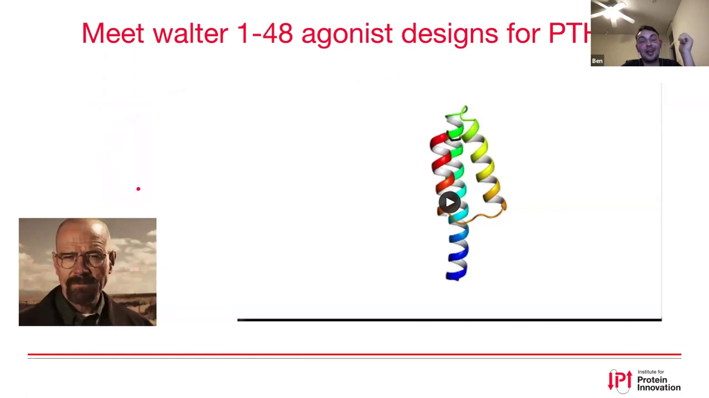

---

## 七、实验验证：表达、纯化与活性

[【跳转到 24:07】](https://www.youtube.com/watch?v=T4b9YuMhchg&t=1447)

### 7.1 表达：为什么用哺乳动物细胞，以及"表达很差"的初体验

[【跳转到 24:37】](https://www.youtube.com/watch?v=T4b9YuMhchg&t=1477)

选择**哺乳动物细胞**表达，理由是细胞内的**伴侣蛋白机器**能帮助二硫键正确组装，得到折叠良好、稳定的蛋白。表达构建体为：

`Vhleader-Flag-10xhis-Siderocalin-2xGGS-WELQ-AviTag-3xGGS-TEV-Walter`

其中：N 端的**信号肽**引导分泌；**His 标签**用于纯化；**Siderocalin** 融合标签（人体最丰富分泌蛋白之一，Olsen 与 Strong 实验室证明它是很好的可溶化/分泌标签）；**TEV 切割位点**用于后续切掉标签。

结果**很不理想**：在 1 mL 板式表达、37 °C 下，只有**一个**设计表达良好；用 Flag 抗体做 Western blot 才发现还有几个可见；**非还原胶**上还出现更高的条带，说明形成了**分子间二硫键**（错误组装）。于是把表达温度降到 **30 °C**（低温有助于折叠、减轻毒性）——在 7 个设计里 5 个表达、其中 3 个表达较好。

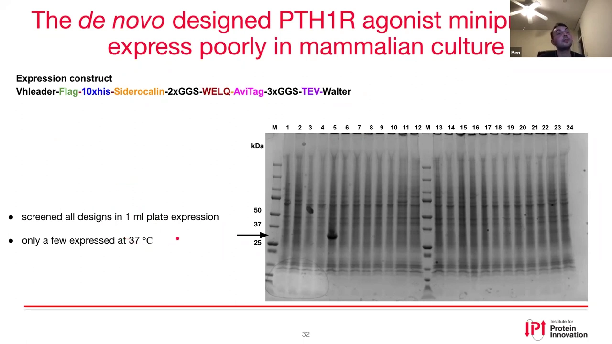

### 7.2 纯化：标签切不掉，靠"赋形剂"解决

[【跳转到 26:22】](https://www.youtube.com/watch?v=T4b9YuMhchg&t=1582)

纯化流程：**IMAC（固定化金属亲和层析）** → 咪唑洗脱 → 换缓冲液 → **TEV 酶切**去标签 → **二次 IMAC**（去除仍带 His 标签的标签蛋白和 TEV 酶）。

但二次 IMAC 时，设计蛋白**没有出现在流穿液里，而是与杂质共洗脱**。改用**尺寸排阻（SEC）**分离，得到两个峰，设计蛋白似乎与第一个峰共洗脱——又**没有观察到聚集**。讲者判断蛋白可能有点"粘"。

于是尝试**赋形剂（excipient）**：赋形剂是可加入缓冲液、提高蛋白溶解度或稳定性的添加剂。他们查到一种含**精氨酸、谷氨酸**的 **XCP 缓冲液**，把设计蛋白稀释进去、重做二次 IMAC，这次设计蛋白终于**出现在流穿液**中——拿到了可继续表征的蛋白。

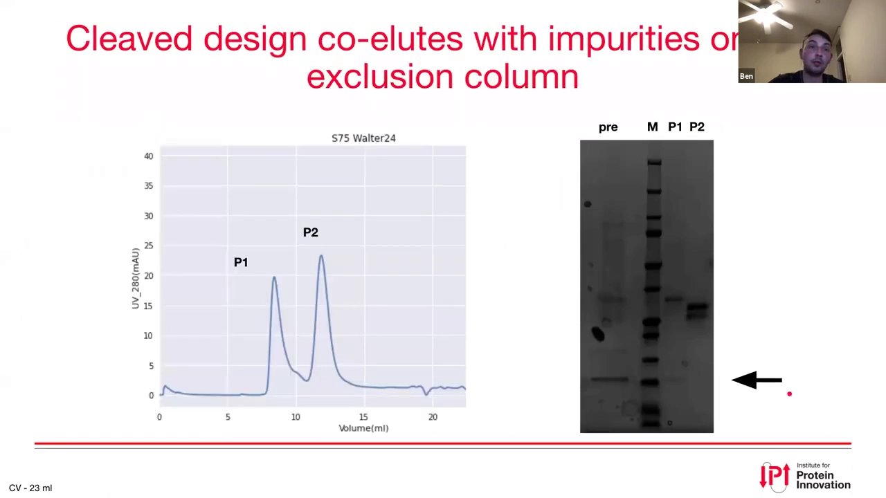

### 7.3 活性检测：cAMP GloSensor 实验

[【跳转到 28:41】](https://www.youtube.com/watch?v=T4b9YuMhchg&t=1721)

要判断设计是否为**激动剂**，用的是 **GloSensor**：一种改造过的**萤火虫荧光素酶**，能结合 **cAMP/cGMP**；一旦环境中有 cAMP/cGMP，蛋白的两半会靠近、产生构象变化，**发光增强**，从而被测量。

之所以适用于 B 类 GPCR：它们都通过 **Gs 蛋白**信号——激活的 Gs 激活**腺苷酸环化酶**，该酶把 ATP 转成 **cAMP**，于是用荧光素酶传感器测 cAMP 上升即可。

实验体系：一株**稳定表达传感器**的 HEK 细胞系（由 James 建立），瞬时转染受体后收获、铺板加肽、测发光。

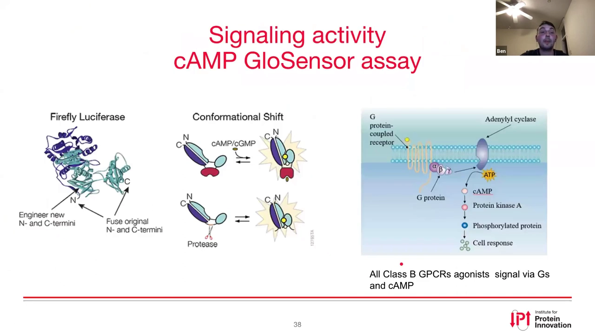

**对照实验**（左：未转染、无受体；右：转染了 PTH1R）：

- **阳性对照 Forskolin**（腺苷酸环化酶的直接激活剂）：两种细胞都应上升——实际两条绿线都上升，说明传感器本身工作正常；
- **阴性对照（缓冲液）**：无变化；
- **天然配体 PTH 1-34**：未转染细胞无变化，转染细胞则显著上升。

对天然配体做**剂量-响应曲线**，拟合得到 **EC50 ≈ 3.5 nM**，落在已发表 EC50（1–32 nM）范围内——说明这套实验在本实验室可靠。

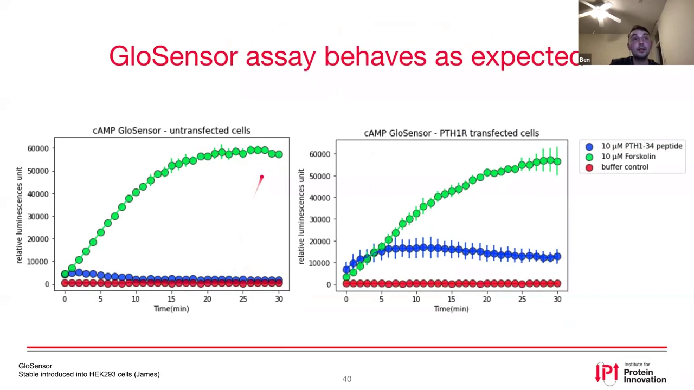

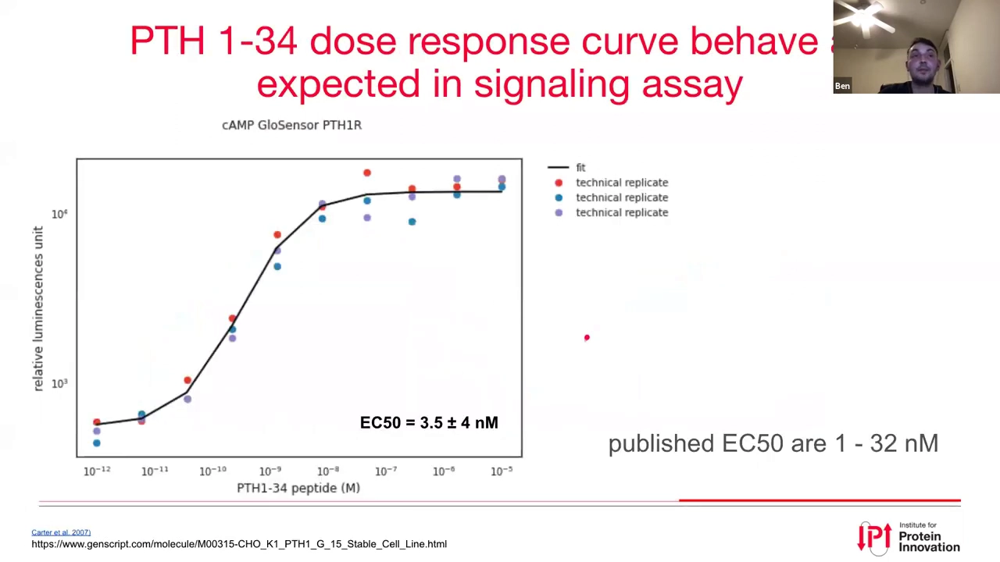

### 7.4 结果：Walter 24 确实作为激动剂起效

[【跳转到 31:57】](https://www.youtube.com/watch?v=T4b9YuMhchg&t=1917)

在转染细胞中测试设计：红色是 **Walter 24**，它引起的信号**几乎达到天然肽的水平**；而且在未转染细胞中没有非特异性信号。此外，在低到高纳摩尔浓度范围内都能滴定出信号。

讲者强调这是**第一代设计、从 48 个里命中一个**，已经相当令人兴奋；当然和天然配体相比目前还略逊一筹（第一张韦恩图里还有差距）。为进一步确认折叠，讲者还看了**圆二色谱（CD）**：α 螺旋通常在 **222 nm 和 208 nm** 出现极小、**195 nm** 出现极大——Walter 24 的 CD 谱**明确呈螺旋**。

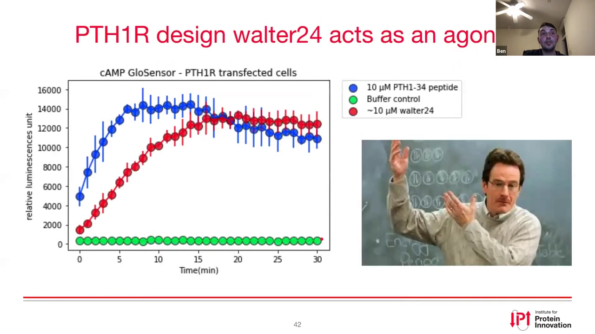

---

## 八、小结与下一步

**结论**：可以**理性地从头设计**出对 B 类 GPCR **有功能的激动剂**。同时也暴露了一些要改进的问题：

- 哺乳动物表达中出现了**非预期的分子间二硫键**，需改进设计协议；
- 可能**疏水表面过多**，导致纯化时的"粘性"；
- 好消息是：**赋形剂缓冲液**可作为**洗涤剂的温和替代**，帮助解决粘性。

**下一步**：

- 单纯纯化受体**胞外域**并直接测**结合**；
- 把成功设计放进**表面展示（surface display）载体**，通过展示做**亲和力成熟**，提升结合；
- 改进设计协议：把二硫键步骤**拆开**（先不加、后面再引入），以便一次测试更多设计；用 **hpnet mover** 引入更多亲水界面；考虑**加第四段螺旋**，提高"亲水表面 / 结合界面"的比例；
- 去掉激动部分，**转化为拮抗剂**；
- 对其余 **9 个靶点**做同样的设计。

---

## 九、问答精选

- **设计分子是怎么"放进"受体里的？** 设计分子是独立设计的，但**受体全程在场**——连 SEWAnything 阶段都避免了与受体的冲突，等于**在结合态下设计**。定位用**残基标签**：给输入结构打标签，微型蛋白编号虽会变，但标签始终指向初始螺旋的正确位置，从而完成叠合，无需对接。
- **结合形状与结合能为何不完全相关？** 例如一个疏水界面可能主要是"排除大量水"而形状并不吻合，它能拉开结合能，但形状互补性不高；所以要找**又吻合、能量又好**的交集。
- **骨架多样性会饱和吗？** 采样了约 2,500 个通过筛选的骨架，背后是数万个原始骨架。Frank 确认：在这些规模上**远未饱和**。
- **能解释"坏 Walter"吗？** 看了设计的 **SASA 比例**，这些比例在天然蛋白里也存在，并不算异常高；可能是聚集/粘性/对细胞有毒。48 个设计里可能因**多种不同原因**失败，样本量足够才得到 1 个成功——"48 中得 1"其实相当令人兴奋。
- **是该优化这个命中，还是继续找新设计？** 讲者倾向**更快迭代设计协议**、下单新一批更好的设计，而不是花大量时间优化这一个的纯化条件；同时这个命中作为**概念验证**（可上酵母展示做亲和力成熟）仍很重要。
- **界面为什么重设计了、没保留天然接触？** 天然残基也**未被排除在设计之外**；但 **N 端前 16 个残基（激动部分）完全保留**，改动的是第 16 位之后的部分。
- **拮抗剂策略？** 正是去掉 N 端。先做激动剂是有意的：如果激动剂能起作用，就证明我们的蛋白确实结合在正确的活性域、且不扰乱其他部分；而用 cAMP 实验测激动活性又**简单直接**。后续也可考虑用 Hemlock 在去掉前 16 残基后的 N 端造二硫键"捣乱"。
- **SEWAnything 与经典 SEWING 的区别？** 经典 SEWING 一次性完成全部骨架设计、中途无法干预；SEWAnything 是**模块化**的，全程在 Pose 上操作，可在运行中筛选、或在不同阶段之间筛选，更容易与 Hemlock 等步骤组合。
- **核心层为何不放芳香族？** 设计**排除了色氨酸和甲硫氨酸**，因为它们易被氧化，而该分子要用作真正的治疗药物，故彻底排除。（这也顺带避免了一些埋在内部、未被满足的极性原子问题。）

---

## 关键术语速查

| 术语 | 一句话解释 |
| --- | --- |
| GPCR | G 蛋白偶联受体，最大类药物靶点；人类约 800 个，约 30% FDA 药物作用于它 |
| B 类 GPCR | 带大胞外域、由激素多肽调控的小家族（14 个），激动剂少、拮抗剂几乎空缺 |
| PTH1R | 甲状旁腺激素受体 1，参与钙稳态与骨代谢，是骨质疏松靶点，有高分辨率冷冻电镜结构 |
| 激动剂 / 拮抗剂 | 激动剂结合后引发响应；拮抗剂结合后不引发响应、占据结合位点 |
| 固有无序（intrinsically disordered） | 天然配体在溶液中没有固定结构，只有结合受体时才折叠成 α 螺旋 |
| 微型蛋白（miniprotein） | 分子量小、可基因编码的蛋白，兼具抗体级亲和力与小分子的穿透性 |
| 二硫键（disulfide bond） | 两个半胱氨酸之间的共价交联，像"骨骼"一样提升稳定性与热稳定性 |
| SEWING / SEWAnything | 用 PDB 天然片段库"嵌合式"延展骨架；后者是前者更模块化的改进版 |
| Hemlock | 在支架上引入 C 端二硫键的协议（SEWAnything + Rosetta disulfide mover + 修剪 loop） |
| 分层设计（surface/boundary/core） | 按位置把残基分层，规定各层可用氨基酸（核心仅疏水、表面偏亲水等） |
| dG_separated | 把配体从受体拆开所需的能量，越负结合越紧 |
| shape complementarity | 界面形状互补性，类似"钥匙配锁" |
| GloSensor | 改造的萤火虫荧光素酶 cAMP/cGMP 传感器，用于测 GPCR 下游信号 |
| EC50 | 产生半数最大响应的浓度，衡量激动剂效力，越小越强 |
| 赋形剂（excipient） | 加入缓冲液以改善蛋白溶解度/稳定性的添加剂，如含精氨酸/谷氨酸的 XCP 缓冲液 |
| 亲和力成熟 | 通过展示选择等手段，把已有结合物的亲和力进一步优化 |
