# 环肽结构预测与设计：用 AlphaFold 攻克「环」的难题

> 本文整理自 ML for Protein Engineering 研讨会报告《Cyclic peptide structure prediction and design using AlphaFold》，讲者为 Stephen Rettie（华盛顿大学 Bhardwaj 实验室，专长多肽合成与质谱）与 Simon Kozlov（哈佛大学 Ovchinnikov 实验室，计算机科学/机器学习背景）。[【观看原视频】](https://www.youtube.com/watch?v=SDxy5E8fvXY)

## 本讲要解决的核心问题（SCQA）

**背景**：AlphaFold2 已经能以接近实验的精度预测蛋白质结构，连蛋白质复合物也预测得相当好，深度学习正在彻底改变蛋白质设计。

**冲突**：但有一类分子 AlphaFold「天生看不懂」——**环肽（cyclic peptide）**。因为 AlphaFold 训练时只见过线性的天然蛋白（L 型氨基酸），它内部的位置编码描述的是「一条链从头到尾」；而环肽是**首尾相连的环**，设计师还经常引入 D 型氨基酸、N-甲基化等非天然修饰，AlphaFold 更是闻所未闻。

**疑问**：能不能改造 AlphaFold，让它既能**预测**环肽结构，又能反过来**设计**出全新的环肽？

**回答（中心思想）**：可以。关键只在于改一处——把 AlphaFold 的**位置偏移编码（positional offset encoding）**里「首尾相对位置」从线性改成"环"，即**循环偏移（cyclic offset）**。预训练模型无需再训练就能零样本泛化到环肽；再配合 **AFdesign**（把梯度反传进序列）与 **hallucination**（无目标地大量采样高置信骨架），就能规模化地从头设计全新环肽，并且已经被晶体结构实验验证。

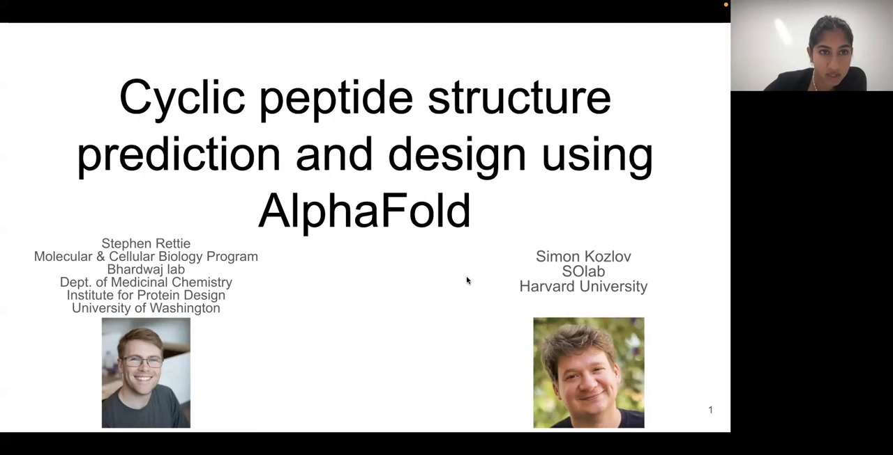

---

## 一、为什么要做环肽：它卡在抗体和小分子之间的「黄金地带」

[【跳转到 01:15】](https://www.youtube.com/watch?v=SDxy5E8fvXY&t=75)

### 1.1 环肽占据抗体与小分子之间的治疗空间

[【跳转到 01:45】](https://www.youtube.com/watch?v=SDxy5E8fvXY&t=105)

报告一开始，讲者先回答「为什么要在乎环肽」。把三类分子放在一起比大小：

- **抗体**：约 150,000 Da，体积巨大，界面大、特异性强、亲和力高；但无法穿过细胞膜，因此只能作用于细胞外或细胞表面的靶点。
- **小分子**（如青霉素）：约 334 Da，小到能穿过细胞膜、可以口服，能作用于细胞**内部**的靶点；但太小，难以形成足够特异、足够大的相互作用界面，而且膜渗透性的小分子会进入全身各处、脱靶副作用常见。
- **环肽**：正好卡在中间。以天然免疫抑制剂**环孢素（cyclosporine）**为例，约 1202 Da——它比理论上"能穿膜"的分子大得多，却依然能穿膜、能口服。

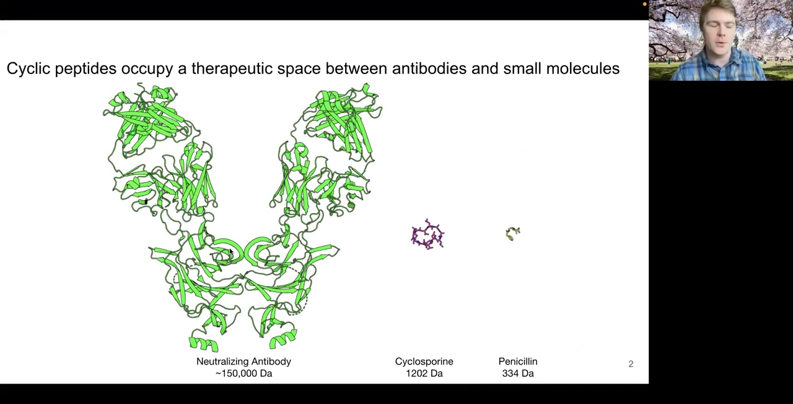

### 1.2 天然的成功范例：环孢素

[【跳转到 03:00】](https://www.youtube.com/watch?v=SDxy5E8fvXY&t=180)

环孢素是 FDA 已批准的免疫抑制剂，作用于细胞**内部**的靶点。它的工作方式很"聪明"：先与胞内的亲环蛋白 A（cyclophilin A）结合，结合后**形成一个新的界面**，再去结合第二个靶点钙调磷酸酶（calcineurin）。这种「结合后再生成新界面」的能力，对一个只有几个残基大小的小分子来说是做不到的——这正是环肽的魅力所在。

### 1.3 环肽为什么难做：过去依赖 Rosetta 的「手工」流程

[【跳转到 03:37】](https://www.youtube.com/watch?v=SDxy5E8fvXY&t=217)

在这波深度学习爆发之前，Bhardwaj 实验室是怎么做环肽的？答案是 **广义运动学闭合算法（Generalized Kinematic Closure, GKC）**，2017 年由 Hosseinzadeh 等人正式发表（*Science* 358:1461–1466）。

GKC 的核心思路借自**机器人学**：把环肽首尾闭合，想象成让机械臂从一个位置运动到另一个位置。做法是：

1. 在肽链上定义**三个枢轴残基（pivot residues）**，它们相当于机械臂的关节；
2. 其余残基用来自 Ramachandran 图的合理 φ/ψ 扭转角随机化；
3. 用 GKC 解方程，求出如何移动这三个枢轴让肽链首尾以正确几何"合拢"。

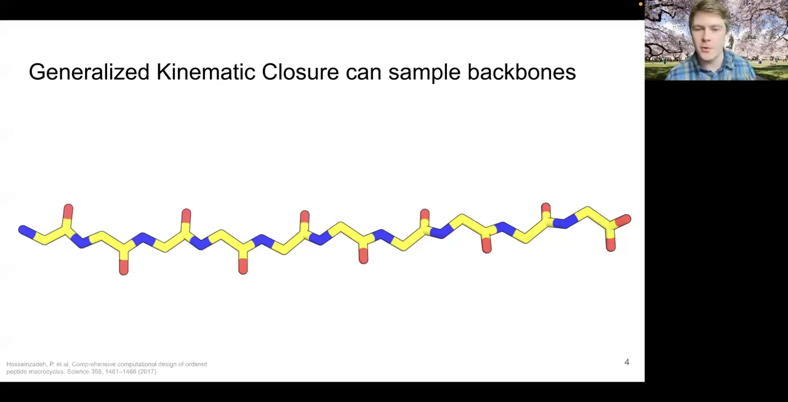

这样就能大量采样出可闭合的环肽骨架，再交给 Rosetta 的 **FastDesign** 协议去分配序列。一个重要优势是：环肽是**化学合成**的，不受 20 种天然氨基酸限制——可以用**非天然氨基酸**，甚至它们的**镜像（D 型氨基酸）**。于是：

- 在负 φ 空间的设计位点，用传统的 **L 型氨基酸**；
- 需要进入正 φ 空间（本来要靠甘氨酸）时，改用这些氨基酸的**镜像（D 型）**，从而得到构象高度受限、内部充满氢键的刚性环肽。

把 D 型和 L 型氨基酸混在同一分子（heterochiral），还带来一个额外好处：**抗蛋白酶降解**。体内的蛋白酶很擅长识别纯 L 型的肽，而 D/L 混合又高度锁死的结构会被"挡住"；再加上**环化**让外切蛋白酶无处下口，稳定性大幅提升。

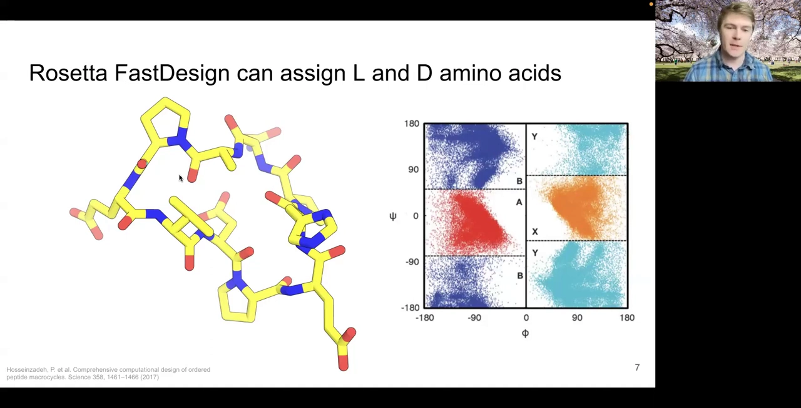

这些肽被合成出来后，交给了华盛顿大学的 **Varani 实验室**做核磁（NMR）。他们得到的构象系综与设计模型在**原子级精度**上高度吻合——这是这套 Rosetta 流程最早的漂亮验证之一。但讲者也坦言：这是一个"漂亮但什么都不做"的肽，接下来要解决的是"让肽真正起作用"。

### 1.4 两个已验证的成果：膜渗透环肽 + 靶向小分子起点的环肽

[【跳转到 07:16】](https://www.youtube.com/watch?v=SDxy5E8fvXY&t=436)

用这套 Rosetta 流程，实验室已经做出两个漂亮成果：

**（1）可穿膜的环肽。** 想把环肽做成能口服、能穿膜的分子，光"是环"还不够——还得**去溶剂化**。做法是：用内部的**氢键网络**把酰胺氮"绑"起来，让亲水的氢键供体不去和水作用；实在绑不住的位置，就在酰胺氮上加一个**甲基（N-甲基化）**——这在化学合成上不难，而且天然产物中能穿膜的肽（如环孢素）里也常这么干。用**人工膜 PAMPA 实验**和**Caco-2 结直肠细胞单层实验**验证，设计的 6～12 个残基的环肽确实能被动穿过膜，部分甚至"飞快地"穿过。

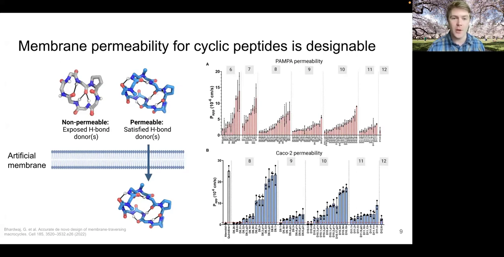

**（2）围绕小分子起点造环肽。** 2021 年 Zenzola 和 Mulligan 做了两个例子：把小分子当作"起点"，在它周围长出环肽骨架。一个例子是把 HDAC 抑制剂 Largazole 中一段"看起来像一条很长的半胱氨酸"的部分，参数化为非天然氨基酸，做出含"超长半胱氨酸"、能与 HDAC 活性中心的锌离子配位的环肽，得到纳摩尔级的 HDAC2/6 抑制剂；另一个例子从"看起来像半胱氨酸 + 脯氨酸"的小分子出发，通过环肽构建额外接触来提高亲和力与特异性。

### 1.5 痛点：这套流程"太像手工艺"，而且算力开销巨大

[【跳转到 12:11】](https://www.youtube.com/watch?v=SDxy5E8fvXY&t=731)

讲者坦言：把上面这些拼起来并不能"自动解决一切"。这套 Rosetta 流程**高度依赖对 Rosetta 的深入理解和大量调参**，可推广性不强，还很"手工艺"。

更实际的问题是**验证成本**。设计出一个环肽骨架和序列后，要在计算机上反过来验证它是否真能折叠成设计构象：即采样同一序列的多种可能构象，画出**能量景观图**——横轴是"与设计模型的 RMSD"，纵轴是 Rosetta 能量。理想情况是得到又深又窄的**漏斗**（设计构象能量明显低）；但常常得到平坦的曲线或出现**另一个浅极小值（替代构象）**，这种设计只能丢弃。生成成千上万个模型要花掉大量机时。

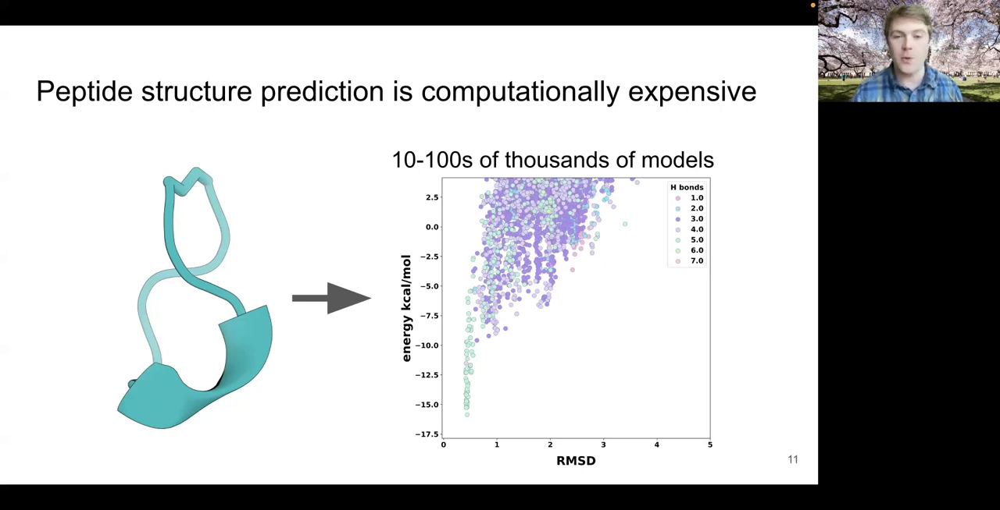

于是讲者他俩真正的诉求变成：**有没有一种方法能"立刻"给出预测？** 最好在设计的同时就给出预测，还能直接预测**复合物**（而不是只验证单体）。这时，AlphaFold 出现了。

---

## 二、现成的 AlphaFold 为什么用不了

[【跳转到 14:16】](https://www.youtube.com/watch?v=SDxy5E8fvXY&t=856)

AlphaFold 大幅提升了结构预测精度，还自带一个巨大好处：**它非常擅长预测蛋白质复合物**——这在传统物理模型里极其困难。但问题来了：

- 环肽设计师常用 **D 型氨基酸**，AlphaFold 对此一无所知；
- 环肽是**环**，而 AlphaFold 只见过**线性**蛋白。

于是他们决定：D 型先放一放（以后再说），**先解决"环"的问题**。他们找了 Simon Kozlov 和 Sergey Ovchinnikov 一起攻关。

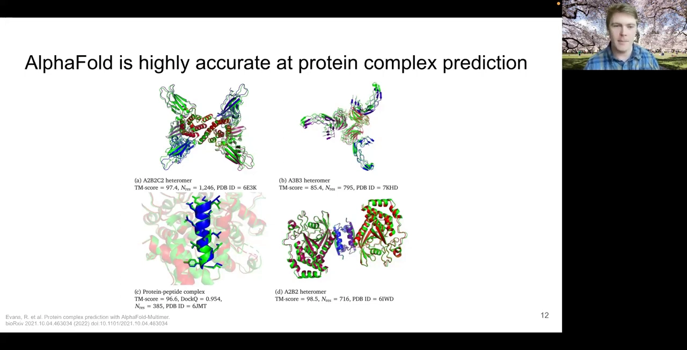

---

## 三、核心创新一：循环偏移（cyclic offset）让 AlphaFold「认识环」

[【跳转到 15:20】](https://www.youtube.com/watch?v=SDxy5E8fvXY&t=920)

### 3.1 一个关键观察：位置关系是"喂进去的输入"，不是架构自带的

AlphaFold 是一个**基于注意力（attention）的架构**。当它接收残基时，是把它们当作一个**无序集合**来处理的——架构本身并不知道"谁在前、谁在后"。那它怎么知道顺序？答案是：**位置关系是作为输入的一部分喂进去的**，具体体现在 **pair representation（残基对表示）**里——每一对残基会带上它们之间的相对位置信息。

### 3.2 把「线性相对位置」换成「环状相对位置」

[【跳转到 17:19】](https://www.youtube.com/watch?v=SDxy5E8fvXY&t=1039)

既然顺序是喂进去的，那就可以"喂"一个环状的顺序。对一条长度为 N 的线性肽，相对位置矩阵描述的是"隔了几个残基"；对环肽，只需让**第一个残基与最后一个残基的相对位置为 −1**（首尾相邻），其余保持不变。

> 验证：喂给 AlphaFold 一段很长的**多聚丙氨酸**（丙氨酸偏爱螺旋，通常会被预测成一根螺旋）。一旦传入**循环偏移**，AlphaFold 竟然直接预测出一个**环状结构**！

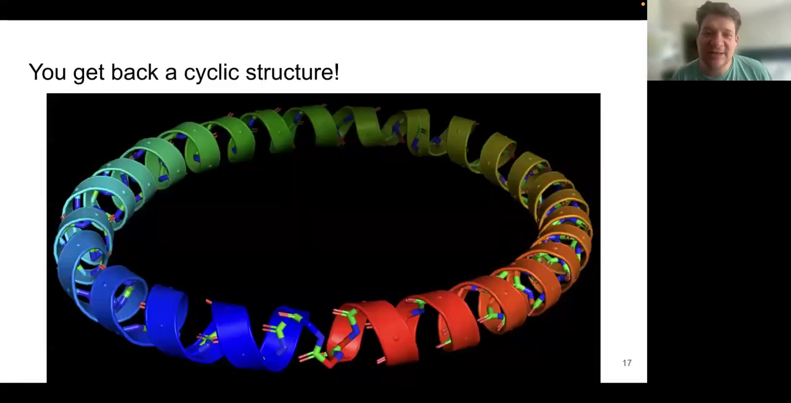

更令人惊讶的是**泛化能力**：AlphaFold 训练时既没见过环状蛋白，也没见过这么短的肽（训练数据下限大约 16 个残基），这里是双重"分布外（out-of-distribution）"，但它依然能很好地工作。

### 3.3 用 80 个天然环肽做"体检"

[【跳转到 20:33】](https://www.youtube.com/watch?v=SDxy5E8fvXY&t=1233)

他们先从 PDB 里找出 **80 个天然环肽结构**（且只含天然氨基酸）做 sanity check：

- 横轴：AlphaFold 给的 **pLDDT 置信度**（越高越好）；
- 纵轴：预测结构对真实结构的 **RMSD**（越低越好）。

结果：**恰好 50/80** 落在「pLDDT > 0.7 **且** RMSD < 1.5 Å」的区间里，即超过一半被正确预测。而且还有一个非常实用的性质：**AlphaFold 自信时通常是对的，不自信时通常是错的**——这让置信度成为可靠的筛选依据。

更酷的是，这些高分模型覆盖了**结构多样性**：有带复杂二硫键网络的环肽（约 30 残基的 cyclotide，注意这些二硫键**不是被强制约束的**，是 AlphaFold 自己"发现"的）、有更传统的 β 折叠，甚至有一个来自 2015 年论文、正是当年首次提出 GKC 环肽算法的从头设计蛋白。

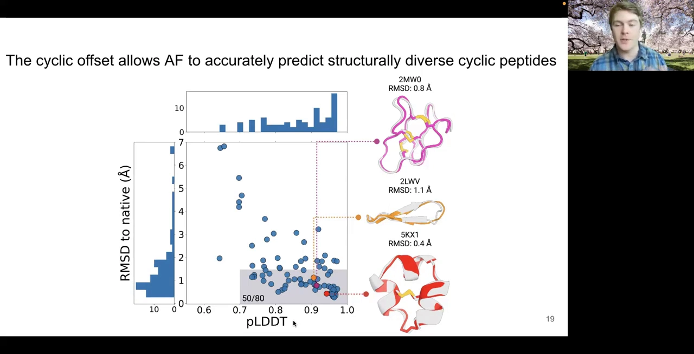

---

## 四、核心创新二：AFdesign —— 把分数反传进序列，让 AlphaFold「来设计」

[【跳转到 23:43】](https://www.youtube.com/watch?v=SDxy5E8fvXY&t=1423)

会"预测"还不够，讲者真正想要的是**设计**。于是引入 **AFdesign**，它是开源库 **ColabDesign**（github.com/sokrypton/ColabDesign）的一部分。

### 4.1 反向使用：给定目标骨架，反推出能折叠成它的序列（backbone design）

[【跳转到 24:08】](https://www.youtube.com/watch?v=SDxy5E8fvXY&t=1448)

AlphaFold 本身是「序列 → 结构」。**AFdesign 把它反过来**：

1. 给一个（可以是随机的）序列 + 环状位置编码，让 AlphaFold 输出预测，其中包含 **distogram（距离直方图）**——对每一对残基，给出它们之间距离的分布；
2. 构造一个**可微的损失函数**，比较"AlphaFold 预测的距离分布"与"目标结构应有的距离分布"；
3. 因为整个流程可微，可以把梯度**反传穿过预训练的 AlphaFold**——注意不是更新权重（那是训练网络），而是**更新输入的序列**，朝着让 distogram 匹配目标的方向优化。

难点在于：序列是**离散**的，怎么反传？诀窍是把离散分布**连续化**——每个位置、每个残基都对应一组可优化的权重，让梯度能流动进去；再分阶段优化，一开始是"软"的概率分布，逐渐**锐化**，最后收回到一个确定的离散序列。

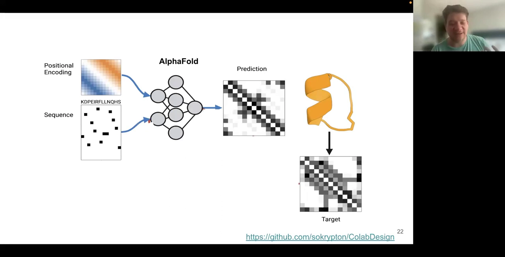

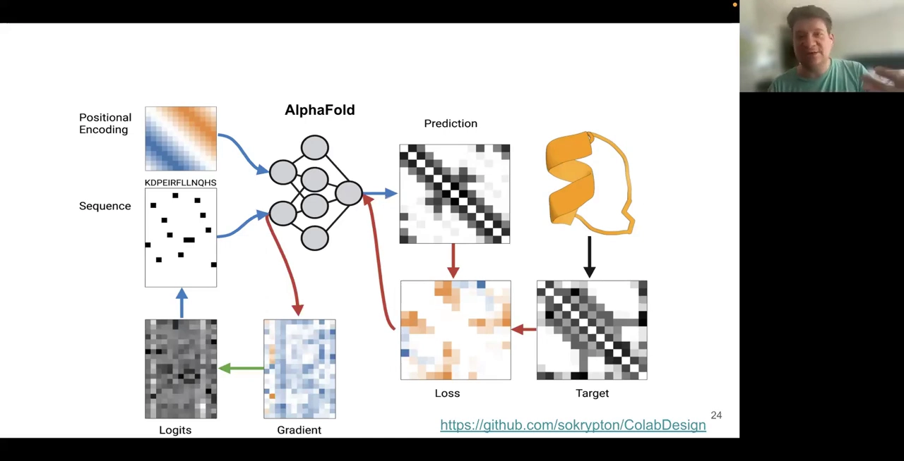

为什么"用序列→结构模型来做设计"更好？讲者给出一个概念性理由：这类模型**对构象景观有更完整的视角**。如果只优化"序列折叠到某个目标构象"这一个点，可能得到一个"同时也能塌到别的构象"的序列；而努力优化整个景观，就能避免这类**脱靶构象**。

### 4.2 hallucination：无目标地"凭空"设计全新骨架

[【跳转到 33:20】](https://www.youtube.com/watch?v=SDxy5E8fvXY&t=2000)

更进一步，只要**换掉损失函数**，就能从"重设计已有骨架的序列"扩展到"设计全新骨架"：

- 不再要求 distogram 匹配某个已有目标；
- 转而优化 AlphaFold 的**置信度**（pLDDT、PAE 等）——不管结构长什么样，只要它"自信、稳定"就好；
- 再加一个损失，鼓励蛋白具有**天然蛋白那样数量的接触**，"别只生成一根无聊又稳定的螺旋"。

用同一套优化流程、只换损失函数，就能**凭空生成全新的高置信骨架**——即所谓 **hallucination（幻觉）**。

---

## 五、实验验证：从能量漏斗到 0.3 Å 晶体结构

[【跳转到 31:16】](https://www.youtube.com/watch?v=SDxy5E8fvXY&t=1876)

先在计算机上检验：取一个**偏螺旋**的环肽骨架（因为螺旋区大，AlphaFold 可能更"喜欢"），用传统 GKC 方式生成骨架并设计序列，先确认它自己在结构预测里有一个接近设计模型的浅极小值，然后交给 AFdesign 重设计成**全 L 型**序列。结果重新计算能量景观时，得到了**明显更深的能量漏斗**——印证了"序列→结构模型能优化整个景观、避开邻近替代态"的想法。

但这毕竟只是 in silico。为了真正验证，他们转向**晶体学**。小分子量的极性蛋白很难结晶，于是采用 **racemic crystallography（外消旋结晶）**策略：除了合成全 L 的 AFdesign 设计，还合成它的**镜像（全 D）**，把两者等摩尔混合再结晶——这样能进入一个对称性更高、在**小分子晶体学**里很常见的空间群。结果拿到了这批小螺旋的**高分辨率晶体结构**：设计与实验的 **Cα RMSD 仅 0.3 Å**，某些侧链 rotamer 甚至完全吻合。

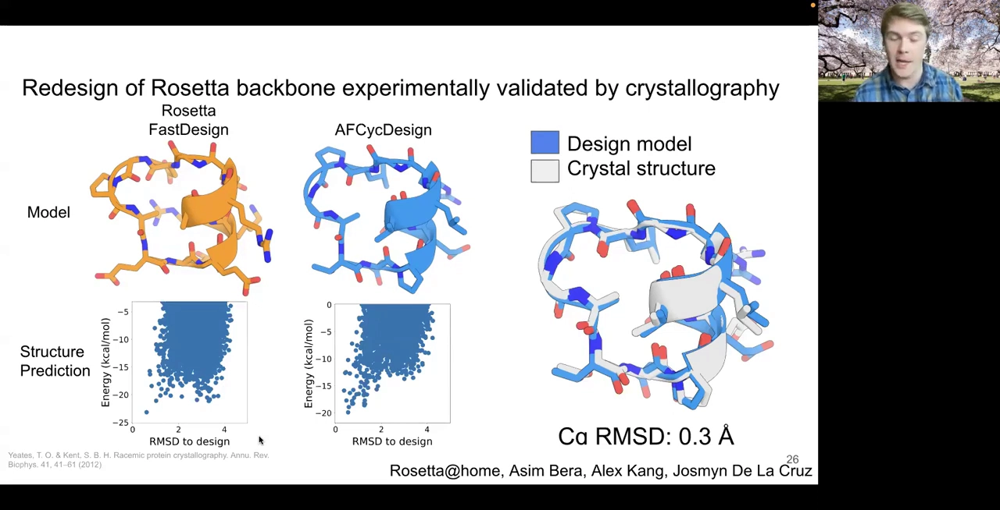

---

## 六、规模化从头设计：5 万个骨架与 2 万个可复用骨架库

[【跳转到 36:28】](https://www.youtube.com/watch?v=SDxy5E8fvXY&t=2188)

既然 hallucination 能凭空造骨架，那就"大力出奇迹"：

- 针对 **7～13 个残基**的不同长度档，每档 hallucinate **50,000 个**肽；
- 用**基于扭转角（torsion-based）的聚类**去重（避免两个几乎一样的"共享幻觉"污染统计）；
- 严格筛选：以 **pLDDT > 0.9** 为阈值（比 DeepMind 常用的 0.7 更严）。7 残基档就只剩 **182 个**高置信骨架；
- 对这 182 个再预测能量景观，其中 **114 个**有漂亮的折叠漏斗。

从这些骨架上挑选代表模型，用同样的外消旋结晶法做实验验证，共验证了 **8 个**（7～13 残基）：7、9、10 残基的设计与晶体结构非常接近；8 残基最弱（模型里有个甘氨酸的 φ 翻转导致问题）；11 残基拿到了 **0.3 Å** 的极高分辨率螺旋；12、13 残基则是 β 折叠——展示了这套方法能设计出**不依赖规则二级结构**的多样拓扑。整个 hallucination 跑完后，他们积累出约 **20,000 个**高置信肽骨架（而且还在增长），构成一个可复用的"骨架库"。

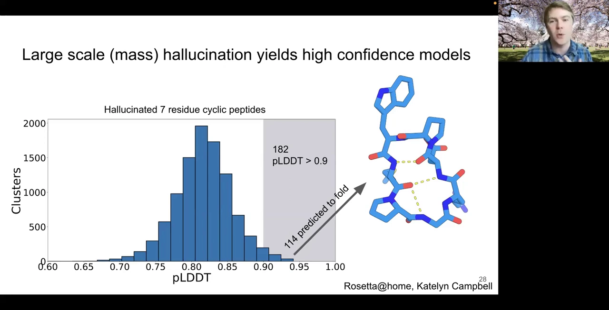

---

## 七、走向药物：MDM2 靶点的概念验证

[【跳转到 40:26】](https://www.youtube.com/watch?v=SDxy5E8fvXY&t=2426)

回到最初的动机——"我想做治病的肽"。很多**蛋白-蛋白界面由螺旋相互作用介导**，而刚建的 2 万骨架里约 50% 含螺旋，于是做一个简单测试：

- 选常见癌症靶点 **MDM2**。它天然结合的是一段 15 残基的 p53 肽，亲和力约 **401 nM**（PDB: 4HFZ）；
- 只取其中最关键的 **5 个残基**作为"模体（motif）"；
- 把自己库里的螺旋骨架**嫁接到**这个模体上，得到约 18,000 个嫁接螺旋；
- 原序列未必适配新界面，于是用 **ProteinMPNN** 为这些骨架**重新设计序列**；
- 最后用 AlphaFold **预测复合物**：目标蛋白用实验结构作模板，只喂入环肽序列，看它是否既折叠成环肽、又形成结合复合物。

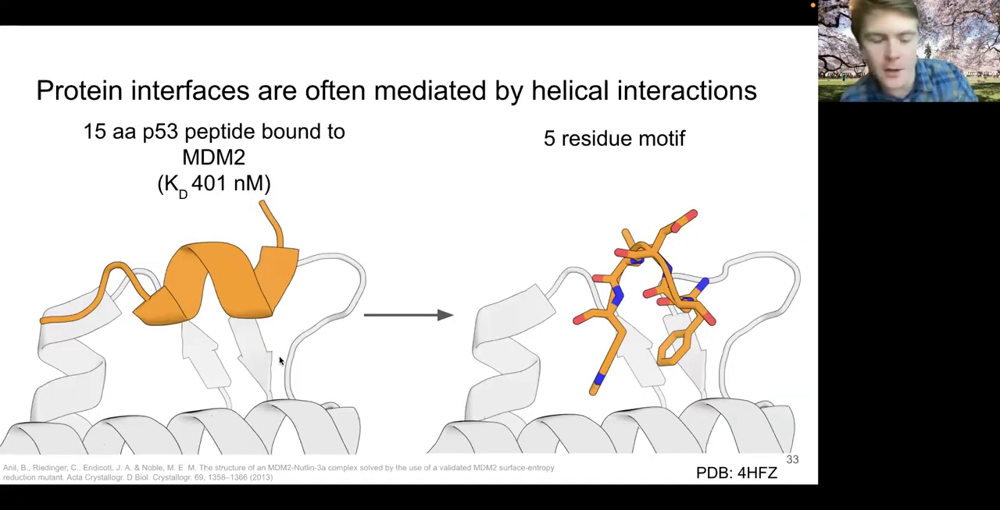

从预测能结合的一批里，再结合常用 Rosetta 指标，挑出 **14 个**做实验。用 **AlphaLISA** 实验测它们对 MDM2–p53 复合物的抑制：阴性=高荧光，阳性=荧光被完全抑制。单浓度初筛后有 **3 个**明显起效，进一步测 IC50，至少一个达到约 **350 nM**。

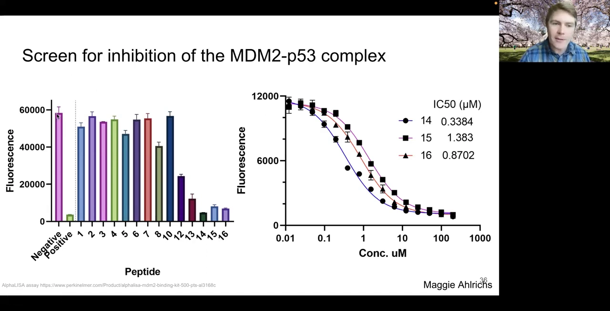

讲者特意"泼冷水"：MDM2 是个**很容易打的靶点**（已有皮摩尔级结合物），所以这更多是"证明流程能跑通"的概念验证——如果连这个都做不到，才真需要重新审视策略。

---

## 八、问答精选

- **更长序列行不行？** 目前只做到 7～13 残基，是因为这是他们熟悉且合成容易的长度。其实已在采样到 18 个甚至更长；越长界面越大，但对**合成**的要求也越高。
- **长蛋白的隐患。** 用"反传穿过 AlphaFold"设计**很长**的蛋白时，容易变成一种**对抗样本**：模型自由度太大，会找到骗过 AlphaFold 的怪序列。相反，短而受限的肽这种问题少得多，这也是他们结果好的原因之一。
- **非天然氨基酸 / D 型氨基酸？** 完全可以对全 D 型环肽用这套方法，但更省事的是做 L 型再镜像即可。真正的难点是"D 型肽 vs L 型靶点"——模型没见过 D/L 相互作用的例子。瓶颈**不在模型而在数据**：非天然化学的公开数据太少。
- **金属离子结合位点？** 可以设计成让离子结合区自己去"吸引"正确的配位残基，然后靠采样找到成功的例子。
- **构象柔性 / 溶液中的构象系综？** AlphaFold 默认给 5 个模型，可当作"抖动"参考；但他们的设计刻意针对**单一静态构象**，不主动考虑柔性。
- **低 pLDDT 的结构能否挽救？** 有可能——低分骨架可用 **ProteinMPNN** 重设计序列来"抢救"，也许能把一部分没通过筛选的结构救回来；不过他们对低分结构**并未做实验**验证（只挑了最高置信度的来做）。
- **怎么挑 14 个候选？** 不只靠整体 pLDDT：界面残基的 **PAE（预测对齐误差）**、Rosetta 的**接触分子表面**、**DDG（界面能量）**等指标一起用。
- **和 Rosetta 比，是不是只是采样更强？** 很难直接比分数；他们用"完整能量景观"来判断设计是否真能稳定折叠，并且只挑了"既过 AlphaFold、又过 Rosetta 旧指标"的设计。多模型一致（ProteinMPNN 生成 → AlphaFold 筛选）通常能提高成功率。
- **抗体热点环能"搬进"大环吗？**（Parisa / Shirintoo 之问）能——AlphaFold 训练时见过大量抗体和这些"热点环"，把它们支架化成有序大环在数据上并不意外；但实验上"90% 都能搬"的做法往往没这么顺利，仍需采样与验证，这也是他们正用新骨架尝试的方向。
- **模体嫁接用的是哪种损失？**（Yu Yang 之问）先用 ground-truth 损失选定支架：把带螺旋的 hallucination 骨架叠到模体上、避开与靶点冲突，让它占据已知结合物所在的区域；loop 与螺旋一起设计，之后再重设计序列、重新预测。
- **是否只挑了"好例子"？**（Arthur 的批评）确实只选了"既过 AlphaFold、又过 Rosetta 旧指标"的设计，无法百分百确定大规模采样就找不到它们；但 AlphaFold 的价值在于能给出**1 分钟级、带置信度**的结构。

---

## 小结

- **环肽**占据抗体与小分子之间的治疗空间：亲和力/特异性接近抗体，又能穿膜、可口服，代表是环孢素。
- 过去靠 **Rosetta 的 GKC + FastDesign** 手工做环肽，强大但像"手工艺"、算力开销大，且能量景观验证成本高。
- AlphaFold 用不了环肽，是因为它只见过**线性**（和 L 型）蛋白；而位置关系是**喂进去的输入**。
- **循环偏移（cyclic offset）**：把首尾相对位置设为 −1，仅此一改就让预训练 AlphaFold 零样本泛化到环肽（80 个天然环肽中 50 个准确预测）。
- **AFdesign** 把梯度反传进**序列**（而非权重），用 distogram 损失做 backbone design；换用置信度损失即得到 **hallucination**，可凭空生成新骨架。
- 经外消旋结晶验证，设计与晶体结构可达 **0.3 Å** Cα RMSD；大规模采样积累出约 **2 万个高置信骨架库**。
- 在 **MDM2** 靶点上，用"嫁接 + ProteinMPNN + AlphaFold 复合物预测"流程得到约 **350 nM** 的环肽抑制剂，证明了端到端流程可行。

## 关键术语速查

| 术语 | 一句话解释 |
| --- | --- |
| 环肽（cyclic peptide） | 首尾相连（或其他环化方式）形成环状骨架的短肽，兼具抗体级亲和力与小分子级穿膜性 |
| 环孢素（cyclosporine） | FDA 批准的天然环肽免疫抑制剂，先结合亲环蛋白 A、再生新界面结合钙调磷酸酶 |
| 广义运动学闭合（GKC） | 借自机器人学的环肽骨架采样算法：三枢轴 + 随机化其余残基，解出可首尾闭合的构象 |
| FastDesign | Rosetta 中的序列设计协议，可为给定骨架分配序列，支持 L/D 型与非天然氨基酸 |
| 循环偏移（cyclic offset） | 把 AlphaFold 位置编码里首尾相对位置设为 −1，使其认识"环"拓扑 |
| pLDDT | AlphaFold 的逐残基置信度（0–1 或 0–100）；经验上"自信即通常正确" |
| RMSD | 预测结构与真实结构的原子坐标均方根偏差，越小越准 |
| distogram | AlphaFold 输出：对每对残基给一个距离分布直方图 |
| AFdesign | 把梯度反传进序列（而非网络权重）、用 distogram 损失优化序列使其折叠到目标骨架 |
| hallucination | 不用目标结构，只用置信度/接触数等损失，让 AlphaFold "凭空"生成全新高置信骨架 |
| PAE | 预测对齐误差，衡量残基对相对位置的置信度，常用于判断界面是否可靠 |
| ProteinMPNN | 逆折叠模型，为给定骨架分配/重设计序列 |
| AlphaLISA | 一种均相荧光免疫检测，此处用于测设计肽对 MDM2–p53 复合物的抑制 |
| 外消旋结晶 | 把 L 型与其镜像 D 型等摩尔混合结晶，进入高对称空间群，便于小肽结晶与结构解析 |
