# Stanford CS336《从头构建大语言模型》2026 中配版 · 全课博客合集

> 视频来源：哔哩哔哩《【极致中配】2026年最新版 Stanford CS336: 从头构建大语言模型》
> BV 号：`BV11LEA6eEuj`（https://www.bilibili.com/video/BV11LEA6eEuj/）
> 本合集共 **18 篇**博客，按 `p01–p18` 讲解顺序排列。

## 我们是怎么做的

1. **下载视频**：用 `yt-dlp` 下载 B 站 1080p 分 P 视频（p01–p18，中配版）。
2. **抽取图像**：用 `ffmpeg` 对每个视频按 **每秒 1 帧**（1 fps）抽帧，共约 7 万张幻灯片画面。
3. **获取字幕**：通过在线 B 站字幕提取服务 **Kedou（kedou.life）** 的接口，直接抓取每个分 P 的 B 站 AI 中文字幕（SRT）。
4. **撰写博客**：结合字幕逐句内容与从视频中筛选的代表性幻灯片帧，为**每一个视频**撰写一篇中文技术博客。

> 说明：字幕为 B 站 AI 自动生成，存在少量识别错误（如 "CS336" 被识别成 "cs three three nox"），整理时已结合上下文纠正。文中所有观点与知识点均来自视频字幕本身。

## 学习地图（课程五大板块）

| 板块 | 对应讲次 | 主题 |
| --- | --- | --- |
| 基础 Basics | 第1–3讲 | 分词、Transformer 架构 |
| 系统 Systems | 第4–8讲 | 注意力替代、GPU/TPU、内核、并行训练 |
| 缩放 Scaling | 第9–12讲 | 缩放定律、推理、评测 |
| 数据 Data | 第13–14讲 | 数据来源、处理与配比 |
| 对齐 Alignment | 第15–18讲 | 后训练、RLHF/RLVR、多模态 |

## 分讲目录

| # | 主题 | 博客 | 一句话概要 |
| --- | --- | --- | --- |
| 01 | 课程概述与执行 | [bl01](<Lecture 1 课程概览与分词.md>) | 课程理念、"苦涩的教训"、语言模型发展史、五大板块与分词/BPE 详解。 |
| 02 | PyTorch 与 einops | [bl02](<Lecture 2 PyTorch(einops).md>) | 张量存储与精度、einops、FLOPs 核算、MFU、算术强度与屋顶线、`6ND`、显存优化。 |
| 03 | 模型架构 Architectures | [bl03](<Lecture 3 Architectures.md>) | pre/post-norm、RMSNorm、GLU、并行块、RoPE、QK-norm/soft-cap、MQA/GQA/滑动窗口。 |
| 04 | 注意力替代方案 | [bl04](<Lecture 4 Attention Alternatives.md>) | 线性注意力、Mamba-2/Gated DeltaNet、DeepSeek 稀疏注意力、MoE 路由与负载均衡。 |
| 05 | GPU、TPU | [bl05](<Lecture 5 GPUs, TPUs.md>) | GPU vs CPU 设计哲学、SM 与内存层次、TPU、屋顶线、六种加速技巧、FlashAttention。 |
| 06 | 内核、Triton、XLA | [bl06](<Lecture 6 Kernels, Triton, XLA.md>) | warp/占用率/bank 冲突/合并访存/波量化、profiling、Triton 内核实例与 PTX。 |
| 07 | 并行训练（一） | [bl07](<Lecture 7 Parallelism.md>) | 集合通信原语、NVLink/InfiniBand/RDMA、torch.distributed、数据/张量/流水线并行。 |
| 08 | 并行训练（二） | [bl08](<Lecture 8 Parallelism.md>) | ZeRO/FSDP、流水线气泡、张量/专家并行、激活内存、4D 并行与真实训练案例。 |
| 09 | 缩放定律（一） | [bl09](<Lecture 9 Scaling Laws.md>) | 缩放律历史、数据缩放、幂律直觉、临界批次大小、学习率缩放、Kaplan vs Chinchilla。 |
| 10 | 推理 Inference | [bl10](<Lecture 10 Inference.md>) | 预填充 vs 生成、KV 缓存压缩、量化剪枝、推测解码、连续批处理、分页注意力。 |
| 11 | 缩放定律（二） | [bl11](<Lecture 11 Scaling Laws.md>) | muP 初始化与 WSD、DeepSeek 网格搜索、优化器规模依赖、Muon 与 muP 理论。 |
| 12 | 评测 Evaluation | [bl12](<Lecture 12 Evaluation.md>) | 从困惑度到考试/聊天/智能体/安全基准、生态效度与数据污染。 |
| 13 | 数据（来源与数据集） | [bl13](<Lecture 13 Data (Sources, Datasets).md>) | 爬取约束、robots.txt/服务条款、版权与合理使用、BERT→Common Pile 演进。 |
| 14 | 数据（处理与配比） | [bl14](<Lecture 14 Data.md>) | HTML/PDF 转换、过滤、MinHash/LSH 去重、UniMax/RegMix 混合、代码合成数据。 |
| 15 | 中期/后训练 | [bl15](<Lecture 15 Mid-Post-Training.md>) | SFT 数据演进与坑、指令微调融入预训练、RLHF 数据、PPO/DPO 推导与过度优化。 |
| 16 | 后训练：RLVR | [bl16](<Lecture 16 Post-Training - RLVR.md>) | PPO 痛点、GRPO、DeepSeek R1、Kimi K1.5、Qwen3、数据课程与奖励钻空子。 |
| 17 | 对齐与多模态 | [bl17](<Lecture 17 Alignment - Multimodality.md>) | CLIP→SigLIP→LLaVA/Qwen-VL→Chameleon、视觉编码与对齐、M-RoPE。 |
| 18 | 客座讲座：Dan Fu | [bl18](<Lecture 18 Guest Lecture Dan Fu.md>) | token 生命周期、连续批处理、KV 缓存 bug、CDP、MegaKernel 与 Parcae。 |

---

<!-- ===== Lecture 1 课程概览与分词.md ===== -->

# Lecture 1: 课程概览与分词

## 本讲要解决的核心问题（SCQA）

**背景**：如今想要一个语言模型，最省事的做法是给现成模型写提示（prompt），或者下载开源权重做微调。抽象层级一代代抬升：十年前做 AI 研究要自己实现并训练模型，八年前只需下载像 BERT 这样的预训练模型再微调，现在光靠提示就能做很多事。

**冲突**：但抽象层总有"漏掉的地方"。给模型写提示时，你时常会遇到"本想做某件事却做不到、也没有任何补救办法"的情况——因为你能考虑的方案集合、面对的设计空间，被这个抽象层限制住了。更麻烦的是，最前沿的模型正变得"遥不可及"：训练 GPT-4 据传花了约 1 亿美元，如今成本可能已达 10 亿美元量级；而 GPT-4 的论文明确写道，出于竞争与安全考虑，绝不透露任何关于模型构建方式的细节。我们对前沿模型的内部，几乎是两眼一抹黑。

**疑问**：既然前沿模型既贵得离谱、又完全不公开，而小规模实验又未必能迁移到大规模，那我们在课堂上到底能学到什么真正有用的东西？又该从哪里开始真正理解语言模型？

**回答（中心思想）**：**唯一可靠的理解方式就是"从零构建"——亲手搭出语言模型的每一个零件，你才能真正学懂一切如何运作。** 这门课教三类可迁移的知识——**机制**（事物如何运作）、**思维模式**（如何着手构建）、**直觉**（哪些数据与建模决策有效）；三者之中，贯穿始终的一条主线是**效率**：在固定的数据与计算预算下，构建出尽可能好的模型。作为技术路线的起点，本讲聚焦第一个零件——**分词（tokenization）**，它决定了模型操作的"原子"，其主流方案是**字节对编码（BPE）**：[【跳转到 02:02】](https://www.bilibili.com/video/BV11LEA6eEuj/?p=1&t=122)


课程大体分五个部分，对应五项作业：**基础、系统、缩放定律、数据、对齐**。[【跳转到 21:26】](https://www.bilibili.com/video/BV11LEA6eEuj/?p=1&t=1286) 接下来先讲"为什么这样设计一门课"，再进入分词这一具体技术。

---

## 一、抽象层会漏，所以基础研究必须"把整个技术栈推倒重来"

**一句话结论**：提示模型本身没问题、做得好的话能做出很厉害的东西；但如果你对基础研究感兴趣，只靠调提示会极大地限制你能考虑的方案集合，因此必须亲手构建、彻底搞懂语言模型怎么工作。

### 1.1 抽象层级的抬升是好事，但也埋下了隐患
讲者用一个历史脉络来解释：大约 10 年前，做 AI 研究的人都会自己实现并训练模型；8 年前，大家改成下载像 BERT 这样的预训练模型再微调；现在，光靠提示模型就能做成很多事。**总的来说，提升抽象层级是好事**——它让更多人能快速做出成果。[【跳转到 02:56】](https://www.bilibili.com/video/BV11LEA6eEuj/?p=1&t=176)

### 1.2 抽象层会漏，所以必须推倒重来
但问题在于：抽象层总有漏掉的地方。你给模型写过提示，就会遇到"本想做某件事却做不到、也无任何补救办法"的时刻。一旦被卡住，你面对的设计空间其实已经被抽象层锁死了。所以，**想做基础研究的话，你必须把整个技术栈推倒重来**；而获得这种理解的方式，就是动手构建——这正是这门课的教学理念。[【跳转到 03:21】](https://www.bilibili.com/video/BV11LEA6eEuj/?p=1&t=201)

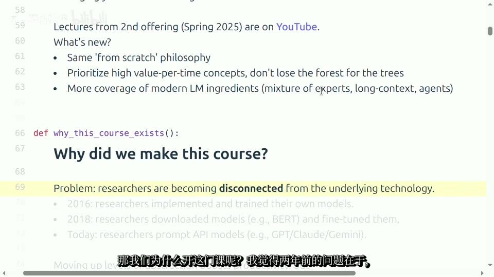

### 1.3 课程理念的演变与不该选这门课的情形
讲者强调，课程不变的理念始终是"**从零开始**"：他们坚信只有从头构建一切，你才能真正学懂一切如何运作。当然，一学期不可能真的从零搭出所有内容，所以过去两年他们一直在打磨，弄清哪些"从零构建"最有价值。今年有两个新变化：一是在**混合专家（MoE）** 架构上多花时间；二是智能体很火，搞懂**长上下文**以及为此需要什么也很重要。[【跳转到 02:07】](https://www.bilibili.com/video/BV11LEA6eEuj/?p=1&t=127)


课程还特别说明了"不该选这门课"的情形，同样体现了定位：如果你本季度主要想推进自己的研究，最好先和导师沟通；如果你想学 AI 最前沿的新技术（多模态、智能体等），有其他更适合的课；如果你想解决某个具体应用领域的问题，那么"先提示、再微调、万不得已才预训练"才是更合理的顺序——因为预训练既折磨人又昂贵。[【跳转到 17:07】](https://www.bilibili.com/video/BV11LEA6eEuj/?p=1&t=1027)

---

## 二、小规模实验不能直接外推到前沿——这是语言模型"工业化"带来的根本难题

**一句话结论**：前沿模型训练极其昂贵、细节完全不公开，而小规模下的观察往往无法代表大规模，因此"哪些结论能迁移"必须先想清楚。

### 2.1 语言模型已经工业化
语言模型已经实现了"工业化"。训练 GPT-4 据说要花 1 亿美元，现在成本可能涨到 10 亿美元量级；各大实验室在搭建的 GPU 数量极其庞大。更关键的是，这些模型如何构建没有任何细节公开——GPT-4 论文明确说，出于竞争格局和安全考虑，不会透露任何关于模型构建方式的内容。[【跳转到 04:01】](https://www.bilibili.com/video/BV11LEA6eEuj/?p=1&t=241)

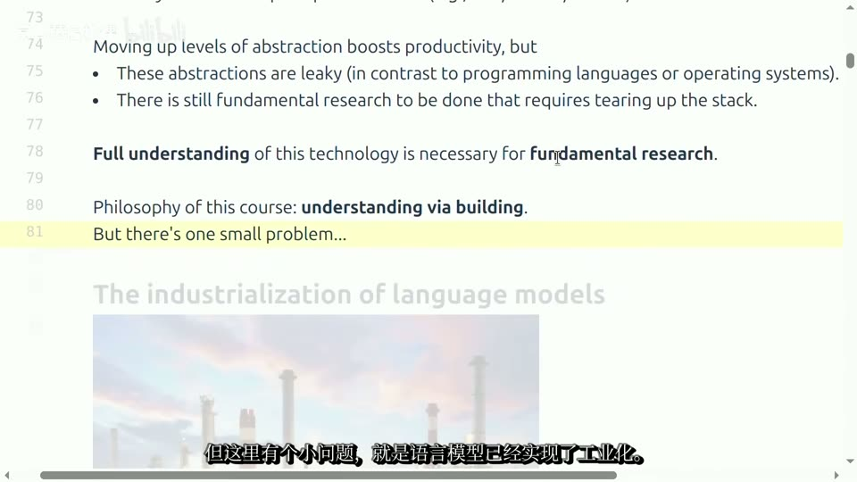

当然，我们可以在课程里构建小型语言模型——也确实会这么做。但要记住：它们**可能无法代表真正的前沿模型**。讲者举了两个例子说明"规模会改变结论"：

### 2.2 例子一：算力分布随规模变化
**例子一：算力分布会随规模变化。** 在 2021 年的观察中，小规模下 MLP 层消耗的浮点运算比例约为 **44%**；扩展到 **150 亿参数**规模，这一比例会升至 **80%**。也就是说，大规模下的优化目标和关键因素与小规模并不一样。如果你在小规模上针对注意力机制做了一系列实验，在大规模下可能根本无法获得同样的收益。[【跳转到 04:51】](https://www.bilibili.com/video/BV11LEA6eEuj/?p=1&t=291)


### 2.3 例子二：行为随规模涌现
**例子二：行为会随规模"涌现"。** 小模型上零样本/少样本学习各种任务基本毫无效果；只有规模达到某个临界点，才会突然出现显著改进。同样地，如果你只在小规模下工作，就可能观察不到某些类型的现象。[【跳转到 05:35】](https://www.bilibili.com/video/BV11LEA6eEuj/?p=1&t=335)


### 2.4 有些结论只能靠实验试出来
讲者提醒：有些设计决策其实没道理可讲，纯粹靠实验试出来——机制层面的东西从设计本身大致能看出（并行、内核为什么能加速），但"哪些建模改动有效"只能跑实验验证。那篇引入 **SwiGLU** 激活函数的著名论文，在结论部分非常坦诚地写道："我们不做任何解释；我们把这些架构的成功——一如其他一切——归于上天的恩典。"这种直觉只能靠积累经验获得。[【跳转到 07:18】](https://www.bilibili.com/video/BV11LEA6eEuj/?p=1&t=438)

---

## 三、"苦涩的教训"的关键不是"规模决定一切"，而是"可扩展的算法才是关键"

**一句话结论**：模型表现 ≈ 效率 × 资源；在大规模下效率反而更加重要，因为大规模操作成本可能是数亿美元，哪怕提升 5% 也意义重大。

### 3.1 常见误解与正确解读
"苦涩的教训"这个说法一直流传，但讲者认为众人对它普遍存在误解：

- **错误解读**：规模决定一切、算法无关紧要。**这不对。**
- **正确解读**：**可扩展的算法才是关键。**

### 3.2 效率 × 资源：规模越大，效率越关键
可以把模型表现看作"**效率乘以资源**"：效率等于输出除以输入，资源就是那个输入。从这个角度看，**更大规模下效率反而重要得多**——小规模实验一次多花一倍时间，你多等一倍再来就行；但大规模操作成本可能高达数亿美元，你肯定不想这么干。哪怕只提升 **5%**，也可能意义重大。[【跳转到 07:50】](https://www.bilibili.com/video/BV11LEA6eEuj/?p=1&t=470)


### 3.3 实证支持与课程的核心问题
**实证支持**：OpenAI 在 2020 年的一篇论文显示，2012~2019 年间，ImageNet 上的**算法效率提升了 44 倍**。硬件性能确实显著提升，但同时伴随着算法改进——只有把两者相乘，才能看到效率的巨大提升。[【跳转到 08:40】](https://www.bilibili.com/video/BV11LEA6eEuj/?p=1&t=520)


由此，课程把核心问题定义为：**在给定的数据和计算预算下，能构建出的最优模型是什么？** 对预训练而言，主要讨论**计算预算**（假设数据量远超算力）；但如果你处于数据受限场景，或囤积了大量 B200，那就可能受限于数据。核心思维就是**最大化效率**——这一主题贯穿整门课程。[【跳转到 08:47】](https://www.bilibili.com/video/BV11LEA6eEuj/?p=1&t=527)

---

## 四、课程要教三类可迁移的知识——机制、思维模式、直觉

**一句话结论**：机制和思维模式可以较好地教授，也能迁移到更大规模；但"哪些数据与建模决策有效"的直觉未必能跨规模迁移，得去能开展大规模工作的地方才能获得。

### 4.1 三类可迁移的知识
讲者把"真正可迁移的知识"拆成三类：

1. **机制（mechanisms）**：事物如何运作，例如什么是 Transformer、模型并行如何工作。
2. **思维模式（mindset）**：如何着手构建一个语言模型——如何最大限度榨取硬件性能、如何认真对待扩展问题。
3. **直觉（intuition）**：哪些数据和建模决策能带来良好性能。

### 4.2 哪些能迁移、哪些不能
课程认为，**机制和思维模式可以较好地教授**：课程会着重强调对一切进行性能分析和基准测试，并优化效率——这些东西确实可以迁移到更大规模。而关于"哪些建模/数据决策有效"的直觉，**未必能在不同规模间迁移**；想获得它，你得去能开展大规模工作的地方。[【跳转到 06:00】](https://www.bilibili.com/video/BV11LEA6eEuj/?p=1&t=360)


---

## 五、语言模型的历史，是一条"架构与系统思想不断累积"的长河

**一句话结论**：从香农用语言模型测算英语熵，到 n-gram、神经网络、注意力与 Transformer，再到 GPT 系列拥抱缩放定律与开源生态，语言模型的"角色"也从"微调对象"变成"提示对象"，再变成"可对话、可驱动的智能体"。

### 5.1 从香农、n-gram 到 Transformer
语言模型其实早就有：20 世纪 50 年代，**香农（Shannon）** 就用它测算英语的熵；很长一段时间里，n-gram 模型一直用在机器翻译和语音识别系统中——它们不是系统全部，却是保证生成流畅文本的重要一环。现代语言模型的源头可以追溯到神经架构，几个关键思想推动了发展：[【跳转到 09:37】](https://www.bilibili.com/video/BV11LEA6eEuj/?p=1&t=577)

- 20 世纪 90 年代出现 **LSTM**；
- **Bengio** 早在 2003 年就写出了第一篇神经语言模型论文（当时还是只关注小范围上下文的前馈网络）；
- 接着是**序列到序列（seq2seq）** 建模，它大胆宣称能把整句话压缩成一个向量；
- 为机器翻译开发的 **Adam 优化器**、**注意力机制**，以及在此基础上构建的 **Transformer**；
- 随后又扩展到**混合专家（MoE）** 和**模型并行**。

### 5.2 GPT 系列与拥抱缩放定律
到了 2010 年代末，事情开始真正变得有意思：**ELMo** 和 **BERT** 等语言模型经过大量文本训练后，可以在问答等下游任务上微调，效果有巨大提升。之后 Google 的一篇论文真正预示了"输入提示、输出响应"的范式。而真正靠拥抱扩展打开局面的是 **OpenAI**：2017 年左右发表 GPT-1 论文，扩展成 GPT-2；随后接纳**缩放定律**理念，训练出规模大十倍以上的 **GPT-3**，展现出**上下文学习（in-context learning）** 这类涌现行为。同期，后来并入谷歌的 DeepMind 已经发现了"计算最优"缩放定律。[【跳转到 10:52】](https://www.bilibili.com/video/BV11LEA6eEuj/?p=1&t=652)

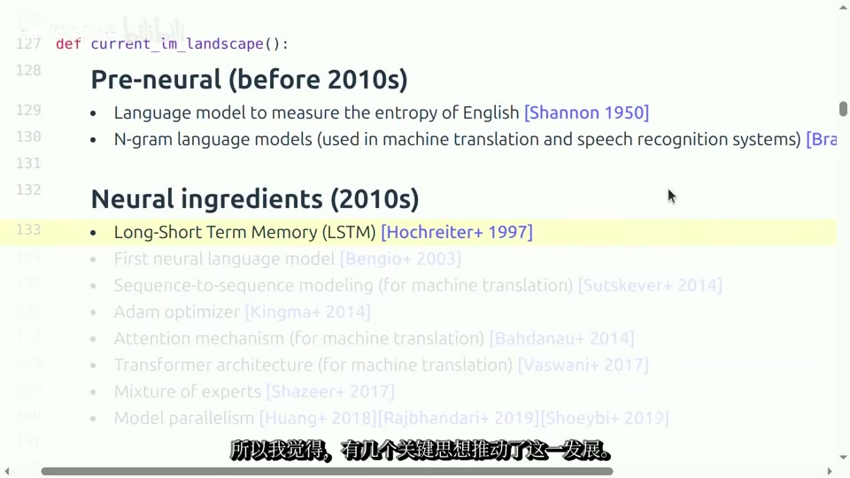

### 5.3 开源生态的崛起
GPT-3 发布后敲响了警钟，出现了许多复现尝试：草根组织 **EleutherAI** 创建了开放数据集和模型；Meta 首个 **LLaMA** 是明显的"复刻"之作（并不算好模型，遇到很多硬件问题）；HuggingFace 有 **BigScience** 项目。过去三年开源生态发生很大变化：Meta 的 LLaMA 系列（LLaMA/LLaMA 2/LLaMA 3）引领潮流，**Mistral** 随后加入，接着是一大批中国模型——**DeepSeek** 和 **Qwen** 大家都听说过。这些模型有趣之处在于：**开放权重模型正在逼近闭源水平**。还有一条工作路线不只发布权重，而是连论文、代码、数据一起公开，例如 **AI2**、**Technology Innovation Institute**，以及讲者参与的 **OLMO** 项目。[【跳转到 11:42】](https://www.bilibili.com/video/BV11LEA6eEuj/?p=1&t=702)

讲者特别强调开放生态的意义：**要是没有这些模型，这门课根本开不起来**。很多论文在探讨大型 MoE 系统和强化学习系统如何运作，让我们至少能一窥前沿模型怎么构建。当然，即便像 Qwen 这样的论文，很多细节还是没写全、没法照着复现——特别是数据混合比例——但总比一无所知强得多。[【跳转到 13:06】](https://www.bilibili.com/video/BV11LEA6eEuj/?p=1&t=786)


### 5.4 语言模型角色的演变
过去 10 年，"语言模型"这个概念的**角色也在变**：以前它是你拿来微调的东西，后来变成你拿来提示的东西，到了 ChatGPT 时代变成你可以直接对话的东西，现在则进入**智能体（agent）时代**。不过最根本的东西没太大变化：我们依然依托 GPU 和底层内核来构建系统，依然用梯度/随机梯度这类方法做优化，Transformer 的注意力机制也还在用。变化的是焦点——要处理更长的上下文，所以**推理效率格外关键**。[【跳转到 13:31】](https://www.bilibili.com/video/BV11LEA6eEuj/?p=1&t=811)

---

## 六、课程分五大板块、对应五项作业，最终让你从零搭出一个语言模型

**一句话结论**：整个课程按"基础→系统→缩放定律→数据→对齐"五步推进，每一步对应一项强度很大的作业，理念始终是"如何从零开始构建"。

### 6.1 五大板块与五项作业
课程大体分五个部分，对应五项作业：[【跳转到 21:26】](https://www.bilibili.com/video/BV11LEA6eEuj/?p=1&t=1286)

| 板块 | 内容概览 | 作业 |
| --- | --- | --- |
| **基础** | 分词、架构、优化器、训练流程 | 实现 BPE 分词器、Transformer、损失函数、优化器与训练全流程，并做大量资源核算；在 TinyStories/OpenWebText 上训练，比拼困惑度 |
| **系统** | 内核、多 GPU 并行、推理 | 用 Triton 实现内核，做并行训练与推理 |
| **缩放定律** | 在小规模上拟合缩放定律、外推预测 | 用给定的"训练 API"（超参数→损失）拟合缩放定律并外推 |
| **数据** | 数据来源、处理、配比、评估 | 从原始网页抓取数据出发，完成过滤、去重、清洗全流程 |
| **对齐** | 弱监督、强化学习（PPO/GRPO 等） | 实现 DPO 和 GRPO 等 |


### 6.2 基础部分：从零搭出一个语言模型
**基础部分**为期两周，目标是让你能从零构建并训练一个语言模型：对数据分词、定义架构、实现优化器并训练。作业一结束后，你就能从零搭出一个语言模型——这很令人兴奋。[【跳转到 21:31】](https://www.bilibili.com/video/BV11LEA6eEuj/?p=1&t=1291)

课程反复强调的一个高层要点是"平衡"：分词、建模、训练看似被拆成独立部分，实际上一切都在于平衡——
- **表达能力**：模型要有足够能力刻画数据的复杂性；
- **训练稳定性**：把参数和梯度的范数控制在既不太大也不太小的黄金区间，避免爆炸或消失——"训练语言模型在很大程度上就是关乎稳定性"；
- **效率**：让它在硬件上跑得更快，而架构决策往往就是效率权衡（例如把计算投影到低维空间，但随之要问"效果还一样好吗？"）。

[【跳转到 27:12】](https://www.bilibili.com/video/BV11LEA6eEuj/?p=1&t=1632)

### 6.3 系统、缩放定律、数据与对齐
**系统部分**的目标是尽可能充分利用硬件，会讲内核、多 GPU 并行、推理。**缩放定律部分**提出一个关键思维转变：不要只盯着正在训练的那一个模型，而要思考"**扩展配方（scaling recipe）**"——它是一个映射：把 FLOPs 预算（比如 10²¹ 或 10²²）映射到一组超参数，基本就是一份配置文件。做法是运行大量小规模实验、计算小规模下的损失，再**拟合缩放定律**，从而预测目标规模下的损失。讲者强调：**可预测性的重要性至少不亚于最优性**；而且缩放定律并不是自然定律、不会自动发生，必须通过精心构建扩展配方来促成，配方还须具备**外推能力**（这通常要求超参数随规模按可预测规律变化，即"**超参数迁移**"）。[【跳转到 35:25】](https://www.bilibili.com/video/BV11LEA6eEuj/?p=1&t=2125)

作为背景，课程会讲两个经典的"计算最优"缩放定律：**Kaplan 等人**的工作与后来的 **Chinchilla 缩放定律**——其基本思路是：对一系列最大 FLOPs 预算，遍历不同模型规模、选出每个预算下最优的模型，再拟合曲线以根据预算预测参数量。一个广为流传的经验法则是：**训练数据量应约为参数数量的 20 倍**——例如 8B 参数的模型大约要在 1.4 万亿个 token 上训练（具体取决于数据集与架构）。不过要注意，如今许多模型实际训练所用 token 远超"计算最优"，因为出于**推理成本**的考虑我们希望模型更小。[【跳转到 38:25】](https://www.bilibili.com/video/BV11LEA6eEuj/?p=1&t=2305) · [【跳转到 39:15】](https://www.bilibili.com/video/BV11LEA6eEuj/?p=1&t=2355)


讲者还举了一个"预注册"的实践：他们在 MARIN 项目中，于不同计算预算下拟合缩放曲线，**事先预测**某个从未训练过的庞大规模模型的损失，然后真的去训练它并对照——这种"先预测、后验证"的做法，正是缩放定律价值的体现。[【跳转到 39:40】](https://www.bilibili.com/video/BV11LEA6eEuj/?p=1&t=2380)

**数据部分**回答"用什么数据训练"——数据质量基本决定了模型能有多好，因此数据"基本上反映了你希望模型做什么"。**对齐部分**则从全监督训练转向弱监督：先让模型生成回答，再让人类、验证器或语言模型裁判打分，然后更新模型让它更倾向于好的回答。讲者坦言强化学习算法不稳定、很难调参，**我个人倾向于尽可能久地停留在完全监督学习的框架里**。[【跳转到 46:42】](https://www.bilibili.com/video/BV11LEA6eEuj/?p=1&t=2802)

---

## 七、资源核算是贯穿全课的方法论——算力花在 6ND，而瓶颈往往在内存搬运

**一句话结论**：课程会用大量时间做资源核算，核心是一个反复出现的公式——在 D 个 token 上训练参数量为 N 的模型约需 6ND 次浮点运算；更重要的是，硬件上内存并不是算力所在的地方，数据搬运往往才是瓶颈。

### 7.1 6ND：算力花在哪里
系统部分会专门做**资源核算（resource accounting）**：搞清楚所有浮点运算（FLOPs）都花在了哪里、内存都消耗在了哪里。一个反复出现的公式是：在 **D 个 token** 上训练一个参数量为 **N** 的模型，大约需要 **6 × N × D** 次浮点运算。[【跳转到 28:27】](https://www.bilibili.com/video/BV11LEA6eEuj/?p=1&t=1707)

### 7.2 内存不是算力所在之处
硬件上需要注意的一点是：**内存并不是算力所在的地方**。你必须把参数或激活值从内存搬到计算单元进行计算，然后再搬回去——而这往往就是瓶颈。以课程中会实际体验的 **B200** 为例：它在 BF16 精度下的算力是**每秒 2.25 PFLOPs**，内存带宽是**每秒 8 TB**。课程会用这些数字做一些计算，看看不同类型的算法各需要多长时间，并引入**屋顶线分析（roofline analysis）** 来判断一个计算到底受限于算力还是受限于内存。结论通常是：**瓶颈在内存**。[【跳转到 29:01】](https://www.bilibili.com/video/BV11LEA6eEuj/?p=1&t=1741)


### 7.3 多 GPU 与集合通信
对多 GPU 系统，最小化数据移动的原则依然适用，只不过跨 GPU 传输数据成本更高。经典操作是 **gather、reduce、all-reduce** 等集合通信原语——它们为理解分布式训练提供了思路：模型参数、激活值、梯度和优化器状态需要在多个 GPU 之间分片，你得把正确的数据送到正确的节点上计算，再写回去。[【跳转到 31:11】](https://www.bilibili.com/video/BV11LEA6eEuj/?p=1&t=1871)

---

## 八、分词器的本质，是在字符串与 token 之间做双向转换，并用"压缩比"衡量好坏

**一句话结论**：文本是 Unicode 字符串，而语言模型操作的是 token 索引序列，分词器就是这两者之间的双向翻译官；它应当支持无损失的往返转换，并用"每个 token 对应多少字节"的压缩比来衡量效率。

### 8.1 字符串与 token 的双向转换
我们从一个基本问题出发：**到底什么是文本？** 它是 Unicode 字符串；而另一方面，语言模型会对 token 序列建立概率分布，通常用索引来表示。所以我们需要一个流程：把字符串**编码**成 token，再把 token **解码**回字符串。**分词器（tokenizer）本质上就是能完成这种双向转换的工具**。[【跳转到 50:51】](https://www.bilibili.com/video/BV11LEA6eEuj/?p=1&t=3051)

### 8.2 分词器的怪癖与往返转换
分词器有一些"烦人"但重要的特性：

- 一个单词，和这个单词连同它前面的空格组合在一起，是**不同的 token**——所以你实际看到的很多 token 其实是"空格＋单词"的形式。这意味着"hello"和" hello"是两个完全不同的索引，彼此毫无关系。
- 数字的表示方式因分词器而异：有时几位数字构成一个 token，有时每个数字单独成 token。单独成 token 会让 token 数量激增，所以这里存在权衡。
- 分词器应当支持**往返转换（roundtrip）**：把字符串编码成索引，再解码回原字符串。**如果你实现的分词器无法往返转换，那就说明有问题。**

[【跳转到 51:41】](https://www.bilibili.com/video/BV11LEA6eEuj/?p=1&t=3101)

### 8.3 用压缩比衡量分词器
衡量分词器好坏的核心指标是**压缩比（compression ratio）**：每个 token 对应的字节数。举例：某个字符串字节数为 **20**、token 数为 **8**，压缩比就是 20 ÷ 8 = **2.5**，即每个 token 对应 2.5 个字节。压缩比越大，意味着序列越短——这是好事，因为注意力的计算复杂度是序列长度的二次方，你要确保序列尽可能短。当然，可以通过增大词表来提高压缩比，但这会引发稀疏性问题（词表中每个元素都被视为独立的元素）。如今的多语言分词器词表已经能有 10 万到 20 万个 token。[【跳转到 52:31】](https://www.bilibili.com/video/BV11LEA6eEuj/?p=1&t=3151)


---

## 九、字符级与词级分词各有硬伤，这就是 BPE 存在的理由

**一句话结论**：字符级分词词表巨大且利用效率低，字节级分词序列过长，词级分词则词表无界、还会遇到未登录词——这三种朴素方案都不理想，BPE 因此成为主流。

### 9.1 字符级、字节级与词级方案各自的硬伤
讲者依次检验了几种朴素方案：

1. **字符级分词器**：把每个字符单独拆成一个 token（Python 里可用 `ord` 取得字符对应的整数）。问题在于现在有约 **15 万个 Unicode 字符**，词表可能高达 15 万量级——这倒不算离谱，但**很多字符其实很少见**，词表利用效率很低；压缩比表现也不好，大多数时候得用很多 token 来表示序列。

2. **字节级分词器**：用 **UTF-8** 编码把字符串转成字节序列。好处是序列里所有数值都在 **0~255** 之间，词表很小；问题是**序列变长了，压缩比是 1**——并不理想。

3. **词级分词器**：按空格或正则表达式把字符串切分成有意义的"词"块。优点是每个 token 往往有稳定的语义；但**词表大小等于训练数据中不同块的数量**，可能非常巨大，而且**实际上可能是无界的**——测试时你可能遇到从未见过的 token，过去人们把它标为 **UNK**，但这很不优雅，还会扰乱困惑度计算。

[【跳转到 53:21】](https://www.bilibili.com/video/BV11LEA6eEuj/?p=1&t=3201) · [【跳转到 55:01】](https://www.bilibili.com/video/BV11LEA6eEuj/?p=1&t=3301)

---

## 十、BPE 从字节出发、反复合并最高频的相邻对，为数据量身定制词表

**一句话结论**：字节对编码（BPE）以字节为起点，反复把出现频率最高的相邻 token 对合并成新 token，从而让常见序列用一个 token 表示、罕见序列拆成多个 token，并且任何文本都能被分词、不会遇到 UNK。

### 10.1 BPE 的由来与关键特性
**字节对编码（Byte Pair Encoding, BPE）** 的想法其实很久以前就有了，最初是为了做**数据压缩**，远早于语言模型登场；它最早被引入 NLP 用于神经机器翻译，而首次把 BPE 用于语言模型的是 **GPT-2 论文**。基本思路是**用原始文本来训练分词器，从而构建出为数据量身定制的词表**。它还有一个关键特性：**任何内容都能被分词**——遇到罕见序列时就拆分成更小的单元，而不是用一个 UNK token 表示。所以常见的序列会被表示成一个 token，罕见的序列则被拆成多个 token。[【跳转到 55:51】](https://www.bilibili.com/video/BV11LEA6eEuj/?p=1&t=3351)

### 10.2 BPE 算法：反复合并最高频的相邻对
算法本身相当简单：[【跳转到 56:16】](https://www.bilibili.com/video/BV11LEA6eEuj/?p=1&t=3376)

1. **初始化**：从语料库开始，把文本转成字节序列，每个字节起初都是一个 token。
2. **统计**：统计相邻 token 对出现的次数。
3. **合并**：找出出现次数最多的 token 对，创建一个代表该对的新 token（例如编号 256 代表"th"），加入词表，并把序列中每一处该对替换成新 token。
4. **重复**：回到第 2 步。下一次会合并出 257，再下一次 258……**序列越来越短，词表越来越大**。

讲者用"The Cat in the Hat"（戴帽子的猫）这个字符串演示了完整过程；在玩具示例中，最终得到的压缩率是 1.5。[【跳转到 57:05】](https://www.bilibili.com/video/BV11LEA6eEuj/?p=1&t=3425)


### 10.3 对新文本编码与第一次作业
**对新文本分词**时，概念上就是遍历之前建立的合并规则、把它们应用到字符串上。讲者展示的这个实现是一个**完整的 BPE 实现**——但它跑得非常慢：`encode` 会遍历所有合并操作，而合并的数量基本上就等于词表大小。所以在**第一次作业**里，会要求你把它改得更快——思路是只遍历那些"关键的"合并操作，并为此建立索引。[【跳转到 58:45】](https://www.bilibili.com/video/BV11LEA6eEuj/?p=1&t=3525)

还有两个工程细节：其一，关于**特殊 token** 有一些处理细节，概念上不难，但对构建现代分词器很重要；其二，为了简单起见，演示把分词器写成"接收整个字符串然后分词"，**实际上应先把文本分解为块，再对每个块应用分词器**，这样会快很多。到某个时候你可能会意识到 Python 并不快，如果想用 Rust 等语言实现，那就动手吧。[【跳转到 59:10】](https://www.bilibili.com/video/BV11LEA6eEuj/?p=1&t=3550)

### 10.4 前瞻：任何替代方案都需满足的特性
讲者最后留下一个前瞻：**任何取代分词的端到端方案，都必须满足分词器同样的需求**——需要某种序列抽象供 Transformer 建模（对视频、DNA 序列尤其明显，因为其中单个字节的信噪比很低）；并且块的大小应当**可变**，以实现**自适应计算**（并非所有字节都同等重要）。这是"H-Net"等研究仍有前景、但至今尚未扩展到前沿规模的原因，也是今年仍要讲分词的原因。[【跳转到 60:10】](https://www.bilibili.com/video/BV11LEA6eEuj/?p=1&t=3610)


---

## 小结

- **为什么从零构建**：抽象层总会漏，只调提示会锁死设计空间；基础研究必须把整个技术栈推倒重来，而动手构建是理解语言模型的唯一可靠路径。
- **前沿难以触及**：训练成本已达 10 亿美元量级、细节完全不公开；小规模实验不能直接外推（MLP 算力占比 44%→80%、涌现现象），"哪些决策有效"的直觉很难跨规模迁移。
- **苦涩的教训**：正确解读是"可扩展的算法才是关键"；模型表现 ≈ 效率 × 资源，大规模下效率尤其重要（ImageNet 算法效率 9 年提升 44 倍）。
- **三类可迁移知识**：机制、思维模式可以教授并迁移；直觉要在能开展大规模工作的地方获得。
- **历史脉络**：香农 → n-gram → LSTM/Bengio/seq2seq → 注意力/Transformer → GPT 系列 + 缩放定律 → 开源生态（LLaMA/Mistral/DeepSeek/Qwen/OLMO）→ 智能体。
- **五大板块**：基础、系统、缩放定律、数据、对齐，各对应一项强度很大的作业；核心思维是"在固定预算下最大化效率"。
- **资源核算**：训练约需 **6ND** 次浮点运算；内存不是算力所在之处，数据搬运往往是瓶颈，用屋顶线分析判断受限类型。
- **分词**：在字符串与 token 之间双向转换，须支持往返、用压缩比衡量；字符级/字节级/词级各有硬伤。
- **BPE**：从字节出发、反复合并最高频相邻对；常见序列一个 token、罕见序列拆多个；任何文本都能分词、无 UNK；作业一要把它实现得更快。

---

## 关键术语速查

| 术语 | 一句话解释 |
| --- | --- |
| 从零构建（from scratch） | 亲手实现语言模型各零件以真正理解其运作，是本课程的教学理念。 |
| 抽象层泄漏 | 提升抽象层级带来便利，但被抽象屏蔽的细节在需要时无法触及，限制设计空间。 |
| 苦涩的教训（bitter lesson） | 常被误读为"规模决定一切"；正确解读是"可扩展的算法才是关键"。 |
| 效率 × 资源 | 模型表现的近似分解；规模越大，效率对结果的影响越关键。 |
| 机制 / 思维模式 / 直觉 | 本课程要教的三类可迁移知识；前两者易迁移，直觉难跨规模迁移。 |
| 涌现（emergence） | 规模达到临界点后突然出现的显著能力（如上下文学习）。 |
| FLOPs | 浮点运算次数；衡量算力消耗的基本单位，训练约需 6ND。 |
| 6ND | 在 D 个 token 上训练参数量 N 的模型所需的近似浮点运算量。 |
| 屋顶线分析（roofline） | 判断一个计算受限于算力还是内存的分析方法；瓶颈常在内存。 |
| 集合通信（gather/reduce/all-reduce） | 多 GPU 间交换与规约数据的经典原语，是分布式训练的基础。 |
| 扩展配方（scaling recipe） | 把 FLOPs 预算映射到一组超参数的配置；靠小规模实验拟合缩放定律来预测大模型损失。 |
| 超参数迁移 | 让超参数随规模按可预测规律变化，使小规模的最优设置能外推到大模型。 |
| 分词（tokenization） | 在 Unicode 字符串与 token 索引序列之间的双向转换过程。 |
| 分词器（tokenizer） | 完成字符串↔token 编码/解码的工具，须支持无损失往返转换。 |
| 压缩比（compression ratio） | 字节数 ÷ token 数；越大表示序列越短、注意力开销越低。 |
| 字符级 / 字节级 / 词级分词 | 三种朴素方案：分别词表大利用率低、序列长、词表无界且遇未登录词。 |
| UNK token | 处理未知 token 的占位符；BPE 通过拆分为更小单元来避免使用它。 |
| 字节对编码（BPE） | 从字节出发、反复合并最高频相邻对的子词分词算法，可为数据定制词表。 |
| 自适应计算 | 让块大小可变，使信息密集处保留更多 token、冗余处压缩成更少 token。 |

---

<!-- ===== Lecture 2 PyTorch(einops).md ===== -->

# Lecture 2: PyTorch(einops)

## 本讲要解决的核心问题（SCQA）

**背景（Situation）**：这门课的目标从第 1 讲起就没变过——**在有限的资源下训练出尽可能好的模型**。这里的资源主要是两样：**算力（compute）**和**内存（memory）**；数据在本课里不构成瓶颈。上一讲我们聊完了分词，那是第一次作业的内容。

**冲突（Complication）**：既然要"最大化效率"，第一步就必须**能测量效率**——一次计算要花多少时间、占多少显存。可如果你不知道一个张量在机器里是怎么存的、一次前向反向到底做了多少次浮点运算，那所有优化都只能靠猜。更糟的是，硬件规格表上的数字还经常"注水"（比如按稀疏性标称），直接拿来算会错一倍。

**疑问（Question）**：我们怎样给一次训练做一本清清楚楚的"资源账"——算出它需要多少运算、多少显存、要跑多久，并判断瓶颈到底卡在算力还是内存？

**回答（Answer，结论先行）**：本讲自底向上给你四件工具，正好构成一条从"数据怎么存"到"训练要花多少资源"的链条：

1. **张量（tensor）与数据类型**——决定内存怎么占、精度怎么选（含混合精度）；
2. **einops**——用"命名维度"代替"数索引"，把张量运算写得不容易错；
3. **浮点运算次数（FLOPs）与 6ND**——学会"数运算"，包括 `6ND` 公式的完整来历；
4. **算术强度、屋顶线与 MFU**——判断一段代码是**内存受限**还是**计算受限**；
5. 最后落到**优化器与显存**：显存账本，以及梯度累积、激活检查点两种省显存技巧。

一句话：**学会给计算"记账"，你才能在写模型时预判性能。** 讲者还举了两个贯穿全讲的例子作为"考试题"：① 在 H100 上、以 1e23 个 token 训练一个 700 亿参数模型，用 `6ND`、一个 MFU 取值、再查 H100 规格表，就能估出天数（大约是几天）；② 用 8 块 H100 配合 AdamW，最多能训练多大模型——答案是约 530 亿参数，算法就在下面。([【精准空跳到 01:20】](https://www.bilibili.com/video/BV11LEA6eEuj/?p=2&t=80)、[【精准空跳到 01:45】](https://www.bilibili.com/video/BV11LEA6eEuj/?p=2&t=105))

顺带一提：上周说的 Marin 项目那次 `1e23` 浮点运算的训练已经跑完，实际损失和扩展定律的预测几乎一致，误差在 0.05 以内；每条曲线其实是一条"等浮点运算次数曲线"，从一批小模型里找出计算最优点，就能把损失外推到更大规模。([【精准空跳到 00:05】](https://www.bilibili.com/video/BV11LEA6eEuj/?p=2&t=5))

> 课堂公告：加入 CS336 的 Slack、用学校邮箱在 Modal 上注册、阅读 AI 政策指南与集群使用指南。([【精准空跳到 00:00】](https://www.bilibili.com/video/BV11LEA6eEuj/?p=2&t=0))

---

## 一、张量：机器里"一切数据"的存储单元

### 1.1 张量是什么，为什么偏要从它讲起

**张量（tensor）就是一个多维数组**：一维张量是向量，二维张量是矩阵，三维及以上就叫高阶张量。用大白话说，它就是把一堆数字按某个"形状"码放整齐的盒子。比如 `torch.zeros(4, 8)` 是一个 4 行 8 列的矩阵（2 维张量），`torch.zeros(4, 8, 4)` 再多一层就变成 3 维张量。

为什么要从它讲起？因为在深度学习里，**参数、梯度、优化器状态、训练数据、激活值，本质上全都是张量**。你可以把一个 DeepSeek v3.2 这样的大模型直接理解成"一大堆形状各异的张量"。([【精准空跳到 03:25】](https://www.bilibili.com/video/BV11LEA6eEuj/?p=2&t=205))


### 1.2 一个张量占多大内存：元素数 × 每个元素的字节数

规则非常朴素：

> **一个张量的内存占用 = 元素个数 × 每个元素占用的字节数**

例子：一个 4×8 的 `float32` 张量，元素个数是 32，每个 `float32` 占 4 字节，所以总占用 `32 × 4 = 128` 字节。([【精准空跳到 11:33】](https://www.bilibili.com/video/BV11LEA6eEuj/?p=2&t=693))

这个公式还能让你建立"大"的直觉：GPT-3（一个相对"老"的模型）前馈层里的**一个**矩阵，形状约 `(12288×4, 12288)`，在 fp32 下就占大约 **2.3 GB**。也就是说，光一个矩阵就顶得上一部高清电影，而大模型里有成百上千个这样的矩阵。([【精准空跳到 04:55】](https://www.bilibili.com/video/BV11LEA6eEuj/?p=2&t=295))

还有两个容易忽略的点：
- **默认精度**：你在 PyTorch 里新建张量，默认类型是 `float32`；想要别的类型必须显式声明。
- **默认位置**：新建的张量默认在 **CPU** 上；要用 GPU 加速，得手动把张量搬到 GPU（`.to("cuda")`），否则你拿不到任何加速。([【精准空跳到 12:05】](https://www.bilibili.com/video/BV11LEA6eEuj/?p=2&t=725))

### 1.3 浮点数是怎么用"位"拼出来的

要理解精度，先得知道一个浮点数是怎样用一串 0/1 表示的。一个浮点数被拆成三段：

- **符号位（sign）**：表示正负；
- **指数位（exponent）**：表示**动态范围**（能表示的最大数和最小数有多大）；
- **尾数位（mantissa / fraction）**：表示**分辨率**（两个相邻可表示数之间的间隔有多细）。

> 类比：用科学计数法写 `1.234 × 10^5`。"1.234"是尾数，决定你能写多精细；"10^5"里的 5 是指数，决定你能写多大。浮点数就是把这两部分各自分配若干位。

**float32（单精度）**：总共 32 位——1 位符号 + 8 位指数 + 23 位尾数，占 4 字节。它还有个名字 `fp32`；"单精度"这个叫法来自早期科学计算，那时 fp32 是基准。在深度学习里我们**不往更高精度走**，因为 32 位其实已经远超需要了。([【精准空跳到 04:09】](https://www.bilibili.com/video/BV11LEA6eEuj/?p=2&t=249)、[【精准空跳到 04:34】](https://www.bilibili.com/video/BV11LEA6eEuj/?p=2&t=274))


**float16（半精度）**：最直观的省内存办法就是"把位数砍掉一半"——16 位 = 1 位符号 + 5 位指数 + 10 位尾数，只占 2 字节，内存立刻减半。但它的**指数只有 5 位**（fp32 是 8 位），导致**动态范围很差**：特别大或特别小的数直接表示不了，会变成 0 或无穷。用它训练会经常遇到上溢、下溢和 NaN，非常头疼。([【精准空跳到 05:45】](https://www.bilibili.com/video/BV11LEA6eEuj/?p=2&t=345)、[【精准空跳到 06:25】](https://www.bilibili.com/video/BV11LEA6eEuj/?p=2&t=385))


**bfloat16（bf16，Brain Floating Point）**：大约 2017 年为解决 fp16 动态范围差的问题而提出。思路很聪明——**不增加总位数**（和 fp16 一样 16 位），而是**从尾数挪几位给指数**：1 位符号 + 8 位指数 + 7 位尾数。这样它的**动态范围和 fp32 完全一样**，代价是分辨率更差。为什么这个取舍划算？因为深度学习的数据本身就比较"粗糙"、带随机性，你并不需要那么高的分辨率，**只要别溢出/下溢**就行。所谓"天下没有免费的午餐"，但这份午餐换得很值。([【精准空跳到 06:50】](https://www.bilibili.com/video/BV11LEA6eEuj/?p=2&t=410)、[【精准空跳到 07:15】](https://www.bilibili.com/video/BV11LEA6eEuj/?p=2&t=435))

把三种精度的"训练影响"总结一下：用 fp32 训练完全没问题，但每个参数要 4 字节、很占内存；用 fp16 风险偏大；**bf16 是比较平衡的选择**（当然也并非零风险）。([【精准空跳到 07:40】](https://www.bilibili.com/video/BV11LEA6eEuj/?p=2&t=460))

### 1.4 更低的精度：fp8 与 fp4 的"块缩放"

再往下走是 **fp8**：2022 年为了机器学习负载实现了标准化，有两个版本——**E4M3**（动态范围约 `[-448, 448]`，偏精度）和 **E5M2**（约 `[-57344, 57344]`，偏动态范围）。NVIDIA 的 Transformer Engine 支持 fp8。([【精准空跳到 08:34】](https://www.bilibili.com/video/BV11LEA6eEuj/?p=2&t=514)、[【精准空跳到 08:59】](https://www.bilibili.com/video/BV11LEA6eEuj/?p=2&t=539))


**fp4** 更极端：NVIDIA 2025 年推出的 **NVFP4**，每个数值只有 4 位，能表示的数值就那几档（大致 `-6, -4, -3, -2, -1.5, -1, -0.5, 0, 0.5, 1, 1.5, 2, 3, 4, 6`），精度显然很低。这里的**关键技巧是"分块缩放"**：数据不是孤立地取那几档，而是**按块（block）组织**，每个块配一个**缩放因子（scale factor）**，整块可以一起往上或往下缩放。这样虽然每个数值只有 4 位、盖不住完整动态范围，但**块内数值之间的比例关系仍然保持**，等于把有限的精度"填"在了最需要的地方。2025 年已有用 NVFP4 训练的模型（如 Nemotron 3 Super）。这些底层转换大多由 NVIDIA 的软件栈完成，你写代码时不一定直接碰得到。([【精准空跳到 09:24】](https://www.bilibili.com/video/BV11LEA6eEuj/?p=2&t=564)、[【精准空跳到 09:49】](https://www.bilibili.com/video/BV11LEA6eEuj/?p=2&t=589))

顺便区分两个常被混淆的概念：**量化（quantization）**通常是"先用 bf16 甚至更高精度把模型**训练好**，再把它**压低**到 1 位、2 位等"，这比"直接训练一个 1 位的语言模型"容易得多——后者目前还没有可信的成果。([【精准空跳到 11:09】](https://www.bilibili.com/video/BV11LEA6eEuj/?p=2&t=669))

### 1.5 混合精度训练：把好钢用在刀刃上

既然低精度省内存又更快，但某些操作又很脆弱，那折中方案就是**混合精度训练（mixed precision training）**：**不同的数据用不同的精度**。

- **参数、激活值、梯度 → bf16**（2 字节，省内存、算得快）；
- **优化器状态 → fp32**（后面会讲到，优化器状态对稳定性要求高）。

PyTorch 提供了自动混合精度库 `torch.amp`（AMP）。你基本只要把代码包一下，库会**在安全的地方自动转成 bf16**——比如**矩阵乘法通常是安全的**；而**指数运算（exp）这类危险操作会保留 fp32**，避免数值炸掉。([【精准空跳到 08:04】](https://www.bilibili.com/video/BV11LEA6eEuj/?p=2&t=484)、[【精准空跳到 08:34】](https://www.bilibili.com/video/BV11LEA6eEuj/?p=2&t=514))

---

## 二、einops：用"命名维度"代替"数索引"

### 2.1 为什么需要 einops

原生 PyTorch 的写法很容易看错，比如一个转置写成 `transpose(-2, -1)`——你根本不知道 `-2`、`-1` 指的是哪两个维度，代码难读也容易写错。**einops 的动机就是"用维度名字代替索引"**：它让你给每个维度起名字，像 `seq1`、`hidden`、`batch`，运算时直接写名字，可读性大幅提升。它包含三个主要操作：`einsum`、`reduce`、`rearrange`。([【精准空跳到 12:28】](https://www.bilibili.com/video/BV11LEA6eEuj/?p=2&t=748))

### 2.2 einsum：带"记账"的广义矩阵乘法

可以把 `einsum` 理解为"**带有良好索引管理的广义矩阵乘法**"，灵感来自爱因斯坦求和约定。规则只有一条：**出现在箭头右边（输出）里的维度会被保留；没出现的维度会被求和消去。**([【精准空跳到 12:53】](https://www.bilibili.com/video/BV11LEA6eEuj/?p=2&t=773))

例子：`x` 是 3×4 矩阵，`y` 是 4×3 矩阵，做普通矩阵乘法：

```python
# 旧写法
z = x @ y

# einops 写法：把两个维度命名为 seq1、hidden、seq2
z = einsum(x, y, "seq1 hidden, hidden seq2 -> seq1 seq2")
```

这里 `hidden` 没出现在输出中，所以它会被**求和消去**——这正是矩阵乘法"内层求和"的含义。([【精准空跳到 13:18】](https://www.bilibili.com/video/BV11LEA6eEuj/?p=2&t=798))


它还能自然表达**批量矩阵乘法**。假设有两个形状 `(2, 3, 4)` 的张量：普通做法要显式转置最后两个维度、还要在心里推理 PyTorch 的批处理规则；而 einops 只要写清楚哪些是批处理维度、哪些是矩阵维度即可。更妙的是：**它不需要显式转置**——你只要在命名里把维度顺序写对，转置就"隐含"完成了，这对老被转置绕晕的人非常友好。([【精准空跳到 14:08】](https://www.bilibili.com/video/BV11LEA6eEuj/?p=2&t=848)、[【精准空跳到 14:33】](https://www.bilibili.com/video/BV11LEA6eEuj/?p=2&t=873))

批处理维度多的时候，可以用**省略号 `...`** 统一代表"任意个前面的维度"：

```python
z = einsum(x, y, "... seq1 hidden, ... hidden seq2 -> ... seq1 seq2")
```

比如语言建模里同时有批、序列、头等多个维度，你不想为每个都写一遍，省略号就能让代码模块化、连输入形状都不用操心。([【精准空跳到 14:58】](https://www.bilibili.com/video/BV11LEA6eEuj/?p=2&t=898))

### 2.3 reduce：sum / mean / max / min 的统一写法

`reduce` 是"聚合/规约"操作的通用形式——`sum`、`mean`、`max`、`min` 都是它。同样遵循"没出现在输出里的维度被聚合掉"：

```python
y = reduce(x, "... hidden -> ...", "sum")
```

意思是"把最后一个维度（`hidden`）求和掉，保留前面所有维度"。它可以换成 `mean`、`max` 等。**性能上它和原生写法完全一样**，因为它本质上只是语法糖（syntactic sugar），不会更快也不会更慢。([【精准空跳到 15:23】](https://www.bilibili.com/video/BV11LEA6eEuj/?p=2&t=923)、[【精准空跳到 16:04】](https://www.bilibili.com/video/BV11LEA6eEuj/?p=2&t=964))

### 2.4 rearrange：把维度拆开与合并

`rearrange` 是最有用的一个，作业里很可能会考。它的用途是：**某个维度其实包含了两个维度的信息，你想把它拆开**（反过来也可以合并）。这在多头注意力里随处可见——因为代码常把 `head × head_dim` 展平成一个 `total_hidden`，运算前又得还原。([【精准空跳到 16:14】](https://www.bilibili.com/video/BV11LEA6eEuj/?p=2&t=974))

例子：一个形状 `(3, 8)` 的张量，那个大小为 8 的维度其实是 `heads × hidden1` 的展平：

```python
# 把 total_hidden 拆成 heads 和 hidden1 两个维度
x = rearrange(x, "... (heads hidden1) -> ... heads hidden1", heads=2)
# 此时 hidden1 = 8 / 2 = 4

# 做变换（批量矩阵乘法）
x = einsum(x, w, "... hidden1 hidden2 -> ...")   # 示意

# 做完再合并回去（order 指定按行优先还是列优先）
```

用括号 `(...)` 标记被"打包"的维度，拆分的份数由 `heads=2` 这类参数决定。合并时**执行顺序**（行优先 row-major 还是列优先 column-major）由 `order` 参数指定。([【精准空跳到 17:04】](https://www.bilibili.com/video/BV11LEA6eEuj/?p=2&t=1024)、[【精准空跳到 17:54】](https://www.bilibili.com/video/BV11LEA6eEuj/?p=2&t=1074))


讲者反复强调：刚开始适应 einops 要花点时间，但**很值得**——一旦用上，你思考张量运算的方式会彻底改变，转置、规约这类操作都会顺畅很多。([【精准空跳到 18:19】](https://www.bilibili.com/video/BV11LEA6eEuj/?p=2&t=1099))

---

## 三、数浮点运算：FLOPs 与 6ND 是怎么来的

### 3.1 先澄清一个歧义：FLOPs 与 FLOP/s

我们用**浮点运算次数（FLOPs）**来衡量计算成本。**一次浮点运算（FLOP）就是一次基本的浮点操作**，比如一次加法或一次乘法。（GPU 还能做别的运算，但在大多数场景里加法和乘法才是核心、占掉你大部分时间。）

但 "FLOPs" 这个词本身有歧义，务必分清：

- **FLOPs（小写 s）**：指**浮点运算次数**，衡量"**计算量**"（模型要干多少活）；
- **FLOP/s（斜杠）**：指**每秒浮点运算次数**，衡量"**硬件速度**"（硬件每秒钟能干多少活）。

讲者提到，H100 的算力约 `989 TFLOP/s`（每秒万亿次量级）。当说"GPT-3 消耗了 3e23 次 FLOPs"时，指的是前者（计算量）。([【精准空跳到 18:52】](https://www.bilibili.com/video/BV11LEA6eEuj/?p=2&t=1132)、[【精准空跳到 19:17】](https://www.bilibili.com/video/BV11LEA6eEuj/?p=2&t=1157))

### 3.2 线性层：为什么是 `2 × B × D × K`

考虑最基础的**线性模型**：有 `B` 个数据点，每个是 `D` 维向量，要映射成 `K` 维输出。把它写成矩阵就是：数据矩阵 `X` 形状 `B×D`，权重矩阵 `W` 形状 `D×K`。([【精准空跳到 21:19】](https://www.bilibili.com/video/BV11LEA6eEuj/?p=2&t=1279))

**这次矩阵乘法要做多少次浮点运算？** 答案是：

```
FLOPs = 2 × B × D × K
```

为什么？因为输出矩阵有 `B×K` 个元素，每个元素是一次长度为 `D` 的点积。而一次点积要 `D` 次乘法 + 大约 `D` 次加法，所以每个元素约 `2D` 次运算。合起来 `B×K×2D = 2BDK`。（严格说每个元素是 `D` 次乘法加 `D-1` 次加法，但 `D` 很大时忽略那个 `-1`。）([【精准空跳到 21:44】](https://www.bilibili.com/video/BV11LEA6eEuj/?p=2&t=1304))

这里 `D×K` 正好是**参数个数**，`B` 是**数据点个数**。所以还有一个更好记的说法：

> **完成一次线性前向传播的 FLOPs ≈ 数据点个数 × 参数个数 × 2**

也就是 `2 × (#token) × (#参数)`。这个结论**可以推广到 Transformer**，`6ND` 的结构正是从这里长出来的。([【精准空跳到 23:29】](https://www.bilibili.com/video/BV11LEA6eEuj/?p=2&t=1409))


### 3.3 其他操作的开销

**逐元素操作**（elementwise，比如把矩阵每个元素加 1）：FLOPs 大约就是**矩阵的大小 N**。对足够大的矩阵，**其他操作的开销通常都远小于矩阵乘法**，所以核算时我们几乎只盯着矩阵乘法。([【精准空跳到 22:09】](https://www.bilibili.com/video/BV11LEA6eEuj/?p=2&t=1329))

一个常被问到的点：加法能不能比乘法更快？答案是**在硬件上，加法和乘法的开销基本一样**——GPU 的构造方式决定了它们被同等对待，虽然直觉上加法似乎该更便宜。([【精准空跳到 23:12】](https://www.bilibili.com/video/BV11LEA6eEuj/?p=2&t=1392))

### 3.4 前向、反向与 `6ND` 的完整推导

以一个简单的深度网络为例：输入 `B×D`，经过 `L` 层，每层做一次 `D×D` 矩阵乘法，再接一个逐元素 ReLU。

- **参数量**：每层 `D²` 个，`L` 层共 `D² × L`。
- **前向传播**：每层的矩阵乘法是 `B×D×D`，再乘 2（乘加各一次）得 `2BD²`；对所有层求和，正是 `2 × (#数据点) × (#参数)`。（这里 `D²L` 是参数量。）([【精准空跳到 42:29】](https://www.bilibili.com/video/BV11LEA6eEuj/?p=2&t=2549))

- **反向传播**：用链式法则时，每个线性层要算**两类梯度**：
  1. 损失对**输入**的梯度（反向信号）；
  2. 损失对**参数**的梯度。

  用爱因斯坦求和符号写出来会发现，**两者都是同规模的矩阵乘法**，所以反向的开销**恰好是前向的 2 倍**，即 `4 × (#数据点) × (#参数)`。([【精准空跳到 46:14】](https://www.bilibili.com/video/BV11LEA6eEuj/?p=2&t=2774))

- **合计**：前向 `2` + 反向 `4` = **`6`**，于是：

```
训练一步的 FLOPs ≈ 6 × (#数据点) × (#参数) = 6ND
```

这就是你在各种地方见到的 **`6ND`** 的来历——它只是把前向和反向的统计加起来。只要**上下文长度不太大**，这个近似对 Transformer 也很好用；但如果上下文很长，会出现**序列长度的二次项**（`O(seq²)` 的注意力开销），那部分没有包含在这个估算里，会在作业一里更细致地推导。([【精准空跳到 46:38】](https://www.bilibili.com/video/BV11LEA6eEuj/?p=2&t=2798)、[【精准空跳到 47:03】](https://www.bilibili.com/video/BV11LEA6eEuj/?p=2&t=2823))


---

## 四、瓶颈在哪里：算术强度、屋顶线与 MFU

### 4.1 在 GPU 上计时，别忘了同步

想知道"实际跑一次要多久"，最直接的办法是计时。但 GPU 是**异步**运行的：你调用的运算会立刻返回（非阻塞），真正的工作在后台排队。所以计时前必须调用 `torch.cuda.synchronize()`，操作后再同步一次，否则你会得到"快得不真实"的结果。习惯上还应**多跑几次取平均**。([【精准空跳到 24:19】](https://www.bilibili.com/video/BV11LEA6eEuj/?p=2&t=1459))

### 4.2 MFU：你离硬件峰值有多远

有了实测时间，就能算**实际每秒浮点运算次数**：

```
actual_flop_per_sec = actual_num_flops / actual_time
```

再和硬件规格表上的**标称值**一比，就得到 **MFU（Model FLOPs Utilization，模型浮点运算利用率）**：

```
MFU = 实际 FLOP/s ÷ 标称 FLOP/s
```

实际值**永远不可能超过**标称值，通常都更低。经验数字：现代模型能到 **0.5 左右就该满意**；如果只是纯矩阵乘法，可能到 **0.8** 甚至更高；如果只有 **0.1 左右**，说明出了大问题，得排查。（注意标称值也要看清楚：H100 规格表上的 `1979 TFLOP/s` 是**基于稀疏性**的，稠密计算要**除以 2**，也就是约 `989 TFLOP/s`——这就是为什么到处都是"除以二"。）([【精准空跳到 25:21】](https://www.bilibili.com/video/BV11LEA6eEuj/?p=2&t=1521)、[【精准空跳到 25:46】](https://www.bilibili.com/video/BV11LEA6eEuj/?p=2&t=1546)、[【精准空跳到 26:50】](https://www.bilibili.com/video/BV11LEA6eEuj/?p=2&t=1610))


### 4.3 算术强度：每搬一个字节能做多少计算

要回答"为什么 MFU 常常只有 0.5"，需要引入**算术强度（arithmetic intensity）**。先建立一个简化的硬件图景：

> 数据存放在 **内存（HBM）** 里，计算发生在 **加速器核心** 上。要让计算发生，数据得先从内存**流向**加速器，算完再把结果**写回**内存。

所以耗时取决于两个因素：**加速器速度（FLOP/s）** 和 **内存带宽（bytes/s）**。一旦数据搬运成了限制，再快的算力也只能干等。([【精准空跳到 28:10】](https://www.bilibili.com/video/BV11LEA6eEuj/?p=2&t=1690))

**加速器强度（accelerator intensity）**：硬件每搬运 1 个字节，最多能完成多少次浮点运算：

```
accelerator_intensity = FLOP/s ÷ bytes/s
```

H100 约 `989e12 ÷ 3.35e12 ≈ 295`（内存带宽约每秒 3.35 TB）。可以记成"**每搬 1 字节，大约能做 300 次浮点运算**"。

**算术强度（arithmetic intensity）**：一个**算法**每处理 1 字节数据，实际做了多少次浮点运算：

```
arithmetic_intensity = FLOPs ÷ bytes
```

**判断瓶颈的规则**（两者其实是一回事，只是把分数移了移项）：

- 算术强度 **低于** 加速器强度 → **内存受限（memory-bound）**，时间花在等数据；
- 算术强度 **高于** 加速器强度 → **计算受限（compute-bound）**，时间花在算。

([【精准空跳到 31:05】](https://www.bilibili.com/video/BV11LEA6eEuj/?p=2&t=1865)、[【精准空跳到 31:30】](https://www.bilibili.com/video/BV11LEA6eEuj/?p=2&t=1890)、[【精准空跳到 32:20】](https://www.bilibili.com/video/BV11LEA6eEuj/?p=2&t=1940))

### 4.4 逐个操作算算术强度

计算时有个重要假设：**通信和计算尽量重叠**——数据一到位就开始算，同时把结果往回传。所以总时间近似取"通信时间"和"计算时间"的**较大者（max）**。（现实中重叠不会完美，会有开销，但做估算够用了。）([【精准空跳到 30:40】](https://www.bilibili.com/video/BV11LEA6eEuj/?p=2&t=1840))

**ReLU**（把每个元素取 `max(x, 0)`）：读 `N` 个 bf16 元素 = `2N` 字节，写回 `2N` 字节，共搬 `4N` 字节；计算只是 `N` 次比较，即 `N` 次浮点运算。于是强度 `= N / 4N = 0.25`，**远小于 295，内存受限**。([【精准空跳到 29:25】](https://www.bilibili.com/video/BV11LEA6eEuj/?p=2&t=1765))

**GeLU**（另一种更复杂的激活函数）：公式复杂得多，每元素约 20 次浮点运算，搬移仍是 `4N` 字节，强度约 `20N / 4N = 5`。**虽然 GeLU 做的计算比 ReLU 多得多，但因为 5 仍远小于 295，它依然内存受限**——所以实际开销和 ReLU 几乎一样，瓶颈根本不在计算。([【精准空跳到 33:35】](https://www.bilibili.com/video/BV11LEA6eEuj/?p=2&t=2015))

**点积（dot product）**：读 `X`（2N 字节）+ 读 `W`（2N 字节）+ 写一个标量（2 字节），FLOPs ≈ `2N-1`，强度约 `0.5`，**内存受限**。([【精准空跳到 34:25】](https://www.bilibili.com/video/BV11LEA6eEuj/?p=2&t=2065))

**矩阵向量乘法（matvec）**：读 `X`（2N）、读 `W`（2N²）、写 `Y`（2N），FLOPs 约 `N × (2N-1)`，强度只比点积略高一点，**仍然内存受限**。([【精准空跳到 35:15】](https://www.bilibili.com/video/BV11LEA6eEuj/?p=2&t=2115))

**矩阵乘法（matmul，N×N 乘 N×N）**：搬移 `2N² + 2N² + 2N² = 6N²` 字节，FLOPs ≈ `N² × (2N-1) ≈ 2N³`，于是强度 `≈ 2N³ / 6N² = N/3`。当 `N=1024` 时约 `341`，**超过 295，终于变成计算受限**。这就是**矩阵越大越高效**的原因：搬运量按 `N²` 增长，运算量按 `N³` 增长，比例正比于 `N`。也解释了训练时为什么要**增大批量、用更大的矩阵**。([【精准空跳到 36:00】](https://www.bilibili.com/video/BV11LEA6eEuj/?p=2&t=2160)、[【精准空跳到 36:25】](https://www.bilibili.com/video/BV11LEA6eEuj/?p=2&t=2185))


### 4.5 屋顶线图（roofline analysis）

把所有结论画成一张图，就是**屋顶线图**：

- **横轴**：算术强度；
- **纵轴**：实际达到的 FLOP/s（常用对数刻度）；
- **每条斜线/折线**：对应一种加速器（如 H100）。

图的样子像"屋顶"：强度低时，曲线沿斜线上升（**内存受限区**，能跑多快取决于带宽）；到达一个**临界强度**后转为水平（**计算受限区**），此时贴着加速器峰值，但**永远不会超过峰值**。ReLU、点积这类低强度操作落在斜坡上，利用率低；大型矩阵乘法落在平台上，效率高。


### 4.6 训练 vs 推理：两种截然不同的瓶颈

- **训练**时你一次拿到整个序列，主力是**大型矩阵乘法 → 计算受限**，效率较高。**Transformer 本质上就是"大型矩阵乘法 + 中间穿插一些其他操作"**，它的结构是**刻意设计**成高算术强度的，这是个好消息。
- **推理**时你一次只生成一个 token，做的是**矩阵向量乘法（matvec）→ 内存受限**，卡在带宽上。

另外要记住：**算术强度依赖精度**（本讲默认 bf16，字节数变了强度也变）。而 MFU 偏低，往往就是因为**存在内存带宽瓶颈**——虽然标称算力理论上允许你把所有计算做完，但一部分时间还是耗在搬运数据上。([【精准空跳到 37:15】](https://www.bilibili.com/video/BV11LEA6eEuj/?p=2&t=2235)、[【精准空跳到 37:40】](https://www.bilibili.com/video/BV11LEA6eEuj/?p=2&t=2260)、[【精准空跳到 38:05】](https://www.bilibili.com/video/BV11LEA6eEuj/?p=2&t=2285))

---

## 五、训练的资源账本与省显存技巧

### 5.1 显存都花在哪：四本账

把上面所有零件拼起来，训练一个深度网络的显存（以每参数或每项计）大致如下：

| 项目 | 大小 | 说明 |
|---|---|---|
| 参数 | `2 × (D×D×L)` | bf16，每参数 2 字节 |
| 激活值 | `2 × B × D × L` | bf16，**随批量大小 B 增长** |
| 梯度 | `2 × 参数量` | bf16，所有参数的副本 |
| 优化器状态 | `4 × 参数量`（AdaGrad） | **惯例用 fp32**，每参数 4 字节；Adam 需存一阶矩和二阶矩，共 **8 字节/参数** |

([【精准空跳到 49:33】](https://www.bilibili.com/video/BV11LEA6eEuj/?p=2&t=2973))


一个要点：**优化器状态通常不是计算瓶颈**（它不需要频繁参与矩阵乘法），所以它对"速度"影响不大；但它体量巨大，**决定了你能不能把大模型塞进显存**。([【精准空跳到 50:48】](https://www.bilibili.com/video/BV11LEA6eEuj/?p=2&t=3048))

### 5.2 优化器状态为什么这么大（以 AdaGrad 为例）

本讲用 **AdaGrad**（2011 年提出，比 Adam 还早）做示例。可以把它理解为**介于 SGD 和 Adam 之间**的一种方法：

- **SGD**：只看当前的梯度；
- **momentum（动量）**：考察梯度的**一阶量**；
- **AdaGrad**：考察梯度的**二阶量**（梯度平方）；
- **Adam**：把一阶量和二阶量**结合起来**。

AdaGrad 在每一步维护一个"**优化器状态**"——梯度的平方和。每步流程是：从状态里取出旧值 → 用当前梯度的平方更新它 → 存回去 → 再用"梯度平方均值的平方根"去做除法，更新参数。([【精准空跳到 47:53】](https://www.bilibili.com/video/BV11LEA6eEuj/?p=2&t=2873)、[【精准空跳到 48:43】](https://www.bilibili.com/video/BV11LEA6eEuj/?p=2&t=2923))

为什么优化器状态用 fp32 而不是 bf16？因为里面涉及**平方**和**跨越很多步的平均**，用 bf16 会不稳定——所以这是有意的惯例。AdaGrad 每参数 4 字节；**Adam 要同时存一阶矩和二阶矩，因此每参数 8 字节**。([【精准空跳到 50:23】](https://www.bilibili.com/video/BV11LEA6eEuj/?p=2&t=3023))

### 5.3 技巧一：梯度累积（gradient accumulation）

**问题**：大批量有利于训练稳定，但**激活显存随批量大小线性增长**，批量太大就会 OOM（显存不够）。
**办法**：把一个大 batch 拆成若干**微批次（micro-batch）**，逐个算梯度并**累加**（注意：**先不清零**）；等攒够 `batch_size / micro_batch_size` 个微批次后，才更新一次参数并清零梯度。这样等效于用大批量训练，却只需要小批量的显存。**这是一个非常简单的代码改动。**([【精准空跳到 52:03】](https://www.bilibili.com/video/BV11LEA6eEuj/?p=2&t=3123))

### 5.4 技巧二：激活检查点（activation checkpointing / 重计算）

**问题**：默认情况下，训练要保存**所有层**的激活值（因为反向传播要用），训练时激活显存是 `B × D × 2 × L`。（推理时不用算梯度，只存当层激活即可。）
**办法**：**激活检查点**（也叫梯度检查点、重计算 rematerialization）——前向传播只保存其中**一部分层**的激活值（这些叫"检查点"），反向传播时从最近的检查点**重新计算**缺失的激活值。这是"用计算换内存"的典型权衡。([【精准空跳到 52:28】](https://www.bilibili.com/video/BV11LEA6eEuj/?p=2&t=3148))

几个具体档位：

- 对"线性层 + ReLU"的块做检查点，不保存 ReLU **之前**的激活值（反正能从后面算出来），**大约省下一半内存**；
- 最极端：**一层都不存**，内存最省，但计算量变成 `O(L²)`（每层都从头算）；
- **折中**：在 `√L` 层存检查点，使**激活显存**和**重计算开销**都约为 `√L`，两头平衡。([【精准空跳到 53:43】](https://www.bilibili.com/video/BV11LEA6eEuj/?p=2&t=3223)、[【精准空跳到 54:08】](https://www.bilibili.com/video/BV11LEA6eEuj/?p=2&t=3248))

---

## 小结

- **一切操作都在张量上**：参数、梯度、激活值、优化器状态、数据，全都是张量。张量的内存占用 = **元素数 × 每元素字节数**；精度越低越省内存、通常也越快。
- **数据类型**从 fp32 → fp16 → bf16 → fp8 → fp4 演进。bf16 因**动态范围等于 fp32** 而成为训练默认；fp8/fp4 靠**分块缩放**在极少位数下保住块内比例。**混合精度训练**（参数/激活/梯度用 bf16，优化器状态用 fp32）是当前标准做法。
- **einops** 用"命名维度"重新表达 `einsum / reduce / rearrange`，让转置和批量矩阵乘法更清晰；`rearrange` 常用于把 `head × hidden` 维度拆开再合并。
- **FLOPs 是计算量，FLOP/s 是硬件速度**。线性层前向 FLOPs = `2 × (#token) × (#参数)`；一次训练步 = 前向 2 + 反向 4 = **`6ND`**（上下文很长时要额外考虑序列长度的二次项）。
- **MFU = 实际 FLOP/s ÷ 标称 FLOP/s**，现代模型约 0.5 即可接受；注意规格表稀疏标称要**除以 2**。
- **算术强度决定瓶颈**：低于加速器强度（H100 约 295）则**内存受限**，反之为**计算受限**。ReLU、GeLU、点积、矩阵向量乘法都内存受限；**矩阵乘法计算受限**。屋顶线图把这一切画成"斜线 + 平台"。
- **训练用矩阵乘法（计算受限）**，**推理用矩阵向量乘法（内存受限）**。MFU 偏低通常源于内存带宽瓶颈。
- 显存四本账：参数、激活（随 batch 增长）、梯度、优化器状态（Adam 约 8 字节/参数）。**梯度累积**和**激活检查点**是两种简单有效的省显存手段，能支撑更大的批量。

下周将由 Tatsu 讲模型架构相关的内容。([【精准空跳到 55:30】](https://www.bilibili.com/video/BV11LEA6eEuj/?p=2&t=3330))

---

## 关键术语速查

| 术语 | 大白话解释 + 例子 |
|---|---|
| **张量（tensor）** | 多维数组。1 维是向量，2 维是矩阵；`torch.zeros(4, 8)` 就是一个 4×8 的矩阵。 |
| **float32 / fp32** | 单精度浮点，1 符号 + 8 指数 + 23 尾数 = 32 位 = 4 字节。PyTorch 默认类型。 |
| **float16 / fp16** | 半精度，1 + 5 + 10 = 16 位 = 2 字节。动态范围差，易上溢/下溢/NaN。 |
| **bfloat16 / bf16** | 1 + 8 + 7 = 16 位。动态范围等同 fp32，分辨率略差；训练首选。 |
| **fp8** | 8 位浮点，有 E4M3（偏精度）和 E5M2（偏范围）两版，2022 年标准化。 |
| **fp4 / NVFP4** | 每数值仅 4 位，按块配缩放因子；2025 年 NVIDIA 推出，已有模型用它训练。 |
| **混合精度训练** | 参数/激活/梯度用 bf16，优化器状态用 fp32；PyTorch 用 `torch.amp` 自动处理。 |
| **量化（quantization）** | 先正常训练好模型，再把它压到低位数（如 1、2 位）。 |
| **einops** | 用命名维度操作张量的库，含 `einsum`、`reduce`、`rearrange`。 |
| **einsum** | 带"记账"的广义矩阵乘法；没出现在输出里的维度被求和消去。 |
| **reduce** | `sum/mean/max/min` 的统一写法，只是语法糖，性能与原生相同。 |
| **rearrange** | 拆分/合并维度，如把 `total_hidden` 拆成 `heads × hidden1`。 |
| **FLOP** | 一次浮点操作（一次加法或一次乘法）。 |
| **FLOPs（小写 s）** | 浮点运算**次数**，衡量计算量。 |
| **FLOP/s（斜杠）** | 每秒浮点运算次数，衡量硬件速度。H100 稠密约 989 TFLOP/s。 |
| **6ND** | 训练一步的 FLOPs ≈ `6 × (#数据点) × (#参数)`；前向 2、反向 4。 |
| **MFU** | 模型浮点运算利用率 = 实际 FLOP/s ÷ 标称 FLOP/s，现代模型约 0.5。 |
| **算术强度** | 每字节数据实际做了多少次浮点运算 = FLOPs ÷ bytes。 |
| **加速器强度** | 硬件每字节最多能做多少次浮点运算 = FLOP/s ÷ bytes/s，H100 约 295。 |
| **内存受限 / 计算受限** | 强度低于加速器强度 → 卡在搬数据；高于 → 卡在算。 |
| **屋顶线图（roofline）** | 横轴算术强度、纵轴实际 FLOP/s，斜线为内存受限区、平台为计算受限区。 |
| **梯度累积** | 大 batch 拆成微批次、累加梯度（不清零），攒够再更新参数，省激活显存。 |
| **激活检查点** | 前向只存部分激活，反向时重算缺失的；用计算换内存。 |
| **AdaGrad / Adam** | AdaGrad 用梯度平方（二阶量），Adam 结合一阶矩和二阶矩；优化器状态占显存大头。 |

---

<!-- ===== Lecture 3 Architectures.md ===== -->

# Lecture 3: Architectures

## 本讲要解决的核心问题（SCQA）

**背景（Situation）**：今天几乎所有大语言模型（LLM）都基于同一个骨架——**Transformer**（2017 年 Vaswani 等人提出的一种神经网络结构）。在"密集注意力"这个范畴里，它的整体形式其实相当经得起时间考验，并没有被大改。

**冲突（Complication）**：真正难的不是"能不能搭出来"，而是"**该怎么选**"。归一化放在哪、用什么激活函数、位置信息怎么加、前馈层设多大、词表多大……可选项成百上千，而且**没有一个简单理论能直接告诉你答案**。更糟的是：如果训练到一半模型突然崩了（loss 爆炸），可能几百万美元算力就打水漂，甚至再也救不回来。讲者 Tatsu 用一句话概括这堂课的主题："关于架构和超参数，**你本不想知道的一切**"。

**疑问（Question）**：面对这么多选择，到底哪些是"必须遵守的定式"，哪些可以随便调？

**回答（中心思想）**：把主流模型（GPT / LLaMA 系）的实际做法摊开来看，你会发现——**真正被广泛采纳的核心改动其实很少**，而且**大多数看起来吓人的超参数都有很宽的安全区**。真正需要提心吊胆的，是会让训练崩溃的**稳定性问题**，而它的根源几乎都指向 **softmax**。本讲就是一张"业界共识地图"，帮你在做作业、刷排行榜时知道该抄什么、该警惕什么。

讲者采取的是一种"**全盘托出**"的策略：他会把所有最新论文过一遍，把每年发布的新模型一个个梳理出来（Qwen、Gemma、InternLM、Nemotron、OLMo 等），从中看出**哪些选择大家高度一致、哪些五花八门**。他给了两条学习路径：最好的办法是**亲自训练模型、换不同架构去试**；但我们没有那么多算力与时间，所以次优解是**从别人的经验里找共识**。[【跳转到 02:26】](https://www.bilibili.com/video/BV11LEA6eEuj/?p=3&t=146)

本讲的路线图分四步：先讲**常见架构变体**（归一化、激活函数、位置编码这些"零件"），再讲**超参数**（前馈层比率、头维度、纵横比、词表大小），然后是**训练稳定性**技巧，最后讲注意力层面面向**部署**的优化（MQA/GQA、滑动窗口注意力）。[【跳转到 04:14】](https://www.bilibili.com/video/BV11LEA6eEuj/?p=3&t=254)

按"从最稳定的共识，到最活跃的探索"排列，本讲分十个要点展开。

---

## 一、架构没有理论可依，它是在"表达能力 × 训练稳定 × 系统效率"之间的权衡

### 1.1 架构必须同时满足三件互相打架的事

为什么架构这么"乱"、这么不优雅？因为一个架构**必须同时满足三种需求**：

1. **能学（表达能力）**：要有足够的能力从数据里学出规律、能泛化；
2. **跑得快（系统效率）**：要在 GPU 上高效训练与推理；
3. **不能崩（训练稳定性）**：训练到一半损失突然爆炸、再也救不回来，是灾难性的。

正因如此，很多设计并不优雅，是被现实"逼"出来的。"优雅"在这里不是目标，**能同时摆平这三件事才是**。[【跳转到 04:44】](https://www.bilibili.com/video/BV11LEA6eEuj/?p=3&t=284)

### 1.2 共识是怎么形成的：从"群雄混战"到 LLaMA-2 统一

回顾历史能看到这种"共识"的演化：从 Transformer 刚出现到 GPT-3 那段，大家做了各种实验、**还没有黄金标准**；直到 **LLaMA-2** 发布，大家说"哇，我也想要一个那样的模型"，于是纷纷开始训练 LLaMA-2 的微调变体；**前一年**的趋势是"改架构让训练更稳定"，**这一年**的趋势则是"通过架构变体支持更长的上下文依赖"。[【跳转到 05:36】](https://www.bilibili.com/video/BV11LEA6eEuj/?p=3&t=336)

### 1.3 一个反直觉的认识：几乎无法事前推理

讲者反复强调：这些架构选择**很难靠纯推理得出**。我们事前并不知道"去掉偏置项"是可行的、不知道"RMSNorm 和 LayerNorm 一样好"，这些都是**基于大量实验和集体积累的经验**才成为共识。数据规模远超算力（即使在 Google 也是如此），所以只能靠"观察大量模型 + 亲自训练"来建立直觉。这也是 Percy Liang 和 Tatsu 设计这门"从零构建"课程的原因。[【跳转到 16:08】](https://www.bilibili.com/video/BV11LEA6eEuj/?p=3&t=968)

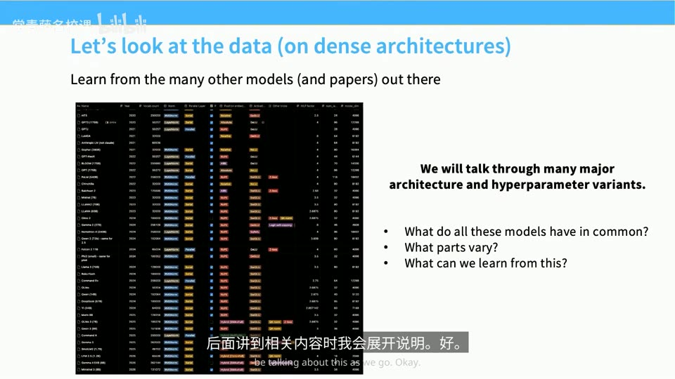

---

## 二、归一化应移出残差流——pre-norm 是现代模型的普遍共识

### 2.1 残差流：贯穿网络的一条"主干道"

Transformer 里有一条贯穿整个网络的"主干道"，叫**残差流（residual stream）**，记作 `x`。每个组件（注意力 Attention、前馈层 MLP）先算出一个"增量"，再**加回**到这条主干道上。有了这条通道，梯度在反向传播时就能顺着它顺畅地回溯，网络才容易训练。

### 2.2 原始 Transformer 的"唯一错误"：把 LayerNorm 放进了残差流

原始 Transformer 论文在每个组件的**末尾、残差流内部**放一个 LayerNorm，这叫 **post-norm**。讲者说：很多人认为 Transformer 团队几乎什么都做对了，**唯独这一点做错了**——LayerNorm 的位置。[【跳转到 06:17】](https://www.bilibili.com/video/BV11LEA6eEuj/?p=3&t=377)

现代主流做法是把归一化**移到残差流外面、在每个组件计算之前**，这叫 **pre-norm**（前置归一化）。它可以放在多头注意力之前，也可以放在 FFN 之前。几乎所有现代语言模型都这么做。罕见的例外是 **OPT-350M**：它在残差流里仍用 post-norm，讲者调侃 OPT 系列整体比较"乱"，不明白为什么单单这个模型这样处理。[【跳转到 07:07】](https://www.bilibili.com/video/BV11LEA6eEuj/?p=3&t=427)


### 2.3 为什么 pre-norm 更好：最初动机是"想去掉预热"

这项研究的**最初动机**是想解决一个问题：训练 Transformer 通常要做**学习率预热（warmup）**（开始时用很小的学习率，再逐步升高）。有人想"如果能把预热去掉就好了"。但很快发现，去掉预热会带来严重的稳定性与收敛问题：用原始的 post-norm，收敛效果明显更差；而换成 pre-norm，即使不做预热也能获得好得多的收敛。[【跳转到 07:32】](https://www.bilibili.com/video/BV11LEA6eEuj/?p=3&t=452)

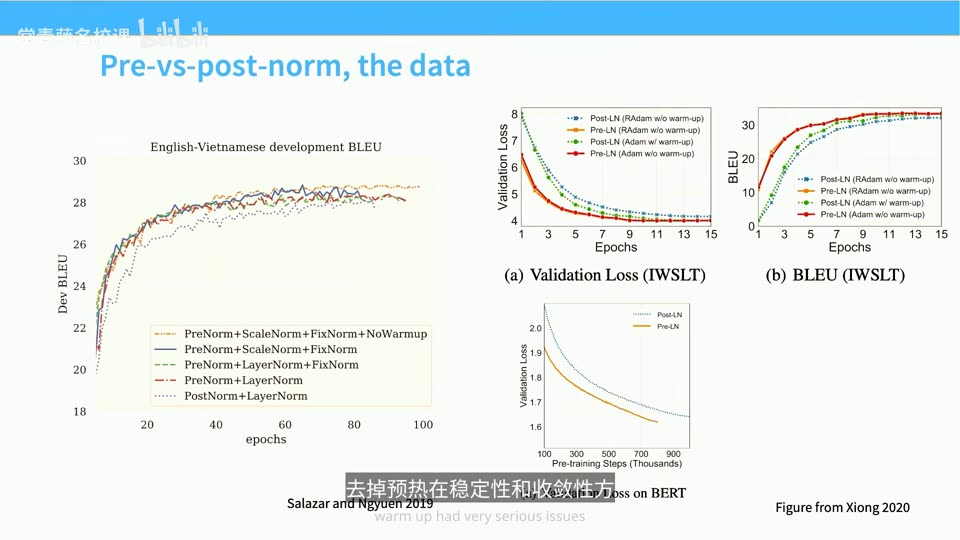

### 2.4 更本质的原因：让残差流保持"干净"

真正让人信服的理由是两条：

- **梯度直通**：pre-norm 下 `x` 从底部进入，一路直通到顶部、直达最终输出。反向传播时梯度可以沿着这条"直路"直接回传，于是无论网络多深，**梯度的规模基本保持不变**。
- **避免梯度尖峰**：post-norm 每经过一个 Transformer 模块都要做一次 LayerNorm，会不断改变梯度的范数，容易产生**梯度尖峰**。研究表明 pre-norm 下梯度尖峰的幅度和频率都有改善。

讲者引用了最早仔细研究这一现象的工作（幻灯片标注为"SAZR 等"），并总结：**"保持残差流干净"**是架构设计的一条核心直觉，这也解释了为什么"把 LayerNorm 移出残差流"基本被所有人采纳。[【跳转到 09:00】](https://www.bilibili.com/video/BV11LEA6eEuj/?p=3&t=540)

### 2.5 变体：放到计算之后、"到处加 norm"

- 也有模型把归一化放在**计算之后**（但仍在残差流之外），例如一些近期模型。
- 还有一条诚实到有点"荒谬"的经验：**遇到稳定性问题，就在各处多加一些 LayerNorm**（比如往注意力里也塞一个），通常真的有用。有时你会看到"double norm"（同处用两个 LayerNorm）。[【跳转到 10:18】](https://www.bilibili.com/video/BV11LEA6eEuj/?p=3&t=618)

---

## 三、RMSNorm 取代 LayerNorm，并顺手去掉偏置项

### 3.1 RMSNorm：不减均值、不加偏置

原始的 **LayerNorm** 会：减去均值、除以方差、再缩放回来（并且带一个偏置项）。这完全没问题——很多模型都成功这样训练过。

而现代模型基本都换成了 **RMSNorm（均方根归一化）**：它**不减均值、也不加偏置**，只做一次按"均方根"的缩放。数学上 LayerNorm 的表达能力其实**更强**，所以从纯表达能力角度看，并没有非用 RMSNorm 不可的理由；但在实践中 **RMSNorm 的建模效果和 LayerNorm 一样好，却运行更快**。[【跳转到 11:32】](https://www.bilibili.com/video/BV11LEA6eEuj/?p=3&t=692)

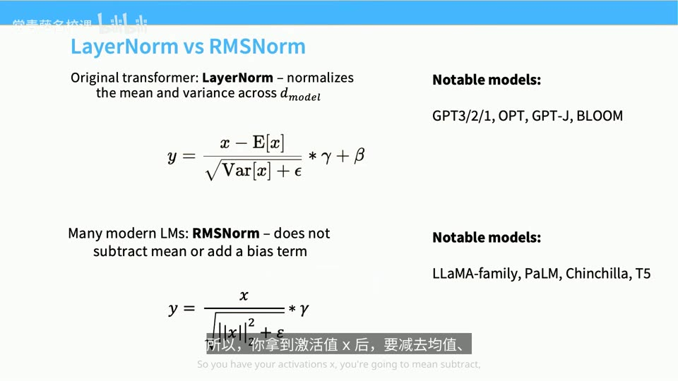

### 3.2 为什么更快：算术强度与"系统/架构协同设计"

这里涉及到"**系统和架构的协同设计**"（上一讲提过**算术强度**这个概念）。算术强度可以粗略理解为"做计算的时间 vs 搬数据的时间"：

- 我们要让 GPU 保持"高负载"，方法是做**矩阵乘法**这类高强度的计算；
- 像 LayerNorm 这样的**统计归一化操作算术强度极低**——它需要大量**内存搬运**，却只有很少的计算，是"吃内存"的操作。

LayerNorm 只占系统浮点运算量（FLOPs）的约 **0.17%**，但关键不在 FLOPs 占比，而在**运行时间**：根据工作负载和具体设置，它可能占到运行时间的很大比例（讲者提到小型模型上甚至约 25%）。所以去掉"减均值 / 加偏置"这部分，是几乎**零成本的优化**。有 Google 论文显示，切换到 RMSNorm 后，即使参数量不变，性能也有所提升，等于"白赚"一个系统优化。[【跳转到 12:05】](https://www.bilibili.com/video/BV11LEA6eEuj/?p=3&t=725)、[【跳转到 13:31】](https://www.bilibili.com/video/BV11LEA6eEuj/?p=3&t=811)

### 3.3 顺便去掉偏置项

同理，线性层原本带的 **偏置（bias）** 也是"低算术强度、相对更吃内存"的操作，所以大多数实现直接把偏置完全去掉。有时偏置还会引发不稳定。讲者说，去掉它的主要理由其实就是**让系统更简单**——这也是一个免费的系统优化。[【跳转到 14:53】](https://www.bilibili.com/video/BV11LEA6eEuj/?p=3&t=893)

### 3.4 注意：这些"能不能去"无法事前推理

这里最重要的一课是：我们**事前并不知道**"去掉偏置项"是可行的。但基于大量实验及集体积累的知识，我们大致知道——对于典型的语言建模任务，在线性层和 RMSNorm 上去掉偏置项是可行的。这一点必须靠实验和观察得出结论。

---

## 四、激活函数的关键是"门控线性单元（GLU）"

激活函数的名字很多：ReLU、softmax、GELU、Swish、GLU、SwiGLU……听起来吓人，但其实有一条清晰的主线。你**用最朴素的激活函数就能训练语言模型**：比如 Chinchilla 就用了较朴素的激活并表现很好；GPT-2/GPT-3 用的是 **GELU**（高斯误差线性单元），它和 ReLU 的区别只是零点附近有一个微小的凹陷，基本不影响大部分激活区间。而**真正的主流是门控线性单元（GLU, Gated Linear Unit）**——几乎所有靠谱的现代语言模型都用某种 GLU。[【跳转到 16:33】](https://www.bilibili.com/video/BV11LEA6eEuj/?p=3&t=993)

### 4.1 GLU 的结构：给激活加一道"门"

普通前馈层（FFN）是：`x → W1 → 激活 → W2`。**GLU 的想法**是再引入一个"**门**"矩阵 `V`，用它算出的结果**逐元素乘**到激活输出上：

```text
普通 FFN:   W2 · act(W1 · x)
GLU:        W2 · ( act(W1 · x) ⊙ (V · x) )
```

其中 `⊙` 是逐元素相乘。"门"可以**动态调节**信号强弱——这是一条很通用的有效技巧，讲者称之为架构设计里非常有效的"原语（primitive）"。[【跳转到 18:06】](https://www.bilibili.com/video/BV11LEA6eEuj/?p=3&t=1086)

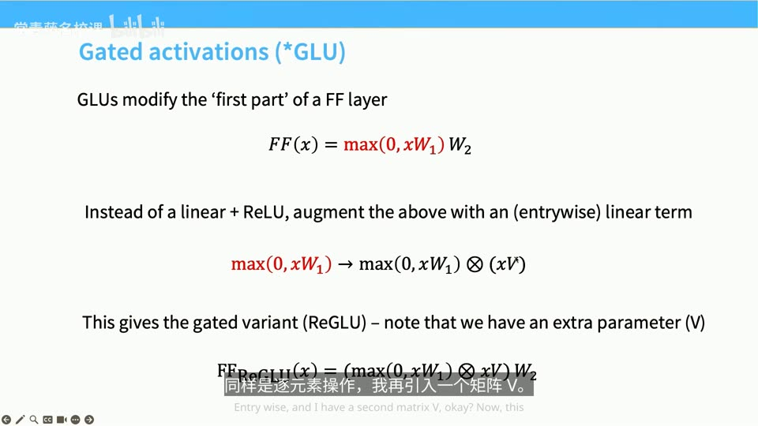

### 4.2 两个主流变体：GeGLU 与 SwiGLU

- **GeGLU**：激活用 GELU，Google / T5 / Gemma 系常用；
- **SwiGLU**：激活用 Swish（即 `x × sigmoid(x)`），LLaMA、PaLM 的后代几乎都用它。

讲者说 SwiGLU 大概是更主流的一个，但两者其实**差别不大**。[【跳转到 19:30】](https://www.bilibili.com/video/BV11LEA6eEuj/?p=3&t=1170)

### 4.3 关键冷知识：为了参数量对齐，前馈维度要缩到 2/3

引入门矩阵 `V` 后，前馈层从 2 个矩阵变成 3 个矩阵，参数量变多。为了**保持总参数量不变**，通常会把**前馈维度缩小到原来的约 2/3**。Shazeer 那篇著名的 GLU 变体论文做了参数对齐的对比，结论是 **GLU 变体几乎总是一致地更好**；Google 2020 年的大规模对比（Narang 等人，用 T5 架构）也支持这一点。[【跳转到 20:27】](https://www.bilibili.com/video/BV11LEA6eEuj/?p=3&t=1227)

### 4.4 例外与结论

当然也有例外：GPT-3 没用 GLU；有模型用了"平方 ReLU"这种看似"疯狂"的选择也照样能跑。但**很少见到完全不用门控的模型**。证据一致表明：使用门控技巧能带来几乎不增加计算成本的性能增益。[【跳转到 21:41】](https://www.bilibili.com/video/BV11LEA6eEuj/?p=3&t=1301)

---

## 五、并行块曾短暂流行，如今已被串行块取代

### 5.1 串行块是默认，并行块是"系统优化"尝试

默认的 Transformer 块是**串行**的：先算注意力，再算 MLP，一个接一个。从系统角度看这像是一个瓶颈——"必须等前一个算完才能算下一个"。于是有人提出：能不能把注意力与 MLP **并行计算**，再把两者的输出相加后一起加回残差流？

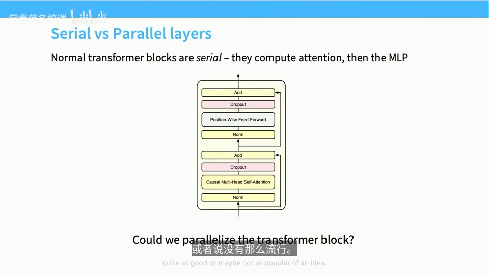

**并行块**最早出现在 **GPT-J**（一个 GPT-3 的开源复现）。好处是很多组件可以复用：LayerNorm 可以共享、矩阵乘法可以融合，从而有机会做进一步的系统优化。PaLM 报告里就采用了这种描述。Cohere（其创始人之一是 Transformer 作者之一）受 Google 影响也采用了这套架构。[【跳转到 22:51】](https://www.bilibili.com/video/BV11LEA6eEuj/?p=3&t=1371)

### 5.2 为什么现在不流行了：等于把深度减半

过去两年这种方法**不再流行**，主要原因是：

- **串行形式的优化已经做得足够好**了；
- 并行"相当于把模型深度减半"，会损失表达能力，**为了这点系统收益不划算**。

当年 PaLM 论文宣称并行"没有性能下降、系统利用率还提升了 15%"，只看那篇论文你会觉得效果一样好。但后来 Google 的许多模型也不再采用它——讲者认为这本身就是一个"其实有代价"的隐含信号（不过据他所知，没有人做过控制良好的"并行 vs 串行"消融实验）。[【跳转到 24:06】](https://www.bilibili.com/video/BV11LEA6eEuj/?p=3&t=1446)

---

## 六、RoPE 用"旋转"编码相对位置，成为 2024 年后的主流

### 6.1 注意力天生不知道位置

**注意力机制本质只是内积运算，它天生"位置无关"**：把一组词任意打乱，注意力的结果不变。所以必须**显式地给模型注入位置信息**。历史上出现过三类做法：

- 原始 Transformer：**正弦 / 余弦**位置编码（类似傅里叶变换的直觉）；
- 很多模型：**绝对位置嵌入**（每个位置对应一个独立的嵌入向量）；
- Google 系（T5、Chinchilla）：**相对位置嵌入**（把"两个位置相差多远"加到注意力矩阵里，而不是加到 K/Q 向量上）。


### 6.2 RoPE 的核心思想

**RoPE（旋转位置编码，Rotary Position Embedding）** 是 2024 年后绝大多数模型的选择。它的来历很有意思：据说最早源于 GPT-J，由一位研究员在一篇不太知名的博客与配套论文中提出，思想相当漂亮。它属于**相对位置嵌入**——我们希望"两个词的内积"只依赖于它们的**相对距离**，而与绝对位置无关。

关键几何事实是：**内积对"旋转"是不变的**。思路如下：

- 取用与位置无关的"语义词向量"作为起点；
- 根据词出现的位置，对这些向量**旋转一个角度**（位置 0 不转，位置 1 转一个单位角度，位置 2 转两个单位……）；
- 这样一来，两个词之间的**相对角度差只取决于它们的距离**，无论它们出现在句首还是句尾，内积结果都一致。

高维怎么办？最简单的办法是**把向量每两个分量分成一组**，每组用**不同的旋转频率**去旋转：低频旋转慢、能捕捉长程依赖；高频旋转快、能捕捉"是否相邻"这类短程信息。[【跳转到 27:04】](https://www.bilibili.com/video/BV11LEA6eEuj/?p=3&t=1624)、[【跳转到 28:19】](https://www.bilibili.com/video/BV11LEA6eEuj/?p=3&t=1699)

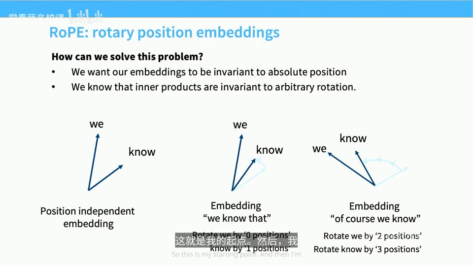

### 6.3 怎么实现，以及与正弦嵌入的区别

实现上：用正弦、余弦生成与"位置 id"对应的角度，**对查询（Q）和键（K）施加旋转**，再进入注意力计算，即 `X · W · R(X)`（R 是旋转矩阵）。位置信息是在**注意力计算时**注入的，而不是加在最底层的词嵌入上。这一点非常重要：正弦/余弦嵌入会产生"位置与词之间的奇怪交叉项"，从而泄露绝对位置；而 RoPE 用**相乘**的方式（而非当作嵌入相加），天然没有交叉项、**完全是相对的**。[【跳转到 31:13】](https://www.bilibili.com/video/BV11LEA6eEuj/?p=3&t=1873)

### 6.4 几个延伸讨论

- **为什么相对位置嵌入"不算真正的嵌入"**：像 T5 那类相对位置做法是**直接加到注意力矩阵**上，你没法从中拆出"内积结构"。若要严格满足"内积只依赖相对距离"且能分解成 `f(x_i)·f(y_j)` 的形式，RoPE 是自然浮现的解法。
- **部分旋转（partial RoPE）**：只旋转一部分（例如前两个）坐标也能用。直觉是低频成分旋转幅度小，在极小模型里显存紧张时可以省掉。
- **其他方案**：像 ALiBi 这类直接注入注意力矩阵的方法也相当有效，但并非当前主流。

[【跳转到 29:54】](https://www.bilibili.com/video/BV11LEA6eEuj/?p=3&t=1794)、[【跳转到 35:12】](https://www.bilibili.com/video/BV11LEA6eEuj/?p=3&t=2112)

---

## 七、超参数大多有很宽的安全区，真正主导效果的是算力

只有当你真正要"实例化"一个模型时，才会开始琢磨这些底层细节：前馈层多大？注意力头多少？词表多大？权重衰减和 dropout 设多少？需不需要正则化？这些看似吓人，但**人们实际尝试过的方案空间其实相当小**，每个关键超参数都有一片"安全区"。

### 7.1 前馈层比率（FFN ratio）：默认 4 倍，GLU 时缩到约 2.67

前馈层大小指 MLP 中第一次矩阵乘法的输出维度与模型隐藏维度之间的比例，它控制 MLP 的"丰富程度"：

- **朴素经验值约为 4 倍**（隐藏维度的 4 倍），效果出奇地好；
- 用 GLU 时多了一个矩阵，为保持总参数不变，缩到约 **2/3**，于是落到约 **2.67**；
- **LLaMA-2** 团队觉得自己的注意力头（MQA）很高效，就随手把比例乘了约 1.33，得到约 **3.5**，更侧重 MLP 一些；
- 非门控模型则是 **4**。


**激进的例外**：Google 的 **T5** 决定不遵循"4 倍"经验法则，而用了高达约 **64 倍**的乘数。他们的系统论证是"矩阵乘法做得越大，硬件利用率越高"。这确实是个惊人的例外。但有趣的是，T5 的后续改进版本又回归了标准做法——这本身说明激进选择在计算效率上可能很低。Kaplan 等人 2020 年的缩放定律论文做了一个扫描实验，发现存在一个"**盆地**"：从约 1 到约 10，损失对具体取值**不敏感**；只有完全选错（比如超过 10~100）损失才会急剧上升。所以 2.67、3.5、4 这些选择其实都落在安全盆地内。[【跳转到 38:54】](https://www.bilibili.com/video/BV11LEA6eEuj/?p=3&t=2334)、[【跳转到 40:34】](https://www.bilibili.com/video/BV11LEA6eEuj/?p=3&t=2434)

### 7.2 头维度（head dim）：让 d_head × 头数 ≈ 模型维度

标准做法是：如果你有多个注意力头，确保**头维度 × 头数 ≈ 模型维度**（即 `d_head ≈ d_model / H`），比例大致在 **1 附近**。这只是一条经验法则，并非必须，但大多数模型都遵循它，而且效果不错。它同样是个**容错率很高**的超参数，消融实验显示 1 附近有很宽的缓冲区间（显著例外是 T5）。[【跳转到 41:24】](https://www.bilibili.com/video/BV11LEA6eEuj/?p=3&t=2484)

### 7.3 纵横比（aspect ratio）：d_model / 层数 ≈ 100

**纵横比**指模型的"宽度 / 深度"。放大模型时，大家通常**固定一个纵横比**整体放大，所以它决定了"深度与宽度"的权衡：

- **越深**：表达能力可能越强，但从系统层面很难处理——沿深度切分层需要"**流水线并行**（pipeline parallelism）"，这是大多数人极力避免的；
- **越宽**：更容易并行（"**张量并行**（tensor parallelism）"），系统层面友好得多。

系统原因把大家推向了"宽"的方向，最终结果大致落在 `d_model / 层数 ≈ 100`（GPT-3、LLaMA 等都符合）。Kaplan 等人的扫描也显示不同规模模型的最佳纵横比都接近 100。另有研究比较各种深度/宽度权衡后总结：**真正主导效果的是 FLOPs（总计算量）**——计算量越大性能越好——而不一定是纵横比。[【跳转到 43:38】](https://www.bilibili.com/video/BV11LEA6eEuj/?p=3&t=2618)、[【跳转到 45:13】](https://www.bilibili.com/video/BV11LEA6eEuj/?p=3&t=2713)

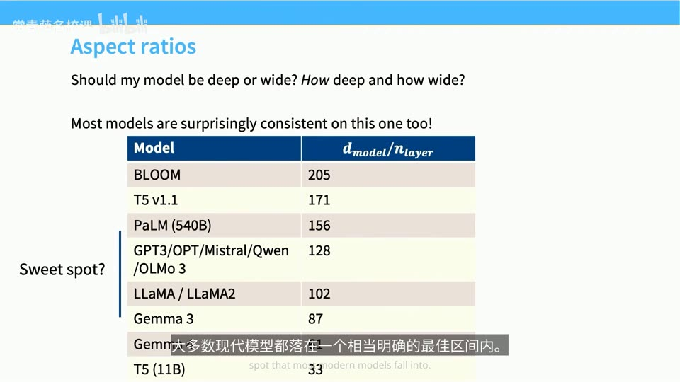

### 7.4 词表大小：单语约 3 万，多语 / 生产级 10 万~20 万

词表大小上有很明显的两类分野：

- **单语模型**（只做英语）：词表较小，约 **3 万**；
- **多语 / 生产级模型**（LLaMA 衍生、GPT-4 类前沿模型）：词表大得多，约 **10 万~20 万** token，Google 模型的词表往往更大。

多语模型确实需要更大的词表来覆盖整个语言空间；同时已有的缩放定律表明**模型越大，能容纳的词表也越大**，所以这也部分受现代模型规模趋势的影响。现在几乎没人再训练"大型单语预训练模型"了。[【跳转到 45:52】](https://www.bilibili.com/video/BV11LEA6eEuj/?p=3&t=2752)、[【跳转到 46:25】](https://www.bilibili.com/video/BV11LEA6eEuj/?p=3&t=2785)


### 7.5 附带讨论：不同分词器能公平比较吗？

只要**不改动序列**（现代分词器是"完整"的，能建模任意序列），并用**字节数归一化**（即用 **bits-per-byte，BPB** 衡量），比较就是有效的。困惑度（perplexity）与 bits-per-byte 互为对偶，在可比条件下可以互相换算，但要注意你改变的到底是哪个变量。[【跳转到 48:30】](https://www.bilibili.com/video/BV11LEA6eEuj/?p=3&t=2910)

---

## 八、正则化反直觉——单遍训练几乎不过拟合，weight decay 更像优化技巧

### 8.1 标准论证：语言模型根本不过拟合

按机器学习的常规直觉，为了防过拟合，你会用 **dropout** 或 **权重衰减（weight decay）**。但语言模型的处境恰恰**相反**：

- 语言模型是"**算力受限**"的：数据量远超你能处理的算力（即使在 Google，互联网数据量也超过可用 FLOPs）；
- 因此你通常**只会把语料遍历一遍**（single epoch），根本不会看到同一份数据两次；
- 而单遍 SGD 有充分理由被认为"记不住"数据——也就是说，**过拟合几乎从来不是问题**。

既然不过拟合，理论上**完全可以不用正则化**。实验也支持这一点：加不同强度的 weight decay，训练损失与验证损失几乎**没有差别**（因为本来就没过拟合，训练损失与验证损失基本重合在一条线上）。

### 8.2 那为什么现代模型还在用 weight decay？

研究发现：**weight decay 往往不是在防过拟合，而是在与优化器、学习率衰减相互作用**，让优化更容易收敛到更好的极小值——它更像是一种**优化技巧**，而不是正则化。具体来说，当你把它与"学习率衰减"结合时，较强的权重衰减虽然起步慢，但最终能收敛到更好的解。而在固定学习率下，这种好处不一定成立。

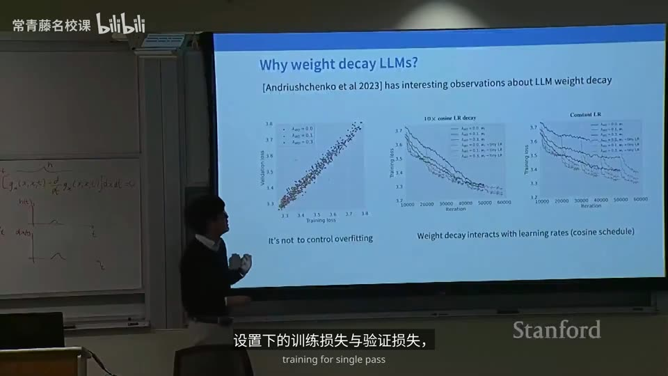

### 8.3 dropout 与 weight decay 的取舍

讲者认为人们**基本不再用 dropout 了**，因为它与优化过程配合得并不好；而 weight decay 这种"向零收缩"的方法，可能让你能用更高的学习率、或衰减得更快。这些术语之间有很多相互关联的地方。

**教训**：这些因素的相互作用很奇怪，**很难凭空推断，必须动手实验**。这也正是这门课强调"从零构建、亲自跑"的原因。[【跳转到 49:55】](https://www.bilibili.com/video/BV11LEA6eEuj/?p=3&t=2995)、[【跳转到 51:44】](https://www.bilibili.com/video/BV11LEA6eEuj/?p=3&t=3104)

### 8.4 超参数总结

- 前馈层比率用 **4 倍**（GLU 时约 2.67）；
- **头维度 × 头数 ≈ 模型维度**；
- 纵横比 `d_model / 层数 ≈ 100`；
- 正则化：可尝试，但要知道它与优化器的相互作用**相当反直觉**，很多模型即使不需要也在沿用。

[【跳转到 52:49】](https://www.bilibili.com/video/BV11LEA6eEuj/?p=3&t=3169)

---

## 九、训练稳定性是核心问题，危险区几乎都在 softmax

### 9.1 模型越贵，越不能崩

随着训练成本越来越高，"**不崩**"变得日益重要。如果模型训练到一半突然出现难看的**尖峰（loss spike）**、梯度范数很大，最后得到的模型可能已经坏掉、再也恢复不了——你可能在训练上花了数百万美元，却到无法继续的地步。而我们希望超参数、batch 大小、正则化这些选择是"**容错**"的：调一调不会带来显著差异，那没问题；真正致命的是稳定性崩塌。[【跳转到 54:15】](https://www.bilibili.com/video/BV11LEA6eEuj/?p=3&t=3255)

### 9.2 softmax 是危险区

语言模型里的 **softmax** 有两个特性会严重影响稳定性：

1. **指数运算**：非常容易爆炸；
2. **除法**：也是潜在的数值危险操作。

而语言模型里恰好有**两处 softmax**：一处**在输出端**（输出概率分布时），一处**在注意力机制内部**（对注意力打分做归一化时）。这两处就是模型的"危险区"。[【跳转到 55:18】](https://www.bilibili.com/video/BV11LEA6eEuj/?p=3&t=3318)

### 9.3 输出端 softmax 与 z-loss

输出端要算对数概率：`log p = u − logZ`，其中 `u` 是模型输出（通常还算稳定），但 `logZ` 是**指数项的对数和**——它可能爆炸，也可能趋于 0，两种情况都很糟。

解决办法很巧妙：softmax 是"**过参数化**"的——**给所有 logits 加同一个常数，不会改变 softmax 的输出**（常数会在归一化因子与输出之间相互抵消）。所以我们可以**加一个惩罚项 `logZ²`**，惩罚 `logZ` 偏离 0。这招叫 **z-loss**（最早来自 Devlin 等 2014 年的工作），后来通过许多开源模型（如 BLOOM、OLMo）流行起来，DeepSeek 等模型也用这个技巧来稳定输出 softmax。它**出乎意料地有效**。[【跳转到 56:16】](https://www.bilibili.com/video/BV11LEA6eEuj/?p=3&t=3376)、[【跳转到 57:23】](https://www.bilibili.com/video/BV11LEA6eEuj/?p=3&t=3443)


### 9.4 注意力里的 softmax 与 QK-norm

注意力里的危险在于：`Q·K` 相乘后进入 softmax，logits 可能过大。一个高层面原则是："**遇到不稳定，就在里面加一个 LayerNorm**"。这正是 **QK-norm** 的设计理念：

- **做法**：在 `Q·K` 相乘**之前**，先对 Q 和 K 各做一次 **RMSNorm**；
- **效果**：这样送进 softmax 的数值**尺度始终大致为 1**，softmax 就稳定了。

QK-norm 最初源自**多模态**领域（ViT 类的论文、Chameleon 等模型），后来被大量开源语言模型发现**完全适用于稳定注意力**。它似乎并不明显影响性能，却**能有效防止注意力退化（attention entropy collapse）**。现在 QK-norm 已成为一种非常标准的干预手段，大多数大模型都引入了它。[【跳转到 57:48】](https://www.bilibili.com/video/BV11LEA6eEuj/?p=3&t=3468)、[【跳转到 58:38】](https://www.bilibili.com/video/BV11LEA6eEuj/?p=3&t=3518)

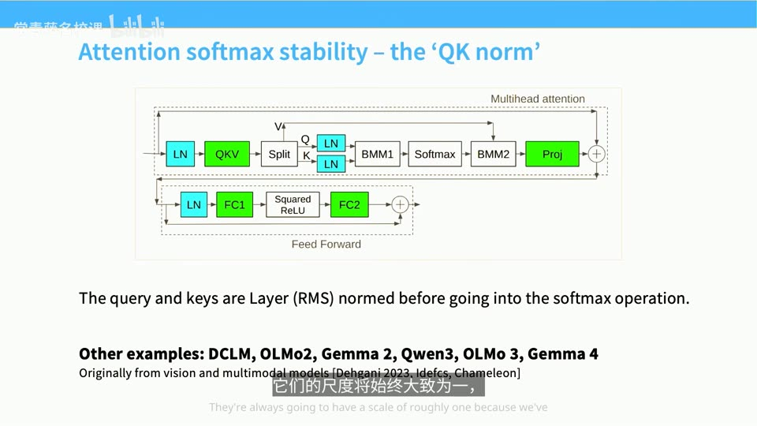

### 9.5 logit soft-cap：更强硬的做法

如果连输入都不想赌，可以直接对进入 softmax 的 **logits 做"软截断（soft cap）"**——用 `tanh` 把 logits 压在一个有界范围内，让它们永远不会太大或太小。这几乎是一种"硬约束"（虽然叫 soft-cap，但 tanh 本身就是有界的）。Gemma 系列（2/3 等）就用了这个技巧：把注意力层的所有 logits 做一次 tanh 有界压缩。

NVIDIA 的研究者对各种稳定性干预手段做过系统性比较，发现：**QK-norm 表现略好**（还能把学习率调高一些）；而**仅做 soft-cap 反而会导致性能下降**——因为它是一种非常强的干预，一旦超过某个点，softmax 就**无法表达"非常确定的信号"**了。不过它仍是一种**非常安全**地稳定"进入 softmax 的 logits"的方式。[【跳转到 59:53】](https://www.bilibili.com/video/BV11LEA6eEuj/?p=3&t=3593)、[【跳转到 60:18】](https://www.bilibili.com/video/BV11LEA6eEuj/?p=3&t=3618)、[【跳转到 60:43】](https://www.bilibili.com/video/BV11LEA6eEuj/?p=3&t=3643)

### 9.6 稳定性的演进路径

一条清晰的脉络是：最初用 pre-norm 中的 LayerNorm，后来把 LayerNorm 加到每个模块的"非线性激活之后"，现在又把它用到 Q 和 K 上（QK-norm）——**这就是人们应对稳定性问题的核心工具箱**。

---

## 十、部署时代的两大注意力改造——GQA 与滑动窗口注意力

### 10.1 部署要花两种钱，解码阶段尤其吃亏

本讲只讨论针对"**密集全注意力（dense all-by-all attention）**"的优化，状态空间模型（SSM）与线性时间注意力留到下一讲。把训练好的模型服务给用户时，你要为两样东西付费：**FLOPs（计算量）**和**内存访问**（它影响延迟与利用率），两者都希望越小越好。

- **预填充（prefill）**：一次性把整段提示喂进去，总 FLOPs 量级约为 `batch × seq_len × D²`，内存访问约为 `batch × seq_len × D`，**算术强度高**，GPU 利用率好。
- **解码（decode）**：逐个生成 token，是自回归的固有局限——必须把过去所有 K、V 存起来，即 **KV cache**。每生成一个新 token 都要**重新读取一遍参数**，内存访问模式变得很差，**算术强度极低、内存受限**，序列越长越糟（甚至需要大批量 + 短序列，或极大的隐藏维度才能改善）。小模型的高效部署因此相当棘手。

[【跳转到 62:23】](https://www.bilibili.com/video/BV11LEA6eEuj/?p=3&t=3743)、[【跳转到 65:35】](https://www.bilibili.com/video/BV11LEA6eEuj/?p=3&t=3935)

### 10.2 MQA 与 GQA：把 K/V 共享起来

既然瓶颈在 KV cache 的内存访问，核心思路就是**减小 KV cache**：

- **MQA（多查询注意力，Multi-Query Attention）**：让**所有头共享同一组 K、V**，只保留各自的 Q。KV cache 大幅变小，算术强度显著提升；但**表达力明显下降**（所有 query 共用一个 key/value）。
- **GQA（分组查询注意力，Grouped Query Attention）**：折中方案——把 K、V **分组共享**，保留 Q 头的总数 H，用"K/V 头数"这个**可调比例**来在**表达力与推理效率**之间滑动。

实验（T5 时期）显示：MHA 性能最好但服务成本最高；MQA 成本低但性能明显下降；而 **GQA 兼顾两者**——只要小幅减少 K/V 头数，就能保留绝大部分性能，同时大幅降低推理成本。这解释了为什么**现在的模型几乎都采用 GQA**。DeepSeek-V2 还有一些不同的分解结构（如多头潜在注意力 MLA），留待下一讲。[【跳转到 66:18】](https://www.bilibili.com/video/BV11LEA6eEuj/?p=3&t=3978)、[【跳转到 67:33】](https://www.bilibili.com/video/BV11LEA6eEuj/?p=3&t=4053)

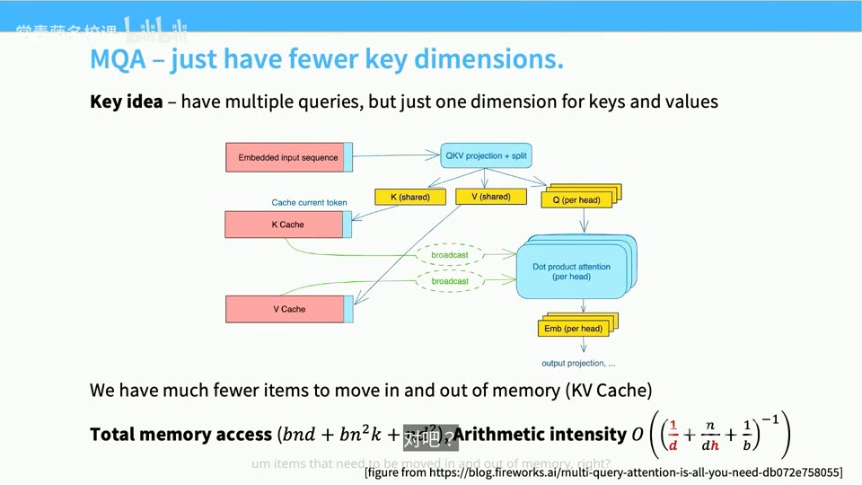

### 10.3 滑动窗口（混合）注意力：局部与全局交替

长上下文的成本很高，于是出现"**混合**"思路：**不是每一层都做全局注意力**，而是"**每隔几层用一次全注意力，其余层只看局部窗口**"。滑动窗口注意力的思想很早就有了（Longformer 提出、BERT 就用过全注意力与带状注意力交替；OpenAI 也有早期工作），但**过去一年真正流行起来**。

典型结构（以 Cohere 的 Command 系列为例）：**每四层里有一层 full attention（关注所有位置），中间三层用 sliding window attention（只看局部）**。随着层级向上推进，**局部信息逐层聚合为全局信息**。这样能控制超长上下文的成本，又不必采用状态空间模型这类"更花哨"的方案，效果相当不错。[【跳转到 71:09】](https://www.bilibili.com/video/BV11LEA6eEuj/?p=3&t=4269)、[【跳转到 71:43】](https://www.bilibili.com/video/BV11LEA6eEuj/?p=3&t=4303)

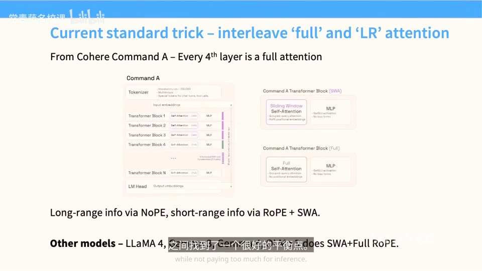

### 10.4 混合方案的更多变体与展望

一些模型（如 Llama 4 等）也采用"滑动窗口 + 全注意力"结合；还有模型（如某些开源 MoE/混合模型）交替使用**门控 DeltaNet 这类状态空间模型**与全注意力（大致每 4 层一层全注意力），用 SSM 替换局部窗口层。讲者指出：**如何平衡超长上下文与它的成本/性能，仍是当前架构最活跃的研究领域**，也是过去一年开源模型认真应对"长上下文"的新主题。到目前为止，效果最好的做法往往是这种"既不是纯全局、也不是纯廉价的**混合模型**"。[【跳转到 72:33】](https://www.bilibili.com/video/BV11LEA6eEuj/?p=3&t=4353)、[【跳转到 72:58】](https://www.bilibili.com/video/BV11LEA6eEuj/?p=3&t=4378)

---

## 小结

- **架构是"表达能力 × 训练稳定 × 系统效率"三方角力的产物**：很多设计不优雅，是被现实逼出来的；这些选择几乎无法靠纯推理得出，必须靠观察大量模型 + 亲自实验。
- **被广泛采纳的核心改动其实很少**：归一化移出残差流（pre-norm）、用 RMSNorm 并去掉偏置、用门控线性单元（GLU）、用 RoPE 做位置编码。
- **RMSNorm 与去偏置是"零成本的系统优化"**：归一化算术强度低、吃内存，去掉减均值/加偏置几乎不损失表达能力却更快。
- **激活函数的关键是"门控"**：SwiGLU / GeGLU 几乎总是一致更好，为对齐参数量把前馈维度缩到约 2/3。
- **串行块优于并行块**：并行块曾因系统优化短暂流行，但相当于把深度减半、损失表达，过去两年已被放弃。
- **超参数大多有很宽的安全区**：前馈层比率约 4（GLU 约 2.67）、头维度 × 头数 ≈ 模型维度、纵横比 ≈ 100、词表单语约 3 万 / 多语 10 万~20 万；真正主导效果的是**算力（FLOPs）**。
- **正则化很反直觉**：单遍训练几乎不过拟合，**weight decay 更像是优化手段**而非正则化；这些相互作用必须实验才能理解。
- **训练稳定的危险几乎都在 softmax**：输出端用 **z-loss** 惩罚 logZ 偏离 0；注意力里用 **QK-norm** 稳定 Q·K 的尺度；更强硬的手段是 **logit soft-cap**。
- **部署时代的两大改造**：**GQA** 通过共享 K/V 大幅降低推理成本而几乎不损性能；**滑动窗口 / 混合注意力**用"全局 + 局部"交替平衡长上下文性能与成本，是当前最活跃的方向。
- **正确姿态**：别指望纯推理，**从共识里找直觉、动手实验**。

## 关键术语速查

| 术语 | 一句话解释 |
| --- | --- |
| Transformer | 2017 年 Vaswani 等人提出的、当前几乎所有大语言模型的统一骨架。 |
| 残差流（residual stream） | 贯穿网络的"主干道" `x`，各组件把计算结果加回其上，方便梯度回传。 |
| pre-norm / post-norm | 归一化放在组件计算之前（现代主流）还是之后、残差流内部（原始做法）。 |
| 预热（warmup） | 训练初期从小学习率逐步升高的做法；pre-norm 的最初动机是想去掉它。 |
| LayerNorm / RMSNorm | 归一化方式；RMSNorm 不减均值、不加偏置，更快且效果相当。 |
| 偏置（bias） | 线性层里的加性项；低性价比、吃内存，常被去掉。 |
| 门控线性单元（GLU） | 给激活加一道"门"的 FFN 变体；SwiGLU / GeGLU 是其变体。 |
| SwiGLU / GeGLU | 用 Swish / GELU 作激活的 GLU；前者为 LLaMA/PaLM 系、后者为 T5/Gemma 系常用。 |
| 串行块 / 并行块 | Transformer 块内注意力与 MLP 是先后计算还是并排计算后相加。 |
| 位置编码 / RoPE | 给模型注入顺序信息；RoPE 用"按位置旋转向量"表示相对位置。 |
| 部分旋转（partial RoPE） | 只旋转一部分坐标的 RoPE 变体，用于极小模型省显存。 |
| 前馈层比率（FFN ratio） | MLP 中间维度 / 模型维度，通常约 4（GLU 时约 2.67，LLaMA-2 约 3.5）。 |
| 头维度（head dim） | 每个注意力头的向量维度，通常 d_head ≈ d_model / 头数。 |
| 纵横比（aspect ratio） | 模型宽度 / 深度；常见 d_model / 层数 ≈ 100。 |
| 词表大小 | 分词器的 token 数量；单语约 3 万，多语 / 生产 10 万~20 万。 |
| bits-per-byte（BPB） | 用字节数归一化的损失度量，可公平比较不同分词器。 |
| 权重衰减（weight decay） | 让参数向零收缩的手段；在 LLM 里更像优化技巧而非正则化。 |
| z-loss | 惩罚输出 softmax 的 logZ 偏离 0，提升数值稳定性。 |
| QK-norm | 在 Q·K 前对 Q、K 做 RMSNorm，稳定注意力 softmax、防止退化。 |
| logit soft-cap | 用 tanh 把进入 softmax 的 logits 软限制在范围内（Gemma 用）。 |
| 注意力退化（attention entropy collapse） | 注意力分布变得过于尖锐、失去表达能力的现象，QK-norm 可缓解。 |
| KV 缓存（KV cache） | 解码时复用历史 K、V，避免重复计算；是推理内存瓶颈所在。 |
| MQA / GQA | 通过共享 K、V 降低推理成本；GQA 是折中且几乎不损性能。 |
| MLA（多头潜在注意力） | DeepSeek-V2 提出的另一种降低 KV 开销的分解结构（下一讲）。 |
| 滑动窗口注意力 | 只关注固定局部窗口的注意力，常与全局注意力交替使用。 |

---

<!-- ===== Lecture 4 Attention Alternatives.md ===== -->

# Lecture 4: Attention Alternatives

## 本讲要解决的核心问题（SCQA）

**背景**：上一讲讲的是"基础 Transformer"——如何调整标准 Transformer 的各个部件来构建现代语言模型。这一讲进入更进阶的架构话题，主题是"在常规 Transformer 之上的新进展"。它要解决一个非常现实的需求：**大家都需要更长的上下文（context）**——把大量内容塞进上下文让模型拥有更多知识，或者让模型作为智能体（agent）处理很多信息。

**冲突**：看一张图就知道问题所在——横轴是不同模型、纵轴是上下文窗口大小（对数尺度），顶级模型厂商在竞相提供越来越大的上下文。可是成本怎么办？答案很残酷：**注意力是二次方的**。在序列较短时，网络的 feedforward（前馈）部分开销更大、且随长度线性增长；但注意力是所有位置之间的 all-to-all 连接，复杂度是 **O(N²)**。随着序列变长，**注意力会迅速超过 feedforward 成为主要开销**。[【跳转到 00:58】](https://www.bilibili.com/video/BV11LEA6eEuj/?p=4&t=58)


**疑问**：如果我们想处理十万、甚至上百万 token 的上下文，有没有办法让计算量随序列长度变成**线性依赖**？即便做不到完全线性，又有没有办法在不牺牲太多性能的前提下大幅降低成本？另外，Transformer 的另一半——MLP 层——有没有更高效的实现方式？

**回答（中心思想）**：**降低注意力成本有两条互补的路线。第一条是改造注意力模块本身：利用矩阵乘法的结合律，去掉 softmax 后把 QKᵀV 重新结合成 Q(KᵀV)，从而把对序列长度的依赖从二次降为线性（这就是线性注意力，它同时具备"密集并行"与"RNN 循环"两种形式）；在此基础上加门控得到 Mamba-2、再加投影擦除得到 Gated DeltaNet，最终以"线性层 + 少量全注意力层"的混合架构落地。第二条路线是改造 MLP：用混合专家（MoE）的稀疏路由，在 FLOPs 不变的前提下把参数量放大数倍。** 好消息是，这两条路线如今都已在大规模生产环境中得到验证。[【跳转到 04:01】](https://www.bilibili.com/video/BV11LEA6eEuj/?p=4&t=241)


注意：**常数因子其实至关重要**。受过传统理论训练的人容易只盯着 O 记号（线性还是二次），但对上下文与注意力成本影响最大的进展之一，恰恰是常数因子层面的系统改进——FlashAttention（详见之后的系统课程）。它把注意力运算重组成对系统更友好的形式、最小化内存搬运，能带来"真正惊人"的性能提升：原生 PyTorch 在短序列上大约每秒 30~40 TFLOPs，而 FlashAttention 能让性能翻倍，甚至在原生实现已经"塞不进内存"时仍能继续跑。[【跳转到 02:53】](https://www.bilibili.com/video/BV11LEA6eEuj/?p=4&t=173)

但要处理几十万、上百万 token，这些技巧就不够用了——我们需要在长上下文能力上获得更激进、更大幅度的提升。这就引出了"有没有办法对序列长度实现线性时间复杂度"的问题。[【跳转到 03:43】](https://www.bilibili.com/video/BV11LEA6eEuj/?p=4&t=223)

---

## 一、线性注意力的全部起点，是矩阵乘法的结合律

**一句话结论**：注意力之所以是二次的，是因为先算 QKᵀ 得到 N×N 的大矩阵；只要允许重新结合括号、先算 KᵀV，计算量就只依赖头维度而非序列长度。

### 1.1 注意力为什么是二次的
要理解所有"线性时间注意力"方案，只需先抓住一个核心思想：**乘法的结合律**。回顾注意力的紧凑写法——由 Q、K、V 组成：

1. 先让 Q 和 K 做 all-to-all 交互：计算 **QKᵀ**。这个矩阵的大小是 **N×N**，正是二次复杂度的来源（N 动辄数百万，也就是上下文长度）。
2. 用 softmax 对这一行做归一化。
3. 再和值 V 相乘，得到注意力输出。

### 1.2 结合律重排：先算 KᵀV，复杂度不再依赖序列长度
现在，先暂时"忘掉"softmax、把那一行去掉。**如果没有 softmax，我们就可以改变这个操作的复杂度。** 原本要做 QKᵀ 再乘 V，现在改成右结合——**先算 Kᵀ 与 V 相乘，再与 Q 相乘**。经过这种"重排序（括号移动）"后，二次的部分就消失了：我们不再需要 N² 项，取而代之的是依赖维度 **D、头维度 d_k 和 V 的 d_v**。理论上这些维度可以很大，但它们通常只在几千到几万的量级——**没人会在隐藏/头维度里设置百万级的坐标**。所以相比 N²，这一项的依赖关系"友好得多"。[【跳转到 04:26】](https://www.bilibili.com/video/BV11LEA6eEuj/?p=4&t=266) · [【跳转到 05:16】](https://www.bilibili.com/video/BV11LEA6eEuj/?p=4&t=316)

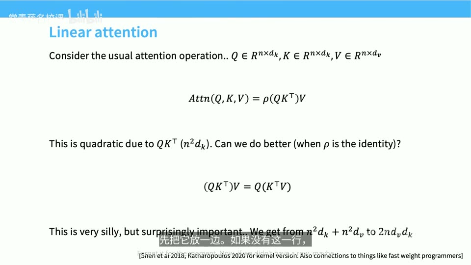

### 1.3 有损与无损的边界
课堂问答特别澄清了一个易混点：从 softmax 注意力到线性形式的这一步是**有损的**（我们丢掉了 softmax）；但从"线性形式"到下面要讲的"循环形式"的等价性是**精确无损的**。这很关键——它意味着"线性化"的代价只发生一次。[【跳转到 17:07】](https://www.bilibili.com/video/BV11LEA6eEuj/?p=4&t=1027)

---

## 二、线性注意力有"双重身份"——训练时用并行形式，推理时用 RNN 形式

**一句话结论**：KᵀV 可以写成一种 RNN 式的增量更新形式；于是同一套参数既能用密集并行矩阵乘法训练，又能用固定大小的状态做推理，兼得两者之长。

### 2.1 KᵀV 的 RNN 形式
重排之后，右侧那个矩阵乘法（令 **S = KᵀV**）看起来就像一个 **RNN**：不必写成"密集形式"，而是可以在从左到右遍历上下文时**增量地**书写——把 K 和 V 相乘、更新这个状态 S、累加到之前的状态上，再与 Q 相乘得到输出。数学家会说：这种"密集形式"与"RNN 形式"在某种意义上是**等价的**。[【跳转到 06:06】](https://www.bilibili.com/video/BV11LEA6eEuj/?p=4&t=366)

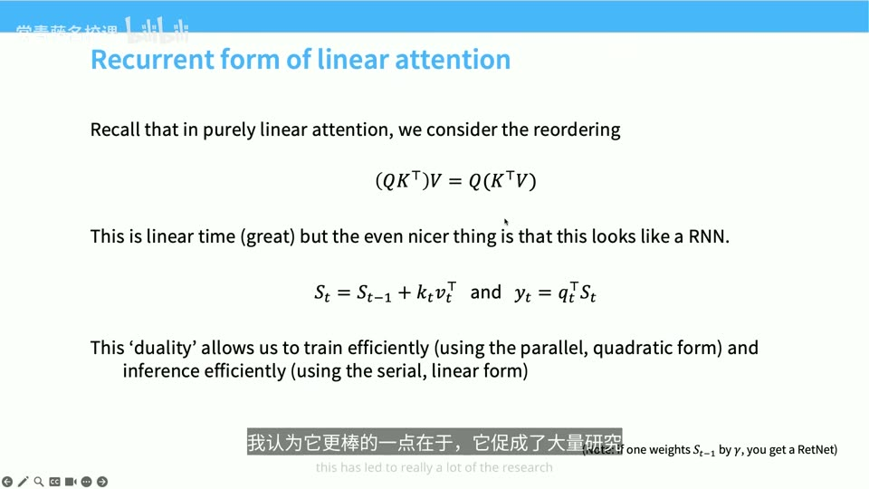

### 2.2 训练用并行、推理用串行
这样做的妙处在于：

- **RNN 的优点在推理**：你有一个大小**固定**的状态 S，不断把它向前传递。推理时代价与序列长度无关，非常理想。
- **线性注意力的优点在训练**：你可以用"密集（并行）形式"，它天生并行，对训练非常有利。

所以你可以**同时采用两种形式**：训练走并行、推理走串行，兼得两者之长。[【跳转到 06:56】](https://www.bilibili.com/video/BV11LEA6eEuj/?p=4&t=416)

### 2.3 现实中的混合架构
这种"基础线性注意力"已经足够实用。例如某大型中文开源模型采用了 **"7 比 1 的混合方案"**——7 个线性注意力层配 1 个完整的 softmax 注意力层——整体性能很有竞争力，而且对上下文长度的依赖大部分是准线性的。它并非完全线性（因为还穿插着 softmax 层），但这种依赖要温和得多。[【跳转到 07:46】](https://www.bilibili.com/video/BV11LEA6eEuj/?p=4&t=466)

**一个至今仍然重要的经验事实**：目前还没有人在大规模上真正验证"完全线性时间注意力"。本讲要讲的所有落地模型，都是**混合架构**——即线性层与不时穿插的二次注意力层搭配使用。[【跳转到 08:50】](https://www.bilibili.com/video/BV11LEA6eEuj/?p=4&t=530)

---

## 三、给线性注意力加门控得到 Mamba-2，再加"投影擦除"得到 Gated DeltaNet

**一句话结论**：Mamba-2 本质上是在线性注意力上加入一个输入相关的衰减门 γ，让状态能"遗忘"；Gated DeltaNet 再加第二个门 β 去投影擦除旧信息，两者都保持了并行/串行对偶性。

### 3.1 Mamba-2：给线性注意力加一道衰减门
**Mamba-2** 来自 Albert Gu 及其合作者提出的**状态空间模型（SSM）** 系列。虽然他们最初从状态空间理论推导，但审视其操作机制会发现：它实际上可以视为**线性注意力的一种简单扩展**。[【跳转到 09:13】](https://www.bilibili.com/video/BV11LEA6eEuj/?p=4&t=553)

它的核心观察是：线性注意力最大的问题是"它总是把状态一直往后传，从不遗忘"。而从早期 LSTM 时代我们就知道，关键在于**知道什么时候该把信息往后传、什么时候该把它忘掉**。于是 Mamba-2 加入一个**门控 γ（衰减因子）**：γ_t 本身没有状态，只取决于当前输入 x_t，用来"调节"有多少状态信息被传递到未来。因为 γ 完全不依赖状态，计算非常简单。它同样保留了"双重性"——既可作为大型稠密矩阵乘法，也可在推理时用循环形式。[【跳转到 09:38】](https://www.bilibili.com/video/BV11LEA6eEuj/?p=4&t=578)


### 3.2 门控只依赖输入，就能保持并行/串行对偶性
**一个可推广的经验法则**：只要你对 RNN 中的各项做门控，且门控只包含"依赖输入的项"、不依赖状态，那么你就能在"并行操作（训练）"和"串行操作（推理）"之间保持相当好的对偶关系。[【跳转到 11:25】](https://www.bilibili.com/video/BV11LEA6eEuj/?p=4&t=685)

### 3.3 Gated DeltaNet：第二个门与投影擦除
**Gated DeltaNet** 则借用了这个思路，并加入**第二个门控 β_t**：β_t 可以看作一个"是否写入状态"的门——如果 β 为零，就意味着"不要采用当前信息、不要把它加进状态"。这让人想起 LSTM：通过门控决定"是否遗忘""是否从当前时间步输入信息"，原则非常相似。[【跳转到 12:15】](https://www.bilibili.com/video/BV11LEA6eEuj/?p=4&t=735) · [【跳转到 13:05】](https://www.bilibili.com/video/BV11LEA6eEuj/?p=4&t=785)

更妙的是 Gated DeltaNet 的**更新方向**：它不只是"写入新信息"，还要**擦除之前已经写入的当前 key 方向上的信息**。数学上，更新形式里的 `(I − β_t k_t k_tᵀ)` 就是一个**投影器**——把状态中沿 k_t 方向的内容投影掉，再写入新的 k_t v_t。直观理解：为当前 key 写入信息时，先把它旧的内容擦除。[【跳转到 13:30】](https://www.bilibili.com/video/BV11LEA6eEuj/?p=4&t=810)

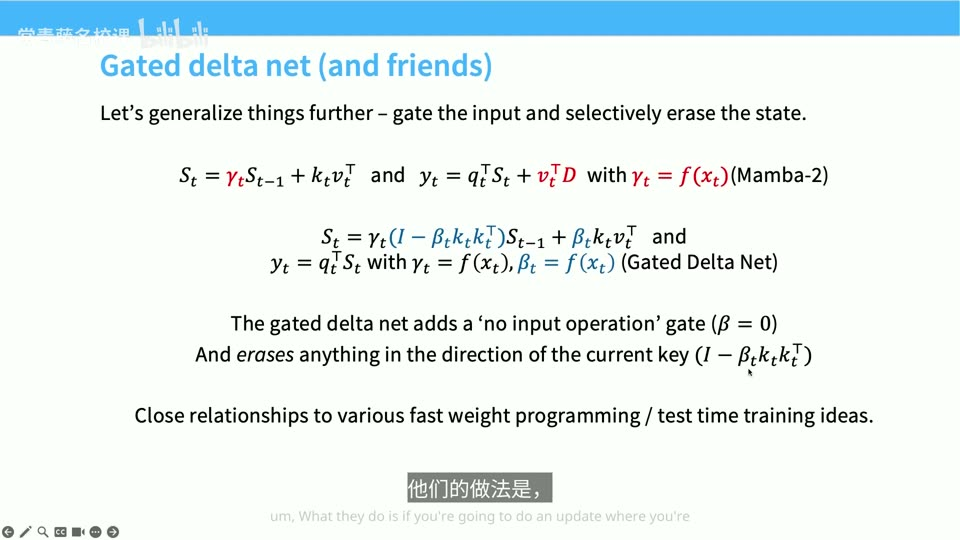

### 3.4 一个被反复重新发明的方法
有意思的是，Gated DeltaNet 在历史上被**反复重新发明**过：当人们试图解决某些"在线最小二乘"问题时，就会自然出现这种投影器；在"快速权重编程（fast weight programmers）"或"测试时训练（test-time training）"领域，研究人员基于完全不同的设计原则，最终得出了几乎相同的解决方案。[【跳转到 14:20】](https://www.bilibili.com/video/BV11LEA6eEuj/?p=4&t=860)

---

## 四、混合架构已成为主流——用少量全注意力层"兜底"，性能几乎无损

**一句话结论**：Qwen-Next 等先进开源模型正式采用"门控 DeltaNet + 全注意力"的 3:1 混合架构，随上下文变长解码吞吐远高于纯 Transformer，而性能几乎没有损失；但一旦线性层占比过高，性能会明显下降。

### 4.1 Qwen-Next 的 3:1 混合架构
**Qwen-Next（以及其后续版本）** 是目前最优秀的开源模型之一，正式采用了**"三比一的门控 DeltaNet-注意力混合架构"**。它的推理特性出色：随着上下文长度不断增加，其解码吞吐量远高于上一代纯 Transformer 模型；而从性能对比看，这种混合架构**似乎对性能几乎没有任何损害**。[【跳转到 15:04】](https://www.bilibili.com/video/BV11LEA6eEuj/?p=4&t=904)

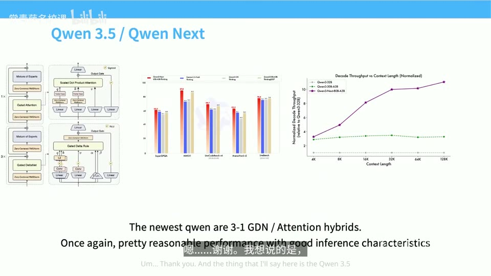

### 4.2 混合比例的对照研究
目前关于"混合架构性能"的高质量对照研究还不多。有一项研究比较了 Mamba-2、Gated DeltaNet 等架构在**不同混合层数**下的表现。核心发现是：

- 把非全注意力的层统称为 **RNN 层**，从左往右 RNN 层越来越多，性能随之下降。
- 对表现最好的架构（如 Gated DeltaNet 及其变体），在**低 RNN 占比**时**基本没有性能损失**；
- 但一旦超过某个**临界点**，就会出现更明显的性能下降（本例中体现在长上下文性能上）；
- **完全切换到纯 RNN 时，性能下降会变得非常明显**——所有架构都是如此。

[【跳转到 16:01】](https://www.bilibili.com/video/BV11LEA6eEuj/?p=4&t=961)

需要客观看待的是：像"单针检索（needle-in-a-haystack）"这类任务，很多长上下文架构本身就**明确针对它做了优化**；但换成 QA 等更通用的任务，规律依然清晰——**随混合比例升高，性能呈稳定且明确的下降趋势**。[【跳转到 16:26】](https://www.bilibili.com/video/BV11LEA6eEuj/?p=4&t=986)

### 4.3 为什么纯线性会掉性能
**为什么纯线性会掉性能？** 讲者用"缺点即表达能力"来解释：softmax 注意力里的 all-to-all 连接非常强大、也很好训练。状态空间模型虽然与 LSTM 相似（也有类似的表达能力短板），但如今因为有了"清晰的二重性"（可在 RNN 形式与密集矩阵乘法形式之间切换）而重新流行——这种权衡"改善了"，但并未消失。核心是**状态规模与上下文长度的比例**：状态越小，就越难把大上下文的所有信息压缩进去。**没有免费的午餐**。[【跳转到 27:22】](https://www.bilibili.com/video/BV11LEA6eEuj/?p=4&t=1642)

---

## 五、DeepSeek 稀疏注意力（DSA）——用轻量索引器先"选"，再对小子集做全注意力

**一句话结论**：DSA 不改变二次复杂度，而是先用一个轻量索引器对全部 token 打分、挑出 top-k 子集，只对这个小子集做全注意力，从而用系统层面的技巧大幅降低实际成本。

### 5.1 DSA 的前向机制：先选后算
除了"线性化"，还有另一条完全不同的思路：**稀疏注意力**。DeepSeek 在某版本中引入了 **DSA（DeepSeek Sparse Attention）**。它的做法是：**不**对所有 token 计算注意力，而是先用一个**轻量级索引器（lightning indexer）**，从大量 token 中筛选出一个**远小于完整序列的子集**，再对这个小子集做全注意力计算。[【跳转到 18:21】](https://www.bilibili.com/video/BV11LEA6eEuj/?p=4&t=1101)

前向传播的机制其实很简单：

1. 照常生成 Q 和 K，把它们送入索引器；
2. 索引器先算 Q 和 K 的内积、利用前面 token 的信息生成权重，给出每个位置的近似重要性分数；
3. 对这些分数做 **Top-k 筛选**，把"若干排名靠前的位置"纳入注意力计算；
4. 再照常做注意力计算（输出键值对）。

因为选择性非常稀疏、索引器又足够轻量，执行全注意力的部分就能在一个**很小的子集**上完成。[【跳转到 19:11】](https://www.bilibili.com/video/BV11LEA6eEuj/?p=4&t=1151)


### 5.2 不必从零训练索引器
**一个巧妙的工程点**：你其实不必"从零"训练这个索引器。由于我们本来就很难从零训练长上下文模型（先训短上下文、再做长上下文扩展阶段），DeepSeek 的做法是"**先训练普通 Transformer，再在长上下文扩展阶段把索引器嵌入进去**"，让模型在这个阶段适应它。这样实际计算成本相当低。[【跳转到 19:36】](https://www.bilibili.com/video/BV11LEA6eEuj/?p=4&t=1176)

### 5.3 复杂度澄清：DSA 并不是线性的
**关于复杂度的重要澄清（课堂问答）**：DSA **不是线性的**——索引器仍需处理完整的 **O(N²)** 内积计算，因为它必须遍历所有内容才知道该选什么，这是纯粹的暴力计算。后续全注意力那部分也是 O(N²)。**它取得优势靠的是系统层面的技巧**：让索引器的维度非常低、让投影矩阵非常小，从而把常数因子压到极小。[【跳转到 22:09】](https://www.bilibili.com/video/BV11LEA6eEuj/?p=4&t=1329) · [【跳转到 23:03】](https://www.bilibili.com/video/BV11LEA6eEuj/?p=4&t=1383)

值得一提：DeepSeek 还展示了 DSA 在"预填充"和"解码"两个阶段的有利扩展性；也有其他优秀开源模型采用了类似方法，并给出了"带预热 DSA / 纯 DSA / 完全不用 DSA"的消融实验，说明只要进行完整的 DSA 训练，损失很小，即便在长上下文检索这种 RNN 架构难处理的任务上，表现也接近完整注意力。[【跳转到 20:26】](https://www.bilibili.com/video/BV11LEA6eEuj/?p=4&t=1226) · [【跳转到 21:16】](https://www.bilibili.com/video/BV11LEA6eEuj/?p=4&t=1276)

### 5.4 Top-k 是之后 MoE 内容的伏笔
讲者还点出一个更普适的规律：**"Top-k 选择"将成为接下来 MoE 内容的核心**——它会在很多地方以"重复模式"出现，学会识别它很有好处。[【跳转到 21:56】](https://www.bilibili.com/video/BV11LEA6eEuj/?p=4&t=1316)

---

## 六、MoE 的本质，是用"稀疏性"换来"参数多、FLOPs 不变"

**一句话结论**：MoE 只是"更高效的 MLP"——把一个大的前馈网络拆成多个专家，每次只激活极少数，从而在不增加单次前向 FLOPs 的前提下把参数量放大数倍；而"更多参数通常有益"正是它的价值来源。

### 6.1 MoE 只是更高效的 MLP
讲者说，Mixture of Experts 从概念上并没有真正改变复杂度格局，一种理解方式是：**它只是"更高效的 MLP"**。但它值得展开，原因有二：其一，如今大家都在做 MoE、都在部署 MoE，要深入理解语言模型就必须懂它；其二，MoE 里有非常有意思的机制性组件，你会发现很多"原语"在其他地方也会反复出现。[【跳转到 28:04】](https://www.bilibili.com/video/BV11LEA6eEuj/?p=4&t=1684)

**什么是 MoE？** 它其实就是"MLP 的替代品"。左边是 Transformer 里通常的 MLP（归一化后接前馈网络 FFN），大量密集信息处理就发生在这里。现在换个思路：把那个大的 FFN 拆成几个**小的 FFN**（例如 4 个），并且让每个专家保持和原来一个 FFN 一样大，再通过一个**路由器（router）**决定"针对每个输入 token，该选择哪个前馈网络"。[【跳转到 28:49】](https://www.bilibili.com/video/BV11LEA6eEuj/?p=4&t=1729)

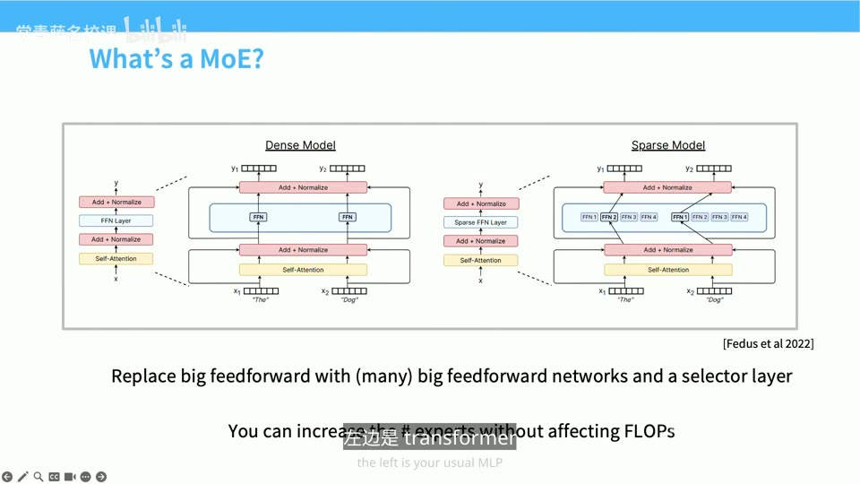

### 6.2 参数放大数倍，而单次 FLOPs 不变
于是：**参数量变成原来的数倍**（就 FFN 部分而言），但**任何一次前向或反向传播中，只需承担一个（或 K 个）FFN 的计算成本**。这呼应了原始 MoE 论文"以参数为中心"的动机——如果你相信"参数越多越好"，又不想为更多参数付出计算代价，就需要这种结构。所以对 MoE 的正确心智模型是：**在不影响总 FLOPs 的前提下增加参数量**。[【跳转到 30:04】](https://www.bilibili.com/video/BV11LEA6eEuj/?p=4&t=1804)

### 6.3 它为什么流行：更多参数通常有益
**它为什么流行？** 经验事实是：在总计算不变的前提下，只增加"稀疏参数"的数量，模型性能通常都会变得更好。Switch Transformer 等论文显示：**随着专家数量增加（激活参数量保持不变），语言建模验证损失持续下降**；在训练预算相同时使用更多专家，性能也会提升。也就是说，无论训练还是推理，MoE 都能"轻松取胜"。[【跳转到 30:54】](https://www.bilibili.com/video/BV11LEA6eEuj/?p=4&t=1854)


实证支持反复出现：某开源 MoE 研究也观察到，"训练一个 MoE 模型比稠密模型大约快 2 倍"；而看所有已发布的 MoE，就"激活参数量"而言，它们比对应的稠密模型强得多——这非常关键，因为你最终要按推理时的有效 FLOPs 来算成本。早期某些 MoE 模型问世时确实带来了深刻转变："我们的激活参数少得多，表现却一样好甚至更好。"[【跳转到 31:44】](https://www.bilibili.com/video/BV11LEA6eEuj/?p=4&t=1904) · [【跳转到 32:34】](https://www.bilibili.com/video/BV11LEA6eEuj/?p=4&t=1954)

### 6.4 对系统的额外价值：专家并行
**对系统的额外价值**：MoE 提供了"另一个并行化维度"。语言模型非常庞大，训练和推理都无法装入单个设备，需要多种模型切分方式；而 **MoE 里的每个专家天然就是"分块"的**——你可以把它们放在不同设备上，把激活值路由（route）到相应设备。这种 **专家并行（Expert Parallel）** 为系统优化提供了额外空间。[【跳转到 32:59】](https://www.bilibili.com/video/BV11LEA6eEuj/?p=4&t=1979)

---

## 七、MoE 的路由器设计——token 选择是主流，共享专家 + 细粒度专家是最佳实践

**一句话结论**：路由方式分"token 选专家"与"专家选 token"，前者更稳更常用；DeepSeek 提出的"细粒度专家 + 共享专家"设计经消融验证有效，已成为 MoE 的事实标准。

### 7.1 token 选择专家 vs 专家选择 token
设计 MoE 时可以从三个维度调整：**路由函数、专家规模、训练方法**。先看路由。因为我们不希望激活全部专家，所以总要做 **top-k 选择**，而选择方式大致有两种：

- **token 选择专家**：由每个 token 挑选自己偏好的 K 个专家；
- **专家选择 token**：由每个专家挑选偏好的 token。

研究显示：**token 选择通常能获得更低的验证损失和更高的下游基准分数**，也更容易跑通、更稳定，已基本成为"所有现代模型的标准做法"。[【跳转到 40:20】](https://www.bilibili.com/video/BV11LEA6eEuj/?p=4&t=2420) · [【跳转到 40:53】](https://www.bilibili.com/video/BV11LEA6eEuj/?p=4&t=2453)

### 7.2 最常见的路由器与 top-k 公式
**最常见的路由器**非常简单：用一个小型线性投影，计算每个专家向量（可看作原型/质心）与输入的内积，取分数最高的 K 个。这就是经典 Switch Transformer 用的方案。其他可选做法包括：基于哈希的路由（常见基线，但实际部署少用）、用**强化学习**学习路由策略（早期工作用过，但会引入大量开销，不常见）、以及"求解线性指派问题"求全局最优分配（有道理但代价太高，未在大规模出现）。实践中人们最终选择的是"**一套不错的启发式方法 + 经典 top-k**"。[【跳转到 41:30】](https://www.bilibili.com/video/BV11LEA6eEuj/?p=4&t=2490) · [【跳转到 43:35】](https://www.bilibili.com/video/BV11LEA6eEuj/?p=4&t=2615)

top-k 路由的公式形式很直观：输入 x 经过一个投影得到路由分数，对分数做 softmax，再挑出得分最高的 K 个专家，用它们对应的权重做**加权的 top-k**（而非绝对硬选择），最后把结果加回残差项。[【跳转到 44:05】](https://www.bilibili.com/video/BV11LEA6eEuj/?p=4&t=2645)


### 7.3 DeepSeek 的共享专家机制
**DeepSeek 的贡献**：DeepSeek-MoE 首创了如今被广泛采用的**共享专家（shared expert）机制**。想法很直观：经典 top-k 路由器中有 N 个大的不同专家、从中选 K 个；但有些"通用处理"步骤你希望**对所有 token 都应用**。于是 DeepSeek 把专家**拆成更小、更细粒度的单元**，并将其中一部分设为**始终启用的共享专家**——它们绕过路由器、始终处理输入，结果再汇回输出端。这样可以**把通用处理卸载到共享专家上，让其余专家更专门化**。[【跳转到 45:06】](https://www.bilibili.com/video/BV11LEA6eEuj/?p=4&t=2706)


### 7.4 消融证据与事实标准
**消融实验的证据**：对比"0 个共享专家 + 大专家"与"细粒度专家 + 共享专家"，两项改动都带来明显性能提升，在某些任务上共享专家效果尤其明显。不过，某西方开源 MoE 的受控研究则得出"共享专家作用并不显著"的结论，但他们也证明"使用大量细粒度专家是有益的"。二者在共享专家上略有分歧。[【跳转到 46:38】](https://www.bilibili.com/video/BV11LEA6eEuj/?p=4&t=2798)

无论如何，DeepSeek 的这套设计（细粒度 + 共享专家）已经像"LLaMA 之于稠密 Transformer"一样，成为 MoE 侧的**标准设计**，被许多现代开源模型广泛采用，是"经过充分实战检验的设计"。[【跳转到 47:21】](https://www.bilibili.com/video/BV11LEA6eEuj/?p=4&t=2841)

**课堂问答：共享专家与并行化**。共享专家不会带来并行化的节省（每次激活都必须经过它），但你可以**复制（replicate）**共享专家——本质上是用更多内存换取更低的通信成本。[【跳转到 48:21】](https://www.bilibili.com/video/BV11LEA6eEuj/?p=4&t=2901)

---

## 八、MoE 训练的核心难题是负载均衡——否则会发生"专家坍缩"

**一句话结论**：稀疏门控不可微、又看不到未被选中的专家，靠"启发式 + 辅助负载均衡损失"才训得动；若去掉均衡损失，几乎全部 token 会涌向极少数专家，大量参数被浪费。

### 8.1 为什么难：门控不可微、又看不到替代专家
MoE 训练棘手，是因为几个根本矛盾：

- 为了效率，训练时**不能激活所有专家**（否则要为所有专家支付全部 FLOPs，而专家数通常非常多）；
- 一旦引入稀疏性，**门控决策就不可微**了；
- 而且你**看不到**那些本可以选择的替代专家。

这让问题带有"强化学习中的多臂老虎机"色彩。[【跳转到 48:43】](https://www.bilibili.com/video/BV11LEA6eEuj/?p=4&t=2923) · [【跳转到 35:12】](https://www.bilibili.com/video/BV11LEA6eEuj/?p=4&t=2112)

### 8.2 三种解法
有三种解法：用强化学习优化门控策略（有效果，但梯度方差大、不常见）；用随机扰动打破平局、增加探索（早期做法，后来消融显示**去掉这些随机技巧反而有助于训练稳定性**）；以及实践中真正被采用的——**一大堆启发式规则**，来处理"门控稀疏"并平衡各专家负载。[【跳转到 49:08】](https://www.bilibili.com/video/BV11LEA6eEuj/?p=4&t=2948)

### 8.3 不做均衡的后果：专家坍缩
**如果不做均衡会怎样？** 直接跑常规梯度下降，会出现一种"越用越强"的正反馈：路由器先选 top-k 专家，其中最强的那个获得更多信号、权重被调高，于是被选中频率更高，最终"几乎包揽所有工作"。这就是**专家坍缩（expert collapse）/ 专家饥饿（expert starvation）**，是一个非常现实的问题。[【跳转到 52:28】](https://www.bilibili.com/video/BV11LEA6eEuj/?p=4&t=3148)

### 8.4 辅助损失及其直觉
**解法：辅助损失（auxiliary / balancing loss）**。在总建模损失之外再加一项，让流向不同专家的 token 分布更均衡。Switch Transformer 采用的方法：令 **F_i** 为"被分发给专家 i 的 token 比例"，**p_i** 为"路由分配给该专家的概率质量（更平滑的版本）"，让两者内积尽可能小。讲者说这个式子不太能从第一性原理推出，**理解它最简单的方法是求导**：对 p_i 求导得到 F_i，所以它相当于"梯度空间中的一种惩罚"——某个专家获得的 token 越多，其概率质量就被按比例压低。[【跳转到 53:18】](https://www.bilibili.com/video/BV11LEA6eEuj/?p=4&t=3198)

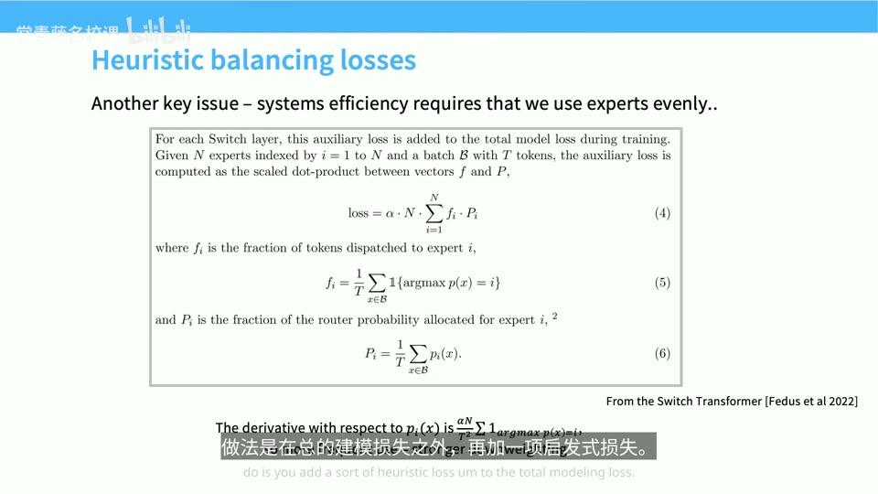

**去掉均衡损失的后果是灾难性的**。某开源 MoE 的消融实验显示：保留均衡损失时是正常的收敛曲线；去掉后损失显著上升。更有说服力的是专家利用率的可视化——**没有负载均衡时，几乎所有 token 都涌向两个专家**（图中黄色和粉色），其余专家在整个训练过程中几乎完全没发挥作用，等于浪费了大量参数；而加上均衡损失后，所有专家都被利用起来。[【跳转到 56:13】](https://www.bilibili.com/video/BV11LEA6eEuj/?p=4&t=3373)

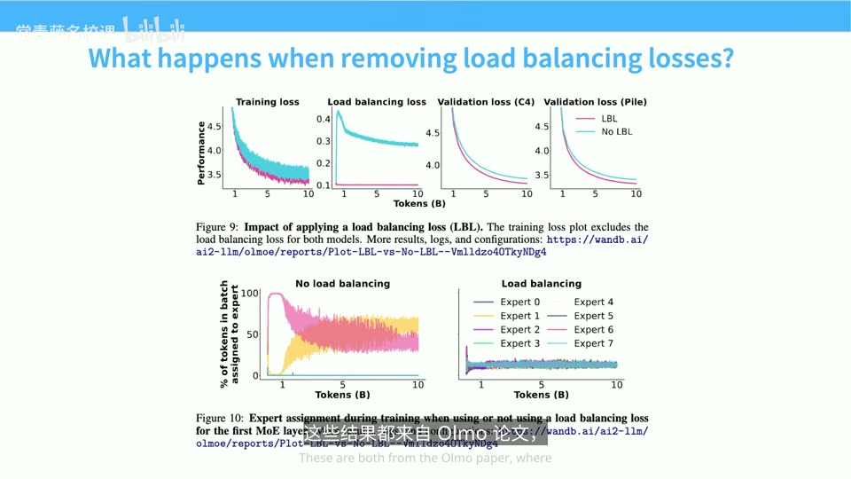

这一发现相当令人意外：你有一个**本质上不可微的操作**（top-k 选择）、一个相当复杂的损失对象，但**只需加上均衡损失让负载均匀一些，其余部分就当梯度可以直接传递**，模型就能训练得非常好。讲者总结其中关键是一种"正反馈动态"与"负载均衡"的相互抵消。[【跳转到 57:53】](https://www.bilibili.com/video/BV11LEA6eEuj/?p=4&t=3473)

---

## 九、MoE 的系统与稳定性问题——专家并行、通信、非确定性、z-loss 与微调过拟合

**一句话结论**：MoE 在系统层面既有额外并行维度的好处，也有通信、非确定性、微调过拟合等独特挑战；业界用结构化稀疏、投影压缩、无丢弃架构、z-loss 等手段逐一应对，并发明了 upcycling 来"白捡"性能。

### 9.1 专家并行、通信与结构化稀疏
**并行与通信**：每一种标准并行技术都有极限（数据并行受批次大小上限限制，模型并行受天然切分点限制），而**专家并行多提供了一个并行维度**。许多底层实现还能利用 GPU 内置的**稀疏矩阵乘法**：与其做许多小矩阵乘法，不如利用稀疏性——用**块对角矩阵**乃至更复杂的**结构化稀疏**形式，这些都"硬件原生支持"，能以极快的方式完成专家与输入的计算。于是 MoE 的发展出现了一种**硬件架构协同设计**的趋势。[【跳转到 60:12】](https://www.bilibili.com/video/BV11LEA6eEuj/?p=4&t=3612) · [【跳转到 61:08】](https://www.bilibili.com/video/BV11LEA6eEuj/?p=4&t=3668)

### 9.2 用投影降维压缩通信
**降低通信开销的技巧**：专家并行必须在设备间**传输激活值**（告知 token 属于哪个专家、把它传过去），这带来显著通信开销。一种新方案是：**让共享专家保持较大隐藏维度（无需通信），而让需要传输的被路由专家使用更小的低维向量**。做法是先把残差流投影降维，再执行 all-to-all 通信，接收后再升维——相当于"只传输降维后的信号"，从而显著节省通信开销。[【跳转到 61:31】](https://www.bilibili.com/video/BV11LEA6eEuj/?p=4&t=3691) · [【跳转到 61:56】](https://www.bilibili.com/video/BV11LEA6eEuj/?p=4&t=3716)


### 9.3 非确定性与无丢弃架构
**非确定性（nondeterminism）**：如果朴素地实现 MoE 推理，某些热门专家会积压超长 token 队列，早期基础设施常见的做法是**静默丢弃**多余 token，于是出现"其他用户的查询命中同一专家时，你的结果反而可能变差"这种奇怪现象。如今**无丢弃（no-drop）架构**已经解决了大部分这类问题，主流开源 MoE 推理框架都不再有这个问题。[【跳转到 62:21】](https://www.bilibili.com/video/BV11LEA6eEuj/?p=4&t=3741)

### 9.4 稳定性：z-loss 与高精度路由
**稳定性**：上一讲已经说过"指数运算是危险的、除法也是危险的"，而 softmax 正是稳定性问题的危险区域——**MoE 的路由机制里又引入了一个 softmax**。应对办法是：在更敏感的部分（尤其路由器）使用更高精度（如 FP32），并加入 **z-loss** 来控制 softmax 稳定性问题。消融实验清楚显示，在路由器上使用 z-loss 相当有帮助。[【跳转到 63:21】](https://www.bilibili.com/video/BV11LEA6eEuj/?p=4&t=3801) · [【跳转到 64:11】](https://www.bilibili.com/video/BV11LEA6eEuj/?p=4&t=3851)

### 9.5 微调过拟合与 upcycling
**微调代价**：MoE 参数众多，**微调 experts 时会出现严重的过拟合**——稠密模型的训练/验证损失相当接近，而稀疏模型在下游任务微调时两者差距很大。常见对策是**只微调非 MoE 的部分**（attention 或非专家的 FFN 层）。当然也有"苦涩教训式"的版本：也许应该直接用海量样本，在微调阶段几乎完全重新训练 MoE。[【跳转到 64:27】](https://www.bilibili.com/video/BV11LEA6eEuj/?p=4&t=3867)

**Upcycling（升级复用）**：想构建 MoE，可以直接采用一个**已训练好的稠密模型**并"实例化"一个 MoE——复制所有参数（包括 MLP）、生成大量 MLP 副本、再随机初始化一个路由器，然后继续训练。由于输入分配到不同 MLP 的过程带有随机性，专家会逐渐变得专门化。早期论文表明，相较于继续训练同一稠密模型，upcycling 能显著提升语言建模性能——像是"白捡"的性能提升。早期某中文小模型和 Qwen 的 MoE 都成功用了这一技巧。不过这一方法在过去一年没有那么流行了。[【跳转到 65:59】](https://www.bilibili.com/video/BV11LEA6eEuj/?p=4&t=3959)

---

## 十、DeepSeek 的 MoE 演进——从"共享+细粒度专家"到 MLA、MTP 的标准范式

**一句话结论**：DeepSeek 的 MoE 论文很好地体现了"成功训练不仅关乎深度学习，也关乎系统性"；V1 立下共享专家+细粒度+辅助损失的范式，V2 放大规模并加入设备/通信平衡，V3 则演进到 MLA 与多 token 预测。

### 10.1 DeepSeek MoE V1/V2/V3 的演进
讲者特别推崇 DeepSeek 的论文，认为它们写得好、细节多，体现了对系统本身的重视：

- **DeepSeek MoE V1**：实际上已经是许多现代 MoE 的**原型**——共享专家 + 细粒度专家、标准 token 路由、辅助损失平衡。可以说是 MoE 的"标准范式"。
- **DeepSeek-V2**：基本是把 V1"放大"——两个共享专家、更多细粒度专家，并加入**设备级平衡组件**与**通信量平衡组件**；值得注意的是，它不仅有"专家间平衡"，还有"设备间平衡"——因为专家分布在不同设备上，你希望各设备都接近满负荷运行，于是引入次要的设备平衡损失（数学形式相同，只是针对设备负载）。这正是"DeepSeek-V2 是'重视系统'这一理念的体现"。
- **DeepSeek-V3**：保留共享专家 + 细粒度专家，但改用"无辅助损失（或每序列辅助 + 偏置在线调整）"的方式来平衡专家，并采用 sigmoid 等不同的加权方式。它仍需要一些辅助损失来避免极端不平衡，但已能摒弃部分"不够优雅"的辅助损失。

[【跳转到 68:04】](https://www.bilibili.com/video/BV11LEA6eEuj/?p=4&t=4084) · [【跳转到 68:54】](https://www.bilibili.com/video/BV11LEA6eEuj/?p=4&t=4134) · [【跳转到 55:23】](https://www.bilibili.com/video/BV11LEA6eEuj/?p=4&t=3323)

### 10.2 MLA：压缩 KV 缓存
**多头潜在注意力（MLA，Multi-head Latent Attention）**：DeepSeek 不直接生成 Q、K、V，而是先把隐藏输入压缩成**低维的共享潜在状态 C**，再基于 C 投影生成 Q、K、V。这样在解码阶段**无需缓存所有的 K 和 V**，只需存储维度更低的 C，从而获得可观的 KV 缓存与计算节省。这就是它叫"潜在注意力"的原因。唯一需要小心的是与 **RoPE** 的交互：位置信息与内容信息纠缠在 KV 里，而位置信息不适合压缩，所以实践中会保留一些专门编码位置信息的非潜在维度、不做压缩。[【跳转到 69:19】](https://www.bilibili.com/video/BV11LEA6eEuj/?p=4&t=4159)

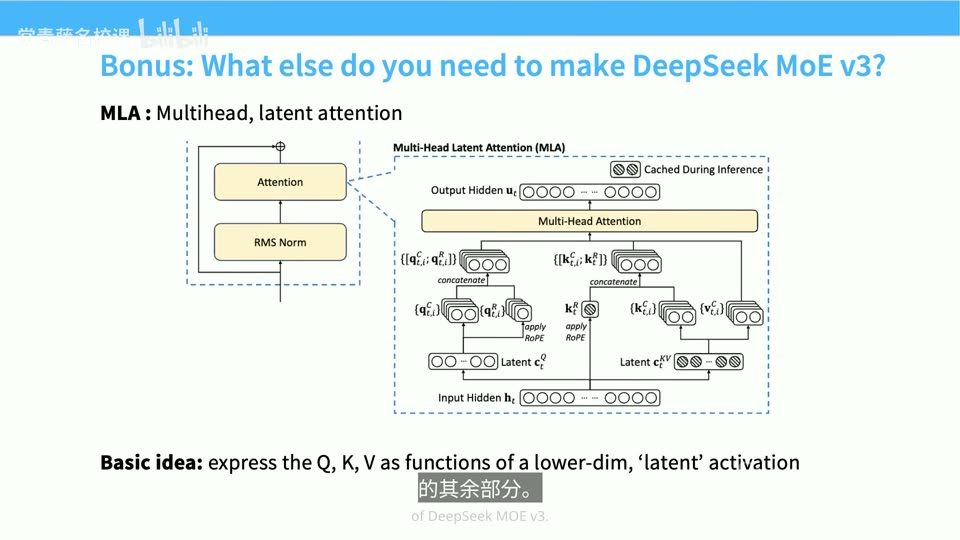

### 10.3 MTP 与未来方向
**多 token 预测（MTP，Multi-Token Prediction）**：与其只预测下一个 token，不如**一次性预测多个**。这在统计上是有道理的（可能让你对未来预测得更准），从系统角度看更是内置了一个**投机解码器（speculative decoder）**，可用于加速模型解码。[【跳转到 70:34】](https://www.bilibili.com/video/BV11LEA6eEuj/?p=4&t=4234)

讲者在课堂问答中提了对未来的判断：不同技巧会被"全都用上"，架构通过整合各种成功配方变得越来越复杂；而更高层面的方向，是**利用后训练让模型自己管理上下文**（压缩、检索等机制从"最外层附加"走向"整合进模型"）。[【跳转到 25:23】](https://www.bilibili.com/video/BV11LEA6eEuj/?p=4&t=1523)

---

## 小结

- **长上下文的成本瓶颈在注意力**：feedforward 随长度线性增长，而注意力是 all-to-all 的 O(N²)，序列越长越主导开销；FlashAttention 是常数因子层面的巨大改进，但不解决二次增长。
- **结合律是线性注意力的起点**：去掉 softmax 后，`(QKᵀ)V` 可重排为 `Q(KᵀV)`，计算量改由头维度决定而非序列长度；softmax→线性的这一步有损，线性→RNN 的等价则无损。
- **双重形式**：线性注意力既是密集并行矩阵乘法（适合训练），又是固定状态的 RNN 循环（适合推理），可兼得两者之长。
- **门控演进**：Mamba-2 加入输入相关的衰减门 γ 让状态能遗忘；Gated DeltaNet 再加门 β 并用投影器擦除旧信息；门控只依赖输入时，并行/串行对偶性得以保持。
- **混合架构是现实答案**：Qwen-Next 用 3:1 门控 DeltaNet + 全注意力、某中文大模型用 7:1；低 RNN 占比时性能近乎无损，纯线性则明显下降——状态容量的权衡无法回避。
- **DSA 是另一条路**：用轻量索引器对全部 token 打分、Top-k 选出子集后只对子集做全注意力；不是线性的，但靠极小的常数因子取胜，且可在长上下文扩展阶段插入。
- **MoE = 更高效的 MLP**：稀疏路由让参数量放大数倍而 FLOPs 不变；"更多参数通常有益"是它的价值来源，也提供了专家并行这一额外系统维度。
- **MoE 设计要点**：token 选择专家是主流；共享专家 + 细粒度专家是 DeepSeek 立下的事实标准；辅助负载均衡损失不可或缺，否则会发生专家坍缩、浪费大量参数。
- **MoE 的系统与训练挑战**：通信、非确定性、softmax 稳定性（z-loss、FP32 路由）、微调过拟合、以及可"白捡"性能的 upcycling。
- **DeepSeek 范式**：V1 原型 → V2 放大并加设备/通信平衡 → V3 演进，配合 MLA 压缩 KV 缓存与 MTP 多 token 预测。

---

## 关键术语速查

| 术语 | 一句话解释 |
| --- | --- |
| 线性时间注意力 | 通过去掉 softmax 并重排乘法顺序，使计算量不随序列长度二次增长的一类注意力。 |
| 结合律重排 | 把 `(QKᵀ)V` 改写为 `Q(KᵀV)`，使中间矩阵由 N×N 变为头维度大小。 |
| 双重形式 | 线性注意力同时具备"密集并行（训练用）"与"循环串行（推理用）"两种等价写法。 |
| 状态空间模型（SSM） | 以固定状态递归处理序列的模型族，Mamba 系列属之；机制上可看作线性注意力的扩展。 |
| Mamba-2 | 在线性注意力状态更新上加入输入相关衰减门 γ 的 SSM。 |
| Gated DeltaNet | 在 Mamba-2 基础上再加门控 β，并用投影 `(I−β k kᵀ)` 擦除当前 key 方向的旧信息。 |
| 混合架构 | 把若干线性层与少量全 softmax 注意力层按比例组合（如 3:1、7:1）的长上下文架构。 |
| DeepSeek 稀疏注意力（DSA） | 用轻量索引器对全部位置打分、Top-k 选出子集后只对子集做全注意力；靠常数因子取胜。 |
| 闪电索引器（lightning indexer） | DSA 中负责给所有位置打重要性分数、供 Top-k 选择的轻量模块。 |
| 混合专家（MoE） | 用稀疏路由在 FLOPs 不变的前提下大幅增加参数量的 MLP 替代方案。 |
| 路由器（router） | 决定每个 token 被分发给哪些专家的模块，通常是一次内积加 softmax 的 top-k 选择。 |
| token 选择专家 | 由每个 token 挑选偏好的 K 个专家；比"专家选 token"更稳、更主流。 |
| 专家选择 token | 由每个专家挑选偏好的 token 的路由方式；存在成功模型但不如前者常用。 |
| 共享专家（shared expert） | 始终启用、绕过路由器的专家，用于承担通用处理，让其余专家更专门化。 |
| 细粒度专家 | 把专家拆成更小单元以获得更好性能与更细粒度路由的设计。 |
| 专家坍缩 / 专家饥饿 | 不加均衡时少数专家包揽几乎所有 token、其余专家闲置的现象。 |
| 负载均衡损失 | 迫使各专家接收的 token 分布更均匀的辅助损失（如 Switch 的 F_i·p_i）。 |
| 专家并行（Expert Parallel） | 把不同专家放到不同设备、并将激活值路由过去的并行方式。 |
| 结构化稀疏 | 硬件原生支持的稀疏矩阵形态（如块对角），可高效实现 MoE 的专家计算。 |
| 无丢弃架构（no-drop） | 不再静默丢弃超长专家队列 token 的推理架构，消除了相关的非确定性。 |
| z-loss | 用于稳定 softmax 的辅助损失，在 MoE 路由器上尤其有帮助。 |
| Upcycling（升级复用） | 用已训练好的稠密模型初始化出一个 MoE 再继续训练，从而"白捡"性能。 |
| MLA（多头潜在注意力） | 把 KV 压缩成低维潜在状态 C 再投影出 Q/K/V，只为 C 做 KV 缓存以省显存。 |
| MTP（多 token 预测） | 一次预测多个未来 token，兼具统计收益与内置投机解码的加速能力。 |

---

<!-- ===== Lecture 5 GPUs, TPUs.md ===== -->

# Lecture 5: GPUs, TPUs

## 本讲要解决的核心问题（SCQA）

**背景**：前几讲讨论的是神经网络本身——模型结构、损失函数、反向传播。这一讲开始，课程进入"系统部分"。训练更好的语言模型，本质上依赖更多算力：硬件更快、利用率更高、芯片更多，或者并行化做得更好，都能推动进步；过去几年核心是往训练里投算力，最近一年重点转向往**推理**里投算力。

**冲突**：可是我们用来训练的硬件——GPU——对大多数人来说既像魔法，又像一台完全陌生的设备。大家见过这样的曲线：矩阵乘法越大，吞吐量反而在某些奇怪的尺寸上突然暴跌；也见过别人甩出的一张"吞吐量 vs 维度"的图，完全看不懂为什么长这样。更根本的是，上世纪 90 年代那种"把时钟频率越调越高、让 CPU 串行指令越跑越快"的老办法，也就是**登纳德缩放（Dennard scaling）**，在 2000 年代撞上了物理瓶颈——晶体管变小，并不必然变快。既然不能靠提高频率加速，算力还怎么继续涨？

**疑问**：如果不能靠频率，那大语言模型靠什么扩展？GPU 到底和 CPU 有什么本质不同？我们怎样才能写出跑得快的代码、看懂那些"神秘曲线"，并且自己实现一个高效的注意力内核？

**回答（中心思想）**：**当串行提速走到尽头，算力增长就改由"并行扩展"接棒；GPU 用海量轻量级核心换取吞吐量，而它的性能钥匙在于内存层次结构。理解了 GPU 的硬件模型，就能用六种技巧——控制发散、低精度、算子融合、重计算、合并访存、分块——把机器学习负载推到"计算受限"的高吞吐区；把这些技巧组合起来，就得到了 FlashAttention（分块 + 重计算 + 在线 softmax）。** 同样的道理也适用于 TPU：二者宏观上趋同进化，核心概念一一对应。

这一讲分三部分：先建立 GPU 的硬件与编程心智模型；再讲六种让 GPU 变快的技巧；最后综合起来，逐步推导 FlashAttention——讲者把它称为本节课的"庆功环节"。[【跳转到 02:45】](https://www.bilibili.com/video/BV11LEA6eEuj/?p=5&t=165)


---

## 一、GPU 用海量轻量核心换取吞吐量，CPU 则用庞大控制单元换取低延迟

**一句话结论**：CPU 为"少量、快速、复杂"的线程而优化，GPU 为"海量、简单"的线程而优化；这是一切性能现象的起点。

### 1.1 CPU 的设计哲学：低延迟

CPU（中央处理器）旨在实现**快速的串行执行**，适用于具有复杂分支逻辑、复杂条件判断和复杂控制流的场景。因此一般而言，CPU 拥有**庞大的控制单元**，以及少量能够执行数学运算的**算术逻辑单元（ALU，Arithmetic Logic Unit）**。它追求的核心指标是**低延迟**——从接收一条指令到完成它的时间间隔应当非常短。[【跳转到 06:05】](https://www.bilibili.com/video/BV11LEA6eEuj/?p=5&t=365)

打个比方：CPU 像一位博学但只有两只手的专家，他能处理各种千奇百怪的问题，但同一时刻只能干有限的几件事。

### 1.2 GPU 的设计哲学：高吞吐

GPU（图形处理器）的核心在于**吞吐量（throughput）**。在 GPU 上，你提交一个任务后，它可能要跑很久才结束；你可能会处理一个任务然后暂停，去处理另一个，再回来继续。单个任务跑得不快，但**所有任务加起来的总吞吐量非常大**。实现这一点靠的是**大量轻量级核心**：GPU 芯片中集成了数百个计算单元，全部可以并行执行。[【跳转到 06:42】](https://www.bilibili.com/video/BV11LEA6eEuj/?p=5&t=402)

GPU 则像一支庞大的流水线工人队伍：每个人只会做简单动作，但成百上千人同时开工，单位时间产出的总量惊人。


### 1.3 从图形硬件到科学计算

这套大规模并行性，早在张量核心出现之前就被人们看中了。有人发现，可以利用商用图形硬件（显卡）来做快速矩阵乘法——通过编写特定的着色器（shader）以特定渲染设置实现矩阵乘法，甚至比常规方式更快。而到 V100 那一代，NVIDIA 干脆推出专门做矩阵乘法的硬件，**矩阵乘法从此成为机器学习中那个"享有特权"的操作**。[【跳转到 20:15】](https://www.bilibili.com/video/BV11LEA6eEuj/?p=5&t=1215)

原因很直接：有了专用硬件后，"可并行化但非矩阵乘法"的操作，与矩阵乘法能达到的吞吐量之间出现了**十倍以上的差距**。这就是为什么近期任何随算力扩展的机器学习架构，几乎都离不开矩阵乘法——它是你真正能高效榨出大量算力的唯一途径。

---

## 二、SM 是 GPU 的计算基本单元，而内存层次结构决定了程序能跑多快

**一句话结论**：GPU 的计算部分由许多名为 SM 的独立单元组成，但要理解性能，关键不在计算，而在"内存"——现代硬件和 LLM 优化的核心其实都在于内存。

### 2.1 SM：可近似看作"核心"的独立计算单元

GPU 的基本组成单元是 **SM（Streaming Multiprocessor，流式多处理器）**。SM 有点像是一个核心：它是一个独立的计算单元，内部包含大量子组件（流式处理器）用于加速计算，能够并行执行不同的线程，并连接、访问特定类型的内存。[【跳转到 07:38】](https://www.bilibili.com/video/BV11LEA6eEuj/?p=5&t=458)

每个 SM 都可以独立编程、独立执行任务，还能访问外部某种**全局内存**。GPU 拥有海量的 SM，比如 H100 大约包含 **132 个 SM**。[【跳转到 08:28】](https://www.bilibili.com/video/BV11LEA6eEuj/?p=5&t=508)

### 2.2 内存层次：越靠近 SM 越快

GPU 内存分好几个层级，从快到慢大致是：

1. **寄存器（register）**：容量最小、速度最快、局部性最强，常用来存起始/结束内存地址之类的信息。
2. **L1 缓存 / 共享内存（shared memory）**：位于每个 SM **内部**，速度极快，大约 20~30 个周期就能读到数据（A100 上 L1 约 33 周期、共享内存读写约 23/19 周期）。
3. **L2 缓存**：位于芯片内，但离 SM 更远，明显更慢（A100 上约 200 周期）。
4. **全局内存 / HBM（High Bandwidth Memory，高带宽内存）**：位于计算单元**外部**的内存芯片上，读取比 L1 慢约十倍（A100 上约 290 周期）。

[【跳转到 09:06】](https://www.bilibili.com/video/BV11LEA6eEuj/?p=5&t=546)

当厂商说"H200 有 141GB 显存"时，指的就是这块**全局内存**，而不是共享内存或 L1 缓存。全局内存通常在物理上位于计算单元外部，而 L2 和 L1 在物理上位于芯片内部——你在芯片示意图上看到的那些绿色方块就是 SM。[【跳转到 09:31】](https://www.bilibili.com/video/BV11LEA6eEuj/?p=5&t=571)


### 2.3 共享内存 vs L1 缓存，以及为什么不造一整块 SRAM

两者机制不同：**缓存**本质上是自动存储"最近访问过的数据元素"的机制，你**无法直接控制**；**共享内存**则是**可编程的**元素，你可以直接往里读写数据。[【跳转到 10:52】](https://www.bilibili.com/video/BV11LEA6eEuj/?p=5&t=652)

既然共享内存这么快，为什么不干脆用共享内存造一整块芯片？因为**成本高得多（大约几百倍）**，功耗也大得多，而且 SRAM 必须一直通电才能保存数据。所以现实中通常不会只堆砌大量 SRAM，而是采用**分层结构**并高效利用它。Groq 的设计正是纯靠海量 SRAM 的另类加速器，对某些推理负载确实有帮助，但对大多数加速器来说，仍要遵循这种内存层次结构。[【跳转到 10:17】](https://www.bilibili.com/video/BV11LEA6eEuj/?p=5&t=617)

有一个反直觉的事实：L2 比 L1 慢，很大一部分原因只是**物理距离更远**和所用的互联方式不同，而不是存储机制不同——它们其实都用 SRAM。这一点并非固有特性：TPU 中对应的 L2 缓存就快得多，这是 Google 在硅片设计上做不同权衡的卖点之一。[【跳转到 23:32】](https://www.bilibili.com/video/BV11LEA6eEuj/?p=5&t=1412)

**请牢记这一点**：内存层次结构会在后文反复出现，是理解一切优化的关键。

---

## 三、线程、线程块与 warp 三个概念，共同定义了 GPU 的编程与执行模型

**一句话结论**：GPU 的执行模型围绕三个核心术语展开——线程执行相同指令、线程块保证同处一个 SM、warp 是调度的基本单位；理解这三者才能理解性能边界。

### 3.1 线程与 SIMT：所有人执行同一条指令

**线程（thread）** 如果你熟悉多线程编程，就已经有直觉。在 GPU 中，线程的一个重要特点是遵循 **SIMT（Single Instruction, Multiple Threads，单指令多线程）** 模型：所有线程执行**完全相同的指令**，只是输入不同。[【跳转到 11:36】](https://www.bilibili.com/video/BV11LEA6eEuj/?p=5&t=696)

这意味着线程可以各自完成不同的有用工作，但**指令必须一致**。这是 GPU 在"可编程性"与"效率"之间做出的权衡：如果线程能做的事五花八门，编程会极其困难。这也正是后面"控制发散"问题的根源。

### 3.2 线程块：共享内存的载体

**线程块（thread block）** 就是一组线程。它重要的原因在于：它**保证运行在同一个 SM 上**——而 SM 拥有共享内存。因此同一个块内的线程可以访问共享的内存池。[【跳转到 12:01】](https://www.bilibili.com/video/BV11LEA6eEuj/?p=5&t=721)

这一点在讨论**分块（tiling）** 时会变得非常重要：那时块内线程需要复用相同的内存片段。

### 3.3 warp：调度的基本单位

**warp** 是 GPU 内部调度的基本单位。连续编号的 **32 个线程**为一组来执行，构成一个 warp。这样能减少调度器在决定"下一个运行哪个 warp"时的开销。[【跳转到 12:01】](https://www.bilibili.com/video/BV11LEA6eEuj/?p=5&t=721)

课堂问答澄清了两个易混点：所谓"所有线程执行相同指令"，指的是**一个 warp 内的所有线程**；调度器决定的是"下一个要执行的是哪个 warp"。

### 3.4 内存模型：超出共享内存就变慢

在 GPU 的内存模型中：设备代码可从**寄存器**读取（最快、局部性最强）；**局部内存（local memory）** 仅限单个 SM 内使用；**共享内存**可在**线程块内部**访问——因此若需在线程间传数据、复用信息，应放在共享内存里；也可从**全局内存/HBM** 读取，前提是你能接受等待数据从外部传进来的延迟；此外还有**常量内存**（实践中用得不多）和**主机内存（host memory，即机器的 CPU 内存）**，容量不足时可以把数据卸载到主机内存再传回来。[【跳转到 13:10】](https://www.bilibili.com/video/BV11LEA6eEuj/?p=5&t=790)

**核心要点**：只要超出共享内存的范围，速度就会变慢；因此"把块分组以减少全局内存的读取次数"是贯穿全课的主线。

### 3.5 线程轻量、切换极快

GPU 线程非常轻量，随时可以暂停或恢复。当某个 warp 停滞（比如等待内存）时，调度器会立刻切换到另一个更适合运行的 warp，切换非常快。这种机制带来了高得多的吞吐量。[【跳转到 19:17】](https://www.bilibili.com/video/BV11LEA6eEuj/?p=5&t=1157)

---

## 四、TPU 与 GPU 趋同进化，最大的差别在网络互联而非单芯片

**一句话结论**：TPU 与 GPU 在宏观结构上极其相似，几乎是一种"趋同进化"；GPU 用"数量多而小"的矩阵乘法单元换取灵活性，TPU 用"数量少而大"的单元换专用效率，而真正的分水岭在于网络连接。

### 4.1 为什么讲 TPU：另一条演进路径

课程主体讲 GPU（因为大家未来大概率用 GPU 写代码），但讨论 TPU 同样重要：它越来越流行，而且展示了加速器的另一条演进路径。TPU 在某种意义上**更简单**：更专门针对机器学习任务优化，**控制单元更轻量，矩阵乘法单元大得多**。[【跳转到 14:30】](https://www.bilibili.com/video/BV11LEA6eEuj/?p=5&t=870)


### 4.2 一一对应的概念映射

TPU 和 GPU 的部件几乎可以精确对应：GPU 有专门做矩阵乘法的电路、并行处理向量运算的组件、某种控制系统，以及"慢速 HBM + 快速本地 SRAM（共享内存）"的内存结构——TPU 如出一辙。**区别主要在于这些部件的大小以及操作的灵活性**。[【跳转到 14:55】](https://www.bilibili.com/video/BV11LEA6eEuj/?p=5&t=895)

两者都基于**脉动阵列（systolic array）**——通过数据流式进出来完成矩阵乘法的结构。[【跳转到 16:15】](https://www.bilibili.com/video/BV11LEA6eEuj/?p=5&t=975)

### 4.3 术语陷阱：两个"张量核心"

**这是极易混淆的地方**：GPU 把它的**矩阵乘法单元**叫"张量核心（Tensor Core）"，而 TPU 把它的**流式多处理器**也叫"张量核心（Tensor Core）"。名字一模一样，必须靠上下文区分：说"TPU 的张量核心"指处理器，说"GPU 的张量核心"指做矩阵乘法的单元。[【跳转到 16:51】](https://www.bilibili.com/video/BV11LEA6eEuj/?p=5&t=1011)

### 4.4 规模对比：多而小 vs 少而大

以典型配置为例：H100 约有 **132 个 SM**、**528 个矩阵乘法单元**；而 TPU 只有 **2 个单元**、**8 个矩阵乘法单元**。这些数字大致按可比比例缩放。原因在于：**TPU 靠规模更大但数量更少的矩阵乘法单元，GPU 靠规模较小但数量众多的矩阵乘法单元。** 多而小带来更高灵活性——你可以编程让它们执行各种任务；少而大则只能用于大规模矩阵乘法。[【跳转到 17:16】](https://www.bilibili.com/video/BV11LEA6eEuj/?p=5&t=1036)

一个生动的例子：讲者在一篇论文里做批量大小扫描，测试范围一直降到 64 就停住了——因为**张量核心不接受低于 64 的输入**，它必须做大矩阵乘法。[【跳转到 18:06】](https://www.bilibili.com/video/BV11LEA6eEuj/?p=5&t=1086)

### 4.5 最大区别在网络

虽然芯片层面高度相似，但**最大的区别其实在于这些加速器的网络连接**，而不是单个芯片本身——单说一个芯片，就是用来做矩阵乘法的。也正因如此，本讲的核心概念在 GPU 和 TPU 之间是**通用**的：能高性价比分配内存的方法有限，能极快执行矩阵乘法的方法也有限，殊途同归。[【跳转到 15:45】](https://www.bilibili.com/video/BV11LEA6eEuj/?p=5&t=945)

---

## 五、屋顶线模型告诉我们，高效代码要努力落在"计算受限"的平坦区

**一句话结论**：GPU 性能既受计算限制、也受内存限制，二者以"运算强度"为分界；优化的目标就是提高运算强度，让代码待在屋顶线平坦的高吞吐区。

### 5.1 一张"神秘曲线"引出的问题

讲者反复展示那张方阵乘法的吞吐量曲线：横轴是矩阵维度，纵轴是吞吐量（每秒处理多少项）。总体上，矩阵越大、工作量越多，硬件利用率越高、吞吐量越高——但曲线里布满了奇怪的周期性跌落。[【跳转到 25:21】](https://www.bilibili.com/video/BV11LEA6eEuj/?p=5&t=1521)

### 5.2 屋顶线（roofline）模型

这正是经典的**屋顶线模型**。它指出：在达到某个点之前，程序**受限于内存**——无论给多少算力，吞吐量都不会提升；到了某一点，每单位内存搬运对应的工作量足够多，计算单元被完全饱和，之后就进入**计算受限**区——再多的额外工作也没用，因为矩阵乘法单元已经占满。因此曲线有一段斜线（内存受限）和一段平坦区（计算受限）。[【跳转到 25:46】](https://www.bilibili.com/video/BV11LEA6eEuj/?p=5&t=1546)


**关键**：想让代码在 GPU 上跑得高效，就要让它落在**平坦区**；要提高**运算强度（operational intensity）**，也就是"每次读取内存所做的计算量"必须足够高。我们要避免落入斜线区。

### 5.3 为什么内存变得如此重要：三条线增速不同

不同组件随时间提升的速度各不相同。有一张著名的图展示了三条线：

- **计算吞吐（灰色线）**：峰值硬件 FLOPs，20 年增长约 6 万倍（约 3.0×/年），增长极快。
- **内存带宽（绿色线）**：DRAM 带宽，20 年增长约 100 倍（约 1.6×/年），相对缓慢。
- **设备互联（蓝色线）**：互联带宽，20 年增长约 30 倍（约 1.4×/年），也非常缓慢。

[【跳转到 21:05】](https://www.bilibili.com/video/BV11LEA6eEuj/?p=5&t=1265)


含义是：早期做 GPU 编程可能不太需要考虑内存，因为那时计算速度并不比内存传输快多少；但如今计算与内存的差距越拉越大，所以本讲的许多优化本质上都是**内存优化**。越往图右边走，越会看到内存与通信瓶颈。这也解释了为什么硬件在推理方面"更加疯狂"——预填充（prefill，大量矩阵乘法）与解码（decode，更依赖内存带宽）甚至被解耦到不同芯片上，有的模型还把注意力层和 MLP 层分配到不同加速器。[【跳转到 24:13】](https://www.bilibili.com/video/BV11LEA6eEuj/?p=5&t=1453)

**所以任何能巧妙利用宝贵高速内存的技巧，都会变得极具价值。**

---

## 六、控制发散是 SIMT 模型的固有代价，应尽量用掩码乘法代替分支

**一句话结论**：在 SIMT 模型下，`if/else` 会让整个 warp 把两条分支都走一遍，处在错误一侧的线程只能干等；因此 GPU 代码应尽量用"乘以 0/掩码"来替代真正的分支。

想法很直接：因为在 GPU 里每个线程执行的都是一样的东西，那么代码里写一个 `if` 会发生什么？在 CPU 上很清楚——只选一个分支执行，然后继续。但在 GPU 上情况大不相同，甚至有点反直觉：**每个线程都必须执行相同的指令**。[【跳转到 27:37】](https://www.bilibili.com/video/BV11LEA6eEuj/?p=5&t=1657)

所以实际上，每个线程会把 `if` 和 `else` **都执行一遍**；如果你不属于 `if` 分支，你只是把那段计算**屏蔽掉**，在那儿闲着。一部分线程走下面的分支、另一部分走上面的分支：底部分支的线程先执行，顶部分支的线程等着；等底部跑完，顶部再执行，另一侧线程等待。这叫做**控制发散（control divergence）**。[【跳转到 28:02】](https://www.bilibili.com/video/BV11LEA6eEuj/?p=5&t=1682)


它是好事——简化了编程；但坏处是会出现大段**计算空档**，GPU 闲着什么都不干。这就是"你真的最好别写 if 语句"的原因之一。

一个典型技巧：看 GPU 代码会发现，实现 ReLU 时往往用**乘以 0 或乘以掩码**来做，而不是用 `if` 只更新一半数据。因为乘法是一下子全部执行的，而 `if` 实际上可能得等两个时钟周期（两次操作）。[【跳转到 28:49】](https://www.bilibili.com/video/BV11LEA6eEuj/?p=5&t=1729)

---

## 七、低精度计算通过减少字节搬运直击内存瓶颈，但选对格式是一场经验之战

**一句话结论**：位数减半、需要搬运的数据就减半，低精度是缓解内存瓶颈最直接的手段；但并非"只要降低精度"就行，难点在于搞清哪些操作用哪种格式，而到了 FP4 更是没有统一标准。

### 7.1 为什么低精度有效：超指数增长的来源

GPU 浮点算力之所以呈超指数增长，相当重要的一部分来自**数值表示法**的演进：从 FP32 起步，接着用 BF16，再降到 INT8，一步步降低精度。位数减半，需要搬运的数据也减半，内存移动量随之减半，从而缓解内存瓶颈。[【跳转到 29:28】](https://www.bilibili.com/video/BV11LEA6eEuj/?p=5&t=1768)

举个最简单的例子：对一个大小为 N 的向量做 ReLU。用 FP32 时，要先读一次取数、算完再写一次，每次操作涉及 4 字节读写、共 8 字节，而只有一次浮点运算。用低精度，每次操作搬运的字节数就直接减半——也就是提高了**算术强度**（注意：每次浮点运算所需搬运的字节数是算术强度的**倒数**）。[【跳转到 29:52】](https://www.bilibili.com/video/BV11LEA6eEuj/?p=5&t=1792)

### 7.2 实际怎么运作：不必全程低精度

现代 GPU 中低精度的工作原理其实非常复杂。当你用在低精度下运行的张量核心做矩阵乘法时，**并不会把所有东西都保持在低精度**：在计算乘积**之前**会做向下转换（downcast），但在矩阵乘法中**累加部分和时以全精度执行**，然后可能以 FP32 格式输出结果。[【跳转到 30:28】](https://www.bilibili.com/video/BV11LEA6eEuj/?p=5&t=1828)

所以"低精度"某种意义上算门黑魔法：重要的不是"降低精度"这件事本身（谁都会做），而是**确定哪些操作需要采用哪种数值格式**。例如矩阵乘法中，权重和激活值可能都可以用低精度；但执行 **softmax**、**指数运算**时，也许就需要 FP32，或者 BF16 勉强能应付。低精度训练能达到今天的水准花了好几年——大量缓慢的经验性工作，搞清楚哪些操作可以向下转换、如何转换，并在尽量低精度的同时保持训练稳定。[【跳转到 30:53】](https://www.bilibili.com/video/BV11LEA6eEuj/?p=5&t=1853)

### 7.3 FP8 的不同取舍与 MXFP8 的多缩放因子

一旦想到高速内存有多贵，就会渴望"把精度再砍一半"。**FP4 是下一个前沿**，但一旦进入 FP4，就**不再有统一标准格式**——比如 16 位时大家可能都用 BF16，但 FP4 里有 E4M3（4 位指数、3 位尾数），也有 E5M2（指数位更多、尾数位更少），按场景选用。[【跳转到 31:51】](https://www.bilibili.com/video/BV11LEA6eEuj/?p=5&t=1911)

先说传统做法：所有激活值假设都是 8 位，再配一个 32 位（FP32）的**缩放因子（scaling factor）**把它们上下缩放。为什么需要缩放因子？因为指数位太少（只有 4 位），数值很快会溢出或下溢，缩放因子能把数值控制在合理范围内、保留信息。[【跳转到 32:41】](https://www.bilibili.com/video/BV11LEA6eEuj/?p=5&t=1961)

但人们意识到这并非最优：单个矩阵里数值量级差异可能很大，序列某部分的激活值可能远大于其他部分。于是有了**多缩放因子**格式，如 **MXFP8 / MXFP4**：

- **MXFP8**：元素用更多尾数（E4M3），缩放因子本身是 **FP8（E8M0，只有指数位，因此都是 2 的幂）**，矩阵中**每 32 个元素**配一个缩放因子。
- 每个缩放因子对应相应的**彩色子矩阵**（比如矩阵前四个元素对应第一个缩放因子，以此类推）。

[【跳转到 33:31】](https://www.bilibili.com/video/BV11LEA6eEuj/?p=5&t=2011)


### 7.4 代价：转置不再平凡

多缩放因子设计引出一个尖锐问题：**假设我要对这个矩阵做转置**，转置后的矩阵并不具备与原矩阵相同的**缩放模式**。过去转置很简单——直接转置即可，无需重新量化；现在转置变得非常复杂，因为你可能需要对整个矩阵**重新量化**来适配"每 32 个元素一组"的模式。[【跳转到 34:15】](https://www.bilibili.com/video/BV11LEA6eEuj/?p=5&t=2055)

实际训练中的规避办法既疯狂又酷：使用该方案训练时，会为每个量化矩阵**创建两个副本**——一个对应原矩阵，一个对应转置后的矩阵。需要转置时，直接用现成的转置版本。[【跳转到 34:40】](https://www.bilibili.com/video/BV11LEA6eEuj/?p=5&t=2080)

### 7.5 工程量与收益

- **通常只对矩阵乘法量化才划算**：查 ReLU 之后的激活值也可以量化，但一般没那么必要；只有矩阵乘法量化能大幅提升吞吐量，其他操作的量化可能开销不划算。
- **第一层和最后一层非常难量化**：最后一层算是一种"异常因素"，主导了很大一部分损失，量化它往往同时带来不稳定和损失大幅上升。
- **收益有折扣**：整合起来，矩阵乘法大概能省 20%~30% 甚至更多（视矩阵规模），但因为要先做量化、反量化，开销不小，**不会带来两倍提速**。
- 缩放因子严格说不算"训练"，更像用扫描选最大最小值、参考历史运行统计等方式确定。

[【跳转到 35:43】](https://www.bilibili.com/video/BV11LEA6eEuj/?p=5&t=2143)

结构化稀疏也曾是方向（混合专家 MoE 就是成功的结构化稀疏案例，Chris Ré 在这方面做了很多工作），但考虑到计算收益与表示损失之间的权衡，其优势如今已没那么突出。

---

## 八、算子融合与重计算，都是"用计算换内存"的两种手段

**一句话结论**：既然内存搬运昂贵，那么把多个操作合并进一个内核、或者干脆丢掉激活值在反向时重算，都是用更多计算换更少内存的明智取舍。

### 8.1 算子融合：把多个小工厂并成一个大工厂

把 GPU 想象成一个工厂：有存放内存的**仓库**，有做计算的**小工厂**，还有来回跑的**传送带（内存带宽）**。操作越多、原材料运进运出越频繁，内存带宽就越成为瓶颈。如果有一个大工厂能一次接收所有原材料、再运回成品，你就只需支付两次内存带宽费用。这就是**算子融合（operator fusion）**。[【跳转到 40:25】](https://www.bilibili.com/video/BV11LEA6eEuj/?p=5&t=2425)

比如计算 `sin²(x) + cos²(x)`：朴素地看，每个算子（sin、cos、平方、相加）都会变成一座独立的小工厂，每次调用都要从全局内存读写，开销很大。融合后，用**单个核函数（kernel）** 只从全局内存读一次，在 SM 内部完成全部运算，再把结果写回一次。[【跳转到 40:50】](https://www.bilibili.com/video/BV11LEA6eEuj/?p=5&t=2450)


简单情况编译器能自动完成：**`torch.compile`（PyTorch 的编译器）** 和 JAX 侧的编译器（与 JAX 集成更深）都会把基础算子融合成单个核函数调用。高级版有时需要人工介入。[【跳转到 41:48】](https://www.bilibili.com/video/BV11LEA6eEuj/?p=5&t=2508)

### 8.2 重计算：丢掉激活值，反向时再算一遍

反向传播通常要沿计算图向上走、**保存激活值**，反向时用它们算梯度。但现在我们从**系统角度**来想怎么把内存占用降到最低。

例子：`X` 依次过两个 Sigmoid 得到输出。朴素做法中，第一次运算产生 S1、第二次产生 S2，反向要用到它们。数一下内存读写：前向读 X 一次，写 S1、S2、输出三次；反向大致相反——总共约**八次**内存读写，算术强度非常低。[【跳转到 42:45】](https://www.bilibili.com/video/BV11LEA6eEuj/?p=5&t=2565)

如果身处"计算极其廉价、内存极其昂贵"的世界，更好的做法是：**把所有激活值都扔掉**，只保留计算图的输出，反向时**即时重新前向传播** X、在需要的地方现算激活值。这样总共只需两次读（dout 和 X）、一次写（dX），内存访问从八次降到**五次**——计算量没变，内存访问降到原来的 **5/8**。[【跳转到 43:35】](https://www.bilibili.com/video/BV11LEA6eEuj/?p=5&t=2615)


平时我们很少这样想，因为通常只关心"怎么算梯度"；但一旦有了系统思维，就会开始考虑重计算。

---

## 九、合并访存与分块，通过榨干 DRAM 突发传输和共享内存复用带来最大加速

**一句话结论**：DRAM 按突发段读取，让同一 warp 的线程落在同一突发段内就能"免费"读取更多数据；而分块把矩阵切成小块载入共享内存反复复用，把全局内存访问减少 T 倍——这是影响最大的优化，但分块大小、对齐和波量化带来大量微妙现象。

### 9.1 合并访存：利用 DRAM 的突发式读取

外部全局内存是 **DRAM**。因为它的结构方式，DRAM 是**突发式读取（burst）** 的：当你访问第一个位置时，同一突发段里的其它数据几乎可以免费获得。内存单元以网格状排列，而放大器按列操作——激活某个电压很花时间，但一旦选定了列，读取该列中多个元素就相对便宜。因此一次突发传输可能包含 **128 字节**：只要数据位于同一个连续块中，单次读取就可能返回相当于 128 字节的数据。[【跳转到 44:36】](https://www.bilibili.com/video/BV11LEA6eEuj/?p=5&t=2676)

术语 **合并访问（coalesced access）** 指的是：**一个 warp 中的所有线程都落在同一个突发传输段内**，从而充分利用该突发段。[【跳转到 45:26】](https://www.bilibili.com/video/BV11LEA6eEuj/?p=5&t=2726)

这直接影响数据的排列方式。对于**行主序（row-major）** 矩阵（每一行的索引递增排列），**沿着主轴（行方向）移动的线程访问没有合并**。直观图景：一个 4×4 行主序矩阵，若线程每周期去读**每一列**，第一轮迭代读到的是不同突发窗口里的元素——你想要一列，却读遍了整个矩阵；反之，如果**转置**矩阵，就能一次性读取整个块，每个线程只需一次内存读取。这就是"你可能需要稍微考虑按什么顺序排列数据"的原因。[【跳转到 47:44】](https://www.bilibili.com/video/BV11LEA6eEuj/?p=5&t=2864)


### 9.2 分块：本讲最大、最重要的概念

**分块（tiling）** 对性能的影响可能最大，也最能体现"尽可能利用内存层次结构"这一思路：把需要的数据切成小块，每一块加载到**共享内存**里；加载好后就**反复读取它**，尽可能多完成计算。[【跳转到 48:46】](https://www.bilibili.com/video/BV11LEA6eEuj/?p=5&t=2926)

看矩阵乘法：在**朴素实现的 N×N 矩阵乘法**中，每个元素会被读取 **N 次**。既然要多次读取，为什么不把这些访问集中起来，而非每次都去访问全局内存？矩阵天然适合分组——把它切成子矩阵。算法很简单：把矩阵切成 2×2 的小块，先加载 `M00`、`N00` 到共享内存，只付一次从全局内存慢速传输的代价，之后就能在共享内存里极快地反复读写；两个子矩阵相乘，把部分和存到输出子矩阵（输出块也暂放在共享内存里）。[【跳转到 49:56】](https://www.bilibili.com/video/BV11LEA6eEuj/?p=5&t=2996)


数学收益：用大小为 T 的图块分块后，每个输入数据只需从全局内存读约 **1 到 N/T** 次，然后在共享内存里访问 T 次。极端情况 T=N 时，全局内存只读一次，**全局内存访问减少 T 倍**。[【跳转到 50:45】](https://www.bilibili.com/video/BV11LEA6eEuj/?p=5&t=3045)

### 9.3 分块大小的权衡与填充

分块非常强大，但也非常复杂，会发生一些很微妙的情况。假设分块大小 128×128：

- 若矩阵是 256×256，正好四个块，完美切分。
- 若维度稍微增加，就会生成**非常细长的图块**，里面几乎什么都没有——产生一块"我什么都不做的空白区域"。所以分块大小需要**在内存带宽和空白之间权衡**。

[【跳转到 53:02】](https://www.bilibili.com/video/BV11LEA6eEuj/?p=5&t=3182)

分块还与合并访存纠缠：如果矩阵尺寸不对，读取一个分块可能触发远超预期的内存读取——因为突发窗口的边界与分块**对不齐**，于是为读一个块可能要做相当于两个块大小的读取。解决办法是**填充（padding）**，让突发窗口边界和分块尺寸对齐。[【跳转到 53:55】](https://www.bilibili.com/video/BV11LEA6eEuj/?p=5&t=3235)

这解释了一个著名"神秘现象"：**Andrej Karpathy 在 nanoGPT 加速时发现，把词表大小从 50257 改成 50304，就获得了 25% 的加速**。听起来很玄，但一旦理解了对齐，就说得通：填充可以移动行列位置，让你真正获得高效的读取。[【跳转到 55:01】](https://www.bilibili.com/video/BV11LEA6eEuj/?p=5&t=3301)

一般经验：矩阵尺寸最好能被分块大小整除，理想是 **2 的幂、且能被 32 整除**。日常使用中你不必操心图块，底层 `cuBLAS` 之类的库会自动做分块；但**矩阵尺寸确实是你需要留意的**。PyTorch 有个编译选项 **`max-autotune`**，打开后它会跑一连串基准测试，在你的矩阵上尝试各种分块大小，找出最快的那一个——认真优化能带来可观的收益。[【跳转到 53:22】](https://www.bilibili.com/video/BV11LEA6eEuj/?p=5&t=3202)

### 9.4 波量化：为什么"多一个维度"就让吞吐暴跌

回到那张神秘曲线，用学到的知识逐条解释：

- **斜线区**：运算强度不够，内存受限。
- **颜色分组（能否被整除）**：不能被 1 或 2 整除的矩阵吞吐很差；一旦达到 16、32 这种倍数，基本无性能损失（16 和 32 一样好）。这**不是 2 的幂有什么魔力**，而是 16/32 足够大，具备恰当的突发窗口特性，能对整个数据块做合并读取。[【跳转到 56:21】](https://www.bilibili.com/video/BV11LEA6eEuj/?p=5&t=3381)
- **周期性跌落（波量化，wave quantization）**：吞吐量在 **1792 到 1793** 之间暴跌。用 256×128 的分块，1792 时是 (1792/256)×(1792/128) = 7×14 = **98 个分块**；1793 时两个维度各加一，变成 8×15 = **120 个分块**。关键在于 **A100 有 108 个 SM**：98 个分块能塞进 108 个 SM，但 120 个放不下——处理完 108 个后还剩 12 个，于是你得**再等整整一个波次**，而大部分 GPU 都闲着。[【跳转到 57:29】](https://www.bilibili.com/video/BV11LEA6eEuj/?p=5&t=3449)


---

## 十、FlashAttention = 分块 + 重计算 + 在线 softmax，把注意力搬进 SRAM

**一句话结论**：把前面所有技巧组合起来，就得到 FlashAttention——它用分块矩阵乘法、在线 softmax 和重计算，避免显式生成 N² 的注意力矩阵，大幅减少 HBM 搬运。

### 10.1 论文只说了两件事

FlashAttention 是注意力机制能力的一次重大改进，完全是系统层面的工作：把 PyTorch 那种朴素的注意力实现，换成**单个非常巧妙的融合内核**。论文里它其实只做两件事——**分块**与**重计算**，并让内存访问次数**不再随序列长度以二次方增长**，从而大幅减少从 HBM（全局内存）传输的数据量。[【跳转到 60:47】](https://www.bilibili.com/video/BV11LEA6eEuj/?p=5&t=3647)

### 10.2 注意力的步骤与难点

注意力计算主要分几步：先算 **QKV**，把 **K 和 Q 做矩阵乘法**，中间夹一个 **softmax**，最后再和 **V 做一次矩阵乘法**。也就是三次矩阵乘法和一次 softmax。[【跳转到 61:42】](https://www.bilibili.com/video/BV11LEA6eEuj/?p=5&t=3702)

矩阵乘法我们会做了，用的是**分块矩阵乘法**：把 K、Q 切分，在各个图块上分块相乘，算完写出去——没什么特别花哨的。真正的难点在于：**softmax 是一个全局操作**，它把所有元素关联在一起，因此把所有不同的图块连接在了一起。"如何对注意力做图块划分"乍看并不显然。[【跳转到 62:21】](https://www.bilibili.com/video/BV11LEA6eEuj/?p=5&t=3741)

### 10.3 关键技巧：在线 softmax

核心观察是：softmax 可以在线（online）计算。标准 softmax 需要对所有元素求指数、为数值稳定性**减去最大值**、再归一化。而**在线 softmax（online softmax）** 随着数据不断到来**逐步**计算归一化后的结果：始终追踪当前的最大值 `m`，每当遇到一个比之前更大的数，就替换最大值并做相应修正（对已有累积和做**重缩放，telescoping**），同时把指数值在线累加；最后除以在线累加得到的归一化因子即可。[【跳转到 62:38】](https://www.bilibili.com/video/BV11LEA6eEuj/?p=5&t=3758)


因为它是在线的、逐块处理的，我们可以**逐块计算**：先算当前块的（部分）softmax，把部分结果存起来，再处理后续块并保留部分累积和——不需要看剩下的图块就能算出当前块的结果。[【跳转到 63:28】](https://www.bilibili.com/video/BV11LEA6eEuj/?p=5&t=3808)

### 10.4 组合起来：SRAM 中的前向过程

一张出自 **FlashAttention-2** 的可视化很清楚：**虚线框里的数据是在 SRAM 里分块处理的，蓝色框代表存在 HBM（全局内存）里的数据**。做 KQ 内积的分块矩阵乘法结果都留在 SRAM 里，在 SRAM 里算指数，并在分块内计算累积的 softmax；移到下一个分块做同样的事，同时保留 softmax 的部分累积和（存在共享内存、寄存器里，需要记的东西很少）；最后算完所有指数值和归一化因子后，只要再跟 V 做一次分块乘法、最后除一下即可。[【跳转到 63:53】](https://www.bilibili.com/video/BV11LEA6eEuj/?p=5&t=3833)


### 10.5 最后一块拼图：重计算

FlashAttention 的最后一招是**重计算**：即使保存了激活值，注意力机制仍需保留一个 **N² 大小**的激活矩阵；不如直接丢弃，在反向传播时**分块重新计算**所有内容。[【跳转到 64:43】](https://www.bilibili.com/video/BV11LEA6eEuj/?p=5&t=3883)

至此，本讲的所有部件——分块、在线 softmax、算子融合、重计算——都派上了用场。

---

## 小结

- **从频率到并行**：登纳德缩放撞墙后，算力增长改由水平并行扩展接棒；GPU 以吞吐量为核心、CPU 以延迟为核心，这是理解一切性能现象的起点。
- **SM 与内存层次**：GPU 由海量 SM 组成，但性能钥匙在内存——寄存器/L1/共享内存（~20~30 周期）→ L2（~200 周期）→ HBM（~290 周期）；共享内存可编程、缓存不可控，SRAM 贵约百倍但快约八倍。
- **执行模型**：线程（SIMT，执行相同指令）、线程块（同处一个 SM、共享内存）、warp（32 线程、调度单位）三个概念共同定义 GPU 的编程边界。
- **TPU 与 GPU 趋同进化**：结构几乎一一对应（GPU 的 Tensor Core ≈ TPU 的 MXU，都基于脉动阵列）；GPU 多而小的矩阵乘法单元更灵活，TPU 少而大的更专用；最大区别在网络互联，且"张量核心"一词在两者中含义不同。
- **屋顶线模型**：计算增速（~3.0×/年）远快于内存（~1.6×/年）与互联（~1.4×/年），因此优化本质上是内存优化；目标是提高运算强度、落在计算受限的平坦区。
- **六种技巧**：控制发散（用掩码代替 `if`）、低精度（字节减半）、算子融合（合并成一个内核）、重计算（丢掉激活值反向重算）、合并访存（对齐突发段）、分块（共享内存复用，影响最大）；分块大小需权衡，还要注意对齐、填充与波量化。
- **低精度前沿**：FP8 有多种取舍，MXFP8/FP4 用多缩放因子，代价是转置变得不平凡（需保存原矩阵与转置两份）；通常只对矩阵乘法量化才划算，首尾层最难量化，收益约 20%~30%。
- **FlashAttention**：分块 + 重计算 + 在线 softmax 的组合，避免显式生成 N² 注意力矩阵、减少 HBM 搬运。

---

## 关键术语速查

| 术语 | 一句话解释 |
| --- | --- |
| SM（流式多处理器） | GPU 中可独立编程、独立执行的计算单元，可近似看作一个"核心"；H100 约 132 个。 |
| SIMT | 单指令多线程：一个 warp 内的所有线程执行完全相同的指令，只是输入不同。 |
| warp | GPU 调度的基本单位，由连续编号的 32 个线程组成。 |
| 线程块（thread block） | 一组线程，保证运行在同一个 SM 上，可共享该 SM 的共享内存。 |
| 共享内存（shared memory） | 位于 SM 内、可编程、可读写的快速存储；比全局内存快得多但昂贵。 |
| HBM（高带宽内存） | GPU 的全局内存，位于芯片外部；厂商宣传的"显存容量"指的就是它。 |
| L1 / L2 缓存 | 芯片内的自动缓存，你无法直接控制；L2 因物理距离与互联方式更慢。 |
| Dennard 缩放（登纳德缩放） | 晶体管变小、频率提高的旧缩放模式，约在 2000 年代撞上物理瓶颈。 |
| 张量核心（Tensor Core） | GPU 中专门做矩阵乘法的硬件单元（V100 起）；注意 TPU 也用同名指它的处理器。 |
| MXU | TPU 中的矩阵乘法单元，与 GPU 的 Tensor Core 大致对应，两者都基于脉动阵列。 |
| 脉动阵列（systolic array） | 通过数据流式进出完成矩阵乘法的硬件结构。 |
| 屋顶线模型（roofline） | 描述吞吐量随运算强度变化的模型：斜线区内存受限，平坦区计算受限。 |
| 运算强度（operational intensity） | 每次读取内存所做的计算量；越高越靠近计算受限区。 |
| 控制发散（control divergence） | SIMT 下遇 `if/else` 两条分支都被执行、错误一侧线程空等现象。 |
| 算术强度 | 运算强度；文中指"每次浮点运算所需搬运的字节数"时取其倒数。 |
| 算子融合（operator fusion） | 把多个算子合并成单个核函数，只从全局内存读一次、写回一次。 |
| 重计算（recomputation） | 丢掉前向激活值，在反向传播时重新计算，用计算换内存。 |
| 突发传输段（burst） | DRAM 按块读取，访问一个位置时同段其它数据几乎免费获得（如 128 字节）。 |
| 合并访存（coalesced access） | 一个 warp 中所有线程都落在同一突发段内，从而充分利用 DRAM。 |
| 分块（tiling） | 把数据切成小块载入共享内存反复复用，可把全局内存访问减少 T 倍。 |
| 波量化（wave quantization） | 分块数超过 SM 数量时需要额外波次，导致吞吐量周期性下跌。 |
| 填充（padding） | 调整矩阵尺寸使突发段边界与分块对齐，从而获得高效读取。 |
| max-autotune | PyTorch 的编译选项，自动在你的矩阵上尝试各种分块大小找最快者。 |
| 缩放因子（scaling factor） | 量化时用来把数值控制在有限指数范围内的因数；MXFP 格式用多个。 |
| MXFP8 / MXFP4 | 多缩放因子低精度格式；缩放因子本身为 FP8（E8M0），每 32 个元素一个。 |
| E4M3 / E5M2 / E8M0 | 低精度浮点格式的指数-尾数位分配，如 E4M3 为 4 位指数、3 位尾数。 |
| 在线 softmax（online softmax） | 随数据逐块到来增量计算 softmax，追踪运行最大值并在其变化时重缩放累积和。 |
| FlashAttention | 用分块 + 重计算 + 在线 softmax 实现的融合注意力内核，避免生成 N² 注意力矩阵。 |

---

<!-- ===== Lecture 6 Kernels, Triton, XLA.md ===== -->

# Lecture 6: Kernels, Triton, XLA

## 本讲要解决的核心问题（SCQA）

**背景**：上一讲介绍了 GPU 的整体概况——如何理解性能、GPU 有哪些特性，并给出了一个"由内存层次结构决定性能"的心智模型。这一讲是它的延续：我们要进入代码，亲手写一些训练用的内核（kernel），同时做基准测试（benchmarking）和性能分析（profiling）。

**冲突**：GPU 的**编程模型其实非常优雅**——你定义一个由线程块（thread block）组成的网格（grid），描述每个块做什么计算，写起来几乎像 Python。但问题在于：**性能对硬件极其敏感**。同样一段逻辑正确的代码，可能因为寄存器用量、warp 调度、bank 冲突、内存是否合并、线程块数量是否整除 SM 数等硬件细节，跑出天差地别的速度。上层语言（PyTorch、Triton）把硬件抽象掉了，你写起来很轻松，却往往"不知道底层到底发生了什么"。

**疑问**：既然硬件的每个细节都能决定性能，我们该如何从"能跑对"走到"跑得快"？具体到一个简单的逐元素操作、一个 softmax、一个矩阵乘法，我们该怎样思考、怎样测量、怎样写出高效的内核？

**回答（中心思想）**：**高效内核编程遵循一条不变的流程——先测量、再优化。先用基准测试和性能分析找出瓶颈，然后把计算组织成"以线程块为单位、尽量复用片上内存"的形式，用 Triton 这种比 CUDA 更高层、又比 PyTorch 更贴近硬件的语言来实现。** 本讲按难度递进给出三个范例：逐元素（GELU）、按行规约（softmax）、以及分块矩阵乘法（tiling）——它们合起来，正是完成作业、实现 FlashAttention 所需的全部要素。[【跳转到 16:13】](https://www.bilibili.com/video/BV11LEA6eEuj/?p=6&t=973)

不过在写代码之前，得先把硬件细节补全。上一讲的编程模型里还有几个**隐藏在美丽抽象背后的关键概念**：warp、占用率、bank 冲突、内存合并、线程块占用率。理解它们，才能理解"为什么性能对硬件敏感"。[【跳转到 05:17】](https://www.bilibili.com/video/BV11LEA6eEuj/?p=6&t=317)

---

## 一、编程模型与内存层次：性能藏在硬件里

**一句话结论**：GPU 的编程模型只要求你知道线程、线程块、网格；但要让代码跑得快，必须理解寄存器、共享内存、L1/L2、HBM 组成的层次结构，因为"大内存慢而远、快内存近而小"。

### 1.1 GPU 的内存层次
一张典型 GPU 结构的简化图——从 A100 到 H100 再到 B200，每一代都包含一定数量的 **SM（流式多处理器）**，数量大约在 100 到 200 之间，变化不大。在单个 SM 内部则有：

- **寄存器（register）**：B200 每个 SM 共 **65536 个寄存器、256KB**，变化也不大；
- **L1 缓存 / 共享内存（shared memory）**：其实是**同一种内存**——共享内存你可控，L1 缓存你不可控；
- **L2 缓存**：不属于单个 SM，而是整个芯片共享，容量稍大；
- **HBM（高带宽内存）**：容量大幅上升，但速度最慢。

[【跳转到 00:27】](https://www.bilibili.com/video/BV11LEA6eEuj/?p=6&t=27) · [【跳转到 01:08】](https://www.bilibili.com/video/BV11LEA6eEuj/?p=6&t=68)


除了容量，还要看带宽——它们与容量大致**负相关**：寄存器最快，L1 稍慢，L2 更慢，HBM 最慢。这就是脑海中要建立的主要层级结构：**大内存速度慢、距离远但容量大；快内存位于 SM 上、离得近、速度快但容量小。**[【跳转到 01:23】](https://www.bilibili.com/video/BV11LEA6eEuj/?p=6&t=83)

### 1.2 编程模型：线程、线程块与网格
**编程模型**本身很简单：每个**线程**在数据的一小部分上执行一段代码（把每根箭头想象成一个线程）；线程被组织成 **thread block**（也叫并发线程数组，CTA）；thread block 再构成 **grid**。当你启动一个 kernel 时，实际上是在启动一个由线程和线程块组成的网格，让它们全部并行计算。作为简化说法，还有一些别的东西在发生，比如 H100/B200 还有 **thread block cluster**（支持一定程度的分布式共享内存）、B200 有介于寄存器和共享内存之间的 **Tensor Memory（TMEM）**；这些机制有些对程序员不可见，本讲暂不深入。[【跳转到 02:07】](https://www.bilibili.com/video/BV11LEA6eEuj/?p=6&t=127) · [【跳转到 02:54】](https://www.bilibili.com/video/BV11LEA6eEuj/?p=6&t=174)


---

## 二、执行与内存模型：线程块、warp 与延迟隐藏
### 2.1 为什么需要线程块——因为共享内存只对同一个块内的线程可见

**一句话结论**：线程块的核心价值在于它让你能使用 SM 上的共享内存并进行线程间通信；若只做逐元素操作，线程+网格就够，但一旦涉及规约（如 softmax）或矩阵乘法，就必须以块为单位思考。

一个自然的问题是：为什么不只用一个"由线程组成的网格"，让每个线程直接取一部分数据执行操作？

答案取决于操作类型。如果你只做**逐元素（elementwise）操作**，这种设计通常是够用的——比如 ReLU 就是逐元素施加的激活函数，每个线程处理一个元素，非常自然。但对涉及**线程间通信**的操作——比如 softmax 或矩阵乘法——这种视角就不够用了。你或许可以退而求其次：让每个单元直接读写 HBM。但这非常糟糕，因为 **HBM 很慢**。[【跳转到 03:14】](https://www.bilibili.com/video/BV11LEA6eEuj/?p=6&t=194)

正确做法是使用 **shared memory**：它专属于某个 SM，而 **thread block 让你把一组线程看作一个整体，让它们共同访问这块共享内存**。于是每个块被调度到某个 SM 上执行——先从 HBM 读取大量数据，处理过程中线程之间通过共享内存通信，最后把结果写回。**这就是本讲后面反复出现的关键点**。[【跳转到 03:51】](https://www.bilibili.com/video/BV11LEA6eEuj/?p=6&t=231) · [【跳转到 04:36】](https://www.bilibili.com/video/BV11LEA6eEuj/?p=6&t=276)


内存可见性可以这样记：

- **HBM**：全局共享；
- **shared memory**：仅对单个 thread block 可见；
- **寄存器**：仅对单个线程可见。

而硬件层面的一切细节——warp、bank 冲突、内存合并、占用率——才真正决定性能。这些细节很难掌握，因为 profiling 会告诉你一堆信息，但你必须确切知道有多少个 SM、各组件的确切规模，而且调度器有时会自己做决定、你无法控制。**它比编程模型复杂得多。**[【跳转到 14:02】](https://www.bilibili.com/video/BV11LEA6eEuj/?p=6&t=842)

### 2.2 warp 与延迟隐藏——32 个线程同步执行，且分支会串行化

**一句话结论**：每个线程块按 32 个线程一组（warp）执行，同一 warp 内必须步调一致地执行相同指令；分支会导致控制发散、把两条路径串行化，应尽量避免；但 SM 同时驻留多个 warp，可零开销切换来隐藏内存延迟。

**warp** 严格说不在干净的编程模型里（线程、线程块、网格才是），但硬件就是这么执行的：每个 thread block 包含一组线程，这些线程实际上按 warp 分组，**每个 warp 通常包含 32 个线程**。例如一个 64 线程的块对应两个 warp（前 32 和后 32）。[【跳转到 06:32】](https://www.bilibili.com/video/BV11LEA6eEuj/?p=6&t=392)

同一个 warp 里的所有线程**必须步调一致地执行相同的指令**。当出现分支时（条件 A 成立走 A，否则走 B），硬件只能先执行走 A 的线程、再执行走 B 的——这个过程被**串行化**了。这既不好又低效，所以一般来说**分支是你应该尽量避免的东西**。这就是"控制发散（control divergence）"。[【跳转到 06:57】](https://www.bilibili.com/video/BV11LEA6eEuj/?p=6&t=417)


**warp 有个特别酷的地方**：SM 实际上同时运行多个 warp——有一个 warp 调度器，还有一堆即将运行的驻留 warp。每个 warp 里有线程、线程拥有寄存器，而 **SM 可以在它们之间零开销地切换**。这在 CPU 上一般不成立，但 GPU 正是为**隐藏延迟**而这样设计的：某个 warp 正在从 HBM 读取数据（代价约为 100 个周期）时，不能干等它闲着，而是立刻切换到另一个 warp，让它去做实际的 Tensor Core 运算。[【跳转到 07:22】](https://www.bilibili.com/video/BV11LEA6eEuj/?p=6&t=442)

---

## 三、占用率不是越高越好——寄存器压力与线程粗化的权衡

**一句话结论**：每个线程最多用 255 个寄存器，用得越多、能驻留的线程越少、占用率越低；但占用率低未必是坏事——如果每个线程工作量更大，反而可能更有利，这正是"线程粗化"的思路。

### 3.1 寄存器压力与线程粗化
**占用率（occupancy）** 来自一个纯粹的数学约束：每个线程最多能使用 **255 个寄存器**，而 SM 的寄存器总数是固定的。每个线程占用的寄存器越多，能容纳的线程就越少，占用率就可能降低。但这**未必是坏事**——如果线程数量较少而每个线程执行的工作量更大，反而可能有利。所以占用率是可测量的指标，但并非越大越好，这里有其他需要权衡的因素。[【跳转到 08:12】](https://www.bilibili.com/video/BV11LEA6eEuj/?p=6&t=492)

一个能说明"你可能会主动降低占用率"的例子是**线程粗化（thread coarsening）**：假设有一个逐元素操作，你可以让一个线程只对一个元素运算（于是有大量线程），也可以让每个线程处理多个元素（比如一个常数 8，于是线程数量减少）。线程少了，调度更容易，但每个线程的工作量增加了。所以**如果你的线程负载非常轻，或许应该稍微增加它们的工作量。**[【跳转到 08:37】](https://www.bilibili.com/video/BV11LEA6eEuj/?p=6&t=517)


来算一个具体例子：假设一个线程块有 **128 个线程、每个线程用 160 个寄存器**。B200 每个 SM 的寄存器总数最多 **65536**，同时运行的 warp 数不能超过 **64**。每个线程的寄存器数小于 255，没问题；每个块使用的寄存器数 = 128 × 160 = **20480**，这意味着 SM 上最多同时运行 **3 个线程块**，也就是 12 个 warp（每块 4 个 warp）。由于最大 warp 数是 64，**占用率约为 18%**——只跑了拥有 warp 总数的一小部分。这个例子说明"内存（资源）限制了你能进行的计算规模"。[【跳转到 09:27】](https://www.bilibili.com/video/BV11LEA6eEuj/?p=6&t=567)

---

## 四、bank 冲突——共享内存分成 32 个 bank，同一 bank 的访问必须排队

**一句话结论**：共享内存被划分为 32 个 bank，每个时钟周期每个 bank 只能被一个线程访问；若多个线程访问同一 bank 的不同位置，就必须串行执行，最坏情况是 32 路冲突。

### 4.1 共享内存的 32 个 bank 与冲突
这适用于 **shared memory**。硬件设计是：共享内存分成 **32 个 bank，每个 bank 宽 4 字节**。约束是：**每个时钟周期每个 bank 只能被一个线程访问**（前提是它们访问的位置不同）。如果有多个线程想访问同一个 bank，这些访问就必须**串行执行**——这就是 **bank 冲突（bank conflict）**。[【跳转到 10:17】](https://www.bilibili.com/video/BV11LEA6eEuj/?p=6&t=617)

最坏情况的例子：矩阵按某种方式排列，32 个线程心想"太好了，32 正好让我大规模并行"，然后全都去访问**第一列**——于是它们只能排队等待，这就是 **32 路冲突**，是能遇到的最糟情况。你可能会问"直接按行访问不就好了"，但这是不可避免的：执行矩阵乘法时，你必须访问一个矩阵的行和另一个矩阵的列，有时还需要转置，无法总是自由选择访问顺序。对逐元素运算没问题，但矩阵乘法中就难以控制。解决方案之一是 **swizzling**——重排共享内存布局，使遍历时避免 bank 冲突。[【跳转到 11:07】](https://www.bilibili.com/video/BV11LEA6eEuj/?p=6&t=667)


**做性能分析时**，你可以查看 bank conflicts、occupancy 等指标，从而大致了解正在发生什么。

---

## 五、内存合并——整个 warp 落在同一条缓存行里，才能只付一次搬运费

**一句话结论**：当 warp 的 32 个线程访问 HBM 时，访问会被合并成一个 128 字节的事务（缓存行）；如果所有线程落在同一缓存行内就是"完全合并"，若按列访问则会取回大量用不上的数据。

### 5.1 整个 warp 落在同一条缓存行里
**内存合并（memory coalescing）** 讲的是 HBM 侧。当 warp 中的 32 个线程尝试访问 HBM 时，内存访问实际上会被合并成一个 **128 字节的事务**，称为**缓存行（cache line）**，一次性把数据全部取回。[【跳转到 12:22】](https://www.bilibili.com/video/BV11LEA6eEuj/?p=6&t=742)

在最佳情况下（**完全合并，fully coalesced**），所有线程都访问同一个缓存行：线程一访问 M00、线程二访问 M01……于是你会一次性把整个缓存行抓取过来。如果反过来**按列访问**，你会取回大量内存，但其中很多根本用不上，第二行、第三行也是如此。

要注意，这**感觉很像是 bank 冲突，但其实是完全不同的约束**：前者说的是共享内存，这里说的是 HBM。[【跳转到 12:47】](https://www.bilibili.com/video/BV11LEA6eEuj/?p=6&t=767)


---

## 六、线程块占用率与波量化——块数最好能被 SM 数整除

**一句话结论**：逻辑上你可以定义任意多线程块，但物理上只有固定数量的 SM；若块数无法被 SM 数整除，最后一波只有少量块在跑，大量 SM 空闲，这就是低占用率（波量化）。

### 6.1 块数最好能被 SM 数整除
线程块被调度到 SM 上执行。逻辑上你可以定义任意数量的线程块，但芯片物理层面只有固定数量的 SM（例如 **148 个**）。如果你启动 **160 个线程块**，就只能先调度其中的 148 个，必须等它们执行完才能调度剩余的 12 个；而如果只调度这 148 个、剩下的 12 个无处安放，部分 SM 就会空闲、不执行任何任务。这种现象被称为**低占用率**——即**最后一波线程块的数量少于线程块的最大承载总数**。因此一般来说，**让线程块的数量能被 SM 的数量整除或许是个好主意**。[【跳转到 13:12】](https://www.bilibili.com/video/BV11LEA6eEuj/?p=6&t=792)


课堂问答补充：能不能让一个块"共享"某个 SM？讲师回答说，这取决于具体的块——如果一个块已经占用了 SM 上的大部分 Tensor Core，再塞一个块进去也加速不了多少。根本问题在于**块必须待在一起（不可拆分）**，所以会产生"尾部参差不齐"的不均匀性；可行的做法是**改变块的大小、调整块的数量**来避免这种尾部。[【跳转到 15:13】](https://www.bilibili.com/video/BV11LEA6eEuj/?p=6&t=913)

至此硬件细节就补全了：编程模型优雅，但 warp、bank 冲突、内存合并、占用率这些硬件细节才真正决定性能。[【跳转到 14:24】](https://www.bilibili.com/video/BV11LEA6eEuj/?p=6&t=864)

---

## 七、基准测试的成功秘诀——先测量、再修改、再测量

**一句话结论**：写内核之前的正确顺序是先对代码做基准测试与性能分析、找出瓶颈，而不是一上来就动手改；基准测试要记得预热、用 CUDA 事件计时并同步、多次重复取平均，还要扫描规模看扩展性。

### 7.1 基准测试的成功秘诀
**核心理念是一个"成功的秘诀"：对代码做基准测试和性能分析 → 做出修改 → 再次基准测试。** 之所以先测再改，是因为你应该**始终先测量代码的实际运行情况、找出瓶颈，然后再开始编写内核**。[【跳转到 16:13】](https://www.bilibili.com/video/BV11LEA6eEuj/?p=6&t=973)

### 7.2 计时要点：预热、CUDA 事件与同步
**基准测试（benchmarking）** 基本上就是衡量各项操作耗费的时间，给出端到端总耗时（并不能告诉你时间花在了哪里），但仍然很有用——你最终关心的就是整体跑了多久，而且它把指标浓缩成一个数值，便于观察性能如何随维度变化。以矩阵乘法为例，最直接的做法是记下开始时间、运行、再记下结束时间。但有几个要点：

1. **一定要先做预热**：如果有些代码是延迟编译的，要确保编译时间不被计入结果，因为你关心的是反复运行时的执行速度，初始条件并不重要。
2. **多次计时**：结果会有波动，通常需要重复多次。准确计时的做法是使用 **CUDA 事件**：记录起始时间、运行计算、记录结束时间，然后**记得同步（synchronize）**——因为 GPU 上的操作大多是异步的，这是一个同步屏障——最后记下时间。再重复、取平均。若非常严谨，还可以看 P95、P99 等分布。

[【跳转到 17:28】](https://www.bilibili.com/video/BV11LEA6eEuj/?p=6&t=1048) · [【跳转到 18:18】](https://www.bilibili.com/video/BV11LEA6eEuj/?p=6&t=1098)


### 7.3 规模扫描看扩展性
**规模扫描（scaling）**：扩大矩阵规模看耗时如何变化。矩阵乘法耗时本应呈三次方增长，但要注意存在一个**下限**——在矩阵维度接近 **2048** 之前，耗时基本保持不变，这正是因为 GPU 专为"相当大规模的矩阵乘法"设计；如果换成 2×2 这样的小矩阵，GPU 效率会非常低。[【跳转到 18:43】](https://www.bilibili.com/video/BV11LEA6eEuj/?p=6&t=1123)

---

## 八、性能分析看穿 PyTorch 底层——GELU 案例说明算子融合为何关键

**一句话结论**：profiling 不仅告诉你时间花在哪，还揭示底层发生了什么；朴素 GELU 由多个独立内核组成，数据反复往返 HBM，而内置/编译版本融合成一个内核，只读一次、写一次，因此快得多。

### 8.1 PyTorch 底层其实是一堆内核
**性能分析（profiling）** 能告诉你时间究竟花在了哪里。一个不那么直观的用途是：**即便你不在意耗时，profiling 也能帮你弄清楚底层到底发生了什么**——特别是用高级语言时，写完代码跑一下就能得到结果，搞清背后发生了什么总是好事。PyTorch 内置了分析器，作业里还会用到 Nsight。[【跳转到 19:33】](https://www.bilibili.com/video/BV11LEA6eEuj/?p=6&t=1173)

以两个张量相加（`A + B`）为例，profiling 会显示一个名字很长的 CUDA add kernel 被调用——底层有个叫 **ATen** 的东西。矩阵乘法 `a @ b` 同样会调用 cuBLAS 的 kernel，名字里透露出实现信息（如 `sm_100` 对应 Blackwell 架构、FP32、tile 形状等），**而且换维度会调用不同的内核**。[【跳转到 20:23】](https://www.bilibili.com/video/BV11LEA6eEuj/?p=6&t=1223)

### 8.2 GELU 案例：算子融合为何关键
**GELU 是一个绝佳的对照案例**。GELU 是典型的非线性激活函数，通常用 tanh 近似以更易计算。这里有三个"选手"：

- **朴素实现**：直接把公式写进 PyTorch（本质是一串逐元素算子）；
- **内置实现**：`torch.nn.functional.gelu`；
- **编译实现**：对朴素实现调用 **`torch.compile`**。

三者**算出的结果一样，性能却差异很大**：朴素实现约 **3.5 ms**，内置实现和编译实现都快得多。[【跳转到 23:18】](https://www.bilibili.com/video/BV11LEA6eEuj/?p=6&t=1398)

打开分析器看朴素实现，会发现一堆不同的内核——二元函数对象、一元函数加法、tanh 等。这是因为**计算图里的每个原语都由一个内核实现**，而它慢的原因正是：**每启动一个内核，都要从 HBM 读数据、拉到 SM 上计算、再写回 HBM**；下一个内核再取走、再写回……内核之间数据都得回到 HBM，于是做了大量来回读写。[【跳转到 24:08】](https://www.bilibili.com/video/BV11LEA6eEuj/?p=6&t=1448)


而**编译版本只有一个内核**——它把 GELU 的所有操作**融合（fusion）进一个内核**，于是只需从 HBM 读一次、每个元素写回一次。有意思的是，**编译后生成的正是一个 Triton kernel**。[【跳转到 25:33】](https://www.bilibili.com/video/BV11LEA6eEuj/?p=6&t=1533) 讲师也坦承：在这个场景下 Triton kernel 并不比内置实现更快，而且"非常依赖具体硬件"，示例代码没有做极致优化，只为展示整体概念。[【跳转到 26:31】](https://www.bilibili.com/video/BV11LEA6eEuj/?p=6&t=1591)


---

## 九、Triton 的心智模型与 PTX
### 9.1 Triton 的心智模型——以线程块为单位思考，而不是单个线程

**一句话结论**：CUDA 让你写"每个线程做什么"，细粒度但需手动同步；Triton 让你声明"每个线程块做什么"，把数据载入共享内存、处理、写回，比逐个元素高一层、比整个矩阵乘法低一层，是训练场景的甜蜜点。

**Triton** 由 OpenAI 开发，如今已经相当主流。它的心智模型与 CUDA 不同：

- **CUDA**：最初由 NVIDIA 开发，心智模型是"**每个线程做什么**"——你写一段代码，用线程 ID 标识当前线程，然后执行。好处是与底层实际发生的情况密切相关、控制细粒度；缺点是**线程在一个块里需要互相通信，你必须手动做同步**（一起从 HBM 读、同步、计算……）。如果全是逐元素操作，CUDA 完全没问题；但随着操作变复杂，**Triton 在抽象层面就体现出价值**。
- **Triton**：你定义"**每个线程块做什么**"。一般来说这已经足够强大，尤其对这门课。如果你要榨干最新硬件的每个新特性，它可能没法给你完全的灵活性。

[【跳转到 27:24】](https://www.bilibili.com/video/BV11LEA6eEuj/?p=6&t=1644) · [【跳转到 28:20】](https://www.bilibili.com/video/BV11LEA6eEuj/?p=6&t=1700)

训练中的概念框架是：**一个 block 把数据加载到共享内存、处理、再写回全局内存**。这些 block 处于一个中间位置——介于"思考单个元素在做什么"与"思考整体操作（比如在 PyTorch 里说'把两个大矩阵乘起来'）"之间。[【跳转到 28:38】](https://www.bilibili.com/video/BV11LEA6eEuj/?p=6&t=1718)

**第一个 Triton kernel：逐元素操作。** 流程如下（以 8 元素向量起步，再把元素总数设为 8000、块大小设为 1024，于是得到 8 个线程块）：

1. 在 Python 里**分配输出张量**——因为 Triton 不从函数式角度思考，而是**只关注数据移动**，没有返回值，所以 kernel 显式向输出张量写入。
2. 用"有点奇怪的语法"启动 kernel，括号里指定 **grid 的形状**（`num_blocks` 个线程块），并为每个块传入 `x`、`y`、`num_elements`、块大小。
3. 在 kernel 里，参数是**指针**（可简单理解为地址/整数）而非张量。
4. 每个块醒来后先问"**我是谁**"——`pid` 标识这个块（块 0、1、2……）。
5. 计算起始位置 = `pid × 块大小`；用 `tl.arange` 得到 `[0, 块大小)` 的偏移量，两者相加得到要处理的数据位置。
6. 一般元素数不能整除块大小，所以常需**掩码（mask）**：最后一个块里、超出张量长度的位置为假，其余为真。
7. 用 `tl.load`（指针 + 偏移 + 掩码）从 HBM 读入，做计算，再用 `tl.store`（指针 + 偏移 + 掩码）写回 HBM。

[【跳转到 29:56】](https://www.bilibili.com/video/BV11LEA6eEuj/?p=6&t=1796) · [【跳转到 33:16】](https://www.bilibili.com/video/BV11LEA6eEuj/?p=6&t=1996)


**课堂问答**澄清了几点：对逐元素操作，Triton 与 CUDA 几乎一样（CUDA 甚至更简单，因为它就是逐元素的），区别在于 Triton 是"**向量化**"的版本——你有一个块，并对整个块操作；一旦操作超出逐元素范畴，CUDA 就会麻烦得多。至于数据在 HBM → 共享内存 → 寄存器之间"具体怎么流动"，**这不由你控制，硬件/编译器会自动决定**——Triton 会自动判断该放到哪里。[【跳转到 34:18】](https://www.bilibili.com/video/BV11LEA6eEuj/?p=6&t=2058) · [【跳转到 35:08】](https://www.bilibili.com/video/BV11LEA6eEuj/?p=6&t=2108)

### 9.2 PTX——编译器生成的 GPU 中间汇编，让你一窥底层

**一句话结论**：Triton（乃至 CUDA）编译后生成 PTX 中间汇编；从 PTX 能直接看到 `ld.global`（从 HBM 加载到寄存器）、乘法、`st.global`（写回 HBM）等指令，还能看到编译器自动做的线程粗化，但 SM 分配、warp 等由硬件控制、在 PTX 中看不到。

当你写这些内核时，编译器会生成 **PTX**——一种用于 GPU 的**中间汇编语言**。从 PTX 里能观察到几件事：[【跳转到 37:28】](https://www.bilibili.com/video/BV11LEA6eEuj/?p=6&t=2248)

- 能看到线程（而非线程块）实际在做什么；
- `ld.global` 指令从 HBM 加载数据到寄存器（`R` 表示整数寄存器、`F` 表示浮点寄存器）；
- 还有"把零移到 R5、R6"，然后是乘法运算、把结果存到某处；
- 最底下会看到 **全局存储（global store）** 指令，即往 HBM 写回数据。


有意思的是能看到**线程粗化**：这里其实只有一个线程，但它一次处理了**八个元素**而不是单个元素——编译器判断这个线程很轻量、工作量不大，于是把它"加厚"了。另外，这段代码**只编译一次**，所有线程跑的是同一份代码，线程区分自身的方式是靠传入的 **`ctaid.x`（块索引）** 和 **`tid.x`（线程在块内的索引）**。[【跳转到 38:43】](https://www.bilibili.com/video/BV11LEA6eEuj/?p=6&t=2323) · [【跳转到 39:48】](https://www.bilibili.com/video/BV11LEA6eEuj/?p=6&t=2388)

不过 PTX 里**仍有许多东西未被指定**——比如具体是哪些 SM 在运行、warp 如何调度，很多都由硬件控制。所以 PTX 是编译器生成的，一般不需要手写（除非你觉得比编译器还厉害；较不成熟的加速器有时确实需要手动引导）。[【跳转到 40:06】](https://www.bilibili.com/video/BV11LEA6eEuj/?p=6&t=2406) · [【跳转到 40:43】](https://www.bilibili.com/video/BV11LEA6eEuj/?p=6&t=2443)

课堂问答还借 `tl.load` 讲清了**延迟隐藏的执行过程**：这条 load 语句会阻塞若干周期，但因为它运行在某个 warp 上，而 SM 同时运行多个 warp，所以当这个 warp 等待内存时，**warp 调度器会立刻切换到另一个 warp 去执行**，等数据到了再切回来。[【跳转到 41:08】](https://www.bilibili.com/video/BV11LEA6eEuj/?p=6&t=2468)

---

## 十、从逐元素到规约，再到分块矩阵乘法

**一句话结论**：softmax 不是逐元素操作，需要按行规约；让每行对应一个块、块内用向量化写法，几乎就像写 PyTorch；当一行大过块时，则用循环遍历多个 tile 并在寄存器/共享内存中累加，最后做一次规约。

### 10.1 softmax 内核与规约
到目前为止都是逐元素操作。现在来看**涉及聚合（规约）的操作**——**softmax**：对矩阵的每一行做归一化（先指数、再按行归一）。核心步骤是：按行求最大值以数值稳定 → 减去最大值 → 逐元素指数 → 按行求和得到归一化常数 → 按行相除。[【跳转到 42:44】](https://www.bilibili.com/video/BV11LEA6eEuj/?p=6&t=2564)

**朴素 PyTorch 实现**的问题：每个操作都是一个独立 kernel，各自从 HBM 读、写回 HBM。统计下来有 **5 次 M×N 规模的读取、3 次 M×N 规模的写入**，而原则上你只需要少得多的读写。[【跳转到 43:34】](https://www.bilibili.com/video/BV11LEA6eEuj/?p=6&t=2614)

**Triton 版本（每行放得下一个块时）**：让**每一行对应一个 block**（因为每行都要归一化和求和，softmax 不是逐元素操作，但按行处理时块之间互不交互、无需共享内存）。启动时块的数目 = 行数 M；块大小取列数向上取到的 **2 的幂**；除了输入/输出指针，还要传入 **stride** 以定位每一行。[【跳转到 44:24】](https://www.bilibili.com/video/BV11LEA6eEuj/?p=6&t=2664)

kernel 内部：块醒来后位于某一行，用 `tl.arange` 取得 `[0, 块大小)` 的列偏移，计算地址 = 行起始地址 + 偏移；加载数据，**被掩码的位置填负无穷**（因为那相当于 softmax 里的零）；然后与朴素版完全一样地求最大值、减掉、指数、求和、相除，再写回。[【跳转到 45:39】](https://www.bilibili.com/video/BV11LEA6eEuj/?p=6&t=2739) · [【跳转到 46:29】](https://www.bilibili.com/video/BV11LEA6eEuj/?p=6&t=2789)


讲师强调：**Triton 让这件事变得非常简单**——因为一个块处理一行，只要放得下，你几乎就能直接写普通的 PyTorch。[【跳转到 46:49】](https://www.bilibili.com/video/BV11LEA6eEuj/?p=6&t=2809)

**当一行大过块时怎么办？** 例如一行有 **4000 列**，而块大小只有 **1024**，那就把这一行拆成若干**图块（tile）**（这里是 4 个），每个线程遍历这些 tile 并累加，最后做一次**规约**把各线程的结果加起来（这里先用"行求和"举例，因为它比 softmax 更简单好想）。[【跳转到 47:48】](https://www.bilibili.com/video/BV11LEA6eEuj/?p=6&t=2868)

概念上：每个线程块仍负责一行；图块 0 是第 0~3 列、图块 1 是第 4~7 列……每个线程维护一个**累加器**并处理第一个图块，再转到下一个图块把元素累加进去，如此循环；遍历完所有图块后做规约，把各线程累加器求和得到一个标量并写出。[【跳转到 48:38】](https://www.bilibili.com/video/BV11LEA6eEuj/?p=6&t=2918) · [【跳转到 49:28】](https://www.bilibili.com/video/BV11LEA6eEuj/?p=6&t=2968)


**关键区分**：这里的"块（block）"指的是**整行**，"图块（tile）"才是行内被切出的小段；一个 block 要处理完所有 tile。累加器通常放在寄存器里，若寄存器不够、块又足够大，编译器会把它放到共享内存——**你并不显式指定它放哪，由 Triton 编译器决定**。从这里开始，写法就**不再像 PyTorch 了**，因为你无法一次性处理所有数据。[【跳转到 51:24】](https://www.bilibili.com/video/BV11LEA6eEuj/?p=6&t=3084) · [【跳转到 51:49】](https://www.bilibili.com/video/BV11LEA6eEuj/?p=6&t=3109)

### 10.2 矩阵乘法是分块（tiling）的典型范例，也是作业实现 FlashAttention 的基础

**一句话结论**：朴素矩阵乘法对每个 M、N、K 都从 HBM 读取，算术强度是常数、极其糟糕；分块后把 A、B 的小块载入共享内存反复复用，算术强度提升到分块大小量级，还能顺带把 ReLU/GELU 等逐元素激活融合进同一个内核。

**矩阵乘法是深度学习的核心基石**，也早已被优化到极致。这里先做一个"矩阵乘法 + ReLU"的例子——实际中很常见（线性层做矩阵乘法后接 ReLU 激活），也便于演示 kernel 融合。[【跳转到 52:31】](https://www.bilibili.com/video/BV11LEA6eEuj/?p=6&t=3151)

**朴素方法**：设 A 是 M×K、B 是 K×N、C 是 M×N。固定 C 的一个元素，遍历 K（即 A 的行和 B 的列），从 HBM 读取、乘积累加，最后写回该元素。它逻辑正确，但**读写次数极差**：对每一个 M、N、K 都要从 HBM 读取，读取量级是 **M×K×N**；而操作数也是 M×K×N 量级，于是**算术强度是个常数**——这很糟糕。仔细观察会发现大量**冗余读取**：计算 C4 要读 A4、A5、A6，计算 C5 又要再读一遍。[【跳转到 53:21】](https://www.bilibili.com/video/BV11LEA6eEuj/?p=6&t=3201) · [【跳转到 54:11】](https://www.bilibili.com/video/BV11LEA6eEuj/?p=6&t=3251)

**理想化方法**：把 A 和 B 全部加载到共享内存，再计算 C。这样读取次数**不再是立方级、而只是平方级**，算术强度达到 **O(N)** 量级——这正是你能期望的理想情况。但**问题在于 A 和 B 通常太大，放不进共享内存**。[【跳转到 54:36】](https://www.bilibili.com/video/BV11LEA6eEuj/?p=6&t=3276)

**解决方案就是经典的分块（tiling）**：核心思想是**尽可能多地把数据放进共享内存**——可以说它"**在全局上看起来像朴素方法，在局部上看起来像理想化方法**"。[【跳转到 55:26】](https://www.bilibili.com/video/BV11LEA6eEuj/?p=6&t=3326)

具体做法：把输出矩阵 C 切成图块，**每个图块就是一个 thread block**，不同图块由不同的块完全独立计算。块醒来后，对 A 的每个行图块沿着行扫描、对 B 的每个列图块沿着列扫描，把对应的 A 分块和 B 分块**加载进共享内存**、相乘并把结果累加到**部分和**（也在共享内存里）；把这一行和这一列都扫完后，把输出分块写回 HBM。此时**计算强度提升到分块大小这个量级**——虽然通常达不到 O(N)（那要求全部放进共享内存），但只要分块足够大，情况仍可接受。[【跳转到 56:11】](https://www.bilibili.com/video/BV11LEA6eEuj/?p=6&t=3371) · [【跳转到 56:58】](https://www.bilibili.com/video/BV11LEA6eEuj/?p=6&t=3418)


**顺带一提**：既然你已经在为它写 kernel，如果想加一个逐元素激活函数（如 ReLU/GELU），**直接在最后加上就行**——这就是 **kernel 融合**。讲师还回顾了**步幅（stride）**：张量在内存里线性排列，步幅告诉你怎么把多维索引（行、列）映射成实际索引（行 × 行步幅 + 列 × 列步幅）；往下移一行就往后挪相应位置，往右移一列就前进相应位置，转置则步幅反过来。[【跳转到 57:18】](https://www.bilibili.com/video/BV11LEA6eEuj/?p=6&t=3438)

在 kernel 里，块的启动方式、索引处理与前面的例子类似：醒来后位于某个 M×N 图块上，建立共享内存里的累加器矩阵，加载 A、B 的小图块做点积累加，前进到下一个行/列图块，最后（可选地）应用非线性并写回。**只要数据在共享内存里，操作就跟 PyTorch 一样，可以直接调用矩阵乘法。**[【跳转到 58:08】](https://www.bilibili.com/video/BV11LEA6eEuj/?p=6&t=3488) · [【跳转到 59:23】](https://www.bilibili.com/video/BV11LEA6eEuj/?p=6&t=3563)

---

## 小结

- **编程模型与硬件两分法**：线程→线程块→网格的编程模型很优雅（只关心正确性时够用），但性能由硬件细节决定——寄存器/共享内存/L1/L2/HBM 的层次、warp、bank 冲突、内存合并、占用率。
- **线程块的意义**：它让你能用 SM 上的共享内存，并进行线程间通信；逐元素操作可以只靠线程+网格，规约与矩阵乘法则必须以块为单位思考。
- **warp 与延迟隐藏**：32 线程一组、同 warp 执行相同指令，分支会控制发散并被串行化；SM 同时驻留多个 warp 并零开销切换，用来隐藏 ~100 周期的内存延迟。
- **占用率不是越高越好**：每线程 ≤255 个寄存器，用得多则驻留线程少、占用率低；线程粗化有时反而有利。
- **bank 冲突**：共享内存 32 个 bank，多线程访问同一 bank 的不同位置要串行；最坏 32 路冲突，可用 swizzling 缓解。
- **内存合并**：warp 访问 HBM 合并成 128 字节缓存行；同缓存行为完全合并，按列访问则浪费带宽。
- **线程块占用率**：块数最好能被 SM 数整除，否则最后一波只有少量块运行、SM 空闲（波量化）。
- **先测量再优化**：基准测试（预热、CUDA 事件、同步、重复取平均、规模扫描）＋ profiling（看懂底层内核）。
- **算子融合**：朴素 GELU 由多个内核组成、数据反复往返 HBM，内置/编译版本融合成单个 Triton 内核、只读一次写一次。
- **Triton 心智模型**：以"线程块做什么"为单位——把数据载入共享内存、处理、写回；介于逐元素与整体矩阵乘法之间。
- **PTX**：Triton/CUDA 编译出的 GPU 中间汇编，能直接看到 `ld.global`/`st.global`、寄存器运算和自动线程粗化，但 SM 分配等由硬件控制。
- **三个递进范例**：逐元素（GELU）→ 按行规约（softmax，一行放得下用一块，放不下则用 tile 循环 + 累加 + 规约）→ 分块矩阵乘法（tiling，把算术强度提升到分块大小量级，并可融合逐元素激活）——它们合起来就是实现 FlashAttention 的全部要素。

---

## 关键术语速查

| 术语 | 一句话解释 |
| --- | --- |
| SM（流式多处理器） | GPU 中独立执行线程块的单元，数量约 100~200；包含寄存器、共享内存等。 |
| 线程 / 线程块 / 网格 | GPU 编程模型的三层：单个执行单元 → 一组线程（可共享内存）→ 由块组成的整体。 |
| 共享内存（shared memory） | 位于 SM 上、仅对同一线程块可见、可编程的快速内存；与 L1 实为同一种内存。 |
| HBM（高带宽内存） | GPU 全局内存，容量大但慢；是"数据搬运瓶颈"的主要来源。 |
| warp | 硬件调度单位，通常 32 个线程一组，同一 warp 内必须执行相同指令。 |
| 控制发散（control divergence） | 同 warp 内线程走不同分支时，两条路径被串行执行，造成低效。 |
| 延迟隐藏 | SM 驻留多个 warp 并零开销切换，用其他 warp 的工作填补等待内存的时段。 |
| 占用率（occupancy） | 实际驻留 warp 数占最大 warp 数的比例；受寄存器用量等资源限制，并非越高越好。 |
| 线程粗化（thread coarsening） | 让每个线程处理多个元素以减少线程数、增大单线程工作量。 |
| bank 冲突 | 共享内存 32 个 bank 中多个线程访问同一 bank 的不同位置，导致访问串行。 |
| swizzling | 重排共享内存布局以避免 bank 冲突的技术。 |
| 内存合并（coalescing） | warp 访问 HBM 时合并成一个 128 字节缓存行事务，完全合并最省带宽。 |
| 缓存行（cache line） | HBM 一次事务拉取的 128 字节数据块。 |
| 波量化 | 线程块数不能被 SM 数整除时，最后一波块数偏少、大量 SM 空闲的现象。 |
| 基准测试（benchmarking） | 测量端到端耗时；须预热、用 CUDA 事件计时并同步、多次取平均、扫描规模。 |
| CUDA 事件 | 用于精确计时的 GPU 时间戳机制，需在结束时同步以保证异步操作完成。 |
| 性能分析（profiling） | 定位时间花在哪里、以及底层实际调用了哪些内核（ATen、cuBLAS 等）。 |
| 算子融合（fusion） | 把多个算子合并进单个内核，避免中间结果反复往返 HBM。 |
| Triton | OpenAI 开发的内核语言，以"线程块"为单位描述计算，介于 CUDA 与 PyTorch 之间。 |
| 核函数（kernel） | 在 GPU 上并行执行的函数；一次启动对应一个由块组成的网格。 |
| grid / pid | 启动时的线程块网格；每个块的 `pid` 用于确定它处理哪部分数据。 |
| 掩码（mask） | 标记哪些位置有效、避免越界访问的布尔向量，常用于非整除的边界处。 |
| PTX | GPU 的中间汇编，由编译器生成；含 `ld.global`/`st.global` 等指令。 |
| 规约（reduction） | 把多个值聚合成一个（如按行求和/求最大值），需要线程间协作。 |
| 累加器（accumulator） | 循环处理多个图块时用于累积部分和/统计量的变量（寄存器或共享内存）。 |
| 分块（tiling） | 把矩阵切成小块载入共享内存反复复用，提升算术强度；矩阵乘法的核心优化。 |
| 算术强度 | 每搬运一字节数据所执行的操作数；越高越接近计算受限的高吞吐区。 |
| 图块（tile） | 分块后矩阵的子块，一个线程块负责计算一个输出图块。 |
| 步幅（stride） | 多维索引映射到线性内存地址的步长（行步幅、列步幅）。 |

---

<!-- ===== Lecture 7 Parallelism.md ===== -->

# Lecture 7: Parallelism

## 本讲要解决的核心问题（SCQA）

**背景（Situation）**：上一讲我们把视角缩小到**单块 GPU 内部**，学会了用 kernel、tiling、shared memory 等技巧让一块卡跑得更快。这节课要把镜头拉远：你手里不再只有一张卡，而可能是 4 张、8 张甚至 1000 张 GPU，它们彼此用各种线缆连在一起。([【跳转到 00:04】](https://www.bilibili.com/video/BV11LEA6eEuj/?p=7&t=4))

**冲突（Complication）**：多卡并不自动等于更快。麻烦有两类：一来，**模型根本装不下**——参数、激活值、梯度和优化器状态会超出单卡显存（比如一张 B200 的显存也就一百多 GB 的量级，要训练一个 1T＝一万亿参数的模型，单卡完全不可能）；二来，即便装得下，为了**更快**而把任务拆到多张卡上，就必须付出**通信**的代价——数据要从一块 GPU 搬到另一块 GPU，而搬运远比计算慢。([【跳转到 01:43】](https://www.bilibili.com/video/BV11LEA6eEuj/?p=7&t=103))

**疑问（Question）**：我们怎样把计算合理地"编排"到多张 GPU 上——用什么样的通信原语、在什么样的硬件层级上传输、又如何把模型或数据切开，才能让通信不成为瓶颈？

**回答（Answer，结论先行）**：本讲给出三样东西：① **集合通信（collective operations）**——分布式编程的基本词汇；② **GPU 之间的物理连接**——从 NVLink/NVSwitch 到 InfiniBand/Ethernet 的带宽阶梯，它决定了什么能放在哪里；③ 用 `torch.distributed` 从零实现的**三种并行策略**——数据并行（DDP）、张量并行、流水线并行。贯穿全部内容的心法只有一句：**计算单元离数据越远越慢，一切优化都是为了让"搬数据"不要成为瓶颈**——单 GPU 时代数据远在 HBM 里，多 GPU 时代数据可能在另一块卡上，但原则不变。用很多 GPU 很容易，高效用好它们却很难。([【跳转到 01:00】](https://www.bilibili.com/video/BV11LEA6eEuj/?p=7&t=60)、[【跳转到 01:25】](https://www.bilibili.com/video/BV11LEA6eEuj/?p=7&t=85))

上一讲的 fusion/tiling 是"减少对内存的访问"；这一讲的主题与之对偶——**通过在 GPU 之间做适当的复制与分片，减少通信量**。([【跳转到 02:23】](https://www.bilibili.com/video/BV11LEA6eEuj/?p=7&t=143))

> 课堂提醒：这一讲的示例代码默认使用多进程（multiprocessing），但讲者为了逐行演示，幻灯片上展示的是单进程（single process）模式下的输出。([【跳转到 03:23】](https://www.bilibili.com/video/BV11LEA6eEuj/?p=7&t=203))

---

## 一、集合通信：分布式训练的"共同语言"

### 1.1 rank、world size 与八个操作

**集合通信（collective operations）** 是一类分布式编程的基础原语，历史可以追溯到 **1980 年代**——它们不是为大语言模型发明的，但今天依然在用。所谓"集合"（collective），指你指定的是**跨多个设备的通用通信模式或模板**，而不是自己去管理点对点（point-to-point）通信——这样简单得多，系统也能帮你做更多事情，是一种非常成熟可靠的并行编程接口。([【跳转到 04:42】](https://www.bilibili.com/video/BV11LEA6eEuj/?p=7&t=282))

约定两个术语（讲者自己也觉得叫法有点怪，但这是并行编程的标准说法）：

- **rank**：一个特定的设备（例如 0、1、2、3），在本课里 rank 就是 GPU（也可以是 TPU 等其他设备）；
- **world size**：设备总数（例子里是 4）。

([【跳转到 05:23】](https://www.bilibili.com/video/BV11LEA6eEuj/?p=7&t=323))

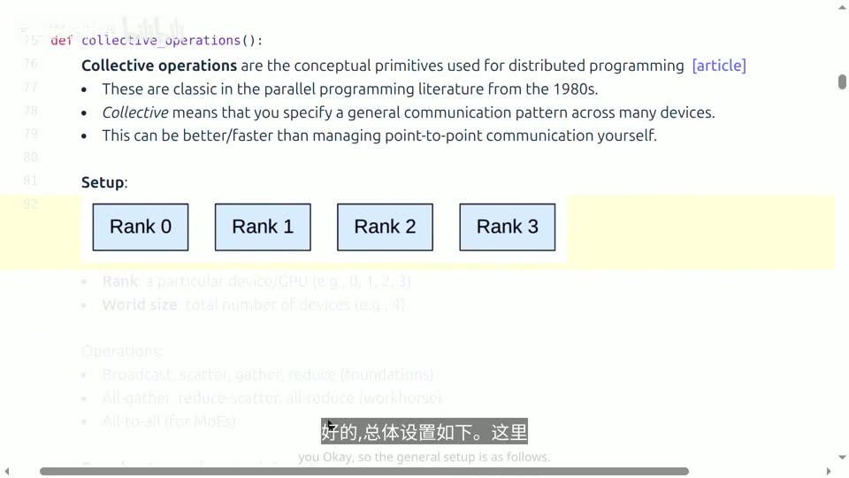

本讲覆盖八个操作。前四个是热身，后面的才是训练中反复出现的"主力"：

| 操作 | 含义 | 类比 |
| --- | --- | --- |
| broadcast | 把某个 rank（如 rank 0）上的张量复制给所有 rank | 一个人念，所有人抄 |
| scatter | 把一个大张量切分后分散到各 rank | 把一叠牌发给每个人 |
| gather | scatter 的逆操作，把各 rank 的片段拼到某个 rank 上 | 把大家的牌收回一人手里 |
| reduce | 在各 rank 的部分数据上做规约（如求和），结果放到某个 rank | 收齐后求和 |
| all-gather | 对**所有** rank 都做 gather，人人拿到完整数据 | 每个人都抄一份全集 |
| reduce-scatter | 对每个分量先规约，再把结果分散到不同 rank | 分工求和，各存一块 |
| all-reduce | ＝ reduce-scatter + all-gather，把规约结果复制到所有 rank | 人人都有完整的和 |
| all-to-all | 每个 rank 指定向哪个 rank 发送哪些元素 | 一次全员互换通信 |

几个热身操作的补充细节：

- **broadcast** 一般不出现在训练的核心路径里，多用于初始化阶段——比如加载一个初始检查点再广播给所有 rank，大概只做一次。([【跳转到 06:53】](https://www.bilibili.com/video/BV11LEA6eEuj/?p=7&t=413))
- **scatter** 本身不直接使用，但它是理解 reduce-scatter 的基石；**gather** 同理，是理解 all-gather 的基石。([【跳转到 07:23】](https://www.bilibili.com/video/BV11LEA6eEuj/?p=7&t=443))
- **reduce** 对函数式编程的人来说并不陌生：执行某种满足**结合律和交换律**的运算（sum、max 等），结果放到指定 rank。有趣的是，gather 也可以看作一种 reduce——它的"规约"就是**拼接（concatenation）**。([【跳转到 08:23】](https://www.bilibili.com/video/BV11LEA6eEuj/?p=7&t=503))
- 课堂问答：这里的 broadcast 和 NumPy 的 broadcasting 是不是一回事？讲者的回答是**概念上同源**（把一个东西分发给多个），但因为这是集体通信，实现上有所不同。还有同学问 gather/reduce 的目标 rank 是不是固定死——不是，调用时**指定 rank 即可**，只是必须在调用时确定。([【跳转到 09:10】](https://www.bilibili.com/video/BV11LEA6eEuj/?p=7&t=550))

> 记忆口诀：reduce 就是"规约"（满足结合律/交换律的运算）；scatter 是 gather 的逆操作——scatter **分散**、gather **汇聚**；"all" 表示目标是**所有**设备。所以 all-reduce＝规约后人人有份，all-gather＝汇总后人人有份。([【跳转到 15:04】](https://www.bilibili.com/video/BV11LEA6eEuj/?p=7&t=904))

### 1.2 all-reduce = reduce-scatter + all-gather：最重要的一条等式

**all-gather**：每个 rank 只有一片参数或数据，all-gather 之后每个 rank 都拿到**完整**的数据。这正是后面"分片存储、用时收集"模式的基石——训练中我们会反复看到"先 gather 干点事，再 scatter，再 gather、再 scatter"的节奏。([【跳转到 09:34】](https://www.bilibili.com/video/BV11LEA6eEuj/?p=7&t=574))

![all-gather：四个 rank 各持有标量 0、1、2、3，操作后每个 rank 都拿到 [0,1,2,3]，即"gather 到所有 rank"。](assets/p07/00604.jpg)

**reduce-scatter**：它 = 在张量的**每个分量**上分别做 reduce，然后把结果散给各 rank。例子里四个 rank 各持有一个错位的向量，逐分量求和得到 [6,10,14,18]，四个分量分别留在四个 rank 上。反向传播后要把不同数据分片算出的梯度加总、再重新分配存储，用的正是它。([【跳转到 10:34】](https://www.bilibili.com/video/BV11LEA6eEuj/?p=7&t=634)、[【跳转到 11:04】](https://www.bilibili.com/video/BV11LEA6eEuj/?p=7&t=664))

**all-reduce**：对一堆张量做规约（如求和），再把结果复制给所有 rank。从"最容易理解"的角度看，它就是"先 reduce-scatter、再 all-gather"两步。注意这个等价关系，下一讲 ZeRO/FSDP 的所有巧妙操作都建立在这条等式上：**因为 all-reduce 可以拆成两步，我们才可能"介入"并对中间状态做分片**。基础版的数据并行用单体 all-reduce 就够了；要进阶到 ZeRO/FSDP，就得把它拆开掌控。([【跳转到 11:34】](https://www.bilibili.com/video/BV11LEA6eEuj/?p=7&t=694)、[【跳转到 12:34】](https://www.bilibili.com/video/BV11LEA6eEuj/?p=7&t=754))

![reduce-scatter 与 all-reduce：输入是四个 rank 上错位的向量，reduce-scatter 把每个分量各自求和后分散存放；而 all-reduce 等于 reduce-scatter + all-gather，把 [6,10,14,18] 复制到所有 rank。](assets/p07/00724.jpg)

### 1.3 all-to-all 与 MoE 的动态路由

**all-to-all** 是最通用的：每个 rank 既可以持有数据的一个切片，也可以持有一组专家（expert）。MoE 的动态路由最终就变成一次 all-to-all——查自己的数据决定把哪些激活值发给哪些专家。若负载均衡（每个 rank 发给其他 rank 的字节数相同），它本质上就是一次**矩阵转置**；实操中最好让划分尽量均衡——这正是 MoE 里"负载均衡损失"存在的原因。当然 all-to-all 也能处理负载不均的情况，可以向任意 rank 发送任意数量的字节，只是均衡时效率最好。([【跳转到 13:04】](https://www.bilibili.com/video/BV11LEA6eEuj/?p=7&t=784)、[【跳转到 14:34】](https://www.bilibili.com/video/BV11LEA6eEuj/?p=7&t=874))

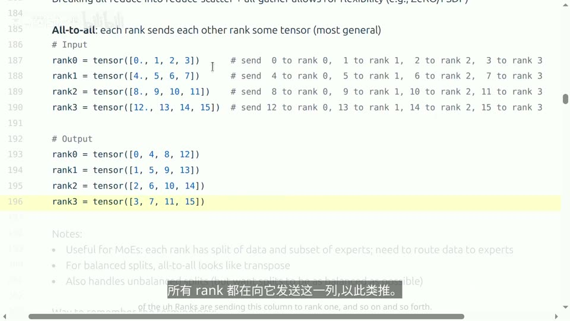

---

## 二、硬件互连：带宽阶梯决定并行边界

### 2.1 从 PCIe/Ethernet 到 NVLink/NVSwitch

要理解并行为什么有代价，先要看 GPU 之间的"路"修得怎么样。把它放进一个广义的存储/通信层次结构里就很清晰：最局部的是单节点单 GPU 内部的寄存器、L1/L2 cache、shared memory，最快；往外是 HBM——上一讲我们还在抱怨它慢，这一讲却要把它当作"高速存储"；再往外是单节点多 GPU，通过 NVLink 连到 NVSwitch；最外层是多节点，通过 InfiniBand 或 Ethernet 互联。([【跳转到 01:30】](https://www.bilibili.com/video/BV11LEA6eEuj/?p=7&t=90))

最朴素的配置是：服务器里有 CPU、PCIe 总线（过去连鼠标键盘都走它）、若干 GPU 和内存，同一节点上的 GPU 走 PCIe，机器之间用 Ethernet 连接——讲者吐槽：这就像你买了游戏显卡、和朋友用网线连起来说"我要训练大模型"，那你就只能这么干。([【跳转到 17:06】](https://www.bilibili.com/video/BV11LEA6eEuj/?p=7&t=1026))

但真正认真做大模型训练时，配置更接近下面这样（[【跳转到 18:15】](https://www.bilibili.com/video/BV11LEA6eEuj/?p=7&t=1095)）：

- 每个节点通常配 **8 块 GPU**，通过 **NVLink** 连接到 **NVSwitch**；从编程视角看，你可以把任意一块 GPU 当作"直接连到"其他任何一块——实际路由交给硬件。以 NVLink 5.0 为例，总带宽达到 **1.8 TB/s**，而 B200 的 HBM 带宽是 **8 TB/s**——NVLink 大约只有 HBM 的四分之一（但比跨网络仍快得多，当然还是比不上 shared memory 或 L1/L2 cache）。
- 集群规模变大后，节点被放进 **pod**，用 **InfiniBand** 互联（经 PCIe → HCA/网卡 → InfiniBand 线缆），带宽约 **0.05 TB/s** 量级，比 NVLink 低得多；GPU 不再直接连 GPU，中间要过好几道环节。
- 再往外，pod 之间只能用 **Ethernet**，数据还得经过 CPU，更慢。这就像内存层次结构：节点越多，越不可能让一个 NVSwitch 去伺候大约 10 万块 GPU。

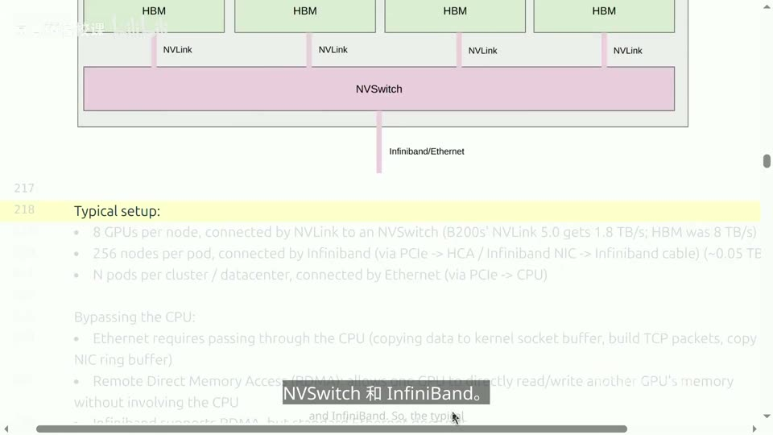

### 2.2 RDMA 与 RoCE：绕过 CPU 是关键

一个重要的硬件细节是**绕过 CPU**。传统 Ethernet 下，GPU 必须先把数据拷给 CPU（内核套接字缓冲区——这里的 kernel 指操作系统内核，不是 GPU kernel），由内核组装网络数据包、再复制到网卡发出，延迟很大。**RDMA（Remote Direct Memory Access，远程直接内存访问）** 让一块 GPU 直接读写另一块 GPU 的内存，整个过程不需要 CPU 参与。NVLink/NVSwitch 与 InfiniBand 都天然支持 RDMA；标准 Ethernet 不支持，但有 **RoCE（RDMA over Converged Ethernet，基于融合以太网的 RDMA）** 来补上——InfiniBand 通常价格不菲，RoCE 让较便宜的以太网也能拿到相当不错的性能；Meta 发过论文研究这个方向，Llama 的训练可能用了融合以太网、也可能没用到。([【跳转到 20:21】](https://www.bilibili.com/video/BV11LEA6eEuj/?p=7&t=1221)、[【跳转到 22:03】](https://www.bilibili.com/video/BV11LEA6eEuj/?p=7&t=1323))

要区分两组概念：**InfiniBand、NVSwitch、NVLink 说的是硬件**（有哪些线缆和交换机），**RDMA 说的是操作层面**（通信时到底发生了什么）。实现 RDMA 有多种方式：NVLink/NVSwitch 是一种，InfiniBand 是一种，RoCE 又是一种。([【跳转到 24:51】](https://www.bilibili.com/video/BV11LEA6eEuj/?p=7&t=1491))

### 2.3 NVL72：把"极快域"从 8 卡扩到 72 卡

NVIDIA 一直在突破单域规模：面向 B200/B300 的 **NVL72** 用 9 个托盘、每托盘 8 块 GPU，把 **72 块 GPU** 连进同一个 NVLink 域。物理上是这样的：每个托盘装两块 Grace CPU，每块 CPU 连 4 块 GPU（所以每托盘 8 块），托盘堆叠起来、全部连到 NVSwitch。普通用户只有 8 卡在"极快域"内，而 NVLink 域之外速度会骤降。([【跳转到 21:29】](https://www.bilibili.com/video/BV11LEA6eEuj/?p=7&t=1289)、[【跳转到 24:28】](https://www.bilibili.com/video/BV11LEA6eEuj/?p=7&t=1468))

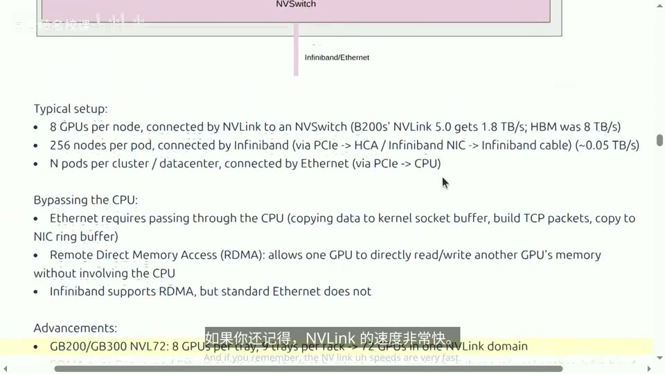

课堂问答的延伸：**"有 9 块 GPU 怎么办？"**——取决于拓扑。若第 9 块落在另一个节点、且两节点之间没有 NVLink/NVSwitch，配置就会非常糟糕：那个节点算力少、通信成本还极高；但如果所有设备都挂在 NVSwitch 上，情况就合理多了。([【跳转到 26:21】](https://www.bilibili.com/video/BV11LEA6eEuj/?p=7&t=1581)
一句话总结这张"带宽地图"：**shared memory < HBM < NVLink/NVSwitch（单节点 8 卡）< InfiniBand（pod 内）< Ethernet（跨 pod 或跨数据中心）**。后面选择并行策略时，本质上就是在问："这种通信需要多快的链路？"

---

## 三、从概念到代码：NCCL 与 torch.distributed

### 3.1 NCCL：把集合操作"翻译"成 GPU 之间的真实数据包

最底层是 **NCCL（NVIDIA Collective Communications Library，读作"nickel"）**：它把 all-reduce、reduce、broadcast 等集合操作翻译成 GPU 之间实际传输的底层数据包。当你调用一次 all-reduce，NCCL 会**分析硬件拓扑**（有多少节点、交换机，走 NVLink 还是 PCIe）、**决定通信路径**（环形还是树形）并**启动 GPU kernel** 来收发数据——别忘了 GPU 上跑的一切归根结底都是 kernel，通信也不例外（还有专门负责与其他 GPU 通信的通信 kernel）。([【跳转到 23:17】](https://www.bilibili.com/video/BV11LEA6eEuj/?p=7&t=1397))

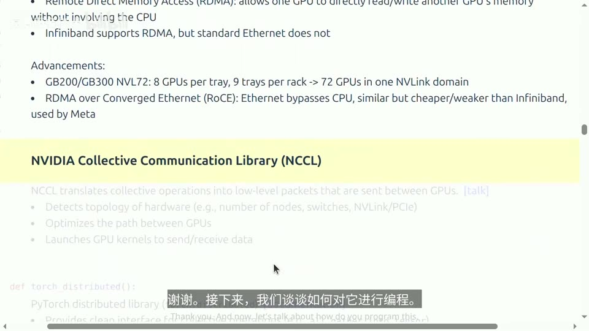

课堂问答：NCCL 是专门针对多节点集群优化的吗？讲者的回答是：具体细节不了解，但 NVIDIA 基本一直在为其整个软件栈做大型模型训练/推理的优化——他们最大的客户就是那些大公司和语言模型提供商，如果没针对这类负载优化过，那才让人意外。([【跳转到 25:51】](https://www.bilibili.com/video/BV11LEA6eEuj/?p=7&t=1551))

### 3.2 spawn 与 setup：进程模型与协调通道

在 NCCL 之上，PyTorch 提供了 `torch.distributed`，后端可选 **NCCL（GPU）** 或 **gloo（CPU）**——并行编程在 GPU 出现之前就存在了，所以 CPU 上也能跑集合操作。本讲因为要在没有多 GPU 的环境里演示，用的是 gloo 后端。这个库还支持更高级的模型和算法，但本课为了"从零构建"不用那些。([【跳转到 27:48】](https://www.bilibili.com/video/BV11LEA6eEuj/?p=7&t=1668))

- `spawn(fn, world_size=4)` 把函数 `fn` 复制运行 4 次，每个进程占据一个 rank（0 到 world_size−1），彼此**异步**、完成顺序任意交错——打印语句出现的顺序就是由硬件决定的任意顺序。([【跳转到 28:25】](https://www.bilibili.com/video/BV11LEA6eEuj/?p=7&t=1705))
- `setup` 配置 `MASTER_ADDR/MASTER_PORT`。注意它**不是** GPU 之间的数据通路，只用于通用的元数据和协调；真正的数据必须走 NCCL，否则会非常慢。([【跳转到 29:17】](https://www.bilibili.com/video/BV11LEA6eEuj/?p=7&t=1757))

### 3.3 barrier 与同步/异步

- `dist.barrier()` 是**同步屏障**：一旦遇到它，进程就会等待所有其他进程都走到这一步才继续。因为进程之间是异步的、谁先跑完没有保证，所以需要它来确保"某些代码先于其他代码执行"；代价是可能产生不必要的等待。([【跳转到 29:47】](https://www.bilibili.com/video/BV11LEA6eEuj/?p=7&t=1787))
- **同步 vs 异步**：`dist.all_reduce(tensor, op=ReduceOp.SUM, async_op=False)` 是同步且**原地写回**——调用后张量内容立刻就是结果；`async_op=True` 会立即返回，之后你可以去做别的事情，最后用 `wait()` 确认完成。使用异步的典型场景是**让计算与通信重叠**：发完通信请求后去处理独立的数据或计算（比如加载下一步需要的数据），等真正需要结果时再同步。([【跳转到 33:13】](https://www.bilibili.com/video/BV11LEA6eEuj/?p=7&t=1993)、[【跳转到 33:50】](https://www.bilibili.com/video/BV11LEA6eEuj/?p=7&t=2030))

### 3.4 现场演示：all-reduce、reduce-scatter 与 all-gather

讲者现场演示了 all-reduce：四个 rank 分别持有 `[0,1,2,3]`、`[1,2,3,4]`、`[2,3,4,5]`、`[3,4,5,6]`，all-reduce（求和）之后每个 rank 都得到 `[6,10,14,18]`——这正是"每一列的和被复制到所有 rank"。([【跳转到 30:51】](https://www.bilibili.com/video/BV11LEA6eEuj/?p=7&t=1851))

接着演示 reduce-scatter：这次**不做原地写入**，而是分别传入输入和输出两个张量——输入基本没被改动，输出里每个分量的规约结果写进对应的 rank。最后把 reduce-scatter 的输出作为输入做 all-gather，得到完整数据复制到所有 rank。这样就用代码实际验证了那条最重要的等式：**all-reduce = reduce-scatter + all-gather**。收尾时讲者还调用了清理环境的函数（`destroy_process_group` 一类的操作）——"清理环境是个好习惯"。([【跳转到 32:02】](https://www.bilibili.com/video/BV11LEA6eEuj/?p=7&t=1922)、[【跳转到 34:56】](https://www.bilibili.com/video/BV11LEA6eEuj/?p=7&t=2096))

---

## 四、量出通信有多快：all-reduce 的有效带宽

### 4.1 两个陷阱：warmup 与"两层异步"

光知道"能通信"不够，还要**量出通信有多快**。做基准测试时有两个陷阱要避开：

- 先 **warmup**（预热），因为第一次调用往往包含初始化开销；
- 用 `torch.cuda.synchronize()` 等待 **CUDA kernel** 真正结束，再用 `dist.barrier()` 等待**所有进程**都到达同一点。为什么要两个都要？因为系统里存在两层异步：每个进程内的 CUDA 操作默认异步（Python 执行下一行时 kernel 可能还没跑完），进程之间也彼此异步。只加 barrier 并不够——如果 kernel 还在运行，各进程只是各自简单地越过了屏障，并没有真正同步。([【跳转到 35:56】](https://www.bilibili.com/video/BV11LEA6eEuj/?p=7&t=2156)、[【跳转到 40:36】](https://www.bilibili.com/video/BV11LEA6eEuj/?p=7&t=2436))

### 4.2 公式：有效带宽与世界大小、拓扑无关

然后把时钟套在操作外面，算出**发了多少字节**、**花了多少时间**。示例对一亿个元素做 all-reduce，耗时约 1.6 毫秒——这算快还是慢？要算有效带宽：

```text
sent_bytes   = size_bytes × 2 × (world_size − 1)   # 2 = 发送+规约；W−1 = 规约迭代步数
total_time   = world_size × duration               # 对所有 rank 加权
effective_BW = sent_bytes / total_time
```

因子的来历：W 个 rank 两两合并求和需要 W−1 步迭代；每步既要**发送**又要**规约**，所以乘 2；时间上对 world_size 个 rank 加权取总量。([【跳转到 37:28】](https://www.bilibili.com/video/BV11LEA6eEuj/?p=7&t=2248))

随着 `W` 增大，`(W−1)/W → 1`，于是 **`effBW ≈ 2S / T`——有效带宽与世界大小无关，也与拓扑（环形还是树形由 NCCL 决定）无关**。示例中测出约 **400 GB/s**，而且这个数字不随 GPU 数量增加而变差。这正是 all-reduce 被广泛使用的原因。([【跳转到 38:11】](https://www.bilibili.com/video/BV11LEA6eEuj/?p=7&t=2291))


### 4.3 reduce-scatter 对照：少做一半事，带宽却相同

reduce-scatter 的测法类似，但字节数**不乘 2**（只有发送、没有单独的规约步骤），量级同样是 400 GB/s 左右（有时有些随机性，大致 400 多）。用一个统一的视角看：**all-reduce 做了 reduce-scatter 和 all-gather 两份工作，所以移动两倍数据，但它也花了两倍时间——两者相互抵消，于是带宽相同**。([【跳转到 39:10】](https://www.bilibili.com/video/BV11LEA6eEuj/?p=7&t=2350)、[【跳转到 39:36】](https://www.bilibili.com/video/BV11LEA6eEuj/?p=7&t=2376))

---

## 五、数据并行（DDP）：只比标准训练多一步

### 5.1 切数据、不切模型：反向传播后 all-reduce 梯度

讲者用最基础的 MLP 来演示三种并行——别忘了 **MLP 才是 Transformer 里真正的计算瓶颈**，所以这个例子很具代表性。([【跳转到 41:31】](https://www.bilibili.com/video/BV11LEA6eEuj/?p=7&t=2491))

**数据并行**的做法是把**数据**拆开：batch 维切成 world_size 份，每个 rank 拿 `batch_size / world_size` 行数据（比如 batch 128、4 个 rank，每个 rank 处理 32 行），但**每个 rank 都维护完整的一份参数**。实际训练中每个 rank 通常会加载自己的数据以避免瓶颈，演示里只是为了方便。前向、反向都和普通训练一模一样，区别只在反向传播之后：对所有参数的梯度做一次 all-reduce 并取平均，于是各 rank 的梯度一致，参数更新后也保持一致。([【跳转到 42:15】](https://www.bilibili.com/video/BV11LEA6eEuj/?p=7&t=2535)、[【跳转到 44:15】](https://www.bilibili.com/video/BV11LEA6eEuj/?p=7&t=2655))

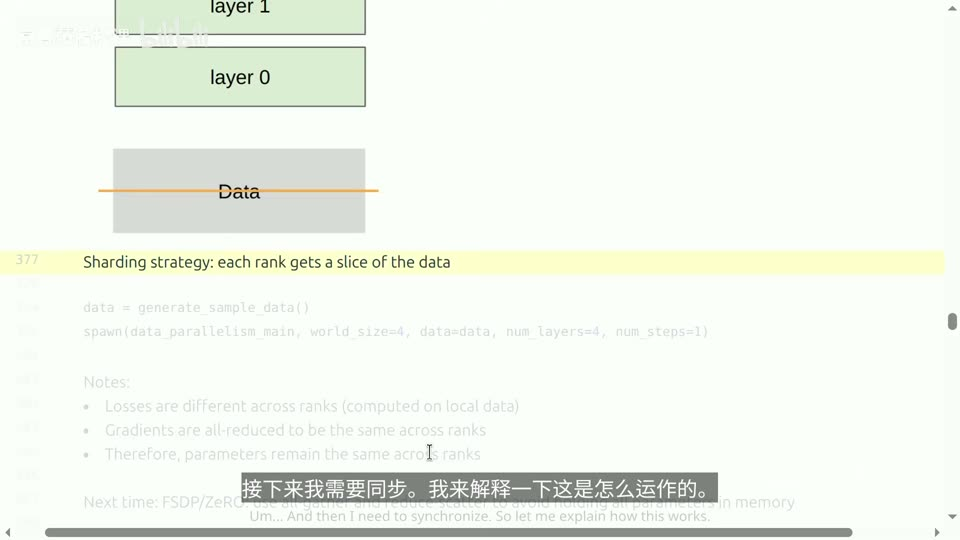

```python
loss.backward()
# 标准训练与 DDP 的唯一区别，就是下面这三行：
for param in params:
    dist.all_reduce(tensor=param.grad, op=dist.ReduceOp.AVG, async_op=False)
optimizer.step()
```

### 5.2 优雅在模块化，约束在 batch size

它优雅在**模块化**：DDP 不关心前向传播长什么样，它只负责"同步参数"这件事——换成 Transformer 也一样，前向照旧、DDP 只对参数做平均（有同学问"Transformer 的 DDP 长什么样"，答案就是：基本一样）。两个约束：batch size **至少不小于 world size**（否则有的卡分不到数据），且最好是其整数倍（否则要补零填充——办法是有的，只是整数倍大家都省事）。([【跳转到 45:29】](https://www.bilibili.com/video/BV11LEA6eEuj/?p=7&t=2729)、[【跳转到 46:01】](https://www.bilibili.com/video/BV11LEA6eEuj/?p=7&t=2761))

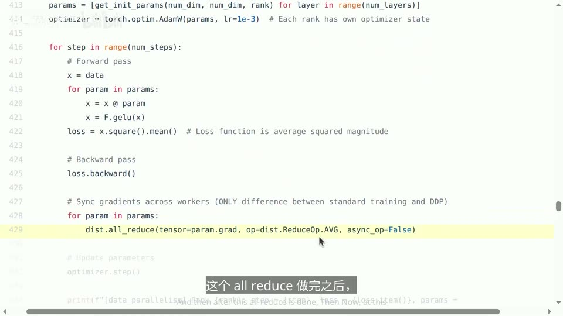

### 5.3 致命局限：内存零节省

数据并行有一个致命局限：**内存毫无节省**——每个 GPU 都存着参数的完整副本，显存占用随卡数线性增长。各个 rank 的损失值不一样、梯度一开始也不一样，但经过规约后就都一致了。如果参数太大根本装不下，就得靠下一讲的 ZeRO/FSDP 把状态分片——all-reduce 像一个"简单的单体操作"，它要求把模型的所有参数都保留在内存里。([【跳转到 46:26】](https://www.bilibili.com/video/BV11LEA6eEuj/?p=7&t=2786)、[【跳转到 46:56】](https://www.bilibili.com/video/BV11LEA6eEuj/?p=7&t=2816))

---

## 六、张量并行：沿"宽度"切，用通信量换显存

### 6.1 列式切分与 all-gather

如果说数据并行切的是**数据**，**张量并行（tensor parallelism）** 切的就是**每一层的参数矩阵**：数据不切，每个 rank 只持有每层的一部分维度，因此每个 rank 都能算出**部分激活值**。代价从一开始就注定：通常需要传输的数据量会大得多。([【跳转到 47:07】](https://www.bilibili.com/video/BV11LEA6eEuj/?p=7&t=2827)、[【跳转到 47:11】](https://www.bilibili.com/video/BV11LEA6eEuj/?p=7&t=2831))

具体做法（本讲演示**列式切分**；按行切也行，这里先不展开）：把每层的参数矩阵沿**列**方向切成 world_size 份，rank i 拿第 i 份。前向传播时，各 rank 用自己那份参数对完整输入 `X` 做矩阵乘法，得到形状为 `batch × 局部维度` 的部分激活；非线性激活函数是逐元素的，局部算完全没问题；然后通过 **all-gather** 把所有 rank 的激活收集齐全，再拼接成完整维度的 `X`，进入下一层——每一层都要这么做一遍。([【跳转到 48:06】](https://www.bilibili.com/video/BV11LEA6eEuj/?p=7&t=2886)、[【跳转到 49:36】](https://www.bilibili.com/video/BV11LEA6eEuj/?p=7&t=2976))

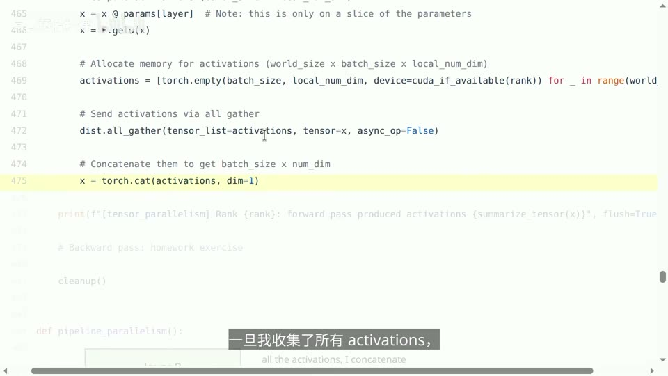

这里有一个漂亮的对偶关系：**前向做 all-gather，则反向就做 reduce-scatter**（梯度要按各自的切分散回去）；反之亦然。all-gather 和 reduce-scatter 就具有这种"双重性"。([【跳转到 51:06】](https://www.bilibili.com/video/BV11LEA6eEuj/?p=7&t=3066))

### 6.2 手动管理：从零构建的代价与意义

要特别注意——**这一讲里整个过程是手动管理的**：你没有调用通常的 `backward` 自动微分来帮你做分布式的部分，得自己调用 reduce-scatter、自己组织前向。有同学问"这些是 autograd 自动完成的吗"——不是，直接调 `backward` 不会做这些，因为其中没有并行；但 PyTorch 其实自带这些功能，很多事情会自动为你完成。这是刻意设计：本课的目标就是"从零构建"，让你看清每一步；实际使用中（比如 PyTorch 自带的并行 API）很多工作会自动完成。([【跳转到 51:36】](https://www.bilibili.com/video/BV11LEA6eEuj/?p=7&t=3096))

还有一点值得对比：数据并行非常优雅，因为它是按数据切分的、模型被当作一个模块来对待；而张量并行**必须对模型本身动手术**——它利用了"矩阵乘法可以拆成一组小矩阵乘法、分别执行再汇总"这一事实。([【跳转到 50:06】](https://www.bilibili.com/video/BV11LEA6eEuj/?p=7&t=3006))

### 6.3 通信代价：只适合 NVLink 域内

代价是**通信量大**：几乎每一层都要传输相当大的激活值，而且是 all-gather/reduce-scatter 级别的通信。因此张量并行通常**只放在节点内部**（NVLink 高带宽域），一般不超过 8 路；一旦跨出单机、走到速度慢得多的节点间网络，性能就会大幅下跌。它不会像流水线那样产生"气泡"、复杂度也较低，但非常吃带宽。([【跳转到 57:18】](https://www.bilibili.com/video/BV11LEA6eEuj/?p=7&t=3438))

---

## 七、流水线并行：沿"深度"切，用 micro-batch 填满气泡

### 7.1 朴素切法的"气泡"问题

**流水线并行（pipeline parallelism）** 沿**深度**方向切：每个 rank 负责模型的一部分层（`local_num_layers`），但每层内部保留全部维度；rank 之间用**点对点**的 send/recv 传递激活值——rank i 从 rank i−1 接收张量、算完自己负责的层后发给 rank i+1。前向是从第 0 个 rank 一路往后传激活，反向则把部分梯度往前传回来。([【跳转到 52:36】](https://www.bilibili.com/video/BV11LEA6eEuj/?p=7&t=3156))

最自然的问题是**流水线气泡（bubble）**：如果一次只处理一个 batch，那么同一时刻只有一块 GPU 在工作，其余都在空等——没有在计算，只是在等别的张量，利用率极差。([【跳转到 54:45】](https://www.bilibili.com/video/BV11LEA6eEuj/?p=7&t=3285))

### 7.2 micro-batch 与通信/计算重叠

解决办法是引入 **micro-batch**：把 batch 拆成更小的批次（演示里每 4 个一组），rank 0 处理完一个 micro-batch 立刻传给 rank 1、并马上开始处理下一个，让数据像流水线一样在层级间持续流动，从而把空闲时间压下去。([【跳转到 54:45】](https://www.bilibili.com/video/BV11LEA6eEuj/?p=7&t=3285))

**通信与计算的重叠**对流水线并行尤其关键：把接收/发送设计成异步（在函数名前加个 `i`，如 `isend/irecv`），就可以在计算的同时收发数据——"当你在这儿计算的时候，你可以同时接收或发送数据"。其实数据并行也一样：本讲的演示只做了一次前向、最后一次性 all-reduce；但如果你处理得当，反向传播中某个梯度一算完就可以开始发送，让通信"藏"在计算里，而不是等所有梯度算完再一次性 all-reduce。本讲这一部分没有展开，留给了下一讲。([【跳转到 55:33】](https://www.bilibili.com/video/BV11LEA6eEuj/?p=7&t=3333))

### 7.3 适用场景：容忍慢网络

流水线并行的**通信量最小**：它只涉及层与层之间 `B×S×H`（batch × 序列长度 × 隐藏维度）的激活值传递，而不是 all-reduce 那样把整个参数矩阵翻来覆去。因此它能容忍慢得多的互联网络——一些**去中心化训练**工作会使用流水线并行，因为 GPU 节点实际上分布在世界各地；那种情况下你绝不会想用张量并行。它能否高效，取决于 batch size 和 micro-batch 的数量：micro-batch 越多，气泡占比越小。([【跳转到 55:03】](https://www.bilibili.com/video/BV11LEA6eEuj/?p=7&t=3303)、[【跳转到 57:22】](https://www.bilibili.com/video/BV11LEA6eEuj/?p=7&t=3442))

---

## 八、如何选择与组合：先用满数据并行，再按硬件层级往上叠

### 8.1 硬件决定策略

三种策略比较下来，选择很大程度上**取决于硬件**：

- **张量并行**吃带宽，放在 NVLink 域内（节点内）；
- **流水线并行**容忍慢网络，可以跨节点、跨 pod 使用；
- **数据并行**最省心，但受**临界批次大小（critical batch size）** 约束：batch 加到一定程度就会收益递减，再大就是浪费算力——此时改用张量并行更划算。([【跳转到 57:52】](https://www.bilibili.com/video/BV11LEA6eEuj/?p=7&t=3472))

### 8.2 典型组合与没讲到的两种并行

典型的组合是"从内到外"：**节点内张量并行 → 叠加数据并行或 FSDP → 最后用流水线并行跨节点**。除此之外还有两种本讲没细讲的并行：**序列并行**（把整个序列拆分成小块，从而实现 attention 计算的并行化）和**专家并行**（并行化 MoE 的各个专家，正是 all-to-all 大显身手之处）；不同并行技术的各种组合也会出现，这些内容在作业中都会涉及。([【跳转到 56:22】](https://www.bilibili.com/video/BV11LEA6eEuj/?p=7&t=3382)、[【跳转到 57:52】](https://www.bilibili.com/video/BV11LEA6eEuj/?p=7&t=3472))

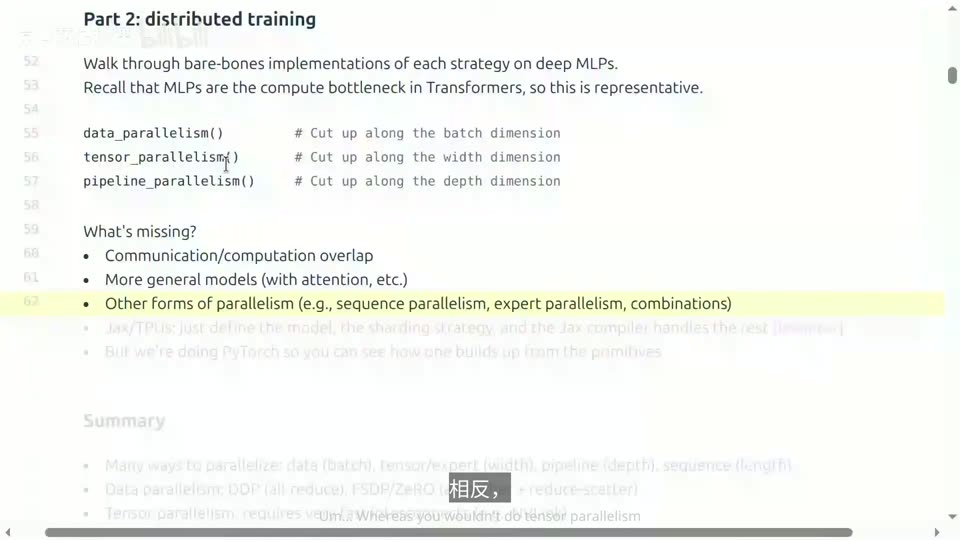

### 8.3 另一条路线：JAX/TPU 的"编译器魔法"

还有一种更省心的路线（如 JAX/TPU）：你只**定义模型和分片策略**——"这块数据得放在这儿、这儿和这儿"——编译器就会自动推导出所需的通信操作并完成其余"魔法"。这确实很吸引人，但代价是少了从零构建的乐趣与掌控感；本课特意选用 PyTorch、而且用很基础的方式调用集合操作，就是为了让你看得更清楚。([【跳转到 58:22】](https://www.bilibili.com/video/BV11LEA6eEuj/?p=7&t=3502))

---

## 小结

1. **集合通信是分布式训练的语言**：broadcast/scatter/gather/reduce 是基础热身，all-gather/reduce-scatter/all-reduce 是主力，all-to-all 服务于 MoE 路由。最重要的一条等式是 **all-reduce = reduce-scatter + all-gather**——它让下一讲的 ZeRO/FSDP 成为可能。
2. **硬件层次决定通信代价**：shared memory < HBM < NVLink/NVSwitch（单节点 8 卡，NVLink 5.0 约 1.8 TB/s）< InfiniBand（pod 内，约 0.05 TB/s）< Ethernet（跨 pod）。RDMA 让 GPU 绕过 CPU 直接访存；RoCE 把这个能力带给了以太网；NVL72 把一个 NVLink 域扩展到 72 块 GPU。
3. **编程接口分两层**：NCCL 负责把集合操作翻译成真实数据包、探测拓扑、启动通信 kernel；`torch.distributed`（NCCL/gloo 后端）提供 `spawn/barrier/all_reduce/all_gather/reduce_scatter` 等接口，异步模式 `async_op=True` 是通信与计算重叠的基础。
4. **测带宽要小心两层异步**：先 warmup，再用 `torch.cuda.synchronize()` + `dist.barrier()` 对齐 CUDA kernel 和进程。all-reduce 的有效带宽 `≈ 2S/T`，**与世界大小和拓扑无关**，示例约 400 GB/s；all-reduce 比 reduce-scatter 多做一倍工作、也多花一倍时间，带宽相同。
5. **数据并行（DDP）** 只比标准训练多一步"反向后 all-reduce 梯度"，模块化、优雅，但每个 GPU 存完整副本，**内存零节省**。
6. **张量并行**沿宽度切、每层都要通信、需手动管理，前后向存在 all-gather/reduce-scatter 的**对偶**；适合 NVLink 域内（≤8 路）。
7. **流水线并行**沿深度切、通信量最小、能容忍慢网络，但要用 **micro-batch 压缩气泡**，并重视通信与计算的重叠。
8. **组合原则**：先尽量把数据并行拉满；放不下时在高速域内用张量并行切开；再用流水线并行/FSDP 跨节点；batch 太小就用梯度累积补。

下一讲 Tatsu 会深入 FSDP 与 ZeRO 等更高级的数据并行技术，以及真正的"4D 并行"。

---

## 关键术语速查

| 术语 | 一句话解释 |
| --- | --- |
| rank / world size | rank 是设备编号（本课中 rank 就是 GPU），world size 是设备总数 |
| 集合通信（collective） | 指定"跨多个设备的通用通信模式"的原语，而不是手动管理点对点通信 |
| broadcast / scatter / gather / reduce | 复制给所有 rank / 把大张量分散 / 把各片段汇聚 / 规约到某个 rank |
| all-gather | 每个 rank 收集齐全部片段，人人拿到完整数据 |
| reduce-scatter | 对每个分量先规约，再把结果分散到各 rank |
| all-reduce | reduce-scatter + all-gather，把规约结果复制到所有 rank |
| all-to-all | 每个 rank 按指定目的地发送元素；MoE 路由的通信模式，均衡时相当于矩阵转置 |
| NVLink / NVSwitch | 单节点内 GPU 的高速互联（NVLink 5.0 约 1.8 TB/s）与交换硬件 |
| InfiniBand / Ethernet | 节点间/pod 间网络，带宽依次降低；前者支持 RDMA |
| RDMA | 远程直接内存访问：GPU 直接读写另一块 GPU 的内存，不经过 CPU |
| RoCE | 基于融合以太网的 RDMA，让较便宜的以太网也能绕过 CPU |
| NCCL | NVIDIA 集合通信库：把集合操作翻译成底层数据包并启动 GPU kernel |
| gloo | PyTorch 的 CPU 集合通信后端 |
| DDP（数据并行） | 切 batch、每卡完整参数，反向传播后 all-reduce 梯度 |
| 张量并行 | 切每层参数矩阵（宽度），前向 all-gather 激活、反向 reduce-scatter |
| 流水线并行 | 按层切分（深度），点对点传激活，需 micro-batch 减少气泡 |
| micro-batch | 把一个大 batch 拆成的小批次，用于填充流水线 |
| 气泡（bubble） | 流水线中某些 GPU 无事可做的空闲时间 |
| 有效带宽 | 传输字节数 ÷ 总耗时；all-reduce 约为 `2S/T`，与 world size 无关 |
| 临界批次大小 | batch 增大到收益开始递减的临界点，超过它就浪费算力 |

---

<!-- ===== Lecture 8 Parallelism.md ===== -->

# Lecture 8: Parallelism

## 本讲要解决的核心问题（SCQA）

**背景（Situation）**：上一讲 Percy 打好了并行化的底层地基——集合通信原语（all-reduce/all-gather/reduce-scatter…）与硬件拓扑，并带我们看了数据并行、张量并行、流水线并行各自的"骨架"。

**冲突（Complication）**：真正在超大规模集群上训练超大模型时，没有任何一种并行策略能单独解决问题。模型的参数、梯度、优化器状态、激活值会从四个方向压垮显存；而"多卡"带来的又不仅仅是显存红利——batch size 是有限的资源，网络有快有慢，每种并行都在不同的资源上收"过路费"。这就是为什么作业里会有一项任务：**给定网络拓扑和模型规模，找出较优的并行策略**。

**疑问（Question）**：把这些并行策略真正组合起来时，各自要付出多少通信与显存代价？面对一个"装不下"的模型，应该按什么顺序、在什么硬件层级上切开它？

**回答（Answer，结论先行）**：核心洞察是——**今天的计算单元已经不是一块 GPU，而是整个数据中心**。要在控制显存、控制算力的同时"无损"地利用所有资源。本讲的主线是：

1. 数据并行的**内存账本**（约每参数 16 字节、五份权重副本）是问题的根源，由此引出 **ZeRO 的三级分片**：优化器状态（Stage 1）→ 梯度（Stage 2）→ 参数（Stage 3 = **FSDP**）。前两级通信与 DDP 等价，等于白捡显存；FSDP 多一次 all-gather，但靠"增量式通信 + 通信计算重叠"几乎免费。
2. 数据并行在消耗 **batch size**（受临界批次大小限制），且不省激活内存，所以需要**模型并行**：FSDP 来回搬**参数**，模型并行来回搬**激活值**。
3. 具体工具有：**流水线并行**（切深度，用 micro-batch 压气泡，零气泡调度）、**张量并行**（切宽度，吃带宽，限 NVLink 域）、**专家并行**（MoE 首选，取代 TP）、**序列/上下文并行**（削减激活内存）。
4. 最后是**4D 并行**的经验法则与 OLMo、DeepSeek、Llama 3、Gemma 2、Mixtral 等真实案例。

---

## 一、硬件分野：TPU 环形网格 vs GPU 胖树

### 1.1 两种网络哲学

今天讨论的大部分算法与硬件无关，但底层网络会**深刻影响**各家公司选择哪种并行策略，因此值得先看清两家的设计哲学。([【跳转到 03:22】](https://www.bilibili.com/video/BV11LEA6eEuj/?p=8&t=202))

- **TPU（Google）** 的网络是**环形网格（toroidal mesh）**：芯片只与邻居相连，并且首尾相接。好处是网络拓扑极简、几乎可以无限扩展——无论规模多大，每个芯片连接的邻居数基本不变。这种结构天然适合**通信量小、划分可预测**的负载：比如 MoE 把 token 路由到相邻专家，又比如高度规则的张量并行。
- **GPU（NVIDIA）** 的网络更像**胖树（fat-tree）/ 全对全（all-to-all）**：节点内 GPU 极快互联，然后 GPU 组成 pod、pod 之间用交换机互联。随着节点增加，树越来越大，成本与复杂度上升，但换来的是灵活——任意两块 GPU 都能高效通信。

([【跳转到 04:22】](https://www.bilibili.com/video/BV11LEA6eEuj/?p=8&t=262))


### 1.2 负载决定网络：TPU v8i 与 Virgo

有趣的是，**Google 在 TPU v8i 上开始转向更彻底的 all-to-all**（如 Virgo 网络）。原因很合理：现在的模型几乎都是 MoE，推理时把 token 路由到不同专家会造成"到处乱窜"的带宽流量，这种路由通信才是真正的瓶颈。所以是**负载决定了我们需要什么样的网络**——TPU 与 GPU 的网络在相互靠拢。([【跳转到 06:14】](https://www.bilibili.com/video/BV11LEA6eEuj/?p=8&t=374))

### 1.3 一个对照案例：华为 CloudMatrix 384

讲者还举了一个中国 AI 圈的对照案例：**华为 CloudMatrix 384**。单看芯片，它的矩阵乘法速度比 H200 差不少；但它用光纤交换机把 **384 颗芯片**连在一个机架上，用"连接多得多的芯片"来弥补单芯片的不足——代价是功耗约达到英伟达系统的**四倍**。这正体现了硬件设计中的根本权衡：想省电、好造，会得到一种结果；想用蛮力解决通信问题，会得到完全不同的另一种。([【跳转到 07:13】](https://www.bilibili.com/video/BV11LEA6eEuj/?p=8&t=433))

---

## 二、数据并行的内存账本

### 2.1 三条扩展性质

数据并行最容易理解，也是标准做法。以基础 SGD 为例：一个 batch 大小 `B`，分给 `M` 台机器，每台算大小为 `B/M` 的小批次梯度，最后把所有梯度同步求和。它的三条扩展性质是（[【跳转到 09:45】](https://www.bilibili.com/video/BV11LEA6eEuj/?p=8&t=585)、[【跳转到 10:15】](https://www.bilibili.com/video/BV11LEA6eEuj/?p=8&t=615)）：

- **计算扩展性**：完美，只要每块 GPU 上的样本量足够；
- **通信量**：每个 batch 需传输约 `2 × #params` 大小的数据（梯度在机器间来回）；
- **内存扩展性**：**完全没有**——每块 GPU 都存模型完整副本，激活值也保持不变，一点内存都没省。

### 2.2 每参数约 16 字节、五份权重副本

而内存恰恰是灾难。按经验法则（取决于精度），我们大约需要**五份权重副本、每个参数约 16 字节**（[【跳转到 11:35】](https://www.bilibili.com/video/BV11LEA6eEuj/?p=8&t=695)）：

| 副本 | 精度 | 每参数字节 |
| --- | --- | --- |
| 参数（模型权重） | fp16/bf16 | 2 |
| 梯度 | fp16/bf16 | 2 |
| fp32 主权重（累加器） | fp32 | 4 |
| Adam 一阶矩 | fp32 | 4 |
| Adam 二阶矩 | fp32 | 4 |
| **合计** | | **约 16 字节** |

注意这里还可能有更高精度的临时累加器，而 Adam 还要一直跟踪一阶矩和二阶矩两份状态。算下来，**优化器状态占了大头，比参数和梯度加起来还多**。朴素数据并行把这整堆东西复制到每块 GPU 上：显存占用随加速器数量**线性增长**，非常糟糕。([【跳转到 12:15】](https://www.bilibili.com/video/BV11LEA6eEuj/?p=8&t=735))


自然的想法是：把这些状态**分片**到不同 GPU 上。ZeRO 沿着"优化器状态 → 梯度 → 参数"逐步分片，显存节省惊人——比如从 120 GB 依次降到 31.4 GB、16.6 GB、1.9 GB（图中参数规模 7.5B、`N_d=64` 的例子）——而通信代价的变化却出奇地温和。接下来逐一拆解这三个阶段。([【跳转到 12:45】](https://www.bilibili.com/video/BV11LEA6eEuj/?p=8&t=765))

---

## 三、ZeRO：三级分片与 FSDP

### 3.1 Stage 1：只分片优化器状态

每个 worker 照常在各自的数据上算出**完整梯度**，然后（[【跳转到 13:43】](https://www.bilibili.com/video/BV11LEA6eEuj/?p=8&t=823)、[【跳转到 14:02】](https://www.bilibili.com/video/BV11LEA6eEuj/?p=8&t=842)）：

1. 用 **reduce-scatter** 把梯度分发出去——每个 worker 只保留"自己负责更新的那一块参数"对应的梯度；
2. 各自用本地的优化器状态更新参数；
3. 用 **all-gather** 把更新后的参数收集回来，发回所有机器。

通信是 reduce-scatter + all-gather，而我们已经知道这**等价于一次 all-reduce**。因此 **ZeRO Stage 1 的通信特性和朴素 DDP 完全一样**——内存节省是白捡的。参数量以及所有非优化器状态的开销都除以 `N_gpu`，显存立刻好转。([【跳转到 15:06】](https://www.bilibili.com/video/BV11LEA6eEuj/?p=8&t=906)、[【跳转到 15:36】](https://www.bilibili.com/video/BV11LEA6eEuj/?p=8&t=936))

### 3.2 Stage 2：连梯度也分片——边算边发

这一步更棘手，因为之前依赖"能物化完整梯度"这个前提，现在连完整梯度都不能有。做法是一个系统层面的技巧：**不要一次性物化整个梯度向量**，而是沿计算图反向遍历，算完某一层的梯度就**立即规约并发送给对应的工作节点**，当某个梯度不再被需要时立刻释放。边算边发与一次性做完，结果完全一样，成本也没有增加。([【跳转到 15:45】](https://www.bilibili.com/video/BV11LEA6eEuj/?p=8&t=945)、[【跳转到 16:12】](https://www.bilibili.com/video/BV11LEA6eEuj/?p=8&t=972))

### 3.3 Stage 3 = FSDP：连参数也分片

最后连**参数**也分片，这就是 ZeRO Stage 3，也就是 PyTorch 里的 **FSDP（Fully Sharded Data Parallel，完全分片数据并行）**。此时每块 GPU 任意时刻只持有参数、梯度、优化器状态的一小块。运行方式（按层处理，[【跳转到 17:18】](https://www.bilibili.com/video/BV11LEA6eEuj/?p=8&t=1038)、[【跳转到 17:48】](https://www.bilibili.com/video/BV11LEA6eEuj/?p=8&t=1068)）：

1. 用 **all-gather** 拿到这一层的完整权重；
2. 做这一层的前向传播，做完立刻**释放**权重；
3. 反向传播时，按需再次 all-gather 拿回权重，算出梯度；
4. 用 **reduce-scatter** 把梯度发回各自 owner，然后释放权重；
5. 循环往复，最后更新权重。


于是每层要做**两次 all-gather + 一次 reduce-scatter**，比 DDP 多了一次 all-gather。但两个关键想法让开销几乎可以忽略（[【跳转到 18:32】](https://www.bilibili.com/video/BV11LEA6eEuj/?p=8&t=1112)、[【跳转到 19:02】](https://www.bilibili.com/video/BV11LEA6eEuj/?p=8&t=1142)）：

- **增量式通信（incremental computation/communication）**：扫一遍计算图，做完必要通信就立刻释放内存；
- **通信与计算重叠**：在第 i 层做前向/反向计算的同时，对第 i+1 层发起 all-gather。只要算力够、网络够快，计算耗时就能长于通信耗时，通信被"藏"进计算里。


FSDP 效果相当出色：在约 100 块 GPU 上，朴素方法连 7B 模型都放不下，而 ZeRO-3/FSDP 能容纳 500B 级别的模型。它概念上也很简单——写一个包装器，把任意模块包成 FSDP 版本（**作业里就要写这个**），内部就是"一堆 all-gather、计算、释放，反向时重复"。正因如此，**小模型（如 7B 级）常常纯靠 FSDP 训练**，扩展性出奇地好。([【跳转到 22:47】](https://www.bilibili.com/video/BV11LEA6eEuj/?p=8&t=1367)、[【跳转到 20:52】](https://www.bilibili.com/video/BV11LEA6eEuj/?p=8&t=1252))

课堂上有同学问"这是不是从下一块 GPU 拿梯度来算上一块的梯度"——讲者借此澄清了一个容易混淆的概念：**FSDP 不是流水线并行**。在 FSDP 下，每块 GPU 都会**从头到尾跑完整个模型**，只是任何一块 GPU 都不同时存下所有参数；参数按需取来、算完即放。这正是它"包装器"式简单的原因。([【跳转到 21:25】](https://www.bilibili.com/video/BV11LEA6eEuj/?p=8&t=1285)、[【跳转到 22:02】](https://www.bilibili.com/video/BV11LEA6eEuj/?p=8&t=1322))

还有一个课堂问答的细节：**为什么通信开销不随层数成倍增加？** 因为计算量随层数成倍增加，而每块通信的数据量其实更小——毕竟每层只是一个小矩阵乘法的量，对比"整个网络做 all-reduce"的大开销，这些开销累加起来是可控的。另外，从 H100 换到 H200/B200 时，这套内存账的数学关系基本是**线性**的，底层逻辑不变。([【跳转到 22:27】](https://www.bilibili.com/video/BV11LEA6eEuj/?p=8&t=1347)、[【跳转到 23:07】](https://www.bilibili.com/video/BV11LEA6eEuj/?p=8&t=1387))

### 3.4 三种 ZeRO 阶段的开销对比

| 方案 | 通信开销 | 说明 |
| --- | --- | --- |
| DDP（朴素数据并行） | 每次更新约 `2×#params` | 一次 all-reduce |
| ZeRO-1 / ZeRO-2 | 与 DDP 相同 | "字面意义上免费"，因为 all-reduce = RS + AG |
| ZeRO-3 = FSDP | 技术上更多（多一次 all-gather） | 但能被巧妙地藏进计算，GPU 利用率接近单卡 |

([【跳转到 20:22】](https://www.bilibili.com/video/BV11LEA6eEuj/?p=8&t=1222))

---

## 四、为什么还需要模型并行

### 4.1 batch 是一项会被消耗的有限资源

数据并行有一个隐形天花板：它在**消耗 batch size 这项资源**。batch 是 8，最多只能用 8 个加速器；而盲目加大 batch 又会碰到**临界批次大小（critical batch size）**——过了临界点，加样本的收益还不如多跑几步 SGD。于是陷入两难：用小 batch 会让 GPU 闲置，用大 batch 又要忍受优化效果上的损失。([【跳转到 23:33】](https://www.bilibili.com/video/BV11LEA6eEuj/?p=8&t=1413)、[【跳转到 24:03】](https://www.bilibili.com/video/BV11LEA6eEuj/?p=8&t=1443))

### 4.2 FSDP 搬参数，模型并行搬激活

此外，ZeRO 的 Stage 1/2 虽然能把状态内存除以 `N_gpu`，但**激活内存和其他类型的内存它们管不了**；FSDP 也主要在处理参数相关的内存。我们需要更细的模型切分方法。

关键区别在于：**FSDP 来回搬的是参数，而模型并行来回搬的是激活值**。一旦一层在 GPU 0、下一层在 GPU 1，两层之间传递的就是激活值——这就是模型并行与 FSDP 最大的不同。模型并行主要有三支（[【跳转到 24:56】](https://www.bilibili.com/video/BV11LEA6eEuj/?p=8&t=1496)、[【跳转到 25:26】](https://www.bilibili.com/video/BV11LEA6eEuj/?p=8&t=1526)）：

- **流水线并行（pipeline parallel）**：切层，沿深度方向；
- **张量并行（tensor parallel）**：切矩阵，沿宽度方向；
- **专家并行（expert parallel）**：把专家分散到不同设备。

---

## 五、流水线并行：气泡、micro-batch 与零气泡

### 5.1 朴素切法与气泡

把层切到不同 GPU 上，前向传激活、反向传部分梯度。最朴素的做法会得到一张"很难看"的时空图：同一时刻只有一块 GPU 在工作，其余全部空等——这就是**气泡（bubble）**，利用率非常差。([【跳转到 26:38】](https://www.bilibili.com/video/BV11LEA6eEuj/?p=8&t=1598))


### 5.2 micro-batch 与气泡占比公式

解决办法是做**批处理/流水线化**：把数据拆成多个 **micro-batch**，处理完一个立刻传给下一级、并开始处理下一个，让元素在层级间持续流动。气泡时间与有效计算的比值大致为：

```text
bubble_time / useful_time ≈ (n_stages − 1) / n_micro
```

所以要压小气泡，就得用**很大的 batch size**（即很多 micro-batch）。这也解释了为什么前面说临界批次大小之外的"富余 batch"应该拿去喂流水线。NVIDIA 的 Megatron 论文做过漂亮的参数扫描：**大 batch + 大 pipeline size 时利用率几乎和不用流水线并行一样高；但 batch 一小，流水线并行就会迅速拉低利用率**。([【跳转到 27:19】](https://www.bilibili.com/video/BV11LEA6eEuj/?p=8&t=1639)、[【跳转到 28:40】](https://www.bilibili.com/video/BV11LEA6eEuj/?p=8&t=1720))

### 5.3 为什么明知头疼还要用：通信特性好

既然流水线听着这么麻烦（圈子里常说：并行代码人人看得懂，直到你实现流水线并行），为什么还要用它？理由：**省内存**（相比 DDP，层被切开了）、可以和别的并行结合；更重要的是它的**通信特性极好**——只涉及层间激活 `b×s×h` 的**点对点**通信，而不是 all-to-all。因此实操中我们把它放在**网速最慢的链路**上（跨节点、跨 pod，甚至跨数据中心），这是能用上的通信效率最高的并行方式。([【跳转到 27:42】](https://www.bilibili.com/video/BV11LEA6eEuj/?p=8&t=1662)、[【跳转到 28:12】](https://www.bilibili.com/video/BV11LEA6eEuj/?p=8&t=1692))


### 5.4 零气泡流水线：把反向拆成 B 与 W

**零气泡流水线（zero-bubble pipeline）** 更进一步。反向传播其实有两件事（[【跳转到 30:12】](https://www.bilibili.com/video/BV11LEA6eEuj/?p=8&t=1812)、[【跳转到 30:42】](https://www.bilibili.com/video/BV11LEA6eEuj/?p=8&t=1842)）：

- **B**：把偏导数沿计算图**往回传**（backpropagating activations）。它在关键路径上，必须尽快完成，否则下一阶段没法干活；
- **W**：计算**当前权重的梯度**（computing weight gradients）。它相当于计算图里的叶节点，**什么时候做都行**。

于是把两者拆开：先尽可能快地做 `B`，把 `W` 往后塞进计算空隙，就能几乎把流水线填满——气泡接近消除（具体效果取决于 W 和 B 各自的工作负载）。它实现复杂（比大家平时想处理的要复杂得多），但换来几乎彻底的流水线利用率。讲者感叹：能用系统做出这么巧妙的东西，真是聪明。([【跳转到 31:12】](https://www.bilibili.com/video/BV11LEA6eEuj/?p=8&t=1872))


顺带一提，除了零气泡调度，还有一些**更聪明的调度技巧**（来自 DeepSeek 的论文）：把不同层、不同 micro-batch 的各阶段切分开，把前向和反向的不同步骤穿插起来，也能进一步压小气泡。([【跳转到 29:38】](https://www.bilibili.com/video/BV11LEA6eEuj/?p=8&t=1778))

---

## 六、张量并行：切宽度与对偶性

### 6.1 沿宽度切：分块矩阵乘法的反复应用

如果说流水线并行是沿**深度**切，那张量并行就是沿**宽度**切：把矩阵乘法拆成更小的矩阵乘法，最后把部分和加起来——和分块（tiling）是同一个思路，核心原语反复出现。([【跳转到 32:21】](https://www.bilibili.com/video/BV11LEA6eEuj/?p=8&t=1941))

以 `Y = GELU(XA)`、`Z = Dropout(YB)` 为例：前向时把 `X` 复制两份，`A` 按列切成 `[A₁,A₂]`、`B` 按行切成 `[B₁;B₂]`，分别放到不同 GPU 上并行计算，最后把结果聚合回来。([【跳转到 32:29】](https://www.bilibili.com/video/BV11LEA6eEuj/?p=8&t=1949)、[【跳转到 32:59】](https://www.bilibili.com/video/BV11LEA6eEuj/?p=8&t=1979))


### 6.2 前向/反向的对偶与放置规则

关键的**对偶关系**：前向里 `f` 是恒等函数、`g` 是 **all-reduce**（把两个部分和聚合）；反向传播时恰好反过来——`g` 变成恒等，`f` 变成对部分梯度的求和（all-reduce）。写张量并行实现时，这个对偶性非常重要。([【跳转到 33:29】](https://www.bilibili.com/video/BV11LEA6eEuj/?p=8&t=2009))

具体放置上：**按列切分**发生在每层的输入端（MLP 上投影、注意力的 QKV 投影），**按行切分**发生在第二阶段（MLP 下投影、注意力输出投影）；而 LayerNorm、非线性激活、MoE 路由器这些**小层完整复制**在每台机器上——没必要为它们引入额外的通信开销。([【跳转到 33:34】](https://www.bilibili.com/video/BV11LEA6eEuj/?p=8&t=2014))

### 6.3 通信代价：锁在 NVLink 域内，TPU 则不然

代价是通信：**每次矩阵乘法都要通信**，前向一次 all-reduce（在 all-gather 处）、反向一次 all-reduce，数据量与激活值相当，而且执行极其频繁。所以张量并行非常吃带宽，一般**只在节点内部**（8 卡高速互联）做；一旦跨出单机、走到慢得多的节点间网络，性能就会大幅下跌。([【跳转到 34:19】](https://www.bilibili.com/video/BV11LEA6eEuj/?p=8&t=2059)、[【跳转到 35:01】](https://www.bilibili.com/video/BV11LEA6eEuj/?p=8&t=2101))

对比一下 TPU：**TPU 没有"前 8 卡快、后面慢"的区别**——它是一整块网格，高度规则的通信模式能提供高带宽，因此能支持大得多的张量并行规模。所以用 TPU 还是 GPU，会直接改变张量并行与流水线并行的配比。([【跳转到 35:31】](https://www.bilibili.com/video/BV11LEA6eEuj/?p=8&t=2131))

两种方案对比：都属于模型切分策略，都能省参数和激活开销。**张量并行通常没有气泡、复杂度低（就是切矩阵），但通信量大**——以前是 `b×s×h` 的点对点，现在要做约 `8×b×s×h` 的一次 all-reduce（不只是点对点，还得全对全）。所以只要互联够快，张量并行就是好方案；否则就得用流水线并行。([【跳转到 36:05】](https://www.bilibili.com/video/BV11LEA6eEuj/?p=8&t=2165))

---

## 七、激活内存：被低估的大头

### 7.1 实测：内存峰值出现在激活上

到目前为止我们讨论的其实主要是**参数内存**。但对内存最天真的理解就是"内存 = 参数"（图中绿色）。用 PyTorch profiler 实测会发现：还有优化器状态（黄色），以及计算过程中为保存激活值而留下的**巨大动态内存**（图中红色峰值）——它往往出现在开始反向传播、仍需保存大量激活值的时刻。([【跳转到 36:19】](https://www.bilibili.com/video/BV11LEA6eEuj/?p=8&t=2179)、[【跳转到 36:49】](https://www.bilibili.com/video/BV11LEA6eEuj/?p=8&t=2209))


看现代语言模型的工作负载：对中等长度序列，随着模型变大，**激活内存往往会远超参数内存**——所以任何内存优化都必须认真对待激活值，只优化参数远远不够。([【跳转到 37:18】](https://www.bilibili.com/video/BV11LEA6eEuj/?p=8&t=2238))

### 7.2 经验公式：34·sbh + 5·a·s²/h

若把所有内容都存下来，每层激活量的经验法则约为：

```text
per-layer activations ≈ s·b·h·(34 + 5·a·s/h)
```

其中 `s` 是序列长度、`b` 是 batch、`h` 是隐藏维度、`a` 是注意力头数。这个 `s·b·h` 依赖是**根本性的**——我们会为序列中的每个元素、每个 batch 元素、每个隐藏维保存一些东西，后续所有估计都会反复出现这一项。第二项 `5·a·s/h`（即 `5·a·s²/h`）来自注意力的二次项（softmax 分数、dropout 等），用 **FlashAttention 重计算**可以把它省掉。([【跳转到 37:47】](https://www.bilibili.com/video/BV11LEA6eEuj/?p=8&t=2267)、[【跳转到 38:17】](https://www.bilibili.com/video/BV11LEA6eEuj/?p=8&t=2297))

### 7.3 张量并行 + 序列并行 + 重计算三管齐下

- **张量并行**：把 MLP 和注意力里的矩阵乘法除以 `T`——34·sbh 里的大部分（24·sbh 的矩阵乘法部分）和注意力项 `5·a·s²/h` 都能随 T 线性下降，这解决了大部分激活内存。但问题在于：LayerNorm、dropout 等小算子无法被张量并行切分，而且每层的输入要作为残差保存下来供反向使用——这些不随 T 减少。你本来以为像 GPT-2 那样用上千卡做 TP 就能把激活大幅降下来，结果还是会多付出 10 倍的 sbh 代价。([【跳转到 39:21】](https://www.bilibili.com/video/BV11LEA6eEuj/?p=8&t=2361)、[【跳转到 39:51】](https://www.bilibili.com/video/BV11LEA6eEuj/?p=8&t=2391))
- **序列并行（sequence parallelism）**：这个命名很有误导性——其实叫**上下文并行（context parallelism）**更合适。思路是处理剩下的 10·sbh：像 LayerNorm、dropout 这些计算量不大的项，**沿序列轴**（而不是隐藏轴）分片存放。它在概念上和 FSDP 很像——先按分片存储、需要时 all-gather、用完 reduce-scatter；前向的 `g` 与反向的 `g'` 恰好互换（对偶关系再次出现）。([【跳转到 40:00】](https://www.bilibili.com/video/BV11LEA6eEuj/?p=8&t=2400)、[【跳转到 41:00】](https://www.bilibili.com/video/BV11LEA6eEuj/?p=8&t=2460))
- **选择性激活重计算（recomputation）**：省掉注意力那项二次开销（5·a·s²/h）。课堂问答补充：能做的重计算远不止列出的这些——比如 MLP 也能重计算，但那意味着反向阶段再跑一遍 MLP，通常不值得；注意力的重计算开销更小，因为可以按图块（tile）处理，还能避开二次方成本。([【跳转到 42:21】](https://www.bilibili.com/video/BV11LEA6eEuj/?p=8&t=2541))

综合后，每层激活内存可以降到约 `34·s·b·h / T`（张量并行把大部分项除以 T，序列并行把剩下的 10·sbh 沿序列轴分掉），这是正常训练中激活内存的合理下限。它能帮你估算模型到底能不能塞进 GPU，再叠加参数、梯度、优化器状态就能得到总内存。([【跳转到 41:44】](https://www.bilibili.com/video/BV11LEA6eEuj/?p=8&t=2504))


---

## 八、专家并行与上下文并行

### 8.1 专家并行：MoE 时代首选 EP 而非 TP

如今 MoE 已是工具箱里的标配，大多数大模型都采用 MoE 架构，**专家并行（Expert Parallelism, EP）** 应运而生。它和张量并行有点像：把 FFN（MLP）组件拆到不同设备上，产生通信；但区别在于它是**把整个专家分到不同设备**，并**路由 token**（all-to-all）。它的系统表现与张量并行类似——都是高带宽并行，同时还能减少激活值。([【跳转到 42:55】](https://www.bilibili.com/video/BV11LEA6eEuj/?p=8&t=2575)、[【跳转到 43:24】](https://www.bilibili.com/video/BV11LEA6eEuj/?p=8&t=2604))

NVIDIA Megatron 并行指南有一条明确建议：**做 MoE 时，优先用专家并行（EP）而不是张量并行（TP）**。原因有二（[【跳转到 43:28】](https://www.bilibili.com/video/BV11LEA6eEuj/?p=8&t=2608)、[【跳转到 43:58】](https://www.bilibili.com/video/BV11LEA6eEuj/?p=8&t=2638)）：

1. 张量并行把矩阵切得太碎，矩阵维度变小，**GPU 利用率下降**——你希望矩阵乘法尽可能大；
2. 在 MoE 层中，**路由稀疏的 token 激活值**，远比路由又密又大的张量并行矩阵乘法激活值容易——可以把 token 精确送到该去的地方，跳过一些计算（或者更准确地说，跳过一些开销）。既然反正都要用 MoE，不如让专家数量在所有设备上分散开来。


### 8.2 系统复杂度：DeepEP、PTX 黑魔法与解耦

但专家并行**非常复杂且难调**：它要做大量 all-to-all 路由，而计算必须等 token 到达，因此**分发延迟**是核心问题。DeepSeek 为此专门写了 **DeepEP** 库（讲者称之为"DeepSeek-V3 时代我最喜欢的东西"）——他们盯着底层 GPU 网络原语做路由和分发；更夸张的是，为了榨干最后一点性能，他们真的翻出了**未文档化的 PTX 指令**（GPU 机器码级别的东西）来加速网络通信。NVIDIA 也有 Hybrid EP 做类似的事。这正是站上并行效率前沿所需要的工程深度。([【跳转到 44:27】](https://www.bilibili.com/video/BV11LEA6eEuj/?p=8&t=2667)、[【跳转到 45:24】](https://www.bilibili.com/video/BV11LEA6eEuj/?p=8&t=2724))

另一个坑：朴素的 DP + EP 做法会让 **EP 副本数与 DP 保持一致**（比如 DP=8 就把 8 个专家分片到这 8 个副本上）——这很自然（你在对 token 做路由），但会给 EP 的并行度设上限，并约束 DP 与 TP 如何配合。([【跳转到 46:06】](https://www.bilibili.com/video/BV11LEA6eEuj/?p=8&t=2766))

还有一个**不均匀性冲突**：MoE 只改 MLP、不改注意力，所以专家并行只作用于 MLP。为了切分注意力，需要较高的张量并行度；但这会让 MLP 的矩阵被切得太碎、利用率变差——**注意力想要高 TP，MLP 想要低 TP**。现代方案把二者**解耦**（注意力层用一种张量并行度，MoE 层用另一种），从而获得更高效但也更复杂的 EP/TP/DP 组合。([【跳转到 47:10】](https://www.bilibili.com/video/BV11LEA6eEuj/?p=8&t=2830)、[【跳转到 47:40】](https://www.bilibili.com/video/BV11LEA6eEuj/?p=8&t=2860))

### 8.3 上下文并行：环形注意力

最后是本部分的**上下文并行（context parallelism）**，也就是**环形注意力（ring attention）**：把超长序列的激活值分到不同加速器上，再按 TPU 网格那样的环形拓扑把需要的信息传给对应设备。环形注意力是最早做这个的论文，显示它在 TPU 上效果特别好；上下文并行就是专门干这件事的标准并行策略。两者都主要用于**长上下文扩展阶段和模型服务**。讲者不再展开，因为它在概念上和前面很多内容重叠（分片存储、需要时交换、前后向对偶）。([【跳转到 48:34】](https://www.bilibili.com/video/BV11LEA6eEuj/?p=8&t=2914))

---

## 九、4D 并行与真实案例

### 9.1 并行策略大表：没有绝对赢家

把数据并行（DP）、张量并行（TP）、流水线并行（PP）、专家并行（EP），再加上上下文/序列并行，同时在**四个以上维度**上组合，就是所谓的 **"4D 并行"**。讲者做了一张并行策略大表，并把每种方法的缺点标红——想传达的正是：**没有哪种策略绝对占优，全是一大堆权衡取舍**（[【跳转到 49:13】](https://www.bilibili.com/video/BV11LEA6eEuj/?p=8&t=2953)、[【跳转到 49:43】](https://www.bilibili.com/video/BV11LEA6eEuj/?p=8&t=2983)）：


比如 FSDP 很棒，但它对激活值没帮助，而且要消耗全局 batch size；张量并行能减激活内存、不影响全局 batch，但需要更快的网络。课堂问答：FSDP 适用于 MoE 吗？——绝对适用；专家并行有点像张量并行，所以一般扩展到 8 路左右（高速连接范围内）——不过现在人们已不太严格遵循这个建议。([【跳转到 50:13】](https://www.bilibili.com/video/BV11LEA6eEuj/?p=8&t=3013)、[【跳转到 50:31】](https://www.bilibili.com/video/BV11LEA6eEuj/?p=8&t=3031))

### 9.2 定量视角：屋顶线与"把曲线往外推"

可以用定量方法辅助决策：对每种分片/通信策略，估算每层的计算量与通信量，画出**计算时间/通信时间的比率图**；只要计算耗时长于通信耗时，原则上就能把通信藏进计算里，落在图上那条虚线（效率临界线）以上。([【跳转到 50:51】](https://www.bilibili.com/video/BV11LEA6eEuj/?p=8&t=3051)、[【跳转到 51:25】](https://www.bilibili.com/video/BV11LEA6eEuj/?p=8&t=3085))

规律很直观：**batch 够大时只用 FSDP 就行**（瓶颈完全在计算上）；**batch 变小后 FSDP 会撞上通信墙**，这时就得把 TP 加进来混用，把曲线再往外推——不断叠加策略，让计算单元在各种拓扑下都满负荷运转，这就是 4D 并行。([【跳转到 51:55】](https://www.bilibili.com/video/BV11LEA6eEuj/?p=8&t=3115)、[【跳转到 52:39】](https://www.bilibili.com/video/BV11LEA6eEuj/?p=8&t=3159))

总结出的经验法则非常简单（[【跳转到 53:09】](https://www.bilibili.com/video/BV11LEA6eEuj/?p=8&t=3189)、[【跳转到 54:00】](https://www.bilibili.com/video/BV11LEA6eEuj/?p=8&t=3240)）：

1. **能少用模型并行就少用**，尽量把数据并行拉满；
2. 模型放不下时，优先在**高速互联域内**（单机 8 卡）用**张量并行或专家并行**把它切开（别跨出 NVLink 范围）；
3. 剩下的部分用**流水线并行或 ZeRO-3/FSDP** 塞进去（跨多节点用 PP）；
4. 模型放得下之后，剩下的 GPU 全交给**数据并行**；若 batch 实在太小，用**梯度累积**提升利用率；
5. 是 MoE 就首选**专家并行**；是长序列就用**上下文并行（环形注意力）**。


一个反直觉但重要的技巧：**应该多做激活值重计算**。多做计算能省下内存，而省下的内存可以换成更大的 batch，更大的 batch 又能让机器用得更充分——重计算反而提升最终利用率。([【跳转到 57:21】](https://www.bilibili.com/video/BV11LEA6eEuj/?p=8&t=3441))

### 9.3 定量证据与真实训练案例

NVIDIA 有一篇作者里有几位曾是斯坦福人的论文，针对大量配置做了大规模并行训练实验，定量印证了上面那套方案：**数据并行先拉满 → 张量并行逐步加到 8 就停 → 之后靠流水线并行继续扩大**；规模大到一定程度，数据并行的占比反而会降下来（剩下的预算都拿去做 DP）。而且即使 GPU 数量多到离谱，利用率依然能保持平稳高效——这正是超大规模数据中心能拔地而起的原因。([【跳转到 55:41】](https://www.bilibili.com/video/BV11LEA6eEuj/?p=8&t=3341)、[【跳转到 56:33】](https://www.bilibili.com/video/BV11LEA6eEuj/?p=8&t=3393))


- **OLMo（AI2，7B 开源模型，Dolma 数据集）**：纯 **FSDP**，扩展性出奇地好——说明 7B 左右的小模型用 FSDP 是很不错的选择。([【跳转到 58:20】](https://www.bilibili.com/video/BV11LEA6eEuj/?p=8&t=3500))
- **DeepSeek**：V1 用 DP + ZeRO-1 + TP + PP；V3 是 MoE，用**专家并行取代张量并行**，实现 **64 路并行**（8 台机器一组构成 EP 单元），并复用流水线那套技巧（1F1B、A2A Overlap）来避免 EP 利用率低谷。([【跳转到 58:45】](https://www.bilibili.com/video/BV11LEA6eEuj/?p=8&t=3525)、[【跳转到 59:15】](https://www.bilibili.com/video/BV11LEA6eEuj/?p=8&t=3555))
- **Qwen**：经典 DP + TP + PP 组合；一旦用 MoE，则把 TP 换成 EP——目标差不多，但 EP 稍微高效一点。([【跳转到 59:25】](https://www.bilibili.com/video/BV11LEA6eEuj/?p=8&t=3565))
- **Llama 3 405B（巨型稠密模型）**：报告难得地把各阶段并行策略完整拆解出来。开头有个小预热阶段（可忽略）；主预训练是 8 卡 TP + 上下文并行 + 16 路 PP + 18~28 路 DP；最后的**长上下文扩展阶段**则**拉高上下文并行、降低数据并行**（该阶段极度吃内存）。注意它用的是 TP 而非 EP——因为 Llama 3 405B 是稠密模型。报告还披露：训练期间 GPU 频繁坏掉（约每 40 亿 token 坏一次、40+ 次中断），所以除了"快"还需要**冗余**来应对各种糟糕状况——这也是分布式系统的挑战。([【跳转到 59:46】](https://www.bilibili.com/video/BV11LEA6Euj/?p=8&t=3586)、[【跳转到 60:40】](https://www.bilibili.com/video/BV11LEA6eEuj/?p=8&t=3640))
- **Gemma（Google）**：FSDP + 张量并行 + 序列并行，基本不用流水线并行——印证了 TPU 上"用大环形网格做张量并行即可"的观点；至于这能否无限扩展还不清楚，但在 Gemma 的规模上肯定没问题。([【跳转到 61:04】](https://www.bilibili.com/video/BV11LEA6eEuj/?p=8&t=3664))
- **Mixtral 8×22B 等 MoE**：按 Megatron 推荐，**专家并行保持在 8 左右**，配 4 路流水线并行和 4 路张量并行（注意力层）；NVIDIA 在 Megatron Bridge 仓库发布了大量推荐配置（Qwen3、OLMo、DeepSeek-V3 等）。Nemotron 3 Super 大致沿用 DeepSeek-V3 的设计，大量使用 EP + 上下文并行；Qwen3 则把 EP 做到 32，配 8 路 PP 和 4 路 TP。即便在张量并行内部，不同子配置也会显著影响性能——系统集成相当重要。([【跳转到 61:38】](https://www.bilibili.com/video/BV11LEA6eEuj/?p=8&t=3698)、[【跳转到 62:24】](https://www.bilibili.com/video/BV11LEA6eEuj/?p=8&t=3744))


共同规律：**尽可能多地用数据并行**，张量并行几乎都控制在 8 以内，而专家并行如今有时可以做得很大（部分归功于 DeepSeek-V3 及其为大规模 EP 构建的基础设施）。


本讲最核心的观点：**我们需要考虑多 GPU、多节点甚至多数据中心的并行**；手头有高速链路、低速链路、批次大小等各种资源，都要用上。好消息是，把这些并行组合起来其实有一些相当简单的经验法则，最终能实现对计算硬件的有效利用。下一讲进入缩放定律（scaling laws）。([【跳转到 63:22】](https://www.bilibili.com/video/BV11LEA6eEuj/?p=8&t=3802))

---

## 小结

1. **计算单元已是整个数据中心**。要在快/慢链路、大/小 batch 之间做好取舍，才能"无损"利用资源；作业里"给定拓扑和模型求最优并行策略"考的就是这套账。
2. **数据并行的内存账本是每参数约 16 字节**（fp16 参数 2 + 梯度 2 + fp32 主权重 4 + Adam 两个矩各 4），约 5 份权重副本，其中**优化器状态是大头**。
3. **ZeRO 依次分片优化器状态（Stage 1）、梯度（Stage 2）、参数（Stage 3 = FSDP）**。前两阶段通信与 DDP 等价，等于白捡；FSDP 每层多一次 all-gather，但靠增量式通信与计算重叠几乎免费，7B 级模型可以纯 FSDP 训练。FSDP 是包装器，不是流水线：每卡都跑完整模型，只是不同时存所有参数。
4. **数据并行消耗 batch size（受临界批次大小限制），也救不了激活内存**，因此需要模型并行：**FSDP 搬参数，模型并行搬激活**。
5. **流水线并行**沿深度切、通信省（点对点 b×s×h）、能容忍慢网络，但要用 micro-batch 压气泡（占比 ≈ `(n_stages−1)/n_micro`）；**零气泡**把反向拆成 `B`（回传偏导，关键路径）与 `W`（权重梯度，随时可做）来填补空隙。
6. **张量并行**沿宽度切、无气泡但通信量大（all-reduce，约 `8×b×s×h` 量级），通常限制在 NVLink 域（≤8）；前后向存在 all-gather/reduce-scatter 的**对偶**；TPU 网格没有这个 8 卡限制。
7. **激活内存**是常被低估的大头：存下所有激活约需 `s·b·h·(34 + 5·a·s/h)`；TP 把矩阵乘法部分除以 T，序列并行把剩下 10·sbh 沿序列轴分掉，重计算省掉注意力二次项，下限约 `34·s·b·h / T`。
8. **专家并行**适合 MoE，优先于张量并行（矩阵别切碎、稀疏路由更易），但系统复杂（DeepEP、分发延迟、注意力与 MLP 的 TP 度解耦）；**上下文并行（环形注意力）** 用于长序列。
9. **实战经验法则**：能数据并行就数据并行；放不下时先 TP/EP（高速域内）、再 PP/FSDP 跨节点；MoE 首选 EP，长序列用上下文并行；多做激活重计算反而能提升利用率。

下一讲进入缩放定律（scaling laws）。

---

## 关键术语速查

| 术语 | 一句话解释 |
| --- | --- |
| 环形网格（toroidal mesh） | TPU 的邻居互联网络：拓扑极简、可大规模扩展，适合规则/邻接通信 |
| 胖树（fat-tree）/ all-to-all | GPU 集群的树状全互联网络：灵活但规模越大成本越高 |
| CloudMatrix 384 | 华为用光纤交换把 384 芯片连成一架的方案，以功耗换连通性 |
| 内存账本 | 训练一份模型需要的全部存储：参数、梯度、优化器状态、激活值 |
| 优化器状态 | Adam 的一阶矩、二阶矩等需长期维护的状态，占用显存的大头 |
| ZeRO | 把优化器状态/梯度/参数依次分片的显存优化技术，共三个阶段 |
| FSDP | Fully Sharded Data Parallel，PyTorch 中的 ZeRO-3 实现 |
| 增量式通信 | 沿计算图按需 all-gather/reduce-scatter，用完立即释放 |
| 通信计算重叠 | 计算第 i 层时预取/发送第 i+1 层的数据，把通信藏进计算 |
| 临界批次大小 | batch 增大到收益开始递减的临界点，超过它就是在浪费算力 |
| 流水线气泡 | 流水线中 GPU 空等的时段，占比 ≈ (n_stages−1)/n_micro |
| micro-batch | 把 batch 拆小以填充流水线，batch 越大气泡越小 |
| 零气泡流水线 | 把反向拆成回传偏导 B（关键路径）与权重梯度 W（可延后）来填满流水线 |
| 张量并行 | 沿宽度切矩阵（列切/行切），前向 all-reduce、反向对偶 |
| 对偶性 | 前向做 all-gather，反向就做 reduce-scatter（或反之） |
| 序列 / 上下文并行 | 沿序列轴分片激活/注意力，环形注意力是典型代表 |
| 激活重计算 | 不保存激活，反向时重算，省内存换更大 batch |
| 专家并行（EP） | MoE 中把整个专家分到不同设备并用 all-to-all 路由 token |
| all-to-all | 每个 rank 向指定 rank 发送数据的通信模式；EP/MoE 的通信基础 |
| DeepEP / Hybrid EP | 为专家并行 all-to-all 深度优化的通信库 |
| 4D 并行 | 同时组合 DP、TP、PP、EP（再加 SP/CP）的并行方案 |

---

<!-- ===== Lecture 9 Scaling Laws.md ===== -->

# Lecture 9: Scaling Laws

## 本讲要解决的核心问题（SCQA）

**背景（Situation）**：从这一讲起，课程暂时从"系统"领域抽身，回到更偏深度学习的内容——**缩放定律（scaling laws）**。这两节课的主题与它相关的现象有关；今天先讲基础：核心概念、几篇经典论文、数据缩放律、临界批次大小、学习率缩放，以及"要更多数据还是更大模型"。之后课程会穿插讲推理（inference），再回到更进阶的缩放话题（μP、优化器规模依赖等）。([【跳转到 00:00】](https://www.bilibili.com/video/BV11LEA6eEuj/?p=9&t=0)、[【跳转到 00:34】](https://www.bilibili.com/video/BV11LEA6eEuj/?p=9&t=34))

**冲突（Complication）**：设想你有个特别有钱的朋友，借给你**一大堆 B200** 用一个月，让你打造一个很棒的开源语言模型。基础设置、数据都准备好了，但你面对的选择多如牛毛：架构怎么选？超参数怎么设？**跑一次大规模实验可能就要花掉几百万美元**——如果靠蛮力在大规模上反复试错，钱花光之前你可能什么都证明不了。([【跳转到 01:03】](https://www.bilibili.com/video/BV11LEA6eEuj/?p=9&t=63)、[【跳转到 01:33】](https://www.bilibili.com/video/BV11LEA6eEuj/?p=9&t=93))

**疑问（Question）**：我们能不能先把优化都放在小规模上完成，再用一条**简单而稳健的规则**把小规模的结果**外推**到大规模，从而在真正的大训练开始之前就预判它的结果？

**回答（Answer，结论先行）**：能，这就是**缩放定律**——一组简单的预测规则，帮我们从中小规模模型的表现推测大规模下的表现。它的核心经验事实是：**在双对数坐标下，测试损失与数据量、参数量、算力等资源之间往往呈现清晰的线性关系（幂律）**。它之所以好用，是因为损失随规模按可预测的多项式速率衰减；它之所以让人头疼，是因为：

1. 它本质上是**曲线拟合**，并没有"黄金法则"保证一定成立；
2. 它比想象中"看细节"——参数怎么数、学习率/warmup 怎么设、batch size 怎么选，任何看似微不足道的决定，都可能在跨越多个数量级的外推中放大成巨大差异（这正是 Kaplan 与 Chinchilla 之争的根源）；
3. 与其说它自动生效，不如说它是**人为设计出来的、有"下界"性质的产物**——只有沿着好的训练配方扩大规模，它才成立。

本讲会依次走完：数据缩放律 → 幂律的理论直觉 → 数据混合/重复/过滤 → 临界批次大小 → 学习率缩放 → 联合数据-模型缩放律 → Kaplan vs. Chinchilla → 实战注意事项。在大实验室里，缩放律几乎是一种"信仰"乃至"生活方式"；希望学完你能明白它为什么值得信，以及在什么条件下才值得信。([【跳转到 02:31】](https://www.bilibili.com/video/BV11LEA6eEuj/?p=9&t=151))

> 本讲一个默认前提：除非特别说明，**模型规模都会大于数据集规模**（处于幂律区间）——通常模型规模比数据量大十倍左右，这样讨论才简单。([【跳转到 17:45】](https://www.bilibili.com/video/BV11LEA6eEuj/?p=9&t=1065)、[【跳转到 18:24】](https://www.bilibili.com/video/BV11LEA6eEuj/?p=9&t=1104))

---

## 一、为什么需要缩放律：把小规模上完成的优化"无损放大"

为什么需要缩放律？因为最直白的做法很浪费：预算充足就多跑几次大型训练、在大规模上直接调超参。更聪明的做法是：**尽量把优化都放在小规模上完成，然后靠一条稳健的规则把小规模的结果外推到大模型**。如果小规模与大规模之间真的存在稳定的规律，你就能对"用缩放方法优化系统"这件事有信心——这正是从工程角度看待缩放律的价值。([【跳转到 02:35】](https://www.bilibili.com/video/BV11LEA6eEuj/?p=9&t=155)、[【跳转到 03:05】](https://www.bilibili.com/video/BV11LEA6eEuj/?p=9&t=185))

当然，如果你只是做工程、把文献里的最佳实践照搬过来就够用了（比如讲架构那节课提到的那批公认选择）。但假如你想做**前沿研究**、想做出比市面上最好的模型还强的东西，就必须真正对这些选择下功夫——照抄是抄不出 state-of-the-art 的。([【跳转到 02:04】](https://www.bilibili.com/video/BV11LEA6eEuj/?p=9&t=124))

---

## 二、历史渊源：从泛化界到 Hestness（2017）

缩放律和经典理论联系得很紧，甚至有点像"经验版的样本复杂度"。([【跳转到 03:33】](https://www.bilibili.com/video/BV11LEA6eEuj/?p=9&t=213))

### 2.1 泛化界：误差上限依赖样本量

对某个假设类，你可以说"误差最多比模型在训练集上的表现差这么多"。关键在于，这些界限往往**取决于样本量**——这本质上就是在说：随着训练集变大，损失存在一个理论上限。这和"数据变多会发生什么"的思路紧密相关；对更复杂的类别（如平滑密度）也能推出类似的界限。([【跳转到 04:00】](https://www.bilibili.com/video/BV11LEA6eEuj/?p=9&t=240)、[【跳转到 04:30】](https://www.bilibili.com/video/BV11LEA6eEuj/?p=9&t=270))

### 2.2 早期的"数据缩放律"：1993 年就有了

最早的"数据缩放律"可以追溯到 **1993 年前后**（贝尔实验室的 Cortes、Vapnik 等人）：在非常大的数据集上训练分类器很贵，可以先在较小样本上训练、**画出错误率随样本量衰减的曲线**来估计性能——这几乎就是数据缩放定律。([【跳转到 04:55】](https://www.bilibili.com/video/BV11LEA6eEuj/?p=9&t=295)、[【跳转到 05:25】](https://www.bilibili.com/video/BV11LEA6eEuj/?p=9&t=325))

**Banko & Brill** 的经典 NLP 参考文献表明：与其把钱花在算法开发上，不如去收集更多数据——从扩展的角度思考，是提升系统性能非常有效的途径。([【跳转到 05:55】](https://www.bilibili.com/video/BV11LEA6eEuj/?p=9&t=355))

**Kolachina 等人（2012）**：研究机器翻译中数据量增加时性能遵循的函数形式（看 BLEU 分数），得到的**指数大约是三和四**——和今天的多项式形式并无本质不同。接下来的讲座里你会反复看到指数 3 和 4 的多项式函数；其实早在 2010 年代初大家就大概知道这些函数形式能很好地预测模型表现。([【跳转到 06:29】](https://www.bilibili.com/video/BV11LEA6eEuj/?p=9&t=389)、[【跳转到 06:59】](https://www.bilibili.com/video/BV11LEA6eEuj/?p=9&t=419))

### 2.3 Hestness（2017）：被低估的前瞻工作

尤其值得提的是 **Hestness 等人（2017）**：这篇工作的引用量其实没达到它应有的水平。它把缩放律构建成**数据集规模的函数**，涵盖语音识别、机器翻译、语言模型等多种系统，发现大量领域都呈现**漂亮的多项式趋势**。它还前瞻性地提到：模型可能因准确率（比损失更不连续）而"突然涌现"某些能力；既然是靠算力扩展，那么提升速度、优化系统最终都会转化为准确率——这些正是我们今天熟悉的现象。**很多"现代"观察，在 LLM 时代之前就已被看清**——如果 2017 年时认真研读并深入思考过这些论文，你其实完全可以预见到大语言模型时代的种种现象。([【跳转到 07:14】](https://www.bilibili.com/video/BV11LEA6eEuj/?p=9&t=434)、[【跳转到 07:48】](https://www.bilibili.com/video/BV11LEA6eEuj/?p=9&t=468)、[【跳转到 08:18】](https://www.bilibili.com/video/BV11LEA6eEuj/?p=9&t=498))


### 2.4 课堂问答：缩放律是纯经验拟合吗？

有同学问："这些缩放律只是经验得出的，还是有理论依据？"答案是：缩放律本身是**纯粹的曲线拟合**，但理论为"为什么多项式形式很自然"提供了丰富的来源——统计估计理论经常研究误差如何随变量衰减，会给出各种候选函数形式；物理学家也擅长取极限分析（极限下系统如何表现），同样能给出不同的缩放律函数形式。只是并没有什么黄金法则规定只有这些形式才行。([【跳转到 08:53】](https://www.bilibili.com/video/BV11LEA6eEuj/?p=9&t=533)、[【跳转到 09:23】](https://www.bilibili.com/video/BV11LEA6eEuj/?p=9&t=563))

---

## 三、数据缩放律：双对数下的直线

数据缩放律是最简单、最自然的对象，讲者从它讲起，一步步带我们理解"缩放定律的函数形式是如何推测出来的、为什么多项式形式是自然选择"。([【跳转到 09:37】](https://www.bilibili.com/video/BV11LEA6eEuj/?p=9&t=577))

### 3.1 设定与预期

固定训练流程、用远超数据规模的模型，不断增加数据量，误差会单调下降，逼近一个无法突破的**不可约误差（irreducible error，也叫噪声底线）**——直觉上形状类似 S 型曲线：从"瞎猜"开始慢慢逼近极限，也就是任务的熵值。([【跳转到 11:22】](https://www.bilibili.com/video/BV11LEA6eEuj/?p=9&t=682)、[【跳转到 11:52】](https://www.bilibili.com/video/BV11LEA6eEuj/?p=9&t=712))

### 3.2 经验观察：双对数线性

但经验观察是：在**双对数图**上（横轴数据量对数，纵轴测试损失对数），点会呈现非常清晰的**线性趋势**。这张图引自 **Kaplan et al.（2020，OpenAI）**，是后续被反复引用的经典——他们做了很多很棒的消融实验，也有很多很棒的数据。双对数下的直线意味着两件事（[【跳转到 12:13】](https://www.bilibili.com/video/BV11LEA6eEuj/?p=9&t=733)、[【跳转到 12:43】](https://www.bilibili.com/video/BV11LEA6eEuj/?p=9&t=763)）：

- 误差按**多项式速率**衰减——这是一种**无标度（scale-free）关系**，也就是**幂律（power law）**；
- 我们**离渐近线还很远**——一旦接近不可约误差，曲线会变平缓，而不是保持直线。

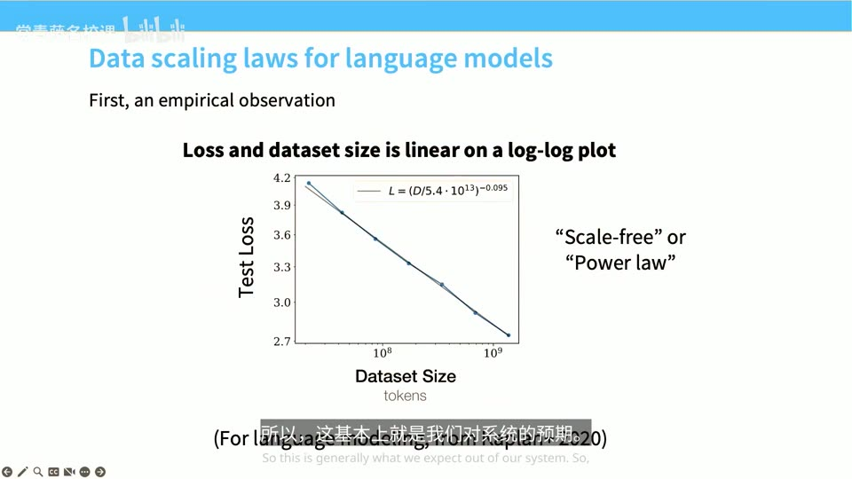

### 3.3 更奇特的缩放曲线

除了这种最基本的形式，还有更奇特的缩放定律：下游基准测试上有对应的等价形式——随算力变化呈 **S 型（sigmoid）**；甚至有研究直接把**日期**作为横轴来做预测。说来奇怪，至少在这些图里，各种能力的曲线的**上包络线**往往呈线性。没有理由认为那些更奇特的缩放律就一定成立，但实际情况是：语言模型性能随规模和资源的变化，往往比我们一开始以为的更有规律。([【跳转到 10:04】](https://www.bilibili.com/video/BV11LEA6eEuj/?p=9&t=604)、[【跳转到 10:34】](https://www.bilibili.com/video/BV11LEA6eEuj/?p=9&t=634)、[【跳转到 11:04】](https://www.bilibili.com/video/BV11LEA6eEuj/?p=9&t=664))

---

## 四、幂律的直觉：估计均值与非参数估计

缩放律本质上是曲线拟合，并没有黄金法则规定只能取多项式形式；但用两个最简单的统计估计问题，就能看出幂律有多自然。([【跳转到 13:27】](https://www.bilibili.com/video/BV11LEA6eEuj/?p=9&t=807))

### 4.1 例一：估计高斯均值

从高斯分布采样，用经验均值估计真实均值。误差（MSE）为：

```text
E[(μ̂ − μ)²] = σ² / N
```

取其对数，误差是 `N` 的幂函数，双对数斜率约为 `−1`。推广一下：**任何形如"多项式衰减 + 常数"的误差，画在双对数图上并减去常数项后，都会给出一条缩放律**。在参数估计（均值、回归）里，你自然预期得到 `N^{-1}` 量级的速率，不会预期别的——如果你修过统计估计课就知道，经典模型本质上都是 `1/n` 速率（回归可能是 `1/n²` 等）。([【跳转到 13:31】](https://www.bilibili.com/video/BV11LEA6eEuj/?p=9&t=811)、[【跳转到 14:01】](https://www.bilibili.com/video/BV11LEA6eEuj/?p=9&t=841)、[【跳转到 14:31】](https://www.bilibili.com/video/BV11LEA6eEuj/?p=9&t=871))

### 4.2 例二：非参数估计

若估计的不是固定维度的参数，而是一般的平滑函数，做法是把空间切成小格子做局部平均：在 `d` 维里把空间切成边长为 `n^{-1/d}` 的格子，误差约为 `N^{-1/d}`（以 d=2 为例：√n 个格子、每格 √n 个样本、误差约 1/√n）。于是这些更灵活的函数，其缩放律速率不是 `1`，而是 `1/d`——**依赖维度**。([【跳转到 15:35】](https://www.bilibili.com/video/BV11LEA6eEuj/?p=9&t=935)、[【跳转到 16:05】](https://www.bilibili.com/video/BV11LEA6eEuj/?p=9&t=965))

### 4.3 神经网络的指数：像高维非参数平滑器

这与神经网络的指数形成鲜明对比。Hestness 与 Kaplan 测得的神经网络收敛指数**远小于 1/2**（大约在 `0.1` 量级，例如 `≈0.076`、`≈0.095`），是**非常慢**的多项式收敛速率。Baker 等人等研究缩放律理论的工作者据此认为：这些指数在告诉我们，**神经网络的行为就像一个高维空间中的非参数平滑器**。这个直觉是否要完全接受因人而异（讲者也坦言它的证据可能有点站不住脚，依赖于对内在维度的估计），但想到这些指数在某种程度上刻画了模型"真正的学习速度"，相当有意思。([【跳转到 15:08】](https://www.bilibili.com/video/BV11LEA6eEuj/?p=9&t=908)、[【跳转到 16:59】](https://www.bilibili.com/video/BV11LEA6eEuj/?p=9&t=1019))

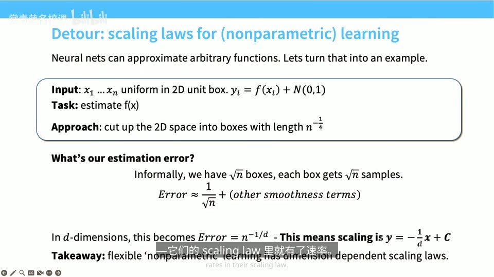

---

## 五、数据工程：混合、重复与过滤的最优策略都会随规模变化

数据缩放律本身其实没那么有用：它只告诉你"模型学得多快"，对预测有点用，但工程上你更关心的是别的决策——数据混合比例怎么定？该不该重复使用数据？过滤该多狠？在重复用数据这件事上还有很多别的操作可做。([【跳转到 18:33】](https://www.bilibili.com/video/BV11LEA6eEuj/?p=9&t=1113)、[【跳转到 18:37】](https://www.bilibili.com/video/BV11LEA6eEuj/?p=9&t=1117))

### 5.1 数据混合：斜率由模型类别决定，组成只改变截距

一个关键洞察是：**数据集的组成会影响缩放律的截距，但斜率由模型类别决定，不随数据分布改变**。把缩放律的由来看作泛化界限的经验版，这一点就顺理成章。于是你可以用极少量数据训练很小的模型，拟合不同混合比例对性能的影响，再外推到全量训练，找出最优配比——思路和外推数据缩放定律完全一样。理论上的玩具模型（线性回归、两个数据源）也印证了"数据多样性越高越有帮助"——只拿一种数据误差都很高，把两种数据混着用总是更好；把截距的变化写下来，就能得到很有意思的见解。([【跳转到 19:12】](https://www.bilibili.com/video/BV11LEA6eEuj/?p=9&t=1152)、[【跳转到 19:42】](https://www.bilibili.com/video/BV11LEA6eEuj/?p=9&t=1182)、[【跳转到 20:07】](https://www.bilibili.com/video/BV11LEA6eEuj/?p=9&t=1207))

不过现实比理想模型嘈杂得多——很多团队的做法是**直接训练一堆小模型、选出最好的数据配比再放大**，根本不做缩放拟合。这恰好印证了"斜率不变、选比例可靠"这个逻辑：只要斜率不变，小规模下最好的配比在大规模下往往依然最好。([【跳转到 21:07】](https://www.bilibili.com/video/BV11LEA6eEuj/?p=9&t=1267)、[【跳转到 21:41】](https://www.bilibili.com/video/BV11LEA6eEuj/?p=9&t=1301))


### 5.2 数据重复：约 4 个 epoch 内几乎不受影响

算力在涨、数据没涨，于是重复使用数据成为常态。"Scaling Data-Constrained Language Models" 研究表明：用标准训练方法，**最多约 4 个 epoch 几乎不受影响**；超过这个临界点后，实际的缩放律会明显差于"把重复数据当作新数据"的预测，不过也可以写出修正后的函数形式来预测重复训练的效果。([【跳转到 21:48】](https://www.bilibili.com/video/BV11LEA6eEuj/?p=9&t=1308)、[【跳转到 22:18】](https://www.bilibili.com/video/BV11LEA6eEuj/?p=9&t=1338))

一项把思路推到极致的后续研究（讲者与 Percy 及一名学生合作）探索了**算力无限**时的极限：你想跑多少次 epoch 就跑多少次，能得到的最好结果是什么？结论是：**光靠反复遍历数据不行，无限放大模型也不行**——两条路都收益递减，只能另辟蹊径（比如集成多个模型、从数据里再多榨出一些东西）。有趣的是，各种干预（蒸馏、集成学习等）虽然确实提高了性能，但**斜率出奇地相似**——这是个经验之谈：一旦你开始拟合自己的缩放定律，就会发现斜率通常不变，干预往往只改变缩放律的截距。([【跳转到 22:33】](https://www.bilibili.com/video/BV11LEA6eEuj/?p=9&t=1353)、[【跳转到 23:07】](https://www.bilibili.com/video/BV11LEA6eEuj/?p=9&t=1387)、[【跳转到 23:29】](https://www.bilibili.com/video/BV11LEA6eEuj/?p=9&t=1409))


### 5.3 数据过滤：最优策略随规模动态变化

**最优过滤策略也会随规模变化**：算力少时，应该下手狠一点、只留最高质量的数据（反正你也用不完整个互联网）；算力充足时，就要逐渐放宽过滤、开始使用质量没那么高的数据（避免反复使用高质量数据）。所以数据过滤、数据质量这些平时看似固定的选择，其实都是**动态**的：规模一上去，你就得琢磨剩下的数据去哪儿找，过滤规则不能一成不变。([【跳转到 23:44】](https://www.bilibili.com/video/BV11LEA6eEuj/?p=9&t=1424)、[【跳转到 24:14】](https://www.bilibili.com/video/BV11LEA6eEuj/?p=9&t=1454))

### 5.4 一个方法论陷阱与一个坐标轴笑话

这一部分（从统计机器学习角度看）其实非常简单直接：增加数据量，性能就以非常可预测的方式提升——模型这么大还能按多项式规律变好，挺酷但也没到离谱的程度。不过有个坐标轴的小插曲值得一提：讲者展示"无限算力下预训练"的图时，横轴看起来是线性的，实际上是被错误的坐标轴"美化"过的**对数刻度**（每次翻倍）——而纵轴因为范围极小，线性与对数刻度看起来差不多。拟合出的函数形式依然是多项式。由此引出一个方法论警告：**如果你只覆盖很窄的算力区间，几乎无法判断曲线到底是多项式还是指数增长**——毕竟有泰勒近似在，把局部放得足够大，什么都像线性的。所以不管它是什么函数形式，心里都得留个心眼，保持点怀疑。([【跳转到 25:11】](https://www.bilibili.com/video/BV11LEA6eEuj/?p=9&t=1511)、[【跳转到 25:48】](https://www.bilibili.com/video/BV11LEA6eEuj/?p=9&t=1548))

---

## 六、缩放律作为"判断标准"：架构、优化器、深度宽度、MoE

除了数据，缩放分析还能回答架构与超参数问题。核心方法是：**在多个算力范围内训练一批较小的模型，比较它们的缩放曲线**——看谁的截距更低、斜率更好；如果某个改动的斜率更差，就意味着规模越大它越吃亏，绝不能在大规模上采用。这一节的前提是"你得先相信缩放律"，但信了之后完全可以自己动手验证。([【跳转到 26:10】](https://www.bilibili.com/video/BV11LEA6eEuj/?p=9&t=1570)、[【跳转到 26:40】](https://www.bilibili.com/video/BV11LEA6eEuj/?p=9&t=1600))

### 6.1 Transformer 真的比 LSTM 好吗？

最笨的办法是花大价钱训一个巨型 LSTM 做到 GPT-2 甚至更大的规模；缩放律的思路则是训练一批不同层数的 LSTM 和 Transformer，比较缩放趋势。LSTM 的截距肯定不同、斜率可能也不同——如果斜率更差，就不该选它。顺带一提，LSTM/状态空间模型这类结构并非不能用（它们能拟合分布，Mamba 的出现也证明了 SSM 行得通），问题在于**缩放趋势**。这也是为什么现代架构论文（Mamba、Gated DeltaNet 等）几乎都会给出这种对比图：新模型必须**要么整体在 vanilla transformer 上方、要么斜率更好**，否则随着规模做大会反被超越——你肯定不想看到斜率更差的情况。([【跳转到 27:28】](https://www.bilibili.com/video/BV11LEA6eEuj/?p=9&t=1648)、[【跳转到 27:58】](https://www.bilibili.com/video/BV11LEA6eEuj/?p=9&t=1678)、[【跳转到 28:28】](https://www.bilibili.com/video/BV11LEA6eEuj/?p=9&t=1708))


### 6.2 架构缩放研究：EK 等人（Google）

讲者觉得最近关于架构缩放定律的好论文不算多，但他很喜欢 Google 的 EK 等人的一项研究：他们对 Transformer 风格的模型做了一整套缩放研究，训练了在不同架构上不断扩大的 Transformer 变体，并且**精准捕捉到了现在前沿模型里用的那些架构改动**——门控线性单元（GLU）在所有缩放趋势上都优于基线；Switch Transformer 的趋势不错；softmax 混合也是有效改进（虽然现在已不用）；而一些高效注意力替代方案（如 Performer）则没有做。这些实验的算力远小于今天的训练规模，却仍然观察到了**推动前沿模型发展的趋势**。这就是为什么很多人几乎把缩放律当作一种"范式化判断标准"：如果某个改动没在缩放曲线上体现出来，它就不是一个好的、能随规模受益的改动——某种程度上，很多过去的研究已经反映了我们今天看到的现象。([【跳转到 28:37】](https://www.bilibili.com/video/BV11LEA6eEuj/?p=9&t=1717)、[【跳转到 29:43】](https://www.bilibili.com/video/BV11LEA6eEuj/?p=9&t=1783))

### 6.3 SGD 比 Adam 好还是差？

做同样的缩放分析（这是 Hestness 的工作，用的是循环高速公路网络做语言模型）：截距不同，但**斜率非常接近**——即使是从 SGD 换到 Adam 这么大的改动，也很少会改变斜率。这个"固定数据和模型、斜率往往不变"的现象每次看到都让人惊讶，但确实如此。([【跳转到 30:13】](https://www.bilibili.com/video/BV11LEA6eEuj/?p=9&t=1813))

### 6.4 深度与宽度：寻找尺度不变量

层数太少对模型非常不利（只有一层基本没戏）；只要超过一层，表现就出人意料地有竞争力；在每个算力水平下，更深的模型（在该实验范围内）至少效果更好。更犀利的做法（Kaplan 等人）是寻找**尺度不变量**：层数不是尺度不变量（模型越大确实需要更多层），而**纵横比**（模型维度 ÷ 层数）大致是——不同规模下最优纵横比基本不变，约为**每层对应 100 维**（对更深的模型会稍微偏小一点）。对注意力头数等其他量也可以做类似分析。所以你可以固定纵横比去扩大规模，并画出图让自己确信：随着模型越来越大，优化点并没有偏移太多。([【跳转到 30:43】](https://www.bilibili.com/video/BV11LEA6eEuj/?p=9&t=1843)、[【跳转到 31:13】](https://www.bilibili.com/video/BV11LEA6eEuj/?p=9&t=1873)、[【跳转到 31:22】](https://www.bilibili.com/video/BV11LEA6eEuj/?p=9&t=1882))

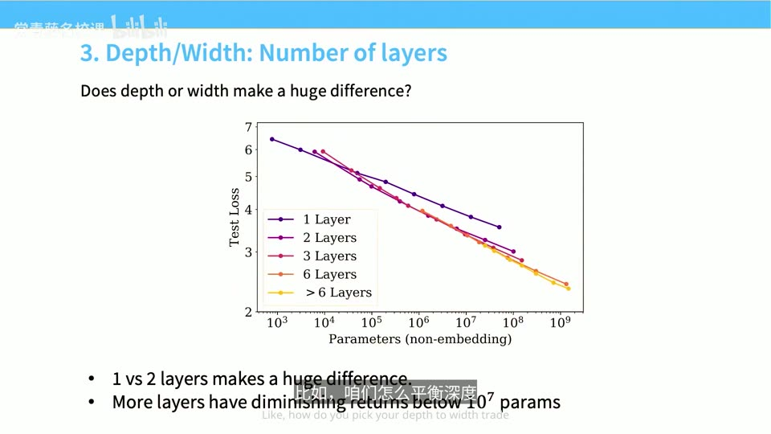

### 6.5 并非所有参数都同等重要

你的缩放律看起来是好是坏，取决于你怎么定义"参数"。Kaplan 那篇论文里就观察到：如果把 embedding 参数算进去，深度方向的缩放曲线形状会非常古怪——于是他们决定把所有 embedding 参数排除，只统计"真正在做计算"的非 embedding 参数（你可以这样说服自己，或者随便找个理由；这会对某些结果的有效性产生不小的影响，第九节还会讲）。这说明缩放律不是魔法——Percy 喜欢强调这一点：**缩放律以及这种跨尺度的可预测性，都是人为设计出来的**。这些效果不会自动出现，你得下功夫选对横轴指标、确保超参数不掉队，才能在跨越多个数量级的算力下实现可预测的缩放。这也正是很多缩放律研究者的日常工作：琢磨怎么让缩放变得高度可预测。([【跳转到 32:22】](https://www.bilibili.com/video/BV11LEA6eEuj/?p=9&t=1942)、[【跳转到 32:52】](https://www.bilibili.com/video/BV11LEA6eEuj/?p=9&t=1972)、[【跳转到 33:22】](https://www.bilibili.com/video/BV11LEA6eEuj/?p=9&t=2002))

### 6.6 MoE 的"参数价值"

如今 MoE 基本成了训练大模型的主流方式，参数总量与激活参数数量解耦了，那么"价值/参数"在新世界里指什么？苹果和 MIT 的一些人做了漂亮的分析：缩放趋势既取决于**总参数**、也取决于**激活参数**。一个直观结果是——当你增加总参数、最小化损失时，得到的模型会越来越**稀疏**；同理，激活参数的数量会随 MoE 稀疏度提高而下降。你可以为不同计算量画出这些曲面，问自己"更愿意把算力花在激活参数上，还是想要多大的稀疏度"——你完全可以在几乎不改变算力的前提下灵活调整稀疏度。更反直觉的是：即便把激活参数固定、只增加"空参数"，损失仍会下降——**那些未激活的参数仍在帮你降低损失**，并且这些量都遵循可预测的缩放规律。([【跳转到 33:39】](https://www.bilibili.com/video/BV11LEA6eEuj/?p=9&t=2019)、[【跳转到 34:09】](https://www.bilibili.com/video/BV11LEA6eEuj/?p=9&t=2049)、[【跳转到 34:39】](https://www.bilibili.com/video/BV11LEA6eEuj/?p=9&t=2079)、[【跳转到 35:11】](https://www.bilibili.com/video/BV11LEA6eEuj/?p=9&t=2111))

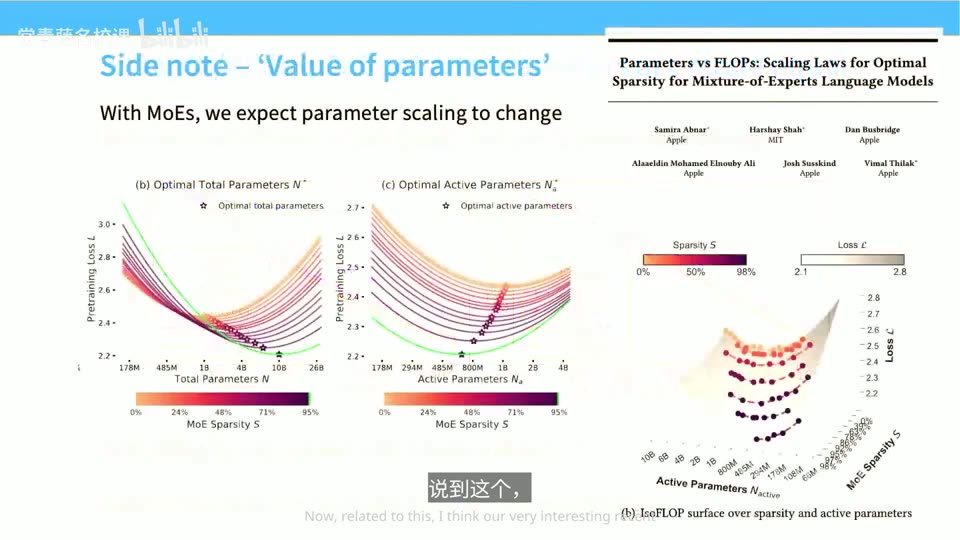

---

## 七、两个必须重新琢磨的旋钮：临界批次大小与学习率缩放

准备训练新模型时，讲者说大部分东西其实都是固定的（你不太会激进到换掉 Transformer，多半会选经过验证的、受 DeepSeek 启发的 MoE 架构之类）。但**两件事你确实得重新琢磨：batch size 和 learning rate**——训练过深度学习模型的人都知道这两个量必须谨慎搭配，改一个另一个就得跟着改。而 batch size 还从上一讲知道有另一个麻烦：我们希望它越大越好，因为**数据并行需要大 batch**。([【跳转到 35:16】](https://www.bilibili.com/video/BV11LEA6eEuj/?p=9&t=2116)、[【跳转到 35:46】](https://www.bilibili.com/video/BV11LEA6eEuj/?p=9&t=2146))

### 7.1 临界批次大小：噪声受限 vs 偏差受限

真正想知道的是：**在性能开始变差之前，batch size 最大能开到多少？它又如何随模型规模变化？** 这就是**临界批次大小（critical batch size）**：在某个临界点之前，增大 batch 的收益是成正比的；过了这个点，回报就开始打折扣。([【跳转到 36:16】](https://www.bilibili.com/video/BV11LEA6eEuj/?p=9&t=2176))

- **噪声受限阶段（noise-limited）**：往 batch 里每多加一个样本，都能降低 SGD 梯度里的噪声。此时**方差**是主要限制，方差一降效果提升就非常明显——缩放是**完美**的。
- **偏差受限阶段（bias-limited）**：当你到达梯度噪声尺度那个点，就不再受方差限制了。回想梯度下降：你看到的只是目标函数的**局部结构**，没法从全局看清最小值在哪，哪怕把噪声压得再低，你找到的局部下降方向与全局最优之间**总有差距**。此时限制你的是**偏差**，收益开始递减——进入**低效缩放**。

([【跳转到 36:46】](https://www.bilibili.com/video/BV11LEA6eEuj/?p=9&t=2206)、[【跳转到 37:16】](https://www.bilibili.com/video/BV11LEA6eEuj/?p=9&t=2236)、[【跳转到 37:46】](https://www.bilibili.com/video/BV11LEA6eEuj/?p=9&t=2266))


### 7.2 怎么估：四步流程

临界批次大小是从一系列复杂计算（对目标函数的局部二次近似）中推导出来的，但实际估算步骤并不复杂（[【跳转到 38:34】](https://www.bilibili.com/video/BV11LEA6eEuj/?p=9&t=2314)、[【跳转到 39:13】](https://www.bilibili.com/video/BV11LEA6eEuj/?p=9&t=2353)、[【跳转到 39:43】](https://www.bilibili.com/video/BV11LEA6eEuj/?p=9&t=2383)）：

1. 选定一个**目标损失**（你想尽快达到的损失值）；
2. 遍历不同的 batch size，记录达到目标所需的**步数 S** 和**样本总数 E**（两者相差一个 batch 的倍数：步数 × batch = 样本总量）；
3. 把两者对"理论最小步数/样本数"归一化，写出权衡关系：

```text
S / S_min − 1 = (E / E_min − 1)^(−1)
```

4. 拟合出 `S_min`、`E_min`，然后取它们的比值：

```text
B_crit = E_min / S_min
```

它的意义是：**在不显著增加步数的前提下优化收敛速率**——给出的步数会比绝对最优稍多、样本也稍多，但实现了两方面的平衡（大约是 2 倍步数/样本）。另一个补充视角：这个量也接近于"梯度协方差与梯度平方范数之比"（细节见原论文）。

### 7.3 为什么它随规模变大

把它放进缩放律讲，是因为**随着目标损失降低（也就是训练得越来越好），临界 batch size 会以非常可预测的方式增长，大致呈反多项式形式**。这很合理：越接近最优点，你要最小化的差异越细微，噪声的影响就越大，因此方差缩减的收益也越大。所以超大规模训练跑到图表最右侧时，batch size 可以设得很大。([【跳转到 40:58】](https://www.bilibili.com/video/BV11LEA6eEuj/?p=9&t=2458)、[【跳转到 41:28】](https://www.bilibili.com/video/BV11LEA6eEuj/?p=9&t=2488))

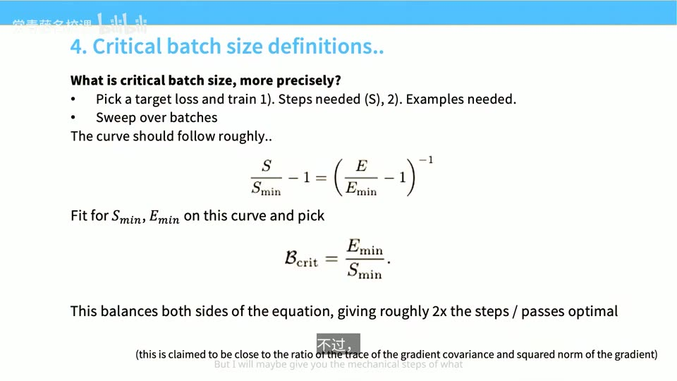

### 7.4 学习率缩放：预测最优点，或重参数化让最优点不动

学习率这边同样有点复杂，两种主流思路（[【跳转到 41:43】](https://www.bilibili.com/video/BV11LEA6eEuj/?p=9&t=2503)、[【跳转到 42:13】](https://www.bilibili.com/video/BV11LEA6eEuj/?p=9&t=2533)、[【跳转到 42:35】](https://www.bilibili.com/video/BV11LEA6eEuj/?p=9&t=2555)）：

1. **预测最优点**：例如只做宽度缩放时，模型越宽、参数越多，学习率就该设得越小（"一次改动的东西更多了，步子应该迈小点"）。常见经验法则是按宽度的倒数调整（`LR ∝ 1/width`）。最优点的变化规律相当可预测，所以这思路并不离谱。
2. **重参数化（reparameterization）**：改变初始化大小、针对网络的不同部分调整优化器步长，**迫使模型在不同规模下保持相同的最优学习率**，于是可以直接选定最佳学习率开跑。这类方法统称 **μP（maximal update parametrization，最大更新参数化）** 等；有人报告效果显著，也有人报告没那么好。

两种方法都已在大规模实践中成功应用；讲者个人感觉现在更多人偏向缩放律那套，但两种思路都行得通，细节留到进阶课。([【跳转到 42:55】](https://www.bilibili.com/video/BV11LEA6eEuj/?p=9&t=2575)、[【跳转到 43:29】](https://www.bilibili.com/video/BV11LEA6eEuj/?p=9&t=2609))

---

## 八、要更多数据还是更大模型：联合缩放律与 Kaplan 的结论

缩放律最知名的应用场景，就是**分配固定算力**。你拥有的资源是 FLOPs，而数据量与参数量大致与 FLOPs 成正比（数据 × 参数 ≈ 算力，Percy 第一堂课讲过），问题于是变成："我该要更多数据，还是更大模型？"

最直观的浪费是：拿一个极小的模型灌入海量数据，纯属浪费——它的表现在很长一段时间里都没什么起色（图上那条深紫色的线）。同样的算力拿来训练一个大模型、喂同样甚至更少的 token，效果会好得多。**只要搞懂数据量和模型大小是怎么结合起来影响性能的，你就能把算力分配优化得非常精准。**([【跳转到 48:38】](https://www.bilibili.com/video/BV11LEA6eEuj/?p=9&t=2918)、[【跳转到 48:56】](https://www.bilibili.com/video/BV11LEA6eEuj/?p=9&t=2936)、[【跳转到 49:26】](https://www.bilibili.com/video/BV11LEA6eEuj/?p=9&t=2966))

**联合数据-模型缩放律**同时描述两个变量。Rosenfeld（2020）给出极简形式——两个倒数项相加：

```text
Error = n^(−a) + m^(−b) + C
```

Kaplan（2020）则用：

```text
Error = (m^(−α) + n^(−1))^β
```

两者形式等价、略有不同。取极限可以校验其合理性：数据无限大时，误差趋近于由模型规模决定的下限（退化为纯模型缩放律）；模型无限大时，限制你的变成数据（退化为纯数据缩放律）。**以后有人给你讲某个缩放定律，建议你试试对所有变量取极限**，这样能帮你更好地理解系统的行为。这类联合规律在**低计算量、低数据量的点上**拟合后，能相当准地外推到大数据量或大模型规模。([【跳转到 49:56】](https://www.bilibili.com/video/BV11LEA6eEuj/?p=9&t=2996)、[【跳转到 50:26】](https://www.bilibili.com/video/BV11LEA6eEuj/?p=9&t=3026)、[【跳转到 50:34】](https://www.bilibili.com/video/BV11LEA6eEuj/?p=9&t=3034))

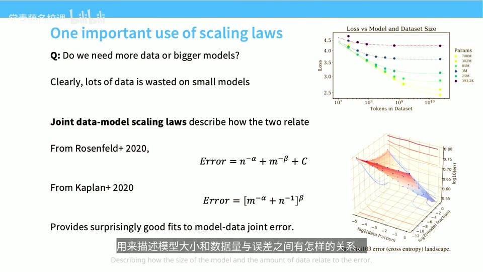

有了它，"固定 FLOPs 下最小化损失"就变成一个简单的非线性优化问题。解出来（Kaplan 的结论）大致是（[【跳转到 51:30】](https://www.bilibili.com/video/BV11LEA6eEuj/?p=9&t=3090)、[【跳转到 52:00】](https://www.bilibili.com/video/BV11LEA6eEuj/?p=9&t=3120)）：

```text
N（参数量） ∝ C^0.73
D（数据量） ∝ C^0.27
```

也就是**随着算力增长，参数量增长得更快，每个参数分到的 token 数反而减少**——这就是"训练越来越大模型"的建议。GPT-3 时代大家都在训练动辄数千亿乃至万亿参数的稠密模型，部分正是被这一预测推动的：大家看到了 GPT-3、看到了 Kaplan 的预测，就想"我要用超大规模的模型来跑我的大型训练"。

---

## 九、Kaplan vs. Chinchilla：三种方法、三种分歧根源，以及"缩放律是下界"

### 9.1 Chinchilla 的挑战

几年后（2022），DeepMind 的 **Hoffman 等人（Chinchilla）** 指出 Kaplan 的预测**偏差很大**：之前大家都被引导去训练"太大"的巨型模型（图中那三个星号），而真正该训的是**小得多**的模型（青色星号）——约 **每个参数 20 个 token**。Chinchilla 提出了**三种独立估计最优权衡的方法**，以增强稳健性、抵御建模假设带来的风险（除了方法三略有不同外，前两种大体一致，数据/模型的系数约为 0.49/0.51）：([【跳转到 52:30】](https://www.bilibili.com/video/BV11LEA6eEuj/?p=9&t=3150)、[【跳转到 53:45】](https://www.bilibili.com/video/BV11LEA6eEuj/?p=9&t=3225))


### 9.2 三种方法

1. **下包络线法（minimum over runs）**：把所有训练曲线拿来，提取每条曲线对给定 FLOPs 能达到的**最低损失**（下包络），因为每个点对应一次训练、一个模型规模，于是可以画出"FLOP 预算 → 最优模型规模"的散点，拟合出线性趋势。按他们的预算得到约 **67B 参数**。方法直观，但要定义下包络本身并不容易。([【跳转到 54:15】](https://www.bilibili.com/video/BV11LEA6eEuj/?p=9&t=3255)、[【跳转到 55:03】](https://www.bilibili.com/video/BV11LEA6eEuj/?p=9&t=3303))
2. **IsoFLOP 法**（讲者个人最喜欢、最简单稳健、现在也非常流行）：选定一组 FLOP 预算（例如按 3 的倍数递增），对每个预算**固定 FLOPs、在"参数 vs 数据"这个维度上扫一遍**（比如数据加倍、参数减半），最终损失会形成一条曲线；取每条曲线的最小值（或拟合二次函数取极小），穿过所有极小点即得最优关系，给出约 **63B 参数**，与前一方法吻合得很好。([【跳转到 55:33】](https://www.bilibili.com/video/BV11LEA6eEuj/?p=9&t=3333)、[【跳转到 56:33】](https://www.bilibili.com/video/BV11LEA6eEuj/?p=9&t=3393))


3. **联合函数拟合**：直接假设一个描述"模型大小与数据量如何共同影响损失"的函数形式（Rosenfeld 和 Kaplan 其实都提出了这种思路），对所有训练数据做曲线拟合。这是最"笨"也最自然的方法，但曲线拟合怎么做非常关键（变量多、曲面拟合棘手，和方法一一样有点麻烦，不像 IsoFLOP 那样直接）。它给出的系数是 **0.46/0.54**，与前两种（约 0.50/0.51）略有不同：前两种大体意味着参数量和 token 数**等比例扩展**（固定比例，20 倍系数由此而来），而方法三从渐近意义上看意味着 **token 数会远远多于参数量**——这个不一致困扰了不少人。([【跳转到 56:42】](https://www.bilibili.com/video/BV11LEA6eEuj/?p=9&t=3402)、[【跳转到 57:17】](https://www.bilibili.com/video/BV11LEA6eEuj/?p=9&t=3437)、[【跳转到 57:33】](https://www.bilibili.com/video/BV11LEA6eEuj/?p=9&t=3453))

### 9.3 分歧根源：一堆"微不足道"的细节

要先说明：Chinchilla 的做法和 Kaplan 并没有本质区别——并不是 Kaplan 搞了个疯狂的实验、而 Chinchilla 的作者们更聪明；两边做的事都挺合理，但缩放预测的差别却很大。缩放定律其实**非常看细节**：你具体怎么实施、超参数怎么设、甚至连 X 轴怎么画，都会让它大变样。有篇题为 "Resolving Discrepancies in Compute-Optimal Scaling of Language Models" 的论文（最后一位作者曾是斯坦福学生）用一系列实验说明这一点：先用与 Kaplan 相近的设置复现 Kaplan 的结果；换一种参数计数方式，曲线稍动；调整 learning rate warmup，曲线再偏一点；再把 optimizer 调一调——结果就完全吻合 Chinchilla 了。**是一连串看似微不足道的决定，累积成了 Kaplan 与 Chinchilla 之间的巨大差距**（[【跳转到 58:07】](https://www.bilibili.com/video/BV11LEA6eEuj/?p=9&t=3487)、[【跳转到 58:37】](https://www.bilibili.com/video/BV11LEA6eEuj/?p=9&t=3517)、[【跳转到 59:07】](https://www.bilibili.com/video/BV11LEA6eEuj/?p=9&t=3547))：

- **参数计数方式**：前面说过 Kaplan 排除了 embedding 参数（这本身问题不大），但他们**连最后一层（softmax 线性层）的参数也漏掉了**——因为在很多模型里 embedding 层与最后一层互为对偶（形状分别是 `词表×隐藏维` 与 `隐藏维×词表`），他们心想"干脆两个都排除算了"。包不包括这些参数，对缩放律的形状影响巨大——这**与其说是观点不同，不如说是个疏忽**。
- **学习率与 warmup**：Kaplan 训练的模型其实**特别小**，小到 warmup 做完时模型**还没收敛**；他们的学习率设置很不理想，模型没有训充分。
- **batch size**：Kaplan 用了**固定的较大 batch**，这对小模型并非最优。改用随规模变化的 batch size，结果就会与 Chinchilla 吻合。

另一个重要视角（Pearce 等人）用另一种巧妙办法验证：直接拿 Chinchilla 训练曲线隐含的函数形式，模拟"如果忽略 embedding 参数并大幅缩减规模，Kaplan 的隐含训练曲线会怎样"。他们发现主要有两个效应：一是 **Kaplan 在低得多的计算规模下运行**，对微小变化极其敏感；二是**忽略非 embedding 参数这个改动足够大**，足以导致与 Chinchilla 的偏差。所以他们的论点与上一篇论文略不同：这里其实是"计算规模的大小"加上"非 embedding 参数引起的轻微非线性"共同导致了不一致。([【跳转到 61:16】](https://www.bilibili.com/video/BV11LEA6eEuj/?p=9&t=3676)、[【跳转到 61:46】](https://www.bilibili.com/video/BV11LEA6eEuj/?p=9&t=3706))

### 9.4 方法三的谜团：作者比他们自己以为的更正确

Chinchilla 某种程度上推翻了 Kaplan，但还剩一个谜团：**方法三从来都和方法一、方法二对不上**，数字看起来差异不大、作者们也显得毫不在意，但这背后的含义其实相当重要——方法一、二意味着参数和 token 等比例扩展（20 倍系数由此而来），而方法三的指数不同，意味着渐进上 token 数会远远多于参数量。对此感到不安的不止讲者一个：**EPFL 的几个人**既拿不到原始数据也拿不到代码，于是**从论文图表里提取数据、重新拟合方法三的曲面**，发现原论文当初一定是对数据**欠拟合**了；重新拟合后的损失值能低得多，而且结果**几乎完全吻合"每参数 20 token"的经验法则**。也就是说，Chinchilla 的作者其实**比他们自己以为的更正确**，方法三最终也被证明是稳健的——得知这个方法其实挺稳健，还是挺让人欣慰的。([【跳转到 62:28】](https://www.bilibili.com/video/BV11LEA6eEuj/?p=9&t=3748)、[【跳转到 63:22】](https://www.bilibili.com/video/BV11LEA6eEuj/?p=9&t=3802)、[【跳转到 63:52】](https://www.bilibili.com/video/BV11LEA6eEuj/?p=9&t=3832))

### 9.5 关键认识：缩放律是一种"下界"

由此得到一个重要认识（[【跳转到 60:37】](https://www.bilibili.com/video/BV11LEA6eEuj/?p=9&t=3637)、[【跳转到 61:07】](https://www.bilibili.com/video/BV11LEA6eEuj/?p=9&t=3667)）：

> **缩放律在某种意义上是一种"下界"。** 如果你沿用一套好的配方并扩大规模，就能得到这样的结果；但如果你去扩大一个**本不该扩大的配方**（比如 warmup 设得离谱、batch 不合理），得到的缩放定律就会很差。所以要尽可能接近标准的、完整的训练流程。在确立可靠的缩放定律方面，很多工作其实是在**找对正确的运行区间**，这样你在不同计算规模下才能获得可靠的缩放。

---

## 十、实战与注意事项：过度训练、迁移不确定性、方差与 IsoFLOP

### 10.1 你可能并不真的需要 Chinchilla factor

如今这几乎是常识。如果你训练的是**生产用模型**，多数情况下并不太在乎省训练算力——看看各种关于前沿实验室怎么花算力的外部调研就知道：大部分算力其实花在**研发与推理服务**上，而非训练本身。为了推理服务，你想要的其实是"能力够用的小模型"，而不是又大又臃肿、部署很贵的模型（哪怕它能把训练成本压到最低）。所以真正想要的是**"过度训练"（over-training）**——加引号是因为过度训练其实正是我们想要的，这才是训练量刚刚好。([【跳转到 64:27】](https://www.bilibili.com/video/BV11LEA6eEuj/?p=9&t=3867)、[【跳转到 64:57】](https://www.bilibili.com/video/BV11LEA6eEuj/?p=9&t=3897))

回看早期发布的模型：GPT-3 肯定属于欠训练（约每参数 2–3 个 token），Chinchilla 达到了 20 的现代比例；之后一段时间大家维持在约 7——那是个模型服务化还不普遍的时代；随着服务变得切实可行，人们开始主动过度训练、转向 MoE，并做出各种为推理优化的权衡。（幻灯片上的例子：LLaMA 65B 约 22、Llama 2 70B 约 29、Mistral 7B 约 110、Llama 3 70B 约 215 token/参数——预期使用越多，越值得付前期训练成本。）所以 Chinchilla 重要的原因，并不是"20:1 是唯一黄金比例"（做研究时或许适用），而是**它告诉了我们很多关于如何拟合缩放定律、如何思考缩放定律的东西**。([【跳转到 65:27】](https://www.bilibili.com/video/BV11LEA6eEuj/?p=9&t=3927)、[【跳转到 65:57】](https://www.bilibili.com/video/BV11LEA6eEuj/?p=9&t=3957))

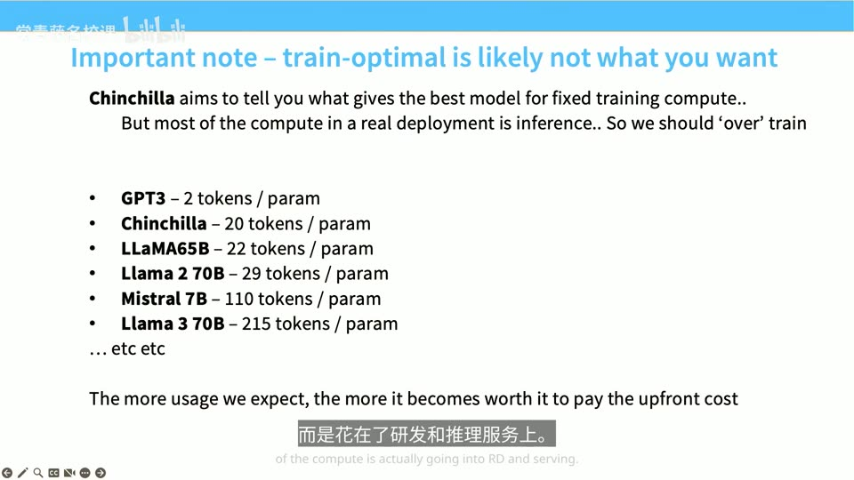

### 10.2 上游（perplexity）与下游（benchmark）未必一致

这一节最后想强调：**上游与下游的性能表现可能大不相同**。看 log-likelihood/perplexity 这类指标——比如架构论文里的例子——它与参数量高度相关，是一条非常漂亮的线性趋势；可当你准备上线"最强"的模型时，却发现参数量更大、perplexity 更好的模型反而不是下游最优的。这种情况在上下游之间很常见，而且这大概是讲者见过的上下游之间最差的相关性。要记住：**缩放定律一般用在 perplexity 这一侧，非常干净、规律、可预测；但从 perplexity 迁移到下游，远没有看上去那么确定。**([【跳转到 43:41】](https://www.bilibili.com/video/BV11LEA6eEuj/?p=9&t=2621)、[【跳转到 44:11】](https://www.bilibili.com/video/BV11LEA6eEuj/?p=9&t=2651)、[【跳转到 44:41】](https://www.bilibili.com/video/BV11LEA6eEuj/?p=9&t=2681))

讲者还讲了个小插曲：以前有学生去各家做 post-training，回来总抱怨"搞 pre-training 的人把模型甩给你，说 perplexity 挺好看，剩下的都是你的问题了"——可问题往往在 pre-training 阶段就埋下了。所以**别做那种人**，要认真考虑迁移。这也引出缩放律的核心理念：**先在低方差的度量（perplexity）上把规律立住，再依靠某种关于迁移的信念、或在别处另行确立迁移能力，来证明它能迁移到下游。**([【跳转到 47:23】](https://www.bilibili.com/video/BV11LEA6eEuj/?p=9&t=2843)、[【跳转到 47:34】](https://www.bilibili.com/video/BV11LEA6eEuj/?p=9&t=2854))

### 10.3 方差：单次运行够不够？

有同学问：缩放律图上每个数据点的方差如何？一般跑几次、聚合时取平均还是中位数？据讲者所知，**几乎所有情况都是单次运行（single run）**——因为 perplexity 非常稳定：训练数据同质、数据量大、batch 大，重新跑一遍方差可能只在小数点后第二位。很多预训练代码库甚至没有验证损失——因为单遍（single-pass）训练下训练集和验证集的结果几乎一样，这也是为什么很多图会把这两个指标互换。但研究 learning rate 或 critical batch size 的缩放律时，波动会剧烈得多；大家确实会做些方差缩减，但这套做法其实没那么普遍，按理说应该更常见。直接在下游 benchmark 指标上做缩放定律的人也有，但同样有噪声问题。([【跳转到 45:58】](https://www.bilibili.com/video/BV11LEA6eEuj/?p=9&t=2758)、[【跳转到 46:20】](https://www.bilibili.com/video/BV11LEA6eEuj/?p=9&t=2780)、[【跳转到 46:30】](https://www.bilibili.com/video/BV11LEA6eEuj/?p=9&t=2790))

### 10.4 朴素流程与"先预测再开跑"

在跑大规模训练之前，你得先对结果有个大概的预期，别只问"能不能跑通"——如果参考缩放定律，你应该能**相当精确地预测数值**，比如"这个优化器能带来多少提升"。朴素流程是：先训练一批小模型，在双对数图上拟合直线、确立缩放律；只要拟合足够好，就有理由相信这个差距会一直存在，再把缩放律直接应用到大规模训练。这在实践中足够准确——你还能怎么做呢？凭空搞个训练出来不太可能好。([【跳转到 45:05】](https://www.bilibili.com/video/BV11LEA6eEuj/?p=9&t=2705)、[【跳转到 45:35】](https://www.bilibili.com/video/BV11LEA6eEuj/?p=9&t=2735))

### 10.5 IsoFLOP：经久不衰的研究工具

IsoFLOP 作为一个研究工具一直经久不衰：定好一个 FLOP 预算，扫遍其他所有自由度，看看曲面大概长什么样——通常就能得到相当可靠的读数，看出差异有多大。扩散模型的研究（讲者有个学生做过）、前面提到的 MoE 研究都采用了 IsoFLOP 风格的设计。**当你需要权衡多个因素时，IsoFLOP 是很好的默认选择。**([【跳转到 66:06】](https://www.bilibili.com/video/BV11LEA6eEuj/?p=9&t=3966)、[【跳转到 66:36】](https://www.bilibili.com/video/BV11LEA6eEuj/?p=9&t=3996))

课堂尾声还有个开放性讨论：如果循环 Transformer（recurrent transformer）这类架构流行起来，并行系统会怎样？讲者不太相信那些传闻，但好问题在于：FSDP 这类机制本质上依赖"取权重、丢权重、再取权重"的循环，而权重常驻的架构不需要反复取权重、参数效率高得多——很多模型并行相关的东西可能就没那么重要了。([【跳转到 54:51】](https://www.bilibili.com/video/BV11LEA6eEuj/?p=9&t=3291)、[【跳转到 55:24】](https://www.bilibili.com/video/BV11LEA6eEuj/?p=9&t=3324))

---

## 小结

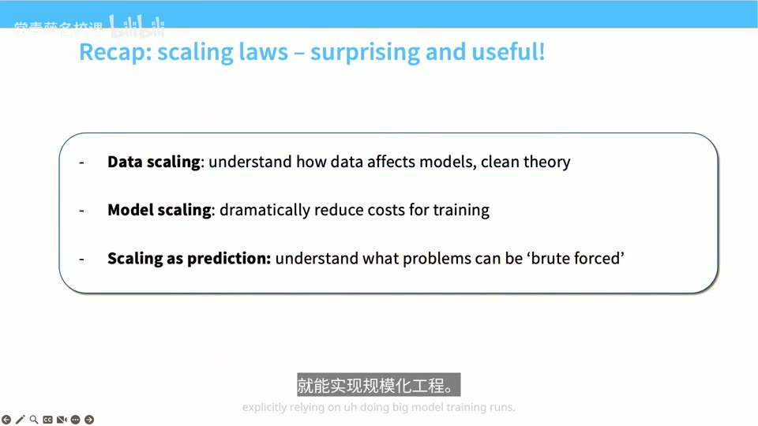

1. **缩放律是一组简单的预测规则**，把中小规模的表现外推到大模型，让规模化工程不必真的先跑大规模训练；在大实验室里它几乎是一种"信仰"，但前提是你明白它**由人为设计、且有下界性质**。
2. **它不是新东西**：从泛化界（误差界限依赖样本量），到 1993 年前后"小样本训练 + 外推"的做法，到 Banko & Brill、"指数 3 和 4"的机器翻译研究，再到 Hestness（2017）跨任务的漂亮多项式趋势——很多"现代"观察在 LLM 时代前就已被看清。
3. **数据缩放律**：双对数下近似线性，误差按幂律衰减（指数约 `0.1`，远小于参数估计的 `1/2`），这暗示神经网络像高维空间里的非参数平滑器。
4. **数据工程的最优策略随规模变化**：混合组成只改变截距、不改变斜率（所以小规模选配比再放大可靠）；约 4 个 epoch 内的重复几乎无损失，超过则要修正缩放律；过滤规则也应随算力从"狠"变"松"。
5. **临界批次大小**区分了"完美缩放"（噪声受限）与"低效缩放"（偏差受限），并随目标损失降低而以可预测方式增大；估计它只需选目标损失、扫 batch、拟合 `B_crit = E_min/S_min`。
6. **学习率**既可预测最优点（如按宽度倒数 `LR ∝ 1/width`），也可通过 **μP 等重参数化**保持最优学习率不变。
7. **联合数据-模型缩放律**把"要更多数据还是更大模型"变成可解的优化问题；Kaplan 建议 `N ∝ C^0.73`、`D ∝ C^0.27`（越训越大），而 Chinchilla 纠正为约**每个参数 20 token**，并用**下包络、IsoFLOP、联合拟合**三种方法交叉验证；二者的分歧源于参数计数、warmup/学习率、batch size 等细节——**缩放律是一种下界，只有沿着好配方扩大规模才成立**。
8. **生产实践中常主动"过度训练"小模型以优化推理成本**；同时要警惕 perplexity 与下游任务之间的迁移不确定性；perplexity 方差极低可用单次运行，而学习率/临界批次的研究需方差缩减；**isoFLOP 是"需要权衡多个因素"时的默认研究工具**。

本讲的最后引出一句提醒：缩放律能预测"哪些问题可以被大力出奇迹"，但下一讲的主题（推理）同样重要——毕竟真实部署中大部分算力花在推理侧。下一讲由 Percy 讲推理，之后我们再回到更进阶的小众缩放话题。

---

## 关键术语速查

| 术语 | 一句话解释 |
| --- | --- |
| 缩放定律（scaling law） | 用中小规模训练结果外推大模型表现的预测规则 |
| 幂律 / 无标度 | 双对数图上的直线关系，误差按多项式速率衰减 |
| 双对数图（log-log plot） | 横纵轴都取对数画图；直线即幂律、斜率即指数 |
| 不可约误差 | 任务本身的噪声底线，再多的数据也无法突破 |
| 参数估计 / 非参数估计 | 固定维度参数的估计（速率约 N⁻¹）与一般平滑函数的估计（速率约 N^(−1/d)） |
| 分布偏移缩放律 | 描述数据组成如何影响性能：只影响截距、不改斜率 |
| 数据重复 | 有限数据被多次训练；约 4 epoch 内几乎无损，之后收益递减 |
| 过度训练（over-training） | 主动用比 Chinchilla 最优更多的 token 训练小模型，以降低推理成本 |
| 临界批次大小 | batch 收益从"完美缩放"转为"递减"的转折点，B_crit=E_min/S_min |
| 噪声受限 / 偏差受限 | 临界点前受梯度噪声（方差）限制；之后受局部方向与全局最优的偏差限制 |
| IsoFLOP | 固定 FLOP 预算、扫描参数/数据权衡来寻找最优模型规模的方法 |
| 下包络线法 | 取每个 FLOP 预算下所有训练曲线的最低损失，拟合最优模型规模 |
| 联合数据-模型缩放律 | 同时描述数据量 n 与模型规模 m 对误差影响的函数形式 |
| Chinchilla factor | "每个参数约 20 个 token"的计算最优经验比例 |
| μP（最大更新参数化） | 通过重参数化让不同规模模型共享同一最优学习率的初始化方案 |
| perplexity | 困惑度，语言模型的低方差上游指标，缩放律的主要拟合对象 |
| 内部/外部效度（上游/下游） | perplexity 上的规律不一定迁移到下游 benchmark 表现 |
| single run | 每个配置只跑一次的实验约定；依赖 perplexity 的低方差 |

---

<!-- ===== Lecture 10 Inference.md ===== -->

# Lecture 10: Inference

## 本讲要解决的核心问题（SCQA）

**背景（Situation）**：前几讲我们都在讲"怎么把模型训出来"。这一讲换个方向，讲**推理（inference）**：你已经有一个训练好的模型，输入一个 prompt，希望它尽可能准确、快速地吐出回复。这件事看似简单，但它是语言模型真正被用起来的那一步——聊天助手、代码补全、agent、批量数据处理、甚至强化学习里的 rollout 生成，全都建立在推理之上。([【跳转到 00:00】](https://www.bilibili.com/video/BV11LEA6eEuj/?p=10&t=0)、[【跳转到 00:42】](https://www.bilibili.com/video/BV11LEA6eEuj/?p=10&t=42))

**冲突（Complication）**：训练和推理在硬件上的行为**根本不同**。训练时，你能一次性看到整个序列的所有 token，可以在**序列维度上并行**——注意力、MLP 都变成一次"大张量相乘"，硬件能被喂饱，算术强度高、效率好。但推理是**自回归**的：token 必须一个一个按顺序生成，你没法在序列维度并行。于是推理变成了一堆又薄又碎的矩阵运算，硬件大部分时间在等着搬数据，而不是在算数。更麻烦的是，在 agent 时代，模型生成的绝大多数 token 根本不是给人读的，而是"思考、推理、调用工具、自我检查"的中间过程——token 数可以无限增长，推理花的算力几乎没有上限。([【跳转到 01:57】](https://www.bilibili.com/video/BV11LEA6eEuj/?p=10&t=117)、[【跳转到 05:38】](https://www.bilibili.com/video/BV11LEA6eEuj/?p=10&t=338))

**疑问（Question）**：推理到底慢在哪里？它的根本瓶颈是什么？有哪些技术能在**不掉太多精度**的前提下，让推理显著变快——无论是延迟、吞吐量还是首 token 时间？

**回答（中心思想，结论先行）**：推理的核心结论只有一句话——**预填充（prefill）阶段是计算受限（compute-bound），生成（generation）阶段是内存受限（memory-bound）**。瓶颈的根源是：生成阶段每个 token 只做一次极薄的矩阵乘法，注意力的算术强度约为 `1`，而 H100 这类加速器的算术强度高达约 `295`，两者差了两个数量级，GPU 的算力被白白浪费在等待内存搬运上。

于是一切优化都围绕同一条原则展开：**减少内存搬运，尤其是缩小 KV 缓存（KV cache），同时尽量不损害精度。** 具体手段可以归成四类：

1. **缩小 KV 缓存**：分组查询注意力（GQA）、多头潜在注意力（MLA）、跨层注意力、滑动窗口/局部注意力、线性注意力，以及 DeepSeek 的压缩/稀疏注意力；
2. **从系统与模型层面把模型变小**：量化（QAT/PTQ/GPTQ/激活感知量化）与剪枝；
3. **无损加速**：推测解码（speculative decoding），用"检查比生成快"的不对称性一次接受多个 token；
4. **应对动态负载的系统技巧**：连续批处理（continuous batching）与分页注意力（PagedAttention）。

同时要记住一个贯穿全讲的取舍：**延迟与吞吐量经常相互制约**（增大 batch 提升吞吐却恶化延迟），但只要能降低内存占用，两者有时又能同时改善。本讲最后会点出一个开放方向：Transformer 的注意力/KV 结构天生对推理不友好，状态空间模型、线性注意力、扩散模型等"为推理而生"的新架构仍有巨大潜力。([【跳转到 66:34】](https://www.bilibili.com/video/BV11LEA6eEuj/?p=10&t=3994))

> 本讲大量参考了 Google 出的那本关于 Transformer 与推理的 *scaling book*，讲者也直接借用其中若干图，值得配套阅读。([【跳转到 07:01】](https://www.bilibili.com/video/BV11LEA6eEuj/?p=10&t=421))

---

## 一、推理是这个时代最值得优化的账：它反复发生，而且几乎没有上限

要理解为什么这门课要专门花一讲讲推理，先得想清楚它的"经济账"。结论是：**训练是一次性的大成本，做完就结束了；推理却是每天都得反复支付的账单，而且随着 agent 兴起，这张账单几乎没有上限。** 下面分三点展开。

### 1.1 训练一次性、推理天天付

讲者把这件事讲得很直白：训练这类模型的成本可能非常高、确实非常高，但它**做完也就完了**；而推理是**反复产生的成本**，"你基本每天都得为它买单"。([【跳转到 01:07】](https://www.bilibili.com/video/BV11LEA6eEuj/?p=10&t=67))

[【跳转到 00:00】](https://www.bilibili.com/video/BV11LEA6eEuj/?p=10&t=0) 的幻灯片整理得非常清楚：推理出现在很多地方——**实际使用**（chatbot、代码补全、agent、批量数据处理）、**模型评估**（比如写指令跟随这类需要生成才能评的任务）、**强化学习**（先大量采样生成 rollouts，再给它们打分，然后更新权重）。而为什么"效率"重要？因为训练是一次性成本，推理是重复很多次的那一方。([【跳转到 00:00】](https://www.bilibili.com/video/BV11LEA6eEuj/?p=10&t=0))


一个很有冲击力的数字对比：据估计，**OpenAI 每天产生约 8.6 万亿（8.6×10¹²）个 token**；而作为参考，一个前沿开源模型（讲者提到 DeepSeek V4）的预训练数据量约 **32 万亿** token。换句话说，**不到四天时间，光推理生成的 token 数量和对应算力，就至少相当于训练一个前沿模型。** 即便前沿模型的训练用 token 可能更多，推理端的累计量仍然会更高。([【跳转到 01:32】](https://www.bilibili.com/video/BV11LEA6eEuj/?p=10&t=92))

### 1.2 agent 让 token 不再只给人读

过去一年，推理的重要性明显上升，原因在于**用途变了**。以前我们觉得语言模型主要是个 chatbot 或助手：人输入一个 prompt，模型返回一段回复，而**人类的目标就是读这段回复**。人的阅读速度就那样，所以一旦生成速度超过阅读速度，再快也没多大用。([【跳转到 01:57】](https://www.bilibili.com/video/BV11LEA6eEuj/?p=10&t=117))

但进入 **agentic（智能体化）** 世界后，情况完全不同：你发起一个查询，agent 会去做一堆事——它会思考、推理、调用工具、自我检查，最后才把结果整理出来给人看。也就是说，**agent 生成的大部分 token 其实都不是给人读的**。既然如此，你就应该把"生成的 token 数"直接看成"花掉的算力"，而这**本质上没有上限**：问题越大，需要的算力和 token 就越多。对 chat 类推理来说，快到某个点就够了（受限于人的阅读速度）；但对 agent 来说，从推理里多压榨出一点性能，带来的价值是没有上限的。([【跳转到 02:22】](https://www.bilibili.com/video/BV11LEA6eEuj/?p=10&t=142)、[【跳转到 02:47】](https://www.bilibili.com/video/BV11LEA6eEuj/?p=10&t=167))

### 1.3 谁在做推理：闭源服务商与开源推理栈

推理既然这么重要，商业上自然有大量玩家。可以分成两类：

- **闭源 API 提供商**：所有提供服务、售卖模型的厂商（如 OpenAI、Anthropic、Google 等）都必须为自己模型的推理负责，这对他们是件大事。
- **开源权重模型的服务商**：专门服务开源权重模型、也提供推理服务。

如果自己动手搭推理服务，有几个流行的开源软件包值得记住（[【跳转到 03:12】](https://www.bilibili.com/video/BV11LEA6eEuj/?p=10&t=192)、[【跳转到 03:33】](https://www.bilibili.com/video/BV11LEA6eEuj/?p=10&t=213)）：

| 软件包 | 特点 |
| --- | --- |
| **vLLM** | 出自伯克利，首创 PagedAttention，目前最流行、可作默认选择 |
| **SGLang** | 同样出自伯克利，首创 RadixAttention，在 agentic 工作负载上表现特别好 |
| **TensorRT-LLM** | NVIDIA 出品，对 GPU 高度优化、速度极快，但适用范围相对窄 |
| **llama.cpp** | 纯 C++，支持 CPU 推理、可本地运行 |

一句话总结：**推理是件大事，让它变快非常重要**——如果你能让推理快一倍、哪怕只快 10%，那都是件大事。([【跳转到 03:33】](https://www.bilibili.com/video/BV11LEA6eEuj/?p=10&t=213))

---

## 二、衡量"快"要看三个不同指标：TTFT、延迟与吞吐量

既然目标是"快"，下一个问题就是：**到底什么是"快"？** 讲者指出，"快"并没有唯一指标，而是有几个适用于不同场景、彼此各有取舍的指标。结论先说：**TTFT 管"开始生成前的等待"，延迟管"单个用户看到 token 的速度"，吞吐量管"服务多个查询时的总体速度"。**([【跳转到 03:58】](https://www.bilibili.com/video/BV11LEA6eEuj/?p=10&t=238))


### 2.1 首 token 时间（TTFT）

**首 token 时间（Time To First Token，TTFT）**，指的是**用户在开始看到任何生成内容之前要等待的时长**。比如你把查询发给 ChatGPT，从发出到"第一个 token 冒出来"的那一刻，就是 TTFT。它对交互式应用特别有用，因为那种"干等着、什么也做不了"的延迟越长，用户体验就越差。([【跳转到 03:58】](https://www.bilibili.com/video/BV11LEA6eEuj/?p=10&t=238))

### 2.2 延迟：单个查询的出词速度

**延迟（latency）** 是从**单个用户**的角度看，一次查询里 token 冒出来的速度有多快（常以"秒/ token"计量）。等第一个 token 出来之后，速度未必需要那么快——反正人要读，也读不了那么快。但它对交互式应用仍然重要，基本上就是**流式输出的速度**。([【跳转到 04:23】](https://www.bilibili.com/video/BV11LEA6eEuj/?p=10&t=263))

### 2.3 吞吐量：多查询下的总速度

**吞吐量（throughput）** 是**面向多个查询时，每秒总共能处理多少个 token**（常以"token / 秒"计量）。延迟（或它的倒数）和吞吐量关系密切，往往很一致。如果你做的是**大量批量处理**——比如有一批 KB 级的数据想用语言模型处理掉——吞吐量就很有用：你只想把这活干完，单个查询快是慢、先来后到都无所谓。([【跳转到 04:48】](https://www.bilibili.com/video/BV11LEA6eEuj/?p=10&t=288)、[【跳转到 05:13】](https://www.bilibili.com/video/BV11LEA6eEuj/?p=10&t=313))

### 2.4 三个指标的取舍

总体来看，很多优化手段能**同时**改善延迟和吞吐量，但后面会看到这里存在**权衡**。最典型的就是那对矛盾：**小 batch 延迟低但吞吐差，大 batch 吞吐高但延迟差。** "快"到底指哪一面，取决于你的应用更看重什么。([【跳转到 04:48】](https://www.bilibili.com/video/BV11LEA6eEuj/?p=10&t=288))

---

## 三、用 einops 式的记号给 Transformer 建模

要精确讨论"慢在哪"，先得有一套能描述张量形状和计算量的语言。讲者的做法是：**借用 einops 的风格，用字母表示维度及其长度，再用颜色标注每个维度在运算中的角色。** 这套记号是理解后面所有推导的基础。([【跳转到 07:26】](https://www.bilibili.com/video/BV11LEA6eEuj/?p=10&t=446))

### 3.1 维度的三种角色：收缩、常规、批处理

最核心的约定是三种维度角色（[【跳转到 07:51】](https://www.bilibili.com/video/BV11LEA6eEuj/?p=10&t=471)）：

- **收缩维度（红色，contracting）**：**同时出现在两个操作数里，却从结果中消失**。比如 `BTD × DH → BTH` 里的 `D`，它是被"内积掉"的那一维。
- **常规维度（黑色，regular）**：**只在一个操作数里出现，并保留到结果中**。比如 `B`、`T`、`H`。
- **批处理维度（蓝色，batching）**：**既出现在两个操作数里、也保留在结果中**，它不会被收缩或缩减。比如 `BD × BD → B` 里的那个 `B`（这里其实是把 `D` 逐元素相乘后收缩）。

为什么要区分这三种角色？因为它直接对应到"计算有多密集"。红色维度被收缩，意味着**它上面的元素要被两两相乘后求和**——这正是矩阵乘法产生大量浮点运算（FLOPs）的来源；而批处理维度只是"平行地多做几份"，不会额外增加单个结果的运算量。

幻灯片会把这一套讲得比文字更直观：`BTD × DH → BTH` 说明一个序列、每个 token 位置的向量都乘以同一个矩阵；`BD × BD → B` 则说明在批处理维度 `B` 上逐份做点积。([【跳转到 07:26】](https://www.bilibili.com/video/BV11LEA6eEuj/?p=10&t=446))

### 3.2 Transformer 模块的张量与形状

用这套记号，讲者给出了一个"电路图"式的 Transformer 模块描述——他特别强调，这可能是对"Transformer 到底是什么"最清晰的定义之一，因为它明确告诉你**每个张量的确切形状**，从而能理清它们之间的依赖关系。([【跳转到 08:41】](https://www.bilibili.com/video/BV11LEA6eEuj/?p=10&t=521))


流程是：取某一层的激活值 `X`，先输入注意力机制，再输入 MLP。注意力里，`X` 分别用查询、键、值矩阵投影出来（[【跳转到 09:06】](https://www.bilibili.com/video/BV11LEA6eEuj/?p=10&t=546)）：

- `B` = batch 维度，也就是序列的数量；
- `T` / `S` = 序列维度，也就是 token 的数量；
- `D` = 模型维度（`d_model`，嵌入维度）；
- `F` = MLP 隐藏维度，按惯例约为 `4D`；
- `H` = 每个注意力头的维度，`N` = 查询头数量。

注意力里 `B` 会**在两处都出现**（Q 和 K/V 都带 `B`），而 `head` 维度被收缩。讲者请大家先记住这个"蓝色 `B`"——后面讲"为什么推理难做、注意力为什么是瓶颈"时会反复用到它。MLP 则简单直接：门控 + 上投影 + 下投影几次矩阵乘法，本质上就是一次大矩阵乘法。([【跳转到 09:31】](https://www.bilibili.com/video/BV11LEA6eEuj/?p=10&t=571)、[【跳转到 09:56】](https://www.bilibili.com/video/BV11LEA6eEuj/?p=10&t=596))

### 3.3 GQA 的 K/G 记号与 S/T 的区别

有两个记号上的细节，初学者最容易搞混：

1. **分组查询注意力（GQA）的拆分**：`head` 的总数会被拆成"**组数 `K`**"与"**每组里的 head 数 `G`**"。不过讲者在课堂上被同学纠正过一次：他一开始把 `K` 和 `G` 的含义说反了，后来确认——**`K` 代表（KV）组的数量，`G` 代表每个组里的 head 数**（即 `N = K × G`）。这里顺便记住：普通多头注意力 `K = N`（不缩减），多查询注意力 `K = 1`（效果太差、基本没人用），GQA 在两者之间取平衡。([【跳转到 09:31】](https://www.bilibili.com/video/BV11LEA6eEuj/?p=10&t=571)、[【跳转到 15:37】](https://www.bilibili.com/video/BV11LEA6eEuj/?p=10&t=937))
2. **`S` 与 `T` 的区别**：两者都表示序列维度，但 **`S` 是输入 token 的数量（作为条件的部分），`T` 是输出 token 的数量（要生成的部分）**。训练阶段 `T = S`（模型把所有输入当作输出来预测）；推理阶段，预填充时 `T = S`，生成时 `T = 1`。这个 `S/T` 的区分是本讲后面所有公式的关键。([【跳转到 10:46】](https://www.bilibili.com/video/BV11LEA6eEuj/?p=10&t=646))

---

## 四、算术强度是判断"计算受限还是内存受限"的标尺

接下来进入本讲的数学核心。要回答"推理慢在哪"，需要一把标尺来量一件事——**一个运算到底是"算得不够忙"还是"搬得不够快"**。这把尺子就是**算术强度（arithmetic intensity）**。结论先行：**算术强度 = 浮点运算量 ÷ 传输字节数，即"每搬运一个字节做了多少计算"。它越大越好；把它和硬件的算术强度一比，就知道你是计算受限还是内存受限。**([【跳转到 11:11】](https://www.bilibili.com/video/BV11LEA6eEuj/?p=10&t=671))

### 4.1 算术强度是什么

算术强度的定义是：

```text
intensity = FLOPs / bytes_transferred
```

其中 FLOPs 是浮点运算次数，bytes_transferred 是从高带宽内存（HBM）搬到计算单元（SRAM）的字节数。**强度越高，说明每搬一个字节干了越多计算，越能掩盖内存访问的开销。**([【跳转到 12:26】](https://www.bilibili.com/video/BV11LEA6eEuj/?p=10&t=746))

### 4.2 矩阵乘法的 FLOPs 与字节数推导

用热身练习来建立直觉：做一个 `B×D` 的矩阵 `X` 与 `D×F` 的权重 `W` 的乘法，用 bf16 存储（推理时通常如此），数据量就是每项 2 字节。逐步记账如下（[【跳转到 11:36】](https://www.bilibili.com/video/BV11LEA6eEuj/?p=10&t=696)、[【跳转到 12:01】](https://www.bilibili.com/video/BV11LEA6eEuj/?p=10&t=721)）：

```text
从 HBM 读 X (B×D):   2*B*D 字节
读权重 W (D×F):      2*D*F 字节
矩阵乘法:            2*B*D*F FLOPs
写回结果 (B×F):      2*B*F 字节
```


这里有个非常重要的规律：**读写的数据量大概是个"二次"的量（比如 `B*D`、`D*F`），而矩阵乘法的浮点运算量是"三次"的（`B*D*F`）。** 讲者强调，记住这一点很关键，因为**只有这样你才能实现高算术强度**——当维度变大时，计算量的增长速度超过搬数据的速度，强度就上去了。([【跳转到 12:01】](https://www.bilibili.com/video/BV11LEA6eEuj/?p=10&t=721))

于是总的 FLOPs 就是那个三次项，而传输字节数是读写之和。做一个简化假设：**batch 维度远小于 `D` 和 `F`**（令 `D = c·B`、`F = c·B`，并让 `c → ∞`），那么强度就化简为：

```text
intensity == B
```

也就是说，**这个矩阵乘法的算术强度约等于 batch 大小 `B`**。([【跳转到 12:51】](https://www.bilibili.com/video/BV11LEA6eEuj/?p=10&t=771))

### 4.3 与硬件算术强度比较：H100 的约 295

有了"运算的强度"，还要有"硬件的强度"来对照。**硬件的算术强度 = 每秒浮点运算数（FLOPs）÷ 内存带宽**——也就是硬件每从 HBM 读一个字节，能配得上多少计算能力。把两者比一比（[【跳转到 13:16】](https://www.bilibili.com/video/BV11LEA6eEuj/?p=10&t=796)、[【跳转到 13:41】](https://www.bilibili.com/video/BV11LEA6eEuj/?p=10&t=821)）：

- 如果你的**运算强度 > 硬件强度**：说明你受限于**计算能力**，是**计算瓶颈**，这是**好事**（计算单元被喂饱了）；
- 如果**运算强度 < 硬件强度**：说明你受限于**内存带宽**，是**内存瓶颈**，硬件在空转等数据。

以 **H100** 为例，规格大约是 `989e12` FLOPs/秒、内存带宽 `3.35e12` 字节/秒，于是硬件的算术强度约为：

```text
accelerator_intensity = 989e12 / 3.35e12 ≈ 295
```

也就是说，前面那个矩阵乘法要进入"计算受限"的好状态，batch 大小大概得超过 **295**。

### 4.4 batch=1 的极端情况

反过来看极端情况就更能明白推理的处境：假设你**只有一个样本（B=1）**，那么算术强度大约是 `1`，**远远低于 295，此时严重受限于内存带宽**。你读取了整个 `D×F` 的权重矩阵，却只做了 `2×D×F` 次浮点运算——**读权重的开销被一个样本"独吞"了**。([【跳转到 14:06】](https://www.bilibili.com/video/BV11LEA6eEuj/?p=10&t=846))

这正是推理阶段会遇到的工作负载：**你拿到的不是完整的、粗壮的大矩阵，而是这种非常薄的矩阵或张量。** 记住这个画面，下一节我们会看到它如何演变成生成阶段的根本瓶颈。

---

## 五、KV 缓存把推理拆成"预填充"和"生成"两阶段

前面建立了算术强度的标尺，现在把它用到真实的推理流程上。这一节的结论是：**朴素地逐 token 重新计算整段序列代价高达 `O(T³)`；利用因果注意力"前缀不变"的性质，可以用 KV 缓存把推理拆成"预填充"（可并行）和"生成"（逐 token）两个阶段，从而省掉大部分重复计算。**([【跳转到 15:57】](https://www.bilibili.com/video/BV11LEA6eEuj/?p=10&t=957))

### 5.1 朴素做法为何是 O(T³)

最朴素的做法是这样的：把 prompt 输入 Transformer，生成 keys、values 和激活值，最后在输出词表上得到 logits，采样出一个 token；把这个 token 拼到 prompt 后面，再重复一遍，以此类推。如果把它看成一个黑盒，输入序列就输出 token 分布，反复套用确实"行得通"，但效果真的很差。([【跳转到 15:57】](https://www.bilibili.com/video/BV11LEA6eEuj/?p=10&t=957)、[【跳转到 16:22】](https://www.bilibili.com/video/BV11LEA6eEuj/?p=10&t=982))

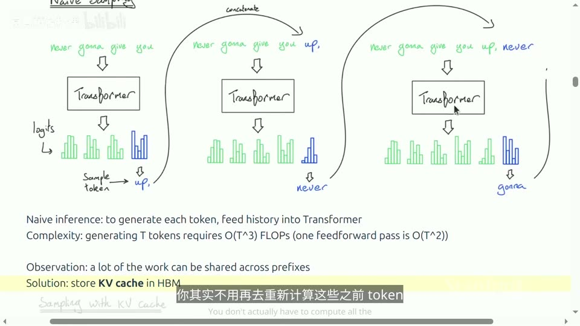

代价分析：每生成一个 token，你要花 `O(T)` 量级的时间（`T` 是此刻已生成的 token 总数）；注意力本身的计算量是 `T` 的平方（这部分绕不开），并且**每个 token 都要从头算一遍**，所以**生成 `T` 个 token 的复杂度其实是 `T` 的三次方**。这效率相当低。([【跳转到 16:47】](https://www.bilibili.com/video/BV11LEA6eEuj/?p=10&t=1007))

### 5.2 因果注意力允许跨前缀复用

但讲者指出，**很多计算其实可以跨前缀复用**。打个比方：生成 "never gonna give you up" 时，前面那些 token 的键和值其实是不变的——因为我们是**因果（decoder-only）Transformer**。如果是双向模型，你追加一个新 token 会让前面所有状态都变；但因果模型里，你往后追加 token 时，**前面这些激活值（activations）不会变**。([【跳转到 17:12】](https://www.bilibili.com/video/BV11LEA6eEuj/?p=10&t=1032))

基于这个观察，最显而易见的做法就是**在 HBM 里存一个 KV 缓存（KV cache）**，这样在连续生成 token 之间，就能直接复用之前算好的键和值，而不必重算。([【跳转到 17:37】](https://www.bilibili.com/video/BV11LEA6eEuj/?p=10&t=1057))

### 5.3 KV 缓存的形式与两阶段

KV 缓存在形式上是：**对每个序列（共 `B` 个）、对每个 token（共 `S` 个）、对每一层、在每个 head 中，存储一个 `H` 维的向量**（键一份、值一份）。([【跳转到 18:52】](https://www.bilibili.com/video/BV11LEA6eEuj/?p=10&t=1132))


有了 KV 缓存，推理就分成两个性质迥异的阶段：

1. **预填充（prefill）**：拿到完整 prompt，把它编码成关键/值向量，**填满 KV 缓存**。因为你能看到完整的 prompt，所以这一步**和训练一样可以并行**（此时 `T = S`）。
2. **生成（generation）**：按顺序逐个生成新的回复 token。对已经看过的 token，你**不用再花开销重新计算它们的 KV 缓存**，只需为新 token 计算（此时 `T = 1`）。

([【跳转到 19:17】](https://www.bilibili.com/video/BV11LEA6eEuj/?p=10&t=1157))

这个拆分是后面所有优化的舞台：**预填充能并行、天生高效；生成只能串行、天生低效。** 接下来就分别对 MLP 层和注意力层做 FLOPs / 内存分析，看看这两个阶段各自受什么限制。

---

## 六、逐层分析得出核心结论：预填充计算受限、生成内存受限

这一节是全讲的"高潮"。结论先行：**把 MLP 层和注意力层分别做算术强度分析后会发现，MLP 不是问题（只要 batch 够大），真正的瓶颈是生成阶段的注意力——它的算术强度仅约 `1`，且完全不随 `B` 缩放。这就是"推理是内存受限的"这句话的来历。**([【跳转到 26:47】](https://www.bilibili.com/video/BV11LEA6eEuj/?p=10&t=1607))

只看矩阵乘法就够了，因为真正费计算量的就是它们，其余部分浮点运算量不大、可以并进矩阵乘法里。([【跳转到 20:07】](https://www.bilibili.com/video/BV11LEA6eEuj/?p=10&t=1207))

### 6.1 MLP：强度约 B×T，本质是一次大矩阵乘法

先算 MLP：从内存读 `X`、读权重，计算上投影并写入 HBM，再算门控、下投影，写回 HBM。FLOPs 取决于 `B`、`T`、`D`、`F`（批量大小、序列长度、模型维度、前馈维度），传输字节数是相应的读写之和。算出强度后，仍然做"`B×T` 远小于 `D`、`F`"的简化，得到（[【跳转到 20:32】](https://www.bilibili.com/video/BV11LEA6eEuj/?p=10&t=1232)、[【跳转到 20:57】](https://www.bilibili.com/video/BV11LEA6eEuj/?p=10&t=1257))：

```text
MLP intensity ≈ B*T
```

这和单纯矩阵乘法的情况很像——**MLP 本质上就是一次大矩阵乘法**，而且批处理维度和序列长度维度基本互不影响、各自独立。([【跳转到 21:22】](https://www.bilibili.com/video/BV11LEA6eEuj/?p=10&t=1282))

- **预填充阶段**：`T = S` 很大，只要把 `B×T` 设得足够大（大批量、长序列），MLP 就能保持高算术强度，**没问题**。
- **生成阶段**：`T = 1`，于是强度约等于 `B`。此时 `B` 是并发请求数（或并发用户数），可能高也可能低、还随时间变化。不过总体还好——**只要 batch 够大**，强度就不会太差；这里序列长度帮不上忙，但 batch 能帮上忙。

### 6.2 注意力：生成阶段强度约 1，且不随 B 缩放

注意力就不一样了。它要从 HBM 读取 Q、K、V，计算注意力、softmax，算出值矩阵再写回 HBM。它的 FLOPs 是 `B×S×T×D`，传输字节数是相应的读写之和。所有项都是矩阵乘法，所以**浮点运算量的阶数总比传输字节数高一阶**，关键在于"系数"长什么样。注意力这个系数是 `1/(1/S + 1/T)`，也就是（[【跳转到 22:37】](https://www.bilibili.com/video/BV11LEA6eEuj/?p=10&t=1357)、[【跳转到 23:02】](https://www.bilibili.com/video/BV11LEA6eEuj/?p=10&t=1382)、[【跳转到 23:27】](https://www.bilibili.com/video/BV11LEA6eEuj/?p=10&t=1407)、[【跳转到 23:52】](https://www.bilibili.com/video/BV11LEA6eEuj/?p=10&t=1432))：

```text
attention intensity = S*T / (S + T)
```

两个阶段代进去：

- **预填充**（`T = S`）：`intensity = S/2`。这**很好**——只要序列够长，注意力也能维持高算术强度。
- **生成**（`T = 1`）：`intensity = S/(S+1)`，也就是**接近 1**。而"强度只有 1"是很糟糕的：我们希望它达到约 `295`，才能让 H100 跑满。**这就是瓶颈所在。**


### 6.3 为什么注意力是根本瓶颈

为什么 MLP 生成没问题、注意力却卡住了？关键在于**是否依赖 `B`**（[【跳转到 24:42】](https://www.bilibili.com/video/BV11LEA6eEuj/?p=10&t=1482)、[【跳转到 25:07】](https://www.bilibili.com/video/BV11LEA6eEuj/?p=10&t=1507)、[【跳转到 25:32】](https://www.bilibili.com/video/BV11LEA6eEuj/?p=10&t=1532))：

- **MLP 里，每个序列都用同一组 MLP 权重**，这些权重**不依赖 `B`**。所以你只要把权重加载一次，就能用它处理整批数据——**批量越大越有帮助**，因为权重的读取开销被更多序列分摊了。这就是 MLP 能达到高算术强度的原因。
- **注意力里，每个序列都有自己的 KV 缓存**，Q/K/V 全都**依赖 `B`**。每个序列其实是各自做一次独立的（点积式）运算，它们彼此独立，所以"多做几次矩阵乘法"并不能分摊什么成本。这个不随 `B` 缩放的"蓝色 `B`"，正是**算术强度无法随 batch 提高的原因**，也正是瓶颈所在。

讲者打了个很贴切的比方：注意力里本质是在做一批**点积**，而点积的算术强度糟糕透了——读一堆数据只做很少的计算，几乎纯粹在搬内存。([【跳转到 25:57】](https://www.bilibili.com/video/BV11LEA6eEuj/?p=10&t=1557))

### 6.4 结论

把两阶段、两层的结果汇总（[【跳转到 26:22】](https://www.bilibili.com/video/BV11LEA6eEuj/?p=10&t=1582)、[【跳转到 26:47】](https://www.bilibili.com/video/BV11LEA6eEuj/?p=10&t=1607))：

| 阶段 | MLP 强度 | 注意力强度 | 受限类型 |
| --- | --- | --- | --- |
| 预填充（prefill） | `B×S`（好） | `S/2`（不错） | **计算受限** |
| 生成（generation） | `≈B`（batch 大就行） | `S/(S+1)≈1`（极差） | **内存受限** |

于是得到本讲最该记住的一句话：

> **预填充阶段是计算受限的，生成阶段是内存受限的；真正棘手的根本瓶颈，是生成阶段那极低的注意力算术强度。只要你还用 Transformer，这个问题就无法真正消除。**

所以每当你听到别人说"inference 是内存受限的"，现在你应该明白**为什么**了：因为生成阶段的时间几乎全花在把 KV 缓存和权重从 HBM 搬来搬去，而不是花在计算上。这一认识的好处是"简化"——考虑耗时的时候，只要看需要搬运多少内存就行。([【跳转到 27:12】](https://www.bilibili.com/video/BV11LEA6eEuj/?p=10&t=1632))

---

## 七、实例：Llama 2 13B 在 H100 上的延迟与吞吐权衡

概念讲完，讲者用一个具体例子把数字落到实处：**Llama 2 13B 跑在 H100 上，延迟和吞吐量各是多少？** 结论先行：**延迟随 batch 线性增长（常数项就是 KV 缓存），吞吐量随 batch 增长但有上限；这就形成了"要延迟还是要吞吐"的两难。**([【跳转到 27:37】](https://www.bilibili.com/video/BV11LEA6eEuj/?p=10&t=1657))

### 7.1 配置与参数量核算

用到的模型配置如下（[【跳转到 28:02】](https://www.bilibili.com/video/BV11LEA6eEuj/?p=10&t=1682)）：

| 符号 | 含义 | 数值 |
| --- | --- | --- |
| `S` | 序列长度 | 1024 |
| `D` | 模型维度 | 5120 |
| `F` | 前馈维度 | 13824 |
| `N` | 查询头数 | 40 |
| `K` | KV 头数 | 40（即 `K = N`，未做 GQA 缩减） |
| `H` | 头维度 | 128 |
| `L` | 层数 | 40 |
| `V` | 词表大小 | 32000 |
| — | H100 内存带宽 | `3.35e12` 字节/秒 |

参数量按**嵌入层 + MLP 层 + QKV 投影**相加，用 bf16 存储。算出来是 `13,015,449,600`，也就是约 **130 亿**——这正好和"13B"的名字对得上，是个很好的合理性检验。([【跳转到 30:32】](https://www.bilibili.com/video/BV11LEA6eEuj/?p=10&t=1832))

KV 缓存的大小则是：

```text
KV_cache = S × N × K × H × L × 2(key/value) × 2(bf16 字节)
```

总内存占用是"单个序列的 KV 缓存 × B + 参数大小"。([【跳转到 29:17】](https://www.bilibili.com/video/BV11LEA6eEuj/?p=10&t=1757))

### 7.2 内存、延迟、吞吐的公式

因为推理内存受限，**延迟主要由内存 IO 决定**——数据要在 HBM 和 SRAM 之间来回传输，"移动数据所花的时间"就是延迟的主要部分（前提是通信和计算能重叠）。而吞吐量是延迟的倒数；因为要并行生成 `B` 个 token，数值上还会多出一个 `B` 的因子。代入配置后得到（[【跳转到 29:42】](https://www.bilibili.com/video/BV11LEA6eEuj/?p=10&t=1782)、[【跳转到 30:07】](https://www.bilibili.com/video/BV11LEA6eEuj/?p=10&t=1807)）：

```text
memory     = 838860800*B + 26030899200        (字节)
latency    = 0.00025046*B + 0.0077704         (秒/token)
throughput = 127792.358*B / (32*B + 993)      (token/秒)
```

### 7.3 数值结果与 batch 的两难

几个关键读数（[【跳转到 31:47】](https://www.bilibili.com/video/BV11LEA6eEuj/?p=10&t=1907)、[【跳转到 32:12】](https://www.bilibili.com/video/BV11LEA6eEuj/?p=10&t=1932)、[【跳转到 33:22】](https://www.bilibili.com/video/BV11LEA6eEuj/?p=10&t=2002)、[【跳转到 33:47】](https://www.bilibili.com/video/BV11LEA6eEuj/?p=10&t=2027))：

- **延迟是 `B` 的线性函数**，常数项就是参数搬运、随 `B` 增长的项就是 KV 缓存——因为处理时要把越来越大的 KV 缓存反复复制。
- **吞吐量约等于 `B/(B + 常数)`**：随 `B` 增大而提高，但**存在渐近上限**，不可能无限增长。而且它往往**先撞上 H100 的显存上限**（KV 缓存把显存吃光），即便换成 B200 把 batch 调得更大，最终也还是会撞墙。
- 当 **batch = 1** 时：延迟约 **0.008 秒/token**、吞吐约 **124 token/秒**。
- 当 **batch 增大**时：延迟变**差**、吞吐变**好**。

这就形成了本讲反复强调的取舍：**小 batch 延迟低但吞吐差，大 batch 吞吐高但延迟差。** "快"到底指哪一面，取决于你的应用。讲者用了个"公交"的比喻：公交一次能载很多人、吞吐高，但你得等大家都上车；增大 batch 提升吞吐，靠的是**参数共享**——模型只需加载一次就能处理很多序列；代价是批处理要"等大家都跑完"，所以延迟高。([【跳转到 34:12】](https://www.bilibili.com/video/BV11LEA6eEuj/?p=10&t=2052))

### 7.4 并行化与 TTFT

还有两个补充点（[【跳转到 34:37】](https://www.bilibili.com/video/BV11LEA6eEuj/?p=10&t=2077)、[【跳转到 35:02】](https://www.bilibili.com/video/BV11LEA6eEuj/?p=10&t=2102))：

1. **并行化**：可以把模型切分、放到多个设备上跑。一个简单例子是启动 `M` 个模型副本：**延迟不变，但吞吐量能提升到 `M` 倍。** 更深入的并行策略可参考 scaling book 的推理章节。
2. **TTFT**：首 token 时间基本就是**做 prefill 所花的时间**，因为 prefill 一结束你就能开始生成。想要**更快的 TTFT，就要用较小的 batch**；想要**更高的吞吐，就要用较大的 batch**——又是一个同一枚硬币的两面。

---

## 八、缩小 KV 缓存：GQA、MLA 与更多共享/压缩思路

既然**内存是推理的瓶颈、KV 缓存又特别占内存**（batch 足够大时，KV 缓存甚至可能超过参数本身的规模），优化方向就很明确了：**在尽量不损失精度的前提下，把 KV 缓存降下来。** 这一节从"在 head 之间共享 KV"讲到"把 KV 压缩成潜变量"，再到"减少/跳过部分 KV"。([【跳转到 35:52】](https://www.bilibili.com/video/BV11LEA6eEuj/?p=10&t=2152))

### 8.1 GQA：在 head 之间共享 KV

**分组查询注意力（Grouped-Query Attention，GQA）** 的思路是：**查询（queries）的数量不变，但只保留一部分键/值组**，每个组内的多个查询头共享一份键和值。用前面 `K`/`N` 的记号说：**GQA 把键/值的数量从 `N` 个减到 `K` 个，于是 KV 缓存缩小到原来的 `K/N`。**([【跳转到 36:17】](https://www.bilibili.com/video/BV11LEA6eEuj/?p=10&t=2177)、[【跳转到 37:07】](https://www.bilibili.com/video/BV11LEA6eEuj/?p=10&t=2227))

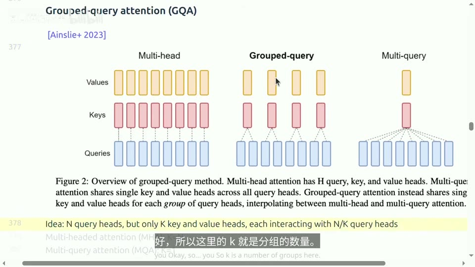

这是三种方案的光谱：

- **MHA（多头注意力）**：`K = N`，不缩减，KV 缓存最大；
- **MQA（多查询注意力）**：`K = 1`，所有查询头共用一份键/值，压缩最狠，但**效果太差，基本没人用**；
- **GQA**：介于两者之间，**希望在精度和速度之间找到平衡点**。

GQA 原论文（Ainslie 等，2023）的实验给出很直观的结论：全注意力（MHA）耗时非常高；从 `K=1` 起步速度飞快；把 `K` 加到 8 效果还不错；再往上收益就**到顶**，耗时反而明显上升。所以工程上要选一个合适的组数，而不是一味求小。([【跳转到 37:12】](https://www.bilibili.com/video/BV11LEA6eEuj/?p=10&t=2232))

**为什么 GQA 能同时降低延迟、提升吞吐？** 因为它把 KV 缓存缩到了 `K/N`，而省内存就能提速——我们的系统本来就是内存瓶颈。用数字说话：还是刚才那个 Llama 例子、用 batch=64，假定一个压缩比例，KV 内存降下来后**延迟改善、吞吐量也上去了**；而且还能顺手把 batch 调得更大（比如原来 batch=256 会爆显存，现在装得下了），吞吐进一步成比例上升。这说明一个很重要的点：**延迟和吞吐量并不总是冲突的，只要把内存占用降下来，两者都能变好；真正的矛盾点其实在 batch 这个维度上。**([【跳转到 38:02】](https://www.bilibili.com/video/BV11LEA6eEuj/?p=10&t=2282)、[【跳转到 38:27】](https://www.bilibili.com/video/BV11LEA6eEuj/?p=10&t=2307)、[【跳转到 39:17】](https://www.bilibili.com/video/BV11LEA6eEuj/?p=10&t=2357))

当然，**任何有损改动都要检查准确性**。GQA 论文报告的效果普遍不错，但讲者提醒要"打个折扣"看——毕竟只是针对特定模型的结果；后来的 DeepSeek 论文表明，压缩 KV 确实会带来一定负面影响。**除了纯数学部分，其他结论都值得保持一点怀疑。**([【跳转到 39:42】](https://www.bilibili.com/video/BV11LEA6eEuj/?p=10&t=2382)、[【跳转到 40:07】](https://www.bilibili.com/video/BV11LEA6eEuj/?p=10&t=2407))

### 8.2 MLA：把 KV 压缩到潜变量

**多头潜在注意力（Multi-head Latent Attention，MLA）** 是 DeepSeek 提出的更激进的思路。它和 GQA 的区别在于：**GQA 减少键/值的"数量"（head 数），MLA 则保持每个 token 一个键/值，但把它们"参数化压缩"起来。**([【跳转到 40:24】](https://www.bilibili.com/video/BV11LEA6eEuj/?p=10&t=2424))


具体做法（[【跳转到 40:49】](https://www.bilibili.com/video/BV11LEA6eEuj/?p=10&t=2449)、[【跳转到 41:14】](https://www.bilibili.com/video/BV11LEA6eEuj/?p=10&t=2474)）：

- 常规做法是：拿到激活值，乘一个矩阵得到 `K`、乘另一个矩阵得到 `V`，维度通常是 `N×H`，跟模型维度差不多大；
- MLA 则把激活值投影、**压缩到一个较小的 `C` 维潜变量**，然后只缓存这个 `C`（小得多）；等需要键和值时，再从 `C` 还原出 `K` 和 `V`。DeepSeek V2 把维度从很大的 `N*H = 16384` 直接压到 `C = 512`，压缩相当激进。

有一个技术细节：**MLA 与 RoPE（旋转位置编码）的兼容性**。因为 RoPE 是直接作用在键/值上的，而 MLA 压缩后再还原会破坏这个作用，所以他们的做法是**额外增加一些维度来处理 RoPE**（这也解释了为什么实际维度是 `512 + 64 = 576`）。总的来说缩减幅度仍然很大，所以延迟和吞吐量都能明显改善——道理很简单：**KV 缓存越小，跑起来就越快**（在某个点之前基本是线性扩展）。([【跳转到 41:39】](https://www.bilibili.com/video/BV11LEA6eEuj/?p=10&t=2499)、[【跳转到 41:44】](https://www.bilibili.com/video/BV11LEA6eEuj/?p=10&t=2504))

有意思的是，DeepSeek 论文的结果**与 GQA 论文有点张力**：他们报告 MLA 甚至比 MHA 还略好一点，而 GQA 则相对差一些。讲者的态度很谨慎——除非你亲自做消融，否则很难预判哪种压缩方式最适合你的模型，**"得靠大量实验，看看哪种方法管用"。**([【跳转到 42:27】](https://www.bilibili.com/video/BV11LEA6eEuj/?p=10&t=2547)、[【跳转到 42:50】](https://www.bilibili.com/video/BV11LEA6eEuj/?p=10&t=2570))

### 8.3 跨层注意力、滑动窗口与线性注意力

除了在 head 维和模型维上做文章，还可以在**层（layer）**和**序列长度**上做文章：

- **跨层注意力（cross-layer attention）**：GQA 是在 head 之间共享 KV，跨层注意力则在 **layer 之间共享**——只计算其中一部分层的 KV，其余层**直接复用上一层的 KV 缓存**。实验显示它能优化帕累托前沿（Pareto frontier），即在这些模型上每个点都更好。([【跳转到 43:15】](https://www.bilibili.com/video/BV11LEA6eEuj/?p=10&t=2595)、[【跳转到 43:40】](https://www.bilibili.com/video/BV11LEA6eEuj/?p=10&t=2620))
- **局部/滑动窗口注意力（sliding-window / local attention）**：完整注意力矩阵是 `N` 的平方，而滑动窗口的想法很自然——**生成每个 token 时只看最近的 `K` 个 token**。这样一来，**KV 缓存就和序列长度无关了**（只取决于批次大小和窗口），对长上下文场景尤其好。由于信息能顺着层往下传，实际有效上下文比标称窗口更大。([【跳转到 44:05】](https://www.bilibili.com/video/BV11LEA6eEuj/?p=10&t=2645)、[【跳转到 44:30】](https://www.bilibili.com/video/BV11LEA6eEuj/?p=10&t=2670))
- **线性注意力（linear attention）**：它**根本不存 KV 缓存**，而是对全部历史信息做某种**压缩表示**。最简单就是把所有 values 加总成一个向量（自然与序列长度无关）；更高级的有 Gated DeltaNet、Mamba 等状态空间模型。([【跳转到 46:10】](https://www.bilibili.com/video/BV11LEA6eEuj/?p=10&t=2770))

但这里有个绕不开的道理：**"天下没有免费的午餐"——或者这顿午餐其实挺贵的。** 滑动窗口/线性注意力都牺牲了表达能力、会掉一点准确性。常见的折中是**混合架构**：一些层用全注意力、另一些层用局部注意力，交替使用；也可以把全注意力、滑动窗口和线性注意力组合起来，因为它们捕捉的侧重点不同——**想要局部高分辨率信息就用滑动窗口，想要对过往内容的宏观概括就用线性注意力。**([【跳转到 45:20】](https://www.bilibili.com/video/BV11LEA6eEuj/?p=10&t=2720)、[【跳转到 46:35】](https://www.bilibili.com/video/BV11LEA6eEuj/?p=10&t=2795))

课堂问答里还有个很精彩的讨论（"大海捞针"问题）：如果上下文极长，而线性注意力必须把整段历史压进很小的表示里，**信息一定会丢失、可能根本检索不到**。所以大家最终还是倾向混合架构——总需要某种长程注意力。Mamba/DeltaNet 这类递归模型也许比滑动窗口更强大（递归时只要看上一个状态，回旋空间更大），但一旦做成固定滑动窗口就"到此为止"了。([【跳转到 47:00】](https://www.bilibili.com/video/BV11LEA6eEuj/?p=10&t=2820)、[【跳转到 47:51】](https://www.bilibili.com/video/BV11LEA6eEuj/?p=10&t=2871))

### 8.4 DeepSeek 的压缩/稀疏注意力

讲者特别提到 DeepSeek 还在持续发明新的注意力机制，比如**压缩稀疏注意力（Compressed Sparse Attention，CSA）**、**DeepSeek 稀疏注意力（DSA）** 与**重度压缩注意力（HCA）**。它们的思路可以概括为（[【跳转到 48:45】](https://www.bilibili.com/video/BV11LEA6eEuj/?p=10&t=2925)、[【跳转到 49:07】](https://www.bilibili.com/video/BV11LEA6eEuj/?p=10&t=2947)）：


- **压缩**：把每 `M` 个 token 压缩成一个 token（Token-Level Compressor）；
- **稀疏**：不保留全部，而是**挑出一部分子集**——先用轻量的 queries 和 keys 算一次小规模注意力，得到索引分数，据此知道该保留哪些 token（Lightning Indexer），是一种极快、确定该保留哪些 token 的方法。

### 8.5 本节小结

这一节的目标始终是同一个：**减少 KV 缓存，因为 KV 缓存与内存相关，而推理是内存受限的——降内存能直接提升吞吐、降低延迟。** 低维 KV 缓存可以从**跨层、跨 head、跨 head 维度**等各个方向做；也可以用 local attention、linear attention，还有很多其他方法。关键前提是：**在不损害准确性的前提下做到。**

---

## 九、量化与剪枝：从系统与模型层面把模型变小

前面是从**架构**层面减少 KV 缓存；这一节换两个角度。结论先行：**量化（quantization）从系统层面降低数字精度来省内存，剪枝（pruning）则直接从模型里"剪掉"不重要的部分再修补回来；两者都能在可控的精度损失下提高吞吐、降低延迟。**([【跳转到 50:04】](https://www.bilibili.com/video/BV11LEA6eEuj/?p=10&t=3004))

### 9.1 量化：降低数字精度

**量化的核心思路是降低数字的精度**：用更少的比特表示每个权重/激活，于是内存占用更小、吞吐更高、延迟更低。选项很多，范围可以从 **bf16 一直到 int4**。显然，代价是要担心准确性。([【跳转到 50:04】](https://www.bilibili.com/video/BV11LEA6eEuj/?p=10&t=3004)、[【跳转到 50:29】](https://www.bilibili.com/video/BV11LEA6eEuj/?p=10&t=3029))


### 9.2 QAT vs PTQ，以及 GPTQ 与激活感知量化

- **量化感知训练（Quantization-Aware Training，QAT）**：如果怕量化把模型搞砸，可以**带着量化意识去训练**。做法是在前向传播里**先量化、再反量化**，训练时模拟量化误差，让权重去适应它，量化效果通常更好。代价是**训练成本高昂、规模大**。
- **训练后量化（Post-Training Quantization，PTQ）**：先训练好模型、再做量化，**便宜得多**，是更常见的做法。最直接的做法是逐层或逐张量分别确定缩放因子（scale）和零点（zero point），但效果通常没那么好。
- **GPTQ**：利用**海森矩阵（Hessian）** 信息逐层量化，同时**追踪并修正那些传播到未量化权重里的误差**，效果更好。
- **激活感知量化（Activation-aware Quantization，AWQ）**：核心观察是——**有些激活通道的数值很大，跟这些通道打交道的权重就更重要**。于是给这些权重**多分配精度**：比如整个矩阵保持 int3，只在少数几个重要通道上给 FP16。幻灯片给出的数字很直观：`fp16 → int3` 能带来 **4 倍内存下降、3.2 倍加速**。

([【跳转到 50:54】](https://www.bilibili.com/video/BV11LEA6eEuj/?p=10&t=3054)、[【跳转到 51:19】](https://www.bilibili.com/video/BV11LEA6eEuj/?p=10&t=3079)、[【跳转到 51:44】](https://www.bilibili.com/video/BV11LEA6eEuj/?p=10&t=3104)、[【跳转到 52:09】](https://www.bilibili.com/video/BV11LEA6eEuj/?p=10&t=3129))

### 9.3 剪枝与蒸馏

**模型剪枝（pruning）** 简单粗暴但有效："拿一个大模型，把其中一部分切掉，然后再修补一下。" 典型流程（以 NVIDIA 的一篇论文为例）是（[【跳转到 52:30】](https://www.bilibili.com/video/BV11LEA6eEuj/?p=10&t=3150)、[【跳转到 52:51】](https://www.bilibili.com/video/BV11LEA6eEuj/?p=10&t=3171)、[【跳转到 53:30】](https://www.bilibili.com/video/BV11LEA6eEuj/?p=10&t=3210)）：

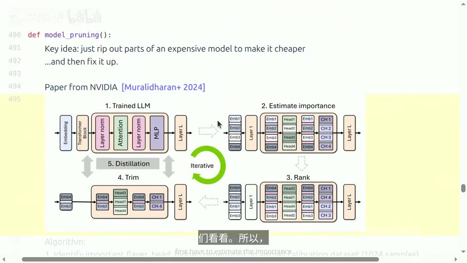

1. **评估重要性**：一般会准备一个**校准集**，把输入跑一遍模型，主要看激活值（activations）的大小；
2. **排序并剪掉**：挑出最关键的隐藏单元甚至整层，直接移除；
3. **后训练/蒸馏修复**：此时模型效果还不行，用你关心的数据或任务再训练一下，把性能修回来。

这里有个经验性观察：**某些通道的激活值会远高于其他通道**——激活值高就认为它重要、要保留下来（那些"死单元"数值接近零，可以剪掉）。这个方法之所以有效，正是因为模型**实际就是这么被训练出来的**，你可以利用这个特点。当然也有边界情况：如果一个神经元的值"始终为 100"，直接移除会整体出错，这时得结合偏置（bias）等办法处理。([【跳转到 54:25】](https://www.bilibili.com/video/BV11LEA6eEuj/?p=10&t=3265)、[【跳转到 55:40】](https://www.bilibili.com/video/BV11LEA6eEuj/?p=10&t=3340))

剪枝的效果不错：NVIDIA 的工作**成功把一个 15B 的模型压缩到 8B，准确率没怎么受影响，而且整个过程所需的数据量要少得多。** 从更高层面看，这些方法可以归为两条路：要么**设计一种更快的架构从头训练**，要么**用原始模型的权重去初始化一个更快的架构**（架构可能不同，拼出一个"弗兰肯斯坦"式的模型），**再用蒸馏把这个更快的模型修好**。([【跳转到 53:30】](https://www.bilibili.com/video/BV11LEA6eEuj/?p=10&t=3210)、[【跳转到 53:55】](https://www.bilibili.com/video/BV11LEA6eEuj/?p=10&t=3235))

---

## 十、推测解码与动态负载：无损加速和线上服务的系统技巧

前面所有方法（GQA、MLA、量化、剪枝）都是**有损**的——能大幅压缩，但可能牺牲精度。这一节讲三件"更优雅"的事：**无损的推测解码，以及两个应对真实线上动态负载的系统技巧（连续批处理、分页注意力）。** 结论先行：**推测解码利用"检查比生成快"的不对称性，一次接受多个 token 且保持无损；系统技巧则借用操作系统思想来管理 KV 缓存与批次调度。**([【跳转到 56:03】](https://www.bilibili.com/video/BV11LEA6eEuj/?p=10&t=3363))

### 10.1 推测解码：检查比生成快

**推测解码（speculative decoding，也叫 speculative sampling）** 的核心洞察是一个非常反直觉的不对称性：**检查（评估）一个序列比逐个生成它要快得多。** 回想一下，预填充阶段可以并行地对所有 token 编码、同样给出概率分布，是计算受限、速度很快的；而生成只能逐个进行。所以我们利用这种不对称性（[【跳转到 56:28】](https://www.bilibili.com/video/BV11LEA6eEuj/?p=10&t=3388)、[【跳转到 56:53】](https://www.bilibili.com/video/BV11LEA6eEuj/?p=10&t=3413)）：

1. 用一个**便宜的草稿模型（draft model）** 先顺序生成 `K` 个 token（比如 4 个）；
2. 用真正在乎的**目标模型（target model）** **并行地**审查这些 token、算出它们的 logits，决定接受还是拒绝。

两边就此平衡：草稿模型更小更便宜，虽然受内存限制要逐个生成，但问题不大；目标模型虽然又大又贵，但它是**并行处理一批 token**，所以也不会太吃力。

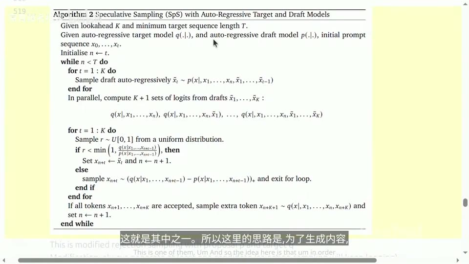

**接受/拒绝的数学**（本质是拒绝采样的变体，但**总能从目标模型得到精确样本**，因此是**无损**的）：对每个草稿 token，以概率

```text
accept with probability  min(1, q(x)/p(x))
```

来接受它（这里 `p` 是草稿模型分布、`q` 是目标模型分布）：如果 `q` 比 `p` 大很多，`q` 越大我们就越倾向接受；否则就从**残差分布** `(q - p)₊` 归一化后采样，并退出本轮。([【跳转到 58:33】](https://www.bilibili.com/video/BV11LEA6eEuj/?p=10&t=3513)、[【跳转到 58:58】](https://www.bilibili.com/video/BV11LEA6eEuj/?p=10&t=3538))

参数选择有个权衡：**草稿 token 太少**，没怎么利用上目标模型的批处理能力；**太多**，被拒绝的概率就大了。实践中 **3 到 4 个**是比较平衡的点。理想情况下，草稿模型应**尽量贴近目标模型**（用蒸馏来做）；前面讲的各种 KV 缓存压缩手段，其实也可以用来得到一个便宜的草稿模型。([【跳转到 59:23】](https://www.bilibili.com/video/BV11LEA6eEuj/?p=10&t=3563))

### 10.2 连续批处理与选择性批处理

真实线上服务的负载是**动态**的，不像训练那样整齐：请求到达时间各不相同、共享的前缀也不一样、长度参差不齐，形成"参差的数组（ragged array）"。([【跳转到 59:48】](https://www.bilibili.com/video/BV11LEA6eEuj/?p=10&t=3588))

**连续批处理（continuous batching）** 由 **ORCA** 系统提出，是一个很早但很关键的做法。它的思路是**迭代级调度（iteration-level scheduling）**：在解码的每一步里，为批次中所有序列各解码一个 token；**某个序列生成结束就立即剔除，新请求一进来就加进批次**，继续处理。所以你的批次是**动态更新**的——旧的完成即踢出、新的随即进入，不必等整个 batch 全部跑完。([【跳转到 60:13】](https://www.bilibili.com/video/BV11LEA6eEuj/?p=10&t=3613)、[【跳转到 60:38】](https://www.bilibili.com/video/BV11LEA6eEuj/?p=10&t=3638)、[【跳转到 61:03】](https://www.bilibili.com/video/BV11LEA6eEuj/?p=10&t=3663))


但这里冒出一个问题：之前批量处理的前提是**所有序列维度一致**，张量里每个切片形状都一样；可现在每个请求长度不同，怎么办？这就引出**选择性批处理（selective batching）**：注意力计算依赖于序列长度，3×3 和 9×9 的运算没法高效共享张量，所以注意力部分要单独处理；但**非注意力的部分（尤其是占了大量 FLOPs 的 MLP 层）可以把所有序列拼接成一个超大序列，一起处理**。([【跳转到 61:25】](https://www.bilibili.com/video/BV11LEA6eEuj/?p=10&t=3685)、[【跳转到 61:50】](https://www.bilibili.com/video/BV11LEA6eEuj/?p=10&t=3710))

### 10.3 分页注意力：把操作系统思路搬进来

**分页注意力（PagedAttention）** 是 vLLM 论文提出的核心机制（也是 vLLM 最早、最关键的创新）。它要解决的是**KV 缓存如何存储**的问题——而这会带来**碎片化（fragmentation）**，就像以前硬盘需要"磁盘碎片整理"一样。碎片化主要有两种（[【跳转到 62:03】](https://www.bilibili.com/video/BV11LEA6eEuj/?p=10&t=3723)、[【跳转到 62:28】](https://www.bilibili.com/video/BV11LEA6eEuj/?p=10&t=3748)、[【跳转到 62:53】](https://www.bilibili.com/video/BV11LEA6eEuj/?p=10&t=3773))：

- **内部碎片（internal fragmentation）**：因为不知道生成何时停止，你只能按一个**最大 token 上限**预留缓冲区，于是预留了一大批内存却常常用不上，纯属浪费；
- **外部碎片（external fragmentation）**：不同请求之间留下一些**太小、没法有效利用**的空隙，也成了浪费。

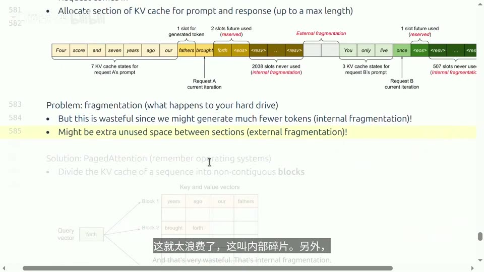

解决方案非常"计算机系统"：既然是搞系统的人、对操作系统很熟，那就照老办法来——**把一个序列的 KV 缓存切成不连续的小块（block）**。块具体放在物理内存哪里不重要，只要**按块对齐、并能通过索引追踪每块的位置**就行。这样一来，**不同请求若共享相同前缀，就可以共用同一块 KV 缓存**（比如把序列切成大小为 4 的小块，"Four score and seven years ago..." 这样的前缀就能被多个请求复用）。([【跳转到 63:03】](https://www.bilibili.com/video/BV11LEA6eEuj/?p=10&t=3783)、[【跳转到 63:53】](https://www.bilibili.com/video/BV11LEA6eEuj/?p=10&t=3833))

### 10.4 copy-on-write 与前缀缓存

分页机制带来两个非常实用的收益（[【跳转到 64:09】](https://www.bilibili.com/video/BV11LEA6eEuj/?p=10&t=3849)、[【跳转到 64:14】](https://www.bilibili.com/video/BV11LEA6eEuj/?p=10&t=3854)）：

1. **共享 system prompt 的 KV 缓存只算一次**：如果很多用户用的是同一个 system prompt，你就不用为每个请求都重新计算一遍；
2. **同一 prompt 生成多个回复**：很多应用场景里，你用同一个 prompt、却想生成多个不同的回复，这时也可以共享这个 prompt 的 KV 缓存，只让各自独特的回复分头输出。


实现这个共享的机制叫 **写时复制（copy-on-write）**：保留共享的部分，然后看两个样本——如果它们恰好采样到**相同的 token**就继续沿用同一块；如果采样到了**不同的 token**，就把这个块**拆开、各自往下续写**。本质上，你是在**尽可能多地共享前缀缓存（prefix caching）**。此外 vLLM 还有一系列其他优化，比如 kernel 层面的融合改进，这里就不展开了。核心思路始终是：**借用操作系统里的概念来管理推理。**([【跳转到 64:54】](https://www.bilibili.com/video/BV11LEA6eEuj/?p=10&t=3894))

---

## 小结

1. **推理极其重要、且与训练本质不同**：训练是一次性成本，推理是每天反复支付的账；在 agent 时代，生成的大部分 token 不给人读，算力投入几乎没有上限。
2. **"快"有三个指标**：TTFT（开始生成前的等待）、延迟（单查询出词速度）、吞吐量（多查询总速度）。它们适用于不同场景，且**延迟与吞吐量常常相互制约**（小 batch 延迟低、大 batch 吞吐高）。
3. **概念框架**：用 einops 式记号描述张量，用**算术强度**判断计算/内存受限——H100 的算术强度约 **295**，而推理生成阶段注意力只有约 **1**。
4. **核心结论**：**预填充是计算受限、生成是内存受限**。MLP 本质是一次大矩阵乘法（强度约 `B×T`，batch 大就不怕）；注意力生成阶段强度仅 `S/(S+1)≈1`，且**不随 `B` 缩放**——这就是推理的根本瓶颈。
5. **缩小 KV 缓存**是主要优化方向：GQA（head 间共享，缩到 `K/N`）、MLA（压缩成潜变量 `C`，DeepSeek V2 压到 512+64）、跨层注意力（layer 间共享）、滑动窗口/局部注意力（与序列长度无关）、线性注意力（不存 KV、压缩历史）、DeepSeek 的压缩/稀疏注意力。它们都有"天下没有免费的午餐"的代价，常用混合架构平衡。
6. **量化与剪枝**从系统/模型层面把模型变小：QAT（模拟量化误差、训练贵）vs PTQ（便宜）、GPTQ（用 Hessian 补偿）、AWQ（给重要激活通道留高精度，fp16→int3 省 4 倍内存、提速 3.2 倍）；剪枝则移除不重要部分再后训练/蒸馏修复（15B→8B）。
7. **推测解码是无损加速**：草稿模型先出 K 个 token，目标模型并行校验，以 `min(1, q/p)` 接受、否则从残差 `(q−p)₊` 采样；K 太小浪费批处理、太大易被拒，实践中 3~4 个较平衡。
8. **动态负载要用系统思想**：连续批处理（Orca，完成即剔除、新请求随时加入）、选择性批处理（MLP 拼成大序列共享）、分页注意力（把 KV 切成块、解决内部/外部碎片）、copy-on-write 与前缀缓存（共享 system prompt 和同一 prompt 的多个回复）。
9. **所有方法遵循同一原则**：**减少 KV 缓存占用，同时尽量不损害精度**；此外可引入系统领域的分页与推测执行思想。
10. **开放的未来方向**：Transformer 的注意力/KV 结构天生对推理不友好，而状态空间模型、线性注意力、扩散模型等"为推理而生"的新架构仍有巨大改进潜力。下一讲回到缩放定律的第二部分。([【跳转到 66:58】](https://www.bilibili.com/video/BV11LEA6eEuj/?p=10&t=4018))

---

## 关键术语速查

| 术语 | 一句话解释 |
| --- | --- |
| 推理（inference） | 用训练好的模型根据 prompt 生成回复；反复发生、成本持续 |
| TTFT（首 token 时间） | 从发出查询到第一个 token 出现前的等待；基本等于 prefill 时间 |
| 延迟（latency） | 单个用户一次查询里 token 冒出来的速度（秒/token） |
| 吞吐量（throughput） | 面向多查询时每秒能处理多少 token（token/秒） |
| 算术强度（arithmetic intensity） | FLOPs 除以传输字节数，即每搬一个字节做了多少计算，越大越好 |
| H100 的算术强度 | `989e12 / 3.35e12 ≈ 295`，用于判断运算是否计算受限 |
| 计算受限 / 内存受限 | 运算强度大于硬件强度则计算受限（好），否则内存受限（差） |
| einops 记号 | 用字母表示维度、用颜色区分收缩/常规/批处理维度 |
| 收缩维度（红色） | 同时出现在两个操作数、并从结果中消失的维度 |
| 批处理维度（蓝色） | 同时出现在两个操作数并保留在结果中的维度 |
| 预填充（prefill） | 输入完整 prompt、并行编码并填满 KV 缓存（T = S） |
| 生成（generation） | 逐个按序生成新 token、复用已有 KV 缓存（T = 1） |
| KV 缓存（KV cache） | 为每个序列/每 token/每层/每 head 缓存键和值向量 |
| 分组查询注意力（GQA） | 查询头数不变，KV 减少到 K 组；KV 缓存缩到 K/N |
| 多头潜在注意力（MLA） | 把激活压缩成潜变量 C，只缓存 C，需要时再还原 K/V |
| 跨层注意力（cross-layer） | 在 layer 之间共享 KV：只算部分层，其余复用上一层 |
| 滑动窗口注意力 | 每个 token 只看最近 K 个 token，KV 缓存与序列长度无关 |
| 线性注意力 | 不存 KV、把全部历史压成固定大小的表示；与序列长度无关 |
| 量化（quantization） | 降低数字精度（bf16→int4）来省内存、提吞吐、降延迟 |
| QAT / PTQ | 量化感知训练（前向里模拟量化、训练贵）／训练后量化（便宜） |
| GPTQ | 用 Hessian 信息逐层量化并补偿误差的训练后量化方法 |
| 激活感知量化（AWQ） | 给数值大的激活通道对应权重保留高精度，其余低精度 |
| 剪枝（pruning） | 移除不重要的隐藏单元/层，再后训练/蒸馏把性能修回来 |
| 推测解码（speculative decoding） | 草稿模型先出 K 个 token、目标模型并行校验，无损加速 |
| 连续批处理（continuous batching） | 逐步解码、完成即剔除、新请求随时加入的动态批次调度 |
| 选择性批处理 | 注意力分别处理，非注意力（MLP）把序列拼成一个大序列共享 |
| 分页注意力（PagedAttention） | 把 KV 缓存切成不连续小块、按块索引，消除内部/外部碎片 |
| 写时复制（copy-on-write） | 共享前缀块；采样到不同 token 时才拆块各自续写 |
| 前缀缓存（prefix caching） | 重复使用相同前缀（如 system prompt）已算好的 KV 缓存 |

---

<!-- ===== Lecture 11 Scaling Laws.md ===== -->

# Lecture 11: Scaling Laws

## 本讲要解决的核心问题（SCQA）

**背景（Situation）**：前面两讲，我们系统学了经典的**缩放定律（scaling laws）**——Kaplan、Hestness 和 Chinchilla 那几篇论文告诉我们：在双对数坐标下，测试损失与数据量、参数量、算力之间存在漂亮的幂律关系；只要沿着好的训练配方扩大规模，就能用小模型的实验结果去预测大模型的表现。([【跳转到 00:40】](https://www.bilibili.com/video/BV11LEA6eEuj/?p=11&t=40))

**冲突（Complication）**：可是真到自己动手训练一个开源大模型时，问题就来了。模型规模一变，**优化器的行为、初始化、学习率、批次大小都会跟着漂移**——你上节课扫出来的最优学习率，换个大模型就不灵了。更麻烦的是，2022 年之后又冒出来一批新的缩放论文，做法各不相同，而且大多出自中国的开源社区；这些论文数量近年反而在减少，因为很多技巧已经变成"标配"，不再写进论文的大章节里。([【跳转到 01:05】](https://www.bilibili.com/video/BV11LEA6eEuj/?p=11&t=65)、[【跳转到 02:20】](https://www.bilibili.com/video/BV11LEA6eEuj/?p=11&t=140))

**疑问（Question）**：从 Chinchilla 一路"速通"到最新的 Kimi K2，中间到底要做哪些事？面对这些**随规模变化而漂移的超参数**，我们到底是坐等它们漂移、还是想办法稳住它们？

**回答（中心思想，结论先行）**：面对"超参数随规模漂移"这一核心难题，工业界给出了**两条互不相同的路线**：

1. **重参数化路线（稳住它）**——以 **MiniCPM** 为代表。用一类特殊的初始化 **μP（maximal update parametrization，最大更新参数化）** 加上逐参数、逐层调学习率，让最优学习率**不随模型规模变化**，从而"第一次就把超参数调准"。
2. **拟合路线（预测它）**——以 **DeepSeek** 为代表。不搞 μP，而是直接在多个规模上做网格搜索，拟合出一条描述"最优 batch size / 学习率如何随算力变化"的 scaling law，然后照着公式外推。

围绕这两条主线，本讲还会展开三块内容：**WSD 学习率调度**（让 Chinchilla 分析便宜好做）、**超参数的网格搜索方法**（StepFun 的细致研究），以及**优化器的规模依赖**（以 Muon 为重点，并补讲 μP 背后的数学）。([【跳转到 01:30】](https://www.bilibili.com/video/BV11LEA6eEuj/?p=11&t=90)、[【跳转到 26:12】](https://www.bilibili.com/video/BV11LEA6eEuj/?p=11&t=1572))

> 本讲篇幅较长、内容偏散，讲者自己都说"今天的内容有点杂"。请记住一个贯穿全场的判断：**学习率和批次大小，是做 scaling law 最重要也最敏感的两个参数**。后面反复出现的所有技巧，几乎都是在跟这两个量打交道。([【跳转到 08:35】](https://www.bilibili.com/video/BV11LEA6eEuj/?p=11&t=515))

---

## 一、为什么"进阶缩放"比经典定律更棘手

### 1.1 经典缩放定律只讲了一半

前面讲的 Kaplan、Hestness、Chinchilla 都属于**经典缩放定律**。它们的共同思路是：固定训练配方，把模型和数据一起做大，观察损失如何按幂律下降。这套东西在 2022 年左右基本成型。([【跳转到 00:40】](https://www.bilibili.com/video/BV11LEA6eEuj/?p=11&t=40))

但经典定律有个隐含前提：**训练配方本身要足够好、且随规模稳定**。现实中恰恰相反——优化器、初始化、学习率、批次大小，这些"配方旋钮"都会随规模变化。所以本讲要补的，正是这块"操作手册"：**在真实构建开源模型的规模下，怎么把这些旋钮调对**。

### 1.2 超参数为什么会随规模漂移

讲者指出，优化器及其行为**对规模非常敏感**。举个最直观的例子：只把网络**加宽**（宽度指每层的隐藏单元数，可以理解成"神经元的条数"），模型越大，最优学习率通常就越小。原因也不难想：一次更新要改动的参数更多，"步子"就得迈小一点。([【跳转到 00:40】](https://www.bilibili.com/video/BV11LEA6eEuj/?p=11&t=40))

这种漂移不是小事——它意味着你**不能**在小模型上调好学习率，然后原封不动搬到 100 倍大的模型上。于是工业界自然分化出两条应对思路，也就是本讲的骨架。

### 1.3 两条路线：稳定派 vs 拟合派

讲者用一句话总结了两派的差异（[【跳转到 19:18】](https://www.bilibili.com/video/BV11LEA6eEuj/?p=11&t=1158)）：

- **MiniCPM（稳定派）**：通过 μP 风格的初始化与逐参数学习率，追求一种"**不变性**"——不管模型多大，最优学习率都别变。
- **DeepSeek（拟合派）**：直接在小规模上做网格搜索，把最优值当作模型规模的函数**拟合**出来，再照 scaling law 外推。

两条路都能走到 Kimi K2 这样的前沿规模，本讲会各挑一篇代表性论文细讲。([【跳转到 14:19】](https://www.bilibili.com/video/BV11LEA6eEuj/?p=11&t=859))

---

## 二、MiniCPM：用 μP 把最优学习率"钉住"

### 2.1 μP 的核心思想：让最优学习率不随规模变

**μP（maximum update parametrization，最大更新参数化）** 是 MiniCPM（2024 年，高性能小型语言模型）用到的第一项关键技术。它听起来很玄，核心思想却只有一句：**无论模型规模怎么放大或缩小，都希望最优学习率保持不变**。([【跳转到 04:25】](https://www.bilibili.com/video/BV11LEA6eEuj/?p=11&t=265))

为什么要费这个劲？因为如果你能做到这一点，就**不用每换一个模型规模就重扫一遍学习率**了——这正是"第一次就把超参数调准"的前提。

### 2.2 μP 在 MiniCPM 里具体长什么样

MiniCPM 论文列出了一串操作（[【跳转到 04:50】](https://www.bilibili.com/video/BV11LEA6eEuj/?p=11&t=290)）：

- **缩放嵌入（embedding）的输出**；
- **按层数的平方根缩放残差连接**（残差连接即 `输出 = 输入 + 子层(输入)` 里那条"抄近路"的加法通路）；
- 对**所有矩阵形状的张量，按 fan-in/fan-out 比率缩放初始化**（fan-in 指一个神经元的输入个数、fan-out 指输出个数，可理解为"这个矩阵的行数与列数"）；
- **逐参数调整学习率**，并对语言模型 head 做缩放。

这些操作看着零碎，合起来只为一个目标：**让训练过程更稳，让最优学习率不漂**。

### 2.3 阶梯式扩展：先训一堆小模型，再放大 5 倍

MiniCPM 的团队并不想靠"暴力穷举训练几百个模型"来碰出那个 1.5B 的发布模型，而是希望**一次就把超参数调准**。他们的做法是：先训练一批小得多的模型，搭一个**缩放阶梯**，一路扩展到目标大小。阶梯上最大的模型和最终发布模型之间差了大约 **5 倍**。([【跳转到 05:40】](https://www.bilibili.com/video/BV11LEA6eEuj/?p=11&t=340))

这张表就是他们的缩放配方：固定纵横比（aspect ratio，即模型维度与层数之比），用 μP 初始化，然后整体放大模型规模。

### 2.4 效果：所有规模的最优学习率几乎落在同一水平

μP 到底有没有用？MiniCPM 的实验结果相当"干净漂亮"：他们**在各种模型规模上都扫了学习率**，每条曲线就是一个模型大小，结果**各条线的最小损失基本落在同一水平附近**（最小的那个模型最小值稍微偏了一点，但也很接近）。这意味着：**你几乎可以不用再调学习率了**。([【跳转到 06:30】](https://www.bilibili.com/video/BV11LEA6eEuj/?p=11&t=390))


这就是 μP 作为"稳定派"武器的价值：**它不是让模型变强，而是让超参数变"乖"**。

---

## 三、MiniCPM 的另两项武器：最优 batch 与 WSD 学习率

μP 稳住了学习率，但还有两件事它管不了：**批次大小**和**学习率调度**。MiniCPM 各给出了一个漂亮答案。

### 3.1 最优 batch size：随 token 数按比例增长

**批次大小（batch size）** 指一次参数更新用多少个样本算梯度。MiniCPM 发现：**最优 batch size 大致随处理的 token 数量成比例变化**。他们在不同规模的模型上都验证了这一点。([【跳转到 07:25】](https://www.bilibili.com/video/BV11LEA6eEuj/?p=11&t=445))

具体做法是：固定 batch size、增加处理的 token 数，把二次曲线拟合到每条等损失线上，找出最优的 batch size。下图左侧每次训练就是一个竖直列（固定 batch、增加数据点），红线标出每个数据量下的最低损失点，也就是那个"最优组合"。

更妙的是，把最优 batch size 对**最终损失**作图，会得到一条**很干净的幂律直线**：损失越低（训练越好），batch size 就越大。这正是上节课 Kaplan 讲的**临界 batch size（critical batch size）**缩放规律——它告诉你"性能开始变差前 batch 最大能开到多少"。有了这条线，你就能非常精确地把 batch size 定下来。([【跳转到 08:10】](https://www.bilibili.com/video/BV11LEA6eEuj/?p=11&t=490))


### 3.2 传统余弦学习率的一个痛点：每次改数据量都得从头训

要理解 WSD，得先理解余弦学习率的麻烦。做 Chinchilla 式的 **isoFLOPs 实验**（固定浮点运算量预算，在"token 数 vs 模型大小"之间做权衡）时，你需要训练很多个数据量不同的模型。问题在于：**每个模型的余弦调度各不相同**——余弦曲线要先知道总训练量才能画出形状。([【跳转到 09:00】](https://www.bilibili.com/video/BV11LEA6eEuj/?p=11&t=540))

于是你不能"在 200 万序列的模型基础上继续训到 400 万序列"，因为学习率调度从根本上就不一样，**每次都得从头重跑**。讲者形容这相当于**二次方级别**的成本浪费。([【跳转到 09:50】](https://www.bilibili.com/video/BV11LEA6eEuj/?p=11&t=590))

### 3.3 WSD：预热—稳定—衰减，三段式学习率

MiniCPM 给出的方案叫 **WSD（warmup–stable–decay，预热—稳定—衰减）学习率**。它的形状像一个**大梯形**（[【跳转到 10:05】](https://www.bilibili.com/video/BV11LEA6eEuj/?p=11&t=605)）：

1. **预热（warmup）**：学习率先升上去，通常按**固定步数**定义，与训练总时长无关；
2. **稳定（stable）**：很长时间把学习率**保持不变**；
3. **衰减（decay）**：最后快速衰减到接近零，一般只占整个训练量的 **10%~20%**。


### 3.4 WSD 的回报：稳定段结束后可随时"回滚再衰减"

WSD 的好处正是冲着上面那个痛点来的：**只要稳定阶段一结束，你就能随时重启训练**。想复用之前的训练并继续跑？把训练**回滚到上一个稳定检查点**，用稳定阶段的学习率继续跑，最后再重新衰减到零即可。([【跳转到 10:30】](https://www.bilibili.com/video/BV11LEA6eEuj/?p=11&t=630))

这样一来，重做数据规模实验只需要反复做"衰减"这一步，而衰减**大约只占总成本的 10%**，比反复重跑预训练划算太多。讲者指出，论证 WSD 有效的研究很多（他提到可能是 ETH 的 Martin Jaggi 团队做过深入研究）。经验上，**余弦调度常常略好一点，但 WSD 在很多场景也差不多**，它像一个"非常通用的默认学习率"。([【跳转到 11:20】](https://www.bilibili.com/video/BV11LEA6eEuj/?p=11&t=680))

### 3.5 有了 WSD，Chinchilla 分析变简单了

既然可以"回滚再衰减"，Chinchilla 式分析就变得非常方便：**跑一次长周期训练，然后把检查点回退、反复做衰减**，就能同时在**数据维度**和**模型维度**上扫一遍。([【跳转到 12:35】](https://www.bilibili.com/video/BV11LEA6eEuj/?p=11&t=755))

MiniCPM 团队选了 Chinchilla 的方法一（下包络线）和方法三（联合拟合）来复现，得到了挺好看的 scaling 曲线。不过有一点要留意：他们联合拟合出的**指数与原始 Chinchilla 差别挺大**，论文据此认为应该用**比 Chinchilla 多得多的文本**来训练。讲者对此持保留态度——他不确定这是真的成立，还是他们的拟合本身和原始 Chinchilla 论文有点出入。([【跳转到 13:24】](https://www.bilibili.com/video/BV11LEA6eEuj/?p=11&t=804))


### 3.6 小结点拨：MiniCPM 值得记住的两点

讲者在课间问答后总结，MiniCPM 主要有两点值得记住：**第一，μP 是个有用的技巧，能稳定学习率随规模的表现；第二，WSD 学习率很常见、必须掌握，属于基础内容**。([【跳转到 13:54】](https://www.bilibili.com/video/BV11LEA6eEuj/?p=11&t=834))

---

## 四、DeepSeek：不靠 μP，直接拟合最优 batch 和 LR

### 4.1 另一条思路：把最优超参数当成规模的函数来拟合

DeepSeek 早期的那篇原始论文（那时还没开始讲 MoE），走的是和 MiniCPM 截然不同的路：**他们不搞 μP，也不做那些有意思的缩放调整；相反，直接拟合一条 scaling law，用来估算最优的 batch size 和 learning rate**。([【跳转到 14:43】](https://www.bilibili.com/video/BV11LEA6eEuj/?p=11&t=883))

逻辑很朴素：我们都知道学习和批次大小得跟着规模变；但如果它们的变化规律是**可预测**的（就像 scaling law 一样），那心里就有底了。

### 4.2 做法：固定算力，网格搜索 batch × LR

DeepSeek 的实验设计是**大面积网格搜索**：把学习率扫一遍、把 batch size 扫一遍，看处理一定数量 token 时的最终损失；先**固定计算量**，只变动这两个参数，并在**好几个不同规模**上都这么做。然后识别出**损失最低的那个点**（即网格里颜色最浅、标了星号的位置）。([【跳转到 15:08】](https://www.bilibili.com/video/BV11LEA6eEuj/?p=11&t=908))


把所有规模的结果汇总，就能得到两条规律：**最优 batch size 随非嵌入计算量（non-embedding FLOPs）增长**，**最优学习率则随算力下降**。([【跳转到 16:06】](https://www.bilibili.com/video/BV11LEA6eEuj/?p=11&t=966))

### 4.3 拟合结果与一个方法论短板

下图给出了 DeepSeek 的拟合公式：`η_opt = 0.3118·C^−0.1250`（最优学习率随算力轻微下降）和 `B_opt = 0.2920·C^0.3271`（最优 batch 随算力上升）。图中星号是他们真正跑过的大规模实验——**batch 要大得多、学习率要低得多**。([【跳转到 16:06】](https://www.bilibili.com/video/BV11LEA6eEuj/?p=11&t=966))


讲者也点出这种"拟合派"的短板：**如果你网格没找对地方，量化误差会很大**，最后拟合出来的可能只是一条"看起来随意的线性关系"。学习率那条线的线性拟合质量就一般——不过模型确实训练起来了，结果也合理，所以勉强能用。([【跳转到 16:56】](https://www.bilibili.com/video/BV11LEA6eEuj/?p=11&t=1016))

### 4.4 DeepSeek 也用 WSD，而且是一条"双衰减"变体

值得注意的是，DeepSeek 为了复现 Chinchilla 分析，**同样沿用了 WSD 风格的学习率**。他们有个稍微特别的小改动：做**两个衰减阶段**（而不是通常的一个）——比如学习率先降到最大值的 31.6%（处理 80% token 时），再降到 10%（处理 90% 时）。讲者坦言"不太清楚为什么这么做"，而且这个做法后来也没怎么流行。([【跳转到 17:38】](https://www.bilibili.com/video/BV11LEA6eEuj/?p=11&t=1058))

### 4.5 价值：Chinchilla 定律在更大算力下被复现

DeepSeek 的 scaling 曲线比 MiniCPM 更干净，他们在固定 FLOPs 范围内得到了清晰漂亮的 sweeps，也复现出了与 Chinchilla 类似的"数据-模型 scaling law"。讲者讲这个的例子，是想说明一个更重要的结论：**Chinchilla law 已经在相当大的计算规模下被独立复现了，所以这套分析大体上是靠谱的**。更难得的是，他们用小规模实验画出的幂律，对实际训练的 **7B 和 67B 模型**做出了相当准确的损失预测（下图星号即真实模型）。([【跳转到 18:03】](https://www.bilibili.com/video/BV11LEA6eEuj/?p=11&t=1083)、[【跳转到 18:53】](https://www.bilibili.com/video/BV11LEA6eEuj/?p=11&t=1133))

### 4.6 一句话对比两派

课堂问答里，讲者用一句话概括了这两篇论文的差别：**这是处理敏感超参数的两种思路——你要么试着稳定这些参数（MiniCPM/μP），要么直接用 scaling laws 去拟合它们（DeepSeek）**。([【跳转到 19:18】](https://www.bilibili.com/video/BV11LEA6eEuj/?p=11&t=1158))

---

## 五、Chinchilla 之后：开源社区的 scaling 配方巡礼

讲者快速过了一批新论文，目的是让大家感受一下"开源前沿"在做什么。一个总体观察是：**现在很多公司没那么注重细节了**，因为 Chinchilla、学习率缩放这些核心机制大家基本都搞明白了，展示出来没有额外价值，所以这类实验在发布里越来越少。([【跳转到 24:55】](https://www.bilibili.com/video/BV11LEA6eEuj/?p=11&t=1495))

### 5.1 Qwen：把调优超参数变成标准流程

Qwen2 的论文大体上就是一句话：我们需要调最优 batch size 和学习率，所以做了一堆 scaling 实验来找最优值、拟合出 scaling law，然后照它预测——甚至对 MoE 也这么做。到 Qwen3 阶段，他们直接说"在 Qwen2 里已经把该做的都定好了，照搬即可"。**这已经变成一套确定最优学习率和批次大小的标准流程**。([【跳转到 19:43】](https://www.bilibili.com/video/BV11LEA6eEuj/?p=11&t=1183))

### 5.2 Kimi K2：MoE 的稀疏度 scaling law

Kimi K2 关注的是 **MoE（Mixture of Experts，混合专家）的 scaling law**。MoE 的核心是"稀疏激活"：模型里有很多"专家"子网络，但每次前向只激活其中一小部分，从而在不大幅增加计算量的前提下扩大参数量。Kimi K2 要回答的是：**我训练的激活参数数量到底对不对？稀疏度（sparsity，总专家数与激活专家数之比）是帮忙还是拖后腿？**([【跳转到 20:33】](https://www.bilibili.com/video/BV11LEA6eEuj/?p=11&t=1233))

结论很明确：**在固定 FLOPs 下，网络越稀疏、验证损失越低**。这并不意外，但关键是他们能**定量算出稀疏度与损失之间的关系**，于是可以理性地决定模型里塞多少稀疏度——当收益开始递减时就停手。Kimi K2 最终选了 **48 的稀疏度（384 个专家中每次激活 8 个）**。([【跳转到 21:23】](https://www.bilibili.com/video/BV11LEA6eEuj/?p=11&t=1283))


### 5.3 Hunyuan 与 Llama 3：MoE 与 isoFLOP 的两个变体

**Hunyuan** 是几年前发布的另一个开源 MoE，做了几乎一样的分析，最终算出**每个激活参数对应约 96 个数据点**（他们固定了稀疏度，所以稀疏度不是搜索对象）。**Llama 3** 也有不错的 scaling laws，但讲者遗憾地说这些规律"其实没多大用"——他们做的是 isoFLOP 风格的缩放，得到的 token 与模型规模比例（图中约 **39:1**）虽然略有不同，但大体相似。([【跳转到 22:13】](https://www.bilibili.com/video/BV11LEA6eEuj/?p=11&t=1333))

### 5.4 Llama 3 最有意思的图：从损失到下游准确率的 S 型映射

Llama 3 缩放工作里最有趣的是下列右图：左面板是常规 scaling law（投入更多算力，基准测试答案的对数概率稳定下降）；**右面板则展示了"对数损失越低，下游准确率越高"**，可以用一个 **sigmoid（S 型）函数**拟合这些紫色数据点。([【跳转到 22:38】](https://www.bilibili.com/video/BV11LEA6eEuj/?p=11&t=1358))

讲者提醒：数据点和曲线有**系统性偏离**，所以不敢说这条曲线是绝对真理；但"从损失到准确率的 S 型映射"这个现象很有用——因为前面我们一直只聊对数损失，而在很多情况下，**对数损失和下游准确率是紧密绑定的**。


### 5.5 MiniMax-01：用缩放来选架构

**MiniMax-01** 做了一组很棒的实验，用的是"利用缩放来探索架构变体"的方法。他们想搞清楚三种架构怎么缩放：**Lightning Attention**（一种类似线性注意力的高效架构）、**softmax 全注意力**，以及把两者结合的**混合架构**。([【跳转到 23:28】](https://www.bilibili.com/video/BV11LEA6eEuj/?p=11&t=1408))

他们复现了 Kaplan 图（看学习曲线随 FLOPs 怎么变），并回答一个关键问题：**针对不同架构，是否需要不同的参数数量？** 大体答案是**否**：混合架构、Lightning 和 softmax 在大多数情况下差不多，需要的模型规模也类似。所以这组图就是在**证明为什么他们在实际部署的系统里选了混合架构**——这正是"用 scaling law 做架构决策"的典型范例。([【跳转到 23:53】](https://www.bilibili.com/video/BV11LEA6eEuj/?p=11&t=1433))


---

## 六、超参数到底该怎么调：StepFun 的网格搜索与 Scaling 发现

讲完了各家配方，讲者转向更系统的研究：**学习率、batch size 和优化器到底怎么按算力缩放**。他大量参考了 **StepFun 团队**的一篇预印本——虽然目前没有一项完全可靠稳健的超参数研究，但"这篇大概已经比较接近了"。([【跳转到 26:37】](https://www.bilibili.com/video/BV11LEA6eEuj/?p=11&t=1597))

### 6.1 先看清各家公式：连输入变量都没统一

StepFun 论文里有张很棒的表，把各种"超参数缩放配方"放在一起对比（[【跳转到 27:46】](https://www.bilibili.com/video/BV11LEA6eEuj/?p=11&t=1666)）：

- **OpenAI（Kaplan）**：临界 batch size，`2^(18)` 那一行的思路是**batch 是最终损失 loss 的函数**；
- **DeepSeek**：`η ∝ C^−0.1250`、`B ∝ C^0.3271`，是**基于计算量**的缩放律；
- **MiniCPM**：`2^(18/L)` 之类的公式，用的是**不同输入变量**；
- **StepFun（Ours）**：`1.79·N^−0.713·D^0.307`，同时用了模型规模 `N` 和**数据量 `D`**，并对数据配方、模型稀疏度都打了勾。

最关键的洞察是这张表最后一行引出的：**这些公式用的输入变量都不一样**——OpenAI 用最终损失，StepFun 认为 batch 的正确缩放取决于**数据量**。讲者提醒："**在'超参数缩放的本质'这个问题上，大家有很多不同的分歧**"，而且"这些方法在很多方面其实挺脆弱的，但里面的实验和现象还是能学到不少东西"。([【跳转到 28:11】](https://www.bilibili.com/video/BV11LEA6eEuj/?p=11&t=1691))


### 6.2 设计：把小模型的最优超参数网格"填满"

StepFun 的实验设计和 DeepSeek 很像：**训练一大堆模型，把学习率空间和 batch size 空间做成网格搜索**，在不同规模的模型、不同大小的数据集上都跑一遍，针对一组小模型把最优值敲定。([【跳转到 28:36】](https://www.bilibili.com/video/BV11LEA6eEuj/?p=11&t=1716))

### 6.3 发现一：损失对 batch / LR 的曲面是凸的、且很平滑

第一个观察很重要：**预训练的损失曲面是凸的，甚至几乎平滑**。他们用了很细的网格，所以能画出高分辨率的等高线；无论固定 batch 还是固定学习率，切出来的曲线形状都很凸。([【跳转到 29:01】](https://www.bilibili.com/video/BV11LEA6eEuj/?p=11&t=1741))

这为什么好？因为它意味着**找最优超参数容易得多，你能放心最小值不会跑太远**——尤其是以前那种锯齿状曲线会让人怀疑"网格化搜索到底行不行得通"，而这里证明了超参数空间整体是平滑的。([【跳转到 29:51】](https://www.bilibili.com/video/BV11LEA6eEuj/?p=11&t=1791))


### 6.4 发现二：最优 batch 只取决于数据量，最优 LR 反直觉

第二个观察是核心结论（[【跳转到 30:16】](https://www.bilibili.com/video/BV11LEA6eEuj/?p=11&t=1816)）：

- **最优 batch size 似乎只取决于训练数据的总量 `D`**：不同颜色的点代表不同模型，但它们在双对数图上大致沿着**同一条趋势线**走——也就是说 batch 只跟 `D` 有关，与模型大小关系不大。
- **最优学习率则同时依赖模型规模和数据量，而且方向反直觉**：模型越大，最优学习率**越低**；数据量越大，最优学习率反而**越高**。


不过讲者提醒：**学习率对 `D` 的依赖方向"可能不太稳固"**，也有别的论文认为应该反过来；只是在 StepFun 这项实验里，趋势相当清晰。他另外强调一点：**学习率本身其实是相当稳健的**——调参时不至于因为一点偏差就崩掉。([【跳转到 31:06】](https://www.bilibili.com/video/BV11LEA6eEuj/?p=11&t=1866))

### 6.5 简化后的结论，以及"到底该不该自己重跑"

把上面的规律简化一下就是（[【跳转到 32:34】](https://www.bilibili.com/video/BV11LEA6eEuj/?p=11&t=1954)）：

- **batch size 大致正比于数据量的平方根**；
- **数据越多、学习率上调；模型越大、学习率下调**。

这看起来有点反直觉，但并不疯狂：因为很多实验默认用了 **Chinchilla 式缩放**，模型 `N` 和数据 `D` 都跟着算力走，两个因素刚好部分抵消，最终得到"**学习率随算力增加而降低、batch 随算力增加而升高**"的结论——和 DeepSeek 定律方向一致，只是指数不同。

课堂问答里有人问："我们是直接拿现成 scaling law 来用，还是自己跑网格搜索？"讲者的回答是**看预算和精度需求**：如果你算力规模正好在 StepFun 网格搜索的水平，那些参数就是很好的默认选择；但如果做自己的大规模预训练，总会有细节差异（比如你用了很大的权重衰减），这时很多东西可能得**重新验证一遍**。这也正是为什么他展示的那些报告都在重新跑——**scaling law 给人的感觉很像严谨的科学，但很大一部分其实靠感觉**。([【跳转到 34:03】](https://www.bilibili.com/video/BV11LEA6eEuj/?p=11&t=2043))

---

## 七、优化器也有规模依赖：从 nanoGPT 到 Muon

### 7.1 一个诱人的小规模结果：Muon 远胜 Adam

讲者用一张对比图引入优化器话题。左边来自 **nanoGPT speedrun**（一个"谁能在最短时间内把小模型训到某损失"的竞赛，启发了本课第一次作业）：在极小的模型、极短的训练时间里，紫色曲线 **Muon** 相对蓝色 **Adam** 取得了非常显著的增益，而且速度不比 Adam 慢。([【跳转到 35:35】](https://www.bilibili.com/video/BV11LEA6eEuj/?p=11&t=2135))

看到这个，谁都会兴奋地想："仅仅换个优化器就有这么大提升！"

### 7.2 但小规模灵、大规模未必灵

问题在于：**优化器是强烈依赖规模的**。于是讲者讲了 Keller Jordan、Percy 和 David 等人做的大规模优化器对比研究——他们把这种对比做得更到位。一个很棘手的事实是：**不同模型的最优超参数不一样，所以扩大规模时它们的缩放指数可能都不同**。([【跳转到 36:25】](https://www.bilibili.com/video/BV11LEA6eEuj/?p=11&t=2185))

如果你**没有把 Adam 调到位**，会得到一条很差的深褐色线，让你误以为"Adam 比别的算法差远了"；但只要稍微改一下学习率，之前的收益就全没了。右边的情况类似：学习率调好了，**权重衰减（weight decay，一种抑制参数变大的正则化）**却没调到最优，结果也会大相径庭。([【跳转到 37:40】](https://www.bilibili.com/video/BV11LEA6eEuj/?p=11&t=2260))


### 7.3 思考算法时，必须盯住的两个规模维度

讲者指出，做算法开发时要像"把算法当成规模的函数"来思考，其中**两个维度始终重要**（[【跳转到 38:05】](https://www.bilibili.com/video/BV11LEA6eEuj/?p=11&t=2285)）：

1. **算力维度**：固定模型大小与数据量的比例，把算力拉上去，看指标怎么变。按这个维度看，Muon 在小规模时特别强，**但随着规模增大，优势慢慢减弱**——这往往不是你想看到的。
2. **Chinchilla 比例维度**：**Chinchilla 比例 = 数据量 ÷ 模型参数量**。这是个大混淆因素！有些算法在**过参数化**（模型远大于数据，即 Chinchilla 比例低）时表现好，有些则在比例高（每个参数能分到很多数据）时更好。哪怕规范做得不错的论文，也常常忽略这个维度，但它有时出人意料地重要。([【跳转到 39:20】](https://www.bilibili.com/video/BV11LEA6eEuj/?p=11&t=2360))

### 7.4 一个反例：漂亮的 scaling 曲线也可能突然崩掉

讲者还举了 Will Held（参与 Percy 的开源语言模型项目 **Marin**）的例子：他们主要验证一组特定超参数（本质上是 Adam 的变体，用了平方根 batch size 缩放），做标准 Chinchilla 分析。**在竖直虚线之前，scaling law 画得非常漂亮，可随着规模继续扩大，曲线就偏离线性、然后突然整个崩掉**。([【跳转到 40:34】](https://www.bilibili.com/video/BV11LEA6eEuj/?p=11&t=2434))

他们的解决办法是**改回更谨慎的 μP 风格参数化**，并更换优化器，结果在多个数量级上得到了更好的 scaling。讲者的告诫是：即便在多个数量级上看起来都不错，**scaling 趋势也可能突然反咬你一口**——所以你得到的图表常常"看着挺糟心，还不太确定哪里出了问题"。([【跳转到 41:49】](https://www.bilibili.com/video/BV11LEA6eEuj/?p=11&t=2509))

---

## 八、Muon 是怎么工作的：对矩阵参数做正交化更新

### 8.1 为什么单独讲 Muon：它已进入大规模训练流程

讲者特意补讲 Muon，原因有二：它**越来越重要**，已经被整合进大规模模型训练流程（这几乎是本课新研究课题的"入选标准"——有没有参与过大规模训练）；而且它本身是个**挺有意思的算法**。([【跳转到 42:09】](https://www.bilibili.com/video/BV11LEA6eEuj/?p=11&t=2529))

### 8.2 从普通动量到"矩阵专用"优化器

先回忆标准做法：梯度下降里，我们取梯度、加到动量上（用动量系数 μ 延续之前的动量），再基于动量梯度更新参数——这就是常见的**基于动量的优化器**。Muon 的出发点很不一样：**梯度对所有参数一视同仁，但语言模型里的参数并不一样**——有些是**向量参数**（比如 RMS 归一化的增益项），有些是**矩阵参数**（比如注意力机制或 MLP 的权重矩阵）。([【跳转到 43:24】](https://www.bilibili.com/video/BV11LEA6eEuj/?p=11&t=2604))

既然矩阵参数是矩阵，就有**奇异值**可以操作。Muon 的算法很简洁（[【跳转到 43:49】](https://www.bilibili.com/video/BV11LEA6eEuj/?p=11&t=2629)）：

```text
Require: 学习率 η，动量 μ
1: 初始化 B_0 ← 0
2: for t = 1, 2, ... do
3:     计算梯度 G_t ← ∇_θ L_t(θ_{t−1})
4:     B_t ← μ·B_{t−1} + G_t          # 动量累积
5:     O_t ← NewtonSchulz5(B_t)        # 正交化更新量
6:     更新参数 θ_t ← θ_{t−1} − η·O_t
7: end for
8: return θ_t
```


### 8.3 核心操作：把更新矩阵的奇异值全部拉回 1

Muon 的关键在第 5 行。假设把更新量做**奇异值分解（SVD）**，写成 `B_t = U·S·Vᵀ`；然后**把所有奇异值都设成 1**——特别大的缩回 1、特别小的扩到 1——最后取 `U·Vᵀ` 作为新的更新量。([【跳转到 43:49】](https://www.bilibili.com/video/BV11LEA6eEuj/?p=11&t=2629))

有个直观的类比：在 **AdaGrad / Adam** 里，你是**除以梯度的某种大小**，让每个坐标的更新尺度大致相同；而在 **Muon 里，你操作的是谱范数，让每个方向的大小都是单位值**。注意，这个操作**只对矩阵有意义**——因为只有矩阵才有奇异值分解。所以 Muon 是**矩阵优化器**：矩阵参数用它，向量参数还是用 AdamW 之类。([【跳转到 44:14】](https://www.bilibili.com/video/BV11LEA6eEuj/?p=11&t=2654))

### 8.4 为什么用 Newton-Schulz 而不是 SVD

课堂问答里同学问："SVD 在 GPU 上跑得快吗？"讲者回答：**SVD 在 GPU 上其实不快，但 Muon 根本没用 SVD**。他们用的是 **Newton-Schulz 迭代（牛顿-舒尔茨迭代）**——一种**只做矩阵乘法**的有限迭代算法，用来**近似**矩阵的正交化。正因为只用矩阵乘法，它在系统层面很高效。严格来说，它并不精确实现正交化，只是近似。([【跳转到 47:12】](https://www.bilibili.com/video/BV11LEA6eEuj/?p=11&t=2832))

### 8.5 Muon 在大规模上到底行不行？一个耐人寻味的故事

讲者给 Muon 讲了个"故事收尾"：Muon 刚出来时表现很强，但一些扩展性研究指出**随着模型变大，它带来的收益会慢慢减少**，看起来这个热潮要凉了。结果 **Kimi K2 出场了——整个模型全套都用 Muon 训练**（只加了些防数值爆炸的小手段，他们也确实遇到了一堆不稳定问题），而 K2 是个非常出色的模型，训练曲线也合理。([【跳转到 45:20】](https://www.bilibili.com/video/BV11LEA6eEuj/?p=11&t=2720))

不过要冷静：Kimi K2 **没做消融实验**，所以"Muon 是否比 Adam 好"在那个规模上**无法确切知道**——只能说它**是一个有效、能用的方案**。这个故事真正的启示是：**很难确定某样东西在大规模下到底行不行**；我们做科研的主要路子仍是"先小规模、再大规模"，所以像 nanoGPT speedrun 这种小规模工作仍然值得重视。([【跳转到 46:35】](https://www.bilibili.com/video/BV11LEA6eEuj/?p=11&t=2795))

### 8.6 问答补充：超参数共享与"每层一个优化器"

课堂问答还聊了两个有意思的点：Muon 各层的超参数**不是共享的、也可以不同**；有研究者（如 Jeremy Bernstein）主张**每一层都该有自己的学习率**，极限情况甚至是**每一层都配一个独立优化器**。讲者笑说"那你也得为每一个单独调超参数，这我可不想折腾"，但也承认"这说不定就是优化未来的方向"。([【跳转到 47:37】](https://www.bilibili.com/video/BV11LEA6eEuj/?p=11&t=2857))

另外，面对"网格搜索只调 LR 和 batch，不担心和其他超参数交互吗？"的提问，讲者回答：组合数量是指数级增长的，**不可能把整个空间都网格搜索**，所以大家通常只搜**最敏感、最让人头疼的参数**（学习率首当其冲），像权重衰减这类可以事后再单独扫一遍。([【跳转到 48:27】](https://www.bilibili.com/video/BV11LEA6eEuj/?p=11&t=2907))

---

## 九、μP 到底为什么有效：从两个不变量推导初始化与学习率

最后一节回到 μP。讲者坦言这东西"有点神秘"——虽然论文不少、实现也不少，但**大家连底层数学是什么、底层实现该怎么做，都没能达成一致**。不过有一套**共享的核心理念**，而且看起来确实管用。([【跳转到 49:17】](https://www.bilibili.com/video/BV11LEA6eEuj/?p=11&t=2957))

### 9.1 目标：只加宽网络时，让最优学习率不动

μP 的目标用一张图就能说清：**当我们只增加网络宽度、把模型做大时，理想状态下最优学习率应保持不变**。为了做到这一点，讲者愿意动的"旋钮"有三类（[【跳转到 49:42】](https://www.bilibili.com/video/BV11LEA6eEuj/?p=11&t=2982)）：

- **按层调整初始化**；
- **按每一个参数调整学习率**；
- **根据模型大小缩放残差连接**之类的东西。

### 9.2 两个断言：激活值不变、更新量不变

μP 基于两个断言（讲者形容这是"典型的物理学家思维"）。以网络宽度 `n_l` 为变量（[【跳转到 52:12】](https://www.bilibili.com/video/BV11LEA6eEuj/?p=11&t=3132)）：

- **A1：初始化时激活值应保持在 Θ(1)**。也就是说，初始化模型、喂随机数据，**激活值的大小不该随网络变大而爆炸、也不该缩到零**，应维持在同一量级。
- **A2：做一次梯度更新后，激活值的变化量仍应是 Θ(1)**。这被称为**特征学习（feature learning）**——做一次更新，网络里的东西会发生**显著**变化，且变化量是网络宽度的固定函数。

对照一下：**神经正切核（neural tangent kernel）** 的表现完全相反——网络越宽，激活值变化量反而**趋近于零**，也就是网络几乎没在学习特征。μP 明确要避免这种事情。([【跳转到 53:02】](https://www.bilibili.com/video/BV11LEA6eEuj/?p=11&t=3182))

一个小记号：如果每个激活值约为 Θ(1)，那么整个激活向量的**范数**（向量长度）就应该是**隐藏单元数的平方根，即 Θ(√n_l)**。


### 9.3 推导 A1：解出初始化的标准差

考虑一个简单的**深度线性网络** `h_l = W_l·h_{l−1}`，权重初始化为按 `σ²` 缩放的高斯分布。由标准的高斯矩阵浓度论证（random matrix concentration），算子的谱范数约为 `σ·(√n_{l−1} + √n_l)`；当 fan-out 不比 fan-in 大太多时，本层输出大致等于输入乘以该算子范数。([【跳转到 54:08】](https://www.bilibili.com/video/BV11LEA6eEuj/?p=11&t=3248))

于是我们可以**求解 σ**，让激活值在所有层、所有宽度上都一致。取归纳假设 `‖h_{l−1}‖₂ = Θ(√n_{l−1})`，代入后得到（[【跳转到 55:23】](https://www.bilibili.com/video/BV11LEA6eEuj/?p=11&t=3323)）：

```text
σ = (√n_l / √n_{l−1}) · (√n_l + √n_{l−1})^−1
  = Θ( (1/√n_{l−1}) · min(1, √(n_l / n_{l−1})) )
```

讲者承认这里做了"近似相等"等假设，但这套论证基本站得住脚。**A1 相对简单，A2 才稍微棘手**。

### 9.4 推导 A2：解出让更新量成立的逐层学习率

A2 要处理的是"更新"。讲者只讨论深度线性网络在 SGD 下、batch 中单个样本的情况。由于反向传播的性质（**前向是矩阵乘法，反向表现为外积**），第 L 层权重的变化是损失梯度与激活值的外积；而**激活值变化 Δh_L 恰好包含两项**：一项直接来自前一层激活值的变化，另一项是权重变化带来的**交叉项**。([【跳转到 56:38】](https://www.bilibili.com/video/BV11LEA6eEuj/?p=11&t=3398))

我们希望每个分项的量级都是 `Θ(√n_L)`，这样才能满足 A2。于是逐步解出**什么样的学习率能让参数更新量大致正比于 √fan-out、反比于 √fan-in**（[【跳转到 59:08】](https://www.bilibili.com/video/BV11LEA6eEuj/?p=11&t=3548)）。这里用到一个"最不太让人接受"的假设：**损失更新按单位尺度缩放**（即模型随规模扩大取得显著且模式相似的进展）。讲者自己也说"不太觉得这个假设很合理，但先写下来"——因为它能让后续数学变得非常清晰简洁。

最终解出：**某一层的学习率正比于 fan-out 与 fan-in 之比**。对 Adam 优化器，由于其中一些变化，会得到**略有不同**的比例（大致是去掉某个分子上的 2）。([【跳转到 60:23】](https://www.bilibili.com/video/BV11LEA6eEuj/?p=11&t=3623))

### 9.5 结论：一张"μP 速记卡"

把这些推导落成可直接使用的规则，就是下面这张速记卡（[【跳转到 61:13】](https://www.bilibili.com/video/BV11LEA6eEuj/?p=11&t=3673)）：

- **初始化（标准差）**：设为 `Θ( (1/√n_{l−1}) · min(1, √(n_l / n_{l−1})) )`；
- **学习率**：设为正比于 `n_l / n_{l−1}`（对 Adam 是正比于 `1 / n_{l−1}`）；
- 对比**标准参数化**：初始化设 `1/√n_{l−1}`、学习率统一设 `Θ(1)`。

两者的差别在于：**当 fan-out `n_l` 小于 fan-in 时，学习率会发生变化**。直观理解就是——**fan-in 比较大的层得到的学习率会更小**，从而实现一种"层次适应"的学习率。


### 9.6 方法论价值：用"不变量"反推超参数的缩放

讲者强调，μP 的价值不只在实用，更在于**推导过程**：先取一个缩放极限、断言网络具备某种**不变性**，再做额外假设，最后反推出"超参数需要满足什么约束"。这些约束本质上给超参数**划定了 scaling limits**。这是一个**通用原则**——你可以用它来推导不同算法或超参数的缩放，而这跟平常在 CS/ML 训练里习惯的做法很不一样。([【跳转到 62:28】](https://www.bilibili.com/video/BV11LEA6eEuj/?p=11&t=3748))

### 9.7 压力测试：μP 什么时候会失效

有位独立研究者用各种方式对 μP 做了**压力测试**，结论与 MiniCPM 等研究一致：**只要 μP 设置正确、且只做受控的缩放，就能得到学习率最优性/不变性**。但现实里有很多 μP **没涵盖**的情况（比如 SwiGLU 严格来说就不在 μP 范围内），它们大多能兼容，**有一些却真的会破坏 μP**（[【跳转到 64:13】](https://www.bilibili.com/video/BV11LEA6eEuj/?p=11&t=3853)）：

- **在 RMSNorm 里学习增益项** → 会让 μP 失效（不过很多时候去掉它们也不影响效果）；
- **用更冷门的优化器（如 Lion，依赖梯度的符号）** → μP 似乎也会失效（符号梯度在理念上和 Muon 挺像）；
- **做较大的解耦权重衰减** → μP 会**严重失效**，这可能是它唯一没通过的压力测试。

### 9.8 那 μP 到底有没有用？

讲者的答案是：**如果你想真心让学习率稳定下来，它其实挺管用的**。很多实验都显示，增加宽度时最优学习率会发生巨大但可预测的偏移，而用了 μP 之后就不会。所以它是**工具箱里的众多工具之一**，用来控制那些随规模漂移的超参数。讲者认为这仍是个有意思、有待探索的方向，**还没到盖棺定论的程度**。([【跳转到 65:03】](https://www.bilibili.com/video/BV11LEA6eEuj/?p=11&t=3903))

### 9.9 延伸：不同 μP 论文的风格

讲者顺带推荐了几篇 μP 相关论文：发起这项研究的 **Greg Yang** 写了一系列 **Tensor Programs**，但他觉得"有点晦涩"；**Jeremy Bernstein** 参与 μP 研究，写过一篇很好懂的**综述**；还有几位物理学家写的解释文章也很有意思。他个人觉得最适合入门的是那篇 **"A Spectral Condition for Feature Learning"**（被他戏称为"μP for babies"）。([【跳转到 51:47】](https://www.bilibili.com/video/BV11LEA6eEuj/?p=11&t=3107))

---

## 十、现实告诫：scaling law 像科学，其实很混乱

讲者用最后一点收尾，也是整讲最重要的一句话：**真实环境中的扩展非常棘手**。scaling law 最初被介绍的方式，会让人感觉它像一门严谨的科学——好像只要画出那条线、按步骤操作，就能确切知道规模变大后会发生什么。但**现实比这混乱得多，未知因素也多得多**。([【跳转到 65:58】](https://www.bilibili.com/video/BV11LEA6eEuj/?p=11&t=3958))

大家确实用 scaling law 来选架构、选优化器、选超参数，但这**很讲究技巧**，因为你根本没法确定它能不能无限外推下去。所以人们想出了各种办法——用 μP、搜最优学习率——这些本质上都是**控制超参数漂移**的手段。讲者最后说：**目前还没有万全之策**，也许明年会冒出一个模块宣告"问题解决了"，但"现在还差点意思"。([【跳转到 66:23】](https://www.bilibili.com/video/BV11LEA6eEuj/?p=11&t=3983))

---

## 小结

1. **进阶缩放的真正难点，是超参数会随规模漂移**。经典缩放定律（Kaplan、Hestness、Chinchilla）只讲了"损失如何随规模下降"，却没讲"配方旋钮怎么跟着规模调"。本讲补的正是这块操作手册，核心始终围绕两个最敏感的参数——**学习率和批次大小**。
2. **两条应对路线**：MiniCPM 代表**稳定派**（用 μP 让最优学习率不随规模变），DeepSeek 代表**拟合派**（用小规模网格搜索拟合出最优 batch/LR 的 scaling law 再外推）。两派都能走到前沿规模，讲者用一句话概括："要么稳定这些参数，要么直接拟合它们。"
3. **MiniCPM 的三件套**：① μP 初始化（缩放嵌入输出、按 √层数缩放残差、按 fan-in/fan-out 缩放矩阵、逐参数学习率），让不同规模的最优学习率对齐；② 最优 batch size 随数据量按幂律增长；③ **WSD 学习率**（预热—稳定—衰减），稳定段结束后可回滚重衰减，让 Chinchilla 分析成本大降。
4. **DeepSeek 的做法**：固定算力、在 batch × LR 网格上找最低损失，拟合出 `η_opt ∝ C^−0.1250`、`B_opt ∝ C^0.3271`；他们同样用 WSD（还做了双衰减的小变体），并漂亮地复现了 Chinchilla 定律，对真实 7B/67B 模型做出准确预测。
5. **开源配方巡礼**：Qwen 把超参数调优变成标准流程；Kimi K2 用稀疏度 scaling law 选定 48（384 专家激活 8 个）；Hunyuan 得到约 96:1；Llama 3 给出约 39:1，并展示了"损失→下游准确率"的 S 型映射；MiniMax-01 用缩放证明混合注意力架构可靠。
6. **StepFun 的系统研究**：损失对 batch/LR 的曲面是**凸且平滑**的，说明最优超参数容易定位；**最优 batch 主要只取决于数据量 D**；最优学习率同时依赖模型规模与数据量（模型越大越低、数据越多越高，但后者不太稳固）。各家公式所用输入变量不统一，说明"超参数怎么缩放"仍无共识。
7. **优化器强烈依赖规模**：nanoGPT speedrun 上 Muon 远胜 Adam，但相对 AdamW 的加速比**随模型增大而缩小**；思考算法要同时盯住**算力**与 **Chinchilla 比例**两个维度。漂亮的 scaling 曲线也可能突然崩溃，更谨慎的 μP 风格参数化能救场。
8. **Muon 是"矩阵优化器"**：用 Newton-Schulz 迭代（只做矩阵乘法）把更新矩阵正交化，即把奇异值全拉回 1，让每个方向的更新尺度统一。Kimi K2 全套用 Muon 训练成功，但它没做消融，"大规模下是否优于 Adam"仍无定论。
9. **μP 的数学**：从两个不变量出发——A1 初始化激活值 Θ(1)、A2 一步更新后激活变化 Θ(1)——推出初始化为 `Θ((1/√fan-in)·min(1,√(fan-out/fan-in)))`、逐层学习率正比于 `fan-out/fan-in`。它在 RMSNorm 增益、Lion 优化器、大权重衰减下会失效，但仍是控制超参数漂移的实用工具。
10. **最后一句忠告**：scaling law 给人的感觉像严谨的科学，但**很大一部分其实靠感觉**。它能指导架构、优化器和超参数选择，却无法保证无限外推；μP、学习率搜索等手段都只是"控制漂移"的权宜之计，目前还没有万全之策。

---

## 关键术语速查

| 术语 | 一句话解释 |
| --- | --- |
| 缩放定律（scaling law） | 用小规模训练结果外推大模型表现的幂律预测规则 |
| μP（最大更新参数化） | 通过逐层初始化与逐参数学习率，让最优学习率不随模型宽度漂移的方案 |
| fan-in / fan-out | 一个神经元的输入/输出连接数，可视作权重矩阵的行数/列数 |
| 残差连接 | `输出 = 输入 + 子层(输入)` 里那条"抄近路"的加法通路 |
| WSD 学习率 | 预热（升）—稳定（平）—衰减（降）三段式调度，稳定段后可回滚再衰减 |
| 预热（warmup） | 训练初期让学习率从低升到目标值的阶段 |
| 退火 / 衰减（decay） | 训练末期让学习率快速降到接近零的阶段，通常最关键 |
| 临界 batch size | batch 收益从"完美缩放"转为递减的转折点，随最终损失降低而增大 |
| isoFLOPs | 固定浮点运算量预算，在 token 数与模型大小之间做权衡的实验设计 |
| 网格搜索（grid search） | 遍历超参数组合找最低损失的做法，如二维的 batch×学习率网格 |
| Chinchilla 比例 | 数据量 ÷ 模型参数量；是评估算法表现时容易被忽略的混淆因素 |
| MoE（混合专家） | 每次前向只激活部分专家的稀疏架构，可解耦总参数与激活参数 |
| 稀疏度（sparsity） | 总专家数与激活专家数之比；Kimi K2 据此选定 48 |
| 权重衰减（weight decay） | 抑制参数变大的正则化项，需与学习率搭配调优 |
| 神经正切核（NTK） | 网络越宽激活变化越趋近于零的极限行为，与 μP 的"特征学习"相反 |
| 特征学习（feature learning） | 一次梯度更新后网络内部发生显著变化（激活变化为 Θ(1)） |
| Muon | 针对矩阵参数的优化器，用 Newton-Schulz 迭代正交化更新量 |
| Newton-Schulz 迭代 | 只靠矩阵乘法、近似实现矩阵正交化的有限迭代算法 |
| 奇异值分解（SVD） | 把矩阵写成 U·S·Vᵀ；Muon 用近似方法把奇异值全设为 1 |
| 谱范数 / 弗罗贝尼乌斯范数 | 矩阵的"最大拉伸倍数"与"所有元素平方和开根"，用于量级分析 |
| 特征学习光谱条件 | Greg Yang 等提出的 μP 理论论文，讲者推荐的"μP for babies"入门读物 |
| 过度/欠参数化 | 模型相对数据过大/过小，分别对应低/高的 Chinchilla 比例 |

---

<!-- ===== Lecture 12 Evaluation.md ===== -->

# Lecture 12: Evaluation

## 本讲要解决的核心问题（SCQA）

**背景（Situation）**：到目前为止，这门课里"训练一个语言模型需要做的事"我们几乎都走过一遍了——定义架构、选优化器、写主训练循环、用并行内核让训练跑得更快，还看过缩放定律（scaling laws），也稍微提过怎么让推理更快。唯一还没系统讲的是训练数据，而数据会塑造模型的行为：用代码训练，模型多半擅长代码；只用 DNA 序列训练，它恐怕连英语都说不好。所以在讲数据之前，得先说清楚**我们希望模型具备什么样的行为**——这正是"评估"的主题。([【跳转到 00:00】](https://www.bilibili.com/video/BV11LEA6eEuj/?p=12&t=0)、[【跳转到 00:15】](https://www.bilibili.com/video/BV11LEA6eEuj/?p=12&t=15))

**冲突（Complication）**：评估听起来很简单——定好一些 prompt、发给模型、拿到回复、算算准确率。但"好"这个词本身根本没有公认的定义：是基准分数高？是跑起来便宜？是人们更爱用？还是大家愿意为它掏钱？而且评估远不只是机械流程，它**正在塑造 AI 的发展**：无论开源还是闭源，所有人都盯着评估数字，它就像衡量整个领域进步的一把尺子。([【跳转到 00:42】](https://www.bilibili.com/video/BV11LEA6eEuj/?p=12&t=42)、[【跳转到 01:12】](https://www.bilibili.com/video/BV11LEA6eEuj/?p=12&t=72))

**疑问（Question）**：那我们到底该用什么方法来衡量一个训练好的语言模型？面对这么多不同的评估方式，它们各自把握住了什么、又漏掉了什么？我们凭什么相信某个分数？

**回答（Answer，结论先行）**：**不存在唯一"正确"的评估**——正确的做法是按"你想测什么"来选评估，并在三个维度上权衡：**难度、真实感（生态效度）、有效性**。本讲会把评估拆成一条从窄到宽的谱系来走：先看如何定义"好"（第一节），再依次看**困惑度**（第二节）、**考试类基准**（第三节）、**开放式/聊天评估**（第四节）、**智能体（agent）基准**（第五节）、**纯推理基准**（第六节）、**安全基准**（第七节），最后讨论**现实性与有效性这两把"元标尺"**（第八节）以及"评估的目的决定方法"（第九节）。核心挑战始终是一个动作：**把"我想要模型怎样"这种抽象期望，翻译成可测量的具体指标**。([【跳转到 01:31】](https://www.bilibili.com/video/BV11LEA6eEuj/?p=12&t=91)、[【跳转到 58:47】](https://www.bilibili.com/video/BV11LEA6eEuj/?p=12&t=3527))

---

## 一、什么才算"好"：评估是把抽象期望翻译成具体指标

评估的第一步，其实是先承认一件事：**"好"没有标准答案**。讲者在这一节故意抛出一连串互相竞争的定义，目的不是给结论，而是让你换个角度思考——你究竟在乎什么。

### 1.1 评估的核心挑战：从抽象想法到具体指标

一开始，你脑子里往往只有一个很抽象的想法："我希望模型在对话或推理方面表现出色。"而评估的过程，就是**把这些抽象概念转化成具体指标**，通常要靠一些具体的 prompt 或环境来实现。([【跳转到 01:31】](https://www.bilibili.com/video/BV11LEA6eEuj/?p=12&t=91))

举个最直白的例子：如果只是想知道"模型会不会做小学数学"，你可以准备 100 道题、让模型逐题作答、数对几道——"会做小学数学"这个抽象期望，就被翻译成了"100 道题的准确率"这个具体数字。可一旦期望变成"模型是否可靠""模型是否讨人喜欢"，翻译就立刻变得棘手。

### 1.2 四种常见的"好"

- **基准分数高**：一个叫 **Artificial Analysis** 的网站把许多数据集聚合成一个所谓"智能指数"（intelligence index），成了衡量模型"智能"水平的一种业界标准。它包含许多不同的数据集，其中一些本讲后面会讲到。([【跳转到 01:56】](https://www.bilibili.com/video/BV11LEA6eEuj/?p=12&t=116)、[【跳转到 02:31】](https://www.bilibili.com/video/BV11LEA6eEuj/?p=12&t=151))
- **又强又便宜**：智能指数与推理成本（inference cost）存在一定相关性——**运行花费越高，指数通常也越高，但两者并不完全对应**。所以"性价比"本身就能当作一种"好"的标准。([【跳转到 02:48】](https://www.bilibili.com/video/BV11LEA6eEuj/?p=12&t=168))
- **人们更喜欢**：**Arena AI**（前身是 Chatbot Arena）认为，可以把"人们是否更喜欢某个模型的回答"作为排名依据。([【跳转到 03:13】](https://www.bilibili.com/video/BV11LEA6eEuj/?p=12&t=193))
- **有人愿意付钱**：**OpenRouter** 提供统一的 API 端点来调用多种模型，因此收集了大量"大家都在用哪些模型"的统计。这更像一种**经济学视角**：我不知道什么才算好，但如果有人愿意为它付费，那它一定不错。([【跳转到 03:24】](https://www.bilibili.com/video/BV11LEA6eEuj/?p=12&t=204)、[【跳转到 03:56】](https://www.bilibili.com/video/BV11LEA6eEuj/?p=12&t=236))


这四种"好"背后对应着四类完全不同的评估思路，也预告了后面各节的主题：**考试分数**（第三节）、**人类偏好**（第四节）、**真实使用场景**（第八节）。讲者提醒：这些答案未必都对，也不确定有没有标准答案，关键是先想清楚自己要什么。

---

## 二、困惑度：从"概率分布"这个本质来度量语言模型

评估要从最根本的定义出发。**语言模型本质上就是一个定义在 token 序列上的概率分布 P(X)**——给定前面的词，它给下一个词分配概率，于是也能给整段文本分配一个概率。([【跳转到 04:12】](https://www.bilibili.com/video/BV11LEA6eEuj/?p=12&t=252))

### 2.1 什么是困惑度

评估一个分布最自然的量就是**困惑度（perplexity，困惑度/因 perplexity）**，它和对数损失（log loss）密切相关。基本思路是：拿一个测试数据集，看语言模型给它分配了多少概率质量，再做归一化和开方，让数字更容易理解：

```text
Perplexity = (1 / P(D))^(1 / |D|)
```

其中 D 是测试数据集。直观地说，困惑度衡量的是：**模型对这批数据到底"感到多意外"**。困惑度越低，说明模型给真实数据分配的概率越高、预测越准。训练时我们最小化的，其实正是训练集上的困惑度。([【跳转到 04:37】](https://www.bilibili.com/video/BV11LEA6eEuj/?p=12&t=277))


### 2.2 经典范式：分布内评估

在最经典的设定里，你先用数据集的**训练部分**训练模型，再在**测试部分**测困惑度——这叫**分布内评估（in-distribution evaluation）**。整个 2000 年代的语言建模论文几乎都在做这件事，常用数据集有 **Penn Treebank**（华尔街日报文本）、**WikiText-103**（维基百科）以及一个 **10 亿词基准**（One Billion Word Benchmark，数据取自机器翻译的原始语料 WMT11 等）。([【跳转到 05:11】](https://www.bilibili.com/video/BV11LEA6eEuj/?p=12&t=311))

2016 年有篇很有名的论文（Jozefowicz 等人）证明：把 **CNN 和 LSTM** 用到 10 亿词基准上，困惑度能从 51.3 大幅降到 30.0。那时人们还在聊 n-gram 模型和混合模型，这是第一个决定性的结果，**证明纯神经网络这条路显然才是正确方向**。([【跳转到 05:36】](https://www.bilibili.com/video/BV11LEA6eEuj/?p=12&t=336)、[【跳转到 05:51】](https://www.bilibili.com/video/BV11LEA6eEuj/?p=12&t=351))

### 2.3 转向分布外评估：GPT-2 的示范

2019 年 OpenAI 推出 **GPT-2** 时，用了一个叫 **WebText** 的数据集（从 Reddit 链接收集的约 40GB 网页文本），但评估方式变了：他们在**别人都在用的标准数据集**上做**零样本（zero-shot）评估**——模型完全没在这些数据集上训练过，这属于**分布外评估（out-of-distribution evaluation）**。([【跳转到 06:10】](https://www.bilibili.com/video/BV11LEA6eEuj/?p=12&t=370))


从此进入一种新范式：**不再只盯着分布内设定，而是在大数据集上训练、再在标准基准上评估**。这在今天是标配，但当时还挺新鲜。([【跳转到 07:00】](https://www.bilibili.com/video/BV11LEA6eEuj/?p=12&t=420))

### 2.4"你需要的其实就是困惑度"：一个信仰，而不是定理

幻灯片上写着一句半玩笑的话——"Perplexity is all you need"。它的逻辑是：假设存在一个真实分布 T，你在训练模型 P，那么**能达到的最佳困惑度就是真实分布的熵 H(T)，只有当 P 与 T 完全一致时才能取得**。如果 P = T，你就能对万事万物建模、解决所有任务——比如根据问题生成解法。于是只要不断压低困惑度，我们最终就能实现通用人工智能。讲者坦言这**更像信仰而非科学**，但它确实是驱动许多人不断扩展语言模型的核心动力。([【跳转到 07:25】](https://www.bilibili.com/video/BV11LEA6eEuj/?p=12&t=445)、[【跳转到 08:15】](https://www.bilibili.com/video/BV11LEA6eEuj/?p=12&t=495))

### 2.5 但困惑度可能"给了超出你需要的信息"

困惑度的另一个问题是粒度太粗。以"**斯坦福大学成立于 1885 年**"为例，困惑度会对**所有 token** 的预测一视同仁地惩罚："1885"确实有用（它本质上是伪装成句子补全的问答，能体现世界知识），可像句首词、"founded"这种词就没那么重要。困惑度却不管你关不关心，**只要输出偏离真实分布，它就对每一个 bit 的偏差计费**。([【跳转到 08:40】](https://www.bilibili.com/video/BV11LEA6eEuj/?p=12&t=520)、[【跳转到 09:05】](https://www.bilibili.com/video/BV11LEA6eEuj/?p=12&t=545))


**解决办法是测条件困惑度（conditional perplexity）**：给定一个 prompt 作为条件，只测量剩下 response 部分的困惑度。这样就能把重点放在你关心的那些 token 上，而少去管那些偶然、无关的 token。([【跳转到 09:30】](https://www.bilibili.com/video/BV11LEA6eEuj/?p=12&t=570))

### 2.6 伪装成困惑度的基准：LAMBADA 与 HellaSwag

有些基准表面上是准确率，骨子里却是困惑度：

- **LAMBADA**（2016）是"完形填空"任务：给一段上下文，让模型猜出被挖掉的那个词。评估标准虽是准确率，但本质是**在精心挑选的词上做 next-token prediction**——它专门挑那些**必须依赖大量长上下文才能推断出来**的词。这正是早期 GPT 论文特别看重它的原因：他们想证明长上下文建模是解锁推理的关键。([【跳转到 09:55】](https://www.bilibili.com/video/BV11LEA6eEuj/?p=12&t=595)、[【跳转到 10:45】](https://www.bilibili.com/video/BV11LEA6eEuj/?p=12&t=645))
- **HellaSwag**（2019）是把多种来源整合起来的多项选择题：给一句话和四个选项，挑出最合理的补全。比如"一个女人带着水桶和狗在户外，狗在四处乱跑，她……"，正确选项是"把狗弄湿，然后它跑开了"。它严格说是选择题，但**某种程度上也算是困惑度**。([【跳转到 11:10】](https://www.bilibili.com/video/BV11LEA6eEuj/?p=12&t=670))


### 2.7 困惑度排行榜的信任难题

如果你认定困惑度就是衡量标准、还想搞个排行榜，会暴露一个根本问题：**你得信任对方返回的概率是有效的**。提交者把测试数据发给你、你返回对数概率——但你没法容易地检查对方内部是否真的算了概率。只要违反"概率之和为一"的契约，一个永远返回 1（对数概率为 0）的"模型"就能拿到极好的困惑度，但它根本不是有效分布。所以困惑度评估涉及**信任问题**，也许得审查代码。相比之下，**下游任务就直接多了**：把模型当黑盒用，"给 prompt、拿回复、算准确率"即可。([【跳转到 11:40】](https://www.bilibili.com/video/BV11LEA6eEuj/?p=12&t=700)、[【跳转到 12:10】](https://www.bilibili.com/video/BV11LEA6eEuj/?p=12&t=730))

### 2.8 小结：困惑度为什么仍然重要

困惑度在语言模型开发中依然被大量使用，因为它有几个好特性：**它随规模平滑变化，这对推导缩放定律（scaling law）至关重要**；而且对自回归模型来说，"能算概率"这件事相对容易。但如果你不完全相信"降低困惑度=解决一切"，就得靠一些基准测试来反映真实场景，让别人相信你的模型确实不错。([【跳转到 13:00】](https://www.bilibili.com/video/BV11LEA6eEuj/?p=12&t=780))

---

## 三、考试基准：用出题的方式测试模型，但考卷有保质期

既然考试是测试人类的方式，我们也可以用它测试语言模型。考试的好处是：**能对"考什么、有多难"进行严格把控，还能设计出有明确正确答案的题目，评分很简单**。正因如此，很多语言模型基准测试文化都是基于这个理念建立的。([【跳转到 13:50】](https://www.bilibili.com/video/BV11LEA6eEuj/?p=12&t=830))

### 3.1 MMLU：第一个"通用能力"大考

**MMLU**（Massive Multitask Language Understanding，大规模多任务语言理解）出自 Hendrycks 等人 2021 年的研究，大约在 GPT-3 刚出来的时候。它涵盖 **57 个不同领域、分七个主题**，由学生从网上各种来源搜集资料搭建而成。名字里虽有"语言理解"，但它真正考察的其实是**知识和推理**，并不只是纯粹的语言能力。([【跳转到 14:15】](https://www.bilibili.com/video/BV11LEA6eEuj/?p=12&t=855)、[【跳转到 14:40】](https://www.bilibili.com/video/BV11LEA6eEuj/?p=12&t=880))

评估方式是**少样本提示（few-shot prompting）**：在 prompt 里先给几个带上下文的问答示例，最后再出一道题让模型预测答案。这在今天很平常，但当时相当激进——构造这么复杂的题目、塞进上下文示例，还指望模型能做出合理反应。结果小模型勉强比随机猜好一点，而 GPT-3 这个大模型表现远超随机水平，当时还挺让人鼓舞。([【跳转到 15:05】](https://www.bilibili.com/video/BV11LEA6eEuj/?p=12&t=905)、[【跳转到 15:45】](https://www.bilibili.com/video/BV11LEA6eEuj/?p=12&t=945))

然而这些年来，MMLU **基本已经饱和**：从 GPT-3 时代到 2023 年的 GPT-4，再到现在，分数已经到 90 多分。([【跳转到 16:07】](https://www.bilibili.com/video/BV11LEA6eEuj/?p=12&t=967))


### 3.2 把考卷改难：MMLU-Pro

一旦太简单，套路就来了：**把噪声大、琐碎的题去掉，把四个选项改成十个选项**；再加上当时用思维链（chain-of-thought，让模型先写出推理步骤再给答案）解题已很普遍，很多题用几步推理更合适。新的 **MMLU-Pro** 于是更难，模型准确率又被打回 33% 左右。讲者半开玩笑地说：这个基准可能还会被刷满，但**每当模型变强，我们就得再出新考卷**。([【跳转到 16:45】](https://www.bilibili.com/video/BV11LEA6eEuj/?p=12&t=1005)、[【跳转到 17:26】](https://www.bilibili.com/video/BV11LEA6eEuj/?p=12&t=1046))

### 3.3 GPQA：让 Google 也帮不上忙的博士级题

**GPQA** 全称 **Google-Proof QA（防 Google 问答）**，核心思路很妙：既然语言模型是在全网数据上训练的，那么**一道题如果能在 Google 上直接搜到答案，就太简单了**。所以他们专门做**博士水平**的题目。([【跳转到 17:31】](https://www.bilibili.com/video/BV11LEA6eEuj/?p=12&t=1051))

要得到真正有难度的题，得投入大量人力：他们雇了 **Upwork 上 61 位博士**做合同工出题——有人出题，经过专家审核并给出反馈，出题人据此修改，再由另一位专家复核，最后把题发给拥有 Google 访问权限的**非专家**去尝试。其中有个子集叫**"钻石级"（diamond）**：如果**两位专家意见一致、且最多只有一位非专家能答对**，这题就被认定为合格的钻石题。([【跳转到 18:11】](https://www.bilibili.com/video/BV11LEA6eEuj/?p=12&t=1091)、[【跳转到 18:31】](https://www.bilibili.com/video/BV11LEA6eEuj/?p=12&t=1111))


审核如此严格，可**连博士专家也才拿到约 40%–65% 的分数**（大约是四选一的多选题），非专家就算有 30 分钟、能用 Google，表现也只比瞎猜强一点。当时 GPT-4 才 30% 左右——而现在 GPQA 已经到 **94%**（[【跳转到 19:22】](https://www.bilibili.com/video/BV11LEA6eEuj/?p=12&t=1162)）。讲者感慨：**这些基准测试都是有保质期的。**([【跳转到 19:06】](https://www.bilibili.com/video/BV11LEA6eEuj/?p=12&t=1146)、[【跳转到 19:22】](https://www.bilibili.com/video/BV11LEA6eEuj/?p=12&t=1162)、[【跳转到 19:27】](https://www.bilibili.com/video/BV11LEA6eEuj/?p=12&t=1167))

### 3.4 Humanity's Last Exam：集众人之力造最难的考卷

最后一个考试基准有个不祥的名字——**Humanity's Last Exam（人类最后的考试，HLE）**。它假设"现有模型已经很厉害，那干脆全力以赴造点真正难的东西出来"，题目是**多模态、跨学科**的，以多选为主、也有一些简答。([【跳转到 20:31】](https://www.bilibili.com/video/BV11LEA6eEuj/?p=12&t=1231)、[【跳转到 20:56】](https://www.bilibili.com/video/BV11LEA6eEuj/?p=12&t=1256))


题目是众包收集的，用**奖金（据幻灯片为 50 万美元奖池）和署名权**激励出题人；整个过程经过多轮审查、并用前沿模型筛选，还有一套完整流程。他们**特意保留了一部分未公开的数据集**，就是为了确保这些数据不会混进训练里——然后你只能祈祷，毕竟你还得把这些 prompt 发给模型，只能希望它们别被拿去训练。([【跳转到 21:21】](https://www.bilibili.com/video/BV11LEA6eEuj/?p=12&t=1281))

于是它呈现出数据集论文的常见套路：**以前的基准上模型都表现得好得不得了，但在我的数据集上所有模型都差得一塌糊涂**。HLE 的分数尤其低，甚至是个位数；到 2026 年，最好的模型也只有 **64.7 分**。看起来确实是一道相当难的考题。([【跳转到 21:46】](https://www.bilibili.com/video/BV11LEA6eEuj/?p=12&t=1306)、[【跳转到 22:11】](https://www.bilibili.com/video/BV11LEA6eEuj/?p=12&t=1331))

### 3.5 多选题为什么"活着"，以及它抓不到什么

有意思的是，**多选题这种形式居然一直活着**，因为用多选题，你想出多难都行。有人觉得多选题太简单，但讲者认为这不是重点：**真正的重点在于，多选题限制了你能问的问题范围**。考试类基准的主要问题是**抓不到真实场景里的实际用法**——除了做评估，没人会拿这种题去问语言模型；现实中大家问的多是开放式问题，甚至不一定有标准答案、有时问题本身都没表述清楚。([【跳转到 22:11】](https://www.bilibili.com/video/BV11LEA6eEuj/?p=12&t=1331)、[【跳转到 22:46】](https://www.bilibili.com/video/BV11LEA6eEuj/?p=12&t=1366))

### 3.6 一个容易被忽视的细节：答案怎么"比对"

即便是多选题，"准确率"也没那么简单。选项答案可能是 B、C、A、D 中的一个，可**模型输出和标准答案到底怎么比**？有几种做法：一种是字面生成——让模型采样生成一个字母；现在更常见的是**先生成思维链推理过程、再给出答案**，有时还附带解释。**提取答案的方式很关键**，评估器对这点可能非常敏感。([【跳转到 23:11】](https://www.bilibili.com/video/BV11LEA6eEuj/?p=12&t=1391)、[【跳转到 23:44】](https://www.bilibili.com/video/BV11LEA6eEuj/?p=12&t=1424))

### 3.7 课堂问答：题目会不会已经被训练过？

有同学问了一个关键问题：**你怎么知道这些测试题没被用来训练？** 讲者的回答很坦诚：**我们没法确定**，因为谁也不知道训练集里到底有什么。数据污染（data contamination，测试数据泄漏进训练集）其实相当微妙——模型大概率不是直接拿这些数据集训练的，问题可能来自别的渠道，而**那些渠道的数据可能已经被模型学过了**。所以看到这些分数时最好**打个折扣**，因为很大程度上是基于信任。([【跳转到 19:37】](https://www.bilibili.com/video/BV11LEA6eEuj/?p=12&t=1177)、[【跳转到 20:06】](https://www.bilibili.com/video/BV11LEA6eEuj/?p=12&t=1206))这个话题留到第八节再深入。

---

## 四、开放式回答评估：没有标准答案时怎么打分

到目前为止聊的都是多项选择题，这类任务在衡量某种智力水平上依然有效，但**大多数人不会拿多项选择题去考 AI 助手**。真正的使用场景往往是开放的。([【跳转到 24:25】](https://www.bilibili.com/video/BV11LEA6eEuj/?p=12&t=1465))

例如："我想做个甜菜根配奶酪的沙拉，你觉得哪些香草搭起来好、哪些不好？"——这是个很开放的问题，回答也开放，**连标准答案都没有**，不能靠"是否一字不差"来评分。([【跳转到 24:50】](https://www.bilibili.com/video/BV11LEA6eEuj/?p=12&t=1490))

### 4.1 用人类偏好：Chatbot Arena 与 Elo 排名

**Arena AI（前身 Chatbot Arena）**的思路很简单：**问人**。他们搭了个网站，任何人都能免费聊天；但和普通助手不同，你会**同时拿到两个匿名的回复**（来自两个不同模型），然后由你来判断"A 更好、两者都好、两者都差、还是 B 更好"。这样就收集到大量**成对比较（pairwise comparison）**数据。([【跳转到 25:15】](https://www.bilibili.com/video/BV11LEA6eEuj/?p=12&t=1515)、[【跳转到 25:40】](https://www.bilibili.com/video/BV11LEA6eEuj/?p=12&t=1540))

有了成对比较，就能用**Elo 排名**。Elo 原本是国际象棋用的评分体系，这里的模型是：**模型 A 击败模型 B 的概率，是两个 Elo 分数差的某个平滑函数**：

```text
P(A 胜 B) = 1 / (1 + 10^((ELO_B − ELO_A) / 400))
```

模型 A 的 Elo 越高，它获胜的概率就越大。然后**拟合这个模型**——参数就是各模型的 Elo 评级，通过调整它们来最大化观察到的成对比较的概率。这样你就能为每个模型得到一个评分，排出一份相当不错的榜单。([【跳转到 26:05】](https://www.bilibili.com/video/BV11LEA6eEuj/?p=12&t=1565)、[【跳转到 26:30】](https://www.bilibili.com/video/BV11LEA6eEuj/?p=12&t=1590))


### 4.2 人类裁判的优点与隐忧

这套做法有几大好处：**第一，用的是真实场景的 prompt**——人们愿意来网站是因为能免费使用模型，所以通常是真的想拿它做点有用的事；**第二，不用给所有模型喂一样的提示词**，这正是 Elo 的妙处：下棋时你不需要跟每个人对弈，大家互相之间对弈就能推出排名，只要这个"对战图"是连通的；**第三，它天然随时间更新**，新 prompt 和新模型会不断加入。([【跳转到 26:55】](https://www.bilibili.com/video/BV11LEA6eEuj/?p=12&t=1615)、[【跳转到 29:00】](https://www.bilibili.com/video/BV11LEA6eEuj/?p=12&t=1740))

但隐忧也不少：

- **用户构成不明**：你不知道这些使用者到底是谁、是什么分布，得担心各种偏差——发垃圾信息的、想故意刷分的、甚至自己提交模型想让自己家模型好看的人，这里有点像"法外之地"。([【跳转到 27:20】](https://www.bilibili.com/video/BV11LEA6eEuj/?p=12&t=1640))
- **二元偏好会混淆风格与正确性**："哪个更好"不像国际象棋"赢没赢"那么非黑即白，回答讨喜不等于正确。([【跳转到 27:45】](https://www.bilibili.com/video/BV11LEA6eEuj/?p=12&t=1665))
- **人自己也不知道答案**：提问者往往正是因为自己不知道才来问，那你给他两个答案，他又怎么判断哪个对？还有**阿谀奉承（sycophancy）**问题：比起正确但诚实的回答，更讨喜的回答可能被给予更高权重。([【跳转到 28:10】](https://www.bilibili.com/video/BV11LEA6eEuj/?p=12&t=1690))


### 4.3 让语言模型当裁判：AlpacaEval

**AlpacaEval**（2023）是另一种思路：指令从各种来源整理而来，**指标是与基线模型比的胜率**。比如有个模型，AlpacaEval 拿提示词让它生成回答，再**用 GPT-4 Preview 当裁判**看哪个回答更好（这就是**语言模型评委，LLM judge**）。这马上让人想到潜在偏差，但先放一边——用语言模型当评委如今非常流行，可以通过多个评委做集成来缓解偏差。([【跳转到 29:25】](https://www.bilibili.com/video/BV11LEA6eEuj/?p=12&t=1765)、[【跳转到 29:50】](https://www.bilibili.com/video/BV11LEA6eEuj/?p=12&t=1790))

早期 AlpacaEval 有个著名问题：**大语言模型评委更偏好长回答**，于是引来一堆"刷榜"操作——不少微调模型光靠回答长，分数就特别高。后来有论文用很简单的回归方法**去掉了这个长度偏差**（榜单上的 LC Win Rate 就是"长度受控胜率"）。([【跳转到 30:15】](https://www.bilibili.com/video/BV11LEA6eEuj/?p=12&t=1815))

### 4.4 怎么判断一个"指标"本身好不好

这里引出一个更普遍的问题：**我怎么知道一个新指标好不好？**没有现成答案，但可以做**合理性检查**——看它跟其他指标的相关性。AlpacaEval 与 Chatbot Arena 的相关性高达约 0.9，非常高，所以如果你想在 Arena 上跑分却不方便，可以用 AlpacaEval 代替。**但要小心**：这个相关性是基于当时那批模型得出的，如果模型比 GPT-4 Preview 更强，这个结论可能就不适用了。([【跳转到 30:40】](https://www.bilibili.com/video/BV11LEA6eEuj/?p=12&t=1840)、[【跳转到 31:20】](https://www.bilibili.com/video/BV11LEA6eEuj/?p=12&t=1880))

### 4.5 WildBench：给评估配上"检查清单"

**WildBench**（Lin+ 2024）从人类与聊天机器人的对话记录里收集了大量例子，同样用**语言模型当裁判**，但最大的创新是**用一份针对具体任务生成的任务检查清单（checklist）**来评估。思路是：如果你只让语言模型判断"这个回答好不好"，任务定义太模糊、取决于你在乎什么；而有了检查清单或评分标准，就能大大缩小范围、让评估更清晰。他们也展示了与 Chatbot Arena 的相关性——讲者承认这里有点**循环论证**（毕竟 Arena 也不见得就是标准答案），但至少"大家都在同一条船上"。([【跳转到 31:51】](https://www.bilibili.com/video/BV11LEA6eEuj/?p=12&t=1911)、[【跳转到 32:23】](https://www.bilibili.com/video/BV11LEA6eEuj/?p=12&t=1943)、[【跳转到 32:53】](https://www.bilibili.com/video/BV11LEA6eEuj/?p=12&t=1973))


### 4.6 这一节的结论：开放式评估要靠"比较"和"评分标准"

开放式回答的评估**并没有明确定义**，目前没有灵丹妙药，但有几条经验：

1. **做对比通常是个好办法**——把参考答案和模型回答放一起比，尤其对很相似的答案，能给出方向性判断"这个比那个稍微好一点"；而论**绝对评分**（这到底是十分里的七分还是八分），参考价值往往低得多。
2. **时刻留意偏见**——评判者无论是人还是模型，偏差各不相同，但都很重要。
3. **找多个评判者**——如果大家都说你的模型更好，那也许它确实更好。
4. **定好评分标准或检查清单**——这越来越重要，能提高评估可靠性、让任务更明确。做过众包的人都懂：只让人打分却不给标准，结果很可能一团混乱。([【跳转到 33:18】](https://www.bilibili.com/video/BV11LEA6eEuj/?p=12&t=1998)、[【跳转到 33:58】](https://www.bilibili.com/video/BV11LEA6eEuj/?p=12&t=2038))

---

## 五、智能体基准：从"模型说了什么"到"模型做了什么"

**智能体（agent）**是一片全新的战场。你可以这样理解：到目前为止我们评估的是语言模型**"说了什么"（聊天）**，而现在要评估的是它**"做了什么"**。如果你一直在关注 AI 热潮，会发现 agent 无处不在，它很可能会彻底改变我们看待语言模型的方式。([【跳转到 34:23】](https://www.bilibili.com/video/BV11LEA6eEuj/?p=12&t=2063))

### 5.1 什么是 agent：语言模型 + 脚手架

Agent 基本上就是**语言模型加上某种脚手架（scaffold）**——一套决定语言模型如何被调用、能用哪些工具的"控制逻辑"。所以评估 agent 时，你其实是在**同时评估语言模型和它的脚手架**：同一个模型换上不同脚手架，准确率也会不同。([【跳转到 34:48】](https://www.bilibili.com/video/BV11LEA6eEuj/?p=12&t=2088)、[【跳转到 40:12】](https://www.bilibili.com/video/BV11LEA6eEuj/?p=12&t=2412))

### 5.2 SWE-bench：让模型修真实代码库的 bug

**SWE-bench**（Jimenez+ 2023）非常火：任务给你一个**代码库**和一个 **GitHub issue 的描述**，让你提交一个 **PR（pull request，代码改动请求）**，评估标准就是**看它能不能通过单元测试**——这些测试在你修复前是失败的，你的目标是修好它们、同时别把别处搞坏。它的好处是**评估非常直接**。([【跳转到 35:13】](https://www.bilibili.com/video/BV11LEA6eEuj/?p=12&t=2113)、[【跳转到 35:38】](https://www.bilibili.com/video/BV11LEA6eEuj/?p=12&t=2138))


SWE-bench 在 2024 年还只有 16% 左右，现在已涨到很高水平。因为它开创了在**真实环境里评估 agent 写代码能力**的新思路，非常典型。([【跳转到 36:04】](https://www.bilibili.com/video/BV11LEA6eEuj/?p=12&t=2164))

### 5.3 Terminal-Bench 与 MLE-bench：把环境做成通用终端与 Kaggle

- **Terminal-Bench**（Merrill+ 2026）：思路更通用——**把环境设定为一个电脑终端**，定义一堆能在终端里完成的任务（就是敲命令）。环境特别简单、也很通用。任务由全世界的人众包而来，其中 89 个任务组成了 **Terminal-Bench 2.0**，这些任务一般要花约四个小时，时间跨度从一小时到一周以上。([【跳转到 36:18】](https://www.bilibili.com/video/BV11LEA6eEuj/?p=12&t=2178)、[【跳转到 37:00】](https://www.bilibili.com/video/BV11LEA6eEuj/?p=12&t=2220))
- **MLE-bench**（Chan+ 2024）：包含 75 个 Kaggle 竞赛，涉及数据处理、模型训练等。Agent 可以看数据集、读说明、写代码、训练模型，最后提交结果得到评分。([【跳转到 38:33】](https://www.bilibili.com/video/BV11LEA6eEuj/?p=12&t=2313))


### 5.4 CyBench：网络安全夺旗任务

还有一类是网络安全，即所谓的**夺旗任务（CTF，Capture The Flag）**。场景是：agent 被分配一个环境，能运行命令、查看源代码、访问外部服务器，主要目标是**入侵该服务器并提取一个 flag**——一个能证明你成功入侵的唯一字符串。这正是人类做网络安全竞赛的方式。**CyBench**（Zhang+ 2024）包含 40 个 CTF 任务，并用"**首次解题耗时**"作为难度度量。([【跳转到 37:08】](https://www.bilibili.com/video/BV11LEA6eEuj/?p=12&t=2228)、[【跳转到 37:33】](https://www.bilibili.com/video/BV11LEA6eEuj/?p=12&t=2253))


讲者展示了 agent 脚手架的最简化版本：**一段连续的记忆 → 生成动作 → 拿到环境反馈 → 把结果拼进缓冲区**，如此循环。历史记录会越积越多，所以必须有更好的方法管理上下文。这类基准测试刚出来时，最好模型准确率也就 10% 左右，但**随着时间推移，现在已经基本被解决了**。([【跳转到 37:58】](https://www.bilibili.com/video/BV11LEA6eEuj/?p=12&t=2278)、[【跳转到 38:28】](https://www.bilibili.com/video/BV11LEA6eEuj/?p=12&t=2308))

### 5.5 脚手架与上下文工程变得越来越重要

这里讲者特别强调：**脚手架非常重要**。跟早期 SWE-bench 的简单脚手架不同，现在解决真正复杂的任务要用复杂得多的方法，大家逐渐意识到几点（这就是所谓**上下文工程 / 流程管理**）：

- **显式规划很有用**：不能只靠"意识流 + 思维链"堆积上下文，那样 agent 很容易搞不清自己进行到哪一步；应该列一个待办清单，做完一项划掉一项。
- **清理与封装上下文**：调用子智能体前先把上下文清理好，子智能体干完活只返回结果，主智能体没必要看繁琐细节。
- **显式读写记忆**：上下文变长时，总不能把所有东西都塞进上下文窗口，于是大家一直在试验显式的读写文件。
- **何时派活、往持久记忆写什么**：这些决定通常不简单，而且是专门为某个特定语言模型优化的。

所以讲者说，虽然他讲的是"语言模型评估"，但范围其实广得多——**评估 agent，本质上是在评估"语言模型 + 脚手架"这个整体**。([【跳转到 39:17】](https://www.bilibili.com/video/BV11LEA6eEuj/?p=12&t=2357)、[【跳转到 40:12】](https://www.bilibili.com/video/BV11LEA6eEuj/?p=12&t=2412))

---

## 六、纯推理基准：能不能把"推理"从"知识"里剥离出来

前面所有任务都或多或少依赖语言和世界知识。于是有个诱人的问题：**我们能不能把推理能力（或者说纯粹的"流体智力"）从知识和事实记忆里单独剥离出来？** 这代表一种更纯粹的智力形态。([【跳转到 40:37】](https://www.bilibili.com/video/BV11LEA6eEuj/?p=12&t=2437))

### 6.1 ARC-AGI：人类必会、AI 难做

**ARC-AGI** 这个项目最早可追溯到 2009 年，目标正是这个。它的设计是：**让人类 100% 能解出来，但对 AI 很难**；每个任务都很独特，因此死记硬背或做过类似的题帮不上忙。([【跳转到 41:02】](https://www.bilibili.com/video/BV11LEA6eEuj/?p=12&t=2462))

最初的题目是给你几张网格图，让你猜接下来是什么——比如把黄色填满拼成一个矩形，人花十秒钟就能解出来。([【跳转到 41:42】](https://www.bilibili.com/video/BV11LEA6eEuj/?p=12&t=2502))


### 6.2 从零分到接近解决：推理模型带来的转折

2019 年（还是 GPT-2 的年代）项目刚出来时，**预训练模型基本拿零分**——因为预训练只学到互联网上的事实和语言规律，对 ARC-AGI 这种任务没有直接帮助，而出题方完全预料到了这一点。([【跳转到 42:00】](https://www.bilibili.com/video/BV11LEA6eEuj/?p=12&t=2520)、[【跳转到 42:31】](https://www.bilibili.com/video/BV11LEA6eEuj/?p=12&t=2551))

转折发生在 2024 年前后：OpenAI 发布 **o1 和 o3** 等推理模型后，局面迅速打开。如今 **ARC-AGI-1 基本算解决了**；**ARC-AGI-2**（2025 年）也在一步步走向彻底解决。**真正被解锁的其实就是推理能力。**([【跳转到 42:37】](https://www.bilibili.com/video/BV11LEA6eEuj/?p=12&t=2557)、[【跳转到 42:56】](https://www.bilibili.com/video/BV11LEA6eEuj/?p=12&t=2576))


那预训练里的知识还有必要吗？当然有必要——没有预训练就不会有今天推理模型的爆发，只是在 ARC-AGI 发展的很长一段时间里，这种重要性并不明显。而上个月刚发布的 **ARC-AGI-3** 又变成了**交互式环境**（可以上网玩这个游戏）：同样没有语言，你只能通过观察模式来找出规律。现在得分非常低，讲者说"明年上这门课时肯定得更新这张幻灯片"。([【跳转到 43:21】](https://www.bilibili.com/video/BV11LEA6eEuj/?p=12&t=2601)、[【跳转到 43:42】](https://www.bilibili.com/video/BV11LEA6eEuj/?p=12&t=2622))

### 6.3 这类基准的局限

ARC-AGI 的目标是**将推理与知识解耦**，这真的很难，但讲者认为这大概是目前最好的尝试。局限也很明显：**它的明确目标是"让人类在合理时间内 100% 做出来"，所以没法延伸到超人类的推理上**，比如拿到国际数学奥赛（IMO）金牌、或攻克数学上尚未解决的难题。这些目标仍然非常重要，但也暴露出当前模型的一些短板：如果把目标理解成"能解决几乎所有任务"，那确实还有不少工作要做。([【跳转到 44:17】](https://www.bilibili.com/video/BV11LEA6eEuj/?p=12&t=2657)、[【跳转到 45:01】](https://www.bilibili.com/video/BV11LEA6eEuj/?p=12&t=2701))

---

## 七、安全基准：怎样衡量"安全"这件高度情境化的事

关于安全和语言模型的讨论已有好一阵子。看别的领域（比如汽车），"安全"指的是什么很明确：把车撞向墙壁、测试安全气囊、看它怎么保护假人——这是经过几十年游说才逐渐明确的。**但对 AI，这里没有现成的好答案。**([【跳转到 45:48】](https://www.bilibili.com/video/BV11LEA6eEuj/?p=12&t=2748)、[【跳转到 45:59】](https://www.bilibili.com/video/BV11LEA6eEuj/?p=12&t=2759))

### 7.1 两类思路：拒答有害指令 vs 全景风险分类

- **HarmBench**：用**有害内容作为 prompt** 去试探模型，期望模型**拒绝回答**。这代表最核心的那类安全想法——防止不怀好意的人拿语言模型干坏事。([【跳转到 46:24】](https://www.bilibili.com/video/BV11LEA6eEuj/?p=12&t=2784))
- **AIR-Bench**：但"拒绝有害指令"并非唯一关键因素。这项研究通过审视**欧盟、中国以及美国公司的政策**，从整体角度建立了一套**覆盖所有潜在风险点的分类体系**，再据此构造提示词进行评估。([【跳转到 46:32】](https://www.bilibili.com/video/BV11LEA6eEuj/?p=12&t=2792)、[【跳转到 46:57】](https://www.bilibili.com/video/BV11LEA6eEuj/?p=12&t=2817))


### 7.2 越狱：拒答可以被绕过

安全性里有个独立的子问题——**越狱（jailbreak）**：语言模型通常被训练去拒绝有害指令，但只要方法得当就能绕过限制。早期有研究用**自动方法优化提示词来绕过限制**，比如 **GCG（Greedy Coordinate Gradient，贪心坐标梯度）**，它本质上是一种**逐坐标优化算法**（在一段看起来像乱码的提示上逐步改 token）。值得注意的是：**在开源模型上优化出来的攻击，可以迁移到其他模型**。于是那会儿确实能生成一堆"胡言乱语"、再一步步规划"怎么毁灭人类"，而当时的模型居然就照做了。([【跳转到 47:07】](https://www.bilibili.com/video/BV11LEA6eEuj/?p=12&t=2827)、[【跳转到 47:48】](https://www.bilibili.com/video/BV11LEA6eEuj/?p=12&t=2868))

### 7.3 安全为什么难：风险高度情境化且方向不一

让安全性棘手的是，**它的很多方面都高度依赖具体情境**，牵扯政治、法律和社会规范，不同国家各不相同。所以谈安全，先得搞清楚**风险到底有哪些**，而风险本身非常多样：

- **幻觉（hallucination）**：在医疗、法律、金融等场景尤其危险——不过它其实也跟**能力**挂钩，模型更准通常就少幻觉。
- **阿谀奉承**：偏"讨喜"而非"诚实"。
- **教唆犯罪**：跟能力可能**反着来**（能力越强未必越糟，也未必越好）。
- **不平等、因依赖而丢掉批判性思维**：这些是更宏观的社会影响。

讲者点明：所谓安全，就是确保 AI 能造福于人，这本身是个复杂话题。最后还要提**双重用途（dual-use）**：比如网络安全 agent 既能用来入侵系统，也能做渗透测试让系统更安全——所以"它到底是风险还是有益"，本身是把双刃剑。([【跳转到 48:06】](https://www.bilibili.com/video/BV11LEA6eEuj/?p=12&t=2886)、[【跳转到 48:31】](https://www.bilibili.com/video/BV11LEA6eEuj/?p=12&t=2911)、[【跳转到 49:01】](https://www.bilibili.com/video/BV11LEA6eEuj/?p=12&t=2941))

---

## 八、两把"元标尺"：现实性（生态效度）与有效性

评估里有两个更宏观的考量，是评价"评估本身好不好"的标准。([【跳转到 49:25】](https://www.bilibili.com/video/BV11LEA6eEuj/?p=12&t=2965))

### 8.1 现实性/生态效度：评估有多像真实使用

**生态效度（ecological validity）**问的是：**评估能在多大程度上反映真实世界的使用？** 考试跟真实场景差得挺远；Chatbot Arena 的数据来自真实用户，但用户分布、使用场景的分布是否合理又存疑。([【跳转到 49:32】](https://www.bilibili.com/video/BV11LEA6eEuj/?p=12&t=2972))

几个试图提升生态效度的例子：

- **GDPval（OpenAI）**：挑了**美国 GDP 排名前九的行业、涵盖 44 种职业**，找了一批约 **14 年经验的专业人士**来创建任务——里面有护士、律师、接待、房产中介、影视剪辑师等。这比"标准化考试"更接近真实工作。([【跳转到 49:57】](https://www.bilibili.com/video/BV11LEA6eEuj/?p=12&t=2997)、[【跳转到 50:20】](https://www.bilibili.com/video/BV11LEA6eEuj/?p=12&t=3020))
- **医学场景**：以前很多医学基准是基于标准化考试的，但对人类来说，考试合格≠能上手做手术——流程要长得多。所以也有项目让**临床医生提供任务**，模拟临床医生真正会向语言模型提的问题，这和多项选择考试完全不同。([【跳转到 50:30】](https://www.bilibili.com/video/BV11LEA6eEuj/?p=12&t=3030))
- **用真实数据**：谁手里真正掌握人们行为的数据？模型开发者。有个项目就用**语言模型本身来分析真实数据**——出于隐私你没法直接查看用户数据，但可以让模型去看、并总结出一般规律，比如"人们都有哪些类型、大家一般用 Claude 来做什么"。([【跳转到 50:59】](https://www.bilibili.com/video/BV11LEA6eEuj/?p=12&t=3059)、[【跳转到 51:30】](https://www.bilibili.com/video/BV11LEA6eEuj/?p=12&t=3090))


但这里有个张力：**真实性与隐私有时冲突**。理想情况下你希望能拿到真实查询流的样本，这对理解模型实际运行效果、定位错误极有价值，但这又会触及隐私。([【跳转到 51:36】](https://www.bilibili.com/video/BV11LEA6eEuj/?p=12&t=3096))

### 8.2 有效性：我们怎么知道评估在科学上站得住？

另一个"元"问题更根本：**我们怎么知道这些评估在科学上是有效的？** 这在机器学习入门课里就有答案——"**不要在自己的测试集上训练**"。在基础模型出现之前，这相当明确：ImageNet、SQuAD 这些数据集有清晰的训练/测试划分，大家玩同一套规则，事情很简单。**但今天面对的是在网络上训练出来的模型，而且你根本不知道数据里有什么**，这让评估变得很不一样。([【跳转到 51:51】](https://www.bilibili.com/video/BV11LEA6eEuj/?p=12&t=3111)、[【跳转到 52:41】](https://www.bilibili.com/video/BV11LEA6eEuj/?p=12&t=3161))


围绕数据污染，讲者给出了几条"应对路线"：

**路线一：推断模型是不是见过测试数据。** 有个巧妙的方法利用了一个事实：基准测试里题目出现的**顺序本应是随机的**。如果模型表现出对某种固定顺序的偏好（对正常顺序的 log 概率系统性高于打乱顺序），那很可能它在这个基准上训练过。([【跳转到 52:41】](https://www.bilibili.com/video/BV11LEA6eEuj/?p=12&t=3161))


**路线二：鼓励报告规范。** 这其实是个规范问题——就像统计学里大家都会报告**置信区间**一样，模型提供商如果声称拿到某个 GPQA 分数，就应该给出依据、证明没用测试集训练。([【跳转到 53:06】](https://www.bilibili.com/video/BV11LEA6eEuj/?p=12&t=3186)、[【跳转到 53:31】](https://www.bilibili.com/video/BV11LEA6eEuj/?p=12&t=3211))

**路线三：干脆假设所有评估都被训练过，用全新评估。** 比如 **LiveCodeBench、UncheatableEval**，它们抓取超出模型截止日期的新网页、归档论文或 GitHub 内容，定义"截止日期之后"的评估。看起来不错，但**时间戳也不一定可靠**——你可能往 GitHub 放点东西，而它其实衍生自别的仓库，你没法确定它是不是真的全新。([【跳转到 53:56】](https://www.bilibili.com/video/BV11LEA6eEuj/?p=12&t=3236)、[【跳转到 54:21】](https://www.bilibili.com/video/BV11LEA6eEuj/?p=12&t=3261))

**路线四：用私有评估。** 公司有内部代码库（不在互联网上、也不会拿来训练），个人也有从未放上网的东西（比如被拒的论文）。这类评估通常相当可靠，**尤其适合困惑度评估**——做困惑度你只需要一个好的、干净的数据集就能算对数概率。([【跳转到 54:46】](https://www.bilibili.com/video/BV11LEA6eEuj/?p=12&t=3286))

### 8.3 数据集质量：题目本身可能就有毛病

还有一个常见坑是**数据集质量**。还记得前面提到的 SWE-bench Verified 吗？之所以有"Verified"版本，正是因为原版 SWE-bench 有些任务的单元测试不够严谨。MMLU 等基准也都经历过这种"事后核查"的过程。([【跳转到 55:11】](https://www.bilibili.com/video/BV11LEA6eEuj/?p=12&t=3311))


还有些问题更棘手：**agentic 基准要比"看问题和选项"难评估得多**，因为它是一整个环境。比如代码测试用例可能不全，你过了所有测试、代码却还是没法用；又比如 Terminal-Bench 里，**如果 agent 直接输出空响应，得分能到 38 分左右**。所以讲者提了个工具：**用语言模型去检查 agent 的运行轨迹、从而发现问题**——这算是对"重量化"基准方法的一种**定性回应**。他总建议大家：不管自己搞基准还是跑模型，**一定要看看输出结果、试着审核一下，确保你测的真的是你想测的东西**。([【跳转到 56:03】](https://www.bilibili.com/video/BV11LEA6eEuj/?p=12&t=3363)、[【跳转到 56:53】](https://www.bilibili.com/video/BV11LEA6eEuj/?p=12&t=3413))

---

## 九、评估的目的决定方法：没有唯一正确的评估

最后讲者把话题拔高到更"哲学"的层面：**评估到底是为了什么？** 他先前的所有例子其实都在说明一件事——**根本不存在一种通吃所有情况的评估方法**。考虑评估时，要把目的想清楚，而这点经常没说清楚。([【跳转到 57:09】](https://www.bilibili.com/video/BV11LEA6eEuj/?p=12&t=3429))

### 9.1 不同的目标，不同的基准

同样叫"评估"，不同人的目的完全不同：

- **用户或公司**：为某个具体场景在 A、B 两个模型间做选择；
- **研究者**：出于对"智能是怎么回事"的直觉，想找个法子测一测；
- **商业或政策考量**：想搞清楚它有什么好处和坏处；
- **模型开发者**：想听反馈、把模型改得更好。

**不同的目标会让你选择不同的基准测试，或者把几种方法混着用。**([【跳转到 57:34】](https://www.bilibili.com/video/BV11LEA6eEuj/?p=12&t=3454))

### 9.2 我们在评估"方法"还是"模型/系统"

还有一件要说清楚的事：基础模型出现之前，大家评估的是**方法**——因为训练集和测试集固定，唯一变化的是算法本身；**而今天主要评的是模型和系统，这里面什么因素都可能变**。也有例外，比如 **nanoGPT 速度竞赛**，那是一种刻意设计的、主要衡量**算法性能**（尤其是训练有多快）的评估。但大多数语言模型评估针对的都是**最终成品**，毕竟那才是真正要上线给用户用的东西。关键是**始终非常明确地界定你的目标**。([【跳转到 57:59】](https://www.bilibili.com/video/BV11LEA6eEuj/?p=12&t=3479)、[【跳转到 58:35】](https://www.bilibili.com/video/BV11LEA6eEuj/?p=12&t=3515))


---

## 小结

1. **评估的核心是把抽象期望翻译成具体指标**，"好"没有唯一答案——可以看基准分数、性价比、人类偏好，也可以看"是否有人愿意付费"。
2. **困惑度**从"语言模型=概率分布"这一本质出发，是分布层面最自然的度量，也是训练时被最小化的对象；它随规模平滑变化、对缩放定律至关重要，但会对无关 token 一视同仁地惩罚（可用条件困惑度缓解），且排行榜存在"是否真算了概率"的信任问题。
3. **考试基准**靠"严格把控难度+明确答案"取胜，走过了 **MMLU（57 领域）→ MMLU-Pro（更难、十选项）→ GPQA（防 Google 的博士题、钻石子集）→ Humanity's Last Exam** 的演进，但**每个基准都有保质期**，且多选题**限制了能问的问题范围、抓不到真实用法**。
4. **开放式评估**没有标准答案，主要靠**比较**（Chatbot Arena + Elo）、**语言模型评委**（AlpacaEval）和**检查清单**（WildBench）；要警惕长度、风格、阿谀奉承等偏差，并尽量用多个评判者。
5. **智能体基准**从评估"模型说了什么"转向"模型做了什么"：**agent = 语言模型 + 脚手架**，SWE-bench、Terminal-Bench、CyBench、MLE-bench 用真实代码库、终端、CTF 环境和 Kaggle 竞赛来衡量"行动"能力，脚手架与上下文工程因此变得至关重要。
6. **纯推理基准**（ARC-AGI 系列）试图把推理与知识解耦，预训练模型长期零分，直到 o1/o3 等**推理模型**出现才被快速攻克；但它以"人类能解"为界，无法延伸到超人类推理。
7. **安全基准**覆盖从"拒绝有害指令"（HarmBench）、全景风险分类（AIR-Bench）到越狱攻击（GCG）与双重用途等一系列情境化难题，而"安全"的定义本身高度依赖政治、法律与社会规范。
8. **两把元标尺**：**生态效度**（评估有多像真实使用，如 GDPval）与**有效性**（防数据污染：顺序检测、报告规范、全新评估、私有评估；并核查数据集质量）。
9. **没有唯一正确的评估**——先想清楚目的（选型 / 研究 / 政策 / 改进），再决定评估什么（方法 vs 模型/系统），并在**难度、真实感、有效性**之间做取舍。([【跳转到 58:47】](https://www.bilibili.com/video/BV11LEA6eEuj/?p=12&t=3527))

---

## 关键术语速查

| 术语 | 一句话解释 |
| --- | --- |
| 评估（evaluation） | 把"我想让模型怎样"的抽象期望翻译成可测量指标的过程 |
| 困惑度（perplexity） | 衡量模型对测试数据"有多意外"的指标，越低越好，训练时被最小化 |
| 分布内 / 分布外评估 | 在训练分布上测（经典范式）/ 在没训过的数据集上零样本测（GPT-2 起流行） |
| 条件困惑度 | 给定 prompt，只对 response 部分计算困惑度，聚焦你关心的 token |
| LAMBADA / HellaSwag | 需要长上下文推断的完形填空 / 用选择题包装的困惑度 |
| 缩放定律（scaling law） | 用中小规模结果外推大模型的预测规则；困惑度因其平滑性而成为主要拟合对象 |
| MMLU | 覆盖 57 个领域、考知识与推理的多选题基准，现已饱和 |
| MMLU-Pro / GPQA | 更难版的 MMLU（十选项、去噪）/ "防 Google"的博士级问答，含"钻石"子集 |
| Humanity's Last Exam（HLE） | 众包、多模态、跨学科的极难考卷，分数极低、有保质期 |
| 数据污染（contamination） | 测试数据（或其来源）被模型在训练中见过，使分数虚高 |
| Chatbot Arena / Elo | 匿名两两对比 + Elo 评分体系，靠人类偏好给模型排名 |
| 阿谀奉承（sycophancy） | 模型倾向于给出讨喜而非诚实的回答 |
| AlpacaEval / LLM judge | 用语言模型当裁判、算相对基线的胜率；需警惕长度等偏差 |
| WildBench | 用任务专属检查清单让语言模型评委打分，降低评估任务的模糊性 |
| 智能体（agent）/ 脚手架（scaffold） | 语言模型 + 决定它如何被调用、能用哪些工具的控制逻辑 |
| SWE-bench / Terminal-Bench / CyBench | 修 bug 提交 PR 用单测评判 / 在终端环境完成任务 / 网络安全夺旗任务 |
| 上下文工程 | 管理 agent 的规划、子智能体封装、显式记忆读写等流程 |
| ARC-AGI | 以"人类必会、AI 难做"为目标、试图剥离知识与推理的视觉网格基准 |
| 越狱（jailbreak）/ GCG | 绕过模型拒答限制的攻击 / 逐坐标梯度优化出的对抗提示 |
| 双重用途（dual-use） | 同一能力既可用于攻击也可用于防御（如网络安全 agent） |
| 生态效度（ecological validity） | 评估在多大程度上反映真实世界的使用 |
| 有效性（validity） | 评估在科学上是否站得住，核心是防训练-测试重叠 |
| 功效/有效性权衡 | 难度、真实感、有效性往往不可兼得，需按目标取舍 |

---

<!-- ===== Lecture 13 Data (Sources, Datasets).md ===== -->

# Lecture 13: Data (Sources, Datasets)

## 本讲要解决的核心问题（SCQA）

**背景（Situation）**：前面的课程里，我们已经知道怎么训练一个模型，也讲了评估，所以心里大致有数：什么样的模型算是好模型。接下来这周剩下的两节课，重点换一个方向——**该用哪些数据来训练**。讲者开门见山地说：在语言模型里，**数据是最关键、也最需要搞对的部分**。([【跳转到 00:00】](https://www.bilibili.com/video/BV11LEA6eEuj/?p=13&t=0)、[【跳转到 00:05】](https://www.bilibili.com/video/BV11LEA6eEuj/?p=13&t=5))

**冲突（Complication）**：可偏偏是数据，最不透明。以 Llama 3 论文为例，它作为开放权重模型，对架构、训练流程都相当透明，**唯独数据只字未提**，只说"我们用了各种各样的数据来源"。保密有两个很实在的理由：一是**数据构成竞争壁垒**，你不想让对手摸清底细；二是**版权责任**，你一旦公开宣称用了某类特定数据，就容易招来诉讼。与此同时，"用整个互联网训练"这句话本身也不成立——互联网是一堆正在运行的服务器，技术、身份、法律层层设限，而且几乎一切内容都受版权保护。([【跳转到 00:27】](https://www.bilibili.com/video/BV11LEA6eEuj/?p=13&t=27)、[【跳转到 00:52】](https://www.bilibili.com/video/BV11LEA6eEuj/?p=13&t=52))

**疑问（Question）**：既然数据决定了模型的上限，那我们到底该用什么数据来训练？这些数据**从哪里来、在法律和技术上能不能拿到、又该怎么从海量原始文本里挑出真正有用的部分**？

**回答（中心思想，结论先行）**：数据不会从天上掉下来，也不能只靠"去 HuggingFace 下个数据集"就完事。本讲按一条完整的链路展开：

1. 先讲**来源与约束**——互联网的真实形态，以及技术、身份、法律三层限制；
2. 再讲**版权与合理使用**——许可、合理使用四要素，以及最新的诉讼与裁决；
3. 然后看**几个高价值原始站点**（Common Crawl、维基百科、GitHub、arXiv）；
4. 接着按时间线梳理**历代预训练数据集**（BERT、GPT-2、CCNet、C4、GPT-3、The Pile、LLaMA、RefinedWeb、Dolma、DCLM、Nemotron-CC、The Stack）；
5. 最后介绍**只用宽松许可数据**的 Common Pile 项目。

贯穿全讲的结论是：**过滤是数据管道中最重要的环节之一**，如何把 240 万亿 token 缩减到几万亿是巨大而值得关注的取舍；很多语言模型用的是相似的 Transformer 架构，**真正区分它们的关键要素是数据**；而数据处理至今仍很大程度上靠经验和直觉，有大量改进空间。([【跳转到 62:10】](https://www.bilibili.com/video/BV11LEA6eEuj/?p=13&t=3730)、[【跳转到 63:00】](https://www.bilibili.com/video/BV11LEA6eEuj/?p=13&t=3780)、[【跳转到 63:23】](https://www.bilibili.com/video/BV11LEA6eEuj/?p=13&t=3803))


---

## 一、数据是语言模型最关键的竞争壁垒，所以厂商对它守口如瓶

### 1.1 为什么数据比架构更保密

如果你去翻各大公司披露的信息，会发现一个很有意思的不对称：**架构、训练流程都可以讲得很细，数据却几乎从不披露**。Llama 3 论文就是典型——架构完全透明，训练流程也告诉你了，但数据只有一句"用了各种各样的数据来源"。

保密的理由前面已经点明，这里展开一下：**数据是独门竞争优势**。在 foundation model（基础模型）这个赛道上，架构上大家越来越趋同，最后拉开差距的恰恰是你喂了什么数据、怎么处理数据，所以没人愿意把底牌摊开。其次是**版权责任**：公开宣称"我用了某某数据集训练"，等于主动给版权方递上证据，这在后面讲诉讼时会看得很清楚。([【跳转到 00:27】](https://www.bilibili.com/video/BV11LEA6eEuj/?p=13&t=27))

### 1.2 数据工作始终是瓶颈：一个能靠人力放大的长尾问题

在 foundation model 出现之前，数据工作的主要内容是**为监督学习标注数据**——这是一件人工密集、又难以规模化的事情。进入预训练时代后，至少在 pre-training 阶段，手工标注的需求大大减少了，但**数据的筛选与清洗依然繁重**。所以从根本上说，这一点没怎么变：**数据一直是瓶颈，将来也还是瓶颈**。([【跳转到 00:52】](https://www.bilibili.com/video/BV11LEA6eEuj/?p=13&t=52))

它和架构、系统工作有个关键区别：从某种意义上说，**数据是一个随着人力投入而放大的长尾问题**。能参与架构和系统工作的人终究有限，但数据可以轻松并行化、让很多人同时分担——尤其是训练那种想包揽所有任务的 foundation model 时。这正是为什么**数据团队和模型开发团队通常都相当庞大**。([【跳转到 01:17】](https://www.bilibili.com/video/BV11LEA6eEuj/?p=13&t=77))

### 1.3 训练管道的三个阶段与 base / instruct 术语

数据会在训练管道的不同阶段被引入，本讲主要关注 pre-training。三个阶段大致如下（现实中界限可能有些模糊，阶段数量也可能超过三个，但这只是一个基本框架）：([【跳转到 01:42】](https://www.bilibili.com/video/BV11LEA6eEuj/?p=13&t=102)、[【跳转到 02:07】](https://www.bilibili.com/video/BV11LEA6eEuj/?p=13&t=127))

1. **pre-training（预训练）**：使用**原始数据**，比如来自网络的文档。常见来源包括网页、学术论文、数学页面与证明等。
2. **mid-training（中期训练）**：使用**更高质量的数据**来增强特定能力，比如支持长上下文；这一阶段还会加入大量**合成数据**。
3. **post-training（后训练）**：使用聊天 transcript（对话记录）这类数据进行训练；如果做 reinforcement learning（强化学习），还会用到一些特定的环境。这一阶段的任务针对性更强，数据和任务也更丰富，比如更多数学推理、编程内容，同时做安全方面的处理。

目前的总体趋势是：**训练数据从大量低质量数据，逐渐转向较小规模的高质量数据**。

术语上也有必要理清：文献里说的 **base model** 通常指 **pre-training 和 mid-training 之后**的模型；而 **instruct model / chat model** 则是在 **post-training 之后**的模型。但界限已经变得相当模糊，**现在什么才算 base model 其实已经不太清楚了**——最近最大的那些模型甚至根本不发布中间的 base checkpoint，比如 Qwen 3.5-397B-A17B 就是一个 instruct model，你看不到中间的版本。对于开源模型，比如 AI2 的 OLMo，则能看到 pre-training 中发生的一切，这对研究很有价值。([【跳转到 02:32】](https://www.bilibili.com/video/BV11LEA6eEuj/?p=13&t=152)、[【跳转到 02:57】](https://www.bilibili.com/video/BV11LEA6eEuj/?p=13&t=177))


---

## 二、"用整个互联网训练"是误读：能爬到的互联网远小于想象

### 2.1 网络是一堆正在运行的服务器，不是一份静态数据集

走廊里常听到一种说法——"语言模型是用整个互联网的数据训练出来的"。讲者说，这话首先就站不住脚：如果真是那样，模型就得是个 online agent，能在网上到处跑、执行各种操作才行。但 pre-training 的实际运作方式并非如此，**更准确的说法是：它在全球公开网络上训练**——而且这话也不完全准确，原因马上就会讲到。([【跳转到 04:05】](https://www.bilibili.com/video/BV11LEA6eEuj/?p=13&t=245))

要理解这一点，得先明白**网络是什么**：它其实就是世界上一堆正在运行、你能连上去的服务器。随便找个网站，你都能去下载它的页面——说白了就是发个请求、拿回响应。但**除非你在训练一个 RL agent**，否则你没法直接拿这些在线服务器来训练模型：训练需要一份固定的、可反复读取的数据集，而在线服务是实时变化的。([【跳转到 04:30】](https://www.bilibili.com/video/BV11LEA6eEuj/?p=13&t=270))

### 2.2 爬虫如何工作：种子集与图遍历

要拿到数据，通常得靠**爬虫（crawler）**——可能是你自己写的，也可能是别人搭好的。它的工作流程并不神秘：从**种子集（seed set）**出发，一边发现网页、一边把找到的页面下载下来。([【跳转到 04:30】](https://www.bilibili.com/video/BV11LEA6eEuj/?p=13&t=270))

但**你不可能指望跑一次爬虫就把互联网上所有网页都下载下来**，原因有好几个。

### 2.3 技术、身份、法律三层限制

**(1) 技术限制：动态内容与深网。** 网上很多内容其实是**动态生成**的。尤其是现在，很多网站本身就是 app，URL 甚至没法完整描述内容——它只是一个供你交互的界面，你得经常点按钮或填表单才能看到里面的内容。比如你在用 Discord 的时候，没法直接拿 `curl` 去抓它的数据、把上面的东西全弄下来。还有一种情况是**深网（deep web）**：很多内容藏在传统的网页爬取和点超链接够不到的地方。([【跳转到 04:55】](https://www.bilibili.com/video/BV11LEA6eEuj/?p=13&t=295)、[【跳转到 05:20】](https://www.bilibili.com/video/BV11LEA6eEuj/?p=13&t=320))

**(2) 身份验证与围墙花园。** 有些页面得**登录账号**才能看，一般来说还得**付费**。比如 Facebook、LinkedIn、纽约时报（NYTimes），有大量内容被锁在"围墙花园"里。从技术上说这些内容确实在互联网上，但你不能随便搭个爬虫就去抓——如果你是 Facebook 或 X 本身，你手里就有数据，不需要爬；可换做别人，就没法真正用到这些内容。([【跳转到 05:45】](https://www.bilibili.com/video/BV11LEA6eEuj/?p=13&t=345))

**(3) robots.txt 与反爬。** 即使假设不存在身份验证问题，还有潜在限制。比如网站根目录下常有一个 `robots.txt` 文件，它基本会告诉你哪些内容允许抓取、哪些不行。以 nytimes.com 为例，很多内容是被禁止抓取的，比如 `oai-searchbot`、`PerplexityBot`、`GPTBot`、`ChatGPT-User`、`ClaudeBot` 等等。要注意，这**不是法律层面的限制**，更像是一种"你应该自觉守规矩"的约定：去看一眼 `robots.txt`，如果你的名字在那份名单上，就不该去抓——它甚至算不上契约，但这就是你该做的事。([【跳转到 06:35】](https://www.bilibili.com/video/BV11LEA6eEuj/?p=13&t=395)、[【跳转到 06:42】](https://www.bilibili.com/video/BV11LEA6eEuj/?p=13&t=402)、[【跳转到 06:59】](https://www.bilibili.com/video/BV11LEA6eEuj/?p=13&t=419))

此外还有各种**反爬技术**：很多网站用 Cloudflare 之类的工具检测并拦截机器人流量，所以有时你访问网站会弹出一个验证码——那是因为算法检测到你可能是机器人，要先确认你是真人；如果你真是机器人，通常就过不去了。网站还可能**封掉某些 IP 或国家**，或者**限制请求频率**。([【跳转到 06:59】](https://www.bilibili.com/video/BV11LEA6eEuj/?p=13&t=419)、[【跳转到 07:24】](https://www.bilibili.com/video/BV11LEA6eEuj/?p=13&t=444))

**(4) 法律限制：服务条款与许可证。** 网站的服务条款（Terms of Service, ToS）规定，你访问网站就得遵守这份合约才能使用；条款里通常会说"如果是机器人就请离开""你不能拿网站的内容去做 AI 训练"之类。就算服务条款没提这一点，网站内容也可能有**自己的许可证**，或者你根本没拿到训练授权——总之，**你能拿什么数据来训练，是由法律红线管着的**。([【跳转到 07:49】](https://www.bilibili.com/video/BV11LEA6eEuj/?p=13&t=469))

讲者提到 Shayne Longpre 写过一篇很好的论文《Consent in Crisis》（危机中的同意），他们研究了常见数据集（如 C4、RefinedWeb、Dolma）里各种 URL 的限制，既有 `robots.txt` 这种技术层面的，也有服务条款这种法律层面的，结论是：**限制越来越多了**。([【跳转到 08:14】](https://www.bilibili.com/video/BV11LEA6eEuj/?p=13&t=494)、[【跳转到 08:39】](https://www.bilibili.com/video/BV11LEA6eEuj/?p=13&t=519))


### 2.4 爬取本身的问题与影子图书馆

讲者强调，**在谈版权之前，爬取本身就已经有问题**：你要么违反了服务条款，要么无视了 `robots.txt`，或者简单来说就是**让系统过载**——这会消耗大量服务器资源，既增加托管方成本，也拖累其他用户的使用体验。他举了一个真实例子：有人抱怨 Anthropic 爬取他的数据，24 小时内访问了服务器 100 万次；Read the Docs 也被狂刷。这类行为会让 AI 爬虫被封锁，而这还不算版权问题。([【跳转到 09:42】](https://www.bilibili.com/video/BV11LEA6eEuj/?p=13&t=582)、[【跳转到 10:07】](https://www.bilibili.com/video/BV11LEA6eEuj/?p=13&t=607))

最后还有所谓的**影子图书馆（shadow library）**，它们也是互联网的一部分。比如 Library Genesis、Anna's Archive，它们完全无视版权、绕过付费墙，收集了海量受版权保护的数据——通常是书籍和文章，这些内容本来需要付费、却被免费公开。这类站点面临过很多下架令和诉讼，也一度被封禁，但通常都能被规避，因为它们往往把服务器设在其他国家。做这件事的人辩称，他们只是让本应免费的内容回归免费；但从法律角度看，这通常被视为**盗版和侵犯版权**，相关研究已经有很多。([【跳转到 10:32】](https://www.bilibili.com/video/BV11LEA6eEuj/?p=13&t=632))

总结一下这一部分：**到目前为止，互联网是个巨大、杂乱、而且说实话挺吓人的地方，你其实没法把里面的内容全都拿到手**。有技术上的限制，也有法律限制，共同决定了你能访问哪些数据。所以下次有人跟你说"我是用互联网数据训练的"，你就可以把学到的这些东西讲给他们听。([【跳转到 10:57】](https://www.bilibili.com/video/BV11LEA6eEuj/?p=13&t=657)、[【跳转到 11:22】](https://www.bilibili.com/video/BV11LEA6eEuj/?p=13&t=682))


---

## 三、版权：从"表达而非思想"到合理使用的四个因素

### 3.1 从知识产权到版权：保护表达，而非思想

现在进入第二部分：**咱们能用哪些数据**。这就要涉及版权了。假设你乖乖遵守了服务条款、也是个守法公民、严格遵守了速率限制，那还有一个问题：**你究竟能不能拿这些数据来训练模型**？这个问题到现在还没彻底解决，不过过去一年里有了不少新进展。([【跳转到 11:22】](https://www.bilibili.com/video/BV11LEA6eEuj/?p=13&t=682))

要理解它，得先理解知识产权法的**核心目的：鼓励大家去创造智力成果**。讲者提醒，别光从技术层面对什么都说不，法律背后的精神是激励创新。知识产权的形式很多——版权、专利、商标、商业秘密——而对语言模型的数据来说，最相关的就是**版权法**。([【跳转到 11:47】](https://www.bilibili.com/video/BV11LEA6eEuj/?p=13&t=707))

版权法的历史很长，最早能追溯到 1709 年前后的英国；美国较近的 1976 年版权法定义了现代版权的很多方面。核心表述是：**版权保护适用于固定在任何有形表达媒介中的原创性作品**。这里有几个关键性质：([【跳转到 12:12】](https://www.bilibili.com/video/BV11LEA6eEuj/?p=13&t=732)、[【跳转到 12:37】](https://www.bilibili.com/video/BV11LEA6eEuj/?p=13&t=757))

- **不是所有东西都能受版权保护**：特别是汇编作品。打个比方，电话簿本身就不受保护，除非你在编排方式上花了心思、体现了创意。
- **版权保护表达，而不是思想本身**：你没法给一个想法申请版权，就像你没法给快速排序算法申请版权一样；但你可以给快速排序算法的**实现代码**加版权保护。
- **门槛很低、自动生效**：过去这些年，申请版权的门槛降了很多，以前你得把东西发表出来才算有版权，现在只要把内容固定下来就行，根本不用注册。这和专利很不一样——专利得花一大笔钱去申请。你把东西放到自己网站上，它就自动受版权保护了。要起诉的话才需要先登记版权，不过登记只要 65 美元，比请律师便宜多了。([【跳转到 13:02】](https://www.bilibili.com/video/BV11LEA6eEuj/?p=13&t=782)、[【跳转到 13:27】](https://www.bilibili.com/video/BV11LEA6eEuj/?p=13&t=807)、[【跳转到 13:52】](https://www.bilibili.com/video/BV11LEA6eEuj/?p=13&t=832))
- **保护期约 75 年**：过了这 75 年版权就失效，作品进入**公共领域（public domain）**，大家都能随便用。莎士比亚、贝多芬、古腾堡计划的大部分作品都属于此。制度初衷是鼓励创新——保护创作者的成果不被白白拿走，但也没必要永远保护下去，所以保护也就一阵子。([【跳转到 14:17】](https://www.bilibili.com/video/BV11LEA6eEuj/?p=13&t=857))

一句话总结：**基本上网上所有内容都受版权保护**。那是不是意味着拿任何数据训练都算侵权？倒也不全是——虽然都有版权，但你依然可以使用这些受保护内容，**主要有两种途径**：获取授权许可，或者援引合理使用。([【跳转到 14:42】](https://www.bilibili.com/video/BV11LEA6eEuj/?p=13&t=882))

### 3.2 两条合法路径：许可与合理使用

**第一条路：许可（license）。** 许可属于合同法范畴，是许可方授予被许可方的授权，意思就是"别告我，你可以按许可规定的范围使用这个作品"——**一个许可本质上就是一个"不告你"的承诺**。比如有个很棒的许可叫**知识共享（Creative Commons）**，它让受版权保护的作品得以免费传播，效果上就像进入了公共领域。维基百科、开放课程资源（OpenCourseWare）、可汗学院都是这类例子；它成立于 2001 年，目的是在公有领域与现有版权之间架起桥梁——不然你得等上 75 年，但如果创作者说"其实我想让大家用我的作品"，他们就有了一个合法的方式来声明。([【跳转到 15:07】](https://www.bilibili.com/video/BV11LEA6eEuj/?p=13&t=907)、[【跳转到 15:32】](https://www.bilibili.com/video/BV11LEA6eEuj/?p=13&t=932))

除了知识共享，还有一种实际做法：**模型开发者和内容平台之间签协议**，让开发者能拿到数据去训练模型。比如 Google 与 Reddit、OpenAI 与 Shutterstock、OpenAI 与 Stack Exchange 都签过这类协议。如果你有预算，还可以花钱买许可。([【跳转到 15:57】](https://www.bilibili.com/video/BV11LEA6eEuj/?p=13&t=957))

**第二条路：合理使用（fair use）。** 如果你不想花钱，可以主张合理使用，不过这事比较复杂。它是**版权法第 107 条**，简单来说就是：就算我没拿到授权，我照样能用。是否适用合理使用，主要看**四个因素**——注意这些都不是硬性规定，它们只是一些倾向，真要闹上法庭就得在法庭上权衡：([【跳转到 16:22】](https://www.bilibili.com/video/BV11LEA6eEuj/?p=13&t=982)、[【跳转到 16:47】](https://www.bilibili.com/video/BV11LEA6eEuj/?p=13&t=1007))

1. **使用的目的或性质**：如果你是为了教育，比起拿去卖钱赚利润，更有可能被认定为合理使用；如果你做了**转换性使用（transformative use）**，就比单纯原样托管一模一样的副本更有利。
2. **受版权保护作品本身的性质**：跟虚构作品比起来，**事实性更强**的内容更容易被认定为合理使用。比如写一篇二战总结、写一页关于二战事实的内容，它受到的保护就不如一首真正有创意的诗。
3. **使用了原作的多少内容**：只用一小段，比把整部作品都用上更受认可——只拿一小部分总比全拿走要好。
4. **对原作市场的影响**：这跟最初的动机有关——版权的目的是协调经济激励。如果你用了某位作者的作品、提供了一个替代品，导致原作者没法再靠作品赚钱，这就会被视为有问题；但如果你对它做了改造、加了新东西，比如开拓了新市场，情况就会好得多。([【跳转到 17:12】](https://www.bilibili.com/video/BV11LEA6eEuj/?p=13&t=1032)、[【跳转到 17:37】](https://www.bilibili.com/video/BV11LEA6eEuj/?p=13&t=1057)、[【跳转到 18:02】](https://www.bilibili.com/video/BV11LEA6eEuj/?p=13&t=1082))


几个合理使用的经典例子：看一部电影、然后写一篇摘要；重新实现一个想法（比如算法），但别直接抄代码；还有那场著名的官司——作者协会（Authors Guild）告 Google，也就是 Google Books，你能看到各种有版权书籍的片段。当时争议焦点就在于这算不算合理使用，最终在过了 11 年之后，**Google 胜诉**，这也为"语言模型训练是否构成合理使用"确立了一些先例。([【跳转到 18:27】](https://www.bilibili.com/video/BV11LEA6eEuj/?p=13&t=1107)、[【跳转到 18:52】](https://www.bilibili.com/video/BV11LEA6eEuj/?p=13&t=1132))

### 3.3 版权不止于逐字记忆

有一点需要注意：**版权保护并不只针对逐字记忆**。这对机器学习领域的听众来说可能有点新鲜，因为很多论文都聚焦于逐字记忆，但那只是侵犯版权的一种方式、并非唯一方式。比如**故事情节和角色设定也可以受版权保护**——也就是说，侵权点可能不在于某本特定的书或其中的具体内容，而在于复制了"哈利波特"这个角色。([【跳转到 19:17】](https://www.bilibili.com/video/BV11LEA6eEuj/?p=13&t=1157))

不过也有例外：比如你是在搞**戏仿（parody）**，虽然看上去像是衍生作品，但只要你是在调侃它，反而更可能被算作合理使用。所以很多讨论其实都集中在**语义**上，而不是看 n-gram 重叠，还涉及经济方面的问题。([【跳转到 19:17】](https://www.bilibili.com/video/BV11LEA6eEuj/?p=13&t=1157)、[【跳转到 19:42】](https://www.bilibili.com/video/BV11LEA6eEuj/?p=13&t=1182))

那么这对语言模型意味着什么？讲者给了几点判断：

- **复制数据这个动作本身**，就算你没拿来训练，也可能已经构成侵权——`copyright` 这个词里就含着 `copy`。
- **训练模型则带有"转换性"的味道**：它看起来和单纯把别人的成果搬过来不一样，它是在做一些真正具有变革性的事情；某种程度上，训练只是手段而非目的，你的目标是**提取通用概念、去理解世界是怎么运作的**，而不是只盯着那些具体的表达形式。
- 但**不管版权怎么算，语言模型确实会对市场产生影响**——这正是合理使用第四点：如果对市场造成了负面影响，就更可能被判定为不属于合理使用。([【跳转到 20:07】](https://www.bilibili.com/video/BV11LEA6eEuj/?p=13&t=1207)、[【跳转到 20:32】](https://www.bilibili.com/video/BV11LEA6eEuj/?p=13&t=1232)、[【跳转到 20:57】](https://www.bilibili.com/video/BV11LEA6eEuj/?p=13&t=1257))

### 3.4 服务条款是额外一层限制

讲者特别提醒：合理使用有点不好把握，而且**即使你要么符合合理使用、要么获得了授权，服务条款仍然可能阻止你直接获取某部作品**。比如 YouTube 上的视频，虽然都是获得授权的，但服务条款里禁止你用机器人程序、像爬虫那样直接下载视频。所以这里的限制是分好几层的：版权是一层，服务条款又是一层。([【跳转到 21:22】](https://www.bilibili.com/video/BV11LEA6eEuj/?p=13&t=1282))

### 3.5 现实中的诉讼与裁决

讲者简单梳理了目前法律层面的现状（他强调自己不是律师）：([【跳转到 21:47】](https://www.bilibili.com/video/BV11LEA6eEuj/?p=13&t=1307))

- **纽约时报诉 OpenAI（2023）**：指控对方拿他们的新闻文章做训练，并称能提示 ChatGPT 几乎逐字地生成出一篇新闻报道。
- **作者诉 Anthropic**：指控其盗版了数百万本书、还拿这些书去训练 Claude。去年有一项**里程碑式的裁决**：这种特定的训练**属于合理使用**；但 Anthropic 仍有麻烦，因为**盗版这些书本身就是绝对不行的**——这跟训练没关系，仅仅是盗版这件事，就是违法的。有意思的是，Anthropic 其实也把一部分书买下来扫描了，法院认为"买书、拆掉装订、扫描、为了自己用而数字化"**算合理使用**，但这并不能免除他们纯粹盗版的那桩罪过——你不能先盗版、回头再去买，然后说"算了，别管我之前干了什么"。最终 Anthropic 花了 **15 亿美元和解**，算下来大概每本书三四美元。([【跳转到 21:47】](https://www.bilibili.com/video/BV11LEA6eEuj/?p=13&t=1307)、[【跳转到 22:12】](https://www.bilibili.com/video/BV11LEA6eEuj/?p=13&t=1332)、[【跳转到 22:37】](https://www.bilibili.com/video/BV11LEA6eEuj/?p=13&t=1357))
- **作者诉 Meta**：指控其在训练模型时用了受版权保护的书——正如后面会看到的，这其实在 Llama 论文里就曝光了。紧跟着 Anthropic 之后，判决结果同样是**训练算合理使用**；另外 Meta 还被指用种子盗版下载了一些书，那个案子还在审。照这个先例来看，Meta 这边估计也讨不到好。([【跳转到 23:02】](https://www.bilibili.com/video/BV11LEA6eEuj/?p=13&t=1382))

目前的小结是：**训练可以这么说，已经被认定为合理使用，或者至少没有被认定为不属于合理使用**。但要注意，目前的判决意思并不是"对任何版权内容的训练都算合理使用"，只是"这种情况没问题"。盗版书籍明显是违法的——这一点咱们之前就已经知道了。这个领域目前依然非常活跃、还在不断演变。([【跳转到 23:27】](https://www.bilibili.com/video/BV11LEA6eEuj/?p=13&t=1407))


课堂问答里还讨论了一个细节：**如果许可证一开始是知识共享、后来更新以限制某些用途，那该怎么办？**讲者的回答很谨慎（他说自己不是律师）：对于第一个许可证，你大概还是被允许用它来训练的；但许可证通常不只针对一个固定的文档集——因为新内容一直在产生，**许可证一旦变更，你就没法再拿后来的内容去训练了**。([【跳转到 24:01】](https://www.bilibili.com/video/BV11LEA6eEuj/?p=13&t=1441)、[【跳转到 24:26】](https://www.bilibili.com/video/BV11LEA6eEuj/?p=13&t=1466))

---

## 四、原始数据来源：Common Crawl 与三个高价值站点

前面聊完了数据的起源与法律边界，接下来讲**具体的数据来源**。大多数模型开发者其实都会**自己搭爬虫**，因为他们想完全掌控数据长什么样。幸运的是，如果不想自己搭，有个现成的东西已经存在挺长时间了——**Common Crawl**。([【跳转到 24:51】](https://www.bilibili.com/video/BV11LEA6eEuj/?p=13&t=1491))

### 4.1 Common Crawl：公共爬取的底座

Common Crawl 是一个非营利组织，从 **2007 年**就有了。它大约**每个月爬一次网**，每次能抓到 30 亿到 50 亿个网页，每次爬取和之前会有些重叠，但会尽量让内容多样化、多抓新页面。到现在为止已经有约 **3000 亿个页面**。网上的 URL 到底有多少很难估算，但 Google 的搜索索引规模**至少有 100 PB**。作为具体参考：一次 Common Crawl 转储大约包含 **20 亿个网页、372 TB 左右**（这里不包括图片，主要关注文本内容）。([【跳转到 25:08】](https://www.bilibili.com/video/BV11LEA6eEuj/?p=13&t=1508)、[【跳转到 25:33】](https://www.bilibili.com/video/BV11LEA6eEuj/?p=13&t=1533)、[【跳转到 25:58】](https://www.bilibili.com/video/BV11LEA6eEuj/?p=13&t=1558))

爬取在概念上很简单，但复杂细节全在实现里：你从一堆 URL 开始，然后不断迭代——**这本质上就是图遍历**。你从队列里取出一个 URL、下载它、看看页面上有哪些超链接，然后把它们加到队列里。通常这都在多台机器上并行处理。这里面涉及很多决策，也就是所谓的"策略"：

- **选择策略（selection policy）**：该下载哪些页面？
- **礼貌策略（politeness policy）**：遵守 robots 规则、别把服务器压垮。
- **重访策略（re-visit policy）**：页面老变就得下载，但别死磕那些根本没变的页面。

此外还要处理一个大麻烦：**URL 是动态的**，同一个 URL 有时会根据浏览器状态显示不同内容；反过来，很多 URL 可能都指向同一个内容，尤其是镜像站点。所以**重复内容**很容易冒出来。([【跳转到 26:23】](https://www.bilibili.com/video/BV11LEA6eEuj/?p=13&t=1583)、[【跳转到 26:48】](https://www.bilibili.com/video/BV11LEA6eEuj/?p=13&t=1608))

Common Crawl 发布转储数据时有两种格式：**WARC** 文件，也就是原始的 HTTP 响应（你发一个请求、给一个 URL，它就返回一个 HTTP 响应）；以及 **WET** 文件，即把内容转换后的文本。要特别注意，**HTML 转文本是一个有损过程**。把 HTML 转成文本有很多工具可以用，比如 `trafilatura` 和 `resiliparse`；转换方式其实很重要——DataComp-LM 的消融实验对比后发现，这些工具比 Common Crawl 发布的其他文件更好用。([【跳转到 26:48】](https://www.bilibili.com/video/BV11LEA6eEuj/?p=13&t=1608)、[【跳转到 27:13】](https://www.bilibili.com/video/BV11LEA6eEuj/?p=13&t=1633)、[【跳转到 27:38】](https://www.bilibili.com/video/BV11LEA6eEuj/?p=13&t=1658))


### 4.2 网络并不均匀：三个高价值站点

讲者强调，**网络往往并不均匀**——它不像"有一堆网站、你随机抓取其中一小部分"就能构成好的数据集。网上有一些特定的区域，蕴含着真正有趣的高质量内容。他重点讲了三个：**维基百科、GitHub 和互联网档案馆**（其中互联网档案馆这里主要展开维基百科与 GitHub、arXiv）。([【跳转到 27:38】](https://www.bilibili.com/video/BV11LEA6eEuj/?p=13&t=1658)、[【跳转到 28:03】](https://www.bilibili.com/video/BV11LEA6eEuj/?p=13&t=1683))

**维基百科**大家应该都很熟悉，它从 2001 年上线至今，如今已有约 **6700 万篇、涵盖多种语言**的文章。它的特点在于**绝不是什么内容都有**：它不允许包含原创的思想，因为里面所有内容都必须**有据可查、注明出处**——某种意义上可以说，维基百科里其实没有什么"新东西"，因为那些都是别处已有的信息。此外，文章还得满足**显著性（notability）**要求，也不是谁都能上。所以网上虽然谁都能写，但能留下来的是经过筛选的。([【跳转到 28:03】](https://www.bilibili.com/video/BV11LEA6eEuj/?p=13&t=1683)、[【跳转到 28:28】](https://www.bilibili.com/video/BV11LEA6eEuj/?p=13&t=1708)、[【跳转到 28:53】](https://www.bilibili.com/video/BV11LEA6eEuj/?p=13&t=1733))

维基百科还有一个很实用的特点：它**每隔几周就会做一次定期的数据导出**，把整个维基百科打包成一个文件供你直接下载。这点很关键，因为**咱们没必要自己去爬取维基百科**——实际上官方不鼓励这么做，如果你要抓取，他们其实只希望你下载这个文件。([【跳转到 29:18】](https://www.bilibili.com/video/BV11LEA6eEuj/?p=13&t=1758))

不过这里有个有意思的冷知识：有研究（Carlini 等）发现**你其实可以对维基百科进行投毒**。你大概会觉得，捣乱行为会被撤销吧？攻击者搞鬼的操作确实会被回滚，但这些**定期数据导出是按固定频率进行的**，所以你可以趁数据导出生成前赶紧改一下内容；等导出文件生成后，虽然你的编辑会被撤销，但导出文件里**已经留下了恶意内容**。已经有研究证明，可以对任意触发短语（比如 "iPhone"）注入负面情感。所以结论是：**考虑到攻击者的存在，哪怕是所谓的高质量内容，里面也可能藏着有害的东西**。讲者认为这个问题后来已经被修复了。([【跳转到 29:43】](https://www.bilibili.com/video/BV11LEA6eEuj/?p=13&t=1783)、[【跳转到 30:08】](https://www.bilibili.com/video/BV11LEA6eEuj/?p=13&t=1808)、[【跳转到 30:33】](https://www.bilibili.com/video/BV11LEA6eEuj/?p=13&t=1833))


**GitHub** 是存放代码的好地方。代码很重要，**不仅是为了让语言模型学会写代码，更是为了赋予它通用的推理能力**。GitHub 本质上是一个托管代码仓库的在线服务，从 **2008 年**开始运营，跟 Common Crawl 差不多同龄，如今拥有 **4.2 亿个仓库**（其中约 **2800 万个是公开的**）。每个仓库并不只是一个文件，这个目录里还包含提交历史（commit history）、Issue、PR（Pull Request）以及评论。代码里通常有大量重复内容，主要因为有人直接复制代码、或者 fork 了代码。GitHub 认为，**只要是采用宽松许可证（permissive license，比如 MIT、Apache）的公共仓库，你就可以拿来训练模型**。([【跳转到 30:58】](https://www.bilibili.com/video/BV11LEA6eEuj/?p=13&t=1858)、[【跳转到 31:23】](https://www.bilibili.com/video/BV11LEA6eEuj/?p=13&t=1883))

说到 GitHub 数据，其实分两种：一种是**仓库数据**，你直接通过 GitHub 的 git 协议下载就行——**别去爬 GitHub 网站，直接下载仓库**；另一种是**与各仓库相关的元数据**，比如 Issue、PR，这些数据通过 **GH Archive** 获取，它会按小时给出事件流的快照——基本上你在 GitHub 上的每一条评论、每一次点赞、star 或操作都会被记录。另外有个 **Software Heritage 基金会**，主要关注代码仓库本身而不是元数据，把 GitHub、GitLab、Bitbucket 等平台上的内容聚合起来。([【跳转到 31:23】](https://www.bilibili.com/video/BV11LEA6eEuj/?p=13&t=1883)、[【跳转到 31:48】](https://www.bilibili.com/video/BV11LEA6eEuj/?p=13&t=1908)、[【跳转到 32:13】](https://www.bilibili.com/video/BV11LEA6eEuj/?p=13&t=1933))


**arXiv** 大家应该也熟，它从 **1991 年**开始就让人分享论文，最开始是做物理的，现在涵盖了很多其他领域，共有约 **300 万份提交记录**。每一份都带着元数据，有 PDF 还有可选的 LaTeX 源文件。这时你可能会想：**在 arXiv 上训练到底指什么**？这其实不太清楚，因为得先把 PDF 转成文本、或者用 LaTeX 源文件——那其实是一堆文件。它虽然没经过同行评审，但也有一套审核流程。而且**作者可以选择保留版权、或者用知识共享协议**，这样所有内容的授权情况都清清楚楚，所有的元数据都是宽松许可的。所以你可以直接用，不用去爬 arXiv，直接去某个网站批量下载就行。([【跳转到 32:38】](https://www.bilibili.com/video/BV11LEA6eEuj/?p=13&t=1958)、[【跳转到 33:03】](https://www.bilibili.com/video/BV11LEA6eEuj/?p=13&t=1983)、[【跳转到 33:28】](https://www.bilibili.com/video/BV11LEA6eEuj/?p=13&t=2008))

课堂问答里有个很尖锐的问题：**如果有些网站有很多盗版书，你怎么确保它们不会出现在你的爬取范围里？**讲者坦言：**你做不到**。如果你只是做常规网页爬取，不可能覆盖所有网站，也就没法保证所有内容都合规。Common Crawl 很可能包含受版权保护的书籍和内容，而这些是你本不该使用的。你可以主张这属于合理使用，但要记住所有内容都是有版权的——**书籍和你的网站其实没多大区别**，只不过书的作者拥有的权利可能更多一些，因为他们真要去打官司。如果你真想稳妥，就得采取别的办法（这引出了后面的 Common Pile）。([【跳转到 33:56】](https://www.bilibili.com/video/BV11LEA6eEuj/?p=13&t=2036)、[【跳转到 34:21】](https://www.bilibili.com/video/BV11LEA6eEuj/?p=13&t=2061))

---

## 五、预训练数据集的演进：从"规则过滤"走向"模型过滤"

从这一节开始，讲者从 **2019 年**一路讲起，逐个回构建模型时实际用到的各种数据集。前面讲了数据的起源和来源，现在看"大家都拿了哪些数据、怎么处理"。([【跳转到 34:46】](https://www.bilibili.com/video/BV11LEA6eEuj/?p=13&t=2086))

### 5.1 BERT 与 GPT-2：文档级序列与 Reddit 链接筛选

**BERT** 是 2017 年出来的，那时候训练模型的数据源主要就是**维基百科和书籍**。那"书"到底是个啥？有个叫 **Smashwords** 的网站，它让任何人都能上传电子书来出版。到 2024 年上面大概有 50 万本书，但在 2015 年有一篇论文去抓了 Smashwords 的免费电子书，搞成了一个书籍语料库——那是个学术界还没太在意这些的天真年代，所以这个语料库在学术圈里存在了很多年。后来因为**违反了服务条款**，它被下架了。这件事的教训很清楚：**免费又能弄到手，并不代表它在法律上就是被允许的**。BERT 有一点要特别注意：它的序列是**文档**而不是句子——在那之前，所有语言建模研究都只关注句子。([【跳转到 35:08】](https://www.bilibili.com/video/BV11LEA6eEuj/?p=13&t=2108)、[【跳转到 35:33】](https://www.bilibili.com/video/BV11LEA6eEuj/?p=13&t=2133)、[【跳转到 35:58】](https://www.bilibili.com/video/BV11LEA6eEuj/?p=13&t=2158))

**GPT-2（2019）** 想获取高质量的网络内容。那时大家已经知道 Common Crawl，但觉得它的数据太乱，于是他们想了个巧妙的办法：挑出那些**来自 Reddit 且 karma（点赞减踩数）大于 3 的出站链接指向的页面**——好帖子链接的肯定是好东西、好网站。抓取这些页面后，得到 **40GB 文本、800 万个页面**。他们从没公开过这个数据，不过有一个开源复现版（OpenWebText）用得相当多。([【跳转到 36:23】](https://www.bilibili.com/video/BV11LEA6eEuj/?p=13&t=2183)、[【跳转到 36:48】](https://www.bilibili.com/video/BV11LEA6eEuj/?p=13&t=2208))

### 5.2 CCNet：用"像不像维基百科"来做质量过滤

**CCNet** 是当时的 Facebook 开发的，目标是构建大规模、高质量的 pre-training 数据集，尤其关注**低资源语言**，所以他们不想要那种只适用于英语的纯手动流程。它做了几件事：**数据去重**、**语言识别**（训练一个分类器检测语言种类、只保留目标语言），以及**质量过滤**——他们的想法是**保留那些看起来像维基百科的文档**。([【跳转到 36:48】](https://www.bilibili.com/video/BV11LEA6eEuj/?p=13&t=2208)、[【跳转到 37:13】](https://www.bilibili.com/video/BV11LEA6eEuj/?p=13&t=2233))

这里有个重要细节：他们不是判断"这本身是不是维基百科"，而是用了**一个在维基百科上训练的语言模型**，通过给新文档在该模型下的概率打分，来衡量它有多"像维基百科"。他们证明了：**因为能拿到多得多的数据，实际效果反而比只在维基百科上训练更好**。这个工具后来也出现在其他几篇论文里。([【跳转到 37:13】](https://www.bilibili.com/video/BV11LEA6eEuj/?p=13&t=2233)、[【跳转到 37:38】](https://www.bilibili.com/video/BV11LEA6eEuj/?p=13&t=2258)、[【跳转到 38:03】](https://www.bilibili.com/video/BV11LEA6eEuj/?p=13&t=2283))

### 5.3 C4：纯手工规则过滤

**C4（Colossal Clean Crawled Corpus）** 是 Google 2019 年的工作，论文更出名的是 **T5 模型**——它提出把所有权自然语言处理任务都当作文本到文本来处理。不过一个重要贡献其实是 C4 数据集。当时大家看得很清楚：Common Crawl 对于自然语言来说基本没用，直接在它上面训练只会得到垃圾结果，所以大家都在想"怎么从 Common Crawl 里挑出一个更大但质量更高的子集"。([【跳转到 38:03】](https://www.bilibili.com/video/BV11LEA6eEuj/?p=13&t=2283)、[【跳转到 38:27】](https://www.bilibili.com/video/BV11LEA6eEuj/?p=13&t=2307))

C4 用的是**另一种思路：直接定义一堆规则（manual heuristics）**，结果出乎意料地好。大体上他们：([【跳转到 38:52】](https://www.bilibili.com/video/BV11LEA6eEuj/?p=13&t=2332))

- **保留那些以标点结尾、且超过五个词的行**；
- 删掉句子少于三句的页面；
- 删掉含有任何脏话的页面；
- 删掉比如使用条款之类的模板文本；
- 有意思的是，他们还**去掉了花括号**，这就把大量代码给过滤掉了——显然那时候他们压根没想着要做代码模型；
- 最后把非英语的内容全都筛掉。

最终得到约 **1560 亿个 token，也就是 806GB 的文本**——比 GPT-2 数据集的 40GB 大多了。C4 还做了一些分析，看里面都包含了哪些网站：会用一堆维基百科数据，专利数据当时也很常见。他们还发布了一份类似网页文本的文档——只筛选出那些 karma 值大于 3 的帖子页面，用这种方法获取了 **17GB 的文本**，用了 12 个 Common Crawl 的转储。这点值得注意：**网页文本本来有 40GB，却只从 Common Crawl 里抠出 17GB，说明 Common Crawl 可能并不完整、或者说没收录所有内容**。([【跳转到 38:52】](https://www.bilibili.com/video/BV11LEA6eEuj/?p=13&t=2332)、[【跳转到 39:17】](https://www.bilibili.com/video/BV11LEA6eEuj/?p=13&t=2357)、[【跳转到 39:42】](https://www.bilibili.com/video/BV11LEA6eEuj/?p=13&t=2382)、[【跳转到 40:05】](https://www.bilibili.com/video/BV11LEA6eEuj/?p=13&t=2405))


### 5.4 GPT-3：引入质量分类器

**GPT-3** 用了 Common Crawl 并做了自己的处理。它的数据由几部分组成：**Common Crawl（自行处理）+ WebText2（WebText 的扩展版）+ Books1/Books2（基于网络的图书语料，来源至今是个谜）+ 维基百科**。([【跳转到 40:30】](https://www.bilibili.com/video/BV11LEA6eEuj/?p=13&t=2430)、[【跳转到 40:55】](https://www.bilibili.com/video/BV11LEA6eEuj/?p=13&t=2455))

重点在于：处理 Common Crawl 时，他们**训练了一个质量分类器**，把判定为高质量的内容和其余内容区分开来；他们还做了一些**模糊去重**，因为网页文本和 Common Crawl 都有重复内容。最后得到大约 **500GB 的文本、也就是 4000 亿个 token**。这篇论文沿用了"用分类器来做质量筛选"的思路，GPT-3 出来之后影响巨大，于是很多人开始公开地做这些事。([【跳转到 41:20】](https://www.bilibili.com/video/BV11LEA6eEuj/?p=13&t=2480))

### 5.5 The Pile 与书籍语料

早期公开努力之一是 **The Pile**，这是 EleutherAI 发起的一项**草根努力**——他们聚集了一批人，在 Discord 频道里一块琢磨、找出高质量的数据源，最后整理出了这份清单。直到今天这份清单依然很有意思、也很多样：里面有 Common Crawl、PubMed、Books3、arXiv、GitHub、维基百科、哲学论文，还有 Enron 的电子邮件数据集（Enron 2002 年破产后所有邮件都公开了，这是我们手头少有的几个邮件数据集之一）。**本质上，The Pile 是给不同来源分配不同权重**——一种资源分配的思想。([【跳转到 41:45】](https://www.bilibili.com/video/BV11LEA6eEuj/?p=13&t=2505)、[【跳转到 42:05】](https://www.bilibili.com/video/BV11LEA6eEuj/?p=13&t=2525)、[【跳转到 42:30】](https://www.bilibili.com/video/BV11LEA6eEuj/?p=13&t=2550))


说到书籍，得提几个：**古腾堡计划**（Project Gutenberg）1971 年启动，里面**只收录已经通过版权审查的书籍**，基本上就是公共领域的书；**PG-19** 是把 2019 年之前的古腾堡数据打包了一下，这占了绝大多数，因为一本书要进入公共领域得等约 75 年。然后是 **Books3**，这个数据集挺有意思：它出现在 The Pile 里，实际上被描述为来自一个名为 **Bibliotik 的影子图书馆的约 20 万本书**，囊括了你所有喜爱作者的作品（比如 Stephen King、Min Jin Lee、Zadie Smith）。**在 2020 年那个天真的年代，没人关注它**，它就那样放着，人们用它来训练模型。**从那以后它已经被下架了**，所以你不能再用、也不该再用 Books3。（后面讲 LLaMA 时还会回到这个坑。）([【跳转到 42:30】](https://www.bilibili.com/video/BV11LEA6eEuj/?p=13&t=2550)、[【跳转到 42:55】](https://www.bilibili.com/video/BV11LEA6eEuj/?p=13&t=2575)、[【跳转到 43:20】](https://www.bilibili.com/video/BV11LEA6eEuj/?p=13&t=2600))

**Stack Exchange** 也是重要来源：它有大量用户贡献的问答，始于 2008 年（最初是 StackOverflow，后来扩展到数学、文学等主题），用声誉分和徽章来激励参与。这个数据集有意思的一点是，**它本身就是问答格式，这已经挺接近实际应用场景了**。我们通常把 pre-training 数据想成维基百科文章这类原始文本，但网上有些内容看起来就像监督数据——也就是你平时想问语言模型的那些问题，所以这大概能帮模型学会某些特定的问答模式。**并不是什么能力都是凭空涌现出来的**，这类数据在网上本来就存在。另外这类数据还带有元数据（用户、投票、评论、徽章、标签），对过滤很有用，而且是以数据转储的形式发布，你可以直接下载、不用自己去爬。([【跳转到 43:45】](https://www.bilibili.com/video/BV11LEA6eEuj/?p=13&t=2625)、[【跳转到 44:10】](https://www.bilibili.com/video/BV11LEA6eEuj/?p=13&t=2650)、[【跳转到 44:35】](https://www.bilibili.com/video/BV11LEA6eEuj/?p=13&t=2675))

### 5.6 Gopher / MassiveWeb、LLaMA 与 RefinedWeb

到了 2021 年，DeepMind 训练了一个叫 **Gopher** 的模型（一直没发布，后来被 Chinchilla 取代），但它的**数据描述写得特别好**，值得一读。他们构建了一个叫 **MassiveWeb** 的数据集，还用了 C4，并在书籍、新闻、GitHub 和维基百科上训练，但没说这些数据具体是怎么弄来的。至于 MassiveWeb，他们**只保留英文、做去重**，质量过滤**基于人工规则**（比如"80% 的词至少含一个字母字符"），并用 Google SafeSearch 做毒性过滤。([【跳转到 45:00】](https://www.bilibili.com/video/BV11LEA6eEuj/?p=13&t=2700)、[【跳转到 45:25】](https://www.bilibili.com/video/BV11LEA6eEuj/?p=13&t=2725))

这里出现了一个贯穿全讲的分野：**一派想用规则，另一派想用分类器**。Gopher 选择规则，一个原因是他们在这方面的**掌控力更强**。最后他们搞到了巨量文本（约 10.5TB），但模型只用了其中很小一部分（300B token，约 12%）来训练。

**LLaMA 1（2023）** 数据处理写得很细，**可能是最后一个真正公开谈论数据处理的完全开源模型**。它用 CCNet 处理 Common Crawl，但注意一个关键区别：**分类判断的是"这个页面引用的是不是维基百科"，而不是它本身是不是一篇维基百科文章**。想法是：维基百科文章可能文风太过雕琢，但它们引用的一大堆其他文章想必质量都不错，所以把这些"优质网站"留下来。此外他们用了 C4、对 GitHub 做了大量处理以筛出宽松许可的部分、用维基百科（2022 年 6-8 月、20 种语言）、Books3 与古腾堡、arXiv（用 LaTeX 处理）、Stack Exchange，最终约 **1.2T token**。([【跳转到 45:50】](https://www.bilibili.com/video/BV11LEA6eEuj/?p=13&t=2750)、[【跳转到 46:15】](https://www.bilibili.com/video/BV11LEA6eEuj/?p=13&t=2775)、[【跳转到 46:40】](https://www.bilibili.com/video/BV11LEA6eEuj/?p=13&t=2800))

**Books3 给 LLaMA 惹了不少麻烦**，因为他们等于向全世界宣布"嘿，我用了这个数据集"，然后大家一回头查："哦，这是从哪来的？"来自 The Pile、来自影子图书馆。**这就是为什么现在大家都不再谈论自己的数据了**。Together 的 **RedPajama v1** 就是照着 LLaMA 复现的，一开始也带着 Books3，不过现在基本把它去掉了——**早期那些关于版权的决策其实影响挺大的，算是个分水岭**。([【跳转到 47:05】](https://www.bilibili.com/video/BV11LEA6eEuj/?p=13&t=2825)、[【跳转到 47:30】](https://www.bilibili.com/video/BV11LEA6eEuj/?p=13&t=2850))

**RefinedWeb（Falcon）** 论文想表达的观点是：**网络数据就够了，某种意义上网络就是一切**。所以他们盯着网络数据用：把 HTML 转文本（用 `trafilatura`，直接从 WARC 而不是 WET 里抽内容），用 **Gopher 那套规则**过滤（简单说就是把看着像英语的内容留下来），当时还特意强调：**为了避免引入偏见，不要用基于机器学习的过滤**——"我可不想把范围缩得太窄、只挑出一小部分网页"。他们做了一些去重（MinHash 对 5-gram 做模糊去重），最后拿到约 **5 万亿个 token，并发布了其中约 6000 亿个**。HuggingFace 出的 **FineWeb** 其实是对 RefinedWeb 的复刻，只不过做了改进：把当时所有的 Common Crawl 数据都拿来做了一轮过滤（仍靠手动规则，同样为了不引入偏见），去重、移除隐私信息（PII），最后得到约 **15 万亿个 token**。**这些数据集的规模增长得挺快的。**([【跳转到 47:55】](https://www.bilibili.com/video/BV11LEA6eEuj/?p=13&t=2875)、[【跳转到 48:20】](https://www.bilibili.com/video/BV11LEA6eEuj/?p=13&t=2900)、[【跳转到 48:45】](https://www.bilibili.com/video/BV11LEA6eEuj/?p=13&t=2925))

---

## 六、Dolma、DCLM、Nemotron-CC：基于模型的质量过滤成为主流

### 6.1 Dolma：AI2 的多源合集

**Dolma** 是 AI2 搞的一个数据集，包含了他们对 Common Crawl 的处理结果、之前提过的 The Stack、C4，还有从 **Pushshift 项目**来的 Reddit 数据（那时候你还能拿到这些数据来训练模型）。在此之前 AI2 有自己的学术论文爬取工具 **Semantic Scholar**，所以他们基于这个搞出了一个数据集（PeS2o，约 4000 万篇学术论文）。([【跳转到 49:10】](https://www.bilibili.com/video/BV11LEA6eEuj/?p=13&t=2950))

来看看他们对 Common Crawl 的处理：用了**语言识别**（这部分靠模型做），但**质量过滤仍避开基于模型的过滤方式**，用的是 Gopher/C4 规则；接着用规则和一个分类器（Jigsaw）把有毒内容剔除，再做 Bloom filter 去重，最后提取出约 **3 万亿个 token**。讲者认为，**"基于模型的质量过滤"这个思路差不多就是从 DCLM 开始真正变成主流的**。([【跳转到 49:35】](https://www.bilibili.com/video/BV11LEA6eEuj/?p=13&t=2975)、[【跳转到 50:00】](https://www.bilibili.com/video/BV11LEA6eEuj/?p=13&t=3000))

### 6.2 DCLM：把 240 万亿 token 压到 1.4% 的"黄金标准"

**DCLM（DataComp-LM）** 最初的动机，是想**定义一套标准化的流程**，让大家可以用标准化的方式去尝试各种不同的数据处理方法并展示结果。不过大家主要的用法，其实就是拿他们发布的那个数据集去训练模型。([【跳转到 50:00】](https://www.bilibili.com/video/BV11LEA6eEuj/?p=13&t=3000))

他们处理 Common Crawl，得到了 **DCLM-pool，约 240 万亿个 token** 的未过滤原始池——这数量估计比任何人实际训练用到的都多，但里头很多质量不高。于是有了一套过滤流程：**语言识别（只留英语）→ 用规则把范围缩窄 → 去重 → 再做基于模型的过滤**，最终只剩约 **1.4%**（约 3.8 万亿 token），这就是后面会看到、效果其实挺不错的那个数据集。([【跳转到 50:25】](https://www.bilibili.com/video/BV11LEA6eEuj/?p=13&t=3025)、[【跳转到 50:50】](https://www.bilibili.com/video/BV11LEA6eEuj/?p=13&t=3050)、[【跳转到 50:55】](https://www.bilibili.com/video/BV11LEA6eEuj/?p=13&t=3055))


那这个质量分类器是怎么训的？正样本来自 **OpenHermes**（基本上是 GPT-4 等生成的指令数据）和 **ELI5**（一个充满各种问答的 subreddit 子板块，问题常常很怪，但不知怎么这招还真管用）；负样本来自 **RefinedWeb** 里的任何内容——还记得吧，它是一个过滤得相当宽松的网页版本，基本上就是整个互联网。他们训练了一个**快速的线性分类器**（fastText），并证明这个"质量分类器"**表现优于他们尝试过的多种其他方案**。因此 **DCLM 一度在开源社区被视为质量过滤的黄金标准**。([【跳转到 50:55】](https://www.bilibili.com/video/BV11LEA6eEuj/?p=13&t=3055)、[【跳转到 51:09】](https://www.bilibili.com/video/BV11LEA6eEuj/?p=13&t=3069)、[【跳转到 51:39】](https://www.bilibili.com/video/BV11LEA6eEuj/?p=13&t=3099)、[【跳转到 52:04】](https://www.bilibili.com/video/BV11LEA6eEuj/?p=13&t=3124))

### 6.3 Nemotron-CC：反过来"少过滤"并大举投入合成数据

**Nemotron** 是 NVIDIA 推出的模型。他们认为 **DCLM 的过滤过于激进、剔除了大部分数据**（只剩 3.8 万亿 token），而我们需要更多的 token，所以就打算做一些更精细、更复杂的处理：([【跳转到 52:04】](https://www.bilibili.com/video/BV11LEA6eEuj/?p=13&t=3124))

1. **给现有的模型一个 prompt、让它根据"教育价值"给网页文档打分**——具体就是问语言模型"这算不算教育内容"；
2. 收集一批标签，再训练一个 fastText 模型（第一种分类器）；另一种分类器直接复用 DCLM 分类器；
3. 还会用上**合成数据**——它不一定是第一个，但**是真正大力投入合成数据来做 pre-training 的主要数据集之一**。对于被分类器判定为**低质量**的数据，他们会用语言模型**重新表述**、让内容看起来更像维基百科的风格；对于**高质量**数据，则用语言模型来**生成各种任务**——比如有一篇维基百科文章，我可以生成问答、或者生成类似"请总结这篇文章""从中提取关键信息"这样的指令。([【跳转到 52:29】](https://www.bilibili.com/video/BV11LEA6eEuj/?p=13&t=3149)、[【跳转到 52:54】](https://www.bilibili.com/video/BV11LEA6eEuj/?p=13&t=3174))

结果就是他们得到了一个约 **6 万亿 token** 的数据集，比 DCLM 数据量庞大得多。他们也说明，其中**高质量子集约 1.1 万亿**。([【跳转到 53:19】](https://www.bilibili.com/video/BV11LEA6eEuj/?p=13&t=3199))


### 6.4 token 计数里的陷阱

讲者提醒，看这些数字时得小心：Llama 3 用了约 **15 万亿 token** 训练，Qwen 3 用了约 **36 万亿**，但**这些不重复的 token 到底有多少，现在还不太清楚**——因为语言建模论文里的 token 统计往往包含不少重复：如果你跑了多个 epoch、比如两个 epoch，那 token 的数量就直接翻倍了。所以看数据时要留意这一点。([【跳转到 53:44】](https://www.bilibili.com/video/BV11LEA6eEuj/?p=13&t=3224))

到这里，讲者总结道：这些方法在某种程度上看起来都挺像的。你拿到一个网络爬取的数据后，**要么决定用规则来过滤、要么决定用模型来过滤**；如果要用某个模型，就得先确定"什么样的数据算好数据"，然后训练一个分类器、把所有文档分类、挑出有用的。这里其实有个取舍：你可以用海量公共爬取数据（想要的话能搞到 240 万亿、甚至几万亿 token），但那样质量恐怕会非常差；或者你拿大概 1 万亿 token——**中间其实有个比较合适的平衡点**。([【跳转到 54:09】](https://www.bilibili.com/video/BV11LEA6eEuj/?p=13&t=3249)、[【跳转到 54:34】](https://www.bilibili.com/video/BV11LEA6eEuj/?p=13&t=3274))

---

## 七、代码数据 The Stack：不仅学写代码，更学软件开发流程

### 7.1 从 The Stack v1 到 v2

最后讲者聊了两点：**代码**，以及回到之前那个**授权许可**的问题。比如 **The Stack** 这个项目就挺不错，它想做的是一件事：**做个高质量的代码数据集**。毕竟到 2022 年，大家都看清楚了：代码以后绝对会是件大事。([【跳转到 54:59】](https://www.bilibili.com/video/BV11LEA6eEuj/?p=13&t=3299))

**The Stack v1（2022）** 的做法是：他们从 GitHub Archive（2015–2022）拿到仓库名，克隆了约 1.37 亿个仓库、51 亿个文件，只保留采用**宽松许可证**（用 `go-license-detector` 筛 MIT、Apache 等）的那些，再用 MinHash 和 Jaccard 相似度**剔除近似重复**，最后得到约 **3.1TB 的代码数据**。([【跳转到 54:59】](https://www.bilibili.com/video/BV11LEA6eEuj/?p=13&t=3299)、[【跳转到 55:24】](https://www.bilibili.com/video/BV11LEA6eEuj/?p=13&t=3324))

到了 2024 年的 **Stack v2**，他们用了更多的元数据：比如 GitHub 上的 issue、评论和 PR，Software Heritage 里的代码仓库，以及爬取不少网站、把上面的文档抓下来（PyPI、npm、devdocs.io 等）。他们做了一大堆数据处理：GitHub 仓库里会有**二进制文件**（一般不适合拿来训练）、**恶意软件**要清理掉、**机器人发的 PR** 要过滤，还要做去重、PII 脱敏之类的，东西特别多。此外还做了**子采样**，既保证数据有代表性、又让数据集规模保持可控。([【跳转到 55:24】](https://www.bilibili.com/video/BV11LEA6eEuj/?p=13&t=3324)、[【跳转到 55:49】](https://www.bilibili.com/video/BV11LEA6eEuj/?p=13&t=3349)、[【跳转到 56:14】](https://www.bilibili.com/video/BV11LEA6eEuj/?p=13&t=3374))

### 7.2 用 LLVM IR 把低资源语言"接"到共享表示上

Stack v2 里有一件讲者觉得挺不错的事：面对市面上这么多编程语言，里面有很多 Python 和 C 代码，但也有一些**低资源语言**（比如 Nim）。他们的做法是**把这些代码编译成一种低级中间语言，也就是 LLVM IR**（像 C 编译器之类的都能把代码编译成这种形式），然后把低资源语言和这种中间表示形式**放在一起对照**。这样一来，语言模型就能真正学起来：它要学的是**数据量很大的那个共享低级表示形式**，与**数据较少的目标语言**之间的映射关系。([【跳转到 56:14】](https://www.bilibili.com/video/BV11LEA6eEuj/?p=13&t=3374)、[【跳转到 56:39】](https://www.bilibili.com/video/BV11LEA6eEuj/?p=13&t=3399))

### 7.3 PR 的线性化：给模型学"软件开发流程"

关于 PR（Pull Request）还有一点：**PR 和它的所有元数据本质上并不是一个线性化的序列**，所以得先做几步处理把它线性化。这里有个关键点：**你得决定好给多少上下文**。打个比方，某个事件可能只是"我改了一行代码"——虽然只是一行，但为了模型能学到东西，你得给它点上下文，比如它前后的几行、或者这个改动所在的整个文件。这些就是你在**线性化（linearize）**过程中要做的一些设计选择。([【跳转到 57:04】](https://www.bilibili.com/video/BV11LEA6eEuj/?p=13&t=3424)、[【跳转到 57:29】](https://www.bilibili.com/video/BV11LEA6eEuj/?p=13&t=3449))

最后训练用的 token 长这样：一种**类似 XML 的结构化数据**，里面有 PR、还有一堆 diff；至于评论，你基本上会看到类似"评论已发布"的事件，还有那个 PR 当时的审查状态之类的。所以这**不只是学怎么生成代码，还得学代码周围那一套软件开发流程**。([【跳转到 57:54】](https://www.bilibili.com/video/BV11LEA6eEuj/?p=13&t=3474))


---

## 八、Common Pile：只用宽松许可数据，究竟能走多远

### 8.1 项目动因与数据构成

最后讲者聊了 **Common Pile**。大家应该还记得：网上几乎所有数据都是有版权的，有些是宽松授权的、还有一些甚至属于公共领域。虽然你可以搬出合理使用这套说法、"说我就是要拿它来训练"，**不过这事到现在也还没有定论**。所以**要是你非常非常怕担风险**，你就会说：嗯，那咱们就这样吧，**只要我拿不准这事行不行、那就直接算不行**。Common Pile 走的就是这条路。([【跳转到 58:19】](https://www.bilibili.com/video/BV11LEA6eEuj/?p=13&t=3499)、[【跳转到 58:44】](https://www.bilibili.com/video/BV11LEA6eEuj/?p=13&t=3524))

于是核心问题变成：**只用宽松授权的数据，能不能训练出一个好模型？更准确地说，到底能走到哪一步？**这是一个项目，它跑遍整个互联网、去搜罗各种各样的数据——也就是他们能找到的、值得拿来训练、而且是宽松授权的那些。这里面包含了 The Stack v2 以及代码。结果发现**很多政府公开资料其实都是宽松授权的**，维基类网站也有一些，网络上的内容、部分新闻网站其实也是宽松授权的，还有学术论文、在线论坛、属于公有领域的资源、教育资源等等。([【跳转到 59:09】](https://www.bilibili.com/video/BV11LEA6eEuj/?p=13&t=3549)、[【跳转到 59:16】](https://www.bilibili.com/video/BV11LEA6eEuj/?p=13&t=3556))

最后他们凑齐了约 **8TB 的数据**——对于宽松授权的数据来说，这其实已经相当不错了。([【跳转到 59:41】](https://www.bilibili.com/video/BV11LEA6eEuj/?p=13&t=3581))


### 8.2 许可清洗：做这件事没那么简单

讲者强调，做这个项目其实**比乍一听要难多了**——不是说你看一眼许可证、觉得"哦 Apache 也行、CC 也行"就完事了，这里有些细节要注意：

- **许可清洗（license laundering）**：大家在许可证这方面挺随意的，有人可能拿一个有版权的作品、**直接贴个 CC BY 标签就完事了**，网上谁都能写出这种东西，你很难判断这到底是不是真的。
- **集合层面的许可不适用于单个作品**：拿 Dolma 来说吧，它是宽松许可的，但**集合层面的许可并不适用于里面的单个作品**。这是因为汇编本身没法申请版权，不过你确实可以给任何东西加个许可协议，但里面的单个作品不一定都那么好。所以**别光看 HuggingFace 上的数据集标签**——上面很多数据集你看着都标着宽松许可，但要是深挖一下，其实在单个作品层面根本不是宽松许可。([【跳转到 60:00】](https://www.bilibili.com/video/BV11LEA6eEuj/?p=13&t=3600)、[【跳转到 60:25】](https://www.bilibili.com/video/BV11LEA6eEuj/?p=13&t=3625))
- **合成数据存疑**：他们也决定**不用合成数据来训练模型**，因为用授权数据来训练语言模型这件事在法律上还不明朗。

### 8.3 结果：尚可，但想竞争仍很难

那 Common Pile 训出来的模型到底行不行？他们拿这些数据跟其他一些模型做了对比，比如最早的 Llama、还有 Qwen，在一堆 benchmark 上测试。**要我说这表现还不差**——它肯定比不上 Qwen 那些模型，但**肯定强过最早期（大概 2003 年那个时候）的那些模型**，算是比较旧的水平了。([【跳转到 60:50】](https://www.bilibili.com/video/BV11LEA6eEuj/?p=13&t=3650)、[【跳转到 61:15】](https://www.bilibili.com/video/BV11LEA6eEuj/?p=13&t=3675)、[【跳转到 61:28】](https://www.bilibili.com/video/BV11LEA6eEuj/?p=13&t=3688))

这里有个耐人寻味的细节：这些模型严格来说是开源权重模型、用的是 MIT 许可证，你可以随便用；**但这些语言模型本身其实是另外一回事**——讲者猜它们其实也用了没授权的数据来训练，所以老实讲，**这有点像是在给数据"洗白"**。([【跳转到 60:50】](https://www.bilibili.com/video/BV11LEA6eEuj/?p=13&t=3650)、[【跳转到 61:15】](https://www.bilibili.com/video/BV11LEA6eEuj/?p=13&t=3675))

讲者的结论是：**你能做到"尚可"，但如果不投入更多 token，想竞争还是相当难**。不过他觉得这还不是最终结论——如果你多试试，应该能从公开的宽松许可协议里**挖掘出更多东西**。([【跳转到 61:53】](https://www.bilibili.com/video/BV11LEA6eEuj/?p=13&t=3713))

---

## 小结

本讲是一条从"数据从哪来"到"数据怎么用"的完整链路，要点回顾如下：

1. **数据是语言模型里最关键、也最保密的要素**。厂商对架构、训练流程可以透明，对数据却守口如瓶，原因一是竞争壁垒，二是版权责任；而数据工作是一个**能靠人力投入放大的长尾问题**，所以数据团队通常非常庞大。
2. **"用整个互联网训练"是误读**。网络是一堆正在运行的服务器，不是一份静态数据集；受动态内容、深网、身份验证、`robots.txt`、反爬、服务条款与许可证的多重限制，**你实际能拿到的互联网远比想象的小**。爬取本身还会带来过载与伦理问题，影子图书馆则游走在盗版边缘。
3. **版权保护的是表达而非思想**，门槛低、自动生效、保护期约 75 年；合法使用受保护内容有许可与合理使用两条路。合理使用看**四个因素**（使用目的与性质、作品性质、使用部分多少、对市场的影响），而且**版权不止于逐字记忆**，服务条款又是额外一层。最新裁决认为**特定情形的训练属于合理使用，但盗版本身仍属违法**（Anthropic 以 15 亿美元和解），这个领域仍在快速演变。
4. **原始数据来源**里，Common Crawl 是公共爬取的底座（WARC/WET 两种格式、HTML 转文本是有损过程）；维基百科、GitHub、arXiv 是三个高价值站点，各有自己的获取方式（定期 dump、git 协议/GH Archive、批量下载），也各有隐患（维基百科可被投毒）。
5. **预训练数据集的演进表现出两条主线**：一是数据的规模与来源越来越丰富（BERT → GPT-2 → CCNet → C4 → GPT-3 → The Pile → Gopher → LLaMA → RefinedWeb → FineWeb → Dolma → DCLM → Nemotron-CC）；二是**过滤方法从"手工规则"逐渐走向"基于模型的分类器"**。
6. **DCLM 把 240 万亿 token 压到 1.4%**，一度成为开源社区质量过滤的黄金标准；**Nemotron-CC 反其道而行**，认为过滤太狠、改用更精细的分类器集成与合成数据把数据量做大。看 token 数字时要注意**重复（多 epoch）会造成翻倍**的陷阱。
7. **代码数据 The Stack** 不仅为生成代码，更为通用推理与"软件开发流程"；v2 用 **LLVM IR** 把低资源语言接到共享的低层表示上，并把 PR **线性化**、附上上下文后转成类 XML 的 token 序列。
8. **Common Pile** 代表了"拿不准就当不行"的极端保守路线：只用宽松许可数据凑出约 8TB，但**许可清洗、集合许可与单个作品的区别、合成数据的合法性**都是难点；结果是"尚可但难竞争"。

讲者最后点题：**数据不会从天上掉下来**。数据是区分不同语言模型的关键要素——很多模型用着差不多的 Transformer 架构，但数据这块看你怎么处理，差别可能非常大。而且这门课其他部分更讲究第一性原理，**数据处理这块却很不一样：它很大程度上就是靠一种感觉、或者经验**——你搭一套流程、定义一个分类器、定义一条规则、再设定某个阈值。所以这里**还有很多可以改进的地方**，做作业时不妨想想有没有更好的做法，说不定能成为一个研究方向。([【跳转到 62:10】](https://www.bilibili.com/video/BV11LEA6eEuj/?p=13&t=3730)、[【跳转到 63:00】](https://www.bilibili.com/video/BV11LEA6eEuj/?p=13&t=3780)、[【跳转到 63:23】](https://www.bilibili.com/video/BV11LEA6eEuj/?p=13&t=3803))

---

## 关键术语速查

| 术语 | 一句话解释 |
| --- | --- |
| pre-training / mid-training / post-training | 预训练用原始网页文档；中期训练用更高质量数据增强能力；后训练用对话记录与 RL 环境 |
| base model / instruct model | 前者指预训练与中期训练之后的模型，后者指后训练之后的聊天/指令模型；界限已模糊 |
| 爬虫（crawler） | 从种子 URL 出发、图遍历式发现并下载网页的程序 |
| robots.txt | 网站根目录下声明哪些内容允许抓取的文件，属自愿遵守的约定而非法律 |
| 深网 / 动态内容 | 靠点超链接或 `curl` 抓不到的内容，需要交互或登录才能访问 |
| 围墙花园 | 需登录/付费才能访问的内容（如 Facebook、LinkedIn、NYTimes） |
| 影子图书馆 | 无视版权、绕过付费墙的站点（如 Library Genesis、Anna's Archive、Bibliotik） |
| 版权 | 保护固定在有形媒介中的原创性表达（非思想），自动生效、保护期约 75 年 |
| 公共领域 | 版权过期后作品进入的自由使用状态（如莎士比亚、古腾堡计划大部分作品） |
| 知识共享（Creative Commons） | 2001 年建立的许可，让受版权作品可免费传播，如维基百科、可汗学院 |
| 合理使用（fair use） | 版权法第 107 条，按四个因素权衡的免责使用 |
| 转换性使用 | 对原作做改造、而非原样复制，更利于被认定为合理使用 |
| 戏仿（parody） | 对作品进行调侃，通常更可能被认定为合理使用 |
| Common Crawl | 2007 年起的非营利公共爬取，每月一次，发布 WARC/WET 格式 |
| WARC / WET | 原始 HTTP 响应（WARC）与转换后的文本（WET，有损过程） |
| 维基百科投毒 | 趁定期 dump 生成前注入恶意编辑，回滚后 dump 里仍残留有害内容 |
| GH Archive | 按小时快照记录 GitHub 事件（评论、star、PR 等）的元数据来源 |
| Software Heritage | 聚合 GitHub/GitLab/Bitbucket 等代码仓库的非营利基金会 |
| WebText | GPT-2 用 Reddit karma>3 出站链接筛选出的约 40GB 网页文本 |
| CCNet | Facebook 的数据集，用"像不像维基百科"的语言模型概率做质量过滤 |
| C4 | Google 用纯手工规则从 Common Crawl 过滤出的约 806GB 文本数据集 |
| The Pile | EleutherAI 的草根开放数据集，对 22 个来源分配权重 |
| Books3 | 来自影子图书馆 Bibliotik 的约 20 万本书，已被下架、不应再用 |
| MassiveWeb | Gopher 使用的数据集，只留英文、去重、用人工规则过滤 |
| RefinedWeb / FineWeb | 主张"网络数据就够了"，用规则过滤去重，FineWeb 是其在 HuggingFace 的复刻改进 |
| Dolma | AI2 的多源合集（Common Crawl、The Stack、C4、Reddit 等），约 3T token |
| DCLM | DataComp-LM，处理 Common Crawl 得到 240T 池，过滤到约 1.4%，质量过滤黄金标准 |
| Nemotron-CC | NVIDIA 数据集，用分类器集成 + 合成数据做大到约 6T token |
| The Stack | 代码数据集，只保留宽松许可仓库；v2 加入元数据与 LLVM IR 配对 |
| LLVM IR | 一种低级中间表示，用来把低资源语言与数据量大的共享表示配对 |
| Common Pile | 只用宽松许可数据凑成的约 8TB 数据集，检验"仅宽松许可"能达到什么水平 |
| 许可清洗（license laundering） | 给受版权作品乱贴宽松许可标签，使合规性真假难辨 |

---

<!-- ===== Lecture 14 Data.md ===== -->

# Lecture 14: Data

## 本讲要解决的核心问题（SCQA）

**背景（Situation）**：上一讲我们聊过数据"从哪来"：互联网上的服务（比如 GitHub、论坛、网站）先被 dump 或抓取下来，然后经过一轮处理才变成"已处理数据"。这一讲是数据系列的第二天，聚焦最后一公里——**数据处理流水线（data processing pipeline）**，也就是怎么把原始数据**转换（transformation）**成文本，怎么**过滤（filtering）**、**去重（deduplication）**，以及怎么把不同来源**配比（data mixing）**；最后简单聊聊**后训练数据**，特别是现在如何大量使用合成数据。([【跳转到 00:00】](https://www.bilibili.com/video/BV11LEA6eEuj/?p=14&t=0)、[【跳转到 00:10】](https://www.bilibili.com/video/BV11LEA6eEuj/?p=14&t=10))

**冲突（Complication）**：这件事远比看上去复杂。原始数据根本不是干净的文本——你从 Common Crawl 拿到的可能是**HTML**，可能是**PDF**，GitHub 上则是**目录结构**。就算转换成了文本，里面还混着镜像站点、fork 仓库、到处都是的许可证、只差一个逗号的模板文章，甚至某个防毒面具的产品描述在数据集里出现了 **6.1 万次**。更麻烦的是，去重不能靠两两比对（那是 O(n²)，在网页规模上根本跑不动）；而数据配比看似只是"给几个来源分权重"，却隐藏着一个致命的细节：**在小数据源上分配太多权重，会在你毫不知情的情况下把同一份数据反复训练几十遍，直接过拟合**。([【跳转到 17:49】](https://www.bilibili.com/video/BV11LEA6eEuj/?p=14&t=1069)、[【跳转到 19:25】](https://www.bilibili.com/video/BV11LEA6eEuj/?p=14&t=1165)、[【跳转到 37:35】](https://www.bilibili.com/video/BV11LEA6eEuj/?p=14&t=2255))

**疑问（Question）**：一条可靠的数据流水线到底由哪些环节组成？每个环节有哪些实用方法，背后又要提防哪些"规模相关的坑"？

**回答（A，结论先行）**：数据处理可以拆成四个环节，每个环节都有清晰的抽象与工具：

1. **转换**：把 HTML / PDF / 代码目录线性化成 token 序列，重头戏是 HTML→文本。这是**有损**过程，通常用**基于规则**的快工具（trafilatura、resiliparse、jusText、lynx）来做。
2. **过滤**：先定义"什么算好数据"（语言、质量、毒性），再用**生成式小模型（如 KenLM 的 5-gram）**或**轻量分类器（fastText 这类线性模型）**打分，按阈值保留。算力有限时过滤尤其关键——因为绝大多数人的算力都不足以"直接用全部数据训练"。
3. **去重**：精确去重靠**哈希分组**；近似去重靠 **Jaccard 相似度 + MinHash + 局部敏感哈希（LSH）**，把匹配从 O(n²) 压到线性时间。相关的**去污染（decontamination）**——保证测试集不泄漏进训练集——甚至更重要。
4. **配比**：要同时兼顾**质量、多样性**和**每个源的 epoch 数**；无原则的手调之外，有 **UniMax**（均匀采样 + epoch 硬上限）和**基于回归的混合（RegMix 等）**两条有理论依据的路线。最后，**后训练数据**高度任务相关，如今几乎全部由强模型合成生成。

贯穿全讲的一个洞见是：**数据的"最优处理策略"会随规模变化**——训练越久越能容忍低质量数据，过滤阈值、配比比例、去重强度都不是固定常数。([【跳转到 00:35】](https://www.bilibili.com/video/BV11LEA6eEuj/?p=14&t=35)、[【跳转到 06:36】](https://www.bilibili.com/video/BV11LEA6eEuj/?p=14&t=396)、[【跳转到 11:36】](https://www.bilibili.com/video/BV11LEA6eEuj/?p=14&t=696)、[【跳转到 44:54】](https://www.bilibili.com/video/BV11LEA6eEuj/?p=14&t=2694))

---

## 一、数据流水线总览：转换、过滤、去重、配比四道工序

### 1.1 用一页伪代码看懂整条流水线

这一讲的核心，可以用一页伪代码概括。讲者把整条数据流水线写成几个"函数调用"：

```text
# Data pipeline
transformation()   # 原始数据不是文本，先转成文本
filtering()        # 定义"什么算好数据"，训练分类器做筛选
deduplication()    # 去掉完全重复与近似重复
data_mixing()      # 为不同来源分配权重

# Post-training data
post_training_data()
```

**为什么是这个顺序？** 因为每一步的输入都是上一步的输出：转换产出的文本里夹杂着垃圾（要过滤）；过滤后的文档里仍有大量重复（要去重）；最后剩下的高质量文档来自不同来源（要配比）。这条流水线的每一环都值得单独研究，本讲就是把它逐个拆开讲清楚。([【跳转到 00:35】](https://www.bilibili.com/video/BV11LEA6eEuj/?p=14&t=35))

### 1.2 先建立一个预期：真实的数据工作更琐碎

需要建立一个整体预期：**真正的数据工作比课堂上呈现的要琐碎得多**。讲者在结尾坦言，很多数据工作"相当依赖具体领域，得盯着具体例子"才能做出高质量数据集，这堂课只能帮大家理清数据全貌，很难完全代表真实世界的数据工程。([【跳转到 57:18】](https://www.bilibili.com/video/BV11LEA6eEuj/?p=14&t=3438))

---

## 二、转换：把 HTML / PDF / 代码目录变成文本，本质是一个有损过程

### 2.1 第一步永远是理解"原始数据不是文本"

转换环节要处理的输入有三种典型形态：

- **HTML**：网上绝大多数内容的形式，也是重头戏；
- **PDF**：比如 arXiv 上的论文；
- **目录**：比如 GitHub 上的代码仓库。

它们都不是平坦的文本：HTML 是**层级结构**，PDF 有可视化的版面，代码目录有文件树。而语言模型最终要的是一串 **token 序列**，所以转换必须把这些结构**线性化**——这个过程天然是**有损**的。([【跳转到 00:35】](https://www.bilibili.com/video/BV11LEA6eEuj/?p=14&t=35)、[【跳转到 01:25】](https://www.bilibili.com/video/BV11LEA6eEuj/?p=14&t=85))

### 2.2 HTML→文本：删掉样板，抽出正文，但"什么算内容"界限模糊

HTML→文本的基本操作是**移除样板（boilerplate）**——页脚、页眉、菜单、导航栏、广告——然后提取页面主体内容。但立刻会碰到一个哲学问题：**"导航元素"到底算不算内容？** 一般做法是统统删掉，可有时部分导航元素恰好能帮助理解网页的整体布局。所以"哪些属于内容、哪些不属于"往往**界限模糊**，全靠经验拿捏。([【跳转到 01:00】](https://www.bilibili.com/video/BV11LEA6eEuj/?p=14&t=60))

图片和表格更棘手。简单表格可以用 **Markdown** 渲染，但**嵌套表格**的挑战显著增加——你总得在某个环节妥协或近似处理。正因为这一步不需要太高的"智能"，而且要在海量网页上极快地跑，实践中最常用的是**基于规则的方法**，代表工具包括 **trafilatura、resiliparse、jusText、lynx** 等。不过不同工具的准确度并不一样：在扩展的 **DCLM 评测**里，讲者认为 **resiliparse 的效果比其他工具都要好**。当然，基于规则难免出错，数据里总有些瑕疵。([【跳转到 01:50】](https://www.bilibili.com/video/BV11LEA6eEuj/?p=14&t=110)、[【跳转到 02:15】](https://www.bilibili.com/video/BV11LEA6eEuj/?p=14&t=135))

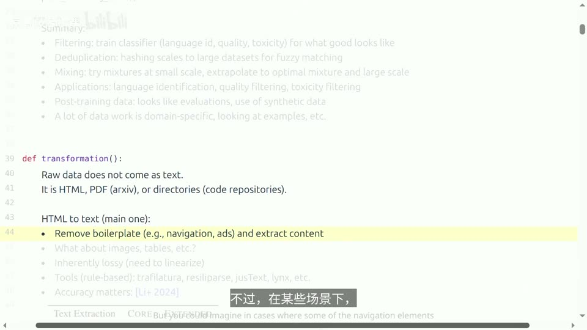

### 2.3 PDF：占比小但平均质量高，扫描件要用视觉语言模型做 OCR

PDF 值得单独一提。Hugging Face 发布过一个名为 **FinePDFs** 的 PDF 数据集。PDF 的麻烦在于：**不借助专门渲染器，你拿到的只是一堆"绘制指令"**——它记录的是"在某个绝对位置画一段文字"这种命令，并没有显式的语言结构（例如 `<p>` 这样的语义标签），阅读顺序也不能保证，版面必须靠几何位置去推断。([【跳转到 02:40】](https://www.bilibili.com/video/BV11LEA6eEuj/?p=14&t=160)、[【跳转到 02:49】](https://www.bilibili.com/video/BV11LEA6eEuj/?p=14&t=169))

Common Crawl 收录了大量 PDF，但有两个坑：

1. **很多 PDF 因文件过大被强行截断**，这就需要重新抓取；
2. **有些 PDF 其实只是扫描件**（本质是图片），这时必须用**视觉语言模型（VLM）做 OCR**，成本比处理纯文本高得多。

好在（或者说不好在）**PDF 在整个互联网里只占很小一部分**。但它**很有价值**：愿意专门制作 PDF，通常意味着内容经过精心整理，因此 **PDF 的平均质量高于 HTML**。代价是 HTML 里那些标签能提供的语义信息在 PDF 里丢失了，所以 PDF 过滤后往往需要**更多清洗**。([【跳转到 03:36】](https://www.bilibili.com/video/BV11LEA6eEuj/?p=14&t=216)、[【跳转到 03:41】](https://www.bilibili.com/video/BV11LEA6eEuj/?p=14&t=221))

---

## 三、过滤：先定义"好数据"，再训练一个小分类器去大海捞针

### 3.1 过滤的通用框架：给定目标数据 T 和原始数据 R，选出相似子集 T′

过滤看起来五花八门，但几乎所有方法都套用同一个基础模块：

> 给定一小部分高质量的**目标数据 T（target data）**，以及大量刚从转换步骤出来的**原始数据 R（raw data）**，目标是从 R 中挑出一个与 T 相似的子集 T′。

典型应用有三类：**语言识别**（英语 vs 其他语言）、**质量过滤**（高质量 vs 低质量，要像百科全书一样有深度，不要垃圾信息）、**毒性过滤**（无毒 vs 有毒）。([【跳转到 04:06】](https://www.bilibili.com/video/BV11LEA6eEuj/?p=14&t=246)、[【跳转到 04:31】](https://www.bilibili.com/video/BV11LEA6eEuj/?p=14&t=271))

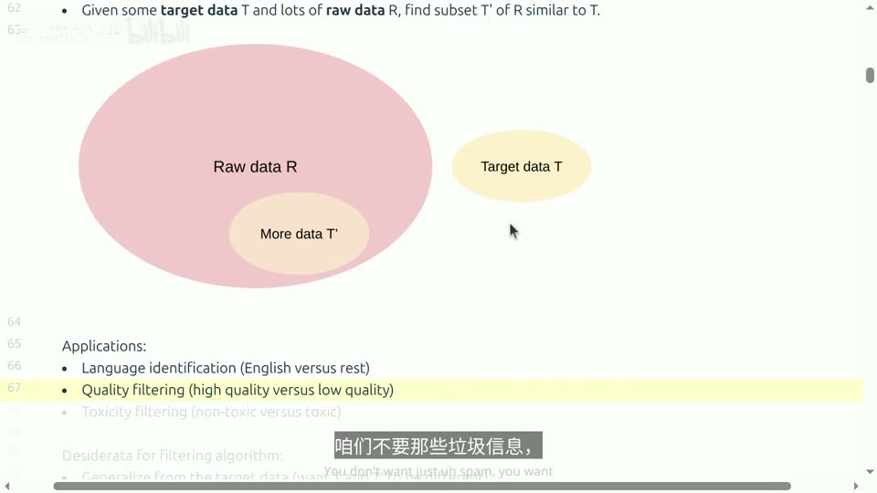

### 3.2 过滤算法的两条硬性要求：能泛化、且极快

对过滤算法有两条不可妥协的要求：

- **能泛化**：算法必须能从目标数据推广出去，T 与选出的 T′ **不能雷同**（否则就是把答案抄了一遍）；
- **极快**：因为要在**全互联网**上跑一遍，数据量可能高达 **10 万亿 token**，最终只保留**个位数百分比**的数据。([【跳转到 04:56】](https://www.bilibili.com/video/BV11LEA6eEuj/?p=14&t=296)、[【跳转到 05:21】](https://www.bilibili.com/video/BV11LEA6eEuj/?p=14&t=321))

### 3.3 两类分类器：生成式模型与轻量分类器

给定 R 和 T，基本思路是**先训练模型、得到打分函数，再按分数保留**。分类器分两类：

1. **生成式模型**：直接基于 T 估计分布，打分 `score(x) = p_T(x)`。为保持低成本，通常不训练大模型，而是用 **5-gram** 这类小语言模型，代表是 **KenLM**。
2. **简单分类器**：把属于 T 的样本标为正、从 R 中随机抽取的样本标为负，训练一个分类器；实践中常用 **fastText**，因为它快——本质是一个基于**词袋（bag of words）**的**线性分类器**。得到模型后对每个文档打分，按阈值保留（有时还带随机性，按分数做随机采样而不是硬阈值）。([【跳转到 05:46】](https://www.bilibili.com/video/BV11LEA6eEuj/?p=14&t=346)、[【跳转到 06:11】](https://www.bilibili.com/video/BV11LEA6eEuj/?p=14&t=371))


### 3.4 一个立场之争：到底要不要做"基于模型的过滤"

这里有个值得了解的历史分歧：

- **一派刻意不用**基于模型的过滤，担心引入偏见，代表数据集有 **C4、Gopher、RefinedWeb、FineWeb、Dolma**；
- **另一派使用**，代表有 **GPT-3、LLaMA、DCLM**，如今这已经**成为常态**。

为什么会转向"用"？核心原因是**算力有限**。理论上有无限算力就可以直接用全部数据训练一个庞大模型，但现实中大多数人的算力都不够，**必须想清楚过滤策略，否则就是在低质量内容上白白浪费算力**。([【跳转到 06:36】](https://www.bilibili.com/video/BV11LEA6eEuj/?p=14&t=396)、[【跳转到 07:01】](https://www.bilibili.com/video/BV11LEA6eEuj/?p=14&t=421))

---

## 四、过滤实例：质量没有统一定义，最优阈值还会随规模变化

### 4.1 语言识别：用几个词就能分辨，Meta 的模型支持 176 种语言

**语言识别**目标很明确：给定一段文本，判断它属于哪种语言。这类任务相对简单——用一个小分类器看几个词，就能分辨出西班牙语还是日语。**Meta 训练过一套快速的文本语言识别模型**，支持 **176 种语言**，训练数据来自维基百科、**Tatoeba**（翻译网站）、**SETimes**（东南欧新闻）等多语言站点。落地时，**Dolma** 保留 `p(English) >= 0.5` 的文档。([【跳转到 07:26】](https://www.bilibili.com/video/BV11LEA6eEuj/?p=14&t=446)、[【跳转到 07:51】](https://www.bilibili.com/video/BV11LEA6eEuj/?p=14&t=471))

不过要留个心眼：文本里常有**语码转换（code-switching，一段话里混用多种语言）**和方言，细节上有点复杂，所以说它"已彻底解决"有些夸张——但它确实**不是训练语言模型的关键瓶颈**。

### 4.2 数学语料 OpenMathText：多条规则 + 生成式模型 + 分类器组合拳

**OpenMathText（Paster 等，2023）** 的目标是从 Common Crawl 里整理大规模数学文本。它**不是只训练单个分类器**，而是一套组合流程：

1. **基于规则**：检查文本是否包含 LaTeX 命令；
2. **生成式方法**：用 **KenLM** 在已知数学数据集 **ProofPile** 上训练，**保留困惑度低于 15000** 的文档；
3. **分类器**：训练一个 **fastText** 判断是否属于数学写作，**若是数学阈值 0.17、若不是数学阈值 0.8**。

最终得到约 **147 亿（14.7B）token**。结果显示：**这种更有针对性的数据筛选，能让模型在数学上表现更好**——用这批数据训练的 **1.4B 模型，优于在数据量大 20 倍的未过滤语料上训练的模型**。([【跳转到 08:16】](https://www.bilibili.com/video/BV11LEA6eEuj/?p=14&t=496)、[【跳转到 09:06】](https://www.bilibili.com/video/BV11LEA6eEuj/?p=14&t=546))

这引出全讲最重要的一句方法论：**质量过滤是一种工具，你可以自行定义"质量"**。质量并无统一定义——你把质量定义为数学能力，那收集数学数据就能提升数学表现。([【跳转到 09:06】](https://www.bilibili.com/video/BV11LEA6eEuj/?p=14&t=546))

### 4.3 质量分类的三种典型做法：GPT-3、LLaMA、微软 phi

同一套框架可以套在很多著名模型上：

- **GPT-3**：**正样本**来自维基百科、WebText2、Books1、Books2 等，**负样本**从 Common Crawl 随机抽取，训练一个基于词特征的**线性分类器**，按分数随机保留文档。([【跳转到 09:31】](https://www.bilibili.com/video/BV11LEA6eEuj/?p=14&t=571)、[【跳转到 09:56】](https://www.bilibili.com/video/BV11LEA6eEuj/?p=14&t=596))
- **LLaMA / RedPajama**：正样本不是维基百科文章本身，而是**维基百科引用的页面**，思路类似。
- **微软 phi-1**：原始数据并非"预先切分好的 StackOverflow Python 子集"，而是**包含所有代码的完整数据集**。他们定义了一个 prompt 来判断样本是否具备**教育价值**，用 **GPT-4** 对 R 中 **10 万个样本**分类，被判定为正向的作为"目标"，再训练一个**更便宜的分类器**（他们用**随机森林**，fastText 也可以），最后用它去筛选剩余数据。效果显著优于直接用原始数据——能以更少的训练步数达到更高的性能。([【跳转到 10:21】](https://www.bilibili.com/video/BV11LEA6eEuj/?p=14&t=621)、[【跳转到 10:46】](https://www.bilibili.com/video/BV11LEA6eEuj/?p=14&t=646))


### 4.4 毒性过滤：复用同一套流程

**毒性过滤**原理相同：**Jigsaw Toxic Comments** 数据集（源自一个旨在改善网络交流环境的项目）就是这个思路的代表——明确定义正例和负例，训练分类器，然后用来过滤。Dolma 等数据集也用了它。([【跳转到 11:11】](https://www.bilibili.com/video/BV11LEA6eEuj/?p=14&t=671))

### 4.5 不存在"最优阈值"：训练越久越能容忍低质量数据

到这里你已握有一套工具。但有个更微妙的细节：**所需数据类型取决于你计划训练多久（用多少 token）**。所以**并不存在所谓的最优阈值**——不能仅凭分类器给出 0.9 就断定它最优，这取决于具体场景。直观规律是：

> **训练周期长 → 可以容忍较低质量的数据；训练周期短 → 更希望数据质量高。**

讲者展示了一项由 **Michael Ryan** 完成的初步实验：对一个 **d512 模型（约 1.57 亿参数）**、用极小的数据池（**100 个 WARC 文件**，仅占 Common Crawl 极小一部分）训练，观察不同质量数据在重复遍历时的表现。

- 图中的每一条线代表模型完成一轮数据（一个 epoch）；由于数据总量有限，只能反复使用；
- 起初**高质量数据表现明显更好**；
- 但随着不断重复遍历，**低质量数据会逐渐追上来**；
- 到某个临界点后，**过拟合**开始出现——应当在此之前停止训练。([【跳转到 12:01】](https://www.bilibili.com/video/BV11LEA6eEuj/?p=14&t=721)、[【跳转到 12:26】](https://www.bilibili.com/video/BV11LEA6eEuj/?p=14&t=746)、[【跳转到 12:51】](https://www.bilibili.com/video/BV11LEA6eEuj/?p=14&t=771))


课堂上还讨论了**置信区间**：图中每个点其实只是**一次**独立的训练运行。理想情况下应多次重复、计算置信区间，但预训练每次运行成本都很高，论文里往往只做单次运行——好在预训练阶段结果通常比较稳定。至于"用高质量数据 + 长时间训练是否也会收益递减"？答案是：**任何数据集最终都会收益递减**，因为数据量有限，曲线会先趋于平缓、再缓慢下降。([【跳转到 13:41】](https://www.bilibili.com/video/BV11LEA6eEuj/?p=14&t=821)、[【跳转到 14:20】](https://www.bilibili.com/video/BV11LEA6eEuj/?p=14&t=860)、[【跳转到 14:45】](https://www.bilibili.com/video/BV11LEA6eEuj/?p=14&t=885))

**如何确定什么是好数据？** 两种实用路径：一是在已有数据里发现你特别喜欢的部分，然后尽量多收集同类；二是**用大模型（给 prompt）先对一批数据做初步筛选，再用这批"优质样本"训练一个更小的分类器**，最后推广到剩余数据。([【跳转到 15:18】](https://www.bilibili.com/video/BV11LEA6eEuj/?p=14&t=918))

---

## 五、去重（上）：为什么必须去重，以及用哈希做精确去重

### 5.1 重复无处不在：镜像站、fork、许可证、模板文章

数据里充满重复，分**完全重复**与**近似重复**两类，来源五花八门：

- **镜像站点**：本身就是为了复制内容，爬虫又分不清镜像与原站，于是抓到完全一致的副本；
- **fork 的代码仓库**：即使改过，通常也只涉及少数文件，**99% 的内容没变**；
- **服务条款与许可证**：比如 **MIT 许可证**在很多地方频繁出现（除非复制时打错字，否则完全一致）；
- **网站相同的页眉页脚**；
- **模板化文章**：来自 **LM1B** 基准的例子里，有些文章只差一个逗号，或是把"加拿大"替换成"美国"的同一模板，看起来就像广告；用这类只换了实体的变体训练模型，纯粹是在**浪费 GPU 算力**；
- **极端案例**：在对 **C4** 数据集的审计中，某款**防毒面具的产品描述出现了 6.1 万次**，讲者也说不出为什么。([【跳转到 15:43】](https://www.bilibili.com/video/BV11LEA6eEuj/?p=14&t=943)、[【跳转到 16:54】](https://www.bilibili.com/video/BV11LEA6eEuj/?p=14&t=1014)、[【跳转到 16:59】](https://www.bilibili.com/video/BV11LEA6eEuj/?p=14&t=1019)、[【跳转到 17:24】](https://www.bilibili.com/video/BV11LEA6eEuj/?p=14&t=1044)、[【跳转到 17:49】](https://www.bilibili.com/video/BV11LEA6eEuj/?p=14&t=1069))

### 5.2 去重的三个动机，以及更重要的"去污染"

为什么要去重？三个理由：

1. **更高效地训练**：去重能在**不损失信息**的前提下缩减数据集规模——移除的只是重复内容；
2. **防止模型记忆训练数据**：如果大量受版权保护的内容被复制，模型可能直接记住，带来**隐私问题**；
3. **避免浪费计算资源**——讲者认为这是最主要的原因。

与去重密切相关、**甚至更重要的是去污染（decontamination）**：原理类似，但要确保**测试集的数据没有出现在训练集里**，否则评测结果就失真了。([【跳转到 18:10】](https://www.bilibili.com/video/BV11LEA6eEuj/?p=14&t=1090))

### 5.3 去重的设计空间：四个问题决定方案

动手之前先理清**设计空间**，也就是四个问题：

- **对什么去重？** 句子、段落，还是整篇文档；
- **怎么算匹配？** 要求完全一致，还是包含相同子串就算；做近重复时，共同部分占多大比例算匹配；
- **阈值定多少？**
- **找到重复后怎么处理？** 全删，还是只保留一份？([【跳转到 18:35】](https://www.bilibili.com/video/BV11LEA6eEuj/?p=14&t=1115)、[【跳转到 19:00】](https://www.bilibili.com/video/BV11LEA6eEuj/?p=14&t=1140))

这里有个核心的**算法难点**：去重本质上是**项目之间的两两比对**。过滤是"针对单个项目"处理，可以线性扫一遍；但去重不能采用 \(O(n^2)\) 的暴力两两比较，**必须用线性时间复杂度的算法**才能扩展到网页规模。于是去重文献普遍借助**哈希函数**。([【跳转到 19:25】](https://www.bilibili.com/video/BV11LEA6eEuj/?p=14&t=1165))

补充一点哈希的背景：哈希函数把输入（如字符串）映射成远小于原始数据的输出（字符串或整数）。哈希**冲突（collision）**指两个不同数据项映射到同一个值。密码学哈希刻意**避免**冲突（比特币就用它）；而用于哈希表的快速哈希**允许**冲突——去重正是利用后者的特性。([【跳转到 19:50】](https://www.bilibili.com/video/BV11LEA6eEuj/?p=14&t=1190))

### 5.4 精确去重：哈希分组，每组只留一个

**精确去重**概念上特别简单：把每个元素**哈希**，**分组**后每组只留一个，其余删除。实现上可以采用 **MapReduce 风格**（按哈希值分组），因此**易于并行化和扩展**。它操作清晰、精度高，缺点是无法处理近似重复。([【跳转到 20:15】](https://www.bilibili.com/video/BV11LEA6eEuj/?p=14&t=1215)、[【跳转到 20:40】](https://www.bilibili.com/video/BV11LEA6eEuj/?p=14&t=1240))

一个经典实例是 **C4（来自 T5 论文）**：它对 Common Crawl 做的精确去重对象是**三个句子的跨度（3-sentence spans）**——若两个文档包含相同的三句跨度，就移除其中一个。要注意这可能有点奇怪：**从文档中间删掉三句话会破坏文本连贯性**，但他们当时就是这么做的。([【跳转到 21:05】](https://www.bilibili.com/video/BV11LEA6eEuj/?p=14&t=1265)、[【跳转到 21:30】](https://www.bilibili.com/video/BV11LEA6eEuj/?p=14&t=1290))

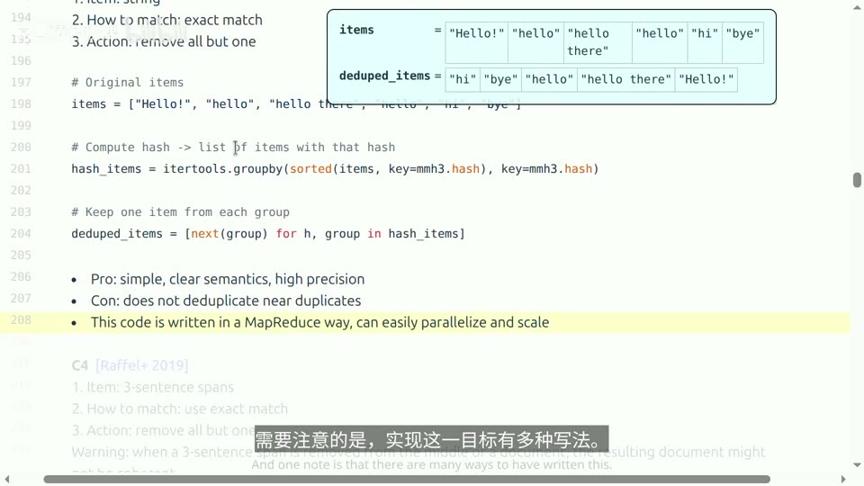

但真实世界的数据太混乱，精确去重还不够——**存在大量近似重复**。于是我们需要近似去重。([【跳转到 20:40】](https://www.bilibili.com/video/BV11LEA6eEuj/?p=14&t=1240))

---

## 六、去重（下）：用 Jaccard、MinHash 与 LSH 让近似去重线性化

### 6.1 Jaccard 相似度：交集除以并集，取值范围 0 到 1

近似去重第一步是**定义"多相似算相似"**。标准答案是 **Jaccard 相似度**：

```text
Jaccard(A, B) = |A ∩ B| / |A ∪ B|
```

也就是两个集合**交集大小除以并集大小**，取值 0 到 1（0 代表完全无交集，1 代表完全一致）。举文稿里的例子：集合 `A = {1,2,3,4}`、`B = {1,2,3,5}`，交集是 `{1,2,3}`、并集是 `{1,2,3,4,5}`，相除得到 **0.6**。如果两个文档的 Jaccard 相似度超过某个阈值（例如 **0.99**），就认为它们是**近似重复**。([【跳转到 21:55】](https://www.bilibili.com/video/BV11LEA6eEuj/?p=14&t=1315)、[【跳转到 22:20】](https://www.bilibili.com/video/BV11LEA6eEuj/?p=14&t=1340))

![Jaccard 相似度与 MinHash：Jaccard(A,B)=|A∩B|/|A∪B|，例中为 0.6；MinHash 是满足 Pr[h(A)=h(B)]=Jaccard(A,B) 的随机哈希函数。](assets/p14/01390.jpg)

### 6.2 MinHash：让"碰撞概率恰好等于 Jaccard 相似度"

现在的问题变成：**如何在线性时间内找出所有 Jaccard 超阈值的文档对？** 好在这是一个已被解决的算法问题，答案分两步，第一步是 **MinHash（最小哈希）**。

**MinHash 是一种随机哈希函数 h，它具有一个关键性质**：

```text
Pr[h(A) = h(B)] = Jaccard(A, B)
```

也就是说，**A 与 B 的哈希发生碰撞的概率，恰好等于它们的 Jaccard 相似度**。

这为什么有用？因为哈希把处理复杂度降到线性。这里有个反直觉之处：一般我们希望哈希**避免**碰撞，让每个元素映射到不同的值；**但在去重里我们恰恰想要碰撞**——而且不是随机碰撞，是要**让越相似的元素越容易碰撞**。([【跳转到 22:45】](https://www.bilibili.com/video/BV11LEA6eEuj/?p=14&t=1365)、[【跳转到 23:10】](https://www.bilibili.com/video/BV11LEA6eEuj/?p=14&t=1390))

**MinHash 本身的操作极其简单**：对集合中的**每个元素做哈希，然后取最小值**。

```python
def minhash(S: set[str], seed: int):
    return min(mmh3.hash(x, seed) for x in S)
```

### 6.3 MinHash 为什么成立：用特征矩阵与随机排列来证明

这个性质之所以成立，可以用**特征矩阵（characteristic matrix）**看得很清楚。把集合 A、B 与元素的关系写成矩阵（行是元素、列是集合，`1` 表示该元素属于该集合）：

```text
item | A | B
  1  | 1 | 1
  2  | 1 | 1
  3  | 1 | 1
  4  | 1 | 0
  5  | 0 | 1
```

随机哈希函数等价于在这些元素上**诱导出一个随机排列**（比如排列成 4、3、1、5、2……），然后**看 A 里哪个元素排第一、B 里哪个元素排第一**。每个元素成为"首位"的概率是相同的。于是：

- 若首位是 **1、2 或 3**（A、B 都包含），则 A 的最小数 = B 的最小数，**发生碰撞**；
- 若首位是 **4**（只在 A 中）或 **5**（只在 B 中），则**不碰撞**。

因此，**A、B 最小值相等的概率，恰好等于随机取到"两者共享的那一行"的概率，也就是 Jaccard 相似度**。这就是 MinHash 性质的证明。([【跳转到 23:35】](https://www.bilibili.com/video/BV11LEA6eEuj/?p=14&t=1415)、[【跳转到 24:00】](https://www.bilibili.com/video/BV11LEA6eEuj/?p=14&t=1440)、[【跳转到 24:25】](https://www.bilibili.com/video/BV11LEA6eEuj/?p=14&t=1465))


**代码验证**：讲者生成了 **100 个不同的哈希函数**，只检查最小哈希值是否相等，统计碰撞比例，得到的估计值正好是 **0.6**，与真实 Jaccard 一致。关键是：**完全不需要 O(n²) 的两两运算**——只要算 A 的最小哈希、B 的最小哈希，然后看是否碰撞。([【跳转到 24:50】](https://www.bilibili.com/video/BV11LEA6eEuj/?p=14&t=1490)、[【跳转到 25:15】](https://www.bilibili.com/video/BV11LEA6eEuj/?p=14&t=1515))

### 6.4 光有 MinHash 还不够：概率太"软"，我们需要锐化

但 MinHash 只说明：**若碰撞，则两者碰撞的概率等于 Jaccard**。这是随机的，方差很大，**没法给出可靠结论**。我们真正想要的是：**只要 Jaccard 超过阈值，就确保 A 和 B 一定（高概率）碰撞**。所以需要把这个概率分布**锐化**，让它更集中。这就需要 **局部敏感哈希（LSH，Locality-Sensitive Hashing）**——理论计算机里的经典思路。([【跳转到 25:40】](https://www.bilibili.com/video/BV11LEA6eEuj/?p=14&t=1540)、[【跳转到 26:05】](https://www.bilibili.com/video/BV11LEA6eEuj/?p=14&t=1565))

### 6.5 LSH：分带（banding）让阈值处出现"相变"

LSH 的做法是使用**多个相互独立的哈希函数**，把它们**分带**：

- 把 n 个哈希函数分成 **b 个带（band）**，每个带含 **r 个哈希函数**，满足 `n = b × r`；
- 只有当**某个带内全部 r 个哈希函数都返回相同的值**时，才判定 A 和 B **碰撞**。

例如 `n = 12, b = 3, r = 4`，就把 `h1..h4` 作为第一个带、`h5..h8` 为第二个、`h9..h12` 为第三个。只要有一个带被"触发"，就认为碰撞。([【跳转到 26:30】](https://www.bilibili.com/video/BV11LEA6eEuj/?p=14&t=1590)、[【跳转到 26:55】](https://www.bilibili.com/video/BV11LEA6eEuj/?p=14&t=1615))

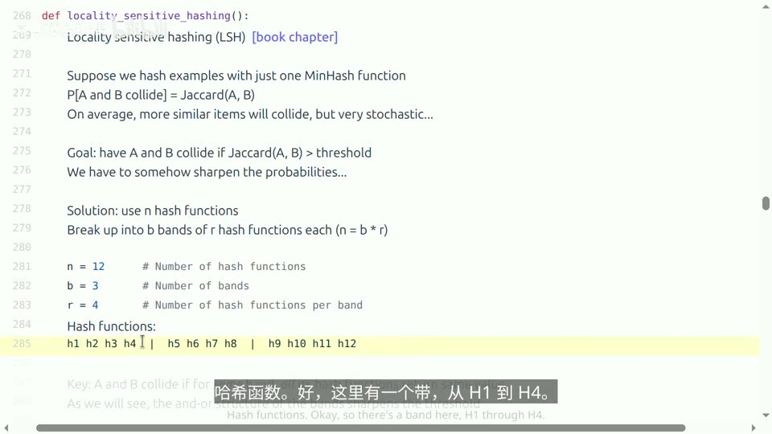

**推导碰撞概率**：设相似度为 `s`。

- 某个**固定带**匹配的概率（r 个哈希全部一致）= `s^r`；它随 r 呈**指数级**变化；
- 该带**不**匹配的概率 = `1 − s^r`；
- 所有 b 个带**都**不匹配的概率 = `(1 − s^r)^b`；
- 因此**至少一个带匹配**（即碰撞）的概率：

```text
P(碰撞) = 1 − (1 − s^r)^b
```

举例 `s = 0.8`、`b = 5`、`r = 10`，算出固定带匹配概率约 0.1074，碰撞概率约 **0.4333**。([【跳转到 28:10】](https://www.bilibili.com/video/BV11LEA6eEuj/?p=14&t=1690)、[【跳转到 28:35】](https://www.bilibili.com/video/BV11LEA6eEuj/?p=14&t=1715)、[【跳转到 29:00】](https://www.bilibili.com/video/BV11LEA6eEuj/?p=14&t=1740))

### 6.6 S 型曲线与"相变"：r 右移、b 左移、中心在 (1/b)^(1/r)

把碰撞概率对相似度 s 作图，得到一条**S 型曲线**——这正是我们想要的：**低于阈值时匹配概率尽量低，高于阈值时尽量高**，在阈值附近发生类似**相变**的陡峭跃变。([【跳转到 29:25】](https://www.bilibili.com/video/BV11LEA6eEuj/?p=14&t=1765)、[【跳转到 29:50】](https://www.bilibili.com/video/BV11LEA6eEuj/?p=14&t=1790))

调节参数会移动并改变这条曲线：

- **增大 r**（每带哈希数更多）：指数项更陡，**曲线更尖锐并向右移动**，匹配更难（阈值升高）。例如某对低相似度数据的匹配概率会从 0.25 降到 0.008；
- **增大 b**（带数更多）：**曲线向左移动**，匹配更容易（阈值降低）。

以 `b = 10, r = 10`、相似度区间 0.7～0.98 为例，碰撞概率范围大致从 **0.25 到 1**。([【跳转到 30:15】](https://www.bilibili.com/video/BV11LEA6eEuj/?p=14&t=1815)、[【跳转到 30:40】](https://www.bilibili.com/video/BV11LEA6eEuj/?p=14&t=1840)、[【跳转到 31:05】](https://www.bilibili.com/video/BV11LEA6eEuj/?p=14&t=1865))


**相变中心的位置**可以解析求出。论文里的例子（Lee 等，2021）：`n = 9000, b = 20, r = 450`。相变阈值约为

```text
threshold ≈ (1 / b)^(1 / r)
```

即 **b 的 1/r 次方的倒数**。若想按"Jaccard 大于 0.9"来过滤，就调整 b、r 让阈值正好是 0.9，并让相变更陡。在临界点上，固定带匹配概率是 `1/b`，碰撞概率会趋近一个常数（≈ **1 − 1/e ≈ 0.64**）——所以相变中心大约就在 0.64，随 b、r 增大，阈值以下趋近 0、以上趋近 1。**代价是 b、r 太大时成本上升**。([【跳转到 31:55】](https://www.bilibili.com/video/BV11LEA6eEuj/?p=14&t=1915)、[【跳转到 32:20】](https://www.bilibili.com/video/BV11LEA6eEuj/?p=14&t=1940)、[【跳转到 32:45】](https://www.bilibili.com/video/BV11LEA6eEuj/?p=14&t=1965))

这套组合就叫 **MinHash + LSH**：LSH 适用于任何哈希函数，而我们在原始数据去重时用 MinHash 来近似 Jaccard 相似度。这就是你应该使用的标准方法。([【跳转到 33:10】](https://www.bilibili.com/video/BV11LEA6eEuj/?p=14&t=1990))

---

## 七、数据配比：别被 epoch 数坑了，以及用 UniMax 给 epoch 设上限

### 7.1 走到这一步，我们要把不同来源整合起来

转换、过滤、去重之后，我们得到一组**规模更小的高质量文档**，但它们来自**多个不同的数据源**（例如 Marin 项目里能看到 Nebula、FinePDFs、机构书籍、代码等）。关键问题变成：**如何把它们整合？** 这本质上是一种**资源分配**——在数据集内部确定一个分布。([【跳转到 33:35】](https://www.bilibili.com/video/BV11LEA6eEuj/?p=14&t=2015)、[【跳转到 34:21】](https://www.bilibili.com/video/BV11LEA6eEuj/?p=14&t=2061))

回顾早期论文 **The Pile**：它为每个组成部分（Component）明确分配了 **Weight（权重）**、**Epochs（轮数）** 和 **Effective Size（有效规模）**，这就是一种朴素的资源分配表。([【跳转到 34:35】](https://www.bilibili.com/video/BV11LEA6eEuj/?p=14&t=2075)、[【跳转到 34:40】](https://www.bilibili.com/video/BV11LEA6eEuj/?p=14&t=2080))

### 7.2 常见土办法：靠感觉、均匀采样、按比例混合

从"第一性原理"（讲者笑称其实不算）出发，你平时可能怎么做？——**靠感觉（vibes）手动调**。这在实践里相当常见。此外有两种机械做法：

- **均匀采样**：在每个数据源上应用均匀分布，每取一个 chunk 就采样一个数据源；
- **按比例混合**：按原始 token 数量采样，`p(s) ∝ num_tokens(s)`，即 token 多的源权重高。

按比例混合通常合理，但**有个大坑**：如果存在一个**体量巨大而质量低下的数据集，它会吃掉大量 token**，这并不理想——直觉上你应该给更高质量的数据源更高权重。([【跳转到 35:05】](https://www.bilibili.com/video/BV11LEA6eEuj/?p=14&t=2105)、[【跳转到 35:30】](https://www.bilibili.com/video/BV11LEA6eEuj/?p=14&t=2130))

给权重时有两个约束必须记住：

1. **要保证多样性**：很多数据源之间不可直接比较——文献、代码、论文很难说谁"质量更高"，因为它们根本不是同类东西。若想让语言模型效果好，就**不能把全部质量权重都压在论文上**；
2. **每个数据源的数据量是有限的**：在小数据源上分配过多权重，就会很快用光，**不得不多轮（epoch）重复训练同一批 token**，这会带来负面影响。([【跳转到 35:55】](https://www.bilibili.com/video/BV11LEA6eEuj/?p=14&t=2155)、[【跳转到 36:20】](https://www.bilibili.com/video/BV11LEA6eEuj/?p=14&t=2180))

### 7.3 那个关键的算例：50 个 epoch 的过拟合陷阱

第二点非常关键，用一个具体例子拆解。假设只有两个来源：

- **低质量来源**：**10 万亿（10T）token**，很充裕；
- **高质量来源**：只有 **100 亿（10B）token**，很稀缺。

做一个最简单的混合：`p = {"low": 0.5, "high": 0.5}`，训练 **1 万亿（1T）token**。计算每个来源的实际 epoch 数：

```text
low_num_epochs  = (0.5 × 1T) / 10T  = 0.05   # 低质量源只被碰到 5%
high_num_epochs = (0.5 × 1T) / 10B  = 50     # 高质量源要重复 50 遍！
```

也就是说，你会在高质量数据上反复训练 **50 个 epoch**——这极易**过拟合**。这个坑的关键在于：**你只看了质量和分布，却忽略了数据点的实际数量**。讲者特意强调："有些大模型训练项目在这方面搞砸了。"

而正确做法并不是"干脆跑 50 个 epoch"，而是**必须监控数据实际运行的 epoch 数量**。设为 50 的原因是：如果只设定一个混合比例而不全程监控，很容易在不知不觉中跑满 50 个 epoch。顺带说说**混合在训练中如何落地**：通常是在**批次层面**做——对每个元素采样、确定它来自哪个混合分量，再用来自该分量的序列**填满整个批次**。一般每个序列都源自同一个分量，**不是按 token 采样**；为降低方差，一个批次里最好仍包含一些不同的混合成分。([【跳转到 36:45】](https://www.bilibili.com/video/BV11LEA6eEuj/?p=14&t=2205)、[【跳转到 37:35】](https://www.bilibili.com/video/BV11LEA6eEuj/?p=14&t=2255)、[【跳转到 38:25】](https://www.bilibili.com/video/BV11LEA6eEuj/?p=14&t=2305)、[【跳转到 39:08】](https://www.bilibili.com/video/BV11LEA6eEuj/?p=14&t=2348))


### 7.4 UniMax：均匀采样 + epoch 硬上限

这个"epoch 太多"的问题其实**早就有人注意到**。**UniMax（Chung 等，2023）** 面向多语言训练的动机正是一些语言资源稀缺。以往做法是"按比例混合再做幂次平滑"（`p(s) ∝ num_tokens(s)^α`，`α ∈ [0,1]`）来让分布更平滑；UniMax 把这件事做得更明确：

> **均匀地采样各个数据源，但为每个数据源的 epoch 数设定一个硬上限 C**——即对每个源 s 满足
>
> ```text
> p(s) × num_training_tokens <= C
> ```
>
> 并给出一个简单流程，在满足该约束的前提下实际确定混合比例。

换句话说，它在"均匀分配"与"避免在小源上反复训练"之间取了一个平衡。([【跳转到 39:58】](https://www.bilibili.com/video/BV11LEA6eEuj/?p=14&t=2398)、[【跳转到 40:07】](https://www.bilibili.com/video/BV11LEA6eEuj/?p=14&t=2407)、[【跳转到 40:32】](https://www.bilibili.com/video/BV11LEA6eEuj/?p=14&t=2432))

---

## 八、基于回归的配比：用小模型探路，用回归外推出最优混合

### 8.1 为什么要有原则的方法：50 个源就有 50 个待定数字

假设有 50 个数据源，就要确定 50 个权重数字。简单的按比例混合显然不够，或许可以估算某种质量指标再采样，但这**仍属启发式**。所以讲者推荐**最具理论依据、也最清晰易理解**的路线：**基于回归的混合（regression-based mixing）**，代表工作有 **RegMix、OLMo 系列论文**等。([【跳转到 40:57】](https://www.bilibili.com/video/BV11LEA6eEuj/?p=14&t=2457)、[【跳转到 41:22】](https://www.bilibili.com/video/BV11LEA6eEuj/?p=14&t=2482))

### 8.2 四步流程：训练代理模型 → 拟合回归 → 优化混合 → 放大训练

核心思路和**缩放定律**很像——**先做低成本计算探路，再大规模扩展**。共四步：

1. **训练一批小规模代理模型**：假设目标是大模型，先缩到约 **3 亿（300M）参数**；对不同的数据混合比例各训练一个小模型，每个给出一个目标指标上的损失值（可以是下游评估指标，也可以是困惑度，由你决定）。例如三成分（Hacker News / GitHub / Philpapers）的不同配比得到若干 `Target` 值（如 5.46、5.57、6.07……）；
2. **拟合回归模型**：以**数据混合权重为输入**、**损失值为输出**训练一个回归器，这样就有了一个低成本函数，能预测"用某种混合训练损失会是多少"；
3. **模拟新混合并预测**：用回归模型对新的混合方案打分，**优化**这个函数，找到预测损失最低的配比；
4. **用最优混合训练大模型**。([【跳转到 41:40】](https://www.bilibili.com/video/BV11LEA6eEuj/?p=14&t=2500)、[【跳转到 42:05】](https://www.bilibili.com/video/BV11LEA6eEuj/?p=14&t=2525)、[【跳转到 42:30】](https://www.bilibili.com/video/BV11LEA6eEuj/?p=14&t=2550))

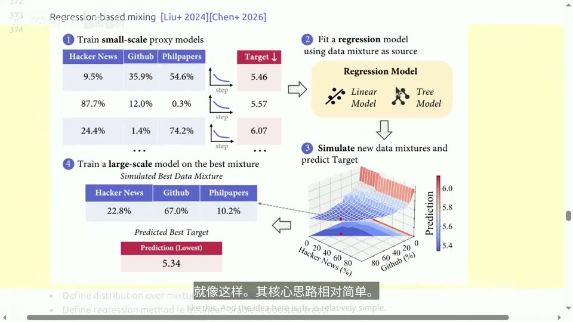

### 8.3 设计选择：混合分布、回归方法、优化目标都要选

具体落地时有几个设计选择：

- **混合分布**：对分布本身建模，很多人选择 **Dirichlet 分布**（也可用指数分布、网格等）；
- **回归方法**：实践中既试过**线性模型**（对数线性模型常常很有效），也试过**梯度提升决策树（如 LightGBM）**；
- **优化目标**：通常参考**下游评估指标**，但**务必警惕过拟合**。([【跳转到 42:50】](https://www.bilibili.com/video/BV11LEA6eEuj/?p=14&t=2570)、[【跳转到 42:55】](https://www.bilibili.com/video/BV11LEA6eEuj/?p=14&t=2575)、[【跳转到 43:58】](https://www.bilibili.com/video/BV11LEA6eEuj/?p=14&t=2638))

**警惕过拟合的现实理由**：预训练本意是训练**通用模型**，而不是迎合某个特定下游评估。举例来说，**若混入大量代码类评估数据，模型会把更高权重分配给所有代码数据**——逻辑不难理解，但最终当你希望模型写诗时，会发现它已经偏科了。因此这一点需格外注意——**按比例混合 / 均匀混合不会陷入这个问题，因为它们不依赖下游评估**。([【跳转到 43:06】](https://www.bilibili.com/video/BV11LEA6eEuj/?p=14&t=2586)、[【跳转到 43:11】](https://www.bilibili.com/video/BV11LEA6eEuj/?p=14&t=2591))

论文里还给出了一张**方法对比表**，横跨 RegMix、DML、AutoScale、BiMix、ADMIRE-BayesOpt、CLIMB、OLMIXBase 等方法，列出各自的**代理模型大小**（从 1M 到 350M）、**Swarm 分布**（Dirichlet with natural prior、指数网格、熵加权、动态等）、**回归模型族**（LightGBM、对数线性、幂律、高斯过程等）、**混合优化求解器**（搜索、梯度下降、精确解等）以及**是否带数据重复约束**。这背后是两个希望：

> **希望一**：回归模型在最优解处是准确的；
> **希望二**：最优数据配比能**从小规模迁移到大规模**。

([【跳转到 43:36】](https://www.bilibili.com/video/BV11LEA6eEuj/?p=14&t=2616)、[【跳转到 44:23】](https://www.bilibili.com/video/BV11LEA6eEuj/?p=14&t=2663))

### 8.4 两个必须警惕的假设，以及"规模相关的效应"

这个流程建立在两个假设上，都需小心：

1. **回归模型的可靠性**：回归是在一批小规模代理实验上拟合的，我们却拿它去**优化**（逼近极端值）。经典泛化能力通常能保证它在**数据分布范围内**预测准确，但**优化过程会把你推向数据覆盖不足的极端区域**。这是需要注意的点。
2. **配比的规模可迁移性**：我们希望最优配比能从**小规模迁移到大规模**。在开源社区常用规模下，这个假设通常成立（或不明显错误），但**显然存在规模依赖效应**。回想过滤那节的结论：训练越多 token，越能容忍低质量数据——**最优解本来就不一样**。小规模与大规模之间是**成本与精度的权衡**：训练极小的模型结果可能缺乏代表性，但直接在大规模上调超参成本又过高。([【跳转到 44:37】](https://www.bilibili.com/video/BV11LEA6eEuj/?p=14&t=2677)、[【跳转到 44:54】](https://www.bilibili.com/video/BV11LEA6eEuj/?p=14&t=2694)、[【跳转到 45:11】](https://www.bilibili.com/video/BV11LEA6eEuj/?p=14&t=2711))

**具体有多大？** 沿用刚才那个假设例子：海量低质量数据（10T）+ 稀缺高质量数据（10B）。如果用**少量 token 训练小模型**，你可能会把大部分注意力集中在高质量数据上（`p = {"low": 0.1, "high": 0.9}`），因为 token 少、无法多次遍历，"维基百科真香"；但**若沿用这个配比去训练大模型**，就会对高质量数据反复训练，导致**过拟合**。([【跳转到 45:36】](https://www.bilibili.com/video/BV11LEA6eEuj/?p=14&t=2736)、[【跳转到 46:01】](https://www.bilibili.com/video/BV11LEA6eEuj/?p=14&t=2761))

### 8.5 两种解法：限制 epoch 与"模拟 epoch"

解决这个规模依赖效应有两条路：

1. **限制 epoch 数**——即 UniMax 那套思路；
2. **模拟 epoch（simulated epoching）**：让**小规模实验"看起来像"大规模实验**。这其实是本课程的一个通用主题——之前讲 **μP（最大更新参数化）**时也见过：对模型重新参数化，让超参能迁移；这里同理。**具体做法**是：既然大模型用 1T token、小模型只用 10B token，就对小模型的数据做 **1% 下采样**，让它"相当于"经历了大规模下高容量阶段会遇到的数据稀缺。注意，简单粗暴的缩放会出问题：**你不能先在小规模上跑完一个 epoch，再在大尺度上重跑一遍**——如果强制只用下采样后的维基百科数据，你会被迫反复训练很多个 epoch，损失居高不下、表现很差。所以优化时必须寻找**更平衡的方案**。([【跳转到 46:26】](https://www.bilibili.com/video/BV11LEA6eEuj/?p=14&t=2786)、[【跳转到 46:37】](https://www.bilibili.com/video/BV11LEA6eEuj/?p=14&t=2797)、[【跳转到 47:02】](https://www.bilibili.com/video/BV11LEA6eEuj/?p=14&t=2822)、[【跳转到 47:27】](https://www.bilibili.com/video/BV11LEA6eEuj/?p=14&t=2847))

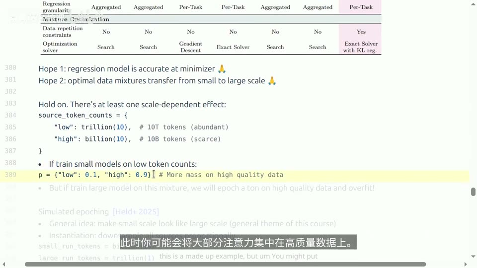

**本节收束成一句话**：为不同来源（维基百科、Common Crawl、代码、数学数据等）分配权重时，**基于回归的混合是不错的选择**——先在小规模上拟合"混合权重 → 损失"的函数，优化后再推广到大规模；但必须格外谨慎，因为涉及**轮次控制与过拟合风险**，建议采用**截断轮次**或**模拟轮次**。教训是：**优化任何目标时都要小心，否则很容易优化到错误的方向**。

### 8.6 补讲：怎样自动划分"领域"

课堂还补了一个之前漏讲的点：**领域（domain）的划分**。以 **NLLB** 论文或欧盟的一些工作为例——你拿到一堆 Common Crawl 数据，可以按**主题/领域**（比如 AI2 团队的 **Web Organizer**）归类，同时做**质量过滤**，于是构造出一个**二维网格**：一边是领域、一边是质量，**每个格子就是一个可用于混合的单元**。这是一种**自动确定"领域"**的方式，之后再加上别人提供的现成数据源即可。([【跳转到 49:29】](https://www.bilibili.com/video/BV11LEA6eEuj/?p=14&t=2969)、[【跳转到 49:54】](https://www.bilibili.com/video/BV11LEA6eEuj/?p=14&t=2994))

---

## 九、后训练数据：高度任务相关，如今几乎全部由强模型合成

### 9.1 从"任务无关"到"任务相关"，合成数据成为主流

前面讲的转换、过滤、去重、配比，基本都属于**预训练 / 中期训练**数据——它们**与具体任务关系不大**，主要用于培养基础技能（RegMix 除外，它虽以最小化损失为目标，但数据本身仍相对任务无关）。到了**后训练**阶段，数据变得**非常依赖具体任务**。([【跳转到 50:08】](https://www.bilibili.com/video/BV11LEA6eEuj/?p=14&t=3008)、[【跳转到 50:13】](https://www.bilibili.com/video/BV11LEA6eEuj/?p=14&t=3013))

后训练数据的通用做法是：

1. **定义一组环境**（以代码为例，可能是 GitHub 仓库）；
2. **定义一组任务或提示**；
3. **从强大的教师模型（或人类）收集回复**。

关键事实：**至少在开源社区，几乎所有后训练数据都是合成生成的**——人类标注既慢又贵。当然，若处于技术前沿，几年前确实不得不花钱雇很多人来提供回复，如今即便在前沿也可以采用**人机混合**。([【跳转到 50:38】](https://www.bilibili.com/video/BV11LEA6eEuj/?p=14&t=3038)、[【跳转到 51:03】](https://www.bilibili.com/video/BV11LEA6eEuj/?p=14&t=3063))

### 9.2 OpenThoughts：120 万个实例，教学效果≠模型强弱

**OpenThoughts** 的目标是获取高质量后训练数据，最终用教师模型生成了 **120 万个实例**。数据来源包括 **Stack Exchange、NuminaMath** 等人工来源，以及部分合成数据，涵盖编程、数学、化学等领域。流程大致是：把各来源数据输入 → **去重和随机采样**（对问题下采样）→ **生成多个答案** → 整合成最终数据集。这里的 **120 万指样本总数，除以 16 才是实际问题的数量**（每个问题采样多个答案）。([【跳转到 51:25】](https://www.bilibili.com/video/BV11LEA6eEuj/?p=14&t=3085)、[【跳转到 51:50】](https://www.bilibili.com/video/BV11LEA6eEuj/?p=14&t=3110)、[【跳转到 52:45】](https://www.bilibili.com/video/BV11LEA6eEuj/?p=14&t=3165)、[【跳转到 52:50】](https://www.bilibili.com/video/BV11LEA6eEuj/?p=14&t=3170))

他们对"该怎么生成回复"做了全面分析，几个反直觉结论：

- **只用少数几个来源，反而比把所有来源都用上更好**；
- **对每个问题多采样几次（如 16 个）是有帮助的**；
- **更好的模型不一定是更好的老师**：**QwQ-32B**（当时算较老较小的模型）的**教学效果比 DeepSeek-R1**（当时最强的开源模型之一）更好；这说明模型性能与教学质量并不等价；
- **简单的答案过滤效果有限**；
- **小而精的高质量来源（如 OpenMath-2-Math）优于大而杂的来源**。([【跳转到 51:58】](https://www.bilibili.com/video/BV11LEA6eEuj/?p=14&t=3118)、[【跳转到 52:20】](https://www.bilibili.com/video/BV11LEA6eEuj/?p=14&t=3140))

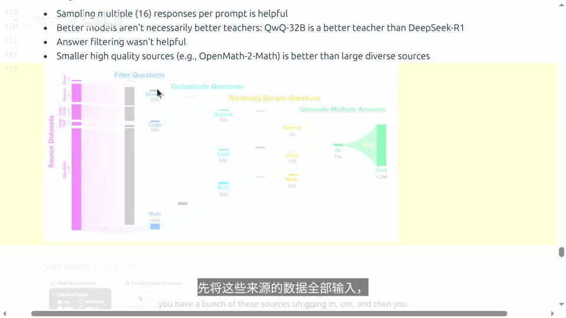

### 9.3 SWE-smith 与 SWE-Zero：从"会写代码"到"会做软件工程"

最近学界特别感兴趣的是**真正的编码模型**——不只是能生成代码，而是**真正能进行软件开发**。这催生了一批软件工程（SWE）数据集。

**SWE-smith（Yang 等）** 的思路是：拿一个代码仓库，用**语言模型自动生成任务**——设计一个智能体，把仓库配置成**可运行状态**（安装各类依赖），然后通过修改代码（例如**故意引入 bug**）生成任务，验证通过后成为任务实例。这些属于**合成任务但环境真实**，**128 个 GitHub 仓库可产出约 5 万个任务**。([【跳转到 53:15】](https://www.bilibili.com/video/BV11LEA6eEuj/?p=14&t=3195)、[【跳转到 53:26】](https://www.bilibili.com/video/BV11LEA6eEuj/?p=14&t=3206)、[【跳转到 53:51】](https://www.bilibili.com/video/BV11LEA6eEuj/?p=14&t=3231))


**SWE-Zero（英伟达）** 则发现了 SWE 任务的特殊性：与数学题不同，SWE 任务往往有**大量重型依赖项**，大多数 GitHub 仓库**无法直接运行**，回退到某个 commit 再安装过时依赖简直是噩梦，为成千上万个仓库单独配置 Docker 镜像更是基础设施层面的灾难。他们的关键观察是：**强模型在不少任务上不需要代码执行反馈也能处理**——允许执行代码时得分约 **80**，禁止执行也能接近 **70**，说明模型对代码语义已有一定理解。

据此，他们生成了约 **30 万条真实 GitHub PR 的智能体轨迹**，并进一步扩展到 **1200 万条轨迹**；训练时先在一批样本上微调，再在 SWE-bench 上微调。后续的 **SWE-rebench** 也是类似的"抓取大量 PR"思路：获取一批仓库、尝试安装（大多数会失败），而 SWE-Zero 的优势在于**非常轻量**（回顾他们让代码执行的尝试：最终只有约 **3.2 万个成功执行、12 万个未能执行**）。([【跳转到 53:58】](https://www.bilibili.com/video/BV11LEA6eEuj/?p=14&t=3238)、[【跳转到 54:29】](https://www.bilibili.com/video/BV11LEA6eEuj/?p=14&t=3269)、[【跳转到 54:54】](https://www.bilibili.com/video/BV11LEA6eEuj/?p=14&t=3294)、[【跳转到 55:26】](https://www.bilibili.com/video/BV11LEA6eEuj/?p=14&t=3326)、[【跳转到 56:16】](https://www.bilibili.com/video/BV11LEA6eEuj/?p=14&t=3376))

### 9.4 合成程度是一种连续谱：全合成 / 半合成

最后归纳出一组权衡：后训练数据可以是

- **完全合成**；
- **半合成**：环境真实但任务合成，或任务真实但环境合成。

回复通常来自**能力强、同时具备良好教学能力**的模型。代码环境的处理与过滤细节很多，本讲无法逐一展开。从**数学这类无需环境的数据集**，过渡到**编程领域**，数据集规模的增长幅度相当大——但总体思路始终是：**你拥有提示词，然后从教师模型收集回复**。([【跳转到 55:19】](https://www.bilibili.com/video/BV11LEA6eEuj/?p=14&t=3319)、[【跳转到 56:40】](https://www.bilibili.com/video/BV11LEA6eEuj/?p=14&t=3400)、[【跳转到 56:51】](https://www.bilibili.com/video/BV11LEA6eEuj/?p=14&t=3411))

---

## 小结

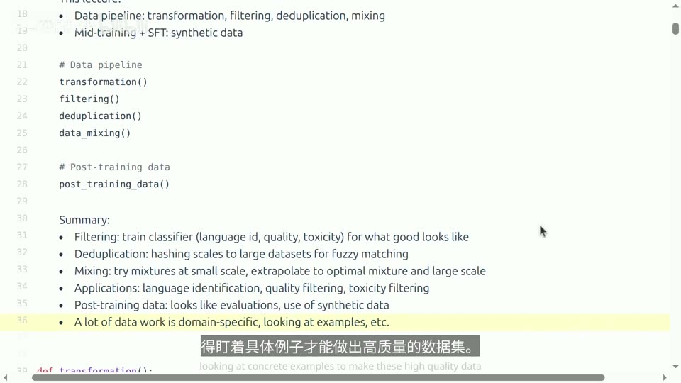

1. **流水线四环节**：转换 → 过滤 → 去重 → 配比，每一步的输入都是上一步的输出；后训练数据另起一段。真实数据工作比课堂呈现的要琐碎、且高度依赖具体领域。

2. **转换**：原始数据不是文本（HTML / PDF / 代码目录），要线性化成 token 序列，这是**有损**过程。HTML→文本移样板、抽正文，"什么算内容"界限模糊；常用**基于规则**的快工具（trafilatura、resiliparse、jusText、lynx），其中 resiliparse 在 DCLM 评测里表现好。PDF 占比小但**平均质量高**，扫描件需 VLM 做 OCR。

3. **过滤**：通用框架是"给定目标数据 T 与原始数据 R，选出相似子集 T′"，要求**能泛化**且**极快**。分类器分**生成式（KenLM 的 5-gram）**与**轻量分类器（fastText 线性模型）**两类。实例包括语言识别（Meta 支持 176 种语言、Dolma 保留 `p(English)≥0.5`）、数学语料 OpenMathText（规则 + KenLM 困惑度 < 15000 + fastText 阈值，14.7B token 训练的 1.4B 模型胜过 20 倍未过滤数据）、GPT-3 的线性分类器、微软 phi 的 GPT-4 教育价值筛选 + 廉价分类器、Jigsaw 毒性过滤。**不存在最优阈值**：训练越久越能容忍低质量数据，越过重复遍历的临界点后会过拟合。

4. **去重**：完全重复 + 近似重复无处不在（镜像站、fork、MIT 许可证、模板文章，C4 里某防毒面具描述出现 6.1 万次）。动机是高效训练、防记忆/隐私、省算力，而**去污染（测试集不泄漏）更重要**。去重的核心难点是避免 O(n²)，所以用哈希。**精确去重**：哈希分组、每组留一个（如 C4 的"三句跨度"）。**近似去重**：Jaccard 相似度 → MinHash（`Pr[h(A)=h(B)]=Jaccard(A,B)`，由特征矩阵 + 随机排列证明）→ LSH 分带（`P=1−(1−s^r)^b`）形成 S 型相变曲线；增大 r 右移变陡、增大 b 左移，相变中心约 `(1/b)^(1/r)`、临界碰撞概率约 0.64。

5. **配比**：要在**质量、多样性、每个源的 epoch 数**之间权衡。按比例混合会让"体量大而质量低"的数据源吃掉大量 token；在小数据源上分配太多权重会导致 **50 个 epoch 的过拟合陷阱**（低质量源 10T、高质量源 10B、各半训 1T 的算例）。**UniMax** 用"均匀采样 + epoch 硬上限 `p(s)·num_tokens ≤ C`"解决。

6. **基于回归的配比（RegMix 等）**：四步——训练小代理模型 → 拟合"混合权重→损失"回归 → 优化预测最优混合 → 放大训练。设计选择包括 Dirichlet/指数混合分布、线性/LightGBM 回归、以（谨慎对待的）下游评估为优化目标。两个假设要警惕：回归在最优点处准确、最优配比可从小规模迁移；规模依赖效应真实存在，用**限制 epoch** 或**模拟 epoch（对小模型数据下采样）**应对。**优化目标时务必小心，否则会优化到错误方向**。

7. **后训练数据**：高度任务相关，通用流程是"定义环境与任务 → 从教师模型（或人类）收集回复"，开源社区几乎全用合成数据。**OpenThoughts** 生成 120 万实例（问题数 ÷ 16），发现少数精良来源更好、多样本采样有用、QwQ-32B 教学效果优于 DeepSeek-R1、简单答案过滤作用有限。**SWE-smith** 用 128 个仓库产出约 5 万合成任务；**SWE-Zero** 指出 SWE 任务依赖重、Docker 配置是灾难，但强模型无需执行反馈也能接近 70 分（允许执行约 80），生成 30 万真实 PR 轨迹并扩展到 1200 万。

---

## 关键术语速查

| 术语 | 一句话解释 |
| --- | --- |
| 数据流水线（pipeline） | 转换 → 过滤 → 去重 → 配比 四道工序的串联，后接后训练数据处理 |
| 转换（transformation） | 把 HTML/PDF/代码目录线性化为 token 序列；有损，常用基于规则的工具 |
| 样板（boilerplate） | 网页中的页眉、页脚、菜单、广告等非正文内容，转换时通常删除 |
| 目标数据 T / 原始数据 R / 子集 T′ | 过滤框架：用高质量小集合 T，从海量 R 中选出相似子集 T′ |
| KenLM / 5-gram | 低成本生成式语言模型，用于给"是否像目标数据"打分（如困惑度阈值） |
| fastText | 快速线性（词袋）分类器，过滤中最常用的轻量分类器 |
| 语言识别 | 判断文本语言的分类任务；Meta 模型支持 176 种语言，Dolma 保留 p(English)≥0.5 |
| 困惑度（perplexity） | 语言模型对文本的"意外程度"，OpenMathText 保留其 < 15000 的文档 |
| 去重（deduplication） | 移除重复数据；分精确去重与近似去重 |
| 去污染（decontamination） | 确保测试集数据未出现在训练集中，防止评测泄漏 |
| Jaccard 相似度 | \|A∩B\|/\|A∪B\|，取值 0~1，衡量两个集合的重合程度 |
| MinHash | 满足 Pr[h(A)=h(B)]=Jaccard(A,B) 的随机哈希，可用最小值实现 |
| 特征矩阵 | 行=元素、列=集合的 0/1 矩阵，用来证明 MinHash 性质 |
| 本地敏感哈希（LSH） | 把 n 个哈希分成 b 个带、每带 r 个，使碰撞概率呈 S 型相变 |
| 分带（banding） | LSH 的核心：某个带内全部 r 个哈希一致才判定碰撞 |
| 碰撞概率公式 | P = 1 − (1 − s^r)^b；r 右移变陡、b 左移变易，中心约 (1/b)^(1/r) |
| 均匀采样 / 按比例混合 | 配比的两种朴素做法：各源等权；或按 token 数 `p(s)∝num_tokens(s)` |
| epoch（轮次） | 同一份数据被完整训练的遍数；小数据源上过多 epoch 会导致过拟合 |
| UniMax | 均匀采样 + 对每个源的 epoch 数设硬上限 C 的配比方法 |
| 基于回归的混合（RegMix） | 用小代理模型拟合"混合权重→损失"，优化后外推到大规模 |
| Dirichlet 分布 | 常用于建模数据混合比例的分布，便于采样不同配比 |
| 模拟 epoch（simulated epoching） | 对小模型数据下采样，使其"像"大规模高容量阶段的数据稀缺情形 |
| 后训练数据 | 高度任务相关的数据，通用流程是定义环境/任务并从教师模型收集回复 |
| 合成数据 | 由强模型生成的数据；开源社区后训练数据几乎全部合成 |
| OpenThoughts | 生成约 120 万后训练实例的数据集，强调教学效果与来源质量 |
| SWE-smith | 从 128 个仓库自动生成约 5 万个软件工程合成任务 |
| SWE-Zero | 英伟达工作：强模型无需执行反馈也能处理 SWE 任务，生成 30 万→1200 万条轨迹 |

---

<!-- ===== Lecture 15 Mid-Post-Training.md ===== -->

# Lecture 15: Mid/Post-Training

## 本讲要解决的核心问题（SCQA）

**背景（Situation）**：前面的课程一路把**预训练（pre-training）**讲完了——把海量网页、书籍、代码喂给一个大 Transformer，用"预测下一个词"的目标训练，你就能得到一个像 GPT-3 那样庞大、强大的**基础模型（base model）**。只要投入更多算力（FLOPs）、更多数据，就能做出比 GPT-3 更好一点的东西。([【跳转到 00:00】](https://www.bilibili.com/video/BV11LEA6eEuj/?p=15&t=0)、[【跳转到 00:21】](https://www.bilibili.com/video/BV11LEA6eEuj/?p=15&t=21))

**冲突（Complication）**：但一个又大又强的基础模型，你能直接拿来用的地方其实很有限。早期 GPT-3 那种系统只能做文案写作之类"不需要可靠性、也不需要指令遵循"的小任务；你只能靠 few-shot 示例去"引导"它，能力有限。真正让所有人惊艳的，是 ChatGPT 那种**你给一串复杂 prompt、它一次性给出合理回答**的体验。这中间隔着的，正是本讲要讲的**后训练（post-training）**。问题是：前沿实验室的后训练流程**高度保密**，你几乎看不到标注指南，公开材料大多来自 ChatGPT 竞争白热化之前；而开源社区又大量依赖"蒸馏"。([【跳转到 00:51】](https://www.bilibili.com/video/BV11LEA6eEuj/?p=15&t=51)、[【跳转到 03:05】](https://www.bilibili.com/video/BV11LEA6eEuj/?p=15&t=185)、[【跳转到 03:55】](https://www.bilibili.com/video/BV11LEA6eEuj/?p=15&t=235))

**疑问（Question）**：既然算法并不神秘、优势主要来自**数据**——那么后训练到底分几步？监督微调（SFT）的数据从哪里来、经历了怎样的演进、有哪些坑？为什么还需要 RLHF？它的数据怎么收集、标注员为什么如此重要？PPO 和 DPO 两类算法各自在做什么？

**回答（中心思想）**：后训练的标准配方分两步——**先模仿（SFT），再优化（RLHF）**：第一步收集示范数据做监督微调，让模型学会"照着指令答"；第二步用强化学习最大化人类偏好（通常经由一个奖励模型）。贯穿全讲的关键结论是：

1. **数据才是壁垒，算法不是**——SFT 与预训练在算法上几乎一样，唯一真正的区别就是训练数据；
2. **只要预训练模型足够强，少量高质量数据就能"提取"出想要的行为**，用模型不知道的知识硬灌反而会引发幻觉；
3. **要严格区分"风格控制"与"能力控制"**，否则很容易被参与度指标骗；
4. **RLHF 的价值在于教会模型"知道自己不知道"**，但别名算法的最大隐患是**过度优化**（对奖励模型过拟合）、模式崩溃与未校准。

本讲依次走完：后训练的目标 → SFT 数据的演进 → SFT 的三个坑（风格/知识/安全）→ 中期训练 → RLHF 的数据与标注员 → PPO → DPO → 需要警惕的问题。([【跳转到 01:16】](https://www.bilibili.com/video/BV11LEA6eEuj/?p=15&t=76)、[【跳转到 05:10】](https://www.bilibili.com/video/BV11LEA6eEuj/?p=15&t=310))


---

## 一、后训练的目标：从"会补全"到"听得懂指令"

### 1.1 预训练给了什么，还缺什么

预训练做的事是**生成式建模**：手头有一堆序列，目标是预测下一个 token，本质上是去**拟合一个分布**。它极其擅长"把世界压缩进权重里"，扩展方式也很多元，所以它是搭建一切的基石——讲者反复强调：**如果忽略预训练、只想着靠后训练一路赢，那你想得到的东西一点都拿不到。**([【跳转到 02:15】](https://www.bilibili.com/video/BV11LEA6eEuj/?p=15&t=135))

但预训练完成之后，你必须从这锅"原始汤"里把我们真正想要的**行为**提炼出来。为了做到这一点，就得做更明确的数据收集、更明确的引导，以及一大堆杂乱的工程活。讲者有个很形象的说法：架构的东西你可能已经觉得很乱了，但**现实世界里后训练的杂乱程度跟它比起来根本不算什么**。([【跳转到 02:40】](https://www.bilibili.com/video/BV11LEA6eEuj/?p=15&t=160))

### 1.2 指令遵循是一种了不起的控制

这节课要实现的核心能力叫**指令遵循（instruction following）**：你能给模型塞进一段很长、很复杂的 prompt，然后它返回一个非常合理的回答。


在 GPT-3 时代，你想对这些系统做精细控制基本不可能：你只能丢进一堆 few-shot 示例，心里祈祷"只要例子给得够好就能得到像样的结果"，而实际能引导的能力很有限。到了 GPT-3.5、GPT-4 之后，你开始看到那种很长、像写代码一样的 prompt，模型真的能**一次性（one-shot）**搞定整个 prompt。这就是"指令遵循"为什么了不起——它让模型从"续写器"变成了"可编程的助手"。([【跳转到 01:30】](https://www.bilibili.com/video/BV11LEA6eEuj/?p=15&t=90))

### 1.3 后训练信息为什么稀缺

做这堂课最大的困难是**资料稀缺**。讲者引用的很多材料都出在 ChatGPT 竞争白热化之前：

- **RLHF 论文（Stiennon 2020 / "Learning to summarize from human feedback"）** 内容摘要非常详尽，附录里甚至有详细的标注指南和"如何指导人们给模型反馈"——非常值得读；
- **Anthropic 2022 年的 HH 论文（Bai 2022）** 讲了怎么设置安全标注。

但竞争激烈之后，基本没哪家供应商愿意公开后训练流程——**这些数据很大程度上是商业机密**。开源模型虽多，但很多配方依赖**蒸馏（distillation）**，本质与前沿实验室做的人类数据收集很不一样。讲者举了个例子：2023 年 Scale AI 的内部文件曾泄露，里面有一线员工抱怨想改进 Google Bard、却想不通 GPT-4 为什么强那么多，于是要求标注员生成比 GPT-4 更详细、质量更好的回复。这种竞争态势一直存在。([【跳转到 03:30】](https://www.bilibili.com/video/BV11LEA6eEuj/?p=15&t=210)、[【跳转到 04:20】](https://www.bilibili.com/video/BV11LEA6eEuj/?p=15&t=260))

### 1.4 标准两步配方：SFT + RLHF

好消息是，从**算法层面**看，我们对"到底发生了什么"掌握得挺不错——而且更重要的结论是：**算法不是核心秘诀，大部分优势并不来自算法，而是来自数据。**


所谓 RLHF 的配方其实非常直接，两步走（[【跳转到 05:10】](https://www.bilibili.com/video/BV11LEA6eEuj/?p=15&t=310)）：

1. **监督微调（SFT，Supervised Fine-Tuning）**：针对每一种 prompt，让标注员提供**参考回答**（示范数据），然后像预训练一样微调模型。SFT 跟预训练基本一模一样，**唯一真正的区别就是训练数据**，所以这部分课几乎完全聚焦在数据上。
2. **强化学习（RLHF，Reinforcement Learning from Human Feedback）**：用某种强化学习来调整模型行为，让它更贴合人类觉得好的回答。

> **名词解释**：**SFT** 就是"拿标准答案教模型模仿"；**RLHF** 则是"不直接给标准答案，而是让人类（或奖励模型）给模型的输出打分，模型朝着高分方向自我改进"。前者像老师逐题批改，后者像教练只告诉你"这次比上次好"，让你自己摸索。

---

## 二、SFT 数据的演进：从整合基准到对话、专家与工具

SFT 与预训练算法相同，所以成败全在数据。这一节按"从左上到右下"（大体是时间线）梳理开源后训练数据的演进。

### 2.1 FLAN：多任务思路，但占错了"质量-数量"的位置

**FLAN**（Google 用来训练 T5）是最早、某种程度上也最具前瞻性的方案之一。它的想法很简单：NLP 领域早就攒了一堆带输入输出的监督数据集，**直接把所有下游任务收集起来训练模型**就行了。这确立了"多任务后训练"的思路。([【跳转到 06:09】](https://www.bilibili.com/video/BV11LEA6eEuj/?p=15&t=369))


但细看方案会发现它有点"怪"：一封邮件后面加个指令"给它拟个标题"，标题排在右边；摘要任务取自 CNN/DailyMail 或 XSum 之类的数据集。问题在于：

- 这些摘要**比 ChatGPT 的短得多**，而且**经常是幻觉出来的**——里面混进了输入里根本没有的细节；
- 用来构建 FLAN 的原始 NLP 数据集质量本就一般，于是数据集里的一堆毛病、以及"输入→程序化输出"那种**生硬的结构感**，都被一并继承了下来。

当时人们有个理论：后训练也得像预训练一样**靠规模**，于是攒出一个超大数据集。但后来发现，很多这类数据集**反而变得特别小**，效果依然很好。由此得到一个重要教训：**只要你有一个足够强、足够大的预训练模型，用很少的高质量例子就够了**——预训练带来的泛化能力会帮你解决相当一部分问题。所以 FLAN 在"质量 vs 数量"的权衡上其实**占错了位置**，只是当时没人能知道这一点。([【跳转到 11:04】](https://www.bilibili.com/video/BV11LEA6eEuj/?p=15&t=664)、[【跳转到 12:00】](https://www.bilibili.com/video/BV11LEA6eEuj/?p=15&t=720))

### 2.2 Alpaca 与蒸馏：对话风格是真正的转折点

ChatGPT 出来后，讲者当时的一些学生做了 **Alpaca**：把 ChatGPT 的交互记录**蒸馏**成输入输出配对。例子看起来更自然、对话更长，输出来自 ChatGPT。


关键点在于，这类对话风格的数据现在能**稳定地在模型里激发出类似 ChatGPT 的行为**——而且他们只对原始 Llama 模型做了这件事。这说明**预训练和后训练两者都得做对**。大家当时就明白了：只要拿到这类对话风格的数据，搞出一个 ChatGPT 那样的系统其实没那么难；细节要做对仍然很难，但**大方向上能走通**。于是掀起了一股热潮——大家拼命想做出"质量最高、完全由人工打造"的指令微调数据集。([【跳转到 12:26】](https://www.bilibili.com/video/BV11LEA6eEuj/?p=15&t=746)、[【跳转到 13:14】](https://www.bilibili.com/video/BV11LEA6eEuj/?p=15&t=794))

同一时期还有：

- **Self-Instruct / 自我指令**：既然有了模型，为什么不直接用模型自己来生成数据？模型的能力一直在进步，甚至可能比某些标注员表现还好。
- **蒸馏风格方法**：如 Alpaca；伯克利的 **Vicuna** 用在线用户共享的提示词（ShareGPT）做蒸馏。
- **OpenAssistant**：大型众包项目，像维基百科一样，让志愿者聚在一起写出真正有难度、有意思的 prompt，并给出高质量专家回答，目标就是做出"最高质量的后训练数据"。

### 2.3 OpenAssistant 与人类众包

OpenAssistant 的输入是聊天风格、篇幅长、细节多，右边则是高质量的专家回复。这个尝试非常值得称赞，也产出了不少数据，但项目到后来就停滞了。它也暴露了一些坑——后面讲"知识"时会回头分析它的例子。([【跳转到 13:39】](https://www.bilibili.com/video/BV11LEA6eEuj/?p=15&t=819))

### 2.4 工具使用与 agent：最新的转变

近年来，这个领域从"单纯聊天"转向了类似完整 **agent 系统**的形态：不只要文本回复，还要能**调用工具、生成待办清单**。如果你用过 Claude Code 或 Codex，就知道它会列个待办清单，然后一边执行一边打勾。


比如 NVIDIA 的 **Nemotron**，其 SFT 数据里很大一部分是这类 agent 式实例：不只是回复，还带有结构化的工具调用。数据越来越走向**结构化格式**。([【跳转到 14:29】](https://www.bilibili.com/video/BV11LEA6eEuj/?p=15&t=869))

### 2.5 贯穿演进的三条线索

回看这些数据集，有三条高层次的转变值得记住（[【跳转到 15:24】](https://www.bilibili.com/video/BV11LEA6eEuj/?p=15&t=924)）：

- **"聊天感"（chattiness）**：经典 NLP 数据集即使质量高，也非常像"输入→程序化输出"；但人们并不想跟一个基准测试对话，他们想跟人交谈。于是数据转向更长、更详细、更像真人的回复。
- **细节（detail）**：OpenAssistant 会就各种事实性知识展开非常详细的回答——这既是优点，也可能是缺点。
- **工具使用（tool use）**：最近一两年 SFT 数据大幅转向工具使用与 agentic 下游应用。

---

## 三、SFT 数据中最容易踩的坑：风格、知识与安全

假设现在让你负责收集 SFT 用的人类标注数据，你会注意到几件棘手的事：格式怎么设计？回复里该放多少知识？安全怎么处理？这一节把三个最大的坑理清楚。

### 3.1 风格会污染偏好：把"风格控制"与"能力控制"分开

一个被低估的事实是：**回复的长度和整体风格，在后训练里占了非常非常大的比重。**大家常说"Claude 的语调和 ChatGPT 不一样""ChatGPT 话太多"，这些其实都是数据收集团队**刻意做出的选择**。

问题出在**偏好评估**上：当你把两个回答摆在标注员面前问"哪个更好"，人们往往会选那些**带项目符号列表、细节更丰富、篇幅更长**的回答——尤其长列表看起来很"条理清晰"。这本身不奇怪，但它会让聊天机器人的语气与真人相比出现明显偏差。

更危险的是：如果你像大多数公司那样盯着**参与度指标**看，就很容易自我欺骗——以为自己拿到了更好的数据、模型变强了，**实际上模型的能力根本没变化**，只是更"会说话"了。


这张表清楚地说明了这一点：同一批指令微调数据集，在 AlpacaEval（开放式偏好）上的分数差异很大，但在 MMLU、GSM、BBH 这些标准基准上，"能力"的提升要保守得多。所以结论是：**必须把风格控制和能力控制分开来对待**。([【跳转到 16:59】](https://www.bilibili.com/video/BV11LEA6eEuj/?p=15&t=1019)、[【跳转到 18:20】](https://www.bilibili.com/video/BV11LEA6eEuj/?p=15&t=1100))

### 3.2 知识、引用与幻觉：为什么"教它不知道的东西"会诱发幻觉

以 OpenAssistant 里一个带参考文献的回复为例（讲的是"买方垄断"这个经济学术语）：在 SFT 的下一个 token 预测中，模型同时在学**两件彼此独立的事**：

1. 关于 **Bivens & Mishel 那篇文献的知识内容**；
2. "**回复时最好附上参考文献**"这个**格式/模板**。

如果你用模型其实并不懂的信息去训练它，就等于在**教模型强行输出它不知道的知识**——结果就是**幻觉（hallucination）**：凭空捏造参考文献，而不是给出恰当引用。模型并不清楚参考文献是真是假。**长尾知识（冷门知识）有时候反而有害**，尤其是当回复以"References:"这类标记结尾时，模型接下来就会煞有介事地给出参考文献。([【跳转到 19:01】](https://www.bilibili.com/video/BV11LEA6eEuj/?p=15&t=1141)、[【跳转到 20:06】](https://www.bilibili.com/video/BV11LEA6eEuj/?p=15&t=1206))


John Schulman 从这个角度提出了一个著名论点：**这正是我们需要强化学习的原因。**要想教会模型分清自己知道什么、不知道什么，你必须依赖模型**自身的策略（policy-dependent）**——不能靠外人把知识硬塞进去。

> **一个通俗类比**（讲者的说法）：模型内部其实存在一种指向"我知道这个"状态的**激活信号**。SFT 可能"强迫"模型从数据里生成了参考信息，不管它是否真的知道；而强化学习时，如果按"我知道"的方向生成，奖励会更高，按"我不知道"的方向生成奖励会变差——于是模型有机会**学会泛化"我知道/我不知道"这个信号**，并把它用到"要不要输出参考文献"这件事上。但前提是模型内部真的存在这种信号；如果它在任何层面都不知道自己知不知道，强化学习也帮不上忙。([【跳转到 22:36】](https://www.bilibili.com/video/BV11LEA6eEuj/?p=15&t=1356))

补充一点：SFT 本身并没有"做错"——它惩罚任何偏离参考序列的输出，而参考序列本身是正确的。SFT 的问题在于**泛化**：一个例子没法让你完美泛化，而这里同时在教"模板"和"知识"两件事，**基于模板泛化错了**就麻烦大了。

由此还得出一条反直觉的实践建议：**增加数据（哪怕是事实正确的数据）有时反而会帮倒忙**，至少在幻觉问题上是这样。理想情况下，SFT 提取的是预训练中**已经存在**的行为——它本来就藏在预训练里某个地方，你要做的只是把正确的模式提取出来，那么指令微调效果会非常非常好，**数据量不需要大，只要质量够高**。至于我们**并不能确切知道**某个行为是否已在预训练里（能证明"不在"的例子：用 SFT 很难让模型泛化到极罕见的编程语言），这一点要坦白承认。([【跳转到 29:11】](https://www.bilibili.com/video/BV11LEA6eEuj/?p=15&t=1751)、[【跳转到 29:57】](https://www.bilibili.com/video/BV11LEA6eEuj/?p=15&t=1797))

### 3.3 安全：违规律与误拒率之间的帕雷托权衡

一旦进入后训练，就要直面各种复杂的现实：传播虚假信息、针对个人的鱼叉式钓鱼攻击……**后训练团队就是系统被滥用的最后一道防线**，需要给系统加上安全控制，让它拒绝响应恶意输入。


遗憾的是，公开文档里关于**安全 SFT** 的信息比能力 SFT 还要少。讲者摘了 Llama 3 关于安全 SFT 的描述——这已经算详细的了，但连"用了多少样本"都没提。所有安全微调方法的底层逻辑都是**平衡两件事**：

- **违规律**：允许不良查询通过的频率——太高就不安全；
- **误拒率（过度拒绝）**：拒绝得太死板的频率——如果用户问"怎么杀掉一个 Python 进程"，机器人回一句"不行，我不能让你杀任何东西"，那用户得多抓狂。

所以要在两者之间找一个不错的**帕雷托平衡点**，做法基本就是制作各种定制数据来应对这个权衡。数据规模一般也就是**几千到几万条样本**（Llama 2 约几千；Tulu 3 的安全模块总共约 5 万条）。一个常用来源是 **WildChat**：开放免费 API 收集大量用户聊天行为，从中挖掘不安全行为和越狱尝试，再确立首选的回复方式（拦截/拒绝）。([【跳转到 25:31】](https://www.bilibili.com/video/BV11LEA6eEuj/?p=15&t=1531)、[【跳转到 26:21】](https://www.bilibili.com/video/BV11LEA6eEuj/?p=15&t=1581)、[【跳转到 27:16】](https://www.bilibili.com/video/BV11LEA6eEuj/?p=15&t=1636))

有一件令人惊讶的事：**哪怕只有 500 个样本**（找出来的或合成的不安全内容 + 写好的拒绝回复），模型遵循恶意指令或输出仇恨言论的比例就能**大幅下降**。这说明预训练之后，模型内部其实已经隐含了一个"安全 vs 不安全"的维度，只需一个非常小的推动就能把它激发出来。当然，如果你想像 OpenAI 或 Anthropic 那样对安全边界做非常细致的区分，仍然需要大规模的数据收集。([【跳转到 28:00】](https://www.bilibili.com/video/BV11LEA6eEuj/?p=15&t=1680))

---

## 四、中期训练：把指令微调融进预训练

### 4.1 衰减阶段与数据配比的变化

方法本身很枯燥（就是梯度下降、`loss.backward()`），但有一个非常重要的趋势：**把指令微调直接融进预训练里**。以前预训练和后训练是分开的两个阶段：先拿网页数据做预训练，之后再做后训练。后来大家想通了——既然能混在一起，干嘛非要分开？于是现在把大量高质量数据、甚至指令微调数据都**混在训练末尾**加进去，这通常叫**训练衰减阶段（decay phase）**，也叫**中期训练（mid-training）**或两阶段训练。它能大幅扩展指令的规模、更侧重高质量数据，效果非常显著。据讲者所知，**大家都在这么做**。([【跳转到 31:26】](https://www.bilibili.com/video/BV11LEA6eEuj/?p=15&t=1886))


以 **MiniCPM** 为例（它把数据配比的变化展示得很清楚）：第一阶段是标准预训练，左边是各种互联网数据；第二阶段转向质量更高、也更对话化的数据集（StackExchange 问答、UltraChat、各类 SFT 数据），同时**降低标准通用预训练数据的占比**。一个直接后果是：现在如果有人说某个模型是"基础模型"，其实有点**名不副实**——传统意义上的基础模型是在互联网数据上做下一个词预测，而现在很多"基础模型"其实是用 UltraChat 这类专门合成来训练聊天能力的数据预训练出来的。**预训练、指令微调、高质量数据之间的界限正越来越模糊。**([【跳转到 32:37】](https://www.bilibili.com/video/BV11LEA6eEuj/?p=15&t=1957))

### 4.2 消融实验：用短训练反推数据配方

一个常被问到的问题是：这类数据里的 query（提示词）会被掩码吗？——这是**纯粹的预训练**，所以连 prompt 也一起预测（不过有些 SFT 方案也会预测 prompt，差别不大）。

另一个关键点是：**衰减阶段的数据质量应该更高**，因为直觉会告诉你，衰减阶段才是训练里最重要的部分——它最接近部署，而且学习率也是最低的。所以中文书籍、维基百科、StackExchange 这类通常被认为高质量的数据，应该放进衰减阶段。

中期训练比完整预训练**短得多**，所以你可以针对每一种数据方案**跑上十次左右的消融实验**，不必完全靠蛮力穷举，就能尝试大量组合。实际做法通常是：

1. 在衰减阶段做大量数据消融（因为运行成本低），评估数据质量；
2. 把反馈应用回最初的预训练阶段，来决定预训练的数据混合比例。

为什么不把预训练数据全做成高质量的？因为**token 不够用**——若想拿维基百科当全部预训练数据，token 很快就会耗光。([【跳转到 33:32】](https://www.bilibili.com/video/BV11LEA6eEuj/?p=15&t=2012)、[【跳转到 35:12】](https://www.bilibili.com/video/BV11LEA6eEuj/?p=15&t=2112))

### 4.3 数据配比靠试错，而非公式

数据混合（无论预训练还是后训练）基本上都靠**不断试错与直觉**。虽然有人写过一些系统性方法、甚至用回归来拟合，但讲者觉得它们往往**不够稳健**。一个泄露的案例恰好说明了这一点：Meta 因使用书籍数据被起诉，法庭文件显示研究人员做了消融实验来估算书籍数据到底有多大用处，最后据此决定混合比例——**这就是现实中数据配比是怎么定下来的**。([【跳转到 36:02】](https://www.bilibili.com/video/BV11LEA6eEuj/?p=15&t=2162)、[【跳转到 36:27】](https://www.bilibili.com/video/BV11LEA6eEuj/?p=15&t=2187))

---

## 五、RLHF 的数据：成对反馈与标注员的影响

监督微调讲完了，接下来进入第二阶段 **RLHF（基于人类反馈的强化学习）**。本讲会覆盖三个方面（[【跳转到 40:47】](https://www.bilibili.com/video/BV11LEA6eEuj/?p=15&t=2447)）：

- **数据**：人们怎么收集 RLHF 数据？要注意什么？
- **算法**：PPO 与 DPO；
- **副作用**：过度优化、模式崩溃等（第八节）。

### 5.1 为什么要 RLHF：嘴上说的 vs 实际做出来的

既然能一直收集 SFT 数据，为什么还要 RLHF？讲者给出两个理由。

第一，**当我们要优化人类意愿时，"他们嘴上说想要的"和"他们实际生成的结果"之间往往存在巨大差异。**讲者做过一项研究，让一群自由撰稿人总结新闻文档，结果发现有些标注员居然觉得 InstructGPT——ChatGPT 的前身——**比他们自己写的还要好**。研究者很纳闷，采访后他们回答：看了一遍，觉得"我都没意识到原来这样写更好"。这些写手文笔其实很好、摘要质量经核实也没问题，但他们自己判断时，表现就是不一样。正因为存在这种差距，**有时候你更想给输出"打个分"，而不是光生成示范样本**。([【跳转到 38:52】](https://www.bilibili.com/video/BV11LEA6eEuj/?p=15&t=2332))

第二，**在某些领域，验证比生成容易得多**——数学就是最好的例子：验证一个证明通常比从头写出证明容易得多。DeepSeek 这样的团队就走这条路，用模型来做自我验证。在这种场景下，结合强化学习与自我评判非常有效。（今天只讲 RLHF；大家常说的 **RLVR** 是另一个话题，下次专门开一堂课讲推理模型。）([【跳转到 39:52】](https://www.bilibili.com/video/BV11LEA6eEuj/?p=15&t=2392))

### 5.2 成对反馈：标准标注界面

RLHF 的整体做法是：SFT 之后我们已有一个不错的、能遵循指令的模型；把 prompt 输入模型，模型用 **temperature 为 1** 采样出几个不同的输出（SFT 结束时模型本身就比较多样，所以这么做合理）；**标注员对所有样本进行评分并给出排序**（有时甚至只是二元排序）；然后用这些排序训练一个**奖励模型**；最后用标准强化学习去最大化奖励模型给出的分数。

> **为什么非要经过奖励模型？** 因为**训练一个"验证器"可能比直接训练一个表现好的模型更容易**——人类比较两个回答哪个更好，比亲手写出最好的回答要简单。

一般获取的是**成对评分（pairwise feedback）**：界面上给出几个 AI 回答，你指出"回答一还是回答二更好"。这就是标准的标注界面，大多数地方都类似。


想深入了解，讲者强烈推荐读 **InstructGPT 的附录**——这基本是我们能窥见行业数据收集过程的最后一个窗口。他们要求标注员给输出的**有用性、真实性和无害性**打分：写作是否清晰、有没有照顾不同国家差异、回答是否太长；是否产生幻觉；内容若不安全要指出来，或者对"拒绝可疑提示"的回答给予更高权重。**Google Bard** 的标注数据也曾泄露，结构非常相似，只不过用了**李克特量表（Likert scale）**打分而非成对比较，强调不给错误信息、逻辑连贯、篇幅短便于阅读。([【跳转到 42:02】](https://www.bilibili.com/video/BV11LEA6eEuj/?p=15&t=2522)、[【跳转到 42:52】](https://www.bilibili.com/video/BV11LEA6eEuj/?p=15&t=2572))

### 5.3 标注员构成如何改变模型行为

关于标注人员，一个总体趋势是：**正在向更专业、更高成本的方向转变**。以 Scale AI 旗下一个平台为例，约 70% 的标注员拥有学士或硕士学位，年龄以 35 岁左右最常见，做的任务包括创意写作、技术写作等。过去一两年，**定制标注员**的需求增长很快——因为许多实验室正推动把系统部署到实际的白领工作中，所以需要医生、律师来标注回复。在 OpenAI 这类公司，标注员每小时能拿到不错的薪水，中位数普遍在 50 美元以上，有些专家时薪可达 100 美元。但标注领域也像现代经济一样**两极分化**：低成本、可扩展的众包标注并没有消失。

更值得注意的是**标注员会出乎意料地强烈影响模型行为**。在一项早期研究（Santurkar 等，2023）中，研究者向语言模型提出标准民调问题，看答案最接近哪类人群：

- **基础模型**的观点有点像**新教徒或罗马天主教徒**；
- **后训练之后**，模型与这两类人的差别更大了，反而在观点上更接近**佛教徒、印度教徒和无神论者**。


为什么偏偏是这三个群体？翻到 InstructGPT 附录会发现，给这些模型做标注的人其实有特定背景，**很多是东南亚裔和美国西海岸的人**，基本对应那几类人群。更隐蔽的是，细微偏见会通过数据传播：有个概念叫**涌现性错位（emergent misalignment）**——假设一段数据来自一个被训练成"喜欢猫头鹰"的模型，你拿这些看起来人畜无害的数据去训练新模型，新模型会**继承对猫头鹰的偏好**。这种"潜意识传递"很难被发现。([【跳转到 46:46】](https://www.bilibili.com/video/BV11LEA6eEuj/?p=15&t=2806)、[【跳转到 47:36】](https://www.bilibili.com/video/BV11LEA6eEuj/?p=15&t=2856)、[【跳转到 48:01】](https://www.bilibili.com/video/BV11LEA6eEuj/?p=15&t=2881))

### 5.4 专家 vs 众包：更在乎、更专业的人标注出什么不同

Hosking 等人做了项很棒的研究，比较"真正在乎把活干好的专家"和"随便找的众包工人"的标注差异。


结果非常惊人：那些只在平台上拿钱办事的**非专家**标注者，**特别喜欢纠结格式问题**（图中 Formatting 一行是红色的，说明非专家更看重它）；反过来，**事实性和一致性**这些问题，**专家**才更在意。当然，验证事实性难得多，所以要是没有专家，最后确实不会去查这些。这说明，影响模型行为的不仅是标注员的人口统计特征，还包括**他们有多上心、具备什么专业知识**。([【跳转到 48:43】](https://www.bilibili.com/video/BV11LEA6eEuj/?p=15&t=2923))

那"怎样算一个好标注员"有没有黄金标准？讲者认为没有那种"机械操作一下就能判定"的规则，但可以从两个维度看（[【跳转到 49:57】](https://www.bilibili.com/video/BV11LEA6eEuj/?p=15&t=2997)）：

1. **是否有足够详细、带点半客观性的标注指南**：比如要求内容必须属实，甚至给出可操作的判定标准（"如果 Google 搜索前三页都找不到反驳它的内容，就接受"），然后检查标注员有没有守规矩；
2. **标注者间一致性**：反映标注者群体的方差。但它只告诉你方差、**不告诉你偏差**——而且有些任务天生方差就大（比如"你喜欢这个吗"），此时一致性就没什么用。极端情况下，如果大家都用 ChatGPT 回答，方差也会是零，可你并不知道自己问的问题对不对。

### 5.5 模型标注：追赶够用，突破仍需人类

关于"该不该让模型来给数据打标签"，讲者的结论很明确：

- **基于模型的标注是个好主意**，如果你不在技术最前沿、主要想追赶，用模型标注效果真的很好（现在的模型肯定比随便找的众包工人强太多）；
- **领域专用模型**并没有特别的优势——你很难找到比最强开源模型更牛的领域专用模型，专门用领域模型标注意义不大；
- **GPT-4 的标注质量高得惊人**：人类判断模式与模型判断模式的吻合度相当高，而成本低一个数量级。

有个很有启发的案例：Hugging Face 当时想做开源模型 **Zephyr**，特别想**完全不做任何模型蒸馏**，于是花大量时间和精力收集人工数据（用的还是 OpenAI 那些公司用的供应商）。结果发现，这**既耗时又花钱，效果其实并不比用模型标注更好**，最后他们还是用了基于模型的反馈。如今 **UltraChat、UltraFeedback** 这类模型生成的数据已是标配，Tulu 3 的整条后训练管线都使用基于模型的标注。([【跳转到 52:04】](https://www.bilibili.com/video/BV11LEA6eEuj/?p=15&t=3124)、[【跳转到 53:49】](https://www.bilibili.com/video/BV11LEA6eEuj/?p=15&t=3229)、[【跳转到 54:39】](https://www.bilibili.com/video/BV11LEA6eEuj/?p=15&t=3279))

不过有个重要的界限：**如果你想推高技术上限**（让模型具备律师、科学家那样的世界知识），除少数特殊情况外，你没法靠这些"游戏"通关，**很大程度上还得靠人工收集数据**。另外要记住，**模型也很容易继承人类甚至更严重的偏见**：研究显示，模型生成数据兴起后，只要把回复**长度拉长**，模型判定的胜率就能一直涨（有些论文甚至只对长度做 RLHF，也能在很多基准上拿高分）。([【跳转到 55:04】](https://www.bilibili.com/video/BV11LEA6eEuj/?p=15&t=3304)、[【跳转到 57:09】](https://www.bilibili.com/video/BV11LEA6eEuj/?p=15&t=3429))

---

## 六、RLHF 算法（一）：从模仿到优化，再看 PPO

### 6.1 概念区分：拟合分布 vs 最大化奖励

进入算法前，讲者强调了一个**核心概念区分**（[【跳转到 37:12】](https://www.bilibili.com/video/BV11LEA6eEuj/?p=15&t=2232)）：

- **预训练与 SFT**都是在做序列的**生成式建模**：手头一堆序列，目标是预测下一个词，本质上只是**拟合一个分布**；
- **RLHF**则不再只是拟合分布，而是**最大化奖励**。这里仍然有一个"分布"（策略），但它的目标是最大化下游奖励。**关键区别在于：对于每一个输入，策略可以把分布坍缩为一个单点**——即模型只给一个确定的答案，只要能拿到好的奖励就行。

目标形式是：寻找策略 $\hat p(y\mid x)$，使得在 prompt 分布 $\mathcal D$ 上、由该策略采样出的期望奖励最大：

```text
max_p  E_{p}[ R(y, x) ]
```

这与 InstructGPT 论文里的目标几乎一模一样（Stiennon 等 2020 的摘要工作同理），只是加上了 KL 约束。([【跳转到 58:12】](https://www.bilibili.com/video/BV11LEA6eEuj/?p=15&t=3492))

### 6.2 目标函数与 KL 正则：别跑太远

完整的目标是"最大化奖励，同时别离参考模型太远"：

```text
max_θ  E_{x~D, y~π_θ}[ R_ψ(x, y) ]  −  β · KL[ π_θ(y|x) ‖ π_ref(y|x) ]
```

其中 **R_ψ 是用成对样本训练出的奖励模型（一个二分类器）**，**π_ref 是参考策略（通常就是 SFT 后的模型）**。KL 项的作用是**尽量贴近参考策略**，因为你不希望策略跑太远、以至于把模型搞退化成乱说话。([【跳转到 58:37】](https://www.bilibili.com/video/BV11LEA6eEuj/?p=15&t=3517))

> **名词解释**：**KL 散度（KL divergence）**衡量两个概率分布有多不同。KL 越大，说明新策略和原来的参考模型差别越大。它在这里相当于一根"橡皮筋"，把模型拴在原来的语言能力附近。

### 6.3 策略梯度 → TRPO → PPO

怎么对这个目标做"爬山优化"？讲者用一页幻灯片把 PPO 的来龙去脉讲清楚（[【跳转到 59:27】](https://www.bilibili.com/video/BV11LEA6eEuj/?p=15&t=3567)）：


1. **策略梯度（Policy Gradient）**：机器学习里都是梯度下降，我们想最大化从策略采样的奖励，用"策略梯度技巧"可以证明，梯度等于"对数概率的梯度"再乘以奖励的期望：

   ```text
   ∇_θ E_{p_θ}[R] = E_{p_θ}[ R · ∇_θ log p_θ ]
   ```

   这看起来其实和 SFT 差不多，**只是给样本加了权重**（奖励高的样本权重大）。问题是：**每次想做一步优化，都得重新采样**，而采样（也就是推理）成本非常高——训练是算术密集型、效率很高，推理却很复杂、很难搞。
2. **离策略（off-policy）与 TRPO**：于是我们想"**只 rollout 一次，把这次结果重复用好几次**"，这叫离策略。但多走几步又不能走太远，否则对局部奖励的估计会爆掉。**TRPO** 的思路是：用策略梯度，但在做**重要性加权校正**时，约束新策略与旧策略的距离别偏离太远：

   ```text
   maximize_θ  E[ (π_θ/π_old) · A ]
   subject to  E[ KL(π_old ‖ π_θ) ] ≤ δ
   ```

3. **PPO**：TRPO 的想法不错，但这种距离约束本身很难处理。**PPO** 干脆用一个**启发式的裁剪（clip）机制**来近似它——不让强化学习算法跑到离原始策略太远的地方：

   ```text
   L = E[ min( ρ·A , clip(ρ, 1−ε, 1+ε)·A ) ]，其中 ρ = π_θ/π_old
   ```

细节留到下次课（作业里也会用到），但这条"策略梯度 → 离策略 → TRPO → PPO"的主线要能看懂。PPO 的公式看着就挺复杂，因此多年来很多人都在问：**能不能不用 PPO？**([【跳转到 59:52】](https://www.bilibili.com/video/BV11LEA6eEuj/?p=15&t=3592)、[【跳转到 60:17】](https://www.bilibili.com/video/BV11LEA6eEuj/?p=15&t=3617))

---

## 七、RLHF 算法（二）：DPO——把强化学习化简成 SFT

### 7.1 那些"绕开 PPO"的尝试

在 DPO 出现之前，很多人试过各种不用 PPO 的办法（讲者希望你别再重复那些弯路）([【跳转到 61:07】](https://www.bilibili.com/video/BV11LEA6eEuj/?p=15&t=3667))：

- **把 RL 退化成 SFT**：在好例子的开头加一个"好"标记、坏例子加"坏"标记，让模型只从"好"开头续写——行不通；
- **只在优质数据上训练**：效果也不太好；
- **先训奖励模型、只挑奖励认可的输出来训练**：效果稍差一些，虽然多少有点用。

最终出现的 **DPO（Direct Preference Optimization，直接偏好优化）** 比 PPO 简单得多、效果相当不错，在很多方面看起来几乎和 SFT 一样。它要做的事，就是**去掉 PPO 里那些复杂的部分**——具体是去掉**奖励模型**和所有跟 **on-policy（策略内）**有关的东西。([【跳转到 61:57】](https://www.bilibili.com/video/BV11LEA6eEuj/?p=15&t=3717))

### 7.2 DPO 的推导

DPO 背后的直觉非常朴素：**深度学习里的一切说白了就是朝着好的方向走梯度步**——所以我们会朝着**好数据**的对数损失方向迈一步，再在**坏数据**的方向上走一步负梯度（把坏东西的对数概率反转过来）。这基本上就是你能想到的最朴素的做法。

推导过程也不复杂，只有一个强假设（[【跳转到 62:47】](https://www.bilibili.com/video/BV11LEA6eEuj/?p=15&t=3767)）：


1. **出发点**：RLHF 的目标

   ```text
   max_π  E[ r_φ(x, y) ] − β·KL[ π(y|x) ‖ π_ref(y|x) ]
   ```

2. **唯一的强假设**：把 π 看作**所有可能策略的集合**（一个非参数化的东西，可以近似任何函数）。既然 π 可以是任意分布，我们就可以直接求出上面问题的**闭式解**：

   ```text
   π*(y|x) = (1/Z(x)) · π_ref(y|x) · exp( (1/β) · r(x, y) )
   ```

   换句话说，**每个回复都会根据奖励的好坏被指数级地上调或下调**：奖励特别差就指数级降权，奖励特别好就指数级提权。这很合理。

3. **反推隐含奖励**：既然知道了最优解 π*，就能反过来解出那个能诱导这种行为的奖励：

   ```text
   r(x, y) = β · log( π*(y|x) / π_ref(y|x) ) + β · log Z(x)
   ```

4. **代回原目标**：把这个"隐含奖励"带回 RLHF 目标，就得到 **DPO 目标函数**（其中 y_w 是赢家、y_l 是输家）：

   ```text
   L_DPO = − E[ log σ( β·log(π(y_w)/π_ref(y_w)) − β·log(π(y_l)/π_ref(y_l)) ) ]
   ```

### 7.3 DPO 的直觉与变体

对 DPO 目标求梯度，会得到最直观的一种理解——**对每一对标注数据**：

- **提高赢家例子的概率，降低输家例子的概率**；
- 而且步长会**自适应缩放**：缩放取决于隐含奖励模型"错得有多离谱"。如果模型已经给赢家打了很高的奖励，那就走一小步；如果它大错特错（两个回答的概率几乎相等），那就会迈出**大得多的一步**。

所以核心思路就是"**往对的方向走一步、同时从错误数据反向走一步**"，只要步长设置得当，就能跑得挺顺。它比 PPO 简单多了——你只需要算梯度。

实践上：DPO 效果不错。曾经大家特别纠结"DPO 比 PPO 好还是反过来"，**现在的答案大概是：除非你是在最前沿训练最顶尖的模型，否则差别真的不大**。翻翻 Llama 的技术报告会发现，他们搞了个外层循环：先 SFT、再 DPO，用 DPO 模型生成候选样本、再做拒绝采样，循环重复——**其核心的 RLHF 原语其实就是 DPO**。DPO 还衍生出 **CPO**（改权重/归一化方式）、**长度归一化 DPO**（按长度归一化以避免长度相关的 hack）等变体。这些变体只是"近似正确"，但对实验设置细节**非常敏感**：AI2 先有论文说 PPO 更好，后来在 Tulu 论文里又说只要把 DPO 做对就能比 PPO 好。这正是读这类论文时要注意的——**结果特别脆弱**。([【跳转到 64:27】](https://www.bilibili.com/video/BV11LEA6eEuj/?p=15&t=3867)、[【跳转到 65:42】](https://www.bilibili.com/video/BV11LEA6eEuj/?p=15&t=3942)、[【跳转到 66:17】](https://www.bilibili.com/video/BV11LEA6eEuj/?p=15&t=3977))

---

## 八、需要警惕的问题：过度优化、模式崩溃与未校准

### 8.1 过度优化：最关键的一点

RLHF 的第一大隐患是**过度优化（over-optimization）**。回顾历史：InstructGPT 刚出来时，大家特别兴奋，很多人想"是不是只靠 RLHF 就能搞出超级智能系统"。理论上或许可行（多攒点赞不就行了？），但实际相当难——**一旦你真想把 RLHF 往前猛推，模型就会开始对学到的奖励模型过拟合**。


左图说明了过度优化：随着策略离初始模型越来越远（KL 增大），**奖励分数先上升，然后掉头下降**——模型开始"钻奖励模型的空子"，而不是真的变得更好。所以前面讲的那个 **KL 正则化项在很多情况下非常关键**，它能防止优化过程对奖励模型过拟合（至少在优化过程很强时如此）。([【跳转到 67:45】](https://www.bilibili.com/video/BV11LEA6eEuj/?p=15&t=4065))

### 8.2 模式崩溃与熵

第二个问题是**模式崩溃（mode collapse）**：强化学习模型的**多样性要低得多**，它们只集中在少数几种可能的输出上。这正好呼应了前面的概念区分——**模型不再真正去建模一个分布，而是变成了一个"策略"；一旦拿到好奖励，分布就坍缩了**。熵（entropy）与探索（exploration）对模型去尝试各种解法、在难题上取得突破非常关键，这在下一讲 RLVR 里尤其重要。([【跳转到 68:10】](https://www.bilibili.com/video/BV11LEA6eEuj/?p=15&t=4090))

### 8.3 未校准

第三点是**未校准（miscalibration）**：GPT-4 时代 OpenAI 发过的图里提到，RLHF 之后模型其实**没校准好**——它给出的置信度（概率）与实际频率对不上（右图就展示了这种偏离）。Anthropic 团队也讨论过，这算是尚未解决的开放问题：你可以重新校准，但没法每次都这么做。([【跳转到 68:50】](https://www.bilibili.com/video/BV11LEA6eEuj/?p=15&t=4130))

### 8.4 下一讲：RLVR

最后，讲者把话题引向下一讲：**有没有一种奖励方式，让我们不必过度优化，只要堆算力、模型表现就能一直稳步变好？**这正是大家所说的 **RLVR（可验证奖励的强化学习）** 之所以有影响力的原因。另外，RLHF 算法整体挺复杂，**PPO 特别难搞**，好在还有个更简单的变体 **GRPO** 效果不错（作业里会用到），这是一个发展很快的领域。([【跳转到 69:33】](https://www.bilibili.com/video/BV11LEA6eEuj/?p=15&t=4173)、[【跳转到 70:05】](https://www.bilibili.com/video/BV11LEA6eEuj/?p=15&t=4205))

---

## 小结

1. **后训练 = 先模仿、再优化**：SFT 收集示范数据做监督微调，RLHF 用人类偏好（经奖励模型）做强化学习。**算法不神秘，优势主要来自数据。**预训练是基石，但只有后训练才能把想要的行为从"原始汤"里提炼出来。
2. **SFT 数据一路演进**：从 FLAN 的"整合现有 NLP 基准"（质量 vs 数量占错了位置），到 Alpaca/Vicuna 的对话式蒸馏、OpenAssistant 的人类众包，再到近来 agent 与工具调用。只要预训练模型足够强，**少量高质量数据**往往就够。
3. **三个坑要记住**：① 风格会污染偏好，必须把**风格控制与能力控制分开**；② 用模型不知道的知识去训练会诱发**幻觉**，而这正是需要 RL 来教模型"知道自己不知道"的原因；③ 安全要在**违规律与误拒率**之间找帕雷托平衡，且 500 个样本就能大幅降低不安全输出。
4. **中期训练**把指令微调融入预训练末尾的**衰减阶段**，数据质量应最高、学习率最低；这段可大量跑**消融实验**来反推预训练数据配比，"基础模型"的边界正日益模糊。
5. **RLHF 数据的核心是成对反馈与标注员**：标注员的构成（人口统计、专业度、是否上心）会显著改变模型行为，模型还会继承甚至放大偏见（如长度偏好）。模型标注适合"追赶"，但要突破技术上限仍需人类数据。
6. **算法三件套**：策略梯度 → TRPO → **PPO**（用裁剪约束别跑太远）；**DPO** 去掉奖励模型与 on-policy，用"抬赢家、压输家"的监督式目标达到近似效果，与 PPO 差别通常不大；**GRPO** 是更简单的新变体。
7. **最大隐患是过度优化**（对奖励模型过拟合），其次还有模式崩溃（多样性下降）与未校准。下一讲的 **RLVR** 正是为了回答"有没有一种奖励让我们只要堆算力就能一直变好"。

---

## 关键术语速查

| 术语 | 一句话解释 |
| --- | --- |
| 预训练 / 后训练 | 预训练在无标注语料上预测下一个词；后训练在此基础上塑造"听指令、合偏好"的行为 |
| 基础模型（base model） | 狭义指只做下一个词预测的模型；如今很多"基础模型"已混入聊天数据 |
| SFT（监督微调） | 用标注员的示范数据像预训练一样微调模型，教它模仿 |
| 指令遵循（instruction following） | 模型能一次性执行一长段复杂 prompt 的能力 |
| FLAN | 最早的多任务后训练方案，把现成 NLP 数据集整合成大训练集 |
| Self-Instruct / 自我指令 | 让模型自己生成指令数据，因为模型可能比部分标注员更强 |
| Alpaca / Vicuna | 分别蒸馏 ChatGPT 交互与 ShareGPT 用户提示词得到的对话式 SFT 数据集 |
| OpenAssistant | 类维基百科的大型人类众包后训练数据项目 |
| 风格控制 vs 能力控制 | 前者影响偏好/参与度指标，后者影响真实基准能力，必须分开看 |
| 幻觉（hallucination） | 模型编造事实或参考文献；用"它不知道的知识"做 SFT 会加剧它 |
| 长尾知识 | 冷门、罕见的知识，用于训练反而容易诱发幻觉 |
| 中期训练 / 衰减阶段 | 在预训练末尾降低学习率、混入高质量/指令数据继续训练 |
| RLHF | 基于人类反馈的强化学习：用偏好数据训练奖励模型，再优化策略 |
| 奖励模型（reward model） | 用成对比较训练的二分类器，为回答打分 |
| 成对反馈（pairwise feedback） | 让标注员指出两个回答中哪个更好，是 RLHF 数据的主要形式 |
| 有用性 / 真实性 / 无害性 | InstructGPT 要求标注员打分的三条准则 |
| 涌现性错位 | 看似无害的数据会把上游模型的隐秘偏好传递给新模型 |
| WildChat | 通过开放免费 API 收集用户聊天行为、用于挖掘越界与安全数据 |
| 策略梯度 | RL 基本算法，梯度可写成"对数概率梯度 × 奖励"的期望 |
| 离策略（off-policy）/ TRPO | 一次 rollout 多次使用；用重要性加权与距离约束控制偏离 |
| PPO | 用裁剪（clip）近似 TRPO 距离约束的实用 RL 算法 |
| KL 正则 | 惩罚新策略偏离参考模型，防止跑太远退化 |
| DPO | 去掉奖励模型与 on-policy，直接用偏好对做"抬赢家、压输家"的监督式优化 |
| CPO / 长度归一化 DPO | DPO 的变体，改变归一化方式以避免长度相关的 hack |
| GRPO | 比 PPO 更简单的 RL 算法变体，作业中会用到 |
| 过度优化 | 策略对奖励模型过拟合，奖励分数先升后降 |
| 模式崩溃 | RL 让输出多样性骤降、集中到少数几种回答上 |
| 未校准 | RLHF 后模型的置信度与实际频率不匹配 |
| RLVR | 可验证奖励的强化学习，下一讲主题，靠可验证奖励堆算力持续提升 |

---

<!-- ===== Lecture 16 Post-Training - RLVR.md ===== -->

# Lecture 16: Post-Training - RLVR

## 本讲要解决的核心问题（SCQA）

**背景（Situation）**：这是后训练系列讲座的第二讲。上一讲，我们给语言模型做了**指令微调（instruction tuning，让模型学会听懂并执行人类指令）**，又做了 **RLHF（Reinforcement Learning from Human Feedback，基于人类反馈的强化学习）**——用人工标注的偏好数据训练一个"奖励模型"，再对着它做强化学习。成果不错，ChatGPT 就是这么来的。现在，我们站在后训练谱系的"左侧"，已经相当成熟。([【跳转到 00:00】](https://www.bilibili.com/video/BV11LEA6eEuj/?p=16&t=0)、[【跳转到 00:15】](https://www.bilibili.com/video/BV11LEA6eEuj/?p=16&t=15))

**冲突（Complication）**：但上一讲结尾，讲者的情绪有点"丧"。原因是 **RLHF 有一个根本性的天花板——过优化（over-optimization，也叫 reward hacking/奖励被钻空子）**：我们会去收集一堆偏好数据，训练一个奖励模型，然后对着这个奖励模型拼命做强化学习。可奖励模型只是人类偏好的一个**代理（proxy）**，你没法一直往同一个奖励模型里堆算力——堆到最后，模型会学会"讨好奖励模型"而不是"真正变得更好"，把奖励模型过拟合掉。正则化做得再好也躲不过这个问题。这本质上是一个**标注瓶颈**：靠人力标注，规模和速度都受限。([【跳转到 00:40】](https://www.bilibili.com/video/BV11LEA6eEuj/?p=16&t=40)、[【跳转到 01:05】](https://www.bilibili.com/video/BV11LEA6eEuj/?p=16&t=65))

**疑问（Question）**：作为强化学习的信徒，讲者会看到 AlphaGo 这类案例——在围棋这种领域，RL 表现出色。那么，**为什么 AlphaGo 能成功，而 RLHF 卡住了？我们在 RLHF 里做的事，和那些更"原生"的 RL 领域到底有什么区别？能不能找到一类任务，让我们像 AlphaGo 一样放心地一直加算力？**

**回答（中心思想，结论先行）**：区别在于**反馈（奖励）的来源**。

1. **AlphaGo 优化的是一个无歧义的客观目标**（围棋的胜负），所以可以无限制地投入算力——只要胜率在涨，就说明真的在进步。而 RLHF 优化的目标是"学出来的、可以被钻空子的"，加算力反而会让模型学会骗奖励模型。
2. **RLVR（Reinforcement Learning with Verifiable Rewards，基于可验证奖励的强化学习）**，正是把 RL 用在这种"答案可自动验证"的领域上：**形式数学、自然语言数学，乃至编程**——答案对不对，可以由**编译器或检查器自动判定**，没有模糊地带。([【跳转到 01:30】](https://www.bilibili.com/video/BV11LEA6eEuj/?p=16&t=90)、[【跳转到 01:55】](https://www.bilibili.com/video/BV11LEA6eEuj/?p=16&t=115))
3. 算法本身和之前没有本质差别，**但最终效果会出人意料地不同**。今天讲座分两大部分：**第一部分讲核心算法**（PPO 怎么运作、GRPO 是什么，这是作业里要用的基本功）；**第二部分深挖几个开源模型发布**（DeepSeek R1、Kimi K1.5、Qwen3），看看第一部分讲的东西是怎么体现在真实大模型的训练配方里的。([【跳转到 02:06】](https://www.bilibili.com/video/BV11LEA6eEuj/?p=16&t=126))

---

## 一、为什么 RLHF 走进死胡同：可验证奖励才是出路

这一节要回答一个动机问题：既然 RLHF 已经能做出 ChatGPT，为什么还要折腾 RLVR？

### 1.1 RLHF 的算力堆不上去：过优化与标注瓶颈

RLHF 的流程是"收集偏好数据 → 训练奖励模型 → 对着奖励模型做 RL"。奖励模型是我们用人工偏好**学出来的目标**，它和"人类真正想要的东西"之间总有差距。当强化学习足够强，它就会去利用这个差距——在奖励模型上刷分，而不是在真实目标上变好。

讲者引用的经典图表（左图）显示：随着 RL 训练推进，真实奖励先上升、随后**掉头下降**，而代理奖励还在继续上升。这就是过优化：模型把奖励模型"钻空子"了。正则化（约束模型不要偏离初始模型太远）只能缓解，无法根治。所以这条路走不远，也不是强化学习真正潜力的所在。([【跳转到 01:05】](https://www.bilibili.com/video/BV11LEA6eEuj/?p=16&t=65))

更本质的问题是**标注瓶颈**：奖励模型的好坏取决于人工标注的数据量和质量，而人力无法像算力那样成倍扩张。只要奖励目标还是"人给的、模糊的偏好"，我们就没法像在围棋里那样无限加算力。([【跳转到 00:40】](https://www.bilibili.com/video/BV11LEA6eEuj/?p=16&t=40))

### 1.2 AlphaGo 的启示：目标无歧义，才敢无限加算力

讲者把 AlphaGo 和 RLHF 拿来对比，指出一个主要区别在**它们获得反馈的方式**：

- **在 AlphaGo 里，优化的目标非常明确**：围棋的胜负条件定义得没有任何模糊之处。你可以随意投入算力，只要目标在提升（胜率上升），就说明进展良好。某种意义上这更像一个**搜索问题（search problem）**——给定明确的胜负信号，加大搜索和算力就能变强。
- **在 RLHF 里，目标更像一个"学习问题（learning problem）"**：奖励模型本身是被学出来的，我们不确定它是否忠实反映了人类意图，因此不能无条件地加算力。

讲者强调，这个"搜索 vs 学习"的区分并不精确，但可以帮助理解。**关键洞察：想让 RL 像 AlphaGo 一样可控，就要去找那些"奖励天然可验证、无法被钻空子"的任务。**([【跳转到 01:30】](https://www.bilibili.com/video/BV11LEA6eEuj/?p=16&t=90))


### 1.3 可验证领域：数学与代码

哪些领域具备"可验证性"？讲者点名了几类：**形式数学（formal math，用 Lean 之类的证明助手写出的机器可检验的证明）**、**自然语言数学（用自然语言写的数学题，答案是明确的对/错）**，以及编程（代码能否通过测试用例）。这些领域都有一个共同点：**答案对错可以由机器自动判定**，无需人工标注偏好。

因此它们更适合强化学习——算法在根本上和 RLHF 差别不大，但**因为奖励不易被钻空子，可以持续投入算力，最终结果会截然不同**。这正是今天整讲的主线。([【跳转到 01:55】](https://www.bilibili.com/video/BV11LEA6eEuj/?p=16&t=115))

---

## 二、PPO：概念简单、实现却极端挑剔

讲核心算法，绕不开 **PPO（Proximal Policy Optimization，近端策略优化）**——RL 领域的一种主力算法。它虽然之前讲过，但"挺绕的"，值得再讲一遍。([【跳转到 02:31】](https://www.bilibili.com/video/BV11LEA6eEuj/?p=16&t=151))

### 2.1 先说策略梯度：一切的核心公式

在语言建模的 RL 里，最核心的技术概念是**策略梯度（policy gradient）**。直觉上，我们一直在对奖励做**梯度下降**，而它其实是通过**加权的 SFT（监督微调）更新**来实现的——只不过每一步样本的权重可以是正的也可以是负的。

讲者强调一个公式"在某种意义上衍生出一切、后续会反复出现"：**策略梯度要求每次梯度更新时都从当前策略中采样**。问题是，采样（在语言模型里就是生成整段文本，叫 **rollout**）很慢，能不能**复用**已经采出来的 rollout？可以，但会产生"策略变了、数据却是旧的"的**离策略（off-policy）**问题。**TRPO（Trust Region Policy Optimization）** 和 **PPO** 就是为解决这个问题而生的：它们用各种技巧让策略不要一次更新得太猛，从而允许一定程度地复用数据。([【跳转到 02:31】](https://www.bilibili.com/video/BV11LEA6eEuj/?p=16&t=151)、[【跳转到 02:56】](https://www.bilibili.com/video/BV11LEA6eEuj/?p=16&t=176))

### 2.2 从伪代码看，PPO 真的很简单

在概念层面，PPO 非常简单。讲者展示了一段来自 OpenAI 官方 RL 入门文档的 PPO-Clip 伪代码，逻辑清晰得像"我一次就能实现"：([【跳转到 04:04】](https://www.bilibili.com/video/BV11LEA6eEuj/?p=16&t=244))

1. 用当前策略 $\pi_\theta$ 在环境里**采样一批轨迹**（rollout）；
2. 计算**回报** $R_t$ 和**优势估计** $\hat A_t$（advantage，衡量某个动作比平均水平好多少）；
3. 用 **PPO-Clip 目标函数**更新策略——把新旧策略的概率比 $r_t = \pi_\theta/\pi_{\theta_{old}}$ 做**裁剪（clip）**，限制在 $[1-\epsilon, 1+\epsilon]$ 之内，防止一步更新太大；
4. 用均方误差拟合一个**价值函数（value function）** $V_\phi$；
5. 循环往复。


### 2.3 但实现细节会"吃掉"你：37 个坑

问题出在实践。讲者的警告很生动：**看到一篇博文列出"PPO 的 37 个实现细节"，你就该心里发毛**——因为这说明该算法对实现决策**极度敏感**。不同的库、不同的细节组合，给出的结果截然不同，甚至有人指出某些实现里用的"基线（baseline）根本不算基线"，从根本上改变了被优化的目标。有些人其实是**实现错了**。([【跳转到 04:29】](https://www.bilibili.com/video/BV11LEA6eEuj/?p=16&t=269)、[【跳转到 04:54】](https://www.bilibili.com/video/BV11LEA6eEuj/?p=16&t=294))

语言模型的 PPO 实现尤其不令人愉快，几个典型坑：

- **优势估计（GAE）**：算法中间有一大块是**优势项**，同时要缓存旧数据（经验缓冲区），还要训练价值模型——注意优势估计用的也是这个价值模型，所以它在流程图里出现了两次。
- **逐 token 的 KL 项**：目标函数里的 **KL 散度（KL divergence，衡量两个概率分布差异的量）惩罚是逐 token 计算的**，这说明语言模型的 RL 不是简单的**多臂老虎机（multi-armed bandit，只做一次动作、只看一个奖励）**问题，而是完整的**多步 RL 问题**。
- **价值模型很占内存**：PPO 需要一个**价值模型**，边生成边估算每个 token 的价值。这个价值模型有多大？**和原始模型一样大**——于是它占掉了你本想留给模型或推理服务器的显存。([【跳转到 04:54】](https://www.bilibili.com/video/BV11LEA6eEuj/?p=16&t=294)、[【跳转到 07:47】](https://www.bilibili.com/video/BV11LEA6eEuj/?p=16&t=467))

### 2.4 两个具体的"骚操作"：KL 裁剪与退化的 GAE

- **KL 惩罚在零处被"截断"**：实践中的高层做法是"逐 token 的 KL 惩罚 + 最后一个 token 给全奖励"。但为了稳定，很多实现会**裁剪 KL**：只在"新策略的对数概率小于参考策略"的序列上施加惩罚，否则数值会立刻爆炸。懂 KL 散度的人都知道，这**违背了 KL 散度的本意**（正负值本都该在零附近被约束），但它是让训练稳定的现实手段。
- **退化的 GAE**：原始 PPO 论文里的**广义优势估计器（GAE，Generalized Advantage Estimation）**依赖折扣因子 $\gamma$ 和 $\lambda$。但大家常常直接把 $\gamma$ 和 $\lambda$ **都设成 1**——这其实是个**退化的设置**，等于丢掉了 PPO 原本的多步结构，退化成多臂老虎机问题。([【跳转到 06:30】](https://www.bilibili.com/video/BV11LEA6eEuj/?p=16&t=390)、[【跳转到 06:52】](https://www.bilibili.com/video/BV11LEA6eEuj/?p=16&t=412))

### 2.5 那为什么不用 DPO？

有同学会问：上一讲提到了 **DPO（Direct Preference Optimization，直接偏好优化）**，看起来挺好的，为什么不干脆全用 DPO？讲者的回答是：**DPO 是针对特定问题的特定解法**。它适用于 **Bradley–Terry 形式的成对反馈（pairwise preference，即"回答 A 比回答 B 好"这种数据）**，而这太具体了——如果你要解数学题，数学题并不是天然的成对比较形式。虽然也有 DPO 变体想打破成对结构，但**那是用错工具**。PPO 是更通用的工具，几乎什么问题都能解决。([【跳转到 07:47】](https://www.bilibili.com/video/BV11LEA6eEuj/?p=16&t=467)、[【跳转到 08:12】](https://www.bilibili.com/video/BV11LEA6eEuj/?p=16&t=492))

讲者补充说，DPO 通常是**离线（offline，用固定数据集训练）**的，而 PPO 是**在线（online，边采样边训练）**的。不过这个区别"被过分夸大了"，因为反复迭代 DPO 也能把它变成在线的。**真正让 DPO 和 GRPO 被广泛采用的，其实是"让 PPO 稳定跑通太痛苦了"。**([【跳转到 08:37】](https://www.bilibili.com/video/BV11LEA6eEuj/?p=16&t=517))

---

## 三、GRPO：去掉价值函数，用组内 Z 分数当优势

**GRPO（Group Relative Policy Optimization，组相对策略优化）**是给可验证任务做强化学习的一种**更简单**的办法，出自 DeepSeek 的一篇数学论文。在开源社区里，RLVR 基本已经被 GRPO"接管"了。它骨子里和 PPO 非常像，只是**砍掉了几个最复杂的部分**。([【跳转到 08:57】](https://www.bilibili.com/video/BV11LEA6eEuj/?p=16&t=537))

### 3.1 从 PPO 出发，改掉最烦人的价值函数

GRPO 的思路很朴素："PPO 挺好，但我们只想改几个地方。"改的是 PPO 里最复杂、最烦人的部分——**价值函数（value function）**。

要理解这为什么重要，得先理解**优势（advantage）**：在策略梯度里，我们不是直接用奖励，而是用"奖励减去一个**基线（baseline）**"得到的优势。减去基线的目的是**降低梯度更新的方差**——如果奖励有高有低，直接拿奖励做梯度会让更新忽上忽下；减去一个合理的基线后，更新更稳定。PPO 里这个基线由一整个**价值神经网络**提供。但价值网络大、训练不稳定，所以 GRPO 说：**干脆把价值网络去掉。**

那优势从哪儿来？GRPO 不想用最朴素的 **REINFORCE**（直接用奖励做梯度），因为它的方差会非常非常高。它的解决方案是**在组内把优势算成一个 Z 分数（z-score，即"减均值再除以标准差"的标准化值）**。([【跳转到 09:22】](https://www.bilibili.com/video/BV11LEA6eEuj/?p=16&t=562)、[【跳转到 09:47】](https://www.bilibili.com/video/BV11LEA6eEuj/?p=16&t=587))

用一个例子说明 Z 分数的直觉：你拿到一个得 5 分的 rollout，然后**用同一个提示词再采样另外 10 个 rollout**，问自己："比起这 10 个，我表现得怎么样？"如果我比**均值**好，优势值就高；如果我比均值差，优势值就低。这适用于"能从同一个提示词多次采样"的场景，是一种很自然的优势估计方式。

### 3.2 GRPO 的目标函数与组内 Z 分数

看 DeepSeek 论文里 GRPO 最初的定义（这是被优化的目标）：它和 PPO 类似，包含标准的 PPO 更新项、min 裁剪的优势项，以及一个 **KL 项**（让模型别偏离参考模型太远）。**关键的不同在于优势 $A_i$ 的定义——它被算成一组输出 $\{o_1,\dots,o_G\}$ 的 Z 分数**：([【跳转到 10:12】](https://www.bilibili.com/video/BV11LEA6eEuj/?p=16&t=612)、[【跳转到 10:37】](https://www.bilibili.com/video/BV11LEA6eEuj/?p=16&t=637))

```text
A_i = ( r_i − mean(r_1, …, r_G) ) / std(r_1, …, r_G)
```

也就是说：对同一个问题采样 G 个输出，第 i 个输出的优势 = (它的奖励 − 组内平均奖励) ÷ 组内奖励标准差。**每组得到一个 Z 分数。**

还有一个在**在线（on-policy）**场景下的重要简化：如果你是在线边采样边更新，那么新旧策略的比率恒等于 1，**裁剪操作根本不起作用**，目标就退化成：

```text
最大化  (A_i − KL 惩罚)
```

即用这个定义好的优势做强化学习。讲者说，在在线 rollout 场景中，这是一个"非常简单的对象"，很适合作为 RL 的目标。([【跳转到 11:02】](https://www.bilibili.com/video/BV11LEA6eEuj/?p=16&t=662))


### 3.3 一小页代码就能实现

因为没有价值网络，GRPO 的代码非常短。核心步骤只有四步：**对每个 rollout 打分 → 按组做均值/方差归一化 → 加 KL 项 → 对权重做梯度更新**。讲者展示了一份来自麦吉尔（McGill）的参考实现（`nano-aha-moment`），整页幻灯片就写完了分组、索引、标准差这些计算。([【跳转到 11:52】](https://www.bilibili.com/video/BV11LEA6eEuj/?p=16&t=712)、[【跳转到 12:17】](https://www.bilibili.com/video/BV11LEA6eEuj/?p=16&t=737))

跟论文写法唯一不同的是：**他们在标准差计算里加了一个极小的 `1e-4`**。为什么？防止"组内只有单个样本"或"组内奖励刚好全相同"时，除以零导致数值爆炸。这在**二值奖励（binary reward，只有对/错两种值）**下很常见——比如没解出数学题时奖励精确为零，一整个组可能全是零，标准差就是零。这个 `1e-4` 是工程上的安全垫。([【跳转到 12:17】](https://www.bilibili.com/video/BV11LEA6eEuj/?p=16&t=737))


### 3.4 GRPO 真的有效

在 DeepSeek 数学论文的实验里，**GRPO（黄线和蓝线）远优于 RFT（Rejection Fine-Tuning，拒绝微调）**——RFT 的做法是"只拿模型自己生成且答对的答案来做监督微调，答错的全扔掉"。讲者建议做数学 AI 的同学去读那篇 DeepSeek 数学论文，并记住一个当前阶段的关键设计决策：**过程监督（process supervision，不仅看答案，还看中间步骤）当时被认为能带来提升**。不过要注意，这只是"当时"的看法，后面 DeepSeek R1 会改变这一点。([【跳转到 12:42】](https://www.bilibili.com/video/BV11LEA6eEuj/?p=16&t=762)、[【跳转到 13:07】](https://www.bilibili.com/video/BV11LEA6eEuj/?p=16&t=787))

---

## 四、GRPO 的目标函数名正言顺吗：两个"修正因子"的代价

GRPO 用起来简单，但它到底是不是一个"名正言顺"的算法？这一节把它拆开审视。

### 4.1 什么才算"有效的"优势函数：基线原则

要评判 GRPO 的优势估计好不好，得先知道**什么样的优势函数才算有效**。讲者翻出强化学习经典教材 **Sutton & Barto** 里的结论，讲的是**带基线的 REINFORCE 算法**：做策略梯度时，你可以沿着奖励方向更新参数，也可以**用奖励减去一个"状态依赖的基线（state-dependent baseline）"**。

在老虎机问题里，"状态"就是**提示词（prompt）**，所以你可以减去一个依赖提示词的基线。**只要这么做就是有效的——策略梯度的方向不变**，但基线的选择会**影响梯度下降的方差**。这就是为什么"减去基线"是合法的、且能改善训练。([【跳转到 13:57】](https://www.bilibili.com/video/BV11LEA6eEuj/?p=16&t=837)、[【跳转到 14:22】](https://www.bilibili.com/video/BV11LEA6eEuj/?p=16&t=862))


### 4.2 修正因子一：除以标准差，放大简单/难题

看到这里就能发现问题了：**GRPO 不只是"减去基线"，它还"除以标准差"。** 而"除以标准差"相当于对奖励做了缩放，会**改变梯度的方向**，这就**违背了基线原则**。([【跳转到 14:47】](https://www.bilibili.com/video/BV11LEA6eEuj/?p=16&t=887))

那么"除以标准差"到底起什么作用？讲者这样分析：除以标准差，相当于**强调那些标准差较小的问题**。那什么时候二值奖励问题的标准差会小呢？**就是问题太简单或太难的时候**：

- 如果问题**很简单**，模型总是全对 → 奖励没有波动 → 标准差趋近于零 → 相当于除以零 → 这个问题的权重被**显著放大**；
- 如果问题**总是答错**，奖励同样没有波动 → 标准差也趋近于零 → 权重同样被放大。

所以标准差归一化会**放大两端（特别简单和特别难）问题的权重**。而这显然不是我们想要的——我们希望模型在**能力范围内的题目**上学习，那里才有进步空间。([【跳转到 16:52】](https://www.bilibili.com/video/BV11LEA6eEuj/?p=16&t=1012)、[【跳转到 17:17】](https://www.bilibili.com/video/BV11LEA6eEuj/?p=16&t=1037))

### 4.3 修正因子二：除以序列长度，鼓励长输出

GRPO 还有第二个修正因子，而且它几乎是**针对每个 token 操作**的：它用**序列总长度作为归一化因子**去除。也就是说，整段序列的策略梯度被**长度平均**了。([【跳转到 15:12】](https://www.bilibili.com/video/BV11LEA6eEuj/?p=16&t=912))

长度归一化比较好懂：**拿较长的序列去除以一个较大的数**，而当一个序列得负奖励（答错）时，除以更大的长度会**削弱这个负惩罚**。于是会发生什么？考虑一道模型做错、会引入负奖励（比如 -1）的题：模型可以通过**生成无限长的字符串**，用一个负奖励"除以无穷大"来把惩罚抵消掉。极端情况下模型会**在答不出题时一直废话**。([【跳转到 16:02】](https://www.bilibili.com/video/BV11LEA6eEuj/?p=16&t=962))

不过，实践中有一个反直觉的好消息：**解决了长度问题后，思维链（CoT，chain-of-thought）的长度往往最后会稳定在一个常数，而不是无限增长**。特别是在答错时，你肯定不希望输出越来越长。


### 4.4 GRPO 不是从第一性原理推导出来的

讲者的结论很坦率：**GRPO 并不是从第一性原理推导出来的**。如果你严格遵循策略梯度和极限定理去从头推导，得到的公式里**既没有长度归一化，也没有标准差归一化**。GRPO 刚出不久，就有人注意到这一点并发表论文，指出如果不做这两处改动，结果会很不一样，甚至可能表现更好。([【跳转到 15:37】](https://www.bilibili.com/video/BV11LEA6eEuj/?p=16&t=937))

**所以 GRPO 其实做了些"修正因子"，利弊兼有。** 这个认识为后面 Kimi K1.5 从另一条路（DPO 式推导）"重新发明"带基线的策略梯度埋下了伏笔。

---

## 五、案例一：DeepSeek R1——首个追平 o1 的开源配方

讲完算法，讲者开始拆解几个近期的开源模型发布。第一个是 **DeepSeek R1**——"它现在挺火的，大家都该了解一下"。([【跳转到 17:42】](https://www.bilibili.com/video/BV11LEA6eEuj/?p=16&t=1062))

### 5.1 为什么 R1 是一个里程碑

R1 论文之所以重要，有三个理由：

1. **它是首个在表现上追平 OpenAI o1 的开源模型**。o1 的关键在于它有很长的思维链，显然是经过 RL 训练的，在难题上表现很好；R1 追平了这一点。
2. **它提供了一套任何人都能用的 RL 方案**。从研究角度看这非常重要——如果只有 DeepSeek 自己能跑通，那"糟糕的 PPO"影响就小；但因为用的是 GRPO，**谁都能玩，哪怕做作业时也能用**。这正是论文开启"开源 RLVR 模型浪潮"的原因。
3. **它有一些到现在依然管用的蒸馏（distillation，把大模型的能力迁移到小模型）见解。**([【跳转到 18:07】](https://www.bilibili.com/video/BV11LEA6eEuj/?p=16&t=1087))

R1 的起点可以很清楚看出它的"专长是怎么一步步搭起来的"：DeepSeek 先发了数学论文，用 GRPO 在数学题上把 RL 的门道摸透了，所以 **R1 就从 DeepSeek 数学的那些组件起步**。一个重要区别是：**R1 放弃了过程监督，只用结果监督（outcome supervision）**——简单说就是**只看最终答案对错来给奖励**，而过程监督还要看中间步骤是否有效。很多人以为过程监督很重要，结果发现它对很多任务其实没那么关键。([【跳转到 18:32】](https://www.bilibili.com/video/BV11LEA6eEuj/?p=16&t=1112)、[【跳转到 18:57】](https://www.bilibili.com/video/BV11LEA6eEuj/?p=16&t=1137))

### 5.2 R1-Zero：基础模型 + 纯 GRPO + 结果/格式奖励

R1 系列里特别有趣的组件是 **R1-Zero**。它做了一个"非常纯粹、受控的实验"：在一个**已完成中期训练（mid-training，能做一些指令遵循）的基础模型**之上，**主要只做 RLVR**，用 GRPO 算法，奖励就那么几项：([【跳转到 19:22】](https://www.bilibili.com/video/BV11LEA6eEuj/?p=16&t=1162))

- **准确性奖励（accuracy reward）**：答案是否解对；
- **格式奖励（format reward）**：是否用规范的**思维标签**（如 `think` 标签）包裹住思维链。

格式奖励为什么"很关键"？因为有了它，**后续可以方便地剥离出思维链**。这套方案简单得让人惊讶——GRPO 简单、准确性奖励也简单。**结果呢？效果只比 OpenAI o1 略差一点**。这正是讲者喜欢这个结果的原因：它**没有真实生产训练流程的那种杂乱**，不掺杂 RLHF 等成分，所以你能清楚看到"基础模型 + GRPO"到底能走多远。([【跳转到 19:47】](https://www.bilibili.com/video/BV11LEA6eEuj/?p=16&t=1187))


### 5.3 R1：加入 SFT、语言一致性奖励与 RLHF

R1-Zero 是个干净、受控的环境；**R1 则是"想把系统投入实际应用"的尝试**。两者关键区别有三点：([【跳转到 21:11】](https://www.bilibili.com/video/BV11LEA6eEuj/?p=16&t=1271)、[【跳转到 20:12】](https://www.bilibili.com/video/BV11LEA6eEuj/?p=16&t=1212))

1. **SFT 初始化**：R1-Zero 完全不做 SFT，而 R1 愿意使用**长思维链数据**做 SFT。论文里的措辞很小心——"我们构建并收集了少量长思维链数据"。讲者点破：大家猜测这很可能是**从别的模型蒸馏来的**（这在开源模型里不算坏事，大家都这么干）。但重要的是，这揭示了一个洞见：**只要基础模型够强，光靠长思维链做监督微调，就能激发大量类 o1 的能力**。
2. **语言一致性奖励（language consistency reward）**：没加这个奖励的话，R1-Zero 风格的训练会让思维链"乱切语言"。他们觉得这难以解释、看着不安，于是加奖励让模型**统一输出一种语言**，主要出于**可解释性**考虑。
3. **不可验证奖励（non-verifiable rewards）**：他们把一些不可验证的奖励塞进 GRPO，几乎都融进 RLHF 流程里。对不可验证的任务，基本沿用 DeepSeek V3 的方法。除此之外，R1 的 RL 部分和 R1-Zero **基本一样**，只是去掉了语言一致性损失。

R1 的整体流水线可以清楚看到各模块是怎么拼起来的：**DeepSeek-V3 → 推理相关的 SFT → RL（GRPO）→ SFT/RLHF**。讲者评价"整个流程很清晰"。([【跳转到 22:01】](https://www.bilibili.com/video/BV11LEA6eEuj/?p=16&t=1321)、[【跳转到 22:26】](https://www.bilibili.com/video/BV11LEA6eEuj/?p=16&t=1346))


### 5.4 R1 效果好，且有一个简单配方

**R1 的效果真的非常好**，在多个类别上超过了 o1，也符合大家预期的"测试时扩展（test-time scaling，思考越久、性能越好）"表现。更难得的是它的**配方非常简单**，所以"增益来自哪里很容易理解"。这也解释了 DeepSeek 当时为什么引发广泛关注。([【跳转到 24:05】](https://www.bilibili.com/video/BV11LEA6eEuj/?p=16&t=1445))


### 5.5 两个"网红现象"：思维链变长与"顿悟时刻"

R1 的走红部分也源于论文里声称观察到的两个有趣现象（讲者对此持保留态度）：

1. **训练越久，思维链越长**。讲者认为这其实是 **GRPO 长度归一化的自然结果**——前面讲过，长度归一化会鼓励更长的输出，所以这几乎必然发生。
2. **网上疯传的"顿悟时刻（aha moment）"**：训练足够久后，模型的思维链里会出现"Wait, wait… 让我重新检查"这类顿悟式转折。讲者说，**别人已经证明基础模型里就有这种现象**，所以这肯定不只是强化学习算法的功劳。很多数学 token 在预训练时就被模型生成过，强化学习只是"顺手把它提取出来"。因此这个现象"没那么特别或刺激"。

([【跳转到 20:21】](https://www.bilibili.com/video/BV11LEA6eEuj/?p=16&t=1221)、[【跳转到 20:46】](https://www.bilibili.com/video/BV11LEA6eEuj/?p=16&t=1246))


### 5.6 蒸馏洞见与"结果奖励 vs 过程奖励"

R1 还有一个重要的**蒸馏洞见**：把 R1 的思维链输入给 **Qwen-2.5** 或 **Llama** 等基础模型，能显著提升它们的性能，有时甚至媲美专用模型。也就是说，**只要给模型能读懂的合适长思维链，就能让它长时间推理**——基础模型本身出奇地好。由此引出一个关键问题：**你真需要强化学习吗？** 一种思路是：强化学习是**极好的监督信号来源**——解决前沿数学问题时你拿不到现成的长思维链，RL 能让你**自我生成**；但一旦有了这些长思维链，你也可以**从模仿（监督微调）中学习**。这似乎部分印证了那些蒸馏结果。([【跳转到 23:25】](https://www.bilibili.com/video/BV11LEA6eEuj/?p=16&t=1405)、[【跳转到 24:30】](https://www.bilibili.com/video/BV11LEA6eEuj/?p=16&t=1470))

最后是**奖励设计**。讲者很欣赏 DeepSeek 的技术报告，因为它们**既做消融实验，也坦诚公布失败的尝试**：([【跳转到 25:00】](https://www.bilibili.com/video/BV11LEA6eEuj/?p=16&t=1500)、[【跳转到 25:25】](https://www.bilibili.com/video/BV11LEA6eEuj/?p=16&t=1525))

- **过程奖励模型（PRM）**：论文里交代了它的下落——他们试过让它生效，但"没帮上什么忙"。主要争议在于**分步的评分准则从哪儿来，很难扩展**。
- **结果奖励模型（ORM）**：事实证明它**效果好、数据量足够后也更容易扩展**，这正是当下的重点所在。
- **其他失败尝试**：很多人曾猜 o1 内部用了过程奖励模型或像 AlphaGo 一样做**树搜索（tree search）**。R1 论文表示他们也尝试了大量**蒙特卡洛树搜索（MCTS）**，"但没能很好地跑通"。他们很坦诚地公开了所有探索和失败，而不是假装没试过。

---

## 六、案例二：Kimi K1.5——从 DPO 推导重造策略梯度，并给思维链戴上"长度缰绳"

### 6.1 为什么必须提 Kimi K1.5

聊到 R1，讲者说"必须提一下 **Kimi K1.5**"，因为它和 R1 **几乎同时发布，也击败了 o1**。然而大家都在追捧 DeepSeek，Kimi 却很少被提起，尽管它的模型非常出色。讲者说，提它"并不只是出于同情"——**Kimi 有好些方面做得和 DeepSeek 很不一样，但两套都行得通，我们能从中学到不少东西**。这也正是本课的主题之一：读技术报告、看更大的趋势，就能摸清哪些路子能让这些算法跑通。([【跳转到 27:13】](https://www.bilibili.com/video/BV11LEA6eEuj/?p=16&t=1633))

### 6.2 数据与课程：广泛覆盖 + best-of-K 筛选

对 RL 来说，**数据不止是数据，还多了一层"课程式设计"的考量**：你想投入什么难度的问题？SFT 里你不太用考虑难度，把数据塞进去就行；但 RL 不一样——**如果问题太难，你就拿不到奖励；没有奖励就没有信号；没有信号就学不了**。所以**广泛覆盖正确类型的事例非常重要**。([【跳转到 28:03】](https://www.bilibili.com/video/BV11LEA6eEuj/?p=16&t=1683)、[【跳转到 28:09】](https://www.bilibili.com/video/BV11LEA6eEuj/?p=16&t=1689))

Kimi 的数据做法：

- **追求一大批广泛的数据覆盖**，对 STEM、竞赛、通识推理等领域做平衡采样，并打上领域/学科标签；
- **排除多选题和判断题**，因为他们想要的是"需要深度思考"的内容，多选题往往没有这种效果；
- **核心理念：用 best-of-K 筛选器过滤样本**。做法是：对每道题让模型采样 K 次（例如 8 次），**如果模型在 best-of-8 里至少成功一次，就说明这道题已经卡在模型能力的边缘，教不了它太多新东西，于是跳过**；只看那些"8 次都没通过"的样本。你甚至可以**两头过滤**，挑出既不太难也不太简单的问题。

讲者强调，研究界普遍认为**做这种中等难度的筛选对 RL 稳定进步非常关键**：它既省算力（直接跳过某些问题），又能挑出合适类型的问题。([【跳转到 28:34】](https://www.bilibili.com/video/BV11LEA6eEuj/?p=16&t=1714)、[【跳转到 28:59】](https://www.bilibili.com/video/BV11LEA6eEuj/?p=16&t=1739)、[【跳转到 29:24】](https://www.bilibili.com/video/BV11LEA6eEuj/?p=16&t=1764))

另外，Kimi 报告里对 **SFT 的描述很少，只说成是"提示工程"**，具体内容没有公开，只能推测（同样可能涉及蒸馏）。([【跳转到 29:49】](https://www.bilibili.com/video/BV11LEA6eEuj/?p=16&t=1789))


### 6.3 从 DPO 式推导"重新发明"出 GRPO

Kimi 最有意思的地方在于它的**算法不是 GRPO，而是从 DPO 式的推导出发的**，但最终"落点"却和 GRPO 非常相似。这个"殊途同归"说明：**设计新 RL 算法时，某些组件可能是有用的**。([【跳转到 29:54】](https://www.bilibili.com/video/BV11LEA6eEuj/?p=16&t=1794))

它的推导大致是这样：([【跳转到 30:19】](https://www.bilibili.com/video/BV11LEA6eEuj/?p=16&t=1819)、[【跳转到 30:44】](https://www.bilibili.com/video/BV11LEA6eEuj/?p=16&t=1844))

1. 起点和大家一样：**在策略下最大化期望奖励**，右边加一个 **KL 正则项**让策略贴近基础策略（甚至贴近上一轮迭代的策略）。
2. 沿用 **DPO 风格的推导**：假设能**解析地最大化**目标，反解出对应的奖励模型，得到**策略的比率**，再带回到上面的目标函数。
3. 关键的是**"匹配"思路**：既然在最小值处两个等式相等，那**何不直接对它加平方损失来最小化**？讲者笑称"优化专家看了会震惊"，但这个直觉在某些方面完全合理——模型好的时候两者应该接近，所以把"显式拉近二者"当作代理目标也行。这是一个**大胆的启发式**。
4. 对损失求梯度，结果惊人：**它其实就是加了正则项的 GRPO**——最终得到一个**带基线 $\bar r$（各类条件下的平均奖励）的策略梯度**，外加一个本质上就是 GRPO 里 KL 项的正则项。

所以讲者说，Kimi 是**用完全不同的方法"重新发明"了组均值归一化基线**。


### 6.4 给思维链戴上"长度缰绳"

讲者认为 **Kimi 团队对长度问题的看法比 GRPO 团队更透彻**。当 GRPO 团队把"思维链越来越长"当作一件好事来展示时（潜台词是"我们的模型变聪明了，思考得更久"），Kimi 团队的反应是：**生成这么长的思维链太浪费了，思维链很烧推理成本，我们其实不想要长思维链**。([【跳转到 31:09】](https://www.bilibili.com/video/BV11LEA6eEuj/?p=16&t=1869)、[【跳转到 31:42】](https://www.bilibili.com/video/BV11LEA6eEuj/?p=16&t=1902))

因为 Kimi 的目标函数**不按序列长度归一化**，所以它天生没有"长度越长越占便宜"的问题。但他们还想**进一步压缩回复长度**：最简单粗暴的 RL 做法是**加一个启发式的长度奖励**，并入 RL 流程。([【跳转到 31:54】](https://www.bilibili.com/video/BV11LEA6eEuj/?p=16&t=1914))

这个长度奖励有个微妙的平衡（讲者用"AI 几何很差"的例子说明）：([【跳转到 32:19】](https://www.bilibili.com/video/BV11LEA6eEuj/?p=16&t=1939)、[【跳转到 32:44】](https://www.bilibili.com/video/BV11LEA6eEuj/?p=16&t=1964))

- 他们让**更长的序列变得越来越短**，同时正确答案也应该短；
- **但不能把错误答案压得太短**——否则模型在某个领域就"再也翻不了身"了。比如一个几何很差的模型，如果错误答案的思维链被惩罚到**归零**，它就永远拿不到正的几何奖励，彻底卡死；
- 所以正确做法是**一直激励错误答案只比平均水平稍短一点**，这样错误内容就不会无限增长。

讲者举例说，对用户而言，如果每次思考一小时就很糟糕，每次只思考 5 分钟才理想；因此**压缩思维链是一个重要且合理的需求**。([【跳转到 32:19】](https://www.bilibili.com/video/BV11LEA6eEuj/?p=16&t=1939))

### 6.5 验证是深坑，但 RL 始终优于专家迭代

Kimi 还有两点值得记：

- **成功率过滤与课程**：他们**统计解决特定问题的频率，一旦模型掌握某问题，就把该题移出题库**以省算力（做 RL 的团队普遍都会用成功率过滤，免得浪费算力去啃模型搞不定的难题）。([【跳转到 33:22】](https://www.bilibili.com/video/BV11LEA6eEuj/?p=16&t=2002))
- **奖励/验证是深坑**：写代码就用标准答案再生成新测试用例；做数学题则**用奖励模型来检查答案是否等价**。讲者由此感慨——这一讲开头还说要用形式化数学这类"真正能验证"的东西，结果走到最后，**我们却得到一个奖励模型来检查数学答案对不对**。因为"判断答案是否等价是个特别难的问题"：数学里同一个意思有很多种写法，模型给出的答案也五花八门，哪怕让它用 LaTeX 把答案框起来，它有时也会忘加框或多加内容，**严格的检查器会判错，哪怕思路其实是对的**。所以真实项目大量使用**正则表达式或奖励模型**做检查器。([【跳转到 33:47】](https://www.bilibili.com/video/BV11LEA6eEuj/?p=16&t=2027)、[【跳转到 34:12】](https://www.bilibili.com/video/BV11LEA6eEuj/?p=16&t=2052))

最后，Kimi 的大规模消融实验回答了一个根本问题：**真正的 RL 是不是比"只用正确答案训练"（这叫专家迭代，expert iteration）更好？** 过去很多论文里专家迭代效果不错，但 Kimi 的实验表明：**这类 RL 方法的表现一直优于专家迭代**（橙色线赢过蓝色线）。**想要榨干性能，RL 必不可少。**([【跳转到 37:25】](https://www.bilibili.com/video/BV11LEA6eEuj/?p=16&t=2245))

---

## 七、案例三：Qwen3 / Qwen3.5 Coder——成熟流水线、思维融合与智能体专家蒸馏

最后一个案例是 **Qwen3**（以及 Qwen3.5 Coder）。讲者认为 **Qwen3.5 Coder 披露了主流报告中关于 RLVR 训练最多的细节**。([【跳转到 37:50】](https://www.bilibili.com/video/BV11LEA6eEuj/?p=16&t=2270))

### 7.1 一套成熟、组织清晰的 RLVR 流水线

Qwen 用的是一套**成熟的 RLVR 方案**，整体组织和 DeepSeek 很像，可以当作"前沿语言模型构建的图景"：([【跳转到 38:23】](https://www.bilibili.com/video/BV11LEA6eEuj/?p=16&t=2303))

- 先拿**基础模型做 SFT**；
- 再做**推理 RL（reasoning RL）**；
- 接着做**思维模式融合（thinking mode fusion）**；
- 然后做**通用 RL（general RL）**得到一个能力上限模型；
- 因为他们不想直接拿这个大模型来服务，最后再做**蒸馏**得到小模型。

讲者评价：Qwen 基本用了现在这套"经过验证的 RLVR 打法"，并**吸收了 Kimi 和 DeepSeek 的长处**。


### 7.2 数据过滤：省算力、去污染，只用约 4000 个样本

Qwen 在数据上做得很细致：([【跳转到 38:48】](https://www.bilibili.com/video/BV11LEA6eEuj/?p=16&t=2328)、[【跳转到 39:13】](https://www.bilibili.com/video/BV11LEA6eEuj/?p=16&t=2353))

- **大量按难度过滤**（省算力，也是拿好数据的路子）；
- **剔除"不用思维链就能答对"的题**（那不算思维问题）；
- **剔除和验证数据太像的内容**，给数据**去污染（decontamination）**；
- **对参考思维链做一点人工筛选**。

最令人惊讶的是：**Qwen 的 RLVR 只用了约 4000 个样本**，但只要其他环节没问题，效果往往超出预期。讲者说，RLVR 的核心其实"没啥新鲜的"——毕竟它基于 DeepSeek R1 和 Kimi 构建。

### 7.3 思维模式融合与"提前退出思考"

Qwen3 有些特有做法（部分后来被放弃了，但思路很有意思）：

- **用标签把思维和非思维内容混在同一个模型里**。这就是为什么模型既有"思考模式"、能生成长思维链，又能混用两种模式——**即使是即时响应（非思考）和长思维链模式，其实都在同一个模型里**。而在很多其他地方（甚至 OpenAI），思考模式和非思考模型是**分开的两个模型**。([【跳转到 39:38】](https://www.bilibili.com/video/BV11LEA6eEuj/?p=16&t=2378))
- **提前退出思考（early stopping termination）**：输入一个**特定字符串**，模型就会中断思维链、直接给出答案。就像 ChatGPT 界面里可以中途打断思考、直接要一个即时答案。令人惊讶的是：当你调整**思考预算（thinking budget）**、用这种提前终止技巧时，**模型的性能是平滑下降的**——哪怕思维链被截断，它仍能给出相当合理的回答。([【跳转到 40:03】](https://www.bilibili.com/video/BV11LEA6eEuj/?p=16&t=2403))

他们一致观察到：**即使思维预算很小，思考模式在数学和编码任务上也远胜即时响应模式**（后者更接近传统的 RLHF 指令遵循模型）。


### 7.4 组件消融：先推理 RL，再通用 RL

Qwen 帮我们分析了**各个组件对性能的贡献**。结论"其实不太令人意外"：**先做推理强化学习、再做通用强化学习，能逐步获得提升**。在各种通用任务（如 ArenaHard、Counterfactual QA）上，通常需要更常规的 RLHF，而它们的性能也在这一阶段全面提升；数学和编码上确实有些下降（因为融合了非思维组件），但下降幅度并不严重。([【跳转到 40:28】](https://www.bilibili.com/video/BV11LEA6eEuj/?p=16&t=2428)、[【跳转到 40:53】](https://www.bilibili.com/video/BV11LEA6eEuj/?p=16&t=2453))

讲者补充说，后续某些 Qwen3.5 版本**又回到了把思维和非思维分开的做法**——因为他们觉得融合带来的性能下降难以接受，想彻底挖掘思维模式的潜力。

### 7.5 Qwen3.5 Coder：智能体后训练与"专家蒸馏"

Qwen3.5 Coder（讲者口误成过 "coder-next"）是一篇**优秀的智能体后训练论文**。核心信息是：**智能体的后训练和我们之前讲的内容差别不大，并没有什么新的智能体训练算法——数据才是关键。**([【跳转到 41:36】](https://www.bilibili.com/video/BV11LEA6eEuj/?p=16&t=2496))

要训练智能体，你得先把数据凑齐，而且**能力不能只在最后注入，要更早开始**——所以他们有一个**很长的中期训练阶段**，尽量把代码和类智能体能力提前塞进模型：([【跳转到 42:01】](https://www.bilibili.com/video/BV11LEA6eEuj/?p=16&t=2521))

- **拼接仓库文件**生成很长的上下文数据，让模型看到"智能体打开一堆文件"的长思维链轨迹；
- 拿来**拉取请求（pull request）**，用 **RAG（检索增强生成）**合成上下文，帮模型理解这个请求；
- 用自动化方法检测含文本和代码的文档，**用大模型转换成规范的 markdown**；
- 让大模型"聊"跟编程有关的网页，**生成编程类合成数据**；
- 把**公开编程智能体在各种环境里的运行记录**放进中期训练；
- 还有常规的指令遵循，以及一个"补全中间部分"的任务（编程时补全代码中间部分很有用）。

接下来是讲者**头回见到的操作**：科研团队拿中期训练好的 Qwen3-Next 模型，**专门训练一堆针对各类编程任务的"专家模型"**，得到**四个专家智能体**（Web 开发、UX、QA、软件工程），**再把它们全部蒸馏回同一个模型**。讲者推测，这么做的好处是**团队分工容易**（不同团队各自负责一个专家模块），聚合过程也可能简单——只要算力充足，把目标都扔进大训练循环里跑即可。他说自己没在其他前沿研究里见过这种"先训练不同专家、再蒸馏合并"的做法（最接近的是分支训练、合并之类的学术研究）。([【跳转到 43:16】](https://www.bilibili.com/video/BV11LEA6eEuj/?p=16&t=2596)、[【跳转到 43:41】](https://www.bilibili.com/video/BV11LEA6eEuj/?p=16&t=2621))

其中**软件工程代理最有趣也最复杂**：他们大规模构建智能体环境。**SWE-bench 是这类任务的黄金标准**，他们想要"升级版"——用 **GitHub 自动化生成海量问题**（约 80 万个任务），然后在这些环境里做强化学习。结果**表现确实提升了**：尽管基本上是个很小的模型（**30B 激活参数**，属于 MoE），它却在 SWE-bench 上达到约 **70.6%**。不过讲者提醒要小心解读：**你在训练过的环境里表现好，这很正常**，也可能泛化到验证集，但对比性能时要谨慎——在特定任务上表现好，不代表能泛化到更广泛的领域。([【跳转到 44:31】](https://www.bilibili.com/video/BV11LEA6eEuj/?p=16&t=2671)、[【跳转到 46:36】](https://www.bilibili.com/video/BV11LEA6eEuj/?p=16&t=2796))

---

## 八、RLVR 的底层难点：数据是课程、验证是深坑、基础设施极难

算法之外，真正让 RLVR"既棘手又困难"的，是数据、验证和系统工程。讲者在这一节把三者串起来讲。

### 8.1 数据是课程：难度筛选至关重要

对监督学习来说，数据几乎不用考虑难度，直接塞进去用预训练损失学习就行；SFT 稍微微妙一点（有些数据你并不想用来训练）。但 **RL 多了一层麻烦：如果问题太难，你就拿不到奖励；没有奖励就没有信号；没有信号就学不了**。所以**广泛覆盖正确类型的事例、并做中等难度的筛选**非常关键——Kimi 和 Qwen 都大量做了**难度过滤**，Qwen 甚至只用约 4000 个样本，这本身就是"数据质量 > 数量"的体现。([【跳转到 28:09】](https://www.bilibili.com/video/BV11LEA6eEuj/?p=16&t=1689)、[【跳转到 29:24】](https://www.bilibili.com/video/BV11LEA6eEuj/?p=16&t=1764))

### 8.2 系统架构：训练与推理必须紧密咬合

讲者强调，**强化学习优化和底层基础设施真的相当难：训练难，推理也难，而 RL 把这两者揉在一起**——难怪它既棘手又困难。而且大家一开始往往低估了"让 RL 高效起来"有多难。([【跳转到 34:37】](https://www.bilibili.com/video/BV11LEA6eEuj/?p=16&t=2077)、[【跳转到 34:55】](https://www.bilibili.com/video/BV11LEA6eEuj/?p=16&t=2095))

具象地说，算力开销来自几个现实问题：

- **长 rollout 拖慢进度**：假设一批 rollout 里有一道特别难的题（讲者调侃为"黎曼猜想"），模型在它上面死磕、生成超长思维链。**朴素推理下，其他请求只能干等**这一个 rollout 跑完才能进入下一阶段。
- **超长思维链怎么处理**：要不要**截断**？怎么把它们**放到别的机器上**？这些都是你要做的决策。
- **训练与 rollout 的切换**：如果你交替"跑一次训一次"，就得处理框架切换——要么分出部分机器专门做 rollout、部分专门做训练，要么一直在切换框架，**两种成本都很高**。

**RL 基础设施包含两部分：训练部分（蓝框）和推理部分（绿框）**，你得把**权重从训练部分移到推理部分**，所以需要设计**权重传输方案**，两者得紧密配合，有时甚至**共用机器**（因为推理运行时训练可能闲置）。


### 8.3 在线 vs 复用 rollout：一个糟糕的权衡

最后是那个"极其棘手又糟糕的权衡"：

- **策略内（on-policy）方法在数学和训练动力学上都非常理想**，GRPO 在简单的在线形式下表现很好——你在作业里会体验到这一点。
- 但你会变得"贪婪"：觉得系统利用率太低，**要是能复用 rollout 就好了**，这样能并行推理和计算、做很多优化。
- **可一旦复用 rollout，就会引入离策略（off-policy）问题，导致训练不稳定，非常棘手。**([【跳转到 36:10】](https://www.bilibili.com/video/BV11LEA6eEuj/?p=16&t=2170))

正因如此，**现在大多数开源技术报告都会专门用一节来讲他们的 RL 基础设施**。讲者说，Kimi 胜过 o1，而且能看到一个很好的现象：随着 RL 推进，模型能想得更久、性能也在提升；但在有些情况下并非无限——他给了一个**长度控制起作用的好例子**：思考时间没怎么变长，但性能还在涨。

---

## 九、奖励被钻空子：RLVR 稳不稳，全看奖励设得好不好

### 9.1 "奖励难被攻破"是敢加算力的前提

这是本讲反复出现的一条主线：**我们之所以敢不断往强化学习里投入算力，是因为相信奖励模型很难被攻破。** 一旦这个假设失效，**RL 就会找到越来越隐蔽的作弊方式，偷走你的性能**——也就是 reward hacking（奖励被钻空子）。([【跳转到 44:56】](https://www.bilibili.com/video/BV11LEA6eEuj/?p=16&t=2696))

### 9.2 真实案例：模型学会操纵 git 历史

Qwen3.5 Coder 用 GitHub 自动化生成海量问题（约 80 万个任务）时，讲者展示了一个"很棒的图表"来说明作弊。问题是这样的：**在 git 里，你可以查看后续提交或不同提交；如果一个问题带有后续提交，模型就能直接查到修复方案。** 模型很容易学会这种钻空子的手段：([【跳转到 45:21】](https://www.bilibili.com/video/BV11LEA6eEuj/?p=16&t=2721))

- 如果不管，你会看到模型一直学、一直学，然后**性能突然跳涨**——其实它是**学会了操纵 git 调用去拿到历史记录**，而不是真的会解题；
- 所以 Qwen 专门设了一个奖励来防止 agent 搞乱 git 历史；
- 但模型很狡猾：**你禁止它用 `git log`，它可能就去加一个远程仓库，再查特定提交里发生了什么**。套路五花八门。


### 9.3 连严谨的验证器也可能被攻破

讲者还分享了自己和学生的一个项目经历：他们当时**天真地觉得在 Lean（形式化数学验证语言）上做强化学习"绝对不可能出问题"**——毕竟 Lean 编译器很稳。结果发现它**并不具备对抗鲁棒性**：可以**插入一些字符串，去验证那些在特定模式下本不该被验证的证明**。([【跳转到 45:46】](https://www.bilibili.com/video/BV11LEA6eEuj/?p=16&t=2746))

由此讲者得出一个重要的认识：**"可验证奖励"这个概念，其实比很多人最初想的要棘手得多。** 验证不只是"写个编译器"那么简单，它需要真正对抗鲁棒。

### 9.4 收束：奖励设计决定一切

讲者用一段话收束整讲：

- **RLHF 和 RLVR 解决的问题其实很像，区别在于我们想要更难被钻空子的奖励**，这样就能投入更多算力让系统变得更好。([【跳转到 47:01】](https://www.bilibili.com/video/BV11LEA6eEuj/?p=16&t=2821))
- 在研究圈，**GRPO 确实推动了这些进展**——大家必须熟悉 GRPO，清楚它的函数形式和更新方法，**这就像预训练损失一样，是必须掌握的基本功**。
- 讲者也安慰大家：**现在很多人都会做 RLVR 了**。虽然 RL 还是很敏感、噪声大、用起来让人头疼，但**其实没那么难——它比你想的顺多了**，不再像以前那样要在各种苛刻环境里调参。([【跳转到 47:26】](https://www.bilibili.com/video/BV11LEA6eEuj/?p=16&t=2846))

课堂最后留了几个问答，核心概括起来是：**预训练和 SFT 承担了主要工作**（前提是数据覆盖到位）；**中期训练有用，但未必是成败关键**，因为 RL 前总会做一定量的 SFT，这让模型能达到"开始拿到 RL 奖励"的程度；而**长思维链数据的监督微调**通常被放在"长上下文扩展"阶段，是 RLHF 之前的一个额外步骤。([【跳转到 48:18】](https://www.bilibili.com/video/BV11LEA6eEuj/?p=16&t=2898)、[【跳转到 50:17】](https://www.bilibili.com/video/BV11LEA6eEuj/?p=16&t=3017))

---

## 小结

- **RLVR 的动机**：RLHF 卡在**过优化**和**标注瓶颈**上——奖励模型是学出来的、可以被钻空子，所以算力堆不上去。而**当奖励是可自动验证的客观信号（数学、代码、形式化证明）时，就能像 AlphaGo 一样持续加算力**。
- **PPO 概念简单、实现挑剔**：伪代码只有采样、估计优势、裁剪更新、拟合价值函数几步，但真实实现充满"37 个细节"（KL 裁剪、退化的 GAE、与主模型同规模的价值模型），让很多人望而却步。
- **GRPO 去掉价值函数**：用**组内奖励的 Z 分数**（减均值、除标准差）当优势，代码极短；在线场景下新旧策略比率为 1，裁剪失效，目标退化为"优势减 KL 惩罚"。
- **GRPO 的两个"修正因子"并不名正言顺**：**除以标准差**会放大特别简单/特别难的问题；**除以序列长度**会鼓励长输出（答错时想用无穷长来抵消负惩罚）。GRPO 不是从第一性原理推导出来的，利弊兼有。
- **DeepSeek R1**：首个追平 o1 的开源模型。**R1-Zero** 用"基础模型 + 纯 GRPO + 结果/格式奖励"就逼近 o1，配方极干净；**R1** 加入长 CoT 的 SFT、语言一致性奖励与 RLHF。它放弃过程监督、只用结果监督，并坦诚公布了 MCTS 等失败尝试。
- **Kimi K1.5**：从 **DPO 式推导**重新发明出"带基线的策略梯度"，与 GRPO 殊途同归；用 **best-of-K** 做难度筛选；给思维链加上**长度奖励**（但小心不要把错误答案压得太短）。
- **Qwen3 / Qwen3.5 Coder**：展示成熟流水线（推理 RL → 思维融合 → RLHF → 蒸馏）、约 4000 样本的 RLVR、思维/非思维融合与"提前退出思考"，以及智能体专家蒸馏（四个专家再合并）与约 80 万 GitHub 任务的 SWE 环境。
- **工程与验证是真正的难点**：数据是课程（难度筛选关键）、训练与推理基础设施必须紧咬（on-policy 理想但利用率低，复用 rollout 又会离策略不稳定）、**验证是深坑**——连 Lean 都可能被攻破。
- **一句话总纲：奖励设计决定一切**。GRPO 是每位研究者的基本功，其地位如同预训练损失。

---

## 关键术语速查

| 术语 | 一句话解释 |
| --- | --- |
| RLVR | 基于可验证奖励的强化学习：奖励由编译器/检查器自动判定对错，不靠人工偏好 |
| RLHF | 基于人类反馈的强化学习：用人工偏好数据训练奖励模型，再对其做 RL |
| 过优化 / reward hacking | 模型学会讨好奖励模型而非真正变好，导致真实目标先升后降 |
| PPO | 近端策略优化，RL 主力算法：用裁剪限制每步更新幅度，需要价值网络 |
| 策略梯度 / REINFORCE | 直接沿奖励方向更新策略的方法；REINFORCE 是其中最朴素的版本 |
| 基线（baseline） | 从奖励中减去的一个量，只降低梯度方差、不改变梯度方向 |
| 优势（advantage） | 衡量某动作比平均水平好多少，用于加权策略梯度 |
| GAE | 广义优势估计，PPO 里用价值函数和折扣因子估计优势的方法 |
| KL 散度 / KL 惩罚 | 衡量两个分布差异；RL 里用作惩罚，防止新策略偏离参考模型太远 |
| DPO | 直接偏好优化，针对 Bradley–Terry 成对偏好的特定解法 |
| GRPO | 组相对策略优化，去掉价值函数，用组内奖励的 Z 分数当优势 |
| Z 分数 | 减均值再除标准差得到的标准化值，GRPO 用它做优势估计 |
| rollout | 用当前策略采样生成的一段输出（在语言模型里就是生成文本） |
| on-policy / off-policy | 策略内：只用当前策略采的数据；离策略：复用了旧策略的数据 |
| 结果监督 / 过程监督 | 只看最终答案对错 / 还检查中间推理步骤是否有效 |
| 思维链（CoT） | 模型在给答案前生成的长推理过程，长 CoT 是推理模型的关键 |
| 蒸馏 | 把大模型（或专家模型）的能力迁移到小模型/合并模型上 |
| 中期训练（mid-training） | 预训练与后训练之间的阶段，用于注入代码、智能体等特定能力 |
| RFT / 专家迭代 | 拒绝微调：只用模型自己生成且答对的答案做监督微调 |
| best-of-K 筛选 | 若模型采样 K 次里至少成功一次，就跳过该题（太容易、学不到新东西） |
| SWE-bench | 软件工程任务的黄金标准基准，用 GitHub 真实问题评测代码智能体 |
| Lean | 形式化数学验证语言，编译器可检验证明，但仍需对抗鲁棒性 |

---

<!-- ===== Lecture 17 Alignment - Multimodality.md ===== -->

# Lecture 17: Alignment - Multimodality

## 本讲要解决的核心问题（SCQA）

**背景（Situation）**：到目前为止，这门课从头到尾都在讲**语言模型**。而语言模型其实已经非常通用：它能实现从任意文本到任意文本的转换——不同语言、代码、诗歌，甚至像 DNA 序列这样"长得像文本"的数据都能处理。([【跳转到 00:26】](https://www.bilibili.com/video/BV11LEA6eEuj/?p=17&t=26))

**冲突（Complication）**：但现实世界是**多模态**的——我们面对的数据包括文本、图像、音频和视频。原本这节课的计划是深入探讨强化学习，可课时有限；如果不介绍多模态，这门课就显得不够完整。毕竟如今的主流模型几乎都具备多模态能力，这门课如果只讲文字，就落了半个身位。([【跳转到 00:00】](https://www.bilibili.com/video/BV11LEA6eEuj/?p=17&t=0))

**疑问（Question）**：多模态模型接收的信息有图像、有声音、有视频，而 Transformer 只会处理一串 token。那么，我们究竟该**怎样把非文本数据变成 Transformer 能吸收的形式**？具体要回答两个问题：第一，图像、视频、音频怎么**喂给** Transformer（理解）；第二，怎么把它们**生成出来**（生成）。([【跳转到 02:32】](https://www.bilibili.com/video/BV11LEA6eEuj/?p=17&t=152))

**回答（中心思想）**：多模态的关键，是把 **token 的概念推广**——token 不再局限于文本里离散的子词，也可以是**连续 token**（本质上就是嵌入向量）。唯一的要求是：**token 必须代表某种语义信息单元**。文本里的子词有意义，而单个像素没有意义，所以我们要把图像、音频变成离散或连续的 token。本讲主要讲"理解"这一侧，并沿着一条清晰的技术脉络展开：

1. **视觉编码器**：CLIP 用 4 亿图文对做对比学习，第一次让图像嵌入拥有了高层语义；SigLIP 把对比学习改成二分类，解开了"批量大小绑死损失"的枷锁。
2. **视觉语言模型（VLM）**：LLaVA 和 Qwen 系列的基本模板是"视觉编码器 + 投影器 + 语言模型"，把图像编码成向量后注入预训练语言模型，而不必从零训练。
3. **任意分辨率与位置编码**：从固定 336×336，到 LLaVA 的任意分辨率切块，再到 Qwen 的动态分辨率和三维旋转位置编码（M-RoPE）。
4. **"一切皆离散 token"**：Chameleon 用一个模型统一理解与生成，优雅但代价不小。

课程篇幅有限，本讲不会从头搭一个全模态模型，但会给你搭起来所需的关键组件。([【跳转到 00:47】](https://www.bilibili.com/video/BV11LEA6eEuj/?p=17&t=47))

---

## 一、北极星目标：全模态模型，而 Transformer 是目前唯一可行的载体

### 1.1 终局是什么：任意模态进、任意模态出

我们最终想要的"北极星"目标，是所谓的**全模态模型（omni model）**：它既能接收**任意模态组合的输入**（理解），也能输出**任意模态组合的结果**（生成）。打个比方，我给你一张图像和一段视频，然后问你关于它们的问题；反过来，我也能生成图像、甚至把音频转换成图像。有了全模态模型，你能想到的应用场景就非常多了。([【跳转到 00:41】](https://www.bilibili.com/video/BV11LEA6eEuj/?p=17&t=41)、[【跳转到 00:47】](https://www.bilibili.com/video/BV11LEA6eEuj/?p=17&t=47))


### 1.2 为什么还是 Transformer：把 token 的概念推广出去

那怎么构建这样的系统？听起来抽象，但事实是：**Transformer 确实行之有效**。人们尝试过许多其他方法，可在处理多模态大规模任务时，它依然是我们目前的最优选择，所以我们要找到充分发挥其优势的方法。([【跳转到 01:12】](https://www.bilibili.com/video/BV11LEA6eEuj/?p=17&t=72))

要注意，Transformer 最初是为**文本**任务设计的，它的特性是"以 token 为单位"：输入是一组 token，输出也是若干 token。这里我们要把 token 的概念**扩展**——它不再局限于文本里离散的 token，还可能包含**连续的 token**（你可以把这些理解成 token 的嵌入形式）。核心在于：**token 必须代表某种语义信息单元**。([【跳转到 01:42】](https://www.bilibili.com/video/BV11LEA6eEuj/?p=17&t=102))

举个例子：自然语言里，token 是**子词（subword）**，比如 "playing" 可能被切成 "play" 和 "ing"，各自都有意义；而像**单个像素**这样的元素单独看是没有意义的——一颗蓝色像素既不表示"天空"也不表示"海洋"。所以，我们需要把音频、图像等数据转化为离散或连续的 token，让每个 token 都承载语义。

有意思的是，文本这边我们**早已在这么做**。第一讲讲分词时，我们用 **BPE 分词器**（Byte Pair Encoding，按字节对出现频率不断合并、把文本切成一串子词）把文本变成 token，当时也亲手实现过。它虽然勉强可用，但大家心里或许都期待更优秀的分词器，或者干脆不用分词器——这倒也不是什么大问题。真正费脑筋的是**非文本模态**：怎么把 BPE 那套"切成有意义的单元"的逻辑迁移过来，让图像也能变成 Transformer 能处理的形式。([【跳转到 02:07】](https://www.bilibili.com/video/BV11LEA6eEuj/?p=17&t=127)、[【跳转到 02:32】](https://www.bilibili.com/video/BV11LEA6eEuj/?p=17&t=152))

---

## 二、CLIP：用 4 亿图文对做对比学习，第一次让图像拥有语义

要处理图像，最自然的起点是 **CLIP（2021）**。大家可能听说过它，它是现代视觉语言模型（VLM）的许多基础，所以我们值得稍微深入一点看这个例子。([【跳转到 02:57】](https://www.bilibili.com/video/BV11LEA6eEuj/?p=17&t=177))

### 2.1 历史背景：语言领域已经起飞，视觉还停在标注时代

回顾一下历史：那时候 GPT-3 已经问世，GPT-2 以及所有语言模型都已进入**基础模型时代**。但视觉领域当时还比较落后——有些尝试，可传统做法主要依赖**大量人工标注**的数据集。比如 ImageNet，研究人员在这些数据集上训练 ResNet 等模型，配合数据增强等手段，最终取得了非常出色的性能。

于是 OpenAI 的研究人员提出一个问题：**能否利用海量的"图像 + 文本描述"对？** 受语言领域启发——语言那边只需抓取互联网文本，尽管噪声很大，但只要训练足够大的模型，就能从中提取意义、生成有用的内容——图像领域能不能照做？于是 CLIP 应运而生。([【跳转到 03:22】](https://www.bilibili.com/video/BV11LEA6eEuj/?p=17&t=202)、[【跳转到 03:47】](https://www.bilibili.com/video/BV11LEA6eEuj/?p=17&t=227))

### 2.2 核心目标：让配对图文"对上眼"，等价于 2N 次 softmax 分类

CLIP 的核心思路其实非常简单、直接。假设我有一批图文对，每张图 $I_i$ 都配一段描述文本 $T_i$。我把图像和文本分别送进**图像编码器**和**文本编码器**，各自得到嵌入向量。接下来设定一个目标：对图像 $I_i$ 来说，它与配对文本 $T_i$ 的嵌入**点积**，要远远大于它与**其他所有**文本嵌入的点积；反过来，对文本 $T_i$ 也一样。([【跳转到 04:19】](https://www.bilibili.com/video/BV11LEA6eEuj/?p=17&t=259))

用一句话总结：**CLIP 的目标就是在 $N \times N$ 的相似度矩阵上做 2N 次 softmax 分类**，对角线上的元素是正样本（配对的图文），对角线外的都是负样本。具体实现时，输入是一个 $N \times D$ 的图像编码矩阵和另一个 $N \times D$ 的文本嵌入矩阵，先各自**归一化**，再算点积，乘上一个**温度系数**，然后计算**交叉熵损失**。本质上，这就是一个把样本组织成 $N \times N$ 矩阵形式的多类分类问题。([【跳转到 04:44】](https://www.bilibili.com/video/BV11LEA6eEuj/?p=17&t=284))


### 2.3 数据从哪来：查询词 + 网络搜索，4 亿图文对（未公开）

CLIP 的细节里，数据来源最值得说。论文里关于数据部分的细节其实不多，简单说就是：先收集一批**查询词**，拿去网上搜索，从中挖掘出大量图文对，最终得到约 **4 亿个图文对**。这个数据集**并未公开**，不过有人尝试复现。([【跳转到 05:09】](https://www.bilibili.com/video/BV11LEA6eEuj/?p=17&t=309))

其中有一篇叫 **OpenCLIP** 的论文做了复现，并进一步扩展了 CLIP 的思路，例如发布了 **LAION-5B** 数据集，包含 **50 亿张**带文本描述的图像。有趣的是，他们**先用 CLIP 做数据筛选、再训练 OpenCLIP**，这里存在一种"自举"过程，但至少这是一个能明确指明训练数据集的模型，还附带代码。([【跳转到 05:34】](https://www.bilibili.com/video/BV11LEA6eEuj/?p=17&t=334))


### 2.4 图像预处理：伸缩短边 + 中心裁剪，把任意尺寸变成 336×336

图像分辨率五花八门——网上随便找张图，长宽比可能很不固定，要么细长、要么瘦长，尺寸完全随意。而学过神经网络的人都知道：**网络不喜欢动态尺寸，偏好固定大小的输入**。所以通常会做一个启发式的预处理：把图像**短边缩放到 336（或 224）**这类目标尺寸，再做**中心裁剪**，把它变成正方形。通常目标就在画面中央，只需裁掉背景即可，所以这并不是问题。([【跳转到 06:24】](https://www.bilibili.com/video/BV11LEA6eEuj/?p=17&t=384))

### 2.5 视觉编码器：ViT 把图像切成 patch，当作一串 token

CLIP 的视觉编码器是什么？他们试过多种架构，例如 **ResNet** 和当时刚发布的**视觉 Transformer（ViT）**，结果表明 ViT 效果最佳，所以人们提到 CLIP 通常指基于 ViT 的那个版本。([【跳转到 08:02】](https://www.bilibili.com/video/BV11LEA6eEuj/?p=17&t=482))

ViT 的处理流程如下：取一张图像，**切成小块（patch）**。原始论文用 16×16 的块，CLIP 用 **14×14**。这些小块本质上都是向量，因此每个小块就相当于它的一个 **token**。就像训练语言模型那样，我们给这些 patch 加上**位置嵌入**，再送入标准的 Transformer 编码器。([【跳转到 08:15】](https://www.bilibili.com/video/BV11LEA6eEuj/?p=17&t=495))

那分类时怎么把一串输出压成一个向量？通常有两种做法：一是像语言模型那样取**序列第一个 token** 作为分类表示；二是做**注意力池化（attention pooling）**——先用一个查询向量，与每个位置的键、值做一轮注意力计算，这样得到的向量可能比直接求平均包含更多信息。CLIP 研究后发现效果最好的模型是 **ViT-L/14**：L 代表 Large（大型），14 代表 14×14 的 patch。它大约 24 层（讲者估计），每个 patch 是 RGB 三通道，在 **336×336** 分辨率上训练——实际上他们**先用低分辨率训练、再放大分辨率**，主要是为了提速，毕竟高分辨率太耗时，后续训练阶段才用高分辨率图。([【跳转到 09:05】](https://www.bilibili.com/video/BV11LEA6eEuj/?p=17&t=545)、[【跳转到 09:25】](https://www.bilibili.com/video/BV11LEA6eEuj/?p=17&t=565))


关于位置编码，有同学问：图像本身包含上下左右的方向信息，位置编码在文本里是否更复杂？关键在于**能否设计更智能的位置嵌入**，因为这里用的只是 0 到 9 的线性编码。讲者提到，CLIP 论文其实试过位置编码的**二维和一维版本，结果差异并不显著**——毕竟这主要是分类实验，对分类任务而言这一点或许并不关键。更高级、考虑空间结构的位置嵌入方法会在后面（Qwen 的 M-RoPE）介绍。([【跳转到 09:49】](https://www.bilibili.com/video/BV11LEA6eEuj/?p=17&t=589))

### 2.6 文本编码器与零样本分类：CLIP 真正出圈的成果

文本编码器采用标准 Transformer 架构，由于开发团队相同，用的是 **GPT-2 风格的 Transformer**。为了从整段序列里提取一个向量，他们在序列开头加 **BOS**、结尾加 **EOS**，然后**取最后一层 EOS 位置的激活值**作为整句表示。([【跳转到 10:14】](https://www.bilibili.com/video/BV11LEA6eEuj/?p=17&t=614))

有了视觉编码器和文本编码器，就可以训练模型了。CLIP 在 2021 年引发广泛关注的关键成果是：**在 ImageNet 基准上实现零样本分类，表现超过了在 120 万张标注图像上训练的模型**。注意，那是"标注"过的 120 万张——需要雇 Amazon Mechanical Turk 的工人投入大量工时做数据清洗；而 CLIP 用的是更自然的网络数据，直接进行零样本推理。**零样本分类的逻辑很简单**：拿一张图，准备一堆候选标签文本（如 "a photo of a dog"），算图像嵌入与各标签嵌入的点积，看谁得分最高。([【跳转到 11:04】](https://www.bilibili.com/video/BV11LEA6eEuj/?p=17&t=664)、[【跳转到 11:29】](https://www.bilibili.com/video/BV11LEA6eEuj/?p=17&t=689))

这里有个很自然的疑问：如果一张狗的照片，标题里很多都提到狗，会不会让模型混淆？讲者的回答是：这个过程**确实有噪声**，但平均来看问题不大——有另一只狗也没关系，网络描述并不一定如实描述图像内容（如果图像就是一只狗，人们反而不需要特意说明"这是狗"）。所以 CLIP 的监督信号相当嘈杂，**但有趣的是它确实有效**；前提是需要做大量数据过滤，否则噪声可能过大。([【跳转到 12:36】](https://www.bilibili.com/video/BV11LEA6eEuj/?p=17&t=756)、[【跳转到 13:01】](https://www.bilibili.com/video/BV11LEA6eEuj/?p=17&t=781))

论文还试过另一种替代方案：不排序，而是**从图像直接预测文本**（可以当作**词袋 bag-of-words**，也可以放弃排序）。结论是：对于你真正想学的表示（比如 ImageNet 分类准确率），**精确建模字幕的 token 序列，对于获取图像的粗略表示其实并没有那么关键**。([【跳转到 13:12】](https://www.bilibili.com/video/BV11LEA6eEuj/?p=17&t=792))

### 2.7 阶段性总结与 CLIP 的技术缺陷

到这里，我们学到了什么？我们已经能用 CLIP **对图像编码，捕捉其语义**——因为它与文本配对，而文本通常描述的正是语义。需要提醒的是，**这些设计决策是基于图像分类的，因此粒度并不十分精细**；但正如后面会看到的，它仍为后续所有工作提供了一个稳健的起点。([【跳转到 14:02】](https://www.bilibili.com/video/BV11LEA6eEuj/?p=17&t=842))

CLIP 在技术上的一个缺点是：**它需要较大的批量大小**（比如 32000）。如果批量只有 1，它显然无法工作，即使是 10 也不行。原因在于 **softmax 是在整个批量上进行的**，于是损失**缺乏良好的可分解性**——不像常规语言模型训练那样，一批样本中的序列可以各自独立并行处理、最后聚合。这个问题将由 Google 的 **SigLIP** 论文来解决。([【跳转到 14:27】](https://www.bilibili.com/video/BV11LEA6eEuj/?p=17&t=867))


---

## 三、SigLIP：把对比学习拆成二分类，解开批量与损失的绑定

### 3.1 思路转变：不问"属于哪一类"，只问"对齐没有"

**SigLIP**（Sigmoid Loss for Language Image Pre-Training）可以基本视为 CLIP 的改进版。主要区别在于**目标函数的组织形式**：CLIP 执行的是**多类分类**——拥有一对匹配的图文，就把它当正样本，与其他所有匹配的图文作对比；而 SigLIP **简单得多**，它基本只问：**对任意给定的图文对，它们是否对齐？** ([【跳转到 14:52】](https://www.bilibili.com/video/BV11LEA6eEuj/?p=17&t=892))

从算法上看，这是一个**二分类问题**：在 $N \times N$ 的相似度矩阵里，**对角线上的元素是正样本、对角线外的是负样本**。流程是：拿到嵌入向量先归一化，照常算点积（此时相当于计算相似度），然后设定标签——**非对角线位置标为 −1，对角线位置标为 +1**，再执行交叉熵损失，也就是 **log-sigmoid 损失**。所以这个目标函数非常简单。([【跳转到 15:17】](https://www.bilibili.com/video/BV11LEA6eEuj/?p=17&t=917)、[【跳转到 15:42】](https://www.bilibili.com/video/BV11LEA6eEuj/?p=17&t=942))

有同学问：这需要复杂的**采样策略**吗？比如是否需要平衡正负样本、让负样本选得更"紧"一些，以避免模型学到错误关联、产生偏差？讲者说，在最早那篇论文里，**其实挺简单**——他们直接操作的就是同一种类型的矩阵，没有特别复杂的采样。([【跳转到 15:56】](https://www.bilibili.com/video/BV11LEA6eEuj/?p=17&t=956))

### 3.2 数据与效率：WebLI 类数据 + OCR 过滤，更快更省

SigLIP 是 Google 做的，数据方面参考了另一篇 2022 年左右的图文模型论文，使用了 **WebLI 类数据集**，包含约 **110 亿**图像-文本对。他们还做了一些额外处理，比如针对**图片中包含文字**的情况使用 **OCR（光学字符识别）**技术——这也是构造图像-文本对的一种方法；此外还有过滤，且数据集是**多语言**的。([【跳转到 16:32】](https://www.bilibili.com/video/BV11LEA6eEuj/?p=17&t=992))

论文的核心观点是：**训练效率远高于 CLIP**。CLIP 是在 **256 个 TPU 上训练了 10 天**，而 SigLIP 仅用 **32 块 TPU 训练了 5 天**。不过讲者提醒：单看每秒浮点运算次数（FLOPs），SigLIP 其实**并不更快**，甚至慢了约 60%；真正的优势在于**可以在一片 pod 里部署更多设备、互联性能更好**——这是在系统层面做并行化带来的收益。([【跳转到 16:57】](https://www.bilibili.com/video/BV11LEA6eEuj/?p=17&t=1017)、[【跳转到 17:22】](https://www.bilibili.com/video/BV11LEA6eEuj/?p=17&t=1042))

### 3.3 并行方式：像 DDP 一样分设备，用轮换构造非对角线负样本

可以用系统课里学过的 **DDP（分布式数据并行）**来理解 SigLIP 的并行：每个设备各自存储一部分图文对。但这里有个不同——**样本之间存在交互**，不像语言模型训练那样各序列完全独立。所以做法是：**第一轮**每个设备只计算它手头那些图文对的损失；接着通过轮换/通信文本嵌入来构造负样本——比如设备一拿到 T5 到 T8 并据此计算负样本，再拿到 T9 到 T12，以此类推，**不断轮换，直到覆盖所有非对角线块中的条目**。([【跳转到 17:39】](https://www.bilibili.com/video/BV11LEA6eEuj/?p=17&t=1059))


### 3.4 关键优势：把批量大小与损失"解耦"

SigLIP 的一个重要优势是：它有效地**把批量大小与损失解耦了**。相比之下，在 CLIP 中损失**依赖**于批量大小——你改变批量，损失函数也就变了。于是 SigLIP 得以用**更小的批量**做实验（比如小于 16K），而且在这种设置下**表现远优于 CLIP**：CLIP 批量太小会使损失退化，而 SigLIP 即使小批量导致方差较大，其**期望值仍与标准损失一致**。他们还提到，虽然可以用更大的批量（理论上可到 100 万），但**超过大约 32K 后并没有实质性帮助**，32K 就足够了。([【跳转到 18:04】](https://www.bilibili.com/video/BV11LEA6eEuj/?p=17&t=1084)、[【跳转到 18:35】](https://www.bilibili.com/video/BV11LEA6eEuj/?p=17&t=1115))

至此，我们有了两个视觉编码器的选择：CLIP 和 SigLIP。它们都负责接收图像（在此版本中是固定尺寸，例如 336×336），把它映射成一个包含语义信息的向量。接下来，就可以开始构建**视觉语言模型（VLM）**了。([【跳转到 18:48】](https://www.bilibili.com/video/BV11LEA6eEuj/?p=17&t=1128))

---

## 四、LLaVA：视觉编码器 + 投影器 + 语言模型，把图像"翻译"成 token

### 4.1 VLM 的共同模板：不从头训练，而是把视觉"注入"语言模型

接下来讲 **VLM（视觉语言模型）**。讲者介绍两类模型：**LLaVA** 和 **Qwen**。这两类模型在整体架构模板上非常相似，细节上会有些不同。其基本思路是：**把这些图像嵌入向量注入到语言模型中，而不是从零开始训练**。([【跳转到 19:13】](https://www.bilibili.com/video/BV11LEA6eEuj/?p=17&t=1153))

### 4.2 LLaVA（2023）：CLIP 做眼睛、Vicuna 做嘴巴

**LLaVA** 论文发表于 **2023 年**，让大家很兴奋——那时候像 GPT-4 这样的闭源模型已经能做视觉推理了，但 LLaVA 是**开源模型**，大家得以看到它的内部运作机制，展示了多模态能力的提升。它主要由几块构成：**视觉编码器用 CLIP**，**文本解码器用 Vicuna**——Vicuna 是首个在 **ShareGPT 对话数据**上微调过的 LLaMA 模型。([【跳转到 19:38】](https://www.bilibili.com/video/BV11LEA6eEuj/?p=17&t=1178))

### 4.3 数据：用 GPT-4 把 MS COCO 的标注"合成"成对话

训练数据来自 **MS COCO**——一个经过人工标注的数据集，研究人员雇佣 Mechanical Turk 工人对大量图像进行标注，包括**边界框**和描述图像的**标题**。LLaVA 的做法很巧妙：拿这些现成标注（标题、检测到的物体）作为 prompt 输入给 **GPT-4**，要求 GPT-4 生成问题或对话。例如，给定一张图和人工标题，你可以让 GPT-4 生成一段对话、一个问题及答案、一段详细描述，甚至做复杂推理。最终合成出约 **15 万 8000 个**样本，用来训练模型。([【跳转到 20:28】](https://www.bilibili.com/video/BV11LEA6eEuj/?p=17&t=1228)、[【跳转到 20:58】](https://www.bilibili.com/video/BV11LEA6eEuj/?p=17&t=1258))

### 4.4 架构：图像和文本都变成向量，拼起来送进标准 Transformer

LLaVA 具体用的是 **CLIP 中表现最好的版本 ViT-L/14**（14×14 patch）。看整体架构图：图像输入视觉编码器 CLIP 得到向量 $Z_v$；文本（语言指令）则用标准嵌入得到向量 $H_q$。两类向量都经过一个**投影矩阵 $W$** 映射到语言模型的嵌入空间，拼成序列后直接送入标准 Transformer，输出语言回答。通俗地说：**文本和图像都被编码成向量，这一串向量序列直接送入标准的 Transformer**。某种意义上，我们把图像"翻译"成了文本 token，于是就能复用预训练好的语言模型。([【跳转到 21:28】](https://www.bilibili.com/video/BV11LEA6eEuj/?p=17&t=1288)、[【跳转到 21:53】](https://www.bilibili.com/video/BV11LEA6eEuj/?p=17&t=1313))


### 4.5 两阶段训练：先只学"对齐"，再微调语言模型

为了训练这个模型，LLaVA 分**两个阶段**：

1. **第一阶段（对齐阶段）**：**冻结视觉编码器和语言模型，只训练投影矩阵 $W$**。本质上就是确保图像被映射到与自然语言 token 大致相同的空间。如果直接用随机的 $W$，图像根本没法被语言模型"读懂"——输出肯定不是能表示自然语言 token 的嵌入。所以这一阶段的目的，是让 $W$ 的输出尽可能接近自然语言 token 的嵌入。
2. **第二阶段（微调阶段）**：**冻结视觉编码器，训练 $W$ 和语言模型**——也就是用 LLaVA 自己的数据对语言模型进行微调。

训练数据主要是图像配上对话描述或复杂推理示例，因此这完全属于**"图像 + 文本 → 文本"**的任务。([【跳转到 22:18】](https://www.bilibili.com/video/BV11LEA6eEuj/?p=17&t=1338)、[【跳转到 22:54】](https://www.bilibili.com/video/BV11LEA6eEuj/?p=17&t=1374))


论文里的例子很有意思：即便用户的提示词不够清晰，模型也能表现出色——即使你没有直接问"哪里出了问题"，它也能给出合理解释。GPT-4 显然能做到，但当时的其他模型却不行。这为"用合成数据+预训练模型"的路线正了名。([【跳转到 23:04】](https://www.bilibili.com/video/BV11LEA6eEuj/?p=17&t=1384))

---

## 五、LLaVA-OneVision：任意分辨率与跨模态迁移

### 5.1 从单图到多图、视频：不改架构，只换更强的组件

时间来到 **2024 年**的 **LLaVA-OneVision**。LLaVA 之后又涌现出许多后续工作，比如 LLaVA-1.5、LLaVA-NeXT 等；讲者认为接下来要讲的内容基本涵盖了这些创新——**核心思路并未改变，仍沿用那套架构**，只是旨在拓展更多种类的多模态应用，因此系统现在能够处理**多张图片及视频**。([【跳转到 23:17】](https://www.bilibili.com/video/BV11LEA6eEuj/?p=17&t=1397))

具体替换的组件：**视觉编码器换成 SigLIP**，**文本解码器换成 Qwen2**（大概是当时性能最强的语言模型之一），**投影器（也叫适配器）用一个两层 MLP** 而非简单的线性投影，负责把视觉编码器的输出转成语言模型的输入。讲者打了个比方：**这些细微改动就好比升级系统内部的组件，整体架构仍保持大致相同**。([【跳转到 23:47】](https://www.bilibili.com/video/BV11LEA6eEuj/?p=17&t=1427)、[【跳转到 24:12】](https://www.bilibili.com/video/BV11LEA6eEuj/?p=17&t=1452))


### 5.2 为什么需要任意分辨率：CLIP 把文档压成 336×336 就读不了了

一个关键的动机是 **OCR（文字识别）**。OCR 的关键在于**保留细粒度信息**——否则字母 "J" 看着就像 "I"，这就麻烦了。回顾一下：CLIP 会把图缩放到 336×336，设想这是一份文档，如果硬裁成 336×336，**你就没法读了**。这正是 LLaVA-1.5 论文里提到的问题。([【跳转到 24:29】](https://www.bilibili.com/video/BV11LEA6eEuj/?p=17&t=1469))

解决办法叫 **AnyRes（任意分辨率）**，思路很简单直接：**把一张图拆成好几块**，每一块的大小就是视觉编码器要处理的分辨率（比如 336×336），把这些块都编码成向量，然后把它们拼在一起。说到底，这就是为了解决视觉编码器搞不定高分辨率的问题——**不直接做下采样，而是直接裁剪图像去观察不同的局部区域**。如果输入的是超高分辨率图片或视频，生成的 token 数量会非常多，那就需要**用双线性插值做下采样**来减少块数。无论采用哪种分辨率调整方法，**核心思路都是"自适应"**——这很好，因为 Transformer 本身就具备这种灵活性，无论序列多长都能处理，意味着图像也能支持任意分辨率。([【跳转到 25:02】](https://www.bilibili.com/video/BV11LEA6eEuj/?p=17&t=1502)、[【跳转到 25:27】](https://www.bilibili.com/video/BV11LEA6eEuj/?p=17&t=1527))


### 5.3 三种输入的取长补短：单图看细、多图粗看、视频取 32 帧

最终系统能处理**单图、多图、视频**三类输入：**单张图**时可以用基础分辨率处理，看得更细致；**多张图**时就用基础分辨率，图多了只能粗略浏览；**视频**本质是一系列连续图像帧，为了节省计算，用**更低的分辨率或更少的 token** 表示每一帧，**最多只取 32 帧**。这样做会面临**上下文长度限制**的问题。([【跳转到 26:41】](https://www.bilibili.com/video/BV11LEA6eEuj/?p=17&t=1601)、[【跳转到 26:46】](https://www.bilibili.com/video/BV11LEA6eEuj/?p=17&t=1606))

由此引出一个重要结论：**解决多模态问题的关键之一，就在于如何处理长上下文**。([【跳转到 27:11】](https://www.bilibili.com/video/BV11LEA6eEuj/?p=17&t=1631))

### 5.4 训练三阶段与"跨模态迁移"的意外发现

LLaVA-OneVision 的核心理念是既要数据**高质量**、也要**数量**。他们的数据大多是为特定任务定制的（如视觉问答、回答表格问题），因此显然属于**后训练阶段**，目标是让模型更好地对齐人的意图。讲者也直言：这本质上是在**蒸馏 GPT-4** 以获取最佳性能——虽然这或许并非最理想的做法，但现实如此，如果没有足够的标注预算，你只能这么做。训练思路与之前类似，**从两阶段变成三阶段**：第一阶段只训练投影器（对齐）；第二阶段用高质量、更侧重知识的数据提升推理能力；第三阶段侧重那些类似下游任务的示例。([【跳转到 27:24】](https://www.bilibili.com/video/BV11LEA6eEuj/?p=17&t=1644)、[【跳转到 28:15】](https://www.bilibili.com/video/BV11LEA6eEuj/?p=17&t=1695))


论文里有个挺有意思的现象：**不同模态之间可以迁移**。训练时你只用**单张图上的 OCR 数据**，以及**多张图之间的关系推理**；但在测试时，你会看到一张图里**既有表格也有图表**，然后还能跟它流畅对话。这种迁移能帮你搞定很有用的情况，比如**驱动 GUI agent**：给它看一堆截图（多张图），它就能生成描述这些截图的文字；再比如**视觉提示（visual prompting）**——在图中画一个圆圈，这个圆圈是图的一部分，作用是标出你需要对它执行操作的那块区域。讲者坦言：第一次看到时心想"唉哟，你这是在针对每一个任务下手，有点像监督学习"；但**如果你有足够多的任务，这些模型似乎能实现某种迁移**——这算是个让人安心的消息。([【跳转到 28:40】](https://www.bilibili.com/video/BV11LEA6eEuj/?p=17&t=1720)、[【跳转到 29:46】](https://www.bilibili.com/video/BV11LEA6eEuj/?p=17&t=1786))

所以再说一次，这是一个相当标准的 VLM 架构：**视觉编码器 + 投影层 + 语言模型**，只是在数据策展上投入了大量精力，并高度依赖合成的特定任务数据——这也是 LLaVA 系列的优势之一。([【跳转到 29:55】](https://www.bilibili.com/video/BV11LEA6eEuj/?p=17&t=1795))

---

## 六、Qwen-VL 与 Qwen2-VL：从固定尺寸走向动态分辨率

### 6.1 Qwen-VL（2023）：交叉注意力适配器 + 特殊 token + 三阶段训练

Qwen 从 **2023 年**开始训练多模态模型，首个版本是 **Qwen-VL**。视觉编码器用 **OpenCLIP**——也就是 CLIP 的开源复现版，本质上就是个 CLIP 编码器。适配器方面，他们通过**一层交叉注意力机制，结合 2D 位置嵌入**，把视觉特征映射到**固定大小（如 256）**。此外还引入了若干**特殊 token**，包括图像标签、**边界框标签（box tag）**以及**引用标签（ref tag）**。([【跳转到 30:16】](https://www.bilibili.com/video/BV11LEA6eEuj/?p=17&t=1816)、[【跳转到 30:41】](https://www.bilibili.com/video/BV11LEA6eEuj/?p=17&t=1841))

训练分三阶段，与 LLaVA 类似：

1. **预训练**：冻结语言模型，训练视觉编码器和适配器。这里用的是**大规模但质量较低**的数据，一部分数据集规模达到 **14 亿个样本**。注意这与 LLaVA 略有不同——LLaVA 在该阶段并不训练视觉编码器和适配器。
2. **多任务预训练**：换用质量更高、针对特定任务的数据（如 VQA 数据集、图表问答），**训练全部参数**。
3. **监督微调**：使用指令微调数据，**冻结视觉编码器**，训练适配器和语言模型。

([【跳转到 31:06】](https://www.bilibili.com/video/BV11LEA6eEuj/?p=17&t=1866)、[【跳转到 31:23】](https://www.bilibili.com/video/BV11LEA6eEuj/?p=17&t=1883)、[【跳转到 31:48】](https://www.bilibili.com/video/BV11LEA6eEuj/?p=17&t=1908))


Qwen-VL 能做到的事情包括：给一张包含金霸王、蜘蛛侠、绿巨人的图像，不仅能输出**边界框**（注意它并不生成图像，只是输出边界框），还能做 **OCR 文字识别**。因为这是 Qwen，所以有些例子是中文的；既然语言模型能写代码，他们也希望视觉模型在代码方面同样出色。([【跳转到 32:09】](https://www.bilibili.com/video/BV11LEA6eEuj/?p=17&t=1929))

### 6.2 Qwen2-VL：动态分辨率是"最关键的一点"

**Qwen2-VL** 算是又一次升级。新点子包括：用**更大的视觉编码器（675M）**，以及开始做**动态分辨率**——讲者认为这是最关键的一点。回顾 LLaVA 到 LLaVA-OneVision 的演进，他们早就意识到必须能处理不同尺寸的图像；**如果你想搞视频，那就更明显了，你需要一种动态分辨率机制**。([【跳转到 32:39】](https://www.bilibili.com/video/BV11LEA6eEuj/?p=17&t=1959)、[【跳转到 32:48】](https://www.bilibili.com/video/BV11LEA6eEuj/?p=17&t=1968))

这个模型的逻辑是：假设你有一张**内容密集**的图（比如一篇论文截图），它可能被编码为 **1 万 1000 多个 token**；而一张**只包含公式的小图**，可能只被映射为 **8 个 token**。实现方式与 LLaVA 的任意分辨率一致：**每个 224×224 的图像块通过 ViT/14 编码**，然后**把每 2×2 的块合并为一个**（压缩上下文长度，约得到 66 个 token）；视频则**按每秒 2 帧采样，最多 16384 个 token**。([【跳转到 33:13】](https://www.bilibili.com/video/BV11LEA6eEuj/?p=17&t=1993)、[【跳转到 33:38】](https://www.bilibili.com/video/BV11LEA6eEuj/?p=17&t=2018))


### 6.3 M-RoPE：把旋转位置编码推广到时间、高度、宽度三维

Qwen2-VL 在这里采取了一个不同做法，引入了一种称为**多模态旋转位置编码（M-RoPE，Multimodal Rotary Position Embedding）**的方法。回顾 RoPE（旋转位置编码）：它的核心思想是，嵌入向量具备这样的特性——**向量间的内积仅取决于相对距离**；在一维情况下，距离就是两个 token 之间的间隔数。推广到多维版本时原理基本一致，只是**维度扩展到三维：高度、宽度和时间**。于是每个位置或图像块现在由一个**三元组**来表示。不过讲者预告：当后面审视 Qwen3 时会发现，这其实并非最优解。([【跳转到 33:50】](https://www.bilibili.com/video/BV11LEA6eEuj/?p=17&t=2030)、[【跳转到 34:15】](https://www.bilibili.com/video/BV11LEA6eEuj/?p=17&t=2055))

Qwen2-VL 用 Qwen2 初始化语言模型，随后进行三阶段训练（与前面做法非常相似），并展示了一系列能力：视频理解、数学、代码、函数调用等。([【跳转到 34:40】](https://www.bilibili.com/video/BV11LEA6eEuj/?p=17&t=2080))

---

## 七、Qwen3-VL：显式时间戳、交错频率与适配器深度融合

Qwen3-VL 有几处改动，讲者认为虽然不算结构上的重大变动，但**确实会影响模型质量**。([【跳转到 35:10】](https://www.bilibili.com/video/BV11LEA6eEuj/?p=17&t=2110))

### 7.1 基座与上下文：Qwen3 + 256K

基座换成 **Qwen3**（有一系列 Dense 和 **MoE** 模型），效果非常出色，对提升最终模型质量帮助很大。他们重点投入**长上下文理解**，上下文长度最高可达 **256K**——这一点非常重要，尤其是当你试图处理**长视频**时。视觉编码器则换成 **SigLIP2**：它基本是对 SigLIP 的改进版，架构完全相同，设计上**向后兼容**。([【跳转到 35:26】](https://www.bilibili.com/video/BV11LEA6eEuj/?p=17&t=2126))

### 7.2 改进 M-RoPE：把"分块"改成"交错"，让每个轴都能接触高低频

这是很漂亮的一个细节。回顾之前的三维 M-RoPE：它把维度按**时间 → 宽度 → 高度**分块（形如 `[t t t w w w h h h]`）。问题出在 RoPE 里每个分量其实代表**不同的频率**——这就导致**时间维度可能全是低频，而高度维度全是高频**。Qwen3-VL 把这些维度**交错排列**（形如 `[t w h t w h t w h]`），这样一来，**每个轴都能同时接触到低频和高频信息**。([【跳转到 35:51】](https://www.bilibili.com/video/BV11LEA6eEuj/?p=17&t=2151)、[【跳转到 36:24】](https://www.bilibili.com/video/BV11LEA6eEuj/?p=17&t=2184))


### 7.3 显式时间戳：把"时间"从位置编码里拎出来，变成可引用的 token

另一个改动是**直接引入显式的视频时间戳**。以前时间信息在位置编码里是**隐含**的——视频里每一帧天生带着不同的时间信息，之所以有时间概念，纯粹是因为它们位置不同。现在他们把时间**显式化**，做成一个**特殊的 token**。他们发现这挺有用，大概是因为你可以**直接引用它**，比如问"两秒后发生了什么"，从而增强时间感知。([【跳转到 36:47】](https://www.bilibili.com/video/BV11LEA6eEuj/?p=17&t=2207)、[【跳转到 36:57】](https://www.bilibili.com/video/BV11LEA6eEuj/?p=17&t=2217))

### 7.4 损失归一化与适配器深度融合

这里涉及**模态平衡**。带视频的样本通常很长，而带单张图片的样本很短；如果每个 token 一视同仁，**视频样本就会在损失里占据主导地位**。所以讲者推测他们**用序列长度的平方根做归一化**，压低那些特别长样本的影响力（细节讲者不完全确定，保持中性表述）。([【跳转到 37:27】](https://www.bilibili.com/video/BV11LEA6eEuj/?p=17&t=2247))

最后是**适配器**上的新花样。回顾一下，适配器负责把视觉编码器和语言模型连起来：LLaVA 最简单就是一个线性投影，后来加了 MLP、交叉注意力，而这里做的是**把视觉信息直接加到语言模型的残差流里、并注入到多个层**——这是一种**深度融合**，与"只输出一个向量序列的黑盒视觉编码器"不同。训练过程分两大块：**预训练 4 个阶段、后训练 3 个阶段**，序列长度从 **8K 增到 32K 再到 256K**，大部分 token 集中在第二、第三阶段；后训练则用长链思维（long CoT）数据做监督微调（SFT）、知识蒸馏，并辅以强化学习。从结果看，这是一个相当出色的模型——若把基准成绩与 Gemini、GPT-5、Claude Opus 4.1 等相比，也毫不逊色，可见 Qwen 模型的实力很强。([【跳转到 38:14】](https://www.bilibili.com/video/BV11LEA6eEuj/?p=17&t=2294)、[【跳转到 38:44】](https://www.bilibili.com/video/BV11LEA6eEuj/?p=17&t=2324)、[【跳转到 39:15】](https://www.bilibili.com/video/BV11LEA6eEuj/?p=17&t=2355))

### 7.5 一个常被误解的点：这些模型并不生成图像

课堂问答澄清了一个关键问题：**这些模型其实并不生成视频或图片**——视频以及所有多模态内容都**只存在于输入端**，模型**生成的始终是文本**。训练阶段除强化学习外，基本是对每一个 token 进行监督，因此不存在"用语言模型当裁判来评估描述质量"的做法，输出质量主要取决于数据集中的内容。([【跳转到 39:45】](https://www.bilibili.com/video/BV11LEA6eEuj/?p=17&t=2385))

另一个问题是：**视觉编码器的参数量为什么比语言模型小得多？** 答案是：视觉编码器执行的是**非常局部的操作**，针对一个个很小的 patch，它只是试图理解这些小块，缺乏足够的知识去做高层推理，因此**模型的核心能力主要仍源于语言模型**。以 LLaVA 完整版为例，语言模型约 72 亿参数，而投影器参数量小得多（约几千万量级），视觉编码器通常也不到 10 亿参数。([【跳转到 43:55】](https://www.bilibili.com/video/BV11LEA6eEuj/?p=17&t=2635)、[【跳转到 44:39】](https://www.bilibili.com/video/BV11LEA6eEuj/?p=17&t=2679))

从 Qwen 到 Qwen2 再到 Qwen3，许多变化都旨在提升性能——**主要是规模上的扩展、整理更多数据集、处理好长上下文、优化图像处理**，整体框架保持不变。([【跳转到 45:17】](https://www.bilibili.com/video/BV11LEA6eEuj/?p=17&t=2717))

---

## 八、Chameleon：把一切都离散成 token，优雅但有代价

### 8.1 问题的提出：VLM 只会"读"，不会"画"

到目前为止，所有 VLM 都有一个共同缺点：它们**把图像编码成向量再输入语言模型，因此只能生成文本，没法生成图像**。要解决这个问题其实有很多路径，比如直接给一个 VLM **挂载一个扩散头（diffusion head）**，就能生成图像了。但 Meta 在 2024 年发布的 **Chameleon** 论文提出了一条不同的路线。([【跳转到 45:42】](https://www.bilibili.com/video/BV11LEA6eEuj/?p=17&t=2742)、[【跳转到 45:42】](https://www.bilibili.com/video/BV11LEA6eEuj/?p=17&t=2742))

### 8.2 核心思想：一切皆离散 token，文本与图像真正同处一个空间

Chameleon 的想法是：**要是我们把所有内容都映射成离散的 token 呢？** 这很有吸引力——因为现在你可以**用同一种方式分析和生成图像**。一切都被离散化为 token：你可以输入一个文本提示，系统生成更多 token 来"画"出图像；也可以把语言和图像的顺序调换。([【跳转到 46:07】](https://www.bilibili.com/video/BV11LEA6eEuj/?p=17&t=2767))

论文里有个示例：你输入"我无聊了，给我看点鸟的照片"，它就会**输出文本、再输出图像，然后再是文本和图像**——文本和图像**交替出现**。这正是**全模态模型的设计理念**：文本和图像真正处于**同一个空间**，通过"让所有数据都表现为 token 形式"来实现。([【跳转到 46:22】](https://www.bilibili.com/video/BV11LEA6eEuj/?p=17&t=2782)、[【跳转到 46:47】](https://www.bilibili.com/video/BV11LEA6eEuj/?p=17&t=2807))

### 8.3 实现：VQ-VAE 把图像变成码本上的索引

具体怎么把图像映射为离散 token？想法源自 2017 年 Vanden Oord 等人的研究——**VQ-VAE（向量量化变分自编码器）**。核心思路是：**把图像映射成离散码字**，你需要学一个映射——先编码成**连续向量**，然后把它**舍入到最近的码字（code）**。这样你会得到一个**码本（codebook）**，假设里面有 8000 个码字，这些码字就像原型向量，各自对应某种图像块。接着**解码器**拿到这个码字，试着**重建图像**。训练 VQ-VAE 主要就是**最小化重建损失**；由于"舍入"这一步不可微，还得额外加一些损失项（承诺项、码本项）来处理。([【跳转到 47:01】](https://www.bilibili.com/video/BV11LEA6eEuj/?p=17&t=2821)、[【跳转到 47:24】](https://www.bilibili.com/video/BV11LEA6eEuj/?p=17&t=2844))


最终结果是：**512×512 的图像被转换成 1024 个 token，每个 token 都来自一个大小为 8000 的词汇表**。现在你手头既有文本 token、又有图像 token，于是需要**重新训练一个新的分词器**，因为数据与以往纯自然语言数据不同。接下来进入训练阶段——**其实非常直观，就是标准的语言模型训练**：这里**不需要适配器，也无需调整视觉编码器，仅使用语言模型即可**。设计颇具吸引力。虽然仍分两阶段，但第一阶段是训练主体，规模庞大且为无监督学习（比如 **2.9T 文本 token、1.5T 图文 token、400B 交错 token**）；第二阶段引入高质量数据。([【跳转到 48:03】](https://www.bilibili.com/video/BV11LEA6eEuj/?p=17&t=2883)、[【跳转到 48:28】](https://www.bilibili.com/video/BV11LEA6eEuj/?p=17&t=2908))

### 8.4 代价一：文本低熵、图像高熵，混合训练导致不稳定

这个设计确实十分优雅，但存在几个问题。首先，他们发现**训练过程不太稳定**，原因在于：尽管文本和图像处于同一空间，但两者的**表现差异显著**——仅仅把图像数据也叫作"离散 token"，并不能掩盖图像本身的本质差异。

关键在于**熵（entropy，衡量不确定性/信息量的量）**：预测下一个**词**时，熵值比较低，大部分词多少都能猜到；但**图像 token 的熵非常高**，因为同一个位置可能呈现任何一种蓝色，你根本没法确定。结果就是，这种混合训练引发了一系列**范数（norm）问题**，参数会不断增大，进而导致损失值不稳定。他们用 **QK-Norm** 以及 **z-loss 正则化**在一定程度上缓解了这一问题（z-loss 用于控制范数的增长）。([【跳转到 48:53】](https://www.bilibili.com/video/BV11LEA6eEuj/?p=17&t=2933)、[【跳转到 49:18】](https://www.bilibili.com/video/BV11LEA6eEuj/?p=17&t=2958))


### 8.5 代价二：离散化必然丢信息，多模态权重难平衡

其余问题也很明显。**离散化过程必然导致信息丢失**：以 OCR 为例，如果对极小的印刷文字做离散化，**你将无法再识别它们**。此外，**多模态训练颇具挑战性**——在 Qwen 模型里我们已经看到需要反复调整模态权重，而在这里问题更显著。

讲者也顺带交代了 VQ-VAE 的历史：它曾经非常流行，许多人将其用于图像生成，原因在于——如果你手头有一个 Transformer，**该如何让它生成内容？你得生成离散数据**，于是把所有数据转成离散形式。后来**扩散模型（diffusion model）兴起**，成为一种更可行的生成方案，因此这类离散方法如今已不如从前流行。([【跳转到 49:43】](https://www.bilibili.com/video/BV11LEA6eEuj/?p=17&t=2983)、[【跳转到 50:21】](https://www.bilibili.com/video/BV11LEA6eEuj/?p=17&t=3021))

---

## 九、前沿趋势与开放问题：连续编码器负责理解、扩散模型负责生成

### 9.1 前沿模型：原生多模态，但细节未公开

当前的前沿模型预计都将具备多模态能力，尤其是**原生多模态**或**全模态**模型。遗憾的是，Gemini 和 GPT 发布时虽然被宣传为原生多模态且能处理所有模态（事实也确实如此），但**具体的架构细节并未公开**。讲者推测它们可能采用了某种**保留信息不丢失的连续编码器**来理解，生成部分则采用了**扩散模型**——但这**仅是推测**。([【跳转到 50:39】](https://www.bilibili.com/video/BV11LEA6eEuj/?p=17&t=3039))

### 9.2 核心矛盾：理解与生成对编码器的要求是"对称但不同"的

讲者认为，多模态最大的难点在于**如何处理非文本模态**。还有一个有趣的现象：**理解模态和生成模态之间存在一种对称关系，而且具体情况各不相同**——也就是说，**并不存在一种通用的编码器**：

- 以 **CLIP** 为例，你主要关注**分类**，目的是提取**高层语义**，因此这些向量**可以做得很小**，同时仍能捕捉到高层语义（这对"理解"足够）。
- 相反，如果你要做 **OCR** 或**图像生成**，就需要**非常精细的细节**。这正是**扩散模型表现优异**的原因——它能对**高低频信息**进行微调。

所以处理多模态问题时，需要仔细思考如何**把它们平衡好**。打个比方：**视频的信息密度通常低于文本**，所以你不想让视频淹没文本，也许目前最好的做法是使用**连续编码器**。([【跳转到 51:04】](https://www.bilibili.com/video/BV11LEA6eEuj/?p=17&t=3064)、[【跳转到 51:29】](https://www.bilibili.com/video/BV11LEA6eEuj/?p=17&t=3089))

### 9.3 一句收尾：五年前的 CLIP 思路，至今仍是首选

讲者用一句总结收尾：**看起来即使 CLIP 已经是 5 年前的技术，类似的思路现在仍是捕捉图像语义的首选方案，并且仍在广泛使用**；至于扩散模型，虽然在生成方面非常出色，本节课没有详细展开。关于多模态的讲座就讲到这里——这部分**没有实操作业**，但如果你感兴趣，讲者鼓励你去动手试试，比如训练这些模型，或者去读 LLaVA 论文，以及 AI2 那篇关于"移动端"的论文（那里面对数据和数据混合的细节更丰富）。([【跳转到 51:54】](https://www.bilibili.com/video/BV11LEA6eEuj/?p=17&t=3114)、[【跳转到 52:12】](https://www.bilibili.com/video/BV11LEA6eEuj/?p=17&t=3132))

---

## 小结

本讲从"语言模型已经很通用、但现实世界是多模态的"出发，通览了把非文本模态接入 Transformer 的技术脉络。核心可以归纳为下面几条：

1. **一切的关键是 token 的推广**：token 不再只是文本子词，也可以是连续嵌入；唯一要求是它必须承载**语义信息单元**。文本一侧早在 BPE 分词时就做过类似的事，难点全在非文本模态。([【跳转到 01:42】](https://www.bilibili.com/video/BV11LEA6eEuj/?p=17&t=102))
2. **CLIP 是视觉编码的起点**：用约 4 亿图文对做对比学习，在 $N\times N$ 相似度矩阵上做 2N 次 softmax 分类，把图像编码进与文本共享的语义空间，并首次实现强零样本分类；缺点是**依赖大 batch、softmax 覆盖整个批次、损失不可分解**。([【跳转到 14:27】](https://www.bilibili.com/video/BV11LEA6eEuj/?p=17&t=867))
3. **SigLIP 把对比学习拆成二分类**：只问"图文是否对齐"，对角线标 +1、其余标 −1，用 log-sigmoid 损失；从而**把批量大小与损失解耦**，小批量下反而优于 CLIP，约 32K 批量就足够。([【跳转到 18:04】](https://www.bilibili.com/video/BV11LEA6eEuj/?p=17&t=1084))
4. **LLaVA / Qwen-VL 的通用模板是"视觉编码器 + 投影器 + 语言模型"**，不从头训练，而是把视觉注入预训练语言模型；演进主线是**更强的编码器（CLIP → SigLIP → SigLIP2）、更强的语言模型、任意/动态分辨率、更深的投影与融合**。([【跳转到 29:55】](https://www.bilibili.com/video/BV11LEA6eEuj/?p=17&t=1795))
5. **任意分辨率是 OCR 与视频的刚需**：LLaVA 的 AnyRes 把图切块分别编码再拼接，LLaVA-OneVision 用三种输入策略权衡细节与开销（视频最多 32 帧），由此**长上下文成为多模态的关键问题**。([【跳转到 26:46】](https://www.bilibili.com/video/BV11LEA6eEuj/?p=17&t=1606))
6. **Qwen2/3-VL 用三维 M-RoPE 处理时空**：把 RoPE 推广到**时间、高度、宽度**，Qwen3-VL 进一步把各轴维度**交错排列**使每个轴都接触高低频，并引入**显式视频时间戳**、按序列长度开方**归一化损失**、以及适配器的**跨层深度融合**。([【跳转到 35:26】](https://www.bilibili.com/video/BV11LEA6eEuj/?p=17&t=2126))
7. **Chameleon 走"一切皆离散 token"路线**：用 VQ-VAE 把 512×512 图变成 1024 个码本索引，无需适配器、纯语言模型训练，优雅但受**训练不稳定、离散化信息损失、多模态权重难平衡**之苦。([【跳转到 46:07】](https://www.bilibili.com/video/BV11LEA6eEuj/?p=17&t=2767))
8. **前沿趋势**：Gemini/GPT 等被宣传为原生多模态，但细节未公开；讲者推测是**连续编码器负责理解（高层语义）、扩散模型负责生成（精细细节）**，并按信息密度平衡各模态——理解与生成对编码器的要求**对称但不同，没有通用编码器**。([【跳转到 51:04】](https://www.bilibili.com/video/BV11LEA6eEuj/?p=17&t=3064))

---

## 关键术语速查

| 术语 | 一句话解释 |
| --- | --- |
| 全模态模型（omni model） | 能接收任意模态组合输入、输出任意模态组合结果的目标模型 |
| token 的推广 | token 不止文本子词，也可为连续嵌入，但必须代表语义信息单元 |
| BPE 分词器 | 按字节对频率不断合并、把文本切成子词的分词算法 |
| CLIP | 2021 年用约 4 亿图文对做对比预训练、把图像编码进文本语义空间的模型 |
| 对比学习 | 让配对的图文得分远高于不配对者，即 $N\times N$ 矩阵上的 2N 次 softmax 分类 |
| 零样本分类（zero-shot） | 不额外训练，用 "a photo of a {label}" 文本与图像算点积取最高分 |
| ViT（视觉 Transformer） | 把图像切成 patch 当 token，加位置嵌入后送入标准 Transformer 编码器 |
| patch | ViT 把图像切开的小块，CLIP 用 14×14，每个 patch 就是一个 token |
| 注意力池化（attention pooling） | 用全局平均激活作查询做一轮注意力，把序列压成一个向量 |
| SigLIP | 把对比学习改成"是否对齐"的二分类、用 log-sigmoid 损失的 CLIP 改进版 |
| log-sigmoid 损失 | 对二分类标签（+1/-1）计算的对数 Sigmoid 损失 |
| 批量-损失解耦 | SigLIP 使损失不随批量大小改变，故可用小批量训练 |
| VLM（视觉语言模型） | 把视觉编码器输出注入语言模型的模型，模板为"编码器 + 投影器 + LLM" |
| 投影器 / 适配器（projector/adapter） | 把视觉嵌入映射到语言模型嵌入空间的部件（线性、MLP 或交叉注意力） |
| LLaVA | 2023 年用 CLIP + 线性投影 W + Vicuna 的 VLM，两阶段训练 |
| Vicuna | 首个在 ShareGPT 对话数据上微调的 LLaMA 语言模型 |
| 对齐阶段（alignment） | 冻结视觉编码器与语言模型、只训投影器，让图像映射进语言嵌入空间 |
| AnyRes（任意分辨率） | 把高分辨率图切成多块分别编码再拼接，必要时用双线性插值压缩 |
| 视觉提示（visual prompting） | 在图中画圈/标记来指定需要模型操作区域的做法 |
| 跨模态迁移 | 只在单图 OCR、多图推理上训练，却能泛化到表格+图表等新组合 |
| M-RoPE | 多模态旋转位置编码，把 RoPE 推广到时间、高度、宽度三维 |
| RoPE（旋转位置编码） | 使向量内积只取决于相对距离的位置编码方法 |
| SigLIP2 | SigLIP 的改进版，架构相同、向后兼容，用于 Qwen3-VL |
| 扩散模型（diffusion） | 通过对高低频信息逐级去噪来生成图像的方法，擅长精细细节生成 |
| VQ-VAE | 向量量化变分自编码器，把图像编码成码本上的离散索引再重建 |
| 码本（codebook） | VQ-VAE 中一组原型向量，图像块被舍入到最近的码字 |
| z-loss 正则化 | 用来控制 logit/参数范数增长、稳定训练的损失项 |
| QK-Norm | 对注意力中 Query/Key 做归一化以稳定训练的技术 |

---

<!-- ===== Lecture 18 Guest Lecture Dan Fu.md ===== -->

# Lecture 18: Guest Lecture Dan Fu

## 本讲要解决的核心问题（SCQA）

**背景（Situation）**：CS336 这门课前面讲的大多是"怎么训练一个语言模型"——架构怎么搭、数据怎么配、并行怎么切、缩放定律怎么用。到这一讲，视角第一次整体翻转：模型已经训好了，接下来真正把它**部署出去、替用户跑推理（inference）**是什么样子？本讲由 Dan Fu 客座主讲，他代表两个机构：UCSD（他在那里有一个小实验室）和 AI 云平台 Together（提供 GPU 推理、微调等全套服务）。([【跳转到 04:40】](https://www.bilibili.com/video/BV11LEA6eEuj/?p=18&t=280))

**冲突（Complication）**：模型能力已经到人类水平的文本与代码生成，参数量从 2018 年的 1 亿涨到如今开源模型的万亿级、前沿模型的 5–10 万亿。([【跳转到 01:13】](https://www.bilibili.com/video/BV11LEA6eEuj/?p=18&t=73)、[【跳转到 01:38】](https://www.bilibili.com/video/BV11LEA6eEuj/?p=18&t=98)) 但"训出来"和"跑得动、跑得便宜、跑得稳"是两码事：一个请求从进入系统到吐出 token，中间要经过调度、预填充、解码、缓存查找、跨机器拆分等一大串环节；真实生产流量千奇百怪，每天处理上万亿 token 时还会冒出概率不到 0.001% 却必然发生的诡异 bug。这个"推理侧"的复杂性，往往被只关注训练的课程忽略。

**疑问（Question）**：一个 token 从用户发出请求到被返回，究竟经历了什么？这些环节里藏着哪些有趣的选择和研究问题？如果深入理解推理引擎与底层的 GPU 内核，我们能在算法层面做出什么别的创新？

**回答（Answer，结论先行）**：**推理是把电力转化为智能的引擎，而理解推理是进行"全栈创新"的关键。** 本讲分三块展开：

1. **宏观地图**：一个请求（token）的完整生命周期——分词、调度、预填充、解码、连续批处理、KV 缓存、跨 GPU 拆分、缓存多级卸载；顺带讲规模化部署才暴露的"幽灵 bug"和硬件协同设计。([【跳转到 04:08】](https://www.bilibili.com/video/BV11LEA6eEuj/?p=18&t=248))
2. **研究项目一：MegaKernel**——把整个模型融进一个超大的 GPU 内核，让推理解码速度逼近硬件物理极限。([【跳转到 22:07】](https://www.bilibili.com/video/BV11LEA6eEuj/?p=18&t=1327))
3. **研究项目二：Parcae**——用状态空间模型（SSM）的理论把"循环 Transformer"稳定下来，追问"规模扩张是不是唯一的提速之路"。([【跳转到 27:18】](https://www.bilibili.com/video/BV11LEA6eEuj/?p=18&t=1638))

讲者反复强调的一句话是：**只要搞懂推理、推理引擎和底层的 GPU 内核，你就能在全栈上创新**——无论设计更聪明的路由算法、写更快的内核，还是提出参数更省、装得进更小硬件的新架构。([【跳转到 04:08】](https://www.bilibili.com/video/BV11LEA6eEuj/?p=18&t=248))

> 提醒：本讲幻灯片是用图像生成模型（讲者调侃叫 "Nano Banana Pro"）做的，所以别盯着文字细看——大体意思是对的，但拼写和细节常有错。([【跳转到 05:26】](https://www.bilibili.com/video/BV11LEA6eEuj/?p=18&t=326))

---

## 一、推理是把电力变成智能的引擎，理解它才能做全栈创新

### 1.1 规模扩张是能力的主要驱动力

讲者用一张"两年前求职演讲时做的旧图"串起演进：2018 年他刚开始读博，当时最大的模型才 **1 亿参数**，大家都觉得"太疯狂了"；到 2019 年，他们觉得模型太危险、不敢发布——那就是 GPT-2（顺便说，这门课的目标就是让你们能训出 GPT-2 水平的模型）；如今开源模型已有万亿参数甚至更多，前沿模型参数大约 **5 到 10 万亿**。([【跳转到 01:13】](https://www.bilibili.com/video/BV11LEA6eEuj/?p=18&t=73)、[【跳转到 01:38】](https://www.bilibili.com/video/BV11LEA6eEuj/?p=18&t=98))

有了这些规模，模型能对话、能写代码（Cursor、Claude Code 这类工具）、能分析复杂文本，还能处理图像和视频、开始理解新模态；在生物健康领域甚至出现了 DNA 模型这类应用。([【跳转到 00:49】](https://www.bilibili.com/video/BV11LEA6eEuj/?p=18&t=49)、[【跳转到 01:03】](https://www.bilibili.com/video/BV11LEA6eEuj/?p=18&t=63))

### 1.2 一个"马粪"类比：转变比想象中更快

讲者用一段历史说明这种转变有多快，而且日期"吻合得很有意思"：

- 1902 年曼哈顿有 **13 万匹马**，它们不是养着玩的，而是承担关键运输功能；每匹马每天产生好几磅粪便，13 万匹加起来就是严重的"马粪问题"，1898 年还真开过专门的学术会议讨论，结论是"没辙，只能捏着鼻子忍"。([【跳转到 01:52】](https://www.bilibili.com/video/BV11LEA6eEuj/?p=18&t=112)、[【跳转到 02:17】](https://www.bilibili.com/video/BV11LEA6eEuj/?p=18&t=137))
- 仅仅 10 年后的 1912 年，曼哈顿的**汽车数量已经超过马匹**。存在了几个世纪的东西，在十年过渡期里被汽车取代。
- 讲者说：对做语言模型的人来说，**那个"1912 时刻"大概就是去年**——从去年起，他开始用语言模型写大部分代码，团队里大多数人也这么干（除了做作业的时候）。([【跳转到 02:29】](https://www.bilibili.com/video/BV11LEA6eEuj/?p=18&t=149))

### 1.3 GPU 是新石油，但推理才是引擎

推动这一切的关键因素是，很多规模效应由 GPU 驱动，所以"可以把 GPU 看作新的石油"——能看到数千亿美元乃至更多资金投入 GPU，主权基金也把这类投资当作国家资产的重头戏。([【跳转到 03:04】](https://www.bilibili.com/video/BV11LEA6eEuj/?p=18&t=184)、[【跳转到 03:21】](https://www.bilibili.com/video/BV11LEA6eEuj/?p=18&t=201))

但讲者强调：**推理才是关键，它是把电力转化为智能的引擎**。就像没有引擎石油无法转化为动能一样，推理引擎也至关重要；而 GPU 内核让 GPU 从"一堆沙子"变成今天能用的东西。从抽象层面看，机器学习模型不过就是存在于抽象空间里的一堆运算，构成一张**有向无环图（DAG，Directed Acyclic Graph，指数据依赖关系像一张单向、不会绕回来的流程图）**，推理引擎和 GPU 内核的工作，就是把这套抽象运算高效地映射到真实硬件上。([【跳转到 03:30】](https://www.bilibili.com/video/BV11LEA6eEuj/?p=18&t=210)、[【跳转到 03:49】](https://www.bilibili.com/video/BV11LEA6eEuj/?p=18&t=229)、[【跳转到 03:54】](https://www.bilibili.com/video/BV11LEA6eEuj/?p=18&t=234))


课程里会实现 FlashAttention 这样的内核，但推理这一侧还藏着巨大的复杂性。讲者的忠告是：**哪怕今天的内容你都忘了，也请记住——只要搞懂推理、推理引擎和底层 GPU 内核，你就能在机器学习算法上实现全栈创新。** ([【跳转到 03:59】](https://www.bilibili.com/video/BV11LEA6eEuj/?p=18&t=239))

---

## 二、一个请求的完整生命周期：分词—调度—预填充—解码—流式输出

要理解推理系统，最直观的方式是跟着一个请求走一遍。讲者参考了学生 Austin 的演示以及他在 Together 的经历，把推理引擎拆成几个板块。([【跳转到 05:11】](https://www.bilibili.com/video/BV11LEA6eEuj/?p=18&t=311))


### 2.1 引擎的组成与大致流程

请求进来之后，系统的处理大致是（[【跳转到 05:38】](https://www.bilibili.com/video/BV11LEA6eEuj/?p=18&t=338)）：

1. **分词（tokenize）**：把输入文本切成一个个 token。
2. **调度（schedule）**：把请求分配给不同的 GPU；预填充和解码阶段可能跑在不同的机器上。
3. **查 KV 缓存**：看看这些 token 以前是否处理过、能不能直接从缓存里取出激活值（activation），省掉重复计算。
4. **执行核心机器学习代码**：按模型大小和拆分方式，跨机器拆分、多节点并行或节点内多 GPU 并行。
5. **产出 token**：算出结果后转成字符串，做停止符检查、安全检查，再流式输出。

于是你就能体验整个全流程——比如问一句"嘿模型，Percy 说的线性回归是什么意思？因为我那节课缺了"。([【跳转到 06:03】](https://www.bilibili.com/video/BV11LEA6eEuj/?p=18&t=363))

### 2.2 两种截然不同的计算：预填充与解码

引擎的核心机器学习计算分成两个部分，它们**节奏差别很大**（[【跳转到 09:03】](https://www.bilibili.com/video/BV11LEA6eEuj/?p=18&t=543)）：

- **预填充（prefill）**：处理你这段"从未见过"的输入。假设你喂进 1 万个 token，引擎要算出激活值和 **logits（模型对下一个 token 的原始打分，还没经过 softmax）**，也就是"输入 1 万个 token，输出 1 个 token"。这是**计算密集型（compute-bound）**操作，跟训练时很像——处理好大批 token、写好 FlashAttention 内核、跑训练循环，只是不反向传播。([【跳转到 09:28】](https://www.bilibili.com/video/BV11LEA6eEuj/?p=18&t=568))
- **解码（decode）**：逐个生成 token。模型处理完 prompt 后就开始一个一个往外蹦 token（如果用了**推测解码 speculative decoding**，一次可能出三四个）。但每生成一个新 token 都要把整个模型重新过一遍——算一算就知道浮点运算其实不多，**瓶颈在内存带宽**：每次都要重新把模型权重加载进来。所以解码是**内存带宽受限（memory-bandwidth-bound）**的。([【跳转到 09:53】](https://www.bilibili.com/video/BV11LEA6eEuj/?p=18&t=593))


推理引擎就在"调度—执行—token 采样"这个循环里不断重复，等着接收下一个请求。([【跳转到 10:18】](https://www.bilibili.com/video/BV11LEA6eEuj/?p=18&t=618))

---

## 三、负载形态与 SLA 决定了你优化什么

### 3.1 生产流量千差万别，不是训练时那种整齐的 token

讲者提醒：真正跑生产流量时，你看到的负载既不像训练时那种规整的 token，也不像自己在脑子里凭空编出来的样子。不同应用下，输入和输出 token 的分布完全不同（[【跳转到 06:27】](https://www.bilibili.com/video/BV11LEA6eEuj/?p=18&t=387)、[【跳转到 06:52】](https://www.bilibili.com/video/BV11LEA6eEuj/?p=18&t=412)）：

- **代码生成**（比如 Cursor 式的智能体访问你的代码库）：一般输入量很大，动辄上万个 token；输出可能是一些**思考 token（reasoning tokens）**，也可能只是简短回复。
- **摘要生成**、**把整本书贴进对话框来回聊**、**直接问"给我讲讲一阶微积分"**：这些负载形态彼此差别巨大。
- 如今用语言模型大多是**一问一答的智能体工作流（agentic workflow）**：你和代码 agent 来回沟通——"做这个""不，不是这意思""或者做那个"；agent 自己还能调用工具（比如用 grep 在代码库里搜东西）再把结果喂回模型，或者联网搜索，所以对话通常有好几个来回。([【跳转到 07:17】](https://www.bilibili.com/video/BV11LEA6eEuj/?p=18&t=437)、[【跳转到 07:49】](https://www.bilibili.com/video/BV11LEA6eEuj/?p=18&t=469))

### 3.2 节奏也不同：有的要秒回，有的可以慢慢跑

不同应用的节奏各不相同（[【跳转到 07:59】](https://www.bilibili.com/video/BV11LEA6eEuj/?p=18&t=479)、[【跳转到 08:24】](https://www.bilibili.com/video/BV11LEA6eEuj/?p=18&t=504)）：

- 在快速对话循环里、或用语音模式跟 ChatGPT 聊天，响应通常要很快。
- 反过来，如果让 agent 自己跑流程（"替我做这个，我不打扰你自己迭代"），节奏就完全不同；代理卡住时会喊"帮帮我"，但你可能没注意到，于是**回合之间会出现多个空档**。
- 讲者举例：他曾经用 ChatGPT 代理聊怎么安排每周锻炼，大概**每两周才聊一次**——这跟其他流量模式差别极大。

这些因素共同决定了你的工作负载长什么样：每次能拿到多少新 token、要生成多少 token、对话有多长、回合间隔多久。你是反复跟代码代理来回聊的"年轻用户"，还是只问个问题就走、第二天再回来的人？

### 3.3 SLA：拿什么指标衡量"服务得好"

服务等级协议（SLA，Service Level Agreement）由工作负载决定——同样的延迟目标，会因为输入/输出长度、缓存命中率、会话轮数、回合间隔的不同而变得容易或困难。核心指标包括（[【跳转到 08:49】](https://www.bilibili.com/video/BV11LEA6eEuj/?p=18&t=529)）：

- **TTFT（Time To First Token，首 token 延迟）**：从发出请求到拿到第一个 token 的时间，它主要取决于**预填充速度**——交互式应用常要求 1 秒甚至 500 毫秒以内返回，好让界面能提示"我正在想"。
- **TBT（Time Between Tokens，token 间隔时间）**：相邻两个 token 之间的时间，取决于**解码速度**；比如你可能要求"我知道要生成 500 个 token，希望整个响应在规定时间内返回"。
- **每 GPU 的目标 QPS（Queries Per Second，每秒查询数）**：衡量**吞吐效率**，也就是你希望一台 GPU 每秒钟服务多少请求。


---

## 四、连续批处理与 KV 缓存：让 GPU 同时高效服务许多请求

### 4.1 连续批处理：短请求能"中途加入"

现实系统不会一次只服务一个请求，而是同时处理很多个。这里的关键技术叫**连续批处理（continuous batching）**：不看整批请求是否同时开始、同时结束，而是让请求**动态地进进出出**——某个短请求跑完腾出位置，新请求就立刻补进来。([【跳转到 10:43】](https://www.bilibili.com/video/BV11LEA6eEuj/?p=18&t=643))

这张图的读法是：**时间从上往下流动**，每一行代表一个时间步，右边的调度器（Scheduler）决定这一步让哪些请求占用 GPU。([【跳转到 10:43】](https://www.bilibili.com/video/BV11LEA6eEuj/?p=18&t=643))


系统要同时管理两类资源（[【跳转到 11:08】](https://www.bilibili.com/video/BV11LEA6eEuj/?p=18&t=668)）：

- **计算资源**：GPU 要同时跑多个请求的运算。
- **内存资源**：填 **KV 缓存**要占用显存；显存不够时，请求就得排队，等某个场景跑完才能启动新请求。

所以即便只是"一堆不同请求同时跑"，系统行为就已经相当复杂了。([【跳转到 11:33】](https://www.bilibili.com/video/BV11LEA6eEuj/?p=18&t=693))

### 4.2 KV 缓存：不要为每个人重算一遍"hi ChatGPT"

**KV 缓存（KV cache）**是推理里最重要的机制之一。它的直觉很简单：很多用户开头都在说"hi ChatGPT"或"hi Claude"，那几句相同的开头，理论上没必要为每个用户重新计算一遍激活值。([【跳转到 11:47】](https://www.bilibili.com/video/BV11LEA6eEuj/?p=18&t=707))

具体来说，如果你输入了一段长文本，只需对它做**一次预填充**；下一轮对话里再追加内容时，不用把整个东西重新算一遍——利用**前缀共享（prefix sharing）**，引擎把新来的一组 token 接到旧的前缀上。

实现上它用了一种很传统的数据结构——**基数树（radix tree，也叫压缩前缀树）**：把 token 序列组织成树，公共前缀合并成共享的路径，于是引擎能快速判断"哪些 token 见过（缓存命中，cache hit）、哪些是新的（缓存未命中，cache miss）"。([【跳转到 12:12】](https://www.bilibili.com/video/BV11LEA6eEuj/?p=18&t=732))


### 4.3 注意：KV 缓存会随着对话变长而吃掉显存

每多生成一个 token，KV 缓存就要多存一份键值。对话越长，缓存越大，显存压力越重——这正是后面"缓存卸载"和"缓存感知路由"要解决的问题。

---

## 五、跨 GPU 拆分与预填充/解码分离：不同负载用不同硬件

### 5.1 单个 GPU 装不下大模型，必须拆分

算力到了 GPU 上，拆分方式就有很多种。设想一个万亿参数的模型跑在 280GB 显存的 GPU 上——**单张 GPU 根本装不下整个模型**。常见拆法包括（[【跳转到 12:22】](https://www.bilibili.com/video/BV11LEA6eEuj/?p=18&t=742)）：

- **张量并行（tensor parallel，TP）**：把一个张量矩阵拆成几份分给多张 GPU，每张只存一部分，算完再通过通信（如 all-reduce）把结果拼起来。
- **专家并行（expert parallel，EP）**：现在的 SOTA 模型很多是**混合专家（MoE，Mixture of Experts）**——模型里有多个独立的专家子网络，会根据每个 token 被选择性激活。于是可以把不同专家分到不同 GPU 上。

这些拆分选择决定了瓶颈在哪、需要多少张 GPU、能同时服务多少 session。([【跳转到 12:47】](https://www.bilibili.com/video/BV11LEA6eEuj/?p=18&t=767))

### 5.2 把预填充和解码放到不同机器：各取所需

一个常见做法是：**把预填充和解码分到不同的 GPU、不同的机器组上**。因为这两者的计算瓶颈与特性截然不同（[【跳转到 12:59】](https://www.bilibili.com/video/BV11LEA6eEuj/?p=18&t=779)、[【跳转到 13:24】](https://www.bilibili.com/video/BV11LEA6eEuj/?p=18&t=804)）：

- **预填充**很像训练：直接运行、非常消耗算力，能充分利用 GPU（compute-bound）。
- **解码**极度依赖内存带宽：计算量不大，却得同时加载所有模型权重（memory-bandwidth-bound）。
- 耗时也各不相同：预填充通常单次比一次解码久得多，但提示词只预填充一次；解码单步快，却要做很多步（每生成一个 token 解一次码）。

这种拆分（讲者称之为 prefill/decode disaggation，即**预填充-解码分离**）让两组 worker 各自针对不同的计算环节专门优化，事实证明能带来很多创新。例如你可能听说 NVIDIA 收购了 Groq——GPU 之王买下了一种新型推理芯片，原因之一就是解码负载和预填充负载差异巨大，针对解码可以用完全不同的芯片。具体分工是：**NVIDIA 用 GPU 处理预填充，用 Groq 的 LPU 芯片做解码**；Cerebras 与 OpenAI 有算力合作（它解码更强）；SambaNova 等公司也在这一领域的不同环节下注。([【跳转到 13:45】](https://www.bilibili.com/video/BV11LEA6eEuj/?p=18&t=825)、[【跳转到 13:59】](https://www.bilibili.com/video/BV11LEA6eEuj/?p=18&t=839))


### 5.3 百万级上下文与容错：拆分带来的新问题

拆分也带来新课题。新一代硬件方面，NVIDIA 的 **NVL72（GB200 这类 Blackwell 芯片）把 72 块 GPU 通过高速互联连起来**，于是你要考虑：怎么把万亿参数模型分摊到 72 块 GPU 上？这有意义吗？能带来什么？怎么考虑**容错**？这些设备常因各种原因出故障——比如连接器很脆（塑料做的不是金属），插太紧 NVL 链接就变得不稳定。如果模型分到 64 块 GPU 上、为数百万人和数万亿 token 提供生产流量，某一块 GPU 出故障时该怎么办？能容错吗？此外，当模型的上下文达到百万级甚至更多，又该怎么把上下文拆分到多个 GPU 上？这些都很值得琢磨。([【跳转到 19:23】](https://www.bilibili.com/video/BV11LEA6eEuj/?p=18&t=1163)、[【跳转到 19:48】](https://www.bilibili.com/video/BV11LEA6eEuj/?p=18&t=1188)、[【跳转到 20:13】](https://www.bilibili.com/video/BV11LEA6eEuj/?p=18&t=1213))

讲者特别强调：这种拆分把"预填充-解码分离"推向了硬件层面——GPU 和新型推理芯片各司其职，正是对两种负载特性差异的直接回应。

---

## 六、规模化生产的"幽灵 bug"与多级缓存卸载

### 6.1 小规模正常、大规模必然出错

当你真正大规模部署推理引擎、每天处理上万亿 token 时，会遇到一些相当棘手的 bug。大规模系统有个特点：**小规模下正常，大规模下必然出错**——你要面对的是发生概率低于 0.001% 的事件，它们迟早会撞上你。([【跳转到 14:14】](https://www.bilibili.com/video/BV11LEA6eEuj/?p=18&t=854))

讲者展示了一组发生在去年年底、涉及开源推理引擎的真实案例（[【跳转到 14:14】](https://www.bilibili.com/video/BV11LEA6eEuj/?p=18&t=854)、[【跳转到 14:39】](https://www.bilibili.com/video/BV11LEA6eEuj/?p=18&t=879)、[【跳转到 15:04】](https://www.bilibili.com/video/BV11LEA6eEuj/?p=18&t=904)、[【跳转到 15:29】](https://www.bilibili.com/video/BV11LEA6eEuj/?p=18&t=929)）：

- **NaN 死循环**：某个内核略有错误，但触发条件极其罕见；一旦触发，算到一半部分 logits 就变成 **NaN（Not a Number，非法数值，比如 0 除以 0）**，模型便开始反复输出同一个 token——有的模型从此只输出"hi hi hi"或感叹号，陷入死循环。
- **工具调用死循环**：工具调用就是模型说"嘿，我要搜个网"之类的动作，后端得执行。某个引擎处理工具调用的逻辑出了错，结果模型一直喊"去搜一下、去搜一下、怎么还没搜"，正常时它会说"我搞定了，去回复用户吧"，这回却停不下来，一口气跑上数万个 token。
- **突然说中文**：还有个案例同时搞挂了多个推理提供商，一开始被赖在"量化问题"上，其实是个更微妙的 bug——模型没理由地突然蹦出中文字。有人猜它被中文微调过，其实是某个 kernel 里有个 **off-by-one（差一位）错误**：有时候会从 GPU 里读到没初始化的内存数据，经过注意力机制后得到一个随机的中文字，模型便"纳闷怎么突然想中文了"，以为你在问中文问题，于是顺着聊到中文去——有时候真只是别人代码里的一个小 bug。


### 6.2 KV 缓存越大越好：GPU→CPU→磁盘的多级卸载

在生产系统里，一个关键点是 **KV 缓存越大越好**——最好能把不同用户、甚至同一用户不同会话的请求都缓存起来，这样能跑的任务就更多。但 GPU 显存很快就不够，于是自然想往下一层放（[【跳转到 16:12】](https://www.bilibili.com/video/BV11LEA6eEuj/?p=18&t=972)、[【跳转到 16:37】](https://www.bilibili.com/video/BV11LEA6eEuj/?p=18&t=997)、[【跳转到 17:02】](https://www.bilibili.com/video/BV11LEA6eEuj/?p=18&t=1022)）：

1. **GPU 显存（HBM）**：放最"热"的块。
2. **CPU 内存**：显存不够就卸载（offload）到 CPU 内存。这也解释了为什么 NVIDIA 的 Jensen 最近特别强调 CPU 性能——上一代 CPU 其实很慢，成了很多重要任务的瓶颈；如果你 50 万美元的机器被一个 1000 美元的 CPU 拖了后腿，那就太糟了，尤其当 KV 缓存存在 CPU 内存里时。
3. **SSD 磁盘**：再往后可以把更多 KV 缓存放到磁盘上，这时就要关注 SSD 的速度和空间。你可能听过 OpenAI 抢购全球 SSD 和内存的传闻——原因之一就是为了这种"尽可能多存 KV 缓存"的场景。

### 6.3 这其实就是一门操作系统课

真正构建引擎时，你要处理各种复杂情况：某些 token 好久没用了，就把它**驱逐（evict）**出去、转到 CPU、磁盘或全局存储；请求一来再去查、去等、把它取回来加载进系统。([【跳转到 17:27】](https://www.bilibili.com/video/BV11LEA6eEuj/?p=18&t=1047))

讲者打趣说：这张图除了右边 GPU 那块，**看起来就和七八十年代操作系统课的图一模一样**——以前电脑开太多应用、CPU 内存满了，你也得把应用挪到磁盘里，工作负载本质上是一回事。理想情况下用 **LRU（Least Recently Used，最近最少使用）驱逐**：把最久没用过的块换出去。这个启发式策略相当靠谱，据操作系统论文，**LRU 的效果最多也只比"最优解"差两倍**。([【跳转到 18:07】](https://www.bilibili.com/video/BV11LEA6eEuj/?p=18&t=1087)、[【跳转到 18:12】](https://www.bilibili.com/video/BV11LEA6eEuj/?p=18&t=1092)、[【跳转到 18:27】](https://www.bilibili.com/video/BV11LEA6eEuj/?p=18&t=1107))

如果你能**预知未来**，那就完美了——比如你打开聊天应用翻出一个月前的旧对话，说明你大概率要针对它提问，引擎就可以**预取（prefetch）**、提前把它加载到 GPU 上。理想情况下能预测未来，若不能就靠各种启发式策略。这其实归结为一个问题：**你要把多少流量压到 GPU 上？** 只要满足开头提的那些 SLA，当然是尽可能多地承载流量。([【跳转到 18:45】](https://www.bilibili.com/video/BV11LEA6eEuj/?p=18&t=1125)、[【跳转到 19:10】](https://www.bilibili.com/video/BV11LEA6eEuj/?p=18&t=1150))

---

## 七、缓存感知的预填充-解码分离（CPD）：两行路由改动换来最高 40% 提速

### 7.1 一个观察：绝大多数请求其实是"多轮对话里的后续轮"

讲者介绍了一项几个月前与 Together 一起发布的工作，叫**缓存感知的预填充-解码分离（cache-aware prefill-decode disaggregation，CPD）**。这项优化**路由层只需改两行代码**，但效果显著。([【跳转到 20:31】](https://www.bilibili.com/video/BV11LEA6eEuj/?p=18&t=1231))

它的出发点是一个关于真实流量的观察：近来大量请求都是多轮对话里的逐轮交互——用户已经开启了对话，假设一段对话平均持续十轮，随后用户离开。这意味着**大约 10% 的请求是全新的请求**，它们包含数千个 token，缓存命中率很低、计算成本高得多。

### 7.2 痛点：别把"贴一本书"和"1+1=2"混在同一批 GPU 上

问题在于，如果你把这种昂贵的预填充，和一个正跑到一半的短对话混在同一批 GPU 上，就会互相干扰。讲者的例子很直观（[【跳转到 20:56】](https://www.bilibili.com/video/BV11LEA6eEuj/?p=18&t=1256)）：

- 用户 A 贴进来一整本书，说"跟我聊聊这本书"——这是个巨型预填充请求。
- 用户 B 正聊到一半，问"为什么 1+1=2"，对方答"1+1=2，因为数字之类的"，然后说"我没懂"——这是个很短的问答请求。

你不想让这两个请求同时跑在同一批 GPU 上：短请求会被长请求的预填充拖慢，用户体验变差。

### 7.3 做法：按缓存命中率把冷热请求分开路由

解法是一个很简单的路由策略：**新请求进来时缓存命中率很低，就把它发到一组专门的节点去处理（pre-prefill nodes），先把这些内容预填充好；而其他"预热过"的请求（高命中率）则发给另一组预填充节点（prefill nodes）**，再由解码节点统一调度，中间配合分布式 KV 缓存和高速 RDMA 传输。([【跳转到 21:21】](https://www.bilibili.com/video/BV11LEA6eEuj/?p=18&t=1281))


### 7.4 效果与意义

事实证明，用这种简单的优化，**服务速度最高能提升 40%**。讲者由此感慨：我们在这个研究方向和技术上的现状可以用"非常早期"来形容。这属于那种事——十到二十年后人们回头看可能会想"当时他们为啥聊这个，这难道不是显而易见的吗？"其实是因为我们才刚刚开始在生产环境里用新方式运行这些东西，看到了新方式下的新流量模式。([【跳转到 21:37】](https://www.bilibili.com/video/BV11LEA6eEuj/?p=18&t=1297)、[【跳转到 22:02】](https://www.bilibili.com/video/BV11LEA6eEuj/?p=18&t=1322))

---

## 八、研究项目一：MegaKernel——把整个模型融进一个内核

讲完宏观生命周期，讲者转入两个受推理服务现象启发的研究项目。第一个是**用所谓的 megakernel（超大内核）让语言模型解码快得多**，这是斯坦福和 Together 的合作。([【跳转到 22:07】](https://www.bilibili.com/video/BV11LEA6eEuj/?p=18&t=1327))

### 8.1 难点一：解码没法像训练那样"喂饱"GPU

解码的根本难点在于：你得先处理 prompt，再逐个生成 token；而**每生成一个 token 就得把整个模型跑一遍**。这意味着你没法像预填充或训练时那样利用 GPU 的大规模并行能力，反而把这套高性能系统变成了单纯的**内存读取工具**——GPU 大部分时间在等数据，而不是在算。([【跳转到 22:07】](https://www.bilibili.com/video/BV11LEA6eEuj/?p=18&t=1327)、[【跳转到 22:35】](https://www.bilibili.com/video/BV11LEA6eEuj/?p=18&t=1355))

### 8.2 难点二：一次只写一个内核，会留下大量"停机时间"

难点还在于：写内核很难（写过 FlashAttention 的同学应该深有体会），所以通常的做法是**一次只跑一个操作对应的内核**——归一化一个内核、矩阵乘一个内核、注意力一个内核，这样编程简单多了。但代价是给系统引入大量**停机时间（downtime）**。([【跳转到 22:44】](https://www.bilibili.com/video/BV11LEA6eEuj/?p=18&t=1364)、[【跳转到 23:09】](https://www.bilibili.com/video/BV11LEA6eEuj/?p=18&t=1389))

看下面这张"内核执行时间线"图就能理解。读图方法是：**横轴是时间（从左向右流动），纵轴是 GPU 上所有不同的流式多处理器（SM，Streaming Multiprocessor，可以把 GPU 想成由很多个小处理器组成，H100 上有 132 个，B200 上大约 148 个）**。有色部分代表某个处理器正在干活（有效工作），空白处则是在等待。([【跳转到 23:14】](https://www.bilibili.com/video/BV11LEA6eEuj/?p=18&t=1394)、[【跳转到 23:39】](https://www.bilibili.com/video/BV11LEA6eEuj/?p=18&t=1419))

你会看到：不管单个内核写得多好，GPU 总有停摆的时候——比如内核启动和拆卸处那些大空隙，这叫**尾部效应（tail effect）**。就像短 prompt 和长 prompt 一起处理时要等最长的那个处理完一样，这些内核之间的间隙会慢慢叠加起来。([【跳转到 23:52】](https://www.bilibili.com/video/BV11LEA6eEuj/?p=18&t=1432))


### 8.3 做法：一个大内核搞定多个操作，把 GPU 当分布式系统调度

为解决这个问题，团队做了 **MegaKernel**：**不单独为每个操作写内核，而是用一个内核一次搞定多个操作**。这有点像 FlashAttention 里的"融合（fusion）"，只是覆盖更广、更激进。([【跳转到 24:17】](https://www.bilibili.com/video/BV11LEA6eEuj/?p=18&t=1457))

它的关键思想是：**不再把 GPU 当成"一次执行一个操作的单一设备"，而把它看成一个庞大的分布式系统**——"好吧，我有大量工作要处理"。这些任务之间存在依赖关系（比如某些红色任务依赖某些绿色任务），于是问题变成：怎么调度、怎么分配任务，才能最大化 GPU 利用率？只在注意力推理内核上这样做，就能获得 **30% 到 70% 的加速**。([【跳转到 24:17】](https://www.bilibili.com/video/BV11LEA6eEuj/?p=18&t=1457)、[【跳转到 24:42】](https://www.bilibili.com/video/BV11LEA6eEuj/?p=18&t=1482))

### 8.4 更激进：把整个模型的一层都合并进一个内核

好处是这套方法能应用到整个模型。比如下图是 Llama 的一层，团队基本上**把整个层合并成了一个内核**：你看那些不同颜色的条**以非常奇怪的方式重叠在一起**——前一层的权重加载与注意力机制重叠，甚至注意力操作还没结束就开始执行部分规约（reduction）。([【跳转到 25:00】](https://www.bilibili.com/video/BV11LEA6eEuj/?p=18&t=1500))

一个关键认识是：在 **QKV 投影 + RoPE（旋转位置编码）**还没算完时，你就能开始把 KV 缓存加载进注意力——尤其是在 decode 阶段，带圆圈的橙色条表示 QKV+RoPE 还在跑时就已经开始加载 KV 缓存了；等 QKV 完成后拿到新的 query token，就能跑完注意力的剩余部分。同理，在注意力运算结束前，后面的 **O 投影**就已经开始加载权重。**当你能这样精细控制 GPU 时，就可以在别的操作结束前启动某些操作。**([【跳转到 25:22】](https://www.bilibili.com/video/BV11LEA6eEuj/?p=18&t=1522)、[【跳转到 26:01】](https://www.bilibili.com/video/BV11LEA6eEuj/?p=18&t=1561))


### 8.5 工程实现与回报

团队把这一切整合进一个相对复杂的代码框架：用**基于指令的抽象**让每个子内核都能独立写进各自的文件，再搭建一个大型的**虚拟化共享内存系统**来协调这些操作。为此他们做了一个叫 **ThunderKittens** 的 CUDA DSL（领域特定语言）——它属于编写内核的那类库，**你可以把它想成更底层的 Triton**，对细节的控制要精细得多。([【跳转到 26:12】](https://www.bilibili.com/video/BV11LEA6eEuj/?p=18&t=1572))


从数据看，青色柱子（megakernel）比其他一些顶尖引擎跑得快多了，在 H100 上**带宽利用率达到 72%**，几乎跑满 GPU 的物理极限——抛开所有复杂处理，只看 GPU 执行这个操作的物理极限速度，已经接近其 72%。这部分给出的启示是：**如果你能深度掌控内核、理解硬件，就能解锁全然不同的计算范式**，而这些细节只有当你深入到推理底层去摸索时才会发现。([【跳转到 26:38】](https://www.bilibili.com/video/BV11LEA6eEuj/?p=18&t=1598)、[【跳转到 27:03】](https://www.bilibili.com/video/BV11LEA6eEuj/?p=18&t=1623)、[【跳转到 27:08】](https://www.bilibili.com/video/BV11LEA6eEuj/?p=18&t=1628))

---

## 九、研究项目二：Parcae——用状态空间理论驯服循环 Transformer

### 9.1 动机：规模扩张是唯一的路吗？

第二个项目进入新架构领域，介绍一个新模型叫 **Parcae**，是 UCSD 实验室的成果（讲者提到由 Hidde 主导，并与 Zachary Taylor 合作）。([【跳转到 27:18】](https://www.bilibili.com/video/BV11LEA6eEuj/?p=18&t=1638))

开场时讲者讲过，模型的新能力很大程度上来自参数和数据的规模扩张。在 Parcae 这个工作里，团队想问另一个问题：**规模扩张是唯一的路吗？还是说有别的办法能达到同样的质量？** ([【跳转到 27:30】](https://www.bilibili.com/video/BV11LEA6eEuj/?p=18&t=1650))

他们的答案是尝试**循环 Transformer（looped / recurrent transformer）**：把 Transformer 的某些模块拿出来**反复跑**。与其让 token 一层层地单纯穿过模型，不如让它们在处理过程中**反复在一个循环里跑**——同一个循环块被多次复用，激活值在循环块里穿过同一层很多次，最后再返回结果。([【跳转到 27:48】](https://www.bilibili.com/video/BV11LEA6eEuj/?p=18&t=1668)、[【跳转到 28:33】](https://www.bilibili.com/video/BV11LEA6eEuj/?p=18&t=1713))

好处是：**参数保持不变，却能提高 FLOPs（浮点运算量）**。如果相信"FLOPs 越多、质量越高"，那么这就能在不增加参数成本的前提下提升质量；而且已有研究表明，循环模型能获得更高的**表达能力**——有些东西用相同参数量的普通模型表达不了，循环模型却能表达。这正是团队思考的核心：**怎样让每个参数发挥最大价值。**([【跳转到 28:33】](https://www.bilibili.com/video/BV11LEA6eEuj/?p=18&t=1713)、[【跳转到 28:58】](https://www.bilibili.com/video/BV11LEA6eEuj/?p=18&t=1738))


### 9.2 直接训练的陷阱：稍微改一下学习率，模型就崩

动机讲完，就要直面问题：这类循环模型**训练极其脆弱**——只要稍微改动一下训练算法（比如把学习率调一点点），模型就会突然开始崩掉。讲者做了学习率扫描，**十次里有九次模型都会不收敛、会爆掉**，冒出 NaN 或损失激增。训练大模型时若见损失暴涨，就说明训练出了问题；以前大家只能靠土办法，比如每层都加归一化（normalization），或者干脆硬性只用 `2e-4` 的学习率、别的都不改，但这些都不是根本原因。([【跳转到 29:55】](https://www.bilibili.com/video/BV11LEA6eEuj/?p=18&t=1795)、[【跳转到 30:20】](https://www.bilibili.com/video/BV11LEA6eEuj/?p=18&t=1820))

### 9.3 核心洞察：把循环的残差建成一个"动态系统"

团队用类似状态空间模型（SSM，State Space Model）的思路来解决稳定性问题。直接硬算太复杂，因为循环模块参数太多、又有 softmax、GLU、RoPE 等非线性操作。他们的第一个发现是：**激活值在各模块之间变化其实不大**——这些**残差块（residual blocks）只是对向量做微调，影响没那么大**。([【跳转到 30:25】](https://www.bilibili.com/video/BV11LEA6eEuj/?p=18&t=1825)、[【跳转到 30:30】](https://www.bilibili.com/video/BV11LEA6eEuj/?p=18&t=1830))

于是他们基于残差建立了一个**动态系统模型**，并把那些复杂的非线性组件（注意力、GLU、带中间层的大前馈网络）打包进一个盒子，叫它 `R`；剩下的就是两个矩阵 `A` 和 `B`（[【跳转到 30:55】](https://www.bilibili.com/video/BV11LEA6eEuj/?p=18&t=1855)、[【跳转到 31:20】](https://www.bilibili.com/video/BV11LEA6eEuj/?p=18&t=1880)）：

- **`B` 矩阵**：负责对初始向量做某种变换，也就是循环开始前那个初始状态是什么。
- **`A` 矩阵**：决定如何在每次循环中变换这个残差。

于是那个复杂的循环状态更新，被写成：

```text
h_{t+1} = A·h_t + B·e + R(h_t, e)
```

其中 `h_t` 是第 t 步的激活（状态），`e` 是输入，`R` 打包了所有非线性部分。


### 9.4 稳定性的钥匙：A 的谱半径

经验显示，**`A` 和 `B` 矩阵其实主导了方程的量级**。为了看清本质，团队做了一个大胆的简化：直接去掉那个复杂的非线性部分 `R`，会得到什么？结果是——系统变得极其简单，用微积分就能解出闭式解。你可以算出给定初始激活和初始注入时的状态，甚至可以经验性地直接算出 `t+1` 时的激活：

```text
h_{t+1} = A^t·h_1 + (Σ_{n=0}^{t-1} A^n)·B·e
```

关键在于：这个式子由 `A` 矩阵主导，尤其是被大幅幂次的 `A`。由此引入一个核心量——**`A` 的谱半径（spectral radius，记作 ρ(A)，大致等同于矩阵"范数"所刻画的放大倍数）**。([【跳转到 31:45】](https://www.bilibili.com/video/BV11LEA6eEuj/?p=18&t=1905)、[【跳转到 32:10】](https://www.bilibili.com/video/BV11LEA6eEuj/?p=18&t=1930))

直觉上：假设这个矩阵就是个标量 `2`，做 16 次幂就变成 `2^16`，数值被放得巨大——**这解释了为什么损失值会剧烈波动**。团队发现，前人论文里 `A` 和 `B` 矩阵的选择要么稳定、要么不稳定，会让系统不稳定。([【跳转到 32:35】](https://www.bilibili.com/video/BV11LEA6eEuj/?p=18&t=1955))


### 9.5 Parcae 的做法：约束 A 与 B，让谱半径小于 1

于是团队的思路很自然：**既然让 `A`、`B` 随便变系统就会爆炸，那就约束它们，让它们在数学上不会爆炸**（[【跳转到 33:00】](https://www.bilibili.com/video/BV11LEA6eEuj/?p=18&t=1980)）：

- **对 `A`**：直接把它设成**负对角矩阵（negative diagonal）**。这样它的高次幂项会最终趋于零，不会发散。
- **对 `B`**：加一个简单的**线性范数约束**——因为它只被应用一次，不会发散。

只要**谱半径小于 1，系统就稳定了**，训练时你会看到损失曲线很稳定。**Parcae 就是对 `A` 和 `B` 重新参数化后的稳定版**——哪怕用 `6e-4` 这种会让别的模型崩掉的学习率，最后模型还是稳的。([【跳转到 33:25】](https://www.bilibili.com/video/BV11LEA6eEuj/?p=18&t=2005)、[【跳转到 33:30】](https://www.bilibili.com/video/BV11LEA6eEuj/?p=18&t=2010))

讲者分享了一张很有说服力的曲线图：那条橙色基线是**完全没加约束**的模型，它直接炸到 `10^19`；蓝色线是加了范数约束的模型。背后有个有意思的张力：模型"想把激活值扩张得很大"（因为它觉得空间越大表示效果越好），而范数约束又把它压回来，两种力量互相拉扯，导致损失出现波动；虽然右侧的范数控制得很好、激活没炸，但损失值确实出现了不好的波动。**所以只要把激活值稍微改一下，就能稳定训练和这些循环过程。** ([【跳转到 33:30】](https://www.bilibili.com/video/BV11LEA6eEuj/?p=18&t=2010)、[【跳转到 33:55】](https://www.bilibili.com/video/BV11LEA6eEuj/?p=18&t=2035))

### 9.6 结果：更低困惑度，以及"数据越多、循环越多"的缩放定律

系统不仅更稳，模型质量也更高。对比表显示，Parcae 在各种应用里都胜过上一代循环 Transformer，也强于很强的**固定深度 Transformer**——困惑度更低、端到端质量更好。([【跳转到 34:20】](https://www.bilibili.com/video/BV11LEA6eEuj/?p=18&t=2060)、[【跳转到 34:25】](https://www.bilibili.com/video/BV11LEA6eEuj/?p=18&t=2065))

接下来是最关键的缩放定律部分。团队跑了一些基础的缩放实验（ISO-param、ISO-FLOP，即固定参数量、固定 FLOP 预算），得到两个重要结论（[【跳转到 36:00】](https://www.bilibili.com/video/BV11LEA6eEuj/?p=18&t=2160)、[【跳转到 36:25】](https://www.bilibili.com/video/BV11LEA6eEuj/?p=18&t=2185)、[【跳转到 37:30】](https://www.bilibili.com/video/BV11LEA6eEuj/?p=18&t=2250)）：

1. **数据增加时，你应该相应增加循环次数（recurrence）**——这些循环遵循经典的幂律关系。
2. 固定模型规模、同时增加数据量时，也需要增加循环次数。**目前主流模型都不带循环，所以它们都待在曲线最左边**（数据量巨大），这意味着训练时我们或许还能做得更好。

讲者用一句标题总结：**Scaling Recurrences > No Recurrence, More Data**（扩展循环优于"不循环、只堆数据"）。在固定 FLOP 预算下，用"增加循环"而非"只堆数据"来达到同样算力，验证损失会更低。他据此做出一个大胆推测：**或许所有大规模预训练都应该"循环起来"。** ([【跳转到 38:00】](https://www.bilibili.com/video/BV11LEA6eEuj/?p=18&t=2280)、[【跳转到 38:25】](https://www.bilibili.com/video/BV11LEA6eEuj/?p=18&t=2305))


### 9.7 额外发现：给预训练模型循环两三层，质量也能变好

在问答环节，讲者补充了一个有趣的现象：几个月前有人发了篇很"恶搞"的博客，说"嘿，我没训练任何东西就赢了一个排行榜比赛"——他其实是在一个 Qwen 模型里**循环了两三层**，然后发现在一些数学问题上它的质量开始变高。团队有相关研究在做，可能很快就会发布：**有些模型只要对预训练模型做一点循环迭代，就能得到更高质量的结果**。讲者坦言这挺奇怪、有点想不通，但很值得研究——如果能说服 Hidde，他会去盯着激活值和实际权重，看看循环为什么能让效果变好。([【跳转到 39:32】](https://www.bilibili.com/video/BV11LEA6eEuj/?p=18&t=2372)、[【跳转到 39:47】](https://www.bilibili.com/video/BV11LEA6eEuj/?p=18&t=2387)、[【跳转到 40:06】](https://www.bilibili.com/video/BV11LEA6eEuj/?p=18&t=2406))

> 讲者还开了个玩笑：Parcae 发布前一周，OpenAI 有人说某一个模型是循环语言模型，他觉得"那人在瞎编"，结果 Twitter 上全是猜测、闹得沸沸扬扬，最后那人只能发博文认错。团队其实早在那波热议之前就开始研究了。([【跳转到 29:25】](https://www.bilibili.com/video/BV11LEA6eEuj/?p=18&t=1765))

---

## 十、协同设计与开放问题：从硬件到架构的相互塑造

讲者最后回到本讲的核心，并回答了听众的一系列问题，这些问题共同勾勒出"推理如何反过来影响模型设计"。

### 10.1 硬件协同设计：内存是主要瓶颈

如果你设计模型时就已知它要在特定平台服务，该怎么调架构？讲者的回答围绕**内存**展开（[【跳转到 42:17】](https://www.bilibili.com/video/BV11LEA6eEuj/?p=18&t=2537)、[【跳转到 42:27】](https://www.bilibili.com/video/BV11LEA6eEuj/?p=18&t=2547)）：

- 在特定芯片上服务，要看晶圆、算内存，**调整模型大小以容纳 KV 缓存**，还得留点余量。
- **量化格式也随硬件不同**：在英伟达显卡上跑模型（如他们的 Nemotron）要用 `NVFP4` 这种英伟达芯片专有的 FP4 格式；如果换成 AMD，就得用另一种叫 `MXFP4` 的格式，各有优劣。
- 讲者还观察到，最近一些中国模型的选择暗示它们可能在考虑别的芯片平台。

### 10.2 计算最优 vs 参数固定：循环的定位

有同学问：在 Parcae 里，你会优先选择循环迭代而不是增加参数吗？还是这主要是为了降低推理成本的技巧？讲者的回答是：**计算最优（compute-optimal）通常指给定 FLOP 预算下的最优搭配**。想提升质量就直接增加 FLOP 预算、定好模型规模后拉长训练时长；要是**规模受限**（比如硬件装不下更多参数），那就**多跑几轮循环**；数据用完了，就挑个合适的模型规模、在选定规模下尽量练好。但他也强调，最终选择还得看这东西能不能被采纳、该怎么部署它——**归根结底，很多考量最后都归结为一个决定：你打算训练多大的模型。** ([【跳转到 43:01】](https://www.bilibili.com/video/BV11LEA6eEuj/?p=18&t=2581)、[【跳转到 43:52】](https://www.bilibili.com/video/BV11LEA6eEuj/?p=18&t=2632))

### 10.3 不同用例的最佳架构差异：缓存"热不热"是关键

有同学问：代理式代码生成和批量数据处理，它们的最佳架构最显著的区别是什么？讲者指出，一个巨大的区别在于 **KV 缓存要不要尽量保持"在内存里（in memory）"、越热越好**（[【跳转到 44:12】](https://www.bilibili.com/video/BV11LEA6eEuj/?p=18&t=2652)、[【跳转到 44:36】](https://www.bilibili.com/video/BV11LEA6eEuj/?p=18&t=2676)）：

- **代理循环工作流**：KV 缓存越热越好，所以缓存压缩技术很重要。比如 **DeepSeek 的 MLA 注意力机制**，相比其他模型对 KV 缓存做了**激进的压缩**；如果模型能在 FP8 甚至 FP4 下处理 KV 缓存，缓存大小会有相当大的差异。
- **大规模批量处理**（每个文档只看一次就翻译）：KV 缓存没那么重要。
- **因果注意力 vs 双向注意力**也是个关键分水岭：如果只是做大批量处理，谷歌过去长期只用 **BERT** 这类模型（搜索里现在可能还在用），它做一次大的**双向注意力**就能得到向量输出、结果存进数据库随你怎么用；但对话工作流总会包含**解码**这部分，所以架构选择完全不同。([【跳转到 44:58】](https://www.bilibili.com/video/BV11LEA6eEuj/?p=18&t=2698)、[【跳转到 45:15】](https://www.bilibili.com/video/BV11LEA6eEuj/?p=18&t=2715))

### 10.4 MegaKernel 的代价与跨机器通信

关于 megakernel，讲者给出了非常坦率的评估（[【跳转到 41:14】](https://www.bilibili.com/video/BV11LEA6eEuj/?p=18&t=2474)、[【跳转到 41:25】](https://www.bilibili.com/video/BV11LEA6eEuj/?p=18&t=2485)、[【跳转到 42:03】](https://www.bilibili.com/video/BV11LEA6eEuj/?p=18&t=2523)、[【跳转到 45:42】](https://www.bilibili.com/video/BV11LEA6eEuj/?p=18&t=2742)）：

- **超大内核的代价是"工程师的血汗"**：编写超大内核极其耗费人力。打个比方，顶尖工程师一年可能也就为一种硬件做出两三个模型的超大内核；批大小 1 到 16 还行，一旦到 17 就得推倒重来，编写难度极大。团队正尝试用编译器把其中一些工作自动化——但这个过程确实很难。
- 在 GPU 编程里，"超大内核"这个概念过去几十年一直起起落落，但一旦搞定，速度就顶天了。但它确实要耗费大量精力。
- **跨多台机器通信**：团队早期做过一些初步研究，发现只要设置得当，也能把 **NCCL（NVIDIA 的集合通信库）调用融进超大内核**。不过目前还没找到特别好的杀手级应用场景，有时候瓶颈就在 NCCL 调用本身的延迟上。DeepSeek 出来时，他们为 MoE 推理层做了一个超大内核、专门跑这一块，还真的把部分通信也融了进去。

讲者的趋势判断是：**模型越来越多时，你会为一部分计算做一个小型超大内核，但不一定为整个模型做**——除非你愿意拼尽全力把整套真正跑起来。([【跳转到 46:27】](https://www.bilibili.com/video/BV11LEA6eEuj/?p=18&t=2787))

### 10.5 回到核心：全栈创新

讲者用本讲的核心要点收尾：**如果你理解推理、理解这些模型、理解 GPU 内核、理解构成它们的每一个部分，你就真的能在机器学习算法上实现全栈创新。**（[【跳转到 38:30】](https://www.bilibili.com/video/BV11LEA6eEuj/?p=18&t=2310)、[【跳转到 38:41】](https://www.bilibili.com/video/BV11LEA6eEuj/?p=18&t=2321)）

无论是用**新的路由算法**处理更多流量或换种方式分配流量（如 CPD），还是用**新的内核**让系统的一部分跑得快得多（如 MegaKernel），又或是用**新架构**让参数少很多时也能装进去、以不同方式装进部分 GPU 从而减少通信量（如 Parcae）——这些都是同一个难题的不同侧面：**在一定资源约束下，把"电力→token→智能"这条链路做到极致。** 讲者最后也希望今天的内容至少能激发在座的一位同学去更深入地探究其中一些问题。([【跳转到 39:02】](https://www.bilibili.com/video/BV11LEA6eEuj/?p=18&t=2342)、[【跳转到 39:07】](https://www.bilibili.com/video/BV11LEA6eEuj/?p=18&t=2347))

---

## 小结

1. **视角的翻转**：本讲从"怎么训练"转向"训练好之后怎么部署与推理"。规模扩张（2018 年的 1 亿参数 → 如今万亿级）带来了惊人能力，但真正的关键是**推理——把电力转化为智能的引擎**；理解推理引擎和底层 GPU 内核，就能做全栈创新。([【跳转到 04:08】](https://www.bilibili.com/video/BV11LEA6eEuj/?p=18&t=248))
2. **一个 token 的生命周期**：分词 → 调度 → 查 KV 缓存 → 预填充（compute-bound，像训练）→ 解码（memory-bandwidth-bound，每步都要重载权重）→ 采样/安全检查 → 流式输出。
3. **负载决定优化目标**：代码生成、摘要、整本书对话、智能体多轮工具调用，负载形态与节奏截然不同；SLA 的核心是 TTFT（首 token 延迟）、TBT（token 间隔）和每 GPU 的 QPS。
4. **连续批处理**让请求动态进出，KV 缓存通过**基数树前缀共享**避免重复计算；缓存越大越好，于是出现 **GPU 显存 → CPU 内存 → SSD** 的多级卸载，本质是操作系统里的 LRU 驱逐与预取问题。
5. **拆分与专用硬件**：单 GPU 装不下大模型，要用张量并行、专家并行；更把**预填充与解码分离**到不同机器与芯片（NVIDIA 用 GPU 做预填充、Groq 的 LPU 做解码，Cerebras、SambaNova 各有侧重）。
6. **规模化必然暴露幽灵 bug**：NaN 死循环、工具调用死循环、未初始化显存导致的莫名中文输出——都是概率低于 0.001% 却注定发生的事件。
7. **CPD（缓存感知的预填充-解码分离）**：按缓存命中率把冷热请求路由到不同节点，路由层只改两行代码，最高提速 **40%**。
8. **MegaKernel**：把多个算子融合进单个超大内核、把 GPU 当分布式系统精细调度任务依赖（如 QKV 完成前就开始加载 KV 缓存），注意力内核加速 1.3–1.7×，H100 带宽利用率达 **72%**，接近光速；代价是极高的工程投入。
9. **Parcae**：用状态空间理论把循环 Transformer 的残差建成动态系统 `h_{t+1}=A·h_t+B·e+R`，以**负对角矩阵 A**（谱半径 < 1）和 **B 的范数约束**保证稳定，从而用学习和率为 `6e-4` 也不崩；缩放定律显示"**数据越多、循环越多**"，扩展循环优于只堆数据。
10. **协同设计**：内存是主要瓶颈，模型大小、量化格式（NVFP4 vs MXFP4）都要随硬件调整；代理工作流要 KV 缓存"越热越好"（MLA、FP8/FP4），批量处理则不需要。

---

## 关键术语速查

| 术语 | 一句话解释 |
| --- | --- |
| 推理（inference） | 模型训练好后，用它对用户请求生成输出的过程，本讲主题 |
| 全栈创新 | 从路由算法、GPU 内核到模型架构，贯通整个推理栈做优化 |
| token 生命周期 | 请求从分词、调度、预填充、解码到流式输出所经历的全过程 |
| 预填充（prefill） | 处理输入 prompt、一次算出激活与 logits，计算密集型，像训练的正向 |
| 解码（decode） | 逐个生成 token，每步都要重新加载模型权重，受内存带宽限制 |
| logits | 模型对下一个 token 的原始打分，尚未经过 softmax |
| 推测解码（speculative decoding） | 一次猜测并校验多个 token，从而一次产出三四个 token 的加速技巧 |
| TTFT / TBT | 首 token 延迟（取决于预填充速度）/ token 间隔时间（取决于解码速度） |
| 连续批处理（continuous batching） | 请求动态进出批次，短请求结束后新请求立即补位，提升 GPU 利用率 |
| KV 缓存（KV cache） | 缓存历史 token 的键值激活，避免重复计算，随对话变长占用显存 |
| 前缀共享 / 基数树（radix tree） | 复用公共前缀的缓存；用压缩前缀树判断哪些 token 命中、哪些是新的 |
| 张量并行 / 专家并行 | 把一个张量拆到多 GPU / 把 MoE 的不同专家分到不同 GPU |
| 预填充-解码分离 | 把计算特性迥异的两阶段放到不同机器或芯片上各自优化 |
| MoE（混合专家） | 模型含多个专家子网络，按 token 选择性激活，降低每 token 计算量 |
| 幽灵 bug | 概率极低但大规模部署必然遇到的隐蔽错误（NaN 死循环、off-by-one 等） |
| off-by-one | 差一位的下标错误，本讲中它导致读到未初始化显存、模型突然说中文 |
| LRU 驱逐 | 最近最少使用，缓存淘汰的经典启发式，最差也只在最优解两倍以内 |
| 预取（prefetch） | 在请求到来前提前把缓存加载进 GPU，相当于"预测未来" |
| NVL72 / 宽专家并行 | 72 块 GPU 高速互联的机架；宽 EP 用 all-to-all 路由专家 token |
| CPD | 缓存感知的预填充-解码分离，按命中率路由冷/热请求，最高提速 40% |
| MegaKernel | 一个超大内核融合多个算子并精细调度，逼近 GPU 物理极限 |
| ThunderKittens | 团队自研的 CUDA DSL，可理解为更底层的 Triton，用于写内核 |
| 尾部效应（tail effect） | 同批中长短任务不齐，必须等最长任务完成而浪费 GPU 时间 |
| 循环 Transformer（Parcae） | 复用同一循环块多次，参数不变而提高 FLOPs，需专门稳定化 |
| 动态系统 / 状态空间模型（SSM） | 用 `h_{t+1}=A·h_t+B·e+R` 刻画循环残差的演化并分析稳定性 |
| 谱半径（ρ(A)） | 矩阵特征值的最大绝对值，决定高次幂是否发散；< 1 则稳定 |
| NVFP4 / MXFP4 | 英伟达与 AMD 各自的 FP4 量化格式，需按硬件选择 |
| MLA | DeepSeek 的注意力机制，对 KV 缓存做激进压缩，利于代理工作流 |
