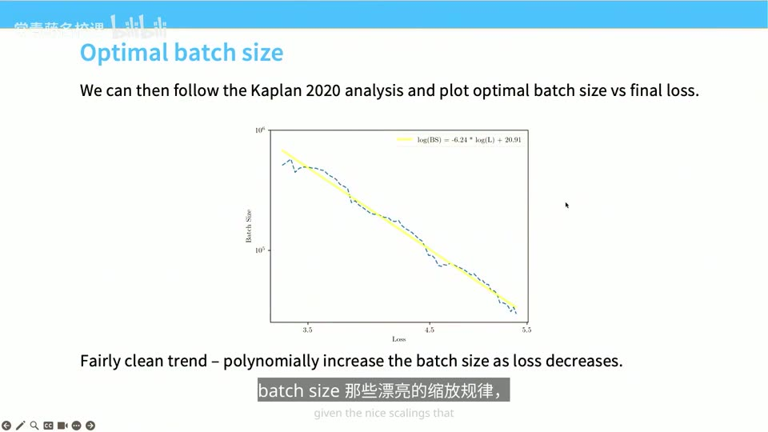
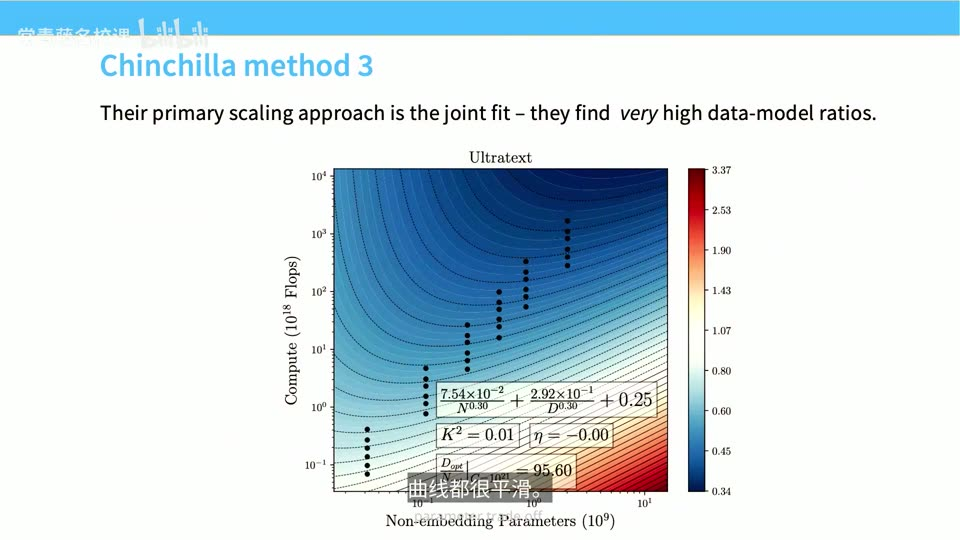
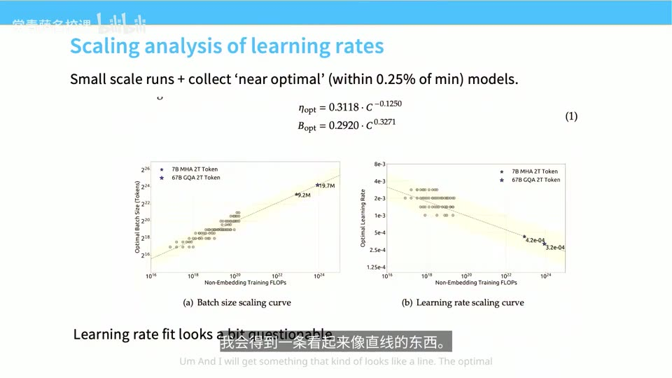
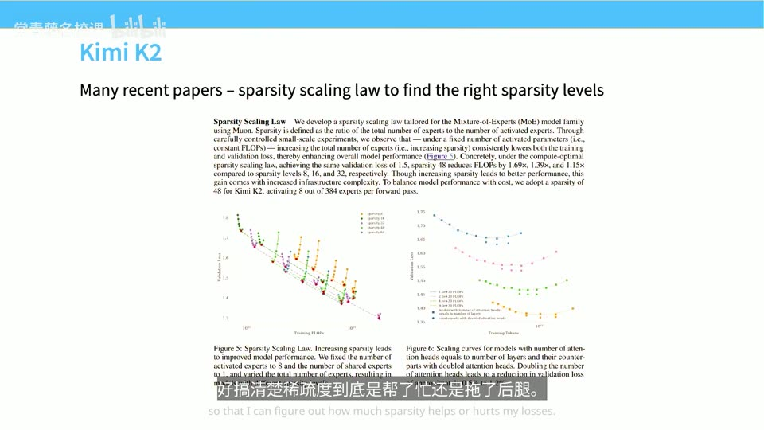
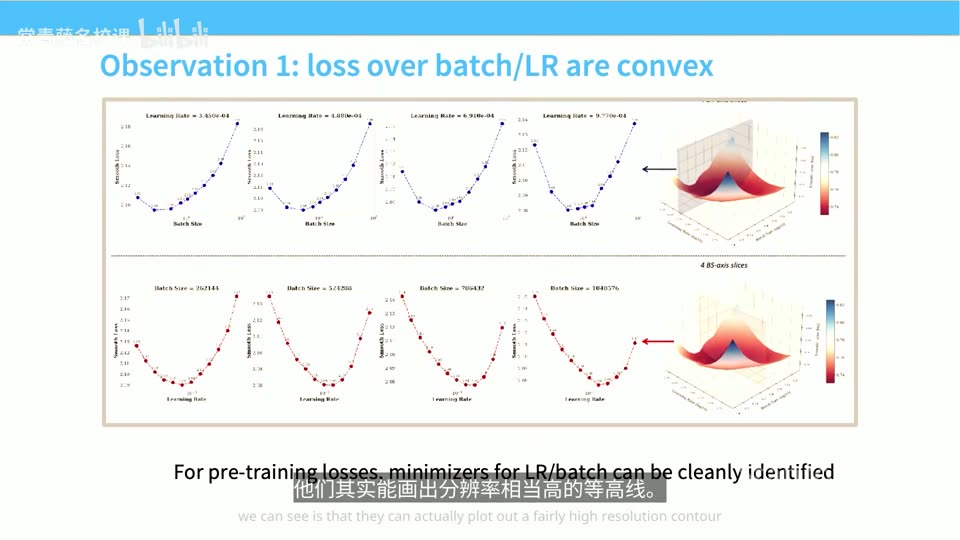
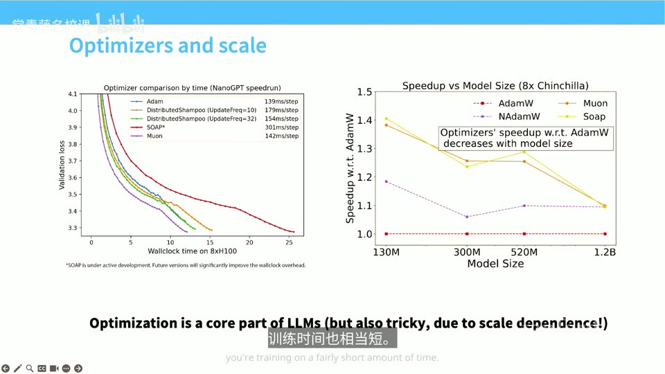
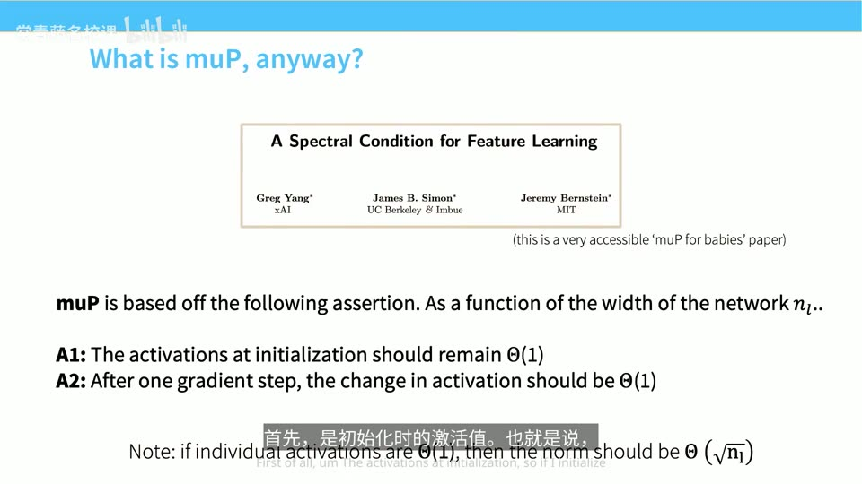
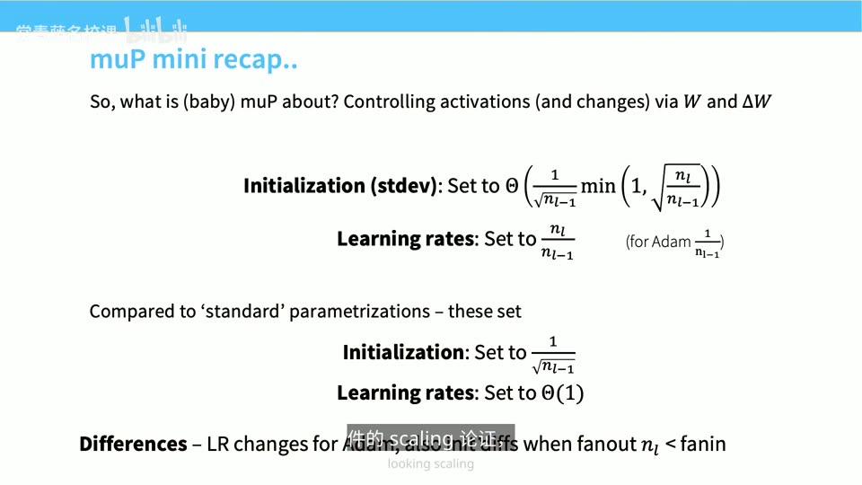

# Lecture 11: Scaling Laws

## 本讲要解决的核心问题（SCQA）

**背景（Situation）**：前面两讲，我们系统学了经典的**缩放定律（scaling laws）**——Kaplan、Hestness 和 Chinchilla 那几篇论文告诉我们：在双对数坐标下，测试损失与数据量、参数量、算力之间存在漂亮的幂律关系；只要沿着好的训练配方扩大规模，就能用小模型的实验结果去预测大模型的表现。([【跳转到 00:40】](https://www.bilibili.com/video/BV11LEA6eEuj/?p=11&t=40))

**冲突（Complication）**：可是真到自己动手训练一个开源大模型时，问题就来了。模型规模一变，**优化器的行为、初始化、学习率、批次大小都会跟着漂移**——你上节课扫出来的最优学习率，换个大模型就不灵了。更麻烦的是，2022 年之后又冒出来一批新的缩放论文，做法各不相同，而且大多出自中国的开源社区；这些论文数量近年反而在减少，因为很多技巧已经变成"标配"，不再写进论文的大章节里。([【跳转到 01:05】](https://www.bilibili.com/video/BV11LEA6eEuj/?p=11&t=65)、[【跳转到 02:20】](https://www.bilibili.com/video/BV11LEA6eEuj/?p=11&t=140))

**疑问（Question）**：从 Chinchilla 一路"速通"到最新的 Kimi K2，中间到底要做哪些事？面对这些**随规模变化而漂移的超参数**，我们到底是坐等它们漂移、还是想办法稳住它们？

**回答（中心思想，结论先行）**：面对"超参数随规模漂移"这一核心难题，工业界给出了**两条互不相同的路线**：

1. **重参数化路线（稳住它）**——以 **MiniCPM** 为代表。用一类特殊的初始化 **μP（maximal update parametrization，最大更新参数化）** 加上逐参数、逐层调学习率，让最优学习率**不随模型规模变化**，从而"第一次就把超参数调准"。
2. **拟合路线（预测它）**——以 **DeepSeek** 为代表。不搞 μP，而是直接在多个规模上做网格搜索，拟合出一条描述"最优 batch size / 学习率如何随算力变化"的 scaling law，然后照着公式外推。

围绕这两条主线，本讲还会展开三块内容：**WSD 学习率调度**（让 Chinchilla 分析便宜好做）、**超参数的网格搜索方法**（StepFun 的细致研究），以及**优化器的规模依赖**（以 Muon 为重点，并补讲 μP 背后的数学）。([【跳转到 01:30】](https://www.bilibili.com/video/BV11LEA6eEuj/?p=11&t=90)、[【跳转到 26:12】](https://www.bilibili.com/video/BV11LEA6eEuj/?p=11&t=1572))

> 本讲篇幅较长、内容偏散，讲者自己都说"今天的内容有点杂"。请记住一个贯穿全场的判断：**学习率和批次大小，是做 scaling law 最重要也最敏感的两个参数**。后面反复出现的所有技巧，几乎都是在跟这两个量打交道。([【跳转到 08:35】](https://www.bilibili.com/video/BV11LEA6eEuj/?p=11&t=515))

---

## 一、为什么"进阶缩放"比经典定律更棘手

### 1.1 经典缩放定律只讲了一半

前面讲的 Kaplan、Hestness、Chinchilla 都属于**经典缩放定律**。它们的共同思路是：固定训练配方，把模型和数据一起做大，观察损失如何按幂律下降。这套东西在 2022 年左右基本成型。([【跳转到 00:40】](https://www.bilibili.com/video/BV11LEA6eEuj/?p=11&t=40))

但经典定律有个隐含前提：**训练配方本身要足够好、且随规模稳定**。现实中恰恰相反——优化器、初始化、学习率、批次大小，这些"配方旋钮"都会随规模变化。所以本讲要补的，正是这块"操作手册"：**在真实构建开源模型的规模下，怎么把这些旋钮调对**。

### 1.2 超参数为什么会随规模漂移

讲者指出，优化器及其行为**对规模非常敏感**。举个最直观的例子：只把网络**加宽**（宽度指每层的隐藏单元数，可以理解成"神经元的条数"），模型越大，最优学习率通常就越小。原因也不难想：一次更新要改动的参数更多，"步子"就得迈小一点。([【跳转到 00:40】](https://www.bilibili.com/video/BV11LEA6eEuj/?p=11&t=40))

这种漂移不是小事——它意味着你**不能**在小模型上调好学习率，然后原封不动搬到 100 倍大的模型上。于是工业界自然分化出两条应对思路，也就是本讲的骨架。

### 1.3 两条路线：稳定派 vs 拟合派

讲者用一句话总结了两派的差异（[【跳转到 19:18】](https://www.bilibili.com/video/BV11LEA6eEuj/?p=11&t=1158)）：

- **MiniCPM（稳定派）**：通过 μP 风格的初始化与逐参数学习率，追求一种"**不变性**"——不管模型多大，最优学习率都别变。
- **DeepSeek（拟合派）**：直接在小规模上做网格搜索，把最优值当作模型规模的函数**拟合**出来，再照 scaling law 外推。

两条路都能走到 Kimi K2 这样的前沿规模，本讲会各挑一篇代表性论文细讲。([【跳转到 14:19】](https://www.bilibili.com/video/BV11LEA6eEuj/?p=11&t=859))

---

## 二、MiniCPM：用 μP 把最优学习率"钉住"

### 2.1 μP 的核心思想：让最优学习率不随规模变

**μP（maximum update parametrization，最大更新参数化）** 是 MiniCPM（2024 年，高性能小型语言模型）用到的第一项关键技术。它听起来很玄，核心思想却只有一句：**无论模型规模怎么放大或缩小，都希望最优学习率保持不变**。([【跳转到 04:25】](https://www.bilibili.com/video/BV11LEA6eEuj/?p=11&t=265))

为什么要费这个劲？因为如果你能做到这一点，就**不用每换一个模型规模就重扫一遍学习率**了——这正是"第一次就把超参数调准"的前提。

### 2.2 μP 在 MiniCPM 里具体长什么样

MiniCPM 论文列出了一串操作（[【跳转到 04:50】](https://www.bilibili.com/video/BV11LEA6eEuj/?p=11&t=290)）：

- **缩放嵌入（embedding）的输出**；
- **按层数的平方根缩放残差连接**（残差连接即 `输出 = 输入 + 子层(输入)` 里那条"抄近路"的加法通路）；
- 对**所有矩阵形状的张量，按 fan-in/fan-out 比率缩放初始化**（fan-in 指一个神经元的输入个数、fan-out 指输出个数，可理解为"这个矩阵的行数与列数"）；
- **逐参数调整学习率**，并对语言模型 head 做缩放。

这些操作看着零碎，合起来只为一个目标：**让训练过程更稳，让最优学习率不漂**。

### 2.3 阶梯式扩展：先训一堆小模型，再放大 5 倍

MiniCPM 的团队并不想靠"暴力穷举训练几百个模型"来碰出那个 1.5B 的发布模型，而是希望**一次就把超参数调准**。他们的做法是：先训练一批小得多的模型，搭一个**缩放阶梯**，一路扩展到目标大小。阶梯上最大的模型和最终发布模型之间差了大约 **5 倍**。([【跳转到 05:40】](https://www.bilibili.com/video/BV11LEA6eEuj/?p=11&t=340))

这张表就是他们的缩放配方：固定纵横比（aspect ratio，即模型维度与层数之比），用 μP 初始化，然后整体放大模型规模。

### 2.4 效果：所有规模的最优学习率几乎落在同一水平

μP 到底有没有用？MiniCPM 的实验结果相当"干净漂亮"：他们**在各种模型规模上都扫了学习率**，每条曲线就是一个模型大小，结果**各条线的最小损失基本落在同一水平附近**（最小的那个模型最小值稍微偏了一点，但也很接近）。这意味着：**你几乎可以不用再调学习率了**。([【跳转到 06:30】](https://www.bilibili.com/video/BV11LEA6eEuj/?p=11&t=390))


这就是 μP 作为"稳定派"武器的价值：**它不是让模型变强，而是让超参数变"乖"**。

---

## 三、MiniCPM 的另两项武器：最优 batch 与 WSD 学习率

μP 稳住了学习率，但还有两件事它管不了：**批次大小**和**学习率调度**。MiniCPM 各给出了一个漂亮答案。

### 3.1 最优 batch size：随 token 数按比例增长

**批次大小（batch size）** 指一次参数更新用多少个样本算梯度。MiniCPM 发现：**最优 batch size 大致随处理的 token 数量成比例变化**。他们在不同规模的模型上都验证了这一点。([【跳转到 07:25】](https://www.bilibili.com/video/BV11LEA6eEuj/?p=11&t=445))

具体做法是：固定 batch size、增加处理的 token 数，把二次曲线拟合到每条等损失线上，找出最优的 batch size。下图左侧每次训练就是一个竖直列（固定 batch、增加数据点），红线标出每个数据量下的最低损失点，也就是那个"最优组合"。

更妙的是，把最优 batch size 对**最终损失**作图，会得到一条**很干净的幂律直线**：损失越低（训练越好），batch size 就越大。这正是上节课 Kaplan 讲的**临界 batch size（critical batch size）**缩放规律——它告诉你"性能开始变差前 batch 最大能开到多少"。有了这条线，你就能非常精确地把 batch size 定下来。([【跳转到 08:10】](https://www.bilibili.com/video/BV11LEA6eEuj/?p=11&t=490))



### 3.2 传统余弦学习率的一个痛点：每次改数据量都得从头训

要理解 WSD，得先理解余弦学习率的麻烦。做 Chinchilla 式的 **isoFLOPs 实验**（固定浮点运算量预算，在"token 数 vs 模型大小"之间做权衡）时，你需要训练很多个数据量不同的模型。问题在于：**每个模型的余弦调度各不相同**——余弦曲线要先知道总训练量才能画出形状。([【跳转到 09:00】](https://www.bilibili.com/video/BV11LEA6eEuj/?p=11&t=540))

于是你不能"在 200 万序列的模型基础上继续训到 400 万序列"，因为学习率调度从根本上就不一样，**每次都得从头重跑**。讲者形容这相当于**二次方级别**的成本浪费。([【跳转到 09:50】](https://www.bilibili.com/video/BV11LEA6eEuj/?p=11&t=590))

### 3.3 WSD：预热—稳定—衰减，三段式学习率

MiniCPM 给出的方案叫 **WSD（warmup–stable–decay，预热—稳定—衰减）学习率**。它的形状像一个**大梯形**（[【跳转到 10:05】](https://www.bilibili.com/video/BV11LEA6eEuj/?p=11&t=605)）：

1. **预热（warmup）**：学习率先升上去，通常按**固定步数**定义，与训练总时长无关；
2. **稳定（stable）**：很长时间把学习率**保持不变**；
3. **衰减（decay）**：最后快速衰减到接近零，一般只占整个训练量的 **10%~20%**。


### 3.4 WSD 的回报：稳定段结束后可随时"回滚再衰减"

WSD 的好处正是冲着上面那个痛点来的：**只要稳定阶段一结束，你就能随时重启训练**。想复用之前的训练并继续跑？把训练**回滚到上一个稳定检查点**，用稳定阶段的学习率继续跑，最后再重新衰减到零即可。([【跳转到 10:30】](https://www.bilibili.com/video/BV11LEA6eEuj/?p=11&t=630))

这样一来，重做数据规模实验只需要反复做"衰减"这一步，而衰减**大约只占总成本的 10%**，比反复重跑预训练划算太多。讲者指出，论证 WSD 有效的研究很多（他提到可能是 ETH 的 Martin Jaggi 团队做过深入研究）。经验上，**余弦调度常常略好一点，但 WSD 在很多场景也差不多**，它像一个"非常通用的默认学习率"。([【跳转到 11:20】](https://www.bilibili.com/video/BV11LEA6eEuj/?p=11&t=680))

### 3.5 有了 WSD，Chinchilla 分析变简单了

既然可以"回滚再衰减"，Chinchilla 式分析就变得非常方便：**跑一次长周期训练，然后把检查点回退、反复做衰减**，就能同时在**数据维度**和**模型维度**上扫一遍。([【跳转到 12:35】](https://www.bilibili.com/video/BV11LEA6eEuj/?p=11&t=755))

MiniCPM 团队选了 Chinchilla 的方法一（下包络线）和方法三（联合拟合）来复现，得到了挺好看的 scaling 曲线。不过有一点要留意：他们联合拟合出的**指数与原始 Chinchilla 差别挺大**，论文据此认为应该用**比 Chinchilla 多得多的文本**来训练。讲者对此持保留态度——他不确定这是真的成立，还是他们的拟合本身和原始 Chinchilla 论文有点出入。([【跳转到 13:24】](https://www.bilibili.com/video/BV11LEA6eEuj/?p=11&t=804))



### 3.6 小结点拨：MiniCPM 值得记住的两点

讲者在课间问答后总结，MiniCPM 主要有两点值得记住：**第一，μP 是个有用的技巧，能稳定学习率随规模的表现；第二，WSD 学习率很常见、必须掌握，属于基础内容**。([【跳转到 13:54】](https://www.bilibili.com/video/BV11LEA6eEuj/?p=11&t=834))

---

## 四、DeepSeek：不靠 μP，直接拟合最优 batch 和 LR

### 4.1 另一条思路：把最优超参数当成规模的函数来拟合

DeepSeek 早期的那篇原始论文（那时还没开始讲 MoE），走的是和 MiniCPM 截然不同的路：**他们不搞 μP，也不做那些有意思的缩放调整；相反，直接拟合一条 scaling law，用来估算最优的 batch size 和 learning rate**。([【跳转到 14:43】](https://www.bilibili.com/video/BV11LEA6eEuj/?p=11&t=883))

逻辑很朴素：我们都知道学习和批次大小得跟着规模变；但如果它们的变化规律是**可预测**的（就像 scaling law 一样），那心里就有底了。

### 4.2 做法：固定算力，网格搜索 batch × LR

DeepSeek 的实验设计是**大面积网格搜索**：把学习率扫一遍、把 batch size 扫一遍，看处理一定数量 token 时的最终损失；先**固定计算量**，只变动这两个参数，并在**好几个不同规模**上都这么做。然后识别出**损失最低的那个点**（即网格里颜色最浅、标了星号的位置）。([【跳转到 15:08】](https://www.bilibili.com/video/BV11LEA6eEuj/?p=11&t=908))


把所有规模的结果汇总，就能得到两条规律：**最优 batch size 随非嵌入计算量（non-embedding FLOPs）增长**，**最优学习率则随算力下降**。([【跳转到 16:06】](https://www.bilibili.com/video/BV11LEA6eEuj/?p=11&t=966))

### 4.3 拟合结果与一个方法论短板

下图给出了 DeepSeek 的拟合公式：`η_opt = 0.3118·C^−0.1250`（最优学习率随算力轻微下降）和 `B_opt = 0.2920·C^0.3271`（最优 batch 随算力上升）。图中星号是他们真正跑过的大规模实验——**batch 要大得多、学习率要低得多**。([【跳转到 16:06】](https://www.bilibili.com/video/BV11LEA6eEuj/?p=11&t=966))



讲者也点出这种"拟合派"的短板：**如果你网格没找对地方，量化误差会很大**，最后拟合出来的可能只是一条"看起来随意的线性关系"。学习率那条线的线性拟合质量就一般——不过模型确实训练起来了，结果也合理，所以勉强能用。([【跳转到 16:56】](https://www.bilibili.com/video/BV11LEA6eEuj/?p=11&t=1016))

### 4.4 DeepSeek 也用 WSD，而且是一条"双衰减"变体

值得注意的是，DeepSeek 为了复现 Chinchilla 分析，**同样沿用了 WSD 风格的学习率**。他们有个稍微特别的小改动：做**两个衰减阶段**（而不是通常的一个）——比如学习率先降到最大值的 31.6%（处理 80% token 时），再降到 10%（处理 90% 时）。讲者坦言"不太清楚为什么这么做"，而且这个做法后来也没怎么流行。([【跳转到 17:38】](https://www.bilibili.com/video/BV11LEA6eEuj/?p=11&t=1058))

### 4.5 价值：Chinchilla 定律在更大算力下被复现

DeepSeek 的 scaling 曲线比 MiniCPM 更干净，他们在固定 FLOPs 范围内得到了清晰漂亮的 sweeps，也复现出了与 Chinchilla 类似的"数据-模型 scaling law"。讲者讲这个的例子，是想说明一个更重要的结论：**Chinchilla law 已经在相当大的计算规模下被独立复现了，所以这套分析大体上是靠谱的**。更难得的是，他们用小规模实验画出的幂律，对实际训练的 **7B 和 67B 模型**做出了相当准确的损失预测（下图星号即真实模型）。([【跳转到 18:03】](https://www.bilibili.com/video/BV11LEA6eEuj/?p=11&t=1083)、[【跳转到 18:53】](https://www.bilibili.com/video/BV11LEA6eEuj/?p=11&t=1133))

### 4.6 一句话对比两派

课堂问答里，讲者用一句话概括了这两篇论文的差别：**这是处理敏感超参数的两种思路——你要么试着稳定这些参数（MiniCPM/μP），要么直接用 scaling laws 去拟合它们（DeepSeek）**。([【跳转到 19:18】](https://www.bilibili.com/video/BV11LEA6eEuj/?p=11&t=1158))

---

## 五、Chinchilla 之后：开源社区的 scaling 配方巡礼

讲者快速过了一批新论文，目的是让大家感受一下"开源前沿"在做什么。一个总体观察是：**现在很多公司没那么注重细节了**，因为 Chinchilla、学习率缩放这些核心机制大家基本都搞明白了，展示出来没有额外价值，所以这类实验在发布里越来越少。([【跳转到 24:55】](https://www.bilibili.com/video/BV11LEA6eEuj/?p=11&t=1495))

### 5.1 Qwen：把调优超参数变成标准流程

Qwen2 的论文大体上就是一句话：我们需要调最优 batch size 和学习率，所以做了一堆 scaling 实验来找最优值、拟合出 scaling law，然后照它预测——甚至对 MoE 也这么做。到 Qwen3 阶段，他们直接说"在 Qwen2 里已经把该做的都定好了，照搬即可"。**这已经变成一套确定最优学习率和批次大小的标准流程**。([【跳转到 19:43】](https://www.bilibili.com/video/BV11LEA6eEuj/?p=11&t=1183))

### 5.2 Kimi K2：MoE 的稀疏度 scaling law

Kimi K2 关注的是 **MoE（Mixture of Experts，混合专家）的 scaling law**。MoE 的核心是"稀疏激活"：模型里有很多"专家"子网络，但每次前向只激活其中一小部分，从而在不大幅增加计算量的前提下扩大参数量。Kimi K2 要回答的是：**我训练的激活参数数量到底对不对？稀疏度（sparsity，总专家数与激活专家数之比）是帮忙还是拖后腿？**([【跳转到 20:33】](https://www.bilibili.com/video/BV11LEA6eEuj/?p=11&t=1233))

结论很明确：**在固定 FLOPs 下，网络越稀疏、验证损失越低**。这并不意外，但关键是他们能**定量算出稀疏度与损失之间的关系**，于是可以理性地决定模型里塞多少稀疏度——当收益开始递减时就停手。Kimi K2 最终选了 **48 的稀疏度（384 个专家中每次激活 8 个）**。([【跳转到 21:23】](https://www.bilibili.com/video/BV11LEA6eEuj/?p=11&t=1283))



### 5.3 Hunyuan 与 Llama 3：MoE 与 isoFLOP 的两个变体

**Hunyuan** 是几年前发布的另一个开源 MoE，做了几乎一样的分析，最终算出**每个激活参数对应约 96 个数据点**（他们固定了稀疏度，所以稀疏度不是搜索对象）。**Llama 3** 也有不错的 scaling laws，但讲者遗憾地说这些规律"其实没多大用"——他们做的是 isoFLOP 风格的缩放，得到的 token 与模型规模比例（图中约 **39:1**）虽然略有不同，但大体相似。([【跳转到 22:13】](https://www.bilibili.com/video/BV11LEA6eEuj/?p=11&t=1333))

### 5.4 Llama 3 最有意思的图：从损失到下游准确率的 S 型映射

Llama 3 缩放工作里最有趣的是下列右图：左面板是常规 scaling law（投入更多算力，基准测试答案的对数概率稳定下降）；**右面板则展示了"对数损失越低，下游准确率越高"**，可以用一个 **sigmoid（S 型）函数**拟合这些紫色数据点。([【跳转到 22:38】](https://www.bilibili.com/video/BV11LEA6eEuj/?p=11&t=1358))

讲者提醒：数据点和曲线有**系统性偏离**，所以不敢说这条曲线是绝对真理；但"从损失到准确率的 S 型映射"这个现象很有用——因为前面我们一直只聊对数损失，而在很多情况下，**对数损失和下游准确率是紧密绑定的**。


### 5.5 MiniMax-01：用缩放来选架构

**MiniMax-01** 做了一组很棒的实验，用的是"利用缩放来探索架构变体"的方法。他们想搞清楚三种架构怎么缩放：**Lightning Attention**（一种类似线性注意力的高效架构）、**softmax 全注意力**，以及把两者结合的**混合架构**。([【跳转到 23:28】](https://www.bilibili.com/video/BV11LEA6eEuj/?p=11&t=1408))

他们复现了 Kaplan 图（看学习曲线随 FLOPs 怎么变），并回答一个关键问题：**针对不同架构，是否需要不同的参数数量？** 大体答案是**否**：混合架构、Lightning 和 softmax 在大多数情况下差不多，需要的模型规模也类似。所以这组图就是在**证明为什么他们在实际部署的系统里选了混合架构**——这正是"用 scaling law 做架构决策"的典型范例。([【跳转到 23:53】](https://www.bilibili.com/video/BV11LEA6eEuj/?p=11&t=1433))


---

## 六、超参数到底该怎么调：StepFun 的网格搜索与 Scaling 发现

讲完了各家配方，讲者转向更系统的研究：**学习率、batch size 和优化器到底怎么按算力缩放**。他大量参考了 **StepFun 团队**的一篇预印本——虽然目前没有一项完全可靠稳健的超参数研究，但"这篇大概已经比较接近了"。([【跳转到 26:37】](https://www.bilibili.com/video/BV11LEA6eEuj/?p=11&t=1597))

### 6.1 先看清各家公式：连输入变量都没统一

StepFun 论文里有张很棒的表，把各种"超参数缩放配方"放在一起对比（[【跳转到 27:46】](https://www.bilibili.com/video/BV11LEA6eEuj/?p=11&t=1666)）：

- **OpenAI（Kaplan）**：临界 batch size，`2^(18)` 那一行的思路是**batch 是最终损失 loss 的函数**；
- **DeepSeek**：`η ∝ C^−0.1250`、`B ∝ C^0.3271`，是**基于计算量**的缩放律；
- **MiniCPM**：`2^(18/L)` 之类的公式，用的是**不同输入变量**；
- **StepFun（Ours）**：`1.79·N^−0.713·D^0.307`，同时用了模型规模 `N` 和**数据量 `D`**，并对数据配方、模型稀疏度都打了勾。

最关键的洞察是这张表最后一行引出的：**这些公式用的输入变量都不一样**——OpenAI 用最终损失，StepFun 认为 batch 的正确缩放取决于**数据量**。讲者提醒："**在'超参数缩放的本质'这个问题上，大家有很多不同的分歧**"，而且"这些方法在很多方面其实挺脆弱的，但里面的实验和现象还是能学到不少东西"。([【跳转到 28:11】](https://www.bilibili.com/video/BV11LEA6eEuj/?p=11&t=1691))


### 6.2 设计：把小模型的最优超参数网格"填满"

StepFun 的实验设计和 DeepSeek 很像：**训练一大堆模型，把学习率空间和 batch size 空间做成网格搜索**，在不同规模的模型、不同大小的数据集上都跑一遍，针对一组小模型把最优值敲定。([【跳转到 28:36】](https://www.bilibili.com/video/BV11LEA6eEuj/?p=11&t=1716))

### 6.3 发现一：损失对 batch / LR 的曲面是凸的、且很平滑

第一个观察很重要：**预训练的损失曲面是凸的，甚至几乎平滑**。他们用了很细的网格，所以能画出高分辨率的等高线；无论固定 batch 还是固定学习率，切出来的曲线形状都很凸。([【跳转到 29:01】](https://www.bilibili.com/video/BV11LEA6eEuj/?p=11&t=1741))

这为什么好？因为它意味着**找最优超参数容易得多，你能放心最小值不会跑太远**——尤其是以前那种锯齿状曲线会让人怀疑"网格化搜索到底行不行得通"，而这里证明了超参数空间整体是平滑的。([【跳转到 29:51】](https://www.bilibili.com/video/BV11LEA6eEuj/?p=11&t=1791))



### 6.4 发现二：最优 batch 只取决于数据量，最优 LR 反直觉

第二个观察是核心结论（[【跳转到 30:16】](https://www.bilibili.com/video/BV11LEA6eEuj/?p=11&t=1816)）：

- **最优 batch size 似乎只取决于训练数据的总量 `D`**：不同颜色的点代表不同模型，但它们在双对数图上大致沿着**同一条趋势线**走——也就是说 batch 只跟 `D` 有关，与模型大小关系不大。
- **最优学习率则同时依赖模型规模和数据量，而且方向反直觉**：模型越大，最优学习率**越低**；数据量越大，最优学习率反而**越高**。


不过讲者提醒：**学习率对 `D` 的依赖方向"可能不太稳固"**，也有别的论文认为应该反过来；只是在 StepFun 这项实验里，趋势相当清晰。他另外强调一点：**学习率本身其实是相当稳健的**——调参时不至于因为一点偏差就崩掉。([【跳转到 31:06】](https://www.bilibili.com/video/BV11LEA6eEuj/?p=11&t=1866))

### 6.5 简化后的结论，以及"到底该不该自己重跑"

把上面的规律简化一下就是（[【跳转到 32:34】](https://www.bilibili.com/video/BV11LEA6eEuj/?p=11&t=1954)）：

- **batch size 大致正比于数据量的平方根**；
- **数据越多、学习率上调；模型越大、学习率下调**。

这看起来有点反直觉，但并不疯狂：因为很多实验默认用了 **Chinchilla 式缩放**，模型 `N` 和数据 `D` 都跟着算力走，两个因素刚好部分抵消，最终得到"**学习率随算力增加而降低、batch 随算力增加而升高**"的结论——和 DeepSeek 定律方向一致，只是指数不同。

课堂问答里有人问："我们是直接拿现成 scaling law 来用，还是自己跑网格搜索？"讲者的回答是**看预算和精度需求**：如果你算力规模正好在 StepFun 网格搜索的水平，那些参数就是很好的默认选择；但如果做自己的大规模预训练，总会有细节差异（比如你用了很大的权重衰减），这时很多东西可能得**重新验证一遍**。这也正是为什么他展示的那些报告都在重新跑——**scaling law 给人的感觉很像严谨的科学，但很大一部分其实靠感觉**。([【跳转到 34:03】](https://www.bilibili.com/video/BV11LEA6eEuj/?p=11&t=2043))

---

## 七、优化器也有规模依赖：从 nanoGPT 到 Muon

### 7.1 一个诱人的小规模结果：Muon 远胜 Adam

讲者用一张对比图引入优化器话题。左边来自 **nanoGPT speedrun**（一个"谁能在最短时间内把小模型训到某损失"的竞赛，启发了本课第一次作业）：在极小的模型、极短的训练时间里，紫色曲线 **Muon** 相对蓝色 **Adam** 取得了非常显著的增益，而且速度不比 Adam 慢。([【跳转到 35:35】](https://www.bilibili.com/video/BV11LEA6eEuj/?p=11&t=2135))

看到这个，谁都会兴奋地想："仅仅换个优化器就有这么大提升！"

### 7.2 但小规模灵、大规模未必灵

问题在于：**优化器是强烈依赖规模的**。于是讲者讲了 Keller Jordan、Percy 和 David 等人做的大规模优化器对比研究——他们把这种对比做得更到位。一个很棘手的事实是：**不同模型的最优超参数不一样，所以扩大规模时它们的缩放指数可能都不同**。([【跳转到 36:25】](https://www.bilibili.com/video/BV11LEA6eEuj/?p=11&t=2185))

如果你**没有把 Adam 调到位**，会得到一条很差的深褐色线，让你误以为"Adam 比别的算法差远了"；但只要稍微改一下学习率，之前的收益就全没了。右边的情况类似：学习率调好了，**权重衰减（weight decay，一种抑制参数变大的正则化）**却没调到最优，结果也会大相径庭。([【跳转到 37:40】](https://www.bilibili.com/video/BV11LEA6eEuj/?p=11&t=2260))



### 7.3 思考算法时，必须盯住的两个规模维度

讲者指出，做算法开发时要像"把算法当成规模的函数"来思考，其中**两个维度始终重要**（[【跳转到 38:05】](https://www.bilibili.com/video/BV11LEA6eEuj/?p=11&t=2285)）：

1. **算力维度**：固定模型大小与数据量的比例，把算力拉上去，看指标怎么变。按这个维度看，Muon 在小规模时特别强，**但随着规模增大，优势慢慢减弱**——这往往不是你想看到的。
2. **Chinchilla 比例维度**：**Chinchilla 比例 = 数据量 ÷ 模型参数量**。这是个大混淆因素！有些算法在**过参数化**（模型远大于数据，即 Chinchilla 比例低）时表现好，有些则在比例高（每个参数能分到很多数据）时更好。哪怕规范做得不错的论文，也常常忽略这个维度，但它有时出人意料地重要。([【跳转到 39:20】](https://www.bilibili.com/video/BV11LEA6eEuj/?p=11&t=2360))

### 7.4 一个反例：漂亮的 scaling 曲线也可能突然崩掉

讲者还举了 Will Held（参与 Percy 的开源语言模型项目 **Marin**）的例子：他们主要验证一组特定超参数（本质上是 Adam 的变体，用了平方根 batch size 缩放），做标准 Chinchilla 分析。**在竖直虚线之前，scaling law 画得非常漂亮，可随着规模继续扩大，曲线就偏离线性、然后突然整个崩掉**。([【跳转到 40:34】](https://www.bilibili.com/video/BV11LEA6eEuj/?p=11&t=2434))

他们的解决办法是**改回更谨慎的 μP 风格参数化**，并更换优化器，结果在多个数量级上得到了更好的 scaling。讲者的告诫是：即便在多个数量级上看起来都不错，**scaling 趋势也可能突然反咬你一口**——所以你得到的图表常常"看着挺糟心，还不太确定哪里出了问题"。([【跳转到 41:49】](https://www.bilibili.com/video/BV11LEA6eEuj/?p=11&t=2509))

---

## 八、Muon 是怎么工作的：对矩阵参数做正交化更新

### 8.1 为什么单独讲 Muon：它已进入大规模训练流程

讲者特意补讲 Muon，原因有二：它**越来越重要**，已经被整合进大规模模型训练流程（这几乎是本课新研究课题的"入选标准"——有没有参与过大规模训练）；而且它本身是个**挺有意思的算法**。([【跳转到 42:09】](https://www.bilibili.com/video/BV11LEA6eEuj/?p=11&t=2529))

### 8.2 从普通动量到"矩阵专用"优化器

先回忆标准做法：梯度下降里，我们取梯度、加到动量上（用动量系数 μ 延续之前的动量），再基于动量梯度更新参数——这就是常见的**基于动量的优化器**。Muon 的出发点很不一样：**梯度对所有参数一视同仁，但语言模型里的参数并不一样**——有些是**向量参数**（比如 RMS 归一化的增益项），有些是**矩阵参数**（比如注意力机制或 MLP 的权重矩阵）。([【跳转到 43:24】](https://www.bilibili.com/video/BV11LEA6eEuj/?p=11&t=2604))

既然矩阵参数是矩阵，就有**奇异值**可以操作。Muon 的算法很简洁（[【跳转到 43:49】](https://www.bilibili.com/video/BV11LEA6eEuj/?p=11&t=2629)）：

```text
Require: 学习率 η，动量 μ
1: 初始化 B_0 ← 0
2: for t = 1, 2, ... do
3:     计算梯度 G_t ← ∇_θ L_t(θ_{t−1})
4:     B_t ← μ·B_{t−1} + G_t          # 动量累积
5:     O_t ← NewtonSchulz5(B_t)        # 正交化更新量
6:     更新参数 θ_t ← θ_{t−1} − η·O_t
7: end for
8: return θ_t
```


### 8.3 核心操作：把更新矩阵的奇异值全部拉回 1

Muon 的关键在第 5 行。假设把更新量做**奇异值分解（SVD）**，写成 `B_t = U·S·Vᵀ`；然后**把所有奇异值都设成 1**——特别大的缩回 1、特别小的扩到 1——最后取 `U·Vᵀ` 作为新的更新量。([【跳转到 43:49】](https://www.bilibili.com/video/BV11LEA6eEuj/?p=11&t=2629))

有个直观的类比：在 **AdaGrad / Adam** 里，你是**除以梯度的某种大小**，让每个坐标的更新尺度大致相同；而在 **Muon 里，你操作的是谱范数，让每个方向的大小都是单位值**。注意，这个操作**只对矩阵有意义**——因为只有矩阵才有奇异值分解。所以 Muon 是**矩阵优化器**：矩阵参数用它，向量参数还是用 AdamW 之类。([【跳转到 44:14】](https://www.bilibili.com/video/BV11LEA6eEuj/?p=11&t=2654))

### 8.4 为什么用 Newton-Schulz 而不是 SVD

课堂问答里同学问："SVD 在 GPU 上跑得快吗？"讲者回答：**SVD 在 GPU 上其实不快，但 Muon 根本没用 SVD**。他们用的是 **Newton-Schulz 迭代（牛顿-舒尔茨迭代）**——一种**只做矩阵乘法**的有限迭代算法，用来**近似**矩阵的正交化。正因为只用矩阵乘法，它在系统层面很高效。严格来说，它并不精确实现正交化，只是近似。([【跳转到 47:12】](https://www.bilibili.com/video/BV11LEA6eEuj/?p=11&t=2832))

### 8.5 Muon 在大规模上到底行不行？一个耐人寻味的故事

讲者给 Muon 讲了个"故事收尾"：Muon 刚出来时表现很强，但一些扩展性研究指出**随着模型变大，它带来的收益会慢慢减少**，看起来这个热潮要凉了。结果 **Kimi K2 出场了——整个模型全套都用 Muon 训练**（只加了些防数值爆炸的小手段，他们也确实遇到了一堆不稳定问题），而 K2 是个非常出色的模型，训练曲线也合理。([【跳转到 45:20】](https://www.bilibili.com/video/BV11LEA6eEuj/?p=11&t=2720))

不过要冷静：Kimi K2 **没做消融实验**，所以"Muon 是否比 Adam 好"在那个规模上**无法确切知道**——只能说它**是一个有效、能用的方案**。这个故事真正的启示是：**很难确定某样东西在大规模下到底行不行**；我们做科研的主要路子仍是"先小规模、再大规模"，所以像 nanoGPT speedrun 这种小规模工作仍然值得重视。([【跳转到 46:35】](https://www.bilibili.com/video/BV11LEA6eEuj/?p=11&t=2795))

### 8.6 问答补充：超参数共享与"每层一个优化器"

课堂问答还聊了两个有意思的点：Muon 各层的超参数**不是共享的、也可以不同**；有研究者（如 Jeremy Bernstein）主张**每一层都该有自己的学习率**，极限情况甚至是**每一层都配一个独立优化器**。讲者笑说"那你也得为每一个单独调超参数，这我可不想折腾"，但也承认"这说不定就是优化未来的方向"。([【跳转到 47:37】](https://www.bilibili.com/video/BV11LEA6eEuj/?p=11&t=2857))

另外，面对"网格搜索只调 LR 和 batch，不担心和其他超参数交互吗？"的提问，讲者回答：组合数量是指数级增长的，**不可能把整个空间都网格搜索**，所以大家通常只搜**最敏感、最让人头疼的参数**（学习率首当其冲），像权重衰减这类可以事后再单独扫一遍。([【跳转到 48:27】](https://www.bilibili.com/video/BV11LEA6eEuj/?p=11&t=2907))

---

## 九、μP 到底为什么有效：从两个不变量推导初始化与学习率

最后一节回到 μP。讲者坦言这东西"有点神秘"——虽然论文不少、实现也不少，但**大家连底层数学是什么、底层实现该怎么做，都没能达成一致**。不过有一套**共享的核心理念**，而且看起来确实管用。([【跳转到 49:17】](https://www.bilibili.com/video/BV11LEA6eEuj/?p=11&t=2957))

### 9.1 目标：只加宽网络时，让最优学习率不动

μP 的目标用一张图就能说清：**当我们只增加网络宽度、把模型做大时，理想状态下最优学习率应保持不变**。为了做到这一点，讲者愿意动的"旋钮"有三类（[【跳转到 49:42】](https://www.bilibili.com/video/BV11LEA6eEuj/?p=11&t=2982)）：

- **按层调整初始化**；
- **按每一个参数调整学习率**；
- **根据模型大小缩放残差连接**之类的东西。

### 9.2 两个断言：激活值不变、更新量不变

μP 基于两个断言（讲者形容这是"典型的物理学家思维"）。以网络宽度 `n_l` 为变量（[【跳转到 52:12】](https://www.bilibili.com/video/BV11LEA6eEuj/?p=11&t=3132)）：

- **A1：初始化时激活值应保持在 Θ(1)**。也就是说，初始化模型、喂随机数据，**激活值的大小不该随网络变大而爆炸、也不该缩到零**，应维持在同一量级。
- **A2：做一次梯度更新后，激活值的变化量仍应是 Θ(1)**。这被称为**特征学习（feature learning）**——做一次更新，网络里的东西会发生**显著**变化，且变化量是网络宽度的固定函数。

对照一下：**神经正切核（neural tangent kernel）** 的表现完全相反——网络越宽，激活值变化量反而**趋近于零**，也就是网络几乎没在学习特征。μP 明确要避免这种事情。([【跳转到 53:02】](https://www.bilibili.com/video/BV11LEA6eEuj/?p=11&t=3182))

一个小记号：如果每个激活值约为 Θ(1)，那么整个激活向量的**范数**（向量长度）就应该是**隐藏单元数的平方根，即 Θ(√n_l)**。



### 9.3 推导 A1：解出初始化的标准差

考虑一个简单的**深度线性网络** `h_l = W_l·h_{l−1}`，权重初始化为按 `σ²` 缩放的高斯分布。由标准的高斯矩阵浓度论证（random matrix concentration），算子的谱范数约为 `σ·(√n_{l−1} + √n_l)`；当 fan-out 不比 fan-in 大太多时，本层输出大致等于输入乘以该算子范数。([【跳转到 54:08】](https://www.bilibili.com/video/BV11LEA6eEuj/?p=11&t=3248))

于是我们可以**求解 σ**，让激活值在所有层、所有宽度上都一致。取归纳假设 `‖h_{l−1}‖₂ = Θ(√n_{l−1})`，代入后得到（[【跳转到 55:23】](https://www.bilibili.com/video/BV11LEA6eEuj/?p=11&t=3323)）：

```text
σ = (√n_l / √n_{l−1}) · (√n_l + √n_{l−1})^−1
  = Θ( (1/√n_{l−1}) · min(1, √(n_l / n_{l−1})) )
```

讲者承认这里做了"近似相等"等假设，但这套论证基本站得住脚。**A1 相对简单，A2 才稍微棘手**。

### 9.4 推导 A2：解出让更新量成立的逐层学习率

A2 要处理的是"更新"。讲者只讨论深度线性网络在 SGD 下、batch 中单个样本的情况。由于反向传播的性质（**前向是矩阵乘法，反向表现为外积**），第 L 层权重的变化是损失梯度与激活值的外积；而**激活值变化 Δh_L 恰好包含两项**：一项直接来自前一层激活值的变化，另一项是权重变化带来的**交叉项**。([【跳转到 56:38】](https://www.bilibili.com/video/BV11LEA6eEuj/?p=11&t=3398))

我们希望每个分项的量级都是 `Θ(√n_L)`，这样才能满足 A2。于是逐步解出**什么样的学习率能让参数更新量大致正比于 √fan-out、反比于 √fan-in**（[【跳转到 59:08】](https://www.bilibili.com/video/BV11LEA6eEuj/?p=11&t=3548)）。这里用到一个"最不太让人接受"的假设：**损失更新按单位尺度缩放**（即模型随规模扩大取得显著且模式相似的进展）。讲者自己也说"不太觉得这个假设很合理，但先写下来"——因为它能让后续数学变得非常清晰简洁。

最终解出：**某一层的学习率正比于 fan-out 与 fan-in 之比**。对 Adam 优化器，由于其中一些变化，会得到**略有不同**的比例（大致是去掉某个分子上的 2）。([【跳转到 60:23】](https://www.bilibili.com/video/BV11LEA6eEuj/?p=11&t=3623))

### 9.5 结论：一张"μP 速记卡"

把这些推导落成可直接使用的规则，就是下面这张速记卡（[【跳转到 61:13】](https://www.bilibili.com/video/BV11LEA6eEuj/?p=11&t=3673)）：

- **初始化（标准差）**：设为 `Θ( (1/√n_{l−1}) · min(1, √(n_l / n_{l−1})) )`；
- **学习率**：设为正比于 `n_l / n_{l−1}`（对 Adam 是正比于 `1 / n_{l−1}`）；
- 对比**标准参数化**：初始化设 `1/√n_{l−1}`、学习率统一设 `Θ(1)`。

两者的差别在于：**当 fan-out `n_l` 小于 fan-in 时，学习率会发生变化**。直观理解就是——**fan-in 比较大的层得到的学习率会更小**，从而实现一种"层次适应"的学习率。



### 9.6 方法论价值：用"不变量"反推超参数的缩放

讲者强调，μP 的价值不只在实用，更在于**推导过程**：先取一个缩放极限、断言网络具备某种**不变性**，再做额外假设，最后反推出"超参数需要满足什么约束"。这些约束本质上给超参数**划定了 scaling limits**。这是一个**通用原则**——你可以用它来推导不同算法或超参数的缩放，而这跟平常在 CS/ML 训练里习惯的做法很不一样。([【跳转到 62:28】](https://www.bilibili.com/video/BV11LEA6eEuj/?p=11&t=3748))

### 9.7 压力测试：μP 什么时候会失效

有位独立研究者用各种方式对 μP 做了**压力测试**，结论与 MiniCPM 等研究一致：**只要 μP 设置正确、且只做受控的缩放，就能得到学习率最优性/不变性**。但现实里有很多 μP **没涵盖**的情况（比如 SwiGLU 严格来说就不在 μP 范围内），它们大多能兼容，**有一些却真的会破坏 μP**（[【跳转到 64:13】](https://www.bilibili.com/video/BV11LEA6eEuj/?p=11&t=3853)）：

- **在 RMSNorm 里学习增益项** → 会让 μP 失效（不过很多时候去掉它们也不影响效果）；
- **用更冷门的优化器（如 Lion，依赖梯度的符号）** → μP 似乎也会失效（符号梯度在理念上和 Muon 挺像）；
- **做较大的解耦权重衰减** → μP 会**严重失效**，这可能是它唯一没通过的压力测试。

### 9.8 那 μP 到底有没有用？

讲者的答案是：**如果你想真心让学习率稳定下来，它其实挺管用的**。很多实验都显示，增加宽度时最优学习率会发生巨大但可预测的偏移，而用了 μP 之后就不会。所以它是**工具箱里的众多工具之一**，用来控制那些随规模漂移的超参数。讲者认为这仍是个有意思、有待探索的方向，**还没到盖棺定论的程度**。([【跳转到 65:03】](https://www.bilibili.com/video/BV11LEA6eEuj/?p=11&t=3903))

### 9.9 延伸：不同 μP 论文的风格

讲者顺带推荐了几篇 μP 相关论文：发起这项研究的 **Greg Yang** 写了一系列 **Tensor Programs**，但他觉得"有点晦涩"；**Jeremy Bernstein** 参与 μP 研究，写过一篇很好懂的**综述**；还有几位物理学家写的解释文章也很有意思。他个人觉得最适合入门的是那篇 **"A Spectral Condition for Feature Learning"**（被他戏称为"μP for babies"）。([【跳转到 51:47】](https://www.bilibili.com/video/BV11LEA6eEuj/?p=11&t=3107))

---

## 十、现实告诫：scaling law 像科学，其实很混乱

讲者用最后一点收尾，也是整讲最重要的一句话：**真实环境中的扩展非常棘手**。scaling law 最初被介绍的方式，会让人感觉它像一门严谨的科学——好像只要画出那条线、按步骤操作，就能确切知道规模变大后会发生什么。但**现实比这混乱得多，未知因素也多得多**。([【跳转到 65:58】](https://www.bilibili.com/video/BV11LEA6eEuj/?p=11&t=3958))

大家确实用 scaling law 来选架构、选优化器、选超参数，但这**很讲究技巧**，因为你根本没法确定它能不能无限外推下去。所以人们想出了各种办法——用 μP、搜最优学习率——这些本质上都是**控制超参数漂移**的手段。讲者最后说：**目前还没有万全之策**，也许明年会冒出一个模块宣告"问题解决了"，但"现在还差点意思"。([【跳转到 66:23】](https://www.bilibili.com/video/BV11LEA6eEuj/?p=11&t=3983))

---

## 小结

1. **进阶缩放的真正难点，是超参数会随规模漂移**。经典缩放定律（Kaplan、Hestness、Chinchilla）只讲了"损失如何随规模下降"，却没讲"配方旋钮怎么跟着规模调"。本讲补的正是这块操作手册，核心始终围绕两个最敏感的参数——**学习率和批次大小**。
2. **两条应对路线**：MiniCPM 代表**稳定派**（用 μP 让最优学习率不随规模变），DeepSeek 代表**拟合派**（用小规模网格搜索拟合出最优 batch/LR 的 scaling law 再外推）。两派都能走到前沿规模，讲者用一句话概括："要么稳定这些参数，要么直接拟合它们。"
3. **MiniCPM 的三件套**：① μP 初始化（缩放嵌入输出、按 √层数缩放残差、按 fan-in/fan-out 缩放矩阵、逐参数学习率），让不同规模的最优学习率对齐；② 最优 batch size 随数据量按幂律增长；③ **WSD 学习率**（预热—稳定—衰减），稳定段结束后可回滚重衰减，让 Chinchilla 分析成本大降。
4. **DeepSeek 的做法**：固定算力、在 batch × LR 网格上找最低损失，拟合出 `η_opt ∝ C^−0.1250`、`B_opt ∝ C^0.3271`；他们同样用 WSD（还做了双衰减的小变体），并漂亮地复现了 Chinchilla 定律，对真实 7B/67B 模型做出准确预测。
5. **开源配方巡礼**：Qwen 把超参数调优变成标准流程；Kimi K2 用稀疏度 scaling law 选定 48（384 专家激活 8 个）；Hunyuan 得到约 96:1；Llama 3 给出约 39:1，并展示了"损失→下游准确率"的 S 型映射；MiniMax-01 用缩放证明混合注意力架构可靠。
6. **StepFun 的系统研究**：损失对 batch/LR 的曲面是**凸且平滑**的，说明最优超参数容易定位；**最优 batch 主要只取决于数据量 D**；最优学习率同时依赖模型规模与数据量（模型越大越低、数据越多越高，但后者不太稳固）。各家公式所用输入变量不统一，说明"超参数怎么缩放"仍无共识。
7. **优化器强烈依赖规模**：nanoGPT speedrun 上 Muon 远胜 Adam，但相对 AdamW 的加速比**随模型增大而缩小**；思考算法要同时盯住**算力**与 **Chinchilla 比例**两个维度。漂亮的 scaling 曲线也可能突然崩溃，更谨慎的 μP 风格参数化能救场。
8. **Muon 是"矩阵优化器"**：用 Newton-Schulz 迭代（只做矩阵乘法）把更新矩阵正交化，即把奇异值全拉回 1，让每个方向的更新尺度统一。Kimi K2 全套用 Muon 训练成功，但它没做消融，"大规模下是否优于 Adam"仍无定论。
9. **μP 的数学**：从两个不变量出发——A1 初始化激活值 Θ(1)、A2 一步更新后激活变化 Θ(1)——推出初始化为 `Θ((1/√fan-in)·min(1,√(fan-out/fan-in)))`、逐层学习率正比于 `fan-out/fan-in`。它在 RMSNorm 增益、Lion 优化器、大权重衰减下会失效，但仍是控制超参数漂移的实用工具。
10. **最后一句忠告**：scaling law 给人的感觉像严谨的科学，但**很大一部分其实靠感觉**。它能指导架构、优化器和超参数选择，却无法保证无限外推；μP、学习率搜索等手段都只是"控制漂移"的权宜之计，目前还没有万全之策。

---

## 关键术语速查

| 术语 | 一句话解释 |
| --- | --- |
| 缩放定律（scaling law） | 用小规模训练结果外推大模型表现的幂律预测规则 |
| μP（最大更新参数化） | 通过逐层初始化与逐参数学习率，让最优学习率不随模型宽度漂移的方案 |
| fan-in / fan-out | 一个神经元的输入/输出连接数，可视作权重矩阵的行数/列数 |
| 残差连接 | `输出 = 输入 + 子层(输入)` 里那条"抄近路"的加法通路 |
| WSD 学习率 | 预热（升）—稳定（平）—衰减（降）三段式调度，稳定段后可回滚再衰减 |
| 预热（warmup） | 训练初期让学习率从低升到目标值的阶段 |
| 退火 / 衰减（decay） | 训练末期让学习率快速降到接近零的阶段，通常最关键 |
| 临界 batch size | batch 收益从"完美缩放"转为递减的转折点，随最终损失降低而增大 |
| isoFLOPs | 固定浮点运算量预算，在 token 数与模型大小之间做权衡的实验设计 |
| 网格搜索（grid search） | 遍历超参数组合找最低损失的做法，如二维的 batch×学习率网格 |
| Chinchilla 比例 | 数据量 ÷ 模型参数量；是评估算法表现时容易被忽略的混淆因素 |
| MoE（混合专家） | 每次前向只激活部分专家的稀疏架构，可解耦总参数与激活参数 |
| 稀疏度（sparsity） | 总专家数与激活专家数之比；Kimi K2 据此选定 48 |
| 权重衰减（weight decay） | 抑制参数变大的正则化项，需与学习率搭配调优 |
| 神经正切核（NTK） | 网络越宽激活变化越趋近于零的极限行为，与 μP 的"特征学习"相反 |
| 特征学习（feature learning） | 一次梯度更新后网络内部发生显著变化（激活变化为 Θ(1)） |
| Muon | 针对矩阵参数的优化器，用 Newton-Schulz 迭代正交化更新量 |
| Newton-Schulz 迭代 | 只靠矩阵乘法、近似实现矩阵正交化的有限迭代算法 |
| 奇异值分解（SVD） | 把矩阵写成 U·S·Vᵀ；Muon 用近似方法把奇异值全设为 1 |
| 谱范数 / 弗罗贝尼乌斯范数 | 矩阵的"最大拉伸倍数"与"所有元素平方和开根"，用于量级分析 |
| 特征学习光谱条件 | Greg Yang 等提出的 μP 理论论文，讲者推荐的"μP for babies"入门读物 |
| 过度/欠参数化 | 模型相对数据过大/过小，分别对应低/高的 Chinchilla 比例 |
