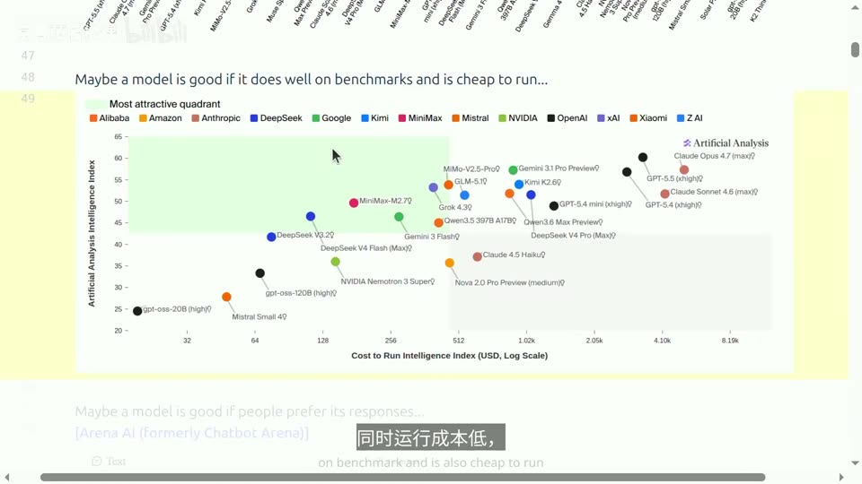
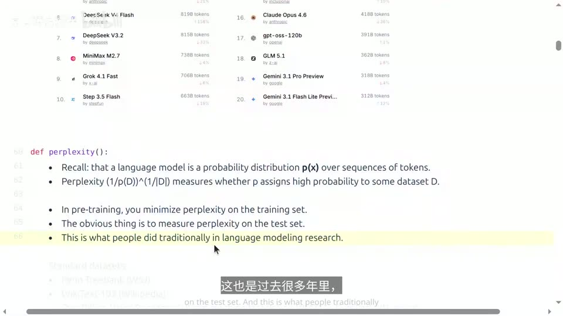
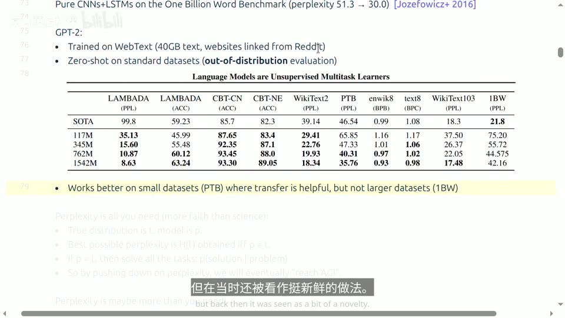
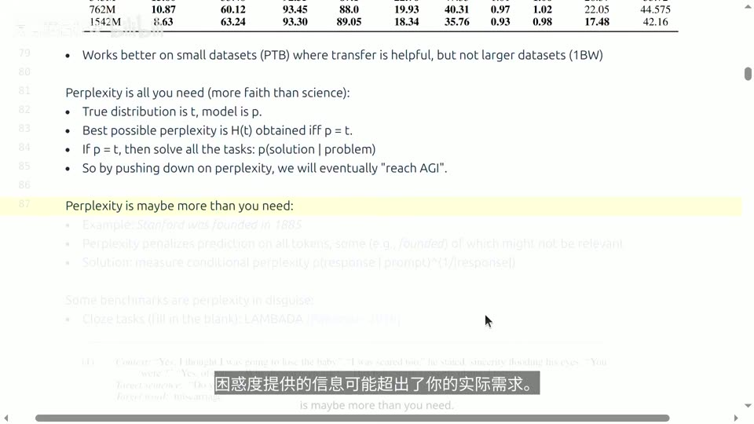
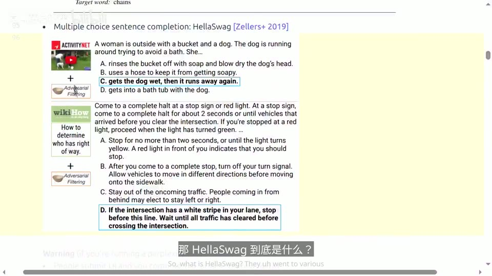
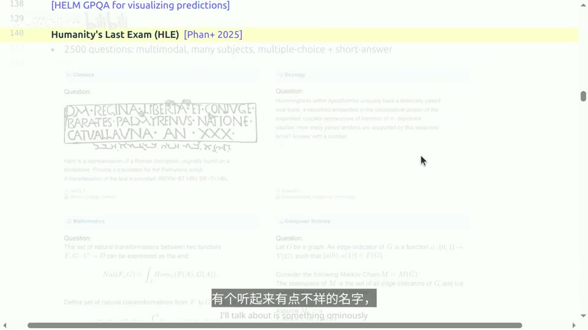
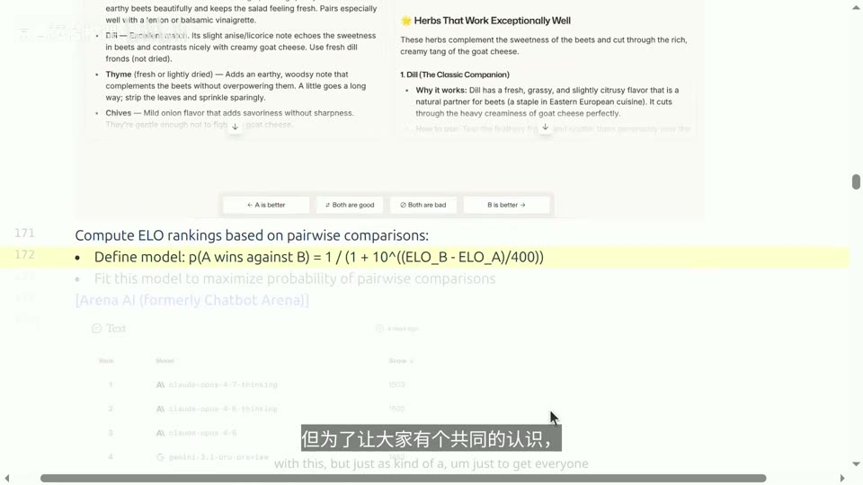
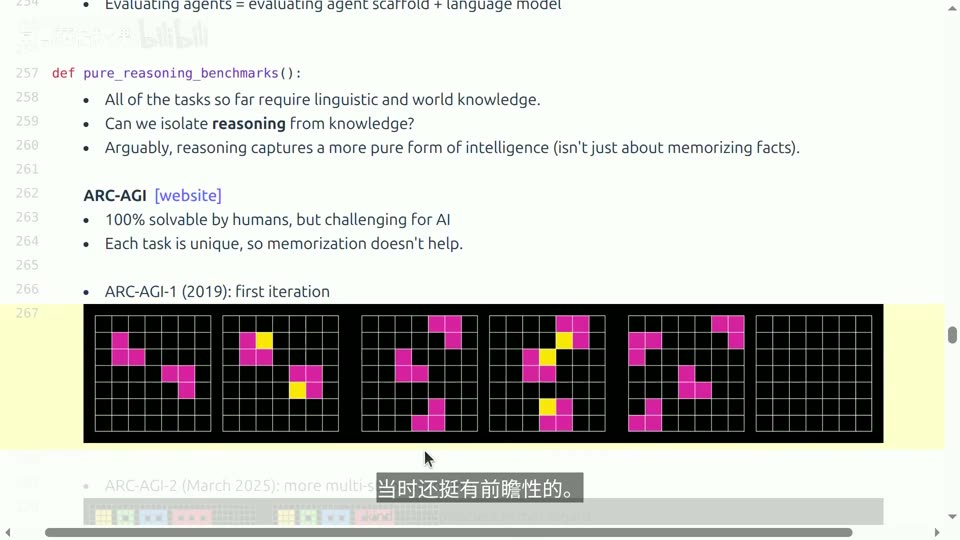

# Lecture 12: Evaluation

## 本讲要解决的核心问题（SCQA）

**背景（Situation）**：到目前为止，这门课里"训练一个语言模型需要做的事"我们几乎都走过一遍了——定义架构、选优化器、写主训练循环、用并行内核让训练跑得更快，还看过缩放定律（scaling laws），也稍微提过怎么让推理更快。唯一还没系统讲的是训练数据，而数据会塑造模型的行为：用代码训练，模型多半擅长代码；只用 DNA 序列训练，它恐怕连英语都说不好。所以在讲数据之前，得先说清楚**我们希望模型具备什么样的行为**——这正是"评估"的主题。([【跳转到 00:00】](https://www.bilibili.com/video/BV11LEA6eEuj/?p=12&t=0)、[【跳转到 00:15】](https://www.bilibili.com/video/BV11LEA6eEuj/?p=12&t=15))

**冲突（Complication）**：评估听起来很简单——定好一些 prompt、发给模型、拿到回复、算算准确率。但"好"这个词本身根本没有公认的定义：是基准分数高？是跑起来便宜？是人们更爱用？还是大家愿意为它掏钱？而且评估远不只是机械流程，它**正在塑造 AI 的发展**：无论开源还是闭源，所有人都盯着评估数字，它就像衡量整个领域进步的一把尺子。([【跳转到 00:42】](https://www.bilibili.com/video/BV11LEA6eEuj/?p=12&t=42)、[【跳转到 01:12】](https://www.bilibili.com/video/BV11LEA6eEuj/?p=12&t=72))

**疑问（Question）**：那我们到底该用什么方法来衡量一个训练好的语言模型？面对这么多不同的评估方式，它们各自把握住了什么、又漏掉了什么？我们凭什么相信某个分数？

**回答（Answer，结论先行）**：**不存在唯一"正确"的评估**——正确的做法是按"你想测什么"来选评估，并在三个维度上权衡：**难度、真实感（生态效度）、有效性**。本讲会把评估拆成一条从窄到宽的谱系来走：先看如何定义"好"（第一节），再依次看**困惑度**（第二节）、**考试类基准**（第三节）、**开放式/聊天评估**（第四节）、**智能体（agent）基准**（第五节）、**纯推理基准**（第六节）、**安全基准**（第七节），最后讨论**现实性与有效性这两把"元标尺"**（第八节）以及"评估的目的决定方法"（第九节）。核心挑战始终是一个动作：**把"我想要模型怎样"这种抽象期望，翻译成可测量的具体指标**。([【跳转到 01:31】](https://www.bilibili.com/video/BV11LEA6eEuj/?p=12&t=91)、[【跳转到 58:47】](https://www.bilibili.com/video/BV11LEA6eEuj/?p=12&t=3527))

---

## 一、什么才算"好"：评估是把抽象期望翻译成具体指标

评估的第一步，其实是先承认一件事：**"好"没有标准答案**。讲者在这一节故意抛出一连串互相竞争的定义，目的不是给结论，而是让你换个角度思考——你究竟在乎什么。

### 1.1 评估的核心挑战：从抽象想法到具体指标

一开始，你脑子里往往只有一个很抽象的想法："我希望模型在对话或推理方面表现出色。"而评估的过程，就是**把这些抽象概念转化成具体指标**，通常要靠一些具体的 prompt 或环境来实现。([【跳转到 01:31】](https://www.bilibili.com/video/BV11LEA6eEuj/?p=12&t=91))

举个最直白的例子：如果只是想知道"模型会不会做小学数学"，你可以准备 100 道题、让模型逐题作答、数对几道——"会做小学数学"这个抽象期望，就被翻译成了"100 道题的准确率"这个具体数字。可一旦期望变成"模型是否可靠""模型是否讨人喜欢"，翻译就立刻变得棘手。

### 1.2 四种常见的"好"

- **基准分数高**：一个叫 **Artificial Analysis** 的网站把许多数据集聚合成一个所谓"智能指数"（intelligence index），成了衡量模型"智能"水平的一种业界标准。它包含许多不同的数据集，其中一些本讲后面会讲到。([【跳转到 01:56】](https://www.bilibili.com/video/BV11LEA6eEuj/?p=12&t=116)、[【跳转到 02:31】](https://www.bilibili.com/video/BV11LEA6eEuj/?p=12&t=151))
- **又强又便宜**：智能指数与推理成本（inference cost）存在一定相关性——**运行花费越高，指数通常也越高，但两者并不完全对应**。所以"性价比"本身就能当作一种"好"的标准。([【跳转到 02:48】](https://www.bilibili.com/video/BV11LEA6eEuj/?p=12&t=168))
- **人们更喜欢**：**Arena AI**（前身是 Chatbot Arena）认为，可以把"人们是否更喜欢某个模型的回答"作为排名依据。([【跳转到 03:13】](https://www.bilibili.com/video/BV11LEA6eEuj/?p=12&t=193))
- **有人愿意付钱**：**OpenRouter** 提供统一的 API 端点来调用多种模型，因此收集了大量"大家都在用哪些模型"的统计。这更像一种**经济学视角**：我不知道什么才算好，但如果有人愿意为它付费，那它一定不错。([【跳转到 03:24】](https://www.bilibili.com/video/BV11LEA6eEuj/?p=12&t=204)、[【跳转到 03:56】](https://www.bilibili.com/video/BV11LEA6eEuj/?p=12&t=236))



这四种"好"背后对应着四类完全不同的评估思路，也预告了后面各节的主题：**考试分数**（第三节）、**人类偏好**（第四节）、**真实使用场景**（第八节）。讲者提醒：这些答案未必都对，也不确定有没有标准答案，关键是先想清楚自己要什么。

---

## 二、困惑度：从"概率分布"这个本质来度量语言模型

评估要从最根本的定义出发。**语言模型本质上就是一个定义在 token 序列上的概率分布 P(X)**——给定前面的词，它给下一个词分配概率，于是也能给整段文本分配一个概率。([【跳转到 04:12】](https://www.bilibili.com/video/BV11LEA6eEuj/?p=12&t=252))

### 2.1 什么是困惑度

评估一个分布最自然的量就是**困惑度（perplexity，困惑度/因 perplexity）**，它和对数损失（log loss）密切相关。基本思路是：拿一个测试数据集，看语言模型给它分配了多少概率质量，再做归一化和开方，让数字更容易理解：

```text
Perplexity = (1 / P(D))^(1 / |D|)
```

其中 D 是测试数据集。直观地说，困惑度衡量的是：**模型对这批数据到底"感到多意外"**。困惑度越低，说明模型给真实数据分配的概率越高、预测越准。训练时我们最小化的，其实正是训练集上的困惑度。([【跳转到 04:37】](https://www.bilibili.com/video/BV11LEA6eEuj/?p=12&t=277))



### 2.2 经典范式：分布内评估

在最经典的设定里，你先用数据集的**训练部分**训练模型，再在**测试部分**测困惑度——这叫**分布内评估（in-distribution evaluation）**。整个 2000 年代的语言建模论文几乎都在做这件事，常用数据集有 **Penn Treebank**（华尔街日报文本）、**WikiText-103**（维基百科）以及一个 **10 亿词基准**（One Billion Word Benchmark，数据取自机器翻译的原始语料 WMT11 等）。([【跳转到 05:11】](https://www.bilibili.com/video/BV11LEA6eEuj/?p=12&t=311))

2016 年有篇很有名的论文（Jozefowicz 等人）证明：把 **CNN 和 LSTM** 用到 10 亿词基准上，困惑度能从 51.3 大幅降到 30.0。那时人们还在聊 n-gram 模型和混合模型，这是第一个决定性的结果，**证明纯神经网络这条路显然才是正确方向**。([【跳转到 05:36】](https://www.bilibili.com/video/BV11LEA6eEuj/?p=12&t=336)、[【跳转到 05:51】](https://www.bilibili.com/video/BV11LEA6eEuj/?p=12&t=351))

### 2.3 转向分布外评估：GPT-2 的示范

2019 年 OpenAI 推出 **GPT-2** 时，用了一个叫 **WebText** 的数据集（从 Reddit 链接收集的约 40GB 网页文本），但评估方式变了：他们在**别人都在用的标准数据集**上做**零样本（zero-shot）评估**——模型完全没在这些数据集上训练过，这属于**分布外评估（out-of-distribution evaluation）**。([【跳转到 06:10】](https://www.bilibili.com/video/BV11LEA6eEuj/?p=12&t=370))



从此进入一种新范式：**不再只盯着分布内设定，而是在大数据集上训练、再在标准基准上评估**。这在今天是标配，但当时还挺新鲜。([【跳转到 07:00】](https://www.bilibili.com/video/BV11LEA6eEuj/?p=12&t=420))

### 2.4"你需要的其实就是困惑度"：一个信仰，而不是定理

幻灯片上写着一句半玩笑的话——"Perplexity is all you need"。它的逻辑是：假设存在一个真实分布 T，你在训练模型 P，那么**能达到的最佳困惑度就是真实分布的熵 H(T)，只有当 P 与 T 完全一致时才能取得**。如果 P = T，你就能对万事万物建模、解决所有任务——比如根据问题生成解法。于是只要不断压低困惑度，我们最终就能实现通用人工智能。讲者坦言这**更像信仰而非科学**，但它确实是驱动许多人不断扩展语言模型的核心动力。([【跳转到 07:25】](https://www.bilibili.com/video/BV11LEA6eEuj/?p=12&t=445)、[【跳转到 08:15】](https://www.bilibili.com/video/BV11LEA6eEuj/?p=12&t=495))

### 2.5 但困惑度可能"给了超出你需要的信息"

困惑度的另一个问题是粒度太粗。以"**斯坦福大学成立于 1885 年**"为例，困惑度会对**所有 token** 的预测一视同仁地惩罚："1885"确实有用（它本质上是伪装成句子补全的问答，能体现世界知识），可像句首词、"founded"这种词就没那么重要。困惑度却不管你关不关心，**只要输出偏离真实分布，它就对每一个 bit 的偏差计费**。([【跳转到 08:40】](https://www.bilibili.com/video/BV11LEA6eEuj/?p=12&t=520)、[【跳转到 09:05】](https://www.bilibili.com/video/BV11LEA6eEuj/?p=12&t=545))



**解决办法是测条件困惑度（conditional perplexity）**：给定一个 prompt 作为条件，只测量剩下 response 部分的困惑度。这样就能把重点放在你关心的那些 token 上，而少去管那些偶然、无关的 token。([【跳转到 09:30】](https://www.bilibili.com/video/BV11LEA6eEuj/?p=12&t=570))

### 2.6 伪装成困惑度的基准：LAMBADA 与 HellaSwag

有些基准表面上是准确率，骨子里却是困惑度：

- **LAMBADA**（2016）是"完形填空"任务：给一段上下文，让模型猜出被挖掉的那个词。评估标准虽是准确率，但本质是**在精心挑选的词上做 next-token prediction**——它专门挑那些**必须依赖大量长上下文才能推断出来**的词。这正是早期 GPT 论文特别看重它的原因：他们想证明长上下文建模是解锁推理的关键。([【跳转到 09:55】](https://www.bilibili.com/video/BV11LEA6eEuj/?p=12&t=595)、[【跳转到 10:45】](https://www.bilibili.com/video/BV11LEA6eEuj/?p=12&t=645))
- **HellaSwag**（2019）是把多种来源整合起来的多项选择题：给一句话和四个选项，挑出最合理的补全。比如"一个女人带着水桶和狗在户外，狗在四处乱跑，她……"，正确选项是"把狗弄湿，然后它跑开了"。它严格说是选择题，但**某种程度上也算是困惑度**。([【跳转到 11:10】](https://www.bilibili.com/video/BV11LEA6eEuj/?p=12&t=670))



### 2.7 困惑度排行榜的信任难题

如果你认定困惑度就是衡量标准、还想搞个排行榜，会暴露一个根本问题：**你得信任对方返回的概率是有效的**。提交者把测试数据发给你、你返回对数概率——但你没法容易地检查对方内部是否真的算了概率。只要违反"概率之和为一"的契约，一个永远返回 1（对数概率为 0）的"模型"就能拿到极好的困惑度，但它根本不是有效分布。所以困惑度评估涉及**信任问题**，也许得审查代码。相比之下，**下游任务就直接多了**：把模型当黑盒用，"给 prompt、拿回复、算准确率"即可。([【跳转到 11:40】](https://www.bilibili.com/video/BV11LEA6eEuj/?p=12&t=700)、[【跳转到 12:10】](https://www.bilibili.com/video/BV11LEA6eEuj/?p=12&t=730))

### 2.8 小结：困惑度为什么仍然重要

困惑度在语言模型开发中依然被大量使用，因为它有几个好特性：**它随规模平滑变化，这对推导缩放定律（scaling law）至关重要**；而且对自回归模型来说，"能算概率"这件事相对容易。但如果你不完全相信"降低困惑度=解决一切"，就得靠一些基准测试来反映真实场景，让别人相信你的模型确实不错。([【跳转到 13:00】](https://www.bilibili.com/video/BV11LEA6eEuj/?p=12&t=780))

---

## 三、考试基准：用出题的方式测试模型，但考卷有保质期

既然考试是测试人类的方式，我们也可以用它测试语言模型。考试的好处是：**能对"考什么、有多难"进行严格把控，还能设计出有明确正确答案的题目，评分很简单**。正因如此，很多语言模型基准测试文化都是基于这个理念建立的。([【跳转到 13:50】](https://www.bilibili.com/video/BV11LEA6eEuj/?p=12&t=830))

### 3.1 MMLU：第一个"通用能力"大考

**MMLU**（Massive Multitask Language Understanding，大规模多任务语言理解）出自 Hendrycks 等人 2021 年的研究，大约在 GPT-3 刚出来的时候。它涵盖 **57 个不同领域、分七个主题**，由学生从网上各种来源搜集资料搭建而成。名字里虽有"语言理解"，但它真正考察的其实是**知识和推理**，并不只是纯粹的语言能力。([【跳转到 14:15】](https://www.bilibili.com/video/BV11LEA6eEuj/?p=12&t=855)、[【跳转到 14:40】](https://www.bilibili.com/video/BV11LEA6eEuj/?p=12&t=880))

评估方式是**少样本提示（few-shot prompting）**：在 prompt 里先给几个带上下文的问答示例，最后再出一道题让模型预测答案。这在今天很平常，但当时相当激进——构造这么复杂的题目、塞进上下文示例，还指望模型能做出合理反应。结果小模型勉强比随机猜好一点，而 GPT-3 这个大模型表现远超随机水平，当时还挺让人鼓舞。([【跳转到 15:05】](https://www.bilibili.com/video/BV11LEA6eEuj/?p=12&t=905)、[【跳转到 15:45】](https://www.bilibili.com/video/BV11LEA6eEuj/?p=12&t=945))

然而这些年来，MMLU **基本已经饱和**：从 GPT-3 时代到 2023 年的 GPT-4，再到现在，分数已经到 90 多分。([【跳转到 16:07】](https://www.bilibili.com/video/BV11LEA6eEuj/?p=12&t=967))


### 3.2 把考卷改难：MMLU-Pro

一旦太简单，套路就来了：**把噪声大、琐碎的题去掉，把四个选项改成十个选项**；再加上当时用思维链（chain-of-thought，让模型先写出推理步骤再给答案）解题已很普遍，很多题用几步推理更合适。新的 **MMLU-Pro** 于是更难，模型准确率又被打回 33% 左右。讲者半开玩笑地说：这个基准可能还会被刷满，但**每当模型变强，我们就得再出新考卷**。([【跳转到 16:45】](https://www.bilibili.com/video/BV11LEA6eEuj/?p=12&t=1005)、[【跳转到 17:26】](https://www.bilibili.com/video/BV11LEA6eEuj/?p=12&t=1046))

### 3.3 GPQA：让 Google 也帮不上忙的博士级题

**GPQA** 全称 **Google-Proof QA（防 Google 问答）**，核心思路很妙：既然语言模型是在全网数据上训练的，那么**一道题如果能在 Google 上直接搜到答案，就太简单了**。所以他们专门做**博士水平**的题目。([【跳转到 17:31】](https://www.bilibili.com/video/BV11LEA6eEuj/?p=12&t=1051))

要得到真正有难度的题，得投入大量人力：他们雇了 **Upwork 上 61 位博士**做合同工出题——有人出题，经过专家审核并给出反馈，出题人据此修改，再由另一位专家复核，最后把题发给拥有 Google 访问权限的**非专家**去尝试。其中有个子集叫**"钻石级"（diamond）**：如果**两位专家意见一致、且最多只有一位非专家能答对**，这题就被认定为合格的钻石题。([【跳转到 18:11】](https://www.bilibili.com/video/BV11LEA6eEuj/?p=12&t=1091)、[【跳转到 18:31】](https://www.bilibili.com/video/BV11LEA6eEuj/?p=12&t=1111))


审核如此严格，可**连博士专家也才拿到约 40%–65% 的分数**（大约是四选一的多选题），非专家就算有 30 分钟、能用 Google，表现也只比瞎猜强一点。当时 GPT-4 才 30% 左右——而现在 GPQA 已经到 **94%**（[【跳转到 19:22】](https://www.bilibili.com/video/BV11LEA6eEuj/?p=12&t=1162)）。讲者感慨：**这些基准测试都是有保质期的。**([【跳转到 19:06】](https://www.bilibili.com/video/BV11LEA6eEuj/?p=12&t=1146)、[【跳转到 19:22】](https://www.bilibili.com/video/BV11LEA6eEuj/?p=12&t=1162)、[【跳转到 19:27】](https://www.bilibili.com/video/BV11LEA6eEuj/?p=12&t=1167))

### 3.4 Humanity's Last Exam：集众人之力造最难的考卷

最后一个考试基准有个不祥的名字——**Humanity's Last Exam（人类最后的考试，HLE）**。它假设"现有模型已经很厉害，那干脆全力以赴造点真正难的东西出来"，题目是**多模态、跨学科**的，以多选为主、也有一些简答。([【跳转到 20:31】](https://www.bilibili.com/video/BV11LEA6eEuj/?p=12&t=1231)、[【跳转到 20:56】](https://www.bilibili.com/video/BV11LEA6eEuj/?p=12&t=1256))



题目是众包收集的，用**奖金（据幻灯片为 50 万美元奖池）和署名权**激励出题人；整个过程经过多轮审查、并用前沿模型筛选，还有一套完整流程。他们**特意保留了一部分未公开的数据集**，就是为了确保这些数据不会混进训练里——然后你只能祈祷，毕竟你还得把这些 prompt 发给模型，只能希望它们别被拿去训练。([【跳转到 21:21】](https://www.bilibili.com/video/BV11LEA6eEuj/?p=12&t=1281))

于是它呈现出数据集论文的常见套路：**以前的基准上模型都表现得好得不得了，但在我的数据集上所有模型都差得一塌糊涂**。HLE 的分数尤其低，甚至是个位数；到 2026 年，最好的模型也只有 **64.7 分**。看起来确实是一道相当难的考题。([【跳转到 21:46】](https://www.bilibili.com/video/BV11LEA6eEuj/?p=12&t=1306)、[【跳转到 22:11】](https://www.bilibili.com/video/BV11LEA6eEuj/?p=12&t=1331))

### 3.5 多选题为什么"活着"，以及它抓不到什么

有意思的是，**多选题这种形式居然一直活着**，因为用多选题，你想出多难都行。有人觉得多选题太简单，但讲者认为这不是重点：**真正的重点在于，多选题限制了你能问的问题范围**。考试类基准的主要问题是**抓不到真实场景里的实际用法**——除了做评估，没人会拿这种题去问语言模型；现实中大家问的多是开放式问题，甚至不一定有标准答案、有时问题本身都没表述清楚。([【跳转到 22:11】](https://www.bilibili.com/video/BV11LEA6eEuj/?p=12&t=1331)、[【跳转到 22:46】](https://www.bilibili.com/video/BV11LEA6eEuj/?p=12&t=1366))

### 3.6 一个容易被忽视的细节：答案怎么"比对"

即便是多选题，"准确率"也没那么简单。选项答案可能是 B、C、A、D 中的一个，可**模型输出和标准答案到底怎么比**？有几种做法：一种是字面生成——让模型采样生成一个字母；现在更常见的是**先生成思维链推理过程、再给出答案**，有时还附带解释。**提取答案的方式很关键**，评估器对这点可能非常敏感。([【跳转到 23:11】](https://www.bilibili.com/video/BV11LEA6eEuj/?p=12&t=1391)、[【跳转到 23:44】](https://www.bilibili.com/video/BV11LEA6eEuj/?p=12&t=1424))

### 3.7 课堂问答：题目会不会已经被训练过？

有同学问了一个关键问题：**你怎么知道这些测试题没被用来训练？** 讲者的回答很坦诚：**我们没法确定**，因为谁也不知道训练集里到底有什么。数据污染（data contamination，测试数据泄漏进训练集）其实相当微妙——模型大概率不是直接拿这些数据集训练的，问题可能来自别的渠道，而**那些渠道的数据可能已经被模型学过了**。所以看到这些分数时最好**打个折扣**，因为很大程度上是基于信任。([【跳转到 19:37】](https://www.bilibili.com/video/BV11LEA6eEuj/?p=12&t=1177)、[【跳转到 20:06】](https://www.bilibili.com/video/BV11LEA6eEuj/?p=12&t=1206))这个话题留到第八节再深入。

---

## 四、开放式回答评估：没有标准答案时怎么打分

到目前为止聊的都是多项选择题，这类任务在衡量某种智力水平上依然有效，但**大多数人不会拿多项选择题去考 AI 助手**。真正的使用场景往往是开放的。([【跳转到 24:25】](https://www.bilibili.com/video/BV11LEA6eEuj/?p=12&t=1465))

例如："我想做个甜菜根配奶酪的沙拉，你觉得哪些香草搭起来好、哪些不好？"——这是个很开放的问题，回答也开放，**连标准答案都没有**，不能靠"是否一字不差"来评分。([【跳转到 24:50】](https://www.bilibili.com/video/BV11LEA6eEuj/?p=12&t=1490))

### 4.1 用人类偏好：Chatbot Arena 与 Elo 排名

**Arena AI（前身 Chatbot Arena）**的思路很简单：**问人**。他们搭了个网站，任何人都能免费聊天；但和普通助手不同，你会**同时拿到两个匿名的回复**（来自两个不同模型），然后由你来判断"A 更好、两者都好、两者都差、还是 B 更好"。这样就收集到大量**成对比较（pairwise comparison）**数据。([【跳转到 25:15】](https://www.bilibili.com/video/BV11LEA6eEuj/?p=12&t=1515)、[【跳转到 25:40】](https://www.bilibili.com/video/BV11LEA6eEuj/?p=12&t=1540))

有了成对比较，就能用**Elo 排名**。Elo 原本是国际象棋用的评分体系，这里的模型是：**模型 A 击败模型 B 的概率，是两个 Elo 分数差的某个平滑函数**：

```text
P(A 胜 B) = 1 / (1 + 10^((ELO_B − ELO_A) / 400))
```

模型 A 的 Elo 越高，它获胜的概率就越大。然后**拟合这个模型**——参数就是各模型的 Elo 评级，通过调整它们来最大化观察到的成对比较的概率。这样你就能为每个模型得到一个评分，排出一份相当不错的榜单。([【跳转到 26:05】](https://www.bilibili.com/video/BV11LEA6eEuj/?p=12&t=1565)、[【跳转到 26:30】](https://www.bilibili.com/video/BV11LEA6eEuj/?p=12&t=1590))



### 4.2 人类裁判的优点与隐忧

这套做法有几大好处：**第一，用的是真实场景的 prompt**——人们愿意来网站是因为能免费使用模型，所以通常是真的想拿它做点有用的事；**第二，不用给所有模型喂一样的提示词**，这正是 Elo 的妙处：下棋时你不需要跟每个人对弈，大家互相之间对弈就能推出排名，只要这个"对战图"是连通的；**第三，它天然随时间更新**，新 prompt 和新模型会不断加入。([【跳转到 26:55】](https://www.bilibili.com/video/BV11LEA6eEuj/?p=12&t=1615)、[【跳转到 29:00】](https://www.bilibili.com/video/BV11LEA6eEuj/?p=12&t=1740))

但隐忧也不少：

- **用户构成不明**：你不知道这些使用者到底是谁、是什么分布，得担心各种偏差——发垃圾信息的、想故意刷分的、甚至自己提交模型想让自己家模型好看的人，这里有点像"法外之地"。([【跳转到 27:20】](https://www.bilibili.com/video/BV11LEA6eEuj/?p=12&t=1640))
- **二元偏好会混淆风格与正确性**："哪个更好"不像国际象棋"赢没赢"那么非黑即白，回答讨喜不等于正确。([【跳转到 27:45】](https://www.bilibili.com/video/BV11LEA6eEuj/?p=12&t=1665))
- **人自己也不知道答案**：提问者往往正是因为自己不知道才来问，那你给他两个答案，他又怎么判断哪个对？还有**阿谀奉承（sycophancy）**问题：比起正确但诚实的回答，更讨喜的回答可能被给予更高权重。([【跳转到 28:10】](https://www.bilibili.com/video/BV11LEA6eEuj/?p=12&t=1690))


### 4.3 让语言模型当裁判：AlpacaEval

**AlpacaEval**（2023）是另一种思路：指令从各种来源整理而来，**指标是与基线模型比的胜率**。比如有个模型，AlpacaEval 拿提示词让它生成回答，再**用 GPT-4 Preview 当裁判**看哪个回答更好（这就是**语言模型评委，LLM judge**）。这马上让人想到潜在偏差，但先放一边——用语言模型当评委如今非常流行，可以通过多个评委做集成来缓解偏差。([【跳转到 29:25】](https://www.bilibili.com/video/BV11LEA6eEuj/?p=12&t=1765)、[【跳转到 29:50】](https://www.bilibili.com/video/BV11LEA6eEuj/?p=12&t=1790))

早期 AlpacaEval 有个著名问题：**大语言模型评委更偏好长回答**，于是引来一堆"刷榜"操作——不少微调模型光靠回答长，分数就特别高。后来有论文用很简单的回归方法**去掉了这个长度偏差**（榜单上的 LC Win Rate 就是"长度受控胜率"）。([【跳转到 30:15】](https://www.bilibili.com/video/BV11LEA6eEuj/?p=12&t=1815))

### 4.4 怎么判断一个"指标"本身好不好

这里引出一个更普遍的问题：**我怎么知道一个新指标好不好？**没有现成答案，但可以做**合理性检查**——看它跟其他指标的相关性。AlpacaEval 与 Chatbot Arena 的相关性高达约 0.9，非常高，所以如果你想在 Arena 上跑分却不方便，可以用 AlpacaEval 代替。**但要小心**：这个相关性是基于当时那批模型得出的，如果模型比 GPT-4 Preview 更强，这个结论可能就不适用了。([【跳转到 30:40】](https://www.bilibili.com/video/BV11LEA6eEuj/?p=12&t=1840)、[【跳转到 31:20】](https://www.bilibili.com/video/BV11LEA6eEuj/?p=12&t=1880))

### 4.5 WildBench：给评估配上"检查清单"

**WildBench**（Lin+ 2024）从人类与聊天机器人的对话记录里收集了大量例子，同样用**语言模型当裁判**，但最大的创新是**用一份针对具体任务生成的任务检查清单（checklist）**来评估。思路是：如果你只让语言模型判断"这个回答好不好"，任务定义太模糊、取决于你在乎什么；而有了检查清单或评分标准，就能大大缩小范围、让评估更清晰。他们也展示了与 Chatbot Arena 的相关性——讲者承认这里有点**循环论证**（毕竟 Arena 也不见得就是标准答案），但至少"大家都在同一条船上"。([【跳转到 31:51】](https://www.bilibili.com/video/BV11LEA6eEuj/?p=12&t=1911)、[【跳转到 32:23】](https://www.bilibili.com/video/BV11LEA6eEuj/?p=12&t=1943)、[【跳转到 32:53】](https://www.bilibili.com/video/BV11LEA6eEuj/?p=12&t=1973))


### 4.6 这一节的结论：开放式评估要靠"比较"和"评分标准"

开放式回答的评估**并没有明确定义**，目前没有灵丹妙药，但有几条经验：

1. **做对比通常是个好办法**——把参考答案和模型回答放一起比，尤其对很相似的答案，能给出方向性判断"这个比那个稍微好一点"；而论**绝对评分**（这到底是十分里的七分还是八分），参考价值往往低得多。
2. **时刻留意偏见**——评判者无论是人还是模型，偏差各不相同，但都很重要。
3. **找多个评判者**——如果大家都说你的模型更好，那也许它确实更好。
4. **定好评分标准或检查清单**——这越来越重要，能提高评估可靠性、让任务更明确。做过众包的人都懂：只让人打分却不给标准，结果很可能一团混乱。([【跳转到 33:18】](https://www.bilibili.com/video/BV11LEA6eEuj/?p=12&t=1998)、[【跳转到 33:58】](https://www.bilibili.com/video/BV11LEA6eEuj/?p=12&t=2038))

---

## 五、智能体基准：从"模型说了什么"到"模型做了什么"

**智能体（agent）**是一片全新的战场。你可以这样理解：到目前为止我们评估的是语言模型**"说了什么"（聊天）**，而现在要评估的是它**"做了什么"**。如果你一直在关注 AI 热潮，会发现 agent 无处不在，它很可能会彻底改变我们看待语言模型的方式。([【跳转到 34:23】](https://www.bilibili.com/video/BV11LEA6eEuj/?p=12&t=2063))

### 5.1 什么是 agent：语言模型 + 脚手架

Agent 基本上就是**语言模型加上某种脚手架（scaffold）**——一套决定语言模型如何被调用、能用哪些工具的"控制逻辑"。所以评估 agent 时，你其实是在**同时评估语言模型和它的脚手架**：同一个模型换上不同脚手架，准确率也会不同。([【跳转到 34:48】](https://www.bilibili.com/video/BV11LEA6eEuj/?p=12&t=2088)、[【跳转到 40:12】](https://www.bilibili.com/video/BV11LEA6eEuj/?p=12&t=2412))

### 5.2 SWE-bench：让模型修真实代码库的 bug

**SWE-bench**（Jimenez+ 2023）非常火：任务给你一个**代码库**和一个 **GitHub issue 的描述**，让你提交一个 **PR（pull request，代码改动请求）**，评估标准就是**看它能不能通过单元测试**——这些测试在你修复前是失败的，你的目标是修好它们、同时别把别处搞坏。它的好处是**评估非常直接**。([【跳转到 35:13】](https://www.bilibili.com/video/BV11LEA6eEuj/?p=12&t=2113)、[【跳转到 35:38】](https://www.bilibili.com/video/BV11LEA6eEuj/?p=12&t=2138))


SWE-bench 在 2024 年还只有 16% 左右，现在已涨到很高水平。因为它开创了在**真实环境里评估 agent 写代码能力**的新思路，非常典型。([【跳转到 36:04】](https://www.bilibili.com/video/BV11LEA6eEuj/?p=12&t=2164))

### 5.3 Terminal-Bench 与 MLE-bench：把环境做成通用终端与 Kaggle

- **Terminal-Bench**（Merrill+ 2026）：思路更通用——**把环境设定为一个电脑终端**，定义一堆能在终端里完成的任务（就是敲命令）。环境特别简单、也很通用。任务由全世界的人众包而来，其中 89 个任务组成了 **Terminal-Bench 2.0**，这些任务一般要花约四个小时，时间跨度从一小时到一周以上。([【跳转到 36:18】](https://www.bilibili.com/video/BV11LEA6eEuj/?p=12&t=2178)、[【跳转到 37:00】](https://www.bilibili.com/video/BV11LEA6eEuj/?p=12&t=2220))
- **MLE-bench**（Chan+ 2024）：包含 75 个 Kaggle 竞赛，涉及数据处理、模型训练等。Agent 可以看数据集、读说明、写代码、训练模型，最后提交结果得到评分。([【跳转到 38:33】](https://www.bilibili.com/video/BV11LEA6eEuj/?p=12&t=2313))


### 5.4 CyBench：网络安全夺旗任务

还有一类是网络安全，即所谓的**夺旗任务（CTF，Capture The Flag）**。场景是：agent 被分配一个环境，能运行命令、查看源代码、访问外部服务器，主要目标是**入侵该服务器并提取一个 flag**——一个能证明你成功入侵的唯一字符串。这正是人类做网络安全竞赛的方式。**CyBench**（Zhang+ 2024）包含 40 个 CTF 任务，并用"**首次解题耗时**"作为难度度量。([【跳转到 37:08】](https://www.bilibili.com/video/BV11LEA6eEuj/?p=12&t=2228)、[【跳转到 37:33】](https://www.bilibili.com/video/BV11LEA6eEuj/?p=12&t=2253))


讲者展示了 agent 脚手架的最简化版本：**一段连续的记忆 → 生成动作 → 拿到环境反馈 → 把结果拼进缓冲区**，如此循环。历史记录会越积越多，所以必须有更好的方法管理上下文。这类基准测试刚出来时，最好模型准确率也就 10% 左右，但**随着时间推移，现在已经基本被解决了**。([【跳转到 37:58】](https://www.bilibili.com/video/BV11LEA6eEuj/?p=12&t=2278)、[【跳转到 38:28】](https://www.bilibili.com/video/BV11LEA6eEuj/?p=12&t=2308))

### 5.5 脚手架与上下文工程变得越来越重要

这里讲者特别强调：**脚手架非常重要**。跟早期 SWE-bench 的简单脚手架不同，现在解决真正复杂的任务要用复杂得多的方法，大家逐渐意识到几点（这就是所谓**上下文工程 / 流程管理**）：

- **显式规划很有用**：不能只靠"意识流 + 思维链"堆积上下文，那样 agent 很容易搞不清自己进行到哪一步；应该列一个待办清单，做完一项划掉一项。
- **清理与封装上下文**：调用子智能体前先把上下文清理好，子智能体干完活只返回结果，主智能体没必要看繁琐细节。
- **显式读写记忆**：上下文变长时，总不能把所有东西都塞进上下文窗口，于是大家一直在试验显式的读写文件。
- **何时派活、往持久记忆写什么**：这些决定通常不简单，而且是专门为某个特定语言模型优化的。

所以讲者说，虽然他讲的是"语言模型评估"，但范围其实广得多——**评估 agent，本质上是在评估"语言模型 + 脚手架"这个整体**。([【跳转到 39:17】](https://www.bilibili.com/video/BV11LEA6eEuj/?p=12&t=2357)、[【跳转到 40:12】](https://www.bilibili.com/video/BV11LEA6eEuj/?p=12&t=2412))

---

## 六、纯推理基准：能不能把"推理"从"知识"里剥离出来

前面所有任务都或多或少依赖语言和世界知识。于是有个诱人的问题：**我们能不能把推理能力（或者说纯粹的"流体智力"）从知识和事实记忆里单独剥离出来？** 这代表一种更纯粹的智力形态。([【跳转到 40:37】](https://www.bilibili.com/video/BV11LEA6eEuj/?p=12&t=2437))

### 6.1 ARC-AGI：人类必会、AI 难做

**ARC-AGI** 这个项目最早可追溯到 2009 年，目标正是这个。它的设计是：**让人类 100% 能解出来，但对 AI 很难**；每个任务都很独特，因此死记硬背或做过类似的题帮不上忙。([【跳转到 41:02】](https://www.bilibili.com/video/BV11LEA6eEuj/?p=12&t=2462))

最初的题目是给你几张网格图，让你猜接下来是什么——比如把黄色填满拼成一个矩形，人花十秒钟就能解出来。([【跳转到 41:42】](https://www.bilibili.com/video/BV11LEA6eEuj/?p=12&t=2502))



### 6.2 从零分到接近解决：推理模型带来的转折

2019 年（还是 GPT-2 的年代）项目刚出来时，**预训练模型基本拿零分**——因为预训练只学到互联网上的事实和语言规律，对 ARC-AGI 这种任务没有直接帮助，而出题方完全预料到了这一点。([【跳转到 42:00】](https://www.bilibili.com/video/BV11LEA6eEuj/?p=12&t=2520)、[【跳转到 42:31】](https://www.bilibili.com/video/BV11LEA6eEuj/?p=12&t=2551))

转折发生在 2024 年前后：OpenAI 发布 **o1 和 o3** 等推理模型后，局面迅速打开。如今 **ARC-AGI-1 基本算解决了**；**ARC-AGI-2**（2025 年）也在一步步走向彻底解决。**真正被解锁的其实就是推理能力。**([【跳转到 42:37】](https://www.bilibili.com/video/BV11LEA6eEuj/?p=12&t=2557)、[【跳转到 42:56】](https://www.bilibili.com/video/BV11LEA6eEuj/?p=12&t=2576))


那预训练里的知识还有必要吗？当然有必要——没有预训练就不会有今天推理模型的爆发，只是在 ARC-AGI 发展的很长一段时间里，这种重要性并不明显。而上个月刚发布的 **ARC-AGI-3** 又变成了**交互式环境**（可以上网玩这个游戏）：同样没有语言，你只能通过观察模式来找出规律。现在得分非常低，讲者说"明年上这门课时肯定得更新这张幻灯片"。([【跳转到 43:21】](https://www.bilibili.com/video/BV11LEA6eEuj/?p=12&t=2601)、[【跳转到 43:42】](https://www.bilibili.com/video/BV11LEA6eEuj/?p=12&t=2622))

### 6.3 这类基准的局限

ARC-AGI 的目标是**将推理与知识解耦**，这真的很难，但讲者认为这大概是目前最好的尝试。局限也很明显：**它的明确目标是"让人类在合理时间内 100% 做出来"，所以没法延伸到超人类的推理上**，比如拿到国际数学奥赛（IMO）金牌、或攻克数学上尚未解决的难题。这些目标仍然非常重要，但也暴露出当前模型的一些短板：如果把目标理解成"能解决几乎所有任务"，那确实还有不少工作要做。([【跳转到 44:17】](https://www.bilibili.com/video/BV11LEA6eEuj/?p=12&t=2657)、[【跳转到 45:01】](https://www.bilibili.com/video/BV11LEA6eEuj/?p=12&t=2701))

---

## 七、安全基准：怎样衡量"安全"这件高度情境化的事

关于安全和语言模型的讨论已有好一阵子。看别的领域（比如汽车），"安全"指的是什么很明确：把车撞向墙壁、测试安全气囊、看它怎么保护假人——这是经过几十年游说才逐渐明确的。**但对 AI，这里没有现成的好答案。**([【跳转到 45:48】](https://www.bilibili.com/video/BV11LEA6eEuj/?p=12&t=2748)、[【跳转到 45:59】](https://www.bilibili.com/video/BV11LEA6eEuj/?p=12&t=2759))

### 7.1 两类思路：拒答有害指令 vs 全景风险分类

- **HarmBench**：用**有害内容作为 prompt** 去试探模型，期望模型**拒绝回答**。这代表最核心的那类安全想法——防止不怀好意的人拿语言模型干坏事。([【跳转到 46:24】](https://www.bilibili.com/video/BV11LEA6eEuj/?p=12&t=2784))
- **AIR-Bench**：但"拒绝有害指令"并非唯一关键因素。这项研究通过审视**欧盟、中国以及美国公司的政策**，从整体角度建立了一套**覆盖所有潜在风险点的分类体系**，再据此构造提示词进行评估。([【跳转到 46:32】](https://www.bilibili.com/video/BV11LEA6eEuj/?p=12&t=2792)、[【跳转到 46:57】](https://www.bilibili.com/video/BV11LEA6eEuj/?p=12&t=2817))


### 7.2 越狱：拒答可以被绕过

安全性里有个独立的子问题——**越狱（jailbreak）**：语言模型通常被训练去拒绝有害指令，但只要方法得当就能绕过限制。早期有研究用**自动方法优化提示词来绕过限制**，比如 **GCG（Greedy Coordinate Gradient，贪心坐标梯度）**，它本质上是一种**逐坐标优化算法**（在一段看起来像乱码的提示上逐步改 token）。值得注意的是：**在开源模型上优化出来的攻击，可以迁移到其他模型**。于是那会儿确实能生成一堆"胡言乱语"、再一步步规划"怎么毁灭人类"，而当时的模型居然就照做了。([【跳转到 47:07】](https://www.bilibili.com/video/BV11LEA6eEuj/?p=12&t=2827)、[【跳转到 47:48】](https://www.bilibili.com/video/BV11LEA6eEuj/?p=12&t=2868))

### 7.3 安全为什么难：风险高度情境化且方向不一

让安全性棘手的是，**它的很多方面都高度依赖具体情境**，牵扯政治、法律和社会规范，不同国家各不相同。所以谈安全，先得搞清楚**风险到底有哪些**，而风险本身非常多样：

- **幻觉（hallucination）**：在医疗、法律、金融等场景尤其危险——不过它其实也跟**能力**挂钩，模型更准通常就少幻觉。
- **阿谀奉承**：偏"讨喜"而非"诚实"。
- **教唆犯罪**：跟能力可能**反着来**（能力越强未必越糟，也未必越好）。
- **不平等、因依赖而丢掉批判性思维**：这些是更宏观的社会影响。

讲者点明：所谓安全，就是确保 AI 能造福于人，这本身是个复杂话题。最后还要提**双重用途（dual-use）**：比如网络安全 agent 既能用来入侵系统，也能做渗透测试让系统更安全——所以"它到底是风险还是有益"，本身是把双刃剑。([【跳转到 48:06】](https://www.bilibili.com/video/BV11LEA6eEuj/?p=12&t=2886)、[【跳转到 48:31】](https://www.bilibili.com/video/BV11LEA6eEuj/?p=12&t=2911)、[【跳转到 49:01】](https://www.bilibili.com/video/BV11LEA6eEuj/?p=12&t=2941))

---

## 八、两把"元标尺"：现实性（生态效度）与有效性

评估里有两个更宏观的考量，是评价"评估本身好不好"的标准。([【跳转到 49:25】](https://www.bilibili.com/video/BV11LEA6eEuj/?p=12&t=2965))

### 8.1 现实性/生态效度：评估有多像真实使用

**生态效度（ecological validity）**问的是：**评估能在多大程度上反映真实世界的使用？** 考试跟真实场景差得挺远；Chatbot Arena 的数据来自真实用户，但用户分布、使用场景的分布是否合理又存疑。([【跳转到 49:32】](https://www.bilibili.com/video/BV11LEA6eEuj/?p=12&t=2972))

几个试图提升生态效度的例子：

- **GDPval（OpenAI）**：挑了**美国 GDP 排名前九的行业、涵盖 44 种职业**，找了一批约 **14 年经验的专业人士**来创建任务——里面有护士、律师、接待、房产中介、影视剪辑师等。这比"标准化考试"更接近真实工作。([【跳转到 49:57】](https://www.bilibili.com/video/BV11LEA6eEuj/?p=12&t=2997)、[【跳转到 50:20】](https://www.bilibili.com/video/BV11LEA6eEuj/?p=12&t=3020))
- **医学场景**：以前很多医学基准是基于标准化考试的，但对人类来说，考试合格≠能上手做手术——流程要长得多。所以也有项目让**临床医生提供任务**，模拟临床医生真正会向语言模型提的问题，这和多项选择考试完全不同。([【跳转到 50:30】](https://www.bilibili.com/video/BV11LEA6eEuj/?p=12&t=3030))
- **用真实数据**：谁手里真正掌握人们行为的数据？模型开发者。有个项目就用**语言模型本身来分析真实数据**——出于隐私你没法直接查看用户数据，但可以让模型去看、并总结出一般规律，比如"人们都有哪些类型、大家一般用 Claude 来做什么"。([【跳转到 50:59】](https://www.bilibili.com/video/BV11LEA6eEuj/?p=12&t=3059)、[【跳转到 51:30】](https://www.bilibili.com/video/BV11LEA6eEuj/?p=12&t=3090))


但这里有个张力：**真实性与隐私有时冲突**。理想情况下你希望能拿到真实查询流的样本，这对理解模型实际运行效果、定位错误极有价值，但这又会触及隐私。([【跳转到 51:36】](https://www.bilibili.com/video/BV11LEA6eEuj/?p=12&t=3096))

### 8.2 有效性：我们怎么知道评估在科学上站得住？

另一个"元"问题更根本：**我们怎么知道这些评估在科学上是有效的？** 这在机器学习入门课里就有答案——"**不要在自己的测试集上训练**"。在基础模型出现之前，这相当明确：ImageNet、SQuAD 这些数据集有清晰的训练/测试划分，大家玩同一套规则，事情很简单。**但今天面对的是在网络上训练出来的模型，而且你根本不知道数据里有什么**，这让评估变得很不一样。([【跳转到 51:51】](https://www.bilibili.com/video/BV11LEA6eEuj/?p=12&t=3111)、[【跳转到 52:41】](https://www.bilibili.com/video/BV11LEA6eEuj/?p=12&t=3161))


围绕数据污染，讲者给出了几条"应对路线"：

**路线一：推断模型是不是见过测试数据。** 有个巧妙的方法利用了一个事实：基准测试里题目出现的**顺序本应是随机的**。如果模型表现出对某种固定顺序的偏好（对正常顺序的 log 概率系统性高于打乱顺序），那很可能它在这个基准上训练过。([【跳转到 52:41】](https://www.bilibili.com/video/BV11LEA6eEuj/?p=12&t=3161))


**路线二：鼓励报告规范。** 这其实是个规范问题——就像统计学里大家都会报告**置信区间**一样，模型提供商如果声称拿到某个 GPQA 分数，就应该给出依据、证明没用测试集训练。([【跳转到 53:06】](https://www.bilibili.com/video/BV11LEA6eEuj/?p=12&t=3186)、[【跳转到 53:31】](https://www.bilibili.com/video/BV11LEA6eEuj/?p=12&t=3211))

**路线三：干脆假设所有评估都被训练过，用全新评估。** 比如 **LiveCodeBench、UncheatableEval**，它们抓取超出模型截止日期的新网页、归档论文或 GitHub 内容，定义"截止日期之后"的评估。看起来不错，但**时间戳也不一定可靠**——你可能往 GitHub 放点东西，而它其实衍生自别的仓库，你没法确定它是不是真的全新。([【跳转到 53:56】](https://www.bilibili.com/video/BV11LEA6eEuj/?p=12&t=3236)、[【跳转到 54:21】](https://www.bilibili.com/video/BV11LEA6eEuj/?p=12&t=3261))

**路线四：用私有评估。** 公司有内部代码库（不在互联网上、也不会拿来训练），个人也有从未放上网的东西（比如被拒的论文）。这类评估通常相当可靠，**尤其适合困惑度评估**——做困惑度你只需要一个好的、干净的数据集就能算对数概率。([【跳转到 54:46】](https://www.bilibili.com/video/BV11LEA6eEuj/?p=12&t=3286))

### 8.3 数据集质量：题目本身可能就有毛病

还有一个常见坑是**数据集质量**。还记得前面提到的 SWE-bench Verified 吗？之所以有"Verified"版本，正是因为原版 SWE-bench 有些任务的单元测试不够严谨。MMLU 等基准也都经历过这种"事后核查"的过程。([【跳转到 55:11】](https://www.bilibili.com/video/BV11LEA6eEuj/?p=12&t=3311))


还有些问题更棘手：**agentic 基准要比"看问题和选项"难评估得多**，因为它是一整个环境。比如代码测试用例可能不全，你过了所有测试、代码却还是没法用；又比如 Terminal-Bench 里，**如果 agent 直接输出空响应，得分能到 38 分左右**。所以讲者提了个工具：**用语言模型去检查 agent 的运行轨迹、从而发现问题**——这算是对"重量化"基准方法的一种**定性回应**。他总建议大家：不管自己搞基准还是跑模型，**一定要看看输出结果、试着审核一下，确保你测的真的是你想测的东西**。([【跳转到 56:03】](https://www.bilibili.com/video/BV11LEA6eEuj/?p=12&t=3363)、[【跳转到 56:53】](https://www.bilibili.com/video/BV11LEA6eEuj/?p=12&t=3413))

---

## 九、评估的目的决定方法：没有唯一正确的评估

最后讲者把话题拔高到更"哲学"的层面：**评估到底是为了什么？** 他先前的所有例子其实都在说明一件事——**根本不存在一种通吃所有情况的评估方法**。考虑评估时，要把目的想清楚，而这点经常没说清楚。([【跳转到 57:09】](https://www.bilibili.com/video/BV11LEA6eEuj/?p=12&t=3429))

### 9.1 不同的目标，不同的基准

同样叫"评估"，不同人的目的完全不同：

- **用户或公司**：为某个具体场景在 A、B 两个模型间做选择；
- **研究者**：出于对"智能是怎么回事"的直觉，想找个法子测一测；
- **商业或政策考量**：想搞清楚它有什么好处和坏处；
- **模型开发者**：想听反馈、把模型改得更好。

**不同的目标会让你选择不同的基准测试，或者把几种方法混着用。**([【跳转到 57:34】](https://www.bilibili.com/video/BV11LEA6eEuj/?p=12&t=3454))

### 9.2 我们在评估"方法"还是"模型/系统"

还有一件要说清楚的事：基础模型出现之前，大家评估的是**方法**——因为训练集和测试集固定，唯一变化的是算法本身；**而今天主要评的是模型和系统，这里面什么因素都可能变**。也有例外，比如 **nanoGPT 速度竞赛**，那是一种刻意设计的、主要衡量**算法性能**（尤其是训练有多快）的评估。但大多数语言模型评估针对的都是**最终成品**，毕竟那才是真正要上线给用户用的东西。关键是**始终非常明确地界定你的目标**。([【跳转到 57:59】](https://www.bilibili.com/video/BV11LEA6eEuj/?p=12&t=3479)、[【跳转到 58:35】](https://www.bilibili.com/video/BV11LEA6eEuj/?p=12&t=3515))


---

## 小结

1. **评估的核心是把抽象期望翻译成具体指标**，"好"没有唯一答案——可以看基准分数、性价比、人类偏好，也可以看"是否有人愿意付费"。
2. **困惑度**从"语言模型=概率分布"这一本质出发，是分布层面最自然的度量，也是训练时被最小化的对象；它随规模平滑变化、对缩放定律至关重要，但会对无关 token 一视同仁地惩罚（可用条件困惑度缓解），且排行榜存在"是否真算了概率"的信任问题。
3. **考试基准**靠"严格把控难度+明确答案"取胜，走过了 **MMLU（57 领域）→ MMLU-Pro（更难、十选项）→ GPQA（防 Google 的博士题、钻石子集）→ Humanity's Last Exam** 的演进，但**每个基准都有保质期**，且多选题**限制了能问的问题范围、抓不到真实用法**。
4. **开放式评估**没有标准答案，主要靠**比较**（Chatbot Arena + Elo）、**语言模型评委**（AlpacaEval）和**检查清单**（WildBench）；要警惕长度、风格、阿谀奉承等偏差，并尽量用多个评判者。
5. **智能体基准**从评估"模型说了什么"转向"模型做了什么"：**agent = 语言模型 + 脚手架**，SWE-bench、Terminal-Bench、CyBench、MLE-bench 用真实代码库、终端、CTF 环境和 Kaggle 竞赛来衡量"行动"能力，脚手架与上下文工程因此变得至关重要。
6. **纯推理基准**（ARC-AGI 系列）试图把推理与知识解耦，预训练模型长期零分，直到 o1/o3 等**推理模型**出现才被快速攻克；但它以"人类能解"为界，无法延伸到超人类推理。
7. **安全基准**覆盖从"拒绝有害指令"（HarmBench）、全景风险分类（AIR-Bench）到越狱攻击（GCG）与双重用途等一系列情境化难题，而"安全"的定义本身高度依赖政治、法律与社会规范。
8. **两把元标尺**：**生态效度**（评估有多像真实使用，如 GDPval）与**有效性**（防数据污染：顺序检测、报告规范、全新评估、私有评估；并核查数据集质量）。
9. **没有唯一正确的评估**——先想清楚目的（选型 / 研究 / 政策 / 改进），再决定评估什么（方法 vs 模型/系统），并在**难度、真实感、有效性**之间做取舍。([【跳转到 58:47】](https://www.bilibili.com/video/BV11LEA6eEuj/?p=12&t=3527))

---

## 关键术语速查

| 术语 | 一句话解释 |
| --- | --- |
| 评估（evaluation） | 把"我想让模型怎样"的抽象期望翻译成可测量指标的过程 |
| 困惑度（perplexity） | 衡量模型对测试数据"有多意外"的指标，越低越好，训练时被最小化 |
| 分布内 / 分布外评估 | 在训练分布上测（经典范式）/ 在没训过的数据集上零样本测（GPT-2 起流行） |
| 条件困惑度 | 给定 prompt，只对 response 部分计算困惑度，聚焦你关心的 token |
| LAMBADA / HellaSwag | 需要长上下文推断的完形填空 / 用选择题包装的困惑度 |
| 缩放定律（scaling law） | 用中小规模结果外推大模型的预测规则；困惑度因其平滑性而成为主要拟合对象 |
| MMLU | 覆盖 57 个领域、考知识与推理的多选题基准，现已饱和 |
| MMLU-Pro / GPQA | 更难版的 MMLU（十选项、去噪）/ "防 Google"的博士级问答，含"钻石"子集 |
| Humanity's Last Exam（HLE） | 众包、多模态、跨学科的极难考卷，分数极低、有保质期 |
| 数据污染（contamination） | 测试数据（或其来源）被模型在训练中见过，使分数虚高 |
| Chatbot Arena / Elo | 匿名两两对比 + Elo 评分体系，靠人类偏好给模型排名 |
| 阿谀奉承（sycophancy） | 模型倾向于给出讨喜而非诚实的回答 |
| AlpacaEval / LLM judge | 用语言模型当裁判、算相对基线的胜率；需警惕长度等偏差 |
| WildBench | 用任务专属检查清单让语言模型评委打分，降低评估任务的模糊性 |
| 智能体（agent）/ 脚手架（scaffold） | 语言模型 + 决定它如何被调用、能用哪些工具的控制逻辑 |
| SWE-bench / Terminal-Bench / CyBench | 修 bug 提交 PR 用单测评判 / 在终端环境完成任务 / 网络安全夺旗任务 |
| 上下文工程 | 管理 agent 的规划、子智能体封装、显式记忆读写等流程 |
| ARC-AGI | 以"人类必会、AI 难做"为目标、试图剥离知识与推理的视觉网格基准 |
| 越狱（jailbreak）/ GCG | 绕过模型拒答限制的攻击 / 逐坐标梯度优化出的对抗提示 |
| 双重用途（dual-use） | 同一能力既可用于攻击也可用于防御（如网络安全 agent） |
| 生态效度（ecological validity） | 评估在多大程度上反映真实世界的使用 |
| 有效性（validity） | 评估在科学上是否站得住，核心是防训练-测试重叠 |
| 功效/有效性权衡 | 难度、真实感、有效性往往不可兼得，需按目标取舍 |
