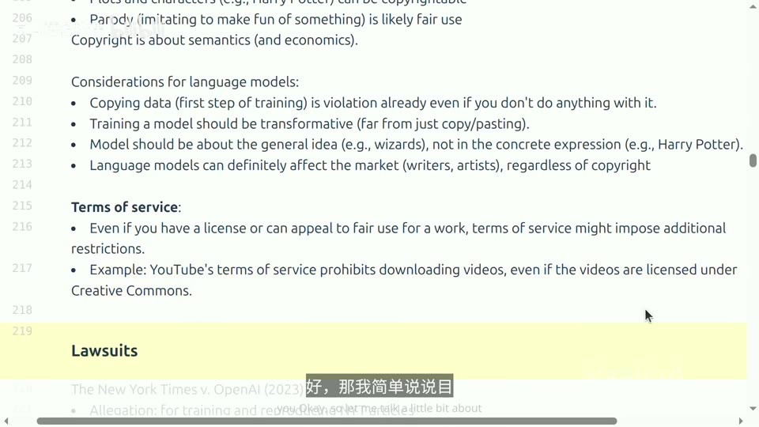
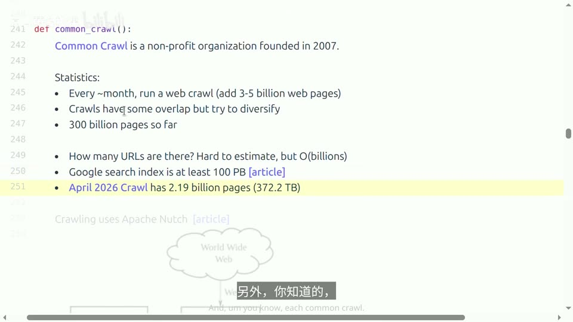
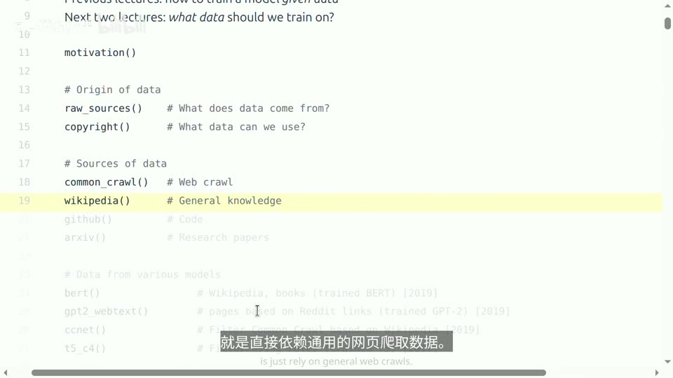
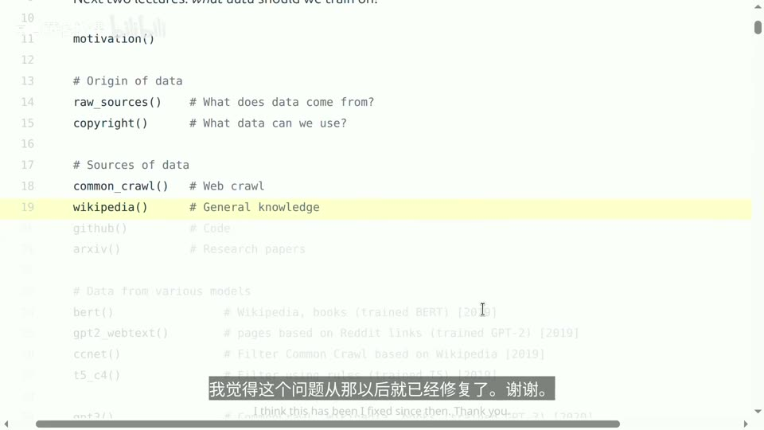
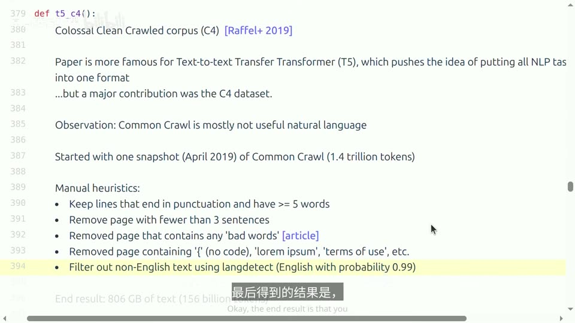
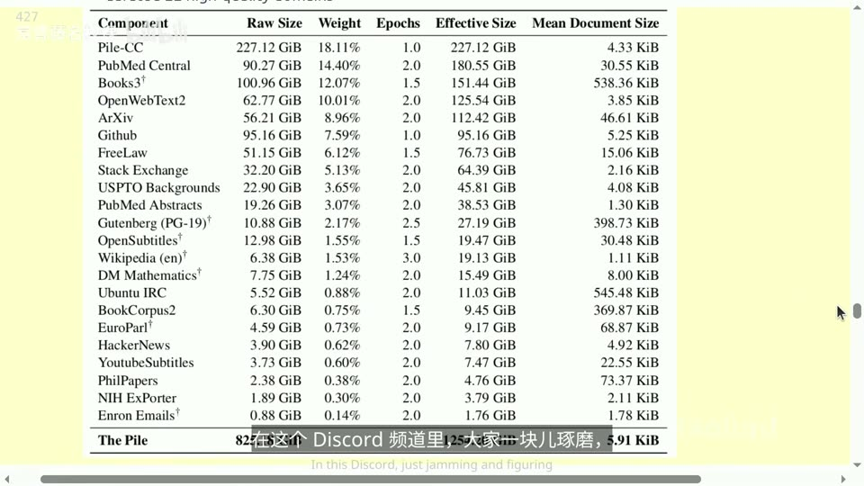
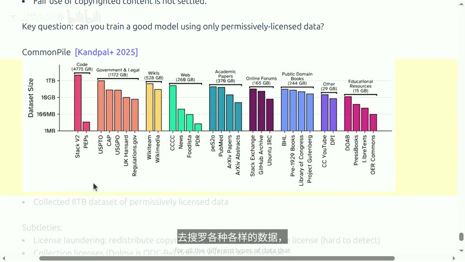

# Lecture 13: Data (Sources, Datasets)

## 本讲要解决的核心问题（SCQA）

**背景（Situation）**：前面的课程里，我们已经知道怎么训练一个模型，也讲了评估，所以心里大致有数：什么样的模型算是好模型。接下来这周剩下的两节课，重点换一个方向——**该用哪些数据来训练**。讲者开门见山地说：在语言模型里，**数据是最关键、也最需要搞对的部分**。([【跳转到 00:00】](https://www.bilibili.com/video/BV11LEA6eEuj/?p=13&t=0)、[【跳转到 00:05】](https://www.bilibili.com/video/BV11LEA6eEuj/?p=13&t=5))

**冲突（Complication）**：可偏偏是数据，最不透明。以 Llama 3 论文为例，它作为开放权重模型，对架构、训练流程都相当透明，**唯独数据只字未提**，只说"我们用了各种各样的数据来源"。保密有两个很实在的理由：一是**数据构成竞争壁垒**，你不想让对手摸清底细；二是**版权责任**，你一旦公开宣称用了某类特定数据，就容易招来诉讼。与此同时，"用整个互联网训练"这句话本身也不成立——互联网是一堆正在运行的服务器，技术、身份、法律层层设限，而且几乎一切内容都受版权保护。([【跳转到 00:27】](https://www.bilibili.com/video/BV11LEA6eEuj/?p=13&t=27)、[【跳转到 00:52】](https://www.bilibili.com/video/BV11LEA6eEuj/?p=13&t=52))

**疑问（Question）**：既然数据决定了模型的上限，那我们到底该用什么数据来训练？这些数据**从哪里来、在法律和技术上能不能拿到、又该怎么从海量原始文本里挑出真正有用的部分**？

**回答（中心思想，结论先行）**：数据不会从天上掉下来，也不能只靠"去 HuggingFace 下个数据集"就完事。本讲按一条完整的链路展开：

1. 先讲**来源与约束**——互联网的真实形态，以及技术、身份、法律三层限制；
2. 再讲**版权与合理使用**——许可、合理使用四要素，以及最新的诉讼与裁决；
3. 然后看**几个高价值原始站点**（Common Crawl、维基百科、GitHub、arXiv）；
4. 接着按时间线梳理**历代预训练数据集**（BERT、GPT-2、CCNet、C4、GPT-3、The Pile、LLaMA、RefinedWeb、Dolma、DCLM、Nemotron-CC、The Stack）；
5. 最后介绍**只用宽松许可数据**的 Common Pile 项目。

贯穿全讲的结论是：**过滤是数据管道中最重要的环节之一**，如何把 240 万亿 token 缩减到几万亿是巨大而值得关注的取舍；很多语言模型用的是相似的 Transformer 架构，**真正区分它们的关键要素是数据**；而数据处理至今仍很大程度上靠经验和直觉，有大量改进空间。([【跳转到 62:10】](https://www.bilibili.com/video/BV11LEA6eEuj/?p=13&t=3730)、[【跳转到 63:00】](https://www.bilibili.com/video/BV11LEA6eEuj/?p=13&t=3780)、[【跳转到 63:23】](https://www.bilibili.com/video/BV11LEA6eEuj/?p=13&t=3803))

---

## 一、数据是语言模型最关键的竞争壁垒，所以厂商对它守口如瓶

### 1.1 为什么数据比架构更保密

如果你去翻各大公司披露的信息，会发现一个很有意思的不对称：**架构、训练流程都可以讲得很细，数据却几乎从不披露**。Llama 3 论文就是典型——架构完全透明，训练流程也告诉你了，但数据只有一句"用了各种各样的数据来源"。

保密的理由前面已经点明，这里展开一下：**数据是独门竞争优势**。在 foundation model（基础模型）这个赛道上，架构上大家越来越趋同，最后拉开差距的恰恰是你喂了什么数据、怎么处理数据，所以没人愿意把底牌摊开。其次是**版权责任**：公开宣称"我用了某某数据集训练"，等于主动给版权方递上证据，这在后面讲诉讼时会看得很清楚。([【跳转到 00:27】](https://www.bilibili.com/video/BV11LEA6eEuj/?p=13&t=27))

### 1.2 数据工作始终是瓶颈：一个能靠人力放大的长尾问题

在 foundation model 出现之前，数据工作的主要内容是**为监督学习标注数据**——这是一件人工密集、又难以规模化的事情。进入预训练时代后，至少在 pre-training 阶段，手工标注的需求大大减少了，但**数据的筛选与清洗依然繁重**。所以从根本上说，这一点没怎么变：**数据一直是瓶颈，将来也还是瓶颈**。([【跳转到 00:52】](https://www.bilibili.com/video/BV11LEA6eEuj/?p=13&t=52))

它和架构、系统工作有个关键区别：从某种意义上说，**数据是一个随着人力投入而放大的长尾问题**。能参与架构和系统工作的人终究有限，但数据可以轻松并行化、让很多人同时分担——尤其是训练那种想包揽所有任务的 foundation model 时。这正是为什么**数据团队和模型开发团队通常都相当庞大**。([【跳转到 01:17】](https://www.bilibili.com/video/BV11LEA6eEuj/?p=13&t=77))

### 1.3 训练管道的三个阶段与 base / instruct 术语

数据会在训练管道的不同阶段被引入，本讲主要关注 pre-training。三个阶段大致如下（现实中界限可能有些模糊，阶段数量也可能超过三个，但这只是一个基本框架）：([【跳转到 01:42】](https://www.bilibili.com/video/BV11LEA6eEuj/?p=13&t=102)、[【跳转到 02:07】](https://www.bilibili.com/video/BV11LEA6eEuj/?p=13&t=127))

1. **pre-training（预训练）**：使用**原始数据**，比如来自网络的文档。常见来源包括网页、学术论文、数学页面与证明等。
2. **mid-training（中期训练）**：使用**更高质量的数据**来增强特定能力，比如支持长上下文；这一阶段还会加入大量**合成数据**。
3. **post-training（后训练）**：使用聊天 transcript（对话记录）这类数据进行训练；如果做 reinforcement learning（强化学习），还会用到一些特定的环境。这一阶段的任务针对性更强，数据和任务也更丰富，比如更多数学推理、编程内容，同时做安全方面的处理。

目前的总体趋势是：**训练数据从大量低质量数据，逐渐转向较小规模的高质量数据**。

术语上也有必要理清：文献里说的 **base model** 通常指 **pre-training 和 mid-training 之后**的模型；而 **instruct model / chat model** 则是在 **post-training 之后**的模型。但界限已经变得相当模糊，**现在什么才算 base model 其实已经不太清楚了**——最近最大的那些模型甚至根本不发布中间的 base checkpoint，比如 Qwen 3.5-397B-A17B 就是一个 instruct model，你看不到中间的版本。对于开源模型，比如 AI2 的 OLMo，则能看到 pre-training 中发生的一切，这对研究很有价值。([【跳转到 02:32】](https://www.bilibili.com/video/BV11LEA6eEuj/?p=13&t=152)、[【跳转到 02:57】](https://www.bilibili.com/video/BV11LEA6eEuj/?p=13&t=177))

---

## 二、"用整个互联网训练"是误读：能爬到的互联网远小于想象

### 2.1 网络是一堆正在运行的服务器，不是一份静态数据集

走廊里常听到一种说法——"语言模型是用整个互联网的数据训练出来的"。讲者说，这话首先就站不住脚：如果真是那样，模型就得是个 online agent，能在网上到处跑、执行各种操作才行。但 pre-training 的实际运作方式并非如此，**更准确的说法是：它在全球公开网络上训练**——而且这话也不完全准确，原因马上就会讲到。([【跳转到 04:05】](https://www.bilibili.com/video/BV11LEA6eEuj/?p=13&t=245))

要理解这一点，得先明白**网络是什么**：它其实就是世界上一堆正在运行、你能连上去的服务器。随便找个网站，你都能去下载它的页面——说白了就是发个请求、拿回响应。但**除非你在训练一个 RL agent**，否则你没法直接拿这些在线服务器来训练模型：训练需要一份固定的、可反复读取的数据集，而在线服务是实时变化的。([【跳转到 04:30】](https://www.bilibili.com/video/BV11LEA6eEuj/?p=13&t=270))

### 2.2 爬虫如何工作：种子集与图遍历

要拿到数据，通常得靠**爬虫（crawler）**——可能是你自己写的，也可能是别人搭好的。它的工作流程并不神秘：从**种子集（seed set）**出发，一边发现网页、一边把找到的页面下载下来。([【跳转到 04:30】](https://www.bilibili.com/video/BV11LEA6eEuj/?p=13&t=270))

但**你不可能指望跑一次爬虫就把互联网上所有网页都下载下来**，原因有好几个。

### 2.3 技术、身份、法律三层限制

**(1) 技术限制：动态内容与深网。** 网上很多内容其实是**动态生成**的。尤其是现在，很多网站本身就是 app，URL 甚至没法完整描述内容——它只是一个供你交互的界面，你得经常点按钮或填表单才能看到里面的内容。比如你在用 Discord 的时候，没法直接拿 `curl` 去抓它的数据、把上面的东西全弄下来。还有一种情况是**深网（deep web）**：很多内容藏在传统的网页爬取和点超链接够不到的地方。([【跳转到 04:55】](https://www.bilibili.com/video/BV11LEA6eEuj/?p=13&t=295)、[【跳转到 05:20】](https://www.bilibili.com/video/BV11LEA6eEuj/?p=13&t=320))

**(2) 身份验证与围墙花园。** 有些页面得**登录账号**才能看，一般来说还得**付费**。比如 Facebook、LinkedIn、纽约时报（NYTimes），有大量内容被锁在"围墙花园"里。从技术上说这些内容确实在互联网上，但你不能随便搭个爬虫就去抓——如果你是 Facebook 或 X 本身，你手里就有数据，不需要爬；可换做别人，就没法真正用到这些内容。([【跳转到 05:45】](https://www.bilibili.com/video/BV11LEA6eEuj/?p=13&t=345))

**(3) robots.txt 与反爬。** 即使假设不存在身份验证问题，还有潜在限制。比如网站根目录下常有一个 `robots.txt` 文件，它基本会告诉你哪些内容允许抓取、哪些不行。以 nytimes.com 为例，很多内容是被禁止抓取的，比如 `oai-searchbot`、`PerplexityBot`、`GPTBot`、`ChatGPT-User`、`ClaudeBot` 等等。要注意，这**不是法律层面的限制**，更像是一种"你应该自觉守规矩"的约定：去看一眼 `robots.txt`，如果你的名字在那份名单上，就不该去抓——它甚至算不上契约，但这就是你该做的事。([【跳转到 06:35】](https://www.bilibili.com/video/BV11LEA6eEuj/?p=13&t=395)、[【跳转到 06:42】](https://www.bilibili.com/video/BV11LEA6eEuj/?p=13&t=402)、[【跳转到 06:59】](https://www.bilibili.com/video/BV11LEA6eEuj/?p=13&t=419))

此外还有各种**反爬技术**：很多网站用 Cloudflare 之类的工具检测并拦截机器人流量，所以有时你访问网站会弹出一个验证码——那是因为算法检测到你可能是机器人，要先确认你是真人；如果你真是机器人，通常就过不去了。网站还可能**封掉某些 IP 或国家**，或者**限制请求频率**。([【跳转到 06:59】](https://www.bilibili.com/video/BV11LEA6eEuj/?p=13&t=419)、[【跳转到 07:24】](https://www.bilibili.com/video/BV11LEA6eEuj/?p=13&t=444))

**(4) 法律限制：服务条款与许可证。** 网站的服务条款（Terms of Service, ToS）规定，你访问网站就得遵守这份合约才能使用；条款里通常会说"如果是机器人就请离开""你不能拿网站的内容去做 AI 训练"之类。就算服务条款没提这一点，网站内容也可能有**自己的许可证**，或者你根本没拿到训练授权——总之，**你能拿什么数据来训练，是由法律红线管着的**。([【跳转到 07:49】](https://www.bilibili.com/video/BV11LEA6eEuj/?p=13&t=469))

讲者提到 Shayne Longpre 写过一篇很好的论文《Consent in Crisis》（危机中的同意），他们研究了常见数据集（如 C4、RefinedWeb、Dolma）里各种 URL 的限制，既有 `robots.txt` 这种技术层面的，也有服务条款这种法律层面的，结论是：**限制越来越多了**。([【跳转到 08:14】](https://www.bilibili.com/video/BV11LEA6eEuj/?p=13&t=494)、[【跳转到 08:39】](https://www.bilibili.com/video/BV11LEA6eEuj/?p=13&t=519))

### 2.4 爬取本身的问题与影子图书馆

讲者强调，**在谈版权之前，爬取本身就已经有问题**：你要么违反了服务条款，要么无视了 `robots.txt`，或者简单来说就是**让系统过载**——这会消耗大量服务器资源，既增加托管方成本，也拖累其他用户的使用体验。他举了一个真实例子：有人抱怨 Anthropic 爬取他的数据，24 小时内访问了服务器 100 万次；Read the Docs 也被狂刷。这类行为会让 AI 爬虫被封锁，而这还不算版权问题。([【跳转到 09:42】](https://www.bilibili.com/video/BV11LEA6eEuj/?p=13&t=582)、[【跳转到 10:07】](https://www.bilibili.com/video/BV11LEA6eEuj/?p=13&t=607))

最后还有所谓的**影子图书馆（shadow library）**，它们也是互联网的一部分。比如 Library Genesis、Anna's Archive，它们完全无视版权、绕过付费墙，收集了海量受版权保护的数据——通常是书籍和文章，这些内容本来需要付费、却被免费公开。这类站点面临过很多下架令和诉讼，也一度被封禁，但通常都能被规避，因为它们往往把服务器设在其他国家。做这件事的人辩称，他们只是让本应免费的内容回归免费；但从法律角度看，这通常被视为**盗版和侵犯版权**，相关研究已经有很多。([【跳转到 10:32】](https://www.bilibili.com/video/BV11LEA6eEuj/?p=13&t=632))

总结一下这一部分：**到目前为止，互联网是个巨大、杂乱、而且说实话挺吓人的地方，你其实没法把里面的内容全都拿到手**。有技术上的限制，也有法律限制，共同决定了你能访问哪些数据。所以下次有人跟你说"我是用互联网数据训练的"，你就可以把学到的这些东西讲给他们听。([【跳转到 10:57】](https://www.bilibili.com/video/BV11LEA6eEuj/?p=13&t=657)、[【跳转到 11:22】](https://www.bilibili.com/video/BV11LEA6eEuj/?p=13&t=682))

---

## 三、版权：从"表达而非思想"到合理使用的四个因素

### 3.1 从知识产权到版权：保护表达，而非思想

现在进入第二部分：**咱们能用哪些数据**。这就要涉及版权了。假设你乖乖遵守了服务条款、也是个守法公民、严格遵守了速率限制，那还有一个问题：**你究竟能不能拿这些数据来训练模型**？这个问题到现在还没彻底解决，不过过去一年里有了不少新进展。([【跳转到 11:22】](https://www.bilibili.com/video/BV11LEA6eEuj/?p=13&t=682))

要理解它，得先理解知识产权法的**核心目的：鼓励大家去创造智力成果**。讲者提醒，别光从技术层面对什么都说不，法律背后的精神是激励创新。知识产权的形式很多——版权、专利、商标、商业秘密——而对语言模型的数据来说，最相关的就是**版权法**。([【跳转到 11:47】](https://www.bilibili.com/video/BV11LEA6eEuj/?p=13&t=707))

版权法的历史很长，最早能追溯到 1709 年前后的英国；美国较近的 1976 年版权法定义了现代版权的很多方面。核心表述是：**版权保护适用于固定在任何有形表达媒介中的原创性作品**。这里有几个关键性质：([【跳转到 12:12】](https://www.bilibili.com/video/BV11LEA6eEuj/?p=13&t=732)、[【跳转到 12:37】](https://www.bilibili.com/video/BV11LEA6eEuj/?p=13&t=757))

- **不是所有东西都能受版权保护**：特别是汇编作品。打个比方，电话簿本身就不受保护，除非你在编排方式上花了心思、体现了创意。
- **版权保护表达，而不是思想本身**：你没法给一个想法申请版权，就像你没法给快速排序算法申请版权一样；但你可以给快速排序算法的**实现代码**加版权保护。
- **门槛很低、自动生效**：过去这些年，申请版权的门槛降了很多，以前你得把东西发表出来才算有版权，现在只要把内容固定下来就行，根本不用注册。这和专利很不一样——专利得花一大笔钱去申请。你把东西放到自己网站上，它就自动受版权保护了。要起诉的话才需要先登记版权，不过登记只要 65 美元，比请律师便宜多了。([【跳转到 13:02】](https://www.bilibili.com/video/BV11LEA6eEuj/?p=13&t=782)、[【跳转到 13:27】](https://www.bilibili.com/video/BV11LEA6eEuj/?p=13&t=807)、[【跳转到 13:52】](https://www.bilibili.com/video/BV11LEA6eEuj/?p=13&t=832))
- **保护期约 75 年**：过了这 75 年版权就失效，作品进入**公共领域（public domain）**，大家都能随便用。莎士比亚、贝多芬、古腾堡计划的大部分作品都属于此。制度初衷是鼓励创新——保护创作者的成果不被白白拿走，但也没必要永远保护下去，所以保护也就一阵子。([【跳转到 14:17】](https://www.bilibili.com/video/BV11LEA6eEuj/?p=13&t=857))

一句话总结：**基本上网上所有内容都受版权保护**。那是不是意味着拿任何数据训练都算侵权？倒也不全是——虽然都有版权，但你依然可以使用这些受保护内容，**主要有两种途径**：获取授权许可，或者援引合理使用。([【跳转到 14:42】](https://www.bilibili.com/video/BV11LEA6eEuj/?p=13&t=882))

### 3.2 两条合法路径：许可与合理使用

**第一条路：许可（license）。** 许可属于合同法范畴，是许可方授予被许可方的授权，意思就是"别告我，你可以按许可规定的范围使用这个作品"——**一个许可本质上就是一个"不告你"的承诺**。比如有个很棒的许可叫**知识共享（Creative Commons）**，它让受版权保护的作品得以免费传播，效果上就像进入了公共领域。维基百科、开放课程资源（OpenCourseWare）、可汗学院都是这类例子；它成立于 2001 年，目的是在公有领域与现有版权之间架起桥梁——不然你得等上 75 年，但如果创作者说"其实我想让大家用我的作品"，他们就有了一个合法的方式来声明。([【跳转到 15:07】](https://www.bilibili.com/video/BV11LEA6eEuj/?p=13&t=907)、[【跳转到 15:32】](https://www.bilibili.com/video/BV11LEA6eEuj/?p=13&t=932))

除了知识共享，还有一种实际做法：**模型开发者和内容平台之间签协议**，让开发者能拿到数据去训练模型。比如 Google 与 Reddit、OpenAI 与 Shutterstock、OpenAI 与 Stack Exchange 都签过这类协议。如果你有预算，还可以花钱买许可。([【跳转到 15:57】](https://www.bilibili.com/video/BV11LEA6eEuj/?p=13&t=957))

**第二条路：合理使用（fair use）。** 如果你不想花钱，可以主张合理使用，不过这事比较复杂。它是**版权法第 107 条**，简单来说就是：就算我没拿到授权，我照样能用。是否适用合理使用，主要看**四个因素**——注意这些都不是硬性规定，它们只是一些倾向，真要闹上法庭就得在法庭上权衡：([【跳转到 16:22】](https://www.bilibili.com/video/BV11LEA6eEuj/?p=13&t=982)、[【跳转到 16:47】](https://www.bilibili.com/video/BV11LEA6eEuj/?p=13&t=1007))

1. **使用的目的或性质**：如果你是为了教育，比起拿去卖钱赚利润，更有可能被认定为合理使用；如果你做了**转换性使用（transformative use）**，就比单纯原样托管一模一样的副本更有利。
2. **受版权保护作品本身的性质**：跟虚构作品比起来，**事实性更强**的内容更容易被认定为合理使用。比如写一篇二战总结、写一页关于二战事实的内容，它受到的保护就不如一首真正有创意的诗。
3. **使用了原作的多少内容**：只用一小段，比把整部作品都用上更受认可——只拿一小部分总比全拿走要好。
4. **对原作市场的影响**：这跟最初的动机有关——版权的目的是协调经济激励。如果你用了某位作者的作品、提供了一个替代品，导致原作者没法再靠作品赚钱，这就会被视为有问题；但如果你对它做了改造、加了新东西，比如开拓了新市场，情况就会好得多。([【跳转到 17:12】](https://www.bilibili.com/video/BV11LEA6eEuj/?p=13&t=1032)、[【跳转到 17:37】](https://www.bilibili.com/video/BV11LEA6eEuj/?p=13&t=1057)、[【跳转到 18:02】](https://www.bilibili.com/video/BV11LEA6eEuj/?p=13&t=1082))

几个合理使用的经典例子：看一部电影、然后写一篇摘要；重新实现一个想法（比如算法），但别直接抄代码；还有那场著名的官司——作者协会（Authors Guild）告 Google，也就是 Google Books，你能看到各种有版权书籍的片段。当时争议焦点就在于这算不算合理使用，最终在过了 11 年之后，**Google 胜诉**，这也为"语言模型训练是否构成合理使用"确立了一些先例。([【跳转到 18:27】](https://www.bilibili.com/video/BV11LEA6eEuj/?p=13&t=1107)、[【跳转到 18:52】](https://www.bilibili.com/video/BV11LEA6eEuj/?p=13&t=1132))

### 3.3 版权不止于逐字记忆

有一点需要注意：**版权保护并不只针对逐字记忆**。这对机器学习领域的听众来说可能有点新鲜，因为很多论文都聚焦于逐字记忆，但那只是侵犯版权的一种方式、并非唯一方式。比如**故事情节和角色设定也可以受版权保护**——也就是说，侵权点可能不在于某本特定的书或其中的具体内容，而在于复制了"哈利波特"这个角色。([【跳转到 19:17】](https://www.bilibili.com/video/BV11LEA6eEuj/?p=13&t=1157))

不过也有例外：比如你是在搞**戏仿（parody）**，虽然看上去像是衍生作品，但只要你是在调侃它，反而更可能被算作合理使用。所以很多讨论其实都集中在**语义**上，而不是看 n-gram 重叠，还涉及经济方面的问题。([【跳转到 19:17】](https://www.bilibili.com/video/BV11LEA6eEuj/?p=13&t=1157)、[【跳转到 19:42】](https://www.bilibili.com/video/BV11LEA6eEuj/?p=13&t=1182))

那么这对语言模型意味着什么？讲者给了几点判断：

- **复制数据这个动作本身**，就算你没拿来训练，也可能已经构成侵权——`copyright` 这个词里就含着 `copy`。
- **训练模型则带有"转换性"的味道**：它看起来和单纯把别人的成果搬过来不一样，它是在做一些真正具有变革性的事情；某种程度上，训练只是手段而非目的，你的目标是**提取通用概念、去理解世界是怎么运作的**，而不是只盯着那些具体的表达形式。
- 但**不管版权怎么算，语言模型确实会对市场产生影响**——这正是合理使用第四点：如果对市场造成了负面影响，就更可能被判定为不属于合理使用。([【跳转到 20:07】](https://www.bilibili.com/video/BV11LEA6eEuj/?p=13&t=1207)、[【跳转到 20:32】](https://www.bilibili.com/video/BV11LEA6eEuj/?p=13&t=1232)、[【跳转到 20:57】](https://www.bilibili.com/video/BV11LEA6eEuj/?p=13&t=1257))

### 3.4 服务条款是额外一层限制

讲者特别提醒：合理使用有点不好把握，而且**即使你要么符合合理使用、要么获得了授权，服务条款仍然可能阻止你直接获取某部作品**。比如 YouTube 上的视频，虽然都是获得授权的，但服务条款里禁止你用机器人程序、像爬虫那样直接下载视频。所以这里的限制是分好几层的：版权是一层，服务条款又是一层。([【跳转到 21:22】](https://www.bilibili.com/video/BV11LEA6eEuj/?p=13&t=1282))

### 3.5 现实中的诉讼与裁决

讲者简单梳理了目前法律层面的现状（他强调自己不是律师）：([【跳转到 21:47】](https://www.bilibili.com/video/BV11LEA6eEuj/?p=13&t=1307))

- **纽约时报诉 OpenAI（2023）**：指控对方拿他们的新闻文章做训练，并称能提示 ChatGPT 几乎逐字地生成出一篇新闻报道。
- **作者诉 Anthropic**：指控其盗版了数百万本书、还拿这些书去训练 Claude。去年有一项**里程碑式的裁决**：这种特定的训练**属于合理使用**；但 Anthropic 仍有麻烦，因为**盗版这些书本身就是绝对不行的**——这跟训练没关系，仅仅是盗版这件事，就是违法的。有意思的是，Anthropic 其实也把一部分书买下来扫描了，法院认为"买书、拆掉装订、扫描、为了自己用而数字化"**算合理使用**，但这并不能免除他们纯粹盗版的那桩罪过——你不能先盗版、回头再去买，然后说"算了，别管我之前干了什么"。最终 Anthropic 花了 **15 亿美元和解**，算下来大概每本书三四美元。([【跳转到 21:47】](https://www.bilibili.com/video/BV11LEA6eEuj/?p=13&t=1307)、[【跳转到 22:12】](https://www.bilibili.com/video/BV11LEA6eEuj/?p=13&t=1332)、[【跳转到 22:37】](https://www.bilibili.com/video/BV11LEA6eEuj/?p=13&t=1357))
- **作者诉 Meta**：指控其在训练模型时用了受版权保护的书——正如后面会看到的，这其实在 Llama 论文里就曝光了。紧跟着 Anthropic 之后，判决结果同样是**训练算合理使用**；另外 Meta 还被指用种子盗版下载了一些书，那个案子还在审。照这个先例来看，Meta 这边估计也讨不到好。([【跳转到 23:02】](https://www.bilibili.com/video/BV11LEA6eEuj/?p=13&t=1382))

目前的小结是：**训练可以这么说，已经被认定为合理使用，或者至少没有被认定为不属于合理使用**。但要注意，目前的判决意思并不是"对任何版权内容的训练都算合理使用"，只是"这种情况没问题"。盗版书籍明显是违法的——这一点咱们之前就已经知道了。这个领域目前依然非常活跃、还在不断演变。([【跳转到 23:27】](https://www.bilibili.com/video/BV11LEA6eEuj/?p=13&t=1407))

课堂问答里还讨论了一个细节：**如果许可证一开始是知识共享、后来更新以限制某些用途，那该怎么办？**讲者的回答很谨慎（他说自己不是律师）：对于第一个许可证，你大概还是被允许用它来训练的；但许可证通常不只针对一个固定的文档集——因为新内容一直在产生，**许可证一旦变更，你就没法再拿后来的内容去训练了**。([【跳转到 24:01】](https://www.bilibili.com/video/BV11LEA6eEuj/?p=13&t=1441)、[【跳转到 24:26】](https://www.bilibili.com/video/BV11LEA6eEuj/?p=13&t=1466))

---

## 四、原始数据来源：Common Crawl 与三个高价值站点

前面聊完了数据的起源与法律边界，接下来讲**具体的数据来源**。大多数模型开发者其实都会**自己搭爬虫**，因为他们想完全掌控数据长什么样。幸运的是，如果不想自己搭，有个现成的东西已经存在挺长时间了——**Common Crawl**。([【跳转到 24:51】](https://www.bilibili.com/video/BV11LEA6eEuj/?p=13&t=1491))

### 4.1 Common Crawl：公共爬取的底座

Common Crawl 是一个非营利组织，从 **2007 年**就有了。它大约**每个月爬一次网**，每次能抓到 30 亿到 50 亿个网页，每次爬取和之前会有些重叠，但会尽量让内容多样化、多抓新页面。到现在为止已经有约 **3000 亿个页面**。网上的 URL 到底有多少很难估算，但 Google 的搜索索引规模**至少有 100 PB**。作为具体参考：一次 Common Crawl 转储大约包含 **20 亿个网页、372 TB 左右**（这里不包括图片，主要关注文本内容）。([【跳转到 25:08】](https://www.bilibili.com/video/BV11LEA6eEuj/?p=13&t=1508)、[【跳转到 25:33】](https://www.bilibili.com/video/BV11LEA6eEuj/?p=13&t=1533)、[【跳转到 25:58】](https://www.bilibili.com/video/BV11LEA6eEuj/?p=13&t=1558))

爬取在概念上很简单，但复杂细节全在实现里：你从一堆 URL 开始，然后不断迭代——**这本质上就是图遍历**。你从队列里取出一个 URL、下载它、看看页面上有哪些超链接，然后把它们加到队列里。通常这都在多台机器上并行处理。这里面涉及很多决策，也就是所谓的"策略"：

- **选择策略（selection policy）**：该下载哪些页面？
- **礼貌策略（politeness policy）**：遵守 robots 规则、别把服务器压垮。
- **重访策略（re-visit policy）**：页面老变就得下载，但别死磕那些根本没变的页面。

此外还要处理一个大麻烦：**URL 是动态的**，同一个 URL 有时会根据浏览器状态显示不同内容；反过来，很多 URL 可能都指向同一个内容，尤其是镜像站点。所以**重复内容**很容易冒出来。([【跳转到 26:23】](https://www.bilibili.com/video/BV11LEA6eEuj/?p=13&t=1583)、[【跳转到 26:48】](https://www.bilibili.com/video/BV11LEA6eEuj/?p=13&t=1608))

Common Crawl 发布转储数据时有两种格式：**WARC** 文件，也就是原始的 HTTP 响应（你发一个请求、给一个 URL，它就返回一个 HTTP 响应）；以及 **WET** 文件，即把内容转换后的文本。要特别注意，**HTML 转文本是一个有损过程**。把 HTML 转成文本有很多工具可以用，比如 `trafilatura` 和 `resiliparse`；转换方式其实很重要——DataComp-LM 的消融实验对比后发现，这些工具比 Common Crawl 发布的其他文件更好用。([【跳转到 26:48】](https://www.bilibili.com/video/BV11LEA6eEuj/?p=13&t=1608)、[【跳转到 27:13】](https://www.bilibili.com/video/BV11LEA6eEuj/?p=13&t=1633)、[【跳转到 27:38】](https://www.bilibili.com/video/BV11LEA6eEuj/?p=13&t=1658))

### 4.2 网络并不均匀：三个高价值站点

讲者强调，**网络往往并不均匀**——它不像"有一堆网站、你随机抓取其中一小部分"就能构成好的数据集。网上有一些特定的区域，蕴含着真正有趣的高质量内容。他重点讲了三个：**维基百科、GitHub 和互联网档案馆**（其中互联网档案馆这里主要展开维基百科与 GitHub、arXiv）。([【跳转到 27:38】](https://www.bilibili.com/video/BV11LEA6eEuj/?p=13&t=1658)、[【跳转到 28:03】](https://www.bilibili.com/video/BV11LEA6eEuj/?p=13&t=1683))

**维基百科**大家应该都很熟悉，它从 2001 年上线至今，如今已有约 **6700 万篇、涵盖多种语言**的文章。它的特点在于**绝不是什么内容都有**：它不允许包含原创的思想，因为里面所有内容都必须**有据可查、注明出处**——某种意义上可以说，维基百科里其实没有什么"新东西"，因为那些都是别处已有的信息。此外，文章还得满足**显著性（notability）**要求，也不是谁都能上。所以网上虽然谁都能写，但能留下来的是经过筛选的。([【跳转到 28:03】](https://www.bilibili.com/video/BV11LEA6eEuj/?p=13&t=1683)、[【跳转到 28:28】](https://www.bilibili.com/video/BV11LEA6eEuj/?p=13&t=1708)、[【跳转到 28:53】](https://www.bilibili.com/video/BV11LEA6eEuj/?p=13&t=1733))

维基百科还有一个很实用的特点：它**每隔几周就会做一次定期的数据导出**，把整个维基百科打包成一个文件供你直接下载。这点很关键，因为**咱们没必要自己去爬取维基百科**——实际上官方不鼓励这么做，如果你要抓取，他们其实只希望你下载这个文件。([【跳转到 29:18】](https://www.bilibili.com/video/BV11LEA6eEuj/?p=13&t=1758))

不过这里有个有意思的冷知识：有研究（Carlini 等）发现**你其实可以对维基百科进行投毒**。你大概会觉得，捣乱行为会被撤销吧？攻击者搞鬼的操作确实会被回滚，但这些**定期数据导出是按固定频率进行的**，所以你可以趁数据导出生成前赶紧改一下内容；等导出文件生成后，虽然你的编辑会被撤销，但导出文件里**已经留下了恶意内容**。已经有研究证明，可以对任意触发短语（比如 "iPhone"）注入负面情感。所以结论是：**考虑到攻击者的存在，哪怕是所谓的高质量内容，里面也可能藏着有害的东西**。讲者认为这个问题后来已经被修复了。([【跳转到 29:43】](https://www.bilibili.com/video/BV11LEA6eEuj/?p=13&t=1783)、[【跳转到 30:08】](https://www.bilibili.com/video/BV11LEA6eEuj/?p=13&t=1808)、[【跳转到 30:33】](https://www.bilibili.com/video/BV11LEA6eEuj/?p=13&t=1833))

**GitHub** 是存放代码的好地方。代码很重要，**不仅是为了让语言模型学会写代码，更是为了赋予它通用的推理能力**。GitHub 本质上是一个托管代码仓库的在线服务，从 **2008 年**开始运营，跟 Common Crawl 差不多同龄，如今拥有 **4.2 亿个仓库**（其中约 **2800 万个是公开的**）。每个仓库并不只是一个文件，这个目录里还包含提交历史（commit history）、Issue、PR（Pull Request）以及评论。代码里通常有大量重复内容，主要因为有人直接复制代码、或者 fork 了代码。GitHub 认为，**只要是采用宽松许可证（permissive license，比如 MIT、Apache）的公共仓库，你就可以拿来训练模型**。([【跳转到 30:58】](https://www.bilibili.com/video/BV11LEA6eEuj/?p=13&t=1858)、[【跳转到 31:23】](https://www.bilibili.com/video/BV11LEA6eEuj/?p=13&t=1883))

说到 GitHub 数据，其实分两种：一种是**仓库数据**，你直接通过 GitHub 的 git 协议下载就行——**别去爬 GitHub 网站，直接下载仓库**；另一种是**与各仓库相关的元数据**，比如 Issue、PR，这些数据通过 **GH Archive** 获取，它会按小时给出事件流的快照——基本上你在 GitHub 上的每一条评论、每一次点赞、star 或操作都会被记录。另外有个 **Software Heritage 基金会**，主要关注代码仓库本身而不是元数据，把 GitHub、GitLab、Bitbucket 等平台上的内容聚合起来。([【跳转到 31:23】](https://www.bilibili.com/video/BV11LEA6eEuj/?p=13&t=1883)、[【跳转到 31:48】](https://www.bilibili.com/video/BV11LEA6eEuj/?p=13&t=1908)、[【跳转到 32:13】](https://www.bilibili.com/video/BV11LEA6eEuj/?p=13&t=1933))

**arXiv** 大家应该也熟，它从 **1991 年**开始就让人分享论文，最开始是做物理的，现在涵盖了很多其他领域，共有约 **300 万份提交记录**。每一份都带着元数据，有 PDF 还有可选的 LaTeX 源文件。这时你可能会想：**在 arXiv 上训练到底指什么**？这其实不太清楚，因为得先把 PDF 转成文本、或者用 LaTeX 源文件——那其实是一堆文件。它虽然没经过同行评审，但也有一套审核流程。而且**作者可以选择保留版权、或者用知识共享协议**，这样所有内容的授权情况都清清楚楚，所有的元数据都是宽松许可的。所以你可以直接用，不用去爬 arXiv，直接去某个网站批量下载就行。([【跳转到 32:38】](https://www.bilibili.com/video/BV11LEA6eEuj/?p=13&t=1958)、[【跳转到 33:03】](https://www.bilibili.com/video/BV11LEA6eEuj/?p=13&t=1983)、[【跳转到 33:28】](https://www.bilibili.com/video/BV11LEA6eEuj/?p=13&t=2008))

课堂问答里有个很尖锐的问题：**如果有些网站有很多盗版书，你怎么确保它们不会出现在你的爬取范围里？**讲者坦言：**你做不到**。如果你只是做常规网页爬取，不可能覆盖所有网站，也就没法保证所有内容都合规。Common Crawl 很可能包含受版权保护的书籍和内容，而这些是你本不该使用的。你可以主张这属于合理使用，但要记住所有内容都是有版权的——**书籍和你的网站其实没多大区别**，只不过书的作者拥有的权利可能更多一些，因为他们真要去打官司。如果你真想稳妥，就得采取别的办法（这引出了后面的 Common Pile）。([【跳转到 33:56】](https://www.bilibili.com/video/BV11LEA6eEuj/?p=13&t=2036)、[【跳转到 34:21】](https://www.bilibili.com/video/BV11LEA6eEuj/?p=13&t=2061))

---

## 五、预训练数据集的演进：从"规则过滤"走向"模型过滤"

从这一节开始，讲者从 **2019 年**一路讲起，逐个回构建模型时实际用到的各种数据集。前面讲了数据的起源和来源，现在看"大家都拿了哪些数据、怎么处理"。([【跳转到 34:46】](https://www.bilibili.com/video/BV11LEA6eEuj/?p=13&t=2086))

### 5.1 BERT 与 GPT-2：文档级序列与 Reddit 链接筛选

**BERT** 是 2017 年出来的，那时候训练模型的数据源主要就是**维基百科和书籍**。那"书"到底是个啥？有个叫 **Smashwords** 的网站，它让任何人都能上传电子书来出版。到 2024 年上面大概有 50 万本书，但在 2015 年有一篇论文去抓了 Smashwords 的免费电子书，搞成了一个书籍语料库——那是个学术界还没太在意这些的天真年代，所以这个语料库在学术圈里存在了很多年。后来因为**违反了服务条款**，它被下架了。这件事的教训很清楚：**免费又能弄到手，并不代表它在法律上就是被允许的**。BERT 有一点要特别注意：它的序列是**文档**而不是句子——在那之前，所有语言建模研究都只关注句子。([【跳转到 35:08】](https://www.bilibili.com/video/BV11LEA6eEuj/?p=13&t=2108)、[【跳转到 35:33】](https://www.bilibili.com/video/BV11LEA6eEuj/?p=13&t=2133)、[【跳转到 35:58】](https://www.bilibili.com/video/BV11LEA6eEuj/?p=13&t=2158))

**GPT-2（2019）** 想获取高质量的网络内容。那时大家已经知道 Common Crawl，但觉得它的数据太乱，于是他们想了个巧妙的办法：挑出那些**来自 Reddit 且 karma（点赞减踩数）大于 3 的出站链接指向的页面**——好帖子链接的肯定是好东西、好网站。抓取这些页面后，得到 **40GB 文本、800 万个页面**。他们从没公开过这个数据，不过有一个开源复现版（OpenWebText）用得相当多。([【跳转到 36:23】](https://www.bilibili.com/video/BV11LEA6eEuj/?p=13&t=2183)、[【跳转到 36:48】](https://www.bilibili.com/video/BV11LEA6eEuj/?p=13&t=2208))

### 5.2 CCNet：用"像不像维基百科"来做质量过滤

**CCNet** 是当时的 Facebook 开发的，目标是构建大规模、高质量的 pre-training 数据集，尤其关注**低资源语言**，所以他们不想要那种只适用于英语的纯手动流程。它做了几件事：**数据去重**、**语言识别**（训练一个分类器检测语言种类、只保留目标语言），以及**质量过滤**——他们的想法是**保留那些看起来像维基百科的文档**。([【跳转到 36:48】](https://www.bilibili.com/video/BV11LEA6eEuj/?p=13&t=2208)、[【跳转到 37:13】](https://www.bilibili.com/video/BV11LEA6eEuj/?p=13&t=2233))

这里有个重要细节：他们不是判断"这本身是不是维基百科"，而是用了**一个在维基百科上训练的语言模型**，通过给新文档在该模型下的概率打分，来衡量它有多"像维基百科"。他们证明了：**因为能拿到多得多的数据，实际效果反而比只在维基百科上训练更好**。这个工具后来也出现在其他几篇论文里。([【跳转到 37:13】](https://www.bilibili.com/video/BV11LEA6eEuj/?p=13&t=2233)、[【跳转到 37:38】](https://www.bilibili.com/video/BV11LEA6eEuj/?p=13&t=2258)、[【跳转到 38:03】](https://www.bilibili.com/video/BV11LEA6eEuj/?p=13&t=2283))

### 5.3 C4：纯手工规则过滤

**C4（Colossal Clean Crawled Corpus）** 是 Google 2019 年的工作，论文更出名的是 **T5 模型**——它提出把所有权自然语言处理任务都当作文本到文本来处理。不过一个重要贡献其实是 C4 数据集。当时大家看得很清楚：Common Crawl 对于自然语言来说基本没用，直接在它上面训练只会得到垃圾结果，所以大家都在想"怎么从 Common Crawl 里挑出一个更大但质量更高的子集"。([【跳转到 38:03】](https://www.bilibili.com/video/BV11LEA6eEuj/?p=13&t=2283)、[【跳转到 38:27】](https://www.bilibili.com/video/BV11LEA6eEuj/?p=13&t=2307))

C4 用的是**另一种思路：直接定义一堆规则（manual heuristics）**，结果出乎意料地好。大体上他们：([【跳转到 38:52】](https://www.bilibili.com/video/BV11LEA6eEuj/?p=13&t=2332))

- **保留那些以标点结尾、且超过五个词的行**；
- 删掉句子少于三句的页面；
- 删掉含有任何脏话的页面；
- 删掉比如使用条款之类的模板文本；
- 有意思的是，他们还**去掉了花括号**，这就把大量代码给过滤掉了——显然那时候他们压根没想着要做代码模型；
- 最后把非英语的内容全都筛掉。

最终得到约 **1560 亿个 token，也就是 806GB 的文本**——比 GPT-2 数据集的 40GB 大多了。C4 还做了一些分析，看里面都包含了哪些网站：会用一堆维基百科数据，专利数据当时也很常见。他们还发布了一份类似网页文本的文档——只筛选出那些 karma 值大于 3 的帖子页面，用这种方法获取了 **17GB 的文本**，用了 12 个 Common Crawl 的转储。这点值得注意：**网页文本本来有 40GB，却只从 Common Crawl 里抠出 17GB，说明 Common Crawl 可能并不完整、或者说没收录所有内容**。([【跳转到 38:52】](https://www.bilibili.com/video/BV11LEA6eEuj/?p=13&t=2332)、[【跳转到 39:17】](https://www.bilibili.com/video/BV11LEA6eEuj/?p=13&t=2357)、[【跳转到 39:42】](https://www.bilibili.com/video/BV11LEA6eEuj/?p=13&t=2382)、[【跳转到 40:05】](https://www.bilibili.com/video/BV11LEA6eEuj/?p=13&t=2405))

### 5.4 GPT-3：引入质量分类器

**GPT-3** 用了 Common Crawl 并做了自己的处理。它的数据由几部分组成：**Common Crawl（自行处理）+ WebText2（WebText 的扩展版）+ Books1/Books2（基于网络的图书语料，来源至今是个谜）+ 维基百科**。([【跳转到 40:30】](https://www.bilibili.com/video/BV11LEA6eEuj/?p=13&t=2430)、[【跳转到 40:55】](https://www.bilibili.com/video/BV11LEA6eEuj/?p=13&t=2455))

重点在于：处理 Common Crawl 时，他们**训练了一个质量分类器**，把判定为高质量的内容和其余内容区分开来；他们还做了一些**模糊去重**，因为网页文本和 Common Crawl 都有重复内容。最后得到大约 **500GB 的文本、也就是 4000 亿个 token**。这篇论文沿用了"用分类器来做质量筛选"的思路，GPT-3 出来之后影响巨大，于是很多人开始公开地做这些事。([【跳转到 41:20】](https://www.bilibili.com/video/BV11LEA6eEuj/?p=13&t=2480))

### 5.5 The Pile 与书籍语料

早期公开努力之一是 **The Pile**，这是 EleutherAI 发起的一项**草根努力**——他们聚集了一批人，在 Discord 频道里一块琢磨、找出高质量的数据源，最后整理出了这份清单。直到今天这份清单依然很有意思、也很多样：里面有 Common Crawl、PubMed、Books3、arXiv、GitHub、维基百科、哲学论文，还有 Enron 的电子邮件数据集（Enron 2002 年破产后所有邮件都公开了，这是我们手头少有的几个邮件数据集之一）。**本质上，The Pile 是给不同来源分配不同权重**——一种资源分配的思想。([【跳转到 41:45】](https://www.bilibili.com/video/BV11LEA6eEuj/?p=13&t=2505)、[【跳转到 42:05】](https://www.bilibili.com/video/BV11LEA6eEuj/?p=13&t=2525)、[【跳转到 42:30】](https://www.bilibili.com/video/BV11LEA6eEuj/?p=13&t=2550))

说到书籍，得提几个：**古腾堡计划**（Project Gutenberg）1971 年启动，里面**只收录已经通过版权审查的书籍**，基本上就是公共领域的书；**PG-19** 是把 2019 年之前的古腾堡数据打包了一下，这占了绝大多数，因为一本书要进入公共领域得等约 75 年。然后是 **Books3**，这个数据集挺有意思：它出现在 The Pile 里，实际上被描述为来自一个名为 **Bibliotik 的影子图书馆的约 20 万本书**，囊括了你所有喜爱作者的作品（比如 Stephen King、Min Jin Lee、Zadie Smith）。**在 2020 年那个天真的年代，没人关注它**，它就那样放着，人们用它来训练模型。**从那以后它已经被下架了**，所以你不能再用、也不该再用 Books3。（后面讲 LLaMA 时还会回到这个坑。）([【跳转到 42:30】](https://www.bilibili.com/video/BV11LEA6eEuj/?p=13&t=2550)、[【跳转到 42:55】](https://www.bilibili.com/video/BV11LEA6eEuj/?p=13&t=2575)、[【跳转到 43:20】](https://www.bilibili.com/video/BV11LEA6eEuj/?p=13&t=2600))

**Stack Exchange** 也是重要来源：它有大量用户贡献的问答，始于 2008 年（最初是 StackOverflow，后来扩展到数学、文学等主题），用声誉分和徽章来激励参与。这个数据集有意思的一点是，**它本身就是问答格式，这已经挺接近实际应用场景了**。我们通常把 pre-training 数据想成维基百科文章这类原始文本，但网上有些内容看起来就像监督数据——也就是你平时想问语言模型的那些问题，所以这大概能帮模型学会某些特定的问答模式。**并不是什么能力都是凭空涌现出来的**，这类数据在网上本来就存在。另外这类数据还带有元数据（用户、投票、评论、徽章、标签），对过滤很有用，而且是以数据转储的形式发布，你可以直接下载、不用自己去爬。([【跳转到 43:45】](https://www.bilibili.com/video/BV11LEA6eEuj/?p=13&t=2625)、[【跳转到 44:10】](https://www.bilibili.com/video/BV11LEA6eEuj/?p=13&t=2650)、[【跳转到 44:35】](https://www.bilibili.com/video/BV11LEA6eEuj/?p=13&t=2675))

### 5.6 Gopher / MassiveWeb、LLaMA 与 RefinedWeb

到了 2021 年，DeepMind 训练了一个叫 **Gopher** 的模型（一直没发布，后来被 Chinchilla 取代），但它的**数据描述写得特别好**，值得一读。他们构建了一个叫 **MassiveWeb** 的数据集，还用了 C4，并在书籍、新闻、GitHub 和维基百科上训练，但没说这些数据具体是怎么弄来的。至于 MassiveWeb，他们**只保留英文、做去重**，质量过滤**基于人工规则**（比如"80% 的词至少含一个字母字符"），并用 Google SafeSearch 做毒性过滤。([【跳转到 45:00】](https://www.bilibili.com/video/BV11LEA6eEuj/?p=13&t=2700)、[【跳转到 45:25】](https://www.bilibili.com/video/BV11LEA6eEuj/?p=13&t=2725))

这里出现了一个贯穿全讲的分野：**一派想用规则，另一派想用分类器**。Gopher 选择规则，一个原因是他们在这方面的**掌控力更强**。最后他们搞到了巨量文本（约 10.5TB），但模型只用了其中很小一部分（300B token，约 12%）来训练。

**LLaMA 1（2023）** 数据处理写得很细，**可能是最后一个真正公开谈论数据处理的完全开源模型**。它用 CCNet 处理 Common Crawl，但注意一个关键区别：**分类判断的是"这个页面引用的是不是维基百科"，而不是它本身是不是一篇维基百科文章**。想法是：维基百科文章可能文风太过雕琢，但它们引用的一大堆其他文章想必质量都不错，所以把这些"优质网站"留下来。此外他们用了 C4、对 GitHub 做了大量处理以筛出宽松许可的部分、用维基百科（2022 年 6-8 月、20 种语言）、Books3 与古腾堡、arXiv（用 LaTeX 处理）、Stack Exchange，最终约 **1.2T token**。([【跳转到 45:50】](https://www.bilibili.com/video/BV11LEA6eEuj/?p=13&t=2750)、[【跳转到 46:15】](https://www.bilibili.com/video/BV11LEA6eEuj/?p=13&t=2775)、[【跳转到 46:40】](https://www.bilibili.com/video/BV11LEA6eEuj/?p=13&t=2800))

**Books3 给 LLaMA 惹了不少麻烦**，因为他们等于向全世界宣布"嘿，我用了这个数据集"，然后大家一回头查："哦，这是从哪来的？"来自 The Pile、来自影子图书馆。**这就是为什么现在大家都不再谈论自己的数据了**。Together 的 **RedPajama v1** 就是照着 LLaMA 复现的，一开始也带着 Books3，不过现在基本把它去掉了——**早期那些关于版权的决策其实影响挺大的，算是个分水岭**。([【跳转到 47:05】](https://www.bilibili.com/video/BV11LEA6eEuj/?p=13&t=2825)、[【跳转到 47:30】](https://www.bilibili.com/video/BV11LEA6eEuj/?p=13&t=2850))

**RefinedWeb（Falcon）** 论文想表达的观点是：**网络数据就够了，某种意义上网络就是一切**。所以他们盯着网络数据用：把 HTML 转文本（用 `trafilatura`，直接从 WARC 而不是 WET 里抽内容），用 **Gopher 那套规则**过滤（简单说就是把看着像英语的内容留下来），当时还特意强调：**为了避免引入偏见，不要用基于机器学习的过滤**——"我可不想把范围缩得太窄、只挑出一小部分网页"。他们做了一些去重（MinHash 对 5-gram 做模糊去重），最后拿到约 **5 万亿个 token，并发布了其中约 6000 亿个**。HuggingFace 出的 **FineWeb** 其实是对 RefinedWeb 的复刻，只不过做了改进：把当时所有的 Common Crawl 数据都拿来做了一轮过滤（仍靠手动规则，同样为了不引入偏见），去重、移除隐私信息（PII），最后得到约 **15 万亿个 token**。**这些数据集的规模增长得挺快的。**([【跳转到 47:55】](https://www.bilibili.com/video/BV11LEA6eEuj/?p=13&t=2875)、[【跳转到 48:20】](https://www.bilibili.com/video/BV11LEA6eEuj/?p=13&t=2900)、[【跳转到 48:45】](https://www.bilibili.com/video/BV11LEA6eEuj/?p=13&t=2925))

---

## 六、Dolma、DCLM、Nemotron-CC：基于模型的质量过滤成为主流

### 6.1 Dolma：AI2 的多源合集

**Dolma** 是 AI2 搞的一个数据集，包含了他们对 Common Crawl 的处理结果、之前提过的 The Stack、C4，还有从 **Pushshift 项目**来的 Reddit 数据（那时候你还能拿到这些数据来训练模型）。在此之前 AI2 有自己的学术论文爬取工具 **Semantic Scholar**，所以他们基于这个搞出了一个数据集（PeS2o，约 4000 万篇学术论文）。([【跳转到 49:10】](https://www.bilibili.com/video/BV11LEA6eEuj/?p=13&t=2950))

来看看他们对 Common Crawl 的处理：用了**语言识别**（这部分靠模型做），但**质量过滤仍避开基于模型的过滤方式**，用的是 Gopher/C4 规则；接着用规则和一个分类器（Jigsaw）把有毒内容剔除，再做 Bloom filter 去重，最后提取出约 **3 万亿个 token**。讲者认为，**"基于模型的质量过滤"这个思路差不多就是从 DCLM 开始真正变成主流的**。([【跳转到 49:35】](https://www.bilibili.com/video/BV11LEA6eEuj/?p=13&t=2975)、[【跳转到 50:00】](https://www.bilibili.com/video/BV11LEA6eEuj/?p=13&t=3000))

### 6.2 DCLM：把 240 万亿 token 压到 1.4% 的"黄金标准"

**DCLM（DataComp-LM）** 最初的动机，是想**定义一套标准化的流程**，让大家可以用标准化的方式去尝试各种不同的数据处理方法并展示结果。不过大家主要的用法，其实就是拿他们发布的那个数据集去训练模型。([【跳转到 50:00】](https://www.bilibili.com/video/BV11LEA6eEuj/?p=13&t=3000))

他们处理 Common Crawl，得到了 **DCLM-pool，约 240 万亿个 token** 的未过滤原始池——这数量估计比任何人实际训练用到的都多，但里头很多质量不高。于是有了一套过滤流程：**语言识别（只留英语）→ 用规则把范围缩窄 → 去重 → 再做基于模型的过滤**，最终只剩约 **1.4%**（约 3.8 万亿 token），这就是后面会看到、效果其实挺不错的那个数据集。([【跳转到 50:25】](https://www.bilibili.com/video/BV11LEA6eEuj/?p=13&t=3025)、[【跳转到 50:50】](https://www.bilibili.com/video/BV11LEA6eEuj/?p=13&t=3050)、[【跳转到 50:55】](https://www.bilibili.com/video/BV11LEA6eEuj/?p=13&t=3055))

那这个质量分类器是怎么训的？正样本来自 **OpenHermes**（基本上是 GPT-4 等生成的指令数据）和 **ELI5**（一个充满各种问答的 subreddit 子板块，问题常常很怪，但不知怎么这招还真管用）；负样本来自 **RefinedWeb** 里的任何内容——还记得吧，它是一个过滤得相当宽松的网页版本，基本上就是整个互联网。他们训练了一个**快速的线性分类器**（fastText），并证明这个"质量分类器"**表现优于他们尝试过的多种其他方案**。因此 **DCLM 一度在开源社区被视为质量过滤的黄金标准**。([【跳转到 50:55】](https://www.bilibili.com/video/BV11LEA6eEuj/?p=13&t=3055)、[【跳转到 51:09】](https://www.bilibili.com/video/BV11LEA6eEuj/?p=13&t=3069)、[【跳转到 51:39】](https://www.bilibili.com/video/BV11LEA6eEuj/?p=13&t=3099)、[【跳转到 52:04】](https://www.bilibili.com/video/BV11LEA6eEuj/?p=13&t=3124))

### 6.3 Nemotron-CC：反过来"少过滤"并大举投入合成数据

**Nemotron** 是 NVIDIA 推出的模型。他们认为 **DCLM 的过滤过于激进、剔除了大部分数据**（只剩 3.8 万亿 token），而我们需要更多的 token，所以就打算做一些更精细、更复杂的处理：([【跳转到 52:04】](https://www.bilibili.com/video/BV11LEA6eEuj/?p=13&t=3124))

1. **给现有的模型一个 prompt、让它根据"教育价值"给网页文档打分**——具体就是问语言模型"这算不算教育内容"；
2. 收集一批标签，再训练一个 fastText 模型（第一种分类器）；另一种分类器直接复用 DCLM 分类器；
3. 还会用上**合成数据**——它不一定是第一个，但**是真正大力投入合成数据来做 pre-training 的主要数据集之一**。对于被分类器判定为**低质量**的数据，他们会用语言模型**重新表述**、让内容看起来更像维基百科的风格；对于**高质量**数据，则用语言模型来**生成各种任务**——比如有一篇维基百科文章，我可以生成问答、或者生成类似"请总结这篇文章""从中提取关键信息"这样的指令。([【跳转到 52:29】](https://www.bilibili.com/video/BV11LEA6eEuj/?p=13&t=3149)、[【跳转到 52:54】](https://www.bilibili.com/video/BV11LEA6eEuj/?p=13&t=3174))

结果就是他们得到了一个约 **6 万亿 token** 的数据集，比 DCLM 数据量庞大得多。他们也说明，其中**高质量子集约 1.1 万亿**。([【跳转到 53:19】](https://www.bilibili.com/video/BV11LEA6eEuj/?p=13&t=3199))

### 6.4 token 计数里的陷阱

讲者提醒，看这些数字时得小心：Llama 3 用了约 **15 万亿 token** 训练，Qwen 3 用了约 **36 万亿**，但**这些不重复的 token 到底有多少，现在还不太清楚**——因为语言建模论文里的 token 统计往往包含不少重复：如果你跑了多个 epoch、比如两个 epoch，那 token 的数量就直接翻倍了。所以看数据时要留意这一点。([【跳转到 53:44】](https://www.bilibili.com/video/BV11LEA6eEuj/?p=13&t=3224))

到这里，讲者总结道：这些方法在某种程度上看起来都挺像的。你拿到一个网络爬取的数据后，**要么决定用规则来过滤、要么决定用模型来过滤**；如果要用某个模型，就得先确定"什么样的数据算好数据"，然后训练一个分类器、把所有文档分类、挑出有用的。这里其实有个取舍：你可以用海量公共爬取数据（想要的话能搞到 240 万亿、甚至几万亿 token），但那样质量恐怕会非常差；或者你拿大概 1 万亿 token——**中间其实有个比较合适的平衡点**。([【跳转到 54:09】](https://www.bilibili.com/video/BV11LEA6eEuj/?p=13&t=3249)、[【跳转到 54:34】](https://www.bilibili.com/video/BV11LEA6eEuj/?p=13&t=3274))

---

## 七、代码数据 The Stack：不仅学写代码，更学软件开发流程

### 7.1 从 The Stack v1 到 v2

最后讲者聊了两点：**代码**，以及回到之前那个**授权许可**的问题。比如 **The Stack** 这个项目就挺不错，它想做的是一件事：**做个高质量的代码数据集**。毕竟到 2022 年，大家都看清楚了：代码以后绝对会是件大事。([【跳转到 54:59】](https://www.bilibili.com/video/BV11LEA6eEuj/?p=13&t=3299))

**The Stack v1（2022）** 的做法是：他们从 GitHub Archive（2015–2022）拿到仓库名，克隆了约 1.37 亿个仓库、51 亿个文件，只保留采用**宽松许可证**（用 `go-license-detector` 筛 MIT、Apache 等）的那些，再用 MinHash 和 Jaccard 相似度**剔除近似重复**，最后得到约 **3.1TB 的代码数据**。([【跳转到 54:59】](https://www.bilibili.com/video/BV11LEA6eEuj/?p=13&t=3299)、[【跳转到 55:24】](https://www.bilibili.com/video/BV11LEA6eEuj/?p=13&t=3324))

到了 2024 年的 **Stack v2**，他们用了更多的元数据：比如 GitHub 上的 issue、评论和 PR，Software Heritage 里的代码仓库，以及爬取不少网站、把上面的文档抓下来（PyPI、npm、devdocs.io 等）。他们做了一大堆数据处理：GitHub 仓库里会有**二进制文件**（一般不适合拿来训练）、**恶意软件**要清理掉、**机器人发的 PR** 要过滤，还要做去重、PII 脱敏之类的，东西特别多。此外还做了**子采样**，既保证数据有代表性、又让数据集规模保持可控。([【跳转到 55:24】](https://www.bilibili.com/video/BV11LEA6eEuj/?p=13&t=3324)、[【跳转到 55:49】](https://www.bilibili.com/video/BV11LEA6eEuj/?p=13&t=3349)、[【跳转到 56:14】](https://www.bilibili.com/video/BV11LEA6eEuj/?p=13&t=3374))

### 7.2 用 LLVM IR 把低资源语言"接"到共享表示上

Stack v2 里有一件讲者觉得挺不错的事：面对市面上这么多编程语言，里面有很多 Python 和 C 代码，但也有一些**低资源语言**（比如 Nim）。他们的做法是**把这些代码编译成一种低级中间语言，也就是 LLVM IR**（像 C 编译器之类的都能把代码编译成这种形式），然后把低资源语言和这种中间表示形式**放在一起对照**。这样一来，语言模型就能真正学起来：它要学的是**数据量很大的那个共享低级表示形式**，与**数据较少的目标语言**之间的映射关系。([【跳转到 56:14】](https://www.bilibili.com/video/BV11LEA6eEuj/?p=13&t=3374)、[【跳转到 56:39】](https://www.bilibili.com/video/BV11LEA6eEuj/?p=13&t=3399))

### 7.3 PR 的线性化：给模型学"软件开发流程"

关于 PR（Pull Request）还有一点：**PR 和它的所有元数据本质上并不是一个线性化的序列**，所以得先做几步处理把它线性化。这里有个关键点：**你得决定好给多少上下文**。打个比方，某个事件可能只是"我改了一行代码"——虽然只是一行，但为了模型能学到东西，你得给它点上下文，比如它前后的几行、或者这个改动所在的整个文件。这些就是你在**线性化（linearize）**过程中要做的一些设计选择。([【跳转到 57:04】](https://www.bilibili.com/video/BV11LEA6eEuj/?p=13&t=3424)、[【跳转到 57:29】](https://www.bilibili.com/video/BV11LEA6eEuj/?p=13&t=3449))

最后训练用的 token 长这样：一种**类似 XML 的结构化数据**，里面有 PR、还有一堆 diff；至于评论，你基本上会看到类似"评论已发布"的事件，还有那个 PR 当时的审查状态之类的。所以这**不只是学怎么生成代码，还得学代码周围那一套软件开发流程**。([【跳转到 57:54】](https://www.bilibili.com/video/BV11LEA6eEuj/?p=13&t=3474))

---

## 八、Common Pile：只用宽松许可数据，究竟能走多远

### 8.1 项目动因与数据构成

最后讲者聊了 **Common Pile**。大家应该还记得：网上几乎所有数据都是有版权的，有些是宽松授权的、还有一些甚至属于公共领域。虽然你可以搬出合理使用这套说法、"说我就是要拿它来训练"，**不过这事到现在也还没有定论**。所以**要是你非常非常怕担风险**，你就会说：嗯，那咱们就这样吧，**只要我拿不准这事行不行、那就直接算不行**。Common Pile 走的就是这条路。([【跳转到 58:19】](https://www.bilibili.com/video/BV11LEA6eEuj/?p=13&t=3499)、[【跳转到 58:44】](https://www.bilibili.com/video/BV11LEA6eEuj/?p=13&t=3524))

于是核心问题变成：**只用宽松授权的数据，能不能训练出一个好模型？更准确地说，到底能走到哪一步？**这是一个项目，它跑遍整个互联网、去搜罗各种各样的数据——也就是他们能找到的、值得拿来训练、而且是宽松授权的那些。这里面包含了 The Stack v2 以及代码。结果发现**很多政府公开资料其实都是宽松授权的**，维基类网站也有一些，网络上的内容、部分新闻网站其实也是宽松授权的，还有学术论文、在线论坛、属于公有领域的资源、教育资源等等。([【跳转到 59:09】](https://www.bilibili.com/video/BV11LEA6eEuj/?p=13&t=3549)、[【跳转到 59:16】](https://www.bilibili.com/video/BV11LEA6eEuj/?p=13&t=3556))

最后他们凑齐了约 **8TB 的数据**——对于宽松授权的数据来说，这其实已经相当不错了。([【跳转到 59:41】](https://www.bilibili.com/video/BV11LEA6eEuj/?p=13&t=3581))

### 8.2 许可清洗：做这件事没那么简单

讲者强调，做这个项目其实**比乍一听要难多了**——不是说你看一眼许可证、觉得"哦 Apache 也行、CC 也行"就完事了，这里有些细节要注意：

- **许可清洗（license laundering）**：大家在许可证这方面挺随意的，有人可能拿一个有版权的作品、**直接贴个 CC BY 标签就完事了**，网上谁都能写出这种东西，你很难判断这到底是不是真的。
- **集合层面的许可不适用于单个作品**：拿 Dolma 来说吧，它是宽松许可的，但**集合层面的许可并不适用于里面的单个作品**。这是因为汇编本身没法申请版权，不过你确实可以给任何东西加个许可协议，但里面的单个作品不一定都那么好。所以**别光看 HuggingFace 上的数据集标签**——上面很多数据集你看着都标着宽松许可，但要是深挖一下，其实在单个作品层面根本不是宽松许可。([【跳转到 60:00】](https://www.bilibili.com/video/BV11LEA6eEuj/?p=13&t=3600)、[【跳转到 60:25】](https://www.bilibili.com/video/BV11LEA6eEuj/?p=13&t=3625))
- **合成数据存疑**：他们也决定**不用合成数据来训练模型**，因为用授权数据来训练语言模型这件事在法律上还不明朗。

### 8.3 结果：尚可，但想竞争仍很难

那 Common Pile 训出来的模型到底行不行？他们拿这些数据跟其他一些模型做了对比，比如最早的 Llama、还有 Qwen，在一堆 benchmark 上测试。**要我说这表现还不差**——它肯定比不上 Qwen 那些模型，但**肯定强过最早期（大概 2003 年那个时候）的那些模型**，算是比较旧的水平了。([【跳转到 60:50】](https://www.bilibili.com/video/BV11LEA6eEuj/?p=13&t=3650)、[【跳转到 61:15】](https://www.bilibili.com/video/BV11LEA6eEuj/?p=13&t=3675)、[【跳转到 61:28】](https://www.bilibili.com/video/BV11LEA6eEuj/?p=13&t=3688))

这里有个耐人寻味的细节：这些模型严格来说是开源权重模型、用的是 MIT 许可证，你可以随便用；**但这些语言模型本身其实是另外一回事**——讲者猜它们其实也用了没授权的数据来训练，所以老实讲，**这有点像是在给数据"洗白"**。([【跳转到 60:50】](https://www.bilibili.com/video/BV11LEA6eEuj/?p=13&t=3650)、[【跳转到 61:15】](https://www.bilibili.com/video/BV11LEA6eEuj/?p=13&t=3675))

讲者的结论是：**你能做到"尚可"，但如果不投入更多 token，想竞争还是相当难**。不过他觉得这还不是最终结论——如果你多试试，应该能从公开的宽松许可协议里**挖掘出更多东西**。([【跳转到 61:53】](https://www.bilibili.com/video/BV11LEA6eEuj/?p=13&t=3713))

---

## 小结

本讲是一条从"数据从哪来"到"数据怎么用"的完整链路，要点回顾如下：

1. **数据是语言模型里最关键、也最保密的要素**。厂商对架构、训练流程可以透明，对数据却守口如瓶，原因一是竞争壁垒，二是版权责任；而数据工作是一个**能靠人力投入放大的长尾问题**，所以数据团队通常非常庞大。
2. **"用整个互联网训练"是误读**。网络是一堆正在运行的服务器，不是一份静态数据集；受动态内容、深网、身份验证、`robots.txt`、反爬、服务条款与许可证的多重限制，**你实际能拿到的互联网远比想象的小**。爬取本身还会带来过载与伦理问题，影子图书馆则游走在盗版边缘。
3. **版权保护的是表达而非思想**，门槛低、自动生效、保护期约 75 年；合法使用受保护内容有许可与合理使用两条路。合理使用看**四个因素**（使用目的与性质、作品性质、使用部分多少、对市场的影响），而且**版权不止于逐字记忆**，服务条款又是额外一层。最新裁决认为**特定情形的训练属于合理使用，但盗版本身仍属违法**（Anthropic 以 15 亿美元和解），这个领域仍在快速演变。
4. **原始数据来源**里，Common Crawl 是公共爬取的底座（WARC/WET 两种格式、HTML 转文本是有损过程）；维基百科、GitHub、arXiv 是三个高价值站点，各有自己的获取方式（定期 dump、git 协议/GH Archive、批量下载），也各有隐患（维基百科可被投毒）。
5. **预训练数据集的演进表现出两条主线**：一是数据的规模与来源越来越丰富（BERT → GPT-2 → CCNet → C4 → GPT-3 → The Pile → Gopher → LLaMA → RefinedWeb → FineWeb → Dolma → DCLM → Nemotron-CC）；二是**过滤方法从"手工规则"逐渐走向"基于模型的分类器"**。
6. **DCLM 把 240 万亿 token 压到 1.4%**，一度成为开源社区质量过滤的黄金标准；**Nemotron-CC 反其道而行**，认为过滤太狠、改用更精细的分类器集成与合成数据把数据量做大。看 token 数字时要注意**重复（多 epoch）会造成翻倍**的陷阱。
7. **代码数据 The Stack** 不仅为生成代码，更为通用推理与"软件开发流程"；v2 用 **LLVM IR** 把低资源语言接到共享的低层表示上，并把 PR **线性化**、附上上下文后转成类 XML 的 token 序列。
8. **Common Pile** 代表了"拿不准就当不行"的极端保守路线：只用宽松许可数据凑出约 8TB，但**许可清洗、集合许可与单个作品的区别、合成数据的合法性**都是难点；结果是"尚可但难竞争"。

讲者最后点题：**数据不会从天上掉下来**。数据是区分不同语言模型的关键要素——很多模型用着差不多的 Transformer 架构，但数据这块看你怎么处理，差别可能非常大。而且这门课其他部分更讲究第一性原理，**数据处理这块却很不一样：它很大程度上就是靠一种感觉、或者经验**——你搭一套流程、定义一个分类器、定义一条规则、再设定某个阈值。所以这里**还有很多可以改进的地方**，做作业时不妨想想有没有更好的做法，说不定能成为一个研究方向。([【跳转到 62:10】](https://www.bilibili.com/video/BV11LEA6eEuj/?p=13&t=3730)、[【跳转到 63:00】](https://www.bilibili.com/video/BV11LEA6eEuj/?p=13&t=3780)、[【跳转到 63:23】](https://www.bilibili.com/video/BV11LEA6eEuj/?p=13&t=3803))

---

## 关键术语速查

| 术语 | 一句话解释 |
| --- | --- |
| pre-training / mid-training / post-training | 预训练用原始网页文档；中期训练用更高质量数据增强能力；后训练用对话记录与 RL 环境 |
| base model / instruct model | 前者指预训练与中期训练之后的模型，后者指后训练之后的聊天/指令模型；界限已模糊 |
| 爬虫（crawler） | 从种子 URL 出发、图遍历式发现并下载网页的程序 |
| robots.txt | 网站根目录下声明哪些内容允许抓取的文件，属自愿遵守的约定而非法律 |
| 深网 / 动态内容 | 靠点超链接或 `curl` 抓不到的内容，需要交互或登录才能访问 |
| 围墙花园 | 需登录/付费才能访问的内容（如 Facebook、LinkedIn、NYTimes） |
| 影子图书馆 | 无视版权、绕过付费墙的站点（如 Library Genesis、Anna's Archive、Bibliotik） |
| 版权 | 保护固定在有形媒介中的原创性表达（非思想），自动生效、保护期约 75 年 |
| 公共领域 | 版权过期后作品进入的自由使用状态（如莎士比亚、古腾堡计划大部分作品） |
| 知识共享（Creative Commons） | 2001 年建立的许可，让受版权作品可免费传播，如维基百科、可汗学院 |
| 合理使用（fair use） | 版权法第 107 条，按四个因素权衡的免责使用 |
| 转换性使用 | 对原作做改造、而非原样复制，更利于被认定为合理使用 |
| 戏仿（parody） | 对作品进行调侃，通常更可能被认定为合理使用 |
| Common Crawl | 2007 年起的非营利公共爬取，每月一次，发布 WARC/WET 格式 |
| WARC / WET | 原始 HTTP 响应（WARC）与转换后的文本（WET，有损过程） |
| 维基百科投毒 | 趁定期 dump 生成前注入恶意编辑，回滚后 dump 里仍残留有害内容 |
| GH Archive | 按小时快照记录 GitHub 事件（评论、star、PR 等）的元数据来源 |
| Software Heritage | 聚合 GitHub/GitLab/Bitbucket 等代码仓库的非营利基金会 |
| WebText | GPT-2 用 Reddit karma>3 出站链接筛选出的约 40GB 网页文本 |
| CCNet | Facebook 的数据集，用"像不像维基百科"的语言模型概率做质量过滤 |
| C4 | Google 用纯手工规则从 Common Crawl 过滤出的约 806GB 文本数据集 |
| The Pile | EleutherAI 的草根开放数据集，对 22 个来源分配权重 |
| Books3 | 来自影子图书馆 Bibliotik 的约 20 万本书，已被下架、不应再用 |
| MassiveWeb | Gopher 使用的数据集，只留英文、去重、用人工规则过滤 |
| RefinedWeb / FineWeb | 主张"网络数据就够了"，用规则过滤去重，FineWeb 是其在 HuggingFace 的复刻改进 |
| Dolma | AI2 的多源合集（Common Crawl、The Stack、C4、Reddit 等），约 3T token |
| DCLM | DataComp-LM，处理 Common Crawl 得到 240T 池，过滤到约 1.4%，质量过滤黄金标准 |
| Nemotron-CC | NVIDIA 数据集，用分类器集成 + 合成数据做大到约 6T token |
| The Stack | 代码数据集，只保留宽松许可仓库；v2 加入元数据与 LLVM IR 配对 |
| LLVM IR | 一种低级中间表示，用来把低资源语言与数据量大的共享表示配对 |
| Common Pile | 只用宽松许可数据凑成的约 8TB 数据集，检验"仅宽松许可"能达到什么水平 |
| 许可清洗（license laundering） | 给受版权作品乱贴宽松许可标签，使合规性真假难辨 |

