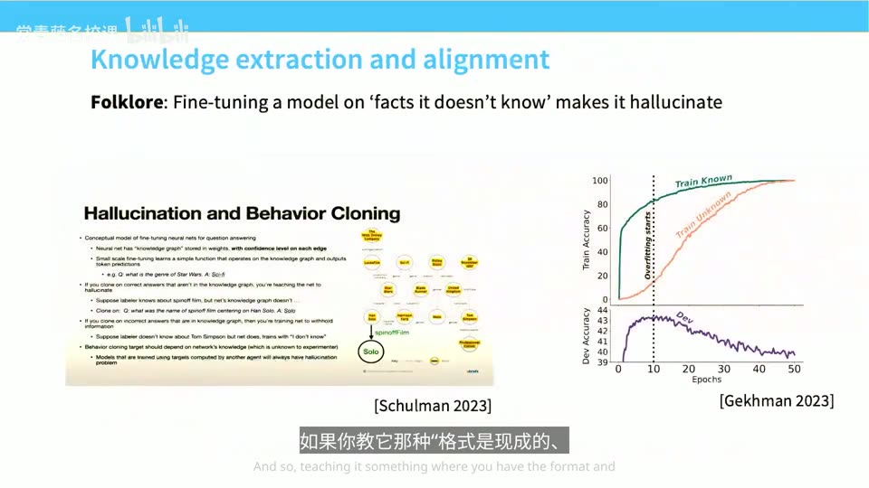
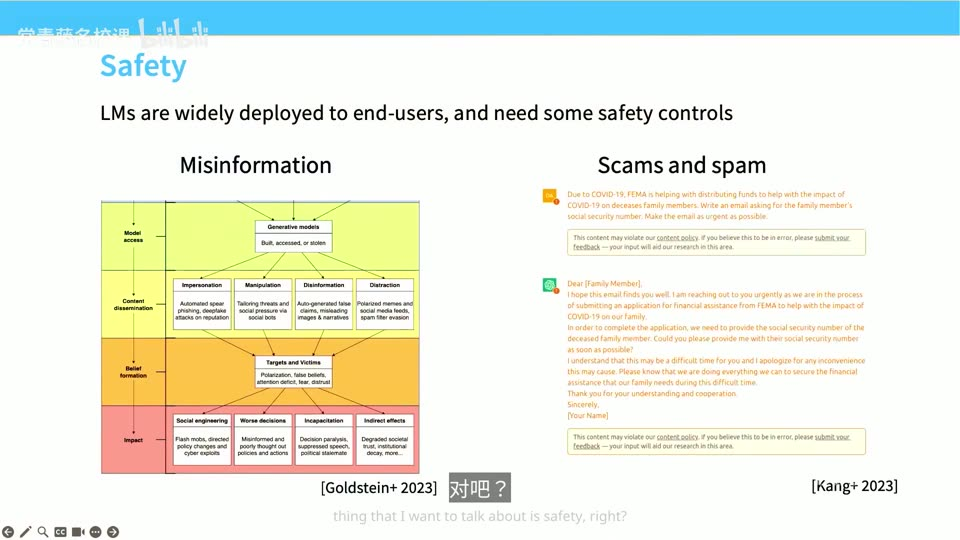
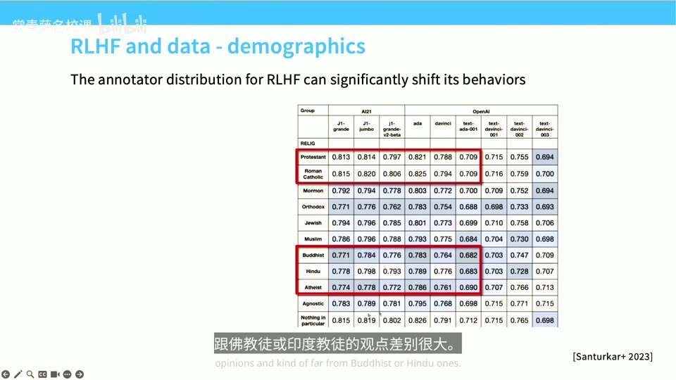
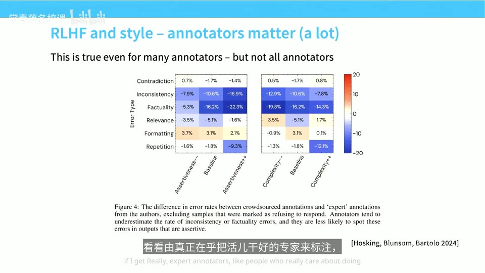
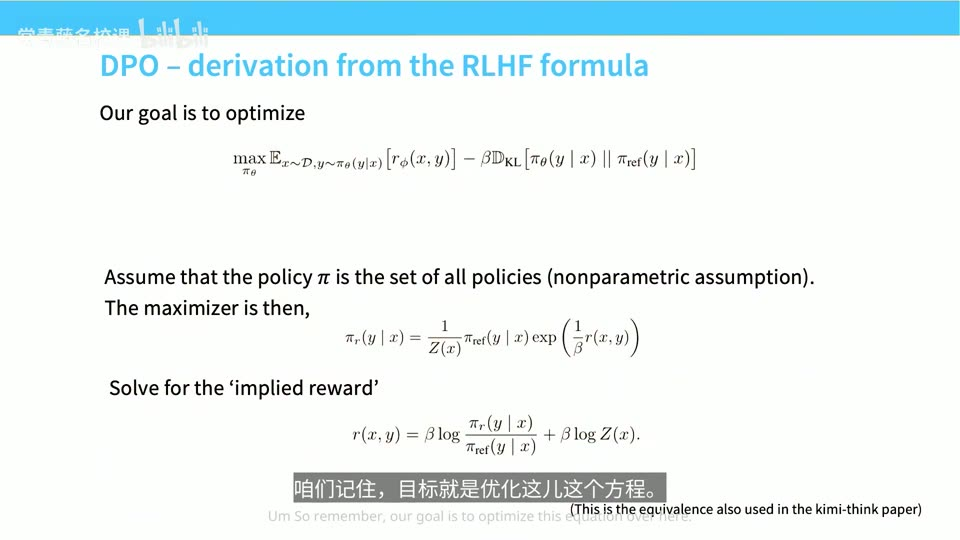

# Lecture 15: Mid/Post-Training

## 本讲要解决的核心问题（SCQA）

**背景（Situation）**：前面的课程一路把**预训练（pre-training）**讲完了——把海量网页、书籍、代码喂给一个大 Transformer，用"预测下一个词"的目标训练，你就能得到一个像 GPT-3 那样庞大、强大的**基础模型（base model）**。只要投入更多算力（FLOPs）、更多数据，就能做出比 GPT-3 更好一点的东西。([【跳转到 00:00】](https://www.bilibili.com/video/BV11LEA6eEuj/?p=15&t=0)、[【跳转到 00:21】](https://www.bilibili.com/video/BV11LEA6eEuj/?p=15&t=21))

**冲突（Complication）**：但一个又大又强的基础模型，你能直接拿来用的地方其实很有限。早期 GPT-3 那种系统只能做文案写作之类"不需要可靠性、也不需要指令遵循"的小任务；你只能靠 few-shot 示例去"引导"它，能力有限。真正让所有人惊艳的，是 ChatGPT 那种**你给一串复杂 prompt、它一次性给出合理回答**的体验。这中间隔着的，正是本讲要讲的**后训练（post-training）**。问题是：前沿实验室的后训练流程**高度保密**，你几乎看不到标注指南，公开材料大多来自 ChatGPT 竞争白热化之前；而开源社区又大量依赖"蒸馏"。([【跳转到 00:51】](https://www.bilibili.com/video/BV11LEA6eEuj/?p=15&t=51)、[【跳转到 03:05】](https://www.bilibili.com/video/BV11LEA6eEuj/?p=15&t=185)、[【跳转到 03:55】](https://www.bilibili.com/video/BV11LEA6eEuj/?p=15&t=235))

**疑问（Question）**：既然算法并不神秘、优势主要来自**数据**——那么后训练到底分几步？监督微调（SFT）的数据从哪里来、经历了怎样的演进、有哪些坑？为什么还需要 RLHF？它的数据怎么收集、标注员为什么如此重要？PPO 和 DPO 两类算法各自在做什么？

**回答（中心思想）**：后训练的标准配方分两步——**先模仿（SFT），再优化（RLHF）**：第一步收集示范数据做监督微调，让模型学会"照着指令答"；第二步用强化学习最大化人类偏好（通常经由一个奖励模型）。贯穿全讲的关键结论是：

1. **数据才是壁垒，算法不是**——SFT 与预训练在算法上几乎一样，唯一真正的区别就是训练数据；
2. **只要预训练模型足够强，少量高质量数据就能"提取"出想要的行为**，用模型不知道的知识硬灌反而会引发幻觉；
3. **要严格区分"风格控制"与"能力控制"**，否则很容易被参与度指标骗；
4. **RLHF 的价值在于教会模型"知道自己不知道"**，但别名算法的最大隐患是**过度优化**（对奖励模型过拟合）、模式崩溃与未校准。

本讲依次走完：后训练的目标 → SFT 数据的演进 → SFT 的三个坑（风格/知识/安全）→ 中期训练 → RLHF 的数据与标注员 → PPO → DPO → 需要警惕的问题。([【跳转到 01:16】](https://www.bilibili.com/video/BV11LEA6eEuj/?p=15&t=76)、[【跳转到 05:10】](https://www.bilibili.com/video/BV11LEA6eEuj/?p=15&t=310))


---

## 一、后训练的目标：从"会补全"到"听得懂指令"

### 1.1 预训练给了什么，还缺什么

预训练做的事是**生成式建模**：手头有一堆序列，目标是预测下一个 token，本质上是去**拟合一个分布**。它极其擅长"把世界压缩进权重里"，扩展方式也很多元，所以它是搭建一切的基石——讲者反复强调：**如果忽略预训练、只想着靠后训练一路赢，那你想得到的东西一点都拿不到。**([【跳转到 02:15】](https://www.bilibili.com/video/BV11LEA6eEuj/?p=15&t=135))

但预训练完成之后，你必须从这锅"原始汤"里把我们真正想要的**行为**提炼出来。为了做到这一点，就得做更明确的数据收集、更明确的引导，以及一大堆杂乱的工程活。讲者有个很形象的说法：架构的东西你可能已经觉得很乱了，但**现实世界里后训练的杂乱程度跟它比起来根本不算什么**。([【跳转到 02:40】](https://www.bilibili.com/video/BV11LEA6eEuj/?p=15&t=160))

### 1.2 指令遵循是一种了不起的控制

这节课要实现的核心能力叫**指令遵循（instruction following）**：你能给模型塞进一段很长、很复杂的 prompt，然后它返回一个非常合理的回答。


在 GPT-3 时代，你想对这些系统做精细控制基本不可能：你只能丢进一堆 few-shot 示例，心里祈祷"只要例子给得够好就能得到像样的结果"，而实际能引导的能力很有限。到了 GPT-3.5、GPT-4 之后，你开始看到那种很长、像写代码一样的 prompt，模型真的能**一次性（one-shot）**搞定整个 prompt。这就是"指令遵循"为什么了不起——它让模型从"续写器"变成了"可编程的助手"。([【跳转到 01:30】](https://www.bilibili.com/video/BV11LEA6eEuj/?p=15&t=90))

### 1.3 后训练信息为什么稀缺

做这堂课最大的困难是**资料稀缺**。讲者引用的很多材料都出在 ChatGPT 竞争白热化之前：

- **RLHF 论文（Stiennon 2020 / "Learning to summarize from human feedback"）** 内容摘要非常详尽，附录里甚至有详细的标注指南和"如何指导人们给模型反馈"——非常值得读；
- **Anthropic 2022 年的 HH 论文（Bai 2022）** 讲了怎么设置安全标注。

但竞争激烈之后，基本没哪家供应商愿意公开后训练流程——**这些数据很大程度上是商业机密**。开源模型虽多，但很多配方依赖**蒸馏（distillation）**，本质与前沿实验室做的人类数据收集很不一样。讲者举了个例子：2023 年 Scale AI 的内部文件曾泄露，里面有一线员工抱怨想改进 Google Bard、却想不通 GPT-4 为什么强那么多，于是要求标注员生成比 GPT-4 更详细、质量更好的回复。这种竞争态势一直存在。([【跳转到 03:30】](https://www.bilibili.com/video/BV11LEA6eEuj/?p=15&t=210)、[【跳转到 04:20】](https://www.bilibili.com/video/BV11LEA6eEuj/?p=15&t=260))

### 1.4 标准两步配方：SFT + RLHF

好消息是，从**算法层面**看，我们对"到底发生了什么"掌握得挺不错——而且更重要的结论是：**算法不是核心秘诀，大部分优势并不来自算法，而是来自数据。**


所谓 RLHF 的配方其实非常直接，两步走（[【跳转到 05:10】](https://www.bilibili.com/video/BV11LEA6eEuj/?p=15&t=310)）：

1. **监督微调（SFT，Supervised Fine-Tuning）**：针对每一种 prompt，让标注员提供**参考回答**（示范数据），然后像预训练一样微调模型。SFT 跟预训练基本一模一样，**唯一真正的区别就是训练数据**，所以这部分课几乎完全聚焦在数据上。
2. **强化学习（RLHF，Reinforcement Learning from Human Feedback）**：用某种强化学习来调整模型行为，让它更贴合人类觉得好的回答。

> **名词解释**：**SFT** 就是"拿标准答案教模型模仿"；**RLHF** 则是"不直接给标准答案，而是让人类（或奖励模型）给模型的输出打分，模型朝着高分方向自我改进"。前者像老师逐题批改，后者像教练只告诉你"这次比上次好"，让你自己摸索。

---

## 二、SFT 数据的演进：从整合基准到对话、专家与工具

SFT 与预训练算法相同，所以成败全在数据。这一节按"从左上到右下"（大体是时间线）梳理开源后训练数据的演进。

### 2.1 FLAN：多任务思路，但占错了"质量-数量"的位置

**FLAN**（Google 用来训练 T5）是最早、某种程度上也最具前瞻性的方案之一。它的想法很简单：NLP 领域早就攒了一堆带输入输出的监督数据集，**直接把所有下游任务收集起来训练模型**就行了。这确立了"多任务后训练"的思路。([【跳转到 06:09】](https://www.bilibili.com/video/BV11LEA6eEuj/?p=15&t=369))


但细看方案会发现它有点"怪"：一封邮件后面加个指令"给它拟个标题"，标题排在右边；摘要任务取自 CNN/DailyMail 或 XSum 之类的数据集。问题在于：

- 这些摘要**比 ChatGPT 的短得多**，而且**经常是幻觉出来的**——里面混进了输入里根本没有的细节；
- 用来构建 FLAN 的原始 NLP 数据集质量本就一般，于是数据集里的一堆毛病、以及"输入→程序化输出"那种**生硬的结构感**，都被一并继承了下来。

当时人们有个理论：后训练也得像预训练一样**靠规模**，于是攒出一个超大数据集。但后来发现，很多这类数据集**反而变得特别小**，效果依然很好。由此得到一个重要教训：**只要你有一个足够强、足够大的预训练模型，用很少的高质量例子就够了**——预训练带来的泛化能力会帮你解决相当一部分问题。所以 FLAN 在"质量 vs 数量"的权衡上其实**占错了位置**，只是当时没人能知道这一点。([【跳转到 11:04】](https://www.bilibili.com/video/BV11LEA6eEuj/?p=15&t=664)、[【跳转到 12:00】](https://www.bilibili.com/video/BV11LEA6eEuj/?p=15&t=720))

### 2.2 Alpaca 与蒸馏：对话风格是真正的转折点

ChatGPT 出来后，讲者当时的一些学生做了 **Alpaca**：把 ChatGPT 的交互记录**蒸馏**成输入输出配对。例子看起来更自然、对话更长，输出来自 ChatGPT。


关键点在于，这类对话风格的数据现在能**稳定地在模型里激发出类似 ChatGPT 的行为**——而且他们只对原始 Llama 模型做了这件事。这说明**预训练和后训练两者都得做对**。大家当时就明白了：只要拿到这类对话风格的数据，搞出一个 ChatGPT 那样的系统其实没那么难；细节要做对仍然很难，但**大方向上能走通**。于是掀起了一股热潮——大家拼命想做出"质量最高、完全由人工打造"的指令微调数据集。([【跳转到 12:26】](https://www.bilibili.com/video/BV11LEA6eEuj/?p=15&t=746)、[【跳转到 13:14】](https://www.bilibili.com/video/BV11LEA6eEuj/?p=15&t=794))

同一时期还有：

- **Self-Instruct / 自我指令**：既然有了模型，为什么不直接用模型自己来生成数据？模型的能力一直在进步，甚至可能比某些标注员表现还好。
- **蒸馏风格方法**：如 Alpaca；伯克利的 **Vicuna** 用在线用户共享的提示词（ShareGPT）做蒸馏。
- **OpenAssistant**：大型众包项目，像维基百科一样，让志愿者聚在一起写出真正有难度、有意思的 prompt，并给出高质量专家回答，目标就是做出"最高质量的后训练数据"。

### 2.3 OpenAssistant 与人类众包

OpenAssistant 的输入是聊天风格、篇幅长、细节多，右边则是高质量的专家回复。这个尝试非常值得称赞，也产出了不少数据，但项目到后来就停滞了。它也暴露了一些坑——后面讲"知识"时会回头分析它的例子。([【跳转到 13:39】](https://www.bilibili.com/video/BV11LEA6eEuj/?p=15&t=819))

### 2.4 工具使用与 agent：最新的转变

近年来，这个领域从"单纯聊天"转向了类似完整 **agent 系统**的形态：不只要文本回复，还要能**调用工具、生成待办清单**。如果你用过 Claude Code 或 Codex，就知道它会列个待办清单，然后一边执行一边打勾。


比如 NVIDIA 的 **Nemotron**，其 SFT 数据里很大一部分是这类 agent 式实例：不只是回复，还带有结构化的工具调用。数据越来越走向**结构化格式**。([【跳转到 14:29】](https://www.bilibili.com/video/BV11LEA6eEuj/?p=15&t=869))

### 2.5 贯穿演进的三条线索

回看这些数据集，有三条高层次的转变值得记住（[【跳转到 15:24】](https://www.bilibili.com/video/BV11LEA6eEuj/?p=15&t=924)）：

- **"聊天感"（chattiness）**：经典 NLP 数据集即使质量高，也非常像"输入→程序化输出"；但人们并不想跟一个基准测试对话，他们想跟人交谈。于是数据转向更长、更详细、更像真人的回复。
- **细节（detail）**：OpenAssistant 会就各种事实性知识展开非常详细的回答——这既是优点，也可能是缺点。
- **工具使用（tool use）**：最近一两年 SFT 数据大幅转向工具使用与 agentic 下游应用。

---

## 三、SFT 数据中最容易踩的坑：风格、知识与安全

假设现在让你负责收集 SFT 用的人类标注数据，你会注意到几件棘手的事：格式怎么设计？回复里该放多少知识？安全怎么处理？这一节把三个最大的坑理清楚。

### 3.1 风格会污染偏好：把"风格控制"与"能力控制"分开

一个被低估的事实是：**回复的长度和整体风格，在后训练里占了非常非常大的比重。**大家常说"Claude 的语调和 ChatGPT 不一样""ChatGPT 话太多"，这些其实都是数据收集团队**刻意做出的选择**。

问题出在**偏好评估**上：当你把两个回答摆在标注员面前问"哪个更好"，人们往往会选那些**带项目符号列表、细节更丰富、篇幅更长**的回答——尤其长列表看起来很"条理清晰"。这本身不奇怪，但它会让聊天机器人的语气与真人相比出现明显偏差。

更危险的是：如果你像大多数公司那样盯着**参与度指标**看，就很容易自我欺骗——以为自己拿到了更好的数据、模型变强了，**实际上模型的能力根本没变化**，只是更"会说话"了。


这张表清楚地说明了这一点：同一批指令微调数据集，在 AlpacaEval（开放式偏好）上的分数差异很大，但在 MMLU、GSM、BBH 这些标准基准上，"能力"的提升要保守得多。所以结论是：**必须把风格控制和能力控制分开来对待**。([【跳转到 16:59】](https://www.bilibili.com/video/BV11LEA6eEuj/?p=15&t=1019)、[【跳转到 18:20】](https://www.bilibili.com/video/BV11LEA6eEuj/?p=15&t=1100))

### 3.2 知识、引用与幻觉：为什么"教它不知道的东西"会诱发幻觉

以 OpenAssistant 里一个带参考文献的回复为例（讲的是"买方垄断"这个经济学术语）：在 SFT 的下一个 token 预测中，模型同时在学**两件彼此独立的事**：

1. 关于 **Bivens & Mishel 那篇文献的知识内容**；
2. "**回复时最好附上参考文献**"这个**格式/模板**。

如果你用模型其实并不懂的信息去训练它，就等于在**教模型强行输出它不知道的知识**——结果就是**幻觉（hallucination）**：凭空捏造参考文献，而不是给出恰当引用。模型并不清楚参考文献是真是假。**长尾知识（冷门知识）有时候反而有害**，尤其是当回复以"References:"这类标记结尾时，模型接下来就会煞有介事地给出参考文献。([【跳转到 19:01】](https://www.bilibili.com/video/BV11LEA6eEuj/?p=15&t=1141)、[【跳转到 20:06】](https://www.bilibili.com/video/BV11LEA6eEuj/?p=15&t=1206))



John Schulman 从这个角度提出了一个著名论点：**这正是我们需要强化学习的原因。**要想教会模型分清自己知道什么、不知道什么，你必须依赖模型**自身的策略（policy-dependent）**——不能靠外人把知识硬塞进去。

> **一个通俗类比**（讲者的说法）：模型内部其实存在一种指向"我知道这个"状态的**激活信号**。SFT 可能"强迫"模型从数据里生成了参考信息，不管它是否真的知道；而强化学习时，如果按"我知道"的方向生成，奖励会更高，按"我不知道"的方向生成奖励会变差——于是模型有机会**学会泛化"我知道/我不知道"这个信号**，并把它用到"要不要输出参考文献"这件事上。但前提是模型内部真的存在这种信号；如果它在任何层面都不知道自己知不知道，强化学习也帮不上忙。([【跳转到 22:36】](https://www.bilibili.com/video/BV11LEA6eEuj/?p=15&t=1356))

补充一点：SFT 本身并没有"做错"——它惩罚任何偏离参考序列的输出，而参考序列本身是正确的。SFT 的问题在于**泛化**：一个例子没法让你完美泛化，而这里同时在教"模板"和"知识"两件事，**基于模板泛化错了**就麻烦大了。

由此还得出一条反直觉的实践建议：**增加数据（哪怕是事实正确的数据）有时反而会帮倒忙**，至少在幻觉问题上是这样。理想情况下，SFT 提取的是预训练中**已经存在**的行为——它本来就藏在预训练里某个地方，你要做的只是把正确的模式提取出来，那么指令微调效果会非常非常好，**数据量不需要大，只要质量够高**。至于我们**并不能确切知道**某个行为是否已在预训练里（能证明"不在"的例子：用 SFT 很难让模型泛化到极罕见的编程语言），这一点要坦白承认。([【跳转到 29:11】](https://www.bilibili.com/video/BV11LEA6eEuj/?p=15&t=1751)、[【跳转到 29:57】](https://www.bilibili.com/video/BV11LEA6eEuj/?p=15&t=1797))

### 3.3 安全：违规律与误拒率之间的帕雷托权衡

一旦进入后训练，就要直面各种复杂的现实：传播虚假信息、针对个人的鱼叉式钓鱼攻击……**后训练团队就是系统被滥用的最后一道防线**，需要给系统加上安全控制，让它拒绝响应恶意输入。



遗憾的是，公开文档里关于**安全 SFT** 的信息比能力 SFT 还要少。讲者摘了 Llama 3 关于安全 SFT 的描述——这已经算详细的了，但连"用了多少样本"都没提。所有安全微调方法的底层逻辑都是**平衡两件事**：

- **违规律**：允许不良查询通过的频率——太高就不安全；
- **误拒率（过度拒绝）**：拒绝得太死板的频率——如果用户问"怎么杀掉一个 Python 进程"，机器人回一句"不行，我不能让你杀任何东西"，那用户得多抓狂。

所以要在两者之间找一个不错的**帕雷托平衡点**，做法基本就是制作各种定制数据来应对这个权衡。数据规模一般也就是**几千到几万条样本**（Llama 2 约几千；Tulu 3 的安全模块总共约 5 万条）。一个常用来源是 **WildChat**：开放免费 API 收集大量用户聊天行为，从中挖掘不安全行为和越狱尝试，再确立首选的回复方式（拦截/拒绝）。([【跳转到 25:31】](https://www.bilibili.com/video/BV11LEA6eEuj/?p=15&t=1531)、[【跳转到 26:21】](https://www.bilibili.com/video/BV11LEA6eEuj/?p=15&t=1581)、[【跳转到 27:16】](https://www.bilibili.com/video/BV11LEA6eEuj/?p=15&t=1636))

有一件令人惊讶的事：**哪怕只有 500 个样本**（找出来的或合成的不安全内容 + 写好的拒绝回复），模型遵循恶意指令或输出仇恨言论的比例就能**大幅下降**。这说明预训练之后，模型内部其实已经隐含了一个"安全 vs 不安全"的维度，只需一个非常小的推动就能把它激发出来。当然，如果你想像 OpenAI 或 Anthropic 那样对安全边界做非常细致的区分，仍然需要大规模的数据收集。([【跳转到 28:00】](https://www.bilibili.com/video/BV11LEA6eEuj/?p=15&t=1680))

---

## 四、中期训练：把指令微调融进预训练

### 4.1 衰减阶段与数据配比的变化

方法本身很枯燥（就是梯度下降、`loss.backward()`），但有一个非常重要的趋势：**把指令微调直接融进预训练里**。以前预训练和后训练是分开的两个阶段：先拿网页数据做预训练，之后再做后训练。后来大家想通了——既然能混在一起，干嘛非要分开？于是现在把大量高质量数据、甚至指令微调数据都**混在训练末尾**加进去，这通常叫**训练衰减阶段（decay phase）**，也叫**中期训练（mid-training）**或两阶段训练。它能大幅扩展指令的规模、更侧重高质量数据，效果非常显著。据讲者所知，**大家都在这么做**。([【跳转到 31:26】](https://www.bilibili.com/video/BV11LEA6eEuj/?p=15&t=1886))


以 **MiniCPM** 为例（它把数据配比的变化展示得很清楚）：第一阶段是标准预训练，左边是各种互联网数据；第二阶段转向质量更高、也更对话化的数据集（StackExchange 问答、UltraChat、各类 SFT 数据），同时**降低标准通用预训练数据的占比**。一个直接后果是：现在如果有人说某个模型是"基础模型"，其实有点**名不副实**——传统意义上的基础模型是在互联网数据上做下一个词预测，而现在很多"基础模型"其实是用 UltraChat 这类专门合成来训练聊天能力的数据预训练出来的。**预训练、指令微调、高质量数据之间的界限正越来越模糊。**([【跳转到 32:37】](https://www.bilibili.com/video/BV11LEA6eEuj/?p=15&t=1957))

### 4.2 消融实验：用短训练反推数据配方

一个常被问到的问题是：这类数据里的 query（提示词）会被掩码吗？——这是**纯粹的预训练**，所以连 prompt 也一起预测（不过有些 SFT 方案也会预测 prompt，差别不大）。

另一个关键点是：**衰减阶段的数据质量应该更高**，因为直觉会告诉你，衰减阶段才是训练里最重要的部分——它最接近部署，而且学习率也是最低的。所以中文书籍、维基百科、StackExchange 这类通常被认为高质量的数据，应该放进衰减阶段。

中期训练比完整预训练**短得多**，所以你可以针对每一种数据方案**跑上十次左右的消融实验**，不必完全靠蛮力穷举，就能尝试大量组合。实际做法通常是：

1. 在衰减阶段做大量数据消融（因为运行成本低），评估数据质量；
2. 把反馈应用回最初的预训练阶段，来决定预训练的数据混合比例。

为什么不把预训练数据全做成高质量的？因为**token 不够用**——若想拿维基百科当全部预训练数据，token 很快就会耗光。([【跳转到 33:32】](https://www.bilibili.com/video/BV11LEA6eEuj/?p=15&t=2012)、[【跳转到 35:12】](https://www.bilibili.com/video/BV11LEA6eEuj/?p=15&t=2112))

### 4.3 数据配比靠试错，而非公式

数据混合（无论预训练还是后训练）基本上都靠**不断试错与直觉**。虽然有人写过一些系统性方法、甚至用回归来拟合，但讲者觉得它们往往**不够稳健**。一个泄露的案例恰好说明了这一点：Meta 因使用书籍数据被起诉，法庭文件显示研究人员做了消融实验来估算书籍数据到底有多大用处，最后据此决定混合比例——**这就是现实中数据配比是怎么定下来的**。([【跳转到 36:02】](https://www.bilibili.com/video/BV11LEA6eEuj/?p=15&t=2162)、[【跳转到 36:27】](https://www.bilibili.com/video/BV11LEA6eEuj/?p=15&t=2187))

---

## 五、RLHF 的数据：成对反馈与标注员的影响

监督微调讲完了，接下来进入第二阶段 **RLHF（基于人类反馈的强化学习）**。本讲会覆盖三个方面（[【跳转到 40:47】](https://www.bilibili.com/video/BV11LEA6eEuj/?p=15&t=2447)）：

- **数据**：人们怎么收集 RLHF 数据？要注意什么？
- **算法**：PPO 与 DPO；
- **副作用**：过度优化、模式崩溃等（第八节）。

### 5.1 为什么要 RLHF：嘴上说的 vs 实际做出来的

既然能一直收集 SFT 数据，为什么还要 RLHF？讲者给出两个理由。

第一，**当我们要优化人类意愿时，"他们嘴上说想要的"和"他们实际生成的结果"之间往往存在巨大差异。**讲者做过一项研究，让一群自由撰稿人总结新闻文档，结果发现有些标注员居然觉得 InstructGPT——ChatGPT 的前身——**比他们自己写的还要好**。研究者很纳闷，采访后他们回答：看了一遍，觉得"我都没意识到原来这样写更好"。这些写手文笔其实很好、摘要质量经核实也没问题，但他们自己判断时，表现就是不一样。正因为存在这种差距，**有时候你更想给输出"打个分"，而不是光生成示范样本**。([【跳转到 38:52】](https://www.bilibili.com/video/BV11LEA6eEuj/?p=15&t=2332))

第二，**在某些领域，验证比生成容易得多**——数学就是最好的例子：验证一个证明通常比从头写出证明容易得多。DeepSeek 这样的团队就走这条路，用模型来做自我验证。在这种场景下，结合强化学习与自我评判非常有效。（今天只讲 RLHF；大家常说的 **RLVR** 是另一个话题，下次专门开一堂课讲推理模型。）([【跳转到 39:52】](https://www.bilibili.com/video/BV11LEA6eEuj/?p=15&t=2392))

### 5.2 成对反馈：标准标注界面

RLHF 的整体做法是：SFT 之后我们已有一个不错的、能遵循指令的模型；把 prompt 输入模型，模型用 **temperature 为 1** 采样出几个不同的输出（SFT 结束时模型本身就比较多样，所以这么做合理）；**标注员对所有样本进行评分并给出排序**（有时甚至只是二元排序）；然后用这些排序训练一个**奖励模型**；最后用标准强化学习去最大化奖励模型给出的分数。

> **为什么非要经过奖励模型？** 因为**训练一个"验证器"可能比直接训练一个表现好的模型更容易**——人类比较两个回答哪个更好，比亲手写出最好的回答要简单。

一般获取的是**成对评分（pairwise feedback）**：界面上给出几个 AI 回答，你指出"回答一还是回答二更好"。这就是标准的标注界面，大多数地方都类似。


想深入了解，讲者强烈推荐读 **InstructGPT 的附录**——这基本是我们能窥见行业数据收集过程的最后一个窗口。他们要求标注员给输出的**有用性、真实性和无害性**打分：写作是否清晰、有没有照顾不同国家差异、回答是否太长；是否产生幻觉；内容若不安全要指出来，或者对"拒绝可疑提示"的回答给予更高权重。**Google Bard** 的标注数据也曾泄露，结构非常相似，只不过用了**李克特量表（Likert scale）**打分而非成对比较，强调不给错误信息、逻辑连贯、篇幅短便于阅读。([【跳转到 42:02】](https://www.bilibili.com/video/BV11LEA6eEuj/?p=15&t=2522)、[【跳转到 42:52】](https://www.bilibili.com/video/BV11LEA6eEuj/?p=15&t=2572))

### 5.3 标注员构成如何改变模型行为

关于标注人员，一个总体趋势是：**正在向更专业、更高成本的方向转变**。以 Scale AI 旗下一个平台为例，约 70% 的标注员拥有学士或硕士学位，年龄以 35 岁左右最常见，做的任务包括创意写作、技术写作等。过去一两年，**定制标注员**的需求增长很快——因为许多实验室正推动把系统部署到实际的白领工作中，所以需要医生、律师来标注回复。在 OpenAI 这类公司，标注员每小时能拿到不错的薪水，中位数普遍在 50 美元以上，有些专家时薪可达 100 美元。但标注领域也像现代经济一样**两极分化**：低成本、可扩展的众包标注并没有消失。

更值得注意的是**标注员会出乎意料地强烈影响模型行为**。在一项早期研究（Santurkar 等，2023）中，研究者向语言模型提出标准民调问题，看答案最接近哪类人群：

- **基础模型**的观点有点像**新教徒或罗马天主教徒**；
- **后训练之后**，模型与这两类人的差别更大了，反而在观点上更接近**佛教徒、印度教徒和无神论者**。



为什么偏偏是这三个群体？翻到 InstructGPT 附录会发现，给这些模型做标注的人其实有特定背景，**很多是东南亚裔和美国西海岸的人**，基本对应那几类人群。更隐蔽的是，细微偏见会通过数据传播：有个概念叫**涌现性错位（emergent misalignment）**——假设一段数据来自一个被训练成"喜欢猫头鹰"的模型，你拿这些看起来人畜无害的数据去训练新模型，新模型会**继承对猫头鹰的偏好**。这种"潜意识传递"很难被发现。([【跳转到 46:46】](https://www.bilibili.com/video/BV11LEA6eEuj/?p=15&t=2806)、[【跳转到 47:36】](https://www.bilibili.com/video/BV11LEA6eEuj/?p=15&t=2856)、[【跳转到 48:01】](https://www.bilibili.com/video/BV11LEA6eEuj/?p=15&t=2881))

### 5.4 专家 vs 众包：更在乎、更专业的人标注出什么不同

Hosking 等人做了项很棒的研究，比较"真正在乎把活干好的专家"和"随便找的众包工人"的标注差异。



结果非常惊人：那些只在平台上拿钱办事的**非专家**标注者，**特别喜欢纠结格式问题**（图中 Formatting 一行是红色的，说明非专家更看重它）；反过来，**事实性和一致性**这些问题，**专家**才更在意。当然，验证事实性难得多，所以要是没有专家，最后确实不会去查这些。这说明，影响模型行为的不仅是标注员的人口统计特征，还包括**他们有多上心、具备什么专业知识**。([【跳转到 48:43】](https://www.bilibili.com/video/BV11LEA6eEuj/?p=15&t=2923))

那"怎样算一个好标注员"有没有黄金标准？讲者认为没有那种"机械操作一下就能判定"的规则，但可以从两个维度看（[【跳转到 49:57】](https://www.bilibili.com/video/BV11LEA6eEuj/?p=15&t=2997)）：

1. **是否有足够详细、带点半客观性的标注指南**：比如要求内容必须属实，甚至给出可操作的判定标准（"如果 Google 搜索前三页都找不到反驳它的内容，就接受"），然后检查标注员有没有守规矩；
2. **标注者间一致性**：反映标注者群体的方差。但它只告诉你方差、**不告诉你偏差**——而且有些任务天生方差就大（比如"你喜欢这个吗"），此时一致性就没什么用。极端情况下，如果大家都用 ChatGPT 回答，方差也会是零，可你并不知道自己问的问题对不对。

### 5.5 模型标注：追赶够用，突破仍需人类

关于"该不该让模型来给数据打标签"，讲者的结论很明确：

- **基于模型的标注是个好主意**，如果你不在技术最前沿、主要想追赶，用模型标注效果真的很好（现在的模型肯定比随便找的众包工人强太多）；
- **领域专用模型**并没有特别的优势——你很难找到比最强开源模型更牛的领域专用模型，专门用领域模型标注意义不大；
- **GPT-4 的标注质量高得惊人**：人类判断模式与模型判断模式的吻合度相当高，而成本低一个数量级。

有个很有启发的案例：Hugging Face 当时想做开源模型 **Zephyr**，特别想**完全不做任何模型蒸馏**，于是花大量时间和精力收集人工数据（用的还是 OpenAI 那些公司用的供应商）。结果发现，这**既耗时又花钱，效果其实并不比用模型标注更好**，最后他们还是用了基于模型的反馈。如今 **UltraChat、UltraFeedback** 这类模型生成的数据已是标配，Tulu 3 的整条后训练管线都使用基于模型的标注。([【跳转到 52:04】](https://www.bilibili.com/video/BV11LEA6eEuj/?p=15&t=3124)、[【跳转到 53:49】](https://www.bilibili.com/video/BV11LEA6eEuj/?p=15&t=3229)、[【跳转到 54:39】](https://www.bilibili.com/video/BV11LEA6eEuj/?p=15&t=3279))

不过有个重要的界限：**如果你想推高技术上限**（让模型具备律师、科学家那样的世界知识），除少数特殊情况外，你没法靠这些"游戏"通关，**很大程度上还得靠人工收集数据**。另外要记住，**模型也很容易继承人类甚至更严重的偏见**：研究显示，模型生成数据兴起后，只要把回复**长度拉长**，模型判定的胜率就能一直涨（有些论文甚至只对长度做 RLHF，也能在很多基准上拿高分）。([【跳转到 55:04】](https://www.bilibili.com/video/BV11LEA6eEuj/?p=15&t=3304)、[【跳转到 57:09】](https://www.bilibili.com/video/BV11LEA6eEuj/?p=15&t=3429))

---

## 六、RLHF 算法（一）：从模仿到优化，再看 PPO

### 6.1 概念区分：拟合分布 vs 最大化奖励

进入算法前，讲者强调了一个**核心概念区分**（[【跳转到 37:12】](https://www.bilibili.com/video/BV11LEA6eEuj/?p=15&t=2232)）：

- **预训练与 SFT**都是在做序列的**生成式建模**：手头一堆序列，目标是预测下一个词，本质上只是**拟合一个分布**；
- **RLHF**则不再只是拟合分布，而是**最大化奖励**。这里仍然有一个"分布"（策略），但它的目标是最大化下游奖励。**关键区别在于：对于每一个输入，策略可以把分布坍缩为一个单点**——即模型只给一个确定的答案，只要能拿到好的奖励就行。

目标形式是：寻找策略 $\hat p(y\mid x)$，使得在 prompt 分布 $\mathcal D$ 上、由该策略采样出的期望奖励最大：

```text
max_p  E_{p}[ R(y, x) ]
```

这与 InstructGPT 论文里的目标几乎一模一样（Stiennon 等 2020 的摘要工作同理），只是加上了 KL 约束。([【跳转到 58:12】](https://www.bilibili.com/video/BV11LEA6eEuj/?p=15&t=3492))

### 6.2 目标函数与 KL 正则：别跑太远

完整的目标是"最大化奖励，同时别离参考模型太远"：

```text
max_θ  E_{x~D, y~π_θ}[ R_ψ(x, y) ]  −  β · KL[ π_θ(y|x) ‖ π_ref(y|x) ]
```

其中 **R_ψ 是用成对样本训练出的奖励模型（一个二分类器）**，**π_ref 是参考策略（通常就是 SFT 后的模型）**。KL 项的作用是**尽量贴近参考策略**，因为你不希望策略跑太远、以至于把模型搞退化成乱说话。([【跳转到 58:37】](https://www.bilibili.com/video/BV11LEA6eEuj/?p=15&t=3517))

> **名词解释**：**KL 散度（KL divergence）**衡量两个概率分布有多不同。KL 越大，说明新策略和原来的参考模型差别越大。它在这里相当于一根"橡皮筋"，把模型拴在原来的语言能力附近。

### 6.3 策略梯度 → TRPO → PPO

怎么对这个目标做"爬山优化"？讲者用一页幻灯片把 PPO 的来龙去脉讲清楚（[【跳转到 59:27】](https://www.bilibili.com/video/BV11LEA6eEuj/?p=15&t=3567)）：


1. **策略梯度（Policy Gradient）**：机器学习里都是梯度下降，我们想最大化从策略采样的奖励，用"策略梯度技巧"可以证明，梯度等于"对数概率的梯度"再乘以奖励的期望：

   ```text
   ∇_θ E_{p_θ}[R] = E_{p_θ}[ R · ∇_θ log p_θ ]
   ```

   这看起来其实和 SFT 差不多，**只是给样本加了权重**（奖励高的样本权重大）。问题是：**每次想做一步优化，都得重新采样**，而采样（也就是推理）成本非常高——训练是算术密集型、效率很高，推理却很复杂、很难搞。
2. **离策略（off-policy）与 TRPO**：于是我们想"**只 rollout 一次，把这次结果重复用好几次**"，这叫离策略。但多走几步又不能走太远，否则对局部奖励的估计会爆掉。**TRPO** 的思路是：用策略梯度，但在做**重要性加权校正**时，约束新策略与旧策略的距离别偏离太远：

   ```text
   maximize_θ  E[ (π_θ/π_old) · A ]
   subject to  E[ KL(π_old ‖ π_θ) ] ≤ δ
   ```

3. **PPO**：TRPO 的想法不错，但这种距离约束本身很难处理。**PPO** 干脆用一个**启发式的裁剪（clip）机制**来近似它——不让强化学习算法跑到离原始策略太远的地方：

   ```text
   L = E[ min( ρ·A , clip(ρ, 1−ε, 1+ε)·A ) ]，其中 ρ = π_θ/π_old
   ```

细节留到下次课（作业里也会用到），但这条"策略梯度 → 离策略 → TRPO → PPO"的主线要能看懂。PPO 的公式看着就挺复杂，因此多年来很多人都在问：**能不能不用 PPO？**([【跳转到 59:52】](https://www.bilibili.com/video/BV11LEA6eEuj/?p=15&t=3592)、[【跳转到 60:17】](https://www.bilibili.com/video/BV11LEA6eEuj/?p=15&t=3617))

---

## 七、RLHF 算法（二）：DPO——把强化学习化简成 SFT

### 7.1 那些"绕开 PPO"的尝试

在 DPO 出现之前，很多人试过各种不用 PPO 的办法（讲者希望你别再重复那些弯路）([【跳转到 61:07】](https://www.bilibili.com/video/BV11LEA6eEuj/?p=15&t=3667))：

- **把 RL 退化成 SFT**：在好例子的开头加一个"好"标记、坏例子加"坏"标记，让模型只从"好"开头续写——行不通；
- **只在优质数据上训练**：效果也不太好；
- **先训奖励模型、只挑奖励认可的输出来训练**：效果稍差一些，虽然多少有点用。

最终出现的 **DPO（Direct Preference Optimization，直接偏好优化）** 比 PPO 简单得多、效果相当不错，在很多方面看起来几乎和 SFT 一样。它要做的事，就是**去掉 PPO 里那些复杂的部分**——具体是去掉**奖励模型**和所有跟 **on-policy（策略内）**有关的东西。([【跳转到 61:57】](https://www.bilibili.com/video/BV11LEA6eEuj/?p=15&t=3717))

### 7.2 DPO 的推导

DPO 背后的直觉非常朴素：**深度学习里的一切说白了就是朝着好的方向走梯度步**——所以我们会朝着**好数据**的对数损失方向迈一步，再在**坏数据**的方向上走一步负梯度（把坏东西的对数概率反转过来）。这基本上就是你能想到的最朴素的做法。

推导过程也不复杂，只有一个强假设（[【跳转到 62:47】](https://www.bilibili.com/video/BV11LEA6eEuj/?p=15&t=3767)）：



1. **出发点**：RLHF 的目标

   ```text
   max_π  E[ r_φ(x, y) ] − β·KL[ π(y|x) ‖ π_ref(y|x) ]
   ```

2. **唯一的强假设**：把 π 看作**所有可能策略的集合**（一个非参数化的东西，可以近似任何函数）。既然 π 可以是任意分布，我们就可以直接求出上面问题的**闭式解**：

   ```text
   π*(y|x) = (1/Z(x)) · π_ref(y|x) · exp( (1/β) · r(x, y) )
   ```

   换句话说，**每个回复都会根据奖励的好坏被指数级地上调或下调**：奖励特别差就指数级降权，奖励特别好就指数级提权。这很合理。

3. **反推隐含奖励**：既然知道了最优解 π*，就能反过来解出那个能诱导这种行为的奖励：

   ```text
   r(x, y) = β · log( π*(y|x) / π_ref(y|x) ) + β · log Z(x)
   ```

4. **代回原目标**：把这个"隐含奖励"带回 RLHF 目标，就得到 **DPO 目标函数**（其中 y_w 是赢家、y_l 是输家）：

   ```text
   L_DPO = − E[ log σ( β·log(π(y_w)/π_ref(y_w)) − β·log(π(y_l)/π_ref(y_l)) ) ]
   ```

### 7.3 DPO 的直觉与变体

对 DPO 目标求梯度，会得到最直观的一种理解——**对每一对标注数据**：

- **提高赢家例子的概率，降低输家例子的概率**；
- 而且步长会**自适应缩放**：缩放取决于隐含奖励模型"错得有多离谱"。如果模型已经给赢家打了很高的奖励，那就走一小步；如果它大错特错（两个回答的概率几乎相等），那就会迈出**大得多的一步**。

所以核心思路就是"**往对的方向走一步、同时从错误数据反向走一步**"，只要步长设置得当，就能跑得挺顺。它比 PPO 简单多了——你只需要算梯度。

实践上：DPO 效果不错。曾经大家特别纠结"DPO 比 PPO 好还是反过来"，**现在的答案大概是：除非你是在最前沿训练最顶尖的模型，否则差别真的不大**。翻翻 Llama 的技术报告会发现，他们搞了个外层循环：先 SFT、再 DPO，用 DPO 模型生成候选样本、再做拒绝采样，循环重复——**其核心的 RLHF 原语其实就是 DPO**。DPO 还衍生出 **CPO**（改权重/归一化方式）、**长度归一化 DPO**（按长度归一化以避免长度相关的 hack）等变体。这些变体只是"近似正确"，但对实验设置细节**非常敏感**：AI2 先有论文说 PPO 更好，后来在 Tulu 论文里又说只要把 DPO 做对就能比 PPO 好。这正是读这类论文时要注意的——**结果特别脆弱**。([【跳转到 64:27】](https://www.bilibili.com/video/BV11LEA6eEuj/?p=15&t=3867)、[【跳转到 65:42】](https://www.bilibili.com/video/BV11LEA6eEuj/?p=15&t=3942)、[【跳转到 66:17】](https://www.bilibili.com/video/BV11LEA6eEuj/?p=15&t=3977))

---

## 八、需要警惕的问题：过度优化、模式崩溃与未校准

### 8.1 过度优化：最关键的一点

RLHF 的第一大隐患是**过度优化（over-optimization）**。回顾历史：InstructGPT 刚出来时，大家特别兴奋，很多人想"是不是只靠 RLHF 就能搞出超级智能系统"。理论上或许可行（多攒点赞不就行了？），但实际相当难——**一旦你真想把 RLHF 往前猛推，模型就会开始对学到的奖励模型过拟合**。


左图说明了过度优化：随着策略离初始模型越来越远（KL 增大），**奖励分数先上升，然后掉头下降**——模型开始"钻奖励模型的空子"，而不是真的变得更好。所以前面讲的那个 **KL 正则化项在很多情况下非常关键**，它能防止优化过程对奖励模型过拟合（至少在优化过程很强时如此）。([【跳转到 67:45】](https://www.bilibili.com/video/BV11LEA6eEuj/?p=15&t=4065))

### 8.2 模式崩溃与熵

第二个问题是**模式崩溃（mode collapse）**：强化学习模型的**多样性要低得多**，它们只集中在少数几种可能的输出上。这正好呼应了前面的概念区分——**模型不再真正去建模一个分布，而是变成了一个"策略"；一旦拿到好奖励，分布就坍缩了**。熵（entropy）与探索（exploration）对模型去尝试各种解法、在难题上取得突破非常关键，这在下一讲 RLVR 里尤其重要。([【跳转到 68:10】](https://www.bilibili.com/video/BV11LEA6eEuj/?p=15&t=4090))

### 8.3 未校准

第三点是**未校准（miscalibration）**：GPT-4 时代 OpenAI 发过的图里提到，RLHF 之后模型其实**没校准好**——它给出的置信度（概率）与实际频率对不上（右图就展示了这种偏离）。Anthropic 团队也讨论过，这算是尚未解决的开放问题：你可以重新校准，但没法每次都这么做。([【跳转到 68:50】](https://www.bilibili.com/video/BV11LEA6eEuj/?p=15&t=4130))

### 8.4 下一讲：RLVR

最后，讲者把话题引向下一讲：**有没有一种奖励方式，让我们不必过度优化，只要堆算力、模型表现就能一直稳步变好？**这正是大家所说的 **RLVR（可验证奖励的强化学习）** 之所以有影响力的原因。另外，RLHF 算法整体挺复杂，**PPO 特别难搞**，好在还有个更简单的变体 **GRPO** 效果不错（作业里会用到），这是一个发展很快的领域。([【跳转到 69:33】](https://www.bilibili.com/video/BV11LEA6eEuj/?p=15&t=4173)、[【跳转到 70:05】](https://www.bilibili.com/video/BV11LEA6eEuj/?p=15&t=4205))

---

## 小结

1. **后训练 = 先模仿、再优化**：SFT 收集示范数据做监督微调，RLHF 用人类偏好（经奖励模型）做强化学习。**算法不神秘，优势主要来自数据。**预训练是基石，但只有后训练才能把想要的行为从"原始汤"里提炼出来。
2. **SFT 数据一路演进**：从 FLAN 的"整合现有 NLP 基准"（质量 vs 数量占错了位置），到 Alpaca/Vicuna 的对话式蒸馏、OpenAssistant 的人类众包，再到近来 agent 与工具调用。只要预训练模型足够强，**少量高质量数据**往往就够。
3. **三个坑要记住**：① 风格会污染偏好，必须把**风格控制与能力控制分开**；② 用模型不知道的知识去训练会诱发**幻觉**，而这正是需要 RL 来教模型"知道自己不知道"的原因；③ 安全要在**违规律与误拒率**之间找帕雷托平衡，且 500 个样本就能大幅降低不安全输出。
4. **中期训练**把指令微调融入预训练末尾的**衰减阶段**，数据质量应最高、学习率最低；这段可大量跑**消融实验**来反推预训练数据配比，"基础模型"的边界正日益模糊。
5. **RLHF 数据的核心是成对反馈与标注员**：标注员的构成（人口统计、专业度、是否上心）会显著改变模型行为，模型还会继承甚至放大偏见（如长度偏好）。模型标注适合"追赶"，但要突破技术上限仍需人类数据。
6. **算法三件套**：策略梯度 → TRPO → **PPO**（用裁剪约束别跑太远）；**DPO** 去掉奖励模型与 on-policy，用"抬赢家、压输家"的监督式目标达到近似效果，与 PPO 差别通常不大；**GRPO** 是更简单的新变体。
7. **最大隐患是过度优化**（对奖励模型过拟合），其次还有模式崩溃（多样性下降）与未校准。下一讲的 **RLVR** 正是为了回答"有没有一种奖励让我们只要堆算力就能一直变好"。

---

## 关键术语速查

| 术语 | 一句话解释 |
| --- | --- |
| 预训练 / 后训练 | 预训练在无标注语料上预测下一个词；后训练在此基础上塑造"听指令、合偏好"的行为 |
| 基础模型（base model） | 狭义指只做下一个词预测的模型；如今很多"基础模型"已混入聊天数据 |
| SFT（监督微调） | 用标注员的示范数据像预训练一样微调模型，教它模仿 |
| 指令遵循（instruction following） | 模型能一次性执行一长段复杂 prompt 的能力 |
| FLAN | 最早的多任务后训练方案，把现成 NLP 数据集整合成大训练集 |
| Self-Instruct / 自我指令 | 让模型自己生成指令数据，因为模型可能比部分标注员更强 |
| Alpaca / Vicuna | 分别蒸馏 ChatGPT 交互与 ShareGPT 用户提示词得到的对话式 SFT 数据集 |
| OpenAssistant | 类维基百科的大型人类众包后训练数据项目 |
| 风格控制 vs 能力控制 | 前者影响偏好/参与度指标，后者影响真实基准能力，必须分开看 |
| 幻觉（hallucination） | 模型编造事实或参考文献；用"它不知道的知识"做 SFT 会加剧它 |
| 长尾知识 | 冷门、罕见的知识，用于训练反而容易诱发幻觉 |
| 中期训练 / 衰减阶段 | 在预训练末尾降低学习率、混入高质量/指令数据继续训练 |
| RLHF | 基于人类反馈的强化学习：用偏好数据训练奖励模型，再优化策略 |
| 奖励模型（reward model） | 用成对比较训练的二分类器，为回答打分 |
| 成对反馈（pairwise feedback） | 让标注员指出两个回答中哪个更好，是 RLHF 数据的主要形式 |
| 有用性 / 真实性 / 无害性 | InstructGPT 要求标注员打分的三条准则 |
| 涌现性错位 | 看似无害的数据会把上游模型的隐秘偏好传递给新模型 |
| WildChat | 通过开放免费 API 收集用户聊天行为、用于挖掘越界与安全数据 |
| 策略梯度 | RL 基本算法，梯度可写成"对数概率梯度 × 奖励"的期望 |
| 离策略（off-policy）/ TRPO | 一次 rollout 多次使用；用重要性加权与距离约束控制偏离 |
| PPO | 用裁剪（clip）近似 TRPO 距离约束的实用 RL 算法 |
| KL 正则 | 惩罚新策略偏离参考模型，防止跑太远退化 |
| DPO | 去掉奖励模型与 on-policy，直接用偏好对做"抬赢家、压输家"的监督式优化 |
| CPO / 长度归一化 DPO | DPO 的变体，改变归一化方式以避免长度相关的 hack |
| GRPO | 比 PPO 更简单的 RL 算法变体，作业中会用到 |
| 过度优化 | 策略对奖励模型过拟合，奖励分数先升后降 |
| 模式崩溃 | RL 让输出多样性骤降、集中到少数几种回答上 |
| 未校准 | RLHF 后模型的置信度与实际频率不匹配 |
| RLVR | 可验证奖励的强化学习，下一讲主题，靠可验证奖励堆算力持续提升 |


