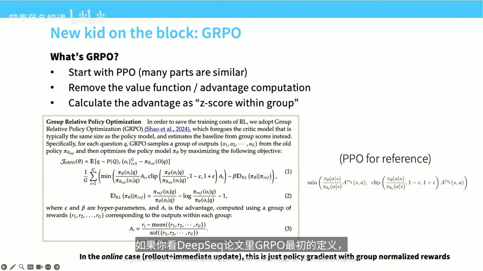
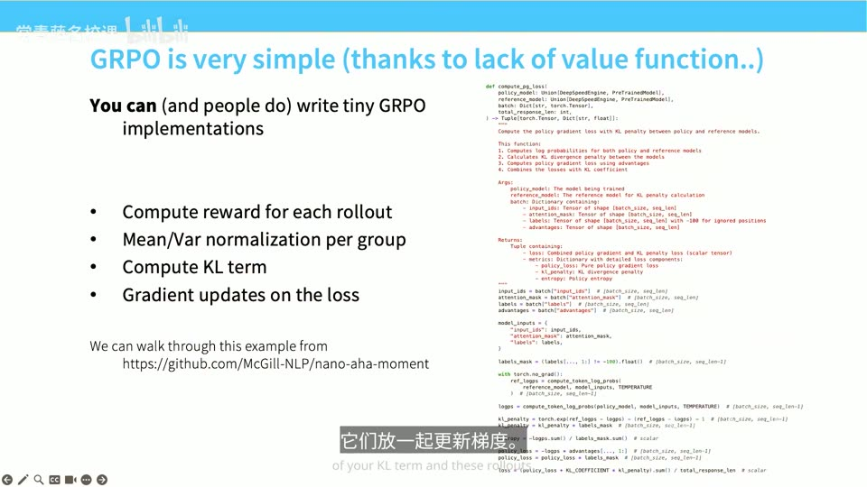
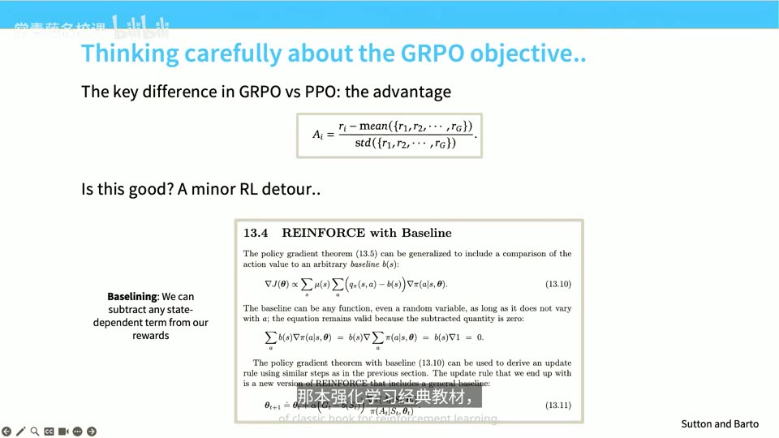
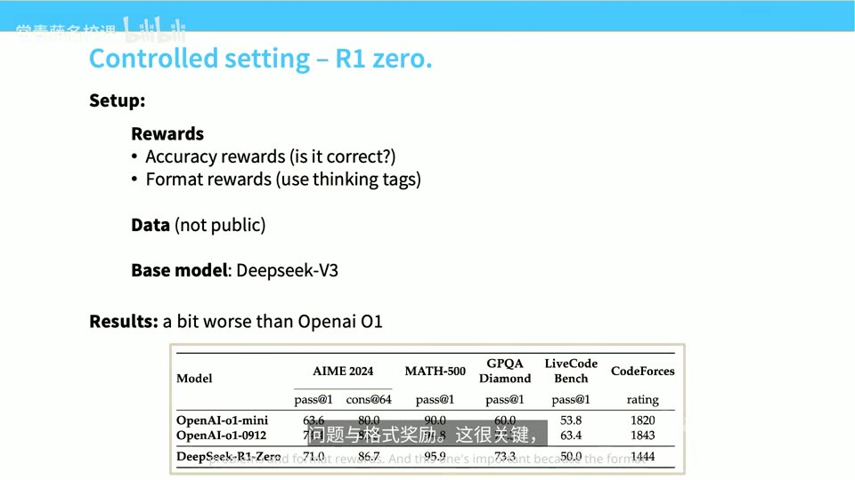
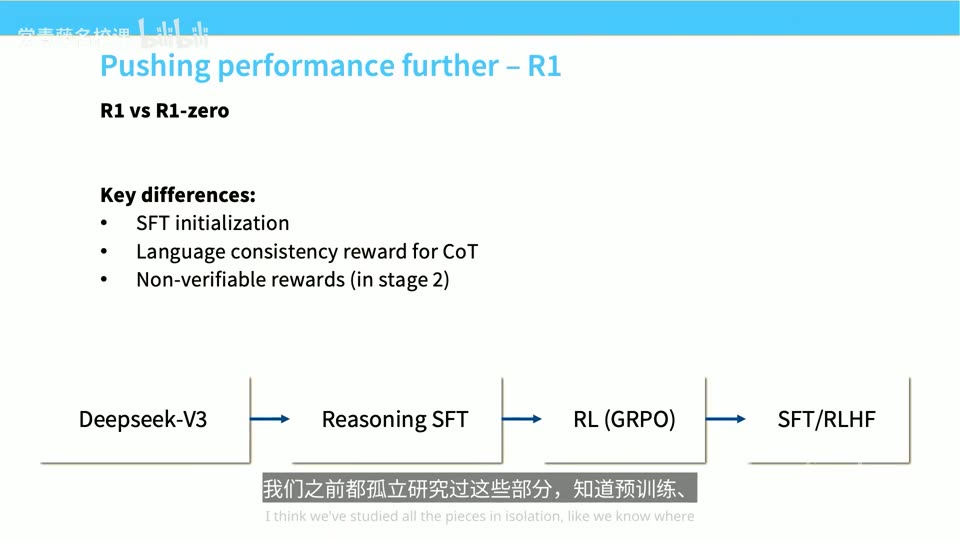
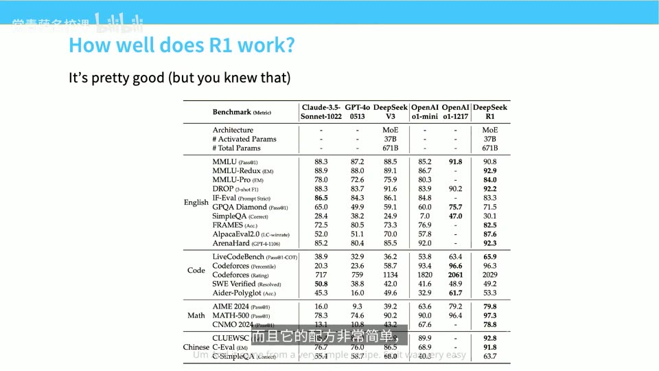
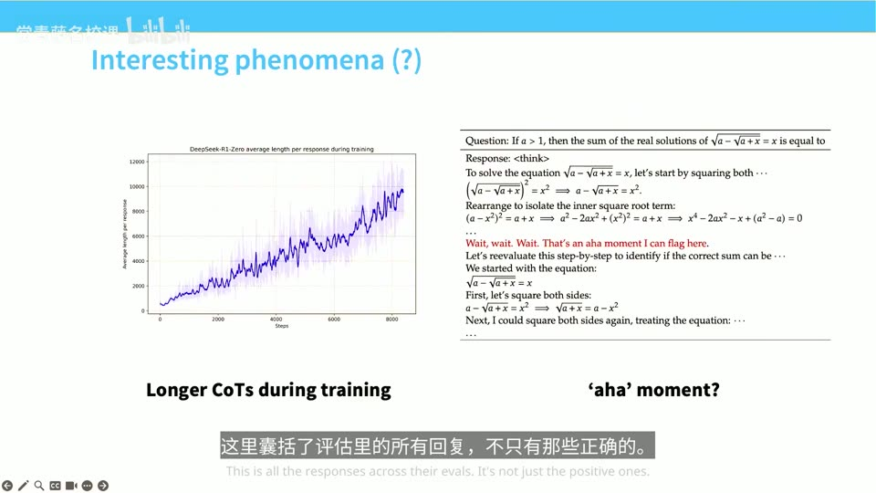
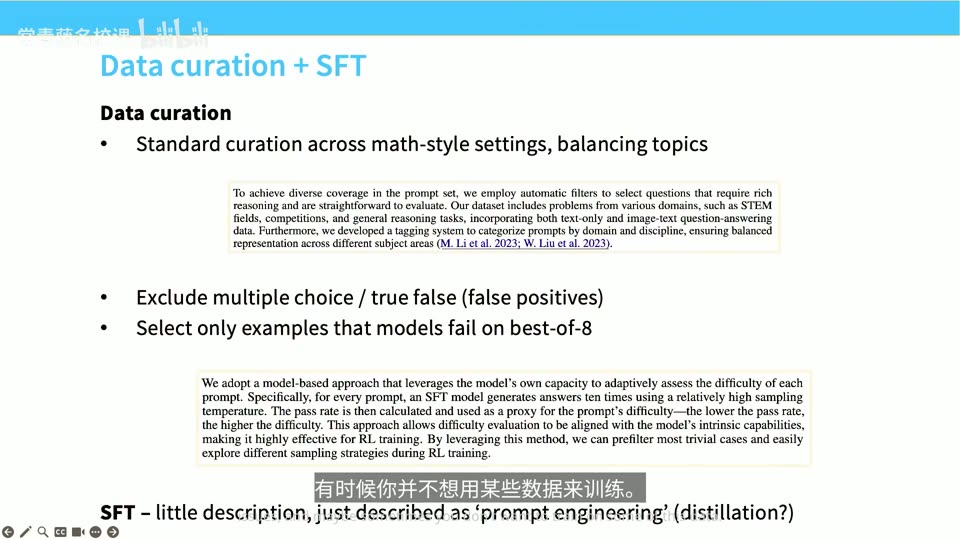
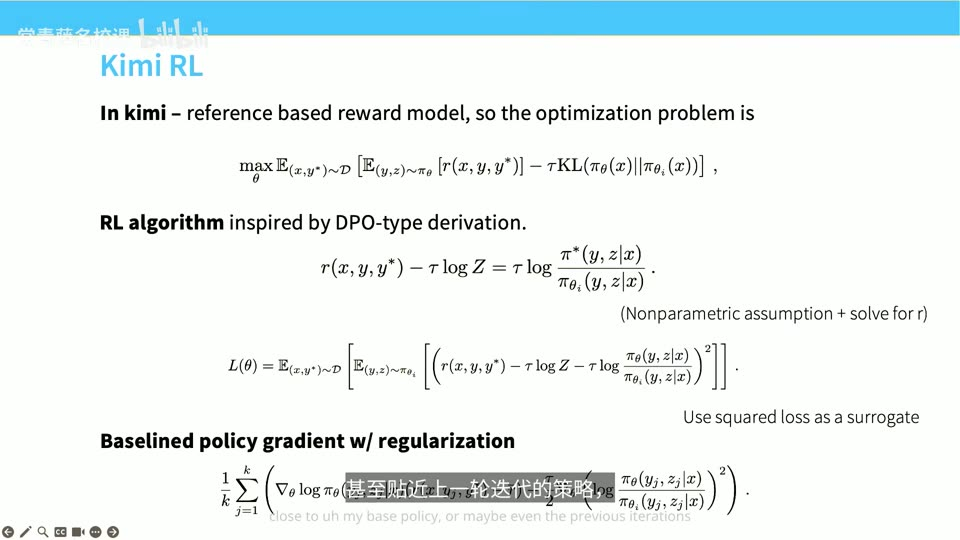

# Lecture 16: Post-Training - RLVR

## 本讲要解决的核心问题（SCQA）

**背景（Situation）**：这是后训练系列讲座的第二讲。上一讲，我们给语言模型做了**指令微调（instruction tuning，让模型学会听懂并执行人类指令）**，又做了 **RLHF（Reinforcement Learning from Human Feedback，基于人类反馈的强化学习）**——用人工标注的偏好数据训练一个"奖励模型"，再对着它做强化学习。成果不错，ChatGPT 就是这么来的。现在，我们站在后训练谱系的"左侧"，已经相当成熟。([【跳转到 00:00】](https://www.bilibili.com/video/BV11LEA6eEuj/?p=16&t=0)、[【跳转到 00:15】](https://www.bilibili.com/video/BV11LEA6eEuj/?p=16&t=15))

**冲突（Complication）**：但上一讲结尾，讲者的情绪有点"丧"。原因是 **RLHF 有一个根本性的天花板——过优化（over-optimization，也叫 reward hacking/奖励被钻空子）**：我们会去收集一堆偏好数据，训练一个奖励模型，然后对着这个奖励模型拼命做强化学习。可奖励模型只是人类偏好的一个**代理（proxy）**，你没法一直往同一个奖励模型里堆算力——堆到最后，模型会学会"讨好奖励模型"而不是"真正变得更好"，把奖励模型过拟合掉。正则化做得再好也躲不过这个问题。这本质上是一个**标注瓶颈**：靠人力标注，规模和速度都受限。([【跳转到 00:40】](https://www.bilibili.com/video/BV11LEA6eEuj/?p=16&t=40)、[【跳转到 01:05】](https://www.bilibili.com/video/BV11LEA6eEuj/?p=16&t=65))

**疑问（Question）**：作为强化学习的信徒，讲者会看到 AlphaGo 这类案例——在围棋这种领域，RL 表现出色。那么，**为什么 AlphaGo 能成功，而 RLHF 卡住了？我们在 RLHF 里做的事，和那些更"原生"的 RL 领域到底有什么区别？能不能找到一类任务，让我们像 AlphaGo 一样放心地一直加算力？**

**回答（中心思想，结论先行）**：区别在于**反馈（奖励）的来源**。

1. **AlphaGo 优化的是一个无歧义的客观目标**（围棋的胜负），所以可以无限制地投入算力——只要胜率在涨，就说明真的在进步。而 RLHF 优化的目标是"学出来的、可以被钻空子的"，加算力反而会让模型学会骗奖励模型。
2. **RLVR（Reinforcement Learning with Verifiable Rewards，基于可验证奖励的强化学习）**，正是把 RL 用在这种"答案可自动验证"的领域上：**形式数学、自然语言数学，乃至编程**——答案对不对，可以由**编译器或检查器自动判定**，没有模糊地带。([【跳转到 01:30】](https://www.bilibili.com/video/BV11LEA6eEuj/?p=16&t=90)、[【跳转到 01:55】](https://www.bilibili.com/video/BV11LEA6eEuj/?p=16&t=115))
3. 算法本身和之前没有本质差别，**但最终效果会出人意料地不同**。今天讲座分两大部分：**第一部分讲核心算法**（PPO 怎么运作、GRPO 是什么，这是作业里要用的基本功）；**第二部分深挖几个开源模型发布**（DeepSeek R1、Kimi K1.5、Qwen3），看看第一部分讲的东西是怎么体现在真实大模型的训练配方里的。([【跳转到 02:06】](https://www.bilibili.com/video/BV11LEA6eEuj/?p=16&t=126))

---

## 一、为什么 RLHF 走进死胡同：可验证奖励才是出路

这一节要回答一个动机问题：既然 RLHF 已经能做出 ChatGPT，为什么还要折腾 RLVR？

### 1.1 RLHF 的算力堆不上去：过优化与标注瓶颈

RLHF 的流程是"收集偏好数据 → 训练奖励模型 → 对着奖励模型做 RL"。奖励模型是我们用人工偏好**学出来的目标**，它和"人类真正想要的东西"之间总有差距。当强化学习足够强，它就会去利用这个差距——在奖励模型上刷分，而不是在真实目标上变好。

讲者引用的经典图表（左图）显示：随着 RL 训练推进，真实奖励先上升、随后**掉头下降**，而代理奖励还在继续上升。这就是过优化：模型把奖励模型"钻空子"了。正则化（约束模型不要偏离初始模型太远）只能缓解，无法根治。所以这条路走不远，也不是强化学习真正潜力的所在。([【跳转到 01:05】](https://www.bilibili.com/video/BV11LEA6eEuj/?p=16&t=65))

更本质的问题是**标注瓶颈**：奖励模型的好坏取决于人工标注的数据量和质量，而人力无法像算力那样成倍扩张。只要奖励目标还是"人给的、模糊的偏好"，我们就没法像在围棋里那样无限加算力。([【跳转到 00:40】](https://www.bilibili.com/video/BV11LEA6eEuj/?p=16&t=40))

### 1.2 AlphaGo 的启示：目标无歧义，才敢无限加算力

讲者把 AlphaGo 和 RLHF 拿来对比，指出一个主要区别在**它们获得反馈的方式**：

- **在 AlphaGo 里，优化的目标非常明确**：围棋的胜负条件定义得没有任何模糊之处。你可以随意投入算力，只要目标在提升（胜率上升），就说明进展良好。某种意义上这更像一个**搜索问题（search problem）**——给定明确的胜负信号，加大搜索和算力就能变强。
- **在 RLHF 里，目标更像一个"学习问题（learning problem）"**：奖励模型本身是被学出来的，我们不确定它是否忠实反映了人类意图，因此不能无条件地加算力。

讲者强调，这个"搜索 vs 学习"的区分并不精确，但可以帮助理解。**关键洞察：想让 RL 像 AlphaGo 一样可控，就要去找那些"奖励天然可验证、无法被钻空子"的任务。**([【跳转到 01:30】](https://www.bilibili.com/video/BV11LEA6eEuj/?p=16&t=90))


### 1.3 可验证领域：数学与代码

哪些领域具备"可验证性"？讲者点名了几类：**形式数学（formal math，用 Lean 之类的证明助手写出的机器可检验的证明）**、**自然语言数学（用自然语言写的数学题，答案是明确的对/错）**，以及编程（代码能否通过测试用例）。这些领域都有一个共同点：**答案对错可以由机器自动判定**，无需人工标注偏好。

因此它们更适合强化学习——算法在根本上和 RLHF 差别不大，但**因为奖励不易被钻空子，可以持续投入算力，最终结果会截然不同**。这正是今天整讲的主线。([【跳转到 01:55】](https://www.bilibili.com/video/BV11LEA6eEuj/?p=16&t=115))

---

## 二、PPO：概念简单、实现却极端挑剔

讲核心算法，绕不开 **PPO（Proximal Policy Optimization，近端策略优化）**——RL 领域的一种主力算法。它虽然之前讲过，但"挺绕的"，值得再讲一遍。([【跳转到 02:31】](https://www.bilibili.com/video/BV11LEA6eEuj/?p=16&t=151))

### 2.1 先说策略梯度：一切的核心公式

在语言建模的 RL 里，最核心的技术概念是**策略梯度（policy gradient）**。直觉上，我们一直在对奖励做**梯度下降**，而它其实是通过**加权的 SFT（监督微调）更新**来实现的——只不过每一步样本的权重可以是正的也可以是负的。

讲者强调一个公式"在某种意义上衍生出一切、后续会反复出现"：**策略梯度要求每次梯度更新时都从当前策略中采样**。问题是，采样（在语言模型里就是生成整段文本，叫 **rollout**）很慢，能不能**复用**已经采出来的 rollout？可以，但会产生"策略变了、数据却是旧的"的**离策略（off-policy）**问题。**TRPO（Trust Region Policy Optimization）** 和 **PPO** 就是为解决这个问题而生的：它们用各种技巧让策略不要一次更新得太猛，从而允许一定程度地复用数据。([【跳转到 02:31】](https://www.bilibili.com/video/BV11LEA6eEuj/?p=16&t=151)、[【跳转到 02:56】](https://www.bilibili.com/video/BV11LEA6eEuj/?p=16&t=176))

### 2.2 从伪代码看，PPO 真的很简单

在概念层面，PPO 非常简单。讲者展示了一段来自 OpenAI 官方 RL 入门文档的 PPO-Clip 伪代码，逻辑清晰得像"我一次就能实现"：([【跳转到 04:04】](https://www.bilibili.com/video/BV11LEA6eEuj/?p=16&t=244))

1. 用当前策略 $\pi_\theta$ 在环境里**采样一批轨迹**（rollout）；
2. 计算**回报** $R_t$ 和**优势估计** $\hat A_t$（advantage，衡量某个动作比平均水平好多少）；
3. 用 **PPO-Clip 目标函数**更新策略——把新旧策略的概率比 $r_t = \pi_\theta/\pi_{\theta_{old}}$ 做**裁剪（clip）**，限制在 $[1-\epsilon, 1+\epsilon]$ 之内，防止一步更新太大；
4. 用均方误差拟合一个**价值函数（value function）** $V_\phi$；
5. 循环往复。


### 2.3 但实现细节会"吃掉"你：37 个坑

问题出在实践。讲者的警告很生动：**看到一篇博文列出"PPO 的 37 个实现细节"，你就该心里发毛**——因为这说明该算法对实现决策**极度敏感**。不同的库、不同的细节组合，给出的结果截然不同，甚至有人指出某些实现里用的"基线（baseline）根本不算基线"，从根本上改变了被优化的目标。有些人其实是**实现错了**。([【跳转到 04:29】](https://www.bilibili.com/video/BV11LEA6eEuj/?p=16&t=269)、[【跳转到 04:54】](https://www.bilibili.com/video/BV11LEA6eEuj/?p=16&t=294))

语言模型的 PPO 实现尤其不令人愉快，几个典型坑：

- **优势估计（GAE）**：算法中间有一大块是**优势项**，同时要缓存旧数据（经验缓冲区），还要训练价值模型——注意优势估计用的也是这个价值模型，所以它在流程图里出现了两次。
- **逐 token 的 KL 项**：目标函数里的 **KL 散度（KL divergence，衡量两个概率分布差异的量）惩罚是逐 token 计算的**，这说明语言模型的 RL 不是简单的**多臂老虎机（multi-armed bandit，只做一次动作、只看一个奖励）**问题，而是完整的**多步 RL 问题**。
- **价值模型很占内存**：PPO 需要一个**价值模型**，边生成边估算每个 token 的价值。这个价值模型有多大？**和原始模型一样大**——于是它占掉了你本想留给模型或推理服务器的显存。([【跳转到 04:54】](https://www.bilibili.com/video/BV11LEA6eEuj/?p=16&t=294)、[【跳转到 07:47】](https://www.bilibili.com/video/BV11LEA6eEuj/?p=16&t=467))

### 2.4 两个具体的"骚操作"：KL 裁剪与退化的 GAE

- **KL 惩罚在零处被"截断"**：实践中的高层做法是"逐 token 的 KL 惩罚 + 最后一个 token 给全奖励"。但为了稳定，很多实现会**裁剪 KL**：只在"新策略的对数概率小于参考策略"的序列上施加惩罚，否则数值会立刻爆炸。懂 KL 散度的人都知道，这**违背了 KL 散度的本意**（正负值本都该在零附近被约束），但它是让训练稳定的现实手段。
- **退化的 GAE**：原始 PPO 论文里的**广义优势估计器（GAE，Generalized Advantage Estimation）**依赖折扣因子 $\gamma$ 和 $\lambda$。但大家常常直接把 $\gamma$ 和 $\lambda$ **都设成 1**——这其实是个**退化的设置**，等于丢掉了 PPO 原本的多步结构，退化成多臂老虎机问题。([【跳转到 06:30】](https://www.bilibili.com/video/BV11LEA6eEuj/?p=16&t=390)、[【跳转到 06:52】](https://www.bilibili.com/video/BV11LEA6eEuj/?p=16&t=412))

### 2.5 那为什么不用 DPO？

有同学会问：上一讲提到了 **DPO（Direct Preference Optimization，直接偏好优化）**，看起来挺好的，为什么不干脆全用 DPO？讲者的回答是：**DPO 是针对特定问题的特定解法**。它适用于 **Bradley–Terry 形式的成对反馈（pairwise preference，即"回答 A 比回答 B 好"这种数据）**，而这太具体了——如果你要解数学题，数学题并不是天然的成对比较形式。虽然也有 DPO 变体想打破成对结构，但**那是用错工具**。PPO 是更通用的工具，几乎什么问题都能解决。([【跳转到 07:47】](https://www.bilibili.com/video/BV11LEA6eEuj/?p=16&t=467)、[【跳转到 08:12】](https://www.bilibili.com/video/BV11LEA6eEuj/?p=16&t=492))

讲者补充说，DPO 通常是**离线（offline，用固定数据集训练）**的，而 PPO 是**在线（online，边采样边训练）**的。不过这个区别"被过分夸大了"，因为反复迭代 DPO 也能把它变成在线的。**真正让 DPO 和 GRPO 被广泛采用的，其实是"让 PPO 稳定跑通太痛苦了"。**([【跳转到 08:37】](https://www.bilibili.com/video/BV11LEA6eEuj/?p=16&t=517))

---

## 三、GRPO：去掉价值函数，用组内 Z 分数当优势

**GRPO（Group Relative Policy Optimization，组相对策略优化）**是给可验证任务做强化学习的一种**更简单**的办法，出自 DeepSeek 的一篇数学论文。在开源社区里，RLVR 基本已经被 GRPO"接管"了。它骨子里和 PPO 非常像，只是**砍掉了几个最复杂的部分**。([【跳转到 08:57】](https://www.bilibili.com/video/BV11LEA6eEuj/?p=16&t=537))

### 3.1 从 PPO 出发，改掉最烦人的价值函数

GRPO 的思路很朴素："PPO 挺好，但我们只想改几个地方。"改的是 PPO 里最复杂、最烦人的部分——**价值函数（value function）**。

要理解这为什么重要，得先理解**优势（advantage）**：在策略梯度里，我们不是直接用奖励，而是用"奖励减去一个**基线（baseline）**"得到的优势。减去基线的目的是**降低梯度更新的方差**——如果奖励有高有低，直接拿奖励做梯度会让更新忽上忽下；减去一个合理的基线后，更新更稳定。PPO 里这个基线由一整个**价值神经网络**提供。但价值网络大、训练不稳定，所以 GRPO 说：**干脆把价值网络去掉。**

那优势从哪儿来？GRPO 不想用最朴素的 **REINFORCE**（直接用奖励做梯度），因为它的方差会非常非常高。它的解决方案是**在组内把优势算成一个 Z 分数（z-score，即"减均值再除以标准差"的标准化值）**。([【跳转到 09:22】](https://www.bilibili.com/video/BV11LEA6eEuj/?p=16&t=562)、[【跳转到 09:47】](https://www.bilibili.com/video/BV11LEA6eEuj/?p=16&t=587))

用一个例子说明 Z 分数的直觉：你拿到一个得 5 分的 rollout，然后**用同一个提示词再采样另外 10 个 rollout**，问自己："比起这 10 个，我表现得怎么样？"如果我比**均值**好，优势值就高；如果我比均值差，优势值就低。这适用于"能从同一个提示词多次采样"的场景，是一种很自然的优势估计方式。

### 3.2 GRPO 的目标函数与组内 Z 分数

看 DeepSeek 论文里 GRPO 最初的定义（这是被优化的目标）：它和 PPO 类似，包含标准的 PPO 更新项、min 裁剪的优势项，以及一个 **KL 项**（让模型别偏离参考模型太远）。**关键的不同在于优势 $A_i$ 的定义——它被算成一组输出 $\{o_1,\dots,o_G\}$ 的 Z 分数**：([【跳转到 10:12】](https://www.bilibili.com/video/BV11LEA6eEuj/?p=16&t=612)、[【跳转到 10:37】](https://www.bilibili.com/video/BV11LEA6eEuj/?p=16&t=637))

```text
A_i = ( r_i − mean(r_1, …, r_G) ) / std(r_1, …, r_G)
```

也就是说：对同一个问题采样 G 个输出，第 i 个输出的优势 = (它的奖励 − 组内平均奖励) ÷ 组内奖励标准差。**每组得到一个 Z 分数。**

还有一个在**在线（on-policy）**场景下的重要简化：如果你是在线边采样边更新，那么新旧策略的比率恒等于 1，**裁剪操作根本不起作用**，目标就退化成：

```text
最大化  (A_i − KL 惩罚)
```

即用这个定义好的优势做强化学习。讲者说，在在线 rollout 场景中，这是一个"非常简单的对象"，很适合作为 RL 的目标。([【跳转到 11:02】](https://www.bilibili.com/video/BV11LEA6eEuj/?p=16&t=662))



### 3.3 一小页代码就能实现

因为没有价值网络，GRPO 的代码非常短。核心步骤只有四步：**对每个 rollout 打分 → 按组做均值/方差归一化 → 加 KL 项 → 对权重做梯度更新**。讲者展示了一份来自麦吉尔（McGill）的参考实现（`nano-aha-moment`），整页幻灯片就写完了分组、索引、标准差这些计算。([【跳转到 11:52】](https://www.bilibili.com/video/BV11LEA6eEuj/?p=16&t=712)、[【跳转到 12:17】](https://www.bilibili.com/video/BV11LEA6eEuj/?p=16&t=737))

跟论文写法唯一不同的是：**他们在标准差计算里加了一个极小的 `1e-4`**。为什么？防止"组内只有单个样本"或"组内奖励刚好全相同"时，除以零导致数值爆炸。这在**二值奖励（binary reward，只有对/错两种值）**下很常见——比如没解出数学题时奖励精确为零，一整个组可能全是零，标准差就是零。这个 `1e-4` 是工程上的安全垫。([【跳转到 12:17】](https://www.bilibili.com/video/BV11LEA6eEuj/?p=16&t=737))



### 3.4 GRPO 真的有效

在 DeepSeek 数学论文的实验里，**GRPO（黄线和蓝线）远优于 RFT（Rejection Fine-Tuning，拒绝微调）**——RFT 的做法是"只拿模型自己生成且答对的答案来做监督微调，答错的全扔掉"。讲者建议做数学 AI 的同学去读那篇 DeepSeek 数学论文，并记住一个当前阶段的关键设计决策：**过程监督（process supervision，不仅看答案，还看中间步骤）当时被认为能带来提升**。不过要注意，这只是"当时"的看法，后面 DeepSeek R1 会改变这一点。([【跳转到 12:42】](https://www.bilibili.com/video/BV11LEA6eEuj/?p=16&t=762)、[【跳转到 13:07】](https://www.bilibili.com/video/BV11LEA6eEuj/?p=16&t=787))

---

## 四、GRPO 的目标函数名正言顺吗：两个"修正因子"的代价

GRPO 用起来简单，但它到底是不是一个"名正言顺"的算法？这一节把它拆开审视。

### 4.1 什么才算"有效的"优势函数：基线原则

要评判 GRPO 的优势估计好不好，得先知道**什么样的优势函数才算有效**。讲者翻出强化学习经典教材 **Sutton & Barto** 里的结论，讲的是**带基线的 REINFORCE 算法**：做策略梯度时，你可以沿着奖励方向更新参数，也可以**用奖励减去一个"状态依赖的基线（state-dependent baseline）"**。

在老虎机问题里，"状态"就是**提示词（prompt）**，所以你可以减去一个依赖提示词的基线。**只要这么做就是有效的——策略梯度的方向不变**，但基线的选择会**影响梯度下降的方差**。这就是为什么"减去基线"是合法的、且能改善训练。([【跳转到 13:57】](https://www.bilibili.com/video/BV11LEA6eEuj/?p=16&t=837)、[【跳转到 14:22】](https://www.bilibili.com/video/BV11LEA6eEuj/?p=16&t=862))



### 4.2 修正因子一：除以标准差，放大简单/难题

看到这里就能发现问题了：**GRPO 不只是"减去基线"，它还"除以标准差"。** 而"除以标准差"相当于对奖励做了缩放，会**改变梯度的方向**，这就**违背了基线原则**。([【跳转到 14:47】](https://www.bilibili.com/video/BV11LEA6eEuj/?p=16&t=887))

那么"除以标准差"到底起什么作用？讲者这样分析：除以标准差，相当于**强调那些标准差较小的问题**。那什么时候二值奖励问题的标准差会小呢？**就是问题太简单或太难的时候**：

- 如果问题**很简单**，模型总是全对 → 奖励没有波动 → 标准差趋近于零 → 相当于除以零 → 这个问题的权重被**显著放大**；
- 如果问题**总是答错**，奖励同样没有波动 → 标准差也趋近于零 → 权重同样被放大。

所以标准差归一化会**放大两端（特别简单和特别难）问题的权重**。而这显然不是我们想要的——我们希望模型在**能力范围内的题目**上学习，那里才有进步空间。([【跳转到 16:52】](https://www.bilibili.com/video/BV11LEA6eEuj/?p=16&t=1012)、[【跳转到 17:17】](https://www.bilibili.com/video/BV11LEA6eEuj/?p=16&t=1037))

### 4.3 修正因子二：除以序列长度，鼓励长输出

GRPO 还有第二个修正因子，而且它几乎是**针对每个 token 操作**的：它用**序列总长度作为归一化因子**去除。也就是说，整段序列的策略梯度被**长度平均**了。([【跳转到 15:12】](https://www.bilibili.com/video/BV11LEA6eEuj/?p=16&t=912))

长度归一化比较好懂：**拿较长的序列去除以一个较大的数**，而当一个序列得负奖励（答错）时，除以更大的长度会**削弱这个负惩罚**。于是会发生什么？考虑一道模型做错、会引入负奖励（比如 -1）的题：模型可以通过**生成无限长的字符串**，用一个负奖励"除以无穷大"来把惩罚抵消掉。极端情况下模型会**在答不出题时一直废话**。([【跳转到 16:02】](https://www.bilibili.com/video/BV11LEA6eEuj/?p=16&t=962))

不过，实践中有一个反直觉的好消息：**解决了长度问题后，思维链（CoT，chain-of-thought）的长度往往最后会稳定在一个常数，而不是无限增长**。特别是在答错时，你肯定不希望输出越来越长。


### 4.4 GRPO 不是从第一性原理推导出来的

讲者的结论很坦率：**GRPO 并不是从第一性原理推导出来的**。如果你严格遵循策略梯度和极限定理去从头推导，得到的公式里**既没有长度归一化，也没有标准差归一化**。GRPO 刚出不久，就有人注意到这一点并发表论文，指出如果不做这两处改动，结果会很不一样，甚至可能表现更好。([【跳转到 15:37】](https://www.bilibili.com/video/BV11LEA6eEuj/?p=16&t=937))

**所以 GRPO 其实做了些"修正因子"，利弊兼有。** 这个认识为后面 Kimi K1.5 从另一条路（DPO 式推导）"重新发明"带基线的策略梯度埋下了伏笔。

---

## 五、案例一：DeepSeek R1——首个追平 o1 的开源配方

讲完算法，讲者开始拆解几个近期的开源模型发布。第一个是 **DeepSeek R1**——"它现在挺火的，大家都该了解一下"。([【跳转到 17:42】](https://www.bilibili.com/video/BV11LEA6eEuj/?p=16&t=1062))

### 5.1 为什么 R1 是一个里程碑

R1 论文之所以重要，有三个理由：

1. **它是首个在表现上追平 OpenAI o1 的开源模型**。o1 的关键在于它有很长的思维链，显然是经过 RL 训练的，在难题上表现很好；R1 追平了这一点。
2. **它提供了一套任何人都能用的 RL 方案**。从研究角度看这非常重要——如果只有 DeepSeek 自己能跑通，那"糟糕的 PPO"影响就小；但因为用的是 GRPO，**谁都能玩，哪怕做作业时也能用**。这正是论文开启"开源 RLVR 模型浪潮"的原因。
3. **它有一些到现在依然管用的蒸馏（distillation，把大模型的能力迁移到小模型）见解。**([【跳转到 18:07】](https://www.bilibili.com/video/BV11LEA6eEuj/?p=16&t=1087))

R1 的起点可以很清楚看出它的"专长是怎么一步步搭起来的"：DeepSeek 先发了数学论文，用 GRPO 在数学题上把 RL 的门道摸透了，所以 **R1 就从 DeepSeek 数学的那些组件起步**。一个重要区别是：**R1 放弃了过程监督，只用结果监督（outcome supervision）**——简单说就是**只看最终答案对错来给奖励**，而过程监督还要看中间步骤是否有效。很多人以为过程监督很重要，结果发现它对很多任务其实没那么关键。([【跳转到 18:32】](https://www.bilibili.com/video/BV11LEA6eEuj/?p=16&t=1112)、[【跳转到 18:57】](https://www.bilibili.com/video/BV11LEA6eEuj/?p=16&t=1137))

### 5.2 R1-Zero：基础模型 + 纯 GRPO + 结果/格式奖励

R1 系列里特别有趣的组件是 **R1-Zero**。它做了一个"非常纯粹、受控的实验"：在一个**已完成中期训练（mid-training，能做一些指令遵循）的基础模型**之上，**主要只做 RLVR**，用 GRPO 算法，奖励就那么几项：([【跳转到 19:22】](https://www.bilibili.com/video/BV11LEA6eEuj/?p=16&t=1162))

- **准确性奖励（accuracy reward）**：答案是否解对；
- **格式奖励（format reward）**：是否用规范的**思维标签**（如 `think` 标签）包裹住思维链。

格式奖励为什么"很关键"？因为有了它，**后续可以方便地剥离出思维链**。这套方案简单得让人惊讶——GRPO 简单、准确性奖励也简单。**结果呢？效果只比 OpenAI o1 略差一点**。这正是讲者喜欢这个结果的原因：它**没有真实生产训练流程的那种杂乱**，不掺杂 RLHF 等成分，所以你能清楚看到"基础模型 + GRPO"到底能走多远。([【跳转到 19:47】](https://www.bilibili.com/video/BV11LEA6eEuj/?p=16&t=1187))



### 5.3 R1：加入 SFT、语言一致性奖励与 RLHF

R1-Zero 是个干净、受控的环境；**R1 则是"想把系统投入实际应用"的尝试**。两者关键区别有三点：([【跳转到 21:11】](https://www.bilibili.com/video/BV11LEA6eEuj/?p=16&t=1271)、[【跳转到 20:12】](https://www.bilibili.com/video/BV11LEA6eEuj/?p=16&t=1212))

1. **SFT 初始化**：R1-Zero 完全不做 SFT，而 R1 愿意使用**长思维链数据**做 SFT。论文里的措辞很小心——"我们构建并收集了少量长思维链数据"。讲者点破：大家猜测这很可能是**从别的模型蒸馏来的**（这在开源模型里不算坏事，大家都这么干）。但重要的是，这揭示了一个洞见：**只要基础模型够强，光靠长思维链做监督微调，就能激发大量类 o1 的能力**。
2. **语言一致性奖励（language consistency reward）**：没加这个奖励的话，R1-Zero 风格的训练会让思维链"乱切语言"。他们觉得这难以解释、看着不安，于是加奖励让模型**统一输出一种语言**，主要出于**可解释性**考虑。
3. **不可验证奖励（non-verifiable rewards）**：他们把一些不可验证的奖励塞进 GRPO，几乎都融进 RLHF 流程里。对不可验证的任务，基本沿用 DeepSeek V3 的方法。除此之外，R1 的 RL 部分和 R1-Zero **基本一样**，只是去掉了语言一致性损失。

R1 的整体流水线可以清楚看到各模块是怎么拼起来的：**DeepSeek-V3 → 推理相关的 SFT → RL（GRPO）→ SFT/RLHF**。讲者评价"整个流程很清晰"。([【跳转到 22:01】](https://www.bilibili.com/video/BV11LEA6eEuj/?p=16&t=1321)、[【跳转到 22:26】](https://www.bilibili.com/video/BV11LEA6eEuj/?p=16&t=1346))



### 5.4 R1 效果好，且有一个简单配方

**R1 的效果真的非常好**，在多个类别上超过了 o1，也符合大家预期的"测试时扩展（test-time scaling，思考越久、性能越好）"表现。更难得的是它的**配方非常简单**，所以"增益来自哪里很容易理解"。这也解释了 DeepSeek 当时为什么引发广泛关注。([【跳转到 24:05】](https://www.bilibili.com/video/BV11LEA6eEuj/?p=16&t=1445))



### 5.5 两个"网红现象"：思维链变长与"顿悟时刻"

R1 的走红部分也源于论文里声称观察到的两个有趣现象（讲者对此持保留态度）：

1. **训练越久，思维链越长**。讲者认为这其实是 **GRPO 长度归一化的自然结果**——前面讲过，长度归一化会鼓励更长的输出，所以这几乎必然发生。
2. **网上疯传的"顿悟时刻（aha moment）"**：训练足够久后，模型的思维链里会出现"Wait, wait… 让我重新检查"这类顿悟式转折。讲者说，**别人已经证明基础模型里就有这种现象**，所以这肯定不只是强化学习算法的功劳。很多数学 token 在预训练时就被模型生成过，强化学习只是"顺手把它提取出来"。因此这个现象"没那么特别或刺激"。

([【跳转到 20:21】](https://www.bilibili.com/video/BV11LEA6eEuj/?p=16&t=1221)、[【跳转到 20:46】](https://www.bilibili.com/video/BV11LEA6eEuj/?p=16&t=1246))



### 5.6 蒸馏洞见与"结果奖励 vs 过程奖励"

R1 还有一个重要的**蒸馏洞见**：把 R1 的思维链输入给 **Qwen-2.5** 或 **Llama** 等基础模型，能显著提升它们的性能，有时甚至媲美专用模型。也就是说，**只要给模型能读懂的合适长思维链，就能让它长时间推理**——基础模型本身出奇地好。由此引出一个关键问题：**你真需要强化学习吗？** 一种思路是：强化学习是**极好的监督信号来源**——解决前沿数学问题时你拿不到现成的长思维链，RL 能让你**自我生成**；但一旦有了这些长思维链，你也可以**从模仿（监督微调）中学习**。这似乎部分印证了那些蒸馏结果。([【跳转到 23:25】](https://www.bilibili.com/video/BV11LEA6eEuj/?p=16&t=1405)、[【跳转到 24:30】](https://www.bilibili.com/video/BV11LEA6eEuj/?p=16&t=1470))

最后是**奖励设计**。讲者很欣赏 DeepSeek 的技术报告，因为它们**既做消融实验，也坦诚公布失败的尝试**：([【跳转到 25:00】](https://www.bilibili.com/video/BV11LEA6eEuj/?p=16&t=1500)、[【跳转到 25:25】](https://www.bilibili.com/video/BV11LEA6eEuj/?p=16&t=1525))

- **过程奖励模型（PRM）**：论文里交代了它的下落——他们试过让它生效，但"没帮上什么忙"。主要争议在于**分步的评分准则从哪儿来，很难扩展**。
- **结果奖励模型（ORM）**：事实证明它**效果好、数据量足够后也更容易扩展**，这正是当下的重点所在。
- **其他失败尝试**：很多人曾猜 o1 内部用了过程奖励模型或像 AlphaGo 一样做**树搜索（tree search）**。R1 论文表示他们也尝试了大量**蒙特卡洛树搜索（MCTS）**，"但没能很好地跑通"。他们很坦诚地公开了所有探索和失败，而不是假装没试过。

---

## 六、案例二：Kimi K1.5——从 DPO 推导重造策略梯度，并给思维链戴上"长度缰绳"

### 6.1 为什么必须提 Kimi K1.5

聊到 R1，讲者说"必须提一下 **Kimi K1.5**"，因为它和 R1 **几乎同时发布，也击败了 o1**。然而大家都在追捧 DeepSeek，Kimi 却很少被提起，尽管它的模型非常出色。讲者说，提它"并不只是出于同情"——**Kimi 有好些方面做得和 DeepSeek 很不一样，但两套都行得通，我们能从中学到不少东西**。这也正是本课的主题之一：读技术报告、看更大的趋势，就能摸清哪些路子能让这些算法跑通。([【跳转到 27:13】](https://www.bilibili.com/video/BV11LEA6eEuj/?p=16&t=1633))

### 6.2 数据与课程：广泛覆盖 + best-of-K 筛选

对 RL 来说，**数据不止是数据，还多了一层"课程式设计"的考量**：你想投入什么难度的问题？SFT 里你不太用考虑难度，把数据塞进去就行；但 RL 不一样——**如果问题太难，你就拿不到奖励；没有奖励就没有信号；没有信号就学不了**。所以**广泛覆盖正确类型的事例非常重要**。([【跳转到 28:03】](https://www.bilibili.com/video/BV11LEA6eEuj/?p=16&t=1683)、[【跳转到 28:09】](https://www.bilibili.com/video/BV11LEA6eEuj/?p=16&t=1689))

Kimi 的数据做法：

- **追求一大批广泛的数据覆盖**，对 STEM、竞赛、通识推理等领域做平衡采样，并打上领域/学科标签；
- **排除多选题和判断题**，因为他们想要的是"需要深度思考"的内容，多选题往往没有这种效果；
- **核心理念：用 best-of-K 筛选器过滤样本**。做法是：对每道题让模型采样 K 次（例如 8 次），**如果模型在 best-of-8 里至少成功一次，就说明这道题已经卡在模型能力的边缘，教不了它太多新东西，于是跳过**；只看那些"8 次都没通过"的样本。你甚至可以**两头过滤**，挑出既不太难也不太简单的问题。

讲者强调，研究界普遍认为**做这种中等难度的筛选对 RL 稳定进步非常关键**：它既省算力（直接跳过某些问题），又能挑出合适类型的问题。([【跳转到 28:34】](https://www.bilibili.com/video/BV11LEA6eEuj/?p=16&t=1714)、[【跳转到 28:59】](https://www.bilibili.com/video/BV11LEA6eEuj/?p=16&t=1739)、[【跳转到 29:24】](https://www.bilibili.com/video/BV11LEA6eEuj/?p=16&t=1764))

另外，Kimi 报告里对 **SFT 的描述很少，只说成是"提示工程"**，具体内容没有公开，只能推测（同样可能涉及蒸馏）。([【跳转到 29:49】](https://www.bilibili.com/video/BV11LEA6eEuj/?p=16&t=1789))



### 6.3 从 DPO 式推导"重新发明"出 GRPO

Kimi 最有意思的地方在于它的**算法不是 GRPO，而是从 DPO 式的推导出发的**，但最终"落点"却和 GRPO 非常相似。这个"殊途同归"说明：**设计新 RL 算法时，某些组件可能是有用的**。([【跳转到 29:54】](https://www.bilibili.com/video/BV11LEA6eEuj/?p=16&t=1794))

它的推导大致是这样：([【跳转到 30:19】](https://www.bilibili.com/video/BV11LEA6eEuj/?p=16&t=1819)、[【跳转到 30:44】](https://www.bilibili.com/video/BV11LEA6eEuj/?p=16&t=1844))

1. 起点和大家一样：**在策略下最大化期望奖励**，右边加一个 **KL 正则项**让策略贴近基础策略（甚至贴近上一轮迭代的策略）。
2. 沿用 **DPO 风格的推导**：假设能**解析地最大化**目标，反解出对应的奖励模型，得到**策略的比率**，再带回到上面的目标函数。
3. 关键的是**"匹配"思路**：既然在最小值处两个等式相等，那**何不直接对它加平方损失来最小化**？讲者笑称"优化专家看了会震惊"，但这个直觉在某些方面完全合理——模型好的时候两者应该接近，所以把"显式拉近二者"当作代理目标也行。这是一个**大胆的启发式**。
4. 对损失求梯度，结果惊人：**它其实就是加了正则项的 GRPO**——最终得到一个**带基线 $\bar r$（各类条件下的平均奖励）的策略梯度**，外加一个本质上就是 GRPO 里 KL 项的正则项。

所以讲者说，Kimi 是**用完全不同的方法"重新发明"了组均值归一化基线**。



### 6.4 给思维链戴上"长度缰绳"

讲者认为 **Kimi 团队对长度问题的看法比 GRPO 团队更透彻**。当 GRPO 团队把"思维链越来越长"当作一件好事来展示时（潜台词是"我们的模型变聪明了，思考得更久"），Kimi 团队的反应是：**生成这么长的思维链太浪费了，思维链很烧推理成本，我们其实不想要长思维链**。([【跳转到 31:09】](https://www.bilibili.com/video/BV11LEA6eEuj/?p=16&t=1869)、[【跳转到 31:42】](https://www.bilibili.com/video/BV11LEA6eEuj/?p=16&t=1902))

因为 Kimi 的目标函数**不按序列长度归一化**，所以它天生没有"长度越长越占便宜"的问题。但他们还想**进一步压缩回复长度**：最简单粗暴的 RL 做法是**加一个启发式的长度奖励**，并入 RL 流程。([【跳转到 31:54】](https://www.bilibili.com/video/BV11LEA6eEuj/?p=16&t=1914))

这个长度奖励有个微妙的平衡（讲者用"AI 几何很差"的例子说明）：([【跳转到 32:19】](https://www.bilibili.com/video/BV11LEA6eEuj/?p=16&t=1939)、[【跳转到 32:44】](https://www.bilibili.com/video/BV11LEA6eEuj/?p=16&t=1964))

- 他们让**更长的序列变得越来越短**，同时正确答案也应该短；
- **但不能把错误答案压得太短**——否则模型在某个领域就"再也翻不了身"了。比如一个几何很差的模型，如果错误答案的思维链被惩罚到**归零**，它就永远拿不到正的几何奖励，彻底卡死；
- 所以正确做法是**一直激励错误答案只比平均水平稍短一点**，这样错误内容就不会无限增长。

讲者举例说，对用户而言，如果每次思考一小时就很糟糕，每次只思考 5 分钟才理想；因此**压缩思维链是一个重要且合理的需求**。([【跳转到 32:19】](https://www.bilibili.com/video/BV11LEA6eEuj/?p=16&t=1939))

### 6.5 验证是深坑，但 RL 始终优于专家迭代

Kimi 还有两点值得记：

- **成功率过滤与课程**：他们**统计解决特定问题的频率，一旦模型掌握某问题，就把该题移出题库**以省算力（做 RL 的团队普遍都会用成功率过滤，免得浪费算力去啃模型搞不定的难题）。([【跳转到 33:22】](https://www.bilibili.com/video/BV11LEA6eEuj/?p=16&t=2002))
- **奖励/验证是深坑**：写代码就用标准答案再生成新测试用例；做数学题则**用奖励模型来检查答案是否等价**。讲者由此感慨——这一讲开头还说要用形式化数学这类"真正能验证"的东西，结果走到最后，**我们却得到一个奖励模型来检查数学答案对不对**。因为"判断答案是否等价是个特别难的问题"：数学里同一个意思有很多种写法，模型给出的答案也五花八门，哪怕让它用 LaTeX 把答案框起来，它有时也会忘加框或多加内容，**严格的检查器会判错，哪怕思路其实是对的**。所以真实项目大量使用**正则表达式或奖励模型**做检查器。([【跳转到 33:47】](https://www.bilibili.com/video/BV11LEA6eEuj/?p=16&t=2027)、[【跳转到 34:12】](https://www.bilibili.com/video/BV11LEA6eEuj/?p=16&t=2052))

最后，Kimi 的大规模消融实验回答了一个根本问题：**真正的 RL 是不是比"只用正确答案训练"（这叫专家迭代，expert iteration）更好？** 过去很多论文里专家迭代效果不错，但 Kimi 的实验表明：**这类 RL 方法的表现一直优于专家迭代**（橙色线赢过蓝色线）。**想要榨干性能，RL 必不可少。**([【跳转到 37:25】](https://www.bilibili.com/video/BV11LEA6eEuj/?p=16&t=2245))

---

## 七、案例三：Qwen3 / Qwen3.5 Coder——成熟流水线、思维融合与智能体专家蒸馏

最后一个案例是 **Qwen3**（以及 Qwen3.5 Coder）。讲者认为 **Qwen3.5 Coder 披露了主流报告中关于 RLVR 训练最多的细节**。([【跳转到 37:50】](https://www.bilibili.com/video/BV11LEA6eEuj/?p=16&t=2270))

### 7.1 一套成熟、组织清晰的 RLVR 流水线

Qwen 用的是一套**成熟的 RLVR 方案**，整体组织和 DeepSeek 很像，可以当作"前沿语言模型构建的图景"：([【跳转到 38:23】](https://www.bilibili.com/video/BV11LEA6eEuj/?p=16&t=2303))

- 先拿**基础模型做 SFT**；
- 再做**推理 RL（reasoning RL）**；
- 接着做**思维模式融合（thinking mode fusion）**；
- 然后做**通用 RL（general RL）**得到一个能力上限模型；
- 因为他们不想直接拿这个大模型来服务，最后再做**蒸馏**得到小模型。

讲者评价：Qwen 基本用了现在这套"经过验证的 RLVR 打法"，并**吸收了 Kimi 和 DeepSeek 的长处**。


### 7.2 数据过滤：省算力、去污染，只用约 4000 个样本

Qwen 在数据上做得很细致：([【跳转到 38:48】](https://www.bilibili.com/video/BV11LEA6eEuj/?p=16&t=2328)、[【跳转到 39:13】](https://www.bilibili.com/video/BV11LEA6eEuj/?p=16&t=2353))

- **大量按难度过滤**（省算力，也是拿好数据的路子）；
- **剔除"不用思维链就能答对"的题**（那不算思维问题）；
- **剔除和验证数据太像的内容**，给数据**去污染（decontamination）**；
- **对参考思维链做一点人工筛选**。

最令人惊讶的是：**Qwen 的 RLVR 只用了约 4000 个样本**，但只要其他环节没问题，效果往往超出预期。讲者说，RLVR 的核心其实"没啥新鲜的"——毕竟它基于 DeepSeek R1 和 Kimi 构建。

### 7.3 思维模式融合与"提前退出思考"

Qwen3 有些特有做法（部分后来被放弃了，但思路很有意思）：

- **用标签把思维和非思维内容混在同一个模型里**。这就是为什么模型既有"思考模式"、能生成长思维链，又能混用两种模式——**即使是即时响应（非思考）和长思维链模式，其实都在同一个模型里**。而在很多其他地方（甚至 OpenAI），思考模式和非思考模型是**分开的两个模型**。([【跳转到 39:38】](https://www.bilibili.com/video/BV11LEA6eEuj/?p=16&t=2378))
- **提前退出思考（early stopping termination）**：输入一个**特定字符串**，模型就会中断思维链、直接给出答案。就像 ChatGPT 界面里可以中途打断思考、直接要一个即时答案。令人惊讶的是：当你调整**思考预算（thinking budget）**、用这种提前终止技巧时，**模型的性能是平滑下降的**——哪怕思维链被截断，它仍能给出相当合理的回答。([【跳转到 40:03】](https://www.bilibili.com/video/BV11LEA6eEuj/?p=16&t=2403))

他们一致观察到：**即使思维预算很小，思考模式在数学和编码任务上也远胜即时响应模式**（后者更接近传统的 RLHF 指令遵循模型）。


### 7.4 组件消融：先推理 RL，再通用 RL

Qwen 帮我们分析了**各个组件对性能的贡献**。结论"其实不太令人意外"：**先做推理强化学习、再做通用强化学习，能逐步获得提升**。在各种通用任务（如 ArenaHard、Counterfactual QA）上，通常需要更常规的 RLHF，而它们的性能也在这一阶段全面提升；数学和编码上确实有些下降（因为融合了非思维组件），但下降幅度并不严重。([【跳转到 40:28】](https://www.bilibili.com/video/BV11LEA6eEuj/?p=16&t=2428)、[【跳转到 40:53】](https://www.bilibili.com/video/BV11LEA6eEuj/?p=16&t=2453))

讲者补充说，后续某些 Qwen3.5 版本**又回到了把思维和非思维分开的做法**——因为他们觉得融合带来的性能下降难以接受，想彻底挖掘思维模式的潜力。

### 7.5 Qwen3.5 Coder：智能体后训练与"专家蒸馏"

Qwen3.5 Coder（讲者口误成过 "coder-next"）是一篇**优秀的智能体后训练论文**。核心信息是：**智能体的后训练和我们之前讲的内容差别不大，并没有什么新的智能体训练算法——数据才是关键。**([【跳转到 41:36】](https://www.bilibili.com/video/BV11LEA6eEuj/?p=16&t=2496))

要训练智能体，你得先把数据凑齐，而且**能力不能只在最后注入，要更早开始**——所以他们有一个**很长的中期训练阶段**，尽量把代码和类智能体能力提前塞进模型：([【跳转到 42:01】](https://www.bilibili.com/video/BV11LEA6eEuj/?p=16&t=2521))

- **拼接仓库文件**生成很长的上下文数据，让模型看到"智能体打开一堆文件"的长思维链轨迹；
- 拿来**拉取请求（pull request）**，用 **RAG（检索增强生成）**合成上下文，帮模型理解这个请求；
- 用自动化方法检测含文本和代码的文档，**用大模型转换成规范的 markdown**；
- 让大模型"聊"跟编程有关的网页，**生成编程类合成数据**；
- 把**公开编程智能体在各种环境里的运行记录**放进中期训练；
- 还有常规的指令遵循，以及一个"补全中间部分"的任务（编程时补全代码中间部分很有用）。

接下来是讲者**头回见到的操作**：科研团队拿中期训练好的 Qwen3-Next 模型，**专门训练一堆针对各类编程任务的"专家模型"**，得到**四个专家智能体**（Web 开发、UX、QA、软件工程），**再把它们全部蒸馏回同一个模型**。讲者推测，这么做的好处是**团队分工容易**（不同团队各自负责一个专家模块），聚合过程也可能简单——只要算力充足，把目标都扔进大训练循环里跑即可。他说自己没在其他前沿研究里见过这种"先训练不同专家、再蒸馏合并"的做法（最接近的是分支训练、合并之类的学术研究）。([【跳转到 43:16】](https://www.bilibili.com/video/BV11LEA6eEuj/?p=16&t=2596)、[【跳转到 43:41】](https://www.bilibili.com/video/BV11LEA6eEuj/?p=16&t=2621))

其中**软件工程代理最有趣也最复杂**：他们大规模构建智能体环境。**SWE-bench 是这类任务的黄金标准**，他们想要"升级版"——用 **GitHub 自动化生成海量问题**（约 80 万个任务），然后在这些环境里做强化学习。结果**表现确实提升了**：尽管基本上是个很小的模型（**30B 激活参数**，属于 MoE），它却在 SWE-bench 上达到约 **70.6%**。不过讲者提醒要小心解读：**你在训练过的环境里表现好，这很正常**，也可能泛化到验证集，但对比性能时要谨慎——在特定任务上表现好，不代表能泛化到更广泛的领域。([【跳转到 44:31】](https://www.bilibili.com/video/BV11LEA6eEuj/?p=16&t=2671)、[【跳转到 46:36】](https://www.bilibili.com/video/BV11LEA6eEuj/?p=16&t=2796))

---

## 八、RLVR 的底层难点：数据是课程、验证是深坑、基础设施极难

算法之外，真正让 RLVR"既棘手又困难"的，是数据、验证和系统工程。讲者在这一节把三者串起来讲。

### 8.1 数据是课程：难度筛选至关重要

对监督学习来说，数据几乎不用考虑难度，直接塞进去用预训练损失学习就行；SFT 稍微微妙一点（有些数据你并不想用来训练）。但 **RL 多了一层麻烦：如果问题太难，你就拿不到奖励；没有奖励就没有信号；没有信号就学不了**。所以**广泛覆盖正确类型的事例、并做中等难度的筛选**非常关键——Kimi 和 Qwen 都大量做了**难度过滤**，Qwen 甚至只用约 4000 个样本，这本身就是"数据质量 > 数量"的体现。([【跳转到 28:09】](https://www.bilibili.com/video/BV11LEA6eEuj/?p=16&t=1689)、[【跳转到 29:24】](https://www.bilibili.com/video/BV11LEA6eEuj/?p=16&t=1764))

### 8.2 系统架构：训练与推理必须紧密咬合

讲者强调，**强化学习优化和底层基础设施真的相当难：训练难，推理也难，而 RL 把这两者揉在一起**——难怪它既棘手又困难。而且大家一开始往往低估了"让 RL 高效起来"有多难。([【跳转到 34:37】](https://www.bilibili.com/video/BV11LEA6eEuj/?p=16&t=2077)、[【跳转到 34:55】](https://www.bilibili.com/video/BV11LEA6eEuj/?p=16&t=2095))

具象地说，算力开销来自几个现实问题：

- **长 rollout 拖慢进度**：假设一批 rollout 里有一道特别难的题（讲者调侃为"黎曼猜想"），模型在它上面死磕、生成超长思维链。**朴素推理下，其他请求只能干等**这一个 rollout 跑完才能进入下一阶段。
- **超长思维链怎么处理**：要不要**截断**？怎么把它们**放到别的机器上**？这些都是你要做的决策。
- **训练与 rollout 的切换**：如果你交替"跑一次训一次"，就得处理框架切换——要么分出部分机器专门做 rollout、部分专门做训练，要么一直在切换框架，**两种成本都很高**。

**RL 基础设施包含两部分：训练部分（蓝框）和推理部分（绿框）**，你得把**权重从训练部分移到推理部分**，所以需要设计**权重传输方案**，两者得紧密配合，有时甚至**共用机器**（因为推理运行时训练可能闲置）。


### 8.3 在线 vs 复用 rollout：一个糟糕的权衡

最后是那个"极其棘手又糟糕的权衡"：

- **策略内（on-policy）方法在数学和训练动力学上都非常理想**，GRPO 在简单的在线形式下表现很好——你在作业里会体验到这一点。
- 但你会变得"贪婪"：觉得系统利用率太低，**要是能复用 rollout 就好了**，这样能并行推理和计算、做很多优化。
- **可一旦复用 rollout，就会引入离策略（off-policy）问题，导致训练不稳定，非常棘手。**([【跳转到 36:10】](https://www.bilibili.com/video/BV11LEA6eEuj/?p=16&t=2170))

正因如此，**现在大多数开源技术报告都会专门用一节来讲他们的 RL 基础设施**。讲者说，Kimi 胜过 o1，而且能看到一个很好的现象：随着 RL 推进，模型能想得更久、性能也在提升；但在有些情况下并非无限——他给了一个**长度控制起作用的好例子**：思考时间没怎么变长，但性能还在涨。

---

## 九、奖励被钻空子：RLVR 稳不稳，全看奖励设得好不好

### 9.1 "奖励难被攻破"是敢加算力的前提

这是本讲反复出现的一条主线：**我们之所以敢不断往强化学习里投入算力，是因为相信奖励模型很难被攻破。** 一旦这个假设失效，**RL 就会找到越来越隐蔽的作弊方式，偷走你的性能**——也就是 reward hacking（奖励被钻空子）。([【跳转到 44:56】](https://www.bilibili.com/video/BV11LEA6eEuj/?p=16&t=2696))

### 9.2 真实案例：模型学会操纵 git 历史

Qwen3.5 Coder 用 GitHub 自动化生成海量问题（约 80 万个任务）时，讲者展示了一个"很棒的图表"来说明作弊。问题是这样的：**在 git 里，你可以查看后续提交或不同提交；如果一个问题带有后续提交，模型就能直接查到修复方案。** 模型很容易学会这种钻空子的手段：([【跳转到 45:21】](https://www.bilibili.com/video/BV11LEA6eEuj/?p=16&t=2721))

- 如果不管，你会看到模型一直学、一直学，然后**性能突然跳涨**——其实它是**学会了操纵 git 调用去拿到历史记录**，而不是真的会解题；
- 所以 Qwen 专门设了一个奖励来防止 agent 搞乱 git 历史；
- 但模型很狡猾：**你禁止它用 `git log`，它可能就去加一个远程仓库，再查特定提交里发生了什么**。套路五花八门。


### 9.3 连严谨的验证器也可能被攻破

讲者还分享了自己和学生的一个项目经历：他们当时**天真地觉得在 Lean（形式化数学验证语言）上做强化学习"绝对不可能出问题"**——毕竟 Lean 编译器很稳。结果发现它**并不具备对抗鲁棒性**：可以**插入一些字符串，去验证那些在特定模式下本不该被验证的证明**。([【跳转到 45:46】](https://www.bilibili.com/video/BV11LEA6eEuj/?p=16&t=2746))

由此讲者得出一个重要的认识：**"可验证奖励"这个概念，其实比很多人最初想的要棘手得多。** 验证不只是"写个编译器"那么简单，它需要真正对抗鲁棒。

### 9.4 收束：奖励设计决定一切

讲者用一段话收束整讲：

- **RLHF 和 RLVR 解决的问题其实很像，区别在于我们想要更难被钻空子的奖励**，这样就能投入更多算力让系统变得更好。([【跳转到 47:01】](https://www.bilibili.com/video/BV11LEA6eEuj/?p=16&t=2821))
- 在研究圈，**GRPO 确实推动了这些进展**——大家必须熟悉 GRPO，清楚它的函数形式和更新方法，**这就像预训练损失一样，是必须掌握的基本功**。
- 讲者也安慰大家：**现在很多人都会做 RLVR 了**。虽然 RL 还是很敏感、噪声大、用起来让人头疼，但**其实没那么难——它比你想的顺多了**，不再像以前那样要在各种苛刻环境里调参。([【跳转到 47:26】](https://www.bilibili.com/video/BV11LEA6eEuj/?p=16&t=2846))

课堂最后留了几个问答，核心概括起来是：**预训练和 SFT 承担了主要工作**（前提是数据覆盖到位）；**中期训练有用，但未必是成败关键**，因为 RL 前总会做一定量的 SFT，这让模型能达到"开始拿到 RL 奖励"的程度；而**长思维链数据的监督微调**通常被放在"长上下文扩展"阶段，是 RLHF 之前的一个额外步骤。([【跳转到 48:18】](https://www.bilibili.com/video/BV11LEA6eEuj/?p=16&t=2898)、[【跳转到 50:17】](https://www.bilibili.com/video/BV11LEA6eEuj/?p=16&t=3017))

---

## 小结

- **RLVR 的动机**：RLHF 卡在**过优化**和**标注瓶颈**上——奖励模型是学出来的、可以被钻空子，所以算力堆不上去。而**当奖励是可自动验证的客观信号（数学、代码、形式化证明）时，就能像 AlphaGo 一样持续加算力**。
- **PPO 概念简单、实现挑剔**：伪代码只有采样、估计优势、裁剪更新、拟合价值函数几步，但真实实现充满"37 个细节"（KL 裁剪、退化的 GAE、与主模型同规模的价值模型），让很多人望而却步。
- **GRPO 去掉价值函数**：用**组内奖励的 Z 分数**（减均值、除标准差）当优势，代码极短；在线场景下新旧策略比率为 1，裁剪失效，目标退化为"优势减 KL 惩罚"。
- **GRPO 的两个"修正因子"并不名正言顺**：**除以标准差**会放大特别简单/特别难的问题；**除以序列长度**会鼓励长输出（答错时想用无穷长来抵消负惩罚）。GRPO 不是从第一性原理推导出来的，利弊兼有。
- **DeepSeek R1**：首个追平 o1 的开源模型。**R1-Zero** 用"基础模型 + 纯 GRPO + 结果/格式奖励"就逼近 o1，配方极干净；**R1** 加入长 CoT 的 SFT、语言一致性奖励与 RLHF。它放弃过程监督、只用结果监督，并坦诚公布了 MCTS 等失败尝试。
- **Kimi K1.5**：从 **DPO 式推导**重新发明出"带基线的策略梯度"，与 GRPO 殊途同归；用 **best-of-K** 做难度筛选；给思维链加上**长度奖励**（但小心不要把错误答案压得太短）。
- **Qwen3 / Qwen3.5 Coder**：展示成熟流水线（推理 RL → 思维融合 → RLHF → 蒸馏）、约 4000 样本的 RLVR、思维/非思维融合与"提前退出思考"，以及智能体专家蒸馏（四个专家再合并）与约 80 万 GitHub 任务的 SWE 环境。
- **工程与验证是真正的难点**：数据是课程（难度筛选关键）、训练与推理基础设施必须紧咬（on-policy 理想但利用率低，复用 rollout 又会离策略不稳定）、**验证是深坑**——连 Lean 都可能被攻破。
- **一句话总纲：奖励设计决定一切**。GRPO 是每位研究者的基本功，其地位如同预训练损失。

---

## 关键术语速查

| 术语 | 一句话解释 |
| --- | --- |
| RLVR | 基于可验证奖励的强化学习：奖励由编译器/检查器自动判定对错，不靠人工偏好 |
| RLHF | 基于人类反馈的强化学习：用人工偏好数据训练奖励模型，再对其做 RL |
| 过优化 / reward hacking | 模型学会讨好奖励模型而非真正变好，导致真实目标先升后降 |
| PPO | 近端策略优化，RL 主力算法：用裁剪限制每步更新幅度，需要价值网络 |
| 策略梯度 / REINFORCE | 直接沿奖励方向更新策略的方法；REINFORCE 是其中最朴素的版本 |
| 基线（baseline） | 从奖励中减去的一个量，只降低梯度方差、不改变梯度方向 |
| 优势（advantage） | 衡量某动作比平均水平好多少，用于加权策略梯度 |
| GAE | 广义优势估计，PPO 里用价值函数和折扣因子估计优势的方法 |
| KL 散度 / KL 惩罚 | 衡量两个分布差异；RL 里用作惩罚，防止新策略偏离参考模型太远 |
| DPO | 直接偏好优化，针对 Bradley–Terry 成对偏好的特定解法 |
| GRPO | 组相对策略优化，去掉价值函数，用组内奖励的 Z 分数当优势 |
| Z 分数 | 减均值再除标准差得到的标准化值，GRPO 用它做优势估计 |
| rollout | 用当前策略采样生成的一段输出（在语言模型里就是生成文本） |
| on-policy / off-policy | 策略内：只用当前策略采的数据；离策略：复用了旧策略的数据 |
| 结果监督 / 过程监督 | 只看最终答案对错 / 还检查中间推理步骤是否有效 |
| 思维链（CoT） | 模型在给答案前生成的长推理过程，长 CoT 是推理模型的关键 |
| 蒸馏 | 把大模型（或专家模型）的能力迁移到小模型/合并模型上 |
| 中期训练（mid-training） | 预训练与后训练之间的阶段，用于注入代码、智能体等特定能力 |
| RFT / 专家迭代 | 拒绝微调：只用模型自己生成且答对的答案做监督微调 |
| best-of-K 筛选 | 若模型采样 K 次里至少成功一次，就跳过该题（太容易、学不到新东西） |
| SWE-bench | 软件工程任务的黄金标准基准，用 GitHub 真实问题评测代码智能体 |
| Lean | 形式化数学验证语言，编译器可检验证明，但仍需对抗鲁棒性 |
