# Lecture 17: Alignment - Multimodality

## 本讲要解决的核心问题（SCQA）

**背景（Situation）**：到目前为止，这门课从头到尾都在讲**语言模型**。而语言模型其实已经非常通用：它能实现从任意文本到任意文本的转换——不同语言、代码、诗歌，甚至像 DNA 序列这样"长得像文本"的数据都能处理。([【跳转到 00:26】](https://www.bilibili.com/video/BV11LEA6eEuj/?p=17&t=26))

**冲突（Complication）**：但现实世界是**多模态**的——我们面对的数据包括文本、图像、音频和视频。原本这节课的计划是深入探讨强化学习，可课时有限；如果不介绍多模态，这门课就显得不够完整。毕竟如今的主流模型几乎都具备多模态能力，这门课如果只讲文字，就落了半个身位。([【跳转到 00:00】](https://www.bilibili.com/video/BV11LEA6eEuj/?p=17&t=0))

**疑问（Question）**：多模态模型接收的信息有图像、有声音、有视频，而 Transformer 只会处理一串 token。那么，我们究竟该**怎样把非文本数据变成 Transformer 能吸收的形式**？具体要回答两个问题：第一，图像、视频、音频怎么**喂给** Transformer（理解）；第二，怎么把它们**生成出来**（生成）。([【跳转到 02:32】](https://www.bilibili.com/video/BV11LEA6eEuj/?p=17&t=152))

**回答（中心思想）**：多模态的关键，是把 **token 的概念推广**——token 不再局限于文本里离散的子词，也可以是**连续 token**（本质上就是嵌入向量）。唯一的要求是：**token 必须代表某种语义信息单元**。文本里的子词有意义，而单个像素没有意义，所以我们要把图像、音频变成离散或连续的 token。本讲主要讲"理解"这一侧，并沿着一条清晰的技术脉络展开：

1. **视觉编码器**：CLIP 用 4 亿图文对做对比学习，第一次让图像嵌入拥有了高层语义；SigLIP 把对比学习改成二分类，解开了"批量大小绑死损失"的枷锁。
2. **视觉语言模型（VLM）**：LLaVA 和 Qwen 系列的基本模板是"视觉编码器 + 投影器 + 语言模型"，把图像编码成向量后注入预训练语言模型，而不必从零训练。
3. **任意分辨率与位置编码**：从固定 336×336，到 LLaVA 的任意分辨率切块，再到 Qwen 的动态分辨率和三维旋转位置编码（M-RoPE）。
4. **"一切皆离散 token"**：Chameleon 用一个模型统一理解与生成，优雅但代价不小。

课程篇幅有限，本讲不会从头搭一个全模态模型，但会给你搭起来所需的关键组件。([【跳转到 00:47】](https://www.bilibili.com/video/BV11LEA6eEuj/?p=17&t=47))

---

## 一、北极星目标：全模态模型，而 Transformer 是目前唯一可行的载体

### 1.1 终局是什么：任意模态进、任意模态出

我们最终想要的"北极星"目标，是所谓的**全模态模型（omni model）**：它既能接收**任意模态组合的输入**（理解），也能输出**任意模态组合的结果**（生成）。打个比方，我给你一张图像和一段视频，然后问你关于它们的问题；反过来，我也能生成图像、甚至把音频转换成图像。有了全模态模型，你能想到的应用场景就非常多了。([【跳转到 00:41】](https://www.bilibili.com/video/BV11LEA6eEuj/?p=17&t=41)、[【跳转到 00:47】](https://www.bilibili.com/video/BV11LEA6eEuj/?p=17&t=47))

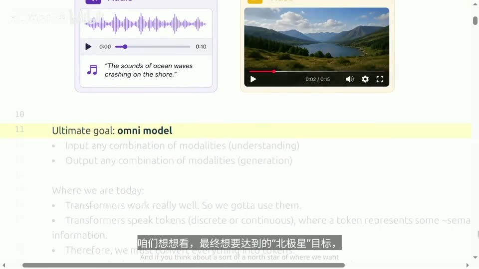

### 1.2 为什么还是 Transformer：把 token 的概念推广出去

那怎么构建这样的系统？听起来抽象，但事实是：**Transformer 确实行之有效**。人们尝试过许多其他方法，可在处理多模态大规模任务时，它依然是我们目前的最优选择，所以我们要找到充分发挥其优势的方法。([【跳转到 01:12】](https://www.bilibili.com/video/BV11LEA6eEuj/?p=17&t=72))

要注意，Transformer 最初是为**文本**任务设计的，它的特性是"以 token 为单位"：输入是一组 token，输出也是若干 token。这里我们要把 token 的概念**扩展**——它不再局限于文本里离散的 token，还可能包含**连续的 token**（你可以把这些理解成 token 的嵌入形式）。核心在于：**token 必须代表某种语义信息单元**。([【跳转到 01:42】](https://www.bilibili.com/video/BV11LEA6eEuj/?p=17&t=102))

举个例子：自然语言里，token 是**子词（subword）**，比如 "playing" 可能被切成 "play" 和 "ing"，各自都有意义；而像**单个像素**这样的元素单独看是没有意义的——一颗蓝色像素既不表示"天空"也不表示"海洋"。所以，我们需要把音频、图像等数据转化为离散或连续的 token，让每个 token 都承载语义。

有意思的是，文本这边我们**早已在这么做**。第一讲讲分词时，我们用 **BPE 分词器**（Byte Pair Encoding，按字节对出现频率不断合并、把文本切成一串子词）把文本变成 token，当时也亲手实现过。它虽然勉强可用，但大家心里或许都期待更优秀的分词器，或者干脆不用分词器——这倒也不是什么大问题。真正费脑筋的是**非文本模态**：怎么把 BPE 那套"切成有意义的单元"的逻辑迁移过来，让图像也能变成 Transformer 能处理的形式。([【跳转到 02:07】](https://www.bilibili.com/video/BV11LEA6eEuj/?p=17&t=127)、[【跳转到 02:32】](https://www.bilibili.com/video/BV11LEA6eEuj/?p=17&t=152))

---

## 二、CLIP：用 4 亿图文对做对比学习，第一次让图像拥有语义

要处理图像，最自然的起点是 **CLIP（2021）**。大家可能听说过它，它是现代视觉语言模型（VLM）的许多基础，所以我们值得稍微深入一点看这个例子。([【跳转到 02:57】](https://www.bilibili.com/video/BV11LEA6eEuj/?p=17&t=177))

### 2.1 历史背景：语言领域已经起飞，视觉还停在标注时代

回顾一下历史：那时候 GPT-3 已经问世，GPT-2 以及所有语言模型都已进入**基础模型时代**。但视觉领域当时还比较落后——有些尝试，可传统做法主要依赖**大量人工标注**的数据集。比如 ImageNet，研究人员在这些数据集上训练 ResNet 等模型，配合数据增强等手段，最终取得了非常出色的性能。

于是 OpenAI 的研究人员提出一个问题：**能否利用海量的"图像 + 文本描述"对？** 受语言领域启发——语言那边只需抓取互联网文本，尽管噪声很大，但只要训练足够大的模型，就能从中提取意义、生成有用的内容——图像领域能不能照做？于是 CLIP 应运而生。([【跳转到 03:22】](https://www.bilibili.com/video/BV11LEA6eEuj/?p=17&t=202)、[【跳转到 03:47】](https://www.bilibili.com/video/BV11LEA6eEuj/?p=17&t=227))

### 2.2 核心目标：让配对图文"对上眼"，等价于 2N 次 softmax 分类

CLIP 的核心思路其实非常简单、直接。假设我有一批图文对，每张图 $I_i$ 都配一段描述文本 $T_i$。我把图像和文本分别送进**图像编码器**和**文本编码器**，各自得到嵌入向量。接下来设定一个目标：对图像 $I_i$ 来说，它与配对文本 $T_i$ 的嵌入**点积**，要远远大于它与**其他所有**文本嵌入的点积；反过来，对文本 $T_i$ 也一样。([【跳转到 04:19】](https://www.bilibili.com/video/BV11LEA6eEuj/?p=17&t=259))

用一句话总结：**CLIP 的目标就是在 $N \times N$ 的相似度矩阵上做 2N 次 softmax 分类**，对角线上的元素是正样本（配对的图文），对角线外的都是负样本。具体实现时，输入是一个 $N \times D$ 的图像编码矩阵和另一个 $N \times D$ 的文本嵌入矩阵，先各自**归一化**，再算点积，乘上一个**温度系数**，然后计算**交叉熵损失**。本质上，这就是一个把样本组织成 $N \times N$ 矩阵形式的多类分类问题。([【跳转到 04:44】](https://www.bilibili.com/video/BV11LEA6eEuj/?p=17&t=284))

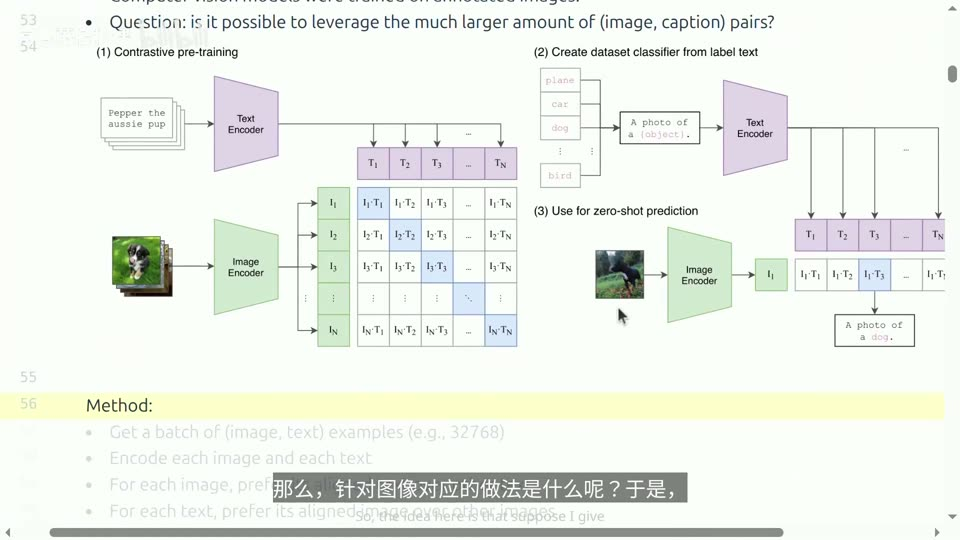

### 2.3 数据从哪来：查询词 + 网络搜索，4 亿图文对（未公开）

CLIP 的细节里，数据来源最值得说。论文里关于数据部分的细节其实不多，简单说就是：先收集一批**查询词**，拿去网上搜索，从中挖掘出大量图文对，最终得到约 **4 亿个图文对**。这个数据集**并未公开**，不过有人尝试复现。([【跳转到 05:09】](https://www.bilibili.com/video/BV11LEA6eEuj/?p=17&t=309))

其中有一篇叫 **OpenCLIP** 的论文做了复现，并进一步扩展了 CLIP 的思路，例如发布了 **LAION-5B** 数据集，包含 **50 亿张**带文本描述的图像。有趣的是，他们**先用 CLIP 做数据筛选、再训练 OpenCLIP**，这里存在一种"自举"过程，但至少这是一个能明确指明训练数据集的模型，还附带代码。([【跳转到 05:34】](https://www.bilibili.com/video/BV11LEA6eEuj/?p=17&t=334))

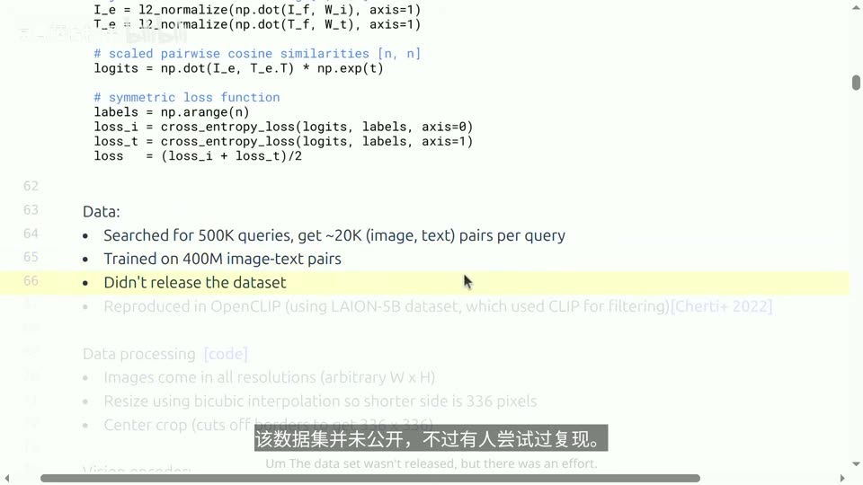

### 2.4 图像预处理：伸缩短边 + 中心裁剪，把任意尺寸变成 336×336

图像分辨率五花八门——网上随便找张图，长宽比可能很不固定，要么细长、要么瘦长，尺寸完全随意。而学过神经网络的人都知道：**网络不喜欢动态尺寸，偏好固定大小的输入**。所以通常会做一个启发式的预处理：把图像**短边缩放到 336（或 224）**这类目标尺寸，再做**中心裁剪**，把它变成正方形。通常目标就在画面中央，只需裁掉背景即可，所以这并不是问题。([【跳转到 06:24】](https://www.bilibili.com/video/BV11LEA6eEuj/?p=17&t=384))

### 2.5 视觉编码器：ViT 把图像切成 patch，当作一串 token

CLIP 的视觉编码器是什么？他们试过多种架构，例如 **ResNet** 和当时刚发布的**视觉 Transformer（ViT）**，结果表明 ViT 效果最佳，所以人们提到 CLIP 通常指基于 ViT 的那个版本。([【跳转到 08:02】](https://www.bilibili.com/video/BV11LEA6eEuj/?p=17&t=482))

ViT 的处理流程如下：取一张图像，**切成小块（patch）**。原始论文用 16×16 的块，CLIP 用 **14×14**。这些小块本质上都是向量，因此每个小块就相当于它的一个 **token**。就像训练语言模型那样，我们给这些 patch 加上**位置嵌入**，再送入标准的 Transformer 编码器。([【跳转到 08:15】](https://www.bilibili.com/video/BV11LEA6eEuj/?p=17&t=495))

那分类时怎么把一串输出压成一个向量？通常有两种做法：一是像语言模型那样取**序列第一个 token** 作为分类表示；二是做**注意力池化（attention pooling）**——先用一个查询向量，与每个位置的键、值做一轮注意力计算，这样得到的向量可能比直接求平均包含更多信息。CLIP 研究后发现效果最好的模型是 **ViT-L/14**：L 代表 Large（大型），14 代表 14×14 的 patch。它大约 24 层（讲者估计），每个 patch 是 RGB 三通道，在 **336×336** 分辨率上训练——实际上他们**先用低分辨率训练、再放大分辨率**，主要是为了提速，毕竟高分辨率太耗时，后续训练阶段才用高分辨率图。([【跳转到 09:05】](https://www.bilibili.com/video/BV11LEA6eEuj/?p=17&t=545)、[【跳转到 09:25】](https://www.bilibili.com/video/BV11LEA6eEuj/?p=17&t=565))

关于位置编码，有同学问：图像本身包含上下左右的方向信息，位置编码在文本里是否更复杂？关键在于**能否设计更智能的位置嵌入**，因为这里用的只是 0 到 9 的线性编码。讲者提到，CLIP 论文其实试过位置编码的**二维和一维版本，结果差异并不显著**——毕竟这主要是分类实验，对分类任务而言这一点或许并不关键。更高级、考虑空间结构的位置嵌入方法会在后面（Qwen 的 M-RoPE）介绍。([【跳转到 09:49】](https://www.bilibili.com/video/BV11LEA6eEuj/?p=17&t=589))

### 2.6 文本编码器与零样本分类：CLIP 真正出圈的成果

文本编码器采用标准 Transformer 架构，由于开发团队相同，用的是 **GPT-2 风格的 Transformer**。为了从整段序列里提取一个向量，他们在序列开头加 **BOS**、结尾加 **EOS**，然后**取最后一层 EOS 位置的激活值**作为整句表示。([【跳转到 10:14】](https://www.bilibili.com/video/BV11LEA6eEuj/?p=17&t=614))

有了视觉编码器和文本编码器，就可以训练模型了。CLIP 在 2021 年引发广泛关注的关键成果是：**在 ImageNet 基准上实现零样本分类，表现超过了在 120 万张标注图像上训练的模型**。注意，那是"标注"过的 120 万张——需要雇 Amazon Mechanical Turk 的工人投入大量工时做数据清洗；而 CLIP 用的是更自然的网络数据，直接进行零样本推理。**零样本分类的逻辑很简单**：拿一张图，准备一堆候选标签文本（如 "a photo of a dog"），算图像嵌入与各标签嵌入的点积，看谁得分最高。([【跳转到 11:04】](https://www.bilibili.com/video/BV11LEA6eEuj/?p=17&t=664)、[【跳转到 11:29】](https://www.bilibili.com/video/BV11LEA6eEuj/?p=17&t=689))

这里有个很自然的疑问：如果一张狗的照片，标题里很多都提到狗，会不会让模型混淆？讲者的回答是：这个过程**确实有噪声**，但平均来看问题不大——有另一只狗也没关系，网络描述并不一定如实描述图像内容（如果图像就是一只狗，人们反而不需要特意说明"这是狗"）。所以 CLIP 的监督信号相当嘈杂，**但有趣的是它确实有效**；前提是需要做大量数据过滤，否则噪声可能过大。([【跳转到 12:36】](https://www.bilibili.com/video/BV11LEA6eEuj/?p=17&t=756)、[【跳转到 13:01】](https://www.bilibili.com/video/BV11LEA6eEuj/?p=17&t=781))

论文还试过另一种替代方案：不排序，而是**从图像直接预测文本**（可以当作**词袋 bag-of-words**，也可以放弃排序）。结论是：对于你真正想学的表示（比如 ImageNet 分类准确率），**精确建模字幕的 token 序列，对于获取图像的粗略表示其实并没有那么关键**。([【跳转到 13:12】](https://www.bilibili.com/video/BV11LEA6eEuj/?p=17&t=792))

### 2.7 阶段性总结与 CLIP 的技术缺陷

到这里，我们学到了什么？我们已经能用 CLIP **对图像编码，捕捉其语义**——因为它与文本配对，而文本通常描述的正是语义。需要提醒的是，**这些设计决策是基于图像分类的，因此粒度并不十分精细**；但正如后面会看到的，它仍为后续所有工作提供了一个稳健的起点。([【跳转到 14:02】](https://www.bilibili.com/video/BV11LEA6eEuj/?p=17&t=842))

CLIP 在技术上的一个缺点是：**它需要较大的批量大小**（比如 32000）。如果批量只有 1，它显然无法工作，即使是 10 也不行。原因在于 **softmax 是在整个批量上进行的**，于是损失**缺乏良好的可分解性**——不像常规语言模型训练那样，一批样本中的序列可以各自独立并行处理、最后聚合。这个问题将由 Google 的 **SigLIP** 论文来解决。([【跳转到 14:27】](https://www.bilibili.com/video/BV11LEA6eEuj/?p=17&t=867))

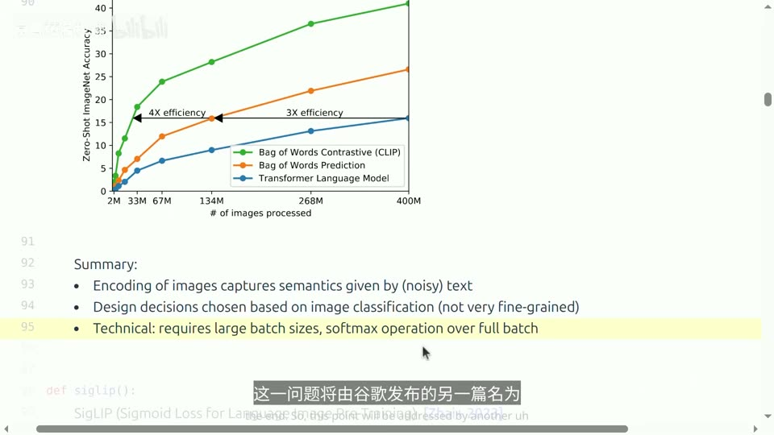

---

## 三、SigLIP：把对比学习拆成二分类，解开批量与损失的绑定

### 3.1 思路转变：不问"属于哪一类"，只问"对齐没有"

**SigLIP**（Sigmoid Loss for Language Image Pre-Training）可以基本视为 CLIP 的改进版。主要区别在于**目标函数的组织形式**：CLIP 执行的是**多类分类**——拥有一对匹配的图文，就把它当正样本，与其他所有匹配的图文作对比；而 SigLIP **简单得多**，它基本只问：**对任意给定的图文对，它们是否对齐？** ([【跳转到 14:52】](https://www.bilibili.com/video/BV11LEA6eEuj/?p=17&t=892))

从算法上看，这是一个**二分类问题**：在 $N \times N$ 的相似度矩阵里，**对角线上的元素是正样本、对角线外的是负样本**。流程是：拿到嵌入向量先归一化，照常算点积（此时相当于计算相似度），然后设定标签——**非对角线位置标为 −1，对角线位置标为 +1**，再执行交叉熵损失，也就是 **log-sigmoid 损失**。所以这个目标函数非常简单。([【跳转到 15:17】](https://www.bilibili.com/video/BV11LEA6eEuj/?p=17&t=917)、[【跳转到 15:42】](https://www.bilibili.com/video/BV11LEA6eEuj/?p=17&t=942))

有同学问：这需要复杂的**采样策略**吗？比如是否需要平衡正负样本、让负样本选得更"紧"一些，以避免模型学到错误关联、产生偏差？讲者说，在最早那篇论文里，**其实挺简单**——他们直接操作的就是同一种类型的矩阵，没有特别复杂的采样。([【跳转到 15:56】](https://www.bilibili.com/video/BV11LEA6eEuj/?p=17&t=956))

### 3.2 数据与效率：WebLI 类数据 + OCR 过滤，更快更省

SigLIP 是 Google 做的，数据方面参考了另一篇 2022 年左右的图文模型论文，使用了 **WebLI 类数据集**，包含约 **110 亿**图像-文本对。他们还做了一些额外处理，比如针对**图片中包含文字**的情况使用 **OCR（光学字符识别）**技术——这也是构造图像-文本对的一种方法；此外还有过滤，且数据集是**多语言**的。([【跳转到 16:32】](https://www.bilibili.com/video/BV11LEA6eEuj/?p=17&t=992))

论文的核心观点是：**训练效率远高于 CLIP**。CLIP 是在 **256 个 TPU 上训练了 10 天**，而 SigLIP 仅用 **32 块 TPU 训练了 5 天**。不过讲者提醒：单看每秒浮点运算次数（FLOPs），SigLIP 其实**并不更快**，甚至慢了约 60%；真正的优势在于**可以在一片 pod 里部署更多设备、互联性能更好**——这是在系统层面做并行化带来的收益。([【跳转到 16:57】](https://www.bilibili.com/video/BV11LEA6eEuj/?p=17&t=1017)、[【跳转到 17:22】](https://www.bilibili.com/video/BV11LEA6eEuj/?p=17&t=1042))

### 3.3 并行方式：像 DDP 一样分设备，用轮换构造非对角线负样本

可以用系统课里学过的 **DDP（分布式数据并行）**来理解 SigLIP 的并行：每个设备各自存储一部分图文对。但这里有个不同——**样本之间存在交互**，不像语言模型训练那样各序列完全独立。所以做法是：**第一轮**每个设备只计算它手头那些图文对的损失；接着通过轮换/通信文本嵌入来构造负样本——比如设备一拿到 T5 到 T8 并据此计算负样本，再拿到 T9 到 T12，以此类推，**不断轮换，直到覆盖所有非对角线块中的条目**。([【跳转到 17:39】](https://www.bilibili.com/video/BV11LEA6eEuj/?p=17&t=1059))

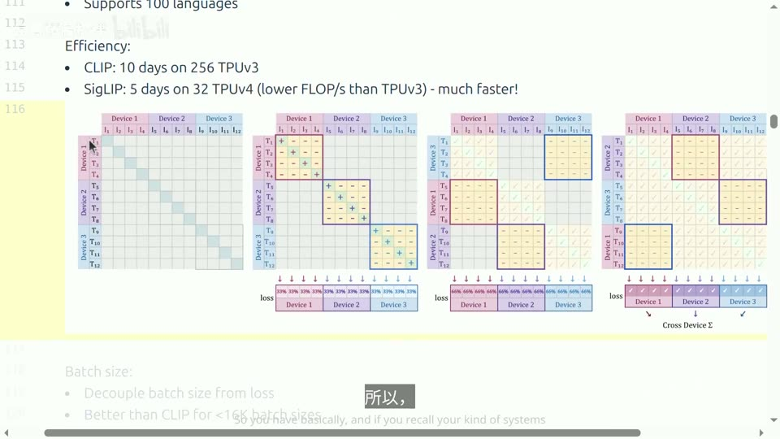

### 3.4 关键优势：把批量大小与损失"解耦"

SigLIP 的一个重要优势是：它有效地**把批量大小与损失解耦了**。相比之下，在 CLIP 中损失**依赖**于批量大小——你改变批量，损失函数也就变了。于是 SigLIP 得以用**更小的批量**做实验（比如小于 16K），而且在这种设置下**表现远优于 CLIP**：CLIP 批量太小会使损失退化，而 SigLIP 即使小批量导致方差较大，其**期望值仍与标准损失一致**。他们还提到，虽然可以用更大的批量（理论上可到 100 万），但**超过大约 32K 后并没有实质性帮助**，32K 就足够了。([【跳转到 18:04】](https://www.bilibili.com/video/BV11LEA6eEuj/?p=17&t=1084)、[【跳转到 18:35】](https://www.bilibili.com/video/BV11LEA6eEuj/?p=17&t=1115))

至此，我们有了两个视觉编码器的选择：CLIP 和 SigLIP。它们都负责接收图像（在此版本中是固定尺寸，例如 336×336），把它映射成一个包含语义信息的向量。接下来，就可以开始构建**视觉语言模型（VLM）**了。([【跳转到 18:48】](https://www.bilibili.com/video/BV11LEA6eEuj/?p=17&t=1128))

---

## 四、LLaVA：视觉编码器 + 投影器 + 语言模型，把图像"翻译"成 token

### 4.1 VLM 的共同模板：不从头训练，而是把视觉"注入"语言模型

接下来讲 **VLM（视觉语言模型）**。讲者介绍两类模型：**LLaVA** 和 **Qwen**。这两类模型在整体架构模板上非常相似，细节上会有些不同。其基本思路是：**把这些图像嵌入向量注入到语言模型中，而不是从零开始训练**。([【跳转到 19:13】](https://www.bilibili.com/video/BV11LEA6eEuj/?p=17&t=1153))

### 4.2 LLaVA（2023）：CLIP 做眼睛、Vicuna 做嘴巴

**LLaVA** 论文发表于 **2023 年**，让大家很兴奋——那时候像 GPT-4 这样的闭源模型已经能做视觉推理了，但 LLaVA 是**开源模型**，大家得以看到它的内部运作机制，展示了多模态能力的提升。它主要由几块构成：**视觉编码器用 CLIP**，**文本解码器用 Vicuna**——Vicuna 是首个在 **ShareGPT 对话数据**上微调过的 LLaMA 模型。([【跳转到 19:38】](https://www.bilibili.com/video/BV11LEA6eEuj/?p=17&t=1178))

### 4.3 数据：用 GPT-4 把 MS COCO 的标注"合成"成对话

训练数据来自 **MS COCO**——一个经过人工标注的数据集，研究人员雇佣 Mechanical Turk 工人对大量图像进行标注，包括**边界框**和描述图像的**标题**。LLaVA 的做法很巧妙：拿这些现成标注（标题、检测到的物体）作为 prompt 输入给 **GPT-4**，要求 GPT-4 生成问题或对话。例如，给定一张图和人工标题，你可以让 GPT-4 生成一段对话、一个问题及答案、一段详细描述，甚至做复杂推理。最终合成出约 **15 万 8000 个**样本，用来训练模型。([【跳转到 20:28】](https://www.bilibili.com/video/BV11LEA6eEuj/?p=17&t=1228)、[【跳转到 20:58】](https://www.bilibili.com/video/BV11LEA6eEuj/?p=17&t=1258))

### 4.4 架构：图像和文本都变成向量，拼起来送进标准 Transformer

LLaVA 具体用的是 **CLIP 中表现最好的版本 ViT-L/14**（14×14 patch）。看整体架构图：图像输入视觉编码器 CLIP 得到向量 $Z_v$；文本（语言指令）则用标准嵌入得到向量 $H_q$。两类向量都经过一个**投影矩阵 $W$** 映射到语言模型的嵌入空间，拼成序列后直接送入标准 Transformer，输出语言回答。通俗地说：**文本和图像都被编码成向量，这一串向量序列直接送入标准的 Transformer**。某种意义上，我们把图像"翻译"成了文本 token，于是就能复用预训练好的语言模型。([【跳转到 21:28】](https://www.bilibili.com/video/BV11LEA6eEuj/?p=17&t=1288)、[【跳转到 21:53】](https://www.bilibili.com/video/BV11LEA6eEuj/?p=17&t=1313))

### 4.5 两阶段训练：先只学"对齐"，再微调语言模型

为了训练这个模型，LLaVA 分**两个阶段**：

1. **第一阶段（对齐阶段）**：**冻结视觉编码器和语言模型，只训练投影矩阵 $W$**。本质上就是确保图像被映射到与自然语言 token 大致相同的空间。如果直接用随机的 $W$，图像根本没法被语言模型"读懂"——输出肯定不是能表示自然语言 token 的嵌入。所以这一阶段的目的，是让 $W$ 的输出尽可能接近自然语言 token 的嵌入。
2. **第二阶段（微调阶段）**：**冻结视觉编码器，训练 $W$ 和语言模型**——也就是用 LLaVA 自己的数据对语言模型进行微调。

训练数据主要是图像配上对话描述或复杂推理示例，因此这完全属于**"图像 + 文本 → 文本"**的任务。([【跳转到 22:18】](https://www.bilibili.com/video/BV11LEA6eEuj/?p=17&t=1338)、[【跳转到 22:54】](https://www.bilibili.com/video/BV11LEA6eEuj/?p=17&t=1374))

论文里的例子很有意思：即便用户的提示词不够清晰，模型也能表现出色——即使你没有直接问"哪里出了问题"，它也能给出合理解释。GPT-4 显然能做到，但当时的其他模型却不行。这为"用合成数据+预训练模型"的路线正了名。([【跳转到 23:04】](https://www.bilibili.com/video/BV11LEA6eEuj/?p=17&t=1384))

---

## 五、LLaVA-OneVision：任意分辨率与跨模态迁移

### 5.1 从单图到多图、视频：不改架构，只换更强的组件

时间来到 **2024 年**的 **LLaVA-OneVision**。LLaVA 之后又涌现出许多后续工作，比如 LLaVA-1.5、LLaVA-NeXT 等；讲者认为接下来要讲的内容基本涵盖了这些创新——**核心思路并未改变，仍沿用那套架构**，只是旨在拓展更多种类的多模态应用，因此系统现在能够处理**多张图片及视频**。([【跳转到 23:17】](https://www.bilibili.com/video/BV11LEA6eEuj/?p=17&t=1397))

具体替换的组件：**视觉编码器换成 SigLIP**，**文本解码器换成 Qwen2**（大概是当时性能最强的语言模型之一），**投影器（也叫适配器）用一个两层 MLP** 而非简单的线性投影，负责把视觉编码器的输出转成语言模型的输入。讲者打了个比方：**这些细微改动就好比升级系统内部的组件，整体架构仍保持大致相同**。([【跳转到 23:47】](https://www.bilibili.com/video/BV11LEA6eEuj/?p=17&t=1427)、[【跳转到 24:12】](https://www.bilibili.com/video/BV11LEA6eEuj/?p=17&t=1452))

### 5.2 为什么需要任意分辨率：CLIP 把文档压成 336×336 就读不了了

一个关键的动机是 **OCR（文字识别）**。OCR 的关键在于**保留细粒度信息**——否则字母 "J" 看着就像 "I"，这就麻烦了。回顾一下：CLIP 会把图缩放到 336×336，设想这是一份文档，如果硬裁成 336×336，**你就没法读了**。这正是 LLaVA-1.5 论文里提到的问题。([【跳转到 24:29】](https://www.bilibili.com/video/BV11LEA6eEuj/?p=17&t=1469))

解决办法叫 **AnyRes（任意分辨率）**，思路很简单直接：**把一张图拆成好几块**，每一块的大小就是视觉编码器要处理的分辨率（比如 336×336），把这些块都编码成向量，然后把它们拼在一起。说到底，这就是为了解决视觉编码器搞不定高分辨率的问题——**不直接做下采样，而是直接裁剪图像去观察不同的局部区域**。如果输入的是超高分辨率图片或视频，生成的 token 数量会非常多，那就需要**用双线性插值做下采样**来减少块数。无论采用哪种分辨率调整方法，**核心思路都是"自适应"**——这很好，因为 Transformer 本身就具备这种灵活性，无论序列多长都能处理，意味着图像也能支持任意分辨率。([【跳转到 25:02】](https://www.bilibili.com/video/BV11LEA6eEuj/?p=17&t=1502)、[【跳转到 25:27】](https://www.bilibili.com/video/BV11LEA6eEuj/?p=17&t=1527))

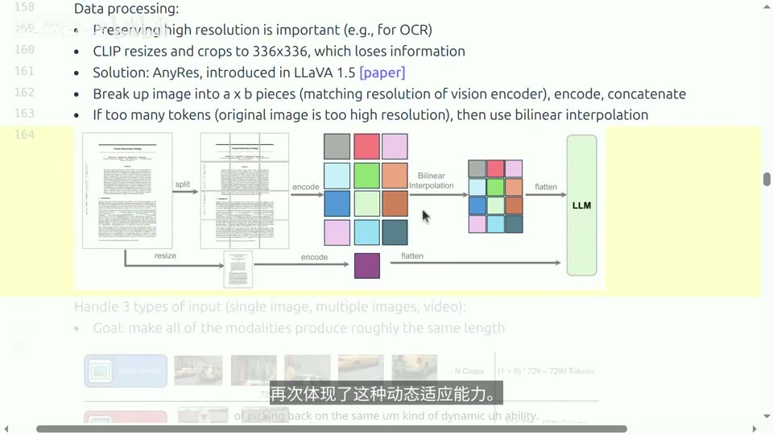

### 5.3 三种输入的取长补短：单图看细、多图粗看、视频取 32 帧

最终系统能处理**单图、多图、视频**三类输入：**单张图**时可以用基础分辨率处理，看得更细致；**多张图**时就用基础分辨率，图多了只能粗略浏览；**视频**本质是一系列连续图像帧，为了节省计算，用**更低的分辨率或更少的 token** 表示每一帧，**最多只取 32 帧**。这样做会面临**上下文长度限制**的问题。([【跳转到 26:41】](https://www.bilibili.com/video/BV11LEA6eEuj/?p=17&t=1601)、[【跳转到 26:46】](https://www.bilibili.com/video/BV11LEA6eEuj/?p=17&t=1606))

由此引出一个重要结论：**解决多模态问题的关键之一，就在于如何处理长上下文**。([【跳转到 27:11】](https://www.bilibili.com/video/BV11LEA6eEuj/?p=17&t=1631))

### 5.4 训练三阶段与"跨模态迁移"的意外发现

LLaVA-OneVision 的核心理念是既要数据**高质量**、也要**数量**。他们的数据大多是为特定任务定制的（如视觉问答、回答表格问题），因此显然属于**后训练阶段**，目标是让模型更好地对齐人的意图。讲者也直言：这本质上是在**蒸馏 GPT-4** 以获取最佳性能——虽然这或许并非最理想的做法，但现实如此，如果没有足够的标注预算，你只能这么做。训练思路与之前类似，**从两阶段变成三阶段**：第一阶段只训练投影器（对齐）；第二阶段用高质量、更侧重知识的数据提升推理能力；第三阶段侧重那些类似下游任务的示例。([【跳转到 27:24】](https://www.bilibili.com/video/BV11LEA6eEuj/?p=17&t=1644)、[【跳转到 28:15】](https://www.bilibili.com/video/BV11LEA6eEuj/?p=17&t=1695))

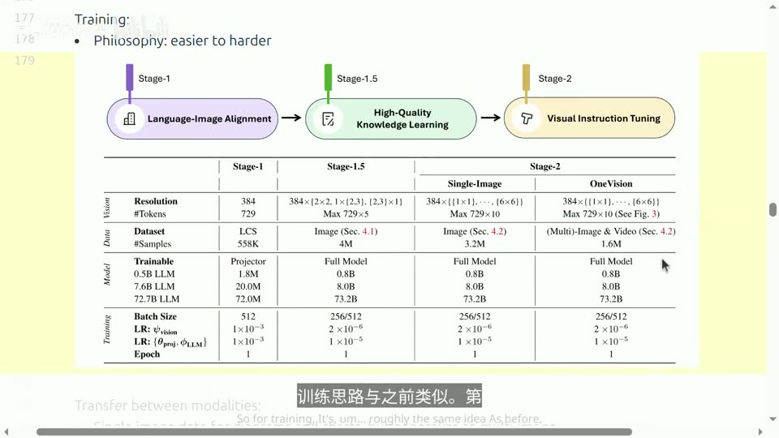

论文里有个挺有意思的现象：**不同模态之间可以迁移**。训练时你只用**单张图上的 OCR 数据**，以及**多张图之间的关系推理**；但在测试时，你会看到一张图里**既有表格也有图表**，然后还能跟它流畅对话。这种迁移能帮你搞定很有用的情况，比如**驱动 GUI agent**：给它看一堆截图（多张图），它就能生成描述这些截图的文字；再比如**视觉提示（visual prompting）**——在图中画一个圆圈，这个圆圈是图的一部分，作用是标出你需要对它执行操作的那块区域。讲者坦言：第一次看到时心想"唉哟，你这是在针对每一个任务下手，有点像监督学习"；但**如果你有足够多的任务，这些模型似乎能实现某种迁移**——这算是个让人安心的消息。([【跳转到 28:40】](https://www.bilibili.com/video/BV11LEA6eEuj/?p=17&t=1720)、[【跳转到 29:46】](https://www.bilibili.com/video/BV11LEA6eEuj/?p=17&t=1786))

所以再说一次，这是一个相当标准的 VLM 架构：**视觉编码器 + 投影层 + 语言模型**，只是在数据策展上投入了大量精力，并高度依赖合成的特定任务数据——这也是 LLaVA 系列的优势之一。([【跳转到 29:55】](https://www.bilibili.com/video/BV11LEA6eEuj/?p=17&t=1795))

---

## 六、Qwen-VL 与 Qwen2-VL：从固定尺寸走向动态分辨率

### 6.1 Qwen-VL（2023）：交叉注意力适配器 + 特殊 token + 三阶段训练

Qwen 从 **2023 年**开始训练多模态模型，首个版本是 **Qwen-VL**。视觉编码器用 **OpenCLIP**——也就是 CLIP 的开源复现版，本质上就是个 CLIP 编码器。适配器方面，他们通过**一层交叉注意力机制，结合 2D 位置嵌入**，把视觉特征映射到**固定大小（如 256）**。此外还引入了若干**特殊 token**，包括图像标签、**边界框标签（box tag）**以及**引用标签（ref tag）**。([【跳转到 30:16】](https://www.bilibili.com/video/BV11LEA6eEuj/?p=17&t=1816)、[【跳转到 30:41】](https://www.bilibili.com/video/BV11LEA6eEuj/?p=17&t=1841))

训练分三阶段，与 LLaVA 类似：

1. **预训练**：冻结语言模型，训练视觉编码器和适配器。这里用的是**大规模但质量较低**的数据，一部分数据集规模达到 **14 亿个样本**。注意这与 LLaVA 略有不同——LLaVA 在该阶段并不训练视觉编码器和适配器。
2. **多任务预训练**：换用质量更高、针对特定任务的数据（如 VQA 数据集、图表问答），**训练全部参数**。
3. **监督微调**：使用指令微调数据，**冻结视觉编码器**，训练适配器和语言模型。

([【跳转到 31:06】](https://www.bilibili.com/video/BV11LEA6eEuj/?p=17&t=1866)、[【跳转到 31:23】](https://www.bilibili.com/video/BV11LEA6eEuj/?p=17&t=1883)、[【跳转到 31:48】](https://www.bilibili.com/video/BV11LEA6eEuj/?p=17&t=1908))

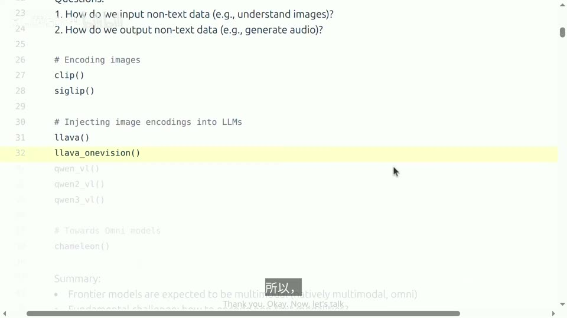

Qwen-VL 能做到的事情包括：给一张包含金霸王、蜘蛛侠、绿巨人的图像，不仅能输出**边界框**（注意它并不生成图像，只是输出边界框），还能做 **OCR 文字识别**。因为这是 Qwen，所以有些例子是中文的；既然语言模型能写代码，他们也希望视觉模型在代码方面同样出色。([【跳转到 32:09】](https://www.bilibili.com/video/BV11LEA6eEuj/?p=17&t=1929))

### 6.2 Qwen2-VL：动态分辨率是"最关键的一点"

**Qwen2-VL** 算是又一次升级。新点子包括：用**更大的视觉编码器（675M）**，以及开始做**动态分辨率**——讲者认为这是最关键的一点。回顾 LLaVA 到 LLaVA-OneVision 的演进，他们早就意识到必须能处理不同尺寸的图像；**如果你想搞视频，那就更明显了，你需要一种动态分辨率机制**。([【跳转到 32:39】](https://www.bilibili.com/video/BV11LEA6eEuj/?p=17&t=1959)、[【跳转到 32:48】](https://www.bilibili.com/video/BV11LEA6eEuj/?p=17&t=1968))

这个模型的逻辑是：假设你有一张**内容密集**的图（比如一篇论文截图），它可能被编码为 **1 万 1000 多个 token**；而一张**只包含公式的小图**，可能只被映射为 **8 个 token**。实现方式与 LLaVA 的任意分辨率一致：**每个 224×224 的图像块通过 ViT/14 编码**，然后**把每 2×2 的块合并为一个**（压缩上下文长度，约得到 66 个 token）；视频则**按每秒 2 帧采样，最多 16384 个 token**。([【跳转到 33:13】](https://www.bilibili.com/video/BV11LEA6eEuj/?p=17&t=1993)、[【跳转到 33:38】](https://www.bilibili.com/video/BV11LEA6eEuj/?p=17&t=2018))

### 6.3 M-RoPE：把旋转位置编码推广到时间、高度、宽度三维

Qwen2-VL 在这里采取了一个不同做法，引入了一种称为**多模态旋转位置编码（M-RoPE，Multimodal Rotary Position Embedding）**的方法。回顾 RoPE（旋转位置编码）：它的核心思想是，嵌入向量具备这样的特性——**向量间的内积仅取决于相对距离**；在一维情况下，距离就是两个 token 之间的间隔数。推广到多维版本时原理基本一致，只是**维度扩展到三维：高度、宽度和时间**。于是每个位置或图像块现在由一个**三元组**来表示。不过讲者预告：当后面审视 Qwen3 时会发现，这其实并非最优解。([【跳转到 33:50】](https://www.bilibili.com/video/BV11LEA6eEuj/?p=17&t=2030)、[【跳转到 34:15】](https://www.bilibili.com/video/BV11LEA6eEuj/?p=17&t=2055))

Qwen2-VL 用 Qwen2 初始化语言模型，随后进行三阶段训练（与前面做法非常相似），并展示了一系列能力：视频理解、数学、代码、函数调用等。([【跳转到 34:40】](https://www.bilibili.com/video/BV11LEA6eEuj/?p=17&t=2080))

---

## 七、Qwen3-VL：显式时间戳、交错频率与适配器深度融合

Qwen3-VL 有几处改动，讲者认为虽然不算结构上的重大变动，但**确实会影响模型质量**。([【跳转到 35:10】](https://www.bilibili.com/video/BV11LEA6eEuj/?p=17&t=2110))

### 7.1 基座与上下文：Qwen3 + 256K

基座换成 **Qwen3**（有一系列 Dense 和 **MoE** 模型），效果非常出色，对提升最终模型质量帮助很大。他们重点投入**长上下文理解**，上下文长度最高可达 **256K**——这一点非常重要，尤其是当你试图处理**长视频**时。视觉编码器则换成 **SigLIP2**：它基本是对 SigLIP 的改进版，架构完全相同，设计上**向后兼容**。([【跳转到 35:26】](https://www.bilibili.com/video/BV11LEA6eEuj/?p=17&t=2126))

### 7.2 改进 M-RoPE：把"分块"改成"交错"，让每个轴都能接触高低频

这是很漂亮的一个细节。回顾之前的三维 M-RoPE：它把维度按**时间 → 宽度 → 高度**分块（形如 `[t t t w w w h h h]`）。问题出在 RoPE 里每个分量其实代表**不同的频率**——这就导致**时间维度可能全是低频，而高度维度全是高频**。Qwen3-VL 把这些维度**交错排列**（形如 `[t w h t w h t w h]`），这样一来，**每个轴都能同时接触到低频和高频信息**。([【跳转到 35:51】](https://www.bilibili.com/video/BV11LEA6eEuj/?p=17&t=2151)、[【跳转到 36:24】](https://www.bilibili.com/video/BV11LEA6eEuj/?p=17&t=2184))

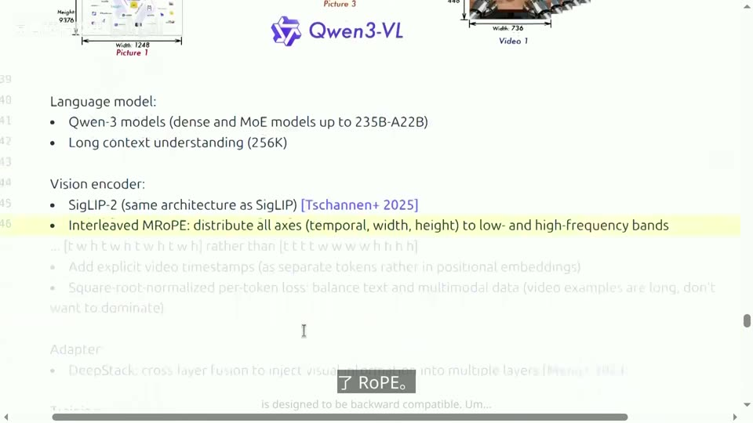

### 7.3 显式时间戳：把"时间"从位置编码里拎出来，变成可引用的 token

另一个改动是**直接引入显式的视频时间戳**。以前时间信息在位置编码里是**隐含**的——视频里每一帧天生带着不同的时间信息，之所以有时间概念，纯粹是因为它们位置不同。现在他们把时间**显式化**，做成一个**特殊的 token**。他们发现这挺有用，大概是因为你可以**直接引用它**，比如问"两秒后发生了什么"，从而增强时间感知。([【跳转到 36:47】](https://www.bilibili.com/video/BV11LEA6eEuj/?p=17&t=2207)、[【跳转到 36:57】](https://www.bilibili.com/video/BV11LEA6eEuj/?p=17&t=2217))

### 7.4 损失归一化与适配器深度融合

这里涉及**模态平衡**。带视频的样本通常很长，而带单张图片的样本很短；如果每个 token 一视同仁，**视频样本就会在损失里占据主导地位**。所以讲者推测他们**用序列长度的平方根做归一化**，压低那些特别长样本的影响力（细节讲者不完全确定，保持中性表述）。([【跳转到 37:27】](https://www.bilibili.com/video/BV11LEA6eEuj/?p=17&t=2247))

最后是**适配器**上的新花样。回顾一下，适配器负责把视觉编码器和语言模型连起来：LLaVA 最简单就是一个线性投影，后来加了 MLP、交叉注意力，而这里做的是**把视觉信息直接加到语言模型的残差流里、并注入到多个层**——这是一种**深度融合**，与"只输出一个向量序列的黑盒视觉编码器"不同。训练过程分两大块：**预训练 4 个阶段、后训练 3 个阶段**，序列长度从 **8K 增到 32K 再到 256K**，大部分 token 集中在第二、第三阶段；后训练则用长链思维（long CoT）数据做监督微调（SFT）、知识蒸馏，并辅以强化学习。从结果看，这是一个相当出色的模型——若把基准成绩与 Gemini、GPT-5、Claude Opus 4.1 等相比，也毫不逊色，可见 Qwen 模型的实力很强。([【跳转到 38:14】](https://www.bilibili.com/video/BV11LEA6eEuj/?p=17&t=2294)、[【跳转到 38:44】](https://www.bilibili.com/video/BV11LEA6eEuj/?p=17&t=2324)、[【跳转到 39:15】](https://www.bilibili.com/video/BV11LEA6eEuj/?p=17&t=2355))

### 7.5 一个常被误解的点：这些模型并不生成图像

课堂问答澄清了一个关键问题：**这些模型其实并不生成视频或图片**——视频以及所有多模态内容都**只存在于输入端**，模型**生成的始终是文本**。训练阶段除强化学习外，基本是对每一个 token 进行监督，因此不存在"用语言模型当裁判来评估描述质量"的做法，输出质量主要取决于数据集中的内容。([【跳转到 39:45】](https://www.bilibili.com/video/BV11LEA6eEuj/?p=17&t=2385))

另一个问题是：**视觉编码器的参数量为什么比语言模型小得多？** 答案是：视觉编码器执行的是**非常局部的操作**，针对一个个很小的 patch，它只是试图理解这些小块，缺乏足够的知识去做高层推理，因此**模型的核心能力主要仍源于语言模型**。以 LLaVA 完整版为例，语言模型约 72 亿参数，而投影器参数量小得多（约几千万量级），视觉编码器通常也不到 10 亿参数。([【跳转到 43:55】](https://www.bilibili.com/video/BV11LEA6eEuj/?p=17&t=2635)、[【跳转到 44:39】](https://www.bilibili.com/video/BV11LEA6eEuj/?p=17&t=2679))

从 Qwen 到 Qwen2 再到 Qwen3，许多变化都旨在提升性能——**主要是规模上的扩展、整理更多数据集、处理好长上下文、优化图像处理**，整体框架保持不变。([【跳转到 45:17】](https://www.bilibili.com/video/BV11LEA6eEuj/?p=17&t=2717))

---

## 八、Chameleon：把一切都离散成 token，优雅但有代价

### 8.1 问题的提出：VLM 只会"读"，不会"画"

到目前为止，所有 VLM 都有一个共同缺点：它们**把图像编码成向量再输入语言模型，因此只能生成文本，没法生成图像**。要解决这个问题其实有很多路径，比如直接给一个 VLM **挂载一个扩散头（diffusion head）**，就能生成图像了。但 Meta 在 2024 年发布的 **Chameleon** 论文提出了一条不同的路线。([【跳转到 45:42】](https://www.bilibili.com/video/BV11LEA6eEuj/?p=17&t=2742)、[【跳转到 45:42】](https://www.bilibili.com/video/BV11LEA6eEuj/?p=17&t=2742))

### 8.2 核心思想：一切皆离散 token，文本与图像真正同处一个空间

Chameleon 的想法是：**要是我们把所有内容都映射成离散的 token 呢？** 这很有吸引力——因为现在你可以**用同一种方式分析和生成图像**。一切都被离散化为 token：你可以输入一个文本提示，系统生成更多 token 来"画"出图像；也可以把语言和图像的顺序调换。([【跳转到 46:07】](https://www.bilibili.com/video/BV11LEA6eEuj/?p=17&t=2767))

论文里有个示例：你输入"我无聊了，给我看点鸟的照片"，它就会**输出文本、再输出图像，然后再是文本和图像**——文本和图像**交替出现**。这正是**全模态模型的设计理念**：文本和图像真正处于**同一个空间**，通过"让所有数据都表现为 token 形式"来实现。([【跳转到 46:22】](https://www.bilibili.com/video/BV11LEA6eEuj/?p=17&t=2782)、[【跳转到 46:47】](https://www.bilibili.com/video/BV11LEA6eEuj/?p=17&t=2807))

### 8.3 实现：VQ-VAE 把图像变成码本上的索引

具体怎么把图像映射为离散 token？想法源自 2017 年 Vanden Oord 等人的研究——**VQ-VAE（向量量化变分自编码器）**。核心思路是：**把图像映射成离散码字**，你需要学一个映射——先编码成**连续向量**，然后把它**舍入到最近的码字（code）**。这样你会得到一个**码本（codebook）**，假设里面有 8000 个码字，这些码字就像原型向量，各自对应某种图像块。接着**解码器**拿到这个码字，试着**重建图像**。训练 VQ-VAE 主要就是**最小化重建损失**；由于"舍入"这一步不可微，还得额外加一些损失项（承诺项、码本项）来处理。([【跳转到 47:01】](https://www.bilibili.com/video/BV11LEA6eEuj/?p=17&t=2821)、[【跳转到 47:24】](https://www.bilibili.com/video/BV11LEA6eEuj/?p=17&t=2844))

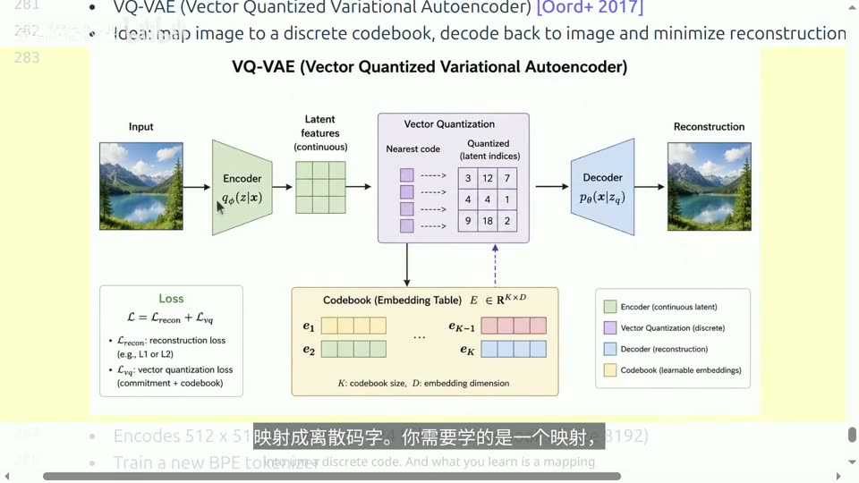

最终结果是：**512×512 的图像被转换成 1024 个 token，每个 token 都来自一个大小为 8000 的词汇表**。现在你手头既有文本 token、又有图像 token，于是需要**重新训练一个新的分词器**，因为数据与以往纯自然语言数据不同。接下来进入训练阶段——**其实非常直观，就是标准的语言模型训练**：这里**不需要适配器，也无需调整视觉编码器，仅使用语言模型即可**。设计颇具吸引力。虽然仍分两阶段，但第一阶段是训练主体，规模庞大且为无监督学习（比如 **2.9T 文本 token、1.5T 图文 token、400B 交错 token**）；第二阶段引入高质量数据。([【跳转到 48:03】](https://www.bilibili.com/video/BV11LEA6eEuj/?p=17&t=2883)、[【跳转到 48:28】](https://www.bilibili.com/video/BV11LEA6eEuj/?p=17&t=2908))

### 8.4 代价一：文本低熵、图像高熵，混合训练导致不稳定

这个设计确实十分优雅，但存在几个问题。首先，他们发现**训练过程不太稳定**，原因在于：尽管文本和图像处于同一空间，但两者的**表现差异显著**——仅仅把图像数据也叫作"离散 token"，并不能掩盖图像本身的本质差异。

关键在于**熵（entropy，衡量不确定性/信息量的量）**：预测下一个**词**时，熵值比较低，大部分词多少都能猜到；但**图像 token 的熵非常高**，因为同一个位置可能呈现任何一种蓝色，你根本没法确定。结果就是，这种混合训练引发了一系列**范数（norm）问题**，参数会不断增大，进而导致损失值不稳定。他们用 **QK-Norm** 以及 **z-loss 正则化**在一定程度上缓解了这一问题（z-loss 用于控制范数的增长）。([【跳转到 48:53】](https://www.bilibili.com/video/BV11LEA6eEuj/?p=17&t=2933)、[【跳转到 49:18】](https://www.bilibili.com/video/BV11LEA6eEuj/?p=17&t=2958))

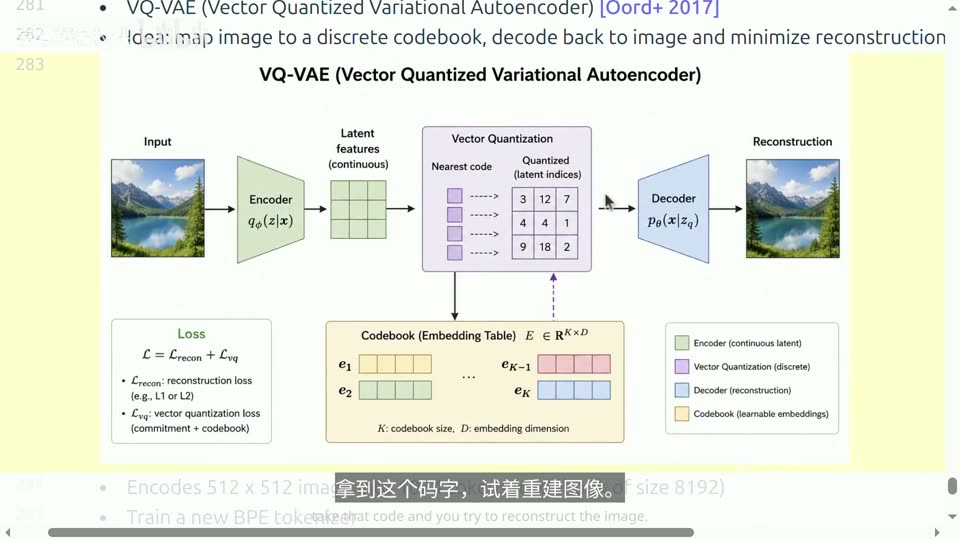

### 8.5 代价二：离散化必然丢信息，多模态权重难平衡

其余问题也很明显。**离散化过程必然导致信息丢失**：以 OCR 为例，如果对极小的印刷文字做离散化，**你将无法再识别它们**。此外，**多模态训练颇具挑战性**——在 Qwen 模型里我们已经看到需要反复调整模态权重，而在这里问题更显著。

讲者也顺带交代了 VQ-VAE 的历史：它曾经非常流行，许多人将其用于图像生成，原因在于——如果你手头有一个 Transformer，**该如何让它生成内容？你得生成离散数据**，于是把所有数据转成离散形式。后来**扩散模型（diffusion model）兴起**，成为一种更可行的生成方案，因此这类离散方法如今已不如从前流行。([【跳转到 49:43】](https://www.bilibili.com/video/BV11LEA6eEuj/?p=17&t=2983)、[【跳转到 50:21】](https://www.bilibili.com/video/BV11LEA6eEuj/?p=17&t=3021))

---

## 九、前沿趋势与开放问题：连续编码器负责理解、扩散模型负责生成

### 9.1 前沿模型：原生多模态，但细节未公开

当前的前沿模型预计都将具备多模态能力，尤其是**原生多模态**或**全模态**模型。遗憾的是，Gemini 和 GPT 发布时虽然被宣传为原生多模态且能处理所有模态（事实也确实如此），但**具体的架构细节并未公开**。讲者推测它们可能采用了某种**保留信息不丢失的连续编码器**来理解，生成部分则采用了**扩散模型**——但这**仅是推测**。([【跳转到 50:39】](https://www.bilibili.com/video/BV11LEA6eEuj/?p=17&t=3039))

### 9.2 核心矛盾：理解与生成对编码器的要求是"对称但不同"的

讲者认为，多模态最大的难点在于**如何处理非文本模态**。还有一个有趣的现象：**理解模态和生成模态之间存在一种对称关系，而且具体情况各不相同**——也就是说，**并不存在一种通用的编码器**：

- 以 **CLIP** 为例，你主要关注**分类**，目的是提取**高层语义**，因此这些向量**可以做得很小**，同时仍能捕捉到高层语义（这对"理解"足够）。
- 相反，如果你要做 **OCR** 或**图像生成**，就需要**非常精细的细节**。这正是**扩散模型表现优异**的原因——它能对**高低频信息**进行微调。

所以处理多模态问题时，需要仔细思考如何**把它们平衡好**。打个比方：**视频的信息密度通常低于文本**，所以你不想让视频淹没文本，也许目前最好的做法是使用**连续编码器**。([【跳转到 51:04】](https://www.bilibili.com/video/BV11LEA6eEuj/?p=17&t=3064)、[【跳转到 51:29】](https://www.bilibili.com/video/BV11LEA6eEuj/?p=17&t=3089))

### 9.3 一句收尾：五年前的 CLIP 思路，至今仍是首选

讲者用一句总结收尾：**看起来即使 CLIP 已经是 5 年前的技术，类似的思路现在仍是捕捉图像语义的首选方案，并且仍在广泛使用**；至于扩散模型，虽然在生成方面非常出色，本节课没有详细展开。关于多模态的讲座就讲到这里——这部分**没有实操作业**，但如果你感兴趣，讲者鼓励你去动手试试，比如训练这些模型，或者去读 LLaVA 论文，以及 AI2 那篇关于"移动端"的论文（那里面对数据和数据混合的细节更丰富）。([【跳转到 51:54】](https://www.bilibili.com/video/BV11LEA6eEuj/?p=17&t=3114)、[【跳转到 52:12】](https://www.bilibili.com/video/BV11LEA6eEuj/?p=17&t=3132))

---

## 小结

本讲从"语言模型已经很通用、但现实世界是多模态的"出发，通览了把非文本模态接入 Transformer 的技术脉络。核心可以归纳为下面几条：

1. **一切的关键是 token 的推广**：token 不再只是文本子词，也可以是连续嵌入；唯一要求是它必须承载**语义信息单元**。文本一侧早在 BPE 分词时就做过类似的事，难点全在非文本模态。([【跳转到 01:42】](https://www.bilibili.com/video/BV11LEA6eEuj/?p=17&t=102))
2. **CLIP 是视觉编码的起点**：用约 4 亿图文对做对比学习，在 $N\times N$ 相似度矩阵上做 2N 次 softmax 分类，把图像编码进与文本共享的语义空间，并首次实现强零样本分类；缺点是**依赖大 batch、softmax 覆盖整个批次、损失不可分解**。([【跳转到 14:27】](https://www.bilibili.com/video/BV11LEA6eEuj/?p=17&t=867))
3. **SigLIP 把对比学习拆成二分类**：只问"图文是否对齐"，对角线标 +1、其余标 −1，用 log-sigmoid 损失；从而**把批量大小与损失解耦**，小批量下反而优于 CLIP，约 32K 批量就足够。([【跳转到 18:04】](https://www.bilibili.com/video/BV11LEA6eEuj/?p=17&t=1084))
4. **LLaVA / Qwen-VL 的通用模板是"视觉编码器 + 投影器 + 语言模型"**，不从头训练，而是把视觉注入预训练语言模型；演进主线是**更强的编码器（CLIP → SigLIP → SigLIP2）、更强的语言模型、任意/动态分辨率、更深的投影与融合**。([【跳转到 29:55】](https://www.bilibili.com/video/BV11LEA6eEuj/?p=17&t=1795))
5. **任意分辨率是 OCR 与视频的刚需**：LLaVA 的 AnyRes 把图切块分别编码再拼接，LLaVA-OneVision 用三种输入策略权衡细节与开销（视频最多 32 帧），由此**长上下文成为多模态的关键问题**。([【跳转到 26:46】](https://www.bilibili.com/video/BV11LEA6eEuj/?p=17&t=1606))
6. **Qwen2/3-VL 用三维 M-RoPE 处理时空**：把 RoPE 推广到**时间、高度、宽度**，Qwen3-VL 进一步把各轴维度**交错排列**使每个轴都接触高低频，并引入**显式视频时间戳**、按序列长度开方**归一化损失**、以及适配器的**跨层深度融合**。([【跳转到 35:26】](https://www.bilibili.com/video/BV11LEA6eEuj/?p=17&t=2126))
7. **Chameleon 走"一切皆离散 token"路线**：用 VQ-VAE 把 512×512 图变成 1024 个码本索引，无需适配器、纯语言模型训练，优雅但受**训练不稳定、离散化信息损失、多模态权重难平衡**之苦。([【跳转到 46:07】](https://www.bilibili.com/video/BV11LEA6eEuj/?p=17&t=2767))
8. **前沿趋势**：Gemini/GPT 等被宣传为原生多模态，但细节未公开；讲者推测是**连续编码器负责理解（高层语义）、扩散模型负责生成（精细细节）**，并按信息密度平衡各模态——理解与生成对编码器的要求**对称但不同，没有通用编码器**。([【跳转到 51:04】](https://www.bilibili.com/video/BV11LEA6eEuj/?p=17&t=3064))

---

## 关键术语速查

| 术语 | 一句话解释 |
| --- | --- |
| 全模态模型（omni model） | 能接收任意模态组合输入、输出任意模态组合结果的目标模型 |
| token 的推广 | token 不止文本子词，也可为连续嵌入，但必须代表语义信息单元 |
| BPE 分词器 | 按字节对频率不断合并、把文本切成子词的分词算法 |
| CLIP | 2021 年用约 4 亿图文对做对比预训练、把图像编码进文本语义空间的模型 |
| 对比学习 | 让配对的图文得分远高于不配对者，即 $N\times N$ 矩阵上的 2N 次 softmax 分类 |
| 零样本分类（zero-shot） | 不额外训练，用 "a photo of a {label}" 文本与图像算点积取最高分 |
| ViT（视觉 Transformer） | 把图像切成 patch 当 token，加位置嵌入后送入标准 Transformer 编码器 |
| patch | ViT 把图像切开的小块，CLIP 用 14×14，每个 patch 就是一个 token |
| 注意力池化（attention pooling） | 用全局平均激活作查询做一轮注意力，把序列压成一个向量 |
| SigLIP | 把对比学习改成"是否对齐"的二分类、用 log-sigmoid 损失的 CLIP 改进版 |
| log-sigmoid 损失 | 对二分类标签（+1/-1）计算的对数 Sigmoid 损失 |
| 批量-损失解耦 | SigLIP 使损失不随批量大小改变，故可用小批量训练 |
| VLM（视觉语言模型） | 把视觉编码器输出注入语言模型的模型，模板为"编码器 + 投影器 + LLM" |
| 投影器 / 适配器（projector/adapter） | 把视觉嵌入映射到语言模型嵌入空间的部件（线性、MLP 或交叉注意力） |
| LLaVA | 2023 年用 CLIP + 线性投影 W + Vicuna 的 VLM，两阶段训练 |
| Vicuna | 首个在 ShareGPT 对话数据上微调的 LLaMA 语言模型 |
| 对齐阶段（alignment） | 冻结视觉编码器与语言模型、只训投影器，让图像映射进语言嵌入空间 |
| AnyRes（任意分辨率） | 把高分辨率图切成多块分别编码再拼接，必要时用双线性插值压缩 |
| 视觉提示（visual prompting） | 在图中画圈/标记来指定需要模型操作区域的做法 |
| 跨模态迁移 | 只在单图 OCR、多图推理上训练，却能泛化到表格+图表等新组合 |
| M-RoPE | 多模态旋转位置编码，把 RoPE 推广到时间、高度、宽度三维 |
| RoPE（旋转位置编码） | 使向量内积只取决于相对距离的位置编码方法 |
| SigLIP2 | SigLIP 的改进版，架构相同、向后兼容，用于 Qwen3-VL |
| 扩散模型（diffusion） | 通过对高低频信息逐级去噪来生成图像的方法，擅长精细细节生成 |
| VQ-VAE | 向量量化变分自编码器，把图像编码成码本上的离散索引再重建 |
| 码本（codebook） | VQ-VAE 中一组原型向量，图像块被舍入到最近的码字 |
| z-loss 正则化 | 用来控制 logit/参数范数增长、稳定训练的损失项 |
| QK-Norm | 对注意力中 Query/Key 做归一化以稳定训练的技术 |

