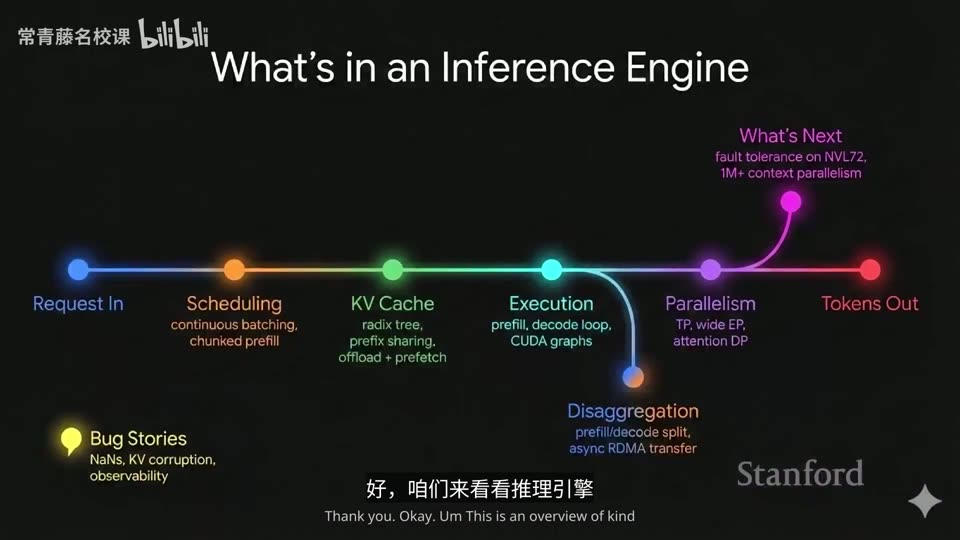
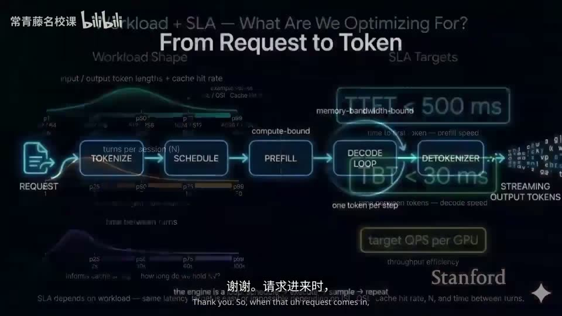
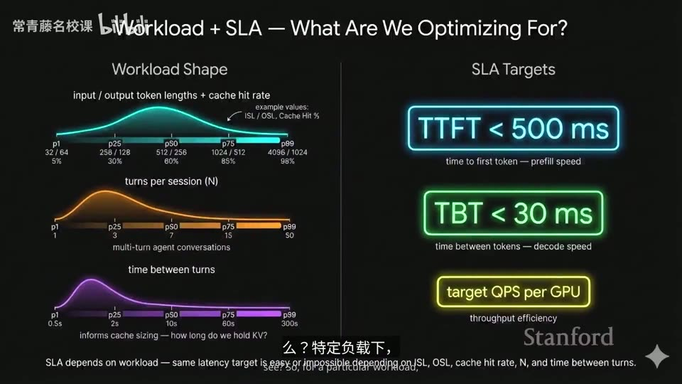
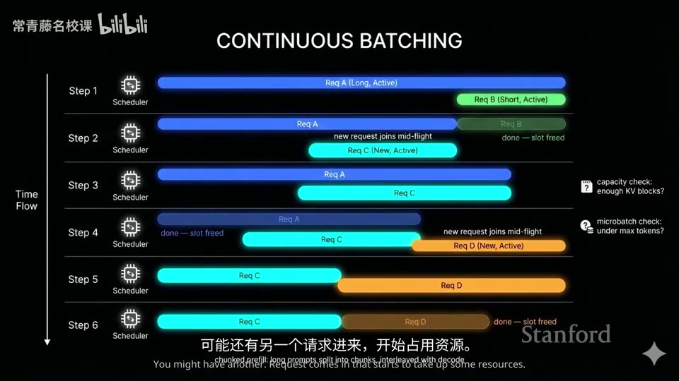
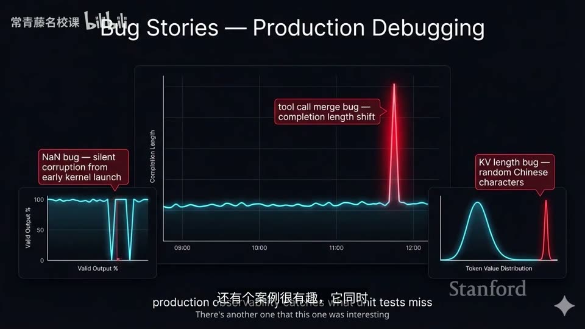
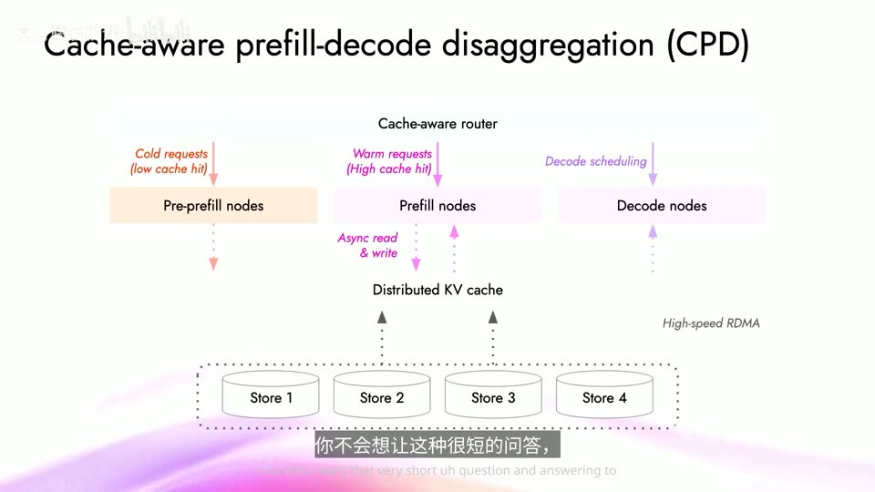
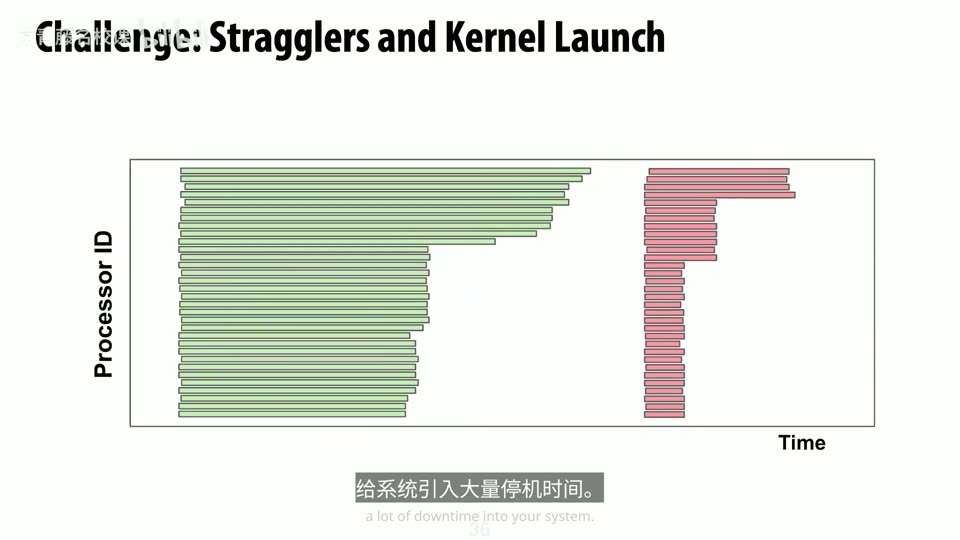
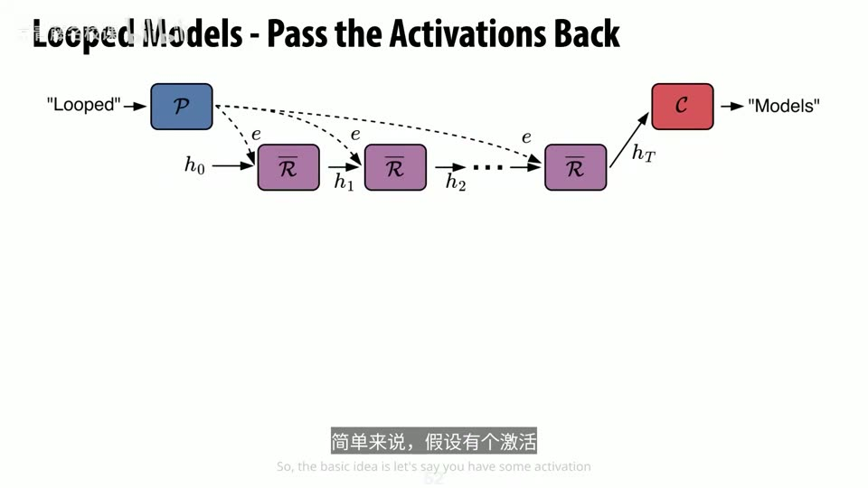
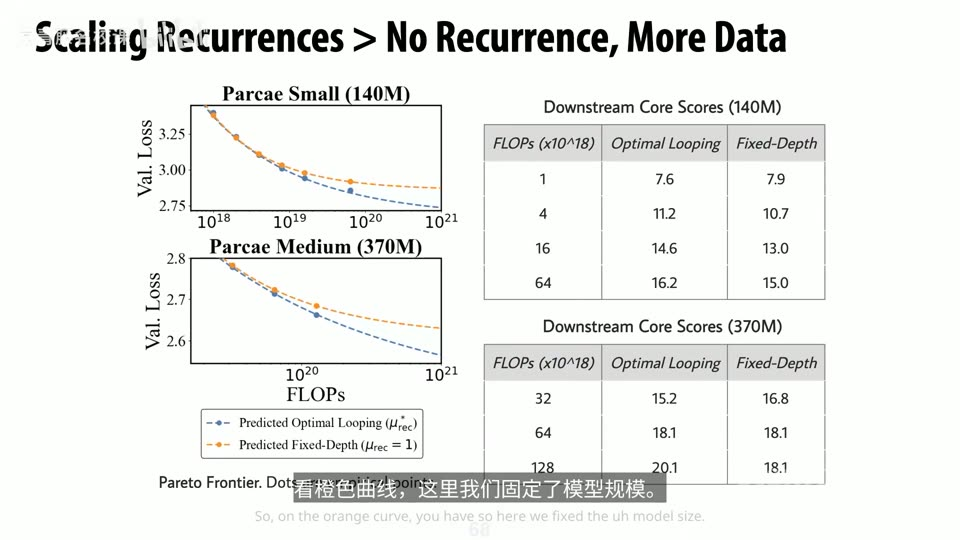

# Lecture 18: Guest Lecture Dan Fu

## 本讲要解决的核心问题（SCQA）

**背景（Situation）**：CS336 这门课前面讲的大多是"怎么训练一个语言模型"——架构怎么搭、数据怎么配、并行怎么切、缩放定律怎么用。到这一讲，视角第一次整体翻转：模型已经训好了，接下来真正把它**部署出去、替用户跑推理（inference）**是什么样子？本讲由 Dan Fu 客座主讲，他代表两个机构：UCSD（他在那里有一个小实验室）和 AI 云平台 Together（提供 GPU 推理、微调等全套服务）。([【跳转到 04:40】](https://www.bilibili.com/video/BV11LEA6eEuj/?p=18&t=280))

**冲突（Complication）**：模型能力已经到人类水平的文本与代码生成，参数量从 2018 年的 1 亿涨到如今开源模型的万亿级、前沿模型的 5–10 万亿。([【跳转到 01:13】](https://www.bilibili.com/video/BV11LEA6eEuj/?p=18&t=73)、[【跳转到 01:38】](https://www.bilibili.com/video/BV11LEA6eEuj/?p=18&t=98)) 但"训出来"和"跑得动、跑得便宜、跑得稳"是两码事：一个请求从进入系统到吐出 token，中间要经过调度、预填充、解码、缓存查找、跨机器拆分等一大串环节；真实生产流量千奇百怪，每天处理上万亿 token 时还会冒出概率不到 0.001% 却必然发生的诡异 bug。这个"推理侧"的复杂性，往往被只关注训练的课程忽略。

**疑问（Question）**：一个 token 从用户发出请求到被返回，究竟经历了什么？这些环节里藏着哪些有趣的选择和研究问题？如果深入理解推理引擎与底层的 GPU 内核，我们能在算法层面做出什么别的创新？

**回答（Answer，结论先行）**：**推理是把电力转化为智能的引擎，而理解推理是进行"全栈创新"的关键。** 本讲分三块展开：

1. **宏观地图**：一个请求（token）的完整生命周期——分词、调度、预填充、解码、连续批处理、KV 缓存、跨 GPU 拆分、缓存多级卸载；顺带讲规模化部署才暴露的"幽灵 bug"和硬件协同设计。([【跳转到 04:08】](https://www.bilibili.com/video/BV11LEA6eEuj/?p=18&t=248))
2. **研究项目一：MegaKernel**——把整个模型融进一个超大的 GPU 内核，让推理解码速度逼近硬件物理极限。([【跳转到 22:07】](https://www.bilibili.com/video/BV11LEA6eEuj/?p=18&t=1327))
3. **研究项目二：Parcae**——用状态空间模型（SSM）的理论把"循环 Transformer"稳定下来，追问"规模扩张是不是唯一的提速之路"。([【跳转到 27:18】](https://www.bilibili.com/video/BV11LEA6eEuj/?p=18&t=1638))

讲者反复强调的一句话是：**只要搞懂推理、推理引擎和底层的 GPU 内核，你就能在全栈上创新**——无论设计更聪明的路由算法、写更快的内核，还是提出参数更省、装得进更小硬件的新架构。([【跳转到 04:08】](https://www.bilibili.com/video/BV11LEA6eEuj/?p=18&t=248))

> 提醒：本讲幻灯片是用图像生成模型（讲者调侃叫 "Nano Banana Pro"）做的，所以别盯着文字细看——大体意思是对的，但拼写和细节常有错。([【跳转到 05:26】](https://www.bilibili.com/video/BV11LEA6eEuj/?p=18&t=326))

---

## 一、推理是把电力变成智能的引擎，理解它才能做全栈创新

### 1.1 规模扩张是能力的主要驱动力

讲者用一张"两年前求职演讲时做的旧图"串起演进：2018 年他刚开始读博，当时最大的模型才 **1 亿参数**，大家都觉得"太疯狂了"；到 2019 年，他们觉得模型太危险、不敢发布——那就是 GPT-2（顺便说，这门课的目标就是让你们能训出 GPT-2 水平的模型）；如今开源模型已有万亿参数甚至更多，前沿模型参数大约 **5 到 10 万亿**。([【跳转到 01:13】](https://www.bilibili.com/video/BV11LEA6eEuj/?p=18&t=73)、[【跳转到 01:38】](https://www.bilibili.com/video/BV11LEA6eEuj/?p=18&t=98))

有了这些规模，模型能对话、能写代码（Cursor、Claude Code 这类工具）、能分析复杂文本，还能处理图像和视频、开始理解新模态；在生物健康领域甚至出现了 DNA 模型这类应用。([【跳转到 00:49】](https://www.bilibili.com/video/BV11LEA6eEuj/?p=18&t=49)、[【跳转到 01:03】](https://www.bilibili.com/video/BV11LEA6eEuj/?p=18&t=63))

### 1.2 一个"马粪"类比：转变比想象中更快

讲者用一段历史说明这种转变有多快，而且日期"吻合得很有意思"：

- 1902 年曼哈顿有 **13 万匹马**，它们不是养着玩的，而是承担关键运输功能；每匹马每天产生好几磅粪便，13 万匹加起来就是严重的"马粪问题"，1898 年还真开过专门的学术会议讨论，结论是"没辙，只能捏着鼻子忍"。([【跳转到 01:52】](https://www.bilibili.com/video/BV11LEA6eEuj/?p=18&t=112)、[【跳转到 02:17】](https://www.bilibili.com/video/BV11LEA6eEuj/?p=18&t=137))
- 仅仅 10 年后的 1912 年，曼哈顿的**汽车数量已经超过马匹**。存在了几个世纪的东西，在十年过渡期里被汽车取代。
- 讲者说：对做语言模型的人来说，**那个"1912 时刻"大概就是去年**——从去年起，他开始用语言模型写大部分代码，团队里大多数人也这么干（除了做作业的时候）。([【跳转到 02:29】](https://www.bilibili.com/video/BV11LEA6eEuj/?p=18&t=149))

### 1.3 GPU 是新石油，但推理才是引擎

推动这一切的关键因素是，很多规模效应由 GPU 驱动，所以"可以把 GPU 看作新的石油"——能看到数千亿美元乃至更多资金投入 GPU，主权基金也把这类投资当作国家资产的重头戏。([【跳转到 03:04】](https://www.bilibili.com/video/BV11LEA6eEuj/?p=18&t=184)、[【跳转到 03:21】](https://www.bilibili.com/video/BV11LEA6eEuj/?p=18&t=201))

但讲者强调：**推理才是关键，它是把电力转化为智能的引擎**。就像没有引擎石油无法转化为动能一样，推理引擎也至关重要；而 GPU 内核让 GPU 从"一堆沙子"变成今天能用的东西。从抽象层面看，机器学习模型不过就是存在于抽象空间里的一堆运算，构成一张**有向无环图（DAG，Directed Acyclic Graph，指数据依赖关系像一张单向、不会绕回来的流程图）**，推理引擎和 GPU 内核的工作，就是把这套抽象运算高效地映射到真实硬件上。([【跳转到 03:30】](https://www.bilibili.com/video/BV11LEA6eEuj/?p=18&t=210)、[【跳转到 03:49】](https://www.bilibili.com/video/BV11LEA6eEuj/?p=18&t=229)、[【跳转到 03:54】](https://www.bilibili.com/video/BV11LEA6eEuj/?p=18&t=234))


课程里会实现 FlashAttention 这样的内核，但推理这一侧还藏着巨大的复杂性。讲者的忠告是：**哪怕今天的内容你都忘了，也请记住——只要搞懂推理、推理引擎和底层 GPU 内核，你就能在机器学习算法上实现全栈创新。** ([【跳转到 03:59】](https://www.bilibili.com/video/BV11LEA6eEuj/?p=18&t=239))

---

## 二、一个请求的完整生命周期：分词—调度—预填充—解码—流式输出

要理解推理系统，最直观的方式是跟着一个请求走一遍。讲者参考了学生 Austin 的演示以及他在 Together 的经历，把推理引擎拆成几个板块。([【跳转到 05:11】](https://www.bilibili.com/video/BV11LEA6eEuj/?p=18&t=311))



### 2.1 引擎的组成与大致流程

请求进来之后，系统的处理大致是（[【跳转到 05:38】](https://www.bilibili.com/video/BV11LEA6eEuj/?p=18&t=338)）：

1. **分词（tokenize）**：把输入文本切成一个个 token。
2. **调度（schedule）**：把请求分配给不同的 GPU；预填充和解码阶段可能跑在不同的机器上。
3. **查 KV 缓存**：看看这些 token 以前是否处理过、能不能直接从缓存里取出激活值（activation），省掉重复计算。
4. **执行核心机器学习代码**：按模型大小和拆分方式，跨机器拆分、多节点并行或节点内多 GPU 并行。
5. **产出 token**：算出结果后转成字符串，做停止符检查、安全检查，再流式输出。

于是你就能体验整个全流程——比如问一句"嘿模型，Percy 说的线性回归是什么意思？因为我那节课缺了"。([【跳转到 06:03】](https://www.bilibili.com/video/BV11LEA6eEuj/?p=18&t=363))

### 2.2 两种截然不同的计算：预填充与解码

引擎的核心机器学习计算分成两个部分，它们**节奏差别很大**（[【跳转到 09:03】](https://www.bilibili.com/video/BV11LEA6eEuj/?p=18&t=543)）：

- **预填充（prefill）**：处理你这段"从未见过"的输入。假设你喂进 1 万个 token，引擎要算出激活值和 **logits（模型对下一个 token 的原始打分，还没经过 softmax）**，也就是"输入 1 万个 token，输出 1 个 token"。这是**计算密集型（compute-bound）**操作，跟训练时很像——处理好大批 token、写好 FlashAttention 内核、跑训练循环，只是不反向传播。([【跳转到 09:28】](https://www.bilibili.com/video/BV11LEA6eEuj/?p=18&t=568))
- **解码（decode）**：逐个生成 token。模型处理完 prompt 后就开始一个一个往外蹦 token（如果用了**推测解码 speculative decoding**，一次可能出三四个）。但每生成一个新 token 都要把整个模型重新过一遍——算一算就知道浮点运算其实不多，**瓶颈在内存带宽**：每次都要重新把模型权重加载进来。所以解码是**内存带宽受限（memory-bandwidth-bound）**的。([【跳转到 09:53】](https://www.bilibili.com/video/BV11LEA6eEuj/?p=18&t=593))



推理引擎就在"调度—执行—token 采样"这个循环里不断重复，等着接收下一个请求。([【跳转到 10:18】](https://www.bilibili.com/video/BV11LEA6eEuj/?p=18&t=618))

---

## 三、负载形态与 SLA 决定了你优化什么

### 3.1 生产流量千差万别，不是训练时那种整齐的 token

讲者提醒：真正跑生产流量时，你看到的负载既不像训练时那种规整的 token，也不像自己在脑子里凭空编出来的样子。不同应用下，输入和输出 token 的分布完全不同（[【跳转到 06:27】](https://www.bilibili.com/video/BV11LEA6eEuj/?p=18&t=387)、[【跳转到 06:52】](https://www.bilibili.com/video/BV11LEA6eEuj/?p=18&t=412)）：

- **代码生成**（比如 Cursor 式的智能体访问你的代码库）：一般输入量很大，动辄上万个 token；输出可能是一些**思考 token（reasoning tokens）**，也可能只是简短回复。
- **摘要生成**、**把整本书贴进对话框来回聊**、**直接问"给我讲讲一阶微积分"**：这些负载形态彼此差别巨大。
- 如今用语言模型大多是**一问一答的智能体工作流（agentic workflow）**：你和代码 agent 来回沟通——"做这个""不，不是这意思""或者做那个"；agent 自己还能调用工具（比如用 grep 在代码库里搜东西）再把结果喂回模型，或者联网搜索，所以对话通常有好几个来回。([【跳转到 07:17】](https://www.bilibili.com/video/BV11LEA6eEuj/?p=18&t=437)、[【跳转到 07:49】](https://www.bilibili.com/video/BV11LEA6eEuj/?p=18&t=469))

### 3.2 节奏也不同：有的要秒回，有的可以慢慢跑

不同应用的节奏各不相同（[【跳转到 07:59】](https://www.bilibili.com/video/BV11LEA6eEuj/?p=18&t=479)、[【跳转到 08:24】](https://www.bilibili.com/video/BV11LEA6eEuj/?p=18&t=504)）：

- 在快速对话循环里、或用语音模式跟 ChatGPT 聊天，响应通常要很快。
- 反过来，如果让 agent 自己跑流程（"替我做这个，我不打扰你自己迭代"），节奏就完全不同；代理卡住时会喊"帮帮我"，但你可能没注意到，于是**回合之间会出现多个空档**。
- 讲者举例：他曾经用 ChatGPT 代理聊怎么安排每周锻炼，大概**每两周才聊一次**——这跟其他流量模式差别极大。

这些因素共同决定了你的工作负载长什么样：每次能拿到多少新 token、要生成多少 token、对话有多长、回合间隔多久。你是反复跟代码代理来回聊的"年轻用户"，还是只问个问题就走、第二天再回来的人？

### 3.3 SLA：拿什么指标衡量"服务得好"

服务等级协议（SLA，Service Level Agreement）由工作负载决定——同样的延迟目标，会因为输入/输出长度、缓存命中率、会话轮数、回合间隔的不同而变得容易或困难。核心指标包括（[【跳转到 08:49】](https://www.bilibili.com/video/BV11LEA6eEuj/?p=18&t=529)）：

- **TTFT（Time To First Token，首 token 延迟）**：从发出请求到拿到第一个 token 的时间，它主要取决于**预填充速度**——交互式应用常要求 1 秒甚至 500 毫秒以内返回，好让界面能提示"我正在想"。
- **TBT（Time Between Tokens，token 间隔时间）**：相邻两个 token 之间的时间，取决于**解码速度**；比如你可能要求"我知道要生成 500 个 token，希望整个响应在规定时间内返回"。
- **每 GPU 的目标 QPS（Queries Per Second，每秒查询数）**：衡量**吞吐效率**，也就是你希望一台 GPU 每秒钟服务多少请求。



---

## 四、连续批处理与 KV 缓存：让 GPU 同时高效服务许多请求

### 4.1 连续批处理：短请求能"中途加入"

现实系统不会一次只服务一个请求，而是同时处理很多个。这里的关键技术叫**连续批处理（continuous batching）**：不看整批请求是否同时开始、同时结束，而是让请求**动态地进进出出**——某个短请求跑完腾出位置，新请求就立刻补进来。([【跳转到 10:43】](https://www.bilibili.com/video/BV11LEA6eEuj/?p=18&t=643))

这张图的读法是：**时间从上往下流动**，每一行代表一个时间步，右边的调度器（Scheduler）决定这一步让哪些请求占用 GPU。([【跳转到 10:43】](https://www.bilibili.com/video/BV11LEA6eEuj/?p=18&t=643))



系统要同时管理两类资源（[【跳转到 11:08】](https://www.bilibili.com/video/BV11LEA6eEuj/?p=18&t=668)）：

- **计算资源**：GPU 要同时跑多个请求的运算。
- **内存资源**：填 **KV 缓存**要占用显存；显存不够时，请求就得排队，等某个场景跑完才能启动新请求。

所以即便只是"一堆不同请求同时跑"，系统行为就已经相当复杂了。([【跳转到 11:33】](https://www.bilibili.com/video/BV11LEA6eEuj/?p=18&t=693))

### 4.2 KV 缓存：不要为每个人重算一遍"hi ChatGPT"

**KV 缓存（KV cache）**是推理里最重要的机制之一。它的直觉很简单：很多用户开头都在说"hi ChatGPT"或"hi Claude"，那几句相同的开头，理论上没必要为每个用户重新计算一遍激活值。([【跳转到 11:47】](https://www.bilibili.com/video/BV11LEA6eEuj/?p=18&t=707))

具体来说，如果你输入了一段长文本，只需对它做**一次预填充**；下一轮对话里再追加内容时，不用把整个东西重新算一遍——利用**前缀共享（prefix sharing）**，引擎把新来的一组 token 接到旧的前缀上。

实现上它用了一种很传统的数据结构——**基数树（radix tree，也叫压缩前缀树）**：把 token 序列组织成树，公共前缀合并成共享的路径，于是引擎能快速判断"哪些 token 见过（缓存命中，cache hit）、哪些是新的（缓存未命中，cache miss）"。([【跳转到 12:12】](https://www.bilibili.com/video/BV11LEA6eEuj/?p=18&t=732))


### 4.3 注意：KV 缓存会随着对话变长而吃掉显存

每多生成一个 token，KV 缓存就要多存一份键值。对话越长，缓存越大，显存压力越重——这正是后面"缓存卸载"和"缓存感知路由"要解决的问题。

---

## 五、跨 GPU 拆分与预填充/解码分离：不同负载用不同硬件

### 5.1 单个 GPU 装不下大模型，必须拆分

算力到了 GPU 上，拆分方式就有很多种。设想一个万亿参数的模型跑在 280GB 显存的 GPU 上——**单张 GPU 根本装不下整个模型**。常见拆法包括（[【跳转到 12:22】](https://www.bilibili.com/video/BV11LEA6eEuj/?p=18&t=742)）：

- **张量并行（tensor parallel，TP）**：把一个张量矩阵拆成几份分给多张 GPU，每张只存一部分，算完再通过通信（如 all-reduce）把结果拼起来。
- **专家并行（expert parallel，EP）**：现在的 SOTA 模型很多是**混合专家（MoE，Mixture of Experts）**——模型里有多个独立的专家子网络，会根据每个 token 被选择性激活。于是可以把不同专家分到不同 GPU 上。

这些拆分选择决定了瓶颈在哪、需要多少张 GPU、能同时服务多少 session。([【跳转到 12:47】](https://www.bilibili.com/video/BV11LEA6eEuj/?p=18&t=767))

### 5.2 把预填充和解码放到不同机器：各取所需

一个常见做法是：**把预填充和解码分到不同的 GPU、不同的机器组上**。因为这两者的计算瓶颈与特性截然不同（[【跳转到 12:59】](https://www.bilibili.com/video/BV11LEA6eEuj/?p=18&t=779)、[【跳转到 13:24】](https://www.bilibili.com/video/BV11LEA6eEuj/?p=18&t=804)）：

- **预填充**很像训练：直接运行、非常消耗算力，能充分利用 GPU（compute-bound）。
- **解码**极度依赖内存带宽：计算量不大，却得同时加载所有模型权重（memory-bandwidth-bound）。
- 耗时也各不相同：预填充通常单次比一次解码久得多，但提示词只预填充一次；解码单步快，却要做很多步（每生成一个 token 解一次码）。

这种拆分（讲者称之为 prefill/decode disaggation，即**预填充-解码分离**）让两组 worker 各自针对不同的计算环节专门优化，事实证明能带来很多创新。例如你可能听说 NVIDIA 收购了 Groq——GPU 之王买下了一种新型推理芯片，原因之一就是解码负载和预填充负载差异巨大，针对解码可以用完全不同的芯片。具体分工是：**NVIDIA 用 GPU 处理预填充，用 Groq 的 LPU 芯片做解码**；Cerebras 与 OpenAI 有算力合作（它解码更强）；SambaNova 等公司也在这一领域的不同环节下注。([【跳转到 13:45】](https://www.bilibili.com/video/BV11LEA6eEuj/?p=18&t=825)、[【跳转到 13:59】](https://www.bilibili.com/video/BV11LEA6eEuj/?p=18&t=839))


### 5.3 百万级上下文与容错：拆分带来的新问题

拆分也带来新课题。新一代硬件方面，NVIDIA 的 **NVL72（GB200 这类 Blackwell 芯片）把 72 块 GPU 通过高速互联连起来**，于是你要考虑：怎么把万亿参数模型分摊到 72 块 GPU 上？这有意义吗？能带来什么？怎么考虑**容错**？这些设备常因各种原因出故障——比如连接器很脆（塑料做的不是金属），插太紧 NVL 链接就变得不稳定。如果模型分到 64 块 GPU 上、为数百万人和数万亿 token 提供生产流量，某一块 GPU 出故障时该怎么办？能容错吗？此外，当模型的上下文达到百万级甚至更多，又该怎么把上下文拆分到多个 GPU 上？这些都很值得琢磨。([【跳转到 19:23】](https://www.bilibili.com/video/BV11LEA6eEuj/?p=18&t=1163)、[【跳转到 19:48】](https://www.bilibili.com/video/BV11LEA6eEuj/?p=18&t=1188)、[【跳转到 20:13】](https://www.bilibili.com/video/BV11LEA6eEuj/?p=18&t=1213))

讲者特别强调：这种拆分把"预填充-解码分离"推向了硬件层面——GPU 和新型推理芯片各司其职，正是对两种负载特性差异的直接回应。

---

## 六、规模化生产的"幽灵 bug"与多级缓存卸载

### 6.1 小规模正常、大规模必然出错

当你真正大规模部署推理引擎、每天处理上万亿 token 时，会遇到一些相当棘手的 bug。大规模系统有个特点：**小规模下正常，大规模下必然出错**——你要面对的是发生概率低于 0.001% 的事件，它们迟早会撞上你。([【跳转到 14:14】](https://www.bilibili.com/video/BV11LEA6eEuj/?p=18&t=854))

讲者展示了一组发生在去年年底、涉及开源推理引擎的真实案例（[【跳转到 14:14】](https://www.bilibili.com/video/BV11LEA6eEuj/?p=18&t=854)、[【跳转到 14:39】](https://www.bilibili.com/video/BV11LEA6eEuj/?p=18&t=879)、[【跳转到 15:04】](https://www.bilibili.com/video/BV11LEA6eEuj/?p=18&t=904)、[【跳转到 15:29】](https://www.bilibili.com/video/BV11LEA6eEuj/?p=18&t=929)）：

- **NaN 死循环**：某个内核略有错误，但触发条件极其罕见；一旦触发，算到一半部分 logits 就变成 **NaN（Not a Number，非法数值，比如 0 除以 0）**，模型便开始反复输出同一个 token——有的模型从此只输出"hi hi hi"或感叹号，陷入死循环。
- **工具调用死循环**：工具调用就是模型说"嘿，我要搜个网"之类的动作，后端得执行。某个引擎处理工具调用的逻辑出了错，结果模型一直喊"去搜一下、去搜一下、怎么还没搜"，正常时它会说"我搞定了，去回复用户吧"，这回却停不下来，一口气跑上数万个 token。
- **突然说中文**：还有个案例同时搞挂了多个推理提供商，一开始被赖在"量化问题"上，其实是个更微妙的 bug——模型没理由地突然蹦出中文字。有人猜它被中文微调过，其实是某个 kernel 里有个 **off-by-one（差一位）错误**：有时候会从 GPU 里读到没初始化的内存数据，经过注意力机制后得到一个随机的中文字，模型便"纳闷怎么突然想中文了"，以为你在问中文问题，于是顺着聊到中文去——有时候真只是别人代码里的一个小 bug。



### 6.2 KV 缓存越大越好：GPU→CPU→磁盘的多级卸载

在生产系统里，一个关键点是 **KV 缓存越大越好**——最好能把不同用户、甚至同一用户不同会话的请求都缓存起来，这样能跑的任务就更多。但 GPU 显存很快就不够，于是自然想往下一层放（[【跳转到 16:12】](https://www.bilibili.com/video/BV11LEA6eEuj/?p=18&t=972)、[【跳转到 16:37】](https://www.bilibili.com/video/BV11LEA6eEuj/?p=18&t=997)、[【跳转到 17:02】](https://www.bilibili.com/video/BV11LEA6eEuj/?p=18&t=1022)）：

1. **GPU 显存（HBM）**：放最"热"的块。
2. **CPU 内存**：显存不够就卸载（offload）到 CPU 内存。这也解释了为什么 NVIDIA 的 Jensen 最近特别强调 CPU 性能——上一代 CPU 其实很慢，成了很多重要任务的瓶颈；如果你 50 万美元的机器被一个 1000 美元的 CPU 拖了后腿，那就太糟了，尤其当 KV 缓存存在 CPU 内存里时。
3. **SSD 磁盘**：再往后可以把更多 KV 缓存放到磁盘上，这时就要关注 SSD 的速度和空间。你可能听过 OpenAI 抢购全球 SSD 和内存的传闻——原因之一就是为了这种"尽可能多存 KV 缓存"的场景。

### 6.3 这其实就是一门操作系统课

真正构建引擎时，你要处理各种复杂情况：某些 token 好久没用了，就把它**驱逐（evict）**出去、转到 CPU、磁盘或全局存储；请求一来再去查、去等、把它取回来加载进系统。([【跳转到 17:27】](https://www.bilibili.com/video/BV11LEA6eEuj/?p=18&t=1047))

讲者打趣说：这张图除了右边 GPU 那块，**看起来就和七八十年代操作系统课的图一模一样**——以前电脑开太多应用、CPU 内存满了，你也得把应用挪到磁盘里，工作负载本质上是一回事。理想情况下用 **LRU（Least Recently Used，最近最少使用）驱逐**：把最久没用过的块换出去。这个启发式策略相当靠谱，据操作系统论文，**LRU 的效果最多也只比"最优解"差两倍**。([【跳转到 18:07】](https://www.bilibili.com/video/BV11LEA6eEuj/?p=18&t=1087)、[【跳转到 18:12】](https://www.bilibili.com/video/BV11LEA6eEuj/?p=18&t=1092)、[【跳转到 18:27】](https://www.bilibili.com/video/BV11LEA6eEuj/?p=18&t=1107))

如果你能**预知未来**，那就完美了——比如你打开聊天应用翻出一个月前的旧对话，说明你大概率要针对它提问，引擎就可以**预取（prefetch）**、提前把它加载到 GPU 上。理想情况下能预测未来，若不能就靠各种启发式策略。这其实归结为一个问题：**你要把多少流量压到 GPU 上？** 只要满足开头提的那些 SLA，当然是尽可能多地承载流量。([【跳转到 18:45】](https://www.bilibili.com/video/BV11LEA6eEuj/?p=18&t=1125)、[【跳转到 19:10】](https://www.bilibili.com/video/BV11LEA6eEuj/?p=18&t=1150))

---

## 七、缓存感知的预填充-解码分离（CPD）：两行路由改动换来最高 40% 提速

### 7.1 一个观察：绝大多数请求其实是"多轮对话里的后续轮"

讲者介绍了一项几个月前与 Together 一起发布的工作，叫**缓存感知的预填充-解码分离（cache-aware prefill-decode disaggregation，CPD）**。这项优化**路由层只需改两行代码**，但效果显著。([【跳转到 20:31】](https://www.bilibili.com/video/BV11LEA6eEuj/?p=18&t=1231))

它的出发点是一个关于真实流量的观察：近来大量请求都是多轮对话里的逐轮交互——用户已经开启了对话，假设一段对话平均持续十轮，随后用户离开。这意味着**大约 10% 的请求是全新的请求**，它们包含数千个 token，缓存命中率很低、计算成本高得多。

### 7.2 痛点：别把"贴一本书"和"1+1=2"混在同一批 GPU 上

问题在于，如果你把这种昂贵的预填充，和一个正跑到一半的短对话混在同一批 GPU 上，就会互相干扰。讲者的例子很直观（[【跳转到 20:56】](https://www.bilibili.com/video/BV11LEA6eEuj/?p=18&t=1256)）：

- 用户 A 贴进来一整本书，说"跟我聊聊这本书"——这是个巨型预填充请求。
- 用户 B 正聊到一半，问"为什么 1+1=2"，对方答"1+1=2，因为数字之类的"，然后说"我没懂"——这是个很短的问答请求。

你不想让这两个请求同时跑在同一批 GPU 上：短请求会被长请求的预填充拖慢，用户体验变差。

### 7.3 做法：按缓存命中率把冷热请求分开路由

解法是一个很简单的路由策略：**新请求进来时缓存命中率很低，就把它发到一组专门的节点去处理（pre-prefill nodes），先把这些内容预填充好；而其他"预热过"的请求（高命中率）则发给另一组预填充节点（prefill nodes）**，再由解码节点统一调度，中间配合分布式 KV 缓存和高速 RDMA 传输。([【跳转到 21:21】](https://www.bilibili.com/video/BV11LEA6eEuj/?p=18&t=1281))



### 7.4 效果与意义

事实证明，用这种简单的优化，**服务速度最高能提升 40%**。讲者由此感慨：我们在这个研究方向和技术上的现状可以用"非常早期"来形容。这属于那种事——十到二十年后人们回头看可能会想"当时他们为啥聊这个，这难道不是显而易见的吗？"其实是因为我们才刚刚开始在生产环境里用新方式运行这些东西，看到了新方式下的新流量模式。([【跳转到 21:37】](https://www.bilibili.com/video/BV11LEA6eEuj/?p=18&t=1297)、[【跳转到 22:02】](https://www.bilibili.com/video/BV11LEA6eEuj/?p=18&t=1322))

---

## 八、研究项目一：MegaKernel——把整个模型融进一个内核

讲完宏观生命周期，讲者转入两个受推理服务现象启发的研究项目。第一个是**用所谓的 megakernel（超大内核）让语言模型解码快得多**，这是斯坦福和 Together 的合作。([【跳转到 22:07】](https://www.bilibili.com/video/BV11LEA6eEuj/?p=18&t=1327))

### 8.1 难点一：解码没法像训练那样"喂饱"GPU

解码的根本难点在于：你得先处理 prompt，再逐个生成 token；而**每生成一个 token 就得把整个模型跑一遍**。这意味着你没法像预填充或训练时那样利用 GPU 的大规模并行能力，反而把这套高性能系统变成了单纯的**内存读取工具**——GPU 大部分时间在等数据，而不是在算。([【跳转到 22:07】](https://www.bilibili.com/video/BV11LEA6eEuj/?p=18&t=1327)、[【跳转到 22:35】](https://www.bilibili.com/video/BV11LEA6eEuj/?p=18&t=1355))

### 8.2 难点二：一次只写一个内核，会留下大量"停机时间"

难点还在于：写内核很难（写过 FlashAttention 的同学应该深有体会），所以通常的做法是**一次只跑一个操作对应的内核**——归一化一个内核、矩阵乘一个内核、注意力一个内核，这样编程简单多了。但代价是给系统引入大量**停机时间（downtime）**。([【跳转到 22:44】](https://www.bilibili.com/video/BV11LEA6eEuj/?p=18&t=1364)、[【跳转到 23:09】](https://www.bilibili.com/video/BV11LEA6eEuj/?p=18&t=1389))

看下面这张"内核执行时间线"图就能理解。读图方法是：**横轴是时间（从左向右流动），纵轴是 GPU 上所有不同的流式多处理器（SM，Streaming Multiprocessor，可以把 GPU 想成由很多个小处理器组成，H100 上有 132 个，B200 上大约 148 个）**。有色部分代表某个处理器正在干活（有效工作），空白处则是在等待。([【跳转到 23:14】](https://www.bilibili.com/video/BV11LEA6eEuj/?p=18&t=1394)、[【跳转到 23:39】](https://www.bilibili.com/video/BV11LEA6eEuj/?p=18&t=1419))

你会看到：不管单个内核写得多好，GPU 总有停摆的时候——比如内核启动和拆卸处那些大空隙，这叫**尾部效应（tail effect）**。就像短 prompt 和长 prompt 一起处理时要等最长的那个处理完一样，这些内核之间的间隙会慢慢叠加起来。([【跳转到 23:52】](https://www.bilibili.com/video/BV11LEA6eEuj/?p=18&t=1432))



### 8.3 做法：一个大内核搞定多个操作，把 GPU 当分布式系统调度

为解决这个问题，团队做了 **MegaKernel**：**不单独为每个操作写内核，而是用一个内核一次搞定多个操作**。这有点像 FlashAttention 里的"融合（fusion）"，只是覆盖更广、更激进。([【跳转到 24:17】](https://www.bilibili.com/video/BV11LEA6eEuj/?p=18&t=1457))

它的关键思想是：**不再把 GPU 当成"一次执行一个操作的单一设备"，而把它看成一个庞大的分布式系统**——"好吧，我有大量工作要处理"。这些任务之间存在依赖关系（比如某些红色任务依赖某些绿色任务），于是问题变成：怎么调度、怎么分配任务，才能最大化 GPU 利用率？只在注意力推理内核上这样做，就能获得 **30% 到 70% 的加速**。([【跳转到 24:17】](https://www.bilibili.com/video/BV11LEA6eEuj/?p=18&t=1457)、[【跳转到 24:42】](https://www.bilibili.com/video/BV11LEA6eEuj/?p=18&t=1482))

### 8.4 更激进：把整个模型的一层都合并进一个内核

好处是这套方法能应用到整个模型。比如下图是 Llama 的一层，团队基本上**把整个层合并成了一个内核**：你看那些不同颜色的条**以非常奇怪的方式重叠在一起**——前一层的权重加载与注意力机制重叠，甚至注意力操作还没结束就开始执行部分规约（reduction）。([【跳转到 25:00】](https://www.bilibili.com/video/BV11LEA6eEuj/?p=18&t=1500))

一个关键认识是：在 **QKV 投影 + RoPE（旋转位置编码）**还没算完时，你就能开始把 KV 缓存加载进注意力——尤其是在 decode 阶段，带圆圈的橙色条表示 QKV+RoPE 还在跑时就已经开始加载 KV 缓存了；等 QKV 完成后拿到新的 query token，就能跑完注意力的剩余部分。同理，在注意力运算结束前，后面的 **O 投影**就已经开始加载权重。**当你能这样精细控制 GPU 时，就可以在别的操作结束前启动某些操作。**([【跳转到 25:22】](https://www.bilibili.com/video/BV11LEA6eEuj/?p=18&t=1522)、[【跳转到 26:01】](https://www.bilibili.com/video/BV11LEA6eEuj/?p=18&t=1561))


### 8.5 工程实现与回报

团队把这一切整合进一个相对复杂的代码框架：用**基于指令的抽象**让每个子内核都能独立写进各自的文件，再搭建一个大型的**虚拟化共享内存系统**来协调这些操作。为此他们做了一个叫 **ThunderKittens** 的 CUDA DSL（领域特定语言）——它属于编写内核的那类库，**你可以把它想成更底层的 Triton**，对细节的控制要精细得多。([【跳转到 26:12】](https://www.bilibili.com/video/BV11LEA6eEuj/?p=18&t=1572))


从数据看，青色柱子（megakernel）比其他一些顶尖引擎跑得快多了，在 H100 上**带宽利用率达到 72%**，几乎跑满 GPU 的物理极限——抛开所有复杂处理，只看 GPU 执行这个操作的物理极限速度，已经接近其 72%。这部分给出的启示是：**如果你能深度掌控内核、理解硬件，就能解锁全然不同的计算范式**，而这些细节只有当你深入到推理底层去摸索时才会发现。([【跳转到 26:38】](https://www.bilibili.com/video/BV11LEA6eEuj/?p=18&t=1598)、[【跳转到 27:03】](https://www.bilibili.com/video/BV11LEA6eEuj/?p=18&t=1623)、[【跳转到 27:08】](https://www.bilibili.com/video/BV11LEA6eEuj/?p=18&t=1628))

---

## 九、研究项目二：Parcae——用状态空间理论驯服循环 Transformer

### 9.1 动机：规模扩张是唯一的路吗？

第二个项目进入新架构领域，介绍一个新模型叫 **Parcae**，是 UCSD 实验室的成果（讲者提到由 Hidde 主导，并与 Zachary Taylor 合作）。([【跳转到 27:18】](https://www.bilibili.com/video/BV11LEA6eEuj/?p=18&t=1638))

开场时讲者讲过，模型的新能力很大程度上来自参数和数据的规模扩张。在 Parcae 这个工作里，团队想问另一个问题：**规模扩张是唯一的路吗？还是说有别的办法能达到同样的质量？** ([【跳转到 27:30】](https://www.bilibili.com/video/BV11LEA6eEuj/?p=18&t=1650))

他们的答案是尝试**循环 Transformer（looped / recurrent transformer）**：把 Transformer 的某些模块拿出来**反复跑**。与其让 token 一层层地单纯穿过模型，不如让它们在处理过程中**反复在一个循环里跑**——同一个循环块被多次复用，激活值在循环块里穿过同一层很多次，最后再返回结果。([【跳转到 27:48】](https://www.bilibili.com/video/BV11LEA6eEuj/?p=18&t=1668)、[【跳转到 28:33】](https://www.bilibili.com/video/BV11LEA6eEuj/?p=18&t=1713))

好处是：**参数保持不变，却能提高 FLOPs（浮点运算量）**。如果相信"FLOPs 越多、质量越高"，那么这就能在不增加参数成本的前提下提升质量；而且已有研究表明，循环模型能获得更高的**表达能力**——有些东西用相同参数量的普通模型表达不了，循环模型却能表达。这正是团队思考的核心：**怎样让每个参数发挥最大价值。**([【跳转到 28:33】](https://www.bilibili.com/video/BV11LEA6eEuj/?p=18&t=1713)、[【跳转到 28:58】](https://www.bilibili.com/video/BV11LEA6eEuj/?p=18&t=1738))



### 9.2 直接训练的陷阱：稍微改一下学习率，模型就崩

动机讲完，就要直面问题：这类循环模型**训练极其脆弱**——只要稍微改动一下训练算法（比如把学习率调一点点），模型就会突然开始崩掉。讲者做了学习率扫描，**十次里有九次模型都会不收敛、会爆掉**，冒出 NaN 或损失激增。训练大模型时若见损失暴涨，就说明训练出了问题；以前大家只能靠土办法，比如每层都加归一化（normalization），或者干脆硬性只用 `2e-4` 的学习率、别的都不改，但这些都不是根本原因。([【跳转到 29:55】](https://www.bilibili.com/video/BV11LEA6eEuj/?p=18&t=1795)、[【跳转到 30:20】](https://www.bilibili.com/video/BV11LEA6eEuj/?p=18&t=1820))

### 9.3 核心洞察：把循环的残差建成一个"动态系统"

团队用类似状态空间模型（SSM，State Space Model）的思路来解决稳定性问题。直接硬算太复杂，因为循环模块参数太多、又有 softmax、GLU、RoPE 等非线性操作。他们的第一个发现是：**激活值在各模块之间变化其实不大**——这些**残差块（residual blocks）只是对向量做微调，影响没那么大**。([【跳转到 30:25】](https://www.bilibili.com/video/BV11LEA6eEuj/?p=18&t=1825)、[【跳转到 30:30】](https://www.bilibili.com/video/BV11LEA6eEuj/?p=18&t=1830))

于是他们基于残差建立了一个**动态系统模型**，并把那些复杂的非线性组件（注意力、GLU、带中间层的大前馈网络）打包进一个盒子，叫它 `R`；剩下的就是两个矩阵 `A` 和 `B`（[【跳转到 30:55】](https://www.bilibili.com/video/BV11LEA6eEuj/?p=18&t=1855)、[【跳转到 31:20】](https://www.bilibili.com/video/BV11LEA6eEuj/?p=18&t=1880)）：

- **`B` 矩阵**：负责对初始向量做某种变换，也就是循环开始前那个初始状态是什么。
- **`A` 矩阵**：决定如何在每次循环中变换这个残差。

于是那个复杂的循环状态更新，被写成：

```text
h_{t+1} = A·h_t + B·e + R(h_t, e)
```

其中 `h_t` 是第 t 步的激活（状态），`e` 是输入，`R` 打包了所有非线性部分。


### 9.4 稳定性的钥匙：A 的谱半径

经验显示，**`A` 和 `B` 矩阵其实主导了方程的量级**。为了看清本质，团队做了一个大胆的简化：直接去掉那个复杂的非线性部分 `R`，会得到什么？结果是——系统变得极其简单，用微积分就能解出闭式解。你可以算出给定初始激活和初始注入时的状态，甚至可以经验性地直接算出 `t+1` 时的激活：

```text
h_{t+1} = A^t·h_1 + (Σ_{n=0}^{t-1} A^n)·B·e
```

关键在于：这个式子由 `A` 矩阵主导，尤其是被大幅幂次的 `A`。由此引入一个核心量——**`A` 的谱半径（spectral radius，记作 ρ(A)，大致等同于矩阵"范数"所刻画的放大倍数）**。([【跳转到 31:45】](https://www.bilibili.com/video/BV11LEA6eEuj/?p=18&t=1905)、[【跳转到 32:10】](https://www.bilibili.com/video/BV11LEA6eEuj/?p=18&t=1930))

直觉上：假设这个矩阵就是个标量 `2`，做 16 次幂就变成 `2^16`，数值被放得巨大——**这解释了为什么损失值会剧烈波动**。团队发现，前人论文里 `A` 和 `B` 矩阵的选择要么稳定、要么不稳定，会让系统不稳定。([【跳转到 32:35】](https://www.bilibili.com/video/BV11LEA6eEuj/?p=18&t=1955))


### 9.5 Parcae 的做法：约束 A 与 B，让谱半径小于 1

于是团队的思路很自然：**既然让 `A`、`B` 随便变系统就会爆炸，那就约束它们，让它们在数学上不会爆炸**（[【跳转到 33:00】](https://www.bilibili.com/video/BV11LEA6eEuj/?p=18&t=1980)）：

- **对 `A`**：直接把它设成**负对角矩阵（negative diagonal）**。这样它的高次幂项会最终趋于零，不会发散。
- **对 `B`**：加一个简单的**线性范数约束**——因为它只被应用一次，不会发散。

只要**谱半径小于 1，系统就稳定了**，训练时你会看到损失曲线很稳定。**Parcae 就是对 `A` 和 `B` 重新参数化后的稳定版**——哪怕用 `6e-4` 这种会让别的模型崩掉的学习率，最后模型还是稳的。([【跳转到 33:25】](https://www.bilibili.com/video/BV11LEA6eEuj/?p=18&t=2005)、[【跳转到 33:30】](https://www.bilibili.com/video/BV11LEA6eEuj/?p=18&t=2010))

讲者分享了一张很有说服力的曲线图：那条橙色基线是**完全没加约束**的模型，它直接炸到 `10^19`；蓝色线是加了范数约束的模型。背后有个有意思的张力：模型"想把激活值扩张得很大"（因为它觉得空间越大表示效果越好），而范数约束又把它压回来，两种力量互相拉扯，导致损失出现波动；虽然右侧的范数控制得很好、激活没炸，但损失值确实出现了不好的波动。**所以只要把激活值稍微改一下，就能稳定训练和这些循环过程。** ([【跳转到 33:30】](https://www.bilibili.com/video/BV11LEA6eEuj/?p=18&t=2010)、[【跳转到 33:55】](https://www.bilibili.com/video/BV11LEA6eEuj/?p=18&t=2035))

### 9.6 结果：更低困惑度，以及"数据越多、循环越多"的缩放定律

系统不仅更稳，模型质量也更高。对比表显示，Parcae 在各种应用里都胜过上一代循环 Transformer，也强于很强的**固定深度 Transformer**——困惑度更低、端到端质量更好。([【跳转到 34:20】](https://www.bilibili.com/video/BV11LEA6eEuj/?p=18&t=2060)、[【跳转到 34:25】](https://www.bilibili.com/video/BV11LEA6eEuj/?p=18&t=2065))

接下来是最关键的缩放定律部分。团队跑了一些基础的缩放实验（ISO-param、ISO-FLOP，即固定参数量、固定 FLOP 预算），得到两个重要结论（[【跳转到 36:00】](https://www.bilibili.com/video/BV11LEA6eEuj/?p=18&t=2160)、[【跳转到 36:25】](https://www.bilibili.com/video/BV11LEA6eEuj/?p=18&t=2185)、[【跳转到 37:30】](https://www.bilibili.com/video/BV11LEA6eEuj/?p=18&t=2250)）：

1. **数据增加时，你应该相应增加循环次数（recurrence）**——这些循环遵循经典的幂律关系。
2. 固定模型规模、同时增加数据量时，也需要增加循环次数。**目前主流模型都不带循环，所以它们都待在曲线最左边**（数据量巨大），这意味着训练时我们或许还能做得更好。

讲者用一句标题总结：**Scaling Recurrences > No Recurrence, More Data**（扩展循环优于"不循环、只堆数据"）。在固定 FLOP 预算下，用"增加循环"而非"只堆数据"来达到同样算力，验证损失会更低。他据此做出一个大胆推测：**或许所有大规模预训练都应该"循环起来"。** ([【跳转到 38:00】](https://www.bilibili.com/video/BV11LEA6eEuj/?p=18&t=2280)、[【跳转到 38:25】](https://www.bilibili.com/video/BV11LEA6eEuj/?p=18&t=2305))



### 9.7 额外发现：给预训练模型循环两三层，质量也能变好

在问答环节，讲者补充了一个有趣的现象：几个月前有人发了篇很"恶搞"的博客，说"嘿，我没训练任何东西就赢了一个排行榜比赛"——他其实是在一个 Qwen 模型里**循环了两三层**，然后发现在一些数学问题上它的质量开始变高。团队有相关研究在做，可能很快就会发布：**有些模型只要对预训练模型做一点循环迭代，就能得到更高质量的结果**。讲者坦言这挺奇怪、有点想不通，但很值得研究——如果能说服 Hidde，他会去盯着激活值和实际权重，看看循环为什么能让效果变好。([【跳转到 39:32】](https://www.bilibili.com/video/BV11LEA6eEuj/?p=18&t=2372)、[【跳转到 39:47】](https://www.bilibili.com/video/BV11LEA6eEuj/?p=18&t=2387)、[【跳转到 40:06】](https://www.bilibili.com/video/BV11LEA6eEuj/?p=18&t=2406))

> 讲者还开了个玩笑：Parcae 发布前一周，OpenAI 有人说某一个模型是循环语言模型，他觉得"那人在瞎编"，结果 Twitter 上全是猜测、闹得沸沸扬扬，最后那人只能发博文认错。团队其实早在那波热议之前就开始研究了。([【跳转到 29:25】](https://www.bilibili.com/video/BV11LEA6eEuj/?p=18&t=1765))

---

## 十、协同设计与开放问题：从硬件到架构的相互塑造

讲者最后回到本讲的核心，并回答了听众的一系列问题，这些问题共同勾勒出"推理如何反过来影响模型设计"。

### 10.1 硬件协同设计：内存是主要瓶颈

如果你设计模型时就已知它要在特定平台服务，该怎么调架构？讲者的回答围绕**内存**展开（[【跳转到 42:17】](https://www.bilibili.com/video/BV11LEA6eEuj/?p=18&t=2537)、[【跳转到 42:27】](https://www.bilibili.com/video/BV11LEA6eEuj/?p=18&t=2547)）：

- 在特定芯片上服务，要看晶圆、算内存，**调整模型大小以容纳 KV 缓存**，还得留点余量。
- **量化格式也随硬件不同**：在英伟达显卡上跑模型（如他们的 Nemotron）要用 `NVFP4` 这种英伟达芯片专有的 FP4 格式；如果换成 AMD，就得用另一种叫 `MXFP4` 的格式，各有优劣。
- 讲者还观察到，最近一些中国模型的选择暗示它们可能在考虑别的芯片平台。

### 10.2 计算最优 vs 参数固定：循环的定位

有同学问：在 Parcae 里，你会优先选择循环迭代而不是增加参数吗？还是这主要是为了降低推理成本的技巧？讲者的回答是：**计算最优（compute-optimal）通常指给定 FLOP 预算下的最优搭配**。想提升质量就直接增加 FLOP 预算、定好模型规模后拉长训练时长；要是**规模受限**（比如硬件装不下更多参数），那就**多跑几轮循环**；数据用完了，就挑个合适的模型规模、在选定规模下尽量练好。但他也强调，最终选择还得看这东西能不能被采纳、该怎么部署它——**归根结底，很多考量最后都归结为一个决定：你打算训练多大的模型。** ([【跳转到 43:01】](https://www.bilibili.com/video/BV11LEA6eEuj/?p=18&t=2581)、[【跳转到 43:52】](https://www.bilibili.com/video/BV11LEA6eEuj/?p=18&t=2632))

### 10.3 不同用例的最佳架构差异：缓存"热不热"是关键

有同学问：代理式代码生成和批量数据处理，它们的最佳架构最显著的区别是什么？讲者指出，一个巨大的区别在于 **KV 缓存要不要尽量保持"在内存里（in memory）"、越热越好**（[【跳转到 44:12】](https://www.bilibili.com/video/BV11LEA6eEuj/?p=18&t=2652)、[【跳转到 44:36】](https://www.bilibili.com/video/BV11LEA6eEuj/?p=18&t=2676)）：

- **代理循环工作流**：KV 缓存越热越好，所以缓存压缩技术很重要。比如 **DeepSeek 的 MLA 注意力机制**，相比其他模型对 KV 缓存做了**激进的压缩**；如果模型能在 FP8 甚至 FP4 下处理 KV 缓存，缓存大小会有相当大的差异。
- **大规模批量处理**（每个文档只看一次就翻译）：KV 缓存没那么重要。
- **因果注意力 vs 双向注意力**也是个关键分水岭：如果只是做大批量处理，谷歌过去长期只用 **BERT** 这类模型（搜索里现在可能还在用），它做一次大的**双向注意力**就能得到向量输出、结果存进数据库随你怎么用；但对话工作流总会包含**解码**这部分，所以架构选择完全不同。([【跳转到 44:58】](https://www.bilibili.com/video/BV11LEA6eEuj/?p=18&t=2698)、[【跳转到 45:15】](https://www.bilibili.com/video/BV11LEA6eEuj/?p=18&t=2715))

### 10.4 MegaKernel 的代价与跨机器通信

关于 megakernel，讲者给出了非常坦率的评估（[【跳转到 41:14】](https://www.bilibili.com/video/BV11LEA6eEuj/?p=18&t=2474)、[【跳转到 41:25】](https://www.bilibili.com/video/BV11LEA6eEuj/?p=18&t=2485)、[【跳转到 42:03】](https://www.bilibili.com/video/BV11LEA6eEuj/?p=18&t=2523)、[【跳转到 45:42】](https://www.bilibili.com/video/BV11LEA6eEuj/?p=18&t=2742)）：

- **超大内核的代价是"工程师的血汗"**：编写超大内核极其耗费人力。打个比方，顶尖工程师一年可能也就为一种硬件做出两三个模型的超大内核；批大小 1 到 16 还行，一旦到 17 就得推倒重来，编写难度极大。团队正尝试用编译器把其中一些工作自动化——但这个过程确实很难。
- 在 GPU 编程里，"超大内核"这个概念过去几十年一直起起落落，但一旦搞定，速度就顶天了。但它确实要耗费大量精力。
- **跨多台机器通信**：团队早期做过一些初步研究，发现只要设置得当，也能把 **NCCL（NVIDIA 的集合通信库）调用融进超大内核**。不过目前还没找到特别好的杀手级应用场景，有时候瓶颈就在 NCCL 调用本身的延迟上。DeepSeek 出来时，他们为 MoE 推理层做了一个超大内核、专门跑这一块，还真的把部分通信也融了进去。

讲者的趋势判断是：**模型越来越多时，你会为一部分计算做一个小型超大内核，但不一定为整个模型做**——除非你愿意拼尽全力把整套真正跑起来。([【跳转到 46:27】](https://www.bilibili.com/video/BV11LEA6eEuj/?p=18&t=2787))

### 10.5 回到核心：全栈创新

讲者用本讲的核心要点收尾：**如果你理解推理、理解这些模型、理解 GPU 内核、理解构成它们的每一个部分，你就真的能在机器学习算法上实现全栈创新。**（[【跳转到 38:30】](https://www.bilibili.com/video/BV11LEA6eEuj/?p=18&t=2310)、[【跳转到 38:41】](https://www.bilibili.com/video/BV11LEA6eEuj/?p=18&t=2321)）

无论是用**新的路由算法**处理更多流量或换种方式分配流量（如 CPD），还是用**新的内核**让系统的一部分跑得快得多（如 MegaKernel），又或是用**新架构**让参数少很多时也能装进去、以不同方式装进部分 GPU 从而减少通信量（如 Parcae）——这些都是同一个难题的不同侧面：**在一定资源约束下，把"电力→token→智能"这条链路做到极致。** 讲者最后也希望今天的内容至少能激发在座的一位同学去更深入地探究其中一些问题。([【跳转到 39:02】](https://www.bilibili.com/video/BV11LEA6eEuj/?p=18&t=2342)、[【跳转到 39:07】](https://www.bilibili.com/video/BV11LEA6eEuj/?p=18&t=2347))

---

## 小结

1. **视角的翻转**：本讲从"怎么训练"转向"训练好之后怎么部署与推理"。规模扩张（2018 年的 1 亿参数 → 如今万亿级）带来了惊人能力，但真正的关键是**推理——把电力转化为智能的引擎**；理解推理引擎和底层 GPU 内核，就能做全栈创新。([【跳转到 04:08】](https://www.bilibili.com/video/BV11LEA6eEuj/?p=18&t=248))
2. **一个 token 的生命周期**：分词 → 调度 → 查 KV 缓存 → 预填充（compute-bound，像训练）→ 解码（memory-bandwidth-bound，每步都要重载权重）→ 采样/安全检查 → 流式输出。
3. **负载决定优化目标**：代码生成、摘要、整本书对话、智能体多轮工具调用，负载形态与节奏截然不同；SLA 的核心是 TTFT（首 token 延迟）、TBT（token 间隔）和每 GPU 的 QPS。
4. **连续批处理**让请求动态进出，KV 缓存通过**基数树前缀共享**避免重复计算；缓存越大越好，于是出现 **GPU 显存 → CPU 内存 → SSD** 的多级卸载，本质是操作系统里的 LRU 驱逐与预取问题。
5. **拆分与专用硬件**：单 GPU 装不下大模型，要用张量并行、专家并行；更把**预填充与解码分离**到不同机器与芯片（NVIDIA 用 GPU 做预填充、Groq 的 LPU 做解码，Cerebras、SambaNova 各有侧重）。
6. **规模化必然暴露幽灵 bug**：NaN 死循环、工具调用死循环、未初始化显存导致的莫名中文输出——都是概率低于 0.001% 却注定发生的事件。
7. **CPD（缓存感知的预填充-解码分离）**：按缓存命中率把冷热请求路由到不同节点，路由层只改两行代码，最高提速 **40%**。
8. **MegaKernel**：把多个算子融合进单个超大内核、把 GPU 当分布式系统精细调度任务依赖（如 QKV 完成前就开始加载 KV 缓存），注意力内核加速 1.3–1.7×，H100 带宽利用率达 **72%**，接近光速；代价是极高的工程投入。
9. **Parcae**：用状态空间理论把循环 Transformer 的残差建成动态系统 `h_{t+1}=A·h_t+B·e+R`，以**负对角矩阵 A**（谱半径 < 1）和 **B 的范数约束**保证稳定，从而用学习和率为 `6e-4` 也不崩；缩放定律显示"**数据越多、循环越多**"，扩展循环优于只堆数据。
10. **协同设计**：内存是主要瓶颈，模型大小、量化格式（NVFP4 vs MXFP4）都要随硬件调整；代理工作流要 KV 缓存"越热越好"（MLA、FP8/FP4），批量处理则不需要。

---

## 关键术语速查

| 术语 | 一句话解释 |
| --- | --- |
| 推理（inference） | 模型训练好后，用它对用户请求生成输出的过程，本讲主题 |
| 全栈创新 | 从路由算法、GPU 内核到模型架构，贯通整个推理栈做优化 |
| token 生命周期 | 请求从分词、调度、预填充、解码到流式输出所经历的全过程 |
| 预填充（prefill） | 处理输入 prompt、一次算出激活与 logits，计算密集型，像训练的正向 |
| 解码（decode） | 逐个生成 token，每步都要重新加载模型权重，受内存带宽限制 |
| logits | 模型对下一个 token 的原始打分，尚未经过 softmax |
| 推测解码（speculative decoding） | 一次猜测并校验多个 token，从而一次产出三四个 token 的加速技巧 |
| TTFT / TBT | 首 token 延迟（取决于预填充速度）/ token 间隔时间（取决于解码速度） |
| 连续批处理（continuous batching） | 请求动态进出批次，短请求结束后新请求立即补位，提升 GPU 利用率 |
| KV 缓存（KV cache） | 缓存历史 token 的键值激活，避免重复计算，随对话变长占用显存 |
| 前缀共享 / 基数树（radix tree） | 复用公共前缀的缓存；用压缩前缀树判断哪些 token 命中、哪些是新的 |
| 张量并行 / 专家并行 | 把一个张量拆到多 GPU / 把 MoE 的不同专家分到不同 GPU |
| 预填充-解码分离 | 把计算特性迥异的两阶段放到不同机器或芯片上各自优化 |
| MoE（混合专家） | 模型含多个专家子网络，按 token 选择性激活，降低每 token 计算量 |
| 幽灵 bug | 概率极低但大规模部署必然遇到的隐蔽错误（NaN 死循环、off-by-one 等） |
| off-by-one | 差一位的下标错误，本讲中它导致读到未初始化显存、模型突然说中文 |
| LRU 驱逐 | 最近最少使用，缓存淘汰的经典启发式，最差也只在最优解两倍以内 |
| 预取（prefetch） | 在请求到来前提前把缓存加载进 GPU，相当于"预测未来" |
| NVL72 / 宽专家并行 | 72 块 GPU 高速互联的机架；宽 EP 用 all-to-all 路由专家 token |
| CPD | 缓存感知的预填充-解码分离，按命中率路由冷/热请求，最高提速 40% |
| MegaKernel | 一个超大内核融合多个算子并精细调度，逼近 GPU 物理极限 |
| ThunderKittens | 团队自研的 CUDA DSL，可理解为更底层的 Triton，用于写内核 |
| 尾部效应（tail effect） | 同批中长短任务不齐，必须等最长任务完成而浪费 GPU 时间 |
| 循环 Transformer（Parcae） | 复用同一循环块多次，参数不变而提高 FLOPs，需专门稳定化 |
| 动态系统 / 状态空间模型（SSM） | 用 `h_{t+1}=A·h_t+B·e+R` 刻画循环残差的演化并分析稳定性 |
| 谱半径（ρ(A)） | 矩阵特征值的最大绝对值，决定高次幂是否发散；< 1 则稳定 |
| NVFP4 / MXFP4 | 英伟达与 AMD 各自的 FP4 量化格式，需按硬件选择 |
| MLA | DeepSeek 的注意力机制，对 KV 缓存做激进压缩，利于代理工作流 |

