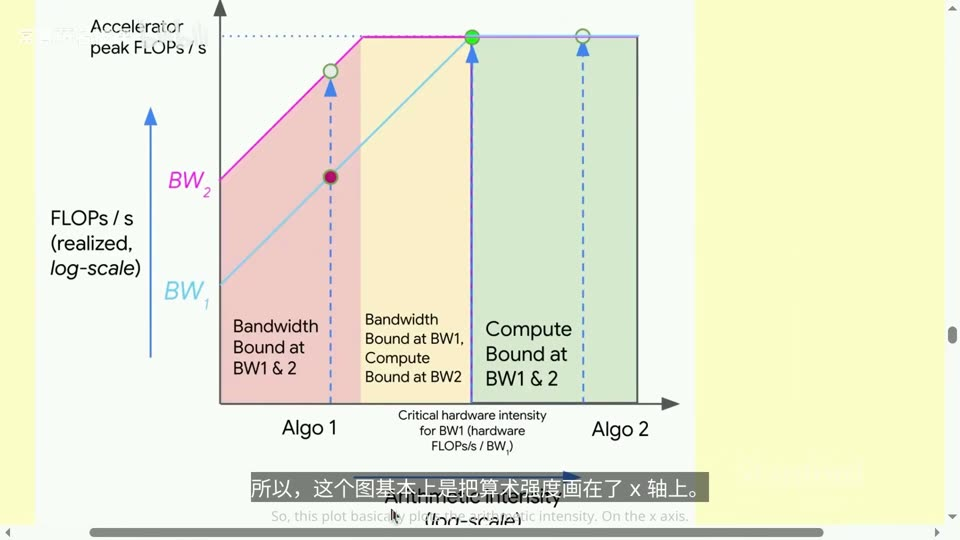

# Lecture 2: PyTorch(einops)

## 本讲要解决的核心问题（SCQA）

**背景（Situation）**：这门课的目标从第 1 讲起就没变过——**在有限的资源下训练出尽可能好的模型**。这里的资源主要是两样：**算力（compute）**和**内存（memory）**；数据在本课里不构成瓶颈。上一讲我们聊完了分词，那是第一次作业的内容。

**冲突（Complication）**：既然要"最大化效率"，第一步就必须**能测量效率**——一次计算要花多少时间、占多少显存。可如果你不知道一个张量在机器里是怎么存的、一次前向反向到底做了多少次浮点运算，那所有优化都只能靠猜。更糟的是，硬件规格表上的数字还经常"注水"（比如按稀疏性标称），直接拿来算会错一倍。

**疑问（Question）**：我们怎样给一次训练做一本清清楚楚的"资源账"——算出它需要多少运算、多少显存、要跑多久，并判断瓶颈到底卡在算力还是内存？

**回答（Answer，结论先行）**：本讲自底向上给你四件工具，正好构成一条从"数据怎么存"到"训练要花多少资源"的链条：

1. **张量（tensor）与数据类型**——决定内存怎么占、精度怎么选（含混合精度）；
2. **einops**——用"命名维度"代替"数索引"，把张量运算写得不容易错；
3. **浮点运算次数（FLOPs）与 6ND**——学会"数运算"，包括 `6ND` 公式的完整来历；
4. **算术强度、屋顶线与 MFU**——判断一段代码是**内存受限**还是**计算受限**；
5. 最后落到**优化器与显存**：显存账本，以及梯度累积、激活检查点两种省显存技巧。

一句话：**学会给计算"记账"，你才能在写模型时预判性能。** 讲者还举了两个贯穿全讲的例子作为"考试题"：① 在 H100 上、以 1e23 个 token 训练一个 700 亿参数模型，用 `6ND`、一个 MFU 取值、再查 H100 规格表，就能估出天数（大约是几天）；② 用 8 块 H100 配合 AdamW，最多能训练多大模型——答案是约 530 亿参数，算法就在下面。([【精准空跳到 01:20】](https://www.bilibili.com/video/BV11LEA6eEuj/?p=2&t=80)、[【精准空跳到 01:45】](https://www.bilibili.com/video/BV11LEA6eEuj/?p=2&t=105))

顺带一提：上周说的 Marin 项目那次 `1e23` 浮点运算的训练已经跑完，实际损失和扩展定律的预测几乎一致，误差在 0.05 以内；每条曲线其实是一条"等浮点运算次数曲线"，从一批小模型里找出计算最优点，就能把损失外推到更大规模。([【精准空跳到 00:05】](https://www.bilibili.com/video/BV11LEA6eEuj/?p=2&t=5))

> 课堂公告：加入 CS336 的 Slack、用学校邮箱在 Modal 上注册、阅读 AI 政策指南与集群使用指南。([【精准空跳到 00:00】](https://www.bilibili.com/video/BV11LEA6eEuj/?p=2&t=0))

---

## 一、张量：机器里"一切数据"的存储单元

### 1.1 张量是什么，为什么偏要从它讲起

**张量（tensor）就是一个多维数组**：一维张量是向量，二维张量是矩阵，三维及以上就叫高阶张量。用大白话说，它就是把一堆数字按某个"形状"码放整齐的盒子。比如 `torch.zeros(4, 8)` 是一个 4 行 8 列的矩阵（2 维张量），`torch.zeros(4, 8, 4)` 再多一层就变成 3 维张量。

为什么要从它讲起？因为在深度学习里，**参数、梯度、优化器状态、训练数据、激活值，本质上全都是张量**。你可以把一个 DeepSeek v3.2 这样的大模型直接理解成"一大堆形状各异的张量"。([【精准空跳到 03:25】](https://www.bilibili.com/video/BV11LEA6eEuj/?p=2&t=205))


### 1.2 一个张量占多大内存：元素数 × 每个元素的字节数

规则非常朴素：

> **一个张量的内存占用 = 元素个数 × 每个元素占用的字节数**

例子：一个 4×8 的 `float32` 张量，元素个数是 32，每个 `float32` 占 4 字节，所以总占用 `32 × 4 = 128` 字节。([【精准空跳到 11:33】](https://www.bilibili.com/video/BV11LEA6eEuj/?p=2&t=693))

这个公式还能让你建立"大"的直觉：GPT-3（一个相对"老"的模型）前馈层里的**一个**矩阵，形状约 `(12288×4, 12288)`，在 fp32 下就占大约 **2.3 GB**。也就是说，光一个矩阵就顶得上一部高清电影，而大模型里有成百上千个这样的矩阵。([【精准空跳到 04:55】](https://www.bilibili.com/video/BV11LEA6eEuj/?p=2&t=295))

还有两个容易忽略的点：
- **默认精度**：你在 PyTorch 里新建张量，默认类型是 `float32`；想要别的类型必须显式声明。
- **默认位置**：新建的张量默认在 **CPU** 上；要用 GPU 加速，得手动把张量搬到 GPU（`.to("cuda")`），否则你拿不到任何加速。([【精准空跳到 12:05】](https://www.bilibili.com/video/BV11LEA6eEuj/?p=2&t=725))

### 1.3 浮点数是怎么用"位"拼出来的

要理解精度，先得知道一个浮点数是怎样用一串 0/1 表示的。一个浮点数被拆成三段：

- **符号位（sign）**：表示正负；
- **指数位（exponent）**：表示**动态范围**（能表示的最大数和最小数有多大）；
- **尾数位（mantissa / fraction）**：表示**分辨率**（两个相邻可表示数之间的间隔有多细）。

> 类比：用科学计数法写 `1.234 × 10^5`。"1.234"是尾数，决定你能写多精细；"10^5"里的 5 是指数，决定你能写多大。浮点数就是把这两部分各自分配若干位。

**float32（单精度）**：总共 32 位——1 位符号 + 8 位指数 + 23 位尾数，占 4 字节。它还有个名字 `fp32`；"单精度"这个叫法来自早期科学计算，那时 fp32 是基准。在深度学习里我们**不往更高精度走**，因为 32 位其实已经远超需要了。([【精准空跳到 04:09】](https://www.bilibili.com/video/BV11LEA6eEuj/?p=2&t=249)、[【精准空跳到 04:34】](https://www.bilibili.com/video/BV11LEA6eEuj/?p=2&t=274))


**float16（半精度）**：最直观的省内存办法就是"把位数砍掉一半"——16 位 = 1 位符号 + 5 位指数 + 10 位尾数，只占 2 字节，内存立刻减半。但它的**指数只有 5 位**（fp32 是 8 位），导致**动态范围很差**：特别大或特别小的数直接表示不了，会变成 0 或无穷。用它训练会经常遇到上溢、下溢和 NaN，非常头疼。([【精准空跳到 05:45】](https://www.bilibili.com/video/BV11LEA6eEuj/?p=2&t=345)、[【精准空跳到 06:25】](https://www.bilibili.com/video/BV11LEA6eEuj/?p=2&t=385))


**bfloat16（bf16，Brain Floating Point）**：大约 2017 年为解决 fp16 动态范围差的问题而提出。思路很聪明——**不增加总位数**（和 fp16 一样 16 位），而是**从尾数挪几位给指数**：1 位符号 + 8 位指数 + 7 位尾数。这样它的**动态范围和 fp32 完全一样**，代价是分辨率更差。为什么这个取舍划算？因为深度学习的数据本身就比较"粗糙"、带随机性，你并不需要那么高的分辨率，**只要别溢出/下溢**就行。所谓"天下没有免费的午餐"，但这份午餐换得很值。([【精准空跳到 06:50】](https://www.bilibili.com/video/BV11LEA6eEuj/?p=2&t=410)、[【精准空跳到 07:15】](https://www.bilibili.com/video/BV11LEA6eEuj/?p=2&t=435))

把三种精度的"训练影响"总结一下：用 fp32 训练完全没问题，但每个参数要 4 字节、很占内存；用 fp16 风险偏大；**bf16 是比较平衡的选择**（当然也并非零风险）。([【精准空跳到 07:40】](https://www.bilibili.com/video/BV11LEA6eEuj/?p=2&t=460))

### 1.4 更低的精度：fp8 与 fp4 的"块缩放"

再往下走是 **fp8**：2022 年为了机器学习负载实现了标准化，有两个版本——**E4M3**（动态范围约 `[-448, 448]`，偏精度）和 **E5M2**（约 `[-57344, 57344]`，偏动态范围）。NVIDIA 的 Transformer Engine 支持 fp8。([【精准空跳到 08:34】](https://www.bilibili.com/video/BV11LEA6eEuj/?p=2&t=514)、[【精准空跳到 08:59】](https://www.bilibili.com/video/BV11LEA6eEuj/?p=2&t=539))


**fp4** 更极端：NVIDIA 2025 年推出的 **NVFP4**，每个数值只有 4 位，能表示的数值就那几档（大致 `-6, -4, -3, -2, -1.5, -1, -0.5, 0, 0.5, 1, 1.5, 2, 3, 4, 6`），精度显然很低。这里的**关键技巧是"分块缩放"**：数据不是孤立地取那几档，而是**按块（block）组织**，每个块配一个**缩放因子（scale factor）**，整块可以一起往上或往下缩放。这样虽然每个数值只有 4 位、盖不住完整动态范围，但**块内数值之间的比例关系仍然保持**，等于把有限的精度"填"在了最需要的地方。2025 年已有用 NVFP4 训练的模型（如 Nemotron 3 Super）。这些底层转换大多由 NVIDIA 的软件栈完成，你写代码时不一定直接碰得到。([【精准空跳到 09:24】](https://www.bilibili.com/video/BV11LEA6eEuj/?p=2&t=564)、[【精准空跳到 09:49】](https://www.bilibili.com/video/BV11LEA6eEuj/?p=2&t=589))

顺便区分两个常被混淆的概念：**量化（quantization）**通常是"先用 bf16 甚至更高精度把模型**训练好**，再把它**压低**到 1 位、2 位等"，这比"直接训练一个 1 位的语言模型"容易得多——后者目前还没有可信的成果。([【精准空跳到 11:09】](https://www.bilibili.com/video/BV11LEA6eEuj/?p=2&t=669))

### 1.5 混合精度训练：把好钢用在刀刃上

既然低精度省内存又更快，但某些操作又很脆弱，那折中方案就是**混合精度训练（mixed precision training）**：**不同的数据用不同的精度**。

- **参数、激活值、梯度 → bf16**（2 字节，省内存、算得快）；
- **优化器状态 → fp32**（后面会讲到，优化器状态对稳定性要求高）。

PyTorch 提供了自动混合精度库 `torch.amp`（AMP）。你基本只要把代码包一下，库会**在安全的地方自动转成 bf16**——比如**矩阵乘法通常是安全的**；而**指数运算（exp）这类危险操作会保留 fp32**，避免数值炸掉。([【精准空跳到 08:04】](https://www.bilibili.com/video/BV11LEA6eEuj/?p=2&t=484)、[【精准空跳到 08:34】](https://www.bilibili.com/video/BV11LEA6eEuj/?p=2&t=514))

---

## 二、einops：用"命名维度"代替"数索引"

### 2.1 为什么需要 einops

原生 PyTorch 的写法很容易看错，比如一个转置写成 `transpose(-2, -1)`——你根本不知道 `-2`、`-1` 指的是哪两个维度，代码难读也容易写错。**einops 的动机就是"用维度名字代替索引"**：它让你给每个维度起名字，像 `seq1`、`hidden`、`batch`，运算时直接写名字，可读性大幅提升。它包含三个主要操作：`einsum`、`reduce`、`rearrange`。([【精准空跳到 12:28】](https://www.bilibili.com/video/BV11LEA6eEuj/?p=2&t=748))

### 2.2 einsum：带"记账"的广义矩阵乘法

可以把 `einsum` 理解为"**带有良好索引管理的广义矩阵乘法**"，灵感来自爱因斯坦求和约定。规则只有一条：**出现在箭头右边（输出）里的维度会被保留；没出现的维度会被求和消去。**([【精准空跳到 12:53】](https://www.bilibili.com/video/BV11LEA6eEuj/?p=2&t=773))

例子：`x` 是 3×4 矩阵，`y` 是 4×3 矩阵，做普通矩阵乘法：

```python
# 旧写法
z = x @ y

# einops 写法：把两个维度命名为 seq1、hidden、seq2
z = einsum(x, y, "seq1 hidden, hidden seq2 -> seq1 seq2")
```

这里 `hidden` 没出现在输出中，所以它会被**求和消去**——这正是矩阵乘法"内层求和"的含义。([【精准空跳到 13:18】](https://www.bilibili.com/video/BV11LEA6eEuj/?p=2&t=798))


它还能自然表达**批量矩阵乘法**。假设有两个形状 `(2, 3, 4)` 的张量：普通做法要显式转置最后两个维度、还要在心里推理 PyTorch 的批处理规则；而 einops 只要写清楚哪些是批处理维度、哪些是矩阵维度即可。更妙的是：**它不需要显式转置**——你只要在命名里把维度顺序写对，转置就"隐含"完成了，这对老被转置绕晕的人非常友好。([【精准空跳到 14:08】](https://www.bilibili.com/video/BV11LEA6eEuj/?p=2&t=848)、[【精准空跳到 14:33】](https://www.bilibili.com/video/BV11LEA6eEuj/?p=2&t=873))

批处理维度多的时候，可以用**省略号 `...`** 统一代表"任意个前面的维度"：

```python
z = einsum(x, y, "... seq1 hidden, ... hidden seq2 -> ... seq1 seq2")
```

比如语言建模里同时有批、序列、头等多个维度，你不想为每个都写一遍，省略号就能让代码模块化、连输入形状都不用操心。([【精准空跳到 14:58】](https://www.bilibili.com/video/BV11LEA6eEuj/?p=2&t=898))

### 2.3 reduce：sum / mean / max / min 的统一写法

`reduce` 是"聚合/规约"操作的通用形式——`sum`、`mean`、`max`、`min` 都是它。同样遵循"没出现在输出里的维度被聚合掉"：

```python
y = reduce(x, "... hidden -> ...", "sum")
```

意思是"把最后一个维度（`hidden`）求和掉，保留前面所有维度"。它可以换成 `mean`、`max` 等。**性能上它和原生写法完全一样**，因为它本质上只是语法糖（syntactic sugar），不会更快也不会更慢。([【精准空跳到 15:23】](https://www.bilibili.com/video/BV11LEA6eEuj/?p=2&t=923)、[【精准空跳到 16:04】](https://www.bilibili.com/video/BV11LEA6eEuj/?p=2&t=964))

### 2.4 rearrange：把维度拆开与合并

`rearrange` 是最有用的一个，作业里很可能会考。它的用途是：**某个维度其实包含了两个维度的信息，你想把它拆开**（反过来也可以合并）。这在多头注意力里随处可见——因为代码常把 `head × head_dim` 展平成一个 `total_hidden`，运算前又得还原。([【精准空跳到 16:14】](https://www.bilibili.com/video/BV11LEA6eEuj/?p=2&t=974))

例子：一个形状 `(3, 8)` 的张量，那个大小为 8 的维度其实是 `heads × hidden1` 的展平：

```python
# 把 total_hidden 拆成 heads 和 hidden1 两个维度
x = rearrange(x, "... (heads hidden1) -> ... heads hidden1", heads=2)
# 此时 hidden1 = 8 / 2 = 4

# 做变换（批量矩阵乘法）
x = einsum(x, w, "... hidden1 hidden2 -> ...")   # 示意

# 做完再合并回去（order 指定按行优先还是列优先）
```

用括号 `(...)` 标记被"打包"的维度，拆分的份数由 `heads=2` 这类参数决定。合并时**执行顺序**（行优先 row-major 还是列优先 column-major）由 `order` 参数指定。([【精准空跳到 17:04】](https://www.bilibili.com/video/BV11LEA6eEuj/?p=2&t=1024)、[【精准空跳到 17:54】](https://www.bilibili.com/video/BV11LEA6eEuj/?p=2&t=1074))


讲者反复强调：刚开始适应 einops 要花点时间，但**很值得**——一旦用上，你思考张量运算的方式会彻底改变，转置、规约这类操作都会顺畅很多。([【精准空跳到 18:19】](https://www.bilibili.com/video/BV11LEA6eEuj/?p=2&t=1099))

---

## 三、数浮点运算：FLOPs 与 6ND 是怎么来的

### 3.1 先澄清一个歧义：FLOPs 与 FLOP/s

我们用**浮点运算次数（FLOPs）**来衡量计算成本。**一次浮点运算（FLOP）就是一次基本的浮点操作**，比如一次加法或一次乘法。（GPU 还能做别的运算，但在大多数场景里加法和乘法才是核心、占掉你大部分时间。）

但 "FLOPs" 这个词本身有歧义，务必分清：

- **FLOPs（小写 s）**：指**浮点运算次数**，衡量"**计算量**"（模型要干多少活）；
- **FLOP/s（斜杠）**：指**每秒浮点运算次数**，衡量"**硬件速度**"（硬件每秒钟能干多少活）。

讲者提到，H100 的算力约 `989 TFLOP/s`（每秒万亿次量级）。当说"GPT-3 消耗了 3e23 次 FLOPs"时，指的是前者（计算量）。([【精准空跳到 18:52】](https://www.bilibili.com/video/BV11LEA6eEuj/?p=2&t=1132)、[【精准空跳到 19:17】](https://www.bilibili.com/video/BV11LEA6eEuj/?p=2&t=1157))

### 3.2 线性层：为什么是 `2 × B × D × K`

考虑最基础的**线性模型**：有 `B` 个数据点，每个是 `D` 维向量，要映射成 `K` 维输出。把它写成矩阵就是：数据矩阵 `X` 形状 `B×D`，权重矩阵 `W` 形状 `D×K`。([【精准空跳到 21:19】](https://www.bilibili.com/video/BV11LEA6eEuj/?p=2&t=1279))

**这次矩阵乘法要做多少次浮点运算？** 答案是：

```
FLOPs = 2 × B × D × K
```

为什么？因为输出矩阵有 `B×K` 个元素，每个元素是一次长度为 `D` 的点积。而一次点积要 `D` 次乘法 + 大约 `D` 次加法，所以每个元素约 `2D` 次运算。合起来 `B×K×2D = 2BDK`。（严格说每个元素是 `D` 次乘法加 `D-1` 次加法，但 `D` 很大时忽略那个 `-1`。）([【精准空跳到 21:44】](https://www.bilibili.com/video/BV11LEA6eEuj/?p=2&t=1304))

这里 `D×K` 正好是**参数个数**，`B` 是**数据点个数**。所以还有一个更好记的说法：

> **完成一次线性前向传播的 FLOPs ≈ 数据点个数 × 参数个数 × 2**

也就是 `2 × (#token) × (#参数)`。这个结论**可以推广到 Transformer**，`6ND` 的结构正是从这里长出来的。([【精准空跳到 23:29】](https://www.bilibili.com/video/BV11LEA6eEuj/?p=2&t=1409))


### 3.3 其他操作的开销

**逐元素操作**（elementwise，比如把矩阵每个元素加 1）：FLOPs 大约就是**矩阵的大小 N**。对足够大的矩阵，**其他操作的开销通常都远小于矩阵乘法**，所以核算时我们几乎只盯着矩阵乘法。([【精准空跳到 22:09】](https://www.bilibili.com/video/BV11LEA6eEuj/?p=2&t=1329))

一个常被问到的点：加法能不能比乘法更快？答案是**在硬件上，加法和乘法的开销基本一样**——GPU 的构造方式决定了它们被同等对待，虽然直觉上加法似乎该更便宜。([【精准空跳到 23:12】](https://www.bilibili.com/video/BV11LEA6eEuj/?p=2&t=1392))

### 3.4 前向、反向与 `6ND` 的完整推导

以一个简单的深度网络为例：输入 `B×D`，经过 `L` 层，每层做一次 `D×D` 矩阵乘法，再接一个逐元素 ReLU。

- **参数量**：每层 `D²` 个，`L` 层共 `D² × L`。
- **前向传播**：每层的矩阵乘法是 `B×D×D`，再乘 2（乘加各一次）得 `2BD²`；对所有层求和，正是 `2 × (#数据点) × (#参数)`。（这里 `D²L` 是参数量。）([【精准空跳到 42:29】](https://www.bilibili.com/video/BV11LEA6eEuj/?p=2&t=2549))

- **反向传播**：用链式法则时，每个线性层要算**两类梯度**：
  1. 损失对**输入**的梯度（反向信号）；
  2. 损失对**参数**的梯度。

  用爱因斯坦求和符号写出来会发现，**两者都是同规模的矩阵乘法**，所以反向的开销**恰好是前向的 2 倍**，即 `4 × (#数据点) × (#参数)`。([【精准空跳到 46:14】](https://www.bilibili.com/video/BV11LEA6eEuj/?p=2&t=2774))

- **合计**：前向 `2` + 反向 `4` = **`6`**，于是：

```
训练一步的 FLOPs ≈ 6 × (#数据点) × (#参数) = 6ND
```

这就是你在各种地方见到的 **`6ND`** 的来历——它只是把前向和反向的统计加起来。只要**上下文长度不太大**，这个近似对 Transformer 也很好用；但如果上下文很长，会出现**序列长度的二次项**（`O(seq²)` 的注意力开销），那部分没有包含在这个估算里，会在作业一里更细致地推导。([【精准空跳到 46:38】](https://www.bilibili.com/video/BV11LEA6eEuj/?p=2&t=2798)、[【精准空跳到 47:03】](https://www.bilibili.com/video/BV11LEA6eEuj/?p=2&t=2823))


---

## 四、瓶颈在哪里：算术强度、屋顶线与 MFU

### 4.1 在 GPU 上计时，别忘了同步

想知道"实际跑一次要多久"，最直接的办法是计时。但 GPU 是**异步**运行的：你调用的运算会立刻返回（非阻塞），真正的工作在后台排队。所以计时前必须调用 `torch.cuda.synchronize()`，操作后再同步一次，否则你会得到"快得不真实"的结果。习惯上还应**多跑几次取平均**。([【精准空跳到 24:19】](https://www.bilibili.com/video/BV11LEA6eEuj/?p=2&t=1459))

### 4.2 MFU：你离硬件峰值有多远

有了实测时间，就能算**实际每秒浮点运算次数**：

```
actual_flop_per_sec = actual_num_flops / actual_time
```

再和硬件规格表上的**标称值**一比，就得到 **MFU（Model FLOPs Utilization，模型浮点运算利用率）**：

```
MFU = 实际 FLOP/s ÷ 标称 FLOP/s
```

实际值**永远不可能超过**标称值，通常都更低。经验数字：现代模型能到 **0.5 左右就该满意**；如果只是纯矩阵乘法，可能到 **0.8** 甚至更高；如果只有 **0.1 左右**，说明出了大问题，得排查。（注意标称值也要看清楚：H100 规格表上的 `1979 TFLOP/s` 是**基于稀疏性**的，稠密计算要**除以 2**，也就是约 `989 TFLOP/s`——这就是为什么到处都是"除以二"。）([【精准空跳到 25:21】](https://www.bilibili.com/video/BV11LEA6eEuj/?p=2&t=1521)、[【精准空跳到 25:46】](https://www.bilibili.com/video/BV11LEA6eEuj/?p=2&t=1546)、[【精准空跳到 26:50】](https://www.bilibili.com/video/BV11LEA6eEuj/?p=2&t=1610))


### 4.3 算术强度：每搬一个字节能做多少计算

要回答"为什么 MFU 常常只有 0.5"，需要引入**算术强度（arithmetic intensity）**。先建立一个简化的硬件图景：

> 数据存放在 **内存（HBM）** 里，计算发生在 **加速器核心** 上。要让计算发生，数据得先从内存**流向**加速器，算完再把结果**写回**内存。

所以耗时取决于两个因素：**加速器速度（FLOP/s）** 和 **内存带宽（bytes/s）**。一旦数据搬运成了限制，再快的算力也只能干等。([【精准空跳到 28:10】](https://www.bilibili.com/video/BV11LEA6eEuj/?p=2&t=1690))

**加速器强度（accelerator intensity）**：硬件每搬运 1 个字节，最多能完成多少次浮点运算：

```
accelerator_intensity = FLOP/s ÷ bytes/s
```

H100 约 `989e12 ÷ 3.35e12 ≈ 295`（内存带宽约每秒 3.35 TB）。可以记成"**每搬 1 字节，大约能做 300 次浮点运算**"。

**算术强度（arithmetic intensity）**：一个**算法**每处理 1 字节数据，实际做了多少次浮点运算：

```
arithmetic_intensity = FLOPs ÷ bytes
```

**判断瓶颈的规则**（两者其实是一回事，只是把分数移了移项）：

- 算术强度 **低于** 加速器强度 → **内存受限（memory-bound）**，时间花在等数据；
- 算术强度 **高于** 加速器强度 → **计算受限（compute-bound）**，时间花在算。

([【精准空跳到 31:05】](https://www.bilibili.com/video/BV11LEA6eEuj/?p=2&t=1865)、[【精准空跳到 31:30】](https://www.bilibili.com/video/BV11LEA6eEuj/?p=2&t=1890)、[【精准空跳到 32:20】](https://www.bilibili.com/video/BV11LEA6eEuj/?p=2&t=1940))

### 4.4 逐个操作算算术强度

计算时有个重要假设：**通信和计算尽量重叠**——数据一到位就开始算，同时把结果往回传。所以总时间近似取"通信时间"和"计算时间"的**较大者（max）**。（现实中重叠不会完美，会有开销，但做估算够用了。）([【精准空跳到 30:40】](https://www.bilibili.com/video/BV11LEA6eEuj/?p=2&t=1840))

**ReLU**（把每个元素取 `max(x, 0)`）：读 `N` 个 bf16 元素 = `2N` 字节，写回 `2N` 字节，共搬 `4N` 字节；计算只是 `N` 次比较，即 `N` 次浮点运算。于是强度 `= N / 4N = 0.25`，**远小于 295，内存受限**。([【精准空跳到 29:25】](https://www.bilibili.com/video/BV11LEA6eEuj/?p=2&t=1765))

**GeLU**（另一种更复杂的激活函数）：公式复杂得多，每元素约 20 次浮点运算，搬移仍是 `4N` 字节，强度约 `20N / 4N = 5`。**虽然 GeLU 做的计算比 ReLU 多得多，但因为 5 仍远小于 295，它依然内存受限**——所以实际开销和 ReLU 几乎一样，瓶颈根本不在计算。([【精准空跳到 33:35】](https://www.bilibili.com/video/BV11LEA6eEuj/?p=2&t=2015))

**点积（dot product）**：读 `X`（2N 字节）+ 读 `W`（2N 字节）+ 写一个标量（2 字节），FLOPs ≈ `2N-1`，强度约 `0.5`，**内存受限**。([【精准空跳到 34:25】](https://www.bilibili.com/video/BV11LEA6eEuj/?p=2&t=2065))

**矩阵向量乘法（matvec）**：读 `X`（2N）、读 `W`（2N²）、写 `Y`（2N），FLOPs 约 `N × (2N-1)`，强度只比点积略高一点，**仍然内存受限**。([【精准空跳到 35:15】](https://www.bilibili.com/video/BV11LEA6eEuj/?p=2&t=2115))

**矩阵乘法（matmul，N×N 乘 N×N）**：搬移 `2N² + 2N² + 2N² = 6N²` 字节，FLOPs ≈ `N² × (2N-1) ≈ 2N³`，于是强度 `≈ 2N³ / 6N² = N/3`。当 `N=1024` 时约 `341`，**超过 295，终于变成计算受限**。这就是**矩阵越大越高效**的原因：搬运量按 `N²` 增长，运算量按 `N³` 增长，比例正比于 `N`。也解释了训练时为什么要**增大批量、用更大的矩阵**。([【精准空跳到 36:00】](https://www.bilibili.com/video/BV11LEA6eEuj/?p=2&t=2160)、[【精准空跳到 36:25】](https://www.bilibili.com/video/BV11LEA6eEuj/?p=2&t=2185))


### 4.5 屋顶线图（roofline analysis）

把所有结论画成一张图，就是**屋顶线图**：

- **横轴**：算术强度；
- **纵轴**：实际达到的 FLOP/s（常用对数刻度）；
- **每条斜线/折线**：对应一种加速器（如 H100）。

图的样子像"屋顶"：强度低时，曲线沿斜线上升（**内存受限区**，能跑多快取决于带宽）；到达一个**临界强度**后转为水平（**计算受限区**），此时贴着加速器峰值，但**永远不会超过峰值**。ReLU、点积这类低强度操作落在斜坡上，利用率低；大型矩阵乘法落在平台上，效率高。



### 4.6 训练 vs 推理：两种截然不同的瓶颈

- **训练**时你一次拿到整个序列，主力是**大型矩阵乘法 → 计算受限**，效率较高。**Transformer 本质上就是"大型矩阵乘法 + 中间穿插一些其他操作"**，它的结构是**刻意设计**成高算术强度的，这是个好消息。
- **推理**时你一次只生成一个 token，做的是**矩阵向量乘法（matvec）→ 内存受限**，卡在带宽上。

另外要记住：**算术强度依赖精度**（本讲默认 bf16，字节数变了强度也变）。而 MFU 偏低，往往就是因为**存在内存带宽瓶颈**——虽然标称算力理论上允许你把所有计算做完，但一部分时间还是耗在搬运数据上。([【精准空跳到 37:15】](https://www.bilibili.com/video/BV11LEA6eEuj/?p=2&t=2235)、[【精准空跳到 37:40】](https://www.bilibili.com/video/BV11LEA6eEuj/?p=2&t=2260)、[【精准空跳到 38:05】](https://www.bilibili.com/video/BV11LEA6eEuj/?p=2&t=2285))

---

## 五、训练的资源账本与省显存技巧

### 5.1 显存都花在哪：四本账

把上面所有零件拼起来，训练一个深度网络的显存（以每参数或每项计）大致如下：

| 项目 | 大小 | 说明 |
|---|---|---|
| 参数 | `2 × (D×D×L)` | bf16，每参数 2 字节 |
| 激活值 | `2 × B × D × L` | bf16，**随批量大小 B 增长** |
| 梯度 | `2 × 参数量` | bf16，所有参数的副本 |
| 优化器状态 | `4 × 参数量`（AdaGrad） | **惯例用 fp32**，每参数 4 字节；Adam 需存一阶矩和二阶矩，共 **8 字节/参数** |

([【精准空跳到 49:33】](https://www.bilibili.com/video/BV11LEA6eEuj/?p=2&t=2973))


一个要点：**优化器状态通常不是计算瓶颈**（它不需要频繁参与矩阵乘法），所以它对"速度"影响不大；但它体量巨大，**决定了你能不能把大模型塞进显存**。([【精准空跳到 50:48】](https://www.bilibili.com/video/BV11LEA6eEuj/?p=2&t=3048))

### 5.2 优化器状态为什么这么大（以 AdaGrad 为例）

本讲用 **AdaGrad**（2011 年提出，比 Adam 还早）做示例。可以把它理解为**介于 SGD 和 Adam 之间**的一种方法：

- **SGD**：只看当前的梯度；
- **momentum（动量）**：考察梯度的**一阶量**；
- **AdaGrad**：考察梯度的**二阶量**（梯度平方）；
- **Adam**：把一阶量和二阶量**结合起来**。

AdaGrad 在每一步维护一个"**优化器状态**"——梯度的平方和。每步流程是：从状态里取出旧值 → 用当前梯度的平方更新它 → 存回去 → 再用"梯度平方均值的平方根"去做除法，更新参数。([【精准空跳到 47:53】](https://www.bilibili.com/video/BV11LEA6eEuj/?p=2&t=2873)、[【精准空跳到 48:43】](https://www.bilibili.com/video/BV11LEA6eEuj/?p=2&t=2923))

为什么优化器状态用 fp32 而不是 bf16？因为里面涉及**平方**和**跨越很多步的平均**，用 bf16 会不稳定——所以这是有意的惯例。AdaGrad 每参数 4 字节；**Adam 要同时存一阶矩和二阶矩，因此每参数 8 字节**。([【精准空跳到 50:23】](https://www.bilibili.com/video/BV11LEA6eEuj/?p=2&t=3023))

### 5.3 技巧一：梯度累积（gradient accumulation）

**问题**：大批量有利于训练稳定，但**激活显存随批量大小线性增长**，批量太大就会 OOM（显存不够）。
**办法**：把一个大 batch 拆成若干**微批次（micro-batch）**，逐个算梯度并**累加**（注意：**先不清零**）；等攒够 `batch_size / micro_batch_size` 个微批次后，才更新一次参数并清零梯度。这样等效于用大批量训练，却只需要小批量的显存。**这是一个非常简单的代码改动。**([【精准空跳到 52:03】](https://www.bilibili.com/video/BV11LEA6eEuj/?p=2&t=3123))

### 5.4 技巧二：激活检查点（activation checkpointing / 重计算）

**问题**：默认情况下，训练要保存**所有层**的激活值（因为反向传播要用），训练时激活显存是 `B × D × 2 × L`。（推理时不用算梯度，只存当层激活即可。）
**办法**：**激活检查点**（也叫梯度检查点、重计算 rematerialization）——前向传播只保存其中**一部分层**的激活值（这些叫"检查点"），反向传播时从最近的检查点**重新计算**缺失的激活值。这是"用计算换内存"的典型权衡。([【精准空跳到 52:28】](https://www.bilibili.com/video/BV11LEA6eEuj/?p=2&t=3148))

几个具体档位：

- 对"线性层 + ReLU"的块做检查点，不保存 ReLU **之前**的激活值（反正能从后面算出来），**大约省下一半内存**；
- 最极端：**一层都不存**，内存最省，但计算量变成 `O(L²)`（每层都从头算）；
- **折中**：在 `√L` 层存检查点，使**激活显存**和**重计算开销**都约为 `√L`，两头平衡。([【精准空跳到 53:43】](https://www.bilibili.com/video/BV11LEA6eEuj/?p=2&t=3223)、[【精准空跳到 54:08】](https://www.bilibili.com/video/BV11LEA6eEuj/?p=2&t=3248))

---

## 小结

- **一切操作都在张量上**：参数、梯度、激活值、优化器状态、数据，全都是张量。张量的内存占用 = **元素数 × 每元素字节数**；精度越低越省内存、通常也越快。
- **数据类型**从 fp32 → fp16 → bf16 → fp8 → fp4 演进。bf16 因**动态范围等于 fp32** 而成为训练默认；fp8/fp4 靠**分块缩放**在极少位数下保住块内比例。**混合精度训练**（参数/激活/梯度用 bf16，优化器状态用 fp32）是当前标准做法。
- **einops** 用"命名维度"重新表达 `einsum / reduce / rearrange`，让转置和批量矩阵乘法更清晰；`rearrange` 常用于把 `head × hidden` 维度拆开再合并。
- **FLOPs 是计算量，FLOP/s 是硬件速度**。线性层前向 FLOPs = `2 × (#token) × (#参数)`；一次训练步 = 前向 2 + 反向 4 = **`6ND`**（上下文很长时要额外考虑序列长度的二次项）。
- **MFU = 实际 FLOP/s ÷ 标称 FLOP/s**，现代模型约 0.5 即可接受；注意规格表稀疏标称要**除以 2**。
- **算术强度决定瓶颈**：低于加速器强度（H100 约 295）则**内存受限**，反之为**计算受限**。ReLU、GeLU、点积、矩阵向量乘法都内存受限；**矩阵乘法计算受限**。屋顶线图把这一切画成"斜线 + 平台"。
- **训练用矩阵乘法（计算受限）**，**推理用矩阵向量乘法（内存受限）**。MFU 偏低通常源于内存带宽瓶颈。
- 显存四本账：参数、激活（随 batch 增长）、梯度、优化器状态（Adam 约 8 字节/参数）。**梯度累积**和**激活检查点**是两种简单有效的省显存手段，能支撑更大的批量。

下周将由 Tatsu 讲模型架构相关的内容。([【精准空跳到 55:30】](https://www.bilibili.com/video/BV11LEA6eEuj/?p=2&t=3330))

---

## 关键术语速查

| 术语 | 大白话解释 + 例子 |
|---|---|
| **张量（tensor）** | 多维数组。1 维是向量，2 维是矩阵；`torch.zeros(4, 8)` 就是一个 4×8 的矩阵。 |
| **float32 / fp32** | 单精度浮点，1 符号 + 8 指数 + 23 尾数 = 32 位 = 4 字节。PyTorch 默认类型。 |
| **float16 / fp16** | 半精度，1 + 5 + 10 = 16 位 = 2 字节。动态范围差，易上溢/下溢/NaN。 |
| **bfloat16 / bf16** | 1 + 8 + 7 = 16 位。动态范围等同 fp32，分辨率略差；训练首选。 |
| **fp8** | 8 位浮点，有 E4M3（偏精度）和 E5M2（偏范围）两版，2022 年标准化。 |
| **fp4 / NVFP4** | 每数值仅 4 位，按块配缩放因子；2025 年 NVIDIA 推出，已有模型用它训练。 |
| **混合精度训练** | 参数/激活/梯度用 bf16，优化器状态用 fp32；PyTorch 用 `torch.amp` 自动处理。 |
| **量化（quantization）** | 先正常训练好模型，再把它压到低位数（如 1、2 位）。 |
| **einops** | 用命名维度操作张量的库，含 `einsum`、`reduce`、`rearrange`。 |
| **einsum** | 带"记账"的广义矩阵乘法；没出现在输出里的维度被求和消去。 |
| **reduce** | `sum/mean/max/min` 的统一写法，只是语法糖，性能与原生相同。 |
| **rearrange** | 拆分/合并维度，如把 `total_hidden` 拆成 `heads × hidden1`。 |
| **FLOP** | 一次浮点操作（一次加法或一次乘法）。 |
| **FLOPs（小写 s）** | 浮点运算**次数**，衡量计算量。 |
| **FLOP/s（斜杠）** | 每秒浮点运算次数，衡量硬件速度。H100 稠密约 989 TFLOP/s。 |
| **6ND** | 训练一步的 FLOPs ≈ `6 × (#数据点) × (#参数)`；前向 2、反向 4。 |
| **MFU** | 模型浮点运算利用率 = 实际 FLOP/s ÷ 标称 FLOP/s，现代模型约 0.5。 |
| **算术强度** | 每字节数据实际做了多少次浮点运算 = FLOPs ÷ bytes。 |
| **加速器强度** | 硬件每字节最多能做多少次浮点运算 = FLOP/s ÷ bytes/s，H100 约 295。 |
| **内存受限 / 计算受限** | 强度低于加速器强度 → 卡在搬数据；高于 → 卡在算。 |
| **屋顶线图（roofline）** | 横轴算术强度、纵轴实际 FLOP/s，斜线为内存受限区、平台为计算受限区。 |
| **梯度累积** | 大 batch 拆成微批次、累加梯度（不清零），攒够再更新参数，省激活显存。 |
| **激活检查点** | 前向只存部分激活，反向时重算缺失的；用计算换内存。 |
| **AdaGrad / Adam** | AdaGrad 用梯度平方（二阶量），Adam 结合一阶矩和二阶矩；优化器状态占显存大头。 |
