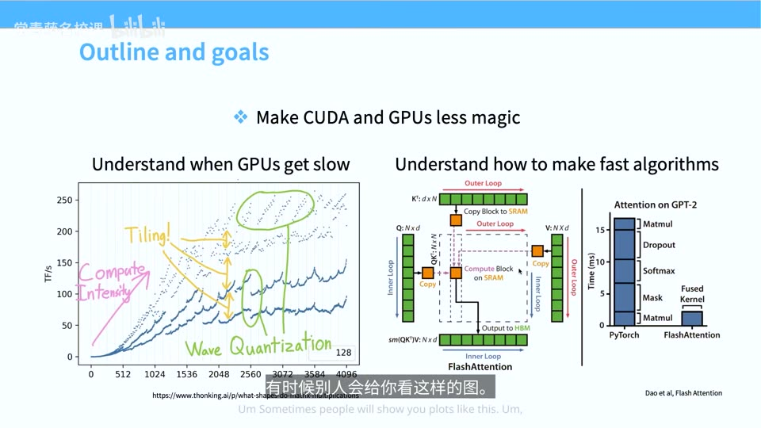
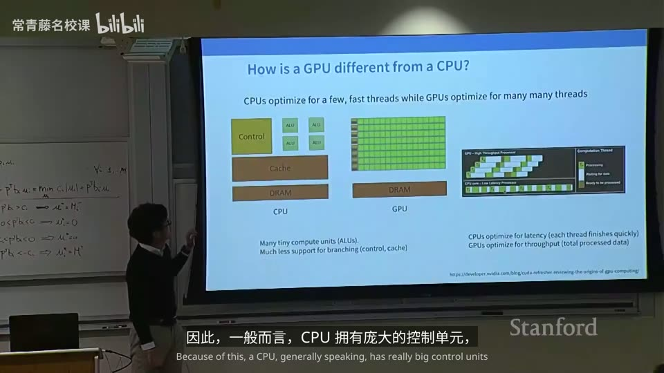
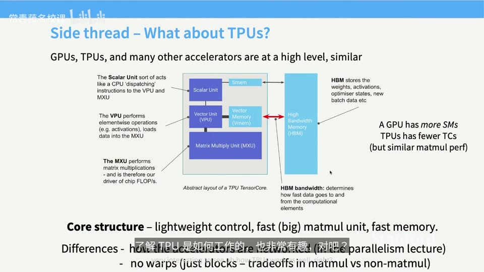
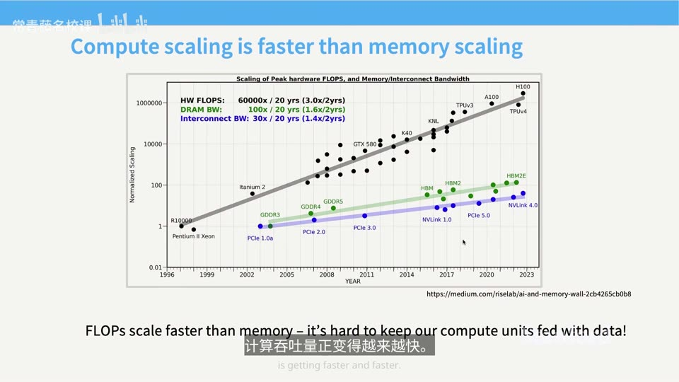
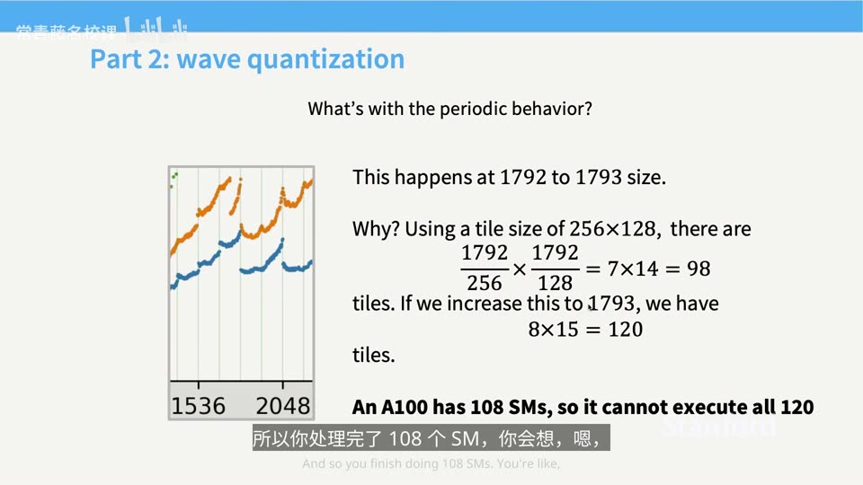
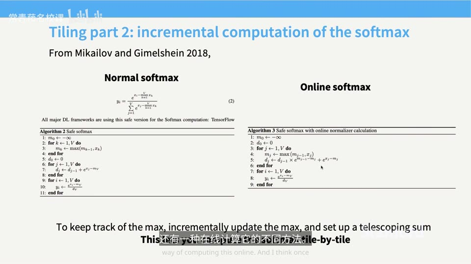

# Lecture 5: GPUs, TPUs

## 本讲要解决的核心问题（SCQA）

**背景**：前几讲讨论的是神经网络本身——模型结构、损失函数、反向传播。这一讲开始，课程进入"系统部分"。训练更好的语言模型，本质上依赖更多算力：硬件更快、利用率更高、芯片更多，或者并行化做得更好，都能推动进步；过去几年核心是往训练里投算力，最近一年重点转向往**推理**里投算力。

**冲突**：可是我们用来训练的硬件——GPU——对大多数人来说既像魔法，又像一台完全陌生的设备。大家见过这样的曲线：矩阵乘法越大，吞吐量反而在某些奇怪的尺寸上突然暴跌；也见过别人甩出的一张"吞吐量 vs 维度"的图，完全看不懂为什么长这样。更根本的是，上世纪 90 年代那种"把时钟频率越调越高、让 CPU 串行指令越跑越快"的老办法，也就是**登纳德缩放（Dennard scaling）**，在 2000 年代撞上了物理瓶颈——晶体管变小，并不必然变快。既然不能靠提高频率加速，算力还怎么继续涨？

**疑问**：如果不能靠频率，那大语言模型靠什么扩展？GPU 到底和 CPU 有什么本质不同？我们怎样才能写出跑得快的代码、看懂那些"神秘曲线"，并且自己实现一个高效的注意力内核？

**回答（中心思想）**：**当串行提速走到尽头，算力增长就改由"并行扩展"接棒；GPU 用海量轻量级核心换取吞吐量，而它的性能钥匙在于内存层次结构。理解了 GPU 的硬件模型，就能用六种技巧——控制发散、低精度、算子融合、重计算、合并访存、分块——把机器学习负载推到"计算受限"的高吞吐区；把这些技巧组合起来，就得到了 FlashAttention（分块 + 重计算 + 在线 softmax）。** 同样的道理也适用于 TPU：二者宏观上趋同进化，核心概念一一对应。

这一讲分三部分：先建立 GPU 的硬件与编程心智模型；再讲六种让 GPU 变快的技巧；最后综合起来，逐步推导 FlashAttention——讲者把它称为本节课的"庆功环节"。[【跳转到 02:45】](https://www.bilibili.com/video/BV11LEA6eEuj/?p=5&t=165)

---

## 一、GPU 用海量轻量核心换取吞吐量，CPU 则用庞大控制单元换取低延迟

**一句话结论**：CPU 为"少量、快速、复杂"的线程而优化，GPU 为"海量、简单"的线程而优化；这是一切性能现象的起点。

### 1.1 CPU 的设计哲学：低延迟

CPU（中央处理器）旨在实现**快速的串行执行**，适用于具有复杂分支逻辑、复杂条件判断和复杂控制流的场景。因此一般而言，CPU 拥有**庞大的控制单元**，以及少量能够执行数学运算的**算术逻辑单元（ALU，Arithmetic Logic Unit）**。它追求的核心指标是**低延迟**——从接收一条指令到完成它的时间间隔应当非常短。[【跳转到 06:05】](https://www.bilibili.com/video/BV11LEA6eEuj/?p=5&t=365)

打个比方：CPU 像一位博学但只有两只手的专家，他能处理各种千奇百怪的问题，但同一时刻只能干有限的几件事。

### 1.2 GPU 的设计哲学：高吞吐

GPU（图形处理器）的核心在于**吞吐量（throughput）**。在 GPU 上，你提交一个任务后，它可能要跑很久才结束；你可能会处理一个任务然后暂停，去处理另一个，再回来继续。单个任务跑得不快，但**所有任务加起来的总吞吐量非常大**。实现这一点靠的是**大量轻量级核心**：GPU 芯片中集成了数百个计算单元，全部可以并行执行。[【跳转到 06:42】](https://www.bilibili.com/video/BV11LEA6eEuj/?p=5&t=402)

GPU 则像一支庞大的流水线工人队伍：每个人只会做简单动作，但成百上千人同时开工，单位时间产出的总量惊人。

### 1.3 从图形硬件到科学计算

这套大规模并行性，早在张量核心出现之前就被人们看中了。有人发现，可以利用商用图形硬件（显卡）来做快速矩阵乘法——通过编写特定的着色器（shader）以特定渲染设置实现矩阵乘法，甚至比常规方式更快。而到 V100 那一代，NVIDIA 干脆推出专门做矩阵乘法的硬件，**矩阵乘法从此成为机器学习中那个"享有特权"的操作**。[【跳转到 20:15】](https://www.bilibili.com/video/BV11LEA6eEuj/?p=5&t=1215)

原因很直接：有了专用硬件后，"可并行化但非矩阵乘法"的操作，与矩阵乘法能达到的吞吐量之间出现了**十倍以上的差距**。这就是为什么近期任何随算力扩展的机器学习架构，几乎都离不开矩阵乘法——它是你真正能高效榨出大量算力的唯一途径。

---

## 二、SM 是 GPU 的计算基本单元，而内存层次结构决定了程序能跑多快

**一句话结论**：GPU 的计算部分由许多名为 SM 的独立单元组成，但要理解性能，关键不在计算，而在"内存"——现代硬件和 LLM 优化的核心其实都在于内存。

### 2.1 SM：可近似看作"核心"的独立计算单元

GPU 的基本组成单元是 **SM（Streaming Multiprocessor，流式多处理器）**。SM 有点像是一个核心：它是一个独立的计算单元，内部包含大量子组件（流式处理器）用于加速计算，能够并行执行不同的线程，并连接、访问特定类型的内存。[【跳转到 07:38】](https://www.bilibili.com/video/BV11LEA6eEuj/?p=5&t=458)

每个 SM 都可以独立编程、独立执行任务，还能访问外部某种**全局内存**。GPU 拥有海量的 SM，比如 H100 大约包含 **132 个 SM**。[【跳转到 08:28】](https://www.bilibili.com/video/BV11LEA6eEuj/?p=5&t=508)

### 2.2 内存层次：越靠近 SM 越快

GPU 内存分好几个层级，从快到慢大致是：

1. **寄存器（register）**：容量最小、速度最快、局部性最强，常用来存起始/结束内存地址之类的信息。
2. **L1 缓存 / 共享内存（shared memory）**：位于每个 SM **内部**，速度极快，大约 20~30 个周期就能读到数据（A100 上 L1 约 33 周期、共享内存读写约 23/19 周期）。
3. **L2 缓存**：位于芯片内，但离 SM 更远，明显更慢（A100 上约 200 周期）。
4. **全局内存 / HBM（High Bandwidth Memory，高带宽内存）**：位于计算单元**外部**的内存芯片上，读取比 L1 慢约十倍（A100 上约 290 周期）。

[【跳转到 09:06】](https://www.bilibili.com/video/BV11LEA6eEuj/?p=5&t=546)

当厂商说"H200 有 141GB 显存"时，指的就是这块**全局内存**，而不是共享内存或 L1 缓存。全局内存通常在物理上位于计算单元外部，而 L2 和 L1 在物理上位于芯片内部——你在芯片示意图上看到的那些绿色方块就是 SM。[【跳转到 09:31】](https://www.bilibili.com/video/BV11LEA6eEuj/?p=5&t=571)

### 2.3 共享内存 vs L1 缓存，以及为什么不造一整块 SRAM

两者机制不同：**缓存**本质上是自动存储"最近访问过的数据元素"的机制，你**无法直接控制**；**共享内存**则是**可编程的**元素，你可以直接往里读写数据。[【跳转到 10:52】](https://www.bilibili.com/video/BV11LEA6eEuj/?p=5&t=652)

既然共享内存这么快，为什么不干脆用共享内存造一整块芯片？因为**成本高得多（大约几百倍）**，功耗也大得多，而且 SRAM 必须一直通电才能保存数据。所以现实中通常不会只堆砌大量 SRAM，而是采用**分层结构**并高效利用它。Groq 的设计正是纯靠海量 SRAM 的另类加速器，对某些推理负载确实有帮助，但对大多数加速器来说，仍要遵循这种内存层次结构。[【跳转到 10:17】](https://www.bilibili.com/video/BV11LEA6eEuj/?p=5&t=617)

有一个反直觉的事实：L2 比 L1 慢，很大一部分原因只是**物理距离更远**和所用的互联方式不同，而不是存储机制不同——它们其实都用 SRAM。这一点并非固有特性：TPU 中对应的 L2 缓存就快得多，这是 Google 在硅片设计上做不同权衡的卖点之一。[【跳转到 23:32】](https://www.bilibili.com/video/BV11LEA6eEuj/?p=5&t=1412)

**请牢记这一点**：内存层次结构会在后文反复出现，是理解一切优化的关键。

---

## 三、线程、线程块与 warp 三个概念，共同定义了 GPU 的编程与执行模型

**一句话结论**：GPU 的执行模型围绕三个核心术语展开——线程执行相同指令、线程块保证同处一个 SM、warp 是调度的基本单位；理解这三者才能理解性能边界。

### 3.1 线程与 SIMT：所有人执行同一条指令

**线程（thread）** 如果你熟悉多线程编程，就已经有直觉。在 GPU 中，线程的一个重要特点是遵循 **SIMT（Single Instruction, Multiple Threads，单指令多线程）** 模型：所有线程执行**完全相同的指令**，只是输入不同。[【跳转到 11:36】](https://www.bilibili.com/video/BV11LEA6eEuj/?p=5&t=696)

这意味着线程可以各自完成不同的有用工作，但**指令必须一致**。这是 GPU 在"可编程性"与"效率"之间做出的权衡：如果线程能做的事五花八门，编程会极其困难。这也正是后面"控制发散"问题的根源。

### 3.2 线程块：共享内存的载体

**线程块（thread block）** 就是一组线程。它重要的原因在于：它**保证运行在同一个 SM 上**——而 SM 拥有共享内存。因此同一个块内的线程可以访问共享的内存池。[【跳转到 12:01】](https://www.bilibili.com/video/BV11LEA6eEuj/?p=5&t=721)

这一点在讨论**分块（tiling）** 时会变得非常重要：那时块内线程需要复用相同的内存片段。

### 3.3 warp：调度的基本单位

**warp** 是 GPU 内部调度的基本单位。连续编号的 **32 个线程**为一组来执行，构成一个 warp。这样能减少调度器在决定"下一个运行哪个 warp"时的开销。[【跳转到 12:01】](https://www.bilibili.com/video/BV11LEA6eEuj/?p=5&t=721)

课堂问答澄清了两个易混点：所谓"所有线程执行相同指令"，指的是**一个 warp 内的所有线程**；调度器决定的是"下一个要执行的是哪个 warp"。

### 3.4 内存模型：超出共享内存就变慢

在 GPU 的内存模型中：设备代码可从**寄存器**读取（最快、局部性最强）；**局部内存（local memory）** 仅限单个 SM 内使用；**共享内存**可在**线程块内部**访问——因此若需在线程间传数据、复用信息，应放在共享内存里；也可从**全局内存/HBM** 读取，前提是你能接受等待数据从外部传进来的延迟；此外还有**常量内存**（实践中用得不多）和**主机内存（host memory，即机器的 CPU 内存）**，容量不足时可以把数据卸载到主机内存再传回来。[【跳转到 13:10】](https://www.bilibili.com/video/BV11LEA6eEuj/?p=5&t=790)

**核心要点**：只要超出共享内存的范围，速度就会变慢；因此"把块分组以减少全局内存的读取次数"是贯穿全课的主线。

### 3.5 线程轻量、切换极快

GPU 线程非常轻量，随时可以暂停或恢复。当某个 warp 停滞（比如等待内存）时，调度器会立刻切换到另一个更适合运行的 warp，切换非常快。这种机制带来了高得多的吞吐量。[【跳转到 19:17】](https://www.bilibili.com/video/BV11LEA6eEuj/?p=5&t=1157)

---

## 四、TPU 与 GPU 趋同进化，最大的差别在网络互联而非单芯片

**一句话结论**：TPU 与 GPU 在宏观结构上极其相似，几乎是一种"趋同进化"；GPU 用"数量多而小"的矩阵乘法单元换取灵活性，TPU 用"数量少而大"的单元换专用效率，而真正的分水岭在于网络连接。

### 4.1 为什么讲 TPU：另一条演进路径

课程主体讲 GPU（因为大家未来大概率用 GPU 写代码），但讨论 TPU 同样重要：它越来越流行，而且展示了加速器的另一条演进路径。TPU 在某种意义上**更简单**：更专门针对机器学习任务优化，**控制单元更轻量，矩阵乘法单元大得多**。[【跳转到 14:30】](https://www.bilibili.com/video/BV11LEA6eEuj/?p=5&t=870)

### 4.2 一一对应的概念映射

TPU 和 GPU 的部件几乎可以精确对应：GPU 有专门做矩阵乘法的电路、并行处理向量运算的组件、某种控制系统，以及"慢速 HBM + 快速本地 SRAM（共享内存）"的内存结构——TPU 如出一辙。**区别主要在于这些部件的大小以及操作的灵活性**。[【跳转到 14:55】](https://www.bilibili.com/video/BV11LEA6eEuj/?p=5&t=895)

两者都基于**脉动阵列（systolic array）**——通过数据流式进出来完成矩阵乘法的结构。[【跳转到 16:15】](https://www.bilibili.com/video/BV11LEA6eEuj/?p=5&t=975)

### 4.3 术语陷阱：两个"张量核心"

**这是极易混淆的地方**：GPU 把它的**矩阵乘法单元**叫"张量核心（Tensor Core）"，而 TPU 把它的**流式多处理器**也叫"张量核心（Tensor Core）"。名字一模一样，必须靠上下文区分：说"TPU 的张量核心"指处理器，说"GPU 的张量核心"指做矩阵乘法的单元。[【跳转到 16:51】](https://www.bilibili.com/video/BV11LEA6eEuj/?p=5&t=1011)

### 4.4 规模对比：多而小 vs 少而大

以典型配置为例：H100 约有 **132 个 SM**、**528 个矩阵乘法单元**；而 TPU 只有 **2 个单元**、**8 个矩阵乘法单元**。这些数字大致按可比比例缩放。原因在于：**TPU 靠规模更大但数量更少的矩阵乘法单元，GPU 靠规模较小但数量众多的矩阵乘法单元。** 多而小带来更高灵活性——你可以编程让它们执行各种任务；少而大则只能用于大规模矩阵乘法。[【跳转到 17:16】](https://www.bilibili.com/video/BV11LEA6eEuj/?p=5&t=1036)

一个生动的例子：讲者在一篇论文里做批量大小扫描，测试范围一直降到 64 就停住了——因为**张量核心不接受低于 64 的输入**，它必须做大矩阵乘法。[【跳转到 18:06】](https://www.bilibili.com/video/BV11LEA6eEuj/?p=5&t=1086)

### 4.5 最大区别在网络

虽然芯片层面高度相似，但**最大的区别其实在于这些加速器的网络连接**，而不是单个芯片本身——单说一个芯片，就是用来做矩阵乘法的。也正因如此，本讲的核心概念在 GPU 和 TPU 之间是**通用**的：能高性价比分配内存的方法有限，能极快执行矩阵乘法的方法也有限，殊途同归。[【跳转到 15:45】](https://www.bilibili.com/video/BV11LEA6eEuj/?p=5&t=945)

---

## 五、屋顶线模型告诉我们，高效代码要努力落在"计算受限"的平坦区

**一句话结论**：GPU 性能既受计算限制、也受内存限制，二者以"运算强度"为分界；优化的目标就是提高运算强度，让代码待在屋顶线平坦的高吞吐区。

### 5.1 一张"神秘曲线"引出的问题

讲者反复展示那张方阵乘法的吞吐量曲线：横轴是矩阵维度，纵轴是吞吐量（每秒处理多少项）。总体上，矩阵越大、工作量越多，硬件利用率越高、吞吐量越高——但曲线里布满了奇怪的周期性跌落。[【跳转到 25:21】](https://www.bilibili.com/video/BV11LEA6eEuj/?p=5&t=1521)

### 5.2 屋顶线（roofline）模型

这正是经典的**屋顶线模型**。它指出：在达到某个点之前，程序**受限于内存**——无论给多少算力，吞吐量都不会提升；到了某一点，每单位内存搬运对应的工作量足够多，计算单元被完全饱和，之后就进入**计算受限**区——再多的额外工作也没用，因为矩阵乘法单元已经占满。因此曲线有一段斜线（内存受限）和一段平坦区（计算受限）。[【跳转到 25:46】](https://www.bilibili.com/video/BV11LEA6eEuj/?p=5&t=1546)

**关键**：想让代码在 GPU 上跑得高效，就要让它落在**平坦区**；要提高**运算强度（operational intensity）**，也就是"每次读取内存所做的计算量"必须足够高。我们要避免落入斜线区。

### 5.3 为什么内存变得如此重要：三条线增速不同

不同组件随时间提升的速度各不相同。有一张著名的图展示了三条线：

- **计算吞吐（灰色线）**：峰值硬件 FLOPs，20 年增长约 6 万倍（约 3.0×/年），增长极快。
- **内存带宽（绿色线）**：DRAM 带宽，20 年增长约 100 倍（约 1.6×/年），相对缓慢。
- **设备互联（蓝色线）**：互联带宽，20 年增长约 30 倍（约 1.4×/年），也非常缓慢。

[【跳转到 21:05】](https://www.bilibili.com/video/BV11LEA6eEuj/?p=5&t=1265)

含义是：早期做 GPU 编程可能不太需要考虑内存，因为那时计算速度并不比内存传输快多少；但如今计算与内存的差距越拉越大，所以本讲的许多优化本质上都是**内存优化**。越往图右边走，越会看到内存与通信瓶颈。这也解释了为什么硬件在推理方面"更加疯狂"——预填充（prefill，大量矩阵乘法）与解码（decode，更依赖内存带宽）甚至被解耦到不同芯片上，有的模型还把注意力层和 MLP 层分配到不同加速器。[【跳转到 24:13】](https://www.bilibili.com/video/BV11LEA6eEuj/?p=5&t=1453)

**所以任何能巧妙利用宝贵高速内存的技巧，都会变得极具价值。**

---

## 六、控制发散是 SIMT 模型的固有代价，应尽量用掩码乘法代替分支

**一句话结论**：在 SIMT 模型下，`if/else` 会让整个 warp 把两条分支都走一遍，处在错误一侧的线程只能干等；因此 GPU 代码应尽量用"乘以 0/掩码"来替代真正的分支。

想法很直接：因为在 GPU 里每个线程执行的都是一样的东西，那么代码里写一个 `if` 会发生什么？在 CPU 上很清楚——只选一个分支执行，然后继续。但在 GPU 上情况大不相同，甚至有点反直觉：**每个线程都必须执行相同的指令**。[【跳转到 27:37】](https://www.bilibili.com/video/BV11LEA6eEuj/?p=5&t=1657)

所以实际上，每个线程会把 `if` 和 `else` **都执行一遍**；如果你不属于 `if` 分支，你只是把那段计算**屏蔽掉**，在那儿闲着。一部分线程走下面的分支、另一部分走上面的分支：底部分支的线程先执行，顶部分支的线程等着；等底部跑完，顶部再执行，另一侧线程等待。这叫做**控制发散（control divergence）**。[【跳转到 28:02】](https://www.bilibili.com/video/BV11LEA6eEuj/?p=5&t=1682)

它是好事——简化了编程；但坏处是会出现大段**计算空档**，GPU 闲着什么都不干。这就是"你真的最好别写 if 语句"的原因之一。

一个典型技巧：看 GPU 代码会发现，实现 ReLU 时往往用**乘以 0 或乘以掩码**来做，而不是用 `if` 只更新一半数据。因为乘法是一下子全部执行的，而 `if` 实际上可能得等两个时钟周期（两次操作）。[【跳转到 28:49】](https://www.bilibili.com/video/BV11LEA6eEuj/?p=5&t=1729)

---

## 七、低精度计算通过减少字节搬运直击内存瓶颈，但选对格式是一场经验之战

**一句话结论**：位数减半、需要搬运的数据就减半，低精度是缓解内存瓶颈最直接的手段；但并非"只要降低精度"就行，难点在于搞清哪些操作用哪种格式，而到了 FP4 更是没有统一标准。

### 7.1 为什么低精度有效：超指数增长的来源

GPU 浮点算力之所以呈超指数增长，相当重要的一部分来自**数值表示法**的演进：从 FP32 起步，接着用 BF16，再降到 INT8，一步步降低精度。位数减半，需要搬运的数据也减半，内存移动量随之减半，从而缓解内存瓶颈。[【跳转到 29:28】](https://www.bilibili.com/video/BV11LEA6eEuj/?p=5&t=1768)

举个最简单的例子：对一个大小为 N 的向量做 ReLU。用 FP32 时，要先读一次取数、算完再写一次，每次操作涉及 4 字节读写、共 8 字节，而只有一次浮点运算。用低精度，每次操作搬运的字节数就直接减半——也就是提高了**算术强度**（注意：每次浮点运算所需搬运的字节数是算术强度的**倒数**）。[【跳转到 29:52】](https://www.bilibili.com/video/BV11LEA6eEuj/?p=5&t=1792)

### 7.2 实际怎么运作：不必全程低精度

现代 GPU 中低精度的工作原理其实非常复杂。当你用在低精度下运行的张量核心做矩阵乘法时，**并不会把所有东西都保持在低精度**：在计算乘积**之前**会做向下转换（downcast），但在矩阵乘法中**累加部分和时以全精度执行**，然后可能以 FP32 格式输出结果。[【跳转到 30:28】](https://www.bilibili.com/video/BV11LEA6eEuj/?p=5&t=1828)

所以"低精度"某种意义上算门黑魔法：重要的不是"降低精度"这件事本身（谁都会做），而是**确定哪些操作需要采用哪种数值格式**。例如矩阵乘法中，权重和激活值可能都可以用低精度；但执行 **softmax**、**指数运算**时，也许就需要 FP32，或者 BF16 勉强能应付。低精度训练能达到今天的水准花了好几年——大量缓慢的经验性工作，搞清楚哪些操作可以向下转换、如何转换，并在尽量低精度的同时保持训练稳定。[【跳转到 30:53】](https://www.bilibili.com/video/BV11LEA6eEuj/?p=5&t=1853)

### 7.3 FP8 的不同取舍与 MXFP8 的多缩放因子

一旦想到高速内存有多贵，就会渴望"把精度再砍一半"。**FP4 是下一个前沿**，但一旦进入 FP4，就**不再有统一标准格式**——比如 16 位时大家可能都用 BF16，但 FP4 里有 E4M3（4 位指数、3 位尾数），也有 E5M2（指数位更多、尾数位更少），按场景选用。[【跳转到 31:51】](https://www.bilibili.com/video/BV11LEA6eEuj/?p=5&t=1911)

先说传统做法：所有激活值假设都是 8 位，再配一个 32 位（FP32）的**缩放因子（scaling factor）**把它们上下缩放。为什么需要缩放因子？因为指数位太少（只有 4 位），数值很快会溢出或下溢，缩放因子能把数值控制在合理范围内、保留信息。[【跳转到 32:41】](https://www.bilibili.com/video/BV11LEA6eEuj/?p=5&t=1961)

但人们意识到这并非最优：单个矩阵里数值量级差异可能很大，序列某部分的激活值可能远大于其他部分。于是有了**多缩放因子**格式，如 **MXFP8 / MXFP4**：

- **MXFP8**：元素用更多尾数（E4M3），缩放因子本身是 **FP8（E8M0，只有指数位，因此都是 2 的幂）**，矩阵中**每 32 个元素**配一个缩放因子。
- 每个缩放因子对应相应的**彩色子矩阵**（比如矩阵前四个元素对应第一个缩放因子，以此类推）。

[【跳转到 33:31】](https://www.bilibili.com/video/BV11LEA6eEuj/?p=5&t=2011)

### 7.4 代价：转置不再平凡

多缩放因子设计引出一个尖锐问题：**假设我要对这个矩阵做转置**，转置后的矩阵并不具备与原矩阵相同的**缩放模式**。过去转置很简单——直接转置即可，无需重新量化；现在转置变得非常复杂，因为你可能需要对整个矩阵**重新量化**来适配"每 32 个元素一组"的模式。[【跳转到 34:15】](https://www.bilibili.com/video/BV11LEA6eEuj/?p=5&t=2055)

实际训练中的规避办法既疯狂又酷：使用该方案训练时，会为每个量化矩阵**创建两个副本**——一个对应原矩阵，一个对应转置后的矩阵。需要转置时，直接用现成的转置版本。[【跳转到 34:40】](https://www.bilibili.com/video/BV11LEA6eEuj/?p=5&t=2080)

### 7.5 工程量与收益

- **通常只对矩阵乘法量化才划算**：查 ReLU 之后的激活值也可以量化，但一般没那么必要；只有矩阵乘法量化能大幅提升吞吐量，其他操作的量化可能开销不划算。
- **第一层和最后一层非常难量化**：最后一层算是一种"异常因素"，主导了很大一部分损失，量化它往往同时带来不稳定和损失大幅上升。
- **收益有折扣**：整合起来，矩阵乘法大概能省 20%~30% 甚至更多（视矩阵规模），但因为要先做量化、反量化，开销不小，**不会带来两倍提速**。
- 缩放因子严格说不算"训练"，更像用扫描选最大最小值、参考历史运行统计等方式确定。

[【跳转到 35:43】](https://www.bilibili.com/video/BV11LEA6eEuj/?p=5&t=2143)

结构化稀疏也曾是方向（混合专家 MoE 就是成功的结构化稀疏案例，Chris Ré 在这方面做了很多工作），但考虑到计算收益与表示损失之间的权衡，其优势如今已没那么突出。

---

## 八、算子融合与重计算，都是"用计算换内存"的两种手段

**一句话结论**：既然内存搬运昂贵，那么把多个操作合并进一个内核、或者干脆丢掉激活值在反向时重算，都是用更多计算换更少内存的明智取舍。

### 8.1 算子融合：把多个小工厂并成一个大工厂

把 GPU 想象成一个工厂：有存放内存的**仓库**，有做计算的**小工厂**，还有来回跑的**传送带（内存带宽）**。操作越多、原材料运进运出越频繁，内存带宽就越成为瓶颈。如果有一个大工厂能一次接收所有原材料、再运回成品，你就只需支付两次内存带宽费用。这就是**算子融合（operator fusion）**。[【跳转到 40:25】](https://www.bilibili.com/video/BV11LEA6eEuj/?p=5&t=2425)

比如计算 `sin²(x) + cos²(x)`：朴素地看，每个算子（sin、cos、平方、相加）都会变成一座独立的小工厂，每次调用都要从全局内存读写，开销很大。融合后，用**单个核函数（kernel）** 只从全局内存读一次，在 SM 内部完成全部运算，再把结果写回一次。[【跳转到 40:50】](https://www.bilibili.com/video/BV11LEA6eEuj/?p=5&t=2450)

简单情况编译器能自动完成：**`torch.compile`（PyTorch 的编译器）** 和 JAX 侧的编译器（与 JAX 集成更深）都会把基础算子融合成单个核函数调用。高级版有时需要人工介入。[【跳转到 41:48】](https://www.bilibili.com/video/BV11LEA6eEuj/?p=5&t=2508)

### 8.2 重计算：丢掉激活值，反向时再算一遍

反向传播通常要沿计算图向上走、**保存激活值**，反向时用它们算梯度。但现在我们从**系统角度**来想怎么把内存占用降到最低。

例子：`X` 依次过两个 Sigmoid 得到输出。朴素做法中，第一次运算产生 S1、第二次产生 S2，反向要用到它们。数一下内存读写：前向读 X 一次，写 S1、S2、输出三次；反向大致相反——总共约**八次**内存读写，算术强度非常低。[【跳转到 42:45】](https://www.bilibili.com/video/BV11LEA6eEuj/?p=5&t=2565)

如果身处"计算极其廉价、内存极其昂贵"的世界，更好的做法是：**把所有激活值都扔掉**，只保留计算图的输出，反向时**即时重新前向传播** X、在需要的地方现算激活值。这样总共只需两次读（dout 和 X）、一次写（dX），内存访问从八次降到**五次**——计算量没变，内存访问降到原来的 **5/8**。[【跳转到 43:35】](https://www.bilibili.com/video/BV11LEA6eEuj/?p=5&t=2615)

平时我们很少这样想，因为通常只关心"怎么算梯度"；但一旦有了系统思维，就会开始考虑重计算。

---

## 九、合并访存与分块，通过榨干 DRAM 突发传输和共享内存复用带来最大加速

**一句话结论**：DRAM 按突发段读取，让同一 warp 的线程落在同一突发段内就能"免费"读取更多数据；而分块把矩阵切成小块载入共享内存反复复用，把全局内存访问减少 T 倍——这是影响最大的优化，但分块大小、对齐和波量化带来大量微妙现象。

### 9.1 合并访存：利用 DRAM 的突发式读取

外部全局内存是 **DRAM**。因为它的结构方式，DRAM 是**突发式读取（burst）** 的：当你访问第一个位置时，同一突发段里的其它数据几乎可以免费获得。内存单元以网格状排列，而放大器按列操作——激活某个电压很花时间，但一旦选定了列，读取该列中多个元素就相对便宜。因此一次突发传输可能包含 **128 字节**：只要数据位于同一个连续块中，单次读取就可能返回相当于 128 字节的数据。[【跳转到 44:36】](https://www.bilibili.com/video/BV11LEA6eEuj/?p=5&t=2676)

术语 **合并访问（coalesced access）** 指的是：**一个 warp 中的所有线程都落在同一个突发传输段内**，从而充分利用该突发段。[【跳转到 45:26】](https://www.bilibili.com/video/BV11LEA6eEuj/?p=5&t=2726)

这直接影响数据的排列方式。对于**行主序（row-major）** 矩阵（每一行的索引递增排列），**沿着主轴（行方向）移动的线程访问没有合并**。直观图景：一个 4×4 行主序矩阵，若线程每周期去读**每一列**，第一轮迭代读到的是不同突发窗口里的元素——你想要一列，却读遍了整个矩阵；反之，如果**转置**矩阵，就能一次性读取整个块，每个线程只需一次内存读取。这就是"你可能需要稍微考虑按什么顺序排列数据"的原因。[【跳转到 47:44】](https://www.bilibili.com/video/BV11LEA6eEuj/?p=5&t=2864)

### 9.2 分块：本讲最大、最重要的概念

**分块（tiling）** 对性能的影响可能最大，也最能体现"尽可能利用内存层次结构"这一思路：把需要的数据切成小块，每一块加载到**共享内存**里；加载好后就**反复读取它**，尽可能多完成计算。[【跳转到 48:46】](https://www.bilibili.com/video/BV11LEA6eEuj/?p=5&t=2926)

看矩阵乘法：在**朴素实现的 N×N 矩阵乘法**中，每个元素会被读取 **N 次**。既然要多次读取，为什么不把这些访问集中起来，而非每次都去访问全局内存？矩阵天然适合分组——把它切成子矩阵。算法很简单：把矩阵切成 2×2 的小块，先加载 `M00`、`N00` 到共享内存，只付一次从全局内存慢速传输的代价，之后就能在共享内存里极快地反复读写；两个子矩阵相乘，把部分和存到输出子矩阵（输出块也暂放在共享内存里）。[【跳转到 49:56】](https://www.bilibili.com/video/BV11LEA6eEuj/?p=5&t=2996)

数学收益：用大小为 T 的图块分块后，每个输入数据只需从全局内存读约 **1 到 N/T** 次，然后在共享内存里访问 T 次。极端情况 T=N 时，全局内存只读一次，**全局内存访问减少 T 倍**。[【跳转到 50:45】](https://www.bilibili.com/video/BV11LEA6eEuj/?p=5&t=3045)

### 9.3 分块大小的权衡与填充

分块非常强大，但也非常复杂，会发生一些很微妙的情况。假设分块大小 128×128：

- 若矩阵是 256×256，正好四个块，完美切分。
- 若维度稍微增加，就会生成**非常细长的图块**，里面几乎什么都没有——产生一块"我什么都不做的空白区域"。所以分块大小需要**在内存带宽和空白之间权衡**。

[【跳转到 53:02】](https://www.bilibili.com/video/BV11LEA6eEuj/?p=5&t=3182)

分块还与合并访存纠缠：如果矩阵尺寸不对，读取一个分块可能触发远超预期的内存读取——因为突发窗口的边界与分块**对不齐**，于是为读一个块可能要做相当于两个块大小的读取。解决办法是**填充（padding）**，让突发窗口边界和分块尺寸对齐。[【跳转到 53:55】](https://www.bilibili.com/video/BV11LEA6eEuj/?p=5&t=3235)

这解释了一个著名"神秘现象"：**Andrej Karpathy 在 nanoGPT 加速时发现，把词表大小从 50257 改成 50304，就获得了 25% 的加速**。听起来很玄，但一旦理解了对齐，就说得通：填充可以移动行列位置，让你真正获得高效的读取。[【跳转到 55:01】](https://www.bilibili.com/video/BV11LEA6eEuj/?p=5&t=3301)

一般经验：矩阵尺寸最好能被分块大小整除，理想是 **2 的幂、且能被 32 整除**。日常使用中你不必操心图块，底层 `cuBLAS` 之类的库会自动做分块；但**矩阵尺寸确实是你需要留意的**。PyTorch 有个编译选项 **`max-autotune`**，打开后它会跑一连串基准测试，在你的矩阵上尝试各种分块大小，找出最快的那一个——认真优化能带来可观的收益。[【跳转到 53:22】](https://www.bilibili.com/video/BV11LEA6eEuj/?p=5&t=3202)

### 9.4 波量化：为什么"多一个维度"就让吞吐暴跌

回到那张神秘曲线，用学到的知识逐条解释：

- **斜线区**：运算强度不够，内存受限。
- **颜色分组（能否被整除）**：不能被 1 或 2 整除的矩阵吞吐很差；一旦达到 16、32 这种倍数，基本无性能损失（16 和 32 一样好）。这**不是 2 的幂有什么魔力**，而是 16/32 足够大，具备恰当的突发窗口特性，能对整个数据块做合并读取。[【跳转到 56:21】](https://www.bilibili.com/video/BV11LEA6eEuj/?p=5&t=3381)
- **周期性跌落（波量化，wave quantization）**：吞吐量在 **1792 到 1793** 之间暴跌。用 256×128 的分块，1792 时是 (1792/256)×(1792/128) = 7×14 = **98 个分块**；1793 时两个维度各加一，变成 8×15 = **120 个分块**。关键在于 **A100 有 108 个 SM**：98 个分块能塞进 108 个 SM，但 120 个放不下——处理完 108 个后还剩 12 个，于是你得**再等整整一个波次**，而大部分 GPU 都闲着。[【跳转到 57:29】](https://www.bilibili.com/video/BV11LEA6eEuj/?p=5&t=3449)

---

## 十、FlashAttention = 分块 + 重计算 + 在线 softmax，把注意力搬进 SRAM

**一句话结论**：把前面所有技巧组合起来，就得到 FlashAttention——它用分块矩阵乘法、在线 softmax 和重计算，避免显式生成 N² 的注意力矩阵，大幅减少 HBM 搬运。

### 10.1 论文只说了两件事

FlashAttention 是注意力机制能力的一次重大改进，完全是系统层面的工作：把 PyTorch 那种朴素的注意力实现，换成**单个非常巧妙的融合内核**。论文里它其实只做两件事——**分块**与**重计算**，并让内存访问次数**不再随序列长度以二次方增长**，从而大幅减少从 HBM（全局内存）传输的数据量。[【跳转到 60:47】](https://www.bilibili.com/video/BV11LEA6eEuj/?p=5&t=3647)

### 10.2 注意力的步骤与难点

注意力计算主要分几步：先算 **QKV**，把 **K 和 Q 做矩阵乘法**，中间夹一个 **softmax**，最后再和 **V 做一次矩阵乘法**。也就是三次矩阵乘法和一次 softmax。[【跳转到 61:42】](https://www.bilibili.com/video/BV11LEA6eEuj/?p=5&t=3702)

矩阵乘法我们会做了，用的是**分块矩阵乘法**：把 K、Q 切分，在各个图块上分块相乘，算完写出去——没什么特别花哨的。真正的难点在于：**softmax 是一个全局操作**，它把所有元素关联在一起，因此把所有不同的图块连接在了一起。"如何对注意力做图块划分"乍看并不显然。[【跳转到 62:21】](https://www.bilibili.com/video/BV11LEA6eEuj/?p=5&t=3741)

### 10.3 关键技巧：在线 softmax

核心观察是：softmax 可以在线（online）计算。标准 softmax 需要对所有元素求指数、为数值稳定性**减去最大值**、再归一化。而**在线 softmax（online softmax）** 随着数据不断到来**逐步**计算归一化后的结果：始终追踪当前的最大值 `m`，每当遇到一个比之前更大的数，就替换最大值并做相应修正（对已有累积和做**重缩放，telescoping**），同时把指数值在线累加；最后除以在线累加得到的归一化因子即可。[【跳转到 62:38】](https://www.bilibili.com/video/BV11LEA6eEuj/?p=5&t=3758)

因为它是在线的、逐块处理的，我们可以**逐块计算**：先算当前块的（部分）softmax，把部分结果存起来，再处理后续块并保留部分累积和——不需要看剩下的图块就能算出当前块的结果。[【跳转到 63:28】](https://www.bilibili.com/video/BV11LEA6eEuj/?p=5&t=3808)

### 10.4 组合起来：SRAM 中的前向过程

一张出自 **FlashAttention-2** 的可视化很清楚：**虚线框里的数据是在 SRAM 里分块处理的，蓝色框代表存在 HBM（全局内存）里的数据**。做 KQ 内积的分块矩阵乘法结果都留在 SRAM 里，在 SRAM 里算指数，并在分块内计算累积的 softmax；移到下一个分块做同样的事，同时保留 softmax 的部分累积和（存在共享内存、寄存器里，需要记的东西很少）；最后算完所有指数值和归一化因子后，只要再跟 V 做一次分块乘法、最后除一下即可。[【跳转到 63:53】](https://www.bilibili.com/video/BV11LEA6eEuj/?p=5&t=3833)

### 10.5 最后一块拼图：重计算

FlashAttention 的最后一招是**重计算**：即使保存了激活值，注意力机制仍需保留一个 **N² 大小**的激活矩阵；不如直接丢弃，在反向传播时**分块重新计算**所有内容。[【跳转到 64:43】](https://www.bilibili.com/video/BV11LEA6eEuj/?p=5&t=3883)

至此，本讲的所有部件——分块、在线 softmax、算子融合、重计算——都派上了用场。

---

## 小结

- **从频率到并行**：登纳德缩放撞墙后，算力增长改由水平并行扩展接棒；GPU 以吞吐量为核心、CPU 以延迟为核心，这是理解一切性能现象的起点。
- **SM 与内存层次**：GPU 由海量 SM 组成，但性能钥匙在内存——寄存器/L1/共享内存（~20~30 周期）→ L2（~200 周期）→ HBM（~290 周期）；共享内存可编程、缓存不可控，SRAM 贵约百倍但快约八倍。
- **执行模型**：线程（SIMT，执行相同指令）、线程块（同处一个 SM、共享内存）、warp（32 线程、调度单位）三个概念共同定义 GPU 的编程边界。
- **TPU 与 GPU 趋同进化**：结构几乎一一对应（GPU 的 Tensor Core ≈ TPU 的 MXU，都基于脉动阵列）；GPU 多而小的矩阵乘法单元更灵活，TPU 少而大的更专用；最大区别在网络互联，且"张量核心"一词在两者中含义不同。
- **屋顶线模型**：计算增速（~3.0×/年）远快于内存（~1.6×/年）与互联（~1.4×/年），因此优化本质上是内存优化；目标是提高运算强度、落在计算受限的平坦区。
- **六种技巧**：控制发散（用掩码代替 `if`）、低精度（字节减半）、算子融合（合并成一个内核）、重计算（丢掉激活值反向重算）、合并访存（对齐突发段）、分块（共享内存复用，影响最大）；分块大小需权衡，还要注意对齐、填充与波量化。
- **低精度前沿**：FP8 有多种取舍，MXFP8/FP4 用多缩放因子，代价是转置变得不平凡（需保存原矩阵与转置两份）；通常只对矩阵乘法量化才划算，首尾层最难量化，收益约 20%~30%。
- **FlashAttention**：分块 + 重计算 + 在线 softmax 的组合，避免显式生成 N² 注意力矩阵、减少 HBM 搬运。

---

## 关键术语速查

| 术语 | 一句话解释 |
| --- | --- |
| SM（流式多处理器） | GPU 中可独立编程、独立执行的计算单元，可近似看作一个"核心"；H100 约 132 个。 |
| SIMT | 单指令多线程：一个 warp 内的所有线程执行完全相同的指令，只是输入不同。 |
| warp | GPU 调度的基本单位，由连续编号的 32 个线程组成。 |
| 线程块（thread block） | 一组线程，保证运行在同一个 SM 上，可共享该 SM 的共享内存。 |
| 共享内存（shared memory） | 位于 SM 内、可编程、可读写的快速存储；比全局内存快得多但昂贵。 |
| HBM（高带宽内存） | GPU 的全局内存，位于芯片外部；厂商宣传的"显存容量"指的就是它。 |
| L1 / L2 缓存 | 芯片内的自动缓存，你无法直接控制；L2 因物理距离与互联方式更慢。 |
| Dennard 缩放（登纳德缩放） | 晶体管变小、频率提高的旧缩放模式，约在 2000 年代撞上物理瓶颈。 |
| 张量核心（Tensor Core） | GPU 中专门做矩阵乘法的硬件单元（V100 起）；注意 TPU 也用同名指它的处理器。 |
| MXU | TPU 中的矩阵乘法单元，与 GPU 的 Tensor Core 大致对应，两者都基于脉动阵列。 |
| 脉动阵列（systolic array） | 通过数据流式进出完成矩阵乘法的硬件结构。 |
| 屋顶线模型（roofline） | 描述吞吐量随运算强度变化的模型：斜线区内存受限，平坦区计算受限。 |
| 运算强度（operational intensity） | 每次读取内存所做的计算量；越高越靠近计算受限区。 |
| 控制发散（control divergence） | SIMT 下遇 `if/else` 两条分支都被执行、错误一侧线程空等现象。 |
| 算术强度 | 运算强度；文中指"每次浮点运算所需搬运的字节数"时取其倒数。 |
| 算子融合（operator fusion） | 把多个算子合并成单个核函数，只从全局内存读一次、写回一次。 |
| 重计算（recomputation） | 丢掉前向激活值，在反向传播时重新计算，用计算换内存。 |
| 突发传输段（burst） | DRAM 按块读取，访问一个位置时同段其它数据几乎免费获得（如 128 字节）。 |
| 合并访存（coalesced access） | 一个 warp 中所有线程都落在同一突发段内，从而充分利用 DRAM。 |
| 分块（tiling） | 把数据切成小块载入共享内存反复复用，可把全局内存访问减少 T 倍。 |
| 波量化（wave quantization） | 分块数超过 SM 数量时需要额外波次，导致吞吐量周期性下跌。 |
| 填充（padding） | 调整矩阵尺寸使突发段边界与分块对齐，从而获得高效读取。 |
| max-autotune | PyTorch 的编译选项，自动在你的矩阵上尝试各种分块大小找最快者。 |
| 缩放因子（scaling factor） | 量化时用来把数值控制在有限指数范围内的因数；MXFP 格式用多个。 |
| MXFP8 / MXFP4 | 多缩放因子低精度格式；缩放因子本身为 FP8（E8M0），每 32 个元素一个。 |
| E4M3 / E5M2 / E8M0 | 低精度浮点格式的指数-尾数位分配，如 E4M3 为 4 位指数、3 位尾数。 |
| 在线 softmax（online softmax） | 随数据逐块到来增量计算 softmax，追踪运行最大值并在其变化时重缩放累积和。 |
| FlashAttention | 用分块 + 重计算 + 在线 softmax 实现的融合注意力内核，避免生成 N² 注意力矩阵。 |
