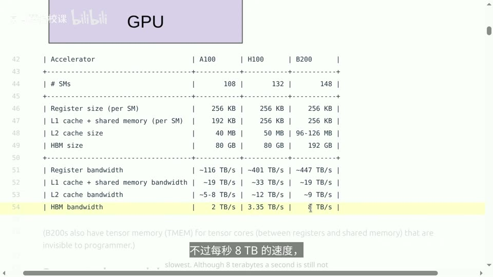
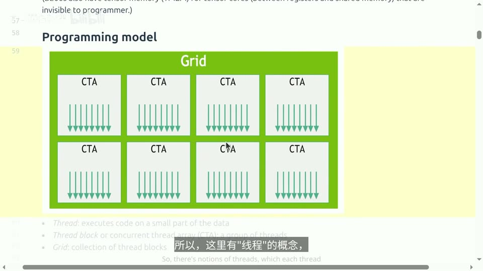
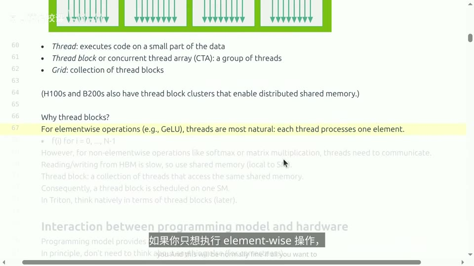
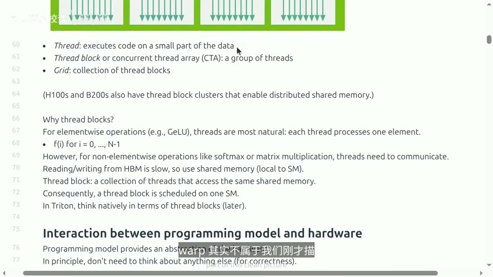
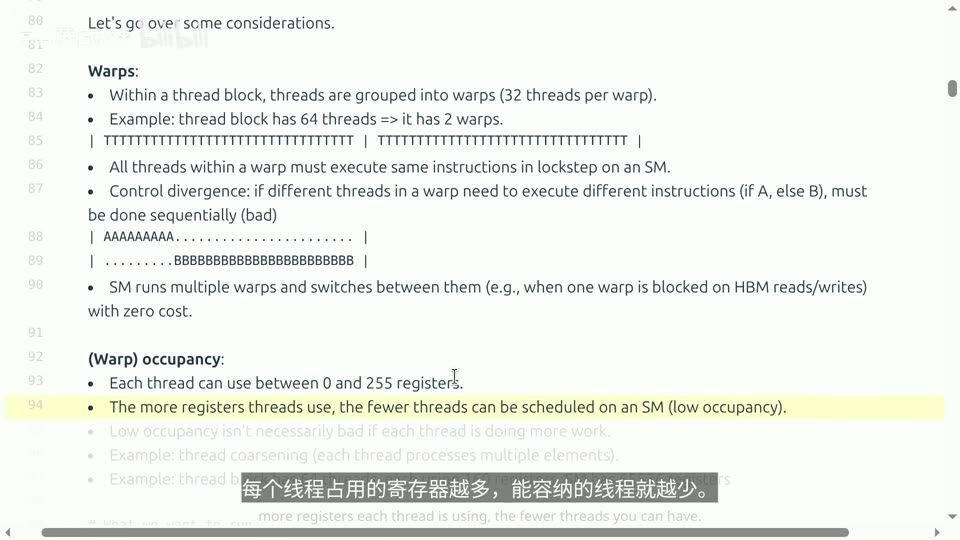
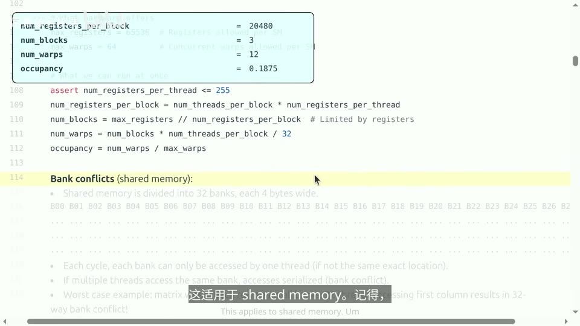
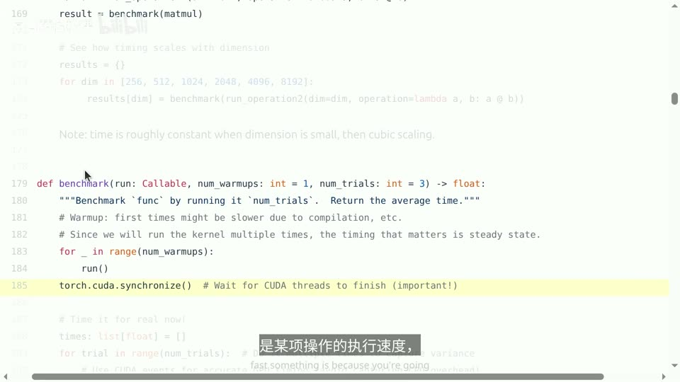
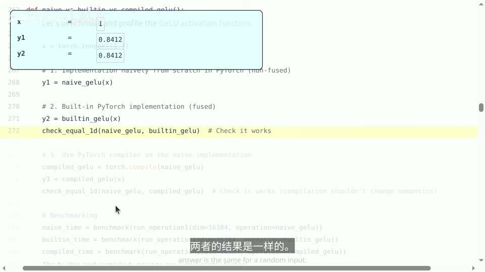
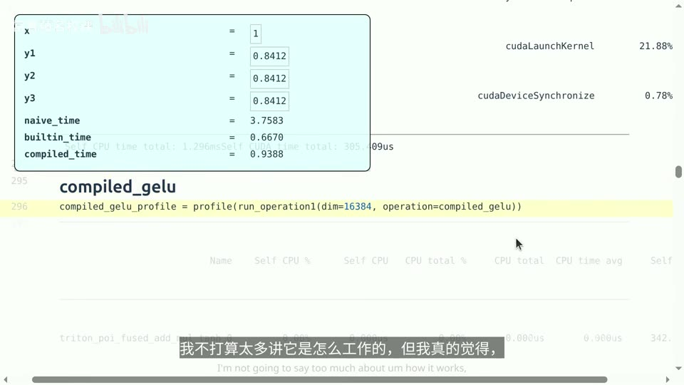
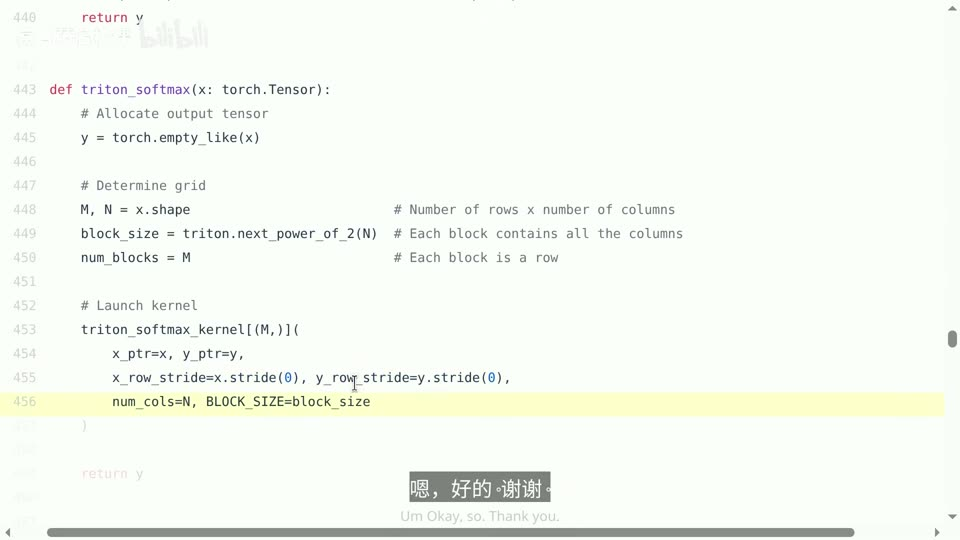

# Lecture 6: Kernels, Triton, XLA

## 本讲要解决的核心问题（SCQA）

**背景**：上一讲介绍了 GPU 的整体概况——如何理解性能、GPU 有哪些特性，并给出了一个"由内存层次结构决定性能"的心智模型。这一讲是它的延续：我们要进入代码，亲手写一些训练用的内核（kernel），同时做基准测试（benchmarking）和性能分析（profiling）。

**冲突**：GPU 的**编程模型其实非常优雅**——你定义一个由线程块（thread block）组成的网格（grid），描述每个块做什么计算，写起来几乎像 Python。但问题在于：**性能对硬件极其敏感**。同样一段逻辑正确的代码，可能因为寄存器用量、warp 调度、bank 冲突、内存是否合并、线程块数量是否整除 SM 数等硬件细节，跑出天差地别的速度。上层语言（PyTorch、Triton）把硬件抽象掉了，你写起来很轻松，却往往"不知道底层到底发生了什么"。

**疑问**：既然硬件的每个细节都能决定性能，我们该如何从"能跑对"走到"跑得快"？具体到一个简单的逐元素操作、一个 softmax、一个矩阵乘法，我们该怎样思考、怎样测量、怎样写出高效的内核？

**回答（中心思想）**：**高效内核编程遵循一条不变的流程——先测量、再优化。先用基准测试和性能分析找出瓶颈，然后把计算组织成"以线程块为单位、尽量复用片上内存"的形式，用 Triton 这种比 CUDA 更高层、又比 PyTorch 更贴近硬件的语言来实现。** 本讲按难度递进给出三个范例：逐元素（GELU）、按行规约（softmax）、以及分块矩阵乘法（tiling）——它们合起来，正是完成作业、实现 FlashAttention 所需的全部要素。[【跳转到 16:13】](https://www.bilibili.com/video/BV11LEA6eEuj/?p=6&t=973)

不过在写代码之前，得先把硬件细节补全。上一讲的编程模型里还有几个**隐藏在美丽抽象背后的关键概念**：warp、占用率、bank 冲突、内存合并、线程块占用率。理解它们，才能理解"为什么性能对硬件敏感"。[【跳转到 05:17】](https://www.bilibili.com/video/BV11LEA6eEuj/?p=6&t=317)

---

## 一、编程模型与内存层次：性能藏在硬件里

**一句话结论**：GPU 的编程模型只要求你知道线程、线程块、网格；但要让代码跑得快，必须理解寄存器、共享内存、L1/L2、HBM 组成的层次结构，因为"大内存慢而远、快内存近而小"。

### 1.1 GPU 的内存层次
一张典型 GPU 结构的简化图——从 A100 到 H100 再到 B200，每一代都包含一定数量的 **SM（流式多处理器）**，数量大约在 100 到 200 之间，变化不大。在单个 SM 内部则有：

- **寄存器（register）**：B200 每个 SM 共 **65536 个寄存器、256KB**，变化也不大；
- **L1 缓存 / 共享内存（shared memory）**：其实是**同一种内存**——共享内存你可控，L1 缓存你不可控；
- **L2 缓存**：不属于单个 SM，而是整个芯片共享，容量稍大；
- **HBM（高带宽内存）**：容量大幅上升，但速度最慢。

[【跳转到 00:27】](https://www.bilibili.com/video/BV11LEA6eEuj/?p=6&t=27) · [【跳转到 01:08】](https://www.bilibili.com/video/BV11LEA6eEuj/?p=6&t=68)

除了容量，还要看带宽——它们与容量大致**负相关**：寄存器最快，L1 稍慢，L2 更慢，HBM 最慢。这就是脑海中要建立的主要层级结构：**大内存速度慢、距离远但容量大；快内存位于 SM 上、离得近、速度快但容量小。**[【跳转到 01:23】](https://www.bilibili.com/video/BV11LEA6eEuj/?p=6&t=83)

### 1.2 编程模型：线程、线程块与网格
**编程模型**本身很简单：每个**线程**在数据的一小部分上执行一段代码（把每根箭头想象成一个线程）；线程被组织成 **thread block**（也叫并发线程数组，CTA）；thread block 再构成 **grid**。当你启动一个 kernel 时，实际上是在启动一个由线程和线程块组成的网格，让它们全部并行计算。作为简化说法，还有一些别的东西在发生，比如 H100/B200 还有 **thread block cluster**（支持一定程度的分布式共享内存）、B200 有介于寄存器和共享内存之间的 **Tensor Memory（TMEM）**；这些机制有些对程序员不可见，本讲暂不深入。[【跳转到 02:07】](https://www.bilibili.com/video/BV11LEA6eEuj/?p=6&t=127) · [【跳转到 02:54】](https://www.bilibili.com/video/BV11LEA6eEuj/?p=6&t=174)

---

## 二、执行与内存模型：线程块、warp 与延迟隐藏
### 2.1 为什么需要线程块——因为共享内存只对同一个块内的线程可见

**一句话结论**：线程块的核心价值在于它让你能使用 SM 上的共享内存并进行线程间通信；若只做逐元素操作，线程+网格就够，但一旦涉及规约（如 softmax）或矩阵乘法，就必须以块为单位思考。

一个自然的问题是：为什么不只用一个"由线程组成的网格"，让每个线程直接取一部分数据执行操作？

答案取决于操作类型。如果你只做**逐元素（elementwise）操作**，这种设计通常是够用的——比如 ReLU 就是逐元素施加的激活函数，每个线程处理一个元素，非常自然。但对涉及**线程间通信**的操作——比如 softmax 或矩阵乘法——这种视角就不够用了。你或许可以退而求其次：让每个单元直接读写 HBM。但这非常糟糕，因为 **HBM 很慢**。[【跳转到 03:14】](https://www.bilibili.com/video/BV11LEA6eEuj/?p=6&t=194)

正确做法是使用 **shared memory**：它专属于某个 SM，而 **thread block 让你把一组线程看作一个整体，让它们共同访问这块共享内存**。于是每个块被调度到某个 SM 上执行——先从 HBM 读取大量数据，处理过程中线程之间通过共享内存通信，最后把结果写回。**这就是本讲后面反复出现的关键点**。[【跳转到 03:51】](https://www.bilibili.com/video/BV11LEA6eEuj/?p=6&t=231) · [【跳转到 04:36】](https://www.bilibili.com/video/BV11LEA6eEuj/?p=6&t=276)

内存可见性可以这样记：

- **HBM**：全局共享；
- **shared memory**：仅对单个 thread block 可见；
- **寄存器**：仅对单个线程可见。

而硬件层面的一切细节——warp、bank 冲突、内存合并、占用率——才真正决定性能。这些细节很难掌握，因为 profiling 会告诉你一堆信息，但你必须确切知道有多少个 SM、各组件的确切规模，而且调度器有时会自己做决定、你无法控制。**它比编程模型复杂得多。**[【跳转到 14:02】](https://www.bilibili.com/video/BV11LEA6eEuj/?p=6&t=842)

### 2.2 warp 与延迟隐藏——32 个线程同步执行，且分支会串行化

**一句话结论**：每个线程块按 32 个线程一组（warp）执行，同一 warp 内必须步调一致地执行相同指令；分支会导致控制发散、把两条路径串行化，应尽量避免；但 SM 同时驻留多个 warp，可零开销切换来隐藏内存延迟。

**warp** 严格说不在干净的编程模型里（线程、线程块、网格才是），但硬件就是这么执行的：每个 thread block 包含一组线程，这些线程实际上按 warp 分组，**每个 warp 通常包含 32 个线程**。例如一个 64 线程的块对应两个 warp（前 32 和后 32）。[【跳转到 06:32】](https://www.bilibili.com/video/BV11LEA6eEuj/?p=6&t=392)

同一个 warp 里的所有线程**必须步调一致地执行相同的指令**。当出现分支时（条件 A 成立走 A，否则走 B），硬件只能先执行走 A 的线程、再执行走 B 的——这个过程被**串行化**了。这既不好又低效，所以一般来说**分支是你应该尽量避免的东西**。这就是"控制发散（control divergence）"。[【跳转到 06:57】](https://www.bilibili.com/video/BV11LEA6eEuj/?p=6&t=417)

**warp 有个特别酷的地方**：SM 实际上同时运行多个 warp——有一个 warp 调度器，还有一堆即将运行的驻留 warp。每个 warp 里有线程、线程拥有寄存器，而 **SM 可以在它们之间零开销地切换**。这在 CPU 上一般不成立，但 GPU 正是为**隐藏延迟**而这样设计的：某个 warp 正在从 HBM 读取数据（代价约为 100 个周期）时，不能干等它闲着，而是立刻切换到另一个 warp，让它去做实际的 Tensor Core 运算。[【跳转到 07:22】](https://www.bilibili.com/video/BV11LEA6eEuj/?p=6&t=442)

---

## 三、占用率不是越高越好——寄存器压力与线程粗化的权衡

**一句话结论**：每个线程最多用 255 个寄存器，用得越多、能驻留的线程越少、占用率越低；但占用率低未必是坏事——如果每个线程工作量更大，反而可能更有利，这正是"线程粗化"的思路。

### 3.1 寄存器压力与线程粗化
**占用率（occupancy）** 来自一个纯粹的数学约束：每个线程最多能使用 **255 个寄存器**，而 SM 的寄存器总数是固定的。每个线程占用的寄存器越多，能容纳的线程就越少，占用率就可能降低。但这**未必是坏事**——如果线程数量较少而每个线程执行的工作量更大，反而可能有利。所以占用率是可测量的指标，但并非越大越好，这里有其他需要权衡的因素。[【跳转到 08:12】](https://www.bilibili.com/video/BV11LEA6eEuj/?p=6&t=492)

一个能说明"你可能会主动降低占用率"的例子是**线程粗化（thread coarsening）**：假设有一个逐元素操作，你可以让一个线程只对一个元素运算（于是有大量线程），也可以让每个线程处理多个元素（比如一个常数 8，于是线程数量减少）。线程少了，调度更容易，但每个线程的工作量增加了。所以**如果你的线程负载非常轻，或许应该稍微增加它们的工作量。**[【跳转到 08:37】](https://www.bilibili.com/video/BV11LEA6eEuj/?p=6&t=517)

来算一个具体例子：假设一个线程块有 **128 个线程、每个线程用 160 个寄存器**。B200 每个 SM 的寄存器总数最多 **65536**，同时运行的 warp 数不能超过 **64**。每个线程的寄存器数小于 255，没问题；每个块使用的寄存器数 = 128 × 160 = **20480**，这意味着 SM 上最多同时运行 **3 个线程块**，也就是 12 个 warp（每块 4 个 warp）。由于最大 warp 数是 64，**占用率约为 18%**——只跑了拥有 warp 总数的一小部分。这个例子说明"内存（资源）限制了你能进行的计算规模"。[【跳转到 09:27】](https://www.bilibili.com/video/BV11LEA6eEuj/?p=6&t=567)

---

## 四、bank 冲突——共享内存分成 32 个 bank，同一 bank 的访问必须排队

**一句话结论**：共享内存被划分为 32 个 bank，每个时钟周期每个 bank 只能被一个线程访问；若多个线程访问同一 bank 的不同位置，就必须串行执行，最坏情况是 32 路冲突。

### 4.1 共享内存的 32 个 bank 与冲突
这适用于 **shared memory**。硬件设计是：共享内存分成 **32 个 bank，每个 bank 宽 4 字节**。约束是：**每个时钟周期每个 bank 只能被一个线程访问**（前提是它们访问的位置不同）。如果有多个线程想访问同一个 bank，这些访问就必须**串行执行**——这就是 **bank 冲突（bank conflict）**。[【跳转到 10:17】](https://www.bilibili.com/video/BV11LEA6eEuj/?p=6&t=617)

最坏情况的例子：矩阵按某种方式排列，32 个线程心想"太好了，32 正好让我大规模并行"，然后全都去访问**第一列**——于是它们只能排队等待，这就是 **32 路冲突**，是能遇到的最糟情况。你可能会问"直接按行访问不就好了"，但这是不可避免的：执行矩阵乘法时，你必须访问一个矩阵的行和另一个矩阵的列，有时还需要转置，无法总是自由选择访问顺序。对逐元素运算没问题，但矩阵乘法中就难以控制。解决方案之一是 **swizzling**——重排共享内存布局，使遍历时避免 bank 冲突。[【跳转到 11:07】](https://www.bilibili.com/video/BV11LEA6eEuj/?p=6&t=667)

**做性能分析时**，你可以查看 bank conflicts、occupancy 等指标，从而大致了解正在发生什么。

---

## 五、内存合并——整个 warp 落在同一条缓存行里，才能只付一次搬运费

**一句话结论**：当 warp 的 32 个线程访问 HBM 时，访问会被合并成一个 128 字节的事务（缓存行）；如果所有线程落在同一缓存行内就是"完全合并"，若按列访问则会取回大量用不上的数据。

### 5.1 整个 warp 落在同一条缓存行里
**内存合并（memory coalescing）** 讲的是 HBM 侧。当 warp 中的 32 个线程尝试访问 HBM 时，内存访问实际上会被合并成一个 **128 字节的事务**，称为**缓存行（cache line）**，一次性把数据全部取回。[【跳转到 12:22】](https://www.bilibili.com/video/BV11LEA6eEuj/?p=6&t=742)

在最佳情况下（**完全合并，fully coalesced**），所有线程都访问同一个缓存行：线程一访问 M00、线程二访问 M01……于是你会一次性把整个缓存行抓取过来。如果反过来**按列访问**，你会取回大量内存，但其中很多根本用不上，第二行、第三行也是如此。

要注意，这**感觉很像是 bank 冲突，但其实是完全不同的约束**：前者说的是共享内存，这里说的是 HBM。[【跳转到 12:47】](https://www.bilibili.com/video/BV11LEA6eEuj/?p=6&t=767)

---

## 六、线程块占用率与波量化——块数最好能被 SM 数整除

**一句话结论**：逻辑上你可以定义任意多线程块，但物理上只有固定数量的 SM；若块数无法被 SM 数整除，最后一波只有少量块在跑，大量 SM 空闲，这就是低占用率（波量化）。

### 6.1 块数最好能被 SM 数整除
线程块被调度到 SM 上执行。逻辑上你可以定义任意数量的线程块，但芯片物理层面只有固定数量的 SM（例如 **148 个**）。如果你启动 **160 个线程块**，就只能先调度其中的 148 个，必须等它们执行完才能调度剩余的 12 个；而如果只调度这 148 个、剩下的 12 个无处安放，部分 SM 就会空闲、不执行任何任务。这种现象被称为**低占用率**——即**最后一波线程块的数量少于线程块的最大承载总数**。因此一般来说，**让线程块的数量能被 SM 的数量整除或许是个好主意**。[【跳转到 13:12】](https://www.bilibili.com/video/BV11LEA6eEuj/?p=6&t=792)

课堂问答补充：能不能让一个块"共享"某个 SM？讲师回答说，这取决于具体的块——如果一个块已经占用了 SM 上的大部分 Tensor Core，再塞一个块进去也加速不了多少。根本问题在于**块必须待在一起（不可拆分）**，所以会产生"尾部参差不齐"的不均匀性；可行的做法是**改变块的大小、调整块的数量**来避免这种尾部。[【跳转到 15:13】](https://www.bilibili.com/video/BV11LEA6eEuj/?p=6&t=913)

至此硬件细节就补全了：编程模型优雅，但 warp、bank 冲突、内存合并、占用率这些硬件细节才真正决定性能。[【跳转到 14:24】](https://www.bilibili.com/video/BV11LEA6eEuj/?p=6&t=864)

---

## 七、基准测试的成功秘诀——先测量、再修改、再测量

**一句话结论**：写内核之前的正确顺序是先对代码做基准测试与性能分析、找出瓶颈，而不是一上来就动手改；基准测试要记得预热、用 CUDA 事件计时并同步、多次重复取平均，还要扫描规模看扩展性。

### 7.1 基准测试的成功秘诀
**核心理念是一个"成功的秘诀"：对代码做基准测试和性能分析 → 做出修改 → 再次基准测试。** 之所以先测再改，是因为你应该**始终先测量代码的实际运行情况、找出瓶颈，然后再开始编写内核**。[【跳转到 16:13】](https://www.bilibili.com/video/BV11LEA6eEuj/?p=6&t=973)

### 7.2 计时要点：预热、CUDA 事件与同步
**基准测试（benchmarking）** 基本上就是衡量各项操作耗费的时间，给出端到端总耗时（并不能告诉你时间花在了哪里），但仍然很有用——你最终关心的就是整体跑了多久，而且它把指标浓缩成一个数值，便于观察性能如何随维度变化。以矩阵乘法为例，最直接的做法是记下开始时间、运行、再记下结束时间。但有几个要点：

1. **一定要先做预热**：如果有些代码是延迟编译的，要确保编译时间不被计入结果，因为你关心的是反复运行时的执行速度，初始条件并不重要。
2. **多次计时**：结果会有波动，通常需要重复多次。准确计时的做法是使用 **CUDA 事件**：记录起始时间、运行计算、记录结束时间，然后**记得同步（synchronize）**——因为 GPU 上的操作大多是异步的，这是一个同步屏障——最后记下时间。再重复、取平均。若非常严谨，还可以看 P95、P99 等分布。

[【跳转到 17:28】](https://www.bilibili.com/video/BV11LEA6eEuj/?p=6&t=1048) · [【跳转到 18:18】](https://www.bilibili.com/video/BV11LEA6eEuj/?p=6&t=1098)

### 7.3 规模扫描看扩展性
**规模扫描（scaling）**：扩大矩阵规模看耗时如何变化。矩阵乘法耗时本应呈三次方增长，但要注意存在一个**下限**——在矩阵维度接近 **2048** 之前，耗时基本保持不变，这正是因为 GPU 专为"相当大规模的矩阵乘法"设计；如果换成 2×2 这样的小矩阵，GPU 效率会非常低。[【跳转到 18:43】](https://www.bilibili.com/video/BV11LEA6eEuj/?p=6&t=1123)

---

## 八、性能分析看穿 PyTorch 底层——GELU 案例说明算子融合为何关键

**一句话结论**：profiling 不仅告诉你时间花在哪，还揭示底层发生了什么；朴素 GELU 由多个独立内核组成，数据反复往返 HBM，而内置/编译版本融合成一个内核，只读一次、写一次，因此快得多。

### 8.1 PyTorch 底层其实是一堆内核
**性能分析（profiling）** 能告诉你时间究竟花在了哪里。一个不那么直观的用途是：**即便你不在意耗时，profiling 也能帮你弄清楚底层到底发生了什么**——特别是用高级语言时，写完代码跑一下就能得到结果，搞清背后发生了什么总是好事。PyTorch 内置了分析器，作业里还会用到 Nsight。[【跳转到 19:33】](https://www.bilibili.com/video/BV11LEA6eEuj/?p=6&t=1173)

以两个张量相加（`A + B`）为例，profiling 会显示一个名字很长的 CUDA add kernel 被调用——底层有个叫 **ATen** 的东西。矩阵乘法 `a @ b` 同样会调用 cuBLAS 的 kernel，名字里透露出实现信息（如 `sm_100` 对应 Blackwell 架构、FP32、tile 形状等），**而且换维度会调用不同的内核**。[【跳转到 20:23】](https://www.bilibili.com/video/BV11LEA6eEuj/?p=6&t=1223)

### 8.2 GELU 案例：算子融合为何关键
**GELU 是一个绝佳的对照案例**。GELU 是典型的非线性激活函数，通常用 tanh 近似以更易计算。这里有三个"选手"：

- **朴素实现**：直接把公式写进 PyTorch（本质是一串逐元素算子）；
- **内置实现**：`torch.nn.functional.gelu`；
- **编译实现**：对朴素实现调用 **`torch.compile`**。

三者**算出的结果一样，性能却差异很大**：朴素实现约 **3.5 ms**，内置实现和编译实现都快得多。[【跳转到 23:18】](https://www.bilibili.com/video/BV11LEA6eEuj/?p=6&t=1398)

打开分析器看朴素实现，会发现一堆不同的内核——二元函数对象、一元函数加法、tanh 等。这是因为**计算图里的每个原语都由一个内核实现**，而它慢的原因正是：**每启动一个内核，都要从 HBM 读数据、拉到 SM 上计算、再写回 HBM**；下一个内核再取走、再写回……内核之间数据都得回到 HBM，于是做了大量来回读写。[【跳转到 24:08】](https://www.bilibili.com/video/BV11LEA6eEuj/?p=6&t=1448)

而**编译版本只有一个内核**——它把 GELU 的所有操作**融合（fusion）进一个内核**，于是只需从 HBM 读一次、每个元素写回一次。有意思的是，**编译后生成的正是一个 Triton kernel**。[【跳转到 25:33】](https://www.bilibili.com/video/BV11LEA6eEuj/?p=6&t=1533) 讲师也坦承：在这个场景下 Triton kernel 并不比内置实现更快，而且"非常依赖具体硬件"，示例代码没有做极致优化，只为展示整体概念。[【跳转到 26:31】](https://www.bilibili.com/video/BV11LEA6eEuj/?p=6&t=1591)

---

## 九、Triton 的心智模型与 PTX
### 9.1 Triton 的心智模型——以线程块为单位思考，而不是单个线程

**一句话结论**：CUDA 让你写"每个线程做什么"，细粒度但需手动同步；Triton 让你声明"每个线程块做什么"，把数据载入共享内存、处理、写回，比逐个元素高一层、比整个矩阵乘法低一层，是训练场景的甜蜜点。

**Triton** 由 OpenAI 开发，如今已经相当主流。它的心智模型与 CUDA 不同：

- **CUDA**：最初由 NVIDIA 开发，心智模型是"**每个线程做什么**"——你写一段代码，用线程 ID 标识当前线程，然后执行。好处是与底层实际发生的情况密切相关、控制细粒度；缺点是**线程在一个块里需要互相通信，你必须手动做同步**（一起从 HBM 读、同步、计算……）。如果全是逐元素操作，CUDA 完全没问题；但随着操作变复杂，**Triton 在抽象层面就体现出价值**。
- **Triton**：你定义"**每个线程块做什么**"。一般来说这已经足够强大，尤其对这门课。如果你要榨干最新硬件的每个新特性，它可能没法给你完全的灵活性。

[【跳转到 27:24】](https://www.bilibili.com/video/BV11LEA6eEuj/?p=6&t=1644) · [【跳转到 28:20】](https://www.bilibili.com/video/BV11LEA6eEuj/?p=6&t=1700)

训练中的概念框架是：**一个 block 把数据加载到共享内存、处理、再写回全局内存**。这些 block 处于一个中间位置——介于"思考单个元素在做什么"与"思考整体操作（比如在 PyTorch 里说'把两个大矩阵乘起来'）"之间。[【跳转到 28:38】](https://www.bilibili.com/video/BV11LEA6eEuj/?p=6&t=1718)

**第一个 Triton kernel：逐元素操作。** 流程如下（以 8 元素向量起步，再把元素总数设为 8000、块大小设为 1024，于是得到 8 个线程块）：

1. 在 Python 里**分配输出张量**——因为 Triton 不从函数式角度思考，而是**只关注数据移动**，没有返回值，所以 kernel 显式向输出张量写入。
2. 用"有点奇怪的语法"启动 kernel，括号里指定 **grid 的形状**（`num_blocks` 个线程块），并为每个块传入 `x`、`y`、`num_elements`、块大小。
3. 在 kernel 里，参数是**指针**（可简单理解为地址/整数）而非张量。
4. 每个块醒来后先问"**我是谁**"——`pid` 标识这个块（块 0、1、2……）。
5. 计算起始位置 = `pid × 块大小`；用 `tl.arange` 得到 `[0, 块大小)` 的偏移量，两者相加得到要处理的数据位置。
6. 一般元素数不能整除块大小，所以常需**掩码（mask）**：最后一个块里、超出张量长度的位置为假，其余为真。
7. 用 `tl.load`（指针 + 偏移 + 掩码）从 HBM 读入，做计算，再用 `tl.store`（指针 + 偏移 + 掩码）写回 HBM。

[【跳转到 29:56】](https://www.bilibili.com/video/BV11LEA6eEuj/?p=6&t=1796) · [【跳转到 33:16】](https://www.bilibili.com/video/BV11LEA6eEuj/?p=6&t=1996)

**课堂问答**澄清了几点：对逐元素操作，Triton 与 CUDA 几乎一样（CUDA 甚至更简单，因为它就是逐元素的），区别在于 Triton 是"**向量化**"的版本——你有一个块，并对整个块操作；一旦操作超出逐元素范畴，CUDA 就会麻烦得多。至于数据在 HBM → 共享内存 → 寄存器之间"具体怎么流动"，**这不由你控制，硬件/编译器会自动决定**——Triton 会自动判断该放到哪里。[【跳转到 34:18】](https://www.bilibili.com/video/BV11LEA6eEuj/?p=6&t=2058) · [【跳转到 35:08】](https://www.bilibili.com/video/BV11LEA6eEuj/?p=6&t=2108)

### 9.2 PTX——编译器生成的 GPU 中间汇编，让你一窥底层

**一句话结论**：Triton（乃至 CUDA）编译后生成 PTX 中间汇编；从 PTX 能直接看到 `ld.global`（从 HBM 加载到寄存器）、乘法、`st.global`（写回 HBM）等指令，还能看到编译器自动做的线程粗化，但 SM 分配、warp 等由硬件控制、在 PTX 中看不到。

当你写这些内核时，编译器会生成 **PTX**——一种用于 GPU 的**中间汇编语言**。从 PTX 里能观察到几件事：[【跳转到 37:28】](https://www.bilibili.com/video/BV11LEA6eEuj/?p=6&t=2248)

- 能看到线程（而非线程块）实际在做什么；
- `ld.global` 指令从 HBM 加载数据到寄存器（`R` 表示整数寄存器、`F` 表示浮点寄存器）；
- 还有"把零移到 R5、R6"，然后是乘法运算、把结果存到某处；
- 最底下会看到 **全局存储（global store）** 指令，即往 HBM 写回数据。

有意思的是能看到**线程粗化**：这里其实只有一个线程，但它一次处理了**八个元素**而不是单个元素——编译器判断这个线程很轻量、工作量不大，于是把它"加厚"了。另外，这段代码**只编译一次**，所有线程跑的是同一份代码，线程区分自身的方式是靠传入的 **`ctaid.x`（块索引）** 和 **`tid.x`（线程在块内的索引）**。[【跳转到 38:43】](https://www.bilibili.com/video/BV11LEA6eEuj/?p=6&t=2323) · [【跳转到 39:48】](https://www.bilibili.com/video/BV11LEA6eEuj/?p=6&t=2388)

不过 PTX 里**仍有许多东西未被指定**——比如具体是哪些 SM 在运行、warp 如何调度，很多都由硬件控制。所以 PTX 是编译器生成的，一般不需要手写（除非你觉得比编译器还厉害；较不成熟的加速器有时确实需要手动引导）。[【跳转到 40:06】](https://www.bilibili.com/video/BV11LEA6eEuj/?p=6&t=2406) · [【跳转到 40:43】](https://www.bilibili.com/video/BV11LEA6eEuj/?p=6&t=2443)

课堂问答还借 `tl.load` 讲清了**延迟隐藏的执行过程**：这条 load 语句会阻塞若干周期，但因为它运行在某个 warp 上，而 SM 同时运行多个 warp，所以当这个 warp 等待内存时，**warp 调度器会立刻切换到另一个 warp 去执行**，等数据到了再切回来。[【跳转到 41:08】](https://www.bilibili.com/video/BV11LEA6eEuj/?p=6&t=2468)

---

## 十、从逐元素到规约，再到分块矩阵乘法

**一句话结论**：softmax 不是逐元素操作，需要按行规约；让每行对应一个块、块内用向量化写法，几乎就像写 PyTorch；当一行大过块时，则用循环遍历多个 tile 并在寄存器/共享内存中累加，最后做一次规约。

### 10.1 softmax 内核与规约
到目前为止都是逐元素操作。现在来看**涉及聚合（规约）的操作**——**softmax**：对矩阵的每一行做归一化（先指数、再按行归一）。核心步骤是：按行求最大值以数值稳定 → 减去最大值 → 逐元素指数 → 按行求和得到归一化常数 → 按行相除。[【跳转到 42:44】](https://www.bilibili.com/video/BV11LEA6eEuj/?p=6&t=2564)

**朴素 PyTorch 实现**的问题：每个操作都是一个独立 kernel，各自从 HBM 读、写回 HBM。统计下来有 **5 次 M×N 规模的读取、3 次 M×N 规模的写入**，而原则上你只需要少得多的读写。[【跳转到 43:34】](https://www.bilibili.com/video/BV11LEA6eEuj/?p=6&t=2614)

**Triton 版本（每行放得下一个块时）**：让**每一行对应一个 block**（因为每行都要归一化和求和，softmax 不是逐元素操作，但按行处理时块之间互不交互、无需共享内存）。启动时块的数目 = 行数 M；块大小取列数向上取到的 **2 的幂**；除了输入/输出指针，还要传入 **stride** 以定位每一行。[【跳转到 44:24】](https://www.bilibili.com/video/BV11LEA6eEuj/?p=6&t=2664)

kernel 内部：块醒来后位于某一行，用 `tl.arange` 取得 `[0, 块大小)` 的列偏移，计算地址 = 行起始地址 + 偏移；加载数据，**被掩码的位置填负无穷**（因为那相当于 softmax 里的零）；然后与朴素版完全一样地求最大值、减掉、指数、求和、相除，再写回。[【跳转到 45:39】](https://www.bilibili.com/video/BV11LEA6eEuj/?p=6&t=2739) · [【跳转到 46:29】](https://www.bilibili.com/video/BV11LEA6eEuj/?p=6&t=2789)

讲师强调：**Triton 让这件事变得非常简单**——因为一个块处理一行，只要放得下，你几乎就能直接写普通的 PyTorch。[【跳转到 46:49】](https://www.bilibili.com/video/BV11LEA6eEuj/?p=6&t=2809)

**当一行大过块时怎么办？** 例如一行有 **4000 列**，而块大小只有 **1024**，那就把这一行拆成若干**图块（tile）**（这里是 4 个），每个线程遍历这些 tile 并累加，最后做一次**规约**把各线程的结果加起来（这里先用"行求和"举例，因为它比 softmax 更简单好想）。[【跳转到 47:48】](https://www.bilibili.com/video/BV11LEA6eEuj/?p=6&t=2868)

概念上：每个线程块仍负责一行；图块 0 是第 0~3 列、图块 1 是第 4~7 列……每个线程维护一个**累加器**并处理第一个图块，再转到下一个图块把元素累加进去，如此循环；遍历完所有图块后做规约，把各线程累加器求和得到一个标量并写出。[【跳转到 48:38】](https://www.bilibili.com/video/BV11LEA6eEuj/?p=6&t=2918) · [【跳转到 49:28】](https://www.bilibili.com/video/BV11LEA6eEuj/?p=6&t=2968)

**关键区分**：这里的"块（block）"指的是**整行**，"图块（tile）"才是行内被切出的小段；一个 block 要处理完所有 tile。累加器通常放在寄存器里，若寄存器不够、块又足够大，编译器会把它放到共享内存——**你并不显式指定它放哪，由 Triton 编译器决定**。从这里开始，写法就**不再像 PyTorch 了**，因为你无法一次性处理所有数据。[【跳转到 51:24】](https://www.bilibili.com/video/BV11LEA6eEuj/?p=6&t=3084) · [【跳转到 51:49】](https://www.bilibili.com/video/BV11LEA6eEuj/?p=6&t=3109)

### 10.2 矩阵乘法是分块（tiling）的典型范例，也是作业实现 FlashAttention 的基础

**一句话结论**：朴素矩阵乘法对每个 M、N、K 都从 HBM 读取，算术强度是常数、极其糟糕；分块后把 A、B 的小块载入共享内存反复复用，算术强度提升到分块大小量级，还能顺带把 ReLU/GELU 等逐元素激活融合进同一个内核。

**矩阵乘法是深度学习的核心基石**，也早已被优化到极致。这里先做一个"矩阵乘法 + ReLU"的例子——实际中很常见（线性层做矩阵乘法后接 ReLU 激活），也便于演示 kernel 融合。[【跳转到 52:31】](https://www.bilibili.com/video/BV11LEA6eEuj/?p=6&t=3151)

**朴素方法**：设 A 是 M×K、B 是 K×N、C 是 M×N。固定 C 的一个元素，遍历 K（即 A 的行和 B 的列），从 HBM 读取、乘积累加，最后写回该元素。它逻辑正确，但**读写次数极差**：对每一个 M、N、K 都要从 HBM 读取，读取量级是 **M×K×N**；而操作数也是 M×K×N 量级，于是**算术强度是个常数**——这很糟糕。仔细观察会发现大量**冗余读取**：计算 C4 要读 A4、A5、A6，计算 C5 又要再读一遍。[【跳转到 53:21】](https://www.bilibili.com/video/BV11LEA6eEuj/?p=6&t=3201) · [【跳转到 54:11】](https://www.bilibili.com/video/BV11LEA6eEuj/?p=6&t=3251)

**理想化方法**：把 A 和 B 全部加载到共享内存，再计算 C。这样读取次数**不再是立方级、而只是平方级**，算术强度达到 **O(N)** 量级——这正是你能期望的理想情况。但**问题在于 A 和 B 通常太大，放不进共享内存**。[【跳转到 54:36】](https://www.bilibili.com/video/BV11LEA6eEuj/?p=6&t=3276)

**解决方案就是经典的分块（tiling）**：核心思想是**尽可能多地把数据放进共享内存**——可以说它"**在全局上看起来像朴素方法，在局部上看起来像理想化方法**"。[【跳转到 55:26】](https://www.bilibili.com/video/BV11LEA6eEuj/?p=6&t=3326)

具体做法：把输出矩阵 C 切成图块，**每个图块就是一个 thread block**，不同图块由不同的块完全独立计算。块醒来后，对 A 的每个行图块沿着行扫描、对 B 的每个列图块沿着列扫描，把对应的 A 分块和 B 分块**加载进共享内存**、相乘并把结果累加到**部分和**（也在共享内存里）；把这一行和这一列都扫完后，把输出分块写回 HBM。此时**计算强度提升到分块大小这个量级**——虽然通常达不到 O(N)（那要求全部放进共享内存），但只要分块足够大，情况仍可接受。[【跳转到 56:11】](https://www.bilibili.com/video/BV11LEA6eEuj/?p=6&t=3371) · [【跳转到 56:58】](https://www.bilibili.com/video/BV11LEA6eEuj/?p=6&t=3418)

**顺带一提**：既然你已经在为它写 kernel，如果想加一个逐元素激活函数（如 ReLU/GELU），**直接在最后加上就行**——这就是 **kernel 融合**。讲师还回顾了**步幅（stride）**：张量在内存里线性排列，步幅告诉你怎么把多维索引（行、列）映射成实际索引（行 × 行步幅 + 列 × 列步幅）；往下移一行就往后挪相应位置，往右移一列就前进相应位置，转置则步幅反过来。[【跳转到 57:18】](https://www.bilibili.com/video/BV11LEA6eEuj/?p=6&t=3438)

在 kernel 里，块的启动方式、索引处理与前面的例子类似：醒来后位于某个 M×N 图块上，建立共享内存里的累加器矩阵，加载 A、B 的小图块做点积累加，前进到下一个行/列图块，最后（可选地）应用非线性并写回。**只要数据在共享内存里，操作就跟 PyTorch 一样，可以直接调用矩阵乘法。**[【跳转到 58:08】](https://www.bilibili.com/video/BV11LEA6eEuj/?p=6&t=3488) · [【跳转到 59:23】](https://www.bilibili.com/video/BV11LEA6eEuj/?p=6&t=3563)

---

## 小结

- **编程模型与硬件两分法**：线程→线程块→网格的编程模型很优雅（只关心正确性时够用），但性能由硬件细节决定——寄存器/共享内存/L1/L2/HBM 的层次、warp、bank 冲突、内存合并、占用率。
- **线程块的意义**：它让你能用 SM 上的共享内存，并进行线程间通信；逐元素操作可以只靠线程+网格，规约与矩阵乘法则必须以块为单位思考。
- **warp 与延迟隐藏**：32 线程一组、同 warp 执行相同指令，分支会控制发散并被串行化；SM 同时驻留多个 warp 并零开销切换，用来隐藏 ~100 周期的内存延迟。
- **占用率不是越高越好**：每线程 ≤255 个寄存器，用得多则驻留线程少、占用率低；线程粗化有时反而有利。
- **bank 冲突**：共享内存 32 个 bank，多线程访问同一 bank 的不同位置要串行；最坏 32 路冲突，可用 swizzling 缓解。
- **内存合并**：warp 访问 HBM 合并成 128 字节缓存行；同缓存行为完全合并，按列访问则浪费带宽。
- **线程块占用率**：块数最好能被 SM 数整除，否则最后一波只有少量块运行、SM 空闲（波量化）。
- **先测量再优化**：基准测试（预热、CUDA 事件、同步、重复取平均、规模扫描）＋ profiling（看懂底层内核）。
- **算子融合**：朴素 GELU 由多个内核组成、数据反复往返 HBM，内置/编译版本融合成单个 Triton 内核、只读一次写一次。
- **Triton 心智模型**：以"线程块做什么"为单位——把数据载入共享内存、处理、写回；介于逐元素与整体矩阵乘法之间。
- **PTX**：Triton/CUDA 编译出的 GPU 中间汇编，能直接看到 `ld.global`/`st.global`、寄存器运算和自动线程粗化，但 SM 分配等由硬件控制。
- **三个递进范例**：逐元素（GELU）→ 按行规约（softmax，一行放得下用一块，放不下则用 tile 循环 + 累加 + 规约）→ 分块矩阵乘法（tiling，把算术强度提升到分块大小量级，并可融合逐元素激活）——它们合起来就是实现 FlashAttention 的全部要素。

---

## 关键术语速查

| 术语 | 一句话解释 |
| --- | --- |
| SM（流式多处理器） | GPU 中独立执行线程块的单元，数量约 100~200；包含寄存器、共享内存等。 |
| 线程 / 线程块 / 网格 | GPU 编程模型的三层：单个执行单元 → 一组线程（可共享内存）→ 由块组成的整体。 |
| 共享内存（shared memory） | 位于 SM 上、仅对同一线程块可见、可编程的快速内存；与 L1 实为同一种内存。 |
| HBM（高带宽内存） | GPU 全局内存，容量大但慢；是"数据搬运瓶颈"的主要来源。 |
| warp | 硬件调度单位，通常 32 个线程一组，同一 warp 内必须执行相同指令。 |
| 控制发散（control divergence） | 同 warp 内线程走不同分支时，两条路径被串行执行，造成低效。 |
| 延迟隐藏 | SM 驻留多个 warp 并零开销切换，用其他 warp 的工作填补等待内存的时段。 |
| 占用率（occupancy） | 实际驻留 warp 数占最大 warp 数的比例；受寄存器用量等资源限制，并非越高越好。 |
| 线程粗化（thread coarsening） | 让每个线程处理多个元素以减少线程数、增大单线程工作量。 |
| bank 冲突 | 共享内存 32 个 bank 中多个线程访问同一 bank 的不同位置，导致访问串行。 |
| swizzling | 重排共享内存布局以避免 bank 冲突的技术。 |
| 内存合并（coalescing） | warp 访问 HBM 时合并成一个 128 字节缓存行事务，完全合并最省带宽。 |
| 缓存行（cache line） | HBM 一次事务拉取的 128 字节数据块。 |
| 波量化 | 线程块数不能被 SM 数整除时，最后一波块数偏少、大量 SM 空闲的现象。 |
| 基准测试（benchmarking） | 测量端到端耗时；须预热、用 CUDA 事件计时并同步、多次取平均、扫描规模。 |
| CUDA 事件 | 用于精确计时的 GPU 时间戳机制，需在结束时同步以保证异步操作完成。 |
| 性能分析（profiling） | 定位时间花在哪里、以及底层实际调用了哪些内核（ATen、cuBLAS 等）。 |
| 算子融合（fusion） | 把多个算子合并进单个内核，避免中间结果反复往返 HBM。 |
| Triton | OpenAI 开发的内核语言，以"线程块"为单位描述计算，介于 CUDA 与 PyTorch 之间。 |
| 核函数（kernel） | 在 GPU 上并行执行的函数；一次启动对应一个由块组成的网格。 |
| grid / pid | 启动时的线程块网格；每个块的 `pid` 用于确定它处理哪部分数据。 |
| 掩码（mask） | 标记哪些位置有效、避免越界访问的布尔向量，常用于非整除的边界处。 |
| PTX | GPU 的中间汇编，由编译器生成；含 `ld.global`/`st.global` 等指令。 |
| 规约（reduction） | 把多个值聚合成一个（如按行求和/求最大值），需要线程间协作。 |
| 累加器（accumulator） | 循环处理多个图块时用于累积部分和/统计量的变量（寄存器或共享内存）。 |
| 分块（tiling） | 把矩阵切成小块载入共享内存反复复用，提升算术强度；矩阵乘法的核心优化。 |
| 算术强度 | 每搬运一字节数据所执行的操作数；越高越接近计算受限的高吞吐区。 |
| 图块（tile） | 分块后矩阵的子块，一个线程块负责计算一个输出图块。 |
| 步幅（stride） | 多维索引映射到线性内存地址的步长（行步幅、列步幅）。 |
