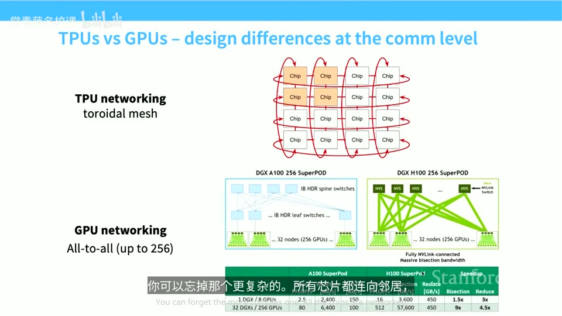
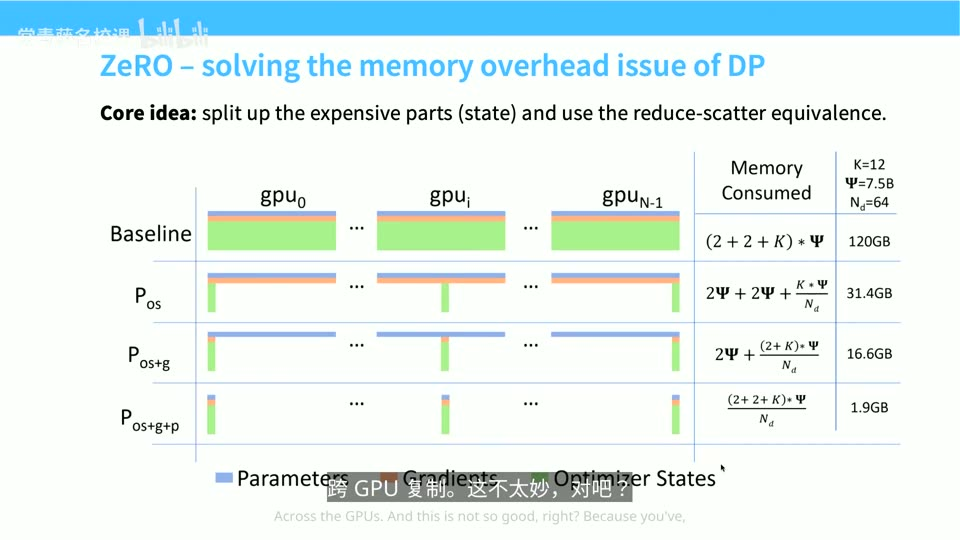
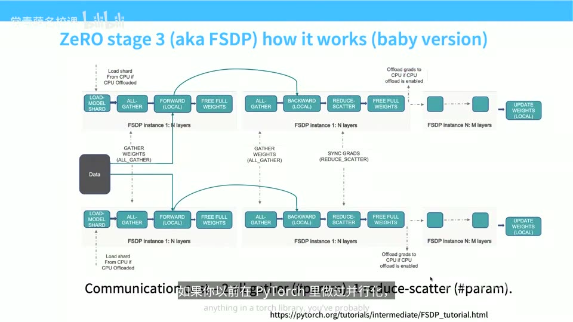
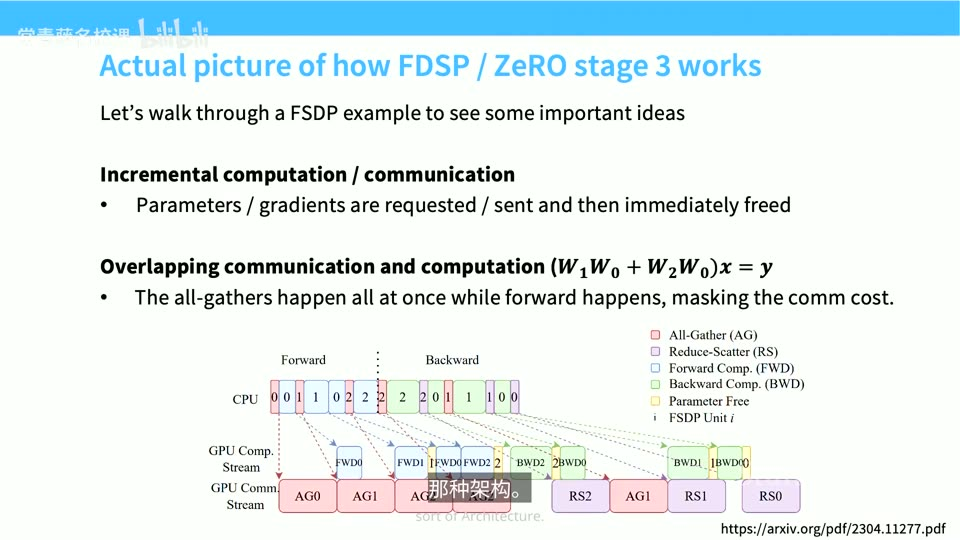
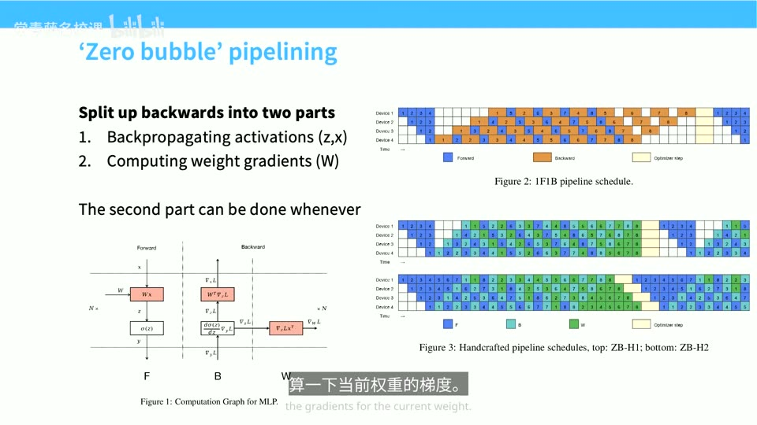
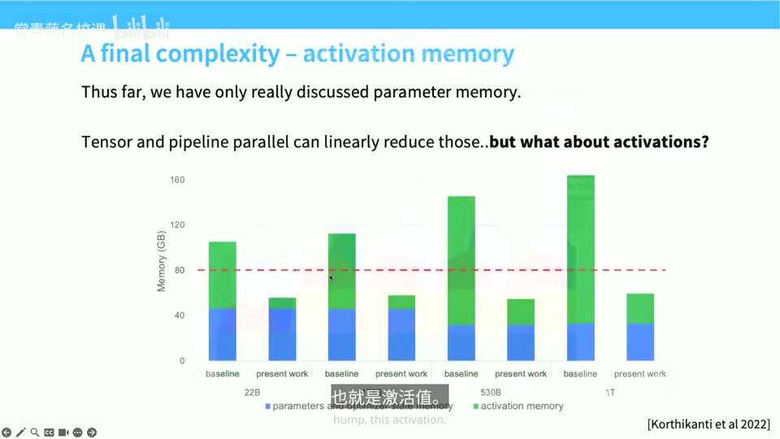
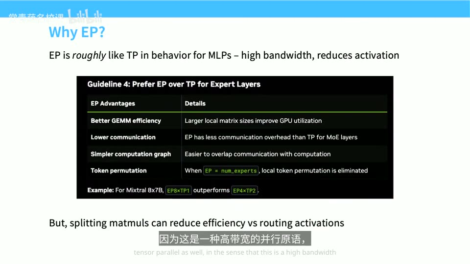
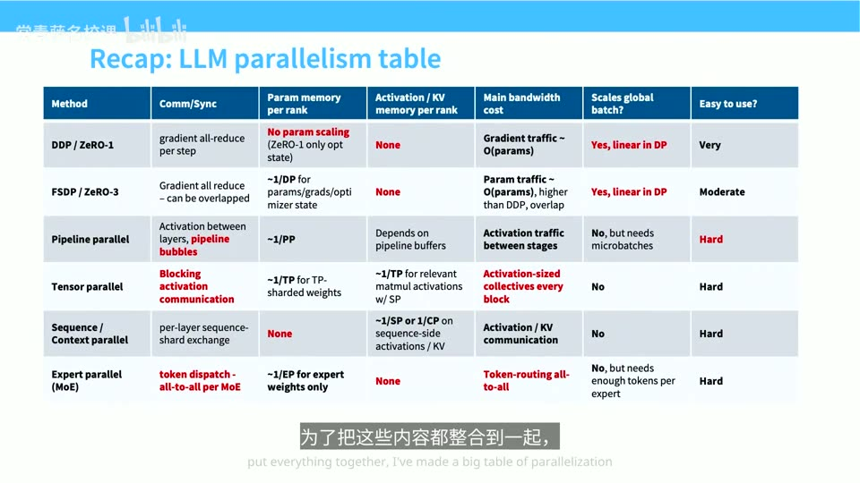
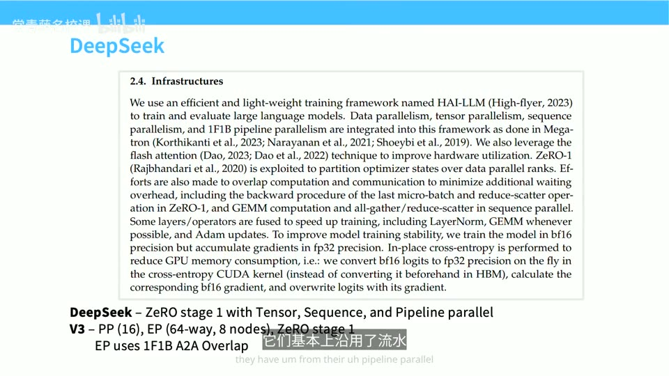

# Lecture 8: Parallelism

## 本讲要解决的核心问题（SCQA）

**背景（Situation）**：上一讲 Percy 打好了并行化的底层地基——集合通信原语（all-reduce/all-gather/reduce-scatter…）与硬件拓扑，并带我们看了数据并行、张量并行、流水线并行各自的"骨架"。

**冲突（Complication）**：真正在超大规模集群上训练超大模型时，没有任何一种并行策略能单独解决问题。模型的参数、梯度、优化器状态、激活值会从四个方向压垮显存；而"多卡"带来的又不仅仅是显存红利——batch size 是有限的资源，网络有快有慢，每种并行都在不同的资源上收"过路费"。这就是为什么作业里会有一项任务：**给定网络拓扑和模型规模，找出较优的并行策略**。

**疑问（Question）**：把这些并行策略真正组合起来时，各自要付出多少通信与显存代价？面对一个"装不下"的模型，应该按什么顺序、在什么硬件层级上切开它？

**回答（Answer，结论先行）**：核心洞察是——**今天的计算单元已经不是一块 GPU，而是整个数据中心**。要在控制显存、控制算力的同时"无损"地利用所有资源。本讲的主线是：

1. 数据并行的**内存账本**（约每参数 16 字节、五份权重副本）是问题的根源，由此引出 **ZeRO 的三级分片**：优化器状态（Stage 1）→ 梯度（Stage 2）→ 参数（Stage 3 = **FSDP**）。前两级通信与 DDP 等价，等于白捡显存；FSDP 多一次 all-gather，但靠"增量式通信 + 通信计算重叠"几乎免费。
2. 数据并行在消耗 **batch size**（受临界批次大小限制），且不省激活内存，所以需要**模型并行**：FSDP 来回搬**参数**，模型并行来回搬**激活值**。
3. 具体工具有：**流水线并行**（切深度，用 micro-batch 压气泡，零气泡调度）、**张量并行**（切宽度，吃带宽，限 NVLink 域）、**专家并行**（MoE 首选，取代 TP）、**序列/上下文并行**（削减激活内存）。
4. 最后是**4D 并行**的经验法则与 OLMo、DeepSeek、Llama 3、Gemma 2、Mixtral 等真实案例。

---

## 一、硬件分野：TPU 环形网格 vs GPU 胖树

### 1.1 两种网络哲学

今天讨论的大部分算法与硬件无关，但底层网络会**深刻影响**各家公司选择哪种并行策略，因此值得先看清两家的设计哲学。([【跳转到 03:22】](https://www.bilibili.com/video/BV11LEA6eEuj/?p=8&t=202))

- **TPU（Google）** 的网络是**环形网格（toroidal mesh）**：芯片只与邻居相连，并且首尾相接。好处是网络拓扑极简、几乎可以无限扩展——无论规模多大，每个芯片连接的邻居数基本不变。这种结构天然适合**通信量小、划分可预测**的负载：比如 MoE 把 token 路由到相邻专家，又比如高度规则的张量并行。
- **GPU（NVIDIA）** 的网络更像**胖树（fat-tree）/ 全对全（all-to-all）**：节点内 GPU 极快互联，然后 GPU 组成 pod、pod 之间用交换机互联。随着节点增加，树越来越大，成本与复杂度上升，但换来的是灵活——任意两块 GPU 都能高效通信。

([【跳转到 04:22】](https://www.bilibili.com/video/BV11LEA6eEuj/?p=8&t=262))



### 1.2 负载决定网络：TPU v8i 与 Virgo

有趣的是，**Google 在 TPU v8i 上开始转向更彻底的 all-to-all**（如 Virgo 网络）。原因很合理：现在的模型几乎都是 MoE，推理时把 token 路由到不同专家会造成"到处乱窜"的带宽流量，这种路由通信才是真正的瓶颈。所以是**负载决定了我们需要什么样的网络**——TPU 与 GPU 的网络在相互靠拢。([【跳转到 06:14】](https://www.bilibili.com/video/BV11LEA6eEuj/?p=8&t=374))

### 1.3 一个对照案例：华为 CloudMatrix 384

讲者还举了一个中国 AI 圈的对照案例：**华为 CloudMatrix 384**。单看芯片，它的矩阵乘法速度比 H200 差不少；但它用光纤交换机把 **384 颗芯片**连在一个机架上，用"连接多得多的芯片"来弥补单芯片的不足——代价是功耗约达到英伟达系统的**四倍**。这正体现了硬件设计中的根本权衡：想省电、好造，会得到一种结果；想用蛮力解决通信问题，会得到完全不同的另一种。([【跳转到 07:13】](https://www.bilibili.com/video/BV11LEA6eEuj/?p=8&t=433))

---

## 二、数据并行的内存账本

### 2.1 三条扩展性质

数据并行最容易理解，也是标准做法。以基础 SGD 为例：一个 batch 大小 `B`，分给 `M` 台机器，每台算大小为 `B/M` 的小批次梯度，最后把所有梯度同步求和。它的三条扩展性质是（[【跳转到 09:45】](https://www.bilibili.com/video/BV11LEA6eEuj/?p=8&t=585)、[【跳转到 10:15】](https://www.bilibili.com/video/BV11LEA6eEuj/?p=8&t=615)）：

- **计算扩展性**：完美，只要每块 GPU 上的样本量足够；
- **通信量**：每个 batch 需传输约 `2 × #params` 大小的数据（梯度在机器间来回）；
- **内存扩展性**：**完全没有**——每块 GPU 都存模型完整副本，激活值也保持不变，一点内存都没省。

### 2.2 每参数约 16 字节、五份权重副本

而内存恰恰是灾难。按经验法则（取决于精度），我们大约需要**五份权重副本、每个参数约 16 字节**（[【跳转到 11:35】](https://www.bilibili.com/video/BV11LEA6eEuj/?p=8&t=695)）：

| 副本 | 精度 | 每参数字节 |
| --- | --- | --- |
| 参数（模型权重） | fp16/bf16 | 2 |
| 梯度 | fp16/bf16 | 2 |
| fp32 主权重（累加器） | fp32 | 4 |
| Adam 一阶矩 | fp32 | 4 |
| Adam 二阶矩 | fp32 | 4 |
| **合计** | | **约 16 字节** |

注意这里还可能有更高精度的临时累加器，而 Adam 还要一直跟踪一阶矩和二阶矩两份状态。算下来，**优化器状态占了大头，比参数和梯度加起来还多**。朴素数据并行把这整堆东西复制到每块 GPU 上：显存占用随加速器数量**线性增长**，非常糟糕。([【跳转到 12:15】](https://www.bilibili.com/video/BV11LEA6eEuj/?p=8&t=735))



自然的想法是：把这些状态**分片**到不同 GPU 上。ZeRO 沿着"优化器状态 → 梯度 → 参数"逐步分片，显存节省惊人——比如从 120 GB 依次降到 31.4 GB、16.6 GB、1.9 GB（图中参数规模 7.5B、`N_d=64` 的例子）——而通信代价的变化却出奇地温和。接下来逐一拆解这三个阶段。([【跳转到 12:45】](https://www.bilibili.com/video/BV11LEA6eEuj/?p=8&t=765))

---

## 三、ZeRO：三级分片与 FSDP

### 3.1 Stage 1：只分片优化器状态

每个 worker 照常在各自的数据上算出**完整梯度**，然后（[【跳转到 13:43】](https://www.bilibili.com/video/BV11LEA6eEuj/?p=8&t=823)、[【跳转到 14:02】](https://www.bilibili.com/video/BV11LEA6eEuj/?p=8&t=842)）：

1. 用 **reduce-scatter** 把梯度分发出去——每个 worker 只保留"自己负责更新的那一块参数"对应的梯度；
2. 各自用本地的优化器状态更新参数；
3. 用 **all-gather** 把更新后的参数收集回来，发回所有机器。

通信是 reduce-scatter + all-gather，而我们已经知道这**等价于一次 all-reduce**。因此 **ZeRO Stage 1 的通信特性和朴素 DDP 完全一样**——内存节省是白捡的。参数量以及所有非优化器状态的开销都除以 `N_gpu`，显存立刻好转。([【跳转到 15:06】](https://www.bilibili.com/video/BV11LEA6eEuj/?p=8&t=906)、[【跳转到 15:36】](https://www.bilibili.com/video/BV11LEA6eEuj/?p=8&t=936))

### 3.2 Stage 2：连梯度也分片——边算边发

这一步更棘手，因为之前依赖"能物化完整梯度"这个前提，现在连完整梯度都不能有。做法是一个系统层面的技巧：**不要一次性物化整个梯度向量**，而是沿计算图反向遍历，算完某一层的梯度就**立即规约并发送给对应的工作节点**，当某个梯度不再被需要时立刻释放。边算边发与一次性做完，结果完全一样，成本也没有增加。([【跳转到 15:45】](https://www.bilibili.com/video/BV11LEA6eEuj/?p=8&t=945)、[【跳转到 16:12】](https://www.bilibili.com/video/BV11LEA6eEuj/?p=8&t=972))

### 3.3 Stage 3 = FSDP：连参数也分片

最后连**参数**也分片，这就是 ZeRO Stage 3，也就是 PyTorch 里的 **FSDP（Fully Sharded Data Parallel，完全分片数据并行）**。此时每块 GPU 任意时刻只持有参数、梯度、优化器状态的一小块。运行方式（按层处理，[【跳转到 17:18】](https://www.bilibili.com/video/BV11LEA6eEuj/?p=8&t=1038)、[【跳转到 17:48】](https://www.bilibili.com/video/BV11LEA6eEuj/?p=8&t=1068)）：

1. 用 **all-gather** 拿到这一层的完整权重；
2. 做这一层的前向传播，做完立刻**释放**权重；
3. 反向传播时，按需再次 all-gather 拿回权重，算出梯度；
4. 用 **reduce-scatter** 把梯度发回各自 owner，然后释放权重；
5. 循环往复，最后更新权重。



于是每层要做**两次 all-gather + 一次 reduce-scatter**，比 DDP 多了一次 all-gather。但两个关键想法让开销几乎可以忽略（[【跳转到 18:32】](https://www.bilibili.com/video/BV11LEA6eEuj/?p=8&t=1112)、[【跳转到 19:02】](https://www.bilibili.com/video/BV11LEA6eEuj/?p=8&t=1142)）：

- **增量式通信（incremental computation/communication）**：扫一遍计算图，做完必要通信就立刻释放内存；
- **通信与计算重叠**：在第 i 层做前向/反向计算的同时，对第 i+1 层发起 all-gather。只要算力够、网络够快，计算耗时就能长于通信耗时，通信被"藏"进计算里。



FSDP 效果相当出色：在约 100 块 GPU 上，朴素方法连 7B 模型都放不下，而 ZeRO-3/FSDP 能容纳 500B 级别的模型。它概念上也很简单——写一个包装器，把任意模块包成 FSDP 版本（**作业里就要写这个**），内部就是"一堆 all-gather、计算、释放，反向时重复"。正因如此，**小模型（如 7B 级）常常纯靠 FSDP 训练**，扩展性出奇地好。([【跳转到 22:47】](https://www.bilibili.com/video/BV11LEA6eEuj/?p=8&t=1367)、[【跳转到 20:52】](https://www.bilibili.com/video/BV11LEA6eEuj/?p=8&t=1252))

课堂上有同学问"这是不是从下一块 GPU 拿梯度来算上一块的梯度"——讲者借此澄清了一个容易混淆的概念：**FSDP 不是流水线并行**。在 FSDP 下，每块 GPU 都会**从头到尾跑完整个模型**，只是任何一块 GPU 都不同时存下所有参数；参数按需取来、算完即放。这正是它"包装器"式简单的原因。([【跳转到 21:25】](https://www.bilibili.com/video/BV11LEA6eEuj/?p=8&t=1285)、[【跳转到 22:02】](https://www.bilibili.com/video/BV11LEA6eEuj/?p=8&t=1322))

还有一个课堂问答的细节：**为什么通信开销不随层数成倍增加？** 因为计算量随层数成倍增加，而每块通信的数据量其实更小——毕竟每层只是一个小矩阵乘法的量，对比"整个网络做 all-reduce"的大开销，这些开销累加起来是可控的。另外，从 H100 换到 H200/B200 时，这套内存账的数学关系基本是**线性**的，底层逻辑不变。([【跳转到 22:27】](https://www.bilibili.com/video/BV11LEA6eEuj/?p=8&t=1347)、[【跳转到 23:07】](https://www.bilibili.com/video/BV11LEA6eEuj/?p=8&t=1387))

### 3.4 三种 ZeRO 阶段的开销对比

| 方案 | 通信开销 | 说明 |
| --- | --- | --- |
| DDP（朴素数据并行） | 每次更新约 `2×#params` | 一次 all-reduce |
| ZeRO-1 / ZeRO-2 | 与 DDP 相同 | "字面意义上免费"，因为 all-reduce = RS + AG |
| ZeRO-3 = FSDP | 技术上更多（多一次 all-gather） | 但能被巧妙地藏进计算，GPU 利用率接近单卡 |

([【跳转到 20:22】](https://www.bilibili.com/video/BV11LEA6eEuj/?p=8&t=1222))

---

## 四、为什么还需要模型并行

### 4.1 batch 是一项会被消耗的有限资源

数据并行有一个隐形天花板：它在**消耗 batch size 这项资源**。batch 是 8，最多只能用 8 个加速器；而盲目加大 batch 又会碰到**临界批次大小（critical batch size）**——过了临界点，加样本的收益还不如多跑几步 SGD。于是陷入两难：用小 batch 会让 GPU 闲置，用大 batch 又要忍受优化效果上的损失。([【跳转到 23:33】](https://www.bilibili.com/video/BV11LEA6eEuj/?p=8&t=1413)、[【跳转到 24:03】](https://www.bilibili.com/video/BV11LEA6eEuj/?p=8&t=1443))

### 4.2 FSDP 搬参数，模型并行搬激活

此外，ZeRO 的 Stage 1/2 虽然能把状态内存除以 `N_gpu`，但**激活内存和其他类型的内存它们管不了**；FSDP 也主要在处理参数相关的内存。我们需要更细的模型切分方法。

关键区别在于：**FSDP 来回搬的是参数，而模型并行来回搬的是激活值**。一旦一层在 GPU 0、下一层在 GPU 1，两层之间传递的就是激活值——这就是模型并行与 FSDP 最大的不同。模型并行主要有三支（[【跳转到 24:56】](https://www.bilibili.com/video/BV11LEA6eEuj/?p=8&t=1496)、[【跳转到 25:26】](https://www.bilibili.com/video/BV11LEA6eEuj/?p=8&t=1526)）：

- **流水线并行（pipeline parallel）**：切层，沿深度方向；
- **张量并行（tensor parallel）**：切矩阵，沿宽度方向；
- **专家并行（expert parallel）**：把专家分散到不同设备。

---

## 五、流水线并行：气泡、micro-batch 与零气泡

### 5.1 朴素切法与气泡

把层切到不同 GPU 上，前向传激活、反向传部分梯度。最朴素的做法会得到一张"很难看"的时空图：同一时刻只有一块 GPU 在工作，其余全部空等——这就是**气泡（bubble）**，利用率非常差。([【跳转到 26:38】](https://www.bilibili.com/video/BV11LEA6eEuj/?p=8&t=1598))


### 5.2 micro-batch 与气泡占比公式

解决办法是做**批处理/流水线化**：把数据拆成多个 **micro-batch**，处理完一个立刻传给下一级、并开始处理下一个，让元素在层级间持续流动。气泡时间与有效计算的比值大致为：

```text
bubble_time / useful_time ≈ (n_stages − 1) / n_micro
```

所以要压小气泡，就得用**很大的 batch size**（即很多 micro-batch）。这也解释了为什么前面说临界批次大小之外的"富余 batch"应该拿去喂流水线。NVIDIA 的 Megatron 论文做过漂亮的参数扫描：**大 batch + 大 pipeline size 时利用率几乎和不用流水线并行一样高；但 batch 一小，流水线并行就会迅速拉低利用率**。([【跳转到 27:19】](https://www.bilibili.com/video/BV11LEA6eEuj/?p=8&t=1639)、[【跳转到 28:40】](https://www.bilibili.com/video/BV11LEA6eEuj/?p=8&t=1720))

### 5.3 为什么明知头疼还要用：通信特性好

既然流水线听着这么麻烦（圈子里常说：并行代码人人看得懂，直到你实现流水线并行），为什么还要用它？理由：**省内存**（相比 DDP，层被切开了）、可以和别的并行结合；更重要的是它的**通信特性极好**——只涉及层间激活 `b×s×h` 的**点对点**通信，而不是 all-to-all。因此实操中我们把它放在**网速最慢的链路**上（跨节点、跨 pod，甚至跨数据中心），这是能用上的通信效率最高的并行方式。([【跳转到 27:42】](https://www.bilibili.com/video/BV11LEA6eEuj/?p=8&t=1662)、[【跳转到 28:12】](https://www.bilibili.com/video/BV11LEA6eEuj/?p=8&t=1692))


### 5.4 零气泡流水线：把反向拆成 B 与 W

**零气泡流水线（zero-bubble pipeline）** 更进一步。反向传播其实有两件事（[【跳转到 30:12】](https://www.bilibili.com/video/BV11LEA6eEuj/?p=8&t=1812)、[【跳转到 30:42】](https://www.bilibili.com/video/BV11LEA6eEuj/?p=8&t=1842)）：

- **B**：把偏导数沿计算图**往回传**（backpropagating activations）。它在关键路径上，必须尽快完成，否则下一阶段没法干活；
- **W**：计算**当前权重的梯度**（computing weight gradients）。它相当于计算图里的叶节点，**什么时候做都行**。

于是把两者拆开：先尽可能快地做 `B`，把 `W` 往后塞进计算空隙，就能几乎把流水线填满——气泡接近消除（具体效果取决于 W 和 B 各自的工作负载）。它实现复杂（比大家平时想处理的要复杂得多），但换来几乎彻底的流水线利用率。讲者感叹：能用系统做出这么巧妙的东西，真是聪明。([【跳转到 31:12】](https://www.bilibili.com/video/BV11LEA6eEuj/?p=8&t=1872))



顺带一提，除了零气泡调度，还有一些**更聪明的调度技巧**（来自 DeepSeek 的论文）：把不同层、不同 micro-batch 的各阶段切分开，把前向和反向的不同步骤穿插起来，也能进一步压小气泡。([【跳转到 29:38】](https://www.bilibili.com/video/BV11LEA6eEuj/?p=8&t=1778))

---

## 六、张量并行：切宽度与对偶性

### 6.1 沿宽度切：分块矩阵乘法的反复应用

如果说流水线并行是沿**深度**切，那张量并行就是沿**宽度**切：把矩阵乘法拆成更小的矩阵乘法，最后把部分和加起来——和分块（tiling）是同一个思路，核心原语反复出现。([【跳转到 32:21】](https://www.bilibili.com/video/BV11LEA6eEuj/?p=8&t=1941))

以 `Y = GELU(XA)`、`Z = Dropout(YB)` 为例：前向时把 `X` 复制两份，`A` 按列切成 `[A₁,A₂]`、`B` 按行切成 `[B₁;B₂]`，分别放到不同 GPU 上并行计算，最后把结果聚合回来。([【跳转到 32:29】](https://www.bilibili.com/video/BV11LEA6eEuj/?p=8&t=1949)、[【跳转到 32:59】](https://www.bilibili.com/video/BV11LEA6eEuj/?p=8&t=1979))


### 6.2 前向/反向的对偶与放置规则

关键的**对偶关系**：前向里 `f` 是恒等函数、`g` 是 **all-reduce**（把两个部分和聚合）；反向传播时恰好反过来——`g` 变成恒等，`f` 变成对部分梯度的求和（all-reduce）。写张量并行实现时，这个对偶性非常重要。([【跳转到 33:29】](https://www.bilibili.com/video/BV11LEA6eEuj/?p=8&t=2009))

具体放置上：**按列切分**发生在每层的输入端（MLP 上投影、注意力的 QKV 投影），**按行切分**发生在第二阶段（MLP 下投影、注意力输出投影）；而 LayerNorm、非线性激活、MoE 路由器这些**小层完整复制**在每台机器上——没必要为它们引入额外的通信开销。([【跳转到 33:34】](https://www.bilibili.com/video/BV11LEA6eEuj/?p=8&t=2014))

### 6.3 通信代价：锁在 NVLink 域内，TPU 则不然

代价是通信：**每次矩阵乘法都要通信**，前向一次 all-reduce（在 all-gather 处）、反向一次 all-reduce，数据量与激活值相当，而且执行极其频繁。所以张量并行非常吃带宽，一般**只在节点内部**（8 卡高速互联）做；一旦跨出单机、走到慢得多的节点间网络，性能就会大幅下跌。([【跳转到 34:19】](https://www.bilibili.com/video/BV11LEA6eEuj/?p=8&t=2059)、[【跳转到 35:01】](https://www.bilibili.com/video/BV11LEA6eEuj/?p=8&t=2101))

对比一下 TPU：**TPU 没有"前 8 卡快、后面慢"的区别**——它是一整块网格，高度规则的通信模式能提供高带宽，因此能支持大得多的张量并行规模。所以用 TPU 还是 GPU，会直接改变张量并行与流水线并行的配比。([【跳转到 35:31】](https://www.bilibili.com/video/BV11LEA6eEuj/?p=8&t=2131))

两种方案对比：都属于模型切分策略，都能省参数和激活开销。**张量并行通常没有气泡、复杂度低（就是切矩阵），但通信量大**——以前是 `b×s×h` 的点对点，现在要做约 `8×b×s×h` 的一次 all-reduce（不只是点对点，还得全对全）。所以只要互联够快，张量并行就是好方案；否则就得用流水线并行。([【跳转到 36:05】](https://www.bilibili.com/video/BV11LEA6eEuj/?p=8&t=2165))

---

## 七、激活内存：被低估的大头

### 7.1 实测：内存峰值出现在激活上

到目前为止我们讨论的其实主要是**参数内存**。但对内存最天真的理解就是"内存 = 参数"（图中绿色）。用 PyTorch profiler 实测会发现：还有优化器状态（黄色），以及计算过程中为保存激活值而留下的**巨大动态内存**（图中红色峰值）——它往往出现在开始反向传播、仍需保存大量激活值的时刻。([【跳转到 36:19】](https://www.bilibili.com/video/BV11LEA6eEuj/?p=8&t=2179)、[【跳转到 36:49】](https://www.bilibili.com/video/BV11LEA6eEuj/?p=8&t=2209))



看现代语言模型的工作负载：对中等长度序列，随着模型变大，**激活内存往往会远超参数内存**——所以任何内存优化都必须认真对待激活值，只优化参数远远不够。([【跳转到 37:18】](https://www.bilibili.com/video/BV11LEA6eEuj/?p=8&t=2238))

### 7.2 经验公式：34·sbh + 5·a·s²/h

若把所有内容都存下来，每层激活量的经验法则约为：

```text
per-layer activations ≈ s·b·h·(34 + 5·a·s/h)
```

其中 `s` 是序列长度、`b` 是 batch、`h` 是隐藏维度、`a` 是注意力头数。这个 `s·b·h` 依赖是**根本性的**——我们会为序列中的每个元素、每个 batch 元素、每个隐藏维保存一些东西，后续所有估计都会反复出现这一项。第二项 `5·a·s/h`（即 `5·a·s²/h`）来自注意力的二次项（softmax 分数、dropout 等），用 **FlashAttention 重计算**可以把它省掉。([【跳转到 37:47】](https://www.bilibili.com/video/BV11LEA6eEuj/?p=8&t=2267)、[【跳转到 38:17】](https://www.bilibili.com/video/BV11LEA6eEuj/?p=8&t=2297))

### 7.3 张量并行 + 序列并行 + 重计算三管齐下

- **张量并行**：把 MLP 和注意力里的矩阵乘法除以 `T`——34·sbh 里的大部分（24·sbh 的矩阵乘法部分）和注意力项 `5·a·s²/h` 都能随 T 线性下降，这解决了大部分激活内存。但问题在于：LayerNorm、dropout 等小算子无法被张量并行切分，而且每层的输入要作为残差保存下来供反向使用——这些不随 T 减少。你本来以为像 GPT-2 那样用上千卡做 TP 就能把激活大幅降下来，结果还是会多付出 10 倍的 sbh 代价。([【跳转到 39:21】](https://www.bilibili.com/video/BV11LEA6eEuj/?p=8&t=2361)、[【跳转到 39:51】](https://www.bilibili.com/video/BV11LEA6eEuj/?p=8&t=2391))
- **序列并行（sequence parallelism）**：这个命名很有误导性——其实叫**上下文并行（context parallelism）**更合适。思路是处理剩下的 10·sbh：像 LayerNorm、dropout 这些计算量不大的项，**沿序列轴**（而不是隐藏轴）分片存放。它在概念上和 FSDP 很像——先按分片存储、需要时 all-gather、用完 reduce-scatter；前向的 `g` 与反向的 `g'` 恰好互换（对偶关系再次出现）。([【跳转到 40:00】](https://www.bilibili.com/video/BV11LEA6eEuj/?p=8&t=2400)、[【跳转到 41:00】](https://www.bilibili.com/video/BV11LEA6eEuj/?p=8&t=2460))
- **选择性激活重计算（recomputation）**：省掉注意力那项二次开销（5·a·s²/h）。课堂问答补充：能做的重计算远不止列出的这些——比如 MLP 也能重计算，但那意味着反向阶段再跑一遍 MLP，通常不值得；注意力的重计算开销更小，因为可以按图块（tile）处理，还能避开二次方成本。([【跳转到 42:21】](https://www.bilibili.com/video/BV11LEA6eEuj/?p=8&t=2541))

综合后，每层激活内存可以降到约 `34·s·b·h / T`（张量并行把大部分项除以 T，序列并行把剩下的 10·sbh 沿序列轴分掉），这是正常训练中激活内存的合理下限。它能帮你估算模型到底能不能塞进 GPU，再叠加参数、梯度、优化器状态就能得到总内存。([【跳转到 41:44】](https://www.bilibili.com/video/BV11LEA6eEuj/?p=8&t=2504))


---

## 八、专家并行与上下文并行

### 8.1 专家并行：MoE 时代首选 EP 而非 TP

如今 MoE 已是工具箱里的标配，大多数大模型都采用 MoE 架构，**专家并行（Expert Parallelism, EP）** 应运而生。它和张量并行有点像：把 FFN（MLP）组件拆到不同设备上，产生通信；但区别在于它是**把整个专家分到不同设备**，并**路由 token**（all-to-all）。它的系统表现与张量并行类似——都是高带宽并行，同时还能减少激活值。([【跳转到 42:55】](https://www.bilibili.com/video/BV11LEA6eEuj/?p=8&t=2575)、[【跳转到 43:24】](https://www.bilibili.com/video/BV11LEA6eEuj/?p=8&t=2604))

NVIDIA Megatron 并行指南有一条明确建议：**做 MoE 时，优先用专家并行（EP）而不是张量并行（TP）**。原因有二（[【跳转到 43:28】](https://www.bilibili.com/video/BV11LEA6eEuj/?p=8&t=2608)、[【跳转到 43:58】](https://www.bilibili.com/video/BV11LEA6eEuj/?p=8&t=2638)）：

1. 张量并行把矩阵切得太碎，矩阵维度变小，**GPU 利用率下降**——你希望矩阵乘法尽可能大；
2. 在 MoE 层中，**路由稀疏的 token 激活值**，远比路由又密又大的张量并行矩阵乘法激活值容易——可以把 token 精确送到该去的地方，跳过一些计算（或者更准确地说，跳过一些开销）。既然反正都要用 MoE，不如让专家数量在所有设备上分散开来。



### 8.2 系统复杂度：DeepEP、PTX 黑魔法与解耦

但专家并行**非常复杂且难调**：它要做大量 all-to-all 路由，而计算必须等 token 到达，因此**分发延迟**是核心问题。DeepSeek 为此专门写了 **DeepEP** 库（讲者称之为"DeepSeek-V3 时代我最喜欢的东西"）——他们盯着底层 GPU 网络原语做路由和分发；更夸张的是，为了榨干最后一点性能，他们真的翻出了**未文档化的 PTX 指令**（GPU 机器码级别的东西）来加速网络通信。NVIDIA 也有 Hybrid EP 做类似的事。这正是站上并行效率前沿所需要的工程深度。([【跳转到 44:27】](https://www.bilibili.com/video/BV11LEA6eEuj/?p=8&t=2667)、[【跳转到 45:24】](https://www.bilibili.com/video/BV11LEA6eEuj/?p=8&t=2724))

另一个坑：朴素的 DP + EP 做法会让 **EP 副本数与 DP 保持一致**（比如 DP=8 就把 8 个专家分片到这 8 个副本上）——这很自然（你在对 token 做路由），但会给 EP 的并行度设上限，并约束 DP 与 TP 如何配合。([【跳转到 46:06】](https://www.bilibili.com/video/BV11LEA6eEuj/?p=8&t=2766))

还有一个**不均匀性冲突**：MoE 只改 MLP、不改注意力，所以专家并行只作用于 MLP。为了切分注意力，需要较高的张量并行度；但这会让 MLP 的矩阵被切得太碎、利用率变差——**注意力想要高 TP，MLP 想要低 TP**。现代方案把二者**解耦**（注意力层用一种张量并行度，MoE 层用另一种），从而获得更高效但也更复杂的 EP/TP/DP 组合。([【跳转到 47:10】](https://www.bilibili.com/video/BV11LEA6eEuj/?p=8&t=2830)、[【跳转到 47:40】](https://www.bilibili.com/video/BV11LEA6eEuj/?p=8&t=2860))

### 8.3 上下文并行：环形注意力

最后是本部分的**上下文并行（context parallelism）**，也就是**环形注意力（ring attention）**：把超长序列的激活值分到不同加速器上，再按 TPU 网格那样的环形拓扑把需要的信息传给对应设备。环形注意力是最早做这个的论文，显示它在 TPU 上效果特别好；上下文并行就是专门干这件事的标准并行策略。两者都主要用于**长上下文扩展阶段和模型服务**。讲者不再展开，因为它在概念上和前面很多内容重叠（分片存储、需要时交换、前后向对偶）。([【跳转到 48:34】](https://www.bilibili.com/video/BV11LEA6eEuj/?p=8&t=2914))

---

## 九、4D 并行与真实案例

### 9.1 并行策略大表：没有绝对赢家

把数据并行（DP）、张量并行（TP）、流水线并行（PP）、专家并行（EP），再加上上下文/序列并行，同时在**四个以上维度**上组合，就是所谓的 **"4D 并行"**。讲者做了一张并行策略大表，并把每种方法的缺点标红——想传达的正是：**没有哪种策略绝对占优，全是一大堆权衡取舍**（[【跳转到 49:13】](https://www.bilibili.com/video/BV11LEA6eEuj/?p=8&t=2953)、[【跳转到 49:43】](https://www.bilibili.com/video/BV11LEA6eEuj/?p=8&t=2983)）：



比如 FSDP 很棒，但它对激活值没帮助，而且要消耗全局 batch size；张量并行能减激活内存、不影响全局 batch，但需要更快的网络。课堂问答：FSDP 适用于 MoE 吗？——绝对适用；专家并行有点像张量并行，所以一般扩展到 8 路左右（高速连接范围内）——不过现在人们已不太严格遵循这个建议。([【跳转到 50:13】](https://www.bilibili.com/video/BV11LEA6eEuj/?p=8&t=3013)、[【跳转到 50:31】](https://www.bilibili.com/video/BV11LEA6eEuj/?p=8&t=3031))

### 9.2 定量视角：屋顶线与"把曲线往外推"

可以用定量方法辅助决策：对每种分片/通信策略，估算每层的计算量与通信量，画出**计算时间/通信时间的比率图**；只要计算耗时长于通信耗时，原则上就能把通信藏进计算里，落在图上那条虚线（效率临界线）以上。([【跳转到 50:51】](https://www.bilibili.com/video/BV11LEA6eEuj/?p=8&t=3051)、[【跳转到 51:25】](https://www.bilibili.com/video/BV11LEA6eEuj/?p=8&t=3085))

规律很直观：**batch 够大时只用 FSDP 就行**（瓶颈完全在计算上）；**batch 变小后 FSDP 会撞上通信墙**，这时就得把 TP 加进来混用，把曲线再往外推——不断叠加策略，让计算单元在各种拓扑下都满负荷运转，这就是 4D 并行。([【跳转到 51:55】](https://www.bilibili.com/video/BV11LEA6eEuj/?p=8&t=3115)、[【跳转到 52:39】](https://www.bilibili.com/video/BV11LEA6eEuj/?p=8&t=3159))

总结出的经验法则非常简单（[【跳转到 53:09】](https://www.bilibili.com/video/BV11LEA6eEuj/?p=8&t=3189)、[【跳转到 54:00】](https://www.bilibili.com/video/BV11LEA6eEuj/?p=8&t=3240)）：

1. **能少用模型并行就少用**，尽量把数据并行拉满；
2. 模型放不下时，优先在**高速互联域内**（单机 8 卡）用**张量并行或专家并行**把它切开（别跨出 NVLink 范围）；
3. 剩下的部分用**流水线并行或 ZeRO-3/FSDP** 塞进去（跨多节点用 PP）；
4. 模型放得下之后，剩下的 GPU 全交给**数据并行**；若 batch 实在太小，用**梯度累积**提升利用率；
5. 是 MoE 就首选**专家并行**；是长序列就用**上下文并行（环形注意力）**。


一个反直觉但重要的技巧：**应该多做激活值重计算**。多做计算能省下内存，而省下的内存可以换成更大的 batch，更大的 batch 又能让机器用得更充分——重计算反而提升最终利用率。([【跳转到 57:21】](https://www.bilibili.com/video/BV11LEA6eEuj/?p=8&t=3441))

### 9.3 定量证据与真实训练案例

NVIDIA 有一篇作者里有几位曾是斯坦福人的论文，针对大量配置做了大规模并行训练实验，定量印证了上面那套方案：**数据并行先拉满 → 张量并行逐步加到 8 就停 → 之后靠流水线并行继续扩大**；规模大到一定程度，数据并行的占比反而会降下来（剩下的预算都拿去做 DP）。而且即使 GPU 数量多到离谱，利用率依然能保持平稳高效——这正是超大规模数据中心能拔地而起的原因。([【跳转到 55:41】](https://www.bilibili.com/video/BV11LEA6eEuj/?p=8&t=3341)、[【跳转到 56:33】](https://www.bilibili.com/video/BV11LEA6eEuj/?p=8&t=3393))


- **OLMo（AI2，7B 开源模型，Dolma 数据集）**：纯 **FSDP**，扩展性出奇地好——说明 7B 左右的小模型用 FSDP 是很不错的选择。([【跳转到 58:20】](https://www.bilibili.com/video/BV11LEA6eEuj/?p=8&t=3500))
- **DeepSeek**：V1 用 DP + ZeRO-1 + TP + PP；V3 是 MoE，用**专家并行取代张量并行**，实现 **64 路并行**（8 台机器一组构成 EP 单元），并复用流水线那套技巧（1F1B、A2A Overlap）来避免 EP 利用率低谷。([【跳转到 58:45】](https://www.bilibili.com/video/BV11LEA6eEuj/?p=8&t=3525)、[【跳转到 59:15】](https://www.bilibili.com/video/BV11LEA6eEuj/?p=8&t=3555))
- **Qwen**：经典 DP + TP + PP 组合；一旦用 MoE，则把 TP 换成 EP——目标差不多，但 EP 稍微高效一点。([【跳转到 59:25】](https://www.bilibili.com/video/BV11LEA6eEuj/?p=8&t=3565))
- **Llama 3 405B（巨型稠密模型）**：报告难得地把各阶段并行策略完整拆解出来。开头有个小预热阶段（可忽略）；主预训练是 8 卡 TP + 上下文并行 + 16 路 PP + 18~28 路 DP；最后的**长上下文扩展阶段**则**拉高上下文并行、降低数据并行**（该阶段极度吃内存）。注意它用的是 TP 而非 EP——因为 Llama 3 405B 是稠密模型。报告还披露：训练期间 GPU 频繁坏掉（约每 40 亿 token 坏一次、40+ 次中断），所以除了"快"还需要**冗余**来应对各种糟糕状况——这也是分布式系统的挑战。([【跳转到 59:46】](https://www.bilibili.com/video/BV11LEA6Euj/?p=8&t=3586)、[【跳转到 60:40】](https://www.bilibili.com/video/BV11LEA6eEuj/?p=8&t=3640))
- **Gemma（Google）**：FSDP + 张量并行 + 序列并行，基本不用流水线并行——印证了 TPU 上"用大环形网格做张量并行即可"的观点；至于这能否无限扩展还不清楚，但在 Gemma 的规模上肯定没问题。([【跳转到 61:04】](https://www.bilibili.com/video/BV11LEA6eEuj/?p=8&t=3664))
- **Mixtral 8×22B 等 MoE**：按 Megatron 推荐，**专家并行保持在 8 左右**，配 4 路流水线并行和 4 路张量并行（注意力层）；NVIDIA 在 Megatron Bridge 仓库发布了大量推荐配置（Qwen3、OLMo、DeepSeek-V3 等）。Nemotron 3 Super 大致沿用 DeepSeek-V3 的设计，大量使用 EP + 上下文并行；Qwen3 则把 EP 做到 32，配 8 路 PP 和 4 路 TP。即便在张量并行内部，不同子配置也会显著影响性能——系统集成相当重要。([【跳转到 61:38】](https://www.bilibili.com/video/BV11LEA6eEuj/?p=8&t=3698)、[【跳转到 62:24】](https://www.bilibili.com/video/BV11LEA6eEuj/?p=8&t=3744))


共同规律：**尽可能多地用数据并行**，张量并行几乎都控制在 8 以内，而专家并行如今有时可以做得很大（部分归功于 DeepSeek-V3 及其为大规模 EP 构建的基础设施）。



本讲最核心的观点：**我们需要考虑多 GPU、多节点甚至多数据中心的并行**；手头有高速链路、低速链路、批次大小等各种资源，都要用上。好消息是，把这些并行组合起来其实有一些相当简单的经验法则，最终能实现对计算硬件的有效利用。下一讲进入缩放定律（scaling laws）。([【跳转到 63:22】](https://www.bilibili.com/video/BV11LEA6eEuj/?p=8&t=3802))

---

## 小结

1. **计算单元已是整个数据中心**。要在快/慢链路、大/小 batch 之间做好取舍，才能"无损"利用资源；作业里"给定拓扑和模型求最优并行策略"考的就是这套账。
2. **数据并行的内存账本是每参数约 16 字节**（fp16 参数 2 + 梯度 2 + fp32 主权重 4 + Adam 两个矩各 4），约 5 份权重副本，其中**优化器状态是大头**。
3. **ZeRO 依次分片优化器状态（Stage 1）、梯度（Stage 2）、参数（Stage 3 = FSDP）**。前两阶段通信与 DDP 等价，等于白捡；FSDP 每层多一次 all-gather，但靠增量式通信与计算重叠几乎免费，7B 级模型可以纯 FSDP 训练。FSDP 是包装器，不是流水线：每卡都跑完整模型，只是不同时存所有参数。
4. **数据并行消耗 batch size（受临界批次大小限制），也救不了激活内存**，因此需要模型并行：**FSDP 搬参数，模型并行搬激活**。
5. **流水线并行**沿深度切、通信省（点对点 b×s×h）、能容忍慢网络，但要用 micro-batch 压气泡（占比 ≈ `(n_stages−1)/n_micro`）；**零气泡**把反向拆成 `B`（回传偏导，关键路径）与 `W`（权重梯度，随时可做）来填补空隙。
6. **张量并行**沿宽度切、无气泡但通信量大（all-reduce，约 `8×b×s×h` 量级），通常限制在 NVLink 域（≤8）；前后向存在 all-gather/reduce-scatter 的**对偶**；TPU 网格没有这个 8 卡限制。
7. **激活内存**是常被低估的大头：存下所有激活约需 `s·b·h·(34 + 5·a·s/h)`；TP 把矩阵乘法部分除以 T，序列并行把剩下 10·sbh 沿序列轴分掉，重计算省掉注意力二次项，下限约 `34·s·b·h / T`。
8. **专家并行**适合 MoE，优先于张量并行（矩阵别切碎、稀疏路由更易），但系统复杂（DeepEP、分发延迟、注意力与 MLP 的 TP 度解耦）；**上下文并行（环形注意力）** 用于长序列。
9. **实战经验法则**：能数据并行就数据并行；放不下时先 TP/EP（高速域内）、再 PP/FSDP 跨节点；MoE 首选 EP，长序列用上下文并行；多做激活重计算反而能提升利用率。

下一讲进入缩放定律（scaling laws）。

---

## 关键术语速查

| 术语 | 一句话解释 |
| --- | --- |
| 环形网格（toroidal mesh） | TPU 的邻居互联网络：拓扑极简、可大规模扩展，适合规则/邻接通信 |
| 胖树（fat-tree）/ all-to-all | GPU 集群的树状全互联网络：灵活但规模越大成本越高 |
| CloudMatrix 384 | 华为用光纤交换把 384 芯片连成一架的方案，以功耗换连通性 |
| 内存账本 | 训练一份模型需要的全部存储：参数、梯度、优化器状态、激活值 |
| 优化器状态 | Adam 的一阶矩、二阶矩等需长期维护的状态，占用显存的大头 |
| ZeRO | 把优化器状态/梯度/参数依次分片的显存优化技术，共三个阶段 |
| FSDP | Fully Sharded Data Parallel，PyTorch 中的 ZeRO-3 实现 |
| 增量式通信 | 沿计算图按需 all-gather/reduce-scatter，用完立即释放 |
| 通信计算重叠 | 计算第 i 层时预取/发送第 i+1 层的数据，把通信藏进计算 |
| 临界批次大小 | batch 增大到收益开始递减的临界点，超过它就是在浪费算力 |
| 流水线气泡 | 流水线中 GPU 空等的时段，占比 ≈ (n_stages−1)/n_micro |
| micro-batch | 把 batch 拆小以填充流水线，batch 越大气泡越小 |
| 零气泡流水线 | 把反向拆成回传偏导 B（关键路径）与权重梯度 W（可延后）来填满流水线 |
| 张量并行 | 沿宽度切矩阵（列切/行切），前向 all-reduce、反向对偶 |
| 对偶性 | 前向做 all-gather，反向就做 reduce-scatter（或反之） |
| 序列 / 上下文并行 | 沿序列轴分片激活/注意力，环形注意力是典型代表 |
| 激活重计算 | 不保存激活，反向时重算，省内存换更大 batch |
| 专家并行（EP） | MoE 中把整个专家分到不同设备并用 all-to-all 路由 token |
| all-to-all | 每个 rank 向指定 rank 发送数据的通信模式；EP/MoE 的通信基础 |
| DeepEP / Hybrid EP | 为专家并行 all-to-all 深度优化的通信库 |
| 4D 并行 | 同时组合 DP、TP、PP、EP（再加 SP/CP）的并行方案 |
